# SCPA Architecture Documentation

> Generated from actual codebase audit. All diagrams reflect the real implementation as of the current commit.

---

## 1. Overview

SCPA (Smart Career Pathway Assistant) is an Indonesia-focused job recommendation system built as a modular microservices application. It combines three ML approaches — semantic similarity (SBERT), collaborative filtering (NCF), and reinforcement learning (DQN) — into a hybrid recommendation pipeline.

**Real tech stack**

| Layer | Technology |
|-------|-----------|
| Frontend | Next.js 16.2.6 + React + TypeScript + Tailwind CSS + Framer Motion |
| API Gateway | FastAPI (Python 3.12), port 8000 |
| Scraping | FastAPI + BeautifulSoup4 + httpx, port 8001 |
| Semantic Matching | FastAPI + sentence-transformers fallback + deterministic scoring, port 8002 |
| Collaborative Filtering | FastAPI + online matrix factorization (numpy), port 8003 |
| Reinforcement Learning | FastAPI + online linear Q-function (numpy), port 8004 |
| Pipeline Orchestrator | FastAPI + 5-stage HTTP pipeline, port 8005 |
| Database | PostgreSQL 15 (Alpine), port 5432 |
| Container Runtime | Docker Compose (7 services) |
| Auth | JWT (PyJWT) + bcrypt password hashing |

---

## 2. Architecture Diagram

### High-Level System Architecture

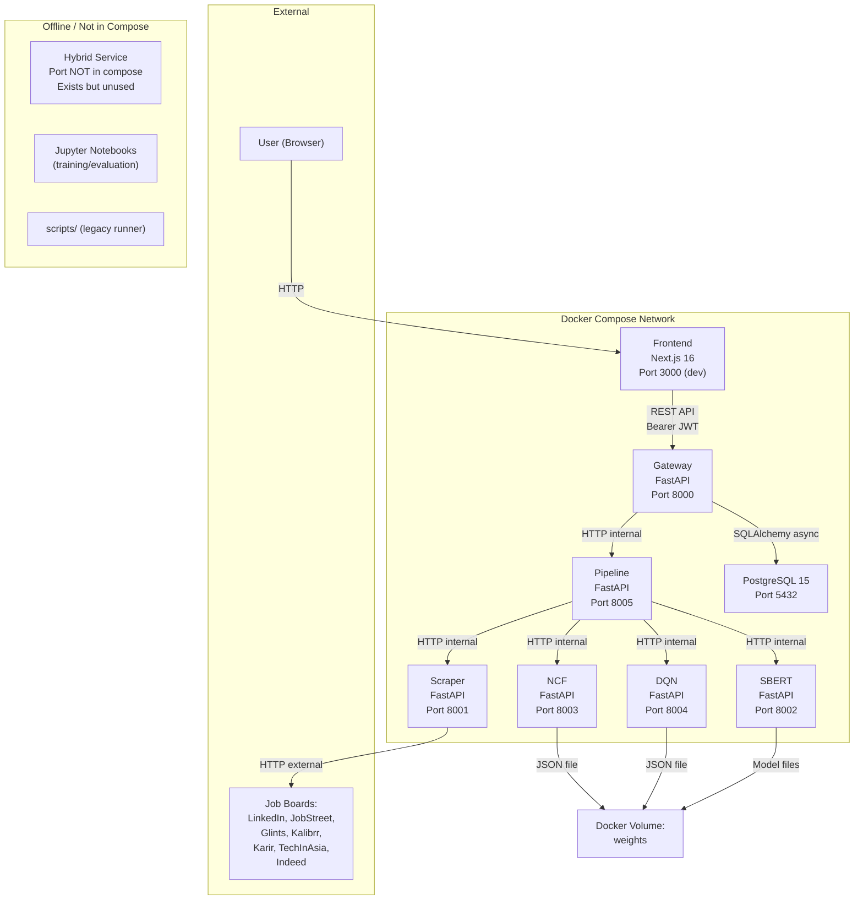

### Service Communication Matrix

| From | To | Protocol | Purpose |
|------|-----|----------|---------|
| Gateway | Pipeline | HTTP (httpx) | Recommendation requests, learning path |
| Gateway | Postgres | SQLAlchemy asyncpg | Auth, jobs, applications, profiles |
| Pipeline | Scraper | HTTP (httpx) | Fetch job candidates |
| Pipeline | SBERT | HTTP (httpx) | Encode profile + jobs, compute similarity |
| Pipeline | NCF | HTTP (httpx) | Score jobs via matrix factorization |
| Pipeline | DQN | HTTP (httpx) | Rerank jobs via Q-function |
| Scraper | Job boards | HTTP (httpx + BeautifulSoup) | Fetch live job listings |
| Frontend | Gateway | Fetch API | All data operations |

---

## 3. System Flowchart

### Full App Flow: User Action to Recommendation Result

```mermaid
flowchart LR
    A["User opens<br/>/recommendations"] --> B["Frontend<br/>Next.js page"]
    B --> C["Auth check:<br/>localStorage JWT"]
    C -->|"No token"| D["Redirect to /auth"]
    C -->|"Has token"| E["POST /api/recommendations<br/>with Bearer token"]
    E --> F["Gateway:<br/>1. Validate JWT<br/>2. Load user from DB<br/>3. Build profile payload"]
    F --> G["Gateway POST<br/>/pipeline/run"]
    G --> H["Pipeline Stage 1:<br/>Scrape or DB candidates"]
    H --> I["Pipeline Stage 2:<br/>SBERT encode + cosine similarity"]
    I --> J["Pipeline Stage 3:<br/>NCF predict scores"]
    J --> K["Pipeline Stage 4:<br/>DQN rank + Q-values"]
    K --> L["Pipeline Stage 5:<br/>Aggregate with skill alignment"]
    L --> M["Pipeline returns<br/>ranked jobs + scores"]
    M --> N["Gateway:<br/>1. Upsert jobs to DB<br/>2. Map to frontend schema"]
    N --> O["JSON response:<br/>recommendations[]"]
    O --> P["Frontend renders<br/>job cards + score bars"]
```

---

## 4. Data Flow Diagram

### How Data Moves Through the System

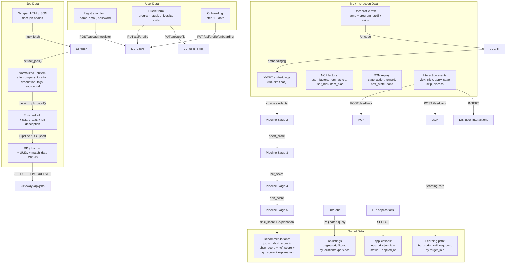

---

## 5. Sequence Diagram

### Runtime Interaction: User Opens Recommendations Page

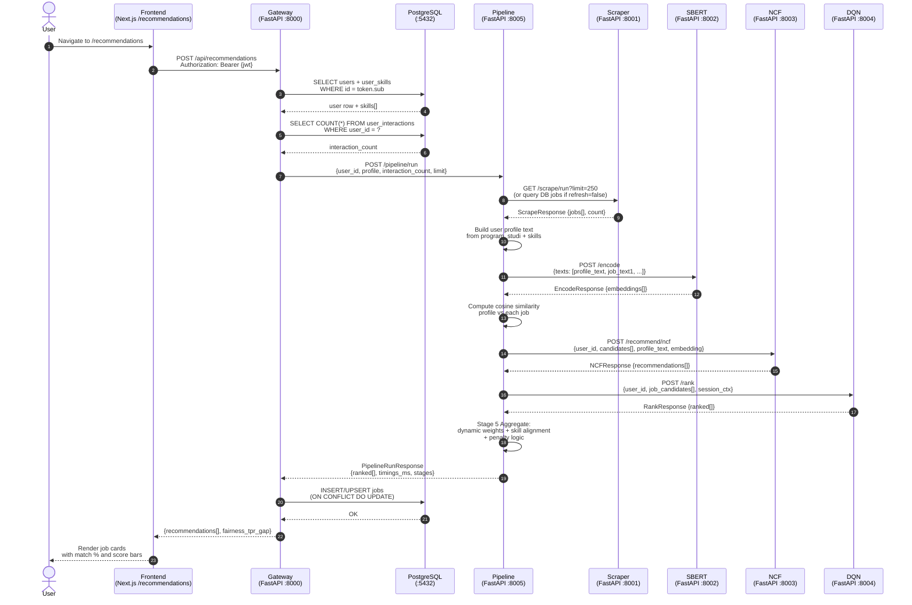

---

## 6. Pipeline Flowchart

### ML and Scraping Pipeline (5 Stages)

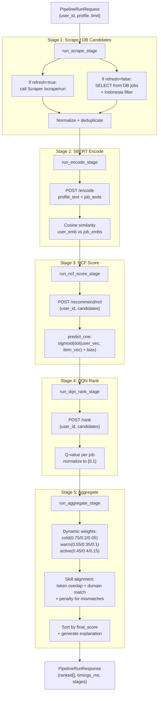

---

## 7. Database ERD

### Core Tables (from `db/models.py` and migrations 001-005)

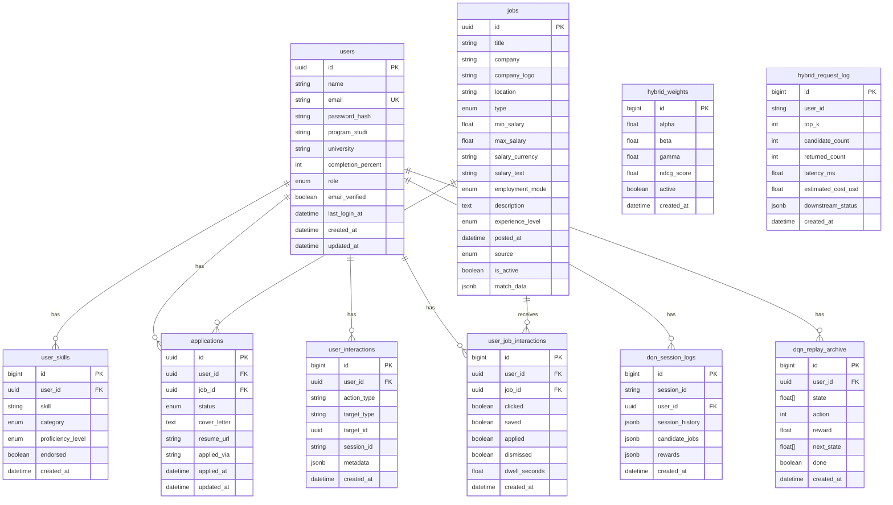

### Table Summary

| Table | Source | Status | Notes |
|-------|--------|--------|-------|
| `users` | models.py + 001 | Active | Core auth/profile table |
| `jobs` | models.py + 001 + 004 + 005 | Active | `company_logo` added in 004, `salary_text` in 005 |
| `applications` | models.py + 001 | Active | User job applications |
| `user_skills` | models.py + 001 | Active | Many-to-one with users |
| `user_interactions` | models.py + 001 | Active | DQN training data (action logs) |
| `user_job_interactions` | 003 | Active | Fine-grained click/save/apply/dismiss |
| `dqn_session_logs` | 003 | Active | DQN session state |
| `dqn_replay_archive` | 003 | Active | DQN replay buffer persisted to DB |
| `hybrid_weights` | 003 | Exists but unused | No runtime code writes to this table |
| `hybrid_request_log` | 003 | Exists but unused | No runtime code writes to this table |

### Missing / Recommended Tables

| Table | Why Missing | Recommendation |
|-------|-------------|----------------|
| `cv_resumes` | No resume upload feature exists in frontend or gateway | Add if CV parsing is needed |
| `email_verifications` | Email verification flag exists but no email service is wired | Add SMTP integration first |
| `job_skills` | Skills are stored in `match_data` JSONB or inferred at runtime | Normalize if frequent skill queries needed |
| `career_paths` | DQN `/learning-path` returns hardcoded sequences | Persist user-generated paths if needed |

---

## 8. Focused Diagrams

### 8.1 Scraper Flow

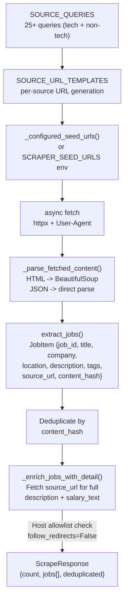

**Key implementation details**

- `LOCAL_SOURCE_HOSTS` allowlist prevents SSRF in detail enrichment
- `INDONESIA_TERMS` filters for Indonesia-specific jobs
- `SOURCE_QUERIES` includes both tech (software engineer, python) and non-tech (HR, finance, marketing, nurse, teacher, legal)
- If no seeds configured, falls back to bundled HTML sample data
- Concurrency controlled by `SCRAPER_CONCURRENCY` semaphore (default 6)

### 8.2 SBERT Flow

```mermaid
flowchart TD
    A["User profile text:<br/>name + program_studi + skills"] --> B{"SBERT_ENABLE_TRANSFORMER=1?"}
    B -->|Yes| C["Load sentence-transformers<br/>paraphrase-multilingual-MiniLM-L12-v2"]
    B -->|No (default)| D["deterministic_embedding()<br/>Category scores + stable noise"]
    C --> E["model.encode(texts)<br/>384-dim float[]"]
    D --> F["_category_scores(tokens)<br/>+ _stable_noise(token)<br/>+ normalize"]
    E --> G["Cosine similarity<br/>profile_emb vs job_emb"]
    F --> G
    G --> H["Score in [0,1]<br/>via (cos + 1) / 2"]
    H --> I{"Redis configured?"}
    I -->|Yes| J["Cache embedding<br/>SHA256 key -> Redis"]
    I -->|No| K["Return directly"]
```

**Key implementation details**

- Two runtime modes: real transformer (requires `SBERT_ENABLE_TRANSFORMER=1`) or deterministic fallback
- Fallback uses 7 category aliases (communication, language, event, software, data, business, design) with Indonesian normalization
- Embedding dimension: 384
- Optional Redis caching with TTL (default 3600s)
- Endpoints: `POST /encode`, `POST /match/semantic`, `GET /metrics`

### 8.3 NCF Flow

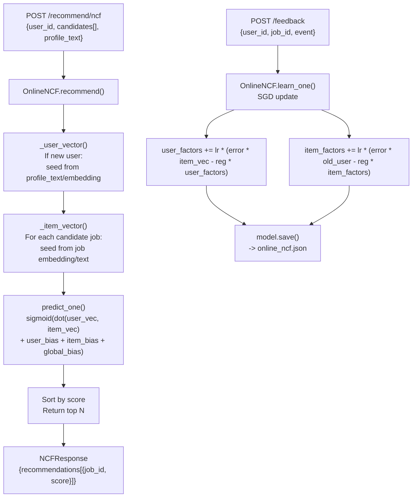

**Key implementation details**

- Online matrix factorization with SGD on implicit feedback
- Factor dimension: 64 (configurable via `NCF_FACTOR_DIM`)
- Learning rate: 0.045, Regularization: 0.0005
- Event targets: apply=1.0, click=1.0, save=0.85, view=0.45, skip=0.02
- Persisted to `online_ncf.json` (JSON file, not DB)
- NeuralCF PyTorch class exists but is not used in the online path (numpy path is active)

### 8.4 DQN Flow

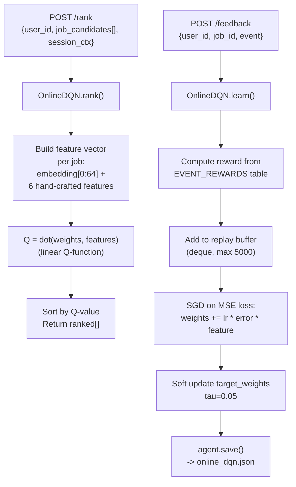

**Key implementation details**

- Linear Q-function (no hidden layers in production), not the QNetwork class
- Feature dimension: 64 + 6 = 70
- Replay buffer: deque(maxlen=5000)
- Learning rate: 0.03, Gamma: 0.92
- Persisted to `online_dqn.json`
- `/learning-path` is hardcoded skill sequences by role (data scientist, backend, frontend, business analyst, MC, etc.)

### 8.5 Hybrid / Aggregation Flow

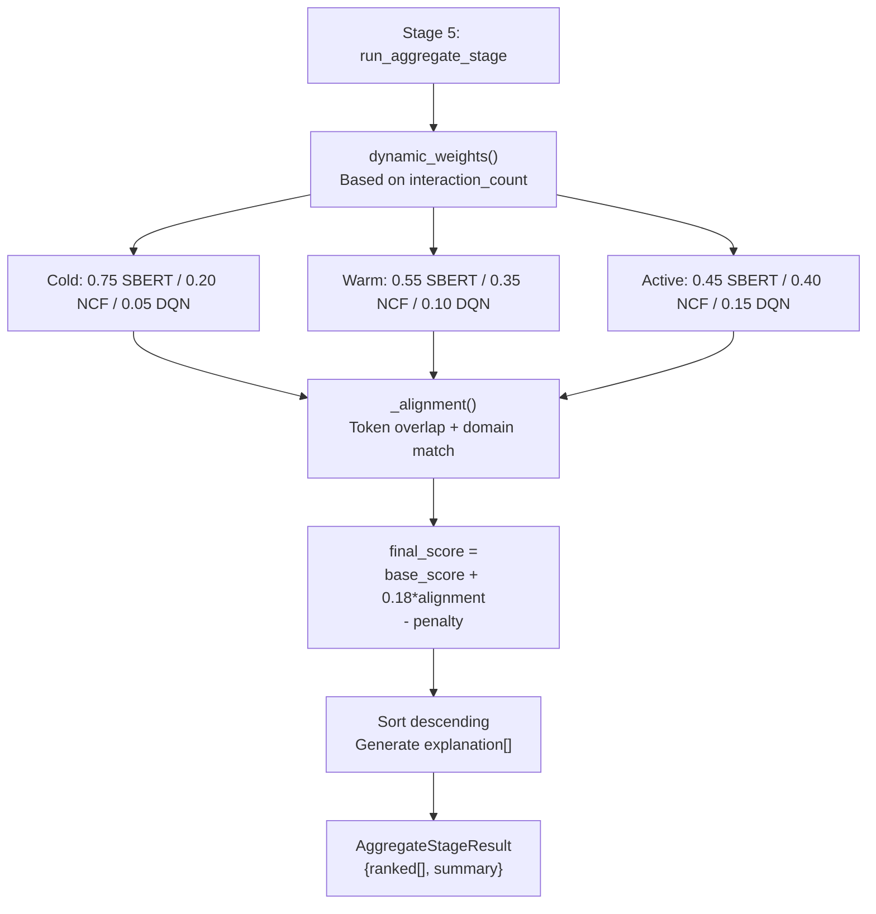

**Note on the standalone Hybrid service**

- `services/hybrid/main.py` exists as a standalone FastAPI service
- It has circuit breaker logic, fairness tracking, and fallback scoring
- **It is NOT in docker-compose.yml and is NOT called by the pipeline**
- The pipeline uses `stage_5_aggregate.py` for aggregation instead
- The hybrid service is effectively disconnected from the runtime architecture

### 8.6 API Endpoint Flow

#### Gateway Endpoints (`services/gateway/main.py`)

| Method | Path | Handler | Description |
|--------|------|---------|-------------|
| GET | `/` | root | Service info |
| GET | `/health` | health | Health check |
| GET | `/ready` | ready | Ready check (probes pipeline) |
| GET | `/api/company-logo` | proxy_company_logo | Logo proxy with host allowlist |
| POST | `/api/auth/register` | register | Create user + return JWT |
| POST | `/api/auth/login` | login | Verify password + return JWT |
| GET | `/api/auth/me` | me | Return current user + skills |
| PUT | `/api/profile` | update_profile | Update user profile + skills |
| PUT | `/api/profile/onboarding` | onboarding | Save onboarding step data |
| GET | `/api/jobs` | get_jobs | Paginated job listings (Indonesia filter in SQL) |
| GET | `/api/jobs/{job_id}` | get_job | Single job detail |
| GET | `/api/applications` | get_applications | User's applications |
| POST | `/api/applications` | create_applications | Submit applications |
| POST | `/api/learning-path` | learning_path | Calls DQN /learning-path directly |
| POST | `/api/recommendations` | run_pipeline | Calls Pipeline /pipeline/run |
| POST | `/pipeline/run` | run_pipeline_direct | Direct pipeline proxy |

#### Pipeline Endpoints (`services/pipeline/main.py`)

| Method | Path | Description |
|--------|------|-------------|
| GET | `/health` | Health + downstream status |
| POST | `/pipeline/run` | Run full 5-stage pipeline |
| GET | `/training/status` | Continual training state |
| POST | `/training/run-once` | Trigger one training cycle |
| POST | `/feedback` | Forward feedback to NCF + DQN |

#### Scraper Endpoints (`services/scraper/main.py`)

| Method | Path | Description |
|--------|------|-------------|
| GET | `/health` | Health + seed config |
| POST | `/scrape/html` | Extract jobs from provided HTML |
| POST | `/scrape/url` | Fetch URL then extract jobs |
| POST | `/scrape/run` | Run full scrape cycle |
| GET | `/sample` | Return bundled sample jobs |

#### SBERT Endpoints (`services/sbert/main.py`)

| Method | Path | Description |
|--------|------|-------------|
| GET | `/health` | Health check |
| POST | `/match/semantic` | Score user vs job descriptions |
| POST | `/encode` | Encode texts to embeddings |
| GET | `/metrics` | Service metrics |

#### NCF Endpoints (`services/ncf/main.py`)

| Method | Path | Description |
|--------|------|-------------|
| GET | `/health` | Health check |
| POST | `/jobs/upsert` | Add/update job item factors |
| POST | `/feedback` | Record feedback event + SGD update |
| POST | `/train` | Trigger training batch |
| POST | `/predict` | Predict score for single user-job pair |
| POST | `/recommend/ncf` | Recommend top-N for user |
| POST | `/users/{user_id}/invalidate` | Remove user factors (e.g., profile change) |
| GET | `/model/status` | Model metrics |

#### DQN Endpoints (`services/dqn/main.py`)

| Method | Path | Description |
|--------|------|-------------|
| GET | `/health` | Health check |
| POST | `/jobs/upsert` | Add/update job features |
| POST | `/rank` | Rank candidates by Q-value |
| POST | `/learning-path` | Return hardcoded skill sequence |
| POST | `/rerank` | Rerank with session history |
| POST | `/reward` | Record reward + learn |
| POST | `/feedback` | Alias for /reward |
| POST | `/train` | Soft update + save |
| GET | `/model/status` | Model metrics |

### 8.7 Frontend Page / Component Flow

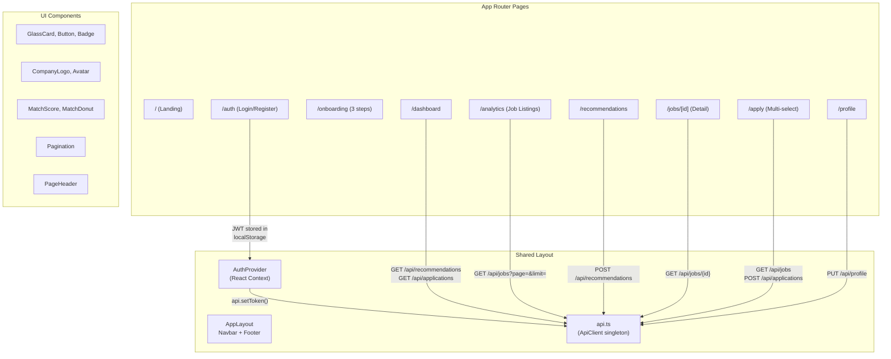

**Frontend route mapping**

| Page | API Calls | Key Feature |
|------|-----------|-------------|
| `/` | None | Marketing landing |
| `/auth` | `POST /api/auth/login`, `POST /api/auth/register` | JWT auth |
| `/onboarding` | `PUT /api/profile/onboarding` | Step 1-3 wizard |
| `/dashboard` | `POST /api/recommendations`, `GET /api/applications`, `POST /api/learning-path` | Overview + quick actions |
| `/profile` | `GET /api/auth/me`, `PUT /api/profile` | Edit skills + program |
| `/analytics` | `GET /api/jobs` | Job listings + filters + pagination |
| `/recommendations` | `POST /api/recommendations` | ML recommendations with score breakdown |
| `/jobs/[id]` | `GET /api/jobs/{id}` | Job detail + apply link |
| `/apply` | `GET /api/jobs`, `POST /api/applications` | Multi-select application submit |

### 8.8 Docker / Runtime Flow

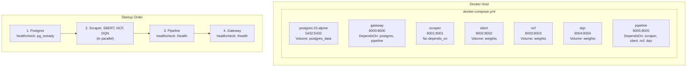

**Docker Compose services**

| Service | Image | Build Context | Ports | Environment Key |
|---------|-------|--------------|-------|----------------|
| postgres | postgres:15-alpine | N/A | 5432 | `POSTGRES_USER`, `POSTGRES_PASSWORD`, `POSTGRES_DB` |
| gateway | Dockerfile | `./services/gateway` | 8000 | `PIPELINE_URL`, `DATABASE_URL`, `JWT_SECRET` |
| scraper | Dockerfile | `./services/scraper` | 8001 | `SCRAPER_SEED_URLS`, `JOBS_TARGET` |
| sbert | Dockerfile | `./services/sbert` | 8002 | `MODEL_NAME`, `SBERT_ENABLE_TRANSFORMER` |
| ncf | Dockerfile | `./services/ncf` | 8003 | `MODEL_DIR` |
| dqn | Dockerfile | `./services/dqn` | 8004 | `MODEL_DIR` |
| pipeline | Dockerfile | `./services/pipeline` | 8005 | `SCRAPER_URL`, `SBERT_URL`, `NCF_URL`, `DQN_URL` |

**No Redis container** is defined in docker-compose.yml. Redis is optional in SBERT only.

**No Celery/RabbitMQ/Kafka** is used anywhere in the runtime.

### 8.9 Evaluation Metrics Flow

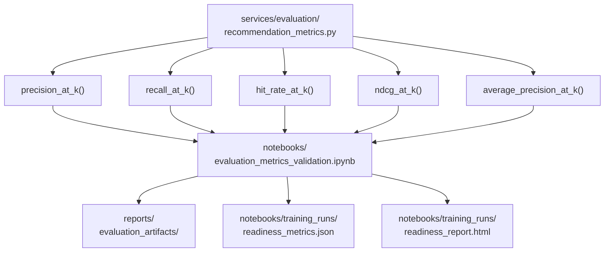

**Evaluation artifacts**

| Path | Type | Purpose |
|------|------|---------|
| `services/evaluation/recommendation_metrics.py` | Python module | Reusable metrics functions |
| `notebooks/evaluation_metrics_validation.ipynb` | Jupyter notebook | Metric validation with charts |
| `notebooks/scpa_ml_readiness_evaluation.ipynb` | Jupyter notebook | Full ML readiness evaluation |
| `notebooks/training_runs/readiness/` | Directory | PNG figures + JSON metrics |
| `reports/evaluation_artifacts/` | Directory | Generated evaluation reports |
| `reports/full_pipeline_artifacts/` | Directory | Full pipeline run outputs |

---

## 9. Legacy or Unused Components

| Component | Location | Status | Notes |
|-----------|----------|--------|-------|
| Hybrid service | `services/hybrid/main.py` | Exists but disconnected | Not in docker-compose, not called by pipeline. Pipeline uses `stage_5_aggregate.py` instead. |
| Hybrid DB tables | `hybrid_weights`, `hybrid_request_log` | Created by migration 003 but unused | No code writes or reads these tables |
| Full pipeline scripts | `scripts/run_full_pipeline.py`, `scripts/retrain_pipeline.py`, `scripts/demo_pipeline.py` | Legacy | Pipeline now orchestrates via HTTP internally; scripts may be stale |
| Sample dataset | `data/sample/` | Legacy | Used by notebooks and old scripts; runtime uses live scraper + DB |
| Training scripts | `services/*/training/train*.py` | Offline only | Used to generate initial weights; not part of Docker runtime |
| Notebooks | `notebooks/*.ipynb` | Offline only | Training, evaluation, and validation notebooks |
| Kubernetes configs | `infra/k8s/` | Exists but unused | No evidence of K8s deployment |
| Nginx config | `infra/nginx.conf` | Exists but unused | No nginx container in compose |
| Browser E2E scripts | `browser_e2e.py`, `browser_screenshots/` | Temporary debug | Not part of the application |
| Insert scripts | `insert_scraped.py`, `check_scrape.py`, `check_overflow.py` | Temporary debug | One-off data operations |
| `services/shared/auth.py` | Shared module | Partially used | Contains auth utilities; gateway has its own auth logic too |
| PyTorch model classes | `NeuralCF` in `services/ncf/main.py`, `QNetwork` in `services/dqn/main.py` | Defined but not used in production | Runtime uses numpy-based online models |

---

## 10. Implementation Notes and Gotchas

### What is different from the "planned" architecture

1. **Hybrid service is not used**: The standalone `services/hybrid/main.py` exists but the pipeline uses `stage_5_aggregate.py` for scoring. The hybrid service's circuit breaker and fairness tracker are not in the active data path.

2. **DQN is a linear model, not a deep network**: The `QNetwork` PyTorch class is defined but never instantiated in production. The active `OnlineDQN` uses a simple linear weight vector and SGD.

3. **NCF is numpy-based matrix factorization, not the PyTorch NeuralCF**: Similar to DQN, the `NeuralCF` class exists but the runtime uses `OnlineNCF` with numpy arrays and SGD.

4. **SBERT defaults to deterministic fallback**: The transformer model is only loaded when `SBERT_ENABLE_TRANSFORMER=1`. By default, the service uses deterministic token-category scoring without downloading any model weights.

5. **Learning path is hardcoded**: The DQN `/learning-path` endpoint returns pre-defined skill sequences per role. It does not dynamically generate paths based on market data or user progress.

6. **No message queue**: There is no Celery, RabbitMQ, or Kafka. All inter-service communication is synchronous HTTP via httpx.

7. **No real email service**: SMTP configuration exists in `.env.example` but no email sending code exists in the gateway.

8. **No CV/resume parsing**: There is no upload endpoint, no CV table, and no parsing service.

9. **Analytics page shows job listings, not analytics**: The `/analytics` route in the frontend renders the job listing page with filters and pagination. There are no charts, dashboards, or skill-demand analytics.

10. **Continual training is just re-scraping**: The pipeline's `_continual_training_loop()` re-runs the scraper + encoder + upserts to NCF/DQN on a timer. It does not perform model retraining from scratch.

---

## 11. File Inventory

### Key source files by service

| Service | Key Files |
|---------|-----------|
| Gateway | `services/gateway/main.py` |
| Scraper | `services/scraper/main.py` |
| SBERT | `services/sbert/main.py` |
| NCF | `services/ncf/main.py` |
| DQN | `services/dqn/main.py` |
| Pipeline | `services/pipeline/main.py`, `services/pipeline/stages/stage_1_scrape.py` through `stage_5_aggregate.py` |
| Hybrid (unused) | `services/hybrid/main.py` |
| DB Models | `db/models.py` |
| Migrations | `db/migrations/001_initial_schema.py` through `005_add_salary_text.py` |
| Frontend API | `frontend/src/lib/api.ts` |
| Frontend Auth | `frontend/src/lib/auth-context.tsx` |
| Evaluation | `services/evaluation/recommendation_metrics.py` |

### Configuration files

| File | Purpose |
|------|---------|
| `docker-compose.yml` | 7-service compose definition |
| `.env.example` | Environment variable template |
| `alembic.ini` | Database migration config |
| `requirements.txt` | Root Python dependencies |
| `frontend/package.json` | Next.js dependencies |
| `frontend/next.config.ts` | Next.js config |
| `frontend/tailwind.config.ts` | Tailwind CSS config |

---

*End of architecture documentation. This file was generated by auditing the actual codebase, not from an ideal or planned version of the system.*
