# SCPA Detailed System Diagram

This document explains the current SCPA project as it exists in code today.
It is written for two audiences at the same time:

- Non-technical readers can follow the plain-language story and the simple diagrams.
- Technical reviewers can trace each feature to the service, endpoint, data store, and model path that implements it.

## How to Read This File

SCPA means Smart Career Pathway Assistant. The app helps a student or job seeker create a profile, find Indonesian job listings, and receive ranked job recommendations.

The project uses service names such as SBERT, NCF, and DQN. Those names are useful shorthand, but the current implementation has important runtime differences:

| Label in this document | Meaning |
|---|---|
| Active runtime | Used by the frontend, gateway, Docker Compose, or the pipeline API. |
| Optional runtime | Can be enabled by environment variable or manual command. |
| Offline/demo | Used by scripts, notebooks, generated reports, or thesis/demo runs. |
| Disconnected | Code exists, but is not currently called by the active runtime path. |
| Risk | A behavior that may mislead users, evaluators, or future developers if not documented. |

## One-Screen Summary

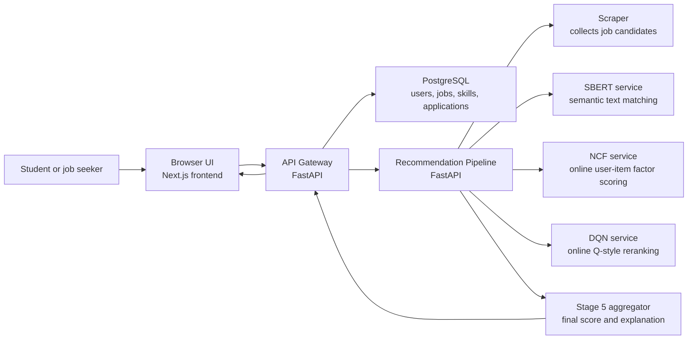

Plain-language version:

1. The user logs in and fills out a profile.
2. The frontend asks the gateway for recommendations.
3. The gateway loads the user's profile and skills from the database.
4. The gateway asks the pipeline to rank jobs.
5. The pipeline gathers job candidates, scores them with SBERT, NCF, and DQN-style signals, then combines the scores.
6. The gateway stores or updates the recommended jobs in PostgreSQL.
7. The frontend shows job cards with match percentage, score breakdown, company logo, and explanation text.

## Project Map

| Area | Path | What it owns | Runtime status |
|---|---|---|---|
| Frontend app | `frontend/src/app/` | Pages for auth, onboarding, dashboard, profile, jobs, applications, recommendations | Active runtime |
| Frontend API client | `frontend/src/lib/api.ts` | Browser-to-gateway calls and JWT storage | Active runtime |
| Gateway | `services/gateway/main.py` | Auth, profile, jobs, applications, recommendation proxy, logo proxy | Active runtime |
| Pipeline | `services/pipeline/main.py` | Orchestrates scraper -> SBERT -> NCF -> DQN -> aggregate | Active runtime |
| Pipeline stages | `services/pipeline/stages/` | Individual recommendation stages | Active runtime |
| Scraper | `services/scraper/main.py` | Extracts and normalizes job listings | Active runtime |
| SBERT service | `services/sbert/main.py` | Text embeddings and semantic similarity | Active runtime, with optional transformer |
| NCF service | `services/ncf/main.py` | Online matrix-factor user-job scoring | Active runtime |
| DQN service | `services/dqn/main.py` | Online Q-style job reranking and its own hardcoded learning path endpoint | Active runtime, but not used by gateway learning path |
| Hybrid service | `services/hybrid/main.py` | Separate hybrid API with circuit-breaker/fairness ideas | Disconnected from Docker and active pipeline |
| Database models | `db/models.py` | SQLAlchemy model definitions | Active for gateway and migrations |
| Migrations | `db/migrations/` | PostgreSQL schema changes | Active setup path |
| Evaluation | `services/evaluation/recommendation_metrics.py` | Ranking metrics such as Precision@K, Recall@K, NDCG@K | Offline/demo |
| Scripts | `scripts/` | Training, full pipeline demo, verification, reports | Offline/demo |
| Notebooks | `notebooks/` | ML readiness and metric reports | Offline/demo |
| Reports | `reports/` | Generated metrics, recommendations, artifacts, research extraction | Offline/demo |

## Feature Inventory

| Feature | User-facing result | Primary code path | Data touched | Current caveat |
|---|---|---|---|---|
| Registration | User creates account and receives JWT | `POST /api/auth/register` in gateway | `users` | No email verification flow is wired. |
| Login | User receives access token | `POST /api/auth/login` | `users.last_login_at` | Token is stored in browser localStorage. |
| Current user | Frontend gets profile and skills | `GET /api/auth/me` | `users`, `user_skills` | Skills are returned as structured rows. |
| Profile edit | User updates name, study program, university, skills | `PUT /api/profile` | `users`, `user_skills` | Gateway invalidates NCF user factor best-effort. |
| Onboarding | Three-step profile completion | `PUT /api/profile/onboarding` | `users`, `user_skills` | Step 3 only updates completion percent. |
| Job listing | User browses paginated jobs | `GET /api/jobs` | `jobs.match_data` | SQL filters for Indonesian sources/locations. |
| Job detail | User opens a job page | `GET /api/jobs/{job_id}` | `jobs` | String job IDs are mapped to stable UUIDs. |
| Apply to jobs | User submits selected jobs | `POST /api/applications` | `applications` | Application creation is not forwarded as model feedback. |
| Recommendations | User sees ranked jobs and score bars | `POST /api/recommendations` -> pipeline | `users`, `user_skills`, `jobs`, model JSON weights | Gateway returns an empty list if pipeline is unavailable. |
| Learning path | Dashboard suggests skills to learn | `POST /api/learning-path` in gateway | `user_skills` | Gateway uses hardcoded rule-based list, not the DQN service. |
| Company logo proxy | Browser loads safe company logos | `GET /api/company-logo` | External image host | Only allowlisted HTTPS logo hosts are proxied. |
| Background scraping/training | Pipeline periodically refreshes job candidates | `_continual_training_loop()` in pipeline | `jobs`, NCF/DQN JSON files | This refreshes/upserts jobs and model inputs; it is not full retraining. |
| Offline reports | Thesis/demo metrics and artifacts | `scripts/run_full_pipeline.py`, notebooks | `reports/`, `notebooks/training_runs/` | Metrics are sample/demo dependent. |

## Runtime Architecture

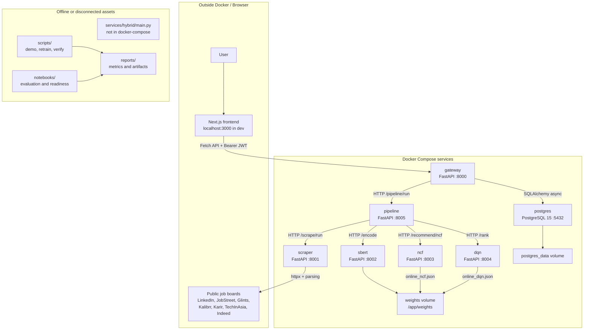

### Service Communication Matrix

| Caller | Target | Protocol | Main request | Main response |
|---|---|---|---|---|
| Frontend | Gateway | HTTP/JSON | Auth, profile, jobs, applications, recommendations | User/job/recommendation JSON |
| Gateway | PostgreSQL | SQLAlchemy async | User, skill, job, application reads/writes | Rows and counts |
| Gateway | Pipeline | HTTP/JSON | `/pipeline/run`, `/pipeline/invalidate-user/{id}` | Ranked jobs, stage summaries |
| Pipeline | Scraper | HTTP/JSON | `/scrape/run` | Normalized job candidates |
| Pipeline | SBERT | HTTP/JSON | `/encode` | User/job embeddings |
| Pipeline | NCF | HTTP/JSON | `/recommend/ncf`, `/feedback`, `/jobs/upsert` | User-job scores and training status |
| Pipeline | DQN | HTTP/JSON | `/rank`, `/reward`, `/jobs/upsert` | Q-style ranking scores and training status |
| Scraper | Job boards | HTTP/HTML/JSON | Search/result pages and optional detail pages | Raw page content |

## User Journey: Recommendation Request

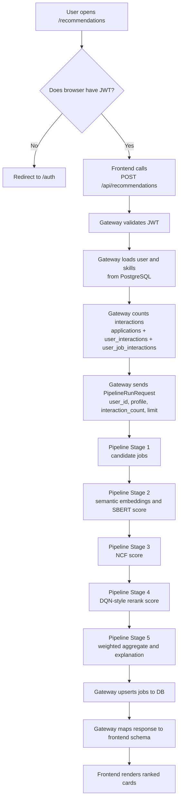

### Sequence Diagram

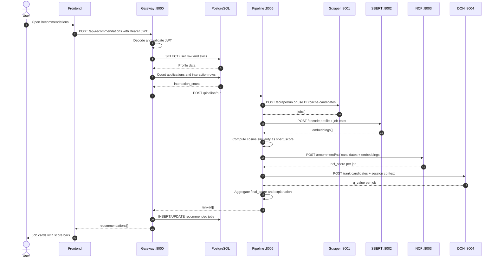

## Recommendation Pipeline: Six-Stage Interpretation

The active pipeline is implemented as five code stages. In recommendation-system language, it behaves like a candidate pipeline:

| Recsys concept | SCPA stage | Code | What happens |
|---|---|---|---|
| Source | Stage 1 | `stage_1_scrape.py` | Load candidate jobs from database, in-memory cache, scraper, or fallback jobs. |
| Hydrator | Stage 2 | `stage_2_encode.py` | Add embeddings and semantic scores. |
| Scorer | Stage 3 | `stage_3_ncf_score.py` | Add NCF score. |
| Scorer/reranker | Stage 4 | `stage_4_dqn_rank.py` | Add DQN-style rank score. |
| Selector | Stage 5 | `stage_5_aggregate.py` | Compute final score, sort, return top K. |
| Side effect | Gateway and pipeline feedback endpoints | `gateway/main.py`, `pipeline/main.py` | Upsert jobs, optional feedback forwarding. Frontend feedback is not wired yet. |

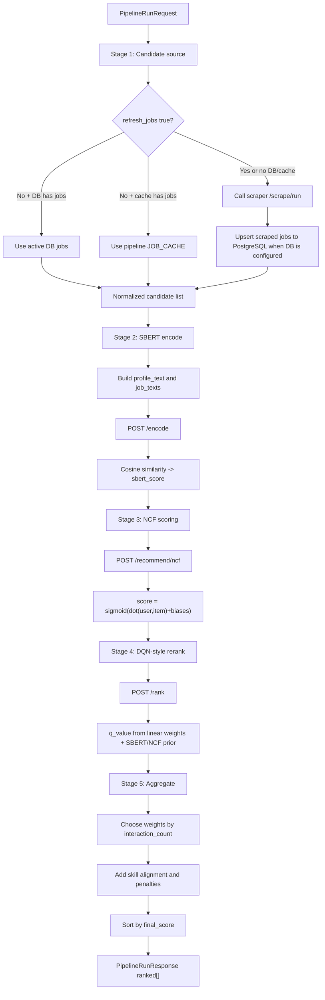

### Active Aggregation Weights

| User segment | Condition | SBERT weight | NCF weight | DQN weight | Meaning |
|---|---:|---:|---:|---:|---|
| Cold | `interaction_count <= 0` | 0.75 | 0.20 | 0.05 | Trust profile text and skill alignment most. |
| Warm | `1 <= interaction_count <= 20` | 0.55 | 0.35 | 0.10 | Start trusting interaction patterns. |
| Active | `interaction_count > 20` | 0.45 | 0.40 | 0.15 | Give learned feedback more influence. |

The final score is:

```text
base_score = SBERT*w_sbert + NCF*w_ncf + DQN*w_dqn
final_score = clamp(base_score + 0.18*skill_alignment - penalty, 0, 1)
```

## Model-Service Truth Table

| Service name | What the name suggests | What the active code does | Correct way to describe it now |
|---|---|---|---|
| SBERT | Sentence-BERT semantic embeddings | Uses `SentenceTransformer` only when `SBERT_ENABLE_TRANSFORMER=1`; otherwise uses deterministic category/token embeddings. Docker Compose sets the transformer flag to `1`. Local tests often force fallback mode. | "SBERT service with optional real SentenceTransformer and deterministic fallback." |
| NCF | Neural Collaborative Filtering with neural user-item interaction function | Defines a PyTorch `NeuralCF` class, but the active HTTP path uses `OnlineNCF`, an online matrix-factorization model with dot product and biases. | "Online collaborative filtering / matrix factor scorer." |
| DQN | Deep Q-Network reinforcement-learning agent | Defines a PyTorch `QNetwork`, but active `/rank` uses `OnlineDQN`, a linear Q-style scorer over job features with TD update support. | "Online Q-style reranker; not a full deep Q-network in active serving." |
| Hybrid | Separate hybrid service | `services/hybrid/main.py` exists, but Docker Compose and the active pipeline use `stage_5_aggregate.py` instead. | "Stage 5 aggregation is active; standalone hybrid service is disconnected." |

## SBERT Flow

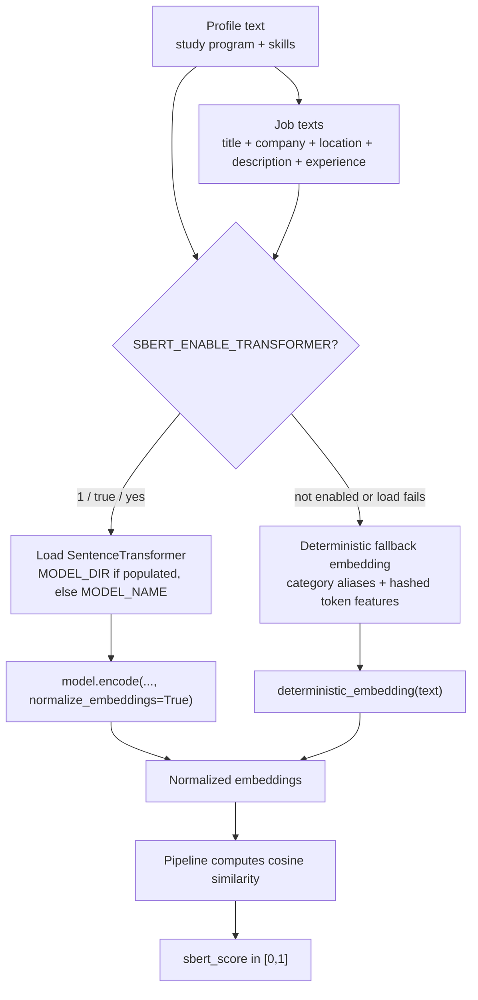

### SBERT Implementation Details

| Detail | Current behavior |
|---|---|
| Default model name | `sentence-transformers/paraphrase-multilingual-MiniLM-L12-v2` |
| Embedding dimension | 384 |
| Optional real model flag | `SBERT_ENABLE_TRANSFORMER=1` |
| Docker Compose setting | Sets `SBERT_ENABLE_TRANSFORMER: "1"` |
| Local fallback | Category aliases for communication, language, event, software, data, business, design, plus stable hashed token features |
| Optional cache | Redis if `REDIS_URL` exists |
| Main endpoint used by pipeline | `POST /encode` |
| Separate semantic endpoint | `POST /match/semantic` |
| Key risk | Some docs mention `SBERT_FORCE_FALLBACK`, but the service code only checks `SBERT_ENABLE_TRANSFORMER`. |

## NCF Flow

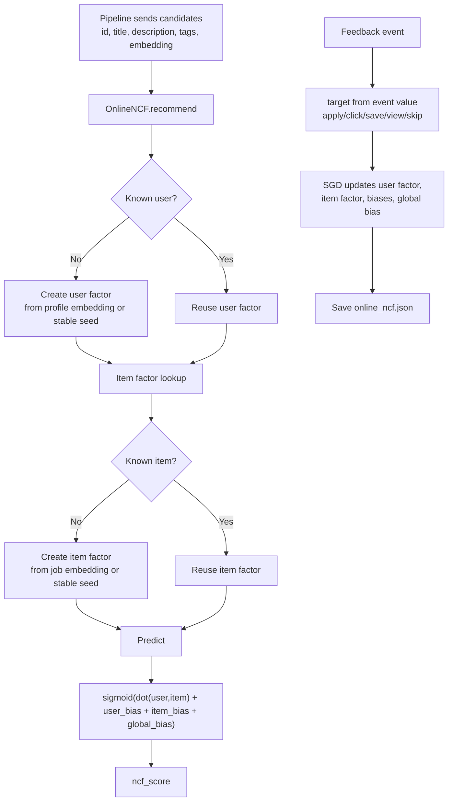

### NCF Implementation Details

| Detail | Current behavior |
|---|---|
| Active class | `OnlineNCF` |
| Factor dimension | `NCF_FACTOR_DIM`, default 64 |
| Learning rate | `NCF_LEARNING_RATE`, default 0.045 |
| Regularization | `NCF_REGULARIZATION`, default 0.0005 |
| Persistence | JSON file `online_ncf.json` in model directory |
| PyTorch `NeuralCF` class | Exists and can be used by training scripts, but is not the active HTTP serving path |
| Key risk | Calling the active path "NCF" can overclaim neural collaborative filtering because active inference uses a dot product, which the NCF paper specifically tried to move beyond. |

## DQN Flow

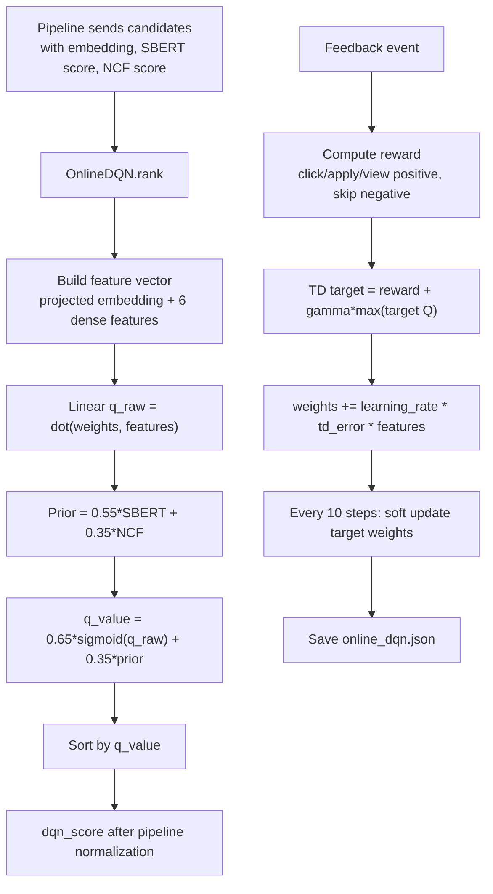

### DQN Implementation Details

| Detail | Current behavior |
|---|---|
| Active class | `OnlineDQN` |
| Feature dimension | `DQN_EMBED_DIM + 6`, default 70 |
| Learning rate | `DQN_LEARNING_RATE`, default 0.03 |
| Discount | `DQN_GAMMA`, default 0.92 |
| Persistence | JSON file `online_dqn.json` |
| Replay storage | In-memory deque during service life; only summary is saved to JSON |
| PyTorch `QNetwork` class | Exists and is used by training scripts, but not by active `/rank` |
| Learning path endpoint in DQN service | Hardcoded role-to-skill sequences |
| Gateway learning path endpoint | Does not call DQN service; it uses a separate hardcoded list |
| Key risk | This is a Q-style online reranker, not a full deep Q-network serving path. |

## Data Flow

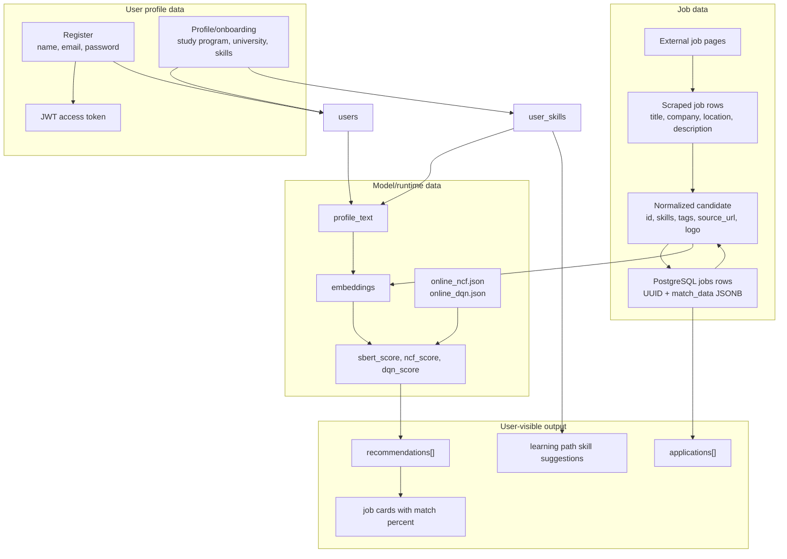

## Database ERD

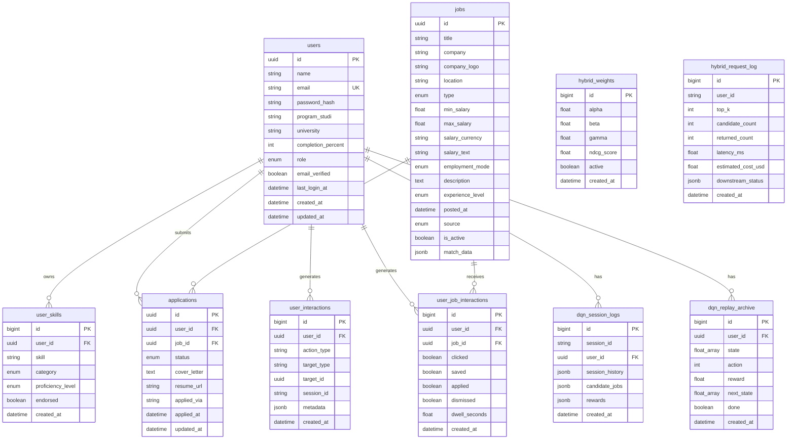

### Database Table Status

| Table | Current role |
|---|---|
| `users` | Active auth/profile table. |
| `user_skills` | Active profile-skill table. |
| `jobs` | Active job listing table. |
| `applications` | Active application table. |
| `user_interactions` | Counted by gateway, but frontend does not currently insert rows. |
| `user_job_interactions` | Counted by gateway, but no active frontend path writes it. |
| `dqn_session_logs` | Schema exists for DQN history, but active DQN runtime stores JSON file state. |
| `dqn_replay_archive` | Schema exists for DQN replay archive, but active DQN runtime does not write it. |
| `hybrid_weights` | Schema exists, but active aggregator uses hardcoded dynamic weights. |
| `hybrid_request_log` | Schema exists, but active runtime does not write request logs here. |

## Frontend Route Map

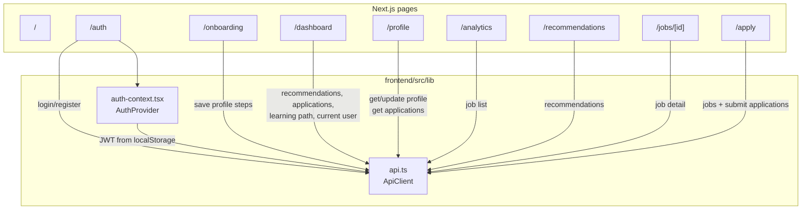

| Page | User sees | Gateway calls |
|---|---|---|
| `/` | Landing page | None |
| `/auth` | Login/register form | `/api/auth/login`, `/api/auth/register` |
| `/onboarding` | Profile wizard | `/api/profile/onboarding` |
| `/dashboard` | Overview, top recommendations, applications, suggested skills | `/api/recommendations`, `/api/applications`, `/api/learning-path`, `/api/auth/me` |
| `/profile` | Profile edit and application list | `/api/auth/me`, `/api/profile`, `/api/applications` |
| `/analytics` | Job listings with filters | `/api/jobs` |
| `/recommendations` | Ranked recommendations with score bars | `/api/recommendations` |
| `/jobs/[id]` | Single job detail | `/api/jobs/{id}` |
| `/apply` | Multi-select application flow | `/api/jobs`, `/api/applications` |

## API Surface

### Gateway Endpoints

| Method | Path | Auth | Purpose |
|---|---|---|---|
| GET | `/` | No | Gateway service info |
| GET | `/health` | No | Gateway health |
| GET | `/ready` | No | Gateway + pipeline readiness |
| GET | `/api/company-logo` | No | Logo proxy for allowlisted hosts |
| POST | `/api/auth/register` | No | Register and return JWT |
| POST | `/api/auth/login` | No | Login and return JWT |
| GET | `/api/auth/me` | Yes | Current user and skills |
| PUT | `/api/profile` | Yes | Update profile and skills |
| PUT | `/api/profile/onboarding` | Yes | Save onboarding step |
| GET | `/api/jobs` | No | Paginated Indonesian job list |
| GET | `/api/jobs/{job_id}` | No | Job detail |
| GET | `/api/applications` | Yes | User applications |
| POST | `/api/applications` | Yes | Create applications |
| POST | `/api/learning-path` | Yes | Rule-based suggested skills |
| POST | `/api/recommendations` | Yes | Authenticated recommendation run |
| POST | `/recommendations` | Yes | Alias for recommendation run |
| POST | `/pipeline/run` | No explicit auth dependency | Direct pipeline proxy |

### Pipeline Endpoints

| Method | Path | Purpose |
|---|---|---|
| GET | `/health` | Pipeline health and downstream URLs |
| POST | `/pipeline/run` | Full recommendation pipeline |
| GET | `/training/status` | Continual training/scrape cycle status |
| POST | `/training/run-once` | Trigger one scrape/embedding/upsert cycle |
| POST | `/feedback` | Forward feedback to NCF and DQN |
| POST | `/pipeline/invalidate-user/{user_id}` | Forward user factor invalidation to NCF |

### Model and Scraper Endpoints

| Service | Method | Path | Purpose |
|---|---|---|---|
| Scraper | GET | `/health` | Health and seed config |
| Scraper | POST | `/scrape/html` | Extract jobs from provided HTML |
| Scraper | POST | `/scrape/url` | Fetch and extract one URL |
| Scraper | POST | `/scrape/run` | Run scraping cycle |
| Scraper | GET | `/sample` | Return bundled sample jobs |
| SBERT | GET | `/health` | Health, model mode, embedding dimension |
| SBERT | POST | `/encode` | Encode text list |
| SBERT | POST | `/match/semantic` | Direct semantic score endpoint |
| SBERT | GET | `/metrics` | Operational metadata |
| NCF | GET | `/health` | Health and item/user counts |
| NCF | POST | `/jobs/upsert` | Add/update candidate item factors |
| NCF | POST | `/recommend/ncf` | Score candidates |
| NCF | POST | `/predict` | Alias to recommendation scoring |
| NCF | POST | `/feedback` | Learn from feedback event |
| NCF | POST | `/train` | Demo training batch |
| NCF | POST | `/users/{user_id}/invalidate` | Clear user factor/bias |
| NCF | GET | `/model/status`, `/metrics` | Model metadata |
| DQN | GET | `/health` | Health and training steps |
| DQN | POST | `/jobs/upsert` | Add/update job features |
| DQN | POST | `/rank` | Rank job candidates |
| DQN | POST | `/rerank` | Rank with session history |
| DQN | POST | `/reward`, `/feedback` | Learn from reward event |
| DQN | POST | `/learning-path` | Hardcoded role-skill path from DQN service |
| DQN | POST | `/train` | Soft update/save |
| DQN | GET | `/model/status`, `/metrics` | Model metadata |

## Background Training and Feedback

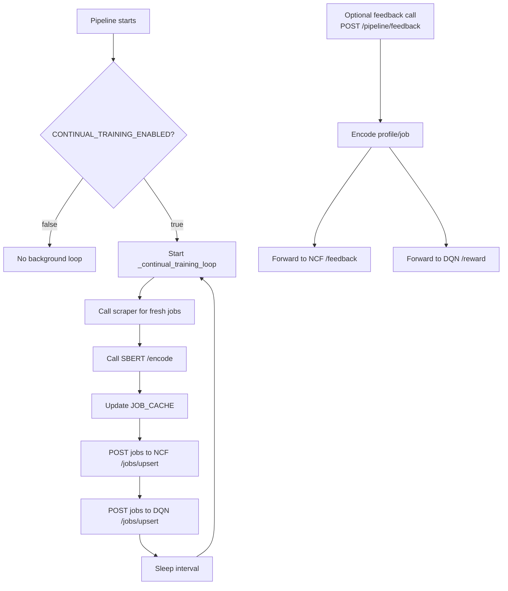

Important current limitation: the frontend API client has no `feedback` method. Users can view recommendation cards, open job detail, and apply, but those actions are not automatically sent to `/pipeline/feedback`.

## Docker Compose Startup Flow

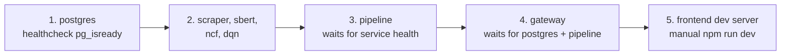

| Compose service | Port | Main environment variables |
|---|---:|---|
| postgres | 5432 | `POSTGRES_USER`, `POSTGRES_PASSWORD`, `POSTGRES_DB` |
| gateway | 8000 | `PIPELINE_URL`, `DATABASE_URL`, `JWT_SECRET`, `JWT_REFRESH_SECRET` |
| scraper | 8001 | `SCRAPER_SEED_URLS`, `JOBS_TARGET`, source enable flags |
| sbert | 8002 | `SBERT_ENABLE_TRANSFORMER`, `MODEL_NAME`, `MODEL_DIR` |
| ncf | 8003 | `MODEL_DIR` |
| dqn | 8004 | `MODEL_DIR` |
| pipeline | 8005 | `SCRAPER_URL`, `SBERT_URL`, `NCF_URL`, `DQN_URL`, `DATABASE_URL` |

Docker Compose does not include:

- Redis
- Celery
- RabbitMQ
- Kafka
- Nginx
- `services/hybrid`

## Offline Evaluation and Reports

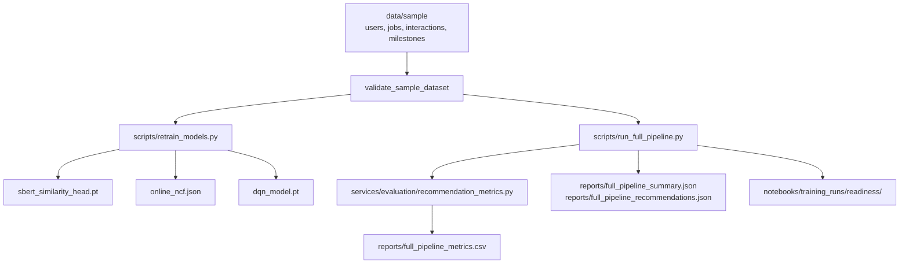

| Artifact | Purpose | Caveat |
|---|---|---|
| `reports/full_pipeline_metrics.csv` | Offline metric comparison | Depends on sample/demo labels. |
| `reports/full_pipeline_summary.json` | Full pipeline summary | Not the same as live frontend behavior. |
| `reports/full_pipeline_recommendations.json` | Demo recommendation output | Uses script-level flow. |
| `reports/retraining_artifacts/retraining_manifest.json` | Retraining summary | DQN checkpoint training is synthetic. |
| `reports/model_research_playwright.json` | Browser-backed source extraction for this review | Research artifact, not app runtime. |
| `notebooks/scpa_ml_readiness_evaluation.ipynb` | ML readiness notebook | Generated notebook should be regenerated from scripts when changed. |

## Failure and Fallback Paths

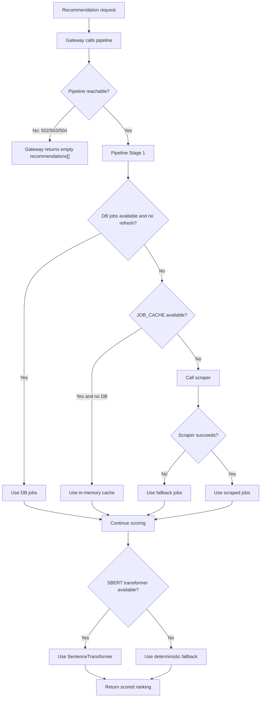

## Non-Technical Glossary

| Term | Meaning in SCPA |
|---|---|
| Frontend | The website the user clicks. |
| Gateway | The public backend API that checks login and talks to the database. |
| Pipeline | The internal service that decides how jobs should be ranked. |
| Scraper | The service that collects job listings from public sources. |
| SBERT score | A score for how similar the user's profile text is to the job text. |
| NCF score | A score based on learned user-job factors and feedback-like labels. |
| DQN score | A Q-style reranking signal based on job features and reward updates. |
| Hybrid/final score | The combined score shown as match percentage. |
| Cold start | A user with no prior interactions. The system trusts profile text more. |
| Warm/active user | A user with interaction history. The system trusts behavior scores more. |
| Fallback | A simpler path used when a model, service, or external source is unavailable. |

## Current Logical Risks Summary

The full code review is in `diagram/code_review.md`. The biggest flow-level risks are:

1. The gateway learning-path endpoint is rule-based and does not call the DQN service.
2. The active NCF serving path is matrix factorization, not neural collaborative filtering.
3. The active DQN serving path is a linear Q-style reranker, not a deep Q-network.
4. The frontend does not send click/view/save/skip feedback to the pipeline feedback endpoint.
5. Several docs/tests still describe older or planned behavior instead of active runtime behavior.

## Research Baseline Used for This Diagram

Browser-backed research was collected with Python Playwright using local Chrome and saved to `reports/model_research_playwright.json`.

Primary sources used:

- Sentence-BERT paper: https://arxiv.org/abs/1908.10084
- Hugging Face Sentence Transformers docs: https://huggingface.co/docs/hub/sentence-transformers
- Neural Collaborative Filtering paper: https://arxiv.org/abs/1708.05031
- DQN Nature paper: https://www.nature.com/articles/nature14236
- Original Atari DQN arXiv paper: https://arxiv.org/abs/1312.5602

## Maintenance Checklist

When this project changes, update this diagram if any of these changes:

- A new frontend page is added.
- A gateway endpoint changes response shape.
- Docker Compose adds/removes a service.
- `services/pipeline/stages/` changes scoring order or weights.
- `services/sbert/main.py` changes model loading behavior.
- `services/ncf/main.py` changes from `OnlineNCF` to real neural serving.
- `services/dqn/main.py` changes from `OnlineDQN` linear serving to real deep Q-network serving.
- Frontend starts sending feedback events.
- Hybrid service becomes part of Docker Compose or active routing.
