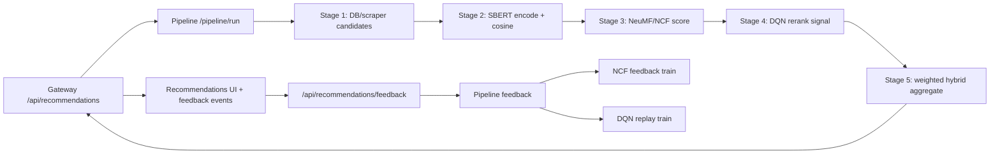

# SCPA Full Code Review, Research Alignment, and Potential Report

Generated: 2026-05-25  
Scope: full-stack code review, multi-service model relevance check, and prioritized product/research potential for the SCPA job/career recommendation app.

This report uses current repository evidence, fresh verification commands, Superpowers code-review/verification workflow, and a scoped literature review using primary research sources. It supersedes older review notes that described NCF/DQN as disconnected from the active runtime; the current code now has active NeuMF and PyTorch DQN paths, with remaining gaps documented below.

## Executive Verdict

SCPA has strong thesis and product potential. The core idea is defensible: combine semantic user-job matching, collaborative filtering from interaction history, sequential career-action learning, and explainable aggregation for Indonesian job/career mismatch.

Current potential score:

| Dimension | Score | Reason |
|---|---:|---|
| Demo/research prototype | 8.0/10 | SBERT, NeuMF, DQN, feedback capture, migrations, and evaluation scripts exist. |
| Thesis defensibility | 7.2/10 | Architecture now matches major papers better, but domain fine-tuning, offline RL evaluation, and stronger baselines are still needed. |
| Production readiness | 5.8/10 | Security boundaries, CI coverage, lint, SSRF protection, and durable async feedback need work. |
| Product upside | 8.5/10 | CV/certificate ingestion, skill taxonomy, employer-fit, and market-aware skill planning could make the app much more useful. |

Highest leverage next work:

1. Fix the failing frontend lint/hook issue.
2. Lock down internal services and SSRF surfaces.
3. Make CI run the real full test/lint/build gates.
4. Finish the skill taxonomy + CV/certificate ingestion path.
5. Add research-grade offline evaluation for SBERT, NeuMF, DQN, and the hybrid pipeline.

## Verification Evidence

Fresh commands run on 2026-05-25:

| Command | Result |
|---|---|
| `.venv\Scripts\python.exe -m pytest -q` | `291 passed, 11 warnings in 91.73s` |
| `.venv\Scripts\python.exe -m alembic -c alembic.ini heads` | `008_feature_extension_foundation (head)` |
| `npm run lint` in `frontend/` | Failed: 1 error, 18 warnings |
| Hugging Face model lookup | `sentence-transformers/paraphrase-multilingual-MiniLM-L12-v2`, sentence-similarity model, 49.3M downloads, 1237 likes at lookup time |

The Python backend test surface is healthy. The frontend is not clean because `frontend/src/app/recommendations/page.tsx:329` calls `useCallback` after an early return at `frontend/src/app/recommendations/page.tsx:316`.

## Research Source Register

These are primary or near-primary sources used for the research alignment assessment:

| ID | Source | Relevance |
|---|---|---|
| R1 | [Sentence-BERT: Sentence Embeddings using Siamese BERT-Networks](https://aclanthology.org/D19-1410/) | Foundation for SBERT sentence embeddings and cosine retrieval. |
| R2 | [conSultantBERT: Fine-tuned Siamese Sentence-BERT for Matching Jobs and Job Seekers](https://arxiv.org/abs/2109.06501) | Direct job/resume matching evidence for domain-tuned Siamese SBERT. |
| R3 | [Neural Collaborative Filtering](https://arxiv.org/abs/1708.05031) | Foundation for NeuMF/GMF+MLP collaborative filtering. |
| R4 | [Human-level control through deep reinforcement learning](https://www.nature.com/articles/nature14236) | Canonical DQN: neural Q-values, replay, target network. |
| R5 | [Deep Reinforcement Learning for List-wise Recommendations](https://arxiv.org/abs/1801.00209) | Recommender-specific RL framing as sequential interaction/MDP. |
| R6 | [Wide & Deep Learning for Recommender Systems](https://research.google/pubs/wide-deep-learning-for-recommender-systems/) | Hybrid memorization/generalization framing for recommender systems. |
| R7 | [Deep Neural Networks for YouTube Recommendations](https://research.google.com/pubs/archive/45530.pdf) | Two-stage candidate generation and ranking architecture at scale. |
| R8 | [sentence-transformers/paraphrase-multilingual-MiniLM-L12-v2](https://hf.co/sentence-transformers/paraphrase-multilingual-MiniLM-L12-v2) | Current default multilingual SBERT-family model configured by SCPA. |

## Current Architecture Observed

Active recommendation flow:

Code evidence:

- Pipeline stages are wired sequentially in `services/pipeline/main.py:251-301`.
- SBERT defaults to `sentence-transformers/paraphrase-multilingual-MiniLM-L12-v2` and transformer mode in `services/sbert/main.py:39-64`.
- SBERT encodes normalized SentenceTransformer embeddings and caches them in `services/sbert/main.py:512-568`.
- NeuMF is implemented as GMF + MLP in `services/ncf/main.py:52-79`.
- Active NCF recommendation uses the NeuMF model when Torch is available in `services/ncf/main.py:704-733`.
- NCF online learning uses BCE loss and negative sampling in `services/ncf/main.py:634-661`.
- DQN implements a feed-forward `QNetwork` in `services/dqn/main.py:173-188`.
- DQN runtime owns replay, epsilon policy, policy network, target network, and optimizer in `services/dqn/main.py:356-390`.
- DQN replay training computes TD targets from target-network values in `services/dqn/main.py:524-549`.
- Frontend logs impressions, dwell, clicks, source clicks, and views in `frontend/src/app/recommendations/page.tsx:75-150` and `frontend/src/app/recommendations/page.tsx:225-237`.
- Gateway persists feedback before forwarding to pipeline in `services/gateway/main.py:1418-1531`.

## Research Alignment Assessment

### SBERT Service

Assessment: high alignment with SBERT literature for inference, medium alignment for thesis claims.

What matches the papers:

- Uses a SentenceTransformer-compatible model path.
- Encodes profile and job text separately.
- Uses normalized embeddings and cosine/dot-product similarity.
- Uses a multilingual MiniLM sentence-similarity model, relevant for Indonesian/English mixed job text.

Research fit:

- R1 supports the exact design choice: independent sentence embeddings compared by cosine similarity are the reason SBERT is fast enough for semantic retrieval.
- R2 is directly relevant because SCPA is job/profile matching. It also exposes the main gap: job/resume matching performs better when SBERT is fine-tuned on labeled resume-vacancy pairs.

Remaining research gap:

- The service is research-aligned, but the thesis should not claim domain-specialized SBERT unless an Indonesian resume-job or profile-job fine-tuning/evaluation dataset is built.
- The deterministic fallback is useful for tests but must be excluded from thesis model-performance claims.

Priority upgrade:

- Build a labeled Indonesian profile-job pair dataset and fine-tune/evaluate the SentenceTransformer using Recall@K, MRR@K, NDCG@K, and qualitative skill-gap examples.

### NCF / NeuMF Service

Assessment: high alignment with Neural Collaborative Filtering architecture, medium alignment with production recommender practice.

What matches the papers:

- `NeuralCF` uses separate GMF and MLP embeddings, concatenates both branches, and outputs a logit.
- Active recommendation uses batched NeuMF logits when Torch is present.
- Online learning uses BCEWithLogitsLoss and negative sampling for positive events.
- The health endpoint reports `NeuMF` when the neural model is active.

Research fit:

- R3 frames NCF as replacing fixed matrix-factor inner products with a neural user-item interaction function. SCPA now does that in active serving when Torch is available.
- R6 supports the hybrid idea: memorization from interaction patterns plus generalization from dense representations is valuable when interactions are sparse.

Remaining research gap:

- NCF still depends on small/online interaction history; without enough real impressions, clicks, saves, applies, skips, and dwell events, the model will be undertrained.
- The MF fallback is useful but should remain a baseline, not the main claim.
- The thesis should compare NeuMF against SBERT-only, MF-only, and at least one strong implicit-feedback baseline if time allows.

Priority upgrade:

- Add offline training with stable user/item ID maps, explicit train/validation splits, sampled negatives, and saved model cards containing dataset size, event weights, and metric tables.

### DQN Service

Assessment: medium-high alignment with canonical DQN implementation, medium alignment with recommender/RL research.

What matches the papers:

- Uses a neural QNetwork.
- Maintains policy and target networks.
- Stores replay transitions.
- Uses epsilon-greedy action selection.
- Trains from replay with TD targets and MSE loss.
- Persists replay to PostgreSQL best-effort through `dqn_replay_archive`.

Research fit:

- R4 supports the core technical structure: neural Q-values, replay, and a target network.
- R5 supports the broader recommender idea: user interaction can be modeled as a sequential decision process rather than static scoring.

Remaining research gap:

- The DQN action space is a fixed skill vocabulary, while job reranking uses the max Q-value over skill actions for each job state. That is reasonable for a career-action signal, but it is not yet a clean list-wise job recommendation MDP.
- Reward is derived from immediate frontend events; the system does not yet model long-term outcomes such as skill completion, later applications, interview outcomes, or accepted jobs.
- There is no off-policy correction or simulator, so offline RL claims should be conservative.

Priority upgrade:

- Decide whether DQN is primarily a skill-path recommender or a job-slate reranker. For a thesis, the cleaner path is skill-path RL: state = user profile + missing skills + market demand; action = next skill/course/certificate; reward = skill-gap reduction and downstream job-match lift.

### Pipeline / Hybrid Aggregation

Assessment: strong engineering composition, medium research rigor.

What matches research practice:

- The pipeline separates candidate sourcing, semantic scoring, collaborative scoring, RL reranking, and final aggregation.
- This is consistent with the broad two-stage retrieval/ranking pattern in R7 and hybrid recommender ideas in R6.
- Stage 5 exposes ablation scores, making model comparison easier.

Remaining research gap:

- The aggregate weights are static thresholds based on interaction count (`cold`, `warm`, `active`) in `services/pipeline/stages/stage_5_aggregate.py:21-26`.
- Final score is hand-combined from SBERT, NCF, DQN, and skill alignment in `services/pipeline/stages/stage_5_aggregate.py:129-180`.
- This is explainable and practical, but not a learned calibrator.

Priority upgrade:

- Train a small calibration/ranking model over SBERT, NCF, DQN, skill gap, freshness, location, salary, and interaction features. Keep the existing weighted formula as the transparent baseline.

## Code Review Findings

### P0 - Frontend lint currently fails due a conditional hook call

Evidence:

- `npm run lint` exits 1.
- `frontend/src/app/recommendations/page.tsx:316` returns early when auth is loading or the user is missing.
- `frontend/src/app/recommendations/page.tsx:329` calls `useCallback` after that early return.

Impact:

- This violates React's hook-order rule and blocks a clean frontend quality gate.
- It can become a runtime bug when auth/loading state changes across renders.

Fix:

- Move `markImpressed = useCallback(...)` above all conditional returns, or avoid a hook there and use a plain stable helper before the early return.

### P1 - Internal model/data mutation services are published to host ports

Evidence:

- `docker-compose.yml:51-52` exposes scraper.
- `docker-compose.yml:77-78` exposes SBERT.
- `docker-compose.yml:96-97` exposes NCF.
- `docker-compose.yml:113-114` exposes DQN.
- `docker-compose.yml:130-131` exposes pipeline.
- NCF, DQN, scraper, and pipeline expose state-changing endpoints without the gateway auth layer.

Impact:

- Anyone who can reach those ports can trigger scraping, training, feedback writes, model mutation, or expensive pipeline calls.
- This is the largest production-risk issue because it turns internal ML services into public mutation surfaces.

Fix:

- Publish only the gateway externally.
- Keep scraper/SBERT/NCF/DQN/pipeline on the Docker internal network.
- Add an internal service token or mTLS between gateway/pipeline/model services.

### P1 - Scraper `/scrape/url` is an SSRF surface

Evidence:

- `services/scraper/main.py:265-267` accepts any `HttpUrl`.
- `services/scraper/main.py:1100-1108` fetches the URL with redirects enabled.

Impact:

- A caller can make the scraper fetch internal/private/metadata URLs if it can reach the service.
- The current red-team test checks connection failure, not a positive deny policy.

Fix:

- Add URL allowlists for supported job boards, block private/link-local/loopback ranges after DNS resolution, disable or revalidate redirects, and cap response size.

### P1 - Gateway direct `/pipeline/run` bypasses recommendation auth/profile handling

Evidence:

- `services/gateway/main.py:1329-1331` forwards `/pipeline/run` without `_get_current_user`.
- The protected path starts at `services/gateway/main.py:1334-1354`.

Impact:

- Unauthenticated callers can submit arbitrary pipeline requests through the public gateway.
- This bypasses DB-backed user profile assembly and can drive expensive internal work.

Fix:

- Remove the direct endpoint, require admin/internal auth, or restrict it to local/dev mode.

### P1 - CI does not gate the actual project health

Evidence:

- `.github/workflows/ci.yml:60-70` runs a selected test subset, not full `pytest`.
- The current local full suite passes, but CI does not enforce that.
- Frontend lint currently fails locally, but CI does not appear to run frontend lint/build.

Impact:

- Real regressions can merge even when local full checks would catch them.

Fix:

- Add `python -m pytest -q`, Alembic head/upgrade validation against a temp DB, `npm run lint`, and `npm run build` to CI.

### P2 - JWT/CORS defaults are too permissive for direct service execution

Evidence:

- `services/gateway/main.py:46` defaults `JWT_SECRET` to an empty string if the service is run outside compose.
- `services/gateway/main.py:818-822` defaults CORS origins to `*`.
- `docker-compose.yml:34` also sets gateway CORS to `*`.

Impact:

- Compose requires secrets, which is good, but direct local/service launch can silently run with an empty secret.
- Broad CORS is acceptable for a demo only, not for a production deployment.

Fix:

- Fail fast if JWT secrets are missing or shorter than 32 bytes.
- Restrict CORS to the actual frontend origins per environment.

### P2 - Feedback forwarding says `queued` without a durable outbox

Evidence:

- Feedback is persisted in DB first, which is good.
- If pipeline forwarding fails, `services/gateway/main.py:1528-1531` returns `{"status": "queued"}` without inserting a retry/outbox record.

Impact:

- The UI sees a successful queued status, but no worker is guaranteed to retry model training.

Fix:

- Add a `model_feedback_outbox` table and worker, or return a precise status such as `persisted_pipeline_unavailable`.

### P2 - DQN is technically real, but the research story needs a cleaner MDP

Evidence:

- DQN state is job embedding plus SBERT score, NCF score, history count, interaction count, text length, and bias in `services/dqn/main.py:458-469`.
- DQN actions are skill labels, while job ranking uses max Q-value and a blend with SBERT/NCF priors in `services/dqn/main.py:551-568`.

Impact:

- This is useful as a career-action signal, but the paper-level claim must be precise. It is not yet a list-wise job slate DQN in the sense of R5.

Fix:

- Reframe DQN as a skill/career-action recommender, or redesign actions as job/slate actions and add off-policy evaluation.

### P2 - Hybrid aggregation is transparent but not learned

Evidence:

- Dynamic weights are hardcoded in `services/pipeline/stages/stage_5_aggregate.py:21-26`.
- Final score is a weighted formula plus skill alignment in `services/pipeline/stages/stage_5_aggregate.py:129-180`.

Impact:

- This is explainable and good for demo stability, but it limits model performance and research novelty.

Fix:

- Keep this as a baseline and add a learned calibration layer with ablation results.

## Potential Priority 1: Current App Can Be More Effective and Fast

These are improvements to the existing app that directly increase speed, reliability, or recommendation quality.

| Priority | Potential | Impact | Implementation direction |
|---:|---|---|---|
| 1 | Move internal services off public ports | High security and stability impact | Expose only gateway; add internal token/mTLS. |
| 2 | Fix frontend lint/hook issue | Immediate quality gate | Move `markImpressed` hook before early return. |
| 3 | Cache and batch model inference | Faster recommendations | Cache SBERT job embeddings, batch NeuMF/DQN scoring, avoid repeated encode work. |
| 4 | Add learned score calibrator | Better ranking | Train logistic/GBM/light neural ranker over SBERT, NCF, DQN, skill gap, recency, salary/location. |
| 5 | Make feedback durable | Better online learning | Add outbox table/worker for pipeline/model feedback retries. |
| 6 | Strengthen CI | Prevent regressions | Full backend tests, migrations, frontend lint/build. |
| 7 | Add DB indexes for hot recommendation paths | Better p95 latency | Index active jobs, posted_at, source, skills, user interaction lookups. |
| 8 | Add response-time telemetry | Measurable speed work | Track per-stage p50/p95 and cache hit rates in reports. |

Expected payoff:

- Faster recommendation load time.
- Better model learning from actual user behavior.
- Less risk from unauthenticated internal endpoints.
- Cleaner demo and thesis evidence.

## Potential Priority 2: Current App Can Have Slight Added Features

These features are small to medium additions that make the current product feel more complete.

| Priority | Potential | Impact | Implementation direction |
|---:|---|---|---|
| 1 | Skill taxonomy autocomplete | High UX and data-quality impact | Use `skills` and `job_required_skills` schema already added in migration 008. |
| 2 | Profile completeness meter | Better cold start | Show missing skills, target role, CV, preferred locations, salary expectations. |
| 3 | Saved jobs and skip controls on recommendation cards | Better feedback labels | Add explicit `save` and `skip` buttons tied to existing feedback endpoint. |
| 4 | Job alert by target role/skill gap | Practical retention | Store saved searches and notify when new aligned jobs are scraped. |
| 5 | Skill-gap detail page | Better explainability | Expand `/api/jobs/{job_id}/skill-gap` into UI with matched/missing skills. |
| 6 | Admin model-health dashboard | Easier debugging | Show SBERT fallback status, NCF model type, DQN replay size, pipeline p95, scrape freshness. |
| 7 | Recommendation reason filters | Better control | Let user filter by highest SBERT, highest interaction fit, closest location, newest jobs. |

Expected payoff:

- More user trust because recommendations are explainable.
- Cleaner interaction labels for NCF/DQN.
- Higher perceived usefulness without changing core model architecture.

## Potential Priority 3: Not Yet in App, But Very Effective If Added

These are larger feature bets that could materially improve the product and thesis originality.

| Priority | Potential | Impact | Implementation direction |
|---:|---|---|---|
| 1 | CV/resume ingestion | Very high | OCR/parse CV, extract skills/education/projects, store `users.cv_embedding`, invalidate recommendations. |
| 2 | Certificate OCR and verification | Very high | Use `user_certifications` and `certification_skills`; map certificates into controlled skills. |
| 3 | Market-aware skill path recommender | Very high | DQN action = next skill/course/certificate; reward = skill-gap reduction + market demand + user completion. |
| 4 | Employer/recruiter reciprocal matching | High | Rank candidates for jobs using employer-fit score, availability, skills, location, and education requirements. |
| 5 | Two-tower retrieval model | High | Train user/profile tower and job tower for fast candidate generation before SBERT/NeuMF/DQN rerank. |
| 6 | Offline RL simulator and counterfactual evaluation | High thesis value | Evaluate DQN policies without risky live exploration. |
| 7 | A/B testing and model monitoring | High production value | Compare SBERT-only, NeuMF, DQN, hybrid, and learned calibrator in real traffic. |
| 8 | Interview preparation from job gaps | Medium-high | Generate role-specific interview plan from missing skills and job description. |

Expected payoff:

- CV/certificate ingestion makes the app less dependent on manual profile entry.
- Market-aware skill planning turns the app from "job list ranking" into a career guidance system.
- Employer-side matching makes the platform reciprocal, which e-recruitment research treats as an important difference from ordinary product recommendation.

## Research Claim Safety

Safe claims today:

- SCPA implements a hybrid recommendation pipeline using SBERT semantic similarity, NeuMF neural collaborative filtering, a DQN-style neural career-action/reranking signal, and transparent score aggregation.
- The implementation includes feedback capture, replay persistence, ablation-ready scores, and a thesis evaluation protocol.
- The architecture is aligned with foundational SBERT, NCF, DQN, and industrial recommender-system papers.

Claims that need more evidence before thesis defense:

- "Fine-tuned Indonesian SBERT improves over baselines." Needs labeled profile-job data and a real fine-tuning/evaluation run.
- "DQN optimizes long-term career outcomes." Needs a clean MDP, delayed rewards, simulator or longitudinal data, and off-policy evaluation.
- "Hybrid is statistically better than all baselines." Needs repeated splits, paired significance tests, and a generated report on current data.
- "Production-ready." Needs security hardening, CI expansion, frontend lint/build passing, SSRF guard, and internal service isolation.

## Recommended Execution Order

1. Fix frontend lint error.
2. Add internal-service security boundary and remove unauthenticated `/pipeline/run`.
3. Add scraper SSRF guard.
4. Expand CI to full backend + frontend + migration gates.
5. Implement skill taxonomy frontend and extraction jobs.
6. Add durable feedback outbox.
7. Add learned aggregate calibrator with ablation report.
8. Build CV/certificate ingestion.
9. Reframe and evaluate DQN as a market-aware skill-path recommender.
10. Add two-tower retrieval if the candidate pool grows beyond what SBERT batching can comfortably handle.

## Bottom Line

The app is no longer just a thin prototype. The SBERT, NeuMF, DQN, and pipeline pieces are now relevant to major research directions. The biggest blocker is not model existence; it is proof quality and operational safety.

For a bachelor thesis, the strongest narrative is:

> SCPA is a hybrid career recommendation system that combines multilingual semantic matching, neural collaborative filtering, and reinforcement-learning-based career-action signals to address skill-job mismatch, with explainable recommendations and measurable ablation baselines.

To make that narrative hard to challenge, finish the security and CI fixes, generate a real evaluation report, and make DQN's MDP/action/reward definition explicit.
