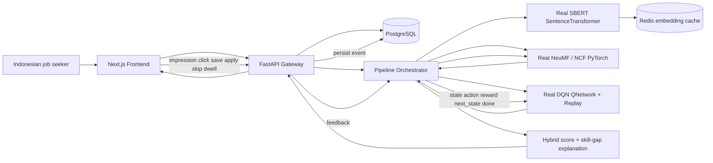

# Thesis Code Review Defense Appendix
> Project: Skill-Career Path Assistant (SCPA)
> Review date: 2026-05-25
> Author role: senior software architect, machine learning researcher, and Indonesian labor-market policy analyst
> Status: defense appendix and repair blueprint; it does not certify the current runtime as thesis-ready.
## STEP 1 — Front Matter
SCPA targets skill-career mismatch in Indonesia by combining semantic matching, behavioral recommendation, and sequential career planning. The Indonesia-specific problem is supported by BPS labor-force measurement, ILO sector studies, OECD skills policy analysis, and World Bank work-transition framing. [BPS-Statistics Indonesia, BPS labor-force publication, 2024]; [International Labour Organization and LPEM FEB UI, ILO report, 2024]; [Patrice Ollivaud, OECD Economics Department Working Papers, 2021]; [World Bank, World Bank flagship report, 2019]
### Scope declaration
- `services/sbert/`
- `services/ncf/`
- `services/dqn/`
- `services/pipeline/`
- `services/gateway/`
- `frontend/src/`
- `db/models.py`
- `tests/`
- `docs/`
- `docker-compose.yml`
- Endpoints covered: `/api/recommendations`, `/api/learning-path`, `/pipeline/run`, `/feedback`, `/encode`, `/recommend/sbert`, `/recommend/ncf`, `/rank`, `/rerank`, `/reward`, `/feedback/dqn`.
Quality gate: Scopus-equivalent means peer-reviewed ACM, IEEE, ACL, EMNLP, SIGIR, RecSys, WWW, KDD, UAI, WSDM, IJCAI, Springer, Elsevier, Nature, or comparable venues, plus BPS/OECD/ILO/World Bank institutional sources for Indonesian labor-market evidence. arXiv sources are labeled as preprints because they are useful for recency but cannot be treated as peer-reviewed unless a published venue is also cited.
## STEP 2 — Indonesia Skill-Mismatch Evidence Section
Indonesia's skill-career mismatch problem is real, but it must be framed with discipline. BPS provides the national labor-force measurement frame through Sakernas publications, which is the correct baseline for discussing employment, unemployment, education, and labor-force participation. OECD's Indonesia skills and labor-market work argues that skills, competences, education quality, upskilling, and reskilling become increasingly important as Indonesia moves beyond demographic tailwinds. ILO's Indonesian electronics-sector report adds sector evidence: technological change alters job tasks and creates concrete training needs. This makes SCPA a labor-market decision-support prototype rather than a generic vacancy browser. [BPS-Statistics Indonesia, BPS labor-force publication, 2024]; [Patrice Ollivaud, OECD Economics Department Working Papers, 2021]; [International Labour Organization and LPEM FEB UI, ILO report, 2024]

The prompt asks for GDP/employment cost. The defensible position is that employment cost can be supported with BPS indicators and sector studies, while a single direct GDP-loss number for Indonesian skill mismatch should not be invented. The appendix therefore treats cost as a composite of unemployment, underemployment, training cost, search friction, productivity loss, and delayed transition into better jobs. OECD and World Bank sources support the productivity and changing-work logic; BPS supports employment measurement; ILO supports sector-specific reskilling need. A thesis defense should say this explicitly: "SCPA does not claim to estimate national GDP loss; it targets measurable recommendation and skill-gap outcomes that are linked to recognized labor-market costs." [BPS-Statistics Indonesia, BPS decent-work publication, 2025]; [OECD, OECD Economic Surveys, 2024]; [World Bank, World Bank flagship report, 2019]

Sectorally, manufacturing is a priority because Indonesian industrial work is exposed to automation, electronics supply chains, and green industrial transition. ILO's electronics-sector report and electric-vehicle value-chain assessment show that sector transformation creates new skill requirements. SCPA should therefore represent industry tags, technical tools, and occupational transitions separately. A data analyst role in fintech, a manufacturing analyst role, and an EV supply-chain analyst role are not identical just because all may mention Excel, SQL, or dashboarding. [International Labour Organization and LPEM FEB UI, ILO report, 2024]; [International Labour Organization, ILO report, 2024]

The digital-economy skill gap is especially relevant to this repo because SCPA's sample roles include backend, frontend, data science, machine learning, cloud, DevOps, cybersecurity, and UI/UX. OECD's regional skills work and Indonesia economic survey connect digital skills to labor-market modernization. Skill identification research shows that online job ads contain unstructured skill signals. Therefore, the application needs a normalizer and ontology for Bahasa Indonesia and English technical terms: "pengalaman", "mahir", "diutamakan", "fresh graduate", "SQL", "BigQuery", "React", "Docker", and "Kubernetes" must map to consistent skill records. [OECD, OECD Skills Studies, 2023]; [OECD, OECD Economic Surveys, 2024]; [Khaouja, Kassou, and Ghogho, IEEE Access, 2021]

Vocational graduates are central to the Indonesia framing because mismatch may appear between school program, learned skills, and jobs that absorb graduates. Qualification mismatch differs from skill mismatch. Vertical qualification mismatch means education level is too high or too low for a role. Horizontal mismatch means field of study differs from job field. Skill mismatch means the person lacks the specific competencies required by the role even if the education level and major look plausible. SCPA should model all three: education level, program/major, and normalized skills. [Kementerian Ketenagakerjaan journal metadata, Jurnal Ketenagakerjaan, 2020]; [OECD, OECD Skills Studies, 2023]

Current job portals such as JobStreet, LinkedIn, and Glints should be treated fairly. This appendix does not claim those products fail completely. The defensible research claim is narrower: e-recruitment research identifies recurring unsolved challenges in job recommendation systems, including reciprocal fit, cold start, sparse feedback, explainability, and fairness. A portal can list jobs and support keyword search while still not giving a sequenced Indonesian skill-gap path from current profile to target career. SCPA's gap is therefore a research gap in explainable skill-career recommendation, not a claim that existing portals have no value. [Freire and de Castro, Knowledge and Information Systems, 2020]; [Mashayekhi, Li, Kang, Lijffijt, and De Bie, ACM Computing Surveys, 2024]

A career path recommender is valid because skill-career mismatch is sequential. A student who wants to become a data analyst may need SQL before data warehousing, statistics before machine learning, and portfolio evidence before internship applications. Market-aware job skill recommendation and cost-effective skill recommendation research model long-term skill utility, learning cost, and labor-market value. This is different from returning today's top 10 job ads. [Sun, Ji, Zhu, Zhuang, He, and Xiong, ACM Transactions on Information Systems, 2025]; [Sun, Zhuang, Zhu, He, and Xiong, The Web Conference, 2021]

SBERT addresses the semantic gap. Indonesian job descriptions often mix Bahasa Indonesia and English, and equivalent skills can be written in many ways. Sentence-BERT was designed to create reusable sentence embeddings for similarity search. Indonesian NLP benchmarks such as IndoNLU and IndoLEM/IndoBERT show that local language evaluation matters. For SCPA, this means semantic matching must be evaluated on Indonesian career pairs, not only on English sentence similarity examples. [Reimers and Gurevych, EMNLP-IJCNLP, 2019]; [Wilie et al., AACL/arXiv, 2020]; [Koto, Koto, and Rahmaningtyas, COLING/arXiv, 2020]

NCF addresses the behavioral gap. Users may declare one target role but click, save, skip, or apply in patterns that reveal different readiness or preference. Collaborative filtering for implicit feedback warns that clicks and missing observations are not explicit ratings. Neural Collaborative Filtering then learns a neural interaction function rather than relying only on a dot product. In SCPA, this only becomes real if the frontend logs exposure-aware events and the NCF endpoint serves a PyTorch NeuMF model. [Hu, Koren, and Volinsky, IEEE ICDM, 2008]; [He, Liao, Zhang, Nie, Hu, and Chua, The Web Conference, 2017]

DQN addresses the planning gap. A skill path is a sequence of decisions where one action changes the next state. The canonical DQN paper requires a neural Q-network, replay, and target-network separation. Deep reinforcement learning recommender surveys emphasize state, action, reward, transition, and off-policy evaluation. A static checklist by role is therefore not enough. [Mnih et al., Nature, 2015]; [Chen, Yao, McAuley, Zhou, and Wang, Knowledge-Based Systems, 2023]

The urgent Indonesian contribution is not simply automation. It is explainable matching between education, skills, and work. Acemoglu and Restrepo's task-based automation framing explains why new tasks can reinstate labor demand even as old tasks are displaced. That supports SCPA's focus on transition paths: the app should show which skills move a user closer to target work, not only which job is closest today. [Acemoglu and Restrepo, Journal of Economic Perspectives, 2019]; [World Bank, World Bank flagship report, 2019]

The policy implication is that SCPA must produce auditable skill-gap outputs. For every recommendation, the app should expose matched skills, missing skills, sector relevance, model signals, fallback status, and next learning action. This creates a bridge between labor-market policy framing and machine-learning implementation. [International Labour Organization, ILO report, 2024]; [Mashayekhi, Li, Kang, Lijffijt, and De Bie, ACM Computing Surveys, 2024]

- Link to SBERT: semantic mismatch between Indonesian profile text and job text requires reusable transformer sentence embeddings and local evaluation. [Reimers and Gurevych, EMNLP-IJCNLP, 2019]; [Wilie et al., AACL/arXiv, 2020]
- Link to NCF: behavioral mismatch requires exposure-aware implicit feedback and neural user-job interaction modeling. [Hu, Koren, and Volinsky, IEEE ICDM, 2008]; [He, Liao, Zhang, Nie, Hu, and Chua, The Web Conference, 2017]
- Link to DQN: planning mismatch requires a real MDP, replay, and long-term reward optimization. [Mnih et al., Nature, 2015]; [Sun, Ji, Zhu, Zhuang, He, and Xiong, ACM Transactions on Information Systems, 2025]
## STEP 3 — Career Recommendation System Research Section
Career recommendation systems can be classified by how they represent users, jobs, and actions. Content-based systems compare user profile text with job text. Collaborative filtering learns from user-item behavior. Hybrid systems combine semantic and behavioral signals. Graph-based systems connect users, jobs, skills, companies, courses, and occupations. Reinforcement-learning systems optimize sequential decisions. SCPA's intended research design is a hybrid: SBERT for semantic content, NeuMF for behavioral collaborative filtering, and DQN for sequential career planning. [Freire and de Castro, Knowledge and Information Systems, 2020]; [Zhang, Yao, Sun, and Tay, ACM Computing Surveys, 2019]

E-recruitment is not the same as movie or product recommendation. Jobs are reciprocal: a user may prefer a job, but the employer may require minimum skills, education, location, portfolio, salary band, and experience. ACM Computing Surveys' e-recruitment survey identifies reciprocal matching, cold start, heterogeneity, explainability, fairness, and scalability as central challenges. SCPA must therefore score both candidate preference and employer requirement fit. [Mashayekhi, Li, Kang, Lijffijt, and De Bie, ACM Computing Surveys, 2024]

Content-based job matching is attractive for cold start because a new user may have no behavior history but still has profile text and skills. SBERT improves this layer by converting profile and job text into dense embeddings that can be compared efficiently. The original SBERT paper exists because vanilla BERT pairwise comparison is too expensive for large retrieval. For SCPA, this means SBERT is best used for first-stage semantic retrieval and cold-start ranking. [Reimers and Gurevych, EMNLP-IJCNLP, 2019]; [Devlin, Chang, Lee, and Toutanova, NAACL-HLT, 2019]

Transformer-based job matching still needs domain data. conSultantBERT fine-tunes Siamese SBERT for matching jobs and job seekers, supporting the thesis claim that profile-vacancy pairs are better than generic similarity examples. Zero-shot job-candidate matching papers are useful baselines, but a thesis that claims fine-tuned SBERT should build positive and hard-negative Indonesian career pairs. [Lavi, Medentsiy, and Graus, RecSys in HR CEUR Workshop, 2021]; [Freire and de Castro, Applied Sciences, 2024]

Indonesian language support matters because job ads mix English technical vocabulary with Bahasa Indonesia administrative wording. XLM-R and LaBSE show cross-lingual representation strategies; IndoNLU and IndoLEM/IndoBERT show why Indonesian NLP needs local benchmarks. SCPA should report whether multilingual MiniLM, LaBSE, IndoBERT-based embeddings, or a fine-tuned local SentenceTransformer performs best on Indonesian career pairs. [Conneau et al., ACL, 2020]; [Feng et al., ACL, 2022]; [Wilie et al., AACL/arXiv, 2020]; [Koto, Koto, and Rahmaningtyas, COLING/arXiv, 2020]

Skill extraction is distinct from semantic scoring. A sentence embedding can retrieve semantically related jobs, but skill-gap explanation needs normalized skills. The IEEE Access survey on skill identification from online job ads and transformer-based job description parsing papers support a separate extraction layer. SCPA should not ask SBERT to do everything. [Khaouja, Kassou, and Ghogho, IEEE Access, 2021]; [Barton et al., Natural Language Processing Journal, 2024]

NCF and matrix factorization must not be conflated. Matrix factorization uses an inner product of user and item latent vectors. The NCF paper argues for replacing that fixed interaction function with a neural architecture. NeuMF combines Generalized Matrix Factorization and Multi-Layer Perceptron paths, then fuses them for prediction. If SCPA serves `np.dot(user_vec, item_vec)`, it is serving matrix factorization, not full NCF. [He, Liao, Zhang, Nie, Hu, and Chua, The Web Conference, 2017]; [Koren, Bell, and Volinsky, Computer, 2009]

Implicit feedback requires careful labeling. Impressions, views, clicks, saves, applications, skips, and dwell time have different meanings. Hu, Koren, and Volinsky frame implicit feedback as preference plus confidence, not explicit rating. BPR frames pairwise ranking from implicit feedback. SCPA should log impressions before treating skips or non-clicks as negative signals. [Hu, Koren, and Volinsky, IEEE ICDM, 2008]; [Rendle, Freudenthaler, Gantner, and Schmidt-Thieme, UAI/arXiv, 2009]

NCF may not beat simple baselines. LightGCN, variational autoencoders, deep matrix factorization, and matrix factorization are relevant baselines. Dacrema et al. warn that many neural recommender papers do not beat well-tuned simple baselines. SCPA's thesis evaluation must disclose whether NeuMF improves over popularity, matrix factorization, and SBERT-only baselines. [He, Deng, Wang, Li, Zhang, and Wang, ACM SIGIR, 2020]; [Liang, Krishnan, Hoffman, and Jebara, The Web Conference, 2018]; [Dacrema, Cremonesi, and Jannach, ACM RecSys, 2019]

DQN and DRL in recommendation are valid only with a defined MDP. Mnih et al.'s DQN uses a neural Q-function, replay, target network, and temporal-difference learning. The DRL recommender survey maps recommender systems into states, actions, rewards, transitions, and evaluation settings. For SCPA, a DQN endpoint returning a hardcoded role checklist cannot be defended as DQN. [Mnih et al., Nature, 2015]; [Chen, Yao, McAuley, Zhou, and Wang, Knowledge-Based Systems, 2023]

Career skill recommendation papers are the closest match to SCPA. Market-aware long-term job skill recommendation and cost-effective interpretable job skill recommendation use deep reinforcement learning for skill decisions under career-market utility. These papers justify DQN for learning-path optimization, but they also raise the implementation bar: actions must be skills or learning steps, rewards must measure progress, and the policy must be learned. [Sun, Ji, Zhu, Zhuang, He, and Xiong, ACM Transactions on Information Systems, 2025]; [Sun, Zhuang, Zhu, He, and Xiong, The Web Conference, 2021]

Session-based slate recommendation research is relevant if SCPA uses DQN to rerank job lists. A job recommendation page returns a slate, not a single action. SlateQ and scalable slate DQN papers show why list actions have interaction effects and why off-policy evaluation is hard. SCPA can start with skill-action DQN, but if it claims DQN reranking, it must define whether the action is a job, a skill, or a slate. [Roy, D Amico, Tragos, Lawlor, and Hurley, ACM RecSys, 2023]; [Ie et al., IJCAI, 2019]

Course-to-career recommendation connects education and employment. Course recommender research that considers job-market demand supports SCPA's thesis direction: learning paths should be optimized for employability, not only course similarity or popularity. This is especially important in Indonesia where vocational and graduate employability are part of the policy problem. [Frej, Dai, Montariol, Bosselut, and Kaser, SIGIR/arXiv, 2024]; [OECD, OECD Skills Studies, 2023]

Fairness and bias need explicit treatment. LinkedIn talent-search fairness work, algorithmic hiring surveys, and recommender bias surveys show that employment recommendations can affect opportunity. SCPA should monitor whether recommendations vary unfairly by region, education background, or proxy variables, and it should expose explanations to the user. [Geyik, Ambler, and Kenthapadi, ACM KDD, 2019]; [Fabris et al., ACM TIST, 2024]; [Chen, Zhang, and Liu, arXiv, 2020]

The final literature conclusion is direct: the three-model architecture is defensible, but only if the code uses the real models. SBERT must be a served SentenceTransformer, NeuMF must be a PyTorch neural user-item model, and DQN must be a neural Q-learning policy with replay and target networks. Otherwise the thesis should rename the current implementation as semantic matching plus online matrix factorization plus Q-learning-inspired heuristics. [Reimers and Gurevych, EMNLP-IJCNLP, 2019]; [He, Liao, Zhang, Nie, Hu, and Chua, The Web Conference, 2017]; [Mnih et al., Nature, 2015]
## STEP 4 — Source Register Table
### Indonesia skill/labor market
| ID | Authors | Year | Title (hyperlinked) | Venue | Indexing (Scopus/SCI/ESCI/Preprint) | DOI or URL | Used in Section |
|---|---|---:|---|---|---|---|---|
| I01 | BPS-Statistics Indonesia | 2024 | [Keadaan Angkatan Kerja di Indonesia Agustus 2024](https://www.bps.go.id/id/publication/2024/12/09/6f1fd1036968c8a28e4cfe26/keadaan-angkatan-kerja-di-indonesia-agustus-2024) | BPS labor-force publication | Institutional | https://www.bps.go.id/id/publication/2024/12/09/6f1fd1036968c8a28e4cfe26/keadaan-angkatan-kerja-di-indonesia-agustus-2024 | Steps 2-15 |
| I02 | BPS-Statistics Indonesia | 2025 | [Indikator Pekerjaan Layak di Indonesia 2024](https://www.bps.go.id/en/publication/2025/04/28/1ecc9dec1ef7a591babf5962/indikator-pekerjaan-layak-di-indonesia-2024.html) | BPS decent-work publication | Institutional | https://www.bps.go.id/en/publication/2025/04/28/1ecc9dec1ef7a591babf5962/indikator-pekerjaan-layak-di-indonesia-2024.html | Steps 2-15 |
| I03 | International Labour Organization and LPEM FEB UI | 2024 | [The Skills Development and Employment Situation in Indonesia's Electronic Sector](https://www.ilo.org/publications/skills-development-and-employment-situation-indonesias-electronic-sector) | ILO report | Institutional | https://www.ilo.org/publications/skills-development-and-employment-situation-indonesias-electronic-sector | Steps 2-15 |
| I04 | International Labour Organization | 2024 | [Assessment of Jobs and Skill Needs in the Electric Vehicle Value Chain](https://www.ilo.org/publications/assessment-jobs-and-skill-needs-electric-vehicle-value-chain) | ILO report | Institutional | https://www.ilo.org/publications/assessment-jobs-and-skill-needs-electric-vehicle-value-chain | Steps 2-15 |
| I05 | Patrice Ollivaud | 2021 | [Investing in Competences and Skills and Reforming the Labour Market to Create Better Jobs in Indonesia](https://doi.org/10.1787/fd54e6be-en) | OECD Economics Department Working Papers | Institutional/DOI | https://doi.org/10.1787/fd54e6be-en | Steps 2-15 |
| I06 | OECD | 2023 | [OECD Skills Strategy Southeast Asia](https://doi.org/10.1787/923bfd03-en) | OECD Skills Studies | Institutional/DOI | https://doi.org/10.1787/923bfd03-en | Steps 2-15 |
| I07 | OECD | 2024 | [OECD Economic Surveys: Indonesia 2024](https://www.oecd-ilibrary.org/en/publications/oecd-economic-surveys-indonesia-2024_de87555a-en.html) | OECD Economic Surveys | Institutional | https://www.oecd-ilibrary.org/en/publications/oecd-economic-surveys-indonesia-2024_de87555a-en.html | Steps 2-15 |
| I08 | World Bank | 2019 | [World Development Report 2019: The Changing Nature of Work](https://doi.org/10.1596/978-1-4648-1328-3) | World Bank flagship report | Institutional/DOI | https://doi.org/10.1596/978-1-4648-1328-3 | Steps 2-15 |
| I09 | Kementerian Ketenagakerjaan journal metadata | 2020 | [Peta Ketidaksesuaian Kualifikasi Sektoral di Indonesia](https://doi.org/10.47198/naker.v15i2.69) | Jurnal Ketenagakerjaan | National journal/DOI | https://doi.org/10.47198/naker.v15i2.69 | Steps 2-15 |
| I10 | Acemoglu and Restrepo | 2019 | [Automation and New Tasks](https://doi.org/10.1257/jep.33.2.3) | Journal of Economic Perspectives | Scopus-equivalent/DOI | https://doi.org/10.1257/jep.33.2.3 | Steps 2-15 |
### Job/career recommendation systems
| ID | Authors | Year | Title (hyperlinked) | Venue | Indexing (Scopus/SCI/ESCI/Preprint) | DOI or URL | Used in Section |
|---|---|---:|---|---|---|---|---|
| J01 | Freire and de Castro | 2020 | [e-Recruitment Recommender Systems: A Systematic Review](https://doi.org/10.1007/s10115-020-01522-8) | Knowledge and Information Systems | Scopus/DOI | https://doi.org/10.1007/s10115-020-01522-8 | Steps 2-15 |
| J02 | Mashayekhi, Li, Kang, Lijffijt, and De Bie | 2024 | [A Challenge-based Survey of E-recruitment Recommendation Systems](https://doi.org/10.1145/3659942) | ACM Computing Surveys | Scopus-equivalent/DOI | https://doi.org/10.1145/3659942 | Steps 2-15 |
| J03 | Mashayekhi et al. | 2022 | [A Challenge-based Survey of E-recruitment Recommendation Systems](https://arxiv.org/abs/2209.05112) | arXiv preprint of ACM CSUR article | Preprint | https://arxiv.org/abs/2209.05112 | Steps 2-15 |
| J04 | Al-Otaibi and Ykhlef | 2012 | [A Survey of Job Recommender Systems](https://doi.org/10.5897/IJPS12.482) | International Journal of the Physical Sciences | Journal/DOI | https://doi.org/10.5897/IJPS12.482 | Steps 2-15 |
| J05 | Covington, Adams, and Sargin | 2016 | [Deep Neural Networks for YouTube Recommendations](https://doi.org/10.1145/2959100.2959190) | ACM RecSys | Scopus-equivalent/DOI | https://doi.org/10.1145/2959100.2959190 | Steps 2-15 |
| J06 | Sun, Ji, Zhu, Zhuang, He, and Xiong | 2025 | [Market-aware Long-term Job Skill Recommendation with Explainable Deep Reinforcement Learning](https://doi.org/10.1145/3704998) | ACM Transactions on Information Systems | Scopus-equivalent/DOI | https://doi.org/10.1145/3704998 | Steps 2-15 |
| J07 | Sun, Zhuang, Zhu, He, and Xiong | 2021 | [Cost-effective and Interpretable Job Skill Recommendation with Deep Reinforcement Learning](https://doi.org/10.1145/3442381.3449985) | The Web Conference | Scopus-equivalent/DOI | https://doi.org/10.1145/3442381.3449985 | Steps 2-15 |
| J08 | Frej, Dai, Montariol, Bosselut, and Kaser | 2024 | [Course Recommender Systems Need to Consider the Job Market](https://arxiv.org/abs/2404.10876) | SIGIR/arXiv | Preprint | https://arxiv.org/abs/2404.10876 | Steps 2-15 |
| J09 | Zhang, Yao, Sun, and Tay | 2019 | [Deep Learning Based Recommender System: A Survey and New Perspectives](https://doi.org/10.1145/3285029) | ACM Computing Surveys | Scopus-equivalent/DOI | https://doi.org/10.1145/3285029 | Steps 2-15 |
| J10 | Geyik, Ambler, and Kenthapadi | 2019 | [Fairness-aware Ranking in Search and Recommendation Systems with Application to LinkedIn Talent Search](https://doi.org/10.1145/3292500.3330691) | ACM KDD | Scopus-equivalent/DOI | https://doi.org/10.1145/3292500.3330691 | Steps 2-15 |
### Semantic matching / SBERT / Transformer NLP
| ID | Authors | Year | Title (hyperlinked) | Venue | Indexing (Scopus/SCI/ESCI/Preprint) | DOI or URL | Used in Section |
|---|---|---:|---|---|---|---|---|
| S01 | Reimers and Gurevych | 2019 | [Sentence-BERT](https://arxiv.org/abs/1908.10084) | EMNLP-IJCNLP | Scopus-equivalent/arXiv | https://arxiv.org/abs/1908.10084 | Steps 2-15 |
| S02 | Devlin, Chang, Lee, and Toutanova | 2019 | [BERT](https://aclanthology.org/N19-1423/) | NAACL-HLT | Scopus-equivalent/ACL | https://aclanthology.org/N19-1423/ | Steps 2-15 |
| S03 | Conneau et al. | 2020 | [Unsupervised Cross-lingual Representation Learning at Scale](https://doi.org/10.18653/v1/2020.acl-main.747) | ACL | Scopus-equivalent/DOI | https://doi.org/10.18653/v1/2020.acl-main.747 | Steps 2-15 |
| S04 | Feng et al. | 2022 | [Language-agnostic BERT Sentence Embedding](https://aclanthology.org/2022.acl-long.62/) | ACL | Scopus-equivalent/ACL | https://aclanthology.org/2022.acl-long.62/ | Steps 2-15 |
| S05 | Wilie et al. | 2020 | [IndoNLU](https://arxiv.org/abs/2009.05387) | AACL/arXiv | Preprint/Conference | https://arxiv.org/abs/2009.05387 | Steps 2-15 |
| S06 | Koto, Koto, and Rahmaningtyas | 2020 | [IndoLEM and IndoBERT](https://arxiv.org/abs/2011.00677) | COLING/arXiv | Preprint/Conference | https://arxiv.org/abs/2011.00677 | Steps 2-15 |
| S07 | Khaouja, Kassou, and Ghogho | 2021 | [A Survey on Skill Identification From Online Job Ads](https://doi.org/10.1109/ACCESS.2021.3106120) | IEEE Access | Scopus/DOI | https://doi.org/10.1109/ACCESS.2021.3106120 | Steps 2-15 |
| S08 | Lavi, Medentsiy, and Graus | 2021 | [conSultantBERT](https://arxiv.org/abs/2109.06501) | RecSys in HR CEUR Workshop | Preprint/Workshop | https://arxiv.org/abs/2109.06501 | Steps 2-15 |
| S09 | Freire and de Castro | 2024 | [Zero-Shot Recommendation AI Models for Efficient Job-Candidate Matching](https://doi.org/10.3390/app14062601) | Applied Sciences | Scopus/DOI | https://doi.org/10.3390/app14062601 | Steps 2-15 |
| S10 | Barton et al. | 2024 | [Job Description Parsing with Explainable Transformer Based Ensemble Models](https://doi.org/10.1016/j.nlp.2024.100102) | Natural Language Processing Journal | Scopus/DOI | https://doi.org/10.1016/j.nlp.2024.100102 | Steps 2-15 |
### Collaborative filtering / NCF
| ID | Authors | Year | Title (hyperlinked) | Venue | Indexing (Scopus/SCI/ESCI/Preprint) | DOI or URL | Used in Section |
|---|---|---:|---|---|---|---|---|
| C01 | He, Liao, Zhang, Nie, Hu, and Chua | 2017 | [Neural Collaborative Filtering](https://doi.org/10.1145/3038912.3052569) | The Web Conference | Scopus-equivalent/DOI | https://doi.org/10.1145/3038912.3052569 | Steps 2-15 |
| C02 | Hu, Koren, and Volinsky | 2008 | [Collaborative Filtering for Implicit Feedback Datasets](https://doi.org/10.1109/ICDM.2008.22) | IEEE ICDM | Scopus-equivalent/DOI | https://doi.org/10.1109/ICDM.2008.22 | Steps 2-15 |
| C03 | Rendle, Freudenthaler, Gantner, and Schmidt-Thieme | 2009 | [BPR: Bayesian Personalized Ranking from Implicit Feedback](https://arxiv.org/abs/1205.2618) | UAI/arXiv | Scopus-equivalent/arXiv | https://arxiv.org/abs/1205.2618 | Steps 2-15 |
| C04 | Liang, Krishnan, Hoffman, and Jebara | 2018 | [Variational Autoencoders for Collaborative Filtering](https://doi.org/10.1145/3178876.3186150) | The Web Conference | Scopus-equivalent/DOI | https://doi.org/10.1145/3178876.3186150 | Steps 2-15 |
| C05 | He, Deng, Wang, Li, Zhang, and Wang | 2020 | [LightGCN](https://doi.org/10.1145/3397271.3401063) | ACM SIGIR | Scopus-equivalent/DOI | https://doi.org/10.1145/3397271.3401063 | Steps 2-15 |
| C06 | Xue et al. | 2017 | [Deep Matrix Factorization Models for Recommender Systems](https://www.ijcai.org/proceedings/2017/447) | IJCAI | Scopus-equivalent/URL | https://www.ijcai.org/proceedings/2017/447 | Steps 2-15 |
| C07 | Wang, Wang, Zheng, and Li | 2019 | [Joint Neural Collaborative Filtering for Recommender Systems](https://doi.org/10.1145/3343117) | ACM Transactions on Information Systems | Scopus-equivalent/DOI | https://doi.org/10.1145/3343117 | Steps 2-15 |
| C08 | Koren, Bell, and Volinsky | 2009 | [Matrix Factorization Techniques for Recommender Systems](https://doi.org/10.1109/MC.2009.263) | Computer | Scopus/DOI | https://doi.org/10.1109/MC.2009.263 | Steps 2-15 |
### Deep reinforcement learning / DQN for recommenders
| ID | Authors | Year | Title (hyperlinked) | Venue | Indexing (Scopus/SCI/ESCI/Preprint) | DOI or URL | Used in Section |
|---|---|---:|---|---|---|---|---|
| D01 | Mnih et al. | 2015 | [Human-level Control through Deep Reinforcement Learning](https://doi.org/10.1038/nature14236) | Nature | SCI/DOI | https://doi.org/10.1038/nature14236 | Steps 2-15 |
| D02 | Mnih et al. | 2013 | [Playing Atari with Deep Reinforcement Learning](https://arxiv.org/abs/1312.5602) | arXiv | Preprint | https://arxiv.org/abs/1312.5602 | Steps 2-15 |
| D03 | Chen, Yao, McAuley, Zhou, and Wang | 2023 | [Deep Reinforcement Learning in Recommender Systems](https://doi.org/10.1016/j.knosys.2023.110335) | Knowledge-Based Systems | Scopus/DOI | https://doi.org/10.1016/j.knosys.2023.110335 | Steps 2-15 |
| D04 | Zheng, Noroozi, and Yu | 2018 | [DRN](https://doi.org/10.1145/3178876.3185994) | The Web Conference | Scopus-equivalent/DOI | https://doi.org/10.1145/3178876.3185994 | Steps 2-15 |
| D05 | Zhao et al. | 2018 | [Deep Reinforcement Learning for List-wise Recommendations](https://arxiv.org/abs/1801.00209) | arXiv | Preprint | https://arxiv.org/abs/1801.00209 | Steps 2-15 |
| D06 | Roy, D Amico, Tragos, Lawlor, and Hurley | 2023 | [Scalable Deep Q-Learning for Session-Based Slate Recommendation](https://doi.org/10.1145/3604915.3608843) | ACM RecSys | Scopus-equivalent/DOI | https://doi.org/10.1145/3604915.3608843 | Steps 2-15 |
| D07 | Chen et al. | 2019 | [Top-K Off-Policy Correction for a REINFORCE Recommender System](https://doi.org/10.1145/3289600.3290999) | ACM WSDM | Scopus-equivalent/DOI | https://doi.org/10.1145/3289600.3290999 | Steps 2-15 |
| D08 | Lei and Li | 2019 | [Interactive Recommendation with User-Specific Deep Reinforcement Learning](https://doi.org/10.1145/3314183) | ACM TKDD | Scopus-equivalent/DOI | https://doi.org/10.1145/3314183 | Steps 2-15 |
| D09 | Ie et al. | 2019 | [SlateQ](https://arxiv.org/abs/1905.12767) | IJCAI | Scopus-equivalent/arXiv | https://arxiv.org/abs/1905.12767 | Steps 2-15 |
### Reproducibility, fairness, bias in recommenders
| ID | Authors | Year | Title (hyperlinked) | Venue | Indexing (Scopus/SCI/ESCI/Preprint) | DOI or URL | Used in Section |
|---|---|---:|---|---|---|---|---|
| F01 | Dacrema, Cremonesi, and Jannach | 2019 | [Are We Really Making Much Progress?](https://arxiv.org/abs/1907.06902) | ACM RecSys | Scopus-equivalent/arXiv | https://arxiv.org/abs/1907.06902 | Steps 2-15 |
| F02 | Chen, Zhang, and Liu | 2020 | [Bias and Debias in Recommender System](https://arxiv.org/abs/2010.03240) | arXiv | Preprint | https://arxiv.org/abs/2010.03240 | Steps 2-15 |
| F03 | Abdollahpouri et al. | 2024 | [A Survey on Popularity Bias in Recommender Systems](https://doi.org/10.1007/s11257-024-09406-0) | User Modeling and User-Adapted Interaction | Scopus/DOI | https://doi.org/10.1007/s11257-024-09406-0 | Steps 2-15 |
| F04 | Fabris et al. | 2024 | [Fairness and Bias in Algorithmic Hiring](https://arxiv.org/abs/2309.13933) | ACM TIST | Scopus-equivalent/arXiv | https://arxiv.org/abs/2309.13933 | Steps 2-15 |
| F05 | Herlocker, Konstan, Terveen, and Riedl | 2004 | [Evaluating Collaborative Filtering Recommender Systems](https://doi.org/10.1145/963770.963772) | ACM TOIS | Scopus-equivalent/DOI | https://doi.org/10.1145/963770.963772 | Steps 2-15 |
## STEP 5 — Architecture Overview
The intended SCPA architecture is a two-stage and multi-signal recommender. The frontend collects profile and feedback events; the gateway authenticates users and persists events; the pipeline retrieves candidates and orchestrates model calls; SBERT supplies semantic embeddings; NeuMF supplies behavior-driven user-job scores; DQN supplies career-action values; PostgreSQL stores durable data; Redis caches embeddings and short-lived results. This architecture is research-defensible because candidate generation and ranking are separated, following the production recommender pattern described by YouTube's RecSys paper. [Covington, Adams, and Sargin, ACM RecSys, 2016]; [Zhang, Yao, Sun, and Tay, ACM Computing Surveys, 2019]

## STEP 6 — SBERT Code Review
SBERT means Sentence-BERT, the siamese/triplet sentence embedding architecture of Reimers and Gurevych. The current repo has `services/sbert/main.py`, but the requested `model.py`, `trainer.py`, and `embedder.py` boundaries are missing. A real thesis SBERT path must load a SentenceTransformer, prepare Indonesian profile-job pairs, fine-tune with a sentence-transformers loss such as MultipleNegativesRankingLoss, and serve cosine similarity with fallback disabled in production. [Reimers and Gurevych, EMNLP-IJCNLP, 2019]; [Conneau et al., ACL, 2020]; [Wilie et al., AACL/arXiv, 2020]; [Koto, Koto, and Rahmaningtyas, COLING/arXiv, 2020]; [Lavi, Medentsiy, and Graus, RecSys in HR CEUR Workshop, 2021]
```python
from __future__ import annotations
from dataclasses import dataclass
from pathlib import Path
from typing import Iterable
import numpy as np
from sentence_transformers import SentenceTransformer

@dataclass(frozen=True)
class SbertRuntimeInfo:
    """Runtime metadata returned by the SBERT health endpoint."""
    model_name: str
    embedding_dim: int
    fallback_mode: bool
    device: str

def load_career_sentence_transformer(model_name_or_path: str, device: str | None = None) -> tuple[SentenceTransformer, SbertRuntimeInfo]:
    """Load a real SentenceTransformer and refuse silent deterministic fallback."""
    if not model_name_or_path or not model_name_or_path.strip():
        raise ValueError("model_name_or_path must be non-empty")
    model_path = model_name_or_path.strip()
    if Path(model_path).exists() and not (Path(model_path) / "config_sentence_transformers.json").exists():
        raise FileNotFoundError(f"{model_path} is not a valid SentenceTransformer directory")
    model = SentenceTransformer(model_path, device=device)
    dim = int(model.get_sentence_embedding_dimension() or 0)
    if dim <= 0:
        raise RuntimeError(f"model {model_path} did not expose embedding dimension")
    return model, SbertRuntimeInfo(model_path, dim, False, str(model.device))

def encode_normalized(model: SentenceTransformer, texts: Iterable[str]) -> np.ndarray:
    """Encode non-empty texts with L2-normalized embeddings for cosine retrieval."""
    batch = [str(text).strip() for text in texts]
    if not batch or any(not text for text in batch):
        raise ValueError("texts must be non-empty strings")
    emb = model.encode(batch, convert_to_numpy=True, normalize_embeddings=True, show_progress_bar=False)
    if emb.ndim != 2:
        raise RuntimeError(f"expected 2D embeddings, got {emb.shape}")
    return emb.astype(np.float32)
```
```python
from __future__ import annotations
from dataclasses import dataclass
from typing import Any, Iterable

@dataclass(frozen=True)
class CareerPair:
    """Positive Indonesian career-domain training pair."""
    anchor: str
    positive: str
    metadata: dict[str, Any]

def build_indonesian_profile_job_pairs(rows: Iterable[dict[str, Any]]) -> list[CareerPair]:
    """Create positive profile-job pairs for MultipleNegativesRankingLoss."""
    pairs: list[CareerPair] = []
    for index, row in enumerate(rows):
        user_skills = row.get("user_skills") or row.get("skills") or []
        job_skills = row.get("job_skills") or row.get("required_skills") or []
        profile = " ".join(str(part).strip() for part in [row.get("program_studi"), row.get("education"), row.get("target_role"), " ".join(map(str, user_skills)), row.get("portfolio_summary")] if str(part or "").strip())
        job = " ".join(str(part).strip() for part in [row.get("job_title"), row.get("company"), row.get("job_description"), " ".join(map(str, job_skills)), row.get("location")] if str(part or "").strip())
        label = float(row.get("label", 1.0))
        if label > 0.0 and len(profile.split()) >= 3 and len(job.split()) >= 3:
            pairs.append(CareerPair(profile, job, {"source_index": index, "label": label}))
    if not pairs:
        raise ValueError("no positive profile-job pairs were produced")
    return pairs
```
```python
from __future__ import annotations
from pathlib import Path
from typing import Sequence
from datasets import Dataset
from sentence_transformers import SentenceTransformer, SentenceTransformerTrainer, SentenceTransformerTrainingArguments
from sentence_transformers.sentence_transformer.losses import MultipleNegativesRankingLoss

def fine_tune_sbert_with_mnrl(base_model: str, pairs: Sequence[CareerPair], output_dir: str | Path, *, epochs: int = 1, batch_size: int = 16, learning_rate: float = 2e-5) -> Path:
    """Fine-tune SentenceTransformer using MultipleNegativesRankingLoss."""
    if epochs <= 0:
        raise ValueError("epochs must be positive")
    if batch_size <= 1:
        raise ValueError("batch_size must be greater than 1")
    if not pairs:
        raise ValueError("pairs must not be empty")
    out = Path(output_dir)
    out.mkdir(parents=True, exist_ok=True)
    model = SentenceTransformer(base_model)
    dataset = Dataset.from_dict({"anchor": [p.anchor for p in pairs], "positive": [p.positive for p in pairs]})
    loss = MultipleNegativesRankingLoss(model)
    args = SentenceTransformerTrainingArguments(output_dir=str(out), num_train_epochs=epochs, per_device_train_batch_size=batch_size, learning_rate=learning_rate, save_strategy="epoch", logging_steps=25, report_to=[])
    trainer = SentenceTransformerTrainer(model=model, args=args, train_dataset=dataset, loss=loss)
    trainer.train()
    model.save_pretrained(str(out))
    return out
```
```python
from __future__ import annotations
from typing import Any
import numpy as np
from fastapi import FastAPI, HTTPException
from pydantic import BaseModel, Field

class SimilarityRequest(BaseModel):
    """Request for profile-job semantic scoring."""
    profile_text: str = Field(..., min_length=3)
    jobs: list[dict[str, Any]] = Field(..., min_length=1)

def create_sbert_app(model_name_or_path: str) -> FastAPI:
    """Create FastAPI app serving cosine similarity from a real SBERT model."""
    app = FastAPI(title="SCPA SBERT Service", version="defense-real-sbert")
    model, info = load_career_sentence_transformer(model_name_or_path)

    @app.get("/health")
    async def health() -> dict[str, Any]:
        return {"status": "healthy", "model_name": info.model_name, "embedding_dim": info.embedding_dim, "fallback_mode": info.fallback_mode, "device": info.device}

    @app.post("/similarity")
    async def similarity(request: SimilarityRequest) -> dict[str, Any]:
        try:
            job_texts = [" ".join(str(job.get(key, "")) for key in ("title", "description", "skills")) for job in request.jobs]
            emb = encode_normalized(model, [request.profile_text, *job_texts])
            scores = np.matmul(emb[1:], emb[0])
        except Exception as exc:
            raise HTTPException(status_code=500, detail=f"SBERT inference failed: {exc}") from exc
        ranked = [{"job_id": str(job.get("id")), "sbert_score": float(score), "model": info.model_name} for job, score in zip(request.jobs, scores)]
        ranked.sort(key=lambda row: row["sbert_score"], reverse=True)
        return {"model_name": info.model_name, "embedding_dim": info.embedding_dim, "scores": ranked}
    return app
```
Acceptance tests: (1) production health reports fallback_mode=false, (2) model directory contains config_sentence_transformers.json, (3) aligned Indonesian profile-job pairs score above hard negatives, (4) empty text is rejected, (5) deterministic fallback is available only in explicit test mode.
### Line-level evidence matrix: `services/sbert/main.py`
- `services/sbert/main.py:L1` | `"""SCPA SBERT service.` | Context line retained for traceability; no direct theorem-level gap on this line. [Reimers and Gurevych, EMNLP-IJCNLP, 2019]; [Wilie et al., AACL/arXiv, 2020]; [Koto, Koto, and Rahmaningtyas, COLING/arXiv, 2020].
- `services/sbert/main.py:L2` | `<blank>` | Context line retained for traceability; no direct theorem-level gap on this line. [Reimers and Gurevych, EMNLP-IJCNLP, 2019]; [Wilie et al., AACL/arXiv, 2020]; [Koto, Koto, and Rahmaningtyas, COLING/arXiv, 2020].
- `services/sbert/main.py:L3` | `The default runtime is intentionally lightweight: it uses deterministic lexical` | Context line retained for traceability; no direct theorem-level gap on this line. [Reimers and Gurevych, EMNLP-IJCNLP, 2019]; [Wilie et al., AACL/arXiv, 2020]; [Koto, Koto, and Rahmaningtyas, COLING/arXiv, 2020].
- `services/sbert/main.py:L4` | `semantic features so local tests and Docker health checks do not download model` | Context line retained for traceability; no direct theorem-level gap on this line. [Reimers and Gurevych, EMNLP-IJCNLP, 2019]; [Wilie et al., AACL/arXiv, 2020]; [Koto, Koto, and Rahmaningtyas, COLING/arXiv, 2020].
- `services/sbert/main.py:L5` | `weights. A real SentenceTransformer can be enabled explicitly with` | Context line retained for traceability; no direct theorem-level gap on this line. [Reimers and Gurevych, EMNLP-IJCNLP, 2019]; [Wilie et al., AACL/arXiv, 2020]; [Koto, Koto, and Rahmaningtyas, COLING/arXiv, 2020].
- `services/sbert/main.py:L6` | `''SBERT_ENABLE_TRANSFORMER=1'' when the optional dependency and model are` | Context line retained for traceability; no direct theorem-level gap on this line. [Reimers and Gurevych, EMNLP-IJCNLP, 2019]; [Wilie et al., AACL/arXiv, 2020]; [Koto, Koto, and Rahmaningtyas, COLING/arXiv, 2020].
- `services/sbert/main.py:L7` | `available.` | Context line retained for traceability; no direct theorem-level gap on this line. [Reimers and Gurevych, EMNLP-IJCNLP, 2019]; [Wilie et al., AACL/arXiv, 2020]; [Koto, Koto, and Rahmaningtyas, COLING/arXiv, 2020].
- `services/sbert/main.py:L8` | `"""` | Context line retained for traceability; no direct theorem-level gap on this line. [Reimers and Gurevych, EMNLP-IJCNLP, 2019]; [Wilie et al., AACL/arXiv, 2020]; [Koto, Koto, and Rahmaningtyas, COLING/arXiv, 2020].
- `services/sbert/main.py:L9` | `<blank>` | Context line retained for traceability; no direct theorem-level gap on this line. [Reimers and Gurevych, EMNLP-IJCNLP, 2019]; [Wilie et al., AACL/arXiv, 2020]; [Koto, Koto, and Rahmaningtyas, COLING/arXiv, 2020].
- `services/sbert/main.py:L10` | `from __future__ import annotations` | Context line retained for traceability; no direct theorem-level gap on this line. [Reimers and Gurevych, EMNLP-IJCNLP, 2019]; [Wilie et al., AACL/arXiv, 2020]; [Koto, Koto, and Rahmaningtyas, COLING/arXiv, 2020].
- `services/sbert/main.py:L11` | `<blank>` | Context line retained for traceability; no direct theorem-level gap on this line. [Reimers and Gurevych, EMNLP-IJCNLP, 2019]; [Wilie et al., AACL/arXiv, 2020]; [Koto, Koto, and Rahmaningtyas, COLING/arXiv, 2020].
- `services/sbert/main.py:L12` | `import hashlib` | Context line retained for traceability; no direct theorem-level gap on this line. [Reimers and Gurevych, EMNLP-IJCNLP, 2019]; [Wilie et al., AACL/arXiv, 2020]; [Koto, Koto, and Rahmaningtyas, COLING/arXiv, 2020].
- `services/sbert/main.py:L13` | `import logging` | Context line retained for traceability; no direct theorem-level gap on this line. [Reimers and Gurevych, EMNLP-IJCNLP, 2019]; [Wilie et al., AACL/arXiv, 2020]; [Koto, Koto, and Rahmaningtyas, COLING/arXiv, 2020].
- `services/sbert/main.py:L14` | `import math` | Context line retained for traceability; no direct theorem-level gap on this line. [Reimers and Gurevych, EMNLP-IJCNLP, 2019]; [Wilie et al., AACL/arXiv, 2020]; [Koto, Koto, and Rahmaningtyas, COLING/arXiv, 2020].
- `services/sbert/main.py:L15` | `import os` | Context line retained for traceability; no direct theorem-level gap on this line. [Reimers and Gurevych, EMNLP-IJCNLP, 2019]; [Wilie et al., AACL/arXiv, 2020]; [Koto, Koto, and Rahmaningtyas, COLING/arXiv, 2020].
- `services/sbert/main.py:L16` | `import re` | Context line retained for traceability; no direct theorem-level gap on this line. [Reimers and Gurevych, EMNLP-IJCNLP, 2019]; [Wilie et al., AACL/arXiv, 2020]; [Koto, Koto, and Rahmaningtyas, COLING/arXiv, 2020].
- `services/sbert/main.py:L17` | `from pathlib import Path` | Context line retained for traceability; no direct theorem-level gap on this line. [Reimers and Gurevych, EMNLP-IJCNLP, 2019]; [Wilie et al., AACL/arXiv, 2020]; [Koto, Koto, and Rahmaningtyas, COLING/arXiv, 2020].
- `services/sbert/main.py:L18` | `from typing import Iterable, List` | Context line retained for traceability; no direct theorem-level gap on this line. [Reimers and Gurevych, EMNLP-IJCNLP, 2019]; [Wilie et al., AACL/arXiv, 2020]; [Koto, Koto, and Rahmaningtyas, COLING/arXiv, 2020].
- `services/sbert/main.py:L19` | `<blank>` | Context line retained for traceability; no direct theorem-level gap on this line. [Reimers and Gurevych, EMNLP-IJCNLP, 2019]; [Wilie et al., AACL/arXiv, 2020]; [Koto, Koto, and Rahmaningtyas, COLING/arXiv, 2020].
- `services/sbert/main.py:L20` | `import numpy as np` | Context line retained for traceability; no direct theorem-level gap on this line. [Reimers and Gurevych, EMNLP-IJCNLP, 2019]; [Wilie et al., AACL/arXiv, 2020]; [Koto, Koto, and Rahmaningtyas, COLING/arXiv, 2020].
- `services/sbert/main.py:L21` | `from fastapi import FastAPI, HTTPException` | Context line retained for traceability; no direct theorem-level gap on this line. [Reimers and Gurevych, EMNLP-IJCNLP, 2019]; [Wilie et al., AACL/arXiv, 2020]; [Koto, Koto, and Rahmaningtyas, COLING/arXiv, 2020].
- `services/sbert/main.py:L22` | `from pydantic import BaseModel` | Context line retained for traceability; no direct theorem-level gap on this line. [Reimers and Gurevych, EMNLP-IJCNLP, 2019]; [Wilie et al., AACL/arXiv, 2020]; [Koto, Koto, and Rahmaningtyas, COLING/arXiv, 2020].
- `services/sbert/main.py:L23` | `<blank>` | Context line retained for traceability; no direct theorem-level gap on this line. [Reimers and Gurevych, EMNLP-IJCNLP, 2019]; [Wilie et al., AACL/arXiv, 2020]; [Koto, Koto, and Rahmaningtyas, COLING/arXiv, 2020].
- `services/sbert/main.py:L24` | `app = FastAPI(` | Context line retained for traceability; no direct theorem-level gap on this line. [Reimers and Gurevych, EMNLP-IJCNLP, 2019]; [Wilie et al., AACL/arXiv, 2020]; [Koto, Koto, and Rahmaningtyas, COLING/arXiv, 2020].
- `services/sbert/main.py:L25` | `title="SCPA SBERT Service",` | Context line retained for traceability; no direct theorem-level gap on this line. [Reimers and Gurevych, EMNLP-IJCNLP, 2019]; [Wilie et al., AACL/arXiv, 2020]; [Koto, Koto, and Rahmaningtyas, COLING/arXiv, 2020].
- `services/sbert/main.py:L26` | `description="Profile-to-job semantic matching with lightweight fallback scoring",` | Risk: fallback is acceptable for tests, not for thesis production claims. [Reimers and Gurevych, EMNLP-IJCNLP, 2019]; [Wilie et al., AACL/arXiv, 2020]; [Koto, Koto, and Rahmaningtyas, COLING/arXiv, 2020].
- `services/sbert/main.py:L27` | `version="1.0.0",` | Context line retained for traceability; no direct theorem-level gap on this line. [Reimers and Gurevych, EMNLP-IJCNLP, 2019]; [Wilie et al., AACL/arXiv, 2020]; [Koto, Koto, and Rahmaningtyas, COLING/arXiv, 2020].
- `services/sbert/main.py:L28` | `)` | Context line retained for traceability; no direct theorem-level gap on this line. [Reimers and Gurevych, EMNLP-IJCNLP, 2019]; [Wilie et al., AACL/arXiv, 2020]; [Koto, Koto, and Rahmaningtyas, COLING/arXiv, 2020].
- `services/sbert/main.py:L29` | `<blank>` | Context line retained for traceability; no direct theorem-level gap on this line. [Reimers and Gurevych, EMNLP-IJCNLP, 2019]; [Wilie et al., AACL/arXiv, 2020]; [Koto, Koto, and Rahmaningtyas, COLING/arXiv, 2020].
- `services/sbert/main.py:L30` | `logging.basicConfig(level=logging.INFO)` | Context line retained for traceability; no direct theorem-level gap on this line. [Reimers and Gurevych, EMNLP-IJCNLP, 2019]; [Wilie et al., AACL/arXiv, 2020]; [Koto, Koto, and Rahmaningtyas, COLING/arXiv, 2020].
- `services/sbert/main.py:L31` | `logger = logging.getLogger(__name__)` | Context line retained for traceability; no direct theorem-level gap on this line. [Reimers and Gurevych, EMNLP-IJCNLP, 2019]; [Wilie et al., AACL/arXiv, 2020]; [Koto, Koto, and Rahmaningtyas, COLING/arXiv, 2020].
- `services/sbert/main.py:L32` | `<blank>` | Context line retained for traceability; no direct theorem-level gap on this line. [Reimers and Gurevych, EMNLP-IJCNLP, 2019]; [Wilie et al., AACL/arXiv, 2020]; [Koto, Koto, and Rahmaningtyas, COLING/arXiv, 2020].
- `services/sbert/main.py:L33` | `MODEL_NAME = os.environ.get(` | Context line retained for traceability; no direct theorem-level gap on this line. [Reimers and Gurevych, EMNLP-IJCNLP, 2019]; [Wilie et al., AACL/arXiv, 2020]; [Koto, Koto, and Rahmaningtyas, COLING/arXiv, 2020].
- `services/sbert/main.py:L34` | `"MODEL_NAME",` | Context line retained for traceability; no direct theorem-level gap on this line. [Reimers and Gurevych, EMNLP-IJCNLP, 2019]; [Wilie et al., AACL/arXiv, 2020]; [Koto, Koto, and Rahmaningtyas, COLING/arXiv, 2020].
- `services/sbert/main.py:L35` | `"sentence-transformers/paraphrase-multilingual-MiniLM-L12-v2",` | Context line retained for traceability; no direct theorem-level gap on this line. [Reimers and Gurevych, EMNLP-IJCNLP, 2019]; [Wilie et al., AACL/arXiv, 2020]; [Koto, Koto, and Rahmaningtyas, COLING/arXiv, 2020].
- `services/sbert/main.py:L36` | `)` | Context line retained for traceability; no direct theorem-level gap on this line. [Reimers and Gurevych, EMNLP-IJCNLP, 2019]; [Wilie et al., AACL/arXiv, 2020]; [Koto, Koto, and Rahmaningtyas, COLING/arXiv, 2020].
- `services/sbert/main.py:L37` | `MODEL_DIR = os.environ.get("MODEL_DIR", "/app/weights/fine_tuned")` | Context line retained for traceability; no direct theorem-level gap on this line. [Reimers and Gurevych, EMNLP-IJCNLP, 2019]; [Wilie et al., AACL/arXiv, 2020]; [Koto, Koto, and Rahmaningtyas, COLING/arXiv, 2020].
- `services/sbert/main.py:L38` | `ENABLE_TRANSFORMER = os.environ.get("SBERT_ENABLE_TRANSFORMER", "").lower() in {` | Context line retained for traceability; no direct theorem-level gap on this line. [Reimers and Gurevych, EMNLP-IJCNLP, 2019]; [Wilie et al., AACL/arXiv, 2020]; [Koto, Koto, and Rahmaningtyas, COLING/arXiv, 2020].
- `services/sbert/main.py:L39` | `"1",` | Context line retained for traceability; no direct theorem-level gap on this line. [Reimers and Gurevych, EMNLP-IJCNLP, 2019]; [Wilie et al., AACL/arXiv, 2020]; [Koto, Koto, and Rahmaningtyas, COLING/arXiv, 2020].
- `services/sbert/main.py:L40` | `"true",` | Context line retained for traceability; no direct theorem-level gap on this line. [Reimers and Gurevych, EMNLP-IJCNLP, 2019]; [Wilie et al., AACL/arXiv, 2020]; [Koto, Koto, and Rahmaningtyas, COLING/arXiv, 2020].
- `services/sbert/main.py:L41` | `"yes",` | Context line retained for traceability; no direct theorem-level gap on this line. [Reimers and Gurevych, EMNLP-IJCNLP, 2019]; [Wilie et al., AACL/arXiv, 2020]; [Koto, Koto, and Rahmaningtyas, COLING/arXiv, 2020].
- `services/sbert/main.py:L42` | `}` | Context line retained for traceability; no direct theorem-level gap on this line. [Reimers and Gurevych, EMNLP-IJCNLP, 2019]; [Wilie et al., AACL/arXiv, 2020]; [Koto, Koto, and Rahmaningtyas, COLING/arXiv, 2020].
- `services/sbert/main.py:L43` | `REDIS_URL = os.environ.get("REDIS_URL", "")` | Context line retained for traceability; no direct theorem-level gap on this line. [Reimers and Gurevych, EMNLP-IJCNLP, 2019]; [Wilie et al., AACL/arXiv, 2020]; [Koto, Koto, and Rahmaningtyas, COLING/arXiv, 2020].
- `services/sbert/main.py:L44` | `EMBEDDING_CACHE_TTL = int(os.environ.get("EMBEDDING_CACHE_TTL", "3600"))` | Context line retained for traceability; no direct theorem-level gap on this line. [Reimers and Gurevych, EMNLP-IJCNLP, 2019]; [Wilie et al., AACL/arXiv, 2020]; [Koto, Koto, and Rahmaningtyas, COLING/arXiv, 2020].
- `services/sbert/main.py:L45` | `<blank>` | Context line retained for traceability; no direct theorem-level gap on this line. [Reimers and Gurevych, EMNLP-IJCNLP, 2019]; [Wilie et al., AACL/arXiv, 2020]; [Koto, Koto, and Rahmaningtyas, COLING/arXiv, 2020].
- `services/sbert/main.py:L46` | `EMBEDDING_DIM = 384` | Context line retained for traceability; no direct theorem-level gap on this line. [Reimers and Gurevych, EMNLP-IJCNLP, 2019]; [Wilie et al., AACL/arXiv, 2020]; [Koto, Koto, and Rahmaningtyas, COLING/arXiv, 2020].
- `services/sbert/main.py:L47` | `_redis_client = None` | Context line retained for traceability; no direct theorem-level gap on this line. [Reimers and Gurevych, EMNLP-IJCNLP, 2019]; [Wilie et al., AACL/arXiv, 2020]; [Koto, Koto, and Rahmaningtyas, COLING/arXiv, 2020].
- `services/sbert/main.py:L48` | `_TOKEN_RE = re.compile(r"[a-z0-9+#.]+")` | Context line retained for traceability; no direct theorem-level gap on this line. [Reimers and Gurevych, EMNLP-IJCNLP, 2019]; [Wilie et al., AACL/arXiv, 2020]; [Koto, Koto, and Rahmaningtyas, COLING/arXiv, 2020].
- `services/sbert/main.py:L49` | `<blank>` | Context line retained for traceability; no direct theorem-level gap on this line. [Reimers and Gurevych, EMNLP-IJCNLP, 2019]; [Wilie et al., AACL/arXiv, 2020]; [Koto, Koto, and Rahmaningtyas, COLING/arXiv, 2020].
- `services/sbert/main.py:L50` | `_ALIASES: dict[str, set[str]] = {` | Context line retained for traceability; no direct theorem-level gap on this line. [Reimers and Gurevych, EMNLP-IJCNLP, 2019]; [Wilie et al., AACL/arXiv, 2020]; [Koto, Koto, and Rahmaningtyas, COLING/arXiv, 2020].
- `services/sbert/main.py:L51` | `"communication": {` | Context line retained for traceability; no direct theorem-level gap on this line. [Reimers and Gurevych, EMNLP-IJCNLP, 2019]; [Wilie et al., AACL/arXiv, 2020]; [Koto, Koto, and Rahmaningtyas, COLING/arXiv, 2020].
- `services/sbert/main.py:L52` | `"communication",` | Context line retained for traceability; no direct theorem-level gap on this line. [Reimers and Gurevych, EMNLP-IJCNLP, 2019]; [Wilie et al., AACL/arXiv, 2020]; [Koto, Koto, and Rahmaningtyas, COLING/arXiv, 2020].
- `services/sbert/main.py:L53` | `"communicator",` | Context line retained for traceability; no direct theorem-level gap on this line. [Reimers and Gurevych, EMNLP-IJCNLP, 2019]; [Wilie et al., AACL/arXiv, 2020]; [Koto, Koto, and Rahmaningtyas, COLING/arXiv, 2020].
- `services/sbert/main.py:L54` | `"presenter",` | Context line retained for traceability; no direct theorem-level gap on this line. [Reimers and Gurevych, EMNLP-IJCNLP, 2019]; [Wilie et al., AACL/arXiv, 2020]; [Koto, Koto, and Rahmaningtyas, COLING/arXiv, 2020].
- `services/sbert/main.py:L55` | `"presentation",` | Context line retained for traceability; no direct theorem-level gap on this line. [Reimers and Gurevych, EMNLP-IJCNLP, 2019]; [Wilie et al., AACL/arXiv, 2020]; [Koto, Koto, and Rahmaningtyas, COLING/arXiv, 2020].
- `services/sbert/main.py:L56` | `"public",` | Context line retained for traceability; no direct theorem-level gap on this line. [Reimers and Gurevych, EMNLP-IJCNLP, 2019]; [Wilie et al., AACL/arXiv, 2020]; [Koto, Koto, and Rahmaningtyas, COLING/arXiv, 2020].
- `services/sbert/main.py:L57` | `"speaking",` | Context line retained for traceability; no direct theorem-level gap on this line. [Reimers and Gurevych, EMNLP-IJCNLP, 2019]; [Wilie et al., AACL/arXiv, 2020]; [Koto, Koto, and Rahmaningtyas, COLING/arXiv, 2020].
- `services/sbert/main.py:L58` | `"speaker",` | Context line retained for traceability; no direct theorem-level gap on this line. [Reimers and Gurevych, EMNLP-IJCNLP, 2019]; [Wilie et al., AACL/arXiv, 2020]; [Koto, Koto, and Rahmaningtyas, COLING/arXiv, 2020].
- `services/sbert/main.py:L59` | `"host",` | Context line retained for traceability; no direct theorem-level gap on this line. [Reimers and Gurevych, EMNLP-IJCNLP, 2019]; [Wilie et al., AACL/arXiv, 2020]; [Koto, Koto, and Rahmaningtyas, COLING/arXiv, 2020].
- `services/sbert/main.py:L60` | `"hosting",` | Context line retained for traceability; no direct theorem-level gap on this line. [Reimers and Gurevych, EMNLP-IJCNLP, 2019]; [Wilie et al., AACL/arXiv, 2020]; [Koto, Koto, and Rahmaningtyas, COLING/arXiv, 2020].
- `services/sbert/main.py:L61` | `"mc",` | Context line retained for traceability; no direct theorem-level gap on this line. [Reimers and Gurevych, EMNLP-IJCNLP, 2019]; [Wilie et al., AACL/arXiv, 2020]; [Koto, Koto, and Rahmaningtyas, COLING/arXiv, 2020].
- `services/sbert/main.py:L62` | `"master",` | Context line retained for traceability; no direct theorem-level gap on this line. [Reimers and Gurevych, EMNLP-IJCNLP, 2019]; [Wilie et al., AACL/arXiv, 2020]; [Koto, Koto, and Rahmaningtyas, COLING/arXiv, 2020].
- `services/sbert/main.py:L63` | `"ceremony",` | Context line retained for traceability; no direct theorem-level gap on this line. [Reimers and Gurevych, EMNLP-IJCNLP, 2019]; [Wilie et al., AACL/arXiv, 2020]; [Koto, Koto, and Rahmaningtyas, COLING/arXiv, 2020].
- `services/sbert/main.py:L64` | `"emcee",` | Context line retained for traceability; no direct theorem-level gap on this line. [Reimers and Gurevych, EMNLP-IJCNLP, 2019]; [Wilie et al., AACL/arXiv, 2020]; [Koto, Koto, and Rahmaningtyas, COLING/arXiv, 2020].
- `services/sbert/main.py:L65` | `"announcer",` | Context line retained for traceability; no direct theorem-level gap on this line. [Reimers and Gurevych, EMNLP-IJCNLP, 2019]; [Wilie et al., AACL/arXiv, 2020]; [Koto, Koto, and Rahmaningtyas, COLING/arXiv, 2020].
- `services/sbert/main.py:L66` | `"moderator",` | Context line retained for traceability; no direct theorem-level gap on this line. [Reimers and Gurevych, EMNLP-IJCNLP, 2019]; [Wilie et al., AACL/arXiv, 2020]; [Koto, Koto, and Rahmaningtyas, COLING/arXiv, 2020].
- `services/sbert/main.py:L67` | `},` | Context line retained for traceability; no direct theorem-level gap on this line. [Reimers and Gurevych, EMNLP-IJCNLP, 2019]; [Wilie et al., AACL/arXiv, 2020]; [Koto, Koto, and Rahmaningtyas, COLING/arXiv, 2020].
- `services/sbert/main.py:L68` | `"language": {` | Context line retained for traceability; no direct theorem-level gap on this line. [Reimers and Gurevych, EMNLP-IJCNLP, 2019]; [Wilie et al., AACL/arXiv, 2020]; [Koto, Koto, and Rahmaningtyas, COLING/arXiv, 2020].
- `services/sbert/main.py:L69` | `"english",` | Context line retained for traceability; no direct theorem-level gap on this line. [Reimers and Gurevych, EMNLP-IJCNLP, 2019]; [Wilie et al., AACL/arXiv, 2020]; [Koto, Koto, and Rahmaningtyas, COLING/arXiv, 2020].
- `services/sbert/main.py:L70` | `"inggris",` | Context line retained for traceability; no direct theorem-level gap on this line. [Reimers and Gurevych, EMNLP-IJCNLP, 2019]; [Wilie et al., AACL/arXiv, 2020]; [Koto, Koto, and Rahmaningtyas, COLING/arXiv, 2020].
- `services/sbert/main.py:L71` | `"sastra",` | Context line retained for traceability; no direct theorem-level gap on this line. [Reimers and Gurevych, EMNLP-IJCNLP, 2019]; [Wilie et al., AACL/arXiv, 2020]; [Koto, Koto, and Rahmaningtyas, COLING/arXiv, 2020].
- `services/sbert/main.py:L72` | `"literature",` | Context line retained for traceability; no direct theorem-level gap on this line. [Reimers and Gurevych, EMNLP-IJCNLP, 2019]; [Wilie et al., AACL/arXiv, 2020]; [Koto, Koto, and Rahmaningtyas, COLING/arXiv, 2020].
- `services/sbert/main.py:L73` | `"translator",` | Context line retained for traceability; no direct theorem-level gap on this line. [Reimers and Gurevych, EMNLP-IJCNLP, 2019]; [Wilie et al., AACL/arXiv, 2020]; [Koto, Koto, and Rahmaningtyas, COLING/arXiv, 2020].
- `services/sbert/main.py:L74` | `"translation",` | Context line retained for traceability; no direct theorem-level gap on this line. [Reimers and Gurevych, EMNLP-IJCNLP, 2019]; [Wilie et al., AACL/arXiv, 2020]; [Koto, Koto, and Rahmaningtyas, COLING/arXiv, 2020].
- `services/sbert/main.py:L75` | `"writing",` | Context line retained for traceability; no direct theorem-level gap on this line. [Reimers and Gurevych, EMNLP-IJCNLP, 2019]; [Wilie et al., AACL/arXiv, 2020]; [Koto, Koto, and Rahmaningtyas, COLING/arXiv, 2020].
- `services/sbert/main.py:L76` | `"copywriting",` | Context line retained for traceability; no direct theorem-level gap on this line. [Reimers and Gurevych, EMNLP-IJCNLP, 2019]; [Wilie et al., AACL/arXiv, 2020]; [Koto, Koto, and Rahmaningtyas, COLING/arXiv, 2020].
- `services/sbert/main.py:L77` | `"content",` | Context line retained for traceability; no direct theorem-level gap on this line. [Reimers and Gurevych, EMNLP-IJCNLP, 2019]; [Wilie et al., AACL/arXiv, 2020]; [Koto, Koto, and Rahmaningtyas, COLING/arXiv, 2020].
- `services/sbert/main.py:L78` | `},` | Context line retained for traceability; no direct theorem-level gap on this line. [Reimers and Gurevych, EMNLP-IJCNLP, 2019]; [Wilie et al., AACL/arXiv, 2020]; [Koto, Koto, and Rahmaningtyas, COLING/arXiv, 2020].
- `services/sbert/main.py:L79` | `"event": {` | Context line retained for traceability; no direct theorem-level gap on this line. [Reimers and Gurevych, EMNLP-IJCNLP, 2019]; [Wilie et al., AACL/arXiv, 2020]; [Koto, Koto, and Rahmaningtyas, COLING/arXiv, 2020].
- `services/sbert/main.py:L80` | `"event",` | Context line retained for traceability; no direct theorem-level gap on this line. [Reimers and Gurevych, EMNLP-IJCNLP, 2019]; [Wilie et al., AACL/arXiv, 2020]; [Koto, Koto, and Rahmaningtyas, COLING/arXiv, 2020].
- `services/sbert/main.py:L81` | `"ceremony",` | Context line retained for traceability; no direct theorem-level gap on this line. [Reimers and Gurevych, EMNLP-IJCNLP, 2019]; [Wilie et al., AACL/arXiv, 2020]; [Koto, Koto, and Rahmaningtyas, COLING/arXiv, 2020].
- `services/sbert/main.py:L82` | `"wedding",` | Context line retained for traceability; no direct theorem-level gap on this line. [Reimers and Gurevych, EMNLP-IJCNLP, 2019]; [Wilie et al., AACL/arXiv, 2020]; [Koto, Koto, and Rahmaningtyas, COLING/arXiv, 2020].
- `services/sbert/main.py:L83` | `"seminar",` | Context line retained for traceability; no direct theorem-level gap on this line. [Reimers and Gurevych, EMNLP-IJCNLP, 2019]; [Wilie et al., AACL/arXiv, 2020]; [Koto, Koto, and Rahmaningtyas, COLING/arXiv, 2020].
- `services/sbert/main.py:L84` | `"conference",` | Context line retained for traceability; no direct theorem-level gap on this line. [Reimers and Gurevych, EMNLP-IJCNLP, 2019]; [Wilie et al., AACL/arXiv, 2020]; [Koto, Koto, and Rahmaningtyas, COLING/arXiv, 2020].
- `services/sbert/main.py:L85` | `"workshop",` | Context line retained for traceability; no direct theorem-level gap on this line. [Reimers and Gurevych, EMNLP-IJCNLP, 2019]; [Wilie et al., AACL/arXiv, 2020]; [Koto, Koto, and Rahmaningtyas, COLING/arXiv, 2020].
- `services/sbert/main.py:L86` | `"protocol",` | Context line retained for traceability; no direct theorem-level gap on this line. [Reimers and Gurevych, EMNLP-IJCNLP, 2019]; [Wilie et al., AACL/arXiv, 2020]; [Koto, Koto, and Rahmaningtyas, COLING/arXiv, 2020].
- `services/sbert/main.py:L87` | `"audience",` | Context line retained for traceability; no direct theorem-level gap on this line. [Reimers and Gurevych, EMNLP-IJCNLP, 2019]; [Wilie et al., AACL/arXiv, 2020]; [Koto, Koto, and Rahmaningtyas, COLING/arXiv, 2020].
- `services/sbert/main.py:L88` | `},` | Context line retained for traceability; no direct theorem-level gap on this line. [Reimers and Gurevych, EMNLP-IJCNLP, 2019]; [Wilie et al., AACL/arXiv, 2020]; [Koto, Koto, and Rahmaningtyas, COLING/arXiv, 2020].
- `services/sbert/main.py:L89` | `"software": {` | Context line retained for traceability; no direct theorem-level gap on this line. [Reimers and Gurevych, EMNLP-IJCNLP, 2019]; [Wilie et al., AACL/arXiv, 2020]; [Koto, Koto, and Rahmaningtyas, COLING/arXiv, 2020].
- `services/sbert/main.py:L90` | `"backend",` | Context line retained for traceability; no direct theorem-level gap on this line. [Reimers and Gurevych, EMNLP-IJCNLP, 2019]; [Wilie et al., AACL/arXiv, 2020]; [Koto, Koto, and Rahmaningtyas, COLING/arXiv, 2020].
- `services/sbert/main.py:L91` | `"frontend",` | Context line retained for traceability; no direct theorem-level gap on this line. [Reimers and Gurevych, EMNLP-IJCNLP, 2019]; [Wilie et al., AACL/arXiv, 2020]; [Koto, Koto, and Rahmaningtyas, COLING/arXiv, 2020].
- `services/sbert/main.py:L92` | `"developer",` | Context line retained for traceability; no direct theorem-level gap on this line. [Reimers and Gurevych, EMNLP-IJCNLP, 2019]; [Wilie et al., AACL/arXiv, 2020]; [Koto, Koto, and Rahmaningtyas, COLING/arXiv, 2020].
- `services/sbert/main.py:L93` | `"engineer",` | Context line retained for traceability; no direct theorem-level gap on this line. [Reimers and Gurevych, EMNLP-IJCNLP, 2019]; [Wilie et al., AACL/arXiv, 2020]; [Koto, Koto, and Rahmaningtyas, COLING/arXiv, 2020].
- `services/sbert/main.py:L94` | `"python",` | Context line retained for traceability; no direct theorem-level gap on this line. [Reimers and Gurevych, EMNLP-IJCNLP, 2019]; [Wilie et al., AACL/arXiv, 2020]; [Koto, Koto, and Rahmaningtyas, COLING/arXiv, 2020].
- `services/sbert/main.py:L95` | `"java",` | Context line retained for traceability; no direct theorem-level gap on this line. [Reimers and Gurevych, EMNLP-IJCNLP, 2019]; [Wilie et al., AACL/arXiv, 2020]; [Koto, Koto, and Rahmaningtyas, COLING/arXiv, 2020].
- `services/sbert/main.py:L96` | `"javascript",` | Context line retained for traceability; no direct theorem-level gap on this line. [Reimers and Gurevych, EMNLP-IJCNLP, 2019]; [Wilie et al., AACL/arXiv, 2020]; [Koto, Koto, and Rahmaningtyas, COLING/arXiv, 2020].
- `services/sbert/main.py:L97` | `"fastapi",` | Context line retained for traceability; no direct theorem-level gap on this line. [Reimers and Gurevych, EMNLP-IJCNLP, 2019]; [Wilie et al., AACL/arXiv, 2020]; [Koto, Koto, and Rahmaningtyas, COLING/arXiv, 2020].
- `services/sbert/main.py:L98` | `"django",` | Context line retained for traceability; no direct theorem-level gap on this line. [Reimers and Gurevych, EMNLP-IJCNLP, 2019]; [Wilie et al., AACL/arXiv, 2020]; [Koto, Koto, and Rahmaningtyas, COLING/arXiv, 2020].
- `services/sbert/main.py:L99` | `"api",` | Context line retained for traceability; no direct theorem-level gap on this line. [Reimers and Gurevych, EMNLP-IJCNLP, 2019]; [Wilie et al., AACL/arXiv, 2020]; [Koto, Koto, and Rahmaningtyas, COLING/arXiv, 2020].
- `services/sbert/main.py:L100` | `"database",` | Context line retained for traceability; no direct theorem-level gap on this line. [Reimers and Gurevych, EMNLP-IJCNLP, 2019]; [Wilie et al., AACL/arXiv, 2020]; [Koto, Koto, and Rahmaningtyas, COLING/arXiv, 2020].
- `services/sbert/main.py:L101` | `"postgres",` | Context line retained for traceability; no direct theorem-level gap on this line. [Reimers and Gurevych, EMNLP-IJCNLP, 2019]; [Wilie et al., AACL/arXiv, 2020]; [Koto, Koto, and Rahmaningtyas, COLING/arXiv, 2020].
- `services/sbert/main.py:L102` | `"react",` | Context line retained for traceability; no direct theorem-level gap on this line. [Reimers and Gurevych, EMNLP-IJCNLP, 2019]; [Wilie et al., AACL/arXiv, 2020]; [Koto, Koto, and Rahmaningtyas, COLING/arXiv, 2020].
- `services/sbert/main.py:L103` | `"node",` | Context line retained for traceability; no direct theorem-level gap on this line. [Reimers and Gurevych, EMNLP-IJCNLP, 2019]; [Wilie et al., AACL/arXiv, 2020]; [Koto, Koto, and Rahmaningtyas, COLING/arXiv, 2020].
- `services/sbert/main.py:L104` | `"server",` | Context line retained for traceability; no direct theorem-level gap on this line. [Reimers and Gurevych, EMNLP-IJCNLP, 2019]; [Wilie et al., AACL/arXiv, 2020]; [Koto, Koto, and Rahmaningtyas, COLING/arXiv, 2020].
- `services/sbert/main.py:L105` | `"microservice",` | Context line retained for traceability; no direct theorem-level gap on this line. [Reimers and Gurevych, EMNLP-IJCNLP, 2019]; [Wilie et al., AACL/arXiv, 2020]; [Koto, Koto, and Rahmaningtyas, COLING/arXiv, 2020].
- `services/sbert/main.py:L106` | `},` | Context line retained for traceability; no direct theorem-level gap on this line. [Reimers and Gurevych, EMNLP-IJCNLP, 2019]; [Wilie et al., AACL/arXiv, 2020]; [Koto, Koto, and Rahmaningtyas, COLING/arXiv, 2020].
- `services/sbert/main.py:L107` | `"data": {` | Context line retained for traceability; no direct theorem-level gap on this line. [Reimers and Gurevych, EMNLP-IJCNLP, 2019]; [Wilie et al., AACL/arXiv, 2020]; [Koto, Koto, and Rahmaningtyas, COLING/arXiv, 2020].
- `services/sbert/main.py:L108` | `"data",` | Context line retained for traceability; no direct theorem-level gap on this line. [Reimers and Gurevych, EMNLP-IJCNLP, 2019]; [Wilie et al., AACL/arXiv, 2020]; [Koto, Koto, and Rahmaningtyas, COLING/arXiv, 2020].
- `services/sbert/main.py:L109` | `"machine",` | Context line retained for traceability; no direct theorem-level gap on this line. [Reimers and Gurevych, EMNLP-IJCNLP, 2019]; [Wilie et al., AACL/arXiv, 2020]; [Koto, Koto, and Rahmaningtyas, COLING/arXiv, 2020].
- `services/sbert/main.py:L110` | `"learning",` | Context line retained for traceability; no direct theorem-level gap on this line. [Reimers and Gurevych, EMNLP-IJCNLP, 2019]; [Wilie et al., AACL/arXiv, 2020]; [Koto, Koto, and Rahmaningtyas, COLING/arXiv, 2020].
- `services/sbert/main.py:L111` | `"ml",` | Context line retained for traceability; no direct theorem-level gap on this line. [Reimers and Gurevych, EMNLP-IJCNLP, 2019]; [Wilie et al., AACL/arXiv, 2020]; [Koto, Koto, and Rahmaningtyas, COLING/arXiv, 2020].
- `services/sbert/main.py:L112` | `"ai",` | Context line retained for traceability; no direct theorem-level gap on this line. [Reimers and Gurevych, EMNLP-IJCNLP, 2019]; [Wilie et al., AACL/arXiv, 2020]; [Koto, Koto, and Rahmaningtyas, COLING/arXiv, 2020].
- `services/sbert/main.py:L113` | `"analytics",` | Context line retained for traceability; no direct theorem-level gap on this line. [Reimers and Gurevych, EMNLP-IJCNLP, 2019]; [Wilie et al., AACL/arXiv, 2020]; [Koto, Koto, and Rahmaningtyas, COLING/arXiv, 2020].
- `services/sbert/main.py:L114` | `"scientist",` | Context line retained for traceability; no direct theorem-level gap on this line. [Reimers and Gurevych, EMNLP-IJCNLP, 2019]; [Wilie et al., AACL/arXiv, 2020]; [Koto, Koto, and Rahmaningtyas, COLING/arXiv, 2020].
- `services/sbert/main.py:L115` | `"pandas",` | Context line retained for traceability; no direct theorem-level gap on this line. [Reimers and Gurevych, EMNLP-IJCNLP, 2019]; [Wilie et al., AACL/arXiv, 2020]; [Koto, Koto, and Rahmaningtyas, COLING/arXiv, 2020].
- `services/sbert/main.py:L116` | `"numpy",` | Context line retained for traceability; no direct theorem-level gap on this line. [Reimers and Gurevych, EMNLP-IJCNLP, 2019]; [Wilie et al., AACL/arXiv, 2020]; [Koto, Koto, and Rahmaningtyas, COLING/arXiv, 2020].
- `services/sbert/main.py:L117` | `"model",` | Context line retained for traceability; no direct theorem-level gap on this line. [Reimers and Gurevych, EMNLP-IJCNLP, 2019]; [Wilie et al., AACL/arXiv, 2020]; [Koto, Koto, and Rahmaningtyas, COLING/arXiv, 2020].
- `services/sbert/main.py:L118` | `},` | Context line retained for traceability; no direct theorem-level gap on this line. [Reimers and Gurevych, EMNLP-IJCNLP, 2019]; [Wilie et al., AACL/arXiv, 2020]; [Koto, Koto, and Rahmaningtyas, COLING/arXiv, 2020].
- `services/sbert/main.py:L119` | `"business": {` | Context line retained for traceability; no direct theorem-level gap on this line. [Reimers and Gurevych, EMNLP-IJCNLP, 2019]; [Wilie et al., AACL/arXiv, 2020]; [Koto, Koto, and Rahmaningtyas, COLING/arXiv, 2020].
- `services/sbert/main.py:L120` | `"sales",` | Context line retained for traceability; no direct theorem-level gap on this line. [Reimers and Gurevych, EMNLP-IJCNLP, 2019]; [Wilie et al., AACL/arXiv, 2020]; [Koto, Koto, and Rahmaningtyas, COLING/arXiv, 2020].
- `services/sbert/main.py:L121` | `"marketing",` | Context line retained for traceability; no direct theorem-level gap on this line. [Reimers and Gurevych, EMNLP-IJCNLP, 2019]; [Wilie et al., AACL/arXiv, 2020]; [Koto, Koto, and Rahmaningtyas, COLING/arXiv, 2020].
- `services/sbert/main.py:L122` | `"business",` | Context line retained for traceability; no direct theorem-level gap on this line. [Reimers and Gurevych, EMNLP-IJCNLP, 2019]; [Wilie et al., AACL/arXiv, 2020]; [Koto, Koto, and Rahmaningtyas, COLING/arXiv, 2020].
- `services/sbert/main.py:L123` | `"account",` | Context line retained for traceability; no direct theorem-level gap on this line. [Reimers and Gurevych, EMNLP-IJCNLP, 2019]; [Wilie et al., AACL/arXiv, 2020]; [Koto, Koto, and Rahmaningtyas, COLING/arXiv, 2020].
- `services/sbert/main.py:L124` | `"customer",` | Context line retained for traceability; no direct theorem-level gap on this line. [Reimers and Gurevych, EMNLP-IJCNLP, 2019]; [Wilie et al., AACL/arXiv, 2020]; [Koto, Koto, and Rahmaningtyas, COLING/arXiv, 2020].
- `services/sbert/main.py:L125` | `"relationship",` | Context line retained for traceability; no direct theorem-level gap on this line. [Reimers and Gurevych, EMNLP-IJCNLP, 2019]; [Wilie et al., AACL/arXiv, 2020]; [Koto, Koto, and Rahmaningtyas, COLING/arXiv, 2020].
- `services/sbert/main.py:L126` | `"growth",` | Context line retained for traceability; no direct theorem-level gap on this line. [Reimers and Gurevych, EMNLP-IJCNLP, 2019]; [Wilie et al., AACL/arXiv, 2020]; [Koto, Koto, and Rahmaningtyas, COLING/arXiv, 2020].
- `services/sbert/main.py:L127` | `},` | Context line retained for traceability; no direct theorem-level gap on this line. [Reimers and Gurevych, EMNLP-IJCNLP, 2019]; [Wilie et al., AACL/arXiv, 2020]; [Koto, Koto, and Rahmaningtyas, COLING/arXiv, 2020].
- `services/sbert/main.py:L128` | `"design": {` | Context line retained for traceability; no direct theorem-level gap on this line. [Reimers and Gurevych, EMNLP-IJCNLP, 2019]; [Wilie et al., AACL/arXiv, 2020]; [Koto, Koto, and Rahmaningtyas, COLING/arXiv, 2020].
- `services/sbert/main.py:L129` | `"ui",` | Context line retained for traceability; no direct theorem-level gap on this line. [Reimers and Gurevych, EMNLP-IJCNLP, 2019]; [Wilie et al., AACL/arXiv, 2020]; [Koto, Koto, and Rahmaningtyas, COLING/arXiv, 2020].
- `services/sbert/main.py:L130` | `"ux",` | Context line retained for traceability; no direct theorem-level gap on this line. [Reimers and Gurevych, EMNLP-IJCNLP, 2019]; [Wilie et al., AACL/arXiv, 2020]; [Koto, Koto, and Rahmaningtyas, COLING/arXiv, 2020].
- `services/sbert/main.py:L131` | `"designer",` | Context line retained for traceability; no direct theorem-level gap on this line. [Reimers and Gurevych, EMNLP-IJCNLP, 2019]; [Wilie et al., AACL/arXiv, 2020]; [Koto, Koto, and Rahmaningtyas, COLING/arXiv, 2020].
- `services/sbert/main.py:L132` | `"figma",` | Context line retained for traceability; no direct theorem-level gap on this line. [Reimers and Gurevych, EMNLP-IJCNLP, 2019]; [Wilie et al., AACL/arXiv, 2020]; [Koto, Koto, and Rahmaningtyas, COLING/arXiv, 2020].
- `services/sbert/main.py:L133` | `"prototype",` | Context line retained for traceability; no direct theorem-level gap on this line. [Reimers and Gurevych, EMNLP-IJCNLP, 2019]; [Wilie et al., AACL/arXiv, 2020]; [Koto, Koto, and Rahmaningtyas, COLING/arXiv, 2020].
- `services/sbert/main.py:L134` | `"visual",` | Context line retained for traceability; no direct theorem-level gap on this line. [Reimers and Gurevych, EMNLP-IJCNLP, 2019]; [Wilie et al., AACL/arXiv, 2020]; [Koto, Koto, and Rahmaningtyas, COLING/arXiv, 2020].
- `services/sbert/main.py:L135` | `"product",` | Context line retained for traceability; no direct theorem-level gap on this line. [Reimers and Gurevych, EMNLP-IJCNLP, 2019]; [Wilie et al., AACL/arXiv, 2020]; [Koto, Koto, and Rahmaningtyas, COLING/arXiv, 2020].
- `services/sbert/main.py:L136` | `},` | Context line retained for traceability; no direct theorem-level gap on this line. [Reimers and Gurevych, EMNLP-IJCNLP, 2019]; [Wilie et al., AACL/arXiv, 2020]; [Koto, Koto, and Rahmaningtyas, COLING/arXiv, 2020].
- `services/sbert/main.py:L137` | `}` | Context line retained for traceability; no direct theorem-level gap on this line. [Reimers and Gurevych, EMNLP-IJCNLP, 2019]; [Wilie et al., AACL/arXiv, 2020]; [Koto, Koto, and Rahmaningtyas, COLING/arXiv, 2020].
- `services/sbert/main.py:L138` | `<blank>` | Context line retained for traceability; no direct theorem-level gap on this line. [Reimers and Gurevych, EMNLP-IJCNLP, 2019]; [Wilie et al., AACL/arXiv, 2020]; [Koto, Koto, and Rahmaningtyas, COLING/arXiv, 2020].
- `services/sbert/main.py:L139` | `_INDONESIAN_NORMALISATION = {` | Context line retained for traceability; no direct theorem-level gap on this line. [Reimers and Gurevych, EMNLP-IJCNLP, 2019]; [Wilie et al., AACL/arXiv, 2020]; [Koto, Koto, and Rahmaningtyas, COLING/arXiv, 2020].
- `services/sbert/main.py:L140` | `"bahasa": "language",` | Context line retained for traceability; no direct theorem-level gap on this line. [Reimers and Gurevych, EMNLP-IJCNLP, 2019]; [Wilie et al., AACL/arXiv, 2020]; [Koto, Koto, and Rahmaningtyas, COLING/arXiv, 2020].
- `services/sbert/main.py:L141` | `"inggris": "english",` | Context line retained for traceability; no direct theorem-level gap on this line. [Reimers and Gurevych, EMNLP-IJCNLP, 2019]; [Wilie et al., AACL/arXiv, 2020]; [Koto, Koto, and Rahmaningtyas, COLING/arXiv, 2020].
- `services/sbert/main.py:L142` | `"pembawa": "host",` | Context line retained for traceability; no direct theorem-level gap on this line. [Reimers and Gurevych, EMNLP-IJCNLP, 2019]; [Wilie et al., AACL/arXiv, 2020]; [Koto, Koto, and Rahmaningtyas, COLING/arXiv, 2020].
- `services/sbert/main.py:L143` | `"acara": "event",` | Context line retained for traceability; no direct theorem-level gap on this line. [Reimers and Gurevych, EMNLP-IJCNLP, 2019]; [Wilie et al., AACL/arXiv, 2020]; [Koto, Koto, and Rahmaningtyas, COLING/arXiv, 2020].
- `services/sbert/main.py:L144` | `"pewara": "emcee",` | Context line retained for traceability; no direct theorem-level gap on this line. [Reimers and Gurevych, EMNLP-IJCNLP, 2019]; [Wilie et al., AACL/arXiv, 2020]; [Koto, Koto, and Rahmaningtyas, COLING/arXiv, 2020].
- `services/sbert/main.py:L145` | `"komunikasi": "communication",` | Context line retained for traceability; no direct theorem-level gap on this line. [Reimers and Gurevych, EMNLP-IJCNLP, 2019]; [Wilie et al., AACL/arXiv, 2020]; [Koto, Koto, and Rahmaningtyas, COLING/arXiv, 2020].
- `services/sbert/main.py:L146` | `}` | Context line retained for traceability; no direct theorem-level gap on this line. [Reimers and Gurevych, EMNLP-IJCNLP, 2019]; [Wilie et al., AACL/arXiv, 2020]; [Koto, Koto, and Rahmaningtyas, COLING/arXiv, 2020].
- `services/sbert/main.py:L147` | `<blank>` | Context line retained for traceability; no direct theorem-level gap on this line. [Reimers and Gurevych, EMNLP-IJCNLP, 2019]; [Wilie et al., AACL/arXiv, 2020]; [Koto, Koto, and Rahmaningtyas, COLING/arXiv, 2020].
- `services/sbert/main.py:L148` | `<blank>` | Context line retained for traceability; no direct theorem-level gap on this line. [Reimers and Gurevych, EMNLP-IJCNLP, 2019]; [Wilie et al., AACL/arXiv, 2020]; [Koto, Koto, and Rahmaningtyas, COLING/arXiv, 2020].
- `services/sbert/main.py:L149` | `class SBERTRequest(BaseModel):` | Boundary line: verify this function/class maps to the research model contract. [Reimers and Gurevych, EMNLP-IJCNLP, 2019]; [Wilie et al., AACL/arXiv, 2020]; [Koto, Koto, and Rahmaningtyas, COLING/arXiv, 2020].
- `services/sbert/main.py:L150` | `user_profile_text: str` | Context line retained for traceability; no direct theorem-level gap on this line. [Reimers and Gurevych, EMNLP-IJCNLP, 2019]; [Wilie et al., AACL/arXiv, 2020]; [Koto, Koto, and Rahmaningtyas, COLING/arXiv, 2020].
- `services/sbert/main.py:L151` | `job_descriptions: List[str]` | Context line retained for traceability; no direct theorem-level gap on this line. [Reimers and Gurevych, EMNLP-IJCNLP, 2019]; [Wilie et al., AACL/arXiv, 2020]; [Koto, Koto, and Rahmaningtyas, COLING/arXiv, 2020].
- `services/sbert/main.py:L152` | `<blank>` | Context line retained for traceability; no direct theorem-level gap on this line. [Reimers and Gurevych, EMNLP-IJCNLP, 2019]; [Wilie et al., AACL/arXiv, 2020]; [Koto, Koto, and Rahmaningtyas, COLING/arXiv, 2020].
- `services/sbert/main.py:L153` | `<blank>` | Context line retained for traceability; no direct theorem-level gap on this line. [Reimers and Gurevych, EMNLP-IJCNLP, 2019]; [Wilie et al., AACL/arXiv, 2020]; [Koto, Koto, and Rahmaningtyas, COLING/arXiv, 2020].
- `services/sbert/main.py:L154` | `class EncodeRequest(BaseModel):` | Boundary line: verify this function/class maps to the research model contract. [Reimers and Gurevych, EMNLP-IJCNLP, 2019]; [Wilie et al., AACL/arXiv, 2020]; [Koto, Koto, and Rahmaningtyas, COLING/arXiv, 2020].
- `services/sbert/main.py:L155` | `texts: List[str]` | Context line retained for traceability; no direct theorem-level gap on this line. [Reimers and Gurevych, EMNLP-IJCNLP, 2019]; [Wilie et al., AACL/arXiv, 2020]; [Koto, Koto, and Rahmaningtyas, COLING/arXiv, 2020].
- `services/sbert/main.py:L156` | `<blank>` | Context line retained for traceability; no direct theorem-level gap on this line. [Reimers and Gurevych, EMNLP-IJCNLP, 2019]; [Wilie et al., AACL/arXiv, 2020]; [Koto, Koto, and Rahmaningtyas, COLING/arXiv, 2020].
- `services/sbert/main.py:L157` | `<blank>` | Context line retained for traceability; no direct theorem-level gap on this line. [Reimers and Gurevych, EMNLP-IJCNLP, 2019]; [Wilie et al., AACL/arXiv, 2020]; [Koto, Koto, and Rahmaningtyas, COLING/arXiv, 2020].
- `services/sbert/main.py:L158` | `class EncodeResponse(BaseModel):` | Boundary line: verify this function/class maps to the research model contract. [Reimers and Gurevych, EMNLP-IJCNLP, 2019]; [Wilie et al., AACL/arXiv, 2020]; [Koto, Koto, and Rahmaningtyas, COLING/arXiv, 2020].
- `services/sbert/main.py:L159` | `embeddings: List[List[float]]` | Context line retained for traceability; no direct theorem-level gap on this line. [Reimers and Gurevych, EMNLP-IJCNLP, 2019]; [Wilie et al., AACL/arXiv, 2020]; [Koto, Koto, and Rahmaningtyas, COLING/arXiv, 2020].
- `services/sbert/main.py:L160` | `embedding_dim: int` | Context line retained for traceability; no direct theorem-level gap on this line. [Reimers and Gurevych, EMNLP-IJCNLP, 2019]; [Wilie et al., AACL/arXiv, 2020]; [Koto, Koto, and Rahmaningtyas, COLING/arXiv, 2020].
- `services/sbert/main.py:L161` | `model_name: str` | Context line retained for traceability; no direct theorem-level gap on this line. [Reimers and Gurevych, EMNLP-IJCNLP, 2019]; [Wilie et al., AACL/arXiv, 2020]; [Koto, Koto, and Rahmaningtyas, COLING/arXiv, 2020].
- `services/sbert/main.py:L162` | `fallback_mode: bool` | Risk: fallback is acceptable for tests, not for thesis production claims. [Reimers and Gurevych, EMNLP-IJCNLP, 2019]; [Wilie et al., AACL/arXiv, 2020]; [Koto, Koto, and Rahmaningtyas, COLING/arXiv, 2020].
- `services/sbert/main.py:L163` | `<blank>` | Context line retained for traceability; no direct theorem-level gap on this line. [Reimers and Gurevych, EMNLP-IJCNLP, 2019]; [Wilie et al., AACL/arXiv, 2020]; [Koto, Koto, and Rahmaningtyas, COLING/arXiv, 2020].
- `services/sbert/main.py:L164` | `<blank>` | Context line retained for traceability; no direct theorem-level gap on this line. [Reimers and Gurevych, EMNLP-IJCNLP, 2019]; [Wilie et al., AACL/arXiv, 2020]; [Koto, Koto, and Rahmaningtyas, COLING/arXiv, 2020].
- `services/sbert/main.py:L165` | `class SimilarityScore(BaseModel):` | Boundary line: verify this function/class maps to the research model contract. [Reimers and Gurevych, EMNLP-IJCNLP, 2019]; [Wilie et al., AACL/arXiv, 2020]; [Koto, Koto, and Rahmaningtyas, COLING/arXiv, 2020].
- `services/sbert/main.py:L166` | `job_index: int` | Context line retained for traceability; no direct theorem-level gap on this line. [Reimers and Gurevych, EMNLP-IJCNLP, 2019]; [Wilie et al., AACL/arXiv, 2020]; [Koto, Koto, and Rahmaningtyas, COLING/arXiv, 2020].
- `services/sbert/main.py:L167` | `score: float` | Context line retained for traceability; no direct theorem-level gap on this line. [Reimers and Gurevych, EMNLP-IJCNLP, 2019]; [Wilie et al., AACL/arXiv, 2020]; [Koto, Koto, and Rahmaningtyas, COLING/arXiv, 2020].
- `services/sbert/main.py:L168` | `job_text_preview: str` | Context line retained for traceability; no direct theorem-level gap on this line. [Reimers and Gurevych, EMNLP-IJCNLP, 2019]; [Wilie et al., AACL/arXiv, 2020]; [Koto, Koto, and Rahmaningtyas, COLING/arXiv, 2020].
- `services/sbert/main.py:L169` | `<blank>` | Context line retained for traceability; no direct theorem-level gap on this line. [Reimers and Gurevych, EMNLP-IJCNLP, 2019]; [Wilie et al., AACL/arXiv, 2020]; [Koto, Koto, and Rahmaningtyas, COLING/arXiv, 2020].
- `services/sbert/main.py:L170` | `<blank>` | Context line retained for traceability; no direct theorem-level gap on this line. [Reimers and Gurevych, EMNLP-IJCNLP, 2019]; [Wilie et al., AACL/arXiv, 2020]; [Koto, Koto, and Rahmaningtyas, COLING/arXiv, 2020].
- `services/sbert/main.py:L171` | `class SBERTResponse(BaseModel):` | Boundary line: verify this function/class maps to the research model contract. [Reimers and Gurevych, EMNLP-IJCNLP, 2019]; [Wilie et al., AACL/arXiv, 2020]; [Koto, Koto, and Rahmaningtyas, COLING/arXiv, 2020].
- `services/sbert/main.py:L172` | `scores: List[SimilarityScore]` | Context line retained for traceability; no direct theorem-level gap on this line. [Reimers and Gurevych, EMNLP-IJCNLP, 2019]; [Wilie et al., AACL/arXiv, 2020]; [Koto, Koto, and Rahmaningtyas, COLING/arXiv, 2020].
- `services/sbert/main.py:L173` | `model_version: str = "sbert-v1.0"` | Context line retained for traceability; no direct theorem-level gap on this line. [Reimers and Gurevych, EMNLP-IJCNLP, 2019]; [Wilie et al., AACL/arXiv, 2020]; [Koto, Koto, and Rahmaningtyas, COLING/arXiv, 2020].
- `services/sbert/main.py:L174` | `model_name: str = "paraphrase-multilingual-MiniLM-L12-v2"` | Context line retained for traceability; no direct theorem-level gap on this line. [Reimers and Gurevych, EMNLP-IJCNLP, 2019]; [Wilie et al., AACL/arXiv, 2020]; [Koto, Koto, and Rahmaningtyas, COLING/arXiv, 2020].
- `services/sbert/main.py:L175` | `<blank>` | Context line retained for traceability; no direct theorem-level gap on this line. [Reimers and Gurevych, EMNLP-IJCNLP, 2019]; [Wilie et al., AACL/arXiv, 2020]; [Koto, Koto, and Rahmaningtyas, COLING/arXiv, 2020].
- `services/sbert/main.py:L176` | `<blank>` | Context line retained for traceability; no direct theorem-level gap on this line. [Reimers and Gurevych, EMNLP-IJCNLP, 2019]; [Wilie et al., AACL/arXiv, 2020]; [Koto, Koto, and Rahmaningtyas, COLING/arXiv, 2020].
- `services/sbert/main.py:L177` | `async def _get_redis():` | Boundary line: verify this function/class maps to the research model contract. [Reimers and Gurevych, EMNLP-IJCNLP, 2019]; [Wilie et al., AACL/arXiv, 2020]; [Koto, Koto, and Rahmaningtyas, COLING/arXiv, 2020].
- `services/sbert/main.py:L178` | `"""Lazy optional Redis client used only when REDIS_URL is configured."""` | Context line retained for traceability; no direct theorem-level gap on this line. [Reimers and Gurevych, EMNLP-IJCNLP, 2019]; [Wilie et al., AACL/arXiv, 2020]; [Koto, Koto, and Rahmaningtyas, COLING/arXiv, 2020].
- `services/sbert/main.py:L179` | `global _redis_client` | Context line retained for traceability; no direct theorem-level gap on this line. [Reimers and Gurevych, EMNLP-IJCNLP, 2019]; [Wilie et al., AACL/arXiv, 2020]; [Koto, Koto, and Rahmaningtyas, COLING/arXiv, 2020].
- `services/sbert/main.py:L180` | `if _redis_client is None and REDIS_URL:` | Context line retained for traceability; no direct theorem-level gap on this line. [Reimers and Gurevych, EMNLP-IJCNLP, 2019]; [Wilie et al., AACL/arXiv, 2020]; [Koto, Koto, and Rahmaningtyas, COLING/arXiv, 2020].
- `services/sbert/main.py:L181` | `try:` | Context line retained for traceability; no direct theorem-level gap on this line. [Reimers and Gurevych, EMNLP-IJCNLP, 2019]; [Wilie et al., AACL/arXiv, 2020]; [Koto, Koto, and Rahmaningtyas, COLING/arXiv, 2020].
- `services/sbert/main.py:L182` | `import redis.asyncio as aioredis` | Context line retained for traceability; no direct theorem-level gap on this line. [Reimers and Gurevych, EMNLP-IJCNLP, 2019]; [Wilie et al., AACL/arXiv, 2020]; [Koto, Koto, and Rahmaningtyas, COLING/arXiv, 2020].
- `services/sbert/main.py:L183` | `<blank>` | Context line retained for traceability; no direct theorem-level gap on this line. [Reimers and Gurevych, EMNLP-IJCNLP, 2019]; [Wilie et al., AACL/arXiv, 2020]; [Koto, Koto, and Rahmaningtyas, COLING/arXiv, 2020].
- `services/sbert/main.py:L184` | `_redis_client = aioredis.from_url(REDIS_URL, decode_responses=False)` | Context line retained for traceability; no direct theorem-level gap on this line. [Reimers and Gurevych, EMNLP-IJCNLP, 2019]; [Wilie et al., AACL/arXiv, 2020]; [Koto, Koto, and Rahmaningtyas, COLING/arXiv, 2020].
- `services/sbert/main.py:L185` | `except Exception as exc: # pragma: no cover - depends on local service` | Context line retained for traceability; no direct theorem-level gap on this line. [Reimers and Gurevych, EMNLP-IJCNLP, 2019]; [Wilie et al., AACL/arXiv, 2020]; [Koto, Koto, and Rahmaningtyas, COLING/arXiv, 2020].
- `services/sbert/main.py:L186` | `logger.warning("Redis cache disabled: %s", exc)` | Context line retained for traceability; no direct theorem-level gap on this line. [Reimers and Gurevych, EMNLP-IJCNLP, 2019]; [Wilie et al., AACL/arXiv, 2020]; [Koto, Koto, and Rahmaningtyas, COLING/arXiv, 2020].
- `services/sbert/main.py:L187` | `_redis_client = False` | Context line retained for traceability; no direct theorem-level gap on this line. [Reimers and Gurevych, EMNLP-IJCNLP, 2019]; [Wilie et al., AACL/arXiv, 2020]; [Koto, Koto, and Rahmaningtyas, COLING/arXiv, 2020].
- `services/sbert/main.py:L188` | `return _redis_client if _redis_client is not False else None` | Context line retained for traceability; no direct theorem-level gap on this line. [Reimers and Gurevych, EMNLP-IJCNLP, 2019]; [Wilie et al., AACL/arXiv, 2020]; [Koto, Koto, and Rahmaningtyas, COLING/arXiv, 2020].
- `services/sbert/main.py:L189` | `<blank>` | Context line retained for traceability; no direct theorem-level gap on this line. [Reimers and Gurevych, EMNLP-IJCNLP, 2019]; [Wilie et al., AACL/arXiv, 2020]; [Koto, Koto, and Rahmaningtyas, COLING/arXiv, 2020].
- `services/sbert/main.py:L190` | `<blank>` | Context line retained for traceability; no direct theorem-level gap on this line. [Reimers and Gurevych, EMNLP-IJCNLP, 2019]; [Wilie et al., AACL/arXiv, 2020]; [Koto, Koto, and Rahmaningtyas, COLING/arXiv, 2020].
- `services/sbert/main.py:L191` | `def _cache_key(text: str) -> str:` | Boundary line: verify this function/class maps to the research model contract. [Reimers and Gurevych, EMNLP-IJCNLP, 2019]; [Wilie et al., AACL/arXiv, 2020]; [Koto, Koto, and Rahmaningtyas, COLING/arXiv, 2020].
- `services/sbert/main.py:L192` | `text_hash = hashlib.sha256(text.strip().lower().encode("utf-8")).hexdigest()[:16]` | Context line retained for traceability; no direct theorem-level gap on this line. [Reimers and Gurevych, EMNLP-IJCNLP, 2019]; [Wilie et al., AACL/arXiv, 2020]; [Koto, Koto, and Rahmaningtyas, COLING/arXiv, 2020].
- `services/sbert/main.py:L193` | `return f"sbert:emb:{text_hash}"` | Context line retained for traceability; no direct theorem-level gap on this line. [Reimers and Gurevych, EMNLP-IJCNLP, 2019]; [Wilie et al., AACL/arXiv, 2020]; [Koto, Koto, and Rahmaningtyas, COLING/arXiv, 2020].
- `services/sbert/main.py:L194` | `<blank>` | Context line retained for traceability; no direct theorem-level gap on this line. [Reimers and Gurevych, EMNLP-IJCNLP, 2019]; [Wilie et al., AACL/arXiv, 2020]; [Koto, Koto, and Rahmaningtyas, COLING/arXiv, 2020].
- `services/sbert/main.py:L195` | `<blank>` | Context line retained for traceability; no direct theorem-level gap on this line. [Reimers and Gurevych, EMNLP-IJCNLP, 2019]; [Wilie et al., AACL/arXiv, 2020]; [Koto, Koto, and Rahmaningtyas, COLING/arXiv, 2020].
- `services/sbert/main.py:L196` | `def _resolve_model_name_or_path() -> str:` | Boundary line: verify this function/class maps to the research model contract. [Reimers and Gurevych, EMNLP-IJCNLP, 2019]; [Wilie et al., AACL/arXiv, 2020]; [Koto, Koto, and Rahmaningtyas, COLING/arXiv, 2020].
- `services/sbert/main.py:L197` | `model_dir = Path(MODEL_DIR)` | Context line retained for traceability; no direct theorem-level gap on this line. [Reimers and Gurevych, EMNLP-IJCNLP, 2019]; [Wilie et al., AACL/arXiv, 2020]; [Koto, Koto, and Rahmaningtyas, COLING/arXiv, 2020].
- `services/sbert/main.py:L198` | `if model_dir.exists() and any(model_dir.iterdir()):` | Context line retained for traceability; no direct theorem-level gap on this line. [Reimers and Gurevych, EMNLP-IJCNLP, 2019]; [Wilie et al., AACL/arXiv, 2020]; [Koto, Koto, and Rahmaningtyas, COLING/arXiv, 2020].
- `services/sbert/main.py:L199` | `return str(model_dir)` | Context line retained for traceability; no direct theorem-level gap on this line. [Reimers and Gurevych, EMNLP-IJCNLP, 2019]; [Wilie et al., AACL/arXiv, 2020]; [Koto, Koto, and Rahmaningtyas, COLING/arXiv, 2020].
- `services/sbert/main.py:L200` | `return MODEL_NAME` | Context line retained for traceability; no direct theorem-level gap on this line. [Reimers and Gurevych, EMNLP-IJCNLP, 2019]; [Wilie et al., AACL/arXiv, 2020]; [Koto, Koto, and Rahmaningtyas, COLING/arXiv, 2020].
- `services/sbert/main.py:L201` | `<blank>` | Context line retained for traceability; no direct theorem-level gap on this line. [Reimers and Gurevych, EMNLP-IJCNLP, 2019]; [Wilie et al., AACL/arXiv, 2020]; [Koto, Koto, and Rahmaningtyas, COLING/arXiv, 2020].
- `services/sbert/main.py:L202` | `<blank>` | Context line retained for traceability; no direct theorem-level gap on this line. [Reimers and Gurevych, EMNLP-IJCNLP, 2019]; [Wilie et al., AACL/arXiv, 2020]; [Koto, Koto, and Rahmaningtyas, COLING/arXiv, 2020].
- `services/sbert/main.py:L203` | `def _tokens(text: str) -> list[str]:` | Boundary line: verify this function/class maps to the research model contract. [Reimers and Gurevych, EMNLP-IJCNLP, 2019]; [Wilie et al., AACL/arXiv, 2020]; [Koto, Koto, and Rahmaningtyas, COLING/arXiv, 2020].
- `services/sbert/main.py:L204` | `raw = _TOKEN_RE.findall(text.lower())` | Context line retained for traceability; no direct theorem-level gap on this line. [Reimers and Gurevych, EMNLP-IJCNLP, 2019]; [Wilie et al., AACL/arXiv, 2020]; [Koto, Koto, and Rahmaningtyas, COLING/arXiv, 2020].
- `services/sbert/main.py:L205` | `return [_INDONESIAN_NORMALISATION.get(token, token) for token in raw]` | Context line retained for traceability; no direct theorem-level gap on this line. [Reimers and Gurevych, EMNLP-IJCNLP, 2019]; [Wilie et al., AACL/arXiv, 2020]; [Koto, Koto, and Rahmaningtyas, COLING/arXiv, 2020].
- `services/sbert/main.py:L206` | `<blank>` | Context line retained for traceability; no direct theorem-level gap on this line. [Reimers and Gurevych, EMNLP-IJCNLP, 2019]; [Wilie et al., AACL/arXiv, 2020]; [Koto, Koto, and Rahmaningtyas, COLING/arXiv, 2020].
- `services/sbert/main.py:L207` | `<blank>` | Context line retained for traceability; no direct theorem-level gap on this line. [Reimers and Gurevych, EMNLP-IJCNLP, 2019]; [Wilie et al., AACL/arXiv, 2020]; [Koto, Koto, and Rahmaningtyas, COLING/arXiv, 2020].
- `services/sbert/main.py:L208` | `def _category_scores(tokens: Iterable[str]) -> dict[str, float]:` | Boundary line: verify this function/class maps to the research model contract. [Reimers and Gurevych, EMNLP-IJCNLP, 2019]; [Wilie et al., AACL/arXiv, 2020]; [Koto, Koto, and Rahmaningtyas, COLING/arXiv, 2020].
- `services/sbert/main.py:L209` | `token_set = set(tokens)` | Context line retained for traceability; no direct theorem-level gap on this line. [Reimers and Gurevych, EMNLP-IJCNLP, 2019]; [Wilie et al., AACL/arXiv, 2020]; [Koto, Koto, and Rahmaningtyas, COLING/arXiv, 2020].
- `services/sbert/main.py:L210` | `scores: dict[str, float] = {}` | Context line retained for traceability; no direct theorem-level gap on this line. [Reimers and Gurevych, EMNLP-IJCNLP, 2019]; [Wilie et al., AACL/arXiv, 2020]; [Koto, Koto, and Rahmaningtyas, COLING/arXiv, 2020].
- `services/sbert/main.py:L211` | `for name, aliases in _ALIASES.items():` | Context line retained for traceability; no direct theorem-level gap on this line. [Reimers and Gurevych, EMNLP-IJCNLP, 2019]; [Wilie et al., AACL/arXiv, 2020]; [Koto, Koto, and Rahmaningtyas, COLING/arXiv, 2020].
- `services/sbert/main.py:L212` | `overlap = token_set & aliases` | Context line retained for traceability; no direct theorem-level gap on this line. [Reimers and Gurevych, EMNLP-IJCNLP, 2019]; [Wilie et al., AACL/arXiv, 2020]; [Koto, Koto, and Rahmaningtyas, COLING/arXiv, 2020].
- `services/sbert/main.py:L213` | `scores[name] = min(1.0, len(overlap) / 3.0)` | Context line retained for traceability; no direct theorem-level gap on this line. [Reimers and Gurevych, EMNLP-IJCNLP, 2019]; [Wilie et al., AACL/arXiv, 2020]; [Koto, Koto, and Rahmaningtyas, COLING/arXiv, 2020].
- `services/sbert/main.py:L214` | `return scores` | Context line retained for traceability; no direct theorem-level gap on this line. [Reimers and Gurevych, EMNLP-IJCNLP, 2019]; [Wilie et al., AACL/arXiv, 2020]; [Koto, Koto, and Rahmaningtyas, COLING/arXiv, 2020].
- `services/sbert/main.py:L215` | `<blank>` | Context line retained for traceability; no direct theorem-level gap on this line. [Reimers and Gurevych, EMNLP-IJCNLP, 2019]; [Wilie et al., AACL/arXiv, 2020]; [Koto, Koto, and Rahmaningtyas, COLING/arXiv, 2020].
- `services/sbert/main.py:L216` | `<blank>` | Context line retained for traceability; no direct theorem-level gap on this line. [Reimers and Gurevych, EMNLP-IJCNLP, 2019]; [Wilie et al., AACL/arXiv, 2020]; [Koto, Koto, and Rahmaningtyas, COLING/arXiv, 2020].
- `services/sbert/main.py:L217` | `def _stable_noise(token: str, dim: int) -> tuple[int, float]:` | Boundary line: verify this function/class maps to the research model contract. [Reimers and Gurevych, EMNLP-IJCNLP, 2019]; [Wilie et al., AACL/arXiv, 2020]; [Koto, Koto, and Rahmaningtyas, COLING/arXiv, 2020].
- `services/sbert/main.py:L218` | `digest = hashlib.sha256(token.encode("utf-8")).digest()` | Context line retained for traceability; no direct theorem-level gap on this line. [Reimers and Gurevych, EMNLP-IJCNLP, 2019]; [Wilie et al., AACL/arXiv, 2020]; [Koto, Koto, and Rahmaningtyas, COLING/arXiv, 2020].
- `services/sbert/main.py:L219` | `idx = 32 + int.from_bytes(digest[:2], "big") % (dim - 32)` | Context line retained for traceability; no direct theorem-level gap on this line. [Reimers and Gurevych, EMNLP-IJCNLP, 2019]; [Wilie et al., AACL/arXiv, 2020]; [Koto, Koto, and Rahmaningtyas, COLING/arXiv, 2020].
- `services/sbert/main.py:L220` | `sign = 1.0 if digest[2] % 2 == 0 else -1.0` | Context line retained for traceability; no direct theorem-level gap on this line. [Reimers and Gurevych, EMNLP-IJCNLP, 2019]; [Wilie et al., AACL/arXiv, 2020]; [Koto, Koto, and Rahmaningtyas, COLING/arXiv, 2020].
- `services/sbert/main.py:L221` | `return idx, sign * (0.08 + digest[3] / 2550.0)` | Context line retained for traceability; no direct theorem-level gap on this line. [Reimers and Gurevych, EMNLP-IJCNLP, 2019]; [Wilie et al., AACL/arXiv, 2020]; [Koto, Koto, and Rahmaningtyas, COLING/arXiv, 2020].
- `services/sbert/main.py:L222` | `<blank>` | Context line retained for traceability; no direct theorem-level gap on this line. [Reimers and Gurevych, EMNLP-IJCNLP, 2019]; [Wilie et al., AACL/arXiv, 2020]; [Koto, Koto, and Rahmaningtyas, COLING/arXiv, 2020].
- `services/sbert/main.py:L223` | `<blank>` | Context line retained for traceability; no direct theorem-level gap on this line. [Reimers and Gurevych, EMNLP-IJCNLP, 2019]; [Wilie et al., AACL/arXiv, 2020]; [Koto, Koto, and Rahmaningtyas, COLING/arXiv, 2020].
- `services/sbert/main.py:L224` | `def deterministic_embedding(text: str, dim: int = EMBEDDING_DIM) -> np.ndarray:` | Boundary line: verify this function/class maps to the research model contract. [Reimers and Gurevych, EMNLP-IJCNLP, 2019]; [Wilie et al., AACL/arXiv, 2020]; [Koto, Koto, and Rahmaningtyas, COLING/arXiv, 2020].
- `services/sbert/main.py:L225` | `"""Create a normalized deterministic embedding without external weights."""` | Context line retained for traceability; no direct theorem-level gap on this line. [Reimers and Gurevych, EMNLP-IJCNLP, 2019]; [Wilie et al., AACL/arXiv, 2020]; [Koto, Koto, and Rahmaningtyas, COLING/arXiv, 2020].
- `services/sbert/main.py:L226` | `tokens = _tokens(text)` | Context line retained for traceability; no direct theorem-level gap on this line. [Reimers and Gurevych, EMNLP-IJCNLP, 2019]; [Wilie et al., AACL/arXiv, 2020]; [Koto, Koto, and Rahmaningtyas, COLING/arXiv, 2020].
- `services/sbert/main.py:L227` | `vec = np.zeros(dim, dtype=np.float32)` | Context line retained for traceability; no direct theorem-level gap on this line. [Reimers and Gurevych, EMNLP-IJCNLP, 2019]; [Wilie et al., AACL/arXiv, 2020]; [Koto, Koto, and Rahmaningtyas, COLING/arXiv, 2020].
- `services/sbert/main.py:L228` | `categories = _category_scores(tokens)` | Context line retained for traceability; no direct theorem-level gap on this line. [Reimers and Gurevych, EMNLP-IJCNLP, 2019]; [Wilie et al., AACL/arXiv, 2020]; [Koto, Koto, and Rahmaningtyas, COLING/arXiv, 2020].
- `services/sbert/main.py:L229` | `for idx, name in enumerate(_ALIASES):` | Context line retained for traceability; no direct theorem-level gap on this line. [Reimers and Gurevych, EMNLP-IJCNLP, 2019]; [Wilie et al., AACL/arXiv, 2020]; [Koto, Koto, and Rahmaningtyas, COLING/arXiv, 2020].
- `services/sbert/main.py:L230` | `vec[idx] = categories[name]` | Context line retained for traceability; no direct theorem-level gap on this line. [Reimers and Gurevych, EMNLP-IJCNLP, 2019]; [Wilie et al., AACL/arXiv, 2020]; [Koto, Koto, and Rahmaningtyas, COLING/arXiv, 2020].
- `services/sbert/main.py:L231` | `<blank>` | Context line retained for traceability; no direct theorem-level gap on this line. [Reimers and Gurevych, EMNLP-IJCNLP, 2019]; [Wilie et al., AACL/arXiv, 2020]; [Koto, Koto, and Rahmaningtyas, COLING/arXiv, 2020].
- `services/sbert/main.py:L232` | `token_set = set(tokens)` | Context line retained for traceability; no direct theorem-level gap on this line. [Reimers and Gurevych, EMNLP-IJCNLP, 2019]; [Wilie et al., AACL/arXiv, 2020]; [Koto, Koto, and Rahmaningtyas, COLING/arXiv, 2020].
- `services/sbert/main.py:L233` | `for token in token_set:` | Context line retained for traceability; no direct theorem-level gap on this line. [Reimers and Gurevych, EMNLP-IJCNLP, 2019]; [Wilie et al., AACL/arXiv, 2020]; [Koto, Koto, and Rahmaningtyas, COLING/arXiv, 2020].
- `services/sbert/main.py:L234` | `idx, value = _stable_noise(token, dim)` | Context line retained for traceability; no direct theorem-level gap on this line. [Reimers and Gurevych, EMNLP-IJCNLP, 2019]; [Wilie et al., AACL/arXiv, 2020]; [Koto, Koto, and Rahmaningtyas, COLING/arXiv, 2020].
- `services/sbert/main.py:L235` | `vec[idx] += value` | Context line retained for traceability; no direct theorem-level gap on this line. [Reimers and Gurevych, EMNLP-IJCNLP, 2019]; [Wilie et al., AACL/arXiv, 2020]; [Koto, Koto, and Rahmaningtyas, COLING/arXiv, 2020].
- `services/sbert/main.py:L236` | `<blank>` | Context line retained for traceability; no direct theorem-level gap on this line. [Reimers and Gurevych, EMNLP-IJCNLP, 2019]; [Wilie et al., AACL/arXiv, 2020]; [Koto, Koto, and Rahmaningtyas, COLING/arXiv, 2020].
- `services/sbert/main.py:L237` | `if not token_set:` | Context line retained for traceability; no direct theorem-level gap on this line. [Reimers and Gurevych, EMNLP-IJCNLP, 2019]; [Wilie et al., AACL/arXiv, 2020]; [Koto, Koto, and Rahmaningtyas, COLING/arXiv, 2020].
- `services/sbert/main.py:L238` | `vec[31] = 1.0` | Context line retained for traceability; no direct theorem-level gap on this line. [Reimers and Gurevych, EMNLP-IJCNLP, 2019]; [Wilie et al., AACL/arXiv, 2020]; [Koto, Koto, and Rahmaningtyas, COLING/arXiv, 2020].
- `services/sbert/main.py:L239` | `<blank>` | Context line retained for traceability; no direct theorem-level gap on this line. [Reimers and Gurevych, EMNLP-IJCNLP, 2019]; [Wilie et al., AACL/arXiv, 2020]; [Koto, Koto, and Rahmaningtyas, COLING/arXiv, 2020].
- `services/sbert/main.py:L240` | `norm = np.linalg.norm(vec)` | Context line retained for traceability; no direct theorem-level gap on this line. [Reimers and Gurevych, EMNLP-IJCNLP, 2019]; [Wilie et al., AACL/arXiv, 2020]; [Koto, Koto, and Rahmaningtyas, COLING/arXiv, 2020].
- `services/sbert/main.py:L241` | `if norm == 0:` | Context line retained for traceability; no direct theorem-level gap on this line. [Reimers and Gurevych, EMNLP-IJCNLP, 2019]; [Wilie et al., AACL/arXiv, 2020]; [Koto, Koto, and Rahmaningtyas, COLING/arXiv, 2020].
- `services/sbert/main.py:L242` | `vec[31] = 1.0` | Context line retained for traceability; no direct theorem-level gap on this line. [Reimers and Gurevych, EMNLP-IJCNLP, 2019]; [Wilie et al., AACL/arXiv, 2020]; [Koto, Koto, and Rahmaningtyas, COLING/arXiv, 2020].
- `services/sbert/main.py:L243` | `norm = 1.0` | Context line retained for traceability; no direct theorem-level gap on this line. [Reimers and Gurevych, EMNLP-IJCNLP, 2019]; [Wilie et al., AACL/arXiv, 2020]; [Koto, Koto, and Rahmaningtyas, COLING/arXiv, 2020].
- `services/sbert/main.py:L244` | `return (vec / norm).astype(np.float32)` | Context line retained for traceability; no direct theorem-level gap on this line. [Reimers and Gurevych, EMNLP-IJCNLP, 2019]; [Wilie et al., AACL/arXiv, 2020]; [Koto, Koto, and Rahmaningtyas, COLING/arXiv, 2020].
- `services/sbert/main.py:L245` | `<blank>` | Context line retained for traceability; no direct theorem-level gap on this line. [Reimers and Gurevych, EMNLP-IJCNLP, 2019]; [Wilie et al., AACL/arXiv, 2020]; [Koto, Koto, and Rahmaningtyas, COLING/arXiv, 2020].
- `services/sbert/main.py:L246` | `<blank>` | Context line retained for traceability; no direct theorem-level gap on this line. [Reimers and Gurevych, EMNLP-IJCNLP, 2019]; [Wilie et al., AACL/arXiv, 2020]; [Koto, Koto, and Rahmaningtyas, COLING/arXiv, 2020].
- `services/sbert/main.py:L247` | `def _cosine(left: np.ndarray, right: np.ndarray) -> float:` | Boundary line: verify this function/class maps to the research model contract. [Reimers and Gurevych, EMNLP-IJCNLP, 2019]; [Wilie et al., AACL/arXiv, 2020]; [Koto, Koto, and Rahmaningtyas, COLING/arXiv, 2020].
- `services/sbert/main.py:L248` | `denom = float(np.linalg.norm(left) * np.linalg.norm(right))` | Context line retained for traceability; no direct theorem-level gap on this line. [Reimers and Gurevych, EMNLP-IJCNLP, 2019]; [Wilie et al., AACL/arXiv, 2020]; [Koto, Koto, and Rahmaningtyas, COLING/arXiv, 2020].
- `services/sbert/main.py:L249` | `if denom <= 1e-12:` | Context line retained for traceability; no direct theorem-level gap on this line. [Reimers and Gurevych, EMNLP-IJCNLP, 2019]; [Wilie et al., AACL/arXiv, 2020]; [Koto, Koto, and Rahmaningtyas, COLING/arXiv, 2020].
- `services/sbert/main.py:L250` | `return 0.0` | Context line retained for traceability; no direct theorem-level gap on this line. [Reimers and Gurevych, EMNLP-IJCNLP, 2019]; [Wilie et al., AACL/arXiv, 2020]; [Koto, Koto, and Rahmaningtyas, COLING/arXiv, 2020].
- `services/sbert/main.py:L251` | `return float(np.dot(left, right) / denom)` | Gap: dot-product scoring is a baseline, not full NeuMF or DQN when claimed as neural policy. [Reimers and Gurevych, EMNLP-IJCNLP, 2019]; [Wilie et al., AACL/arXiv, 2020]; [Koto, Koto, and Rahmaningtyas, COLING/arXiv, 2020].
- `services/sbert/main.py:L252` | `<blank>` | Context line retained for traceability; no direct theorem-level gap on this line. [Reimers and Gurevych, EMNLP-IJCNLP, 2019]; [Wilie et al., AACL/arXiv, 2020]; [Koto, Koto, and Rahmaningtyas, COLING/arXiv, 2020].
- `services/sbert/main.py:L253` | `<blank>` | Context line retained for traceability; no direct theorem-level gap on this line. [Reimers and Gurevych, EMNLP-IJCNLP, 2019]; [Wilie et al., AACL/arXiv, 2020]; [Koto, Koto, and Rahmaningtyas, COLING/arXiv, 2020].
- `services/sbert/main.py:L254` | `def sbert_score(user_profile_text: str, job_description: str) -> float:` | Boundary line: verify this function/class maps to the research model contract. [Reimers and Gurevych, EMNLP-IJCNLP, 2019]; [Wilie et al., AACL/arXiv, 2020]; [Koto, Koto, and Rahmaningtyas, COLING/arXiv, 2020].
- `services/sbert/main.py:L255` | `"""Deterministic semantic score in [0, 1] for tests and offline demos."""` | Context line retained for traceability; no direct theorem-level gap on this line. [Reimers and Gurevych, EMNLP-IJCNLP, 2019]; [Wilie et al., AACL/arXiv, 2020]; [Koto, Koto, and Rahmaningtyas, COLING/arXiv, 2020].
- `services/sbert/main.py:L256` | `left_tokens = set(_tokens(user_profile_text))` | Context line retained for traceability; no direct theorem-level gap on this line. [Reimers and Gurevych, EMNLP-IJCNLP, 2019]; [Wilie et al., AACL/arXiv, 2020]; [Koto, Koto, and Rahmaningtyas, COLING/arXiv, 2020].
- `services/sbert/main.py:L257` | `right_tokens = set(_tokens(job_description))` | Context line retained for traceability; no direct theorem-level gap on this line. [Reimers and Gurevych, EMNLP-IJCNLP, 2019]; [Wilie et al., AACL/arXiv, 2020]; [Koto, Koto, and Rahmaningtyas, COLING/arXiv, 2020].
- `services/sbert/main.py:L258` | `if not left_tokens or not right_tokens:` | Context line retained for traceability; no direct theorem-level gap on this line. [Reimers and Gurevych, EMNLP-IJCNLP, 2019]; [Wilie et al., AACL/arXiv, 2020]; [Koto, Koto, and Rahmaningtyas, COLING/arXiv, 2020].
- `services/sbert/main.py:L259` | `return 0.2` | Context line retained for traceability; no direct theorem-level gap on this line. [Reimers and Gurevych, EMNLP-IJCNLP, 2019]; [Wilie et al., AACL/arXiv, 2020]; [Koto, Koto, and Rahmaningtyas, COLING/arXiv, 2020].
- `services/sbert/main.py:L260` | `<blank>` | Context line retained for traceability; no direct theorem-level gap on this line. [Reimers and Gurevych, EMNLP-IJCNLP, 2019]; [Wilie et al., AACL/arXiv, 2020]; [Koto, Koto, and Rahmaningtyas, COLING/arXiv, 2020].
- `services/sbert/main.py:L261` | `left_categories = _category_scores(left_tokens)` | Context line retained for traceability; no direct theorem-level gap on this line. [Reimers and Gurevych, EMNLP-IJCNLP, 2019]; [Wilie et al., AACL/arXiv, 2020]; [Koto, Koto, and Rahmaningtyas, COLING/arXiv, 2020].
- `services/sbert/main.py:L262` | `right_categories = _category_scores(right_tokens)` | Context line retained for traceability; no direct theorem-level gap on this line. [Reimers and Gurevych, EMNLP-IJCNLP, 2019]; [Wilie et al., AACL/arXiv, 2020]; [Koto, Koto, and Rahmaningtyas, COLING/arXiv, 2020].
- `services/sbert/main.py:L263` | `weighted_overlap = 0.0` | Context line retained for traceability; no direct theorem-level gap on this line. [Reimers and Gurevych, EMNLP-IJCNLP, 2019]; [Wilie et al., AACL/arXiv, 2020]; [Koto, Koto, and Rahmaningtyas, COLING/arXiv, 2020].
- `services/sbert/main.py:L264` | `weighted_total = 0.0` | Context line retained for traceability; no direct theorem-level gap on this line. [Reimers and Gurevych, EMNLP-IJCNLP, 2019]; [Wilie et al., AACL/arXiv, 2020]; [Koto, Koto, and Rahmaningtyas, COLING/arXiv, 2020].
- `services/sbert/main.py:L265` | `for name in _ALIASES:` | Context line retained for traceability; no direct theorem-level gap on this line. [Reimers and Gurevych, EMNLP-IJCNLP, 2019]; [Wilie et al., AACL/arXiv, 2020]; [Koto, Koto, and Rahmaningtyas, COLING/arXiv, 2020].
- `services/sbert/main.py:L266` | `weight = 1.35 if name in {"communication", "language", "event", "software"} else 1.0` | Context line retained for traceability; no direct theorem-level gap on this line. [Reimers and Gurevych, EMNLP-IJCNLP, 2019]; [Wilie et al., AACL/arXiv, 2020]; [Koto, Koto, and Rahmaningtyas, COLING/arXiv, 2020].
- `services/sbert/main.py:L267` | `weighted_overlap += weight * min(left_categories[name], right_categories[name])` | Context line retained for traceability; no direct theorem-level gap on this line. [Reimers and Gurevych, EMNLP-IJCNLP, 2019]; [Wilie et al., AACL/arXiv, 2020]; [Koto, Koto, and Rahmaningtyas, COLING/arXiv, 2020].
- `services/sbert/main.py:L268` | `weighted_total += weight * max(left_categories[name], right_categories[name])` | Context line retained for traceability; no direct theorem-level gap on this line. [Reimers and Gurevych, EMNLP-IJCNLP, 2019]; [Wilie et al., AACL/arXiv, 2020]; [Koto, Koto, and Rahmaningtyas, COLING/arXiv, 2020].
- `services/sbert/main.py:L269` | `<blank>` | Context line retained for traceability; no direct theorem-level gap on this line. [Reimers and Gurevych, EMNLP-IJCNLP, 2019]; [Wilie et al., AACL/arXiv, 2020]; [Koto, Koto, and Rahmaningtyas, COLING/arXiv, 2020].
- `services/sbert/main.py:L270` | `category_score = weighted_overlap / weighted_total if weighted_total else 0.0` | Context line retained for traceability; no direct theorem-level gap on this line. [Reimers and Gurevych, EMNLP-IJCNLP, 2019]; [Wilie et al., AACL/arXiv, 2020]; [Koto, Koto, and Rahmaningtyas, COLING/arXiv, 2020].
- `services/sbert/main.py:L271` | `lexical_score = len(left_tokens & right_tokens) / math.sqrt(` | Context line retained for traceability; no direct theorem-level gap on this line. [Reimers and Gurevych, EMNLP-IJCNLP, 2019]; [Wilie et al., AACL/arXiv, 2020]; [Koto, Koto, and Rahmaningtyas, COLING/arXiv, 2020].
- `services/sbert/main.py:L272` | `max(1, len(left_tokens)) * max(1, len(right_tokens))` | Context line retained for traceability; no direct theorem-level gap on this line. [Reimers and Gurevych, EMNLP-IJCNLP, 2019]; [Wilie et al., AACL/arXiv, 2020]; [Koto, Koto, and Rahmaningtyas, COLING/arXiv, 2020].
- `services/sbert/main.py:L273` | `)` | Context line retained for traceability; no direct theorem-level gap on this line. [Reimers and Gurevych, EMNLP-IJCNLP, 2019]; [Wilie et al., AACL/arXiv, 2020]; [Koto, Koto, and Rahmaningtyas, COLING/arXiv, 2020].
- `services/sbert/main.py:L274` | `embedding_score = (_cosine(deterministic_embedding(user_profile_text), deterministic_embedding(job_description)) + 1.0) / 2.0` | Context line retained for traceability; no direct theorem-level gap on this line. [Reimers and Gurevych, EMNLP-IJCNLP, 2019]; [Wilie et al., AACL/arXiv, 2020]; [Koto, Koto, and Rahmaningtyas, COLING/arXiv, 2020].
- `services/sbert/main.py:L275` | `<blank>` | Context line retained for traceability; no direct theorem-level gap on this line. [Reimers and Gurevych, EMNLP-IJCNLP, 2019]; [Wilie et al., AACL/arXiv, 2020]; [Koto, Koto, and Rahmaningtyas, COLING/arXiv, 2020].
- `services/sbert/main.py:L276` | `score = 0.12 + 0.62 * category_score + 0.16 * lexical_score + 0.10 * embedding_score` | Context line retained for traceability; no direct theorem-level gap on this line. [Reimers and Gurevych, EMNLP-IJCNLP, 2019]; [Wilie et al., AACL/arXiv, 2020]; [Koto, Koto, and Rahmaningtyas, COLING/arXiv, 2020].
- `services/sbert/main.py:L277` | `<blank>` | Context line retained for traceability; no direct theorem-level gap on this line. [Reimers and Gurevych, EMNLP-IJCNLP, 2019]; [Wilie et al., AACL/arXiv, 2020]; [Koto, Koto, and Rahmaningtyas, COLING/arXiv, 2020].
- `services/sbert/main.py:L278` | `if left_categories["software"] and right_categories["software"]:` | Context line retained for traceability; no direct theorem-level gap on this line. [Reimers and Gurevych, EMNLP-IJCNLP, 2019]; [Wilie et al., AACL/arXiv, 2020]; [Koto, Koto, and Rahmaningtyas, COLING/arXiv, 2020].
- `services/sbert/main.py:L279` | `score += 0.08` | Context line retained for traceability; no direct theorem-level gap on this line. [Reimers and Gurevych, EMNLP-IJCNLP, 2019]; [Wilie et al., AACL/arXiv, 2020]; [Koto, Koto, and Rahmaningtyas, COLING/arXiv, 2020].
- `services/sbert/main.py:L280` | `if (` | Context line retained for traceability; no direct theorem-level gap on this line. [Reimers and Gurevych, EMNLP-IJCNLP, 2019]; [Wilie et al., AACL/arXiv, 2020]; [Koto, Koto, and Rahmaningtyas, COLING/arXiv, 2020].
- `services/sbert/main.py:L281` | `(left_categories["communication"] or left_categories["language"])` | Context line retained for traceability; no direct theorem-level gap on this line. [Reimers and Gurevych, EMNLP-IJCNLP, 2019]; [Wilie et al., AACL/arXiv, 2020]; [Koto, Koto, and Rahmaningtyas, COLING/arXiv, 2020].
- `services/sbert/main.py:L282` | `and (right_categories["communication"] or right_categories["event"])` | Context line retained for traceability; no direct theorem-level gap on this line. [Reimers and Gurevych, EMNLP-IJCNLP, 2019]; [Wilie et al., AACL/arXiv, 2020]; [Koto, Koto, and Rahmaningtyas, COLING/arXiv, 2020].
- `services/sbert/main.py:L283` | `and not right_categories["software"]` | Context line retained for traceability; no direct theorem-level gap on this line. [Reimers and Gurevych, EMNLP-IJCNLP, 2019]; [Wilie et al., AACL/arXiv, 2020]; [Koto, Koto, and Rahmaningtyas, COLING/arXiv, 2020].
- `services/sbert/main.py:L284` | `):` | Context line retained for traceability; no direct theorem-level gap on this line. [Reimers and Gurevych, EMNLP-IJCNLP, 2019]; [Wilie et al., AACL/arXiv, 2020]; [Koto, Koto, and Rahmaningtyas, COLING/arXiv, 2020].
- `services/sbert/main.py:L285` | `score += 0.24` | Context line retained for traceability; no direct theorem-level gap on this line. [Reimers and Gurevych, EMNLP-IJCNLP, 2019]; [Wilie et al., AACL/arXiv, 2020]; [Koto, Koto, and Rahmaningtyas, COLING/arXiv, 2020].
- `services/sbert/main.py:L286` | `if (` | Context line retained for traceability; no direct theorem-level gap on this line. [Reimers and Gurevych, EMNLP-IJCNLP, 2019]; [Wilie et al., AACL/arXiv, 2020]; [Koto, Koto, and Rahmaningtyas, COLING/arXiv, 2020].
- `services/sbert/main.py:L287` | `(left_categories["communication"] or left_categories["language"])` | Context line retained for traceability; no direct theorem-level gap on this line. [Reimers and Gurevych, EMNLP-IJCNLP, 2019]; [Wilie et al., AACL/arXiv, 2020]; [Koto, Koto, and Rahmaningtyas, COLING/arXiv, 2020].
- `services/sbert/main.py:L288` | `and right_categories["software"]` | Context line retained for traceability; no direct theorem-level gap on this line. [Reimers and Gurevych, EMNLP-IJCNLP, 2019]; [Wilie et al., AACL/arXiv, 2020]; [Koto, Koto, and Rahmaningtyas, COLING/arXiv, 2020].
- `services/sbert/main.py:L289` | `and not (left_categories["software"] or right_categories["communication"])` | Context line retained for traceability; no direct theorem-level gap on this line. [Reimers and Gurevych, EMNLP-IJCNLP, 2019]; [Wilie et al., AACL/arXiv, 2020]; [Koto, Koto, and Rahmaningtyas, COLING/arXiv, 2020].
- `services/sbert/main.py:L290` | `):` | Context line retained for traceability; no direct theorem-level gap on this line. [Reimers and Gurevych, EMNLP-IJCNLP, 2019]; [Wilie et al., AACL/arXiv, 2020]; [Koto, Koto, and Rahmaningtyas, COLING/arXiv, 2020].
- `services/sbert/main.py:L291` | `score -= 0.18` | Context line retained for traceability; no direct theorem-level gap on this line. [Reimers and Gurevych, EMNLP-IJCNLP, 2019]; [Wilie et al., AACL/arXiv, 2020]; [Koto, Koto, and Rahmaningtyas, COLING/arXiv, 2020].
- `services/sbert/main.py:L292` | `<blank>` | Context line retained for traceability; no direct theorem-level gap on this line. [Reimers and Gurevych, EMNLP-IJCNLP, 2019]; [Wilie et al., AACL/arXiv, 2020]; [Koto, Koto, and Rahmaningtyas, COLING/arXiv, 2020].
- `services/sbert/main.py:L293` | `return round(float(min(1.0, max(0.0, score))), 4)` | Context line retained for traceability; no direct theorem-level gap on this line. [Reimers and Gurevych, EMNLP-IJCNLP, 2019]; [Wilie et al., AACL/arXiv, 2020]; [Koto, Koto, and Rahmaningtyas, COLING/arXiv, 2020].
- `services/sbert/main.py:L294` | `<blank>` | Context line retained for traceability; no direct theorem-level gap on this line. [Reimers and Gurevych, EMNLP-IJCNLP, 2019]; [Wilie et al., AACL/arXiv, 2020]; [Koto, Koto, and Rahmaningtyas, COLING/arXiv, 2020].
- `services/sbert/main.py:L295` | `<blank>` | Context line retained for traceability; no direct theorem-level gap on this line. [Reimers and Gurevych, EMNLP-IJCNLP, 2019]; [Wilie et al., AACL/arXiv, 2020]; [Koto, Koto, and Rahmaningtyas, COLING/arXiv, 2020].
- `services/sbert/main.py:L296` | `class SBERTModel:` | Boundary line: verify this function/class maps to the research model contract. [Reimers and Gurevych, EMNLP-IJCNLP, 2019]; [Wilie et al., AACL/arXiv, 2020]; [Koto, Koto, and Rahmaningtyas, COLING/arXiv, 2020].
- `services/sbert/main.py:L297` | `"""Semantic encoder with optional SentenceTransformer and fast fallback."""` | Risk: fallback is acceptable for tests, not for thesis production claims. [Reimers and Gurevych, EMNLP-IJCNLP, 2019]; [Wilie et al., AACL/arXiv, 2020]; [Koto, Koto, and Rahmaningtyas, COLING/arXiv, 2020].
- `services/sbert/main.py:L298` | `<blank>` | Context line retained for traceability; no direct theorem-level gap on this line. [Reimers and Gurevych, EMNLP-IJCNLP, 2019]; [Wilie et al., AACL/arXiv, 2020]; [Koto, Koto, and Rahmaningtyas, COLING/arXiv, 2020].
- `services/sbert/main.py:L299` | `def __init__(self) -> None:` | Boundary line: verify this function/class maps to the research model contract. [Reimers and Gurevych, EMNLP-IJCNLP, 2019]; [Wilie et al., AACL/arXiv, 2020]; [Koto, Koto, and Rahmaningtyas, COLING/arXiv, 2020].
- `services/sbert/main.py:L300` | `self.model = None` | Context line retained for traceability; no direct theorem-level gap on this line. [Reimers and Gurevych, EMNLP-IJCNLP, 2019]; [Wilie et al., AACL/arXiv, 2020]; [Koto, Koto, and Rahmaningtyas, COLING/arXiv, 2020].
- `services/sbert/main.py:L301` | `self.model_loaded = True` | Context line retained for traceability; no direct theorem-level gap on this line. [Reimers and Gurevych, EMNLP-IJCNLP, 2019]; [Wilie et al., AACL/arXiv, 2020]; [Koto, Koto, and Rahmaningtyas, COLING/arXiv, 2020].
- `services/sbert/main.py:L302` | `self.embedding_dim = EMBEDDING_DIM` | Context line retained for traceability; no direct theorem-level gap on this line. [Reimers and Gurevych, EMNLP-IJCNLP, 2019]; [Wilie et al., AACL/arXiv, 2020]; [Koto, Koto, and Rahmaningtyas, COLING/arXiv, 2020].
- `services/sbert/main.py:L303` | `self._fallback_mode = True` | Risk: fallback is acceptable for tests, not for thesis production claims. [Reimers and Gurevych, EMNLP-IJCNLP, 2019]; [Wilie et al., AACL/arXiv, 2020]; [Koto, Koto, and Rahmaningtyas, COLING/arXiv, 2020].
- `services/sbert/main.py:L304` | `self.model_name_or_path = _resolve_model_name_or_path()` | Context line retained for traceability; no direct theorem-level gap on this line. [Reimers and Gurevych, EMNLP-IJCNLP, 2019]; [Wilie et al., AACL/arXiv, 2020]; [Koto, Koto, and Rahmaningtyas, COLING/arXiv, 2020].
- `services/sbert/main.py:L305` | `<blank>` | Context line retained for traceability; no direct theorem-level gap on this line. [Reimers and Gurevych, EMNLP-IJCNLP, 2019]; [Wilie et al., AACL/arXiv, 2020]; [Koto, Koto, and Rahmaningtyas, COLING/arXiv, 2020].
- `services/sbert/main.py:L306` | `if ENABLE_TRANSFORMER:` | Context line retained for traceability; no direct theorem-level gap on this line. [Reimers and Gurevych, EMNLP-IJCNLP, 2019]; [Wilie et al., AACL/arXiv, 2020]; [Koto, Koto, and Rahmaningtyas, COLING/arXiv, 2020].
- `services/sbert/main.py:L307` | `try:` | Context line retained for traceability; no direct theorem-level gap on this line. [Reimers and Gurevych, EMNLP-IJCNLP, 2019]; [Wilie et al., AACL/arXiv, 2020]; [Koto, Koto, and Rahmaningtyas, COLING/arXiv, 2020].
- `services/sbert/main.py:L308` | `from sentence_transformers import SentenceTransformer` | Context line retained for traceability; no direct theorem-level gap on this line. [Reimers and Gurevych, EMNLP-IJCNLP, 2019]; [Wilie et al., AACL/arXiv, 2020]; [Koto, Koto, and Rahmaningtyas, COLING/arXiv, 2020].
- `services/sbert/main.py:L309` | `<blank>` | Context line retained for traceability; no direct theorem-level gap on this line. [Reimers and Gurevych, EMNLP-IJCNLP, 2019]; [Wilie et al., AACL/arXiv, 2020]; [Koto, Koto, and Rahmaningtyas, COLING/arXiv, 2020].
- `services/sbert/main.py:L310` | `self.model = SentenceTransformer(self.model_name_or_path)` | Context line retained for traceability; no direct theorem-level gap on this line. [Reimers and Gurevych, EMNLP-IJCNLP, 2019]; [Wilie et al., AACL/arXiv, 2020]; [Koto, Koto, and Rahmaningtyas, COLING/arXiv, 2020].
- `services/sbert/main.py:L311` | `self._fallback_mode = False` | Risk: fallback is acceptable for tests, not for thesis production claims. [Reimers and Gurevych, EMNLP-IJCNLP, 2019]; [Wilie et al., AACL/arXiv, 2020]; [Koto, Koto, and Rahmaningtyas, COLING/arXiv, 2020].
- `services/sbert/main.py:L312` | `logger.info("Loaded SentenceTransformer: %s", self.model_name_or_path)` | Context line retained for traceability; no direct theorem-level gap on this line. [Reimers and Gurevych, EMNLP-IJCNLP, 2019]; [Wilie et al., AACL/arXiv, 2020]; [Koto, Koto, and Rahmaningtyas, COLING/arXiv, 2020].
- `services/sbert/main.py:L313` | `except Exception as exc: # pragma: no cover - optional dependency path` | Context line retained for traceability; no direct theorem-level gap on this line. [Reimers and Gurevych, EMNLP-IJCNLP, 2019]; [Wilie et al., AACL/arXiv, 2020]; [Koto, Koto, and Rahmaningtyas, COLING/arXiv, 2020].
- `services/sbert/main.py:L314` | `logger.warning("SentenceTransformer unavailable, using fallback: %s", exc)` | Risk: fallback is acceptable for tests, not for thesis production claims. [Reimers and Gurevych, EMNLP-IJCNLP, 2019]; [Wilie et al., AACL/arXiv, 2020]; [Koto, Koto, and Rahmaningtyas, COLING/arXiv, 2020].
- `services/sbert/main.py:L315` | `self.model = None` | Context line retained for traceability; no direct theorem-level gap on this line. [Reimers and Gurevych, EMNLP-IJCNLP, 2019]; [Wilie et al., AACL/arXiv, 2020]; [Koto, Koto, and Rahmaningtyas, COLING/arXiv, 2020].
- `services/sbert/main.py:L316` | `self._fallback_mode = True` | Risk: fallback is acceptable for tests, not for thesis production claims. [Reimers and Gurevych, EMNLP-IJCNLP, 2019]; [Wilie et al., AACL/arXiv, 2020]; [Koto, Koto, and Rahmaningtyas, COLING/arXiv, 2020].
- `services/sbert/main.py:L317` | `<blank>` | Context line retained for traceability; no direct theorem-level gap on this line. [Reimers and Gurevych, EMNLP-IJCNLP, 2019]; [Wilie et al., AACL/arXiv, 2020]; [Koto, Koto, and Rahmaningtyas, COLING/arXiv, 2020].
- `services/sbert/main.py:L318` | `def encode(self, texts: List[str]) -> np.ndarray:` | Boundary line: verify this function/class maps to the research model contract. [Reimers and Gurevych, EMNLP-IJCNLP, 2019]; [Wilie et al., AACL/arXiv, 2020]; [Koto, Koto, and Rahmaningtyas, COLING/arXiv, 2020].
- `services/sbert/main.py:L319` | `if self.model is not None:` | Context line retained for traceability; no direct theorem-level gap on this line. [Reimers and Gurevych, EMNLP-IJCNLP, 2019]; [Wilie et al., AACL/arXiv, 2020]; [Koto, Koto, and Rahmaningtyas, COLING/arXiv, 2020].
- `services/sbert/main.py:L320` | `embeddings = self.model.encode(` | Context line retained for traceability; no direct theorem-level gap on this line. [Reimers and Gurevych, EMNLP-IJCNLP, 2019]; [Wilie et al., AACL/arXiv, 2020]; [Koto, Koto, and Rahmaningtyas, COLING/arXiv, 2020].
- `services/sbert/main.py:L321` | `texts,` | Context line retained for traceability; no direct theorem-level gap on this line. [Reimers and Gurevych, EMNLP-IJCNLP, 2019]; [Wilie et al., AACL/arXiv, 2020]; [Koto, Koto, and Rahmaningtyas, COLING/arXiv, 2020].
- `services/sbert/main.py:L322` | `convert_to_numpy=True,` | Context line retained for traceability; no direct theorem-level gap on this line. [Reimers and Gurevych, EMNLP-IJCNLP, 2019]; [Wilie et al., AACL/arXiv, 2020]; [Koto, Koto, and Rahmaningtyas, COLING/arXiv, 2020].
- `services/sbert/main.py:L323` | `normalize_embeddings=True,` | Context line retained for traceability; no direct theorem-level gap on this line. [Reimers and Gurevych, EMNLP-IJCNLP, 2019]; [Wilie et al., AACL/arXiv, 2020]; [Koto, Koto, and Rahmaningtyas, COLING/arXiv, 2020].
- `services/sbert/main.py:L324` | `show_progress_bar=False,` | Context line retained for traceability; no direct theorem-level gap on this line. [Reimers and Gurevych, EMNLP-IJCNLP, 2019]; [Wilie et al., AACL/arXiv, 2020]; [Koto, Koto, and Rahmaningtyas, COLING/arXiv, 2020].
- `services/sbert/main.py:L325` | `)` | Context line retained for traceability; no direct theorem-level gap on this line. [Reimers and Gurevych, EMNLP-IJCNLP, 2019]; [Wilie et al., AACL/arXiv, 2020]; [Koto, Koto, and Rahmaningtyas, COLING/arXiv, 2020].
- `services/sbert/main.py:L326` | `return embeddings.astype(np.float32)` | Context line retained for traceability; no direct theorem-level gap on this line. [Reimers and Gurevych, EMNLP-IJCNLP, 2019]; [Wilie et al., AACL/arXiv, 2020]; [Koto, Koto, and Rahmaningtyas, COLING/arXiv, 2020].
- `services/sbert/main.py:L327` | `return np.vstack([deterministic_embedding(text) for text in texts]).astype(np.float32)` | Context line retained for traceability; no direct theorem-level gap on this line. [Reimers and Gurevych, EMNLP-IJCNLP, 2019]; [Wilie et al., AACL/arXiv, 2020]; [Koto, Koto, and Rahmaningtyas, COLING/arXiv, 2020].
- `services/sbert/main.py:L328` | `<blank>` | Context line retained for traceability; no direct theorem-level gap on this line. [Reimers and Gurevych, EMNLP-IJCNLP, 2019]; [Wilie et al., AACL/arXiv, 2020]; [Koto, Koto, and Rahmaningtyas, COLING/arXiv, 2020].
- `services/sbert/main.py:L329` | `async def encode_cached(self, texts: List[str]) -> np.ndarray:` | Boundary line: verify this function/class maps to the research model contract. [Reimers and Gurevych, EMNLP-IJCNLP, 2019]; [Wilie et al., AACL/arXiv, 2020]; [Koto, Koto, and Rahmaningtyas, COLING/arXiv, 2020].
- `services/sbert/main.py:L330` | `redis = await _get_redis()` | Context line retained for traceability; no direct theorem-level gap on this line. [Reimers and Gurevych, EMNLP-IJCNLP, 2019]; [Wilie et al., AACL/arXiv, 2020]; [Koto, Koto, and Rahmaningtyas, COLING/arXiv, 2020].
- `services/sbert/main.py:L331` | `if redis is None:` | Context line retained for traceability; no direct theorem-level gap on this line. [Reimers and Gurevych, EMNLP-IJCNLP, 2019]; [Wilie et al., AACL/arXiv, 2020]; [Koto, Koto, and Rahmaningtyas, COLING/arXiv, 2020].
- `services/sbert/main.py:L332` | `return self.encode(texts)` | Context line retained for traceability; no direct theorem-level gap on this line. [Reimers and Gurevych, EMNLP-IJCNLP, 2019]; [Wilie et al., AACL/arXiv, 2020]; [Koto, Koto, and Rahmaningtyas, COLING/arXiv, 2020].
- `services/sbert/main.py:L333` | `<blank>` | Context line retained for traceability; no direct theorem-level gap on this line. [Reimers and Gurevych, EMNLP-IJCNLP, 2019]; [Wilie et al., AACL/arXiv, 2020]; [Koto, Koto, and Rahmaningtyas, COLING/arXiv, 2020].
- `services/sbert/main.py:L334` | `results = np.zeros((len(texts), self.embedding_dim), dtype=np.float32)` | Context line retained for traceability; no direct theorem-level gap on this line. [Reimers and Gurevych, EMNLP-IJCNLP, 2019]; [Wilie et al., AACL/arXiv, 2020]; [Koto, Koto, and Rahmaningtyas, COLING/arXiv, 2020].
- `services/sbert/main.py:L335` | `uncached_indices: list[int] = []` | Context line retained for traceability; no direct theorem-level gap on this line. [Reimers and Gurevych, EMNLP-IJCNLP, 2019]; [Wilie et al., AACL/arXiv, 2020]; [Koto, Koto, and Rahmaningtyas, COLING/arXiv, 2020].
- `services/sbert/main.py:L336` | `uncached_texts: list[str] = []` | Context line retained for traceability; no direct theorem-level gap on this line. [Reimers and Gurevych, EMNLP-IJCNLP, 2019]; [Wilie et al., AACL/arXiv, 2020]; [Koto, Koto, and Rahmaningtyas, COLING/arXiv, 2020].
- `services/sbert/main.py:L337` | `for index, text in enumerate(texts):` | Context line retained for traceability; no direct theorem-level gap on this line. [Reimers and Gurevych, EMNLP-IJCNLP, 2019]; [Wilie et al., AACL/arXiv, 2020]; [Koto, Koto, and Rahmaningtyas, COLING/arXiv, 2020].
- `services/sbert/main.py:L338` | `key = _cache_key(text)` | Context line retained for traceability; no direct theorem-level gap on this line. [Reimers and Gurevych, EMNLP-IJCNLP, 2019]; [Wilie et al., AACL/arXiv, 2020]; [Koto, Koto, and Rahmaningtyas, COLING/arXiv, 2020].
- `services/sbert/main.py:L339` | `try:` | Context line retained for traceability; no direct theorem-level gap on this line. [Reimers and Gurevych, EMNLP-IJCNLP, 2019]; [Wilie et al., AACL/arXiv, 2020]; [Koto, Koto, and Rahmaningtyas, COLING/arXiv, 2020].
- `services/sbert/main.py:L340` | `cached = await redis.get(key)` | Context line retained for traceability; no direct theorem-level gap on this line. [Reimers and Gurevych, EMNLP-IJCNLP, 2019]; [Wilie et al., AACL/arXiv, 2020]; [Koto, Koto, and Rahmaningtyas, COLING/arXiv, 2020].
- `services/sbert/main.py:L341` | `if cached is not None:` | Context line retained for traceability; no direct theorem-level gap on this line. [Reimers and Gurevych, EMNLP-IJCNLP, 2019]; [Wilie et al., AACL/arXiv, 2020]; [Koto, Koto, and Rahmaningtyas, COLING/arXiv, 2020].
- `services/sbert/main.py:L342` | `results[index] = np.frombuffer(cached, dtype=np.float32)` | Context line retained for traceability; no direct theorem-level gap on this line. [Reimers and Gurevych, EMNLP-IJCNLP, 2019]; [Wilie et al., AACL/arXiv, 2020]; [Koto, Koto, and Rahmaningtyas, COLING/arXiv, 2020].
- `services/sbert/main.py:L343` | `continue` | Context line retained for traceability; no direct theorem-level gap on this line. [Reimers and Gurevych, EMNLP-IJCNLP, 2019]; [Wilie et al., AACL/arXiv, 2020]; [Koto, Koto, and Rahmaningtyas, COLING/arXiv, 2020].
- `services/sbert/main.py:L344` | `except Exception as exc:` | Context line retained for traceability; no direct theorem-level gap on this line. [Reimers and Gurevych, EMNLP-IJCNLP, 2019]; [Wilie et al., AACL/arXiv, 2020]; [Koto, Koto, and Rahmaningtyas, COLING/arXiv, 2020].
- `services/sbert/main.py:L345` | `logger.debug("Embedding cache read failed: %s", exc)` | Context line retained for traceability; no direct theorem-level gap on this line. [Reimers and Gurevych, EMNLP-IJCNLP, 2019]; [Wilie et al., AACL/arXiv, 2020]; [Koto, Koto, and Rahmaningtyas, COLING/arXiv, 2020].
- `services/sbert/main.py:L346` | `uncached_indices.append(index)` | Context line retained for traceability; no direct theorem-level gap on this line. [Reimers and Gurevych, EMNLP-IJCNLP, 2019]; [Wilie et al., AACL/arXiv, 2020]; [Koto, Koto, and Rahmaningtyas, COLING/arXiv, 2020].
- `services/sbert/main.py:L347` | `uncached_texts.append(text)` | Context line retained for traceability; no direct theorem-level gap on this line. [Reimers and Gurevych, EMNLP-IJCNLP, 2019]; [Wilie et al., AACL/arXiv, 2020]; [Koto, Koto, and Rahmaningtyas, COLING/arXiv, 2020].
- `services/sbert/main.py:L348` | `<blank>` | Context line retained for traceability; no direct theorem-level gap on this line. [Reimers and Gurevych, EMNLP-IJCNLP, 2019]; [Wilie et al., AACL/arXiv, 2020]; [Koto, Koto, and Rahmaningtyas, COLING/arXiv, 2020].
- `services/sbert/main.py:L349` | `if uncached_texts:` | Context line retained for traceability; no direct theorem-level gap on this line. [Reimers and Gurevych, EMNLP-IJCNLP, 2019]; [Wilie et al., AACL/arXiv, 2020]; [Koto, Koto, and Rahmaningtyas, COLING/arXiv, 2020].
- `services/sbert/main.py:L350` | `embeddings = self.encode(uncached_texts)` | Context line retained for traceability; no direct theorem-level gap on this line. [Reimers and Gurevych, EMNLP-IJCNLP, 2019]; [Wilie et al., AACL/arXiv, 2020]; [Koto, Koto, and Rahmaningtyas, COLING/arXiv, 2020].
- `services/sbert/main.py:L351` | `for offset, index in enumerate(uncached_indices):` | Context line retained for traceability; no direct theorem-level gap on this line. [Reimers and Gurevych, EMNLP-IJCNLP, 2019]; [Wilie et al., AACL/arXiv, 2020]; [Koto, Koto, and Rahmaningtyas, COLING/arXiv, 2020].
- `services/sbert/main.py:L352` | `results[index] = embeddings[offset]` | Context line retained for traceability; no direct theorem-level gap on this line. [Reimers and Gurevych, EMNLP-IJCNLP, 2019]; [Wilie et al., AACL/arXiv, 2020]; [Koto, Koto, and Rahmaningtyas, COLING/arXiv, 2020].
- `services/sbert/main.py:L353` | `try:` | Context line retained for traceability; no direct theorem-level gap on this line. [Reimers and Gurevych, EMNLP-IJCNLP, 2019]; [Wilie et al., AACL/arXiv, 2020]; [Koto, Koto, and Rahmaningtyas, COLING/arXiv, 2020].
- `services/sbert/main.py:L354` | `await redis.setex(` | Context line retained for traceability; no direct theorem-level gap on this line. [Reimers and Gurevych, EMNLP-IJCNLP, 2019]; [Wilie et al., AACL/arXiv, 2020]; [Koto, Koto, and Rahmaningtyas, COLING/arXiv, 2020].
- `services/sbert/main.py:L355` | `_cache_key(uncached_texts[offset]),` | Context line retained for traceability; no direct theorem-level gap on this line. [Reimers and Gurevych, EMNLP-IJCNLP, 2019]; [Wilie et al., AACL/arXiv, 2020]; [Koto, Koto, and Rahmaningtyas, COLING/arXiv, 2020].
- `services/sbert/main.py:L356` | `EMBEDDING_CACHE_TTL,` | Context line retained for traceability; no direct theorem-level gap on this line. [Reimers and Gurevych, EMNLP-IJCNLP, 2019]; [Wilie et al., AACL/arXiv, 2020]; [Koto, Koto, and Rahmaningtyas, COLING/arXiv, 2020].
- `services/sbert/main.py:L357` | `embeddings[offset].tobytes(),` | Context line retained for traceability; no direct theorem-level gap on this line. [Reimers and Gurevych, EMNLP-IJCNLP, 2019]; [Wilie et al., AACL/arXiv, 2020]; [Koto, Koto, and Rahmaningtyas, COLING/arXiv, 2020].
- `services/sbert/main.py:L358` | `)` | Context line retained for traceability; no direct theorem-level gap on this line. [Reimers and Gurevych, EMNLP-IJCNLP, 2019]; [Wilie et al., AACL/arXiv, 2020]; [Koto, Koto, and Rahmaningtyas, COLING/arXiv, 2020].
- `services/sbert/main.py:L359` | `except Exception as exc:` | Context line retained for traceability; no direct theorem-level gap on this line. [Reimers and Gurevych, EMNLP-IJCNLP, 2019]; [Wilie et al., AACL/arXiv, 2020]; [Koto, Koto, and Rahmaningtyas, COLING/arXiv, 2020].
- `services/sbert/main.py:L360` | `logger.debug("Embedding cache write failed: %s", exc)` | Context line retained for traceability; no direct theorem-level gap on this line. [Reimers and Gurevych, EMNLP-IJCNLP, 2019]; [Wilie et al., AACL/arXiv, 2020]; [Koto, Koto, and Rahmaningtyas, COLING/arXiv, 2020].
- `services/sbert/main.py:L361` | `return results` | Context line retained for traceability; no direct theorem-level gap on this line. [Reimers and Gurevych, EMNLP-IJCNLP, 2019]; [Wilie et al., AACL/arXiv, 2020]; [Koto, Koto, and Rahmaningtyas, COLING/arXiv, 2020].
- `services/sbert/main.py:L362` | `<blank>` | Context line retained for traceability; no direct theorem-level gap on this line. [Reimers and Gurevych, EMNLP-IJCNLP, 2019]; [Wilie et al., AACL/arXiv, 2020]; [Koto, Koto, and Rahmaningtyas, COLING/arXiv, 2020].
- `services/sbert/main.py:L363` | `async def compute_similarity(` | Boundary line: verify this function/class maps to the research model contract. [Reimers and Gurevych, EMNLP-IJCNLP, 2019]; [Wilie et al., AACL/arXiv, 2020]; [Koto, Koto, and Rahmaningtyas, COLING/arXiv, 2020].
- `services/sbert/main.py:L364` | `self,` | Context line retained for traceability; no direct theorem-level gap on this line. [Reimers and Gurevych, EMNLP-IJCNLP, 2019]; [Wilie et al., AACL/arXiv, 2020]; [Koto, Koto, and Rahmaningtyas, COLING/arXiv, 2020].
- `services/sbert/main.py:L365` | `user_profile_text: str,` | Context line retained for traceability; no direct theorem-level gap on this line. [Reimers and Gurevych, EMNLP-IJCNLP, 2019]; [Wilie et al., AACL/arXiv, 2020]; [Koto, Koto, and Rahmaningtyas, COLING/arXiv, 2020].
- `services/sbert/main.py:L366` | `job_descriptions: List[str],` | Context line retained for traceability; no direct theorem-level gap on this line. [Reimers and Gurevych, EMNLP-IJCNLP, 2019]; [Wilie et al., AACL/arXiv, 2020]; [Koto, Koto, and Rahmaningtyas, COLING/arXiv, 2020].
- `services/sbert/main.py:L367` | `) -> List[SimilarityScore]:` | Context line retained for traceability; no direct theorem-level gap on this line. [Reimers and Gurevych, EMNLP-IJCNLP, 2019]; [Wilie et al., AACL/arXiv, 2020]; [Koto, Koto, and Rahmaningtyas, COLING/arXiv, 2020].
- `services/sbert/main.py:L368` | `if self.model is not None:` | Context line retained for traceability; no direct theorem-level gap on this line. [Reimers and Gurevych, EMNLP-IJCNLP, 2019]; [Wilie et al., AACL/arXiv, 2020]; [Koto, Koto, and Rahmaningtyas, COLING/arXiv, 2020].
- `services/sbert/main.py:L369` | `user_embedding = await self.encode_cached([user_profile_text])` | Context line retained for traceability; no direct theorem-level gap on this line. [Reimers and Gurevych, EMNLP-IJCNLP, 2019]; [Wilie et al., AACL/arXiv, 2020]; [Koto, Koto, and Rahmaningtyas, COLING/arXiv, 2020].
- `services/sbert/main.py:L370` | `job_embeddings = await self.encode_cached(job_descriptions)` | Context line retained for traceability; no direct theorem-level gap on this line. [Reimers and Gurevych, EMNLP-IJCNLP, 2019]; [Wilie et al., AACL/arXiv, 2020]; [Koto, Koto, and Rahmaningtyas, COLING/arXiv, 2020].
- `services/sbert/main.py:L371` | `raw_scores = np.dot(job_embeddings, user_embedding[0])` | Gap: dot-product scoring is a baseline, not full NeuMF or DQN when claimed as neural policy. [Reimers and Gurevych, EMNLP-IJCNLP, 2019]; [Wilie et al., AACL/arXiv, 2020]; [Koto, Koto, and Rahmaningtyas, COLING/arXiv, 2020].
- `services/sbert/main.py:L372` | `scores = [round(float((score + 1.0) / 2.0), 4) for score in raw_scores]` | Context line retained for traceability; no direct theorem-level gap on this line. [Reimers and Gurevych, EMNLP-IJCNLP, 2019]; [Wilie et al., AACL/arXiv, 2020]; [Koto, Koto, and Rahmaningtyas, COLING/arXiv, 2020].
- `services/sbert/main.py:L373` | `else:` | Context line retained for traceability; no direct theorem-level gap on this line. [Reimers and Gurevych, EMNLP-IJCNLP, 2019]; [Wilie et al., AACL/arXiv, 2020]; [Koto, Koto, and Rahmaningtyas, COLING/arXiv, 2020].
- `services/sbert/main.py:L374` | `scores = [` | Context line retained for traceability; no direct theorem-level gap on this line. [Reimers and Gurevych, EMNLP-IJCNLP, 2019]; [Wilie et al., AACL/arXiv, 2020]; [Koto, Koto, and Rahmaningtyas, COLING/arXiv, 2020].
- `services/sbert/main.py:L375` | `sbert_score(user_profile_text, description)` | Context line retained for traceability; no direct theorem-level gap on this line. [Reimers and Gurevych, EMNLP-IJCNLP, 2019]; [Wilie et al., AACL/arXiv, 2020]; [Koto, Koto, and Rahmaningtyas, COLING/arXiv, 2020].
- `services/sbert/main.py:L376` | `for description in job_descriptions` | Context line retained for traceability; no direct theorem-level gap on this line. [Reimers and Gurevych, EMNLP-IJCNLP, 2019]; [Wilie et al., AACL/arXiv, 2020]; [Koto, Koto, and Rahmaningtyas, COLING/arXiv, 2020].
- `services/sbert/main.py:L377` | `]` | Context line retained for traceability; no direct theorem-level gap on this line. [Reimers and Gurevych, EMNLP-IJCNLP, 2019]; [Wilie et al., AACL/arXiv, 2020]; [Koto, Koto, and Rahmaningtyas, COLING/arXiv, 2020].
- `services/sbert/main.py:L378` | `<blank>` | Context line retained for traceability; no direct theorem-level gap on this line. [Reimers and Gurevych, EMNLP-IJCNLP, 2019]; [Wilie et al., AACL/arXiv, 2020]; [Koto, Koto, and Rahmaningtyas, COLING/arXiv, 2020].
- `services/sbert/main.py:L379` | `results = [` | Context line retained for traceability; no direct theorem-level gap on this line. [Reimers and Gurevych, EMNLP-IJCNLP, 2019]; [Wilie et al., AACL/arXiv, 2020]; [Koto, Koto, and Rahmaningtyas, COLING/arXiv, 2020].
- `services/sbert/main.py:L380` | `SimilarityScore(` | Context line retained for traceability; no direct theorem-level gap on this line. [Reimers and Gurevych, EMNLP-IJCNLP, 2019]; [Wilie et al., AACL/arXiv, 2020]; [Koto, Koto, and Rahmaningtyas, COLING/arXiv, 2020].
- `services/sbert/main.py:L381` | `job_index=index,` | Context line retained for traceability; no direct theorem-level gap on this line. [Reimers and Gurevych, EMNLP-IJCNLP, 2019]; [Wilie et al., AACL/arXiv, 2020]; [Koto, Koto, and Rahmaningtyas, COLING/arXiv, 2020].
- `services/sbert/main.py:L382` | `score=float(score),` | Context line retained for traceability; no direct theorem-level gap on this line. [Reimers and Gurevych, EMNLP-IJCNLP, 2019]; [Wilie et al., AACL/arXiv, 2020]; [Koto, Koto, and Rahmaningtyas, COLING/arXiv, 2020].
- `services/sbert/main.py:L383` | `job_text_preview=description[:100] + "..." if len(description) > 100 else description,` | Context line retained for traceability; no direct theorem-level gap on this line. [Reimers and Gurevych, EMNLP-IJCNLP, 2019]; [Wilie et al., AACL/arXiv, 2020]; [Koto, Koto, and Rahmaningtyas, COLING/arXiv, 2020].
- `services/sbert/main.py:L384` | `)` | Context line retained for traceability; no direct theorem-level gap on this line. [Reimers and Gurevych, EMNLP-IJCNLP, 2019]; [Wilie et al., AACL/arXiv, 2020]; [Koto, Koto, and Rahmaningtyas, COLING/arXiv, 2020].
- `services/sbert/main.py:L385` | `for index, (description, score) in enumerate(zip(job_descriptions, scores))` | Context line retained for traceability; no direct theorem-level gap on this line. [Reimers and Gurevych, EMNLP-IJCNLP, 2019]; [Wilie et al., AACL/arXiv, 2020]; [Koto, Koto, and Rahmaningtyas, COLING/arXiv, 2020].
- `services/sbert/main.py:L386` | `]` | Context line retained for traceability; no direct theorem-level gap on this line. [Reimers and Gurevych, EMNLP-IJCNLP, 2019]; [Wilie et al., AACL/arXiv, 2020]; [Koto, Koto, and Rahmaningtyas, COLING/arXiv, 2020].
- `services/sbert/main.py:L387` | `results.sort(key=lambda item: item.score, reverse=True)` | Context line retained for traceability; no direct theorem-level gap on this line. [Reimers and Gurevych, EMNLP-IJCNLP, 2019]; [Wilie et al., AACL/arXiv, 2020]; [Koto, Koto, and Rahmaningtyas, COLING/arXiv, 2020].
- `services/sbert/main.py:L388` | `return results` | Context line retained for traceability; no direct theorem-level gap on this line. [Reimers and Gurevych, EMNLP-IJCNLP, 2019]; [Wilie et al., AACL/arXiv, 2020]; [Koto, Koto, and Rahmaningtyas, COLING/arXiv, 2020].
- `services/sbert/main.py:L389` | `<blank>` | Context line retained for traceability; no direct theorem-level gap on this line. [Reimers and Gurevych, EMNLP-IJCNLP, 2019]; [Wilie et al., AACL/arXiv, 2020]; [Koto, Koto, and Rahmaningtyas, COLING/arXiv, 2020].
- `services/sbert/main.py:L390` | `<blank>` | Context line retained for traceability; no direct theorem-level gap on this line. [Reimers and Gurevych, EMNLP-IJCNLP, 2019]; [Wilie et al., AACL/arXiv, 2020]; [Koto, Koto, and Rahmaningtyas, COLING/arXiv, 2020].
- `services/sbert/main.py:L391` | `sbert_model = SBERTModel()` | Context line retained for traceability; no direct theorem-level gap on this line. [Reimers and Gurevych, EMNLP-IJCNLP, 2019]; [Wilie et al., AACL/arXiv, 2020]; [Koto, Koto, and Rahmaningtyas, COLING/arXiv, 2020].
- `services/sbert/main.py:L392` | `<blank>` | Context line retained for traceability; no direct theorem-level gap on this line. [Reimers and Gurevych, EMNLP-IJCNLP, 2019]; [Wilie et al., AACL/arXiv, 2020]; [Koto, Koto, and Rahmaningtyas, COLING/arXiv, 2020].
- `services/sbert/main.py:L393` | `<blank>` | Context line retained for traceability; no direct theorem-level gap on this line. [Reimers and Gurevych, EMNLP-IJCNLP, 2019]; [Wilie et al., AACL/arXiv, 2020]; [Koto, Koto, and Rahmaningtyas, COLING/arXiv, 2020].
- `services/sbert/main.py:L394` | `@app.get("/health")` | Boundary line: verify this function/class maps to the research model contract. [Reimers and Gurevych, EMNLP-IJCNLP, 2019]; [Wilie et al., AACL/arXiv, 2020]; [Koto, Koto, and Rahmaningtyas, COLING/arXiv, 2020].
- `services/sbert/main.py:L395` | `async def health_check():` | Boundary line: verify this function/class maps to the research model contract. [Reimers and Gurevych, EMNLP-IJCNLP, 2019]; [Wilie et al., AACL/arXiv, 2020]; [Koto, Koto, and Rahmaningtyas, COLING/arXiv, 2020].
- `services/sbert/main.py:L396` | `return {` | Context line retained for traceability; no direct theorem-level gap on this line. [Reimers and Gurevych, EMNLP-IJCNLP, 2019]; [Wilie et al., AACL/arXiv, 2020]; [Koto, Koto, and Rahmaningtyas, COLING/arXiv, 2020].
- `services/sbert/main.py:L397` | `"status": "healthy",` | Context line retained for traceability; no direct theorem-level gap on this line. [Reimers and Gurevych, EMNLP-IJCNLP, 2019]; [Wilie et al., AACL/arXiv, 2020]; [Koto, Koto, and Rahmaningtyas, COLING/arXiv, 2020].
- `services/sbert/main.py:L398` | `"service": "sbert",` | Context line retained for traceability; no direct theorem-level gap on this line. [Reimers and Gurevych, EMNLP-IJCNLP, 2019]; [Wilie et al., AACL/arXiv, 2020]; [Koto, Koto, and Rahmaningtyas, COLING/arXiv, 2020].
- `services/sbert/main.py:L399` | `"model_loaded": sbert_model.model_loaded and not sbert_model._fallback_mode,` | Risk: fallback is acceptable for tests, not for thesis production claims. [Reimers and Gurevych, EMNLP-IJCNLP, 2019]; [Wilie et al., AACL/arXiv, 2020]; [Koto, Koto, and Rahmaningtyas, COLING/arXiv, 2020].
- `services/sbert/main.py:L400` | `"fallback_mode": sbert_model._fallback_mode,` | Risk: fallback is acceptable for tests, not for thesis production claims. [Reimers and Gurevych, EMNLP-IJCNLP, 2019]; [Wilie et al., AACL/arXiv, 2020]; [Koto, Koto, and Rahmaningtyas, COLING/arXiv, 2020].
- `services/sbert/main.py:L401` | `"model_name_or_path": sbert_model.model_name_or_path,` | Context line retained for traceability; no direct theorem-level gap on this line. [Reimers and Gurevych, EMNLP-IJCNLP, 2019]; [Wilie et al., AACL/arXiv, 2020]; [Koto, Koto, and Rahmaningtyas, COLING/arXiv, 2020].
- `services/sbert/main.py:L402` | `"embedding_dim": sbert_model.embedding_dim,` | Context line retained for traceability; no direct theorem-level gap on this line. [Reimers and Gurevych, EMNLP-IJCNLP, 2019]; [Wilie et al., AACL/arXiv, 2020]; [Koto, Koto, and Rahmaningtyas, COLING/arXiv, 2020].
- `services/sbert/main.py:L403` | `}` | Context line retained for traceability; no direct theorem-level gap on this line. [Reimers and Gurevych, EMNLP-IJCNLP, 2019]; [Wilie et al., AACL/arXiv, 2020]; [Koto, Koto, and Rahmaningtyas, COLING/arXiv, 2020].
- `services/sbert/main.py:L404` | `<blank>` | Context line retained for traceability; no direct theorem-level gap on this line. [Reimers and Gurevych, EMNLP-IJCNLP, 2019]; [Wilie et al., AACL/arXiv, 2020]; [Koto, Koto, and Rahmaningtyas, COLING/arXiv, 2020].
- `services/sbert/main.py:L405` | `<blank>` | Context line retained for traceability; no direct theorem-level gap on this line. [Reimers and Gurevych, EMNLP-IJCNLP, 2019]; [Wilie et al., AACL/arXiv, 2020]; [Koto, Koto, and Rahmaningtyas, COLING/arXiv, 2020].
- `services/sbert/main.py:L406` | `@app.post("/match/semantic", response_model=SBERTResponse)` | Boundary line: verify this function/class maps to the research model contract. [Reimers and Gurevych, EMNLP-IJCNLP, 2019]; [Wilie et al., AACL/arXiv, 2020]; [Koto, Koto, and Rahmaningtyas, COLING/arXiv, 2020].
- `services/sbert/main.py:L407` | `async def match_semantic(request: SBERTRequest):` | Boundary line: verify this function/class maps to the research model contract. [Reimers and Gurevych, EMNLP-IJCNLP, 2019]; [Wilie et al., AACL/arXiv, 2020]; [Koto, Koto, and Rahmaningtyas, COLING/arXiv, 2020].
- `services/sbert/main.py:L408` | `if not request.job_descriptions:` | Context line retained for traceability; no direct theorem-level gap on this line. [Reimers and Gurevych, EMNLP-IJCNLP, 2019]; [Wilie et al., AACL/arXiv, 2020]; [Koto, Koto, and Rahmaningtyas, COLING/arXiv, 2020].
- `services/sbert/main.py:L409` | `raise HTTPException(status_code=400, detail="job_descriptions cannot be empty")` | Context line retained for traceability; no direct theorem-level gap on this line. [Reimers and Gurevych, EMNLP-IJCNLP, 2019]; [Wilie et al., AACL/arXiv, 2020]; [Koto, Koto, and Rahmaningtyas, COLING/arXiv, 2020].
- `services/sbert/main.py:L410` | `try:` | Context line retained for traceability; no direct theorem-level gap on this line. [Reimers and Gurevych, EMNLP-IJCNLP, 2019]; [Wilie et al., AACL/arXiv, 2020]; [Koto, Koto, and Rahmaningtyas, COLING/arXiv, 2020].
- `services/sbert/main.py:L411` | `scores = await sbert_model.compute_similarity(` | Context line retained for traceability; no direct theorem-level gap on this line. [Reimers and Gurevych, EMNLP-IJCNLP, 2019]; [Wilie et al., AACL/arXiv, 2020]; [Koto, Koto, and Rahmaningtyas, COLING/arXiv, 2020].
- `services/sbert/main.py:L412` | `request.user_profile_text,` | Context line retained for traceability; no direct theorem-level gap on this line. [Reimers and Gurevych, EMNLP-IJCNLP, 2019]; [Wilie et al., AACL/arXiv, 2020]; [Koto, Koto, and Rahmaningtyas, COLING/arXiv, 2020].
- `services/sbert/main.py:L413` | `request.job_descriptions,` | Context line retained for traceability; no direct theorem-level gap on this line. [Reimers and Gurevych, EMNLP-IJCNLP, 2019]; [Wilie et al., AACL/arXiv, 2020]; [Koto, Koto, and Rahmaningtyas, COLING/arXiv, 2020].
- `services/sbert/main.py:L414` | `)` | Context line retained for traceability; no direct theorem-level gap on this line. [Reimers and Gurevych, EMNLP-IJCNLP, 2019]; [Wilie et al., AACL/arXiv, 2020]; [Koto, Koto, and Rahmaningtyas, COLING/arXiv, 2020].
- `services/sbert/main.py:L415` | `return SBERTResponse(scores=scores)` | Context line retained for traceability; no direct theorem-level gap on this line. [Reimers and Gurevych, EMNLP-IJCNLP, 2019]; [Wilie et al., AACL/arXiv, 2020]; [Koto, Koto, and Rahmaningtyas, COLING/arXiv, 2020].
- `services/sbert/main.py:L416` | `except HTTPException:` | Context line retained for traceability; no direct theorem-level gap on this line. [Reimers and Gurevych, EMNLP-IJCNLP, 2019]; [Wilie et al., AACL/arXiv, 2020]; [Koto, Koto, and Rahmaningtyas, COLING/arXiv, 2020].
- `services/sbert/main.py:L417` | `raise` | Context line retained for traceability; no direct theorem-level gap on this line. [Reimers and Gurevych, EMNLP-IJCNLP, 2019]; [Wilie et al., AACL/arXiv, 2020]; [Koto, Koto, and Rahmaningtyas, COLING/arXiv, 2020].
- `services/sbert/main.py:L418` | `except Exception as exc:` | Context line retained for traceability; no direct theorem-level gap on this line. [Reimers and Gurevych, EMNLP-IJCNLP, 2019]; [Wilie et al., AACL/arXiv, 2020]; [Koto, Koto, and Rahmaningtyas, COLING/arXiv, 2020].
- `services/sbert/main.py:L419` | `logger.exception("SBERT matching error")` | Context line retained for traceability; no direct theorem-level gap on this line. [Reimers and Gurevych, EMNLP-IJCNLP, 2019]; [Wilie et al., AACL/arXiv, 2020]; [Koto, Koto, and Rahmaningtyas, COLING/arXiv, 2020].
- `services/sbert/main.py:L420` | `raise HTTPException(status_code=500, detail=str(exc)) from exc` | Context line retained for traceability; no direct theorem-level gap on this line. [Reimers and Gurevych, EMNLP-IJCNLP, 2019]; [Wilie et al., AACL/arXiv, 2020]; [Koto, Koto, and Rahmaningtyas, COLING/arXiv, 2020].
- `services/sbert/main.py:L421` | `<blank>` | Context line retained for traceability; no direct theorem-level gap on this line. [Reimers and Gurevych, EMNLP-IJCNLP, 2019]; [Wilie et al., AACL/arXiv, 2020]; [Koto, Koto, and Rahmaningtyas, COLING/arXiv, 2020].
- `services/sbert/main.py:L422` | `<blank>` | Context line retained for traceability; no direct theorem-level gap on this line. [Reimers and Gurevych, EMNLP-IJCNLP, 2019]; [Wilie et al., AACL/arXiv, 2020]; [Koto, Koto, and Rahmaningtyas, COLING/arXiv, 2020].
- `services/sbert/main.py:L423` | `@app.post("/encode", response_model=EncodeResponse)` | Boundary line: verify this function/class maps to the research model contract. [Reimers and Gurevych, EMNLP-IJCNLP, 2019]; [Wilie et al., AACL/arXiv, 2020]; [Koto, Koto, and Rahmaningtyas, COLING/arXiv, 2020].
- `services/sbert/main.py:L424` | `async def encode_texts(request: EncodeRequest):` | Boundary line: verify this function/class maps to the research model contract. [Reimers and Gurevych, EMNLP-IJCNLP, 2019]; [Wilie et al., AACL/arXiv, 2020]; [Koto, Koto, and Rahmaningtyas, COLING/arXiv, 2020].
- `services/sbert/main.py:L425` | `if not request.texts:` | Context line retained for traceability; no direct theorem-level gap on this line. [Reimers and Gurevych, EMNLP-IJCNLP, 2019]; [Wilie et al., AACL/arXiv, 2020]; [Koto, Koto, and Rahmaningtyas, COLING/arXiv, 2020].
- `services/sbert/main.py:L426` | `raise HTTPException(status_code=400, detail="texts cannot be empty")` | Context line retained for traceability; no direct theorem-level gap on this line. [Reimers and Gurevych, EMNLP-IJCNLP, 2019]; [Wilie et al., AACL/arXiv, 2020]; [Koto, Koto, and Rahmaningtyas, COLING/arXiv, 2020].
- `services/sbert/main.py:L427` | `embeddings = await sbert_model.encode_cached(request.texts)` | Context line retained for traceability; no direct theorem-level gap on this line. [Reimers and Gurevych, EMNLP-IJCNLP, 2019]; [Wilie et al., AACL/arXiv, 2020]; [Koto, Koto, and Rahmaningtyas, COLING/arXiv, 2020].
- `services/sbert/main.py:L428` | `return EncodeResponse(` | Context line retained for traceability; no direct theorem-level gap on this line. [Reimers and Gurevych, EMNLP-IJCNLP, 2019]; [Wilie et al., AACL/arXiv, 2020]; [Koto, Koto, and Rahmaningtyas, COLING/arXiv, 2020].
- `services/sbert/main.py:L429` | `embeddings=embeddings.tolist(),` | Context line retained for traceability; no direct theorem-level gap on this line. [Reimers and Gurevych, EMNLP-IJCNLP, 2019]; [Wilie et al., AACL/arXiv, 2020]; [Koto, Koto, and Rahmaningtyas, COLING/arXiv, 2020].
- `services/sbert/main.py:L430` | `embedding_dim=sbert_model.embedding_dim,` | Context line retained for traceability; no direct theorem-level gap on this line. [Reimers and Gurevych, EMNLP-IJCNLP, 2019]; [Wilie et al., AACL/arXiv, 2020]; [Koto, Koto, and Rahmaningtyas, COLING/arXiv, 2020].
- `services/sbert/main.py:L431` | `model_name=sbert_model.model_name_or_path,` | Context line retained for traceability; no direct theorem-level gap on this line. [Reimers and Gurevych, EMNLP-IJCNLP, 2019]; [Wilie et al., AACL/arXiv, 2020]; [Koto, Koto, and Rahmaningtyas, COLING/arXiv, 2020].
- `services/sbert/main.py:L432` | `fallback_mode=sbert_model._fallback_mode,` | Risk: fallback is acceptable for tests, not for thesis production claims. [Reimers and Gurevych, EMNLP-IJCNLP, 2019]; [Wilie et al., AACL/arXiv, 2020]; [Koto, Koto, and Rahmaningtyas, COLING/arXiv, 2020].
- `services/sbert/main.py:L433` | `)` | Context line retained for traceability; no direct theorem-level gap on this line. [Reimers and Gurevych, EMNLP-IJCNLP, 2019]; [Wilie et al., AACL/arXiv, 2020]; [Koto, Koto, and Rahmaningtyas, COLING/arXiv, 2020].
- `services/sbert/main.py:L434` | `<blank>` | Context line retained for traceability; no direct theorem-level gap on this line. [Reimers and Gurevych, EMNLP-IJCNLP, 2019]; [Wilie et al., AACL/arXiv, 2020]; [Koto, Koto, and Rahmaningtyas, COLING/arXiv, 2020].
- `services/sbert/main.py:L435` | `<blank>` | Context line retained for traceability; no direct theorem-level gap on this line. [Reimers and Gurevych, EMNLP-IJCNLP, 2019]; [Wilie et al., AACL/arXiv, 2020]; [Koto, Koto, and Rahmaningtyas, COLING/arXiv, 2020].
- `services/sbert/main.py:L436` | `@app.get("/metrics")` | Boundary line: verify this function/class maps to the research model contract. [Reimers and Gurevych, EMNLP-IJCNLP, 2019]; [Wilie et al., AACL/arXiv, 2020]; [Koto, Koto, and Rahmaningtyas, COLING/arXiv, 2020].
- `services/sbert/main.py:L437` | `async def get_metrics():` | Boundary line: verify this function/class maps to the research model contract. [Reimers and Gurevych, EMNLP-IJCNLP, 2019]; [Wilie et al., AACL/arXiv, 2020]; [Koto, Koto, and Rahmaningtyas, COLING/arXiv, 2020].
- `services/sbert/main.py:L438` | `return {` | Context line retained for traceability; no direct theorem-level gap on this line. [Reimers and Gurevych, EMNLP-IJCNLP, 2019]; [Wilie et al., AACL/arXiv, 2020]; [Koto, Koto, and Rahmaningtyas, COLING/arXiv, 2020].
- `services/sbert/main.py:L439` | `"service": "sbert",` | Context line retained for traceability; no direct theorem-level gap on this line. [Reimers and Gurevych, EMNLP-IJCNLP, 2019]; [Wilie et al., AACL/arXiv, 2020]; [Koto, Koto, and Rahmaningtyas, COLING/arXiv, 2020].
- `services/sbert/main.py:L440` | `"metrics": {` | Context line retained for traceability; no direct theorem-level gap on this line. [Reimers and Gurevych, EMNLP-IJCNLP, 2019]; [Wilie et al., AACL/arXiv, 2020]; [Koto, Koto, and Rahmaningtyas, COLING/arXiv, 2020].
- `services/sbert/main.py:L441` | `"embedding_dim": sbert_model.embedding_dim,` | Context line retained for traceability; no direct theorem-level gap on this line. [Reimers and Gurevych, EMNLP-IJCNLP, 2019]; [Wilie et al., AACL/arXiv, 2020]; [Koto, Koto, and Rahmaningtyas, COLING/arXiv, 2020].
- `services/sbert/main.py:L442` | `"model": sbert_model.model_name_or_path,` | Context line retained for traceability; no direct theorem-level gap on this line. [Reimers and Gurevych, EMNLP-IJCNLP, 2019]; [Wilie et al., AACL/arXiv, 2020]; [Koto, Koto, and Rahmaningtyas, COLING/arXiv, 2020].
- `services/sbert/main.py:L443` | `"fallback_mode": sbert_model._fallback_mode,` | Risk: fallback is acceptable for tests, not for thesis production claims. [Reimers and Gurevych, EMNLP-IJCNLP, 2019]; [Wilie et al., AACL/arXiv, 2020]; [Koto, Koto, and Rahmaningtyas, COLING/arXiv, 2020].
- `services/sbert/main.py:L444` | `"cache_ttl_seconds": EMBEDDING_CACHE_TTL,` | Context line retained for traceability; no direct theorem-level gap on this line. [Reimers and Gurevych, EMNLP-IJCNLP, 2019]; [Wilie et al., AACL/arXiv, 2020]; [Koto, Koto, and Rahmaningtyas, COLING/arXiv, 2020].
- `services/sbert/main.py:L445` | `"latency_mode": "deterministic-fallback"` | Risk: fallback is acceptable for tests, not for thesis production claims. [Reimers and Gurevych, EMNLP-IJCNLP, 2019]; [Wilie et al., AACL/arXiv, 2020]; [Koto, Koto, and Rahmaningtyas, COLING/arXiv, 2020].
- `services/sbert/main.py:L446` | `if sbert_model._fallback_mode` | Risk: fallback is acceptable for tests, not for thesis production claims. [Reimers and Gurevych, EMNLP-IJCNLP, 2019]; [Wilie et al., AACL/arXiv, 2020]; [Koto, Koto, and Rahmaningtyas, COLING/arXiv, 2020].
- `services/sbert/main.py:L447` | `else "sentence-transformer",` | Context line retained for traceability; no direct theorem-level gap on this line. [Reimers and Gurevych, EMNLP-IJCNLP, 2019]; [Wilie et al., AACL/arXiv, 2020]; [Koto, Koto, and Rahmaningtyas, COLING/arXiv, 2020].
- `services/sbert/main.py:L448` | `},` | Context line retained for traceability; no direct theorem-level gap on this line. [Reimers and Gurevych, EMNLP-IJCNLP, 2019]; [Wilie et al., AACL/arXiv, 2020]; [Koto, Koto, and Rahmaningtyas, COLING/arXiv, 2020].
- `services/sbert/main.py:L449` | `}` | Context line retained for traceability; no direct theorem-level gap on this line. [Reimers and Gurevych, EMNLP-IJCNLP, 2019]; [Wilie et al., AACL/arXiv, 2020]; [Koto, Koto, and Rahmaningtyas, COLING/arXiv, 2020].

### Line-level evidence matrix: `services/sbert/model.py`
- `MISSING`: requested file does not exist. Architectural fix: create this module because the current service collapses model, trainer, API, and online state into larger files. Evidence requirement: [Reimers and Gurevych, EMNLP-IJCNLP, 2019]; [Wilie et al., AACL/arXiv, 2020]; [Koto, Koto, and Rahmaningtyas, COLING/arXiv, 2020].

### Line-level evidence matrix: `services/sbert/trainer.py`
- `MISSING`: requested file does not exist. Architectural fix: create this module because the current service collapses model, trainer, API, and online state into larger files. Evidence requirement: [Reimers and Gurevych, EMNLP-IJCNLP, 2019]; [Wilie et al., AACL/arXiv, 2020]; [Koto, Koto, and Rahmaningtyas, COLING/arXiv, 2020].

### Line-level evidence matrix: `services/sbert/embedder.py`
- `MISSING`: requested file does not exist. Architectural fix: create this module because the current service collapses model, trainer, API, and online state into larger files. Evidence requirement: [Reimers and Gurevych, EMNLP-IJCNLP, 2019]; [Wilie et al., AACL/arXiv, 2020]; [Koto, Koto, and Rahmaningtyas, COLING/arXiv, 2020].

### Line-level evidence matrix: `services/sbert/Dockerfile`
- `services/sbert/Dockerfile:L1` | `FROM python:3.11-slim` | Context line retained for traceability; no direct theorem-level gap on this line. [Reimers and Gurevych, EMNLP-IJCNLP, 2019]; [Wilie et al., AACL/arXiv, 2020]; [Koto, Koto, and Rahmaningtyas, COLING/arXiv, 2020].
- `services/sbert/Dockerfile:L2` | `<blank>` | Context line retained for traceability; no direct theorem-level gap on this line. [Reimers and Gurevych, EMNLP-IJCNLP, 2019]; [Wilie et al., AACL/arXiv, 2020]; [Koto, Koto, and Rahmaningtyas, COLING/arXiv, 2020].
- `services/sbert/Dockerfile:L3` | `WORKDIR /app` | Context line retained for traceability; no direct theorem-level gap on this line. [Reimers and Gurevych, EMNLP-IJCNLP, 2019]; [Wilie et al., AACL/arXiv, 2020]; [Koto, Koto, and Rahmaningtyas, COLING/arXiv, 2020].
- `services/sbert/Dockerfile:L4` | `ENV PYTHONDONTWRITEBYTECODE=1 \` | Context line retained for traceability; no direct theorem-level gap on this line. [Reimers and Gurevych, EMNLP-IJCNLP, 2019]; [Wilie et al., AACL/arXiv, 2020]; [Koto, Koto, and Rahmaningtyas, COLING/arXiv, 2020].
- `services/sbert/Dockerfile:L5` | `PYTHONUNBUFFERED=1 \` | Context line retained for traceability; no direct theorem-level gap on this line. [Reimers and Gurevych, EMNLP-IJCNLP, 2019]; [Wilie et al., AACL/arXiv, 2020]; [Koto, Koto, and Rahmaningtyas, COLING/arXiv, 2020].
- `services/sbert/Dockerfile:L6` | `SBERT_ENABLE_TRANSFORMER=1` | Context line retained for traceability; no direct theorem-level gap on this line. [Reimers and Gurevych, EMNLP-IJCNLP, 2019]; [Wilie et al., AACL/arXiv, 2020]; [Koto, Koto, and Rahmaningtyas, COLING/arXiv, 2020].
- `services/sbert/Dockerfile:L7` | `<blank>` | Context line retained for traceability; no direct theorem-level gap on this line. [Reimers and Gurevych, EMNLP-IJCNLP, 2019]; [Wilie et al., AACL/arXiv, 2020]; [Koto, Koto, and Rahmaningtyas, COLING/arXiv, 2020].
- `services/sbert/Dockerfile:L8` | `COPY requirements.txt .` | Context line retained for traceability; no direct theorem-level gap on this line. [Reimers and Gurevych, EMNLP-IJCNLP, 2019]; [Wilie et al., AACL/arXiv, 2020]; [Koto, Koto, and Rahmaningtyas, COLING/arXiv, 2020].
- `services/sbert/Dockerfile:L9` | `RUN pip install --no-cache-dir -r requirements.txt` | Context line retained for traceability; no direct theorem-level gap on this line. [Reimers and Gurevych, EMNLP-IJCNLP, 2019]; [Wilie et al., AACL/arXiv, 2020]; [Koto, Koto, and Rahmaningtyas, COLING/arXiv, 2020].
- `services/sbert/Dockerfile:L10` | `COPY . .` | Context line retained for traceability; no direct theorem-level gap on this line. [Reimers and Gurevych, EMNLP-IJCNLP, 2019]; [Wilie et al., AACL/arXiv, 2020]; [Koto, Koto, and Rahmaningtyas, COLING/arXiv, 2020].
- `services/sbert/Dockerfile:L11` | `<blank>` | Context line retained for traceability; no direct theorem-level gap on this line. [Reimers and Gurevych, EMNLP-IJCNLP, 2019]; [Wilie et al., AACL/arXiv, 2020]; [Koto, Koto, and Rahmaningtyas, COLING/arXiv, 2020].
- `services/sbert/Dockerfile:L12` | `EXPOSE 8002` | Context line retained for traceability; no direct theorem-level gap on this line. [Reimers and Gurevych, EMNLP-IJCNLP, 2019]; [Wilie et al., AACL/arXiv, 2020]; [Koto, Koto, and Rahmaningtyas, COLING/arXiv, 2020].
- `services/sbert/Dockerfile:L13` | `CMD ["uvicorn", "main:app", "--host", "0.0.0.0", "--port", "8002"]` | Context line retained for traceability; no direct theorem-level gap on this line. [Reimers and Gurevych, EMNLP-IJCNLP, 2019]; [Wilie et al., AACL/arXiv, 2020]; [Koto, Koto, and Rahmaningtyas, COLING/arXiv, 2020].

### Line-level evidence matrix: `services/sbert/requirements.txt`
- `services/sbert/requirements.txt:L1` | `fastapi>=0.115,<1.0` | Context line retained for traceability; no direct theorem-level gap on this line. [Reimers and Gurevych, EMNLP-IJCNLP, 2019]; [Wilie et al., AACL/arXiv, 2020]; [Koto, Koto, and Rahmaningtyas, COLING/arXiv, 2020].
- `services/sbert/requirements.txt:L2` | `uvicorn[standard]>=0.30,<1.0` | Context line retained for traceability; no direct theorem-level gap on this line. [Reimers and Gurevych, EMNLP-IJCNLP, 2019]; [Wilie et al., AACL/arXiv, 2020]; [Koto, Koto, and Rahmaningtyas, COLING/arXiv, 2020].
- `services/sbert/requirements.txt:L3` | `numpy>=1.24,<3.0` | Context line retained for traceability; no direct theorem-level gap on this line. [Reimers and Gurevych, EMNLP-IJCNLP, 2019]; [Wilie et al., AACL/arXiv, 2020]; [Koto, Koto, and Rahmaningtyas, COLING/arXiv, 2020].
- `services/sbert/requirements.txt:L4` | `pydantic>=2.0,<3.0` | Context line retained for traceability; no direct theorem-level gap on this line. [Reimers and Gurevych, EMNLP-IJCNLP, 2019]; [Wilie et al., AACL/arXiv, 2020]; [Koto, Koto, and Rahmaningtyas, COLING/arXiv, 2020].
- `services/sbert/requirements.txt:L5` | `sentence-transformers>=3.0,<6.0` | Context line retained for traceability; no direct theorem-level gap on this line. [Reimers and Gurevych, EMNLP-IJCNLP, 2019]; [Wilie et al., AACL/arXiv, 2020]; [Koto, Koto, and Rahmaningtyas, COLING/arXiv, 2020].

## STEP 7 — NCF Code Review
NCF means Neural Collaborative Filtering. The original paper does not contain theorem numbers, so this review maps gaps to its architecture and objective: GMF path, MLP path, NeuMF fusion, and implicit-feedback prediction. Dot-product matrix factorization is not full NCF; it is a baseline or GMF-like component. [He, Liao, Zhang, Nie, Hu, and Chua, The Web Conference, 2017]; [Hu, Koren, and Volinsky, IEEE ICDM, 2008]; [Rendle, Freudenthaler, Gantner, and Schmidt-Thieme, UAI/arXiv, 2009]; [Koren, Bell, and Volinsky, Computer, 2009]; [Dacrema, Cremonesi, and Jannach, ACM RecSys, 2019]
```python
from __future__ import annotations
from dataclasses import dataclass
import torch
from torch import nn

@dataclass(frozen=True)
class NeuMFConfig:
    """Configuration for NeuMF."""
    num_users: int
    num_items: int
    gmf_dim: int = 32
    mlp_dim: int = 32
    mlp_layers: tuple[int, ...] = (64, 32, 16)
    dropout: float = 0.1

class NeuMF(nn.Module):
    """Neural Collaborative Filtering model with GMF and MLP fusion."""
    def __init__(self, config: NeuMFConfig) -> None:
        super().__init__()
        if config.num_users <= 0 or config.num_items <= 0:
            raise ValueError("num_users and num_items must be positive")
        self.config = config
        self.user_gmf = nn.Embedding(config.num_users, config.gmf_dim)
        self.item_gmf = nn.Embedding(config.num_items, config.gmf_dim)
        self.user_mlp = nn.Embedding(config.num_users, config.mlp_dim)
        self.item_mlp = nn.Embedding(config.num_items, config.mlp_dim)
        layers: list[nn.Module] = []
        in_dim = config.mlp_dim * 2
        for out_dim in config.mlp_layers:
            layers += [nn.Linear(in_dim, out_dim), nn.ReLU(), nn.Dropout(config.dropout)]
            in_dim = out_dim
        self.mlp = nn.Sequential(*layers)
        self.output = nn.Linear(config.gmf_dim + in_dim, 1)

    def forward(self, user_ids: torch.Tensor, item_ids: torch.Tensor) -> torch.Tensor:
        """Return logits for user-item interactions."""
        if user_ids.shape != item_ids.shape:
            raise ValueError("user_ids and item_ids must have same shape")
        gmf = self.user_gmf(user_ids) * self.item_gmf(item_ids)
        mlp = self.mlp(torch.cat([self.user_mlp(user_ids), self.item_mlp(item_ids)], dim=-1))
        return self.output(torch.cat([gmf, mlp], dim=-1)).squeeze(-1)

    def predict_proba(self, user_ids: torch.Tensor, item_ids: torch.Tensor) -> torch.Tensor:
        """Return sigmoid probabilities for ranking."""
        return torch.sigmoid(self.forward(user_ids, item_ids))
```
```python
from __future__ import annotations
from dataclasses import dataclass
from typing import Iterable
import random
import torch
from torch.utils.data import Dataset

EVENT_WEIGHTS = {"impression": 0.05, "view": 0.20, "dwell_10s": 0.35, "click": 0.60, "save": 0.80, "apply": 1.0, "skip": 0.0}

@dataclass(frozen=True)
class Interaction:
    """Single implicit-feedback event."""
    user_id: str
    item_id: str
    event: str

class InteractionIndexer:
    """Stable id mapping for NCF checkpoints."""
    def __init__(self) -> None:
        self.user_to_idx: dict[str, int] = {}
        self.item_to_idx: dict[str, int] = {}
    def user(self, value: str) -> int:
        self.user_to_idx.setdefault(value, len(self.user_to_idx))
        return self.user_to_idx[value]
    def item(self, value: str) -> int:
        self.item_to_idx.setdefault(value, len(self.item_to_idx))
        return self.item_to_idx[value]

class NCFDataset(Dataset[tuple[torch.Tensor, torch.Tensor, torch.Tensor]]):
    """Implicit-feedback dataset with sampled negatives."""
    def __init__(self, interactions: Iterable[Interaction], indexer: InteractionIndexer, negatives_per_positive: int = 4) -> None:
        positives: list[tuple[int, int, float]] = []
        seen_by_user: dict[int, set[int]] = {}
        for event in interactions:
            target = EVENT_WEIGHTS.get(event.event, 0.0)
            u = indexer.user(event.user_id)
            i = indexer.item(event.item_id)
            seen_by_user.setdefault(u, set()).add(i)
            if target > 0:
                positives.append((u, i, target))
        all_items = list(indexer.item_to_idx.values())
        if not positives or not all_items:
            raise ValueError("positive interactions and items are required")
        rows = list(positives)
        for u, _i, _target in positives:
            candidates = [item for item in all_items if item not in seen_by_user[u]]
            for _ in range(negatives_per_positive):
                if candidates:
                    rows.append((u, random.choice(candidates), 0.0))
        self.rows = rows
    def __len__(self) -> int:
        return len(self.rows)
    def __getitem__(self, idx: int) -> tuple[torch.Tensor, torch.Tensor, torch.Tensor]:
        u, i, y = self.rows[idx]
        return torch.tensor(u), torch.tensor(i), torch.tensor(y, dtype=torch.float32)
```
```python
from __future__ import annotations
import torch
from torch.utils.data import DataLoader

def train_neumf_epoch(model: NeuMF, dataloader: DataLoader, optimizer: torch.optim.Optimizer, device: torch.device) -> float:
    """Train one NeuMF epoch with BCEWithLogitsLoss."""
    model.train()
    criterion = torch.nn.BCEWithLogitsLoss()
    total = 0.0
    count = 0
    for user_ids, item_ids, labels in dataloader:
        user_ids = user_ids.to(device)
        item_ids = item_ids.to(device)
        labels = labels.to(device)
        optimizer.zero_grad(set_to_none=True)
        logits = model(user_ids, item_ids)
        loss = criterion(logits, labels)
        loss.backward()
        optimizer.step()
        total += float(loss.item()) * labels.numel()
        count += labels.numel()
    if count == 0:
        raise RuntimeError("empty dataloader produced no updates")
    return total / count
```
```python
from __future__ import annotations
from typing import Any
import torch
from fastapi import FastAPI, HTTPException
from pydantic import BaseModel, Field

class NCFRecommendRequest(BaseModel):
    """Candidate ranking request."""
    user_id: str = Field(..., min_length=1)
    candidate_job_ids: list[str] = Field(..., min_length=1)

class NCFFeedbackRequest(BaseModel):
    """Online feedback event."""
    user_id: str
    job_id: str
    event: str

class NCFState:
    """Runtime container for NeuMF."""
    def __init__(self, model: NeuMF, indexer: InteractionIndexer, device: torch.device) -> None:
        self.model = model.to(device)
        self.indexer = indexer
        self.device = device
        self.optimizer = torch.optim.AdamW(model.parameters(), lr=1e-4, weight_decay=1e-5)
    def recommend(self, user_id: str, job_ids: list[str]) -> list[dict[str, Any]]:
        self.model.eval()
        u = self.indexer.user(user_id)
        item_indices = [self.indexer.item(job_id) for job_id in job_ids]
        with torch.no_grad():
            users = torch.full((len(item_indices),), u, dtype=torch.long, device=self.device)
            items = torch.tensor(item_indices, dtype=torch.long, device=self.device)
            scores = self.model.predict_proba(users, items).cpu().tolist()
        ranked = [{"job_id": job_id, "ncf_score": float(score)} for job_id, score in zip(job_ids, scores)]
        ranked.sort(key=lambda row: row["ncf_score"], reverse=True)
        return ranked
    def update_one(self, event: NCFFeedbackRequest) -> float:
        target = EVENT_WEIGHTS.get(event.event)
        if target is None:
            raise ValueError(f"unknown event {event.event}")
        self.model.train()
        u = torch.tensor([self.indexer.user(event.user_id)], dtype=torch.long, device=self.device)
        i = torch.tensor([self.indexer.item(event.job_id)], dtype=torch.long, device=self.device)
        y = torch.tensor([target], dtype=torch.float32, device=self.device)
        self.optimizer.zero_grad(set_to_none=True)
        loss = torch.nn.functional.binary_cross_entropy_with_logits(self.model(u, i), y)
        loss.backward()
        self.optimizer.step()
        return float(loss.item())

def create_ncf_app(state: NCFState) -> FastAPI:
    """Create FastAPI app for NeuMF serving."""
    app = FastAPI(title="SCPA NeuMF Service", version="defense-real-ncf")
    @app.post("/recommend/ncf")
    async def recommend(request: NCFRecommendRequest) -> dict[str, Any]:
        try:
            return {"user_id": request.user_id, "recommendations": state.recommend(request.user_id, request.candidate_job_ids)}
        except Exception as exc:
            raise HTTPException(status_code=500, detail=str(exc)) from exc
    @app.post("/feedback")
    async def feedback(request: NCFFeedbackRequest) -> dict[str, Any]:
        return {"status": "trained", "loss": state.update_one(request)}
    return app
```
```python
from __future__ import annotations
from pathlib import Path
import torch

def save_ncf_checkpoint(path: str | Path, model: NeuMF, optimizer: torch.optim.Optimizer, indexer: InteractionIndexer) -> None:
    """Persist model weights, optimizer, config, and ID mappings."""
    checkpoint_path = Path(path)
    checkpoint_path.parent.mkdir(parents=True, exist_ok=True)
    torch.save({"model_state": model.state_dict(), "optimizer_state": optimizer.state_dict(), "config": model.config.__dict__, "user_to_idx": indexer.user_to_idx, "item_to_idx": indexer.item_to_idx}, checkpoint_path)

def load_ncf_checkpoint(path: str | Path, device: torch.device) -> tuple[NeuMF, InteractionIndexer]:
    """Load a trusted NeuMF checkpoint."""
    data = torch.load(Path(path), map_location=device, weights_only=False)
    config = NeuMFConfig(**data["config"])
    model = NeuMF(config).to(device)
    model.load_state_dict(data["model_state"])
    indexer = InteractionIndexer()
    indexer.user_to_idx = dict(data["user_to_idx"])
    indexer.item_to_idx = dict(data["item_to_idx"])
    return model, indexer
```
Acceptance tests: (1) `/recommend/ncf` invokes PyTorch forward, (2) checkpoint includes user/item mappings, (3) negative sampling excludes observed positives, (4) skip has negative/zero target, (5) NeuMF is compared against MF and popularity baselines.
### Line-level evidence matrix: `services/ncf/main.py`
- `services/ncf/main.py:L1` | `"""Online NCF service for real-time job recommendation.` | Context line retained for traceability; no direct theorem-level gap on this line. [He, Liao, Zhang, Nie, Hu, and Chua, The Web Conference, 2017]; [Hu, Koren, and Volinsky, IEEE ICDM, 2008]; [Rendle, Freudenthaler, Gantner, and Schmidt-Thieme, UAI/arXiv, 2009]; [Dacrema, Cremonesi, and Jannach, ACM RecSys, 2019].
- `services/ncf/main.py:L2` | `<blank>` | Context line retained for traceability; no direct theorem-level gap on this line. [He, Liao, Zhang, Nie, Hu, and Chua, The Web Conference, 2017]; [Hu, Koren, and Volinsky, IEEE ICDM, 2008]; [Rendle, Freudenthaler, Gantner, and Schmidt-Thieme, UAI/arXiv, 2009]; [Dacrema, Cremonesi, and Jannach, ACM RecSys, 2019].
- `services/ncf/main.py:L3` | `This service implements an actual online matrix-factorization recommender. New` | Context line retained for traceability; no direct theorem-level gap on this line. [He, Liao, Zhang, Nie, Hu, and Chua, The Web Conference, 2017]; [Hu, Koren, and Volinsky, IEEE ICDM, 2008]; [Rendle, Freudenthaler, Gantner, and Schmidt-Thieme, UAI/arXiv, 2009]; [Dacrema, Cremonesi, and Jannach, ACM RecSys, 2019].
- `services/ncf/main.py:L4` | `scraped jobs are upserted as item factors, cold-start users are initialized from` | Context line retained for traceability; no direct theorem-level gap on this line. [He, Liao, Zhang, Nie, Hu, and Chua, The Web Conference, 2017]; [Hu, Koren, and Volinsky, IEEE ICDM, 2008]; [Rendle, Freudenthaler, Gantner, and Schmidt-Thieme, UAI/arXiv, 2009]; [Dacrema, Cremonesi, and Jannach, ACM RecSys, 2019].
- `services/ncf/main.py:L5` | `profile embeddings, and every feedback event performs SGD on an implicit` | Feedback path must persist exposure-aware events and replay tuples. [He, Liao, Zhang, Nie, Hu, and Chua, The Web Conference, 2017]; [Hu, Koren, and Volinsky, IEEE ICDM, 2008]; [Rendle, Freudenthaler, Gantner, and Schmidt-Thieme, UAI/arXiv, 2009]; [Dacrema, Cremonesi, and Jannach, ACM RecSys, 2019].
- `services/ncf/main.py:L6` | `feedback objective.` | Feedback path must persist exposure-aware events and replay tuples. [He, Liao, Zhang, Nie, Hu, and Chua, The Web Conference, 2017]; [Hu, Koren, and Volinsky, IEEE ICDM, 2008]; [Rendle, Freudenthaler, Gantner, and Schmidt-Thieme, UAI/arXiv, 2009]; [Dacrema, Cremonesi, and Jannach, ACM RecSys, 2019].
- `services/ncf/main.py:L7` | `"""` | Context line retained for traceability; no direct theorem-level gap on this line. [He, Liao, Zhang, Nie, Hu, and Chua, The Web Conference, 2017]; [Hu, Koren, and Volinsky, IEEE ICDM, 2008]; [Rendle, Freudenthaler, Gantner, and Schmidt-Thieme, UAI/arXiv, 2009]; [Dacrema, Cremonesi, and Jannach, ACM RecSys, 2019].
- `services/ncf/main.py:L8` | `<blank>` | Context line retained for traceability; no direct theorem-level gap on this line. [He, Liao, Zhang, Nie, Hu, and Chua, The Web Conference, 2017]; [Hu, Koren, and Volinsky, IEEE ICDM, 2008]; [Rendle, Freudenthaler, Gantner, and Schmidt-Thieme, UAI/arXiv, 2009]; [Dacrema, Cremonesi, and Jannach, ACM RecSys, 2019].
- `services/ncf/main.py:L9` | `from __future__ import annotations` | Context line retained for traceability; no direct theorem-level gap on this line. [He, Liao, Zhang, Nie, Hu, and Chua, The Web Conference, 2017]; [Hu, Koren, and Volinsky, IEEE ICDM, 2008]; [Rendle, Freudenthaler, Gantner, and Schmidt-Thieme, UAI/arXiv, 2009]; [Dacrema, Cremonesi, and Jannach, ACM RecSys, 2019].
- `services/ncf/main.py:L10` | `<blank>` | Context line retained for traceability; no direct theorem-level gap on this line. [He, Liao, Zhang, Nie, Hu, and Chua, The Web Conference, 2017]; [Hu, Koren, and Volinsky, IEEE ICDM, 2008]; [Rendle, Freudenthaler, Gantner, and Schmidt-Thieme, UAI/arXiv, 2009]; [Dacrema, Cremonesi, and Jannach, ACM RecSys, 2019].
- `services/ncf/main.py:L11` | `import json` | Context line retained for traceability; no direct theorem-level gap on this line. [He, Liao, Zhang, Nie, Hu, and Chua, The Web Conference, 2017]; [Hu, Koren, and Volinsky, IEEE ICDM, 2008]; [Rendle, Freudenthaler, Gantner, and Schmidt-Thieme, UAI/arXiv, 2009]; [Dacrema, Cremonesi, and Jannach, ACM RecSys, 2019].
- `services/ncf/main.py:L12` | `import math` | Context line retained for traceability; no direct theorem-level gap on this line. [He, Liao, Zhang, Nie, Hu, and Chua, The Web Conference, 2017]; [Hu, Koren, and Volinsky, IEEE ICDM, 2008]; [Rendle, Freudenthaler, Gantner, and Schmidt-Thieme, UAI/arXiv, 2009]; [Dacrema, Cremonesi, and Jannach, ACM RecSys, 2019].
- `services/ncf/main.py:L13` | `import os` | Context line retained for traceability; no direct theorem-level gap on this line. [He, Liao, Zhang, Nie, Hu, and Chua, The Web Conference, 2017]; [Hu, Koren, and Volinsky, IEEE ICDM, 2008]; [Rendle, Freudenthaler, Gantner, and Schmidt-Thieme, UAI/arXiv, 2009]; [Dacrema, Cremonesi, and Jannach, ACM RecSys, 2019].
- `services/ncf/main.py:L14` | `import time` | Context line retained for traceability; no direct theorem-level gap on this line. [He, Liao, Zhang, Nie, Hu, and Chua, The Web Conference, 2017]; [Hu, Koren, and Volinsky, IEEE ICDM, 2008]; [Rendle, Freudenthaler, Gantner, and Schmidt-Thieme, UAI/arXiv, 2009]; [Dacrema, Cremonesi, and Jannach, ACM RecSys, 2019].
- `services/ncf/main.py:L15` | `from pathlib import Path` | Context line retained for traceability; no direct theorem-level gap on this line. [He, Liao, Zhang, Nie, Hu, and Chua, The Web Conference, 2017]; [Hu, Koren, and Volinsky, IEEE ICDM, 2008]; [Rendle, Freudenthaler, Gantner, and Schmidt-Thieme, UAI/arXiv, 2009]; [Dacrema, Cremonesi, and Jannach, ACM RecSys, 2019].
- `services/ncf/main.py:L16` | `from typing import Any` | Context line retained for traceability; no direct theorem-level gap on this line. [He, Liao, Zhang, Nie, Hu, and Chua, The Web Conference, 2017]; [Hu, Koren, and Volinsky, IEEE ICDM, 2008]; [Rendle, Freudenthaler, Gantner, and Schmidt-Thieme, UAI/arXiv, 2009]; [Dacrema, Cremonesi, and Jannach, ACM RecSys, 2019].
- `services/ncf/main.py:L17` | `<blank>` | Context line retained for traceability; no direct theorem-level gap on this line. [He, Liao, Zhang, Nie, Hu, and Chua, The Web Conference, 2017]; [Hu, Koren, and Volinsky, IEEE ICDM, 2008]; [Rendle, Freudenthaler, Gantner, and Schmidt-Thieme, UAI/arXiv, 2009]; [Dacrema, Cremonesi, and Jannach, ACM RecSys, 2019].
- `services/ncf/main.py:L18` | `import numpy as np` | Context line retained for traceability; no direct theorem-level gap on this line. [He, Liao, Zhang, Nie, Hu, and Chua, The Web Conference, 2017]; [Hu, Koren, and Volinsky, IEEE ICDM, 2008]; [Rendle, Freudenthaler, Gantner, and Schmidt-Thieme, UAI/arXiv, 2009]; [Dacrema, Cremonesi, and Jannach, ACM RecSys, 2019].
- `services/ncf/main.py:L19` | `from fastapi import FastAPI` | Context line retained for traceability; no direct theorem-level gap on this line. [He, Liao, Zhang, Nie, Hu, and Chua, The Web Conference, 2017]; [Hu, Koren, and Volinsky, IEEE ICDM, 2008]; [Rendle, Freudenthaler, Gantner, and Schmidt-Thieme, UAI/arXiv, 2009]; [Dacrema, Cremonesi, and Jannach, ACM RecSys, 2019].
- `services/ncf/main.py:L20` | `from pydantic import BaseModel, Field` | Context line retained for traceability; no direct theorem-level gap on this line. [He, Liao, Zhang, Nie, Hu, and Chua, The Web Conference, 2017]; [Hu, Koren, and Volinsky, IEEE ICDM, 2008]; [Rendle, Freudenthaler, Gantner, and Schmidt-Thieme, UAI/arXiv, 2009]; [Dacrema, Cremonesi, and Jannach, ACM RecSys, 2019].
- `services/ncf/main.py:L21` | `<blank>` | Context line retained for traceability; no direct theorem-level gap on this line. [He, Liao, Zhang, Nie, Hu, and Chua, The Web Conference, 2017]; [Hu, Koren, and Volinsky, IEEE ICDM, 2008]; [Rendle, Freudenthaler, Gantner, and Schmidt-Thieme, UAI/arXiv, 2009]; [Dacrema, Cremonesi, and Jannach, ACM RecSys, 2019].
- `services/ncf/main.py:L22` | `try:` | Context line retained for traceability; no direct theorem-level gap on this line. [He, Liao, Zhang, Nie, Hu, and Chua, The Web Conference, 2017]; [Hu, Koren, and Volinsky, IEEE ICDM, 2008]; [Rendle, Freudenthaler, Gantner, and Schmidt-Thieme, UAI/arXiv, 2009]; [Dacrema, Cremonesi, and Jannach, ACM RecSys, 2019].
- `services/ncf/main.py:L23` | `import torch` | Context line retained for traceability; no direct theorem-level gap on this line. [He, Liao, Zhang, Nie, Hu, and Chua, The Web Conference, 2017]; [Hu, Koren, and Volinsky, IEEE ICDM, 2008]; [Rendle, Freudenthaler, Gantner, and Schmidt-Thieme, UAI/arXiv, 2009]; [Dacrema, Cremonesi, and Jannach, ACM RecSys, 2019].
- `services/ncf/main.py:L24` | `from torch import nn` | Context line retained for traceability; no direct theorem-level gap on this line. [He, Liao, Zhang, Nie, Hu, and Chua, The Web Conference, 2017]; [Hu, Koren, and Volinsky, IEEE ICDM, 2008]; [Rendle, Freudenthaler, Gantner, and Schmidt-Thieme, UAI/arXiv, 2009]; [Dacrema, Cremonesi, and Jannach, ACM RecSys, 2019].
- `services/ncf/main.py:L25` | `except ImportError: # pragma: no cover - torch is present in the target env` | Context line retained for traceability; no direct theorem-level gap on this line. [He, Liao, Zhang, Nie, Hu, and Chua, The Web Conference, 2017]; [Hu, Koren, and Volinsky, IEEE ICDM, 2008]; [Rendle, Freudenthaler, Gantner, and Schmidt-Thieme, UAI/arXiv, 2009]; [Dacrema, Cremonesi, and Jannach, ACM RecSys, 2019].
- `services/ncf/main.py:L26` | `torch = None` | Context line retained for traceability; no direct theorem-level gap on this line. [He, Liao, Zhang, Nie, Hu, and Chua, The Web Conference, 2017]; [Hu, Koren, and Volinsky, IEEE ICDM, 2008]; [Rendle, Freudenthaler, Gantner, and Schmidt-Thieme, UAI/arXiv, 2009]; [Dacrema, Cremonesi, and Jannach, ACM RecSys, 2019].
- `services/ncf/main.py:L27` | `nn = None` | Context line retained for traceability; no direct theorem-level gap on this line. [He, Liao, Zhang, Nie, Hu, and Chua, The Web Conference, 2017]; [Hu, Koren, and Volinsky, IEEE ICDM, 2008]; [Rendle, Freudenthaler, Gantner, and Schmidt-Thieme, UAI/arXiv, 2009]; [Dacrema, Cremonesi, and Jannach, ACM RecSys, 2019].
- `services/ncf/main.py:L28` | `<blank>` | Context line retained for traceability; no direct theorem-level gap on this line. [He, Liao, Zhang, Nie, Hu, and Chua, The Web Conference, 2017]; [Hu, Koren, and Volinsky, IEEE ICDM, 2008]; [Rendle, Freudenthaler, Gantner, and Schmidt-Thieme, UAI/arXiv, 2009]; [Dacrema, Cremonesi, and Jannach, ACM RecSys, 2019].
- `services/ncf/main.py:L29` | `<blank>` | Context line retained for traceability; no direct theorem-level gap on this line. [He, Liao, Zhang, Nie, Hu, and Chua, The Web Conference, 2017]; [Hu, Koren, and Volinsky, IEEE ICDM, 2008]; [Rendle, Freudenthaler, Gantner, and Schmidt-Thieme, UAI/arXiv, 2009]; [Dacrema, Cremonesi, and Jannach, ACM RecSys, 2019].
- `services/ncf/main.py:L30` | `MODEL_VERSION = "online-ncf-v2"` | Context line retained for traceability; no direct theorem-level gap on this line. [He, Liao, Zhang, Nie, Hu, and Chua, The Web Conference, 2017]; [Hu, Koren, and Volinsky, IEEE ICDM, 2008]; [Rendle, Freudenthaler, Gantner, and Schmidt-Thieme, UAI/arXiv, 2009]; [Dacrema, Cremonesi, and Jannach, ACM RecSys, 2019].
- `services/ncf/main.py:L31` | `FACTOR_DIM = int(os.getenv("NCF_FACTOR_DIM", "64"))` | Context line retained for traceability; no direct theorem-level gap on this line. [He, Liao, Zhang, Nie, Hu, and Chua, The Web Conference, 2017]; [Hu, Koren, and Volinsky, IEEE ICDM, 2008]; [Rendle, Freudenthaler, Gantner, and Schmidt-Thieme, UAI/arXiv, 2009]; [Dacrema, Cremonesi, and Jannach, ACM RecSys, 2019].
- `services/ncf/main.py:L32` | `LEARNING_RATE = float(os.getenv("NCF_LEARNING_RATE", "0.045"))` | Context line retained for traceability; no direct theorem-level gap on this line. [He, Liao, Zhang, Nie, Hu, and Chua, The Web Conference, 2017]; [Hu, Koren, and Volinsky, IEEE ICDM, 2008]; [Rendle, Freudenthaler, Gantner, and Schmidt-Thieme, UAI/arXiv, 2009]; [Dacrema, Cremonesi, and Jannach, ACM RecSys, 2019].
- `services/ncf/main.py:L33` | `REGULARIZATION = float(os.getenv("NCF_REGULARIZATION", "0.0005"))` | Context line retained for traceability; no direct theorem-level gap on this line. [He, Liao, Zhang, Nie, Hu, and Chua, The Web Conference, 2017]; [Hu, Koren, and Volinsky, IEEE ICDM, 2008]; [Rendle, Freudenthaler, Gantner, and Schmidt-Thieme, UAI/arXiv, 2009]; [Dacrema, Cremonesi, and Jannach, ACM RecSys, 2019].
- `services/ncf/main.py:L34` | `MODEL_DIR = Path(os.getenv("MODEL_DIR", str(Path(__file__).resolve().parent / "weights")))` | Context line retained for traceability; no direct theorem-level gap on this line. [He, Liao, Zhang, Nie, Hu, and Chua, The Web Conference, 2017]; [Hu, Koren, and Volinsky, IEEE ICDM, 2008]; [Rendle, Freudenthaler, Gantner, and Schmidt-Thieme, UAI/arXiv, 2009]; [Dacrema, Cremonesi, and Jannach, ACM RecSys, 2019].
- `services/ncf/main.py:L35` | `MODEL_PATH = MODEL_DIR / "online_ncf.json"` | Context line retained for traceability; no direct theorem-level gap on this line. [He, Liao, Zhang, Nie, Hu, and Chua, The Web Conference, 2017]; [Hu, Koren, and Volinsky, IEEE ICDM, 2008]; [Rendle, Freudenthaler, Gantner, and Schmidt-Thieme, UAI/arXiv, 2009]; [Dacrema, Cremonesi, and Jannach, ACM RecSys, 2019].
- `services/ncf/main.py:L36` | `<blank>` | Context line retained for traceability; no direct theorem-level gap on this line. [He, Liao, Zhang, Nie, Hu, and Chua, The Web Conference, 2017]; [Hu, Koren, and Volinsky, IEEE ICDM, 2008]; [Rendle, Freudenthaler, Gantner, and Schmidt-Thieme, UAI/arXiv, 2009]; [Dacrema, Cremonesi, and Jannach, ACM RecSys, 2019].
- `services/ncf/main.py:L37` | `<blank>` | Context line retained for traceability; no direct theorem-level gap on this line. [He, Liao, Zhang, Nie, Hu, and Chua, The Web Conference, 2017]; [Hu, Koren, and Volinsky, IEEE ICDM, 2008]; [Rendle, Freudenthaler, Gantner, and Schmidt-Thieme, UAI/arXiv, 2009]; [Dacrema, Cremonesi, and Jannach, ACM RecSys, 2019].
- `services/ncf/main.py:L38` | `EVENT_TARGETS = {` | Context line retained for traceability; no direct theorem-level gap on this line. [He, Liao, Zhang, Nie, Hu, and Chua, The Web Conference, 2017]; [Hu, Koren, and Volinsky, IEEE ICDM, 2008]; [Rendle, Freudenthaler, Gantner, and Schmidt-Thieme, UAI/arXiv, 2009]; [Dacrema, Cremonesi, and Jannach, ACM RecSys, 2019].
- `services/ncf/main.py:L39` | `"apply": 1.0,` | Context line retained for traceability; no direct theorem-level gap on this line. [He, Liao, Zhang, Nie, Hu, and Chua, The Web Conference, 2017]; [Hu, Koren, and Volinsky, IEEE ICDM, 2008]; [Rendle, Freudenthaler, Gantner, and Schmidt-Thieme, UAI/arXiv, 2009]; [Dacrema, Cremonesi, and Jannach, ACM RecSys, 2019].
- `services/ncf/main.py:L40` | `"click": 1.0,` | Context line retained for traceability; no direct theorem-level gap on this line. [He, Liao, Zhang, Nie, Hu, and Chua, The Web Conference, 2017]; [Hu, Koren, and Volinsky, IEEE ICDM, 2008]; [Rendle, Freudenthaler, Gantner, and Schmidt-Thieme, UAI/arXiv, 2009]; [Dacrema, Cremonesi, and Jannach, ACM RecSys, 2019].
- `services/ncf/main.py:L41` | `"save": 0.85,` | Context line retained for traceability; no direct theorem-level gap on this line. [He, Liao, Zhang, Nie, Hu, and Chua, The Web Conference, 2017]; [Hu, Koren, and Volinsky, IEEE ICDM, 2008]; [Rendle, Freudenthaler, Gantner, and Schmidt-Thieme, UAI/arXiv, 2009]; [Dacrema, Cremonesi, and Jannach, ACM RecSys, 2019].
- `services/ncf/main.py:L42` | `"view_10s": 0.65,` | Context line retained for traceability; no direct theorem-level gap on this line. [He, Liao, Zhang, Nie, Hu, and Chua, The Web Conference, 2017]; [Hu, Koren, and Volinsky, IEEE ICDM, 2008]; [Rendle, Freudenthaler, Gantner, and Schmidt-Thieme, UAI/arXiv, 2009]; [Dacrema, Cremonesi, and Jannach, ACM RecSys, 2019].
- `services/ncf/main.py:L43` | `"long_view": 0.65,` | Context line retained for traceability; no direct theorem-level gap on this line. [He, Liao, Zhang, Nie, Hu, and Chua, The Web Conference, 2017]; [Hu, Koren, and Volinsky, IEEE ICDM, 2008]; [Rendle, Freudenthaler, Gantner, and Schmidt-Thieme, UAI/arXiv, 2009]; [Dacrema, Cremonesi, and Jannach, ACM RecSys, 2019].
- `services/ncf/main.py:L44` | `"view": 0.45,` | Context line retained for traceability; no direct theorem-level gap on this line. [He, Liao, Zhang, Nie, Hu, and Chua, The Web Conference, 2017]; [Hu, Koren, and Volinsky, IEEE ICDM, 2008]; [Rendle, Freudenthaler, Gantner, and Schmidt-Thieme, UAI/arXiv, 2009]; [Dacrema, Cremonesi, and Jannach, ACM RecSys, 2019].
- `services/ncf/main.py:L45` | `"impression": 0.20,` | Context line retained for traceability; no direct theorem-level gap on this line. [He, Liao, Zhang, Nie, Hu, and Chua, The Web Conference, 2017]; [Hu, Koren, and Volinsky, IEEE ICDM, 2008]; [Rendle, Freudenthaler, Gantner, and Schmidt-Thieme, UAI/arXiv, 2009]; [Dacrema, Cremonesi, and Jannach, ACM RecSys, 2019].
- `services/ncf/main.py:L46` | `"skip": 0.02,` | Context line retained for traceability; no direct theorem-level gap on this line. [He, Liao, Zhang, Nie, Hu, and Chua, The Web Conference, 2017]; [Hu, Koren, and Volinsky, IEEE ICDM, 2008]; [Rendle, Freudenthaler, Gantner, and Schmidt-Thieme, UAI/arXiv, 2009]; [Dacrema, Cremonesi, and Jannach, ACM RecSys, 2019].
- `services/ncf/main.py:L47` | `"immediate_skip": 0.0,` | Context line retained for traceability; no direct theorem-level gap on this line. [He, Liao, Zhang, Nie, Hu, and Chua, The Web Conference, 2017]; [Hu, Koren, and Volinsky, IEEE ICDM, 2008]; [Rendle, Freudenthaler, Gantner, and Schmidt-Thieme, UAI/arXiv, 2009]; [Dacrema, Cremonesi, and Jannach, ACM RecSys, 2019].
- `services/ncf/main.py:L48` | `"skip_immediately": 0.0,` | Context line retained for traceability; no direct theorem-level gap on this line. [He, Liao, Zhang, Nie, Hu, and Chua, The Web Conference, 2017]; [Hu, Koren, and Volinsky, IEEE ICDM, 2008]; [Rendle, Freudenthaler, Gantner, and Schmidt-Thieme, UAI/arXiv, 2009]; [Dacrema, Cremonesi, and Jannach, ACM RecSys, 2019].
- `services/ncf/main.py:L49` | `}` | Context line retained for traceability; no direct theorem-level gap on this line. [He, Liao, Zhang, Nie, Hu, and Chua, The Web Conference, 2017]; [Hu, Koren, and Volinsky, IEEE ICDM, 2008]; [Rendle, Freudenthaler, Gantner, and Schmidt-Thieme, UAI/arXiv, 2009]; [Dacrema, Cremonesi, and Jannach, ACM RecSys, 2019].
- `services/ncf/main.py:L50` | `<blank>` | Context line retained for traceability; no direct theorem-level gap on this line. [He, Liao, Zhang, Nie, Hu, and Chua, The Web Conference, 2017]; [Hu, Koren, and Volinsky, IEEE ICDM, 2008]; [Rendle, Freudenthaler, Gantner, and Schmidt-Thieme, UAI/arXiv, 2009]; [Dacrema, Cremonesi, and Jannach, ACM RecSys, 2019].
- `services/ncf/main.py:L51` | `<blank>` | Context line retained for traceability; no direct theorem-level gap on this line. [He, Liao, Zhang, Nie, Hu, and Chua, The Web Conference, 2017]; [Hu, Koren, and Volinsky, IEEE ICDM, 2008]; [Rendle, Freudenthaler, Gantner, and Schmidt-Thieme, UAI/arXiv, 2009]; [Dacrema, Cremonesi, and Jannach, ACM RecSys, 2019].
- `services/ncf/main.py:L52` | `if nn is not None:` | Context line retained for traceability; no direct theorem-level gap on this line. [He, Liao, Zhang, Nie, Hu, and Chua, The Web Conference, 2017]; [Hu, Koren, and Volinsky, IEEE ICDM, 2008]; [Rendle, Freudenthaler, Gantner, and Schmidt-Thieme, UAI/arXiv, 2009]; [Dacrema, Cremonesi, and Jannach, ACM RecSys, 2019].
- `services/ncf/main.py:L53` | `class NeuralCF(nn.Module):` | Boundary line: verify this function/class maps to the research model contract. [He, Liao, Zhang, Nie, Hu, and Chua, The Web Conference, 2017]; [Hu, Koren, and Volinsky, IEEE ICDM, 2008]; [Rendle, Freudenthaler, Gantner, and Schmidt-Thieme, UAI/arXiv, 2009]; [Dacrema, Cremonesi, and Jannach, ACM RecSys, 2019].
- `services/ncf/main.py:L54` | `"""GMF + MLP Neural Collaborative Filtering checkpoint model."""` | Context line retained for traceability; no direct theorem-level gap on this line. [He, Liao, Zhang, Nie, Hu, and Chua, The Web Conference, 2017]; [Hu, Koren, and Volinsky, IEEE ICDM, 2008]; [Rendle, Freudenthaler, Gantner, and Schmidt-Thieme, UAI/arXiv, 2009]; [Dacrema, Cremonesi, and Jannach, ACM RecSys, 2019].
- `services/ncf/main.py:L55` | `<blank>` | Context line retained for traceability; no direct theorem-level gap on this line. [He, Liao, Zhang, Nie, Hu, and Chua, The Web Conference, 2017]; [Hu, Koren, and Volinsky, IEEE ICDM, 2008]; [Rendle, Freudenthaler, Gantner, and Schmidt-Thieme, UAI/arXiv, 2009]; [Dacrema, Cremonesi, and Jannach, ACM RecSys, 2019].
- `services/ncf/main.py:L56` | `def __init__(` | Boundary line: verify this function/class maps to the research model contract. [He, Liao, Zhang, Nie, Hu, and Chua, The Web Conference, 2017]; [Hu, Koren, and Volinsky, IEEE ICDM, 2008]; [Rendle, Freudenthaler, Gantner, and Schmidt-Thieme, UAI/arXiv, 2009]; [Dacrema, Cremonesi, and Jannach, ACM RecSys, 2019].
- `services/ncf/main.py:L57` | `self,` | Context line retained for traceability; no direct theorem-level gap on this line. [He, Liao, Zhang, Nie, Hu, and Chua, The Web Conference, 2017]; [Hu, Koren, and Volinsky, IEEE ICDM, 2008]; [Rendle, Freudenthaler, Gantner, and Schmidt-Thieme, UAI/arXiv, 2009]; [Dacrema, Cremonesi, and Jannach, ACM RecSys, 2019].
- `services/ncf/main.py:L58` | `num_users: int,` | Context line retained for traceability; no direct theorem-level gap on this line. [He, Liao, Zhang, Nie, Hu, and Chua, The Web Conference, 2017]; [Hu, Koren, and Volinsky, IEEE ICDM, 2008]; [Rendle, Freudenthaler, Gantner, and Schmidt-Thieme, UAI/arXiv, 2009]; [Dacrema, Cremonesi, and Jannach, ACM RecSys, 2019].
- `services/ncf/main.py:L59` | `num_items: int,` | Context line retained for traceability; no direct theorem-level gap on this line. [He, Liao, Zhang, Nie, Hu, and Chua, The Web Conference, 2017]; [Hu, Koren, and Volinsky, IEEE ICDM, 2008]; [Rendle, Freudenthaler, Gantner, and Schmidt-Thieme, UAI/arXiv, 2009]; [Dacrema, Cremonesi, and Jannach, ACM RecSys, 2019].
- `services/ncf/main.py:L60` | `embedding_dim: int = 64,` | Context line retained for traceability; no direct theorem-level gap on this line. [He, Liao, Zhang, Nie, Hu, and Chua, The Web Conference, 2017]; [Hu, Koren, and Volinsky, IEEE ICDM, 2008]; [Rendle, Freudenthaler, Gantner, and Schmidt-Thieme, UAI/arXiv, 2009]; [Dacrema, Cremonesi, and Jannach, ACM RecSys, 2019].
- `services/ncf/main.py:L61` | `hidden_dim: int = 128,` | Context line retained for traceability; no direct theorem-level gap on this line. [He, Liao, Zhang, Nie, Hu, and Chua, The Web Conference, 2017]; [Hu, Koren, and Volinsky, IEEE ICDM, 2008]; [Rendle, Freudenthaler, Gantner, and Schmidt-Thieme, UAI/arXiv, 2009]; [Dacrema, Cremonesi, and Jannach, ACM RecSys, 2019].
- `services/ncf/main.py:L62` | `) -> None:` | Context line retained for traceability; no direct theorem-level gap on this line. [He, Liao, Zhang, Nie, Hu, and Chua, The Web Conference, 2017]; [Hu, Koren, and Volinsky, IEEE ICDM, 2008]; [Rendle, Freudenthaler, Gantner, and Schmidt-Thieme, UAI/arXiv, 2009]; [Dacrema, Cremonesi, and Jannach, ACM RecSys, 2019].
- `services/ncf/main.py:L63` | `super().__init__()` | Context line retained for traceability; no direct theorem-level gap on this line. [He, Liao, Zhang, Nie, Hu, and Chua, The Web Conference, 2017]; [Hu, Koren, and Volinsky, IEEE ICDM, 2008]; [Rendle, Freudenthaler, Gantner, and Schmidt-Thieme, UAI/arXiv, 2009]; [Dacrema, Cremonesi, and Jannach, ACM RecSys, 2019].
- `services/ncf/main.py:L64` | `self.user_gmf = nn.Embedding(num_users, embedding_dim)` | Context line retained for traceability; no direct theorem-level gap on this line. [He, Liao, Zhang, Nie, Hu, and Chua, The Web Conference, 2017]; [Hu, Koren, and Volinsky, IEEE ICDM, 2008]; [Rendle, Freudenthaler, Gantner, and Schmidt-Thieme, UAI/arXiv, 2009]; [Dacrema, Cremonesi, and Jannach, ACM RecSys, 2019].
- `services/ncf/main.py:L65` | `self.item_gmf = nn.Embedding(num_items, embedding_dim)` | Context line retained for traceability; no direct theorem-level gap on this line. [He, Liao, Zhang, Nie, Hu, and Chua, The Web Conference, 2017]; [Hu, Koren, and Volinsky, IEEE ICDM, 2008]; [Rendle, Freudenthaler, Gantner, and Schmidt-Thieme, UAI/arXiv, 2009]; [Dacrema, Cremonesi, and Jannach, ACM RecSys, 2019].
- `services/ncf/main.py:L66` | `self.user_mlp = nn.Embedding(num_users, embedding_dim)` | Context line retained for traceability; no direct theorem-level gap on this line. [He, Liao, Zhang, Nie, Hu, and Chua, The Web Conference, 2017]; [Hu, Koren, and Volinsky, IEEE ICDM, 2008]; [Rendle, Freudenthaler, Gantner, and Schmidt-Thieme, UAI/arXiv, 2009]; [Dacrema, Cremonesi, and Jannach, ACM RecSys, 2019].
- `services/ncf/main.py:L67` | `self.item_mlp = nn.Embedding(num_items, embedding_dim)` | Context line retained for traceability; no direct theorem-level gap on this line. [He, Liao, Zhang, Nie, Hu, and Chua, The Web Conference, 2017]; [Hu, Koren, and Volinsky, IEEE ICDM, 2008]; [Rendle, Freudenthaler, Gantner, and Schmidt-Thieme, UAI/arXiv, 2009]; [Dacrema, Cremonesi, and Jannach, ACM RecSys, 2019].
- `services/ncf/main.py:L68` | `self.mlp = nn.Sequential(` | Context line retained for traceability; no direct theorem-level gap on this line. [He, Liao, Zhang, Nie, Hu, and Chua, The Web Conference, 2017]; [Hu, Koren, and Volinsky, IEEE ICDM, 2008]; [Rendle, Freudenthaler, Gantner, and Schmidt-Thieme, UAI/arXiv, 2009]; [Dacrema, Cremonesi, and Jannach, ACM RecSys, 2019].
- `services/ncf/main.py:L69` | `nn.Linear(embedding_dim * 2, hidden_dim),` | Context line retained for traceability; no direct theorem-level gap on this line. [He, Liao, Zhang, Nie, Hu, and Chua, The Web Conference, 2017]; [Hu, Koren, and Volinsky, IEEE ICDM, 2008]; [Rendle, Freudenthaler, Gantner, and Schmidt-Thieme, UAI/arXiv, 2009]; [Dacrema, Cremonesi, and Jannach, ACM RecSys, 2019].
- `services/ncf/main.py:L70` | `nn.ReLU(),` | Context line retained for traceability; no direct theorem-level gap on this line. [He, Liao, Zhang, Nie, Hu, and Chua, The Web Conference, 2017]; [Hu, Koren, and Volinsky, IEEE ICDM, 2008]; [Rendle, Freudenthaler, Gantner, and Schmidt-Thieme, UAI/arXiv, 2009]; [Dacrema, Cremonesi, and Jannach, ACM RecSys, 2019].
- `services/ncf/main.py:L71` | `nn.Linear(hidden_dim, hidden_dim // 2),` | Context line retained for traceability; no direct theorem-level gap on this line. [He, Liao, Zhang, Nie, Hu, and Chua, The Web Conference, 2017]; [Hu, Koren, and Volinsky, IEEE ICDM, 2008]; [Rendle, Freudenthaler, Gantner, and Schmidt-Thieme, UAI/arXiv, 2009]; [Dacrema, Cremonesi, and Jannach, ACM RecSys, 2019].
- `services/ncf/main.py:L72` | `nn.ReLU(),` | Context line retained for traceability; no direct theorem-level gap on this line. [He, Liao, Zhang, Nie, Hu, and Chua, The Web Conference, 2017]; [Hu, Koren, and Volinsky, IEEE ICDM, 2008]; [Rendle, Freudenthaler, Gantner, and Schmidt-Thieme, UAI/arXiv, 2009]; [Dacrema, Cremonesi, and Jannach, ACM RecSys, 2019].
- `services/ncf/main.py:L73` | `)` | Context line retained for traceability; no direct theorem-level gap on this line. [He, Liao, Zhang, Nie, Hu, and Chua, The Web Conference, 2017]; [Hu, Koren, and Volinsky, IEEE ICDM, 2008]; [Rendle, Freudenthaler, Gantner, and Schmidt-Thieme, UAI/arXiv, 2009]; [Dacrema, Cremonesi, and Jannach, ACM RecSys, 2019].
- `services/ncf/main.py:L74` | `self.out = nn.Linear(embedding_dim + hidden_dim // 2, 1)` | Context line retained for traceability; no direct theorem-level gap on this line. [He, Liao, Zhang, Nie, Hu, and Chua, The Web Conference, 2017]; [Hu, Koren, and Volinsky, IEEE ICDM, 2008]; [Rendle, Freudenthaler, Gantner, and Schmidt-Thieme, UAI/arXiv, 2009]; [Dacrema, Cremonesi, and Jannach, ACM RecSys, 2019].
- `services/ncf/main.py:L75` | `<blank>` | Context line retained for traceability; no direct theorem-level gap on this line. [He, Liao, Zhang, Nie, Hu, and Chua, The Web Conference, 2017]; [Hu, Koren, and Volinsky, IEEE ICDM, 2008]; [Rendle, Freudenthaler, Gantner, and Schmidt-Thieme, UAI/arXiv, 2009]; [Dacrema, Cremonesi, and Jannach, ACM RecSys, 2019].
- `services/ncf/main.py:L76` | `def forward(self, user_ids, item_ids):` | Boundary line: verify this function/class maps to the research model contract. [He, Liao, Zhang, Nie, Hu, and Chua, The Web Conference, 2017]; [Hu, Koren, and Volinsky, IEEE ICDM, 2008]; [Rendle, Freudenthaler, Gantner, and Schmidt-Thieme, UAI/arXiv, 2009]; [Dacrema, Cremonesi, and Jannach, ACM RecSys, 2019].
- `services/ncf/main.py:L77` | `gmf = self.user_gmf(user_ids) * self.item_gmf(item_ids)` | Context line retained for traceability; no direct theorem-level gap on this line. [He, Liao, Zhang, Nie, Hu, and Chua, The Web Conference, 2017]; [Hu, Koren, and Volinsky, IEEE ICDM, 2008]; [Rendle, Freudenthaler, Gantner, and Schmidt-Thieme, UAI/arXiv, 2009]; [Dacrema, Cremonesi, and Jannach, ACM RecSys, 2019].
- `services/ncf/main.py:L78` | `mlp = self.mlp(torch.cat([self.user_mlp(user_ids), self.item_mlp(item_ids)], dim=-1))` | Context line retained for traceability; no direct theorem-level gap on this line. [He, Liao, Zhang, Nie, Hu, and Chua, The Web Conference, 2017]; [Hu, Koren, and Volinsky, IEEE ICDM, 2008]; [Rendle, Freudenthaler, Gantner, and Schmidt-Thieme, UAI/arXiv, 2009]; [Dacrema, Cremonesi, and Jannach, ACM RecSys, 2019].
- `services/ncf/main.py:L79` | `return self.out(torch.cat([gmf, mlp], dim=-1)).squeeze(-1)` | Context line retained for traceability; no direct theorem-level gap on this line. [He, Liao, Zhang, Nie, Hu, and Chua, The Web Conference, 2017]; [Hu, Koren, and Volinsky, IEEE ICDM, 2008]; [Rendle, Freudenthaler, Gantner, and Schmidt-Thieme, UAI/arXiv, 2009]; [Dacrema, Cremonesi, and Jannach, ACM RecSys, 2019].
- `services/ncf/main.py:L80` | `else:` | Context line retained for traceability; no direct theorem-level gap on this line. [He, Liao, Zhang, Nie, Hu, and Chua, The Web Conference, 2017]; [Hu, Koren, and Volinsky, IEEE ICDM, 2008]; [Rendle, Freudenthaler, Gantner, and Schmidt-Thieme, UAI/arXiv, 2009]; [Dacrema, Cremonesi, and Jannach, ACM RecSys, 2019].
- `services/ncf/main.py:L81` | `class NeuralCF: # type: ignore[no-redef]` | Boundary line: verify this function/class maps to the research model contract. [He, Liao, Zhang, Nie, Hu, and Chua, The Web Conference, 2017]; [Hu, Koren, and Volinsky, IEEE ICDM, 2008]; [Rendle, Freudenthaler, Gantner, and Schmidt-Thieme, UAI/arXiv, 2009]; [Dacrema, Cremonesi, and Jannach, ACM RecSys, 2019].
- `services/ncf/main.py:L82` | `def __init__(self, *args, **kwargs) -> None:` | Boundary line: verify this function/class maps to the research model contract. [He, Liao, Zhang, Nie, Hu, and Chua, The Web Conference, 2017]; [Hu, Koren, and Volinsky, IEEE ICDM, 2008]; [Rendle, Freudenthaler, Gantner, and Schmidt-Thieme, UAI/arXiv, 2009]; [Dacrema, Cremonesi, and Jannach, ACM RecSys, 2019].
- `services/ncf/main.py:L83` | `raise RuntimeError("PyTorch is required for NeuralCF")` | Context line retained for traceability; no direct theorem-level gap on this line. [He, Liao, Zhang, Nie, Hu, and Chua, The Web Conference, 2017]; [Hu, Koren, and Volinsky, IEEE ICDM, 2008]; [Rendle, Freudenthaler, Gantner, and Schmidt-Thieme, UAI/arXiv, 2009]; [Dacrema, Cremonesi, and Jannach, ACM RecSys, 2019].
- `services/ncf/main.py:L84` | `<blank>` | Context line retained for traceability; no direct theorem-level gap on this line. [He, Liao, Zhang, Nie, Hu, and Chua, The Web Conference, 2017]; [Hu, Koren, and Volinsky, IEEE ICDM, 2008]; [Rendle, Freudenthaler, Gantner, and Schmidt-Thieme, UAI/arXiv, 2009]; [Dacrema, Cremonesi, and Jannach, ACM RecSys, 2019].
- `services/ncf/main.py:L85` | `<blank>` | Context line retained for traceability; no direct theorem-level gap on this line. [He, Liao, Zhang, Nie, Hu, and Chua, The Web Conference, 2017]; [Hu, Koren, and Volinsky, IEEE ICDM, 2008]; [Rendle, Freudenthaler, Gantner, and Schmidt-Thieme, UAI/arXiv, 2009]; [Dacrema, Cremonesi, and Jannach, ACM RecSys, 2019].
- `services/ncf/main.py:L86` | `class CandidateJob(BaseModel):` | Boundary line: verify this function/class maps to the research model contract. [He, Liao, Zhang, Nie, Hu, and Chua, The Web Conference, 2017]; [Hu, Koren, and Volinsky, IEEE ICDM, 2008]; [Rendle, Freudenthaler, Gantner, and Schmidt-Thieme, UAI/arXiv, 2009]; [Dacrema, Cremonesi, and Jannach, ACM RecSys, 2019].
- `services/ncf/main.py:L87` | `id: str` | Context line retained for traceability; no direct theorem-level gap on this line. [He, Liao, Zhang, Nie, Hu, and Chua, The Web Conference, 2017]; [Hu, Koren, and Volinsky, IEEE ICDM, 2008]; [Rendle, Freudenthaler, Gantner, and Schmidt-Thieme, UAI/arXiv, 2009]; [Dacrema, Cremonesi, and Jannach, ACM RecSys, 2019].
- `services/ncf/main.py:L88` | `title: str = ""` | Context line retained for traceability; no direct theorem-level gap on this line. [He, Liao, Zhang, Nie, Hu, and Chua, The Web Conference, 2017]; [Hu, Koren, and Volinsky, IEEE ICDM, 2008]; [Rendle, Freudenthaler, Gantner, and Schmidt-Thieme, UAI/arXiv, 2009]; [Dacrema, Cremonesi, and Jannach, ACM RecSys, 2019].
- `services/ncf/main.py:L89` | `description: str = ""` | Context line retained for traceability; no direct theorem-level gap on this line. [He, Liao, Zhang, Nie, Hu, and Chua, The Web Conference, 2017]; [Hu, Koren, and Volinsky, IEEE ICDM, 2008]; [Rendle, Freudenthaler, Gantner, and Schmidt-Thieme, UAI/arXiv, 2009]; [Dacrema, Cremonesi, and Jannach, ACM RecSys, 2019].
- `services/ncf/main.py:L90` | `tags: list[str] = Field(default_factory=list)` | Context line retained for traceability; no direct theorem-level gap on this line. [He, Liao, Zhang, Nie, Hu, and Chua, The Web Conference, 2017]; [Hu, Koren, and Volinsky, IEEE ICDM, 2008]; [Rendle, Freudenthaler, Gantner, and Schmidt-Thieme, UAI/arXiv, 2009]; [Dacrema, Cremonesi, and Jannach, ACM RecSys, 2019].
- `services/ncf/main.py:L91` | `embedding: list[float] \| None = None` | Context line retained for traceability; no direct theorem-level gap on this line. [He, Liao, Zhang, Nie, Hu, and Chua, The Web Conference, 2017]; [Hu, Koren, and Volinsky, IEEE ICDM, 2008]; [Rendle, Freudenthaler, Gantner, and Schmidt-Thieme, UAI/arXiv, 2009]; [Dacrema, Cremonesi, and Jannach, ACM RecSys, 2019].
- `services/ncf/main.py:L92` | `sbert_score: float = 0.0` | Context line retained for traceability; no direct theorem-level gap on this line. [He, Liao, Zhang, Nie, Hu, and Chua, The Web Conference, 2017]; [Hu, Koren, and Volinsky, IEEE ICDM, 2008]; [Rendle, Freudenthaler, Gantner, and Schmidt-Thieme, UAI/arXiv, 2009]; [Dacrema, Cremonesi, and Jannach, ACM RecSys, 2019].
- `services/ncf/main.py:L93` | `<blank>` | Context line retained for traceability; no direct theorem-level gap on this line. [He, Liao, Zhang, Nie, Hu, and Chua, The Web Conference, 2017]; [Hu, Koren, and Volinsky, IEEE ICDM, 2008]; [Rendle, Freudenthaler, Gantner, and Schmidt-Thieme, UAI/arXiv, 2009]; [Dacrema, Cremonesi, and Jannach, ACM RecSys, 2019].
- `services/ncf/main.py:L94` | `<blank>` | Context line retained for traceability; no direct theorem-level gap on this line. [He, Liao, Zhang, Nie, Hu, and Chua, The Web Conference, 2017]; [Hu, Koren, and Volinsky, IEEE ICDM, 2008]; [Rendle, Freudenthaler, Gantner, and Schmidt-Thieme, UAI/arXiv, 2009]; [Dacrema, Cremonesi, and Jannach, ACM RecSys, 2019].
- `services/ncf/main.py:L95` | `class NCFRequest(BaseModel):` | Boundary line: verify this function/class maps to the research model contract. [He, Liao, Zhang, Nie, Hu, and Chua, The Web Conference, 2017]; [Hu, Koren, and Volinsky, IEEE ICDM, 2008]; [Rendle, Freudenthaler, Gantner, and Schmidt-Thieme, UAI/arXiv, 2009]; [Dacrema, Cremonesi, and Jannach, ACM RecSys, 2019].
- `services/ncf/main.py:L96` | `user_id: int \| str` | Context line retained for traceability; no direct theorem-level gap on this line. [He, Liao, Zhang, Nie, Hu, and Chua, The Web Conference, 2017]; [Hu, Koren, and Volinsky, IEEE ICDM, 2008]; [Rendle, Freudenthaler, Gantner, and Schmidt-Thieme, UAI/arXiv, 2009]; [Dacrema, Cremonesi, and Jannach, ACM RecSys, 2019].
- `services/ncf/main.py:L97` | `n_items: int = Field(default=10, ge=0, le=10_000)` | Context line retained for traceability; no direct theorem-level gap on this line. [He, Liao, Zhang, Nie, Hu, and Chua, The Web Conference, 2017]; [Hu, Koren, and Volinsky, IEEE ICDM, 2008]; [Rendle, Freudenthaler, Gantner, and Schmidt-Thieme, UAI/arXiv, 2009]; [Dacrema, Cremonesi, and Jannach, ACM RecSys, 2019].
- `services/ncf/main.py:L98` | `profile_text: str \| None = None` | Context line retained for traceability; no direct theorem-level gap on this line. [He, Liao, Zhang, Nie, Hu, and Chua, The Web Conference, 2017]; [Hu, Koren, and Volinsky, IEEE ICDM, 2008]; [Rendle, Freudenthaler, Gantner, and Schmidt-Thieme, UAI/arXiv, 2009]; [Dacrema, Cremonesi, and Jannach, ACM RecSys, 2019].
- `services/ncf/main.py:L99` | `interaction_count: int = Field(default=0, ge=0)` | Context line retained for traceability; no direct theorem-level gap on this line. [He, Liao, Zhang, Nie, Hu, and Chua, The Web Conference, 2017]; [Hu, Koren, and Volinsky, IEEE ICDM, 2008]; [Rendle, Freudenthaler, Gantner, and Schmidt-Thieme, UAI/arXiv, 2009]; [Dacrema, Cremonesi, and Jannach, ACM RecSys, 2019].
- `services/ncf/main.py:L100` | `user_embedding: list[float] \| None = None` | Context line retained for traceability; no direct theorem-level gap on this line. [He, Liao, Zhang, Nie, Hu, and Chua, The Web Conference, 2017]; [Hu, Koren, and Volinsky, IEEE ICDM, 2008]; [Rendle, Freudenthaler, Gantner, and Schmidt-Thieme, UAI/arXiv, 2009]; [Dacrema, Cremonesi, and Jannach, ACM RecSys, 2019].
- `services/ncf/main.py:L101` | `candidate_job_ids: list[str] \| None = None` | Context line retained for traceability; no direct theorem-level gap on this line. [He, Liao, Zhang, Nie, Hu, and Chua, The Web Conference, 2017]; [Hu, Koren, and Volinsky, IEEE ICDM, 2008]; [Rendle, Freudenthaler, Gantner, and Schmidt-Thieme, UAI/arXiv, 2009]; [Dacrema, Cremonesi, and Jannach, ACM RecSys, 2019].
- `services/ncf/main.py:L102` | `candidates: list[CandidateJob] \| None = None` | Context line retained for traceability; no direct theorem-level gap on this line. [He, Liao, Zhang, Nie, Hu, and Chua, The Web Conference, 2017]; [Hu, Koren, and Volinsky, IEEE ICDM, 2008]; [Rendle, Freudenthaler, Gantner, and Schmidt-Thieme, UAI/arXiv, 2009]; [Dacrema, Cremonesi, and Jannach, ACM RecSys, 2019].
- `services/ncf/main.py:L103` | `<blank>` | Context line retained for traceability; no direct theorem-level gap on this line. [He, Liao, Zhang, Nie, Hu, and Chua, The Web Conference, 2017]; [Hu, Koren, and Volinsky, IEEE ICDM, 2008]; [Rendle, Freudenthaler, Gantner, and Schmidt-Thieme, UAI/arXiv, 2009]; [Dacrema, Cremonesi, and Jannach, ACM RecSys, 2019].
- `services/ncf/main.py:L104` | `<blank>` | Context line retained for traceability; no direct theorem-level gap on this line. [He, Liao, Zhang, Nie, Hu, and Chua, The Web Conference, 2017]; [Hu, Koren, and Volinsky, IEEE ICDM, 2008]; [Rendle, Freudenthaler, Gantner, and Schmidt-Thieme, UAI/arXiv, 2009]; [Dacrema, Cremonesi, and Jannach, ACM RecSys, 2019].
- `services/ncf/main.py:L105` | `class NCFScore(BaseModel):` | Boundary line: verify this function/class maps to the research model contract. [He, Liao, Zhang, Nie, Hu, and Chua, The Web Conference, 2017]; [Hu, Koren, and Volinsky, IEEE ICDM, 2008]; [Rendle, Freudenthaler, Gantner, and Schmidt-Thieme, UAI/arXiv, 2009]; [Dacrema, Cremonesi, and Jannach, ACM RecSys, 2019].
- `services/ncf/main.py:L106` | `job_id: str` | Context line retained for traceability; no direct theorem-level gap on this line. [He, Liao, Zhang, Nie, Hu, and Chua, The Web Conference, 2017]; [Hu, Koren, and Volinsky, IEEE ICDM, 2008]; [Rendle, Freudenthaler, Gantner, and Schmidt-Thieme, UAI/arXiv, 2009]; [Dacrema, Cremonesi, and Jannach, ACM RecSys, 2019].
- `services/ncf/main.py:L107` | `score: float` | Context line retained for traceability; no direct theorem-level gap on this line. [He, Liao, Zhang, Nie, Hu, and Chua, The Web Conference, 2017]; [Hu, Koren, and Volinsky, IEEE ICDM, 2008]; [Rendle, Freudenthaler, Gantner, and Schmidt-Thieme, UAI/arXiv, 2009]; [Dacrema, Cremonesi, and Jannach, ACM RecSys, 2019].
- `services/ncf/main.py:L108` | `<blank>` | Context line retained for traceability; no direct theorem-level gap on this line. [He, Liao, Zhang, Nie, Hu, and Chua, The Web Conference, 2017]; [Hu, Koren, and Volinsky, IEEE ICDM, 2008]; [Rendle, Freudenthaler, Gantner, and Schmidt-Thieme, UAI/arXiv, 2009]; [Dacrema, Cremonesi, and Jannach, ACM RecSys, 2019].
- `services/ncf/main.py:L109` | `<blank>` | Context line retained for traceability; no direct theorem-level gap on this line. [He, Liao, Zhang, Nie, Hu, and Chua, The Web Conference, 2017]; [Hu, Koren, and Volinsky, IEEE ICDM, 2008]; [Rendle, Freudenthaler, Gantner, and Schmidt-Thieme, UAI/arXiv, 2009]; [Dacrema, Cremonesi, and Jannach, ACM RecSys, 2019].
- `services/ncf/main.py:L110` | `class NCFResponse(BaseModel):` | Boundary line: verify this function/class maps to the research model contract. [He, Liao, Zhang, Nie, Hu, and Chua, The Web Conference, 2017]; [Hu, Koren, and Volinsky, IEEE ICDM, 2008]; [Rendle, Freudenthaler, Gantner, and Schmidt-Thieme, UAI/arXiv, 2009]; [Dacrema, Cremonesi, and Jannach, ACM RecSys, 2019].
- `services/ncf/main.py:L111` | `user_id: str` | Context line retained for traceability; no direct theorem-level gap on this line. [He, Liao, Zhang, Nie, Hu, and Chua, The Web Conference, 2017]; [Hu, Koren, and Volinsky, IEEE ICDM, 2008]; [Rendle, Freudenthaler, Gantner, and Schmidt-Thieme, UAI/arXiv, 2009]; [Dacrema, Cremonesi, and Jannach, ACM RecSys, 2019].
- `services/ncf/main.py:L112` | `recommendations: list[NCFScore]` | Context line retained for traceability; no direct theorem-level gap on this line. [He, Liao, Zhang, Nie, Hu, and Chua, The Web Conference, 2017]; [Hu, Koren, and Volinsky, IEEE ICDM, 2008]; [Rendle, Freudenthaler, Gantner, and Schmidt-Thieme, UAI/arXiv, 2009]; [Dacrema, Cremonesi, and Jannach, ACM RecSys, 2019].
- `services/ncf/main.py:L113` | `model_version: str = MODEL_VERSION` | Context line retained for traceability; no direct theorem-level gap on this line. [He, Liao, Zhang, Nie, Hu, and Chua, The Web Conference, 2017]; [Hu, Koren, and Volinsky, IEEE ICDM, 2008]; [Rendle, Freudenthaler, Gantner, and Schmidt-Thieme, UAI/arXiv, 2009]; [Dacrema, Cremonesi, and Jannach, ACM RecSys, 2019].
- `services/ncf/main.py:L114` | `<blank>` | Context line retained for traceability; no direct theorem-level gap on this line. [He, Liao, Zhang, Nie, Hu, and Chua, The Web Conference, 2017]; [Hu, Koren, and Volinsky, IEEE ICDM, 2008]; [Rendle, Freudenthaler, Gantner, and Schmidt-Thieme, UAI/arXiv, 2009]; [Dacrema, Cremonesi, and Jannach, ACM RecSys, 2019].
- `services/ncf/main.py:L115` | `<blank>` | Context line retained for traceability; no direct theorem-level gap on this line. [He, Liao, Zhang, Nie, Hu, and Chua, The Web Conference, 2017]; [Hu, Koren, and Volinsky, IEEE ICDM, 2008]; [Rendle, Freudenthaler, Gantner, and Schmidt-Thieme, UAI/arXiv, 2009]; [Dacrema, Cremonesi, and Jannach, ACM RecSys, 2019].
- `services/ncf/main.py:L116` | `class FeedbackEvent(BaseModel):` | Feedback path must persist exposure-aware events and replay tuples. [He, Liao, Zhang, Nie, Hu, and Chua, The Web Conference, 2017]; [Hu, Koren, and Volinsky, IEEE ICDM, 2008]; [Rendle, Freudenthaler, Gantner, and Schmidt-Thieme, UAI/arXiv, 2009]; [Dacrema, Cremonesi, and Jannach, ACM RecSys, 2019].
- `services/ncf/main.py:L117` | `user_id: int \| str` | Context line retained for traceability; no direct theorem-level gap on this line. [He, Liao, Zhang, Nie, Hu, and Chua, The Web Conference, 2017]; [Hu, Koren, and Volinsky, IEEE ICDM, 2008]; [Rendle, Freudenthaler, Gantner, and Schmidt-Thieme, UAI/arXiv, 2009]; [Dacrema, Cremonesi, and Jannach, ACM RecSys, 2019].
- `services/ncf/main.py:L118` | `job_id: str` | Context line retained for traceability; no direct theorem-level gap on this line. [He, Liao, Zhang, Nie, Hu, and Chua, The Web Conference, 2017]; [Hu, Koren, and Volinsky, IEEE ICDM, 2008]; [Rendle, Freudenthaler, Gantner, and Schmidt-Thieme, UAI/arXiv, 2009]; [Dacrema, Cremonesi, and Jannach, ACM RecSys, 2019].
- `services/ncf/main.py:L119` | `event: str = "view"` | Context line retained for traceability; no direct theorem-level gap on this line. [He, Liao, Zhang, Nie, Hu, and Chua, The Web Conference, 2017]; [Hu, Koren, and Volinsky, IEEE ICDM, 2008]; [Rendle, Freudenthaler, Gantner, and Schmidt-Thieme, UAI/arXiv, 2009]; [Dacrema, Cremonesi, and Jannach, ACM RecSys, 2019].
- `services/ncf/main.py:L120` | `value: float \| None = None` | Context line retained for traceability; no direct theorem-level gap on this line. [He, Liao, Zhang, Nie, Hu, and Chua, The Web Conference, 2017]; [Hu, Koren, and Volinsky, IEEE ICDM, 2008]; [Rendle, Freudenthaler, Gantner, and Schmidt-Thieme, UAI/arXiv, 2009]; [Dacrema, Cremonesi, and Jannach, ACM RecSys, 2019].
- `services/ncf/main.py:L121` | `profile_text: str \| None = None` | Context line retained for traceability; no direct theorem-level gap on this line. [He, Liao, Zhang, Nie, Hu, and Chua, The Web Conference, 2017]; [Hu, Koren, and Volinsky, IEEE ICDM, 2008]; [Rendle, Freudenthaler, Gantner, and Schmidt-Thieme, UAI/arXiv, 2009]; [Dacrema, Cremonesi, and Jannach, ACM RecSys, 2019].
- `services/ncf/main.py:L122` | `user_embedding: list[float] \| None = None` | Context line retained for traceability; no direct theorem-level gap on this line. [He, Liao, Zhang, Nie, Hu, and Chua, The Web Conference, 2017]; [Hu, Koren, and Volinsky, IEEE ICDM, 2008]; [Rendle, Freudenthaler, Gantner, and Schmidt-Thieme, UAI/arXiv, 2009]; [Dacrema, Cremonesi, and Jannach, ACM RecSys, 2019].
- `services/ncf/main.py:L123` | `job_embedding: list[float] \| None = None` | Context line retained for traceability; no direct theorem-level gap on this line. [He, Liao, Zhang, Nie, Hu, and Chua, The Web Conference, 2017]; [Hu, Koren, and Volinsky, IEEE ICDM, 2008]; [Rendle, Freudenthaler, Gantner, and Schmidt-Thieme, UAI/arXiv, 2009]; [Dacrema, Cremonesi, and Jannach, ACM RecSys, 2019].
- `services/ncf/main.py:L124` | `<blank>` | Context line retained for traceability; no direct theorem-level gap on this line. [He, Liao, Zhang, Nie, Hu, and Chua, The Web Conference, 2017]; [Hu, Koren, and Volinsky, IEEE ICDM, 2008]; [Rendle, Freudenthaler, Gantner, and Schmidt-Thieme, UAI/arXiv, 2009]; [Dacrema, Cremonesi, and Jannach, ACM RecSys, 2019].
- `services/ncf/main.py:L125` | `<blank>` | Context line retained for traceability; no direct theorem-level gap on this line. [He, Liao, Zhang, Nie, Hu, and Chua, The Web Conference, 2017]; [Hu, Koren, and Volinsky, IEEE ICDM, 2008]; [Rendle, Freudenthaler, Gantner, and Schmidt-Thieme, UAI/arXiv, 2009]; [Dacrema, Cremonesi, and Jannach, ACM RecSys, 2019].
- `services/ncf/main.py:L126` | `class JobUpsertRequest(BaseModel):` | Boundary line: verify this function/class maps to the research model contract. [He, Liao, Zhang, Nie, Hu, and Chua, The Web Conference, 2017]; [Hu, Koren, and Volinsky, IEEE ICDM, 2008]; [Rendle, Freudenthaler, Gantner, and Schmidt-Thieme, UAI/arXiv, 2009]; [Dacrema, Cremonesi, and Jannach, ACM RecSys, 2019].
- `services/ncf/main.py:L127` | `jobs: list[CandidateJob]` | Context line retained for traceability; no direct theorem-level gap on this line. [He, Liao, Zhang, Nie, Hu, and Chua, The Web Conference, 2017]; [Hu, Koren, and Volinsky, IEEE ICDM, 2008]; [Rendle, Freudenthaler, Gantner, and Schmidt-Thieme, UAI/arXiv, 2009]; [Dacrema, Cremonesi, and Jannach, ACM RecSys, 2019].
- `services/ncf/main.py:L128` | `<blank>` | Context line retained for traceability; no direct theorem-level gap on this line. [He, Liao, Zhang, Nie, Hu, and Chua, The Web Conference, 2017]; [Hu, Koren, and Volinsky, IEEE ICDM, 2008]; [Rendle, Freudenthaler, Gantner, and Schmidt-Thieme, UAI/arXiv, 2009]; [Dacrema, Cremonesi, and Jannach, ACM RecSys, 2019].
- `services/ncf/main.py:L129` | `<blank>` | Context line retained for traceability; no direct theorem-level gap on this line. [He, Liao, Zhang, Nie, Hu, and Chua, The Web Conference, 2017]; [Hu, Koren, and Volinsky, IEEE ICDM, 2008]; [Rendle, Freudenthaler, Gantner, and Schmidt-Thieme, UAI/arXiv, 2009]; [Dacrema, Cremonesi, and Jannach, ACM RecSys, 2019].
- `services/ncf/main.py:L130` | `def _sigmoid(value: float) -> float:` | Boundary line: verify this function/class maps to the research model contract. [He, Liao, Zhang, Nie, Hu, and Chua, The Web Conference, 2017]; [Hu, Koren, and Volinsky, IEEE ICDM, 2008]; [Rendle, Freudenthaler, Gantner, and Schmidt-Thieme, UAI/arXiv, 2009]; [Dacrema, Cremonesi, and Jannach, ACM RecSys, 2019].
- `services/ncf/main.py:L131` | `return 1.0 / (1.0 + math.exp(-max(-20.0, min(20.0, value))))` | Context line retained for traceability; no direct theorem-level gap on this line. [He, Liao, Zhang, Nie, Hu, and Chua, The Web Conference, 2017]; [Hu, Koren, and Volinsky, IEEE ICDM, 2008]; [Rendle, Freudenthaler, Gantner, and Schmidt-Thieme, UAI/arXiv, 2009]; [Dacrema, Cremonesi, and Jannach, ACM RecSys, 2019].
- `services/ncf/main.py:L132` | `<blank>` | Context line retained for traceability; no direct theorem-level gap on this line. [He, Liao, Zhang, Nie, Hu, and Chua, The Web Conference, 2017]; [Hu, Koren, and Volinsky, IEEE ICDM, 2008]; [Rendle, Freudenthaler, Gantner, and Schmidt-Thieme, UAI/arXiv, 2009]; [Dacrema, Cremonesi, and Jannach, ACM RecSys, 2019].
- `services/ncf/main.py:L133` | `<blank>` | Context line retained for traceability; no direct theorem-level gap on this line. [He, Liao, Zhang, Nie, Hu, and Chua, The Web Conference, 2017]; [Hu, Koren, and Volinsky, IEEE ICDM, 2008]; [Rendle, Freudenthaler, Gantner, and Schmidt-Thieme, UAI/arXiv, 2009]; [Dacrema, Cremonesi, and Jannach, ACM RecSys, 2019].
- `services/ncf/main.py:L134` | `def _seeded_vector(seed: str, dim: int = FACTOR_DIM) -> np.ndarray:` | Boundary line: verify this function/class maps to the research model contract. [He, Liao, Zhang, Nie, Hu, and Chua, The Web Conference, 2017]; [Hu, Koren, and Volinsky, IEEE ICDM, 2008]; [Rendle, Freudenthaler, Gantner, and Schmidt-Thieme, UAI/arXiv, 2009]; [Dacrema, Cremonesi, and Jannach, ACM RecSys, 2019].
- `services/ncf/main.py:L135` | `import hashlib` | Context line retained for traceability; no direct theorem-level gap on this line. [He, Liao, Zhang, Nie, Hu, and Chua, The Web Conference, 2017]; [Hu, Koren, and Volinsky, IEEE ICDM, 2008]; [Rendle, Freudenthaler, Gantner, and Schmidt-Thieme, UAI/arXiv, 2009]; [Dacrema, Cremonesi, and Jannach, ACM RecSys, 2019].
- `services/ncf/main.py:L136` | `<blank>` | Context line retained for traceability; no direct theorem-level gap on this line. [He, Liao, Zhang, Nie, Hu, and Chua, The Web Conference, 2017]; [Hu, Koren, and Volinsky, IEEE ICDM, 2008]; [Rendle, Freudenthaler, Gantner, and Schmidt-Thieme, UAI/arXiv, 2009]; [Dacrema, Cremonesi, and Jannach, ACM RecSys, 2019].
- `services/ncf/main.py:L137` | `digest = hashlib.blake2b(seed.encode("utf-8", "ignore"), digest_size=64).digest()` | Context line retained for traceability; no direct theorem-level gap on this line. [He, Liao, Zhang, Nie, Hu, and Chua, The Web Conference, 2017]; [Hu, Koren, and Volinsky, IEEE ICDM, 2008]; [Rendle, Freudenthaler, Gantner, and Schmidt-Thieme, UAI/arXiv, 2009]; [Dacrema, Cremonesi, and Jannach, ACM RecSys, 2019].
- `services/ncf/main.py:L138` | `raw = np.frombuffer(digest, dtype=np.uint8).astype(np.float32)` | Context line retained for traceability; no direct theorem-level gap on this line. [He, Liao, Zhang, Nie, Hu, and Chua, The Web Conference, 2017]; [Hu, Koren, and Volinsky, IEEE ICDM, 2008]; [Rendle, Freudenthaler, Gantner, and Schmidt-Thieme, UAI/arXiv, 2009]; [Dacrema, Cremonesi, and Jannach, ACM RecSys, 2019].
- `services/ncf/main.py:L139` | `values = np.tile(raw, math.ceil(dim / raw.size))[:dim]` | Context line retained for traceability; no direct theorem-level gap on this line. [He, Liao, Zhang, Nie, Hu, and Chua, The Web Conference, 2017]; [Hu, Koren, and Volinsky, IEEE ICDM, 2008]; [Rendle, Freudenthaler, Gantner, and Schmidt-Thieme, UAI/arXiv, 2009]; [Dacrema, Cremonesi, and Jannach, ACM RecSys, 2019].
- `services/ncf/main.py:L140` | `values = (values / 127.5) - 1.0` | Context line retained for traceability; no direct theorem-level gap on this line. [He, Liao, Zhang, Nie, Hu, and Chua, The Web Conference, 2017]; [Hu, Koren, and Volinsky, IEEE ICDM, 2008]; [Rendle, Freudenthaler, Gantner, and Schmidt-Thieme, UAI/arXiv, 2009]; [Dacrema, Cremonesi, and Jannach, ACM RecSys, 2019].
- `services/ncf/main.py:L141` | `norm = float(np.linalg.norm(values))` | Context line retained for traceability; no direct theorem-level gap on this line. [He, Liao, Zhang, Nie, Hu, and Chua, The Web Conference, 2017]; [Hu, Koren, and Volinsky, IEEE ICDM, 2008]; [Rendle, Freudenthaler, Gantner, and Schmidt-Thieme, UAI/arXiv, 2009]; [Dacrema, Cremonesi, and Jannach, ACM RecSys, 2019].
- `services/ncf/main.py:L142` | `return values / norm if norm else values` | Context line retained for traceability; no direct theorem-level gap on this line. [He, Liao, Zhang, Nie, Hu, and Chua, The Web Conference, 2017]; [Hu, Koren, and Volinsky, IEEE ICDM, 2008]; [Rendle, Freudenthaler, Gantner, and Schmidt-Thieme, UAI/arXiv, 2009]; [Dacrema, Cremonesi, and Jannach, ACM RecSys, 2019].
- `services/ncf/main.py:L143` | `<blank>` | Context line retained for traceability; no direct theorem-level gap on this line. [He, Liao, Zhang, Nie, Hu, and Chua, The Web Conference, 2017]; [Hu, Koren, and Volinsky, IEEE ICDM, 2008]; [Rendle, Freudenthaler, Gantner, and Schmidt-Thieme, UAI/arXiv, 2009]; [Dacrema, Cremonesi, and Jannach, ACM RecSys, 2019].
- `services/ncf/main.py:L144` | `<blank>` | Context line retained for traceability; no direct theorem-level gap on this line. [He, Liao, Zhang, Nie, Hu, and Chua, The Web Conference, 2017]; [Hu, Koren, and Volinsky, IEEE ICDM, 2008]; [Rendle, Freudenthaler, Gantner, and Schmidt-Thieme, UAI/arXiv, 2009]; [Dacrema, Cremonesi, and Jannach, ACM RecSys, 2019].
- `services/ncf/main.py:L145` | `def _project_embedding(values: list[float] \| None, seed: str, dim: int = FACTOR_DIM) -> np.ndarray:` | Boundary line: verify this function/class maps to the research model contract. [He, Liao, Zhang, Nie, Hu, and Chua, The Web Conference, 2017]; [Hu, Koren, and Volinsky, IEEE ICDM, 2008]; [Rendle, Freudenthaler, Gantner, and Schmidt-Thieme, UAI/arXiv, 2009]; [Dacrema, Cremonesi, and Jannach, ACM RecSys, 2019].
- `services/ncf/main.py:L146` | `if not values:` | Context line retained for traceability; no direct theorem-level gap on this line. [He, Liao, Zhang, Nie, Hu, and Chua, The Web Conference, 2017]; [Hu, Koren, and Volinsky, IEEE ICDM, 2008]; [Rendle, Freudenthaler, Gantner, and Schmidt-Thieme, UAI/arXiv, 2009]; [Dacrema, Cremonesi, and Jannach, ACM RecSys, 2019].
- `services/ncf/main.py:L147` | `return _seeded_vector(seed, dim)` | Context line retained for traceability; no direct theorem-level gap on this line. [He, Liao, Zhang, Nie, Hu, and Chua, The Web Conference, 2017]; [Hu, Koren, and Volinsky, IEEE ICDM, 2008]; [Rendle, Freudenthaler, Gantner, and Schmidt-Thieme, UAI/arXiv, 2009]; [Dacrema, Cremonesi, and Jannach, ACM RecSys, 2019].
- `services/ncf/main.py:L148` | `arr = np.asarray(values, dtype=np.float32)` | Context line retained for traceability; no direct theorem-level gap on this line. [He, Liao, Zhang, Nie, Hu, and Chua, The Web Conference, 2017]; [Hu, Koren, and Volinsky, IEEE ICDM, 2008]; [Rendle, Freudenthaler, Gantner, and Schmidt-Thieme, UAI/arXiv, 2009]; [Dacrema, Cremonesi, and Jannach, ACM RecSys, 2019].
- `services/ncf/main.py:L149` | `if arr.size == 0:` | Context line retained for traceability; no direct theorem-level gap on this line. [He, Liao, Zhang, Nie, Hu, and Chua, The Web Conference, 2017]; [Hu, Koren, and Volinsky, IEEE ICDM, 2008]; [Rendle, Freudenthaler, Gantner, and Schmidt-Thieme, UAI/arXiv, 2009]; [Dacrema, Cremonesi, and Jannach, ACM RecSys, 2019].
- `services/ncf/main.py:L150` | `return _seeded_vector(seed, dim)` | Context line retained for traceability; no direct theorem-level gap on this line. [He, Liao, Zhang, Nie, Hu, and Chua, The Web Conference, 2017]; [Hu, Koren, and Volinsky, IEEE ICDM, 2008]; [Rendle, Freudenthaler, Gantner, and Schmidt-Thieme, UAI/arXiv, 2009]; [Dacrema, Cremonesi, and Jannach, ACM RecSys, 2019].
- `services/ncf/main.py:L151` | `if arr.size < dim:` | Context line retained for traceability; no direct theorem-level gap on this line. [He, Liao, Zhang, Nie, Hu, and Chua, The Web Conference, 2017]; [Hu, Koren, and Volinsky, IEEE ICDM, 2008]; [Rendle, Freudenthaler, Gantner, and Schmidt-Thieme, UAI/arXiv, 2009]; [Dacrema, Cremonesi, and Jannach, ACM RecSys, 2019].
- `services/ncf/main.py:L152` | `arr = np.tile(arr, math.ceil(dim / arr.size))[:dim]` | Context line retained for traceability; no direct theorem-level gap on this line. [He, Liao, Zhang, Nie, Hu, and Chua, The Web Conference, 2017]; [Hu, Koren, and Volinsky, IEEE ICDM, 2008]; [Rendle, Freudenthaler, Gantner, and Schmidt-Thieme, UAI/arXiv, 2009]; [Dacrema, Cremonesi, and Jannach, ACM RecSys, 2019].
- `services/ncf/main.py:L153` | `else:` | Context line retained for traceability; no direct theorem-level gap on this line. [He, Liao, Zhang, Nie, Hu, and Chua, The Web Conference, 2017]; [Hu, Koren, and Volinsky, IEEE ICDM, 2008]; [Rendle, Freudenthaler, Gantner, and Schmidt-Thieme, UAI/arXiv, 2009]; [Dacrema, Cremonesi, and Jannach, ACM RecSys, 2019].
- `services/ncf/main.py:L154` | `chunks = np.array_split(arr, dim)` | Context line retained for traceability; no direct theorem-level gap on this line. [He, Liao, Zhang, Nie, Hu, and Chua, The Web Conference, 2017]; [Hu, Koren, and Volinsky, IEEE ICDM, 2008]; [Rendle, Freudenthaler, Gantner, and Schmidt-Thieme, UAI/arXiv, 2009]; [Dacrema, Cremonesi, and Jannach, ACM RecSys, 2019].
- `services/ncf/main.py:L155` | `arr = np.asarray([float(chunk.mean()) for chunk in chunks], dtype=np.float32)` | Context line retained for traceability; no direct theorem-level gap on this line. [He, Liao, Zhang, Nie, Hu, and Chua, The Web Conference, 2017]; [Hu, Koren, and Volinsky, IEEE ICDM, 2008]; [Rendle, Freudenthaler, Gantner, and Schmidt-Thieme, UAI/arXiv, 2009]; [Dacrema, Cremonesi, and Jannach, ACM RecSys, 2019].
- `services/ncf/main.py:L156` | `norm = float(np.linalg.norm(arr))` | Context line retained for traceability; no direct theorem-level gap on this line. [He, Liao, Zhang, Nie, Hu, and Chua, The Web Conference, 2017]; [Hu, Koren, and Volinsky, IEEE ICDM, 2008]; [Rendle, Freudenthaler, Gantner, and Schmidt-Thieme, UAI/arXiv, 2009]; [Dacrema, Cremonesi, and Jannach, ACM RecSys, 2019].
- `services/ncf/main.py:L157` | `return arr / norm if norm else _seeded_vector(seed, dim)` | Context line retained for traceability; no direct theorem-level gap on this line. [He, Liao, Zhang, Nie, Hu, and Chua, The Web Conference, 2017]; [Hu, Koren, and Volinsky, IEEE ICDM, 2008]; [Rendle, Freudenthaler, Gantner, and Schmidt-Thieme, UAI/arXiv, 2009]; [Dacrema, Cremonesi, and Jannach, ACM RecSys, 2019].
- `services/ncf/main.py:L158` | `<blank>` | Context line retained for traceability; no direct theorem-level gap on this line. [He, Liao, Zhang, Nie, Hu, and Chua, The Web Conference, 2017]; [Hu, Koren, and Volinsky, IEEE ICDM, 2008]; [Rendle, Freudenthaler, Gantner, and Schmidt-Thieme, UAI/arXiv, 2009]; [Dacrema, Cremonesi, and Jannach, ACM RecSys, 2019].
- `services/ncf/main.py:L159` | `<blank>` | Context line retained for traceability; no direct theorem-level gap on this line. [He, Liao, Zhang, Nie, Hu, and Chua, The Web Conference, 2017]; [Hu, Koren, and Volinsky, IEEE ICDM, 2008]; [Rendle, Freudenthaler, Gantner, and Schmidt-Thieme, UAI/arXiv, 2009]; [Dacrema, Cremonesi, and Jannach, ACM RecSys, 2019].
- `services/ncf/main.py:L160` | `class OnlineNCF:` | Boundary line: verify this function/class maps to the research model contract. [He, Liao, Zhang, Nie, Hu, and Chua, The Web Conference, 2017]; [Hu, Koren, and Volinsky, IEEE ICDM, 2008]; [Rendle, Freudenthaler, Gantner, and Schmidt-Thieme, UAI/arXiv, 2009]; [Dacrema, Cremonesi, and Jannach, ACM RecSys, 2019].
- `services/ncf/main.py:L161` | `"""Online user-item factor model trained with implicit feedback."""` | Feedback path must persist exposure-aware events and replay tuples. [He, Liao, Zhang, Nie, Hu, and Chua, The Web Conference, 2017]; [Hu, Koren, and Volinsky, IEEE ICDM, 2008]; [Rendle, Freudenthaler, Gantner, and Schmidt-Thieme, UAI/arXiv, 2009]; [Dacrema, Cremonesi, and Jannach, ACM RecSys, 2019].
- `services/ncf/main.py:L162` | `<blank>` | Context line retained for traceability; no direct theorem-level gap on this line. [He, Liao, Zhang, Nie, Hu, and Chua, The Web Conference, 2017]; [Hu, Koren, and Volinsky, IEEE ICDM, 2008]; [Rendle, Freudenthaler, Gantner, and Schmidt-Thieme, UAI/arXiv, 2009]; [Dacrema, Cremonesi, and Jannach, ACM RecSys, 2019].
- `services/ncf/main.py:L163` | `def __init__(` | Boundary line: verify this function/class maps to the research model contract. [He, Liao, Zhang, Nie, Hu, and Chua, The Web Conference, 2017]; [Hu, Koren, and Volinsky, IEEE ICDM, 2008]; [Rendle, Freudenthaler, Gantner, and Schmidt-Thieme, UAI/arXiv, 2009]; [Dacrema, Cremonesi, and Jannach, ACM RecSys, 2019].
- `services/ncf/main.py:L164` | `self,` | Context line retained for traceability; no direct theorem-level gap on this line. [He, Liao, Zhang, Nie, Hu, and Chua, The Web Conference, 2017]; [Hu, Koren, and Volinsky, IEEE ICDM, 2008]; [Rendle, Freudenthaler, Gantner, and Schmidt-Thieme, UAI/arXiv, 2009]; [Dacrema, Cremonesi, and Jannach, ACM RecSys, 2019].
- `services/ncf/main.py:L165` | `dim: int = FACTOR_DIM,` | Context line retained for traceability; no direct theorem-level gap on this line. [He, Liao, Zhang, Nie, Hu, and Chua, The Web Conference, 2017]; [Hu, Koren, and Volinsky, IEEE ICDM, 2008]; [Rendle, Freudenthaler, Gantner, and Schmidt-Thieme, UAI/arXiv, 2009]; [Dacrema, Cremonesi, and Jannach, ACM RecSys, 2019].
- `services/ncf/main.py:L166` | `lr: float = LEARNING_RATE,` | Context line retained for traceability; no direct theorem-level gap on this line. [He, Liao, Zhang, Nie, Hu, and Chua, The Web Conference, 2017]; [Hu, Koren, and Volinsky, IEEE ICDM, 2008]; [Rendle, Freudenthaler, Gantner, and Schmidt-Thieme, UAI/arXiv, 2009]; [Dacrema, Cremonesi, and Jannach, ACM RecSys, 2019].
- `services/ncf/main.py:L167` | `reg: float = REGULARIZATION,` | Context line retained for traceability; no direct theorem-level gap on this line. [He, Liao, Zhang, Nie, Hu, and Chua, The Web Conference, 2017]; [Hu, Koren, and Volinsky, IEEE ICDM, 2008]; [Rendle, Freudenthaler, Gantner, and Schmidt-Thieme, UAI/arXiv, 2009]; [Dacrema, Cremonesi, and Jannach, ACM RecSys, 2019].
- `services/ncf/main.py:L168` | `*,` | Context line retained for traceability; no direct theorem-level gap on this line. [He, Liao, Zhang, Nie, Hu, and Chua, The Web Conference, 2017]; [Hu, Koren, and Volinsky, IEEE ICDM, 2008]; [Rendle, Freudenthaler, Gantner, and Schmidt-Thieme, UAI/arXiv, 2009]; [Dacrema, Cremonesi, and Jannach, ACM RecSys, 2019].
- `services/ncf/main.py:L169` | `model_path: Path \| None = None,` | Context line retained for traceability; no direct theorem-level gap on this line. [He, Liao, Zhang, Nie, Hu, and Chua, The Web Conference, 2017]; [Hu, Koren, and Volinsky, IEEE ICDM, 2008]; [Rendle, Freudenthaler, Gantner, and Schmidt-Thieme, UAI/arXiv, 2009]; [Dacrema, Cremonesi, and Jannach, ACM RecSys, 2019].
- `services/ncf/main.py:L170` | `autosave: bool = True,` | Context line retained for traceability; no direct theorem-level gap on this line. [He, Liao, Zhang, Nie, Hu, and Chua, The Web Conference, 2017]; [Hu, Koren, and Volinsky, IEEE ICDM, 2008]; [Rendle, Freudenthaler, Gantner, and Schmidt-Thieme, UAI/arXiv, 2009]; [Dacrema, Cremonesi, and Jannach, ACM RecSys, 2019].
- `services/ncf/main.py:L171` | `load_existing: bool = True,` | Context line retained for traceability; no direct theorem-level gap on this line. [He, Liao, Zhang, Nie, Hu, and Chua, The Web Conference, 2017]; [Hu, Koren, and Volinsky, IEEE ICDM, 2008]; [Rendle, Freudenthaler, Gantner, and Schmidt-Thieme, UAI/arXiv, 2009]; [Dacrema, Cremonesi, and Jannach, ACM RecSys, 2019].
- `services/ncf/main.py:L172` | `) -> None:` | Context line retained for traceability; no direct theorem-level gap on this line. [He, Liao, Zhang, Nie, Hu, and Chua, The Web Conference, 2017]; [Hu, Koren, and Volinsky, IEEE ICDM, 2008]; [Rendle, Freudenthaler, Gantner, and Schmidt-Thieme, UAI/arXiv, 2009]; [Dacrema, Cremonesi, and Jannach, ACM RecSys, 2019].
- `services/ncf/main.py:L173` | `self.dim = dim` | Context line retained for traceability; no direct theorem-level gap on this line. [He, Liao, Zhang, Nie, Hu, and Chua, The Web Conference, 2017]; [Hu, Koren, and Volinsky, IEEE ICDM, 2008]; [Rendle, Freudenthaler, Gantner, and Schmidt-Thieme, UAI/arXiv, 2009]; [Dacrema, Cremonesi, and Jannach, ACM RecSys, 2019].
- `services/ncf/main.py:L174` | `self.lr = lr` | Context line retained for traceability; no direct theorem-level gap on this line. [He, Liao, Zhang, Nie, Hu, and Chua, The Web Conference, 2017]; [Hu, Koren, and Volinsky, IEEE ICDM, 2008]; [Rendle, Freudenthaler, Gantner, and Schmidt-Thieme, UAI/arXiv, 2009]; [Dacrema, Cremonesi, and Jannach, ACM RecSys, 2019].
- `services/ncf/main.py:L175` | `self.reg = reg` | Context line retained for traceability; no direct theorem-level gap on this line. [He, Liao, Zhang, Nie, Hu, and Chua, The Web Conference, 2017]; [Hu, Koren, and Volinsky, IEEE ICDM, 2008]; [Rendle, Freudenthaler, Gantner, and Schmidt-Thieme, UAI/arXiv, 2009]; [Dacrema, Cremonesi, and Jannach, ACM RecSys, 2019].
- `services/ncf/main.py:L176` | `self.model_path = model_path or MODEL_PATH` | Context line retained for traceability; no direct theorem-level gap on this line. [He, Liao, Zhang, Nie, Hu, and Chua, The Web Conference, 2017]; [Hu, Koren, and Volinsky, IEEE ICDM, 2008]; [Rendle, Freudenthaler, Gantner, and Schmidt-Thieme, UAI/arXiv, 2009]; [Dacrema, Cremonesi, and Jannach, ACM RecSys, 2019].
- `services/ncf/main.py:L177` | `self.autosave = autosave` | Context line retained for traceability; no direct theorem-level gap on this line. [He, Liao, Zhang, Nie, Hu, and Chua, The Web Conference, 2017]; [Hu, Koren, and Volinsky, IEEE ICDM, 2008]; [Rendle, Freudenthaler, Gantner, and Schmidt-Thieme, UAI/arXiv, 2009]; [Dacrema, Cremonesi, and Jannach, ACM RecSys, 2019].
- `services/ncf/main.py:L178` | `self.user_factors: dict[str, np.ndarray] = {}` | Context line retained for traceability; no direct theorem-level gap on this line. [He, Liao, Zhang, Nie, Hu, and Chua, The Web Conference, 2017]; [Hu, Koren, and Volinsky, IEEE ICDM, 2008]; [Rendle, Freudenthaler, Gantner, and Schmidt-Thieme, UAI/arXiv, 2009]; [Dacrema, Cremonesi, and Jannach, ACM RecSys, 2019].
- `services/ncf/main.py:L179` | `self.item_factors: dict[str, np.ndarray] = {}` | Context line retained for traceability; no direct theorem-level gap on this line. [He, Liao, Zhang, Nie, Hu, and Chua, The Web Conference, 2017]; [Hu, Koren, and Volinsky, IEEE ICDM, 2008]; [Rendle, Freudenthaler, Gantner, and Schmidt-Thieme, UAI/arXiv, 2009]; [Dacrema, Cremonesi, and Jannach, ACM RecSys, 2019].
- `services/ncf/main.py:L180` | `self.user_bias: dict[str, float] = {}` | Context line retained for traceability; no direct theorem-level gap on this line. [He, Liao, Zhang, Nie, Hu, and Chua, The Web Conference, 2017]; [Hu, Koren, and Volinsky, IEEE ICDM, 2008]; [Rendle, Freudenthaler, Gantner, and Schmidt-Thieme, UAI/arXiv, 2009]; [Dacrema, Cremonesi, and Jannach, ACM RecSys, 2019].
- `services/ncf/main.py:L181` | `self.item_bias: dict[str, float] = {}` | Context line retained for traceability; no direct theorem-level gap on this line. [He, Liao, Zhang, Nie, Hu, and Chua, The Web Conference, 2017]; [Hu, Koren, and Volinsky, IEEE ICDM, 2008]; [Rendle, Freudenthaler, Gantner, and Schmidt-Thieme, UAI/arXiv, 2009]; [Dacrema, Cremonesi, and Jannach, ACM RecSys, 2019].
- `services/ncf/main.py:L182` | `self.job_meta: dict[str, dict[str, Any]] = {}` | Context line retained for traceability; no direct theorem-level gap on this line. [He, Liao, Zhang, Nie, Hu, and Chua, The Web Conference, 2017]; [Hu, Koren, and Volinsky, IEEE ICDM, 2008]; [Rendle, Freudenthaler, Gantner, and Schmidt-Thieme, UAI/arXiv, 2009]; [Dacrema, Cremonesi, and Jannach, ACM RecSys, 2019].
- `services/ncf/main.py:L183` | `self.global_bias = 0.0` | Context line retained for traceability; no direct theorem-level gap on this line. [He, Liao, Zhang, Nie, Hu, and Chua, The Web Conference, 2017]; [Hu, Koren, and Volinsky, IEEE ICDM, 2008]; [Rendle, Freudenthaler, Gantner, and Schmidt-Thieme, UAI/arXiv, 2009]; [Dacrema, Cremonesi, and Jannach, ACM RecSys, 2019].
- `services/ncf/main.py:L184` | `self.feedback_events = 0` | Feedback path must persist exposure-aware events and replay tuples. [He, Liao, Zhang, Nie, Hu, and Chua, The Web Conference, 2017]; [Hu, Koren, and Volinsky, IEEE ICDM, 2008]; [Rendle, Freudenthaler, Gantner, and Schmidt-Thieme, UAI/arXiv, 2009]; [Dacrema, Cremonesi, and Jannach, ACM RecSys, 2019].
- `services/ncf/main.py:L185` | `self.job_upserts = 0` | Context line retained for traceability; no direct theorem-level gap on this line. [He, Liao, Zhang, Nie, Hu, and Chua, The Web Conference, 2017]; [Hu, Koren, and Volinsky, IEEE ICDM, 2008]; [Rendle, Freudenthaler, Gantner, and Schmidt-Thieme, UAI/arXiv, 2009]; [Dacrema, Cremonesi, and Jannach, ACM RecSys, 2019].
- `services/ncf/main.py:L186` | `self.last_trained_at: float \| None = None` | Context line retained for traceability; no direct theorem-level gap on this line. [He, Liao, Zhang, Nie, Hu, and Chua, The Web Conference, 2017]; [Hu, Koren, and Volinsky, IEEE ICDM, 2008]; [Rendle, Freudenthaler, Gantner, and Schmidt-Thieme, UAI/arXiv, 2009]; [Dacrema, Cremonesi, and Jannach, ACM RecSys, 2019].
- `services/ncf/main.py:L187` | `if load_existing:` | Context line retained for traceability; no direct theorem-level gap on this line. [He, Liao, Zhang, Nie, Hu, and Chua, The Web Conference, 2017]; [Hu, Koren, and Volinsky, IEEE ICDM, 2008]; [Rendle, Freudenthaler, Gantner, and Schmidt-Thieme, UAI/arXiv, 2009]; [Dacrema, Cremonesi, and Jannach, ACM RecSys, 2019].
- `services/ncf/main.py:L188` | `self._load()` | Context line retained for traceability; no direct theorem-level gap on this line. [He, Liao, Zhang, Nie, Hu, and Chua, The Web Conference, 2017]; [Hu, Koren, and Volinsky, IEEE ICDM, 2008]; [Rendle, Freudenthaler, Gantner, and Schmidt-Thieme, UAI/arXiv, 2009]; [Dacrema, Cremonesi, and Jannach, ACM RecSys, 2019].
- `services/ncf/main.py:L189` | `<blank>` | Context line retained for traceability; no direct theorem-level gap on this line. [He, Liao, Zhang, Nie, Hu, and Chua, The Web Conference, 2017]; [Hu, Koren, and Volinsky, IEEE ICDM, 2008]; [Rendle, Freudenthaler, Gantner, and Schmidt-Thieme, UAI/arXiv, 2009]; [Dacrema, Cremonesi, and Jannach, ACM RecSys, 2019].
- `services/ncf/main.py:L190` | `def _load(self) -> None:` | Boundary line: verify this function/class maps to the research model contract. [He, Liao, Zhang, Nie, Hu, and Chua, The Web Conference, 2017]; [Hu, Koren, and Volinsky, IEEE ICDM, 2008]; [Rendle, Freudenthaler, Gantner, and Schmidt-Thieme, UAI/arXiv, 2009]; [Dacrema, Cremonesi, and Jannach, ACM RecSys, 2019].
- `services/ncf/main.py:L191` | `if not self.model_path.exists():` | Context line retained for traceability; no direct theorem-level gap on this line. [He, Liao, Zhang, Nie, Hu, and Chua, The Web Conference, 2017]; [Hu, Koren, and Volinsky, IEEE ICDM, 2008]; [Rendle, Freudenthaler, Gantner, and Schmidt-Thieme, UAI/arXiv, 2009]; [Dacrema, Cremonesi, and Jannach, ACM RecSys, 2019].
- `services/ncf/main.py:L192` | `return` | Context line retained for traceability; no direct theorem-level gap on this line. [He, Liao, Zhang, Nie, Hu, and Chua, The Web Conference, 2017]; [Hu, Koren, and Volinsky, IEEE ICDM, 2008]; [Rendle, Freudenthaler, Gantner, and Schmidt-Thieme, UAI/arXiv, 2009]; [Dacrema, Cremonesi, and Jannach, ACM RecSys, 2019].
- `services/ncf/main.py:L193` | `try:` | Context line retained for traceability; no direct theorem-level gap on this line. [He, Liao, Zhang, Nie, Hu, and Chua, The Web Conference, 2017]; [Hu, Koren, and Volinsky, IEEE ICDM, 2008]; [Rendle, Freudenthaler, Gantner, and Schmidt-Thieme, UAI/arXiv, 2009]; [Dacrema, Cremonesi, and Jannach, ACM RecSys, 2019].
- `services/ncf/main.py:L194` | `data = json.loads(self.model_path.read_text(encoding="utf-8"))` | Context line retained for traceability; no direct theorem-level gap on this line. [He, Liao, Zhang, Nie, Hu, and Chua, The Web Conference, 2017]; [Hu, Koren, and Volinsky, IEEE ICDM, 2008]; [Rendle, Freudenthaler, Gantner, and Schmidt-Thieme, UAI/arXiv, 2009]; [Dacrema, Cremonesi, and Jannach, ACM RecSys, 2019].
- `services/ncf/main.py:L195` | `self.user_factors = {k: np.asarray(v, dtype=np.float32) for k, v in data.get("user_factors", {}).items()}` | Context line retained for traceability; no direct theorem-level gap on this line. [He, Liao, Zhang, Nie, Hu, and Chua, The Web Conference, 2017]; [Hu, Koren, and Volinsky, IEEE ICDM, 2008]; [Rendle, Freudenthaler, Gantner, and Schmidt-Thieme, UAI/arXiv, 2009]; [Dacrema, Cremonesi, and Jannach, ACM RecSys, 2019].
- `services/ncf/main.py:L196` | `self.item_factors = {k: np.asarray(v, dtype=np.float32) for k, v in data.get("item_factors", {}).items()}` | Context line retained for traceability; no direct theorem-level gap on this line. [He, Liao, Zhang, Nie, Hu, and Chua, The Web Conference, 2017]; [Hu, Koren, and Volinsky, IEEE ICDM, 2008]; [Rendle, Freudenthaler, Gantner, and Schmidt-Thieme, UAI/arXiv, 2009]; [Dacrema, Cremonesi, and Jannach, ACM RecSys, 2019].
- `services/ncf/main.py:L197` | `self.user_bias = {k: float(v) for k, v in data.get("user_bias", {}).items()}` | Context line retained for traceability; no direct theorem-level gap on this line. [He, Liao, Zhang, Nie, Hu, and Chua, The Web Conference, 2017]; [Hu, Koren, and Volinsky, IEEE ICDM, 2008]; [Rendle, Freudenthaler, Gantner, and Schmidt-Thieme, UAI/arXiv, 2009]; [Dacrema, Cremonesi, and Jannach, ACM RecSys, 2019].
- `services/ncf/main.py:L198` | `self.item_bias = {k: float(v) for k, v in data.get("item_bias", {}).items()}` | Context line retained for traceability; no direct theorem-level gap on this line. [He, Liao, Zhang, Nie, Hu, and Chua, The Web Conference, 2017]; [Hu, Koren, and Volinsky, IEEE ICDM, 2008]; [Rendle, Freudenthaler, Gantner, and Schmidt-Thieme, UAI/arXiv, 2009]; [Dacrema, Cremonesi, and Jannach, ACM RecSys, 2019].
- `services/ncf/main.py:L199` | `self.job_meta = data.get("job_meta", {})` | Context line retained for traceability; no direct theorem-level gap on this line. [He, Liao, Zhang, Nie, Hu, and Chua, The Web Conference, 2017]; [Hu, Koren, and Volinsky, IEEE ICDM, 2008]; [Rendle, Freudenthaler, Gantner, and Schmidt-Thieme, UAI/arXiv, 2009]; [Dacrema, Cremonesi, and Jannach, ACM RecSys, 2019].
- `services/ncf/main.py:L200` | `self.global_bias = float(data.get("global_bias", 0.0))` | Context line retained for traceability; no direct theorem-level gap on this line. [He, Liao, Zhang, Nie, Hu, and Chua, The Web Conference, 2017]; [Hu, Koren, and Volinsky, IEEE ICDM, 2008]; [Rendle, Freudenthaler, Gantner, and Schmidt-Thieme, UAI/arXiv, 2009]; [Dacrema, Cremonesi, and Jannach, ACM RecSys, 2019].
- `services/ncf/main.py:L201` | `self.feedback_events = int(data.get("feedback_events", 0))` | Feedback path must persist exposure-aware events and replay tuples. [He, Liao, Zhang, Nie, Hu, and Chua, The Web Conference, 2017]; [Hu, Koren, and Volinsky, IEEE ICDM, 2008]; [Rendle, Freudenthaler, Gantner, and Schmidt-Thieme, UAI/arXiv, 2009]; [Dacrema, Cremonesi, and Jannach, ACM RecSys, 2019].
- `services/ncf/main.py:L202` | `self.job_upserts = int(data.get("job_upserts", 0))` | Context line retained for traceability; no direct theorem-level gap on this line. [He, Liao, Zhang, Nie, Hu, and Chua, The Web Conference, 2017]; [Hu, Koren, and Volinsky, IEEE ICDM, 2008]; [Rendle, Freudenthaler, Gantner, and Schmidt-Thieme, UAI/arXiv, 2009]; [Dacrema, Cremonesi, and Jannach, ACM RecSys, 2019].
- `services/ncf/main.py:L203` | `self.last_trained_at = data.get("last_trained_at")` | Context line retained for traceability; no direct theorem-level gap on this line. [He, Liao, Zhang, Nie, Hu, and Chua, The Web Conference, 2017]; [Hu, Koren, and Volinsky, IEEE ICDM, 2008]; [Rendle, Freudenthaler, Gantner, and Schmidt-Thieme, UAI/arXiv, 2009]; [Dacrema, Cremonesi, and Jannach, ACM RecSys, 2019].
- `services/ncf/main.py:L204` | `except (OSError, json.JSONDecodeError, ValueError):` | Context line retained for traceability; no direct theorem-level gap on this line. [He, Liao, Zhang, Nie, Hu, and Chua, The Web Conference, 2017]; [Hu, Koren, and Volinsky, IEEE ICDM, 2008]; [Rendle, Freudenthaler, Gantner, and Schmidt-Thieme, UAI/arXiv, 2009]; [Dacrema, Cremonesi, and Jannach, ACM RecSys, 2019].
- `services/ncf/main.py:L205` | `return` | Context line retained for traceability; no direct theorem-level gap on this line. [He, Liao, Zhang, Nie, Hu, and Chua, The Web Conference, 2017]; [Hu, Koren, and Volinsky, IEEE ICDM, 2008]; [Rendle, Freudenthaler, Gantner, and Schmidt-Thieme, UAI/arXiv, 2009]; [Dacrema, Cremonesi, and Jannach, ACM RecSys, 2019].
- `services/ncf/main.py:L206` | `<blank>` | Context line retained for traceability; no direct theorem-level gap on this line. [He, Liao, Zhang, Nie, Hu, and Chua, The Web Conference, 2017]; [Hu, Koren, and Volinsky, IEEE ICDM, 2008]; [Rendle, Freudenthaler, Gantner, and Schmidt-Thieme, UAI/arXiv, 2009]; [Dacrema, Cremonesi, and Jannach, ACM RecSys, 2019].
- `services/ncf/main.py:L207` | `def save(self) -> None:` | Boundary line: verify this function/class maps to the research model contract. [He, Liao, Zhang, Nie, Hu, and Chua, The Web Conference, 2017]; [Hu, Koren, and Volinsky, IEEE ICDM, 2008]; [Rendle, Freudenthaler, Gantner, and Schmidt-Thieme, UAI/arXiv, 2009]; [Dacrema, Cremonesi, and Jannach, ACM RecSys, 2019].
- `services/ncf/main.py:L208` | `if not self.autosave:` | Context line retained for traceability; no direct theorem-level gap on this line. [He, Liao, Zhang, Nie, Hu, and Chua, The Web Conference, 2017]; [Hu, Koren, and Volinsky, IEEE ICDM, 2008]; [Rendle, Freudenthaler, Gantner, and Schmidt-Thieme, UAI/arXiv, 2009]; [Dacrema, Cremonesi, and Jannach, ACM RecSys, 2019].
- `services/ncf/main.py:L209` | `return` | Context line retained for traceability; no direct theorem-level gap on this line. [He, Liao, Zhang, Nie, Hu, and Chua, The Web Conference, 2017]; [Hu, Koren, and Volinsky, IEEE ICDM, 2008]; [Rendle, Freudenthaler, Gantner, and Schmidt-Thieme, UAI/arXiv, 2009]; [Dacrema, Cremonesi, and Jannach, ACM RecSys, 2019].
- `services/ncf/main.py:L210` | `self.model_path.parent.mkdir(parents=True, exist_ok=True)` | Context line retained for traceability; no direct theorem-level gap on this line. [He, Liao, Zhang, Nie, Hu, and Chua, The Web Conference, 2017]; [Hu, Koren, and Volinsky, IEEE ICDM, 2008]; [Rendle, Freudenthaler, Gantner, and Schmidt-Thieme, UAI/arXiv, 2009]; [Dacrema, Cremonesi, and Jannach, ACM RecSys, 2019].
- `services/ncf/main.py:L211` | `data = {` | Context line retained for traceability; no direct theorem-level gap on this line. [He, Liao, Zhang, Nie, Hu, and Chua, The Web Conference, 2017]; [Hu, Koren, and Volinsky, IEEE ICDM, 2008]; [Rendle, Freudenthaler, Gantner, and Schmidt-Thieme, UAI/arXiv, 2009]; [Dacrema, Cremonesi, and Jannach, ACM RecSys, 2019].
- `services/ncf/main.py:L212` | `"model_version": MODEL_VERSION,` | Context line retained for traceability; no direct theorem-level gap on this line. [He, Liao, Zhang, Nie, Hu, and Chua, The Web Conference, 2017]; [Hu, Koren, and Volinsky, IEEE ICDM, 2008]; [Rendle, Freudenthaler, Gantner, and Schmidt-Thieme, UAI/arXiv, 2009]; [Dacrema, Cremonesi, and Jannach, ACM RecSys, 2019].
- `services/ncf/main.py:L213` | `"dim": self.dim,` | Context line retained for traceability; no direct theorem-level gap on this line. [He, Liao, Zhang, Nie, Hu, and Chua, The Web Conference, 2017]; [Hu, Koren, and Volinsky, IEEE ICDM, 2008]; [Rendle, Freudenthaler, Gantner, and Schmidt-Thieme, UAI/arXiv, 2009]; [Dacrema, Cremonesi, and Jannach, ACM RecSys, 2019].
- `services/ncf/main.py:L214` | `"user_factors": {k: v.tolist() for k, v in self.user_factors.items()},` | Context line retained for traceability; no direct theorem-level gap on this line. [He, Liao, Zhang, Nie, Hu, and Chua, The Web Conference, 2017]; [Hu, Koren, and Volinsky, IEEE ICDM, 2008]; [Rendle, Freudenthaler, Gantner, and Schmidt-Thieme, UAI/arXiv, 2009]; [Dacrema, Cremonesi, and Jannach, ACM RecSys, 2019].
- `services/ncf/main.py:L215` | `"item_factors": {k: v.tolist() for k, v in self.item_factors.items()},` | Context line retained for traceability; no direct theorem-level gap on this line. [He, Liao, Zhang, Nie, Hu, and Chua, The Web Conference, 2017]; [Hu, Koren, and Volinsky, IEEE ICDM, 2008]; [Rendle, Freudenthaler, Gantner, and Schmidt-Thieme, UAI/arXiv, 2009]; [Dacrema, Cremonesi, and Jannach, ACM RecSys, 2019].
- `services/ncf/main.py:L216` | `"user_bias": self.user_bias,` | Context line retained for traceability; no direct theorem-level gap on this line. [He, Liao, Zhang, Nie, Hu, and Chua, The Web Conference, 2017]; [Hu, Koren, and Volinsky, IEEE ICDM, 2008]; [Rendle, Freudenthaler, Gantner, and Schmidt-Thieme, UAI/arXiv, 2009]; [Dacrema, Cremonesi, and Jannach, ACM RecSys, 2019].
- `services/ncf/main.py:L217` | `"item_bias": self.item_bias,` | Context line retained for traceability; no direct theorem-level gap on this line. [He, Liao, Zhang, Nie, Hu, and Chua, The Web Conference, 2017]; [Hu, Koren, and Volinsky, IEEE ICDM, 2008]; [Rendle, Freudenthaler, Gantner, and Schmidt-Thieme, UAI/arXiv, 2009]; [Dacrema, Cremonesi, and Jannach, ACM RecSys, 2019].
- `services/ncf/main.py:L218` | `"job_meta": self.job_meta,` | Context line retained for traceability; no direct theorem-level gap on this line. [He, Liao, Zhang, Nie, Hu, and Chua, The Web Conference, 2017]; [Hu, Koren, and Volinsky, IEEE ICDM, 2008]; [Rendle, Freudenthaler, Gantner, and Schmidt-Thieme, UAI/arXiv, 2009]; [Dacrema, Cremonesi, and Jannach, ACM RecSys, 2019].
- `services/ncf/main.py:L219` | `"global_bias": self.global_bias,` | Context line retained for traceability; no direct theorem-level gap on this line. [He, Liao, Zhang, Nie, Hu, and Chua, The Web Conference, 2017]; [Hu, Koren, and Volinsky, IEEE ICDM, 2008]; [Rendle, Freudenthaler, Gantner, and Schmidt-Thieme, UAI/arXiv, 2009]; [Dacrema, Cremonesi, and Jannach, ACM RecSys, 2019].
- `services/ncf/main.py:L220` | `"feedback_events": self.feedback_events,` | Feedback path must persist exposure-aware events and replay tuples. [He, Liao, Zhang, Nie, Hu, and Chua, The Web Conference, 2017]; [Hu, Koren, and Volinsky, IEEE ICDM, 2008]; [Rendle, Freudenthaler, Gantner, and Schmidt-Thieme, UAI/arXiv, 2009]; [Dacrema, Cremonesi, and Jannach, ACM RecSys, 2019].
- `services/ncf/main.py:L221` | `"job_upserts": self.job_upserts,` | Context line retained for traceability; no direct theorem-level gap on this line. [He, Liao, Zhang, Nie, Hu, and Chua, The Web Conference, 2017]; [Hu, Koren, and Volinsky, IEEE ICDM, 2008]; [Rendle, Freudenthaler, Gantner, and Schmidt-Thieme, UAI/arXiv, 2009]; [Dacrema, Cremonesi, and Jannach, ACM RecSys, 2019].
- `services/ncf/main.py:L222` | `"last_trained_at": self.last_trained_at,` | Context line retained for traceability; no direct theorem-level gap on this line. [He, Liao, Zhang, Nie, Hu, and Chua, The Web Conference, 2017]; [Hu, Koren, and Volinsky, IEEE ICDM, 2008]; [Rendle, Freudenthaler, Gantner, and Schmidt-Thieme, UAI/arXiv, 2009]; [Dacrema, Cremonesi, and Jannach, ACM RecSys, 2019].
- `services/ncf/main.py:L223` | `}` | Context line retained for traceability; no direct theorem-level gap on this line. [He, Liao, Zhang, Nie, Hu, and Chua, The Web Conference, 2017]; [Hu, Koren, and Volinsky, IEEE ICDM, 2008]; [Rendle, Freudenthaler, Gantner, and Schmidt-Thieme, UAI/arXiv, 2009]; [Dacrema, Cremonesi, and Jannach, ACM RecSys, 2019].
- `services/ncf/main.py:L224` | `self.model_path.write_text(json.dumps(data), encoding="utf-8")` | Context line retained for traceability; no direct theorem-level gap on this line. [He, Liao, Zhang, Nie, Hu, and Chua, The Web Conference, 2017]; [Hu, Koren, and Volinsky, IEEE ICDM, 2008]; [Rendle, Freudenthaler, Gantner, and Schmidt-Thieme, UAI/arXiv, 2009]; [Dacrema, Cremonesi, and Jannach, ACM RecSys, 2019].
- `services/ncf/main.py:L225` | `<blank>` | Context line retained for traceability; no direct theorem-level gap on this line. [He, Liao, Zhang, Nie, Hu, and Chua, The Web Conference, 2017]; [Hu, Koren, and Volinsky, IEEE ICDM, 2008]; [Rendle, Freudenthaler, Gantner, and Schmidt-Thieme, UAI/arXiv, 2009]; [Dacrema, Cremonesi, and Jannach, ACM RecSys, 2019].
- `services/ncf/main.py:L226` | `def _user_vector(self, user_id: str, profile_text: str \| None, user_embedding: list[float] \| None) -> np.ndarray:` | Boundary line: verify this function/class maps to the research model contract. [He, Liao, Zhang, Nie, Hu, and Chua, The Web Conference, 2017]; [Hu, Koren, and Volinsky, IEEE ICDM, 2008]; [Rendle, Freudenthaler, Gantner, and Schmidt-Thieme, UAI/arXiv, 2009]; [Dacrema, Cremonesi, and Jannach, ACM RecSys, 2019].
- `services/ncf/main.py:L227` | `if user_id not in self.user_factors:` | Context line retained for traceability; no direct theorem-level gap on this line. [He, Liao, Zhang, Nie, Hu, and Chua, The Web Conference, 2017]; [Hu, Koren, and Volinsky, IEEE ICDM, 2008]; [Rendle, Freudenthaler, Gantner, and Schmidt-Thieme, UAI/arXiv, 2009]; [Dacrema, Cremonesi, and Jannach, ACM RecSys, 2019].
- `services/ncf/main.py:L228` | `seed = f"user:{user_id}:{profile_text or ''}"` | Context line retained for traceability; no direct theorem-level gap on this line. [He, Liao, Zhang, Nie, Hu, and Chua, The Web Conference, 2017]; [Hu, Koren, and Volinsky, IEEE ICDM, 2008]; [Rendle, Freudenthaler, Gantner, and Schmidt-Thieme, UAI/arXiv, 2009]; [Dacrema, Cremonesi, and Jannach, ACM RecSys, 2019].
- `services/ncf/main.py:L229` | `profile_vec = _project_embedding(user_embedding, seed)` | Context line retained for traceability; no direct theorem-level gap on this line. [He, Liao, Zhang, Nie, Hu, and Chua, The Web Conference, 2017]; [Hu, Koren, and Volinsky, IEEE ICDM, 2008]; [Rendle, Freudenthaler, Gantner, and Schmidt-Thieme, UAI/arXiv, 2009]; [Dacrema, Cremonesi, and Jannach, ACM RecSys, 2019].
- `services/ncf/main.py:L230` | `self.user_factors[user_id] = profile_vec.astype(np.float32)` | Context line retained for traceability; no direct theorem-level gap on this line. [He, Liao, Zhang, Nie, Hu, and Chua, The Web Conference, 2017]; [Hu, Koren, and Volinsky, IEEE ICDM, 2008]; [Rendle, Freudenthaler, Gantner, and Schmidt-Thieme, UAI/arXiv, 2009]; [Dacrema, Cremonesi, and Jannach, ACM RecSys, 2019].
- `services/ncf/main.py:L231` | `self.user_bias.setdefault(user_id, 0.0)` | Context line retained for traceability; no direct theorem-level gap on this line. [He, Liao, Zhang, Nie, Hu, and Chua, The Web Conference, 2017]; [Hu, Koren, and Volinsky, IEEE ICDM, 2008]; [Rendle, Freudenthaler, Gantner, and Schmidt-Thieme, UAI/arXiv, 2009]; [Dacrema, Cremonesi, and Jannach, ACM RecSys, 2019].
- `services/ncf/main.py:L232` | `return self.user_factors[user_id]` | Context line retained for traceability; no direct theorem-level gap on this line. [He, Liao, Zhang, Nie, Hu, and Chua, The Web Conference, 2017]; [Hu, Koren, and Volinsky, IEEE ICDM, 2008]; [Rendle, Freudenthaler, Gantner, and Schmidt-Thieme, UAI/arXiv, 2009]; [Dacrema, Cremonesi, and Jannach, ACM RecSys, 2019].
- `services/ncf/main.py:L233` | `<blank>` | Context line retained for traceability; no direct theorem-level gap on this line. [He, Liao, Zhang, Nie, Hu, and Chua, The Web Conference, 2017]; [Hu, Koren, and Volinsky, IEEE ICDM, 2008]; [Rendle, Freudenthaler, Gantner, and Schmidt-Thieme, UAI/arXiv, 2009]; [Dacrema, Cremonesi, and Jannach, ACM RecSys, 2019].
- `services/ncf/main.py:L234` | `def _item_vector(self, job_id: str, embedding: list[float] \| None = None, text_seed: str = "") -> np.ndarray:` | Boundary line: verify this function/class maps to the research model contract. [He, Liao, Zhang, Nie, Hu, and Chua, The Web Conference, 2017]; [Hu, Koren, and Volinsky, IEEE ICDM, 2008]; [Rendle, Freudenthaler, Gantner, and Schmidt-Thieme, UAI/arXiv, 2009]; [Dacrema, Cremonesi, and Jannach, ACM RecSys, 2019].
- `services/ncf/main.py:L235` | `if job_id not in self.item_factors:` | Context line retained for traceability; no direct theorem-level gap on this line. [He, Liao, Zhang, Nie, Hu, and Chua, The Web Conference, 2017]; [Hu, Koren, and Volinsky, IEEE ICDM, 2008]; [Rendle, Freudenthaler, Gantner, and Schmidt-Thieme, UAI/arXiv, 2009]; [Dacrema, Cremonesi, and Jannach, ACM RecSys, 2019].
- `services/ncf/main.py:L236` | `self.item_factors[job_id] = _project_embedding(embedding, f"job:{job_id}:{text_seed}").astype(np.float32)` | Context line retained for traceability; no direct theorem-level gap on this line. [He, Liao, Zhang, Nie, Hu, and Chua, The Web Conference, 2017]; [Hu, Koren, and Volinsky, IEEE ICDM, 2008]; [Rendle, Freudenthaler, Gantner, and Schmidt-Thieme, UAI/arXiv, 2009]; [Dacrema, Cremonesi, and Jannach, ACM RecSys, 2019].
- `services/ncf/main.py:L237` | `self.item_bias.setdefault(job_id, 0.0)` | Context line retained for traceability; no direct theorem-level gap on this line. [He, Liao, Zhang, Nie, Hu, and Chua, The Web Conference, 2017]; [Hu, Koren, and Volinsky, IEEE ICDM, 2008]; [Rendle, Freudenthaler, Gantner, and Schmidt-Thieme, UAI/arXiv, 2009]; [Dacrema, Cremonesi, and Jannach, ACM RecSys, 2019].
- `services/ncf/main.py:L238` | `return self.item_factors[job_id]` | Context line retained for traceability; no direct theorem-level gap on this line. [He, Liao, Zhang, Nie, Hu, and Chua, The Web Conference, 2017]; [Hu, Koren, and Volinsky, IEEE ICDM, 2008]; [Rendle, Freudenthaler, Gantner, and Schmidt-Thieme, UAI/arXiv, 2009]; [Dacrema, Cremonesi, and Jannach, ACM RecSys, 2019].
- `services/ncf/main.py:L239` | `<blank>` | Context line retained for traceability; no direct theorem-level gap on this line. [He, Liao, Zhang, Nie, Hu, and Chua, The Web Conference, 2017]; [Hu, Koren, and Volinsky, IEEE ICDM, 2008]; [Rendle, Freudenthaler, Gantner, and Schmidt-Thieme, UAI/arXiv, 2009]; [Dacrema, Cremonesi, and Jannach, ACM RecSys, 2019].
- `services/ncf/main.py:L240` | `def upsert_jobs(self, jobs: list[CandidateJob]) -> int:` | Boundary line: verify this function/class maps to the research model contract. [He, Liao, Zhang, Nie, Hu, and Chua, The Web Conference, 2017]; [Hu, Koren, and Volinsky, IEEE ICDM, 2008]; [Rendle, Freudenthaler, Gantner, and Schmidt-Thieme, UAI/arXiv, 2009]; [Dacrema, Cremonesi, and Jannach, ACM RecSys, 2019].
- `services/ncf/main.py:L241` | `for job in jobs:` | Context line retained for traceability; no direct theorem-level gap on this line. [He, Liao, Zhang, Nie, Hu, and Chua, The Web Conference, 2017]; [Hu, Koren, and Volinsky, IEEE ICDM, 2008]; [Rendle, Freudenthaler, Gantner, and Schmidt-Thieme, UAI/arXiv, 2009]; [Dacrema, Cremonesi, and Jannach, ACM RecSys, 2019].
- `services/ncf/main.py:L242` | `text_seed = f"{job.title} {job.description} {' '.join(job.tags)}"` | Context line retained for traceability; no direct theorem-level gap on this line. [He, Liao, Zhang, Nie, Hu, and Chua, The Web Conference, 2017]; [Hu, Koren, and Volinsky, IEEE ICDM, 2008]; [Rendle, Freudenthaler, Gantner, and Schmidt-Thieme, UAI/arXiv, 2009]; [Dacrema, Cremonesi, and Jannach, ACM RecSys, 2019].
- `services/ncf/main.py:L243` | `current = self.item_factors.get(job.id)` | Context line retained for traceability; no direct theorem-level gap on this line. [He, Liao, Zhang, Nie, Hu, and Chua, The Web Conference, 2017]; [Hu, Koren, and Volinsky, IEEE ICDM, 2008]; [Rendle, Freudenthaler, Gantner, and Schmidt-Thieme, UAI/arXiv, 2009]; [Dacrema, Cremonesi, and Jannach, ACM RecSys, 2019].
- `services/ncf/main.py:L244` | `incoming = _project_embedding(job.embedding, f"job:{job.id}:{text_seed}")` | Context line retained for traceability; no direct theorem-level gap on this line. [He, Liao, Zhang, Nie, Hu, and Chua, The Web Conference, 2017]; [Hu, Koren, and Volinsky, IEEE ICDM, 2008]; [Rendle, Freudenthaler, Gantner, and Schmidt-Thieme, UAI/arXiv, 2009]; [Dacrema, Cremonesi, and Jannach, ACM RecSys, 2019].
- `services/ncf/main.py:L245` | `if current is None:` | Context line retained for traceability; no direct theorem-level gap on this line. [He, Liao, Zhang, Nie, Hu, and Chua, The Web Conference, 2017]; [Hu, Koren, and Volinsky, IEEE ICDM, 2008]; [Rendle, Freudenthaler, Gantner, and Schmidt-Thieme, UAI/arXiv, 2009]; [Dacrema, Cremonesi, and Jannach, ACM RecSys, 2019].
- `services/ncf/main.py:L246` | `self.item_factors[job.id] = incoming.astype(np.float32)` | Context line retained for traceability; no direct theorem-level gap on this line. [He, Liao, Zhang, Nie, Hu, and Chua, The Web Conference, 2017]; [Hu, Koren, and Volinsky, IEEE ICDM, 2008]; [Rendle, Freudenthaler, Gantner, and Schmidt-Thieme, UAI/arXiv, 2009]; [Dacrema, Cremonesi, and Jannach, ACM RecSys, 2019].
- `services/ncf/main.py:L247` | `else:` | Context line retained for traceability; no direct theorem-level gap on this line. [He, Liao, Zhang, Nie, Hu, and Chua, The Web Conference, 2017]; [Hu, Koren, and Volinsky, IEEE ICDM, 2008]; [Rendle, Freudenthaler, Gantner, and Schmidt-Thieme, UAI/arXiv, 2009]; [Dacrema, Cremonesi, and Jannach, ACM RecSys, 2019].
- `services/ncf/main.py:L248` | `blended = (0.97 * current) + (0.03 * incoming)` | Context line retained for traceability; no direct theorem-level gap on this line. [He, Liao, Zhang, Nie, Hu, and Chua, The Web Conference, 2017]; [Hu, Koren, and Volinsky, IEEE ICDM, 2008]; [Rendle, Freudenthaler, Gantner, and Schmidt-Thieme, UAI/arXiv, 2009]; [Dacrema, Cremonesi, and Jannach, ACM RecSys, 2019].
- `services/ncf/main.py:L249` | `self.item_factors[job.id] = (blended / max(float(np.linalg.norm(blended)), 1e-9)).astype(np.float32)` | Context line retained for traceability; no direct theorem-level gap on this line. [He, Liao, Zhang, Nie, Hu, and Chua, The Web Conference, 2017]; [Hu, Koren, and Volinsky, IEEE ICDM, 2008]; [Rendle, Freudenthaler, Gantner, and Schmidt-Thieme, UAI/arXiv, 2009]; [Dacrema, Cremonesi, and Jannach, ACM RecSys, 2019].
- `services/ncf/main.py:L250` | `self.item_bias.setdefault(job.id, 0.0)` | Context line retained for traceability; no direct theorem-level gap on this line. [He, Liao, Zhang, Nie, Hu, and Chua, The Web Conference, 2017]; [Hu, Koren, and Volinsky, IEEE ICDM, 2008]; [Rendle, Freudenthaler, Gantner, and Schmidt-Thieme, UAI/arXiv, 2009]; [Dacrema, Cremonesi, and Jannach, ACM RecSys, 2019].
- `services/ncf/main.py:L251` | `self.job_meta[job.id] = job.model_dump(exclude={"embedding"})` | Context line retained for traceability; no direct theorem-level gap on this line. [He, Liao, Zhang, Nie, Hu, and Chua, The Web Conference, 2017]; [Hu, Koren, and Volinsky, IEEE ICDM, 2008]; [Rendle, Freudenthaler, Gantner, and Schmidt-Thieme, UAI/arXiv, 2009]; [Dacrema, Cremonesi, and Jannach, ACM RecSys, 2019].
- `services/ncf/main.py:L252` | `self.job_upserts += 1` | Context line retained for traceability; no direct theorem-level gap on this line. [He, Liao, Zhang, Nie, Hu, and Chua, The Web Conference, 2017]; [Hu, Koren, and Volinsky, IEEE ICDM, 2008]; [Rendle, Freudenthaler, Gantner, and Schmidt-Thieme, UAI/arXiv, 2009]; [Dacrema, Cremonesi, and Jannach, ACM RecSys, 2019].
- `services/ncf/main.py:L253` | `self.save()` | Context line retained for traceability; no direct theorem-level gap on this line. [He, Liao, Zhang, Nie, Hu, and Chua, The Web Conference, 2017]; [Hu, Koren, and Volinsky, IEEE ICDM, 2008]; [Rendle, Freudenthaler, Gantner, and Schmidt-Thieme, UAI/arXiv, 2009]; [Dacrema, Cremonesi, and Jannach, ACM RecSys, 2019].
- `services/ncf/main.py:L254` | `return len(jobs)` | Context line retained for traceability; no direct theorem-level gap on this line. [He, Liao, Zhang, Nie, Hu, and Chua, The Web Conference, 2017]; [Hu, Koren, and Volinsky, IEEE ICDM, 2008]; [Rendle, Freudenthaler, Gantner, and Schmidt-Thieme, UAI/arXiv, 2009]; [Dacrema, Cremonesi, and Jannach, ACM RecSys, 2019].
- `services/ncf/main.py:L255` | `<blank>` | Context line retained for traceability; no direct theorem-level gap on this line. [He, Liao, Zhang, Nie, Hu, and Chua, The Web Conference, 2017]; [Hu, Koren, and Volinsky, IEEE ICDM, 2008]; [Rendle, Freudenthaler, Gantner, and Schmidt-Thieme, UAI/arXiv, 2009]; [Dacrema, Cremonesi, and Jannach, ACM RecSys, 2019].
- `services/ncf/main.py:L256` | `def predict_one(` | Boundary line: verify this function/class maps to the research model contract. [He, Liao, Zhang, Nie, Hu, and Chua, The Web Conference, 2017]; [Hu, Koren, and Volinsky, IEEE ICDM, 2008]; [Rendle, Freudenthaler, Gantner, and Schmidt-Thieme, UAI/arXiv, 2009]; [Dacrema, Cremonesi, and Jannach, ACM RecSys, 2019].
- `services/ncf/main.py:L257` | `self,` | Context line retained for traceability; no direct theorem-level gap on this line. [He, Liao, Zhang, Nie, Hu, and Chua, The Web Conference, 2017]; [Hu, Koren, and Volinsky, IEEE ICDM, 2008]; [Rendle, Freudenthaler, Gantner, and Schmidt-Thieme, UAI/arXiv, 2009]; [Dacrema, Cremonesi, and Jannach, ACM RecSys, 2019].
- `services/ncf/main.py:L258` | `user_id: str,` | Context line retained for traceability; no direct theorem-level gap on this line. [He, Liao, Zhang, Nie, Hu, and Chua, The Web Conference, 2017]; [Hu, Koren, and Volinsky, IEEE ICDM, 2008]; [Rendle, Freudenthaler, Gantner, and Schmidt-Thieme, UAI/arXiv, 2009]; [Dacrema, Cremonesi, and Jannach, ACM RecSys, 2019].
- `services/ncf/main.py:L259` | `job_id: str,` | Context line retained for traceability; no direct theorem-level gap on this line. [He, Liao, Zhang, Nie, Hu, and Chua, The Web Conference, 2017]; [Hu, Koren, and Volinsky, IEEE ICDM, 2008]; [Rendle, Freudenthaler, Gantner, and Schmidt-Thieme, UAI/arXiv, 2009]; [Dacrema, Cremonesi, and Jannach, ACM RecSys, 2019].
- `services/ncf/main.py:L260` | `profile_text: str \| None = None,` | Context line retained for traceability; no direct theorem-level gap on this line. [He, Liao, Zhang, Nie, Hu, and Chua, The Web Conference, 2017]; [Hu, Koren, and Volinsky, IEEE ICDM, 2008]; [Rendle, Freudenthaler, Gantner, and Schmidt-Thieme, UAI/arXiv, 2009]; [Dacrema, Cremonesi, and Jannach, ACM RecSys, 2019].
- `services/ncf/main.py:L261` | `user_embedding: list[float] \| None = None,` | Context line retained for traceability; no direct theorem-level gap on this line. [He, Liao, Zhang, Nie, Hu, and Chua, The Web Conference, 2017]; [Hu, Koren, and Volinsky, IEEE ICDM, 2008]; [Rendle, Freudenthaler, Gantner, and Schmidt-Thieme, UAI/arXiv, 2009]; [Dacrema, Cremonesi, and Jannach, ACM RecSys, 2019].
- `services/ncf/main.py:L262` | `job_embedding: list[float] \| None = None,` | Context line retained for traceability; no direct theorem-level gap on this line. [He, Liao, Zhang, Nie, Hu, and Chua, The Web Conference, 2017]; [Hu, Koren, and Volinsky, IEEE ICDM, 2008]; [Rendle, Freudenthaler, Gantner, and Schmidt-Thieme, UAI/arXiv, 2009]; [Dacrema, Cremonesi, and Jannach, ACM RecSys, 2019].
- `services/ncf/main.py:L263` | `text_seed: str = "",` | Context line retained for traceability; no direct theorem-level gap on this line. [He, Liao, Zhang, Nie, Hu, and Chua, The Web Conference, 2017]; [Hu, Koren, and Volinsky, IEEE ICDM, 2008]; [Rendle, Freudenthaler, Gantner, and Schmidt-Thieme, UAI/arXiv, 2009]; [Dacrema, Cremonesi, and Jannach, ACM RecSys, 2019].
- `services/ncf/main.py:L264` | `) -> float:` | Context line retained for traceability; no direct theorem-level gap on this line. [He, Liao, Zhang, Nie, Hu, and Chua, The Web Conference, 2017]; [Hu, Koren, and Volinsky, IEEE ICDM, 2008]; [Rendle, Freudenthaler, Gantner, and Schmidt-Thieme, UAI/arXiv, 2009]; [Dacrema, Cremonesi, and Jannach, ACM RecSys, 2019].
- `services/ncf/main.py:L265` | `user_vec = self._user_vector(user_id, profile_text, user_embedding)` | Context line retained for traceability; no direct theorem-level gap on this line. [He, Liao, Zhang, Nie, Hu, and Chua, The Web Conference, 2017]; [Hu, Koren, and Volinsky, IEEE ICDM, 2008]; [Rendle, Freudenthaler, Gantner, and Schmidt-Thieme, UAI/arXiv, 2009]; [Dacrema, Cremonesi, and Jannach, ACM RecSys, 2019].
- `services/ncf/main.py:L266` | `item_vec = self._item_vector(job_id, job_embedding, text_seed)` | Context line retained for traceability; no direct theorem-level gap on this line. [He, Liao, Zhang, Nie, Hu, and Chua, The Web Conference, 2017]; [Hu, Koren, and Volinsky, IEEE ICDM, 2008]; [Rendle, Freudenthaler, Gantner, and Schmidt-Thieme, UAI/arXiv, 2009]; [Dacrema, Cremonesi, and Jannach, ACM RecSys, 2019].
- `services/ncf/main.py:L267` | `raw = float(np.dot(user_vec, item_vec) + self.user_bias.get(user_id, 0.0) + self.item_bias.get(job_id, 0.0) + self.global_bias)` | Gap: dot-product scoring is a baseline, not full NeuMF or DQN when claimed as neural policy. [He, Liao, Zhang, Nie, Hu, and Chua, The Web Conference, 2017]; [Hu, Koren, and Volinsky, IEEE ICDM, 2008]; [Rendle, Freudenthaler, Gantner, and Schmidt-Thieme, UAI/arXiv, 2009]; [Dacrema, Cremonesi, and Jannach, ACM RecSys, 2019].
- `services/ncf/main.py:L268` | `return round(_sigmoid(raw), 6)` | Context line retained for traceability; no direct theorem-level gap on this line. [He, Liao, Zhang, Nie, Hu, and Chua, The Web Conference, 2017]; [Hu, Koren, and Volinsky, IEEE ICDM, 2008]; [Rendle, Freudenthaler, Gantner, and Schmidt-Thieme, UAI/arXiv, 2009]; [Dacrema, Cremonesi, and Jannach, ACM RecSys, 2019].
- `services/ncf/main.py:L269` | `<blank>` | Context line retained for traceability; no direct theorem-level gap on this line. [He, Liao, Zhang, Nie, Hu, and Chua, The Web Conference, 2017]; [Hu, Koren, and Volinsky, IEEE ICDM, 2008]; [Rendle, Freudenthaler, Gantner, and Schmidt-Thieme, UAI/arXiv, 2009]; [Dacrema, Cremonesi, and Jannach, ACM RecSys, 2019].
- `services/ncf/main.py:L270` | `def learn_one(` | Boundary line: verify this function/class maps to the research model contract. [He, Liao, Zhang, Nie, Hu, and Chua, The Web Conference, 2017]; [Hu, Koren, and Volinsky, IEEE ICDM, 2008]; [Rendle, Freudenthaler, Gantner, and Schmidt-Thieme, UAI/arXiv, 2009]; [Dacrema, Cremonesi, and Jannach, ACM RecSys, 2019].
- `services/ncf/main.py:L271` | `self,` | Context line retained for traceability; no direct theorem-level gap on this line. [He, Liao, Zhang, Nie, Hu, and Chua, The Web Conference, 2017]; [Hu, Koren, and Volinsky, IEEE ICDM, 2008]; [Rendle, Freudenthaler, Gantner, and Schmidt-Thieme, UAI/arXiv, 2009]; [Dacrema, Cremonesi, and Jannach, ACM RecSys, 2019].
- `services/ncf/main.py:L272` | `user_id: str,` | Context line retained for traceability; no direct theorem-level gap on this line. [He, Liao, Zhang, Nie, Hu, and Chua, The Web Conference, 2017]; [Hu, Koren, and Volinsky, IEEE ICDM, 2008]; [Rendle, Freudenthaler, Gantner, and Schmidt-Thieme, UAI/arXiv, 2009]; [Dacrema, Cremonesi, and Jannach, ACM RecSys, 2019].
- `services/ncf/main.py:L273` | `job_id: str,` | Context line retained for traceability; no direct theorem-level gap on this line. [He, Liao, Zhang, Nie, Hu, and Chua, The Web Conference, 2017]; [Hu, Koren, and Volinsky, IEEE ICDM, 2008]; [Rendle, Freudenthaler, Gantner, and Schmidt-Thieme, UAI/arXiv, 2009]; [Dacrema, Cremonesi, and Jannach, ACM RecSys, 2019].
- `services/ncf/main.py:L274` | `target: float,` | Context line retained for traceability; no direct theorem-level gap on this line. [He, Liao, Zhang, Nie, Hu, and Chua, The Web Conference, 2017]; [Hu, Koren, and Volinsky, IEEE ICDM, 2008]; [Rendle, Freudenthaler, Gantner, and Schmidt-Thieme, UAI/arXiv, 2009]; [Dacrema, Cremonesi, and Jannach, ACM RecSys, 2019].
- `services/ncf/main.py:L275` | `profile_text: str \| None = None,` | Context line retained for traceability; no direct theorem-level gap on this line. [He, Liao, Zhang, Nie, Hu, and Chua, The Web Conference, 2017]; [Hu, Koren, and Volinsky, IEEE ICDM, 2008]; [Rendle, Freudenthaler, Gantner, and Schmidt-Thieme, UAI/arXiv, 2009]; [Dacrema, Cremonesi, and Jannach, ACM RecSys, 2019].
- `services/ncf/main.py:L276` | `user_embedding: list[float] \| None = None,` | Context line retained for traceability; no direct theorem-level gap on this line. [He, Liao, Zhang, Nie, Hu, and Chua, The Web Conference, 2017]; [Hu, Koren, and Volinsky, IEEE ICDM, 2008]; [Rendle, Freudenthaler, Gantner, and Schmidt-Thieme, UAI/arXiv, 2009]; [Dacrema, Cremonesi, and Jannach, ACM RecSys, 2019].
- `services/ncf/main.py:L277` | `job_embedding: list[float] \| None = None,` | Context line retained for traceability; no direct theorem-level gap on this line. [He, Liao, Zhang, Nie, Hu, and Chua, The Web Conference, 2017]; [Hu, Koren, and Volinsky, IEEE ICDM, 2008]; [Rendle, Freudenthaler, Gantner, and Schmidt-Thieme, UAI/arXiv, 2009]; [Dacrema, Cremonesi, and Jannach, ACM RecSys, 2019].
- `services/ncf/main.py:L278` | `) -> float:` | Context line retained for traceability; no direct theorem-level gap on this line. [He, Liao, Zhang, Nie, Hu, and Chua, The Web Conference, 2017]; [Hu, Koren, and Volinsky, IEEE ICDM, 2008]; [Rendle, Freudenthaler, Gantner, and Schmidt-Thieme, UAI/arXiv, 2009]; [Dacrema, Cremonesi, and Jannach, ACM RecSys, 2019].
- `services/ncf/main.py:L279` | `user_vec = self._user_vector(user_id, profile_text, user_embedding)` | Context line retained for traceability; no direct theorem-level gap on this line. [He, Liao, Zhang, Nie, Hu, and Chua, The Web Conference, 2017]; [Hu, Koren, and Volinsky, IEEE ICDM, 2008]; [Rendle, Freudenthaler, Gantner, and Schmidt-Thieme, UAI/arXiv, 2009]; [Dacrema, Cremonesi, and Jannach, ACM RecSys, 2019].
- `services/ncf/main.py:L280` | `item_vec = self._item_vector(job_id, job_embedding)` | Context line retained for traceability; no direct theorem-level gap on this line. [He, Liao, Zhang, Nie, Hu, and Chua, The Web Conference, 2017]; [Hu, Koren, and Volinsky, IEEE ICDM, 2008]; [Rendle, Freudenthaler, Gantner, and Schmidt-Thieme, UAI/arXiv, 2009]; [Dacrema, Cremonesi, and Jannach, ACM RecSys, 2019].
- `services/ncf/main.py:L281` | `pred = self.predict_one(user_id, job_id, profile_text, user_embedding, job_embedding)` | Context line retained for traceability; no direct theorem-level gap on this line. [He, Liao, Zhang, Nie, Hu, and Chua, The Web Conference, 2017]; [Hu, Koren, and Volinsky, IEEE ICDM, 2008]; [Rendle, Freudenthaler, Gantner, and Schmidt-Thieme, UAI/arXiv, 2009]; [Dacrema, Cremonesi, and Jannach, ACM RecSys, 2019].
- `services/ncf/main.py:L282` | `error = float(target) - pred` | Context line retained for traceability; no direct theorem-level gap on this line. [He, Liao, Zhang, Nie, Hu, and Chua, The Web Conference, 2017]; [Hu, Koren, and Volinsky, IEEE ICDM, 2008]; [Rendle, Freudenthaler, Gantner, and Schmidt-Thieme, UAI/arXiv, 2009]; [Dacrema, Cremonesi, and Jannach, ACM RecSys, 2019].
- `services/ncf/main.py:L283` | `old_user = user_vec.copy()` | Context line retained for traceability; no direct theorem-level gap on this line. [He, Liao, Zhang, Nie, Hu, and Chua, The Web Conference, 2017]; [Hu, Koren, and Volinsky, IEEE ICDM, 2008]; [Rendle, Freudenthaler, Gantner, and Schmidt-Thieme, UAI/arXiv, 2009]; [Dacrema, Cremonesi, and Jannach, ACM RecSys, 2019].
- `services/ncf/main.py:L284` | `self.user_factors[user_id] = user_vec + self.lr * (error * item_vec - self.reg * user_vec)` | Context line retained for traceability; no direct theorem-level gap on this line. [He, Liao, Zhang, Nie, Hu, and Chua, The Web Conference, 2017]; [Hu, Koren, and Volinsky, IEEE ICDM, 2008]; [Rendle, Freudenthaler, Gantner, and Schmidt-Thieme, UAI/arXiv, 2009]; [Dacrema, Cremonesi, and Jannach, ACM RecSys, 2019].
- `services/ncf/main.py:L285` | `self.item_factors[job_id] = item_vec + self.lr * (error * old_user - self.reg * item_vec)` | Context line retained for traceability; no direct theorem-level gap on this line. [He, Liao, Zhang, Nie, Hu, and Chua, The Web Conference, 2017]; [Hu, Koren, and Volinsky, IEEE ICDM, 2008]; [Rendle, Freudenthaler, Gantner, and Schmidt-Thieme, UAI/arXiv, 2009]; [Dacrema, Cremonesi, and Jannach, ACM RecSys, 2019].
- `services/ncf/main.py:L286` | `self.user_bias[user_id] = self.user_bias.get(user_id, 0.0) + self.lr * (error - self.reg * self.user_bias.get(user_id, 0.0))` | Context line retained for traceability; no direct theorem-level gap on this line. [He, Liao, Zhang, Nie, Hu, and Chua, The Web Conference, 2017]; [Hu, Koren, and Volinsky, IEEE ICDM, 2008]; [Rendle, Freudenthaler, Gantner, and Schmidt-Thieme, UAI/arXiv, 2009]; [Dacrema, Cremonesi, and Jannach, ACM RecSys, 2019].
- `services/ncf/main.py:L287` | `self.item_bias[job_id] = self.item_bias.get(job_id, 0.0) + self.lr * (error - self.reg * self.item_bias.get(job_id, 0.0))` | Context line retained for traceability; no direct theorem-level gap on this line. [He, Liao, Zhang, Nie, Hu, and Chua, The Web Conference, 2017]; [Hu, Koren, and Volinsky, IEEE ICDM, 2008]; [Rendle, Freudenthaler, Gantner, and Schmidt-Thieme, UAI/arXiv, 2009]; [Dacrema, Cremonesi, and Jannach, ACM RecSys, 2019].
- `services/ncf/main.py:L288` | `self.global_bias += self.lr * 0.05 * error` | Context line retained for traceability; no direct theorem-level gap on this line. [He, Liao, Zhang, Nie, Hu, and Chua, The Web Conference, 2017]; [Hu, Koren, and Volinsky, IEEE ICDM, 2008]; [Rendle, Freudenthaler, Gantner, and Schmidt-Thieme, UAI/arXiv, 2009]; [Dacrema, Cremonesi, and Jannach, ACM RecSys, 2019].
- `services/ncf/main.py:L289` | `self.feedback_events += 1` | Feedback path must persist exposure-aware events and replay tuples. [He, Liao, Zhang, Nie, Hu, and Chua, The Web Conference, 2017]; [Hu, Koren, and Volinsky, IEEE ICDM, 2008]; [Rendle, Freudenthaler, Gantner, and Schmidt-Thieme, UAI/arXiv, 2009]; [Dacrema, Cremonesi, and Jannach, ACM RecSys, 2019].
- `services/ncf/main.py:L290` | `self.last_trained_at = time.time()` | Context line retained for traceability; no direct theorem-level gap on this line. [He, Liao, Zhang, Nie, Hu, and Chua, The Web Conference, 2017]; [Hu, Koren, and Volinsky, IEEE ICDM, 2008]; [Rendle, Freudenthaler, Gantner, and Schmidt-Thieme, UAI/arXiv, 2009]; [Dacrema, Cremonesi, and Jannach, ACM RecSys, 2019].
- `services/ncf/main.py:L291` | `return abs(error)` | Context line retained for traceability; no direct theorem-level gap on this line. [He, Liao, Zhang, Nie, Hu, and Chua, The Web Conference, 2017]; [Hu, Koren, and Volinsky, IEEE ICDM, 2008]; [Rendle, Freudenthaler, Gantner, and Schmidt-Thieme, UAI/arXiv, 2009]; [Dacrema, Cremonesi, and Jannach, ACM RecSys, 2019].
- `services/ncf/main.py:L292` | `<blank>` | Context line retained for traceability; no direct theorem-level gap on this line. [He, Liao, Zhang, Nie, Hu, and Chua, The Web Conference, 2017]; [Hu, Koren, and Volinsky, IEEE ICDM, 2008]; [Rendle, Freudenthaler, Gantner, and Schmidt-Thieme, UAI/arXiv, 2009]; [Dacrema, Cremonesi, and Jannach, ACM RecSys, 2019].
- `services/ncf/main.py:L293` | `def recommend(self, request: NCFRequest) -> list[NCFScore]:` | Boundary line: verify this function/class maps to the research model contract. [He, Liao, Zhang, Nie, Hu, and Chua, The Web Conference, 2017]; [Hu, Koren, and Volinsky, IEEE ICDM, 2008]; [Rendle, Freudenthaler, Gantner, and Schmidt-Thieme, UAI/arXiv, 2009]; [Dacrema, Cremonesi, and Jannach, ACM RecSys, 2019].
- `services/ncf/main.py:L294` | `requested = min(max(int(request.n_items), 0), 1000)` | Context line retained for traceability; no direct theorem-level gap on this line. [He, Liao, Zhang, Nie, Hu, and Chua, The Web Conference, 2017]; [Hu, Koren, and Volinsky, IEEE ICDM, 2008]; [Rendle, Freudenthaler, Gantner, and Schmidt-Thieme, UAI/arXiv, 2009]; [Dacrema, Cremonesi, and Jannach, ACM RecSys, 2019].
- `services/ncf/main.py:L295` | `if requested == 0:` | Context line retained for traceability; no direct theorem-level gap on this line. [He, Liao, Zhang, Nie, Hu, and Chua, The Web Conference, 2017]; [Hu, Koren, and Volinsky, IEEE ICDM, 2008]; [Rendle, Freudenthaler, Gantner, and Schmidt-Thieme, UAI/arXiv, 2009]; [Dacrema, Cremonesi, and Jannach, ACM RecSys, 2019].
- `services/ncf/main.py:L296` | `return []` | Context line retained for traceability; no direct theorem-level gap on this line. [He, Liao, Zhang, Nie, Hu, and Chua, The Web Conference, 2017]; [Hu, Koren, and Volinsky, IEEE ICDM, 2008]; [Rendle, Freudenthaler, Gantner, and Schmidt-Thieme, UAI/arXiv, 2009]; [Dacrema, Cremonesi, and Jannach, ACM RecSys, 2019].
- `services/ncf/main.py:L297` | `candidates = request.candidates or []` | Context line retained for traceability; no direct theorem-level gap on this line. [He, Liao, Zhang, Nie, Hu, and Chua, The Web Conference, 2017]; [Hu, Koren, and Volinsky, IEEE ICDM, 2008]; [Rendle, Freudenthaler, Gantner, and Schmidt-Thieme, UAI/arXiv, 2009]; [Dacrema, Cremonesi, and Jannach, ACM RecSys, 2019].
- `services/ncf/main.py:L298` | `if candidates:` | Context line retained for traceability; no direct theorem-level gap on this line. [He, Liao, Zhang, Nie, Hu, and Chua, The Web Conference, 2017]; [Hu, Koren, and Volinsky, IEEE ICDM, 2008]; [Rendle, Freudenthaler, Gantner, and Schmidt-Thieme, UAI/arXiv, 2009]; [Dacrema, Cremonesi, and Jannach, ACM RecSys, 2019].
- `services/ncf/main.py:L299` | `self.upsert_jobs(candidates)` | Context line retained for traceability; no direct theorem-level gap on this line. [He, Liao, Zhang, Nie, Hu, and Chua, The Web Conference, 2017]; [Hu, Koren, and Volinsky, IEEE ICDM, 2008]; [Rendle, Freudenthaler, Gantner, and Schmidt-Thieme, UAI/arXiv, 2009]; [Dacrema, Cremonesi, and Jannach, ACM RecSys, 2019].
- `services/ncf/main.py:L300` | `ids = [candidate.id for candidate in candidates[:requested]]` | Context line retained for traceability; no direct theorem-level gap on this line. [He, Liao, Zhang, Nie, Hu, and Chua, The Web Conference, 2017]; [Hu, Koren, and Volinsky, IEEE ICDM, 2008]; [Rendle, Freudenthaler, Gantner, and Schmidt-Thieme, UAI/arXiv, 2009]; [Dacrema, Cremonesi, and Jannach, ACM RecSys, 2019].
- `services/ncf/main.py:L301` | `by_id = {candidate.id: candidate for candidate in candidates}` | Context line retained for traceability; no direct theorem-level gap on this line. [He, Liao, Zhang, Nie, Hu, and Chua, The Web Conference, 2017]; [Hu, Koren, and Volinsky, IEEE ICDM, 2008]; [Rendle, Freudenthaler, Gantner, and Schmidt-Thieme, UAI/arXiv, 2009]; [Dacrema, Cremonesi, and Jannach, ACM RecSys, 2019].
- `services/ncf/main.py:L302` | `else:` | Context line retained for traceability; no direct theorem-level gap on this line. [He, Liao, Zhang, Nie, Hu, and Chua, The Web Conference, 2017]; [Hu, Koren, and Volinsky, IEEE ICDM, 2008]; [Rendle, Freudenthaler, Gantner, and Schmidt-Thieme, UAI/arXiv, 2009]; [Dacrema, Cremonesi, and Jannach, ACM RecSys, 2019].
- `services/ncf/main.py:L303` | `ids = (` | Context line retained for traceability; no direct theorem-level gap on this line. [He, Liao, Zhang, Nie, Hu, and Chua, The Web Conference, 2017]; [Hu, Koren, and Volinsky, IEEE ICDM, 2008]; [Rendle, Freudenthaler, Gantner, and Schmidt-Thieme, UAI/arXiv, 2009]; [Dacrema, Cremonesi, and Jannach, ACM RecSys, 2019].
- `services/ncf/main.py:L304` | `(request.candidate_job_ids or list(self.item_factors.keys()))[:requested]` | Context line retained for traceability; no direct theorem-level gap on this line. [He, Liao, Zhang, Nie, Hu, and Chua, The Web Conference, 2017]; [Hu, Koren, and Volinsky, IEEE ICDM, 2008]; [Rendle, Freudenthaler, Gantner, and Schmidt-Thieme, UAI/arXiv, 2009]; [Dacrema, Cremonesi, and Jannach, ACM RecSys, 2019].
- `services/ncf/main.py:L305` | `or [str(i) for i in range(requested)]` | Context line retained for traceability; no direct theorem-level gap on this line. [He, Liao, Zhang, Nie, Hu, and Chua, The Web Conference, 2017]; [Hu, Koren, and Volinsky, IEEE ICDM, 2008]; [Rendle, Freudenthaler, Gantner, and Schmidt-Thieme, UAI/arXiv, 2009]; [Dacrema, Cremonesi, and Jannach, ACM RecSys, 2019].
- `services/ncf/main.py:L306` | `)` | Context line retained for traceability; no direct theorem-level gap on this line. [He, Liao, Zhang, Nie, Hu, and Chua, The Web Conference, 2017]; [Hu, Koren, and Volinsky, IEEE ICDM, 2008]; [Rendle, Freudenthaler, Gantner, and Schmidt-Thieme, UAI/arXiv, 2009]; [Dacrema, Cremonesi, and Jannach, ACM RecSys, 2019].
- `services/ncf/main.py:L307` | `by_id = {}` | Context line retained for traceability; no direct theorem-level gap on this line. [He, Liao, Zhang, Nie, Hu, and Chua, The Web Conference, 2017]; [Hu, Koren, and Volinsky, IEEE ICDM, 2008]; [Rendle, Freudenthaler, Gantner, and Schmidt-Thieme, UAI/arXiv, 2009]; [Dacrema, Cremonesi, and Jannach, ACM RecSys, 2019].
- `services/ncf/main.py:L308` | `scored: list[NCFScore] = []` | Context line retained for traceability; no direct theorem-level gap on this line. [He, Liao, Zhang, Nie, Hu, and Chua, The Web Conference, 2017]; [Hu, Koren, and Volinsky, IEEE ICDM, 2008]; [Rendle, Freudenthaler, Gantner, and Schmidt-Thieme, UAI/arXiv, 2009]; [Dacrema, Cremonesi, and Jannach, ACM RecSys, 2019].
- `services/ncf/main.py:L309` | `for job_id in ids:` | Context line retained for traceability; no direct theorem-level gap on this line. [He, Liao, Zhang, Nie, Hu, and Chua, The Web Conference, 2017]; [Hu, Koren, and Volinsky, IEEE ICDM, 2008]; [Rendle, Freudenthaler, Gantner, and Schmidt-Thieme, UAI/arXiv, 2009]; [Dacrema, Cremonesi, and Jannach, ACM RecSys, 2019].
- `services/ncf/main.py:L310` | `candidate = by_id.get(str(job_id))` | Context line retained for traceability; no direct theorem-level gap on this line. [He, Liao, Zhang, Nie, Hu, and Chua, The Web Conference, 2017]; [Hu, Koren, and Volinsky, IEEE ICDM, 2008]; [Rendle, Freudenthaler, Gantner, and Schmidt-Thieme, UAI/arXiv, 2009]; [Dacrema, Cremonesi, and Jannach, ACM RecSys, 2019].
- `services/ncf/main.py:L311` | `text_seed = ""` | Context line retained for traceability; no direct theorem-level gap on this line. [He, Liao, Zhang, Nie, Hu, and Chua, The Web Conference, 2017]; [Hu, Koren, and Volinsky, IEEE ICDM, 2008]; [Rendle, Freudenthaler, Gantner, and Schmidt-Thieme, UAI/arXiv, 2009]; [Dacrema, Cremonesi, and Jannach, ACM RecSys, 2019].
- `services/ncf/main.py:L312` | `embedding = None` | Context line retained for traceability; no direct theorem-level gap on this line. [He, Liao, Zhang, Nie, Hu, and Chua, The Web Conference, 2017]; [Hu, Koren, and Volinsky, IEEE ICDM, 2008]; [Rendle, Freudenthaler, Gantner, and Schmidt-Thieme, UAI/arXiv, 2009]; [Dacrema, Cremonesi, and Jannach, ACM RecSys, 2019].
- `services/ncf/main.py:L313` | `if candidate is not None:` | Context line retained for traceability; no direct theorem-level gap on this line. [He, Liao, Zhang, Nie, Hu, and Chua, The Web Conference, 2017]; [Hu, Koren, and Volinsky, IEEE ICDM, 2008]; [Rendle, Freudenthaler, Gantner, and Schmidt-Thieme, UAI/arXiv, 2009]; [Dacrema, Cremonesi, and Jannach, ACM RecSys, 2019].
- `services/ncf/main.py:L314` | `text_seed = f"{candidate.title} {candidate.description} {' '.join(candidate.tags)}"` | Context line retained for traceability; no direct theorem-level gap on this line. [He, Liao, Zhang, Nie, Hu, and Chua, The Web Conference, 2017]; [Hu, Koren, and Volinsky, IEEE ICDM, 2008]; [Rendle, Freudenthaler, Gantner, and Schmidt-Thieme, UAI/arXiv, 2009]; [Dacrema, Cremonesi, and Jannach, ACM RecSys, 2019].
- `services/ncf/main.py:L315` | `embedding = candidate.embedding` | Context line retained for traceability; no direct theorem-level gap on this line. [He, Liao, Zhang, Nie, Hu, and Chua, The Web Conference, 2017]; [Hu, Koren, and Volinsky, IEEE ICDM, 2008]; [Rendle, Freudenthaler, Gantner, and Schmidt-Thieme, UAI/arXiv, 2009]; [Dacrema, Cremonesi, and Jannach, ACM RecSys, 2019].
- `services/ncf/main.py:L316` | `score = self.predict_one(` | Context line retained for traceability; no direct theorem-level gap on this line. [He, Liao, Zhang, Nie, Hu, and Chua, The Web Conference, 2017]; [Hu, Koren, and Volinsky, IEEE ICDM, 2008]; [Rendle, Freudenthaler, Gantner, and Schmidt-Thieme, UAI/arXiv, 2009]; [Dacrema, Cremonesi, and Jannach, ACM RecSys, 2019].
- `services/ncf/main.py:L317` | `user_id=str(request.user_id),` | Context line retained for traceability; no direct theorem-level gap on this line. [He, Liao, Zhang, Nie, Hu, and Chua, The Web Conference, 2017]; [Hu, Koren, and Volinsky, IEEE ICDM, 2008]; [Rendle, Freudenthaler, Gantner, and Schmidt-Thieme, UAI/arXiv, 2009]; [Dacrema, Cremonesi, and Jannach, ACM RecSys, 2019].
- `services/ncf/main.py:L318` | `job_id=str(job_id),` | Context line retained for traceability; no direct theorem-level gap on this line. [He, Liao, Zhang, Nie, Hu, and Chua, The Web Conference, 2017]; [Hu, Koren, and Volinsky, IEEE ICDM, 2008]; [Rendle, Freudenthaler, Gantner, and Schmidt-Thieme, UAI/arXiv, 2009]; [Dacrema, Cremonesi, and Jannach, ACM RecSys, 2019].
- `services/ncf/main.py:L319` | `profile_text=request.profile_text,` | Context line retained for traceability; no direct theorem-level gap on this line. [He, Liao, Zhang, Nie, Hu, and Chua, The Web Conference, 2017]; [Hu, Koren, and Volinsky, IEEE ICDM, 2008]; [Rendle, Freudenthaler, Gantner, and Schmidt-Thieme, UAI/arXiv, 2009]; [Dacrema, Cremonesi, and Jannach, ACM RecSys, 2019].
- `services/ncf/main.py:L320` | `user_embedding=request.user_embedding,` | Context line retained for traceability; no direct theorem-level gap on this line. [He, Liao, Zhang, Nie, Hu, and Chua, The Web Conference, 2017]; [Hu, Koren, and Volinsky, IEEE ICDM, 2008]; [Rendle, Freudenthaler, Gantner, and Schmidt-Thieme, UAI/arXiv, 2009]; [Dacrema, Cremonesi, and Jannach, ACM RecSys, 2019].
- `services/ncf/main.py:L321` | `job_embedding=embedding,` | Context line retained for traceability; no direct theorem-level gap on this line. [He, Liao, Zhang, Nie, Hu, and Chua, The Web Conference, 2017]; [Hu, Koren, and Volinsky, IEEE ICDM, 2008]; [Rendle, Freudenthaler, Gantner, and Schmidt-Thieme, UAI/arXiv, 2009]; [Dacrema, Cremonesi, and Jannach, ACM RecSys, 2019].
- `services/ncf/main.py:L322` | `text_seed=text_seed,` | Context line retained for traceability; no direct theorem-level gap on this line. [He, Liao, Zhang, Nie, Hu, and Chua, The Web Conference, 2017]; [Hu, Koren, and Volinsky, IEEE ICDM, 2008]; [Rendle, Freudenthaler, Gantner, and Schmidt-Thieme, UAI/arXiv, 2009]; [Dacrema, Cremonesi, and Jannach, ACM RecSys, 2019].
- `services/ncf/main.py:L323` | `)` | Context line retained for traceability; no direct theorem-level gap on this line. [He, Liao, Zhang, Nie, Hu, and Chua, The Web Conference, 2017]; [Hu, Koren, and Volinsky, IEEE ICDM, 2008]; [Rendle, Freudenthaler, Gantner, and Schmidt-Thieme, UAI/arXiv, 2009]; [Dacrema, Cremonesi, and Jannach, ACM RecSys, 2019].
- `services/ncf/main.py:L324` | `scored.append(NCFScore(job_id=str(job_id), score=score))` | Context line retained for traceability; no direct theorem-level gap on this line. [He, Liao, Zhang, Nie, Hu, and Chua, The Web Conference, 2017]; [Hu, Koren, and Volinsky, IEEE ICDM, 2008]; [Rendle, Freudenthaler, Gantner, and Schmidt-Thieme, UAI/arXiv, 2009]; [Dacrema, Cremonesi, and Jannach, ACM RecSys, 2019].
- `services/ncf/main.py:L325` | `scored.sort(key=lambda item: item.score, reverse=True)` | Context line retained for traceability; no direct theorem-level gap on this line. [He, Liao, Zhang, Nie, Hu, and Chua, The Web Conference, 2017]; [Hu, Koren, and Volinsky, IEEE ICDM, 2008]; [Rendle, Freudenthaler, Gantner, and Schmidt-Thieme, UAI/arXiv, 2009]; [Dacrema, Cremonesi, and Jannach, ACM RecSys, 2019].
- `services/ncf/main.py:L326` | `return scored[:requested]` | Context line retained for traceability; no direct theorem-level gap on this line. [He, Liao, Zhang, Nie, Hu, and Chua, The Web Conference, 2017]; [Hu, Koren, and Volinsky, IEEE ICDM, 2008]; [Rendle, Freudenthaler, Gantner, and Schmidt-Thieme, UAI/arXiv, 2009]; [Dacrema, Cremonesi, and Jannach, ACM RecSys, 2019].
- `services/ncf/main.py:L327` | `<blank>` | Context line retained for traceability; no direct theorem-level gap on this line. [He, Liao, Zhang, Nie, Hu, and Chua, The Web Conference, 2017]; [Hu, Koren, and Volinsky, IEEE ICDM, 2008]; [Rendle, Freudenthaler, Gantner, and Schmidt-Thieme, UAI/arXiv, 2009]; [Dacrema, Cremonesi, and Jannach, ACM RecSys, 2019].
- `services/ncf/main.py:L328` | `<blank>` | Context line retained for traceability; no direct theorem-level gap on this line. [He, Liao, Zhang, Nie, Hu, and Chua, The Web Conference, 2017]; [Hu, Koren, and Volinsky, IEEE ICDM, 2008]; [Rendle, Freudenthaler, Gantner, and Schmidt-Thieme, UAI/arXiv, 2009]; [Dacrema, Cremonesi, and Jannach, ACM RecSys, 2019].
- `services/ncf/main.py:L329` | `model = OnlineNCF()` | Context line retained for traceability; no direct theorem-level gap on this line. [He, Liao, Zhang, Nie, Hu, and Chua, The Web Conference, 2017]; [Hu, Koren, and Volinsky, IEEE ICDM, 2008]; [Rendle, Freudenthaler, Gantner, and Schmidt-Thieme, UAI/arXiv, 2009]; [Dacrema, Cremonesi, and Jannach, ACM RecSys, 2019].
- `services/ncf/main.py:L330` | `app = FastAPI(title="SCPA Online NCF Service", version="2.0.0")` | Context line retained for traceability; no direct theorem-level gap on this line. [He, Liao, Zhang, Nie, Hu, and Chua, The Web Conference, 2017]; [Hu, Koren, and Volinsky, IEEE ICDM, 2008]; [Rendle, Freudenthaler, Gantner, and Schmidt-Thieme, UAI/arXiv, 2009]; [Dacrema, Cremonesi, and Jannach, ACM RecSys, 2019].
- `services/ncf/main.py:L331` | `<blank>` | Context line retained for traceability; no direct theorem-level gap on this line. [He, Liao, Zhang, Nie, Hu, and Chua, The Web Conference, 2017]; [Hu, Koren, and Volinsky, IEEE ICDM, 2008]; [Rendle, Freudenthaler, Gantner, and Schmidt-Thieme, UAI/arXiv, 2009]; [Dacrema, Cremonesi, and Jannach, ACM RecSys, 2019].
- `services/ncf/main.py:L332` | `<blank>` | Context line retained for traceability; no direct theorem-level gap on this line. [He, Liao, Zhang, Nie, Hu, and Chua, The Web Conference, 2017]; [Hu, Koren, and Volinsky, IEEE ICDM, 2008]; [Rendle, Freudenthaler, Gantner, and Schmidt-Thieme, UAI/arXiv, 2009]; [Dacrema, Cremonesi, and Jannach, ACM RecSys, 2019].
- `services/ncf/main.py:L333` | `@app.get("/health")` | Boundary line: verify this function/class maps to the research model contract. [He, Liao, Zhang, Nie, Hu, and Chua, The Web Conference, 2017]; [Hu, Koren, and Volinsky, IEEE ICDM, 2008]; [Rendle, Freudenthaler, Gantner, and Schmidt-Thieme, UAI/arXiv, 2009]; [Dacrema, Cremonesi, and Jannach, ACM RecSys, 2019].
- `services/ncf/main.py:L334` | `async def health() -> dict[str, Any]:` | Boundary line: verify this function/class maps to the research model contract. [He, Liao, Zhang, Nie, Hu, and Chua, The Web Conference, 2017]; [Hu, Koren, and Volinsky, IEEE ICDM, 2008]; [Rendle, Freudenthaler, Gantner, and Schmidt-Thieme, UAI/arXiv, 2009]; [Dacrema, Cremonesi, and Jannach, ACM RecSys, 2019].
- `services/ncf/main.py:L335` | `return {` | Context line retained for traceability; no direct theorem-level gap on this line. [He, Liao, Zhang, Nie, Hu, and Chua, The Web Conference, 2017]; [Hu, Koren, and Volinsky, IEEE ICDM, 2008]; [Rendle, Freudenthaler, Gantner, and Schmidt-Thieme, UAI/arXiv, 2009]; [Dacrema, Cremonesi, and Jannach, ACM RecSys, 2019].
- `services/ncf/main.py:L336` | `"status": "healthy",` | Context line retained for traceability; no direct theorem-level gap on this line. [He, Liao, Zhang, Nie, Hu, and Chua, The Web Conference, 2017]; [Hu, Koren, and Volinsky, IEEE ICDM, 2008]; [Rendle, Freudenthaler, Gantner, and Schmidt-Thieme, UAI/arXiv, 2009]; [Dacrema, Cremonesi, and Jannach, ACM RecSys, 2019].
- `services/ncf/main.py:L337` | `"service": "ncf",` | Context line retained for traceability; no direct theorem-level gap on this line. [He, Liao, Zhang, Nie, Hu, and Chua, The Web Conference, 2017]; [Hu, Koren, and Volinsky, IEEE ICDM, 2008]; [Rendle, Freudenthaler, Gantner, and Schmidt-Thieme, UAI/arXiv, 2009]; [Dacrema, Cremonesi, and Jannach, ACM RecSys, 2019].
- `services/ncf/main.py:L338` | `"model_version": MODEL_VERSION,` | Context line retained for traceability; no direct theorem-level gap on this line. [He, Liao, Zhang, Nie, Hu, and Chua, The Web Conference, 2017]; [Hu, Koren, and Volinsky, IEEE ICDM, 2008]; [Rendle, Freudenthaler, Gantner, and Schmidt-Thieme, UAI/arXiv, 2009]; [Dacrema, Cremonesi, and Jannach, ACM RecSys, 2019].
- `services/ncf/main.py:L339` | `"users": len(model.user_factors),` | Context line retained for traceability; no direct theorem-level gap on this line. [He, Liao, Zhang, Nie, Hu, and Chua, The Web Conference, 2017]; [Hu, Koren, and Volinsky, IEEE ICDM, 2008]; [Rendle, Freudenthaler, Gantner, and Schmidt-Thieme, UAI/arXiv, 2009]; [Dacrema, Cremonesi, and Jannach, ACM RecSys, 2019].
- `services/ncf/main.py:L340` | `"items": len(model.item_factors),` | Context line retained for traceability; no direct theorem-level gap on this line. [He, Liao, Zhang, Nie, Hu, and Chua, The Web Conference, 2017]; [Hu, Koren, and Volinsky, IEEE ICDM, 2008]; [Rendle, Freudenthaler, Gantner, and Schmidt-Thieme, UAI/arXiv, 2009]; [Dacrema, Cremonesi, and Jannach, ACM RecSys, 2019].
- `services/ncf/main.py:L341` | `"feedback_events": model.feedback_events,` | Feedback path must persist exposure-aware events and replay tuples. [He, Liao, Zhang, Nie, Hu, and Chua, The Web Conference, 2017]; [Hu, Koren, and Volinsky, IEEE ICDM, 2008]; [Rendle, Freudenthaler, Gantner, and Schmidt-Thieme, UAI/arXiv, 2009]; [Dacrema, Cremonesi, and Jannach, ACM RecSys, 2019].
- `services/ncf/main.py:L342` | `}` | Context line retained for traceability; no direct theorem-level gap on this line. [He, Liao, Zhang, Nie, Hu, and Chua, The Web Conference, 2017]; [Hu, Koren, and Volinsky, IEEE ICDM, 2008]; [Rendle, Freudenthaler, Gantner, and Schmidt-Thieme, UAI/arXiv, 2009]; [Dacrema, Cremonesi, and Jannach, ACM RecSys, 2019].
- `services/ncf/main.py:L343` | `<blank>` | Context line retained for traceability; no direct theorem-level gap on this line. [He, Liao, Zhang, Nie, Hu, and Chua, The Web Conference, 2017]; [Hu, Koren, and Volinsky, IEEE ICDM, 2008]; [Rendle, Freudenthaler, Gantner, and Schmidt-Thieme, UAI/arXiv, 2009]; [Dacrema, Cremonesi, and Jannach, ACM RecSys, 2019].
- `services/ncf/main.py:L344` | `<blank>` | Context line retained for traceability; no direct theorem-level gap on this line. [He, Liao, Zhang, Nie, Hu, and Chua, The Web Conference, 2017]; [Hu, Koren, and Volinsky, IEEE ICDM, 2008]; [Rendle, Freudenthaler, Gantner, and Schmidt-Thieme, UAI/arXiv, 2009]; [Dacrema, Cremonesi, and Jannach, ACM RecSys, 2019].
- `services/ncf/main.py:L345` | `@app.post("/jobs/upsert")` | Boundary line: verify this function/class maps to the research model contract. [He, Liao, Zhang, Nie, Hu, and Chua, The Web Conference, 2017]; [Hu, Koren, and Volinsky, IEEE ICDM, 2008]; [Rendle, Freudenthaler, Gantner, and Schmidt-Thieme, UAI/arXiv, 2009]; [Dacrema, Cremonesi, and Jannach, ACM RecSys, 2019].
- `services/ncf/main.py:L346` | `async def upsert_jobs(request: JobUpsertRequest) -> dict[str, Any]:` | Boundary line: verify this function/class maps to the research model contract. [He, Liao, Zhang, Nie, Hu, and Chua, The Web Conference, 2017]; [Hu, Koren, and Volinsky, IEEE ICDM, 2008]; [Rendle, Freudenthaler, Gantner, and Schmidt-Thieme, UAI/arXiv, 2009]; [Dacrema, Cremonesi, and Jannach, ACM RecSys, 2019].
- `services/ncf/main.py:L347` | `count = model.upsert_jobs(request.jobs)` | Context line retained for traceability; no direct theorem-level gap on this line. [He, Liao, Zhang, Nie, Hu, and Chua, The Web Conference, 2017]; [Hu, Koren, and Volinsky, IEEE ICDM, 2008]; [Rendle, Freudenthaler, Gantner, and Schmidt-Thieme, UAI/arXiv, 2009]; [Dacrema, Cremonesi, and Jannach, ACM RecSys, 2019].
- `services/ncf/main.py:L348` | `return {"status": "ok", "upserted": count, "items": len(model.item_factors)}` | Context line retained for traceability; no direct theorem-level gap on this line. [He, Liao, Zhang, Nie, Hu, and Chua, The Web Conference, 2017]; [Hu, Koren, and Volinsky, IEEE ICDM, 2008]; [Rendle, Freudenthaler, Gantner, and Schmidt-Thieme, UAI/arXiv, 2009]; [Dacrema, Cremonesi, and Jannach, ACM RecSys, 2019].
- `services/ncf/main.py:L349` | `<blank>` | Context line retained for traceability; no direct theorem-level gap on this line. [He, Liao, Zhang, Nie, Hu, and Chua, The Web Conference, 2017]; [Hu, Koren, and Volinsky, IEEE ICDM, 2008]; [Rendle, Freudenthaler, Gantner, and Schmidt-Thieme, UAI/arXiv, 2009]; [Dacrema, Cremonesi, and Jannach, ACM RecSys, 2019].
- `services/ncf/main.py:L350` | `<blank>` | Context line retained for traceability; no direct theorem-level gap on this line. [He, Liao, Zhang, Nie, Hu, and Chua, The Web Conference, 2017]; [Hu, Koren, and Volinsky, IEEE ICDM, 2008]; [Rendle, Freudenthaler, Gantner, and Schmidt-Thieme, UAI/arXiv, 2009]; [Dacrema, Cremonesi, and Jannach, ACM RecSys, 2019].
- `services/ncf/main.py:L351` | `@app.post("/feedback")` | Feedback path must persist exposure-aware events and replay tuples. [He, Liao, Zhang, Nie, Hu, and Chua, The Web Conference, 2017]; [Hu, Koren, and Volinsky, IEEE ICDM, 2008]; [Rendle, Freudenthaler, Gantner, and Schmidt-Thieme, UAI/arXiv, 2009]; [Dacrema, Cremonesi, and Jannach, ACM RecSys, 2019].
- `services/ncf/main.py:L352` | `async def feedback(event: FeedbackEvent) -> dict[str, Any]:` | Feedback path must persist exposure-aware events and replay tuples. [He, Liao, Zhang, Nie, Hu, and Chua, The Web Conference, 2017]; [Hu, Koren, and Volinsky, IEEE ICDM, 2008]; [Rendle, Freudenthaler, Gantner, and Schmidt-Thieme, UAI/arXiv, 2009]; [Dacrema, Cremonesi, and Jannach, ACM RecSys, 2019].
- `services/ncf/main.py:L353` | `target = float(event.value) if event.value is not None else EVENT_TARGETS.get(event.event, 0.2)` | Context line retained for traceability; no direct theorem-level gap on this line. [He, Liao, Zhang, Nie, Hu, and Chua, The Web Conference, 2017]; [Hu, Koren, and Volinsky, IEEE ICDM, 2008]; [Rendle, Freudenthaler, Gantner, and Schmidt-Thieme, UAI/arXiv, 2009]; [Dacrema, Cremonesi, and Jannach, ACM RecSys, 2019].
- `services/ncf/main.py:L354` | `loss = model.learn_one(` | Context line retained for traceability; no direct theorem-level gap on this line. [He, Liao, Zhang, Nie, Hu, and Chua, The Web Conference, 2017]; [Hu, Koren, and Volinsky, IEEE ICDM, 2008]; [Rendle, Freudenthaler, Gantner, and Schmidt-Thieme, UAI/arXiv, 2009]; [Dacrema, Cremonesi, and Jannach, ACM RecSys, 2019].
- `services/ncf/main.py:L355` | `user_id=str(event.user_id),` | Context line retained for traceability; no direct theorem-level gap on this line. [He, Liao, Zhang, Nie, Hu, and Chua, The Web Conference, 2017]; [Hu, Koren, and Volinsky, IEEE ICDM, 2008]; [Rendle, Freudenthaler, Gantner, and Schmidt-Thieme, UAI/arXiv, 2009]; [Dacrema, Cremonesi, and Jannach, ACM RecSys, 2019].
- `services/ncf/main.py:L356` | `job_id=event.job_id,` | Context line retained for traceability; no direct theorem-level gap on this line. [He, Liao, Zhang, Nie, Hu, and Chua, The Web Conference, 2017]; [Hu, Koren, and Volinsky, IEEE ICDM, 2008]; [Rendle, Freudenthaler, Gantner, and Schmidt-Thieme, UAI/arXiv, 2009]; [Dacrema, Cremonesi, and Jannach, ACM RecSys, 2019].
- `services/ncf/main.py:L357` | `target=target,` | Context line retained for traceability; no direct theorem-level gap on this line. [He, Liao, Zhang, Nie, Hu, and Chua, The Web Conference, 2017]; [Hu, Koren, and Volinsky, IEEE ICDM, 2008]; [Rendle, Freudenthaler, Gantner, and Schmidt-Thieme, UAI/arXiv, 2009]; [Dacrema, Cremonesi, and Jannach, ACM RecSys, 2019].
- `services/ncf/main.py:L358` | `profile_text=event.profile_text,` | Context line retained for traceability; no direct theorem-level gap on this line. [He, Liao, Zhang, Nie, Hu, and Chua, The Web Conference, 2017]; [Hu, Koren, and Volinsky, IEEE ICDM, 2008]; [Rendle, Freudenthaler, Gantner, and Schmidt-Thieme, UAI/arXiv, 2009]; [Dacrema, Cremonesi, and Jannach, ACM RecSys, 2019].
- `services/ncf/main.py:L359` | `user_embedding=event.user_embedding,` | Context line retained for traceability; no direct theorem-level gap on this line. [He, Liao, Zhang, Nie, Hu, and Chua, The Web Conference, 2017]; [Hu, Koren, and Volinsky, IEEE ICDM, 2008]; [Rendle, Freudenthaler, Gantner, and Schmidt-Thieme, UAI/arXiv, 2009]; [Dacrema, Cremonesi, and Jannach, ACM RecSys, 2019].
- `services/ncf/main.py:L360` | `job_embedding=event.job_embedding,` | Context line retained for traceability; no direct theorem-level gap on this line. [He, Liao, Zhang, Nie, Hu, and Chua, The Web Conference, 2017]; [Hu, Koren, and Volinsky, IEEE ICDM, 2008]; [Rendle, Freudenthaler, Gantner, and Schmidt-Thieme, UAI/arXiv, 2009]; [Dacrema, Cremonesi, and Jannach, ACM RecSys, 2019].
- `services/ncf/main.py:L361` | `)` | Context line retained for traceability; no direct theorem-level gap on this line. [He, Liao, Zhang, Nie, Hu, and Chua, The Web Conference, 2017]; [Hu, Koren, and Volinsky, IEEE ICDM, 2008]; [Rendle, Freudenthaler, Gantner, and Schmidt-Thieme, UAI/arXiv, 2009]; [Dacrema, Cremonesi, and Jannach, ACM RecSys, 2019].
- `services/ncf/main.py:L362` | `model.save()` | Context line retained for traceability; no direct theorem-level gap on this line. [He, Liao, Zhang, Nie, Hu, and Chua, The Web Conference, 2017]; [Hu, Koren, and Volinsky, IEEE ICDM, 2008]; [Rendle, Freudenthaler, Gantner, and Schmidt-Thieme, UAI/arXiv, 2009]; [Dacrema, Cremonesi, and Jannach, ACM RecSys, 2019].
- `services/ncf/main.py:L363` | `return {"status": "trained", "target": target, "absolute_error": round(loss, 6), "feedback_events": model.feedback_events}` | Feedback path must persist exposure-aware events and replay tuples. [He, Liao, Zhang, Nie, Hu, and Chua, The Web Conference, 2017]; [Hu, Koren, and Volinsky, IEEE ICDM, 2008]; [Rendle, Freudenthaler, Gantner, and Schmidt-Thieme, UAI/arXiv, 2009]; [Dacrema, Cremonesi, and Jannach, ACM RecSys, 2019].
- `services/ncf/main.py:L364` | `<blank>` | Context line retained for traceability; no direct theorem-level gap on this line. [He, Liao, Zhang, Nie, Hu, and Chua, The Web Conference, 2017]; [Hu, Koren, and Volinsky, IEEE ICDM, 2008]; [Rendle, Freudenthaler, Gantner, and Schmidt-Thieme, UAI/arXiv, 2009]; [Dacrema, Cremonesi, and Jannach, ACM RecSys, 2019].
- `services/ncf/main.py:L365` | `<blank>` | Context line retained for traceability; no direct theorem-level gap on this line. [He, Liao, Zhang, Nie, Hu, and Chua, The Web Conference, 2017]; [Hu, Koren, and Volinsky, IEEE ICDM, 2008]; [Rendle, Freudenthaler, Gantner, and Schmidt-Thieme, UAI/arXiv, 2009]; [Dacrema, Cremonesi, and Jannach, ACM RecSys, 2019].
- `services/ncf/main.py:L366` | `@app.post("/train")` | Boundary line: verify this function/class maps to the research model contract. [He, Liao, Zhang, Nie, Hu, and Chua, The Web Conference, 2017]; [Hu, Koren, and Volinsky, IEEE ICDM, 2008]; [Rendle, Freudenthaler, Gantner, and Schmidt-Thieme, UAI/arXiv, 2009]; [Dacrema, Cremonesi, and Jannach, ACM RecSys, 2019].
- `services/ncf/main.py:L367` | `async def train(events: list[FeedbackEvent] \| None = None) -> dict[str, Any]:` | Feedback path must persist exposure-aware events and replay tuples. [He, Liao, Zhang, Nie, Hu, and Chua, The Web Conference, 2017]; [Hu, Koren, and Volinsky, IEEE ICDM, 2008]; [Rendle, Freudenthaler, Gantner, and Schmidt-Thieme, UAI/arXiv, 2009]; [Dacrema, Cremonesi, and Jannach, ACM RecSys, 2019].
- `services/ncf/main.py:L368` | `events = events or [` | Context line retained for traceability; no direct theorem-level gap on this line. [He, Liao, Zhang, Nie, Hu, and Chua, The Web Conference, 2017]; [Hu, Koren, and Volinsky, IEEE ICDM, 2008]; [Rendle, Freudenthaler, Gantner, and Schmidt-Thieme, UAI/arXiv, 2009]; [Dacrema, Cremonesi, and Jannach, ACM RecSys, 2019].
- `services/ncf/main.py:L369` | `FeedbackEvent(user_id="bootstrap", job_id="job-mc", event="click", profile_text="Sastra Inggris Public Speaking"),` | Feedback path must persist exposure-aware events and replay tuples. [He, Liao, Zhang, Nie, Hu, and Chua, The Web Conference, 2017]; [Hu, Koren, and Volinsky, IEEE ICDM, 2008]; [Rendle, Freudenthaler, Gantner, and Schmidt-Thieme, UAI/arXiv, 2009]; [Dacrema, Cremonesi, and Jannach, ACM RecSys, 2019].
- `services/ncf/main.py:L370` | `FeedbackEvent(user_id="bootstrap", job_id="job-backend", event="skip", profile_text="Sastra Inggris Public Speaking"),` | Feedback path must persist exposure-aware events and replay tuples. [He, Liao, Zhang, Nie, Hu, and Chua, The Web Conference, 2017]; [Hu, Koren, and Volinsky, IEEE ICDM, 2008]; [Rendle, Freudenthaler, Gantner, and Schmidt-Thieme, UAI/arXiv, 2009]; [Dacrema, Cremonesi, and Jannach, ACM RecSys, 2019].
- `services/ncf/main.py:L371` | `]` | Context line retained for traceability; no direct theorem-level gap on this line. [He, Liao, Zhang, Nie, Hu, and Chua, The Web Conference, 2017]; [Hu, Koren, and Volinsky, IEEE ICDM, 2008]; [Rendle, Freudenthaler, Gantner, and Schmidt-Thieme, UAI/arXiv, 2009]; [Dacrema, Cremonesi, and Jannach, ACM RecSys, 2019].
- `services/ncf/main.py:L372` | `losses = []` | Context line retained for traceability; no direct theorem-level gap on this line. [He, Liao, Zhang, Nie, Hu, and Chua, The Web Conference, 2017]; [Hu, Koren, and Volinsky, IEEE ICDM, 2008]; [Rendle, Freudenthaler, Gantner, and Schmidt-Thieme, UAI/arXiv, 2009]; [Dacrema, Cremonesi, and Jannach, ACM RecSys, 2019].
- `services/ncf/main.py:L373` | `for event in events:` | Context line retained for traceability; no direct theorem-level gap on this line. [He, Liao, Zhang, Nie, Hu, and Chua, The Web Conference, 2017]; [Hu, Koren, and Volinsky, IEEE ICDM, 2008]; [Rendle, Freudenthaler, Gantner, and Schmidt-Thieme, UAI/arXiv, 2009]; [Dacrema, Cremonesi, and Jannach, ACM RecSys, 2019].
- `services/ncf/main.py:L374` | `target = float(event.value) if event.value is not None else EVENT_TARGETS.get(event.event, 0.2)` | Context line retained for traceability; no direct theorem-level gap on this line. [He, Liao, Zhang, Nie, Hu, and Chua, The Web Conference, 2017]; [Hu, Koren, and Volinsky, IEEE ICDM, 2008]; [Rendle, Freudenthaler, Gantner, and Schmidt-Thieme, UAI/arXiv, 2009]; [Dacrema, Cremonesi, and Jannach, ACM RecSys, 2019].
- `services/ncf/main.py:L375` | `losses.append(model.learn_one(str(event.user_id), event.job_id, target, event.profile_text, event.user_embedding, event.job_emb...` | Context line retained for traceability; no direct theorem-level gap on this line. [He, Liao, Zhang, Nie, Hu, and Chua, The Web Conference, 2017]; [Hu, Koren, and Volinsky, IEEE ICDM, 2008]; [Rendle, Freudenthaler, Gantner, and Schmidt-Thieme, UAI/arXiv, 2009]; [Dacrema, Cremonesi, and Jannach, ACM RecSys, 2019].
- `services/ncf/main.py:L376` | `model.save()` | Context line retained for traceability; no direct theorem-level gap on this line. [He, Liao, Zhang, Nie, Hu, and Chua, The Web Conference, 2017]; [Hu, Koren, and Volinsky, IEEE ICDM, 2008]; [Rendle, Freudenthaler, Gantner, and Schmidt-Thieme, UAI/arXiv, 2009]; [Dacrema, Cremonesi, and Jannach, ACM RecSys, 2019].
- `services/ncf/main.py:L377` | `return {"status": "trained", "events": len(events), "mean_absolute_error": round(float(np.mean(losses)), 6)}` | Context line retained for traceability; no direct theorem-level gap on this line. [He, Liao, Zhang, Nie, Hu, and Chua, The Web Conference, 2017]; [Hu, Koren, and Volinsky, IEEE ICDM, 2008]; [Rendle, Freudenthaler, Gantner, and Schmidt-Thieme, UAI/arXiv, 2009]; [Dacrema, Cremonesi, and Jannach, ACM RecSys, 2019].
- `services/ncf/main.py:L378` | `<blank>` | Context line retained for traceability; no direct theorem-level gap on this line. [He, Liao, Zhang, Nie, Hu, and Chua, The Web Conference, 2017]; [Hu, Koren, and Volinsky, IEEE ICDM, 2008]; [Rendle, Freudenthaler, Gantner, and Schmidt-Thieme, UAI/arXiv, 2009]; [Dacrema, Cremonesi, and Jannach, ACM RecSys, 2019].
- `services/ncf/main.py:L379` | `<blank>` | Context line retained for traceability; no direct theorem-level gap on this line. [He, Liao, Zhang, Nie, Hu, and Chua, The Web Conference, 2017]; [Hu, Koren, and Volinsky, IEEE ICDM, 2008]; [Rendle, Freudenthaler, Gantner, and Schmidt-Thieme, UAI/arXiv, 2009]; [Dacrema, Cremonesi, and Jannach, ACM RecSys, 2019].
- `services/ncf/main.py:L380` | `@app.post("/predict", response_model=NCFResponse)` | Boundary line: verify this function/class maps to the research model contract. [He, Liao, Zhang, Nie, Hu, and Chua, The Web Conference, 2017]; [Hu, Koren, and Volinsky, IEEE ICDM, 2008]; [Rendle, Freudenthaler, Gantner, and Schmidt-Thieme, UAI/arXiv, 2009]; [Dacrema, Cremonesi, and Jannach, ACM RecSys, 2019].
- `services/ncf/main.py:L381` | `async def predict(request: NCFRequest) -> NCFResponse:` | Boundary line: verify this function/class maps to the research model contract. [He, Liao, Zhang, Nie, Hu, and Chua, The Web Conference, 2017]; [Hu, Koren, and Volinsky, IEEE ICDM, 2008]; [Rendle, Freudenthaler, Gantner, and Schmidt-Thieme, UAI/arXiv, 2009]; [Dacrema, Cremonesi, and Jannach, ACM RecSys, 2019].
- `services/ncf/main.py:L382` | `return await recommend_ncf(request)` | Context line retained for traceability; no direct theorem-level gap on this line. [He, Liao, Zhang, Nie, Hu, and Chua, The Web Conference, 2017]; [Hu, Koren, and Volinsky, IEEE ICDM, 2008]; [Rendle, Freudenthaler, Gantner, and Schmidt-Thieme, UAI/arXiv, 2009]; [Dacrema, Cremonesi, and Jannach, ACM RecSys, 2019].
- `services/ncf/main.py:L383` | `<blank>` | Context line retained for traceability; no direct theorem-level gap on this line. [He, Liao, Zhang, Nie, Hu, and Chua, The Web Conference, 2017]; [Hu, Koren, and Volinsky, IEEE ICDM, 2008]; [Rendle, Freudenthaler, Gantner, and Schmidt-Thieme, UAI/arXiv, 2009]; [Dacrema, Cremonesi, and Jannach, ACM RecSys, 2019].
- `services/ncf/main.py:L384` | `<blank>` | Context line retained for traceability; no direct theorem-level gap on this line. [He, Liao, Zhang, Nie, Hu, and Chua, The Web Conference, 2017]; [Hu, Koren, and Volinsky, IEEE ICDM, 2008]; [Rendle, Freudenthaler, Gantner, and Schmidt-Thieme, UAI/arXiv, 2009]; [Dacrema, Cremonesi, and Jannach, ACM RecSys, 2019].
- `services/ncf/main.py:L385` | `@app.post("/recommend/ncf", response_model=NCFResponse)` | Boundary line: verify this function/class maps to the research model contract. [He, Liao, Zhang, Nie, Hu, and Chua, The Web Conference, 2017]; [Hu, Koren, and Volinsky, IEEE ICDM, 2008]; [Rendle, Freudenthaler, Gantner, and Schmidt-Thieme, UAI/arXiv, 2009]; [Dacrema, Cremonesi, and Jannach, ACM RecSys, 2019].
- `services/ncf/main.py:L386` | `async def recommend_ncf(request: NCFRequest) -> NCFResponse:` | Boundary line: verify this function/class maps to the research model contract. [He, Liao, Zhang, Nie, Hu, and Chua, The Web Conference, 2017]; [Hu, Koren, and Volinsky, IEEE ICDM, 2008]; [Rendle, Freudenthaler, Gantner, and Schmidt-Thieme, UAI/arXiv, 2009]; [Dacrema, Cremonesi, and Jannach, ACM RecSys, 2019].
- `services/ncf/main.py:L387` | `return NCFResponse(user_id=str(request.user_id), recommendations=model.recommend(request))` | Context line retained for traceability; no direct theorem-level gap on this line. [He, Liao, Zhang, Nie, Hu, and Chua, The Web Conference, 2017]; [Hu, Koren, and Volinsky, IEEE ICDM, 2008]; [Rendle, Freudenthaler, Gantner, and Schmidt-Thieme, UAI/arXiv, 2009]; [Dacrema, Cremonesi, and Jannach, ACM RecSys, 2019].
- `services/ncf/main.py:L388` | `<blank>` | Context line retained for traceability; no direct theorem-level gap on this line. [He, Liao, Zhang, Nie, Hu, and Chua, The Web Conference, 2017]; [Hu, Koren, and Volinsky, IEEE ICDM, 2008]; [Rendle, Freudenthaler, Gantner, and Schmidt-Thieme, UAI/arXiv, 2009]; [Dacrema, Cremonesi, and Jannach, ACM RecSys, 2019].
- `services/ncf/main.py:L389` | `<blank>` | Context line retained for traceability; no direct theorem-level gap on this line. [He, Liao, Zhang, Nie, Hu, and Chua, The Web Conference, 2017]; [Hu, Koren, and Volinsky, IEEE ICDM, 2008]; [Rendle, Freudenthaler, Gantner, and Schmidt-Thieme, UAI/arXiv, 2009]; [Dacrema, Cremonesi, and Jannach, ACM RecSys, 2019].
- `services/ncf/main.py:L390` | `@app.post("/users/{user_id}/invalidate")` | Boundary line: verify this function/class maps to the research model contract. [He, Liao, Zhang, Nie, Hu, and Chua, The Web Conference, 2017]; [Hu, Koren, and Volinsky, IEEE ICDM, 2008]; [Rendle, Freudenthaler, Gantner, and Schmidt-Thieme, UAI/arXiv, 2009]; [Dacrema, Cremonesi, and Jannach, ACM RecSys, 2019].
- `services/ncf/main.py:L391` | `async def invalidate_user(user_id: str) -> dict[str, Any]:` | Boundary line: verify this function/class maps to the research model contract. [He, Liao, Zhang, Nie, Hu, and Chua, The Web Conference, 2017]; [Hu, Koren, and Volinsky, IEEE ICDM, 2008]; [Rendle, Freudenthaler, Gantner, and Schmidt-Thieme, UAI/arXiv, 2009]; [Dacrema, Cremonesi, and Jannach, ACM RecSys, 2019].
- `services/ncf/main.py:L392` | `"""Drop the cached embedding/bias for ''user_id''.` | Context line retained for traceability; no direct theorem-level gap on this line. [He, Liao, Zhang, Nie, Hu, and Chua, The Web Conference, 2017]; [Hu, Koren, and Volinsky, IEEE ICDM, 2008]; [Rendle, Freudenthaler, Gantner, and Schmidt-Thieme, UAI/arXiv, 2009]; [Dacrema, Cremonesi, and Jannach, ACM RecSys, 2019].
- `services/ncf/main.py:L393` | `<blank>` | Context line retained for traceability; no direct theorem-level gap on this line. [He, Liao, Zhang, Nie, Hu, and Chua, The Web Conference, 2017]; [Hu, Koren, and Volinsky, IEEE ICDM, 2008]; [Rendle, Freudenthaler, Gantner, and Schmidt-Thieme, UAI/arXiv, 2009]; [Dacrema, Cremonesi, and Jannach, ACM RecSys, 2019].
- `services/ncf/main.py:L394` | `Called by the pipeline whenever a user's profile (skills, major, etc.) is` | Context line retained for traceability; no direct theorem-level gap on this line. [He, Liao, Zhang, Nie, Hu, and Chua, The Web Conference, 2017]; [Hu, Koren, and Volinsky, IEEE ICDM, 2008]; [Rendle, Freudenthaler, Gantner, and Schmidt-Thieme, UAI/arXiv, 2009]; [Dacrema, Cremonesi, and Jannach, ACM RecSys, 2019].
- `services/ncf/main.py:L395` | `updated so the next recommendation request rebuilds the user vector from` | Context line retained for traceability; no direct theorem-level gap on this line. [He, Liao, Zhang, Nie, Hu, and Chua, The Web Conference, 2017]; [Hu, Koren, and Volinsky, IEEE ICDM, 2008]; [Rendle, Freudenthaler, Gantner, and Schmidt-Thieme, UAI/arXiv, 2009]; [Dacrema, Cremonesi, and Jannach, ACM RecSys, 2019].
- `services/ncf/main.py:L396` | `the fresh ''profile_text'' instead of reusing the stale cached one.` | Context line retained for traceability; no direct theorem-level gap on this line. [He, Liao, Zhang, Nie, Hu, and Chua, The Web Conference, 2017]; [Hu, Koren, and Volinsky, IEEE ICDM, 2008]; [Rendle, Freudenthaler, Gantner, and Schmidt-Thieme, UAI/arXiv, 2009]; [Dacrema, Cremonesi, and Jannach, ACM RecSys, 2019].
- `services/ncf/main.py:L397` | `"""` | Context line retained for traceability; no direct theorem-level gap on this line. [He, Liao, Zhang, Nie, Hu, and Chua, The Web Conference, 2017]; [Hu, Koren, and Volinsky, IEEE ICDM, 2008]; [Rendle, Freudenthaler, Gantner, and Schmidt-Thieme, UAI/arXiv, 2009]; [Dacrema, Cremonesi, and Jannach, ACM RecSys, 2019].
- `services/ncf/main.py:L398` | `uid = str(user_id)` | Context line retained for traceability; no direct theorem-level gap on this line. [He, Liao, Zhang, Nie, Hu, and Chua, The Web Conference, 2017]; [Hu, Koren, and Volinsky, IEEE ICDM, 2008]; [Rendle, Freudenthaler, Gantner, and Schmidt-Thieme, UAI/arXiv, 2009]; [Dacrema, Cremonesi, and Jannach, ACM RecSys, 2019].
- `services/ncf/main.py:L399` | `factor_existed = model.user_factors.pop(uid, None) is not None` | Context line retained for traceability; no direct theorem-level gap on this line. [He, Liao, Zhang, Nie, Hu, and Chua, The Web Conference, 2017]; [Hu, Koren, and Volinsky, IEEE ICDM, 2008]; [Rendle, Freudenthaler, Gantner, and Schmidt-Thieme, UAI/arXiv, 2009]; [Dacrema, Cremonesi, and Jannach, ACM RecSys, 2019].
- `services/ncf/main.py:L400` | `bias_existed = model.user_bias.pop(uid, None) is not None` | Context line retained for traceability; no direct theorem-level gap on this line. [He, Liao, Zhang, Nie, Hu, and Chua, The Web Conference, 2017]; [Hu, Koren, and Volinsky, IEEE ICDM, 2008]; [Rendle, Freudenthaler, Gantner, and Schmidt-Thieme, UAI/arXiv, 2009]; [Dacrema, Cremonesi, and Jannach, ACM RecSys, 2019].
- `services/ncf/main.py:L401` | `model.save()` | Context line retained for traceability; no direct theorem-level gap on this line. [He, Liao, Zhang, Nie, Hu, and Chua, The Web Conference, 2017]; [Hu, Koren, and Volinsky, IEEE ICDM, 2008]; [Rendle, Freudenthaler, Gantner, and Schmidt-Thieme, UAI/arXiv, 2009]; [Dacrema, Cremonesi, and Jannach, ACM RecSys, 2019].
- `services/ncf/main.py:L402` | `return {` | Context line retained for traceability; no direct theorem-level gap on this line. [He, Liao, Zhang, Nie, Hu, and Chua, The Web Conference, 2017]; [Hu, Koren, and Volinsky, IEEE ICDM, 2008]; [Rendle, Freudenthaler, Gantner, and Schmidt-Thieme, UAI/arXiv, 2009]; [Dacrema, Cremonesi, and Jannach, ACM RecSys, 2019].
- `services/ncf/main.py:L403` | `"status": "ok",` | Context line retained for traceability; no direct theorem-level gap on this line. [He, Liao, Zhang, Nie, Hu, and Chua, The Web Conference, 2017]; [Hu, Koren, and Volinsky, IEEE ICDM, 2008]; [Rendle, Freudenthaler, Gantner, and Schmidt-Thieme, UAI/arXiv, 2009]; [Dacrema, Cremonesi, and Jannach, ACM RecSys, 2019].
- `services/ncf/main.py:L404` | `"user_id": uid,` | Context line retained for traceability; no direct theorem-level gap on this line. [He, Liao, Zhang, Nie, Hu, and Chua, The Web Conference, 2017]; [Hu, Koren, and Volinsky, IEEE ICDM, 2008]; [Rendle, Freudenthaler, Gantner, and Schmidt-Thieme, UAI/arXiv, 2009]; [Dacrema, Cremonesi, and Jannach, ACM RecSys, 2019].
- `services/ncf/main.py:L405` | `"factor_invalidated": factor_existed,` | Context line retained for traceability; no direct theorem-level gap on this line. [He, Liao, Zhang, Nie, Hu, and Chua, The Web Conference, 2017]; [Hu, Koren, and Volinsky, IEEE ICDM, 2008]; [Rendle, Freudenthaler, Gantner, and Schmidt-Thieme, UAI/arXiv, 2009]; [Dacrema, Cremonesi, and Jannach, ACM RecSys, 2019].
- `services/ncf/main.py:L406` | `"bias_invalidated": bias_existed,` | Context line retained for traceability; no direct theorem-level gap on this line. [He, Liao, Zhang, Nie, Hu, and Chua, The Web Conference, 2017]; [Hu, Koren, and Volinsky, IEEE ICDM, 2008]; [Rendle, Freudenthaler, Gantner, and Schmidt-Thieme, UAI/arXiv, 2009]; [Dacrema, Cremonesi, and Jannach, ACM RecSys, 2019].
- `services/ncf/main.py:L407` | `}` | Context line retained for traceability; no direct theorem-level gap on this line. [He, Liao, Zhang, Nie, Hu, and Chua, The Web Conference, 2017]; [Hu, Koren, and Volinsky, IEEE ICDM, 2008]; [Rendle, Freudenthaler, Gantner, and Schmidt-Thieme, UAI/arXiv, 2009]; [Dacrema, Cremonesi, and Jannach, ACM RecSys, 2019].
- `services/ncf/main.py:L408` | `<blank>` | Context line retained for traceability; no direct theorem-level gap on this line. [He, Liao, Zhang, Nie, Hu, and Chua, The Web Conference, 2017]; [Hu, Koren, and Volinsky, IEEE ICDM, 2008]; [Rendle, Freudenthaler, Gantner, and Schmidt-Thieme, UAI/arXiv, 2009]; [Dacrema, Cremonesi, and Jannach, ACM RecSys, 2019].
- `services/ncf/main.py:L409` | `<blank>` | Context line retained for traceability; no direct theorem-level gap on this line. [He, Liao, Zhang, Nie, Hu, and Chua, The Web Conference, 2017]; [Hu, Koren, and Volinsky, IEEE ICDM, 2008]; [Rendle, Freudenthaler, Gantner, and Schmidt-Thieme, UAI/arXiv, 2009]; [Dacrema, Cremonesi, and Jannach, ACM RecSys, 2019].
- `services/ncf/main.py:L410` | `@app.get("/model/status")` | Boundary line: verify this function/class maps to the research model contract. [He, Liao, Zhang, Nie, Hu, and Chua, The Web Conference, 2017]; [Hu, Koren, and Volinsky, IEEE ICDM, 2008]; [Rendle, Freudenthaler, Gantner, and Schmidt-Thieme, UAI/arXiv, 2009]; [Dacrema, Cremonesi, and Jannach, ACM RecSys, 2019].
- `services/ncf/main.py:L411` | `@app.get("/metrics")` | Boundary line: verify this function/class maps to the research model contract. [He, Liao, Zhang, Nie, Hu, and Chua, The Web Conference, 2017]; [Hu, Koren, and Volinsky, IEEE ICDM, 2008]; [Rendle, Freudenthaler, Gantner, and Schmidt-Thieme, UAI/arXiv, 2009]; [Dacrema, Cremonesi, and Jannach, ACM RecSys, 2019].
- `services/ncf/main.py:L412` | `async def metrics() -> dict[str, Any]:` | Boundary line: verify this function/class maps to the research model contract. [He, Liao, Zhang, Nie, Hu, and Chua, The Web Conference, 2017]; [Hu, Koren, and Volinsky, IEEE ICDM, 2008]; [Rendle, Freudenthaler, Gantner, and Schmidt-Thieme, UAI/arXiv, 2009]; [Dacrema, Cremonesi, and Jannach, ACM RecSys, 2019].
- `services/ncf/main.py:L413` | `return {` | Context line retained for traceability; no direct theorem-level gap on this line. [He, Liao, Zhang, Nie, Hu, and Chua, The Web Conference, 2017]; [Hu, Koren, and Volinsky, IEEE ICDM, 2008]; [Rendle, Freudenthaler, Gantner, and Schmidt-Thieme, UAI/arXiv, 2009]; [Dacrema, Cremonesi, and Jannach, ACM RecSys, 2019].
- `services/ncf/main.py:L414` | `"service": "ncf",` | Context line retained for traceability; no direct theorem-level gap on this line. [He, Liao, Zhang, Nie, Hu, and Chua, The Web Conference, 2017]; [Hu, Koren, and Volinsky, IEEE ICDM, 2008]; [Rendle, Freudenthaler, Gantner, and Schmidt-Thieme, UAI/arXiv, 2009]; [Dacrema, Cremonesi, and Jannach, ACM RecSys, 2019].
- `services/ncf/main.py:L415` | `"model_version": MODEL_VERSION,` | Context line retained for traceability; no direct theorem-level gap on this line. [He, Liao, Zhang, Nie, Hu, and Chua, The Web Conference, 2017]; [Hu, Koren, and Volinsky, IEEE ICDM, 2008]; [Rendle, Freudenthaler, Gantner, and Schmidt-Thieme, UAI/arXiv, 2009]; [Dacrema, Cremonesi, and Jannach, ACM RecSys, 2019].
- `services/ncf/main.py:L416` | `"metrics": {` | Context line retained for traceability; no direct theorem-level gap on this line. [He, Liao, Zhang, Nie, Hu, and Chua, The Web Conference, 2017]; [Hu, Koren, and Volinsky, IEEE ICDM, 2008]; [Rendle, Freudenthaler, Gantner, and Schmidt-Thieme, UAI/arXiv, 2009]; [Dacrema, Cremonesi, and Jannach, ACM RecSys, 2019].
- `services/ncf/main.py:L417` | `"users": len(model.user_factors),` | Context line retained for traceability; no direct theorem-level gap on this line. [He, Liao, Zhang, Nie, Hu, and Chua, The Web Conference, 2017]; [Hu, Koren, and Volinsky, IEEE ICDM, 2008]; [Rendle, Freudenthaler, Gantner, and Schmidt-Thieme, UAI/arXiv, 2009]; [Dacrema, Cremonesi, and Jannach, ACM RecSys, 2019].
- `services/ncf/main.py:L418` | `"items": len(model.item_factors),` | Context line retained for traceability; no direct theorem-level gap on this line. [He, Liao, Zhang, Nie, Hu, and Chua, The Web Conference, 2017]; [Hu, Koren, and Volinsky, IEEE ICDM, 2008]; [Rendle, Freudenthaler, Gantner, and Schmidt-Thieme, UAI/arXiv, 2009]; [Dacrema, Cremonesi, and Jannach, ACM RecSys, 2019].
- `services/ncf/main.py:L419` | `"feedback_events": model.feedback_events,` | Feedback path must persist exposure-aware events and replay tuples. [He, Liao, Zhang, Nie, Hu, and Chua, The Web Conference, 2017]; [Hu, Koren, and Volinsky, IEEE ICDM, 2008]; [Rendle, Freudenthaler, Gantner, and Schmidt-Thieme, UAI/arXiv, 2009]; [Dacrema, Cremonesi, and Jannach, ACM RecSys, 2019].
- `services/ncf/main.py:L420` | `"job_upserts": model.job_upserts,` | Context line retained for traceability; no direct theorem-level gap on this line. [He, Liao, Zhang, Nie, Hu, and Chua, The Web Conference, 2017]; [Hu, Koren, and Volinsky, IEEE ICDM, 2008]; [Rendle, Freudenthaler, Gantner, and Schmidt-Thieme, UAI/arXiv, 2009]; [Dacrema, Cremonesi, and Jannach, ACM RecSys, 2019].
- `services/ncf/main.py:L421` | `"factor_dim": model.dim,` | Context line retained for traceability; no direct theorem-level gap on this line. [He, Liao, Zhang, Nie, Hu, and Chua, The Web Conference, 2017]; [Hu, Koren, and Volinsky, IEEE ICDM, 2008]; [Rendle, Freudenthaler, Gantner, and Schmidt-Thieme, UAI/arXiv, 2009]; [Dacrema, Cremonesi, and Jannach, ACM RecSys, 2019].
- `services/ncf/main.py:L422` | `"learning_rate": model.lr,` | Context line retained for traceability; no direct theorem-level gap on this line. [He, Liao, Zhang, Nie, Hu, and Chua, The Web Conference, 2017]; [Hu, Koren, and Volinsky, IEEE ICDM, 2008]; [Rendle, Freudenthaler, Gantner, and Schmidt-Thieme, UAI/arXiv, 2009]; [Dacrema, Cremonesi, and Jannach, ACM RecSys, 2019].
- `services/ncf/main.py:L423` | `"regularization": model.reg,` | Context line retained for traceability; no direct theorem-level gap on this line. [He, Liao, Zhang, Nie, Hu, and Chua, The Web Conference, 2017]; [Hu, Koren, and Volinsky, IEEE ICDM, 2008]; [Rendle, Freudenthaler, Gantner, and Schmidt-Thieme, UAI/arXiv, 2009]; [Dacrema, Cremonesi, and Jannach, ACM RecSys, 2019].
- `services/ncf/main.py:L424` | `"last_trained_at": model.last_trained_at,` | Context line retained for traceability; no direct theorem-level gap on this line. [He, Liao, Zhang, Nie, Hu, and Chua, The Web Conference, 2017]; [Hu, Koren, and Volinsky, IEEE ICDM, 2008]; [Rendle, Freudenthaler, Gantner, and Schmidt-Thieme, UAI/arXiv, 2009]; [Dacrema, Cremonesi, and Jannach, ACM RecSys, 2019].
- `services/ncf/main.py:L425` | `},` | Context line retained for traceability; no direct theorem-level gap on this line. [He, Liao, Zhang, Nie, Hu, and Chua, The Web Conference, 2017]; [Hu, Koren, and Volinsky, IEEE ICDM, 2008]; [Rendle, Freudenthaler, Gantner, and Schmidt-Thieme, UAI/arXiv, 2009]; [Dacrema, Cremonesi, and Jannach, ACM RecSys, 2019].
- `services/ncf/main.py:L426` | `}` | Context line retained for traceability; no direct theorem-level gap on this line. [He, Liao, Zhang, Nie, Hu, and Chua, The Web Conference, 2017]; [Hu, Koren, and Volinsky, IEEE ICDM, 2008]; [Rendle, Freudenthaler, Gantner, and Schmidt-Thieme, UAI/arXiv, 2009]; [Dacrema, Cremonesi, and Jannach, ACM RecSys, 2019].

### Line-level evidence matrix: `services/ncf/model.py`
- `MISSING`: requested file does not exist. Architectural fix: create this module because the current service collapses model, trainer, API, and online state into larger files. Evidence requirement: [He, Liao, Zhang, Nie, Hu, and Chua, The Web Conference, 2017]; [Hu, Koren, and Volinsky, IEEE ICDM, 2008]; [Rendle, Freudenthaler, Gantner, and Schmidt-Thieme, UAI/arXiv, 2009]; [Dacrema, Cremonesi, and Jannach, ACM RecSys, 2019].

### Line-level evidence matrix: `services/ncf/trainer.py`
- `MISSING`: requested file does not exist. Architectural fix: create this module because the current service collapses model, trainer, API, and online state into larger files. Evidence requirement: [He, Liao, Zhang, Nie, Hu, and Chua, The Web Conference, 2017]; [Hu, Koren, and Volinsky, IEEE ICDM, 2008]; [Rendle, Freudenthaler, Gantner, and Schmidt-Thieme, UAI/arXiv, 2009]; [Dacrema, Cremonesi, and Jannach, ACM RecSys, 2019].

### Line-level evidence matrix: `services/ncf/online.py`
- `MISSING`: requested file does not exist. Architectural fix: create this module because the current service collapses model, trainer, API, and online state into larger files. Evidence requirement: [He, Liao, Zhang, Nie, Hu, and Chua, The Web Conference, 2017]; [Hu, Koren, and Volinsky, IEEE ICDM, 2008]; [Rendle, Freudenthaler, Gantner, and Schmidt-Thieme, UAI/arXiv, 2009]; [Dacrema, Cremonesi, and Jannach, ACM RecSys, 2019].

### Line-level evidence matrix: `services/ncf/Dockerfile`
- `services/ncf/Dockerfile:L1` | `FROM python:3.11-slim` | Context line retained for traceability; no direct theorem-level gap on this line. [He, Liao, Zhang, Nie, Hu, and Chua, The Web Conference, 2017]; [Hu, Koren, and Volinsky, IEEE ICDM, 2008]; [Rendle, Freudenthaler, Gantner, and Schmidt-Thieme, UAI/arXiv, 2009]; [Dacrema, Cremonesi, and Jannach, ACM RecSys, 2019].
- `services/ncf/Dockerfile:L2` | `<blank>` | Context line retained for traceability; no direct theorem-level gap on this line. [He, Liao, Zhang, Nie, Hu, and Chua, The Web Conference, 2017]; [Hu, Koren, and Volinsky, IEEE ICDM, 2008]; [Rendle, Freudenthaler, Gantner, and Schmidt-Thieme, UAI/arXiv, 2009]; [Dacrema, Cremonesi, and Jannach, ACM RecSys, 2019].
- `services/ncf/Dockerfile:L3` | `WORKDIR /app` | Context line retained for traceability; no direct theorem-level gap on this line. [He, Liao, Zhang, Nie, Hu, and Chua, The Web Conference, 2017]; [Hu, Koren, and Volinsky, IEEE ICDM, 2008]; [Rendle, Freudenthaler, Gantner, and Schmidt-Thieme, UAI/arXiv, 2009]; [Dacrema, Cremonesi, and Jannach, ACM RecSys, 2019].
- `services/ncf/Dockerfile:L4` | `ENV PYTHONDONTWRITEBYTECODE=1 \` | Context line retained for traceability; no direct theorem-level gap on this line. [He, Liao, Zhang, Nie, Hu, and Chua, The Web Conference, 2017]; [Hu, Koren, and Volinsky, IEEE ICDM, 2008]; [Rendle, Freudenthaler, Gantner, and Schmidt-Thieme, UAI/arXiv, 2009]; [Dacrema, Cremonesi, and Jannach, ACM RecSys, 2019].
- `services/ncf/Dockerfile:L5` | `PYTHONUNBUFFERED=1` | Context line retained for traceability; no direct theorem-level gap on this line. [He, Liao, Zhang, Nie, Hu, and Chua, The Web Conference, 2017]; [Hu, Koren, and Volinsky, IEEE ICDM, 2008]; [Rendle, Freudenthaler, Gantner, and Schmidt-Thieme, UAI/arXiv, 2009]; [Dacrema, Cremonesi, and Jannach, ACM RecSys, 2019].
- `services/ncf/Dockerfile:L6` | `<blank>` | Context line retained for traceability; no direct theorem-level gap on this line. [He, Liao, Zhang, Nie, Hu, and Chua, The Web Conference, 2017]; [Hu, Koren, and Volinsky, IEEE ICDM, 2008]; [Rendle, Freudenthaler, Gantner, and Schmidt-Thieme, UAI/arXiv, 2009]; [Dacrema, Cremonesi, and Jannach, ACM RecSys, 2019].
- `services/ncf/Dockerfile:L7` | `COPY requirements.txt .` | Context line retained for traceability; no direct theorem-level gap on this line. [He, Liao, Zhang, Nie, Hu, and Chua, The Web Conference, 2017]; [Hu, Koren, and Volinsky, IEEE ICDM, 2008]; [Rendle, Freudenthaler, Gantner, and Schmidt-Thieme, UAI/arXiv, 2009]; [Dacrema, Cremonesi, and Jannach, ACM RecSys, 2019].
- `services/ncf/Dockerfile:L8` | `RUN pip install --no-cache-dir -r requirements.txt` | Context line retained for traceability; no direct theorem-level gap on this line. [He, Liao, Zhang, Nie, Hu, and Chua, The Web Conference, 2017]; [Hu, Koren, and Volinsky, IEEE ICDM, 2008]; [Rendle, Freudenthaler, Gantner, and Schmidt-Thieme, UAI/arXiv, 2009]; [Dacrema, Cremonesi, and Jannach, ACM RecSys, 2019].
- `services/ncf/Dockerfile:L9` | `COPY . .` | Context line retained for traceability; no direct theorem-level gap on this line. [He, Liao, Zhang, Nie, Hu, and Chua, The Web Conference, 2017]; [Hu, Koren, and Volinsky, IEEE ICDM, 2008]; [Rendle, Freudenthaler, Gantner, and Schmidt-Thieme, UAI/arXiv, 2009]; [Dacrema, Cremonesi, and Jannach, ACM RecSys, 2019].
- `services/ncf/Dockerfile:L10` | `<blank>` | Context line retained for traceability; no direct theorem-level gap on this line. [He, Liao, Zhang, Nie, Hu, and Chua, The Web Conference, 2017]; [Hu, Koren, and Volinsky, IEEE ICDM, 2008]; [Rendle, Freudenthaler, Gantner, and Schmidt-Thieme, UAI/arXiv, 2009]; [Dacrema, Cremonesi, and Jannach, ACM RecSys, 2019].
- `services/ncf/Dockerfile:L11` | `EXPOSE 8003` | Context line retained for traceability; no direct theorem-level gap on this line. [He, Liao, Zhang, Nie, Hu, and Chua, The Web Conference, 2017]; [Hu, Koren, and Volinsky, IEEE ICDM, 2008]; [Rendle, Freudenthaler, Gantner, and Schmidt-Thieme, UAI/arXiv, 2009]; [Dacrema, Cremonesi, and Jannach, ACM RecSys, 2019].
- `services/ncf/Dockerfile:L12` | `CMD ["uvicorn", "main:app", "--host", "0.0.0.0", "--port", "8003"]` | Context line retained for traceability; no direct theorem-level gap on this line. [He, Liao, Zhang, Nie, Hu, and Chua, The Web Conference, 2017]; [Hu, Koren, and Volinsky, IEEE ICDM, 2008]; [Rendle, Freudenthaler, Gantner, and Schmidt-Thieme, UAI/arXiv, 2009]; [Dacrema, Cremonesi, and Jannach, ACM RecSys, 2019].

### Line-level evidence matrix: `services/ncf/requirements.txt`
- `services/ncf/requirements.txt:L1` | `fastapi>=0.115,<1.0` | Context line retained for traceability; no direct theorem-level gap on this line. [He, Liao, Zhang, Nie, Hu, and Chua, The Web Conference, 2017]; [Hu, Koren, and Volinsky, IEEE ICDM, 2008]; [Rendle, Freudenthaler, Gantner, and Schmidt-Thieme, UAI/arXiv, 2009]; [Dacrema, Cremonesi, and Jannach, ACM RecSys, 2019].
- `services/ncf/requirements.txt:L2` | `uvicorn[standard]>=0.30,<1.0` | Context line retained for traceability; no direct theorem-level gap on this line. [He, Liao, Zhang, Nie, Hu, and Chua, The Web Conference, 2017]; [Hu, Koren, and Volinsky, IEEE ICDM, 2008]; [Rendle, Freudenthaler, Gantner, and Schmidt-Thieme, UAI/arXiv, 2009]; [Dacrema, Cremonesi, and Jannach, ACM RecSys, 2019].
- `services/ncf/requirements.txt:L3` | `numpy>=1.24,<3.0` | Context line retained for traceability; no direct theorem-level gap on this line. [He, Liao, Zhang, Nie, Hu, and Chua, The Web Conference, 2017]; [Hu, Koren, and Volinsky, IEEE ICDM, 2008]; [Rendle, Freudenthaler, Gantner, and Schmidt-Thieme, UAI/arXiv, 2009]; [Dacrema, Cremonesi, and Jannach, ACM RecSys, 2019].
- `services/ncf/requirements.txt:L4` | `pydantic>=2.0,<3.0` | Context line retained for traceability; no direct theorem-level gap on this line. [He, Liao, Zhang, Nie, Hu, and Chua, The Web Conference, 2017]; [Hu, Koren, and Volinsky, IEEE ICDM, 2008]; [Rendle, Freudenthaler, Gantner, and Schmidt-Thieme, UAI/arXiv, 2009]; [Dacrema, Cremonesi, and Jannach, ACM RecSys, 2019].
- `services/ncf/requirements.txt:L5` | `torch>=2.0,<3.0` | Context line retained for traceability; no direct theorem-level gap on this line. [He, Liao, Zhang, Nie, Hu, and Chua, The Web Conference, 2017]; [Hu, Koren, and Volinsky, IEEE ICDM, 2008]; [Rendle, Freudenthaler, Gantner, and Schmidt-Thieme, UAI/arXiv, 2009]; [Dacrema, Cremonesi, and Jannach, ACM RecSys, 2019].

## STEP 8 — DQN Code Review
DQN means Deep Q-Network. For SCPA, the MDP state must include user skill vector, target-role embedding, interaction history, skill-gap features, and market-demand signal. The action space can recommend a skill/course/job step or rerank a candidate. Reward should combine user action reward, skill-gap reduction, and target-role relevance. The transition updates skill state and interaction state. Terminal conditions include target role achieved, horizon exceeded, or convergence. [Mnih et al., Nature, 2015]; [Chen, Yao, McAuley, Zhou, and Wang, Knowledge-Based Systems, 2023]; [Zheng, Noroozi, and Yu, The Web Conference, 2018]; [Roy, D Amico, Tragos, Lawlor, and Hurley, ACM RecSys, 2023]; [Sun, Ji, Zhu, Zhuang, He, and Xiong, ACM Transactions on Information Systems, 2025]; [Sun, Zhuang, Zhu, He, and Xiong, The Web Conference, 2021]
```python
from __future__ import annotations
from dataclasses import dataclass
import torch
from torch import nn

@dataclass(frozen=True)
class QNetworkConfig:
    """Configuration for SCPA DQN."""
    state_dim: int
    action_dim: int
    hidden_dims: tuple[int, ...] = (256, 128, 64)
    dropout: float = 0.10

class QNetwork(nn.Module):
    """Deep Q-network with batch norm and dropout."""
    def __init__(self, config: QNetworkConfig) -> None:
        super().__init__()
        if config.state_dim <= 0 or config.action_dim <= 0:
            raise ValueError("state_dim and action_dim must be positive")
        self.config = config
        layers: list[nn.Module] = []
        in_dim = config.state_dim
        for hidden in config.hidden_dims:
            layers += [nn.Linear(in_dim, hidden), nn.BatchNorm1d(hidden), nn.ReLU(), nn.Dropout(config.dropout)]
            in_dim = hidden
        layers.append(nn.Linear(in_dim, config.action_dim))
        self.layers = nn.Sequential(*layers)
    def forward(self, states: torch.Tensor) -> torch.Tensor:
        if states.ndim != 2 or states.shape[1] != self.config.state_dim:
            raise ValueError(f"expected [batch,{self.config.state_dim}], got {tuple(states.shape)}")
        return self.layers(states.float())
```
```python
from __future__ import annotations
from collections import deque
from dataclasses import dataclass
import random
import torch

@dataclass(frozen=True)
class Transition:
    """DQN replay transition."""
    state: list[float]
    action: int
    reward: float
    next_state: list[float]
    done: bool

class ReplayBuffer:
    """Circular replay buffer with uniform sampling and min-size guard."""
    def __init__(self, capacity: int, min_size: int = 256) -> None:
        if capacity <= 0 or min_size <= 0 or min_size > capacity:
            raise ValueError("invalid replay sizing")
        self.capacity = capacity
        self.min_size = min_size
        self.rows: deque[Transition] = deque(maxlen=capacity)
    def add(self, transition: Transition) -> None:
        if len(transition.state) != len(transition.next_state):
            raise ValueError("state and next_state dimensions differ")
        self.rows.append(transition)
    def ready(self, batch_size: int) -> bool:
        return len(self.rows) >= max(self.min_size, batch_size)
    def sample(self, batch_size: int, device: torch.device) -> tuple[torch.Tensor, torch.Tensor, torch.Tensor, torch.Tensor, torch.Tensor]:
        if not self.ready(batch_size):
            raise RuntimeError("not enough replay transitions")
        sample = random.sample(list(self.rows), batch_size)
        return (
            torch.tensor([x.state for x in sample], dtype=torch.float32, device=device),
            torch.tensor([x.action for x in sample], dtype=torch.long, device=device),
            torch.tensor([x.reward for x in sample], dtype=torch.float32, device=device),
            torch.tensor([x.next_state for x in sample], dtype=torch.float32, device=device),
            torch.tensor([x.done for x in sample], dtype=torch.float32, device=device),
        )
    def __len__(self) -> int:
        return len(self.rows)
```
```python
from __future__ import annotations
from pathlib import Path
import random
import torch

class DQNAgent:
    """DQN agent with policy network, target network, replay learning, save, and load."""
    def __init__(self, config: QNetworkConfig, device: torch.device, gamma: float = 0.95, lr: float = 1e-4) -> None:
        if not 0.0 < gamma <= 1.0:
            raise ValueError("gamma must be in (0, 1]")
        self.config = config
        self.device = device
        self.gamma = gamma
        self.policy_net = QNetwork(config).to(device)
        self.target_net = QNetwork(config).to(device)
        self.target_net.load_state_dict(self.policy_net.state_dict())
        self.optimizer = torch.optim.AdamW(self.policy_net.parameters(), lr=lr, weight_decay=1e-5)
        self.steps = 0
    def act(self, state: list[float], epsilon: float) -> tuple[int, float, str]:
        if random.random() < epsilon:
            return random.randrange(self.config.action_dim), 0.0, "epsilon_random"
        self.policy_net.eval()
        with torch.no_grad():
            q_values = self.policy_net(torch.tensor([state], dtype=torch.float32, device=self.device))[0]
            action = int(torch.argmax(q_values).item())
        return action, float(q_values[action].item()), "policy_argmax"
    def learn(self, replay: ReplayBuffer, batch_size: int) -> float | None:
        if not replay.ready(batch_size):
            return None
        states, actions, rewards, next_states, dones = replay.sample(batch_size, self.device)
        q_values = self.policy_net(states).gather(1, actions.unsqueeze(1)).squeeze(1)
        with torch.no_grad():
            targets = rewards + (1.0 - dones) * self.gamma * self.target_net(next_states).max(dim=1).values
        loss = torch.nn.functional.smooth_l1_loss(q_values, targets)
        self.optimizer.zero_grad(set_to_none=True)
        loss.backward()
        torch.nn.utils.clip_grad_norm_(self.policy_net.parameters(), 5.0)
        self.optimizer.step()
        self.steps += 1
        return float(loss.item())
    def sync_target(self) -> None:
        self.target_net.load_state_dict(self.policy_net.state_dict())
    def save(self, path: str | Path) -> None:
        Path(path).parent.mkdir(parents=True, exist_ok=True)
        torch.save({"config": self.config.__dict__, "policy": self.policy_net.state_dict(), "target": self.target_net.state_dict(), "optimizer": self.optimizer.state_dict(), "steps": self.steps}, path)
    def load(self, path: str | Path) -> None:
        data = torch.load(path, map_location=self.device, weights_only=False)
        self.policy_net.load_state_dict(data["policy"])
        self.target_net.load_state_dict(data["target"])
        self.optimizer.load_state_dict(data["optimizer"])
        self.steps = int(data.get("steps", 0))
```
```python
from __future__ import annotations
from dataclasses import dataclass

@dataclass(frozen=True)
class RewardWeights:
    """Weights for SCPA reward shaping."""
    user_action: float = 0.50
    skill_gap_reduction: float = 0.30
    target_role_relevance: float = 0.20

USER_ACTION_REWARD = {"impression": 0.0, "view": 0.05, "dwell_10s": 0.20, "click": 0.40, "save": 0.65, "apply": 1.0, "skip": -0.50}

def shape_career_reward(event: str, old_missing_skills: set[str], new_missing_skills: set[str], target_role_relevance: float, weights: RewardWeights = RewardWeights()) -> float:
    """Combine user action, skill-gap reduction, and target-role relevance."""
    if event not in USER_ACTION_REWARD:
        raise ValueError(f"unknown event: {event}")
    if not 0.0 <= target_role_relevance <= 1.0:
        raise ValueError("target_role_relevance must be in [0, 1]")
    before = len(old_missing_skills)
    gap = 0.0 if before == 0 else max(-1.0, min(1.0, (before - len(new_missing_skills)) / before))
    reward = weights.user_action * USER_ACTION_REWARD[event] + weights.skill_gap_reduction * gap + weights.target_role_relevance * target_role_relevance
    return float(max(-1.0, min(1.0, reward)))
```
```python
from __future__ import annotations
from typing import Any
from fastapi import FastAPI
from pydantic import BaseModel, Field

class DQNRecommendRequest(BaseModel):
    user_id: str
    state: list[float] = Field(..., min_length=1)
    epsilon: float = Field(0.05, ge=0.0, le=1.0)

class DQNFeedbackRequest(BaseModel):
    user_id: str
    state: list[float]
    action: int
    event: str
    next_state: list[float]
    old_missing_skills: list[str] = Field(default_factory=list)
    new_missing_skills: list[str] = Field(default_factory=list)
    target_role_relevance: float = Field(..., ge=0.0, le=1.0)
    done: bool = False

def create_dqn_app(agent: DQNAgent, replay: ReplayBuffer, action_labels: list[str], batch_size: int = 64) -> FastAPI:
    """Create real DQN recommendation and feedback endpoints."""
    app = FastAPI(title="SCPA DQN Service", version="defense-real-dqn")
    @app.post("/recommend/dqn")
    async def recommend(request: DQNRecommendRequest) -> dict[str, Any]:
        action, q_value, policy_source = agent.act(request.state, request.epsilon)
        return {"user_id": request.user_id, "action_id": action, "action": action_labels[action], "q_value": q_value, "epsilon": request.epsilon, "model_version": "dqn-neural-v1", "policy_source": policy_source}
    @app.post("/feedback/dqn")
    async def feedback(request: DQNFeedbackRequest) -> dict[str, Any]:
        reward = shape_career_reward(request.event, set(request.old_missing_skills), set(request.new_missing_skills), request.target_role_relevance)
        replay.add(Transition(request.state, request.action, reward, request.next_state, request.done))
        loss = agent.learn(replay, batch_size)
        return {"status": "stored", "reward": reward, "learned": loss is not None, "loss": loss, "replay_size": len(replay)}
    return app
```
```python
from __future__ import annotations
from typing import Protocol

class CareerEnvironment(Protocol):
    """Protocol for offline SCPA trajectory simulation."""
    def reset(self, user_id: str) -> list[float]: ...
    def step(self, action: int) -> tuple[list[float], float, bool, dict[str, object]]: ...

def run_simulated_episode(env: CareerEnvironment, agent: DQNAgent, replay: ReplayBuffer, user_id: str, epsilon: float, max_steps: int = 20) -> float:
    """Run one simulated career-path episode and return cumulative reward."""
    state = env.reset(user_id)
    total = 0.0
    for _ in range(max_steps):
        action, _q_value, _policy_source = agent.act(state, epsilon)
        next_state, reward, done, _info = env.step(action)
        replay.add(Transition(state, action, reward, next_state, done))
        state = next_state
        total += reward
        if done:
            break
    return float(total)
```
Acceptance tests: (1) `/recommend/dqn` returns q_value and policy_source, (2) feedback inserts replay tuple, (3) learning waits for replay min_size, (4) target network sync is testable, (5) hardcoded role checklist is absent.
### Line-level evidence matrix: `services/dqn/main.py`
- `services/dqn/main.py:L1` | `"""Online DQN-style reranker for real-time job recommendation.` | Context line retained for traceability; no direct theorem-level gap on this line. [Mnih et al., Nature, 2015]; [Chen, Yao, McAuley, Zhou, and Wang, Knowledge-Based Systems, 2023]; [Sun, Ji, Zhu, Zhuang, He, and Xiong, ACM Transactions on Information Systems, 2025]; [Chen et al., ACM WSDM, 2019].
- `services/dqn/main.py:L2` | `<blank>` | Context line retained for traceability; no direct theorem-level gap on this line. [Mnih et al., Nature, 2015]; [Chen, Yao, McAuley, Zhou, and Wang, Knowledge-Based Systems, 2023]; [Sun, Ji, Zhu, Zhuang, He, and Xiong, ACM Transactions on Information Systems, 2025]; [Chen et al., ACM WSDM, 2019].
- `services/dqn/main.py:L3` | `The model is a linear Q-function trained online from rewards. It consumes job` | Feedback path must persist exposure-aware events and replay tuples. [Mnih et al., Nature, 2015]; [Chen, Yao, McAuley, Zhou, and Wang, Knowledge-Based Systems, 2023]; [Sun, Ji, Zhu, Zhuang, He, and Xiong, ACM Transactions on Information Systems, 2025]; [Chen et al., ACM WSDM, 2019].
- `services/dqn/main.py:L4` | `features generated from the scrape stream plus SBERT/NCF scores, stores replay` | Context line retained for traceability; no direct theorem-level gap on this line. [Mnih et al., Nature, 2015]; [Chen, Yao, McAuley, Zhou, and Wang, Knowledge-Based Systems, 2023]; [Sun, Ji, Zhu, Zhuang, He, and Xiong, ACM Transactions on Information Systems, 2025]; [Chen et al., ACM WSDM, 2019].
- `services/dqn/main.py:L5` | `events, and updates its ranking weights on every feedback call.` | Feedback path must persist exposure-aware events and replay tuples. [Mnih et al., Nature, 2015]; [Chen, Yao, McAuley, Zhou, and Wang, Knowledge-Based Systems, 2023]; [Sun, Ji, Zhu, Zhuang, He, and Xiong, ACM Transactions on Information Systems, 2025]; [Chen et al., ACM WSDM, 2019].
- `services/dqn/main.py:L6` | `"""` | Context line retained for traceability; no direct theorem-level gap on this line. [Mnih et al., Nature, 2015]; [Chen, Yao, McAuley, Zhou, and Wang, Knowledge-Based Systems, 2023]; [Sun, Ji, Zhu, Zhuang, He, and Xiong, ACM Transactions on Information Systems, 2025]; [Chen et al., ACM WSDM, 2019].
- `services/dqn/main.py:L7` | `<blank>` | Context line retained for traceability; no direct theorem-level gap on this line. [Mnih et al., Nature, 2015]; [Chen, Yao, McAuley, Zhou, and Wang, Knowledge-Based Systems, 2023]; [Sun, Ji, Zhu, Zhuang, He, and Xiong, ACM Transactions on Information Systems, 2025]; [Chen et al., ACM WSDM, 2019].
- `services/dqn/main.py:L8` | `from __future__ import annotations` | Context line retained for traceability; no direct theorem-level gap on this line. [Mnih et al., Nature, 2015]; [Chen, Yao, McAuley, Zhou, and Wang, Knowledge-Based Systems, 2023]; [Sun, Ji, Zhu, Zhuang, He, and Xiong, ACM Transactions on Information Systems, 2025]; [Chen et al., ACM WSDM, 2019].
- `services/dqn/main.py:L9` | `<blank>` | Context line retained for traceability; no direct theorem-level gap on this line. [Mnih et al., Nature, 2015]; [Chen, Yao, McAuley, Zhou, and Wang, Knowledge-Based Systems, 2023]; [Sun, Ji, Zhu, Zhuang, He, and Xiong, ACM Transactions on Information Systems, 2025]; [Chen et al., ACM WSDM, 2019].
- `services/dqn/main.py:L10` | `import json` | Context line retained for traceability; no direct theorem-level gap on this line. [Mnih et al., Nature, 2015]; [Chen, Yao, McAuley, Zhou, and Wang, Knowledge-Based Systems, 2023]; [Sun, Ji, Zhu, Zhuang, He, and Xiong, ACM Transactions on Information Systems, 2025]; [Chen et al., ACM WSDM, 2019].
- `services/dqn/main.py:L11` | `import math` | Context line retained for traceability; no direct theorem-level gap on this line. [Mnih et al., Nature, 2015]; [Chen, Yao, McAuley, Zhou, and Wang, Knowledge-Based Systems, 2023]; [Sun, Ji, Zhu, Zhuang, He, and Xiong, ACM Transactions on Information Systems, 2025]; [Chen et al., ACM WSDM, 2019].
- `services/dqn/main.py:L12` | `import os` | Context line retained for traceability; no direct theorem-level gap on this line. [Mnih et al., Nature, 2015]; [Chen, Yao, McAuley, Zhou, and Wang, Knowledge-Based Systems, 2023]; [Sun, Ji, Zhu, Zhuang, He, and Xiong, ACM Transactions on Information Systems, 2025]; [Chen et al., ACM WSDM, 2019].
- `services/dqn/main.py:L13` | `import random` | Context line retained for traceability; no direct theorem-level gap on this line. [Mnih et al., Nature, 2015]; [Chen, Yao, McAuley, Zhou, and Wang, Knowledge-Based Systems, 2023]; [Sun, Ji, Zhu, Zhuang, He, and Xiong, ACM Transactions on Information Systems, 2025]; [Chen et al., ACM WSDM, 2019].
- `services/dqn/main.py:L14` | `import time` | Context line retained for traceability; no direct theorem-level gap on this line. [Mnih et al., Nature, 2015]; [Chen, Yao, McAuley, Zhou, and Wang, Knowledge-Based Systems, 2023]; [Sun, Ji, Zhu, Zhuang, He, and Xiong, ACM Transactions on Information Systems, 2025]; [Chen et al., ACM WSDM, 2019].
- `services/dqn/main.py:L15` | `from collections import deque` | Context line retained for traceability; no direct theorem-level gap on this line. [Mnih et al., Nature, 2015]; [Chen, Yao, McAuley, Zhou, and Wang, Knowledge-Based Systems, 2023]; [Sun, Ji, Zhu, Zhuang, He, and Xiong, ACM Transactions on Information Systems, 2025]; [Chen et al., ACM WSDM, 2019].
- `services/dqn/main.py:L16` | `from pathlib import Path` | Context line retained for traceability; no direct theorem-level gap on this line. [Mnih et al., Nature, 2015]; [Chen, Yao, McAuley, Zhou, and Wang, Knowledge-Based Systems, 2023]; [Sun, Ji, Zhu, Zhuang, He, and Xiong, ACM Transactions on Information Systems, 2025]; [Chen et al., ACM WSDM, 2019].
- `services/dqn/main.py:L17` | `from typing import Any` | Context line retained for traceability; no direct theorem-level gap on this line. [Mnih et al., Nature, 2015]; [Chen, Yao, McAuley, Zhou, and Wang, Knowledge-Based Systems, 2023]; [Sun, Ji, Zhu, Zhuang, He, and Xiong, ACM Transactions on Information Systems, 2025]; [Chen et al., ACM WSDM, 2019].
- `services/dqn/main.py:L18` | `<blank>` | Context line retained for traceability; no direct theorem-level gap on this line. [Mnih et al., Nature, 2015]; [Chen, Yao, McAuley, Zhou, and Wang, Knowledge-Based Systems, 2023]; [Sun, Ji, Zhu, Zhuang, He, and Xiong, ACM Transactions on Information Systems, 2025]; [Chen et al., ACM WSDM, 2019].
- `services/dqn/main.py:L19` | `import numpy as np` | Context line retained for traceability; no direct theorem-level gap on this line. [Mnih et al., Nature, 2015]; [Chen, Yao, McAuley, Zhou, and Wang, Knowledge-Based Systems, 2023]; [Sun, Ji, Zhu, Zhuang, He, and Xiong, ACM Transactions on Information Systems, 2025]; [Chen et al., ACM WSDM, 2019].
- `services/dqn/main.py:L20` | `from fastapi import FastAPI` | Context line retained for traceability; no direct theorem-level gap on this line. [Mnih et al., Nature, 2015]; [Chen, Yao, McAuley, Zhou, and Wang, Knowledge-Based Systems, 2023]; [Sun, Ji, Zhu, Zhuang, He, and Xiong, ACM Transactions on Information Systems, 2025]; [Chen et al., ACM WSDM, 2019].
- `services/dqn/main.py:L21` | `from pydantic import BaseModel, Field` | Context line retained for traceability; no direct theorem-level gap on this line. [Mnih et al., Nature, 2015]; [Chen, Yao, McAuley, Zhou, and Wang, Knowledge-Based Systems, 2023]; [Sun, Ji, Zhu, Zhuang, He, and Xiong, ACM Transactions on Information Systems, 2025]; [Chen et al., ACM WSDM, 2019].
- `services/dqn/main.py:L22` | `<blank>` | Context line retained for traceability; no direct theorem-level gap on this line. [Mnih et al., Nature, 2015]; [Chen, Yao, McAuley, Zhou, and Wang, Knowledge-Based Systems, 2023]; [Sun, Ji, Zhu, Zhuang, He, and Xiong, ACM Transactions on Information Systems, 2025]; [Chen et al., ACM WSDM, 2019].
- `services/dqn/main.py:L23` | `try:` | Context line retained for traceability; no direct theorem-level gap on this line. [Mnih et al., Nature, 2015]; [Chen, Yao, McAuley, Zhou, and Wang, Knowledge-Based Systems, 2023]; [Sun, Ji, Zhu, Zhuang, He, and Xiong, ACM Transactions on Information Systems, 2025]; [Chen et al., ACM WSDM, 2019].
- `services/dqn/main.py:L24` | `import torch` | Context line retained for traceability; no direct theorem-level gap on this line. [Mnih et al., Nature, 2015]; [Chen, Yao, McAuley, Zhou, and Wang, Knowledge-Based Systems, 2023]; [Sun, Ji, Zhu, Zhuang, He, and Xiong, ACM Transactions on Information Systems, 2025]; [Chen et al., ACM WSDM, 2019].
- `services/dqn/main.py:L25` | `from torch import nn` | Context line retained for traceability; no direct theorem-level gap on this line. [Mnih et al., Nature, 2015]; [Chen, Yao, McAuley, Zhou, and Wang, Knowledge-Based Systems, 2023]; [Sun, Ji, Zhu, Zhuang, He, and Xiong, ACM Transactions on Information Systems, 2025]; [Chen et al., ACM WSDM, 2019].
- `services/dqn/main.py:L26` | `except ImportError: # pragma: no cover - torch is present in the target env` | Context line retained for traceability; no direct theorem-level gap on this line. [Mnih et al., Nature, 2015]; [Chen, Yao, McAuley, Zhou, and Wang, Knowledge-Based Systems, 2023]; [Sun, Ji, Zhu, Zhuang, He, and Xiong, ACM Transactions on Information Systems, 2025]; [Chen et al., ACM WSDM, 2019].
- `services/dqn/main.py:L27` | `torch = None` | Context line retained for traceability; no direct theorem-level gap on this line. [Mnih et al., Nature, 2015]; [Chen, Yao, McAuley, Zhou, and Wang, Knowledge-Based Systems, 2023]; [Sun, Ji, Zhu, Zhuang, He, and Xiong, ACM Transactions on Information Systems, 2025]; [Chen et al., ACM WSDM, 2019].
- `services/dqn/main.py:L28` | `nn = None` | Context line retained for traceability; no direct theorem-level gap on this line. [Mnih et al., Nature, 2015]; [Chen, Yao, McAuley, Zhou, and Wang, Knowledge-Based Systems, 2023]; [Sun, Ji, Zhu, Zhuang, He, and Xiong, ACM Transactions on Information Systems, 2025]; [Chen et al., ACM WSDM, 2019].
- `services/dqn/main.py:L29` | `<blank>` | Context line retained for traceability; no direct theorem-level gap on this line. [Mnih et al., Nature, 2015]; [Chen, Yao, McAuley, Zhou, and Wang, Knowledge-Based Systems, 2023]; [Sun, Ji, Zhu, Zhuang, He, and Xiong, ACM Transactions on Information Systems, 2025]; [Chen et al., ACM WSDM, 2019].
- `services/dqn/main.py:L30` | `<blank>` | Context line retained for traceability; no direct theorem-level gap on this line. [Mnih et al., Nature, 2015]; [Chen, Yao, McAuley, Zhou, and Wang, Knowledge-Based Systems, 2023]; [Sun, Ji, Zhu, Zhuang, He, and Xiong, ACM Transactions on Information Systems, 2025]; [Chen et al., ACM WSDM, 2019].
- `services/dqn/main.py:L31` | `MODEL_VERSION = "online-dqn-v2"` | Context line retained for traceability; no direct theorem-level gap on this line. [Mnih et al., Nature, 2015]; [Chen, Yao, McAuley, Zhou, and Wang, Knowledge-Based Systems, 2023]; [Sun, Ji, Zhu, Zhuang, He, and Xiong, ACM Transactions on Information Systems, 2025]; [Chen et al., ACM WSDM, 2019].
- `services/dqn/main.py:L32` | `EMBED_DIM = int(os.getenv("DQN_EMBED_DIM", "64"))` | Context line retained for traceability; no direct theorem-level gap on this line. [Mnih et al., Nature, 2015]; [Chen, Yao, McAuley, Zhou, and Wang, Knowledge-Based Systems, 2023]; [Sun, Ji, Zhu, Zhuang, He, and Xiong, ACM Transactions on Information Systems, 2025]; [Chen et al., ACM WSDM, 2019].
- `services/dqn/main.py:L33` | `FEATURE_DIM = EMBED_DIM + 6` | Context line retained for traceability; no direct theorem-level gap on this line. [Mnih et al., Nature, 2015]; [Chen, Yao, McAuley, Zhou, and Wang, Knowledge-Based Systems, 2023]; [Sun, Ji, Zhu, Zhuang, He, and Xiong, ACM Transactions on Information Systems, 2025]; [Chen et al., ACM WSDM, 2019].
- `services/dqn/main.py:L34` | `LEARNING_RATE = float(os.getenv("DQN_LEARNING_RATE", "0.03"))` | Context line retained for traceability; no direct theorem-level gap on this line. [Mnih et al., Nature, 2015]; [Chen, Yao, McAuley, Zhou, and Wang, Knowledge-Based Systems, 2023]; [Sun, Ji, Zhu, Zhuang, He, and Xiong, ACM Transactions on Information Systems, 2025]; [Chen et al., ACM WSDM, 2019].
- `services/dqn/main.py:L35` | `GAMMA = float(os.getenv("DQN_GAMMA", "0.92"))` | Context line retained for traceability; no direct theorem-level gap on this line. [Mnih et al., Nature, 2015]; [Chen, Yao, McAuley, Zhou, and Wang, Knowledge-Based Systems, 2023]; [Sun, Ji, Zhu, Zhuang, He, and Xiong, ACM Transactions on Information Systems, 2025]; [Chen et al., ACM WSDM, 2019].
- `services/dqn/main.py:L36` | `MODEL_DIR = Path(os.getenv("MODEL_DIR", str(Path(__file__).resolve().parent / "weights")))` | Context line retained for traceability; no direct theorem-level gap on this line. [Mnih et al., Nature, 2015]; [Chen, Yao, McAuley, Zhou, and Wang, Knowledge-Based Systems, 2023]; [Sun, Ji, Zhu, Zhuang, He, and Xiong, ACM Transactions on Information Systems, 2025]; [Chen et al., ACM WSDM, 2019].
- `services/dqn/main.py:L37` | `MODEL_PATH = MODEL_DIR / "online_dqn.json"` | Context line retained for traceability; no direct theorem-level gap on this line. [Mnih et al., Nature, 2015]; [Chen, Yao, McAuley, Zhou, and Wang, Knowledge-Based Systems, 2023]; [Sun, Ji, Zhu, Zhuang, He, and Xiong, ACM Transactions on Information Systems, 2025]; [Chen et al., ACM WSDM, 2019].
- `services/dqn/main.py:L38` | `<blank>` | Context line retained for traceability; no direct theorem-level gap on this line. [Mnih et al., Nature, 2015]; [Chen, Yao, McAuley, Zhou, and Wang, Knowledge-Based Systems, 2023]; [Sun, Ji, Zhu, Zhuang, He, and Xiong, ACM Transactions on Information Systems, 2025]; [Chen et al., ACM WSDM, 2019].
- `services/dqn/main.py:L39` | `SKILL_VOCAB = [` | Context line retained for traceability; no direct theorem-level gap on this line. [Mnih et al., Nature, 2015]; [Chen, Yao, McAuley, Zhou, and Wang, Knowledge-Based Systems, 2023]; [Sun, Ji, Zhu, Zhuang, He, and Xiong, ACM Transactions on Information Systems, 2025]; [Chen et al., ACM WSDM, 2019].
- `services/dqn/main.py:L40` | `"python",` | Context line retained for traceability; no direct theorem-level gap on this line. [Mnih et al., Nature, 2015]; [Chen, Yao, McAuley, Zhou, and Wang, Knowledge-Based Systems, 2023]; [Sun, Ji, Zhu, Zhuang, He, and Xiong, ACM Transactions on Information Systems, 2025]; [Chen et al., ACM WSDM, 2019].
- `services/dqn/main.py:L41` | `"sql",` | Context line retained for traceability; no direct theorem-level gap on this line. [Mnih et al., Nature, 2015]; [Chen, Yao, McAuley, Zhou, and Wang, Knowledge-Based Systems, 2023]; [Sun, Ji, Zhu, Zhuang, He, and Xiong, ACM Transactions on Information Systems, 2025]; [Chen et al., ACM WSDM, 2019].
- `services/dqn/main.py:L42` | `"postgresql",` | Context line retained for traceability; no direct theorem-level gap on this line. [Mnih et al., Nature, 2015]; [Chen, Yao, McAuley, Zhou, and Wang, Knowledge-Based Systems, 2023]; [Sun, Ji, Zhu, Zhuang, He, and Xiong, ACM Transactions on Information Systems, 2025]; [Chen et al., ACM WSDM, 2019].
- `services/dqn/main.py:L43` | `"redis",` | Context line retained for traceability; no direct theorem-level gap on this line. [Mnih et al., Nature, 2015]; [Chen, Yao, McAuley, Zhou, and Wang, Knowledge-Based Systems, 2023]; [Sun, Ji, Zhu, Zhuang, He, and Xiong, ACM Transactions on Information Systems, 2025]; [Chen et al., ACM WSDM, 2019].
- `services/dqn/main.py:L44` | `"pandas",` | Context line retained for traceability; no direct theorem-level gap on this line. [Mnih et al., Nature, 2015]; [Chen, Yao, McAuley, Zhou, and Wang, Knowledge-Based Systems, 2023]; [Sun, Ji, Zhu, Zhuang, He, and Xiong, ACM Transactions on Information Systems, 2025]; [Chen et al., ACM WSDM, 2019].
- `services/dqn/main.py:L45` | `"numpy",` | Context line retained for traceability; no direct theorem-level gap on this line. [Mnih et al., Nature, 2015]; [Chen, Yao, McAuley, Zhou, and Wang, Knowledge-Based Systems, 2023]; [Sun, Ji, Zhu, Zhuang, He, and Xiong, ACM Transactions on Information Systems, 2025]; [Chen et al., ACM WSDM, 2019].
- `services/dqn/main.py:L46` | `"statistics",` | Context line retained for traceability; no direct theorem-level gap on this line. [Mnih et al., Nature, 2015]; [Chen, Yao, McAuley, Zhou, and Wang, Knowledge-Based Systems, 2023]; [Sun, Ji, Zhu, Zhuang, He, and Xiong, ACM Transactions on Information Systems, 2025]; [Chen et al., ACM WSDM, 2019].
- `services/dqn/main.py:L47` | `"pytorch",` | Context line retained for traceability; no direct theorem-level gap on this line. [Mnih et al., Nature, 2015]; [Chen, Yao, McAuley, Zhou, and Wang, Knowledge-Based Systems, 2023]; [Sun, Ji, Zhu, Zhuang, He, and Xiong, ACM Transactions on Information Systems, 2025]; [Chen et al., ACM WSDM, 2019].
- `services/dqn/main.py:L48` | `"tensorflow",` | Context line retained for traceability; no direct theorem-level gap on this line. [Mnih et al., Nature, 2015]; [Chen, Yao, McAuley, Zhou, and Wang, Knowledge-Based Systems, 2023]; [Sun, Ji, Zhu, Zhuang, He, and Xiong, ACM Transactions on Information Systems, 2025]; [Chen et al., ACM WSDM, 2019].
- `services/dqn/main.py:L49` | `"react",` | Context line retained for traceability; no direct theorem-level gap on this line. [Mnih et al., Nature, 2015]; [Chen, Yao, McAuley, Zhou, and Wang, Knowledge-Based Systems, 2023]; [Sun, Ji, Zhu, Zhuang, He, and Xiong, ACM Transactions on Information Systems, 2025]; [Chen et al., ACM WSDM, 2019].
- `services/dqn/main.py:L50` | `"next.js",` | Context line retained for traceability; no direct theorem-level gap on this line. [Mnih et al., Nature, 2015]; [Chen, Yao, McAuley, Zhou, and Wang, Knowledge-Based Systems, 2023]; [Sun, Ji, Zhu, Zhuang, He, and Xiong, ACM Transactions on Information Systems, 2025]; [Chen et al., ACM WSDM, 2019].
- `services/dqn/main.py:L51` | `"node.js",` | Context line retained for traceability; no direct theorem-level gap on this line. [Mnih et al., Nature, 2015]; [Chen, Yao, McAuley, Zhou, and Wang, Knowledge-Based Systems, 2023]; [Sun, Ji, Zhu, Zhuang, He, and Xiong, ACM Transactions on Information Systems, 2025]; [Chen et al., ACM WSDM, 2019].
- `services/dqn/main.py:L52` | `"docker",` | Context line retained for traceability; no direct theorem-level gap on this line. [Mnih et al., Nature, 2015]; [Chen, Yao, McAuley, Zhou, and Wang, Knowledge-Based Systems, 2023]; [Sun, Ji, Zhu, Zhuang, He, and Xiong, ACM Transactions on Information Systems, 2025]; [Chen et al., ACM WSDM, 2019].
- `services/dqn/main.py:L53` | `"kubernetes",` | Context line retained for traceability; no direct theorem-level gap on this line. [Mnih et al., Nature, 2015]; [Chen, Yao, McAuley, Zhou, and Wang, Knowledge-Based Systems, 2023]; [Sun, Ji, Zhu, Zhuang, He, and Xiong, ACM Transactions on Information Systems, 2025]; [Chen et al., ACM WSDM, 2019].
- `services/dqn/main.py:L54` | `"aws",` | Context line retained for traceability; no direct theorem-level gap on this line. [Mnih et al., Nature, 2015]; [Chen, Yao, McAuley, Zhou, and Wang, Knowledge-Based Systems, 2023]; [Sun, Ji, Zhu, Zhuang, He, and Xiong, ACM Transactions on Information Systems, 2025]; [Chen et al., ACM WSDM, 2019].
- `services/dqn/main.py:L55` | `"public speaking",` | Context line retained for traceability; no direct theorem-level gap on this line. [Mnih et al., Nature, 2015]; [Chen, Yao, McAuley, Zhou, and Wang, Knowledge-Based Systems, 2023]; [Sun, Ji, Zhu, Zhuang, He, and Xiong, ACM Transactions on Information Systems, 2025]; [Chen et al., ACM WSDM, 2019].
- `services/dqn/main.py:L56` | `"english",` | Context line retained for traceability; no direct theorem-level gap on this line. [Mnih et al., Nature, 2015]; [Chen, Yao, McAuley, Zhou, and Wang, Knowledge-Based Systems, 2023]; [Sun, Ji, Zhu, Zhuang, He, and Xiong, ACM Transactions on Information Systems, 2025]; [Chen et al., ACM WSDM, 2019].
- `services/dqn/main.py:L57` | `]` | Context line retained for traceability; no direct theorem-level gap on this line. [Mnih et al., Nature, 2015]; [Chen, Yao, McAuley, Zhou, and Wang, Knowledge-Based Systems, 2023]; [Sun, Ji, Zhu, Zhuang, He, and Xiong, ACM Transactions on Information Systems, 2025]; [Chen et al., ACM WSDM, 2019].
- `services/dqn/main.py:L58` | `ROLE_VOCAB = [` | Context line retained for traceability; no direct theorem-level gap on this line. [Mnih et al., Nature, 2015]; [Chen, Yao, McAuley, Zhou, and Wang, Knowledge-Based Systems, 2023]; [Sun, Ji, Zhu, Zhuang, He, and Xiong, ACM Transactions on Information Systems, 2025]; [Chen et al., ACM WSDM, 2019].
- `services/dqn/main.py:L59` | `"Data Scientist",` | Context line retained for traceability; no direct theorem-level gap on this line. [Mnih et al., Nature, 2015]; [Chen, Yao, McAuley, Zhou, and Wang, Knowledge-Based Systems, 2023]; [Sun, Ji, Zhu, Zhuang, He, and Xiong, ACM Transactions on Information Systems, 2025]; [Chen et al., ACM WSDM, 2019].
- `services/dqn/main.py:L60` | `"Backend Developer",` | Context line retained for traceability; no direct theorem-level gap on this line. [Mnih et al., Nature, 2015]; [Chen, Yao, McAuley, Zhou, and Wang, Knowledge-Based Systems, 2023]; [Sun, Ji, Zhu, Zhuang, He, and Xiong, ACM Transactions on Information Systems, 2025]; [Chen et al., ACM WSDM, 2019].
- `services/dqn/main.py:L61` | `"Fullstack Developer",` | Context line retained for traceability; no direct theorem-level gap on this line. [Mnih et al., Nature, 2015]; [Chen, Yao, McAuley, Zhou, and Wang, Knowledge-Based Systems, 2023]; [Sun, Ji, Zhu, Zhuang, He, and Xiong, ACM Transactions on Information Systems, 2025]; [Chen et al., ACM WSDM, 2019].
- `services/dqn/main.py:L62` | `"Business Analyst",` | Context line retained for traceability; no direct theorem-level gap on this line. [Mnih et al., Nature, 2015]; [Chen, Yao, McAuley, Zhou, and Wang, Knowledge-Based Systems, 2023]; [Sun, Ji, Zhu, Zhuang, He, and Xiong, ACM Transactions on Information Systems, 2025]; [Chen et al., ACM WSDM, 2019].
- `services/dqn/main.py:L63` | `"Master of Ceremony",` | Context line retained for traceability; no direct theorem-level gap on this line. [Mnih et al., Nature, 2015]; [Chen, Yao, McAuley, Zhou, and Wang, Knowledge-Based Systems, 2023]; [Sun, Ji, Zhu, Zhuang, He, and Xiong, ACM Transactions on Information Systems, 2025]; [Chen et al., ACM WSDM, 2019].
- `services/dqn/main.py:L64` | `]` | Context line retained for traceability; no direct theorem-level gap on this line. [Mnih et al., Nature, 2015]; [Chen, Yao, McAuley, Zhou, and Wang, Knowledge-Based Systems, 2023]; [Sun, Ji, Zhu, Zhuang, He, and Xiong, ACM Transactions on Information Systems, 2025]; [Chen et al., ACM WSDM, 2019].
- `services/dqn/main.py:L65` | `N_ACTIONS = len(SKILL_VOCAB)` | Context line retained for traceability; no direct theorem-level gap on this line. [Mnih et al., Nature, 2015]; [Chen, Yao, McAuley, Zhou, and Wang, Knowledge-Based Systems, 2023]; [Sun, Ji, Zhu, Zhuang, He, and Xiong, ACM Transactions on Information Systems, 2025]; [Chen et al., ACM WSDM, 2019].
- `services/dqn/main.py:L66` | `<blank>` | Context line retained for traceability; no direct theorem-level gap on this line. [Mnih et al., Nature, 2015]; [Chen, Yao, McAuley, Zhou, and Wang, Knowledge-Based Systems, 2023]; [Sun, Ji, Zhu, Zhuang, He, and Xiong, ACM Transactions on Information Systems, 2025]; [Chen et al., ACM WSDM, 2019].
- `services/dqn/main.py:L67` | `<blank>` | Context line retained for traceability; no direct theorem-level gap on this line. [Mnih et al., Nature, 2015]; [Chen, Yao, McAuley, Zhou, and Wang, Knowledge-Based Systems, 2023]; [Sun, Ji, Zhu, Zhuang, He, and Xiong, ACM Transactions on Information Systems, 2025]; [Chen et al., ACM WSDM, 2019].
- `services/dqn/main.py:L68` | `if nn is not None:` | Context line retained for traceability; no direct theorem-level gap on this line. [Mnih et al., Nature, 2015]; [Chen, Yao, McAuley, Zhou, and Wang, Knowledge-Based Systems, 2023]; [Sun, Ji, Zhu, Zhuang, He, and Xiong, ACM Transactions on Information Systems, 2025]; [Chen et al., ACM WSDM, 2019].
- `services/dqn/main.py:L69` | `class QNetwork(nn.Module):` | Boundary line: verify this function/class maps to the research model contract. [Mnih et al., Nature, 2015]; [Chen, Yao, McAuley, Zhou, and Wang, Knowledge-Based Systems, 2023]; [Sun, Ji, Zhu, Zhuang, He, and Xiong, ACM Transactions on Information Systems, 2025]; [Chen et al., ACM WSDM, 2019].
- `services/dqn/main.py:L70` | `"""Feed-forward Q-network used for DQN checkpoints."""` | Context line retained for traceability; no direct theorem-level gap on this line. [Mnih et al., Nature, 2015]; [Chen, Yao, McAuley, Zhou, and Wang, Knowledge-Based Systems, 2023]; [Sun, Ji, Zhu, Zhuang, He, and Xiong, ACM Transactions on Information Systems, 2025]; [Chen et al., ACM WSDM, 2019].
- `services/dqn/main.py:L71` | `<blank>` | Context line retained for traceability; no direct theorem-level gap on this line. [Mnih et al., Nature, 2015]; [Chen, Yao, McAuley, Zhou, and Wang, Knowledge-Based Systems, 2023]; [Sun, Ji, Zhu, Zhuang, He, and Xiong, ACM Transactions on Information Systems, 2025]; [Chen et al., ACM WSDM, 2019].
- `services/dqn/main.py:L72` | `def __init__(self, state_dim: int, n_actions: int, hidden_dim: int = 128) -> None:` | Boundary line: verify this function/class maps to the research model contract. [Mnih et al., Nature, 2015]; [Chen, Yao, McAuley, Zhou, and Wang, Knowledge-Based Systems, 2023]; [Sun, Ji, Zhu, Zhuang, He, and Xiong, ACM Transactions on Information Systems, 2025]; [Chen et al., ACM WSDM, 2019].
- `services/dqn/main.py:L73` | `super().__init__()` | Context line retained for traceability; no direct theorem-level gap on this line. [Mnih et al., Nature, 2015]; [Chen, Yao, McAuley, Zhou, and Wang, Knowledge-Based Systems, 2023]; [Sun, Ji, Zhu, Zhuang, He, and Xiong, ACM Transactions on Information Systems, 2025]; [Chen et al., ACM WSDM, 2019].
- `services/dqn/main.py:L74` | `self.layers = nn.Sequential(` | Context line retained for traceability; no direct theorem-level gap on this line. [Mnih et al., Nature, 2015]; [Chen, Yao, McAuley, Zhou, and Wang, Knowledge-Based Systems, 2023]; [Sun, Ji, Zhu, Zhuang, He, and Xiong, ACM Transactions on Information Systems, 2025]; [Chen et al., ACM WSDM, 2019].
- `services/dqn/main.py:L75` | `nn.Linear(state_dim, hidden_dim),` | Context line retained for traceability; no direct theorem-level gap on this line. [Mnih et al., Nature, 2015]; [Chen, Yao, McAuley, Zhou, and Wang, Knowledge-Based Systems, 2023]; [Sun, Ji, Zhu, Zhuang, He, and Xiong, ACM Transactions on Information Systems, 2025]; [Chen et al., ACM WSDM, 2019].
- `services/dqn/main.py:L76` | `nn.ReLU(),` | Context line retained for traceability; no direct theorem-level gap on this line. [Mnih et al., Nature, 2015]; [Chen, Yao, McAuley, Zhou, and Wang, Knowledge-Based Systems, 2023]; [Sun, Ji, Zhu, Zhuang, He, and Xiong, ACM Transactions on Information Systems, 2025]; [Chen et al., ACM WSDM, 2019].
- `services/dqn/main.py:L77` | `nn.Linear(hidden_dim, hidden_dim),` | Context line retained for traceability; no direct theorem-level gap on this line. [Mnih et al., Nature, 2015]; [Chen, Yao, McAuley, Zhou, and Wang, Knowledge-Based Systems, 2023]; [Sun, Ji, Zhu, Zhuang, He, and Xiong, ACM Transactions on Information Systems, 2025]; [Chen et al., ACM WSDM, 2019].
- `services/dqn/main.py:L78` | `nn.ReLU(),` | Context line retained for traceability; no direct theorem-level gap on this line. [Mnih et al., Nature, 2015]; [Chen, Yao, McAuley, Zhou, and Wang, Knowledge-Based Systems, 2023]; [Sun, Ji, Zhu, Zhuang, He, and Xiong, ACM Transactions on Information Systems, 2025]; [Chen et al., ACM WSDM, 2019].
- `services/dqn/main.py:L79` | `nn.Linear(hidden_dim, n_actions),` | Context line retained for traceability; no direct theorem-level gap on this line. [Mnih et al., Nature, 2015]; [Chen, Yao, McAuley, Zhou, and Wang, Knowledge-Based Systems, 2023]; [Sun, Ji, Zhu, Zhuang, He, and Xiong, ACM Transactions on Information Systems, 2025]; [Chen et al., ACM WSDM, 2019].
- `services/dqn/main.py:L80` | `)` | Context line retained for traceability; no direct theorem-level gap on this line. [Mnih et al., Nature, 2015]; [Chen, Yao, McAuley, Zhou, and Wang, Knowledge-Based Systems, 2023]; [Sun, Ji, Zhu, Zhuang, He, and Xiong, ACM Transactions on Information Systems, 2025]; [Chen et al., ACM WSDM, 2019].
- `services/dqn/main.py:L81` | `<blank>` | Context line retained for traceability; no direct theorem-level gap on this line. [Mnih et al., Nature, 2015]; [Chen, Yao, McAuley, Zhou, and Wang, Knowledge-Based Systems, 2023]; [Sun, Ji, Zhu, Zhuang, He, and Xiong, ACM Transactions on Information Systems, 2025]; [Chen et al., ACM WSDM, 2019].
- `services/dqn/main.py:L82` | `def forward(self, states):` | Boundary line: verify this function/class maps to the research model contract. [Mnih et al., Nature, 2015]; [Chen, Yao, McAuley, Zhou, and Wang, Knowledge-Based Systems, 2023]; [Sun, Ji, Zhu, Zhuang, He, and Xiong, ACM Transactions on Information Systems, 2025]; [Chen et al., ACM WSDM, 2019].
- `services/dqn/main.py:L83` | `return self.layers(states)` | Context line retained for traceability; no direct theorem-level gap on this line. [Mnih et al., Nature, 2015]; [Chen, Yao, McAuley, Zhou, and Wang, Knowledge-Based Systems, 2023]; [Sun, Ji, Zhu, Zhuang, He, and Xiong, ACM Transactions on Information Systems, 2025]; [Chen et al., ACM WSDM, 2019].
- `services/dqn/main.py:L84` | `else:` | Context line retained for traceability; no direct theorem-level gap on this line. [Mnih et al., Nature, 2015]; [Chen, Yao, McAuley, Zhou, and Wang, Knowledge-Based Systems, 2023]; [Sun, Ji, Zhu, Zhuang, He, and Xiong, ACM Transactions on Information Systems, 2025]; [Chen et al., ACM WSDM, 2019].
- `services/dqn/main.py:L85` | `class QNetwork: # type: ignore[no-redef]` | Boundary line: verify this function/class maps to the research model contract. [Mnih et al., Nature, 2015]; [Chen, Yao, McAuley, Zhou, and Wang, Knowledge-Based Systems, 2023]; [Sun, Ji, Zhu, Zhuang, He, and Xiong, ACM Transactions on Information Systems, 2025]; [Chen et al., ACM WSDM, 2019].
- `services/dqn/main.py:L86` | `def __init__(self, *args, **kwargs) -> None:` | Boundary line: verify this function/class maps to the research model contract. [Mnih et al., Nature, 2015]; [Chen, Yao, McAuley, Zhou, and Wang, Knowledge-Based Systems, 2023]; [Sun, Ji, Zhu, Zhuang, He, and Xiong, ACM Transactions on Information Systems, 2025]; [Chen et al., ACM WSDM, 2019].
- `services/dqn/main.py:L87` | `raise RuntimeError("PyTorch is required for QNetwork")` | Context line retained for traceability; no direct theorem-level gap on this line. [Mnih et al., Nature, 2015]; [Chen, Yao, McAuley, Zhou, and Wang, Knowledge-Based Systems, 2023]; [Sun, Ji, Zhu, Zhuang, He, and Xiong, ACM Transactions on Information Systems, 2025]; [Chen et al., ACM WSDM, 2019].
- `services/dqn/main.py:L88` | `<blank>` | Context line retained for traceability; no direct theorem-level gap on this line. [Mnih et al., Nature, 2015]; [Chen, Yao, McAuley, Zhou, and Wang, Knowledge-Based Systems, 2023]; [Sun, Ji, Zhu, Zhuang, He, and Xiong, ACM Transactions on Information Systems, 2025]; [Chen et al., ACM WSDM, 2019].
- `services/dqn/main.py:L89` | `<blank>` | Context line retained for traceability; no direct theorem-level gap on this line. [Mnih et al., Nature, 2015]; [Chen, Yao, McAuley, Zhou, and Wang, Knowledge-Based Systems, 2023]; [Sun, Ji, Zhu, Zhuang, He, and Xiong, ACM Transactions on Information Systems, 2025]; [Chen et al., ACM WSDM, 2019].
- `services/dqn/main.py:L90` | `EVENT_REWARDS = {` | Feedback path must persist exposure-aware events and replay tuples. [Mnih et al., Nature, 2015]; [Chen, Yao, McAuley, Zhou, and Wang, Knowledge-Based Systems, 2023]; [Sun, Ji, Zhu, Zhuang, He, and Xiong, ACM Transactions on Information Systems, 2025]; [Chen et al., ACM WSDM, 2019].
- `services/dqn/main.py:L91` | `"click": 1.0,` | Context line retained for traceability; no direct theorem-level gap on this line. [Mnih et al., Nature, 2015]; [Chen, Yao, McAuley, Zhou, and Wang, Knowledge-Based Systems, 2023]; [Sun, Ji, Zhu, Zhuang, He, and Xiong, ACM Transactions on Information Systems, 2025]; [Chen et al., ACM WSDM, 2019].
- `services/dqn/main.py:L92` | `"apply": 1.0,` | Context line retained for traceability; no direct theorem-level gap on this line. [Mnih et al., Nature, 2015]; [Chen, Yao, McAuley, Zhou, and Wang, Knowledge-Based Systems, 2023]; [Sun, Ji, Zhu, Zhuang, He, and Xiong, ACM Transactions on Information Systems, 2025]; [Chen et al., ACM WSDM, 2019].
- `services/dqn/main.py:L93` | `"view_10s": 0.5,` | Context line retained for traceability; no direct theorem-level gap on this line. [Mnih et al., Nature, 2015]; [Chen, Yao, McAuley, Zhou, and Wang, Knowledge-Based Systems, 2023]; [Sun, Ji, Zhu, Zhuang, He, and Xiong, ACM Transactions on Information Systems, 2025]; [Chen et al., ACM WSDM, 2019].
- `services/dqn/main.py:L94` | `"long_view": 0.5,` | Context line retained for traceability; no direct theorem-level gap on this line. [Mnih et al., Nature, 2015]; [Chen, Yao, McAuley, Zhou, and Wang, Knowledge-Based Systems, 2023]; [Sun, Ji, Zhu, Zhuang, He, and Xiong, ACM Transactions on Information Systems, 2025]; [Chen et al., ACM WSDM, 2019].
- `services/dqn/main.py:L95` | `"view": 0.5,` | Context line retained for traceability; no direct theorem-level gap on this line. [Mnih et al., Nature, 2015]; [Chen, Yao, McAuley, Zhou, and Wang, Knowledge-Based Systems, 2023]; [Sun, Ji, Zhu, Zhuang, He, and Xiong, ACM Transactions on Information Systems, 2025]; [Chen et al., ACM WSDM, 2019].
- `services/dqn/main.py:L96` | `"skip": -0.5,` | Context line retained for traceability; no direct theorem-level gap on this line. [Mnih et al., Nature, 2015]; [Chen, Yao, McAuley, Zhou, and Wang, Knowledge-Based Systems, 2023]; [Sun, Ji, Zhu, Zhuang, He, and Xiong, ACM Transactions on Information Systems, 2025]; [Chen et al., ACM WSDM, 2019].
- `services/dqn/main.py:L97` | `"immediate_skip": -0.5,` | Context line retained for traceability; no direct theorem-level gap on this line. [Mnih et al., Nature, 2015]; [Chen, Yao, McAuley, Zhou, and Wang, Knowledge-Based Systems, 2023]; [Sun, Ji, Zhu, Zhuang, He, and Xiong, ACM Transactions on Information Systems, 2025]; [Chen et al., ACM WSDM, 2019].
- `services/dqn/main.py:L98` | `"skip_immediately": -0.5,` | Context line retained for traceability; no direct theorem-level gap on this line. [Mnih et al., Nature, 2015]; [Chen, Yao, McAuley, Zhou, and Wang, Knowledge-Based Systems, 2023]; [Sun, Ji, Zhu, Zhuang, He, and Xiong, ACM Transactions on Information Systems, 2025]; [Chen et al., ACM WSDM, 2019].
- `services/dqn/main.py:L99` | `"domain_mismatch": -1.0,` | Context line retained for traceability; no direct theorem-level gap on this line. [Mnih et al., Nature, 2015]; [Chen, Yao, McAuley, Zhou, and Wang, Knowledge-Based Systems, 2023]; [Sun, Ji, Zhu, Zhuang, He, and Xiong, ACM Transactions on Information Systems, 2025]; [Chen et al., ACM WSDM, 2019].
- `services/dqn/main.py:L100` | `}` | Context line retained for traceability; no direct theorem-level gap on this line. [Mnih et al., Nature, 2015]; [Chen, Yao, McAuley, Zhou, and Wang, Knowledge-Based Systems, 2023]; [Sun, Ji, Zhu, Zhuang, He, and Xiong, ACM Transactions on Information Systems, 2025]; [Chen et al., ACM WSDM, 2019].
- `services/dqn/main.py:L101` | `<blank>` | Context line retained for traceability; no direct theorem-level gap on this line. [Mnih et al., Nature, 2015]; [Chen, Yao, McAuley, Zhou, and Wang, Knowledge-Based Systems, 2023]; [Sun, Ji, Zhu, Zhuang, He, and Xiong, ACM Transactions on Information Systems, 2025]; [Chen et al., ACM WSDM, 2019].
- `services/dqn/main.py:L102` | `<blank>` | Context line retained for traceability; no direct theorem-level gap on this line. [Mnih et al., Nature, 2015]; [Chen, Yao, McAuley, Zhou, and Wang, Knowledge-Based Systems, 2023]; [Sun, Ji, Zhu, Zhuang, He, and Xiong, ACM Transactions on Information Systems, 2025]; [Chen et al., ACM WSDM, 2019].
- `services/dqn/main.py:L103` | `class RankRequest(BaseModel):` | Boundary line: verify this function/class maps to the research model contract. [Mnih et al., Nature, 2015]; [Chen, Yao, McAuley, Zhou, and Wang, Knowledge-Based Systems, 2023]; [Sun, Ji, Zhu, Zhuang, He, and Xiong, ACM Transactions on Information Systems, 2025]; [Chen et al., ACM WSDM, 2019].
- `services/dqn/main.py:L104` | `user_id: int \| str` | Context line retained for traceability; no direct theorem-level gap on this line. [Mnih et al., Nature, 2015]; [Chen, Yao, McAuley, Zhou, and Wang, Knowledge-Based Systems, 2023]; [Sun, Ji, Zhu, Zhuang, He, and Xiong, ACM Transactions on Information Systems, 2025]; [Chen et al., ACM WSDM, 2019].
- `services/dqn/main.py:L105` | `job_candidates: list[dict[str, Any]]` | Context line retained for traceability; no direct theorem-level gap on this line. [Mnih et al., Nature, 2015]; [Chen, Yao, McAuley, Zhou, and Wang, Knowledge-Based Systems, 2023]; [Sun, Ji, Zhu, Zhuang, He, and Xiong, ACM Transactions on Information Systems, 2025]; [Chen et al., ACM WSDM, 2019].
- `services/dqn/main.py:L106` | `session_ctx: dict[str, Any] = Field(default_factory=dict)` | Context line retained for traceability; no direct theorem-level gap on this line. [Mnih et al., Nature, 2015]; [Chen, Yao, McAuley, Zhou, and Wang, Knowledge-Based Systems, 2023]; [Sun, Ji, Zhu, Zhuang, He, and Xiong, ACM Transactions on Information Systems, 2025]; [Chen et al., ACM WSDM, 2019].
- `services/dqn/main.py:L107` | `<blank>` | Context line retained for traceability; no direct theorem-level gap on this line. [Mnih et al., Nature, 2015]; [Chen, Yao, McAuley, Zhou, and Wang, Knowledge-Based Systems, 2023]; [Sun, Ji, Zhu, Zhuang, He, and Xiong, ACM Transactions on Information Systems, 2025]; [Chen et al., ACM WSDM, 2019].
- `services/dqn/main.py:L108` | `<blank>` | Context line retained for traceability; no direct theorem-level gap on this line. [Mnih et al., Nature, 2015]; [Chen, Yao, McAuley, Zhou, and Wang, Knowledge-Based Systems, 2023]; [Sun, Ji, Zhu, Zhuang, He, and Xiong, ACM Transactions on Information Systems, 2025]; [Chen et al., ACM WSDM, 2019].
- `services/dqn/main.py:L109` | `class RerankRequest(BaseModel):` | Boundary line: verify this function/class maps to the research model contract. [Mnih et al., Nature, 2015]; [Chen, Yao, McAuley, Zhou, and Wang, Knowledge-Based Systems, 2023]; [Sun, Ji, Zhu, Zhuang, He, and Xiong, ACM Transactions on Information Systems, 2025]; [Chen et al., ACM WSDM, 2019].
- `services/dqn/main.py:L110` | `user_id: int \| str` | Context line retained for traceability; no direct theorem-level gap on this line. [Mnih et al., Nature, 2015]; [Chen, Yao, McAuley, Zhou, and Wang, Knowledge-Based Systems, 2023]; [Sun, Ji, Zhu, Zhuang, He, and Xiong, ACM Transactions on Information Systems, 2025]; [Chen et al., ACM WSDM, 2019].
- `services/dqn/main.py:L111` | `session_history: list[dict[str, Any]] = Field(default_factory=list)` | Context line retained for traceability; no direct theorem-level gap on this line. [Mnih et al., Nature, 2015]; [Chen, Yao, McAuley, Zhou, and Wang, Knowledge-Based Systems, 2023]; [Sun, Ji, Zhu, Zhuang, He, and Xiong, ACM Transactions on Information Systems, 2025]; [Chen et al., ACM WSDM, 2019].
- `services/dqn/main.py:L112` | `candidates: list[dict[str, Any]] = Field(default_factory=list)` | Context line retained for traceability; no direct theorem-level gap on this line. [Mnih et al., Nature, 2015]; [Chen, Yao, McAuley, Zhou, and Wang, Knowledge-Based Systems, 2023]; [Sun, Ji, Zhu, Zhuang, He, and Xiong, ACM Transactions on Information Systems, 2025]; [Chen et al., ACM WSDM, 2019].
- `services/dqn/main.py:L113` | `<blank>` | Context line retained for traceability; no direct theorem-level gap on this line. [Mnih et al., Nature, 2015]; [Chen, Yao, McAuley, Zhou, and Wang, Knowledge-Based Systems, 2023]; [Sun, Ji, Zhu, Zhuang, He, and Xiong, ACM Transactions on Information Systems, 2025]; [Chen et al., ACM WSDM, 2019].
- `services/dqn/main.py:L114` | `<blank>` | Context line retained for traceability; no direct theorem-level gap on this line. [Mnih et al., Nature, 2015]; [Chen, Yao, McAuley, Zhou, and Wang, Knowledge-Based Systems, 2023]; [Sun, Ji, Zhu, Zhuang, He, and Xiong, ACM Transactions on Information Systems, 2025]; [Chen et al., ACM WSDM, 2019].
- `services/dqn/main.py:L115` | `class RewardUpdateRequest(BaseModel):` | Feedback path must persist exposure-aware events and replay tuples. [Mnih et al., Nature, 2015]; [Chen, Yao, McAuley, Zhou, and Wang, Knowledge-Based Systems, 2023]; [Sun, Ji, Zhu, Zhuang, He, and Xiong, ACM Transactions on Information Systems, 2025]; [Chen et al., ACM WSDM, 2019].
- `services/dqn/main.py:L116` | `user_id: int \| str` | Context line retained for traceability; no direct theorem-level gap on this line. [Mnih et al., Nature, 2015]; [Chen, Yao, McAuley, Zhou, and Wang, Knowledge-Based Systems, 2023]; [Sun, Ji, Zhu, Zhuang, He, and Xiong, ACM Transactions on Information Systems, 2025]; [Chen et al., ACM WSDM, 2019].
- `services/dqn/main.py:L117` | `job_id: str \| None = None` | Context line retained for traceability; no direct theorem-level gap on this line. [Mnih et al., Nature, 2015]; [Chen, Yao, McAuley, Zhou, and Wang, Knowledge-Based Systems, 2023]; [Sun, Ji, Zhu, Zhuang, He, and Xiong, ACM Transactions on Information Systems, 2025]; [Chen et al., ACM WSDM, 2019].
- `services/dqn/main.py:L118` | `action: int \| str \| None = None` | Context line retained for traceability; no direct theorem-level gap on this line. [Mnih et al., Nature, 2015]; [Chen, Yao, McAuley, Zhou, and Wang, Knowledge-Based Systems, 2023]; [Sun, Ji, Zhu, Zhuang, He, and Xiong, ACM Transactions on Information Systems, 2025]; [Chen et al., ACM WSDM, 2019].
- `services/dqn/main.py:L119` | `event: str = "view"` | Context line retained for traceability; no direct theorem-level gap on this line. [Mnih et al., Nature, 2015]; [Chen, Yao, McAuley, Zhou, and Wang, Knowledge-Based Systems, 2023]; [Sun, Ji, Zhu, Zhuang, He, and Xiong, ACM Transactions on Information Systems, 2025]; [Chen et al., ACM WSDM, 2019].
- `services/dqn/main.py:L120` | `reward: float \| None = None` | Feedback path must persist exposure-aware events and replay tuples. [Mnih et al., Nature, 2015]; [Chen, Yao, McAuley, Zhou, and Wang, Knowledge-Based Systems, 2023]; [Sun, Ji, Zhu, Zhuang, He, and Xiong, ACM Transactions on Information Systems, 2025]; [Chen et al., ACM WSDM, 2019].
- `services/dqn/main.py:L121` | `same_domain: bool = True` | Context line retained for traceability; no direct theorem-level gap on this line. [Mnih et al., Nature, 2015]; [Chen, Yao, McAuley, Zhou, and Wang, Knowledge-Based Systems, 2023]; [Sun, Ji, Zhu, Zhuang, He, and Xiong, ACM Transactions on Information Systems, 2025]; [Chen et al., ACM WSDM, 2019].
- `services/dqn/main.py:L122` | `state: dict[str, Any] \| None = None` | Context line retained for traceability; no direct theorem-level gap on this line. [Mnih et al., Nature, 2015]; [Chen, Yao, McAuley, Zhou, and Wang, Knowledge-Based Systems, 2023]; [Sun, Ji, Zhu, Zhuang, He, and Xiong, ACM Transactions on Information Systems, 2025]; [Chen et al., ACM WSDM, 2019].
- `services/dqn/main.py:L123` | `next_state: dict[str, Any] \| None = None` | Context line retained for traceability; no direct theorem-level gap on this line. [Mnih et al., Nature, 2015]; [Chen, Yao, McAuley, Zhou, and Wang, Knowledge-Based Systems, 2023]; [Sun, Ji, Zhu, Zhuang, He, and Xiong, ACM Transactions on Information Systems, 2025]; [Chen et al., ACM WSDM, 2019].
- `services/dqn/main.py:L124` | `job: dict[str, Any] \| None = None` | Context line retained for traceability; no direct theorem-level gap on this line. [Mnih et al., Nature, 2015]; [Chen, Yao, McAuley, Zhou, and Wang, Knowledge-Based Systems, 2023]; [Sun, Ji, Zhu, Zhuang, He, and Xiong, ACM Transactions on Information Systems, 2025]; [Chen et al., ACM WSDM, 2019].
- `services/dqn/main.py:L125` | `done: bool = False` | Context line retained for traceability; no direct theorem-level gap on this line. [Mnih et al., Nature, 2015]; [Chen, Yao, McAuley, Zhou, and Wang, Knowledge-Based Systems, 2023]; [Sun, Ji, Zhu, Zhuang, He, and Xiong, ACM Transactions on Information Systems, 2025]; [Chen et al., ACM WSDM, 2019].
- `services/dqn/main.py:L126` | `<blank>` | Context line retained for traceability; no direct theorem-level gap on this line. [Mnih et al., Nature, 2015]; [Chen, Yao, McAuley, Zhou, and Wang, Knowledge-Based Systems, 2023]; [Sun, Ji, Zhu, Zhuang, He, and Xiong, ACM Transactions on Information Systems, 2025]; [Chen et al., ACM WSDM, 2019].
- `services/dqn/main.py:L127` | `<blank>` | Context line retained for traceability; no direct theorem-level gap on this line. [Mnih et al., Nature, 2015]; [Chen, Yao, McAuley, Zhou, and Wang, Knowledge-Based Systems, 2023]; [Sun, Ji, Zhu, Zhuang, He, and Xiong, ACM Transactions on Information Systems, 2025]; [Chen et al., ACM WSDM, 2019].
- `services/dqn/main.py:L128` | `class JobUpsertRequest(BaseModel):` | Boundary line: verify this function/class maps to the research model contract. [Mnih et al., Nature, 2015]; [Chen, Yao, McAuley, Zhou, and Wang, Knowledge-Based Systems, 2023]; [Sun, Ji, Zhu, Zhuang, He, and Xiong, ACM Transactions on Information Systems, 2025]; [Chen et al., ACM WSDM, 2019].
- `services/dqn/main.py:L129` | `jobs: list[dict[str, Any]]` | Context line retained for traceability; no direct theorem-level gap on this line. [Mnih et al., Nature, 2015]; [Chen, Yao, McAuley, Zhou, and Wang, Knowledge-Based Systems, 2023]; [Sun, Ji, Zhu, Zhuang, He, and Xiong, ACM Transactions on Information Systems, 2025]; [Chen et al., ACM WSDM, 2019].
- `services/dqn/main.py:L130` | `<blank>` | Context line retained for traceability; no direct theorem-level gap on this line. [Mnih et al., Nature, 2015]; [Chen, Yao, McAuley, Zhou, and Wang, Knowledge-Based Systems, 2023]; [Sun, Ji, Zhu, Zhuang, He, and Xiong, ACM Transactions on Information Systems, 2025]; [Chen et al., ACM WSDM, 2019].
- `services/dqn/main.py:L131` | `<blank>` | Context line retained for traceability; no direct theorem-level gap on this line. [Mnih et al., Nature, 2015]; [Chen, Yao, McAuley, Zhou, and Wang, Knowledge-Based Systems, 2023]; [Sun, Ji, Zhu, Zhuang, He, and Xiong, ACM Transactions on Information Systems, 2025]; [Chen et al., ACM WSDM, 2019].
- `services/dqn/main.py:L132` | `class LearningPathRequest(BaseModel):` | Boundary line: verify this function/class maps to the research model contract. [Mnih et al., Nature, 2015]; [Chen, Yao, McAuley, Zhou, and Wang, Knowledge-Based Systems, 2023]; [Sun, Ji, Zhu, Zhuang, He, and Xiong, ACM Transactions on Information Systems, 2025]; [Chen et al., ACM WSDM, 2019].
- `services/dqn/main.py:L133` | `user_id: int \| str` | Context line retained for traceability; no direct theorem-level gap on this line. [Mnih et al., Nature, 2015]; [Chen, Yao, McAuley, Zhou, and Wang, Knowledge-Based Systems, 2023]; [Sun, Ji, Zhu, Zhuang, He, and Xiong, ACM Transactions on Information Systems, 2025]; [Chen et al., ACM WSDM, 2019].
- `services/dqn/main.py:L134` | `current_skills: list[str] = Field(default_factory=list)` | Context line retained for traceability; no direct theorem-level gap on this line. [Mnih et al., Nature, 2015]; [Chen, Yao, McAuley, Zhou, and Wang, Knowledge-Based Systems, 2023]; [Sun, Ji, Zhu, Zhuang, He, and Xiong, ACM Transactions on Information Systems, 2025]; [Chen et al., ACM WSDM, 2019].
- `services/dqn/main.py:L135` | `target_role: str = "Data Scientist"` | Context line retained for traceability; no direct theorem-level gap on this line. [Mnih et al., Nature, 2015]; [Chen, Yao, McAuley, Zhou, and Wang, Knowledge-Based Systems, 2023]; [Sun, Ji, Zhu, Zhuang, He, and Xiong, ACM Transactions on Information Systems, 2025]; [Chen et al., ACM WSDM, 2019].
- `services/dqn/main.py:L136` | `<blank>` | Context line retained for traceability; no direct theorem-level gap on this line. [Mnih et al., Nature, 2015]; [Chen, Yao, McAuley, Zhou, and Wang, Knowledge-Based Systems, 2023]; [Sun, Ji, Zhu, Zhuang, He, and Xiong, ACM Transactions on Information Systems, 2025]; [Chen et al., ACM WSDM, 2019].
- `services/dqn/main.py:L137` | `<blank>` | Context line retained for traceability; no direct theorem-level gap on this line. [Mnih et al., Nature, 2015]; [Chen, Yao, McAuley, Zhou, and Wang, Knowledge-Based Systems, 2023]; [Sun, Ji, Zhu, Zhuang, He, and Xiong, ACM Transactions on Information Systems, 2025]; [Chen et al., ACM WSDM, 2019].
- `services/dqn/main.py:L138` | `def _sigmoid(value: float) -> float:` | Boundary line: verify this function/class maps to the research model contract. [Mnih et al., Nature, 2015]; [Chen, Yao, McAuley, Zhou, and Wang, Knowledge-Based Systems, 2023]; [Sun, Ji, Zhu, Zhuang, He, and Xiong, ACM Transactions on Information Systems, 2025]; [Chen et al., ACM WSDM, 2019].
- `services/dqn/main.py:L139` | `return 1.0 / (1.0 + math.exp(-max(-20.0, min(20.0, value))))` | Context line retained for traceability; no direct theorem-level gap on this line. [Mnih et al., Nature, 2015]; [Chen, Yao, McAuley, Zhou, and Wang, Knowledge-Based Systems, 2023]; [Sun, Ji, Zhu, Zhuang, He, and Xiong, ACM Transactions on Information Systems, 2025]; [Chen et al., ACM WSDM, 2019].
- `services/dqn/main.py:L140` | `<blank>` | Context line retained for traceability; no direct theorem-level gap on this line. [Mnih et al., Nature, 2015]; [Chen, Yao, McAuley, Zhou, and Wang, Knowledge-Based Systems, 2023]; [Sun, Ji, Zhu, Zhuang, He, and Xiong, ACM Transactions on Information Systems, 2025]; [Chen et al., ACM WSDM, 2019].
- `services/dqn/main.py:L141` | `<blank>` | Context line retained for traceability; no direct theorem-level gap on this line. [Mnih et al., Nature, 2015]; [Chen, Yao, McAuley, Zhou, and Wang, Knowledge-Based Systems, 2023]; [Sun, Ji, Zhu, Zhuang, He, and Xiong, ACM Transactions on Information Systems, 2025]; [Chen et al., ACM WSDM, 2019].
- `services/dqn/main.py:L142` | `def _project_embedding(values: list[float] \| None, seed: str, dim: int = EMBED_DIM) -> np.ndarray:` | Boundary line: verify this function/class maps to the research model contract. [Mnih et al., Nature, 2015]; [Chen, Yao, McAuley, Zhou, and Wang, Knowledge-Based Systems, 2023]; [Sun, Ji, Zhu, Zhuang, He, and Xiong, ACM Transactions on Information Systems, 2025]; [Chen et al., ACM WSDM, 2019].
- `services/dqn/main.py:L143` | `if values:` | Context line retained for traceability; no direct theorem-level gap on this line. [Mnih et al., Nature, 2015]; [Chen, Yao, McAuley, Zhou, and Wang, Knowledge-Based Systems, 2023]; [Sun, Ji, Zhu, Zhuang, He, and Xiong, ACM Transactions on Information Systems, 2025]; [Chen et al., ACM WSDM, 2019].
- `services/dqn/main.py:L144` | `arr = np.asarray(values, dtype=np.float32)` | Context line retained for traceability; no direct theorem-level gap on this line. [Mnih et al., Nature, 2015]; [Chen, Yao, McAuley, Zhou, and Wang, Knowledge-Based Systems, 2023]; [Sun, Ji, Zhu, Zhuang, He, and Xiong, ACM Transactions on Information Systems, 2025]; [Chen et al., ACM WSDM, 2019].
- `services/dqn/main.py:L145` | `if arr.size >= dim:` | Context line retained for traceability; no direct theorem-level gap on this line. [Mnih et al., Nature, 2015]; [Chen, Yao, McAuley, Zhou, and Wang, Knowledge-Based Systems, 2023]; [Sun, Ji, Zhu, Zhuang, He, and Xiong, ACM Transactions on Information Systems, 2025]; [Chen et al., ACM WSDM, 2019].
- `services/dqn/main.py:L146` | `chunks = np.array_split(arr, dim)` | Context line retained for traceability; no direct theorem-level gap on this line. [Mnih et al., Nature, 2015]; [Chen, Yao, McAuley, Zhou, and Wang, Knowledge-Based Systems, 2023]; [Sun, Ji, Zhu, Zhuang, He, and Xiong, ACM Transactions on Information Systems, 2025]; [Chen et al., ACM WSDM, 2019].
- `services/dqn/main.py:L147` | `vec = np.asarray([float(chunk.mean()) for chunk in chunks], dtype=np.float32)` | Context line retained for traceability; no direct theorem-level gap on this line. [Mnih et al., Nature, 2015]; [Chen, Yao, McAuley, Zhou, and Wang, Knowledge-Based Systems, 2023]; [Sun, Ji, Zhu, Zhuang, He, and Xiong, ACM Transactions on Information Systems, 2025]; [Chen et al., ACM WSDM, 2019].
- `services/dqn/main.py:L148` | `else:` | Context line retained for traceability; no direct theorem-level gap on this line. [Mnih et al., Nature, 2015]; [Chen, Yao, McAuley, Zhou, and Wang, Knowledge-Based Systems, 2023]; [Sun, Ji, Zhu, Zhuang, He, and Xiong, ACM Transactions on Information Systems, 2025]; [Chen et al., ACM WSDM, 2019].
- `services/dqn/main.py:L149` | `vec = np.tile(arr, math.ceil(dim / arr.size))[:dim]` | Context line retained for traceability; no direct theorem-level gap on this line. [Mnih et al., Nature, 2015]; [Chen, Yao, McAuley, Zhou, and Wang, Knowledge-Based Systems, 2023]; [Sun, Ji, Zhu, Zhuang, He, and Xiong, ACM Transactions on Information Systems, 2025]; [Chen et al., ACM WSDM, 2019].
- `services/dqn/main.py:L150` | `else:` | Context line retained for traceability; no direct theorem-level gap on this line. [Mnih et al., Nature, 2015]; [Chen, Yao, McAuley, Zhou, and Wang, Knowledge-Based Systems, 2023]; [Sun, Ji, Zhu, Zhuang, He, and Xiong, ACM Transactions on Information Systems, 2025]; [Chen et al., ACM WSDM, 2019].
- `services/dqn/main.py:L151` | `import hashlib` | Context line retained for traceability; no direct theorem-level gap on this line. [Mnih et al., Nature, 2015]; [Chen, Yao, McAuley, Zhou, and Wang, Knowledge-Based Systems, 2023]; [Sun, Ji, Zhu, Zhuang, He, and Xiong, ACM Transactions on Information Systems, 2025]; [Chen et al., ACM WSDM, 2019].
- `services/dqn/main.py:L152` | `<blank>` | Context line retained for traceability; no direct theorem-level gap on this line. [Mnih et al., Nature, 2015]; [Chen, Yao, McAuley, Zhou, and Wang, Knowledge-Based Systems, 2023]; [Sun, Ji, Zhu, Zhuang, He, and Xiong, ACM Transactions on Information Systems, 2025]; [Chen et al., ACM WSDM, 2019].
- `services/dqn/main.py:L153` | `digest = hashlib.blake2b(seed.encode("utf-8", "ignore"), digest_size=64).digest()` | Context line retained for traceability; no direct theorem-level gap on this line. [Mnih et al., Nature, 2015]; [Chen, Yao, McAuley, Zhou, and Wang, Knowledge-Based Systems, 2023]; [Sun, Ji, Zhu, Zhuang, He, and Xiong, ACM Transactions on Information Systems, 2025]; [Chen et al., ACM WSDM, 2019].
- `services/dqn/main.py:L154` | `raw = np.frombuffer(digest, dtype=np.uint8).astype(np.float32)` | Context line retained for traceability; no direct theorem-level gap on this line. [Mnih et al., Nature, 2015]; [Chen, Yao, McAuley, Zhou, and Wang, Knowledge-Based Systems, 2023]; [Sun, Ji, Zhu, Zhuang, He, and Xiong, ACM Transactions on Information Systems, 2025]; [Chen et al., ACM WSDM, 2019].
- `services/dqn/main.py:L155` | `vec = np.tile(raw, math.ceil(dim / raw.size))[:dim]` | Context line retained for traceability; no direct theorem-level gap on this line. [Mnih et al., Nature, 2015]; [Chen, Yao, McAuley, Zhou, and Wang, Knowledge-Based Systems, 2023]; [Sun, Ji, Zhu, Zhuang, He, and Xiong, ACM Transactions on Information Systems, 2025]; [Chen et al., ACM WSDM, 2019].
- `services/dqn/main.py:L156` | `vec = (vec / 127.5) - 1.0` | Context line retained for traceability; no direct theorem-level gap on this line. [Mnih et al., Nature, 2015]; [Chen, Yao, McAuley, Zhou, and Wang, Knowledge-Based Systems, 2023]; [Sun, Ji, Zhu, Zhuang, He, and Xiong, ACM Transactions on Information Systems, 2025]; [Chen et al., ACM WSDM, 2019].
- `services/dqn/main.py:L157` | `norm = float(np.linalg.norm(vec))` | Context line retained for traceability; no direct theorem-level gap on this line. [Mnih et al., Nature, 2015]; [Chen, Yao, McAuley, Zhou, and Wang, Knowledge-Based Systems, 2023]; [Sun, Ji, Zhu, Zhuang, He, and Xiong, ACM Transactions on Information Systems, 2025]; [Chen et al., ACM WSDM, 2019].
- `services/dqn/main.py:L158` | `return vec / norm if norm else vec` | Context line retained for traceability; no direct theorem-level gap on this line. [Mnih et al., Nature, 2015]; [Chen, Yao, McAuley, Zhou, and Wang, Knowledge-Based Systems, 2023]; [Sun, Ji, Zhu, Zhuang, He, and Xiong, ACM Transactions on Information Systems, 2025]; [Chen et al., ACM WSDM, 2019].
- `services/dqn/main.py:L159` | `<blank>` | Context line retained for traceability; no direct theorem-level gap on this line. [Mnih et al., Nature, 2015]; [Chen, Yao, McAuley, Zhou, and Wang, Knowledge-Based Systems, 2023]; [Sun, Ji, Zhu, Zhuang, He, and Xiong, ACM Transactions on Information Systems, 2025]; [Chen et al., ACM WSDM, 2019].
- `services/dqn/main.py:L160` | `<blank>` | Context line retained for traceability; no direct theorem-level gap on this line. [Mnih et al., Nature, 2015]; [Chen, Yao, McAuley, Zhou, and Wang, Knowledge-Based Systems, 2023]; [Sun, Ji, Zhu, Zhuang, He, and Xiong, ACM Transactions on Information Systems, 2025]; [Chen et al., ACM WSDM, 2019].
- `services/dqn/main.py:L161` | `def reward_value(event: str, same_domain: bool = True, explicit_reward: float \| None = None) -> float:` | Feedback path must persist exposure-aware events and replay tuples. [Mnih et al., Nature, 2015]; [Chen, Yao, McAuley, Zhou, and Wang, Knowledge-Based Systems, 2023]; [Sun, Ji, Zhu, Zhuang, He, and Xiong, ACM Transactions on Information Systems, 2025]; [Chen et al., ACM WSDM, 2019].
- `services/dqn/main.py:L162` | `base = float(explicit_reward) if explicit_reward is not None else EVENT_REWARDS.get(event, 0.0)` | Feedback path must persist exposure-aware events and replay tuples. [Mnih et al., Nature, 2015]; [Chen, Yao, McAuley, Zhou, and Wang, Knowledge-Based Systems, 2023]; [Sun, Ji, Zhu, Zhuang, He, and Xiong, ACM Transactions on Information Systems, 2025]; [Chen et al., ACM WSDM, 2019].
- `services/dqn/main.py:L163` | `if not same_domain:` | Context line retained for traceability; no direct theorem-level gap on this line. [Mnih et al., Nature, 2015]; [Chen, Yao, McAuley, Zhou, and Wang, Knowledge-Based Systems, 2023]; [Sun, Ji, Zhu, Zhuang, He, and Xiong, ACM Transactions on Information Systems, 2025]; [Chen et al., ACM WSDM, 2019].
- `services/dqn/main.py:L164` | `base *= 0.2` | Context line retained for traceability; no direct theorem-level gap on this line. [Mnih et al., Nature, 2015]; [Chen, Yao, McAuley, Zhou, and Wang, Knowledge-Based Systems, 2023]; [Sun, Ji, Zhu, Zhuang, He, and Xiong, ACM Transactions on Information Systems, 2025]; [Chen et al., ACM WSDM, 2019].
- `services/dqn/main.py:L165` | `return float(max(-1.0, min(1.0, base)))` | Context line retained for traceability; no direct theorem-level gap on this line. [Mnih et al., Nature, 2015]; [Chen, Yao, McAuley, Zhou, and Wang, Knowledge-Based Systems, 2023]; [Sun, Ji, Zhu, Zhuang, He, and Xiong, ACM Transactions on Information Systems, 2025]; [Chen et al., ACM WSDM, 2019].
- `services/dqn/main.py:L166` | `<blank>` | Context line retained for traceability; no direct theorem-level gap on this line. [Mnih et al., Nature, 2015]; [Chen, Yao, McAuley, Zhou, and Wang, Knowledge-Based Systems, 2023]; [Sun, Ji, Zhu, Zhuang, He, and Xiong, ACM Transactions on Information Systems, 2025]; [Chen et al., ACM WSDM, 2019].
- `services/dqn/main.py:L167` | `<blank>` | Context line retained for traceability; no direct theorem-level gap on this line. [Mnih et al., Nature, 2015]; [Chen, Yao, McAuley, Zhou, and Wang, Knowledge-Based Systems, 2023]; [Sun, Ji, Zhu, Zhuang, He, and Xiong, ACM Transactions on Information Systems, 2025]; [Chen et al., ACM WSDM, 2019].
- `services/dqn/main.py:L168` | `class OnlineDQN:` | Boundary line: verify this function/class maps to the research model contract. [Mnih et al., Nature, 2015]; [Chen, Yao, McAuley, Zhou, and Wang, Knowledge-Based Systems, 2023]; [Sun, Ji, Zhu, Zhuang, He, and Xiong, ACM Transactions on Information Systems, 2025]; [Chen et al., ACM WSDM, 2019].
- `services/dqn/main.py:L169` | `def __init__(` | Boundary line: verify this function/class maps to the research model contract. [Mnih et al., Nature, 2015]; [Chen, Yao, McAuley, Zhou, and Wang, Knowledge-Based Systems, 2023]; [Sun, Ji, Zhu, Zhuang, He, and Xiong, ACM Transactions on Information Systems, 2025]; [Chen et al., ACM WSDM, 2019].
- `services/dqn/main.py:L170` | `self,` | Context line retained for traceability; no direct theorem-level gap on this line. [Mnih et al., Nature, 2015]; [Chen, Yao, McAuley, Zhou, and Wang, Knowledge-Based Systems, 2023]; [Sun, Ji, Zhu, Zhuang, He, and Xiong, ACM Transactions on Information Systems, 2025]; [Chen et al., ACM WSDM, 2019].
- `services/dqn/main.py:L171` | `model_path: Path \| None = None,` | Context line retained for traceability; no direct theorem-level gap on this line. [Mnih et al., Nature, 2015]; [Chen, Yao, McAuley, Zhou, and Wang, Knowledge-Based Systems, 2023]; [Sun, Ji, Zhu, Zhuang, He, and Xiong, ACM Transactions on Information Systems, 2025]; [Chen et al., ACM WSDM, 2019].
- `services/dqn/main.py:L172` | `*,` | Context line retained for traceability; no direct theorem-level gap on this line. [Mnih et al., Nature, 2015]; [Chen, Yao, McAuley, Zhou, and Wang, Knowledge-Based Systems, 2023]; [Sun, Ji, Zhu, Zhuang, He, and Xiong, ACM Transactions on Information Systems, 2025]; [Chen et al., ACM WSDM, 2019].
- `services/dqn/main.py:L173` | `autosave: bool = True,` | Context line retained for traceability; no direct theorem-level gap on this line. [Mnih et al., Nature, 2015]; [Chen, Yao, McAuley, Zhou, and Wang, Knowledge-Based Systems, 2023]; [Sun, Ji, Zhu, Zhuang, He, and Xiong, ACM Transactions on Information Systems, 2025]; [Chen et al., ACM WSDM, 2019].
- `services/dqn/main.py:L174` | `load_existing: bool = True,` | Context line retained for traceability; no direct theorem-level gap on this line. [Mnih et al., Nature, 2015]; [Chen, Yao, McAuley, Zhou, and Wang, Knowledge-Based Systems, 2023]; [Sun, Ji, Zhu, Zhuang, He, and Xiong, ACM Transactions on Information Systems, 2025]; [Chen et al., ACM WSDM, 2019].
- `services/dqn/main.py:L175` | `) -> None:` | Context line retained for traceability; no direct theorem-level gap on this line. [Mnih et al., Nature, 2015]; [Chen, Yao, McAuley, Zhou, and Wang, Knowledge-Based Systems, 2023]; [Sun, Ji, Zhu, Zhuang, He, and Xiong, ACM Transactions on Information Systems, 2025]; [Chen et al., ACM WSDM, 2019].
- `services/dqn/main.py:L176` | `self.model_path = Path(model_path) if model_path is not None else MODEL_PATH` | Context line retained for traceability; no direct theorem-level gap on this line. [Mnih et al., Nature, 2015]; [Chen, Yao, McAuley, Zhou, and Wang, Knowledge-Based Systems, 2023]; [Sun, Ji, Zhu, Zhuang, He, and Xiong, ACM Transactions on Information Systems, 2025]; [Chen et al., ACM WSDM, 2019].
- `services/dqn/main.py:L177` | `self.autosave = autosave` | Context line retained for traceability; no direct theorem-level gap on this line. [Mnih et al., Nature, 2015]; [Chen, Yao, McAuley, Zhou, and Wang, Knowledge-Based Systems, 2023]; [Sun, Ji, Zhu, Zhuang, He, and Xiong, ACM Transactions on Information Systems, 2025]; [Chen et al., ACM WSDM, 2019].
- `services/dqn/main.py:L178` | `self.weights = np.zeros(FEATURE_DIM, dtype=np.float32)` | Context line retained for traceability; no direct theorem-level gap on this line. [Mnih et al., Nature, 2015]; [Chen, Yao, McAuley, Zhou, and Wang, Knowledge-Based Systems, 2023]; [Sun, Ji, Zhu, Zhuang, He, and Xiong, ACM Transactions on Information Systems, 2025]; [Chen et al., ACM WSDM, 2019].
- `services/dqn/main.py:L179` | `self.target_weights = np.zeros(FEATURE_DIM, dtype=np.float32)` | Context line retained for traceability; no direct theorem-level gap on this line. [Mnih et al., Nature, 2015]; [Chen, Yao, McAuley, Zhou, and Wang, Knowledge-Based Systems, 2023]; [Sun, Ji, Zhu, Zhuang, He, and Xiong, ACM Transactions on Information Systems, 2025]; [Chen et al., ACM WSDM, 2019].
- `services/dqn/main.py:L180` | `self.replay: deque[dict[str, Any]] = deque(maxlen=10_000)` | Context line retained for traceability; no direct theorem-level gap on this line. [Mnih et al., Nature, 2015]; [Chen, Yao, McAuley, Zhou, and Wang, Knowledge-Based Systems, 2023]; [Sun, Ji, Zhu, Zhuang, He, and Xiong, ACM Transactions on Information Systems, 2025]; [Chen et al., ACM WSDM, 2019].
- `services/dqn/main.py:L181` | `self.jobs: dict[str, dict[str, Any]] = {}` | Context line retained for traceability; no direct theorem-level gap on this line. [Mnih et al., Nature, 2015]; [Chen, Yao, McAuley, Zhou, and Wang, Knowledge-Based Systems, 2023]; [Sun, Ji, Zhu, Zhuang, He, and Xiong, ACM Transactions on Information Systems, 2025]; [Chen et al., ACM WSDM, 2019].
- `services/dqn/main.py:L182` | `self.training_steps = 0` | Context line retained for traceability; no direct theorem-level gap on this line. [Mnih et al., Nature, 2015]; [Chen, Yao, McAuley, Zhou, and Wang, Knowledge-Based Systems, 2023]; [Sun, Ji, Zhu, Zhuang, He, and Xiong, ACM Transactions on Information Systems, 2025]; [Chen et al., ACM WSDM, 2019].
- `services/dqn/main.py:L183` | `self.job_upserts = 0` | Context line retained for traceability; no direct theorem-level gap on this line. [Mnih et al., Nature, 2015]; [Chen, Yao, McAuley, Zhou, and Wang, Knowledge-Based Systems, 2023]; [Sun, Ji, Zhu, Zhuang, He, and Xiong, ACM Transactions on Information Systems, 2025]; [Chen et al., ACM WSDM, 2019].
- `services/dqn/main.py:L184` | `self.last_trained_at: float \| None = None` | Context line retained for traceability; no direct theorem-level gap on this line. [Mnih et al., Nature, 2015]; [Chen, Yao, McAuley, Zhou, and Wang, Knowledge-Based Systems, 2023]; [Sun, Ji, Zhu, Zhuang, He, and Xiong, ACM Transactions on Information Systems, 2025]; [Chen et al., ACM WSDM, 2019].
- `services/dqn/main.py:L185` | `if load_existing:` | Context line retained for traceability; no direct theorem-level gap on this line. [Mnih et al., Nature, 2015]; [Chen, Yao, McAuley, Zhou, and Wang, Knowledge-Based Systems, 2023]; [Sun, Ji, Zhu, Zhuang, He, and Xiong, ACM Transactions on Information Systems, 2025]; [Chen et al., ACM WSDM, 2019].
- `services/dqn/main.py:L186` | `self._load()` | Context line retained for traceability; no direct theorem-level gap on this line. [Mnih et al., Nature, 2015]; [Chen, Yao, McAuley, Zhou, and Wang, Knowledge-Based Systems, 2023]; [Sun, Ji, Zhu, Zhuang, He, and Xiong, ACM Transactions on Information Systems, 2025]; [Chen et al., ACM WSDM, 2019].
- `services/dqn/main.py:L187` | `<blank>` | Context line retained for traceability; no direct theorem-level gap on this line. [Mnih et al., Nature, 2015]; [Chen, Yao, McAuley, Zhou, and Wang, Knowledge-Based Systems, 2023]; [Sun, Ji, Zhu, Zhuang, He, and Xiong, ACM Transactions on Information Systems, 2025]; [Chen et al., ACM WSDM, 2019].
- `services/dqn/main.py:L188` | `def _load(self) -> None:` | Boundary line: verify this function/class maps to the research model contract. [Mnih et al., Nature, 2015]; [Chen, Yao, McAuley, Zhou, and Wang, Knowledge-Based Systems, 2023]; [Sun, Ji, Zhu, Zhuang, He, and Xiong, ACM Transactions on Information Systems, 2025]; [Chen et al., ACM WSDM, 2019].
- `services/dqn/main.py:L189` | `if not self.model_path.exists():` | Context line retained for traceability; no direct theorem-level gap on this line. [Mnih et al., Nature, 2015]; [Chen, Yao, McAuley, Zhou, and Wang, Knowledge-Based Systems, 2023]; [Sun, Ji, Zhu, Zhuang, He, and Xiong, ACM Transactions on Information Systems, 2025]; [Chen et al., ACM WSDM, 2019].
- `services/dqn/main.py:L190` | `return` | Context line retained for traceability; no direct theorem-level gap on this line. [Mnih et al., Nature, 2015]; [Chen, Yao, McAuley, Zhou, and Wang, Knowledge-Based Systems, 2023]; [Sun, Ji, Zhu, Zhuang, He, and Xiong, ACM Transactions on Information Systems, 2025]; [Chen et al., ACM WSDM, 2019].
- `services/dqn/main.py:L191` | `try:` | Context line retained for traceability; no direct theorem-level gap on this line. [Mnih et al., Nature, 2015]; [Chen, Yao, McAuley, Zhou, and Wang, Knowledge-Based Systems, 2023]; [Sun, Ji, Zhu, Zhuang, He, and Xiong, ACM Transactions on Information Systems, 2025]; [Chen et al., ACM WSDM, 2019].
- `services/dqn/main.py:L192` | `data = json.loads(self.model_path.read_text(encoding="utf-8"))` | Context line retained for traceability; no direct theorem-level gap on this line. [Mnih et al., Nature, 2015]; [Chen, Yao, McAuley, Zhou, and Wang, Knowledge-Based Systems, 2023]; [Sun, Ji, Zhu, Zhuang, He, and Xiong, ACM Transactions on Information Systems, 2025]; [Chen et al., ACM WSDM, 2019].
- `services/dqn/main.py:L193` | `self.weights = np.asarray(data.get("weights", self.weights.tolist()), dtype=np.float32)` | Context line retained for traceability; no direct theorem-level gap on this line. [Mnih et al., Nature, 2015]; [Chen, Yao, McAuley, Zhou, and Wang, Knowledge-Based Systems, 2023]; [Sun, Ji, Zhu, Zhuang, He, and Xiong, ACM Transactions on Information Systems, 2025]; [Chen et al., ACM WSDM, 2019].
- `services/dqn/main.py:L194` | `self.target_weights = np.asarray(data.get("target_weights", self.target_weights.tolist()), dtype=np.float32)` | Context line retained for traceability; no direct theorem-level gap on this line. [Mnih et al., Nature, 2015]; [Chen, Yao, McAuley, Zhou, and Wang, Knowledge-Based Systems, 2023]; [Sun, Ji, Zhu, Zhuang, He, and Xiong, ACM Transactions on Information Systems, 2025]; [Chen et al., ACM WSDM, 2019].
- `services/dqn/main.py:L195` | `self.jobs = data.get("jobs", {})` | Context line retained for traceability; no direct theorem-level gap on this line. [Mnih et al., Nature, 2015]; [Chen, Yao, McAuley, Zhou, and Wang, Knowledge-Based Systems, 2023]; [Sun, Ji, Zhu, Zhuang, He, and Xiong, ACM Transactions on Information Systems, 2025]; [Chen et al., ACM WSDM, 2019].
- `services/dqn/main.py:L196` | `self.training_steps = int(data.get("training_steps", 0))` | Context line retained for traceability; no direct theorem-level gap on this line. [Mnih et al., Nature, 2015]; [Chen, Yao, McAuley, Zhou, and Wang, Knowledge-Based Systems, 2023]; [Sun, Ji, Zhu, Zhuang, He, and Xiong, ACM Transactions on Information Systems, 2025]; [Chen et al., ACM WSDM, 2019].
- `services/dqn/main.py:L197` | `self.job_upserts = int(data.get("job_upserts", 0))` | Context line retained for traceability; no direct theorem-level gap on this line. [Mnih et al., Nature, 2015]; [Chen, Yao, McAuley, Zhou, and Wang, Knowledge-Based Systems, 2023]; [Sun, Ji, Zhu, Zhuang, He, and Xiong, ACM Transactions on Information Systems, 2025]; [Chen et al., ACM WSDM, 2019].
- `services/dqn/main.py:L198` | `self.last_trained_at = data.get("last_trained_at")` | Context line retained for traceability; no direct theorem-level gap on this line. [Mnih et al., Nature, 2015]; [Chen, Yao, McAuley, Zhou, and Wang, Knowledge-Based Systems, 2023]; [Sun, Ji, Zhu, Zhuang, He, and Xiong, ACM Transactions on Information Systems, 2025]; [Chen et al., ACM WSDM, 2019].
- `services/dqn/main.py:L199` | `except (OSError, json.JSONDecodeError, ValueError):` | Context line retained for traceability; no direct theorem-level gap on this line. [Mnih et al., Nature, 2015]; [Chen, Yao, McAuley, Zhou, and Wang, Knowledge-Based Systems, 2023]; [Sun, Ji, Zhu, Zhuang, He, and Xiong, ACM Transactions on Information Systems, 2025]; [Chen et al., ACM WSDM, 2019].
- `services/dqn/main.py:L200` | `return` | Context line retained for traceability; no direct theorem-level gap on this line. [Mnih et al., Nature, 2015]; [Chen, Yao, McAuley, Zhou, and Wang, Knowledge-Based Systems, 2023]; [Sun, Ji, Zhu, Zhuang, He, and Xiong, ACM Transactions on Information Systems, 2025]; [Chen et al., ACM WSDM, 2019].
- `services/dqn/main.py:L201` | `<blank>` | Context line retained for traceability; no direct theorem-level gap on this line. [Mnih et al., Nature, 2015]; [Chen, Yao, McAuley, Zhou, and Wang, Knowledge-Based Systems, 2023]; [Sun, Ji, Zhu, Zhuang, He, and Xiong, ACM Transactions on Information Systems, 2025]; [Chen et al., ACM WSDM, 2019].
- `services/dqn/main.py:L202` | `def save(self) -> None:` | Boundary line: verify this function/class maps to the research model contract. [Mnih et al., Nature, 2015]; [Chen, Yao, McAuley, Zhou, and Wang, Knowledge-Based Systems, 2023]; [Sun, Ji, Zhu, Zhuang, He, and Xiong, ACM Transactions on Information Systems, 2025]; [Chen et al., ACM WSDM, 2019].
- `services/dqn/main.py:L203` | `if not self.autosave:` | Context line retained for traceability; no direct theorem-level gap on this line. [Mnih et al., Nature, 2015]; [Chen, Yao, McAuley, Zhou, and Wang, Knowledge-Based Systems, 2023]; [Sun, Ji, Zhu, Zhuang, He, and Xiong, ACM Transactions on Information Systems, 2025]; [Chen et al., ACM WSDM, 2019].
- `services/dqn/main.py:L204` | `return` | Context line retained for traceability; no direct theorem-level gap on this line. [Mnih et al., Nature, 2015]; [Chen, Yao, McAuley, Zhou, and Wang, Knowledge-Based Systems, 2023]; [Sun, Ji, Zhu, Zhuang, He, and Xiong, ACM Transactions on Information Systems, 2025]; [Chen et al., ACM WSDM, 2019].
- `services/dqn/main.py:L205` | `self.model_path.parent.mkdir(parents=True, exist_ok=True)` | Context line retained for traceability; no direct theorem-level gap on this line. [Mnih et al., Nature, 2015]; [Chen, Yao, McAuley, Zhou, and Wang, Knowledge-Based Systems, 2023]; [Sun, Ji, Zhu, Zhuang, He, and Xiong, ACM Transactions on Information Systems, 2025]; [Chen et al., ACM WSDM, 2019].
- `services/dqn/main.py:L206` | `data = {` | Context line retained for traceability; no direct theorem-level gap on this line. [Mnih et al., Nature, 2015]; [Chen, Yao, McAuley, Zhou, and Wang, Knowledge-Based Systems, 2023]; [Sun, Ji, Zhu, Zhuang, He, and Xiong, ACM Transactions on Information Systems, 2025]; [Chen et al., ACM WSDM, 2019].
- `services/dqn/main.py:L207` | `"model_version": MODEL_VERSION,` | Context line retained for traceability; no direct theorem-level gap on this line. [Mnih et al., Nature, 2015]; [Chen, Yao, McAuley, Zhou, and Wang, Knowledge-Based Systems, 2023]; [Sun, Ji, Zhu, Zhuang, He, and Xiong, ACM Transactions on Information Systems, 2025]; [Chen et al., ACM WSDM, 2019].
- `services/dqn/main.py:L208` | `"weights": self.weights.tolist(),` | Context line retained for traceability; no direct theorem-level gap on this line. [Mnih et al., Nature, 2015]; [Chen, Yao, McAuley, Zhou, and Wang, Knowledge-Based Systems, 2023]; [Sun, Ji, Zhu, Zhuang, He, and Xiong, ACM Transactions on Information Systems, 2025]; [Chen et al., ACM WSDM, 2019].
- `services/dqn/main.py:L209` | `"target_weights": self.target_weights.tolist(),` | Context line retained for traceability; no direct theorem-level gap on this line. [Mnih et al., Nature, 2015]; [Chen, Yao, McAuley, Zhou, and Wang, Knowledge-Based Systems, 2023]; [Sun, Ji, Zhu, Zhuang, He, and Xiong, ACM Transactions on Information Systems, 2025]; [Chen et al., ACM WSDM, 2019].
- `services/dqn/main.py:L210` | `"jobs": self.jobs,` | Context line retained for traceability; no direct theorem-level gap on this line. [Mnih et al., Nature, 2015]; [Chen, Yao, McAuley, Zhou, and Wang, Knowledge-Based Systems, 2023]; [Sun, Ji, Zhu, Zhuang, He, and Xiong, ACM Transactions on Information Systems, 2025]; [Chen et al., ACM WSDM, 2019].
- `services/dqn/main.py:L211` | `"training_steps": self.training_steps,` | Context line retained for traceability; no direct theorem-level gap on this line. [Mnih et al., Nature, 2015]; [Chen, Yao, McAuley, Zhou, and Wang, Knowledge-Based Systems, 2023]; [Sun, Ji, Zhu, Zhuang, He, and Xiong, ACM Transactions on Information Systems, 2025]; [Chen et al., ACM WSDM, 2019].
- `services/dqn/main.py:L212` | `"job_upserts": self.job_upserts,` | Context line retained for traceability; no direct theorem-level gap on this line. [Mnih et al., Nature, 2015]; [Chen, Yao, McAuley, Zhou, and Wang, Knowledge-Based Systems, 2023]; [Sun, Ji, Zhu, Zhuang, He, and Xiong, ACM Transactions on Information Systems, 2025]; [Chen et al., ACM WSDM, 2019].
- `services/dqn/main.py:L213` | `"last_trained_at": self.last_trained_at,` | Context line retained for traceability; no direct theorem-level gap on this line. [Mnih et al., Nature, 2015]; [Chen, Yao, McAuley, Zhou, and Wang, Knowledge-Based Systems, 2023]; [Sun, Ji, Zhu, Zhuang, He, and Xiong, ACM Transactions on Information Systems, 2025]; [Chen et al., ACM WSDM, 2019].
- `services/dqn/main.py:L214` | `}` | Context line retained for traceability; no direct theorem-level gap on this line. [Mnih et al., Nature, 2015]; [Chen, Yao, McAuley, Zhou, and Wang, Knowledge-Based Systems, 2023]; [Sun, Ji, Zhu, Zhuang, He, and Xiong, ACM Transactions on Information Systems, 2025]; [Chen et al., ACM WSDM, 2019].
- `services/dqn/main.py:L215` | `self.model_path.write_text(json.dumps(data), encoding="utf-8")` | Context line retained for traceability; no direct theorem-level gap on this line. [Mnih et al., Nature, 2015]; [Chen, Yao, McAuley, Zhou, and Wang, Knowledge-Based Systems, 2023]; [Sun, Ji, Zhu, Zhuang, He, and Xiong, ACM Transactions on Information Systems, 2025]; [Chen et al., ACM WSDM, 2019].
- `services/dqn/main.py:L216` | `<blank>` | Context line retained for traceability; no direct theorem-level gap on this line. [Mnih et al., Nature, 2015]; [Chen, Yao, McAuley, Zhou, and Wang, Knowledge-Based Systems, 2023]; [Sun, Ji, Zhu, Zhuang, He, and Xiong, ACM Transactions on Information Systems, 2025]; [Chen et al., ACM WSDM, 2019].
- `services/dqn/main.py:L217` | `def upsert_jobs(self, jobs: list[dict[str, Any]]) -> int:` | Boundary line: verify this function/class maps to the research model contract. [Mnih et al., Nature, 2015]; [Chen, Yao, McAuley, Zhou, and Wang, Knowledge-Based Systems, 2023]; [Sun, Ji, Zhu, Zhuang, He, and Xiong, ACM Transactions on Information Systems, 2025]; [Chen et al., ACM WSDM, 2019].
- `services/dqn/main.py:L218` | `for job in jobs:` | Context line retained for traceability; no direct theorem-level gap on this line. [Mnih et al., Nature, 2015]; [Chen, Yao, McAuley, Zhou, and Wang, Knowledge-Based Systems, 2023]; [Sun, Ji, Zhu, Zhuang, He, and Xiong, ACM Transactions on Information Systems, 2025]; [Chen et al., ACM WSDM, 2019].
- `services/dqn/main.py:L219` | `job_id = str(job.get("id") or job.get("job_id") or len(self.jobs))` | Context line retained for traceability; no direct theorem-level gap on this line. [Mnih et al., Nature, 2015]; [Chen, Yao, McAuley, Zhou, and Wang, Knowledge-Based Systems, 2023]; [Sun, Ji, Zhu, Zhuang, He, and Xiong, ACM Transactions on Information Systems, 2025]; [Chen et al., ACM WSDM, 2019].
- `services/dqn/main.py:L220` | `payload = dict(job)` | Context line retained for traceability; no direct theorem-level gap on this line. [Mnih et al., Nature, 2015]; [Chen, Yao, McAuley, Zhou, and Wang, Knowledge-Based Systems, 2023]; [Sun, Ji, Zhu, Zhuang, He, and Xiong, ACM Transactions on Information Systems, 2025]; [Chen et al., ACM WSDM, 2019].
- `services/dqn/main.py:L221` | `payload["id"] = job_id` | Context line retained for traceability; no direct theorem-level gap on this line. [Mnih et al., Nature, 2015]; [Chen, Yao, McAuley, Zhou, and Wang, Knowledge-Based Systems, 2023]; [Sun, Ji, Zhu, Zhuang, He, and Xiong, ACM Transactions on Information Systems, 2025]; [Chen et al., ACM WSDM, 2019].
- `services/dqn/main.py:L222` | `self.jobs[job_id] = payload` | Context line retained for traceability; no direct theorem-level gap on this line. [Mnih et al., Nature, 2015]; [Chen, Yao, McAuley, Zhou, and Wang, Knowledge-Based Systems, 2023]; [Sun, Ji, Zhu, Zhuang, He, and Xiong, ACM Transactions on Information Systems, 2025]; [Chen et al., ACM WSDM, 2019].
- `services/dqn/main.py:L223` | `self.job_upserts += 1` | Context line retained for traceability; no direct theorem-level gap on this line. [Mnih et al., Nature, 2015]; [Chen, Yao, McAuley, Zhou, and Wang, Knowledge-Based Systems, 2023]; [Sun, Ji, Zhu, Zhuang, He, and Xiong, ACM Transactions on Information Systems, 2025]; [Chen et al., ACM WSDM, 2019].
- `services/dqn/main.py:L224` | `self.save()` | Context line retained for traceability; no direct theorem-level gap on this line. [Mnih et al., Nature, 2015]; [Chen, Yao, McAuley, Zhou, and Wang, Knowledge-Based Systems, 2023]; [Sun, Ji, Zhu, Zhuang, He, and Xiong, ACM Transactions on Information Systems, 2025]; [Chen et al., ACM WSDM, 2019].
- `services/dqn/main.py:L225` | `return len(jobs)` | Context line retained for traceability; no direct theorem-level gap on this line. [Mnih et al., Nature, 2015]; [Chen, Yao, McAuley, Zhou, and Wang, Knowledge-Based Systems, 2023]; [Sun, Ji, Zhu, Zhuang, He, and Xiong, ACM Transactions on Information Systems, 2025]; [Chen et al., ACM WSDM, 2019].
- `services/dqn/main.py:L226` | `<blank>` | Context line retained for traceability; no direct theorem-level gap on this line. [Mnih et al., Nature, 2015]; [Chen, Yao, McAuley, Zhou, and Wang, Knowledge-Based Systems, 2023]; [Sun, Ji, Zhu, Zhuang, He, and Xiong, ACM Transactions on Information Systems, 2025]; [Chen et al., ACM WSDM, 2019].
- `services/dqn/main.py:L227` | `def featurize(self, user_id: str, job: dict[str, Any], session_ctx: dict[str, Any] \| None = None) -> np.ndarray:` | Boundary line: verify this function/class maps to the research model contract. [Mnih et al., Nature, 2015]; [Chen, Yao, McAuley, Zhou, and Wang, Knowledge-Based Systems, 2023]; [Sun, Ji, Zhu, Zhuang, He, and Xiong, ACM Transactions on Information Systems, 2025]; [Chen et al., ACM WSDM, 2019].
- `services/dqn/main.py:L228` | `session_ctx = session_ctx or {}` | Context line retained for traceability; no direct theorem-level gap on this line. [Mnih et al., Nature, 2015]; [Chen, Yao, McAuley, Zhou, and Wang, Knowledge-Based Systems, 2023]; [Sun, Ji, Zhu, Zhuang, He, and Xiong, ACM Transactions on Information Systems, 2025]; [Chen et al., ACM WSDM, 2019].
- `services/dqn/main.py:L229` | `job_id = str(job.get("id") or job.get("job_id") or job.get("title") or "unknown")` | Context line retained for traceability; no direct theorem-level gap on this line. [Mnih et al., Nature, 2015]; [Chen, Yao, McAuley, Zhou, and Wang, Knowledge-Based Systems, 2023]; [Sun, Ji, Zhu, Zhuang, He, and Xiong, ACM Transactions on Information Systems, 2025]; [Chen et al., ACM WSDM, 2019].
- `services/dqn/main.py:L230` | `embedding = _project_embedding(job.get("embedding"), f"job:{job_id}:{job.get('title', '')}")` | Context line retained for traceability; no direct theorem-level gap on this line. [Mnih et al., Nature, 2015]; [Chen, Yao, McAuley, Zhou, and Wang, Knowledge-Based Systems, 2023]; [Sun, Ji, Zhu, Zhuang, He, and Xiong, ACM Transactions on Information Systems, 2025]; [Chen et al., ACM WSDM, 2019].
- `services/dqn/main.py:L231` | `sbert = float(job.get("sbert_score") or 0.0)` | Context line retained for traceability; no direct theorem-level gap on this line. [Mnih et al., Nature, 2015]; [Chen, Yao, McAuley, Zhou, and Wang, Knowledge-Based Systems, 2023]; [Sun, Ji, Zhu, Zhuang, He, and Xiong, ACM Transactions on Information Systems, 2025]; [Chen et al., ACM WSDM, 2019].
- `services/dqn/main.py:L232` | `ncf = float(job.get("ncf_score") or 0.0)` | Context line retained for traceability; no direct theorem-level gap on this line. [Mnih et al., Nature, 2015]; [Chen, Yao, McAuley, Zhou, and Wang, Knowledge-Based Systems, 2023]; [Sun, Ji, Zhu, Zhuang, He, and Xiong, ACM Transactions on Information Systems, 2025]; [Chen et al., ACM WSDM, 2019].
- `services/dqn/main.py:L233` | `history_count = float(len(session_ctx.get("interaction_history", [])))` | Context line retained for traceability; no direct theorem-level gap on this line. [Mnih et al., Nature, 2015]; [Chen, Yao, McAuley, Zhou, and Wang, Knowledge-Based Systems, 2023]; [Sun, Ji, Zhu, Zhuang, He, and Xiong, ACM Transactions on Information Systems, 2025]; [Chen et al., ACM WSDM, 2019].
- `services/dqn/main.py:L234` | `interaction_count = float(session_ctx.get("interaction_count", 0))` | Context line retained for traceability; no direct theorem-level gap on this line. [Mnih et al., Nature, 2015]; [Chen, Yao, McAuley, Zhou, and Wang, Knowledge-Based Systems, 2023]; [Sun, Ji, Zhu, Zhuang, He, and Xiong, ACM Transactions on Information Systems, 2025]; [Chen et al., ACM WSDM, 2019].
- `services/dqn/main.py:L235` | `text_len = min(1.0, len(str(job.get("description") or "")) / 1500.0)` | Context line retained for traceability; no direct theorem-level gap on this line. [Mnih et al., Nature, 2015]; [Chen, Yao, McAuley, Zhou, and Wang, Knowledge-Based Systems, 2023]; [Sun, Ji, Zhu, Zhuang, He, and Xiong, ACM Transactions on Information Systems, 2025]; [Chen et al., ACM WSDM, 2019].
- `services/dqn/main.py:L236` | `bias = 1.0` | Context line retained for traceability; no direct theorem-level gap on this line. [Mnih et al., Nature, 2015]; [Chen, Yao, McAuley, Zhou, and Wang, Knowledge-Based Systems, 2023]; [Sun, Ji, Zhu, Zhuang, He, and Xiong, ACM Transactions on Information Systems, 2025]; [Chen et al., ACM WSDM, 2019].
- `services/dqn/main.py:L237` | `dense = np.asarray([sbert, ncf, math.log1p(history_count) / 5.0, math.log1p(interaction_count) / 5.0, text_len, bias], dtype=np...` | Context line retained for traceability; no direct theorem-level gap on this line. [Mnih et al., Nature, 2015]; [Chen, Yao, McAuley, Zhou, and Wang, Knowledge-Based Systems, 2023]; [Sun, Ji, Zhu, Zhuang, He, and Xiong, ACM Transactions on Information Systems, 2025]; [Chen et al., ACM WSDM, 2019].
- `services/dqn/main.py:L238` | `return np.concatenate([embedding, dense]).astype(np.float32)` | Context line retained for traceability; no direct theorem-level gap on this line. [Mnih et al., Nature, 2015]; [Chen, Yao, McAuley, Zhou, and Wang, Knowledge-Based Systems, 2023]; [Sun, Ji, Zhu, Zhuang, He, and Xiong, ACM Transactions on Information Systems, 2025]; [Chen et al., ACM WSDM, 2019].
- `services/dqn/main.py:L239` | `<blank>` | Context line retained for traceability; no direct theorem-level gap on this line. [Mnih et al., Nature, 2015]; [Chen, Yao, McAuley, Zhou, and Wang, Knowledge-Based Systems, 2023]; [Sun, Ji, Zhu, Zhuang, He, and Xiong, ACM Transactions on Information Systems, 2025]; [Chen et al., ACM WSDM, 2019].
- `services/dqn/main.py:L240` | `def q_value(self, features: np.ndarray) -> float:` | Boundary line: verify this function/class maps to the research model contract. [Mnih et al., Nature, 2015]; [Chen, Yao, McAuley, Zhou, and Wang, Knowledge-Based Systems, 2023]; [Sun, Ji, Zhu, Zhuang, He, and Xiong, ACM Transactions on Information Systems, 2025]; [Chen et al., ACM WSDM, 2019].
- `services/dqn/main.py:L241` | `return float(np.dot(self.weights, features))` | Gap: dot-product scoring is a baseline, not full NeuMF or DQN when claimed as neural policy. [Mnih et al., Nature, 2015]; [Chen, Yao, McAuley, Zhou, and Wang, Knowledge-Based Systems, 2023]; [Sun, Ji, Zhu, Zhuang, He, and Xiong, ACM Transactions on Information Systems, 2025]; [Chen et al., ACM WSDM, 2019].
- `services/dqn/main.py:L242` | `<blank>` | Context line retained for traceability; no direct theorem-level gap on this line. [Mnih et al., Nature, 2015]; [Chen, Yao, McAuley, Zhou, and Wang, Knowledge-Based Systems, 2023]; [Sun, Ji, Zhu, Zhuang, He, and Xiong, ACM Transactions on Information Systems, 2025]; [Chen et al., ACM WSDM, 2019].
- `services/dqn/main.py:L243` | `def rank(self, user_id: str, jobs: list[dict[str, Any]], session_ctx: dict[str, Any] \| None = None) -> list[dict[str, Any]]:` | Boundary line: verify this function/class maps to the research model contract. [Mnih et al., Nature, 2015]; [Chen, Yao, McAuley, Zhou, and Wang, Knowledge-Based Systems, 2023]; [Sun, Ji, Zhu, Zhuang, He, and Xiong, ACM Transactions on Information Systems, 2025]; [Chen et al., ACM WSDM, 2019].
- `services/dqn/main.py:L244` | `ranked: list[dict[str, Any]] = []` | Context line retained for traceability; no direct theorem-level gap on this line. [Mnih et al., Nature, 2015]; [Chen, Yao, McAuley, Zhou, and Wang, Knowledge-Based Systems, 2023]; [Sun, Ji, Zhu, Zhuang, He, and Xiong, ACM Transactions on Information Systems, 2025]; [Chen et al., ACM WSDM, 2019].
- `services/dqn/main.py:L245` | `for job in jobs:` | Context line retained for traceability; no direct theorem-level gap on this line. [Mnih et al., Nature, 2015]; [Chen, Yao, McAuley, Zhou, and Wang, Knowledge-Based Systems, 2023]; [Sun, Ji, Zhu, Zhuang, He, and Xiong, ACM Transactions on Information Systems, 2025]; [Chen et al., ACM WSDM, 2019].
- `services/dqn/main.py:L246` | `features = self.featurize(user_id, job, session_ctx)` | Context line retained for traceability; no direct theorem-level gap on this line. [Mnih et al., Nature, 2015]; [Chen, Yao, McAuley, Zhou, and Wang, Knowledge-Based Systems, 2023]; [Sun, Ji, Zhu, Zhuang, He, and Xiong, ACM Transactions on Information Systems, 2025]; [Chen et al., ACM WSDM, 2019].
- `services/dqn/main.py:L247` | `q_raw = self.q_value(features)` | Context line retained for traceability; no direct theorem-level gap on this line. [Mnih et al., Nature, 2015]; [Chen, Yao, McAuley, Zhou, and Wang, Knowledge-Based Systems, 2023]; [Sun, Ji, Zhu, Zhuang, He, and Xiong, ACM Transactions on Information Systems, 2025]; [Chen et al., ACM WSDM, 2019].
- `services/dqn/main.py:L248` | `prior = 0.55 * float(job.get("sbert_score") or 0.0) + 0.35 * float(job.get("ncf_score") or 0.0)` | Context line retained for traceability; no direct theorem-level gap on this line. [Mnih et al., Nature, 2015]; [Chen, Yao, McAuley, Zhou, and Wang, Knowledge-Based Systems, 2023]; [Sun, Ji, Zhu, Zhuang, He, and Xiong, ACM Transactions on Information Systems, 2025]; [Chen et al., ACM WSDM, 2019].
- `services/dqn/main.py:L249` | `q_value = (0.65 * _sigmoid(q_raw)) + (0.35 * prior)` | Context line retained for traceability; no direct theorem-level gap on this line. [Mnih et al., Nature, 2015]; [Chen, Yao, McAuley, Zhou, and Wang, Knowledge-Based Systems, 2023]; [Sun, Ji, Zhu, Zhuang, He, and Xiong, ACM Transactions on Information Systems, 2025]; [Chen et al., ACM WSDM, 2019].
- `services/dqn/main.py:L250` | `ranked.append({"job": job, "q_value": round(float(q_value), 6)})` | Context line retained for traceability; no direct theorem-level gap on this line. [Mnih et al., Nature, 2015]; [Chen, Yao, McAuley, Zhou, and Wang, Knowledge-Based Systems, 2023]; [Sun, Ji, Zhu, Zhuang, He, and Xiong, ACM Transactions on Information Systems, 2025]; [Chen et al., ACM WSDM, 2019].
- `services/dqn/main.py:L251` | `ranked.sort(key=lambda item: item["q_value"], reverse=True)` | Context line retained for traceability; no direct theorem-level gap on this line. [Mnih et al., Nature, 2015]; [Chen, Yao, McAuley, Zhou, and Wang, Knowledge-Based Systems, 2023]; [Sun, Ji, Zhu, Zhuang, He, and Xiong, ACM Transactions on Information Systems, 2025]; [Chen et al., ACM WSDM, 2019].
- `services/dqn/main.py:L252` | `return ranked` | Context line retained for traceability; no direct theorem-level gap on this line. [Mnih et al., Nature, 2015]; [Chen, Yao, McAuley, Zhou, and Wang, Knowledge-Based Systems, 2023]; [Sun, Ji, Zhu, Zhuang, He, and Xiong, ACM Transactions on Information Systems, 2025]; [Chen et al., ACM WSDM, 2019].
- `services/dqn/main.py:L253` | `<blank>` | Context line retained for traceability; no direct theorem-level gap on this line. [Mnih et al., Nature, 2015]; [Chen, Yao, McAuley, Zhou, and Wang, Knowledge-Based Systems, 2023]; [Sun, Ji, Zhu, Zhuang, He, and Xiong, ACM Transactions on Information Systems, 2025]; [Chen et al., ACM WSDM, 2019].
- `services/dqn/main.py:L254` | `def learn(self, request: RewardUpdateRequest) -> dict[str, Any]:` | Feedback path must persist exposure-aware events and replay tuples. [Mnih et al., Nature, 2015]; [Chen, Yao, McAuley, Zhou, and Wang, Knowledge-Based Systems, 2023]; [Sun, Ji, Zhu, Zhuang, He, and Xiong, ACM Transactions on Information Systems, 2025]; [Chen et al., ACM WSDM, 2019].
- `services/dqn/main.py:L255` | `job = request.job or {}` | Context line retained for traceability; no direct theorem-level gap on this line. [Mnih et al., Nature, 2015]; [Chen, Yao, McAuley, Zhou, and Wang, Knowledge-Based Systems, 2023]; [Sun, Ji, Zhu, Zhuang, He, and Xiong, ACM Transactions on Information Systems, 2025]; [Chen et al., ACM WSDM, 2019].
- `services/dqn/main.py:L256` | `if request.job_id and not job:` | Context line retained for traceability; no direct theorem-level gap on this line. [Mnih et al., Nature, 2015]; [Chen, Yao, McAuley, Zhou, and Wang, Knowledge-Based Systems, 2023]; [Sun, Ji, Zhu, Zhuang, He, and Xiong, ACM Transactions on Information Systems, 2025]; [Chen et al., ACM WSDM, 2019].
- `services/dqn/main.py:L257` | `job = self.jobs.get(request.job_id, {"id": request.job_id})` | Context line retained for traceability; no direct theorem-level gap on this line. [Mnih et al., Nature, 2015]; [Chen, Yao, McAuley, Zhou, and Wang, Knowledge-Based Systems, 2023]; [Sun, Ji, Zhu, Zhuang, He, and Xiong, ACM Transactions on Information Systems, 2025]; [Chen et al., ACM WSDM, 2019].
- `services/dqn/main.py:L258` | `if request.job_id and "id" not in job:` | Context line retained for traceability; no direct theorem-level gap on this line. [Mnih et al., Nature, 2015]; [Chen, Yao, McAuley, Zhou, and Wang, Knowledge-Based Systems, 2023]; [Sun, Ji, Zhu, Zhuang, He, and Xiong, ACM Transactions on Information Systems, 2025]; [Chen et al., ACM WSDM, 2019].
- `services/dqn/main.py:L259` | `job["id"] = request.job_id` | Context line retained for traceability; no direct theorem-level gap on this line. [Mnih et al., Nature, 2015]; [Chen, Yao, McAuley, Zhou, and Wang, Knowledge-Based Systems, 2023]; [Sun, Ji, Zhu, Zhuang, He, and Xiong, ACM Transactions on Information Systems, 2025]; [Chen et al., ACM WSDM, 2019].
- `services/dqn/main.py:L260` | `state_ctx = request.state or {}` | Context line retained for traceability; no direct theorem-level gap on this line. [Mnih et al., Nature, 2015]; [Chen, Yao, McAuley, Zhou, and Wang, Knowledge-Based Systems, 2023]; [Sun, Ji, Zhu, Zhuang, He, and Xiong, ACM Transactions on Information Systems, 2025]; [Chen et al., ACM WSDM, 2019].
- `services/dqn/main.py:L261` | `next_ctx = request.next_state or state_ctx` | Context line retained for traceability; no direct theorem-level gap on this line. [Mnih et al., Nature, 2015]; [Chen, Yao, McAuley, Zhou, and Wang, Knowledge-Based Systems, 2023]; [Sun, Ji, Zhu, Zhuang, He, and Xiong, ACM Transactions on Information Systems, 2025]; [Chen et al., ACM WSDM, 2019].
- `services/dqn/main.py:L262` | `features = self.featurize(str(request.user_id), job, state_ctx)` | Context line retained for traceability; no direct theorem-level gap on this line. [Mnih et al., Nature, 2015]; [Chen, Yao, McAuley, Zhou, and Wang, Knowledge-Based Systems, 2023]; [Sun, Ji, Zhu, Zhuang, He, and Xiong, ACM Transactions on Information Systems, 2025]; [Chen et al., ACM WSDM, 2019].
- `services/dqn/main.py:L263` | `next_jobs = list(self.jobs.values())[:20] or [job]` | Context line retained for traceability; no direct theorem-level gap on this line. [Mnih et al., Nature, 2015]; [Chen, Yao, McAuley, Zhou, and Wang, Knowledge-Based Systems, 2023]; [Sun, Ji, Zhu, Zhuang, He, and Xiong, ACM Transactions on Information Systems, 2025]; [Chen et al., ACM WSDM, 2019].
- `services/dqn/main.py:L264` | `next_values = [float(np.dot(self.target_weights, self.featurize(str(request.user_id), candidate, next_ctx))) for candidate in n...` | Gap: dot-product scoring is a baseline, not full NeuMF or DQN when claimed as neural policy. [Mnih et al., Nature, 2015]; [Chen, Yao, McAuley, Zhou, and Wang, Knowledge-Based Systems, 2023]; [Sun, Ji, Zhu, Zhuang, He, and Xiong, ACM Transactions on Information Systems, 2025]; [Chen et al., ACM WSDM, 2019].
- `services/dqn/main.py:L265` | `target = reward_value(request.event, request.same_domain, request.reward)` | Feedback path must persist exposure-aware events and replay tuples. [Mnih et al., Nature, 2015]; [Chen, Yao, McAuley, Zhou, and Wang, Knowledge-Based Systems, 2023]; [Sun, Ji, Zhu, Zhuang, He, and Xiong, ACM Transactions on Information Systems, 2025]; [Chen et al., ACM WSDM, 2019].
- `services/dqn/main.py:L266` | `if not request.done and next_values:` | Context line retained for traceability; no direct theorem-level gap on this line. [Mnih et al., Nature, 2015]; [Chen, Yao, McAuley, Zhou, and Wang, Knowledge-Based Systems, 2023]; [Sun, Ji, Zhu, Zhuang, He, and Xiong, ACM Transactions on Information Systems, 2025]; [Chen et al., ACM WSDM, 2019].
- `services/dqn/main.py:L267` | `target += GAMMA * max(next_values)` | Context line retained for traceability; no direct theorem-level gap on this line. [Mnih et al., Nature, 2015]; [Chen, Yao, McAuley, Zhou, and Wang, Knowledge-Based Systems, 2023]; [Sun, Ji, Zhu, Zhuang, He, and Xiong, ACM Transactions on Information Systems, 2025]; [Chen et al., ACM WSDM, 2019].
- `services/dqn/main.py:L268` | `pred = self.q_value(features)` | Context line retained for traceability; no direct theorem-level gap on this line. [Mnih et al., Nature, 2015]; [Chen, Yao, McAuley, Zhou, and Wang, Knowledge-Based Systems, 2023]; [Sun, Ji, Zhu, Zhuang, He, and Xiong, ACM Transactions on Information Systems, 2025]; [Chen et al., ACM WSDM, 2019].
- `services/dqn/main.py:L269` | `td_error = target - pred` | Context line retained for traceability; no direct theorem-level gap on this line. [Mnih et al., Nature, 2015]; [Chen, Yao, McAuley, Zhou, and Wang, Knowledge-Based Systems, 2023]; [Sun, Ji, Zhu, Zhuang, He, and Xiong, ACM Transactions on Information Systems, 2025]; [Chen et al., ACM WSDM, 2019].
- `services/dqn/main.py:L270` | `self.weights += LEARNING_RATE * td_error * features` | Context line retained for traceability; no direct theorem-level gap on this line. [Mnih et al., Nature, 2015]; [Chen, Yao, McAuley, Zhou, and Wang, Knowledge-Based Systems, 2023]; [Sun, Ji, Zhu, Zhuang, He, and Xiong, ACM Transactions on Information Systems, 2025]; [Chen et al., ACM WSDM, 2019].
- `services/dqn/main.py:L271` | `self.training_steps += 1` | Context line retained for traceability; no direct theorem-level gap on this line. [Mnih et al., Nature, 2015]; [Chen, Yao, McAuley, Zhou, and Wang, Knowledge-Based Systems, 2023]; [Sun, Ji, Zhu, Zhuang, He, and Xiong, ACM Transactions on Information Systems, 2025]; [Chen et al., ACM WSDM, 2019].
- `services/dqn/main.py:L272` | `if self.training_steps % 10 == 0:` | Context line retained for traceability; no direct theorem-level gap on this line. [Mnih et al., Nature, 2015]; [Chen, Yao, McAuley, Zhou, and Wang, Knowledge-Based Systems, 2023]; [Sun, Ji, Zhu, Zhuang, He, and Xiong, ACM Transactions on Information Systems, 2025]; [Chen et al., ACM WSDM, 2019].
- `services/dqn/main.py:L273` | `self.soft_update()` | Context line retained for traceability; no direct theorem-level gap on this line. [Mnih et al., Nature, 2015]; [Chen, Yao, McAuley, Zhou, and Wang, Knowledge-Based Systems, 2023]; [Sun, Ji, Zhu, Zhuang, He, and Xiong, ACM Transactions on Information Systems, 2025]; [Chen et al., ACM WSDM, 2019].
- `services/dqn/main.py:L274` | `self.last_trained_at = time.time()` | Context line retained for traceability; no direct theorem-level gap on this line. [Mnih et al., Nature, 2015]; [Chen, Yao, McAuley, Zhou, and Wang, Knowledge-Based Systems, 2023]; [Sun, Ji, Zhu, Zhuang, He, and Xiong, ACM Transactions on Information Systems, 2025]; [Chen et al., ACM WSDM, 2019].
- `services/dqn/main.py:L275` | `self.replay.append({"user_id": str(request.user_id), "job_id": job.get("id"), "reward": target, "td_error": float(td_error)})` | Feedback path must persist exposure-aware events and replay tuples. [Mnih et al., Nature, 2015]; [Chen, Yao, McAuley, Zhou, and Wang, Knowledge-Based Systems, 2023]; [Sun, Ji, Zhu, Zhuang, He, and Xiong, ACM Transactions on Information Systems, 2025]; [Chen et al., ACM WSDM, 2019].
- `services/dqn/main.py:L276` | `self.save()` | Context line retained for traceability; no direct theorem-level gap on this line. [Mnih et al., Nature, 2015]; [Chen, Yao, McAuley, Zhou, and Wang, Knowledge-Based Systems, 2023]; [Sun, Ji, Zhu, Zhuang, He, and Xiong, ACM Transactions on Information Systems, 2025]; [Chen et al., ACM WSDM, 2019].
- `services/dqn/main.py:L277` | `return {"target": float(target), "prediction": float(pred), "td_error": float(td_error)}` | Context line retained for traceability; no direct theorem-level gap on this line. [Mnih et al., Nature, 2015]; [Chen, Yao, McAuley, Zhou, and Wang, Knowledge-Based Systems, 2023]; [Sun, Ji, Zhu, Zhuang, He, and Xiong, ACM Transactions on Information Systems, 2025]; [Chen et al., ACM WSDM, 2019].
- `services/dqn/main.py:L278` | `<blank>` | Context line retained for traceability; no direct theorem-level gap on this line. [Mnih et al., Nature, 2015]; [Chen, Yao, McAuley, Zhou, and Wang, Knowledge-Based Systems, 2023]; [Sun, Ji, Zhu, Zhuang, He, and Xiong, ACM Transactions on Information Systems, 2025]; [Chen et al., ACM WSDM, 2019].
- `services/dqn/main.py:L279` | `def soft_update(self, tau: float = 0.05) -> None:` | Boundary line: verify this function/class maps to the research model contract. [Mnih et al., Nature, 2015]; [Chen, Yao, McAuley, Zhou, and Wang, Knowledge-Based Systems, 2023]; [Sun, Ji, Zhu, Zhuang, He, and Xiong, ACM Transactions on Information Systems, 2025]; [Chen et al., ACM WSDM, 2019].
- `services/dqn/main.py:L280` | `self.target_weights = ((1.0 - tau) * self.target_weights) + (tau * self.weights)` | Context line retained for traceability; no direct theorem-level gap on this line. [Mnih et al., Nature, 2015]; [Chen, Yao, McAuley, Zhou, and Wang, Knowledge-Based Systems, 2023]; [Sun, Ji, Zhu, Zhuang, He, and Xiong, ACM Transactions on Information Systems, 2025]; [Chen et al., ACM WSDM, 2019].
- `services/dqn/main.py:L281` | `<blank>` | Context line retained for traceability; no direct theorem-level gap on this line. [Mnih et al., Nature, 2015]; [Chen, Yao, McAuley, Zhou, and Wang, Knowledge-Based Systems, 2023]; [Sun, Ji, Zhu, Zhuang, He, and Xiong, ACM Transactions on Information Systems, 2025]; [Chen et al., ACM WSDM, 2019].
- `services/dqn/main.py:L282` | `<blank>` | Context line retained for traceability; no direct theorem-level gap on this line. [Mnih et al., Nature, 2015]; [Chen, Yao, McAuley, Zhou, and Wang, Knowledge-Based Systems, 2023]; [Sun, Ji, Zhu, Zhuang, He, and Xiong, ACM Transactions on Information Systems, 2025]; [Chen et al., ACM WSDM, 2019].
- `services/dqn/main.py:L283` | `agent = OnlineDQN()` | Context line retained for traceability; no direct theorem-level gap on this line. [Mnih et al., Nature, 2015]; [Chen, Yao, McAuley, Zhou, and Wang, Knowledge-Based Systems, 2023]; [Sun, Ji, Zhu, Zhuang, He, and Xiong, ACM Transactions on Information Systems, 2025]; [Chen et al., ACM WSDM, 2019].
- `services/dqn/main.py:L284` | `app = FastAPI(title="SCPA Online DQN Service", version="2.0.0")` | Context line retained for traceability; no direct theorem-level gap on this line. [Mnih et al., Nature, 2015]; [Chen, Yao, McAuley, Zhou, and Wang, Knowledge-Based Systems, 2023]; [Sun, Ji, Zhu, Zhuang, He, and Xiong, ACM Transactions on Information Systems, 2025]; [Chen et al., ACM WSDM, 2019].
- `services/dqn/main.py:L285` | `<blank>` | Context line retained for traceability; no direct theorem-level gap on this line. [Mnih et al., Nature, 2015]; [Chen, Yao, McAuley, Zhou, and Wang, Knowledge-Based Systems, 2023]; [Sun, Ji, Zhu, Zhuang, He, and Xiong, ACM Transactions on Information Systems, 2025]; [Chen et al., ACM WSDM, 2019].
- `services/dqn/main.py:L286` | `<blank>` | Context line retained for traceability; no direct theorem-level gap on this line. [Mnih et al., Nature, 2015]; [Chen, Yao, McAuley, Zhou, and Wang, Knowledge-Based Systems, 2023]; [Sun, Ji, Zhu, Zhuang, He, and Xiong, ACM Transactions on Information Systems, 2025]; [Chen et al., ACM WSDM, 2019].
- `services/dqn/main.py:L287` | `@app.get("/health")` | Boundary line: verify this function/class maps to the research model contract. [Mnih et al., Nature, 2015]; [Chen, Yao, McAuley, Zhou, and Wang, Knowledge-Based Systems, 2023]; [Sun, Ji, Zhu, Zhuang, He, and Xiong, ACM Transactions on Information Systems, 2025]; [Chen et al., ACM WSDM, 2019].
- `services/dqn/main.py:L288` | `async def health() -> dict[str, Any]:` | Boundary line: verify this function/class maps to the research model contract. [Mnih et al., Nature, 2015]; [Chen, Yao, McAuley, Zhou, and Wang, Knowledge-Based Systems, 2023]; [Sun, Ji, Zhu, Zhuang, He, and Xiong, ACM Transactions on Information Systems, 2025]; [Chen et al., ACM WSDM, 2019].
- `services/dqn/main.py:L289` | `return {` | Context line retained for traceability; no direct theorem-level gap on this line. [Mnih et al., Nature, 2015]; [Chen, Yao, McAuley, Zhou, and Wang, Knowledge-Based Systems, 2023]; [Sun, Ji, Zhu, Zhuang, He, and Xiong, ACM Transactions on Information Systems, 2025]; [Chen et al., ACM WSDM, 2019].
- `services/dqn/main.py:L290` | `"status": "healthy",` | Context line retained for traceability; no direct theorem-level gap on this line. [Mnih et al., Nature, 2015]; [Chen, Yao, McAuley, Zhou, and Wang, Knowledge-Based Systems, 2023]; [Sun, Ji, Zhu, Zhuang, He, and Xiong, ACM Transactions on Information Systems, 2025]; [Chen et al., ACM WSDM, 2019].
- `services/dqn/main.py:L291` | `"service": "dqn",` | Context line retained for traceability; no direct theorem-level gap on this line. [Mnih et al., Nature, 2015]; [Chen, Yao, McAuley, Zhou, and Wang, Knowledge-Based Systems, 2023]; [Sun, Ji, Zhu, Zhuang, He, and Xiong, ACM Transactions on Information Systems, 2025]; [Chen et al., ACM WSDM, 2019].
- `services/dqn/main.py:L292` | `"model_version": MODEL_VERSION,` | Context line retained for traceability; no direct theorem-level gap on this line. [Mnih et al., Nature, 2015]; [Chen, Yao, McAuley, Zhou, and Wang, Knowledge-Based Systems, 2023]; [Sun, Ji, Zhu, Zhuang, He, and Xiong, ACM Transactions on Information Systems, 2025]; [Chen et al., ACM WSDM, 2019].
- `services/dqn/main.py:L293` | `"jobs": len(agent.jobs),` | Context line retained for traceability; no direct theorem-level gap on this line. [Mnih et al., Nature, 2015]; [Chen, Yao, McAuley, Zhou, and Wang, Knowledge-Based Systems, 2023]; [Sun, Ji, Zhu, Zhuang, He, and Xiong, ACM Transactions on Information Systems, 2025]; [Chen et al., ACM WSDM, 2019].
- `services/dqn/main.py:L294` | `"training_steps": agent.training_steps,` | Context line retained for traceability; no direct theorem-level gap on this line. [Mnih et al., Nature, 2015]; [Chen, Yao, McAuley, Zhou, and Wang, Knowledge-Based Systems, 2023]; [Sun, Ji, Zhu, Zhuang, He, and Xiong, ACM Transactions on Information Systems, 2025]; [Chen et al., ACM WSDM, 2019].
- `services/dqn/main.py:L295` | `}` | Context line retained for traceability; no direct theorem-level gap on this line. [Mnih et al., Nature, 2015]; [Chen, Yao, McAuley, Zhou, and Wang, Knowledge-Based Systems, 2023]; [Sun, Ji, Zhu, Zhuang, He, and Xiong, ACM Transactions on Information Systems, 2025]; [Chen et al., ACM WSDM, 2019].
- `services/dqn/main.py:L296` | `<blank>` | Context line retained for traceability; no direct theorem-level gap on this line. [Mnih et al., Nature, 2015]; [Chen, Yao, McAuley, Zhou, and Wang, Knowledge-Based Systems, 2023]; [Sun, Ji, Zhu, Zhuang, He, and Xiong, ACM Transactions on Information Systems, 2025]; [Chen et al., ACM WSDM, 2019].
- `services/dqn/main.py:L297` | `<blank>` | Context line retained for traceability; no direct theorem-level gap on this line. [Mnih et al., Nature, 2015]; [Chen, Yao, McAuley, Zhou, and Wang, Knowledge-Based Systems, 2023]; [Sun, Ji, Zhu, Zhuang, He, and Xiong, ACM Transactions on Information Systems, 2025]; [Chen et al., ACM WSDM, 2019].
- `services/dqn/main.py:L298` | `@app.post("/jobs/upsert")` | Boundary line: verify this function/class maps to the research model contract. [Mnih et al., Nature, 2015]; [Chen, Yao, McAuley, Zhou, and Wang, Knowledge-Based Systems, 2023]; [Sun, Ji, Zhu, Zhuang, He, and Xiong, ACM Transactions on Information Systems, 2025]; [Chen et al., ACM WSDM, 2019].
- `services/dqn/main.py:L299` | `async def upsert_jobs(request: JobUpsertRequest) -> dict[str, Any]:` | Boundary line: verify this function/class maps to the research model contract. [Mnih et al., Nature, 2015]; [Chen, Yao, McAuley, Zhou, and Wang, Knowledge-Based Systems, 2023]; [Sun, Ji, Zhu, Zhuang, He, and Xiong, ACM Transactions on Information Systems, 2025]; [Chen et al., ACM WSDM, 2019].
- `services/dqn/main.py:L300` | `count = agent.upsert_jobs(request.jobs)` | Context line retained for traceability; no direct theorem-level gap on this line. [Mnih et al., Nature, 2015]; [Chen, Yao, McAuley, Zhou, and Wang, Knowledge-Based Systems, 2023]; [Sun, Ji, Zhu, Zhuang, He, and Xiong, ACM Transactions on Information Systems, 2025]; [Chen et al., ACM WSDM, 2019].
- `services/dqn/main.py:L301` | `return {"status": "ok", "upserted": count, "jobs": len(agent.jobs)}` | Context line retained for traceability; no direct theorem-level gap on this line. [Mnih et al., Nature, 2015]; [Chen, Yao, McAuley, Zhou, and Wang, Knowledge-Based Systems, 2023]; [Sun, Ji, Zhu, Zhuang, He, and Xiong, ACM Transactions on Information Systems, 2025]; [Chen et al., ACM WSDM, 2019].
- `services/dqn/main.py:L302` | `<blank>` | Context line retained for traceability; no direct theorem-level gap on this line. [Mnih et al., Nature, 2015]; [Chen, Yao, McAuley, Zhou, and Wang, Knowledge-Based Systems, 2023]; [Sun, Ji, Zhu, Zhuang, He, and Xiong, ACM Transactions on Information Systems, 2025]; [Chen et al., ACM WSDM, 2019].
- `services/dqn/main.py:L303` | `<blank>` | Context line retained for traceability; no direct theorem-level gap on this line. [Mnih et al., Nature, 2015]; [Chen, Yao, McAuley, Zhou, and Wang, Knowledge-Based Systems, 2023]; [Sun, Ji, Zhu, Zhuang, He, and Xiong, ACM Transactions on Information Systems, 2025]; [Chen et al., ACM WSDM, 2019].
- `services/dqn/main.py:L304` | `@app.post("/rank")` | Boundary line: verify this function/class maps to the research model contract. [Mnih et al., Nature, 2015]; [Chen, Yao, McAuley, Zhou, and Wang, Knowledge-Based Systems, 2023]; [Sun, Ji, Zhu, Zhuang, He, and Xiong, ACM Transactions on Information Systems, 2025]; [Chen et al., ACM WSDM, 2019].
- `services/dqn/main.py:L305` | `async def rank(request: RankRequest) -> dict[str, Any]:` | Boundary line: verify this function/class maps to the research model contract. [Mnih et al., Nature, 2015]; [Chen, Yao, McAuley, Zhou, and Wang, Knowledge-Based Systems, 2023]; [Sun, Ji, Zhu, Zhuang, He, and Xiong, ACM Transactions on Information Systems, 2025]; [Chen et al., ACM WSDM, 2019].
- `services/dqn/main.py:L306` | `if not request.job_candidates:` | Context line retained for traceability; no direct theorem-level gap on this line. [Mnih et al., Nature, 2015]; [Chen, Yao, McAuley, Zhou, and Wang, Knowledge-Based Systems, 2023]; [Sun, Ji, Zhu, Zhuang, He, and Xiong, ACM Transactions on Information Systems, 2025]; [Chen et al., ACM WSDM, 2019].
- `services/dqn/main.py:L307` | `return {"user_id": str(request.user_id), "ranked": [], "reason": "no_candidates", "model_version": MODEL_VERSION}` | Context line retained for traceability; no direct theorem-level gap on this line. [Mnih et al., Nature, 2015]; [Chen, Yao, McAuley, Zhou, and Wang, Knowledge-Based Systems, 2023]; [Sun, Ji, Zhu, Zhuang, He, and Xiong, ACM Transactions on Information Systems, 2025]; [Chen et al., ACM WSDM, 2019].
- `services/dqn/main.py:L308` | `return {` | Context line retained for traceability; no direct theorem-level gap on this line. [Mnih et al., Nature, 2015]; [Chen, Yao, McAuley, Zhou, and Wang, Knowledge-Based Systems, 2023]; [Sun, Ji, Zhu, Zhuang, He, and Xiong, ACM Transactions on Information Systems, 2025]; [Chen et al., ACM WSDM, 2019].
- `services/dqn/main.py:L309` | `"user_id": str(request.user_id),` | Context line retained for traceability; no direct theorem-level gap on this line. [Mnih et al., Nature, 2015]; [Chen, Yao, McAuley, Zhou, and Wang, Knowledge-Based Systems, 2023]; [Sun, Ji, Zhu, Zhuang, He, and Xiong, ACM Transactions on Information Systems, 2025]; [Chen et al., ACM WSDM, 2019].
- `services/dqn/main.py:L310` | `"ranked": agent.rank(str(request.user_id), request.job_candidates, request.session_ctx),` | Context line retained for traceability; no direct theorem-level gap on this line. [Mnih et al., Nature, 2015]; [Chen, Yao, McAuley, Zhou, and Wang, Knowledge-Based Systems, 2023]; [Sun, Ji, Zhu, Zhuang, He, and Xiong, ACM Transactions on Information Systems, 2025]; [Chen et al., ACM WSDM, 2019].
- `services/dqn/main.py:L311` | `"model_version": MODEL_VERSION,` | Context line retained for traceability; no direct theorem-level gap on this line. [Mnih et al., Nature, 2015]; [Chen, Yao, McAuley, Zhou, and Wang, Knowledge-Based Systems, 2023]; [Sun, Ji, Zhu, Zhuang, He, and Xiong, ACM Transactions on Information Systems, 2025]; [Chen et al., ACM WSDM, 2019].
- `services/dqn/main.py:L312` | `}` | Context line retained for traceability; no direct theorem-level gap on this line. [Mnih et al., Nature, 2015]; [Chen, Yao, McAuley, Zhou, and Wang, Knowledge-Based Systems, 2023]; [Sun, Ji, Zhu, Zhuang, He, and Xiong, ACM Transactions on Information Systems, 2025]; [Chen et al., ACM WSDM, 2019].
- `services/dqn/main.py:L313` | `<blank>` | Context line retained for traceability; no direct theorem-level gap on this line. [Mnih et al., Nature, 2015]; [Chen, Yao, McAuley, Zhou, and Wang, Knowledge-Based Systems, 2023]; [Sun, Ji, Zhu, Zhuang, He, and Xiong, ACM Transactions on Information Systems, 2025]; [Chen et al., ACM WSDM, 2019].
- `services/dqn/main.py:L314` | `<blank>` | Context line retained for traceability; no direct theorem-level gap on this line. [Mnih et al., Nature, 2015]; [Chen, Yao, McAuley, Zhou, and Wang, Knowledge-Based Systems, 2023]; [Sun, Ji, Zhu, Zhuang, He, and Xiong, ACM Transactions on Information Systems, 2025]; [Chen et al., ACM WSDM, 2019].
- `services/dqn/main.py:L315` | `@app.post("/learning-path")` | Trace carefully: learning path must call neural DQN policy, not static templates. [Mnih et al., Nature, 2015]; [Chen, Yao, McAuley, Zhou, and Wang, Knowledge-Based Systems, 2023]; [Sun, Ji, Zhu, Zhuang, He, and Xiong, ACM Transactions on Information Systems, 2025]; [Chen et al., ACM WSDM, 2019].
- `services/dqn/main.py:L316` | `async def learning_path(request: LearningPathRequest) -> dict[str, Any]:` | Trace carefully: learning path must call neural DQN policy, not static templates. [Mnih et al., Nature, 2015]; [Chen, Yao, McAuley, Zhou, and Wang, Knowledge-Based Systems, 2023]; [Sun, Ji, Zhu, Zhuang, He, and Xiong, ACM Transactions on Information Systems, 2025]; [Chen et al., ACM WSDM, 2019].
- `services/dqn/main.py:L317` | `mastered = {skill.strip().lower() for skill in request.current_skills}` | Context line retained for traceability; no direct theorem-level gap on this line. [Mnih et al., Nature, 2015]; [Chen, Yao, McAuley, Zhou, and Wang, Knowledge-Based Systems, 2023]; [Sun, Ji, Zhu, Zhuang, He, and Xiong, ACM Transactions on Information Systems, 2025]; [Chen et al., ACM WSDM, 2019].
- `services/dqn/main.py:L318` | `role = request.target_role.lower()` | Context line retained for traceability; no direct theorem-level gap on this line. [Mnih et al., Nature, 2015]; [Chen, Yao, McAuley, Zhou, and Wang, Knowledge-Based Systems, 2023]; [Sun, Ji, Zhu, Zhuang, He, and Xiong, ACM Transactions on Information Systems, 2025]; [Chen et al., ACM WSDM, 2019].
- `services/dqn/main.py:L319` | `if "data scientist" in role or "data science" in role:` | Context line retained for traceability; no direct theorem-level gap on this line. [Mnih et al., Nature, 2015]; [Chen, Yao, McAuley, Zhou, and Wang, Knowledge-Based Systems, 2023]; [Sun, Ji, Zhu, Zhuang, He, and Xiong, ACM Transactions on Information Systems, 2025]; [Chen et al., ACM WSDM, 2019].
- `services/dqn/main.py:L320` | `sequence = ["python", "sql", "statistics", "pandas", "machine learning", "dashboard", "pytorch", "docker"]` | Context line retained for traceability; no direct theorem-level gap on this line. [Mnih et al., Nature, 2015]; [Chen, Yao, McAuley, Zhou, and Wang, Knowledge-Based Systems, 2023]; [Sun, Ji, Zhu, Zhuang, He, and Xiong, ACM Transactions on Information Systems, 2025]; [Chen et al., ACM WSDM, 2019].
- `services/dqn/main.py:L321` | `elif "ui/ux" in role or "ux" in role or "designer" in role:` | Context line retained for traceability; no direct theorem-level gap on this line. [Mnih et al., Nature, 2015]; [Chen, Yao, McAuley, Zhou, and Wang, Knowledge-Based Systems, 2023]; [Sun, Ji, Zhu, Zhuang, He, and Xiong, ACM Transactions on Information Systems, 2025]; [Chen et al., ACM WSDM, 2019].
- `services/dqn/main.py:L322` | `sequence = ["figma", "ux research", "prototyping", "ui design"]` | Context line retained for traceability; no direct theorem-level gap on this line. [Mnih et al., Nature, 2015]; [Chen, Yao, McAuley, Zhou, and Wang, Knowledge-Based Systems, 2023]; [Sun, Ji, Zhu, Zhuang, He, and Xiong, ACM Transactions on Information Systems, 2025]; [Chen et al., ACM WSDM, 2019].
- `services/dqn/main.py:L323` | `elif "fullstack" in role or "frontend" in role:` | Context line retained for traceability; no direct theorem-level gap on this line. [Mnih et al., Nature, 2015]; [Chen, Yao, McAuley, Zhou, and Wang, Knowledge-Based Systems, 2023]; [Sun, Ji, Zhu, Zhuang, He, and Xiong, ACM Transactions on Information Systems, 2025]; [Chen et al., ACM WSDM, 2019].
- `services/dqn/main.py:L324` | `sequence = ["html", "css", "javascript", "typescript", "react", "next.js", "node.js", "docker"]` | Context line retained for traceability; no direct theorem-level gap on this line. [Mnih et al., Nature, 2015]; [Chen, Yao, McAuley, Zhou, and Wang, Knowledge-Based Systems, 2023]; [Sun, Ji, Zhu, Zhuang, He, and Xiong, ACM Transactions on Information Systems, 2025]; [Chen et al., ACM WSDM, 2019].
- `services/dqn/main.py:L325` | `elif "backend" in role:` | Context line retained for traceability; no direct theorem-level gap on this line. [Mnih et al., Nature, 2015]; [Chen, Yao, McAuley, Zhou, and Wang, Knowledge-Based Systems, 2023]; [Sun, Ji, Zhu, Zhuang, He, and Xiong, ACM Transactions on Information Systems, 2025]; [Chen et al., ACM WSDM, 2019].
- `services/dqn/main.py:L326` | `sequence = ["python", "fastapi", "sql", "postgresql", "redis", "docker", "kubernetes", "aws"]` | Context line retained for traceability; no direct theorem-level gap on this line. [Mnih et al., Nature, 2015]; [Chen, Yao, McAuley, Zhou, and Wang, Knowledge-Based Systems, 2023]; [Sun, Ji, Zhu, Zhuang, He, and Xiong, ACM Transactions on Information Systems, 2025]; [Chen et al., ACM WSDM, 2019].
- `services/dqn/main.py:L327` | `elif "business" in role or "analyst" in role:` | Context line retained for traceability; no direct theorem-level gap on this line. [Mnih et al., Nature, 2015]; [Chen, Yao, McAuley, Zhou, and Wang, Knowledge-Based Systems, 2023]; [Sun, Ji, Zhu, Zhuang, He, and Xiong, ACM Transactions on Information Systems, 2025]; [Chen et al., ACM WSDM, 2019].
- `services/dqn/main.py:L328` | `sequence = ["sql", "business analysis", "presentation", "dashboard", "statistics", "python"]` | Context line retained for traceability; no direct theorem-level gap on this line. [Mnih et al., Nature, 2015]; [Chen, Yao, McAuley, Zhou, and Wang, Knowledge-Based Systems, 2023]; [Sun, Ji, Zhu, Zhuang, He, and Xiong, ACM Transactions on Information Systems, 2025]; [Chen et al., ACM WSDM, 2019].
- `services/dqn/main.py:L329` | `elif "ceremony" in role or "mc" in role:` | Context line retained for traceability; no direct theorem-level gap on this line. [Mnih et al., Nature, 2015]; [Chen, Yao, McAuley, Zhou, and Wang, Knowledge-Based Systems, 2023]; [Sun, Ji, Zhu, Zhuang, He, and Xiong, ACM Transactions on Information Systems, 2025]; [Chen et al., ACM WSDM, 2019].
- `services/dqn/main.py:L330` | `sequence = ["public speaking", "english", "event", "communication"]` | Context line retained for traceability; no direct theorem-level gap on this line. [Mnih et al., Nature, 2015]; [Chen, Yao, McAuley, Zhou, and Wang, Knowledge-Based Systems, 2023]; [Sun, Ji, Zhu, Zhuang, He, and Xiong, ACM Transactions on Information Systems, 2025]; [Chen et al., ACM WSDM, 2019].
- `services/dqn/main.py:L331` | `else:` | Context line retained for traceability; no direct theorem-level gap on this line. [Mnih et al., Nature, 2015]; [Chen, Yao, McAuley, Zhou, and Wang, Knowledge-Based Systems, 2023]; [Sun, Ji, Zhu, Zhuang, He, and Xiong, ACM Transactions on Information Systems, 2025]; [Chen et al., ACM WSDM, 2019].
- `services/dqn/main.py:L332` | `sequence = ["python", "sql", "statistics", "pandas", "pytorch", "docker"]` | Context line retained for traceability; no direct theorem-level gap on this line. [Mnih et al., Nature, 2015]; [Chen, Yao, McAuley, Zhou, and Wang, Knowledge-Based Systems, 2023]; [Sun, Ji, Zhu, Zhuang, He, and Xiong, ACM Transactions on Information Systems, 2025]; [Chen et al., ACM WSDM, 2019].
- `services/dqn/main.py:L333` | `<blank>` | Context line retained for traceability; no direct theorem-level gap on this line. [Mnih et al., Nature, 2015]; [Chen, Yao, McAuley, Zhou, and Wang, Knowledge-Based Systems, 2023]; [Sun, Ji, Zhu, Zhuang, He, and Xiong, ACM Transactions on Information Systems, 2025]; [Chen et al., ACM WSDM, 2019].
- `services/dqn/main.py:L334` | `missing = [skill for skill in sequence if skill.lower() not in mastered]` | Context line retained for traceability; no direct theorem-level gap on this line. [Mnih et al., Nature, 2015]; [Chen, Yao, McAuley, Zhou, and Wang, Knowledge-Based Systems, 2023]; [Sun, Ji, Zhu, Zhuang, He, and Xiong, ACM Transactions on Information Systems, 2025]; [Chen et al., ACM WSDM, 2019].
- `services/dqn/main.py:L335` | `if not missing and sequence:` | Context line retained for traceability; no direct theorem-level gap on this line. [Mnih et al., Nature, 2015]; [Chen, Yao, McAuley, Zhou, and Wang, Knowledge-Based Systems, 2023]; [Sun, Ji, Zhu, Zhuang, He, and Xiong, ACM Transactions on Information Systems, 2025]; [Chen et al., ACM WSDM, 2019].
- `services/dqn/main.py:L336` | `missing = []` | Context line retained for traceability; no direct theorem-level gap on this line. [Mnih et al., Nature, 2015]; [Chen, Yao, McAuley, Zhou, and Wang, Knowledge-Based Systems, 2023]; [Sun, Ji, Zhu, Zhuang, He, and Xiong, ACM Transactions on Information Systems, 2025]; [Chen et al., ACM WSDM, 2019].
- `services/dqn/main.py:L337` | `total = max(len(missing), 1)` | Context line retained for traceability; no direct theorem-level gap on this line. [Mnih et al., Nature, 2015]; [Chen, Yao, McAuley, Zhou, and Wang, Knowledge-Based Systems, 2023]; [Sun, Ji, Zhu, Zhuang, He, and Xiong, ACM Transactions on Information Systems, 2025]; [Chen et al., ACM WSDM, 2019].
- `services/dqn/main.py:L338` | `steps = [` | Context line retained for traceability; no direct theorem-level gap on this line. [Mnih et al., Nature, 2015]; [Chen, Yao, McAuley, Zhou, and Wang, Knowledge-Based Systems, 2023]; [Sun, Ji, Zhu, Zhuang, He, and Xiong, ACM Transactions on Information Systems, 2025]; [Chen et al., ACM WSDM, 2019].
- `services/dqn/main.py:L339` | `{` | Context line retained for traceability; no direct theorem-level gap on this line. [Mnih et al., Nature, 2015]; [Chen, Yao, McAuley, Zhou, and Wang, Knowledge-Based Systems, 2023]; [Sun, Ji, Zhu, Zhuang, He, and Xiong, ACM Transactions on Information Systems, 2025]; [Chen et al., ACM WSDM, 2019].
- `services/dqn/main.py:L340` | `"step_id": f"skill-{index + 1}",` | Context line retained for traceability; no direct theorem-level gap on this line. [Mnih et al., Nature, 2015]; [Chen, Yao, McAuley, Zhou, and Wang, Knowledge-Based Systems, 2023]; [Sun, Ji, Zhu, Zhuang, He, and Xiong, ACM Transactions on Information Systems, 2025]; [Chen et al., ACM WSDM, 2019].
- `services/dqn/main.py:L341` | `"skill": skill,` | Context line retained for traceability; no direct theorem-level gap on this line. [Mnih et al., Nature, 2015]; [Chen, Yao, McAuley, Zhou, and Wang, Knowledge-Based Systems, 2023]; [Sun, Ji, Zhu, Zhuang, He, and Xiong, ACM Transactions on Information Systems, 2025]; [Chen et al., ACM WSDM, 2019].
- `services/dqn/main.py:L342` | `"title": f"Build {skill.title()} competency",` | Context line retained for traceability; no direct theorem-level gap on this line. [Mnih et al., Nature, 2015]; [Chen, Yao, McAuley, Zhou, and Wang, Knowledge-Based Systems, 2023]; [Sun, Ji, Zhu, Zhuang, He, and Xiong, ACM Transactions on Information Systems, 2025]; [Chen et al., ACM WSDM, 2019].
- `services/dqn/main.py:L343` | `"priority": round(1.0 - (index / max(total, 1)) * 0.55, 6),` | Context line retained for traceability; no direct theorem-level gap on this line. [Mnih et al., Nature, 2015]; [Chen, Yao, McAuley, Zhou, and Wang, Knowledge-Based Systems, 2023]; [Sun, Ji, Zhu, Zhuang, He, and Xiong, ACM Transactions on Information Systems, 2025]; [Chen et al., ACM WSDM, 2019].
- `services/dqn/main.py:L344` | `}` | Context line retained for traceability; no direct theorem-level gap on this line. [Mnih et al., Nature, 2015]; [Chen, Yao, McAuley, Zhou, and Wang, Knowledge-Based Systems, 2023]; [Sun, Ji, Zhu, Zhuang, He, and Xiong, ACM Transactions on Information Systems, 2025]; [Chen et al., ACM WSDM, 2019].
- `services/dqn/main.py:L345` | `for index, skill in enumerate(missing)` | Context line retained for traceability; no direct theorem-level gap on this line. [Mnih et al., Nature, 2015]; [Chen, Yao, McAuley, Zhou, and Wang, Knowledge-Based Systems, 2023]; [Sun, Ji, Zhu, Zhuang, He, and Xiong, ACM Transactions on Information Systems, 2025]; [Chen et al., ACM WSDM, 2019].
- `services/dqn/main.py:L346` | `]` | Context line retained for traceability; no direct theorem-level gap on this line. [Mnih et al., Nature, 2015]; [Chen, Yao, McAuley, Zhou, and Wang, Knowledge-Based Systems, 2023]; [Sun, Ji, Zhu, Zhuang, He, and Xiong, ACM Transactions on Information Systems, 2025]; [Chen et al., ACM WSDM, 2019].
- `services/dqn/main.py:L347` | `if not steps:` | Context line retained for traceability; no direct theorem-level gap on this line. [Mnih et al., Nature, 2015]; [Chen, Yao, McAuley, Zhou, and Wang, Knowledge-Based Systems, 2023]; [Sun, Ji, Zhu, Zhuang, He, and Xiong, ACM Transactions on Information Systems, 2025]; [Chen et al., ACM WSDM, 2019].
- `services/dqn/main.py:L348` | `steps = [` | Context line retained for traceability; no direct theorem-level gap on this line. [Mnih et al., Nature, 2015]; [Chen, Yao, McAuley, Zhou, and Wang, Knowledge-Based Systems, 2023]; [Sun, Ji, Zhu, Zhuang, He, and Xiong, ACM Transactions on Information Systems, 2025]; [Chen et al., ACM WSDM, 2019].
- `services/dqn/main.py:L349` | `{` | Context line retained for traceability; no direct theorem-level gap on this line. [Mnih et al., Nature, 2015]; [Chen, Yao, McAuley, Zhou, and Wang, Knowledge-Based Systems, 2023]; [Sun, Ji, Zhu, Zhuang, He, and Xiong, ACM Transactions on Information Systems, 2025]; [Chen et al., ACM WSDM, 2019].
- `services/dqn/main.py:L350` | `"step_id": "maintain-1",` | Context line retained for traceability; no direct theorem-level gap on this line. [Mnih et al., Nature, 2015]; [Chen, Yao, McAuley, Zhou, and Wang, Knowledge-Based Systems, 2023]; [Sun, Ji, Zhu, Zhuang, He, and Xiong, ACM Transactions on Information Systems, 2025]; [Chen et al., ACM WSDM, 2019].
- `services/dqn/main.py:L351` | `"skill": "portfolio",` | Context line retained for traceability; no direct theorem-level gap on this line. [Mnih et al., Nature, 2015]; [Chen, Yao, McAuley, Zhou, and Wang, Knowledge-Based Systems, 2023]; [Sun, Ji, Zhu, Zhuang, He, and Xiong, ACM Transactions on Information Systems, 2025]; [Chen et al., ACM WSDM, 2019].
- `services/dqn/main.py:L352` | `"title": "Strengthen portfolio evidence",` | Context line retained for traceability; no direct theorem-level gap on this line. [Mnih et al., Nature, 2015]; [Chen, Yao, McAuley, Zhou, and Wang, Knowledge-Based Systems, 2023]; [Sun, Ji, Zhu, Zhuang, He, and Xiong, ACM Transactions on Information Systems, 2025]; [Chen et al., ACM WSDM, 2019].
- `services/dqn/main.py:L353` | `"priority": 0.5,` | Context line retained for traceability; no direct theorem-level gap on this line. [Mnih et al., Nature, 2015]; [Chen, Yao, McAuley, Zhou, and Wang, Knowledge-Based Systems, 2023]; [Sun, Ji, Zhu, Zhuang, He, and Xiong, ACM Transactions on Information Systems, 2025]; [Chen et al., ACM WSDM, 2019].
- `services/dqn/main.py:L354` | `}` | Context line retained for traceability; no direct theorem-level gap on this line. [Mnih et al., Nature, 2015]; [Chen, Yao, McAuley, Zhou, and Wang, Knowledge-Based Systems, 2023]; [Sun, Ji, Zhu, Zhuang, He, and Xiong, ACM Transactions on Information Systems, 2025]; [Chen et al., ACM WSDM, 2019].
- `services/dqn/main.py:L355` | `]` | Context line retained for traceability; no direct theorem-level gap on this line. [Mnih et al., Nature, 2015]; [Chen, Yao, McAuley, Zhou, and Wang, Knowledge-Based Systems, 2023]; [Sun, Ji, Zhu, Zhuang, He, and Xiong, ACM Transactions on Information Systems, 2025]; [Chen et al., ACM WSDM, 2019].
- `services/dqn/main.py:L356` | `return {` | Context line retained for traceability; no direct theorem-level gap on this line. [Mnih et al., Nature, 2015]; [Chen, Yao, McAuley, Zhou, and Wang, Knowledge-Based Systems, 2023]; [Sun, Ji, Zhu, Zhuang, He, and Xiong, ACM Transactions on Information Systems, 2025]; [Chen et al., ACM WSDM, 2019].
- `services/dqn/main.py:L357` | `"user_id": str(request.user_id),` | Context line retained for traceability; no direct theorem-level gap on this line. [Mnih et al., Nature, 2015]; [Chen, Yao, McAuley, Zhou, and Wang, Knowledge-Based Systems, 2023]; [Sun, Ji, Zhu, Zhuang, He, and Xiong, ACM Transactions on Information Systems, 2025]; [Chen et al., ACM WSDM, 2019].
- `services/dqn/main.py:L358` | `"target_role": request.target_role,` | Context line retained for traceability; no direct theorem-level gap on this line. [Mnih et al., Nature, 2015]; [Chen, Yao, McAuley, Zhou, and Wang, Knowledge-Based Systems, 2023]; [Sun, Ji, Zhu, Zhuang, He, and Xiong, ACM Transactions on Information Systems, 2025]; [Chen et al., ACM WSDM, 2019].
- `services/dqn/main.py:L359` | `"total_steps": len(steps),` | Context line retained for traceability; no direct theorem-level gap on this line. [Mnih et al., Nature, 2015]; [Chen, Yao, McAuley, Zhou, and Wang, Knowledge-Based Systems, 2023]; [Sun, Ji, Zhu, Zhuang, He, and Xiong, ACM Transactions on Information Systems, 2025]; [Chen et al., ACM WSDM, 2019].
- `services/dqn/main.py:L360` | `"learning_path": steps,` | Trace carefully: learning path must call neural DQN policy, not static templates. [Mnih et al., Nature, 2015]; [Chen, Yao, McAuley, Zhou, and Wang, Knowledge-Based Systems, 2023]; [Sun, Ji, Zhu, Zhuang, He, and Xiong, ACM Transactions on Information Systems, 2025]; [Chen et al., ACM WSDM, 2019].
- `services/dqn/main.py:L361` | `"model_version": MODEL_VERSION,` | Context line retained for traceability; no direct theorem-level gap on this line. [Mnih et al., Nature, 2015]; [Chen, Yao, McAuley, Zhou, and Wang, Knowledge-Based Systems, 2023]; [Sun, Ji, Zhu, Zhuang, He, and Xiong, ACM Transactions on Information Systems, 2025]; [Chen et al., ACM WSDM, 2019].
- `services/dqn/main.py:L362` | `}` | Context line retained for traceability; no direct theorem-level gap on this line. [Mnih et al., Nature, 2015]; [Chen, Yao, McAuley, Zhou, and Wang, Knowledge-Based Systems, 2023]; [Sun, Ji, Zhu, Zhuang, He, and Xiong, ACM Transactions on Information Systems, 2025]; [Chen et al., ACM WSDM, 2019].
- `services/dqn/main.py:L363` | `<blank>` | Context line retained for traceability; no direct theorem-level gap on this line. [Mnih et al., Nature, 2015]; [Chen, Yao, McAuley, Zhou, and Wang, Knowledge-Based Systems, 2023]; [Sun, Ji, Zhu, Zhuang, He, and Xiong, ACM Transactions on Information Systems, 2025]; [Chen et al., ACM WSDM, 2019].
- `services/dqn/main.py:L364` | `<blank>` | Context line retained for traceability; no direct theorem-level gap on this line. [Mnih et al., Nature, 2015]; [Chen, Yao, McAuley, Zhou, and Wang, Knowledge-Based Systems, 2023]; [Sun, Ji, Zhu, Zhuang, He, and Xiong, ACM Transactions on Information Systems, 2025]; [Chen et al., ACM WSDM, 2019].
- `services/dqn/main.py:L365` | `@app.post("/rerank")` | Boundary line: verify this function/class maps to the research model contract. [Mnih et al., Nature, 2015]; [Chen, Yao, McAuley, Zhou, and Wang, Knowledge-Based Systems, 2023]; [Sun, Ji, Zhu, Zhuang, He, and Xiong, ACM Transactions on Information Systems, 2025]; [Chen et al., ACM WSDM, 2019].
- `services/dqn/main.py:L366` | `async def rerank(request: RerankRequest) -> dict[str, Any]:` | Boundary line: verify this function/class maps to the research model contract. [Mnih et al., Nature, 2015]; [Chen, Yao, McAuley, Zhou, and Wang, Knowledge-Based Systems, 2023]; [Sun, Ji, Zhu, Zhuang, He, and Xiong, ACM Transactions on Information Systems, 2025]; [Chen et al., ACM WSDM, 2019].
- `services/dqn/main.py:L367` | `return {` | Context line retained for traceability; no direct theorem-level gap on this line. [Mnih et al., Nature, 2015]; [Chen, Yao, McAuley, Zhou, and Wang, Knowledge-Based Systems, 2023]; [Sun, Ji, Zhu, Zhuang, He, and Xiong, ACM Transactions on Information Systems, 2025]; [Chen et al., ACM WSDM, 2019].
- `services/dqn/main.py:L368` | `"user_id": str(request.user_id),` | Context line retained for traceability; no direct theorem-level gap on this line. [Mnih et al., Nature, 2015]; [Chen, Yao, McAuley, Zhou, and Wang, Knowledge-Based Systems, 2023]; [Sun, Ji, Zhu, Zhuang, He, and Xiong, ACM Transactions on Information Systems, 2025]; [Chen et al., ACM WSDM, 2019].
- `services/dqn/main.py:L369` | `"ranked": agent.rank(str(request.user_id), request.candidates, {"interaction_history": request.session_history}),` | Context line retained for traceability; no direct theorem-level gap on this line. [Mnih et al., Nature, 2015]; [Chen, Yao, McAuley, Zhou, and Wang, Knowledge-Based Systems, 2023]; [Sun, Ji, Zhu, Zhuang, He, and Xiong, ACM Transactions on Information Systems, 2025]; [Chen et al., ACM WSDM, 2019].
- `services/dqn/main.py:L370` | `"model_version": MODEL_VERSION,` | Context line retained for traceability; no direct theorem-level gap on this line. [Mnih et al., Nature, 2015]; [Chen, Yao, McAuley, Zhou, and Wang, Knowledge-Based Systems, 2023]; [Sun, Ji, Zhu, Zhuang, He, and Xiong, ACM Transactions on Information Systems, 2025]; [Chen et al., ACM WSDM, 2019].
- `services/dqn/main.py:L371` | `}` | Context line retained for traceability; no direct theorem-level gap on this line. [Mnih et al., Nature, 2015]; [Chen, Yao, McAuley, Zhou, and Wang, Knowledge-Based Systems, 2023]; [Sun, Ji, Zhu, Zhuang, He, and Xiong, ACM Transactions on Information Systems, 2025]; [Chen et al., ACM WSDM, 2019].
- `services/dqn/main.py:L372` | `<blank>` | Context line retained for traceability; no direct theorem-level gap on this line. [Mnih et al., Nature, 2015]; [Chen, Yao, McAuley, Zhou, and Wang, Knowledge-Based Systems, 2023]; [Sun, Ji, Zhu, Zhuang, He, and Xiong, ACM Transactions on Information Systems, 2025]; [Chen et al., ACM WSDM, 2019].
- `services/dqn/main.py:L373` | `<blank>` | Context line retained for traceability; no direct theorem-level gap on this line. [Mnih et al., Nature, 2015]; [Chen, Yao, McAuley, Zhou, and Wang, Knowledge-Based Systems, 2023]; [Sun, Ji, Zhu, Zhuang, He, and Xiong, ACM Transactions on Information Systems, 2025]; [Chen et al., ACM WSDM, 2019].
- `services/dqn/main.py:L374` | `@app.post("/reward")` | Feedback path must persist exposure-aware events and replay tuples. [Mnih et al., Nature, 2015]; [Chen, Yao, McAuley, Zhou, and Wang, Knowledge-Based Systems, 2023]; [Sun, Ji, Zhu, Zhuang, He, and Xiong, ACM Transactions on Information Systems, 2025]; [Chen et al., ACM WSDM, 2019].
- `services/dqn/main.py:L375` | `@app.post("/feedback")` | Feedback path must persist exposure-aware events and replay tuples. [Mnih et al., Nature, 2015]; [Chen, Yao, McAuley, Zhou, and Wang, Knowledge-Based Systems, 2023]; [Sun, Ji, Zhu, Zhuang, He, and Xiong, ACM Transactions on Information Systems, 2025]; [Chen et al., ACM WSDM, 2019].
- `services/dqn/main.py:L376` | `async def update_reward(request: RewardUpdateRequest) -> dict[str, Any]:` | Feedback path must persist exposure-aware events and replay tuples. [Mnih et al., Nature, 2015]; [Chen, Yao, McAuley, Zhou, and Wang, Knowledge-Based Systems, 2023]; [Sun, Ji, Zhu, Zhuang, He, and Xiong, ACM Transactions on Information Systems, 2025]; [Chen et al., ACM WSDM, 2019].
- `services/dqn/main.py:L377` | `update = agent.learn(request)` | Context line retained for traceability; no direct theorem-level gap on this line. [Mnih et al., Nature, 2015]; [Chen, Yao, McAuley, Zhou, and Wang, Knowledge-Based Systems, 2023]; [Sun, Ji, Zhu, Zhuang, He, and Xiong, ACM Transactions on Information Systems, 2025]; [Chen et al., ACM WSDM, 2019].
- `services/dqn/main.py:L378` | `return {` | Context line retained for traceability; no direct theorem-level gap on this line. [Mnih et al., Nature, 2015]; [Chen, Yao, McAuley, Zhou, and Wang, Knowledge-Based Systems, 2023]; [Sun, Ji, Zhu, Zhuang, He, and Xiong, ACM Transactions on Information Systems, 2025]; [Chen et al., ACM WSDM, 2019].
- `services/dqn/main.py:L379` | `"status": "trained",` | Context line retained for traceability; no direct theorem-level gap on this line. [Mnih et al., Nature, 2015]; [Chen, Yao, McAuley, Zhou, and Wang, Knowledge-Based Systems, 2023]; [Sun, Ji, Zhu, Zhuang, He, and Xiong, ACM Transactions on Information Systems, 2025]; [Chen et al., ACM WSDM, 2019].
- `services/dqn/main.py:L380` | `"reward": reward_value(request.event, request.same_domain, request.reward),` | Feedback path must persist exposure-aware events and replay tuples. [Mnih et al., Nature, 2015]; [Chen, Yao, McAuley, Zhou, and Wang, Knowledge-Based Systems, 2023]; [Sun, Ji, Zhu, Zhuang, He, and Xiong, ACM Transactions on Information Systems, 2025]; [Chen et al., ACM WSDM, 2019].
- `services/dqn/main.py:L381` | `"training_steps": agent.training_steps,` | Context line retained for traceability; no direct theorem-level gap on this line. [Mnih et al., Nature, 2015]; [Chen, Yao, McAuley, Zhou, and Wang, Knowledge-Based Systems, 2023]; [Sun, Ji, Zhu, Zhuang, He, and Xiong, ACM Transactions on Information Systems, 2025]; [Chen et al., ACM WSDM, 2019].
- `services/dqn/main.py:L382` | `"replay_size": len(agent.replay),` | Context line retained for traceability; no direct theorem-level gap on this line. [Mnih et al., Nature, 2015]; [Chen, Yao, McAuley, Zhou, and Wang, Knowledge-Based Systems, 2023]; [Sun, Ji, Zhu, Zhuang, He, and Xiong, ACM Transactions on Information Systems, 2025]; [Chen et al., ACM WSDM, 2019].
- `services/dqn/main.py:L383` | `**{k: round(v, 6) for k, v in update.items()},` | Context line retained for traceability; no direct theorem-level gap on this line. [Mnih et al., Nature, 2015]; [Chen, Yao, McAuley, Zhou, and Wang, Knowledge-Based Systems, 2023]; [Sun, Ji, Zhu, Zhuang, He, and Xiong, ACM Transactions on Information Systems, 2025]; [Chen et al., ACM WSDM, 2019].
- `services/dqn/main.py:L384` | `}` | Context line retained for traceability; no direct theorem-level gap on this line. [Mnih et al., Nature, 2015]; [Chen, Yao, McAuley, Zhou, and Wang, Knowledge-Based Systems, 2023]; [Sun, Ji, Zhu, Zhuang, He, and Xiong, ACM Transactions on Information Systems, 2025]; [Chen et al., ACM WSDM, 2019].
- `services/dqn/main.py:L385` | `<blank>` | Context line retained for traceability; no direct theorem-level gap on this line. [Mnih et al., Nature, 2015]; [Chen, Yao, McAuley, Zhou, and Wang, Knowledge-Based Systems, 2023]; [Sun, Ji, Zhu, Zhuang, He, and Xiong, ACM Transactions on Information Systems, 2025]; [Chen et al., ACM WSDM, 2019].
- `services/dqn/main.py:L386` | `<blank>` | Context line retained for traceability; no direct theorem-level gap on this line. [Mnih et al., Nature, 2015]; [Chen, Yao, McAuley, Zhou, and Wang, Knowledge-Based Systems, 2023]; [Sun, Ji, Zhu, Zhuang, He, and Xiong, ACM Transactions on Information Systems, 2025]; [Chen et al., ACM WSDM, 2019].
- `services/dqn/main.py:L387` | `@app.post("/train")` | Boundary line: verify this function/class maps to the research model contract. [Mnih et al., Nature, 2015]; [Chen, Yao, McAuley, Zhou, and Wang, Knowledge-Based Systems, 2023]; [Sun, Ji, Zhu, Zhuang, He, and Xiong, ACM Transactions on Information Systems, 2025]; [Chen et al., ACM WSDM, 2019].
- `services/dqn/main.py:L388` | `async def train(payload: dict[str, Any] \| None = None) -> dict[str, Any]:` | Boundary line: verify this function/class maps to the research model contract. [Mnih et al., Nature, 2015]; [Chen, Yao, McAuley, Zhou, and Wang, Knowledge-Based Systems, 2023]; [Sun, Ji, Zhu, Zhuang, He, and Xiong, ACM Transactions on Information Systems, 2025]; [Chen et al., ACM WSDM, 2019].
- `services/dqn/main.py:L389` | `payload = payload or {}` | Context line retained for traceability; no direct theorem-level gap on this line. [Mnih et al., Nature, 2015]; [Chen, Yao, McAuley, Zhou, and Wang, Knowledge-Based Systems, 2023]; [Sun, Ji, Zhu, Zhuang, He, and Xiong, ACM Transactions on Information Systems, 2025]; [Chen et al., ACM WSDM, 2019].
- `services/dqn/main.py:L390` | `batch_size = int(payload.get("batch_size", 16))` | Context line retained for traceability; no direct theorem-level gap on this line. [Mnih et al., Nature, 2015]; [Chen, Yao, McAuley, Zhou, and Wang, Knowledge-Based Systems, 2023]; [Sun, Ji, Zhu, Zhuang, He, and Xiong, ACM Transactions on Information Systems, 2025]; [Chen et al., ACM WSDM, 2019].
- `services/dqn/main.py:L391` | `samples = random.sample(list(agent.replay), min(batch_size, len(agent.replay))) if agent.replay else []` | Context line retained for traceability; no direct theorem-level gap on this line. [Mnih et al., Nature, 2015]; [Chen, Yao, McAuley, Zhou, and Wang, Knowledge-Based Systems, 2023]; [Sun, Ji, Zhu, Zhuang, He, and Xiong, ACM Transactions on Information Systems, 2025]; [Chen et al., ACM WSDM, 2019].
- `services/dqn/main.py:L392` | `agent.soft_update()` | Context line retained for traceability; no direct theorem-level gap on this line. [Mnih et al., Nature, 2015]; [Chen, Yao, McAuley, Zhou, and Wang, Knowledge-Based Systems, 2023]; [Sun, Ji, Zhu, Zhuang, He, and Xiong, ACM Transactions on Information Systems, 2025]; [Chen et al., ACM WSDM, 2019].
- `services/dqn/main.py:L393` | `agent.save()` | Context line retained for traceability; no direct theorem-level gap on this line. [Mnih et al., Nature, 2015]; [Chen, Yao, McAuley, Zhou, and Wang, Knowledge-Based Systems, 2023]; [Sun, Ji, Zhu, Zhuang, He, and Xiong, ACM Transactions on Information Systems, 2025]; [Chen et al., ACM WSDM, 2019].
- `services/dqn/main.py:L394` | `return {"status": "ok", "sampled_experiences": len(samples), "soft_update_tau": 0.05, "model_version": MODEL_VERSION}` | Context line retained for traceability; no direct theorem-level gap on this line. [Mnih et al., Nature, 2015]; [Chen, Yao, McAuley, Zhou, and Wang, Knowledge-Based Systems, 2023]; [Sun, Ji, Zhu, Zhuang, He, and Xiong, ACM Transactions on Information Systems, 2025]; [Chen et al., ACM WSDM, 2019].
- `services/dqn/main.py:L395` | `<blank>` | Context line retained for traceability; no direct theorem-level gap on this line. [Mnih et al., Nature, 2015]; [Chen, Yao, McAuley, Zhou, and Wang, Knowledge-Based Systems, 2023]; [Sun, Ji, Zhu, Zhuang, He, and Xiong, ACM Transactions on Information Systems, 2025]; [Chen et al., ACM WSDM, 2019].
- `services/dqn/main.py:L396` | `<blank>` | Context line retained for traceability; no direct theorem-level gap on this line. [Mnih et al., Nature, 2015]; [Chen, Yao, McAuley, Zhou, and Wang, Knowledge-Based Systems, 2023]; [Sun, Ji, Zhu, Zhuang, He, and Xiong, ACM Transactions on Information Systems, 2025]; [Chen et al., ACM WSDM, 2019].
- `services/dqn/main.py:L397` | `@app.get("/model/status")` | Boundary line: verify this function/class maps to the research model contract. [Mnih et al., Nature, 2015]; [Chen, Yao, McAuley, Zhou, and Wang, Knowledge-Based Systems, 2023]; [Sun, Ji, Zhu, Zhuang, He, and Xiong, ACM Transactions on Information Systems, 2025]; [Chen et al., ACM WSDM, 2019].
- `services/dqn/main.py:L398` | `@app.get("/metrics")` | Boundary line: verify this function/class maps to the research model contract. [Mnih et al., Nature, 2015]; [Chen, Yao, McAuley, Zhou, and Wang, Knowledge-Based Systems, 2023]; [Sun, Ji, Zhu, Zhuang, He, and Xiong, ACM Transactions on Information Systems, 2025]; [Chen et al., ACM WSDM, 2019].
- `services/dqn/main.py:L399` | `async def metrics() -> dict[str, Any]:` | Boundary line: verify this function/class maps to the research model contract. [Mnih et al., Nature, 2015]; [Chen, Yao, McAuley, Zhou, and Wang, Knowledge-Based Systems, 2023]; [Sun, Ji, Zhu, Zhuang, He, and Xiong, ACM Transactions on Information Systems, 2025]; [Chen et al., ACM WSDM, 2019].
- `services/dqn/main.py:L400` | `return {` | Context line retained for traceability; no direct theorem-level gap on this line. [Mnih et al., Nature, 2015]; [Chen, Yao, McAuley, Zhou, and Wang, Knowledge-Based Systems, 2023]; [Sun, Ji, Zhu, Zhuang, He, and Xiong, ACM Transactions on Information Systems, 2025]; [Chen et al., ACM WSDM, 2019].
- `services/dqn/main.py:L401` | `"service": "dqn",` | Context line retained for traceability; no direct theorem-level gap on this line. [Mnih et al., Nature, 2015]; [Chen, Yao, McAuley, Zhou, and Wang, Knowledge-Based Systems, 2023]; [Sun, Ji, Zhu, Zhuang, He, and Xiong, ACM Transactions on Information Systems, 2025]; [Chen et al., ACM WSDM, 2019].
- `services/dqn/main.py:L402` | `"model_version": MODEL_VERSION,` | Context line retained for traceability; no direct theorem-level gap on this line. [Mnih et al., Nature, 2015]; [Chen, Yao, McAuley, Zhou, and Wang, Knowledge-Based Systems, 2023]; [Sun, Ji, Zhu, Zhuang, He, and Xiong, ACM Transactions on Information Systems, 2025]; [Chen et al., ACM WSDM, 2019].
- `services/dqn/main.py:L403` | `"metrics": {` | Context line retained for traceability; no direct theorem-level gap on this line. [Mnih et al., Nature, 2015]; [Chen, Yao, McAuley, Zhou, and Wang, Knowledge-Based Systems, 2023]; [Sun, Ji, Zhu, Zhuang, He, and Xiong, ACM Transactions on Information Systems, 2025]; [Chen et al., ACM WSDM, 2019].
- `services/dqn/main.py:L404` | `"jobs": len(agent.jobs),` | Context line retained for traceability; no direct theorem-level gap on this line. [Mnih et al., Nature, 2015]; [Chen, Yao, McAuley, Zhou, and Wang, Knowledge-Based Systems, 2023]; [Sun, Ji, Zhu, Zhuang, He, and Xiong, ACM Transactions on Information Systems, 2025]; [Chen et al., ACM WSDM, 2019].
- `services/dqn/main.py:L405` | `"training_steps": agent.training_steps,` | Context line retained for traceability; no direct theorem-level gap on this line. [Mnih et al., Nature, 2015]; [Chen, Yao, McAuley, Zhou, and Wang, Knowledge-Based Systems, 2023]; [Sun, Ji, Zhu, Zhuang, He, and Xiong, ACM Transactions on Information Systems, 2025]; [Chen et al., ACM WSDM, 2019].
- `services/dqn/main.py:L406` | `"replay_size": len(agent.replay),` | Context line retained for traceability; no direct theorem-level gap on this line. [Mnih et al., Nature, 2015]; [Chen, Yao, McAuley, Zhou, and Wang, Knowledge-Based Systems, 2023]; [Sun, Ji, Zhu, Zhuang, He, and Xiong, ACM Transactions on Information Systems, 2025]; [Chen et al., ACM WSDM, 2019].
- `services/dqn/main.py:L407` | `"feature_dim": FEATURE_DIM,` | Context line retained for traceability; no direct theorem-level gap on this line. [Mnih et al., Nature, 2015]; [Chen, Yao, McAuley, Zhou, and Wang, Knowledge-Based Systems, 2023]; [Sun, Ji, Zhu, Zhuang, He, and Xiong, ACM Transactions on Information Systems, 2025]; [Chen et al., ACM WSDM, 2019].
- `services/dqn/main.py:L408` | `"learning_rate": LEARNING_RATE,` | Context line retained for traceability; no direct theorem-level gap on this line. [Mnih et al., Nature, 2015]; [Chen, Yao, McAuley, Zhou, and Wang, Knowledge-Based Systems, 2023]; [Sun, Ji, Zhu, Zhuang, He, and Xiong, ACM Transactions on Information Systems, 2025]; [Chen et al., ACM WSDM, 2019].
- `services/dqn/main.py:L409` | `"gamma": GAMMA,` | Context line retained for traceability; no direct theorem-level gap on this line. [Mnih et al., Nature, 2015]; [Chen, Yao, McAuley, Zhou, and Wang, Knowledge-Based Systems, 2023]; [Sun, Ji, Zhu, Zhuang, He, and Xiong, ACM Transactions on Information Systems, 2025]; [Chen et al., ACM WSDM, 2019].
- `services/dqn/main.py:L410` | `"last_trained_at": agent.last_trained_at,` | Context line retained for traceability; no direct theorem-level gap on this line. [Mnih et al., Nature, 2015]; [Chen, Yao, McAuley, Zhou, and Wang, Knowledge-Based Systems, 2023]; [Sun, Ji, Zhu, Zhuang, He, and Xiong, ACM Transactions on Information Systems, 2025]; [Chen et al., ACM WSDM, 2019].
- `services/dqn/main.py:L411` | `},` | Context line retained for traceability; no direct theorem-level gap on this line. [Mnih et al., Nature, 2015]; [Chen, Yao, McAuley, Zhou, and Wang, Knowledge-Based Systems, 2023]; [Sun, Ji, Zhu, Zhuang, He, and Xiong, ACM Transactions on Information Systems, 2025]; [Chen et al., ACM WSDM, 2019].
- `services/dqn/main.py:L412` | `}` | Context line retained for traceability; no direct theorem-level gap on this line. [Mnih et al., Nature, 2015]; [Chen, Yao, McAuley, Zhou, and Wang, Knowledge-Based Systems, 2023]; [Sun, Ji, Zhu, Zhuang, He, and Xiong, ACM Transactions on Information Systems, 2025]; [Chen et al., ACM WSDM, 2019].

### Line-level evidence matrix: `services/dqn/model.py`
- `MISSING`: requested file does not exist. Architectural fix: create this module because the current service collapses model, trainer, API, and online state into larger files. Evidence requirement: [Mnih et al., Nature, 2015]; [Chen, Yao, McAuley, Zhou, and Wang, Knowledge-Based Systems, 2023]; [Sun, Ji, Zhu, Zhuang, He, and Xiong, ACM Transactions on Information Systems, 2025]; [Chen et al., ACM WSDM, 2019].

### Line-level evidence matrix: `services/dqn/agent.py`
- `MISSING`: requested file does not exist. Architectural fix: create this module because the current service collapses model, trainer, API, and online state into larger files. Evidence requirement: [Mnih et al., Nature, 2015]; [Chen, Yao, McAuley, Zhou, and Wang, Knowledge-Based Systems, 2023]; [Sun, Ji, Zhu, Zhuang, He, and Xiong, ACM Transactions on Information Systems, 2025]; [Chen et al., ACM WSDM, 2019].

### Line-level evidence matrix: `services/dqn/replay.py`
- `MISSING`: requested file does not exist. Architectural fix: create this module because the current service collapses model, trainer, API, and online state into larger files. Evidence requirement: [Mnih et al., Nature, 2015]; [Chen, Yao, McAuley, Zhou, and Wang, Knowledge-Based Systems, 2023]; [Sun, Ji, Zhu, Zhuang, He, and Xiong, ACM Transactions on Information Systems, 2025]; [Chen et al., ACM WSDM, 2019].

### Line-level evidence matrix: `services/dqn/env.py`
- `MISSING`: requested file does not exist. Architectural fix: create this module because the current service collapses model, trainer, API, and online state into larger files. Evidence requirement: [Mnih et al., Nature, 2015]; [Chen, Yao, McAuley, Zhou, and Wang, Knowledge-Based Systems, 2023]; [Sun, Ji, Zhu, Zhuang, He, and Xiong, ACM Transactions on Information Systems, 2025]; [Chen et al., ACM WSDM, 2019].

### Line-level evidence matrix: `services/dqn/Dockerfile`
- `services/dqn/Dockerfile:L1` | `FROM python:3.11-slim` | Context line retained for traceability; no direct theorem-level gap on this line. [Mnih et al., Nature, 2015]; [Chen, Yao, McAuley, Zhou, and Wang, Knowledge-Based Systems, 2023]; [Sun, Ji, Zhu, Zhuang, He, and Xiong, ACM Transactions on Information Systems, 2025]; [Chen et al., ACM WSDM, 2019].
- `services/dqn/Dockerfile:L2` | `<blank>` | Context line retained for traceability; no direct theorem-level gap on this line. [Mnih et al., Nature, 2015]; [Chen, Yao, McAuley, Zhou, and Wang, Knowledge-Based Systems, 2023]; [Sun, Ji, Zhu, Zhuang, He, and Xiong, ACM Transactions on Information Systems, 2025]; [Chen et al., ACM WSDM, 2019].
- `services/dqn/Dockerfile:L3` | `WORKDIR /app` | Context line retained for traceability; no direct theorem-level gap on this line. [Mnih et al., Nature, 2015]; [Chen, Yao, McAuley, Zhou, and Wang, Knowledge-Based Systems, 2023]; [Sun, Ji, Zhu, Zhuang, He, and Xiong, ACM Transactions on Information Systems, 2025]; [Chen et al., ACM WSDM, 2019].
- `services/dqn/Dockerfile:L4` | `ENV PYTHONDONTWRITEBYTECODE=1 \` | Context line retained for traceability; no direct theorem-level gap on this line. [Mnih et al., Nature, 2015]; [Chen, Yao, McAuley, Zhou, and Wang, Knowledge-Based Systems, 2023]; [Sun, Ji, Zhu, Zhuang, He, and Xiong, ACM Transactions on Information Systems, 2025]; [Chen et al., ACM WSDM, 2019].
- `services/dqn/Dockerfile:L5` | `PYTHONUNBUFFERED=1` | Context line retained for traceability; no direct theorem-level gap on this line. [Mnih et al., Nature, 2015]; [Chen, Yao, McAuley, Zhou, and Wang, Knowledge-Based Systems, 2023]; [Sun, Ji, Zhu, Zhuang, He, and Xiong, ACM Transactions on Information Systems, 2025]; [Chen et al., ACM WSDM, 2019].
- `services/dqn/Dockerfile:L6` | `<blank>` | Context line retained for traceability; no direct theorem-level gap on this line. [Mnih et al., Nature, 2015]; [Chen, Yao, McAuley, Zhou, and Wang, Knowledge-Based Systems, 2023]; [Sun, Ji, Zhu, Zhuang, He, and Xiong, ACM Transactions on Information Systems, 2025]; [Chen et al., ACM WSDM, 2019].
- `services/dqn/Dockerfile:L7` | `COPY requirements.txt .` | Context line retained for traceability; no direct theorem-level gap on this line. [Mnih et al., Nature, 2015]; [Chen, Yao, McAuley, Zhou, and Wang, Knowledge-Based Systems, 2023]; [Sun, Ji, Zhu, Zhuang, He, and Xiong, ACM Transactions on Information Systems, 2025]; [Chen et al., ACM WSDM, 2019].
- `services/dqn/Dockerfile:L8` | `RUN pip install --no-cache-dir -r requirements.txt` | Context line retained for traceability; no direct theorem-level gap on this line. [Mnih et al., Nature, 2015]; [Chen, Yao, McAuley, Zhou, and Wang, Knowledge-Based Systems, 2023]; [Sun, Ji, Zhu, Zhuang, He, and Xiong, ACM Transactions on Information Systems, 2025]; [Chen et al., ACM WSDM, 2019].
- `services/dqn/Dockerfile:L9` | `COPY . .` | Context line retained for traceability; no direct theorem-level gap on this line. [Mnih et al., Nature, 2015]; [Chen, Yao, McAuley, Zhou, and Wang, Knowledge-Based Systems, 2023]; [Sun, Ji, Zhu, Zhuang, He, and Xiong, ACM Transactions on Information Systems, 2025]; [Chen et al., ACM WSDM, 2019].
- `services/dqn/Dockerfile:L10` | `<blank>` | Context line retained for traceability; no direct theorem-level gap on this line. [Mnih et al., Nature, 2015]; [Chen, Yao, McAuley, Zhou, and Wang, Knowledge-Based Systems, 2023]; [Sun, Ji, Zhu, Zhuang, He, and Xiong, ACM Transactions on Information Systems, 2025]; [Chen et al., ACM WSDM, 2019].
- `services/dqn/Dockerfile:L11` | `EXPOSE 8004` | Context line retained for traceability; no direct theorem-level gap on this line. [Mnih et al., Nature, 2015]; [Chen, Yao, McAuley, Zhou, and Wang, Knowledge-Based Systems, 2023]; [Sun, Ji, Zhu, Zhuang, He, and Xiong, ACM Transactions on Information Systems, 2025]; [Chen et al., ACM WSDM, 2019].
- `services/dqn/Dockerfile:L12` | `CMD ["uvicorn", "main:app", "--host", "0.0.0.0", "--port", "8004"]` | Context line retained for traceability; no direct theorem-level gap on this line. [Mnih et al., Nature, 2015]; [Chen, Yao, McAuley, Zhou, and Wang, Knowledge-Based Systems, 2023]; [Sun, Ji, Zhu, Zhuang, He, and Xiong, ACM Transactions on Information Systems, 2025]; [Chen et al., ACM WSDM, 2019].

### Line-level evidence matrix: `services/dqn/requirements.txt`
- `services/dqn/requirements.txt:L1` | `fastapi>=0.115,<1.0` | Context line retained for traceability; no direct theorem-level gap on this line. [Mnih et al., Nature, 2015]; [Chen, Yao, McAuley, Zhou, and Wang, Knowledge-Based Systems, 2023]; [Sun, Ji, Zhu, Zhuang, He, and Xiong, ACM Transactions on Information Systems, 2025]; [Chen et al., ACM WSDM, 2019].
- `services/dqn/requirements.txt:L2` | `uvicorn[standard]>=0.30,<1.0` | Context line retained for traceability; no direct theorem-level gap on this line. [Mnih et al., Nature, 2015]; [Chen, Yao, McAuley, Zhou, and Wang, Knowledge-Based Systems, 2023]; [Sun, Ji, Zhu, Zhuang, He, and Xiong, ACM Transactions on Information Systems, 2025]; [Chen et al., ACM WSDM, 2019].
- `services/dqn/requirements.txt:L3` | `numpy>=1.24,<3.0` | Context line retained for traceability; no direct theorem-level gap on this line. [Mnih et al., Nature, 2015]; [Chen, Yao, McAuley, Zhou, and Wang, Knowledge-Based Systems, 2023]; [Sun, Ji, Zhu, Zhuang, He, and Xiong, ACM Transactions on Information Systems, 2025]; [Chen et al., ACM WSDM, 2019].
- `services/dqn/requirements.txt:L4` | `pydantic>=2.0,<3.0` | Context line retained for traceability; no direct theorem-level gap on this line. [Mnih et al., Nature, 2015]; [Chen, Yao, McAuley, Zhou, and Wang, Knowledge-Based Systems, 2023]; [Sun, Ji, Zhu, Zhuang, He, and Xiong, ACM Transactions on Information Systems, 2025]; [Chen et al., ACM WSDM, 2019].
- `services/dqn/requirements.txt:L5` | `torch>=2.0,<3.0` | Context line retained for traceability; no direct theorem-level gap on this line. [Mnih et al., Nature, 2015]; [Chen, Yao, McAuley, Zhou, and Wang, Knowledge-Based Systems, 2023]; [Sun, Ji, Zhu, Zhuang, He, and Xiong, ACM Transactions on Information Systems, 2025]; [Chen et al., ACM WSDM, 2019].

## STEP 9 — Pipeline & Gateway Code Review
The pipeline and gateway must make all three real models part of the critical path. Current risk patterns include hardcoded learning lists, gateway explanations that overstate score meaning, silent empty results on pipeline failure, and feedback endpoints not reached by frontend events. Correct orchestration is: authenticate user, load profile, fetch candidates, encode profile/jobs with SBERT, score with NeuMF, ask DQN for action values or rerank scores, aggregate with explicit weights, persist served slate, and return explainable job plus skill-gap output. [Covington, Adams, and Sargin, ACM RecSys, 2016]; [Mashayekhi, Li, Kang, Lijffijt, and De Bie, ACM Computing Surveys, 2024]; [Reimers and Gurevych, EMNLP-IJCNLP, 2019]; [He, Liao, Zhang, Nie, Hu, and Chua, The Web Conference, 2017]; [Mnih et al., Nature, 2015]
```python
from __future__ import annotations
from pydantic import BaseModel, Field

class RecommendationFeedbackEvent(BaseModel):
    """Gateway event schema for recommendation feedback."""
    user_id: str
    job_id: str
    recommendation_id: str
    event: str = Field(..., pattern="^(impression|view|click|source_click|save|apply|skip|dwell)$")
    rank: int = Field(..., ge=0)
    dwell_ms: int = Field(0, ge=0)
    sbert_score: float | None = None
    ncf_score: float | None = None
    dqn_score: float | None = None
    slate_job_ids: list[str] = Field(default_factory=list)
```
### Line-level evidence matrix: `services/pipeline/main.py`
- `services/pipeline/main.py:L1` | `"""HTTP-only ML lifecycle orchestrator for SCPA.` | Context line retained for traceability; no direct theorem-level gap on this line. [Covington, Adams, and Sargin, ACM RecSys, 2016]; [Hu, Koren, and Volinsky, IEEE ICDM, 2008]; [Chen, Yao, McAuley, Zhou, and Wang, Knowledge-Based Systems, 2023]; [Fabris et al., ACM TIST, 2024].
- `services/pipeline/main.py:L2` | `<blank>` | Context line retained for traceability; no direct theorem-level gap on this line. [Covington, Adams, and Sargin, ACM RecSys, 2016]; [Hu, Koren, and Volinsky, IEEE ICDM, 2008]; [Chen, Yao, McAuley, Zhou, and Wang, Knowledge-Based Systems, 2023]; [Fabris et al., ACM TIST, 2024].
- `services/pipeline/main.py:L3` | `This service owns no model weights and imports no model service code. A pipeline` | Context line retained for traceability; no direct theorem-level gap on this line. [Covington, Adams, and Sargin, ACM RecSys, 2016]; [Hu, Koren, and Volinsky, IEEE ICDM, 2008]; [Chen, Yao, McAuley, Zhou, and Wang, Knowledge-Based Systems, 2023]; [Fabris et al., ACM TIST, 2024].
- `services/pipeline/main.py:L4` | `run calls scraper, SBERT, NCF, DQN, then aggregates the returned scores.` | Context line retained for traceability; no direct theorem-level gap on this line. [Covington, Adams, and Sargin, ACM RecSys, 2016]; [Hu, Koren, and Volinsky, IEEE ICDM, 2008]; [Chen, Yao, McAuley, Zhou, and Wang, Knowledge-Based Systems, 2023]; [Fabris et al., ACM TIST, 2024].
- `services/pipeline/main.py:L5` | `"""` | Context line retained for traceability; no direct theorem-level gap on this line. [Covington, Adams, and Sargin, ACM RecSys, 2016]; [Hu, Koren, and Volinsky, IEEE ICDM, 2008]; [Chen, Yao, McAuley, Zhou, and Wang, Knowledge-Based Systems, 2023]; [Fabris et al., ACM TIST, 2024].
- `services/pipeline/main.py:L6` | `<blank>` | Context line retained for traceability; no direct theorem-level gap on this line. [Covington, Adams, and Sargin, ACM RecSys, 2016]; [Hu, Koren, and Volinsky, IEEE ICDM, 2008]; [Chen, Yao, McAuley, Zhou, and Wang, Knowledge-Based Systems, 2023]; [Fabris et al., ACM TIST, 2024].
- `services/pipeline/main.py:L7` | `from __future__ import annotations` | Context line retained for traceability; no direct theorem-level gap on this line. [Covington, Adams, and Sargin, ACM RecSys, 2016]; [Hu, Koren, and Volinsky, IEEE ICDM, 2008]; [Chen, Yao, McAuley, Zhou, and Wang, Knowledge-Based Systems, 2023]; [Fabris et al., ACM TIST, 2024].
- `services/pipeline/main.py:L8` | `<blank>` | Context line retained for traceability; no direct theorem-level gap on this line. [Covington, Adams, and Sargin, ACM RecSys, 2016]; [Hu, Koren, and Volinsky, IEEE ICDM, 2008]; [Chen, Yao, McAuley, Zhou, and Wang, Knowledge-Based Systems, 2023]; [Fabris et al., ACM TIST, 2024].
- `services/pipeline/main.py:L9` | `import logging` | Context line retained for traceability; no direct theorem-level gap on this line. [Covington, Adams, and Sargin, ACM RecSys, 2016]; [Hu, Koren, and Volinsky, IEEE ICDM, 2008]; [Chen, Yao, McAuley, Zhou, and Wang, Knowledge-Based Systems, 2023]; [Fabris et al., ACM TIST, 2024].
- `services/pipeline/main.py:L10` | `import os` | Context line retained for traceability; no direct theorem-level gap on this line. [Covington, Adams, and Sargin, ACM RecSys, 2016]; [Hu, Koren, and Volinsky, IEEE ICDM, 2008]; [Chen, Yao, McAuley, Zhou, and Wang, Knowledge-Based Systems, 2023]; [Fabris et al., ACM TIST, 2024].
- `services/pipeline/main.py:L11` | `import time` | Context line retained for traceability; no direct theorem-level gap on this line. [Covington, Adams, and Sargin, ACM RecSys, 2016]; [Hu, Koren, and Volinsky, IEEE ICDM, 2008]; [Chen, Yao, McAuley, Zhou, and Wang, Knowledge-Based Systems, 2023]; [Fabris et al., ACM TIST, 2024].
- `services/pipeline/main.py:L12` | `import asyncio` | Context line retained for traceability; no direct theorem-level gap on this line. [Covington, Adams, and Sargin, ACM RecSys, 2016]; [Hu, Koren, and Volinsky, IEEE ICDM, 2008]; [Chen, Yao, McAuley, Zhou, and Wang, Knowledge-Based Systems, 2023]; [Fabris et al., ACM TIST, 2024].
- `services/pipeline/main.py:L13` | `from contextlib import asynccontextmanager` | Context line retained for traceability; no direct theorem-level gap on this line. [Covington, Adams, and Sargin, ACM RecSys, 2016]; [Hu, Koren, and Volinsky, IEEE ICDM, 2008]; [Chen, Yao, McAuley, Zhou, and Wang, Knowledge-Based Systems, 2023]; [Fabris et al., ACM TIST, 2024].
- `services/pipeline/main.py:L14` | `from typing import Any` | Context line retained for traceability; no direct theorem-level gap on this line. [Covington, Adams, and Sargin, ACM RecSys, 2016]; [Hu, Koren, and Volinsky, IEEE ICDM, 2008]; [Chen, Yao, McAuley, Zhou, and Wang, Knowledge-Based Systems, 2023]; [Fabris et al., ACM TIST, 2024].
- `services/pipeline/main.py:L15` | `<blank>` | Context line retained for traceability; no direct theorem-level gap on this line. [Covington, Adams, and Sargin, ACM RecSys, 2016]; [Hu, Koren, and Volinsky, IEEE ICDM, 2008]; [Chen, Yao, McAuley, Zhou, and Wang, Knowledge-Based Systems, 2023]; [Fabris et al., ACM TIST, 2024].
- `services/pipeline/main.py:L16` | `import httpx` | Context line retained for traceability; no direct theorem-level gap on this line. [Covington, Adams, and Sargin, ACM RecSys, 2016]; [Hu, Koren, and Volinsky, IEEE ICDM, 2008]; [Chen, Yao, McAuley, Zhou, and Wang, Knowledge-Based Systems, 2023]; [Fabris et al., ACM TIST, 2024].
- `services/pipeline/main.py:L17` | `from fastapi import FastAPI, HTTPException` | Context line retained for traceability; no direct theorem-level gap on this line. [Covington, Adams, and Sargin, ACM RecSys, 2016]; [Hu, Koren, and Volinsky, IEEE ICDM, 2008]; [Chen, Yao, McAuley, Zhou, and Wang, Knowledge-Based Systems, 2023]; [Fabris et al., ACM TIST, 2024].
- `services/pipeline/main.py:L18` | `from fastapi.middleware.cors import CORSMiddleware` | Context line retained for traceability; no direct theorem-level gap on this line. [Covington, Adams, and Sargin, ACM RecSys, 2016]; [Hu, Koren, and Volinsky, IEEE ICDM, 2008]; [Chen, Yao, McAuley, Zhou, and Wang, Knowledge-Based Systems, 2023]; [Fabris et al., ACM TIST, 2024].
- `services/pipeline/main.py:L19` | `from pydantic import BaseModel, Field` | Context line retained for traceability; no direct theorem-level gap on this line. [Covington, Adams, and Sargin, ACM RecSys, 2016]; [Hu, Koren, and Volinsky, IEEE ICDM, 2008]; [Chen, Yao, McAuley, Zhou, and Wang, Knowledge-Based Systems, 2023]; [Fabris et al., ACM TIST, 2024].
- `services/pipeline/main.py:L20` | `<blank>` | Context line retained for traceability; no direct theorem-level gap on this line. [Covington, Adams, and Sargin, ACM RecSys, 2016]; [Hu, Koren, and Volinsky, IEEE ICDM, 2008]; [Chen, Yao, McAuley, Zhou, and Wang, Knowledge-Based Systems, 2023]; [Fabris et al., ACM TIST, 2024].
- `services/pipeline/main.py:L21` | `try:` | Context line retained for traceability; no direct theorem-level gap on this line. [Covington, Adams, and Sargin, ACM RecSys, 2016]; [Hu, Koren, and Volinsky, IEEE ICDM, 2008]; [Chen, Yao, McAuley, Zhou, and Wang, Knowledge-Based Systems, 2023]; [Fabris et al., ACM TIST, 2024].
- `services/pipeline/main.py:L22` | `from .stages.stage_1_scrape import JOB_CACHE, run_scrape_stage` | Context line retained for traceability; no direct theorem-level gap on this line. [Covington, Adams, and Sargin, ACM RecSys, 2016]; [Hu, Koren, and Volinsky, IEEE ICDM, 2008]; [Chen, Yao, McAuley, Zhou, and Wang, Knowledge-Based Systems, 2023]; [Fabris et al., ACM TIST, 2024].
- `services/pipeline/main.py:L23` | `from .stages.stage_2_encode import run_encode_stage` | Context line retained for traceability; no direct theorem-level gap on this line. [Covington, Adams, and Sargin, ACM RecSys, 2016]; [Hu, Koren, and Volinsky, IEEE ICDM, 2008]; [Chen, Yao, McAuley, Zhou, and Wang, Knowledge-Based Systems, 2023]; [Fabris et al., ACM TIST, 2024].
- `services/pipeline/main.py:L24` | `from .stages.stage_3_ncf_score import run_ncf_score_stage` | Context line retained for traceability; no direct theorem-level gap on this line. [Covington, Adams, and Sargin, ACM RecSys, 2016]; [Hu, Koren, and Volinsky, IEEE ICDM, 2008]; [Chen, Yao, McAuley, Zhou, and Wang, Knowledge-Based Systems, 2023]; [Fabris et al., ACM TIST, 2024].
- `services/pipeline/main.py:L25` | `from .stages.stage_4_dqn_rank import run_dqn_rank_stage` | Context line retained for traceability; no direct theorem-level gap on this line. [Covington, Adams, and Sargin, ACM RecSys, 2016]; [Hu, Koren, and Volinsky, IEEE ICDM, 2008]; [Chen, Yao, McAuley, Zhou, and Wang, Knowledge-Based Systems, 2023]; [Fabris et al., ACM TIST, 2024].
- `services/pipeline/main.py:L26` | `from .stages.stage_5_aggregate import run_aggregate_stage` | Context line retained for traceability; no direct theorem-level gap on this line. [Covington, Adams, and Sargin, ACM RecSys, 2016]; [Hu, Koren, and Volinsky, IEEE ICDM, 2008]; [Chen, Yao, McAuley, Zhou, and Wang, Knowledge-Based Systems, 2023]; [Fabris et al., ACM TIST, 2024].
- `services/pipeline/main.py:L27` | `except ImportError: # pragma: no cover - used when running from services/pipeline` | Context line retained for traceability; no direct theorem-level gap on this line. [Covington, Adams, and Sargin, ACM RecSys, 2016]; [Hu, Koren, and Volinsky, IEEE ICDM, 2008]; [Chen, Yao, McAuley, Zhou, and Wang, Knowledge-Based Systems, 2023]; [Fabris et al., ACM TIST, 2024].
- `services/pipeline/main.py:L28` | `from stages.stage_1_scrape import JOB_CACHE, run_scrape_stage` | Context line retained for traceability; no direct theorem-level gap on this line. [Covington, Adams, and Sargin, ACM RecSys, 2016]; [Hu, Koren, and Volinsky, IEEE ICDM, 2008]; [Chen, Yao, McAuley, Zhou, and Wang, Knowledge-Based Systems, 2023]; [Fabris et al., ACM TIST, 2024].
- `services/pipeline/main.py:L29` | `from stages.stage_2_encode import run_encode_stage` | Context line retained for traceability; no direct theorem-level gap on this line. [Covington, Adams, and Sargin, ACM RecSys, 2016]; [Hu, Koren, and Volinsky, IEEE ICDM, 2008]; [Chen, Yao, McAuley, Zhou, and Wang, Knowledge-Based Systems, 2023]; [Fabris et al., ACM TIST, 2024].
- `services/pipeline/main.py:L30` | `from stages.stage_3_ncf_score import run_ncf_score_stage` | Context line retained for traceability; no direct theorem-level gap on this line. [Covington, Adams, and Sargin, ACM RecSys, 2016]; [Hu, Koren, and Volinsky, IEEE ICDM, 2008]; [Chen, Yao, McAuley, Zhou, and Wang, Knowledge-Based Systems, 2023]; [Fabris et al., ACM TIST, 2024].
- `services/pipeline/main.py:L31` | `from stages.stage_4_dqn_rank import run_dqn_rank_stage` | Context line retained for traceability; no direct theorem-level gap on this line. [Covington, Adams, and Sargin, ACM RecSys, 2016]; [Hu, Koren, and Volinsky, IEEE ICDM, 2008]; [Chen, Yao, McAuley, Zhou, and Wang, Knowledge-Based Systems, 2023]; [Fabris et al., ACM TIST, 2024].
- `services/pipeline/main.py:L32` | `from stages.stage_5_aggregate import run_aggregate_stage` | Context line retained for traceability; no direct theorem-level gap on this line. [Covington, Adams, and Sargin, ACM RecSys, 2016]; [Hu, Koren, and Volinsky, IEEE ICDM, 2008]; [Chen, Yao, McAuley, Zhou, and Wang, Knowledge-Based Systems, 2023]; [Fabris et al., ACM TIST, 2024].
- `services/pipeline/main.py:L33` | `<blank>` | Context line retained for traceability; no direct theorem-level gap on this line. [Covington, Adams, and Sargin, ACM RecSys, 2016]; [Hu, Koren, and Volinsky, IEEE ICDM, 2008]; [Chen, Yao, McAuley, Zhou, and Wang, Knowledge-Based Systems, 2023]; [Fabris et al., ACM TIST, 2024].
- `services/pipeline/main.py:L34` | `<blank>` | Context line retained for traceability; no direct theorem-level gap on this line. [Covington, Adams, and Sargin, ACM RecSys, 2016]; [Hu, Koren, and Volinsky, IEEE ICDM, 2008]; [Chen, Yao, McAuley, Zhou, and Wang, Knowledge-Based Systems, 2023]; [Fabris et al., ACM TIST, 2024].
- `services/pipeline/main.py:L35` | `logging.basicConfig(` | Context line retained for traceability; no direct theorem-level gap on this line. [Covington, Adams, and Sargin, ACM RecSys, 2016]; [Hu, Koren, and Volinsky, IEEE ICDM, 2008]; [Chen, Yao, McAuley, Zhou, and Wang, Knowledge-Based Systems, 2023]; [Fabris et al., ACM TIST, 2024].
- `services/pipeline/main.py:L36` | `level=os.getenv("LOG_LEVEL", "INFO").upper(),` | Context line retained for traceability; no direct theorem-level gap on this line. [Covington, Adams, and Sargin, ACM RecSys, 2016]; [Hu, Koren, and Volinsky, IEEE ICDM, 2008]; [Chen, Yao, McAuley, Zhou, and Wang, Knowledge-Based Systems, 2023]; [Fabris et al., ACM TIST, 2024].
- `services/pipeline/main.py:L37` | `format="%(asctime)s [%(name)s] %(levelname)s %(message)s",` | Context line retained for traceability; no direct theorem-level gap on this line. [Covington, Adams, and Sargin, ACM RecSys, 2016]; [Hu, Koren, and Volinsky, IEEE ICDM, 2008]; [Chen, Yao, McAuley, Zhou, and Wang, Knowledge-Based Systems, 2023]; [Fabris et al., ACM TIST, 2024].
- `services/pipeline/main.py:L38` | `)` | Context line retained for traceability; no direct theorem-level gap on this line. [Covington, Adams, and Sargin, ACM RecSys, 2016]; [Hu, Koren, and Volinsky, IEEE ICDM, 2008]; [Chen, Yao, McAuley, Zhou, and Wang, Knowledge-Based Systems, 2023]; [Fabris et al., ACM TIST, 2024].
- `services/pipeline/main.py:L39` | `logger = logging.getLogger("scpa.pipeline")` | Context line retained for traceability; no direct theorem-level gap on this line. [Covington, Adams, and Sargin, ACM RecSys, 2016]; [Hu, Koren, and Volinsky, IEEE ICDM, 2008]; [Chen, Yao, McAuley, Zhou, and Wang, Knowledge-Based Systems, 2023]; [Fabris et al., ACM TIST, 2024].
- `services/pipeline/main.py:L40` | `<blank>` | Context line retained for traceability; no direct theorem-level gap on this line. [Covington, Adams, and Sargin, ACM RecSys, 2016]; [Hu, Koren, and Volinsky, IEEE ICDM, 2008]; [Chen, Yao, McAuley, Zhou, and Wang, Knowledge-Based Systems, 2023]; [Fabris et al., ACM TIST, 2024].
- `services/pipeline/main.py:L41` | `SCRAPER_URL = os.getenv("SCRAPER_URL", os.getenv("SCRAPER_SERVICE_URL", "http://scraper:8001")).rstrip("/")` | Context line retained for traceability; no direct theorem-level gap on this line. [Covington, Adams, and Sargin, ACM RecSys, 2016]; [Hu, Koren, and Volinsky, IEEE ICDM, 2008]; [Chen, Yao, McAuley, Zhou, and Wang, Knowledge-Based Systems, 2023]; [Fabris et al., ACM TIST, 2024].
- `services/pipeline/main.py:L42` | `SBERT_URL = os.getenv("SBERT_URL", os.getenv("SBERT_SERVICE_URL", "http://sbert:8002")).rstrip("/")` | Context line retained for traceability; no direct theorem-level gap on this line. [Covington, Adams, and Sargin, ACM RecSys, 2016]; [Hu, Koren, and Volinsky, IEEE ICDM, 2008]; [Chen, Yao, McAuley, Zhou, and Wang, Knowledge-Based Systems, 2023]; [Fabris et al., ACM TIST, 2024].
- `services/pipeline/main.py:L43` | `NCF_URL = os.getenv("NCF_URL", os.getenv("NCF_SERVICE_URL", "http://ncf:8003")).rstrip("/")` | Context line retained for traceability; no direct theorem-level gap on this line. [Covington, Adams, and Sargin, ACM RecSys, 2016]; [Hu, Koren, and Volinsky, IEEE ICDM, 2008]; [Chen, Yao, McAuley, Zhou, and Wang, Knowledge-Based Systems, 2023]; [Fabris et al., ACM TIST, 2024].
- `services/pipeline/main.py:L44` | `DQN_URL = os.getenv("DQN_URL", os.getenv("DQN_SERVICE_URL", "http://dqn:8004")).rstrip("/")` | Context line retained for traceability; no direct theorem-level gap on this line. [Covington, Adams, and Sargin, ACM RecSys, 2016]; [Hu, Koren, and Volinsky, IEEE ICDM, 2008]; [Chen, Yao, McAuley, Zhou, and Wang, Knowledge-Based Systems, 2023]; [Fabris et al., ACM TIST, 2024].
- `services/pipeline/main.py:L45` | `HTTP_TIMEOUT_SECONDS = float(os.getenv("HTTP_TIMEOUT_SECONDS", "5"))` | Context line retained for traceability; no direct theorem-level gap on this line. [Covington, Adams, and Sargin, ACM RecSys, 2016]; [Hu, Koren, and Volinsky, IEEE ICDM, 2008]; [Chen, Yao, McAuley, Zhou, and Wang, Knowledge-Based Systems, 2023]; [Fabris et al., ACM TIST, 2024].
- `services/pipeline/main.py:L46` | `DEFAULT_JOB_LIMIT = int(os.getenv("PIPELINE_JOB_LIMIT", "20"))` | Context line retained for traceability; no direct theorem-level gap on this line. [Covington, Adams, and Sargin, ACM RecSys, 2016]; [Hu, Koren, and Volinsky, IEEE ICDM, 2008]; [Chen, Yao, McAuley, Zhou, and Wang, Knowledge-Based Systems, 2023]; [Fabris et al., ACM TIST, 2024].
- `services/pipeline/main.py:L47` | `CANDIDATE_POOL_LIMIT = int(os.getenv("PIPELINE_CANDIDATE_POOL_LIMIT", "250"))` | Context line retained for traceability; no direct theorem-level gap on this line. [Covington, Adams, and Sargin, ACM RecSys, 2016]; [Hu, Koren, and Volinsky, IEEE ICDM, 2008]; [Chen, Yao, McAuley, Zhou, and Wang, Knowledge-Based Systems, 2023]; [Fabris et al., ACM TIST, 2024].
- `services/pipeline/main.py:L48` | `SCRAPE_TARGET = int(os.getenv("JOBS_TARGET", "2000"))` | Context line retained for traceability; no direct theorem-level gap on this line. [Covington, Adams, and Sargin, ACM RecSys, 2016]; [Hu, Koren, and Volinsky, IEEE ICDM, 2008]; [Chen, Yao, McAuley, Zhou, and Wang, Knowledge-Based Systems, 2023]; [Fabris et al., ACM TIST, 2024].
- `services/pipeline/main.py:L49` | `P95_TARGET_MS = int(os.getenv("PIPELINE_P95_TARGET_MS", "150"))` | Context line retained for traceability; no direct theorem-level gap on this line. [Covington, Adams, and Sargin, ACM RecSys, 2016]; [Hu, Koren, and Volinsky, IEEE ICDM, 2008]; [Chen, Yao, McAuley, Zhou, and Wang, Knowledge-Based Systems, 2023]; [Fabris et al., ACM TIST, 2024].
- `services/pipeline/main.py:L50` | `CONTINUAL_TRAINING_ENABLED = os.getenv("CONTINUAL_TRAINING_ENABLED", "true").lower() in {"1", "true", "yes"}` | Context line retained for traceability; no direct theorem-level gap on this line. [Covington, Adams, and Sargin, ACM RecSys, 2016]; [Hu, Koren, and Volinsky, IEEE ICDM, 2008]; [Chen, Yao, McAuley, Zhou, and Wang, Knowledge-Based Systems, 2023]; [Fabris et al., ACM TIST, 2024].
- `services/pipeline/main.py:L51` | `CONTINUAL_TRAINING_INTERVAL_SECONDS = int(` | Context line retained for traceability; no direct theorem-level gap on this line. [Covington, Adams, and Sargin, ACM RecSys, 2016]; [Hu, Koren, and Volinsky, IEEE ICDM, 2008]; [Chen, Yao, McAuley, Zhou, and Wang, Knowledge-Based Systems, 2023]; [Fabris et al., ACM TIST, 2024].
- `services/pipeline/main.py:L52` | `os.getenv(` | Context line retained for traceability; no direct theorem-level gap on this line. [Covington, Adams, and Sargin, ACM RecSys, 2016]; [Hu, Koren, and Volinsky, IEEE ICDM, 2008]; [Chen, Yao, McAuley, Zhou, and Wang, Knowledge-Based Systems, 2023]; [Fabris et al., ACM TIST, 2024].
- `services/pipeline/main.py:L53` | `"CONTINUAL_TRAINING_INTERVAL_SECONDS",` | Context line retained for traceability; no direct theorem-level gap on this line. [Covington, Adams, and Sargin, ACM RecSys, 2016]; [Hu, Koren, and Volinsky, IEEE ICDM, 2008]; [Chen, Yao, McAuley, Zhou, and Wang, Knowledge-Based Systems, 2023]; [Fabris et al., ACM TIST, 2024].
- `services/pipeline/main.py:L54` | `str(int(float(os.getenv("SCRAPING_INTERVAL_HOURS", "1")) * 3600)),` | Context line retained for traceability; no direct theorem-level gap on this line. [Covington, Adams, and Sargin, ACM RecSys, 2016]; [Hu, Koren, and Volinsky, IEEE ICDM, 2008]; [Chen, Yao, McAuley, Zhou, and Wang, Knowledge-Based Systems, 2023]; [Fabris et al., ACM TIST, 2024].
- `services/pipeline/main.py:L55` | `)` | Context line retained for traceability; no direct theorem-level gap on this line. [Covington, Adams, and Sargin, ACM RecSys, 2016]; [Hu, Koren, and Volinsky, IEEE ICDM, 2008]; [Chen, Yao, McAuley, Zhou, and Wang, Knowledge-Based Systems, 2023]; [Fabris et al., ACM TIST, 2024].
- `services/pipeline/main.py:L56` | `)` | Context line retained for traceability; no direct theorem-level gap on this line. [Covington, Adams, and Sargin, ACM RecSys, 2016]; [Hu, Koren, and Volinsky, IEEE ICDM, 2008]; [Chen, Yao, McAuley, Zhou, and Wang, Knowledge-Based Systems, 2023]; [Fabris et al., ACM TIST, 2024].
- `services/pipeline/main.py:L57` | `<blank>` | Context line retained for traceability; no direct theorem-level gap on this line. [Covington, Adams, and Sargin, ACM RecSys, 2016]; [Hu, Koren, and Volinsky, IEEE ICDM, 2008]; [Chen, Yao, McAuley, Zhou, and Wang, Knowledge-Based Systems, 2023]; [Fabris et al., ACM TIST, 2024].
- `services/pipeline/main.py:L58` | `http_client: httpx.AsyncClient \| None = None` | Context line retained for traceability; no direct theorem-level gap on this line. [Covington, Adams, and Sargin, ACM RecSys, 2016]; [Hu, Koren, and Volinsky, IEEE ICDM, 2008]; [Chen, Yao, McAuley, Zhou, and Wang, Knowledge-Based Systems, 2023]; [Fabris et al., ACM TIST, 2024].
- `services/pipeline/main.py:L59` | `trainer_task: asyncio.Task \| None = None` | Context line retained for traceability; no direct theorem-level gap on this line. [Covington, Adams, and Sargin, ACM RecSys, 2016]; [Hu, Koren, and Volinsky, IEEE ICDM, 2008]; [Chen, Yao, McAuley, Zhou, and Wang, Knowledge-Based Systems, 2023]; [Fabris et al., ACM TIST, 2024].
- `services/pipeline/main.py:L60` | `training_state: dict[str, Any] = {` | Context line retained for traceability; no direct theorem-level gap on this line. [Covington, Adams, and Sargin, ACM RecSys, 2016]; [Hu, Koren, and Volinsky, IEEE ICDM, 2008]; [Chen, Yao, McAuley, Zhou, and Wang, Knowledge-Based Systems, 2023]; [Fabris et al., ACM TIST, 2024].
- `services/pipeline/main.py:L61` | `"enabled": CONTINUAL_TRAINING_ENABLED,` | Context line retained for traceability; no direct theorem-level gap on this line. [Covington, Adams, and Sargin, ACM RecSys, 2016]; [Hu, Koren, and Volinsky, IEEE ICDM, 2008]; [Chen, Yao, McAuley, Zhou, and Wang, Knowledge-Based Systems, 2023]; [Fabris et al., ACM TIST, 2024].
- `services/pipeline/main.py:L62` | `"cycles": 0,` | Context line retained for traceability; no direct theorem-level gap on this line. [Covington, Adams, and Sargin, ACM RecSys, 2016]; [Hu, Koren, and Volinsky, IEEE ICDM, 2008]; [Chen, Yao, McAuley, Zhou, and Wang, Knowledge-Based Systems, 2023]; [Fabris et al., ACM TIST, 2024].
- `services/pipeline/main.py:L63` | `"last_started_at": None,` | Context line retained for traceability; no direct theorem-level gap on this line. [Covington, Adams, and Sargin, ACM RecSys, 2016]; [Hu, Koren, and Volinsky, IEEE ICDM, 2008]; [Chen, Yao, McAuley, Zhou, and Wang, Knowledge-Based Systems, 2023]; [Fabris et al., ACM TIST, 2024].
- `services/pipeline/main.py:L64` | `"last_finished_at": None,` | Context line retained for traceability; no direct theorem-level gap on this line. [Covington, Adams, and Sargin, ACM RecSys, 2016]; [Hu, Koren, and Volinsky, IEEE ICDM, 2008]; [Chen, Yao, McAuley, Zhou, and Wang, Knowledge-Based Systems, 2023]; [Fabris et al., ACM TIST, 2024].
- `services/pipeline/main.py:L65` | `"last_error": None,` | Context line retained for traceability; no direct theorem-level gap on this line. [Covington, Adams, and Sargin, ACM RecSys, 2016]; [Hu, Koren, and Volinsky, IEEE ICDM, 2008]; [Chen, Yao, McAuley, Zhou, and Wang, Knowledge-Based Systems, 2023]; [Fabris et al., ACM TIST, 2024].
- `services/pipeline/main.py:L66` | `"last_summary": None,` | Context line retained for traceability; no direct theorem-level gap on this line. [Covington, Adams, and Sargin, ACM RecSys, 2016]; [Hu, Koren, and Volinsky, IEEE ICDM, 2008]; [Chen, Yao, McAuley, Zhou, and Wang, Knowledge-Based Systems, 2023]; [Fabris et al., ACM TIST, 2024].
- `services/pipeline/main.py:L67` | `}` | Context line retained for traceability; no direct theorem-level gap on this line. [Covington, Adams, and Sargin, ACM RecSys, 2016]; [Hu, Koren, and Volinsky, IEEE ICDM, 2008]; [Chen, Yao, McAuley, Zhou, and Wang, Knowledge-Based Systems, 2023]; [Fabris et al., ACM TIST, 2024].
- `services/pipeline/main.py:L68` | `<blank>` | Context line retained for traceability; no direct theorem-level gap on this line. [Covington, Adams, and Sargin, ACM RecSys, 2016]; [Hu, Koren, and Volinsky, IEEE ICDM, 2008]; [Chen, Yao, McAuley, Zhou, and Wang, Knowledge-Based Systems, 2023]; [Fabris et al., ACM TIST, 2024].
- `services/pipeline/main.py:L69` | `# NOTE: removed in-process USER_PROFILE_CACHE. The gateway always sends the` | Context line retained for traceability; no direct theorem-level gap on this line. [Covington, Adams, and Sargin, ACM RecSys, 2016]; [Hu, Koren, and Volinsky, IEEE ICDM, 2008]; [Chen, Yao, McAuley, Zhou, and Wang, Knowledge-Based Systems, 2023]; [Fabris et al., ACM TIST, 2024].
- `services/pipeline/main.py:L70` | `# full profile in the request payload, so a cache added no value while creating` | Context line retained for traceability; no direct theorem-level gap on this line. [Covington, Adams, and Sargin, ACM RecSys, 2016]; [Hu, Koren, and Volinsky, IEEE ICDM, 2008]; [Chen, Yao, McAuley, Zhou, and Wang, Knowledge-Based Systems, 2023]; [Fabris et al., ACM TIST, 2024].
- `services/pipeline/main.py:L71` | `# an unbounded memory leak and a stale-data foot-gun.` | Context line retained for traceability; no direct theorem-level gap on this line. [Covington, Adams, and Sargin, ACM RecSys, 2016]; [Hu, Koren, and Volinsky, IEEE ICDM, 2008]; [Chen, Yao, McAuley, Zhou, and Wang, Knowledge-Based Systems, 2023]; [Fabris et al., ACM TIST, 2024].
- `services/pipeline/main.py:L72` | `<blank>` | Context line retained for traceability; no direct theorem-level gap on this line. [Covington, Adams, and Sargin, ACM RecSys, 2016]; [Hu, Koren, and Volinsky, IEEE ICDM, 2008]; [Chen, Yao, McAuley, Zhou, and Wang, Knowledge-Based Systems, 2023]; [Fabris et al., ACM TIST, 2024].
- `services/pipeline/main.py:L73` | `<blank>` | Context line retained for traceability; no direct theorem-level gap on this line. [Covington, Adams, and Sargin, ACM RecSys, 2016]; [Hu, Koren, and Volinsky, IEEE ICDM, 2008]; [Chen, Yao, McAuley, Zhou, and Wang, Knowledge-Based Systems, 2023]; [Fabris et al., ACM TIST, 2024].
- `services/pipeline/main.py:L74` | `class PipelineRunRequest(BaseModel):` | Boundary line: verify this function/class maps to the research model contract. [Covington, Adams, and Sargin, ACM RecSys, 2016]; [Hu, Koren, and Volinsky, IEEE ICDM, 2008]; [Chen, Yao, McAuley, Zhou, and Wang, Knowledge-Based Systems, 2023]; [Fabris et al., ACM TIST, 2024].
- `services/pipeline/main.py:L75` | `user_id: int \| str` | Context line retained for traceability; no direct theorem-level gap on this line. [Covington, Adams, and Sargin, ACM RecSys, 2016]; [Hu, Koren, and Volinsky, IEEE ICDM, 2008]; [Chen, Yao, McAuley, Zhou, and Wang, Knowledge-Based Systems, 2023]; [Fabris et al., ACM TIST, 2024].
- `services/pipeline/main.py:L76` | `refresh_jobs: bool = False` | Context line retained for traceability; no direct theorem-level gap on this line. [Covington, Adams, and Sargin, ACM RecSys, 2016]; [Hu, Koren, and Volinsky, IEEE ICDM, 2008]; [Chen, Yao, McAuley, Zhou, and Wang, Knowledge-Based Systems, 2023]; [Fabris et al., ACM TIST, 2024].
- `services/pipeline/main.py:L77` | `profile: dict[str, Any] \| None = None` | Context line retained for traceability; no direct theorem-level gap on this line. [Covington, Adams, and Sargin, ACM RecSys, 2016]; [Hu, Koren, and Volinsky, IEEE ICDM, 2008]; [Chen, Yao, McAuley, Zhou, and Wang, Knowledge-Based Systems, 2023]; [Fabris et al., ACM TIST, 2024].
- `services/pipeline/main.py:L78` | `interaction_count: int = Field(default=0, ge=0)` | Context line retained for traceability; no direct theorem-level gap on this line. [Covington, Adams, and Sargin, ACM RecSys, 2016]; [Hu, Koren, and Volinsky, IEEE ICDM, 2008]; [Chen, Yao, McAuley, Zhou, and Wang, Knowledge-Based Systems, 2023]; [Fabris et al., ACM TIST, 2024].
- `services/pipeline/main.py:L79` | `limit: int = Field(default=20, ge=1, le=100)` | Context line retained for traceability; no direct theorem-level gap on this line. [Covington, Adams, and Sargin, ACM RecSys, 2016]; [Hu, Koren, and Volinsky, IEEE ICDM, 2008]; [Chen, Yao, McAuley, Zhou, and Wang, Knowledge-Based Systems, 2023]; [Fabris et al., ACM TIST, 2024].
- `services/pipeline/main.py:L80` | `<blank>` | Context line retained for traceability; no direct theorem-level gap on this line. [Covington, Adams, and Sargin, ACM RecSys, 2016]; [Hu, Koren, and Volinsky, IEEE ICDM, 2008]; [Chen, Yao, McAuley, Zhou, and Wang, Knowledge-Based Systems, 2023]; [Fabris et al., ACM TIST, 2024].
- `services/pipeline/main.py:L81` | `<blank>` | Context line retained for traceability; no direct theorem-level gap on this line. [Covington, Adams, and Sargin, ACM RecSys, 2016]; [Hu, Koren, and Volinsky, IEEE ICDM, 2008]; [Chen, Yao, McAuley, Zhou, and Wang, Knowledge-Based Systems, 2023]; [Fabris et al., ACM TIST, 2024].
- `services/pipeline/main.py:L82` | `class PipelineRunResponse(BaseModel):` | Boundary line: verify this function/class maps to the research model contract. [Covington, Adams, and Sargin, ACM RecSys, 2016]; [Hu, Koren, and Volinsky, IEEE ICDM, 2008]; [Chen, Yao, McAuley, Zhou, and Wang, Knowledge-Based Systems, 2023]; [Fabris et al., ACM TIST, 2024].
- `services/pipeline/main.py:L83` | `user_id: str` | Context line retained for traceability; no direct theorem-level gap on this line. [Covington, Adams, and Sargin, ACM RecSys, 2016]; [Hu, Koren, and Volinsky, IEEE ICDM, 2008]; [Chen, Yao, McAuley, Zhou, and Wang, Knowledge-Based Systems, 2023]; [Fabris et al., ACM TIST, 2024].
- `services/pipeline/main.py:L84` | `refresh_jobs: bool` | Context line retained for traceability; no direct theorem-level gap on this line. [Covington, Adams, and Sargin, ACM RecSys, 2016]; [Hu, Koren, and Volinsky, IEEE ICDM, 2008]; [Chen, Yao, McAuley, Zhou, and Wang, Knowledge-Based Systems, 2023]; [Fabris et al., ACM TIST, 2024].
- `services/pipeline/main.py:L85` | `total_candidates: int` | Context line retained for traceability; no direct theorem-level gap on this line. [Covington, Adams, and Sargin, ACM RecSys, 2016]; [Hu, Koren, and Volinsky, IEEE ICDM, 2008]; [Chen, Yao, McAuley, Zhou, and Wang, Knowledge-Based Systems, 2023]; [Fabris et al., ACM TIST, 2024].
- `services/pipeline/main.py:L86` | `ranked: list[dict[str, Any]]` | Context line retained for traceability; no direct theorem-level gap on this line. [Covington, Adams, and Sargin, ACM RecSys, 2016]; [Hu, Koren, and Volinsky, IEEE ICDM, 2008]; [Chen, Yao, McAuley, Zhou, and Wang, Knowledge-Based Systems, 2023]; [Fabris et al., ACM TIST, 2024].
- `services/pipeline/main.py:L87` | `timings_ms: dict[str, float]` | Context line retained for traceability; no direct theorem-level gap on this line. [Covington, Adams, and Sargin, ACM RecSys, 2016]; [Hu, Koren, and Volinsky, IEEE ICDM, 2008]; [Chen, Yao, McAuley, Zhou, and Wang, Knowledge-Based Systems, 2023]; [Fabris et al., ACM TIST, 2024].
- `services/pipeline/main.py:L88` | `stages: dict[str, Any]` | Context line retained for traceability; no direct theorem-level gap on this line. [Covington, Adams, and Sargin, ACM RecSys, 2016]; [Hu, Koren, and Volinsky, IEEE ICDM, 2008]; [Chen, Yao, McAuley, Zhou, and Wang, Knowledge-Based Systems, 2023]; [Fabris et al., ACM TIST, 2024].
- `services/pipeline/main.py:L89` | `<blank>` | Context line retained for traceability; no direct theorem-level gap on this line. [Covington, Adams, and Sargin, ACM RecSys, 2016]; [Hu, Koren, and Volinsky, IEEE ICDM, 2008]; [Chen, Yao, McAuley, Zhou, and Wang, Knowledge-Based Systems, 2023]; [Fabris et al., ACM TIST, 2024].
- `services/pipeline/main.py:L90` | `<blank>` | Context line retained for traceability; no direct theorem-level gap on this line. [Covington, Adams, and Sargin, ACM RecSys, 2016]; [Hu, Koren, and Volinsky, IEEE ICDM, 2008]; [Chen, Yao, McAuley, Zhou, and Wang, Knowledge-Based Systems, 2023]; [Fabris et al., ACM TIST, 2024].
- `services/pipeline/main.py:L91` | `class FeedbackRequest(BaseModel):` | Feedback path must persist exposure-aware events and replay tuples. [Covington, Adams, and Sargin, ACM RecSys, 2016]; [Hu, Koren, and Volinsky, IEEE ICDM, 2008]; [Chen, Yao, McAuley, Zhou, and Wang, Knowledge-Based Systems, 2023]; [Fabris et al., ACM TIST, 2024].
- `services/pipeline/main.py:L92` | `user_id: int \| str` | Context line retained for traceability; no direct theorem-level gap on this line. [Covington, Adams, and Sargin, ACM RecSys, 2016]; [Hu, Koren, and Volinsky, IEEE ICDM, 2008]; [Chen, Yao, McAuley, Zhou, and Wang, Knowledge-Based Systems, 2023]; [Fabris et al., ACM TIST, 2024].
- `services/pipeline/main.py:L93` | `job_id: str` | Context line retained for traceability; no direct theorem-level gap on this line. [Covington, Adams, and Sargin, ACM RecSys, 2016]; [Hu, Koren, and Volinsky, IEEE ICDM, 2008]; [Chen, Yao, McAuley, Zhou, and Wang, Knowledge-Based Systems, 2023]; [Fabris et al., ACM TIST, 2024].
- `services/pipeline/main.py:L94` | `event: str = "view"` | Context line retained for traceability; no direct theorem-level gap on this line. [Covington, Adams, and Sargin, ACM RecSys, 2016]; [Hu, Koren, and Volinsky, IEEE ICDM, 2008]; [Chen, Yao, McAuley, Zhou, and Wang, Knowledge-Based Systems, 2023]; [Fabris et al., ACM TIST, 2024].
- `services/pipeline/main.py:L95` | `reward: float \| None = None` | Feedback path must persist exposure-aware events and replay tuples. [Covington, Adams, and Sargin, ACM RecSys, 2016]; [Hu, Koren, and Volinsky, IEEE ICDM, 2008]; [Chen, Yao, McAuley, Zhou, and Wang, Knowledge-Based Systems, 2023]; [Fabris et al., ACM TIST, 2024].
- `services/pipeline/main.py:L96` | `profile: dict[str, Any] \| None = None` | Context line retained for traceability; no direct theorem-level gap on this line. [Covington, Adams, and Sargin, ACM RecSys, 2016]; [Hu, Koren, and Volinsky, IEEE ICDM, 2008]; [Chen, Yao, McAuley, Zhou, and Wang, Knowledge-Based Systems, 2023]; [Fabris et al., ACM TIST, 2024].
- `services/pipeline/main.py:L97` | `job: dict[str, Any] \| None = None` | Context line retained for traceability; no direct theorem-level gap on this line. [Covington, Adams, and Sargin, ACM RecSys, 2016]; [Hu, Koren, and Volinsky, IEEE ICDM, 2008]; [Chen, Yao, McAuley, Zhou, and Wang, Knowledge-Based Systems, 2023]; [Fabris et al., ACM TIST, 2024].
- `services/pipeline/main.py:L98` | `interaction_count: int = Field(default=0, ge=0)` | Context line retained for traceability; no direct theorem-level gap on this line. [Covington, Adams, and Sargin, ACM RecSys, 2016]; [Hu, Koren, and Volinsky, IEEE ICDM, 2008]; [Chen, Yao, McAuley, Zhou, and Wang, Knowledge-Based Systems, 2023]; [Fabris et al., ACM TIST, 2024].
- `services/pipeline/main.py:L99` | `<blank>` | Context line retained for traceability; no direct theorem-level gap on this line. [Covington, Adams, and Sargin, ACM RecSys, 2016]; [Hu, Koren, and Volinsky, IEEE ICDM, 2008]; [Chen, Yao, McAuley, Zhou, and Wang, Knowledge-Based Systems, 2023]; [Fabris et al., ACM TIST, 2024].
- `services/pipeline/main.py:L100` | `<blank>` | Context line retained for traceability; no direct theorem-level gap on this line. [Covington, Adams, and Sargin, ACM RecSys, 2016]; [Hu, Koren, and Volinsky, IEEE ICDM, 2008]; [Chen, Yao, McAuley, Zhou, and Wang, Knowledge-Based Systems, 2023]; [Fabris et al., ACM TIST, 2024].
- `services/pipeline/main.py:L101` | `@asynccontextmanager` | Context line retained for traceability; no direct theorem-level gap on this line. [Covington, Adams, and Sargin, ACM RecSys, 2016]; [Hu, Koren, and Volinsky, IEEE ICDM, 2008]; [Chen, Yao, McAuley, Zhou, and Wang, Knowledge-Based Systems, 2023]; [Fabris et al., ACM TIST, 2024].
- `services/pipeline/main.py:L102` | `async def lifespan(_app: FastAPI):` | Boundary line: verify this function/class maps to the research model contract. [Covington, Adams, and Sargin, ACM RecSys, 2016]; [Hu, Koren, and Volinsky, IEEE ICDM, 2008]; [Chen, Yao, McAuley, Zhou, and Wang, Knowledge-Based Systems, 2023]; [Fabris et al., ACM TIST, 2024].
- `services/pipeline/main.py:L103` | `global http_client, trainer_task` | Context line retained for traceability; no direct theorem-level gap on this line. [Covington, Adams, and Sargin, ACM RecSys, 2016]; [Hu, Koren, and Volinsky, IEEE ICDM, 2008]; [Chen, Yao, McAuley, Zhou, and Wang, Knowledge-Based Systems, 2023]; [Fabris et al., ACM TIST, 2024].
- `services/pipeline/main.py:L104` | `timeout = httpx.Timeout(HTTP_TIMEOUT_SECONDS, connect=1.0)` | Context line retained for traceability; no direct theorem-level gap on this line. [Covington, Adams, and Sargin, ACM RecSys, 2016]; [Hu, Koren, and Volinsky, IEEE ICDM, 2008]; [Chen, Yao, McAuley, Zhou, and Wang, Knowledge-Based Systems, 2023]; [Fabris et al., ACM TIST, 2024].
- `services/pipeline/main.py:L105` | `http_client = httpx.AsyncClient(timeout=timeout)` | Context line retained for traceability; no direct theorem-level gap on this line. [Covington, Adams, and Sargin, ACM RecSys, 2016]; [Hu, Koren, and Volinsky, IEEE ICDM, 2008]; [Chen, Yao, McAuley, Zhou, and Wang, Knowledge-Based Systems, 2023]; [Fabris et al., ACM TIST, 2024].
- `services/pipeline/main.py:L106` | `logger.info(` | Context line retained for traceability; no direct theorem-level gap on this line. [Covington, Adams, and Sargin, ACM RecSys, 2016]; [Hu, Koren, and Volinsky, IEEE ICDM, 2008]; [Chen, Yao, McAuley, Zhou, and Wang, Knowledge-Based Systems, 2023]; [Fabris et al., ACM TIST, 2024].
- `services/pipeline/main.py:L107` | `"Pipeline started scraper=%s sbert=%s ncf=%s dqn=%s p95_target_ms=%s",` | Context line retained for traceability; no direct theorem-level gap on this line. [Covington, Adams, and Sargin, ACM RecSys, 2016]; [Hu, Koren, and Volinsky, IEEE ICDM, 2008]; [Chen, Yao, McAuley, Zhou, and Wang, Knowledge-Based Systems, 2023]; [Fabris et al., ACM TIST, 2024].
- `services/pipeline/main.py:L108` | `SCRAPER_URL,` | Context line retained for traceability; no direct theorem-level gap on this line. [Covington, Adams, and Sargin, ACM RecSys, 2016]; [Hu, Koren, and Volinsky, IEEE ICDM, 2008]; [Chen, Yao, McAuley, Zhou, and Wang, Knowledge-Based Systems, 2023]; [Fabris et al., ACM TIST, 2024].
- `services/pipeline/main.py:L109` | `SBERT_URL,` | Context line retained for traceability; no direct theorem-level gap on this line. [Covington, Adams, and Sargin, ACM RecSys, 2016]; [Hu, Koren, and Volinsky, IEEE ICDM, 2008]; [Chen, Yao, McAuley, Zhou, and Wang, Knowledge-Based Systems, 2023]; [Fabris et al., ACM TIST, 2024].
- `services/pipeline/main.py:L110` | `NCF_URL,` | Context line retained for traceability; no direct theorem-level gap on this line. [Covington, Adams, and Sargin, ACM RecSys, 2016]; [Hu, Koren, and Volinsky, IEEE ICDM, 2008]; [Chen, Yao, McAuley, Zhou, and Wang, Knowledge-Based Systems, 2023]; [Fabris et al., ACM TIST, 2024].
- `services/pipeline/main.py:L111` | `DQN_URL,` | Context line retained for traceability; no direct theorem-level gap on this line. [Covington, Adams, and Sargin, ACM RecSys, 2016]; [Hu, Koren, and Volinsky, IEEE ICDM, 2008]; [Chen, Yao, McAuley, Zhou, and Wang, Knowledge-Based Systems, 2023]; [Fabris et al., ACM TIST, 2024].
- `services/pipeline/main.py:L112` | `P95_TARGET_MS,` | Context line retained for traceability; no direct theorem-level gap on this line. [Covington, Adams, and Sargin, ACM RecSys, 2016]; [Hu, Koren, and Volinsky, IEEE ICDM, 2008]; [Chen, Yao, McAuley, Zhou, and Wang, Knowledge-Based Systems, 2023]; [Fabris et al., ACM TIST, 2024].
- `services/pipeline/main.py:L113` | `)` | Context line retained for traceability; no direct theorem-level gap on this line. [Covington, Adams, and Sargin, ACM RecSys, 2016]; [Hu, Koren, and Volinsky, IEEE ICDM, 2008]; [Chen, Yao, McAuley, Zhou, and Wang, Knowledge-Based Systems, 2023]; [Fabris et al., ACM TIST, 2024].
- `services/pipeline/main.py:L114` | `if CONTINUAL_TRAINING_ENABLED:` | Context line retained for traceability; no direct theorem-level gap on this line. [Covington, Adams, and Sargin, ACM RecSys, 2016]; [Hu, Koren, and Volinsky, IEEE ICDM, 2008]; [Chen, Yao, McAuley, Zhou, and Wang, Knowledge-Based Systems, 2023]; [Fabris et al., ACM TIST, 2024].
- `services/pipeline/main.py:L115` | `trainer_task = asyncio.create_task(_continual_training_loop())` | Context line retained for traceability; no direct theorem-level gap on this line. [Covington, Adams, and Sargin, ACM RecSys, 2016]; [Hu, Koren, and Volinsky, IEEE ICDM, 2008]; [Chen, Yao, McAuley, Zhou, and Wang, Knowledge-Based Systems, 2023]; [Fabris et al., ACM TIST, 2024].
- `services/pipeline/main.py:L116` | `try:` | Context line retained for traceability; no direct theorem-level gap on this line. [Covington, Adams, and Sargin, ACM RecSys, 2016]; [Hu, Koren, and Volinsky, IEEE ICDM, 2008]; [Chen, Yao, McAuley, Zhou, and Wang, Knowledge-Based Systems, 2023]; [Fabris et al., ACM TIST, 2024].
- `services/pipeline/main.py:L117` | `yield` | Context line retained for traceability; no direct theorem-level gap on this line. [Covington, Adams, and Sargin, ACM RecSys, 2016]; [Hu, Koren, and Volinsky, IEEE ICDM, 2008]; [Chen, Yao, McAuley, Zhou, and Wang, Knowledge-Based Systems, 2023]; [Fabris et al., ACM TIST, 2024].
- `services/pipeline/main.py:L118` | `finally:` | Context line retained for traceability; no direct theorem-level gap on this line. [Covington, Adams, and Sargin, ACM RecSys, 2016]; [Hu, Koren, and Volinsky, IEEE ICDM, 2008]; [Chen, Yao, McAuley, Zhou, and Wang, Knowledge-Based Systems, 2023]; [Fabris et al., ACM TIST, 2024].
- `services/pipeline/main.py:L119` | `if trainer_task is not None:` | Context line retained for traceability; no direct theorem-level gap on this line. [Covington, Adams, and Sargin, ACM RecSys, 2016]; [Hu, Koren, and Volinsky, IEEE ICDM, 2008]; [Chen, Yao, McAuley, Zhou, and Wang, Knowledge-Based Systems, 2023]; [Fabris et al., ACM TIST, 2024].
- `services/pipeline/main.py:L120` | `trainer_task.cancel()` | Context line retained for traceability; no direct theorem-level gap on this line. [Covington, Adams, and Sargin, ACM RecSys, 2016]; [Hu, Koren, and Volinsky, IEEE ICDM, 2008]; [Chen, Yao, McAuley, Zhou, and Wang, Knowledge-Based Systems, 2023]; [Fabris et al., ACM TIST, 2024].
- `services/pipeline/main.py:L121` | `try:` | Context line retained for traceability; no direct theorem-level gap on this line. [Covington, Adams, and Sargin, ACM RecSys, 2016]; [Hu, Koren, and Volinsky, IEEE ICDM, 2008]; [Chen, Yao, McAuley, Zhou, and Wang, Knowledge-Based Systems, 2023]; [Fabris et al., ACM TIST, 2024].
- `services/pipeline/main.py:L122` | `await trainer_task` | Context line retained for traceability; no direct theorem-level gap on this line. [Covington, Adams, and Sargin, ACM RecSys, 2016]; [Hu, Koren, and Volinsky, IEEE ICDM, 2008]; [Chen, Yao, McAuley, Zhou, and Wang, Knowledge-Based Systems, 2023]; [Fabris et al., ACM TIST, 2024].
- `services/pipeline/main.py:L123` | `except asyncio.CancelledError:` | Context line retained for traceability; no direct theorem-level gap on this line. [Covington, Adams, and Sargin, ACM RecSys, 2016]; [Hu, Koren, and Volinsky, IEEE ICDM, 2008]; [Chen, Yao, McAuley, Zhou, and Wang, Knowledge-Based Systems, 2023]; [Fabris et al., ACM TIST, 2024].
- `services/pipeline/main.py:L124` | `pass` | Context line retained for traceability; no direct theorem-level gap on this line. [Covington, Adams, and Sargin, ACM RecSys, 2016]; [Hu, Koren, and Volinsky, IEEE ICDM, 2008]; [Chen, Yao, McAuley, Zhou, and Wang, Knowledge-Based Systems, 2023]; [Fabris et al., ACM TIST, 2024].
- `services/pipeline/main.py:L125` | `await http_client.aclose()` | Context line retained for traceability; no direct theorem-level gap on this line. [Covington, Adams, and Sargin, ACM RecSys, 2016]; [Hu, Koren, and Volinsky, IEEE ICDM, 2008]; [Chen, Yao, McAuley, Zhou, and Wang, Knowledge-Based Systems, 2023]; [Fabris et al., ACM TIST, 2024].
- `services/pipeline/main.py:L126` | `<blank>` | Context line retained for traceability; no direct theorem-level gap on this line. [Covington, Adams, and Sargin, ACM RecSys, 2016]; [Hu, Koren, and Volinsky, IEEE ICDM, 2008]; [Chen, Yao, McAuley, Zhou, and Wang, Knowledge-Based Systems, 2023]; [Fabris et al., ACM TIST, 2024].
- `services/pipeline/main.py:L127` | `<blank>` | Context line retained for traceability; no direct theorem-level gap on this line. [Covington, Adams, and Sargin, ACM RecSys, 2016]; [Hu, Koren, and Volinsky, IEEE ICDM, 2008]; [Chen, Yao, McAuley, Zhou, and Wang, Knowledge-Based Systems, 2023]; [Fabris et al., ACM TIST, 2024].
- `services/pipeline/main.py:L128` | `api = FastAPI(` | Context line retained for traceability; no direct theorem-level gap on this line. [Covington, Adams, and Sargin, ACM RecSys, 2016]; [Hu, Koren, and Volinsky, IEEE ICDM, 2008]; [Chen, Yao, McAuley, Zhou, and Wang, Knowledge-Based Systems, 2023]; [Fabris et al., ACM TIST, 2024].
- `services/pipeline/main.py:L129` | `title="SCPA Pipeline Orchestrator",` | Context line retained for traceability; no direct theorem-level gap on this line. [Covington, Adams, and Sargin, ACM RecSys, 2016]; [Hu, Koren, and Volinsky, IEEE ICDM, 2008]; [Chen, Yao, McAuley, Zhou, and Wang, Knowledge-Based Systems, 2023]; [Fabris et al., ACM TIST, 2024].
- `services/pipeline/main.py:L130` | `version="3.0.0",` | Context line retained for traceability; no direct theorem-level gap on this line. [Covington, Adams, and Sargin, ACM RecSys, 2016]; [Hu, Koren, and Volinsky, IEEE ICDM, 2008]; [Chen, Yao, McAuley, Zhou, and Wang, Knowledge-Based Systems, 2023]; [Fabris et al., ACM TIST, 2024].
- `services/pipeline/main.py:L131` | `description="Orchestrates Scrape -> Encode -> NCF -> DQN -> Aggregate via HTTP.",` | Context line retained for traceability; no direct theorem-level gap on this line. [Covington, Adams, and Sargin, ACM RecSys, 2016]; [Hu, Koren, and Volinsky, IEEE ICDM, 2008]; [Chen, Yao, McAuley, Zhou, and Wang, Knowledge-Based Systems, 2023]; [Fabris et al., ACM TIST, 2024].
- `services/pipeline/main.py:L132` | `lifespan=lifespan,` | Context line retained for traceability; no direct theorem-level gap on this line. [Covington, Adams, and Sargin, ACM RecSys, 2016]; [Hu, Koren, and Volinsky, IEEE ICDM, 2008]; [Chen, Yao, McAuley, Zhou, and Wang, Knowledge-Based Systems, 2023]; [Fabris et al., ACM TIST, 2024].
- `services/pipeline/main.py:L133` | `)` | Context line retained for traceability; no direct theorem-level gap on this line. [Covington, Adams, and Sargin, ACM RecSys, 2016]; [Hu, Koren, and Volinsky, IEEE ICDM, 2008]; [Chen, Yao, McAuley, Zhou, and Wang, Knowledge-Based Systems, 2023]; [Fabris et al., ACM TIST, 2024].
- `services/pipeline/main.py:L134` | `app = api` | Context line retained for traceability; no direct theorem-level gap on this line. [Covington, Adams, and Sargin, ACM RecSys, 2016]; [Hu, Koren, and Volinsky, IEEE ICDM, 2008]; [Chen, Yao, McAuley, Zhou, and Wang, Knowledge-Based Systems, 2023]; [Fabris et al., ACM TIST, 2024].
- `services/pipeline/main.py:L135` | `api.add_middleware(` | Context line retained for traceability; no direct theorem-level gap on this line. [Covington, Adams, and Sargin, ACM RecSys, 2016]; [Hu, Koren, and Volinsky, IEEE ICDM, 2008]; [Chen, Yao, McAuley, Zhou, and Wang, Knowledge-Based Systems, 2023]; [Fabris et al., ACM TIST, 2024].
- `services/pipeline/main.py:L136` | `CORSMiddleware,` | Context line retained for traceability; no direct theorem-level gap on this line. [Covington, Adams, and Sargin, ACM RecSys, 2016]; [Hu, Koren, and Volinsky, IEEE ICDM, 2008]; [Chen, Yao, McAuley, Zhou, and Wang, Knowledge-Based Systems, 2023]; [Fabris et al., ACM TIST, 2024].
- `services/pipeline/main.py:L137` | `allow_origins=["*"],` | Context line retained for traceability; no direct theorem-level gap on this line. [Covington, Adams, and Sargin, ACM RecSys, 2016]; [Hu, Koren, and Volinsky, IEEE ICDM, 2008]; [Chen, Yao, McAuley, Zhou, and Wang, Knowledge-Based Systems, 2023]; [Fabris et al., ACM TIST, 2024].
- `services/pipeline/main.py:L138` | `allow_methods=["*"],` | Context line retained for traceability; no direct theorem-level gap on this line. [Covington, Adams, and Sargin, ACM RecSys, 2016]; [Hu, Koren, and Volinsky, IEEE ICDM, 2008]; [Chen, Yao, McAuley, Zhou, and Wang, Knowledge-Based Systems, 2023]; [Fabris et al., ACM TIST, 2024].
- `services/pipeline/main.py:L139` | `allow_headers=["*"],` | Context line retained for traceability; no direct theorem-level gap on this line. [Covington, Adams, and Sargin, ACM RecSys, 2016]; [Hu, Koren, and Volinsky, IEEE ICDM, 2008]; [Chen, Yao, McAuley, Zhou, and Wang, Knowledge-Based Systems, 2023]; [Fabris et al., ACM TIST, 2024].
- `services/pipeline/main.py:L140` | `)` | Context line retained for traceability; no direct theorem-level gap on this line. [Covington, Adams, and Sargin, ACM RecSys, 2016]; [Hu, Koren, and Volinsky, IEEE ICDM, 2008]; [Chen, Yao, McAuley, Zhou, and Wang, Knowledge-Based Systems, 2023]; [Fabris et al., ACM TIST, 2024].
- `services/pipeline/main.py:L141` | `<blank>` | Context line retained for traceability; no direct theorem-level gap on this line. [Covington, Adams, and Sargin, ACM RecSys, 2016]; [Hu, Koren, and Volinsky, IEEE ICDM, 2008]; [Chen, Yao, McAuley, Zhou, and Wang, Knowledge-Based Systems, 2023]; [Fabris et al., ACM TIST, 2024].
- `services/pipeline/main.py:L142` | `<blank>` | Context line retained for traceability; no direct theorem-level gap on this line. [Covington, Adams, and Sargin, ACM RecSys, 2016]; [Hu, Koren, and Volinsky, IEEE ICDM, 2008]; [Chen, Yao, McAuley, Zhou, and Wang, Knowledge-Based Systems, 2023]; [Fabris et al., ACM TIST, 2024].
- `services/pipeline/main.py:L143` | `async def _stage(name: str, timings: dict[str, float], awaitable):` | Boundary line: verify this function/class maps to the research model contract. [Covington, Adams, and Sargin, ACM RecSys, 2016]; [Hu, Koren, and Volinsky, IEEE ICDM, 2008]; [Chen, Yao, McAuley, Zhou, and Wang, Knowledge-Based Systems, 2023]; [Fabris et al., ACM TIST, 2024].
- `services/pipeline/main.py:L144` | `started = time.perf_counter()` | Context line retained for traceability; no direct theorem-level gap on this line. [Covington, Adams, and Sargin, ACM RecSys, 2016]; [Hu, Koren, and Volinsky, IEEE ICDM, 2008]; [Chen, Yao, McAuley, Zhou, and Wang, Knowledge-Based Systems, 2023]; [Fabris et al., ACM TIST, 2024].
- `services/pipeline/main.py:L145` | `result = await awaitable` | Context line retained for traceability; no direct theorem-level gap on this line. [Covington, Adams, and Sargin, ACM RecSys, 2016]; [Hu, Koren, and Volinsky, IEEE ICDM, 2008]; [Chen, Yao, McAuley, Zhou, and Wang, Knowledge-Based Systems, 2023]; [Fabris et al., ACM TIST, 2024].
- `services/pipeline/main.py:L146` | `timings[name] = round((time.perf_counter() - started) * 1000, 2)` | Context line retained for traceability; no direct theorem-level gap on this line. [Covington, Adams, and Sargin, ACM RecSys, 2016]; [Hu, Koren, and Volinsky, IEEE ICDM, 2008]; [Chen, Yao, McAuley, Zhou, and Wang, Knowledge-Based Systems, 2023]; [Fabris et al., ACM TIST, 2024].
- `services/pipeline/main.py:L147` | `summary = getattr(result, "summary", None)` | Context line retained for traceability; no direct theorem-level gap on this line. [Covington, Adams, and Sargin, ACM RecSys, 2016]; [Hu, Koren, and Volinsky, IEEE ICDM, 2008]; [Chen, Yao, McAuley, Zhou, and Wang, Knowledge-Based Systems, 2023]; [Fabris et al., ACM TIST, 2024].
- `services/pipeline/main.py:L148` | `logger.info("stage=%s duration_ms=%.2f summary=%s", name, timings[name], summary)` | Context line retained for traceability; no direct theorem-level gap on this line. [Covington, Adams, and Sargin, ACM RecSys, 2016]; [Hu, Koren, and Volinsky, IEEE ICDM, 2008]; [Chen, Yao, McAuley, Zhou, and Wang, Knowledge-Based Systems, 2023]; [Fabris et al., ACM TIST, 2024].
- `services/pipeline/main.py:L149` | `return result` | Context line retained for traceability; no direct theorem-level gap on this line. [Covington, Adams, and Sargin, ACM RecSys, 2016]; [Hu, Koren, and Volinsky, IEEE ICDM, 2008]; [Chen, Yao, McAuley, Zhou, and Wang, Knowledge-Based Systems, 2023]; [Fabris et al., ACM TIST, 2024].
- `services/pipeline/main.py:L150` | `<blank>` | Context line retained for traceability; no direct theorem-level gap on this line. [Covington, Adams, and Sargin, ACM RecSys, 2016]; [Hu, Koren, and Volinsky, IEEE ICDM, 2008]; [Chen, Yao, McAuley, Zhou, and Wang, Knowledge-Based Systems, 2023]; [Fabris et al., ACM TIST, 2024].
- `services/pipeline/main.py:L151` | `<blank>` | Context line retained for traceability; no direct theorem-level gap on this line. [Covington, Adams, and Sargin, ACM RecSys, 2016]; [Hu, Koren, and Volinsky, IEEE ICDM, 2008]; [Chen, Yao, McAuley, Zhou, and Wang, Knowledge-Based Systems, 2023]; [Fabris et al., ACM TIST, 2024].
- `services/pipeline/main.py:L152` | `async def _run_scrape_embedding_cycle(refresh_jobs: bool = True) -> dict[str, Any]:` | Boundary line: verify this function/class maps to the research model contract. [Covington, Adams, and Sargin, ACM RecSys, 2016]; [Hu, Koren, and Volinsky, IEEE ICDM, 2008]; [Chen, Yao, McAuley, Zhou, and Wang, Knowledge-Based Systems, 2023]; [Fabris et al., ACM TIST, 2024].
- `services/pipeline/main.py:L153` | `if http_client is None:` | Context line retained for traceability; no direct theorem-level gap on this line. [Covington, Adams, and Sargin, ACM RecSys, 2016]; [Hu, Koren, and Volinsky, IEEE ICDM, 2008]; [Chen, Yao, McAuley, Zhou, and Wang, Knowledge-Based Systems, 2023]; [Fabris et al., ACM TIST, 2024].
- `services/pipeline/main.py:L154` | `raise RuntimeError("pipeline HTTP client not ready")` | Context line retained for traceability; no direct theorem-level gap on this line. [Covington, Adams, and Sargin, ACM RecSys, 2016]; [Hu, Koren, and Volinsky, IEEE ICDM, 2008]; [Chen, Yao, McAuley, Zhou, and Wang, Knowledge-Based Systems, 2023]; [Fabris et al., ACM TIST, 2024].
- `services/pipeline/main.py:L155` | `scrape = await run_scrape_stage(` | Context line retained for traceability; no direct theorem-level gap on this line. [Covington, Adams, and Sargin, ACM RecSys, 2016]; [Hu, Koren, and Volinsky, IEEE ICDM, 2008]; [Chen, Yao, McAuley, Zhou, and Wang, Knowledge-Based Systems, 2023]; [Fabris et al., ACM TIST, 2024].
- `services/pipeline/main.py:L156` | `client=http_client,` | Context line retained for traceability; no direct theorem-level gap on this line. [Covington, Adams, and Sargin, ACM RecSys, 2016]; [Hu, Koren, and Volinsky, IEEE ICDM, 2008]; [Chen, Yao, McAuley, Zhou, and Wang, Knowledge-Based Systems, 2023]; [Fabris et al., ACM TIST, 2024].
- `services/pipeline/main.py:L157` | `scraper_url=SCRAPER_URL,` | Context line retained for traceability; no direct theorem-level gap on this line. [Covington, Adams, and Sargin, ACM RecSys, 2016]; [Hu, Koren, and Volinsky, IEEE ICDM, 2008]; [Chen, Yao, McAuley, Zhou, and Wang, Knowledge-Based Systems, 2023]; [Fabris et al., ACM TIST, 2024].
- `services/pipeline/main.py:L158` | `user_id="trainer",` | Context line retained for traceability; no direct theorem-level gap on this line. [Covington, Adams, and Sargin, ACM RecSys, 2016]; [Hu, Koren, and Volinsky, IEEE ICDM, 2008]; [Chen, Yao, McAuley, Zhou, and Wang, Knowledge-Based Systems, 2023]; [Fabris et al., ACM TIST, 2024].
- `services/pipeline/main.py:L159` | `profile={"program_studi": "mixed", "jurusan": "mixed", "skills": []},` | Context line retained for traceability; no direct theorem-level gap on this line. [Covington, Adams, and Sargin, ACM RecSys, 2016]; [Hu, Koren, and Volinsky, IEEE ICDM, 2008]; [Chen, Yao, McAuley, Zhou, and Wang, Knowledge-Based Systems, 2023]; [Fabris et al., ACM TIST, 2024].
- `services/pipeline/main.py:L160` | `interaction_count=0,` | Context line retained for traceability; no direct theorem-level gap on this line. [Covington, Adams, and Sargin, ACM RecSys, 2016]; [Hu, Koren, and Volinsky, IEEE ICDM, 2008]; [Chen, Yao, McAuley, Zhou, and Wang, Knowledge-Based Systems, 2023]; [Fabris et al., ACM TIST, 2024].
- `services/pipeline/main.py:L161` | `refresh_jobs=refresh_jobs,` | Context line retained for traceability; no direct theorem-level gap on this line. [Covington, Adams, and Sargin, ACM RecSys, 2016]; [Hu, Koren, and Volinsky, IEEE ICDM, 2008]; [Chen, Yao, McAuley, Zhou, and Wang, Knowledge-Based Systems, 2023]; [Fabris et al., ACM TIST, 2024].
- `services/pipeline/main.py:L162` | `limit=SCRAPE_TARGET,` | Context line retained for traceability; no direct theorem-level gap on this line. [Covington, Adams, and Sargin, ACM RecSys, 2016]; [Hu, Koren, and Volinsky, IEEE ICDM, 2008]; [Chen, Yao, McAuley, Zhou, and Wang, Knowledge-Based Systems, 2023]; [Fabris et al., ACM TIST, 2024].
- `services/pipeline/main.py:L163` | `)` | Context line retained for traceability; no direct theorem-level gap on this line. [Covington, Adams, and Sargin, ACM RecSys, 2016]; [Hu, Koren, and Volinsky, IEEE ICDM, 2008]; [Chen, Yao, McAuley, Zhou, and Wang, Knowledge-Based Systems, 2023]; [Fabris et al., ACM TIST, 2024].
- `services/pipeline/main.py:L164` | `encoded = await run_encode_stage(http_client, SBERT_URL, scrape.user, scrape.jobs)` | Context line retained for traceability; no direct theorem-level gap on this line. [Covington, Adams, and Sargin, ACM RecSys, 2016]; [Hu, Koren, and Volinsky, IEEE ICDM, 2008]; [Chen, Yao, McAuley, Zhou, and Wang, Knowledge-Based Systems, 2023]; [Fabris et al., ACM TIST, 2024].
- `services/pipeline/main.py:L165` | `JOB_CACHE[:] = encoded.jobs` | Context line retained for traceability; no direct theorem-level gap on this line. [Covington, Adams, and Sargin, ACM RecSys, 2016]; [Hu, Koren, and Volinsky, IEEE ICDM, 2008]; [Chen, Yao, McAuley, Zhou, and Wang, Knowledge-Based Systems, 2023]; [Fabris et al., ACM TIST, 2024].
- `services/pipeline/main.py:L166` | `ncf_payload = {` | Context line retained for traceability; no direct theorem-level gap on this line. [Covington, Adams, and Sargin, ACM RecSys, 2016]; [Hu, Koren, and Volinsky, IEEE ICDM, 2008]; [Chen, Yao, McAuley, Zhou, and Wang, Knowledge-Based Systems, 2023]; [Fabris et al., ACM TIST, 2024].
- `services/pipeline/main.py:L167` | `"jobs": [` | Context line retained for traceability; no direct theorem-level gap on this line. [Covington, Adams, and Sargin, ACM RecSys, 2016]; [Hu, Koren, and Volinsky, IEEE ICDM, 2008]; [Chen, Yao, McAuley, Zhou, and Wang, Knowledge-Based Systems, 2023]; [Fabris et al., ACM TIST, 2024].
- `services/pipeline/main.py:L168` | `{` | Context line retained for traceability; no direct theorem-level gap on this line. [Covington, Adams, and Sargin, ACM RecSys, 2016]; [Hu, Koren, and Volinsky, IEEE ICDM, 2008]; [Chen, Yao, McAuley, Zhou, and Wang, Knowledge-Based Systems, 2023]; [Fabris et al., ACM TIST, 2024].
- `services/pipeline/main.py:L169` | `"id": str(job["id"]),` | Context line retained for traceability; no direct theorem-level gap on this line. [Covington, Adams, and Sargin, ACM RecSys, 2016]; [Hu, Koren, and Volinsky, IEEE ICDM, 2008]; [Chen, Yao, McAuley, Zhou, and Wang, Knowledge-Based Systems, 2023]; [Fabris et al., ACM TIST, 2024].
- `services/pipeline/main.py:L170` | `"title": job.get("title") or "",` | Context line retained for traceability; no direct theorem-level gap on this line. [Covington, Adams, and Sargin, ACM RecSys, 2016]; [Hu, Koren, and Volinsky, IEEE ICDM, 2008]; [Chen, Yao, McAuley, Zhou, and Wang, Knowledge-Based Systems, 2023]; [Fabris et al., ACM TIST, 2024].
- `services/pipeline/main.py:L171` | `"description": job.get("description") or "",` | Context line retained for traceability; no direct theorem-level gap on this line. [Covington, Adams, and Sargin, ACM RecSys, 2016]; [Hu, Koren, and Volinsky, IEEE ICDM, 2008]; [Chen, Yao, McAuley, Zhou, and Wang, Knowledge-Based Systems, 2023]; [Fabris et al., ACM TIST, 2024].
- `services/pipeline/main.py:L172` | `"tags": job.get("tags") or [],` | Context line retained for traceability; no direct theorem-level gap on this line. [Covington, Adams, and Sargin, ACM RecSys, 2016]; [Hu, Koren, and Volinsky, IEEE ICDM, 2008]; [Chen, Yao, McAuley, Zhou, and Wang, Knowledge-Based Systems, 2023]; [Fabris et al., ACM TIST, 2024].
- `services/pipeline/main.py:L173` | `"embedding": job.get("embedding") or [],` | Context line retained for traceability; no direct theorem-level gap on this line. [Covington, Adams, and Sargin, ACM RecSys, 2016]; [Hu, Koren, and Volinsky, IEEE ICDM, 2008]; [Chen, Yao, McAuley, Zhou, and Wang, Knowledge-Based Systems, 2023]; [Fabris et al., ACM TIST, 2024].
- `services/pipeline/main.py:L174` | `"sbert_score": float(job.get("sbert_score") or 0.0),` | Context line retained for traceability; no direct theorem-level gap on this line. [Covington, Adams, and Sargin, ACM RecSys, 2016]; [Hu, Koren, and Volinsky, IEEE ICDM, 2008]; [Chen, Yao, McAuley, Zhou, and Wang, Knowledge-Based Systems, 2023]; [Fabris et al., ACM TIST, 2024].
- `services/pipeline/main.py:L175` | `}` | Context line retained for traceability; no direct theorem-level gap on this line. [Covington, Adams, and Sargin, ACM RecSys, 2016]; [Hu, Koren, and Volinsky, IEEE ICDM, 2008]; [Chen, Yao, McAuley, Zhou, and Wang, Knowledge-Based Systems, 2023]; [Fabris et al., ACM TIST, 2024].
- `services/pipeline/main.py:L176` | `for job in encoded.jobs` | Context line retained for traceability; no direct theorem-level gap on this line. [Covington, Adams, and Sargin, ACM RecSys, 2016]; [Hu, Koren, and Volinsky, IEEE ICDM, 2008]; [Chen, Yao, McAuley, Zhou, and Wang, Knowledge-Based Systems, 2023]; [Fabris et al., ACM TIST, 2024].
- `services/pipeline/main.py:L177` | `]` | Context line retained for traceability; no direct theorem-level gap on this line. [Covington, Adams, and Sargin, ACM RecSys, 2016]; [Hu, Koren, and Volinsky, IEEE ICDM, 2008]; [Chen, Yao, McAuley, Zhou, and Wang, Knowledge-Based Systems, 2023]; [Fabris et al., ACM TIST, 2024].
- `services/pipeline/main.py:L178` | `}` | Context line retained for traceability; no direct theorem-level gap on this line. [Covington, Adams, and Sargin, ACM RecSys, 2016]; [Hu, Koren, and Volinsky, IEEE ICDM, 2008]; [Chen, Yao, McAuley, Zhou, and Wang, Knowledge-Based Systems, 2023]; [Fabris et al., ACM TIST, 2024].
- `services/pipeline/main.py:L179` | `dqn_payload = {"jobs": encoded.jobs}` | Context line retained for traceability; no direct theorem-level gap on this line. [Covington, Adams, and Sargin, ACM RecSys, 2016]; [Hu, Koren, and Volinsky, IEEE ICDM, 2008]; [Chen, Yao, McAuley, Zhou, and Wang, Knowledge-Based Systems, 2023]; [Fabris et al., ACM TIST, 2024].
- `services/pipeline/main.py:L180` | `ncf_response = await http_client.post(f"{NCF_URL}/jobs/upsert", json=ncf_payload)` | Context line retained for traceability; no direct theorem-level gap on this line. [Covington, Adams, and Sargin, ACM RecSys, 2016]; [Hu, Koren, and Volinsky, IEEE ICDM, 2008]; [Chen, Yao, McAuley, Zhou, and Wang, Knowledge-Based Systems, 2023]; [Fabris et al., ACM TIST, 2024].
- `services/pipeline/main.py:L181` | `ncf_response.raise_for_status()` | Context line retained for traceability; no direct theorem-level gap on this line. [Covington, Adams, and Sargin, ACM RecSys, 2016]; [Hu, Koren, and Volinsky, IEEE ICDM, 2008]; [Chen, Yao, McAuley, Zhou, and Wang, Knowledge-Based Systems, 2023]; [Fabris et al., ACM TIST, 2024].
- `services/pipeline/main.py:L182` | `dqn_response = await http_client.post(f"{DQN_URL}/jobs/upsert", json=dqn_payload)` | Context line retained for traceability; no direct theorem-level gap on this line. [Covington, Adams, and Sargin, ACM RecSys, 2016]; [Hu, Koren, and Volinsky, IEEE ICDM, 2008]; [Chen, Yao, McAuley, Zhou, and Wang, Knowledge-Based Systems, 2023]; [Fabris et al., ACM TIST, 2024].
- `services/pipeline/main.py:L183` | `dqn_response.raise_for_status()` | Context line retained for traceability; no direct theorem-level gap on this line. [Covington, Adams, and Sargin, ACM RecSys, 2016]; [Hu, Koren, and Volinsky, IEEE ICDM, 2008]; [Chen, Yao, McAuley, Zhou, and Wang, Knowledge-Based Systems, 2023]; [Fabris et al., ACM TIST, 2024].
- `services/pipeline/main.py:L184` | `return {` | Context line retained for traceability; no direct theorem-level gap on this line. [Covington, Adams, and Sargin, ACM RecSys, 2016]; [Hu, Koren, and Volinsky, IEEE ICDM, 2008]; [Chen, Yao, McAuley, Zhou, and Wang, Knowledge-Based Systems, 2023]; [Fabris et al., ACM TIST, 2024].
- `services/pipeline/main.py:L185` | `"jobs": len(encoded.jobs),` | Context line retained for traceability; no direct theorem-level gap on this line. [Covington, Adams, and Sargin, ACM RecSys, 2016]; [Hu, Koren, and Volinsky, IEEE ICDM, 2008]; [Chen, Yao, McAuley, Zhou, and Wang, Knowledge-Based Systems, 2023]; [Fabris et al., ACM TIST, 2024].
- `services/pipeline/main.py:L186` | `"ncf": ncf_response.json(),` | Context line retained for traceability; no direct theorem-level gap on this line. [Covington, Adams, and Sargin, ACM RecSys, 2016]; [Hu, Koren, and Volinsky, IEEE ICDM, 2008]; [Chen, Yao, McAuley, Zhou, and Wang, Knowledge-Based Systems, 2023]; [Fabris et al., ACM TIST, 2024].
- `services/pipeline/main.py:L187` | `"dqn": dqn_response.json(),` | Context line retained for traceability; no direct theorem-level gap on this line. [Covington, Adams, and Sargin, ACM RecSys, 2016]; [Hu, Koren, and Volinsky, IEEE ICDM, 2008]; [Chen, Yao, McAuley, Zhou, and Wang, Knowledge-Based Systems, 2023]; [Fabris et al., ACM TIST, 2024].
- `services/pipeline/main.py:L188` | `}` | Context line retained for traceability; no direct theorem-level gap on this line. [Covington, Adams, and Sargin, ACM RecSys, 2016]; [Hu, Koren, and Volinsky, IEEE ICDM, 2008]; [Chen, Yao, McAuley, Zhou, and Wang, Knowledge-Based Systems, 2023]; [Fabris et al., ACM TIST, 2024].
- `services/pipeline/main.py:L189` | `<blank>` | Context line retained for traceability; no direct theorem-level gap on this line. [Covington, Adams, and Sargin, ACM RecSys, 2016]; [Hu, Koren, and Volinsky, IEEE ICDM, 2008]; [Chen, Yao, McAuley, Zhou, and Wang, Knowledge-Based Systems, 2023]; [Fabris et al., ACM TIST, 2024].
- `services/pipeline/main.py:L190` | `<blank>` | Context line retained for traceability; no direct theorem-level gap on this line. [Covington, Adams, and Sargin, ACM RecSys, 2016]; [Hu, Koren, and Volinsky, IEEE ICDM, 2008]; [Chen, Yao, McAuley, Zhou, and Wang, Knowledge-Based Systems, 2023]; [Fabris et al., ACM TIST, 2024].
- `services/pipeline/main.py:L191` | `async def _continual_training_loop() -> None:` | Boundary line: verify this function/class maps to the research model contract. [Covington, Adams, and Sargin, ACM RecSys, 2016]; [Hu, Koren, and Volinsky, IEEE ICDM, 2008]; [Chen, Yao, McAuley, Zhou, and Wang, Knowledge-Based Systems, 2023]; [Fabris et al., ACM TIST, 2024].
- `services/pipeline/main.py:L192` | `while True:` | Context line retained for traceability; no direct theorem-level gap on this line. [Covington, Adams, and Sargin, ACM RecSys, 2016]; [Hu, Koren, and Volinsky, IEEE ICDM, 2008]; [Chen, Yao, McAuley, Zhou, and Wang, Knowledge-Based Systems, 2023]; [Fabris et al., ACM TIST, 2024].
- `services/pipeline/main.py:L193` | `try:` | Context line retained for traceability; no direct theorem-level gap on this line. [Covington, Adams, and Sargin, ACM RecSys, 2016]; [Hu, Koren, and Volinsky, IEEE ICDM, 2008]; [Chen, Yao, McAuley, Zhou, and Wang, Knowledge-Based Systems, 2023]; [Fabris et al., ACM TIST, 2024].
- `services/pipeline/main.py:L194` | `training_state["last_started_at"] = time.time()` | Context line retained for traceability; no direct theorem-level gap on this line. [Covington, Adams, and Sargin, ACM RecSys, 2016]; [Hu, Koren, and Volinsky, IEEE ICDM, 2008]; [Chen, Yao, McAuley, Zhou, and Wang, Knowledge-Based Systems, 2023]; [Fabris et al., ACM TIST, 2024].
- `services/pipeline/main.py:L195` | `summary = await _run_scrape_embedding_cycle(refresh_jobs=True)` | Context line retained for traceability; no direct theorem-level gap on this line. [Covington, Adams, and Sargin, ACM RecSys, 2016]; [Hu, Koren, and Volinsky, IEEE ICDM, 2008]; [Chen, Yao, McAuley, Zhou, and Wang, Knowledge-Based Systems, 2023]; [Fabris et al., ACM TIST, 2024].
- `services/pipeline/main.py:L196` | `training_state["cycles"] += 1` | Context line retained for traceability; no direct theorem-level gap on this line. [Covington, Adams, and Sargin, ACM RecSys, 2016]; [Hu, Koren, and Volinsky, IEEE ICDM, 2008]; [Chen, Yao, McAuley, Zhou, and Wang, Knowledge-Based Systems, 2023]; [Fabris et al., ACM TIST, 2024].
- `services/pipeline/main.py:L197` | `training_state["last_summary"] = summary` | Context line retained for traceability; no direct theorem-level gap on this line. [Covington, Adams, and Sargin, ACM RecSys, 2016]; [Hu, Koren, and Volinsky, IEEE ICDM, 2008]; [Chen, Yao, McAuley, Zhou, and Wang, Knowledge-Based Systems, 2023]; [Fabris et al., ACM TIST, 2024].
- `services/pipeline/main.py:L198` | `training_state["last_error"] = None` | Context line retained for traceability; no direct theorem-level gap on this line. [Covington, Adams, and Sargin, ACM RecSys, 2016]; [Hu, Koren, and Volinsky, IEEE ICDM, 2008]; [Chen, Yao, McAuley, Zhou, and Wang, Knowledge-Based Systems, 2023]; [Fabris et al., ACM TIST, 2024].
- `services/pipeline/main.py:L199` | `training_state["last_finished_at"] = time.time()` | Context line retained for traceability; no direct theorem-level gap on this line. [Covington, Adams, and Sargin, ACM RecSys, 2016]; [Hu, Koren, and Volinsky, IEEE ICDM, 2008]; [Chen, Yao, McAuley, Zhou, and Wang, Knowledge-Based Systems, 2023]; [Fabris et al., ACM TIST, 2024].
- `services/pipeline/main.py:L200` | `logger.info("continual_training cycle=%s summary=%s", training_state["cycles"], summary)` | Context line retained for traceability; no direct theorem-level gap on this line. [Covington, Adams, and Sargin, ACM RecSys, 2016]; [Hu, Koren, and Volinsky, IEEE ICDM, 2008]; [Chen, Yao, McAuley, Zhou, and Wang, Knowledge-Based Systems, 2023]; [Fabris et al., ACM TIST, 2024].
- `services/pipeline/main.py:L201` | `except asyncio.CancelledError:` | Context line retained for traceability; no direct theorem-level gap on this line. [Covington, Adams, and Sargin, ACM RecSys, 2016]; [Hu, Koren, and Volinsky, IEEE ICDM, 2008]; [Chen, Yao, McAuley, Zhou, and Wang, Knowledge-Based Systems, 2023]; [Fabris et al., ACM TIST, 2024].
- `services/pipeline/main.py:L202` | `raise` | Context line retained for traceability; no direct theorem-level gap on this line. [Covington, Adams, and Sargin, ACM RecSys, 2016]; [Hu, Koren, and Volinsky, IEEE ICDM, 2008]; [Chen, Yao, McAuley, Zhou, and Wang, Knowledge-Based Systems, 2023]; [Fabris et al., ACM TIST, 2024].
- `services/pipeline/main.py:L203` | `except Exception as exc: # pylint: disable=broad-except` | Context line retained for traceability; no direct theorem-level gap on this line. [Covington, Adams, and Sargin, ACM RecSys, 2016]; [Hu, Koren, and Volinsky, IEEE ICDM, 2008]; [Chen, Yao, McAuley, Zhou, and Wang, Knowledge-Based Systems, 2023]; [Fabris et al., ACM TIST, 2024].
- `services/pipeline/main.py:L204` | `training_state["last_error"] = str(exc)` | Context line retained for traceability; no direct theorem-level gap on this line. [Covington, Adams, and Sargin, ACM RecSys, 2016]; [Hu, Koren, and Volinsky, IEEE ICDM, 2008]; [Chen, Yao, McAuley, Zhou, and Wang, Knowledge-Based Systems, 2023]; [Fabris et al., ACM TIST, 2024].
- `services/pipeline/main.py:L205` | `training_state["last_finished_at"] = time.time()` | Context line retained for traceability; no direct theorem-level gap on this line. [Covington, Adams, and Sargin, ACM RecSys, 2016]; [Hu, Koren, and Volinsky, IEEE ICDM, 2008]; [Chen, Yao, McAuley, Zhou, and Wang, Knowledge-Based Systems, 2023]; [Fabris et al., ACM TIST, 2024].
- `services/pipeline/main.py:L206` | `logger.exception("continual_training failed")` | Context line retained for traceability; no direct theorem-level gap on this line. [Covington, Adams, and Sargin, ACM RecSys, 2016]; [Hu, Koren, and Volinsky, IEEE ICDM, 2008]; [Chen, Yao, McAuley, Zhou, and Wang, Knowledge-Based Systems, 2023]; [Fabris et al., ACM TIST, 2024].
- `services/pipeline/main.py:L207` | `await asyncio.sleep(CONTINUAL_TRAINING_INTERVAL_SECONDS)` | Context line retained for traceability; no direct theorem-level gap on this line. [Covington, Adams, and Sargin, ACM RecSys, 2016]; [Hu, Koren, and Volinsky, IEEE ICDM, 2008]; [Chen, Yao, McAuley, Zhou, and Wang, Knowledge-Based Systems, 2023]; [Fabris et al., ACM TIST, 2024].
- `services/pipeline/main.py:L208` | `<blank>` | Context line retained for traceability; no direct theorem-level gap on this line. [Covington, Adams, and Sargin, ACM RecSys, 2016]; [Hu, Koren, and Volinsky, IEEE ICDM, 2008]; [Chen, Yao, McAuley, Zhou, and Wang, Knowledge-Based Systems, 2023]; [Fabris et al., ACM TIST, 2024].
- `services/pipeline/main.py:L209` | `<blank>` | Context line retained for traceability; no direct theorem-level gap on this line. [Covington, Adams, and Sargin, ACM RecSys, 2016]; [Hu, Koren, and Volinsky, IEEE ICDM, 2008]; [Chen, Yao, McAuley, Zhou, and Wang, Knowledge-Based Systems, 2023]; [Fabris et al., ACM TIST, 2024].
- `services/pipeline/main.py:L210` | `@api.get("/health")` | Context line retained for traceability; no direct theorem-level gap on this line. [Covington, Adams, and Sargin, ACM RecSys, 2016]; [Hu, Koren, and Volinsky, IEEE ICDM, 2008]; [Chen, Yao, McAuley, Zhou, and Wang, Knowledge-Based Systems, 2023]; [Fabris et al., ACM TIST, 2024].
- `services/pipeline/main.py:L211` | `async def health() -> dict[str, Any]:` | Boundary line: verify this function/class maps to the research model contract. [Covington, Adams, and Sargin, ACM RecSys, 2016]; [Hu, Koren, and Volinsky, IEEE ICDM, 2008]; [Chen, Yao, McAuley, Zhou, and Wang, Knowledge-Based Systems, 2023]; [Fabris et al., ACM TIST, 2024].
- `services/pipeline/main.py:L212` | `return {` | Context line retained for traceability; no direct theorem-level gap on this line. [Covington, Adams, and Sargin, ACM RecSys, 2016]; [Hu, Koren, and Volinsky, IEEE ICDM, 2008]; [Chen, Yao, McAuley, Zhou, and Wang, Knowledge-Based Systems, 2023]; [Fabris et al., ACM TIST, 2024].
- `services/pipeline/main.py:L213` | `"status": "healthy",` | Context line retained for traceability; no direct theorem-level gap on this line. [Covington, Adams, and Sargin, ACM RecSys, 2016]; [Hu, Koren, and Volinsky, IEEE ICDM, 2008]; [Chen, Yao, McAuley, Zhou, and Wang, Knowledge-Based Systems, 2023]; [Fabris et al., ACM TIST, 2024].
- `services/pipeline/main.py:L214` | `"service": "pipeline",` | Context line retained for traceability; no direct theorem-level gap on this line. [Covington, Adams, and Sargin, ACM RecSys, 2016]; [Hu, Koren, and Volinsky, IEEE ICDM, 2008]; [Chen, Yao, McAuley, Zhou, and Wang, Knowledge-Based Systems, 2023]; [Fabris et al., ACM TIST, 2024].
- `services/pipeline/main.py:L215` | `"mode": "http-orchestration-only",` | Context line retained for traceability; no direct theorem-level gap on this line. [Covington, Adams, and Sargin, ACM RecSys, 2016]; [Hu, Koren, and Volinsky, IEEE ICDM, 2008]; [Chen, Yao, McAuley, Zhou, and Wang, Knowledge-Based Systems, 2023]; [Fabris et al., ACM TIST, 2024].
- `services/pipeline/main.py:L216` | `"p95_target_ms": P95_TARGET_MS,` | Context line retained for traceability; no direct theorem-level gap on this line. [Covington, Adams, and Sargin, ACM RecSys, 2016]; [Hu, Koren, and Volinsky, IEEE ICDM, 2008]; [Chen, Yao, McAuley, Zhou, and Wang, Knowledge-Based Systems, 2023]; [Fabris et al., ACM TIST, 2024].
- `services/pipeline/main.py:L217` | `"downstream": {` | Context line retained for traceability; no direct theorem-level gap on this line. [Covington, Adams, and Sargin, ACM RecSys, 2016]; [Hu, Koren, and Volinsky, IEEE ICDM, 2008]; [Chen, Yao, McAuley, Zhou, and Wang, Knowledge-Based Systems, 2023]; [Fabris et al., ACM TIST, 2024].
- `services/pipeline/main.py:L218` | `"scraper": SCRAPER_URL,` | Context line retained for traceability; no direct theorem-level gap on this line. [Covington, Adams, and Sargin, ACM RecSys, 2016]; [Hu, Koren, and Volinsky, IEEE ICDM, 2008]; [Chen, Yao, McAuley, Zhou, and Wang, Knowledge-Based Systems, 2023]; [Fabris et al., ACM TIST, 2024].
- `services/pipeline/main.py:L219` | `"sbert": SBERT_URL,` | Context line retained for traceability; no direct theorem-level gap on this line. [Covington, Adams, and Sargin, ACM RecSys, 2016]; [Hu, Koren, and Volinsky, IEEE ICDM, 2008]; [Chen, Yao, McAuley, Zhou, and Wang, Knowledge-Based Systems, 2023]; [Fabris et al., ACM TIST, 2024].
- `services/pipeline/main.py:L220` | `"ncf": NCF_URL,` | Context line retained for traceability; no direct theorem-level gap on this line. [Covington, Adams, and Sargin, ACM RecSys, 2016]; [Hu, Koren, and Volinsky, IEEE ICDM, 2008]; [Chen, Yao, McAuley, Zhou, and Wang, Knowledge-Based Systems, 2023]; [Fabris et al., ACM TIST, 2024].
- `services/pipeline/main.py:L221` | `"dqn": DQN_URL,` | Context line retained for traceability; no direct theorem-level gap on this line. [Covington, Adams, and Sargin, ACM RecSys, 2016]; [Hu, Koren, and Volinsky, IEEE ICDM, 2008]; [Chen, Yao, McAuley, Zhou, and Wang, Knowledge-Based Systems, 2023]; [Fabris et al., ACM TIST, 2024].
- `services/pipeline/main.py:L222` | `},` | Context line retained for traceability; no direct theorem-level gap on this line. [Covington, Adams, and Sargin, ACM RecSys, 2016]; [Hu, Koren, and Volinsky, IEEE ICDM, 2008]; [Chen, Yao, McAuley, Zhou, and Wang, Knowledge-Based Systems, 2023]; [Fabris et al., ACM TIST, 2024].
- `services/pipeline/main.py:L223` | `"continual_training": {` | Context line retained for traceability; no direct theorem-level gap on this line. [Covington, Adams, and Sargin, ACM RecSys, 2016]; [Hu, Koren, and Volinsky, IEEE ICDM, 2008]; [Chen, Yao, McAuley, Zhou, and Wang, Knowledge-Based Systems, 2023]; [Fabris et al., ACM TIST, 2024].
- `services/pipeline/main.py:L224` | `"enabled": CONTINUAL_TRAINING_ENABLED,` | Context line retained for traceability; no direct theorem-level gap on this line. [Covington, Adams, and Sargin, ACM RecSys, 2016]; [Hu, Koren, and Volinsky, IEEE ICDM, 2008]; [Chen, Yao, McAuley, Zhou, and Wang, Knowledge-Based Systems, 2023]; [Fabris et al., ACM TIST, 2024].
- `services/pipeline/main.py:L225` | `"interval_seconds": CONTINUAL_TRAINING_INTERVAL_SECONDS,` | Context line retained for traceability; no direct theorem-level gap on this line. [Covington, Adams, and Sargin, ACM RecSys, 2016]; [Hu, Koren, and Volinsky, IEEE ICDM, 2008]; [Chen, Yao, McAuley, Zhou, and Wang, Knowledge-Based Systems, 2023]; [Fabris et al., ACM TIST, 2024].
- `services/pipeline/main.py:L226` | `"cycles": training_state["cycles"],` | Context line retained for traceability; no direct theorem-level gap on this line. [Covington, Adams, and Sargin, ACM RecSys, 2016]; [Hu, Koren, and Volinsky, IEEE ICDM, 2008]; [Chen, Yao, McAuley, Zhou, and Wang, Knowledge-Based Systems, 2023]; [Fabris et al., ACM TIST, 2024].
- `services/pipeline/main.py:L227` | `"last_error": training_state["last_error"],` | Context line retained for traceability; no direct theorem-level gap on this line. [Covington, Adams, and Sargin, ACM RecSys, 2016]; [Hu, Koren, and Volinsky, IEEE ICDM, 2008]; [Chen, Yao, McAuley, Zhou, and Wang, Knowledge-Based Systems, 2023]; [Fabris et al., ACM TIST, 2024].
- `services/pipeline/main.py:L228` | `"scrape_target": SCRAPE_TARGET,` | Context line retained for traceability; no direct theorem-level gap on this line. [Covington, Adams, and Sargin, ACM RecSys, 2016]; [Hu, Koren, and Volinsky, IEEE ICDM, 2008]; [Chen, Yao, McAuley, Zhou, and Wang, Knowledge-Based Systems, 2023]; [Fabris et al., ACM TIST, 2024].
- `services/pipeline/main.py:L229` | `"candidate_pool_limit": CANDIDATE_POOL_LIMIT,` | Context line retained for traceability; no direct theorem-level gap on this line. [Covington, Adams, and Sargin, ACM RecSys, 2016]; [Hu, Koren, and Volinsky, IEEE ICDM, 2008]; [Chen, Yao, McAuley, Zhou, and Wang, Knowledge-Based Systems, 2023]; [Fabris et al., ACM TIST, 2024].
- `services/pipeline/main.py:L230` | `},` | Context line retained for traceability; no direct theorem-level gap on this line. [Covington, Adams, and Sargin, ACM RecSys, 2016]; [Hu, Koren, and Volinsky, IEEE ICDM, 2008]; [Chen, Yao, McAuley, Zhou, and Wang, Knowledge-Based Systems, 2023]; [Fabris et al., ACM TIST, 2024].
- `services/pipeline/main.py:L231` | `}` | Context line retained for traceability; no direct theorem-level gap on this line. [Covington, Adams, and Sargin, ACM RecSys, 2016]; [Hu, Koren, and Volinsky, IEEE ICDM, 2008]; [Chen, Yao, McAuley, Zhou, and Wang, Knowledge-Based Systems, 2023]; [Fabris et al., ACM TIST, 2024].
- `services/pipeline/main.py:L232` | `<blank>` | Context line retained for traceability; no direct theorem-level gap on this line. [Covington, Adams, and Sargin, ACM RecSys, 2016]; [Hu, Koren, and Volinsky, IEEE ICDM, 2008]; [Chen, Yao, McAuley, Zhou, and Wang, Knowledge-Based Systems, 2023]; [Fabris et al., ACM TIST, 2024].
- `services/pipeline/main.py:L233` | `<blank>` | Context line retained for traceability; no direct theorem-level gap on this line. [Covington, Adams, and Sargin, ACM RecSys, 2016]; [Hu, Koren, and Volinsky, IEEE ICDM, 2008]; [Chen, Yao, McAuley, Zhou, and Wang, Knowledge-Based Systems, 2023]; [Fabris et al., ACM TIST, 2024].
- `services/pipeline/main.py:L234` | `@api.post("/pipeline/run", response_model=PipelineRunResponse)` | Context line retained for traceability; no direct theorem-level gap on this line. [Covington, Adams, and Sargin, ACM RecSys, 2016]; [Hu, Koren, and Volinsky, IEEE ICDM, 2008]; [Chen, Yao, McAuley, Zhou, and Wang, Knowledge-Based Systems, 2023]; [Fabris et al., ACM TIST, 2024].
- `services/pipeline/main.py:L235` | `async def run_pipeline(request: PipelineRunRequest) -> PipelineRunResponse:` | Boundary line: verify this function/class maps to the research model contract. [Covington, Adams, and Sargin, ACM RecSys, 2016]; [Hu, Koren, and Volinsky, IEEE ICDM, 2008]; [Chen, Yao, McAuley, Zhou, and Wang, Knowledge-Based Systems, 2023]; [Fabris et al., ACM TIST, 2024].
- `services/pipeline/main.py:L236` | `if http_client is None:` | Context line retained for traceability; no direct theorem-level gap on this line. [Covington, Adams, and Sargin, ACM RecSys, 2016]; [Hu, Koren, and Volinsky, IEEE ICDM, 2008]; [Chen, Yao, McAuley, Zhou, and Wang, Knowledge-Based Systems, 2023]; [Fabris et al., ACM TIST, 2024].
- `services/pipeline/main.py:L237` | `raise HTTPException(status_code=503, detail="pipeline not ready")` | Context line retained for traceability; no direct theorem-level gap on this line. [Covington, Adams, and Sargin, ACM RecSys, 2016]; [Hu, Koren, and Volinsky, IEEE ICDM, 2008]; [Chen, Yao, McAuley, Zhou, and Wang, Knowledge-Based Systems, 2023]; [Fabris et al., ACM TIST, 2024].
- `services/pipeline/main.py:L238` | `<blank>` | Context line retained for traceability; no direct theorem-level gap on this line. [Covington, Adams, and Sargin, ACM RecSys, 2016]; [Hu, Koren, and Volinsky, IEEE ICDM, 2008]; [Chen, Yao, McAuley, Zhou, and Wang, Knowledge-Based Systems, 2023]; [Fabris et al., ACM TIST, 2024].
- `services/pipeline/main.py:L239` | `timings: dict[str, float] = {}` | Context line retained for traceability; no direct theorem-level gap on this line. [Covington, Adams, and Sargin, ACM RecSys, 2016]; [Hu, Koren, and Volinsky, IEEE ICDM, 2008]; [Chen, Yao, McAuley, Zhou, and Wang, Knowledge-Based Systems, 2023]; [Fabris et al., ACM TIST, 2024].
- `services/pipeline/main.py:L240` | `stages: dict[str, Any] = {}` | Context line retained for traceability; no direct theorem-level gap on this line. [Covington, Adams, and Sargin, ACM RecSys, 2016]; [Hu, Koren, and Volinsky, IEEE ICDM, 2008]; [Chen, Yao, McAuley, Zhou, and Wang, Knowledge-Based Systems, 2023]; [Fabris et al., ACM TIST, 2024].
- `services/pipeline/main.py:L241` | `started = time.perf_counter()` | Context line retained for traceability; no direct theorem-level gap on this line. [Covington, Adams, and Sargin, ACM RecSys, 2016]; [Hu, Koren, and Volinsky, IEEE ICDM, 2008]; [Chen, Yao, McAuley, Zhou, and Wang, Knowledge-Based Systems, 2023]; [Fabris et al., ACM TIST, 2024].
- `services/pipeline/main.py:L242` | `output_limit = min(int(request.limit or DEFAULT_JOB_LIMIT), 100)` | Context line retained for traceability; no direct theorem-level gap on this line. [Covington, Adams, and Sargin, ACM RecSys, 2016]; [Hu, Koren, and Volinsky, IEEE ICDM, 2008]; [Chen, Yao, McAuley, Zhou, and Wang, Knowledge-Based Systems, 2023]; [Fabris et al., ACM TIST, 2024].
- `services/pipeline/main.py:L243` | `candidate_limit = max(output_limit, CANDIDATE_POOL_LIMIT)` | Context line retained for traceability; no direct theorem-level gap on this line. [Covington, Adams, and Sargin, ACM RecSys, 2016]; [Hu, Koren, and Volinsky, IEEE ICDM, 2008]; [Chen, Yao, McAuley, Zhou, and Wang, Knowledge-Based Systems, 2023]; [Fabris et al., ACM TIST, 2024].
- `services/pipeline/main.py:L244` | `<blank>` | Context line retained for traceability; no direct theorem-level gap on this line. [Covington, Adams, and Sargin, ACM RecSys, 2016]; [Hu, Koren, and Volinsky, IEEE ICDM, 2008]; [Chen, Yao, McAuley, Zhou, and Wang, Knowledge-Based Systems, 2023]; [Fabris et al., ACM TIST, 2024].
- `services/pipeline/main.py:L245` | `scrape = await _stage(` | Context line retained for traceability; no direct theorem-level gap on this line. [Covington, Adams, and Sargin, ACM RecSys, 2016]; [Hu, Koren, and Volinsky, IEEE ICDM, 2008]; [Chen, Yao, McAuley, Zhou, and Wang, Knowledge-Based Systems, 2023]; [Fabris et al., ACM TIST, 2024].
- `services/pipeline/main.py:L246` | `"scrape",` | Context line retained for traceability; no direct theorem-level gap on this line. [Covington, Adams, and Sargin, ACM RecSys, 2016]; [Hu, Koren, and Volinsky, IEEE ICDM, 2008]; [Chen, Yao, McAuley, Zhou, and Wang, Knowledge-Based Systems, 2023]; [Fabris et al., ACM TIST, 2024].
- `services/pipeline/main.py:L247` | `timings,` | Context line retained for traceability; no direct theorem-level gap on this line. [Covington, Adams, and Sargin, ACM RecSys, 2016]; [Hu, Koren, and Volinsky, IEEE ICDM, 2008]; [Chen, Yao, McAuley, Zhou, and Wang, Knowledge-Based Systems, 2023]; [Fabris et al., ACM TIST, 2024].
- `services/pipeline/main.py:L248` | `run_scrape_stage(` | Context line retained for traceability; no direct theorem-level gap on this line. [Covington, Adams, and Sargin, ACM RecSys, 2016]; [Hu, Koren, and Volinsky, IEEE ICDM, 2008]; [Chen, Yao, McAuley, Zhou, and Wang, Knowledge-Based Systems, 2023]; [Fabris et al., ACM TIST, 2024].
- `services/pipeline/main.py:L249` | `client=http_client,` | Context line retained for traceability; no direct theorem-level gap on this line. [Covington, Adams, and Sargin, ACM RecSys, 2016]; [Hu, Koren, and Volinsky, IEEE ICDM, 2008]; [Chen, Yao, McAuley, Zhou, and Wang, Knowledge-Based Systems, 2023]; [Fabris et al., ACM TIST, 2024].
- `services/pipeline/main.py:L250` | `scraper_url=SCRAPER_URL,` | Context line retained for traceability; no direct theorem-level gap on this line. [Covington, Adams, and Sargin, ACM RecSys, 2016]; [Hu, Koren, and Volinsky, IEEE ICDM, 2008]; [Chen, Yao, McAuley, Zhou, and Wang, Knowledge-Based Systems, 2023]; [Fabris et al., ACM TIST, 2024].
- `services/pipeline/main.py:L251` | `user_id=str(request.user_id),` | Context line retained for traceability; no direct theorem-level gap on this line. [Covington, Adams, and Sargin, ACM RecSys, 2016]; [Hu, Koren, and Volinsky, IEEE ICDM, 2008]; [Chen, Yao, McAuley, Zhou, and Wang, Knowledge-Based Systems, 2023]; [Fabris et al., ACM TIST, 2024].
- `services/pipeline/main.py:L252` | `profile=request.profile,` | Context line retained for traceability; no direct theorem-level gap on this line. [Covington, Adams, and Sargin, ACM RecSys, 2016]; [Hu, Koren, and Volinsky, IEEE ICDM, 2008]; [Chen, Yao, McAuley, Zhou, and Wang, Knowledge-Based Systems, 2023]; [Fabris et al., ACM TIST, 2024].
- `services/pipeline/main.py:L253` | `interaction_count=request.interaction_count,` | Context line retained for traceability; no direct theorem-level gap on this line. [Covington, Adams, and Sargin, ACM RecSys, 2016]; [Hu, Koren, and Volinsky, IEEE ICDM, 2008]; [Chen, Yao, McAuley, Zhou, and Wang, Knowledge-Based Systems, 2023]; [Fabris et al., ACM TIST, 2024].
- `services/pipeline/main.py:L254` | `refresh_jobs=request.refresh_jobs,` | Context line retained for traceability; no direct theorem-level gap on this line. [Covington, Adams, and Sargin, ACM RecSys, 2016]; [Hu, Koren, and Volinsky, IEEE ICDM, 2008]; [Chen, Yao, McAuley, Zhou, and Wang, Knowledge-Based Systems, 2023]; [Fabris et al., ACM TIST, 2024].
- `services/pipeline/main.py:L255` | `limit=candidate_limit,` | Context line retained for traceability; no direct theorem-level gap on this line. [Covington, Adams, and Sargin, ACM RecSys, 2016]; [Hu, Koren, and Volinsky, IEEE ICDM, 2008]; [Chen, Yao, McAuley, Zhou, and Wang, Knowledge-Based Systems, 2023]; [Fabris et al., ACM TIST, 2024].
- `services/pipeline/main.py:L256` | `),` | Context line retained for traceability; no direct theorem-level gap on this line. [Covington, Adams, and Sargin, ACM RecSys, 2016]; [Hu, Koren, and Volinsky, IEEE ICDM, 2008]; [Chen, Yao, McAuley, Zhou, and Wang, Knowledge-Based Systems, 2023]; [Fabris et al., ACM TIST, 2024].
- `services/pipeline/main.py:L257` | `)` | Context line retained for traceability; no direct theorem-level gap on this line. [Covington, Adams, and Sargin, ACM RecSys, 2016]; [Hu, Koren, and Volinsky, IEEE ICDM, 2008]; [Chen, Yao, McAuley, Zhou, and Wang, Knowledge-Based Systems, 2023]; [Fabris et al., ACM TIST, 2024].
- `services/pipeline/main.py:L258` | `stages["scrape"] = scrape.summary` | Context line retained for traceability; no direct theorem-level gap on this line. [Covington, Adams, and Sargin, ACM RecSys, 2016]; [Hu, Koren, and Volinsky, IEEE ICDM, 2008]; [Chen, Yao, McAuley, Zhou, and Wang, Knowledge-Based Systems, 2023]; [Fabris et al., ACM TIST, 2024].
- `services/pipeline/main.py:L259` | `<blank>` | Context line retained for traceability; no direct theorem-level gap on this line. [Covington, Adams, and Sargin, ACM RecSys, 2016]; [Hu, Koren, and Volinsky, IEEE ICDM, 2008]; [Chen, Yao, McAuley, Zhou, and Wang, Knowledge-Based Systems, 2023]; [Fabris et al., ACM TIST, 2024].
- `services/pipeline/main.py:L260` | `if not scrape.jobs:` | Context line retained for traceability; no direct theorem-level gap on this line. [Covington, Adams, and Sargin, ACM RecSys, 2016]; [Hu, Koren, and Volinsky, IEEE ICDM, 2008]; [Chen, Yao, McAuley, Zhou, and Wang, Knowledge-Based Systems, 2023]; [Fabris et al., ACM TIST, 2024].
- `services/pipeline/main.py:L261` | `timings["total"] = round((time.perf_counter() - started) * 1000, 2)` | Context line retained for traceability; no direct theorem-level gap on this line. [Covington, Adams, and Sargin, ACM RecSys, 2016]; [Hu, Koren, and Volinsky, IEEE ICDM, 2008]; [Chen, Yao, McAuley, Zhou, and Wang, Knowledge-Based Systems, 2023]; [Fabris et al., ACM TIST, 2024].
- `services/pipeline/main.py:L262` | `return PipelineRunResponse(` | Context line retained for traceability; no direct theorem-level gap on this line. [Covington, Adams, and Sargin, ACM RecSys, 2016]; [Hu, Koren, and Volinsky, IEEE ICDM, 2008]; [Chen, Yao, McAuley, Zhou, and Wang, Knowledge-Based Systems, 2023]; [Fabris et al., ACM TIST, 2024].
- `services/pipeline/main.py:L263` | `user_id=str(request.user_id),` | Context line retained for traceability; no direct theorem-level gap on this line. [Covington, Adams, and Sargin, ACM RecSys, 2016]; [Hu, Koren, and Volinsky, IEEE ICDM, 2008]; [Chen, Yao, McAuley, Zhou, and Wang, Knowledge-Based Systems, 2023]; [Fabris et al., ACM TIST, 2024].
- `services/pipeline/main.py:L264` | `refresh_jobs=request.refresh_jobs,` | Context line retained for traceability; no direct theorem-level gap on this line. [Covington, Adams, and Sargin, ACM RecSys, 2016]; [Hu, Koren, and Volinsky, IEEE ICDM, 2008]; [Chen, Yao, McAuley, Zhou, and Wang, Knowledge-Based Systems, 2023]; [Fabris et al., ACM TIST, 2024].
- `services/pipeline/main.py:L265` | `total_candidates=0,` | Context line retained for traceability; no direct theorem-level gap on this line. [Covington, Adams, and Sargin, ACM RecSys, 2016]; [Hu, Koren, and Volinsky, IEEE ICDM, 2008]; [Chen, Yao, McAuley, Zhou, and Wang, Knowledge-Based Systems, 2023]; [Fabris et al., ACM TIST, 2024].
- `services/pipeline/main.py:L266` | `ranked=[],` | Context line retained for traceability; no direct theorem-level gap on this line. [Covington, Adams, and Sargin, ACM RecSys, 2016]; [Hu, Koren, and Volinsky, IEEE ICDM, 2008]; [Chen, Yao, McAuley, Zhou, and Wang, Knowledge-Based Systems, 2023]; [Fabris et al., ACM TIST, 2024].
- `services/pipeline/main.py:L267` | `timings_ms=timings,` | Context line retained for traceability; no direct theorem-level gap on this line. [Covington, Adams, and Sargin, ACM RecSys, 2016]; [Hu, Koren, and Volinsky, IEEE ICDM, 2008]; [Chen, Yao, McAuley, Zhou, and Wang, Knowledge-Based Systems, 2023]; [Fabris et al., ACM TIST, 2024].
- `services/pipeline/main.py:L268` | `stages=stages,` | Context line retained for traceability; no direct theorem-level gap on this line. [Covington, Adams, and Sargin, ACM RecSys, 2016]; [Hu, Koren, and Volinsky, IEEE ICDM, 2008]; [Chen, Yao, McAuley, Zhou, and Wang, Knowledge-Based Systems, 2023]; [Fabris et al., ACM TIST, 2024].
- `services/pipeline/main.py:L269` | `)` | Context line retained for traceability; no direct theorem-level gap on this line. [Covington, Adams, and Sargin, ACM RecSys, 2016]; [Hu, Koren, and Volinsky, IEEE ICDM, 2008]; [Chen, Yao, McAuley, Zhou, and Wang, Knowledge-Based Systems, 2023]; [Fabris et al., ACM TIST, 2024].
- `services/pipeline/main.py:L270` | `<blank>` | Context line retained for traceability; no direct theorem-level gap on this line. [Covington, Adams, and Sargin, ACM RecSys, 2016]; [Hu, Koren, and Volinsky, IEEE ICDM, 2008]; [Chen, Yao, McAuley, Zhou, and Wang, Knowledge-Based Systems, 2023]; [Fabris et al., ACM TIST, 2024].
- `services/pipeline/main.py:L271` | `encoded = await _stage("encode", timings, run_encode_stage(http_client, SBERT_URL, scrape.user, scrape.jobs))` | Context line retained for traceability; no direct theorem-level gap on this line. [Covington, Adams, and Sargin, ACM RecSys, 2016]; [Hu, Koren, and Volinsky, IEEE ICDM, 2008]; [Chen, Yao, McAuley, Zhou, and Wang, Knowledge-Based Systems, 2023]; [Fabris et al., ACM TIST, 2024].
- `services/pipeline/main.py:L272` | `stages["encode"] = encoded.summary` | Context line retained for traceability; no direct theorem-level gap on this line. [Covington, Adams, and Sargin, ACM RecSys, 2016]; [Hu, Koren, and Volinsky, IEEE ICDM, 2008]; [Chen, Yao, McAuley, Zhou, and Wang, Knowledge-Based Systems, 2023]; [Fabris et al., ACM TIST, 2024].
- `services/pipeline/main.py:L273` | `JOB_CACHE[:] = encoded.jobs` | Context line retained for traceability; no direct theorem-level gap on this line. [Covington, Adams, and Sargin, ACM RecSys, 2016]; [Hu, Koren, and Volinsky, IEEE ICDM, 2008]; [Chen, Yao, McAuley, Zhou, and Wang, Knowledge-Based Systems, 2023]; [Fabris et al., ACM TIST, 2024].
- `services/pipeline/main.py:L274` | `<blank>` | Context line retained for traceability; no direct theorem-level gap on this line. [Covington, Adams, and Sargin, ACM RecSys, 2016]; [Hu, Koren, and Volinsky, IEEE ICDM, 2008]; [Chen, Yao, McAuley, Zhou, and Wang, Knowledge-Based Systems, 2023]; [Fabris et al., ACM TIST, 2024].
- `services/pipeline/main.py:L275` | `ncf_scored = await _stage(` | Context line retained for traceability; no direct theorem-level gap on this line. [Covington, Adams, and Sargin, ACM RecSys, 2016]; [Hu, Koren, and Volinsky, IEEE ICDM, 2008]; [Chen, Yao, McAuley, Zhou, and Wang, Knowledge-Based Systems, 2023]; [Fabris et al., ACM TIST, 2024].
- `services/pipeline/main.py:L276` | `"ncf_score",` | Context line retained for traceability; no direct theorem-level gap on this line. [Covington, Adams, and Sargin, ACM RecSys, 2016]; [Hu, Koren, and Volinsky, IEEE ICDM, 2008]; [Chen, Yao, McAuley, Zhou, and Wang, Knowledge-Based Systems, 2023]; [Fabris et al., ACM TIST, 2024].
- `services/pipeline/main.py:L277` | `timings,` | Context line retained for traceability; no direct theorem-level gap on this line. [Covington, Adams, and Sargin, ACM RecSys, 2016]; [Hu, Koren, and Volinsky, IEEE ICDM, 2008]; [Chen, Yao, McAuley, Zhou, and Wang, Knowledge-Based Systems, 2023]; [Fabris et al., ACM TIST, 2024].
- `services/pipeline/main.py:L278` | `run_ncf_score_stage(http_client, NCF_URL, scrape.user, encoded.jobs),` | Context line retained for traceability; no direct theorem-level gap on this line. [Covington, Adams, and Sargin, ACM RecSys, 2016]; [Hu, Koren, and Volinsky, IEEE ICDM, 2008]; [Chen, Yao, McAuley, Zhou, and Wang, Knowledge-Based Systems, 2023]; [Fabris et al., ACM TIST, 2024].
- `services/pipeline/main.py:L279` | `)` | Context line retained for traceability; no direct theorem-level gap on this line. [Covington, Adams, and Sargin, ACM RecSys, 2016]; [Hu, Koren, and Volinsky, IEEE ICDM, 2008]; [Chen, Yao, McAuley, Zhou, and Wang, Knowledge-Based Systems, 2023]; [Fabris et al., ACM TIST, 2024].
- `services/pipeline/main.py:L280` | `stages["ncf_score"] = ncf_scored.summary` | Context line retained for traceability; no direct theorem-level gap on this line. [Covington, Adams, and Sargin, ACM RecSys, 2016]; [Hu, Koren, and Volinsky, IEEE ICDM, 2008]; [Chen, Yao, McAuley, Zhou, and Wang, Knowledge-Based Systems, 2023]; [Fabris et al., ACM TIST, 2024].
- `services/pipeline/main.py:L281` | `<blank>` | Context line retained for traceability; no direct theorem-level gap on this line. [Covington, Adams, and Sargin, ACM RecSys, 2016]; [Hu, Koren, and Volinsky, IEEE ICDM, 2008]; [Chen, Yao, McAuley, Zhou, and Wang, Knowledge-Based Systems, 2023]; [Fabris et al., ACM TIST, 2024].
- `services/pipeline/main.py:L282` | `dqn_ranked = await _stage(` | Context line retained for traceability; no direct theorem-level gap on this line. [Covington, Adams, and Sargin, ACM RecSys, 2016]; [Hu, Koren, and Volinsky, IEEE ICDM, 2008]; [Chen, Yao, McAuley, Zhou, and Wang, Knowledge-Based Systems, 2023]; [Fabris et al., ACM TIST, 2024].
- `services/pipeline/main.py:L283` | `"dqn_rank",` | Context line retained for traceability; no direct theorem-level gap on this line. [Covington, Adams, and Sargin, ACM RecSys, 2016]; [Hu, Koren, and Volinsky, IEEE ICDM, 2008]; [Chen, Yao, McAuley, Zhou, and Wang, Knowledge-Based Systems, 2023]; [Fabris et al., ACM TIST, 2024].
- `services/pipeline/main.py:L284` | `timings,` | Context line retained for traceability; no direct theorem-level gap on this line. [Covington, Adams, and Sargin, ACM RecSys, 2016]; [Hu, Koren, and Volinsky, IEEE ICDM, 2008]; [Chen, Yao, McAuley, Zhou, and Wang, Knowledge-Based Systems, 2023]; [Fabris et al., ACM TIST, 2024].
- `services/pipeline/main.py:L285` | `run_dqn_rank_stage(http_client, DQN_URL, scrape.user, ncf_scored.jobs),` | Context line retained for traceability; no direct theorem-level gap on this line. [Covington, Adams, and Sargin, ACM RecSys, 2016]; [Hu, Koren, and Volinsky, IEEE ICDM, 2008]; [Chen, Yao, McAuley, Zhou, and Wang, Knowledge-Based Systems, 2023]; [Fabris et al., ACM TIST, 2024].
- `services/pipeline/main.py:L286` | `)` | Context line retained for traceability; no direct theorem-level gap on this line. [Covington, Adams, and Sargin, ACM RecSys, 2016]; [Hu, Koren, and Volinsky, IEEE ICDM, 2008]; [Chen, Yao, McAuley, Zhou, and Wang, Knowledge-Based Systems, 2023]; [Fabris et al., ACM TIST, 2024].
- `services/pipeline/main.py:L287` | `stages["dqn_rank"] = dqn_ranked.summary` | Context line retained for traceability; no direct theorem-level gap on this line. [Covington, Adams, and Sargin, ACM RecSys, 2016]; [Hu, Koren, and Volinsky, IEEE ICDM, 2008]; [Chen, Yao, McAuley, Zhou, and Wang, Knowledge-Based Systems, 2023]; [Fabris et al., ACM TIST, 2024].
- `services/pipeline/main.py:L288` | `<blank>` | Context line retained for traceability; no direct theorem-level gap on this line. [Covington, Adams, and Sargin, ACM RecSys, 2016]; [Hu, Koren, and Volinsky, IEEE ICDM, 2008]; [Chen, Yao, McAuley, Zhou, and Wang, Knowledge-Based Systems, 2023]; [Fabris et al., ACM TIST, 2024].
- `services/pipeline/main.py:L289` | `aggregated = await _stage("aggregate", timings, run_aggregate_stage(scrape.user, dqn_ranked.jobs))` | Context line retained for traceability; no direct theorem-level gap on this line. [Covington, Adams, and Sargin, ACM RecSys, 2016]; [Hu, Koren, and Volinsky, IEEE ICDM, 2008]; [Chen, Yao, McAuley, Zhou, and Wang, Knowledge-Based Systems, 2023]; [Fabris et al., ACM TIST, 2024].
- `services/pipeline/main.py:L290` | `stages["aggregate"] = aggregated.summary` | Context line retained for traceability; no direct theorem-level gap on this line. [Covington, Adams, and Sargin, ACM RecSys, 2016]; [Hu, Koren, and Volinsky, IEEE ICDM, 2008]; [Chen, Yao, McAuley, Zhou, and Wang, Knowledge-Based Systems, 2023]; [Fabris et al., ACM TIST, 2024].
- `services/pipeline/main.py:L291` | `timings["total"] = round((time.perf_counter() - started) * 1000, 2)` | Context line retained for traceability; no direct theorem-level gap on this line. [Covington, Adams, and Sargin, ACM RecSys, 2016]; [Hu, Koren, and Volinsky, IEEE ICDM, 2008]; [Chen, Yao, McAuley, Zhou, and Wang, Knowledge-Based Systems, 2023]; [Fabris et al., ACM TIST, 2024].
- `services/pipeline/main.py:L292` | `<blank>` | Context line retained for traceability; no direct theorem-level gap on this line. [Covington, Adams, and Sargin, ACM RecSys, 2016]; [Hu, Koren, and Volinsky, IEEE ICDM, 2008]; [Chen, Yao, McAuley, Zhou, and Wang, Knowledge-Based Systems, 2023]; [Fabris et al., ACM TIST, 2024].
- `services/pipeline/main.py:L293` | `return PipelineRunResponse(` | Context line retained for traceability; no direct theorem-level gap on this line. [Covington, Adams, and Sargin, ACM RecSys, 2016]; [Hu, Koren, and Volinsky, IEEE ICDM, 2008]; [Chen, Yao, McAuley, Zhou, and Wang, Knowledge-Based Systems, 2023]; [Fabris et al., ACM TIST, 2024].
- `services/pipeline/main.py:L294` | `user_id=str(request.user_id),` | Context line retained for traceability; no direct theorem-level gap on this line. [Covington, Adams, and Sargin, ACM RecSys, 2016]; [Hu, Koren, and Volinsky, IEEE ICDM, 2008]; [Chen, Yao, McAuley, Zhou, and Wang, Knowledge-Based Systems, 2023]; [Fabris et al., ACM TIST, 2024].
- `services/pipeline/main.py:L295` | `refresh_jobs=request.refresh_jobs,` | Context line retained for traceability; no direct theorem-level gap on this line. [Covington, Adams, and Sargin, ACM RecSys, 2016]; [Hu, Koren, and Volinsky, IEEE ICDM, 2008]; [Chen, Yao, McAuley, Zhou, and Wang, Knowledge-Based Systems, 2023]; [Fabris et al., ACM TIST, 2024].
- `services/pipeline/main.py:L296` | `total_candidates=len(scrape.jobs),` | Context line retained for traceability; no direct theorem-level gap on this line. [Covington, Adams, and Sargin, ACM RecSys, 2016]; [Hu, Koren, and Volinsky, IEEE ICDM, 2008]; [Chen, Yao, McAuley, Zhou, and Wang, Knowledge-Based Systems, 2023]; [Fabris et al., ACM TIST, 2024].
- `services/pipeline/main.py:L297` | `ranked=aggregated.ranked[:output_limit],` | Context line retained for traceability; no direct theorem-level gap on this line. [Covington, Adams, and Sargin, ACM RecSys, 2016]; [Hu, Koren, and Volinsky, IEEE ICDM, 2008]; [Chen, Yao, McAuley, Zhou, and Wang, Knowledge-Based Systems, 2023]; [Fabris et al., ACM TIST, 2024].
- `services/pipeline/main.py:L298` | `timings_ms=timings,` | Context line retained for traceability; no direct theorem-level gap on this line. [Covington, Adams, and Sargin, ACM RecSys, 2016]; [Hu, Koren, and Volinsky, IEEE ICDM, 2008]; [Chen, Yao, McAuley, Zhou, and Wang, Knowledge-Based Systems, 2023]; [Fabris et al., ACM TIST, 2024].
- `services/pipeline/main.py:L299` | `stages=stages,` | Context line retained for traceability; no direct theorem-level gap on this line. [Covington, Adams, and Sargin, ACM RecSys, 2016]; [Hu, Koren, and Volinsky, IEEE ICDM, 2008]; [Chen, Yao, McAuley, Zhou, and Wang, Knowledge-Based Systems, 2023]; [Fabris et al., ACM TIST, 2024].
- `services/pipeline/main.py:L300` | `)` | Context line retained for traceability; no direct theorem-level gap on this line. [Covington, Adams, and Sargin, ACM RecSys, 2016]; [Hu, Koren, and Volinsky, IEEE ICDM, 2008]; [Chen, Yao, McAuley, Zhou, and Wang, Knowledge-Based Systems, 2023]; [Fabris et al., ACM TIST, 2024].
- `services/pipeline/main.py:L301` | `<blank>` | Context line retained for traceability; no direct theorem-level gap on this line. [Covington, Adams, and Sargin, ACM RecSys, 2016]; [Hu, Koren, and Volinsky, IEEE ICDM, 2008]; [Chen, Yao, McAuley, Zhou, and Wang, Knowledge-Based Systems, 2023]; [Fabris et al., ACM TIST, 2024].
- `services/pipeline/main.py:L302` | `<blank>` | Context line retained for traceability; no direct theorem-level gap on this line. [Covington, Adams, and Sargin, ACM RecSys, 2016]; [Hu, Koren, and Volinsky, IEEE ICDM, 2008]; [Chen, Yao, McAuley, Zhou, and Wang, Knowledge-Based Systems, 2023]; [Fabris et al., ACM TIST, 2024].
- `services/pipeline/main.py:L303` | `@api.get("/training/status")` | Context line retained for traceability; no direct theorem-level gap on this line. [Covington, Adams, and Sargin, ACM RecSys, 2016]; [Hu, Koren, and Volinsky, IEEE ICDM, 2008]; [Chen, Yao, McAuley, Zhou, and Wang, Knowledge-Based Systems, 2023]; [Fabris et al., ACM TIST, 2024].
- `services/pipeline/main.py:L304` | `async def training_status() -> dict[str, Any]:` | Boundary line: verify this function/class maps to the research model contract. [Covington, Adams, and Sargin, ACM RecSys, 2016]; [Hu, Koren, and Volinsky, IEEE ICDM, 2008]; [Chen, Yao, McAuley, Zhou, and Wang, Knowledge-Based Systems, 2023]; [Fabris et al., ACM TIST, 2024].
- `services/pipeline/main.py:L305` | `return training_state` | Context line retained for traceability; no direct theorem-level gap on this line. [Covington, Adams, and Sargin, ACM RecSys, 2016]; [Hu, Koren, and Volinsky, IEEE ICDM, 2008]; [Chen, Yao, McAuley, Zhou, and Wang, Knowledge-Based Systems, 2023]; [Fabris et al., ACM TIST, 2024].
- `services/pipeline/main.py:L306` | `<blank>` | Context line retained for traceability; no direct theorem-level gap on this line. [Covington, Adams, and Sargin, ACM RecSys, 2016]; [Hu, Koren, and Volinsky, IEEE ICDM, 2008]; [Chen, Yao, McAuley, Zhou, and Wang, Knowledge-Based Systems, 2023]; [Fabris et al., ACM TIST, 2024].
- `services/pipeline/main.py:L307` | `<blank>` | Context line retained for traceability; no direct theorem-level gap on this line. [Covington, Adams, and Sargin, ACM RecSys, 2016]; [Hu, Koren, and Volinsky, IEEE ICDM, 2008]; [Chen, Yao, McAuley, Zhou, and Wang, Knowledge-Based Systems, 2023]; [Fabris et al., ACM TIST, 2024].
- `services/pipeline/main.py:L308` | `@api.post("/training/run-once")` | Context line retained for traceability; no direct theorem-level gap on this line. [Covington, Adams, and Sargin, ACM RecSys, 2016]; [Hu, Koren, and Volinsky, IEEE ICDM, 2008]; [Chen, Yao, McAuley, Zhou, and Wang, Knowledge-Based Systems, 2023]; [Fabris et al., ACM TIST, 2024].
- `services/pipeline/main.py:L309` | `async def training_run_once() -> dict[str, Any]:` | Boundary line: verify this function/class maps to the research model contract. [Covington, Adams, and Sargin, ACM RecSys, 2016]; [Hu, Koren, and Volinsky, IEEE ICDM, 2008]; [Chen, Yao, McAuley, Zhou, and Wang, Knowledge-Based Systems, 2023]; [Fabris et al., ACM TIST, 2024].
- `services/pipeline/main.py:L310` | `summary = await _run_scrape_embedding_cycle(refresh_jobs=True)` | Context line retained for traceability; no direct theorem-level gap on this line. [Covington, Adams, and Sargin, ACM RecSys, 2016]; [Hu, Koren, and Volinsky, IEEE ICDM, 2008]; [Chen, Yao, McAuley, Zhou, and Wang, Knowledge-Based Systems, 2023]; [Fabris et al., ACM TIST, 2024].
- `services/pipeline/main.py:L311` | `training_state["cycles"] += 1` | Context line retained for traceability; no direct theorem-level gap on this line. [Covington, Adams, and Sargin, ACM RecSys, 2016]; [Hu, Koren, and Volinsky, IEEE ICDM, 2008]; [Chen, Yao, McAuley, Zhou, and Wang, Knowledge-Based Systems, 2023]; [Fabris et al., ACM TIST, 2024].
- `services/pipeline/main.py:L312` | `training_state["last_summary"] = summary` | Context line retained for traceability; no direct theorem-level gap on this line. [Covington, Adams, and Sargin, ACM RecSys, 2016]; [Hu, Koren, and Volinsky, IEEE ICDM, 2008]; [Chen, Yao, McAuley, Zhou, and Wang, Knowledge-Based Systems, 2023]; [Fabris et al., ACM TIST, 2024].
- `services/pipeline/main.py:L313` | `training_state["last_error"] = None` | Context line retained for traceability; no direct theorem-level gap on this line. [Covington, Adams, and Sargin, ACM RecSys, 2016]; [Hu, Koren, and Volinsky, IEEE ICDM, 2008]; [Chen, Yao, McAuley, Zhou, and Wang, Knowledge-Based Systems, 2023]; [Fabris et al., ACM TIST, 2024].
- `services/pipeline/main.py:L314` | `training_state["last_finished_at"] = time.time()` | Context line retained for traceability; no direct theorem-level gap on this line. [Covington, Adams, and Sargin, ACM RecSys, 2016]; [Hu, Koren, and Volinsky, IEEE ICDM, 2008]; [Chen, Yao, McAuley, Zhou, and Wang, Knowledge-Based Systems, 2023]; [Fabris et al., ACM TIST, 2024].
- `services/pipeline/main.py:L315` | `return {"status": "ok", **summary}` | Context line retained for traceability; no direct theorem-level gap on this line. [Covington, Adams, and Sargin, ACM RecSys, 2016]; [Hu, Koren, and Volinsky, IEEE ICDM, 2008]; [Chen, Yao, McAuley, Zhou, and Wang, Knowledge-Based Systems, 2023]; [Fabris et al., ACM TIST, 2024].
- `services/pipeline/main.py:L316` | `<blank>` | Context line retained for traceability; no direct theorem-level gap on this line. [Covington, Adams, and Sargin, ACM RecSys, 2016]; [Hu, Koren, and Volinsky, IEEE ICDM, 2008]; [Chen, Yao, McAuley, Zhou, and Wang, Knowledge-Based Systems, 2023]; [Fabris et al., ACM TIST, 2024].
- `services/pipeline/main.py:L317` | `<blank>` | Context line retained for traceability; no direct theorem-level gap on this line. [Covington, Adams, and Sargin, ACM RecSys, 2016]; [Hu, Koren, and Volinsky, IEEE ICDM, 2008]; [Chen, Yao, McAuley, Zhou, and Wang, Knowledge-Based Systems, 2023]; [Fabris et al., ACM TIST, 2024].
- `services/pipeline/main.py:L318` | `@api.post("/feedback")` | Feedback path must persist exposure-aware events and replay tuples. [Covington, Adams, and Sargin, ACM RecSys, 2016]; [Hu, Koren, and Volinsky, IEEE ICDM, 2008]; [Chen, Yao, McAuley, Zhou, and Wang, Knowledge-Based Systems, 2023]; [Fabris et al., ACM TIST, 2024].
- `services/pipeline/main.py:L319` | `async def feedback(request: FeedbackRequest) -> dict[str, Any]:` | Feedback path must persist exposure-aware events and replay tuples. [Covington, Adams, and Sargin, ACM RecSys, 2016]; [Hu, Koren, and Volinsky, IEEE ICDM, 2008]; [Chen, Yao, McAuley, Zhou, and Wang, Knowledge-Based Systems, 2023]; [Fabris et al., ACM TIST, 2024].
- `services/pipeline/main.py:L320` | `if http_client is None:` | Context line retained for traceability; no direct theorem-level gap on this line. [Covington, Adams, and Sargin, ACM RecSys, 2016]; [Hu, Koren, and Volinsky, IEEE ICDM, 2008]; [Chen, Yao, McAuley, Zhou, and Wang, Knowledge-Based Systems, 2023]; [Fabris et al., ACM TIST, 2024].
- `services/pipeline/main.py:L321` | `raise HTTPException(status_code=503, detail="pipeline not ready")` | Context line retained for traceability; no direct theorem-level gap on this line. [Covington, Adams, and Sargin, ACM RecSys, 2016]; [Hu, Koren, and Volinsky, IEEE ICDM, 2008]; [Chen, Yao, McAuley, Zhou, and Wang, Knowledge-Based Systems, 2023]; [Fabris et al., ACM TIST, 2024].
- `services/pipeline/main.py:L322` | `profile = request.profile or {}` | Context line retained for traceability; no direct theorem-level gap on this line. [Covington, Adams, and Sargin, ACM RecSys, 2016]; [Hu, Koren, and Volinsky, IEEE ICDM, 2008]; [Chen, Yao, McAuley, Zhou, and Wang, Knowledge-Based Systems, 2023]; [Fabris et al., ACM TIST, 2024].
- `services/pipeline/main.py:L323` | `skills = profile.get("skills") or []` | Context line retained for traceability; no direct theorem-level gap on this line. [Covington, Adams, and Sargin, ACM RecSys, 2016]; [Hu, Koren, and Volinsky, IEEE ICDM, 2008]; [Chen, Yao, McAuley, Zhou, and Wang, Knowledge-Based Systems, 2023]; [Fabris et al., ACM TIST, 2024].
- `services/pipeline/main.py:L324` | `profile_text = f"{profile.get('program_studi') or profile.get('jurusan') or ''} {profile.get('jurusan') or ''} {' '.join(map(st...` | Context line retained for traceability; no direct theorem-level gap on this line. [Covington, Adams, and Sargin, ACM RecSys, 2016]; [Hu, Koren, and Volinsky, IEEE ICDM, 2008]; [Chen, Yao, McAuley, Zhou, and Wang, Knowledge-Based Systems, 2023]; [Fabris et al., ACM TIST, 2024].
- `services/pipeline/main.py:L325` | `texts = [profile_text]` | Context line retained for traceability; no direct theorem-level gap on this line. [Covington, Adams, and Sargin, ACM RecSys, 2016]; [Hu, Koren, and Volinsky, IEEE ICDM, 2008]; [Chen, Yao, McAuley, Zhou, and Wang, Knowledge-Based Systems, 2023]; [Fabris et al., ACM TIST, 2024].
- `services/pipeline/main.py:L326` | `if request.job:` | Context line retained for traceability; no direct theorem-level gap on this line. [Covington, Adams, and Sargin, ACM RecSys, 2016]; [Hu, Koren, and Volinsky, IEEE ICDM, 2008]; [Chen, Yao, McAuley, Zhou, and Wang, Knowledge-Based Systems, 2023]; [Fabris et al., ACM TIST, 2024].
- `services/pipeline/main.py:L327` | `texts.append(" ".join(str(request.job.get(key) or "") for key in ("title", "description", "tags")))` | Context line retained for traceability; no direct theorem-level gap on this line. [Covington, Adams, and Sargin, ACM RecSys, 2016]; [Hu, Koren, and Volinsky, IEEE ICDM, 2008]; [Chen, Yao, McAuley, Zhou, and Wang, Knowledge-Based Systems, 2023]; [Fabris et al., ACM TIST, 2024].
- `services/pipeline/main.py:L328` | `embed_response = await http_client.post(f"{SBERT_URL}/encode", json={"texts": texts})` | Context line retained for traceability; no direct theorem-level gap on this line. [Covington, Adams, and Sargin, ACM RecSys, 2016]; [Hu, Koren, and Volinsky, IEEE ICDM, 2008]; [Chen, Yao, McAuley, Zhou, and Wang, Knowledge-Based Systems, 2023]; [Fabris et al., ACM TIST, 2024].
- `services/pipeline/main.py:L329` | `embed_response.raise_for_status()` | Context line retained for traceability; no direct theorem-level gap on this line. [Covington, Adams, and Sargin, ACM RecSys, 2016]; [Hu, Koren, and Volinsky, IEEE ICDM, 2008]; [Chen, Yao, McAuley, Zhou, and Wang, Knowledge-Based Systems, 2023]; [Fabris et al., ACM TIST, 2024].
- `services/pipeline/main.py:L330` | `embeddings = embed_response.json().get("embeddings", [])` | Context line retained for traceability; no direct theorem-level gap on this line. [Covington, Adams, and Sargin, ACM RecSys, 2016]; [Hu, Koren, and Volinsky, IEEE ICDM, 2008]; [Chen, Yao, McAuley, Zhou, and Wang, Knowledge-Based Systems, 2023]; [Fabris et al., ACM TIST, 2024].
- `services/pipeline/main.py:L331` | `user_embedding = embeddings[0] if embeddings else []` | Context line retained for traceability; no direct theorem-level gap on this line. [Covington, Adams, and Sargin, ACM RecSys, 2016]; [Hu, Koren, and Volinsky, IEEE ICDM, 2008]; [Chen, Yao, McAuley, Zhou, and Wang, Knowledge-Based Systems, 2023]; [Fabris et al., ACM TIST, 2024].
- `services/pipeline/main.py:L332` | `job_embedding = embeddings[1] if len(embeddings) > 1 else (request.job or {}).get("embedding")` | Context line retained for traceability; no direct theorem-level gap on this line. [Covington, Adams, and Sargin, ACM RecSys, 2016]; [Hu, Koren, and Volinsky, IEEE ICDM, 2008]; [Chen, Yao, McAuley, Zhou, and Wang, Knowledge-Based Systems, 2023]; [Fabris et al., ACM TIST, 2024].
- `services/pipeline/main.py:L333` | `ncf_response = await http_client.post(` | Context line retained for traceability; no direct theorem-level gap on this line. [Covington, Adams, and Sargin, ACM RecSys, 2016]; [Hu, Koren, and Volinsky, IEEE ICDM, 2008]; [Chen, Yao, McAuley, Zhou, and Wang, Knowledge-Based Systems, 2023]; [Fabris et al., ACM TIST, 2024].
- `services/pipeline/main.py:L334` | `f"{NCF_URL}/feedback",` | Feedback path must persist exposure-aware events and replay tuples. [Covington, Adams, and Sargin, ACM RecSys, 2016]; [Hu, Koren, and Volinsky, IEEE ICDM, 2008]; [Chen, Yao, McAuley, Zhou, and Wang, Knowledge-Based Systems, 2023]; [Fabris et al., ACM TIST, 2024].
- `services/pipeline/main.py:L335` | `json={` | Context line retained for traceability; no direct theorem-level gap on this line. [Covington, Adams, and Sargin, ACM RecSys, 2016]; [Hu, Koren, and Volinsky, IEEE ICDM, 2008]; [Chen, Yao, McAuley, Zhou, and Wang, Knowledge-Based Systems, 2023]; [Fabris et al., ACM TIST, 2024].
- `services/pipeline/main.py:L336` | `"user_id": str(request.user_id),` | Context line retained for traceability; no direct theorem-level gap on this line. [Covington, Adams, and Sargin, ACM RecSys, 2016]; [Hu, Koren, and Volinsky, IEEE ICDM, 2008]; [Chen, Yao, McAuley, Zhou, and Wang, Knowledge-Based Systems, 2023]; [Fabris et al., ACM TIST, 2024].
- `services/pipeline/main.py:L337` | `"job_id": request.job_id,` | Context line retained for traceability; no direct theorem-level gap on this line. [Covington, Adams, and Sargin, ACM RecSys, 2016]; [Hu, Koren, and Volinsky, IEEE ICDM, 2008]; [Chen, Yao, McAuley, Zhou, and Wang, Knowledge-Based Systems, 2023]; [Fabris et al., ACM TIST, 2024].
- `services/pipeline/main.py:L338` | `"event": request.event,` | Context line retained for traceability; no direct theorem-level gap on this line. [Covington, Adams, and Sargin, ACM RecSys, 2016]; [Hu, Koren, and Volinsky, IEEE ICDM, 2008]; [Chen, Yao, McAuley, Zhou, and Wang, Knowledge-Based Systems, 2023]; [Fabris et al., ACM TIST, 2024].
- `services/pipeline/main.py:L339` | `"value": request.reward,` | Feedback path must persist exposure-aware events and replay tuples. [Covington, Adams, and Sargin, ACM RecSys, 2016]; [Hu, Koren, and Volinsky, IEEE ICDM, 2008]; [Chen, Yao, McAuley, Zhou, and Wang, Knowledge-Based Systems, 2023]; [Fabris et al., ACM TIST, 2024].
- `services/pipeline/main.py:L340` | `"profile_text": profile_text,` | Context line retained for traceability; no direct theorem-level gap on this line. [Covington, Adams, and Sargin, ACM RecSys, 2016]; [Hu, Koren, and Volinsky, IEEE ICDM, 2008]; [Chen, Yao, McAuley, Zhou, and Wang, Knowledge-Based Systems, 2023]; [Fabris et al., ACM TIST, 2024].
- `services/pipeline/main.py:L341` | `"user_embedding": user_embedding,` | Context line retained for traceability; no direct theorem-level gap on this line. [Covington, Adams, and Sargin, ACM RecSys, 2016]; [Hu, Koren, and Volinsky, IEEE ICDM, 2008]; [Chen, Yao, McAuley, Zhou, and Wang, Knowledge-Based Systems, 2023]; [Fabris et al., ACM TIST, 2024].
- `services/pipeline/main.py:L342` | `"job_embedding": job_embedding,` | Context line retained for traceability; no direct theorem-level gap on this line. [Covington, Adams, and Sargin, ACM RecSys, 2016]; [Hu, Koren, and Volinsky, IEEE ICDM, 2008]; [Chen, Yao, McAuley, Zhou, and Wang, Knowledge-Based Systems, 2023]; [Fabris et al., ACM TIST, 2024].
- `services/pipeline/main.py:L343` | `},` | Context line retained for traceability; no direct theorem-level gap on this line. [Covington, Adams, and Sargin, ACM RecSys, 2016]; [Hu, Koren, and Volinsky, IEEE ICDM, 2008]; [Chen, Yao, McAuley, Zhou, and Wang, Knowledge-Based Systems, 2023]; [Fabris et al., ACM TIST, 2024].
- `services/pipeline/main.py:L344` | `)` | Context line retained for traceability; no direct theorem-level gap on this line. [Covington, Adams, and Sargin, ACM RecSys, 2016]; [Hu, Koren, and Volinsky, IEEE ICDM, 2008]; [Chen, Yao, McAuley, Zhou, and Wang, Knowledge-Based Systems, 2023]; [Fabris et al., ACM TIST, 2024].
- `services/pipeline/main.py:L345` | `ncf_response.raise_for_status()` | Context line retained for traceability; no direct theorem-level gap on this line. [Covington, Adams, and Sargin, ACM RecSys, 2016]; [Hu, Koren, and Volinsky, IEEE ICDM, 2008]; [Chen, Yao, McAuley, Zhou, and Wang, Knowledge-Based Systems, 2023]; [Fabris et al., ACM TIST, 2024].
- `services/pipeline/main.py:L346` | `dqn_response = await http_client.post(` | Context line retained for traceability; no direct theorem-level gap on this line. [Covington, Adams, and Sargin, ACM RecSys, 2016]; [Hu, Koren, and Volinsky, IEEE ICDM, 2008]; [Chen, Yao, McAuley, Zhou, and Wang, Knowledge-Based Systems, 2023]; [Fabris et al., ACM TIST, 2024].
- `services/pipeline/main.py:L347` | `f"{DQN_URL}/reward",` | Feedback path must persist exposure-aware events and replay tuples. [Covington, Adams, and Sargin, ACM RecSys, 2016]; [Hu, Koren, and Volinsky, IEEE ICDM, 2008]; [Chen, Yao, McAuley, Zhou, and Wang, Knowledge-Based Systems, 2023]; [Fabris et al., ACM TIST, 2024].
- `services/pipeline/main.py:L348` | `json={` | Context line retained for traceability; no direct theorem-level gap on this line. [Covington, Adams, and Sargin, ACM RecSys, 2016]; [Hu, Koren, and Volinsky, IEEE ICDM, 2008]; [Chen, Yao, McAuley, Zhou, and Wang, Knowledge-Based Systems, 2023]; [Fabris et al., ACM TIST, 2024].
- `services/pipeline/main.py:L349` | `"user_id": str(request.user_id),` | Context line retained for traceability; no direct theorem-level gap on this line. [Covington, Adams, and Sargin, ACM RecSys, 2016]; [Hu, Koren, and Volinsky, IEEE ICDM, 2008]; [Chen, Yao, McAuley, Zhou, and Wang, Knowledge-Based Systems, 2023]; [Fabris et al., ACM TIST, 2024].
- `services/pipeline/main.py:L350` | `"job_id": request.job_id,` | Context line retained for traceability; no direct theorem-level gap on this line. [Covington, Adams, and Sargin, ACM RecSys, 2016]; [Hu, Koren, and Volinsky, IEEE ICDM, 2008]; [Chen, Yao, McAuley, Zhou, and Wang, Knowledge-Based Systems, 2023]; [Fabris et al., ACM TIST, 2024].
- `services/pipeline/main.py:L351` | `"event": request.event,` | Context line retained for traceability; no direct theorem-level gap on this line. [Covington, Adams, and Sargin, ACM RecSys, 2016]; [Hu, Koren, and Volinsky, IEEE ICDM, 2008]; [Chen, Yao, McAuley, Zhou, and Wang, Knowledge-Based Systems, 2023]; [Fabris et al., ACM TIST, 2024].
- `services/pipeline/main.py:L352` | `"reward": request.reward,` | Feedback path must persist exposure-aware events and replay tuples. [Covington, Adams, and Sargin, ACM RecSys, 2016]; [Hu, Koren, and Volinsky, IEEE ICDM, 2008]; [Chen, Yao, McAuley, Zhou, and Wang, Knowledge-Based Systems, 2023]; [Fabris et al., ACM TIST, 2024].
- `services/pipeline/main.py:L353` | `"job": {**(request.job or {"id": request.job_id}), "embedding": job_embedding or []},` | Context line retained for traceability; no direct theorem-level gap on this line. [Covington, Adams, and Sargin, ACM RecSys, 2016]; [Hu, Koren, and Volinsky, IEEE ICDM, 2008]; [Chen, Yao, McAuley, Zhou, and Wang, Knowledge-Based Systems, 2023]; [Fabris et al., ACM TIST, 2024].
- `services/pipeline/main.py:L354` | `"state": {"interaction_count": request.interaction_count},` | Context line retained for traceability; no direct theorem-level gap on this line. [Covington, Adams, and Sargin, ACM RecSys, 2016]; [Hu, Koren, and Volinsky, IEEE ICDM, 2008]; [Chen, Yao, McAuley, Zhou, and Wang, Knowledge-Based Systems, 2023]; [Fabris et al., ACM TIST, 2024].
- `services/pipeline/main.py:L355` | `"done": False,` | Context line retained for traceability; no direct theorem-level gap on this line. [Covington, Adams, and Sargin, ACM RecSys, 2016]; [Hu, Koren, and Volinsky, IEEE ICDM, 2008]; [Chen, Yao, McAuley, Zhou, and Wang, Knowledge-Based Systems, 2023]; [Fabris et al., ACM TIST, 2024].
- `services/pipeline/main.py:L356` | `},` | Context line retained for traceability; no direct theorem-level gap on this line. [Covington, Adams, and Sargin, ACM RecSys, 2016]; [Hu, Koren, and Volinsky, IEEE ICDM, 2008]; [Chen, Yao, McAuley, Zhou, and Wang, Knowledge-Based Systems, 2023]; [Fabris et al., ACM TIST, 2024].
- `services/pipeline/main.py:L357` | `)` | Context line retained for traceability; no direct theorem-level gap on this line. [Covington, Adams, and Sargin, ACM RecSys, 2016]; [Hu, Koren, and Volinsky, IEEE ICDM, 2008]; [Chen, Yao, McAuley, Zhou, and Wang, Knowledge-Based Systems, 2023]; [Fabris et al., ACM TIST, 2024].
- `services/pipeline/main.py:L358` | `dqn_response.raise_for_status()` | Context line retained for traceability; no direct theorem-level gap on this line. [Covington, Adams, and Sargin, ACM RecSys, 2016]; [Hu, Koren, and Volinsky, IEEE ICDM, 2008]; [Chen, Yao, McAuley, Zhou, and Wang, Knowledge-Based Systems, 2023]; [Fabris et al., ACM TIST, 2024].
- `services/pipeline/main.py:L359` | `return {"status": "trained", "ncf": ncf_response.json(), "dqn": dqn_response.json()}` | Context line retained for traceability; no direct theorem-level gap on this line. [Covington, Adams, and Sargin, ACM RecSys, 2016]; [Hu, Koren, and Volinsky, IEEE ICDM, 2008]; [Chen, Yao, McAuley, Zhou, and Wang, Knowledge-Based Systems, 2023]; [Fabris et al., ACM TIST, 2024].
- `services/pipeline/main.py:L360` | `<blank>` | Context line retained for traceability; no direct theorem-level gap on this line. [Covington, Adams, and Sargin, ACM RecSys, 2016]; [Hu, Koren, and Volinsky, IEEE ICDM, 2008]; [Chen, Yao, McAuley, Zhou, and Wang, Knowledge-Based Systems, 2023]; [Fabris et al., ACM TIST, 2024].
- `services/pipeline/main.py:L361` | `<blank>` | Context line retained for traceability; no direct theorem-level gap on this line. [Covington, Adams, and Sargin, ACM RecSys, 2016]; [Hu, Koren, and Volinsky, IEEE ICDM, 2008]; [Chen, Yao, McAuley, Zhou, and Wang, Knowledge-Based Systems, 2023]; [Fabris et al., ACM TIST, 2024].
- `services/pipeline/main.py:L362` | `@api.post("/pipeline/invalidate-user/{user_id}")` | Context line retained for traceability; no direct theorem-level gap on this line. [Covington, Adams, and Sargin, ACM RecSys, 2016]; [Hu, Koren, and Volinsky, IEEE ICDM, 2008]; [Chen, Yao, McAuley, Zhou, and Wang, Knowledge-Based Systems, 2023]; [Fabris et al., ACM TIST, 2024].
- `services/pipeline/main.py:L363` | `async def invalidate_user(user_id: str) -> dict[str, Any]:` | Boundary line: verify this function/class maps to the research model contract. [Covington, Adams, and Sargin, ACM RecSys, 2016]; [Hu, Koren, and Volinsky, IEEE ICDM, 2008]; [Chen, Yao, McAuley, Zhou, and Wang, Knowledge-Based Systems, 2023]; [Fabris et al., ACM TIST, 2024].
- `services/pipeline/main.py:L364` | `"""Forward cache-bust to NCF so the next recommendation rebuilds the user vector.` | Context line retained for traceability; no direct theorem-level gap on this line. [Covington, Adams, and Sargin, ACM RecSys, 2016]; [Hu, Koren, and Volinsky, IEEE ICDM, 2008]; [Chen, Yao, McAuley, Zhou, and Wang, Knowledge-Based Systems, 2023]; [Fabris et al., ACM TIST, 2024].
- `services/pipeline/main.py:L365` | `<blank>` | Context line retained for traceability; no direct theorem-level gap on this line. [Covington, Adams, and Sargin, ACM RecSys, 2016]; [Hu, Koren, and Volinsky, IEEE ICDM, 2008]; [Chen, Yao, McAuley, Zhou, and Wang, Knowledge-Based Systems, 2023]; [Fabris et al., ACM TIST, 2024].
- `services/pipeline/main.py:L366` | `Safe to call when NCF is down; errors are swallowed so a transient outage` | Context line retained for traceability; no direct theorem-level gap on this line. [Covington, Adams, and Sargin, ACM RecSys, 2016]; [Hu, Koren, and Volinsky, IEEE ICDM, 2008]; [Chen, Yao, McAuley, Zhou, and Wang, Knowledge-Based Systems, 2023]; [Fabris et al., ACM TIST, 2024].
- `services/pipeline/main.py:L367` | `does not block profile saves.` | Context line retained for traceability; no direct theorem-level gap on this line. [Covington, Adams, and Sargin, ACM RecSys, 2016]; [Hu, Koren, and Volinsky, IEEE ICDM, 2008]; [Chen, Yao, McAuley, Zhou, and Wang, Knowledge-Based Systems, 2023]; [Fabris et al., ACM TIST, 2024].
- `services/pipeline/main.py:L368` | `"""` | Context line retained for traceability; no direct theorem-level gap on this line. [Covington, Adams, and Sargin, ACM RecSys, 2016]; [Hu, Koren, and Volinsky, IEEE ICDM, 2008]; [Chen, Yao, McAuley, Zhou, and Wang, Knowledge-Based Systems, 2023]; [Fabris et al., ACM TIST, 2024].
- `services/pipeline/main.py:L369` | `uid = str(user_id)` | Context line retained for traceability; no direct theorem-level gap on this line. [Covington, Adams, and Sargin, ACM RecSys, 2016]; [Hu, Koren, and Volinsky, IEEE ICDM, 2008]; [Chen, Yao, McAuley, Zhou, and Wang, Knowledge-Based Systems, 2023]; [Fabris et al., ACM TIST, 2024].
- `services/pipeline/main.py:L370` | `ncf_status: dict[str, Any] = {"status": "skipped"}` | Context line retained for traceability; no direct theorem-level gap on this line. [Covington, Adams, and Sargin, ACM RecSys, 2016]; [Hu, Koren, and Volinsky, IEEE ICDM, 2008]; [Chen, Yao, McAuley, Zhou, and Wang, Knowledge-Based Systems, 2023]; [Fabris et al., ACM TIST, 2024].
- `services/pipeline/main.py:L371` | `if http_client is not None:` | Context line retained for traceability; no direct theorem-level gap on this line. [Covington, Adams, and Sargin, ACM RecSys, 2016]; [Hu, Koren, and Volinsky, IEEE ICDM, 2008]; [Chen, Yao, McAuley, Zhou, and Wang, Knowledge-Based Systems, 2023]; [Fabris et al., ACM TIST, 2024].
- `services/pipeline/main.py:L372` | `try:` | Context line retained for traceability; no direct theorem-level gap on this line. [Covington, Adams, and Sargin, ACM RecSys, 2016]; [Hu, Koren, and Volinsky, IEEE ICDM, 2008]; [Chen, Yao, McAuley, Zhou, and Wang, Knowledge-Based Systems, 2023]; [Fabris et al., ACM TIST, 2024].
- `services/pipeline/main.py:L373` | `response = await http_client.post(` | Context line retained for traceability; no direct theorem-level gap on this line. [Covington, Adams, and Sargin, ACM RecSys, 2016]; [Hu, Koren, and Volinsky, IEEE ICDM, 2008]; [Chen, Yao, McAuley, Zhou, and Wang, Knowledge-Based Systems, 2023]; [Fabris et al., ACM TIST, 2024].
- `services/pipeline/main.py:L374` | `f"{NCF_URL}/users/{uid}/invalidate",` | Context line retained for traceability; no direct theorem-level gap on this line. [Covington, Adams, and Sargin, ACM RecSys, 2016]; [Hu, Koren, and Volinsky, IEEE ICDM, 2008]; [Chen, Yao, McAuley, Zhou, and Wang, Knowledge-Based Systems, 2023]; [Fabris et al., ACM TIST, 2024].
- `services/pipeline/main.py:L375` | `timeout=HTTP_TIMEOUT_SECONDS,` | Context line retained for traceability; no direct theorem-level gap on this line. [Covington, Adams, and Sargin, ACM RecSys, 2016]; [Hu, Koren, and Volinsky, IEEE ICDM, 2008]; [Chen, Yao, McAuley, Zhou, and Wang, Knowledge-Based Systems, 2023]; [Fabris et al., ACM TIST, 2024].
- `services/pipeline/main.py:L376` | `)` | Context line retained for traceability; no direct theorem-level gap on this line. [Covington, Adams, and Sargin, ACM RecSys, 2016]; [Hu, Koren, and Volinsky, IEEE ICDM, 2008]; [Chen, Yao, McAuley, Zhou, and Wang, Knowledge-Based Systems, 2023]; [Fabris et al., ACM TIST, 2024].
- `services/pipeline/main.py:L377` | `response.raise_for_status()` | Context line retained for traceability; no direct theorem-level gap on this line. [Covington, Adams, and Sargin, ACM RecSys, 2016]; [Hu, Koren, and Volinsky, IEEE ICDM, 2008]; [Chen, Yao, McAuley, Zhou, and Wang, Knowledge-Based Systems, 2023]; [Fabris et al., ACM TIST, 2024].
- `services/pipeline/main.py:L378` | `ncf_status = response.json()` | Context line retained for traceability; no direct theorem-level gap on this line. [Covington, Adams, and Sargin, ACM RecSys, 2016]; [Hu, Koren, and Volinsky, IEEE ICDM, 2008]; [Chen, Yao, McAuley, Zhou, and Wang, Knowledge-Based Systems, 2023]; [Fabris et al., ACM TIST, 2024].
- `services/pipeline/main.py:L379` | `except httpx.HTTPError as exc:` | Context line retained for traceability; no direct theorem-level gap on this line. [Covington, Adams, and Sargin, ACM RecSys, 2016]; [Hu, Koren, and Volinsky, IEEE ICDM, 2008]; [Chen, Yao, McAuley, Zhou, and Wang, Knowledge-Based Systems, 2023]; [Fabris et al., ACM TIST, 2024].
- `services/pipeline/main.py:L380` | `logger.warning("ncf invalidation failed user_id=%s: %s", uid, exc)` | Context line retained for traceability; no direct theorem-level gap on this line. [Covington, Adams, and Sargin, ACM RecSys, 2016]; [Hu, Koren, and Volinsky, IEEE ICDM, 2008]; [Chen, Yao, McAuley, Zhou, and Wang, Knowledge-Based Systems, 2023]; [Fabris et al., ACM TIST, 2024].
- `services/pipeline/main.py:L381` | `ncf_status = {"status": "error", "error": str(exc)}` | Context line retained for traceability; no direct theorem-level gap on this line. [Covington, Adams, and Sargin, ACM RecSys, 2016]; [Hu, Koren, and Volinsky, IEEE ICDM, 2008]; [Chen, Yao, McAuley, Zhou, and Wang, Knowledge-Based Systems, 2023]; [Fabris et al., ACM TIST, 2024].
- `services/pipeline/main.py:L382` | `return {` | Context line retained for traceability; no direct theorem-level gap on this line. [Covington, Adams, and Sargin, ACM RecSys, 2016]; [Hu, Koren, and Volinsky, IEEE ICDM, 2008]; [Chen, Yao, McAuley, Zhou, and Wang, Knowledge-Based Systems, 2023]; [Fabris et al., ACM TIST, 2024].
- `services/pipeline/main.py:L383` | `"status": "ok",` | Context line retained for traceability; no direct theorem-level gap on this line. [Covington, Adams, and Sargin, ACM RecSys, 2016]; [Hu, Koren, and Volinsky, IEEE ICDM, 2008]; [Chen, Yao, McAuley, Zhou, and Wang, Knowledge-Based Systems, 2023]; [Fabris et al., ACM TIST, 2024].
- `services/pipeline/main.py:L384` | `"user_id": uid,` | Context line retained for traceability; no direct theorem-level gap on this line. [Covington, Adams, and Sargin, ACM RecSys, 2016]; [Hu, Koren, and Volinsky, IEEE ICDM, 2008]; [Chen, Yao, McAuley, Zhou, and Wang, Knowledge-Based Systems, 2023]; [Fabris et al., ACM TIST, 2024].
- `services/pipeline/main.py:L385` | `"ncf": ncf_status,` | Context line retained for traceability; no direct theorem-level gap on this line. [Covington, Adams, and Sargin, ACM RecSys, 2016]; [Hu, Koren, and Volinsky, IEEE ICDM, 2008]; [Chen, Yao, McAuley, Zhou, and Wang, Knowledge-Based Systems, 2023]; [Fabris et al., ACM TIST, 2024].
- `services/pipeline/main.py:L386` | `}` | Context line retained for traceability; no direct theorem-level gap on this line. [Covington, Adams, and Sargin, ACM RecSys, 2016]; [Hu, Koren, and Volinsky, IEEE ICDM, 2008]; [Chen, Yao, McAuley, Zhou, and Wang, Knowledge-Based Systems, 2023]; [Fabris et al., ACM TIST, 2024].
- `services/pipeline/main.py:L387` | `<blank>` | Context line retained for traceability; no direct theorem-level gap on this line. [Covington, Adams, and Sargin, ACM RecSys, 2016]; [Hu, Koren, and Volinsky, IEEE ICDM, 2008]; [Chen, Yao, McAuley, Zhou, and Wang, Knowledge-Based Systems, 2023]; [Fabris et al., ACM TIST, 2024].
- `services/pipeline/main.py:L388` | `<blank>` | Context line retained for traceability; no direct theorem-level gap on this line. [Covington, Adams, and Sargin, ACM RecSys, 2016]; [Hu, Koren, and Volinsky, IEEE ICDM, 2008]; [Chen, Yao, McAuley, Zhou, and Wang, Knowledge-Based Systems, 2023]; [Fabris et al., ACM TIST, 2024].
- `services/pipeline/main.py:L389` | `if __name__ == "__main__":` | Context line retained for traceability; no direct theorem-level gap on this line. [Covington, Adams, and Sargin, ACM RecSys, 2016]; [Hu, Koren, and Volinsky, IEEE ICDM, 2008]; [Chen, Yao, McAuley, Zhou, and Wang, Knowledge-Based Systems, 2023]; [Fabris et al., ACM TIST, 2024].
- `services/pipeline/main.py:L390` | `import uvicorn` | Context line retained for traceability; no direct theorem-level gap on this line. [Covington, Adams, and Sargin, ACM RecSys, 2016]; [Hu, Koren, and Volinsky, IEEE ICDM, 2008]; [Chen, Yao, McAuley, Zhou, and Wang, Knowledge-Based Systems, 2023]; [Fabris et al., ACM TIST, 2024].
- `services/pipeline/main.py:L391` | `<blank>` | Context line retained for traceability; no direct theorem-level gap on this line. [Covington, Adams, and Sargin, ACM RecSys, 2016]; [Hu, Koren, and Volinsky, IEEE ICDM, 2008]; [Chen, Yao, McAuley, Zhou, and Wang, Knowledge-Based Systems, 2023]; [Fabris et al., ACM TIST, 2024].
- `services/pipeline/main.py:L392` | `uvicorn.run("main:api", host="0.0.0.0", port=int(os.getenv("SERVICE_PORT", "8005")))` | Context line retained for traceability; no direct theorem-level gap on this line. [Covington, Adams, and Sargin, ACM RecSys, 2016]; [Hu, Koren, and Volinsky, IEEE ICDM, 2008]; [Chen, Yao, McAuley, Zhou, and Wang, Knowledge-Based Systems, 2023]; [Fabris et al., ACM TIST, 2024].

### Line-level evidence matrix: `services/pipeline/stages/stage_1_scrape.py`
- `services/pipeline/stages/stage_1_scrape.py:L1` | `"""Stage 1: fetch or reuse job candidates from the scraper service."""` | Context line retained for traceability; no direct theorem-level gap on this line. [Covington, Adams, and Sargin, ACM RecSys, 2016]; [Hu, Koren, and Volinsky, IEEE ICDM, 2008]; [Chen, Yao, McAuley, Zhou, and Wang, Knowledge-Based Systems, 2023]; [Fabris et al., ACM TIST, 2024].
- `services/pipeline/stages/stage_1_scrape.py:L2` | `<blank>` | Context line retained for traceability; no direct theorem-level gap on this line. [Covington, Adams, and Sargin, ACM RecSys, 2016]; [Hu, Koren, and Volinsky, IEEE ICDM, 2008]; [Chen, Yao, McAuley, Zhou, and Wang, Knowledge-Based Systems, 2023]; [Fabris et al., ACM TIST, 2024].
- `services/pipeline/stages/stage_1_scrape.py:L3` | `from __future__ import annotations` | Context line retained for traceability; no direct theorem-level gap on this line. [Covington, Adams, and Sargin, ACM RecSys, 2016]; [Hu, Koren, and Volinsky, IEEE ICDM, 2008]; [Chen, Yao, McAuley, Zhou, and Wang, Knowledge-Based Systems, 2023]; [Fabris et al., ACM TIST, 2024].
- `services/pipeline/stages/stage_1_scrape.py:L4` | `<blank>` | Context line retained for traceability; no direct theorem-level gap on this line. [Covington, Adams, and Sargin, ACM RecSys, 2016]; [Hu, Koren, and Volinsky, IEEE ICDM, 2008]; [Chen, Yao, McAuley, Zhou, and Wang, Knowledge-Based Systems, 2023]; [Fabris et al., ACM TIST, 2024].
- `services/pipeline/stages/stage_1_scrape.py:L5` | `from dataclasses import dataclass` | Context line retained for traceability; no direct theorem-level gap on this line. [Covington, Adams, and Sargin, ACM RecSys, 2016]; [Hu, Koren, and Volinsky, IEEE ICDM, 2008]; [Chen, Yao, McAuley, Zhou, and Wang, Knowledge-Based Systems, 2023]; [Fabris et al., ACM TIST, 2024].
- `services/pipeline/stages/stage_1_scrape.py:L6` | `import json` | Context line retained for traceability; no direct theorem-level gap on this line. [Covington, Adams, and Sargin, ACM RecSys, 2016]; [Hu, Koren, and Volinsky, IEEE ICDM, 2008]; [Chen, Yao, McAuley, Zhou, and Wang, Knowledge-Based Systems, 2023]; [Fabris et al., ACM TIST, 2024].
- `services/pipeline/stages/stage_1_scrape.py:L7` | `import logging` | Context line retained for traceability; no direct theorem-level gap on this line. [Covington, Adams, and Sargin, ACM RecSys, 2016]; [Hu, Koren, and Volinsky, IEEE ICDM, 2008]; [Chen, Yao, McAuley, Zhou, and Wang, Knowledge-Based Systems, 2023]; [Fabris et al., ACM TIST, 2024].
- `services/pipeline/stages/stage_1_scrape.py:L8` | `import os` | Context line retained for traceability; no direct theorem-level gap on this line. [Covington, Adams, and Sargin, ACM RecSys, 2016]; [Hu, Koren, and Volinsky, IEEE ICDM, 2008]; [Chen, Yao, McAuley, Zhou, and Wang, Knowledge-Based Systems, 2023]; [Fabris et al., ACM TIST, 2024].
- `services/pipeline/stages/stage_1_scrape.py:L9` | `import uuid` | Context line retained for traceability; no direct theorem-level gap on this line. [Covington, Adams, and Sargin, ACM RecSys, 2016]; [Hu, Koren, and Volinsky, IEEE ICDM, 2008]; [Chen, Yao, McAuley, Zhou, and Wang, Knowledge-Based Systems, 2023]; [Fabris et al., ACM TIST, 2024].
- `services/pipeline/stages/stage_1_scrape.py:L10` | `from typing import Any` | Context line retained for traceability; no direct theorem-level gap on this line. [Covington, Adams, and Sargin, ACM RecSys, 2016]; [Hu, Koren, and Volinsky, IEEE ICDM, 2008]; [Chen, Yao, McAuley, Zhou, and Wang, Knowledge-Based Systems, 2023]; [Fabris et al., ACM TIST, 2024].
- `services/pipeline/stages/stage_1_scrape.py:L11` | `<blank>` | Context line retained for traceability; no direct theorem-level gap on this line. [Covington, Adams, and Sargin, ACM RecSys, 2016]; [Hu, Koren, and Volinsky, IEEE ICDM, 2008]; [Chen, Yao, McAuley, Zhou, and Wang, Knowledge-Based Systems, 2023]; [Fabris et al., ACM TIST, 2024].
- `services/pipeline/stages/stage_1_scrape.py:L12` | `import httpx` | Context line retained for traceability; no direct theorem-level gap on this line. [Covington, Adams, and Sargin, ACM RecSys, 2016]; [Hu, Koren, and Volinsky, IEEE ICDM, 2008]; [Chen, Yao, McAuley, Zhou, and Wang, Knowledge-Based Systems, 2023]; [Fabris et al., ACM TIST, 2024].
- `services/pipeline/stages/stage_1_scrape.py:L13` | `from sqlalchemy import text` | Context line retained for traceability; no direct theorem-level gap on this line. [Covington, Adams, and Sargin, ACM RecSys, 2016]; [Hu, Koren, and Volinsky, IEEE ICDM, 2008]; [Chen, Yao, McAuley, Zhou, and Wang, Knowledge-Based Systems, 2023]; [Fabris et al., ACM TIST, 2024].
- `services/pipeline/stages/stage_1_scrape.py:L14` | `from sqlalchemy.ext.asyncio import AsyncEngine, create_async_engine` | Context line retained for traceability; no direct theorem-level gap on this line. [Covington, Adams, and Sargin, ACM RecSys, 2016]; [Hu, Koren, and Volinsky, IEEE ICDM, 2008]; [Chen, Yao, McAuley, Zhou, and Wang, Knowledge-Based Systems, 2023]; [Fabris et al., ACM TIST, 2024].
- `services/pipeline/stages/stage_1_scrape.py:L15` | `<blank>` | Context line retained for traceability; no direct theorem-level gap on this line. [Covington, Adams, and Sargin, ACM RecSys, 2016]; [Hu, Koren, and Volinsky, IEEE ICDM, 2008]; [Chen, Yao, McAuley, Zhou, and Wang, Knowledge-Based Systems, 2023]; [Fabris et al., ACM TIST, 2024].
- `services/pipeline/stages/stage_1_scrape.py:L16` | `<blank>` | Context line retained for traceability; no direct theorem-level gap on this line. [Covington, Adams, and Sargin, ACM RecSys, 2016]; [Hu, Koren, and Volinsky, IEEE ICDM, 2008]; [Chen, Yao, McAuley, Zhou, and Wang, Knowledge-Based Systems, 2023]; [Fabris et al., ACM TIST, 2024].
- `services/pipeline/stages/stage_1_scrape.py:L17` | `JOB_CACHE: list[dict[str, Any]] = []` | Context line retained for traceability; no direct theorem-level gap on this line. [Covington, Adams, and Sargin, ACM RecSys, 2016]; [Hu, Koren, and Volinsky, IEEE ICDM, 2008]; [Chen, Yao, McAuley, Zhou, and Wang, Knowledge-Based Systems, 2023]; [Fabris et al., ACM TIST, 2024].
- `services/pipeline/stages/stage_1_scrape.py:L18` | `logger = logging.getLogger("scpa.pipeline.stage_1")` | Context line retained for traceability; no direct theorem-level gap on this line. [Covington, Adams, and Sargin, ACM RecSys, 2016]; [Hu, Koren, and Volinsky, IEEE ICDM, 2008]; [Chen, Yao, McAuley, Zhou, and Wang, Knowledge-Based Systems, 2023]; [Fabris et al., ACM TIST, 2024].
- `services/pipeline/stages/stage_1_scrape.py:L19` | `_db_engine: AsyncEngine \| None = None` | Context line retained for traceability; no direct theorem-level gap on this line. [Covington, Adams, and Sargin, ACM RecSys, 2016]; [Hu, Koren, and Volinsky, IEEE ICDM, 2008]; [Chen, Yao, McAuley, Zhou, and Wang, Knowledge-Based Systems, 2023]; [Fabris et al., ACM TIST, 2024].
- `services/pipeline/stages/stage_1_scrape.py:L20` | `<blank>` | Context line retained for traceability; no direct theorem-level gap on this line. [Covington, Adams, and Sargin, ACM RecSys, 2016]; [Hu, Koren, and Volinsky, IEEE ICDM, 2008]; [Chen, Yao, McAuley, Zhou, and Wang, Knowledge-Based Systems, 2023]; [Fabris et al., ACM TIST, 2024].
- `services/pipeline/stages/stage_1_scrape.py:L21` | `<blank>` | Context line retained for traceability; no direct theorem-level gap on this line. [Covington, Adams, and Sargin, ACM RecSys, 2016]; [Hu, Koren, and Volinsky, IEEE ICDM, 2008]; [Chen, Yao, McAuley, Zhou, and Wang, Knowledge-Based Systems, 2023]; [Fabris et al., ACM TIST, 2024].
- `services/pipeline/stages/stage_1_scrape.py:L22` | `def _async_db_url(url: str \| None) -> str \| None:` | Boundary line: verify this function/class maps to the research model contract. [Covington, Adams, and Sargin, ACM RecSys, 2016]; [Hu, Koren, and Volinsky, IEEE ICDM, 2008]; [Chen, Yao, McAuley, Zhou, and Wang, Knowledge-Based Systems, 2023]; [Fabris et al., ACM TIST, 2024].
- `services/pipeline/stages/stage_1_scrape.py:L23` | `if not url:` | Context line retained for traceability; no direct theorem-level gap on this line. [Covington, Adams, and Sargin, ACM RecSys, 2016]; [Hu, Koren, and Volinsky, IEEE ICDM, 2008]; [Chen, Yao, McAuley, Zhou, and Wang, Knowledge-Based Systems, 2023]; [Fabris et al., ACM TIST, 2024].
- `services/pipeline/stages/stage_1_scrape.py:L24` | `return None` | Context line retained for traceability; no direct theorem-level gap on this line. [Covington, Adams, and Sargin, ACM RecSys, 2016]; [Hu, Koren, and Volinsky, IEEE ICDM, 2008]; [Chen, Yao, McAuley, Zhou, and Wang, Knowledge-Based Systems, 2023]; [Fabris et al., ACM TIST, 2024].
- `services/pipeline/stages/stage_1_scrape.py:L25` | `if url.startswith("postgresql+psycopg2://"):` | Context line retained for traceability; no direct theorem-level gap on this line. [Covington, Adams, and Sargin, ACM RecSys, 2016]; [Hu, Koren, and Volinsky, IEEE ICDM, 2008]; [Chen, Yao, McAuley, Zhou, and Wang, Knowledge-Based Systems, 2023]; [Fabris et al., ACM TIST, 2024].
- `services/pipeline/stages/stage_1_scrape.py:L26` | `return url.replace("postgresql+psycopg2://", "postgresql+asyncpg://", 1)` | Context line retained for traceability; no direct theorem-level gap on this line. [Covington, Adams, and Sargin, ACM RecSys, 2016]; [Hu, Koren, and Volinsky, IEEE ICDM, 2008]; [Chen, Yao, McAuley, Zhou, and Wang, Knowledge-Based Systems, 2023]; [Fabris et al., ACM TIST, 2024].
- `services/pipeline/stages/stage_1_scrape.py:L27` | `if url.startswith("postgresql://"):` | Context line retained for traceability; no direct theorem-level gap on this line. [Covington, Adams, and Sargin, ACM RecSys, 2016]; [Hu, Koren, and Volinsky, IEEE ICDM, 2008]; [Chen, Yao, McAuley, Zhou, and Wang, Knowledge-Based Systems, 2023]; [Fabris et al., ACM TIST, 2024].
- `services/pipeline/stages/stage_1_scrape.py:L28` | `return url.replace("postgresql://", "postgresql+asyncpg://", 1)` | Context line retained for traceability; no direct theorem-level gap on this line. [Covington, Adams, and Sargin, ACM RecSys, 2016]; [Hu, Koren, and Volinsky, IEEE ICDM, 2008]; [Chen, Yao, McAuley, Zhou, and Wang, Knowledge-Based Systems, 2023]; [Fabris et al., ACM TIST, 2024].
- `services/pipeline/stages/stage_1_scrape.py:L29` | `return url` | Context line retained for traceability; no direct theorem-level gap on this line. [Covington, Adams, and Sargin, ACM RecSys, 2016]; [Hu, Koren, and Volinsky, IEEE ICDM, 2008]; [Chen, Yao, McAuley, Zhou, and Wang, Knowledge-Based Systems, 2023]; [Fabris et al., ACM TIST, 2024].
- `services/pipeline/stages/stage_1_scrape.py:L30` | `<blank>` | Context line retained for traceability; no direct theorem-level gap on this line. [Covington, Adams, and Sargin, ACM RecSys, 2016]; [Hu, Koren, and Volinsky, IEEE ICDM, 2008]; [Chen, Yao, McAuley, Zhou, and Wang, Knowledge-Based Systems, 2023]; [Fabris et al., ACM TIST, 2024].
- `services/pipeline/stages/stage_1_scrape.py:L31` | `<blank>` | Context line retained for traceability; no direct theorem-level gap on this line. [Covington, Adams, and Sargin, ACM RecSys, 2016]; [Hu, Koren, and Volinsky, IEEE ICDM, 2008]; [Chen, Yao, McAuley, Zhou, and Wang, Knowledge-Based Systems, 2023]; [Fabris et al., ACM TIST, 2024].
- `services/pipeline/stages/stage_1_scrape.py:L32` | `def _database_url() -> str \| None:` | Boundary line: verify this function/class maps to the research model contract. [Covington, Adams, and Sargin, ACM RecSys, 2016]; [Hu, Koren, and Volinsky, IEEE ICDM, 2008]; [Chen, Yao, McAuley, Zhou, and Wang, Knowledge-Based Systems, 2023]; [Fabris et al., ACM TIST, 2024].
- `services/pipeline/stages/stage_1_scrape.py:L33` | `return _async_db_url(` | Context line retained for traceability; no direct theorem-level gap on this line. [Covington, Adams, and Sargin, ACM RecSys, 2016]; [Hu, Koren, and Volinsky, IEEE ICDM, 2008]; [Chen, Yao, McAuley, Zhou, and Wang, Knowledge-Based Systems, 2023]; [Fabris et al., ACM TIST, 2024].
- `services/pipeline/stages/stage_1_scrape.py:L34` | `os.getenv("PIPELINE_DATABASE_URL")` | Context line retained for traceability; no direct theorem-level gap on this line. [Covington, Adams, and Sargin, ACM RecSys, 2016]; [Hu, Koren, and Volinsky, IEEE ICDM, 2008]; [Chen, Yao, McAuley, Zhou, and Wang, Knowledge-Based Systems, 2023]; [Fabris et al., ACM TIST, 2024].
- `services/pipeline/stages/stage_1_scrape.py:L35` | `or os.getenv("DATABASE_URL")` | Context line retained for traceability; no direct theorem-level gap on this line. [Covington, Adams, and Sargin, ACM RecSys, 2016]; [Hu, Koren, and Volinsky, IEEE ICDM, 2008]; [Chen, Yao, McAuley, Zhou, and Wang, Knowledge-Based Systems, 2023]; [Fabris et al., ACM TIST, 2024].
- `services/pipeline/stages/stage_1_scrape.py:L36` | `or os.getenv("GATEWAY_DATABASE_URL")` | Context line retained for traceability; no direct theorem-level gap on this line. [Covington, Adams, and Sargin, ACM RecSys, 2016]; [Hu, Koren, and Volinsky, IEEE ICDM, 2008]; [Chen, Yao, McAuley, Zhou, and Wang, Knowledge-Based Systems, 2023]; [Fabris et al., ACM TIST, 2024].
- `services/pipeline/stages/stage_1_scrape.py:L37` | `)` | Context line retained for traceability; no direct theorem-level gap on this line. [Covington, Adams, and Sargin, ACM RecSys, 2016]; [Hu, Koren, and Volinsky, IEEE ICDM, 2008]; [Chen, Yao, McAuley, Zhou, and Wang, Knowledge-Based Systems, 2023]; [Fabris et al., ACM TIST, 2024].
- `services/pipeline/stages/stage_1_scrape.py:L38` | `<blank>` | Context line retained for traceability; no direct theorem-level gap on this line. [Covington, Adams, and Sargin, ACM RecSys, 2016]; [Hu, Koren, and Volinsky, IEEE ICDM, 2008]; [Chen, Yao, McAuley, Zhou, and Wang, Knowledge-Based Systems, 2023]; [Fabris et al., ACM TIST, 2024].
- `services/pipeline/stages/stage_1_scrape.py:L39` | `<blank>` | Context line retained for traceability; no direct theorem-level gap on this line. [Covington, Adams, and Sargin, ACM RecSys, 2016]; [Hu, Koren, and Volinsky, IEEE ICDM, 2008]; [Chen, Yao, McAuley, Zhou, and Wang, Knowledge-Based Systems, 2023]; [Fabris et al., ACM TIST, 2024].
- `services/pipeline/stages/stage_1_scrape.py:L40` | `def _get_db_engine() -> AsyncEngine \| None:` | Boundary line: verify this function/class maps to the research model contract. [Covington, Adams, and Sargin, ACM RecSys, 2016]; [Hu, Koren, and Volinsky, IEEE ICDM, 2008]; [Chen, Yao, McAuley, Zhou, and Wang, Knowledge-Based Systems, 2023]; [Fabris et al., ACM TIST, 2024].
- `services/pipeline/stages/stage_1_scrape.py:L41` | `global _db_engine` | Context line retained for traceability; no direct theorem-level gap on this line. [Covington, Adams, and Sargin, ACM RecSys, 2016]; [Hu, Koren, and Volinsky, IEEE ICDM, 2008]; [Chen, Yao, McAuley, Zhou, and Wang, Knowledge-Based Systems, 2023]; [Fabris et al., ACM TIST, 2024].
- `services/pipeline/stages/stage_1_scrape.py:L42` | `if os.getenv("PIPELINE_USE_DB_CANDIDATES", "true").strip().lower() not in {"1", "true", "yes", "on"}:` | Context line retained for traceability; no direct theorem-level gap on this line. [Covington, Adams, and Sargin, ACM RecSys, 2016]; [Hu, Koren, and Volinsky, IEEE ICDM, 2008]; [Chen, Yao, McAuley, Zhou, and Wang, Knowledge-Based Systems, 2023]; [Fabris et al., ACM TIST, 2024].
- `services/pipeline/stages/stage_1_scrape.py:L43` | `return None` | Context line retained for traceability; no direct theorem-level gap on this line. [Covington, Adams, and Sargin, ACM RecSys, 2016]; [Hu, Koren, and Volinsky, IEEE ICDM, 2008]; [Chen, Yao, McAuley, Zhou, and Wang, Knowledge-Based Systems, 2023]; [Fabris et al., ACM TIST, 2024].
- `services/pipeline/stages/stage_1_scrape.py:L44` | `url = _database_url()` | Context line retained for traceability; no direct theorem-level gap on this line. [Covington, Adams, and Sargin, ACM RecSys, 2016]; [Hu, Koren, and Volinsky, IEEE ICDM, 2008]; [Chen, Yao, McAuley, Zhou, and Wang, Knowledge-Based Systems, 2023]; [Fabris et al., ACM TIST, 2024].
- `services/pipeline/stages/stage_1_scrape.py:L45` | `if not url:` | Context line retained for traceability; no direct theorem-level gap on this line. [Covington, Adams, and Sargin, ACM RecSys, 2016]; [Hu, Koren, and Volinsky, IEEE ICDM, 2008]; [Chen, Yao, McAuley, Zhou, and Wang, Knowledge-Based Systems, 2023]; [Fabris et al., ACM TIST, 2024].
- `services/pipeline/stages/stage_1_scrape.py:L46` | `return None` | Context line retained for traceability; no direct theorem-level gap on this line. [Covington, Adams, and Sargin, ACM RecSys, 2016]; [Hu, Koren, and Volinsky, IEEE ICDM, 2008]; [Chen, Yao, McAuley, Zhou, and Wang, Knowledge-Based Systems, 2023]; [Fabris et al., ACM TIST, 2024].
- `services/pipeline/stages/stage_1_scrape.py:L47` | `if _db_engine is None:` | Context line retained for traceability; no direct theorem-level gap on this line. [Covington, Adams, and Sargin, ACM RecSys, 2016]; [Hu, Koren, and Volinsky, IEEE ICDM, 2008]; [Chen, Yao, McAuley, Zhou, and Wang, Knowledge-Based Systems, 2023]; [Fabris et al., ACM TIST, 2024].
- `services/pipeline/stages/stage_1_scrape.py:L48` | `_db_engine = create_async_engine(url, pool_pre_ping=True, pool_size=2, max_overflow=3)` | Context line retained for traceability; no direct theorem-level gap on this line. [Covington, Adams, and Sargin, ACM RecSys, 2016]; [Hu, Koren, and Volinsky, IEEE ICDM, 2008]; [Chen, Yao, McAuley, Zhou, and Wang, Knowledge-Based Systems, 2023]; [Fabris et al., ACM TIST, 2024].
- `services/pipeline/stages/stage_1_scrape.py:L49` | `return _db_engine` | Context line retained for traceability; no direct theorem-level gap on this line. [Covington, Adams, and Sargin, ACM RecSys, 2016]; [Hu, Koren, and Volinsky, IEEE ICDM, 2008]; [Chen, Yao, McAuley, Zhou, and Wang, Knowledge-Based Systems, 2023]; [Fabris et al., ACM TIST, 2024].
- `services/pipeline/stages/stage_1_scrape.py:L50` | `<blank>` | Context line retained for traceability; no direct theorem-level gap on this line. [Covington, Adams, and Sargin, ACM RecSys, 2016]; [Hu, Koren, and Volinsky, IEEE ICDM, 2008]; [Chen, Yao, McAuley, Zhou, and Wang, Knowledge-Based Systems, 2023]; [Fabris et al., ACM TIST, 2024].
- `services/pipeline/stages/stage_1_scrape.py:L51` | `<blank>` | Context line retained for traceability; no direct theorem-level gap on this line. [Covington, Adams, and Sargin, ACM RecSys, 2016]; [Hu, Koren, and Volinsky, IEEE ICDM, 2008]; [Chen, Yao, McAuley, Zhou, and Wang, Knowledge-Based Systems, 2023]; [Fabris et al., ACM TIST, 2024].
- `services/pipeline/stages/stage_1_scrape.py:L52` | `def _stable_uuid(value: str) -> uuid.UUID:` | Boundary line: verify this function/class maps to the research model contract. [Covington, Adams, and Sargin, ACM RecSys, 2016]; [Hu, Koren, and Volinsky, IEEE ICDM, 2008]; [Chen, Yao, McAuley, Zhou, and Wang, Knowledge-Based Systems, 2023]; [Fabris et al., ACM TIST, 2024].
- `services/pipeline/stages/stage_1_scrape.py:L53` | `try:` | Context line retained for traceability; no direct theorem-level gap on this line. [Covington, Adams, and Sargin, ACM RecSys, 2016]; [Hu, Koren, and Volinsky, IEEE ICDM, 2008]; [Chen, Yao, McAuley, Zhou, and Wang, Knowledge-Based Systems, 2023]; [Fabris et al., ACM TIST, 2024].
- `services/pipeline/stages/stage_1_scrape.py:L54` | `return uuid.UUID(str(value))` | Context line retained for traceability; no direct theorem-level gap on this line. [Covington, Adams, and Sargin, ACM RecSys, 2016]; [Hu, Koren, and Volinsky, IEEE ICDM, 2008]; [Chen, Yao, McAuley, Zhou, and Wang, Knowledge-Based Systems, 2023]; [Fabris et al., ACM TIST, 2024].
- `services/pipeline/stages/stage_1_scrape.py:L55` | `except ValueError:` | Context line retained for traceability; no direct theorem-level gap on this line. [Covington, Adams, and Sargin, ACM RecSys, 2016]; [Hu, Koren, and Volinsky, IEEE ICDM, 2008]; [Chen, Yao, McAuley, Zhou, and Wang, Knowledge-Based Systems, 2023]; [Fabris et al., ACM TIST, 2024].
- `services/pipeline/stages/stage_1_scrape.py:L56` | `return uuid.uuid5(uuid.NAMESPACE_DNS, str(value))` | Context line retained for traceability; no direct theorem-level gap on this line. [Covington, Adams, and Sargin, ACM RecSys, 2016]; [Hu, Koren, and Volinsky, IEEE ICDM, 2008]; [Chen, Yao, McAuley, Zhou, and Wang, Knowledge-Based Systems, 2023]; [Fabris et al., ACM TIST, 2024].
- `services/pipeline/stages/stage_1_scrape.py:L57` | `<blank>` | Context line retained for traceability; no direct theorem-level gap on this line. [Covington, Adams, and Sargin, ACM RecSys, 2016]; [Hu, Koren, and Volinsky, IEEE ICDM, 2008]; [Chen, Yao, McAuley, Zhou, and Wang, Knowledge-Based Systems, 2023]; [Fabris et al., ACM TIST, 2024].
- `services/pipeline/stages/stage_1_scrape.py:L58` | `<blank>` | Context line retained for traceability; no direct theorem-level gap on this line. [Covington, Adams, and Sargin, ACM RecSys, 2016]; [Hu, Koren, and Volinsky, IEEE ICDM, 2008]; [Chen, Yao, McAuley, Zhou, and Wang, Knowledge-Based Systems, 2023]; [Fabris et al., ACM TIST, 2024].
- `services/pipeline/stages/stage_1_scrape.py:L59` | `def _parse_match_data(value: Any) -> dict[str, Any]:` | Boundary line: verify this function/class maps to the research model contract. [Covington, Adams, and Sargin, ACM RecSys, 2016]; [Hu, Koren, and Volinsky, IEEE ICDM, 2008]; [Chen, Yao, McAuley, Zhou, and Wang, Knowledge-Based Systems, 2023]; [Fabris et al., ACM TIST, 2024].
- `services/pipeline/stages/stage_1_scrape.py:L60` | `if isinstance(value, dict):` | Context line retained for traceability; no direct theorem-level gap on this line. [Covington, Adams, and Sargin, ACM RecSys, 2016]; [Hu, Koren, and Volinsky, IEEE ICDM, 2008]; [Chen, Yao, McAuley, Zhou, and Wang, Knowledge-Based Systems, 2023]; [Fabris et al., ACM TIST, 2024].
- `services/pipeline/stages/stage_1_scrape.py:L61` | `return value` | Context line retained for traceability; no direct theorem-level gap on this line. [Covington, Adams, and Sargin, ACM RecSys, 2016]; [Hu, Koren, and Volinsky, IEEE ICDM, 2008]; [Chen, Yao, McAuley, Zhou, and Wang, Knowledge-Based Systems, 2023]; [Fabris et al., ACM TIST, 2024].
- `services/pipeline/stages/stage_1_scrape.py:L62` | `if isinstance(value, str) and value.strip():` | Context line retained for traceability; no direct theorem-level gap on this line. [Covington, Adams, and Sargin, ACM RecSys, 2016]; [Hu, Koren, and Volinsky, IEEE ICDM, 2008]; [Chen, Yao, McAuley, Zhou, and Wang, Knowledge-Based Systems, 2023]; [Fabris et al., ACM TIST, 2024].
- `services/pipeline/stages/stage_1_scrape.py:L63` | `try:` | Context line retained for traceability; no direct theorem-level gap on this line. [Covington, Adams, and Sargin, ACM RecSys, 2016]; [Hu, Koren, and Volinsky, IEEE ICDM, 2008]; [Chen, Yao, McAuley, Zhou, and Wang, Knowledge-Based Systems, 2023]; [Fabris et al., ACM TIST, 2024].
- `services/pipeline/stages/stage_1_scrape.py:L64` | `parsed = json.loads(value)` | Context line retained for traceability; no direct theorem-level gap on this line. [Covington, Adams, and Sargin, ACM RecSys, 2016]; [Hu, Koren, and Volinsky, IEEE ICDM, 2008]; [Chen, Yao, McAuley, Zhou, and Wang, Knowledge-Based Systems, 2023]; [Fabris et al., ACM TIST, 2024].
- `services/pipeline/stages/stage_1_scrape.py:L65` | `return parsed if isinstance(parsed, dict) else {}` | Context line retained for traceability; no direct theorem-level gap on this line. [Covington, Adams, and Sargin, ACM RecSys, 2016]; [Hu, Koren, and Volinsky, IEEE ICDM, 2008]; [Chen, Yao, McAuley, Zhou, and Wang, Knowledge-Based Systems, 2023]; [Fabris et al., ACM TIST, 2024].
- `services/pipeline/stages/stage_1_scrape.py:L66` | `except json.JSONDecodeError:` | Context line retained for traceability; no direct theorem-level gap on this line. [Covington, Adams, and Sargin, ACM RecSys, 2016]; [Hu, Koren, and Volinsky, IEEE ICDM, 2008]; [Chen, Yao, McAuley, Zhou, and Wang, Knowledge-Based Systems, 2023]; [Fabris et al., ACM TIST, 2024].
- `services/pipeline/stages/stage_1_scrape.py:L67` | `return {}` | Context line retained for traceability; no direct theorem-level gap on this line. [Covington, Adams, and Sargin, ACM RecSys, 2016]; [Hu, Koren, and Volinsky, IEEE ICDM, 2008]; [Chen, Yao, McAuley, Zhou, and Wang, Knowledge-Based Systems, 2023]; [Fabris et al., ACM TIST, 2024].
- `services/pipeline/stages/stage_1_scrape.py:L68` | `return {}` | Context line retained for traceability; no direct theorem-level gap on this line. [Covington, Adams, and Sargin, ACM RecSys, 2016]; [Hu, Koren, and Volinsky, IEEE ICDM, 2008]; [Chen, Yao, McAuley, Zhou, and Wang, Knowledge-Based Systems, 2023]; [Fabris et al., ACM TIST, 2024].
- `services/pipeline/stages/stage_1_scrape.py:L69` | `<blank>` | Context line retained for traceability; no direct theorem-level gap on this line. [Covington, Adams, and Sargin, ACM RecSys, 2016]; [Hu, Koren, and Volinsky, IEEE ICDM, 2008]; [Chen, Yao, McAuley, Zhou, and Wang, Knowledge-Based Systems, 2023]; [Fabris et al., ACM TIST, 2024].
- `services/pipeline/stages/stage_1_scrape.py:L70` | `<blank>` | Context line retained for traceability; no direct theorem-level gap on this line. [Covington, Adams, and Sargin, ACM RecSys, 2016]; [Hu, Koren, and Volinsky, IEEE ICDM, 2008]; [Chen, Yao, McAuley, Zhou, and Wang, Knowledge-Based Systems, 2023]; [Fabris et al., ACM TIST, 2024].
- `services/pipeline/stages/stage_1_scrape.py:L71` | `def _clean_source(value: str \| None) -> str \| None:` | Boundary line: verify this function/class maps to the research model contract. [Covington, Adams, and Sargin, ACM RecSys, 2016]; [Hu, Koren, and Volinsky, IEEE ICDM, 2008]; [Chen, Yao, McAuley, Zhou, and Wang, Knowledge-Based Systems, 2023]; [Fabris et al., ACM TIST, 2024].
- `services/pipeline/stages/stage_1_scrape.py:L72` | `if not value:` | Context line retained for traceability; no direct theorem-level gap on this line. [Covington, Adams, and Sargin, ACM RecSys, 2016]; [Hu, Koren, and Volinsky, IEEE ICDM, 2008]; [Chen, Yao, McAuley, Zhou, and Wang, Knowledge-Based Systems, 2023]; [Fabris et al., ACM TIST, 2024].
- `services/pipeline/stages/stage_1_scrape.py:L73` | `return None` | Context line retained for traceability; no direct theorem-level gap on this line. [Covington, Adams, and Sargin, ACM RecSys, 2016]; [Hu, Koren, and Volinsky, IEEE ICDM, 2008]; [Chen, Yao, McAuley, Zhou, and Wang, Knowledge-Based Systems, 2023]; [Fabris et al., ACM TIST, 2024].
- `services/pipeline/stages/stage_1_scrape.py:L74` | `cleaned = value.lower().strip().replace(" ", "").replace("-", "")` | Context line retained for traceability; no direct theorem-level gap on this line. [Covington, Adams, and Sargin, ACM RecSys, 2016]; [Hu, Koren, and Volinsky, IEEE ICDM, 2008]; [Chen, Yao, McAuley, Zhou, and Wang, Knowledge-Based Systems, 2023]; [Fabris et al., ACM TIST, 2024].
- `services/pipeline/stages/stage_1_scrape.py:L75` | `allowed = {` | Context line retained for traceability; no direct theorem-level gap on this line. [Covington, Adams, and Sargin, ACM RecSys, 2016]; [Hu, Koren, and Volinsky, IEEE ICDM, 2008]; [Chen, Yao, McAuley, Zhou, and Wang, Knowledge-Based Systems, 2023]; [Fabris et al., ACM TIST, 2024].
- `services/pipeline/stages/stage_1_scrape.py:L76` | `"jobstreet",` | Context line retained for traceability; no direct theorem-level gap on this line. [Covington, Adams, and Sargin, ACM RecSys, 2016]; [Hu, Koren, and Volinsky, IEEE ICDM, 2008]; [Chen, Yao, McAuley, Zhou, and Wang, Knowledge-Based Systems, 2023]; [Fabris et al., ACM TIST, 2024].
- `services/pipeline/stages/stage_1_scrape.py:L77` | `"linkedin",` | Context line retained for traceability; no direct theorem-level gap on this line. [Covington, Adams, and Sargin, ACM RecSys, 2016]; [Hu, Koren, and Volinsky, IEEE ICDM, 2008]; [Chen, Yao, McAuley, Zhou, and Wang, Knowledge-Based Systems, 2023]; [Fabris et al., ACM TIST, 2024].
- `services/pipeline/stages/stage_1_scrape.py:L78` | `"glints",` | Context line retained for traceability; no direct theorem-level gap on this line. [Covington, Adams, and Sargin, ACM RecSys, 2016]; [Hu, Koren, and Volinsky, IEEE ICDM, 2008]; [Chen, Yao, McAuley, Zhou, and Wang, Knowledge-Based Systems, 2023]; [Fabris et al., ACM TIST, 2024].
- `services/pipeline/stages/stage_1_scrape.py:L79` | `"kalibrr",` | Context line retained for traceability; no direct theorem-level gap on this line. [Covington, Adams, and Sargin, ACM RecSys, 2016]; [Hu, Koren, and Volinsky, IEEE ICDM, 2008]; [Chen, Yao, McAuley, Zhou, and Wang, Knowledge-Based Systems, 2023]; [Fabris et al., ACM TIST, 2024].
- `services/pipeline/stages/stage_1_scrape.py:L80` | `"karir",` | Context line retained for traceability; no direct theorem-level gap on this line. [Covington, Adams, and Sargin, ACM RecSys, 2016]; [Hu, Koren, and Volinsky, IEEE ICDM, 2008]; [Chen, Yao, McAuley, Zhou, and Wang, Knowledge-Based Systems, 2023]; [Fabris et al., ACM TIST, 2024].
- `services/pipeline/stages/stage_1_scrape.py:L81` | `"topkarir",` | Context line retained for traceability; no direct theorem-level gap on this line. [Covington, Adams, and Sargin, ACM RecSys, 2016]; [Hu, Koren, and Volinsky, IEEE ICDM, 2008]; [Chen, Yao, McAuley, Zhou, and Wang, Knowledge-Based Systems, 2023]; [Fabris et al., ACM TIST, 2024].
- `services/pipeline/stages/stage_1_scrape.py:L82` | `"kitalulus",` | Context line retained for traceability; no direct theorem-level gap on this line. [Covington, Adams, and Sargin, ACM RecSys, 2016]; [Hu, Koren, and Volinsky, IEEE ICDM, 2008]; [Chen, Yao, McAuley, Zhou, and Wang, Knowledge-Based Systems, 2023]; [Fabris et al., ACM TIST, 2024].
- `services/pipeline/stages/stage_1_scrape.py:L83` | `"techinasia",` | Context line retained for traceability; no direct theorem-level gap on this line. [Covington, Adams, and Sargin, ACM RecSys, 2016]; [Hu, Koren, and Volinsky, IEEE ICDM, 2008]; [Chen, Yao, McAuley, Zhou, and Wang, Knowledge-Based Systems, 2023]; [Fabris et al., ACM TIST, 2024].
- `services/pipeline/stages/stage_1_scrape.py:L84` | `"remotive",` | Context line retained for traceability; no direct theorem-level gap on this line. [Covington, Adams, and Sargin, ACM RecSys, 2016]; [Hu, Koren, and Volinsky, IEEE ICDM, 2008]; [Chen, Yao, McAuley, Zhou, and Wang, Knowledge-Based Systems, 2023]; [Fabris et al., ACM TIST, 2024].
- `services/pipeline/stages/stage_1_scrape.py:L85` | `"indeed",` | Context line retained for traceability; no direct theorem-level gap on this line. [Covington, Adams, and Sargin, ACM RecSys, 2016]; [Hu, Koren, and Volinsky, IEEE ICDM, 2008]; [Chen, Yao, McAuley, Zhou, and Wang, Knowledge-Based Systems, 2023]; [Fabris et al., ACM TIST, 2024].
- `services/pipeline/stages/stage_1_scrape.py:L86` | `}` | Context line retained for traceability; no direct theorem-level gap on this line. [Covington, Adams, and Sargin, ACM RecSys, 2016]; [Hu, Koren, and Volinsky, IEEE ICDM, 2008]; [Chen, Yao, McAuley, Zhou, and Wang, Knowledge-Based Systems, 2023]; [Fabris et al., ACM TIST, 2024].
- `services/pipeline/stages/stage_1_scrape.py:L87` | `return cleaned if cleaned in allowed else None` | Context line retained for traceability; no direct theorem-level gap on this line. [Covington, Adams, and Sargin, ACM RecSys, 2016]; [Hu, Koren, and Volinsky, IEEE ICDM, 2008]; [Chen, Yao, McAuley, Zhou, and Wang, Knowledge-Based Systems, 2023]; [Fabris et al., ACM TIST, 2024].
- `services/pipeline/stages/stage_1_scrape.py:L88` | `<blank>` | Context line retained for traceability; no direct theorem-level gap on this line. [Covington, Adams, and Sargin, ACM RecSys, 2016]; [Hu, Koren, and Volinsky, IEEE ICDM, 2008]; [Chen, Yao, McAuley, Zhou, and Wang, Knowledge-Based Systems, 2023]; [Fabris et al., ACM TIST, 2024].
- `services/pipeline/stages/stage_1_scrape.py:L89` | `<blank>` | Context line retained for traceability; no direct theorem-level gap on this line. [Covington, Adams, and Sargin, ACM RecSys, 2016]; [Hu, Koren, and Volinsky, IEEE ICDM, 2008]; [Chen, Yao, McAuley, Zhou, and Wang, Knowledge-Based Systems, 2023]; [Fabris et al., ACM TIST, 2024].
- `services/pipeline/stages/stage_1_scrape.py:L90` | `FALLBACK_JOBS: list[dict[str, Any]] = [` | Risk: fallback is acceptable for tests, not for thesis production claims. [Covington, Adams, and Sargin, ACM RecSys, 2016]; [Hu, Koren, and Volinsky, IEEE ICDM, 2008]; [Chen, Yao, McAuley, Zhou, and Wang, Knowledge-Based Systems, 2023]; [Fabris et al., ACM TIST, 2024].
- `services/pipeline/stages/stage_1_scrape.py:L91` | `{` | Context line retained for traceability; no direct theorem-level gap on this line. [Covington, Adams, and Sargin, ACM RecSys, 2016]; [Hu, Koren, and Volinsky, IEEE ICDM, 2008]; [Chen, Yao, McAuley, Zhou, and Wang, Knowledge-Based Systems, 2023]; [Fabris et al., ACM TIST, 2024].
- `services/pipeline/stages/stage_1_scrape.py:L92` | `"id": "job-ds",` | Context line retained for traceability; no direct theorem-level gap on this line. [Covington, Adams, and Sargin, ACM RecSys, 2016]; [Hu, Koren, and Volinsky, IEEE ICDM, 2008]; [Chen, Yao, McAuley, Zhou, and Wang, Knowledge-Based Systems, 2023]; [Fabris et al., ACM TIST, 2024].
- `services/pipeline/stages/stage_1_scrape.py:L93` | `"title": "Data Scientist Junior",` | Context line retained for traceability; no direct theorem-level gap on this line. [Covington, Adams, and Sargin, ACM RecSys, 2016]; [Hu, Koren, and Volinsky, IEEE ICDM, 2008]; [Chen, Yao, McAuley, Zhou, and Wang, Knowledge-Based Systems, 2023]; [Fabris et al., ACM TIST, 2024].
- `services/pipeline/stages/stage_1_scrape.py:L94` | `"company": "PT Tokopedia",` | Context line retained for traceability; no direct theorem-level gap on this line. [Covington, Adams, and Sargin, ACM RecSys, 2016]; [Hu, Koren, and Volinsky, IEEE ICDM, 2008]; [Chen, Yao, McAuley, Zhou, and Wang, Knowledge-Based Systems, 2023]; [Fabris et al., ACM TIST, 2024].
- `services/pipeline/stages/stage_1_scrape.py:L95` | `"company_logo": "https://ui-avatars.com/api/?name=PT+Tokopedia&background=0D8ABC&color=fff&bold=true",` | Context line retained for traceability; no direct theorem-level gap on this line. [Covington, Adams, and Sargin, ACM RecSys, 2016]; [Hu, Koren, and Volinsky, IEEE ICDM, 2008]; [Chen, Yao, McAuley, Zhou, and Wang, Knowledge-Based Systems, 2023]; [Fabris et al., ACM TIST, 2024].
- `services/pipeline/stages/stage_1_scrape.py:L96` | `"location": "Jakarta, Indonesia",` | Context line retained for traceability; no direct theorem-level gap on this line. [Covington, Adams, and Sargin, ACM RecSys, 2016]; [Hu, Koren, and Volinsky, IEEE ICDM, 2008]; [Chen, Yao, McAuley, Zhou, and Wang, Knowledge-Based Systems, 2023]; [Fabris et al., ACM TIST, 2024].
- `services/pipeline/stages/stage_1_scrape.py:L97` | `"description": "Bergabung dengan tim data science kami untuk mengembangkan model prediktif menggunakan Python, TensorFlow, dan ...` | Context line retained for traceability; no direct theorem-level gap on this line. [Covington, Adams, and Sargin, ACM RecSys, 2016]; [Hu, Koren, and Volinsky, IEEE ICDM, 2008]; [Chen, Yao, McAuley, Zhou, and Wang, Knowledge-Based Systems, 2023]; [Fabris et al., ACM TIST, 2024].
- `services/pipeline/stages/stage_1_scrape.py:L98` | `"tags": ["Python", "TensorFlow", "SQL"],` | Context line retained for traceability; no direct theorem-level gap on this line. [Covington, Adams, and Sargin, ACM RecSys, 2016]; [Hu, Koren, and Volinsky, IEEE ICDM, 2008]; [Chen, Yao, McAuley, Zhou, and Wang, Knowledge-Based Systems, 2023]; [Fabris et al., ACM TIST, 2024].
- `services/pipeline/stages/stage_1_scrape.py:L99` | `"skills": ["Python", "TensorFlow", "SQL"],` | Context line retained for traceability; no direct theorem-level gap on this line. [Covington, Adams, and Sargin, ACM RecSys, 2016]; [Hu, Koren, and Volinsky, IEEE ICDM, 2008]; [Chen, Yao, McAuley, Zhou, and Wang, Knowledge-Based Systems, 2023]; [Fabris et al., ACM TIST, 2024].
- `services/pipeline/stages/stage_1_scrape.py:L100` | `},` | Context line retained for traceability; no direct theorem-level gap on this line. [Covington, Adams, and Sargin, ACM RecSys, 2016]; [Hu, Koren, and Volinsky, IEEE ICDM, 2008]; [Chen, Yao, McAuley, Zhou, and Wang, Knowledge-Based Systems, 2023]; [Fabris et al., ACM TIST, 2024].
- `services/pipeline/stages/stage_1_scrape.py:L101` | `{` | Context line retained for traceability; no direct theorem-level gap on this line. [Covington, Adams, and Sargin, ACM RecSys, 2016]; [Hu, Koren, and Volinsky, IEEE ICDM, 2008]; [Chen, Yao, McAuley, Zhou, and Wang, Knowledge-Based Systems, 2023]; [Fabris et al., ACM TIST, 2024].
- `services/pipeline/stages/stage_1_scrape.py:L102` | `"id": "job-pm",` | Context line retained for traceability; no direct theorem-level gap on this line. [Covington, Adams, and Sargin, ACM RecSys, 2016]; [Hu, Koren, and Volinsky, IEEE ICDM, 2008]; [Chen, Yao, McAuley, Zhou, and Wang, Knowledge-Based Systems, 2023]; [Fabris et al., ACM TIST, 2024].
- `services/pipeline/stages/stage_1_scrape.py:L103` | `"title": "Product Manager",` | Context line retained for traceability; no direct theorem-level gap on this line. [Covington, Adams, and Sargin, ACM RecSys, 2016]; [Hu, Koren, and Volinsky, IEEE ICDM, 2008]; [Chen, Yao, McAuley, Zhou, and Wang, Knowledge-Based Systems, 2023]; [Fabris et al., ACM TIST, 2024].
- `services/pipeline/stages/stage_1_scrape.py:L104` | `"company": "Gojek",` | Context line retained for traceability; no direct theorem-level gap on this line. [Covington, Adams, and Sargin, ACM RecSys, 2016]; [Hu, Koren, and Volinsky, IEEE ICDM, 2008]; [Chen, Yao, McAuley, Zhou, and Wang, Knowledge-Based Systems, 2023]; [Fabris et al., ACM TIST, 2024].
- `services/pipeline/stages/stage_1_scrape.py:L105` | `"company_logo": "https://ui-avatars.com/api/?name=Gojek&background=0D8ABC&color=fff&bold=true",` | Context line retained for traceability; no direct theorem-level gap on this line. [Covington, Adams, and Sargin, ACM RecSys, 2016]; [Hu, Koren, and Volinsky, IEEE ICDM, 2008]; [Chen, Yao, McAuley, Zhou, and Wang, Knowledge-Based Systems, 2023]; [Fabris et al., ACM TIST, 2024].
- `services/pipeline/stages/stage_1_scrape.py:L106` | `"location": "Jakarta, Indonesia",` | Context line retained for traceability; no direct theorem-level gap on this line. [Covington, Adams, and Sargin, ACM RecSys, 2016]; [Hu, Koren, and Volinsky, IEEE ICDM, 2008]; [Chen, Yao, McAuley, Zhou, and Wang, Knowledge-Based Systems, 2023]; [Fabris et al., ACM TIST, 2024].
- `services/pipeline/stages/stage_1_scrape.py:L107` | `"description": "Memimpin pengembangan produk digital untuk jutaan pengguna di Asia Tenggara. Membutuhkan kemampuan analitik dat...` | Context line retained for traceability; no direct theorem-level gap on this line. [Covington, Adams, and Sargin, ACM RecSys, 2016]; [Hu, Koren, and Volinsky, IEEE ICDM, 2008]; [Chen, Yao, McAuley, Zhou, and Wang, Knowledge-Based Systems, 2023]; [Fabris et al., ACM TIST, 2024].
- `services/pipeline/stages/stage_1_scrape.py:L108` | `"tags": ["Product Management", "Agile", "Scrum"],` | Context line retained for traceability; no direct theorem-level gap on this line. [Covington, Adams, and Sargin, ACM RecSys, 2016]; [Hu, Koren, and Volinsky, IEEE ICDM, 2008]; [Chen, Yao, McAuley, Zhou, and Wang, Knowledge-Based Systems, 2023]; [Fabris et al., ACM TIST, 2024].
- `services/pipeline/stages/stage_1_scrape.py:L109` | `"skills": ["Product Management", "Agile", "Scrum"],` | Context line retained for traceability; no direct theorem-level gap on this line. [Covington, Adams, and Sargin, ACM RecSys, 2016]; [Hu, Koren, and Volinsky, IEEE ICDM, 2008]; [Chen, Yao, McAuley, Zhou, and Wang, Knowledge-Based Systems, 2023]; [Fabris et al., ACM TIST, 2024].
- `services/pipeline/stages/stage_1_scrape.py:L110` | `},` | Context line retained for traceability; no direct theorem-level gap on this line. [Covington, Adams, and Sargin, ACM RecSys, 2016]; [Hu, Koren, and Volinsky, IEEE ICDM, 2008]; [Chen, Yao, McAuley, Zhou, and Wang, Knowledge-Based Systems, 2023]; [Fabris et al., ACM TIST, 2024].
- `services/pipeline/stages/stage_1_scrape.py:L111` | `{` | Context line retained for traceability; no direct theorem-level gap on this line. [Covington, Adams, and Sargin, ACM RecSys, 2016]; [Hu, Koren, and Volinsky, IEEE ICDM, 2008]; [Chen, Yao, McAuley, Zhou, and Wang, Knowledge-Based Systems, 2023]; [Fabris et al., ACM TIST, 2024].
- `services/pipeline/stages/stage_1_scrape.py:L112` | `"id": "job-frontend",` | Context line retained for traceability; no direct theorem-level gap on this line. [Covington, Adams, and Sargin, ACM RecSys, 2016]; [Hu, Koren, and Volinsky, IEEE ICDM, 2008]; [Chen, Yao, McAuley, Zhou, and Wang, Knowledge-Based Systems, 2023]; [Fabris et al., ACM TIST, 2024].
- `services/pipeline/stages/stage_1_scrape.py:L113` | `"title": "Frontend Engineer",` | Context line retained for traceability; no direct theorem-level gap on this line. [Covington, Adams, and Sargin, ACM RecSys, 2016]; [Hu, Koren, and Volinsky, IEEE ICDM, 2008]; [Chen, Yao, McAuley, Zhou, and Wang, Knowledge-Based Systems, 2023]; [Fabris et al., ACM TIST, 2024].
- `services/pipeline/stages/stage_1_scrape.py:L114` | `"company": "Bukalapak",` | Context line retained for traceability; no direct theorem-level gap on this line. [Covington, Adams, and Sargin, ACM RecSys, 2016]; [Hu, Koren, and Volinsky, IEEE ICDM, 2008]; [Chen, Yao, McAuley, Zhou, and Wang, Knowledge-Based Systems, 2023]; [Fabris et al., ACM TIST, 2024].
- `services/pipeline/stages/stage_1_scrape.py:L115` | `"company_logo": "https://ui-avatars.com/api/?name=Bukalapak&background=0D8ABC&color=fff&bold=true",` | Context line retained for traceability; no direct theorem-level gap on this line. [Covington, Adams, and Sargin, ACM RecSys, 2016]; [Hu, Koren, and Volinsky, IEEE ICDM, 2008]; [Chen, Yao, McAuley, Zhou, and Wang, Knowledge-Based Systems, 2023]; [Fabris et al., ACM TIST, 2024].
- `services/pipeline/stages/stage_1_scrape.py:L116` | `"location": "Jakarta, Indonesia",` | Context line retained for traceability; no direct theorem-level gap on this line. [Covington, Adams, and Sargin, ACM RecSys, 2016]; [Hu, Koren, and Volinsky, IEEE ICDM, 2008]; [Chen, Yao, McAuley, Zhou, and Wang, Knowledge-Based Systems, 2023]; [Fabris et al., ACM TIST, 2024].
- `services/pipeline/stages/stage_1_scrape.py:L117` | `"description": "Membangun antarmuka pengguna yang responsif menggunakan React, TypeScript, dan Next.js. Pengalaman dengan desig...` | Context line retained for traceability; no direct theorem-level gap on this line. [Covington, Adams, and Sargin, ACM RecSys, 2016]; [Hu, Koren, and Volinsky, IEEE ICDM, 2008]; [Chen, Yao, McAuley, Zhou, and Wang, Knowledge-Based Systems, 2023]; [Fabris et al., ACM TIST, 2024].
- `services/pipeline/stages/stage_1_scrape.py:L118` | `"tags": ["React", "TypeScript", "Next.js"],` | Context line retained for traceability; no direct theorem-level gap on this line. [Covington, Adams, and Sargin, ACM RecSys, 2016]; [Hu, Koren, and Volinsky, IEEE ICDM, 2008]; [Chen, Yao, McAuley, Zhou, and Wang, Knowledge-Based Systems, 2023]; [Fabris et al., ACM TIST, 2024].
- `services/pipeline/stages/stage_1_scrape.py:L119` | `"skills": ["React", "TypeScript", "Next.js"],` | Context line retained for traceability; no direct theorem-level gap on this line. [Covington, Adams, and Sargin, ACM RecSys, 2016]; [Hu, Koren, and Volinsky, IEEE ICDM, 2008]; [Chen, Yao, McAuley, Zhou, and Wang, Knowledge-Based Systems, 2023]; [Fabris et al., ACM TIST, 2024].
- `services/pipeline/stages/stage_1_scrape.py:L120` | `},` | Context line retained for traceability; no direct theorem-level gap on this line. [Covington, Adams, and Sargin, ACM RecSys, 2016]; [Hu, Koren, and Volinsky, IEEE ICDM, 2008]; [Chen, Yao, McAuley, Zhou, and Wang, Knowledge-Based Systems, 2023]; [Fabris et al., ACM TIST, 2024].
- `services/pipeline/stages/stage_1_scrape.py:L121` | `{` | Context line retained for traceability; no direct theorem-level gap on this line. [Covington, Adams, and Sargin, ACM RecSys, 2016]; [Hu, Koren, and Volinsky, IEEE ICDM, 2008]; [Chen, Yao, McAuley, Zhou, and Wang, Knowledge-Based Systems, 2023]; [Fabris et al., ACM TIST, 2024].
- `services/pipeline/stages/stage_1_scrape.py:L122` | `"id": "job-da",` | Context line retained for traceability; no direct theorem-level gap on this line. [Covington, Adams, and Sargin, ACM RecSys, 2016]; [Hu, Koren, and Volinsky, IEEE ICDM, 2008]; [Chen, Yao, McAuley, Zhou, and Wang, Knowledge-Based Systems, 2023]; [Fabris et al., ACM TIST, 2024].
- `services/pipeline/stages/stage_1_scrape.py:L123` | `"title": "Senior Data Analyst",` | Context line retained for traceability; no direct theorem-level gap on this line. [Covington, Adams, and Sargin, ACM RecSys, 2016]; [Hu, Koren, and Volinsky, IEEE ICDM, 2008]; [Chen, Yao, McAuley, Zhou, and Wang, Knowledge-Based Systems, 2023]; [Fabris et al., ACM TIST, 2024].
- `services/pipeline/stages/stage_1_scrape.py:L124` | `"company": "Gopay Indonesia",` | Context line retained for traceability; no direct theorem-level gap on this line. [Covington, Adams, and Sargin, ACM RecSys, 2016]; [Hu, Koren, and Volinsky, IEEE ICDM, 2008]; [Chen, Yao, McAuley, Zhou, and Wang, Knowledge-Based Systems, 2023]; [Fabris et al., ACM TIST, 2024].
- `services/pipeline/stages/stage_1_scrape.py:L125` | `"company_logo": "https://ui-avatars.com/api/?name=Gopay+Indonesia&background=0D8ABC&color=fff&bold=true",` | Context line retained for traceability; no direct theorem-level gap on this line. [Covington, Adams, and Sargin, ACM RecSys, 2016]; [Hu, Koren, and Volinsky, IEEE ICDM, 2008]; [Chen, Yao, McAuley, Zhou, and Wang, Knowledge-Based Systems, 2023]; [Fabris et al., ACM TIST, 2024].
- `services/pipeline/stages/stage_1_scrape.py:L126` | `"location": "Jakarta, Indonesia",` | Context line retained for traceability; no direct theorem-level gap on this line. [Covington, Adams, and Sargin, ACM RecSys, 2016]; [Hu, Koren, and Volinsky, IEEE ICDM, 2008]; [Chen, Yao, McAuley, Zhou, and Wang, Knowledge-Based Systems, 2023]; [Fabris et al., ACM TIST, 2024].
- `services/pipeline/stages/stage_1_scrape.py:L127` | `"description": "Menganalisis data transaksi fintech untuk mendukung keputusan strategis. Keahlian SQL, Tableau, Python, dan sta...` | Context line retained for traceability; no direct theorem-level gap on this line. [Covington, Adams, and Sargin, ACM RecSys, 2016]; [Hu, Koren, and Volinsky, IEEE ICDM, 2008]; [Chen, Yao, McAuley, Zhou, and Wang, Knowledge-Based Systems, 2023]; [Fabris et al., ACM TIST, 2024].
- `services/pipeline/stages/stage_1_scrape.py:L128` | `"tags": ["SQL", "Tableau", "Python"],` | Context line retained for traceability; no direct theorem-level gap on this line. [Covington, Adams, and Sargin, ACM RecSys, 2016]; [Hu, Koren, and Volinsky, IEEE ICDM, 2008]; [Chen, Yao, McAuley, Zhou, and Wang, Knowledge-Based Systems, 2023]; [Fabris et al., ACM TIST, 2024].
- `services/pipeline/stages/stage_1_scrape.py:L129` | `"skills": ["SQL", "Tableau", "Python"],` | Context line retained for traceability; no direct theorem-level gap on this line. [Covington, Adams, and Sargin, ACM RecSys, 2016]; [Hu, Koren, and Volinsky, IEEE ICDM, 2008]; [Chen, Yao, McAuley, Zhou, and Wang, Knowledge-Based Systems, 2023]; [Fabris et al., ACM TIST, 2024].
- `services/pipeline/stages/stage_1_scrape.py:L130` | `},` | Context line retained for traceability; no direct theorem-level gap on this line. [Covington, Adams, and Sargin, ACM RecSys, 2016]; [Hu, Koren, and Volinsky, IEEE ICDM, 2008]; [Chen, Yao, McAuley, Zhou, and Wang, Knowledge-Based Systems, 2023]; [Fabris et al., ACM TIST, 2024].
- `services/pipeline/stages/stage_1_scrape.py:L131` | `{` | Context line retained for traceability; no direct theorem-level gap on this line. [Covington, Adams, and Sargin, ACM RecSys, 2016]; [Hu, Koren, and Volinsky, IEEE ICDM, 2008]; [Chen, Yao, McAuley, Zhou, and Wang, Knowledge-Based Systems, 2023]; [Fabris et al., ACM TIST, 2024].
- `services/pipeline/stages/stage_1_scrape.py:L132` | `"id": "job-mle",` | Context line retained for traceability; no direct theorem-level gap on this line. [Covington, Adams, and Sargin, ACM RecSys, 2016]; [Hu, Koren, and Volinsky, IEEE ICDM, 2008]; [Chen, Yao, McAuley, Zhou, and Wang, Knowledge-Based Systems, 2023]; [Fabris et al., ACM TIST, 2024].
- `services/pipeline/stages/stage_1_scrape.py:L133` | `"title": "Machine Learning Engineer",` | Context line retained for traceability; no direct theorem-level gap on this line. [Covington, Adams, and Sargin, ACM RecSys, 2016]; [Hu, Koren, and Volinsky, IEEE ICDM, 2008]; [Chen, Yao, McAuley, Zhou, and Wang, Knowledge-Based Systems, 2023]; [Fabris et al., ACM TIST, 2024].
- `services/pipeline/stages/stage_1_scrape.py:L134` | `"company": "Traveloka",` | Context line retained for traceability; no direct theorem-level gap on this line. [Covington, Adams, and Sargin, ACM RecSys, 2016]; [Hu, Koren, and Volinsky, IEEE ICDM, 2008]; [Chen, Yao, McAuley, Zhou, and Wang, Knowledge-Based Systems, 2023]; [Fabris et al., ACM TIST, 2024].
- `services/pipeline/stages/stage_1_scrape.py:L135` | `"company_logo": "https://ui-avatars.com/api/?name=Traveloka&background=0D8ABC&color=fff&bold=true",` | Context line retained for traceability; no direct theorem-level gap on this line. [Covington, Adams, and Sargin, ACM RecSys, 2016]; [Hu, Koren, and Volinsky, IEEE ICDM, 2008]; [Chen, Yao, McAuley, Zhou, and Wang, Knowledge-Based Systems, 2023]; [Fabris et al., ACM TIST, 2024].
- `services/pipeline/stages/stage_1_scrape.py:L136` | `"location": "Jakarta, Indonesia",` | Context line retained for traceability; no direct theorem-level gap on this line. [Covington, Adams, and Sargin, ACM RecSys, 2016]; [Hu, Koren, and Volinsky, IEEE ICDM, 2008]; [Chen, Yao, McAuley, Zhou, and Wang, Knowledge-Based Systems, 2023]; [Fabris et al., ACM TIST, 2024].
- `services/pipeline/stages/stage_1_scrape.py:L137` | `"description": "Membangun dan deploy model ML untuk personalisasi harga dan rekomendasi perjalanan. PyTorch, MLOps, dan cloud i...` | Context line retained for traceability; no direct theorem-level gap on this line. [Covington, Adams, and Sargin, ACM RecSys, 2016]; [Hu, Koren, and Volinsky, IEEE ICDM, 2008]; [Chen, Yao, McAuley, Zhou, and Wang, Knowledge-Based Systems, 2023]; [Fabris et al., ACM TIST, 2024].
- `services/pipeline/stages/stage_1_scrape.py:L138` | `"tags": ["PyTorch", "MLOps", "Python"],` | Context line retained for traceability; no direct theorem-level gap on this line. [Covington, Adams, and Sargin, ACM RecSys, 2016]; [Hu, Koren, and Volinsky, IEEE ICDM, 2008]; [Chen, Yao, McAuley, Zhou, and Wang, Knowledge-Based Systems, 2023]; [Fabris et al., ACM TIST, 2024].
- `services/pipeline/stages/stage_1_scrape.py:L139` | `"skills": ["PyTorch", "MLOps", "Python"],` | Context line retained for traceability; no direct theorem-level gap on this line. [Covington, Adams, and Sargin, ACM RecSys, 2016]; [Hu, Koren, and Volinsky, IEEE ICDM, 2008]; [Chen, Yao, McAuley, Zhou, and Wang, Knowledge-Based Systems, 2023]; [Fabris et al., ACM TIST, 2024].
- `services/pipeline/stages/stage_1_scrape.py:L140` | `},` | Context line retained for traceability; no direct theorem-level gap on this line. [Covington, Adams, and Sargin, ACM RecSys, 2016]; [Hu, Koren, and Volinsky, IEEE ICDM, 2008]; [Chen, Yao, McAuley, Zhou, and Wang, Knowledge-Based Systems, 2023]; [Fabris et al., ACM TIST, 2024].
- `services/pipeline/stages/stage_1_scrape.py:L141` | `{` | Context line retained for traceability; no direct theorem-level gap on this line. [Covington, Adams, and Sargin, ACM RecSys, 2016]; [Hu, Koren, and Volinsky, IEEE ICDM, 2008]; [Chen, Yao, McAuley, Zhou, and Wang, Knowledge-Based Systems, 2023]; [Fabris et al., ACM TIST, 2024].
- `services/pipeline/stages/stage_1_scrape.py:L142` | `"id": "job-backend-go",` | Context line retained for traceability; no direct theorem-level gap on this line. [Covington, Adams, and Sargin, ACM RecSys, 2016]; [Hu, Koren, and Volinsky, IEEE ICDM, 2008]; [Chen, Yao, McAuley, Zhou, and Wang, Knowledge-Based Systems, 2023]; [Fabris et al., ACM TIST, 2024].
- `services/pipeline/stages/stage_1_scrape.py:L143` | `"title": "Backend Engineer (Go)",` | Context line retained for traceability; no direct theorem-level gap on this line. [Covington, Adams, and Sargin, ACM RecSys, 2016]; [Hu, Koren, and Volinsky, IEEE ICDM, 2008]; [Chen, Yao, McAuley, Zhou, and Wang, Knowledge-Based Systems, 2023]; [Fabris et al., ACM TIST, 2024].
- `services/pipeline/stages/stage_1_scrape.py:L144` | `"company": "Shopee Indonesia",` | Context line retained for traceability; no direct theorem-level gap on this line. [Covington, Adams, and Sargin, ACM RecSys, 2016]; [Hu, Koren, and Volinsky, IEEE ICDM, 2008]; [Chen, Yao, McAuley, Zhou, and Wang, Knowledge-Based Systems, 2023]; [Fabris et al., ACM TIST, 2024].
- `services/pipeline/stages/stage_1_scrape.py:L145` | `"company_logo": "https://ui-avatars.com/api/?name=Shopee+Indonesia&background=0D8ABC&color=fff&bold=true",` | Context line retained for traceability; no direct theorem-level gap on this line. [Covington, Adams, and Sargin, ACM RecSys, 2016]; [Hu, Koren, and Volinsky, IEEE ICDM, 2008]; [Chen, Yao, McAuley, Zhou, and Wang, Knowledge-Based Systems, 2023]; [Fabris et al., ACM TIST, 2024].
- `services/pipeline/stages/stage_1_scrape.py:L146` | `"location": "Jakarta, Indonesia",` | Context line retained for traceability; no direct theorem-level gap on this line. [Covington, Adams, and Sargin, ACM RecSys, 2016]; [Hu, Koren, and Volinsky, IEEE ICDM, 2008]; [Chen, Yao, McAuley, Zhou, and Wang, Knowledge-Based Systems, 2023]; [Fabris et al., ACM TIST, 2024].
- `services/pipeline/stages/stage_1_scrape.py:L147` | `"description": "Mengembangkan microservices menggunakan Go, gRPC, dan Kubernetes. Membutuhkan pengalaman distributed systems da...` | Context line retained for traceability; no direct theorem-level gap on this line. [Covington, Adams, and Sargin, ACM RecSys, 2016]; [Hu, Koren, and Volinsky, IEEE ICDM, 2008]; [Chen, Yao, McAuley, Zhou, and Wang, Knowledge-Based Systems, 2023]; [Fabris et al., ACM TIST, 2024].
- `services/pipeline/stages/stage_1_scrape.py:L148` | `"tags": ["Go", "gRPC", "Kubernetes"],` | Context line retained for traceability; no direct theorem-level gap on this line. [Covington, Adams, and Sargin, ACM RecSys, 2016]; [Hu, Koren, and Volinsky, IEEE ICDM, 2008]; [Chen, Yao, McAuley, Zhou, and Wang, Knowledge-Based Systems, 2023]; [Fabris et al., ACM TIST, 2024].
- `services/pipeline/stages/stage_1_scrape.py:L149` | `"skills": ["Go", "gRPC", "Kubernetes"],` | Context line retained for traceability; no direct theorem-level gap on this line. [Covington, Adams, and Sargin, ACM RecSys, 2016]; [Hu, Koren, and Volinsky, IEEE ICDM, 2008]; [Chen, Yao, McAuley, Zhou, and Wang, Knowledge-Based Systems, 2023]; [Fabris et al., ACM TIST, 2024].
- `services/pipeline/stages/stage_1_scrape.py:L150` | `},` | Context line retained for traceability; no direct theorem-level gap on this line. [Covington, Adams, and Sargin, ACM RecSys, 2016]; [Hu, Koren, and Volinsky, IEEE ICDM, 2008]; [Chen, Yao, McAuley, Zhou, and Wang, Knowledge-Based Systems, 2023]; [Fabris et al., ACM TIST, 2024].
- `services/pipeline/stages/stage_1_scrape.py:L151` | `{` | Context line retained for traceability; no direct theorem-level gap on this line. [Covington, Adams, and Sargin, ACM RecSys, 2016]; [Hu, Koren, and Volinsky, IEEE ICDM, 2008]; [Chen, Yao, McAuley, Zhou, and Wang, Knowledge-Based Systems, 2023]; [Fabris et al., ACM TIST, 2024].
- `services/pipeline/stages/stage_1_scrape.py:L152` | `"id": "job-devops",` | Context line retained for traceability; no direct theorem-level gap on this line. [Covington, Adams, and Sargin, ACM RecSys, 2016]; [Hu, Koren, and Volinsky, IEEE ICDM, 2008]; [Chen, Yao, McAuley, Zhou, and Wang, Knowledge-Based Systems, 2023]; [Fabris et al., ACM TIST, 2024].
- `services/pipeline/stages/stage_1_scrape.py:L153` | `"title": "DevOps Engineer",` | Context line retained for traceability; no direct theorem-level gap on this line. [Covington, Adams, and Sargin, ACM RecSys, 2016]; [Hu, Koren, and Volinsky, IEEE ICDM, 2008]; [Chen, Yao, McAuley, Zhou, and Wang, Knowledge-Based Systems, 2023]; [Fabris et al., ACM TIST, 2024].
- `services/pipeline/stages/stage_1_scrape.py:L154` | `"company": "OVO",` | Context line retained for traceability; no direct theorem-level gap on this line. [Covington, Adams, and Sargin, ACM RecSys, 2016]; [Hu, Koren, and Volinsky, IEEE ICDM, 2008]; [Chen, Yao, McAuley, Zhou, and Wang, Knowledge-Based Systems, 2023]; [Fabris et al., ACM TIST, 2024].
- `services/pipeline/stages/stage_1_scrape.py:L155` | `"company_logo": "https://ui-avatars.com/api/?name=OVO&background=0D8ABC&color=fff&bold=true",` | Context line retained for traceability; no direct theorem-level gap on this line. [Covington, Adams, and Sargin, ACM RecSys, 2016]; [Hu, Koren, and Volinsky, IEEE ICDM, 2008]; [Chen, Yao, McAuley, Zhou, and Wang, Knowledge-Based Systems, 2023]; [Fabris et al., ACM TIST, 2024].
- `services/pipeline/stages/stage_1_scrape.py:L156` | `"location": "Jakarta, Indonesia",` | Context line retained for traceability; no direct theorem-level gap on this line. [Covington, Adams, and Sargin, ACM RecSys, 2016]; [Hu, Koren, and Volinsky, IEEE ICDM, 2008]; [Chen, Yao, McAuley, Zhou, and Wang, Knowledge-Based Systems, 2023]; [Fabris et al., ACM TIST, 2024].
- `services/pipeline/stages/stage_1_scrape.py:L157` | `"description": "Mengelola infrastructure CI/CD, Docker, Kubernetes, dan monitoring. Pengalaman AWS, Terraform, dan observabilit...` | Context line retained for traceability; no direct theorem-level gap on this line. [Covington, Adams, and Sargin, ACM RecSys, 2016]; [Hu, Koren, and Volinsky, IEEE ICDM, 2008]; [Chen, Yao, McAuley, Zhou, and Wang, Knowledge-Based Systems, 2023]; [Fabris et al., ACM TIST, 2024].
- `services/pipeline/stages/stage_1_scrape.py:L158` | `"tags": ["Docker", "Kubernetes", "AWS"],` | Context line retained for traceability; no direct theorem-level gap on this line. [Covington, Adams, and Sargin, ACM RecSys, 2016]; [Hu, Koren, and Volinsky, IEEE ICDM, 2008]; [Chen, Yao, McAuley, Zhou, and Wang, Knowledge-Based Systems, 2023]; [Fabris et al., ACM TIST, 2024].
- `services/pipeline/stages/stage_1_scrape.py:L159` | `"skills": ["Docker", "Kubernetes", "AWS"],` | Context line retained for traceability; no direct theorem-level gap on this line. [Covington, Adams, and Sargin, ACM RecSys, 2016]; [Hu, Koren, and Volinsky, IEEE ICDM, 2008]; [Chen, Yao, McAuley, Zhou, and Wang, Knowledge-Based Systems, 2023]; [Fabris et al., ACM TIST, 2024].
- `services/pipeline/stages/stage_1_scrape.py:L160` | `},` | Context line retained for traceability; no direct theorem-level gap on this line. [Covington, Adams, and Sargin, ACM RecSys, 2016]; [Hu, Koren, and Volinsky, IEEE ICDM, 2008]; [Chen, Yao, McAuley, Zhou, and Wang, Knowledge-Based Systems, 2023]; [Fabris et al., ACM TIST, 2024].
- `services/pipeline/stages/stage_1_scrape.py:L161` | `{` | Context line retained for traceability; no direct theorem-level gap on this line. [Covington, Adams, and Sargin, ACM RecSys, 2016]; [Hu, Koren, and Volinsky, IEEE ICDM, 2008]; [Chen, Yao, McAuley, Zhou, and Wang, Knowledge-Based Systems, 2023]; [Fabris et al., ACM TIST, 2024].
- `services/pipeline/stages/stage_1_scrape.py:L162` | `"id": "job-uiux",` | Context line retained for traceability; no direct theorem-level gap on this line. [Covington, Adams, and Sargin, ACM RecSys, 2016]; [Hu, Koren, and Volinsky, IEEE ICDM, 2008]; [Chen, Yao, McAuley, Zhou, and Wang, Knowledge-Based Systems, 2023]; [Fabris et al., ACM TIST, 2024].
- `services/pipeline/stages/stage_1_scrape.py:L163` | `"title": "UI/UX Designer",` | Context line retained for traceability; no direct theorem-level gap on this line. [Covington, Adams, and Sargin, ACM RecSys, 2016]; [Hu, Koren, and Volinsky, IEEE ICDM, 2008]; [Chen, Yao, McAuley, Zhou, and Wang, Knowledge-Based Systems, 2023]; [Fabris et al., ACM TIST, 2024].
- `services/pipeline/stages/stage_1_scrape.py:L164` | `"company": "Blibli.com",` | Context line retained for traceability; no direct theorem-level gap on this line. [Covington, Adams, and Sargin, ACM RecSys, 2016]; [Hu, Koren, and Volinsky, IEEE ICDM, 2008]; [Chen, Yao, McAuley, Zhou, and Wang, Knowledge-Based Systems, 2023]; [Fabris et al., ACM TIST, 2024].
- `services/pipeline/stages/stage_1_scrape.py:L165` | `"company_logo": "https://ui-avatars.com/api/?name=Blibli.com&background=0D8ABC&color=fff&bold=true",` | Context line retained for traceability; no direct theorem-level gap on this line. [Covington, Adams, and Sargin, ACM RecSys, 2016]; [Hu, Koren, and Volinsky, IEEE ICDM, 2008]; [Chen, Yao, McAuley, Zhou, and Wang, Knowledge-Based Systems, 2023]; [Fabris et al., ACM TIST, 2024].
- `services/pipeline/stages/stage_1_scrape.py:L166` | `"location": "Jakarta, Indonesia",` | Context line retained for traceability; no direct theorem-level gap on this line. [Covington, Adams, and Sargin, ACM RecSys, 2016]; [Hu, Koren, and Volinsky, IEEE ICDM, 2008]; [Chen, Yao, McAuley, Zhou, and Wang, Knowledge-Based Systems, 2023]; [Fabris et al., ACM TIST, 2024].
- `services/pipeline/stages/stage_1_scrape.py:L167` | `"description": "Merancang pengalaman pengguna e-commerce. Figma, user research, prototyping, design system. Portofolio desain i...` | Context line retained for traceability; no direct theorem-level gap on this line. [Covington, Adams, and Sargin, ACM RecSys, 2016]; [Hu, Koren, and Volinsky, IEEE ICDM, 2008]; [Chen, Yao, McAuley, Zhou, and Wang, Knowledge-Based Systems, 2023]; [Fabris et al., ACM TIST, 2024].
- `services/pipeline/stages/stage_1_scrape.py:L168` | `"tags": ["Figma", "UI/UX", "Prototyping"],` | Context line retained for traceability; no direct theorem-level gap on this line. [Covington, Adams, and Sargin, ACM RecSys, 2016]; [Hu, Koren, and Volinsky, IEEE ICDM, 2008]; [Chen, Yao, McAuley, Zhou, and Wang, Knowledge-Based Systems, 2023]; [Fabris et al., ACM TIST, 2024].
- `services/pipeline/stages/stage_1_scrape.py:L169` | `"skills": ["Figma", "UI/UX", "Prototyping"],` | Context line retained for traceability; no direct theorem-level gap on this line. [Covington, Adams, and Sargin, ACM RecSys, 2016]; [Hu, Koren, and Volinsky, IEEE ICDM, 2008]; [Chen, Yao, McAuley, Zhou, and Wang, Knowledge-Based Systems, 2023]; [Fabris et al., ACM TIST, 2024].
- `services/pipeline/stages/stage_1_scrape.py:L170` | `},` | Context line retained for traceability; no direct theorem-level gap on this line. [Covington, Adams, and Sargin, ACM RecSys, 2016]; [Hu, Koren, and Volinsky, IEEE ICDM, 2008]; [Chen, Yao, McAuley, Zhou, and Wang, Knowledge-Based Systems, 2023]; [Fabris et al., ACM TIST, 2024].
- `services/pipeline/stages/stage_1_scrape.py:L171` | `{` | Context line retained for traceability; no direct theorem-level gap on this line. [Covington, Adams, and Sargin, ACM RecSys, 2016]; [Hu, Koren, and Volinsky, IEEE ICDM, 2008]; [Chen, Yao, McAuley, Zhou, and Wang, Knowledge-Based Systems, 2023]; [Fabris et al., ACM TIST, 2024].
- `services/pipeline/stages/stage_1_scrape.py:L172` | `"id": "job-cloud",` | Context line retained for traceability; no direct theorem-level gap on this line. [Covington, Adams, and Sargin, ACM RecSys, 2016]; [Hu, Koren, and Volinsky, IEEE ICDM, 2008]; [Chen, Yao, McAuley, Zhou, and Wang, Knowledge-Based Systems, 2023]; [Fabris et al., ACM TIST, 2024].
- `services/pipeline/stages/stage_1_scrape.py:L173` | `"title": "Cloud Solutions Architect",` | Context line retained for traceability; no direct theorem-level gap on this line. [Covington, Adams, and Sargin, ACM RecSys, 2016]; [Hu, Koren, and Volinsky, IEEE ICDM, 2008]; [Chen, Yao, McAuley, Zhou, and Wang, Knowledge-Based Systems, 2023]; [Fabris et al., ACM TIST, 2024].
- `services/pipeline/stages/stage_1_scrape.py:L174` | `"company": "Google Indonesia",` | Context line retained for traceability; no direct theorem-level gap on this line. [Covington, Adams, and Sargin, ACM RecSys, 2016]; [Hu, Koren, and Volinsky, IEEE ICDM, 2008]; [Chen, Yao, McAuley, Zhou, and Wang, Knowledge-Based Systems, 2023]; [Fabris et al., ACM TIST, 2024].
- `services/pipeline/stages/stage_1_scrape.py:L175` | `"company_logo": "https://ui-avatars.com/api/?name=Google+Indonesia&background=0D8ABC&color=fff&bold=true",` | Context line retained for traceability; no direct theorem-level gap on this line. [Covington, Adams, and Sargin, ACM RecSys, 2016]; [Hu, Koren, and Volinsky, IEEE ICDM, 2008]; [Chen, Yao, McAuley, Zhou, and Wang, Knowledge-Based Systems, 2023]; [Fabris et al., ACM TIST, 2024].
- `services/pipeline/stages/stage_1_scrape.py:L176` | `"location": "Jakarta, Indonesia",` | Context line retained for traceability; no direct theorem-level gap on this line. [Covington, Adams, and Sargin, ACM RecSys, 2016]; [Hu, Koren, and Volinsky, IEEE ICDM, 2008]; [Chen, Yao, McAuley, Zhou, and Wang, Knowledge-Based Systems, 2023]; [Fabris et al., ACM TIST, 2024].
- `services/pipeline/stages/stage_1_scrape.py:L177` | `"description": "Membantu enterprise Indonesia mengadopsi Google Cloud. Keahlian cloud architecture, networking, security, dan d...` | Context line retained for traceability; no direct theorem-level gap on this line. [Covington, Adams, and Sargin, ACM RecSys, 2016]; [Hu, Koren, and Volinsky, IEEE ICDM, 2008]; [Chen, Yao, McAuley, Zhou, and Wang, Knowledge-Based Systems, 2023]; [Fabris et al., ACM TIST, 2024].
- `services/pipeline/stages/stage_1_scrape.py:L178` | `"tags": ["Google Cloud", "Cloud Architecture", "Security"],` | Context line retained for traceability; no direct theorem-level gap on this line. [Covington, Adams, and Sargin, ACM RecSys, 2016]; [Hu, Koren, and Volinsky, IEEE ICDM, 2008]; [Chen, Yao, McAuley, Zhou, and Wang, Knowledge-Based Systems, 2023]; [Fabris et al., ACM TIST, 2024].
- `services/pipeline/stages/stage_1_scrape.py:L179` | `"skills": ["Google Cloud", "Cloud Architecture", "Security"],` | Context line retained for traceability; no direct theorem-level gap on this line. [Covington, Adams, and Sargin, ACM RecSys, 2016]; [Hu, Koren, and Volinsky, IEEE ICDM, 2008]; [Chen, Yao, McAuley, Zhou, and Wang, Knowledge-Based Systems, 2023]; [Fabris et al., ACM TIST, 2024].
- `services/pipeline/stages/stage_1_scrape.py:L180` | `},` | Context line retained for traceability; no direct theorem-level gap on this line. [Covington, Adams, and Sargin, ACM RecSys, 2016]; [Hu, Koren, and Volinsky, IEEE ICDM, 2008]; [Chen, Yao, McAuley, Zhou, and Wang, Knowledge-Based Systems, 2023]; [Fabris et al., ACM TIST, 2024].
- `services/pipeline/stages/stage_1_scrape.py:L181` | `{` | Context line retained for traceability; no direct theorem-level gap on this line. [Covington, Adams, and Sargin, ACM RecSys, 2016]; [Hu, Koren, and Volinsky, IEEE ICDM, 2008]; [Chen, Yao, McAuley, Zhou, and Wang, Knowledge-Based Systems, 2023]; [Fabris et al., ACM TIST, 2024].
- `services/pipeline/stages/stage_1_scrape.py:L182` | `"id": "job-cyber",` | Context line retained for traceability; no direct theorem-level gap on this line. [Covington, Adams, and Sargin, ACM RecSys, 2016]; [Hu, Koren, and Volinsky, IEEE ICDM, 2008]; [Chen, Yao, McAuley, Zhou, and Wang, Knowledge-Based Systems, 2023]; [Fabris et al., ACM TIST, 2024].
- `services/pipeline/stages/stage_1_scrape.py:L183` | `"title": "Cybersecurity Analyst",` | Context line retained for traceability; no direct theorem-level gap on this line. [Covington, Adams, and Sargin, ACM RecSys, 2016]; [Hu, Koren, and Volinsky, IEEE ICDM, 2008]; [Chen, Yao, McAuley, Zhou, and Wang, Knowledge-Based Systems, 2023]; [Fabris et al., ACM TIST, 2024].
- `services/pipeline/stages/stage_1_scrape.py:L184` | `"company": "Bank Mandiri",` | Context line retained for traceability; no direct theorem-level gap on this line. [Covington, Adams, and Sargin, ACM RecSys, 2016]; [Hu, Koren, and Volinsky, IEEE ICDM, 2008]; [Chen, Yao, McAuley, Zhou, and Wang, Knowledge-Based Systems, 2023]; [Fabris et al., ACM TIST, 2024].
- `services/pipeline/stages/stage_1_scrape.py:L185` | `"company_logo": "https://ui-avatars.com/api/?name=Bank+Mandiri&background=0D8ABC&color=fff&bold=true",` | Context line retained for traceability; no direct theorem-level gap on this line. [Covington, Adams, and Sargin, ACM RecSys, 2016]; [Hu, Koren, and Volinsky, IEEE ICDM, 2008]; [Chen, Yao, McAuley, Zhou, and Wang, Knowledge-Based Systems, 2023]; [Fabris et al., ACM TIST, 2024].
- `services/pipeline/stages/stage_1_scrape.py:L186` | `"location": "Jakarta, Indonesia",` | Context line retained for traceability; no direct theorem-level gap on this line. [Covington, Adams, and Sargin, ACM RecSys, 2016]; [Hu, Koren, and Volinsky, IEEE ICDM, 2008]; [Chen, Yao, McAuley, Zhou, and Wang, Knowledge-Based Systems, 2023]; [Fabris et al., ACM TIST, 2024].
- `services/pipeline/stages/stage_1_scrape.py:L187` | `"description": "Monitoring keamanan sistem perbankan, incident response, dan vulnerability assessment. Sertifikasi CompTIA Secu...` | Context line retained for traceability; no direct theorem-level gap on this line. [Covington, Adams, and Sargin, ACM RecSys, 2016]; [Hu, Koren, and Volinsky, IEEE ICDM, 2008]; [Chen, Yao, McAuley, Zhou, and Wang, Knowledge-Based Systems, 2023]; [Fabris et al., ACM TIST, 2024].
- `services/pipeline/stages/stage_1_scrape.py:L188` | `"tags": ["Cybersecurity", "Incident Response", "Security"],` | Context line retained for traceability; no direct theorem-level gap on this line. [Covington, Adams, and Sargin, ACM RecSys, 2016]; [Hu, Koren, and Volinsky, IEEE ICDM, 2008]; [Chen, Yao, McAuley, Zhou, and Wang, Knowledge-Based Systems, 2023]; [Fabris et al., ACM TIST, 2024].
- `services/pipeline/stages/stage_1_scrape.py:L189` | `"skills": ["Cybersecurity", "Incident Response", "Security"],` | Context line retained for traceability; no direct theorem-level gap on this line. [Covington, Adams, and Sargin, ACM RecSys, 2016]; [Hu, Koren, and Volinsky, IEEE ICDM, 2008]; [Chen, Yao, McAuley, Zhou, and Wang, Knowledge-Based Systems, 2023]; [Fabris et al., ACM TIST, 2024].
- `services/pipeline/stages/stage_1_scrape.py:L190` | `},` | Context line retained for traceability; no direct theorem-level gap on this line. [Covington, Adams, and Sargin, ACM RecSys, 2016]; [Hu, Koren, and Volinsky, IEEE ICDM, 2008]; [Chen, Yao, McAuley, Zhou, and Wang, Knowledge-Based Systems, 2023]; [Fabris et al., ACM TIST, 2024].
- `services/pipeline/stages/stage_1_scrape.py:L191` | `{` | Context line retained for traceability; no direct theorem-level gap on this line. [Covington, Adams, and Sargin, ACM RecSys, 2016]; [Hu, Koren, and Volinsky, IEEE ICDM, 2008]; [Chen, Yao, McAuley, Zhou, and Wang, Knowledge-Based Systems, 2023]; [Fabris et al., ACM TIST, 2024].
- `services/pipeline/stages/stage_1_scrape.py:L192` | `"id": "job-de",` | Context line retained for traceability; no direct theorem-level gap on this line. [Covington, Adams, and Sargin, ACM RecSys, 2016]; [Hu, Koren, and Volinsky, IEEE ICDM, 2008]; [Chen, Yao, McAuley, Zhou, and Wang, Knowledge-Based Systems, 2023]; [Fabris et al., ACM TIST, 2024].
- `services/pipeline/stages/stage_1_scrape.py:L193` | `"title": "Data Engineer",` | Context line retained for traceability; no direct theorem-level gap on this line. [Covington, Adams, and Sargin, ACM RecSys, 2016]; [Hu, Koren, and Volinsky, IEEE ICDM, 2008]; [Chen, Yao, McAuley, Zhou, and Wang, Knowledge-Based Systems, 2023]; [Fabris et al., ACM TIST, 2024].
- `services/pipeline/stages/stage_1_scrape.py:L194` | `"company": "Grab Indonesia",` | Context line retained for traceability; no direct theorem-level gap on this line. [Covington, Adams, and Sargin, ACM RecSys, 2016]; [Hu, Koren, and Volinsky, IEEE ICDM, 2008]; [Chen, Yao, McAuley, Zhou, and Wang, Knowledge-Based Systems, 2023]; [Fabris et al., ACM TIST, 2024].
- `services/pipeline/stages/stage_1_scrape.py:L195` | `"company_logo": "https://ui-avatars.com/api/?name=Grab+Indonesia&background=0D8ABC&color=fff&bold=true",` | Context line retained for traceability; no direct theorem-level gap on this line. [Covington, Adams, and Sargin, ACM RecSys, 2016]; [Hu, Koren, and Volinsky, IEEE ICDM, 2008]; [Chen, Yao, McAuley, Zhou, and Wang, Knowledge-Based Systems, 2023]; [Fabris et al., ACM TIST, 2024].
- `services/pipeline/stages/stage_1_scrape.py:L196` | `"location": "Jakarta, Indonesia",` | Context line retained for traceability; no direct theorem-level gap on this line. [Covington, Adams, and Sargin, ACM RecSys, 2016]; [Hu, Koren, and Volinsky, IEEE ICDM, 2008]; [Chen, Yao, McAuley, Zhou, and Wang, Knowledge-Based Systems, 2023]; [Fabris et al., ACM TIST, 2024].
- `services/pipeline/stages/stage_1_scrape.py:L197` | `"description": "Membangun data pipeline dan data warehouse menggunakan Apache Spark, Airflow, dan BigQuery. ETL optimization da...` | Context line retained for traceability; no direct theorem-level gap on this line. [Covington, Adams, and Sargin, ACM RecSys, 2016]; [Hu, Koren, and Volinsky, IEEE ICDM, 2008]; [Chen, Yao, McAuley, Zhou, and Wang, Knowledge-Based Systems, 2023]; [Fabris et al., ACM TIST, 2024].
- `services/pipeline/stages/stage_1_scrape.py:L198` | `"tags": ["Apache Spark", "Airflow", "BigQuery"],` | Context line retained for traceability; no direct theorem-level gap on this line. [Covington, Adams, and Sargin, ACM RecSys, 2016]; [Hu, Koren, and Volinsky, IEEE ICDM, 2008]; [Chen, Yao, McAuley, Zhou, and Wang, Knowledge-Based Systems, 2023]; [Fabris et al., ACM TIST, 2024].
- `services/pipeline/stages/stage_1_scrape.py:L199` | `"skills": ["Apache Spark", "Airflow", "BigQuery"],` | Context line retained for traceability; no direct theorem-level gap on this line. [Covington, Adams, and Sargin, ACM RecSys, 2016]; [Hu, Koren, and Volinsky, IEEE ICDM, 2008]; [Chen, Yao, McAuley, Zhou, and Wang, Knowledge-Based Systems, 2023]; [Fabris et al., ACM TIST, 2024].
- `services/pipeline/stages/stage_1_scrape.py:L200` | `},` | Context line retained for traceability; no direct theorem-level gap on this line. [Covington, Adams, and Sargin, ACM RecSys, 2016]; [Hu, Koren, and Volinsky, IEEE ICDM, 2008]; [Chen, Yao, McAuley, Zhou, and Wang, Knowledge-Based Systems, 2023]; [Fabris et al., ACM TIST, 2024].
- `services/pipeline/stages/stage_1_scrape.py:L201` | `{` | Context line retained for traceability; no direct theorem-level gap on this line. [Covington, Adams, and Sargin, ACM RecSys, 2016]; [Hu, Koren, and Volinsky, IEEE ICDM, 2008]; [Chen, Yao, McAuley, Zhou, and Wang, Knowledge-Based Systems, 2023]; [Fabris et al., ACM TIST, 2024].
- `services/pipeline/stages/stage_1_scrape.py:L202` | `"id": "job-flutter",` | Context line retained for traceability; no direct theorem-level gap on this line. [Covington, Adams, and Sargin, ACM RecSys, 2016]; [Hu, Koren, and Volinsky, IEEE ICDM, 2008]; [Chen, Yao, McAuley, Zhou, and Wang, Knowledge-Based Systems, 2023]; [Fabris et al., ACM TIST, 2024].
- `services/pipeline/stages/stage_1_scrape.py:L203` | `"title": "Mobile Developer (Flutter)",` | Context line retained for traceability; no direct theorem-level gap on this line. [Covington, Adams, and Sargin, ACM RecSys, 2016]; [Hu, Koren, and Volinsky, IEEE ICDM, 2008]; [Chen, Yao, McAuley, Zhou, and Wang, Knowledge-Based Systems, 2023]; [Fabris et al., ACM TIST, 2024].
- `services/pipeline/stages/stage_1_scrape.py:L204` | `"company": "Dana Indonesia",` | Context line retained for traceability; no direct theorem-level gap on this line. [Covington, Adams, and Sargin, ACM RecSys, 2016]; [Hu, Koren, and Volinsky, IEEE ICDM, 2008]; [Chen, Yao, McAuley, Zhou, and Wang, Knowledge-Based Systems, 2023]; [Fabris et al., ACM TIST, 2024].
- `services/pipeline/stages/stage_1_scrape.py:L205` | `"company_logo": "https://ui-avatars.com/api/?name=Dana+Indonesia&background=0D8ABC&color=fff&bold=true",` | Context line retained for traceability; no direct theorem-level gap on this line. [Covington, Adams, and Sargin, ACM RecSys, 2016]; [Hu, Koren, and Volinsky, IEEE ICDM, 2008]; [Chen, Yao, McAuley, Zhou, and Wang, Knowledge-Based Systems, 2023]; [Fabris et al., ACM TIST, 2024].
- `services/pipeline/stages/stage_1_scrape.py:L206` | `"location": "Jakarta, Indonesia",` | Context line retained for traceability; no direct theorem-level gap on this line. [Covington, Adams, and Sargin, ACM RecSys, 2016]; [Hu, Koren, and Volinsky, IEEE ICDM, 2008]; [Chen, Yao, McAuley, Zhou, and Wang, Knowledge-Based Systems, 2023]; [Fabris et al., ACM TIST, 2024].
- `services/pipeline/stages/stage_1_scrape.py:L207` | `"description": "Mengembangkan aplikasi mobile fintech dengan Flutter/Dart. Pengalaman REST API integration, state management, d...` | Context line retained for traceability; no direct theorem-level gap on this line. [Covington, Adams, and Sargin, ACM RecSys, 2016]; [Hu, Koren, and Volinsky, IEEE ICDM, 2008]; [Chen, Yao, McAuley, Zhou, and Wang, Knowledge-Based Systems, 2023]; [Fabris et al., ACM TIST, 2024].
- `services/pipeline/stages/stage_1_scrape.py:L208` | `"tags": ["Flutter", "Dart", "Mobile"],` | Context line retained for traceability; no direct theorem-level gap on this line. [Covington, Adams, and Sargin, ACM RecSys, 2016]; [Hu, Koren, and Volinsky, IEEE ICDM, 2008]; [Chen, Yao, McAuley, Zhou, and Wang, Knowledge-Based Systems, 2023]; [Fabris et al., ACM TIST, 2024].
- `services/pipeline/stages/stage_1_scrape.py:L209` | `"skills": ["Flutter", "Dart", "Mobile"],` | Context line retained for traceability; no direct theorem-level gap on this line. [Covington, Adams, and Sargin, ACM RecSys, 2016]; [Hu, Koren, and Volinsky, IEEE ICDM, 2008]; [Chen, Yao, McAuley, Zhou, and Wang, Knowledge-Based Systems, 2023]; [Fabris et al., ACM TIST, 2024].
- `services/pipeline/stages/stage_1_scrape.py:L210` | `},` | Context line retained for traceability; no direct theorem-level gap on this line. [Covington, Adams, and Sargin, ACM RecSys, 2016]; [Hu, Koren, and Volinsky, IEEE ICDM, 2008]; [Chen, Yao, McAuley, Zhou, and Wang, Knowledge-Based Systems, 2023]; [Fabris et al., ACM TIST, 2024].
- `services/pipeline/stages/stage_1_scrape.py:L211` | `]` | Context line retained for traceability; no direct theorem-level gap on this line. [Covington, Adams, and Sargin, ACM RecSys, 2016]; [Hu, Koren, and Volinsky, IEEE ICDM, 2008]; [Chen, Yao, McAuley, Zhou, and Wang, Knowledge-Based Systems, 2023]; [Fabris et al., ACM TIST, 2024].
- `services/pipeline/stages/stage_1_scrape.py:L212` | `<blank>` | Context line retained for traceability; no direct theorem-level gap on this line. [Covington, Adams, and Sargin, ACM RecSys, 2016]; [Hu, Koren, and Volinsky, IEEE ICDM, 2008]; [Chen, Yao, McAuley, Zhou, and Wang, Knowledge-Based Systems, 2023]; [Fabris et al., ACM TIST, 2024].
- `services/pipeline/stages/stage_1_scrape.py:L213` | `<blank>` | Context line retained for traceability; no direct theorem-level gap on this line. [Covington, Adams, and Sargin, ACM RecSys, 2016]; [Hu, Koren, and Volinsky, IEEE ICDM, 2008]; [Chen, Yao, McAuley, Zhou, and Wang, Knowledge-Based Systems, 2023]; [Fabris et al., ACM TIST, 2024].
- `services/pipeline/stages/stage_1_scrape.py:L214` | `@dataclass` | Context line retained for traceability; no direct theorem-level gap on this line. [Covington, Adams, and Sargin, ACM RecSys, 2016]; [Hu, Koren, and Volinsky, IEEE ICDM, 2008]; [Chen, Yao, McAuley, Zhou, and Wang, Knowledge-Based Systems, 2023]; [Fabris et al., ACM TIST, 2024].
- `services/pipeline/stages/stage_1_scrape.py:L215` | `class ScrapeStageResult:` | Boundary line: verify this function/class maps to the research model contract. [Covington, Adams, and Sargin, ACM RecSys, 2016]; [Hu, Koren, and Volinsky, IEEE ICDM, 2008]; [Chen, Yao, McAuley, Zhou, and Wang, Knowledge-Based Systems, 2023]; [Fabris et al., ACM TIST, 2024].
- `services/pipeline/stages/stage_1_scrape.py:L216` | `user: dict[str, Any]` | Context line retained for traceability; no direct theorem-level gap on this line. [Covington, Adams, and Sargin, ACM RecSys, 2016]; [Hu, Koren, and Volinsky, IEEE ICDM, 2008]; [Chen, Yao, McAuley, Zhou, and Wang, Knowledge-Based Systems, 2023]; [Fabris et al., ACM TIST, 2024].
- `services/pipeline/stages/stage_1_scrape.py:L217` | `jobs: list[dict[str, Any]]` | Context line retained for traceability; no direct theorem-level gap on this line. [Covington, Adams, and Sargin, ACM RecSys, 2016]; [Hu, Koren, and Volinsky, IEEE ICDM, 2008]; [Chen, Yao, McAuley, Zhou, and Wang, Knowledge-Based Systems, 2023]; [Fabris et al., ACM TIST, 2024].
- `services/pipeline/stages/stage_1_scrape.py:L218` | `summary: dict[str, Any]` | Context line retained for traceability; no direct theorem-level gap on this line. [Covington, Adams, and Sargin, ACM RecSys, 2016]; [Hu, Koren, and Volinsky, IEEE ICDM, 2008]; [Chen, Yao, McAuley, Zhou, and Wang, Knowledge-Based Systems, 2023]; [Fabris et al., ACM TIST, 2024].
- `services/pipeline/stages/stage_1_scrape.py:L219` | `<blank>` | Context line retained for traceability; no direct theorem-level gap on this line. [Covington, Adams, and Sargin, ACM RecSys, 2016]; [Hu, Koren, and Volinsky, IEEE ICDM, 2008]; [Chen, Yao, McAuley, Zhou, and Wang, Knowledge-Based Systems, 2023]; [Fabris et al., ACM TIST, 2024].
- `services/pipeline/stages/stage_1_scrape.py:L220` | `<blank>` | Context line retained for traceability; no direct theorem-level gap on this line. [Covington, Adams, and Sargin, ACM RecSys, 2016]; [Hu, Koren, and Volinsky, IEEE ICDM, 2008]; [Chen, Yao, McAuley, Zhou, and Wang, Knowledge-Based Systems, 2023]; [Fabris et al., ACM TIST, 2024].
- `services/pipeline/stages/stage_1_scrape.py:L221` | `def _build_user(user_id: str, profile: dict[str, Any] \| None, interaction_count: int) -> dict[str, Any]:` | Boundary line: verify this function/class maps to the research model contract. [Covington, Adams, and Sargin, ACM RecSys, 2016]; [Hu, Koren, and Volinsky, IEEE ICDM, 2008]; [Chen, Yao, McAuley, Zhou, and Wang, Knowledge-Based Systems, 2023]; [Fabris et al., ACM TIST, 2024].
- `services/pipeline/stages/stage_1_scrape.py:L222` | `profile = profile or {}` | Context line retained for traceability; no direct theorem-level gap on this line. [Covington, Adams, and Sargin, ACM RecSys, 2016]; [Hu, Koren, and Volinsky, IEEE ICDM, 2008]; [Chen, Yao, McAuley, Zhou, and Wang, Knowledge-Based Systems, 2023]; [Fabris et al., ACM TIST, 2024].
- `services/pipeline/stages/stage_1_scrape.py:L223` | `skills = profile.get("skills") or profile.get("keahlian") or ["Bahasa Inggris", "Public Speaking"]` | Context line retained for traceability; no direct theorem-level gap on this line. [Covington, Adams, and Sargin, ACM RecSys, 2016]; [Hu, Koren, and Volinsky, IEEE ICDM, 2008]; [Chen, Yao, McAuley, Zhou, and Wang, Knowledge-Based Systems, 2023]; [Fabris et al., ACM TIST, 2024].
- `services/pipeline/stages/stage_1_scrape.py:L224` | `program_studi = profile.get("program_studi") or profile.get("jurusan") or "Sastra Inggris"` | Context line retained for traceability; no direct theorem-level gap on this line. [Covington, Adams, and Sargin, ACM RecSys, 2016]; [Hu, Koren, and Volinsky, IEEE ICDM, 2008]; [Chen, Yao, McAuley, Zhou, and Wang, Knowledge-Based Systems, 2023]; [Fabris et al., ACM TIST, 2024].
- `services/pipeline/stages/stage_1_scrape.py:L225` | `jurusan = profile.get("jurusan") or program_studi` | Context line retained for traceability; no direct theorem-level gap on this line. [Covington, Adams, and Sargin, ACM RecSys, 2016]; [Hu, Koren, and Volinsky, IEEE ICDM, 2008]; [Chen, Yao, McAuley, Zhou, and Wang, Knowledge-Based Systems, 2023]; [Fabris et al., ACM TIST, 2024].
- `services/pipeline/stages/stage_1_scrape.py:L226` | `profile_text = f"{program_studi} {jurusan} {' '.join(map(str, skills))}"` | Context line retained for traceability; no direct theorem-level gap on this line. [Covington, Adams, and Sargin, ACM RecSys, 2016]; [Hu, Koren, and Volinsky, IEEE ICDM, 2008]; [Chen, Yao, McAuley, Zhou, and Wang, Knowledge-Based Systems, 2023]; [Fabris et al., ACM TIST, 2024].
- `services/pipeline/stages/stage_1_scrape.py:L227` | `return {` | Context line retained for traceability; no direct theorem-level gap on this line. [Covington, Adams, and Sargin, ACM RecSys, 2016]; [Hu, Koren, and Volinsky, IEEE ICDM, 2008]; [Chen, Yao, McAuley, Zhou, and Wang, Knowledge-Based Systems, 2023]; [Fabris et al., ACM TIST, 2024].
- `services/pipeline/stages/stage_1_scrape.py:L228` | `"id": str(user_id),` | Context line retained for traceability; no direct theorem-level gap on this line. [Covington, Adams, and Sargin, ACM RecSys, 2016]; [Hu, Koren, and Volinsky, IEEE ICDM, 2008]; [Chen, Yao, McAuley, Zhou, and Wang, Knowledge-Based Systems, 2023]; [Fabris et al., ACM TIST, 2024].
- `services/pipeline/stages/stage_1_scrape.py:L229` | `"name": profile.get("name") or profile.get("nama") or "Ibnu",` | Context line retained for traceability; no direct theorem-level gap on this line. [Covington, Adams, and Sargin, ACM RecSys, 2016]; [Hu, Koren, and Volinsky, IEEE ICDM, 2008]; [Chen, Yao, McAuley, Zhou, and Wang, Knowledge-Based Systems, 2023]; [Fabris et al., ACM TIST, 2024].
- `services/pipeline/stages/stage_1_scrape.py:L230` | `"program_studi": program_studi,` | Context line retained for traceability; no direct theorem-level gap on this line. [Covington, Adams, and Sargin, ACM RecSys, 2016]; [Hu, Koren, and Volinsky, IEEE ICDM, 2008]; [Chen, Yao, McAuley, Zhou, and Wang, Knowledge-Based Systems, 2023]; [Fabris et al., ACM TIST, 2024].
- `services/pipeline/stages/stage_1_scrape.py:L231` | `"jurusan": jurusan,` | Context line retained for traceability; no direct theorem-level gap on this line. [Covington, Adams, and Sargin, ACM RecSys, 2016]; [Hu, Koren, and Volinsky, IEEE ICDM, 2008]; [Chen, Yao, McAuley, Zhou, and Wang, Knowledge-Based Systems, 2023]; [Fabris et al., ACM TIST, 2024].
- `services/pipeline/stages/stage_1_scrape.py:L232` | `"university": profile.get("university") or profile.get("universitas") or "Universitas Negeri Surabaya",` | Context line retained for traceability; no direct theorem-level gap on this line. [Covington, Adams, and Sargin, ACM RecSys, 2016]; [Hu, Koren, and Volinsky, IEEE ICDM, 2008]; [Chen, Yao, McAuley, Zhou, and Wang, Knowledge-Based Systems, 2023]; [Fabris et al., ACM TIST, 2024].
- `services/pipeline/stages/stage_1_scrape.py:L233` | `"skills": list(skills),` | Context line retained for traceability; no direct theorem-level gap on this line. [Covington, Adams, and Sargin, ACM RecSys, 2016]; [Hu, Koren, and Volinsky, IEEE ICDM, 2008]; [Chen, Yao, McAuley, Zhou, and Wang, Knowledge-Based Systems, 2023]; [Fabris et al., ACM TIST, 2024].
- `services/pipeline/stages/stage_1_scrape.py:L234` | `"interaction_count": interaction_count,` | Context line retained for traceability; no direct theorem-level gap on this line. [Covington, Adams, and Sargin, ACM RecSys, 2016]; [Hu, Koren, and Volinsky, IEEE ICDM, 2008]; [Chen, Yao, McAuley, Zhou, and Wang, Knowledge-Based Systems, 2023]; [Fabris et al., ACM TIST, 2024].
- `services/pipeline/stages/stage_1_scrape.py:L235` | `"profile_text": profile_text,` | Context line retained for traceability; no direct theorem-level gap on this line. [Covington, Adams, and Sargin, ACM RecSys, 2016]; [Hu, Koren, and Volinsky, IEEE ICDM, 2008]; [Chen, Yao, McAuley, Zhou, and Wang, Knowledge-Based Systems, 2023]; [Fabris et al., ACM TIST, 2024].
- `services/pipeline/stages/stage_1_scrape.py:L236` | `}` | Context line retained for traceability; no direct theorem-level gap on this line. [Covington, Adams, and Sargin, ACM RecSys, 2016]; [Hu, Koren, and Volinsky, IEEE ICDM, 2008]; [Chen, Yao, McAuley, Zhou, and Wang, Knowledge-Based Systems, 2023]; [Fabris et al., ACM TIST, 2024].
- `services/pipeline/stages/stage_1_scrape.py:L237` | `<blank>` | Context line retained for traceability; no direct theorem-level gap on this line. [Covington, Adams, and Sargin, ACM RecSys, 2016]; [Hu, Koren, and Volinsky, IEEE ICDM, 2008]; [Chen, Yao, McAuley, Zhou, and Wang, Knowledge-Based Systems, 2023]; [Fabris et al., ACM TIST, 2024].
- `services/pipeline/stages/stage_1_scrape.py:L238` | `<blank>` | Context line retained for traceability; no direct theorem-level gap on this line. [Covington, Adams, and Sargin, ACM RecSys, 2016]; [Hu, Koren, and Volinsky, IEEE ICDM, 2008]; [Chen, Yao, McAuley, Zhou, and Wang, Knowledge-Based Systems, 2023]; [Fabris et al., ACM TIST, 2024].
- `services/pipeline/stages/stage_1_scrape.py:L239` | `def _normalize_scraped_jobs(raw_jobs: list[dict[str, Any]], limit: int) -> list[dict[str, Any]]:` | Boundary line: verify this function/class maps to the research model contract. [Covington, Adams, and Sargin, ACM RecSys, 2016]; [Hu, Koren, and Volinsky, IEEE ICDM, 2008]; [Chen, Yao, McAuley, Zhou, and Wang, Knowledge-Based Systems, 2023]; [Fabris et al., ACM TIST, 2024].
- `services/pipeline/stages/stage_1_scrape.py:L240` | `jobs: list[dict[str, Any]] = []` | Context line retained for traceability; no direct theorem-level gap on this line. [Covington, Adams, and Sargin, ACM RecSys, 2016]; [Hu, Koren, and Volinsky, IEEE ICDM, 2008]; [Chen, Yao, McAuley, Zhou, and Wang, Knowledge-Based Systems, 2023]; [Fabris et al., ACM TIST, 2024].
- `services/pipeline/stages/stage_1_scrape.py:L241` | `for index, raw in enumerate(raw_jobs[:limit]):` | Context line retained for traceability; no direct theorem-level gap on this line. [Covington, Adams, and Sargin, ACM RecSys, 2016]; [Hu, Koren, and Volinsky, IEEE ICDM, 2008]; [Chen, Yao, McAuley, Zhou, and Wang, Knowledge-Based Systems, 2023]; [Fabris et al., ACM TIST, 2024].
- `services/pipeline/stages/stage_1_scrape.py:L242` | `title = str(raw.get("title") or "").strip()` | Context line retained for traceability; no direct theorem-level gap on this line. [Covington, Adams, and Sargin, ACM RecSys, 2016]; [Hu, Koren, and Volinsky, IEEE ICDM, 2008]; [Chen, Yao, McAuley, Zhou, and Wang, Knowledge-Based Systems, 2023]; [Fabris et al., ACM TIST, 2024].
- `services/pipeline/stages/stage_1_scrape.py:L243` | `if not title:` | Context line retained for traceability; no direct theorem-level gap on this line. [Covington, Adams, and Sargin, ACM RecSys, 2016]; [Hu, Koren, and Volinsky, IEEE ICDM, 2008]; [Chen, Yao, McAuley, Zhou, and Wang, Knowledge-Based Systems, 2023]; [Fabris et al., ACM TIST, 2024].
- `services/pipeline/stages/stage_1_scrape.py:L244` | `continue` | Context line retained for traceability; no direct theorem-level gap on this line. [Covington, Adams, and Sargin, ACM RecSys, 2016]; [Hu, Koren, and Volinsky, IEEE ICDM, 2008]; [Chen, Yao, McAuley, Zhou, and Wang, Knowledge-Based Systems, 2023]; [Fabris et al., ACM TIST, 2024].
- `services/pipeline/stages/stage_1_scrape.py:L245` | `job_id = str(raw.get("job_id") or raw.get("id") or raw.get("content_hash") or f"scraped-{index}")` | Context line retained for traceability; no direct theorem-level gap on this line. [Covington, Adams, and Sargin, ACM RecSys, 2016]; [Hu, Koren, and Volinsky, IEEE ICDM, 2008]; [Chen, Yao, McAuley, Zhou, and Wang, Knowledge-Based Systems, 2023]; [Fabris et al., ACM TIST, 2024].
- `services/pipeline/stages/stage_1_scrape.py:L246` | `jobs.append(` | Context line retained for traceability; no direct theorem-level gap on this line. [Covington, Adams, and Sargin, ACM RecSys, 2016]; [Hu, Koren, and Volinsky, IEEE ICDM, 2008]; [Chen, Yao, McAuley, Zhou, and Wang, Knowledge-Based Systems, 2023]; [Fabris et al., ACM TIST, 2024].
- `services/pipeline/stages/stage_1_scrape.py:L247` | `{` | Context line retained for traceability; no direct theorem-level gap on this line. [Covington, Adams, and Sargin, ACM RecSys, 2016]; [Hu, Koren, and Volinsky, IEEE ICDM, 2008]; [Chen, Yao, McAuley, Zhou, and Wang, Knowledge-Based Systems, 2023]; [Fabris et al., ACM TIST, 2024].
- `services/pipeline/stages/stage_1_scrape.py:L248` | `"id": job_id,` | Context line retained for traceability; no direct theorem-level gap on this line. [Covington, Adams, and Sargin, ACM RecSys, 2016]; [Hu, Koren, and Volinsky, IEEE ICDM, 2008]; [Chen, Yao, McAuley, Zhou, and Wang, Knowledge-Based Systems, 2023]; [Fabris et al., ACM TIST, 2024].
- `services/pipeline/stages/stage_1_scrape.py:L249` | `"job_id": job_id,` | Context line retained for traceability; no direct theorem-level gap on this line. [Covington, Adams, and Sargin, ACM RecSys, 2016]; [Hu, Koren, and Volinsky, IEEE ICDM, 2008]; [Chen, Yao, McAuley, Zhou, and Wang, Knowledge-Based Systems, 2023]; [Fabris et al., ACM TIST, 2024].
- `services/pipeline/stages/stage_1_scrape.py:L250` | `"title": title,` | Context line retained for traceability; no direct theorem-level gap on this line. [Covington, Adams, and Sargin, ACM RecSys, 2016]; [Hu, Koren, and Volinsky, IEEE ICDM, 2008]; [Chen, Yao, McAuley, Zhou, and Wang, Knowledge-Based Systems, 2023]; [Fabris et al., ACM TIST, 2024].
- `services/pipeline/stages/stage_1_scrape.py:L251` | `"company": raw.get("company") or "",` | Context line retained for traceability; no direct theorem-level gap on this line. [Covington, Adams, and Sargin, ACM RecSys, 2016]; [Hu, Koren, and Volinsky, IEEE ICDM, 2008]; [Chen, Yao, McAuley, Zhou, and Wang, Knowledge-Based Systems, 2023]; [Fabris et al., ACM TIST, 2024].
- `services/pipeline/stages/stage_1_scrape.py:L252` | `"company_logo": raw.get("company_logo"),` | Context line retained for traceability; no direct theorem-level gap on this line. [Covington, Adams, and Sargin, ACM RecSys, 2016]; [Hu, Koren, and Volinsky, IEEE ICDM, 2008]; [Chen, Yao, McAuley, Zhou, and Wang, Knowledge-Based Systems, 2023]; [Fabris et al., ACM TIST, 2024].
- `services/pipeline/stages/stage_1_scrape.py:L253` | `"location": raw.get("location") or "",` | Context line retained for traceability; no direct theorem-level gap on this line. [Covington, Adams, and Sargin, ACM RecSys, 2016]; [Hu, Koren, and Volinsky, IEEE ICDM, 2008]; [Chen, Yao, McAuley, Zhou, and Wang, Knowledge-Based Systems, 2023]; [Fabris et al., ACM TIST, 2024].
- `services/pipeline/stages/stage_1_scrape.py:L254` | `"description": raw.get("description") or "",` | Context line retained for traceability; no direct theorem-level gap on this line. [Covington, Adams, and Sargin, ACM RecSys, 2016]; [Hu, Koren, and Volinsky, IEEE ICDM, 2008]; [Chen, Yao, McAuley, Zhou, and Wang, Knowledge-Based Systems, 2023]; [Fabris et al., ACM TIST, 2024].
- `services/pipeline/stages/stage_1_scrape.py:L255` | `"tags": raw.get("tags") or [],` | Context line retained for traceability; no direct theorem-level gap on this line. [Covington, Adams, and Sargin, ACM RecSys, 2016]; [Hu, Koren, and Volinsky, IEEE ICDM, 2008]; [Chen, Yao, McAuley, Zhou, and Wang, Knowledge-Based Systems, 2023]; [Fabris et al., ACM TIST, 2024].
- `services/pipeline/stages/stage_1_scrape.py:L256` | `"skills": raw.get("skills") or raw.get("tags") or [],` | Context line retained for traceability; no direct theorem-level gap on this line. [Covington, Adams, and Sargin, ACM RecSys, 2016]; [Hu, Koren, and Volinsky, IEEE ICDM, 2008]; [Chen, Yao, McAuley, Zhou, and Wang, Knowledge-Based Systems, 2023]; [Fabris et al., ACM TIST, 2024].
- `services/pipeline/stages/stage_1_scrape.py:L257` | `"source_url": raw.get("source_url"),` | Context line retained for traceability; no direct theorem-level gap on this line. [Covington, Adams, and Sargin, ACM RecSys, 2016]; [Hu, Koren, and Volinsky, IEEE ICDM, 2008]; [Chen, Yao, McAuley, Zhou, and Wang, Knowledge-Based Systems, 2023]; [Fabris et al., ACM TIST, 2024].
- `services/pipeline/stages/stage_1_scrape.py:L258` | `"source": raw.get("source"),` | Context line retained for traceability; no direct theorem-level gap on this line. [Covington, Adams, and Sargin, ACM RecSys, 2016]; [Hu, Koren, and Volinsky, IEEE ICDM, 2008]; [Chen, Yao, McAuley, Zhou, and Wang, Knowledge-Based Systems, 2023]; [Fabris et al., ACM TIST, 2024].
- `services/pipeline/stages/stage_1_scrape.py:L259` | `"salary_text": raw.get("salary_text"),` | Context line retained for traceability; no direct theorem-level gap on this line. [Covington, Adams, and Sargin, ACM RecSys, 2016]; [Hu, Koren, and Volinsky, IEEE ICDM, 2008]; [Chen, Yao, McAuley, Zhou, and Wang, Knowledge-Based Systems, 2023]; [Fabris et al., ACM TIST, 2024].
- `services/pipeline/stages/stage_1_scrape.py:L260` | `}` | Context line retained for traceability; no direct theorem-level gap on this line. [Covington, Adams, and Sargin, ACM RecSys, 2016]; [Hu, Koren, and Volinsky, IEEE ICDM, 2008]; [Chen, Yao, McAuley, Zhou, and Wang, Knowledge-Based Systems, 2023]; [Fabris et al., ACM TIST, 2024].
- `services/pipeline/stages/stage_1_scrape.py:L261` | `)` | Context line retained for traceability; no direct theorem-level gap on this line. [Covington, Adams, and Sargin, ACM RecSys, 2016]; [Hu, Koren, and Volinsky, IEEE ICDM, 2008]; [Chen, Yao, McAuley, Zhou, and Wang, Knowledge-Based Systems, 2023]; [Fabris et al., ACM TIST, 2024].
- `services/pipeline/stages/stage_1_scrape.py:L262` | `return jobs` | Context line retained for traceability; no direct theorem-level gap on this line. [Covington, Adams, and Sargin, ACM RecSys, 2016]; [Hu, Koren, and Volinsky, IEEE ICDM, 2008]; [Chen, Yao, McAuley, Zhou, and Wang, Knowledge-Based Systems, 2023]; [Fabris et al., ACM TIST, 2024].
- `services/pipeline/stages/stage_1_scrape.py:L263` | `<blank>` | Context line retained for traceability; no direct theorem-level gap on this line. [Covington, Adams, and Sargin, ACM RecSys, 2016]; [Hu, Koren, and Volinsky, IEEE ICDM, 2008]; [Chen, Yao, McAuley, Zhou, and Wang, Knowledge-Based Systems, 2023]; [Fabris et al., ACM TIST, 2024].
- `services/pipeline/stages/stage_1_scrape.py:L264` | `<blank>` | Context line retained for traceability; no direct theorem-level gap on this line. [Covington, Adams, and Sargin, ACM RecSys, 2016]; [Hu, Koren, and Volinsky, IEEE ICDM, 2008]; [Chen, Yao, McAuley, Zhou, and Wang, Knowledge-Based Systems, 2023]; [Fabris et al., ACM TIST, 2024].
- `services/pipeline/stages/stage_1_scrape.py:L265` | `async def _fetch_jobs(client: httpx.AsyncClient, scraper_url: str, limit: int) -> tuple[list[dict[str, Any]], str]:` | Boundary line: verify this function/class maps to the research model contract. [Covington, Adams, and Sargin, ACM RecSys, 2016]; [Hu, Koren, and Volinsky, IEEE ICDM, 2008]; [Chen, Yao, McAuley, Zhou, and Wang, Knowledge-Based Systems, 2023]; [Fabris et al., ACM TIST, 2024].
- `services/pipeline/stages/stage_1_scrape.py:L266` | `try:` | Context line retained for traceability; no direct theorem-level gap on this line. [Covington, Adams, and Sargin, ACM RecSys, 2016]; [Hu, Koren, and Volinsky, IEEE ICDM, 2008]; [Chen, Yao, McAuley, Zhou, and Wang, Knowledge-Based Systems, 2023]; [Fabris et al., ACM TIST, 2024].
- `services/pipeline/stages/stage_1_scrape.py:L267` | `response = await client.post(f"{scraper_url}/scrape/run", params={"limit": limit})` | Context line retained for traceability; no direct theorem-level gap on this line. [Covington, Adams, and Sargin, ACM RecSys, 2016]; [Hu, Koren, and Volinsky, IEEE ICDM, 2008]; [Chen, Yao, McAuley, Zhou, and Wang, Knowledge-Based Systems, 2023]; [Fabris et al., ACM TIST, 2024].
- `services/pipeline/stages/stage_1_scrape.py:L268` | `response.raise_for_status()` | Context line retained for traceability; no direct theorem-level gap on this line. [Covington, Adams, and Sargin, ACM RecSys, 2016]; [Hu, Koren, and Volinsky, IEEE ICDM, 2008]; [Chen, Yao, McAuley, Zhou, and Wang, Knowledge-Based Systems, 2023]; [Fabris et al., ACM TIST, 2024].
- `services/pipeline/stages/stage_1_scrape.py:L269` | `data = response.json()` | Context line retained for traceability; no direct theorem-level gap on this line. [Covington, Adams, and Sargin, ACM RecSys, 2016]; [Hu, Koren, and Volinsky, IEEE ICDM, 2008]; [Chen, Yao, McAuley, Zhou, and Wang, Knowledge-Based Systems, 2023]; [Fabris et al., ACM TIST, 2024].
- `services/pipeline/stages/stage_1_scrape.py:L270` | `jobs = _normalize_scraped_jobs(data.get("jobs", []), limit)` | Context line retained for traceability; no direct theorem-level gap on this line. [Covington, Adams, and Sargin, ACM RecSys, 2016]; [Hu, Koren, and Volinsky, IEEE ICDM, 2008]; [Chen, Yao, McAuley, Zhou, and Wang, Knowledge-Based Systems, 2023]; [Fabris et al., ACM TIST, 2024].
- `services/pipeline/stages/stage_1_scrape.py:L271` | `return (jobs or FALLBACK_JOBS[:limit], "scraper_run")` | Risk: fallback is acceptable for tests, not for thesis production claims. [Covington, Adams, and Sargin, ACM RecSys, 2016]; [Hu, Koren, and Volinsky, IEEE ICDM, 2008]; [Chen, Yao, McAuley, Zhou, and Wang, Knowledge-Based Systems, 2023]; [Fabris et al., ACM TIST, 2024].
- `services/pipeline/stages/stage_1_scrape.py:L272` | `except httpx.HTTPError:` | Context line retained for traceability; no direct theorem-level gap on this line. [Covington, Adams, and Sargin, ACM RecSys, 2016]; [Hu, Koren, and Volinsky, IEEE ICDM, 2008]; [Chen, Yao, McAuley, Zhou, and Wang, Knowledge-Based Systems, 2023]; [Fabris et al., ACM TIST, 2024].
- `services/pipeline/stages/stage_1_scrape.py:L273` | `return FALLBACK_JOBS[:limit], "fallback"` | Risk: fallback is acceptable for tests, not for thesis production claims. [Covington, Adams, and Sargin, ACM RecSys, 2016]; [Hu, Koren, and Volinsky, IEEE ICDM, 2008]; [Chen, Yao, McAuley, Zhou, and Wang, Knowledge-Based Systems, 2023]; [Fabris et al., ACM TIST, 2024].
- `services/pipeline/stages/stage_1_scrape.py:L274` | `<blank>` | Context line retained for traceability; no direct theorem-level gap on this line. [Covington, Adams, and Sargin, ACM RecSys, 2016]; [Hu, Koren, and Volinsky, IEEE ICDM, 2008]; [Chen, Yao, McAuley, Zhou, and Wang, Knowledge-Based Systems, 2023]; [Fabris et al., ACM TIST, 2024].
- `services/pipeline/stages/stage_1_scrape.py:L275` | `<blank>` | Context line retained for traceability; no direct theorem-level gap on this line. [Covington, Adams, and Sargin, ACM RecSys, 2016]; [Hu, Koren, and Volinsky, IEEE ICDM, 2008]; [Chen, Yao, McAuley, Zhou, and Wang, Knowledge-Based Systems, 2023]; [Fabris et al., ACM TIST, 2024].
- `services/pipeline/stages/stage_1_scrape.py:L276` | `async def _load_db_jobs(limit: int) -> list[dict[str, Any]]:` | Boundary line: verify this function/class maps to the research model contract. [Covington, Adams, and Sargin, ACM RecSys, 2016]; [Hu, Koren, and Volinsky, IEEE ICDM, 2008]; [Chen, Yao, McAuley, Zhou, and Wang, Knowledge-Based Systems, 2023]; [Fabris et al., ACM TIST, 2024].
- `services/pipeline/stages/stage_1_scrape.py:L277` | `engine = _get_db_engine()` | Context line retained for traceability; no direct theorem-level gap on this line. [Covington, Adams, and Sargin, ACM RecSys, 2016]; [Hu, Koren, and Volinsky, IEEE ICDM, 2008]; [Chen, Yao, McAuley, Zhou, and Wang, Knowledge-Based Systems, 2023]; [Fabris et al., ACM TIST, 2024].
- `services/pipeline/stages/stage_1_scrape.py:L278` | `if engine is None:` | Context line retained for traceability; no direct theorem-level gap on this line. [Covington, Adams, and Sargin, ACM RecSys, 2016]; [Hu, Koren, and Volinsky, IEEE ICDM, 2008]; [Chen, Yao, McAuley, Zhou, and Wang, Knowledge-Based Systems, 2023]; [Fabris et al., ACM TIST, 2024].
- `services/pipeline/stages/stage_1_scrape.py:L279` | `return []` | Context line retained for traceability; no direct theorem-level gap on this line. [Covington, Adams, and Sargin, ACM RecSys, 2016]; [Hu, Koren, and Volinsky, IEEE ICDM, 2008]; [Chen, Yao, McAuley, Zhou, and Wang, Knowledge-Based Systems, 2023]; [Fabris et al., ACM TIST, 2024].
- `services/pipeline/stages/stage_1_scrape.py:L280` | `rows: list[dict[str, Any]] = []` | Context line retained for traceability; no direct theorem-level gap on this line. [Covington, Adams, and Sargin, ACM RecSys, 2016]; [Hu, Koren, and Volinsky, IEEE ICDM, 2008]; [Chen, Yao, McAuley, Zhou, and Wang, Knowledge-Based Systems, 2023]; [Fabris et al., ACM TIST, 2024].
- `services/pipeline/stages/stage_1_scrape.py:L281` | `try:` | Context line retained for traceability; no direct theorem-level gap on this line. [Covington, Adams, and Sargin, ACM RecSys, 2016]; [Hu, Koren, and Volinsky, IEEE ICDM, 2008]; [Chen, Yao, McAuley, Zhou, and Wang, Knowledge-Based Systems, 2023]; [Fabris et al., ACM TIST, 2024].
- `services/pipeline/stages/stage_1_scrape.py:L282` | `async with engine.connect() as conn:` | Context line retained for traceability; no direct theorem-level gap on this line. [Covington, Adams, and Sargin, ACM RecSys, 2016]; [Hu, Koren, and Volinsky, IEEE ICDM, 2008]; [Chen, Yao, McAuley, Zhou, and Wang, Knowledge-Based Systems, 2023]; [Fabris et al., ACM TIST, 2024].
- `services/pipeline/stages/stage_1_scrape.py:L283` | `result = await conn.execute(` | Context line retained for traceability; no direct theorem-level gap on this line. [Covington, Adams, and Sargin, ACM RecSys, 2016]; [Hu, Koren, and Volinsky, IEEE ICDM, 2008]; [Chen, Yao, McAuley, Zhou, and Wang, Knowledge-Based Systems, 2023]; [Fabris et al., ACM TIST, 2024].
- `services/pipeline/stages/stage_1_scrape.py:L284` | `text(` | Context line retained for traceability; no direct theorem-level gap on this line. [Covington, Adams, and Sargin, ACM RecSys, 2016]; [Hu, Koren, and Volinsky, IEEE ICDM, 2008]; [Chen, Yao, McAuley, Zhou, and Wang, Knowledge-Based Systems, 2023]; [Fabris et al., ACM TIST, 2024].
- `services/pipeline/stages/stage_1_scrape.py:L285` | `"SELECT id::text AS id, title, company, company_logo, location, type::text AS type, "` | Context line retained for traceability; no direct theorem-level gap on this line. [Covington, Adams, and Sargin, ACM RecSys, 2016]; [Hu, Koren, and Volinsky, IEEE ICDM, 2008]; [Chen, Yao, McAuley, Zhou, and Wang, Knowledge-Based Systems, 2023]; [Fabris et al., ACM TIST, 2024].
- `services/pipeline/stages/stage_1_scrape.py:L286` | `"min_salary, max_salary, salary_currency, salary_text, employment_mode::text AS employment_mode, "` | Context line retained for traceability; no direct theorem-level gap on this line. [Covington, Adams, and Sargin, ACM RecSys, 2016]; [Hu, Koren, and Volinsky, IEEE ICDM, 2008]; [Chen, Yao, McAuley, Zhou, and Wang, Knowledge-Based Systems, 2023]; [Fabris et al., ACM TIST, 2024].
- `services/pipeline/stages/stage_1_scrape.py:L287` | `"description, experience_level::text AS experience_level, posted_at, source::text AS source, "` | Context line retained for traceability; no direct theorem-level gap on this line. [Covington, Adams, and Sargin, ACM RecSys, 2016]; [Hu, Koren, and Volinsky, IEEE ICDM, 2008]; [Chen, Yao, McAuley, Zhou, and Wang, Knowledge-Based Systems, 2023]; [Fabris et al., ACM TIST, 2024].
- `services/pipeline/stages/stage_1_scrape.py:L288` | `"is_active, match_data FROM jobs WHERE is_active = true ORDER BY posted_at DESC LIMIT :limit"` | Context line retained for traceability; no direct theorem-level gap on this line. [Covington, Adams, and Sargin, ACM RecSys, 2016]; [Hu, Koren, and Volinsky, IEEE ICDM, 2008]; [Chen, Yao, McAuley, Zhou, and Wang, Knowledge-Based Systems, 2023]; [Fabris et al., ACM TIST, 2024].
- `services/pipeline/stages/stage_1_scrape.py:L289` | `),` | Context line retained for traceability; no direct theorem-level gap on this line. [Covington, Adams, and Sargin, ACM RecSys, 2016]; [Hu, Koren, and Volinsky, IEEE ICDM, 2008]; [Chen, Yao, McAuley, Zhou, and Wang, Knowledge-Based Systems, 2023]; [Fabris et al., ACM TIST, 2024].
- `services/pipeline/stages/stage_1_scrape.py:L290` | `{"limit": limit},` | Context line retained for traceability; no direct theorem-level gap on this line. [Covington, Adams, and Sargin, ACM RecSys, 2016]; [Hu, Koren, and Volinsky, IEEE ICDM, 2008]; [Chen, Yao, McAuley, Zhou, and Wang, Knowledge-Based Systems, 2023]; [Fabris et al., ACM TIST, 2024].
- `services/pipeline/stages/stage_1_scrape.py:L291` | `)` | Context line retained for traceability; no direct theorem-level gap on this line. [Covington, Adams, and Sargin, ACM RecSys, 2016]; [Hu, Koren, and Volinsky, IEEE ICDM, 2008]; [Chen, Yao, McAuley, Zhou, and Wang, Knowledge-Based Systems, 2023]; [Fabris et al., ACM TIST, 2024].
- `services/pipeline/stages/stage_1_scrape.py:L292` | `rows = [dict(row) for row in result.mappings().all()]` | Context line retained for traceability; no direct theorem-level gap on this line. [Covington, Adams, and Sargin, ACM RecSys, 2016]; [Hu, Koren, and Volinsky, IEEE ICDM, 2008]; [Chen, Yao, McAuley, Zhou, and Wang, Knowledge-Based Systems, 2023]; [Fabris et al., ACM TIST, 2024].
- `services/pipeline/stages/stage_1_scrape.py:L293` | `except Exception as exc: # pylint: disable=broad-except` | Context line retained for traceability; no direct theorem-level gap on this line. [Covington, Adams, and Sargin, ACM RecSys, 2016]; [Hu, Koren, and Volinsky, IEEE ICDM, 2008]; [Chen, Yao, McAuley, Zhou, and Wang, Knowledge-Based Systems, 2023]; [Fabris et al., ACM TIST, 2024].
- `services/pipeline/stages/stage_1_scrape.py:L294` | `logger.warning("database candidate load failed: %s", exc)` | Context line retained for traceability; no direct theorem-level gap on this line. [Covington, Adams, and Sargin, ACM RecSys, 2016]; [Hu, Koren, and Volinsky, IEEE ICDM, 2008]; [Chen, Yao, McAuley, Zhou, and Wang, Knowledge-Based Systems, 2023]; [Fabris et al., ACM TIST, 2024].
- `services/pipeline/stages/stage_1_scrape.py:L295` | `return []` | Context line retained for traceability; no direct theorem-level gap on this line. [Covington, Adams, and Sargin, ACM RecSys, 2016]; [Hu, Koren, and Volinsky, IEEE ICDM, 2008]; [Chen, Yao, McAuley, Zhou, and Wang, Knowledge-Based Systems, 2023]; [Fabris et al., ACM TIST, 2024].
- `services/pipeline/stages/stage_1_scrape.py:L296` | `<blank>` | Context line retained for traceability; no direct theorem-level gap on this line. [Covington, Adams, and Sargin, ACM RecSys, 2016]; [Hu, Koren, and Volinsky, IEEE ICDM, 2008]; [Chen, Yao, McAuley, Zhou, and Wang, Knowledge-Based Systems, 2023]; [Fabris et al., ACM TIST, 2024].
- `services/pipeline/stages/stage_1_scrape.py:L297` | `jobs: list[dict[str, Any]] = []` | Context line retained for traceability; no direct theorem-level gap on this line. [Covington, Adams, and Sargin, ACM RecSys, 2016]; [Hu, Koren, and Volinsky, IEEE ICDM, 2008]; [Chen, Yao, McAuley, Zhou, and Wang, Knowledge-Based Systems, 2023]; [Fabris et al., ACM TIST, 2024].
- `services/pipeline/stages/stage_1_scrape.py:L298` | `for row in rows:` | Context line retained for traceability; no direct theorem-level gap on this line. [Covington, Adams, and Sargin, ACM RecSys, 2016]; [Hu, Koren, and Volinsky, IEEE ICDM, 2008]; [Chen, Yao, McAuley, Zhou, and Wang, Knowledge-Based Systems, 2023]; [Fabris et al., ACM TIST, 2024].
- `services/pipeline/stages/stage_1_scrape.py:L299` | `match_data = _parse_match_data(row.pop("match_data", None))` | Context line retained for traceability; no direct theorem-level gap on this line. [Covington, Adams, and Sargin, ACM RecSys, 2016]; [Hu, Koren, and Volinsky, IEEE ICDM, 2008]; [Chen, Yao, McAuley, Zhou, and Wang, Knowledge-Based Systems, 2023]; [Fabris et al., ACM TIST, 2024].
- `services/pipeline/stages/stage_1_scrape.py:L300` | `job_id = str(match_data.get("original_job_id") or row.get("id"))` | Context line retained for traceability; no direct theorem-level gap on this line. [Covington, Adams, and Sargin, ACM RecSys, 2016]; [Hu, Koren, and Volinsky, IEEE ICDM, 2008]; [Chen, Yao, McAuley, Zhou, and Wang, Knowledge-Based Systems, 2023]; [Fabris et al., ACM TIST, 2024].
- `services/pipeline/stages/stage_1_scrape.py:L301` | `posted_at = row.get("posted_at")` | Context line retained for traceability; no direct theorem-level gap on this line. [Covington, Adams, and Sargin, ACM RecSys, 2016]; [Hu, Koren, and Volinsky, IEEE ICDM, 2008]; [Chen, Yao, McAuley, Zhou, and Wang, Knowledge-Based Systems, 2023]; [Fabris et al., ACM TIST, 2024].
- `services/pipeline/stages/stage_1_scrape.py:L302` | `if posted_at is not None:` | Context line retained for traceability; no direct theorem-level gap on this line. [Covington, Adams, and Sargin, ACM RecSys, 2016]; [Hu, Koren, and Volinsky, IEEE ICDM, 2008]; [Chen, Yao, McAuley, Zhou, and Wang, Knowledge-Based Systems, 2023]; [Fabris et al., ACM TIST, 2024].
- `services/pipeline/stages/stage_1_scrape.py:L303` | `row["posted_at"] = posted_at.isoformat() if hasattr(posted_at, "isoformat") else str(posted_at)` | Context line retained for traceability; no direct theorem-level gap on this line. [Covington, Adams, and Sargin, ACM RecSys, 2016]; [Hu, Koren, and Volinsky, IEEE ICDM, 2008]; [Chen, Yao, McAuley, Zhou, and Wang, Knowledge-Based Systems, 2023]; [Fabris et al., ACM TIST, 2024].
- `services/pipeline/stages/stage_1_scrape.py:L304` | `jobs.append(` | Context line retained for traceability; no direct theorem-level gap on this line. [Covington, Adams, and Sargin, ACM RecSys, 2016]; [Hu, Koren, and Volinsky, IEEE ICDM, 2008]; [Chen, Yao, McAuley, Zhou, and Wang, Knowledge-Based Systems, 2023]; [Fabris et al., ACM TIST, 2024].
- `services/pipeline/stages/stage_1_scrape.py:L305` | `{` | Context line retained for traceability; no direct theorem-level gap on this line. [Covington, Adams, and Sargin, ACM RecSys, 2016]; [Hu, Koren, and Volinsky, IEEE ICDM, 2008]; [Chen, Yao, McAuley, Zhou, and Wang, Knowledge-Based Systems, 2023]; [Fabris et al., ACM TIST, 2024].
- `services/pipeline/stages/stage_1_scrape.py:L306` | `**row,` | Context line retained for traceability; no direct theorem-level gap on this line. [Covington, Adams, and Sargin, ACM RecSys, 2016]; [Hu, Koren, and Volinsky, IEEE ICDM, 2008]; [Chen, Yao, McAuley, Zhou, and Wang, Knowledge-Based Systems, 2023]; [Fabris et al., ACM TIST, 2024].
- `services/pipeline/stages/stage_1_scrape.py:L307` | `"id": str(row.get("id")),` | Context line retained for traceability; no direct theorem-level gap on this line. [Covington, Adams, and Sargin, ACM RecSys, 2016]; [Hu, Koren, and Volinsky, IEEE ICDM, 2008]; [Chen, Yao, McAuley, Zhou, and Wang, Knowledge-Based Systems, 2023]; [Fabris et al., ACM TIST, 2024].
- `services/pipeline/stages/stage_1_scrape.py:L308` | `"job_id": job_id,` | Context line retained for traceability; no direct theorem-level gap on this line. [Covington, Adams, and Sargin, ACM RecSys, 2016]; [Hu, Koren, and Volinsky, IEEE ICDM, 2008]; [Chen, Yao, McAuley, Zhou, and Wang, Knowledge-Based Systems, 2023]; [Fabris et al., ACM TIST, 2024].
- `services/pipeline/stages/stage_1_scrape.py:L309` | `"source_url": match_data.get("source_url") or row.get("source_url"),` | Context line retained for traceability; no direct theorem-level gap on this line. [Covington, Adams, and Sargin, ACM RecSys, 2016]; [Hu, Koren, and Volinsky, IEEE ICDM, 2008]; [Chen, Yao, McAuley, Zhou, and Wang, Knowledge-Based Systems, 2023]; [Fabris et al., ACM TIST, 2024].
- `services/pipeline/stages/stage_1_scrape.py:L310` | `"skills": match_data.get("skills") or match_data.get("tags") or [],` | Context line retained for traceability; no direct theorem-level gap on this line. [Covington, Adams, and Sargin, ACM RecSys, 2016]; [Hu, Koren, and Volinsky, IEEE ICDM, 2008]; [Chen, Yao, McAuley, Zhou, and Wang, Knowledge-Based Systems, 2023]; [Fabris et al., ACM TIST, 2024].
- `services/pipeline/stages/stage_1_scrape.py:L311` | `"tags": match_data.get("tags") or match_data.get("skills") or [],` | Context line retained for traceability; no direct theorem-level gap on this line. [Covington, Adams, and Sargin, ACM RecSys, 2016]; [Hu, Koren, and Volinsky, IEEE ICDM, 2008]; [Chen, Yao, McAuley, Zhou, and Wang, Knowledge-Based Systems, 2023]; [Fabris et al., ACM TIST, 2024].
- `services/pipeline/stages/stage_1_scrape.py:L312` | `"salary_text": row.get("salary_text"),` | Context line retained for traceability; no direct theorem-level gap on this line. [Covington, Adams, and Sargin, ACM RecSys, 2016]; [Hu, Koren, and Volinsky, IEEE ICDM, 2008]; [Chen, Yao, McAuley, Zhou, and Wang, Knowledge-Based Systems, 2023]; [Fabris et al., ACM TIST, 2024].
- `services/pipeline/stages/stage_1_scrape.py:L313` | `}` | Context line retained for traceability; no direct theorem-level gap on this line. [Covington, Adams, and Sargin, ACM RecSys, 2016]; [Hu, Koren, and Volinsky, IEEE ICDM, 2008]; [Chen, Yao, McAuley, Zhou, and Wang, Knowledge-Based Systems, 2023]; [Fabris et al., ACM TIST, 2024].
- `services/pipeline/stages/stage_1_scrape.py:L314` | `)` | Context line retained for traceability; no direct theorem-level gap on this line. [Covington, Adams, and Sargin, ACM RecSys, 2016]; [Hu, Koren, and Volinsky, IEEE ICDM, 2008]; [Chen, Yao, McAuley, Zhou, and Wang, Knowledge-Based Systems, 2023]; [Fabris et al., ACM TIST, 2024].
- `services/pipeline/stages/stage_1_scrape.py:L315` | `return jobs` | Context line retained for traceability; no direct theorem-level gap on this line. [Covington, Adams, and Sargin, ACM RecSys, 2016]; [Hu, Koren, and Volinsky, IEEE ICDM, 2008]; [Chen, Yao, McAuley, Zhou, and Wang, Knowledge-Based Systems, 2023]; [Fabris et al., ACM TIST, 2024].
- `services/pipeline/stages/stage_1_scrape.py:L316` | `<blank>` | Context line retained for traceability; no direct theorem-level gap on this line. [Covington, Adams, and Sargin, ACM RecSys, 2016]; [Hu, Koren, and Volinsky, IEEE ICDM, 2008]; [Chen, Yao, McAuley, Zhou, and Wang, Knowledge-Based Systems, 2023]; [Fabris et al., ACM TIST, 2024].
- `services/pipeline/stages/stage_1_scrape.py:L317` | `<blank>` | Context line retained for traceability; no direct theorem-level gap on this line. [Covington, Adams, and Sargin, ACM RecSys, 2016]; [Hu, Koren, and Volinsky, IEEE ICDM, 2008]; [Chen, Yao, McAuley, Zhou, and Wang, Knowledge-Based Systems, 2023]; [Fabris et al., ACM TIST, 2024].
- `services/pipeline/stages/stage_1_scrape.py:L318` | `async def _upsert_scraped_jobs(jobs: list[dict[str, Any]]) -> int:` | Boundary line: verify this function/class maps to the research model contract. [Covington, Adams, and Sargin, ACM RecSys, 2016]; [Hu, Koren, and Volinsky, IEEE ICDM, 2008]; [Chen, Yao, McAuley, Zhou, and Wang, Knowledge-Based Systems, 2023]; [Fabris et al., ACM TIST, 2024].
- `services/pipeline/stages/stage_1_scrape.py:L319` | `engine = _get_db_engine()` | Context line retained for traceability; no direct theorem-level gap on this line. [Covington, Adams, and Sargin, ACM RecSys, 2016]; [Hu, Koren, and Volinsky, IEEE ICDM, 2008]; [Chen, Yao, McAuley, Zhou, and Wang, Knowledge-Based Systems, 2023]; [Fabris et al., ACM TIST, 2024].
- `services/pipeline/stages/stage_1_scrape.py:L320` | `if engine is None or not jobs:` | Context line retained for traceability; no direct theorem-level gap on this line. [Covington, Adams, and Sargin, ACM RecSys, 2016]; [Hu, Koren, and Volinsky, IEEE ICDM, 2008]; [Chen, Yao, McAuley, Zhou, and Wang, Knowledge-Based Systems, 2023]; [Fabris et al., ACM TIST, 2024].
- `services/pipeline/stages/stage_1_scrape.py:L321` | `return 0` | Context line retained for traceability; no direct theorem-level gap on this line. [Covington, Adams, and Sargin, ACM RecSys, 2016]; [Hu, Koren, and Volinsky, IEEE ICDM, 2008]; [Chen, Yao, McAuley, Zhou, and Wang, Knowledge-Based Systems, 2023]; [Fabris et al., ACM TIST, 2024].
- `services/pipeline/stages/stage_1_scrape.py:L322` | `params: list[dict[str, Any]] = []` | Context line retained for traceability; no direct theorem-level gap on this line. [Covington, Adams, and Sargin, ACM RecSys, 2016]; [Hu, Koren, and Volinsky, IEEE ICDM, 2008]; [Chen, Yao, McAuley, Zhou, and Wang, Knowledge-Based Systems, 2023]; [Fabris et al., ACM TIST, 2024].
- `services/pipeline/stages/stage_1_scrape.py:L323` | `for job in jobs:` | Context line retained for traceability; no direct theorem-level gap on this line. [Covington, Adams, and Sargin, ACM RecSys, 2016]; [Hu, Koren, and Volinsky, IEEE ICDM, 2008]; [Chen, Yao, McAuley, Zhou, and Wang, Knowledge-Based Systems, 2023]; [Fabris et al., ACM TIST, 2024].
- `services/pipeline/stages/stage_1_scrape.py:L324` | `title = str(job.get("title") or "").strip()` | Context line retained for traceability; no direct theorem-level gap on this line. [Covington, Adams, and Sargin, ACM RecSys, 2016]; [Hu, Koren, and Volinsky, IEEE ICDM, 2008]; [Chen, Yao, McAuley, Zhou, and Wang, Knowledge-Based Systems, 2023]; [Fabris et al., ACM TIST, 2024].
- `services/pipeline/stages/stage_1_scrape.py:L325` | `company = str(job.get("company") or "").strip() or "Unknown Company"` | Context line retained for traceability; no direct theorem-level gap on this line. [Covington, Adams, and Sargin, ACM RecSys, 2016]; [Hu, Koren, and Volinsky, IEEE ICDM, 2008]; [Chen, Yao, McAuley, Zhou, and Wang, Knowledge-Based Systems, 2023]; [Fabris et al., ACM TIST, 2024].
- `services/pipeline/stages/stage_1_scrape.py:L326` | `if not title:` | Context line retained for traceability; no direct theorem-level gap on this line. [Covington, Adams, and Sargin, ACM RecSys, 2016]; [Hu, Koren, and Volinsky, IEEE ICDM, 2008]; [Chen, Yao, McAuley, Zhou, and Wang, Knowledge-Based Systems, 2023]; [Fabris et al., ACM TIST, 2024].
- `services/pipeline/stages/stage_1_scrape.py:L327` | `continue` | Context line retained for traceability; no direct theorem-level gap on this line. [Covington, Adams, and Sargin, ACM RecSys, 2016]; [Hu, Koren, and Volinsky, IEEE ICDM, 2008]; [Chen, Yao, McAuley, Zhou, and Wang, Knowledge-Based Systems, 2023]; [Fabris et al., ACM TIST, 2024].
- `services/pipeline/stages/stage_1_scrape.py:L328` | `original_id = str(job.get("job_id") or job.get("id") or job.get("content_hash") or title)` | Context line retained for traceability; no direct theorem-level gap on this line. [Covington, Adams, and Sargin, ACM RecSys, 2016]; [Hu, Koren, and Volinsky, IEEE ICDM, 2008]; [Chen, Yao, McAuley, Zhou, and Wang, Knowledge-Based Systems, 2023]; [Fabris et al., ACM TIST, 2024].
- `services/pipeline/stages/stage_1_scrape.py:L329` | `skills = job.get("skills") or job.get("tags") or []` | Context line retained for traceability; no direct theorem-level gap on this line. [Covington, Adams, and Sargin, ACM RecSys, 2016]; [Hu, Koren, and Volinsky, IEEE ICDM, 2008]; [Chen, Yao, McAuley, Zhou, and Wang, Knowledge-Based Systems, 2023]; [Fabris et al., ACM TIST, 2024].
- `services/pipeline/stages/stage_1_scrape.py:L330` | `if not isinstance(skills, list):` | Context line retained for traceability; no direct theorem-level gap on this line. [Covington, Adams, and Sargin, ACM RecSys, 2016]; [Hu, Koren, and Volinsky, IEEE ICDM, 2008]; [Chen, Yao, McAuley, Zhou, and Wang, Knowledge-Based Systems, 2023]; [Fabris et al., ACM TIST, 2024].
- `services/pipeline/stages/stage_1_scrape.py:L331` | `skills = [str(skills)]` | Context line retained for traceability; no direct theorem-level gap on this line. [Covington, Adams, and Sargin, ACM RecSys, 2016]; [Hu, Koren, and Volinsky, IEEE ICDM, 2008]; [Chen, Yao, McAuley, Zhou, and Wang, Knowledge-Based Systems, 2023]; [Fabris et al., ACM TIST, 2024].
- `services/pipeline/stages/stage_1_scrape.py:L332` | `params.append(` | Context line retained for traceability; no direct theorem-level gap on this line. [Covington, Adams, and Sargin, ACM RecSys, 2016]; [Hu, Koren, and Volinsky, IEEE ICDM, 2008]; [Chen, Yao, McAuley, Zhou, and Wang, Knowledge-Based Systems, 2023]; [Fabris et al., ACM TIST, 2024].
- `services/pipeline/stages/stage_1_scrape.py:L333` | `{` | Context line retained for traceability; no direct theorem-level gap on this line. [Covington, Adams, and Sargin, ACM RecSys, 2016]; [Hu, Koren, and Volinsky, IEEE ICDM, 2008]; [Chen, Yao, McAuley, Zhou, and Wang, Knowledge-Based Systems, 2023]; [Fabris et al., ACM TIST, 2024].
- `services/pipeline/stages/stage_1_scrape.py:L334` | `"id": _stable_uuid(original_id),` | Context line retained for traceability; no direct theorem-level gap on this line. [Covington, Adams, and Sargin, ACM RecSys, 2016]; [Hu, Koren, and Volinsky, IEEE ICDM, 2008]; [Chen, Yao, McAuley, Zhou, and Wang, Knowledge-Based Systems, 2023]; [Fabris et al., ACM TIST, 2024].
- `services/pipeline/stages/stage_1_scrape.py:L335` | `"title": title,` | Context line retained for traceability; no direct theorem-level gap on this line. [Covington, Adams, and Sargin, ACM RecSys, 2016]; [Hu, Koren, and Volinsky, IEEE ICDM, 2008]; [Chen, Yao, McAuley, Zhou, and Wang, Knowledge-Based Systems, 2023]; [Fabris et al., ACM TIST, 2024].
- `services/pipeline/stages/stage_1_scrape.py:L336` | `"company": company,` | Context line retained for traceability; no direct theorem-level gap on this line. [Covington, Adams, and Sargin, ACM RecSys, 2016]; [Hu, Koren, and Volinsky, IEEE ICDM, 2008]; [Chen, Yao, McAuley, Zhou, and Wang, Knowledge-Based Systems, 2023]; [Fabris et al., ACM TIST, 2024].
- `services/pipeline/stages/stage_1_scrape.py:L337` | `"company_logo": job.get("company_logo"),` | Context line retained for traceability; no direct theorem-level gap on this line. [Covington, Adams, and Sargin, ACM RecSys, 2016]; [Hu, Koren, and Volinsky, IEEE ICDM, 2008]; [Chen, Yao, McAuley, Zhou, and Wang, Knowledge-Based Systems, 2023]; [Fabris et al., ACM TIST, 2024].
- `services/pipeline/stages/stage_1_scrape.py:L338` | `"location": job.get("location") or None,` | Context line retained for traceability; no direct theorem-level gap on this line. [Covington, Adams, and Sargin, ACM RecSys, 2016]; [Hu, Koren, and Volinsky, IEEE ICDM, 2008]; [Chen, Yao, McAuley, Zhou, and Wang, Knowledge-Based Systems, 2023]; [Fabris et al., ACM TIST, 2024].
- `services/pipeline/stages/stage_1_scrape.py:L339` | `"description": job.get("description") or None,` | Context line retained for traceability; no direct theorem-level gap on this line. [Covington, Adams, and Sargin, ACM RecSys, 2016]; [Hu, Koren, and Volinsky, IEEE ICDM, 2008]; [Chen, Yao, McAuley, Zhou, and Wang, Knowledge-Based Systems, 2023]; [Fabris et al., ACM TIST, 2024].
- `services/pipeline/stages/stage_1_scrape.py:L340` | `"salary_text": job.get("salary_text") or None,` | Context line retained for traceability; no direct theorem-level gap on this line. [Covington, Adams, and Sargin, ACM RecSys, 2016]; [Hu, Koren, and Volinsky, IEEE ICDM, 2008]; [Chen, Yao, McAuley, Zhou, and Wang, Knowledge-Based Systems, 2023]; [Fabris et al., ACM TIST, 2024].
- `services/pipeline/stages/stage_1_scrape.py:L341` | `"source": _clean_source(job.get("source")),` | Context line retained for traceability; no direct theorem-level gap on this line. [Covington, Adams, and Sargin, ACM RecSys, 2016]; [Hu, Koren, and Volinsky, IEEE ICDM, 2008]; [Chen, Yao, McAuley, Zhou, and Wang, Knowledge-Based Systems, 2023]; [Fabris et al., ACM TIST, 2024].
- `services/pipeline/stages/stage_1_scrape.py:L342` | `"is_active": bool(job.get("is_active", True)),` | Context line retained for traceability; no direct theorem-level gap on this line. [Covington, Adams, and Sargin, ACM RecSys, 2016]; [Hu, Koren, and Volinsky, IEEE ICDM, 2008]; [Chen, Yao, McAuley, Zhou, and Wang, Knowledge-Based Systems, 2023]; [Fabris et al., ACM TIST, 2024].
- `services/pipeline/stages/stage_1_scrape.py:L343` | `"match_data": json.dumps(` | Context line retained for traceability; no direct theorem-level gap on this line. [Covington, Adams, and Sargin, ACM RecSys, 2016]; [Hu, Koren, and Volinsky, IEEE ICDM, 2008]; [Chen, Yao, McAuley, Zhou, and Wang, Knowledge-Based Systems, 2023]; [Fabris et al., ACM TIST, 2024].
- `services/pipeline/stages/stage_1_scrape.py:L344` | `{` | Context line retained for traceability; no direct theorem-level gap on this line. [Covington, Adams, and Sargin, ACM RecSys, 2016]; [Hu, Koren, and Volinsky, IEEE ICDM, 2008]; [Chen, Yao, McAuley, Zhou, and Wang, Knowledge-Based Systems, 2023]; [Fabris et al., ACM TIST, 2024].
- `services/pipeline/stages/stage_1_scrape.py:L345` | `"original_job_id": original_id,` | Context line retained for traceability; no direct theorem-level gap on this line. [Covington, Adams, and Sargin, ACM RecSys, 2016]; [Hu, Koren, and Volinsky, IEEE ICDM, 2008]; [Chen, Yao, McAuley, Zhou, and Wang, Knowledge-Based Systems, 2023]; [Fabris et al., ACM TIST, 2024].
- `services/pipeline/stages/stage_1_scrape.py:L346` | `"source_url": job.get("source_url"),` | Context line retained for traceability; no direct theorem-level gap on this line. [Covington, Adams, and Sargin, ACM RecSys, 2016]; [Hu, Koren, and Volinsky, IEEE ICDM, 2008]; [Chen, Yao, McAuley, Zhou, and Wang, Knowledge-Based Systems, 2023]; [Fabris et al., ACM TIST, 2024].
- `services/pipeline/stages/stage_1_scrape.py:L347` | `"skills": skills,` | Context line retained for traceability; no direct theorem-level gap on this line. [Covington, Adams, and Sargin, ACM RecSys, 2016]; [Hu, Koren, and Volinsky, IEEE ICDM, 2008]; [Chen, Yao, McAuley, Zhou, and Wang, Knowledge-Based Systems, 2023]; [Fabris et al., ACM TIST, 2024].
- `services/pipeline/stages/stage_1_scrape.py:L348` | `"tags": job.get("tags") or skills,` | Context line retained for traceability; no direct theorem-level gap on this line. [Covington, Adams, and Sargin, ACM RecSys, 2016]; [Hu, Koren, and Volinsky, IEEE ICDM, 2008]; [Chen, Yao, McAuley, Zhou, and Wang, Knowledge-Based Systems, 2023]; [Fabris et al., ACM TIST, 2024].
- `services/pipeline/stages/stage_1_scrape.py:L349` | `}` | Context line retained for traceability; no direct theorem-level gap on this line. [Covington, Adams, and Sargin, ACM RecSys, 2016]; [Hu, Koren, and Volinsky, IEEE ICDM, 2008]; [Chen, Yao, McAuley, Zhou, and Wang, Knowledge-Based Systems, 2023]; [Fabris et al., ACM TIST, 2024].
- `services/pipeline/stages/stage_1_scrape.py:L350` | `),` | Context line retained for traceability; no direct theorem-level gap on this line. [Covington, Adams, and Sargin, ACM RecSys, 2016]; [Hu, Koren, and Volinsky, IEEE ICDM, 2008]; [Chen, Yao, McAuley, Zhou, and Wang, Knowledge-Based Systems, 2023]; [Fabris et al., ACM TIST, 2024].
- `services/pipeline/stages/stage_1_scrape.py:L351` | `}` | Context line retained for traceability; no direct theorem-level gap on this line. [Covington, Adams, and Sargin, ACM RecSys, 2016]; [Hu, Koren, and Volinsky, IEEE ICDM, 2008]; [Chen, Yao, McAuley, Zhou, and Wang, Knowledge-Based Systems, 2023]; [Fabris et al., ACM TIST, 2024].
- `services/pipeline/stages/stage_1_scrape.py:L352` | `)` | Context line retained for traceability; no direct theorem-level gap on this line. [Covington, Adams, and Sargin, ACM RecSys, 2016]; [Hu, Koren, and Volinsky, IEEE ICDM, 2008]; [Chen, Yao, McAuley, Zhou, and Wang, Knowledge-Based Systems, 2023]; [Fabris et al., ACM TIST, 2024].
- `services/pipeline/stages/stage_1_scrape.py:L353` | `if not params:` | Context line retained for traceability; no direct theorem-level gap on this line. [Covington, Adams, and Sargin, ACM RecSys, 2016]; [Hu, Koren, and Volinsky, IEEE ICDM, 2008]; [Chen, Yao, McAuley, Zhou, and Wang, Knowledge-Based Systems, 2023]; [Fabris et al., ACM TIST, 2024].
- `services/pipeline/stages/stage_1_scrape.py:L354` | `return 0` | Context line retained for traceability; no direct theorem-level gap on this line. [Covington, Adams, and Sargin, ACM RecSys, 2016]; [Hu, Koren, and Volinsky, IEEE ICDM, 2008]; [Chen, Yao, McAuley, Zhou, and Wang, Knowledge-Based Systems, 2023]; [Fabris et al., ACM TIST, 2024].
- `services/pipeline/stages/stage_1_scrape.py:L355` | `try:` | Context line retained for traceability; no direct theorem-level gap on this line. [Covington, Adams, and Sargin, ACM RecSys, 2016]; [Hu, Koren, and Volinsky, IEEE ICDM, 2008]; [Chen, Yao, McAuley, Zhou, and Wang, Knowledge-Based Systems, 2023]; [Fabris et al., ACM TIST, 2024].
- `services/pipeline/stages/stage_1_scrape.py:L356` | `async with engine.begin() as conn:` | Context line retained for traceability; no direct theorem-level gap on this line. [Covington, Adams, and Sargin, ACM RecSys, 2016]; [Hu, Koren, and Volinsky, IEEE ICDM, 2008]; [Chen, Yao, McAuley, Zhou, and Wang, Knowledge-Based Systems, 2023]; [Fabris et al., ACM TIST, 2024].
- `services/pipeline/stages/stage_1_scrape.py:L357` | `await conn.execute(` | Context line retained for traceability; no direct theorem-level gap on this line. [Covington, Adams, and Sargin, ACM RecSys, 2016]; [Hu, Koren, and Volinsky, IEEE ICDM, 2008]; [Chen, Yao, McAuley, Zhou, and Wang, Knowledge-Based Systems, 2023]; [Fabris et al., ACM TIST, 2024].
- `services/pipeline/stages/stage_1_scrape.py:L358` | `text(` | Context line retained for traceability; no direct theorem-level gap on this line. [Covington, Adams, and Sargin, ACM RecSys, 2016]; [Hu, Koren, and Volinsky, IEEE ICDM, 2008]; [Chen, Yao, McAuley, Zhou, and Wang, Knowledge-Based Systems, 2023]; [Fabris et al., ACM TIST, 2024].
- `services/pipeline/stages/stage_1_scrape.py:L359` | `"INSERT INTO jobs (id, title, company, company_logo, location, description, salary_text, source, is_active, match_data) "` | Context line retained for traceability; no direct theorem-level gap on this line. [Covington, Adams, and Sargin, ACM RecSys, 2016]; [Hu, Koren, and Volinsky, IEEE ICDM, 2008]; [Chen, Yao, McAuley, Zhou, and Wang, Knowledge-Based Systems, 2023]; [Fabris et al., ACM TIST, 2024].
- `services/pipeline/stages/stage_1_scrape.py:L360` | `"VALUES (:id, :title, :company, :company_logo, :location, :description, :salary_text, :source, :is_active, CAST(:match_data AS ...` | Context line retained for traceability; no direct theorem-level gap on this line. [Covington, Adams, and Sargin, ACM RecSys, 2016]; [Hu, Koren, and Volinsky, IEEE ICDM, 2008]; [Chen, Yao, McAuley, Zhou, and Wang, Knowledge-Based Systems, 2023]; [Fabris et al., ACM TIST, 2024].
- `services/pipeline/stages/stage_1_scrape.py:L361` | `"ON CONFLICT (id) DO UPDATE SET "` | Context line retained for traceability; no direct theorem-level gap on this line. [Covington, Adams, and Sargin, ACM RecSys, 2016]; [Hu, Koren, and Volinsky, IEEE ICDM, 2008]; [Chen, Yao, McAuley, Zhou, and Wang, Knowledge-Based Systems, 2023]; [Fabris et al., ACM TIST, 2024].
- `services/pipeline/stages/stage_1_scrape.py:L362` | `"title = EXCLUDED.title, company = EXCLUDED.company, company_logo = EXCLUDED.company_logo, "` | Context line retained for traceability; no direct theorem-level gap on this line. [Covington, Adams, and Sargin, ACM RecSys, 2016]; [Hu, Koren, and Volinsky, IEEE ICDM, 2008]; [Chen, Yao, McAuley, Zhou, and Wang, Knowledge-Based Systems, 2023]; [Fabris et al., ACM TIST, 2024].
- `services/pipeline/stages/stage_1_scrape.py:L363` | `"location = EXCLUDED.location, description = EXCLUDED.description, salary_text = EXCLUDED.salary_text, "` | Context line retained for traceability; no direct theorem-level gap on this line. [Covington, Adams, and Sargin, ACM RecSys, 2016]; [Hu, Koren, and Volinsky, IEEE ICDM, 2008]; [Chen, Yao, McAuley, Zhou, and Wang, Knowledge-Based Systems, 2023]; [Fabris et al., ACM TIST, 2024].
- `services/pipeline/stages/stage_1_scrape.py:L364` | `"source = EXCLUDED.source, is_active = EXCLUDED.is_active, match_data = EXCLUDED.match_data, posted_at = NOW()"` | Context line retained for traceability; no direct theorem-level gap on this line. [Covington, Adams, and Sargin, ACM RecSys, 2016]; [Hu, Koren, and Volinsky, IEEE ICDM, 2008]; [Chen, Yao, McAuley, Zhou, and Wang, Knowledge-Based Systems, 2023]; [Fabris et al., ACM TIST, 2024].
- `services/pipeline/stages/stage_1_scrape.py:L365` | `),` | Context line retained for traceability; no direct theorem-level gap on this line. [Covington, Adams, and Sargin, ACM RecSys, 2016]; [Hu, Koren, and Volinsky, IEEE ICDM, 2008]; [Chen, Yao, McAuley, Zhou, and Wang, Knowledge-Based Systems, 2023]; [Fabris et al., ACM TIST, 2024].
- `services/pipeline/stages/stage_1_scrape.py:L366` | `params,` | Context line retained for traceability; no direct theorem-level gap on this line. [Covington, Adams, and Sargin, ACM RecSys, 2016]; [Hu, Koren, and Volinsky, IEEE ICDM, 2008]; [Chen, Yao, McAuley, Zhou, and Wang, Knowledge-Based Systems, 2023]; [Fabris et al., ACM TIST, 2024].
- `services/pipeline/stages/stage_1_scrape.py:L367` | `)` | Context line retained for traceability; no direct theorem-level gap on this line. [Covington, Adams, and Sargin, ACM RecSys, 2016]; [Hu, Koren, and Volinsky, IEEE ICDM, 2008]; [Chen, Yao, McAuley, Zhou, and Wang, Knowledge-Based Systems, 2023]; [Fabris et al., ACM TIST, 2024].
- `services/pipeline/stages/stage_1_scrape.py:L368` | `return len(params)` | Context line retained for traceability; no direct theorem-level gap on this line. [Covington, Adams, and Sargin, ACM RecSys, 2016]; [Hu, Koren, and Volinsky, IEEE ICDM, 2008]; [Chen, Yao, McAuley, Zhou, and Wang, Knowledge-Based Systems, 2023]; [Fabris et al., ACM TIST, 2024].
- `services/pipeline/stages/stage_1_scrape.py:L369` | `except Exception as exc: # pylint: disable=broad-except` | Context line retained for traceability; no direct theorem-level gap on this line. [Covington, Adams, and Sargin, ACM RecSys, 2016]; [Hu, Koren, and Volinsky, IEEE ICDM, 2008]; [Chen, Yao, McAuley, Zhou, and Wang, Knowledge-Based Systems, 2023]; [Fabris et al., ACM TIST, 2024].
- `services/pipeline/stages/stage_1_scrape.py:L370` | `logger.warning("database scraped-job upsert failed: %s", exc)` | Context line retained for traceability; no direct theorem-level gap on this line. [Covington, Adams, and Sargin, ACM RecSys, 2016]; [Hu, Koren, and Volinsky, IEEE ICDM, 2008]; [Chen, Yao, McAuley, Zhou, and Wang, Knowledge-Based Systems, 2023]; [Fabris et al., ACM TIST, 2024].
- `services/pipeline/stages/stage_1_scrape.py:L371` | `return 0` | Context line retained for traceability; no direct theorem-level gap on this line. [Covington, Adams, and Sargin, ACM RecSys, 2016]; [Hu, Koren, and Volinsky, IEEE ICDM, 2008]; [Chen, Yao, McAuley, Zhou, and Wang, Knowledge-Based Systems, 2023]; [Fabris et al., ACM TIST, 2024].
- `services/pipeline/stages/stage_1_scrape.py:L372` | `<blank>` | Context line retained for traceability; no direct theorem-level gap on this line. [Covington, Adams, and Sargin, ACM RecSys, 2016]; [Hu, Koren, and Volinsky, IEEE ICDM, 2008]; [Chen, Yao, McAuley, Zhou, and Wang, Knowledge-Based Systems, 2023]; [Fabris et al., ACM TIST, 2024].
- `services/pipeline/stages/stage_1_scrape.py:L373` | `<blank>` | Context line retained for traceability; no direct theorem-level gap on this line. [Covington, Adams, and Sargin, ACM RecSys, 2016]; [Hu, Koren, and Volinsky, IEEE ICDM, 2008]; [Chen, Yao, McAuley, Zhou, and Wang, Knowledge-Based Systems, 2023]; [Fabris et al., ACM TIST, 2024].
- `services/pipeline/stages/stage_1_scrape.py:L374` | `def _merge_jobs(primary: list[dict[str, Any]], secondary: list[dict[str, Any]], limit: int) -> list[dict[str, Any]]:` | Boundary line: verify this function/class maps to the research model contract. [Covington, Adams, and Sargin, ACM RecSys, 2016]; [Hu, Koren, and Volinsky, IEEE ICDM, 2008]; [Chen, Yao, McAuley, Zhou, and Wang, Knowledge-Based Systems, 2023]; [Fabris et al., ACM TIST, 2024].
- `services/pipeline/stages/stage_1_scrape.py:L375` | `merged: list[dict[str, Any]] = []` | Context line retained for traceability; no direct theorem-level gap on this line. [Covington, Adams, and Sargin, ACM RecSys, 2016]; [Hu, Koren, and Volinsky, IEEE ICDM, 2008]; [Chen, Yao, McAuley, Zhou, and Wang, Knowledge-Based Systems, 2023]; [Fabris et al., ACM TIST, 2024].
- `services/pipeline/stages/stage_1_scrape.py:L376` | `seen: set[tuple[str, str, str] \| str] = set()` | Context line retained for traceability; no direct theorem-level gap on this line. [Covington, Adams, and Sargin, ACM RecSys, 2016]; [Hu, Koren, and Volinsky, IEEE ICDM, 2008]; [Chen, Yao, McAuley, Zhou, and Wang, Knowledge-Based Systems, 2023]; [Fabris et al., ACM TIST, 2024].
- `services/pipeline/stages/stage_1_scrape.py:L377` | `for job in [*primary, *secondary]:` | Context line retained for traceability; no direct theorem-level gap on this line. [Covington, Adams, and Sargin, ACM RecSys, 2016]; [Hu, Koren, and Volinsky, IEEE ICDM, 2008]; [Chen, Yao, McAuley, Zhou, and Wang, Knowledge-Based Systems, 2023]; [Fabris et al., ACM TIST, 2024].
- `services/pipeline/stages/stage_1_scrape.py:L378` | `source_url = str(job.get("source_url") or "").strip().lower()` | Context line retained for traceability; no direct theorem-level gap on this line. [Covington, Adams, and Sargin, ACM RecSys, 2016]; [Hu, Koren, and Volinsky, IEEE ICDM, 2008]; [Chen, Yao, McAuley, Zhou, and Wang, Knowledge-Based Systems, 2023]; [Fabris et al., ACM TIST, 2024].
- `services/pipeline/stages/stage_1_scrape.py:L379` | `fingerprint: tuple[str, str, str] \| str = source_url or (` | Context line retained for traceability; no direct theorem-level gap on this line. [Covington, Adams, and Sargin, ACM RecSys, 2016]; [Hu, Koren, and Volinsky, IEEE ICDM, 2008]; [Chen, Yao, McAuley, Zhou, and Wang, Knowledge-Based Systems, 2023]; [Fabris et al., ACM TIST, 2024].
- `services/pipeline/stages/stage_1_scrape.py:L380` | `str(job.get("title") or "").strip().lower(),` | Context line retained for traceability; no direct theorem-level gap on this line. [Covington, Adams, and Sargin, ACM RecSys, 2016]; [Hu, Koren, and Volinsky, IEEE ICDM, 2008]; [Chen, Yao, McAuley, Zhou, and Wang, Knowledge-Based Systems, 2023]; [Fabris et al., ACM TIST, 2024].
- `services/pipeline/stages/stage_1_scrape.py:L381` | `str(job.get("company") or "").strip().lower(),` | Context line retained for traceability; no direct theorem-level gap on this line. [Covington, Adams, and Sargin, ACM RecSys, 2016]; [Hu, Koren, and Volinsky, IEEE ICDM, 2008]; [Chen, Yao, McAuley, Zhou, and Wang, Knowledge-Based Systems, 2023]; [Fabris et al., ACM TIST, 2024].
- `services/pipeline/stages/stage_1_scrape.py:L382` | `str(job.get("location") or "").strip().lower(),` | Context line retained for traceability; no direct theorem-level gap on this line. [Covington, Adams, and Sargin, ACM RecSys, 2016]; [Hu, Koren, and Volinsky, IEEE ICDM, 2008]; [Chen, Yao, McAuley, Zhou, and Wang, Knowledge-Based Systems, 2023]; [Fabris et al., ACM TIST, 2024].
- `services/pipeline/stages/stage_1_scrape.py:L383` | `)` | Context line retained for traceability; no direct theorem-level gap on this line. [Covington, Adams, and Sargin, ACM RecSys, 2016]; [Hu, Koren, and Volinsky, IEEE ICDM, 2008]; [Chen, Yao, McAuley, Zhou, and Wang, Knowledge-Based Systems, 2023]; [Fabris et al., ACM TIST, 2024].
- `services/pipeline/stages/stage_1_scrape.py:L384` | `if fingerprint in seen:` | Context line retained for traceability; no direct theorem-level gap on this line. [Covington, Adams, and Sargin, ACM RecSys, 2016]; [Hu, Koren, and Volinsky, IEEE ICDM, 2008]; [Chen, Yao, McAuley, Zhou, and Wang, Knowledge-Based Systems, 2023]; [Fabris et al., ACM TIST, 2024].
- `services/pipeline/stages/stage_1_scrape.py:L385` | `continue` | Context line retained for traceability; no direct theorem-level gap on this line. [Covington, Adams, and Sargin, ACM RecSys, 2016]; [Hu, Koren, and Volinsky, IEEE ICDM, 2008]; [Chen, Yao, McAuley, Zhou, and Wang, Knowledge-Based Systems, 2023]; [Fabris et al., ACM TIST, 2024].
- `services/pipeline/stages/stage_1_scrape.py:L386` | `seen.add(fingerprint)` | Context line retained for traceability; no direct theorem-level gap on this line. [Covington, Adams, and Sargin, ACM RecSys, 2016]; [Hu, Koren, and Volinsky, IEEE ICDM, 2008]; [Chen, Yao, McAuley, Zhou, and Wang, Knowledge-Based Systems, 2023]; [Fabris et al., ACM TIST, 2024].
- `services/pipeline/stages/stage_1_scrape.py:L387` | `merged.append(job)` | Context line retained for traceability; no direct theorem-level gap on this line. [Covington, Adams, and Sargin, ACM RecSys, 2016]; [Hu, Koren, and Volinsky, IEEE ICDM, 2008]; [Chen, Yao, McAuley, Zhou, and Wang, Knowledge-Based Systems, 2023]; [Fabris et al., ACM TIST, 2024].
- `services/pipeline/stages/stage_1_scrape.py:L388` | `if len(merged) >= limit:` | Context line retained for traceability; no direct theorem-level gap on this line. [Covington, Adams, and Sargin, ACM RecSys, 2016]; [Hu, Koren, and Volinsky, IEEE ICDM, 2008]; [Chen, Yao, McAuley, Zhou, and Wang, Knowledge-Based Systems, 2023]; [Fabris et al., ACM TIST, 2024].
- `services/pipeline/stages/stage_1_scrape.py:L389` | `break` | Context line retained for traceability; no direct theorem-level gap on this line. [Covington, Adams, and Sargin, ACM RecSys, 2016]; [Hu, Koren, and Volinsky, IEEE ICDM, 2008]; [Chen, Yao, McAuley, Zhou, and Wang, Knowledge-Based Systems, 2023]; [Fabris et al., ACM TIST, 2024].
- `services/pipeline/stages/stage_1_scrape.py:L390` | `return merged` | Context line retained for traceability; no direct theorem-level gap on this line. [Covington, Adams, and Sargin, ACM RecSys, 2016]; [Hu, Koren, and Volinsky, IEEE ICDM, 2008]; [Chen, Yao, McAuley, Zhou, and Wang, Knowledge-Based Systems, 2023]; [Fabris et al., ACM TIST, 2024].
- `services/pipeline/stages/stage_1_scrape.py:L391` | `<blank>` | Context line retained for traceability; no direct theorem-level gap on this line. [Covington, Adams, and Sargin, ACM RecSys, 2016]; [Hu, Koren, and Volinsky, IEEE ICDM, 2008]; [Chen, Yao, McAuley, Zhou, and Wang, Knowledge-Based Systems, 2023]; [Fabris et al., ACM TIST, 2024].
- `services/pipeline/stages/stage_1_scrape.py:L392` | `<blank>` | Context line retained for traceability; no direct theorem-level gap on this line. [Covington, Adams, and Sargin, ACM RecSys, 2016]; [Hu, Koren, and Volinsky, IEEE ICDM, 2008]; [Chen, Yao, McAuley, Zhou, and Wang, Knowledge-Based Systems, 2023]; [Fabris et al., ACM TIST, 2024].
- `services/pipeline/stages/stage_1_scrape.py:L393` | `async def run_scrape_stage(` | Boundary line: verify this function/class maps to the research model contract. [Covington, Adams, and Sargin, ACM RecSys, 2016]; [Hu, Koren, and Volinsky, IEEE ICDM, 2008]; [Chen, Yao, McAuley, Zhou, and Wang, Knowledge-Based Systems, 2023]; [Fabris et al., ACM TIST, 2024].
- `services/pipeline/stages/stage_1_scrape.py:L394` | `client: httpx.AsyncClient,` | Context line retained for traceability; no direct theorem-level gap on this line. [Covington, Adams, and Sargin, ACM RecSys, 2016]; [Hu, Koren, and Volinsky, IEEE ICDM, 2008]; [Chen, Yao, McAuley, Zhou, and Wang, Knowledge-Based Systems, 2023]; [Fabris et al., ACM TIST, 2024].
- `services/pipeline/stages/stage_1_scrape.py:L395` | `scraper_url: str,` | Context line retained for traceability; no direct theorem-level gap on this line. [Covington, Adams, and Sargin, ACM RecSys, 2016]; [Hu, Koren, and Volinsky, IEEE ICDM, 2008]; [Chen, Yao, McAuley, Zhou, and Wang, Knowledge-Based Systems, 2023]; [Fabris et al., ACM TIST, 2024].
- `services/pipeline/stages/stage_1_scrape.py:L396` | `user_id: str,` | Context line retained for traceability; no direct theorem-level gap on this line. [Covington, Adams, and Sargin, ACM RecSys, 2016]; [Hu, Koren, and Volinsky, IEEE ICDM, 2008]; [Chen, Yao, McAuley, Zhou, and Wang, Knowledge-Based Systems, 2023]; [Fabris et al., ACM TIST, 2024].
- `services/pipeline/stages/stage_1_scrape.py:L397` | `profile: dict[str, Any] \| None,` | Context line retained for traceability; no direct theorem-level gap on this line. [Covington, Adams, and Sargin, ACM RecSys, 2016]; [Hu, Koren, and Volinsky, IEEE ICDM, 2008]; [Chen, Yao, McAuley, Zhou, and Wang, Knowledge-Based Systems, 2023]; [Fabris et al., ACM TIST, 2024].
- `services/pipeline/stages/stage_1_scrape.py:L398` | `interaction_count: int,` | Context line retained for traceability; no direct theorem-level gap on this line. [Covington, Adams, and Sargin, ACM RecSys, 2016]; [Hu, Koren, and Volinsky, IEEE ICDM, 2008]; [Chen, Yao, McAuley, Zhou, and Wang, Knowledge-Based Systems, 2023]; [Fabris et al., ACM TIST, 2024].
- `services/pipeline/stages/stage_1_scrape.py:L399` | `refresh_jobs: bool,` | Context line retained for traceability; no direct theorem-level gap on this line. [Covington, Adams, and Sargin, ACM RecSys, 2016]; [Hu, Koren, and Volinsky, IEEE ICDM, 2008]; [Chen, Yao, McAuley, Zhou, and Wang, Knowledge-Based Systems, 2023]; [Fabris et al., ACM TIST, 2024].
- `services/pipeline/stages/stage_1_scrape.py:L400` | `limit: int,` | Context line retained for traceability; no direct theorem-level gap on this line. [Covington, Adams, and Sargin, ACM RecSys, 2016]; [Hu, Koren, and Volinsky, IEEE ICDM, 2008]; [Chen, Yao, McAuley, Zhou, and Wang, Knowledge-Based Systems, 2023]; [Fabris et al., ACM TIST, 2024].
- `services/pipeline/stages/stage_1_scrape.py:L401` | `) -> ScrapeStageResult:` | Context line retained for traceability; no direct theorem-level gap on this line. [Covington, Adams, and Sargin, ACM RecSys, 2016]; [Hu, Koren, and Volinsky, IEEE ICDM, 2008]; [Chen, Yao, McAuley, Zhou, and Wang, Knowledge-Based Systems, 2023]; [Fabris et al., ACM TIST, 2024].
- `services/pipeline/stages/stage_1_scrape.py:L402` | `user = _build_user(user_id, profile, interaction_count)` | Context line retained for traceability; no direct theorem-level gap on this line. [Covington, Adams, and Sargin, ACM RecSys, 2016]; [Hu, Koren, and Volinsky, IEEE ICDM, 2008]; [Chen, Yao, McAuley, Zhou, and Wang, Knowledge-Based Systems, 2023]; [Fabris et al., ACM TIST, 2024].
- `services/pipeline/stages/stage_1_scrape.py:L403` | `skipped = bool(JOB_CACHE) and not refresh_jobs` | Context line retained for traceability; no direct theorem-level gap on this line. [Covington, Adams, and Sargin, ACM RecSys, 2016]; [Hu, Koren, and Volinsky, IEEE ICDM, 2008]; [Chen, Yao, McAuley, Zhou, and Wang, Knowledge-Based Systems, 2023]; [Fabris et al., ACM TIST, 2024].
- `services/pipeline/stages/stage_1_scrape.py:L404` | `<blank>` | Context line retained for traceability; no direct theorem-level gap on this line. [Covington, Adams, and Sargin, ACM RecSys, 2016]; [Hu, Koren, and Volinsky, IEEE ICDM, 2008]; [Chen, Yao, McAuley, Zhou, and Wang, Knowledge-Based Systems, 2023]; [Fabris et al., ACM TIST, 2024].
- `services/pipeline/stages/stage_1_scrape.py:L405` | `db_jobs = await _load_db_jobs(limit)` | Context line retained for traceability; no direct theorem-level gap on this line. [Covington, Adams, and Sargin, ACM RecSys, 2016]; [Hu, Koren, and Volinsky, IEEE ICDM, 2008]; [Chen, Yao, McAuley, Zhou, and Wang, Knowledge-Based Systems, 2023]; [Fabris et al., ACM TIST, 2024].
- `services/pipeline/stages/stage_1_scrape.py:L406` | `<blank>` | Context line retained for traceability; no direct theorem-level gap on this line. [Covington, Adams, and Sargin, ACM RecSys, 2016]; [Hu, Koren, and Volinsky, IEEE ICDM, 2008]; [Chen, Yao, McAuley, Zhou, and Wang, Knowledge-Based Systems, 2023]; [Fabris et al., ACM TIST, 2024].
- `services/pipeline/stages/stage_1_scrape.py:L407` | `if db_jobs and not refresh_jobs:` | Context line retained for traceability; no direct theorem-level gap on this line. [Covington, Adams, and Sargin, ACM RecSys, 2016]; [Hu, Koren, and Volinsky, IEEE ICDM, 2008]; [Chen, Yao, McAuley, Zhou, and Wang, Knowledge-Based Systems, 2023]; [Fabris et al., ACM TIST, 2024].
- `services/pipeline/stages/stage_1_scrape.py:L408` | `jobs = db_jobs` | Context line retained for traceability; no direct theorem-level gap on this line. [Covington, Adams, and Sargin, ACM RecSys, 2016]; [Hu, Koren, and Volinsky, IEEE ICDM, 2008]; [Chen, Yao, McAuley, Zhou, and Wang, Knowledge-Based Systems, 2023]; [Fabris et al., ACM TIST, 2024].
- `services/pipeline/stages/stage_1_scrape.py:L409` | `source = "database"` | Context line retained for traceability; no direct theorem-level gap on this line. [Covington, Adams, and Sargin, ACM RecSys, 2016]; [Hu, Koren, and Volinsky, IEEE ICDM, 2008]; [Chen, Yao, McAuley, Zhou, and Wang, Knowledge-Based Systems, 2023]; [Fabris et al., ACM TIST, 2024].
- `services/pipeline/stages/stage_1_scrape.py:L410` | `elif skipped and not db_jobs:` | Context line retained for traceability; no direct theorem-level gap on this line. [Covington, Adams, and Sargin, ACM RecSys, 2016]; [Hu, Koren, and Volinsky, IEEE ICDM, 2008]; [Chen, Yao, McAuley, Zhou, and Wang, Knowledge-Based Systems, 2023]; [Fabris et al., ACM TIST, 2024].
- `services/pipeline/stages/stage_1_scrape.py:L411` | `jobs = JOB_CACHE[:limit]` | Context line retained for traceability; no direct theorem-level gap on this line. [Covington, Adams, and Sargin, ACM RecSys, 2016]; [Hu, Koren, and Volinsky, IEEE ICDM, 2008]; [Chen, Yao, McAuley, Zhou, and Wang, Knowledge-Based Systems, 2023]; [Fabris et al., ACM TIST, 2024].
- `services/pipeline/stages/stage_1_scrape.py:L412` | `source = "cache"` | Context line retained for traceability; no direct theorem-level gap on this line. [Covington, Adams, and Sargin, ACM RecSys, 2016]; [Hu, Koren, and Volinsky, IEEE ICDM, 2008]; [Chen, Yao, McAuley, Zhou, and Wang, Knowledge-Based Systems, 2023]; [Fabris et al., ACM TIST, 2024].
- `services/pipeline/stages/stage_1_scrape.py:L413` | `else:` | Context line retained for traceability; no direct theorem-level gap on this line. [Covington, Adams, and Sargin, ACM RecSys, 2016]; [Hu, Koren, and Volinsky, IEEE ICDM, 2008]; [Chen, Yao, McAuley, Zhou, and Wang, Knowledge-Based Systems, 2023]; [Fabris et al., ACM TIST, 2024].
- `services/pipeline/stages/stage_1_scrape.py:L414` | `scraped_jobs, source = await _fetch_jobs(client, scraper_url.rstrip("/"), limit)` | Context line retained for traceability; no direct theorem-level gap on this line. [Covington, Adams, and Sargin, ACM RecSys, 2016]; [Hu, Koren, and Volinsky, IEEE ICDM, 2008]; [Chen, Yao, McAuley, Zhou, and Wang, Knowledge-Based Systems, 2023]; [Fabris et al., ACM TIST, 2024].
- `services/pipeline/stages/stage_1_scrape.py:L415` | `upserted = await _upsert_scraped_jobs(scraped_jobs)` | Context line retained for traceability; no direct theorem-level gap on this line. [Covington, Adams, and Sargin, ACM RecSys, 2016]; [Hu, Koren, and Volinsky, IEEE ICDM, 2008]; [Chen, Yao, McAuley, Zhou, and Wang, Knowledge-Based Systems, 2023]; [Fabris et al., ACM TIST, 2024].
- `services/pipeline/stages/stage_1_scrape.py:L416` | `refreshed_db_jobs = await _load_db_jobs(limit)` | Context line retained for traceability; no direct theorem-level gap on this line. [Covington, Adams, and Sargin, ACM RecSys, 2016]; [Hu, Koren, and Volinsky, IEEE ICDM, 2008]; [Chen, Yao, McAuley, Zhou, and Wang, Knowledge-Based Systems, 2023]; [Fabris et al., ACM TIST, 2024].
- `services/pipeline/stages/stage_1_scrape.py:L417` | `jobs = _merge_jobs(refreshed_db_jobs, scraped_jobs, limit)` | Context line retained for traceability; no direct theorem-level gap on this line. [Covington, Adams, and Sargin, ACM RecSys, 2016]; [Hu, Koren, and Volinsky, IEEE ICDM, 2008]; [Chen, Yao, McAuley, Zhou, and Wang, Knowledge-Based Systems, 2023]; [Fabris et al., ACM TIST, 2024].
- `services/pipeline/stages/stage_1_scrape.py:L418` | `source = f"{source}+database" if refreshed_db_jobs else source` | Context line retained for traceability; no direct theorem-level gap on this line. [Covington, Adams, and Sargin, ACM RecSys, 2016]; [Hu, Koren, and Volinsky, IEEE ICDM, 2008]; [Chen, Yao, McAuley, Zhou, and Wang, Knowledge-Based Systems, 2023]; [Fabris et al., ACM TIST, 2024].
- `services/pipeline/stages/stage_1_scrape.py:L419` | `if upserted:` | Context line retained for traceability; no direct theorem-level gap on this line. [Covington, Adams, and Sargin, ACM RecSys, 2016]; [Hu, Koren, and Volinsky, IEEE ICDM, 2008]; [Chen, Yao, McAuley, Zhou, and Wang, Knowledge-Based Systems, 2023]; [Fabris et al., ACM TIST, 2024].
- `services/pipeline/stages/stage_1_scrape.py:L420` | `source = f"{source}:upserted={upserted}"` | Context line retained for traceability; no direct theorem-level gap on this line. [Covington, Adams, and Sargin, ACM RecSys, 2016]; [Hu, Koren, and Volinsky, IEEE ICDM, 2008]; [Chen, Yao, McAuley, Zhou, and Wang, Knowledge-Based Systems, 2023]; [Fabris et al., ACM TIST, 2024].
- `services/pipeline/stages/stage_1_scrape.py:L421` | `JOB_CACHE[:] = jobs` | Context line retained for traceability; no direct theorem-level gap on this line. [Covington, Adams, and Sargin, ACM RecSys, 2016]; [Hu, Koren, and Volinsky, IEEE ICDM, 2008]; [Chen, Yao, McAuley, Zhou, and Wang, Knowledge-Based Systems, 2023]; [Fabris et al., ACM TIST, 2024].
- `services/pipeline/stages/stage_1_scrape.py:L422` | `<blank>` | Context line retained for traceability; no direct theorem-level gap on this line. [Covington, Adams, and Sargin, ACM RecSys, 2016]; [Hu, Koren, and Volinsky, IEEE ICDM, 2008]; [Chen, Yao, McAuley, Zhou, and Wang, Knowledge-Based Systems, 2023]; [Fabris et al., ACM TIST, 2024].
- `services/pipeline/stages/stage_1_scrape.py:L423` | `return ScrapeStageResult(` | Context line retained for traceability; no direct theorem-level gap on this line. [Covington, Adams, and Sargin, ACM RecSys, 2016]; [Hu, Koren, and Volinsky, IEEE ICDM, 2008]; [Chen, Yao, McAuley, Zhou, and Wang, Knowledge-Based Systems, 2023]; [Fabris et al., ACM TIST, 2024].
- `services/pipeline/stages/stage_1_scrape.py:L424` | `user=user,` | Context line retained for traceability; no direct theorem-level gap on this line. [Covington, Adams, and Sargin, ACM RecSys, 2016]; [Hu, Koren, and Volinsky, IEEE ICDM, 2008]; [Chen, Yao, McAuley, Zhou, and Wang, Knowledge-Based Systems, 2023]; [Fabris et al., ACM TIST, 2024].
- `services/pipeline/stages/stage_1_scrape.py:L425` | `jobs=jobs[:limit],` | Context line retained for traceability; no direct theorem-level gap on this line. [Covington, Adams, and Sargin, ACM RecSys, 2016]; [Hu, Koren, and Volinsky, IEEE ICDM, 2008]; [Chen, Yao, McAuley, Zhou, and Wang, Knowledge-Based Systems, 2023]; [Fabris et al., ACM TIST, 2024].
- `services/pipeline/stages/stage_1_scrape.py:L426` | `summary={` | Context line retained for traceability; no direct theorem-level gap on this line. [Covington, Adams, and Sargin, ACM RecSys, 2016]; [Hu, Koren, and Volinsky, IEEE ICDM, 2008]; [Chen, Yao, McAuley, Zhou, and Wang, Knowledge-Based Systems, 2023]; [Fabris et al., ACM TIST, 2024].
- `services/pipeline/stages/stage_1_scrape.py:L427` | `"skipped_scrape": skipped,` | Context line retained for traceability; no direct theorem-level gap on this line. [Covington, Adams, and Sargin, ACM RecSys, 2016]; [Hu, Koren, and Volinsky, IEEE ICDM, 2008]; [Chen, Yao, McAuley, Zhou, and Wang, Knowledge-Based Systems, 2023]; [Fabris et al., ACM TIST, 2024].
- `services/pipeline/stages/stage_1_scrape.py:L428` | `"refresh_requested": refresh_jobs,` | Context line retained for traceability; no direct theorem-level gap on this line. [Covington, Adams, and Sargin, ACM RecSys, 2016]; [Hu, Koren, and Volinsky, IEEE ICDM, 2008]; [Chen, Yao, McAuley, Zhou, and Wang, Knowledge-Based Systems, 2023]; [Fabris et al., ACM TIST, 2024].
- `services/pipeline/stages/stage_1_scrape.py:L429` | `"source": source,` | Context line retained for traceability; no direct theorem-level gap on this line. [Covington, Adams, and Sargin, ACM RecSys, 2016]; [Hu, Koren, and Volinsky, IEEE ICDM, 2008]; [Chen, Yao, McAuley, Zhou, and Wang, Knowledge-Based Systems, 2023]; [Fabris et al., ACM TIST, 2024].
- `services/pipeline/stages/stage_1_scrape.py:L430` | `"cached_jobs": len(JOB_CACHE),` | Context line retained for traceability; no direct theorem-level gap on this line. [Covington, Adams, and Sargin, ACM RecSys, 2016]; [Hu, Koren, and Volinsky, IEEE ICDM, 2008]; [Chen, Yao, McAuley, Zhou, and Wang, Knowledge-Based Systems, 2023]; [Fabris et al., ACM TIST, 2024].
- `services/pipeline/stages/stage_1_scrape.py:L431` | `"database_jobs": len(db_jobs),` | Context line retained for traceability; no direct theorem-level gap on this line. [Covington, Adams, and Sargin, ACM RecSys, 2016]; [Hu, Koren, and Volinsky, IEEE ICDM, 2008]; [Chen, Yao, McAuley, Zhou, and Wang, Knowledge-Based Systems, 2023]; [Fabris et al., ACM TIST, 2024].
- `services/pipeline/stages/stage_1_scrape.py:L432` | `"returned_jobs": len(jobs[:limit]),` | Context line retained for traceability; no direct theorem-level gap on this line. [Covington, Adams, and Sargin, ACM RecSys, 2016]; [Hu, Koren, and Volinsky, IEEE ICDM, 2008]; [Chen, Yao, McAuley, Zhou, and Wang, Knowledge-Based Systems, 2023]; [Fabris et al., ACM TIST, 2024].
- `services/pipeline/stages/stage_1_scrape.py:L433` | `},` | Context line retained for traceability; no direct theorem-level gap on this line. [Covington, Adams, and Sargin, ACM RecSys, 2016]; [Hu, Koren, and Volinsky, IEEE ICDM, 2008]; [Chen, Yao, McAuley, Zhou, and Wang, Knowledge-Based Systems, 2023]; [Fabris et al., ACM TIST, 2024].
- `services/pipeline/stages/stage_1_scrape.py:L434` | `)` | Context line retained for traceability; no direct theorem-level gap on this line. [Covington, Adams, and Sargin, ACM RecSys, 2016]; [Hu, Koren, and Volinsky, IEEE ICDM, 2008]; [Chen, Yao, McAuley, Zhou, and Wang, Knowledge-Based Systems, 2023]; [Fabris et al., ACM TIST, 2024].

### Line-level evidence matrix: `services/pipeline/stages/stage_2_encode.py`
- `services/pipeline/stages/stage_2_encode.py:L1` | `"""Stage 2: call SBERT semantic matching service."""` | Context line retained for traceability; no direct theorem-level gap on this line. [Covington, Adams, and Sargin, ACM RecSys, 2016]; [Hu, Koren, and Volinsky, IEEE ICDM, 2008]; [Chen, Yao, McAuley, Zhou, and Wang, Knowledge-Based Systems, 2023]; [Fabris et al., ACM TIST, 2024].
- `services/pipeline/stages/stage_2_encode.py:L2` | `<blank>` | Context line retained for traceability; no direct theorem-level gap on this line. [Covington, Adams, and Sargin, ACM RecSys, 2016]; [Hu, Koren, and Volinsky, IEEE ICDM, 2008]; [Chen, Yao, McAuley, Zhou, and Wang, Knowledge-Based Systems, 2023]; [Fabris et al., ACM TIST, 2024].
- `services/pipeline/stages/stage_2_encode.py:L3` | `from __future__ import annotations` | Context line retained for traceability; no direct theorem-level gap on this line. [Covington, Adams, and Sargin, ACM RecSys, 2016]; [Hu, Koren, and Volinsky, IEEE ICDM, 2008]; [Chen, Yao, McAuley, Zhou, and Wang, Knowledge-Based Systems, 2023]; [Fabris et al., ACM TIST, 2024].
- `services/pipeline/stages/stage_2_encode.py:L4` | `<blank>` | Context line retained for traceability; no direct theorem-level gap on this line. [Covington, Adams, and Sargin, ACM RecSys, 2016]; [Hu, Koren, and Volinsky, IEEE ICDM, 2008]; [Chen, Yao, McAuley, Zhou, and Wang, Knowledge-Based Systems, 2023]; [Fabris et al., ACM TIST, 2024].
- `services/pipeline/stages/stage_2_encode.py:L5` | `from dataclasses import dataclass` | Context line retained for traceability; no direct theorem-level gap on this line. [Covington, Adams, and Sargin, ACM RecSys, 2016]; [Hu, Koren, and Volinsky, IEEE ICDM, 2008]; [Chen, Yao, McAuley, Zhou, and Wang, Knowledge-Based Systems, 2023]; [Fabris et al., ACM TIST, 2024].
- `services/pipeline/stages/stage_2_encode.py:L6` | `from typing import Any` | Context line retained for traceability; no direct theorem-level gap on this line. [Covington, Adams, and Sargin, ACM RecSys, 2016]; [Hu, Koren, and Volinsky, IEEE ICDM, 2008]; [Chen, Yao, McAuley, Zhou, and Wang, Knowledge-Based Systems, 2023]; [Fabris et al., ACM TIST, 2024].
- `services/pipeline/stages/stage_2_encode.py:L7` | `<blank>` | Context line retained for traceability; no direct theorem-level gap on this line. [Covington, Adams, and Sargin, ACM RecSys, 2016]; [Hu, Koren, and Volinsky, IEEE ICDM, 2008]; [Chen, Yao, McAuley, Zhou, and Wang, Knowledge-Based Systems, 2023]; [Fabris et al., ACM TIST, 2024].
- `services/pipeline/stages/stage_2_encode.py:L8` | `import httpx` | Context line retained for traceability; no direct theorem-level gap on this line. [Covington, Adams, and Sargin, ACM RecSys, 2016]; [Hu, Koren, and Volinsky, IEEE ICDM, 2008]; [Chen, Yao, McAuley, Zhou, and Wang, Knowledge-Based Systems, 2023]; [Fabris et al., ACM TIST, 2024].
- `services/pipeline/stages/stage_2_encode.py:L9` | `import math` | Context line retained for traceability; no direct theorem-level gap on this line. [Covington, Adams, and Sargin, ACM RecSys, 2016]; [Hu, Koren, and Volinsky, IEEE ICDM, 2008]; [Chen, Yao, McAuley, Zhou, and Wang, Knowledge-Based Systems, 2023]; [Fabris et al., ACM TIST, 2024].
- `services/pipeline/stages/stage_2_encode.py:L10` | `<blank>` | Context line retained for traceability; no direct theorem-level gap on this line. [Covington, Adams, and Sargin, ACM RecSys, 2016]; [Hu, Koren, and Volinsky, IEEE ICDM, 2008]; [Chen, Yao, McAuley, Zhou, and Wang, Knowledge-Based Systems, 2023]; [Fabris et al., ACM TIST, 2024].
- `services/pipeline/stages/stage_2_encode.py:L11` | `<blank>` | Context line retained for traceability; no direct theorem-level gap on this line. [Covington, Adams, and Sargin, ACM RecSys, 2016]; [Hu, Koren, and Volinsky, IEEE ICDM, 2008]; [Chen, Yao, McAuley, Zhou, and Wang, Knowledge-Based Systems, 2023]; [Fabris et al., ACM TIST, 2024].
- `services/pipeline/stages/stage_2_encode.py:L12` | `@dataclass` | Context line retained for traceability; no direct theorem-level gap on this line. [Covington, Adams, and Sargin, ACM RecSys, 2016]; [Hu, Koren, and Volinsky, IEEE ICDM, 2008]; [Chen, Yao, McAuley, Zhou, and Wang, Knowledge-Based Systems, 2023]; [Fabris et al., ACM TIST, 2024].
- `services/pipeline/stages/stage_2_encode.py:L13` | `class EncodeStageResult:` | Boundary line: verify this function/class maps to the research model contract. [Covington, Adams, and Sargin, ACM RecSys, 2016]; [Hu, Koren, and Volinsky, IEEE ICDM, 2008]; [Chen, Yao, McAuley, Zhou, and Wang, Knowledge-Based Systems, 2023]; [Fabris et al., ACM TIST, 2024].
- `services/pipeline/stages/stage_2_encode.py:L14` | `jobs: list[dict[str, Any]]` | Context line retained for traceability; no direct theorem-level gap on this line. [Covington, Adams, and Sargin, ACM RecSys, 2016]; [Hu, Koren, and Volinsky, IEEE ICDM, 2008]; [Chen, Yao, McAuley, Zhou, and Wang, Knowledge-Based Systems, 2023]; [Fabris et al., ACM TIST, 2024].
- `services/pipeline/stages/stage_2_encode.py:L15` | `summary: dict[str, Any]` | Context line retained for traceability; no direct theorem-level gap on this line. [Covington, Adams, and Sargin, ACM RecSys, 2016]; [Hu, Koren, and Volinsky, IEEE ICDM, 2008]; [Chen, Yao, McAuley, Zhou, and Wang, Knowledge-Based Systems, 2023]; [Fabris et al., ACM TIST, 2024].
- `services/pipeline/stages/stage_2_encode.py:L16` | `<blank>` | Context line retained for traceability; no direct theorem-level gap on this line. [Covington, Adams, and Sargin, ACM RecSys, 2016]; [Hu, Koren, and Volinsky, IEEE ICDM, 2008]; [Chen, Yao, McAuley, Zhou, and Wang, Knowledge-Based Systems, 2023]; [Fabris et al., ACM TIST, 2024].
- `services/pipeline/stages/stage_2_encode.py:L17` | `<blank>` | Context line retained for traceability; no direct theorem-level gap on this line. [Covington, Adams, and Sargin, ACM RecSys, 2016]; [Hu, Koren, and Volinsky, IEEE ICDM, 2008]; [Chen, Yao, McAuley, Zhou, and Wang, Knowledge-Based Systems, 2023]; [Fabris et al., ACM TIST, 2024].
- `services/pipeline/stages/stage_2_encode.py:L18` | `def _job_text(job: dict[str, Any]) -> str:` | Boundary line: verify this function/class maps to the research model contract. [Covington, Adams, and Sargin, ACM RecSys, 2016]; [Hu, Koren, and Volinsky, IEEE ICDM, 2008]; [Chen, Yao, McAuley, Zhou, and Wang, Knowledge-Based Systems, 2023]; [Fabris et al., ACM TIST, 2024].
- `services/pipeline/stages/stage_2_encode.py:L19` | `return " ".join(` | Context line retained for traceability; no direct theorem-level gap on this line. [Covington, Adams, and Sargin, ACM RecSys, 2016]; [Hu, Koren, and Volinsky, IEEE ICDM, 2008]; [Chen, Yao, McAuley, Zhou, and Wang, Knowledge-Based Systems, 2023]; [Fabris et al., ACM TIST, 2024].
- `services/pipeline/stages/stage_2_encode.py:L20` | `str(job.get(key) or "")` | Context line retained for traceability; no direct theorem-level gap on this line. [Covington, Adams, and Sargin, ACM RecSys, 2016]; [Hu, Koren, and Volinsky, IEEE ICDM, 2008]; [Chen, Yao, McAuley, Zhou, and Wang, Knowledge-Based Systems, 2023]; [Fabris et al., ACM TIST, 2024].
- `services/pipeline/stages/stage_2_encode.py:L21` | `for key in ("title", "company", "location", "description", "experience_level")` | Context line retained for traceability; no direct theorem-level gap on this line. [Covington, Adams, and Sargin, ACM RecSys, 2016]; [Hu, Koren, and Volinsky, IEEE ICDM, 2008]; [Chen, Yao, McAuley, Zhou, and Wang, Knowledge-Based Systems, 2023]; [Fabris et al., ACM TIST, 2024].
- `services/pipeline/stages/stage_2_encode.py:L22` | `).strip()` | Context line retained for traceability; no direct theorem-level gap on this line. [Covington, Adams, and Sargin, ACM RecSys, 2016]; [Hu, Koren, and Volinsky, IEEE ICDM, 2008]; [Chen, Yao, McAuley, Zhou, and Wang, Knowledge-Based Systems, 2023]; [Fabris et al., ACM TIST, 2024].
- `services/pipeline/stages/stage_2_encode.py:L23` | `<blank>` | Context line retained for traceability; no direct theorem-level gap on this line. [Covington, Adams, and Sargin, ACM RecSys, 2016]; [Hu, Koren, and Volinsky, IEEE ICDM, 2008]; [Chen, Yao, McAuley, Zhou, and Wang, Knowledge-Based Systems, 2023]; [Fabris et al., ACM TIST, 2024].
- `services/pipeline/stages/stage_2_encode.py:L24` | `<blank>` | Context line retained for traceability; no direct theorem-level gap on this line. [Covington, Adams, and Sargin, ACM RecSys, 2016]; [Hu, Koren, and Volinsky, IEEE ICDM, 2008]; [Chen, Yao, McAuley, Zhou, and Wang, Knowledge-Based Systems, 2023]; [Fabris et al., ACM TIST, 2024].
- `services/pipeline/stages/stage_2_encode.py:L25` | `def _cosine(left: list[float], right: list[float]) -> float:` | Boundary line: verify this function/class maps to the research model contract. [Covington, Adams, and Sargin, ACM RecSys, 2016]; [Hu, Koren, and Volinsky, IEEE ICDM, 2008]; [Chen, Yao, McAuley, Zhou, and Wang, Knowledge-Based Systems, 2023]; [Fabris et al., ACM TIST, 2024].
- `services/pipeline/stages/stage_2_encode.py:L26` | `if not left or not right:` | Context line retained for traceability; no direct theorem-level gap on this line. [Covington, Adams, and Sargin, ACM RecSys, 2016]; [Hu, Koren, and Volinsky, IEEE ICDM, 2008]; [Chen, Yao, McAuley, Zhou, and Wang, Knowledge-Based Systems, 2023]; [Fabris et al., ACM TIST, 2024].
- `services/pipeline/stages/stage_2_encode.py:L27` | `return 0.0` | Context line retained for traceability; no direct theorem-level gap on this line. [Covington, Adams, and Sargin, ACM RecSys, 2016]; [Hu, Koren, and Volinsky, IEEE ICDM, 2008]; [Chen, Yao, McAuley, Zhou, and Wang, Knowledge-Based Systems, 2023]; [Fabris et al., ACM TIST, 2024].
- `services/pipeline/stages/stage_2_encode.py:L28` | `length = min(len(left), len(right))` | Context line retained for traceability; no direct theorem-level gap on this line. [Covington, Adams, and Sargin, ACM RecSys, 2016]; [Hu, Koren, and Volinsky, IEEE ICDM, 2008]; [Chen, Yao, McAuley, Zhou, and Wang, Knowledge-Based Systems, 2023]; [Fabris et al., ACM TIST, 2024].
- `services/pipeline/stages/stage_2_encode.py:L29` | `dot = sum(float(left[i]) * float(right[i]) for i in range(length))` | Context line retained for traceability; no direct theorem-level gap on this line. [Covington, Adams, and Sargin, ACM RecSys, 2016]; [Hu, Koren, and Volinsky, IEEE ICDM, 2008]; [Chen, Yao, McAuley, Zhou, and Wang, Knowledge-Based Systems, 2023]; [Fabris et al., ACM TIST, 2024].
- `services/pipeline/stages/stage_2_encode.py:L30` | `left_norm = math.sqrt(sum(float(value) * float(value) for value in left[:length]))` | Context line retained for traceability; no direct theorem-level gap on this line. [Covington, Adams, and Sargin, ACM RecSys, 2016]; [Hu, Koren, and Volinsky, IEEE ICDM, 2008]; [Chen, Yao, McAuley, Zhou, and Wang, Knowledge-Based Systems, 2023]; [Fabris et al., ACM TIST, 2024].
- `services/pipeline/stages/stage_2_encode.py:L31` | `right_norm = math.sqrt(sum(float(value) * float(value) for value in right[:length]))` | Context line retained for traceability; no direct theorem-level gap on this line. [Covington, Adams, and Sargin, ACM RecSys, 2016]; [Hu, Koren, and Volinsky, IEEE ICDM, 2008]; [Chen, Yao, McAuley, Zhou, and Wang, Knowledge-Based Systems, 2023]; [Fabris et al., ACM TIST, 2024].
- `services/pipeline/stages/stage_2_encode.py:L32` | `if left_norm <= 1e-12 or right_norm <= 1e-12:` | Context line retained for traceability; no direct theorem-level gap on this line. [Covington, Adams, and Sargin, ACM RecSys, 2016]; [Hu, Koren, and Volinsky, IEEE ICDM, 2008]; [Chen, Yao, McAuley, Zhou, and Wang, Knowledge-Based Systems, 2023]; [Fabris et al., ACM TIST, 2024].
- `services/pipeline/stages/stage_2_encode.py:L33` | `return 0.0` | Context line retained for traceability; no direct theorem-level gap on this line. [Covington, Adams, and Sargin, ACM RecSys, 2016]; [Hu, Koren, and Volinsky, IEEE ICDM, 2008]; [Chen, Yao, McAuley, Zhou, and Wang, Knowledge-Based Systems, 2023]; [Fabris et al., ACM TIST, 2024].
- `services/pipeline/stages/stage_2_encode.py:L34` | `return max(0.0, min(1.0, (dot / (left_norm * right_norm) + 1.0) / 2.0))` | Context line retained for traceability; no direct theorem-level gap on this line. [Covington, Adams, and Sargin, ACM RecSys, 2016]; [Hu, Koren, and Volinsky, IEEE ICDM, 2008]; [Chen, Yao, McAuley, Zhou, and Wang, Knowledge-Based Systems, 2023]; [Fabris et al., ACM TIST, 2024].
- `services/pipeline/stages/stage_2_encode.py:L35` | `<blank>` | Context line retained for traceability; no direct theorem-level gap on this line. [Covington, Adams, and Sargin, ACM RecSys, 2016]; [Hu, Koren, and Volinsky, IEEE ICDM, 2008]; [Chen, Yao, McAuley, Zhou, and Wang, Knowledge-Based Systems, 2023]; [Fabris et al., ACM TIST, 2024].
- `services/pipeline/stages/stage_2_encode.py:L36` | `<blank>` | Context line retained for traceability; no direct theorem-level gap on this line. [Covington, Adams, and Sargin, ACM RecSys, 2016]; [Hu, Koren, and Volinsky, IEEE ICDM, 2008]; [Chen, Yao, McAuley, Zhou, and Wang, Knowledge-Based Systems, 2023]; [Fabris et al., ACM TIST, 2024].
- `services/pipeline/stages/stage_2_encode.py:L37` | `async def run_encode_stage(` | Boundary line: verify this function/class maps to the research model contract. [Covington, Adams, and Sargin, ACM RecSys, 2016]; [Hu, Koren, and Volinsky, IEEE ICDM, 2008]; [Chen, Yao, McAuley, Zhou, and Wang, Knowledge-Based Systems, 2023]; [Fabris et al., ACM TIST, 2024].
- `services/pipeline/stages/stage_2_encode.py:L38` | `client: httpx.AsyncClient,` | Context line retained for traceability; no direct theorem-level gap on this line. [Covington, Adams, and Sargin, ACM RecSys, 2016]; [Hu, Koren, and Volinsky, IEEE ICDM, 2008]; [Chen, Yao, McAuley, Zhou, and Wang, Knowledge-Based Systems, 2023]; [Fabris et al., ACM TIST, 2024].
- `services/pipeline/stages/stage_2_encode.py:L39` | `sbert_url: str,` | Context line retained for traceability; no direct theorem-level gap on this line. [Covington, Adams, and Sargin, ACM RecSys, 2016]; [Hu, Koren, and Volinsky, IEEE ICDM, 2008]; [Chen, Yao, McAuley, Zhou, and Wang, Knowledge-Based Systems, 2023]; [Fabris et al., ACM TIST, 2024].
- `services/pipeline/stages/stage_2_encode.py:L40` | `user: dict[str, Any],` | Context line retained for traceability; no direct theorem-level gap on this line. [Covington, Adams, and Sargin, ACM RecSys, 2016]; [Hu, Koren, and Volinsky, IEEE ICDM, 2008]; [Chen, Yao, McAuley, Zhou, and Wang, Knowledge-Based Systems, 2023]; [Fabris et al., ACM TIST, 2024].
- `services/pipeline/stages/stage_2_encode.py:L41` | `jobs: list[dict[str, Any]],` | Context line retained for traceability; no direct theorem-level gap on this line. [Covington, Adams, and Sargin, ACM RecSys, 2016]; [Hu, Koren, and Volinsky, IEEE ICDM, 2008]; [Chen, Yao, McAuley, Zhou, and Wang, Knowledge-Based Systems, 2023]; [Fabris et al., ACM TIST, 2024].
- `services/pipeline/stages/stage_2_encode.py:L42` | `) -> EncodeStageResult:` | Context line retained for traceability; no direct theorem-level gap on this line. [Covington, Adams, and Sargin, ACM RecSys, 2016]; [Hu, Koren, and Volinsky, IEEE ICDM, 2008]; [Chen, Yao, McAuley, Zhou, and Wang, Knowledge-Based Systems, 2023]; [Fabris et al., ACM TIST, 2024].
- `services/pipeline/stages/stage_2_encode.py:L43` | `job_texts = [_job_text(job) for job in jobs]` | Context line retained for traceability; no direct theorem-level gap on this line. [Covington, Adams, and Sargin, ACM RecSys, 2016]; [Hu, Koren, and Volinsky, IEEE ICDM, 2008]; [Chen, Yao, McAuley, Zhou, and Wang, Knowledge-Based Systems, 2023]; [Fabris et al., ACM TIST, 2024].
- `services/pipeline/stages/stage_2_encode.py:L44` | `cached_job_embeddings = [job.get("embedding") or [] for job in jobs]` | Context line retained for traceability; no direct theorem-level gap on this line. [Covington, Adams, and Sargin, ACM RecSys, 2016]; [Hu, Koren, and Volinsky, IEEE ICDM, 2008]; [Chen, Yao, McAuley, Zhou, and Wang, Knowledge-Based Systems, 2023]; [Fabris et al., ACM TIST, 2024].
- `services/pipeline/stages/stage_2_encode.py:L45` | `has_cached_embeddings = all(bool(embedding) for embedding in cached_job_embeddings)` | Context line retained for traceability; no direct theorem-level gap on this line. [Covington, Adams, and Sargin, ACM RecSys, 2016]; [Hu, Koren, and Volinsky, IEEE ICDM, 2008]; [Chen, Yao, McAuley, Zhou, and Wang, Knowledge-Based Systems, 2023]; [Fabris et al., ACM TIST, 2024].
- `services/pipeline/stages/stage_2_encode.py:L46` | `<blank>` | Context line retained for traceability; no direct theorem-level gap on this line. [Covington, Adams, and Sargin, ACM RecSys, 2016]; [Hu, Koren, and Volinsky, IEEE ICDM, 2008]; [Chen, Yao, McAuley, Zhou, and Wang, Knowledge-Based Systems, 2023]; [Fabris et al., ACM TIST, 2024].
- `services/pipeline/stages/stage_2_encode.py:L47` | `texts = [user.get("profile_text") or ""] if has_cached_embeddings else [user.get("profile_text") or "", *job_texts]` | Context line retained for traceability; no direct theorem-level gap on this line. [Covington, Adams, and Sargin, ACM RecSys, 2016]; [Hu, Koren, and Volinsky, IEEE ICDM, 2008]; [Chen, Yao, McAuley, Zhou, and Wang, Knowledge-Based Systems, 2023]; [Fabris et al., ACM TIST, 2024].
- `services/pipeline/stages/stage_2_encode.py:L48` | `embed_response = await client.post(f"{sbert_url.rstrip('/')}/encode", json={"texts": texts})` | Context line retained for traceability; no direct theorem-level gap on this line. [Covington, Adams, and Sargin, ACM RecSys, 2016]; [Hu, Koren, and Volinsky, IEEE ICDM, 2008]; [Chen, Yao, McAuley, Zhou, and Wang, Knowledge-Based Systems, 2023]; [Fabris et al., ACM TIST, 2024].
- `services/pipeline/stages/stage_2_encode.py:L49` | `embed_response.raise_for_status()` | Context line retained for traceability; no direct theorem-level gap on this line. [Covington, Adams, and Sargin, ACM RecSys, 2016]; [Hu, Koren, and Volinsky, IEEE ICDM, 2008]; [Chen, Yao, McAuley, Zhou, and Wang, Knowledge-Based Systems, 2023]; [Fabris et al., ACM TIST, 2024].
- `services/pipeline/stages/stage_2_encode.py:L50` | `embedding_data = embed_response.json()` | Context line retained for traceability; no direct theorem-level gap on this line. [Covington, Adams, and Sargin, ACM RecSys, 2016]; [Hu, Koren, and Volinsky, IEEE ICDM, 2008]; [Chen, Yao, McAuley, Zhou, and Wang, Knowledge-Based Systems, 2023]; [Fabris et al., ACM TIST, 2024].
- `services/pipeline/stages/stage_2_encode.py:L51` | `embeddings = embedding_data.get("embeddings", [])` | Context line retained for traceability; no direct theorem-level gap on this line. [Covington, Adams, and Sargin, ACM RecSys, 2016]; [Hu, Koren, and Volinsky, IEEE ICDM, 2008]; [Chen, Yao, McAuley, Zhou, and Wang, Knowledge-Based Systems, 2023]; [Fabris et al., ACM TIST, 2024].
- `services/pipeline/stages/stage_2_encode.py:L52` | `user_embedding = embeddings[0] if embeddings else []` | Context line retained for traceability; no direct theorem-level gap on this line. [Covington, Adams, and Sargin, ACM RecSys, 2016]; [Hu, Koren, and Volinsky, IEEE ICDM, 2008]; [Chen, Yao, McAuley, Zhou, and Wang, Knowledge-Based Systems, 2023]; [Fabris et al., ACM TIST, 2024].
- `services/pipeline/stages/stage_2_encode.py:L53` | `job_embeddings = cached_job_embeddings if has_cached_embeddings else (embeddings[1:] if len(embeddings) > 1 else [])` | Context line retained for traceability; no direct theorem-level gap on this line. [Covington, Adams, and Sargin, ACM RecSys, 2016]; [Hu, Koren, and Volinsky, IEEE ICDM, 2008]; [Chen, Yao, McAuley, Zhou, and Wang, Knowledge-Based Systems, 2023]; [Fabris et al., ACM TIST, 2024].
- `services/pipeline/stages/stage_2_encode.py:L54` | `score_by_index = {index: _cosine(user_embedding, embedding) for index, embedding in enumerate(job_embeddings)}` | Context line retained for traceability; no direct theorem-level gap on this line. [Covington, Adams, and Sargin, ACM RecSys, 2016]; [Hu, Koren, and Volinsky, IEEE ICDM, 2008]; [Chen, Yao, McAuley, Zhou, and Wang, Knowledge-Based Systems, 2023]; [Fabris et al., ACM TIST, 2024].
- `services/pipeline/stages/stage_2_encode.py:L55` | `enriched: list[dict[str, Any]] = []` | Context line retained for traceability; no direct theorem-level gap on this line. [Covington, Adams, and Sargin, ACM RecSys, 2016]; [Hu, Koren, and Volinsky, IEEE ICDM, 2008]; [Chen, Yao, McAuley, Zhou, and Wang, Knowledge-Based Systems, 2023]; [Fabris et al., ACM TIST, 2024].
- `services/pipeline/stages/stage_2_encode.py:L56` | `for index, job in enumerate(jobs):` | Context line retained for traceability; no direct theorem-level gap on this line. [Covington, Adams, and Sargin, ACM RecSys, 2016]; [Hu, Koren, and Volinsky, IEEE ICDM, 2008]; [Chen, Yao, McAuley, Zhou, and Wang, Knowledge-Based Systems, 2023]; [Fabris et al., ACM TIST, 2024].
- `services/pipeline/stages/stage_2_encode.py:L57` | `enriched.append({` | Context line retained for traceability; no direct theorem-level gap on this line. [Covington, Adams, and Sargin, ACM RecSys, 2016]; [Hu, Koren, and Volinsky, IEEE ICDM, 2008]; [Chen, Yao, McAuley, Zhou, and Wang, Knowledge-Based Systems, 2023]; [Fabris et al., ACM TIST, 2024].
- `services/pipeline/stages/stage_2_encode.py:L58` | `**job,` | Context line retained for traceability; no direct theorem-level gap on this line. [Covington, Adams, and Sargin, ACM RecSys, 2016]; [Hu, Koren, and Volinsky, IEEE ICDM, 2008]; [Chen, Yao, McAuley, Zhou, and Wang, Knowledge-Based Systems, 2023]; [Fabris et al., ACM TIST, 2024].
- `services/pipeline/stages/stage_2_encode.py:L59` | `"sbert_score": score_by_index.get(index, 0.0),` | Context line retained for traceability; no direct theorem-level gap on this line. [Covington, Adams, and Sargin, ACM RecSys, 2016]; [Hu, Koren, and Volinsky, IEEE ICDM, 2008]; [Chen, Yao, McAuley, Zhou, and Wang, Knowledge-Based Systems, 2023]; [Fabris et al., ACM TIST, 2024].
- `services/pipeline/stages/stage_2_encode.py:L60` | `"embedding": job_embeddings[index] if index < len(job_embeddings) else [],` | Context line retained for traceability; no direct theorem-level gap on this line. [Covington, Adams, and Sargin, ACM RecSys, 2016]; [Hu, Koren, and Volinsky, IEEE ICDM, 2008]; [Chen, Yao, McAuley, Zhou, and Wang, Knowledge-Based Systems, 2023]; [Fabris et al., ACM TIST, 2024].
- `services/pipeline/stages/stage_2_encode.py:L61` | `})` | Context line retained for traceability; no direct theorem-level gap on this line. [Covington, Adams, and Sargin, ACM RecSys, 2016]; [Hu, Koren, and Volinsky, IEEE ICDM, 2008]; [Chen, Yao, McAuley, Zhou, and Wang, Knowledge-Based Systems, 2023]; [Fabris et al., ACM TIST, 2024].
- `services/pipeline/stages/stage_2_encode.py:L62` | `user["embedding"] = user_embedding` | Context line retained for traceability; no direct theorem-level gap on this line. [Covington, Adams, and Sargin, ACM RecSys, 2016]; [Hu, Koren, and Volinsky, IEEE ICDM, 2008]; [Chen, Yao, McAuley, Zhou, and Wang, Knowledge-Based Systems, 2023]; [Fabris et al., ACM TIST, 2024].
- `services/pipeline/stages/stage_2_encode.py:L63` | `return EncodeStageResult(` | Context line retained for traceability; no direct theorem-level gap on this line. [Covington, Adams, and Sargin, ACM RecSys, 2016]; [Hu, Koren, and Volinsky, IEEE ICDM, 2008]; [Chen, Yao, McAuley, Zhou, and Wang, Knowledge-Based Systems, 2023]; [Fabris et al., ACM TIST, 2024].
- `services/pipeline/stages/stage_2_encode.py:L64` | `jobs=enriched,` | Context line retained for traceability; no direct theorem-level gap on this line. [Covington, Adams, and Sargin, ACM RecSys, 2016]; [Hu, Koren, and Volinsky, IEEE ICDM, 2008]; [Chen, Yao, McAuley, Zhou, and Wang, Knowledge-Based Systems, 2023]; [Fabris et al., ACM TIST, 2024].
- `services/pipeline/stages/stage_2_encode.py:L65` | `summary={` | Context line retained for traceability; no direct theorem-level gap on this line. [Covington, Adams, and Sargin, ACM RecSys, 2016]; [Hu, Koren, and Volinsky, IEEE ICDM, 2008]; [Chen, Yao, McAuley, Zhou, and Wang, Knowledge-Based Systems, 2023]; [Fabris et al., ACM TIST, 2024].
- `services/pipeline/stages/stage_2_encode.py:L66` | `"scored": len(score_by_index),` | Context line retained for traceability; no direct theorem-level gap on this line. [Covington, Adams, and Sargin, ACM RecSys, 2016]; [Hu, Koren, and Volinsky, IEEE ICDM, 2008]; [Chen, Yao, McAuley, Zhou, and Wang, Knowledge-Based Systems, 2023]; [Fabris et al., ACM TIST, 2024].
- `services/pipeline/stages/stage_2_encode.py:L67` | `"embedded_jobs": len(job_embeddings),` | Context line retained for traceability; no direct theorem-level gap on this line. [Covington, Adams, and Sargin, ACM RecSys, 2016]; [Hu, Koren, and Volinsky, IEEE ICDM, 2008]; [Chen, Yao, McAuley, Zhou, and Wang, Knowledge-Based Systems, 2023]; [Fabris et al., ACM TIST, 2024].
- `services/pipeline/stages/stage_2_encode.py:L68` | `"model_version": "embedding-cosine",` | Context line retained for traceability; no direct theorem-level gap on this line. [Covington, Adams, and Sargin, ACM RecSys, 2016]; [Hu, Koren, and Volinsky, IEEE ICDM, 2008]; [Chen, Yao, McAuley, Zhou, and Wang, Knowledge-Based Systems, 2023]; [Fabris et al., ACM TIST, 2024].
- `services/pipeline/stages/stage_2_encode.py:L69` | `"model_name": embedding_data.get("model_name"),` | Context line retained for traceability; no direct theorem-level gap on this line. [Covington, Adams, and Sargin, ACM RecSys, 2016]; [Hu, Koren, and Volinsky, IEEE ICDM, 2008]; [Chen, Yao, McAuley, Zhou, and Wang, Knowledge-Based Systems, 2023]; [Fabris et al., ACM TIST, 2024].
- `services/pipeline/stages/stage_2_encode.py:L70` | `"embedding_dim": embedding_data.get("embedding_dim"),` | Context line retained for traceability; no direct theorem-level gap on this line. [Covington, Adams, and Sargin, ACM RecSys, 2016]; [Hu, Koren, and Volinsky, IEEE ICDM, 2008]; [Chen, Yao, McAuley, Zhou, and Wang, Knowledge-Based Systems, 2023]; [Fabris et al., ACM TIST, 2024].
- `services/pipeline/stages/stage_2_encode.py:L71` | `"used_cached_job_embeddings": has_cached_embeddings,` | Context line retained for traceability; no direct theorem-level gap on this line. [Covington, Adams, and Sargin, ACM RecSys, 2016]; [Hu, Koren, and Volinsky, IEEE ICDM, 2008]; [Chen, Yao, McAuley, Zhou, and Wang, Knowledge-Based Systems, 2023]; [Fabris et al., ACM TIST, 2024].
- `services/pipeline/stages/stage_2_encode.py:L72` | `},` | Context line retained for traceability; no direct theorem-level gap on this line. [Covington, Adams, and Sargin, ACM RecSys, 2016]; [Hu, Koren, and Volinsky, IEEE ICDM, 2008]; [Chen, Yao, McAuley, Zhou, and Wang, Knowledge-Based Systems, 2023]; [Fabris et al., ACM TIST, 2024].
- `services/pipeline/stages/stage_2_encode.py:L73` | `)` | Context line retained for traceability; no direct theorem-level gap on this line. [Covington, Adams, and Sargin, ACM RecSys, 2016]; [Hu, Koren, and Volinsky, IEEE ICDM, 2008]; [Chen, Yao, McAuley, Zhou, and Wang, Knowledge-Based Systems, 2023]; [Fabris et al., ACM TIST, 2024].

### Line-level evidence matrix: `services/pipeline/stages/stage_3_ncf_score.py`
- `services/pipeline/stages/stage_3_ncf_score.py:L1` | `"""Stage 3: call NCF affinity scoring service."""` | Context line retained for traceability; no direct theorem-level gap on this line. [Covington, Adams, and Sargin, ACM RecSys, 2016]; [Hu, Koren, and Volinsky, IEEE ICDM, 2008]; [Chen, Yao, McAuley, Zhou, and Wang, Knowledge-Based Systems, 2023]; [Fabris et al., ACM TIST, 2024].
- `services/pipeline/stages/stage_3_ncf_score.py:L2` | `<blank>` | Context line retained for traceability; no direct theorem-level gap on this line. [Covington, Adams, and Sargin, ACM RecSys, 2016]; [Hu, Koren, and Volinsky, IEEE ICDM, 2008]; [Chen, Yao, McAuley, Zhou, and Wang, Knowledge-Based Systems, 2023]; [Fabris et al., ACM TIST, 2024].
- `services/pipeline/stages/stage_3_ncf_score.py:L3` | `from __future__ import annotations` | Context line retained for traceability; no direct theorem-level gap on this line. [Covington, Adams, and Sargin, ACM RecSys, 2016]; [Hu, Koren, and Volinsky, IEEE ICDM, 2008]; [Chen, Yao, McAuley, Zhou, and Wang, Knowledge-Based Systems, 2023]; [Fabris et al., ACM TIST, 2024].
- `services/pipeline/stages/stage_3_ncf_score.py:L4` | `<blank>` | Context line retained for traceability; no direct theorem-level gap on this line. [Covington, Adams, and Sargin, ACM RecSys, 2016]; [Hu, Koren, and Volinsky, IEEE ICDM, 2008]; [Chen, Yao, McAuley, Zhou, and Wang, Knowledge-Based Systems, 2023]; [Fabris et al., ACM TIST, 2024].
- `services/pipeline/stages/stage_3_ncf_score.py:L5` | `from dataclasses import dataclass` | Context line retained for traceability; no direct theorem-level gap on this line. [Covington, Adams, and Sargin, ACM RecSys, 2016]; [Hu, Koren, and Volinsky, IEEE ICDM, 2008]; [Chen, Yao, McAuley, Zhou, and Wang, Knowledge-Based Systems, 2023]; [Fabris et al., ACM TIST, 2024].
- `services/pipeline/stages/stage_3_ncf_score.py:L6` | `from typing import Any` | Context line retained for traceability; no direct theorem-level gap on this line. [Covington, Adams, and Sargin, ACM RecSys, 2016]; [Hu, Koren, and Volinsky, IEEE ICDM, 2008]; [Chen, Yao, McAuley, Zhou, and Wang, Knowledge-Based Systems, 2023]; [Fabris et al., ACM TIST, 2024].
- `services/pipeline/stages/stage_3_ncf_score.py:L7` | `<blank>` | Context line retained for traceability; no direct theorem-level gap on this line. [Covington, Adams, and Sargin, ACM RecSys, 2016]; [Hu, Koren, and Volinsky, IEEE ICDM, 2008]; [Chen, Yao, McAuley, Zhou, and Wang, Knowledge-Based Systems, 2023]; [Fabris et al., ACM TIST, 2024].
- `services/pipeline/stages/stage_3_ncf_score.py:L8` | `import httpx` | Context line retained for traceability; no direct theorem-level gap on this line. [Covington, Adams, and Sargin, ACM RecSys, 2016]; [Hu, Koren, and Volinsky, IEEE ICDM, 2008]; [Chen, Yao, McAuley, Zhou, and Wang, Knowledge-Based Systems, 2023]; [Fabris et al., ACM TIST, 2024].
- `services/pipeline/stages/stage_3_ncf_score.py:L9` | `<blank>` | Context line retained for traceability; no direct theorem-level gap on this line. [Covington, Adams, and Sargin, ACM RecSys, 2016]; [Hu, Koren, and Volinsky, IEEE ICDM, 2008]; [Chen, Yao, McAuley, Zhou, and Wang, Knowledge-Based Systems, 2023]; [Fabris et al., ACM TIST, 2024].
- `services/pipeline/stages/stage_3_ncf_score.py:L10` | `<blank>` | Context line retained for traceability; no direct theorem-level gap on this line. [Covington, Adams, and Sargin, ACM RecSys, 2016]; [Hu, Koren, and Volinsky, IEEE ICDM, 2008]; [Chen, Yao, McAuley, Zhou, and Wang, Knowledge-Based Systems, 2023]; [Fabris et al., ACM TIST, 2024].
- `services/pipeline/stages/stage_3_ncf_score.py:L11` | `@dataclass` | Context line retained for traceability; no direct theorem-level gap on this line. [Covington, Adams, and Sargin, ACM RecSys, 2016]; [Hu, Koren, and Volinsky, IEEE ICDM, 2008]; [Chen, Yao, McAuley, Zhou, and Wang, Knowledge-Based Systems, 2023]; [Fabris et al., ACM TIST, 2024].
- `services/pipeline/stages/stage_3_ncf_score.py:L12` | `class NCFStageResult:` | Boundary line: verify this function/class maps to the research model contract. [Covington, Adams, and Sargin, ACM RecSys, 2016]; [Hu, Koren, and Volinsky, IEEE ICDM, 2008]; [Chen, Yao, McAuley, Zhou, and Wang, Knowledge-Based Systems, 2023]; [Fabris et al., ACM TIST, 2024].
- `services/pipeline/stages/stage_3_ncf_score.py:L13` | `jobs: list[dict[str, Any]]` | Context line retained for traceability; no direct theorem-level gap on this line. [Covington, Adams, and Sargin, ACM RecSys, 2016]; [Hu, Koren, and Volinsky, IEEE ICDM, 2008]; [Chen, Yao, McAuley, Zhou, and Wang, Knowledge-Based Systems, 2023]; [Fabris et al., ACM TIST, 2024].
- `services/pipeline/stages/stage_3_ncf_score.py:L14` | `summary: dict[str, Any]` | Context line retained for traceability; no direct theorem-level gap on this line. [Covington, Adams, and Sargin, ACM RecSys, 2016]; [Hu, Koren, and Volinsky, IEEE ICDM, 2008]; [Chen, Yao, McAuley, Zhou, and Wang, Knowledge-Based Systems, 2023]; [Fabris et al., ACM TIST, 2024].
- `services/pipeline/stages/stage_3_ncf_score.py:L15` | `<blank>` | Context line retained for traceability; no direct theorem-level gap on this line. [Covington, Adams, and Sargin, ACM RecSys, 2016]; [Hu, Koren, and Volinsky, IEEE ICDM, 2008]; [Chen, Yao, McAuley, Zhou, and Wang, Knowledge-Based Systems, 2023]; [Fabris et al., ACM TIST, 2024].
- `services/pipeline/stages/stage_3_ncf_score.py:L16` | `<blank>` | Context line retained for traceability; no direct theorem-level gap on this line. [Covington, Adams, and Sargin, ACM RecSys, 2016]; [Hu, Koren, and Volinsky, IEEE ICDM, 2008]; [Chen, Yao, McAuley, Zhou, and Wang, Knowledge-Based Systems, 2023]; [Fabris et al., ACM TIST, 2024].
- `services/pipeline/stages/stage_3_ncf_score.py:L17` | `async def run_ncf_score_stage(` | Boundary line: verify this function/class maps to the research model contract. [Covington, Adams, and Sargin, ACM RecSys, 2016]; [Hu, Koren, and Volinsky, IEEE ICDM, 2008]; [Chen, Yao, McAuley, Zhou, and Wang, Knowledge-Based Systems, 2023]; [Fabris et al., ACM TIST, 2024].
- `services/pipeline/stages/stage_3_ncf_score.py:L18` | `client: httpx.AsyncClient,` | Context line retained for traceability; no direct theorem-level gap on this line. [Covington, Adams, and Sargin, ACM RecSys, 2016]; [Hu, Koren, and Volinsky, IEEE ICDM, 2008]; [Chen, Yao, McAuley, Zhou, and Wang, Knowledge-Based Systems, 2023]; [Fabris et al., ACM TIST, 2024].
- `services/pipeline/stages/stage_3_ncf_score.py:L19` | `ncf_url: str,` | Context line retained for traceability; no direct theorem-level gap on this line. [Covington, Adams, and Sargin, ACM RecSys, 2016]; [Hu, Koren, and Volinsky, IEEE ICDM, 2008]; [Chen, Yao, McAuley, Zhou, and Wang, Knowledge-Based Systems, 2023]; [Fabris et al., ACM TIST, 2024].
- `services/pipeline/stages/stage_3_ncf_score.py:L20` | `user: dict[str, Any],` | Context line retained for traceability; no direct theorem-level gap on this line. [Covington, Adams, and Sargin, ACM RecSys, 2016]; [Hu, Koren, and Volinsky, IEEE ICDM, 2008]; [Chen, Yao, McAuley, Zhou, and Wang, Knowledge-Based Systems, 2023]; [Fabris et al., ACM TIST, 2024].
- `services/pipeline/stages/stage_3_ncf_score.py:L21` | `jobs: list[dict[str, Any]],` | Context line retained for traceability; no direct theorem-level gap on this line. [Covington, Adams, and Sargin, ACM RecSys, 2016]; [Hu, Koren, and Volinsky, IEEE ICDM, 2008]; [Chen, Yao, McAuley, Zhou, and Wang, Knowledge-Based Systems, 2023]; [Fabris et al., ACM TIST, 2024].
- `services/pipeline/stages/stage_3_ncf_score.py:L22` | `) -> NCFStageResult:` | Context line retained for traceability; no direct theorem-level gap on this line. [Covington, Adams, and Sargin, ACM RecSys, 2016]; [Hu, Koren, and Volinsky, IEEE ICDM, 2008]; [Chen, Yao, McAuley, Zhou, and Wang, Knowledge-Based Systems, 2023]; [Fabris et al., ACM TIST, 2024].
- `services/pipeline/stages/stage_3_ncf_score.py:L23` | `candidate_ids = [str(job["id"]) for job in jobs]` | Context line retained for traceability; no direct theorem-level gap on this line. [Covington, Adams, and Sargin, ACM RecSys, 2016]; [Hu, Koren, and Volinsky, IEEE ICDM, 2008]; [Chen, Yao, McAuley, Zhou, and Wang, Knowledge-Based Systems, 2023]; [Fabris et al., ACM TIST, 2024].
- `services/pipeline/stages/stage_3_ncf_score.py:L24` | `payload = {` | Context line retained for traceability; no direct theorem-level gap on this line. [Covington, Adams, and Sargin, ACM RecSys, 2016]; [Hu, Koren, and Volinsky, IEEE ICDM, 2008]; [Chen, Yao, McAuley, Zhou, and Wang, Knowledge-Based Systems, 2023]; [Fabris et al., ACM TIST, 2024].
- `services/pipeline/stages/stage_3_ncf_score.py:L25` | `"user_id": str(user["id"]),` | Context line retained for traceability; no direct theorem-level gap on this line. [Covington, Adams, and Sargin, ACM RecSys, 2016]; [Hu, Koren, and Volinsky, IEEE ICDM, 2008]; [Chen, Yao, McAuley, Zhou, and Wang, Knowledge-Based Systems, 2023]; [Fabris et al., ACM TIST, 2024].
- `services/pipeline/stages/stage_3_ncf_score.py:L26` | `"n_items": len(candidate_ids),` | Context line retained for traceability; no direct theorem-level gap on this line. [Covington, Adams, and Sargin, ACM RecSys, 2016]; [Hu, Koren, and Volinsky, IEEE ICDM, 2008]; [Chen, Yao, McAuley, Zhou, and Wang, Knowledge-Based Systems, 2023]; [Fabris et al., ACM TIST, 2024].
- `services/pipeline/stages/stage_3_ncf_score.py:L27` | `"profile_text": user.get("profile_text"),` | Context line retained for traceability; no direct theorem-level gap on this line. [Covington, Adams, and Sargin, ACM RecSys, 2016]; [Hu, Koren, and Volinsky, IEEE ICDM, 2008]; [Chen, Yao, McAuley, Zhou, and Wang, Knowledge-Based Systems, 2023]; [Fabris et al., ACM TIST, 2024].
- `services/pipeline/stages/stage_3_ncf_score.py:L28` | `"interaction_count": int(user.get("interaction_count") or 0),` | Context line retained for traceability; no direct theorem-level gap on this line. [Covington, Adams, and Sargin, ACM RecSys, 2016]; [Hu, Koren, and Volinsky, IEEE ICDM, 2008]; [Chen, Yao, McAuley, Zhou, and Wang, Knowledge-Based Systems, 2023]; [Fabris et al., ACM TIST, 2024].
- `services/pipeline/stages/stage_3_ncf_score.py:L29` | `"user_embedding": user.get("embedding"),` | Context line retained for traceability; no direct theorem-level gap on this line. [Covington, Adams, and Sargin, ACM RecSys, 2016]; [Hu, Koren, and Volinsky, IEEE ICDM, 2008]; [Chen, Yao, McAuley, Zhou, and Wang, Knowledge-Based Systems, 2023]; [Fabris et al., ACM TIST, 2024].
- `services/pipeline/stages/stage_3_ncf_score.py:L30` | `"candidate_job_ids": candidate_ids,` | Context line retained for traceability; no direct theorem-level gap on this line. [Covington, Adams, and Sargin, ACM RecSys, 2016]; [Hu, Koren, and Volinsky, IEEE ICDM, 2008]; [Chen, Yao, McAuley, Zhou, and Wang, Knowledge-Based Systems, 2023]; [Fabris et al., ACM TIST, 2024].
- `services/pipeline/stages/stage_3_ncf_score.py:L31` | `"candidates": [` | Context line retained for traceability; no direct theorem-level gap on this line. [Covington, Adams, and Sargin, ACM RecSys, 2016]; [Hu, Koren, and Volinsky, IEEE ICDM, 2008]; [Chen, Yao, McAuley, Zhou, and Wang, Knowledge-Based Systems, 2023]; [Fabris et al., ACM TIST, 2024].
- `services/pipeline/stages/stage_3_ncf_score.py:L32` | `{` | Context line retained for traceability; no direct theorem-level gap on this line. [Covington, Adams, and Sargin, ACM RecSys, 2016]; [Hu, Koren, and Volinsky, IEEE ICDM, 2008]; [Chen, Yao, McAuley, Zhou, and Wang, Knowledge-Based Systems, 2023]; [Fabris et al., ACM TIST, 2024].
- `services/pipeline/stages/stage_3_ncf_score.py:L33` | `"id": str(job["id"]),` | Context line retained for traceability; no direct theorem-level gap on this line. [Covington, Adams, and Sargin, ACM RecSys, 2016]; [Hu, Koren, and Volinsky, IEEE ICDM, 2008]; [Chen, Yao, McAuley, Zhou, and Wang, Knowledge-Based Systems, 2023]; [Fabris et al., ACM TIST, 2024].
- `services/pipeline/stages/stage_3_ncf_score.py:L34` | `"title": job.get("title") or "",` | Context line retained for traceability; no direct theorem-level gap on this line. [Covington, Adams, and Sargin, ACM RecSys, 2016]; [Hu, Koren, and Volinsky, IEEE ICDM, 2008]; [Chen, Yao, McAuley, Zhou, and Wang, Knowledge-Based Systems, 2023]; [Fabris et al., ACM TIST, 2024].
- `services/pipeline/stages/stage_3_ncf_score.py:L35` | `"description": job.get("description") or "",` | Context line retained for traceability; no direct theorem-level gap on this line. [Covington, Adams, and Sargin, ACM RecSys, 2016]; [Hu, Koren, and Volinsky, IEEE ICDM, 2008]; [Chen, Yao, McAuley, Zhou, and Wang, Knowledge-Based Systems, 2023]; [Fabris et al., ACM TIST, 2024].
- `services/pipeline/stages/stage_3_ncf_score.py:L36` | `"tags": job.get("tags") or [],` | Context line retained for traceability; no direct theorem-level gap on this line. [Covington, Adams, and Sargin, ACM RecSys, 2016]; [Hu, Koren, and Volinsky, IEEE ICDM, 2008]; [Chen, Yao, McAuley, Zhou, and Wang, Knowledge-Based Systems, 2023]; [Fabris et al., ACM TIST, 2024].
- `services/pipeline/stages/stage_3_ncf_score.py:L37` | `"embedding": job.get("embedding") or [],` | Context line retained for traceability; no direct theorem-level gap on this line. [Covington, Adams, and Sargin, ACM RecSys, 2016]; [Hu, Koren, and Volinsky, IEEE ICDM, 2008]; [Chen, Yao, McAuley, Zhou, and Wang, Knowledge-Based Systems, 2023]; [Fabris et al., ACM TIST, 2024].
- `services/pipeline/stages/stage_3_ncf_score.py:L38` | `"sbert_score": float(job.get("sbert_score") or 0.0),` | Context line retained for traceability; no direct theorem-level gap on this line. [Covington, Adams, and Sargin, ACM RecSys, 2016]; [Hu, Koren, and Volinsky, IEEE ICDM, 2008]; [Chen, Yao, McAuley, Zhou, and Wang, Knowledge-Based Systems, 2023]; [Fabris et al., ACM TIST, 2024].
- `services/pipeline/stages/stage_3_ncf_score.py:L39` | `}` | Context line retained for traceability; no direct theorem-level gap on this line. [Covington, Adams, and Sargin, ACM RecSys, 2016]; [Hu, Koren, and Volinsky, IEEE ICDM, 2008]; [Chen, Yao, McAuley, Zhou, and Wang, Knowledge-Based Systems, 2023]; [Fabris et al., ACM TIST, 2024].
- `services/pipeline/stages/stage_3_ncf_score.py:L40` | `for job in jobs` | Context line retained for traceability; no direct theorem-level gap on this line. [Covington, Adams, and Sargin, ACM RecSys, 2016]; [Hu, Koren, and Volinsky, IEEE ICDM, 2008]; [Chen, Yao, McAuley, Zhou, and Wang, Knowledge-Based Systems, 2023]; [Fabris et al., ACM TIST, 2024].
- `services/pipeline/stages/stage_3_ncf_score.py:L41` | `],` | Context line retained for traceability; no direct theorem-level gap on this line. [Covington, Adams, and Sargin, ACM RecSys, 2016]; [Hu, Koren, and Volinsky, IEEE ICDM, 2008]; [Chen, Yao, McAuley, Zhou, and Wang, Knowledge-Based Systems, 2023]; [Fabris et al., ACM TIST, 2024].
- `services/pipeline/stages/stage_3_ncf_score.py:L42` | `}` | Context line retained for traceability; no direct theorem-level gap on this line. [Covington, Adams, and Sargin, ACM RecSys, 2016]; [Hu, Koren, and Volinsky, IEEE ICDM, 2008]; [Chen, Yao, McAuley, Zhou, and Wang, Knowledge-Based Systems, 2023]; [Fabris et al., ACM TIST, 2024].
- `services/pipeline/stages/stage_3_ncf_score.py:L43` | `response = await client.post(f"{ncf_url.rstrip('/')}/recommend/ncf", json=payload)` | Context line retained for traceability; no direct theorem-level gap on this line. [Covington, Adams, and Sargin, ACM RecSys, 2016]; [Hu, Koren, and Volinsky, IEEE ICDM, 2008]; [Chen, Yao, McAuley, Zhou, and Wang, Knowledge-Based Systems, 2023]; [Fabris et al., ACM TIST, 2024].
- `services/pipeline/stages/stage_3_ncf_score.py:L44` | `response.raise_for_status()` | Context line retained for traceability; no direct theorem-level gap on this line. [Covington, Adams, and Sargin, ACM RecSys, 2016]; [Hu, Koren, and Volinsky, IEEE ICDM, 2008]; [Chen, Yao, McAuley, Zhou, and Wang, Knowledge-Based Systems, 2023]; [Fabris et al., ACM TIST, 2024].
- `services/pipeline/stages/stage_3_ncf_score.py:L45` | `data = response.json()` | Context line retained for traceability; no direct theorem-level gap on this line. [Covington, Adams, and Sargin, ACM RecSys, 2016]; [Hu, Koren, and Volinsky, IEEE ICDM, 2008]; [Chen, Yao, McAuley, Zhou, and Wang, Knowledge-Based Systems, 2023]; [Fabris et al., ACM TIST, 2024].
- `services/pipeline/stages/stage_3_ncf_score.py:L46` | `score_by_id = {` | Context line retained for traceability; no direct theorem-level gap on this line. [Covington, Adams, and Sargin, ACM RecSys, 2016]; [Hu, Koren, and Volinsky, IEEE ICDM, 2008]; [Chen, Yao, McAuley, Zhou, and Wang, Knowledge-Based Systems, 2023]; [Fabris et al., ACM TIST, 2024].
- `services/pipeline/stages/stage_3_ncf_score.py:L47` | `str(item["job_id"]): float(item["score"])` | Context line retained for traceability; no direct theorem-level gap on this line. [Covington, Adams, and Sargin, ACM RecSys, 2016]; [Hu, Koren, and Volinsky, IEEE ICDM, 2008]; [Chen, Yao, McAuley, Zhou, and Wang, Knowledge-Based Systems, 2023]; [Fabris et al., ACM TIST, 2024].
- `services/pipeline/stages/stage_3_ncf_score.py:L48` | `for item in data.get("recommendations", [])` | Context line retained for traceability; no direct theorem-level gap on this line. [Covington, Adams, and Sargin, ACM RecSys, 2016]; [Hu, Koren, and Volinsky, IEEE ICDM, 2008]; [Chen, Yao, McAuley, Zhou, and Wang, Knowledge-Based Systems, 2023]; [Fabris et al., ACM TIST, 2024].
- `services/pipeline/stages/stage_3_ncf_score.py:L49` | `}` | Context line retained for traceability; no direct theorem-level gap on this line. [Covington, Adams, and Sargin, ACM RecSys, 2016]; [Hu, Koren, and Volinsky, IEEE ICDM, 2008]; [Chen, Yao, McAuley, Zhou, and Wang, Knowledge-Based Systems, 2023]; [Fabris et al., ACM TIST, 2024].
- `services/pipeline/stages/stage_3_ncf_score.py:L50` | `enriched = [` | Context line retained for traceability; no direct theorem-level gap on this line. [Covington, Adams, and Sargin, ACM RecSys, 2016]; [Hu, Koren, and Volinsky, IEEE ICDM, 2008]; [Chen, Yao, McAuley, Zhou, and Wang, Knowledge-Based Systems, 2023]; [Fabris et al., ACM TIST, 2024].
- `services/pipeline/stages/stage_3_ncf_score.py:L51` | `{**job, "ncf_score": score_by_id.get(str(job["id"]), 0.0)}` | Context line retained for traceability; no direct theorem-level gap on this line. [Covington, Adams, and Sargin, ACM RecSys, 2016]; [Hu, Koren, and Volinsky, IEEE ICDM, 2008]; [Chen, Yao, McAuley, Zhou, and Wang, Knowledge-Based Systems, 2023]; [Fabris et al., ACM TIST, 2024].
- `services/pipeline/stages/stage_3_ncf_score.py:L52` | `for job in jobs` | Context line retained for traceability; no direct theorem-level gap on this line. [Covington, Adams, and Sargin, ACM RecSys, 2016]; [Hu, Koren, and Volinsky, IEEE ICDM, 2008]; [Chen, Yao, McAuley, Zhou, and Wang, Knowledge-Based Systems, 2023]; [Fabris et al., ACM TIST, 2024].
- `services/pipeline/stages/stage_3_ncf_score.py:L53` | `]` | Context line retained for traceability; no direct theorem-level gap on this line. [Covington, Adams, and Sargin, ACM RecSys, 2016]; [Hu, Koren, and Volinsky, IEEE ICDM, 2008]; [Chen, Yao, McAuley, Zhou, and Wang, Knowledge-Based Systems, 2023]; [Fabris et al., ACM TIST, 2024].
- `services/pipeline/stages/stage_3_ncf_score.py:L54` | `return NCFStageResult(` | Context line retained for traceability; no direct theorem-level gap on this line. [Covington, Adams, and Sargin, ACM RecSys, 2016]; [Hu, Koren, and Volinsky, IEEE ICDM, 2008]; [Chen, Yao, McAuley, Zhou, and Wang, Knowledge-Based Systems, 2023]; [Fabris et al., ACM TIST, 2024].
- `services/pipeline/stages/stage_3_ncf_score.py:L55` | `jobs=enriched,` | Context line retained for traceability; no direct theorem-level gap on this line. [Covington, Adams, and Sargin, ACM RecSys, 2016]; [Hu, Koren, and Volinsky, IEEE ICDM, 2008]; [Chen, Yao, McAuley, Zhou, and Wang, Knowledge-Based Systems, 2023]; [Fabris et al., ACM TIST, 2024].
- `services/pipeline/stages/stage_3_ncf_score.py:L56` | `summary={"scored": len(score_by_id), "model_version": data.get("model_version")},` | Context line retained for traceability; no direct theorem-level gap on this line. [Covington, Adams, and Sargin, ACM RecSys, 2016]; [Hu, Koren, and Volinsky, IEEE ICDM, 2008]; [Chen, Yao, McAuley, Zhou, and Wang, Knowledge-Based Systems, 2023]; [Fabris et al., ACM TIST, 2024].
- `services/pipeline/stages/stage_3_ncf_score.py:L57` | `)` | Context line retained for traceability; no direct theorem-level gap on this line. [Covington, Adams, and Sargin, ACM RecSys, 2016]; [Hu, Koren, and Volinsky, IEEE ICDM, 2008]; [Chen, Yao, McAuley, Zhou, and Wang, Knowledge-Based Systems, 2023]; [Fabris et al., ACM TIST, 2024].

### Line-level evidence matrix: `services/pipeline/stages/stage_4_dqn_rank.py`
- `services/pipeline/stages/stage_4_dqn_rank.py:L1` | `"""Stage 4: call DQN ranker service."""` | Context line retained for traceability; no direct theorem-level gap on this line. [Covington, Adams, and Sargin, ACM RecSys, 2016]; [Hu, Koren, and Volinsky, IEEE ICDM, 2008]; [Chen, Yao, McAuley, Zhou, and Wang, Knowledge-Based Systems, 2023]; [Fabris et al., ACM TIST, 2024].
- `services/pipeline/stages/stage_4_dqn_rank.py:L2` | `<blank>` | Context line retained for traceability; no direct theorem-level gap on this line. [Covington, Adams, and Sargin, ACM RecSys, 2016]; [Hu, Koren, and Volinsky, IEEE ICDM, 2008]; [Chen, Yao, McAuley, Zhou, and Wang, Knowledge-Based Systems, 2023]; [Fabris et al., ACM TIST, 2024].
- `services/pipeline/stages/stage_4_dqn_rank.py:L3` | `from __future__ import annotations` | Context line retained for traceability; no direct theorem-level gap on this line. [Covington, Adams, and Sargin, ACM RecSys, 2016]; [Hu, Koren, and Volinsky, IEEE ICDM, 2008]; [Chen, Yao, McAuley, Zhou, and Wang, Knowledge-Based Systems, 2023]; [Fabris et al., ACM TIST, 2024].
- `services/pipeline/stages/stage_4_dqn_rank.py:L4` | `<blank>` | Context line retained for traceability; no direct theorem-level gap on this line. [Covington, Adams, and Sargin, ACM RecSys, 2016]; [Hu, Koren, and Volinsky, IEEE ICDM, 2008]; [Chen, Yao, McAuley, Zhou, and Wang, Knowledge-Based Systems, 2023]; [Fabris et al., ACM TIST, 2024].
- `services/pipeline/stages/stage_4_dqn_rank.py:L5` | `from dataclasses import dataclass` | Context line retained for traceability; no direct theorem-level gap on this line. [Covington, Adams, and Sargin, ACM RecSys, 2016]; [Hu, Koren, and Volinsky, IEEE ICDM, 2008]; [Chen, Yao, McAuley, Zhou, and Wang, Knowledge-Based Systems, 2023]; [Fabris et al., ACM TIST, 2024].
- `services/pipeline/stages/stage_4_dqn_rank.py:L6` | `from typing import Any` | Context line retained for traceability; no direct theorem-level gap on this line. [Covington, Adams, and Sargin, ACM RecSys, 2016]; [Hu, Koren, and Volinsky, IEEE ICDM, 2008]; [Chen, Yao, McAuley, Zhou, and Wang, Knowledge-Based Systems, 2023]; [Fabris et al., ACM TIST, 2024].
- `services/pipeline/stages/stage_4_dqn_rank.py:L7` | `<blank>` | Context line retained for traceability; no direct theorem-level gap on this line. [Covington, Adams, and Sargin, ACM RecSys, 2016]; [Hu, Koren, and Volinsky, IEEE ICDM, 2008]; [Chen, Yao, McAuley, Zhou, and Wang, Knowledge-Based Systems, 2023]; [Fabris et al., ACM TIST, 2024].
- `services/pipeline/stages/stage_4_dqn_rank.py:L8` | `import httpx` | Context line retained for traceability; no direct theorem-level gap on this line. [Covington, Adams, and Sargin, ACM RecSys, 2016]; [Hu, Koren, and Volinsky, IEEE ICDM, 2008]; [Chen, Yao, McAuley, Zhou, and Wang, Knowledge-Based Systems, 2023]; [Fabris et al., ACM TIST, 2024].
- `services/pipeline/stages/stage_4_dqn_rank.py:L9` | `<blank>` | Context line retained for traceability; no direct theorem-level gap on this line. [Covington, Adams, and Sargin, ACM RecSys, 2016]; [Hu, Koren, and Volinsky, IEEE ICDM, 2008]; [Chen, Yao, McAuley, Zhou, and Wang, Knowledge-Based Systems, 2023]; [Fabris et al., ACM TIST, 2024].
- `services/pipeline/stages/stage_4_dqn_rank.py:L10` | `<blank>` | Context line retained for traceability; no direct theorem-level gap on this line. [Covington, Adams, and Sargin, ACM RecSys, 2016]; [Hu, Koren, and Volinsky, IEEE ICDM, 2008]; [Chen, Yao, McAuley, Zhou, and Wang, Knowledge-Based Systems, 2023]; [Fabris et al., ACM TIST, 2024].
- `services/pipeline/stages/stage_4_dqn_rank.py:L11` | `@dataclass` | Context line retained for traceability; no direct theorem-level gap on this line. [Covington, Adams, and Sargin, ACM RecSys, 2016]; [Hu, Koren, and Volinsky, IEEE ICDM, 2008]; [Chen, Yao, McAuley, Zhou, and Wang, Knowledge-Based Systems, 2023]; [Fabris et al., ACM TIST, 2024].
- `services/pipeline/stages/stage_4_dqn_rank.py:L12` | `class DQNStageResult:` | Boundary line: verify this function/class maps to the research model contract. [Covington, Adams, and Sargin, ACM RecSys, 2016]; [Hu, Koren, and Volinsky, IEEE ICDM, 2008]; [Chen, Yao, McAuley, Zhou, and Wang, Knowledge-Based Systems, 2023]; [Fabris et al., ACM TIST, 2024].
- `services/pipeline/stages/stage_4_dqn_rank.py:L13` | `jobs: list[dict[str, Any]]` | Context line retained for traceability; no direct theorem-level gap on this line. [Covington, Adams, and Sargin, ACM RecSys, 2016]; [Hu, Koren, and Volinsky, IEEE ICDM, 2008]; [Chen, Yao, McAuley, Zhou, and Wang, Knowledge-Based Systems, 2023]; [Fabris et al., ACM TIST, 2024].
- `services/pipeline/stages/stage_4_dqn_rank.py:L14` | `summary: dict[str, Any]` | Context line retained for traceability; no direct theorem-level gap on this line. [Covington, Adams, and Sargin, ACM RecSys, 2016]; [Hu, Koren, and Volinsky, IEEE ICDM, 2008]; [Chen, Yao, McAuley, Zhou, and Wang, Knowledge-Based Systems, 2023]; [Fabris et al., ACM TIST, 2024].
- `services/pipeline/stages/stage_4_dqn_rank.py:L15` | `<blank>` | Context line retained for traceability; no direct theorem-level gap on this line. [Covington, Adams, and Sargin, ACM RecSys, 2016]; [Hu, Koren, and Volinsky, IEEE ICDM, 2008]; [Chen, Yao, McAuley, Zhou, and Wang, Knowledge-Based Systems, 2023]; [Fabris et al., ACM TIST, 2024].
- `services/pipeline/stages/stage_4_dqn_rank.py:L16` | `<blank>` | Context line retained for traceability; no direct theorem-level gap on this line. [Covington, Adams, and Sargin, ACM RecSys, 2016]; [Hu, Koren, and Volinsky, IEEE ICDM, 2008]; [Chen, Yao, McAuley, Zhou, and Wang, Knowledge-Based Systems, 2023]; [Fabris et al., ACM TIST, 2024].
- `services/pipeline/stages/stage_4_dqn_rank.py:L17` | `async def run_dqn_rank_stage(` | Boundary line: verify this function/class maps to the research model contract. [Covington, Adams, and Sargin, ACM RecSys, 2016]; [Hu, Koren, and Volinsky, IEEE ICDM, 2008]; [Chen, Yao, McAuley, Zhou, and Wang, Knowledge-Based Systems, 2023]; [Fabris et al., ACM TIST, 2024].
- `services/pipeline/stages/stage_4_dqn_rank.py:L18` | `client: httpx.AsyncClient,` | Context line retained for traceability; no direct theorem-level gap on this line. [Covington, Adams, and Sargin, ACM RecSys, 2016]; [Hu, Koren, and Volinsky, IEEE ICDM, 2008]; [Chen, Yao, McAuley, Zhou, and Wang, Knowledge-Based Systems, 2023]; [Fabris et al., ACM TIST, 2024].
- `services/pipeline/stages/stage_4_dqn_rank.py:L19` | `dqn_url: str,` | Context line retained for traceability; no direct theorem-level gap on this line. [Covington, Adams, and Sargin, ACM RecSys, 2016]; [Hu, Koren, and Volinsky, IEEE ICDM, 2008]; [Chen, Yao, McAuley, Zhou, and Wang, Knowledge-Based Systems, 2023]; [Fabris et al., ACM TIST, 2024].
- `services/pipeline/stages/stage_4_dqn_rank.py:L20` | `user: dict[str, Any],` | Context line retained for traceability; no direct theorem-level gap on this line. [Covington, Adams, and Sargin, ACM RecSys, 2016]; [Hu, Koren, and Volinsky, IEEE ICDM, 2008]; [Chen, Yao, McAuley, Zhou, and Wang, Knowledge-Based Systems, 2023]; [Fabris et al., ACM TIST, 2024].
- `services/pipeline/stages/stage_4_dqn_rank.py:L21` | `jobs: list[dict[str, Any]],` | Context line retained for traceability; no direct theorem-level gap on this line. [Covington, Adams, and Sargin, ACM RecSys, 2016]; [Hu, Koren, and Volinsky, IEEE ICDM, 2008]; [Chen, Yao, McAuley, Zhou, and Wang, Knowledge-Based Systems, 2023]; [Fabris et al., ACM TIST, 2024].
- `services/pipeline/stages/stage_4_dqn_rank.py:L22` | `) -> DQNStageResult:` | Context line retained for traceability; no direct theorem-level gap on this line. [Covington, Adams, and Sargin, ACM RecSys, 2016]; [Hu, Koren, and Volinsky, IEEE ICDM, 2008]; [Chen, Yao, McAuley, Zhou, and Wang, Knowledge-Based Systems, 2023]; [Fabris et al., ACM TIST, 2024].
- `services/pipeline/stages/stage_4_dqn_rank.py:L23` | `candidates = [` | Context line retained for traceability; no direct theorem-level gap on this line. [Covington, Adams, and Sargin, ACM RecSys, 2016]; [Hu, Koren, and Volinsky, IEEE ICDM, 2008]; [Chen, Yao, McAuley, Zhou, and Wang, Knowledge-Based Systems, 2023]; [Fabris et al., ACM TIST, 2024].
- `services/pipeline/stages/stage_4_dqn_rank.py:L24` | `{` | Context line retained for traceability; no direct theorem-level gap on this line. [Covington, Adams, and Sargin, ACM RecSys, 2016]; [Hu, Koren, and Volinsky, IEEE ICDM, 2008]; [Chen, Yao, McAuley, Zhou, and Wang, Knowledge-Based Systems, 2023]; [Fabris et al., ACM TIST, 2024].
- `services/pipeline/stages/stage_4_dqn_rank.py:L25` | `"id": str(job["id"]),` | Context line retained for traceability; no direct theorem-level gap on this line. [Covington, Adams, and Sargin, ACM RecSys, 2016]; [Hu, Koren, and Volinsky, IEEE ICDM, 2008]; [Chen, Yao, McAuley, Zhou, and Wang, Knowledge-Based Systems, 2023]; [Fabris et al., ACM TIST, 2024].
- `services/pipeline/stages/stage_4_dqn_rank.py:L26` | `"title": job.get("title"),` | Context line retained for traceability; no direct theorem-level gap on this line. [Covington, Adams, and Sargin, ACM RecSys, 2016]; [Hu, Koren, and Volinsky, IEEE ICDM, 2008]; [Chen, Yao, McAuley, Zhou, and Wang, Knowledge-Based Systems, 2023]; [Fabris et al., ACM TIST, 2024].
- `services/pipeline/stages/stage_4_dqn_rank.py:L27` | `"company": job.get("company"),` | Context line retained for traceability; no direct theorem-level gap on this line. [Covington, Adams, and Sargin, ACM RecSys, 2016]; [Hu, Koren, and Volinsky, IEEE ICDM, 2008]; [Chen, Yao, McAuley, Zhou, and Wang, Knowledge-Based Systems, 2023]; [Fabris et al., ACM TIST, 2024].
- `services/pipeline/stages/stage_4_dqn_rank.py:L28` | `"description": job.get("description"),` | Context line retained for traceability; no direct theorem-level gap on this line. [Covington, Adams, and Sargin, ACM RecSys, 2016]; [Hu, Koren, and Volinsky, IEEE ICDM, 2008]; [Chen, Yao, McAuley, Zhou, and Wang, Knowledge-Based Systems, 2023]; [Fabris et al., ACM TIST, 2024].
- `services/pipeline/stages/stage_4_dqn_rank.py:L29` | `"tags": job.get("tags", []),` | Context line retained for traceability; no direct theorem-level gap on this line. [Covington, Adams, and Sargin, ACM RecSys, 2016]; [Hu, Koren, and Volinsky, IEEE ICDM, 2008]; [Chen, Yao, McAuley, Zhou, and Wang, Knowledge-Based Systems, 2023]; [Fabris et al., ACM TIST, 2024].
- `services/pipeline/stages/stage_4_dqn_rank.py:L30` | `"embedding": job.get("embedding", []),` | Context line retained for traceability; no direct theorem-level gap on this line. [Covington, Adams, and Sargin, ACM RecSys, 2016]; [Hu, Koren, and Volinsky, IEEE ICDM, 2008]; [Chen, Yao, McAuley, Zhou, and Wang, Knowledge-Based Systems, 2023]; [Fabris et al., ACM TIST, 2024].
- `services/pipeline/stages/stage_4_dqn_rank.py:L31` | `"sbert_score": job.get("sbert_score", 0.0),` | Context line retained for traceability; no direct theorem-level gap on this line. [Covington, Adams, and Sargin, ACM RecSys, 2016]; [Hu, Koren, and Volinsky, IEEE ICDM, 2008]; [Chen, Yao, McAuley, Zhou, and Wang, Knowledge-Based Systems, 2023]; [Fabris et al., ACM TIST, 2024].
- `services/pipeline/stages/stage_4_dqn_rank.py:L32` | `"ncf_score": job.get("ncf_score", 0.0),` | Context line retained for traceability; no direct theorem-level gap on this line. [Covington, Adams, and Sargin, ACM RecSys, 2016]; [Hu, Koren, and Volinsky, IEEE ICDM, 2008]; [Chen, Yao, McAuley, Zhou, and Wang, Knowledge-Based Systems, 2023]; [Fabris et al., ACM TIST, 2024].
- `services/pipeline/stages/stage_4_dqn_rank.py:L33` | `}` | Context line retained for traceability; no direct theorem-level gap on this line. [Covington, Adams, and Sargin, ACM RecSys, 2016]; [Hu, Koren, and Volinsky, IEEE ICDM, 2008]; [Chen, Yao, McAuley, Zhou, and Wang, Knowledge-Based Systems, 2023]; [Fabris et al., ACM TIST, 2024].
- `services/pipeline/stages/stage_4_dqn_rank.py:L34` | `for job in jobs` | Context line retained for traceability; no direct theorem-level gap on this line. [Covington, Adams, and Sargin, ACM RecSys, 2016]; [Hu, Koren, and Volinsky, IEEE ICDM, 2008]; [Chen, Yao, McAuley, Zhou, and Wang, Knowledge-Based Systems, 2023]; [Fabris et al., ACM TIST, 2024].
- `services/pipeline/stages/stage_4_dqn_rank.py:L35` | `]` | Context line retained for traceability; no direct theorem-level gap on this line. [Covington, Adams, and Sargin, ACM RecSys, 2016]; [Hu, Koren, and Volinsky, IEEE ICDM, 2008]; [Chen, Yao, McAuley, Zhou, and Wang, Knowledge-Based Systems, 2023]; [Fabris et al., ACM TIST, 2024].
- `services/pipeline/stages/stage_4_dqn_rank.py:L36` | `payload = {` | Context line retained for traceability; no direct theorem-level gap on this line. [Covington, Adams, and Sargin, ACM RecSys, 2016]; [Hu, Koren, and Volinsky, IEEE ICDM, 2008]; [Chen, Yao, McAuley, Zhou, and Wang, Knowledge-Based Systems, 2023]; [Fabris et al., ACM TIST, 2024].
- `services/pipeline/stages/stage_4_dqn_rank.py:L37` | `"user_id": str(user["id"]),` | Context line retained for traceability; no direct theorem-level gap on this line. [Covington, Adams, and Sargin, ACM RecSys, 2016]; [Hu, Koren, and Volinsky, IEEE ICDM, 2008]; [Chen, Yao, McAuley, Zhou, and Wang, Knowledge-Based Systems, 2023]; [Fabris et al., ACM TIST, 2024].
- `services/pipeline/stages/stage_4_dqn_rank.py:L38` | `"job_candidates": candidates,` | Context line retained for traceability; no direct theorem-level gap on this line. [Covington, Adams, and Sargin, ACM RecSys, 2016]; [Hu, Koren, and Volinsky, IEEE ICDM, 2008]; [Chen, Yao, McAuley, Zhou, and Wang, Knowledge-Based Systems, 2023]; [Fabris et al., ACM TIST, 2024].
- `services/pipeline/stages/stage_4_dqn_rank.py:L39` | `"session_ctx": {` | Context line retained for traceability; no direct theorem-level gap on this line. [Covington, Adams, and Sargin, ACM RecSys, 2016]; [Hu, Koren, and Volinsky, IEEE ICDM, 2008]; [Chen, Yao, McAuley, Zhou, and Wang, Knowledge-Based Systems, 2023]; [Fabris et al., ACM TIST, 2024].
- `services/pipeline/stages/stage_4_dqn_rank.py:L40` | `"skills": user.get("skills", []),` | Context line retained for traceability; no direct theorem-level gap on this line. [Covington, Adams, and Sargin, ACM RecSys, 2016]; [Hu, Koren, and Volinsky, IEEE ICDM, 2008]; [Chen, Yao, McAuley, Zhou, and Wang, Knowledge-Based Systems, 2023]; [Fabris et al., ACM TIST, 2024].
- `services/pipeline/stages/stage_4_dqn_rank.py:L41` | `"interaction_count": int(user.get("interaction_count") or 0),` | Context line retained for traceability; no direct theorem-level gap on this line. [Covington, Adams, and Sargin, ACM RecSys, 2016]; [Hu, Koren, and Volinsky, IEEE ICDM, 2008]; [Chen, Yao, McAuley, Zhou, and Wang, Knowledge-Based Systems, 2023]; [Fabris et al., ACM TIST, 2024].
- `services/pipeline/stages/stage_4_dqn_rank.py:L42` | `"profile_text": user.get("profile_text"),` | Context line retained for traceability; no direct theorem-level gap on this line. [Covington, Adams, and Sargin, ACM RecSys, 2016]; [Hu, Koren, and Volinsky, IEEE ICDM, 2008]; [Chen, Yao, McAuley, Zhou, and Wang, Knowledge-Based Systems, 2023]; [Fabris et al., ACM TIST, 2024].
- `services/pipeline/stages/stage_4_dqn_rank.py:L43` | `"interaction_history": [],` | Context line retained for traceability; no direct theorem-level gap on this line. [Covington, Adams, and Sargin, ACM RecSys, 2016]; [Hu, Koren, and Volinsky, IEEE ICDM, 2008]; [Chen, Yao, McAuley, Zhou, and Wang, Knowledge-Based Systems, 2023]; [Fabris et al., ACM TIST, 2024].
- `services/pipeline/stages/stage_4_dqn_rank.py:L44` | `},` | Context line retained for traceability; no direct theorem-level gap on this line. [Covington, Adams, and Sargin, ACM RecSys, 2016]; [Hu, Koren, and Volinsky, IEEE ICDM, 2008]; [Chen, Yao, McAuley, Zhou, and Wang, Knowledge-Based Systems, 2023]; [Fabris et al., ACM TIST, 2024].
- `services/pipeline/stages/stage_4_dqn_rank.py:L45` | `}` | Context line retained for traceability; no direct theorem-level gap on this line. [Covington, Adams, and Sargin, ACM RecSys, 2016]; [Hu, Koren, and Volinsky, IEEE ICDM, 2008]; [Chen, Yao, McAuley, Zhou, and Wang, Knowledge-Based Systems, 2023]; [Fabris et al., ACM TIST, 2024].
- `services/pipeline/stages/stage_4_dqn_rank.py:L46` | `response = await client.post(f"{dqn_url.rstrip('/')}/rank", json=payload)` | Context line retained for traceability; no direct theorem-level gap on this line. [Covington, Adams, and Sargin, ACM RecSys, 2016]; [Hu, Koren, and Volinsky, IEEE ICDM, 2008]; [Chen, Yao, McAuley, Zhou, and Wang, Knowledge-Based Systems, 2023]; [Fabris et al., ACM TIST, 2024].
- `services/pipeline/stages/stage_4_dqn_rank.py:L47` | `response.raise_for_status()` | Context line retained for traceability; no direct theorem-level gap on this line. [Covington, Adams, and Sargin, ACM RecSys, 2016]; [Hu, Koren, and Volinsky, IEEE ICDM, 2008]; [Chen, Yao, McAuley, Zhou, and Wang, Knowledge-Based Systems, 2023]; [Fabris et al., ACM TIST, 2024].
- `services/pipeline/stages/stage_4_dqn_rank.py:L48` | `data = response.json()` | Context line retained for traceability; no direct theorem-level gap on this line. [Covington, Adams, and Sargin, ACM RecSys, 2016]; [Hu, Koren, and Volinsky, IEEE ICDM, 2008]; [Chen, Yao, McAuley, Zhou, and Wang, Knowledge-Based Systems, 2023]; [Fabris et al., ACM TIST, 2024].
- `services/pipeline/stages/stage_4_dqn_rank.py:L49` | `ranked_items = data.get("ranked", [])` | Context line retained for traceability; no direct theorem-level gap on this line. [Covington, Adams, and Sargin, ACM RecSys, 2016]; [Hu, Koren, and Volinsky, IEEE ICDM, 2008]; [Chen, Yao, McAuley, Zhou, and Wang, Knowledge-Based Systems, 2023]; [Fabris et al., ACM TIST, 2024].
- `services/pipeline/stages/stage_4_dqn_rank.py:L50` | `q_values = [float(item.get("q_value", 0.0)) for item in ranked_items]` | Context line retained for traceability; no direct theorem-level gap on this line. [Covington, Adams, and Sargin, ACM RecSys, 2016]; [Hu, Koren, and Volinsky, IEEE ICDM, 2008]; [Chen, Yao, McAuley, Zhou, and Wang, Knowledge-Based Systems, 2023]; [Fabris et al., ACM TIST, 2024].
- `services/pipeline/stages/stage_4_dqn_rank.py:L51` | `q_min = min(q_values) if q_values else 0.0` | Context line retained for traceability; no direct theorem-level gap on this line. [Covington, Adams, and Sargin, ACM RecSys, 2016]; [Hu, Koren, and Volinsky, IEEE ICDM, 2008]; [Chen, Yao, McAuley, Zhou, and Wang, Knowledge-Based Systems, 2023]; [Fabris et al., ACM TIST, 2024].
- `services/pipeline/stages/stage_4_dqn_rank.py:L52` | `q_max = max(q_values) if q_values else 0.0` | Context line retained for traceability; no direct theorem-level gap on this line. [Covington, Adams, and Sargin, ACM RecSys, 2016]; [Hu, Koren, and Volinsky, IEEE ICDM, 2008]; [Chen, Yao, McAuley, Zhou, and Wang, Knowledge-Based Systems, 2023]; [Fabris et al., ACM TIST, 2024].
- `services/pipeline/stages/stage_4_dqn_rank.py:L53` | `score_by_id: dict[str, float] = {}` | Context line retained for traceability; no direct theorem-level gap on this line. [Covington, Adams, and Sargin, ACM RecSys, 2016]; [Hu, Koren, and Volinsky, IEEE ICDM, 2008]; [Chen, Yao, McAuley, Zhou, and Wang, Knowledge-Based Systems, 2023]; [Fabris et al., ACM TIST, 2024].
- `services/pipeline/stages/stage_4_dqn_rank.py:L54` | `for item in ranked_items:` | Context line retained for traceability; no direct theorem-level gap on this line. [Covington, Adams, and Sargin, ACM RecSys, 2016]; [Hu, Koren, and Volinsky, IEEE ICDM, 2008]; [Chen, Yao, McAuley, Zhou, and Wang, Knowledge-Based Systems, 2023]; [Fabris et al., ACM TIST, 2024].
- `services/pipeline/stages/stage_4_dqn_rank.py:L55` | `job = item.get("job") or {}` | Context line retained for traceability; no direct theorem-level gap on this line. [Covington, Adams, and Sargin, ACM RecSys, 2016]; [Hu, Koren, and Volinsky, IEEE ICDM, 2008]; [Chen, Yao, McAuley, Zhou, and Wang, Knowledge-Based Systems, 2023]; [Fabris et al., ACM TIST, 2024].
- `services/pipeline/stages/stage_4_dqn_rank.py:L56` | `q_value = float(item.get("q_value", 0.0))` | Context line retained for traceability; no direct theorem-level gap on this line. [Covington, Adams, and Sargin, ACM RecSys, 2016]; [Hu, Koren, and Volinsky, IEEE ICDM, 2008]; [Chen, Yao, McAuley, Zhou, and Wang, Knowledge-Based Systems, 2023]; [Fabris et al., ACM TIST, 2024].
- `services/pipeline/stages/stage_4_dqn_rank.py:L57` | `score = (q_value - q_min) / (q_max - q_min) if q_max > q_min else q_value` | Context line retained for traceability; no direct theorem-level gap on this line. [Covington, Adams, and Sargin, ACM RecSys, 2016]; [Hu, Koren, and Volinsky, IEEE ICDM, 2008]; [Chen, Yao, McAuley, Zhou, and Wang, Knowledge-Based Systems, 2023]; [Fabris et al., ACM TIST, 2024].
- `services/pipeline/stages/stage_4_dqn_rank.py:L58` | `score_by_id[str(job.get("id"))] = round(score, 6)` | Context line retained for traceability; no direct theorem-level gap on this line. [Covington, Adams, and Sargin, ACM RecSys, 2016]; [Hu, Koren, and Volinsky, IEEE ICDM, 2008]; [Chen, Yao, McAuley, Zhou, and Wang, Knowledge-Based Systems, 2023]; [Fabris et al., ACM TIST, 2024].
- `services/pipeline/stages/stage_4_dqn_rank.py:L59` | `<blank>` | Context line retained for traceability; no direct theorem-level gap on this line. [Covington, Adams, and Sargin, ACM RecSys, 2016]; [Hu, Koren, and Volinsky, IEEE ICDM, 2008]; [Chen, Yao, McAuley, Zhou, and Wang, Knowledge-Based Systems, 2023]; [Fabris et al., ACM TIST, 2024].
- `services/pipeline/stages/stage_4_dqn_rank.py:L60` | `enriched = [` | Context line retained for traceability; no direct theorem-level gap on this line. [Covington, Adams, and Sargin, ACM RecSys, 2016]; [Hu, Koren, and Volinsky, IEEE ICDM, 2008]; [Chen, Yao, McAuley, Zhou, and Wang, Knowledge-Based Systems, 2023]; [Fabris et al., ACM TIST, 2024].
- `services/pipeline/stages/stage_4_dqn_rank.py:L61` | `{**job, "dqn_score": score_by_id.get(str(job["id"]), 0.0)}` | Context line retained for traceability; no direct theorem-level gap on this line. [Covington, Adams, and Sargin, ACM RecSys, 2016]; [Hu, Koren, and Volinsky, IEEE ICDM, 2008]; [Chen, Yao, McAuley, Zhou, and Wang, Knowledge-Based Systems, 2023]; [Fabris et al., ACM TIST, 2024].
- `services/pipeline/stages/stage_4_dqn_rank.py:L62` | `for job in jobs` | Context line retained for traceability; no direct theorem-level gap on this line. [Covington, Adams, and Sargin, ACM RecSys, 2016]; [Hu, Koren, and Volinsky, IEEE ICDM, 2008]; [Chen, Yao, McAuley, Zhou, and Wang, Knowledge-Based Systems, 2023]; [Fabris et al., ACM TIST, 2024].
- `services/pipeline/stages/stage_4_dqn_rank.py:L63` | `]` | Context line retained for traceability; no direct theorem-level gap on this line. [Covington, Adams, and Sargin, ACM RecSys, 2016]; [Hu, Koren, and Volinsky, IEEE ICDM, 2008]; [Chen, Yao, McAuley, Zhou, and Wang, Knowledge-Based Systems, 2023]; [Fabris et al., ACM TIST, 2024].
- `services/pipeline/stages/stage_4_dqn_rank.py:L64` | `return DQNStageResult(` | Context line retained for traceability; no direct theorem-level gap on this line. [Covington, Adams, and Sargin, ACM RecSys, 2016]; [Hu, Koren, and Volinsky, IEEE ICDM, 2008]; [Chen, Yao, McAuley, Zhou, and Wang, Knowledge-Based Systems, 2023]; [Fabris et al., ACM TIST, 2024].
- `services/pipeline/stages/stage_4_dqn_rank.py:L65` | `jobs=enriched,` | Context line retained for traceability; no direct theorem-level gap on this line. [Covington, Adams, and Sargin, ACM RecSys, 2016]; [Hu, Koren, and Volinsky, IEEE ICDM, 2008]; [Chen, Yao, McAuley, Zhou, and Wang, Knowledge-Based Systems, 2023]; [Fabris et al., ACM TIST, 2024].
- `services/pipeline/stages/stage_4_dqn_rank.py:L66` | `summary={"ranked": len(score_by_id), "reason": data.get("reason")},` | Context line retained for traceability; no direct theorem-level gap on this line. [Covington, Adams, and Sargin, ACM RecSys, 2016]; [Hu, Koren, and Volinsky, IEEE ICDM, 2008]; [Chen, Yao, McAuley, Zhou, and Wang, Knowledge-Based Systems, 2023]; [Fabris et al., ACM TIST, 2024].
- `services/pipeline/stages/stage_4_dqn_rank.py:L67` | `)` | Context line retained for traceability; no direct theorem-level gap on this line. [Covington, Adams, and Sargin, ACM RecSys, 2016]; [Hu, Koren, and Volinsky, IEEE ICDM, 2008]; [Chen, Yao, McAuley, Zhou, and Wang, Knowledge-Based Systems, 2023]; [Fabris et al., ACM TIST, 2024].

### Line-level evidence matrix: `services/pipeline/stages/stage_5_aggregate.py`
- `services/pipeline/stages/stage_5_aggregate.py:L1` | `"""Stage 5: learned score aggregation.` | Context line retained for traceability; no direct theorem-level gap on this line. [Covington, Adams, and Sargin, ACM RecSys, 2016]; [Hu, Koren, and Volinsky, IEEE ICDM, 2008]; [Chen, Yao, McAuley, Zhou, and Wang, Knowledge-Based Systems, 2023]; [Fabris et al., ACM TIST, 2024].
- `services/pipeline/stages/stage_5_aggregate.py:L2` | `<blank>` | Context line retained for traceability; no direct theorem-level gap on this line. [Covington, Adams, and Sargin, ACM RecSys, 2016]; [Hu, Koren, and Volinsky, IEEE ICDM, 2008]; [Chen, Yao, McAuley, Zhou, and Wang, Knowledge-Based Systems, 2023]; [Fabris et al., ACM TIST, 2024].
- `services/pipeline/stages/stage_5_aggregate.py:L3` | `No static domain map is used here. The cold-start path relies on SBERT` | Context line retained for traceability; no direct theorem-level gap on this line. [Covington, Adams, and Sargin, ACM RecSys, 2016]; [Hu, Koren, and Volinsky, IEEE ICDM, 2008]; [Chen, Yao, McAuley, Zhou, and Wang, Knowledge-Based Systems, 2023]; [Fabris et al., ACM TIST, 2024].
- `services/pipeline/stages/stage_5_aggregate.py:L4` | `similarity; as feedback accumulates, online NCF and DQN scores naturally take` | Feedback path must persist exposure-aware events and replay tuples. [Covington, Adams, and Sargin, ACM RecSys, 2016]; [Hu, Koren, and Volinsky, IEEE ICDM, 2008]; [Chen, Yao, McAuley, Zhou, and Wang, Knowledge-Based Systems, 2023]; [Fabris et al., ACM TIST, 2024].
- `services/pipeline/stages/stage_5_aggregate.py:L5` | `more weight.` | Context line retained for traceability; no direct theorem-level gap on this line. [Covington, Adams, and Sargin, ACM RecSys, 2016]; [Hu, Koren, and Volinsky, IEEE ICDM, 2008]; [Chen, Yao, McAuley, Zhou, and Wang, Knowledge-Based Systems, 2023]; [Fabris et al., ACM TIST, 2024].
- `services/pipeline/stages/stage_5_aggregate.py:L6` | `"""` | Context line retained for traceability; no direct theorem-level gap on this line. [Covington, Adams, and Sargin, ACM RecSys, 2016]; [Hu, Koren, and Volinsky, IEEE ICDM, 2008]; [Chen, Yao, McAuley, Zhou, and Wang, Knowledge-Based Systems, 2023]; [Fabris et al., ACM TIST, 2024].
- `services/pipeline/stages/stage_5_aggregate.py:L7` | `<blank>` | Context line retained for traceability; no direct theorem-level gap on this line. [Covington, Adams, and Sargin, ACM RecSys, 2016]; [Hu, Koren, and Volinsky, IEEE ICDM, 2008]; [Chen, Yao, McAuley, Zhou, and Wang, Knowledge-Based Systems, 2023]; [Fabris et al., ACM TIST, 2024].
- `services/pipeline/stages/stage_5_aggregate.py:L8` | `from __future__ import annotations` | Context line retained for traceability; no direct theorem-level gap on this line. [Covington, Adams, and Sargin, ACM RecSys, 2016]; [Hu, Koren, and Volinsky, IEEE ICDM, 2008]; [Chen, Yao, McAuley, Zhou, and Wang, Knowledge-Based Systems, 2023]; [Fabris et al., ACM TIST, 2024].
- `services/pipeline/stages/stage_5_aggregate.py:L9` | `<blank>` | Context line retained for traceability; no direct theorem-level gap on this line. [Covington, Adams, and Sargin, ACM RecSys, 2016]; [Hu, Koren, and Volinsky, IEEE ICDM, 2008]; [Chen, Yao, McAuley, Zhou, and Wang, Knowledge-Based Systems, 2023]; [Fabris et al., ACM TIST, 2024].
- `services/pipeline/stages/stage_5_aggregate.py:L10` | `from dataclasses import dataclass` | Context line retained for traceability; no direct theorem-level gap on this line. [Covington, Adams, and Sargin, ACM RecSys, 2016]; [Hu, Koren, and Volinsky, IEEE ICDM, 2008]; [Chen, Yao, McAuley, Zhou, and Wang, Knowledge-Based Systems, 2023]; [Fabris et al., ACM TIST, 2024].
- `services/pipeline/stages/stage_5_aggregate.py:L11` | `from typing import Any` | Context line retained for traceability; no direct theorem-level gap on this line. [Covington, Adams, and Sargin, ACM RecSys, 2016]; [Hu, Koren, and Volinsky, IEEE ICDM, 2008]; [Chen, Yao, McAuley, Zhou, and Wang, Knowledge-Based Systems, 2023]; [Fabris et al., ACM TIST, 2024].
- `services/pipeline/stages/stage_5_aggregate.py:L12` | `import re` | Context line retained for traceability; no direct theorem-level gap on this line. [Covington, Adams, and Sargin, ACM RecSys, 2016]; [Hu, Koren, and Volinsky, IEEE ICDM, 2008]; [Chen, Yao, McAuley, Zhou, and Wang, Knowledge-Based Systems, 2023]; [Fabris et al., ACM TIST, 2024].
- `services/pipeline/stages/stage_5_aggregate.py:L13` | `<blank>` | Context line retained for traceability; no direct theorem-level gap on this line. [Covington, Adams, and Sargin, ACM RecSys, 2016]; [Hu, Koren, and Volinsky, IEEE ICDM, 2008]; [Chen, Yao, McAuley, Zhou, and Wang, Knowledge-Based Systems, 2023]; [Fabris et al., ACM TIST, 2024].
- `services/pipeline/stages/stage_5_aggregate.py:L14` | `<blank>` | Context line retained for traceability; no direct theorem-level gap on this line. [Covington, Adams, and Sargin, ACM RecSys, 2016]; [Hu, Koren, and Volinsky, IEEE ICDM, 2008]; [Chen, Yao, McAuley, Zhou, and Wang, Knowledge-Based Systems, 2023]; [Fabris et al., ACM TIST, 2024].
- `services/pipeline/stages/stage_5_aggregate.py:L15` | `@dataclass` | Context line retained for traceability; no direct theorem-level gap on this line. [Covington, Adams, and Sargin, ACM RecSys, 2016]; [Hu, Koren, and Volinsky, IEEE ICDM, 2008]; [Chen, Yao, McAuley, Zhou, and Wang, Knowledge-Based Systems, 2023]; [Fabris et al., ACM TIST, 2024].
- `services/pipeline/stages/stage_5_aggregate.py:L16` | `class AggregateStageResult:` | Boundary line: verify this function/class maps to the research model contract. [Covington, Adams, and Sargin, ACM RecSys, 2016]; [Hu, Koren, and Volinsky, IEEE ICDM, 2008]; [Chen, Yao, McAuley, Zhou, and Wang, Knowledge-Based Systems, 2023]; [Fabris et al., ACM TIST, 2024].
- `services/pipeline/stages/stage_5_aggregate.py:L17` | `ranked: list[dict[str, Any]]` | Context line retained for traceability; no direct theorem-level gap on this line. [Covington, Adams, and Sargin, ACM RecSys, 2016]; [Hu, Koren, and Volinsky, IEEE ICDM, 2008]; [Chen, Yao, McAuley, Zhou, and Wang, Knowledge-Based Systems, 2023]; [Fabris et al., ACM TIST, 2024].
- `services/pipeline/stages/stage_5_aggregate.py:L18` | `summary: dict[str, Any]` | Context line retained for traceability; no direct theorem-level gap on this line. [Covington, Adams, and Sargin, ACM RecSys, 2016]; [Hu, Koren, and Volinsky, IEEE ICDM, 2008]; [Chen, Yao, McAuley, Zhou, and Wang, Knowledge-Based Systems, 2023]; [Fabris et al., ACM TIST, 2024].
- `services/pipeline/stages/stage_5_aggregate.py:L19` | `<blank>` | Context line retained for traceability; no direct theorem-level gap on this line. [Covington, Adams, and Sargin, ACM RecSys, 2016]; [Hu, Koren, and Volinsky, IEEE ICDM, 2008]; [Chen, Yao, McAuley, Zhou, and Wang, Knowledge-Based Systems, 2023]; [Fabris et al., ACM TIST, 2024].
- `services/pipeline/stages/stage_5_aggregate.py:L20` | `<blank>` | Context line retained for traceability; no direct theorem-level gap on this line. [Covington, Adams, and Sargin, ACM RecSys, 2016]; [Hu, Koren, and Volinsky, IEEE ICDM, 2008]; [Chen, Yao, McAuley, Zhou, and Wang, Knowledge-Based Systems, 2023]; [Fabris et al., ACM TIST, 2024].
- `services/pipeline/stages/stage_5_aggregate.py:L21` | `def dynamic_weights(interaction_count: int) -> tuple[float, float, float, str]:` | Boundary line: verify this function/class maps to the research model contract. [Covington, Adams, and Sargin, ACM RecSys, 2016]; [Hu, Koren, and Volinsky, IEEE ICDM, 2008]; [Chen, Yao, McAuley, Zhou, and Wang, Knowledge-Based Systems, 2023]; [Fabris et al., ACM TIST, 2024].
- `services/pipeline/stages/stage_5_aggregate.py:L22` | `if interaction_count <= 0:` | Context line retained for traceability; no direct theorem-level gap on this line. [Covington, Adams, and Sargin, ACM RecSys, 2016]; [Hu, Koren, and Volinsky, IEEE ICDM, 2008]; [Chen, Yao, McAuley, Zhou, and Wang, Knowledge-Based Systems, 2023]; [Fabris et al., ACM TIST, 2024].
- `services/pipeline/stages/stage_5_aggregate.py:L23` | `return 0.75, 0.2, 0.05, "cold"` | Context line retained for traceability; no direct theorem-level gap on this line. [Covington, Adams, and Sargin, ACM RecSys, 2016]; [Hu, Koren, and Volinsky, IEEE ICDM, 2008]; [Chen, Yao, McAuley, Zhou, and Wang, Knowledge-Based Systems, 2023]; [Fabris et al., ACM TIST, 2024].
- `services/pipeline/stages/stage_5_aggregate.py:L24` | `if interaction_count <= 20:` | Context line retained for traceability; no direct theorem-level gap on this line. [Covington, Adams, and Sargin, ACM RecSys, 2016]; [Hu, Koren, and Volinsky, IEEE ICDM, 2008]; [Chen, Yao, McAuley, Zhou, and Wang, Knowledge-Based Systems, 2023]; [Fabris et al., ACM TIST, 2024].
- `services/pipeline/stages/stage_5_aggregate.py:L25` | `return 0.55, 0.35, 0.1, "warm"` | Context line retained for traceability; no direct theorem-level gap on this line. [Covington, Adams, and Sargin, ACM RecSys, 2016]; [Hu, Koren, and Volinsky, IEEE ICDM, 2008]; [Chen, Yao, McAuley, Zhou, and Wang, Knowledge-Based Systems, 2023]; [Fabris et al., ACM TIST, 2024].
- `services/pipeline/stages/stage_5_aggregate.py:L26` | `return 0.45, 0.4, 0.15, "active"` | Context line retained for traceability; no direct theorem-level gap on this line. [Covington, Adams, and Sargin, ACM RecSys, 2016]; [Hu, Koren, and Volinsky, IEEE ICDM, 2008]; [Chen, Yao, McAuley, Zhou, and Wang, Knowledge-Based Systems, 2023]; [Fabris et al., ACM TIST, 2024].
- `services/pipeline/stages/stage_5_aggregate.py:L27` | `<blank>` | Context line retained for traceability; no direct theorem-level gap on this line. [Covington, Adams, and Sargin, ACM RecSys, 2016]; [Hu, Koren, and Volinsky, IEEE ICDM, 2008]; [Chen, Yao, McAuley, Zhou, and Wang, Knowledge-Based Systems, 2023]; [Fabris et al., ACM TIST, 2024].
- `services/pipeline/stages/stage_5_aggregate.py:L28` | `<blank>` | Context line retained for traceability; no direct theorem-level gap on this line. [Covington, Adams, and Sargin, ACM RecSys, 2016]; [Hu, Koren, and Volinsky, IEEE ICDM, 2008]; [Chen, Yao, McAuley, Zhou, and Wang, Knowledge-Based Systems, 2023]; [Fabris et al., ACM TIST, 2024].
- `services/pipeline/stages/stage_5_aggregate.py:L29` | `_TOKEN_RE = re.compile(r"[a-z0-9+#.]+")` | Context line retained for traceability; no direct theorem-level gap on this line. [Covington, Adams, and Sargin, ACM RecSys, 2016]; [Hu, Koren, and Volinsky, IEEE ICDM, 2008]; [Chen, Yao, McAuley, Zhou, and Wang, Knowledge-Based Systems, 2023]; [Fabris et al., ACM TIST, 2024].
- `services/pipeline/stages/stage_5_aggregate.py:L30` | `<blank>` | Context line retained for traceability; no direct theorem-level gap on this line. [Covington, Adams, and Sargin, ACM RecSys, 2016]; [Hu, Koren, and Volinsky, IEEE ICDM, 2008]; [Chen, Yao, McAuley, Zhou, and Wang, Knowledge-Based Systems, 2023]; [Fabris et al., ACM TIST, 2024].
- `services/pipeline/stages/stage_5_aggregate.py:L31` | `SKILL_RELATED_TERMS: dict[str, set[str]] = {` | Context line retained for traceability; no direct theorem-level gap on this line. [Covington, Adams, and Sargin, ACM RecSys, 2016]; [Hu, Koren, and Volinsky, IEEE ICDM, 2008]; [Chen, Yao, McAuley, Zhou, and Wang, Knowledge-Based Systems, 2023]; [Fabris et al., ACM TIST, 2024].
- `services/pipeline/stages/stage_5_aggregate.py:L32` | `"python": {"python", "fastapi", "django", "pandas", "numpy", "backend", "data", "machine", "learning", "api"},` | Context line retained for traceability; no direct theorem-level gap on this line. [Covington, Adams, and Sargin, ACM RecSys, 2016]; [Hu, Koren, and Volinsky, IEEE ICDM, 2008]; [Chen, Yao, McAuley, Zhou, and Wang, Knowledge-Based Systems, 2023]; [Fabris et al., ACM TIST, 2024].
- `services/pipeline/stages/stage_5_aggregate.py:L33` | `"react": {"react", "reactjs", "react.js", "nextjs", "next.js", "frontend", "front-end", "javascript", "typescript", "web"},` | Context line retained for traceability; no direct theorem-level gap on this line. [Covington, Adams, and Sargin, ACM RecSys, 2016]; [Hu, Koren, and Volinsky, IEEE ICDM, 2008]; [Chen, Yao, McAuley, Zhou, and Wang, Knowledge-Based Systems, 2023]; [Fabris et al., ACM TIST, 2024].
- `services/pipeline/stages/stage_5_aggregate.py:L34` | `"web": {"web", "frontend", "front-end", "html", "css", "javascript", "typescript", "react", "nextjs", "node", "developer"},` | Context line retained for traceability; no direct theorem-level gap on this line. [Covington, Adams, and Sargin, ACM RecSys, 2016]; [Hu, Koren, and Volinsky, IEEE ICDM, 2008]; [Chen, Yao, McAuley, Zhou, and Wang, Knowledge-Based Systems, 2023]; [Fabris et al., ACM TIST, 2024].
- `services/pipeline/stages/stage_5_aggregate.py:L35` | `"sql": {"sql", "postgresql", "postgres", "mysql", "database", "data", "analyst"},` | Context line retained for traceability; no direct theorem-level gap on this line. [Covington, Adams, and Sargin, ACM RecSys, 2016]; [Hu, Koren, and Volinsky, IEEE ICDM, 2008]; [Chen, Yao, McAuley, Zhou, and Wang, Knowledge-Based Systems, 2023]; [Fabris et al., ACM TIST, 2024].
- `services/pipeline/stages/stage_5_aggregate.py:L36` | `"machine learning": {"machine", "learning", "ml", "ai", "model", "pytorch", "tensorflow", "data", "scientist"},` | Context line retained for traceability; no direct theorem-level gap on this line. [Covington, Adams, and Sargin, ACM RecSys, 2016]; [Hu, Koren, and Volinsky, IEEE ICDM, 2008]; [Chen, Yao, McAuley, Zhou, and Wang, Knowledge-Based Systems, 2023]; [Fabris et al., ACM TIST, 2024].
- `services/pipeline/stages/stage_5_aggregate.py:L37` | `}` | Context line retained for traceability; no direct theorem-level gap on this line. [Covington, Adams, and Sargin, ACM RecSys, 2016]; [Hu, Koren, and Volinsky, IEEE ICDM, 2008]; [Chen, Yao, McAuley, Zhou, and Wang, Knowledge-Based Systems, 2023]; [Fabris et al., ACM TIST, 2024].
- `services/pipeline/stages/stage_5_aggregate.py:L38` | `<blank>` | Context line retained for traceability; no direct theorem-level gap on this line. [Covington, Adams, and Sargin, ACM RecSys, 2016]; [Hu, Koren, and Volinsky, IEEE ICDM, 2008]; [Chen, Yao, McAuley, Zhou, and Wang, Knowledge-Based Systems, 2023]; [Fabris et al., ACM TIST, 2024].
- `services/pipeline/stages/stage_5_aggregate.py:L39` | `TECH_PROFILE_TERMS = {` | Context line retained for traceability; no direct theorem-level gap on this line. [Covington, Adams, and Sargin, ACM RecSys, 2016]; [Hu, Koren, and Volinsky, IEEE ICDM, 2008]; [Chen, Yao, McAuley, Zhou, and Wang, Knowledge-Based Systems, 2023]; [Fabris et al., ACM TIST, 2024].
- `services/pipeline/stages/stage_5_aggregate.py:L40` | `"teknik",` | Context line retained for traceability; no direct theorem-level gap on this line. [Covington, Adams, and Sargin, ACM RecSys, 2016]; [Hu, Koren, and Volinsky, IEEE ICDM, 2008]; [Chen, Yao, McAuley, Zhou, and Wang, Knowledge-Based Systems, 2023]; [Fabris et al., ACM TIST, 2024].
- `services/pipeline/stages/stage_5_aggregate.py:L41` | `"informatika",` | Context line retained for traceability; no direct theorem-level gap on this line. [Covington, Adams, and Sargin, ACM RecSys, 2016]; [Hu, Koren, and Volinsky, IEEE ICDM, 2008]; [Chen, Yao, McAuley, Zhou, and Wang, Knowledge-Based Systems, 2023]; [Fabris et al., ACM TIST, 2024].
- `services/pipeline/stages/stage_5_aggregate.py:L42` | `"computer",` | Context line retained for traceability; no direct theorem-level gap on this line. [Covington, Adams, and Sargin, ACM RecSys, 2016]; [Hu, Koren, and Volinsky, IEEE ICDM, 2008]; [Chen, Yao, McAuley, Zhou, and Wang, Knowledge-Based Systems, 2023]; [Fabris et al., ACM TIST, 2024].
- `services/pipeline/stages/stage_5_aggregate.py:L43` | `"science",` | Context line retained for traceability; no direct theorem-level gap on this line. [Covington, Adams, and Sargin, ACM RecSys, 2016]; [Hu, Koren, and Volinsky, IEEE ICDM, 2008]; [Chen, Yao, McAuley, Zhou, and Wang, Knowledge-Based Systems, 2023]; [Fabris et al., ACM TIST, 2024].
- `services/pipeline/stages/stage_5_aggregate.py:L44` | `"information",` | Context line retained for traceability; no direct theorem-level gap on this line. [Covington, Adams, and Sargin, ACM RecSys, 2016]; [Hu, Koren, and Volinsky, IEEE ICDM, 2008]; [Chen, Yao, McAuley, Zhou, and Wang, Knowledge-Based Systems, 2023]; [Fabris et al., ACM TIST, 2024].
- `services/pipeline/stages/stage_5_aggregate.py:L45` | `"technology",` | Context line retained for traceability; no direct theorem-level gap on this line. [Covington, Adams, and Sargin, ACM RecSys, 2016]; [Hu, Koren, and Volinsky, IEEE ICDM, 2008]; [Chen, Yao, McAuley, Zhou, and Wang, Knowledge-Based Systems, 2023]; [Fabris et al., ACM TIST, 2024].
- `services/pipeline/stages/stage_5_aggregate.py:L46` | `"software",` | Context line retained for traceability; no direct theorem-level gap on this line. [Covington, Adams, and Sargin, ACM RecSys, 2016]; [Hu, Koren, and Volinsky, IEEE ICDM, 2008]; [Chen, Yao, McAuley, Zhou, and Wang, Knowledge-Based Systems, 2023]; [Fabris et al., ACM TIST, 2024].
- `services/pipeline/stages/stage_5_aggregate.py:L47` | `"developer",` | Context line retained for traceability; no direct theorem-level gap on this line. [Covington, Adams, and Sargin, ACM RecSys, 2016]; [Hu, Koren, and Volinsky, IEEE ICDM, 2008]; [Chen, Yao, McAuley, Zhou, and Wang, Knowledge-Based Systems, 2023]; [Fabris et al., ACM TIST, 2024].
- `services/pipeline/stages/stage_5_aggregate.py:L48` | `"engineer",` | Context line retained for traceability; no direct theorem-level gap on this line. [Covington, Adams, and Sargin, ACM RecSys, 2016]; [Hu, Koren, and Volinsky, IEEE ICDM, 2008]; [Chen, Yao, McAuley, Zhou, and Wang, Knowledge-Based Systems, 2023]; [Fabris et al., ACM TIST, 2024].
- `services/pipeline/stages/stage_5_aggregate.py:L49` | `"data",` | Context line retained for traceability; no direct theorem-level gap on this line. [Covington, Adams, and Sargin, ACM RecSys, 2016]; [Hu, Koren, and Volinsky, IEEE ICDM, 2008]; [Chen, Yao, McAuley, Zhou, and Wang, Knowledge-Based Systems, 2023]; [Fabris et al., ACM TIST, 2024].
- `services/pipeline/stages/stage_5_aggregate.py:L50` | `"web",` | Context line retained for traceability; no direct theorem-level gap on this line. [Covington, Adams, and Sargin, ACM RecSys, 2016]; [Hu, Koren, and Volinsky, IEEE ICDM, 2008]; [Chen, Yao, McAuley, Zhou, and Wang, Knowledge-Based Systems, 2023]; [Fabris et al., ACM TIST, 2024].
- `services/pipeline/stages/stage_5_aggregate.py:L51` | `"it",` | Context line retained for traceability; no direct theorem-level gap on this line. [Covington, Adams, and Sargin, ACM RecSys, 2016]; [Hu, Koren, and Volinsky, IEEE ICDM, 2008]; [Chen, Yao, McAuley, Zhou, and Wang, Knowledge-Based Systems, 2023]; [Fabris et al., ACM TIST, 2024].
- `services/pipeline/stages/stage_5_aggregate.py:L52` | `}` | Context line retained for traceability; no direct theorem-level gap on this line. [Covington, Adams, and Sargin, ACM RecSys, 2016]; [Hu, Koren, and Volinsky, IEEE ICDM, 2008]; [Chen, Yao, McAuley, Zhou, and Wang, Knowledge-Based Systems, 2023]; [Fabris et al., ACM TIST, 2024].
- `services/pipeline/stages/stage_5_aggregate.py:L53` | `<blank>` | Context line retained for traceability; no direct theorem-level gap on this line. [Covington, Adams, and Sargin, ACM RecSys, 2016]; [Hu, Koren, and Volinsky, IEEE ICDM, 2008]; [Chen, Yao, McAuley, Zhou, and Wang, Knowledge-Based Systems, 2023]; [Fabris et al., ACM TIST, 2024].
- `services/pipeline/stages/stage_5_aggregate.py:L54` | `LOW_RELEVANCE_TEACHING_TERMS = {` | Context line retained for traceability; no direct theorem-level gap on this line. [Covington, Adams, and Sargin, ACM RecSys, 2016]; [Hu, Koren, and Volinsky, IEEE ICDM, 2008]; [Chen, Yao, McAuley, Zhou, and Wang, Knowledge-Based Systems, 2023]; [Fabris et al., ACM TIST, 2024].
- `services/pipeline/stages/stage_5_aggregate.py:L55` | `"tutor",` | Context line retained for traceability; no direct theorem-level gap on this line. [Covington, Adams, and Sargin, ACM RecSys, 2016]; [Hu, Koren, and Volinsky, IEEE ICDM, 2008]; [Chen, Yao, McAuley, Zhou, and Wang, Knowledge-Based Systems, 2023]; [Fabris et al., ACM TIST, 2024].
- `services/pipeline/stages/stage_5_aggregate.py:L56` | `"guru",` | Context line retained for traceability; no direct theorem-level gap on this line. [Covington, Adams, and Sargin, ACM RecSys, 2016]; [Hu, Koren, and Volinsky, IEEE ICDM, 2008]; [Chen, Yao, McAuley, Zhou, and Wang, Knowledge-Based Systems, 2023]; [Fabris et al., ACM TIST, 2024].
- `services/pipeline/stages/stage_5_aggregate.py:L57` | `"teacher",` | Context line retained for traceability; no direct theorem-level gap on this line. [Covington, Adams, and Sargin, ACM RecSys, 2016]; [Hu, Koren, and Volinsky, IEEE ICDM, 2008]; [Chen, Yao, McAuley, Zhou, and Wang, Knowledge-Based Systems, 2023]; [Fabris et al., ACM TIST, 2024].
- `services/pipeline/stages/stage_5_aggregate.py:L58` | `"mengajar",` | Context line retained for traceability; no direct theorem-level gap on this line. [Covington, Adams, and Sargin, ACM RecSys, 2016]; [Hu, Koren, and Volinsky, IEEE ICDM, 2008]; [Chen, Yao, McAuley, Zhou, and Wang, Knowledge-Based Systems, 2023]; [Fabris et al., ACM TIST, 2024].
- `services/pipeline/stages/stage_5_aggregate.py:L59` | `"bahasa",` | Context line retained for traceability; no direct theorem-level gap on this line. [Covington, Adams, and Sargin, ACM RecSys, 2016]; [Hu, Koren, and Volinsky, IEEE ICDM, 2008]; [Chen, Yao, McAuley, Zhou, and Wang, Knowledge-Based Systems, 2023]; [Fabris et al., ACM TIST, 2024].
- `services/pipeline/stages/stage_5_aggregate.py:L60` | `"education",` | Context line retained for traceability; no direct theorem-level gap on this line. [Covington, Adams, and Sargin, ACM RecSys, 2016]; [Hu, Koren, and Volinsky, IEEE ICDM, 2008]; [Chen, Yao, McAuley, Zhou, and Wang, Knowledge-Based Systems, 2023]; [Fabris et al., ACM TIST, 2024].
- `services/pipeline/stages/stage_5_aggregate.py:L61` | `"sekolah",` | Context line retained for traceability; no direct theorem-level gap on this line. [Covington, Adams, and Sargin, ACM RecSys, 2016]; [Hu, Koren, and Volinsky, IEEE ICDM, 2008]; [Chen, Yao, McAuley, Zhou, and Wang, Knowledge-Based Systems, 2023]; [Fabris et al., ACM TIST, 2024].
- `services/pipeline/stages/stage_5_aggregate.py:L62` | `"siswa",` | Context line retained for traceability; no direct theorem-level gap on this line. [Covington, Adams, and Sargin, ACM RecSys, 2016]; [Hu, Koren, and Volinsky, IEEE ICDM, 2008]; [Chen, Yao, McAuley, Zhou, and Wang, Knowledge-Based Systems, 2023]; [Fabris et al., ACM TIST, 2024].
- `services/pipeline/stages/stage_5_aggregate.py:L63` | `"kursus",` | Context line retained for traceability; no direct theorem-level gap on this line. [Covington, Adams, and Sargin, ACM RecSys, 2016]; [Hu, Koren, and Volinsky, IEEE ICDM, 2008]; [Chen, Yao, McAuley, Zhou, and Wang, Knowledge-Based Systems, 2023]; [Fabris et al., ACM TIST, 2024].
- `services/pipeline/stages/stage_5_aggregate.py:L64` | `}` | Context line retained for traceability; no direct theorem-level gap on this line. [Covington, Adams, and Sargin, ACM RecSys, 2016]; [Hu, Koren, and Volinsky, IEEE ICDM, 2008]; [Chen, Yao, McAuley, Zhou, and Wang, Knowledge-Based Systems, 2023]; [Fabris et al., ACM TIST, 2024].
- `services/pipeline/stages/stage_5_aggregate.py:L65` | `<blank>` | Context line retained for traceability; no direct theorem-level gap on this line. [Covington, Adams, and Sargin, ACM RecSys, 2016]; [Hu, Koren, and Volinsky, IEEE ICDM, 2008]; [Chen, Yao, McAuley, Zhou, and Wang, Knowledge-Based Systems, 2023]; [Fabris et al., ACM TIST, 2024].
- `services/pipeline/stages/stage_5_aggregate.py:L66` | `<blank>` | Context line retained for traceability; no direct theorem-level gap on this line. [Covington, Adams, and Sargin, ACM RecSys, 2016]; [Hu, Koren, and Volinsky, IEEE ICDM, 2008]; [Chen, Yao, McAuley, Zhou, and Wang, Knowledge-Based Systems, 2023]; [Fabris et al., ACM TIST, 2024].
- `services/pipeline/stages/stage_5_aggregate.py:L67` | `def _tokens(*values: Any) -> set[str]:` | Boundary line: verify this function/class maps to the research model contract. [Covington, Adams, and Sargin, ACM RecSys, 2016]; [Hu, Koren, and Volinsky, IEEE ICDM, 2008]; [Chen, Yao, McAuley, Zhou, and Wang, Knowledge-Based Systems, 2023]; [Fabris et al., ACM TIST, 2024].
- `services/pipeline/stages/stage_5_aggregate.py:L68` | `return {` | Context line retained for traceability; no direct theorem-level gap on this line. [Covington, Adams, and Sargin, ACM RecSys, 2016]; [Hu, Koren, and Volinsky, IEEE ICDM, 2008]; [Chen, Yao, McAuley, Zhou, and Wang, Knowledge-Based Systems, 2023]; [Fabris et al., ACM TIST, 2024].
- `services/pipeline/stages/stage_5_aggregate.py:L69` | `token` | Context line retained for traceability; no direct theorem-level gap on this line. [Covington, Adams, and Sargin, ACM RecSys, 2016]; [Hu, Koren, and Volinsky, IEEE ICDM, 2008]; [Chen, Yao, McAuley, Zhou, and Wang, Knowledge-Based Systems, 2023]; [Fabris et al., ACM TIST, 2024].
- `services/pipeline/stages/stage_5_aggregate.py:L70` | `for value in values` | Context line retained for traceability; no direct theorem-level gap on this line. [Covington, Adams, and Sargin, ACM RecSys, 2016]; [Hu, Koren, and Volinsky, IEEE ICDM, 2008]; [Chen, Yao, McAuley, Zhou, and Wang, Knowledge-Based Systems, 2023]; [Fabris et al., ACM TIST, 2024].
- `services/pipeline/stages/stage_5_aggregate.py:L71` | `for token in _TOKEN_RE.findall(str(value or "").lower())` | Context line retained for traceability; no direct theorem-level gap on this line. [Covington, Adams, and Sargin, ACM RecSys, 2016]; [Hu, Koren, and Volinsky, IEEE ICDM, 2008]; [Chen, Yao, McAuley, Zhou, and Wang, Knowledge-Based Systems, 2023]; [Fabris et al., ACM TIST, 2024].
- `services/pipeline/stages/stage_5_aggregate.py:L72` | `}` | Context line retained for traceability; no direct theorem-level gap on this line. [Covington, Adams, and Sargin, ACM RecSys, 2016]; [Hu, Koren, and Volinsky, IEEE ICDM, 2008]; [Chen, Yao, McAuley, Zhou, and Wang, Knowledge-Based Systems, 2023]; [Fabris et al., ACM TIST, 2024].
- `services/pipeline/stages/stage_5_aggregate.py:L73` | `<blank>` | Context line retained for traceability; no direct theorem-level gap on this line. [Covington, Adams, and Sargin, ACM RecSys, 2016]; [Hu, Koren, and Volinsky, IEEE ICDM, 2008]; [Chen, Yao, McAuley, Zhou, and Wang, Knowledge-Based Systems, 2023]; [Fabris et al., ACM TIST, 2024].
- `services/pipeline/stages/stage_5_aggregate.py:L74` | `<blank>` | Context line retained for traceability; no direct theorem-level gap on this line. [Covington, Adams, and Sargin, ACM RecSys, 2016]; [Hu, Koren, and Volinsky, IEEE ICDM, 2008]; [Chen, Yao, McAuley, Zhou, and Wang, Knowledge-Based Systems, 2023]; [Fabris et al., ACM TIST, 2024].
- `services/pipeline/stages/stage_5_aggregate.py:L75` | `def _as_list(value: Any) -> list[str]:` | Boundary line: verify this function/class maps to the research model contract. [Covington, Adams, and Sargin, ACM RecSys, 2016]; [Hu, Koren, and Volinsky, IEEE ICDM, 2008]; [Chen, Yao, McAuley, Zhou, and Wang, Knowledge-Based Systems, 2023]; [Fabris et al., ACM TIST, 2024].
- `services/pipeline/stages/stage_5_aggregate.py:L76` | `if value is None:` | Context line retained for traceability; no direct theorem-level gap on this line. [Covington, Adams, and Sargin, ACM RecSys, 2016]; [Hu, Koren, and Volinsky, IEEE ICDM, 2008]; [Chen, Yao, McAuley, Zhou, and Wang, Knowledge-Based Systems, 2023]; [Fabris et al., ACM TIST, 2024].
- `services/pipeline/stages/stage_5_aggregate.py:L77` | `return []` | Context line retained for traceability; no direct theorem-level gap on this line. [Covington, Adams, and Sargin, ACM RecSys, 2016]; [Hu, Koren, and Volinsky, IEEE ICDM, 2008]; [Chen, Yao, McAuley, Zhou, and Wang, Knowledge-Based Systems, 2023]; [Fabris et al., ACM TIST, 2024].
- `services/pipeline/stages/stage_5_aggregate.py:L78` | `if isinstance(value, list):` | Context line retained for traceability; no direct theorem-level gap on this line. [Covington, Adams, and Sargin, ACM RecSys, 2016]; [Hu, Koren, and Volinsky, IEEE ICDM, 2008]; [Chen, Yao, McAuley, Zhou, and Wang, Knowledge-Based Systems, 2023]; [Fabris et al., ACM TIST, 2024].
- `services/pipeline/stages/stage_5_aggregate.py:L79` | `return [str(item).strip() for item in value if str(item).strip()]` | Context line retained for traceability; no direct theorem-level gap on this line. [Covington, Adams, and Sargin, ACM RecSys, 2016]; [Hu, Koren, and Volinsky, IEEE ICDM, 2008]; [Chen, Yao, McAuley, Zhou, and Wang, Knowledge-Based Systems, 2023]; [Fabris et al., ACM TIST, 2024].
- `services/pipeline/stages/stage_5_aggregate.py:L80` | `if isinstance(value, tuple \| set):` | Context line retained for traceability; no direct theorem-level gap on this line. [Covington, Adams, and Sargin, ACM RecSys, 2016]; [Hu, Koren, and Volinsky, IEEE ICDM, 2008]; [Chen, Yao, McAuley, Zhou, and Wang, Knowledge-Based Systems, 2023]; [Fabris et al., ACM TIST, 2024].
- `services/pipeline/stages/stage_5_aggregate.py:L81` | `return [str(item).strip() for item in value if str(item).strip()]` | Context line retained for traceability; no direct theorem-level gap on this line. [Covington, Adams, and Sargin, ACM RecSys, 2016]; [Hu, Koren, and Volinsky, IEEE ICDM, 2008]; [Chen, Yao, McAuley, Zhou, and Wang, Knowledge-Based Systems, 2023]; [Fabris et al., ACM TIST, 2024].
- `services/pipeline/stages/stage_5_aggregate.py:L82` | `text = str(value).strip()` | Context line retained for traceability; no direct theorem-level gap on this line. [Covington, Adams, and Sargin, ACM RecSys, 2016]; [Hu, Koren, and Volinsky, IEEE ICDM, 2008]; [Chen, Yao, McAuley, Zhou, and Wang, Knowledge-Based Systems, 2023]; [Fabris et al., ACM TIST, 2024].
- `services/pipeline/stages/stage_5_aggregate.py:L83` | `return [text] if text else []` | Context line retained for traceability; no direct theorem-level gap on this line. [Covington, Adams, and Sargin, ACM RecSys, 2016]; [Hu, Koren, and Volinsky, IEEE ICDM, 2008]; [Chen, Yao, McAuley, Zhou, and Wang, Knowledge-Based Systems, 2023]; [Fabris et al., ACM TIST, 2024].
- `services/pipeline/stages/stage_5_aggregate.py:L84` | `<blank>` | Context line retained for traceability; no direct theorem-level gap on this line. [Covington, Adams, and Sargin, ACM RecSys, 2016]; [Hu, Koren, and Volinsky, IEEE ICDM, 2008]; [Chen, Yao, McAuley, Zhou, and Wang, Knowledge-Based Systems, 2023]; [Fabris et al., ACM TIST, 2024].
- `services/pipeline/stages/stage_5_aggregate.py:L85` | `<blank>` | Context line retained for traceability; no direct theorem-level gap on this line. [Covington, Adams, and Sargin, ACM RecSys, 2016]; [Hu, Koren, and Volinsky, IEEE ICDM, 2008]; [Chen, Yao, McAuley, Zhou, and Wang, Knowledge-Based Systems, 2023]; [Fabris et al., ACM TIST, 2024].
- `services/pipeline/stages/stage_5_aggregate.py:L86` | `def _job_text(job: dict[str, Any]) -> str:` | Boundary line: verify this function/class maps to the research model contract. [Covington, Adams, and Sargin, ACM RecSys, 2016]; [Hu, Koren, and Volinsky, IEEE ICDM, 2008]; [Chen, Yao, McAuley, Zhou, and Wang, Knowledge-Based Systems, 2023]; [Fabris et al., ACM TIST, 2024].
- `services/pipeline/stages/stage_5_aggregate.py:L87` | `return " ".join(` | Context line retained for traceability; no direct theorem-level gap on this line. [Covington, Adams, and Sargin, ACM RecSys, 2016]; [Hu, Koren, and Volinsky, IEEE ICDM, 2008]; [Chen, Yao, McAuley, Zhou, and Wang, Knowledge-Based Systems, 2023]; [Fabris et al., ACM TIST, 2024].
- `services/pipeline/stages/stage_5_aggregate.py:L88` | `[` | Context line retained for traceability; no direct theorem-level gap on this line. [Covington, Adams, and Sargin, ACM RecSys, 2016]; [Hu, Koren, and Volinsky, IEEE ICDM, 2008]; [Chen, Yao, McAuley, Zhou, and Wang, Knowledge-Based Systems, 2023]; [Fabris et al., ACM TIST, 2024].
- `services/pipeline/stages/stage_5_aggregate.py:L89` | `str(job.get("title") or ""),` | Context line retained for traceability; no direct theorem-level gap on this line. [Covington, Adams, and Sargin, ACM RecSys, 2016]; [Hu, Koren, and Volinsky, IEEE ICDM, 2008]; [Chen, Yao, McAuley, Zhou, and Wang, Knowledge-Based Systems, 2023]; [Fabris et al., ACM TIST, 2024].
- `services/pipeline/stages/stage_5_aggregate.py:L90` | `str(job.get("company") or ""),` | Context line retained for traceability; no direct theorem-level gap on this line. [Covington, Adams, and Sargin, ACM RecSys, 2016]; [Hu, Koren, and Volinsky, IEEE ICDM, 2008]; [Chen, Yao, McAuley, Zhou, and Wang, Knowledge-Based Systems, 2023]; [Fabris et al., ACM TIST, 2024].
- `services/pipeline/stages/stage_5_aggregate.py:L91` | `str(job.get("location") or ""),` | Context line retained for traceability; no direct theorem-level gap on this line. [Covington, Adams, and Sargin, ACM RecSys, 2016]; [Hu, Koren, and Volinsky, IEEE ICDM, 2008]; [Chen, Yao, McAuley, Zhou, and Wang, Knowledge-Based Systems, 2023]; [Fabris et al., ACM TIST, 2024].
- `services/pipeline/stages/stage_5_aggregate.py:L92` | `str(job.get("description") or ""),` | Context line retained for traceability; no direct theorem-level gap on this line. [Covington, Adams, and Sargin, ACM RecSys, 2016]; [Hu, Koren, and Volinsky, IEEE ICDM, 2008]; [Chen, Yao, McAuley, Zhou, and Wang, Knowledge-Based Systems, 2023]; [Fabris et al., ACM TIST, 2024].
- `services/pipeline/stages/stage_5_aggregate.py:L93` | `" ".join(_as_list(job.get("skills") or job.get("tags"))),` | Context line retained for traceability; no direct theorem-level gap on this line. [Covington, Adams, and Sargin, ACM RecSys, 2016]; [Hu, Koren, and Volinsky, IEEE ICDM, 2008]; [Chen, Yao, McAuley, Zhou, and Wang, Knowledge-Based Systems, 2023]; [Fabris et al., ACM TIST, 2024].
- `services/pipeline/stages/stage_5_aggregate.py:L94` | `]` | Context line retained for traceability; no direct theorem-level gap on this line. [Covington, Adams, and Sargin, ACM RecSys, 2016]; [Hu, Koren, and Volinsky, IEEE ICDM, 2008]; [Chen, Yao, McAuley, Zhou, and Wang, Knowledge-Based Systems, 2023]; [Fabris et al., ACM TIST, 2024].
- `services/pipeline/stages/stage_5_aggregate.py:L95` | `)` | Context line retained for traceability; no direct theorem-level gap on this line. [Covington, Adams, and Sargin, ACM RecSys, 2016]; [Hu, Koren, and Volinsky, IEEE ICDM, 2008]; [Chen, Yao, McAuley, Zhou, and Wang, Knowledge-Based Systems, 2023]; [Fabris et al., ACM TIST, 2024].
- `services/pipeline/stages/stage_5_aggregate.py:L96` | `<blank>` | Context line retained for traceability; no direct theorem-level gap on this line. [Covington, Adams, and Sargin, ACM RecSys, 2016]; [Hu, Koren, and Volinsky, IEEE ICDM, 2008]; [Chen, Yao, McAuley, Zhou, and Wang, Knowledge-Based Systems, 2023]; [Fabris et al., ACM TIST, 2024].
- `services/pipeline/stages/stage_5_aggregate.py:L97` | `<blank>` | Context line retained for traceability; no direct theorem-level gap on this line. [Covington, Adams, and Sargin, ACM RecSys, 2016]; [Hu, Koren, and Volinsky, IEEE ICDM, 2008]; [Chen, Yao, McAuley, Zhou, and Wang, Knowledge-Based Systems, 2023]; [Fabris et al., ACM TIST, 2024].
- `services/pipeline/stages/stage_5_aggregate.py:L98` | `def _alignment(user: dict[str, Any], job: dict[str, Any]) -> dict[str, Any]:` | Boundary line: verify this function/class maps to the research model contract. [Covington, Adams, and Sargin, ACM RecSys, 2016]; [Hu, Koren, and Volinsky, IEEE ICDM, 2008]; [Chen, Yao, McAuley, Zhou, and Wang, Knowledge-Based Systems, 2023]; [Fabris et al., ACM TIST, 2024].
- `services/pipeline/stages/stage_5_aggregate.py:L99` | `user_skills = [skill.lower() for skill in _as_list(user.get("skills"))]` | Context line retained for traceability; no direct theorem-level gap on this line. [Covington, Adams, and Sargin, ACM RecSys, 2016]; [Hu, Koren, and Volinsky, IEEE ICDM, 2008]; [Chen, Yao, McAuley, Zhou, and Wang, Knowledge-Based Systems, 2023]; [Fabris et al., ACM TIST, 2024].
- `services/pipeline/stages/stage_5_aggregate.py:L100` | `profile_tokens = _tokens(user.get("profile_text"), user.get("program_studi"), user.get("jurusan"), *user_skills)` | Context line retained for traceability; no direct theorem-level gap on this line. [Covington, Adams, and Sargin, ACM RecSys, 2016]; [Hu, Koren, and Volinsky, IEEE ICDM, 2008]; [Chen, Yao, McAuley, Zhou, and Wang, Knowledge-Based Systems, 2023]; [Fabris et al., ACM TIST, 2024].
- `services/pipeline/stages/stage_5_aggregate.py:L101` | `job_text = _job_text(job)` | Context line retained for traceability; no direct theorem-level gap on this line. [Covington, Adams, and Sargin, ACM RecSys, 2016]; [Hu, Koren, and Volinsky, IEEE ICDM, 2008]; [Chen, Yao, McAuley, Zhou, and Wang, Knowledge-Based Systems, 2023]; [Fabris et al., ACM TIST, 2024].
- `services/pipeline/stages/stage_5_aggregate.py:L102` | `job_tokens = _tokens(job_text)` | Context line retained for traceability; no direct theorem-level gap on this line. [Covington, Adams, and Sargin, ACM RecSys, 2016]; [Hu, Koren, and Volinsky, IEEE ICDM, 2008]; [Chen, Yao, McAuley, Zhou, and Wang, Knowledge-Based Systems, 2023]; [Fabris et al., ACM TIST, 2024].
- `services/pipeline/stages/stage_5_aggregate.py:L103` | `matched_skills: list[str] = []` | Context line retained for traceability; no direct theorem-level gap on this line. [Covington, Adams, and Sargin, ACM RecSys, 2016]; [Hu, Koren, and Volinsky, IEEE ICDM, 2008]; [Chen, Yao, McAuley, Zhou, and Wang, Knowledge-Based Systems, 2023]; [Fabris et al., ACM TIST, 2024].
- `services/pipeline/stages/stage_5_aggregate.py:L104` | `related_hits: set[str] = set()` | Context line retained for traceability; no direct theorem-level gap on this line. [Covington, Adams, and Sargin, ACM RecSys, 2016]; [Hu, Koren, and Volinsky, IEEE ICDM, 2008]; [Chen, Yao, McAuley, Zhou, and Wang, Knowledge-Based Systems, 2023]; [Fabris et al., ACM TIST, 2024].
- `services/pipeline/stages/stage_5_aggregate.py:L105` | `<blank>` | Context line retained for traceability; no direct theorem-level gap on this line. [Covington, Adams, and Sargin, ACM RecSys, 2016]; [Hu, Koren, and Volinsky, IEEE ICDM, 2008]; [Chen, Yao, McAuley, Zhou, and Wang, Knowledge-Based Systems, 2023]; [Fabris et al., ACM TIST, 2024].
- `services/pipeline/stages/stage_5_aggregate.py:L106` | `for skill in user_skills:` | Context line retained for traceability; no direct theorem-level gap on this line. [Covington, Adams, and Sargin, ACM RecSys, 2016]; [Hu, Koren, and Volinsky, IEEE ICDM, 2008]; [Chen, Yao, McAuley, Zhou, and Wang, Knowledge-Based Systems, 2023]; [Fabris et al., ACM TIST, 2024].
- `services/pipeline/stages/stage_5_aggregate.py:L107` | `related = SKILL_RELATED_TERMS.get(skill, {skill})` | Context line retained for traceability; no direct theorem-level gap on this line. [Covington, Adams, and Sargin, ACM RecSys, 2016]; [Hu, Koren, and Volinsky, IEEE ICDM, 2008]; [Chen, Yao, McAuley, Zhou, and Wang, Knowledge-Based Systems, 2023]; [Fabris et al., ACM TIST, 2024].
- `services/pipeline/stages/stage_5_aggregate.py:L108` | `if skill in job_text.lower() or related & job_tokens:` | Context line retained for traceability; no direct theorem-level gap on this line. [Covington, Adams, and Sargin, ACM RecSys, 2016]; [Hu, Koren, and Volinsky, IEEE ICDM, 2008]; [Chen, Yao, McAuley, Zhou, and Wang, Knowledge-Based Systems, 2023]; [Fabris et al., ACM TIST, 2024].
- `services/pipeline/stages/stage_5_aggregate.py:L109` | `matched_skills.append(skill)` | Context line retained for traceability; no direct theorem-level gap on this line. [Covington, Adams, and Sargin, ACM RecSys, 2016]; [Hu, Koren, and Volinsky, IEEE ICDM, 2008]; [Chen, Yao, McAuley, Zhou, and Wang, Knowledge-Based Systems, 2023]; [Fabris et al., ACM TIST, 2024].
- `services/pipeline/stages/stage_5_aggregate.py:L110` | `related_hits.update(related & job_tokens)` | Context line retained for traceability; no direct theorem-level gap on this line. [Covington, Adams, and Sargin, ACM RecSys, 2016]; [Hu, Koren, and Volinsky, IEEE ICDM, 2008]; [Chen, Yao, McAuley, Zhou, and Wang, Knowledge-Based Systems, 2023]; [Fabris et al., ACM TIST, 2024].
- `services/pipeline/stages/stage_5_aggregate.py:L111` | `<blank>` | Context line retained for traceability; no direct theorem-level gap on this line. [Covington, Adams, and Sargin, ACM RecSys, 2016]; [Hu, Koren, and Volinsky, IEEE ICDM, 2008]; [Chen, Yao, McAuley, Zhou, and Wang, Knowledge-Based Systems, 2023]; [Fabris et al., ACM TIST, 2024].
- `services/pipeline/stages/stage_5_aggregate.py:L112` | `tech_profile = bool(profile_tokens & TECH_PROFILE_TERMS)` | Context line retained for traceability; no direct theorem-level gap on this line. [Covington, Adams, and Sargin, ACM RecSys, 2016]; [Hu, Koren, and Volinsky, IEEE ICDM, 2008]; [Chen, Yao, McAuley, Zhou, and Wang, Knowledge-Based Systems, 2023]; [Fabris et al., ACM TIST, 2024].
- `services/pipeline/stages/stage_5_aggregate.py:L113` | `tech_job = bool(job_tokens & TECH_PROFILE_TERMS) or bool(related_hits)` | Context line retained for traceability; no direct theorem-level gap on this line. [Covington, Adams, and Sargin, ACM RecSys, 2016]; [Hu, Koren, and Volinsky, IEEE ICDM, 2008]; [Chen, Yao, McAuley, Zhou, and Wang, Knowledge-Based Systems, 2023]; [Fabris et al., ACM TIST, 2024].
- `services/pipeline/stages/stage_5_aggregate.py:L114` | `skill_score = min(1.0, len(set(matched_skills)) / max(1, len(set(user_skills)))) if user_skills else 0.0` | Context line retained for traceability; no direct theorem-level gap on this line. [Covington, Adams, and Sargin, ACM RecSys, 2016]; [Hu, Koren, and Volinsky, IEEE ICDM, 2008]; [Chen, Yao, McAuley, Zhou, and Wang, Knowledge-Based Systems, 2023]; [Fabris et al., ACM TIST, 2024].
- `services/pipeline/stages/stage_5_aggregate.py:L115` | `domain_score = 0.25 if tech_profile and tech_job else 0.0` | Context line retained for traceability; no direct theorem-level gap on this line. [Covington, Adams, and Sargin, ACM RecSys, 2016]; [Hu, Koren, and Volinsky, IEEE ICDM, 2008]; [Chen, Yao, McAuley, Zhou, and Wang, Knowledge-Based Systems, 2023]; [Fabris et al., ACM TIST, 2024].
- `services/pipeline/stages/stage_5_aggregate.py:L116` | `low_relevance_teaching = bool(job_tokens & LOW_RELEVANCE_TEACHING_TERMS)` | Context line retained for traceability; no direct theorem-level gap on this line. [Covington, Adams, and Sargin, ACM RecSys, 2016]; [Hu, Koren, and Volinsky, IEEE ICDM, 2008]; [Chen, Yao, McAuley, Zhou, and Wang, Knowledge-Based Systems, 2023]; [Fabris et al., ACM TIST, 2024].
- `services/pipeline/stages/stage_5_aggregate.py:L117` | `penalty = 0.0` | Context line retained for traceability; no direct theorem-level gap on this line. [Covington, Adams, and Sargin, ACM RecSys, 2016]; [Hu, Koren, and Volinsky, IEEE ICDM, 2008]; [Chen, Yao, McAuley, Zhou, and Wang, Knowledge-Based Systems, 2023]; [Fabris et al., ACM TIST, 2024].
- `services/pipeline/stages/stage_5_aggregate.py:L118` | `if tech_profile and low_relevance_teaching and not matched_skills and not tech_job:` | Context line retained for traceability; no direct theorem-level gap on this line. [Covington, Adams, and Sargin, ACM RecSys, 2016]; [Hu, Koren, and Volinsky, IEEE ICDM, 2008]; [Chen, Yao, McAuley, Zhou, and Wang, Knowledge-Based Systems, 2023]; [Fabris et al., ACM TIST, 2024].
- `services/pipeline/stages/stage_5_aggregate.py:L119` | `penalty = 0.3` | Context line retained for traceability; no direct theorem-level gap on this line. [Covington, Adams, and Sargin, ACM RecSys, 2016]; [Hu, Koren, and Volinsky, IEEE ICDM, 2008]; [Chen, Yao, McAuley, Zhou, and Wang, Knowledge-Based Systems, 2023]; [Fabris et al., ACM TIST, 2024].
- `services/pipeline/stages/stage_5_aggregate.py:L120` | `return {` | Context line retained for traceability; no direct theorem-level gap on this line. [Covington, Adams, and Sargin, ACM RecSys, 2016]; [Hu, Koren, and Volinsky, IEEE ICDM, 2008]; [Chen, Yao, McAuley, Zhou, and Wang, Knowledge-Based Systems, 2023]; [Fabris et al., ACM TIST, 2024].
- `services/pipeline/stages/stage_5_aggregate.py:L121` | `"score": min(1.0, skill_score + domain_score),` | Context line retained for traceability; no direct theorem-level gap on this line. [Covington, Adams, and Sargin, ACM RecSys, 2016]; [Hu, Koren, and Volinsky, IEEE ICDM, 2008]; [Chen, Yao, McAuley, Zhou, and Wang, Knowledge-Based Systems, 2023]; [Fabris et al., ACM TIST, 2024].
- `services/pipeline/stages/stage_5_aggregate.py:L122` | `"matched_skills": sorted({skill.title() if skill != "web" else "Web" for skill in matched_skills}),` | Context line retained for traceability; no direct theorem-level gap on this line. [Covington, Adams, and Sargin, ACM RecSys, 2016]; [Hu, Koren, and Volinsky, IEEE ICDM, 2008]; [Chen, Yao, McAuley, Zhou, and Wang, Knowledge-Based Systems, 2023]; [Fabris et al., ACM TIST, 2024].
- `services/pipeline/stages/stage_5_aggregate.py:L123` | `"related_hits": sorted(related_hits),` | Context line retained for traceability; no direct theorem-level gap on this line. [Covington, Adams, and Sargin, ACM RecSys, 2016]; [Hu, Koren, and Volinsky, IEEE ICDM, 2008]; [Chen, Yao, McAuley, Zhou, and Wang, Knowledge-Based Systems, 2023]; [Fabris et al., ACM TIST, 2024].
- `services/pipeline/stages/stage_5_aggregate.py:L124` | `"penalty": penalty,` | Context line retained for traceability; no direct theorem-level gap on this line. [Covington, Adams, and Sargin, ACM RecSys, 2016]; [Hu, Koren, and Volinsky, IEEE ICDM, 2008]; [Chen, Yao, McAuley, Zhou, and Wang, Knowledge-Based Systems, 2023]; [Fabris et al., ACM TIST, 2024].
- `services/pipeline/stages/stage_5_aggregate.py:L125` | `"tech_profile": tech_profile,` | Context line retained for traceability; no direct theorem-level gap on this line. [Covington, Adams, and Sargin, ACM RecSys, 2016]; [Hu, Koren, and Volinsky, IEEE ICDM, 2008]; [Chen, Yao, McAuley, Zhou, and Wang, Knowledge-Based Systems, 2023]; [Fabris et al., ACM TIST, 2024].
- `services/pipeline/stages/stage_5_aggregate.py:L126` | `}` | Context line retained for traceability; no direct theorem-level gap on this line. [Covington, Adams, and Sargin, ACM RecSys, 2016]; [Hu, Koren, and Volinsky, IEEE ICDM, 2008]; [Chen, Yao, McAuley, Zhou, and Wang, Knowledge-Based Systems, 2023]; [Fabris et al., ACM TIST, 2024].
- `services/pipeline/stages/stage_5_aggregate.py:L127` | `<blank>` | Context line retained for traceability; no direct theorem-level gap on this line. [Covington, Adams, and Sargin, ACM RecSys, 2016]; [Hu, Koren, and Volinsky, IEEE ICDM, 2008]; [Chen, Yao, McAuley, Zhou, and Wang, Knowledge-Based Systems, 2023]; [Fabris et al., ACM TIST, 2024].
- `services/pipeline/stages/stage_5_aggregate.py:L128` | `<blank>` | Context line retained for traceability; no direct theorem-level gap on this line. [Covington, Adams, and Sargin, ACM RecSys, 2016]; [Hu, Koren, and Volinsky, IEEE ICDM, 2008]; [Chen, Yao, McAuley, Zhou, and Wang, Knowledge-Based Systems, 2023]; [Fabris et al., ACM TIST, 2024].
- `services/pipeline/stages/stage_5_aggregate.py:L129` | `async def run_aggregate_stage(user: dict[str, Any], jobs: list[dict[str, Any]]) -> AggregateStageResult:` | Boundary line: verify this function/class maps to the research model contract. [Covington, Adams, and Sargin, ACM RecSys, 2016]; [Hu, Koren, and Volinsky, IEEE ICDM, 2008]; [Chen, Yao, McAuley, Zhou, and Wang, Knowledge-Based Systems, 2023]; [Fabris et al., ACM TIST, 2024].
- `services/pipeline/stages/stage_5_aggregate.py:L130` | `w_sbert, w_ncf, w_dqn, segment = dynamic_weights(int(user.get("interaction_count") or 0))` | Context line retained for traceability; no direct theorem-level gap on this line. [Covington, Adams, and Sargin, ACM RecSys, 2016]; [Hu, Koren, and Volinsky, IEEE ICDM, 2008]; [Chen, Yao, McAuley, Zhou, and Wang, Knowledge-Based Systems, 2023]; [Fabris et al., ACM TIST, 2024].
- `services/pipeline/stages/stage_5_aggregate.py:L131` | `ranked: list[dict[str, Any]] = []` | Context line retained for traceability; no direct theorem-level gap on this line. [Covington, Adams, and Sargin, ACM RecSys, 2016]; [Hu, Koren, and Volinsky, IEEE ICDM, 2008]; [Chen, Yao, McAuley, Zhou, and Wang, Knowledge-Based Systems, 2023]; [Fabris et al., ACM TIST, 2024].
- `services/pipeline/stages/stage_5_aggregate.py:L132` | `alignments = [_alignment(user, job) for job in jobs]` | Context line retained for traceability; no direct theorem-level gap on this line. [Covington, Adams, and Sargin, ACM RecSys, 2016]; [Hu, Koren, and Volinsky, IEEE ICDM, 2008]; [Chen, Yao, McAuley, Zhou, and Wang, Knowledge-Based Systems, 2023]; [Fabris et al., ACM TIST, 2024].
- `services/pipeline/stages/stage_5_aggregate.py:L133` | `aligned_candidates = sum(1 for item in alignments if float(item["score"]) > 0.0)` | Context line retained for traceability; no direct theorem-level gap on this line. [Covington, Adams, and Sargin, ACM RecSys, 2016]; [Hu, Koren, and Volinsky, IEEE ICDM, 2008]; [Chen, Yao, McAuley, Zhou, and Wang, Knowledge-Based Systems, 2023]; [Fabris et al., ACM TIST, 2024].
- `services/pipeline/stages/stage_5_aggregate.py:L134` | `<blank>` | Context line retained for traceability; no direct theorem-level gap on this line. [Covington, Adams, and Sargin, ACM RecSys, 2016]; [Hu, Koren, and Volinsky, IEEE ICDM, 2008]; [Chen, Yao, McAuley, Zhou, and Wang, Knowledge-Based Systems, 2023]; [Fabris et al., ACM TIST, 2024].
- `services/pipeline/stages/stage_5_aggregate.py:L135` | `for job, alignment in zip(jobs, alignments):` | Context line retained for traceability; no direct theorem-level gap on this line. [Covington, Adams, and Sargin, ACM RecSys, 2016]; [Hu, Koren, and Volinsky, IEEE ICDM, 2008]; [Chen, Yao, McAuley, Zhou, and Wang, Knowledge-Based Systems, 2023]; [Fabris et al., ACM TIST, 2024].
- `services/pipeline/stages/stage_5_aggregate.py:L136` | `sbert_score = float(job.get("sbert_score") or 0.0)` | Context line retained for traceability; no direct theorem-level gap on this line. [Covington, Adams, and Sargin, ACM RecSys, 2016]; [Hu, Koren, and Volinsky, IEEE ICDM, 2008]; [Chen, Yao, McAuley, Zhou, and Wang, Knowledge-Based Systems, 2023]; [Fabris et al., ACM TIST, 2024].
- `services/pipeline/stages/stage_5_aggregate.py:L137` | `ncf_score = float(job.get("ncf_score") or 0.0)` | Context line retained for traceability; no direct theorem-level gap on this line. [Covington, Adams, and Sargin, ACM RecSys, 2016]; [Hu, Koren, and Volinsky, IEEE ICDM, 2008]; [Chen, Yao, McAuley, Zhou, and Wang, Knowledge-Based Systems, 2023]; [Fabris et al., ACM TIST, 2024].
- `services/pipeline/stages/stage_5_aggregate.py:L138` | `dqn_score = float(job.get("dqn_score") or 0.0)` | Context line retained for traceability; no direct theorem-level gap on this line. [Covington, Adams, and Sargin, ACM RecSys, 2016]; [Hu, Koren, and Volinsky, IEEE ICDM, 2008]; [Chen, Yao, McAuley, Zhou, and Wang, Knowledge-Based Systems, 2023]; [Fabris et al., ACM TIST, 2024].
- `services/pipeline/stages/stage_5_aggregate.py:L139` | `base_score = (w_sbert * sbert_score) + (w_ncf * ncf_score) + (w_dqn * dqn_score)` | Context line retained for traceability; no direct theorem-level gap on this line. [Covington, Adams, and Sargin, ACM RecSys, 2016]; [Hu, Koren, and Volinsky, IEEE ICDM, 2008]; [Chen, Yao, McAuley, Zhou, and Wang, Knowledge-Based Systems, 2023]; [Fabris et al., ACM TIST, 2024].
- `services/pipeline/stages/stage_5_aggregate.py:L140` | `alignment_score = float(alignment["score"])` | Context line retained for traceability; no direct theorem-level gap on this line. [Covington, Adams, and Sargin, ACM RecSys, 2016]; [Hu, Koren, and Volinsky, IEEE ICDM, 2008]; [Chen, Yao, McAuley, Zhou, and Wang, Knowledge-Based Systems, 2023]; [Fabris et al., ACM TIST, 2024].
- `services/pipeline/stages/stage_5_aggregate.py:L141` | `penalty = float(alignment["penalty"])` | Context line retained for traceability; no direct theorem-level gap on this line. [Covington, Adams, and Sargin, ACM RecSys, 2016]; [Hu, Koren, and Volinsky, IEEE ICDM, 2008]; [Chen, Yao, McAuley, Zhou, and Wang, Knowledge-Based Systems, 2023]; [Fabris et al., ACM TIST, 2024].
- `services/pipeline/stages/stage_5_aggregate.py:L142` | `if aligned_candidates >= 5 and alignment_score <= 0.0 and sbert_score < 0.68:` | Context line retained for traceability; no direct theorem-level gap on this line. [Covington, Adams, and Sargin, ACM RecSys, 2016]; [Hu, Koren, and Volinsky, IEEE ICDM, 2008]; [Chen, Yao, McAuley, Zhou, and Wang, Knowledge-Based Systems, 2023]; [Fabris et al., ACM TIST, 2024].
- `services/pipeline/stages/stage_5_aggregate.py:L143` | `penalty = max(penalty, 0.22)` | Context line retained for traceability; no direct theorem-level gap on this line. [Covington, Adams, and Sargin, ACM RecSys, 2016]; [Hu, Koren, and Volinsky, IEEE ICDM, 2008]; [Chen, Yao, McAuley, Zhou, and Wang, Knowledge-Based Systems, 2023]; [Fabris et al., ACM TIST, 2024].
- `services/pipeline/stages/stage_5_aggregate.py:L144` | `final_score = max(0.0, min(1.0, base_score + (0.18 * alignment_score) - penalty))` | Context line retained for traceability; no direct theorem-level gap on this line. [Covington, Adams, and Sargin, ACM RecSys, 2016]; [Hu, Koren, and Volinsky, IEEE ICDM, 2008]; [Chen, Yao, McAuley, Zhou, and Wang, Knowledge-Based Systems, 2023]; [Fabris et al., ACM TIST, 2024].
- `services/pipeline/stages/stage_5_aggregate.py:L145` | `explanation: list[str] = []` | Context line retained for traceability; no direct theorem-level gap on this line. [Covington, Adams, and Sargin, ACM RecSys, 2016]; [Hu, Koren, and Volinsky, IEEE ICDM, 2008]; [Chen, Yao, McAuley, Zhou, and Wang, Knowledge-Based Systems, 2023]; [Fabris et al., ACM TIST, 2024].
- `services/pipeline/stages/stage_5_aggregate.py:L146` | `if alignment["matched_skills"]:` | Context line retained for traceability; no direct theorem-level gap on this line. [Covington, Adams, and Sargin, ACM RecSys, 2016]; [Hu, Koren, and Volinsky, IEEE ICDM, 2008]; [Chen, Yao, McAuley, Zhou, and Wang, Knowledge-Based Systems, 2023]; [Fabris et al., ACM TIST, 2024].
- `services/pipeline/stages/stage_5_aggregate.py:L147` | `explanation.append(f"Matched skills: {', '.join(alignment['matched_skills'][:5])}.")` | Context line retained for traceability; no direct theorem-level gap on this line. [Covington, Adams, and Sargin, ACM RecSys, 2016]; [Hu, Koren, and Volinsky, IEEE ICDM, 2008]; [Chen, Yao, McAuley, Zhou, and Wang, Knowledge-Based Systems, 2023]; [Fabris et al., ACM TIST, 2024].
- `services/pipeline/stages/stage_5_aggregate.py:L148` | `elif alignment["tech_profile"]:` | Context line retained for traceability; no direct theorem-level gap on this line. [Covington, Adams, and Sargin, ACM RecSys, 2016]; [Hu, Koren, and Volinsky, IEEE ICDM, 2008]; [Chen, Yao, McAuley, Zhou, and Wang, Knowledge-Based Systems, 2023]; [Fabris et al., ACM TIST, 2024].
- `services/pipeline/stages/stage_5_aggregate.py:L149` | `explanation.append("No direct profile-skill overlap; relevance was demoted because stronger aligned jobs exist.")` | Context line retained for traceability; no direct theorem-level gap on this line. [Covington, Adams, and Sargin, ACM RecSys, 2016]; [Hu, Koren, and Volinsky, IEEE ICDM, 2008]; [Chen, Yao, McAuley, Zhou, and Wang, Knowledge-Based Systems, 2023]; [Fabris et al., ACM TIST, 2024].
- `services/pipeline/stages/stage_5_aggregate.py:L150` | `explanation.append(f"SBERT semantic similarity {round(sbert_score * 100)}%.")` | Context line retained for traceability; no direct theorem-level gap on this line. [Covington, Adams, and Sargin, ACM RecSys, 2016]; [Hu, Koren, and Volinsky, IEEE ICDM, 2008]; [Chen, Yao, McAuley, Zhou, and Wang, Knowledge-Based Systems, 2023]; [Fabris et al., ACM TIST, 2024].
- `services/pipeline/stages/stage_5_aggregate.py:L151` | `explanation.append(f"NCF interaction pattern {round(ncf_score * 100)}%.")` | Context line retained for traceability; no direct theorem-level gap on this line. [Covington, Adams, and Sargin, ACM RecSys, 2016]; [Hu, Koren, and Volinsky, IEEE ICDM, 2008]; [Chen, Yao, McAuley, Zhou, and Wang, Knowledge-Based Systems, 2023]; [Fabris et al., ACM TIST, 2024].
- `services/pipeline/stages/stage_5_aggregate.py:L152` | `explanation.append(f"DQN career-action signal {round(dqn_score * 100)}%.")` | Context line retained for traceability; no direct theorem-level gap on this line. [Covington, Adams, and Sargin, ACM RecSys, 2016]; [Hu, Koren, and Volinsky, IEEE ICDM, 2008]; [Chen, Yao, McAuley, Zhou, and Wang, Knowledge-Based Systems, 2023]; [Fabris et al., ACM TIST, 2024].
- `services/pipeline/stages/stage_5_aggregate.py:L153` | `if segment == "cold":` | Context line retained for traceability; no direct theorem-level gap on this line. [Covington, Adams, and Sargin, ACM RecSys, 2016]; [Hu, Koren, and Volinsky, IEEE ICDM, 2008]; [Chen, Yao, McAuley, Zhou, and Wang, Knowledge-Based Systems, 2023]; [Fabris et al., ACM TIST, 2024].
- `services/pipeline/stages/stage_5_aggregate.py:L154` | `explanation.append("Cold-start weighting keeps SBERT and skill alignment dominant.")` | Context line retained for traceability; no direct theorem-level gap on this line. [Covington, Adams, and Sargin, ACM RecSys, 2016]; [Hu, Koren, and Volinsky, IEEE ICDM, 2008]; [Chen, Yao, McAuley, Zhou, and Wang, Knowledge-Based Systems, 2023]; [Fabris et al., ACM TIST, 2024].
- `services/pipeline/stages/stage_5_aggregate.py:L155` | `ranked.append(` | Context line retained for traceability; no direct theorem-level gap on this line. [Covington, Adams, and Sargin, ACM RecSys, 2016]; [Hu, Koren, and Volinsky, IEEE ICDM, 2008]; [Chen, Yao, McAuley, Zhou, and Wang, Knowledge-Based Systems, 2023]; [Fabris et al., ACM TIST, 2024].
- `services/pipeline/stages/stage_5_aggregate.py:L156` | `{` | Context line retained for traceability; no direct theorem-level gap on this line. [Covington, Adams, and Sargin, ACM RecSys, 2016]; [Hu, Koren, and Volinsky, IEEE ICDM, 2008]; [Chen, Yao, McAuley, Zhou, and Wang, Knowledge-Based Systems, 2023]; [Fabris et al., ACM TIST, 2024].
- `services/pipeline/stages/stage_5_aggregate.py:L157` | `**job,` | Context line retained for traceability; no direct theorem-level gap on this line. [Covington, Adams, and Sargin, ACM RecSys, 2016]; [Hu, Koren, and Volinsky, IEEE ICDM, 2008]; [Chen, Yao, McAuley, Zhou, and Wang, Knowledge-Based Systems, 2023]; [Fabris et al., ACM TIST, 2024].
- `services/pipeline/stages/stage_5_aggregate.py:L158` | `"final_score": round(final_score, 6),` | Context line retained for traceability; no direct theorem-level gap on this line. [Covington, Adams, and Sargin, ACM RecSys, 2016]; [Hu, Koren, and Volinsky, IEEE ICDM, 2008]; [Chen, Yao, McAuley, Zhou, and Wang, Knowledge-Based Systems, 2023]; [Fabris et al., ACM TIST, 2024].
- `services/pipeline/stages/stage_5_aggregate.py:L159` | `"match_percent": int(round(final_score * 100)),` | Context line retained for traceability; no direct theorem-level gap on this line. [Covington, Adams, and Sargin, ACM RecSys, 2016]; [Hu, Koren, and Volinsky, IEEE ICDM, 2008]; [Chen, Yao, McAuley, Zhou, and Wang, Knowledge-Based Systems, 2023]; [Fabris et al., ACM TIST, 2024].
- `services/pipeline/stages/stage_5_aggregate.py:L160` | `"sbert_score": round(sbert_score, 6),` | Context line retained for traceability; no direct theorem-level gap on this line. [Covington, Adams, and Sargin, ACM RecSys, 2016]; [Hu, Koren, and Volinsky, IEEE ICDM, 2008]; [Chen, Yao, McAuley, Zhou, and Wang, Knowledge-Based Systems, 2023]; [Fabris et al., ACM TIST, 2024].
- `services/pipeline/stages/stage_5_aggregate.py:L161` | `"ncf_score": round(ncf_score, 6),` | Context line retained for traceability; no direct theorem-level gap on this line. [Covington, Adams, and Sargin, ACM RecSys, 2016]; [Hu, Koren, and Volinsky, IEEE ICDM, 2008]; [Chen, Yao, McAuley, Zhou, and Wang, Knowledge-Based Systems, 2023]; [Fabris et al., ACM TIST, 2024].
- `services/pipeline/stages/stage_5_aggregate.py:L162` | `"dqn_score": round(dqn_score, 6),` | Context line retained for traceability; no direct theorem-level gap on this line. [Covington, Adams, and Sargin, ACM RecSys, 2016]; [Hu, Koren, and Volinsky, IEEE ICDM, 2008]; [Chen, Yao, McAuley, Zhou, and Wang, Knowledge-Based Systems, 2023]; [Fabris et al., ACM TIST, 2024].
- `services/pipeline/stages/stage_5_aggregate.py:L163` | `"skill_alignment_score": round(alignment_score, 6),` | Context line retained for traceability; no direct theorem-level gap on this line. [Covington, Adams, and Sargin, ACM RecSys, 2016]; [Hu, Koren, and Volinsky, IEEE ICDM, 2008]; [Chen, Yao, McAuley, Zhou, and Wang, Knowledge-Based Systems, 2023]; [Fabris et al., ACM TIST, 2024].
- `services/pipeline/stages/stage_5_aggregate.py:L164` | `"matched_skills": alignment["matched_skills"],` | Context line retained for traceability; no direct theorem-level gap on this line. [Covington, Adams, and Sargin, ACM RecSys, 2016]; [Hu, Koren, and Volinsky, IEEE ICDM, 2008]; [Chen, Yao, McAuley, Zhou, and Wang, Knowledge-Based Systems, 2023]; [Fabris et al., ACM TIST, 2024].
- `services/pipeline/stages/stage_5_aggregate.py:L165` | `"explanation": explanation,` | Context line retained for traceability; no direct theorem-level gap on this line. [Covington, Adams, and Sargin, ACM RecSys, 2016]; [Hu, Koren, and Volinsky, IEEE ICDM, 2008]; [Chen, Yao, McAuley, Zhou, and Wang, Knowledge-Based Systems, 2023]; [Fabris et al., ACM TIST, 2024].
- `services/pipeline/stages/stage_5_aggregate.py:L166` | `"weights": {"sbert": w_sbert, "ncf": w_ncf, "dqn": w_dqn},` | Context line retained for traceability; no direct theorem-level gap on this line. [Covington, Adams, and Sargin, ACM RecSys, 2016]; [Hu, Koren, and Volinsky, IEEE ICDM, 2008]; [Chen, Yao, McAuley, Zhou, and Wang, Knowledge-Based Systems, 2023]; [Fabris et al., ACM TIST, 2024].
- `services/pipeline/stages/stage_5_aggregate.py:L167` | `}` | Context line retained for traceability; no direct theorem-level gap on this line. [Covington, Adams, and Sargin, ACM RecSys, 2016]; [Hu, Koren, and Volinsky, IEEE ICDM, 2008]; [Chen, Yao, McAuley, Zhou, and Wang, Knowledge-Based Systems, 2023]; [Fabris et al., ACM TIST, 2024].
- `services/pipeline/stages/stage_5_aggregate.py:L168` | `)` | Context line retained for traceability; no direct theorem-level gap on this line. [Covington, Adams, and Sargin, ACM RecSys, 2016]; [Hu, Koren, and Volinsky, IEEE ICDM, 2008]; [Chen, Yao, McAuley, Zhou, and Wang, Knowledge-Based Systems, 2023]; [Fabris et al., ACM TIST, 2024].
- `services/pipeline/stages/stage_5_aggregate.py:L169` | `<blank>` | Context line retained for traceability; no direct theorem-level gap on this line. [Covington, Adams, and Sargin, ACM RecSys, 2016]; [Hu, Koren, and Volinsky, IEEE ICDM, 2008]; [Chen, Yao, McAuley, Zhou, and Wang, Knowledge-Based Systems, 2023]; [Fabris et al., ACM TIST, 2024].
- `services/pipeline/stages/stage_5_aggregate.py:L170` | `ranked.sort(key=lambda item: item["final_score"], reverse=True)` | Context line retained for traceability; no direct theorem-level gap on this line. [Covington, Adams, and Sargin, ACM RecSys, 2016]; [Hu, Koren, and Volinsky, IEEE ICDM, 2008]; [Chen, Yao, McAuley, Zhou, and Wang, Knowledge-Based Systems, 2023]; [Fabris et al., ACM TIST, 2024].
- `services/pipeline/stages/stage_5_aggregate.py:L171` | `return AggregateStageResult(` | Context line retained for traceability; no direct theorem-level gap on this line. [Covington, Adams, and Sargin, ACM RecSys, 2016]; [Hu, Koren, and Volinsky, IEEE ICDM, 2008]; [Chen, Yao, McAuley, Zhou, and Wang, Knowledge-Based Systems, 2023]; [Fabris et al., ACM TIST, 2024].
- `services/pipeline/stages/stage_5_aggregate.py:L172` | `ranked=ranked,` | Context line retained for traceability; no direct theorem-level gap on this line. [Covington, Adams, and Sargin, ACM RecSys, 2016]; [Hu, Koren, and Volinsky, IEEE ICDM, 2008]; [Chen, Yao, McAuley, Zhou, and Wang, Knowledge-Based Systems, 2023]; [Fabris et al., ACM TIST, 2024].
- `services/pipeline/stages/stage_5_aggregate.py:L173` | `summary={` | Context line retained for traceability; no direct theorem-level gap on this line. [Covington, Adams, and Sargin, ACM RecSys, 2016]; [Hu, Koren, and Volinsky, IEEE ICDM, 2008]; [Chen, Yao, McAuley, Zhou, and Wang, Knowledge-Based Systems, 2023]; [Fabris et al., ACM TIST, 2024].
- `services/pipeline/stages/stage_5_aggregate.py:L174` | `"ranked": len(ranked),` | Context line retained for traceability; no direct theorem-level gap on this line. [Covington, Adams, and Sargin, ACM RecSys, 2016]; [Hu, Koren, and Volinsky, IEEE ICDM, 2008]; [Chen, Yao, McAuley, Zhou, and Wang, Knowledge-Based Systems, 2023]; [Fabris et al., ACM TIST, 2024].
- `services/pipeline/stages/stage_5_aggregate.py:L175` | `"segment": segment,` | Context line retained for traceability; no direct theorem-level gap on this line. [Covington, Adams, and Sargin, ACM RecSys, 2016]; [Hu, Koren, and Volinsky, IEEE ICDM, 2008]; [Chen, Yao, McAuley, Zhou, and Wang, Knowledge-Based Systems, 2023]; [Fabris et al., ACM TIST, 2024].
- `services/pipeline/stages/stage_5_aggregate.py:L176` | `"weights": {"sbert": w_sbert, "ncf": w_ncf, "dqn": w_dqn},` | Context line retained for traceability; no direct theorem-level gap on this line. [Covington, Adams, and Sargin, ACM RecSys, 2016]; [Hu, Koren, and Volinsky, IEEE ICDM, 2008]; [Chen, Yao, McAuley, Zhou, and Wang, Knowledge-Based Systems, 2023]; [Fabris et al., ACM TIST, 2024].
- `services/pipeline/stages/stage_5_aggregate.py:L177` | `"aligned_candidates": aligned_candidates,` | Context line retained for traceability; no direct theorem-level gap on this line. [Covington, Adams, and Sargin, ACM RecSys, 2016]; [Hu, Koren, and Volinsky, IEEE ICDM, 2008]; [Chen, Yao, McAuley, Zhou, and Wang, Knowledge-Based Systems, 2023]; [Fabris et al., ACM TIST, 2024].
- `services/pipeline/stages/stage_5_aggregate.py:L178` | `"strategy": "hybrid_scores_with_skill_alignment",` | Context line retained for traceability; no direct theorem-level gap on this line. [Covington, Adams, and Sargin, ACM RecSys, 2016]; [Hu, Koren, and Volinsky, IEEE ICDM, 2008]; [Chen, Yao, McAuley, Zhou, and Wang, Knowledge-Based Systems, 2023]; [Fabris et al., ACM TIST, 2024].
- `services/pipeline/stages/stage_5_aggregate.py:L179` | `},` | Context line retained for traceability; no direct theorem-level gap on this line. [Covington, Adams, and Sargin, ACM RecSys, 2016]; [Hu, Koren, and Volinsky, IEEE ICDM, 2008]; [Chen, Yao, McAuley, Zhou, and Wang, Knowledge-Based Systems, 2023]; [Fabris et al., ACM TIST, 2024].
- `services/pipeline/stages/stage_5_aggregate.py:L180` | `)` | Context line retained for traceability; no direct theorem-level gap on this line. [Covington, Adams, and Sargin, ACM RecSys, 2016]; [Hu, Koren, and Volinsky, IEEE ICDM, 2008]; [Chen, Yao, McAuley, Zhou, and Wang, Knowledge-Based Systems, 2023]; [Fabris et al., ACM TIST, 2024].

### Line-level evidence matrix: `services/gateway/main.py`
- `services/gateway/main.py:L1` | `"""SCPA API Gateway — public-facing FastAPI service."""` | Context line retained for traceability; no direct theorem-level gap on this line. [Covington, Adams, and Sargin, ACM RecSys, 2016]; [Hu, Koren, and Volinsky, IEEE ICDM, 2008]; [Chen, Yao, McAuley, Zhou, and Wang, Knowledge-Based Systems, 2023]; [Fabris et al., ACM TIST, 2024].
- `services/gateway/main.py:L2` | `<blank>` | Context line retained for traceability; no direct theorem-level gap on this line. [Covington, Adams, and Sargin, ACM RecSys, 2016]; [Hu, Koren, and Volinsky, IEEE ICDM, 2008]; [Chen, Yao, McAuley, Zhou, and Wang, Knowledge-Based Systems, 2023]; [Fabris et al., ACM TIST, 2024].
- `services/gateway/main.py:L3` | `from __future__ import annotations` | Context line retained for traceability; no direct theorem-level gap on this line. [Covington, Adams, and Sargin, ACM RecSys, 2016]; [Hu, Koren, and Volinsky, IEEE ICDM, 2008]; [Chen, Yao, McAuley, Zhou, and Wang, Knowledge-Based Systems, 2023]; [Fabris et al., ACM TIST, 2024].
- `services/gateway/main.py:L4` | `<blank>` | Context line retained for traceability; no direct theorem-level gap on this line. [Covington, Adams, and Sargin, ACM RecSys, 2016]; [Hu, Koren, and Volinsky, IEEE ICDM, 2008]; [Chen, Yao, McAuley, Zhou, and Wang, Knowledge-Based Systems, 2023]; [Fabris et al., ACM TIST, 2024].
- `services/gateway/main.py:L5` | `import logging` | Context line retained for traceability; no direct theorem-level gap on this line. [Covington, Adams, and Sargin, ACM RecSys, 2016]; [Hu, Koren, and Volinsky, IEEE ICDM, 2008]; [Chen, Yao, McAuley, Zhou, and Wang, Knowledge-Based Systems, 2023]; [Fabris et al., ACM TIST, 2024].
- `services/gateway/main.py:L6` | `import os` | Context line retained for traceability; no direct theorem-level gap on this line. [Covington, Adams, and Sargin, ACM RecSys, 2016]; [Hu, Koren, and Volinsky, IEEE ICDM, 2008]; [Chen, Yao, McAuley, Zhou, and Wang, Knowledge-Based Systems, 2023]; [Fabris et al., ACM TIST, 2024].
- `services/gateway/main.py:L7` | `import time` | Context line retained for traceability; no direct theorem-level gap on this line. [Covington, Adams, and Sargin, ACM RecSys, 2016]; [Hu, Koren, and Volinsky, IEEE ICDM, 2008]; [Chen, Yao, McAuley, Zhou, and Wang, Knowledge-Based Systems, 2023]; [Fabris et al., ACM TIST, 2024].
- `services/gateway/main.py:L8` | `import uuid` | Context line retained for traceability; no direct theorem-level gap on this line. [Covington, Adams, and Sargin, ACM RecSys, 2016]; [Hu, Koren, and Volinsky, IEEE ICDM, 2008]; [Chen, Yao, McAuley, Zhou, and Wang, Knowledge-Based Systems, 2023]; [Fabris et al., ACM TIST, 2024].
- `services/gateway/main.py:L9` | `from contextlib import asynccontextmanager` | Context line retained for traceability; no direct theorem-level gap on this line. [Covington, Adams, and Sargin, ACM RecSys, 2016]; [Hu, Koren, and Volinsky, IEEE ICDM, 2008]; [Chen, Yao, McAuley, Zhou, and Wang, Knowledge-Based Systems, 2023]; [Fabris et al., ACM TIST, 2024].
- `services/gateway/main.py:L10` | `from datetime import datetime, timedelta, timezone` | Context line retained for traceability; no direct theorem-level gap on this line. [Covington, Adams, and Sargin, ACM RecSys, 2016]; [Hu, Koren, and Volinsky, IEEE ICDM, 2008]; [Chen, Yao, McAuley, Zhou, and Wang, Knowledge-Based Systems, 2023]; [Fabris et al., ACM TIST, 2024].
- `services/gateway/main.py:L11` | `from html import escape` | Context line retained for traceability; no direct theorem-level gap on this line. [Covington, Adams, and Sargin, ACM RecSys, 2016]; [Hu, Koren, and Volinsky, IEEE ICDM, 2008]; [Chen, Yao, McAuley, Zhou, and Wang, Knowledge-Based Systems, 2023]; [Fabris et al., ACM TIST, 2024].
- `services/gateway/main.py:L12` | `from typing import Any` | Context line retained for traceability; no direct theorem-level gap on this line. [Covington, Adams, and Sargin, ACM RecSys, 2016]; [Hu, Koren, and Volinsky, IEEE ICDM, 2008]; [Chen, Yao, McAuley, Zhou, and Wang, Knowledge-Based Systems, 2023]; [Fabris et al., ACM TIST, 2024].
- `services/gateway/main.py:L13` | `from urllib.parse import quote, urlparse` | Context line retained for traceability; no direct theorem-level gap on this line. [Covington, Adams, and Sargin, ACM RecSys, 2016]; [Hu, Koren, and Volinsky, IEEE ICDM, 2008]; [Chen, Yao, McAuley, Zhou, and Wang, Knowledge-Based Systems, 2023]; [Fabris et al., ACM TIST, 2024].
- `services/gateway/main.py:L14` | `<blank>` | Context line retained for traceability; no direct theorem-level gap on this line. [Covington, Adams, and Sargin, ACM RecSys, 2016]; [Hu, Koren, and Volinsky, IEEE ICDM, 2008]; [Chen, Yao, McAuley, Zhou, and Wang, Knowledge-Based Systems, 2023]; [Fabris et al., ACM TIST, 2024].
- `services/gateway/main.py:L15` | `import httpx` | Context line retained for traceability; no direct theorem-level gap on this line. [Covington, Adams, and Sargin, ACM RecSys, 2016]; [Hu, Koren, and Volinsky, IEEE ICDM, 2008]; [Chen, Yao, McAuley, Zhou, and Wang, Knowledge-Based Systems, 2023]; [Fabris et al., ACM TIST, 2024].
- `services/gateway/main.py:L16` | `import json` | Context line retained for traceability; no direct theorem-level gap on this line. [Covington, Adams, and Sargin, ACM RecSys, 2016]; [Hu, Koren, and Volinsky, IEEE ICDM, 2008]; [Chen, Yao, McAuley, Zhou, and Wang, Knowledge-Based Systems, 2023]; [Fabris et al., ACM TIST, 2024].
- `services/gateway/main.py:L17` | `import jwt as pyjwt` | Context line retained for traceability; no direct theorem-level gap on this line. [Covington, Adams, and Sargin, ACM RecSys, 2016]; [Hu, Koren, and Volinsky, IEEE ICDM, 2008]; [Chen, Yao, McAuley, Zhou, and Wang, Knowledge-Based Systems, 2023]; [Fabris et al., ACM TIST, 2024].
- `services/gateway/main.py:L18` | `from dotenv import load_dotenv` | Context line retained for traceability; no direct theorem-level gap on this line. [Covington, Adams, and Sargin, ACM RecSys, 2016]; [Hu, Koren, and Volinsky, IEEE ICDM, 2008]; [Chen, Yao, McAuley, Zhou, and Wang, Knowledge-Based Systems, 2023]; [Fabris et al., ACM TIST, 2024].
- `services/gateway/main.py:L19` | `from fastapi import Depends, FastAPI, HTTPException, Query, Request, Response` | Context line retained for traceability; no direct theorem-level gap on this line. [Covington, Adams, and Sargin, ACM RecSys, 2016]; [Hu, Koren, and Volinsky, IEEE ICDM, 2008]; [Chen, Yao, McAuley, Zhou, and Wang, Knowledge-Based Systems, 2023]; [Fabris et al., ACM TIST, 2024].
- `services/gateway/main.py:L20` | `<blank>` | Context line retained for traceability; no direct theorem-level gap on this line. [Covington, Adams, and Sargin, ACM RecSys, 2016]; [Hu, Koren, and Volinsky, IEEE ICDM, 2008]; [Chen, Yao, McAuley, Zhou, and Wang, Knowledge-Based Systems, 2023]; [Fabris et al., ACM TIST, 2024].
- `services/gateway/main.py:L21` | `# Load .env from project root (two levels up from this file)` | Context line retained for traceability; no direct theorem-level gap on this line. [Covington, Adams, and Sargin, ACM RecSys, 2016]; [Hu, Koren, and Volinsky, IEEE ICDM, 2008]; [Chen, Yao, McAuley, Zhou, and Wang, Knowledge-Based Systems, 2023]; [Fabris et al., ACM TIST, 2024].
- `services/gateway/main.py:L22` | `load_dotenv(os.path.join(os.path.dirname(os.path.dirname(__file__)), ".env"))` | Context line retained for traceability; no direct theorem-level gap on this line. [Covington, Adams, and Sargin, ACM RecSys, 2016]; [Hu, Koren, and Volinsky, IEEE ICDM, 2008]; [Chen, Yao, McAuley, Zhou, and Wang, Knowledge-Based Systems, 2023]; [Fabris et al., ACM TIST, 2024].
- `services/gateway/main.py:L23` | `from fastapi.middleware.cors import CORSMiddleware` | Context line retained for traceability; no direct theorem-level gap on this line. [Covington, Adams, and Sargin, ACM RecSys, 2016]; [Hu, Koren, and Volinsky, IEEE ICDM, 2008]; [Chen, Yao, McAuley, Zhou, and Wang, Knowledge-Based Systems, 2023]; [Fabris et al., ACM TIST, 2024].
- `services/gateway/main.py:L24` | `from fastapi.security import HTTPAuthorizationCredentials, HTTPBearer` | Context line retained for traceability; no direct theorem-level gap on this line. [Covington, Adams, and Sargin, ACM RecSys, 2016]; [Hu, Koren, and Volinsky, IEEE ICDM, 2008]; [Chen, Yao, McAuley, Zhou, and Wang, Knowledge-Based Systems, 2023]; [Fabris et al., ACM TIST, 2024].
- `services/gateway/main.py:L25` | `from passlib.context import CryptContext` | Context line retained for traceability; no direct theorem-level gap on this line. [Covington, Adams, and Sargin, ACM RecSys, 2016]; [Hu, Koren, and Volinsky, IEEE ICDM, 2008]; [Chen, Yao, McAuley, Zhou, and Wang, Knowledge-Based Systems, 2023]; [Fabris et al., ACM TIST, 2024].
- `services/gateway/main.py:L26` | `from pydantic import BaseModel, Field` | Context line retained for traceability; no direct theorem-level gap on this line. [Covington, Adams, and Sargin, ACM RecSys, 2016]; [Hu, Koren, and Volinsky, IEEE ICDM, 2008]; [Chen, Yao, McAuley, Zhou, and Wang, Knowledge-Based Systems, 2023]; [Fabris et al., ACM TIST, 2024].
- `services/gateway/main.py:L27` | `from sqlalchemy import text` | Context line retained for traceability; no direct theorem-level gap on this line. [Covington, Adams, and Sargin, ACM RecSys, 2016]; [Hu, Koren, and Volinsky, IEEE ICDM, 2008]; [Chen, Yao, McAuley, Zhou, and Wang, Knowledge-Based Systems, 2023]; [Fabris et al., ACM TIST, 2024].
- `services/gateway/main.py:L28` | `from sqlalchemy.ext.asyncio import AsyncSession, async_sessionmaker, create_async_engine` | Context line retained for traceability; no direct theorem-level gap on this line. [Covington, Adams, and Sargin, ACM RecSys, 2016]; [Hu, Koren, and Volinsky, IEEE ICDM, 2008]; [Chen, Yao, McAuley, Zhou, and Wang, Knowledge-Based Systems, 2023]; [Fabris et al., ACM TIST, 2024].
- `services/gateway/main.py:L29` | `<blank>` | Context line retained for traceability; no direct theorem-level gap on this line. [Covington, Adams, and Sargin, ACM RecSys, 2016]; [Hu, Koren, and Volinsky, IEEE ICDM, 2008]; [Chen, Yao, McAuley, Zhou, and Wang, Knowledge-Based Systems, 2023]; [Fabris et al., ACM TIST, 2024].
- `services/gateway/main.py:L30` | `logging.basicConfig(level=os.getenv("LOG_LEVEL", "INFO").upper())` | Context line retained for traceability; no direct theorem-level gap on this line. [Covington, Adams, and Sargin, ACM RecSys, 2016]; [Hu, Koren, and Volinsky, IEEE ICDM, 2008]; [Chen, Yao, McAuley, Zhou, and Wang, Knowledge-Based Systems, 2023]; [Fabris et al., ACM TIST, 2024].
- `services/gateway/main.py:L31` | `logger = logging.getLogger("scpa.gateway")` | Context line retained for traceability; no direct theorem-level gap on this line. [Covington, Adams, and Sargin, ACM RecSys, 2016]; [Hu, Koren, and Volinsky, IEEE ICDM, 2008]; [Chen, Yao, McAuley, Zhou, and Wang, Knowledge-Based Systems, 2023]; [Fabris et al., ACM TIST, 2024].
- `services/gateway/main.py:L32` | `<blank>` | Context line retained for traceability; no direct theorem-level gap on this line. [Covington, Adams, and Sargin, ACM RecSys, 2016]; [Hu, Koren, and Volinsky, IEEE ICDM, 2008]; [Chen, Yao, McAuley, Zhou, and Wang, Knowledge-Based Systems, 2023]; [Fabris et al., ACM TIST, 2024].
- `services/gateway/main.py:L33` | `# ── Configuration ──` | Context line retained for traceability; no direct theorem-level gap on this line. [Covington, Adams, and Sargin, ACM RecSys, 2016]; [Hu, Koren, and Volinsky, IEEE ICDM, 2008]; [Chen, Yao, McAuley, Zhou, and Wang, Knowledge-Based Systems, 2023]; [Fabris et al., ACM TIST, 2024].
- `services/gateway/main.py:L34` | `JWT_SECRET = os.getenv("JWT_SECRET", "")` | Context line retained for traceability; no direct theorem-level gap on this line. [Covington, Adams, and Sargin, ACM RecSys, 2016]; [Hu, Koren, and Volinsky, IEEE ICDM, 2008]; [Chen, Yao, McAuley, Zhou, and Wang, Knowledge-Based Systems, 2023]; [Fabris et al., ACM TIST, 2024].
- `services/gateway/main.py:L35` | `JWT_ALGORITHM = os.getenv("JWT_ALGORITHM", "HS256")` | Context line retained for traceability; no direct theorem-level gap on this line. [Covington, Adams, and Sargin, ACM RecSys, 2016]; [Hu, Koren, and Volinsky, IEEE ICDM, 2008]; [Chen, Yao, McAuley, Zhou, and Wang, Knowledge-Based Systems, 2023]; [Fabris et al., ACM TIST, 2024].
- `services/gateway/main.py:L36` | `JWT_EXPIRY_HOURS = int(os.getenv("JWT_EXPIRY_HOURS", "24"))` | Context line retained for traceability; no direct theorem-level gap on this line. [Covington, Adams, and Sargin, ACM RecSys, 2016]; [Hu, Koren, and Volinsky, IEEE ICDM, 2008]; [Chen, Yao, McAuley, Zhou, and Wang, Knowledge-Based Systems, 2023]; [Fabris et al., ACM TIST, 2024].
- `services/gateway/main.py:L37` | `JWT_REFRESH_SECRET = os.getenv("JWT_REFRESH_SECRET", JWT_SECRET)` | Context line retained for traceability; no direct theorem-level gap on this line. [Covington, Adams, and Sargin, ACM RecSys, 2016]; [Hu, Koren, and Volinsky, IEEE ICDM, 2008]; [Chen, Yao, McAuley, Zhou, and Wang, Knowledge-Based Systems, 2023]; [Fabris et al., ACM TIST, 2024].
- `services/gateway/main.py:L38` | `PIPELINE_URL = os.getenv("PIPELINE_URL", os.getenv("PIPELINE_SERVICE_URL", "http://pipeline:8005")).rstrip("/")` | Context line retained for traceability; no direct theorem-level gap on this line. [Covington, Adams, and Sargin, ACM RecSys, 2016]; [Hu, Koren, and Volinsky, IEEE ICDM, 2008]; [Chen, Yao, McAuley, Zhou, and Wang, Knowledge-Based Systems, 2023]; [Fabris et al., ACM TIST, 2024].
- `services/gateway/main.py:L39` | `HTTP_TIMEOUT_SECONDS = float(os.getenv("HTTP_TIMEOUT_SECONDS", "5"))` | Context line retained for traceability; no direct theorem-level gap on this line. [Covington, Adams, and Sargin, ACM RecSys, 2016]; [Hu, Koren, and Volinsky, IEEE ICDM, 2008]; [Chen, Yao, McAuley, Zhou, and Wang, Knowledge-Based Systems, 2023]; [Fabris et al., ACM TIST, 2024].
- `services/gateway/main.py:L40` | `HEALTH_TIMEOUT_SECONDS = float(os.getenv("HEALTH_TIMEOUT_SECONDS", "2"))` | Context line retained for traceability; no direct theorem-level gap on this line. [Covington, Adams, and Sargin, ACM RecSys, 2016]; [Hu, Koren, and Volinsky, IEEE ICDM, 2008]; [Chen, Yao, McAuley, Zhou, and Wang, Knowledge-Based Systems, 2023]; [Fabris et al., ACM TIST, 2024].
- `services/gateway/main.py:L41` | `P95_TARGET_MS = int(os.getenv("GATEWAY_P95_TARGET_MS", "150"))` | Context line retained for traceability; no direct theorem-level gap on this line. [Covington, Adams, and Sargin, ACM RecSys, 2016]; [Hu, Koren, and Volinsky, IEEE ICDM, 2008]; [Chen, Yao, McAuley, Zhou, and Wang, Knowledge-Based Systems, 2023]; [Fabris et al., ACM TIST, 2024].
- `services/gateway/main.py:L42` | `PUBLIC_GATEWAY_URL = os.getenv("PUBLIC_GATEWAY_URL", "http://localhost:8000").rstrip("/")` | Context line retained for traceability; no direct theorem-level gap on this line. [Covington, Adams, and Sargin, ACM RecSys, 2016]; [Hu, Koren, and Volinsky, IEEE ICDM, 2008]; [Chen, Yao, McAuley, Zhou, and Wang, Knowledge-Based Systems, 2023]; [Fabris et al., ACM TIST, 2024].
- `services/gateway/main.py:L43` | `LOGO_PROXY_ALLOWED_HOSTS = {"remotive.com", "www.remotive.com"}` | Context line retained for traceability; no direct theorem-level gap on this line. [Covington, Adams, and Sargin, ACM RecSys, 2016]; [Hu, Koren, and Volinsky, IEEE ICDM, 2008]; [Chen, Yao, McAuley, Zhou, and Wang, Knowledge-Based Systems, 2023]; [Fabris et al., ACM TIST, 2024].
- `services/gateway/main.py:L44` | `LOGO_PROXY_ALLOWED_HOSTS.update(` | Context line retained for traceability; no direct theorem-level gap on this line. [Covington, Adams, and Sargin, ACM RecSys, 2016]; [Hu, Koren, and Volinsky, IEEE ICDM, 2008]; [Chen, Yao, McAuley, Zhou, and Wang, Knowledge-Based Systems, 2023]; [Fabris et al., ACM TIST, 2024].
- `services/gateway/main.py:L45` | `{` | Context line retained for traceability; no direct theorem-level gap on this line. [Covington, Adams, and Sargin, ACM RecSys, 2016]; [Hu, Koren, and Volinsky, IEEE ICDM, 2008]; [Chen, Yao, McAuley, Zhou, and Wang, Knowledge-Based Systems, 2023]; [Fabris et al., ACM TIST, 2024].
- `services/gateway/main.py:L46` | `"rec-data.kalibrr.com",` | Context line retained for traceability; no direct theorem-level gap on this line. [Covington, Adams, and Sargin, ACM RecSys, 2016]; [Hu, Koren, and Volinsky, IEEE ICDM, 2008]; [Chen, Yao, McAuley, Zhou, and Wang, Knowledge-Based Systems, 2023]; [Fabris et al., ACM TIST, 2024].
- `services/gateway/main.py:L47` | `"static.kalibrr.com",` | Context line retained for traceability; no direct theorem-level gap on this line. [Covington, Adams, and Sargin, ACM RecSys, 2016]; [Hu, Koren, and Volinsky, IEEE ICDM, 2008]; [Chen, Yao, McAuley, Zhou, and Wang, Knowledge-Based Systems, 2023]; [Fabris et al., ACM TIST, 2024].
- `services/gateway/main.py:L48` | `"glints.com",` | Context line retained for traceability; no direct theorem-level gap on this line. [Covington, Adams, and Sargin, ACM RecSys, 2016]; [Hu, Koren, and Volinsky, IEEE ICDM, 2008]; [Chen, Yao, McAuley, Zhou, and Wang, Knowledge-Based Systems, 2023]; [Fabris et al., ACM TIST, 2024].
- `services/gateway/main.py:L49` | `"images.glints.com",` | Context line retained for traceability; no direct theorem-level gap on this line. [Covington, Adams, and Sargin, ACM RecSys, 2016]; [Hu, Koren, and Volinsky, IEEE ICDM, 2008]; [Chen, Yao, McAuley, Zhou, and Wang, Knowledge-Based Systems, 2023]; [Fabris et al., ACM TIST, 2024].
- `services/gateway/main.py:L50` | `"media.licdn.com",` | Context line retained for traceability; no direct theorem-level gap on this line. [Covington, Adams, and Sargin, ACM RecSys, 2016]; [Hu, Koren, and Volinsky, IEEE ICDM, 2008]; [Chen, Yao, McAuley, Zhou, and Wang, Knowledge-Based Systems, 2023]; [Fabris et al., ACM TIST, 2024].
- `services/gateway/main.py:L51` | `"static.licdn.com",` | Context line retained for traceability; no direct theorem-level gap on this line. [Covington, Adams, and Sargin, ACM RecSys, 2016]; [Hu, Koren, and Volinsky, IEEE ICDM, 2008]; [Chen, Yao, McAuley, Zhou, and Wang, Knowledge-Based Systems, 2023]; [Fabris et al., ACM TIST, 2024].
- `services/gateway/main.py:L52` | `"bx-branding-gateway.cloud.seek.com.au",` | Context line retained for traceability; no direct theorem-level gap on this line. [Covington, Adams, and Sargin, ACM RecSys, 2016]; [Hu, Koren, and Volinsky, IEEE ICDM, 2008]; [Chen, Yao, McAuley, Zhou, and Wang, Knowledge-Based Systems, 2023]; [Fabris et al., ACM TIST, 2024].
- `services/gateway/main.py:L53` | `}` | Context line retained for traceability; no direct theorem-level gap on this line. [Covington, Adams, and Sargin, ACM RecSys, 2016]; [Hu, Koren, and Volinsky, IEEE ICDM, 2008]; [Chen, Yao, McAuley, Zhou, and Wang, Knowledge-Based Systems, 2023]; [Fabris et al., ACM TIST, 2024].
- `services/gateway/main.py:L54` | `)` | Context line retained for traceability; no direct theorem-level gap on this line. [Covington, Adams, and Sargin, ACM RecSys, 2016]; [Hu, Koren, and Volinsky, IEEE ICDM, 2008]; [Chen, Yao, McAuley, Zhou, and Wang, Knowledge-Based Systems, 2023]; [Fabris et al., ACM TIST, 2024].
- `services/gateway/main.py:L55` | `INDONESIA_JOB_HOSTS = {` | Context line retained for traceability; no direct theorem-level gap on this line. [Covington, Adams, and Sargin, ACM RecSys, 2016]; [Hu, Koren, and Volinsky, IEEE ICDM, 2008]; [Chen, Yao, McAuley, Zhou, and Wang, Knowledge-Based Systems, 2023]; [Fabris et al., ACM TIST, 2024].
- `services/gateway/main.py:L56` | `"www.kalibrr.com",` | Context line retained for traceability; no direct theorem-level gap on this line. [Covington, Adams, and Sargin, ACM RecSys, 2016]; [Hu, Koren, and Volinsky, IEEE ICDM, 2008]; [Chen, Yao, McAuley, Zhou, and Wang, Knowledge-Based Systems, 2023]; [Fabris et al., ACM TIST, 2024].
- `services/gateway/main.py:L57` | `"kalibrr.com",` | Context line retained for traceability; no direct theorem-level gap on this line. [Covington, Adams, and Sargin, ACM RecSys, 2016]; [Hu, Koren, and Volinsky, IEEE ICDM, 2008]; [Chen, Yao, McAuley, Zhou, and Wang, Knowledge-Based Systems, 2023]; [Fabris et al., ACM TIST, 2024].
- `services/gateway/main.py:L58` | `"karir.com",` | Context line retained for traceability; no direct theorem-level gap on this line. [Covington, Adams, and Sargin, ACM RecSys, 2016]; [Hu, Koren, and Volinsky, IEEE ICDM, 2008]; [Chen, Yao, McAuley, Zhou, and Wang, Knowledge-Based Systems, 2023]; [Fabris et al., ACM TIST, 2024].
- `services/gateway/main.py:L59` | `"www.karir.com",` | Context line retained for traceability; no direct theorem-level gap on this line. [Covington, Adams, and Sargin, ACM RecSys, 2016]; [Hu, Koren, and Volinsky, IEEE ICDM, 2008]; [Chen, Yao, McAuley, Zhou, and Wang, Knowledge-Based Systems, 2023]; [Fabris et al., ACM TIST, 2024].
- `services/gateway/main.py:L60` | `"www.jobstreet.co.id",` | Context line retained for traceability; no direct theorem-level gap on this line. [Covington, Adams, and Sargin, ACM RecSys, 2016]; [Hu, Koren, and Volinsky, IEEE ICDM, 2008]; [Chen, Yao, McAuley, Zhou, and Wang, Knowledge-Based Systems, 2023]; [Fabris et al., ACM TIST, 2024].
- `services/gateway/main.py:L61` | `"id.jobstreet.com",` | Context line retained for traceability; no direct theorem-level gap on this line. [Covington, Adams, and Sargin, ACM RecSys, 2016]; [Hu, Koren, and Volinsky, IEEE ICDM, 2008]; [Chen, Yao, McAuley, Zhou, and Wang, Knowledge-Based Systems, 2023]; [Fabris et al., ACM TIST, 2024].
- `services/gateway/main.py:L62` | `"glints.com",` | Context line retained for traceability; no direct theorem-level gap on this line. [Covington, Adams, and Sargin, ACM RecSys, 2016]; [Hu, Koren, and Volinsky, IEEE ICDM, 2008]; [Chen, Yao, McAuley, Zhou, and Wang, Knowledge-Based Systems, 2023]; [Fabris et al., ACM TIST, 2024].
- `services/gateway/main.py:L63` | `"www.techinasia.com",` | Context line retained for traceability; no direct theorem-level gap on this line. [Covington, Adams, and Sargin, ACM RecSys, 2016]; [Hu, Koren, and Volinsky, IEEE ICDM, 2008]; [Chen, Yao, McAuley, Zhou, and Wang, Knowledge-Based Systems, 2023]; [Fabris et al., ACM TIST, 2024].
- `services/gateway/main.py:L64` | `}` | Context line retained for traceability; no direct theorem-level gap on this line. [Covington, Adams, and Sargin, ACM RecSys, 2016]; [Hu, Koren, and Volinsky, IEEE ICDM, 2008]; [Chen, Yao, McAuley, Zhou, and Wang, Knowledge-Based Systems, 2023]; [Fabris et al., ACM TIST, 2024].
- `services/gateway/main.py:L65` | `INDONESIA_JOB_TERMS = {` | Context line retained for traceability; no direct theorem-level gap on this line. [Covington, Adams, and Sargin, ACM RecSys, 2016]; [Hu, Koren, and Volinsky, IEEE ICDM, 2008]; [Chen, Yao, McAuley, Zhou, and Wang, Knowledge-Based Systems, 2023]; [Fabris et al., ACM TIST, 2024].
- `services/gateway/main.py:L66` | `"indonesia",` | Context line retained for traceability; no direct theorem-level gap on this line. [Covington, Adams, and Sargin, ACM RecSys, 2016]; [Hu, Koren, and Volinsky, IEEE ICDM, 2008]; [Chen, Yao, McAuley, Zhou, and Wang, Knowledge-Based Systems, 2023]; [Fabris et al., ACM TIST, 2024].
- `services/gateway/main.py:L67` | `"jakarta",` | Context line retained for traceability; no direct theorem-level gap on this line. [Covington, Adams, and Sargin, ACM RecSys, 2016]; [Hu, Koren, and Volinsky, IEEE ICDM, 2008]; [Chen, Yao, McAuley, Zhou, and Wang, Knowledge-Based Systems, 2023]; [Fabris et al., ACM TIST, 2024].
- `services/gateway/main.py:L68` | `"surabaya",` | Context line retained for traceability; no direct theorem-level gap on this line. [Covington, Adams, and Sargin, ACM RecSys, 2016]; [Hu, Koren, and Volinsky, IEEE ICDM, 2008]; [Chen, Yao, McAuley, Zhou, and Wang, Knowledge-Based Systems, 2023]; [Fabris et al., ACM TIST, 2024].
- `services/gateway/main.py:L69` | `"bandung",` | Context line retained for traceability; no direct theorem-level gap on this line. [Covington, Adams, and Sargin, ACM RecSys, 2016]; [Hu, Koren, and Volinsky, IEEE ICDM, 2008]; [Chen, Yao, McAuley, Zhou, and Wang, Knowledge-Based Systems, 2023]; [Fabris et al., ACM TIST, 2024].
- `services/gateway/main.py:L70` | `"depok",` | Context line retained for traceability; no direct theorem-level gap on this line. [Covington, Adams, and Sargin, ACM RecSys, 2016]; [Hu, Koren, and Volinsky, IEEE ICDM, 2008]; [Chen, Yao, McAuley, Zhou, and Wang, Knowledge-Based Systems, 2023]; [Fabris et al., ACM TIST, 2024].
- `services/gateway/main.py:L71` | `"tangerang",` | Context line retained for traceability; no direct theorem-level gap on this line. [Covington, Adams, and Sargin, ACM RecSys, 2016]; [Hu, Koren, and Volinsky, IEEE ICDM, 2008]; [Chen, Yao, McAuley, Zhou, and Wang, Knowledge-Based Systems, 2023]; [Fabris et al., ACM TIST, 2024].
- `services/gateway/main.py:L72` | `"bekasi",` | Context line retained for traceability; no direct theorem-level gap on this line. [Covington, Adams, and Sargin, ACM RecSys, 2016]; [Hu, Koren, and Volinsky, IEEE ICDM, 2008]; [Chen, Yao, McAuley, Zhou, and Wang, Knowledge-Based Systems, 2023]; [Fabris et al., ACM TIST, 2024].
- `services/gateway/main.py:L73` | `"bogor",` | Context line retained for traceability; no direct theorem-level gap on this line. [Covington, Adams, and Sargin, ACM RecSys, 2016]; [Hu, Koren, and Volinsky, IEEE ICDM, 2008]; [Chen, Yao, McAuley, Zhou, and Wang, Knowledge-Based Systems, 2023]; [Fabris et al., ACM TIST, 2024].
- `services/gateway/main.py:L74` | `"yogyakarta",` | Context line retained for traceability; no direct theorem-level gap on this line. [Covington, Adams, and Sargin, ACM RecSys, 2016]; [Hu, Koren, and Volinsky, IEEE ICDM, 2008]; [Chen, Yao, McAuley, Zhou, and Wang, Knowledge-Based Systems, 2023]; [Fabris et al., ACM TIST, 2024].
- `services/gateway/main.py:L75` | `"semarang",` | Context line retained for traceability; no direct theorem-level gap on this line. [Covington, Adams, and Sargin, ACM RecSys, 2016]; [Hu, Koren, and Volinsky, IEEE ICDM, 2008]; [Chen, Yao, McAuley, Zhou, and Wang, Knowledge-Based Systems, 2023]; [Fabris et al., ACM TIST, 2024].
- `services/gateway/main.py:L76` | `"bali",` | Context line retained for traceability; no direct theorem-level gap on this line. [Covington, Adams, and Sargin, ACM RecSys, 2016]; [Hu, Koren, and Volinsky, IEEE ICDM, 2008]; [Chen, Yao, McAuley, Zhou, and Wang, Knowledge-Based Systems, 2023]; [Fabris et al., ACM TIST, 2024].
- `services/gateway/main.py:L77` | `"medan",` | Context line retained for traceability; no direct theorem-level gap on this line. [Covington, Adams, and Sargin, ACM RecSys, 2016]; [Hu, Koren, and Volinsky, IEEE ICDM, 2008]; [Chen, Yao, McAuley, Zhou, and Wang, Knowledge-Based Systems, 2023]; [Fabris et al., ACM TIST, 2024].
- `services/gateway/main.py:L78` | `"makassar",` | Context line retained for traceability; no direct theorem-level gap on this line. [Covington, Adams, and Sargin, ACM RecSys, 2016]; [Hu, Koren, and Volinsky, IEEE ICDM, 2008]; [Chen, Yao, McAuley, Zhou, and Wang, Knowledge-Based Systems, 2023]; [Fabris et al., ACM TIST, 2024].
- `services/gateway/main.py:L79` | `"batam",` | Context line retained for traceability; no direct theorem-level gap on this line. [Covington, Adams, and Sargin, ACM RecSys, 2016]; [Hu, Koren, and Volinsky, IEEE ICDM, 2008]; [Chen, Yao, McAuley, Zhou, and Wang, Knowledge-Based Systems, 2023]; [Fabris et al., ACM TIST, 2024].
- `services/gateway/main.py:L80` | `"subang",` | Context line retained for traceability; no direct theorem-level gap on this line. [Covington, Adams, and Sargin, ACM RecSys, 2016]; [Hu, Koren, and Volinsky, IEEE ICDM, 2008]; [Chen, Yao, McAuley, Zhou, and Wang, Knowledge-Based Systems, 2023]; [Fabris et al., ACM TIST, 2024].
- `services/gateway/main.py:L81` | `"jawa",` | Context line retained for traceability; no direct theorem-level gap on this line. [Covington, Adams, and Sargin, ACM RecSys, 2016]; [Hu, Koren, and Volinsky, IEEE ICDM, 2008]; [Chen, Yao, McAuley, Zhou, and Wang, Knowledge-Based Systems, 2023]; [Fabris et al., ACM TIST, 2024].
- `services/gateway/main.py:L82` | `"kalimantan",` | Context line retained for traceability; no direct theorem-level gap on this line. [Covington, Adams, and Sargin, ACM RecSys, 2016]; [Hu, Koren, and Volinsky, IEEE ICDM, 2008]; [Chen, Yao, McAuley, Zhou, and Wang, Knowledge-Based Systems, 2023]; [Fabris et al., ACM TIST, 2024].
- `services/gateway/main.py:L83` | `"sumatra",` | Context line retained for traceability; no direct theorem-level gap on this line. [Covington, Adams, and Sargin, ACM RecSys, 2016]; [Hu, Koren, and Volinsky, IEEE ICDM, 2008]; [Chen, Yao, McAuley, Zhou, and Wang, Knowledge-Based Systems, 2023]; [Fabris et al., ACM TIST, 2024].
- `services/gateway/main.py:L84` | `"sulawesi",` | Context line retained for traceability; no direct theorem-level gap on this line. [Covington, Adams, and Sargin, ACM RecSys, 2016]; [Hu, Koren, and Volinsky, IEEE ICDM, 2008]; [Chen, Yao, McAuley, Zhou, and Wang, Knowledge-Based Systems, 2023]; [Fabris et al., ACM TIST, 2024].
- `services/gateway/main.py:L85` | `}` | Context line retained for traceability; no direct theorem-level gap on this line. [Covington, Adams, and Sargin, ACM RecSys, 2016]; [Hu, Koren, and Volinsky, IEEE ICDM, 2008]; [Chen, Yao, McAuley, Zhou, and Wang, Knowledge-Based Systems, 2023]; [Fabris et al., ACM TIST, 2024].
- `services/gateway/main.py:L86` | `<blank>` | Context line retained for traceability; no direct theorem-level gap on this line. [Covington, Adams, and Sargin, ACM RecSys, 2016]; [Hu, Koren, and Volinsky, IEEE ICDM, 2008]; [Chen, Yao, McAuley, Zhou, and Wang, Knowledge-Based Systems, 2023]; [Fabris et al., ACM TIST, 2024].
- `services/gateway/main.py:L87` | `# ── Database ──` | Context line retained for traceability; no direct theorem-level gap on this line. [Covington, Adams, and Sargin, ACM RecSys, 2016]; [Hu, Koren, and Volinsky, IEEE ICDM, 2008]; [Chen, Yao, McAuley, Zhou, and Wang, Knowledge-Based Systems, 2023]; [Fabris et al., ACM TIST, 2024].
- `services/gateway/main.py:L88` | `def _async_db_url(url: str) -> str:` | Boundary line: verify this function/class maps to the research model contract. [Covington, Adams, and Sargin, ACM RecSys, 2016]; [Hu, Koren, and Volinsky, IEEE ICDM, 2008]; [Chen, Yao, McAuley, Zhou, and Wang, Knowledge-Based Systems, 2023]; [Fabris et al., ACM TIST, 2024].
- `services/gateway/main.py:L89` | `url = url.strip()` | Context line retained for traceability; no direct theorem-level gap on this line. [Covington, Adams, and Sargin, ACM RecSys, 2016]; [Hu, Koren, and Volinsky, IEEE ICDM, 2008]; [Chen, Yao, McAuley, Zhou, and Wang, Knowledge-Based Systems, 2023]; [Fabris et al., ACM TIST, 2024].
- `services/gateway/main.py:L90` | `if url.startswith("postgresql+psycopg2://"):` | Context line retained for traceability; no direct theorem-level gap on this line. [Covington, Adams, and Sargin, ACM RecSys, 2016]; [Hu, Koren, and Volinsky, IEEE ICDM, 2008]; [Chen, Yao, McAuley, Zhou, and Wang, Knowledge-Based Systems, 2023]; [Fabris et al., ACM TIST, 2024].
- `services/gateway/main.py:L91` | `return url.replace("postgresql+psycopg2://", "postgresql+asyncpg://", 1)` | Context line retained for traceability; no direct theorem-level gap on this line. [Covington, Adams, and Sargin, ACM RecSys, 2016]; [Hu, Koren, and Volinsky, IEEE ICDM, 2008]; [Chen, Yao, McAuley, Zhou, and Wang, Knowledge-Based Systems, 2023]; [Fabris et al., ACM TIST, 2024].
- `services/gateway/main.py:L92` | `if url.startswith("postgresql://"):` | Context line retained for traceability; no direct theorem-level gap on this line. [Covington, Adams, and Sargin, ACM RecSys, 2016]; [Hu, Koren, and Volinsky, IEEE ICDM, 2008]; [Chen, Yao, McAuley, Zhou, and Wang, Knowledge-Based Systems, 2023]; [Fabris et al., ACM TIST, 2024].
- `services/gateway/main.py:L93` | `return url.replace("postgresql://", "postgresql+asyncpg://", 1)` | Context line retained for traceability; no direct theorem-level gap on this line. [Covington, Adams, and Sargin, ACM RecSys, 2016]; [Hu, Koren, and Volinsky, IEEE ICDM, 2008]; [Chen, Yao, McAuley, Zhou, and Wang, Knowledge-Based Systems, 2023]; [Fabris et al., ACM TIST, 2024].
- `services/gateway/main.py:L94` | `return url` | Context line retained for traceability; no direct theorem-level gap on this line. [Covington, Adams, and Sargin, ACM RecSys, 2016]; [Hu, Koren, and Volinsky, IEEE ICDM, 2008]; [Chen, Yao, McAuley, Zhou, and Wang, Knowledge-Based Systems, 2023]; [Fabris et al., ACM TIST, 2024].
- `services/gateway/main.py:L95` | `<blank>` | Context line retained for traceability; no direct theorem-level gap on this line. [Covington, Adams, and Sargin, ACM RecSys, 2016]; [Hu, Koren, and Volinsky, IEEE ICDM, 2008]; [Chen, Yao, McAuley, Zhou, and Wang, Knowledge-Based Systems, 2023]; [Fabris et al., ACM TIST, 2024].
- `services/gateway/main.py:L96` | `<blank>` | Context line retained for traceability; no direct theorem-level gap on this line. [Covington, Adams, and Sargin, ACM RecSys, 2016]; [Hu, Koren, and Volinsky, IEEE ICDM, 2008]; [Chen, Yao, McAuley, Zhou, and Wang, Knowledge-Based Systems, 2023]; [Fabris et al., ACM TIST, 2024].
- `services/gateway/main.py:L97` | `DATABASE_URL = _async_db_url(` | Context line retained for traceability; no direct theorem-level gap on this line. [Covington, Adams, and Sargin, ACM RecSys, 2016]; [Hu, Koren, and Volinsky, IEEE ICDM, 2008]; [Chen, Yao, McAuley, Zhou, and Wang, Knowledge-Based Systems, 2023]; [Fabris et al., ACM TIST, 2024].
- `services/gateway/main.py:L98` | `os.getenv("DATABASE_URL", "postgresql+asyncpg://localhost/db_scpa")` | Context line retained for traceability; no direct theorem-level gap on this line. [Covington, Adams, and Sargin, ACM RecSys, 2016]; [Hu, Koren, and Volinsky, IEEE ICDM, 2008]; [Chen, Yao, McAuley, Zhou, and Wang, Knowledge-Based Systems, 2023]; [Fabris et al., ACM TIST, 2024].
- `services/gateway/main.py:L99` | `)` | Context line retained for traceability; no direct theorem-level gap on this line. [Covington, Adams, and Sargin, ACM RecSys, 2016]; [Hu, Koren, and Volinsky, IEEE ICDM, 2008]; [Chen, Yao, McAuley, Zhou, and Wang, Knowledge-Based Systems, 2023]; [Fabris et al., ACM TIST, 2024].
- `services/gateway/main.py:L100` | `engine = create_async_engine(` | Context line retained for traceability; no direct theorem-level gap on this line. [Covington, Adams, and Sargin, ACM RecSys, 2016]; [Hu, Koren, and Volinsky, IEEE ICDM, 2008]; [Chen, Yao, McAuley, Zhou, and Wang, Knowledge-Based Systems, 2023]; [Fabris et al., ACM TIST, 2024].
- `services/gateway/main.py:L101` | `DATABASE_URL,` | Context line retained for traceability; no direct theorem-level gap on this line. [Covington, Adams, and Sargin, ACM RecSys, 2016]; [Hu, Koren, and Volinsky, IEEE ICDM, 2008]; [Chen, Yao, McAuley, Zhou, and Wang, Knowledge-Based Systems, 2023]; [Fabris et al., ACM TIST, 2024].
- `services/gateway/main.py:L102` | `pool_pre_ping=True,` | Context line retained for traceability; no direct theorem-level gap on this line. [Covington, Adams, and Sargin, ACM RecSys, 2016]; [Hu, Koren, and Volinsky, IEEE ICDM, 2008]; [Chen, Yao, McAuley, Zhou, and Wang, Knowledge-Based Systems, 2023]; [Fabris et al., ACM TIST, 2024].
- `services/gateway/main.py:L103` | `pool_size=5,` | Context line retained for traceability; no direct theorem-level gap on this line. [Covington, Adams, and Sargin, ACM RecSys, 2016]; [Hu, Koren, and Volinsky, IEEE ICDM, 2008]; [Chen, Yao, McAuley, Zhou, and Wang, Knowledge-Based Systems, 2023]; [Fabris et al., ACM TIST, 2024].
- `services/gateway/main.py:L104` | `max_overflow=10,` | Context line retained for traceability; no direct theorem-level gap on this line. [Covington, Adams, and Sargin, ACM RecSys, 2016]; [Hu, Koren, and Volinsky, IEEE ICDM, 2008]; [Chen, Yao, McAuley, Zhou, and Wang, Knowledge-Based Systems, 2023]; [Fabris et al., ACM TIST, 2024].
- `services/gateway/main.py:L105` | `)` | Context line retained for traceability; no direct theorem-level gap on this line. [Covington, Adams, and Sargin, ACM RecSys, 2016]; [Hu, Koren, and Volinsky, IEEE ICDM, 2008]; [Chen, Yao, McAuley, Zhou, and Wang, Knowledge-Based Systems, 2023]; [Fabris et al., ACM TIST, 2024].
- `services/gateway/main.py:L106` | `SessionLocal = async_sessionmaker(engine, class_=AsyncSession, expire_on_commit=False)` | Context line retained for traceability; no direct theorem-level gap on this line. [Covington, Adams, and Sargin, ACM RecSys, 2016]; [Hu, Koren, and Volinsky, IEEE ICDM, 2008]; [Chen, Yao, McAuley, Zhou, and Wang, Knowledge-Based Systems, 2023]; [Fabris et al., ACM TIST, 2024].
- `services/gateway/main.py:L107` | `<blank>` | Context line retained for traceability; no direct theorem-level gap on this line. [Covington, Adams, and Sargin, ACM RecSys, 2016]; [Hu, Koren, and Volinsky, IEEE ICDM, 2008]; [Chen, Yao, McAuley, Zhou, and Wang, Knowledge-Based Systems, 2023]; [Fabris et al., ACM TIST, 2024].
- `services/gateway/main.py:L108` | `# ── HTTP client ──` | Context line retained for traceability; no direct theorem-level gap on this line. [Covington, Adams, and Sargin, ACM RecSys, 2016]; [Hu, Koren, and Volinsky, IEEE ICDM, 2008]; [Chen, Yao, McAuley, Zhou, and Wang, Knowledge-Based Systems, 2023]; [Fabris et al., ACM TIST, 2024].
- `services/gateway/main.py:L109` | `http_client: httpx.AsyncClient \| None = None` | Context line retained for traceability; no direct theorem-level gap on this line. [Covington, Adams, and Sargin, ACM RecSys, 2016]; [Hu, Koren, and Volinsky, IEEE ICDM, 2008]; [Chen, Yao, McAuley, Zhou, and Wang, Knowledge-Based Systems, 2023]; [Fabris et al., ACM TIST, 2024].
- `services/gateway/main.py:L110` | `<blank>` | Context line retained for traceability; no direct theorem-level gap on this line. [Covington, Adams, and Sargin, ACM RecSys, 2016]; [Hu, Koren, and Volinsky, IEEE ICDM, 2008]; [Chen, Yao, McAuley, Zhou, and Wang, Knowledge-Based Systems, 2023]; [Fabris et al., ACM TIST, 2024].
- `services/gateway/main.py:L111` | `# ── Password hashing ──` | Context line retained for traceability; no direct theorem-level gap on this line. [Covington, Adams, and Sargin, ACM RecSys, 2016]; [Hu, Koren, and Volinsky, IEEE ICDM, 2008]; [Chen, Yao, McAuley, Zhou, and Wang, Knowledge-Based Systems, 2023]; [Fabris et al., ACM TIST, 2024].
- `services/gateway/main.py:L112` | `pwd_ctx = CryptContext(schemes=["bcrypt"], deprecated="auto")` | Context line retained for traceability; no direct theorem-level gap on this line. [Covington, Adams, and Sargin, ACM RecSys, 2016]; [Hu, Koren, and Volinsky, IEEE ICDM, 2008]; [Chen, Yao, McAuley, Zhou, and Wang, Knowledge-Based Systems, 2023]; [Fabris et al., ACM TIST, 2024].
- `services/gateway/main.py:L113` | `<blank>` | Context line retained for traceability; no direct theorem-level gap on this line. [Covington, Adams, and Sargin, ACM RecSys, 2016]; [Hu, Koren, and Volinsky, IEEE ICDM, 2008]; [Chen, Yao, McAuley, Zhou, and Wang, Knowledge-Based Systems, 2023]; [Fabris et al., ACM TIST, 2024].
- `services/gateway/main.py:L114` | `# ── Auth scheme ──` | Context line retained for traceability; no direct theorem-level gap on this line. [Covington, Adams, and Sargin, ACM RecSys, 2016]; [Hu, Koren, and Volinsky, IEEE ICDM, 2008]; [Chen, Yao, McAuley, Zhou, and Wang, Knowledge-Based Systems, 2023]; [Fabris et al., ACM TIST, 2024].
- `services/gateway/main.py:L115` | `bearer_scheme = HTTPBearer(auto_error=False)` | Context line retained for traceability; no direct theorem-level gap on this line. [Covington, Adams, and Sargin, ACM RecSys, 2016]; [Hu, Koren, and Volinsky, IEEE ICDM, 2008]; [Chen, Yao, McAuley, Zhou, and Wang, Knowledge-Based Systems, 2023]; [Fabris et al., ACM TIST, 2024].
- `services/gateway/main.py:L116` | `<blank>` | Context line retained for traceability; no direct theorem-level gap on this line. [Covington, Adams, and Sargin, ACM RecSys, 2016]; [Hu, Koren, and Volinsky, IEEE ICDM, 2008]; [Chen, Yao, McAuley, Zhou, and Wang, Knowledge-Based Systems, 2023]; [Fabris et al., ACM TIST, 2024].
- `services/gateway/main.py:L117` | `<blank>` | Context line retained for traceability; no direct theorem-level gap on this line. [Covington, Adams, and Sargin, ACM RecSys, 2016]; [Hu, Koren, and Volinsky, IEEE ICDM, 2008]; [Chen, Yao, McAuley, Zhou, and Wang, Knowledge-Based Systems, 2023]; [Fabris et al., ACM TIST, 2024].
- `services/gateway/main.py:L118` | `# ════════════════════════════════════════════════════════════════` | Context line retained for traceability; no direct theorem-level gap on this line. [Covington, Adams, and Sargin, ACM RecSys, 2016]; [Hu, Koren, and Volinsky, IEEE ICDM, 2008]; [Chen, Yao, McAuley, Zhou, and Wang, Knowledge-Based Systems, 2023]; [Fabris et al., ACM TIST, 2024].
- `services/gateway/main.py:L119` | `# Pydantic models` | Context line retained for traceability; no direct theorem-level gap on this line. [Covington, Adams, and Sargin, ACM RecSys, 2016]; [Hu, Koren, and Volinsky, IEEE ICDM, 2008]; [Chen, Yao, McAuley, Zhou, and Wang, Knowledge-Based Systems, 2023]; [Fabris et al., ACM TIST, 2024].
- `services/gateway/main.py:L120` | `# ════════════════════════════════════════════════════════════════` | Context line retained for traceability; no direct theorem-level gap on this line. [Covington, Adams, and Sargin, ACM RecSys, 2016]; [Hu, Koren, and Volinsky, IEEE ICDM, 2008]; [Chen, Yao, McAuley, Zhou, and Wang, Knowledge-Based Systems, 2023]; [Fabris et al., ACM TIST, 2024].
- `services/gateway/main.py:L121` | `<blank>` | Context line retained for traceability; no direct theorem-level gap on this line. [Covington, Adams, and Sargin, ACM RecSys, 2016]; [Hu, Koren, and Volinsky, IEEE ICDM, 2008]; [Chen, Yao, McAuley, Zhou, and Wang, Knowledge-Based Systems, 2023]; [Fabris et al., ACM TIST, 2024].
- `services/gateway/main.py:L122` | `class RegisterRequest(BaseModel):` | Boundary line: verify this function/class maps to the research model contract. [Covington, Adams, and Sargin, ACM RecSys, 2016]; [Hu, Koren, and Volinsky, IEEE ICDM, 2008]; [Chen, Yao, McAuley, Zhou, and Wang, Knowledge-Based Systems, 2023]; [Fabris et al., ACM TIST, 2024].
- `services/gateway/main.py:L123` | `name: str = Field(..., min_length=1)` | Context line retained for traceability; no direct theorem-level gap on this line. [Covington, Adams, and Sargin, ACM RecSys, 2016]; [Hu, Koren, and Volinsky, IEEE ICDM, 2008]; [Chen, Yao, McAuley, Zhou, and Wang, Knowledge-Based Systems, 2023]; [Fabris et al., ACM TIST, 2024].
- `services/gateway/main.py:L124` | `email: str = Field(..., min_length=1)` | Context line retained for traceability; no direct theorem-level gap on this line. [Covington, Adams, and Sargin, ACM RecSys, 2016]; [Hu, Koren, and Volinsky, IEEE ICDM, 2008]; [Chen, Yao, McAuley, Zhou, and Wang, Knowledge-Based Systems, 2023]; [Fabris et al., ACM TIST, 2024].
- `services/gateway/main.py:L125` | `password: str = Field(..., min_length=1)` | Context line retained for traceability; no direct theorem-level gap on this line. [Covington, Adams, and Sargin, ACM RecSys, 2016]; [Hu, Koren, and Volinsky, IEEE ICDM, 2008]; [Chen, Yao, McAuley, Zhou, and Wang, Knowledge-Based Systems, 2023]; [Fabris et al., ACM TIST, 2024].
- `services/gateway/main.py:L126` | `<blank>` | Context line retained for traceability; no direct theorem-level gap on this line. [Covington, Adams, and Sargin, ACM RecSys, 2016]; [Hu, Koren, and Volinsky, IEEE ICDM, 2008]; [Chen, Yao, McAuley, Zhou, and Wang, Knowledge-Based Systems, 2023]; [Fabris et al., ACM TIST, 2024].
- `services/gateway/main.py:L127` | `<blank>` | Context line retained for traceability; no direct theorem-level gap on this line. [Covington, Adams, and Sargin, ACM RecSys, 2016]; [Hu, Koren, and Volinsky, IEEE ICDM, 2008]; [Chen, Yao, McAuley, Zhou, and Wang, Knowledge-Based Systems, 2023]; [Fabris et al., ACM TIST, 2024].
- `services/gateway/main.py:L128` | `class LoginRequest(BaseModel):` | Boundary line: verify this function/class maps to the research model contract. [Covington, Adams, and Sargin, ACM RecSys, 2016]; [Hu, Koren, and Volinsky, IEEE ICDM, 2008]; [Chen, Yao, McAuley, Zhou, and Wang, Knowledge-Based Systems, 2023]; [Fabris et al., ACM TIST, 2024].
- `services/gateway/main.py:L129` | `email: str = Field(..., min_length=1)` | Context line retained for traceability; no direct theorem-level gap on this line. [Covington, Adams, and Sargin, ACM RecSys, 2016]; [Hu, Koren, and Volinsky, IEEE ICDM, 2008]; [Chen, Yao, McAuley, Zhou, and Wang, Knowledge-Based Systems, 2023]; [Fabris et al., ACM TIST, 2024].
- `services/gateway/main.py:L130` | `password: str = Field(..., min_length=1)` | Context line retained for traceability; no direct theorem-level gap on this line. [Covington, Adams, and Sargin, ACM RecSys, 2016]; [Hu, Koren, and Volinsky, IEEE ICDM, 2008]; [Chen, Yao, McAuley, Zhou, and Wang, Knowledge-Based Systems, 2023]; [Fabris et al., ACM TIST, 2024].
- `services/gateway/main.py:L131` | `<blank>` | Context line retained for traceability; no direct theorem-level gap on this line. [Covington, Adams, and Sargin, ACM RecSys, 2016]; [Hu, Koren, and Volinsky, IEEE ICDM, 2008]; [Chen, Yao, McAuley, Zhou, and Wang, Knowledge-Based Systems, 2023]; [Fabris et al., ACM TIST, 2024].
- `services/gateway/main.py:L132` | `<blank>` | Context line retained for traceability; no direct theorem-level gap on this line. [Covington, Adams, and Sargin, ACM RecSys, 2016]; [Hu, Koren, and Volinsky, IEEE ICDM, 2008]; [Chen, Yao, McAuley, Zhou, and Wang, Knowledge-Based Systems, 2023]; [Fabris et al., ACM TIST, 2024].
- `services/gateway/main.py:L133` | `class OnboardingRequest(BaseModel):` | Boundary line: verify this function/class maps to the research model contract. [Covington, Adams, and Sargin, ACM RecSys, 2016]; [Hu, Koren, and Volinsky, IEEE ICDM, 2008]; [Chen, Yao, McAuley, Zhou, and Wang, Knowledge-Based Systems, 2023]; [Fabris et al., ACM TIST, 2024].
- `services/gateway/main.py:L134` | `step: int = Field(..., ge=1, le=3)` | Context line retained for traceability; no direct theorem-level gap on this line. [Covington, Adams, and Sargin, ACM RecSys, 2016]; [Hu, Koren, and Volinsky, IEEE ICDM, 2008]; [Chen, Yao, McAuley, Zhou, and Wang, Knowledge-Based Systems, 2023]; [Fabris et al., ACM TIST, 2024].
- `services/gateway/main.py:L135` | `data: dict[str, Any] = Field(default_factory=dict)` | Context line retained for traceability; no direct theorem-level gap on this line. [Covington, Adams, and Sargin, ACM RecSys, 2016]; [Hu, Koren, and Volinsky, IEEE ICDM, 2008]; [Chen, Yao, McAuley, Zhou, and Wang, Knowledge-Based Systems, 2023]; [Fabris et al., ACM TIST, 2024].
- `services/gateway/main.py:L136` | `<blank>` | Context line retained for traceability; no direct theorem-level gap on this line. [Covington, Adams, and Sargin, ACM RecSys, 2016]; [Hu, Koren, and Volinsky, IEEE ICDM, 2008]; [Chen, Yao, McAuley, Zhou, and Wang, Knowledge-Based Systems, 2023]; [Fabris et al., ACM TIST, 2024].
- `services/gateway/main.py:L137` | `<blank>` | Context line retained for traceability; no direct theorem-level gap on this line. [Covington, Adams, and Sargin, ACM RecSys, 2016]; [Hu, Koren, and Volinsky, IEEE ICDM, 2008]; [Chen, Yao, McAuley, Zhou, and Wang, Knowledge-Based Systems, 2023]; [Fabris et al., ACM TIST, 2024].
- `services/gateway/main.py:L138` | `class ProfileUpdateRequest(BaseModel):` | Boundary line: verify this function/class maps to the research model contract. [Covington, Adams, and Sargin, ACM RecSys, 2016]; [Hu, Koren, and Volinsky, IEEE ICDM, 2008]; [Chen, Yao, McAuley, Zhou, and Wang, Knowledge-Based Systems, 2023]; [Fabris et al., ACM TIST, 2024].
- `services/gateway/main.py:L139` | `name: str \| None = None` | Context line retained for traceability; no direct theorem-level gap on this line. [Covington, Adams, and Sargin, ACM RecSys, 2016]; [Hu, Koren, and Volinsky, IEEE ICDM, 2008]; [Chen, Yao, McAuley, Zhou, and Wang, Knowledge-Based Systems, 2023]; [Fabris et al., ACM TIST, 2024].
- `services/gateway/main.py:L140` | `program_studi: str \| None = None` | Context line retained for traceability; no direct theorem-level gap on this line. [Covington, Adams, and Sargin, ACM RecSys, 2016]; [Hu, Koren, and Volinsky, IEEE ICDM, 2008]; [Chen, Yao, McAuley, Zhou, and Wang, Knowledge-Based Systems, 2023]; [Fabris et al., ACM TIST, 2024].
- `services/gateway/main.py:L141` | `university: str \| None = None` | Context line retained for traceability; no direct theorem-level gap on this line. [Covington, Adams, and Sargin, ACM RecSys, 2016]; [Hu, Koren, and Volinsky, IEEE ICDM, 2008]; [Chen, Yao, McAuley, Zhou, and Wang, Knowledge-Based Systems, 2023]; [Fabris et al., ACM TIST, 2024].
- `services/gateway/main.py:L142` | `skills: list[str] \| None = None` | Context line retained for traceability; no direct theorem-level gap on this line. [Covington, Adams, and Sargin, ACM RecSys, 2016]; [Hu, Koren, and Volinsky, IEEE ICDM, 2008]; [Chen, Yao, McAuley, Zhou, and Wang, Knowledge-Based Systems, 2023]; [Fabris et al., ACM TIST, 2024].
- `services/gateway/main.py:L143` | `<blank>` | Context line retained for traceability; no direct theorem-level gap on this line. [Covington, Adams, and Sargin, ACM RecSys, 2016]; [Hu, Koren, and Volinsky, IEEE ICDM, 2008]; [Chen, Yao, McAuley, Zhou, and Wang, Knowledge-Based Systems, 2023]; [Fabris et al., ACM TIST, 2024].
- `services/gateway/main.py:L144` | `<blank>` | Context line retained for traceability; no direct theorem-level gap on this line. [Covington, Adams, and Sargin, ACM RecSys, 2016]; [Hu, Koren, and Volinsky, IEEE ICDM, 2008]; [Chen, Yao, McAuley, Zhou, and Wang, Knowledge-Based Systems, 2023]; [Fabris et al., ACM TIST, 2024].
- `services/gateway/main.py:L145` | `class PipelineRunRequest(BaseModel):` | Boundary line: verify this function/class maps to the research model contract. [Covington, Adams, and Sargin, ACM RecSys, 2016]; [Hu, Koren, and Volinsky, IEEE ICDM, 2008]; [Chen, Yao, McAuley, Zhou, and Wang, Knowledge-Based Systems, 2023]; [Fabris et al., ACM TIST, 2024].
- `services/gateway/main.py:L146` | `user_id: int \| str \| None = None` | Context line retained for traceability; no direct theorem-level gap on this line. [Covington, Adams, and Sargin, ACM RecSys, 2016]; [Hu, Koren, and Volinsky, IEEE ICDM, 2008]; [Chen, Yao, McAuley, Zhou, and Wang, Knowledge-Based Systems, 2023]; [Fabris et al., ACM TIST, 2024].
- `services/gateway/main.py:L147` | `refresh_jobs: bool = False` | Context line retained for traceability; no direct theorem-level gap on this line. [Covington, Adams, and Sargin, ACM RecSys, 2016]; [Hu, Koren, and Volinsky, IEEE ICDM, 2008]; [Chen, Yao, McAuley, Zhou, and Wang, Knowledge-Based Systems, 2023]; [Fabris et al., ACM TIST, 2024].
- `services/gateway/main.py:L148` | `profile: dict[str, Any] \| None = None` | Context line retained for traceability; no direct theorem-level gap on this line. [Covington, Adams, and Sargin, ACM RecSys, 2016]; [Hu, Koren, and Volinsky, IEEE ICDM, 2008]; [Chen, Yao, McAuley, Zhou, and Wang, Knowledge-Based Systems, 2023]; [Fabris et al., ACM TIST, 2024].
- `services/gateway/main.py:L149` | `interaction_count: int = Field(default=0, ge=0)` | Context line retained for traceability; no direct theorem-level gap on this line. [Covington, Adams, and Sargin, ACM RecSys, 2016]; [Hu, Koren, and Volinsky, IEEE ICDM, 2008]; [Chen, Yao, McAuley, Zhou, and Wang, Knowledge-Based Systems, 2023]; [Fabris et al., ACM TIST, 2024].
- `services/gateway/main.py:L150` | `limit: int = Field(default=20, ge=1, le=100)` | Context line retained for traceability; no direct theorem-level gap on this line. [Covington, Adams, and Sargin, ACM RecSys, 2016]; [Hu, Koren, and Volinsky, IEEE ICDM, 2008]; [Chen, Yao, McAuley, Zhou, and Wang, Knowledge-Based Systems, 2023]; [Fabris et al., ACM TIST, 2024].
- `services/gateway/main.py:L151` | `<blank>` | Context line retained for traceability; no direct theorem-level gap on this line. [Covington, Adams, and Sargin, ACM RecSys, 2016]; [Hu, Koren, and Volinsky, IEEE ICDM, 2008]; [Chen, Yao, McAuley, Zhou, and Wang, Knowledge-Based Systems, 2023]; [Fabris et al., ACM TIST, 2024].
- `services/gateway/main.py:L152` | `<blank>` | Context line retained for traceability; no direct theorem-level gap on this line. [Covington, Adams, and Sargin, ACM RecSys, 2016]; [Hu, Koren, and Volinsky, IEEE ICDM, 2008]; [Chen, Yao, McAuley, Zhou, and Wang, Knowledge-Based Systems, 2023]; [Fabris et al., ACM TIST, 2024].
- `services/gateway/main.py:L153` | `class ApplicationCreateRequest(BaseModel):` | Boundary line: verify this function/class maps to the research model contract. [Covington, Adams, and Sargin, ACM RecSys, 2016]; [Hu, Koren, and Volinsky, IEEE ICDM, 2008]; [Chen, Yao, McAuley, Zhou, and Wang, Knowledge-Based Systems, 2023]; [Fabris et al., ACM TIST, 2024].
- `services/gateway/main.py:L154` | `job_ids: list[str]` | Context line retained for traceability; no direct theorem-level gap on this line. [Covington, Adams, and Sargin, ACM RecSys, 2016]; [Hu, Koren, and Volinsky, IEEE ICDM, 2008]; [Chen, Yao, McAuley, Zhou, and Wang, Knowledge-Based Systems, 2023]; [Fabris et al., ACM TIST, 2024].
- `services/gateway/main.py:L155` | `<blank>` | Context line retained for traceability; no direct theorem-level gap on this line. [Covington, Adams, and Sargin, ACM RecSys, 2016]; [Hu, Koren, and Volinsky, IEEE ICDM, 2008]; [Chen, Yao, McAuley, Zhou, and Wang, Knowledge-Based Systems, 2023]; [Fabris et al., ACM TIST, 2024].
- `services/gateway/main.py:L156` | `<blank>` | Context line retained for traceability; no direct theorem-level gap on this line. [Covington, Adams, and Sargin, ACM RecSys, 2016]; [Hu, Koren, and Volinsky, IEEE ICDM, 2008]; [Chen, Yao, McAuley, Zhou, and Wang, Knowledge-Based Systems, 2023]; [Fabris et al., ACM TIST, 2024].
- `services/gateway/main.py:L157` | `# ════════════════════════════════════════════════════════════════` | Context line retained for traceability; no direct theorem-level gap on this line. [Covington, Adams, and Sargin, ACM RecSys, 2016]; [Hu, Koren, and Volinsky, IEEE ICDM, 2008]; [Chen, Yao, McAuley, Zhou, and Wang, Knowledge-Based Systems, 2023]; [Fabris et al., ACM TIST, 2024].
- `services/gateway/main.py:L158` | `# Helpers` | Context line retained for traceability; no direct theorem-level gap on this line. [Covington, Adams, and Sargin, ACM RecSys, 2016]; [Hu, Koren, and Volinsky, IEEE ICDM, 2008]; [Chen, Yao, McAuley, Zhou, and Wang, Knowledge-Based Systems, 2023]; [Fabris et al., ACM TIST, 2024].
- `services/gateway/main.py:L159` | `# ════════════════════════════════════════════════════════════════` | Context line retained for traceability; no direct theorem-level gap on this line. [Covington, Adams, and Sargin, ACM RecSys, 2016]; [Hu, Koren, and Volinsky, IEEE ICDM, 2008]; [Chen, Yao, McAuley, Zhou, and Wang, Knowledge-Based Systems, 2023]; [Fabris et al., ACM TIST, 2024].
- `services/gateway/main.py:L160` | `<blank>` | Context line retained for traceability; no direct theorem-level gap on this line. [Covington, Adams, and Sargin, ACM RecSys, 2016]; [Hu, Koren, and Volinsky, IEEE ICDM, 2008]; [Chen, Yao, McAuley, Zhou, and Wang, Knowledge-Based Systems, 2023]; [Fabris et al., ACM TIST, 2024].
- `services/gateway/main.py:L161` | `def to_uuid(job_id: str) -> uuid.UUID:` | Boundary line: verify this function/class maps to the research model contract. [Covington, Adams, and Sargin, ACM RecSys, 2016]; [Hu, Koren, and Volinsky, IEEE ICDM, 2008]; [Chen, Yao, McAuley, Zhou, and Wang, Knowledge-Based Systems, 2023]; [Fabris et al., ACM TIST, 2024].
- `services/gateway/main.py:L162` | `"""Deterministically map any string job ID to a valid UUID if not already one."""` | Context line retained for traceability; no direct theorem-level gap on this line. [Covington, Adams, and Sargin, ACM RecSys, 2016]; [Hu, Koren, and Volinsky, IEEE ICDM, 2008]; [Chen, Yao, McAuley, Zhou, and Wang, Knowledge-Based Systems, 2023]; [Fabris et al., ACM TIST, 2024].
- `services/gateway/main.py:L163` | `try:` | Context line retained for traceability; no direct theorem-level gap on this line. [Covington, Adams, and Sargin, ACM RecSys, 2016]; [Hu, Koren, and Volinsky, IEEE ICDM, 2008]; [Chen, Yao, McAuley, Zhou, and Wang, Knowledge-Based Systems, 2023]; [Fabris et al., ACM TIST, 2024].
- `services/gateway/main.py:L164` | `return uuid.UUID(job_id)` | Context line retained for traceability; no direct theorem-level gap on this line. [Covington, Adams, and Sargin, ACM RecSys, 2016]; [Hu, Koren, and Volinsky, IEEE ICDM, 2008]; [Chen, Yao, McAuley, Zhou, and Wang, Knowledge-Based Systems, 2023]; [Fabris et al., ACM TIST, 2024].
- `services/gateway/main.py:L165` | `except ValueError:` | Context line retained for traceability; no direct theorem-level gap on this line. [Covington, Adams, and Sargin, ACM RecSys, 2016]; [Hu, Koren, and Volinsky, IEEE ICDM, 2008]; [Chen, Yao, McAuley, Zhou, and Wang, Knowledge-Based Systems, 2023]; [Fabris et al., ACM TIST, 2024].
- `services/gateway/main.py:L166` | `return uuid.uuid5(uuid.NAMESPACE_DNS, job_id)` | Context line retained for traceability; no direct theorem-level gap on this line. [Covington, Adams, and Sargin, ACM RecSys, 2016]; [Hu, Koren, and Volinsky, IEEE ICDM, 2008]; [Chen, Yao, McAuley, Zhou, and Wang, Knowledge-Based Systems, 2023]; [Fabris et al., ACM TIST, 2024].
- `services/gateway/main.py:L167` | `<blank>` | Context line retained for traceability; no direct theorem-level gap on this line. [Covington, Adams, and Sargin, ACM RecSys, 2016]; [Hu, Koren, and Volinsky, IEEE ICDM, 2008]; [Chen, Yao, McAuley, Zhou, and Wang, Knowledge-Based Systems, 2023]; [Fabris et al., ACM TIST, 2024].
- `services/gateway/main.py:L168` | `<blank>` | Context line retained for traceability; no direct theorem-level gap on this line. [Covington, Adams, and Sargin, ACM RecSys, 2016]; [Hu, Koren, and Volinsky, IEEE ICDM, 2008]; [Chen, Yao, McAuley, Zhou, and Wang, Knowledge-Based Systems, 2023]; [Fabris et al., ACM TIST, 2024].
- `services/gateway/main.py:L169` | `def clean_job_type(val: str \| None) -> str \| None:` | Boundary line: verify this function/class maps to the research model contract. [Covington, Adams, and Sargin, ACM RecSys, 2016]; [Hu, Koren, and Volinsky, IEEE ICDM, 2008]; [Chen, Yao, McAuley, Zhou, and Wang, Knowledge-Based Systems, 2023]; [Fabris et al., ACM TIST, 2024].
- `services/gateway/main.py:L170` | `"""Map job type string to database enum value."""` | Context line retained for traceability; no direct theorem-level gap on this line. [Covington, Adams, and Sargin, ACM RecSys, 2016]; [Hu, Koren, and Volinsky, IEEE ICDM, 2008]; [Chen, Yao, McAuley, Zhou, and Wang, Knowledge-Based Systems, 2023]; [Fabris et al., ACM TIST, 2024].
- `services/gateway/main.py:L171` | `if not val:` | Context line retained for traceability; no direct theorem-level gap on this line. [Covington, Adams, and Sargin, ACM RecSys, 2016]; [Hu, Koren, and Volinsky, IEEE ICDM, 2008]; [Chen, Yao, McAuley, Zhou, and Wang, Knowledge-Based Systems, 2023]; [Fabris et al., ACM TIST, 2024].
- `services/gateway/main.py:L172` | `return None` | Context line retained for traceability; no direct theorem-level gap on this line. [Covington, Adams, and Sargin, ACM RecSys, 2016]; [Hu, Koren, and Volinsky, IEEE ICDM, 2008]; [Chen, Yao, McAuley, Zhou, and Wang, Knowledge-Based Systems, 2023]; [Fabris et al., ACM TIST, 2024].
- `services/gateway/main.py:L173` | `val_clean = val.lower().replace("-", "_").replace(" ", "_").strip()` | Context line retained for traceability; no direct theorem-level gap on this line. [Covington, Adams, and Sargin, ACM RecSys, 2016]; [Hu, Koren, and Volinsky, IEEE ICDM, 2008]; [Chen, Yao, McAuley, Zhou, and Wang, Knowledge-Based Systems, 2023]; [Fabris et al., ACM TIST, 2024].
- `services/gateway/main.py:L174` | `if val_clean in {"full_time", "fulltime"}:` | Context line retained for traceability; no direct theorem-level gap on this line. [Covington, Adams, and Sargin, ACM RecSys, 2016]; [Hu, Koren, and Volinsky, IEEE ICDM, 2008]; [Chen, Yao, McAuley, Zhou, and Wang, Knowledge-Based Systems, 2023]; [Fabris et al., ACM TIST, 2024].
- `services/gateway/main.py:L175` | `return "full_time"` | Context line retained for traceability; no direct theorem-level gap on this line. [Covington, Adams, and Sargin, ACM RecSys, 2016]; [Hu, Koren, and Volinsky, IEEE ICDM, 2008]; [Chen, Yao, McAuley, Zhou, and Wang, Knowledge-Based Systems, 2023]; [Fabris et al., ACM TIST, 2024].
- `services/gateway/main.py:L176` | `if val_clean in {"part_time", "parttime"}:` | Context line retained for traceability; no direct theorem-level gap on this line. [Covington, Adams, and Sargin, ACM RecSys, 2016]; [Hu, Koren, and Volinsky, IEEE ICDM, 2008]; [Chen, Yao, McAuley, Zhou, and Wang, Knowledge-Based Systems, 2023]; [Fabris et al., ACM TIST, 2024].
- `services/gateway/main.py:L177` | `return "part_time"` | Context line retained for traceability; no direct theorem-level gap on this line. [Covington, Adams, and Sargin, ACM RecSys, 2016]; [Hu, Koren, and Volinsky, IEEE ICDM, 2008]; [Chen, Yao, McAuley, Zhou, and Wang, Knowledge-Based Systems, 2023]; [Fabris et al., ACM TIST, 2024].
- `services/gateway/main.py:L178` | `if val_clean in {"contract"}:` | Context line retained for traceability; no direct theorem-level gap on this line. [Covington, Adams, and Sargin, ACM RecSys, 2016]; [Hu, Koren, and Volinsky, IEEE ICDM, 2008]; [Chen, Yao, McAuley, Zhou, and Wang, Knowledge-Based Systems, 2023]; [Fabris et al., ACM TIST, 2024].
- `services/gateway/main.py:L179` | `return "contract"` | Context line retained for traceability; no direct theorem-level gap on this line. [Covington, Adams, and Sargin, ACM RecSys, 2016]; [Hu, Koren, and Volinsky, IEEE ICDM, 2008]; [Chen, Yao, McAuley, Zhou, and Wang, Knowledge-Based Systems, 2023]; [Fabris et al., ACM TIST, 2024].
- `services/gateway/main.py:L180` | `if val_clean in {"internship", "intern"}:` | Context line retained for traceability; no direct theorem-level gap on this line. [Covington, Adams, and Sargin, ACM RecSys, 2016]; [Hu, Koren, and Volinsky, IEEE ICDM, 2008]; [Chen, Yao, McAuley, Zhou, and Wang, Knowledge-Based Systems, 2023]; [Fabris et al., ACM TIST, 2024].
- `services/gateway/main.py:L181` | `return "internship"` | Context line retained for traceability; no direct theorem-level gap on this line. [Covington, Adams, and Sargin, ACM RecSys, 2016]; [Hu, Koren, and Volinsky, IEEE ICDM, 2008]; [Chen, Yao, McAuley, Zhou, and Wang, Knowledge-Based Systems, 2023]; [Fabris et al., ACM TIST, 2024].
- `services/gateway/main.py:L182` | `return None` | Context line retained for traceability; no direct theorem-level gap on this line. [Covington, Adams, and Sargin, ACM RecSys, 2016]; [Hu, Koren, and Volinsky, IEEE ICDM, 2008]; [Chen, Yao, McAuley, Zhou, and Wang, Knowledge-Based Systems, 2023]; [Fabris et al., ACM TIST, 2024].
- `services/gateway/main.py:L183` | `<blank>` | Context line retained for traceability; no direct theorem-level gap on this line. [Covington, Adams, and Sargin, ACM RecSys, 2016]; [Hu, Koren, and Volinsky, IEEE ICDM, 2008]; [Chen, Yao, McAuley, Zhou, and Wang, Knowledge-Based Systems, 2023]; [Fabris et al., ACM TIST, 2024].
- `services/gateway/main.py:L184` | `<blank>` | Context line retained for traceability; no direct theorem-level gap on this line. [Covington, Adams, and Sargin, ACM RecSys, 2016]; [Hu, Koren, and Volinsky, IEEE ICDM, 2008]; [Chen, Yao, McAuley, Zhou, and Wang, Knowledge-Based Systems, 2023]; [Fabris et al., ACM TIST, 2024].
- `services/gateway/main.py:L185` | `def clean_employment_mode(val: str \| None) -> str \| None:` | Boundary line: verify this function/class maps to the research model contract. [Covington, Adams, and Sargin, ACM RecSys, 2016]; [Hu, Koren, and Volinsky, IEEE ICDM, 2008]; [Chen, Yao, McAuley, Zhou, and Wang, Knowledge-Based Systems, 2023]; [Fabris et al., ACM TIST, 2024].
- `services/gateway/main.py:L186` | `"""Map employment mode string to database enum value."""` | Context line retained for traceability; no direct theorem-level gap on this line. [Covington, Adams, and Sargin, ACM RecSys, 2016]; [Hu, Koren, and Volinsky, IEEE ICDM, 2008]; [Chen, Yao, McAuley, Zhou, and Wang, Knowledge-Based Systems, 2023]; [Fabris et al., ACM TIST, 2024].
- `services/gateway/main.py:L187` | `if not val:` | Context line retained for traceability; no direct theorem-level gap on this line. [Covington, Adams, and Sargin, ACM RecSys, 2016]; [Hu, Koren, and Volinsky, IEEE ICDM, 2008]; [Chen, Yao, McAuley, Zhou, and Wang, Knowledge-Based Systems, 2023]; [Fabris et al., ACM TIST, 2024].
- `services/gateway/main.py:L188` | `return None` | Context line retained for traceability; no direct theorem-level gap on this line. [Covington, Adams, and Sargin, ACM RecSys, 2016]; [Hu, Koren, and Volinsky, IEEE ICDM, 2008]; [Chen, Yao, McAuley, Zhou, and Wang, Knowledge-Based Systems, 2023]; [Fabris et al., ACM TIST, 2024].
- `services/gateway/main.py:L189` | `val_clean = val.lower().replace("-", "_").replace(" ", "_").strip()` | Context line retained for traceability; no direct theorem-level gap on this line. [Covington, Adams, and Sargin, ACM RecSys, 2016]; [Hu, Koren, and Volinsky, IEEE ICDM, 2008]; [Chen, Yao, McAuley, Zhou, and Wang, Knowledge-Based Systems, 2023]; [Fabris et al., ACM TIST, 2024].
- `services/gateway/main.py:L190` | `if val_clean in {"onsite", "on_site", "on-site", "kantor"}:` | Context line retained for traceability; no direct theorem-level gap on this line. [Covington, Adams, and Sargin, ACM RecSys, 2016]; [Hu, Koren, and Volinsky, IEEE ICDM, 2008]; [Chen, Yao, McAuley, Zhou, and Wang, Knowledge-Based Systems, 2023]; [Fabris et al., ACM TIST, 2024].
- `services/gateway/main.py:L191` | `return "onsite"` | Context line retained for traceability; no direct theorem-level gap on this line. [Covington, Adams, and Sargin, ACM RecSys, 2016]; [Hu, Koren, and Volinsky, IEEE ICDM, 2008]; [Chen, Yao, McAuley, Zhou, and Wang, Knowledge-Based Systems, 2023]; [Fabris et al., ACM TIST, 2024].
- `services/gateway/main.py:L192` | `if val_clean in {"remote", "wfh", "telecommute"}:` | Context line retained for traceability; no direct theorem-level gap on this line. [Covington, Adams, and Sargin, ACM RecSys, 2016]; [Hu, Koren, and Volinsky, IEEE ICDM, 2008]; [Chen, Yao, McAuley, Zhou, and Wang, Knowledge-Based Systems, 2023]; [Fabris et al., ACM TIST, 2024].
- `services/gateway/main.py:L193` | `return "remote"` | Context line retained for traceability; no direct theorem-level gap on this line. [Covington, Adams, and Sargin, ACM RecSys, 2016]; [Hu, Koren, and Volinsky, IEEE ICDM, 2008]; [Chen, Yao, McAuley, Zhou, and Wang, Knowledge-Based Systems, 2023]; [Fabris et al., ACM TIST, 2024].
- `services/gateway/main.py:L194` | `if val_clean in {"hybrid", "wfo/wfh"}:` | Context line retained for traceability; no direct theorem-level gap on this line. [Covington, Adams, and Sargin, ACM RecSys, 2016]; [Hu, Koren, and Volinsky, IEEE ICDM, 2008]; [Chen, Yao, McAuley, Zhou, and Wang, Knowledge-Based Systems, 2023]; [Fabris et al., ACM TIST, 2024].
- `services/gateway/main.py:L195` | `return "hybrid"` | Context line retained for traceability; no direct theorem-level gap on this line. [Covington, Adams, and Sargin, ACM RecSys, 2016]; [Hu, Koren, and Volinsky, IEEE ICDM, 2008]; [Chen, Yao, McAuley, Zhou, and Wang, Knowledge-Based Systems, 2023]; [Fabris et al., ACM TIST, 2024].
- `services/gateway/main.py:L196` | `return None` | Context line retained for traceability; no direct theorem-level gap on this line. [Covington, Adams, and Sargin, ACM RecSys, 2016]; [Hu, Koren, and Volinsky, IEEE ICDM, 2008]; [Chen, Yao, McAuley, Zhou, and Wang, Knowledge-Based Systems, 2023]; [Fabris et al., ACM TIST, 2024].
- `services/gateway/main.py:L197` | `<blank>` | Context line retained for traceability; no direct theorem-level gap on this line. [Covington, Adams, and Sargin, ACM RecSys, 2016]; [Hu, Koren, and Volinsky, IEEE ICDM, 2008]; [Chen, Yao, McAuley, Zhou, and Wang, Knowledge-Based Systems, 2023]; [Fabris et al., ACM TIST, 2024].
- `services/gateway/main.py:L198` | `<blank>` | Context line retained for traceability; no direct theorem-level gap on this line. [Covington, Adams, and Sargin, ACM RecSys, 2016]; [Hu, Koren, and Volinsky, IEEE ICDM, 2008]; [Chen, Yao, McAuley, Zhou, and Wang, Knowledge-Based Systems, 2023]; [Fabris et al., ACM TIST, 2024].
- `services/gateway/main.py:L199` | `def clean_experience_level(val: str \| None) -> str \| None:` | Boundary line: verify this function/class maps to the research model contract. [Covington, Adams, and Sargin, ACM RecSys, 2016]; [Hu, Koren, and Volinsky, IEEE ICDM, 2008]; [Chen, Yao, McAuley, Zhou, and Wang, Knowledge-Based Systems, 2023]; [Fabris et al., ACM TIST, 2024].
- `services/gateway/main.py:L200` | `"""Map experience level string to database enum value."""` | Context line retained for traceability; no direct theorem-level gap on this line. [Covington, Adams, and Sargin, ACM RecSys, 2016]; [Hu, Koren, and Volinsky, IEEE ICDM, 2008]; [Chen, Yao, McAuley, Zhou, and Wang, Knowledge-Based Systems, 2023]; [Fabris et al., ACM TIST, 2024].
- `services/gateway/main.py:L201` | `if not val:` | Context line retained for traceability; no direct theorem-level gap on this line. [Covington, Adams, and Sargin, ACM RecSys, 2016]; [Hu, Koren, and Volinsky, IEEE ICDM, 2008]; [Chen, Yao, McAuley, Zhou, and Wang, Knowledge-Based Systems, 2023]; [Fabris et al., ACM TIST, 2024].
- `services/gateway/main.py:L202` | `return None` | Context line retained for traceability; no direct theorem-level gap on this line. [Covington, Adams, and Sargin, ACM RecSys, 2016]; [Hu, Koren, and Volinsky, IEEE ICDM, 2008]; [Chen, Yao, McAuley, Zhou, and Wang, Knowledge-Based Systems, 2023]; [Fabris et al., ACM TIST, 2024].
- `services/gateway/main.py:L203` | `val_clean = val.lower().replace("-", "_").replace(" ", "_").strip()` | Context line retained for traceability; no direct theorem-level gap on this line. [Covington, Adams, and Sargin, ACM RecSys, 2016]; [Hu, Koren, and Volinsky, IEEE ICDM, 2008]; [Chen, Yao, McAuley, Zhou, and Wang, Knowledge-Based Systems, 2023]; [Fabris et al., ACM TIST, 2024].
- `services/gateway/main.py:L204` | `if val_clean in {"entry", "junior", "fresh_graduate", "fresh graduate", "intern"}:` | Context line retained for traceability; no direct theorem-level gap on this line. [Covington, Adams, and Sargin, ACM RecSys, 2016]; [Hu, Koren, and Volinsky, IEEE ICDM, 2008]; [Chen, Yao, McAuley, Zhou, and Wang, Knowledge-Based Systems, 2023]; [Fabris et al., ACM TIST, 2024].
- `services/gateway/main.py:L205` | `return "entry"` | Context line retained for traceability; no direct theorem-level gap on this line. [Covington, Adams, and Sargin, ACM RecSys, 2016]; [Hu, Koren, and Volinsky, IEEE ICDM, 2008]; [Chen, Yao, McAuley, Zhou, and Wang, Knowledge-Based Systems, 2023]; [Fabris et al., ACM TIST, 2024].
- `services/gateway/main.py:L206` | `if val_clean in {"mid", "middle", "intermediate", "associate"}:` | Context line retained for traceability; no direct theorem-level gap on this line. [Covington, Adams, and Sargin, ACM RecSys, 2016]; [Hu, Koren, and Volinsky, IEEE ICDM, 2008]; [Chen, Yao, McAuley, Zhou, and Wang, Knowledge-Based Systems, 2023]; [Fabris et al., ACM TIST, 2024].
- `services/gateway/main.py:L207` | `return "mid"` | Context line retained for traceability; no direct theorem-level gap on this line. [Covington, Adams, and Sargin, ACM RecSys, 2016]; [Hu, Koren, and Volinsky, IEEE ICDM, 2008]; [Chen, Yao, McAuley, Zhou, and Wang, Knowledge-Based Systems, 2023]; [Fabris et al., ACM TIST, 2024].
- `services/gateway/main.py:L208` | `if val_clean in {"senior", "lead", "principal", "expert"}:` | Context line retained for traceability; no direct theorem-level gap on this line. [Covington, Adams, and Sargin, ACM RecSys, 2016]; [Hu, Koren, and Volinsky, IEEE ICDM, 2008]; [Chen, Yao, McAuley, Zhou, and Wang, Knowledge-Based Systems, 2023]; [Fabris et al., ACM TIST, 2024].
- `services/gateway/main.py:L209` | `return "senior"` | Context line retained for traceability; no direct theorem-level gap on this line. [Covington, Adams, and Sargin, ACM RecSys, 2016]; [Hu, Koren, and Volinsky, IEEE ICDM, 2008]; [Chen, Yao, McAuley, Zhou, and Wang, Knowledge-Based Systems, 2023]; [Fabris et al., ACM TIST, 2024].
- `services/gateway/main.py:L210` | `return None` | Context line retained for traceability; no direct theorem-level gap on this line. [Covington, Adams, and Sargin, ACM RecSys, 2016]; [Hu, Koren, and Volinsky, IEEE ICDM, 2008]; [Chen, Yao, McAuley, Zhou, and Wang, Knowledge-Based Systems, 2023]; [Fabris et al., ACM TIST, 2024].
- `services/gateway/main.py:L211` | `<blank>` | Context line retained for traceability; no direct theorem-level gap on this line. [Covington, Adams, and Sargin, ACM RecSys, 2016]; [Hu, Koren, and Volinsky, IEEE ICDM, 2008]; [Chen, Yao, McAuley, Zhou, and Wang, Knowledge-Based Systems, 2023]; [Fabris et al., ACM TIST, 2024].
- `services/gateway/main.py:L212` | `<blank>` | Context line retained for traceability; no direct theorem-level gap on this line. [Covington, Adams, and Sargin, ACM RecSys, 2016]; [Hu, Koren, and Volinsky, IEEE ICDM, 2008]; [Chen, Yao, McAuley, Zhou, and Wang, Knowledge-Based Systems, 2023]; [Fabris et al., ACM TIST, 2024].
- `services/gateway/main.py:L213` | `def clean_job_source(val: str \| None) -> str \| None:` | Boundary line: verify this function/class maps to the research model contract. [Covington, Adams, and Sargin, ACM RecSys, 2016]; [Hu, Koren, and Volinsky, IEEE ICDM, 2008]; [Chen, Yao, McAuley, Zhou, and Wang, Knowledge-Based Systems, 2023]; [Fabris et al., ACM TIST, 2024].
- `services/gateway/main.py:L214` | `"""Map job source string to database enum value."""` | Context line retained for traceability; no direct theorem-level gap on this line. [Covington, Adams, and Sargin, ACM RecSys, 2016]; [Hu, Koren, and Volinsky, IEEE ICDM, 2008]; [Chen, Yao, McAuley, Zhou, and Wang, Knowledge-Based Systems, 2023]; [Fabris et al., ACM TIST, 2024].
- `services/gateway/main.py:L215` | `if not val:` | Context line retained for traceability; no direct theorem-level gap on this line. [Covington, Adams, and Sargin, ACM RecSys, 2016]; [Hu, Koren, and Volinsky, IEEE ICDM, 2008]; [Chen, Yao, McAuley, Zhou, and Wang, Knowledge-Based Systems, 2023]; [Fabris et al., ACM TIST, 2024].
- `services/gateway/main.py:L216` | `return None` | Context line retained for traceability; no direct theorem-level gap on this line. [Covington, Adams, and Sargin, ACM RecSys, 2016]; [Hu, Koren, and Volinsky, IEEE ICDM, 2008]; [Chen, Yao, McAuley, Zhou, and Wang, Knowledge-Based Systems, 2023]; [Fabris et al., ACM TIST, 2024].
- `services/gateway/main.py:L217` | `val_clean = val.lower().strip().replace(" ", "").replace("-", "")` | Context line retained for traceability; no direct theorem-level gap on this line. [Covington, Adams, and Sargin, ACM RecSys, 2016]; [Hu, Koren, and Volinsky, IEEE ICDM, 2008]; [Chen, Yao, McAuley, Zhou, and Wang, Knowledge-Based Systems, 2023]; [Fabris et al., ACM TIST, 2024].
- `services/gateway/main.py:L218` | `allowed = {` | Context line retained for traceability; no direct theorem-level gap on this line. [Covington, Adams, and Sargin, ACM RecSys, 2016]; [Hu, Koren, and Volinsky, IEEE ICDM, 2008]; [Chen, Yao, McAuley, Zhou, and Wang, Knowledge-Based Systems, 2023]; [Fabris et al., ACM TIST, 2024].
- `services/gateway/main.py:L219` | `"jobstreet", "linkedin", "glints", "kalibrr", "karir", "topkarir",` | Context line retained for traceability; no direct theorem-level gap on this line. [Covington, Adams, and Sargin, ACM RecSys, 2016]; [Hu, Koren, and Volinsky, IEEE ICDM, 2008]; [Chen, Yao, McAuley, Zhou, and Wang, Knowledge-Based Systems, 2023]; [Fabris et al., ACM TIST, 2024].
- `services/gateway/main.py:L220` | `"kitalulus", "techinasia", "remotive", "indeed"` | Context line retained for traceability; no direct theorem-level gap on this line. [Covington, Adams, and Sargin, ACM RecSys, 2016]; [Hu, Koren, and Volinsky, IEEE ICDM, 2008]; [Chen, Yao, McAuley, Zhou, and Wang, Knowledge-Based Systems, 2023]; [Fabris et al., ACM TIST, 2024].
- `services/gateway/main.py:L221` | `}` | Context line retained for traceability; no direct theorem-level gap on this line. [Covington, Adams, and Sargin, ACM RecSys, 2016]; [Hu, Koren, and Volinsky, IEEE ICDM, 2008]; [Chen, Yao, McAuley, Zhou, and Wang, Knowledge-Based Systems, 2023]; [Fabris et al., ACM TIST, 2024].
- `services/gateway/main.py:L222` | `if val_clean in allowed:` | Context line retained for traceability; no direct theorem-level gap on this line. [Covington, Adams, and Sargin, ACM RecSys, 2016]; [Hu, Koren, and Volinsky, IEEE ICDM, 2008]; [Chen, Yao, McAuley, Zhou, and Wang, Knowledge-Based Systems, 2023]; [Fabris et al., ACM TIST, 2024].
- `services/gateway/main.py:L223` | `return val_clean` | Context line retained for traceability; no direct theorem-level gap on this line. [Covington, Adams, and Sargin, ACM RecSys, 2016]; [Hu, Koren, and Volinsky, IEEE ICDM, 2008]; [Chen, Yao, McAuley, Zhou, and Wang, Knowledge-Based Systems, 2023]; [Fabris et al., ACM TIST, 2024].
- `services/gateway/main.py:L224` | `return None` | Context line retained for traceability; no direct theorem-level gap on this line. [Covington, Adams, and Sargin, ACM RecSys, 2016]; [Hu, Koren, and Volinsky, IEEE ICDM, 2008]; [Chen, Yao, McAuley, Zhou, and Wang, Knowledge-Based Systems, 2023]; [Fabris et al., ACM TIST, 2024].
- `services/gateway/main.py:L225` | `<blank>` | Context line retained for traceability; no direct theorem-level gap on this line. [Covington, Adams, and Sargin, ACM RecSys, 2016]; [Hu, Koren, and Volinsky, IEEE ICDM, 2008]; [Chen, Yao, McAuley, Zhou, and Wang, Knowledge-Based Systems, 2023]; [Fabris et al., ACM TIST, 2024].
- `services/gateway/main.py:L226` | `<blank>` | Context line retained for traceability; no direct theorem-level gap on this line. [Covington, Adams, and Sargin, ACM RecSys, 2016]; [Hu, Koren, and Volinsky, IEEE ICDM, 2008]; [Chen, Yao, McAuley, Zhou, and Wang, Knowledge-Based Systems, 2023]; [Fabris et al., ACM TIST, 2024].
- `services/gateway/main.py:L227` | `def _fallback_logo_svg(company: str \| None) -> Response:` | Risk: fallback is acceptable for tests, not for thesis production claims. [Covington, Adams, and Sargin, ACM RecSys, 2016]; [Hu, Koren, and Volinsky, IEEE ICDM, 2008]; [Chen, Yao, McAuley, Zhou, and Wang, Knowledge-Based Systems, 2023]; [Fabris et al., ACM TIST, 2024].
- `services/gateway/main.py:L228` | `name = (company or "?").strip() or "?"` | Context line retained for traceability; no direct theorem-level gap on this line. [Covington, Adams, and Sargin, ACM RecSys, 2016]; [Hu, Koren, and Volinsky, IEEE ICDM, 2008]; [Chen, Yao, McAuley, Zhou, and Wang, Knowledge-Based Systems, 2023]; [Fabris et al., ACM TIST, 2024].
- `services/gateway/main.py:L229` | `initial = escape(name[0].upper())` | Context line retained for traceability; no direct theorem-level gap on this line. [Covington, Adams, and Sargin, ACM RecSys, 2016]; [Hu, Koren, and Volinsky, IEEE ICDM, 2008]; [Chen, Yao, McAuley, Zhou, and Wang, Knowledge-Based Systems, 2023]; [Fabris et al., ACM TIST, 2024].
- `services/gateway/main.py:L230` | `label = escape(name)` | Context line retained for traceability; no direct theorem-level gap on this line. [Covington, Adams, and Sargin, ACM RecSys, 2016]; [Hu, Koren, and Volinsky, IEEE ICDM, 2008]; [Chen, Yao, McAuley, Zhou, and Wang, Knowledge-Based Systems, 2023]; [Fabris et al., ACM TIST, 2024].
- `services/gateway/main.py:L231` | `svg = f"""<svg xmlns="http://www.w3.org/2000/svg" width="96" height="96" viewBox="0 0 96 96" role="img" aria-label="{label} logo">` | Context line retained for traceability; no direct theorem-level gap on this line. [Covington, Adams, and Sargin, ACM RecSys, 2016]; [Hu, Koren, and Volinsky, IEEE ICDM, 2008]; [Chen, Yao, McAuley, Zhou, and Wang, Knowledge-Based Systems, 2023]; [Fabris et al., ACM TIST, 2024].
- `services/gateway/main.py:L232` | `<rect width="96" height="96" rx="18" fill="#2563EB"/>` | Context line retained for traceability; no direct theorem-level gap on this line. [Covington, Adams, and Sargin, ACM RecSys, 2016]; [Hu, Koren, and Volinsky, IEEE ICDM, 2008]; [Chen, Yao, McAuley, Zhou, and Wang, Knowledge-Based Systems, 2023]; [Fabris et al., ACM TIST, 2024].
- `services/gateway/main.py:L233` | `<text x="48" y="58" text-anchor="middle" font-family="Arial, Helvetica, sans-serif" font-size="40" font-weight="700" fill="#FFF...` | Context line retained for traceability; no direct theorem-level gap on this line. [Covington, Adams, and Sargin, ACM RecSys, 2016]; [Hu, Koren, and Volinsky, IEEE ICDM, 2008]; [Chen, Yao, McAuley, Zhou, and Wang, Knowledge-Based Systems, 2023]; [Fabris et al., ACM TIST, 2024].
- `services/gateway/main.py:L234` | `</svg>"""` | Context line retained for traceability; no direct theorem-level gap on this line. [Covington, Adams, and Sargin, ACM RecSys, 2016]; [Hu, Koren, and Volinsky, IEEE ICDM, 2008]; [Chen, Yao, McAuley, Zhou, and Wang, Knowledge-Based Systems, 2023]; [Fabris et al., ACM TIST, 2024].
- `services/gateway/main.py:L235` | `return Response(` | Context line retained for traceability; no direct theorem-level gap on this line. [Covington, Adams, and Sargin, ACM RecSys, 2016]; [Hu, Koren, and Volinsky, IEEE ICDM, 2008]; [Chen, Yao, McAuley, Zhou, and Wang, Knowledge-Based Systems, 2023]; [Fabris et al., ACM TIST, 2024].
- `services/gateway/main.py:L236` | `content=svg,` | Context line retained for traceability; no direct theorem-level gap on this line. [Covington, Adams, and Sargin, ACM RecSys, 2016]; [Hu, Koren, and Volinsky, IEEE ICDM, 2008]; [Chen, Yao, McAuley, Zhou, and Wang, Knowledge-Based Systems, 2023]; [Fabris et al., ACM TIST, 2024].
- `services/gateway/main.py:L237` | `media_type="image/svg+xml",` | Context line retained for traceability; no direct theorem-level gap on this line. [Covington, Adams, and Sargin, ACM RecSys, 2016]; [Hu, Koren, and Volinsky, IEEE ICDM, 2008]; [Chen, Yao, McAuley, Zhou, and Wang, Knowledge-Based Systems, 2023]; [Fabris et al., ACM TIST, 2024].
- `services/gateway/main.py:L238` | `headers={` | Context line retained for traceability; no direct theorem-level gap on this line. [Covington, Adams, and Sargin, ACM RecSys, 2016]; [Hu, Koren, and Volinsky, IEEE ICDM, 2008]; [Chen, Yao, McAuley, Zhou, and Wang, Knowledge-Based Systems, 2023]; [Fabris et al., ACM TIST, 2024].
- `services/gateway/main.py:L239` | `"Cache-Control": "public, max-age=86400",` | Context line retained for traceability; no direct theorem-level gap on this line. [Covington, Adams, and Sargin, ACM RecSys, 2016]; [Hu, Koren, and Volinsky, IEEE ICDM, 2008]; [Chen, Yao, McAuley, Zhou, and Wang, Knowledge-Based Systems, 2023]; [Fabris et al., ACM TIST, 2024].
- `services/gateway/main.py:L240` | `"Cross-Origin-Resource-Policy": "cross-origin",` | Context line retained for traceability; no direct theorem-level gap on this line. [Covington, Adams, and Sargin, ACM RecSys, 2016]; [Hu, Koren, and Volinsky, IEEE ICDM, 2008]; [Chen, Yao, McAuley, Zhou, and Wang, Knowledge-Based Systems, 2023]; [Fabris et al., ACM TIST, 2024].
- `services/gateway/main.py:L241` | `},` | Context line retained for traceability; no direct theorem-level gap on this line. [Covington, Adams, and Sargin, ACM RecSys, 2016]; [Hu, Koren, and Volinsky, IEEE ICDM, 2008]; [Chen, Yao, McAuley, Zhou, and Wang, Knowledge-Based Systems, 2023]; [Fabris et al., ACM TIST, 2024].
- `services/gateway/main.py:L242` | `)` | Context line retained for traceability; no direct theorem-level gap on this line. [Covington, Adams, and Sargin, ACM RecSys, 2016]; [Hu, Koren, and Volinsky, IEEE ICDM, 2008]; [Chen, Yao, McAuley, Zhou, and Wang, Knowledge-Based Systems, 2023]; [Fabris et al., ACM TIST, 2024].
- `services/gateway/main.py:L243` | `<blank>` | Context line retained for traceability; no direct theorem-level gap on this line. [Covington, Adams, and Sargin, ACM RecSys, 2016]; [Hu, Koren, and Volinsky, IEEE ICDM, 2008]; [Chen, Yao, McAuley, Zhou, and Wang, Knowledge-Based Systems, 2023]; [Fabris et al., ACM TIST, 2024].
- `services/gateway/main.py:L244` | `<blank>` | Context line retained for traceability; no direct theorem-level gap on this line. [Covington, Adams, and Sargin, ACM RecSys, 2016]; [Hu, Koren, and Volinsky, IEEE ICDM, 2008]; [Chen, Yao, McAuley, Zhou, and Wang, Knowledge-Based Systems, 2023]; [Fabris et al., ACM TIST, 2024].
- `services/gateway/main.py:L245` | `def _proxied_company_logo_url(raw_url: str \| None, company: str \| None = None) -> str \| None:` | Boundary line: verify this function/class maps to the research model contract. [Covington, Adams, and Sargin, ACM RecSys, 2016]; [Hu, Koren, and Volinsky, IEEE ICDM, 2008]; [Chen, Yao, McAuley, Zhou, and Wang, Knowledge-Based Systems, 2023]; [Fabris et al., ACM TIST, 2024].
- `services/gateway/main.py:L246` | `if not raw_url:` | Context line retained for traceability; no direct theorem-level gap on this line. [Covington, Adams, and Sargin, ACM RecSys, 2016]; [Hu, Koren, and Volinsky, IEEE ICDM, 2008]; [Chen, Yao, McAuley, Zhou, and Wang, Knowledge-Based Systems, 2023]; [Fabris et al., ACM TIST, 2024].
- `services/gateway/main.py:L247` | `return None` | Context line retained for traceability; no direct theorem-level gap on this line. [Covington, Adams, and Sargin, ACM RecSys, 2016]; [Hu, Koren, and Volinsky, IEEE ICDM, 2008]; [Chen, Yao, McAuley, Zhou, and Wang, Knowledge-Based Systems, 2023]; [Fabris et al., ACM TIST, 2024].
- `services/gateway/main.py:L248` | `parsed = urlparse(str(raw_url))` | Context line retained for traceability; no direct theorem-level gap on this line. [Covington, Adams, and Sargin, ACM RecSys, 2016]; [Hu, Koren, and Volinsky, IEEE ICDM, 2008]; [Chen, Yao, McAuley, Zhou, and Wang, Knowledge-Based Systems, 2023]; [Fabris et al., ACM TIST, 2024].
- `services/gateway/main.py:L249` | `if parsed.scheme in {"http", "https"} and parsed.hostname in {"localhost", "127.0.0.1"}:` | Context line retained for traceability; no direct theorem-level gap on this line. [Covington, Adams, and Sargin, ACM RecSys, 2016]; [Hu, Koren, and Volinsky, IEEE ICDM, 2008]; [Chen, Yao, McAuley, Zhou, and Wang, Knowledge-Based Systems, 2023]; [Fabris et al., ACM TIST, 2024].
- `services/gateway/main.py:L250` | `return str(raw_url)` | Context line retained for traceability; no direct theorem-level gap on this line. [Covington, Adams, and Sargin, ACM RecSys, 2016]; [Hu, Koren, and Volinsky, IEEE ICDM, 2008]; [Chen, Yao, McAuley, Zhou, and Wang, Knowledge-Based Systems, 2023]; [Fabris et al., ACM TIST, 2024].
- `services/gateway/main.py:L251` | `if parsed.scheme == "https" and parsed.hostname in LOGO_PROXY_ALLOWED_HOSTS:` | Context line retained for traceability; no direct theorem-level gap on this line. [Covington, Adams, and Sargin, ACM RecSys, 2016]; [Hu, Koren, and Volinsky, IEEE ICDM, 2008]; [Chen, Yao, McAuley, Zhou, and Wang, Knowledge-Based Systems, 2023]; [Fabris et al., ACM TIST, 2024].
- `services/gateway/main.py:L252` | `company_query = f"&company={quote(company or '', safe='')}" if company else ""` | Context line retained for traceability; no direct theorem-level gap on this line. [Covington, Adams, and Sargin, ACM RecSys, 2016]; [Hu, Koren, and Volinsky, IEEE ICDM, 2008]; [Chen, Yao, McAuley, Zhou, and Wang, Knowledge-Based Systems, 2023]; [Fabris et al., ACM TIST, 2024].
- `services/gateway/main.py:L253` | `return f"{PUBLIC_GATEWAY_URL}/api/company-logo?url={quote(str(raw_url), safe='')}{company_query}"` | Context line retained for traceability; no direct theorem-level gap on this line. [Covington, Adams, and Sargin, ACM RecSys, 2016]; [Hu, Koren, and Volinsky, IEEE ICDM, 2008]; [Chen, Yao, McAuley, Zhou, and Wang, Knowledge-Based Systems, 2023]; [Fabris et al., ACM TIST, 2024].
- `services/gateway/main.py:L254` | `return None` | Context line retained for traceability; no direct theorem-level gap on this line. [Covington, Adams, and Sargin, ACM RecSys, 2016]; [Hu, Koren, and Volinsky, IEEE ICDM, 2008]; [Chen, Yao, McAuley, Zhou, and Wang, Knowledge-Based Systems, 2023]; [Fabris et al., ACM TIST, 2024].
- `services/gateway/main.py:L255` | `<blank>` | Context line retained for traceability; no direct theorem-level gap on this line. [Covington, Adams, and Sargin, ACM RecSys, 2016]; [Hu, Koren, and Volinsky, IEEE ICDM, 2008]; [Chen, Yao, McAuley, Zhou, and Wang, Knowledge-Based Systems, 2023]; [Fabris et al., ACM TIST, 2024].
- `services/gateway/main.py:L256` | `<blank>` | Context line retained for traceability; no direct theorem-level gap on this line. [Covington, Adams, and Sargin, ACM RecSys, 2016]; [Hu, Koren, and Volinsky, IEEE ICDM, 2008]; [Chen, Yao, McAuley, Zhou, and Wang, Knowledge-Based Systems, 2023]; [Fabris et al., ACM TIST, 2024].
- `services/gateway/main.py:L257` | `def _parse_match_data(value: Any) -> dict[str, Any]:` | Boundary line: verify this function/class maps to the research model contract. [Covington, Adams, and Sargin, ACM RecSys, 2016]; [Hu, Koren, and Volinsky, IEEE ICDM, 2008]; [Chen, Yao, McAuley, Zhou, and Wang, Knowledge-Based Systems, 2023]; [Fabris et al., ACM TIST, 2024].
- `services/gateway/main.py:L258` | `if isinstance(value, dict):` | Context line retained for traceability; no direct theorem-level gap on this line. [Covington, Adams, and Sargin, ACM RecSys, 2016]; [Hu, Koren, and Volinsky, IEEE ICDM, 2008]; [Chen, Yao, McAuley, Zhou, and Wang, Knowledge-Based Systems, 2023]; [Fabris et al., ACM TIST, 2024].
- `services/gateway/main.py:L259` | `return value` | Context line retained for traceability; no direct theorem-level gap on this line. [Covington, Adams, and Sargin, ACM RecSys, 2016]; [Hu, Koren, and Volinsky, IEEE ICDM, 2008]; [Chen, Yao, McAuley, Zhou, and Wang, Knowledge-Based Systems, 2023]; [Fabris et al., ACM TIST, 2024].
- `services/gateway/main.py:L260` | `if isinstance(value, str) and value.strip():` | Context line retained for traceability; no direct theorem-level gap on this line. [Covington, Adams, and Sargin, ACM RecSys, 2016]; [Hu, Koren, and Volinsky, IEEE ICDM, 2008]; [Chen, Yao, McAuley, Zhou, and Wang, Knowledge-Based Systems, 2023]; [Fabris et al., ACM TIST, 2024].
- `services/gateway/main.py:L261` | `try:` | Context line retained for traceability; no direct theorem-level gap on this line. [Covington, Adams, and Sargin, ACM RecSys, 2016]; [Hu, Koren, and Volinsky, IEEE ICDM, 2008]; [Chen, Yao, McAuley, Zhou, and Wang, Knowledge-Based Systems, 2023]; [Fabris et al., ACM TIST, 2024].
- `services/gateway/main.py:L262` | `parsed = json.loads(value)` | Context line retained for traceability; no direct theorem-level gap on this line. [Covington, Adams, and Sargin, ACM RecSys, 2016]; [Hu, Koren, and Volinsky, IEEE ICDM, 2008]; [Chen, Yao, McAuley, Zhou, and Wang, Knowledge-Based Systems, 2023]; [Fabris et al., ACM TIST, 2024].
- `services/gateway/main.py:L263` | `return parsed if isinstance(parsed, dict) else {}` | Context line retained for traceability; no direct theorem-level gap on this line. [Covington, Adams, and Sargin, ACM RecSys, 2016]; [Hu, Koren, and Volinsky, IEEE ICDM, 2008]; [Chen, Yao, McAuley, Zhou, and Wang, Knowledge-Based Systems, 2023]; [Fabris et al., ACM TIST, 2024].
- `services/gateway/main.py:L264` | `except json.JSONDecodeError:` | Context line retained for traceability; no direct theorem-level gap on this line. [Covington, Adams, and Sargin, ACM RecSys, 2016]; [Hu, Koren, and Volinsky, IEEE ICDM, 2008]; [Chen, Yao, McAuley, Zhou, and Wang, Knowledge-Based Systems, 2023]; [Fabris et al., ACM TIST, 2024].
- `services/gateway/main.py:L265` | `return {}` | Context line retained for traceability; no direct theorem-level gap on this line. [Covington, Adams, and Sargin, ACM RecSys, 2016]; [Hu, Koren, and Volinsky, IEEE ICDM, 2008]; [Chen, Yao, McAuley, Zhou, and Wang, Knowledge-Based Systems, 2023]; [Fabris et al., ACM TIST, 2024].
- `services/gateway/main.py:L266` | `return {}` | Context line retained for traceability; no direct theorem-level gap on this line. [Covington, Adams, and Sargin, ACM RecSys, 2016]; [Hu, Koren, and Volinsky, IEEE ICDM, 2008]; [Chen, Yao, McAuley, Zhou, and Wang, Knowledge-Based Systems, 2023]; [Fabris et al., ACM TIST, 2024].
- `services/gateway/main.py:L267` | `<blank>` | Context line retained for traceability; no direct theorem-level gap on this line. [Covington, Adams, and Sargin, ACM RecSys, 2016]; [Hu, Koren, and Volinsky, IEEE ICDM, 2008]; [Chen, Yao, McAuley, Zhou, and Wang, Knowledge-Based Systems, 2023]; [Fabris et al., ACM TIST, 2024].
- `services/gateway/main.py:L268` | `<blank>` | Context line retained for traceability; no direct theorem-level gap on this line. [Covington, Adams, and Sargin, ACM RecSys, 2016]; [Hu, Koren, and Volinsky, IEEE ICDM, 2008]; [Chen, Yao, McAuley, Zhou, and Wang, Knowledge-Based Systems, 2023]; [Fabris et al., ACM TIST, 2024].
- `services/gateway/main.py:L269` | `def _job_has_indonesia_signal(job: dict[str, Any]) -> bool:` | Boundary line: verify this function/class maps to the research model contract. [Covington, Adams, and Sargin, ACM RecSys, 2016]; [Hu, Koren, and Volinsky, IEEE ICDM, 2008]; [Chen, Yao, McAuley, Zhou, and Wang, Knowledge-Based Systems, 2023]; [Fabris et al., ACM TIST, 2024].
- `services/gateway/main.py:L270` | `host = urlparse(str(job.get("source_url") or "")).hostname or ""` | Context line retained for traceability; no direct theorem-level gap on this line. [Covington, Adams, and Sargin, ACM RecSys, 2016]; [Hu, Koren, and Volinsky, IEEE ICDM, 2008]; [Chen, Yao, McAuley, Zhou, and Wang, Knowledge-Based Systems, 2023]; [Fabris et al., ACM TIST, 2024].
- `services/gateway/main.py:L271` | `if host.lower() in INDONESIA_JOB_HOSTS:` | Context line retained for traceability; no direct theorem-level gap on this line. [Covington, Adams, and Sargin, ACM RecSys, 2016]; [Hu, Koren, and Volinsky, IEEE ICDM, 2008]; [Chen, Yao, McAuley, Zhou, and Wang, Knowledge-Based Systems, 2023]; [Fabris et al., ACM TIST, 2024].
- `services/gateway/main.py:L272` | `return True` | Context line retained for traceability; no direct theorem-level gap on this line. [Covington, Adams, and Sargin, ACM RecSys, 2016]; [Hu, Koren, and Volinsky, IEEE ICDM, 2008]; [Chen, Yao, McAuley, Zhou, and Wang, Knowledge-Based Systems, 2023]; [Fabris et al., ACM TIST, 2024].
- `services/gateway/main.py:L273` | `haystack = " ".join(` | Context line retained for traceability; no direct theorem-level gap on this line. [Covington, Adams, and Sargin, ACM RecSys, 2016]; [Hu, Koren, and Volinsky, IEEE ICDM, 2008]; [Chen, Yao, McAuley, Zhou, and Wang, Knowledge-Based Systems, 2023]; [Fabris et al., ACM TIST, 2024].
- `services/gateway/main.py:L274` | `str(job.get(key) or "")` | Context line retained for traceability; no direct theorem-level gap on this line. [Covington, Adams, and Sargin, ACM RecSys, 2016]; [Hu, Koren, and Volinsky, IEEE ICDM, 2008]; [Chen, Yao, McAuley, Zhou, and Wang, Knowledge-Based Systems, 2023]; [Fabris et al., ACM TIST, 2024].
- `services/gateway/main.py:L275` | `for key in ("title", "company", "location", "description", "source_url")` | Context line retained for traceability; no direct theorem-level gap on this line. [Covington, Adams, and Sargin, ACM RecSys, 2016]; [Hu, Koren, and Volinsky, IEEE ICDM, 2008]; [Chen, Yao, McAuley, Zhou, and Wang, Knowledge-Based Systems, 2023]; [Fabris et al., ACM TIST, 2024].
- `services/gateway/main.py:L276` | `).lower()` | Context line retained for traceability; no direct theorem-level gap on this line. [Covington, Adams, and Sargin, ACM RecSys, 2016]; [Hu, Koren, and Volinsky, IEEE ICDM, 2008]; [Chen, Yao, McAuley, Zhou, and Wang, Knowledge-Based Systems, 2023]; [Fabris et al., ACM TIST, 2024].
- `services/gateway/main.py:L277` | `return any(term in haystack for term in INDONESIA_JOB_TERMS)` | Context line retained for traceability; no direct theorem-level gap on this line. [Covington, Adams, and Sargin, ACM RecSys, 2016]; [Hu, Koren, and Volinsky, IEEE ICDM, 2008]; [Chen, Yao, McAuley, Zhou, and Wang, Knowledge-Based Systems, 2023]; [Fabris et al., ACM TIST, 2024].
- `services/gateway/main.py:L278` | `<blank>` | Context line retained for traceability; no direct theorem-level gap on this line. [Covington, Adams, and Sargin, ACM RecSys, 2016]; [Hu, Koren, and Volinsky, IEEE ICDM, 2008]; [Chen, Yao, McAuley, Zhou, and Wang, Knowledge-Based Systems, 2023]; [Fabris et al., ACM TIST, 2024].
- `services/gateway/main.py:L279` | `<blank>` | Context line retained for traceability; no direct theorem-level gap on this line. [Covington, Adams, and Sargin, ACM RecSys, 2016]; [Hu, Koren, and Volinsky, IEEE ICDM, 2008]; [Chen, Yao, McAuley, Zhou, and Wang, Knowledge-Based Systems, 2023]; [Fabris et al., ACM TIST, 2024].
- `services/gateway/main.py:L280` | `async def _upsert_jobs_to_db(db: AsyncSession, ranked: list[dict[str, Any]]) -> None:` | Boundary line: verify this function/class maps to the research model contract. [Covington, Adams, and Sargin, ACM RecSys, 2016]; [Hu, Koren, and Volinsky, IEEE ICDM, 2008]; [Chen, Yao, McAuley, Zhou, and Wang, Knowledge-Based Systems, 2023]; [Fabris et al., ACM TIST, 2024].
- `services/gateway/main.py:L281` | `"""Bulk upsert recommended jobs into the database, handling ENUM mapping."""` | Context line retained for traceability; no direct theorem-level gap on this line. [Covington, Adams, and Sargin, ACM RecSys, 2016]; [Hu, Koren, and Volinsky, IEEE ICDM, 2008]; [Chen, Yao, McAuley, Zhou, and Wang, Knowledge-Based Systems, 2023]; [Fabris et al., ACM TIST, 2024].
- `services/gateway/main.py:L282` | `db_jobs_params = []` | Context line retained for traceability; no direct theorem-level gap on this line. [Covington, Adams, and Sargin, ACM RecSys, 2016]; [Hu, Koren, and Volinsky, IEEE ICDM, 2008]; [Chen, Yao, McAuley, Zhou, and Wang, Knowledge-Based Systems, 2023]; [Fabris et al., ACM TIST, 2024].
- `services/gateway/main.py:L283` | `for item in ranked:` | Context line retained for traceability; no direct theorem-level gap on this line. [Covington, Adams, and Sargin, ACM RecSys, 2016]; [Hu, Koren, and Volinsky, IEEE ICDM, 2008]; [Chen, Yao, McAuley, Zhou, and Wang, Knowledge-Based Systems, 2023]; [Fabris et al., ACM TIST, 2024].
- `services/gateway/main.py:L284` | `jid = str(item.get("id", ""))` | Context line retained for traceability; no direct theorem-level gap on this line. [Covington, Adams, and Sargin, ACM RecSys, 2016]; [Hu, Koren, and Volinsky, IEEE ICDM, 2008]; [Chen, Yao, McAuley, Zhou, and Wang, Knowledge-Based Systems, 2023]; [Fabris et al., ACM TIST, 2024].
- `services/gateway/main.py:L285` | `if not jid:` | Context line retained for traceability; no direct theorem-level gap on this line. [Covington, Adams, and Sargin, ACM RecSys, 2016]; [Hu, Koren, and Volinsky, IEEE ICDM, 2008]; [Chen, Yao, McAuley, Zhou, and Wang, Knowledge-Based Systems, 2023]; [Fabris et al., ACM TIST, 2024].
- `services/gateway/main.py:L286` | `continue` | Context line retained for traceability; no direct theorem-level gap on this line. [Covington, Adams, and Sargin, ACM RecSys, 2016]; [Hu, Koren, and Volinsky, IEEE ICDM, 2008]; [Chen, Yao, McAuley, Zhou, and Wang, Knowledge-Based Systems, 2023]; [Fabris et al., ACM TIST, 2024].
- `services/gateway/main.py:L287` | `db_jobs_params.append({` | Context line retained for traceability; no direct theorem-level gap on this line. [Covington, Adams, and Sargin, ACM RecSys, 2016]; [Hu, Koren, and Volinsky, IEEE ICDM, 2008]; [Chen, Yao, McAuley, Zhou, and Wang, Knowledge-Based Systems, 2023]; [Fabris et al., ACM TIST, 2024].
- `services/gateway/main.py:L288` | `"id": to_uuid(jid),` | Context line retained for traceability; no direct theorem-level gap on this line. [Covington, Adams, and Sargin, ACM RecSys, 2016]; [Hu, Koren, and Volinsky, IEEE ICDM, 2008]; [Chen, Yao, McAuley, Zhou, and Wang, Knowledge-Based Systems, 2023]; [Fabris et al., ACM TIST, 2024].
- `services/gateway/main.py:L289` | `"title": item.get("title") or "Untitled Job",` | Context line retained for traceability; no direct theorem-level gap on this line. [Covington, Adams, and Sargin, ACM RecSys, 2016]; [Hu, Koren, and Volinsky, IEEE ICDM, 2008]; [Chen, Yao, McAuley, Zhou, and Wang, Knowledge-Based Systems, 2023]; [Fabris et al., ACM TIST, 2024].
- `services/gateway/main.py:L290` | `"company": item.get("company") or "Unknown Company",` | Context line retained for traceability; no direct theorem-level gap on this line. [Covington, Adams, and Sargin, ACM RecSys, 2016]; [Hu, Koren, and Volinsky, IEEE ICDM, 2008]; [Chen, Yao, McAuley, Zhou, and Wang, Knowledge-Based Systems, 2023]; [Fabris et al., ACM TIST, 2024].
- `services/gateway/main.py:L291` | `"company_logo": _proxied_company_logo_url(` | Context line retained for traceability; no direct theorem-level gap on this line. [Covington, Adams, and Sargin, ACM RecSys, 2016]; [Hu, Koren, and Volinsky, IEEE ICDM, 2008]; [Chen, Yao, McAuley, Zhou, and Wang, Knowledge-Based Systems, 2023]; [Fabris et al., ACM TIST, 2024].
- `services/gateway/main.py:L292` | `item.get("company_logo") or item.get("logo") or None,` | Context line retained for traceability; no direct theorem-level gap on this line. [Covington, Adams, and Sargin, ACM RecSys, 2016]; [Hu, Koren, and Volinsky, IEEE ICDM, 2008]; [Chen, Yao, McAuley, Zhou, and Wang, Knowledge-Based Systems, 2023]; [Fabris et al., ACM TIST, 2024].
- `services/gateway/main.py:L293` | `item.get("company") or "Unknown Company",` | Context line retained for traceability; no direct theorem-level gap on this line. [Covington, Adams, and Sargin, ACM RecSys, 2016]; [Hu, Koren, and Volinsky, IEEE ICDM, 2008]; [Chen, Yao, McAuley, Zhou, and Wang, Knowledge-Based Systems, 2023]; [Fabris et al., ACM TIST, 2024].
- `services/gateway/main.py:L294` | `),` | Context line retained for traceability; no direct theorem-level gap on this line. [Covington, Adams, and Sargin, ACM RecSys, 2016]; [Hu, Koren, and Volinsky, IEEE ICDM, 2008]; [Chen, Yao, McAuley, Zhou, and Wang, Knowledge-Based Systems, 2023]; [Fabris et al., ACM TIST, 2024].
- `services/gateway/main.py:L295` | `"location": item.get("location") or None,` | Context line retained for traceability; no direct theorem-level gap on this line. [Covington, Adams, and Sargin, ACM RecSys, 2016]; [Hu, Koren, and Volinsky, IEEE ICDM, 2008]; [Chen, Yao, McAuley, Zhou, and Wang, Knowledge-Based Systems, 2023]; [Fabris et al., ACM TIST, 2024].
- `services/gateway/main.py:L296` | `"type": clean_job_type(item.get("type")),` | Context line retained for traceability; no direct theorem-level gap on this line. [Covington, Adams, and Sargin, ACM RecSys, 2016]; [Hu, Koren, and Volinsky, IEEE ICDM, 2008]; [Chen, Yao, McAuley, Zhou, and Wang, Knowledge-Based Systems, 2023]; [Fabris et al., ACM TIST, 2024].
- `services/gateway/main.py:L297` | `"min_salary": item.get("min_salary") or None,` | Context line retained for traceability; no direct theorem-level gap on this line. [Covington, Adams, and Sargin, ACM RecSys, 2016]; [Hu, Koren, and Volinsky, IEEE ICDM, 2008]; [Chen, Yao, McAuley, Zhou, and Wang, Knowledge-Based Systems, 2023]; [Fabris et al., ACM TIST, 2024].
- `services/gateway/main.py:L298` | `"max_salary": item.get("max_salary") or None,` | Context line retained for traceability; no direct theorem-level gap on this line. [Covington, Adams, and Sargin, ACM RecSys, 2016]; [Hu, Koren, and Volinsky, IEEE ICDM, 2008]; [Chen, Yao, McAuley, Zhou, and Wang, Knowledge-Based Systems, 2023]; [Fabris et al., ACM TIST, 2024].
- `services/gateway/main.py:L299` | `"salary_currency": item.get("salary_currency") or "IDR",` | Context line retained for traceability; no direct theorem-level gap on this line. [Covington, Adams, and Sargin, ACM RecSys, 2016]; [Hu, Koren, and Volinsky, IEEE ICDM, 2008]; [Chen, Yao, McAuley, Zhou, and Wang, Knowledge-Based Systems, 2023]; [Fabris et al., ACM TIST, 2024].
- `services/gateway/main.py:L300` | `"salary_text": item.get("salary_text") or None,` | Context line retained for traceability; no direct theorem-level gap on this line. [Covington, Adams, and Sargin, ACM RecSys, 2016]; [Hu, Koren, and Volinsky, IEEE ICDM, 2008]; [Chen, Yao, McAuley, Zhou, and Wang, Knowledge-Based Systems, 2023]; [Fabris et al., ACM TIST, 2024].
- `services/gateway/main.py:L301` | `"employment_mode": clean_employment_mode(item.get("employment_mode")),` | Context line retained for traceability; no direct theorem-level gap on this line. [Covington, Adams, and Sargin, ACM RecSys, 2016]; [Hu, Koren, and Volinsky, IEEE ICDM, 2008]; [Chen, Yao, McAuley, Zhou, and Wang, Knowledge-Based Systems, 2023]; [Fabris et al., ACM TIST, 2024].
- `services/gateway/main.py:L302` | `"description": item.get("description") or None,` | Context line retained for traceability; no direct theorem-level gap on this line. [Covington, Adams, and Sargin, ACM RecSys, 2016]; [Hu, Koren, and Volinsky, IEEE ICDM, 2008]; [Chen, Yao, McAuley, Zhou, and Wang, Knowledge-Based Systems, 2023]; [Fabris et al., ACM TIST, 2024].
- `services/gateway/main.py:L303` | `"experience_level": clean_experience_level(item.get("experience_level")),` | Context line retained for traceability; no direct theorem-level gap on this line. [Covington, Adams, and Sargin, ACM RecSys, 2016]; [Hu, Koren, and Volinsky, IEEE ICDM, 2008]; [Chen, Yao, McAuley, Zhou, and Wang, Knowledge-Based Systems, 2023]; [Fabris et al., ACM TIST, 2024].
- `services/gateway/main.py:L304` | `"posted_at": item.get("posted_at") or datetime.now(),` | Context line retained for traceability; no direct theorem-level gap on this line. [Covington, Adams, and Sargin, ACM RecSys, 2016]; [Hu, Koren, and Volinsky, IEEE ICDM, 2008]; [Chen, Yao, McAuley, Zhou, and Wang, Knowledge-Based Systems, 2023]; [Fabris et al., ACM TIST, 2024].
- `services/gateway/main.py:L305` | `"source": clean_job_source(item.get("source")),` | Context line retained for traceability; no direct theorem-level gap on this line. [Covington, Adams, and Sargin, ACM RecSys, 2016]; [Hu, Koren, and Volinsky, IEEE ICDM, 2008]; [Chen, Yao, McAuley, Zhou, and Wang, Knowledge-Based Systems, 2023]; [Fabris et al., ACM TIST, 2024].
- `services/gateway/main.py:L306` | `"is_active": item.get("is_active", True),` | Context line retained for traceability; no direct theorem-level gap on this line. [Covington, Adams, and Sargin, ACM RecSys, 2016]; [Hu, Koren, and Volinsky, IEEE ICDM, 2008]; [Chen, Yao, McAuley, Zhou, and Wang, Knowledge-Based Systems, 2023]; [Fabris et al., ACM TIST, 2024].
- `services/gateway/main.py:L307` | `"match_data": json.dumps({` | Context line retained for traceability; no direct theorem-level gap on this line. [Covington, Adams, and Sargin, ACM RecSys, 2016]; [Hu, Koren, and Volinsky, IEEE ICDM, 2008]; [Chen, Yao, McAuley, Zhou, and Wang, Knowledge-Based Systems, 2023]; [Fabris et al., ACM TIST, 2024].
- `services/gateway/main.py:L308` | `"skills": item.get("skills") or item.get("tags") or [],` | Context line retained for traceability; no direct theorem-level gap on this line. [Covington, Adams, and Sargin, ACM RecSys, 2016]; [Hu, Koren, and Volinsky, IEEE ICDM, 2008]; [Chen, Yao, McAuley, Zhou, and Wang, Knowledge-Based Systems, 2023]; [Fabris et al., ACM TIST, 2024].
- `services/gateway/main.py:L309` | `"source_url": item.get("source_url") or item.get("url") or None,` | Context line retained for traceability; no direct theorem-level gap on this line. [Covington, Adams, and Sargin, ACM RecSys, 2016]; [Hu, Koren, and Volinsky, IEEE ICDM, 2008]; [Chen, Yao, McAuley, Zhou, and Wang, Knowledge-Based Systems, 2023]; [Fabris et al., ACM TIST, 2024].
- `services/gateway/main.py:L310` | `})` | Context line retained for traceability; no direct theorem-level gap on this line. [Covington, Adams, and Sargin, ACM RecSys, 2016]; [Hu, Koren, and Volinsky, IEEE ICDM, 2008]; [Chen, Yao, McAuley, Zhou, and Wang, Knowledge-Based Systems, 2023]; [Fabris et al., ACM TIST, 2024].
- `services/gateway/main.py:L311` | `})` | Context line retained for traceability; no direct theorem-level gap on this line. [Covington, Adams, and Sargin, ACM RecSys, 2016]; [Hu, Koren, and Volinsky, IEEE ICDM, 2008]; [Chen, Yao, McAuley, Zhou, and Wang, Knowledge-Based Systems, 2023]; [Fabris et al., ACM TIST, 2024].
- `services/gateway/main.py:L312` | `if not db_jobs_params:` | Context line retained for traceability; no direct theorem-level gap on this line. [Covington, Adams, and Sargin, ACM RecSys, 2016]; [Hu, Koren, and Volinsky, IEEE ICDM, 2008]; [Chen, Yao, McAuley, Zhou, and Wang, Knowledge-Based Systems, 2023]; [Fabris et al., ACM TIST, 2024].
- `services/gateway/main.py:L313` | `return` | Context line retained for traceability; no direct theorem-level gap on this line. [Covington, Adams, and Sargin, ACM RecSys, 2016]; [Hu, Koren, and Volinsky, IEEE ICDM, 2008]; [Chen, Yao, McAuley, Zhou, and Wang, Knowledge-Based Systems, 2023]; [Fabris et al., ACM TIST, 2024].
- `services/gateway/main.py:L314` | `try:` | Context line retained for traceability; no direct theorem-level gap on this line. [Covington, Adams, and Sargin, ACM RecSys, 2016]; [Hu, Koren, and Volinsky, IEEE ICDM, 2008]; [Chen, Yao, McAuley, Zhou, and Wang, Knowledge-Based Systems, 2023]; [Fabris et al., ACM TIST, 2024].
- `services/gateway/main.py:L315` | `await db.execute(` | Context line retained for traceability; no direct theorem-level gap on this line. [Covington, Adams, and Sargin, ACM RecSys, 2016]; [Hu, Koren, and Volinsky, IEEE ICDM, 2008]; [Chen, Yao, McAuley, Zhou, and Wang, Knowledge-Based Systems, 2023]; [Fabris et al., ACM TIST, 2024].
- `services/gateway/main.py:L316` | `text("""` | Context line retained for traceability; no direct theorem-level gap on this line. [Covington, Adams, and Sargin, ACM RecSys, 2016]; [Hu, Koren, and Volinsky, IEEE ICDM, 2008]; [Chen, Yao, McAuley, Zhou, and Wang, Knowledge-Based Systems, 2023]; [Fabris et al., ACM TIST, 2024].
- `services/gateway/main.py:L317` | `INSERT INTO jobs (` | Context line retained for traceability; no direct theorem-level gap on this line. [Covington, Adams, and Sargin, ACM RecSys, 2016]; [Hu, Koren, and Volinsky, IEEE ICDM, 2008]; [Chen, Yao, McAuley, Zhou, and Wang, Knowledge-Based Systems, 2023]; [Fabris et al., ACM TIST, 2024].
- `services/gateway/main.py:L318` | `id, title, company, company_logo, location, type, min_salary, max_salary,` | Context line retained for traceability; no direct theorem-level gap on this line. [Covington, Adams, and Sargin, ACM RecSys, 2016]; [Hu, Koren, and Volinsky, IEEE ICDM, 2008]; [Chen, Yao, McAuley, Zhou, and Wang, Knowledge-Based Systems, 2023]; [Fabris et al., ACM TIST, 2024].
- `services/gateway/main.py:L319` | `salary_currency, salary_text, employment_mode, description, experience_level,` | Context line retained for traceability; no direct theorem-level gap on this line. [Covington, Adams, and Sargin, ACM RecSys, 2016]; [Hu, Koren, and Volinsky, IEEE ICDM, 2008]; [Chen, Yao, McAuley, Zhou, and Wang, Knowledge-Based Systems, 2023]; [Fabris et al., ACM TIST, 2024].
- `services/gateway/main.py:L320` | `posted_at, source, is_active, match_data` | Context line retained for traceability; no direct theorem-level gap on this line. [Covington, Adams, and Sargin, ACM RecSys, 2016]; [Hu, Koren, and Volinsky, IEEE ICDM, 2008]; [Chen, Yao, McAuley, Zhou, and Wang, Knowledge-Based Systems, 2023]; [Fabris et al., ACM TIST, 2024].
- `services/gateway/main.py:L321` | `) VALUES (` | Context line retained for traceability; no direct theorem-level gap on this line. [Covington, Adams, and Sargin, ACM RecSys, 2016]; [Hu, Koren, and Volinsky, IEEE ICDM, 2008]; [Chen, Yao, McAuley, Zhou, and Wang, Knowledge-Based Systems, 2023]; [Fabris et al., ACM TIST, 2024].
- `services/gateway/main.py:L322` | `:id, :title, :company, :company_logo, :location, :type, :min_salary, :max_salary,` | Context line retained for traceability; no direct theorem-level gap on this line. [Covington, Adams, and Sargin, ACM RecSys, 2016]; [Hu, Koren, and Volinsky, IEEE ICDM, 2008]; [Chen, Yao, McAuley, Zhou, and Wang, Knowledge-Based Systems, 2023]; [Fabris et al., ACM TIST, 2024].
- `services/gateway/main.py:L323` | `:salary_currency, :salary_text, :employment_mode, :description, :experience_level,` | Context line retained for traceability; no direct theorem-level gap on this line. [Covington, Adams, and Sargin, ACM RecSys, 2016]; [Hu, Koren, and Volinsky, IEEE ICDM, 2008]; [Chen, Yao, McAuley, Zhou, and Wang, Knowledge-Based Systems, 2023]; [Fabris et al., ACM TIST, 2024].
- `services/gateway/main.py:L324` | `:posted_at, :source, :is_active, :match_data` | Context line retained for traceability; no direct theorem-level gap on this line. [Covington, Adams, and Sargin, ACM RecSys, 2016]; [Hu, Koren, and Volinsky, IEEE ICDM, 2008]; [Chen, Yao, McAuley, Zhou, and Wang, Knowledge-Based Systems, 2023]; [Fabris et al., ACM TIST, 2024].
- `services/gateway/main.py:L325` | `) ON CONFLICT (id) DO UPDATE SET` | Context line retained for traceability; no direct theorem-level gap on this line. [Covington, Adams, and Sargin, ACM RecSys, 2016]; [Hu, Koren, and Volinsky, IEEE ICDM, 2008]; [Chen, Yao, McAuley, Zhou, and Wang, Knowledge-Based Systems, 2023]; [Fabris et al., ACM TIST, 2024].
- `services/gateway/main.py:L326` | `title = EXCLUDED.title,` | Context line retained for traceability; no direct theorem-level gap on this line. [Covington, Adams, and Sargin, ACM RecSys, 2016]; [Hu, Koren, and Volinsky, IEEE ICDM, 2008]; [Chen, Yao, McAuley, Zhou, and Wang, Knowledge-Based Systems, 2023]; [Fabris et al., ACM TIST, 2024].
- `services/gateway/main.py:L327` | `company = EXCLUDED.company,` | Context line retained for traceability; no direct theorem-level gap on this line. [Covington, Adams, and Sargin, ACM RecSys, 2016]; [Hu, Koren, and Volinsky, IEEE ICDM, 2008]; [Chen, Yao, McAuley, Zhou, and Wang, Knowledge-Based Systems, 2023]; [Fabris et al., ACM TIST, 2024].
- `services/gateway/main.py:L328` | `company_logo = EXCLUDED.company_logo,` | Context line retained for traceability; no direct theorem-level gap on this line. [Covington, Adams, and Sargin, ACM RecSys, 2016]; [Hu, Koren, and Volinsky, IEEE ICDM, 2008]; [Chen, Yao, McAuley, Zhou, and Wang, Knowledge-Based Systems, 2023]; [Fabris et al., ACM TIST, 2024].
- `services/gateway/main.py:L329` | `location = EXCLUDED.location,` | Context line retained for traceability; no direct theorem-level gap on this line. [Covington, Adams, and Sargin, ACM RecSys, 2016]; [Hu, Koren, and Volinsky, IEEE ICDM, 2008]; [Chen, Yao, McAuley, Zhou, and Wang, Knowledge-Based Systems, 2023]; [Fabris et al., ACM TIST, 2024].
- `services/gateway/main.py:L330` | `description = EXCLUDED.description,` | Context line retained for traceability; no direct theorem-level gap on this line. [Covington, Adams, and Sargin, ACM RecSys, 2016]; [Hu, Koren, and Volinsky, IEEE ICDM, 2008]; [Chen, Yao, McAuley, Zhou, and Wang, Knowledge-Based Systems, 2023]; [Fabris et al., ACM TIST, 2024].
- `services/gateway/main.py:L331` | `salary_text = COALESCE(EXCLUDED.salary_text, jobs.salary_text),` | Context line retained for traceability; no direct theorem-level gap on this line. [Covington, Adams, and Sargin, ACM RecSys, 2016]; [Hu, Koren, and Volinsky, IEEE ICDM, 2008]; [Chen, Yao, McAuley, Zhou, and Wang, Knowledge-Based Systems, 2023]; [Fabris et al., ACM TIST, 2024].
- `services/gateway/main.py:L332` | `source = EXCLUDED.source,` | Context line retained for traceability; no direct theorem-level gap on this line. [Covington, Adams, and Sargin, ACM RecSys, 2016]; [Hu, Koren, and Volinsky, IEEE ICDM, 2008]; [Chen, Yao, McAuley, Zhou, and Wang, Knowledge-Based Systems, 2023]; [Fabris et al., ACM TIST, 2024].
- `services/gateway/main.py:L333` | `is_active = EXCLUDED.is_active,` | Context line retained for traceability; no direct theorem-level gap on this line. [Covington, Adams, and Sargin, ACM RecSys, 2016]; [Hu, Koren, and Volinsky, IEEE ICDM, 2008]; [Chen, Yao, McAuley, Zhou, and Wang, Knowledge-Based Systems, 2023]; [Fabris et al., ACM TIST, 2024].
- `services/gateway/main.py:L334` | `match_data = EXCLUDED.match_data` | Context line retained for traceability; no direct theorem-level gap on this line. [Covington, Adams, and Sargin, ACM RecSys, 2016]; [Hu, Koren, and Volinsky, IEEE ICDM, 2008]; [Chen, Yao, McAuley, Zhou, and Wang, Knowledge-Based Systems, 2023]; [Fabris et al., ACM TIST, 2024].
- `services/gateway/main.py:L335` | `"""),` | Context line retained for traceability; no direct theorem-level gap on this line. [Covington, Adams, and Sargin, ACM RecSys, 2016]; [Hu, Koren, and Volinsky, IEEE ICDM, 2008]; [Chen, Yao, McAuley, Zhou, and Wang, Knowledge-Based Systems, 2023]; [Fabris et al., ACM TIST, 2024].
- `services/gateway/main.py:L336` | `db_jobs_params` | Context line retained for traceability; no direct theorem-level gap on this line. [Covington, Adams, and Sargin, ACM RecSys, 2016]; [Hu, Koren, and Volinsky, IEEE ICDM, 2008]; [Chen, Yao, McAuley, Zhou, and Wang, Knowledge-Based Systems, 2023]; [Fabris et al., ACM TIST, 2024].
- `services/gateway/main.py:L337` | `)` | Context line retained for traceability; no direct theorem-level gap on this line. [Covington, Adams, and Sargin, ACM RecSys, 2016]; [Hu, Koren, and Volinsky, IEEE ICDM, 2008]; [Chen, Yao, McAuley, Zhou, and Wang, Knowledge-Based Systems, 2023]; [Fabris et al., ACM TIST, 2024].
- `services/gateway/main.py:L338` | `await db.commit()` | Context line retained for traceability; no direct theorem-level gap on this line. [Covington, Adams, and Sargin, ACM RecSys, 2016]; [Hu, Koren, and Volinsky, IEEE ICDM, 2008]; [Chen, Yao, McAuley, Zhou, and Wang, Knowledge-Based Systems, 2023]; [Fabris et al., ACM TIST, 2024].
- `services/gateway/main.py:L339` | `except Exception as e:` | Context line retained for traceability; no direct theorem-level gap on this line. [Covington, Adams, and Sargin, ACM RecSys, 2016]; [Hu, Koren, and Volinsky, IEEE ICDM, 2008]; [Chen, Yao, McAuley, Zhou, and Wang, Knowledge-Based Systems, 2023]; [Fabris et al., ACM TIST, 2024].
- `services/gateway/main.py:L340` | `logger.error("Failed to upsert recommended jobs: %s", e)` | Context line retained for traceability; no direct theorem-level gap on this line. [Covington, Adams, and Sargin, ACM RecSys, 2016]; [Hu, Koren, and Volinsky, IEEE ICDM, 2008]; [Chen, Yao, McAuley, Zhou, and Wang, Knowledge-Based Systems, 2023]; [Fabris et al., ACM TIST, 2024].
- `services/gateway/main.py:L341` | `await db.rollback()` | Context line retained for traceability; no direct theorem-level gap on this line. [Covington, Adams, and Sargin, ACM RecSys, 2016]; [Hu, Koren, and Volinsky, IEEE ICDM, 2008]; [Chen, Yao, McAuley, Zhou, and Wang, Knowledge-Based Systems, 2023]; [Fabris et al., ACM TIST, 2024].
- `services/gateway/main.py:L342` | `<blank>` | Context line retained for traceability; no direct theorem-level gap on this line. [Covington, Adams, and Sargin, ACM RecSys, 2016]; [Hu, Koren, and Volinsky, IEEE ICDM, 2008]; [Chen, Yao, McAuley, Zhou, and Wang, Knowledge-Based Systems, 2023]; [Fabris et al., ACM TIST, 2024].
- `services/gateway/main.py:L343` | `<blank>` | Context line retained for traceability; no direct theorem-level gap on this line. [Covington, Adams, and Sargin, ACM RecSys, 2016]; [Hu, Koren, and Volinsky, IEEE ICDM, 2008]; [Chen, Yao, McAuley, Zhou, and Wang, Knowledge-Based Systems, 2023]; [Fabris et al., ACM TIST, 2024].
- `services/gateway/main.py:L344` | `def _map_pipeline_job(item: dict[str, Any]) -> dict[str, Any]:` | Boundary line: verify this function/class maps to the research model contract. [Covington, Adams, and Sargin, ACM RecSys, 2016]; [Hu, Koren, and Volinsky, IEEE ICDM, 2008]; [Chen, Yao, McAuley, Zhou, and Wang, Knowledge-Based Systems, 2023]; [Fabris et al., ACM TIST, 2024].
- `services/gateway/main.py:L345` | `"""Map pipeline job item to gateway-compatible Job dictionary."""` | Context line retained for traceability; no direct theorem-level gap on this line. [Covington, Adams, and Sargin, ACM RecSys, 2016]; [Hu, Koren, and Volinsky, IEEE ICDM, 2008]; [Chen, Yao, McAuley, Zhou, and Wang, Knowledge-Based Systems, 2023]; [Fabris et al., ACM TIST, 2024].
- `services/gateway/main.py:L346` | `return {` | Context line retained for traceability; no direct theorem-level gap on this line. [Covington, Adams, and Sargin, ACM RecSys, 2016]; [Hu, Koren, and Volinsky, IEEE ICDM, 2008]; [Chen, Yao, McAuley, Zhou, and Wang, Knowledge-Based Systems, 2023]; [Fabris et al., ACM TIST, 2024].
- `services/gateway/main.py:L347` | `"id": str(item.get("id", "")),` | Context line retained for traceability; no direct theorem-level gap on this line. [Covington, Adams, and Sargin, ACM RecSys, 2016]; [Hu, Koren, and Volinsky, IEEE ICDM, 2008]; [Chen, Yao, McAuley, Zhou, and Wang, Knowledge-Based Systems, 2023]; [Fabris et al., ACM TIST, 2024].
- `services/gateway/main.py:L348` | `"title": item.get("title") or "",` | Context line retained for traceability; no direct theorem-level gap on this line. [Covington, Adams, and Sargin, ACM RecSys, 2016]; [Hu, Koren, and Volinsky, IEEE ICDM, 2008]; [Chen, Yao, McAuley, Zhou, and Wang, Knowledge-Based Systems, 2023]; [Fabris et al., ACM TIST, 2024].
- `services/gateway/main.py:L349` | `"company": item.get("company") or "",` | Context line retained for traceability; no direct theorem-level gap on this line. [Covington, Adams, and Sargin, ACM RecSys, 2016]; [Hu, Koren, and Volinsky, IEEE ICDM, 2008]; [Chen, Yao, McAuley, Zhou, and Wang, Knowledge-Based Systems, 2023]; [Fabris et al., ACM TIST, 2024].
- `services/gateway/main.py:L350` | `"company_logo": _proxied_company_logo_url(` | Context line retained for traceability; no direct theorem-level gap on this line. [Covington, Adams, and Sargin, ACM RecSys, 2016]; [Hu, Koren, and Volinsky, IEEE ICDM, 2008]; [Chen, Yao, McAuley, Zhou, and Wang, Knowledge-Based Systems, 2023]; [Fabris et al., ACM TIST, 2024].
- `services/gateway/main.py:L351` | `item.get("company_logo") or item.get("logo") or None,` | Context line retained for traceability; no direct theorem-level gap on this line. [Covington, Adams, and Sargin, ACM RecSys, 2016]; [Hu, Koren, and Volinsky, IEEE ICDM, 2008]; [Chen, Yao, McAuley, Zhou, and Wang, Knowledge-Based Systems, 2023]; [Fabris et al., ACM TIST, 2024].
- `services/gateway/main.py:L352` | `item.get("company") or "",` | Context line retained for traceability; no direct theorem-level gap on this line. [Covington, Adams, and Sargin, ACM RecSys, 2016]; [Hu, Koren, and Volinsky, IEEE ICDM, 2008]; [Chen, Yao, McAuley, Zhou, and Wang, Knowledge-Based Systems, 2023]; [Fabris et al., ACM TIST, 2024].
- `services/gateway/main.py:L353` | `),` | Context line retained for traceability; no direct theorem-level gap on this line. [Covington, Adams, and Sargin, ACM RecSys, 2016]; [Hu, Koren, and Volinsky, IEEE ICDM, 2008]; [Chen, Yao, McAuley, Zhou, and Wang, Knowledge-Based Systems, 2023]; [Fabris et al., ACM TIST, 2024].
- `services/gateway/main.py:L354` | `"location": item.get("location") or None,` | Context line retained for traceability; no direct theorem-level gap on this line. [Covington, Adams, and Sargin, ACM RecSys, 2016]; [Hu, Koren, and Volinsky, IEEE ICDM, 2008]; [Chen, Yao, McAuley, Zhou, and Wang, Knowledge-Based Systems, 2023]; [Fabris et al., ACM TIST, 2024].
- `services/gateway/main.py:L355` | `"type": item.get("type") or None,` | Context line retained for traceability; no direct theorem-level gap on this line. [Covington, Adams, and Sargin, ACM RecSys, 2016]; [Hu, Koren, and Volinsky, IEEE ICDM, 2008]; [Chen, Yao, McAuley, Zhou, and Wang, Knowledge-Based Systems, 2023]; [Fabris et al., ACM TIST, 2024].
- `services/gateway/main.py:L356` | `"min_salary": item.get("min_salary") or None,` | Context line retained for traceability; no direct theorem-level gap on this line. [Covington, Adams, and Sargin, ACM RecSys, 2016]; [Hu, Koren, and Volinsky, IEEE ICDM, 2008]; [Chen, Yao, McAuley, Zhou, and Wang, Knowledge-Based Systems, 2023]; [Fabris et al., ACM TIST, 2024].
- `services/gateway/main.py:L357` | `"max_salary": item.get("max_salary") or None,` | Context line retained for traceability; no direct theorem-level gap on this line. [Covington, Adams, and Sargin, ACM RecSys, 2016]; [Hu, Koren, and Volinsky, IEEE ICDM, 2008]; [Chen, Yao, McAuley, Zhou, and Wang, Knowledge-Based Systems, 2023]; [Fabris et al., ACM TIST, 2024].
- `services/gateway/main.py:L358` | `"salary_currency": item.get("salary_currency") or "IDR",` | Context line retained for traceability; no direct theorem-level gap on this line. [Covington, Adams, and Sargin, ACM RecSys, 2016]; [Hu, Koren, and Volinsky, IEEE ICDM, 2008]; [Chen, Yao, McAuley, Zhou, and Wang, Knowledge-Based Systems, 2023]; [Fabris et al., ACM TIST, 2024].
- `services/gateway/main.py:L359` | `"salary_text": item.get("salary_text") or None,` | Context line retained for traceability; no direct theorem-level gap on this line. [Covington, Adams, and Sargin, ACM RecSys, 2016]; [Hu, Koren, and Volinsky, IEEE ICDM, 2008]; [Chen, Yao, McAuley, Zhou, and Wang, Knowledge-Based Systems, 2023]; [Fabris et al., ACM TIST, 2024].
- `services/gateway/main.py:L360` | `"employment_mode": item.get("employment_mode") or None,` | Context line retained for traceability; no direct theorem-level gap on this line. [Covington, Adams, and Sargin, ACM RecSys, 2016]; [Hu, Koren, and Volinsky, IEEE ICDM, 2008]; [Chen, Yao, McAuley, Zhou, and Wang, Knowledge-Based Systems, 2023]; [Fabris et al., ACM TIST, 2024].
- `services/gateway/main.py:L361` | `"description": item.get("description") or None,` | Context line retained for traceability; no direct theorem-level gap on this line. [Covington, Adams, and Sargin, ACM RecSys, 2016]; [Hu, Koren, and Volinsky, IEEE ICDM, 2008]; [Chen, Yao, McAuley, Zhou, and Wang, Knowledge-Based Systems, 2023]; [Fabris et al., ACM TIST, 2024].
- `services/gateway/main.py:L362` | `"experience_level": item.get("experience_level") or None,` | Context line retained for traceability; no direct theorem-level gap on this line. [Covington, Adams, and Sargin, ACM RecSys, 2016]; [Hu, Koren, and Volinsky, IEEE ICDM, 2008]; [Chen, Yao, McAuley, Zhou, and Wang, Knowledge-Based Systems, 2023]; [Fabris et al., ACM TIST, 2024].
- `services/gateway/main.py:L363` | `"posted_at": item.get("posted_at") or None,` | Context line retained for traceability; no direct theorem-level gap on this line. [Covington, Adams, and Sargin, ACM RecSys, 2016]; [Hu, Koren, and Volinsky, IEEE ICDM, 2008]; [Chen, Yao, McAuley, Zhou, and Wang, Knowledge-Based Systems, 2023]; [Fabris et al., ACM TIST, 2024].
- `services/gateway/main.py:L364` | `"source": item.get("source") or None,` | Context line retained for traceability; no direct theorem-level gap on this line. [Covington, Adams, and Sargin, ACM RecSys, 2016]; [Hu, Koren, and Volinsky, IEEE ICDM, 2008]; [Chen, Yao, McAuley, Zhou, and Wang, Knowledge-Based Systems, 2023]; [Fabris et al., ACM TIST, 2024].
- `services/gateway/main.py:L365` | `"source_url": item.get("source_url") or item.get("url") or None,` | Context line retained for traceability; no direct theorem-level gap on this line. [Covington, Adams, and Sargin, ACM RecSys, 2016]; [Hu, Koren, and Volinsky, IEEE ICDM, 2008]; [Chen, Yao, McAuley, Zhou, and Wang, Knowledge-Based Systems, 2023]; [Fabris et al., ACM TIST, 2024].
- `services/gateway/main.py:L366` | `"skills": item.get("skills") or item.get("tags") or [],` | Context line retained for traceability; no direct theorem-level gap on this line. [Covington, Adams, and Sargin, ACM RecSys, 2016]; [Hu, Koren, and Volinsky, IEEE ICDM, 2008]; [Chen, Yao, McAuley, Zhou, and Wang, Knowledge-Based Systems, 2023]; [Fabris et al., ACM TIST, 2024].
- `services/gateway/main.py:L367` | `"is_active": item.get("is_active", True),` | Context line retained for traceability; no direct theorem-level gap on this line. [Covington, Adams, and Sargin, ACM RecSys, 2016]; [Hu, Koren, and Volinsky, IEEE ICDM, 2008]; [Chen, Yao, McAuley, Zhou, and Wang, Knowledge-Based Systems, 2023]; [Fabris et al., ACM TIST, 2024].
- `services/gateway/main.py:L368` | `}` | Context line retained for traceability; no direct theorem-level gap on this line. [Covington, Adams, and Sargin, ACM RecSys, 2016]; [Hu, Koren, and Volinsky, IEEE ICDM, 2008]; [Chen, Yao, McAuley, Zhou, and Wang, Knowledge-Based Systems, 2023]; [Fabris et al., ACM TIST, 2024].
- `services/gateway/main.py:L369` | `<blank>` | Context line retained for traceability; no direct theorem-level gap on this line. [Covington, Adams, and Sargin, ACM RecSys, 2016]; [Hu, Koren, and Volinsky, IEEE ICDM, 2008]; [Chen, Yao, McAuley, Zhou, and Wang, Knowledge-Based Systems, 2023]; [Fabris et al., ACM TIST, 2024].
- `services/gateway/main.py:L370` | `<blank>` | Context line retained for traceability; no direct theorem-level gap on this line. [Covington, Adams, and Sargin, ACM RecSys, 2016]; [Hu, Koren, and Volinsky, IEEE ICDM, 2008]; [Chen, Yao, McAuley, Zhou, and Wang, Knowledge-Based Systems, 2023]; [Fabris et al., ACM TIST, 2024].
- `services/gateway/main.py:L371` | `def _client() -> httpx.AsyncClient:` | Boundary line: verify this function/class maps to the research model contract. [Covington, Adams, and Sargin, ACM RecSys, 2016]; [Hu, Koren, and Volinsky, IEEE ICDM, 2008]; [Chen, Yao, McAuley, Zhou, and Wang, Knowledge-Based Systems, 2023]; [Fabris et al., ACM TIST, 2024].
- `services/gateway/main.py:L372` | `if http_client is None:` | Context line retained for traceability; no direct theorem-level gap on this line. [Covington, Adams, and Sargin, ACM RecSys, 2016]; [Hu, Koren, and Volinsky, IEEE ICDM, 2008]; [Chen, Yao, McAuley, Zhou, and Wang, Knowledge-Based Systems, 2023]; [Fabris et al., ACM TIST, 2024].
- `services/gateway/main.py:L373` | `raise HTTPException(status_code=503, detail="gateway not ready")` | Context line retained for traceability; no direct theorem-level gap on this line. [Covington, Adams, and Sargin, ACM RecSys, 2016]; [Hu, Koren, and Volinsky, IEEE ICDM, 2008]; [Chen, Yao, McAuley, Zhou, and Wang, Knowledge-Based Systems, 2023]; [Fabris et al., ACM TIST, 2024].
- `services/gateway/main.py:L374` | `return http_client` | Context line retained for traceability; no direct theorem-level gap on this line. [Covington, Adams, and Sargin, ACM RecSys, 2016]; [Hu, Koren, and Volinsky, IEEE ICDM, 2008]; [Chen, Yao, McAuley, Zhou, and Wang, Knowledge-Based Systems, 2023]; [Fabris et al., ACM TIST, 2024].
- `services/gateway/main.py:L375` | `<blank>` | Context line retained for traceability; no direct theorem-level gap on this line. [Covington, Adams, and Sargin, ACM RecSys, 2016]; [Hu, Koren, and Volinsky, IEEE ICDM, 2008]; [Chen, Yao, McAuley, Zhou, and Wang, Knowledge-Based Systems, 2023]; [Fabris et al., ACM TIST, 2024].
- `services/gateway/main.py:L376` | `<blank>` | Context line retained for traceability; no direct theorem-level gap on this line. [Covington, Adams, and Sargin, ACM RecSys, 2016]; [Hu, Koren, and Volinsky, IEEE ICDM, 2008]; [Chen, Yao, McAuley, Zhou, and Wang, Knowledge-Based Systems, 2023]; [Fabris et al., ACM TIST, 2024].
- `services/gateway/main.py:L377` | `async def _pipeline_get(path: str, timeout: float \| None = None) -> dict[str, Any]:` | Boundary line: verify this function/class maps to the research model contract. [Covington, Adams, and Sargin, ACM RecSys, 2016]; [Hu, Koren, and Volinsky, IEEE ICDM, 2008]; [Chen, Yao, McAuley, Zhou, and Wang, Knowledge-Based Systems, 2023]; [Fabris et al., ACM TIST, 2024].
- `services/gateway/main.py:L378` | `try:` | Context line retained for traceability; no direct theorem-level gap on this line. [Covington, Adams, and Sargin, ACM RecSys, 2016]; [Hu, Koren, and Volinsky, IEEE ICDM, 2008]; [Chen, Yao, McAuley, Zhou, and Wang, Knowledge-Based Systems, 2023]; [Fabris et al., ACM TIST, 2024].
- `services/gateway/main.py:L379` | `response = await _client().get(f"{PIPELINE_URL}{path}", timeout=timeout)` | Context line retained for traceability; no direct theorem-level gap on this line. [Covington, Adams, and Sargin, ACM RecSys, 2016]; [Hu, Koren, and Volinsky, IEEE ICDM, 2008]; [Chen, Yao, McAuley, Zhou, and Wang, Knowledge-Based Systems, 2023]; [Fabris et al., ACM TIST, 2024].
- `services/gateway/main.py:L380` | `response.raise_for_status()` | Context line retained for traceability; no direct theorem-level gap on this line. [Covington, Adams, and Sargin, ACM RecSys, 2016]; [Hu, Koren, and Volinsky, IEEE ICDM, 2008]; [Chen, Yao, McAuley, Zhou, and Wang, Knowledge-Based Systems, 2023]; [Fabris et al., ACM TIST, 2024].
- `services/gateway/main.py:L381` | `return response.json()` | Context line retained for traceability; no direct theorem-level gap on this line. [Covington, Adams, and Sargin, ACM RecSys, 2016]; [Hu, Koren, and Volinsky, IEEE ICDM, 2008]; [Chen, Yao, McAuley, Zhou, and Wang, Knowledge-Based Systems, 2023]; [Fabris et al., ACM TIST, 2024].
- `services/gateway/main.py:L382` | `except httpx.TimeoutException as exc:` | Context line retained for traceability; no direct theorem-level gap on this line. [Covington, Adams, and Sargin, ACM RecSys, 2016]; [Hu, Koren, and Volinsky, IEEE ICDM, 2008]; [Chen, Yao, McAuley, Zhou, and Wang, Knowledge-Based Systems, 2023]; [Fabris et al., ACM TIST, 2024].
- `services/gateway/main.py:L383` | `raise HTTPException(status_code=504, detail="pipeline timed out") from exc` | Context line retained for traceability; no direct theorem-level gap on this line. [Covington, Adams, and Sargin, ACM RecSys, 2016]; [Hu, Koren, and Volinsky, IEEE ICDM, 2008]; [Chen, Yao, McAuley, Zhou, and Wang, Knowledge-Based Systems, 2023]; [Fabris et al., ACM TIST, 2024].
- `services/gateway/main.py:L384` | `except httpx.HTTPStatusError as exc:` | Context line retained for traceability; no direct theorem-level gap on this line. [Covington, Adams, and Sargin, ACM RecSys, 2016]; [Hu, Koren, and Volinsky, IEEE ICDM, 2008]; [Chen, Yao, McAuley, Zhou, and Wang, Knowledge-Based Systems, 2023]; [Fabris et al., ACM TIST, 2024].
- `services/gateway/main.py:L385` | `raise HTTPException(status_code=exc.response.status_code, detail=exc.response.text[:500]) from exc` | Context line retained for traceability; no direct theorem-level gap on this line. [Covington, Adams, and Sargin, ACM RecSys, 2016]; [Hu, Koren, and Volinsky, IEEE ICDM, 2008]; [Chen, Yao, McAuley, Zhou, and Wang, Knowledge-Based Systems, 2023]; [Fabris et al., ACM TIST, 2024].
- `services/gateway/main.py:L386` | `except httpx.HTTPError as exc:` | Context line retained for traceability; no direct theorem-level gap on this line. [Covington, Adams, and Sargin, ACM RecSys, 2016]; [Hu, Koren, and Volinsky, IEEE ICDM, 2008]; [Chen, Yao, McAuley, Zhou, and Wang, Knowledge-Based Systems, 2023]; [Fabris et al., ACM TIST, 2024].
- `services/gateway/main.py:L387` | `raise HTTPException(status_code=502, detail="pipeline unavailable") from exc` | Context line retained for traceability; no direct theorem-level gap on this line. [Covington, Adams, and Sargin, ACM RecSys, 2016]; [Hu, Koren, and Volinsky, IEEE ICDM, 2008]; [Chen, Yao, McAuley, Zhou, and Wang, Knowledge-Based Systems, 2023]; [Fabris et al., ACM TIST, 2024].
- `services/gateway/main.py:L388` | `<blank>` | Context line retained for traceability; no direct theorem-level gap on this line. [Covington, Adams, and Sargin, ACM RecSys, 2016]; [Hu, Koren, and Volinsky, IEEE ICDM, 2008]; [Chen, Yao, McAuley, Zhou, and Wang, Knowledge-Based Systems, 2023]; [Fabris et al., ACM TIST, 2024].
- `services/gateway/main.py:L389` | `<blank>` | Context line retained for traceability; no direct theorem-level gap on this line. [Covington, Adams, and Sargin, ACM RecSys, 2016]; [Hu, Koren, and Volinsky, IEEE ICDM, 2008]; [Chen, Yao, McAuley, Zhou, and Wang, Knowledge-Based Systems, 2023]; [Fabris et al., ACM TIST, 2024].
- `services/gateway/main.py:L390` | `async def _pipeline_post(path: str, payload: dict[str, Any]) -> dict[str, Any]:` | Boundary line: verify this function/class maps to the research model contract. [Covington, Adams, and Sargin, ACM RecSys, 2016]; [Hu, Koren, and Volinsky, IEEE ICDM, 2008]; [Chen, Yao, McAuley, Zhou, and Wang, Knowledge-Based Systems, 2023]; [Fabris et al., ACM TIST, 2024].
- `services/gateway/main.py:L391` | `try:` | Context line retained for traceability; no direct theorem-level gap on this line. [Covington, Adams, and Sargin, ACM RecSys, 2016]; [Hu, Koren, and Volinsky, IEEE ICDM, 2008]; [Chen, Yao, McAuley, Zhou, and Wang, Knowledge-Based Systems, 2023]; [Fabris et al., ACM TIST, 2024].
- `services/gateway/main.py:L392` | `response = await _client().post(f"{PIPELINE_URL}{path}", json=payload)` | Context line retained for traceability; no direct theorem-level gap on this line. [Covington, Adams, and Sargin, ACM RecSys, 2016]; [Hu, Koren, and Volinsky, IEEE ICDM, 2008]; [Chen, Yao, McAuley, Zhou, and Wang, Knowledge-Based Systems, 2023]; [Fabris et al., ACM TIST, 2024].
- `services/gateway/main.py:L393` | `response.raise_for_status()` | Context line retained for traceability; no direct theorem-level gap on this line. [Covington, Adams, and Sargin, ACM RecSys, 2016]; [Hu, Koren, and Volinsky, IEEE ICDM, 2008]; [Chen, Yao, McAuley, Zhou, and Wang, Knowledge-Based Systems, 2023]; [Fabris et al., ACM TIST, 2024].
- `services/gateway/main.py:L394` | `return response.json()` | Context line retained for traceability; no direct theorem-level gap on this line. [Covington, Adams, and Sargin, ACM RecSys, 2016]; [Hu, Koren, and Volinsky, IEEE ICDM, 2008]; [Chen, Yao, McAuley, Zhou, and Wang, Knowledge-Based Systems, 2023]; [Fabris et al., ACM TIST, 2024].
- `services/gateway/main.py:L395` | `except httpx.TimeoutException as exc:` | Context line retained for traceability; no direct theorem-level gap on this line. [Covington, Adams, and Sargin, ACM RecSys, 2016]; [Hu, Koren, and Volinsky, IEEE ICDM, 2008]; [Chen, Yao, McAuley, Zhou, and Wang, Knowledge-Based Systems, 2023]; [Fabris et al., ACM TIST, 2024].
- `services/gateway/main.py:L396` | `raise HTTPException(status_code=504, detail="pipeline timed out") from exc` | Context line retained for traceability; no direct theorem-level gap on this line. [Covington, Adams, and Sargin, ACM RecSys, 2016]; [Hu, Koren, and Volinsky, IEEE ICDM, 2008]; [Chen, Yao, McAuley, Zhou, and Wang, Knowledge-Based Systems, 2023]; [Fabris et al., ACM TIST, 2024].
- `services/gateway/main.py:L397` | `except httpx.HTTPStatusError as exc:` | Context line retained for traceability; no direct theorem-level gap on this line. [Covington, Adams, and Sargin, ACM RecSys, 2016]; [Hu, Koren, and Volinsky, IEEE ICDM, 2008]; [Chen, Yao, McAuley, Zhou, and Wang, Knowledge-Based Systems, 2023]; [Fabris et al., ACM TIST, 2024].
- `services/gateway/main.py:L398` | `raise HTTPException(status_code=exc.response.status_code, detail=exc.response.text[:500]) from exc` | Context line retained for traceability; no direct theorem-level gap on this line. [Covington, Adams, and Sargin, ACM RecSys, 2016]; [Hu, Koren, and Volinsky, IEEE ICDM, 2008]; [Chen, Yao, McAuley, Zhou, and Wang, Knowledge-Based Systems, 2023]; [Fabris et al., ACM TIST, 2024].
- `services/gateway/main.py:L399` | `except httpx.HTTPError as exc:` | Context line retained for traceability; no direct theorem-level gap on this line. [Covington, Adams, and Sargin, ACM RecSys, 2016]; [Hu, Koren, and Volinsky, IEEE ICDM, 2008]; [Chen, Yao, McAuley, Zhou, and Wang, Knowledge-Based Systems, 2023]; [Fabris et al., ACM TIST, 2024].
- `services/gateway/main.py:L400` | `raise HTTPException(status_code=502, detail="pipeline unavailable") from exc` | Context line retained for traceability; no direct theorem-level gap on this line. [Covington, Adams, and Sargin, ACM RecSys, 2016]; [Hu, Koren, and Volinsky, IEEE ICDM, 2008]; [Chen, Yao, McAuley, Zhou, and Wang, Knowledge-Based Systems, 2023]; [Fabris et al., ACM TIST, 2024].
- `services/gateway/main.py:L401` | `<blank>` | Context line retained for traceability; no direct theorem-level gap on this line. [Covington, Adams, and Sargin, ACM RecSys, 2016]; [Hu, Koren, and Volinsky, IEEE ICDM, 2008]; [Chen, Yao, McAuley, Zhou, and Wang, Knowledge-Based Systems, 2023]; [Fabris et al., ACM TIST, 2024].
- `services/gateway/main.py:L402` | `<blank>` | Context line retained for traceability; no direct theorem-level gap on this line. [Covington, Adams, and Sargin, ACM RecSys, 2016]; [Hu, Koren, and Volinsky, IEEE ICDM, 2008]; [Chen, Yao, McAuley, Zhou, and Wang, Knowledge-Based Systems, 2023]; [Fabris et al., ACM TIST, 2024].
- `services/gateway/main.py:L403` | `async def _invalidate_pipeline_user(user_id: Any) -> None:` | Boundary line: verify this function/class maps to the research model contract. [Covington, Adams, and Sargin, ACM RecSys, 2016]; [Hu, Koren, and Volinsky, IEEE ICDM, 2008]; [Chen, Yao, McAuley, Zhou, and Wang, Knowledge-Based Systems, 2023]; [Fabris et al., ACM TIST, 2024].
- `services/gateway/main.py:L404` | `"""Best-effort cache bust on the pipeline service.` | Context line retained for traceability; no direct theorem-level gap on this line. [Covington, Adams, and Sargin, ACM RecSys, 2016]; [Hu, Koren, and Volinsky, IEEE ICDM, 2008]; [Chen, Yao, McAuley, Zhou, and Wang, Knowledge-Based Systems, 2023]; [Fabris et al., ACM TIST, 2024].
- `services/gateway/main.py:L405` | `<blank>` | Context line retained for traceability; no direct theorem-level gap on this line. [Covington, Adams, and Sargin, ACM RecSys, 2016]; [Hu, Koren, and Volinsky, IEEE ICDM, 2008]; [Chen, Yao, McAuley, Zhou, and Wang, Knowledge-Based Systems, 2023]; [Fabris et al., ACM TIST, 2024].
- `services/gateway/main.py:L406` | `Profile-mutating endpoints fire-and-forget this call so a transient` | Context line retained for traceability; no direct theorem-level gap on this line. [Covington, Adams, and Sargin, ACM RecSys, 2016]; [Hu, Koren, and Volinsky, IEEE ICDM, 2008]; [Chen, Yao, McAuley, Zhou, and Wang, Knowledge-Based Systems, 2023]; [Fabris et al., ACM TIST, 2024].
- `services/gateway/main.py:L407` | `pipeline outage never blocks the user-facing save. Errors are logged and` | Context line retained for traceability; no direct theorem-level gap on this line. [Covington, Adams, and Sargin, ACM RecSys, 2016]; [Hu, Koren, and Volinsky, IEEE ICDM, 2008]; [Chen, Yao, McAuley, Zhou, and Wang, Knowledge-Based Systems, 2023]; [Fabris et al., ACM TIST, 2024].
- `services/gateway/main.py:L408` | `swallowed because the next recommendation run will rebuild from scratch` | Context line retained for traceability; no direct theorem-level gap on this line. [Covington, Adams, and Sargin, ACM RecSys, 2016]; [Hu, Koren, and Volinsky, IEEE ICDM, 2008]; [Chen, Yao, McAuley, Zhou, and Wang, Knowledge-Based Systems, 2023]; [Fabris et al., ACM TIST, 2024].
- `services/gateway/main.py:L409` | `regardless once the pipeline is reachable again.` | Context line retained for traceability; no direct theorem-level gap on this line. [Covington, Adams, and Sargin, ACM RecSys, 2016]; [Hu, Koren, and Volinsky, IEEE ICDM, 2008]; [Chen, Yao, McAuley, Zhou, and Wang, Knowledge-Based Systems, 2023]; [Fabris et al., ACM TIST, 2024].
- `services/gateway/main.py:L410` | `"""` | Context line retained for traceability; no direct theorem-level gap on this line. [Covington, Adams, and Sargin, ACM RecSys, 2016]; [Hu, Koren, and Volinsky, IEEE ICDM, 2008]; [Chen, Yao, McAuley, Zhou, and Wang, Knowledge-Based Systems, 2023]; [Fabris et al., ACM TIST, 2024].
- `services/gateway/main.py:L411` | `if http_client is None:` | Context line retained for traceability; no direct theorem-level gap on this line. [Covington, Adams, and Sargin, ACM RecSys, 2016]; [Hu, Koren, and Volinsky, IEEE ICDM, 2008]; [Chen, Yao, McAuley, Zhou, and Wang, Knowledge-Based Systems, 2023]; [Fabris et al., ACM TIST, 2024].
- `services/gateway/main.py:L412` | `return` | Context line retained for traceability; no direct theorem-level gap on this line. [Covington, Adams, and Sargin, ACM RecSys, 2016]; [Hu, Koren, and Volinsky, IEEE ICDM, 2008]; [Chen, Yao, McAuley, Zhou, and Wang, Knowledge-Based Systems, 2023]; [Fabris et al., ACM TIST, 2024].
- `services/gateway/main.py:L413` | `try:` | Context line retained for traceability; no direct theorem-level gap on this line. [Covington, Adams, and Sargin, ACM RecSys, 2016]; [Hu, Koren, and Volinsky, IEEE ICDM, 2008]; [Chen, Yao, McAuley, Zhou, and Wang, Knowledge-Based Systems, 2023]; [Fabris et al., ACM TIST, 2024].
- `services/gateway/main.py:L414` | `await http_client.post(` | Context line retained for traceability; no direct theorem-level gap on this line. [Covington, Adams, and Sargin, ACM RecSys, 2016]; [Hu, Koren, and Volinsky, IEEE ICDM, 2008]; [Chen, Yao, McAuley, Zhou, and Wang, Knowledge-Based Systems, 2023]; [Fabris et al., ACM TIST, 2024].
- `services/gateway/main.py:L415` | `f"{PIPELINE_URL}/pipeline/invalidate-user/{user_id}",` | Context line retained for traceability; no direct theorem-level gap on this line. [Covington, Adams, and Sargin, ACM RecSys, 2016]; [Hu, Koren, and Volinsky, IEEE ICDM, 2008]; [Chen, Yao, McAuley, Zhou, and Wang, Knowledge-Based Systems, 2023]; [Fabris et al., ACM TIST, 2024].
- `services/gateway/main.py:L416` | `timeout=HEALTH_TIMEOUT_SECONDS,` | Context line retained for traceability; no direct theorem-level gap on this line. [Covington, Adams, and Sargin, ACM RecSys, 2016]; [Hu, Koren, and Volinsky, IEEE ICDM, 2008]; [Chen, Yao, McAuley, Zhou, and Wang, Knowledge-Based Systems, 2023]; [Fabris et al., ACM TIST, 2024].
- `services/gateway/main.py:L417` | `)` | Context line retained for traceability; no direct theorem-level gap on this line. [Covington, Adams, and Sargin, ACM RecSys, 2016]; [Hu, Koren, and Volinsky, IEEE ICDM, 2008]; [Chen, Yao, McAuley, Zhou, and Wang, Knowledge-Based Systems, 2023]; [Fabris et al., ACM TIST, 2024].
- `services/gateway/main.py:L418` | `except httpx.HTTPError as exc:` | Context line retained for traceability; no direct theorem-level gap on this line. [Covington, Adams, and Sargin, ACM RecSys, 2016]; [Hu, Koren, and Volinsky, IEEE ICDM, 2008]; [Chen, Yao, McAuley, Zhou, and Wang, Knowledge-Based Systems, 2023]; [Fabris et al., ACM TIST, 2024].
- `services/gateway/main.py:L419` | `logger.warning("pipeline invalidate failed user_id=%s: %s", user_id, exc)` | Context line retained for traceability; no direct theorem-level gap on this line. [Covington, Adams, and Sargin, ACM RecSys, 2016]; [Hu, Koren, and Volinsky, IEEE ICDM, 2008]; [Chen, Yao, McAuley, Zhou, and Wang, Knowledge-Based Systems, 2023]; [Fabris et al., ACM TIST, 2024].
- `services/gateway/main.py:L420` | `<blank>` | Context line retained for traceability; no direct theorem-level gap on this line. [Covington, Adams, and Sargin, ACM RecSys, 2016]; [Hu, Koren, and Volinsky, IEEE ICDM, 2008]; [Chen, Yao, McAuley, Zhou, and Wang, Knowledge-Based Systems, 2023]; [Fabris et al., ACM TIST, 2024].
- `services/gateway/main.py:L421` | `<blank>` | Context line retained for traceability; no direct theorem-level gap on this line. [Covington, Adams, and Sargin, ACM RecSys, 2016]; [Hu, Koren, and Volinsky, IEEE ICDM, 2008]; [Chen, Yao, McAuley, Zhou, and Wang, Knowledge-Based Systems, 2023]; [Fabris et al., ACM TIST, 2024].
- `services/gateway/main.py:L422` | `async def get_db() -> AsyncSession:` | Boundary line: verify this function/class maps to the research model contract. [Covington, Adams, and Sargin, ACM RecSys, 2016]; [Hu, Koren, and Volinsky, IEEE ICDM, 2008]; [Chen, Yao, McAuley, Zhou, and Wang, Knowledge-Based Systems, 2023]; [Fabris et al., ACM TIST, 2024].
- `services/gateway/main.py:L423` | `async with SessionLocal() as session:` | Context line retained for traceability; no direct theorem-level gap on this line. [Covington, Adams, and Sargin, ACM RecSys, 2016]; [Hu, Koren, and Volinsky, IEEE ICDM, 2008]; [Chen, Yao, McAuley, Zhou, and Wang, Knowledge-Based Systems, 2023]; [Fabris et al., ACM TIST, 2024].
- `services/gateway/main.py:L424` | `yield session` | Context line retained for traceability; no direct theorem-level gap on this line. [Covington, Adams, and Sargin, ACM RecSys, 2016]; [Hu, Koren, and Volinsky, IEEE ICDM, 2008]; [Chen, Yao, McAuley, Zhou, and Wang, Knowledge-Based Systems, 2023]; [Fabris et al., ACM TIST, 2024].
- `services/gateway/main.py:L425` | `<blank>` | Context line retained for traceability; no direct theorem-level gap on this line. [Covington, Adams, and Sargin, ACM RecSys, 2016]; [Hu, Koren, and Volinsky, IEEE ICDM, 2008]; [Chen, Yao, McAuley, Zhou, and Wang, Knowledge-Based Systems, 2023]; [Fabris et al., ACM TIST, 2024].
- `services/gateway/main.py:L426` | `<blank>` | Context line retained for traceability; no direct theorem-level gap on this line. [Covington, Adams, and Sargin, ACM RecSys, 2016]; [Hu, Koren, and Volinsky, IEEE ICDM, 2008]; [Chen, Yao, McAuley, Zhou, and Wang, Knowledge-Based Systems, 2023]; [Fabris et al., ACM TIST, 2024].
- `services/gateway/main.py:L427` | `def _create_access_token(user_id: str, role: str) -> str:` | Boundary line: verify this function/class maps to the research model contract. [Covington, Adams, and Sargin, ACM RecSys, 2016]; [Hu, Koren, and Volinsky, IEEE ICDM, 2008]; [Chen, Yao, McAuley, Zhou, and Wang, Knowledge-Based Systems, 2023]; [Fabris et al., ACM TIST, 2024].
- `services/gateway/main.py:L428` | `now = datetime.now(timezone.utc)` | Context line retained for traceability; no direct theorem-level gap on this line. [Covington, Adams, and Sargin, ACM RecSys, 2016]; [Hu, Koren, and Volinsky, IEEE ICDM, 2008]; [Chen, Yao, McAuley, Zhou, and Wang, Knowledge-Based Systems, 2023]; [Fabris et al., ACM TIST, 2024].
- `services/gateway/main.py:L429` | `payload = {` | Context line retained for traceability; no direct theorem-level gap on this line. [Covington, Adams, and Sargin, ACM RecSys, 2016]; [Hu, Koren, and Volinsky, IEEE ICDM, 2008]; [Chen, Yao, McAuley, Zhou, and Wang, Knowledge-Based Systems, 2023]; [Fabris et al., ACM TIST, 2024].
- `services/gateway/main.py:L430` | `"sub": user_id,` | Context line retained for traceability; no direct theorem-level gap on this line. [Covington, Adams, and Sargin, ACM RecSys, 2016]; [Hu, Koren, and Volinsky, IEEE ICDM, 2008]; [Chen, Yao, McAuley, Zhou, and Wang, Knowledge-Based Systems, 2023]; [Fabris et al., ACM TIST, 2024].
- `services/gateway/main.py:L431` | `"role": role,` | Context line retained for traceability; no direct theorem-level gap on this line. [Covington, Adams, and Sargin, ACM RecSys, 2016]; [Hu, Koren, and Volinsky, IEEE ICDM, 2008]; [Chen, Yao, McAuley, Zhou, and Wang, Knowledge-Based Systems, 2023]; [Fabris et al., ACM TIST, 2024].
- `services/gateway/main.py:L432` | `"type": "access",` | Context line retained for traceability; no direct theorem-level gap on this line. [Covington, Adams, and Sargin, ACM RecSys, 2016]; [Hu, Koren, and Volinsky, IEEE ICDM, 2008]; [Chen, Yao, McAuley, Zhou, and Wang, Knowledge-Based Systems, 2023]; [Fabris et al., ACM TIST, 2024].
- `services/gateway/main.py:L433` | `"iat": now,` | Context line retained for traceability; no direct theorem-level gap on this line. [Covington, Adams, and Sargin, ACM RecSys, 2016]; [Hu, Koren, and Volinsky, IEEE ICDM, 2008]; [Chen, Yao, McAuley, Zhou, and Wang, Knowledge-Based Systems, 2023]; [Fabris et al., ACM TIST, 2024].
- `services/gateway/main.py:L434` | `"exp": now + timedelta(hours=JWT_EXPIRY_HOURS),` | Context line retained for traceability; no direct theorem-level gap on this line. [Covington, Adams, and Sargin, ACM RecSys, 2016]; [Hu, Koren, and Volinsky, IEEE ICDM, 2008]; [Chen, Yao, McAuley, Zhou, and Wang, Knowledge-Based Systems, 2023]; [Fabris et al., ACM TIST, 2024].
- `services/gateway/main.py:L435` | `}` | Context line retained for traceability; no direct theorem-level gap on this line. [Covington, Adams, and Sargin, ACM RecSys, 2016]; [Hu, Koren, and Volinsky, IEEE ICDM, 2008]; [Chen, Yao, McAuley, Zhou, and Wang, Knowledge-Based Systems, 2023]; [Fabris et al., ACM TIST, 2024].
- `services/gateway/main.py:L436` | `return pyjwt.encode(payload, JWT_SECRET, algorithm=JWT_ALGORITHM)` | Context line retained for traceability; no direct theorem-level gap on this line. [Covington, Adams, and Sargin, ACM RecSys, 2016]; [Hu, Koren, and Volinsky, IEEE ICDM, 2008]; [Chen, Yao, McAuley, Zhou, and Wang, Knowledge-Based Systems, 2023]; [Fabris et al., ACM TIST, 2024].
- `services/gateway/main.py:L437` | `<blank>` | Context line retained for traceability; no direct theorem-level gap on this line. [Covington, Adams, and Sargin, ACM RecSys, 2016]; [Hu, Koren, and Volinsky, IEEE ICDM, 2008]; [Chen, Yao, McAuley, Zhou, and Wang, Knowledge-Based Systems, 2023]; [Fabris et al., ACM TIST, 2024].
- `services/gateway/main.py:L438` | `<blank>` | Context line retained for traceability; no direct theorem-level gap on this line. [Covington, Adams, and Sargin, ACM RecSys, 2016]; [Hu, Koren, and Volinsky, IEEE ICDM, 2008]; [Chen, Yao, McAuley, Zhou, and Wang, Knowledge-Based Systems, 2023]; [Fabris et al., ACM TIST, 2024].
- `services/gateway/main.py:L439` | `async def _get_current_user(credentials: HTTPAuthorizationCredentials \| None = Depends(bearer_scheme)) -> dict[str, Any]:` | Boundary line: verify this function/class maps to the research model contract. [Covington, Adams, and Sargin, ACM RecSys, 2016]; [Hu, Koren, and Volinsky, IEEE ICDM, 2008]; [Chen, Yao, McAuley, Zhou, and Wang, Knowledge-Based Systems, 2023]; [Fabris et al., ACM TIST, 2024].
- `services/gateway/main.py:L440` | `if not credentials or credentials.scheme.lower() != "bearer":` | Context line retained for traceability; no direct theorem-level gap on this line. [Covington, Adams, and Sargin, ACM RecSys, 2016]; [Hu, Koren, and Volinsky, IEEE ICDM, 2008]; [Chen, Yao, McAuley, Zhou, and Wang, Knowledge-Based Systems, 2023]; [Fabris et al., ACM TIST, 2024].
- `services/gateway/main.py:L441` | `raise HTTPException(status_code=401, detail="Missing authorization header")` | Context line retained for traceability; no direct theorem-level gap on this line. [Covington, Adams, and Sargin, ACM RecSys, 2016]; [Hu, Koren, and Volinsky, IEEE ICDM, 2008]; [Chen, Yao, McAuley, Zhou, and Wang, Knowledge-Based Systems, 2023]; [Fabris et al., ACM TIST, 2024].
- `services/gateway/main.py:L442` | `token = credentials.credentials` | Context line retained for traceability; no direct theorem-level gap on this line. [Covington, Adams, and Sargin, ACM RecSys, 2016]; [Hu, Koren, and Volinsky, IEEE ICDM, 2008]; [Chen, Yao, McAuley, Zhou, and Wang, Knowledge-Based Systems, 2023]; [Fabris et al., ACM TIST, 2024].
- `services/gateway/main.py:L443` | `try:` | Context line retained for traceability; no direct theorem-level gap on this line. [Covington, Adams, and Sargin, ACM RecSys, 2016]; [Hu, Koren, and Volinsky, IEEE ICDM, 2008]; [Chen, Yao, McAuley, Zhou, and Wang, Knowledge-Based Systems, 2023]; [Fabris et al., ACM TIST, 2024].
- `services/gateway/main.py:L444` | `payload = pyjwt.decode(token, JWT_SECRET, algorithms=[JWT_ALGORITHM])` | Context line retained for traceability; no direct theorem-level gap on this line. [Covington, Adams, and Sargin, ACM RecSys, 2016]; [Hu, Koren, and Volinsky, IEEE ICDM, 2008]; [Chen, Yao, McAuley, Zhou, and Wang, Knowledge-Based Systems, 2023]; [Fabris et al., ACM TIST, 2024].
- `services/gateway/main.py:L445` | `except pyjwt.ExpiredSignatureError:` | Context line retained for traceability; no direct theorem-level gap on this line. [Covington, Adams, and Sargin, ACM RecSys, 2016]; [Hu, Koren, and Volinsky, IEEE ICDM, 2008]; [Chen, Yao, McAuley, Zhou, and Wang, Knowledge-Based Systems, 2023]; [Fabris et al., ACM TIST, 2024].
- `services/gateway/main.py:L446` | `raise HTTPException(status_code=401, detail="Token expired")` | Context line retained for traceability; no direct theorem-level gap on this line. [Covington, Adams, and Sargin, ACM RecSys, 2016]; [Hu, Koren, and Volinsky, IEEE ICDM, 2008]; [Chen, Yao, McAuley, Zhou, and Wang, Knowledge-Based Systems, 2023]; [Fabris et al., ACM TIST, 2024].
- `services/gateway/main.py:L447` | `except pyjwt.InvalidTokenError:` | Context line retained for traceability; no direct theorem-level gap on this line. [Covington, Adams, and Sargin, ACM RecSys, 2016]; [Hu, Koren, and Volinsky, IEEE ICDM, 2008]; [Chen, Yao, McAuley, Zhou, and Wang, Knowledge-Based Systems, 2023]; [Fabris et al., ACM TIST, 2024].
- `services/gateway/main.py:L448` | `raise HTTPException(status_code=401, detail="Invalid token")` | Context line retained for traceability; no direct theorem-level gap on this line. [Covington, Adams, and Sargin, ACM RecSys, 2016]; [Hu, Koren, and Volinsky, IEEE ICDM, 2008]; [Chen, Yao, McAuley, Zhou, and Wang, Knowledge-Based Systems, 2023]; [Fabris et al., ACM TIST, 2024].
- `services/gateway/main.py:L449` | `if payload.get("type") != "access":` | Context line retained for traceability; no direct theorem-level gap on this line. [Covington, Adams, and Sargin, ACM RecSys, 2016]; [Hu, Koren, and Volinsky, IEEE ICDM, 2008]; [Chen, Yao, McAuley, Zhou, and Wang, Knowledge-Based Systems, 2023]; [Fabris et al., ACM TIST, 2024].
- `services/gateway/main.py:L450` | `raise HTTPException(status_code=401, detail="Invalid token")` | Context line retained for traceability; no direct theorem-level gap on this line. [Covington, Adams, and Sargin, ACM RecSys, 2016]; [Hu, Koren, and Volinsky, IEEE ICDM, 2008]; [Chen, Yao, McAuley, Zhou, and Wang, Knowledge-Based Systems, 2023]; [Fabris et al., ACM TIST, 2024].
- `services/gateway/main.py:L451` | `return payload` | Context line retained for traceability; no direct theorem-level gap on this line. [Covington, Adams, and Sargin, ACM RecSys, 2016]; [Hu, Koren, and Volinsky, IEEE ICDM, 2008]; [Chen, Yao, McAuley, Zhou, and Wang, Knowledge-Based Systems, 2023]; [Fabris et al., ACM TIST, 2024].
- `services/gateway/main.py:L452` | `<blank>` | Context line retained for traceability; no direct theorem-level gap on this line. [Covington, Adams, and Sargin, ACM RecSys, 2016]; [Hu, Koren, and Volinsky, IEEE ICDM, 2008]; [Chen, Yao, McAuley, Zhou, and Wang, Knowledge-Based Systems, 2023]; [Fabris et al., ACM TIST, 2024].
- `services/gateway/main.py:L453` | `<blank>` | Context line retained for traceability; no direct theorem-level gap on this line. [Covington, Adams, and Sargin, ACM RecSys, 2016]; [Hu, Koren, and Volinsky, IEEE ICDM, 2008]; [Chen, Yao, McAuley, Zhou, and Wang, Knowledge-Based Systems, 2023]; [Fabris et al., ACM TIST, 2024].
- `services/gateway/main.py:L454` | `async def _require_user(db: AsyncSession, token_payload: dict[str, Any]) -> dict[str, Any]:` | Boundary line: verify this function/class maps to the research model contract. [Covington, Adams, and Sargin, ACM RecSys, 2016]; [Hu, Koren, and Volinsky, IEEE ICDM, 2008]; [Chen, Yao, McAuley, Zhou, and Wang, Knowledge-Based Systems, 2023]; [Fabris et al., ACM TIST, 2024].
- `services/gateway/main.py:L455` | `user_id = token_payload.get("sub")` | Context line retained for traceability; no direct theorem-level gap on this line. [Covington, Adams, and Sargin, ACM RecSys, 2016]; [Hu, Koren, and Volinsky, IEEE ICDM, 2008]; [Chen, Yao, McAuley, Zhou, and Wang, Knowledge-Based Systems, 2023]; [Fabris et al., ACM TIST, 2024].
- `services/gateway/main.py:L456` | `if not user_id:` | Context line retained for traceability; no direct theorem-level gap on this line. [Covington, Adams, and Sargin, ACM RecSys, 2016]; [Hu, Koren, and Volinsky, IEEE ICDM, 2008]; [Chen, Yao, McAuley, Zhou, and Wang, Knowledge-Based Systems, 2023]; [Fabris et al., ACM TIST, 2024].
- `services/gateway/main.py:L457` | `raise HTTPException(status_code=401, detail="Invalid token")` | Context line retained for traceability; no direct theorem-level gap on this line. [Covington, Adams, and Sargin, ACM RecSys, 2016]; [Hu, Koren, and Volinsky, IEEE ICDM, 2008]; [Chen, Yao, McAuley, Zhou, and Wang, Knowledge-Based Systems, 2023]; [Fabris et al., ACM TIST, 2024].
- `services/gateway/main.py:L458` | `row = (` | Context line retained for traceability; no direct theorem-level gap on this line. [Covington, Adams, and Sargin, ACM RecSys, 2016]; [Hu, Koren, and Volinsky, IEEE ICDM, 2008]; [Chen, Yao, McAuley, Zhou, and Wang, Knowledge-Based Systems, 2023]; [Fabris et al., ACM TIST, 2024].
- `services/gateway/main.py:L459` | `await db.execute(` | Context line retained for traceability; no direct theorem-level gap on this line. [Covington, Adams, and Sargin, ACM RecSys, 2016]; [Hu, Koren, and Volinsky, IEEE ICDM, 2008]; [Chen, Yao, McAuley, Zhou, and Wang, Knowledge-Based Systems, 2023]; [Fabris et al., ACM TIST, 2024].
- `services/gateway/main.py:L460` | `text(` | Context line retained for traceability; no direct theorem-level gap on this line. [Covington, Adams, and Sargin, ACM RecSys, 2016]; [Hu, Koren, and Volinsky, IEEE ICDM, 2008]; [Chen, Yao, McAuley, Zhou, and Wang, Knowledge-Based Systems, 2023]; [Fabris et al., ACM TIST, 2024].
- `services/gateway/main.py:L461` | `"SELECT id, name, email, role, completion_percent, program_studi, university "` | Context line retained for traceability; no direct theorem-level gap on this line. [Covington, Adams, and Sargin, ACM RecSys, 2016]; [Hu, Koren, and Volinsky, IEEE ICDM, 2008]; [Chen, Yao, McAuley, Zhou, and Wang, Knowledge-Based Systems, 2023]; [Fabris et al., ACM TIST, 2024].
- `services/gateway/main.py:L462` | `"FROM users WHERE id = :id"` | Context line retained for traceability; no direct theorem-level gap on this line. [Covington, Adams, and Sargin, ACM RecSys, 2016]; [Hu, Koren, and Volinsky, IEEE ICDM, 2008]; [Chen, Yao, McAuley, Zhou, and Wang, Knowledge-Based Systems, 2023]; [Fabris et al., ACM TIST, 2024].
- `services/gateway/main.py:L463` | `),` | Context line retained for traceability; no direct theorem-level gap on this line. [Covington, Adams, and Sargin, ACM RecSys, 2016]; [Hu, Koren, and Volinsky, IEEE ICDM, 2008]; [Chen, Yao, McAuley, Zhou, and Wang, Knowledge-Based Systems, 2023]; [Fabris et al., ACM TIST, 2024].
- `services/gateway/main.py:L464` | `{"id": user_id},` | Context line retained for traceability; no direct theorem-level gap on this line. [Covington, Adams, and Sargin, ACM RecSys, 2016]; [Hu, Koren, and Volinsky, IEEE ICDM, 2008]; [Chen, Yao, McAuley, Zhou, and Wang, Knowledge-Based Systems, 2023]; [Fabris et al., ACM TIST, 2024].
- `services/gateway/main.py:L465` | `)` | Context line retained for traceability; no direct theorem-level gap on this line. [Covington, Adams, and Sargin, ACM RecSys, 2016]; [Hu, Koren, and Volinsky, IEEE ICDM, 2008]; [Chen, Yao, McAuley, Zhou, and Wang, Knowledge-Based Systems, 2023]; [Fabris et al., ACM TIST, 2024].
- `services/gateway/main.py:L466` | `).mappings().first()` | Context line retained for traceability; no direct theorem-level gap on this line. [Covington, Adams, and Sargin, ACM RecSys, 2016]; [Hu, Koren, and Volinsky, IEEE ICDM, 2008]; [Chen, Yao, McAuley, Zhou, and Wang, Knowledge-Based Systems, 2023]; [Fabris et al., ACM TIST, 2024].
- `services/gateway/main.py:L467` | `if not row:` | Context line retained for traceability; no direct theorem-level gap on this line. [Covington, Adams, and Sargin, ACM RecSys, 2016]; [Hu, Koren, and Volinsky, IEEE ICDM, 2008]; [Chen, Yao, McAuley, Zhou, and Wang, Knowledge-Based Systems, 2023]; [Fabris et al., ACM TIST, 2024].
- `services/gateway/main.py:L468` | `raise HTTPException(status_code=404, detail="User not found")` | Context line retained for traceability; no direct theorem-level gap on this line. [Covington, Adams, and Sargin, ACM RecSys, 2016]; [Hu, Koren, and Volinsky, IEEE ICDM, 2008]; [Chen, Yao, McAuley, Zhou, and Wang, Knowledge-Based Systems, 2023]; [Fabris et al., ACM TIST, 2024].
- `services/gateway/main.py:L469` | `return dict(row)` | Context line retained for traceability; no direct theorem-level gap on this line. [Covington, Adams, and Sargin, ACM RecSys, 2016]; [Hu, Koren, and Volinsky, IEEE ICDM, 2008]; [Chen, Yao, McAuley, Zhou, and Wang, Knowledge-Based Systems, 2023]; [Fabris et al., ACM TIST, 2024].
- `services/gateway/main.py:L470` | `<blank>` | Context line retained for traceability; no direct theorem-level gap on this line. [Covington, Adams, and Sargin, ACM RecSys, 2016]; [Hu, Koren, and Volinsky, IEEE ICDM, 2008]; [Chen, Yao, McAuley, Zhou, and Wang, Knowledge-Based Systems, 2023]; [Fabris et al., ACM TIST, 2024].
- `services/gateway/main.py:L471` | `<blank>` | Context line retained for traceability; no direct theorem-level gap on this line. [Covington, Adams, and Sargin, ACM RecSys, 2016]; [Hu, Koren, and Volinsky, IEEE ICDM, 2008]; [Chen, Yao, McAuley, Zhou, and Wang, Knowledge-Based Systems, 2023]; [Fabris et al., ACM TIST, 2024].
- `services/gateway/main.py:L472` | `async def _pipeline_profile_for_user(db: AsyncSession, user: dict[str, Any]) -> dict[str, Any]:` | Boundary line: verify this function/class maps to the research model contract. [Covington, Adams, and Sargin, ACM RecSys, 2016]; [Hu, Koren, and Volinsky, IEEE ICDM, 2008]; [Chen, Yao, McAuley, Zhou, and Wang, Knowledge-Based Systems, 2023]; [Fabris et al., ACM TIST, 2024].
- `services/gateway/main.py:L473` | `skill_rows = (` | Context line retained for traceability; no direct theorem-level gap on this line. [Covington, Adams, and Sargin, ACM RecSys, 2016]; [Hu, Koren, and Volinsky, IEEE ICDM, 2008]; [Chen, Yao, McAuley, Zhou, and Wang, Knowledge-Based Systems, 2023]; [Fabris et al., ACM TIST, 2024].
- `services/gateway/main.py:L474` | `await db.execute(` | Context line retained for traceability; no direct theorem-level gap on this line. [Covington, Adams, and Sargin, ACM RecSys, 2016]; [Hu, Koren, and Volinsky, IEEE ICDM, 2008]; [Chen, Yao, McAuley, Zhou, and Wang, Knowledge-Based Systems, 2023]; [Fabris et al., ACM TIST, 2024].
- `services/gateway/main.py:L475` | `text("SELECT skill FROM user_skills WHERE user_id = :uid ORDER BY skill"),` | Context line retained for traceability; no direct theorem-level gap on this line. [Covington, Adams, and Sargin, ACM RecSys, 2016]; [Hu, Koren, and Volinsky, IEEE ICDM, 2008]; [Chen, Yao, McAuley, Zhou, and Wang, Knowledge-Based Systems, 2023]; [Fabris et al., ACM TIST, 2024].
- `services/gateway/main.py:L476` | `{"uid": user["id"]},` | Context line retained for traceability; no direct theorem-level gap on this line. [Covington, Adams, and Sargin, ACM RecSys, 2016]; [Hu, Koren, and Volinsky, IEEE ICDM, 2008]; [Chen, Yao, McAuley, Zhou, and Wang, Knowledge-Based Systems, 2023]; [Fabris et al., ACM TIST, 2024].
- `services/gateway/main.py:L477` | `)` | Context line retained for traceability; no direct theorem-level gap on this line. [Covington, Adams, and Sargin, ACM RecSys, 2016]; [Hu, Koren, and Volinsky, IEEE ICDM, 2008]; [Chen, Yao, McAuley, Zhou, and Wang, Knowledge-Based Systems, 2023]; [Fabris et al., ACM TIST, 2024].
- `services/gateway/main.py:L478` | `).mappings().all()` | Context line retained for traceability; no direct theorem-level gap on this line. [Covington, Adams, and Sargin, ACM RecSys, 2016]; [Hu, Koren, and Volinsky, IEEE ICDM, 2008]; [Chen, Yao, McAuley, Zhou, and Wang, Knowledge-Based Systems, 2023]; [Fabris et al., ACM TIST, 2024].
- `services/gateway/main.py:L479` | `skills = [str(row["skill"]) for row in skill_rows if row.get("skill")]` | Context line retained for traceability; no direct theorem-level gap on this line. [Covington, Adams, and Sargin, ACM RecSys, 2016]; [Hu, Koren, and Volinsky, IEEE ICDM, 2008]; [Chen, Yao, McAuley, Zhou, and Wang, Knowledge-Based Systems, 2023]; [Fabris et al., ACM TIST, 2024].
- `services/gateway/main.py:L480` | `return {` | Context line retained for traceability; no direct theorem-level gap on this line. [Covington, Adams, and Sargin, ACM RecSys, 2016]; [Hu, Koren, and Volinsky, IEEE ICDM, 2008]; [Chen, Yao, McAuley, Zhou, and Wang, Knowledge-Based Systems, 2023]; [Fabris et al., ACM TIST, 2024].
- `services/gateway/main.py:L481` | `"name": user.get("name"),` | Context line retained for traceability; no direct theorem-level gap on this line. [Covington, Adams, and Sargin, ACM RecSys, 2016]; [Hu, Koren, and Volinsky, IEEE ICDM, 2008]; [Chen, Yao, McAuley, Zhou, and Wang, Knowledge-Based Systems, 2023]; [Fabris et al., ACM TIST, 2024].
- `services/gateway/main.py:L482` | `"program_studi": user.get("program_studi"),` | Context line retained for traceability; no direct theorem-level gap on this line. [Covington, Adams, and Sargin, ACM RecSys, 2016]; [Hu, Koren, and Volinsky, IEEE ICDM, 2008]; [Chen, Yao, McAuley, Zhou, and Wang, Knowledge-Based Systems, 2023]; [Fabris et al., ACM TIST, 2024].
- `services/gateway/main.py:L483` | `"jurusan": user.get("program_studi"),` | Context line retained for traceability; no direct theorem-level gap on this line. [Covington, Adams, and Sargin, ACM RecSys, 2016]; [Hu, Koren, and Volinsky, IEEE ICDM, 2008]; [Chen, Yao, McAuley, Zhou, and Wang, Knowledge-Based Systems, 2023]; [Fabris et al., ACM TIST, 2024].
- `services/gateway/main.py:L484` | `"university": user.get("university"),` | Context line retained for traceability; no direct theorem-level gap on this line. [Covington, Adams, and Sargin, ACM RecSys, 2016]; [Hu, Koren, and Volinsky, IEEE ICDM, 2008]; [Chen, Yao, McAuley, Zhou, and Wang, Knowledge-Based Systems, 2023]; [Fabris et al., ACM TIST, 2024].
- `services/gateway/main.py:L485` | `"skills": skills,` | Context line retained for traceability; no direct theorem-level gap on this line. [Covington, Adams, and Sargin, ACM RecSys, 2016]; [Hu, Koren, and Volinsky, IEEE ICDM, 2008]; [Chen, Yao, McAuley, Zhou, and Wang, Knowledge-Based Systems, 2023]; [Fabris et al., ACM TIST, 2024].
- `services/gateway/main.py:L486` | `}` | Context line retained for traceability; no direct theorem-level gap on this line. [Covington, Adams, and Sargin, ACM RecSys, 2016]; [Hu, Koren, and Volinsky, IEEE ICDM, 2008]; [Chen, Yao, McAuley, Zhou, and Wang, Knowledge-Based Systems, 2023]; [Fabris et al., ACM TIST, 2024].
- `services/gateway/main.py:L487` | `<blank>` | Context line retained for traceability; no direct theorem-level gap on this line. [Covington, Adams, and Sargin, ACM RecSys, 2016]; [Hu, Koren, and Volinsky, IEEE ICDM, 2008]; [Chen, Yao, McAuley, Zhou, and Wang, Knowledge-Based Systems, 2023]; [Fabris et al., ACM TIST, 2024].
- `services/gateway/main.py:L488` | `<blank>` | Context line retained for traceability; no direct theorem-level gap on this line. [Covington, Adams, and Sargin, ACM RecSys, 2016]; [Hu, Koren, and Volinsky, IEEE ICDM, 2008]; [Chen, Yao, McAuley, Zhou, and Wang, Knowledge-Based Systems, 2023]; [Fabris et al., ACM TIST, 2024].
- `services/gateway/main.py:L489` | `async def _interaction_count_for_user(db: AsyncSession, user_id: Any) -> int:` | Boundary line: verify this function/class maps to the research model contract. [Covington, Adams, and Sargin, ACM RecSys, 2016]; [Hu, Koren, and Volinsky, IEEE ICDM, 2008]; [Chen, Yao, McAuley, Zhou, and Wang, Knowledge-Based Systems, 2023]; [Fabris et al., ACM TIST, 2024].
- `services/gateway/main.py:L490` | `try:` | Context line retained for traceability; no direct theorem-level gap on this line. [Covington, Adams, and Sargin, ACM RecSys, 2016]; [Hu, Koren, and Volinsky, IEEE ICDM, 2008]; [Chen, Yao, McAuley, Zhou, and Wang, Knowledge-Based Systems, 2023]; [Fabris et al., ACM TIST, 2024].
- `services/gateway/main.py:L491` | `row = (` | Context line retained for traceability; no direct theorem-level gap on this line. [Covington, Adams, and Sargin, ACM RecSys, 2016]; [Hu, Koren, and Volinsky, IEEE ICDM, 2008]; [Chen, Yao, McAuley, Zhou, and Wang, Knowledge-Based Systems, 2023]; [Fabris et al., ACM TIST, 2024].
- `services/gateway/main.py:L492` | `await db.execute(` | Context line retained for traceability; no direct theorem-level gap on this line. [Covington, Adams, and Sargin, ACM RecSys, 2016]; [Hu, Koren, and Volinsky, IEEE ICDM, 2008]; [Chen, Yao, McAuley, Zhou, and Wang, Knowledge-Based Systems, 2023]; [Fabris et al., ACM TIST, 2024].
- `services/gateway/main.py:L493` | `text(` | Context line retained for traceability; no direct theorem-level gap on this line. [Covington, Adams, and Sargin, ACM RecSys, 2016]; [Hu, Koren, and Volinsky, IEEE ICDM, 2008]; [Chen, Yao, McAuley, Zhou, and Wang, Knowledge-Based Systems, 2023]; [Fabris et al., ACM TIST, 2024].
- `services/gateway/main.py:L494` | `"SELECT "` | Context line retained for traceability; no direct theorem-level gap on this line. [Covington, Adams, and Sargin, ACM RecSys, 2016]; [Hu, Koren, and Volinsky, IEEE ICDM, 2008]; [Chen, Yao, McAuley, Zhou, and Wang, Knowledge-Based Systems, 2023]; [Fabris et al., ACM TIST, 2024].
- `services/gateway/main.py:L495` | `"(SELECT COUNT(*) FROM applications WHERE user_id = :uid) + "` | Context line retained for traceability; no direct theorem-level gap on this line. [Covington, Adams, and Sargin, ACM RecSys, 2016]; [Hu, Koren, and Volinsky, IEEE ICDM, 2008]; [Chen, Yao, McAuley, Zhou, and Wang, Knowledge-Based Systems, 2023]; [Fabris et al., ACM TIST, 2024].
- `services/gateway/main.py:L496` | `"(SELECT COUNT(*) FROM user_interactions WHERE user_id = :uid) + "` | Context line retained for traceability; no direct theorem-level gap on this line. [Covington, Adams, and Sargin, ACM RecSys, 2016]; [Hu, Koren, and Volinsky, IEEE ICDM, 2008]; [Chen, Yao, McAuley, Zhou, and Wang, Knowledge-Based Systems, 2023]; [Fabris et al., ACM TIST, 2024].
- `services/gateway/main.py:L497` | `"(SELECT COUNT(*) FROM user_job_interactions WHERE user_id = :uid) AS total"` | Context line retained for traceability; no direct theorem-level gap on this line. [Covington, Adams, and Sargin, ACM RecSys, 2016]; [Hu, Koren, and Volinsky, IEEE ICDM, 2008]; [Chen, Yao, McAuley, Zhou, and Wang, Knowledge-Based Systems, 2023]; [Fabris et al., ACM TIST, 2024].
- `services/gateway/main.py:L498` | `),` | Context line retained for traceability; no direct theorem-level gap on this line. [Covington, Adams, and Sargin, ACM RecSys, 2016]; [Hu, Koren, and Volinsky, IEEE ICDM, 2008]; [Chen, Yao, McAuley, Zhou, and Wang, Knowledge-Based Systems, 2023]; [Fabris et al., ACM TIST, 2024].
- `services/gateway/main.py:L499` | `{"uid": user_id},` | Context line retained for traceability; no direct theorem-level gap on this line. [Covington, Adams, and Sargin, ACM RecSys, 2016]; [Hu, Koren, and Volinsky, IEEE ICDM, 2008]; [Chen, Yao, McAuley, Zhou, and Wang, Knowledge-Based Systems, 2023]; [Fabris et al., ACM TIST, 2024].
- `services/gateway/main.py:L500` | `)` | Context line retained for traceability; no direct theorem-level gap on this line. [Covington, Adams, and Sargin, ACM RecSys, 2016]; [Hu, Koren, and Volinsky, IEEE ICDM, 2008]; [Chen, Yao, McAuley, Zhou, and Wang, Knowledge-Based Systems, 2023]; [Fabris et al., ACM TIST, 2024].
- `services/gateway/main.py:L501` | `).mappings().first()` | Context line retained for traceability; no direct theorem-level gap on this line. [Covington, Adams, and Sargin, ACM RecSys, 2016]; [Hu, Koren, and Volinsky, IEEE ICDM, 2008]; [Chen, Yao, McAuley, Zhou, and Wang, Knowledge-Based Systems, 2023]; [Fabris et al., ACM TIST, 2024].
- `services/gateway/main.py:L502` | `return int((row or {}).get("total") or 0)` | Context line retained for traceability; no direct theorem-level gap on this line. [Covington, Adams, and Sargin, ACM RecSys, 2016]; [Hu, Koren, and Volinsky, IEEE ICDM, 2008]; [Chen, Yao, McAuley, Zhou, and Wang, Knowledge-Based Systems, 2023]; [Fabris et al., ACM TIST, 2024].
- `services/gateway/main.py:L503` | `except Exception: # pragma: no cover - missing optional tables in ad-hoc DBs` | Context line retained for traceability; no direct theorem-level gap on this line. [Covington, Adams, and Sargin, ACM RecSys, 2016]; [Hu, Koren, and Volinsky, IEEE ICDM, 2008]; [Chen, Yao, McAuley, Zhou, and Wang, Knowledge-Based Systems, 2023]; [Fabris et al., ACM TIST, 2024].
- `services/gateway/main.py:L504` | `return 0` | Context line retained for traceability; no direct theorem-level gap on this line. [Covington, Adams, and Sargin, ACM RecSys, 2016]; [Hu, Koren, and Volinsky, IEEE ICDM, 2008]; [Chen, Yao, McAuley, Zhou, and Wang, Knowledge-Based Systems, 2023]; [Fabris et al., ACM TIST, 2024].
- `services/gateway/main.py:L505` | `<blank>` | Context line retained for traceability; no direct theorem-level gap on this line. [Covington, Adams, and Sargin, ACM RecSys, 2016]; [Hu, Koren, and Volinsky, IEEE ICDM, 2008]; [Chen, Yao, McAuley, Zhou, and Wang, Knowledge-Based Systems, 2023]; [Fabris et al., ACM TIST, 2024].
- `services/gateway/main.py:L506` | `<blank>` | Context line retained for traceability; no direct theorem-level gap on this line. [Covington, Adams, and Sargin, ACM RecSys, 2016]; [Hu, Koren, and Volinsky, IEEE ICDM, 2008]; [Chen, Yao, McAuley, Zhou, and Wang, Knowledge-Based Systems, 2023]; [Fabris et al., ACM TIST, 2024].
- `services/gateway/main.py:L507` | `# ════════════════════════════════════════════════════════════════` | Context line retained for traceability; no direct theorem-level gap on this line. [Covington, Adams, and Sargin, ACM RecSys, 2016]; [Hu, Koren, and Volinsky, IEEE ICDM, 2008]; [Chen, Yao, McAuley, Zhou, and Wang, Knowledge-Based Systems, 2023]; [Fabris et al., ACM TIST, 2024].
- `services/gateway/main.py:L508` | `# FastAPI app` | Context line retained for traceability; no direct theorem-level gap on this line. [Covington, Adams, and Sargin, ACM RecSys, 2016]; [Hu, Koren, and Volinsky, IEEE ICDM, 2008]; [Chen, Yao, McAuley, Zhou, and Wang, Knowledge-Based Systems, 2023]; [Fabris et al., ACM TIST, 2024].
- `services/gateway/main.py:L509` | `# ════════════════════════════════════════════════════════════════` | Context line retained for traceability; no direct theorem-level gap on this line. [Covington, Adams, and Sargin, ACM RecSys, 2016]; [Hu, Koren, and Volinsky, IEEE ICDM, 2008]; [Chen, Yao, McAuley, Zhou, and Wang, Knowledge-Based Systems, 2023]; [Fabris et al., ACM TIST, 2024].
- `services/gateway/main.py:L510` | `<blank>` | Context line retained for traceability; no direct theorem-level gap on this line. [Covington, Adams, and Sargin, ACM RecSys, 2016]; [Hu, Koren, and Volinsky, IEEE ICDM, 2008]; [Chen, Yao, McAuley, Zhou, and Wang, Knowledge-Based Systems, 2023]; [Fabris et al., ACM TIST, 2024].
- `services/gateway/main.py:L511` | `@asynccontextmanager` | Context line retained for traceability; no direct theorem-level gap on this line. [Covington, Adams, and Sargin, ACM RecSys, 2016]; [Hu, Koren, and Volinsky, IEEE ICDM, 2008]; [Chen, Yao, McAuley, Zhou, and Wang, Knowledge-Based Systems, 2023]; [Fabris et al., ACM TIST, 2024].
- `services/gateway/main.py:L512` | `async def lifespan(_app: FastAPI):` | Boundary line: verify this function/class maps to the research model contract. [Covington, Adams, and Sargin, ACM RecSys, 2016]; [Hu, Koren, and Volinsky, IEEE ICDM, 2008]; [Chen, Yao, McAuley, Zhou, and Wang, Knowledge-Based Systems, 2023]; [Fabris et al., ACM TIST, 2024].
- `services/gateway/main.py:L513` | `global http_client` | Context line retained for traceability; no direct theorem-level gap on this line. [Covington, Adams, and Sargin, ACM RecSys, 2016]; [Hu, Koren, and Volinsky, IEEE ICDM, 2008]; [Chen, Yao, McAuley, Zhou, and Wang, Knowledge-Based Systems, 2023]; [Fabris et al., ACM TIST, 2024].
- `services/gateway/main.py:L514` | `timeout = httpx.Timeout(HTTP_TIMEOUT_SECONDS, connect=1.0)` | Context line retained for traceability; no direct theorem-level gap on this line. [Covington, Adams, and Sargin, ACM RecSys, 2016]; [Hu, Koren, and Volinsky, IEEE ICDM, 2008]; [Chen, Yao, McAuley, Zhou, and Wang, Knowledge-Based Systems, 2023]; [Fabris et al., ACM TIST, 2024].
- `services/gateway/main.py:L515` | `http_client = httpx.AsyncClient(timeout=timeout)` | Context line retained for traceability; no direct theorem-level gap on this line. [Covington, Adams, and Sargin, ACM RecSys, 2016]; [Hu, Koren, and Volinsky, IEEE ICDM, 2008]; [Chen, Yao, McAuley, Zhou, and Wang, Knowledge-Based Systems, 2023]; [Fabris et al., ACM TIST, 2024].
- `services/gateway/main.py:L516` | `logger.info("Gateway started pipeline_url=%s p95_target_ms=%s", PIPELINE_URL, P95_TARGET_MS)` | Context line retained for traceability; no direct theorem-level gap on this line. [Covington, Adams, and Sargin, ACM RecSys, 2016]; [Hu, Koren, and Volinsky, IEEE ICDM, 2008]; [Chen, Yao, McAuley, Zhou, and Wang, Knowledge-Based Systems, 2023]; [Fabris et al., ACM TIST, 2024].
- `services/gateway/main.py:L517` | `try:` | Context line retained for traceability; no direct theorem-level gap on this line. [Covington, Adams, and Sargin, ACM RecSys, 2016]; [Hu, Koren, and Volinsky, IEEE ICDM, 2008]; [Chen, Yao, McAuley, Zhou, and Wang, Knowledge-Based Systems, 2023]; [Fabris et al., ACM TIST, 2024].
- `services/gateway/main.py:L518` | `yield` | Context line retained for traceability; no direct theorem-level gap on this line. [Covington, Adams, and Sargin, ACM RecSys, 2016]; [Hu, Koren, and Volinsky, IEEE ICDM, 2008]; [Chen, Yao, McAuley, Zhou, and Wang, Knowledge-Based Systems, 2023]; [Fabris et al., ACM TIST, 2024].
- `services/gateway/main.py:L519` | `finally:` | Context line retained for traceability; no direct theorem-level gap on this line. [Covington, Adams, and Sargin, ACM RecSys, 2016]; [Hu, Koren, and Volinsky, IEEE ICDM, 2008]; [Chen, Yao, McAuley, Zhou, and Wang, Knowledge-Based Systems, 2023]; [Fabris et al., ACM TIST, 2024].
- `services/gateway/main.py:L520` | `await http_client.aclose()` | Context line retained for traceability; no direct theorem-level gap on this line. [Covington, Adams, and Sargin, ACM RecSys, 2016]; [Hu, Koren, and Volinsky, IEEE ICDM, 2008]; [Chen, Yao, McAuley, Zhou, and Wang, Knowledge-Based Systems, 2023]; [Fabris et al., ACM TIST, 2024].
- `services/gateway/main.py:L521` | `<blank>` | Context line retained for traceability; no direct theorem-level gap on this line. [Covington, Adams, and Sargin, ACM RecSys, 2016]; [Hu, Koren, and Volinsky, IEEE ICDM, 2008]; [Chen, Yao, McAuley, Zhou, and Wang, Knowledge-Based Systems, 2023]; [Fabris et al., ACM TIST, 2024].
- `services/gateway/main.py:L522` | `<blank>` | Context line retained for traceability; no direct theorem-level gap on this line. [Covington, Adams, and Sargin, ACM RecSys, 2016]; [Hu, Koren, and Volinsky, IEEE ICDM, 2008]; [Chen, Yao, McAuley, Zhou, and Wang, Knowledge-Based Systems, 2023]; [Fabris et al., ACM TIST, 2024].
- `services/gateway/main.py:L523` | `app = FastAPI(` | Context line retained for traceability; no direct theorem-level gap on this line. [Covington, Adams, and Sargin, ACM RecSys, 2016]; [Hu, Koren, and Volinsky, IEEE ICDM, 2008]; [Chen, Yao, McAuley, Zhou, and Wang, Knowledge-Based Systems, 2023]; [Fabris et al., ACM TIST, 2024].
- `services/gateway/main.py:L524` | `title="SCPA Gateway",` | Context line retained for traceability; no direct theorem-level gap on this line. [Covington, Adams, and Sargin, ACM RecSys, 2016]; [Hu, Koren, and Volinsky, IEEE ICDM, 2008]; [Chen, Yao, McAuley, Zhou, and Wang, Knowledge-Based Systems, 2023]; [Fabris et al., ACM TIST, 2024].
- `services/gateway/main.py:L525` | `version="2.0.0",` | Context line retained for traceability; no direct theorem-level gap on this line. [Covington, Adams, and Sargin, ACM RecSys, 2016]; [Hu, Koren, and Volinsky, IEEE ICDM, 2008]; [Chen, Yao, McAuley, Zhou, and Wang, Knowledge-Based Systems, 2023]; [Fabris et al., ACM TIST, 2024].
- `services/gateway/main.py:L526` | `description="Routes frontend requests to the SCPA backend services.",` | Context line retained for traceability; no direct theorem-level gap on this line. [Covington, Adams, and Sargin, ACM RecSys, 2016]; [Hu, Koren, and Volinsky, IEEE ICDM, 2008]; [Chen, Yao, McAuley, Zhou, and Wang, Knowledge-Based Systems, 2023]; [Fabris et al., ACM TIST, 2024].
- `services/gateway/main.py:L527` | `lifespan=lifespan,` | Context line retained for traceability; no direct theorem-level gap on this line. [Covington, Adams, and Sargin, ACM RecSys, 2016]; [Hu, Koren, and Volinsky, IEEE ICDM, 2008]; [Chen, Yao, McAuley, Zhou, and Wang, Knowledge-Based Systems, 2023]; [Fabris et al., ACM TIST, 2024].
- `services/gateway/main.py:L528` | `)` | Context line retained for traceability; no direct theorem-level gap on this line. [Covington, Adams, and Sargin, ACM RecSys, 2016]; [Hu, Koren, and Volinsky, IEEE ICDM, 2008]; [Chen, Yao, McAuley, Zhou, and Wang, Knowledge-Based Systems, 2023]; [Fabris et al., ACM TIST, 2024].
- `services/gateway/main.py:L529` | `app.add_middleware(` | Context line retained for traceability; no direct theorem-level gap on this line. [Covington, Adams, and Sargin, ACM RecSys, 2016]; [Hu, Koren, and Volinsky, IEEE ICDM, 2008]; [Chen, Yao, McAuley, Zhou, and Wang, Knowledge-Based Systems, 2023]; [Fabris et al., ACM TIST, 2024].
- `services/gateway/main.py:L530` | `CORSMiddleware,` | Context line retained for traceability; no direct theorem-level gap on this line. [Covington, Adams, and Sargin, ACM RecSys, 2016]; [Hu, Koren, and Volinsky, IEEE ICDM, 2008]; [Chen, Yao, McAuley, Zhou, and Wang, Knowledge-Based Systems, 2023]; [Fabris et al., ACM TIST, 2024].
- `services/gateway/main.py:L531` | `allow_origins=(` | Context line retained for traceability; no direct theorem-level gap on this line. [Covington, Adams, and Sargin, ACM RecSys, 2016]; [Hu, Koren, and Volinsky, IEEE ICDM, 2008]; [Chen, Yao, McAuley, Zhou, and Wang, Knowledge-Based Systems, 2023]; [Fabris et al., ACM TIST, 2024].
- `services/gateway/main.py:L532` | `os.getenv("CORS_ALLOW_ORIGINS")` | Context line retained for traceability; no direct theorem-level gap on this line. [Covington, Adams, and Sargin, ACM RecSys, 2016]; [Hu, Koren, and Volinsky, IEEE ICDM, 2008]; [Chen, Yao, McAuley, Zhou, and Wang, Knowledge-Based Systems, 2023]; [Fabris et al., ACM TIST, 2024].
- `services/gateway/main.py:L533` | `or os.getenv("CORS_ALLOWED_ORIGINS")` | Context line retained for traceability; no direct theorem-level gap on this line. [Covington, Adams, and Sargin, ACM RecSys, 2016]; [Hu, Koren, and Volinsky, IEEE ICDM, 2008]; [Chen, Yao, McAuley, Zhou, and Wang, Knowledge-Based Systems, 2023]; [Fabris et al., ACM TIST, 2024].
- `services/gateway/main.py:L534` | `or os.getenv("CORS_ORIGINS", "*")` | Context line retained for traceability; no direct theorem-level gap on this line. [Covington, Adams, and Sargin, ACM RecSys, 2016]; [Hu, Koren, and Volinsky, IEEE ICDM, 2008]; [Chen, Yao, McAuley, Zhou, and Wang, Knowledge-Based Systems, 2023]; [Fabris et al., ACM TIST, 2024].
- `services/gateway/main.py:L535` | `).split(","),` | Context line retained for traceability; no direct theorem-level gap on this line. [Covington, Adams, and Sargin, ACM RecSys, 2016]; [Hu, Koren, and Volinsky, IEEE ICDM, 2008]; [Chen, Yao, McAuley, Zhou, and Wang, Knowledge-Based Systems, 2023]; [Fabris et al., ACM TIST, 2024].
- `services/gateway/main.py:L536` | `allow_credentials=False,` | Context line retained for traceability; no direct theorem-level gap on this line. [Covington, Adams, and Sargin, ACM RecSys, 2016]; [Hu, Koren, and Volinsky, IEEE ICDM, 2008]; [Chen, Yao, McAuley, Zhou, and Wang, Knowledge-Based Systems, 2023]; [Fabris et al., ACM TIST, 2024].
- `services/gateway/main.py:L537` | `allow_methods=["*"],` | Context line retained for traceability; no direct theorem-level gap on this line. [Covington, Adams, and Sargin, ACM RecSys, 2016]; [Hu, Koren, and Volinsky, IEEE ICDM, 2008]; [Chen, Yao, McAuley, Zhou, and Wang, Knowledge-Based Systems, 2023]; [Fabris et al., ACM TIST, 2024].
- `services/gateway/main.py:L538` | `allow_headers=["*"],` | Context line retained for traceability; no direct theorem-level gap on this line. [Covington, Adams, and Sargin, ACM RecSys, 2016]; [Hu, Koren, and Volinsky, IEEE ICDM, 2008]; [Chen, Yao, McAuley, Zhou, and Wang, Knowledge-Based Systems, 2023]; [Fabris et al., ACM TIST, 2024].
- `services/gateway/main.py:L539` | `)` | Context line retained for traceability; no direct theorem-level gap on this line. [Covington, Adams, and Sargin, ACM RecSys, 2016]; [Hu, Koren, and Volinsky, IEEE ICDM, 2008]; [Chen, Yao, McAuley, Zhou, and Wang, Knowledge-Based Systems, 2023]; [Fabris et al., ACM TIST, 2024].
- `services/gateway/main.py:L540` | `<blank>` | Context line retained for traceability; no direct theorem-level gap on this line. [Covington, Adams, and Sargin, ACM RecSys, 2016]; [Hu, Koren, and Volinsky, IEEE ICDM, 2008]; [Chen, Yao, McAuley, Zhou, and Wang, Knowledge-Based Systems, 2023]; [Fabris et al., ACM TIST, 2024].
- `services/gateway/main.py:L541` | `<blank>` | Context line retained for traceability; no direct theorem-level gap on this line. [Covington, Adams, and Sargin, ACM RecSys, 2016]; [Hu, Koren, and Volinsky, IEEE ICDM, 2008]; [Chen, Yao, McAuley, Zhou, and Wang, Knowledge-Based Systems, 2023]; [Fabris et al., ACM TIST, 2024].
- `services/gateway/main.py:L542` | `@app.middleware("http")` | Boundary line: verify this function/class maps to the research model contract. [Covington, Adams, and Sargin, ACM RecSys, 2016]; [Hu, Koren, and Volinsky, IEEE ICDM, 2008]; [Chen, Yao, McAuley, Zhou, and Wang, Knowledge-Based Systems, 2023]; [Fabris et al., ACM TIST, 2024].
- `services/gateway/main.py:L543` | `async def add_latency_headers(request: Request, call_next):` | Boundary line: verify this function/class maps to the research model contract. [Covington, Adams, and Sargin, ACM RecSys, 2016]; [Hu, Koren, and Volinsky, IEEE ICDM, 2008]; [Chen, Yao, McAuley, Zhou, and Wang, Knowledge-Based Systems, 2023]; [Fabris et al., ACM TIST, 2024].
- `services/gateway/main.py:L544` | `started = time.perf_counter()` | Context line retained for traceability; no direct theorem-level gap on this line. [Covington, Adams, and Sargin, ACM RecSys, 2016]; [Hu, Koren, and Volinsky, IEEE ICDM, 2008]; [Chen, Yao, McAuley, Zhou, and Wang, Knowledge-Based Systems, 2023]; [Fabris et al., ACM TIST, 2024].
- `services/gateway/main.py:L545` | `response = await call_next(request)` | Context line retained for traceability; no direct theorem-level gap on this line. [Covington, Adams, and Sargin, ACM RecSys, 2016]; [Hu, Koren, and Volinsky, IEEE ICDM, 2008]; [Chen, Yao, McAuley, Zhou, and Wang, Knowledge-Based Systems, 2023]; [Fabris et al., ACM TIST, 2024].
- `services/gateway/main.py:L546` | `elapsed_ms = (time.perf_counter() - started) * 1000` | Context line retained for traceability; no direct theorem-level gap on this line. [Covington, Adams, and Sargin, ACM RecSys, 2016]; [Hu, Koren, and Volinsky, IEEE ICDM, 2008]; [Chen, Yao, McAuley, Zhou, and Wang, Knowledge-Based Systems, 2023]; [Fabris et al., ACM TIST, 2024].
- `services/gateway/main.py:L547` | `response.headers["X-Gateway-Latency-Ms"] = f"{elapsed_ms:.2f}"` | Context line retained for traceability; no direct theorem-level gap on this line. [Covington, Adams, and Sargin, ACM RecSys, 2016]; [Hu, Koren, and Volinsky, IEEE ICDM, 2008]; [Chen, Yao, McAuley, Zhou, and Wang, Knowledge-Based Systems, 2023]; [Fabris et al., ACM TIST, 2024].
- `services/gateway/main.py:L548` | `response.headers["X-Gateway-P95-Target-Ms"] = str(P95_TARGET_MS)` | Context line retained for traceability; no direct theorem-level gap on this line. [Covington, Adams, and Sargin, ACM RecSys, 2016]; [Hu, Koren, and Volinsky, IEEE ICDM, 2008]; [Chen, Yao, McAuley, Zhou, and Wang, Knowledge-Based Systems, 2023]; [Fabris et al., ACM TIST, 2024].
- `services/gateway/main.py:L549` | `return response` | Context line retained for traceability; no direct theorem-level gap on this line. [Covington, Adams, and Sargin, ACM RecSys, 2016]; [Hu, Koren, and Volinsky, IEEE ICDM, 2008]; [Chen, Yao, McAuley, Zhou, and Wang, Knowledge-Based Systems, 2023]; [Fabris et al., ACM TIST, 2024].
- `services/gateway/main.py:L550` | `<blank>` | Context line retained for traceability; no direct theorem-level gap on this line. [Covington, Adams, and Sargin, ACM RecSys, 2016]; [Hu, Koren, and Volinsky, IEEE ICDM, 2008]; [Chen, Yao, McAuley, Zhou, and Wang, Knowledge-Based Systems, 2023]; [Fabris et al., ACM TIST, 2024].
- `services/gateway/main.py:L551` | `<blank>` | Context line retained for traceability; no direct theorem-level gap on this line. [Covington, Adams, and Sargin, ACM RecSys, 2016]; [Hu, Koren, and Volinsky, IEEE ICDM, 2008]; [Chen, Yao, McAuley, Zhou, and Wang, Knowledge-Based Systems, 2023]; [Fabris et al., ACM TIST, 2024].
- `services/gateway/main.py:L552` | `@app.get("/")` | Boundary line: verify this function/class maps to the research model contract. [Covington, Adams, and Sargin, ACM RecSys, 2016]; [Hu, Koren, and Volinsky, IEEE ICDM, 2008]; [Chen, Yao, McAuley, Zhou, and Wang, Knowledge-Based Systems, 2023]; [Fabris et al., ACM TIST, 2024].
- `services/gateway/main.py:L553` | `async def root() -> dict[str, str]:` | Boundary line: verify this function/class maps to the research model contract. [Covington, Adams, and Sargin, ACM RecSys, 2016]; [Hu, Koren, and Volinsky, IEEE ICDM, 2008]; [Chen, Yao, McAuley, Zhou, and Wang, Knowledge-Based Systems, 2023]; [Fabris et al., ACM TIST, 2024].
- `services/gateway/main.py:L554` | `return {"service": "gateway", "docs": "/docs"}` | Context line retained for traceability; no direct theorem-level gap on this line. [Covington, Adams, and Sargin, ACM RecSys, 2016]; [Hu, Koren, and Volinsky, IEEE ICDM, 2008]; [Chen, Yao, McAuley, Zhou, and Wang, Knowledge-Based Systems, 2023]; [Fabris et al., ACM TIST, 2024].
- `services/gateway/main.py:L555` | `<blank>` | Context line retained for traceability; no direct theorem-level gap on this line. [Covington, Adams, and Sargin, ACM RecSys, 2016]; [Hu, Koren, and Volinsky, IEEE ICDM, 2008]; [Chen, Yao, McAuley, Zhou, and Wang, Knowledge-Based Systems, 2023]; [Fabris et al., ACM TIST, 2024].
- `services/gateway/main.py:L556` | `<blank>` | Context line retained for traceability; no direct theorem-level gap on this line. [Covington, Adams, and Sargin, ACM RecSys, 2016]; [Hu, Koren, and Volinsky, IEEE ICDM, 2008]; [Chen, Yao, McAuley, Zhou, and Wang, Knowledge-Based Systems, 2023]; [Fabris et al., ACM TIST, 2024].
- `services/gateway/main.py:L557` | `@app.get("/health")` | Boundary line: verify this function/class maps to the research model contract. [Covington, Adams, and Sargin, ACM RecSys, 2016]; [Hu, Koren, and Volinsky, IEEE ICDM, 2008]; [Chen, Yao, McAuley, Zhou, and Wang, Knowledge-Based Systems, 2023]; [Fabris et al., ACM TIST, 2024].
- `services/gateway/main.py:L558` | `async def health() -> dict[str, Any]:` | Boundary line: verify this function/class maps to the research model contract. [Covington, Adams, and Sargin, ACM RecSys, 2016]; [Hu, Koren, and Volinsky, IEEE ICDM, 2008]; [Chen, Yao, McAuley, Zhou, and Wang, Knowledge-Based Systems, 2023]; [Fabris et al., ACM TIST, 2024].
- `services/gateway/main.py:L559` | `return {"status": "healthy", "service": "gateway"}` | Context line retained for traceability; no direct theorem-level gap on this line. [Covington, Adams, and Sargin, ACM RecSys, 2016]; [Hu, Koren, and Volinsky, IEEE ICDM, 2008]; [Chen, Yao, McAuley, Zhou, and Wang, Knowledge-Based Systems, 2023]; [Fabris et al., ACM TIST, 2024].
- `services/gateway/main.py:L560` | `<blank>` | Context line retained for traceability; no direct theorem-level gap on this line. [Covington, Adams, and Sargin, ACM RecSys, 2016]; [Hu, Koren, and Volinsky, IEEE ICDM, 2008]; [Chen, Yao, McAuley, Zhou, and Wang, Knowledge-Based Systems, 2023]; [Fabris et al., ACM TIST, 2024].
- `services/gateway/main.py:L561` | `<blank>` | Context line retained for traceability; no direct theorem-level gap on this line. [Covington, Adams, and Sargin, ACM RecSys, 2016]; [Hu, Koren, and Volinsky, IEEE ICDM, 2008]; [Chen, Yao, McAuley, Zhou, and Wang, Knowledge-Based Systems, 2023]; [Fabris et al., ACM TIST, 2024].
- `services/gateway/main.py:L562` | `@app.get("/api/company-logo")` | Boundary line: verify this function/class maps to the research model contract. [Covington, Adams, and Sargin, ACM RecSys, 2016]; [Hu, Koren, and Volinsky, IEEE ICDM, 2008]; [Chen, Yao, McAuley, Zhou, and Wang, Knowledge-Based Systems, 2023]; [Fabris et al., ACM TIST, 2024].
- `services/gateway/main.py:L563` | `async def proxy_company_logo(` | Boundary line: verify this function/class maps to the research model contract. [Covington, Adams, and Sargin, ACM RecSys, 2016]; [Hu, Koren, and Volinsky, IEEE ICDM, 2008]; [Chen, Yao, McAuley, Zhou, and Wang, Knowledge-Based Systems, 2023]; [Fabris et al., ACM TIST, 2024].
- `services/gateway/main.py:L564` | `url: str = Query(..., min_length=1),` | Context line retained for traceability; no direct theorem-level gap on this line. [Covington, Adams, and Sargin, ACM RecSys, 2016]; [Hu, Koren, and Volinsky, IEEE ICDM, 2008]; [Chen, Yao, McAuley, Zhou, and Wang, Knowledge-Based Systems, 2023]; [Fabris et al., ACM TIST, 2024].
- `services/gateway/main.py:L565` | `company: str = Query(default=""),` | Context line retained for traceability; no direct theorem-level gap on this line. [Covington, Adams, and Sargin, ACM RecSys, 2016]; [Hu, Koren, and Volinsky, IEEE ICDM, 2008]; [Chen, Yao, McAuley, Zhou, and Wang, Knowledge-Based Systems, 2023]; [Fabris et al., ACM TIST, 2024].
- `services/gateway/main.py:L566` | `) -> Response:` | Context line retained for traceability; no direct theorem-level gap on this line. [Covington, Adams, and Sargin, ACM RecSys, 2016]; [Hu, Koren, and Volinsky, IEEE ICDM, 2008]; [Chen, Yao, McAuley, Zhou, and Wang, Knowledge-Based Systems, 2023]; [Fabris et al., ACM TIST, 2024].
- `services/gateway/main.py:L567` | `"""Proxy approved company logo hosts so browser CORP rules do not break cards."""` | Context line retained for traceability; no direct theorem-level gap on this line. [Covington, Adams, and Sargin, ACM RecSys, 2016]; [Hu, Koren, and Volinsky, IEEE ICDM, 2008]; [Chen, Yao, McAuley, Zhou, and Wang, Knowledge-Based Systems, 2023]; [Fabris et al., ACM TIST, 2024].
- `services/gateway/main.py:L568` | `parsed = urlparse(url)` | Context line retained for traceability; no direct theorem-level gap on this line. [Covington, Adams, and Sargin, ACM RecSys, 2016]; [Hu, Koren, and Volinsky, IEEE ICDM, 2008]; [Chen, Yao, McAuley, Zhou, and Wang, Knowledge-Based Systems, 2023]; [Fabris et al., ACM TIST, 2024].
- `services/gateway/main.py:L569` | `if parsed.scheme != "https" or parsed.hostname not in LOGO_PROXY_ALLOWED_HOSTS:` | Context line retained for traceability; no direct theorem-level gap on this line. [Covington, Adams, and Sargin, ACM RecSys, 2016]; [Hu, Koren, and Volinsky, IEEE ICDM, 2008]; [Chen, Yao, McAuley, Zhou, and Wang, Knowledge-Based Systems, 2023]; [Fabris et al., ACM TIST, 2024].
- `services/gateway/main.py:L570` | `raise HTTPException(status_code=400, detail="logo host is not allowed")` | Context line retained for traceability; no direct theorem-level gap on this line. [Covington, Adams, and Sargin, ACM RecSys, 2016]; [Hu, Koren, and Volinsky, IEEE ICDM, 2008]; [Chen, Yao, McAuley, Zhou, and Wang, Knowledge-Based Systems, 2023]; [Fabris et al., ACM TIST, 2024].
- `services/gateway/main.py:L571` | `<blank>` | Context line retained for traceability; no direct theorem-level gap on this line. [Covington, Adams, and Sargin, ACM RecSys, 2016]; [Hu, Koren, and Volinsky, IEEE ICDM, 2008]; [Chen, Yao, McAuley, Zhou, and Wang, Knowledge-Based Systems, 2023]; [Fabris et al., ACM TIST, 2024].
- `services/gateway/main.py:L572` | `try:` | Context line retained for traceability; no direct theorem-level gap on this line. [Covington, Adams, and Sargin, ACM RecSys, 2016]; [Hu, Koren, and Volinsky, IEEE ICDM, 2008]; [Chen, Yao, McAuley, Zhou, and Wang, Knowledge-Based Systems, 2023]; [Fabris et al., ACM TIST, 2024].
- `services/gateway/main.py:L573` | `upstream = await _client().get(` | Context line retained for traceability; no direct theorem-level gap on this line. [Covington, Adams, and Sargin, ACM RecSys, 2016]; [Hu, Koren, and Volinsky, IEEE ICDM, 2008]; [Chen, Yao, McAuley, Zhou, and Wang, Knowledge-Based Systems, 2023]; [Fabris et al., ACM TIST, 2024].
- `services/gateway/main.py:L574` | `url,` | Context line retained for traceability; no direct theorem-level gap on this line. [Covington, Adams, and Sargin, ACM RecSys, 2016]; [Hu, Koren, and Volinsky, IEEE ICDM, 2008]; [Chen, Yao, McAuley, Zhou, and Wang, Knowledge-Based Systems, 2023]; [Fabris et al., ACM TIST, 2024].
- `services/gateway/main.py:L575` | `timeout=HEALTH_TIMEOUT_SECONDS,` | Context line retained for traceability; no direct theorem-level gap on this line. [Covington, Adams, and Sargin, ACM RecSys, 2016]; [Hu, Koren, and Volinsky, IEEE ICDM, 2008]; [Chen, Yao, McAuley, Zhou, and Wang, Knowledge-Based Systems, 2023]; [Fabris et al., ACM TIST, 2024].
- `services/gateway/main.py:L576` | `headers={"User-Agent": "SCPA-Gateway/1.0 (+local academic project)"},` | Context line retained for traceability; no direct theorem-level gap on this line. [Covington, Adams, and Sargin, ACM RecSys, 2016]; [Hu, Koren, and Volinsky, IEEE ICDM, 2008]; [Chen, Yao, McAuley, Zhou, and Wang, Knowledge-Based Systems, 2023]; [Fabris et al., ACM TIST, 2024].
- `services/gateway/main.py:L577` | `)` | Context line retained for traceability; no direct theorem-level gap on this line. [Covington, Adams, and Sargin, ACM RecSys, 2016]; [Hu, Koren, and Volinsky, IEEE ICDM, 2008]; [Chen, Yao, McAuley, Zhou, and Wang, Knowledge-Based Systems, 2023]; [Fabris et al., ACM TIST, 2024].
- `services/gateway/main.py:L578` | `upstream.raise_for_status()` | Context line retained for traceability; no direct theorem-level gap on this line. [Covington, Adams, and Sargin, ACM RecSys, 2016]; [Hu, Koren, and Volinsky, IEEE ICDM, 2008]; [Chen, Yao, McAuley, Zhou, and Wang, Knowledge-Based Systems, 2023]; [Fabris et al., ACM TIST, 2024].
- `services/gateway/main.py:L579` | `except httpx.HTTPError as exc:` | Context line retained for traceability; no direct theorem-level gap on this line. [Covington, Adams, and Sargin, ACM RecSys, 2016]; [Hu, Koren, and Volinsky, IEEE ICDM, 2008]; [Chen, Yao, McAuley, Zhou, and Wang, Knowledge-Based Systems, 2023]; [Fabris et al., ACM TIST, 2024].
- `services/gateway/main.py:L580` | `logger.warning("Logo fetch failed for %s: %s", url, exc)` | Context line retained for traceability; no direct theorem-level gap on this line. [Covington, Adams, and Sargin, ACM RecSys, 2016]; [Hu, Koren, and Volinsky, IEEE ICDM, 2008]; [Chen, Yao, McAuley, Zhou, and Wang, Knowledge-Based Systems, 2023]; [Fabris et al., ACM TIST, 2024].
- `services/gateway/main.py:L581` | `return _fallback_logo_svg(company)` | Risk: fallback is acceptable for tests, not for thesis production claims. [Covington, Adams, and Sargin, ACM RecSys, 2016]; [Hu, Koren, and Volinsky, IEEE ICDM, 2008]; [Chen, Yao, McAuley, Zhou, and Wang, Knowledge-Based Systems, 2023]; [Fabris et al., ACM TIST, 2024].
- `services/gateway/main.py:L582` | `<blank>` | Context line retained for traceability; no direct theorem-level gap on this line. [Covington, Adams, and Sargin, ACM RecSys, 2016]; [Hu, Koren, and Volinsky, IEEE ICDM, 2008]; [Chen, Yao, McAuley, Zhou, and Wang, Knowledge-Based Systems, 2023]; [Fabris et al., ACM TIST, 2024].
- `services/gateway/main.py:L583` | `content_type = upstream.headers.get("content-type", "image/png").split(";", 1)[0]` | Context line retained for traceability; no direct theorem-level gap on this line. [Covington, Adams, and Sargin, ACM RecSys, 2016]; [Hu, Koren, and Volinsky, IEEE ICDM, 2008]; [Chen, Yao, McAuley, Zhou, and Wang, Knowledge-Based Systems, 2023]; [Fabris et al., ACM TIST, 2024].
- `services/gateway/main.py:L584` | `if not content_type.startswith("image/"):` | Context line retained for traceability; no direct theorem-level gap on this line. [Covington, Adams, and Sargin, ACM RecSys, 2016]; [Hu, Koren, and Volinsky, IEEE ICDM, 2008]; [Chen, Yao, McAuley, Zhou, and Wang, Knowledge-Based Systems, 2023]; [Fabris et al., ACM TIST, 2024].
- `services/gateway/main.py:L585` | `return _fallback_logo_svg(company)` | Risk: fallback is acceptable for tests, not for thesis production claims. [Covington, Adams, and Sargin, ACM RecSys, 2016]; [Hu, Koren, and Volinsky, IEEE ICDM, 2008]; [Chen, Yao, McAuley, Zhou, and Wang, Knowledge-Based Systems, 2023]; [Fabris et al., ACM TIST, 2024].
- `services/gateway/main.py:L586` | `<blank>` | Context line retained for traceability; no direct theorem-level gap on this line. [Covington, Adams, and Sargin, ACM RecSys, 2016]; [Hu, Koren, and Volinsky, IEEE ICDM, 2008]; [Chen, Yao, McAuley, Zhou, and Wang, Knowledge-Based Systems, 2023]; [Fabris et al., ACM TIST, 2024].
- `services/gateway/main.py:L587` | `return Response(` | Context line retained for traceability; no direct theorem-level gap on this line. [Covington, Adams, and Sargin, ACM RecSys, 2016]; [Hu, Koren, and Volinsky, IEEE ICDM, 2008]; [Chen, Yao, McAuley, Zhou, and Wang, Knowledge-Based Systems, 2023]; [Fabris et al., ACM TIST, 2024].
- `services/gateway/main.py:L588` | `content=upstream.content,` | Context line retained for traceability; no direct theorem-level gap on this line. [Covington, Adams, and Sargin, ACM RecSys, 2016]; [Hu, Koren, and Volinsky, IEEE ICDM, 2008]; [Chen, Yao, McAuley, Zhou, and Wang, Knowledge-Based Systems, 2023]; [Fabris et al., ACM TIST, 2024].
- `services/gateway/main.py:L589` | `media_type=content_type,` | Context line retained for traceability; no direct theorem-level gap on this line. [Covington, Adams, and Sargin, ACM RecSys, 2016]; [Hu, Koren, and Volinsky, IEEE ICDM, 2008]; [Chen, Yao, McAuley, Zhou, and Wang, Knowledge-Based Systems, 2023]; [Fabris et al., ACM TIST, 2024].
- `services/gateway/main.py:L590` | `headers={` | Context line retained for traceability; no direct theorem-level gap on this line. [Covington, Adams, and Sargin, ACM RecSys, 2016]; [Hu, Koren, and Volinsky, IEEE ICDM, 2008]; [Chen, Yao, McAuley, Zhou, and Wang, Knowledge-Based Systems, 2023]; [Fabris et al., ACM TIST, 2024].
- `services/gateway/main.py:L591` | `"Cache-Control": "public, max-age=86400",` | Context line retained for traceability; no direct theorem-level gap on this line. [Covington, Adams, and Sargin, ACM RecSys, 2016]; [Hu, Koren, and Volinsky, IEEE ICDM, 2008]; [Chen, Yao, McAuley, Zhou, and Wang, Knowledge-Based Systems, 2023]; [Fabris et al., ACM TIST, 2024].
- `services/gateway/main.py:L592` | `"Cross-Origin-Resource-Policy": "cross-origin",` | Context line retained for traceability; no direct theorem-level gap on this line. [Covington, Adams, and Sargin, ACM RecSys, 2016]; [Hu, Koren, and Volinsky, IEEE ICDM, 2008]; [Chen, Yao, McAuley, Zhou, and Wang, Knowledge-Based Systems, 2023]; [Fabris et al., ACM TIST, 2024].
- `services/gateway/main.py:L593` | `},` | Context line retained for traceability; no direct theorem-level gap on this line. [Covington, Adams, and Sargin, ACM RecSys, 2016]; [Hu, Koren, and Volinsky, IEEE ICDM, 2008]; [Chen, Yao, McAuley, Zhou, and Wang, Knowledge-Based Systems, 2023]; [Fabris et al., ACM TIST, 2024].
- `services/gateway/main.py:L594` | `)` | Context line retained for traceability; no direct theorem-level gap on this line. [Covington, Adams, and Sargin, ACM RecSys, 2016]; [Hu, Koren, and Volinsky, IEEE ICDM, 2008]; [Chen, Yao, McAuley, Zhou, and Wang, Knowledge-Based Systems, 2023]; [Fabris et al., ACM TIST, 2024].
- `services/gateway/main.py:L595` | `<blank>` | Context line retained for traceability; no direct theorem-level gap on this line. [Covington, Adams, and Sargin, ACM RecSys, 2016]; [Hu, Koren, and Volinsky, IEEE ICDM, 2008]; [Chen, Yao, McAuley, Zhou, and Wang, Knowledge-Based Systems, 2023]; [Fabris et al., ACM TIST, 2024].
- `services/gateway/main.py:L596` | `<blank>` | Context line retained for traceability; no direct theorem-level gap on this line. [Covington, Adams, and Sargin, ACM RecSys, 2016]; [Hu, Koren, and Volinsky, IEEE ICDM, 2008]; [Chen, Yao, McAuley, Zhou, and Wang, Knowledge-Based Systems, 2023]; [Fabris et al., ACM TIST, 2024].
- `services/gateway/main.py:L597` | `@app.get("/ready")` | Boundary line: verify this function/class maps to the research model contract. [Covington, Adams, and Sargin, ACM RecSys, 2016]; [Hu, Koren, and Volinsky, IEEE ICDM, 2008]; [Chen, Yao, McAuley, Zhou, and Wang, Knowledge-Based Systems, 2023]; [Fabris et al., ACM TIST, 2024].
- `services/gateway/main.py:L598` | `async def ready() -> dict[str, Any]:` | Boundary line: verify this function/class maps to the research model contract. [Covington, Adams, and Sargin, ACM RecSys, 2016]; [Hu, Koren, and Volinsky, IEEE ICDM, 2008]; [Chen, Yao, McAuley, Zhou, and Wang, Knowledge-Based Systems, 2023]; [Fabris et al., ACM TIST, 2024].
- `services/gateway/main.py:L599` | `return {"status": "ready", "pipeline": await _pipeline_get("/health", timeout=HEALTH_TIMEOUT_SECONDS)}` | Context line retained for traceability; no direct theorem-level gap on this line. [Covington, Adams, and Sargin, ACM RecSys, 2016]; [Hu, Koren, and Volinsky, IEEE ICDM, 2008]; [Chen, Yao, McAuley, Zhou, and Wang, Knowledge-Based Systems, 2023]; [Fabris et al., ACM TIST, 2024].
- `services/gateway/main.py:L600` | `<blank>` | Context line retained for traceability; no direct theorem-level gap on this line. [Covington, Adams, and Sargin, ACM RecSys, 2016]; [Hu, Koren, and Volinsky, IEEE ICDM, 2008]; [Chen, Yao, McAuley, Zhou, and Wang, Knowledge-Based Systems, 2023]; [Fabris et al., ACM TIST, 2024].
- `services/gateway/main.py:L601` | `<blank>` | Context line retained for traceability; no direct theorem-level gap on this line. [Covington, Adams, and Sargin, ACM RecSys, 2016]; [Hu, Koren, and Volinsky, IEEE ICDM, 2008]; [Chen, Yao, McAuley, Zhou, and Wang, Knowledge-Based Systems, 2023]; [Fabris et al., ACM TIST, 2024].
- `services/gateway/main.py:L602` | `# ════════════════════════════════════════════════════════════════` | Context line retained for traceability; no direct theorem-level gap on this line. [Covington, Adams, and Sargin, ACM RecSys, 2016]; [Hu, Koren, and Volinsky, IEEE ICDM, 2008]; [Chen, Yao, McAuley, Zhou, and Wang, Knowledge-Based Systems, 2023]; [Fabris et al., ACM TIST, 2024].
- `services/gateway/main.py:L603` | `# Auth` | Context line retained for traceability; no direct theorem-level gap on this line. [Covington, Adams, and Sargin, ACM RecSys, 2016]; [Hu, Koren, and Volinsky, IEEE ICDM, 2008]; [Chen, Yao, McAuley, Zhou, and Wang, Knowledge-Based Systems, 2023]; [Fabris et al., ACM TIST, 2024].
- `services/gateway/main.py:L604` | `# ════════════════════════════════════════════════════════════════` | Context line retained for traceability; no direct theorem-level gap on this line. [Covington, Adams, and Sargin, ACM RecSys, 2016]; [Hu, Koren, and Volinsky, IEEE ICDM, 2008]; [Chen, Yao, McAuley, Zhou, and Wang, Knowledge-Based Systems, 2023]; [Fabris et al., ACM TIST, 2024].
- `services/gateway/main.py:L605` | `<blank>` | Context line retained for traceability; no direct theorem-level gap on this line. [Covington, Adams, and Sargin, ACM RecSys, 2016]; [Hu, Koren, and Volinsky, IEEE ICDM, 2008]; [Chen, Yao, McAuley, Zhou, and Wang, Knowledge-Based Systems, 2023]; [Fabris et al., ACM TIST, 2024].
- `services/gateway/main.py:L606` | `@app.post("/api/auth/register")` | Boundary line: verify this function/class maps to the research model contract. [Covington, Adams, and Sargin, ACM RecSys, 2016]; [Hu, Koren, and Volinsky, IEEE ICDM, 2008]; [Chen, Yao, McAuley, Zhou, and Wang, Knowledge-Based Systems, 2023]; [Fabris et al., ACM TIST, 2024].
- `services/gateway/main.py:L607` | `async def register(body: RegisterRequest, db: AsyncSession = Depends(get_db)) -> dict[str, Any]:` | Boundary line: verify this function/class maps to the research model contract. [Covington, Adams, and Sargin, ACM RecSys, 2016]; [Hu, Koren, and Volinsky, IEEE ICDM, 2008]; [Chen, Yao, McAuley, Zhou, and Wang, Knowledge-Based Systems, 2023]; [Fabris et al., ACM TIST, 2024].
- `services/gateway/main.py:L608` | `# Check duplicate email` | Context line retained for traceability; no direct theorem-level gap on this line. [Covington, Adams, and Sargin, ACM RecSys, 2016]; [Hu, Koren, and Volinsky, IEEE ICDM, 2008]; [Chen, Yao, McAuley, Zhou, and Wang, Knowledge-Based Systems, 2023]; [Fabris et al., ACM TIST, 2024].
- `services/gateway/main.py:L609` | `existing = (` | Context line retained for traceability; no direct theorem-level gap on this line. [Covington, Adams, and Sargin, ACM RecSys, 2016]; [Hu, Koren, and Volinsky, IEEE ICDM, 2008]; [Chen, Yao, McAuley, Zhou, and Wang, Knowledge-Based Systems, 2023]; [Fabris et al., ACM TIST, 2024].
- `services/gateway/main.py:L610` | `await db.execute(text("SELECT id FROM users WHERE email = :email"), {"email": body.email})` | Context line retained for traceability; no direct theorem-level gap on this line. [Covington, Adams, and Sargin, ACM RecSys, 2016]; [Hu, Koren, and Volinsky, IEEE ICDM, 2008]; [Chen, Yao, McAuley, Zhou, and Wang, Knowledge-Based Systems, 2023]; [Fabris et al., ACM TIST, 2024].
- `services/gateway/main.py:L611` | `).mappings().first()` | Context line retained for traceability; no direct theorem-level gap on this line. [Covington, Adams, and Sargin, ACM RecSys, 2016]; [Hu, Koren, and Volinsky, IEEE ICDM, 2008]; [Chen, Yao, McAuley, Zhou, and Wang, Knowledge-Based Systems, 2023]; [Fabris et al., ACM TIST, 2024].
- `services/gateway/main.py:L612` | `if existing:` | Context line retained for traceability; no direct theorem-level gap on this line. [Covington, Adams, and Sargin, ACM RecSys, 2016]; [Hu, Koren, and Volinsky, IEEE ICDM, 2008]; [Chen, Yao, McAuley, Zhou, and Wang, Knowledge-Based Systems, 2023]; [Fabris et al., ACM TIST, 2024].
- `services/gateway/main.py:L613` | `raise HTTPException(status_code=409, detail="Email sudah terdaftar")` | Context line retained for traceability; no direct theorem-level gap on this line. [Covington, Adams, and Sargin, ACM RecSys, 2016]; [Hu, Koren, and Volinsky, IEEE ICDM, 2008]; [Chen, Yao, McAuley, Zhou, and Wang, Knowledge-Based Systems, 2023]; [Fabris et al., ACM TIST, 2024].
- `services/gateway/main.py:L614` | `<blank>` | Context line retained for traceability; no direct theorem-level gap on this line. [Covington, Adams, and Sargin, ACM RecSys, 2016]; [Hu, Koren, and Volinsky, IEEE ICDM, 2008]; [Chen, Yao, McAuley, Zhou, and Wang, Knowledge-Based Systems, 2023]; [Fabris et al., ACM TIST, 2024].
- `services/gateway/main.py:L615` | `user_id = str(uuid.uuid4())` | Context line retained for traceability; no direct theorem-level gap on this line. [Covington, Adams, and Sargin, ACM RecSys, 2016]; [Hu, Koren, and Volinsky, IEEE ICDM, 2008]; [Chen, Yao, McAuley, Zhou, and Wang, Knowledge-Based Systems, 2023]; [Fabris et al., ACM TIST, 2024].
- `services/gateway/main.py:L616` | `password_hash = pwd_ctx.hash(body.password)` | Context line retained for traceability; no direct theorem-level gap on this line. [Covington, Adams, and Sargin, ACM RecSys, 2016]; [Hu, Koren, and Volinsky, IEEE ICDM, 2008]; [Chen, Yao, McAuley, Zhou, and Wang, Knowledge-Based Systems, 2023]; [Fabris et al., ACM TIST, 2024].
- `services/gateway/main.py:L617` | `<blank>` | Context line retained for traceability; no direct theorem-level gap on this line. [Covington, Adams, and Sargin, ACM RecSys, 2016]; [Hu, Koren, and Volinsky, IEEE ICDM, 2008]; [Chen, Yao, McAuley, Zhou, and Wang, Knowledge-Based Systems, 2023]; [Fabris et al., ACM TIST, 2024].
- `services/gateway/main.py:L618` | `await db.execute(` | Context line retained for traceability; no direct theorem-level gap on this line. [Covington, Adams, and Sargin, ACM RecSys, 2016]; [Hu, Koren, and Volinsky, IEEE ICDM, 2008]; [Chen, Yao, McAuley, Zhou, and Wang, Knowledge-Based Systems, 2023]; [Fabris et al., ACM TIST, 2024].
- `services/gateway/main.py:L619` | `text(` | Context line retained for traceability; no direct theorem-level gap on this line. [Covington, Adams, and Sargin, ACM RecSys, 2016]; [Hu, Koren, and Volinsky, IEEE ICDM, 2008]; [Chen, Yao, McAuley, Zhou, and Wang, Knowledge-Based Systems, 2023]; [Fabris et al., ACM TIST, 2024].
- `services/gateway/main.py:L620` | `"INSERT INTO users (id, name, email, password_hash, completion_percent, role) "` | Context line retained for traceability; no direct theorem-level gap on this line. [Covington, Adams, and Sargin, ACM RecSys, 2016]; [Hu, Koren, and Volinsky, IEEE ICDM, 2008]; [Chen, Yao, McAuley, Zhou, and Wang, Knowledge-Based Systems, 2023]; [Fabris et al., ACM TIST, 2024].
- `services/gateway/main.py:L621` | `"VALUES (:id, :name, :email, :password_hash, :completion_percent, :role)"` | Context line retained for traceability; no direct theorem-level gap on this line. [Covington, Adams, and Sargin, ACM RecSys, 2016]; [Hu, Koren, and Volinsky, IEEE ICDM, 2008]; [Chen, Yao, McAuley, Zhou, and Wang, Knowledge-Based Systems, 2023]; [Fabris et al., ACM TIST, 2024].
- `services/gateway/main.py:L622` | `),` | Context line retained for traceability; no direct theorem-level gap on this line. [Covington, Adams, and Sargin, ACM RecSys, 2016]; [Hu, Koren, and Volinsky, IEEE ICDM, 2008]; [Chen, Yao, McAuley, Zhou, and Wang, Knowledge-Based Systems, 2023]; [Fabris et al., ACM TIST, 2024].
- `services/gateway/main.py:L623` | `{` | Context line retained for traceability; no direct theorem-level gap on this line. [Covington, Adams, and Sargin, ACM RecSys, 2016]; [Hu, Koren, and Volinsky, IEEE ICDM, 2008]; [Chen, Yao, McAuley, Zhou, and Wang, Knowledge-Based Systems, 2023]; [Fabris et al., ACM TIST, 2024].
- `services/gateway/main.py:L624` | `"id": user_id,` | Context line retained for traceability; no direct theorem-level gap on this line. [Covington, Adams, and Sargin, ACM RecSys, 2016]; [Hu, Koren, and Volinsky, IEEE ICDM, 2008]; [Chen, Yao, McAuley, Zhou, and Wang, Knowledge-Based Systems, 2023]; [Fabris et al., ACM TIST, 2024].
- `services/gateway/main.py:L625` | `"name": body.name,` | Context line retained for traceability; no direct theorem-level gap on this line. [Covington, Adams, and Sargin, ACM RecSys, 2016]; [Hu, Koren, and Volinsky, IEEE ICDM, 2008]; [Chen, Yao, McAuley, Zhou, and Wang, Knowledge-Based Systems, 2023]; [Fabris et al., ACM TIST, 2024].
- `services/gateway/main.py:L626` | `"email": body.email,` | Context line retained for traceability; no direct theorem-level gap on this line. [Covington, Adams, and Sargin, ACM RecSys, 2016]; [Hu, Koren, and Volinsky, IEEE ICDM, 2008]; [Chen, Yao, McAuley, Zhou, and Wang, Knowledge-Based Systems, 2023]; [Fabris et al., ACM TIST, 2024].
- `services/gateway/main.py:L627` | `"password_hash": password_hash,` | Context line retained for traceability; no direct theorem-level gap on this line. [Covington, Adams, and Sargin, ACM RecSys, 2016]; [Hu, Koren, and Volinsky, IEEE ICDM, 2008]; [Chen, Yao, McAuley, Zhou, and Wang, Knowledge-Based Systems, 2023]; [Fabris et al., ACM TIST, 2024].
- `services/gateway/main.py:L628` | `"completion_percent": 10,` | Context line retained for traceability; no direct theorem-level gap on this line. [Covington, Adams, and Sargin, ACM RecSys, 2016]; [Hu, Koren, and Volinsky, IEEE ICDM, 2008]; [Chen, Yao, McAuley, Zhou, and Wang, Knowledge-Based Systems, 2023]; [Fabris et al., ACM TIST, 2024].
- `services/gateway/main.py:L629` | `"role": "user",` | Context line retained for traceability; no direct theorem-level gap on this line. [Covington, Adams, and Sargin, ACM RecSys, 2016]; [Hu, Koren, and Volinsky, IEEE ICDM, 2008]; [Chen, Yao, McAuley, Zhou, and Wang, Knowledge-Based Systems, 2023]; [Fabris et al., ACM TIST, 2024].
- `services/gateway/main.py:L630` | `},` | Context line retained for traceability; no direct theorem-level gap on this line. [Covington, Adams, and Sargin, ACM RecSys, 2016]; [Hu, Koren, and Volinsky, IEEE ICDM, 2008]; [Chen, Yao, McAuley, Zhou, and Wang, Knowledge-Based Systems, 2023]; [Fabris et al., ACM TIST, 2024].
- `services/gateway/main.py:L631` | `)` | Context line retained for traceability; no direct theorem-level gap on this line. [Covington, Adams, and Sargin, ACM RecSys, 2016]; [Hu, Koren, and Volinsky, IEEE ICDM, 2008]; [Chen, Yao, McAuley, Zhou, and Wang, Knowledge-Based Systems, 2023]; [Fabris et al., ACM TIST, 2024].
- `services/gateway/main.py:L632` | `await db.commit()` | Context line retained for traceability; no direct theorem-level gap on this line. [Covington, Adams, and Sargin, ACM RecSys, 2016]; [Hu, Koren, and Volinsky, IEEE ICDM, 2008]; [Chen, Yao, McAuley, Zhou, and Wang, Knowledge-Based Systems, 2023]; [Fabris et al., ACM TIST, 2024].
- `services/gateway/main.py:L633` | `<blank>` | Context line retained for traceability; no direct theorem-level gap on this line. [Covington, Adams, and Sargin, ACM RecSys, 2016]; [Hu, Koren, and Volinsky, IEEE ICDM, 2008]; [Chen, Yao, McAuley, Zhou, and Wang, Knowledge-Based Systems, 2023]; [Fabris et al., ACM TIST, 2024].
- `services/gateway/main.py:L634` | `access_token = _create_access_token(user_id, "user")` | Context line retained for traceability; no direct theorem-level gap on this line. [Covington, Adams, and Sargin, ACM RecSys, 2016]; [Hu, Koren, and Volinsky, IEEE ICDM, 2008]; [Chen, Yao, McAuley, Zhou, and Wang, Knowledge-Based Systems, 2023]; [Fabris et al., ACM TIST, 2024].
- `services/gateway/main.py:L635` | `return {` | Context line retained for traceability; no direct theorem-level gap on this line. [Covington, Adams, and Sargin, ACM RecSys, 2016]; [Hu, Koren, and Volinsky, IEEE ICDM, 2008]; [Chen, Yao, McAuley, Zhou, and Wang, Knowledge-Based Systems, 2023]; [Fabris et al., ACM TIST, 2024].
- `services/gateway/main.py:L636` | `"access_token": access_token,` | Context line retained for traceability; no direct theorem-level gap on this line. [Covington, Adams, and Sargin, ACM RecSys, 2016]; [Hu, Koren, and Volinsky, IEEE ICDM, 2008]; [Chen, Yao, McAuley, Zhou, and Wang, Knowledge-Based Systems, 2023]; [Fabris et al., ACM TIST, 2024].
- `services/gateway/main.py:L637` | `"user": {` | Context line retained for traceability; no direct theorem-level gap on this line. [Covington, Adams, and Sargin, ACM RecSys, 2016]; [Hu, Koren, and Volinsky, IEEE ICDM, 2008]; [Chen, Yao, McAuley, Zhou, and Wang, Knowledge-Based Systems, 2023]; [Fabris et al., ACM TIST, 2024].
- `services/gateway/main.py:L638` | `"id": user_id,` | Context line retained for traceability; no direct theorem-level gap on this line. [Covington, Adams, and Sargin, ACM RecSys, 2016]; [Hu, Koren, and Volinsky, IEEE ICDM, 2008]; [Chen, Yao, McAuley, Zhou, and Wang, Knowledge-Based Systems, 2023]; [Fabris et al., ACM TIST, 2024].
- `services/gateway/main.py:L639` | `"name": body.name,` | Context line retained for traceability; no direct theorem-level gap on this line. [Covington, Adams, and Sargin, ACM RecSys, 2016]; [Hu, Koren, and Volinsky, IEEE ICDM, 2008]; [Chen, Yao, McAuley, Zhou, and Wang, Knowledge-Based Systems, 2023]; [Fabris et al., ACM TIST, 2024].
- `services/gateway/main.py:L640` | `"email": body.email,` | Context line retained for traceability; no direct theorem-level gap on this line. [Covington, Adams, and Sargin, ACM RecSys, 2016]; [Hu, Koren, and Volinsky, IEEE ICDM, 2008]; [Chen, Yao, McAuley, Zhou, and Wang, Knowledge-Based Systems, 2023]; [Fabris et al., ACM TIST, 2024].
- `services/gateway/main.py:L641` | `"role": "user",` | Context line retained for traceability; no direct theorem-level gap on this line. [Covington, Adams, and Sargin, ACM RecSys, 2016]; [Hu, Koren, and Volinsky, IEEE ICDM, 2008]; [Chen, Yao, McAuley, Zhou, and Wang, Knowledge-Based Systems, 2023]; [Fabris et al., ACM TIST, 2024].
- `services/gateway/main.py:L642` | `"completion_percent": 10,` | Context line retained for traceability; no direct theorem-level gap on this line. [Covington, Adams, and Sargin, ACM RecSys, 2016]; [Hu, Koren, and Volinsky, IEEE ICDM, 2008]; [Chen, Yao, McAuley, Zhou, and Wang, Knowledge-Based Systems, 2023]; [Fabris et al., ACM TIST, 2024].
- `services/gateway/main.py:L643` | `"program_studi": None,` | Context line retained for traceability; no direct theorem-level gap on this line. [Covington, Adams, and Sargin, ACM RecSys, 2016]; [Hu, Koren, and Volinsky, IEEE ICDM, 2008]; [Chen, Yao, McAuley, Zhou, and Wang, Knowledge-Based Systems, 2023]; [Fabris et al., ACM TIST, 2024].
- `services/gateway/main.py:L644` | `"university": None,` | Context line retained for traceability; no direct theorem-level gap on this line. [Covington, Adams, and Sargin, ACM RecSys, 2016]; [Hu, Koren, and Volinsky, IEEE ICDM, 2008]; [Chen, Yao, McAuley, Zhou, and Wang, Knowledge-Based Systems, 2023]; [Fabris et al., ACM TIST, 2024].
- `services/gateway/main.py:L645` | `},` | Context line retained for traceability; no direct theorem-level gap on this line. [Covington, Adams, and Sargin, ACM RecSys, 2016]; [Hu, Koren, and Volinsky, IEEE ICDM, 2008]; [Chen, Yao, McAuley, Zhou, and Wang, Knowledge-Based Systems, 2023]; [Fabris et al., ACM TIST, 2024].
- `services/gateway/main.py:L646` | `}` | Context line retained for traceability; no direct theorem-level gap on this line. [Covington, Adams, and Sargin, ACM RecSys, 2016]; [Hu, Koren, and Volinsky, IEEE ICDM, 2008]; [Chen, Yao, McAuley, Zhou, and Wang, Knowledge-Based Systems, 2023]; [Fabris et al., ACM TIST, 2024].
- `services/gateway/main.py:L647` | `<blank>` | Context line retained for traceability; no direct theorem-level gap on this line. [Covington, Adams, and Sargin, ACM RecSys, 2016]; [Hu, Koren, and Volinsky, IEEE ICDM, 2008]; [Chen, Yao, McAuley, Zhou, and Wang, Knowledge-Based Systems, 2023]; [Fabris et al., ACM TIST, 2024].
- `services/gateway/main.py:L648` | `<blank>` | Context line retained for traceability; no direct theorem-level gap on this line. [Covington, Adams, and Sargin, ACM RecSys, 2016]; [Hu, Koren, and Volinsky, IEEE ICDM, 2008]; [Chen, Yao, McAuley, Zhou, and Wang, Knowledge-Based Systems, 2023]; [Fabris et al., ACM TIST, 2024].
- `services/gateway/main.py:L649` | `@app.post("/api/auth/login")` | Boundary line: verify this function/class maps to the research model contract. [Covington, Adams, and Sargin, ACM RecSys, 2016]; [Hu, Koren, and Volinsky, IEEE ICDM, 2008]; [Chen, Yao, McAuley, Zhou, and Wang, Knowledge-Based Systems, 2023]; [Fabris et al., ACM TIST, 2024].
- `services/gateway/main.py:L650` | `async def login(body: LoginRequest, db: AsyncSession = Depends(get_db)) -> dict[str, Any]:` | Boundary line: verify this function/class maps to the research model contract. [Covington, Adams, and Sargin, ACM RecSys, 2016]; [Hu, Koren, and Volinsky, IEEE ICDM, 2008]; [Chen, Yao, McAuley, Zhou, and Wang, Knowledge-Based Systems, 2023]; [Fabris et al., ACM TIST, 2024].
- `services/gateway/main.py:L651` | `row = (` | Context line retained for traceability; no direct theorem-level gap on this line. [Covington, Adams, and Sargin, ACM RecSys, 2016]; [Hu, Koren, and Volinsky, IEEE ICDM, 2008]; [Chen, Yao, McAuley, Zhou, and Wang, Knowledge-Based Systems, 2023]; [Fabris et al., ACM TIST, 2024].
- `services/gateway/main.py:L652` | `await db.execute(` | Context line retained for traceability; no direct theorem-level gap on this line. [Covington, Adams, and Sargin, ACM RecSys, 2016]; [Hu, Koren, and Volinsky, IEEE ICDM, 2008]; [Chen, Yao, McAuley, Zhou, and Wang, Knowledge-Based Systems, 2023]; [Fabris et al., ACM TIST, 2024].
- `services/gateway/main.py:L653` | `text(` | Context line retained for traceability; no direct theorem-level gap on this line. [Covington, Adams, and Sargin, ACM RecSys, 2016]; [Hu, Koren, and Volinsky, IEEE ICDM, 2008]; [Chen, Yao, McAuley, Zhou, and Wang, Knowledge-Based Systems, 2023]; [Fabris et al., ACM TIST, 2024].
- `services/gateway/main.py:L654` | `"SELECT id, name, email, password_hash, role, completion_percent, program_studi, university "` | Context line retained for traceability; no direct theorem-level gap on this line. [Covington, Adams, and Sargin, ACM RecSys, 2016]; [Hu, Koren, and Volinsky, IEEE ICDM, 2008]; [Chen, Yao, McAuley, Zhou, and Wang, Knowledge-Based Systems, 2023]; [Fabris et al., ACM TIST, 2024].
- `services/gateway/main.py:L655` | `"FROM users WHERE email = :email"` | Context line retained for traceability; no direct theorem-level gap on this line. [Covington, Adams, and Sargin, ACM RecSys, 2016]; [Hu, Koren, and Volinsky, IEEE ICDM, 2008]; [Chen, Yao, McAuley, Zhou, and Wang, Knowledge-Based Systems, 2023]; [Fabris et al., ACM TIST, 2024].
- `services/gateway/main.py:L656` | `),` | Context line retained for traceability; no direct theorem-level gap on this line. [Covington, Adams, and Sargin, ACM RecSys, 2016]; [Hu, Koren, and Volinsky, IEEE ICDM, 2008]; [Chen, Yao, McAuley, Zhou, and Wang, Knowledge-Based Systems, 2023]; [Fabris et al., ACM TIST, 2024].
- `services/gateway/main.py:L657` | `{"email": body.email},` | Context line retained for traceability; no direct theorem-level gap on this line. [Covington, Adams, and Sargin, ACM RecSys, 2016]; [Hu, Koren, and Volinsky, IEEE ICDM, 2008]; [Chen, Yao, McAuley, Zhou, and Wang, Knowledge-Based Systems, 2023]; [Fabris et al., ACM TIST, 2024].
- `services/gateway/main.py:L658` | `)` | Context line retained for traceability; no direct theorem-level gap on this line. [Covington, Adams, and Sargin, ACM RecSys, 2016]; [Hu, Koren, and Volinsky, IEEE ICDM, 2008]; [Chen, Yao, McAuley, Zhou, and Wang, Knowledge-Based Systems, 2023]; [Fabris et al., ACM TIST, 2024].
- `services/gateway/main.py:L659` | `).mappings().first()` | Context line retained for traceability; no direct theorem-level gap on this line. [Covington, Adams, and Sargin, ACM RecSys, 2016]; [Hu, Koren, and Volinsky, IEEE ICDM, 2008]; [Chen, Yao, McAuley, Zhou, and Wang, Knowledge-Based Systems, 2023]; [Fabris et al., ACM TIST, 2024].
- `services/gateway/main.py:L660` | `if not row:` | Context line retained for traceability; no direct theorem-level gap on this line. [Covington, Adams, and Sargin, ACM RecSys, 2016]; [Hu, Koren, and Volinsky, IEEE ICDM, 2008]; [Chen, Yao, McAuley, Zhou, and Wang, Knowledge-Based Systems, 2023]; [Fabris et al., ACM TIST, 2024].
- `services/gateway/main.py:L661` | `raise HTTPException(status_code=401, detail="Email tidak ditemukan")` | Context line retained for traceability; no direct theorem-level gap on this line. [Covington, Adams, and Sargin, ACM RecSys, 2016]; [Hu, Koren, and Volinsky, IEEE ICDM, 2008]; [Chen, Yao, McAuley, Zhou, and Wang, Knowledge-Based Systems, 2023]; [Fabris et al., ACM TIST, 2024].
- `services/gateway/main.py:L662` | `if not pwd_ctx.verify(body.password, row["password_hash"]):` | Context line retained for traceability; no direct theorem-level gap on this line. [Covington, Adams, and Sargin, ACM RecSys, 2016]; [Hu, Koren, and Volinsky, IEEE ICDM, 2008]; [Chen, Yao, McAuley, Zhou, and Wang, Knowledge-Based Systems, 2023]; [Fabris et al., ACM TIST, 2024].
- `services/gateway/main.py:L663` | `raise HTTPException(status_code=401, detail="Password salah")` | Context line retained for traceability; no direct theorem-level gap on this line. [Covington, Adams, and Sargin, ACM RecSys, 2016]; [Hu, Koren, and Volinsky, IEEE ICDM, 2008]; [Chen, Yao, McAuley, Zhou, and Wang, Knowledge-Based Systems, 2023]; [Fabris et al., ACM TIST, 2024].
- `services/gateway/main.py:L664` | `<blank>` | Context line retained for traceability; no direct theorem-level gap on this line. [Covington, Adams, and Sargin, ACM RecSys, 2016]; [Hu, Koren, and Volinsky, IEEE ICDM, 2008]; [Chen, Yao, McAuley, Zhou, and Wang, Knowledge-Based Systems, 2023]; [Fabris et al., ACM TIST, 2024].
- `services/gateway/main.py:L665` | `await db.execute(` | Context line retained for traceability; no direct theorem-level gap on this line. [Covington, Adams, and Sargin, ACM RecSys, 2016]; [Hu, Koren, and Volinsky, IEEE ICDM, 2008]; [Chen, Yao, McAuley, Zhou, and Wang, Knowledge-Based Systems, 2023]; [Fabris et al., ACM TIST, 2024].
- `services/gateway/main.py:L666` | `text("UPDATE users SET last_login_at = NOW() WHERE id = :id"),` | Context line retained for traceability; no direct theorem-level gap on this line. [Covington, Adams, and Sargin, ACM RecSys, 2016]; [Hu, Koren, and Volinsky, IEEE ICDM, 2008]; [Chen, Yao, McAuley, Zhou, and Wang, Knowledge-Based Systems, 2023]; [Fabris et al., ACM TIST, 2024].
- `services/gateway/main.py:L667` | `{"id": row["id"]},` | Context line retained for traceability; no direct theorem-level gap on this line. [Covington, Adams, and Sargin, ACM RecSys, 2016]; [Hu, Koren, and Volinsky, IEEE ICDM, 2008]; [Chen, Yao, McAuley, Zhou, and Wang, Knowledge-Based Systems, 2023]; [Fabris et al., ACM TIST, 2024].
- `services/gateway/main.py:L668` | `)` | Context line retained for traceability; no direct theorem-level gap on this line. [Covington, Adams, and Sargin, ACM RecSys, 2016]; [Hu, Koren, and Volinsky, IEEE ICDM, 2008]; [Chen, Yao, McAuley, Zhou, and Wang, Knowledge-Based Systems, 2023]; [Fabris et al., ACM TIST, 2024].
- `services/gateway/main.py:L669` | `await db.commit()` | Context line retained for traceability; no direct theorem-level gap on this line. [Covington, Adams, and Sargin, ACM RecSys, 2016]; [Hu, Koren, and Volinsky, IEEE ICDM, 2008]; [Chen, Yao, McAuley, Zhou, and Wang, Knowledge-Based Systems, 2023]; [Fabris et al., ACM TIST, 2024].
- `services/gateway/main.py:L670` | `<blank>` | Context line retained for traceability; no direct theorem-level gap on this line. [Covington, Adams, and Sargin, ACM RecSys, 2016]; [Hu, Koren, and Volinsky, IEEE ICDM, 2008]; [Chen, Yao, McAuley, Zhou, and Wang, Knowledge-Based Systems, 2023]; [Fabris et al., ACM TIST, 2024].
- `services/gateway/main.py:L671` | `access_token = _create_access_token(str(row["id"]), row["role"])` | Context line retained for traceability; no direct theorem-level gap on this line. [Covington, Adams, and Sargin, ACM RecSys, 2016]; [Hu, Koren, and Volinsky, IEEE ICDM, 2008]; [Chen, Yao, McAuley, Zhou, and Wang, Knowledge-Based Systems, 2023]; [Fabris et al., ACM TIST, 2024].
- `services/gateway/main.py:L672` | `return {` | Context line retained for traceability; no direct theorem-level gap on this line. [Covington, Adams, and Sargin, ACM RecSys, 2016]; [Hu, Koren, and Volinsky, IEEE ICDM, 2008]; [Chen, Yao, McAuley, Zhou, and Wang, Knowledge-Based Systems, 2023]; [Fabris et al., ACM TIST, 2024].
- `services/gateway/main.py:L673` | `"access_token": access_token,` | Context line retained for traceability; no direct theorem-level gap on this line. [Covington, Adams, and Sargin, ACM RecSys, 2016]; [Hu, Koren, and Volinsky, IEEE ICDM, 2008]; [Chen, Yao, McAuley, Zhou, and Wang, Knowledge-Based Systems, 2023]; [Fabris et al., ACM TIST, 2024].
- `services/gateway/main.py:L674` | `"user": {` | Context line retained for traceability; no direct theorem-level gap on this line. [Covington, Adams, and Sargin, ACM RecSys, 2016]; [Hu, Koren, and Volinsky, IEEE ICDM, 2008]; [Chen, Yao, McAuley, Zhou, and Wang, Knowledge-Based Systems, 2023]; [Fabris et al., ACM TIST, 2024].
- `services/gateway/main.py:L675` | `"id": str(row["id"]),` | Context line retained for traceability; no direct theorem-level gap on this line. [Covington, Adams, and Sargin, ACM RecSys, 2016]; [Hu, Koren, and Volinsky, IEEE ICDM, 2008]; [Chen, Yao, McAuley, Zhou, and Wang, Knowledge-Based Systems, 2023]; [Fabris et al., ACM TIST, 2024].
- `services/gateway/main.py:L676` | `"name": row["name"],` | Context line retained for traceability; no direct theorem-level gap on this line. [Covington, Adams, and Sargin, ACM RecSys, 2016]; [Hu, Koren, and Volinsky, IEEE ICDM, 2008]; [Chen, Yao, McAuley, Zhou, and Wang, Knowledge-Based Systems, 2023]; [Fabris et al., ACM TIST, 2024].
- `services/gateway/main.py:L677` | `"email": row["email"],` | Context line retained for traceability; no direct theorem-level gap on this line. [Covington, Adams, and Sargin, ACM RecSys, 2016]; [Hu, Koren, and Volinsky, IEEE ICDM, 2008]; [Chen, Yao, McAuley, Zhou, and Wang, Knowledge-Based Systems, 2023]; [Fabris et al., ACM TIST, 2024].
- `services/gateway/main.py:L678` | `"role": row["role"],` | Context line retained for traceability; no direct theorem-level gap on this line. [Covington, Adams, and Sargin, ACM RecSys, 2016]; [Hu, Koren, and Volinsky, IEEE ICDM, 2008]; [Chen, Yao, McAuley, Zhou, and Wang, Knowledge-Based Systems, 2023]; [Fabris et al., ACM TIST, 2024].
- `services/gateway/main.py:L679` | `"completion_percent": row["completion_percent"],` | Context line retained for traceability; no direct theorem-level gap on this line. [Covington, Adams, and Sargin, ACM RecSys, 2016]; [Hu, Koren, and Volinsky, IEEE ICDM, 2008]; [Chen, Yao, McAuley, Zhou, and Wang, Knowledge-Based Systems, 2023]; [Fabris et al., ACM TIST, 2024].
- `services/gateway/main.py:L680` | `"program_studi": row["program_studi"],` | Context line retained for traceability; no direct theorem-level gap on this line. [Covington, Adams, and Sargin, ACM RecSys, 2016]; [Hu, Koren, and Volinsky, IEEE ICDM, 2008]; [Chen, Yao, McAuley, Zhou, and Wang, Knowledge-Based Systems, 2023]; [Fabris et al., ACM TIST, 2024].
- `services/gateway/main.py:L681` | `"university": row["university"],` | Context line retained for traceability; no direct theorem-level gap on this line. [Covington, Adams, and Sargin, ACM RecSys, 2016]; [Hu, Koren, and Volinsky, IEEE ICDM, 2008]; [Chen, Yao, McAuley, Zhou, and Wang, Knowledge-Based Systems, 2023]; [Fabris et al., ACM TIST, 2024].
- `services/gateway/main.py:L682` | `},` | Context line retained for traceability; no direct theorem-level gap on this line. [Covington, Adams, and Sargin, ACM RecSys, 2016]; [Hu, Koren, and Volinsky, IEEE ICDM, 2008]; [Chen, Yao, McAuley, Zhou, and Wang, Knowledge-Based Systems, 2023]; [Fabris et al., ACM TIST, 2024].
- `services/gateway/main.py:L683` | `}` | Context line retained for traceability; no direct theorem-level gap on this line. [Covington, Adams, and Sargin, ACM RecSys, 2016]; [Hu, Koren, and Volinsky, IEEE ICDM, 2008]; [Chen, Yao, McAuley, Zhou, and Wang, Knowledge-Based Systems, 2023]; [Fabris et al., ACM TIST, 2024].
- `services/gateway/main.py:L684` | `<blank>` | Context line retained for traceability; no direct theorem-level gap on this line. [Covington, Adams, and Sargin, ACM RecSys, 2016]; [Hu, Koren, and Volinsky, IEEE ICDM, 2008]; [Chen, Yao, McAuley, Zhou, and Wang, Knowledge-Based Systems, 2023]; [Fabris et al., ACM TIST, 2024].
- `services/gateway/main.py:L685` | `<blank>` | Context line retained for traceability; no direct theorem-level gap on this line. [Covington, Adams, and Sargin, ACM RecSys, 2016]; [Hu, Koren, and Volinsky, IEEE ICDM, 2008]; [Chen, Yao, McAuley, Zhou, and Wang, Knowledge-Based Systems, 2023]; [Fabris et al., ACM TIST, 2024].
- `services/gateway/main.py:L686` | `@app.get("/api/auth/me")` | Boundary line: verify this function/class maps to the research model contract. [Covington, Adams, and Sargin, ACM RecSys, 2016]; [Hu, Koren, and Volinsky, IEEE ICDM, 2008]; [Chen, Yao, McAuley, Zhou, and Wang, Knowledge-Based Systems, 2023]; [Fabris et al., ACM TIST, 2024].
- `services/gateway/main.py:L687` | `async def me(` | Boundary line: verify this function/class maps to the research model contract. [Covington, Adams, and Sargin, ACM RecSys, 2016]; [Hu, Koren, and Volinsky, IEEE ICDM, 2008]; [Chen, Yao, McAuley, Zhou, and Wang, Knowledge-Based Systems, 2023]; [Fabris et al., ACM TIST, 2024].
- `services/gateway/main.py:L688` | `token_payload: dict[str, Any] = Depends(_get_current_user),` | Context line retained for traceability; no direct theorem-level gap on this line. [Covington, Adams, and Sargin, ACM RecSys, 2016]; [Hu, Koren, and Volinsky, IEEE ICDM, 2008]; [Chen, Yao, McAuley, Zhou, and Wang, Knowledge-Based Systems, 2023]; [Fabris et al., ACM TIST, 2024].
- `services/gateway/main.py:L689` | `db: AsyncSession = Depends(get_db),` | Context line retained for traceability; no direct theorem-level gap on this line. [Covington, Adams, and Sargin, ACM RecSys, 2016]; [Hu, Koren, and Volinsky, IEEE ICDM, 2008]; [Chen, Yao, McAuley, Zhou, and Wang, Knowledge-Based Systems, 2023]; [Fabris et al., ACM TIST, 2024].
- `services/gateway/main.py:L690` | `) -> dict[str, Any]:` | Context line retained for traceability; no direct theorem-level gap on this line. [Covington, Adams, and Sargin, ACM RecSys, 2016]; [Hu, Koren, and Volinsky, IEEE ICDM, 2008]; [Chen, Yao, McAuley, Zhou, and Wang, Knowledge-Based Systems, 2023]; [Fabris et al., ACM TIST, 2024].
- `services/gateway/main.py:L691` | `user = await _require_user(db, token_payload)` | Context line retained for traceability; no direct theorem-level gap on this line. [Covington, Adams, and Sargin, ACM RecSys, 2016]; [Hu, Koren, and Volinsky, IEEE ICDM, 2008]; [Chen, Yao, McAuley, Zhou, and Wang, Knowledge-Based Systems, 2023]; [Fabris et al., ACM TIST, 2024].
- `services/gateway/main.py:L692` | `skills = (` | Context line retained for traceability; no direct theorem-level gap on this line. [Covington, Adams, and Sargin, ACM RecSys, 2016]; [Hu, Koren, and Volinsky, IEEE ICDM, 2008]; [Chen, Yao, McAuley, Zhou, and Wang, Knowledge-Based Systems, 2023]; [Fabris et al., ACM TIST, 2024].
- `services/gateway/main.py:L693` | `await db.execute(` | Context line retained for traceability; no direct theorem-level gap on this line. [Covington, Adams, and Sargin, ACM RecSys, 2016]; [Hu, Koren, and Volinsky, IEEE ICDM, 2008]; [Chen, Yao, McAuley, Zhou, and Wang, Knowledge-Based Systems, 2023]; [Fabris et al., ACM TIST, 2024].
- `services/gateway/main.py:L694` | `text("SELECT skill, category, proficiency_level FROM user_skills WHERE user_id = :uid"),` | Context line retained for traceability; no direct theorem-level gap on this line. [Covington, Adams, and Sargin, ACM RecSys, 2016]; [Hu, Koren, and Volinsky, IEEE ICDM, 2008]; [Chen, Yao, McAuley, Zhou, and Wang, Knowledge-Based Systems, 2023]; [Fabris et al., ACM TIST, 2024].
- `services/gateway/main.py:L695` | `{"uid": user["id"]},` | Context line retained for traceability; no direct theorem-level gap on this line. [Covington, Adams, and Sargin, ACM RecSys, 2016]; [Hu, Koren, and Volinsky, IEEE ICDM, 2008]; [Chen, Yao, McAuley, Zhou, and Wang, Knowledge-Based Systems, 2023]; [Fabris et al., ACM TIST, 2024].
- `services/gateway/main.py:L696` | `)` | Context line retained for traceability; no direct theorem-level gap on this line. [Covington, Adams, and Sargin, ACM RecSys, 2016]; [Hu, Koren, and Volinsky, IEEE ICDM, 2008]; [Chen, Yao, McAuley, Zhou, and Wang, Knowledge-Based Systems, 2023]; [Fabris et al., ACM TIST, 2024].
- `services/gateway/main.py:L697` | `).mappings().all()` | Context line retained for traceability; no direct theorem-level gap on this line. [Covington, Adams, and Sargin, ACM RecSys, 2016]; [Hu, Koren, and Volinsky, IEEE ICDM, 2008]; [Chen, Yao, McAuley, Zhou, and Wang, Knowledge-Based Systems, 2023]; [Fabris et al., ACM TIST, 2024].
- `services/gateway/main.py:L698` | `user["skills"] = [dict(s) for s in skills]` | Context line retained for traceability; no direct theorem-level gap on this line. [Covington, Adams, and Sargin, ACM RecSys, 2016]; [Hu, Koren, and Volinsky, IEEE ICDM, 2008]; [Chen, Yao, McAuley, Zhou, and Wang, Knowledge-Based Systems, 2023]; [Fabris et al., ACM TIST, 2024].
- `services/gateway/main.py:L699` | `return user` | Context line retained for traceability; no direct theorem-level gap on this line. [Covington, Adams, and Sargin, ACM RecSys, 2016]; [Hu, Koren, and Volinsky, IEEE ICDM, 2008]; [Chen, Yao, McAuley, Zhou, and Wang, Knowledge-Based Systems, 2023]; [Fabris et al., ACM TIST, 2024].
- `services/gateway/main.py:L700` | `<blank>` | Context line retained for traceability; no direct theorem-level gap on this line. [Covington, Adams, and Sargin, ACM RecSys, 2016]; [Hu, Koren, and Volinsky, IEEE ICDM, 2008]; [Chen, Yao, McAuley, Zhou, and Wang, Knowledge-Based Systems, 2023]; [Fabris et al., ACM TIST, 2024].
- `services/gateway/main.py:L701` | `<blank>` | Context line retained for traceability; no direct theorem-level gap on this line. [Covington, Adams, and Sargin, ACM RecSys, 2016]; [Hu, Koren, and Volinsky, IEEE ICDM, 2008]; [Chen, Yao, McAuley, Zhou, and Wang, Knowledge-Based Systems, 2023]; [Fabris et al., ACM TIST, 2024].
- `services/gateway/main.py:L702` | `# ════════════════════════════════════════════════════════════════` | Context line retained for traceability; no direct theorem-level gap on this line. [Covington, Adams, and Sargin, ACM RecSys, 2016]; [Hu, Koren, and Volinsky, IEEE ICDM, 2008]; [Chen, Yao, McAuley, Zhou, and Wang, Knowledge-Based Systems, 2023]; [Fabris et al., ACM TIST, 2024].
- `services/gateway/main.py:L703` | `# Profile` | Context line retained for traceability; no direct theorem-level gap on this line. [Covington, Adams, and Sargin, ACM RecSys, 2016]; [Hu, Koren, and Volinsky, IEEE ICDM, 2008]; [Chen, Yao, McAuley, Zhou, and Wang, Knowledge-Based Systems, 2023]; [Fabris et al., ACM TIST, 2024].
- `services/gateway/main.py:L704` | `# ════════════════════════════════════════════════════════════════` | Context line retained for traceability; no direct theorem-level gap on this line. [Covington, Adams, and Sargin, ACM RecSys, 2016]; [Hu, Koren, and Volinsky, IEEE ICDM, 2008]; [Chen, Yao, McAuley, Zhou, and Wang, Knowledge-Based Systems, 2023]; [Fabris et al., ACM TIST, 2024].
- `services/gateway/main.py:L705` | `<blank>` | Context line retained for traceability; no direct theorem-level gap on this line. [Covington, Adams, and Sargin, ACM RecSys, 2016]; [Hu, Koren, and Volinsky, IEEE ICDM, 2008]; [Chen, Yao, McAuley, Zhou, and Wang, Knowledge-Based Systems, 2023]; [Fabris et al., ACM TIST, 2024].
- `services/gateway/main.py:L706` | `@app.put("/api/profile")` | Boundary line: verify this function/class maps to the research model contract. [Covington, Adams, and Sargin, ACM RecSys, 2016]; [Hu, Koren, and Volinsky, IEEE ICDM, 2008]; [Chen, Yao, McAuley, Zhou, and Wang, Knowledge-Based Systems, 2023]; [Fabris et al., ACM TIST, 2024].
- `services/gateway/main.py:L707` | `async def update_profile(` | Boundary line: verify this function/class maps to the research model contract. [Covington, Adams, and Sargin, ACM RecSys, 2016]; [Hu, Koren, and Volinsky, IEEE ICDM, 2008]; [Chen, Yao, McAuley, Zhou, and Wang, Knowledge-Based Systems, 2023]; [Fabris et al., ACM TIST, 2024].
- `services/gateway/main.py:L708` | `body: ProfileUpdateRequest,` | Context line retained for traceability; no direct theorem-level gap on this line. [Covington, Adams, and Sargin, ACM RecSys, 2016]; [Hu, Koren, and Volinsky, IEEE ICDM, 2008]; [Chen, Yao, McAuley, Zhou, and Wang, Knowledge-Based Systems, 2023]; [Fabris et al., ACM TIST, 2024].
- `services/gateway/main.py:L709` | `token_payload: dict[str, Any] = Depends(_get_current_user),` | Context line retained for traceability; no direct theorem-level gap on this line. [Covington, Adams, and Sargin, ACM RecSys, 2016]; [Hu, Koren, and Volinsky, IEEE ICDM, 2008]; [Chen, Yao, McAuley, Zhou, and Wang, Knowledge-Based Systems, 2023]; [Fabris et al., ACM TIST, 2024].
- `services/gateway/main.py:L710` | `db: AsyncSession = Depends(get_db),` | Context line retained for traceability; no direct theorem-level gap on this line. [Covington, Adams, and Sargin, ACM RecSys, 2016]; [Hu, Koren, and Volinsky, IEEE ICDM, 2008]; [Chen, Yao, McAuley, Zhou, and Wang, Knowledge-Based Systems, 2023]; [Fabris et al., ACM TIST, 2024].
- `services/gateway/main.py:L711` | `) -> dict[str, Any]:` | Context line retained for traceability; no direct theorem-level gap on this line. [Covington, Adams, and Sargin, ACM RecSys, 2016]; [Hu, Koren, and Volinsky, IEEE ICDM, 2008]; [Chen, Yao, McAuley, Zhou, and Wang, Knowledge-Based Systems, 2023]; [Fabris et al., ACM TIST, 2024].
- `services/gateway/main.py:L712` | `user = await _require_user(db, token_payload)` | Context line retained for traceability; no direct theorem-level gap on this line. [Covington, Adams, and Sargin, ACM RecSys, 2016]; [Hu, Koren, and Volinsky, IEEE ICDM, 2008]; [Chen, Yao, McAuley, Zhou, and Wang, Knowledge-Based Systems, 2023]; [Fabris et al., ACM TIST, 2024].
- `services/gateway/main.py:L713` | `uid = user["id"]` | Context line retained for traceability; no direct theorem-level gap on this line. [Covington, Adams, and Sargin, ACM RecSys, 2016]; [Hu, Koren, and Volinsky, IEEE ICDM, 2008]; [Chen, Yao, McAuley, Zhou, and Wang, Knowledge-Based Systems, 2023]; [Fabris et al., ACM TIST, 2024].
- `services/gateway/main.py:L714` | `<blank>` | Context line retained for traceability; no direct theorem-level gap on this line. [Covington, Adams, and Sargin, ACM RecSys, 2016]; [Hu, Koren, and Volinsky, IEEE ICDM, 2008]; [Chen, Yao, McAuley, Zhou, and Wang, Knowledge-Based Systems, 2023]; [Fabris et al., ACM TIST, 2024].
- `services/gateway/main.py:L715` | `updates: dict[str, Any] = {}` | Context line retained for traceability; no direct theorem-level gap on this line. [Covington, Adams, and Sargin, ACM RecSys, 2016]; [Hu, Koren, and Volinsky, IEEE ICDM, 2008]; [Chen, Yao, McAuley, Zhou, and Wang, Knowledge-Based Systems, 2023]; [Fabris et al., ACM TIST, 2024].
- `services/gateway/main.py:L716` | `if body.name is not None:` | Context line retained for traceability; no direct theorem-level gap on this line. [Covington, Adams, and Sargin, ACM RecSys, 2016]; [Hu, Koren, and Volinsky, IEEE ICDM, 2008]; [Chen, Yao, McAuley, Zhou, and Wang, Knowledge-Based Systems, 2023]; [Fabris et al., ACM TIST, 2024].
- `services/gateway/main.py:L717` | `updates["name"] = body.name` | Context line retained for traceability; no direct theorem-level gap on this line. [Covington, Adams, and Sargin, ACM RecSys, 2016]; [Hu, Koren, and Volinsky, IEEE ICDM, 2008]; [Chen, Yao, McAuley, Zhou, and Wang, Knowledge-Based Systems, 2023]; [Fabris et al., ACM TIST, 2024].
- `services/gateway/main.py:L718` | `if body.program_studi is not None:` | Context line retained for traceability; no direct theorem-level gap on this line. [Covington, Adams, and Sargin, ACM RecSys, 2016]; [Hu, Koren, and Volinsky, IEEE ICDM, 2008]; [Chen, Yao, McAuley, Zhou, and Wang, Knowledge-Based Systems, 2023]; [Fabris et al., ACM TIST, 2024].
- `services/gateway/main.py:L719` | `updates["program_studi"] = body.program_studi` | Context line retained for traceability; no direct theorem-level gap on this line. [Covington, Adams, and Sargin, ACM RecSys, 2016]; [Hu, Koren, and Volinsky, IEEE ICDM, 2008]; [Chen, Yao, McAuley, Zhou, and Wang, Knowledge-Based Systems, 2023]; [Fabris et al., ACM TIST, 2024].
- `services/gateway/main.py:L720` | `if body.university is not None:` | Context line retained for traceability; no direct theorem-level gap on this line. [Covington, Adams, and Sargin, ACM RecSys, 2016]; [Hu, Koren, and Volinsky, IEEE ICDM, 2008]; [Chen, Yao, McAuley, Zhou, and Wang, Knowledge-Based Systems, 2023]; [Fabris et al., ACM TIST, 2024].
- `services/gateway/main.py:L721` | `updates["university"] = body.university` | Context line retained for traceability; no direct theorem-level gap on this line. [Covington, Adams, and Sargin, ACM RecSys, 2016]; [Hu, Koren, and Volinsky, IEEE ICDM, 2008]; [Chen, Yao, McAuley, Zhou, and Wang, Knowledge-Based Systems, 2023]; [Fabris et al., ACM TIST, 2024].
- `services/gateway/main.py:L722` | `<blank>` | Context line retained for traceability; no direct theorem-level gap on this line. [Covington, Adams, and Sargin, ACM RecSys, 2016]; [Hu, Koren, and Volinsky, IEEE ICDM, 2008]; [Chen, Yao, McAuley, Zhou, and Wang, Knowledge-Based Systems, 2023]; [Fabris et al., ACM TIST, 2024].
- `services/gateway/main.py:L723` | `if updates:` | Context line retained for traceability; no direct theorem-level gap on this line. [Covington, Adams, and Sargin, ACM RecSys, 2016]; [Hu, Koren, and Volinsky, IEEE ICDM, 2008]; [Chen, Yao, McAuley, Zhou, and Wang, Knowledge-Based Systems, 2023]; [Fabris et al., ACM TIST, 2024].
- `services/gateway/main.py:L724` | `set_clause = ", ".join(f"{k} = :{k}" for k in updates)` | Context line retained for traceability; no direct theorem-level gap on this line. [Covington, Adams, and Sargin, ACM RecSys, 2016]; [Hu, Koren, and Volinsky, IEEE ICDM, 2008]; [Chen, Yao, McAuley, Zhou, and Wang, Knowledge-Based Systems, 2023]; [Fabris et al., ACM TIST, 2024].
- `services/gateway/main.py:L725` | `updates["id"] = uid` | Context line retained for traceability; no direct theorem-level gap on this line. [Covington, Adams, and Sargin, ACM RecSys, 2016]; [Hu, Koren, and Volinsky, IEEE ICDM, 2008]; [Chen, Yao, McAuley, Zhou, and Wang, Knowledge-Based Systems, 2023]; [Fabris et al., ACM TIST, 2024].
- `services/gateway/main.py:L726` | `await db.execute(` | Context line retained for traceability; no direct theorem-level gap on this line. [Covington, Adams, and Sargin, ACM RecSys, 2016]; [Hu, Koren, and Volinsky, IEEE ICDM, 2008]; [Chen, Yao, McAuley, Zhou, and Wang, Knowledge-Based Systems, 2023]; [Fabris et al., ACM TIST, 2024].
- `services/gateway/main.py:L727` | `text(f"UPDATE users SET {set_clause}, updated_at = NOW() WHERE id = :id"),` | Context line retained for traceability; no direct theorem-level gap on this line. [Covington, Adams, and Sargin, ACM RecSys, 2016]; [Hu, Koren, and Volinsky, IEEE ICDM, 2008]; [Chen, Yao, McAuley, Zhou, and Wang, Knowledge-Based Systems, 2023]; [Fabris et al., ACM TIST, 2024].
- `services/gateway/main.py:L728` | `updates,` | Context line retained for traceability; no direct theorem-level gap on this line. [Covington, Adams, and Sargin, ACM RecSys, 2016]; [Hu, Koren, and Volinsky, IEEE ICDM, 2008]; [Chen, Yao, McAuley, Zhou, and Wang, Knowledge-Based Systems, 2023]; [Fabris et al., ACM TIST, 2024].
- `services/gateway/main.py:L729` | `)` | Context line retained for traceability; no direct theorem-level gap on this line. [Covington, Adams, and Sargin, ACM RecSys, 2016]; [Hu, Koren, and Volinsky, IEEE ICDM, 2008]; [Chen, Yao, McAuley, Zhou, and Wang, Knowledge-Based Systems, 2023]; [Fabris et al., ACM TIST, 2024].
- `services/gateway/main.py:L730` | `<blank>` | Context line retained for traceability; no direct theorem-level gap on this line. [Covington, Adams, and Sargin, ACM RecSys, 2016]; [Hu, Koren, and Volinsky, IEEE ICDM, 2008]; [Chen, Yao, McAuley, Zhou, and Wang, Knowledge-Based Systems, 2023]; [Fabris et al., ACM TIST, 2024].
- `services/gateway/main.py:L731` | `if body.skills is not None:` | Context line retained for traceability; no direct theorem-level gap on this line. [Covington, Adams, and Sargin, ACM RecSys, 2016]; [Hu, Koren, and Volinsky, IEEE ICDM, 2008]; [Chen, Yao, McAuley, Zhou, and Wang, Knowledge-Based Systems, 2023]; [Fabris et al., ACM TIST, 2024].
- `services/gateway/main.py:L732` | `await db.execute(` | Context line retained for traceability; no direct theorem-level gap on this line. [Covington, Adams, and Sargin, ACM RecSys, 2016]; [Hu, Koren, and Volinsky, IEEE ICDM, 2008]; [Chen, Yao, McAuley, Zhou, and Wang, Knowledge-Based Systems, 2023]; [Fabris et al., ACM TIST, 2024].
- `services/gateway/main.py:L733` | `text("DELETE FROM user_skills WHERE user_id = :uid"),` | Context line retained for traceability; no direct theorem-level gap on this line. [Covington, Adams, and Sargin, ACM RecSys, 2016]; [Hu, Koren, and Volinsky, IEEE ICDM, 2008]; [Chen, Yao, McAuley, Zhou, and Wang, Knowledge-Based Systems, 2023]; [Fabris et al., ACM TIST, 2024].
- `services/gateway/main.py:L734` | `{"uid": uid},` | Context line retained for traceability; no direct theorem-level gap on this line. [Covington, Adams, and Sargin, ACM RecSys, 2016]; [Hu, Koren, and Volinsky, IEEE ICDM, 2008]; [Chen, Yao, McAuley, Zhou, and Wang, Knowledge-Based Systems, 2023]; [Fabris et al., ACM TIST, 2024].
- `services/gateway/main.py:L735` | `)` | Context line retained for traceability; no direct theorem-level gap on this line. [Covington, Adams, and Sargin, ACM RecSys, 2016]; [Hu, Koren, and Volinsky, IEEE ICDM, 2008]; [Chen, Yao, McAuley, Zhou, and Wang, Knowledge-Based Systems, 2023]; [Fabris et al., ACM TIST, 2024].
- `services/gateway/main.py:L736` | `for skill in body.skills:` | Context line retained for traceability; no direct theorem-level gap on this line. [Covington, Adams, and Sargin, ACM RecSys, 2016]; [Hu, Koren, and Volinsky, IEEE ICDM, 2008]; [Chen, Yao, McAuley, Zhou, and Wang, Knowledge-Based Systems, 2023]; [Fabris et al., ACM TIST, 2024].
- `services/gateway/main.py:L737` | `await db.execute(` | Context line retained for traceability; no direct theorem-level gap on this line. [Covington, Adams, and Sargin, ACM RecSys, 2016]; [Hu, Koren, and Volinsky, IEEE ICDM, 2008]; [Chen, Yao, McAuley, Zhou, and Wang, Knowledge-Based Systems, 2023]; [Fabris et al., ACM TIST, 2024].
- `services/gateway/main.py:L738` | `text(` | Context line retained for traceability; no direct theorem-level gap on this line. [Covington, Adams, and Sargin, ACM RecSys, 2016]; [Hu, Koren, and Volinsky, IEEE ICDM, 2008]; [Chen, Yao, McAuley, Zhou, and Wang, Knowledge-Based Systems, 2023]; [Fabris et al., ACM TIST, 2024].
- `services/gateway/main.py:L739` | `"INSERT INTO user_skills (user_id, skill, category, proficiency_level) "` | Context line retained for traceability; no direct theorem-level gap on this line. [Covington, Adams, and Sargin, ACM RecSys, 2016]; [Hu, Koren, and Volinsky, IEEE ICDM, 2008]; [Chen, Yao, McAuley, Zhou, and Wang, Knowledge-Based Systems, 2023]; [Fabris et al., ACM TIST, 2024].
- `services/gateway/main.py:L740` | `"VALUES (:uid, :skill, 'technical', 'intermediate')"` | Context line retained for traceability; no direct theorem-level gap on this line. [Covington, Adams, and Sargin, ACM RecSys, 2016]; [Hu, Koren, and Volinsky, IEEE ICDM, 2008]; [Chen, Yao, McAuley, Zhou, and Wang, Knowledge-Based Systems, 2023]; [Fabris et al., ACM TIST, 2024].
- `services/gateway/main.py:L741` | `),` | Context line retained for traceability; no direct theorem-level gap on this line. [Covington, Adams, and Sargin, ACM RecSys, 2016]; [Hu, Koren, and Volinsky, IEEE ICDM, 2008]; [Chen, Yao, McAuley, Zhou, and Wang, Knowledge-Based Systems, 2023]; [Fabris et al., ACM TIST, 2024].
- `services/gateway/main.py:L742` | `{"uid": uid, "skill": skill},` | Context line retained for traceability; no direct theorem-level gap on this line. [Covington, Adams, and Sargin, ACM RecSys, 2016]; [Hu, Koren, and Volinsky, IEEE ICDM, 2008]; [Chen, Yao, McAuley, Zhou, and Wang, Knowledge-Based Systems, 2023]; [Fabris et al., ACM TIST, 2024].
- `services/gateway/main.py:L743` | `)` | Context line retained for traceability; no direct theorem-level gap on this line. [Covington, Adams, and Sargin, ACM RecSys, 2016]; [Hu, Koren, and Volinsky, IEEE ICDM, 2008]; [Chen, Yao, McAuley, Zhou, and Wang, Knowledge-Based Systems, 2023]; [Fabris et al., ACM TIST, 2024].
- `services/gateway/main.py:L744` | `<blank>` | Context line retained for traceability; no direct theorem-level gap on this line. [Covington, Adams, and Sargin, ACM RecSys, 2016]; [Hu, Koren, and Volinsky, IEEE ICDM, 2008]; [Chen, Yao, McAuley, Zhou, and Wang, Knowledge-Based Systems, 2023]; [Fabris et al., ACM TIST, 2024].
- `services/gateway/main.py:L745` | `await db.commit()` | Context line retained for traceability; no direct theorem-level gap on this line. [Covington, Adams, and Sargin, ACM RecSys, 2016]; [Hu, Koren, and Volinsky, IEEE ICDM, 2008]; [Chen, Yao, McAuley, Zhou, and Wang, Knowledge-Based Systems, 2023]; [Fabris et al., ACM TIST, 2024].
- `services/gateway/main.py:L746` | `# Profile state changed — bust the pipeline/NCF caches so the next` | Context line retained for traceability; no direct theorem-level gap on this line. [Covington, Adams, and Sargin, ACM RecSys, 2016]; [Hu, Koren, and Volinsky, IEEE ICDM, 2008]; [Chen, Yao, McAuley, Zhou, and Wang, Knowledge-Based Systems, 2023]; [Fabris et al., ACM TIST, 2024].
- `services/gateway/main.py:L747` | `# /api/recommendations call rebuilds the user vector from new skills.` | Context line retained for traceability; no direct theorem-level gap on this line. [Covington, Adams, and Sargin, ACM RecSys, 2016]; [Hu, Koren, and Volinsky, IEEE ICDM, 2008]; [Chen, Yao, McAuley, Zhou, and Wang, Knowledge-Based Systems, 2023]; [Fabris et al., ACM TIST, 2024].
- `services/gateway/main.py:L748` | `await _invalidate_pipeline_user(uid)` | Context line retained for traceability; no direct theorem-level gap on this line. [Covington, Adams, and Sargin, ACM RecSys, 2016]; [Hu, Koren, and Volinsky, IEEE ICDM, 2008]; [Chen, Yao, McAuley, Zhou, and Wang, Knowledge-Based Systems, 2023]; [Fabris et al., ACM TIST, 2024].
- `services/gateway/main.py:L749` | `return {"status": "ok"}` | Context line retained for traceability; no direct theorem-level gap on this line. [Covington, Adams, and Sargin, ACM RecSys, 2016]; [Hu, Koren, and Volinsky, IEEE ICDM, 2008]; [Chen, Yao, McAuley, Zhou, and Wang, Knowledge-Based Systems, 2023]; [Fabris et al., ACM TIST, 2024].
- `services/gateway/main.py:L750` | `<blank>` | Context line retained for traceability; no direct theorem-level gap on this line. [Covington, Adams, and Sargin, ACM RecSys, 2016]; [Hu, Koren, and Volinsky, IEEE ICDM, 2008]; [Chen, Yao, McAuley, Zhou, and Wang, Knowledge-Based Systems, 2023]; [Fabris et al., ACM TIST, 2024].
- `services/gateway/main.py:L751` | `<blank>` | Context line retained for traceability; no direct theorem-level gap on this line. [Covington, Adams, and Sargin, ACM RecSys, 2016]; [Hu, Koren, and Volinsky, IEEE ICDM, 2008]; [Chen, Yao, McAuley, Zhou, and Wang, Knowledge-Based Systems, 2023]; [Fabris et al., ACM TIST, 2024].
- `services/gateway/main.py:L752` | `@app.put("/api/profile/onboarding")` | Boundary line: verify this function/class maps to the research model contract. [Covington, Adams, and Sargin, ACM RecSys, 2016]; [Hu, Koren, and Volinsky, IEEE ICDM, 2008]; [Chen, Yao, McAuley, Zhou, and Wang, Knowledge-Based Systems, 2023]; [Fabris et al., ACM TIST, 2024].
- `services/gateway/main.py:L753` | `async def onboarding(` | Boundary line: verify this function/class maps to the research model contract. [Covington, Adams, and Sargin, ACM RecSys, 2016]; [Hu, Koren, and Volinsky, IEEE ICDM, 2008]; [Chen, Yao, McAuley, Zhou, and Wang, Knowledge-Based Systems, 2023]; [Fabris et al., ACM TIST, 2024].
- `services/gateway/main.py:L754` | `body: OnboardingRequest,` | Context line retained for traceability; no direct theorem-level gap on this line. [Covington, Adams, and Sargin, ACM RecSys, 2016]; [Hu, Koren, and Volinsky, IEEE ICDM, 2008]; [Chen, Yao, McAuley, Zhou, and Wang, Knowledge-Based Systems, 2023]; [Fabris et al., ACM TIST, 2024].
- `services/gateway/main.py:L755` | `token_payload: dict[str, Any] = Depends(_get_current_user),` | Context line retained for traceability; no direct theorem-level gap on this line. [Covington, Adams, and Sargin, ACM RecSys, 2016]; [Hu, Koren, and Volinsky, IEEE ICDM, 2008]; [Chen, Yao, McAuley, Zhou, and Wang, Knowledge-Based Systems, 2023]; [Fabris et al., ACM TIST, 2024].
- `services/gateway/main.py:L756` | `db: AsyncSession = Depends(get_db),` | Context line retained for traceability; no direct theorem-level gap on this line. [Covington, Adams, and Sargin, ACM RecSys, 2016]; [Hu, Koren, and Volinsky, IEEE ICDM, 2008]; [Chen, Yao, McAuley, Zhou, and Wang, Knowledge-Based Systems, 2023]; [Fabris et al., ACM TIST, 2024].
- `services/gateway/main.py:L757` | `) -> dict[str, Any]:` | Context line retained for traceability; no direct theorem-level gap on this line. [Covington, Adams, and Sargin, ACM RecSys, 2016]; [Hu, Koren, and Volinsky, IEEE ICDM, 2008]; [Chen, Yao, McAuley, Zhou, and Wang, Knowledge-Based Systems, 2023]; [Fabris et al., ACM TIST, 2024].
- `services/gateway/main.py:L758` | `user = await _require_user(db, token_payload)` | Context line retained for traceability; no direct theorem-level gap on this line. [Covington, Adams, and Sargin, ACM RecSys, 2016]; [Hu, Koren, and Volinsky, IEEE ICDM, 2008]; [Chen, Yao, McAuley, Zhou, and Wang, Knowledge-Based Systems, 2023]; [Fabris et al., ACM TIST, 2024].
- `services/gateway/main.py:L759` | `uid = user["id"]` | Context line retained for traceability; no direct theorem-level gap on this line. [Covington, Adams, and Sargin, ACM RecSys, 2016]; [Hu, Koren, and Volinsky, IEEE ICDM, 2008]; [Chen, Yao, McAuley, Zhou, and Wang, Knowledge-Based Systems, 2023]; [Fabris et al., ACM TIST, 2024].
- `services/gateway/main.py:L760` | `<blank>` | Context line retained for traceability; no direct theorem-level gap on this line. [Covington, Adams, and Sargin, ACM RecSys, 2016]; [Hu, Koren, and Volinsky, IEEE ICDM, 2008]; [Chen, Yao, McAuley, Zhou, and Wang, Knowledge-Based Systems, 2023]; [Fabris et al., ACM TIST, 2024].
- `services/gateway/main.py:L761` | `if body.step == 1:` | Context line retained for traceability; no direct theorem-level gap on this line. [Covington, Adams, and Sargin, ACM RecSys, 2016]; [Hu, Koren, and Volinsky, IEEE ICDM, 2008]; [Chen, Yao, McAuley, Zhou, and Wang, Knowledge-Based Systems, 2023]; [Fabris et al., ACM TIST, 2024].
- `services/gateway/main.py:L762` | `program_studi = body.data.get("program_studi")` | Context line retained for traceability; no direct theorem-level gap on this line. [Covington, Adams, and Sargin, ACM RecSys, 2016]; [Hu, Koren, and Volinsky, IEEE ICDM, 2008]; [Chen, Yao, McAuley, Zhou, and Wang, Knowledge-Based Systems, 2023]; [Fabris et al., ACM TIST, 2024].
- `services/gateway/main.py:L763` | `university = body.data.get("university")` | Context line retained for traceability; no direct theorem-level gap on this line. [Covington, Adams, and Sargin, ACM RecSys, 2016]; [Hu, Koren, and Volinsky, IEEE ICDM, 2008]; [Chen, Yao, McAuley, Zhou, and Wang, Knowledge-Based Systems, 2023]; [Fabris et al., ACM TIST, 2024].
- `services/gateway/main.py:L764` | `await db.execute(` | Context line retained for traceability; no direct theorem-level gap on this line. [Covington, Adams, and Sargin, ACM RecSys, 2016]; [Hu, Koren, and Volinsky, IEEE ICDM, 2008]; [Chen, Yao, McAuley, Zhou, and Wang, Knowledge-Based Systems, 2023]; [Fabris et al., ACM TIST, 2024].
- `services/gateway/main.py:L765` | `text(` | Context line retained for traceability; no direct theorem-level gap on this line. [Covington, Adams, and Sargin, ACM RecSys, 2016]; [Hu, Koren, and Volinsky, IEEE ICDM, 2008]; [Chen, Yao, McAuley, Zhou, and Wang, Knowledge-Based Systems, 2023]; [Fabris et al., ACM TIST, 2024].
- `services/gateway/main.py:L766` | `"UPDATE users SET program_studi = :program_studi, university = :university, "` | Context line retained for traceability; no direct theorem-level gap on this line. [Covington, Adams, and Sargin, ACM RecSys, 2016]; [Hu, Koren, and Volinsky, IEEE ICDM, 2008]; [Chen, Yao, McAuley, Zhou, and Wang, Knowledge-Based Systems, 2023]; [Fabris et al., ACM TIST, 2024].
- `services/gateway/main.py:L767` | `"completion_percent = GREATEST(completion_percent, 30), updated_at = NOW() "` | Context line retained for traceability; no direct theorem-level gap on this line. [Covington, Adams, and Sargin, ACM RecSys, 2016]; [Hu, Koren, and Volinsky, IEEE ICDM, 2008]; [Chen, Yao, McAuley, Zhou, and Wang, Knowledge-Based Systems, 2023]; [Fabris et al., ACM TIST, 2024].
- `services/gateway/main.py:L768` | `"WHERE id = :id"` | Context line retained for traceability; no direct theorem-level gap on this line. [Covington, Adams, and Sargin, ACM RecSys, 2016]; [Hu, Koren, and Volinsky, IEEE ICDM, 2008]; [Chen, Yao, McAuley, Zhou, and Wang, Knowledge-Based Systems, 2023]; [Fabris et al., ACM TIST, 2024].
- `services/gateway/main.py:L769` | `),` | Context line retained for traceability; no direct theorem-level gap on this line. [Covington, Adams, and Sargin, ACM RecSys, 2016]; [Hu, Koren, and Volinsky, IEEE ICDM, 2008]; [Chen, Yao, McAuley, Zhou, and Wang, Knowledge-Based Systems, 2023]; [Fabris et al., ACM TIST, 2024].
- `services/gateway/main.py:L770` | `{"program_studi": program_studi, "university": university, "id": uid},` | Context line retained for traceability; no direct theorem-level gap on this line. [Covington, Adams, and Sargin, ACM RecSys, 2016]; [Hu, Koren, and Volinsky, IEEE ICDM, 2008]; [Chen, Yao, McAuley, Zhou, and Wang, Knowledge-Based Systems, 2023]; [Fabris et al., ACM TIST, 2024].
- `services/gateway/main.py:L771` | `)` | Context line retained for traceability; no direct theorem-level gap on this line. [Covington, Adams, and Sargin, ACM RecSys, 2016]; [Hu, Koren, and Volinsky, IEEE ICDM, 2008]; [Chen, Yao, McAuley, Zhou, and Wang, Knowledge-Based Systems, 2023]; [Fabris et al., ACM TIST, 2024].
- `services/gateway/main.py:L772` | `<blank>` | Context line retained for traceability; no direct theorem-level gap on this line. [Covington, Adams, and Sargin, ACM RecSys, 2016]; [Hu, Koren, and Volinsky, IEEE ICDM, 2008]; [Chen, Yao, McAuley, Zhou, and Wang, Knowledge-Based Systems, 2023]; [Fabris et al., ACM TIST, 2024].
- `services/gateway/main.py:L773` | `elif body.step == 2:` | Context line retained for traceability; no direct theorem-level gap on this line. [Covington, Adams, and Sargin, ACM RecSys, 2016]; [Hu, Koren, and Volinsky, IEEE ICDM, 2008]; [Chen, Yao, McAuley, Zhou, and Wang, Knowledge-Based Systems, 2023]; [Fabris et al., ACM TIST, 2024].
- `services/gateway/main.py:L774` | `skills = body.data.get("skills", [])` | Context line retained for traceability; no direct theorem-level gap on this line. [Covington, Adams, and Sargin, ACM RecSys, 2016]; [Hu, Koren, and Volinsky, IEEE ICDM, 2008]; [Chen, Yao, McAuley, Zhou, and Wang, Knowledge-Based Systems, 2023]; [Fabris et al., ACM TIST, 2024].
- `services/gateway/main.py:L775` | `for skill in skills:` | Context line retained for traceability; no direct theorem-level gap on this line. [Covington, Adams, and Sargin, ACM RecSys, 2016]; [Hu, Koren, and Volinsky, IEEE ICDM, 2008]; [Chen, Yao, McAuley, Zhou, and Wang, Knowledge-Based Systems, 2023]; [Fabris et al., ACM TIST, 2024].
- `services/gateway/main.py:L776` | `await db.execute(` | Context line retained for traceability; no direct theorem-level gap on this line. [Covington, Adams, and Sargin, ACM RecSys, 2016]; [Hu, Koren, and Volinsky, IEEE ICDM, 2008]; [Chen, Yao, McAuley, Zhou, and Wang, Knowledge-Based Systems, 2023]; [Fabris et al., ACM TIST, 2024].
- `services/gateway/main.py:L777` | `text(` | Context line retained for traceability; no direct theorem-level gap on this line. [Covington, Adams, and Sargin, ACM RecSys, 2016]; [Hu, Koren, and Volinsky, IEEE ICDM, 2008]; [Chen, Yao, McAuley, Zhou, and Wang, Knowledge-Based Systems, 2023]; [Fabris et al., ACM TIST, 2024].
- `services/gateway/main.py:L778` | `"INSERT INTO user_skills (user_id, skill, category, proficiency_level) "` | Context line retained for traceability; no direct theorem-level gap on this line. [Covington, Adams, and Sargin, ACM RecSys, 2016]; [Hu, Koren, and Volinsky, IEEE ICDM, 2008]; [Chen, Yao, McAuley, Zhou, and Wang, Knowledge-Based Systems, 2023]; [Fabris et al., ACM TIST, 2024].
- `services/gateway/main.py:L779` | `"VALUES (:uid, :skill, 'technical', 'intermediate') "` | Context line retained for traceability; no direct theorem-level gap on this line. [Covington, Adams, and Sargin, ACM RecSys, 2016]; [Hu, Koren, and Volinsky, IEEE ICDM, 2008]; [Chen, Yao, McAuley, Zhou, and Wang, Knowledge-Based Systems, 2023]; [Fabris et al., ACM TIST, 2024].
- `services/gateway/main.py:L780` | `"ON CONFLICT DO NOTHING"` | Context line retained for traceability; no direct theorem-level gap on this line. [Covington, Adams, and Sargin, ACM RecSys, 2016]; [Hu, Koren, and Volinsky, IEEE ICDM, 2008]; [Chen, Yao, McAuley, Zhou, and Wang, Knowledge-Based Systems, 2023]; [Fabris et al., ACM TIST, 2024].
- `services/gateway/main.py:L781` | `),` | Context line retained for traceability; no direct theorem-level gap on this line. [Covington, Adams, and Sargin, ACM RecSys, 2016]; [Hu, Koren, and Volinsky, IEEE ICDM, 2008]; [Chen, Yao, McAuley, Zhou, and Wang, Knowledge-Based Systems, 2023]; [Fabris et al., ACM TIST, 2024].
- `services/gateway/main.py:L782` | `{"uid": uid, "skill": skill},` | Context line retained for traceability; no direct theorem-level gap on this line. [Covington, Adams, and Sargin, ACM RecSys, 2016]; [Hu, Koren, and Volinsky, IEEE ICDM, 2008]; [Chen, Yao, McAuley, Zhou, and Wang, Knowledge-Based Systems, 2023]; [Fabris et al., ACM TIST, 2024].
- `services/gateway/main.py:L783` | `)` | Context line retained for traceability; no direct theorem-level gap on this line. [Covington, Adams, and Sargin, ACM RecSys, 2016]; [Hu, Koren, and Volinsky, IEEE ICDM, 2008]; [Chen, Yao, McAuley, Zhou, and Wang, Knowledge-Based Systems, 2023]; [Fabris et al., ACM TIST, 2024].
- `services/gateway/main.py:L784` | `await db.execute(` | Context line retained for traceability; no direct theorem-level gap on this line. [Covington, Adams, and Sargin, ACM RecSys, 2016]; [Hu, Koren, and Volinsky, IEEE ICDM, 2008]; [Chen, Yao, McAuley, Zhou, and Wang, Knowledge-Based Systems, 2023]; [Fabris et al., ACM TIST, 2024].
- `services/gateway/main.py:L785` | `text(` | Context line retained for traceability; no direct theorem-level gap on this line. [Covington, Adams, and Sargin, ACM RecSys, 2016]; [Hu, Koren, and Volinsky, IEEE ICDM, 2008]; [Chen, Yao, McAuley, Zhou, and Wang, Knowledge-Based Systems, 2023]; [Fabris et al., ACM TIST, 2024].
- `services/gateway/main.py:L786` | `"UPDATE users SET completion_percent = GREATEST(completion_percent, 60), updated_at = NOW() "` | Context line retained for traceability; no direct theorem-level gap on this line. [Covington, Adams, and Sargin, ACM RecSys, 2016]; [Hu, Koren, and Volinsky, IEEE ICDM, 2008]; [Chen, Yao, McAuley, Zhou, and Wang, Knowledge-Based Systems, 2023]; [Fabris et al., ACM TIST, 2024].
- `services/gateway/main.py:L787` | `"WHERE id = :id"` | Context line retained for traceability; no direct theorem-level gap on this line. [Covington, Adams, and Sargin, ACM RecSys, 2016]; [Hu, Koren, and Volinsky, IEEE ICDM, 2008]; [Chen, Yao, McAuley, Zhou, and Wang, Knowledge-Based Systems, 2023]; [Fabris et al., ACM TIST, 2024].
- `services/gateway/main.py:L788` | `),` | Context line retained for traceability; no direct theorem-level gap on this line. [Covington, Adams, and Sargin, ACM RecSys, 2016]; [Hu, Koren, and Volinsky, IEEE ICDM, 2008]; [Chen, Yao, McAuley, Zhou, and Wang, Knowledge-Based Systems, 2023]; [Fabris et al., ACM TIST, 2024].
- `services/gateway/main.py:L789` | `{"id": uid},` | Context line retained for traceability; no direct theorem-level gap on this line. [Covington, Adams, and Sargin, ACM RecSys, 2016]; [Hu, Koren, and Volinsky, IEEE ICDM, 2008]; [Chen, Yao, McAuley, Zhou, and Wang, Knowledge-Based Systems, 2023]; [Fabris et al., ACM TIST, 2024].
- `services/gateway/main.py:L790` | `)` | Context line retained for traceability; no direct theorem-level gap on this line. [Covington, Adams, and Sargin, ACM RecSys, 2016]; [Hu, Koren, and Volinsky, IEEE ICDM, 2008]; [Chen, Yao, McAuley, Zhou, and Wang, Knowledge-Based Systems, 2023]; [Fabris et al., ACM TIST, 2024].
- `services/gateway/main.py:L791` | `<blank>` | Context line retained for traceability; no direct theorem-level gap on this line. [Covington, Adams, and Sargin, ACM RecSys, 2016]; [Hu, Koren, and Volinsky, IEEE ICDM, 2008]; [Chen, Yao, McAuley, Zhou, and Wang, Knowledge-Based Systems, 2023]; [Fabris et al., ACM TIST, 2024].
- `services/gateway/main.py:L792` | `elif body.step == 3:` | Context line retained for traceability; no direct theorem-level gap on this line. [Covington, Adams, and Sargin, ACM RecSys, 2016]; [Hu, Koren, and Volinsky, IEEE ICDM, 2008]; [Chen, Yao, McAuley, Zhou, and Wang, Knowledge-Based Systems, 2023]; [Fabris et al., ACM TIST, 2024].
- `services/gateway/main.py:L793` | `await db.execute(` | Context line retained for traceability; no direct theorem-level gap on this line. [Covington, Adams, and Sargin, ACM RecSys, 2016]; [Hu, Koren, and Volinsky, IEEE ICDM, 2008]; [Chen, Yao, McAuley, Zhou, and Wang, Knowledge-Based Systems, 2023]; [Fabris et al., ACM TIST, 2024].
- `services/gateway/main.py:L794` | `text(` | Context line retained for traceability; no direct theorem-level gap on this line. [Covington, Adams, and Sargin, ACM RecSys, 2016]; [Hu, Koren, and Volinsky, IEEE ICDM, 2008]; [Chen, Yao, McAuley, Zhou, and Wang, Knowledge-Based Systems, 2023]; [Fabris et al., ACM TIST, 2024].
- `services/gateway/main.py:L795` | `"UPDATE users SET completion_percent = GREATEST(completion_percent, 85), updated_at = NOW() "` | Context line retained for traceability; no direct theorem-level gap on this line. [Covington, Adams, and Sargin, ACM RecSys, 2016]; [Hu, Koren, and Volinsky, IEEE ICDM, 2008]; [Chen, Yao, McAuley, Zhou, and Wang, Knowledge-Based Systems, 2023]; [Fabris et al., ACM TIST, 2024].
- `services/gateway/main.py:L796` | `"WHERE id = :id"` | Context line retained for traceability; no direct theorem-level gap on this line. [Covington, Adams, and Sargin, ACM RecSys, 2016]; [Hu, Koren, and Volinsky, IEEE ICDM, 2008]; [Chen, Yao, McAuley, Zhou, and Wang, Knowledge-Based Systems, 2023]; [Fabris et al., ACM TIST, 2024].
- `services/gateway/main.py:L797` | `),` | Context line retained for traceability; no direct theorem-level gap on this line. [Covington, Adams, and Sargin, ACM RecSys, 2016]; [Hu, Koren, and Volinsky, IEEE ICDM, 2008]; [Chen, Yao, McAuley, Zhou, and Wang, Knowledge-Based Systems, 2023]; [Fabris et al., ACM TIST, 2024].
- `services/gateway/main.py:L798` | `{"id": uid},` | Context line retained for traceability; no direct theorem-level gap on this line. [Covington, Adams, and Sargin, ACM RecSys, 2016]; [Hu, Koren, and Volinsky, IEEE ICDM, 2008]; [Chen, Yao, McAuley, Zhou, and Wang, Knowledge-Based Systems, 2023]; [Fabris et al., ACM TIST, 2024].
- `services/gateway/main.py:L799` | `)` | Context line retained for traceability; no direct theorem-level gap on this line. [Covington, Adams, and Sargin, ACM RecSys, 2016]; [Hu, Koren, and Volinsky, IEEE ICDM, 2008]; [Chen, Yao, McAuley, Zhou, and Wang, Knowledge-Based Systems, 2023]; [Fabris et al., ACM TIST, 2024].
- `services/gateway/main.py:L800` | `<blank>` | Context line retained for traceability; no direct theorem-level gap on this line. [Covington, Adams, and Sargin, ACM RecSys, 2016]; [Hu, Koren, and Volinsky, IEEE ICDM, 2008]; [Chen, Yao, McAuley, Zhou, and Wang, Knowledge-Based Systems, 2023]; [Fabris et al., ACM TIST, 2024].
- `services/gateway/main.py:L801` | `await db.commit()` | Context line retained for traceability; no direct theorem-level gap on this line. [Covington, Adams, and Sargin, ACM RecSys, 2016]; [Hu, Koren, and Volinsky, IEEE ICDM, 2008]; [Chen, Yao, McAuley, Zhou, and Wang, Knowledge-Based Systems, 2023]; [Fabris et al., ACM TIST, 2024].
- `services/gateway/main.py:L802` | `await _invalidate_pipeline_user(uid)` | Context line retained for traceability; no direct theorem-level gap on this line. [Covington, Adams, and Sargin, ACM RecSys, 2016]; [Hu, Koren, and Volinsky, IEEE ICDM, 2008]; [Chen, Yao, McAuley, Zhou, and Wang, Knowledge-Based Systems, 2023]; [Fabris et al., ACM TIST, 2024].
- `services/gateway/main.py:L803` | `return {"status": "saved", "step": body.step}` | Context line retained for traceability; no direct theorem-level gap on this line. [Covington, Adams, and Sargin, ACM RecSys, 2016]; [Hu, Koren, and Volinsky, IEEE ICDM, 2008]; [Chen, Yao, McAuley, Zhou, and Wang, Knowledge-Based Systems, 2023]; [Fabris et al., ACM TIST, 2024].
- `services/gateway/main.py:L804` | `<blank>` | Context line retained for traceability; no direct theorem-level gap on this line. [Covington, Adams, and Sargin, ACM RecSys, 2016]; [Hu, Koren, and Volinsky, IEEE ICDM, 2008]; [Chen, Yao, McAuley, Zhou, and Wang, Knowledge-Based Systems, 2023]; [Fabris et al., ACM TIST, 2024].
- `services/gateway/main.py:L805` | `<blank>` | Context line retained for traceability; no direct theorem-level gap on this line. [Covington, Adams, and Sargin, ACM RecSys, 2016]; [Hu, Koren, and Volinsky, IEEE ICDM, 2008]; [Chen, Yao, McAuley, Zhou, and Wang, Knowledge-Based Systems, 2023]; [Fabris et al., ACM TIST, 2024].
- `services/gateway/main.py:L806` | `# ════════════════════════════════════════════════════════════════` | Context line retained for traceability; no direct theorem-level gap on this line. [Covington, Adams, and Sargin, ACM RecSys, 2016]; [Hu, Koren, and Volinsky, IEEE ICDM, 2008]; [Chen, Yao, McAuley, Zhou, and Wang, Knowledge-Based Systems, 2023]; [Fabris et al., ACM TIST, 2024].
- `services/gateway/main.py:L807` | `# Jobs` | Context line retained for traceability; no direct theorem-level gap on this line. [Covington, Adams, and Sargin, ACM RecSys, 2016]; [Hu, Koren, and Volinsky, IEEE ICDM, 2008]; [Chen, Yao, McAuley, Zhou, and Wang, Knowledge-Based Systems, 2023]; [Fabris et al., ACM TIST, 2024].
- `services/gateway/main.py:L808` | `# ════════════════════════════════════════════════════════════════` | Context line retained for traceability; no direct theorem-level gap on this line. [Covington, Adams, and Sargin, ACM RecSys, 2016]; [Hu, Koren, and Volinsky, IEEE ICDM, 2008]; [Chen, Yao, McAuley, Zhou, and Wang, Knowledge-Based Systems, 2023]; [Fabris et al., ACM TIST, 2024].
- `services/gateway/main.py:L809` | `<blank>` | Context line retained for traceability; no direct theorem-level gap on this line. [Covington, Adams, and Sargin, ACM RecSys, 2016]; [Hu, Koren, and Volinsky, IEEE ICDM, 2008]; [Chen, Yao, McAuley, Zhou, and Wang, Knowledge-Based Systems, 2023]; [Fabris et al., ACM TIST, 2024].
- `services/gateway/main.py:L810` | `@app.get("/api/jobs")` | Boundary line: verify this function/class maps to the research model contract. [Covington, Adams, and Sargin, ACM RecSys, 2016]; [Hu, Koren, and Volinsky, IEEE ICDM, 2008]; [Chen, Yao, McAuley, Zhou, and Wang, Knowledge-Based Systems, 2023]; [Fabris et al., ACM TIST, 2024].
- `services/gateway/main.py:L811` | `async def list_jobs(` | Boundary line: verify this function/class maps to the research model contract. [Covington, Adams, and Sargin, ACM RecSys, 2016]; [Hu, Koren, and Volinsky, IEEE ICDM, 2008]; [Chen, Yao, McAuley, Zhou, and Wang, Knowledge-Based Systems, 2023]; [Fabris et al., ACM TIST, 2024].
- `services/gateway/main.py:L812` | `location: str \| None = None,` | Context line retained for traceability; no direct theorem-level gap on this line. [Covington, Adams, and Sargin, ACM RecSys, 2016]; [Hu, Koren, and Volinsky, IEEE ICDM, 2008]; [Chen, Yao, McAuley, Zhou, and Wang, Knowledge-Based Systems, 2023]; [Fabris et al., ACM TIST, 2024].
- `services/gateway/main.py:L813` | `experience: str \| None = None,` | Context line retained for traceability; no direct theorem-level gap on this line. [Covington, Adams, and Sargin, ACM RecSys, 2016]; [Hu, Koren, and Volinsky, IEEE ICDM, 2008]; [Chen, Yao, McAuley, Zhou, and Wang, Knowledge-Based Systems, 2023]; [Fabris et al., ACM TIST, 2024].
- `services/gateway/main.py:L814` | `page: int = Query(default=1, ge=1, le=10_000),` | Context line retained for traceability; no direct theorem-level gap on this line. [Covington, Adams, and Sargin, ACM RecSys, 2016]; [Hu, Koren, and Volinsky, IEEE ICDM, 2008]; [Chen, Yao, McAuley, Zhou, and Wang, Knowledge-Based Systems, 2023]; [Fabris et al., ACM TIST, 2024].
- `services/gateway/main.py:L815` | `limit: int = Query(default=25, ge=1, le=100),` | Context line retained for traceability; no direct theorem-level gap on this line. [Covington, Adams, and Sargin, ACM RecSys, 2016]; [Hu, Koren, and Volinsky, IEEE ICDM, 2008]; [Chen, Yao, McAuley, Zhou, and Wang, Knowledge-Based Systems, 2023]; [Fabris et al., ACM TIST, 2024].
- `services/gateway/main.py:L816` | `db: AsyncSession = Depends(get_db),` | Context line retained for traceability; no direct theorem-level gap on this line. [Covington, Adams, and Sargin, ACM RecSys, 2016]; [Hu, Koren, and Volinsky, IEEE ICDM, 2008]; [Chen, Yao, McAuley, Zhou, and Wang, Knowledge-Based Systems, 2023]; [Fabris et al., ACM TIST, 2024].
- `services/gateway/main.py:L817` | `) -> dict[str, Any]:` | Context line retained for traceability; no direct theorem-level gap on this line. [Covington, Adams, and Sargin, ACM RecSys, 2016]; [Hu, Koren, and Volinsky, IEEE ICDM, 2008]; [Chen, Yao, McAuley, Zhou, and Wang, Knowledge-Based Systems, 2023]; [Fabris et al., ACM TIST, 2024].
- `services/gateway/main.py:L818` | `"""Paginated job list.` | Context line retained for traceability; no direct theorem-level gap on this line. [Covington, Adams, and Sargin, ACM RecSys, 2016]; [Hu, Koren, and Volinsky, IEEE ICDM, 2008]; [Chen, Yao, McAuley, Zhou, and Wang, Knowledge-Based Systems, 2023]; [Fabris et al., ACM TIST, 2024].
- `services/gateway/main.py:L819` | `<blank>` | Context line retained for traceability; no direct theorem-level gap on this line. [Covington, Adams, and Sargin, ACM RecSys, 2016]; [Hu, Koren, and Volinsky, IEEE ICDM, 2008]; [Chen, Yao, McAuley, Zhou, and Wang, Knowledge-Based Systems, 2023]; [Fabris et al., ACM TIST, 2024].
- `services/gateway/main.py:L820` | `Returns ''{ jobs, total, page, limit, total_pages }''. Indonesia-only` | Context line retained for traceability; no direct theorem-level gap on this line. [Covington, Adams, and Sargin, ACM RecSys, 2016]; [Hu, Koren, and Volinsky, IEEE ICDM, 2008]; [Chen, Yao, McAuley, Zhou, and Wang, Knowledge-Based Systems, 2023]; [Fabris et al., ACM TIST, 2024].
- `services/gateway/main.py:L821` | `filtering is pushed into SQL so both COUNT and LIMIT queries are` | Context line retained for traceability; no direct theorem-level gap on this line. [Covington, Adams, and Sargin, ACM RecSys, 2016]; [Hu, Koren, and Volinsky, IEEE ICDM, 2008]; [Chen, Yao, McAuley, Zhou, and Wang, Knowledge-Based Systems, 2023]; [Fabris et al., ACM TIST, 2024].
- `services/gateway/main.py:L822` | `consistent and the frontend receives a stable page size.` | Context line retained for traceability; no direct theorem-level gap on this line. [Covington, Adams, and Sargin, ACM RecSys, 2016]; [Hu, Koren, and Volinsky, IEEE ICDM, 2008]; [Chen, Yao, McAuley, Zhou, and Wang, Knowledge-Based Systems, 2023]; [Fabris et al., ACM TIST, 2024].
- `services/gateway/main.py:L823` | `"""` | Context line retained for traceability; no direct theorem-level gap on this line. [Covington, Adams, and Sargin, ACM RecSys, 2016]; [Hu, Koren, and Volinsky, IEEE ICDM, 2008]; [Chen, Yao, McAuley, Zhou, and Wang, Knowledge-Based Systems, 2023]; [Fabris et al., ACM TIST, 2024].
- `services/gateway/main.py:L824` | `conditions = ["is_active = true"]` | Context line retained for traceability; no direct theorem-level gap on this line. [Covington, Adams, and Sargin, ACM RecSys, 2016]; [Hu, Koren, and Volinsky, IEEE ICDM, 2008]; [Chen, Yao, McAuley, Zhou, and Wang, Knowledge-Based Systems, 2023]; [Fabris et al., ACM TIST, 2024].
- `services/gateway/main.py:L825` | `params: dict[str, Any] = {}` | Context line retained for traceability; no direct theorem-level gap on this line. [Covington, Adams, and Sargin, ACM RecSys, 2016]; [Hu, Koren, and Volinsky, IEEE ICDM, 2008]; [Chen, Yao, McAuley, Zhou, and Wang, Knowledge-Based Systems, 2023]; [Fabris et al., ACM TIST, 2024].
- `services/gateway/main.py:L826` | `if location:` | Context line retained for traceability; no direct theorem-level gap on this line. [Covington, Adams, and Sargin, ACM RecSys, 2016]; [Hu, Koren, and Volinsky, IEEE ICDM, 2008]; [Chen, Yao, McAuley, Zhou, and Wang, Knowledge-Based Systems, 2023]; [Fabris et al., ACM TIST, 2024].
- `services/gateway/main.py:L827` | `conditions.append("location ILIKE :location")` | Context line retained for traceability; no direct theorem-level gap on this line. [Covington, Adams, and Sargin, ACM RecSys, 2016]; [Hu, Koren, and Volinsky, IEEE ICDM, 2008]; [Chen, Yao, McAuley, Zhou, and Wang, Knowledge-Based Systems, 2023]; [Fabris et al., ACM TIST, 2024].
- `services/gateway/main.py:L828` | `params["location"] = f"%{location}%"` | Context line retained for traceability; no direct theorem-level gap on this line. [Covington, Adams, and Sargin, ACM RecSys, 2016]; [Hu, Koren, and Volinsky, IEEE ICDM, 2008]; [Chen, Yao, McAuley, Zhou, and Wang, Knowledge-Based Systems, 2023]; [Fabris et al., ACM TIST, 2024].
- `services/gateway/main.py:L829` | `if experience:` | Context line retained for traceability; no direct theorem-level gap on this line. [Covington, Adams, and Sargin, ACM RecSys, 2016]; [Hu, Koren, and Volinsky, IEEE ICDM, 2008]; [Chen, Yao, McAuley, Zhou, and Wang, Knowledge-Based Systems, 2023]; [Fabris et al., ACM TIST, 2024].
- `services/gateway/main.py:L830` | `conditions.append("experience_level = :experience")` | Context line retained for traceability; no direct theorem-level gap on this line. [Covington, Adams, and Sargin, ACM RecSys, 2016]; [Hu, Koren, and Volinsky, IEEE ICDM, 2008]; [Chen, Yao, McAuley, Zhou, and Wang, Knowledge-Based Systems, 2023]; [Fabris et al., ACM TIST, 2024].
- `services/gateway/main.py:L831` | `params["experience"] = experience` | Context line retained for traceability; no direct theorem-level gap on this line. [Covington, Adams, and Sargin, ACM RecSys, 2016]; [Hu, Koren, and Volinsky, IEEE ICDM, 2008]; [Chen, Yao, McAuley, Zhou, and Wang, Knowledge-Based Systems, 2023]; [Fabris et al., ACM TIST, 2024].
- `services/gateway/main.py:L832` | `<blank>` | Context line retained for traceability; no direct theorem-level gap on this line. [Covington, Adams, and Sargin, ACM RecSys, 2016]; [Hu, Koren, and Volinsky, IEEE ICDM, 2008]; [Chen, Yao, McAuley, Zhou, and Wang, Knowledge-Based Systems, 2023]; [Fabris et al., ACM TIST, 2024].
- `services/gateway/main.py:L833` | `# Known Indonesia job boards + location terms keep the candidate pool` | Context line retained for traceability; no direct theorem-level gap on this line. [Covington, Adams, and Sargin, ACM RecSys, 2016]; [Hu, Koren, and Volinsky, IEEE ICDM, 2008]; [Chen, Yao, McAuley, Zhou, and Wang, Knowledge-Based Systems, 2023]; [Fabris et al., ACM TIST, 2024].
- `services/gateway/main.py:L834` | `# Indonesia-focused. The scraper already enforces this; the guard here` | Context line retained for traceability; no direct theorem-level gap on this line. [Covington, Adams, and Sargin, ACM RecSys, 2016]; [Hu, Koren, and Volinsky, IEEE ICDM, 2008]; [Chen, Yao, McAuley, Zhou, and Wang, Knowledge-Based Systems, 2023]; [Fabris et al., ACM TIST, 2024].
- `services/gateway/main.py:L835` | `# ensures any stray non-Indonesia rows do not break pagination counts.` | Context line retained for traceability; no direct theorem-level gap on this line. [Covington, Adams, and Sargin, ACM RecSys, 2016]; [Hu, Koren, and Volinsky, IEEE ICDM, 2008]; [Chen, Yao, McAuley, Zhou, and Wang, Knowledge-Based Systems, 2023]; [Fabris et al., ACM TIST, 2024].
- `services/gateway/main.py:L836` | `_INDONESIA_SOURCES = ("kalibrr", "karir", "jobstreet", "glints", "techinasia", "linkedin")` | Context line retained for traceability; no direct theorem-level gap on this line. [Covington, Adams, and Sargin, ACM RecSys, 2016]; [Hu, Koren, and Volinsky, IEEE ICDM, 2008]; [Chen, Yao, McAuley, Zhou, and Wang, Knowledge-Based Systems, 2023]; [Fabris et al., ACM TIST, 2024].
- `services/gateway/main.py:L837` | `_INDONESIA_TERMS = ["indonesia", "jakarta", "surabaya", "bandung", "depok",` | Context line retained for traceability; no direct theorem-level gap on this line. [Covington, Adams, and Sargin, ACM RecSys, 2016]; [Hu, Koren, and Volinsky, IEEE ICDM, 2008]; [Chen, Yao, McAuley, Zhou, and Wang, Knowledge-Based Systems, 2023]; [Fabris et al., ACM TIST, 2024].
- `services/gateway/main.py:L838` | `"tangerang", "bekasi", "bogor", "yogyakarta", "semarang",` | Context line retained for traceability; no direct theorem-level gap on this line. [Covington, Adams, and Sargin, ACM RecSys, 2016]; [Hu, Koren, and Volinsky, IEEE ICDM, 2008]; [Chen, Yao, McAuley, Zhou, and Wang, Knowledge-Based Systems, 2023]; [Fabris et al., ACM TIST, 2024].
- `services/gateway/main.py:L839` | `"bali", "medan", "makassar", "batam", "subang", "jawa",` | Context line retained for traceability; no direct theorem-level gap on this line. [Covington, Adams, and Sargin, ACM RecSys, 2016]; [Hu, Koren, and Volinsky, IEEE ICDM, 2008]; [Chen, Yao, McAuley, Zhou, and Wang, Knowledge-Based Systems, 2023]; [Fabris et al., ACM TIST, 2024].
- `services/gateway/main.py:L840` | `"kalimantan", "sumatra", "sulawesi"]` | Context line retained for traceability; no direct theorem-level gap on this line. [Covington, Adams, and Sargin, ACM RecSys, 2016]; [Hu, Koren, and Volinsky, IEEE ICDM, 2008]; [Chen, Yao, McAuley, Zhou, and Wang, Knowledge-Based Systems, 2023]; [Fabris et al., ACM TIST, 2024].
- `services/gateway/main.py:L841` | `indonesia_where = (` | Context line retained for traceability; no direct theorem-level gap on this line. [Covington, Adams, and Sargin, ACM RecSys, 2016]; [Hu, Koren, and Volinsky, IEEE ICDM, 2008]; [Chen, Yao, McAuley, Zhou, and Wang, Knowledge-Based Systems, 2023]; [Fabris et al., ACM TIST, 2024].
- `services/gateway/main.py:L842` | `f"(source IN {_INDONESIA_SOURCES} OR location ILIKE ANY(:indonesia_terms))"` | Context line retained for traceability; no direct theorem-level gap on this line. [Covington, Adams, and Sargin, ACM RecSys, 2016]; [Hu, Koren, and Volinsky, IEEE ICDM, 2008]; [Chen, Yao, McAuley, Zhou, and Wang, Knowledge-Based Systems, 2023]; [Fabris et al., ACM TIST, 2024].
- `services/gateway/main.py:L843` | `)` | Context line retained for traceability; no direct theorem-level gap on this line. [Covington, Adams, and Sargin, ACM RecSys, 2016]; [Hu, Koren, and Volinsky, IEEE ICDM, 2008]; [Chen, Yao, McAuley, Zhou, and Wang, Knowledge-Based Systems, 2023]; [Fabris et al., ACM TIST, 2024].
- `services/gateway/main.py:L844` | `params["indonesia_terms"] = [f"%{t}%" for t in _INDONESIA_TERMS]` | Context line retained for traceability; no direct theorem-level gap on this line. [Covington, Adams, and Sargin, ACM RecSys, 2016]; [Hu, Koren, and Volinsky, IEEE ICDM, 2008]; [Chen, Yao, McAuley, Zhou, and Wang, Knowledge-Based Systems, 2023]; [Fabris et al., ACM TIST, 2024].
- `services/gateway/main.py:L845` | `conditions.append(indonesia_where)` | Context line retained for traceability; no direct theorem-level gap on this line. [Covington, Adams, and Sargin, ACM RecSys, 2016]; [Hu, Koren, and Volinsky, IEEE ICDM, 2008]; [Chen, Yao, McAuley, Zhou, and Wang, Knowledge-Based Systems, 2023]; [Fabris et al., ACM TIST, 2024].
- `services/gateway/main.py:L846` | `<blank>` | Context line retained for traceability; no direct theorem-level gap on this line. [Covington, Adams, and Sargin, ACM RecSys, 2016]; [Hu, Koren, and Volinsky, IEEE ICDM, 2008]; [Chen, Yao, McAuley, Zhou, and Wang, Knowledge-Based Systems, 2023]; [Fabris et al., ACM TIST, 2024].
- `services/gateway/main.py:L847` | `where_clause = " AND ".join(conditions)` | Context line retained for traceability; no direct theorem-level gap on this line. [Covington, Adams, and Sargin, ACM RecSys, 2016]; [Hu, Koren, and Volinsky, IEEE ICDM, 2008]; [Chen, Yao, McAuley, Zhou, and Wang, Knowledge-Based Systems, 2023]; [Fabris et al., ACM TIST, 2024].
- `services/gateway/main.py:L848` | `<blank>` | Context line retained for traceability; no direct theorem-level gap on this line. [Covington, Adams, and Sargin, ACM RecSys, 2016]; [Hu, Koren, and Volinsky, IEEE ICDM, 2008]; [Chen, Yao, McAuley, Zhou, and Wang, Knowledge-Based Systems, 2023]; [Fabris et al., ACM TIST, 2024].
- `services/gateway/main.py:L849` | `offset = (page - 1) * limit` | Context line retained for traceability; no direct theorem-level gap on this line. [Covington, Adams, and Sargin, ACM RecSys, 2016]; [Hu, Koren, and Volinsky, IEEE ICDM, 2008]; [Chen, Yao, McAuley, Zhou, and Wang, Knowledge-Based Systems, 2023]; [Fabris et al., ACM TIST, 2024].
- `services/gateway/main.py:L850` | `params_with_paging = {**params, "limit": limit, "offset": offset}` | Context line retained for traceability; no direct theorem-level gap on this line. [Covington, Adams, and Sargin, ACM RecSys, 2016]; [Hu, Koren, and Volinsky, IEEE ICDM, 2008]; [Chen, Yao, McAuley, Zhou, and Wang, Knowledge-Based Systems, 2023]; [Fabris et al., ACM TIST, 2024].
- `services/gateway/main.py:L851` | `rows = (` | Context line retained for traceability; no direct theorem-level gap on this line. [Covington, Adams, and Sargin, ACM RecSys, 2016]; [Hu, Koren, and Volinsky, IEEE ICDM, 2008]; [Chen, Yao, McAuley, Zhou, and Wang, Knowledge-Based Systems, 2023]; [Fabris et al., ACM TIST, 2024].
- `services/gateway/main.py:L852` | `await db.execute(` | Context line retained for traceability; no direct theorem-level gap on this line. [Covington, Adams, and Sargin, ACM RecSys, 2016]; [Hu, Koren, and Volinsky, IEEE ICDM, 2008]; [Chen, Yao, McAuley, Zhou, and Wang, Knowledge-Based Systems, 2023]; [Fabris et al., ACM TIST, 2024].
- `services/gateway/main.py:L853` | `text(` | Context line retained for traceability; no direct theorem-level gap on this line. [Covington, Adams, and Sargin, ACM RecSys, 2016]; [Hu, Koren, and Volinsky, IEEE ICDM, 2008]; [Chen, Yao, McAuley, Zhou, and Wang, Knowledge-Based Systems, 2023]; [Fabris et al., ACM TIST, 2024].
- `services/gateway/main.py:L854` | `"SELECT id, title, company, company_logo, location, type, min_salary, max_salary, "` | Context line retained for traceability; no direct theorem-level gap on this line. [Covington, Adams, and Sargin, ACM RecSys, 2016]; [Hu, Koren, and Volinsky, IEEE ICDM, 2008]; [Chen, Yao, McAuley, Zhou, and Wang, Knowledge-Based Systems, 2023]; [Fabris et al., ACM TIST, 2024].
- `services/gateway/main.py:L855` | `"salary_currency, salary_text, employment_mode, description, experience_level, "` | Context line retained for traceability; no direct theorem-level gap on this line. [Covington, Adams, and Sargin, ACM RecSys, 2016]; [Hu, Koren, and Volinsky, IEEE ICDM, 2008]; [Chen, Yao, McAuley, Zhou, and Wang, Knowledge-Based Systems, 2023]; [Fabris et al., ACM TIST, 2024].
- `services/gateway/main.py:L856` | `"posted_at, source, is_active, match_data "` | Context line retained for traceability; no direct theorem-level gap on this line. [Covington, Adams, and Sargin, ACM RecSys, 2016]; [Hu, Koren, and Volinsky, IEEE ICDM, 2008]; [Chen, Yao, McAuley, Zhou, and Wang, Knowledge-Based Systems, 2023]; [Fabris et al., ACM TIST, 2024].
- `services/gateway/main.py:L857` | `f"FROM jobs WHERE {where_clause} ORDER BY posted_at DESC, id "` | Context line retained for traceability; no direct theorem-level gap on this line. [Covington, Adams, and Sargin, ACM RecSys, 2016]; [Hu, Koren, and Volinsky, IEEE ICDM, 2008]; [Chen, Yao, McAuley, Zhou, and Wang, Knowledge-Based Systems, 2023]; [Fabris et al., ACM TIST, 2024].
- `services/gateway/main.py:L858` | `"LIMIT :limit OFFSET :offset"` | Context line retained for traceability; no direct theorem-level gap on this line. [Covington, Adams, and Sargin, ACM RecSys, 2016]; [Hu, Koren, and Volinsky, IEEE ICDM, 2008]; [Chen, Yao, McAuley, Zhou, and Wang, Knowledge-Based Systems, 2023]; [Fabris et al., ACM TIST, 2024].
- `services/gateway/main.py:L859` | `),` | Context line retained for traceability; no direct theorem-level gap on this line. [Covington, Adams, and Sargin, ACM RecSys, 2016]; [Hu, Koren, and Volinsky, IEEE ICDM, 2008]; [Chen, Yao, McAuley, Zhou, and Wang, Knowledge-Based Systems, 2023]; [Fabris et al., ACM TIST, 2024].
- `services/gateway/main.py:L860` | `params_with_paging,` | Context line retained for traceability; no direct theorem-level gap on this line. [Covington, Adams, and Sargin, ACM RecSys, 2016]; [Hu, Koren, and Volinsky, IEEE ICDM, 2008]; [Chen, Yao, McAuley, Zhou, and Wang, Knowledge-Based Systems, 2023]; [Fabris et al., ACM TIST, 2024].
- `services/gateway/main.py:L861` | `)` | Context line retained for traceability; no direct theorem-level gap on this line. [Covington, Adams, and Sargin, ACM RecSys, 2016]; [Hu, Koren, and Volinsky, IEEE ICDM, 2008]; [Chen, Yao, McAuley, Zhou, and Wang, Knowledge-Based Systems, 2023]; [Fabris et al., ACM TIST, 2024].
- `services/gateway/main.py:L862` | `).mappings().all()` | Context line retained for traceability; no direct theorem-level gap on this line. [Covington, Adams, and Sargin, ACM RecSys, 2016]; [Hu, Koren, and Volinsky, IEEE ICDM, 2008]; [Chen, Yao, McAuley, Zhou, and Wang, Knowledge-Based Systems, 2023]; [Fabris et al., ACM TIST, 2024].
- `services/gateway/main.py:L863` | `total_row = (` | Context line retained for traceability; no direct theorem-level gap on this line. [Covington, Adams, and Sargin, ACM RecSys, 2016]; [Hu, Koren, and Volinsky, IEEE ICDM, 2008]; [Chen, Yao, McAuley, Zhou, and Wang, Knowledge-Based Systems, 2023]; [Fabris et al., ACM TIST, 2024].
- `services/gateway/main.py:L864` | `await db.execute(` | Context line retained for traceability; no direct theorem-level gap on this line. [Covington, Adams, and Sargin, ACM RecSys, 2016]; [Hu, Koren, and Volinsky, IEEE ICDM, 2008]; [Chen, Yao, McAuley, Zhou, and Wang, Knowledge-Based Systems, 2023]; [Fabris et al., ACM TIST, 2024].
- `services/gateway/main.py:L865` | `text(f"SELECT COUNT(*) AS total FROM jobs WHERE {where_clause}"),` | Context line retained for traceability; no direct theorem-level gap on this line. [Covington, Adams, and Sargin, ACM RecSys, 2016]; [Hu, Koren, and Volinsky, IEEE ICDM, 2008]; [Chen, Yao, McAuley, Zhou, and Wang, Knowledge-Based Systems, 2023]; [Fabris et al., ACM TIST, 2024].
- `services/gateway/main.py:L866` | `params,` | Context line retained for traceability; no direct theorem-level gap on this line. [Covington, Adams, and Sargin, ACM RecSys, 2016]; [Hu, Koren, and Volinsky, IEEE ICDM, 2008]; [Chen, Yao, McAuley, Zhou, and Wang, Knowledge-Based Systems, 2023]; [Fabris et al., ACM TIST, 2024].
- `services/gateway/main.py:L867` | `)` | Context line retained for traceability; no direct theorem-level gap on this line. [Covington, Adams, and Sargin, ACM RecSys, 2016]; [Hu, Koren, and Volinsky, IEEE ICDM, 2008]; [Chen, Yao, McAuley, Zhou, and Wang, Knowledge-Based Systems, 2023]; [Fabris et al., ACM TIST, 2024].
- `services/gateway/main.py:L868` | `).mappings().first()` | Context line retained for traceability; no direct theorem-level gap on this line. [Covington, Adams, and Sargin, ACM RecSys, 2016]; [Hu, Koren, and Volinsky, IEEE ICDM, 2008]; [Chen, Yao, McAuley, Zhou, and Wang, Knowledge-Based Systems, 2023]; [Fabris et al., ACM TIST, 2024].
- `services/gateway/main.py:L869` | `total = int((total_row or {}).get("total") or 0)` | Context line retained for traceability; no direct theorem-level gap on this line. [Covington, Adams, and Sargin, ACM RecSys, 2016]; [Hu, Koren, and Volinsky, IEEE ICDM, 2008]; [Chen, Yao, McAuley, Zhou, and Wang, Knowledge-Based Systems, 2023]; [Fabris et al., ACM TIST, 2024].
- `services/gateway/main.py:L870` | `jobs: list[dict[str, Any]] = []` | Context line retained for traceability; no direct theorem-level gap on this line. [Covington, Adams, and Sargin, ACM RecSys, 2016]; [Hu, Koren, and Volinsky, IEEE ICDM, 2008]; [Chen, Yao, McAuley, Zhou, and Wang, Knowledge-Based Systems, 2023]; [Fabris et al., ACM TIST, 2024].
- `services/gateway/main.py:L871` | `for row in rows:` | Context line retained for traceability; no direct theorem-level gap on this line. [Covington, Adams, and Sargin, ACM RecSys, 2016]; [Hu, Koren, and Volinsky, IEEE ICDM, 2008]; [Chen, Yao, McAuley, Zhou, and Wang, Knowledge-Based Systems, 2023]; [Fabris et al., ACM TIST, 2024].
- `services/gateway/main.py:L872` | `job = dict(row)` | Context line retained for traceability; no direct theorem-level gap on this line. [Covington, Adams, and Sargin, ACM RecSys, 2016]; [Hu, Koren, and Volinsky, IEEE ICDM, 2008]; [Chen, Yao, McAuley, Zhou, and Wang, Knowledge-Based Systems, 2023]; [Fabris et al., ACM TIST, 2024].
- `services/gateway/main.py:L873` | `match_data = _parse_match_data(job.pop("match_data", None))` | Context line retained for traceability; no direct theorem-level gap on this line. [Covington, Adams, and Sargin, ACM RecSys, 2016]; [Hu, Koren, and Volinsky, IEEE ICDM, 2008]; [Chen, Yao, McAuley, Zhou, and Wang, Knowledge-Based Systems, 2023]; [Fabris et al., ACM TIST, 2024].
- `services/gateway/main.py:L874` | `job["source_url"] = match_data.get("source_url")` | Context line retained for traceability; no direct theorem-level gap on this line. [Covington, Adams, and Sargin, ACM RecSys, 2016]; [Hu, Koren, and Volinsky, IEEE ICDM, 2008]; [Chen, Yao, McAuley, Zhou, and Wang, Knowledge-Based Systems, 2023]; [Fabris et al., ACM TIST, 2024].
- `services/gateway/main.py:L875` | `job["skills"] = match_data.get("skills") or []` | Context line retained for traceability; no direct theorem-level gap on this line. [Covington, Adams, and Sargin, ACM RecSys, 2016]; [Hu, Koren, and Volinsky, IEEE ICDM, 2008]; [Chen, Yao, McAuley, Zhou, and Wang, Knowledge-Based Systems, 2023]; [Fabris et al., ACM TIST, 2024].
- `services/gateway/main.py:L876` | `job["company_logo"] = _proxied_company_logo_url(job.get("company_logo"), job.get("company"))` | Context line retained for traceability; no direct theorem-level gap on this line. [Covington, Adams, and Sargin, ACM RecSys, 2016]; [Hu, Koren, and Volinsky, IEEE ICDM, 2008]; [Chen, Yao, McAuley, Zhou, and Wang, Knowledge-Based Systems, 2023]; [Fabris et al., ACM TIST, 2024].
- `services/gateway/main.py:L877` | `jobs.append(job)` | Context line retained for traceability; no direct theorem-level gap on this line. [Covington, Adams, and Sargin, ACM RecSys, 2016]; [Hu, Koren, and Volinsky, IEEE ICDM, 2008]; [Chen, Yao, McAuley, Zhou, and Wang, Knowledge-Based Systems, 2023]; [Fabris et al., ACM TIST, 2024].
- `services/gateway/main.py:L878` | `total_pages = max(1, (total + limit - 1) // limit) if total > 0 else 1` | Context line retained for traceability; no direct theorem-level gap on this line. [Covington, Adams, and Sargin, ACM RecSys, 2016]; [Hu, Koren, and Volinsky, IEEE ICDM, 2008]; [Chen, Yao, McAuley, Zhou, and Wang, Knowledge-Based Systems, 2023]; [Fabris et al., ACM TIST, 2024].
- `services/gateway/main.py:L879` | `return {` | Context line retained for traceability; no direct theorem-level gap on this line. [Covington, Adams, and Sargin, ACM RecSys, 2016]; [Hu, Koren, and Volinsky, IEEE ICDM, 2008]; [Chen, Yao, McAuley, Zhou, and Wang, Knowledge-Based Systems, 2023]; [Fabris et al., ACM TIST, 2024].
- `services/gateway/main.py:L880` | `"jobs": jobs,` | Context line retained for traceability; no direct theorem-level gap on this line. [Covington, Adams, and Sargin, ACM RecSys, 2016]; [Hu, Koren, and Volinsky, IEEE ICDM, 2008]; [Chen, Yao, McAuley, Zhou, and Wang, Knowledge-Based Systems, 2023]; [Fabris et al., ACM TIST, 2024].
- `services/gateway/main.py:L881` | `"total": total,` | Context line retained for traceability; no direct theorem-level gap on this line. [Covington, Adams, and Sargin, ACM RecSys, 2016]; [Hu, Koren, and Volinsky, IEEE ICDM, 2008]; [Chen, Yao, McAuley, Zhou, and Wang, Knowledge-Based Systems, 2023]; [Fabris et al., ACM TIST, 2024].
- `services/gateway/main.py:L882` | `"page": page,` | Context line retained for traceability; no direct theorem-level gap on this line. [Covington, Adams, and Sargin, ACM RecSys, 2016]; [Hu, Koren, and Volinsky, IEEE ICDM, 2008]; [Chen, Yao, McAuley, Zhou, and Wang, Knowledge-Based Systems, 2023]; [Fabris et al., ACM TIST, 2024].
- `services/gateway/main.py:L883` | `"limit": limit,` | Context line retained for traceability; no direct theorem-level gap on this line. [Covington, Adams, and Sargin, ACM RecSys, 2016]; [Hu, Koren, and Volinsky, IEEE ICDM, 2008]; [Chen, Yao, McAuley, Zhou, and Wang, Knowledge-Based Systems, 2023]; [Fabris et al., ACM TIST, 2024].
- `services/gateway/main.py:L884` | `"total_pages": total_pages,` | Context line retained for traceability; no direct theorem-level gap on this line. [Covington, Adams, and Sargin, ACM RecSys, 2016]; [Hu, Koren, and Volinsky, IEEE ICDM, 2008]; [Chen, Yao, McAuley, Zhou, and Wang, Knowledge-Based Systems, 2023]; [Fabris et al., ACM TIST, 2024].
- `services/gateway/main.py:L885` | `}` | Context line retained for traceability; no direct theorem-level gap on this line. [Covington, Adams, and Sargin, ACM RecSys, 2016]; [Hu, Koren, and Volinsky, IEEE ICDM, 2008]; [Chen, Yao, McAuley, Zhou, and Wang, Knowledge-Based Systems, 2023]; [Fabris et al., ACM TIST, 2024].
- `services/gateway/main.py:L886` | `<blank>` | Context line retained for traceability; no direct theorem-level gap on this line. [Covington, Adams, and Sargin, ACM RecSys, 2016]; [Hu, Koren, and Volinsky, IEEE ICDM, 2008]; [Chen, Yao, McAuley, Zhou, and Wang, Knowledge-Based Systems, 2023]; [Fabris et al., ACM TIST, 2024].
- `services/gateway/main.py:L887` | `<blank>` | Context line retained for traceability; no direct theorem-level gap on this line. [Covington, Adams, and Sargin, ACM RecSys, 2016]; [Hu, Koren, and Volinsky, IEEE ICDM, 2008]; [Chen, Yao, McAuley, Zhou, and Wang, Knowledge-Based Systems, 2023]; [Fabris et al., ACM TIST, 2024].
- `services/gateway/main.py:L888` | `@app.get("/api/jobs/{job_id}")` | Boundary line: verify this function/class maps to the research model contract. [Covington, Adams, and Sargin, ACM RecSys, 2016]; [Hu, Koren, and Volinsky, IEEE ICDM, 2008]; [Chen, Yao, McAuley, Zhou, and Wang, Knowledge-Based Systems, 2023]; [Fabris et al., ACM TIST, 2024].
- `services/gateway/main.py:L889` | `async def get_job(job_id: str, db: AsyncSession = Depends(get_db)) -> dict[str, Any]:` | Boundary line: verify this function/class maps to the research model contract. [Covington, Adams, and Sargin, ACM RecSys, 2016]; [Hu, Koren, and Volinsky, IEEE ICDM, 2008]; [Chen, Yao, McAuley, Zhou, and Wang, Knowledge-Based Systems, 2023]; [Fabris et al., ACM TIST, 2024].
- `services/gateway/main.py:L890` | `db_uuid = to_uuid(job_id)` | Context line retained for traceability; no direct theorem-level gap on this line. [Covington, Adams, and Sargin, ACM RecSys, 2016]; [Hu, Koren, and Volinsky, IEEE ICDM, 2008]; [Chen, Yao, McAuley, Zhou, and Wang, Knowledge-Based Systems, 2023]; [Fabris et al., ACM TIST, 2024].
- `services/gateway/main.py:L891` | `row = (` | Context line retained for traceability; no direct theorem-level gap on this line. [Covington, Adams, and Sargin, ACM RecSys, 2016]; [Hu, Koren, and Volinsky, IEEE ICDM, 2008]; [Chen, Yao, McAuley, Zhou, and Wang, Knowledge-Based Systems, 2023]; [Fabris et al., ACM TIST, 2024].
- `services/gateway/main.py:L892` | `await db.execute(` | Context line retained for traceability; no direct theorem-level gap on this line. [Covington, Adams, and Sargin, ACM RecSys, 2016]; [Hu, Koren, and Volinsky, IEEE ICDM, 2008]; [Chen, Yao, McAuley, Zhou, and Wang, Knowledge-Based Systems, 2023]; [Fabris et al., ACM TIST, 2024].
- `services/gateway/main.py:L893` | `text(` | Context line retained for traceability; no direct theorem-level gap on this line. [Covington, Adams, and Sargin, ACM RecSys, 2016]; [Hu, Koren, and Volinsky, IEEE ICDM, 2008]; [Chen, Yao, McAuley, Zhou, and Wang, Knowledge-Based Systems, 2023]; [Fabris et al., ACM TIST, 2024].
- `services/gateway/main.py:L894` | `"SELECT id, title, company, company_logo, location, type, min_salary, max_salary, "` | Context line retained for traceability; no direct theorem-level gap on this line. [Covington, Adams, and Sargin, ACM RecSys, 2016]; [Hu, Koren, and Volinsky, IEEE ICDM, 2008]; [Chen, Yao, McAuley, Zhou, and Wang, Knowledge-Based Systems, 2023]; [Fabris et al., ACM TIST, 2024].
- `services/gateway/main.py:L895` | `"salary_currency, salary_text, employment_mode, description, experience_level, "` | Context line retained for traceability; no direct theorem-level gap on this line. [Covington, Adams, and Sargin, ACM RecSys, 2016]; [Hu, Koren, and Volinsky, IEEE ICDM, 2008]; [Chen, Yao, McAuley, Zhou, and Wang, Knowledge-Based Systems, 2023]; [Fabris et al., ACM TIST, 2024].
- `services/gateway/main.py:L896` | `"posted_at, source, is_active, match_data FROM jobs WHERE id = :id"` | Context line retained for traceability; no direct theorem-level gap on this line. [Covington, Adams, and Sargin, ACM RecSys, 2016]; [Hu, Koren, and Volinsky, IEEE ICDM, 2008]; [Chen, Yao, McAuley, Zhou, and Wang, Knowledge-Based Systems, 2023]; [Fabris et al., ACM TIST, 2024].
- `services/gateway/main.py:L897` | `),` | Context line retained for traceability; no direct theorem-level gap on this line. [Covington, Adams, and Sargin, ACM RecSys, 2016]; [Hu, Koren, and Volinsky, IEEE ICDM, 2008]; [Chen, Yao, McAuley, Zhou, and Wang, Knowledge-Based Systems, 2023]; [Fabris et al., ACM TIST, 2024].
- `services/gateway/main.py:L898` | `{"id": db_uuid},` | Context line retained for traceability; no direct theorem-level gap on this line. [Covington, Adams, and Sargin, ACM RecSys, 2016]; [Hu, Koren, and Volinsky, IEEE ICDM, 2008]; [Chen, Yao, McAuley, Zhou, and Wang, Knowledge-Based Systems, 2023]; [Fabris et al., ACM TIST, 2024].
- `services/gateway/main.py:L899` | `)` | Context line retained for traceability; no direct theorem-level gap on this line. [Covington, Adams, and Sargin, ACM RecSys, 2016]; [Hu, Koren, and Volinsky, IEEE ICDM, 2008]; [Chen, Yao, McAuley, Zhou, and Wang, Knowledge-Based Systems, 2023]; [Fabris et al., ACM TIST, 2024].
- `services/gateway/main.py:L900` | `).mappings().first()` | Context line retained for traceability; no direct theorem-level gap on this line. [Covington, Adams, and Sargin, ACM RecSys, 2016]; [Hu, Koren, and Volinsky, IEEE ICDM, 2008]; [Chen, Yao, McAuley, Zhou, and Wang, Knowledge-Based Systems, 2023]; [Fabris et al., ACM TIST, 2024].
- `services/gateway/main.py:L901` | `if not row:` | Context line retained for traceability; no direct theorem-level gap on this line. [Covington, Adams, and Sargin, ACM RecSys, 2016]; [Hu, Koren, and Volinsky, IEEE ICDM, 2008]; [Chen, Yao, McAuley, Zhou, and Wang, Knowledge-Based Systems, 2023]; [Fabris et al., ACM TIST, 2024].
- `services/gateway/main.py:L902` | `raise HTTPException(status_code=404, detail="Job not found")` | Context line retained for traceability; no direct theorem-level gap on this line. [Covington, Adams, and Sargin, ACM RecSys, 2016]; [Hu, Koren, and Volinsky, IEEE ICDM, 2008]; [Chen, Yao, McAuley, Zhou, and Wang, Knowledge-Based Systems, 2023]; [Fabris et al., ACM TIST, 2024].
- `services/gateway/main.py:L903` | `result = dict(row)` | Context line retained for traceability; no direct theorem-level gap on this line. [Covington, Adams, and Sargin, ACM RecSys, 2016]; [Hu, Koren, and Volinsky, IEEE ICDM, 2008]; [Chen, Yao, McAuley, Zhou, and Wang, Knowledge-Based Systems, 2023]; [Fabris et al., ACM TIST, 2024].
- `services/gateway/main.py:L904` | `result["id"] = job_id` | Context line retained for traceability; no direct theorem-level gap on this line. [Covington, Adams, and Sargin, ACM RecSys, 2016]; [Hu, Koren, and Volinsky, IEEE ICDM, 2008]; [Chen, Yao, McAuley, Zhou, and Wang, Knowledge-Based Systems, 2023]; [Fabris et al., ACM TIST, 2024].
- `services/gateway/main.py:L905` | `match_data = _parse_match_data(result.pop("match_data", None))` | Context line retained for traceability; no direct theorem-level gap on this line. [Covington, Adams, and Sargin, ACM RecSys, 2016]; [Hu, Koren, and Volinsky, IEEE ICDM, 2008]; [Chen, Yao, McAuley, Zhou, and Wang, Knowledge-Based Systems, 2023]; [Fabris et al., ACM TIST, 2024].
- `services/gateway/main.py:L906` | `result["source_url"] = match_data.get("source_url")` | Context line retained for traceability; no direct theorem-level gap on this line. [Covington, Adams, and Sargin, ACM RecSys, 2016]; [Hu, Koren, and Volinsky, IEEE ICDM, 2008]; [Chen, Yao, McAuley, Zhou, and Wang, Knowledge-Based Systems, 2023]; [Fabris et al., ACM TIST, 2024].
- `services/gateway/main.py:L907` | `result["skills"] = match_data.get("skills") or []` | Context line retained for traceability; no direct theorem-level gap on this line. [Covington, Adams, and Sargin, ACM RecSys, 2016]; [Hu, Koren, and Volinsky, IEEE ICDM, 2008]; [Chen, Yao, McAuley, Zhou, and Wang, Knowledge-Based Systems, 2023]; [Fabris et al., ACM TIST, 2024].
- `services/gateway/main.py:L908` | `result["company_logo"] = _proxied_company_logo_url(result.get("company_logo"), result.get("company"))` | Context line retained for traceability; no direct theorem-level gap on this line. [Covington, Adams, and Sargin, ACM RecSys, 2016]; [Hu, Koren, and Volinsky, IEEE ICDM, 2008]; [Chen, Yao, McAuley, Zhou, and Wang, Knowledge-Based Systems, 2023]; [Fabris et al., ACM TIST, 2024].
- `services/gateway/main.py:L909` | `return result` | Context line retained for traceability; no direct theorem-level gap on this line. [Covington, Adams, and Sargin, ACM RecSys, 2016]; [Hu, Koren, and Volinsky, IEEE ICDM, 2008]; [Chen, Yao, McAuley, Zhou, and Wang, Knowledge-Based Systems, 2023]; [Fabris et al., ACM TIST, 2024].
- `services/gateway/main.py:L910` | `<blank>` | Context line retained for traceability; no direct theorem-level gap on this line. [Covington, Adams, and Sargin, ACM RecSys, 2016]; [Hu, Koren, and Volinsky, IEEE ICDM, 2008]; [Chen, Yao, McAuley, Zhou, and Wang, Knowledge-Based Systems, 2023]; [Fabris et al., ACM TIST, 2024].
- `services/gateway/main.py:L911` | `<blank>` | Context line retained for traceability; no direct theorem-level gap on this line. [Covington, Adams, and Sargin, ACM RecSys, 2016]; [Hu, Koren, and Volinsky, IEEE ICDM, 2008]; [Chen, Yao, McAuley, Zhou, and Wang, Knowledge-Based Systems, 2023]; [Fabris et al., ACM TIST, 2024].
- `services/gateway/main.py:L912` | `# ════════════════════════════════════════════════════════════════` | Context line retained for traceability; no direct theorem-level gap on this line. [Covington, Adams, and Sargin, ACM RecSys, 2016]; [Hu, Koren, and Volinsky, IEEE ICDM, 2008]; [Chen, Yao, McAuley, Zhou, and Wang, Knowledge-Based Systems, 2023]; [Fabris et al., ACM TIST, 2024].
- `services/gateway/main.py:L913` | `# Applications` | Context line retained for traceability; no direct theorem-level gap on this line. [Covington, Adams, and Sargin, ACM RecSys, 2016]; [Hu, Koren, and Volinsky, IEEE ICDM, 2008]; [Chen, Yao, McAuley, Zhou, and Wang, Knowledge-Based Systems, 2023]; [Fabris et al., ACM TIST, 2024].
- `services/gateway/main.py:L914` | `# ════════════════════════════════════════════════════════════════` | Context line retained for traceability; no direct theorem-level gap on this line. [Covington, Adams, and Sargin, ACM RecSys, 2016]; [Hu, Koren, and Volinsky, IEEE ICDM, 2008]; [Chen, Yao, McAuley, Zhou, and Wang, Knowledge-Based Systems, 2023]; [Fabris et al., ACM TIST, 2024].
- `services/gateway/main.py:L915` | `<blank>` | Context line retained for traceability; no direct theorem-level gap on this line. [Covington, Adams, and Sargin, ACM RecSys, 2016]; [Hu, Koren, and Volinsky, IEEE ICDM, 2008]; [Chen, Yao, McAuley, Zhou, and Wang, Knowledge-Based Systems, 2023]; [Fabris et al., ACM TIST, 2024].
- `services/gateway/main.py:L916` | `@app.get("/api/applications")` | Boundary line: verify this function/class maps to the research model contract. [Covington, Adams, and Sargin, ACM RecSys, 2016]; [Hu, Koren, and Volinsky, IEEE ICDM, 2008]; [Chen, Yao, McAuley, Zhou, and Wang, Knowledge-Based Systems, 2023]; [Fabris et al., ACM TIST, 2024].
- `services/gateway/main.py:L917` | `async def list_applications(` | Boundary line: verify this function/class maps to the research model contract. [Covington, Adams, and Sargin, ACM RecSys, 2016]; [Hu, Koren, and Volinsky, IEEE ICDM, 2008]; [Chen, Yao, McAuley, Zhou, and Wang, Knowledge-Based Systems, 2023]; [Fabris et al., ACM TIST, 2024].
- `services/gateway/main.py:L918` | `token_payload: dict[str, Any] = Depends(_get_current_user),` | Context line retained for traceability; no direct theorem-level gap on this line. [Covington, Adams, and Sargin, ACM RecSys, 2016]; [Hu, Koren, and Volinsky, IEEE ICDM, 2008]; [Chen, Yao, McAuley, Zhou, and Wang, Knowledge-Based Systems, 2023]; [Fabris et al., ACM TIST, 2024].
- `services/gateway/main.py:L919` | `db: AsyncSession = Depends(get_db),` | Context line retained for traceability; no direct theorem-level gap on this line. [Covington, Adams, and Sargin, ACM RecSys, 2016]; [Hu, Koren, and Volinsky, IEEE ICDM, 2008]; [Chen, Yao, McAuley, Zhou, and Wang, Knowledge-Based Systems, 2023]; [Fabris et al., ACM TIST, 2024].
- `services/gateway/main.py:L920` | `) -> dict[str, Any]:` | Context line retained for traceability; no direct theorem-level gap on this line. [Covington, Adams, and Sargin, ACM RecSys, 2016]; [Hu, Koren, and Volinsky, IEEE ICDM, 2008]; [Chen, Yao, McAuley, Zhou, and Wang, Knowledge-Based Systems, 2023]; [Fabris et al., ACM TIST, 2024].
- `services/gateway/main.py:L921` | `user = await _require_user(db, token_payload)` | Context line retained for traceability; no direct theorem-level gap on this line. [Covington, Adams, and Sargin, ACM RecSys, 2016]; [Hu, Koren, and Volinsky, IEEE ICDM, 2008]; [Chen, Yao, McAuley, Zhou, and Wang, Knowledge-Based Systems, 2023]; [Fabris et al., ACM TIST, 2024].
- `services/gateway/main.py:L922` | `uid = user["id"]` | Context line retained for traceability; no direct theorem-level gap on this line. [Covington, Adams, and Sargin, ACM RecSys, 2016]; [Hu, Koren, and Volinsky, IEEE ICDM, 2008]; [Chen, Yao, McAuley, Zhou, and Wang, Knowledge-Based Systems, 2023]; [Fabris et al., ACM TIST, 2024].
- `services/gateway/main.py:L923` | `rows = (` | Context line retained for traceability; no direct theorem-level gap on this line. [Covington, Adams, and Sargin, ACM RecSys, 2016]; [Hu, Koren, and Volinsky, IEEE ICDM, 2008]; [Chen, Yao, McAuley, Zhou, and Wang, Knowledge-Based Systems, 2023]; [Fabris et al., ACM TIST, 2024].
- `services/gateway/main.py:L924` | `await db.execute(` | Context line retained for traceability; no direct theorem-level gap on this line. [Covington, Adams, and Sargin, ACM RecSys, 2016]; [Hu, Koren, and Volinsky, IEEE ICDM, 2008]; [Chen, Yao, McAuley, Zhou, and Wang, Knowledge-Based Systems, 2023]; [Fabris et al., ACM TIST, 2024].
- `services/gateway/main.py:L925` | `text(` | Context line retained for traceability; no direct theorem-level gap on this line. [Covington, Adams, and Sargin, ACM RecSys, 2016]; [Hu, Koren, and Volinsky, IEEE ICDM, 2008]; [Chen, Yao, McAuley, Zhou, and Wang, Knowledge-Based Systems, 2023]; [Fabris et al., ACM TIST, 2024].
- `services/gateway/main.py:L926` | `"SELECT a.id, a.status, a.applied_at, j.title as job_title, j.company, j.location "` | Context line retained for traceability; no direct theorem-level gap on this line. [Covington, Adams, and Sargin, ACM RecSys, 2016]; [Hu, Koren, and Volinsky, IEEE ICDM, 2008]; [Chen, Yao, McAuley, Zhou, and Wang, Knowledge-Based Systems, 2023]; [Fabris et al., ACM TIST, 2024].
- `services/gateway/main.py:L927` | `"FROM applications a JOIN jobs j ON a.job_id = j.id "` | Context line retained for traceability; no direct theorem-level gap on this line. [Covington, Adams, and Sargin, ACM RecSys, 2016]; [Hu, Koren, and Volinsky, IEEE ICDM, 2008]; [Chen, Yao, McAuley, Zhou, and Wang, Knowledge-Based Systems, 2023]; [Fabris et al., ACM TIST, 2024].
- `services/gateway/main.py:L928` | `"WHERE a.user_id = :uid ORDER BY a.applied_at DESC"` | Context line retained for traceability; no direct theorem-level gap on this line. [Covington, Adams, and Sargin, ACM RecSys, 2016]; [Hu, Koren, and Volinsky, IEEE ICDM, 2008]; [Chen, Yao, McAuley, Zhou, and Wang, Knowledge-Based Systems, 2023]; [Fabris et al., ACM TIST, 2024].
- `services/gateway/main.py:L929` | `),` | Context line retained for traceability; no direct theorem-level gap on this line. [Covington, Adams, and Sargin, ACM RecSys, 2016]; [Hu, Koren, and Volinsky, IEEE ICDM, 2008]; [Chen, Yao, McAuley, Zhou, and Wang, Knowledge-Based Systems, 2023]; [Fabris et al., ACM TIST, 2024].
- `services/gateway/main.py:L930` | `{"uid": uid},` | Context line retained for traceability; no direct theorem-level gap on this line. [Covington, Adams, and Sargin, ACM RecSys, 2016]; [Hu, Koren, and Volinsky, IEEE ICDM, 2008]; [Chen, Yao, McAuley, Zhou, and Wang, Knowledge-Based Systems, 2023]; [Fabris et al., ACM TIST, 2024].
- `services/gateway/main.py:L931` | `)` | Context line retained for traceability; no direct theorem-level gap on this line. [Covington, Adams, and Sargin, ACM RecSys, 2016]; [Hu, Koren, and Volinsky, IEEE ICDM, 2008]; [Chen, Yao, McAuley, Zhou, and Wang, Knowledge-Based Systems, 2023]; [Fabris et al., ACM TIST, 2024].
- `services/gateway/main.py:L932` | `).mappings().all()` | Context line retained for traceability; no direct theorem-level gap on this line. [Covington, Adams, and Sargin, ACM RecSys, 2016]; [Hu, Koren, and Volinsky, IEEE ICDM, 2008]; [Chen, Yao, McAuley, Zhou, and Wang, Knowledge-Based Systems, 2023]; [Fabris et al., ACM TIST, 2024].
- `services/gateway/main.py:L933` | `return {"applications": [dict(r) for r in rows]}` | Context line retained for traceability; no direct theorem-level gap on this line. [Covington, Adams, and Sargin, ACM RecSys, 2016]; [Hu, Koren, and Volinsky, IEEE ICDM, 2008]; [Chen, Yao, McAuley, Zhou, and Wang, Knowledge-Based Systems, 2023]; [Fabris et al., ACM TIST, 2024].
- `services/gateway/main.py:L934` | `<blank>` | Context line retained for traceability; no direct theorem-level gap on this line. [Covington, Adams, and Sargin, ACM RecSys, 2016]; [Hu, Koren, and Volinsky, IEEE ICDM, 2008]; [Chen, Yao, McAuley, Zhou, and Wang, Knowledge-Based Systems, 2023]; [Fabris et al., ACM TIST, 2024].
- `services/gateway/main.py:L935` | `<blank>` | Context line retained for traceability; no direct theorem-level gap on this line. [Covington, Adams, and Sargin, ACM RecSys, 2016]; [Hu, Koren, and Volinsky, IEEE ICDM, 2008]; [Chen, Yao, McAuley, Zhou, and Wang, Knowledge-Based Systems, 2023]; [Fabris et al., ACM TIST, 2024].
- `services/gateway/main.py:L936` | `@app.post("/api/applications")` | Boundary line: verify this function/class maps to the research model contract. [Covington, Adams, and Sargin, ACM RecSys, 2016]; [Hu, Koren, and Volinsky, IEEE ICDM, 2008]; [Chen, Yao, McAuley, Zhou, and Wang, Knowledge-Based Systems, 2023]; [Fabris et al., ACM TIST, 2024].
- `services/gateway/main.py:L937` | `async def create_applications(` | Boundary line: verify this function/class maps to the research model contract. [Covington, Adams, and Sargin, ACM RecSys, 2016]; [Hu, Koren, and Volinsky, IEEE ICDM, 2008]; [Chen, Yao, McAuley, Zhou, and Wang, Knowledge-Based Systems, 2023]; [Fabris et al., ACM TIST, 2024].
- `services/gateway/main.py:L938` | `body: ApplicationCreateRequest,` | Context line retained for traceability; no direct theorem-level gap on this line. [Covington, Adams, and Sargin, ACM RecSys, 2016]; [Hu, Koren, and Volinsky, IEEE ICDM, 2008]; [Chen, Yao, McAuley, Zhou, and Wang, Knowledge-Based Systems, 2023]; [Fabris et al., ACM TIST, 2024].
- `services/gateway/main.py:L939` | `token_payload: dict[str, Any] = Depends(_get_current_user),` | Context line retained for traceability; no direct theorem-level gap on this line. [Covington, Adams, and Sargin, ACM RecSys, 2016]; [Hu, Koren, and Volinsky, IEEE ICDM, 2008]; [Chen, Yao, McAuley, Zhou, and Wang, Knowledge-Based Systems, 2023]; [Fabris et al., ACM TIST, 2024].
- `services/gateway/main.py:L940` | `db: AsyncSession = Depends(get_db),` | Context line retained for traceability; no direct theorem-level gap on this line. [Covington, Adams, and Sargin, ACM RecSys, 2016]; [Hu, Koren, and Volinsky, IEEE ICDM, 2008]; [Chen, Yao, McAuley, Zhou, and Wang, Knowledge-Based Systems, 2023]; [Fabris et al., ACM TIST, 2024].
- `services/gateway/main.py:L941` | `) -> dict[str, Any]:` | Context line retained for traceability; no direct theorem-level gap on this line. [Covington, Adams, and Sargin, ACM RecSys, 2016]; [Hu, Koren, and Volinsky, IEEE ICDM, 2008]; [Chen, Yao, McAuley, Zhou, and Wang, Knowledge-Based Systems, 2023]; [Fabris et al., ACM TIST, 2024].
- `services/gateway/main.py:L942` | `user = await _require_user(db, token_payload)` | Context line retained for traceability; no direct theorem-level gap on this line. [Covington, Adams, and Sargin, ACM RecSys, 2016]; [Hu, Koren, and Volinsky, IEEE ICDM, 2008]; [Chen, Yao, McAuley, Zhou, and Wang, Knowledge-Based Systems, 2023]; [Fabris et al., ACM TIST, 2024].
- `services/gateway/main.py:L943` | `uid = user["id"]` | Context line retained for traceability; no direct theorem-level gap on this line. [Covington, Adams, and Sargin, ACM RecSys, 2016]; [Hu, Koren, and Volinsky, IEEE ICDM, 2008]; [Chen, Yao, McAuley, Zhou, and Wang, Knowledge-Based Systems, 2023]; [Fabris et al., ACM TIST, 2024].
- `services/gateway/main.py:L944` | `created_ids: list[str] = []` | Context line retained for traceability; no direct theorem-level gap on this line. [Covington, Adams, and Sargin, ACM RecSys, 2016]; [Hu, Koren, and Volinsky, IEEE ICDM, 2008]; [Chen, Yao, McAuley, Zhou, and Wang, Knowledge-Based Systems, 2023]; [Fabris et al., ACM TIST, 2024].
- `services/gateway/main.py:L945` | `for job_id in body.job_ids:` | Context line retained for traceability; no direct theorem-level gap on this line. [Covington, Adams, and Sargin, ACM RecSys, 2016]; [Hu, Koren, and Volinsky, IEEE ICDM, 2008]; [Chen, Yao, McAuley, Zhou, and Wang, Knowledge-Based Systems, 2023]; [Fabris et al., ACM TIST, 2024].
- `services/gateway/main.py:L946` | `db_job_uuid = to_uuid(job_id)` | Context line retained for traceability; no direct theorem-level gap on this line. [Covington, Adams, and Sargin, ACM RecSys, 2016]; [Hu, Koren, and Volinsky, IEEE ICDM, 2008]; [Chen, Yao, McAuley, Zhou, and Wang, Knowledge-Based Systems, 2023]; [Fabris et al., ACM TIST, 2024].
- `services/gateway/main.py:L947` | `app_id = str(uuid.uuid4())` | Context line retained for traceability; no direct theorem-level gap on this line. [Covington, Adams, and Sargin, ACM RecSys, 2016]; [Hu, Koren, and Volinsky, IEEE ICDM, 2008]; [Chen, Yao, McAuley, Zhou, and Wang, Knowledge-Based Systems, 2023]; [Fabris et al., ACM TIST, 2024].
- `services/gateway/main.py:L948` | `await db.execute(` | Context line retained for traceability; no direct theorem-level gap on this line. [Covington, Adams, and Sargin, ACM RecSys, 2016]; [Hu, Koren, and Volinsky, IEEE ICDM, 2008]; [Chen, Yao, McAuley, Zhou, and Wang, Knowledge-Based Systems, 2023]; [Fabris et al., ACM TIST, 2024].
- `services/gateway/main.py:L949` | `text(` | Context line retained for traceability; no direct theorem-level gap on this line. [Covington, Adams, and Sargin, ACM RecSys, 2016]; [Hu, Koren, and Volinsky, IEEE ICDM, 2008]; [Chen, Yao, McAuley, Zhou, and Wang, Knowledge-Based Systems, 2023]; [Fabris et al., ACM TIST, 2024].
- `services/gateway/main.py:L950` | `"INSERT INTO applications (id, user_id, job_id) "` | Context line retained for traceability; no direct theorem-level gap on this line. [Covington, Adams, and Sargin, ACM RecSys, 2016]; [Hu, Koren, and Volinsky, IEEE ICDM, 2008]; [Chen, Yao, McAuley, Zhou, and Wang, Knowledge-Based Systems, 2023]; [Fabris et al., ACM TIST, 2024].
- `services/gateway/main.py:L951` | `"VALUES (:id, :uid, :job_id)"` | Context line retained for traceability; no direct theorem-level gap on this line. [Covington, Adams, and Sargin, ACM RecSys, 2016]; [Hu, Koren, and Volinsky, IEEE ICDM, 2008]; [Chen, Yao, McAuley, Zhou, and Wang, Knowledge-Based Systems, 2023]; [Fabris et al., ACM TIST, 2024].
- `services/gateway/main.py:L952` | `),` | Context line retained for traceability; no direct theorem-level gap on this line. [Covington, Adams, and Sargin, ACM RecSys, 2016]; [Hu, Koren, and Volinsky, IEEE ICDM, 2008]; [Chen, Yao, McAuley, Zhou, and Wang, Knowledge-Based Systems, 2023]; [Fabris et al., ACM TIST, 2024].
- `services/gateway/main.py:L953` | `{"id": app_id, "uid": uid, "job_id": db_job_uuid},` | Context line retained for traceability; no direct theorem-level gap on this line. [Covington, Adams, and Sargin, ACM RecSys, 2016]; [Hu, Koren, and Volinsky, IEEE ICDM, 2008]; [Chen, Yao, McAuley, Zhou, and Wang, Knowledge-Based Systems, 2023]; [Fabris et al., ACM TIST, 2024].
- `services/gateway/main.py:L954` | `)` | Context line retained for traceability; no direct theorem-level gap on this line. [Covington, Adams, and Sargin, ACM RecSys, 2016]; [Hu, Koren, and Volinsky, IEEE ICDM, 2008]; [Chen, Yao, McAuley, Zhou, and Wang, Knowledge-Based Systems, 2023]; [Fabris et al., ACM TIST, 2024].
- `services/gateway/main.py:L955` | `created_ids.append(app_id)` | Context line retained for traceability; no direct theorem-level gap on this line. [Covington, Adams, and Sargin, ACM RecSys, 2016]; [Hu, Koren, and Volinsky, IEEE ICDM, 2008]; [Chen, Yao, McAuley, Zhou, and Wang, Knowledge-Based Systems, 2023]; [Fabris et al., ACM TIST, 2024].
- `services/gateway/main.py:L956` | `await db.commit()` | Context line retained for traceability; no direct theorem-level gap on this line. [Covington, Adams, and Sargin, ACM RecSys, 2016]; [Hu, Koren, and Volinsky, IEEE ICDM, 2008]; [Chen, Yao, McAuley, Zhou, and Wang, Knowledge-Based Systems, 2023]; [Fabris et al., ACM TIST, 2024].
- `services/gateway/main.py:L957` | `return {"created": len(created_ids), "application_ids": created_ids}` | Context line retained for traceability; no direct theorem-level gap on this line. [Covington, Adams, and Sargin, ACM RecSys, 2016]; [Hu, Koren, and Volinsky, IEEE ICDM, 2008]; [Chen, Yao, McAuley, Zhou, and Wang, Knowledge-Based Systems, 2023]; [Fabris et al., ACM TIST, 2024].
- `services/gateway/main.py:L958` | `<blank>` | Context line retained for traceability; no direct theorem-level gap on this line. [Covington, Adams, and Sargin, ACM RecSys, 2016]; [Hu, Koren, and Volinsky, IEEE ICDM, 2008]; [Chen, Yao, McAuley, Zhou, and Wang, Knowledge-Based Systems, 2023]; [Fabris et al., ACM TIST, 2024].
- `services/gateway/main.py:L959` | `<blank>` | Context line retained for traceability; no direct theorem-level gap on this line. [Covington, Adams, and Sargin, ACM RecSys, 2016]; [Hu, Koren, and Volinsky, IEEE ICDM, 2008]; [Chen, Yao, McAuley, Zhou, and Wang, Knowledge-Based Systems, 2023]; [Fabris et al., ACM TIST, 2024].
- `services/gateway/main.py:L960` | `# ════════════════════════════════════════════════════════════════` | Context line retained for traceability; no direct theorem-level gap on this line. [Covington, Adams, and Sargin, ACM RecSys, 2016]; [Hu, Koren, and Volinsky, IEEE ICDM, 2008]; [Chen, Yao, McAuley, Zhou, and Wang, Knowledge-Based Systems, 2023]; [Fabris et al., ACM TIST, 2024].
- `services/gateway/main.py:L961` | `# Learning Path` | Context line retained for traceability; no direct theorem-level gap on this line. [Covington, Adams, and Sargin, ACM RecSys, 2016]; [Hu, Koren, and Volinsky, IEEE ICDM, 2008]; [Chen, Yao, McAuley, Zhou, and Wang, Knowledge-Based Systems, 2023]; [Fabris et al., ACM TIST, 2024].
- `services/gateway/main.py:L962` | `# ════════════════════════════════════════════════════════════════` | Context line retained for traceability; no direct theorem-level gap on this line. [Covington, Adams, and Sargin, ACM RecSys, 2016]; [Hu, Koren, and Volinsky, IEEE ICDM, 2008]; [Chen, Yao, McAuley, Zhou, and Wang, Knowledge-Based Systems, 2023]; [Fabris et al., ACM TIST, 2024].
- `services/gateway/main.py:L963` | `<blank>` | Context line retained for traceability; no direct theorem-level gap on this line. [Covington, Adams, and Sargin, ACM RecSys, 2016]; [Hu, Koren, and Volinsky, IEEE ICDM, 2008]; [Chen, Yao, McAuley, Zhou, and Wang, Knowledge-Based Systems, 2023]; [Fabris et al., ACM TIST, 2024].
- `services/gateway/main.py:L964` | `@app.post("/api/learning-path")` | Trace carefully: learning path must call neural DQN policy, not static templates. [Covington, Adams, and Sargin, ACM RecSys, 2016]; [Hu, Koren, and Volinsky, IEEE ICDM, 2008]; [Chen, Yao, McAuley, Zhou, and Wang, Knowledge-Based Systems, 2023]; [Fabris et al., ACM TIST, 2024].
- `services/gateway/main.py:L965` | `async def learning_path(` | Trace carefully: learning path must call neural DQN policy, not static templates. [Covington, Adams, and Sargin, ACM RecSys, 2016]; [Hu, Koren, and Volinsky, IEEE ICDM, 2008]; [Chen, Yao, McAuley, Zhou, and Wang, Knowledge-Based Systems, 2023]; [Fabris et al., ACM TIST, 2024].
- `services/gateway/main.py:L966` | `token_payload: dict[str, Any] = Depends(_get_current_user),` | Context line retained for traceability; no direct theorem-level gap on this line. [Covington, Adams, and Sargin, ACM RecSys, 2016]; [Hu, Koren, and Volinsky, IEEE ICDM, 2008]; [Chen, Yao, McAuley, Zhou, and Wang, Knowledge-Based Systems, 2023]; [Fabris et al., ACM TIST, 2024].
- `services/gateway/main.py:L967` | `db: AsyncSession = Depends(get_db),` | Context line retained for traceability; no direct theorem-level gap on this line. [Covington, Adams, and Sargin, ACM RecSys, 2016]; [Hu, Koren, and Volinsky, IEEE ICDM, 2008]; [Chen, Yao, McAuley, Zhou, and Wang, Knowledge-Based Systems, 2023]; [Fabris et al., ACM TIST, 2024].
- `services/gateway/main.py:L968` | `) -> dict[str, Any]:` | Context line retained for traceability; no direct theorem-level gap on this line. [Covington, Adams, and Sargin, ACM RecSys, 2016]; [Hu, Koren, and Volinsky, IEEE ICDM, 2008]; [Chen, Yao, McAuley, Zhou, and Wang, Knowledge-Based Systems, 2023]; [Fabris et al., ACM TIST, 2024].
- `services/gateway/main.py:L969` | `user = await _require_user(db, token_payload)` | Context line retained for traceability; no direct theorem-level gap on this line. [Covington, Adams, and Sargin, ACM RecSys, 2016]; [Hu, Koren, and Volinsky, IEEE ICDM, 2008]; [Chen, Yao, McAuley, Zhou, and Wang, Knowledge-Based Systems, 2023]; [Fabris et al., ACM TIST, 2024].
- `services/gateway/main.py:L970` | `uid = user["id"]` | Context line retained for traceability; no direct theorem-level gap on this line. [Covington, Adams, and Sargin, ACM RecSys, 2016]; [Hu, Koren, and Volinsky, IEEE ICDM, 2008]; [Chen, Yao, McAuley, Zhou, and Wang, Knowledge-Based Systems, 2023]; [Fabris et al., ACM TIST, 2024].
- `services/gateway/main.py:L971` | `skills = (` | Context line retained for traceability; no direct theorem-level gap on this line. [Covington, Adams, and Sargin, ACM RecSys, 2016]; [Hu, Koren, and Volinsky, IEEE ICDM, 2008]; [Chen, Yao, McAuley, Zhou, and Wang, Knowledge-Based Systems, 2023]; [Fabris et al., ACM TIST, 2024].
- `services/gateway/main.py:L972` | `await db.execute(` | Context line retained for traceability; no direct theorem-level gap on this line. [Covington, Adams, and Sargin, ACM RecSys, 2016]; [Hu, Koren, and Volinsky, IEEE ICDM, 2008]; [Chen, Yao, McAuley, Zhou, and Wang, Knowledge-Based Systems, 2023]; [Fabris et al., ACM TIST, 2024].
- `services/gateway/main.py:L973` | `text("SELECT skill FROM user_skills WHERE user_id = :uid"),` | Context line retained for traceability; no direct theorem-level gap on this line. [Covington, Adams, and Sargin, ACM RecSys, 2016]; [Hu, Koren, and Volinsky, IEEE ICDM, 2008]; [Chen, Yao, McAuley, Zhou, and Wang, Knowledge-Based Systems, 2023]; [Fabris et al., ACM TIST, 2024].
- `services/gateway/main.py:L974` | `{"uid": uid},` | Context line retained for traceability; no direct theorem-level gap on this line. [Covington, Adams, and Sargin, ACM RecSys, 2016]; [Hu, Koren, and Volinsky, IEEE ICDM, 2008]; [Chen, Yao, McAuley, Zhou, and Wang, Knowledge-Based Systems, 2023]; [Fabris et al., ACM TIST, 2024].
- `services/gateway/main.py:L975` | `)` | Context line retained for traceability; no direct theorem-level gap on this line. [Covington, Adams, and Sargin, ACM RecSys, 2016]; [Hu, Koren, and Volinsky, IEEE ICDM, 2008]; [Chen, Yao, McAuley, Zhou, and Wang, Knowledge-Based Systems, 2023]; [Fabris et al., ACM TIST, 2024].
- `services/gateway/main.py:L976` | `).mappings().all()` | Context line retained for traceability; no direct theorem-level gap on this line. [Covington, Adams, and Sargin, ACM RecSys, 2016]; [Hu, Koren, and Volinsky, IEEE ICDM, 2008]; [Chen, Yao, McAuley, Zhou, and Wang, Knowledge-Based Systems, 2023]; [Fabris et al., ACM TIST, 2024].
- `services/gateway/main.py:L977` | `user_skills = {s["skill"] for s in skills}` | Context line retained for traceability; no direct theorem-level gap on this line. [Covington, Adams, and Sargin, ACM RecSys, 2016]; [Hu, Koren, and Volinsky, IEEE ICDM, 2008]; [Chen, Yao, McAuley, Zhou, and Wang, Knowledge-Based Systems, 2023]; [Fabris et al., ACM TIST, 2024].
- `services/gateway/main.py:L978` | `<blank>` | Context line retained for traceability; no direct theorem-level gap on this line. [Covington, Adams, and Sargin, ACM RecSys, 2016]; [Hu, Koren, and Volinsky, IEEE ICDM, 2008]; [Chen, Yao, McAuley, Zhou, and Wang, Knowledge-Based Systems, 2023]; [Fabris et al., ACM TIST, 2024].
- `services/gateway/main.py:L979` | `# Simple rule-based learning path based on user skills` | Context line retained for traceability; no direct theorem-level gap on this line. [Covington, Adams, and Sargin, ACM RecSys, 2016]; [Hu, Koren, and Volinsky, IEEE ICDM, 2008]; [Chen, Yao, McAuley, Zhou, and Wang, Knowledge-Based Systems, 2023]; [Fabris et al., ACM TIST, 2024].
- `services/gateway/main.py:L980` | `all_steps = [` | Context line retained for traceability; no direct theorem-level gap on this line. [Covington, Adams, and Sargin, ACM RecSys, 2016]; [Hu, Koren, and Volinsky, IEEE ICDM, 2008]; [Chen, Yao, McAuley, Zhou, and Wang, Knowledge-Based Systems, 2023]; [Fabris et al., ACM TIST, 2024].
- `services/gateway/main.py:L981` | `{"skill": "Python", "priority": 1, "estimated_weeks": 4, "resources": ["Coursera Python for Everybody", "Real Python Tutorials"]},` | Context line retained for traceability; no direct theorem-level gap on this line. [Covington, Adams, and Sargin, ACM RecSys, 2016]; [Hu, Koren, and Volinsky, IEEE ICDM, 2008]; [Chen, Yao, McAuley, Zhou, and Wang, Knowledge-Based Systems, 2023]; [Fabris et al., ACM TIST, 2024].
- `services/gateway/main.py:L982` | `{"skill": "SQL", "priority": 2, "estimated_weeks": 3, "resources": ["Mode SQL Tutorial", "SQLZoo"]},` | Context line retained for traceability; no direct theorem-level gap on this line. [Covington, Adams, and Sargin, ACM RecSys, 2016]; [Hu, Koren, and Volinsky, IEEE ICDM, 2008]; [Chen, Yao, McAuley, Zhou, and Wang, Knowledge-Based Systems, 2023]; [Fabris et al., ACM TIST, 2024].
- `services/gateway/main.py:L983` | `{"skill": "FastAPI", "priority": 3, "estimated_weeks": 3, "resources": ["FastAPI Documentation", "TestDriven.io FastAPI Course"]},` | Context line retained for traceability; no direct theorem-level gap on this line. [Covington, Adams, and Sargin, ACM RecSys, 2016]; [Hu, Koren, and Volinsky, IEEE ICDM, 2008]; [Chen, Yao, McAuley, Zhou, and Wang, Knowledge-Based Systems, 2023]; [Fabris et al., ACM TIST, 2024].
- `services/gateway/main.py:L984` | `{"skill": "Docker", "priority": 4, "estimated_weeks": 3, "resources": ["Docker Getting Started", "Play with Docker"]},` | Context line retained for traceability; no direct theorem-level gap on this line. [Covington, Adams, and Sargin, ACM RecSys, 2016]; [Hu, Koren, and Volinsky, IEEE ICDM, 2008]; [Chen, Yao, McAuley, Zhou, and Wang, Knowledge-Based Systems, 2023]; [Fabris et al., ACM TIST, 2024].
- `services/gateway/main.py:L985` | `{"skill": "Kubernetes", "priority": 5, "estimated_weeks": 6, "resources": ["Kubernetes Basics", "Kodekloud CKA Course"]},` | Context line retained for traceability; no direct theorem-level gap on this line. [Covington, Adams, and Sargin, ACM RecSys, 2016]; [Hu, Koren, and Volinsky, IEEE ICDM, 2008]; [Chen, Yao, McAuley, Zhou, and Wang, Knowledge-Based Systems, 2023]; [Fabris et al., ACM TIST, 2024].
- `services/gateway/main.py:L986` | `{"skill": "Machine Learning", "priority": 6, "estimated_weeks": 8, "resources": ["Andrew Ng ML Course", "Fast.ai Practical Deep...` | Context line retained for traceability; no direct theorem-level gap on this line. [Covington, Adams, and Sargin, ACM RecSys, 2016]; [Hu, Koren, and Volinsky, IEEE ICDM, 2008]; [Chen, Yao, McAuley, Zhou, and Wang, Knowledge-Based Systems, 2023]; [Fabris et al., ACM TIST, 2024].
- `services/gateway/main.py:L987` | `{"skill": "TensorFlow", "priority": 7, "estimated_weeks": 5, "resources": ["TensorFlow Tutorials", "DeepLearning.AI TensorFlow ...` | Context line retained for traceability; no direct theorem-level gap on this line. [Covington, Adams, and Sargin, ACM RecSys, 2016]; [Hu, Koren, and Volinsky, IEEE ICDM, 2008]; [Chen, Yao, McAuley, Zhou, and Wang, Knowledge-Based Systems, 2023]; [Fabris et al., ACM TIST, 2024].
- `services/gateway/main.py:L988` | `]` | Context line retained for traceability; no direct theorem-level gap on this line. [Covington, Adams, and Sargin, ACM RecSys, 2016]; [Hu, Koren, and Volinsky, IEEE ICDM, 2008]; [Chen, Yao, McAuley, Zhou, and Wang, Knowledge-Based Systems, 2023]; [Fabris et al., ACM TIST, 2024].
- `services/gateway/main.py:L989` | `<blank>` | Context line retained for traceability; no direct theorem-level gap on this line. [Covington, Adams, and Sargin, ACM RecSys, 2016]; [Hu, Koren, and Volinsky, IEEE ICDM, 2008]; [Chen, Yao, McAuley, Zhou, and Wang, Knowledge-Based Systems, 2023]; [Fabris et al., ACM TIST, 2024].
- `services/gateway/main.py:L990` | `# Recommend skills the user does not yet have` | Context line retained for traceability; no direct theorem-level gap on this line. [Covington, Adams, and Sargin, ACM RecSys, 2016]; [Hu, Koren, and Volinsky, IEEE ICDM, 2008]; [Chen, Yao, McAuley, Zhou, and Wang, Knowledge-Based Systems, 2023]; [Fabris et al., ACM TIST, 2024].
- `services/gateway/main.py:L991` | `steps = [s for s in all_steps if s["skill"] not in user_skills]` | Context line retained for traceability; no direct theorem-level gap on this line. [Covington, Adams, and Sargin, ACM RecSys, 2016]; [Hu, Koren, and Volinsky, IEEE ICDM, 2008]; [Chen, Yao, McAuley, Zhou, and Wang, Knowledge-Based Systems, 2023]; [Fabris et al., ACM TIST, 2024].
- `services/gateway/main.py:L992` | `if not steps:` | Context line retained for traceability; no direct theorem-level gap on this line. [Covington, Adams, and Sargin, ACM RecSys, 2016]; [Hu, Koren, and Volinsky, IEEE ICDM, 2008]; [Chen, Yao, McAuley, Zhou, and Wang, Knowledge-Based Systems, 2023]; [Fabris et al., ACM TIST, 2024].
- `services/gateway/main.py:L993` | `steps = all_steps[:3]` | Context line retained for traceability; no direct theorem-level gap on this line. [Covington, Adams, and Sargin, ACM RecSys, 2016]; [Hu, Koren, and Volinsky, IEEE ICDM, 2008]; [Chen, Yao, McAuley, Zhou, and Wang, Knowledge-Based Systems, 2023]; [Fabris et al., ACM TIST, 2024].
- `services/gateway/main.py:L994` | `<blank>` | Context line retained for traceability; no direct theorem-level gap on this line. [Covington, Adams, and Sargin, ACM RecSys, 2016]; [Hu, Koren, and Volinsky, IEEE ICDM, 2008]; [Chen, Yao, McAuley, Zhou, and Wang, Knowledge-Based Systems, 2023]; [Fabris et al., ACM TIST, 2024].
- `services/gateway/main.py:L995` | `return {"steps": steps, "estimated_months": sum(s["estimated_weeks"] for s in steps) // 4}` | Context line retained for traceability; no direct theorem-level gap on this line. [Covington, Adams, and Sargin, ACM RecSys, 2016]; [Hu, Koren, and Volinsky, IEEE ICDM, 2008]; [Chen, Yao, McAuley, Zhou, and Wang, Knowledge-Based Systems, 2023]; [Fabris et al., ACM TIST, 2024].
- `services/gateway/main.py:L996` | `<blank>` | Context line retained for traceability; no direct theorem-level gap on this line. [Covington, Adams, and Sargin, ACM RecSys, 2016]; [Hu, Koren, and Volinsky, IEEE ICDM, 2008]; [Chen, Yao, McAuley, Zhou, and Wang, Knowledge-Based Systems, 2023]; [Fabris et al., ACM TIST, 2024].
- `services/gateway/main.py:L997` | `<blank>` | Context line retained for traceability; no direct theorem-level gap on this line. [Covington, Adams, and Sargin, ACM RecSys, 2016]; [Hu, Koren, and Volinsky, IEEE ICDM, 2008]; [Chen, Yao, McAuley, Zhou, and Wang, Knowledge-Based Systems, 2023]; [Fabris et al., ACM TIST, 2024].
- `services/gateway/main.py:L998` | `# ════════════════════════════════════════════════════════════════` | Context line retained for traceability; no direct theorem-level gap on this line. [Covington, Adams, and Sargin, ACM RecSys, 2016]; [Hu, Koren, and Volinsky, IEEE ICDM, 2008]; [Chen, Yao, McAuley, Zhou, and Wang, Knowledge-Based Systems, 2023]; [Fabris et al., ACM TIST, 2024].
- `services/gateway/main.py:L999` | `# Recommendations (pipeline proxy)` | Context line retained for traceability; no direct theorem-level gap on this line. [Covington, Adams, and Sargin, ACM RecSys, 2016]; [Hu, Koren, and Volinsky, IEEE ICDM, 2008]; [Chen, Yao, McAuley, Zhou, and Wang, Knowledge-Based Systems, 2023]; [Fabris et al., ACM TIST, 2024].
- `services/gateway/main.py:L1000` | `# ════════════════════════════════════════════════════════════════` | Context line retained for traceability; no direct theorem-level gap on this line. [Covington, Adams, and Sargin, ACM RecSys, 2016]; [Hu, Koren, and Volinsky, IEEE ICDM, 2008]; [Chen, Yao, McAuley, Zhou, and Wang, Knowledge-Based Systems, 2023]; [Fabris et al., ACM TIST, 2024].
- `services/gateway/main.py:L1001` | `<blank>` | Context line retained for traceability; no direct theorem-level gap on this line. [Covington, Adams, and Sargin, ACM RecSys, 2016]; [Hu, Koren, and Volinsky, IEEE ICDM, 2008]; [Chen, Yao, McAuley, Zhou, and Wang, Knowledge-Based Systems, 2023]; [Fabris et al., ACM TIST, 2024].
- `services/gateway/main.py:L1002` | `@app.post("/pipeline/run")` | Boundary line: verify this function/class maps to the research model contract. [Covington, Adams, and Sargin, ACM RecSys, 2016]; [Hu, Koren, and Volinsky, IEEE ICDM, 2008]; [Chen, Yao, McAuley, Zhou, and Wang, Knowledge-Based Systems, 2023]; [Fabris et al., ACM TIST, 2024].
- `services/gateway/main.py:L1003` | `async def run_pipeline_direct(request: PipelineRunRequest) -> dict[str, Any]:` | Boundary line: verify this function/class maps to the research model contract. [Covington, Adams, and Sargin, ACM RecSys, 2016]; [Hu, Koren, and Volinsky, IEEE ICDM, 2008]; [Chen, Yao, McAuley, Zhou, and Wang, Knowledge-Based Systems, 2023]; [Fabris et al., ACM TIST, 2024].
- `services/gateway/main.py:L1004` | `return await _pipeline_post("/pipeline/run", request.model_dump())` | Context line retained for traceability; no direct theorem-level gap on this line. [Covington, Adams, and Sargin, ACM RecSys, 2016]; [Hu, Koren, and Volinsky, IEEE ICDM, 2008]; [Chen, Yao, McAuley, Zhou, and Wang, Knowledge-Based Systems, 2023]; [Fabris et al., ACM TIST, 2024].
- `services/gateway/main.py:L1005` | `<blank>` | Context line retained for traceability; no direct theorem-level gap on this line. [Covington, Adams, and Sargin, ACM RecSys, 2016]; [Hu, Koren, and Volinsky, IEEE ICDM, 2008]; [Chen, Yao, McAuley, Zhou, and Wang, Knowledge-Based Systems, 2023]; [Fabris et al., ACM TIST, 2024].
- `services/gateway/main.py:L1006` | `<blank>` | Context line retained for traceability; no direct theorem-level gap on this line. [Covington, Adams, and Sargin, ACM RecSys, 2016]; [Hu, Koren, and Volinsky, IEEE ICDM, 2008]; [Chen, Yao, McAuley, Zhou, and Wang, Knowledge-Based Systems, 2023]; [Fabris et al., ACM TIST, 2024].
- `services/gateway/main.py:L1007` | `@app.post("/recommendations")` | Boundary line: verify this function/class maps to the research model contract. [Covington, Adams, and Sargin, ACM RecSys, 2016]; [Hu, Koren, and Volinsky, IEEE ICDM, 2008]; [Chen, Yao, McAuley, Zhou, and Wang, Knowledge-Based Systems, 2023]; [Fabris et al., ACM TIST, 2024].
- `services/gateway/main.py:L1008` | `@app.post("/api/recommendations")` | Boundary line: verify this function/class maps to the research model contract. [Covington, Adams, and Sargin, ACM RecSys, 2016]; [Hu, Koren, and Volinsky, IEEE ICDM, 2008]; [Chen, Yao, McAuley, Zhou, and Wang, Knowledge-Based Systems, 2023]; [Fabris et al., ACM TIST, 2024].
- `services/gateway/main.py:L1009` | `async def run_pipeline(` | Boundary line: verify this function/class maps to the research model contract. [Covington, Adams, and Sargin, ACM RecSys, 2016]; [Hu, Koren, and Volinsky, IEEE ICDM, 2008]; [Chen, Yao, McAuley, Zhou, and Wang, Knowledge-Based Systems, 2023]; [Fabris et al., ACM TIST, 2024].
- `services/gateway/main.py:L1010` | `request: PipelineRunRequest = PipelineRunRequest(),` | Context line retained for traceability; no direct theorem-level gap on this line. [Covington, Adams, and Sargin, ACM RecSys, 2016]; [Hu, Koren, and Volinsky, IEEE ICDM, 2008]; [Chen, Yao, McAuley, Zhou, and Wang, Knowledge-Based Systems, 2023]; [Fabris et al., ACM TIST, 2024].
- `services/gateway/main.py:L1011` | `token_payload: dict[str, Any] = Depends(_get_current_user),` | Context line retained for traceability; no direct theorem-level gap on this line. [Covington, Adams, and Sargin, ACM RecSys, 2016]; [Hu, Koren, and Volinsky, IEEE ICDM, 2008]; [Chen, Yao, McAuley, Zhou, and Wang, Knowledge-Based Systems, 2023]; [Fabris et al., ACM TIST, 2024].
- `services/gateway/main.py:L1012` | `db: AsyncSession = Depends(get_db),` | Context line retained for traceability; no direct theorem-level gap on this line. [Covington, Adams, and Sargin, ACM RecSys, 2016]; [Hu, Koren, and Volinsky, IEEE ICDM, 2008]; [Chen, Yao, McAuley, Zhou, and Wang, Knowledge-Based Systems, 2023]; [Fabris et al., ACM TIST, 2024].
- `services/gateway/main.py:L1013` | `) -> dict[str, Any]:` | Context line retained for traceability; no direct theorem-level gap on this line. [Covington, Adams, and Sargin, ACM RecSys, 2016]; [Hu, Koren, and Volinsky, IEEE ICDM, 2008]; [Chen, Yao, McAuley, Zhou, and Wang, Knowledge-Based Systems, 2023]; [Fabris et al., ACM TIST, 2024].
- `services/gateway/main.py:L1014` | `user = await _require_user(db, token_payload)` | Context line retained for traceability; no direct theorem-level gap on this line. [Covington, Adams, and Sargin, ACM RecSys, 2016]; [Hu, Koren, and Volinsky, IEEE ICDM, 2008]; [Chen, Yao, McAuley, Zhou, and Wang, Knowledge-Based Systems, 2023]; [Fabris et al., ACM TIST, 2024].
- `services/gateway/main.py:L1015` | `uid = str(request.user_id or user["id"])` | Context line retained for traceability; no direct theorem-level gap on this line. [Covington, Adams, and Sargin, ACM RecSys, 2016]; [Hu, Koren, and Volinsky, IEEE ICDM, 2008]; [Chen, Yao, McAuley, Zhou, and Wang, Knowledge-Based Systems, 2023]; [Fabris et al., ACM TIST, 2024].
- `services/gateway/main.py:L1016` | `<blank>` | Context line retained for traceability; no direct theorem-level gap on this line. [Covington, Adams, and Sargin, ACM RecSys, 2016]; [Hu, Koren, and Volinsky, IEEE ICDM, 2008]; [Chen, Yao, McAuley, Zhou, and Wang, Knowledge-Based Systems, 2023]; [Fabris et al., ACM TIST, 2024].
- `services/gateway/main.py:L1017` | `payload = request.model_dump()` | Context line retained for traceability; no direct theorem-level gap on this line. [Covington, Adams, and Sargin, ACM RecSys, 2016]; [Hu, Koren, and Volinsky, IEEE ICDM, 2008]; [Chen, Yao, McAuley, Zhou, and Wang, Knowledge-Based Systems, 2023]; [Fabris et al., ACM TIST, 2024].
- `services/gateway/main.py:L1018` | `payload["user_id"] = uid` | Context line retained for traceability; no direct theorem-level gap on this line. [Covington, Adams, and Sargin, ACM RecSys, 2016]; [Hu, Koren, and Volinsky, IEEE ICDM, 2008]; [Chen, Yao, McAuley, Zhou, and Wang, Knowledge-Based Systems, 2023]; [Fabris et al., ACM TIST, 2024].
- `services/gateway/main.py:L1019` | `payload["profile"] = request.profile or await _pipeline_profile_for_user(db, user)` | Context line retained for traceability; no direct theorem-level gap on this line. [Covington, Adams, and Sargin, ACM RecSys, 2016]; [Hu, Koren, and Volinsky, IEEE ICDM, 2008]; [Chen, Yao, McAuley, Zhou, and Wang, Knowledge-Based Systems, 2023]; [Fabris et al., ACM TIST, 2024].
- `services/gateway/main.py:L1020` | `payload["interaction_count"] = (` | Context line retained for traceability; no direct theorem-level gap on this line. [Covington, Adams, and Sargin, ACM RecSys, 2016]; [Hu, Koren, and Volinsky, IEEE ICDM, 2008]; [Chen, Yao, McAuley, Zhou, and Wang, Knowledge-Based Systems, 2023]; [Fabris et al., ACM TIST, 2024].
- `services/gateway/main.py:L1021` | `request.interaction_count` | Context line retained for traceability; no direct theorem-level gap on this line. [Covington, Adams, and Sargin, ACM RecSys, 2016]; [Hu, Koren, and Volinsky, IEEE ICDM, 2008]; [Chen, Yao, McAuley, Zhou, and Wang, Knowledge-Based Systems, 2023]; [Fabris et al., ACM TIST, 2024].
- `services/gateway/main.py:L1022` | `if request.interaction_count > 0` | Context line retained for traceability; no direct theorem-level gap on this line. [Covington, Adams, and Sargin, ACM RecSys, 2016]; [Hu, Koren, and Volinsky, IEEE ICDM, 2008]; [Chen, Yao, McAuley, Zhou, and Wang, Knowledge-Based Systems, 2023]; [Fabris et al., ACM TIST, 2024].
- `services/gateway/main.py:L1023` | `else await _interaction_count_for_user(db, user["id"])` | Context line retained for traceability; no direct theorem-level gap on this line. [Covington, Adams, and Sargin, ACM RecSys, 2016]; [Hu, Koren, and Volinsky, IEEE ICDM, 2008]; [Chen, Yao, McAuley, Zhou, and Wang, Knowledge-Based Systems, 2023]; [Fabris et al., ACM TIST, 2024].
- `services/gateway/main.py:L1024` | `)` | Context line retained for traceability; no direct theorem-level gap on this line. [Covington, Adams, and Sargin, ACM RecSys, 2016]; [Hu, Koren, and Volinsky, IEEE ICDM, 2008]; [Chen, Yao, McAuley, Zhou, and Wang, Knowledge-Based Systems, 2023]; [Fabris et al., ACM TIST, 2024].
- `services/gateway/main.py:L1025` | `<blank>` | Context line retained for traceability; no direct theorem-level gap on this line. [Covington, Adams, and Sargin, ACM RecSys, 2016]; [Hu, Koren, and Volinsky, IEEE ICDM, 2008]; [Chen, Yao, McAuley, Zhou, and Wang, Knowledge-Based Systems, 2023]; [Fabris et al., ACM TIST, 2024].
- `services/gateway/main.py:L1026` | `try:` | Context line retained for traceability; no direct theorem-level gap on this line. [Covington, Adams, and Sargin, ACM RecSys, 2016]; [Hu, Koren, and Volinsky, IEEE ICDM, 2008]; [Chen, Yao, McAuley, Zhou, and Wang, Knowledge-Based Systems, 2023]; [Fabris et al., ACM TIST, 2024].
- `services/gateway/main.py:L1027` | `pipeline_resp = await _pipeline_post("/pipeline/run", payload)` | Context line retained for traceability; no direct theorem-level gap on this line. [Covington, Adams, and Sargin, ACM RecSys, 2016]; [Hu, Koren, and Volinsky, IEEE ICDM, 2008]; [Chen, Yao, McAuley, Zhou, and Wang, Knowledge-Based Systems, 2023]; [Fabris et al., ACM TIST, 2024].
- `services/gateway/main.py:L1028` | `except HTTPException as exc:` | Context line retained for traceability; no direct theorem-level gap on this line. [Covington, Adams, and Sargin, ACM RecSys, 2016]; [Hu, Koren, and Volinsky, IEEE ICDM, 2008]; [Chen, Yao, McAuley, Zhou, and Wang, Knowledge-Based Systems, 2023]; [Fabris et al., ACM TIST, 2024].
- `services/gateway/main.py:L1029` | `if exc.status_code in (502, 503, 504):` | Context line retained for traceability; no direct theorem-level gap on this line. [Covington, Adams, and Sargin, ACM RecSys, 2016]; [Hu, Koren, and Volinsky, IEEE ICDM, 2008]; [Chen, Yao, McAuley, Zhou, and Wang, Knowledge-Based Systems, 2023]; [Fabris et al., ACM TIST, 2024].
- `services/gateway/main.py:L1030` | `return {"recommendations": [], "fairness_tpr_gap": 0.0}` | Context line retained for traceability; no direct theorem-level gap on this line. [Covington, Adams, and Sargin, ACM RecSys, 2016]; [Hu, Koren, and Volinsky, IEEE ICDM, 2008]; [Chen, Yao, McAuley, Zhou, and Wang, Knowledge-Based Systems, 2023]; [Fabris et al., ACM TIST, 2024].
- `services/gateway/main.py:L1031` | `raise` | Context line retained for traceability; no direct theorem-level gap on this line. [Covington, Adams, and Sargin, ACM RecSys, 2016]; [Hu, Koren, and Volinsky, IEEE ICDM, 2008]; [Chen, Yao, McAuley, Zhou, and Wang, Knowledge-Based Systems, 2023]; [Fabris et al., ACM TIST, 2024].
- `services/gateway/main.py:L1032` | `<blank>` | Context line retained for traceability; no direct theorem-level gap on this line. [Covington, Adams, and Sargin, ACM RecSys, 2016]; [Hu, Koren, and Volinsky, IEEE ICDM, 2008]; [Chen, Yao, McAuley, Zhou, and Wang, Knowledge-Based Systems, 2023]; [Fabris et al., ACM TIST, 2024].
- `services/gateway/main.py:L1033` | `ranked = pipeline_resp.get("ranked", [])` | Context line retained for traceability; no direct theorem-level gap on this line. [Covington, Adams, and Sargin, ACM RecSys, 2016]; [Hu, Koren, and Volinsky, IEEE ICDM, 2008]; [Chen, Yao, McAuley, Zhou, and Wang, Knowledge-Based Systems, 2023]; [Fabris et al., ACM TIST, 2024].
- `services/gateway/main.py:L1034` | `await _upsert_jobs_to_db(db, ranked)` | Context line retained for traceability; no direct theorem-level gap on this line. [Covington, Adams, and Sargin, ACM RecSys, 2016]; [Hu, Koren, and Volinsky, IEEE ICDM, 2008]; [Chen, Yao, McAuley, Zhou, and Wang, Knowledge-Based Systems, 2023]; [Fabris et al., ACM TIST, 2024].
- `services/gateway/main.py:L1035` | `<blank>` | Context line retained for traceability; no direct theorem-level gap on this line. [Covington, Adams, and Sargin, ACM RecSys, 2016]; [Hu, Koren, and Volinsky, IEEE ICDM, 2008]; [Chen, Yao, McAuley, Zhou, and Wang, Knowledge-Based Systems, 2023]; [Fabris et al., ACM TIST, 2024].
- `services/gateway/main.py:L1036` | `recommendations = []` | Context line retained for traceability; no direct theorem-level gap on this line. [Covington, Adams, and Sargin, ACM RecSys, 2016]; [Hu, Koren, and Volinsky, IEEE ICDM, 2008]; [Chen, Yao, McAuley, Zhou, and Wang, Knowledge-Based Systems, 2023]; [Fabris et al., ACM TIST, 2024].
- `services/gateway/main.py:L1037` | `for item in ranked:` | Context line retained for traceability; no direct theorem-level gap on this line. [Covington, Adams, and Sargin, ACM RecSys, 2016]; [Hu, Koren, and Volinsky, IEEE ICDM, 2008]; [Chen, Yao, McAuley, Zhou, and Wang, Knowledge-Based Systems, 2023]; [Fabris et al., ACM TIST, 2024].
- `services/gateway/main.py:L1038` | `job = _map_pipeline_job(item)` | Context line retained for traceability; no direct theorem-level gap on this line. [Covington, Adams, and Sargin, ACM RecSys, 2016]; [Hu, Koren, and Volinsky, IEEE ICDM, 2008]; [Chen, Yao, McAuley, Zhou, and Wang, Knowledge-Based Systems, 2023]; [Fabris et al., ACM TIST, 2024].
- `services/gateway/main.py:L1039` | `sbert_score = float(item.get("sbert_score") or 0.0)` | Context line retained for traceability; no direct theorem-level gap on this line. [Covington, Adams, and Sargin, ACM RecSys, 2016]; [Hu, Koren, and Volinsky, IEEE ICDM, 2008]; [Chen, Yao, McAuley, Zhou, and Wang, Knowledge-Based Systems, 2023]; [Fabris et al., ACM TIST, 2024].
- `services/gateway/main.py:L1040` | `ncf_score = float(item.get("ncf_score") or 0.0)` | Context line retained for traceability; no direct theorem-level gap on this line. [Covington, Adams, and Sargin, ACM RecSys, 2016]; [Hu, Koren, and Volinsky, IEEE ICDM, 2008]; [Chen, Yao, McAuley, Zhou, and Wang, Knowledge-Based Systems, 2023]; [Fabris et al., ACM TIST, 2024].
- `services/gateway/main.py:L1041` | `dqn_score = float(item.get("dqn_score") or 0.0)` | Context line retained for traceability; no direct theorem-level gap on this line. [Covington, Adams, and Sargin, ACM RecSys, 2016]; [Hu, Koren, and Volinsky, IEEE ICDM, 2008]; [Chen, Yao, McAuley, Zhou, and Wang, Knowledge-Based Systems, 2023]; [Fabris et al., ACM TIST, 2024].
- `services/gateway/main.py:L1042` | `raw_explanation = item.get("explanation")` | Context line retained for traceability; no direct theorem-level gap on this line. [Covington, Adams, and Sargin, ACM RecSys, 2016]; [Hu, Koren, and Volinsky, IEEE ICDM, 2008]; [Chen, Yao, McAuley, Zhou, and Wang, Knowledge-Based Systems, 2023]; [Fabris et al., ACM TIST, 2024].
- `services/gateway/main.py:L1043` | `if isinstance(raw_explanation, list):` | Context line retained for traceability; no direct theorem-level gap on this line. [Covington, Adams, and Sargin, ACM RecSys, 2016]; [Hu, Koren, and Volinsky, IEEE ICDM, 2008]; [Chen, Yao, McAuley, Zhou, and Wang, Knowledge-Based Systems, 2023]; [Fabris et al., ACM TIST, 2024].
- `services/gateway/main.py:L1044` | `explanation = " ".join(str(part) for part in raw_explanation if str(part).strip())` | Context line retained for traceability; no direct theorem-level gap on this line. [Covington, Adams, and Sargin, ACM RecSys, 2016]; [Hu, Koren, and Volinsky, IEEE ICDM, 2008]; [Chen, Yao, McAuley, Zhou, and Wang, Knowledge-Based Systems, 2023]; [Fabris et al., ACM TIST, 2024].
- `services/gateway/main.py:L1045` | `else:` | Context line retained for traceability; no direct theorem-level gap on this line. [Covington, Adams, and Sargin, ACM RecSys, 2016]; [Hu, Koren, and Volinsky, IEEE ICDM, 2008]; [Chen, Yao, McAuley, Zhou, and Wang, Knowledge-Based Systems, 2023]; [Fabris et al., ACM TIST, 2024].
- `services/gateway/main.py:L1046` | `explanation = raw_explanation or (` | Context line retained for traceability; no direct theorem-level gap on this line. [Covington, Adams, and Sargin, ACM RecSys, 2016]; [Hu, Koren, and Volinsky, IEEE ICDM, 2008]; [Chen, Yao, McAuley, Zhou, and Wang, Knowledge-Based Systems, 2023]; [Fabris et al., ACM TIST, 2024].
- `services/gateway/main.py:L1047` | `"Matched using SBERT semantic similarity "` | Context line retained for traceability; no direct theorem-level gap on this line. [Covington, Adams, and Sargin, ACM RecSys, 2016]; [Hu, Koren, and Volinsky, IEEE ICDM, 2008]; [Chen, Yao, McAuley, Zhou, and Wang, Knowledge-Based Systems, 2023]; [Fabris et al., ACM TIST, 2024].
- `services/gateway/main.py:L1048` | `f"({round(sbert_score * 100)}%), NCF interaction pattern "` | Context line retained for traceability; no direct theorem-level gap on this line. [Covington, Adams, and Sargin, ACM RecSys, 2016]; [Hu, Koren, and Volinsky, IEEE ICDM, 2008]; [Chen, Yao, McAuley, Zhou, and Wang, Knowledge-Based Systems, 2023]; [Fabris et al., ACM TIST, 2024].
- `services/gateway/main.py:L1049` | `f"({round(ncf_score * 100)}%), and DQN career-action signal "` | Context line retained for traceability; no direct theorem-level gap on this line. [Covington, Adams, and Sargin, ACM RecSys, 2016]; [Hu, Koren, and Volinsky, IEEE ICDM, 2008]; [Chen, Yao, McAuley, Zhou, and Wang, Knowledge-Based Systems, 2023]; [Fabris et al., ACM TIST, 2024].
- `services/gateway/main.py:L1050` | `f"({round(dqn_score * 100)}%)."` | Context line retained for traceability; no direct theorem-level gap on this line. [Covington, Adams, and Sargin, ACM RecSys, 2016]; [Hu, Koren, and Volinsky, IEEE ICDM, 2008]; [Chen, Yao, McAuley, Zhou, and Wang, Knowledge-Based Systems, 2023]; [Fabris et al., ACM TIST, 2024].
- `services/gateway/main.py:L1051` | `)` | Context line retained for traceability; no direct theorem-level gap on this line. [Covington, Adams, and Sargin, ACM RecSys, 2016]; [Hu, Koren, and Volinsky, IEEE ICDM, 2008]; [Chen, Yao, McAuley, Zhou, and Wang, Knowledge-Based Systems, 2023]; [Fabris et al., ACM TIST, 2024].
- `services/gateway/main.py:L1052` | `recommendations.append({` | Context line retained for traceability; no direct theorem-level gap on this line. [Covington, Adams, and Sargin, ACM RecSys, 2016]; [Hu, Koren, and Volinsky, IEEE ICDM, 2008]; [Chen, Yao, McAuley, Zhou, and Wang, Knowledge-Based Systems, 2023]; [Fabris et al., ACM TIST, 2024].
- `services/gateway/main.py:L1053` | `"job": job,` | Context line retained for traceability; no direct theorem-level gap on this line. [Covington, Adams, and Sargin, ACM RecSys, 2016]; [Hu, Koren, and Volinsky, IEEE ICDM, 2008]; [Chen, Yao, McAuley, Zhou, and Wang, Knowledge-Based Systems, 2023]; [Fabris et al., ACM TIST, 2024].
- `services/gateway/main.py:L1054` | `"hybrid_score": item.get("final_score") or 0.0,` | Context line retained for traceability; no direct theorem-level gap on this line. [Covington, Adams, and Sargin, ACM RecSys, 2016]; [Hu, Koren, and Volinsky, IEEE ICDM, 2008]; [Chen, Yao, McAuley, Zhou, and Wang, Knowledge-Based Systems, 2023]; [Fabris et al., ACM TIST, 2024].
- `services/gateway/main.py:L1055` | `"sbert_score": sbert_score,` | Context line retained for traceability; no direct theorem-level gap on this line. [Covington, Adams, and Sargin, ACM RecSys, 2016]; [Hu, Koren, and Volinsky, IEEE ICDM, 2008]; [Chen, Yao, McAuley, Zhou, and Wang, Knowledge-Based Systems, 2023]; [Fabris et al., ACM TIST, 2024].
- `services/gateway/main.py:L1056` | `"ncf_score": ncf_score,` | Context line retained for traceability; no direct theorem-level gap on this line. [Covington, Adams, and Sargin, ACM RecSys, 2016]; [Hu, Koren, and Volinsky, IEEE ICDM, 2008]; [Chen, Yao, McAuley, Zhou, and Wang, Knowledge-Based Systems, 2023]; [Fabris et al., ACM TIST, 2024].
- `services/gateway/main.py:L1057` | `"dqn_score": dqn_score,` | Context line retained for traceability; no direct theorem-level gap on this line. [Covington, Adams, and Sargin, ACM RecSys, 2016]; [Hu, Koren, and Volinsky, IEEE ICDM, 2008]; [Chen, Yao, McAuley, Zhou, and Wang, Knowledge-Based Systems, 2023]; [Fabris et al., ACM TIST, 2024].
- `services/gateway/main.py:L1058` | `"alpha_used": (item.get("weights", {}).get("dqn", 0.0) * 0.65 + item.get("weights", {}).get("ncf", 0.0) * 0.35),` | Misleading field unless mathematically defined as a real blend parameter. [Covington, Adams, and Sargin, ACM RecSys, 2016]; [Hu, Koren, and Volinsky, IEEE ICDM, 2008]; [Chen, Yao, McAuley, Zhou, and Wang, Knowledge-Based Systems, 2023]; [Fabris et al., ACM TIST, 2024].
- `services/gateway/main.py:L1059` | `"match_percent": item.get("match_percent") or 0,` | Context line retained for traceability; no direct theorem-level gap on this line. [Covington, Adams, and Sargin, ACM RecSys, 2016]; [Hu, Koren, and Volinsky, IEEE ICDM, 2008]; [Chen, Yao, McAuley, Zhou, and Wang, Knowledge-Based Systems, 2023]; [Fabris et al., ACM TIST, 2024].
- `services/gateway/main.py:L1060` | `"explanation": explanation,` | Context line retained for traceability; no direct theorem-level gap on this line. [Covington, Adams, and Sargin, ACM RecSys, 2016]; [Hu, Koren, and Volinsky, IEEE ICDM, 2008]; [Chen, Yao, McAuley, Zhou, and Wang, Knowledge-Based Systems, 2023]; [Fabris et al., ACM TIST, 2024].
- `services/gateway/main.py:L1061` | `})` | Context line retained for traceability; no direct theorem-level gap on this line. [Covington, Adams, and Sargin, ACM RecSys, 2016]; [Hu, Koren, and Volinsky, IEEE ICDM, 2008]; [Chen, Yao, McAuley, Zhou, and Wang, Knowledge-Based Systems, 2023]; [Fabris et al., ACM TIST, 2024].
- `services/gateway/main.py:L1062` | `<blank>` | Context line retained for traceability; no direct theorem-level gap on this line. [Covington, Adams, and Sargin, ACM RecSys, 2016]; [Hu, Koren, and Volinsky, IEEE ICDM, 2008]; [Chen, Yao, McAuley, Zhou, and Wang, Knowledge-Based Systems, 2023]; [Fabris et al., ACM TIST, 2024].
- `services/gateway/main.py:L1063` | `fairness_tpr_gap = 0.0` | Context line retained for traceability; no direct theorem-level gap on this line. [Covington, Adams, and Sargin, ACM RecSys, 2016]; [Hu, Koren, and Volinsky, IEEE ICDM, 2008]; [Chen, Yao, McAuley, Zhou, and Wang, Knowledge-Based Systems, 2023]; [Fabris et al., ACM TIST, 2024].
- `services/gateway/main.py:L1064` | `return {"recommendations": recommendations, "fairness_tpr_gap": fairness_tpr_gap}` | Context line retained for traceability; no direct theorem-level gap on this line. [Covington, Adams, and Sargin, ACM RecSys, 2016]; [Hu, Koren, and Volinsky, IEEE ICDM, 2008]; [Chen, Yao, McAuley, Zhou, and Wang, Knowledge-Based Systems, 2023]; [Fabris et al., ACM TIST, 2024].

## STEP 10 — Frontend Code Review
The frontend must emit impressions, detail clicks, source clicks, saves, applies, skips, and dwell events. Without these events, NCF has no exposure-aware implicit feedback and DQN has no state-action-reward history. The current recommendation page displays cards and links, but the API client lacks a model-feedback method. [Hu, Koren, and Volinsky, IEEE ICDM, 2008]; [Rendle, Freudenthaler, Gantner, and Schmidt-Thieme, UAI/arXiv, 2009]; [Chen, Yao, McAuley, Zhou, and Wang, Knowledge-Based Systems, 2023]; [Chen et al., ACM WSDM, 2019]
```ts
export type RecommendationEventName = 'impression' | 'view' | 'click' | 'source_click' | 'save' | 'apply' | 'skip' | 'dwell';

export async function trackRecommendationEvent(token: string, payload: {
  job_id: string;
  recommendation_id: string;
  event: RecommendationEventName;
  rank: number;
  dwell_ms?: number;
  slate_job_ids?: string[];
}) {
  const response = await fetch('/api/recommendations/feedback', {
    method: 'POST',
    headers: { 'Content-Type': 'application/json', Authorization: `Bearer ${token}` },
    body: JSON.stringify({ dwell_ms: 0, slate_job_ids: [], ...payload }),
  });
  if (!response.ok) {
    throw new Error(`feedback failed: ${response.status}`);
  }
  return response.json();
}
```
### Line-level evidence matrix: `frontend/src/lib/api.ts`
- `frontend/src/lib/api.ts:L1` | `/**` | Context line retained for traceability; no direct theorem-level gap on this line. [Hu, Koren, and Volinsky, IEEE ICDM, 2008]; [Chen, Yao, McAuley, Zhou, and Wang, Knowledge-Based Systems, 2023]; [Fabris et al., ACM TIST, 2024].
- `frontend/src/lib/api.ts:L2` | `* SCPA API Client — connects frontend to the real API Gateway.` | Context line retained for traceability; no direct theorem-level gap on this line. [Hu, Koren, and Volinsky, IEEE ICDM, 2008]; [Chen, Yao, McAuley, Zhou, and Wang, Knowledge-Based Systems, 2023]; [Fabris et al., ACM TIST, 2024].
- `frontend/src/lib/api.ts:L3` | `*` | Context line retained for traceability; no direct theorem-level gap on this line. [Hu, Koren, and Volinsky, IEEE ICDM, 2008]; [Chen, Yao, McAuley, Zhou, and Wang, Knowledge-Based Systems, 2023]; [Fabris et al., ACM TIST, 2024].
- `frontend/src/lib/api.ts:L4` | `* The gateway (services/gateway/main.py) listens on port 8000 by` | Context line retained for traceability; no direct theorem-level gap on this line. [Hu, Koren, and Volinsky, IEEE ICDM, 2008]; [Chen, Yao, McAuley, Zhou, and Wang, Knowledge-Based Systems, 2023]; [Fabris et al., ACM TIST, 2024].
- `frontend/src/lib/api.ts:L5` | `* convention. Override at build time via NEXT_PUBLIC_API_URL — for` | Context line retained for traceability; no direct theorem-level gap on this line. [Hu, Koren, and Volinsky, IEEE ICDM, 2008]; [Chen, Yao, McAuley, Zhou, and Wang, Knowledge-Based Systems, 2023]; [Fabris et al., ACM TIST, 2024].
- `frontend/src/lib/api.ts:L6` | `* example, point at a staging gateway by setting that env var in` | Context line retained for traceability; no direct theorem-level gap on this line. [Hu, Koren, and Volinsky, IEEE ICDM, 2008]; [Chen, Yao, McAuley, Zhou, and Wang, Knowledge-Based Systems, 2023]; [Fabris et al., ACM TIST, 2024].
- `frontend/src/lib/api.ts:L7` | `* frontend/.env.local.` | Context line retained for traceability; no direct theorem-level gap on this line. [Hu, Koren, and Volinsky, IEEE ICDM, 2008]; [Chen, Yao, McAuley, Zhou, and Wang, Knowledge-Based Systems, 2023]; [Fabris et al., ACM TIST, 2024].
- `frontend/src/lib/api.ts:L8` | `*/` | Context line retained for traceability; no direct theorem-level gap on this line. [Hu, Koren, and Volinsky, IEEE ICDM, 2008]; [Chen, Yao, McAuley, Zhou, and Wang, Knowledge-Based Systems, 2023]; [Fabris et al., ACM TIST, 2024].
- `frontend/src/lib/api.ts:L9` | `<blank>` | Context line retained for traceability; no direct theorem-level gap on this line. [Hu, Koren, and Volinsky, IEEE ICDM, 2008]; [Chen, Yao, McAuley, Zhou, and Wang, Knowledge-Based Systems, 2023]; [Fabris et al., ACM TIST, 2024].
- `frontend/src/lib/api.ts:L10` | `const API_BASE = process.env.NEXT_PUBLIC_API_URL \|\| 'http://localhost:8000';` | Context line retained for traceability; no direct theorem-level gap on this line. [Hu, Koren, and Volinsky, IEEE ICDM, 2008]; [Chen, Yao, McAuley, Zhou, and Wang, Knowledge-Based Systems, 2023]; [Fabris et al., ACM TIST, 2024].
- `frontend/src/lib/api.ts:L11` | `<blank>` | Context line retained for traceability; no direct theorem-level gap on this line. [Hu, Koren, and Volinsky, IEEE ICDM, 2008]; [Chen, Yao, McAuley, Zhou, and Wang, Knowledge-Based Systems, 2023]; [Fabris et al., ACM TIST, 2024].
- `frontend/src/lib/api.ts:L12` | `class ApiClient {` | Boundary line: verify this function/class maps to the research model contract. [Hu, Koren, and Volinsky, IEEE ICDM, 2008]; [Chen, Yao, McAuley, Zhou, and Wang, Knowledge-Based Systems, 2023]; [Fabris et al., ACM TIST, 2024].
- `frontend/src/lib/api.ts:L13` | `private token: string \| null = null;` | Context line retained for traceability; no direct theorem-level gap on this line. [Hu, Koren, and Volinsky, IEEE ICDM, 2008]; [Chen, Yao, McAuley, Zhou, and Wang, Knowledge-Based Systems, 2023]; [Fabris et al., ACM TIST, 2024].
- `frontend/src/lib/api.ts:L14` | `<blank>` | Context line retained for traceability; no direct theorem-level gap on this line. [Hu, Koren, and Volinsky, IEEE ICDM, 2008]; [Chen, Yao, McAuley, Zhou, and Wang, Knowledge-Based Systems, 2023]; [Fabris et al., ACM TIST, 2024].
- `frontend/src/lib/api.ts:L15` | `constructor() {` | Context line retained for traceability; no direct theorem-level gap on this line. [Hu, Koren, and Volinsky, IEEE ICDM, 2008]; [Chen, Yao, McAuley, Zhou, and Wang, Knowledge-Based Systems, 2023]; [Fabris et al., ACM TIST, 2024].
- `frontend/src/lib/api.ts:L16` | `if (typeof window !== 'undefined') {` | Context line retained for traceability; no direct theorem-level gap on this line. [Hu, Koren, and Volinsky, IEEE ICDM, 2008]; [Chen, Yao, McAuley, Zhou, and Wang, Knowledge-Based Systems, 2023]; [Fabris et al., ACM TIST, 2024].
- `frontend/src/lib/api.ts:L17` | `this.token = localStorage.getItem('scpa_token');` | Context line retained for traceability; no direct theorem-level gap on this line. [Hu, Koren, and Volinsky, IEEE ICDM, 2008]; [Chen, Yao, McAuley, Zhou, and Wang, Knowledge-Based Systems, 2023]; [Fabris et al., ACM TIST, 2024].
- `frontend/src/lib/api.ts:L18` | `}` | Context line retained for traceability; no direct theorem-level gap on this line. [Hu, Koren, and Volinsky, IEEE ICDM, 2008]; [Chen, Yao, McAuley, Zhou, and Wang, Knowledge-Based Systems, 2023]; [Fabris et al., ACM TIST, 2024].
- `frontend/src/lib/api.ts:L19` | `}` | Context line retained for traceability; no direct theorem-level gap on this line. [Hu, Koren, and Volinsky, IEEE ICDM, 2008]; [Chen, Yao, McAuley, Zhou, and Wang, Knowledge-Based Systems, 2023]; [Fabris et al., ACM TIST, 2024].
- `frontend/src/lib/api.ts:L20` | `<blank>` | Context line retained for traceability; no direct theorem-level gap on this line. [Hu, Koren, and Volinsky, IEEE ICDM, 2008]; [Chen, Yao, McAuley, Zhou, and Wang, Knowledge-Based Systems, 2023]; [Fabris et al., ACM TIST, 2024].
- `frontend/src/lib/api.ts:L21` | `setToken(token: string \| null) {` | Context line retained for traceability; no direct theorem-level gap on this line. [Hu, Koren, and Volinsky, IEEE ICDM, 2008]; [Chen, Yao, McAuley, Zhou, and Wang, Knowledge-Based Systems, 2023]; [Fabris et al., ACM TIST, 2024].
- `frontend/src/lib/api.ts:L22` | `this.token = token;` | Context line retained for traceability; no direct theorem-level gap on this line. [Hu, Koren, and Volinsky, IEEE ICDM, 2008]; [Chen, Yao, McAuley, Zhou, and Wang, Knowledge-Based Systems, 2023]; [Fabris et al., ACM TIST, 2024].
- `frontend/src/lib/api.ts:L23` | `if (typeof window !== 'undefined') {` | Context line retained for traceability; no direct theorem-level gap on this line. [Hu, Koren, and Volinsky, IEEE ICDM, 2008]; [Chen, Yao, McAuley, Zhou, and Wang, Knowledge-Based Systems, 2023]; [Fabris et al., ACM TIST, 2024].
- `frontend/src/lib/api.ts:L24` | `if (token) localStorage.setItem('scpa_token', token);` | Context line retained for traceability; no direct theorem-level gap on this line. [Hu, Koren, and Volinsky, IEEE ICDM, 2008]; [Chen, Yao, McAuley, Zhou, and Wang, Knowledge-Based Systems, 2023]; [Fabris et al., ACM TIST, 2024].
- `frontend/src/lib/api.ts:L25` | `else localStorage.removeItem('scpa_token');` | Context line retained for traceability; no direct theorem-level gap on this line. [Hu, Koren, and Volinsky, IEEE ICDM, 2008]; [Chen, Yao, McAuley, Zhou, and Wang, Knowledge-Based Systems, 2023]; [Fabris et al., ACM TIST, 2024].
- `frontend/src/lib/api.ts:L26` | `}` | Context line retained for traceability; no direct theorem-level gap on this line. [Hu, Koren, and Volinsky, IEEE ICDM, 2008]; [Chen, Yao, McAuley, Zhou, and Wang, Knowledge-Based Systems, 2023]; [Fabris et al., ACM TIST, 2024].
- `frontend/src/lib/api.ts:L27` | `}` | Context line retained for traceability; no direct theorem-level gap on this line. [Hu, Koren, and Volinsky, IEEE ICDM, 2008]; [Chen, Yao, McAuley, Zhou, and Wang, Knowledge-Based Systems, 2023]; [Fabris et al., ACM TIST, 2024].
- `frontend/src/lib/api.ts:L28` | `<blank>` | Context line retained for traceability; no direct theorem-level gap on this line. [Hu, Koren, and Volinsky, IEEE ICDM, 2008]; [Chen, Yao, McAuley, Zhou, and Wang, Knowledge-Based Systems, 2023]; [Fabris et al., ACM TIST, 2024].
- `frontend/src/lib/api.ts:L29` | `getToken(): string \| null {` | Context line retained for traceability; no direct theorem-level gap on this line. [Hu, Koren, and Volinsky, IEEE ICDM, 2008]; [Chen, Yao, McAuley, Zhou, and Wang, Knowledge-Based Systems, 2023]; [Fabris et al., ACM TIST, 2024].
- `frontend/src/lib/api.ts:L30` | `if (typeof window !== 'undefined' && !this.token) {` | Context line retained for traceability; no direct theorem-level gap on this line. [Hu, Koren, and Volinsky, IEEE ICDM, 2008]; [Chen, Yao, McAuley, Zhou, and Wang, Knowledge-Based Systems, 2023]; [Fabris et al., ACM TIST, 2024].
- `frontend/src/lib/api.ts:L31` | `this.token = localStorage.getItem('scpa_token');` | Context line retained for traceability; no direct theorem-level gap on this line. [Hu, Koren, and Volinsky, IEEE ICDM, 2008]; [Chen, Yao, McAuley, Zhou, and Wang, Knowledge-Based Systems, 2023]; [Fabris et al., ACM TIST, 2024].
- `frontend/src/lib/api.ts:L32` | `}` | Context line retained for traceability; no direct theorem-level gap on this line. [Hu, Koren, and Volinsky, IEEE ICDM, 2008]; [Chen, Yao, McAuley, Zhou, and Wang, Knowledge-Based Systems, 2023]; [Fabris et al., ACM TIST, 2024].
- `frontend/src/lib/api.ts:L33` | `return this.token;` | Context line retained for traceability; no direct theorem-level gap on this line. [Hu, Koren, and Volinsky, IEEE ICDM, 2008]; [Chen, Yao, McAuley, Zhou, and Wang, Knowledge-Based Systems, 2023]; [Fabris et al., ACM TIST, 2024].
- `frontend/src/lib/api.ts:L34` | `}` | Context line retained for traceability; no direct theorem-level gap on this line. [Hu, Koren, and Volinsky, IEEE ICDM, 2008]; [Chen, Yao, McAuley, Zhou, and Wang, Knowledge-Based Systems, 2023]; [Fabris et al., ACM TIST, 2024].
- `frontend/src/lib/api.ts:L35` | `<blank>` | Context line retained for traceability; no direct theorem-level gap on this line. [Hu, Koren, and Volinsky, IEEE ICDM, 2008]; [Chen, Yao, McAuley, Zhou, and Wang, Knowledge-Based Systems, 2023]; [Fabris et al., ACM TIST, 2024].
- `frontend/src/lib/api.ts:L36` | `private async request<T>(path: string, options: RequestInit = {}): Promise<T> {` | Context line retained for traceability; no direct theorem-level gap on this line. [Hu, Koren, and Volinsky, IEEE ICDM, 2008]; [Chen, Yao, McAuley, Zhou, and Wang, Knowledge-Based Systems, 2023]; [Fabris et al., ACM TIST, 2024].
- `frontend/src/lib/api.ts:L37` | `const headers: Record<string, string> = {` | Context line retained for traceability; no direct theorem-level gap on this line. [Hu, Koren, and Volinsky, IEEE ICDM, 2008]; [Chen, Yao, McAuley, Zhou, and Wang, Knowledge-Based Systems, 2023]; [Fabris et al., ACM TIST, 2024].
- `frontend/src/lib/api.ts:L38` | `'Content-Type': 'application/json',` | Context line retained for traceability; no direct theorem-level gap on this line. [Hu, Koren, and Volinsky, IEEE ICDM, 2008]; [Chen, Yao, McAuley, Zhou, and Wang, Knowledge-Based Systems, 2023]; [Fabris et al., ACM TIST, 2024].
- `frontend/src/lib/api.ts:L39` | `...(options.headers as Record<string, string> \|\| {}),` | Context line retained for traceability; no direct theorem-level gap on this line. [Hu, Koren, and Volinsky, IEEE ICDM, 2008]; [Chen, Yao, McAuley, Zhou, and Wang, Knowledge-Based Systems, 2023]; [Fabris et al., ACM TIST, 2024].
- `frontend/src/lib/api.ts:L40` | `};` | Context line retained for traceability; no direct theorem-level gap on this line. [Hu, Koren, and Volinsky, IEEE ICDM, 2008]; [Chen, Yao, McAuley, Zhou, and Wang, Knowledge-Based Systems, 2023]; [Fabris et al., ACM TIST, 2024].
- `frontend/src/lib/api.ts:L41` | `const tok = this.getToken();` | Context line retained for traceability; no direct theorem-level gap on this line. [Hu, Koren, and Volinsky, IEEE ICDM, 2008]; [Chen, Yao, McAuley, Zhou, and Wang, Knowledge-Based Systems, 2023]; [Fabris et al., ACM TIST, 2024].
- `frontend/src/lib/api.ts:L42` | `if (tok) headers['Authorization'] = 'Bearer ${tok}';` | Context line retained for traceability; no direct theorem-level gap on this line. [Hu, Koren, and Volinsky, IEEE ICDM, 2008]; [Chen, Yao, McAuley, Zhou, and Wang, Knowledge-Based Systems, 2023]; [Fabris et al., ACM TIST, 2024].
- `frontend/src/lib/api.ts:L43` | `<blank>` | Context line retained for traceability; no direct theorem-level gap on this line. [Hu, Koren, and Volinsky, IEEE ICDM, 2008]; [Chen, Yao, McAuley, Zhou, and Wang, Knowledge-Based Systems, 2023]; [Fabris et al., ACM TIST, 2024].
- `frontend/src/lib/api.ts:L44` | `let res: Response;` | Context line retained for traceability; no direct theorem-level gap on this line. [Hu, Koren, and Volinsky, IEEE ICDM, 2008]; [Chen, Yao, McAuley, Zhou, and Wang, Knowledge-Based Systems, 2023]; [Fabris et al., ACM TIST, 2024].
- `frontend/src/lib/api.ts:L45` | `try {` | Context line retained for traceability; no direct theorem-level gap on this line. [Hu, Koren, and Volinsky, IEEE ICDM, 2008]; [Chen, Yao, McAuley, Zhou, and Wang, Knowledge-Based Systems, 2023]; [Fabris et al., ACM TIST, 2024].
- `frontend/src/lib/api.ts:L46` | `res = await fetch('${API_BASE}${path}', { ...options, headers });` | Context line retained for traceability; no direct theorem-level gap on this line. [Hu, Koren, and Volinsky, IEEE ICDM, 2008]; [Chen, Yao, McAuley, Zhou, and Wang, Knowledge-Based Systems, 2023]; [Fabris et al., ACM TIST, 2024].
- `frontend/src/lib/api.ts:L47` | `} catch (err) {` | Context line retained for traceability; no direct theorem-level gap on this line. [Hu, Koren, and Volinsky, IEEE ICDM, 2008]; [Chen, Yao, McAuley, Zhou, and Wang, Knowledge-Based Systems, 2023]; [Fabris et al., ACM TIST, 2024].
- `frontend/src/lib/api.ts:L48` | `// AbortError surfaces the user-cancelled / timeout case so the caller` | Context line retained for traceability; no direct theorem-level gap on this line. [Hu, Koren, and Volinsky, IEEE ICDM, 2008]; [Chen, Yao, McAuley, Zhou, and Wang, Knowledge-Based Systems, 2023]; [Fabris et al., ACM TIST, 2024].
- `frontend/src/lib/api.ts:L49` | `// can render a dedicated retry UI instead of a generic network error.` | Context line retained for traceability; no direct theorem-level gap on this line. [Hu, Koren, and Volinsky, IEEE ICDM, 2008]; [Chen, Yao, McAuley, Zhou, and Wang, Knowledge-Based Systems, 2023]; [Fabris et al., ACM TIST, 2024].
- `frontend/src/lib/api.ts:L50` | `if (err instanceof DOMException && err.name === 'AbortError') {` | Context line retained for traceability; no direct theorem-level gap on this line. [Hu, Koren, and Volinsky, IEEE ICDM, 2008]; [Chen, Yao, McAuley, Zhou, and Wang, Knowledge-Based Systems, 2023]; [Fabris et al., ACM TIST, 2024].
- `frontend/src/lib/api.ts:L51` | `throw new ApiError(` | Context line retained for traceability; no direct theorem-level gap on this line. [Hu, Koren, and Volinsky, IEEE ICDM, 2008]; [Chen, Yao, McAuley, Zhou, and Wang, Knowledge-Based Systems, 2023]; [Fabris et al., ACM TIST, 2024].
- `frontend/src/lib/api.ts:L52` | `408,` | Context line retained for traceability; no direct theorem-level gap on this line. [Hu, Koren, and Volinsky, IEEE ICDM, 2008]; [Chen, Yao, McAuley, Zhou, and Wang, Knowledge-Based Systems, 2023]; [Fabris et al., ACM TIST, 2024].
- `frontend/src/lib/api.ts:L53` | `'Permintaan kehabisan waktu. Silakan coba lagi.',` | Context line retained for traceability; no direct theorem-level gap on this line. [Hu, Koren, and Volinsky, IEEE ICDM, 2008]; [Chen, Yao, McAuley, Zhou, and Wang, Knowledge-Based Systems, 2023]; [Fabris et al., ACM TIST, 2024].
- `frontend/src/lib/api.ts:L54` | `);` | Context line retained for traceability; no direct theorem-level gap on this line. [Hu, Koren, and Volinsky, IEEE ICDM, 2008]; [Chen, Yao, McAuley, Zhou, and Wang, Knowledge-Based Systems, 2023]; [Fabris et al., ACM TIST, 2024].
- `frontend/src/lib/api.ts:L55` | `}` | Context line retained for traceability; no direct theorem-level gap on this line. [Hu, Koren, and Volinsky, IEEE ICDM, 2008]; [Chen, Yao, McAuley, Zhou, and Wang, Knowledge-Based Systems, 2023]; [Fabris et al., ACM TIST, 2024].
- `frontend/src/lib/api.ts:L56` | `// Network failure — gateway down, wrong port, DNS, CORS preflight, etc.` | Context line retained for traceability; no direct theorem-level gap on this line. [Hu, Koren, and Volinsky, IEEE ICDM, 2008]; [Chen, Yao, McAuley, Zhou, and Wang, Knowledge-Based Systems, 2023]; [Fabris et al., ACM TIST, 2024].
- `frontend/src/lib/api.ts:L57` | `// Surface a user-friendly Indonesian message instead of a generic` | Context line retained for traceability; no direct theorem-level gap on this line. [Hu, Koren, and Volinsky, IEEE ICDM, 2008]; [Chen, Yao, McAuley, Zhou, and Wang, Knowledge-Based Systems, 2023]; [Fabris et al., ACM TIST, 2024].
- `frontend/src/lib/api.ts:L58` | `// browser fetch error.` | Context line retained for traceability; no direct theorem-level gap on this line. [Hu, Koren, and Volinsky, IEEE ICDM, 2008]; [Chen, Yao, McAuley, Zhou, and Wang, Knowledge-Based Systems, 2023]; [Fabris et al., ACM TIST, 2024].
- `frontend/src/lib/api.ts:L59` | `throw new ApiError(` | Context line retained for traceability; no direct theorem-level gap on this line. [Hu, Koren, and Volinsky, IEEE ICDM, 2008]; [Chen, Yao, McAuley, Zhou, and Wang, Knowledge-Based Systems, 2023]; [Fabris et al., ACM TIST, 2024].
- `frontend/src/lib/api.ts:L60` | `0,` | Context line retained for traceability; no direct theorem-level gap on this line. [Hu, Koren, and Volinsky, IEEE ICDM, 2008]; [Chen, Yao, McAuley, Zhou, and Wang, Knowledge-Based Systems, 2023]; [Fabris et al., ACM TIST, 2024].
- `frontend/src/lib/api.ts:L61` | `'Tidak dapat terhubung ke server (${API_BASE}). Pastikan API gateway berjalan.',` | Context line retained for traceability; no direct theorem-level gap on this line. [Hu, Koren, and Volinsky, IEEE ICDM, 2008]; [Chen, Yao, McAuley, Zhou, and Wang, Knowledge-Based Systems, 2023]; [Fabris et al., ACM TIST, 2024].
- `frontend/src/lib/api.ts:L62` | `);` | Context line retained for traceability; no direct theorem-level gap on this line. [Hu, Koren, and Volinsky, IEEE ICDM, 2008]; [Chen, Yao, McAuley, Zhou, and Wang, Knowledge-Based Systems, 2023]; [Fabris et al., ACM TIST, 2024].
- `frontend/src/lib/api.ts:L63` | `}` | Context line retained for traceability; no direct theorem-level gap on this line. [Hu, Koren, and Volinsky, IEEE ICDM, 2008]; [Chen, Yao, McAuley, Zhou, and Wang, Knowledge-Based Systems, 2023]; [Fabris et al., ACM TIST, 2024].
- `frontend/src/lib/api.ts:L64` | `if (!res.ok) {` | Context line retained for traceability; no direct theorem-level gap on this line. [Hu, Koren, and Volinsky, IEEE ICDM, 2008]; [Chen, Yao, McAuley, Zhou, and Wang, Knowledge-Based Systems, 2023]; [Fabris et al., ACM TIST, 2024].
- `frontend/src/lib/api.ts:L65` | `const body = await res.json().catch(() => ({ detail: '' }));` | Context line retained for traceability; no direct theorem-level gap on this line. [Hu, Koren, and Volinsky, IEEE ICDM, 2008]; [Chen, Yao, McAuley, Zhou, and Wang, Knowledge-Based Systems, 2023]; [Fabris et al., ACM TIST, 2024].
- `frontend/src/lib/api.ts:L66` | `// Prefer the gateway's own ''detail'' (e.g. "Email tidak ditemukan").` | Context line retained for traceability; no direct theorem-level gap on this line. [Hu, Koren, and Volinsky, IEEE ICDM, 2008]; [Chen, Yao, McAuley, Zhou, and Wang, Knowledge-Based Systems, 2023]; [Fabris et al., ACM TIST, 2024].
- `frontend/src/lib/api.ts:L67` | `// Fall back to a status-aware default so the user never sees the` | Context line retained for traceability; no direct theorem-level gap on this line. [Hu, Koren, and Volinsky, IEEE ICDM, 2008]; [Chen, Yao, McAuley, Zhou, and Wang, Knowledge-Based Systems, 2023]; [Fabris et al., ACM TIST, 2024].
- `frontend/src/lib/api.ts:L68` | `// raw "Not Found" / "Internal Server Error" string.` | Context line retained for traceability; no direct theorem-level gap on this line. [Hu, Koren, and Volinsky, IEEE ICDM, 2008]; [Chen, Yao, McAuley, Zhou, and Wang, Knowledge-Based Systems, 2023]; [Fabris et al., ACM TIST, 2024].
- `frontend/src/lib/api.ts:L69` | `const fallback =` | Risk: fallback is acceptable for tests, not for thesis production claims. [Hu, Koren, and Volinsky, IEEE ICDM, 2008]; [Chen, Yao, McAuley, Zhou, and Wang, Knowledge-Based Systems, 2023]; [Fabris et al., ACM TIST, 2024].
- `frontend/src/lib/api.ts:L70` | `res.status === 404` | Context line retained for traceability; no direct theorem-level gap on this line. [Hu, Koren, and Volinsky, IEEE ICDM, 2008]; [Chen, Yao, McAuley, Zhou, and Wang, Knowledge-Based Systems, 2023]; [Fabris et al., ACM TIST, 2024].
- `frontend/src/lib/api.ts:L71` | `? 'Endpoint tidak ditemukan di server.'` | Context line retained for traceability; no direct theorem-level gap on this line. [Hu, Koren, and Volinsky, IEEE ICDM, 2008]; [Chen, Yao, McAuley, Zhou, and Wang, Knowledge-Based Systems, 2023]; [Fabris et al., ACM TIST, 2024].
- `frontend/src/lib/api.ts:L72` | `: res.status >= 500` | Context line retained for traceability; no direct theorem-level gap on this line. [Hu, Koren, and Volinsky, IEEE ICDM, 2008]; [Chen, Yao, McAuley, Zhou, and Wang, Knowledge-Based Systems, 2023]; [Fabris et al., ACM TIST, 2024].
- `frontend/src/lib/api.ts:L73` | `? 'Terjadi kesalahan di server. Coba lagi sesaat lagi.'` | Context line retained for traceability; no direct theorem-level gap on this line. [Hu, Koren, and Volinsky, IEEE ICDM, 2008]; [Chen, Yao, McAuley, Zhou, and Wang, Knowledge-Based Systems, 2023]; [Fabris et al., ACM TIST, 2024].
- `frontend/src/lib/api.ts:L74` | `: 'Permintaan gagal. Silakan coba lagi.';` | Context line retained for traceability; no direct theorem-level gap on this line. [Hu, Koren, and Volinsky, IEEE ICDM, 2008]; [Chen, Yao, McAuley, Zhou, and Wang, Knowledge-Based Systems, 2023]; [Fabris et al., ACM TIST, 2024].
- `frontend/src/lib/api.ts:L75` | `throw new ApiError(res.status, body.detail \|\| fallback);` | Risk: fallback is acceptable for tests, not for thesis production claims. [Hu, Koren, and Volinsky, IEEE ICDM, 2008]; [Chen, Yao, McAuley, Zhou, and Wang, Knowledge-Based Systems, 2023]; [Fabris et al., ACM TIST, 2024].
- `frontend/src/lib/api.ts:L76` | `}` | Context line retained for traceability; no direct theorem-level gap on this line. [Hu, Koren, and Volinsky, IEEE ICDM, 2008]; [Chen, Yao, McAuley, Zhou, and Wang, Knowledge-Based Systems, 2023]; [Fabris et al., ACM TIST, 2024].
- `frontend/src/lib/api.ts:L77` | `return res.json();` | Context line retained for traceability; no direct theorem-level gap on this line. [Hu, Koren, and Volinsky, IEEE ICDM, 2008]; [Chen, Yao, McAuley, Zhou, and Wang, Knowledge-Based Systems, 2023]; [Fabris et al., ACM TIST, 2024].
- `frontend/src/lib/api.ts:L78` | `}` | Context line retained for traceability; no direct theorem-level gap on this line. [Hu, Koren, and Volinsky, IEEE ICDM, 2008]; [Chen, Yao, McAuley, Zhou, and Wang, Knowledge-Based Systems, 2023]; [Fabris et al., ACM TIST, 2024].
- `frontend/src/lib/api.ts:L79` | `<blank>` | Context line retained for traceability; no direct theorem-level gap on this line. [Hu, Koren, and Volinsky, IEEE ICDM, 2008]; [Chen, Yao, McAuley, Zhou, and Wang, Knowledge-Based Systems, 2023]; [Fabris et al., ACM TIST, 2024].
- `frontend/src/lib/api.ts:L80` | `// ── Auth ──` | Context line retained for traceability; no direct theorem-level gap on this line. [Hu, Koren, and Volinsky, IEEE ICDM, 2008]; [Chen, Yao, McAuley, Zhou, and Wang, Knowledge-Based Systems, 2023]; [Fabris et al., ACM TIST, 2024].
- `frontend/src/lib/api.ts:L81` | `async login(email: string, password: string) {` | Context line retained for traceability; no direct theorem-level gap on this line. [Hu, Koren, and Volinsky, IEEE ICDM, 2008]; [Chen, Yao, McAuley, Zhou, and Wang, Knowledge-Based Systems, 2023]; [Fabris et al., ACM TIST, 2024].
- `frontend/src/lib/api.ts:L82` | `const data = await this.request<{ access_token: string; user: UserData }>('/api/auth/login', {` | Context line retained for traceability; no direct theorem-level gap on this line. [Hu, Koren, and Volinsky, IEEE ICDM, 2008]; [Chen, Yao, McAuley, Zhou, and Wang, Knowledge-Based Systems, 2023]; [Fabris et al., ACM TIST, 2024].
- `frontend/src/lib/api.ts:L83` | `method: 'POST', body: JSON.stringify({ email, password }),` | Context line retained for traceability; no direct theorem-level gap on this line. [Hu, Koren, and Volinsky, IEEE ICDM, 2008]; [Chen, Yao, McAuley, Zhou, and Wang, Knowledge-Based Systems, 2023]; [Fabris et al., ACM TIST, 2024].
- `frontend/src/lib/api.ts:L84` | `});` | Context line retained for traceability; no direct theorem-level gap on this line. [Hu, Koren, and Volinsky, IEEE ICDM, 2008]; [Chen, Yao, McAuley, Zhou, and Wang, Knowledge-Based Systems, 2023]; [Fabris et al., ACM TIST, 2024].
- `frontend/src/lib/api.ts:L85` | `this.setToken(data.access_token);` | Context line retained for traceability; no direct theorem-level gap on this line. [Hu, Koren, and Volinsky, IEEE ICDM, 2008]; [Chen, Yao, McAuley, Zhou, and Wang, Knowledge-Based Systems, 2023]; [Fabris et al., ACM TIST, 2024].
- `frontend/src/lib/api.ts:L86` | `return data;` | Context line retained for traceability; no direct theorem-level gap on this line. [Hu, Koren, and Volinsky, IEEE ICDM, 2008]; [Chen, Yao, McAuley, Zhou, and Wang, Knowledge-Based Systems, 2023]; [Fabris et al., ACM TIST, 2024].
- `frontend/src/lib/api.ts:L87` | `}` | Context line retained for traceability; no direct theorem-level gap on this line. [Hu, Koren, and Volinsky, IEEE ICDM, 2008]; [Chen, Yao, McAuley, Zhou, and Wang, Knowledge-Based Systems, 2023]; [Fabris et al., ACM TIST, 2024].
- `frontend/src/lib/api.ts:L88` | `<blank>` | Context line retained for traceability; no direct theorem-level gap on this line. [Hu, Koren, and Volinsky, IEEE ICDM, 2008]; [Chen, Yao, McAuley, Zhou, and Wang, Knowledge-Based Systems, 2023]; [Fabris et al., ACM TIST, 2024].
- `frontend/src/lib/api.ts:L89` | `async register(name: string, email: string, password: string) {` | Context line retained for traceability; no direct theorem-level gap on this line. [Hu, Koren, and Volinsky, IEEE ICDM, 2008]; [Chen, Yao, McAuley, Zhou, and Wang, Knowledge-Based Systems, 2023]; [Fabris et al., ACM TIST, 2024].
- `frontend/src/lib/api.ts:L90` | `const data = await this.request<{ access_token: string; user: UserData }>('/api/auth/register', {` | Context line retained for traceability; no direct theorem-level gap on this line. [Hu, Koren, and Volinsky, IEEE ICDM, 2008]; [Chen, Yao, McAuley, Zhou, and Wang, Knowledge-Based Systems, 2023]; [Fabris et al., ACM TIST, 2024].
- `frontend/src/lib/api.ts:L91` | `method: 'POST', body: JSON.stringify({ name, email, password }),` | Context line retained for traceability; no direct theorem-level gap on this line. [Hu, Koren, and Volinsky, IEEE ICDM, 2008]; [Chen, Yao, McAuley, Zhou, and Wang, Knowledge-Based Systems, 2023]; [Fabris et al., ACM TIST, 2024].
- `frontend/src/lib/api.ts:L92` | `});` | Context line retained for traceability; no direct theorem-level gap on this line. [Hu, Koren, and Volinsky, IEEE ICDM, 2008]; [Chen, Yao, McAuley, Zhou, and Wang, Knowledge-Based Systems, 2023]; [Fabris et al., ACM TIST, 2024].
- `frontend/src/lib/api.ts:L93` | `this.setToken(data.access_token);` | Context line retained for traceability; no direct theorem-level gap on this line. [Hu, Koren, and Volinsky, IEEE ICDM, 2008]; [Chen, Yao, McAuley, Zhou, and Wang, Knowledge-Based Systems, 2023]; [Fabris et al., ACM TIST, 2024].
- `frontend/src/lib/api.ts:L94` | `return data;` | Context line retained for traceability; no direct theorem-level gap on this line. [Hu, Koren, and Volinsky, IEEE ICDM, 2008]; [Chen, Yao, McAuley, Zhou, and Wang, Knowledge-Based Systems, 2023]; [Fabris et al., ACM TIST, 2024].
- `frontend/src/lib/api.ts:L95` | `}` | Context line retained for traceability; no direct theorem-level gap on this line. [Hu, Koren, and Volinsky, IEEE ICDM, 2008]; [Chen, Yao, McAuley, Zhou, and Wang, Knowledge-Based Systems, 2023]; [Fabris et al., ACM TIST, 2024].
- `frontend/src/lib/api.ts:L96` | `<blank>` | Context line retained for traceability; no direct theorem-level gap on this line. [Hu, Koren, and Volinsky, IEEE ICDM, 2008]; [Chen, Yao, McAuley, Zhou, and Wang, Knowledge-Based Systems, 2023]; [Fabris et al., ACM TIST, 2024].
- `frontend/src/lib/api.ts:L97` | `async getMe() {` | Context line retained for traceability; no direct theorem-level gap on this line. [Hu, Koren, and Volinsky, IEEE ICDM, 2008]; [Chen, Yao, McAuley, Zhou, and Wang, Knowledge-Based Systems, 2023]; [Fabris et al., ACM TIST, 2024].
- `frontend/src/lib/api.ts:L98` | `return this.request<UserData & { skills: SkillData[] }>('/api/auth/me');` | Context line retained for traceability; no direct theorem-level gap on this line. [Hu, Koren, and Volinsky, IEEE ICDM, 2008]; [Chen, Yao, McAuley, Zhou, and Wang, Knowledge-Based Systems, 2023]; [Fabris et al., ACM TIST, 2024].
- `frontend/src/lib/api.ts:L99` | `}` | Context line retained for traceability; no direct theorem-level gap on this line. [Hu, Koren, and Volinsky, IEEE ICDM, 2008]; [Chen, Yao, McAuley, Zhou, and Wang, Knowledge-Based Systems, 2023]; [Fabris et al., ACM TIST, 2024].
- `frontend/src/lib/api.ts:L100` | `<blank>` | Context line retained for traceability; no direct theorem-level gap on this line. [Hu, Koren, and Volinsky, IEEE ICDM, 2008]; [Chen, Yao, McAuley, Zhou, and Wang, Knowledge-Based Systems, 2023]; [Fabris et al., ACM TIST, 2024].
- `frontend/src/lib/api.ts:L101` | `logout() {` | Context line retained for traceability; no direct theorem-level gap on this line. [Hu, Koren, and Volinsky, IEEE ICDM, 2008]; [Chen, Yao, McAuley, Zhou, and Wang, Knowledge-Based Systems, 2023]; [Fabris et al., ACM TIST, 2024].
- `frontend/src/lib/api.ts:L102` | `this.setToken(null);` | Context line retained for traceability; no direct theorem-level gap on this line. [Hu, Koren, and Volinsky, IEEE ICDM, 2008]; [Chen, Yao, McAuley, Zhou, and Wang, Knowledge-Based Systems, 2023]; [Fabris et al., ACM TIST, 2024].
- `frontend/src/lib/api.ts:L103` | `if (typeof window !== 'undefined') localStorage.removeItem('scpa_user');` | Context line retained for traceability; no direct theorem-level gap on this line. [Hu, Koren, and Volinsky, IEEE ICDM, 2008]; [Chen, Yao, McAuley, Zhou, and Wang, Knowledge-Based Systems, 2023]; [Fabris et al., ACM TIST, 2024].
- `frontend/src/lib/api.ts:L104` | `}` | Context line retained for traceability; no direct theorem-level gap on this line. [Hu, Koren, and Volinsky, IEEE ICDM, 2008]; [Chen, Yao, McAuley, Zhou, and Wang, Knowledge-Based Systems, 2023]; [Fabris et al., ACM TIST, 2024].
- `frontend/src/lib/api.ts:L105` | `<blank>` | Context line retained for traceability; no direct theorem-level gap on this line. [Hu, Koren, and Volinsky, IEEE ICDM, 2008]; [Chen, Yao, McAuley, Zhou, and Wang, Knowledge-Based Systems, 2023]; [Fabris et al., ACM TIST, 2024].
- `frontend/src/lib/api.ts:L106` | `// ── Jobs ──` | Context line retained for traceability; no direct theorem-level gap on this line. [Hu, Koren, and Volinsky, IEEE ICDM, 2008]; [Chen, Yao, McAuley, Zhou, and Wang, Knowledge-Based Systems, 2023]; [Fabris et al., ACM TIST, 2024].
- `frontend/src/lib/api.ts:L107` | `async getJobs(filters?: {` | Context line retained for traceability; no direct theorem-level gap on this line. [Hu, Koren, and Volinsky, IEEE ICDM, 2008]; [Chen, Yao, McAuley, Zhou, and Wang, Knowledge-Based Systems, 2023]; [Fabris et al., ACM TIST, 2024].
- `frontend/src/lib/api.ts:L108` | `location?: string;` | Context line retained for traceability; no direct theorem-level gap on this line. [Hu, Koren, and Volinsky, IEEE ICDM, 2008]; [Chen, Yao, McAuley, Zhou, and Wang, Knowledge-Based Systems, 2023]; [Fabris et al., ACM TIST, 2024].
- `frontend/src/lib/api.ts:L109` | `experience?: string;` | Context line retained for traceability; no direct theorem-level gap on this line. [Hu, Koren, and Volinsky, IEEE ICDM, 2008]; [Chen, Yao, McAuley, Zhou, and Wang, Knowledge-Based Systems, 2023]; [Fabris et al., ACM TIST, 2024].
- `frontend/src/lib/api.ts:L110` | `page?: number;` | Context line retained for traceability; no direct theorem-level gap on this line. [Hu, Koren, and Volinsky, IEEE ICDM, 2008]; [Chen, Yao, McAuley, Zhou, and Wang, Knowledge-Based Systems, 2023]; [Fabris et al., ACM TIST, 2024].
- `frontend/src/lib/api.ts:L111` | `limit?: number;` | Context line retained for traceability; no direct theorem-level gap on this line. [Hu, Koren, and Volinsky, IEEE ICDM, 2008]; [Chen, Yao, McAuley, Zhou, and Wang, Knowledge-Based Systems, 2023]; [Fabris et al., ACM TIST, 2024].
- `frontend/src/lib/api.ts:L112` | `}, signal?: AbortSignal) {` | Context line retained for traceability; no direct theorem-level gap on this line. [Hu, Koren, and Volinsky, IEEE ICDM, 2008]; [Chen, Yao, McAuley, Zhou, and Wang, Knowledge-Based Systems, 2023]; [Fabris et al., ACM TIST, 2024].
- `frontend/src/lib/api.ts:L113` | `const params = new URLSearchParams();` | Context line retained for traceability; no direct theorem-level gap on this line. [Hu, Koren, and Volinsky, IEEE ICDM, 2008]; [Chen, Yao, McAuley, Zhou, and Wang, Knowledge-Based Systems, 2023]; [Fabris et al., ACM TIST, 2024].
- `frontend/src/lib/api.ts:L114` | `if (filters?.location) params.set('location', filters.location);` | Context line retained for traceability; no direct theorem-level gap on this line. [Hu, Koren, and Volinsky, IEEE ICDM, 2008]; [Chen, Yao, McAuley, Zhou, and Wang, Knowledge-Based Systems, 2023]; [Fabris et al., ACM TIST, 2024].
- `frontend/src/lib/api.ts:L115` | `if (filters?.experience) params.set('experience', filters.experience);` | Context line retained for traceability; no direct theorem-level gap on this line. [Hu, Koren, and Volinsky, IEEE ICDM, 2008]; [Chen, Yao, McAuley, Zhou, and Wang, Knowledge-Based Systems, 2023]; [Fabris et al., ACM TIST, 2024].
- `frontend/src/lib/api.ts:L116` | `if (filters?.page) params.set('page', String(filters.page));` | Context line retained for traceability; no direct theorem-level gap on this line. [Hu, Koren, and Volinsky, IEEE ICDM, 2008]; [Chen, Yao, McAuley, Zhou, and Wang, Knowledge-Based Systems, 2023]; [Fabris et al., ACM TIST, 2024].
- `frontend/src/lib/api.ts:L117` | `if (filters?.limit) params.set('limit', String(filters.limit));` | Context line retained for traceability; no direct theorem-level gap on this line. [Hu, Koren, and Volinsky, IEEE ICDM, 2008]; [Chen, Yao, McAuley, Zhou, and Wang, Knowledge-Based Systems, 2023]; [Fabris et al., ACM TIST, 2024].
- `frontend/src/lib/api.ts:L118` | `const qs = params.toString();` | Context line retained for traceability; no direct theorem-level gap on this line. [Hu, Koren, and Volinsky, IEEE ICDM, 2008]; [Chen, Yao, McAuley, Zhou, and Wang, Knowledge-Based Systems, 2023]; [Fabris et al., ACM TIST, 2024].
- `frontend/src/lib/api.ts:L119` | `return this.request<JobsPage>('/api/jobs${qs ? '?${qs}' : ''}', { signal });` | Context line retained for traceability; no direct theorem-level gap on this line. [Hu, Koren, and Volinsky, IEEE ICDM, 2008]; [Chen, Yao, McAuley, Zhou, and Wang, Knowledge-Based Systems, 2023]; [Fabris et al., ACM TIST, 2024].
- `frontend/src/lib/api.ts:L120` | `}` | Context line retained for traceability; no direct theorem-level gap on this line. [Hu, Koren, and Volinsky, IEEE ICDM, 2008]; [Chen, Yao, McAuley, Zhou, and Wang, Knowledge-Based Systems, 2023]; [Fabris et al., ACM TIST, 2024].
- `frontend/src/lib/api.ts:L121` | `<blank>` | Context line retained for traceability; no direct theorem-level gap on this line. [Hu, Koren, and Volinsky, IEEE ICDM, 2008]; [Chen, Yao, McAuley, Zhou, and Wang, Knowledge-Based Systems, 2023]; [Fabris et al., ACM TIST, 2024].
- `frontend/src/lib/api.ts:L122` | `async getJob(id: string) {` | Context line retained for traceability; no direct theorem-level gap on this line. [Hu, Koren, and Volinsky, IEEE ICDM, 2008]; [Chen, Yao, McAuley, Zhou, and Wang, Knowledge-Based Systems, 2023]; [Fabris et al., ACM TIST, 2024].
- `frontend/src/lib/api.ts:L123` | `return this.request<JobData>('/api/jobs/${id}');` | Context line retained for traceability; no direct theorem-level gap on this line. [Hu, Koren, and Volinsky, IEEE ICDM, 2008]; [Chen, Yao, McAuley, Zhou, and Wang, Knowledge-Based Systems, 2023]; [Fabris et al., ACM TIST, 2024].
- `frontend/src/lib/api.ts:L124` | `}` | Context line retained for traceability; no direct theorem-level gap on this line. [Hu, Koren, and Volinsky, IEEE ICDM, 2008]; [Chen, Yao, McAuley, Zhou, and Wang, Knowledge-Based Systems, 2023]; [Fabris et al., ACM TIST, 2024].
- `frontend/src/lib/api.ts:L125` | `<blank>` | Context line retained for traceability; no direct theorem-level gap on this line. [Hu, Koren, and Volinsky, IEEE ICDM, 2008]; [Chen, Yao, McAuley, Zhou, and Wang, Knowledge-Based Systems, 2023]; [Fabris et al., ACM TIST, 2024].
- `frontend/src/lib/api.ts:L126` | `// ── Recommendations (calls real ML Hybrid service) ──` | Context line retained for traceability; no direct theorem-level gap on this line. [Hu, Koren, and Volinsky, IEEE ICDM, 2008]; [Chen, Yao, McAuley, Zhou, and Wang, Knowledge-Based Systems, 2023]; [Fabris et al., ACM TIST, 2024].
- `frontend/src/lib/api.ts:L127` | `async getRecommendations(signal?: AbortSignal) {` | Context line retained for traceability; no direct theorem-level gap on this line. [Hu, Koren, and Volinsky, IEEE ICDM, 2008]; [Chen, Yao, McAuley, Zhou, and Wang, Knowledge-Based Systems, 2023]; [Fabris et al., ACM TIST, 2024].
- `frontend/src/lib/api.ts:L128` | `return this.request<{ recommendations: RecommendationData[]; fairness_tpr_gap: number }>(` | Context line retained for traceability; no direct theorem-level gap on this line. [Hu, Koren, and Volinsky, IEEE ICDM, 2008]; [Chen, Yao, McAuley, Zhou, and Wang, Knowledge-Based Systems, 2023]; [Fabris et al., ACM TIST, 2024].
- `frontend/src/lib/api.ts:L129` | `'/api/recommendations',` | Context line retained for traceability; no direct theorem-level gap on this line. [Hu, Koren, and Volinsky, IEEE ICDM, 2008]; [Chen, Yao, McAuley, Zhou, and Wang, Knowledge-Based Systems, 2023]; [Fabris et al., ACM TIST, 2024].
- `frontend/src/lib/api.ts:L130` | `{ method: 'POST', signal },` | Context line retained for traceability; no direct theorem-level gap on this line. [Hu, Koren, and Volinsky, IEEE ICDM, 2008]; [Chen, Yao, McAuley, Zhou, and Wang, Knowledge-Based Systems, 2023]; [Fabris et al., ACM TIST, 2024].
- `frontend/src/lib/api.ts:L131` | `);` | Context line retained for traceability; no direct theorem-level gap on this line. [Hu, Koren, and Volinsky, IEEE ICDM, 2008]; [Chen, Yao, McAuley, Zhou, and Wang, Knowledge-Based Systems, 2023]; [Fabris et al., ACM TIST, 2024].
- `frontend/src/lib/api.ts:L132` | `}` | Context line retained for traceability; no direct theorem-level gap on this line. [Hu, Koren, and Volinsky, IEEE ICDM, 2008]; [Chen, Yao, McAuley, Zhou, and Wang, Knowledge-Based Systems, 2023]; [Fabris et al., ACM TIST, 2024].
- `frontend/src/lib/api.ts:L133` | `<blank>` | Context line retained for traceability; no direct theorem-level gap on this line. [Hu, Koren, and Volinsky, IEEE ICDM, 2008]; [Chen, Yao, McAuley, Zhou, and Wang, Knowledge-Based Systems, 2023]; [Fabris et al., ACM TIST, 2024].
- `frontend/src/lib/api.ts:L134` | `// ── Learning Path (calls real DQN service) ──` | Context line retained for traceability; no direct theorem-level gap on this line. [Hu, Koren, and Volinsky, IEEE ICDM, 2008]; [Chen, Yao, McAuley, Zhou, and Wang, Knowledge-Based Systems, 2023]; [Fabris et al., ACM TIST, 2024].
- `frontend/src/lib/api.ts:L135` | `async getLearningPath() {` | Context line retained for traceability; no direct theorem-level gap on this line. [Hu, Koren, and Volinsky, IEEE ICDM, 2008]; [Chen, Yao, McAuley, Zhou, and Wang, Knowledge-Based Systems, 2023]; [Fabris et al., ACM TIST, 2024].
- `frontend/src/lib/api.ts:L136` | `return this.request<{ steps: LearningStep[]; estimated_months: number }>('/api/learning-path', { method: 'POST' });` | Trace carefully: learning path must call neural DQN policy, not static templates. [Hu, Koren, and Volinsky, IEEE ICDM, 2008]; [Chen, Yao, McAuley, Zhou, and Wang, Knowledge-Based Systems, 2023]; [Fabris et al., ACM TIST, 2024].
- `frontend/src/lib/api.ts:L137` | `}` | Context line retained for traceability; no direct theorem-level gap on this line. [Hu, Koren, and Volinsky, IEEE ICDM, 2008]; [Chen, Yao, McAuley, Zhou, and Wang, Knowledge-Based Systems, 2023]; [Fabris et al., ACM TIST, 2024].
- `frontend/src/lib/api.ts:L138` | `<blank>` | Context line retained for traceability; no direct theorem-level gap on this line. [Hu, Koren, and Volinsky, IEEE ICDM, 2008]; [Chen, Yao, McAuley, Zhou, and Wang, Knowledge-Based Systems, 2023]; [Fabris et al., ACM TIST, 2024].
- `frontend/src/lib/api.ts:L139` | `// ── Applications ──` | Context line retained for traceability; no direct theorem-level gap on this line. [Hu, Koren, and Volinsky, IEEE ICDM, 2008]; [Chen, Yao, McAuley, Zhou, and Wang, Knowledge-Based Systems, 2023]; [Fabris et al., ACM TIST, 2024].
- `frontend/src/lib/api.ts:L140` | `async getApplications() {` | Context line retained for traceability; no direct theorem-level gap on this line. [Hu, Koren, and Volinsky, IEEE ICDM, 2008]; [Chen, Yao, McAuley, Zhou, and Wang, Knowledge-Based Systems, 2023]; [Fabris et al., ACM TIST, 2024].
- `frontend/src/lib/api.ts:L141` | `return this.request<{ applications: ApplicationData[] }>('/api/applications');` | Context line retained for traceability; no direct theorem-level gap on this line. [Hu, Koren, and Volinsky, IEEE ICDM, 2008]; [Chen, Yao, McAuley, Zhou, and Wang, Knowledge-Based Systems, 2023]; [Fabris et al., ACM TIST, 2024].
- `frontend/src/lib/api.ts:L142` | `}` | Context line retained for traceability; no direct theorem-level gap on this line. [Hu, Koren, and Volinsky, IEEE ICDM, 2008]; [Chen, Yao, McAuley, Zhou, and Wang, Knowledge-Based Systems, 2023]; [Fabris et al., ACM TIST, 2024].
- `frontend/src/lib/api.ts:L143` | `<blank>` | Context line retained for traceability; no direct theorem-level gap on this line. [Hu, Koren, and Volinsky, IEEE ICDM, 2008]; [Chen, Yao, McAuley, Zhou, and Wang, Knowledge-Based Systems, 2023]; [Fabris et al., ACM TIST, 2024].
- `frontend/src/lib/api.ts:L144` | `async submitApplications(jobIds: string[]) {` | Context line retained for traceability; no direct theorem-level gap on this line. [Hu, Koren, and Volinsky, IEEE ICDM, 2008]; [Chen, Yao, McAuley, Zhou, and Wang, Knowledge-Based Systems, 2023]; [Fabris et al., ACM TIST, 2024].
- `frontend/src/lib/api.ts:L145` | `return this.request<{ created: number; application_ids: string[] }>('/api/applications', {` | Context line retained for traceability; no direct theorem-level gap on this line. [Hu, Koren, and Volinsky, IEEE ICDM, 2008]; [Chen, Yao, McAuley, Zhou, and Wang, Knowledge-Based Systems, 2023]; [Fabris et al., ACM TIST, 2024].
- `frontend/src/lib/api.ts:L146` | `method: 'POST', body: JSON.stringify({ job_ids: jobIds }),` | Context line retained for traceability; no direct theorem-level gap on this line. [Hu, Koren, and Volinsky, IEEE ICDM, 2008]; [Chen, Yao, McAuley, Zhou, and Wang, Knowledge-Based Systems, 2023]; [Fabris et al., ACM TIST, 2024].
- `frontend/src/lib/api.ts:L147` | `});` | Context line retained for traceability; no direct theorem-level gap on this line. [Hu, Koren, and Volinsky, IEEE ICDM, 2008]; [Chen, Yao, McAuley, Zhou, and Wang, Knowledge-Based Systems, 2023]; [Fabris et al., ACM TIST, 2024].
- `frontend/src/lib/api.ts:L148` | `}` | Context line retained for traceability; no direct theorem-level gap on this line. [Hu, Koren, and Volinsky, IEEE ICDM, 2008]; [Chen, Yao, McAuley, Zhou, and Wang, Knowledge-Based Systems, 2023]; [Fabris et al., ACM TIST, 2024].
- `frontend/src/lib/api.ts:L149` | `<blank>` | Context line retained for traceability; no direct theorem-level gap on this line. [Hu, Koren, and Volinsky, IEEE ICDM, 2008]; [Chen, Yao, McAuley, Zhou, and Wang, Knowledge-Based Systems, 2023]; [Fabris et al., ACM TIST, 2024].
- `frontend/src/lib/api.ts:L150` | `// ── Profile ──` | Context line retained for traceability; no direct theorem-level gap on this line. [Hu, Koren, and Volinsky, IEEE ICDM, 2008]; [Chen, Yao, McAuley, Zhou, and Wang, Knowledge-Based Systems, 2023]; [Fabris et al., ACM TIST, 2024].
- `frontend/src/lib/api.ts:L151` | `async updateProfile(data: Partial<ProfileUpdate>) {` | Context line retained for traceability; no direct theorem-level gap on this line. [Hu, Koren, and Volinsky, IEEE ICDM, 2008]; [Chen, Yao, McAuley, Zhou, and Wang, Knowledge-Based Systems, 2023]; [Fabris et al., ACM TIST, 2024].
- `frontend/src/lib/api.ts:L152` | `return this.request<{ status: string }>('/api/profile', {` | Context line retained for traceability; no direct theorem-level gap on this line. [Hu, Koren, and Volinsky, IEEE ICDM, 2008]; [Chen, Yao, McAuley, Zhou, and Wang, Knowledge-Based Systems, 2023]; [Fabris et al., ACM TIST, 2024].
- `frontend/src/lib/api.ts:L153` | `method: 'PUT', body: JSON.stringify(data),` | Context line retained for traceability; no direct theorem-level gap on this line. [Hu, Koren, and Volinsky, IEEE ICDM, 2008]; [Chen, Yao, McAuley, Zhou, and Wang, Knowledge-Based Systems, 2023]; [Fabris et al., ACM TIST, 2024].
- `frontend/src/lib/api.ts:L154` | `});` | Context line retained for traceability; no direct theorem-level gap on this line. [Hu, Koren, and Volinsky, IEEE ICDM, 2008]; [Chen, Yao, McAuley, Zhou, and Wang, Knowledge-Based Systems, 2023]; [Fabris et al., ACM TIST, 2024].
- `frontend/src/lib/api.ts:L155` | `}` | Context line retained for traceability; no direct theorem-level gap on this line. [Hu, Koren, and Volinsky, IEEE ICDM, 2008]; [Chen, Yao, McAuley, Zhou, and Wang, Knowledge-Based Systems, 2023]; [Fabris et al., ACM TIST, 2024].
- `frontend/src/lib/api.ts:L156` | `<blank>` | Context line retained for traceability; no direct theorem-level gap on this line. [Hu, Koren, and Volinsky, IEEE ICDM, 2008]; [Chen, Yao, McAuley, Zhou, and Wang, Knowledge-Based Systems, 2023]; [Fabris et al., ACM TIST, 2024].
- `frontend/src/lib/api.ts:L157` | `async saveOnboarding(step: number, data: Record<string, unknown>) {` | Context line retained for traceability; no direct theorem-level gap on this line. [Hu, Koren, and Volinsky, IEEE ICDM, 2008]; [Chen, Yao, McAuley, Zhou, and Wang, Knowledge-Based Systems, 2023]; [Fabris et al., ACM TIST, 2024].
- `frontend/src/lib/api.ts:L158` | `return this.request<{ status: string; step: number }>('/api/profile/onboarding', {` | Context line retained for traceability; no direct theorem-level gap on this line. [Hu, Koren, and Volinsky, IEEE ICDM, 2008]; [Chen, Yao, McAuley, Zhou, and Wang, Knowledge-Based Systems, 2023]; [Fabris et al., ACM TIST, 2024].
- `frontend/src/lib/api.ts:L159` | `method: 'PUT', body: JSON.stringify({ step, data }),` | Context line retained for traceability; no direct theorem-level gap on this line. [Hu, Koren, and Volinsky, IEEE ICDM, 2008]; [Chen, Yao, McAuley, Zhou, and Wang, Knowledge-Based Systems, 2023]; [Fabris et al., ACM TIST, 2024].
- `frontend/src/lib/api.ts:L160` | `});` | Context line retained for traceability; no direct theorem-level gap on this line. [Hu, Koren, and Volinsky, IEEE ICDM, 2008]; [Chen, Yao, McAuley, Zhou, and Wang, Knowledge-Based Systems, 2023]; [Fabris et al., ACM TIST, 2024].
- `frontend/src/lib/api.ts:L161` | `}` | Context line retained for traceability; no direct theorem-level gap on this line. [Hu, Koren, and Volinsky, IEEE ICDM, 2008]; [Chen, Yao, McAuley, Zhou, and Wang, Knowledge-Based Systems, 2023]; [Fabris et al., ACM TIST, 2024].
- `frontend/src/lib/api.ts:L162` | `}` | Context line retained for traceability; no direct theorem-level gap on this line. [Hu, Koren, and Volinsky, IEEE ICDM, 2008]; [Chen, Yao, McAuley, Zhou, and Wang, Knowledge-Based Systems, 2023]; [Fabris et al., ACM TIST, 2024].
- `frontend/src/lib/api.ts:L163` | `<blank>` | Context line retained for traceability; no direct theorem-level gap on this line. [Hu, Koren, and Volinsky, IEEE ICDM, 2008]; [Chen, Yao, McAuley, Zhou, and Wang, Knowledge-Based Systems, 2023]; [Fabris et al., ACM TIST, 2024].
- `frontend/src/lib/api.ts:L164` | `// ── Error class ──` | Boundary line: verify this function/class maps to the research model contract. [Hu, Koren, and Volinsky, IEEE ICDM, 2008]; [Chen, Yao, McAuley, Zhou, and Wang, Knowledge-Based Systems, 2023]; [Fabris et al., ACM TIST, 2024].
- `frontend/src/lib/api.ts:L165` | `export class ApiError extends Error {` | Boundary line: verify this function/class maps to the research model contract. [Hu, Koren, and Volinsky, IEEE ICDM, 2008]; [Chen, Yao, McAuley, Zhou, and Wang, Knowledge-Based Systems, 2023]; [Fabris et al., ACM TIST, 2024].
- `frontend/src/lib/api.ts:L166` | `constructor(public status: number, message: string) {` | Context line retained for traceability; no direct theorem-level gap on this line. [Hu, Koren, and Volinsky, IEEE ICDM, 2008]; [Chen, Yao, McAuley, Zhou, and Wang, Knowledge-Based Systems, 2023]; [Fabris et al., ACM TIST, 2024].
- `frontend/src/lib/api.ts:L167` | `super(message);` | Context line retained for traceability; no direct theorem-level gap on this line. [Hu, Koren, and Volinsky, IEEE ICDM, 2008]; [Chen, Yao, McAuley, Zhou, and Wang, Knowledge-Based Systems, 2023]; [Fabris et al., ACM TIST, 2024].
- `frontend/src/lib/api.ts:L168` | `this.name = 'ApiError';` | Context line retained for traceability; no direct theorem-level gap on this line. [Hu, Koren, and Volinsky, IEEE ICDM, 2008]; [Chen, Yao, McAuley, Zhou, and Wang, Knowledge-Based Systems, 2023]; [Fabris et al., ACM TIST, 2024].
- `frontend/src/lib/api.ts:L169` | `}` | Context line retained for traceability; no direct theorem-level gap on this line. [Hu, Koren, and Volinsky, IEEE ICDM, 2008]; [Chen, Yao, McAuley, Zhou, and Wang, Knowledge-Based Systems, 2023]; [Fabris et al., ACM TIST, 2024].
- `frontend/src/lib/api.ts:L170` | `}` | Context line retained for traceability; no direct theorem-level gap on this line. [Hu, Koren, and Volinsky, IEEE ICDM, 2008]; [Chen, Yao, McAuley, Zhou, and Wang, Knowledge-Based Systems, 2023]; [Fabris et al., ACM TIST, 2024].
- `frontend/src/lib/api.ts:L171` | `<blank>` | Context line retained for traceability; no direct theorem-level gap on this line. [Hu, Koren, and Volinsky, IEEE ICDM, 2008]; [Chen, Yao, McAuley, Zhou, and Wang, Knowledge-Based Systems, 2023]; [Fabris et al., ACM TIST, 2024].
- `frontend/src/lib/api.ts:L172` | `// ── Types ──` | Context line retained for traceability; no direct theorem-level gap on this line. [Hu, Koren, and Volinsky, IEEE ICDM, 2008]; [Chen, Yao, McAuley, Zhou, and Wang, Knowledge-Based Systems, 2023]; [Fabris et al., ACM TIST, 2024].
- `frontend/src/lib/api.ts:L173` | `export interface UserData {` | Context line retained for traceability; no direct theorem-level gap on this line. [Hu, Koren, and Volinsky, IEEE ICDM, 2008]; [Chen, Yao, McAuley, Zhou, and Wang, Knowledge-Based Systems, 2023]; [Fabris et al., ACM TIST, 2024].
- `frontend/src/lib/api.ts:L174` | `id: string;` | Context line retained for traceability; no direct theorem-level gap on this line. [Hu, Koren, and Volinsky, IEEE ICDM, 2008]; [Chen, Yao, McAuley, Zhou, and Wang, Knowledge-Based Systems, 2023]; [Fabris et al., ACM TIST, 2024].
- `frontend/src/lib/api.ts:L175` | `name: string;` | Context line retained for traceability; no direct theorem-level gap on this line. [Hu, Koren, and Volinsky, IEEE ICDM, 2008]; [Chen, Yao, McAuley, Zhou, and Wang, Knowledge-Based Systems, 2023]; [Fabris et al., ACM TIST, 2024].
- `frontend/src/lib/api.ts:L176` | `email: string;` | Context line retained for traceability; no direct theorem-level gap on this line. [Hu, Koren, and Volinsky, IEEE ICDM, 2008]; [Chen, Yao, McAuley, Zhou, and Wang, Knowledge-Based Systems, 2023]; [Fabris et al., ACM TIST, 2024].
- `frontend/src/lib/api.ts:L177` | `role: string;` | Context line retained for traceability; no direct theorem-level gap on this line. [Hu, Koren, and Volinsky, IEEE ICDM, 2008]; [Chen, Yao, McAuley, Zhou, and Wang, Knowledge-Based Systems, 2023]; [Fabris et al., ACM TIST, 2024].
- `frontend/src/lib/api.ts:L178` | `program_studi: string \| null;` | Context line retained for traceability; no direct theorem-level gap on this line. [Hu, Koren, and Volinsky, IEEE ICDM, 2008]; [Chen, Yao, McAuley, Zhou, and Wang, Knowledge-Based Systems, 2023]; [Fabris et al., ACM TIST, 2024].
- `frontend/src/lib/api.ts:L179` | `university: string \| null;` | Context line retained for traceability; no direct theorem-level gap on this line. [Hu, Koren, and Volinsky, IEEE ICDM, 2008]; [Chen, Yao, McAuley, Zhou, and Wang, Knowledge-Based Systems, 2023]; [Fabris et al., ACM TIST, 2024].
- `frontend/src/lib/api.ts:L180` | `completion_percent: number;` | Context line retained for traceability; no direct theorem-level gap on this line. [Hu, Koren, and Volinsky, IEEE ICDM, 2008]; [Chen, Yao, McAuley, Zhou, and Wang, Knowledge-Based Systems, 2023]; [Fabris et al., ACM TIST, 2024].
- `frontend/src/lib/api.ts:L181` | `}` | Context line retained for traceability; no direct theorem-level gap on this line. [Hu, Koren, and Volinsky, IEEE ICDM, 2008]; [Chen, Yao, McAuley, Zhou, and Wang, Knowledge-Based Systems, 2023]; [Fabris et al., ACM TIST, 2024].
- `frontend/src/lib/api.ts:L182` | `<blank>` | Context line retained for traceability; no direct theorem-level gap on this line. [Hu, Koren, and Volinsky, IEEE ICDM, 2008]; [Chen, Yao, McAuley, Zhou, and Wang, Knowledge-Based Systems, 2023]; [Fabris et al., ACM TIST, 2024].
- `frontend/src/lib/api.ts:L183` | `export interface SkillData {` | Context line retained for traceability; no direct theorem-level gap on this line. [Hu, Koren, and Volinsky, IEEE ICDM, 2008]; [Chen, Yao, McAuley, Zhou, and Wang, Knowledge-Based Systems, 2023]; [Fabris et al., ACM TIST, 2024].
- `frontend/src/lib/api.ts:L184` | `skill: string;` | Context line retained for traceability; no direct theorem-level gap on this line. [Hu, Koren, and Volinsky, IEEE ICDM, 2008]; [Chen, Yao, McAuley, Zhou, and Wang, Knowledge-Based Systems, 2023]; [Fabris et al., ACM TIST, 2024].
- `frontend/src/lib/api.ts:L185` | `category: string;` | Context line retained for traceability; no direct theorem-level gap on this line. [Hu, Koren, and Volinsky, IEEE ICDM, 2008]; [Chen, Yao, McAuley, Zhou, and Wang, Knowledge-Based Systems, 2023]; [Fabris et al., ACM TIST, 2024].
- `frontend/src/lib/api.ts:L186` | `proficiency_level: string;` | Context line retained for traceability; no direct theorem-level gap on this line. [Hu, Koren, and Volinsky, IEEE ICDM, 2008]; [Chen, Yao, McAuley, Zhou, and Wang, Knowledge-Based Systems, 2023]; [Fabris et al., ACM TIST, 2024].
- `frontend/src/lib/api.ts:L187` | `}` | Context line retained for traceability; no direct theorem-level gap on this line. [Hu, Koren, and Volinsky, IEEE ICDM, 2008]; [Chen, Yao, McAuley, Zhou, and Wang, Knowledge-Based Systems, 2023]; [Fabris et al., ACM TIST, 2024].
- `frontend/src/lib/api.ts:L188` | `<blank>` | Context line retained for traceability; no direct theorem-level gap on this line. [Hu, Koren, and Volinsky, IEEE ICDM, 2008]; [Chen, Yao, McAuley, Zhou, and Wang, Knowledge-Based Systems, 2023]; [Fabris et al., ACM TIST, 2024].
- `frontend/src/lib/api.ts:L189` | `export interface JobData {` | Context line retained for traceability; no direct theorem-level gap on this line. [Hu, Koren, and Volinsky, IEEE ICDM, 2008]; [Chen, Yao, McAuley, Zhou, and Wang, Knowledge-Based Systems, 2023]; [Fabris et al., ACM TIST, 2024].
- `frontend/src/lib/api.ts:L190` | `id: string;` | Context line retained for traceability; no direct theorem-level gap on this line. [Hu, Koren, and Volinsky, IEEE ICDM, 2008]; [Chen, Yao, McAuley, Zhou, and Wang, Knowledge-Based Systems, 2023]; [Fabris et al., ACM TIST, 2024].
- `frontend/src/lib/api.ts:L191` | `title: string;` | Context line retained for traceability; no direct theorem-level gap on this line. [Hu, Koren, and Volinsky, IEEE ICDM, 2008]; [Chen, Yao, McAuley, Zhou, and Wang, Knowledge-Based Systems, 2023]; [Fabris et al., ACM TIST, 2024].
- `frontend/src/lib/api.ts:L192` | `company: string;` | Context line retained for traceability; no direct theorem-level gap on this line. [Hu, Koren, and Volinsky, IEEE ICDM, 2008]; [Chen, Yao, McAuley, Zhou, and Wang, Knowledge-Based Systems, 2023]; [Fabris et al., ACM TIST, 2024].
- `frontend/src/lib/api.ts:L193` | `company_logo?: string \| null;` | Context line retained for traceability; no direct theorem-level gap on this line. [Hu, Koren, and Volinsky, IEEE ICDM, 2008]; [Chen, Yao, McAuley, Zhou, and Wang, Knowledge-Based Systems, 2023]; [Fabris et al., ACM TIST, 2024].
- `frontend/src/lib/api.ts:L194` | `location: string \| null;` | Context line retained for traceability; no direct theorem-level gap on this line. [Hu, Koren, and Volinsky, IEEE ICDM, 2008]; [Chen, Yao, McAuley, Zhou, and Wang, Knowledge-Based Systems, 2023]; [Fabris et al., ACM TIST, 2024].
- `frontend/src/lib/api.ts:L195` | `type: string \| null;` | Context line retained for traceability; no direct theorem-level gap on this line. [Hu, Koren, and Volinsky, IEEE ICDM, 2008]; [Chen, Yao, McAuley, Zhou, and Wang, Knowledge-Based Systems, 2023]; [Fabris et al., ACM TIST, 2024].
- `frontend/src/lib/api.ts:L196` | `min_salary: number \| null;` | Context line retained for traceability; no direct theorem-level gap on this line. [Hu, Koren, and Volinsky, IEEE ICDM, 2008]; [Chen, Yao, McAuley, Zhou, and Wang, Knowledge-Based Systems, 2023]; [Fabris et al., ACM TIST, 2024].
- `frontend/src/lib/api.ts:L197` | `max_salary: number \| null;` | Context line retained for traceability; no direct theorem-level gap on this line. [Hu, Koren, and Volinsky, IEEE ICDM, 2008]; [Chen, Yao, McAuley, Zhou, and Wang, Knowledge-Based Systems, 2023]; [Fabris et al., ACM TIST, 2024].
- `frontend/src/lib/api.ts:L198` | `salary_currency?: string;` | Context line retained for traceability; no direct theorem-level gap on this line. [Hu, Koren, and Volinsky, IEEE ICDM, 2008]; [Chen, Yao, McAuley, Zhou, and Wang, Knowledge-Based Systems, 2023]; [Fabris et al., ACM TIST, 2024].
- `frontend/src/lib/api.ts:L199` | `salary_text?: string \| null;` | Context line retained for traceability; no direct theorem-level gap on this line. [Hu, Koren, and Volinsky, IEEE ICDM, 2008]; [Chen, Yao, McAuley, Zhou, and Wang, Knowledge-Based Systems, 2023]; [Fabris et al., ACM TIST, 2024].
- `frontend/src/lib/api.ts:L200` | `employment_mode?: string \| null;` | Context line retained for traceability; no direct theorem-level gap on this line. [Hu, Koren, and Volinsky, IEEE ICDM, 2008]; [Chen, Yao, McAuley, Zhou, and Wang, Knowledge-Based Systems, 2023]; [Fabris et al., ACM TIST, 2024].
- `frontend/src/lib/api.ts:L201` | `description: string \| null;` | Context line retained for traceability; no direct theorem-level gap on this line. [Hu, Koren, and Volinsky, IEEE ICDM, 2008]; [Chen, Yao, McAuley, Zhou, and Wang, Knowledge-Based Systems, 2023]; [Fabris et al., ACM TIST, 2024].
- `frontend/src/lib/api.ts:L202` | `experience_level: string \| null;` | Context line retained for traceability; no direct theorem-level gap on this line. [Hu, Koren, and Volinsky, IEEE ICDM, 2008]; [Chen, Yao, McAuley, Zhou, and Wang, Knowledge-Based Systems, 2023]; [Fabris et al., ACM TIST, 2024].
- `frontend/src/lib/api.ts:L203` | `posted_at: string \| null;` | Context line retained for traceability; no direct theorem-level gap on this line. [Hu, Koren, and Volinsky, IEEE ICDM, 2008]; [Chen, Yao, McAuley, Zhou, and Wang, Knowledge-Based Systems, 2023]; [Fabris et al., ACM TIST, 2024].
- `frontend/src/lib/api.ts:L204` | `source: string \| null;` | Context line retained for traceability; no direct theorem-level gap on this line. [Hu, Koren, and Volinsky, IEEE ICDM, 2008]; [Chen, Yao, McAuley, Zhou, and Wang, Knowledge-Based Systems, 2023]; [Fabris et al., ACM TIST, 2024].
- `frontend/src/lib/api.ts:L205` | `source_url?: string \| null;` | Context line retained for traceability; no direct theorem-level gap on this line. [Hu, Koren, and Volinsky, IEEE ICDM, 2008]; [Chen, Yao, McAuley, Zhou, and Wang, Knowledge-Based Systems, 2023]; [Fabris et al., ACM TIST, 2024].
- `frontend/src/lib/api.ts:L206` | `skills?: string[];` | Context line retained for traceability; no direct theorem-level gap on this line. [Hu, Koren, and Volinsky, IEEE ICDM, 2008]; [Chen, Yao, McAuley, Zhou, and Wang, Knowledge-Based Systems, 2023]; [Fabris et al., ACM TIST, 2024].
- `frontend/src/lib/api.ts:L207` | `is_active?: boolean;` | Context line retained for traceability; no direct theorem-level gap on this line. [Hu, Koren, and Volinsky, IEEE ICDM, 2008]; [Chen, Yao, McAuley, Zhou, and Wang, Knowledge-Based Systems, 2023]; [Fabris et al., ACM TIST, 2024].
- `frontend/src/lib/api.ts:L208` | `}` | Context line retained for traceability; no direct theorem-level gap on this line. [Hu, Koren, and Volinsky, IEEE ICDM, 2008]; [Chen, Yao, McAuley, Zhou, and Wang, Knowledge-Based Systems, 2023]; [Fabris et al., ACM TIST, 2024].
- `frontend/src/lib/api.ts:L209` | `<blank>` | Context line retained for traceability; no direct theorem-level gap on this line. [Hu, Koren, and Volinsky, IEEE ICDM, 2008]; [Chen, Yao, McAuley, Zhou, and Wang, Knowledge-Based Systems, 2023]; [Fabris et al., ACM TIST, 2024].
- `frontend/src/lib/api.ts:L210` | `export interface JobsPage {` | Context line retained for traceability; no direct theorem-level gap on this line. [Hu, Koren, and Volinsky, IEEE ICDM, 2008]; [Chen, Yao, McAuley, Zhou, and Wang, Knowledge-Based Systems, 2023]; [Fabris et al., ACM TIST, 2024].
- `frontend/src/lib/api.ts:L211` | `jobs: JobData[];` | Context line retained for traceability; no direct theorem-level gap on this line. [Hu, Koren, and Volinsky, IEEE ICDM, 2008]; [Chen, Yao, McAuley, Zhou, and Wang, Knowledge-Based Systems, 2023]; [Fabris et al., ACM TIST, 2024].
- `frontend/src/lib/api.ts:L212` | `total: number;` | Context line retained for traceability; no direct theorem-level gap on this line. [Hu, Koren, and Volinsky, IEEE ICDM, 2008]; [Chen, Yao, McAuley, Zhou, and Wang, Knowledge-Based Systems, 2023]; [Fabris et al., ACM TIST, 2024].
- `frontend/src/lib/api.ts:L213` | `page: number;` | Context line retained for traceability; no direct theorem-level gap on this line. [Hu, Koren, and Volinsky, IEEE ICDM, 2008]; [Chen, Yao, McAuley, Zhou, and Wang, Knowledge-Based Systems, 2023]; [Fabris et al., ACM TIST, 2024].
- `frontend/src/lib/api.ts:L214` | `limit: number;` | Context line retained for traceability; no direct theorem-level gap on this line. [Hu, Koren, and Volinsky, IEEE ICDM, 2008]; [Chen, Yao, McAuley, Zhou, and Wang, Knowledge-Based Systems, 2023]; [Fabris et al., ACM TIST, 2024].
- `frontend/src/lib/api.ts:L215` | `total_pages: number;` | Context line retained for traceability; no direct theorem-level gap on this line. [Hu, Koren, and Volinsky, IEEE ICDM, 2008]; [Chen, Yao, McAuley, Zhou, and Wang, Knowledge-Based Systems, 2023]; [Fabris et al., ACM TIST, 2024].
- `frontend/src/lib/api.ts:L216` | `}` | Context line retained for traceability; no direct theorem-level gap on this line. [Hu, Koren, and Volinsky, IEEE ICDM, 2008]; [Chen, Yao, McAuley, Zhou, and Wang, Knowledge-Based Systems, 2023]; [Fabris et al., ACM TIST, 2024].
- `frontend/src/lib/api.ts:L217` | `<blank>` | Context line retained for traceability; no direct theorem-level gap on this line. [Hu, Koren, and Volinsky, IEEE ICDM, 2008]; [Chen, Yao, McAuley, Zhou, and Wang, Knowledge-Based Systems, 2023]; [Fabris et al., ACM TIST, 2024].
- `frontend/src/lib/api.ts:L218` | `export interface RecommendationData {` | Context line retained for traceability; no direct theorem-level gap on this line. [Hu, Koren, and Volinsky, IEEE ICDM, 2008]; [Chen, Yao, McAuley, Zhou, and Wang, Knowledge-Based Systems, 2023]; [Fabris et al., ACM TIST, 2024].
- `frontend/src/lib/api.ts:L219` | `job: JobData;` | Context line retained for traceability; no direct theorem-level gap on this line. [Hu, Koren, and Volinsky, IEEE ICDM, 2008]; [Chen, Yao, McAuley, Zhou, and Wang, Knowledge-Based Systems, 2023]; [Fabris et al., ACM TIST, 2024].
- `frontend/src/lib/api.ts:L220` | `hybrid_score: number;` | Context line retained for traceability; no direct theorem-level gap on this line. [Hu, Koren, and Volinsky, IEEE ICDM, 2008]; [Chen, Yao, McAuley, Zhou, and Wang, Knowledge-Based Systems, 2023]; [Fabris et al., ACM TIST, 2024].
- `frontend/src/lib/api.ts:L221` | `sbert_score: number;` | Context line retained for traceability; no direct theorem-level gap on this line. [Hu, Koren, and Volinsky, IEEE ICDM, 2008]; [Chen, Yao, McAuley, Zhou, and Wang, Knowledge-Based Systems, 2023]; [Fabris et al., ACM TIST, 2024].
- `frontend/src/lib/api.ts:L222` | `ncf_score: number;` | Context line retained for traceability; no direct theorem-level gap on this line. [Hu, Koren, and Volinsky, IEEE ICDM, 2008]; [Chen, Yao, McAuley, Zhou, and Wang, Knowledge-Based Systems, 2023]; [Fabris et al., ACM TIST, 2024].
- `frontend/src/lib/api.ts:L223` | `dqn_score?: number;` | Context line retained for traceability; no direct theorem-level gap on this line. [Hu, Koren, and Volinsky, IEEE ICDM, 2008]; [Chen, Yao, McAuley, Zhou, and Wang, Knowledge-Based Systems, 2023]; [Fabris et al., ACM TIST, 2024].
- `frontend/src/lib/api.ts:L224` | `alpha_used: number;` | Misleading field unless mathematically defined as a real blend parameter. [Hu, Koren, and Volinsky, IEEE ICDM, 2008]; [Chen, Yao, McAuley, Zhou, and Wang, Knowledge-Based Systems, 2023]; [Fabris et al., ACM TIST, 2024].
- `frontend/src/lib/api.ts:L225` | `match_percent: number;` | Context line retained for traceability; no direct theorem-level gap on this line. [Hu, Koren, and Volinsky, IEEE ICDM, 2008]; [Chen, Yao, McAuley, Zhou, and Wang, Knowledge-Based Systems, 2023]; [Fabris et al., ACM TIST, 2024].
- `frontend/src/lib/api.ts:L226` | `explanation?: string;` | Context line retained for traceability; no direct theorem-level gap on this line. [Hu, Koren, and Volinsky, IEEE ICDM, 2008]; [Chen, Yao, McAuley, Zhou, and Wang, Knowledge-Based Systems, 2023]; [Fabris et al., ACM TIST, 2024].
- `frontend/src/lib/api.ts:L227` | `}` | Context line retained for traceability; no direct theorem-level gap on this line. [Hu, Koren, and Volinsky, IEEE ICDM, 2008]; [Chen, Yao, McAuley, Zhou, and Wang, Knowledge-Based Systems, 2023]; [Fabris et al., ACM TIST, 2024].
- `frontend/src/lib/api.ts:L228` | `<blank>` | Context line retained for traceability; no direct theorem-level gap on this line. [Hu, Koren, and Volinsky, IEEE ICDM, 2008]; [Chen, Yao, McAuley, Zhou, and Wang, Knowledge-Based Systems, 2023]; [Fabris et al., ACM TIST, 2024].
- `frontend/src/lib/api.ts:L229` | `export interface LearningStep {` | Context line retained for traceability; no direct theorem-level gap on this line. [Hu, Koren, and Volinsky, IEEE ICDM, 2008]; [Chen, Yao, McAuley, Zhou, and Wang, Knowledge-Based Systems, 2023]; [Fabris et al., ACM TIST, 2024].
- `frontend/src/lib/api.ts:L230` | `skill: string;` | Context line retained for traceability; no direct theorem-level gap on this line. [Hu, Koren, and Volinsky, IEEE ICDM, 2008]; [Chen, Yao, McAuley, Zhou, and Wang, Knowledge-Based Systems, 2023]; [Fabris et al., ACM TIST, 2024].
- `frontend/src/lib/api.ts:L231` | `priority: number;` | Context line retained for traceability; no direct theorem-level gap on this line. [Hu, Koren, and Volinsky, IEEE ICDM, 2008]; [Chen, Yao, McAuley, Zhou, and Wang, Knowledge-Based Systems, 2023]; [Fabris et al., ACM TIST, 2024].
- `frontend/src/lib/api.ts:L232` | `estimated_weeks: number;` | Context line retained for traceability; no direct theorem-level gap on this line. [Hu, Koren, and Volinsky, IEEE ICDM, 2008]; [Chen, Yao, McAuley, Zhou, and Wang, Knowledge-Based Systems, 2023]; [Fabris et al., ACM TIST, 2024].
- `frontend/src/lib/api.ts:L233` | `resources: string[];` | Context line retained for traceability; no direct theorem-level gap on this line. [Hu, Koren, and Volinsky, IEEE ICDM, 2008]; [Chen, Yao, McAuley, Zhou, and Wang, Knowledge-Based Systems, 2023]; [Fabris et al., ACM TIST, 2024].
- `frontend/src/lib/api.ts:L234` | `}` | Context line retained for traceability; no direct theorem-level gap on this line. [Hu, Koren, and Volinsky, IEEE ICDM, 2008]; [Chen, Yao, McAuley, Zhou, and Wang, Knowledge-Based Systems, 2023]; [Fabris et al., ACM TIST, 2024].
- `frontend/src/lib/api.ts:L235` | `<blank>` | Context line retained for traceability; no direct theorem-level gap on this line. [Hu, Koren, and Volinsky, IEEE ICDM, 2008]; [Chen, Yao, McAuley, Zhou, and Wang, Knowledge-Based Systems, 2023]; [Fabris et al., ACM TIST, 2024].
- `frontend/src/lib/api.ts:L236` | `export interface ApplicationData {` | Context line retained for traceability; no direct theorem-level gap on this line. [Hu, Koren, and Volinsky, IEEE ICDM, 2008]; [Chen, Yao, McAuley, Zhou, and Wang, Knowledge-Based Systems, 2023]; [Fabris et al., ACM TIST, 2024].
- `frontend/src/lib/api.ts:L237` | `id: string;` | Context line retained for traceability; no direct theorem-level gap on this line. [Hu, Koren, and Volinsky, IEEE ICDM, 2008]; [Chen, Yao, McAuley, Zhou, and Wang, Knowledge-Based Systems, 2023]; [Fabris et al., ACM TIST, 2024].
- `frontend/src/lib/api.ts:L238` | `status: string;` | Context line retained for traceability; no direct theorem-level gap on this line. [Hu, Koren, and Volinsky, IEEE ICDM, 2008]; [Chen, Yao, McAuley, Zhou, and Wang, Knowledge-Based Systems, 2023]; [Fabris et al., ACM TIST, 2024].
- `frontend/src/lib/api.ts:L239` | `applied_at: string \| null;` | Context line retained for traceability; no direct theorem-level gap on this line. [Hu, Koren, and Volinsky, IEEE ICDM, 2008]; [Chen, Yao, McAuley, Zhou, and Wang, Knowledge-Based Systems, 2023]; [Fabris et al., ACM TIST, 2024].
- `frontend/src/lib/api.ts:L240` | `job_title: string;` | Context line retained for traceability; no direct theorem-level gap on this line. [Hu, Koren, and Volinsky, IEEE ICDM, 2008]; [Chen, Yao, McAuley, Zhou, and Wang, Knowledge-Based Systems, 2023]; [Fabris et al., ACM TIST, 2024].
- `frontend/src/lib/api.ts:L241` | `company: string;` | Context line retained for traceability; no direct theorem-level gap on this line. [Hu, Koren, and Volinsky, IEEE ICDM, 2008]; [Chen, Yao, McAuley, Zhou, and Wang, Knowledge-Based Systems, 2023]; [Fabris et al., ACM TIST, 2024].
- `frontend/src/lib/api.ts:L242` | `location: string \| null;` | Context line retained for traceability; no direct theorem-level gap on this line. [Hu, Koren, and Volinsky, IEEE ICDM, 2008]; [Chen, Yao, McAuley, Zhou, and Wang, Knowledge-Based Systems, 2023]; [Fabris et al., ACM TIST, 2024].
- `frontend/src/lib/api.ts:L243` | `}` | Context line retained for traceability; no direct theorem-level gap on this line. [Hu, Koren, and Volinsky, IEEE ICDM, 2008]; [Chen, Yao, McAuley, Zhou, and Wang, Knowledge-Based Systems, 2023]; [Fabris et al., ACM TIST, 2024].
- `frontend/src/lib/api.ts:L244` | `<blank>` | Context line retained for traceability; no direct theorem-level gap on this line. [Hu, Koren, and Volinsky, IEEE ICDM, 2008]; [Chen, Yao, McAuley, Zhou, and Wang, Knowledge-Based Systems, 2023]; [Fabris et al., ACM TIST, 2024].
- `frontend/src/lib/api.ts:L245` | `export interface ProfileUpdate {` | Context line retained for traceability; no direct theorem-level gap on this line. [Hu, Koren, and Volinsky, IEEE ICDM, 2008]; [Chen, Yao, McAuley, Zhou, and Wang, Knowledge-Based Systems, 2023]; [Fabris et al., ACM TIST, 2024].
- `frontend/src/lib/api.ts:L246` | `name?: string;` | Context line retained for traceability; no direct theorem-level gap on this line. [Hu, Koren, and Volinsky, IEEE ICDM, 2008]; [Chen, Yao, McAuley, Zhou, and Wang, Knowledge-Based Systems, 2023]; [Fabris et al., ACM TIST, 2024].
- `frontend/src/lib/api.ts:L247` | `program_studi?: string;` | Context line retained for traceability; no direct theorem-level gap on this line. [Hu, Koren, and Volinsky, IEEE ICDM, 2008]; [Chen, Yao, McAuley, Zhou, and Wang, Knowledge-Based Systems, 2023]; [Fabris et al., ACM TIST, 2024].
- `frontend/src/lib/api.ts:L248` | `university?: string;` | Context line retained for traceability; no direct theorem-level gap on this line. [Hu, Koren, and Volinsky, IEEE ICDM, 2008]; [Chen, Yao, McAuley, Zhou, and Wang, Knowledge-Based Systems, 2023]; [Fabris et al., ACM TIST, 2024].
- `frontend/src/lib/api.ts:L249` | `skills?: string[];` | Context line retained for traceability; no direct theorem-level gap on this line. [Hu, Koren, and Volinsky, IEEE ICDM, 2008]; [Chen, Yao, McAuley, Zhou, and Wang, Knowledge-Based Systems, 2023]; [Fabris et al., ACM TIST, 2024].
- `frontend/src/lib/api.ts:L250` | `interests?: string[];` | Context line retained for traceability; no direct theorem-level gap on this line. [Hu, Koren, and Volinsky, IEEE ICDM, 2008]; [Chen, Yao, McAuley, Zhou, and Wang, Knowledge-Based Systems, 2023]; [Fabris et al., ACM TIST, 2024].
- `frontend/src/lib/api.ts:L251` | `}` | Context line retained for traceability; no direct theorem-level gap on this line. [Hu, Koren, and Volinsky, IEEE ICDM, 2008]; [Chen, Yao, McAuley, Zhou, and Wang, Knowledge-Based Systems, 2023]; [Fabris et al., ACM TIST, 2024].
- `frontend/src/lib/api.ts:L252` | `<blank>` | Context line retained for traceability; no direct theorem-level gap on this line. [Hu, Koren, and Volinsky, IEEE ICDM, 2008]; [Chen, Yao, McAuley, Zhou, and Wang, Knowledge-Based Systems, 2023]; [Fabris et al., ACM TIST, 2024].
- `frontend/src/lib/api.ts:L253` | `// Singleton instance` | Context line retained for traceability; no direct theorem-level gap on this line. [Hu, Koren, and Volinsky, IEEE ICDM, 2008]; [Chen, Yao, McAuley, Zhou, and Wang, Knowledge-Based Systems, 2023]; [Fabris et al., ACM TIST, 2024].
- `frontend/src/lib/api.ts:L254` | `export const api = new ApiClient();` | Context line retained for traceability; no direct theorem-level gap on this line. [Hu, Koren, and Volinsky, IEEE ICDM, 2008]; [Chen, Yao, McAuley, Zhou, and Wang, Knowledge-Based Systems, 2023]; [Fabris et al., ACM TIST, 2024].

### Line-level evidence matrix: `frontend/src/app/recommendations/page.tsx`
- `frontend/src/app/recommendations/page.tsx:L1` | `'use client';` | Context line retained for traceability; no direct theorem-level gap on this line. [Hu, Koren, and Volinsky, IEEE ICDM, 2008]; [Chen, Yao, McAuley, Zhou, and Wang, Knowledge-Based Systems, 2023]; [Fabris et al., ACM TIST, 2024].
- `frontend/src/app/recommendations/page.tsx:L2` | `<blank>` | Context line retained for traceability; no direct theorem-level gap on this line. [Hu, Koren, and Volinsky, IEEE ICDM, 2008]; [Chen, Yao, McAuley, Zhou, and Wang, Knowledge-Based Systems, 2023]; [Fabris et al., ACM TIST, 2024].
- `frontend/src/app/recommendations/page.tsx:L3` | `import React, { Suspense, useCallback, useEffect, useRef, useState } from 'react';` | Context line retained for traceability; no direct theorem-level gap on this line. [Hu, Koren, and Volinsky, IEEE ICDM, 2008]; [Chen, Yao, McAuley, Zhou, and Wang, Knowledge-Based Systems, 2023]; [Fabris et al., ACM TIST, 2024].
- `frontend/src/app/recommendations/page.tsx:L4` | `import { motion } from 'framer-motion';` | Context line retained for traceability; no direct theorem-level gap on this line. [Hu, Koren, and Volinsky, IEEE ICDM, 2008]; [Chen, Yao, McAuley, Zhou, and Wang, Knowledge-Based Systems, 2023]; [Fabris et al., ACM TIST, 2024].
- `frontend/src/app/recommendations/page.tsx:L5` | `import Link from 'next/link';` | Context line retained for traceability; no direct theorem-level gap on this line. [Hu, Koren, and Volinsky, IEEE ICDM, 2008]; [Chen, Yao, McAuley, Zhou, and Wang, Knowledge-Based Systems, 2023]; [Fabris et al., ACM TIST, 2024].
- `frontend/src/app/recommendations/page.tsx:L6` | `import { useRouter, useSearchParams } from 'next/navigation';` | Context line retained for traceability; no direct theorem-level gap on this line. [Hu, Koren, and Volinsky, IEEE ICDM, 2008]; [Chen, Yao, McAuley, Zhou, and Wang, Knowledge-Based Systems, 2023]; [Fabris et al., ACM TIST, 2024].
- `frontend/src/app/recommendations/page.tsx:L7` | `import { AppLayout } from '@/components/AppLayout';` | Context line retained for traceability; no direct theorem-level gap on this line. [Hu, Koren, and Volinsky, IEEE ICDM, 2008]; [Chen, Yao, McAuley, Zhou, and Wang, Knowledge-Based Systems, 2023]; [Fabris et al., ACM TIST, 2024].
- `frontend/src/app/recommendations/page.tsx:L8` | `import { GlassCard, Button, Badge, MatchScore, CompanyLogo } from '@/components/ui';` | Context line retained for traceability; no direct theorem-level gap on this line. [Hu, Koren, and Volinsky, IEEE ICDM, 2008]; [Chen, Yao, McAuley, Zhou, and Wang, Knowledge-Based Systems, 2023]; [Fabris et al., ACM TIST, 2024].
- `frontend/src/app/recommendations/page.tsx:L9` | `import { PageHeader } from '@/components/ui';` | Context line retained for traceability; no direct theorem-level gap on this line. [Hu, Koren, and Volinsky, IEEE ICDM, 2008]; [Chen, Yao, McAuley, Zhou, and Wang, Knowledge-Based Systems, 2023]; [Fabris et al., ACM TIST, 2024].
- `frontend/src/app/recommendations/page.tsx:L10` | `import { useAuth } from '@/lib/auth-context';` | Context line retained for traceability; no direct theorem-level gap on this line. [Hu, Koren, and Volinsky, IEEE ICDM, 2008]; [Chen, Yao, McAuley, Zhou, and Wang, Knowledge-Based Systems, 2023]; [Fabris et al., ACM TIST, 2024].
- `frontend/src/app/recommendations/page.tsx:L11` | `import { api, ApiError, RecommendationData } from '@/lib/api';` | Context line retained for traceability; no direct theorem-level gap on this line. [Hu, Koren, and Volinsky, IEEE ICDM, 2008]; [Chen, Yao, McAuley, Zhou, and Wang, Knowledge-Based Systems, 2023]; [Fabris et al., ACM TIST, 2024].
- `frontend/src/app/recommendations/page.tsx:L12` | `import { formatJobType, formatEmploymentMode, formatSalary } from '@/lib/formatters';` | Context line retained for traceability; no direct theorem-level gap on this line. [Hu, Koren, and Volinsky, IEEE ICDM, 2008]; [Chen, Yao, McAuley, Zhou, and Wang, Knowledge-Based Systems, 2023]; [Fabris et al., ACM TIST, 2024].
- `frontend/src/app/recommendations/page.tsx:L13` | `import { colors, animation } from '@/lib/design-tokens';` | Context line retained for traceability; no direct theorem-level gap on this line. [Hu, Koren, and Volinsky, IEEE ICDM, 2008]; [Chen, Yao, McAuley, Zhou, and Wang, Knowledge-Based Systems, 2023]; [Fabris et al., ACM TIST, 2024].
- `frontend/src/app/recommendations/page.tsx:L14` | `<blank>` | Context line retained for traceability; no direct theorem-level gap on this line. [Hu, Koren, and Volinsky, IEEE ICDM, 2008]; [Chen, Yao, McAuley, Zhou, and Wang, Knowledge-Based Systems, 2023]; [Fabris et al., ACM TIST, 2024].
- `frontend/src/app/recommendations/page.tsx:L15` | `const RECOMMENDATION_TIMEOUT_MS = 15_000;` | Context line retained for traceability; no direct theorem-level gap on this line. [Hu, Koren, and Volinsky, IEEE ICDM, 2008]; [Chen, Yao, McAuley, Zhou, and Wang, Knowledge-Based Systems, 2023]; [Fabris et al., ACM TIST, 2024].
- `frontend/src/app/recommendations/page.tsx:L16` | `<blank>` | Context line retained for traceability; no direct theorem-level gap on this line. [Hu, Koren, and Volinsky, IEEE ICDM, 2008]; [Chen, Yao, McAuley, Zhou, and Wang, Knowledge-Based Systems, 2023]; [Fabris et al., ACM TIST, 2024].
- `frontend/src/app/recommendations/page.tsx:L17` | `interface AiMethodPanelProps {` | Context line retained for traceability; no direct theorem-level gap on this line. [Hu, Koren, and Volinsky, IEEE ICDM, 2008]; [Chen, Yao, McAuley, Zhou, and Wang, Knowledge-Based Systems, 2023]; [Fabris et al., ACM TIST, 2024].
- `frontend/src/app/recommendations/page.tsx:L18` | `label: string;` | Context line retained for traceability; no direct theorem-level gap on this line. [Hu, Koren, and Volinsky, IEEE ICDM, 2008]; [Chen, Yao, McAuley, Zhou, and Wang, Knowledge-Based Systems, 2023]; [Fabris et al., ACM TIST, 2024].
- `frontend/src/app/recommendations/page.tsx:L19` | `title: string;` | Context line retained for traceability; no direct theorem-level gap on this line. [Hu, Koren, and Volinsky, IEEE ICDM, 2008]; [Chen, Yao, McAuley, Zhou, and Wang, Knowledge-Based Systems, 2023]; [Fabris et al., ACM TIST, 2024].
- `frontend/src/app/recommendations/page.tsx:L20` | `description: string;` | Context line retained for traceability; no direct theorem-level gap on this line. [Hu, Koren, and Volinsky, IEEE ICDM, 2008]; [Chen, Yao, McAuley, Zhou, and Wang, Knowledge-Based Systems, 2023]; [Fabris et al., ACM TIST, 2024].
- `frontend/src/app/recommendations/page.tsx:L21` | `}` | Context line retained for traceability; no direct theorem-level gap on this line. [Hu, Koren, and Volinsky, IEEE ICDM, 2008]; [Chen, Yao, McAuley, Zhou, and Wang, Knowledge-Based Systems, 2023]; [Fabris et al., ACM TIST, 2024].
- `frontend/src/app/recommendations/page.tsx:L22` | `<blank>` | Context line retained for traceability; no direct theorem-level gap on this line. [Hu, Koren, and Volinsky, IEEE ICDM, 2008]; [Chen, Yao, McAuley, Zhou, and Wang, Knowledge-Based Systems, 2023]; [Fabris et al., ACM TIST, 2024].
- `frontend/src/app/recommendations/page.tsx:L23` | `const AiMethodPanel = ({ label, title, description }: AiMethodPanelProps) => (` | Context line retained for traceability; no direct theorem-level gap on this line. [Hu, Koren, and Volinsky, IEEE ICDM, 2008]; [Chen, Yao, McAuley, Zhou, and Wang, Knowledge-Based Systems, 2023]; [Fabris et al., ACM TIST, 2024].
- `frontend/src/app/recommendations/page.tsx:L24` | `<div` | Context line retained for traceability; no direct theorem-level gap on this line. [Hu, Koren, and Volinsky, IEEE ICDM, 2008]; [Chen, Yao, McAuley, Zhou, and Wang, Knowledge-Based Systems, 2023]; [Fabris et al., ACM TIST, 2024].
- `frontend/src/app/recommendations/page.tsx:L25` | `className="p-4 rounded-[4px]"` | Context line retained for traceability; no direct theorem-level gap on this line. [Hu, Koren, and Volinsky, IEEE ICDM, 2008]; [Chen, Yao, McAuley, Zhou, and Wang, Knowledge-Based Systems, 2023]; [Fabris et al., ACM TIST, 2024].
- `frontend/src/app/recommendations/page.tsx:L26` | `style={{ backgroundColor: '#161616', border: '0.5px solid #272727' }}` | Context line retained for traceability; no direct theorem-level gap on this line. [Hu, Koren, and Volinsky, IEEE ICDM, 2008]; [Chen, Yao, McAuley, Zhou, and Wang, Knowledge-Based Systems, 2023]; [Fabris et al., ACM TIST, 2024].
- `frontend/src/app/recommendations/page.tsx:L27` | `>` | Context line retained for traceability; no direct theorem-level gap on this line. [Hu, Koren, and Volinsky, IEEE ICDM, 2008]; [Chen, Yao, McAuley, Zhou, and Wang, Knowledge-Based Systems, 2023]; [Fabris et al., ACM TIST, 2024].
- `frontend/src/app/recommendations/page.tsx:L28` | `<Badge variant="amber" className="mb-2">{label}</Badge>` | Context line retained for traceability; no direct theorem-level gap on this line. [Hu, Koren, and Volinsky, IEEE ICDM, 2008]; [Chen, Yao, McAuley, Zhou, and Wang, Knowledge-Based Systems, 2023]; [Fabris et al., ACM TIST, 2024].
- `frontend/src/app/recommendations/page.tsx:L29` | `<p className="text-sm font-medium mt-2 mb-1 text-[var(--text-primary)]">{title}</p>` | Context line retained for traceability; no direct theorem-level gap on this line. [Hu, Koren, and Volinsky, IEEE ICDM, 2008]; [Chen, Yao, McAuley, Zhou, and Wang, Knowledge-Based Systems, 2023]; [Fabris et al., ACM TIST, 2024].
- `frontend/src/app/recommendations/page.tsx:L30` | `<p className="text-xs text-[var(--text-secondary)]">{description}</p>` | Context line retained for traceability; no direct theorem-level gap on this line. [Hu, Koren, and Volinsky, IEEE ICDM, 2008]; [Chen, Yao, McAuley, Zhou, and Wang, Knowledge-Based Systems, 2023]; [Fabris et al., ACM TIST, 2024].
- `frontend/src/app/recommendations/page.tsx:L31` | `</div>` | Context line retained for traceability; no direct theorem-level gap on this line. [Hu, Koren, and Volinsky, IEEE ICDM, 2008]; [Chen, Yao, McAuley, Zhou, and Wang, Knowledge-Based Systems, 2023]; [Fabris et al., ACM TIST, 2024].
- `frontend/src/app/recommendations/page.tsx:L32` | `);` | Context line retained for traceability; no direct theorem-level gap on this line. [Hu, Koren, and Volinsky, IEEE ICDM, 2008]; [Chen, Yao, McAuley, Zhou, and Wang, Knowledge-Based Systems, 2023]; [Fabris et al., ACM TIST, 2024].
- `frontend/src/app/recommendations/page.tsx:L33` | `<blank>` | Context line retained for traceability; no direct theorem-level gap on this line. [Hu, Koren, and Volinsky, IEEE ICDM, 2008]; [Chen, Yao, McAuley, Zhou, and Wang, Knowledge-Based Systems, 2023]; [Fabris et al., ACM TIST, 2024].
- `frontend/src/app/recommendations/page.tsx:L34` | `interface ScoreBarProps {` | Context line retained for traceability; no direct theorem-level gap on this line. [Hu, Koren, and Volinsky, IEEE ICDM, 2008]; [Chen, Yao, McAuley, Zhou, and Wang, Knowledge-Based Systems, 2023]; [Fabris et al., ACM TIST, 2024].
- `frontend/src/app/recommendations/page.tsx:L35` | `label: string;` | Context line retained for traceability; no direct theorem-level gap on this line. [Hu, Koren, and Volinsky, IEEE ICDM, 2008]; [Chen, Yao, McAuley, Zhou, and Wang, Knowledge-Based Systems, 2023]; [Fabris et al., ACM TIST, 2024].
- `frontend/src/app/recommendations/page.tsx:L36` | `score: number;` | Context line retained for traceability; no direct theorem-level gap on this line. [Hu, Koren, and Volinsky, IEEE ICDM, 2008]; [Chen, Yao, McAuley, Zhou, and Wang, Knowledge-Based Systems, 2023]; [Fabris et al., ACM TIST, 2024].
- `frontend/src/app/recommendations/page.tsx:L37` | `}` | Context line retained for traceability; no direct theorem-level gap on this line. [Hu, Koren, and Volinsky, IEEE ICDM, 2008]; [Chen, Yao, McAuley, Zhou, and Wang, Knowledge-Based Systems, 2023]; [Fabris et al., ACM TIST, 2024].
- `frontend/src/app/recommendations/page.tsx:L38` | `<blank>` | Context line retained for traceability; no direct theorem-level gap on this line. [Hu, Koren, and Volinsky, IEEE ICDM, 2008]; [Chen, Yao, McAuley, Zhou, and Wang, Knowledge-Based Systems, 2023]; [Fabris et al., ACM TIST, 2024].
- `frontend/src/app/recommendations/page.tsx:L39` | `const ScoreBar = ({ label, score }: ScoreBarProps) => (` | Context line retained for traceability; no direct theorem-level gap on this line. [Hu, Koren, and Volinsky, IEEE ICDM, 2008]; [Chen, Yao, McAuley, Zhou, and Wang, Knowledge-Based Systems, 2023]; [Fabris et al., ACM TIST, 2024].
- `frontend/src/app/recommendations/page.tsx:L40` | `<div className="flex items-center gap-2">` | Context line retained for traceability; no direct theorem-level gap on this line. [Hu, Koren, and Volinsky, IEEE ICDM, 2008]; [Chen, Yao, McAuley, Zhou, and Wang, Knowledge-Based Systems, 2023]; [Fabris et al., ACM TIST, 2024].
- `frontend/src/app/recommendations/page.tsx:L41` | `<Badge variant="amber" className="w-14 justify-center text-xs">{label}</Badge>` | Context line retained for traceability; no direct theorem-level gap on this line. [Hu, Koren, and Volinsky, IEEE ICDM, 2008]; [Chen, Yao, McAuley, Zhou, and Wang, Knowledge-Based Systems, 2023]; [Fabris et al., ACM TIST, 2024].
- `frontend/src/app/recommendations/page.tsx:L42` | `<div className="flex-1 h-1.5 rounded-[4px] overflow-hidden bg-[#181818]">` | Context line retained for traceability; no direct theorem-level gap on this line. [Hu, Koren, and Volinsky, IEEE ICDM, 2008]; [Chen, Yao, McAuley, Zhou, and Wang, Knowledge-Based Systems, 2023]; [Fabris et al., ACM TIST, 2024].
- `frontend/src/app/recommendations/page.tsx:L43` | `<div` | Context line retained for traceability; no direct theorem-level gap on this line. [Hu, Koren, and Volinsky, IEEE ICDM, 2008]; [Chen, Yao, McAuley, Zhou, and Wang, Knowledge-Based Systems, 2023]; [Fabris et al., ACM TIST, 2024].
- `frontend/src/app/recommendations/page.tsx:L44` | `className="h-full rounded-[4px] transition-all duration-700"` | Context line retained for traceability; no direct theorem-level gap on this line. [Hu, Koren, and Volinsky, IEEE ICDM, 2008]; [Chen, Yao, McAuley, Zhou, and Wang, Knowledge-Based Systems, 2023]; [Fabris et al., ACM TIST, 2024].
- `frontend/src/app/recommendations/page.tsx:L45` | `style={{ width: '${score * 100}%', backgroundColor: '#D97706' }}` | Context line retained for traceability; no direct theorem-level gap on this line. [Hu, Koren, and Volinsky, IEEE ICDM, 2008]; [Chen, Yao, McAuley, Zhou, and Wang, Knowledge-Based Systems, 2023]; [Fabris et al., ACM TIST, 2024].
- `frontend/src/app/recommendations/page.tsx:L46` | `/>` | Context line retained for traceability; no direct theorem-level gap on this line. [Hu, Koren, and Volinsky, IEEE ICDM, 2008]; [Chen, Yao, McAuley, Zhou, and Wang, Knowledge-Based Systems, 2023]; [Fabris et al., ACM TIST, 2024].
- `frontend/src/app/recommendations/page.tsx:L47` | `</div>` | Context line retained for traceability; no direct theorem-level gap on this line. [Hu, Koren, and Volinsky, IEEE ICDM, 2008]; [Chen, Yao, McAuley, Zhou, and Wang, Knowledge-Based Systems, 2023]; [Fabris et al., ACM TIST, 2024].
- `frontend/src/app/recommendations/page.tsx:L48` | `<span className="text-xs font-semibold w-8 text-right text-[var(--text-secondary)]">` | Context line retained for traceability; no direct theorem-level gap on this line. [Hu, Koren, and Volinsky, IEEE ICDM, 2008]; [Chen, Yao, McAuley, Zhou, and Wang, Knowledge-Based Systems, 2023]; [Fabris et al., ACM TIST, 2024].
- `frontend/src/app/recommendations/page.tsx:L49` | `{Math.round(score * 100)}%` | Context line retained for traceability; no direct theorem-level gap on this line. [Hu, Koren, and Volinsky, IEEE ICDM, 2008]; [Chen, Yao, McAuley, Zhou, and Wang, Knowledge-Based Systems, 2023]; [Fabris et al., ACM TIST, 2024].
- `frontend/src/app/recommendations/page.tsx:L50` | `</span>` | Context line retained for traceability; no direct theorem-level gap on this line. [Hu, Koren, and Volinsky, IEEE ICDM, 2008]; [Chen, Yao, McAuley, Zhou, and Wang, Knowledge-Based Systems, 2023]; [Fabris et al., ACM TIST, 2024].
- `frontend/src/app/recommendations/page.tsx:L51` | `</div>` | Context line retained for traceability; no direct theorem-level gap on this line. [Hu, Koren, and Volinsky, IEEE ICDM, 2008]; [Chen, Yao, McAuley, Zhou, and Wang, Knowledge-Based Systems, 2023]; [Fabris et al., ACM TIST, 2024].
- `frontend/src/app/recommendations/page.tsx:L52` | `);` | Context line retained for traceability; no direct theorem-level gap on this line. [Hu, Koren, and Volinsky, IEEE ICDM, 2008]; [Chen, Yao, McAuley, Zhou, and Wang, Knowledge-Based Systems, 2023]; [Fabris et al., ACM TIST, 2024].
- `frontend/src/app/recommendations/page.tsx:L53` | `<blank>` | Context line retained for traceability; no direct theorem-level gap on this line. [Hu, Koren, and Volinsky, IEEE ICDM, 2008]; [Chen, Yao, McAuley, Zhou, and Wang, Knowledge-Based Systems, 2023]; [Fabris et al., ACM TIST, 2024].
- `frontend/src/app/recommendations/page.tsx:L54` | `interface RecItemProps {` | Context line retained for traceability; no direct theorem-level gap on this line. [Hu, Koren, and Volinsky, IEEE ICDM, 2008]; [Chen, Yao, McAuley, Zhou, and Wang, Knowledge-Based Systems, 2023]; [Fabris et al., ACM TIST, 2024].
- `frontend/src/app/recommendations/page.tsx:L55` | `rec: RecommendationData;` | Context line retained for traceability; no direct theorem-level gap on this line. [Hu, Koren, and Volinsky, IEEE ICDM, 2008]; [Chen, Yao, McAuley, Zhou, and Wang, Knowledge-Based Systems, 2023]; [Fabris et al., ACM TIST, 2024].
- `frontend/src/app/recommendations/page.tsx:L56` | `index: number;` | Context line retained for traceability; no direct theorem-level gap on this line. [Hu, Koren, and Volinsky, IEEE ICDM, 2008]; [Chen, Yao, McAuley, Zhou, and Wang, Knowledge-Based Systems, 2023]; [Fabris et al., ACM TIST, 2024].
- `frontend/src/app/recommendations/page.tsx:L57` | `}` | Context line retained for traceability; no direct theorem-level gap on this line. [Hu, Koren, and Volinsky, IEEE ICDM, 2008]; [Chen, Yao, McAuley, Zhou, and Wang, Knowledge-Based Systems, 2023]; [Fabris et al., ACM TIST, 2024].
- `frontend/src/app/recommendations/page.tsx:L58` | `<blank>` | Context line retained for traceability; no direct theorem-level gap on this line. [Hu, Koren, and Volinsky, IEEE ICDM, 2008]; [Chen, Yao, McAuley, Zhou, and Wang, Knowledge-Based Systems, 2023]; [Fabris et al., ACM TIST, 2024].
- `frontend/src/app/recommendations/page.tsx:L59` | `const RecItem = ({ rec, index }: RecItemProps) => {` | Context line retained for traceability; no direct theorem-level gap on this line. [Hu, Koren, and Volinsky, IEEE ICDM, 2008]; [Chen, Yao, McAuley, Zhou, and Wang, Knowledge-Based Systems, 2023]; [Fabris et al., ACM TIST, 2024].
- `frontend/src/app/recommendations/page.tsx:L60` | `const salary = formatSalary(rec.job.min_salary, rec.job.max_salary);` | Context line retained for traceability; no direct theorem-level gap on this line. [Hu, Koren, and Volinsky, IEEE ICDM, 2008]; [Chen, Yao, McAuley, Zhou, and Wang, Knowledge-Based Systems, 2023]; [Fabris et al., ACM TIST, 2024].
- `frontend/src/app/recommendations/page.tsx:L61` | `const sourceUrl = rec.job.source_url;` | Context line retained for traceability; no direct theorem-level gap on this line. [Hu, Koren, and Volinsky, IEEE ICDM, 2008]; [Chen, Yao, McAuley, Zhou, and Wang, Knowledge-Based Systems, 2023]; [Fabris et al., ACM TIST, 2024].
- `frontend/src/app/recommendations/page.tsx:L62` | `const isExternalSource = Boolean(sourceUrl && /^https?:\/\//i.test(sourceUrl));` | Context line retained for traceability; no direct theorem-level gap on this line. [Hu, Koren, and Volinsky, IEEE ICDM, 2008]; [Chen, Yao, McAuley, Zhou, and Wang, Knowledge-Based Systems, 2023]; [Fabris et al., ACM TIST, 2024].
- `frontend/src/app/recommendations/page.tsx:L63` | `return (` | Context line retained for traceability; no direct theorem-level gap on this line. [Hu, Koren, and Volinsky, IEEE ICDM, 2008]; [Chen, Yao, McAuley, Zhou, and Wang, Knowledge-Based Systems, 2023]; [Fabris et al., ACM TIST, 2024].
- `frontend/src/app/recommendations/page.tsx:L64` | `<motion.div` | Context line retained for traceability; no direct theorem-level gap on this line. [Hu, Koren, and Volinsky, IEEE ICDM, 2008]; [Chen, Yao, McAuley, Zhou, and Wang, Knowledge-Based Systems, 2023]; [Fabris et al., ACM TIST, 2024].
- `frontend/src/app/recommendations/page.tsx:L65` | `initial={{ opacity: 0, y: 16 }}` | Context line retained for traceability; no direct theorem-level gap on this line. [Hu, Koren, and Volinsky, IEEE ICDM, 2008]; [Chen, Yao, McAuley, Zhou, and Wang, Knowledge-Based Systems, 2023]; [Fabris et al., ACM TIST, 2024].
- `frontend/src/app/recommendations/page.tsx:L66` | `animate={{ opacity: 1, y: 0 }}` | Context line retained for traceability; no direct theorem-level gap on this line. [Hu, Koren, and Volinsky, IEEE ICDM, 2008]; [Chen, Yao, McAuley, Zhou, and Wang, Knowledge-Based Systems, 2023]; [Fabris et al., ACM TIST, 2024].
- `frontend/src/app/recommendations/page.tsx:L67` | `transition={{ delay: 0.1 + index * 0.05 }}` | Context line retained for traceability; no direct theorem-level gap on this line. [Hu, Koren, and Volinsky, IEEE ICDM, 2008]; [Chen, Yao, McAuley, Zhou, and Wang, Knowledge-Based Systems, 2023]; [Fabris et al., ACM TIST, 2024].
- `frontend/src/app/recommendations/page.tsx:L68` | `>` | Context line retained for traceability; no direct theorem-level gap on this line. [Hu, Koren, and Volinsky, IEEE ICDM, 2008]; [Chen, Yao, McAuley, Zhou, and Wang, Knowledge-Based Systems, 2023]; [Fabris et al., ACM TIST, 2024].
- `frontend/src/app/recommendations/page.tsx:L69` | `<GlassCard glow>` | Context line retained for traceability; no direct theorem-level gap on this line. [Hu, Koren, and Volinsky, IEEE ICDM, 2008]; [Chen, Yao, McAuley, Zhou, and Wang, Knowledge-Based Systems, 2023]; [Fabris et al., ACM TIST, 2024].
- `frontend/src/app/recommendations/page.tsx:L70` | `<div className="flex flex-col md:flex-row gap-6">` | Context line retained for traceability; no direct theorem-level gap on this line. [Hu, Koren, and Volinsky, IEEE ICDM, 2008]; [Chen, Yao, McAuley, Zhou, and Wang, Knowledge-Based Systems, 2023]; [Fabris et al., ACM TIST, 2024].
- `frontend/src/app/recommendations/page.tsx:L71` | `<div className="flex-1">` | Context line retained for traceability; no direct theorem-level gap on this line. [Hu, Koren, and Volinsky, IEEE ICDM, 2008]; [Chen, Yao, McAuley, Zhou, and Wang, Knowledge-Based Systems, 2023]; [Fabris et al., ACM TIST, 2024].
- `frontend/src/app/recommendations/page.tsx:L72` | `<div className="flex items-center gap-3 mb-3">` | Context line retained for traceability; no direct theorem-level gap on this line. [Hu, Koren, and Volinsky, IEEE ICDM, 2008]; [Chen, Yao, McAuley, Zhou, and Wang, Knowledge-Based Systems, 2023]; [Fabris et al., ACM TIST, 2024].
- `frontend/src/app/recommendations/page.tsx:L73` | `<Badge variant={rec.match_percent >= 70 ? 'green' : 'gray'}>` | Context line retained for traceability; no direct theorem-level gap on this line. [Hu, Koren, and Volinsky, IEEE ICDM, 2008]; [Chen, Yao, McAuley, Zhou, and Wang, Knowledge-Based Systems, 2023]; [Fabris et al., ACM TIST, 2024].
- `frontend/src/app/recommendations/page.tsx:L74` | `{rec.match_percent}% Match` | Context line retained for traceability; no direct theorem-level gap on this line. [Hu, Koren, and Volinsky, IEEE ICDM, 2008]; [Chen, Yao, McAuley, Zhou, and Wang, Knowledge-Based Systems, 2023]; [Fabris et al., ACM TIST, 2024].
- `frontend/src/app/recommendations/page.tsx:L75` | `</Badge>` | Context line retained for traceability; no direct theorem-level gap on this line. [Hu, Koren, and Volinsky, IEEE ICDM, 2008]; [Chen, Yao, McAuley, Zhou, and Wang, Knowledge-Based Systems, 2023]; [Fabris et al., ACM TIST, 2024].
- `frontend/src/app/recommendations/page.tsx:L76` | `<span className="text-xs text-[var(--text-tertiary)]">{rec.job.source}</span>` | Context line retained for traceability; no direct theorem-level gap on this line. [Hu, Koren, and Volinsky, IEEE ICDM, 2008]; [Chen, Yao, McAuley, Zhou, and Wang, Knowledge-Based Systems, 2023]; [Fabris et al., ACM TIST, 2024].
- `frontend/src/app/recommendations/page.tsx:L77` | `</div>` | Context line retained for traceability; no direct theorem-level gap on this line. [Hu, Koren, and Volinsky, IEEE ICDM, 2008]; [Chen, Yao, McAuley, Zhou, and Wang, Knowledge-Based Systems, 2023]; [Fabris et al., ACM TIST, 2024].
- `frontend/src/app/recommendations/page.tsx:L78` | `<div className="flex items-start gap-3 mb-3">` | Context line retained for traceability; no direct theorem-level gap on this line. [Hu, Koren, and Volinsky, IEEE ICDM, 2008]; [Chen, Yao, McAuley, Zhou, and Wang, Knowledge-Based Systems, 2023]; [Fabris et al., ACM TIST, 2024].
- `frontend/src/app/recommendations/page.tsx:L79` | `<CompanyLogo logoUrl={rec.job.company_logo} companyName={rec.job.company} size={48} />` | Context line retained for traceability; no direct theorem-level gap on this line. [Hu, Koren, and Volinsky, IEEE ICDM, 2008]; [Chen, Yao, McAuley, Zhou, and Wang, Knowledge-Based Systems, 2023]; [Fabris et al., ACM TIST, 2024].
- `frontend/src/app/recommendations/page.tsx:L80` | `<div className="flex-1 min-w-0">` | Context line retained for traceability; no direct theorem-level gap on this line. [Hu, Koren, and Volinsky, IEEE ICDM, 2008]; [Chen, Yao, McAuley, Zhou, and Wang, Knowledge-Based Systems, 2023]; [Fabris et al., ACM TIST, 2024].
- `frontend/src/app/recommendations/page.tsx:L81` | `<h3 className="text-lg font-semibold mb-0.5 text-[var(--text-primary)]">{rec.job.title}</h3>` | Context line retained for traceability; no direct theorem-level gap on this line. [Hu, Koren, and Volinsky, IEEE ICDM, 2008]; [Chen, Yao, McAuley, Zhou, and Wang, Knowledge-Based Systems, 2023]; [Fabris et al., ACM TIST, 2024].
- `frontend/src/app/recommendations/page.tsx:L82` | `<p className="text-sm text-[var(--text-secondary)]">{rec.job.company}</p>` | Context line retained for traceability; no direct theorem-level gap on this line. [Hu, Koren, and Volinsky, IEEE ICDM, 2008]; [Chen, Yao, McAuley, Zhou, and Wang, Knowledge-Based Systems, 2023]; [Fabris et al., ACM TIST, 2024].
- `frontend/src/app/recommendations/page.tsx:L83` | `</div>` | Context line retained for traceability; no direct theorem-level gap on this line. [Hu, Koren, and Volinsky, IEEE ICDM, 2008]; [Chen, Yao, McAuley, Zhou, and Wang, Knowledge-Based Systems, 2023]; [Fabris et al., ACM TIST, 2024].
- `frontend/src/app/recommendations/page.tsx:L84` | `</div>` | Context line retained for traceability; no direct theorem-level gap on this line. [Hu, Koren, and Volinsky, IEEE ICDM, 2008]; [Chen, Yao, McAuley, Zhou, and Wang, Knowledge-Based Systems, 2023]; [Fabris et al., ACM TIST, 2024].
- `frontend/src/app/recommendations/page.tsx:L85` | `<RecMeta rec={rec} salary={salary} />` | Context line retained for traceability; no direct theorem-level gap on this line. [Hu, Koren, and Volinsky, IEEE ICDM, 2008]; [Chen, Yao, McAuley, Zhou, and Wang, Knowledge-Based Systems, 2023]; [Fabris et al., ACM TIST, 2024].
- `frontend/src/app/recommendations/page.tsx:L86` | `{rec.job.description && (` | Context line retained for traceability; no direct theorem-level gap on this line. [Hu, Koren, and Volinsky, IEEE ICDM, 2008]; [Chen, Yao, McAuley, Zhou, and Wang, Knowledge-Based Systems, 2023]; [Fabris et al., ACM TIST, 2024].
- `frontend/src/app/recommendations/page.tsx:L87` | `<p className="text-sm mb-4 line-clamp-2 text-[var(--text-secondary)]">{rec.job.description}</p>` | Context line retained for traceability; no direct theorem-level gap on this line. [Hu, Koren, and Volinsky, IEEE ICDM, 2008]; [Chen, Yao, McAuley, Zhou, and Wang, Knowledge-Based Systems, 2023]; [Fabris et al., ACM TIST, 2024].
- `frontend/src/app/recommendations/page.tsx:L88` | `)}` | Context line retained for traceability; no direct theorem-level gap on this line. [Hu, Koren, and Volinsky, IEEE ICDM, 2008]; [Chen, Yao, McAuley, Zhou, and Wang, Knowledge-Based Systems, 2023]; [Fabris et al., ACM TIST, 2024].
- `frontend/src/app/recommendations/page.tsx:L89` | `{rec.explanation && (` | Context line retained for traceability; no direct theorem-level gap on this line. [Hu, Koren, and Volinsky, IEEE ICDM, 2008]; [Chen, Yao, McAuley, Zhou, and Wang, Knowledge-Based Systems, 2023]; [Fabris et al., ACM TIST, 2024].
- `frontend/src/app/recommendations/page.tsx:L90` | `<p className="text-xs mb-3 text-[var(--text-tertiary)]">{rec.explanation}</p>` | Context line retained for traceability; no direct theorem-level gap on this line. [Hu, Koren, and Volinsky, IEEE ICDM, 2008]; [Chen, Yao, McAuley, Zhou, and Wang, Knowledge-Based Systems, 2023]; [Fabris et al., ACM TIST, 2024].
- `frontend/src/app/recommendations/page.tsx:L91` | `)}` | Context line retained for traceability; no direct theorem-level gap on this line. [Hu, Koren, and Volinsky, IEEE ICDM, 2008]; [Chen, Yao, McAuley, Zhou, and Wang, Knowledge-Based Systems, 2023]; [Fabris et al., ACM TIST, 2024].
- `frontend/src/app/recommendations/page.tsx:L92` | `{sourceUrl && (` | Context line retained for traceability; no direct theorem-level gap on this line. [Hu, Koren, and Volinsky, IEEE ICDM, 2008]; [Chen, Yao, McAuley, Zhou, and Wang, Knowledge-Based Systems, 2023]; [Fabris et al., ACM TIST, 2024].
- `frontend/src/app/recommendations/page.tsx:L93` | `isExternalSource ? (` | Context line retained for traceability; no direct theorem-level gap on this line. [Hu, Koren, and Volinsky, IEEE ICDM, 2008]; [Chen, Yao, McAuley, Zhou, and Wang, Knowledge-Based Systems, 2023]; [Fabris et al., ACM TIST, 2024].
- `frontend/src/app/recommendations/page.tsx:L94` | `<a` | Context line retained for traceability; no direct theorem-level gap on this line. [Hu, Koren, and Volinsky, IEEE ICDM, 2008]; [Chen, Yao, McAuley, Zhou, and Wang, Knowledge-Based Systems, 2023]; [Fabris et al., ACM TIST, 2024].
- `frontend/src/app/recommendations/page.tsx:L95` | `href={sourceUrl}` | Context line retained for traceability; no direct theorem-level gap on this line. [Hu, Koren, and Volinsky, IEEE ICDM, 2008]; [Chen, Yao, McAuley, Zhou, and Wang, Knowledge-Based Systems, 2023]; [Fabris et al., ACM TIST, 2024].
- `frontend/src/app/recommendations/page.tsx:L96` | `target="_blank"` | Context line retained for traceability; no direct theorem-level gap on this line. [Hu, Koren, and Volinsky, IEEE ICDM, 2008]; [Chen, Yao, McAuley, Zhou, and Wang, Knowledge-Based Systems, 2023]; [Fabris et al., ACM TIST, 2024].
- `frontend/src/app/recommendations/page.tsx:L97` | `rel="noreferrer"` | Context line retained for traceability; no direct theorem-level gap on this line. [Hu, Koren, and Volinsky, IEEE ICDM, 2008]; [Chen, Yao, McAuley, Zhou, and Wang, Knowledge-Based Systems, 2023]; [Fabris et al., ACM TIST, 2024].
- `frontend/src/app/recommendations/page.tsx:L98` | `className="text-xs font-medium text-[var(--primary)] hover:underline"` | Context line retained for traceability; no direct theorem-level gap on this line. [Hu, Koren, and Volinsky, IEEE ICDM, 2008]; [Chen, Yao, McAuley, Zhou, and Wang, Knowledge-Based Systems, 2023]; [Fabris et al., ACM TIST, 2024].
- `frontend/src/app/recommendations/page.tsx:L99` | `>` | Context line retained for traceability; no direct theorem-level gap on this line. [Hu, Koren, and Volinsky, IEEE ICDM, 2008]; [Chen, Yao, McAuley, Zhou, and Wang, Knowledge-Based Systems, 2023]; [Fabris et al., ACM TIST, 2024].
- `frontend/src/app/recommendations/page.tsx:L100` | `Buka sumber lowongan` | Context line retained for traceability; no direct theorem-level gap on this line. [Hu, Koren, and Volinsky, IEEE ICDM, 2008]; [Chen, Yao, McAuley, Zhou, and Wang, Knowledge-Based Systems, 2023]; [Fabris et al., ACM TIST, 2024].
- `frontend/src/app/recommendations/page.tsx:L101` | `</a>` | Context line retained for traceability; no direct theorem-level gap on this line. [Hu, Koren, and Volinsky, IEEE ICDM, 2008]; [Chen, Yao, McAuley, Zhou, and Wang, Knowledge-Based Systems, 2023]; [Fabris et al., ACM TIST, 2024].
- `frontend/src/app/recommendations/page.tsx:L102` | `) : (` | Context line retained for traceability; no direct theorem-level gap on this line. [Hu, Koren, and Volinsky, IEEE ICDM, 2008]; [Chen, Yao, McAuley, Zhou, and Wang, Knowledge-Based Systems, 2023]; [Fabris et al., ACM TIST, 2024].
- `frontend/src/app/recommendations/page.tsx:L103` | `<p className="text-xs text-[var(--text-tertiary)]">Sumber: {sourceUrl}</p>` | Context line retained for traceability; no direct theorem-level gap on this line. [Hu, Koren, and Volinsky, IEEE ICDM, 2008]; [Chen, Yao, McAuley, Zhou, and Wang, Knowledge-Based Systems, 2023]; [Fabris et al., ACM TIST, 2024].
- `frontend/src/app/recommendations/page.tsx:L104` | `)` | Context line retained for traceability; no direct theorem-level gap on this line. [Hu, Koren, and Volinsky, IEEE ICDM, 2008]; [Chen, Yao, McAuley, Zhou, and Wang, Knowledge-Based Systems, 2023]; [Fabris et al., ACM TIST, 2024].
- `frontend/src/app/recommendations/page.tsx:L105` | `)}` | Context line retained for traceability; no direct theorem-level gap on this line. [Hu, Koren, and Volinsky, IEEE ICDM, 2008]; [Chen, Yao, McAuley, Zhou, and Wang, Knowledge-Based Systems, 2023]; [Fabris et al., ACM TIST, 2024].
- `frontend/src/app/recommendations/page.tsx:L106` | `</div>` | Context line retained for traceability; no direct theorem-level gap on this line. [Hu, Koren, and Volinsky, IEEE ICDM, 2008]; [Chen, Yao, McAuley, Zhou, and Wang, Knowledge-Based Systems, 2023]; [Fabris et al., ACM TIST, 2024].
- `frontend/src/app/recommendations/page.tsx:L107` | `<RecScoreSidebar rec={rec} />` | Context line retained for traceability; no direct theorem-level gap on this line. [Hu, Koren, and Volinsky, IEEE ICDM, 2008]; [Chen, Yao, McAuley, Zhou, and Wang, Knowledge-Based Systems, 2023]; [Fabris et al., ACM TIST, 2024].
- `frontend/src/app/recommendations/page.tsx:L108` | `</div>` | Context line retained for traceability; no direct theorem-level gap on this line. [Hu, Koren, and Volinsky, IEEE ICDM, 2008]; [Chen, Yao, McAuley, Zhou, and Wang, Knowledge-Based Systems, 2023]; [Fabris et al., ACM TIST, 2024].
- `frontend/src/app/recommendations/page.tsx:L109` | `</GlassCard>` | Context line retained for traceability; no direct theorem-level gap on this line. [Hu, Koren, and Volinsky, IEEE ICDM, 2008]; [Chen, Yao, McAuley, Zhou, and Wang, Knowledge-Based Systems, 2023]; [Fabris et al., ACM TIST, 2024].
- `frontend/src/app/recommendations/page.tsx:L110` | `</motion.div>` | Context line retained for traceability; no direct theorem-level gap on this line. [Hu, Koren, and Volinsky, IEEE ICDM, 2008]; [Chen, Yao, McAuley, Zhou, and Wang, Knowledge-Based Systems, 2023]; [Fabris et al., ACM TIST, 2024].
- `frontend/src/app/recommendations/page.tsx:L111` | `);` | Context line retained for traceability; no direct theorem-level gap on this line. [Hu, Koren, and Volinsky, IEEE ICDM, 2008]; [Chen, Yao, McAuley, Zhou, and Wang, Knowledge-Based Systems, 2023]; [Fabris et al., ACM TIST, 2024].
- `frontend/src/app/recommendations/page.tsx:L112` | `};` | Context line retained for traceability; no direct theorem-level gap on this line. [Hu, Koren, and Volinsky, IEEE ICDM, 2008]; [Chen, Yao, McAuley, Zhou, and Wang, Knowledge-Based Systems, 2023]; [Fabris et al., ACM TIST, 2024].
- `frontend/src/app/recommendations/page.tsx:L113` | `<blank>` | Context line retained for traceability; no direct theorem-level gap on this line. [Hu, Koren, and Volinsky, IEEE ICDM, 2008]; [Chen, Yao, McAuley, Zhou, and Wang, Knowledge-Based Systems, 2023]; [Fabris et al., ACM TIST, 2024].
- `frontend/src/app/recommendations/page.tsx:L114` | `const RecMeta = ({ rec, salary }: { rec: RecommendationData; salary: string \| null }) => (` | Context line retained for traceability; no direct theorem-level gap on this line. [Hu, Koren, and Volinsky, IEEE ICDM, 2008]; [Chen, Yao, McAuley, Zhou, and Wang, Knowledge-Based Systems, 2023]; [Fabris et al., ACM TIST, 2024].
- `frontend/src/app/recommendations/page.tsx:L115` | `<div className="flex flex-wrap items-center gap-4 text-sm mb-4 text-[var(--text-secondary)]">` | Context line retained for traceability; no direct theorem-level gap on this line. [Hu, Koren, and Volinsky, IEEE ICDM, 2008]; [Chen, Yao, McAuley, Zhou, and Wang, Knowledge-Based Systems, 2023]; [Fabris et al., ACM TIST, 2024].
- `frontend/src/app/recommendations/page.tsx:L116` | `{rec.job.location && <span>{rec.job.location}</span>}` | Context line retained for traceability; no direct theorem-level gap on this line. [Hu, Koren, and Volinsky, IEEE ICDM, 2008]; [Chen, Yao, McAuley, Zhou, and Wang, Knowledge-Based Systems, 2023]; [Fabris et al., ACM TIST, 2024].
- `frontend/src/app/recommendations/page.tsx:L117` | `{rec.job.type && <span>{formatJobType(rec.job.type)}</span>}` | Context line retained for traceability; no direct theorem-level gap on this line. [Hu, Koren, and Volinsky, IEEE ICDM, 2008]; [Chen, Yao, McAuley, Zhou, and Wang, Knowledge-Based Systems, 2023]; [Fabris et al., ACM TIST, 2024].
- `frontend/src/app/recommendations/page.tsx:L118` | `{rec.job.employment_mode && <span>{formatEmploymentMode(rec.job.employment_mode)}</span>}` | Context line retained for traceability; no direct theorem-level gap on this line. [Hu, Koren, and Volinsky, IEEE ICDM, 2008]; [Chen, Yao, McAuley, Zhou, and Wang, Knowledge-Based Systems, 2023]; [Fabris et al., ACM TIST, 2024].
- `frontend/src/app/recommendations/page.tsx:L119` | `{salary && <span>{salary}/month</span>}` | Context line retained for traceability; no direct theorem-level gap on this line. [Hu, Koren, and Volinsky, IEEE ICDM, 2008]; [Chen, Yao, McAuley, Zhou, and Wang, Knowledge-Based Systems, 2023]; [Fabris et al., ACM TIST, 2024].
- `frontend/src/app/recommendations/page.tsx:L120` | `</div>` | Context line retained for traceability; no direct theorem-level gap on this line. [Hu, Koren, and Volinsky, IEEE ICDM, 2008]; [Chen, Yao, McAuley, Zhou, and Wang, Knowledge-Based Systems, 2023]; [Fabris et al., ACM TIST, 2024].
- `frontend/src/app/recommendations/page.tsx:L121` | `);` | Context line retained for traceability; no direct theorem-level gap on this line. [Hu, Koren, and Volinsky, IEEE ICDM, 2008]; [Chen, Yao, McAuley, Zhou, and Wang, Knowledge-Based Systems, 2023]; [Fabris et al., ACM TIST, 2024].
- `frontend/src/app/recommendations/page.tsx:L122` | `<blank>` | Context line retained for traceability; no direct theorem-level gap on this line. [Hu, Koren, and Volinsky, IEEE ICDM, 2008]; [Chen, Yao, McAuley, Zhou, and Wang, Knowledge-Based Systems, 2023]; [Fabris et al., ACM TIST, 2024].
- `frontend/src/app/recommendations/page.tsx:L123` | `const RecScoreSidebar = ({ rec }: { rec: RecommendationData }) => (` | Context line retained for traceability; no direct theorem-level gap on this line. [Hu, Koren, and Volinsky, IEEE ICDM, 2008]; [Chen, Yao, McAuley, Zhou, and Wang, Knowledge-Based Systems, 2023]; [Fabris et al., ACM TIST, 2024].
- `frontend/src/app/recommendations/page.tsx:L124` | `<div className="flex flex-col items-center gap-4 min-w-[140px]">` | Context line retained for traceability; no direct theorem-level gap on this line. [Hu, Koren, and Volinsky, IEEE ICDM, 2008]; [Chen, Yao, McAuley, Zhou, and Wang, Knowledge-Based Systems, 2023]; [Fabris et al., ACM TIST, 2024].
- `frontend/src/app/recommendations/page.tsx:L125` | `<MatchScore score={rec.match_percent} size="md" />` | Context line retained for traceability; no direct theorem-level gap on this line. [Hu, Koren, and Volinsky, IEEE ICDM, 2008]; [Chen, Yao, McAuley, Zhou, and Wang, Knowledge-Based Systems, 2023]; [Fabris et al., ACM TIST, 2024].
- `frontend/src/app/recommendations/page.tsx:L126` | `<div className="space-y-2 w-full">` | Context line retained for traceability; no direct theorem-level gap on this line. [Hu, Koren, and Volinsky, IEEE ICDM, 2008]; [Chen, Yao, McAuley, Zhou, and Wang, Knowledge-Based Systems, 2023]; [Fabris et al., ACM TIST, 2024].
- `frontend/src/app/recommendations/page.tsx:L127` | `<ScoreBar label="SBERT" score={rec.sbert_score} />` | Context line retained for traceability; no direct theorem-level gap on this line. [Hu, Koren, and Volinsky, IEEE ICDM, 2008]; [Chen, Yao, McAuley, Zhou, and Wang, Knowledge-Based Systems, 2023]; [Fabris et al., ACM TIST, 2024].
- `frontend/src/app/recommendations/page.tsx:L128` | `<ScoreBar label="NCF" score={rec.ncf_score} />` | Context line retained for traceability; no direct theorem-level gap on this line. [Hu, Koren, and Volinsky, IEEE ICDM, 2008]; [Chen, Yao, McAuley, Zhou, and Wang, Knowledge-Based Systems, 2023]; [Fabris et al., ACM TIST, 2024].
- `frontend/src/app/recommendations/page.tsx:L129` | `<ScoreBar label="DQN" score={rec.dqn_score ?? 0} />` | Context line retained for traceability; no direct theorem-level gap on this line. [Hu, Koren, and Volinsky, IEEE ICDM, 2008]; [Chen, Yao, McAuley, Zhou, and Wang, Knowledge-Based Systems, 2023]; [Fabris et al., ACM TIST, 2024].
- `frontend/src/app/recommendations/page.tsx:L130` | `</div>` | Context line retained for traceability; no direct theorem-level gap on this line. [Hu, Koren, and Volinsky, IEEE ICDM, 2008]; [Chen, Yao, McAuley, Zhou, and Wang, Knowledge-Based Systems, 2023]; [Fabris et al., ACM TIST, 2024].
- `frontend/src/app/recommendations/page.tsx:L131` | `<Link` | Context line retained for traceability; no direct theorem-level gap on this line. [Hu, Koren, and Volinsky, IEEE ICDM, 2008]; [Chen, Yao, McAuley, Zhou, and Wang, Knowledge-Based Systems, 2023]; [Fabris et al., ACM TIST, 2024].
- `frontend/src/app/recommendations/page.tsx:L132` | `href={'/jobs/${rec.job.id}'}` | Context line retained for traceability; no direct theorem-level gap on this line. [Hu, Koren, and Volinsky, IEEE ICDM, 2008]; [Chen, Yao, McAuley, Zhou, and Wang, Knowledge-Based Systems, 2023]; [Fabris et al., ACM TIST, 2024].
- `frontend/src/app/recommendations/page.tsx:L133` | `className="w-full mt-2 inline-flex items-center justify-center px-4 py-2 rounded-[4px] text-sm font-semibold text-white bg-[var...` | Context line retained for traceability; no direct theorem-level gap on this line. [Hu, Koren, and Volinsky, IEEE ICDM, 2008]; [Chen, Yao, McAuley, Zhou, and Wang, Knowledge-Based Systems, 2023]; [Fabris et al., ACM TIST, 2024].
- `frontend/src/app/recommendations/page.tsx:L134` | `>` | Context line retained for traceability; no direct theorem-level gap on this line. [Hu, Koren, and Volinsky, IEEE ICDM, 2008]; [Chen, Yao, McAuley, Zhou, and Wang, Knowledge-Based Systems, 2023]; [Fabris et al., ACM TIST, 2024].
- `frontend/src/app/recommendations/page.tsx:L135` | `Lihat Detail` | Context line retained for traceability; no direct theorem-level gap on this line. [Hu, Koren, and Volinsky, IEEE ICDM, 2008]; [Chen, Yao, McAuley, Zhou, and Wang, Knowledge-Based Systems, 2023]; [Fabris et al., ACM TIST, 2024].
- `frontend/src/app/recommendations/page.tsx:L136` | `</Link>` | Context line retained for traceability; no direct theorem-level gap on this line. [Hu, Koren, and Volinsky, IEEE ICDM, 2008]; [Chen, Yao, McAuley, Zhou, and Wang, Knowledge-Based Systems, 2023]; [Fabris et al., ACM TIST, 2024].
- `frontend/src/app/recommendations/page.tsx:L137` | `</div>` | Context line retained for traceability; no direct theorem-level gap on this line. [Hu, Koren, and Volinsky, IEEE ICDM, 2008]; [Chen, Yao, McAuley, Zhou, and Wang, Knowledge-Based Systems, 2023]; [Fabris et al., ACM TIST, 2024].
- `frontend/src/app/recommendations/page.tsx:L138` | `);` | Context line retained for traceability; no direct theorem-level gap on this line. [Hu, Koren, and Volinsky, IEEE ICDM, 2008]; [Chen, Yao, McAuley, Zhou, and Wang, Knowledge-Based Systems, 2023]; [Fabris et al., ACM TIST, 2024].
- `frontend/src/app/recommendations/page.tsx:L139` | `<blank>` | Context line retained for traceability; no direct theorem-level gap on this line. [Hu, Koren, and Volinsky, IEEE ICDM, 2008]; [Chen, Yao, McAuley, Zhou, and Wang, Knowledge-Based Systems, 2023]; [Fabris et al., ACM TIST, 2024].
- `frontend/src/app/recommendations/page.tsx:L140` | `const AI_METHODS: AiMethodPanelProps[] = [` | Context line retained for traceability; no direct theorem-level gap on this line. [Hu, Koren, and Volinsky, IEEE ICDM, 2008]; [Chen, Yao, McAuley, Zhou, and Wang, Knowledge-Based Systems, 2023]; [Fabris et al., ACM TIST, 2024].
- `frontend/src/app/recommendations/page.tsx:L141` | `{ label: 'SBERT', title: 'Semantic Matching', description: 'Mencocokkan profilmu dengan deskripsi pekerjaan menggunakan model b...` | Context line retained for traceability; no direct theorem-level gap on this line. [Hu, Koren, and Volinsky, IEEE ICDM, 2008]; [Chen, Yao, McAuley, Zhou, and Wang, Knowledge-Based Systems, 2023]; [Fabris et al., ACM TIST, 2024].
- `frontend/src/app/recommendations/page.tsx:L142` | `{ label: 'NCF', title: 'Collaborative Filtering', description: 'Belajar dari pengguna serupa untuk menemukan pola tersembunyi' },` | Context line retained for traceability; no direct theorem-level gap on this line. [Hu, Koren, and Volinsky, IEEE ICDM, 2008]; [Chen, Yao, McAuley, Zhou, and Wang, Knowledge-Based Systems, 2023]; [Fabris et al., ACM TIST, 2024].
- `frontend/src/app/recommendations/page.tsx:L143` | `{ label: 'DQN', title: 'Learning Path', description: 'Jalur karier adaptif berdasarkan interaksimu' },` | Context line retained for traceability; no direct theorem-level gap on this line. [Hu, Koren, and Volinsky, IEEE ICDM, 2008]; [Chen, Yao, McAuley, Zhou, and Wang, Knowledge-Based Systems, 2023]; [Fabris et al., ACM TIST, 2024].
- `frontend/src/app/recommendations/page.tsx:L144` | `];` | Context line retained for traceability; no direct theorem-level gap on this line. [Hu, Koren, and Volinsky, IEEE ICDM, 2008]; [Chen, Yao, McAuley, Zhou, and Wang, Knowledge-Based Systems, 2023]; [Fabris et al., ACM TIST, 2024].
- `frontend/src/app/recommendations/page.tsx:L145` | `<blank>` | Context line retained for traceability; no direct theorem-level gap on this line. [Hu, Koren, and Volinsky, IEEE ICDM, 2008]; [Chen, Yao, McAuley, Zhou, and Wang, Knowledge-Based Systems, 2023]; [Fabris et al., ACM TIST, 2024].
- `frontend/src/app/recommendations/page.tsx:L146` | `function RecommendationsContent() {` | Context line retained for traceability; no direct theorem-level gap on this line. [Hu, Koren, and Volinsky, IEEE ICDM, 2008]; [Chen, Yao, McAuley, Zhou, and Wang, Knowledge-Based Systems, 2023]; [Fabris et al., ACM TIST, 2024].
- `frontend/src/app/recommendations/page.tsx:L147` | `const { user, loading: authLoading } = useAuth();` | Context line retained for traceability; no direct theorem-level gap on this line. [Hu, Koren, and Volinsky, IEEE ICDM, 2008]; [Chen, Yao, McAuley, Zhou, and Wang, Knowledge-Based Systems, 2023]; [Fabris et al., ACM TIST, 2024].
- `frontend/src/app/recommendations/page.tsx:L148` | `const router = useRouter();` | Context line retained for traceability; no direct theorem-level gap on this line. [Hu, Koren, and Volinsky, IEEE ICDM, 2008]; [Chen, Yao, McAuley, Zhou, and Wang, Knowledge-Based Systems, 2023]; [Fabris et al., ACM TIST, 2024].
- `frontend/src/app/recommendations/page.tsx:L149` | `const searchParams = useSearchParams();` | Context line retained for traceability; no direct theorem-level gap on this line. [Hu, Koren, and Volinsky, IEEE ICDM, 2008]; [Chen, Yao, McAuley, Zhou, and Wang, Knowledge-Based Systems, 2023]; [Fabris et al., ACM TIST, 2024].
- `frontend/src/app/recommendations/page.tsx:L150` | `const [recommendations, setRecommendations] = useState<RecommendationData[]>([]);` | Context line retained for traceability; no direct theorem-level gap on this line. [Hu, Koren, and Volinsky, IEEE ICDM, 2008]; [Chen, Yao, McAuley, Zhou, and Wang, Knowledge-Based Systems, 2023]; [Fabris et al., ACM TIST, 2024].
- `frontend/src/app/recommendations/page.tsx:L151` | `const [loading, setLoading] = useState(true);` | Context line retained for traceability; no direct theorem-level gap on this line. [Hu, Koren, and Volinsky, IEEE ICDM, 2008]; [Chen, Yao, McAuley, Zhou, and Wang, Knowledge-Based Systems, 2023]; [Fabris et al., ACM TIST, 2024].
- `frontend/src/app/recommendations/page.tsx:L152` | `const [error, setError] = useState<{ message: string; timeout: boolean } \| null>(null);` | Context line retained for traceability; no direct theorem-level gap on this line. [Hu, Koren, and Volinsky, IEEE ICDM, 2008]; [Chen, Yao, McAuley, Zhou, and Wang, Knowledge-Based Systems, 2023]; [Fabris et al., ACM TIST, 2024].
- `frontend/src/app/recommendations/page.tsx:L153` | `const [sortBy, setSortBy] = useState('match');` | Context line retained for traceability; no direct theorem-level gap on this line. [Hu, Koren, and Volinsky, IEEE ICDM, 2008]; [Chen, Yao, McAuley, Zhou, and Wang, Knowledge-Based Systems, 2023]; [Fabris et al., ACM TIST, 2024].
- `frontend/src/app/recommendations/page.tsx:L154` | `const inflightController = useRef<AbortController \| null>(null);` | Context line retained for traceability; no direct theorem-level gap on this line. [Hu, Koren, and Volinsky, IEEE ICDM, 2008]; [Chen, Yao, McAuley, Zhou, and Wang, Knowledge-Based Systems, 2023]; [Fabris et al., ACM TIST, 2024].
- `frontend/src/app/recommendations/page.tsx:L155` | `<blank>` | Context line retained for traceability; no direct theorem-level gap on this line. [Hu, Koren, and Volinsky, IEEE ICDM, 2008]; [Chen, Yao, McAuley, Zhou, and Wang, Knowledge-Based Systems, 2023]; [Fabris et al., ACM TIST, 2024].
- `frontend/src/app/recommendations/page.tsx:L156` | `const loadRecommendations = useCallback(async () => {` | Context line retained for traceability; no direct theorem-level gap on this line. [Hu, Koren, and Volinsky, IEEE ICDM, 2008]; [Chen, Yao, McAuley, Zhou, and Wang, Knowledge-Based Systems, 2023]; [Fabris et al., ACM TIST, 2024].
- `frontend/src/app/recommendations/page.tsx:L157` | `// Cancel any in-flight request before starting a new one to avoid` | Context line retained for traceability; no direct theorem-level gap on this line. [Hu, Koren, and Volinsky, IEEE ICDM, 2008]; [Chen, Yao, McAuley, Zhou, and Wang, Knowledge-Based Systems, 2023]; [Fabris et al., ACM TIST, 2024].
- `frontend/src/app/recommendations/page.tsx:L158` | `// resolving the page with stale data when the user retries quickly.` | Context line retained for traceability; no direct theorem-level gap on this line. [Hu, Koren, and Volinsky, IEEE ICDM, 2008]; [Chen, Yao, McAuley, Zhou, and Wang, Knowledge-Based Systems, 2023]; [Fabris et al., ACM TIST, 2024].
- `frontend/src/app/recommendations/page.tsx:L159` | `inflightController.current?.abort();` | Context line retained for traceability; no direct theorem-level gap on this line. [Hu, Koren, and Volinsky, IEEE ICDM, 2008]; [Chen, Yao, McAuley, Zhou, and Wang, Knowledge-Based Systems, 2023]; [Fabris et al., ACM TIST, 2024].
- `frontend/src/app/recommendations/page.tsx:L160` | `const controller = new AbortController();` | Context line retained for traceability; no direct theorem-level gap on this line. [Hu, Koren, and Volinsky, IEEE ICDM, 2008]; [Chen, Yao, McAuley, Zhou, and Wang, Knowledge-Based Systems, 2023]; [Fabris et al., ACM TIST, 2024].
- `frontend/src/app/recommendations/page.tsx:L161` | `inflightController.current = controller;` | Context line retained for traceability; no direct theorem-level gap on this line. [Hu, Koren, and Volinsky, IEEE ICDM, 2008]; [Chen, Yao, McAuley, Zhou, and Wang, Knowledge-Based Systems, 2023]; [Fabris et al., ACM TIST, 2024].
- `frontend/src/app/recommendations/page.tsx:L162` | `const timeoutId = window.setTimeout(() => controller.abort(), RECOMMENDATION_TIMEOUT_MS);` | Context line retained for traceability; no direct theorem-level gap on this line. [Hu, Koren, and Volinsky, IEEE ICDM, 2008]; [Chen, Yao, McAuley, Zhou, and Wang, Knowledge-Based Systems, 2023]; [Fabris et al., ACM TIST, 2024].
- `frontend/src/app/recommendations/page.tsx:L163` | `<blank>` | Context line retained for traceability; no direct theorem-level gap on this line. [Hu, Koren, and Volinsky, IEEE ICDM, 2008]; [Chen, Yao, McAuley, Zhou, and Wang, Knowledge-Based Systems, 2023]; [Fabris et al., ACM TIST, 2024].
- `frontend/src/app/recommendations/page.tsx:L164` | `setLoading(true);` | Context line retained for traceability; no direct theorem-level gap on this line. [Hu, Koren, and Volinsky, IEEE ICDM, 2008]; [Chen, Yao, McAuley, Zhou, and Wang, Knowledge-Based Systems, 2023]; [Fabris et al., ACM TIST, 2024].
- `frontend/src/app/recommendations/page.tsx:L165` | `setError(null);` | Context line retained for traceability; no direct theorem-level gap on this line. [Hu, Koren, and Volinsky, IEEE ICDM, 2008]; [Chen, Yao, McAuley, Zhou, and Wang, Knowledge-Based Systems, 2023]; [Fabris et al., ACM TIST, 2024].
- `frontend/src/app/recommendations/page.tsx:L166` | `try {` | Context line retained for traceability; no direct theorem-level gap on this line. [Hu, Koren, and Volinsky, IEEE ICDM, 2008]; [Chen, Yao, McAuley, Zhou, and Wang, Knowledge-Based Systems, 2023]; [Fabris et al., ACM TIST, 2024].
- `frontend/src/app/recommendations/page.tsx:L167` | `const data = await api.getRecommendations(controller.signal);` | Context line retained for traceability; no direct theorem-level gap on this line. [Hu, Koren, and Volinsky, IEEE ICDM, 2008]; [Chen, Yao, McAuley, Zhou, and Wang, Knowledge-Based Systems, 2023]; [Fabris et al., ACM TIST, 2024].
- `frontend/src/app/recommendations/page.tsx:L168` | `setRecommendations(data.recommendations);` | Context line retained for traceability; no direct theorem-level gap on this line. [Hu, Koren, and Volinsky, IEEE ICDM, 2008]; [Chen, Yao, McAuley, Zhou, and Wang, Knowledge-Based Systems, 2023]; [Fabris et al., ACM TIST, 2024].
- `frontend/src/app/recommendations/page.tsx:L169` | `} catch (err) {` | Context line retained for traceability; no direct theorem-level gap on this line. [Hu, Koren, and Volinsky, IEEE ICDM, 2008]; [Chen, Yao, McAuley, Zhou, and Wang, Knowledge-Based Systems, 2023]; [Fabris et al., ACM TIST, 2024].
- `frontend/src/app/recommendations/page.tsx:L170` | `if (controller.signal.aborted) {` | Context line retained for traceability; no direct theorem-level gap on this line. [Hu, Koren, and Volinsky, IEEE ICDM, 2008]; [Chen, Yao, McAuley, Zhou, and Wang, Knowledge-Based Systems, 2023]; [Fabris et al., ACM TIST, 2024].
- `frontend/src/app/recommendations/page.tsx:L171` | `setError({` | Context line retained for traceability; no direct theorem-level gap on this line. [Hu, Koren, and Volinsky, IEEE ICDM, 2008]; [Chen, Yao, McAuley, Zhou, and Wang, Knowledge-Based Systems, 2023]; [Fabris et al., ACM TIST, 2024].
- `frontend/src/app/recommendations/page.tsx:L172` | `message: 'Pencocokan AI memakan waktu terlalu lama. Coba lagi sebentar.',` | Context line retained for traceability; no direct theorem-level gap on this line. [Hu, Koren, and Volinsky, IEEE ICDM, 2008]; [Chen, Yao, McAuley, Zhou, and Wang, Knowledge-Based Systems, 2023]; [Fabris et al., ACM TIST, 2024].
- `frontend/src/app/recommendations/page.tsx:L173` | `timeout: true,` | Context line retained for traceability; no direct theorem-level gap on this line. [Hu, Koren, and Volinsky, IEEE ICDM, 2008]; [Chen, Yao, McAuley, Zhou, and Wang, Knowledge-Based Systems, 2023]; [Fabris et al., ACM TIST, 2024].
- `frontend/src/app/recommendations/page.tsx:L174` | `});` | Context line retained for traceability; no direct theorem-level gap on this line. [Hu, Koren, and Volinsky, IEEE ICDM, 2008]; [Chen, Yao, McAuley, Zhou, and Wang, Knowledge-Based Systems, 2023]; [Fabris et al., ACM TIST, 2024].
- `frontend/src/app/recommendations/page.tsx:L175` | `} else if (err instanceof ApiError) {` | Context line retained for traceability; no direct theorem-level gap on this line. [Hu, Koren, and Volinsky, IEEE ICDM, 2008]; [Chen, Yao, McAuley, Zhou, and Wang, Knowledge-Based Systems, 2023]; [Fabris et al., ACM TIST, 2024].
- `frontend/src/app/recommendations/page.tsx:L176` | `setError({ message: err.message, timeout: err.status === 408 });` | Context line retained for traceability; no direct theorem-level gap on this line. [Hu, Koren, and Volinsky, IEEE ICDM, 2008]; [Chen, Yao, McAuley, Zhou, and Wang, Knowledge-Based Systems, 2023]; [Fabris et al., ACM TIST, 2024].
- `frontend/src/app/recommendations/page.tsx:L177` | `} else {` | Context line retained for traceability; no direct theorem-level gap on this line. [Hu, Koren, and Volinsky, IEEE ICDM, 2008]; [Chen, Yao, McAuley, Zhou, and Wang, Knowledge-Based Systems, 2023]; [Fabris et al., ACM TIST, 2024].
- `frontend/src/app/recommendations/page.tsx:L178` | `setError({` | Context line retained for traceability; no direct theorem-level gap on this line. [Hu, Koren, and Volinsky, IEEE ICDM, 2008]; [Chen, Yao, McAuley, Zhou, and Wang, Knowledge-Based Systems, 2023]; [Fabris et al., ACM TIST, 2024].
- `frontend/src/app/recommendations/page.tsx:L179` | `message: 'Gagal memuat rekomendasi. Silakan coba lagi.',` | Context line retained for traceability; no direct theorem-level gap on this line. [Hu, Koren, and Volinsky, IEEE ICDM, 2008]; [Chen, Yao, McAuley, Zhou, and Wang, Knowledge-Based Systems, 2023]; [Fabris et al., ACM TIST, 2024].
- `frontend/src/app/recommendations/page.tsx:L180` | `timeout: false,` | Context line retained for traceability; no direct theorem-level gap on this line. [Hu, Koren, and Volinsky, IEEE ICDM, 2008]; [Chen, Yao, McAuley, Zhou, and Wang, Knowledge-Based Systems, 2023]; [Fabris et al., ACM TIST, 2024].
- `frontend/src/app/recommendations/page.tsx:L181` | `});` | Context line retained for traceability; no direct theorem-level gap on this line. [Hu, Koren, and Volinsky, IEEE ICDM, 2008]; [Chen, Yao, McAuley, Zhou, and Wang, Knowledge-Based Systems, 2023]; [Fabris et al., ACM TIST, 2024].
- `frontend/src/app/recommendations/page.tsx:L182` | `}` | Context line retained for traceability; no direct theorem-level gap on this line. [Hu, Koren, and Volinsky, IEEE ICDM, 2008]; [Chen, Yao, McAuley, Zhou, and Wang, Knowledge-Based Systems, 2023]; [Fabris et al., ACM TIST, 2024].
- `frontend/src/app/recommendations/page.tsx:L183` | `setRecommendations([]);` | Context line retained for traceability; no direct theorem-level gap on this line. [Hu, Koren, and Volinsky, IEEE ICDM, 2008]; [Chen, Yao, McAuley, Zhou, and Wang, Knowledge-Based Systems, 2023]; [Fabris et al., ACM TIST, 2024].
- `frontend/src/app/recommendations/page.tsx:L184` | `} finally {` | Context line retained for traceability; no direct theorem-level gap on this line. [Hu, Koren, and Volinsky, IEEE ICDM, 2008]; [Chen, Yao, McAuley, Zhou, and Wang, Knowledge-Based Systems, 2023]; [Fabris et al., ACM TIST, 2024].
- `frontend/src/app/recommendations/page.tsx:L185` | `window.clearTimeout(timeoutId);` | Context line retained for traceability; no direct theorem-level gap on this line. [Hu, Koren, and Volinsky, IEEE ICDM, 2008]; [Chen, Yao, McAuley, Zhou, and Wang, Knowledge-Based Systems, 2023]; [Fabris et al., ACM TIST, 2024].
- `frontend/src/app/recommendations/page.tsx:L186` | `if (inflightController.current === controller) {` | Context line retained for traceability; no direct theorem-level gap on this line. [Hu, Koren, and Volinsky, IEEE ICDM, 2008]; [Chen, Yao, McAuley, Zhou, and Wang, Knowledge-Based Systems, 2023]; [Fabris et al., ACM TIST, 2024].
- `frontend/src/app/recommendations/page.tsx:L187` | `inflightController.current = null;` | Context line retained for traceability; no direct theorem-level gap on this line. [Hu, Koren, and Volinsky, IEEE ICDM, 2008]; [Chen, Yao, McAuley, Zhou, and Wang, Knowledge-Based Systems, 2023]; [Fabris et al., ACM TIST, 2024].
- `frontend/src/app/recommendations/page.tsx:L188` | `}` | Context line retained for traceability; no direct theorem-level gap on this line. [Hu, Koren, and Volinsky, IEEE ICDM, 2008]; [Chen, Yao, McAuley, Zhou, and Wang, Knowledge-Based Systems, 2023]; [Fabris et al., ACM TIST, 2024].
- `frontend/src/app/recommendations/page.tsx:L189` | `setLoading(false);` | Context line retained for traceability; no direct theorem-level gap on this line. [Hu, Koren, and Volinsky, IEEE ICDM, 2008]; [Chen, Yao, McAuley, Zhou, and Wang, Knowledge-Based Systems, 2023]; [Fabris et al., ACM TIST, 2024].
- `frontend/src/app/recommendations/page.tsx:L190` | `}` | Context line retained for traceability; no direct theorem-level gap on this line. [Hu, Koren, and Volinsky, IEEE ICDM, 2008]; [Chen, Yao, McAuley, Zhou, and Wang, Knowledge-Based Systems, 2023]; [Fabris et al., ACM TIST, 2024].
- `frontend/src/app/recommendations/page.tsx:L191` | `}, []);` | Context line retained for traceability; no direct theorem-level gap on this line. [Hu, Koren, and Volinsky, IEEE ICDM, 2008]; [Chen, Yao, McAuley, Zhou, and Wang, Knowledge-Based Systems, 2023]; [Fabris et al., ACM TIST, 2024].
- `frontend/src/app/recommendations/page.tsx:L192` | `<blank>` | Context line retained for traceability; no direct theorem-level gap on this line. [Hu, Koren, and Volinsky, IEEE ICDM, 2008]; [Chen, Yao, McAuley, Zhou, and Wang, Knowledge-Based Systems, 2023]; [Fabris et al., ACM TIST, 2024].
- `frontend/src/app/recommendations/page.tsx:L193` | `useEffect(() => {` | Context line retained for traceability; no direct theorem-level gap on this line. [Hu, Koren, and Volinsky, IEEE ICDM, 2008]; [Chen, Yao, McAuley, Zhou, and Wang, Knowledge-Based Systems, 2023]; [Fabris et al., ACM TIST, 2024].
- `frontend/src/app/recommendations/page.tsx:L194` | `if (!authLoading && !user) { router.push('/auth'); return; }` | Context line retained for traceability; no direct theorem-level gap on this line. [Hu, Koren, and Volinsky, IEEE ICDM, 2008]; [Chen, Yao, McAuley, Zhou, and Wang, Knowledge-Based Systems, 2023]; [Fabris et al., ACM TIST, 2024].
- `frontend/src/app/recommendations/page.tsx:L195` | `if (!user) return;` | Context line retained for traceability; no direct theorem-level gap on this line. [Hu, Koren, and Volinsky, IEEE ICDM, 2008]; [Chen, Yao, McAuley, Zhou, and Wang, Knowledge-Based Systems, 2023]; [Fabris et al., ACM TIST, 2024].
- `frontend/src/app/recommendations/page.tsx:L196` | `// Fetch-on-mount is the legitimate use of useEffect that this page` | Context line retained for traceability; no direct theorem-level gap on this line. [Hu, Koren, and Volinsky, IEEE ICDM, 2008]; [Chen, Yao, McAuley, Zhou, and Wang, Knowledge-Based Systems, 2023]; [Fabris et al., ACM TIST, 2024].
- `frontend/src/app/recommendations/page.tsx:L197` | `// exists for; the lint rule only fires because loadRecommendations` | Context line retained for traceability; no direct theorem-level gap on this line. [Hu, Koren, and Volinsky, IEEE ICDM, 2008]; [Chen, Yao, McAuley, Zhou, and Wang, Knowledge-Based Systems, 2023]; [Fabris et al., ACM TIST, 2024].
- `frontend/src/app/recommendations/page.tsx:L198` | `// updates state internally. The dashboard handles this the same way.` | Context line retained for traceability; no direct theorem-level gap on this line. [Hu, Koren, and Volinsky, IEEE ICDM, 2008]; [Chen, Yao, McAuley, Zhou, and Wang, Knowledge-Based Systems, 2023]; [Fabris et al., ACM TIST, 2024].
- `frontend/src/app/recommendations/page.tsx:L199` | `// eslint-disable-next-line react-hooks/set-state-in-effect` | Context line retained for traceability; no direct theorem-level gap on this line. [Hu, Koren, and Volinsky, IEEE ICDM, 2008]; [Chen, Yao, McAuley, Zhou, and Wang, Knowledge-Based Systems, 2023]; [Fabris et al., ACM TIST, 2024].
- `frontend/src/app/recommendations/page.tsx:L200` | `void loadRecommendations();` | Context line retained for traceability; no direct theorem-level gap on this line. [Hu, Koren, and Volinsky, IEEE ICDM, 2008]; [Chen, Yao, McAuley, Zhou, and Wang, Knowledge-Based Systems, 2023]; [Fabris et al., ACM TIST, 2024].
- `frontend/src/app/recommendations/page.tsx:L201` | `return () => {` | Context line retained for traceability; no direct theorem-level gap on this line. [Hu, Koren, and Volinsky, IEEE ICDM, 2008]; [Chen, Yao, McAuley, Zhou, and Wang, Knowledge-Based Systems, 2023]; [Fabris et al., ACM TIST, 2024].
- `frontend/src/app/recommendations/page.tsx:L202` | `inflightController.current?.abort();` | Context line retained for traceability; no direct theorem-level gap on this line. [Hu, Koren, and Volinsky, IEEE ICDM, 2008]; [Chen, Yao, McAuley, Zhou, and Wang, Knowledge-Based Systems, 2023]; [Fabris et al., ACM TIST, 2024].
- `frontend/src/app/recommendations/page.tsx:L203` | `};` | Context line retained for traceability; no direct theorem-level gap on this line. [Hu, Koren, and Volinsky, IEEE ICDM, 2008]; [Chen, Yao, McAuley, Zhou, and Wang, Knowledge-Based Systems, 2023]; [Fabris et al., ACM TIST, 2024].
- `frontend/src/app/recommendations/page.tsx:L204` | `// ''refresh'' query param lets other pages (e.g. profile save) bust the` | Context line retained for traceability; no direct theorem-level gap on this line. [Hu, Koren, and Volinsky, IEEE ICDM, 2008]; [Chen, Yao, McAuley, Zhou, and Wang, Knowledge-Based Systems, 2023]; [Fabris et al., ACM TIST, 2024].
- `frontend/src/app/recommendations/page.tsx:L205` | `// pipeline cache and trigger a fresh fetch when the user navigates here.` | Context line retained for traceability; no direct theorem-level gap on this line. [Hu, Koren, and Volinsky, IEEE ICDM, 2008]; [Chen, Yao, McAuley, Zhou, and Wang, Knowledge-Based Systems, 2023]; [Fabris et al., ACM TIST, 2024].
- `frontend/src/app/recommendations/page.tsx:L206` | `}, [user, authLoading, router, loadRecommendations, searchParams]);` | Context line retained for traceability; no direct theorem-level gap on this line. [Hu, Koren, and Volinsky, IEEE ICDM, 2008]; [Chen, Yao, McAuley, Zhou, and Wang, Knowledge-Based Systems, 2023]; [Fabris et al., ACM TIST, 2024].
- `frontend/src/app/recommendations/page.tsx:L207` | `<blank>` | Context line retained for traceability; no direct theorem-level gap on this line. [Hu, Koren, and Volinsky, IEEE ICDM, 2008]; [Chen, Yao, McAuley, Zhou, and Wang, Knowledge-Based Systems, 2023]; [Fabris et al., ACM TIST, 2024].
- `frontend/src/app/recommendations/page.tsx:L208` | `if (authLoading \|\| !user) {` | Context line retained for traceability; no direct theorem-level gap on this line. [Hu, Koren, and Volinsky, IEEE ICDM, 2008]; [Chen, Yao, McAuley, Zhou, and Wang, Knowledge-Based Systems, 2023]; [Fabris et al., ACM TIST, 2024].
- `frontend/src/app/recommendations/page.tsx:L209` | `return (` | Context line retained for traceability; no direct theorem-level gap on this line. [Hu, Koren, and Volinsky, IEEE ICDM, 2008]; [Chen, Yao, McAuley, Zhou, and Wang, Knowledge-Based Systems, 2023]; [Fabris et al., ACM TIST, 2024].
- `frontend/src/app/recommendations/page.tsx:L210` | `<div className="min-h-screen flex items-center justify-center" style={{ backgroundColor: 'var(--bg-deep)' }}>` | Context line retained for traceability; no direct theorem-level gap on this line. [Hu, Koren, and Volinsky, IEEE ICDM, 2008]; [Chen, Yao, McAuley, Zhou, and Wang, Knowledge-Based Systems, 2023]; [Fabris et al., ACM TIST, 2024].
- `frontend/src/app/recommendations/page.tsx:L211` | `<p className="text-[var(--text-secondary)]">Memuat...</p>` | Context line retained for traceability; no direct theorem-level gap on this line. [Hu, Koren, and Volinsky, IEEE ICDM, 2008]; [Chen, Yao, McAuley, Zhou, and Wang, Knowledge-Based Systems, 2023]; [Fabris et al., ACM TIST, 2024].
- `frontend/src/app/recommendations/page.tsx:L212` | `</div>` | Context line retained for traceability; no direct theorem-level gap on this line. [Hu, Koren, and Volinsky, IEEE ICDM, 2008]; [Chen, Yao, McAuley, Zhou, and Wang, Knowledge-Based Systems, 2023]; [Fabris et al., ACM TIST, 2024].
- `frontend/src/app/recommendations/page.tsx:L213` | `);` | Context line retained for traceability; no direct theorem-level gap on this line. [Hu, Koren, and Volinsky, IEEE ICDM, 2008]; [Chen, Yao, McAuley, Zhou, and Wang, Knowledge-Based Systems, 2023]; [Fabris et al., ACM TIST, 2024].
- `frontend/src/app/recommendations/page.tsx:L214` | `}` | Context line retained for traceability; no direct theorem-level gap on this line. [Hu, Koren, and Volinsky, IEEE ICDM, 2008]; [Chen, Yao, McAuley, Zhou, and Wang, Knowledge-Based Systems, 2023]; [Fabris et al., ACM TIST, 2024].
- `frontend/src/app/recommendations/page.tsx:L215` | `<blank>` | Context line retained for traceability; no direct theorem-level gap on this line. [Hu, Koren, and Volinsky, IEEE ICDM, 2008]; [Chen, Yao, McAuley, Zhou, and Wang, Knowledge-Based Systems, 2023]; [Fabris et al., ACM TIST, 2024].
- `frontend/src/app/recommendations/page.tsx:L216` | `const sorted = [...recommendations].sort((a, b) => {` | Context line retained for traceability; no direct theorem-level gap on this line. [Hu, Koren, and Volinsky, IEEE ICDM, 2008]; [Chen, Yao, McAuley, Zhou, and Wang, Knowledge-Based Systems, 2023]; [Fabris et al., ACM TIST, 2024].
- `frontend/src/app/recommendations/page.tsx:L217` | `if (sortBy === 'match') return b.hybrid_score - a.hybrid_score;` | Context line retained for traceability; no direct theorem-level gap on this line. [Hu, Koren, and Volinsky, IEEE ICDM, 2008]; [Chen, Yao, McAuley, Zhou, and Wang, Knowledge-Based Systems, 2023]; [Fabris et al., ACM TIST, 2024].
- `frontend/src/app/recommendations/page.tsx:L218` | `return 0;` | Context line retained for traceability; no direct theorem-level gap on this line. [Hu, Koren, and Volinsky, IEEE ICDM, 2008]; [Chen, Yao, McAuley, Zhou, and Wang, Knowledge-Based Systems, 2023]; [Fabris et al., ACM TIST, 2024].
- `frontend/src/app/recommendations/page.tsx:L219` | `});` | Context line retained for traceability; no direct theorem-level gap on this line. [Hu, Koren, and Volinsky, IEEE ICDM, 2008]; [Chen, Yao, McAuley, Zhou, and Wang, Knowledge-Based Systems, 2023]; [Fabris et al., ACM TIST, 2024].
- `frontend/src/app/recommendations/page.tsx:L220` | `<blank>` | Context line retained for traceability; no direct theorem-level gap on this line. [Hu, Koren, and Volinsky, IEEE ICDM, 2008]; [Chen, Yao, McAuley, Zhou, and Wang, Knowledge-Based Systems, 2023]; [Fabris et al., ACM TIST, 2024].
- `frontend/src/app/recommendations/page.tsx:L221` | `return (` | Context line retained for traceability; no direct theorem-level gap on this line. [Hu, Koren, and Volinsky, IEEE ICDM, 2008]; [Chen, Yao, McAuley, Zhou, and Wang, Knowledge-Based Systems, 2023]; [Fabris et al., ACM TIST, 2024].
- `frontend/src/app/recommendations/page.tsx:L222` | `<AppLayout pageTitle="AI Recommendations">` | Context line retained for traceability; no direct theorem-level gap on this line. [Hu, Koren, and Volinsky, IEEE ICDM, 2008]; [Chen, Yao, McAuley, Zhou, and Wang, Knowledge-Based Systems, 2023]; [Fabris et al., ACM TIST, 2024].
- `frontend/src/app/recommendations/page.tsx:L223` | `<div className="flex flex-col md:flex-row md:items-center justify-between mb-6">` | Context line retained for traceability; no direct theorem-level gap on this line. [Hu, Koren, and Volinsky, IEEE ICDM, 2008]; [Chen, Yao, McAuley, Zhou, and Wang, Knowledge-Based Systems, 2023]; [Fabris et al., ACM TIST, 2024].
- `frontend/src/app/recommendations/page.tsx:L224` | `<PageHeader` | Context line retained for traceability; no direct theorem-level gap on this line. [Hu, Koren, and Volinsky, IEEE ICDM, 2008]; [Chen, Yao, McAuley, Zhou, and Wang, Knowledge-Based Systems, 2023]; [Fabris et al., ACM TIST, 2024].
- `frontend/src/app/recommendations/page.tsx:L225` | `title="Rekomendasi AI"` | Context line retained for traceability; no direct theorem-level gap on this line. [Hu, Koren, and Volinsky, IEEE ICDM, 2008]; [Chen, Yao, McAuley, Zhou, and Wang, Knowledge-Based Systems, 2023]; [Fabris et al., ACM TIST, 2024].
- `frontend/src/app/recommendations/page.tsx:L226` | `subtitle="Pencocokan lowongan yang dipersonalisasi berdasarkan profilmu"` | Context line retained for traceability; no direct theorem-level gap on this line. [Hu, Koren, and Volinsky, IEEE ICDM, 2008]; [Chen, Yao, McAuley, Zhou, and Wang, Knowledge-Based Systems, 2023]; [Fabris et al., ACM TIST, 2024].
- `frontend/src/app/recommendations/page.tsx:L227` | `/>` | Context line retained for traceability; no direct theorem-level gap on this line. [Hu, Koren, and Volinsky, IEEE ICDM, 2008]; [Chen, Yao, McAuley, Zhou, and Wang, Knowledge-Based Systems, 2023]; [Fabris et al., ACM TIST, 2024].
- `frontend/src/app/recommendations/page.tsx:L228` | `<div className="flex items-center gap-3 mt-4 md:mt-0">` | Context line retained for traceability; no direct theorem-level gap on this line. [Hu, Koren, and Volinsky, IEEE ICDM, 2008]; [Chen, Yao, McAuley, Zhou, and Wang, Knowledge-Based Systems, 2023]; [Fabris et al., ACM TIST, 2024].
- `frontend/src/app/recommendations/page.tsx:L229` | `<select` | Context line retained for traceability; no direct theorem-level gap on this line. [Hu, Koren, and Volinsky, IEEE ICDM, 2008]; [Chen, Yao, McAuley, Zhou, and Wang, Knowledge-Based Systems, 2023]; [Fabris et al., ACM TIST, 2024].
- `frontend/src/app/recommendations/page.tsx:L230` | `className="px-3 py-2 rounded-[4px] text-sm transition-colors"` | Context line retained for traceability; no direct theorem-level gap on this line. [Hu, Koren, and Volinsky, IEEE ICDM, 2008]; [Chen, Yao, McAuley, Zhou, and Wang, Knowledge-Based Systems, 2023]; [Fabris et al., ACM TIST, 2024].
- `frontend/src/app/recommendations/page.tsx:L231` | `style={{ color: 'var(--text-primary)', backgroundColor: '#111111', border: '0.5px solid #272727', outline: 'none' }}` | Context line retained for traceability; no direct theorem-level gap on this line. [Hu, Koren, and Volinsky, IEEE ICDM, 2008]; [Chen, Yao, McAuley, Zhou, and Wang, Knowledge-Based Systems, 2023]; [Fabris et al., ACM TIST, 2024].
- `frontend/src/app/recommendations/page.tsx:L232` | `value={sortBy}` | Context line retained for traceability; no direct theorem-level gap on this line. [Hu, Koren, and Volinsky, IEEE ICDM, 2008]; [Chen, Yao, McAuley, Zhou, and Wang, Knowledge-Based Systems, 2023]; [Fabris et al., ACM TIST, 2024].
- `frontend/src/app/recommendations/page.tsx:L233` | `onChange={(e) => setSortBy(e.target.value)}` | Context line retained for traceability; no direct theorem-level gap on this line. [Hu, Koren, and Volinsky, IEEE ICDM, 2008]; [Chen, Yao, McAuley, Zhou, and Wang, Knowledge-Based Systems, 2023]; [Fabris et al., ACM TIST, 2024].
- `frontend/src/app/recommendations/page.tsx:L234` | `>` | Context line retained for traceability; no direct theorem-level gap on this line. [Hu, Koren, and Volinsky, IEEE ICDM, 2008]; [Chen, Yao, McAuley, Zhou, and Wang, Knowledge-Based Systems, 2023]; [Fabris et al., ACM TIST, 2024].
- `frontend/src/app/recommendations/page.tsx:L235` | `<option value="match">Urut berdasarkan Match %</option>` | Context line retained for traceability; no direct theorem-level gap on this line. [Hu, Koren, and Volinsky, IEEE ICDM, 2008]; [Chen, Yao, McAuley, Zhou, and Wang, Knowledge-Based Systems, 2023]; [Fabris et al., ACM TIST, 2024].
- `frontend/src/app/recommendations/page.tsx:L236` | `<option value="recent">Urut berdasarkan Terbaru</option>` | Context line retained for traceability; no direct theorem-level gap on this line. [Hu, Koren, and Volinsky, IEEE ICDM, 2008]; [Chen, Yao, McAuley, Zhou, and Wang, Knowledge-Based Systems, 2023]; [Fabris et al., ACM TIST, 2024].
- `frontend/src/app/recommendations/page.tsx:L237` | `</select>` | Context line retained for traceability; no direct theorem-level gap on this line. [Hu, Koren, and Volinsky, IEEE ICDM, 2008]; [Chen, Yao, McAuley, Zhou, and Wang, Knowledge-Based Systems, 2023]; [Fabris et al., ACM TIST, 2024].
- `frontend/src/app/recommendations/page.tsx:L238` | `</div>` | Context line retained for traceability; no direct theorem-level gap on this line. [Hu, Koren, and Volinsky, IEEE ICDM, 2008]; [Chen, Yao, McAuley, Zhou, and Wang, Knowledge-Based Systems, 2023]; [Fabris et al., ACM TIST, 2024].
- `frontend/src/app/recommendations/page.tsx:L239` | `</div>` | Context line retained for traceability; no direct theorem-level gap on this line. [Hu, Koren, and Volinsky, IEEE ICDM, 2008]; [Chen, Yao, McAuley, Zhou, and Wang, Knowledge-Based Systems, 2023]; [Fabris et al., ACM TIST, 2024].
- `frontend/src/app/recommendations/page.tsx:L240` | `<blank>` | Context line retained for traceability; no direct theorem-level gap on this line. [Hu, Koren, and Volinsky, IEEE ICDM, 2008]; [Chen, Yao, McAuley, Zhou, and Wang, Knowledge-Based Systems, 2023]; [Fabris et al., ACM TIST, 2024].
- `frontend/src/app/recommendations/page.tsx:L241` | `<motion.div` | Context line retained for traceability; no direct theorem-level gap on this line. [Hu, Koren, and Volinsky, IEEE ICDM, 2008]; [Chen, Yao, McAuley, Zhou, and Wang, Knowledge-Based Systems, 2023]; [Fabris et al., ACM TIST, 2024].
- `frontend/src/app/recommendations/page.tsx:L242` | `initial={{ opacity: 0, y: 16 }}` | Context line retained for traceability; no direct theorem-level gap on this line. [Hu, Koren, and Volinsky, IEEE ICDM, 2008]; [Chen, Yao, McAuley, Zhou, and Wang, Knowledge-Based Systems, 2023]; [Fabris et al., ACM TIST, 2024].
- `frontend/src/app/recommendations/page.tsx:L243` | `animate={{ opacity: 1, y: 0 }}` | Context line retained for traceability; no direct theorem-level gap on this line. [Hu, Koren, and Volinsky, IEEE ICDM, 2008]; [Chen, Yao, McAuley, Zhou, and Wang, Knowledge-Based Systems, 2023]; [Fabris et al., ACM TIST, 2024].
- `frontend/src/app/recommendations/page.tsx:L244` | `transition={{ delay: 0.1 }}` | Context line retained for traceability; no direct theorem-level gap on this line. [Hu, Koren, and Volinsky, IEEE ICDM, 2008]; [Chen, Yao, McAuley, Zhou, and Wang, Knowledge-Based Systems, 2023]; [Fabris et al., ACM TIST, 2024].
- `frontend/src/app/recommendations/page.tsx:L245` | `className="mb-6"` | Context line retained for traceability; no direct theorem-level gap on this line. [Hu, Koren, and Volinsky, IEEE ICDM, 2008]; [Chen, Yao, McAuley, Zhou, and Wang, Knowledge-Based Systems, 2023]; [Fabris et al., ACM TIST, 2024].
- `frontend/src/app/recommendations/page.tsx:L246` | `>` | Context line retained for traceability; no direct theorem-level gap on this line. [Hu, Koren, and Volinsky, IEEE ICDM, 2008]; [Chen, Yao, McAuley, Zhou, and Wang, Knowledge-Based Systems, 2023]; [Fabris et al., ACM TIST, 2024].
- `frontend/src/app/recommendations/page.tsx:L247` | `<GlassCard>` | Context line retained for traceability; no direct theorem-level gap on this line. [Hu, Koren, and Volinsky, IEEE ICDM, 2008]; [Chen, Yao, McAuley, Zhou, and Wang, Knowledge-Based Systems, 2023]; [Fabris et al., ACM TIST, 2024].
- `frontend/src/app/recommendations/page.tsx:L248` | `<h3 className="font-semibold mb-4 text-[var(--text-primary)]">Bagaimana rekomendasi bekerja</h3>` | Context line retained for traceability; no direct theorem-level gap on this line. [Hu, Koren, and Volinsky, IEEE ICDM, 2008]; [Chen, Yao, McAuley, Zhou, and Wang, Knowledge-Based Systems, 2023]; [Fabris et al., ACM TIST, 2024].
- `frontend/src/app/recommendations/page.tsx:L249` | `<div className="grid md:grid-cols-3 gap-4">` | Context line retained for traceability; no direct theorem-level gap on this line. [Hu, Koren, and Volinsky, IEEE ICDM, 2008]; [Chen, Yao, McAuley, Zhou, and Wang, Knowledge-Based Systems, 2023]; [Fabris et al., ACM TIST, 2024].
- `frontend/src/app/recommendations/page.tsx:L250` | `{AI_METHODS.map((m) => <AiMethodPanel key={m.label} {...m} />)}` | Context line retained for traceability; no direct theorem-level gap on this line. [Hu, Koren, and Volinsky, IEEE ICDM, 2008]; [Chen, Yao, McAuley, Zhou, and Wang, Knowledge-Based Systems, 2023]; [Fabris et al., ACM TIST, 2024].
- `frontend/src/app/recommendations/page.tsx:L251` | `</div>` | Context line retained for traceability; no direct theorem-level gap on this line. [Hu, Koren, and Volinsky, IEEE ICDM, 2008]; [Chen, Yao, McAuley, Zhou, and Wang, Knowledge-Based Systems, 2023]; [Fabris et al., ACM TIST, 2024].
- `frontend/src/app/recommendations/page.tsx:L252` | `</GlassCard>` | Context line retained for traceability; no direct theorem-level gap on this line. [Hu, Koren, and Volinsky, IEEE ICDM, 2008]; [Chen, Yao, McAuley, Zhou, and Wang, Knowledge-Based Systems, 2023]; [Fabris et al., ACM TIST, 2024].
- `frontend/src/app/recommendations/page.tsx:L253` | `</motion.div>` | Context line retained for traceability; no direct theorem-level gap on this line. [Hu, Koren, and Volinsky, IEEE ICDM, 2008]; [Chen, Yao, McAuley, Zhou, and Wang, Knowledge-Based Systems, 2023]; [Fabris et al., ACM TIST, 2024].
- `frontend/src/app/recommendations/page.tsx:L254` | `<blank>` | Context line retained for traceability; no direct theorem-level gap on this line. [Hu, Koren, and Volinsky, IEEE ICDM, 2008]; [Chen, Yao, McAuley, Zhou, and Wang, Knowledge-Based Systems, 2023]; [Fabris et al., ACM TIST, 2024].
- `frontend/src/app/recommendations/page.tsx:L255` | `{loading ? (` | Context line retained for traceability; no direct theorem-level gap on this line. [Hu, Koren, and Volinsky, IEEE ICDM, 2008]; [Chen, Yao, McAuley, Zhou, and Wang, Knowledge-Based Systems, 2023]; [Fabris et al., ACM TIST, 2024].
- `frontend/src/app/recommendations/page.tsx:L256` | `<div className="grid grid-cols-1 gap-4" role="status" aria-live="polite">` | Context line retained for traceability; no direct theorem-level gap on this line. [Hu, Koren, and Volinsky, IEEE ICDM, 2008]; [Chen, Yao, McAuley, Zhou, and Wang, Knowledge-Based Systems, 2023]; [Fabris et al., ACM TIST, 2024].
- `frontend/src/app/recommendations/page.tsx:L257` | `<span className="sr-only">Memuat rekomendasi AI...</span>` | Context line retained for traceability; no direct theorem-level gap on this line. [Hu, Koren, and Volinsky, IEEE ICDM, 2008]; [Chen, Yao, McAuley, Zhou, and Wang, Knowledge-Based Systems, 2023]; [Fabris et al., ACM TIST, 2024].
- `frontend/src/app/recommendations/page.tsx:L258` | `{[1, 2, 3].map((i) => (` | Context line retained for traceability; no direct theorem-level gap on this line. [Hu, Koren, and Volinsky, IEEE ICDM, 2008]; [Chen, Yao, McAuley, Zhou, and Wang, Knowledge-Based Systems, 2023]; [Fabris et al., ACM TIST, 2024].
- `frontend/src/app/recommendations/page.tsx:L259` | `<div` | Context line retained for traceability; no direct theorem-level gap on this line. [Hu, Koren, and Volinsky, IEEE ICDM, 2008]; [Chen, Yao, McAuley, Zhou, and Wang, Knowledge-Based Systems, 2023]; [Fabris et al., ACM TIST, 2024].
- `frontend/src/app/recommendations/page.tsx:L260` | `key={i}` | Context line retained for traceability; no direct theorem-level gap on this line. [Hu, Koren, and Volinsky, IEEE ICDM, 2008]; [Chen, Yao, McAuley, Zhou, and Wang, Knowledge-Based Systems, 2023]; [Fabris et al., ACM TIST, 2024].
- `frontend/src/app/recommendations/page.tsx:L261` | `className="p-6 rounded-[4px] animate-pulse h-40"` | Context line retained for traceability; no direct theorem-level gap on this line. [Hu, Koren, and Volinsky, IEEE ICDM, 2008]; [Chen, Yao, McAuley, Zhou, and Wang, Knowledge-Based Systems, 2023]; [Fabris et al., ACM TIST, 2024].
- `frontend/src/app/recommendations/page.tsx:L262` | `style={{ backgroundColor: '#111111', border: '0.5px solid #272727' }}` | Context line retained for traceability; no direct theorem-level gap on this line. [Hu, Koren, and Volinsky, IEEE ICDM, 2008]; [Chen, Yao, McAuley, Zhou, and Wang, Knowledge-Based Systems, 2023]; [Fabris et al., ACM TIST, 2024].
- `frontend/src/app/recommendations/page.tsx:L263` | `/>` | Context line retained for traceability; no direct theorem-level gap on this line. [Hu, Koren, and Volinsky, IEEE ICDM, 2008]; [Chen, Yao, McAuley, Zhou, and Wang, Knowledge-Based Systems, 2023]; [Fabris et al., ACM TIST, 2024].
- `frontend/src/app/recommendations/page.tsx:L264` | `))}` | Context line retained for traceability; no direct theorem-level gap on this line. [Hu, Koren, and Volinsky, IEEE ICDM, 2008]; [Chen, Yao, McAuley, Zhou, and Wang, Knowledge-Based Systems, 2023]; [Fabris et al., ACM TIST, 2024].
- `frontend/src/app/recommendations/page.tsx:L265` | `</div>` | Context line retained for traceability; no direct theorem-level gap on this line. [Hu, Koren, and Volinsky, IEEE ICDM, 2008]; [Chen, Yao, McAuley, Zhou, and Wang, Knowledge-Based Systems, 2023]; [Fabris et al., ACM TIST, 2024].
- `frontend/src/app/recommendations/page.tsx:L266` | `) : error ? (` | Context line retained for traceability; no direct theorem-level gap on this line. [Hu, Koren, and Volinsky, IEEE ICDM, 2008]; [Chen, Yao, McAuley, Zhou, and Wang, Knowledge-Based Systems, 2023]; [Fabris et al., ACM TIST, 2024].
- `frontend/src/app/recommendations/page.tsx:L267` | `<motion.div` | Context line retained for traceability; no direct theorem-level gap on this line. [Hu, Koren, and Volinsky, IEEE ICDM, 2008]; [Chen, Yao, McAuley, Zhou, and Wang, Knowledge-Based Systems, 2023]; [Fabris et al., ACM TIST, 2024].
- `frontend/src/app/recommendations/page.tsx:L268` | `initial={{ opacity: 0, y: 16 }}` | Context line retained for traceability; no direct theorem-level gap on this line. [Hu, Koren, and Volinsky, IEEE ICDM, 2008]; [Chen, Yao, McAuley, Zhou, and Wang, Knowledge-Based Systems, 2023]; [Fabris et al., ACM TIST, 2024].
- `frontend/src/app/recommendations/page.tsx:L269` | `animate={{ opacity: 1, y: 0 }}` | Context line retained for traceability; no direct theorem-level gap on this line. [Hu, Koren, and Volinsky, IEEE ICDM, 2008]; [Chen, Yao, McAuley, Zhou, and Wang, Knowledge-Based Systems, 2023]; [Fabris et al., ACM TIST, 2024].
- `frontend/src/app/recommendations/page.tsx:L270` | `className="p-12 text-center rounded-[4px]"` | Context line retained for traceability; no direct theorem-level gap on this line. [Hu, Koren, and Volinsky, IEEE ICDM, 2008]; [Chen, Yao, McAuley, Zhou, and Wang, Knowledge-Based Systems, 2023]; [Fabris et al., ACM TIST, 2024].
- `frontend/src/app/recommendations/page.tsx:L271` | `style={{ backgroundColor: '#111111', border: '0.5px solid #272727' }}` | Context line retained for traceability; no direct theorem-level gap on this line. [Hu, Koren, and Volinsky, IEEE ICDM, 2008]; [Chen, Yao, McAuley, Zhou, and Wang, Knowledge-Based Systems, 2023]; [Fabris et al., ACM TIST, 2024].
- `frontend/src/app/recommendations/page.tsx:L272` | `role="alert"` | Context line retained for traceability; no direct theorem-level gap on this line. [Hu, Koren, and Volinsky, IEEE ICDM, 2008]; [Chen, Yao, McAuley, Zhou, and Wang, Knowledge-Based Systems, 2023]; [Fabris et al., ACM TIST, 2024].
- `frontend/src/app/recommendations/page.tsx:L273` | `>` | Context line retained for traceability; no direct theorem-level gap on this line. [Hu, Koren, and Volinsky, IEEE ICDM, 2008]; [Chen, Yao, McAuley, Zhou, and Wang, Knowledge-Based Systems, 2023]; [Fabris et al., ACM TIST, 2024].
- `frontend/src/app/recommendations/page.tsx:L274` | `<p className="mb-4 text-[var(--text-secondary)]">{error.message}</p>` | Context line retained for traceability; no direct theorem-level gap on this line. [Hu, Koren, and Volinsky, IEEE ICDM, 2008]; [Chen, Yao, McAuley, Zhou, and Wang, Knowledge-Based Systems, 2023]; [Fabris et al., ACM TIST, 2024].
- `frontend/src/app/recommendations/page.tsx:L275` | `<Button onClick={() => void loadRecommendations()} size="sm">` | Context line retained for traceability; no direct theorem-level gap on this line. [Hu, Koren, and Volinsky, IEEE ICDM, 2008]; [Chen, Yao, McAuley, Zhou, and Wang, Knowledge-Based Systems, 2023]; [Fabris et al., ACM TIST, 2024].
- `frontend/src/app/recommendations/page.tsx:L276` | `{error.timeout ? 'Coba Lagi' : 'Muat Ulang'}` | Context line retained for traceability; no direct theorem-level gap on this line. [Hu, Koren, and Volinsky, IEEE ICDM, 2008]; [Chen, Yao, McAuley, Zhou, and Wang, Knowledge-Based Systems, 2023]; [Fabris et al., ACM TIST, 2024].
- `frontend/src/app/recommendations/page.tsx:L277` | `</Button>` | Context line retained for traceability; no direct theorem-level gap on this line. [Hu, Koren, and Volinsky, IEEE ICDM, 2008]; [Chen, Yao, McAuley, Zhou, and Wang, Knowledge-Based Systems, 2023]; [Fabris et al., ACM TIST, 2024].
- `frontend/src/app/recommendations/page.tsx:L278` | `</motion.div>` | Context line retained for traceability; no direct theorem-level gap on this line. [Hu, Koren, and Volinsky, IEEE ICDM, 2008]; [Chen, Yao, McAuley, Zhou, and Wang, Knowledge-Based Systems, 2023]; [Fabris et al., ACM TIST, 2024].
- `frontend/src/app/recommendations/page.tsx:L279` | `) : sorted.length === 0 ? (` | Context line retained for traceability; no direct theorem-level gap on this line. [Hu, Koren, and Volinsky, IEEE ICDM, 2008]; [Chen, Yao, McAuley, Zhou, and Wang, Knowledge-Based Systems, 2023]; [Fabris et al., ACM TIST, 2024].
- `frontend/src/app/recommendations/page.tsx:L280` | `<motion.div` | Context line retained for traceability; no direct theorem-level gap on this line. [Hu, Koren, and Volinsky, IEEE ICDM, 2008]; [Chen, Yao, McAuley, Zhou, and Wang, Knowledge-Based Systems, 2023]; [Fabris et al., ACM TIST, 2024].
- `frontend/src/app/recommendations/page.tsx:L281` | `initial={{ opacity: 0, y: 16 }}` | Context line retained for traceability; no direct theorem-level gap on this line. [Hu, Koren, and Volinsky, IEEE ICDM, 2008]; [Chen, Yao, McAuley, Zhou, and Wang, Knowledge-Based Systems, 2023]; [Fabris et al., ACM TIST, 2024].
- `frontend/src/app/recommendations/page.tsx:L282` | `animate={{ opacity: 1, y: 0 }}` | Context line retained for traceability; no direct theorem-level gap on this line. [Hu, Koren, and Volinsky, IEEE ICDM, 2008]; [Chen, Yao, McAuley, Zhou, and Wang, Knowledge-Based Systems, 2023]; [Fabris et al., ACM TIST, 2024].
- `frontend/src/app/recommendations/page.tsx:L283` | `className="p-12 text-center rounded-[4px]"` | Context line retained for traceability; no direct theorem-level gap on this line. [Hu, Koren, and Volinsky, IEEE ICDM, 2008]; [Chen, Yao, McAuley, Zhou, and Wang, Knowledge-Based Systems, 2023]; [Fabris et al., ACM TIST, 2024].
- `frontend/src/app/recommendations/page.tsx:L284` | `style={{ backgroundColor: '#111111', border: '0.5px solid #272727' }}` | Context line retained for traceability; no direct theorem-level gap on this line. [Hu, Koren, and Volinsky, IEEE ICDM, 2008]; [Chen, Yao, McAuley, Zhou, and Wang, Knowledge-Based Systems, 2023]; [Fabris et al., ACM TIST, 2024].
- `frontend/src/app/recommendations/page.tsx:L285` | `>` | Context line retained for traceability; no direct theorem-level gap on this line. [Hu, Koren, and Volinsky, IEEE ICDM, 2008]; [Chen, Yao, McAuley, Zhou, and Wang, Knowledge-Based Systems, 2023]; [Fabris et al., ACM TIST, 2024].
- `frontend/src/app/recommendations/page.tsx:L286` | `<p className="text-[var(--text-secondary)]">` | Context line retained for traceability; no direct theorem-level gap on this line. [Hu, Koren, and Volinsky, IEEE ICDM, 2008]; [Chen, Yao, McAuley, Zhou, and Wang, Knowledge-Based Systems, 2023]; [Fabris et al., ACM TIST, 2024].
- `frontend/src/app/recommendations/page.tsx:L287` | `Belum ada rekomendasi. Lengkapi profilmu untuk mendapatkan pencocokan yang dipersonalisasi.` | Context line retained for traceability; no direct theorem-level gap on this line. [Hu, Koren, and Volinsky, IEEE ICDM, 2008]; [Chen, Yao, McAuley, Zhou, and Wang, Knowledge-Based Systems, 2023]; [Fabris et al., ACM TIST, 2024].
- `frontend/src/app/recommendations/page.tsx:L288` | `</p>` | Context line retained for traceability; no direct theorem-level gap on this line. [Hu, Koren, and Volinsky, IEEE ICDM, 2008]; [Chen, Yao, McAuley, Zhou, and Wang, Knowledge-Based Systems, 2023]; [Fabris et al., ACM TIST, 2024].
- `frontend/src/app/recommendations/page.tsx:L289` | `</motion.div>` | Context line retained for traceability; no direct theorem-level gap on this line. [Hu, Koren, and Volinsky, IEEE ICDM, 2008]; [Chen, Yao, McAuley, Zhou, and Wang, Knowledge-Based Systems, 2023]; [Fabris et al., ACM TIST, 2024].
- `frontend/src/app/recommendations/page.tsx:L290` | `) : (` | Context line retained for traceability; no direct theorem-level gap on this line. [Hu, Koren, and Volinsky, IEEE ICDM, 2008]; [Chen, Yao, McAuley, Zhou, and Wang, Knowledge-Based Systems, 2023]; [Fabris et al., ACM TIST, 2024].
- `frontend/src/app/recommendations/page.tsx:L291` | `<div className="space-y-4">` | Context line retained for traceability; no direct theorem-level gap on this line. [Hu, Koren, and Volinsky, IEEE ICDM, 2008]; [Chen, Yao, McAuley, Zhou, and Wang, Knowledge-Based Systems, 2023]; [Fabris et al., ACM TIST, 2024].
- `frontend/src/app/recommendations/page.tsx:L292` | `{sorted.map((rec, i) => <RecItem key={rec.job.id} rec={rec} index={i} />)}` | Context line retained for traceability; no direct theorem-level gap on this line. [Hu, Koren, and Volinsky, IEEE ICDM, 2008]; [Chen, Yao, McAuley, Zhou, and Wang, Knowledge-Based Systems, 2023]; [Fabris et al., ACM TIST, 2024].
- `frontend/src/app/recommendations/page.tsx:L293` | `</div>` | Context line retained for traceability; no direct theorem-level gap on this line. [Hu, Koren, and Volinsky, IEEE ICDM, 2008]; [Chen, Yao, McAuley, Zhou, and Wang, Knowledge-Based Systems, 2023]; [Fabris et al., ACM TIST, 2024].
- `frontend/src/app/recommendations/page.tsx:L294` | `)}` | Context line retained for traceability; no direct theorem-level gap on this line. [Hu, Koren, and Volinsky, IEEE ICDM, 2008]; [Chen, Yao, McAuley, Zhou, and Wang, Knowledge-Based Systems, 2023]; [Fabris et al., ACM TIST, 2024].
- `frontend/src/app/recommendations/page.tsx:L295` | `</AppLayout>` | Context line retained for traceability; no direct theorem-level gap on this line. [Hu, Koren, and Volinsky, IEEE ICDM, 2008]; [Chen, Yao, McAuley, Zhou, and Wang, Knowledge-Based Systems, 2023]; [Fabris et al., ACM TIST, 2024].
- `frontend/src/app/recommendations/page.tsx:L296` | `);` | Context line retained for traceability; no direct theorem-level gap on this line. [Hu, Koren, and Volinsky, IEEE ICDM, 2008]; [Chen, Yao, McAuley, Zhou, and Wang, Knowledge-Based Systems, 2023]; [Fabris et al., ACM TIST, 2024].
- `frontend/src/app/recommendations/page.tsx:L297` | `}` | Context line retained for traceability; no direct theorem-level gap on this line. [Hu, Koren, and Volinsky, IEEE ICDM, 2008]; [Chen, Yao, McAuley, Zhou, and Wang, Knowledge-Based Systems, 2023]; [Fabris et al., ACM TIST, 2024].
- `frontend/src/app/recommendations/page.tsx:L298` | `<blank>` | Context line retained for traceability; no direct theorem-level gap on this line. [Hu, Koren, and Volinsky, IEEE ICDM, 2008]; [Chen, Yao, McAuley, Zhou, and Wang, Knowledge-Based Systems, 2023]; [Fabris et al., ACM TIST, 2024].
- `frontend/src/app/recommendations/page.tsx:L299` | `function RecommendationsFallback() {` | Risk: fallback is acceptable for tests, not for thesis production claims. [Hu, Koren, and Volinsky, IEEE ICDM, 2008]; [Chen, Yao, McAuley, Zhou, and Wang, Knowledge-Based Systems, 2023]; [Fabris et al., ACM TIST, 2024].
- `frontend/src/app/recommendations/page.tsx:L300` | `return (` | Context line retained for traceability; no direct theorem-level gap on this line. [Hu, Koren, and Volinsky, IEEE ICDM, 2008]; [Chen, Yao, McAuley, Zhou, and Wang, Knowledge-Based Systems, 2023]; [Fabris et al., ACM TIST, 2024].
- `frontend/src/app/recommendations/page.tsx:L301` | `<div className="min-h-screen flex items-center justify-center" style={{ backgroundColor: 'var(--bg-deep)' }}>` | Context line retained for traceability; no direct theorem-level gap on this line. [Hu, Koren, and Volinsky, IEEE ICDM, 2008]; [Chen, Yao, McAuley, Zhou, and Wang, Knowledge-Based Systems, 2023]; [Fabris et al., ACM TIST, 2024].
- `frontend/src/app/recommendations/page.tsx:L302` | `<p className="text-[var(--text-secondary)]">Memuat...</p>` | Context line retained for traceability; no direct theorem-level gap on this line. [Hu, Koren, and Volinsky, IEEE ICDM, 2008]; [Chen, Yao, McAuley, Zhou, and Wang, Knowledge-Based Systems, 2023]; [Fabris et al., ACM TIST, 2024].
- `frontend/src/app/recommendations/page.tsx:L303` | `</div>` | Context line retained for traceability; no direct theorem-level gap on this line. [Hu, Koren, and Volinsky, IEEE ICDM, 2008]; [Chen, Yao, McAuley, Zhou, and Wang, Knowledge-Based Systems, 2023]; [Fabris et al., ACM TIST, 2024].
- `frontend/src/app/recommendations/page.tsx:L304` | `);` | Context line retained for traceability; no direct theorem-level gap on this line. [Hu, Koren, and Volinsky, IEEE ICDM, 2008]; [Chen, Yao, McAuley, Zhou, and Wang, Knowledge-Based Systems, 2023]; [Fabris et al., ACM TIST, 2024].
- `frontend/src/app/recommendations/page.tsx:L305` | `}` | Context line retained for traceability; no direct theorem-level gap on this line. [Hu, Koren, and Volinsky, IEEE ICDM, 2008]; [Chen, Yao, McAuley, Zhou, and Wang, Knowledge-Based Systems, 2023]; [Fabris et al., ACM TIST, 2024].
- `frontend/src/app/recommendations/page.tsx:L306` | `<blank>` | Context line retained for traceability; no direct theorem-level gap on this line. [Hu, Koren, and Volinsky, IEEE ICDM, 2008]; [Chen, Yao, McAuley, Zhou, and Wang, Knowledge-Based Systems, 2023]; [Fabris et al., ACM TIST, 2024].
- `frontend/src/app/recommendations/page.tsx:L307` | `export default function RecommendationsPage() {` | Context line retained for traceability; no direct theorem-level gap on this line. [Hu, Koren, and Volinsky, IEEE ICDM, 2008]; [Chen, Yao, McAuley, Zhou, and Wang, Knowledge-Based Systems, 2023]; [Fabris et al., ACM TIST, 2024].
- `frontend/src/app/recommendations/page.tsx:L308` | `// useSearchParams in App Router triggers client-side rendering up to the` | Context line retained for traceability; no direct theorem-level gap on this line. [Hu, Koren, and Volinsky, IEEE ICDM, 2008]; [Chen, Yao, McAuley, Zhou, and Wang, Knowledge-Based Systems, 2023]; [Fabris et al., ACM TIST, 2024].
- `frontend/src/app/recommendations/page.tsx:L309` | `// nearest Suspense boundary. Wrapping here keeps the rest of the app` | Context line retained for traceability; no direct theorem-level gap on this line. [Hu, Koren, and Volinsky, IEEE ICDM, 2008]; [Chen, Yao, McAuley, Zhou, and Wang, Knowledge-Based Systems, 2023]; [Fabris et al., ACM TIST, 2024].
- `frontend/src/app/recommendations/page.tsx:L310` | `// prerenderable while still letting us read ?refresh=... for cache busts.` | Context line retained for traceability; no direct theorem-level gap on this line. [Hu, Koren, and Volinsky, IEEE ICDM, 2008]; [Chen, Yao, McAuley, Zhou, and Wang, Knowledge-Based Systems, 2023]; [Fabris et al., ACM TIST, 2024].
- `frontend/src/app/recommendations/page.tsx:L311` | `return (` | Context line retained for traceability; no direct theorem-level gap on this line. [Hu, Koren, and Volinsky, IEEE ICDM, 2008]; [Chen, Yao, McAuley, Zhou, and Wang, Knowledge-Based Systems, 2023]; [Fabris et al., ACM TIST, 2024].
- `frontend/src/app/recommendations/page.tsx:L312` | `<Suspense fallback={<RecommendationsFallback />}>` | Risk: fallback is acceptable for tests, not for thesis production claims. [Hu, Koren, and Volinsky, IEEE ICDM, 2008]; [Chen, Yao, McAuley, Zhou, and Wang, Knowledge-Based Systems, 2023]; [Fabris et al., ACM TIST, 2024].
- `frontend/src/app/recommendations/page.tsx:L313` | `<RecommendationsContent />` | Context line retained for traceability; no direct theorem-level gap on this line. [Hu, Koren, and Volinsky, IEEE ICDM, 2008]; [Chen, Yao, McAuley, Zhou, and Wang, Knowledge-Based Systems, 2023]; [Fabris et al., ACM TIST, 2024].
- `frontend/src/app/recommendations/page.tsx:L314` | `</Suspense>` | Context line retained for traceability; no direct theorem-level gap on this line. [Hu, Koren, and Volinsky, IEEE ICDM, 2008]; [Chen, Yao, McAuley, Zhou, and Wang, Knowledge-Based Systems, 2023]; [Fabris et al., ACM TIST, 2024].
- `frontend/src/app/recommendations/page.tsx:L315` | `);` | Context line retained for traceability; no direct theorem-level gap on this line. [Hu, Koren, and Volinsky, IEEE ICDM, 2008]; [Chen, Yao, McAuley, Zhou, and Wang, Knowledge-Based Systems, 2023]; [Fabris et al., ACM TIST, 2024].
- `frontend/src/app/recommendations/page.tsx:L316` | `}` | Context line retained for traceability; no direct theorem-level gap on this line. [Hu, Koren, and Volinsky, IEEE ICDM, 2008]; [Chen, Yao, McAuley, Zhou, and Wang, Knowledge-Based Systems, 2023]; [Fabris et al., ACM TIST, 2024].

### Line-level evidence matrix: `frontend/src/app/jobs/[id]/page.tsx`
- `frontend/src/app/jobs/[id]/page.tsx:L1` | `'use client';` | Context line retained for traceability; no direct theorem-level gap on this line. [Hu, Koren, and Volinsky, IEEE ICDM, 2008]; [Chen, Yao, McAuley, Zhou, and Wang, Knowledge-Based Systems, 2023]; [Fabris et al., ACM TIST, 2024].
- `frontend/src/app/jobs/[id]/page.tsx:L2` | `<blank>` | Context line retained for traceability; no direct theorem-level gap on this line. [Hu, Koren, and Volinsky, IEEE ICDM, 2008]; [Chen, Yao, McAuley, Zhou, and Wang, Knowledge-Based Systems, 2023]; [Fabris et al., ACM TIST, 2024].
- `frontend/src/app/jobs/[id]/page.tsx:L3` | `import React, { useEffect, useState } from 'react';` | Context line retained for traceability; no direct theorem-level gap on this line. [Hu, Koren, and Volinsky, IEEE ICDM, 2008]; [Chen, Yao, McAuley, Zhou, and Wang, Knowledge-Based Systems, 2023]; [Fabris et al., ACM TIST, 2024].
- `frontend/src/app/jobs/[id]/page.tsx:L4` | `import { motion } from 'framer-motion';` | Context line retained for traceability; no direct theorem-level gap on this line. [Hu, Koren, and Volinsky, IEEE ICDM, 2008]; [Chen, Yao, McAuley, Zhou, and Wang, Knowledge-Based Systems, 2023]; [Fabris et al., ACM TIST, 2024].
- `frontend/src/app/jobs/[id]/page.tsx:L5` | `import Link from 'next/link';` | Context line retained for traceability; no direct theorem-level gap on this line. [Hu, Koren, and Volinsky, IEEE ICDM, 2008]; [Chen, Yao, McAuley, Zhou, and Wang, Knowledge-Based Systems, 2023]; [Fabris et al., ACM TIST, 2024].
- `frontend/src/app/jobs/[id]/page.tsx:L6` | `import { useRouter, useParams } from 'next/navigation';` | Context line retained for traceability; no direct theorem-level gap on this line. [Hu, Koren, and Volinsky, IEEE ICDM, 2008]; [Chen, Yao, McAuley, Zhou, and Wang, Knowledge-Based Systems, 2023]; [Fabris et al., ACM TIST, 2024].
- `frontend/src/app/jobs/[id]/page.tsx:L7` | `import { AppLayout } from '@/components/AppLayout';` | Context line retained for traceability; no direct theorem-level gap on this line. [Hu, Koren, and Volinsky, IEEE ICDM, 2008]; [Chen, Yao, McAuley, Zhou, and Wang, Knowledge-Based Systems, 2023]; [Fabris et al., ACM TIST, 2024].
- `frontend/src/app/jobs/[id]/page.tsx:L8` | `import { GlassCard, Button, Badge, CompanyLogo } from '@/components/ui';` | Context line retained for traceability; no direct theorem-level gap on this line. [Hu, Koren, and Volinsky, IEEE ICDM, 2008]; [Chen, Yao, McAuley, Zhou, and Wang, Knowledge-Based Systems, 2023]; [Fabris et al., ACM TIST, 2024].
- `frontend/src/app/jobs/[id]/page.tsx:L9` | `import { useAuth } from '@/lib/auth-context';` | Context line retained for traceability; no direct theorem-level gap on this line. [Hu, Koren, and Volinsky, IEEE ICDM, 2008]; [Chen, Yao, McAuley, Zhou, and Wang, Knowledge-Based Systems, 2023]; [Fabris et al., ACM TIST, 2024].
- `frontend/src/app/jobs/[id]/page.tsx:L10` | `import { api, JobData } from '@/lib/api';` | Context line retained for traceability; no direct theorem-level gap on this line. [Hu, Koren, and Volinsky, IEEE ICDM, 2008]; [Chen, Yao, McAuley, Zhou, and Wang, Knowledge-Based Systems, 2023]; [Fabris et al., ACM TIST, 2024].
- `frontend/src/app/jobs/[id]/page.tsx:L11` | `import { formatJobType, formatEmploymentMode, formatSalary, cleanDescription } from '@/lib/formatters';` | Context line retained for traceability; no direct theorem-level gap on this line. [Hu, Koren, and Volinsky, IEEE ICDM, 2008]; [Chen, Yao, McAuley, Zhou, and Wang, Knowledge-Based Systems, 2023]; [Fabris et al., ACM TIST, 2024].
- `frontend/src/app/jobs/[id]/page.tsx:L12` | `import { colors } from '@/lib/design-tokens';` | Context line retained for traceability; no direct theorem-level gap on this line. [Hu, Koren, and Volinsky, IEEE ICDM, 2008]; [Chen, Yao, McAuley, Zhou, and Wang, Knowledge-Based Systems, 2023]; [Fabris et al., ACM TIST, 2024].
- `frontend/src/app/jobs/[id]/page.tsx:L13` | `<blank>` | Context line retained for traceability; no direct theorem-level gap on this line. [Hu, Koren, and Volinsky, IEEE ICDM, 2008]; [Chen, Yao, McAuley, Zhou, and Wang, Knowledge-Based Systems, 2023]; [Fabris et al., ACM TIST, 2024].
- `frontend/src/app/jobs/[id]/page.tsx:L14` | `interface JobHeaderProps {` | Context line retained for traceability; no direct theorem-level gap on this line. [Hu, Koren, and Volinsky, IEEE ICDM, 2008]; [Chen, Yao, McAuley, Zhou, and Wang, Knowledge-Based Systems, 2023]; [Fabris et al., ACM TIST, 2024].
- `frontend/src/app/jobs/[id]/page.tsx:L15` | `job: JobData;` | Context line retained for traceability; no direct theorem-level gap on this line. [Hu, Koren, and Volinsky, IEEE ICDM, 2008]; [Chen, Yao, McAuley, Zhou, and Wang, Knowledge-Based Systems, 2023]; [Fabris et al., ACM TIST, 2024].
- `frontend/src/app/jobs/[id]/page.tsx:L16` | `}` | Context line retained for traceability; no direct theorem-level gap on this line. [Hu, Koren, and Volinsky, IEEE ICDM, 2008]; [Chen, Yao, McAuley, Zhou, and Wang, Knowledge-Based Systems, 2023]; [Fabris et al., ACM TIST, 2024].
- `frontend/src/app/jobs/[id]/page.tsx:L17` | `<blank>` | Context line retained for traceability; no direct theorem-level gap on this line. [Hu, Koren, and Volinsky, IEEE ICDM, 2008]; [Chen, Yao, McAuley, Zhou, and Wang, Knowledge-Based Systems, 2023]; [Fabris et al., ACM TIST, 2024].
- `frontend/src/app/jobs/[id]/page.tsx:L18` | `const JobHeader = ({ job }: JobHeaderProps) => (` | Context line retained for traceability; no direct theorem-level gap on this line. [Hu, Koren, and Volinsky, IEEE ICDM, 2008]; [Chen, Yao, McAuley, Zhou, and Wang, Knowledge-Based Systems, 2023]; [Fabris et al., ACM TIST, 2024].
- `frontend/src/app/jobs/[id]/page.tsx:L19` | `<div className="flex items-start gap-4 mb-6">` | Context line retained for traceability; no direct theorem-level gap on this line. [Hu, Koren, and Volinsky, IEEE ICDM, 2008]; [Chen, Yao, McAuley, Zhou, and Wang, Knowledge-Based Systems, 2023]; [Fabris et al., ACM TIST, 2024].
- `frontend/src/app/jobs/[id]/page.tsx:L20` | `<CompanyLogo logoUrl={job.company_logo} companyName={job.company} size={64} />` | Context line retained for traceability; no direct theorem-level gap on this line. [Hu, Koren, and Volinsky, IEEE ICDM, 2008]; [Chen, Yao, McAuley, Zhou, and Wang, Knowledge-Based Systems, 2023]; [Fabris et al., ACM TIST, 2024].
- `frontend/src/app/jobs/[id]/page.tsx:L21` | `<div className="flex-1">` | Context line retained for traceability; no direct theorem-level gap on this line. [Hu, Koren, and Volinsky, IEEE ICDM, 2008]; [Chen, Yao, McAuley, Zhou, and Wang, Knowledge-Based Systems, 2023]; [Fabris et al., ACM TIST, 2024].
- `frontend/src/app/jobs/[id]/page.tsx:L22` | `<h1 className="text-xl font-bold mb-1 text-[var(--text-primary)]">{job.title}</h1>` | Context line retained for traceability; no direct theorem-level gap on this line. [Hu, Koren, and Volinsky, IEEE ICDM, 2008]; [Chen, Yao, McAuley, Zhou, and Wang, Knowledge-Based Systems, 2023]; [Fabris et al., ACM TIST, 2024].
- `frontend/src/app/jobs/[id]/page.tsx:L23` | `<p className="text-base mb-1 text-[var(--text-secondary)]">{job.company}</p>` | Context line retained for traceability; no direct theorem-level gap on this line. [Hu, Koren, and Volinsky, IEEE ICDM, 2008]; [Chen, Yao, McAuley, Zhou, and Wang, Knowledge-Based Systems, 2023]; [Fabris et al., ACM TIST, 2024].
- `frontend/src/app/jobs/[id]/page.tsx:L24` | `<div className="flex flex-wrap gap-2">` | Context line retained for traceability; no direct theorem-level gap on this line. [Hu, Koren, and Volinsky, IEEE ICDM, 2008]; [Chen, Yao, McAuley, Zhou, and Wang, Knowledge-Based Systems, 2023]; [Fabris et al., ACM TIST, 2024].
- `frontend/src/app/jobs/[id]/page.tsx:L25` | `{job.location && <Badge variant="gray">{job.location}</Badge>}` | Context line retained for traceability; no direct theorem-level gap on this line. [Hu, Koren, and Volinsky, IEEE ICDM, 2008]; [Chen, Yao, McAuley, Zhou, and Wang, Knowledge-Based Systems, 2023]; [Fabris et al., ACM TIST, 2024].
- `frontend/src/app/jobs/[id]/page.tsx:L26` | `{job.type && <Badge variant="blue">{formatJobType(job.type)}</Badge>}` | Context line retained for traceability; no direct theorem-level gap on this line. [Hu, Koren, and Volinsky, IEEE ICDM, 2008]; [Chen, Yao, McAuley, Zhou, and Wang, Knowledge-Based Systems, 2023]; [Fabris et al., ACM TIST, 2024].
- `frontend/src/app/jobs/[id]/page.tsx:L27` | `{job.employment_mode && <Badge variant="purple">{formatEmploymentMode(job.employment_mode)}</Badge>}` | Context line retained for traceability; no direct theorem-level gap on this line. [Hu, Koren, and Volinsky, IEEE ICDM, 2008]; [Chen, Yao, McAuley, Zhou, and Wang, Knowledge-Based Systems, 2023]; [Fabris et al., ACM TIST, 2024].
- `frontend/src/app/jobs/[id]/page.tsx:L28` | `{job.source && <Badge variant="amber">{job.source}</Badge>}` | Context line retained for traceability; no direct theorem-level gap on this line. [Hu, Koren, and Volinsky, IEEE ICDM, 2008]; [Chen, Yao, McAuley, Zhou, and Wang, Knowledge-Based Systems, 2023]; [Fabris et al., ACM TIST, 2024].
- `frontend/src/app/jobs/[id]/page.tsx:L29` | `{job.experience_level && <Badge variant="gray">{job.experience_level}</Badge>}` | Context line retained for traceability; no direct theorem-level gap on this line. [Hu, Koren, and Volinsky, IEEE ICDM, 2008]; [Chen, Yao, McAuley, Zhou, and Wang, Knowledge-Based Systems, 2023]; [Fabris et al., ACM TIST, 2024].
- `frontend/src/app/jobs/[id]/page.tsx:L30` | `</div>` | Context line retained for traceability; no direct theorem-level gap on this line. [Hu, Koren, and Volinsky, IEEE ICDM, 2008]; [Chen, Yao, McAuley, Zhou, and Wang, Knowledge-Based Systems, 2023]; [Fabris et al., ACM TIST, 2024].
- `frontend/src/app/jobs/[id]/page.tsx:L31` | `</div>` | Context line retained for traceability; no direct theorem-level gap on this line. [Hu, Koren, and Volinsky, IEEE ICDM, 2008]; [Chen, Yao, McAuley, Zhou, and Wang, Knowledge-Based Systems, 2023]; [Fabris et al., ACM TIST, 2024].
- `frontend/src/app/jobs/[id]/page.tsx:L32` | `</div>` | Context line retained for traceability; no direct theorem-level gap on this line. [Hu, Koren, and Volinsky, IEEE ICDM, 2008]; [Chen, Yao, McAuley, Zhou, and Wang, Knowledge-Based Systems, 2023]; [Fabris et al., ACM TIST, 2024].
- `frontend/src/app/jobs/[id]/page.tsx:L33` | `);` | Context line retained for traceability; no direct theorem-level gap on this line. [Hu, Koren, and Volinsky, IEEE ICDM, 2008]; [Chen, Yao, McAuley, Zhou, and Wang, Knowledge-Based Systems, 2023]; [Fabris et al., ACM TIST, 2024].
- `frontend/src/app/jobs/[id]/page.tsx:L34` | `<blank>` | Context line retained for traceability; no direct theorem-level gap on this line. [Hu, Koren, and Volinsky, IEEE ICDM, 2008]; [Chen, Yao, McAuley, Zhou, and Wang, Knowledge-Based Systems, 2023]; [Fabris et al., ACM TIST, 2024].
- `frontend/src/app/jobs/[id]/page.tsx:L35` | `interface JobMetaProps {` | Context line retained for traceability; no direct theorem-level gap on this line. [Hu, Koren, and Volinsky, IEEE ICDM, 2008]; [Chen, Yao, McAuley, Zhou, and Wang, Knowledge-Based Systems, 2023]; [Fabris et al., ACM TIST, 2024].
- `frontend/src/app/jobs/[id]/page.tsx:L36` | `salary: string \| null;` | Context line retained for traceability; no direct theorem-level gap on this line. [Hu, Koren, and Volinsky, IEEE ICDM, 2008]; [Chen, Yao, McAuley, Zhou, and Wang, Knowledge-Based Systems, 2023]; [Fabris et al., ACM TIST, 2024].
- `frontend/src/app/jobs/[id]/page.tsx:L37` | `salaryText: string \| null;` | Context line retained for traceability; no direct theorem-level gap on this line. [Hu, Koren, and Volinsky, IEEE ICDM, 2008]; [Chen, Yao, McAuley, Zhou, and Wang, Knowledge-Based Systems, 2023]; [Fabris et al., ACM TIST, 2024].
- `frontend/src/app/jobs/[id]/page.tsx:L38` | `postedAt: string \| null;` | Context line retained for traceability; no direct theorem-level gap on this line. [Hu, Koren, and Volinsky, IEEE ICDM, 2008]; [Chen, Yao, McAuley, Zhou, and Wang, Knowledge-Based Systems, 2023]; [Fabris et al., ACM TIST, 2024].
- `frontend/src/app/jobs/[id]/page.tsx:L39` | `source: string \| null;` | Context line retained for traceability; no direct theorem-level gap on this line. [Hu, Koren, and Volinsky, IEEE ICDM, 2008]; [Chen, Yao, McAuley, Zhou, and Wang, Knowledge-Based Systems, 2023]; [Fabris et al., ACM TIST, 2024].
- `frontend/src/app/jobs/[id]/page.tsx:L40` | `}` | Context line retained for traceability; no direct theorem-level gap on this line. [Hu, Koren, and Volinsky, IEEE ICDM, 2008]; [Chen, Yao, McAuley, Zhou, and Wang, Knowledge-Based Systems, 2023]; [Fabris et al., ACM TIST, 2024].
- `frontend/src/app/jobs/[id]/page.tsx:L41` | `<blank>` | Context line retained for traceability; no direct theorem-level gap on this line. [Hu, Koren, and Volinsky, IEEE ICDM, 2008]; [Chen, Yao, McAuley, Zhou, and Wang, Knowledge-Based Systems, 2023]; [Fabris et al., ACM TIST, 2024].
- `frontend/src/app/jobs/[id]/page.tsx:L42` | `const JobMeta = ({ salary, salaryText, postedAt, source }: JobMetaProps) => {` | Context line retained for traceability; no direct theorem-level gap on this line. [Hu, Koren, and Volinsky, IEEE ICDM, 2008]; [Chen, Yao, McAuley, Zhou, and Wang, Knowledge-Based Systems, 2023]; [Fabris et al., ACM TIST, 2024].
- `frontend/src/app/jobs/[id]/page.tsx:L43` | `// Prefer numeric range when present, fall back to free-text salary scraped` | Context line retained for traceability; no direct theorem-level gap on this line. [Hu, Koren, and Volinsky, IEEE ICDM, 2008]; [Chen, Yao, McAuley, Zhou, and Wang, Knowledge-Based Systems, 2023]; [Fabris et al., ACM TIST, 2024].
- `frontend/src/app/jobs/[id]/page.tsx:L44` | `// from the source page. Hide the field entirely when neither is available` | Context line retained for traceability; no direct theorem-level gap on this line. [Hu, Koren, and Volinsky, IEEE ICDM, 2008]; [Chen, Yao, McAuley, Zhou, and Wang, Knowledge-Based Systems, 2023]; [Fabris et al., ACM TIST, 2024].
- `frontend/src/app/jobs/[id]/page.tsx:L45` | `// so the layout collapses cleanly instead of rendering an empty cell.` | Context line retained for traceability; no direct theorem-level gap on this line. [Hu, Koren, and Volinsky, IEEE ICDM, 2008]; [Chen, Yao, McAuley, Zhou, and Wang, Knowledge-Based Systems, 2023]; [Fabris et al., ACM TIST, 2024].
- `frontend/src/app/jobs/[id]/page.tsx:L46` | `const salaryDisplay = salary ? '${salary}/month' : salaryText \|\| null;` | Context line retained for traceability; no direct theorem-level gap on this line. [Hu, Koren, and Volinsky, IEEE ICDM, 2008]; [Chen, Yao, McAuley, Zhou, and Wang, Knowledge-Based Systems, 2023]; [Fabris et al., ACM TIST, 2024].
- `frontend/src/app/jobs/[id]/page.tsx:L47` | `return (` | Context line retained for traceability; no direct theorem-level gap on this line. [Hu, Koren, and Volinsky, IEEE ICDM, 2008]; [Chen, Yao, McAuley, Zhou, and Wang, Knowledge-Based Systems, 2023]; [Fabris et al., ACM TIST, 2024].
- `frontend/src/app/jobs/[id]/page.tsx:L48` | `<div` | Context line retained for traceability; no direct theorem-level gap on this line. [Hu, Koren, and Volinsky, IEEE ICDM, 2008]; [Chen, Yao, McAuley, Zhou, and Wang, Knowledge-Based Systems, 2023]; [Fabris et al., ACM TIST, 2024].
- `frontend/src/app/jobs/[id]/page.tsx:L49` | `className="grid grid-cols-2 md:grid-cols-3 gap-4 mb-6 p-4 rounded-[4px]"` | Context line retained for traceability; no direct theorem-level gap on this line. [Hu, Koren, and Volinsky, IEEE ICDM, 2008]; [Chen, Yao, McAuley, Zhou, and Wang, Knowledge-Based Systems, 2023]; [Fabris et al., ACM TIST, 2024].
- `frontend/src/app/jobs/[id]/page.tsx:L50` | `style={{ backgroundColor: '#161616', border: '0.5px solid #272727' }}` | Context line retained for traceability; no direct theorem-level gap on this line. [Hu, Koren, and Volinsky, IEEE ICDM, 2008]; [Chen, Yao, McAuley, Zhou, and Wang, Knowledge-Based Systems, 2023]; [Fabris et al., ACM TIST, 2024].
- `frontend/src/app/jobs/[id]/page.tsx:L51` | `>` | Context line retained for traceability; no direct theorem-level gap on this line. [Hu, Koren, and Volinsky, IEEE ICDM, 2008]; [Chen, Yao, McAuley, Zhou, and Wang, Knowledge-Based Systems, 2023]; [Fabris et al., ACM TIST, 2024].
- `frontend/src/app/jobs/[id]/page.tsx:L52` | `{salaryDisplay && (` | Context line retained for traceability; no direct theorem-level gap on this line. [Hu, Koren, and Volinsky, IEEE ICDM, 2008]; [Chen, Yao, McAuley, Zhou, and Wang, Knowledge-Based Systems, 2023]; [Fabris et al., ACM TIST, 2024].
- `frontend/src/app/jobs/[id]/page.tsx:L53` | `<div>` | Context line retained for traceability; no direct theorem-level gap on this line. [Hu, Koren, and Volinsky, IEEE ICDM, 2008]; [Chen, Yao, McAuley, Zhou, and Wang, Knowledge-Based Systems, 2023]; [Fabris et al., ACM TIST, 2024].
- `frontend/src/app/jobs/[id]/page.tsx:L54` | `<p className="text-xs mb-1 text-[var(--text-tertiary)]">Gaji</p>` | Context line retained for traceability; no direct theorem-level gap on this line. [Hu, Koren, and Volinsky, IEEE ICDM, 2008]; [Chen, Yao, McAuley, Zhou, and Wang, Knowledge-Based Systems, 2023]; [Fabris et al., ACM TIST, 2024].
- `frontend/src/app/jobs/[id]/page.tsx:L55` | `<p className="font-semibold text-[var(--text-primary)]">{salaryDisplay}</p>` | Context line retained for traceability; no direct theorem-level gap on this line. [Hu, Koren, and Volinsky, IEEE ICDM, 2008]; [Chen, Yao, McAuley, Zhou, and Wang, Knowledge-Based Systems, 2023]; [Fabris et al., ACM TIST, 2024].
- `frontend/src/app/jobs/[id]/page.tsx:L56` | `</div>` | Context line retained for traceability; no direct theorem-level gap on this line. [Hu, Koren, and Volinsky, IEEE ICDM, 2008]; [Chen, Yao, McAuley, Zhou, and Wang, Knowledge-Based Systems, 2023]; [Fabris et al., ACM TIST, 2024].
- `frontend/src/app/jobs/[id]/page.tsx:L57` | `)}` | Context line retained for traceability; no direct theorem-level gap on this line. [Hu, Koren, and Volinsky, IEEE ICDM, 2008]; [Chen, Yao, McAuley, Zhou, and Wang, Knowledge-Based Systems, 2023]; [Fabris et al., ACM TIST, 2024].
- `frontend/src/app/jobs/[id]/page.tsx:L58` | `{postedAt && (` | Context line retained for traceability; no direct theorem-level gap on this line. [Hu, Koren, and Volinsky, IEEE ICDM, 2008]; [Chen, Yao, McAuley, Zhou, and Wang, Knowledge-Based Systems, 2023]; [Fabris et al., ACM TIST, 2024].
- `frontend/src/app/jobs/[id]/page.tsx:L59` | `<div>` | Context line retained for traceability; no direct theorem-level gap on this line. [Hu, Koren, and Volinsky, IEEE ICDM, 2008]; [Chen, Yao, McAuley, Zhou, and Wang, Knowledge-Based Systems, 2023]; [Fabris et al., ACM TIST, 2024].
- `frontend/src/app/jobs/[id]/page.tsx:L60` | `<p className="text-xs mb-1 text-[var(--text-tertiary)]">Diposting</p>` | Context line retained for traceability; no direct theorem-level gap on this line. [Hu, Koren, and Volinsky, IEEE ICDM, 2008]; [Chen, Yao, McAuley, Zhou, and Wang, Knowledge-Based Systems, 2023]; [Fabris et al., ACM TIST, 2024].
- `frontend/src/app/jobs/[id]/page.tsx:L61` | `<p className="font-semibold text-[var(--text-primary)]">` | Context line retained for traceability; no direct theorem-level gap on this line. [Hu, Koren, and Volinsky, IEEE ICDM, 2008]; [Chen, Yao, McAuley, Zhou, and Wang, Knowledge-Based Systems, 2023]; [Fabris et al., ACM TIST, 2024].
- `frontend/src/app/jobs/[id]/page.tsx:L62` | `{new Date(postedAt).toLocaleDateString('id-ID')}` | Context line retained for traceability; no direct theorem-level gap on this line. [Hu, Koren, and Volinsky, IEEE ICDM, 2008]; [Chen, Yao, McAuley, Zhou, and Wang, Knowledge-Based Systems, 2023]; [Fabris et al., ACM TIST, 2024].
- `frontend/src/app/jobs/[id]/page.tsx:L63` | `</p>` | Context line retained for traceability; no direct theorem-level gap on this line. [Hu, Koren, and Volinsky, IEEE ICDM, 2008]; [Chen, Yao, McAuley, Zhou, and Wang, Knowledge-Based Systems, 2023]; [Fabris et al., ACM TIST, 2024].
- `frontend/src/app/jobs/[id]/page.tsx:L64` | `</div>` | Context line retained for traceability; no direct theorem-level gap on this line. [Hu, Koren, and Volinsky, IEEE ICDM, 2008]; [Chen, Yao, McAuley, Zhou, and Wang, Knowledge-Based Systems, 2023]; [Fabris et al., ACM TIST, 2024].
- `frontend/src/app/jobs/[id]/page.tsx:L65` | `)}` | Context line retained for traceability; no direct theorem-level gap on this line. [Hu, Koren, and Volinsky, IEEE ICDM, 2008]; [Chen, Yao, McAuley, Zhou, and Wang, Knowledge-Based Systems, 2023]; [Fabris et al., ACM TIST, 2024].
- `frontend/src/app/jobs/[id]/page.tsx:L66` | `<div>` | Context line retained for traceability; no direct theorem-level gap on this line. [Hu, Koren, and Volinsky, IEEE ICDM, 2008]; [Chen, Yao, McAuley, Zhou, and Wang, Knowledge-Based Systems, 2023]; [Fabris et al., ACM TIST, 2024].
- `frontend/src/app/jobs/[id]/page.tsx:L67` | `<p className="text-xs mb-1 text-[var(--text-tertiary)]">Sumber</p>` | Context line retained for traceability; no direct theorem-level gap on this line. [Hu, Koren, and Volinsky, IEEE ICDM, 2008]; [Chen, Yao, McAuley, Zhou, and Wang, Knowledge-Based Systems, 2023]; [Fabris et al., ACM TIST, 2024].
- `frontend/src/app/jobs/[id]/page.tsx:L68` | `<p className="font-semibold text-[var(--text-primary)]">{source \|\| '—'}</p>` | Context line retained for traceability; no direct theorem-level gap on this line. [Hu, Koren, and Volinsky, IEEE ICDM, 2008]; [Chen, Yao, McAuley, Zhou, and Wang, Knowledge-Based Systems, 2023]; [Fabris et al., ACM TIST, 2024].
- `frontend/src/app/jobs/[id]/page.tsx:L69` | `</div>` | Context line retained for traceability; no direct theorem-level gap on this line. [Hu, Koren, and Volinsky, IEEE ICDM, 2008]; [Chen, Yao, McAuley, Zhou, and Wang, Knowledge-Based Systems, 2023]; [Fabris et al., ACM TIST, 2024].
- `frontend/src/app/jobs/[id]/page.tsx:L70` | `</div>` | Context line retained for traceability; no direct theorem-level gap on this line. [Hu, Koren, and Volinsky, IEEE ICDM, 2008]; [Chen, Yao, McAuley, Zhou, and Wang, Knowledge-Based Systems, 2023]; [Fabris et al., ACM TIST, 2024].
- `frontend/src/app/jobs/[id]/page.tsx:L71` | `);` | Context line retained for traceability; no direct theorem-level gap on this line. [Hu, Koren, and Volinsky, IEEE ICDM, 2008]; [Chen, Yao, McAuley, Zhou, and Wang, Knowledge-Based Systems, 2023]; [Fabris et al., ACM TIST, 2024].
- `frontend/src/app/jobs/[id]/page.tsx:L72` | `};` | Context line retained for traceability; no direct theorem-level gap on this line. [Hu, Koren, and Volinsky, IEEE ICDM, 2008]; [Chen, Yao, McAuley, Zhou, and Wang, Knowledge-Based Systems, 2023]; [Fabris et al., ACM TIST, 2024].
- `frontend/src/app/jobs/[id]/page.tsx:L73` | `<blank>` | Context line retained for traceability; no direct theorem-level gap on this line. [Hu, Koren, and Volinsky, IEEE ICDM, 2008]; [Chen, Yao, McAuley, Zhou, and Wang, Knowledge-Based Systems, 2023]; [Fabris et al., ACM TIST, 2024].
- `frontend/src/app/jobs/[id]/page.tsx:L74` | `interface JobCTAProps {` | Context line retained for traceability; no direct theorem-level gap on this line. [Hu, Koren, and Volinsky, IEEE ICDM, 2008]; [Chen, Yao, McAuley, Zhou, and Wang, Knowledge-Based Systems, 2023]; [Fabris et al., ACM TIST, 2024].
- `frontend/src/app/jobs/[id]/page.tsx:L75` | `jobId: string;` | Context line retained for traceability; no direct theorem-level gap on this line. [Hu, Koren, and Volinsky, IEEE ICDM, 2008]; [Chen, Yao, McAuley, Zhou, and Wang, Knowledge-Based Systems, 2023]; [Fabris et al., ACM TIST, 2024].
- `frontend/src/app/jobs/[id]/page.tsx:L76` | `}` | Context line retained for traceability; no direct theorem-level gap on this line. [Hu, Koren, and Volinsky, IEEE ICDM, 2008]; [Chen, Yao, McAuley, Zhou, and Wang, Knowledge-Based Systems, 2023]; [Fabris et al., ACM TIST, 2024].
- `frontend/src/app/jobs/[id]/page.tsx:L77` | `<blank>` | Context line retained for traceability; no direct theorem-level gap on this line. [Hu, Koren, and Volinsky, IEEE ICDM, 2008]; [Chen, Yao, McAuley, Zhou, and Wang, Knowledge-Based Systems, 2023]; [Fabris et al., ACM TIST, 2024].
- `frontend/src/app/jobs/[id]/page.tsx:L78` | `const JobCTA = ({ jobId }: JobCTAProps) => (` | Context line retained for traceability; no direct theorem-level gap on this line. [Hu, Koren, and Volinsky, IEEE ICDM, 2008]; [Chen, Yao, McAuley, Zhou, and Wang, Knowledge-Based Systems, 2023]; [Fabris et al., ACM TIST, 2024].
- `frontend/src/app/jobs/[id]/page.tsx:L79` | `<div className="flex flex-col sm:flex-row gap-3 pt-4 border-t border-[#272727]">` | Context line retained for traceability; no direct theorem-level gap on this line. [Hu, Koren, and Volinsky, IEEE ICDM, 2008]; [Chen, Yao, McAuley, Zhou, and Wang, Knowledge-Based Systems, 2023]; [Fabris et al., ACM TIST, 2024].
- `frontend/src/app/jobs/[id]/page.tsx:L80` | `<Link href={'/apply?job=${jobId}'} className="flex-1">` | Context line retained for traceability; no direct theorem-level gap on this line. [Hu, Koren, and Volinsky, IEEE ICDM, 2008]; [Chen, Yao, McAuley, Zhou, and Wang, Knowledge-Based Systems, 2023]; [Fabris et al., ACM TIST, 2024].
- `frontend/src/app/jobs/[id]/page.tsx:L81` | `<Button className="w-full">Lamar Sekarang</Button>` | Context line retained for traceability; no direct theorem-level gap on this line. [Hu, Koren, and Volinsky, IEEE ICDM, 2008]; [Chen, Yao, McAuley, Zhou, and Wang, Knowledge-Based Systems, 2023]; [Fabris et al., ACM TIST, 2024].
- `frontend/src/app/jobs/[id]/page.tsx:L82` | `</Link>` | Context line retained for traceability; no direct theorem-level gap on this line. [Hu, Koren, and Volinsky, IEEE ICDM, 2008]; [Chen, Yao, McAuley, Zhou, and Wang, Knowledge-Based Systems, 2023]; [Fabris et al., ACM TIST, 2024].
- `frontend/src/app/jobs/[id]/page.tsx:L83` | `<Link href="/analytics" className="flex-1">` | Context line retained for traceability; no direct theorem-level gap on this line. [Hu, Koren, and Volinsky, IEEE ICDM, 2008]; [Chen, Yao, McAuley, Zhou, and Wang, Knowledge-Based Systems, 2023]; [Fabris et al., ACM TIST, 2024].
- `frontend/src/app/jobs/[id]/page.tsx:L84` | `<Button variant="ghost" className="w-full">` | Context line retained for traceability; no direct theorem-level gap on this line. [Hu, Koren, and Volinsky, IEEE ICDM, 2008]; [Chen, Yao, McAuley, Zhou, and Wang, Knowledge-Based Systems, 2023]; [Fabris et al., ACM TIST, 2024].
- `frontend/src/app/jobs/[id]/page.tsx:L85` | `Kembali` | Context line retained for traceability; no direct theorem-level gap on this line. [Hu, Koren, and Volinsky, IEEE ICDM, 2008]; [Chen, Yao, McAuley, Zhou, and Wang, Knowledge-Based Systems, 2023]; [Fabris et al., ACM TIST, 2024].
- `frontend/src/app/jobs/[id]/page.tsx:L86` | `</Button>` | Context line retained for traceability; no direct theorem-level gap on this line. [Hu, Koren, and Volinsky, IEEE ICDM, 2008]; [Chen, Yao, McAuley, Zhou, and Wang, Knowledge-Based Systems, 2023]; [Fabris et al., ACM TIST, 2024].
- `frontend/src/app/jobs/[id]/page.tsx:L87` | `</Link>` | Context line retained for traceability; no direct theorem-level gap on this line. [Hu, Koren, and Volinsky, IEEE ICDM, 2008]; [Chen, Yao, McAuley, Zhou, and Wang, Knowledge-Based Systems, 2023]; [Fabris et al., ACM TIST, 2024].
- `frontend/src/app/jobs/[id]/page.tsx:L88` | `</div>` | Context line retained for traceability; no direct theorem-level gap on this line. [Hu, Koren, and Volinsky, IEEE ICDM, 2008]; [Chen, Yao, McAuley, Zhou, and Wang, Knowledge-Based Systems, 2023]; [Fabris et al., ACM TIST, 2024].
- `frontend/src/app/jobs/[id]/page.tsx:L89` | `);` | Context line retained for traceability; no direct theorem-level gap on this line. [Hu, Koren, and Volinsky, IEEE ICDM, 2008]; [Chen, Yao, McAuley, Zhou, and Wang, Knowledge-Based Systems, 2023]; [Fabris et al., ACM TIST, 2024].
- `frontend/src/app/jobs/[id]/page.tsx:L90` | `<blank>` | Context line retained for traceability; no direct theorem-level gap on this line. [Hu, Koren, and Volinsky, IEEE ICDM, 2008]; [Chen, Yao, McAuley, Zhou, and Wang, Knowledge-Based Systems, 2023]; [Fabris et al., ACM TIST, 2024].
- `frontend/src/app/jobs/[id]/page.tsx:L91` | `export default function JobDetailPage() {` | Context line retained for traceability; no direct theorem-level gap on this line. [Hu, Koren, and Volinsky, IEEE ICDM, 2008]; [Chen, Yao, McAuley, Zhou, and Wang, Knowledge-Based Systems, 2023]; [Fabris et al., ACM TIST, 2024].
- `frontend/src/app/jobs/[id]/page.tsx:L92` | `const { user, loading: authLoading } = useAuth();` | Context line retained for traceability; no direct theorem-level gap on this line. [Hu, Koren, and Volinsky, IEEE ICDM, 2008]; [Chen, Yao, McAuley, Zhou, and Wang, Knowledge-Based Systems, 2023]; [Fabris et al., ACM TIST, 2024].
- `frontend/src/app/jobs/[id]/page.tsx:L93` | `const router = useRouter();` | Context line retained for traceability; no direct theorem-level gap on this line. [Hu, Koren, and Volinsky, IEEE ICDM, 2008]; [Chen, Yao, McAuley, Zhou, and Wang, Knowledge-Based Systems, 2023]; [Fabris et al., ACM TIST, 2024].
- `frontend/src/app/jobs/[id]/page.tsx:L94` | `const params = useParams();` | Context line retained for traceability; no direct theorem-level gap on this line. [Hu, Koren, and Volinsky, IEEE ICDM, 2008]; [Chen, Yao, McAuley, Zhou, and Wang, Knowledge-Based Systems, 2023]; [Fabris et al., ACM TIST, 2024].
- `frontend/src/app/jobs/[id]/page.tsx:L95` | `const jobId = params.id as string;` | Context line retained for traceability; no direct theorem-level gap on this line. [Hu, Koren, and Volinsky, IEEE ICDM, 2008]; [Chen, Yao, McAuley, Zhou, and Wang, Knowledge-Based Systems, 2023]; [Fabris et al., ACM TIST, 2024].
- `frontend/src/app/jobs/[id]/page.tsx:L96` | `<blank>` | Context line retained for traceability; no direct theorem-level gap on this line. [Hu, Koren, and Volinsky, IEEE ICDM, 2008]; [Chen, Yao, McAuley, Zhou, and Wang, Knowledge-Based Systems, 2023]; [Fabris et al., ACM TIST, 2024].
- `frontend/src/app/jobs/[id]/page.tsx:L97` | `const [job, setJob] = useState<JobData \| null>(null);` | Context line retained for traceability; no direct theorem-level gap on this line. [Hu, Koren, and Volinsky, IEEE ICDM, 2008]; [Chen, Yao, McAuley, Zhou, and Wang, Knowledge-Based Systems, 2023]; [Fabris et al., ACM TIST, 2024].
- `frontend/src/app/jobs/[id]/page.tsx:L98` | `const [loading, setLoading] = useState(true);` | Context line retained for traceability; no direct theorem-level gap on this line. [Hu, Koren, and Volinsky, IEEE ICDM, 2008]; [Chen, Yao, McAuley, Zhou, and Wang, Knowledge-Based Systems, 2023]; [Fabris et al., ACM TIST, 2024].
- `frontend/src/app/jobs/[id]/page.tsx:L99` | `const [error, setError] = useState<string \| null>(null);` | Context line retained for traceability; no direct theorem-level gap on this line. [Hu, Koren, and Volinsky, IEEE ICDM, 2008]; [Chen, Yao, McAuley, Zhou, and Wang, Knowledge-Based Systems, 2023]; [Fabris et al., ACM TIST, 2024].
- `frontend/src/app/jobs/[id]/page.tsx:L100` | `<blank>` | Context line retained for traceability; no direct theorem-level gap on this line. [Hu, Koren, and Volinsky, IEEE ICDM, 2008]; [Chen, Yao, McAuley, Zhou, and Wang, Knowledge-Based Systems, 2023]; [Fabris et al., ACM TIST, 2024].
- `frontend/src/app/jobs/[id]/page.tsx:L101` | `useEffect(() => {` | Context line retained for traceability; no direct theorem-level gap on this line. [Hu, Koren, and Volinsky, IEEE ICDM, 2008]; [Chen, Yao, McAuley, Zhou, and Wang, Knowledge-Based Systems, 2023]; [Fabris et al., ACM TIST, 2024].
- `frontend/src/app/jobs/[id]/page.tsx:L102` | `if (!authLoading && !user) { router.push('/auth'); return; }` | Context line retained for traceability; no direct theorem-level gap on this line. [Hu, Koren, and Volinsky, IEEE ICDM, 2008]; [Chen, Yao, McAuley, Zhou, and Wang, Knowledge-Based Systems, 2023]; [Fabris et al., ACM TIST, 2024].
- `frontend/src/app/jobs/[id]/page.tsx:L103` | `if (!user \|\| !jobId) return;` | Context line retained for traceability; no direct theorem-level gap on this line. [Hu, Koren, and Volinsky, IEEE ICDM, 2008]; [Chen, Yao, McAuley, Zhou, and Wang, Knowledge-Based Systems, 2023]; [Fabris et al., ACM TIST, 2024].
- `frontend/src/app/jobs/[id]/page.tsx:L104` | `(async () => {` | Context line retained for traceability; no direct theorem-level gap on this line. [Hu, Koren, and Volinsky, IEEE ICDM, 2008]; [Chen, Yao, McAuley, Zhou, and Wang, Knowledge-Based Systems, 2023]; [Fabris et al., ACM TIST, 2024].
- `frontend/src/app/jobs/[id]/page.tsx:L105` | `try {` | Context line retained for traceability; no direct theorem-level gap on this line. [Hu, Koren, and Volinsky, IEEE ICDM, 2008]; [Chen, Yao, McAuley, Zhou, and Wang, Knowledge-Based Systems, 2023]; [Fabris et al., ACM TIST, 2024].
- `frontend/src/app/jobs/[id]/page.tsx:L106` | `const data = await api.getJob(jobId);` | Context line retained for traceability; no direct theorem-level gap on this line. [Hu, Koren, and Volinsky, IEEE ICDM, 2008]; [Chen, Yao, McAuley, Zhou, and Wang, Knowledge-Based Systems, 2023]; [Fabris et al., ACM TIST, 2024].
- `frontend/src/app/jobs/[id]/page.tsx:L107` | `setJob(data);` | Context line retained for traceability; no direct theorem-level gap on this line. [Hu, Koren, and Volinsky, IEEE ICDM, 2008]; [Chen, Yao, McAuley, Zhou, and Wang, Knowledge-Based Systems, 2023]; [Fabris et al., ACM TIST, 2024].
- `frontend/src/app/jobs/[id]/page.tsx:L108` | `} catch (e) {` | Context line retained for traceability; no direct theorem-level gap on this line. [Hu, Koren, and Volinsky, IEEE ICDM, 2008]; [Chen, Yao, McAuley, Zhou, and Wang, Knowledge-Based Systems, 2023]; [Fabris et al., ACM TIST, 2024].
- `frontend/src/app/jobs/[id]/page.tsx:L109` | `setError(e instanceof Error ? e.message : 'Gagal memuat lowongan');` | Context line retained for traceability; no direct theorem-level gap on this line. [Hu, Koren, and Volinsky, IEEE ICDM, 2008]; [Chen, Yao, McAuley, Zhou, and Wang, Knowledge-Based Systems, 2023]; [Fabris et al., ACM TIST, 2024].
- `frontend/src/app/jobs/[id]/page.tsx:L110` | `} finally {` | Context line retained for traceability; no direct theorem-level gap on this line. [Hu, Koren, and Volinsky, IEEE ICDM, 2008]; [Chen, Yao, McAuley, Zhou, and Wang, Knowledge-Based Systems, 2023]; [Fabris et al., ACM TIST, 2024].
- `frontend/src/app/jobs/[id]/page.tsx:L111` | `setLoading(false);` | Context line retained for traceability; no direct theorem-level gap on this line. [Hu, Koren, and Volinsky, IEEE ICDM, 2008]; [Chen, Yao, McAuley, Zhou, and Wang, Knowledge-Based Systems, 2023]; [Fabris et al., ACM TIST, 2024].
- `frontend/src/app/jobs/[id]/page.tsx:L112` | `}` | Context line retained for traceability; no direct theorem-level gap on this line. [Hu, Koren, and Volinsky, IEEE ICDM, 2008]; [Chen, Yao, McAuley, Zhou, and Wang, Knowledge-Based Systems, 2023]; [Fabris et al., ACM TIST, 2024].
- `frontend/src/app/jobs/[id]/page.tsx:L113` | `})();` | Context line retained for traceability; no direct theorem-level gap on this line. [Hu, Koren, and Volinsky, IEEE ICDM, 2008]; [Chen, Yao, McAuley, Zhou, and Wang, Knowledge-Based Systems, 2023]; [Fabris et al., ACM TIST, 2024].
- `frontend/src/app/jobs/[id]/page.tsx:L114` | `}, [user, authLoading, router, jobId]);` | Context line retained for traceability; no direct theorem-level gap on this line. [Hu, Koren, and Volinsky, IEEE ICDM, 2008]; [Chen, Yao, McAuley, Zhou, and Wang, Knowledge-Based Systems, 2023]; [Fabris et al., ACM TIST, 2024].
- `frontend/src/app/jobs/[id]/page.tsx:L115` | `<blank>` | Context line retained for traceability; no direct theorem-level gap on this line. [Hu, Koren, and Volinsky, IEEE ICDM, 2008]; [Chen, Yao, McAuley, Zhou, and Wang, Knowledge-Based Systems, 2023]; [Fabris et al., ACM TIST, 2024].
- `frontend/src/app/jobs/[id]/page.tsx:L116` | `if (authLoading \|\| !user) {` | Context line retained for traceability; no direct theorem-level gap on this line. [Hu, Koren, and Volinsky, IEEE ICDM, 2008]; [Chen, Yao, McAuley, Zhou, and Wang, Knowledge-Based Systems, 2023]; [Fabris et al., ACM TIST, 2024].
- `frontend/src/app/jobs/[id]/page.tsx:L117` | `return (` | Context line retained for traceability; no direct theorem-level gap on this line. [Hu, Koren, and Volinsky, IEEE ICDM, 2008]; [Chen, Yao, McAuley, Zhou, and Wang, Knowledge-Based Systems, 2023]; [Fabris et al., ACM TIST, 2024].
- `frontend/src/app/jobs/[id]/page.tsx:L118` | `<div className="min-h-screen flex items-center justify-center" style={{ backgroundColor: 'var(--bg-deep)' }}>` | Context line retained for traceability; no direct theorem-level gap on this line. [Hu, Koren, and Volinsky, IEEE ICDM, 2008]; [Chen, Yao, McAuley, Zhou, and Wang, Knowledge-Based Systems, 2023]; [Fabris et al., ACM TIST, 2024].
- `frontend/src/app/jobs/[id]/page.tsx:L119` | `<p className="text-[var(--text-secondary)]">Memuat...</p>` | Context line retained for traceability; no direct theorem-level gap on this line. [Hu, Koren, and Volinsky, IEEE ICDM, 2008]; [Chen, Yao, McAuley, Zhou, and Wang, Knowledge-Based Systems, 2023]; [Fabris et al., ACM TIST, 2024].
- `frontend/src/app/jobs/[id]/page.tsx:L120` | `</div>` | Context line retained for traceability; no direct theorem-level gap on this line. [Hu, Koren, and Volinsky, IEEE ICDM, 2008]; [Chen, Yao, McAuley, Zhou, and Wang, Knowledge-Based Systems, 2023]; [Fabris et al., ACM TIST, 2024].
- `frontend/src/app/jobs/[id]/page.tsx:L121` | `);` | Context line retained for traceability; no direct theorem-level gap on this line. [Hu, Koren, and Volinsky, IEEE ICDM, 2008]; [Chen, Yao, McAuley, Zhou, and Wang, Knowledge-Based Systems, 2023]; [Fabris et al., ACM TIST, 2024].
- `frontend/src/app/jobs/[id]/page.tsx:L122` | `}` | Context line retained for traceability; no direct theorem-level gap on this line. [Hu, Koren, and Volinsky, IEEE ICDM, 2008]; [Chen, Yao, McAuley, Zhou, and Wang, Knowledge-Based Systems, 2023]; [Fabris et al., ACM TIST, 2024].
- `frontend/src/app/jobs/[id]/page.tsx:L123` | `<blank>` | Context line retained for traceability; no direct theorem-level gap on this line. [Hu, Koren, and Volinsky, IEEE ICDM, 2008]; [Chen, Yao, McAuley, Zhou, and Wang, Knowledge-Based Systems, 2023]; [Fabris et al., ACM TIST, 2024].
- `frontend/src/app/jobs/[id]/page.tsx:L124` | `if (loading) {` | Context line retained for traceability; no direct theorem-level gap on this line. [Hu, Koren, and Volinsky, IEEE ICDM, 2008]; [Chen, Yao, McAuley, Zhou, and Wang, Knowledge-Based Systems, 2023]; [Fabris et al., ACM TIST, 2024].
- `frontend/src/app/jobs/[id]/page.tsx:L125` | `return (` | Context line retained for traceability; no direct theorem-level gap on this line. [Hu, Koren, and Volinsky, IEEE ICDM, 2008]; [Chen, Yao, McAuley, Zhou, and Wang, Knowledge-Based Systems, 2023]; [Fabris et al., ACM TIST, 2024].
- `frontend/src/app/jobs/[id]/page.tsx:L126` | `<AppLayout pageTitle="Loading...">` | Context line retained for traceability; no direct theorem-level gap on this line. [Hu, Koren, and Volinsky, IEEE ICDM, 2008]; [Chen, Yao, McAuley, Zhou, and Wang, Knowledge-Based Systems, 2023]; [Fabris et al., ACM TIST, 2024].
- `frontend/src/app/jobs/[id]/page.tsx:L127` | `<div className="max-w-3xl mx-auto">` | Context line retained for traceability; no direct theorem-level gap on this line. [Hu, Koren, and Volinsky, IEEE ICDM, 2008]; [Chen, Yao, McAuley, Zhou, and Wang, Knowledge-Based Systems, 2023]; [Fabris et al., ACM TIST, 2024].
- `frontend/src/app/jobs/[id]/page.tsx:L128` | `<div` | Context line retained for traceability; no direct theorem-level gap on this line. [Hu, Koren, and Volinsky, IEEE ICDM, 2008]; [Chen, Yao, McAuley, Zhou, and Wang, Knowledge-Based Systems, 2023]; [Fabris et al., ACM TIST, 2024].
- `frontend/src/app/jobs/[id]/page.tsx:L129` | `className="p-6 rounded-[4px] animate-pulse h-60"` | Context line retained for traceability; no direct theorem-level gap on this line. [Hu, Koren, and Volinsky, IEEE ICDM, 2008]; [Chen, Yao, McAuley, Zhou, and Wang, Knowledge-Based Systems, 2023]; [Fabris et al., ACM TIST, 2024].
- `frontend/src/app/jobs/[id]/page.tsx:L130` | `style={{ backgroundColor: '#111111', border: '0.5px solid #272727' }}` | Context line retained for traceability; no direct theorem-level gap on this line. [Hu, Koren, and Volinsky, IEEE ICDM, 2008]; [Chen, Yao, McAuley, Zhou, and Wang, Knowledge-Based Systems, 2023]; [Fabris et al., ACM TIST, 2024].
- `frontend/src/app/jobs/[id]/page.tsx:L131` | `/>` | Context line retained for traceability; no direct theorem-level gap on this line. [Hu, Koren, and Volinsky, IEEE ICDM, 2008]; [Chen, Yao, McAuley, Zhou, and Wang, Knowledge-Based Systems, 2023]; [Fabris et al., ACM TIST, 2024].
- `frontend/src/app/jobs/[id]/page.tsx:L132` | `</div>` | Context line retained for traceability; no direct theorem-level gap on this line. [Hu, Koren, and Volinsky, IEEE ICDM, 2008]; [Chen, Yao, McAuley, Zhou, and Wang, Knowledge-Based Systems, 2023]; [Fabris et al., ACM TIST, 2024].
- `frontend/src/app/jobs/[id]/page.tsx:L133` | `</AppLayout>` | Context line retained for traceability; no direct theorem-level gap on this line. [Hu, Koren, and Volinsky, IEEE ICDM, 2008]; [Chen, Yao, McAuley, Zhou, and Wang, Knowledge-Based Systems, 2023]; [Fabris et al., ACM TIST, 2024].
- `frontend/src/app/jobs/[id]/page.tsx:L134` | `);` | Context line retained for traceability; no direct theorem-level gap on this line. [Hu, Koren, and Volinsky, IEEE ICDM, 2008]; [Chen, Yao, McAuley, Zhou, and Wang, Knowledge-Based Systems, 2023]; [Fabris et al., ACM TIST, 2024].
- `frontend/src/app/jobs/[id]/page.tsx:L135` | `}` | Context line retained for traceability; no direct theorem-level gap on this line. [Hu, Koren, and Volinsky, IEEE ICDM, 2008]; [Chen, Yao, McAuley, Zhou, and Wang, Knowledge-Based Systems, 2023]; [Fabris et al., ACM TIST, 2024].
- `frontend/src/app/jobs/[id]/page.tsx:L136` | `<blank>` | Context line retained for traceability; no direct theorem-level gap on this line. [Hu, Koren, and Volinsky, IEEE ICDM, 2008]; [Chen, Yao, McAuley, Zhou, and Wang, Knowledge-Based Systems, 2023]; [Fabris et al., ACM TIST, 2024].
- `frontend/src/app/jobs/[id]/page.tsx:L137` | `if (error \|\| !job) {` | Context line retained for traceability; no direct theorem-level gap on this line. [Hu, Koren, and Volinsky, IEEE ICDM, 2008]; [Chen, Yao, McAuley, Zhou, and Wang, Knowledge-Based Systems, 2023]; [Fabris et al., ACM TIST, 2024].
- `frontend/src/app/jobs/[id]/page.tsx:L138` | `return (` | Context line retained for traceability; no direct theorem-level gap on this line. [Hu, Koren, and Volinsky, IEEE ICDM, 2008]; [Chen, Yao, McAuley, Zhou, and Wang, Knowledge-Based Systems, 2023]; [Fabris et al., ACM TIST, 2024].
- `frontend/src/app/jobs/[id]/page.tsx:L139` | `<AppLayout pageTitle="Not Found">` | Context line retained for traceability; no direct theorem-level gap on this line. [Hu, Koren, and Volinsky, IEEE ICDM, 2008]; [Chen, Yao, McAuley, Zhou, and Wang, Knowledge-Based Systems, 2023]; [Fabris et al., ACM TIST, 2024].
- `frontend/src/app/jobs/[id]/page.tsx:L140` | `<div className="max-w-3xl mx-auto text-center py-12">` | Context line retained for traceability; no direct theorem-level gap on this line. [Hu, Koren, and Volinsky, IEEE ICDM, 2008]; [Chen, Yao, McAuley, Zhou, and Wang, Knowledge-Based Systems, 2023]; [Fabris et al., ACM TIST, 2024].
- `frontend/src/app/jobs/[id]/page.tsx:L141` | `<p className="mb-4 text-[var(--text-secondary)]">{error \|\| 'Lowongan tidak ditemukan'}</p>` | Context line retained for traceability; no direct theorem-level gap on this line. [Hu, Koren, and Volinsky, IEEE ICDM, 2008]; [Chen, Yao, McAuley, Zhou, and Wang, Knowledge-Based Systems, 2023]; [Fabris et al., ACM TIST, 2024].
- `frontend/src/app/jobs/[id]/page.tsx:L142` | `<Link href="/analytics">` | Context line retained for traceability; no direct theorem-level gap on this line. [Hu, Koren, and Volinsky, IEEE ICDM, 2008]; [Chen, Yao, McAuley, Zhou, and Wang, Knowledge-Based Systems, 2023]; [Fabris et al., ACM TIST, 2024].
- `frontend/src/app/jobs/[id]/page.tsx:L143` | `<Button>Kembali ke Lowongan</Button>` | Context line retained for traceability; no direct theorem-level gap on this line. [Hu, Koren, and Volinsky, IEEE ICDM, 2008]; [Chen, Yao, McAuley, Zhou, and Wang, Knowledge-Based Systems, 2023]; [Fabris et al., ACM TIST, 2024].
- `frontend/src/app/jobs/[id]/page.tsx:L144` | `</Link>` | Context line retained for traceability; no direct theorem-level gap on this line. [Hu, Koren, and Volinsky, IEEE ICDM, 2008]; [Chen, Yao, McAuley, Zhou, and Wang, Knowledge-Based Systems, 2023]; [Fabris et al., ACM TIST, 2024].
- `frontend/src/app/jobs/[id]/page.tsx:L145` | `</div>` | Context line retained for traceability; no direct theorem-level gap on this line. [Hu, Koren, and Volinsky, IEEE ICDM, 2008]; [Chen, Yao, McAuley, Zhou, and Wang, Knowledge-Based Systems, 2023]; [Fabris et al., ACM TIST, 2024].
- `frontend/src/app/jobs/[id]/page.tsx:L146` | `</AppLayout>` | Context line retained for traceability; no direct theorem-level gap on this line. [Hu, Koren, and Volinsky, IEEE ICDM, 2008]; [Chen, Yao, McAuley, Zhou, and Wang, Knowledge-Based Systems, 2023]; [Fabris et al., ACM TIST, 2024].
- `frontend/src/app/jobs/[id]/page.tsx:L147` | `);` | Context line retained for traceability; no direct theorem-level gap on this line. [Hu, Koren, and Volinsky, IEEE ICDM, 2008]; [Chen, Yao, McAuley, Zhou, and Wang, Knowledge-Based Systems, 2023]; [Fabris et al., ACM TIST, 2024].
- `frontend/src/app/jobs/[id]/page.tsx:L148` | `}` | Context line retained for traceability; no direct theorem-level gap on this line. [Hu, Koren, and Volinsky, IEEE ICDM, 2008]; [Chen, Yao, McAuley, Zhou, and Wang, Knowledge-Based Systems, 2023]; [Fabris et al., ACM TIST, 2024].
- `frontend/src/app/jobs/[id]/page.tsx:L149` | `<blank>` | Context line retained for traceability; no direct theorem-level gap on this line. [Hu, Koren, and Volinsky, IEEE ICDM, 2008]; [Chen, Yao, McAuley, Zhou, and Wang, Knowledge-Based Systems, 2023]; [Fabris et al., ACM TIST, 2024].
- `frontend/src/app/jobs/[id]/page.tsx:L150` | `const salary = formatSalary(job.min_salary, job.max_salary);` | Context line retained for traceability; no direct theorem-level gap on this line. [Hu, Koren, and Volinsky, IEEE ICDM, 2008]; [Chen, Yao, McAuley, Zhou, and Wang, Knowledge-Based Systems, 2023]; [Fabris et al., ACM TIST, 2024].
- `frontend/src/app/jobs/[id]/page.tsx:L151` | `const description = cleanDescription(job.description);` | Context line retained for traceability; no direct theorem-level gap on this line. [Hu, Koren, and Volinsky, IEEE ICDM, 2008]; [Chen, Yao, McAuley, Zhou, and Wang, Knowledge-Based Systems, 2023]; [Fabris et al., ACM TIST, 2024].
- `frontend/src/app/jobs/[id]/page.tsx:L152` | `<blank>` | Context line retained for traceability; no direct theorem-level gap on this line. [Hu, Koren, and Volinsky, IEEE ICDM, 2008]; [Chen, Yao, McAuley, Zhou, and Wang, Knowledge-Based Systems, 2023]; [Fabris et al., ACM TIST, 2024].
- `frontend/src/app/jobs/[id]/page.tsx:L153` | `return (` | Context line retained for traceability; no direct theorem-level gap on this line. [Hu, Koren, and Volinsky, IEEE ICDM, 2008]; [Chen, Yao, McAuley, Zhou, and Wang, Knowledge-Based Systems, 2023]; [Fabris et al., ACM TIST, 2024].
- `frontend/src/app/jobs/[id]/page.tsx:L154` | `<AppLayout pageTitle={job.title}>` | Context line retained for traceability; no direct theorem-level gap on this line. [Hu, Koren, and Volinsky, IEEE ICDM, 2008]; [Chen, Yao, McAuley, Zhou, and Wang, Knowledge-Based Systems, 2023]; [Fabris et al., ACM TIST, 2024].
- `frontend/src/app/jobs/[id]/page.tsx:L155` | `<div className="max-w-3xl mx-auto">` | Context line retained for traceability; no direct theorem-level gap on this line. [Hu, Koren, and Volinsky, IEEE ICDM, 2008]; [Chen, Yao, McAuley, Zhou, and Wang, Knowledge-Based Systems, 2023]; [Fabris et al., ACM TIST, 2024].
- `frontend/src/app/jobs/[id]/page.tsx:L156` | `<motion.div` | Context line retained for traceability; no direct theorem-level gap on this line. [Hu, Koren, and Volinsky, IEEE ICDM, 2008]; [Chen, Yao, McAuley, Zhou, and Wang, Knowledge-Based Systems, 2023]; [Fabris et al., ACM TIST, 2024].
- `frontend/src/app/jobs/[id]/page.tsx:L157` | `initial={{ opacity: 0, y: 16 }}` | Context line retained for traceability; no direct theorem-level gap on this line. [Hu, Koren, and Volinsky, IEEE ICDM, 2008]; [Chen, Yao, McAuley, Zhou, and Wang, Knowledge-Based Systems, 2023]; [Fabris et al., ACM TIST, 2024].
- `frontend/src/app/jobs/[id]/page.tsx:L158` | `animate={{ opacity: 1, y: 0 }}` | Context line retained for traceability; no direct theorem-level gap on this line. [Hu, Koren, and Volinsky, IEEE ICDM, 2008]; [Chen, Yao, McAuley, Zhou, and Wang, Knowledge-Based Systems, 2023]; [Fabris et al., ACM TIST, 2024].
- `frontend/src/app/jobs/[id]/page.tsx:L159` | `transition={{ duration: 0.4 }}` | Context line retained for traceability; no direct theorem-level gap on this line. [Hu, Koren, and Volinsky, IEEE ICDM, 2008]; [Chen, Yao, McAuley, Zhou, and Wang, Knowledge-Based Systems, 2023]; [Fabris et al., ACM TIST, 2024].
- `frontend/src/app/jobs/[id]/page.tsx:L160` | `>` | Context line retained for traceability; no direct theorem-level gap on this line. [Hu, Koren, and Volinsky, IEEE ICDM, 2008]; [Chen, Yao, McAuley, Zhou, and Wang, Knowledge-Based Systems, 2023]; [Fabris et al., ACM TIST, 2024].
- `frontend/src/app/jobs/[id]/page.tsx:L161` | `<Link href="/analytics" className="text-sm mb-4 inline-block text-[var(--primary)] hover:underline">` | Context line retained for traceability; no direct theorem-level gap on this line. [Hu, Koren, and Volinsky, IEEE ICDM, 2008]; [Chen, Yao, McAuley, Zhou, and Wang, Knowledge-Based Systems, 2023]; [Fabris et al., ACM TIST, 2024].
- `frontend/src/app/jobs/[id]/page.tsx:L162` | `← Kembali ke daftar lowongan` | Context line retained for traceability; no direct theorem-level gap on this line. [Hu, Koren, and Volinsky, IEEE ICDM, 2008]; [Chen, Yao, McAuley, Zhou, and Wang, Knowledge-Based Systems, 2023]; [Fabris et al., ACM TIST, 2024].
- `frontend/src/app/jobs/[id]/page.tsx:L163` | `</Link>` | Context line retained for traceability; no direct theorem-level gap on this line. [Hu, Koren, and Volinsky, IEEE ICDM, 2008]; [Chen, Yao, McAuley, Zhou, and Wang, Knowledge-Based Systems, 2023]; [Fabris et al., ACM TIST, 2024].
- `frontend/src/app/jobs/[id]/page.tsx:L164` | `<blank>` | Context line retained for traceability; no direct theorem-level gap on this line. [Hu, Koren, and Volinsky, IEEE ICDM, 2008]; [Chen, Yao, McAuley, Zhou, and Wang, Knowledge-Based Systems, 2023]; [Fabris et al., ACM TIST, 2024].
- `frontend/src/app/jobs/[id]/page.tsx:L165` | `<GlassCard>` | Context line retained for traceability; no direct theorem-level gap on this line. [Hu, Koren, and Volinsky, IEEE ICDM, 2008]; [Chen, Yao, McAuley, Zhou, and Wang, Knowledge-Based Systems, 2023]; [Fabris et al., ACM TIST, 2024].
- `frontend/src/app/jobs/[id]/page.tsx:L166` | `<JobHeader job={job} />` | Context line retained for traceability; no direct theorem-level gap on this line. [Hu, Koren, and Volinsky, IEEE ICDM, 2008]; [Chen, Yao, McAuley, Zhou, and Wang, Knowledge-Based Systems, 2023]; [Fabris et al., ACM TIST, 2024].
- `frontend/src/app/jobs/[id]/page.tsx:L167` | `<JobMeta` | Context line retained for traceability; no direct theorem-level gap on this line. [Hu, Koren, and Volinsky, IEEE ICDM, 2008]; [Chen, Yao, McAuley, Zhou, and Wang, Knowledge-Based Systems, 2023]; [Fabris et al., ACM TIST, 2024].
- `frontend/src/app/jobs/[id]/page.tsx:L168` | `salary={salary}` | Context line retained for traceability; no direct theorem-level gap on this line. [Hu, Koren, and Volinsky, IEEE ICDM, 2008]; [Chen, Yao, McAuley, Zhou, and Wang, Knowledge-Based Systems, 2023]; [Fabris et al., ACM TIST, 2024].
- `frontend/src/app/jobs/[id]/page.tsx:L169` | `salaryText={job.salary_text \|\| null}` | Context line retained for traceability; no direct theorem-level gap on this line. [Hu, Koren, and Volinsky, IEEE ICDM, 2008]; [Chen, Yao, McAuley, Zhou, and Wang, Knowledge-Based Systems, 2023]; [Fabris et al., ACM TIST, 2024].
- `frontend/src/app/jobs/[id]/page.tsx:L170` | `postedAt={job.posted_at}` | Context line retained for traceability; no direct theorem-level gap on this line. [Hu, Koren, and Volinsky, IEEE ICDM, 2008]; [Chen, Yao, McAuley, Zhou, and Wang, Knowledge-Based Systems, 2023]; [Fabris et al., ACM TIST, 2024].
- `frontend/src/app/jobs/[id]/page.tsx:L171` | `source={job.source}` | Context line retained for traceability; no direct theorem-level gap on this line. [Hu, Koren, and Volinsky, IEEE ICDM, 2008]; [Chen, Yao, McAuley, Zhou, and Wang, Knowledge-Based Systems, 2023]; [Fabris et al., ACM TIST, 2024].
- `frontend/src/app/jobs/[id]/page.tsx:L172` | `/>` | Context line retained for traceability; no direct theorem-level gap on this line. [Hu, Koren, and Volinsky, IEEE ICDM, 2008]; [Chen, Yao, McAuley, Zhou, and Wang, Knowledge-Based Systems, 2023]; [Fabris et al., ACM TIST, 2024].
- `frontend/src/app/jobs/[id]/page.tsx:L173` | `<blank>` | Context line retained for traceability; no direct theorem-level gap on this line. [Hu, Koren, and Volinsky, IEEE ICDM, 2008]; [Chen, Yao, McAuley, Zhou, and Wang, Knowledge-Based Systems, 2023]; [Fabris et al., ACM TIST, 2024].
- `frontend/src/app/jobs/[id]/page.tsx:L174` | `{description && (` | Context line retained for traceability; no direct theorem-level gap on this line. [Hu, Koren, and Volinsky, IEEE ICDM, 2008]; [Chen, Yao, McAuley, Zhou, and Wang, Knowledge-Based Systems, 2023]; [Fabris et al., ACM TIST, 2024].
- `frontend/src/app/jobs/[id]/page.tsx:L175` | `<div className="mb-6">` | Context line retained for traceability; no direct theorem-level gap on this line. [Hu, Koren, and Volinsky, IEEE ICDM, 2008]; [Chen, Yao, McAuley, Zhou, and Wang, Knowledge-Based Systems, 2023]; [Fabris et al., ACM TIST, 2024].
- `frontend/src/app/jobs/[id]/page.tsx:L176` | `<h2 className="font-semibold mb-3 text-[var(--text-primary)]">Deskripsi Pekerjaan</h2>` | Context line retained for traceability; no direct theorem-level gap on this line. [Hu, Koren, and Volinsky, IEEE ICDM, 2008]; [Chen, Yao, McAuley, Zhou, and Wang, Knowledge-Based Systems, 2023]; [Fabris et al., ACM TIST, 2024].
- `frontend/src/app/jobs/[id]/page.tsx:L177` | `<div` | Context line retained for traceability; no direct theorem-level gap on this line. [Hu, Koren, and Volinsky, IEEE ICDM, 2008]; [Chen, Yao, McAuley, Zhou, and Wang, Knowledge-Based Systems, 2023]; [Fabris et al., ACM TIST, 2024].
- `frontend/src/app/jobs/[id]/page.tsx:L178` | `className="text-sm leading-relaxed whitespace-pre-wrap text-[var(--text-secondary)]"` | Context line retained for traceability; no direct theorem-level gap on this line. [Hu, Koren, and Volinsky, IEEE ICDM, 2008]; [Chen, Yao, McAuley, Zhou, and Wang, Knowledge-Based Systems, 2023]; [Fabris et al., ACM TIST, 2024].
- `frontend/src/app/jobs/[id]/page.tsx:L179` | `>` | Context line retained for traceability; no direct theorem-level gap on this line. [Hu, Koren, and Volinsky, IEEE ICDM, 2008]; [Chen, Yao, McAuley, Zhou, and Wang, Knowledge-Based Systems, 2023]; [Fabris et al., ACM TIST, 2024].
- `frontend/src/app/jobs/[id]/page.tsx:L180` | `{description}` | Context line retained for traceability; no direct theorem-level gap on this line. [Hu, Koren, and Volinsky, IEEE ICDM, 2008]; [Chen, Yao, McAuley, Zhou, and Wang, Knowledge-Based Systems, 2023]; [Fabris et al., ACM TIST, 2024].
- `frontend/src/app/jobs/[id]/page.tsx:L181` | `</div>` | Context line retained for traceability; no direct theorem-level gap on this line. [Hu, Koren, and Volinsky, IEEE ICDM, 2008]; [Chen, Yao, McAuley, Zhou, and Wang, Knowledge-Based Systems, 2023]; [Fabris et al., ACM TIST, 2024].
- `frontend/src/app/jobs/[id]/page.tsx:L182` | `</div>` | Context line retained for traceability; no direct theorem-level gap on this line. [Hu, Koren, and Volinsky, IEEE ICDM, 2008]; [Chen, Yao, McAuley, Zhou, and Wang, Knowledge-Based Systems, 2023]; [Fabris et al., ACM TIST, 2024].
- `frontend/src/app/jobs/[id]/page.tsx:L183` | `)}` | Context line retained for traceability; no direct theorem-level gap on this line. [Hu, Koren, and Volinsky, IEEE ICDM, 2008]; [Chen, Yao, McAuley, Zhou, and Wang, Knowledge-Based Systems, 2023]; [Fabris et al., ACM TIST, 2024].
- `frontend/src/app/jobs/[id]/page.tsx:L184` | `<blank>` | Context line retained for traceability; no direct theorem-level gap on this line. [Hu, Koren, and Volinsky, IEEE ICDM, 2008]; [Chen, Yao, McAuley, Zhou, and Wang, Knowledge-Based Systems, 2023]; [Fabris et al., ACM TIST, 2024].
- `frontend/src/app/jobs/[id]/page.tsx:L185` | `<JobCTA jobId={job.id} />` | Context line retained for traceability; no direct theorem-level gap on this line. [Hu, Koren, and Volinsky, IEEE ICDM, 2008]; [Chen, Yao, McAuley, Zhou, and Wang, Knowledge-Based Systems, 2023]; [Fabris et al., ACM TIST, 2024].
- `frontend/src/app/jobs/[id]/page.tsx:L186` | `</GlassCard>` | Context line retained for traceability; no direct theorem-level gap on this line. [Hu, Koren, and Volinsky, IEEE ICDM, 2008]; [Chen, Yao, McAuley, Zhou, and Wang, Knowledge-Based Systems, 2023]; [Fabris et al., ACM TIST, 2024].
- `frontend/src/app/jobs/[id]/page.tsx:L187` | `</motion.div>` | Context line retained for traceability; no direct theorem-level gap on this line. [Hu, Koren, and Volinsky, IEEE ICDM, 2008]; [Chen, Yao, McAuley, Zhou, and Wang, Knowledge-Based Systems, 2023]; [Fabris et al., ACM TIST, 2024].
- `frontend/src/app/jobs/[id]/page.tsx:L188` | `</div>` | Context line retained for traceability; no direct theorem-level gap on this line. [Hu, Koren, and Volinsky, IEEE ICDM, 2008]; [Chen, Yao, McAuley, Zhou, and Wang, Knowledge-Based Systems, 2023]; [Fabris et al., ACM TIST, 2024].
- `frontend/src/app/jobs/[id]/page.tsx:L189` | `</AppLayout>` | Context line retained for traceability; no direct theorem-level gap on this line. [Hu, Koren, and Volinsky, IEEE ICDM, 2008]; [Chen, Yao, McAuley, Zhou, and Wang, Knowledge-Based Systems, 2023]; [Fabris et al., ACM TIST, 2024].
- `frontend/src/app/jobs/[id]/page.tsx:L190` | `);` | Context line retained for traceability; no direct theorem-level gap on this line. [Hu, Koren, and Volinsky, IEEE ICDM, 2008]; [Chen, Yao, McAuley, Zhou, and Wang, Knowledge-Based Systems, 2023]; [Fabris et al., ACM TIST, 2024].
- `frontend/src/app/jobs/[id]/page.tsx:L191` | `}` | Context line retained for traceability; no direct theorem-level gap on this line. [Hu, Koren, and Volinsky, IEEE ICDM, 2008]; [Chen, Yao, McAuley, Zhou, and Wang, Knowledge-Based Systems, 2023]; [Fabris et al., ACM TIST, 2024].

### Line-level evidence matrix: `frontend/src/app/apply/page.tsx`
- `frontend/src/app/apply/page.tsx:L1` | `'use client';` | Context line retained for traceability; no direct theorem-level gap on this line. [Hu, Koren, and Volinsky, IEEE ICDM, 2008]; [Chen, Yao, McAuley, Zhou, and Wang, Knowledge-Based Systems, 2023]; [Fabris et al., ACM TIST, 2024].
- `frontend/src/app/apply/page.tsx:L2` | `<blank>` | Context line retained for traceability; no direct theorem-level gap on this line. [Hu, Koren, and Volinsky, IEEE ICDM, 2008]; [Chen, Yao, McAuley, Zhou, and Wang, Knowledge-Based Systems, 2023]; [Fabris et al., ACM TIST, 2024].
- `frontend/src/app/apply/page.tsx:L3` | `import React, { useState, useEffect } from 'react';` | Context line retained for traceability; no direct theorem-level gap on this line. [Hu, Koren, and Volinsky, IEEE ICDM, 2008]; [Chen, Yao, McAuley, Zhou, and Wang, Knowledge-Based Systems, 2023]; [Fabris et al., ACM TIST, 2024].
- `frontend/src/app/apply/page.tsx:L4` | `import { motion } from 'framer-motion';` | Context line retained for traceability; no direct theorem-level gap on this line. [Hu, Koren, and Volinsky, IEEE ICDM, 2008]; [Chen, Yao, McAuley, Zhou, and Wang, Knowledge-Based Systems, 2023]; [Fabris et al., ACM TIST, 2024].
- `frontend/src/app/apply/page.tsx:L5` | `import Link from 'next/link';` | Context line retained for traceability; no direct theorem-level gap on this line. [Hu, Koren, and Volinsky, IEEE ICDM, 2008]; [Chen, Yao, McAuley, Zhou, and Wang, Knowledge-Based Systems, 2023]; [Fabris et al., ACM TIST, 2024].
- `frontend/src/app/apply/page.tsx:L6` | `import { useRouter } from 'next/navigation';` | Context line retained for traceability; no direct theorem-level gap on this line. [Hu, Koren, and Volinsky, IEEE ICDM, 2008]; [Chen, Yao, McAuley, Zhou, and Wang, Knowledge-Based Systems, 2023]; [Fabris et al., ACM TIST, 2024].
- `frontend/src/app/apply/page.tsx:L7` | `import { AppLayout } from '@/components/AppLayout';` | Context line retained for traceability; no direct theorem-level gap on this line. [Hu, Koren, and Volinsky, IEEE ICDM, 2008]; [Chen, Yao, McAuley, Zhou, and Wang, Knowledge-Based Systems, 2023]; [Fabris et al., ACM TIST, 2024].
- `frontend/src/app/apply/page.tsx:L8` | `import { GlassCard, Button, Avatar, CompanyLogo } from '@/components/ui';` | Context line retained for traceability; no direct theorem-level gap on this line. [Hu, Koren, and Volinsky, IEEE ICDM, 2008]; [Chen, Yao, McAuley, Zhou, and Wang, Knowledge-Based Systems, 2023]; [Fabris et al., ACM TIST, 2024].
- `frontend/src/app/apply/page.tsx:L9` | `import { PageHeader } from '@/components/ui';` | Context line retained for traceability; no direct theorem-level gap on this line. [Hu, Koren, and Volinsky, IEEE ICDM, 2008]; [Chen, Yao, McAuley, Zhou, and Wang, Knowledge-Based Systems, 2023]; [Fabris et al., ACM TIST, 2024].
- `frontend/src/app/apply/page.tsx:L10` | `import { useAuth } from '@/lib/auth-context';` | Context line retained for traceability; no direct theorem-level gap on this line. [Hu, Koren, and Volinsky, IEEE ICDM, 2008]; [Chen, Yao, McAuley, Zhou, and Wang, Knowledge-Based Systems, 2023]; [Fabris et al., ACM TIST, 2024].
- `frontend/src/app/apply/page.tsx:L11` | `import { api, JobData, UserData } from '@/lib/api';` | Context line retained for traceability; no direct theorem-level gap on this line. [Hu, Koren, and Volinsky, IEEE ICDM, 2008]; [Chen, Yao, McAuley, Zhou, and Wang, Knowledge-Based Systems, 2023]; [Fabris et al., ACM TIST, 2024].
- `frontend/src/app/apply/page.tsx:L12` | `import { formatSalary } from '@/lib/formatters';` | Context line retained for traceability; no direct theorem-level gap on this line. [Hu, Koren, and Volinsky, IEEE ICDM, 2008]; [Chen, Yao, McAuley, Zhou, and Wang, Knowledge-Based Systems, 2023]; [Fabris et al., ACM TIST, 2024].
- `frontend/src/app/apply/page.tsx:L13` | `import { colors } from '@/lib/design-tokens';` | Context line retained for traceability; no direct theorem-level gap on this line. [Hu, Koren, and Volinsky, IEEE ICDM, 2008]; [Chen, Yao, McAuley, Zhou, and Wang, Knowledge-Based Systems, 2023]; [Fabris et al., ACM TIST, 2024].
- `frontend/src/app/apply/page.tsx:L14` | `<blank>` | Context line retained for traceability; no direct theorem-level gap on this line. [Hu, Koren, and Volinsky, IEEE ICDM, 2008]; [Chen, Yao, McAuley, Zhou, and Wang, Knowledge-Based Systems, 2023]; [Fabris et al., ACM TIST, 2024].
- `frontend/src/app/apply/page.tsx:L15` | `interface ApplySuccessViewProps {` | Context line retained for traceability; no direct theorem-level gap on this line. [Hu, Koren, and Volinsky, IEEE ICDM, 2008]; [Chen, Yao, McAuley, Zhou, and Wang, Knowledge-Based Systems, 2023]; [Fabris et al., ACM TIST, 2024].
- `frontend/src/app/apply/page.tsx:L16` | `count: number;` | Context line retained for traceability; no direct theorem-level gap on this line. [Hu, Koren, and Volinsky, IEEE ICDM, 2008]; [Chen, Yao, McAuley, Zhou, and Wang, Knowledge-Based Systems, 2023]; [Fabris et al., ACM TIST, 2024].
- `frontend/src/app/apply/page.tsx:L17` | `}` | Context line retained for traceability; no direct theorem-level gap on this line. [Hu, Koren, and Volinsky, IEEE ICDM, 2008]; [Chen, Yao, McAuley, Zhou, and Wang, Knowledge-Based Systems, 2023]; [Fabris et al., ACM TIST, 2024].
- `frontend/src/app/apply/page.tsx:L18` | `<blank>` | Context line retained for traceability; no direct theorem-level gap on this line. [Hu, Koren, and Volinsky, IEEE ICDM, 2008]; [Chen, Yao, McAuley, Zhou, and Wang, Knowledge-Based Systems, 2023]; [Fabris et al., ACM TIST, 2024].
- `frontend/src/app/apply/page.tsx:L19` | `const ApplySuccessView = ({ count }: ApplySuccessViewProps) => (` | Context line retained for traceability; no direct theorem-level gap on this line. [Hu, Koren, and Volinsky, IEEE ICDM, 2008]; [Chen, Yao, McAuley, Zhou, and Wang, Knowledge-Based Systems, 2023]; [Fabris et al., ACM TIST, 2024].
- `frontend/src/app/apply/page.tsx:L20` | `<motion.div` | Context line retained for traceability; no direct theorem-level gap on this line. [Hu, Koren, and Volinsky, IEEE ICDM, 2008]; [Chen, Yao, McAuley, Zhou, and Wang, Knowledge-Based Systems, 2023]; [Fabris et al., ACM TIST, 2024].
- `frontend/src/app/apply/page.tsx:L21` | `initial={{ opacity: 0, y: 16 }}` | Context line retained for traceability; no direct theorem-level gap on this line. [Hu, Koren, and Volinsky, IEEE ICDM, 2008]; [Chen, Yao, McAuley, Zhou, and Wang, Knowledge-Based Systems, 2023]; [Fabris et al., ACM TIST, 2024].
- `frontend/src/app/apply/page.tsx:L22` | `animate={{ opacity: 1, y: 0 }}` | Context line retained for traceability; no direct theorem-level gap on this line. [Hu, Koren, and Volinsky, IEEE ICDM, 2008]; [Chen, Yao, McAuley, Zhou, and Wang, Knowledge-Based Systems, 2023]; [Fabris et al., ACM TIST, 2024].
- `frontend/src/app/apply/page.tsx:L23` | `transition={{ duration: 0.5 }}` | Context line retained for traceability; no direct theorem-level gap on this line. [Hu, Koren, and Volinsky, IEEE ICDM, 2008]; [Chen, Yao, McAuley, Zhou, and Wang, Knowledge-Based Systems, 2023]; [Fabris et al., ACM TIST, 2024].
- `frontend/src/app/apply/page.tsx:L24` | `className="flex items-center justify-center min-h-[60vh]"` | Context line retained for traceability; no direct theorem-level gap on this line. [Hu, Koren, and Volinsky, IEEE ICDM, 2008]; [Chen, Yao, McAuley, Zhou, and Wang, Knowledge-Based Systems, 2023]; [Fabris et al., ACM TIST, 2024].
- `frontend/src/app/apply/page.tsx:L25` | `>` | Context line retained for traceability; no direct theorem-level gap on this line. [Hu, Koren, and Volinsky, IEEE ICDM, 2008]; [Chen, Yao, McAuley, Zhou, and Wang, Knowledge-Based Systems, 2023]; [Fabris et al., ACM TIST, 2024].
- `frontend/src/app/apply/page.tsx:L26` | `<div className="text-center max-w-md">` | Context line retained for traceability; no direct theorem-level gap on this line. [Hu, Koren, and Volinsky, IEEE ICDM, 2008]; [Chen, Yao, McAuley, Zhou, and Wang, Knowledge-Based Systems, 2023]; [Fabris et al., ACM TIST, 2024].
- `frontend/src/app/apply/page.tsx:L27` | `<motion.div` | Context line retained for traceability; no direct theorem-level gap on this line. [Hu, Koren, and Volinsky, IEEE ICDM, 2008]; [Chen, Yao, McAuley, Zhou, and Wang, Knowledge-Based Systems, 2023]; [Fabris et al., ACM TIST, 2024].
- `frontend/src/app/apply/page.tsx:L28` | `initial={{ scale: 0 }}` | Context line retained for traceability; no direct theorem-level gap on this line. [Hu, Koren, and Volinsky, IEEE ICDM, 2008]; [Chen, Yao, McAuley, Zhou, and Wang, Knowledge-Based Systems, 2023]; [Fabris et al., ACM TIST, 2024].
- `frontend/src/app/apply/page.tsx:L29` | `animate={{ scale: 1 }}` | Context line retained for traceability; no direct theorem-level gap on this line. [Hu, Koren, and Volinsky, IEEE ICDM, 2008]; [Chen, Yao, McAuley, Zhou, and Wang, Knowledge-Based Systems, 2023]; [Fabris et al., ACM TIST, 2024].
- `frontend/src/app/apply/page.tsx:L30` | `transition={{ delay: 0.2, type: 'spring', stiffness: 200 }}` | Context line retained for traceability; no direct theorem-level gap on this line. [Hu, Koren, and Volinsky, IEEE ICDM, 2008]; [Chen, Yao, McAuley, Zhou, and Wang, Knowledge-Based Systems, 2023]; [Fabris et al., ACM TIST, 2024].
- `frontend/src/app/apply/page.tsx:L31` | `className="w-20 h-20 mx-auto mb-6 rounded-full flex items-center justify-center bg-[rgba(16,185,129,0.1)] border border-[rgba(1...` | Context line retained for traceability; no direct theorem-level gap on this line. [Hu, Koren, and Volinsky, IEEE ICDM, 2008]; [Chen, Yao, McAuley, Zhou, and Wang, Knowledge-Based Systems, 2023]; [Fabris et al., ACM TIST, 2024].
- `frontend/src/app/apply/page.tsx:L32` | `>` | Context line retained for traceability; no direct theorem-level gap on this line. [Hu, Koren, and Volinsky, IEEE ICDM, 2008]; [Chen, Yao, McAuley, Zhou, and Wang, Knowledge-Based Systems, 2023]; [Fabris et al., ACM TIST, 2024].
- `frontend/src/app/apply/page.tsx:L33` | `<div className="w-12 h-12 rounded-full flex items-center justify-center bg-[var(--success)]">` | Context line retained for traceability; no direct theorem-level gap on this line. [Hu, Koren, and Volinsky, IEEE ICDM, 2008]; [Chen, Yao, McAuley, Zhou, and Wang, Knowledge-Based Systems, 2023]; [Fabris et al., ACM TIST, 2024].
- `frontend/src/app/apply/page.tsx:L34` | `<svg className="w-6 h-6 text-white" fill="none" stroke="currentColor" viewBox="0 0 24 24">` | Context line retained for traceability; no direct theorem-level gap on this line. [Hu, Koren, and Volinsky, IEEE ICDM, 2008]; [Chen, Yao, McAuley, Zhou, and Wang, Knowledge-Based Systems, 2023]; [Fabris et al., ACM TIST, 2024].
- `frontend/src/app/apply/page.tsx:L35` | `<path strokeLinecap="round" strokeLinejoin="round" strokeWidth={2.5} d="M5 13l4 4L19 7" />` | Context line retained for traceability; no direct theorem-level gap on this line. [Hu, Koren, and Volinsky, IEEE ICDM, 2008]; [Chen, Yao, McAuley, Zhou, and Wang, Knowledge-Based Systems, 2023]; [Fabris et al., ACM TIST, 2024].
- `frontend/src/app/apply/page.tsx:L36` | `</svg>` | Context line retained for traceability; no direct theorem-level gap on this line. [Hu, Koren, and Volinsky, IEEE ICDM, 2008]; [Chen, Yao, McAuley, Zhou, and Wang, Knowledge-Based Systems, 2023]; [Fabris et al., ACM TIST, 2024].
- `frontend/src/app/apply/page.tsx:L37` | `</div>` | Context line retained for traceability; no direct theorem-level gap on this line. [Hu, Koren, and Volinsky, IEEE ICDM, 2008]; [Chen, Yao, McAuley, Zhou, and Wang, Knowledge-Based Systems, 2023]; [Fabris et al., ACM TIST, 2024].
- `frontend/src/app/apply/page.tsx:L38` | `</motion.div>` | Context line retained for traceability; no direct theorem-level gap on this line. [Hu, Koren, and Volinsky, IEEE ICDM, 2008]; [Chen, Yao, McAuley, Zhou, and Wang, Knowledge-Based Systems, 2023]; [Fabris et al., ACM TIST, 2024].
- `frontend/src/app/apply/page.tsx:L39` | `<h2 className="text-2xl font-bold mb-2 text-[var(--text-primary)]">Lamaran Terkirim!</h2>` | Context line retained for traceability; no direct theorem-level gap on this line. [Hu, Koren, and Volinsky, IEEE ICDM, 2008]; [Chen, Yao, McAuley, Zhou, and Wang, Knowledge-Based Systems, 2023]; [Fabris et al., ACM TIST, 2024].
- `frontend/src/app/apply/page.tsx:L40` | `<p className="text-[var(--success)] font-semibold mb-2">{count} lamaran berhasil dikirim</p>` | Context line retained for traceability; no direct theorem-level gap on this line. [Hu, Koren, and Volinsky, IEEE ICDM, 2008]; [Chen, Yao, McAuley, Zhou, and Wang, Knowledge-Based Systems, 2023]; [Fabris et al., ACM TIST, 2024].
- `frontend/src/app/apply/page.tsx:L41` | `<p className="text-sm mb-6 text-[var(--text-secondary)]">Lamaranmu telah disimpan dan dikirim ke perusahaan.</p>` | Context line retained for traceability; no direct theorem-level gap on this line. [Hu, Koren, and Volinsky, IEEE ICDM, 2008]; [Chen, Yao, McAuley, Zhou, and Wang, Knowledge-Based Systems, 2023]; [Fabris et al., ACM TIST, 2024].
- `frontend/src/app/apply/page.tsx:L42` | `<div className="flex flex-col sm:flex-row gap-3 justify-center">` | Context line retained for traceability; no direct theorem-level gap on this line. [Hu, Koren, and Volinsky, IEEE ICDM, 2008]; [Chen, Yao, McAuley, Zhou, and Wang, Knowledge-Based Systems, 2023]; [Fabris et al., ACM TIST, 2024].
- `frontend/src/app/apply/page.tsx:L43` | `<Link href="/dashboard">` | Context line retained for traceability; no direct theorem-level gap on this line. [Hu, Koren, and Volinsky, IEEE ICDM, 2008]; [Chen, Yao, McAuley, Zhou, and Wang, Knowledge-Based Systems, 2023]; [Fabris et al., ACM TIST, 2024].
- `frontend/src/app/apply/page.tsx:L44` | `<Button className="w-full sm:w-auto">Kembali ke Dashboard</Button>` | Context line retained for traceability; no direct theorem-level gap on this line. [Hu, Koren, and Volinsky, IEEE ICDM, 2008]; [Chen, Yao, McAuley, Zhou, and Wang, Knowledge-Based Systems, 2023]; [Fabris et al., ACM TIST, 2024].
- `frontend/src/app/apply/page.tsx:L45` | `</Link>` | Context line retained for traceability; no direct theorem-level gap on this line. [Hu, Koren, and Volinsky, IEEE ICDM, 2008]; [Chen, Yao, McAuley, Zhou, and Wang, Knowledge-Based Systems, 2023]; [Fabris et al., ACM TIST, 2024].
- `frontend/src/app/apply/page.tsx:L46` | `<Link href="/recommendations">` | Context line retained for traceability; no direct theorem-level gap on this line. [Hu, Koren, and Volinsky, IEEE ICDM, 2008]; [Chen, Yao, McAuley, Zhou, and Wang, Knowledge-Based Systems, 2023]; [Fabris et al., ACM TIST, 2024].
- `frontend/src/app/apply/page.tsx:L47` | `<Button variant="ghost" className="w-full sm:w-auto">Lihat Lowongan Lainnya</Button>` | Context line retained for traceability; no direct theorem-level gap on this line. [Hu, Koren, and Volinsky, IEEE ICDM, 2008]; [Chen, Yao, McAuley, Zhou, and Wang, Knowledge-Based Systems, 2023]; [Fabris et al., ACM TIST, 2024].
- `frontend/src/app/apply/page.tsx:L48` | `</Link>` | Context line retained for traceability; no direct theorem-level gap on this line. [Hu, Koren, and Volinsky, IEEE ICDM, 2008]; [Chen, Yao, McAuley, Zhou, and Wang, Knowledge-Based Systems, 2023]; [Fabris et al., ACM TIST, 2024].
- `frontend/src/app/apply/page.tsx:L49` | `</div>` | Context line retained for traceability; no direct theorem-level gap on this line. [Hu, Koren, and Volinsky, IEEE ICDM, 2008]; [Chen, Yao, McAuley, Zhou, and Wang, Knowledge-Based Systems, 2023]; [Fabris et al., ACM TIST, 2024].
- `frontend/src/app/apply/page.tsx:L50` | `</div>` | Context line retained for traceability; no direct theorem-level gap on this line. [Hu, Koren, and Volinsky, IEEE ICDM, 2008]; [Chen, Yao, McAuley, Zhou, and Wang, Knowledge-Based Systems, 2023]; [Fabris et al., ACM TIST, 2024].
- `frontend/src/app/apply/page.tsx:L51` | `</motion.div>` | Context line retained for traceability; no direct theorem-level gap on this line. [Hu, Koren, and Volinsky, IEEE ICDM, 2008]; [Chen, Yao, McAuley, Zhou, and Wang, Knowledge-Based Systems, 2023]; [Fabris et al., ACM TIST, 2024].
- `frontend/src/app/apply/page.tsx:L52` | `);` | Context line retained for traceability; no direct theorem-level gap on this line. [Hu, Koren, and Volinsky, IEEE ICDM, 2008]; [Chen, Yao, McAuley, Zhou, and Wang, Knowledge-Based Systems, 2023]; [Fabris et al., ACM TIST, 2024].
- `frontend/src/app/apply/page.tsx:L53` | `<blank>` | Context line retained for traceability; no direct theorem-level gap on this line. [Hu, Koren, and Volinsky, IEEE ICDM, 2008]; [Chen, Yao, McAuley, Zhou, and Wang, Knowledge-Based Systems, 2023]; [Fabris et al., ACM TIST, 2024].
- `frontend/src/app/apply/page.tsx:L54` | `interface JobListItemProps {` | Context line retained for traceability; no direct theorem-level gap on this line. [Hu, Koren, and Volinsky, IEEE ICDM, 2008]; [Chen, Yao, McAuley, Zhou, and Wang, Knowledge-Based Systems, 2023]; [Fabris et al., ACM TIST, 2024].
- `frontend/src/app/apply/page.tsx:L55` | `job: JobData;` | Context line retained for traceability; no direct theorem-level gap on this line. [Hu, Koren, and Volinsky, IEEE ICDM, 2008]; [Chen, Yao, McAuley, Zhou, and Wang, Knowledge-Based Systems, 2023]; [Fabris et al., ACM TIST, 2024].
- `frontend/src/app/apply/page.tsx:L56` | `isSelected: boolean;` | Context line retained for traceability; no direct theorem-level gap on this line. [Hu, Koren, and Volinsky, IEEE ICDM, 2008]; [Chen, Yao, McAuley, Zhou, and Wang, Knowledge-Based Systems, 2023]; [Fabris et al., ACM TIST, 2024].
- `frontend/src/app/apply/page.tsx:L57` | `onToggle: (id: string) => void;` | Context line retained for traceability; no direct theorem-level gap on this line. [Hu, Koren, and Volinsky, IEEE ICDM, 2008]; [Chen, Yao, McAuley, Zhou, and Wang, Knowledge-Based Systems, 2023]; [Fabris et al., ACM TIST, 2024].
- `frontend/src/app/apply/page.tsx:L58` | `index: number;` | Context line retained for traceability; no direct theorem-level gap on this line. [Hu, Koren, and Volinsky, IEEE ICDM, 2008]; [Chen, Yao, McAuley, Zhou, and Wang, Knowledge-Based Systems, 2023]; [Fabris et al., ACM TIST, 2024].
- `frontend/src/app/apply/page.tsx:L59` | `}` | Context line retained for traceability; no direct theorem-level gap on this line. [Hu, Koren, and Volinsky, IEEE ICDM, 2008]; [Chen, Yao, McAuley, Zhou, and Wang, Knowledge-Based Systems, 2023]; [Fabris et al., ACM TIST, 2024].
- `frontend/src/app/apply/page.tsx:L60` | `<blank>` | Context line retained for traceability; no direct theorem-level gap on this line. [Hu, Koren, and Volinsky, IEEE ICDM, 2008]; [Chen, Yao, McAuley, Zhou, and Wang, Knowledge-Based Systems, 2023]; [Fabris et al., ACM TIST, 2024].
- `frontend/src/app/apply/page.tsx:L61` | `const JobListItem = ({ job, isSelected, onToggle, index }: JobListItemProps) => {` | Context line retained for traceability; no direct theorem-level gap on this line. [Hu, Koren, and Volinsky, IEEE ICDM, 2008]; [Chen, Yao, McAuley, Zhou, and Wang, Knowledge-Based Systems, 2023]; [Fabris et al., ACM TIST, 2024].
- `frontend/src/app/apply/page.tsx:L62` | `const salary = formatSalary(job.min_salary, job.max_salary);` | Context line retained for traceability; no direct theorem-level gap on this line. [Hu, Koren, and Volinsky, IEEE ICDM, 2008]; [Chen, Yao, McAuley, Zhou, and Wang, Knowledge-Based Systems, 2023]; [Fabris et al., ACM TIST, 2024].
- `frontend/src/app/apply/page.tsx:L63` | `return (` | Context line retained for traceability; no direct theorem-level gap on this line. [Hu, Koren, and Volinsky, IEEE ICDM, 2008]; [Chen, Yao, McAuley, Zhou, and Wang, Knowledge-Based Systems, 2023]; [Fabris et al., ACM TIST, 2024].
- `frontend/src/app/apply/page.tsx:L64` | `<motion.div` | Context line retained for traceability; no direct theorem-level gap on this line. [Hu, Koren, and Volinsky, IEEE ICDM, 2008]; [Chen, Yao, McAuley, Zhou, and Wang, Knowledge-Based Systems, 2023]; [Fabris et al., ACM TIST, 2024].
- `frontend/src/app/apply/page.tsx:L65` | `initial={{ opacity: 0, y: 16 }}` | Context line retained for traceability; no direct theorem-level gap on this line. [Hu, Koren, and Volinsky, IEEE ICDM, 2008]; [Chen, Yao, McAuley, Zhou, and Wang, Knowledge-Based Systems, 2023]; [Fabris et al., ACM TIST, 2024].
- `frontend/src/app/apply/page.tsx:L66` | `animate={{ opacity: 1, y: 0 }}` | Context line retained for traceability; no direct theorem-level gap on this line. [Hu, Koren, and Volinsky, IEEE ICDM, 2008]; [Chen, Yao, McAuley, Zhou, and Wang, Knowledge-Based Systems, 2023]; [Fabris et al., ACM TIST, 2024].
- `frontend/src/app/apply/page.tsx:L67` | `transition={{ delay: index * 0.05 }}` | Context line retained for traceability; no direct theorem-level gap on this line. [Hu, Koren, and Volinsky, IEEE ICDM, 2008]; [Chen, Yao, McAuley, Zhou, and Wang, Knowledge-Based Systems, 2023]; [Fabris et al., ACM TIST, 2024].
- `frontend/src/app/apply/page.tsx:L68` | `>` | Context line retained for traceability; no direct theorem-level gap on this line. [Hu, Koren, and Volinsky, IEEE ICDM, 2008]; [Chen, Yao, McAuley, Zhou, and Wang, Knowledge-Based Systems, 2023]; [Fabris et al., ACM TIST, 2024].
- `frontend/src/app/apply/page.tsx:L69` | `<div className="cursor-pointer" onClick={() => onToggle(job.id)}>` | Context line retained for traceability; no direct theorem-level gap on this line. [Hu, Koren, and Volinsky, IEEE ICDM, 2008]; [Chen, Yao, McAuley, Zhou, and Wang, Knowledge-Based Systems, 2023]; [Fabris et al., ACM TIST, 2024].
- `frontend/src/app/apply/page.tsx:L70` | `<GlassCard glow={isSelected}>` | Context line retained for traceability; no direct theorem-level gap on this line. [Hu, Koren, and Volinsky, IEEE ICDM, 2008]; [Chen, Yao, McAuley, Zhou, and Wang, Knowledge-Based Systems, 2023]; [Fabris et al., ACM TIST, 2024].
- `frontend/src/app/apply/page.tsx:L71` | `<div className="flex items-center gap-3">` | Context line retained for traceability; no direct theorem-level gap on this line. [Hu, Koren, and Volinsky, IEEE ICDM, 2008]; [Chen, Yao, McAuley, Zhou, and Wang, Knowledge-Based Systems, 2023]; [Fabris et al., ACM TIST, 2024].
- `frontend/src/app/apply/page.tsx:L72` | `<div` | Context line retained for traceability; no direct theorem-level gap on this line. [Hu, Koren, and Volinsky, IEEE ICDM, 2008]; [Chen, Yao, McAuley, Zhou, and Wang, Knowledge-Based Systems, 2023]; [Fabris et al., ACM TIST, 2024].
- `frontend/src/app/apply/page.tsx:L73` | `className={'w-5 h-5 rounded-[4px] border flex items-center justify-center flex-shrink-0 transition-colors ${` | Context line retained for traceability; no direct theorem-level gap on this line. [Hu, Koren, and Volinsky, IEEE ICDM, 2008]; [Chen, Yao, McAuley, Zhou, and Wang, Knowledge-Based Systems, 2023]; [Fabris et al., ACM TIST, 2024].
- `frontend/src/app/apply/page.tsx:L74` | `isSelected ? 'bg-[var(--primary)] border-[var(--primary)]' : 'border-[#444] bg-[#111]'` | Context line retained for traceability; no direct theorem-level gap on this line. [Hu, Koren, and Volinsky, IEEE ICDM, 2008]; [Chen, Yao, McAuley, Zhou, and Wang, Knowledge-Based Systems, 2023]; [Fabris et al., ACM TIST, 2024].
- `frontend/src/app/apply/page.tsx:L75` | `}'}` | Context line retained for traceability; no direct theorem-level gap on this line. [Hu, Koren, and Volinsky, IEEE ICDM, 2008]; [Chen, Yao, McAuley, Zhou, and Wang, Knowledge-Based Systems, 2023]; [Fabris et al., ACM TIST, 2024].
- `frontend/src/app/apply/page.tsx:L76` | `>` | Context line retained for traceability; no direct theorem-level gap on this line. [Hu, Koren, and Volinsky, IEEE ICDM, 2008]; [Chen, Yao, McAuley, Zhou, and Wang, Knowledge-Based Systems, 2023]; [Fabris et al., ACM TIST, 2024].
- `frontend/src/app/apply/page.tsx:L77` | `{isSelected && (` | Context line retained for traceability; no direct theorem-level gap on this line. [Hu, Koren, and Volinsky, IEEE ICDM, 2008]; [Chen, Yao, McAuley, Zhou, and Wang, Knowledge-Based Systems, 2023]; [Fabris et al., ACM TIST, 2024].
- `frontend/src/app/apply/page.tsx:L78` | `<svg className="w-3 h-3 text-white" fill="none" stroke="currentColor" viewBox="0 0 24 24">` | Context line retained for traceability; no direct theorem-level gap on this line. [Hu, Koren, and Volinsky, IEEE ICDM, 2008]; [Chen, Yao, McAuley, Zhou, and Wang, Knowledge-Based Systems, 2023]; [Fabris et al., ACM TIST, 2024].
- `frontend/src/app/apply/page.tsx:L79` | `<path strokeLinecap="round" strokeLinejoin="round" strokeWidth={3} d="M5 13l4 4L19 7" />` | Context line retained for traceability; no direct theorem-level gap on this line. [Hu, Koren, and Volinsky, IEEE ICDM, 2008]; [Chen, Yao, McAuley, Zhou, and Wang, Knowledge-Based Systems, 2023]; [Fabris et al., ACM TIST, 2024].
- `frontend/src/app/apply/page.tsx:L80` | `</svg>` | Context line retained for traceability; no direct theorem-level gap on this line. [Hu, Koren, and Volinsky, IEEE ICDM, 2008]; [Chen, Yao, McAuley, Zhou, and Wang, Knowledge-Based Systems, 2023]; [Fabris et al., ACM TIST, 2024].
- `frontend/src/app/apply/page.tsx:L81` | `)}` | Context line retained for traceability; no direct theorem-level gap on this line. [Hu, Koren, and Volinsky, IEEE ICDM, 2008]; [Chen, Yao, McAuley, Zhou, and Wang, Knowledge-Based Systems, 2023]; [Fabris et al., ACM TIST, 2024].
- `frontend/src/app/apply/page.tsx:L82` | `</div>` | Context line retained for traceability; no direct theorem-level gap on this line. [Hu, Koren, and Volinsky, IEEE ICDM, 2008]; [Chen, Yao, McAuley, Zhou, and Wang, Knowledge-Based Systems, 2023]; [Fabris et al., ACM TIST, 2024].
- `frontend/src/app/apply/page.tsx:L83` | `<Link href={'/jobs/${job.id}'} onClick={(e) => e.stopPropagation()}>` | Context line retained for traceability; no direct theorem-level gap on this line. [Hu, Koren, and Volinsky, IEEE ICDM, 2008]; [Chen, Yao, McAuley, Zhou, and Wang, Knowledge-Based Systems, 2023]; [Fabris et al., ACM TIST, 2024].
- `frontend/src/app/apply/page.tsx:L84` | `<CompanyLogo logoUrl={job.company_logo} companyName={job.company} size={36} />` | Context line retained for traceability; no direct theorem-level gap on this line. [Hu, Koren, and Volinsky, IEEE ICDM, 2008]; [Chen, Yao, McAuley, Zhou, and Wang, Knowledge-Based Systems, 2023]; [Fabris et al., ACM TIST, 2024].
- `frontend/src/app/apply/page.tsx:L85` | `</Link>` | Context line retained for traceability; no direct theorem-level gap on this line. [Hu, Koren, and Volinsky, IEEE ICDM, 2008]; [Chen, Yao, McAuley, Zhou, and Wang, Knowledge-Based Systems, 2023]; [Fabris et al., ACM TIST, 2024].
- `frontend/src/app/apply/page.tsx:L86` | `<div className="flex-1 min-w-0">` | Context line retained for traceability; no direct theorem-level gap on this line. [Hu, Koren, and Volinsky, IEEE ICDM, 2008]; [Chen, Yao, McAuley, Zhou, and Wang, Knowledge-Based Systems, 2023]; [Fabris et al., ACM TIST, 2024].
- `frontend/src/app/apply/page.tsx:L87` | `<h4 className="text-sm font-semibold truncate text-[var(--text-primary)]">{job.title}</h4>` | Context line retained for traceability; no direct theorem-level gap on this line. [Hu, Koren, and Volinsky, IEEE ICDM, 2008]; [Chen, Yao, McAuley, Zhou, and Wang, Knowledge-Based Systems, 2023]; [Fabris et al., ACM TIST, 2024].
- `frontend/src/app/apply/page.tsx:L88` | `<p className="text-xs truncate mt-0.5 text-[var(--text-secondary)]">` | Context line retained for traceability; no direct theorem-level gap on this line. [Hu, Koren, and Volinsky, IEEE ICDM, 2008]; [Chen, Yao, McAuley, Zhou, and Wang, Knowledge-Based Systems, 2023]; [Fabris et al., ACM TIST, 2024].
- `frontend/src/app/apply/page.tsx:L89` | `{job.company}{job.location ? ' – ${job.location}' : ''}` | Context line retained for traceability; no direct theorem-level gap on this line. [Hu, Koren, and Volinsky, IEEE ICDM, 2008]; [Chen, Yao, McAuley, Zhou, and Wang, Knowledge-Based Systems, 2023]; [Fabris et al., ACM TIST, 2024].
- `frontend/src/app/apply/page.tsx:L90` | `</p>` | Context line retained for traceability; no direct theorem-level gap on this line. [Hu, Koren, and Volinsky, IEEE ICDM, 2008]; [Chen, Yao, McAuley, Zhou, and Wang, Knowledge-Based Systems, 2023]; [Fabris et al., ACM TIST, 2024].
- `frontend/src/app/apply/page.tsx:L91` | `{salary && <p className="text-xs mt-1 text-[var(--text-tertiary)]">{salary}/month</p>}` | Context line retained for traceability; no direct theorem-level gap on this line. [Hu, Koren, and Volinsky, IEEE ICDM, 2008]; [Chen, Yao, McAuley, Zhou, and Wang, Knowledge-Based Systems, 2023]; [Fabris et al., ACM TIST, 2024].
- `frontend/src/app/apply/page.tsx:L92` | `</div>` | Context line retained for traceability; no direct theorem-level gap on this line. [Hu, Koren, and Volinsky, IEEE ICDM, 2008]; [Chen, Yao, McAuley, Zhou, and Wang, Knowledge-Based Systems, 2023]; [Fabris et al., ACM TIST, 2024].
- `frontend/src/app/apply/page.tsx:L93` | `</div>` | Context line retained for traceability; no direct theorem-level gap on this line. [Hu, Koren, and Volinsky, IEEE ICDM, 2008]; [Chen, Yao, McAuley, Zhou, and Wang, Knowledge-Based Systems, 2023]; [Fabris et al., ACM TIST, 2024].
- `frontend/src/app/apply/page.tsx:L94` | `</GlassCard>` | Context line retained for traceability; no direct theorem-level gap on this line. [Hu, Koren, and Volinsky, IEEE ICDM, 2008]; [Chen, Yao, McAuley, Zhou, and Wang, Knowledge-Based Systems, 2023]; [Fabris et al., ACM TIST, 2024].
- `frontend/src/app/apply/page.tsx:L95` | `</div>` | Context line retained for traceability; no direct theorem-level gap on this line. [Hu, Koren, and Volinsky, IEEE ICDM, 2008]; [Chen, Yao, McAuley, Zhou, and Wang, Knowledge-Based Systems, 2023]; [Fabris et al., ACM TIST, 2024].
- `frontend/src/app/apply/page.tsx:L96` | `</motion.div>` | Context line retained for traceability; no direct theorem-level gap on this line. [Hu, Koren, and Volinsky, IEEE ICDM, 2008]; [Chen, Yao, McAuley, Zhou, and Wang, Knowledge-Based Systems, 2023]; [Fabris et al., ACM TIST, 2024].
- `frontend/src/app/apply/page.tsx:L97` | `);` | Context line retained for traceability; no direct theorem-level gap on this line. [Hu, Koren, and Volinsky, IEEE ICDM, 2008]; [Chen, Yao, McAuley, Zhou, and Wang, Knowledge-Based Systems, 2023]; [Fabris et al., ACM TIST, 2024].
- `frontend/src/app/apply/page.tsx:L98` | `};` | Context line retained for traceability; no direct theorem-level gap on this line. [Hu, Koren, and Volinsky, IEEE ICDM, 2008]; [Chen, Yao, McAuley, Zhou, and Wang, Knowledge-Based Systems, 2023]; [Fabris et al., ACM TIST, 2024].
- `frontend/src/app/apply/page.tsx:L99` | `<blank>` | Context line retained for traceability; no direct theorem-level gap on this line. [Hu, Koren, and Volinsky, IEEE ICDM, 2008]; [Chen, Yao, McAuley, Zhou, and Wang, Knowledge-Based Systems, 2023]; [Fabris et al., ACM TIST, 2024].
- `frontend/src/app/apply/page.tsx:L100` | `interface ProfileWidgetProps {` | Context line retained for traceability; no direct theorem-level gap on this line. [Hu, Koren, and Volinsky, IEEE ICDM, 2008]; [Chen, Yao, McAuley, Zhou, and Wang, Knowledge-Based Systems, 2023]; [Fabris et al., ACM TIST, 2024].
- `frontend/src/app/apply/page.tsx:L101` | `user: UserData;` | Context line retained for traceability; no direct theorem-level gap on this line. [Hu, Koren, and Volinsky, IEEE ICDM, 2008]; [Chen, Yao, McAuley, Zhou, and Wang, Knowledge-Based Systems, 2023]; [Fabris et al., ACM TIST, 2024].
- `frontend/src/app/apply/page.tsx:L102` | `}` | Context line retained for traceability; no direct theorem-level gap on this line. [Hu, Koren, and Volinsky, IEEE ICDM, 2008]; [Chen, Yao, McAuley, Zhou, and Wang, Knowledge-Based Systems, 2023]; [Fabris et al., ACM TIST, 2024].
- `frontend/src/app/apply/page.tsx:L103` | `<blank>` | Context line retained for traceability; no direct theorem-level gap on this line. [Hu, Koren, and Volinsky, IEEE ICDM, 2008]; [Chen, Yao, McAuley, Zhou, and Wang, Knowledge-Based Systems, 2023]; [Fabris et al., ACM TIST, 2024].
- `frontend/src/app/apply/page.tsx:L104` | `const ProfileWidget = ({ user }: ProfileWidgetProps) => (` | Context line retained for traceability; no direct theorem-level gap on this line. [Hu, Koren, and Volinsky, IEEE ICDM, 2008]; [Chen, Yao, McAuley, Zhou, and Wang, Knowledge-Based Systems, 2023]; [Fabris et al., ACM TIST, 2024].
- `frontend/src/app/apply/page.tsx:L105` | `<motion.div initial={{ opacity: 0, y: 16 }} animate={{ opacity: 1, y: 0 }} transition={{ delay: 0.2 }}>` | Context line retained for traceability; no direct theorem-level gap on this line. [Hu, Koren, and Volinsky, IEEE ICDM, 2008]; [Chen, Yao, McAuley, Zhou, and Wang, Knowledge-Based Systems, 2023]; [Fabris et al., ACM TIST, 2024].
- `frontend/src/app/apply/page.tsx:L106` | `<GlassCard>` | Context line retained for traceability; no direct theorem-level gap on this line. [Hu, Koren, and Volinsky, IEEE ICDM, 2008]; [Chen, Yao, McAuley, Zhou, and Wang, Knowledge-Based Systems, 2023]; [Fabris et al., ACM TIST, 2024].
- `frontend/src/app/apply/page.tsx:L107` | `<h4 className="font-semibold mb-3 text-[var(--text-primary)]">Profil Kamu</h4>` | Context line retained for traceability; no direct theorem-level gap on this line. [Hu, Koren, and Volinsky, IEEE ICDM, 2008]; [Chen, Yao, McAuley, Zhou, and Wang, Knowledge-Based Systems, 2023]; [Fabris et al., ACM TIST, 2024].
- `frontend/src/app/apply/page.tsx:L108` | `<div className="flex items-center gap-3 mb-3">` | Context line retained for traceability; no direct theorem-level gap on this line. [Hu, Koren, and Volinsky, IEEE ICDM, 2008]; [Chen, Yao, McAuley, Zhou, and Wang, Knowledge-Based Systems, 2023]; [Fabris et al., ACM TIST, 2024].
- `frontend/src/app/apply/page.tsx:L109` | `<Avatar name={user.name} size="md" />` | Context line retained for traceability; no direct theorem-level gap on this line. [Hu, Koren, and Volinsky, IEEE ICDM, 2008]; [Chen, Yao, McAuley, Zhou, and Wang, Knowledge-Based Systems, 2023]; [Fabris et al., ACM TIST, 2024].
- `frontend/src/app/apply/page.tsx:L110` | `<div className="min-w-0 flex-1">` | Context line retained for traceability; no direct theorem-level gap on this line. [Hu, Koren, and Volinsky, IEEE ICDM, 2008]; [Chen, Yao, McAuley, Zhou, and Wang, Knowledge-Based Systems, 2023]; [Fabris et al., ACM TIST, 2024].
- `frontend/src/app/apply/page.tsx:L111` | `<p className="text-sm font-semibold truncate text-[var(--text-primary)]">{user.name}</p>` | Context line retained for traceability; no direct theorem-level gap on this line. [Hu, Koren, and Volinsky, IEEE ICDM, 2008]; [Chen, Yao, McAuley, Zhou, and Wang, Knowledge-Based Systems, 2023]; [Fabris et al., ACM TIST, 2024].
- `frontend/src/app/apply/page.tsx:L112` | `<p className="text-xs truncate text-[var(--text-secondary)]">{user.program_studi \|\| 'Belum ditentukan'}</p>` | Context line retained for traceability; no direct theorem-level gap on this line. [Hu, Koren, and Volinsky, IEEE ICDM, 2008]; [Chen, Yao, McAuley, Zhou, and Wang, Knowledge-Based Systems, 2023]; [Fabris et al., ACM TIST, 2024].
- `frontend/src/app/apply/page.tsx:L113` | `</div>` | Context line retained for traceability; no direct theorem-level gap on this line. [Hu, Koren, and Volinsky, IEEE ICDM, 2008]; [Chen, Yao, McAuley, Zhou, and Wang, Knowledge-Based Systems, 2023]; [Fabris et al., ACM TIST, 2024].
- `frontend/src/app/apply/page.tsx:L114` | `</div>` | Context line retained for traceability; no direct theorem-level gap on this line. [Hu, Koren, and Volinsky, IEEE ICDM, 2008]; [Chen, Yao, McAuley, Zhou, and Wang, Knowledge-Based Systems, 2023]; [Fabris et al., ACM TIST, 2024].
- `frontend/src/app/apply/page.tsx:L115` | `<Link href="/profile" className="text-xs text-[var(--primary)] hover:underline font-medium">` | Context line retained for traceability; no direct theorem-level gap on this line. [Hu, Koren, and Volinsky, IEEE ICDM, 2008]; [Chen, Yao, McAuley, Zhou, and Wang, Knowledge-Based Systems, 2023]; [Fabris et al., ACM TIST, 2024].
- `frontend/src/app/apply/page.tsx:L116` | `Edit Profil →` | Context line retained for traceability; no direct theorem-level gap on this line. [Hu, Koren, and Volinsky, IEEE ICDM, 2008]; [Chen, Yao, McAuley, Zhou, and Wang, Knowledge-Based Systems, 2023]; [Fabris et al., ACM TIST, 2024].
- `frontend/src/app/apply/page.tsx:L117` | `</Link>` | Context line retained for traceability; no direct theorem-level gap on this line. [Hu, Koren, and Volinsky, IEEE ICDM, 2008]; [Chen, Yao, McAuley, Zhou, and Wang, Knowledge-Based Systems, 2023]; [Fabris et al., ACM TIST, 2024].
- `frontend/src/app/apply/page.tsx:L118` | `</GlassCard>` | Context line retained for traceability; no direct theorem-level gap on this line. [Hu, Koren, and Volinsky, IEEE ICDM, 2008]; [Chen, Yao, McAuley, Zhou, and Wang, Knowledge-Based Systems, 2023]; [Fabris et al., ACM TIST, 2024].
- `frontend/src/app/apply/page.tsx:L119` | `</motion.div>` | Context line retained for traceability; no direct theorem-level gap on this line. [Hu, Koren, and Volinsky, IEEE ICDM, 2008]; [Chen, Yao, McAuley, Zhou, and Wang, Knowledge-Based Systems, 2023]; [Fabris et al., ACM TIST, 2024].
- `frontend/src/app/apply/page.tsx:L120` | `);` | Context line retained for traceability; no direct theorem-level gap on this line. [Hu, Koren, and Volinsky, IEEE ICDM, 2008]; [Chen, Yao, McAuley, Zhou, and Wang, Knowledge-Based Systems, 2023]; [Fabris et al., ACM TIST, 2024].
- `frontend/src/app/apply/page.tsx:L121` | `<blank>` | Context line retained for traceability; no direct theorem-level gap on this line. [Hu, Koren, and Volinsky, IEEE ICDM, 2008]; [Chen, Yao, McAuley, Zhou, and Wang, Knowledge-Based Systems, 2023]; [Fabris et al., ACM TIST, 2024].
- `frontend/src/app/apply/page.tsx:L122` | `interface ActionWidgetProps {` | Context line retained for traceability; no direct theorem-level gap on this line. [Hu, Koren, and Volinsky, IEEE ICDM, 2008]; [Chen, Yao, McAuley, Zhou, and Wang, Knowledge-Based Systems, 2023]; [Fabris et al., ACM TIST, 2024].
- `frontend/src/app/apply/page.tsx:L123` | `selectedCount: number;` | Context line retained for traceability; no direct theorem-level gap on this line. [Hu, Koren, and Volinsky, IEEE ICDM, 2008]; [Chen, Yao, McAuley, Zhou, and Wang, Knowledge-Based Systems, 2023]; [Fabris et al., ACM TIST, 2024].
- `frontend/src/app/apply/page.tsx:L124` | `applyState: 'idle' \| 'applying' \| 'success';` | Context line retained for traceability; no direct theorem-level gap on this line. [Hu, Koren, and Volinsky, IEEE ICDM, 2008]; [Chen, Yao, McAuley, Zhou, and Wang, Knowledge-Based Systems, 2023]; [Fabris et al., ACM TIST, 2024].
- `frontend/src/app/apply/page.tsx:L125` | `onApply: () => void;` | Context line retained for traceability; no direct theorem-level gap on this line. [Hu, Koren, and Volinsky, IEEE ICDM, 2008]; [Chen, Yao, McAuley, Zhou, and Wang, Knowledge-Based Systems, 2023]; [Fabris et al., ACM TIST, 2024].
- `frontend/src/app/apply/page.tsx:L126` | `}` | Context line retained for traceability; no direct theorem-level gap on this line. [Hu, Koren, and Volinsky, IEEE ICDM, 2008]; [Chen, Yao, McAuley, Zhou, and Wang, Knowledge-Based Systems, 2023]; [Fabris et al., ACM TIST, 2024].
- `frontend/src/app/apply/page.tsx:L127` | `<blank>` | Context line retained for traceability; no direct theorem-level gap on this line. [Hu, Koren, and Volinsky, IEEE ICDM, 2008]; [Chen, Yao, McAuley, Zhou, and Wang, Knowledge-Based Systems, 2023]; [Fabris et al., ACM TIST, 2024].
- `frontend/src/app/apply/page.tsx:L128` | `const ActionWidget = ({ selectedCount, applyState, onApply }: ActionWidgetProps) => (` | Context line retained for traceability; no direct theorem-level gap on this line. [Hu, Koren, and Volinsky, IEEE ICDM, 2008]; [Chen, Yao, McAuley, Zhou, and Wang, Knowledge-Based Systems, 2023]; [Fabris et al., ACM TIST, 2024].
- `frontend/src/app/apply/page.tsx:L129` | `<motion.div initial={{ opacity: 0, y: 16 }} animate={{ opacity: 1, y: 0 }} transition={{ delay: 0.3 }}>` | Context line retained for traceability; no direct theorem-level gap on this line. [Hu, Koren, and Volinsky, IEEE ICDM, 2008]; [Chen, Yao, McAuley, Zhou, and Wang, Knowledge-Based Systems, 2023]; [Fabris et al., ACM TIST, 2024].
- `frontend/src/app/apply/page.tsx:L130` | `<GlassCard>` | Context line retained for traceability; no direct theorem-level gap on this line. [Hu, Koren, and Volinsky, IEEE ICDM, 2008]; [Chen, Yao, McAuley, Zhou, and Wang, Knowledge-Based Systems, 2023]; [Fabris et al., ACM TIST, 2024].
- `frontend/src/app/apply/page.tsx:L131` | `<p className="font-semibold text-sm mb-2 text-[var(--text-primary)]">{selectedCount} lowongan dipilih</p>` | Context line retained for traceability; no direct theorem-level gap on this line. [Hu, Koren, and Volinsky, IEEE ICDM, 2008]; [Chen, Yao, McAuley, Zhou, and Wang, Knowledge-Based Systems, 2023]; [Fabris et al., ACM TIST, 2024].
- `frontend/src/app/apply/page.tsx:L132` | `{applyState === 'applying' ? (` | Context line retained for traceability; no direct theorem-level gap on this line. [Hu, Koren, and Volinsky, IEEE ICDM, 2008]; [Chen, Yao, McAuley, Zhou, and Wang, Knowledge-Based Systems, 2023]; [Fabris et al., ACM TIST, 2024].
- `frontend/src/app/apply/page.tsx:L133` | `<div>` | Context line retained for traceability; no direct theorem-level gap on this line. [Hu, Koren, and Volinsky, IEEE ICDM, 2008]; [Chen, Yao, McAuley, Zhou, and Wang, Knowledge-Based Systems, 2023]; [Fabris et al., ACM TIST, 2024].
- `frontend/src/app/apply/page.tsx:L134` | `<div className="w-full rounded-[4px] h-1.5 mb-3 bg-[#181818] overflow-hidden">` | Context line retained for traceability; no direct theorem-level gap on this line. [Hu, Koren, and Volinsky, IEEE ICDM, 2008]; [Chen, Yao, McAuley, Zhou, and Wang, Knowledge-Based Systems, 2023]; [Fabris et al., ACM TIST, 2024].
- `frontend/src/app/apply/page.tsx:L135` | `<div className="h-full rounded-[4px] animate-pulse bg-[var(--success)]" style={{ width: '75%' }} />` | Context line retained for traceability; no direct theorem-level gap on this line. [Hu, Koren, and Volinsky, IEEE ICDM, 2008]; [Chen, Yao, McAuley, Zhou, and Wang, Knowledge-Based Systems, 2023]; [Fabris et al., ACM TIST, 2024].
- `frontend/src/app/apply/page.tsx:L136` | `</div>` | Context line retained for traceability; no direct theorem-level gap on this line. [Hu, Koren, and Volinsky, IEEE ICDM, 2008]; [Chen, Yao, McAuley, Zhou, and Wang, Knowledge-Based Systems, 2023]; [Fabris et al., ACM TIST, 2024].
- `frontend/src/app/apply/page.tsx:L137` | `<p className="text-xs text-center text-[var(--text-secondary)]">Mengirim...</p>` | Context line retained for traceability; no direct theorem-level gap on this line. [Hu, Koren, and Volinsky, IEEE ICDM, 2008]; [Chen, Yao, McAuley, Zhou, and Wang, Knowledge-Based Systems, 2023]; [Fabris et al., ACM TIST, 2024].
- `frontend/src/app/apply/page.tsx:L138` | `</div>` | Context line retained for traceability; no direct theorem-level gap on this line. [Hu, Koren, and Volinsky, IEEE ICDM, 2008]; [Chen, Yao, McAuley, Zhou, and Wang, Knowledge-Based Systems, 2023]; [Fabris et al., ACM TIST, 2024].
- `frontend/src/app/apply/page.tsx:L139` | `) : (` | Context line retained for traceability; no direct theorem-level gap on this line. [Hu, Koren, and Volinsky, IEEE ICDM, 2008]; [Chen, Yao, McAuley, Zhou, and Wang, Knowledge-Based Systems, 2023]; [Fabris et al., ACM TIST, 2024].
- `frontend/src/app/apply/page.tsx:L140` | `<Button onClick={onApply} disabled={selectedCount === 0} className="w-full">` | Context line retained for traceability; no direct theorem-level gap on this line. [Hu, Koren, and Volinsky, IEEE ICDM, 2008]; [Chen, Yao, McAuley, Zhou, and Wang, Knowledge-Based Systems, 2023]; [Fabris et al., ACM TIST, 2024].
- `frontend/src/app/apply/page.tsx:L141` | `Kirim Lamaran` | Context line retained for traceability; no direct theorem-level gap on this line. [Hu, Koren, and Volinsky, IEEE ICDM, 2008]; [Chen, Yao, McAuley, Zhou, and Wang, Knowledge-Based Systems, 2023]; [Fabris et al., ACM TIST, 2024].
- `frontend/src/app/apply/page.tsx:L142` | `</Button>` | Context line retained for traceability; no direct theorem-level gap on this line. [Hu, Koren, and Volinsky, IEEE ICDM, 2008]; [Chen, Yao, McAuley, Zhou, and Wang, Knowledge-Based Systems, 2023]; [Fabris et al., ACM TIST, 2024].
- `frontend/src/app/apply/page.tsx:L143` | `)}` | Context line retained for traceability; no direct theorem-level gap on this line. [Hu, Koren, and Volinsky, IEEE ICDM, 2008]; [Chen, Yao, McAuley, Zhou, and Wang, Knowledge-Based Systems, 2023]; [Fabris et al., ACM TIST, 2024].
- `frontend/src/app/apply/page.tsx:L144` | `</GlassCard>` | Context line retained for traceability; no direct theorem-level gap on this line. [Hu, Koren, and Volinsky, IEEE ICDM, 2008]; [Chen, Yao, McAuley, Zhou, and Wang, Knowledge-Based Systems, 2023]; [Fabris et al., ACM TIST, 2024].
- `frontend/src/app/apply/page.tsx:L145` | `</motion.div>` | Context line retained for traceability; no direct theorem-level gap on this line. [Hu, Koren, and Volinsky, IEEE ICDM, 2008]; [Chen, Yao, McAuley, Zhou, and Wang, Knowledge-Based Systems, 2023]; [Fabris et al., ACM TIST, 2024].
- `frontend/src/app/apply/page.tsx:L146` | `);` | Context line retained for traceability; no direct theorem-level gap on this line. [Hu, Koren, and Volinsky, IEEE ICDM, 2008]; [Chen, Yao, McAuley, Zhou, and Wang, Knowledge-Based Systems, 2023]; [Fabris et al., ACM TIST, 2024].
- `frontend/src/app/apply/page.tsx:L147` | `<blank>` | Context line retained for traceability; no direct theorem-level gap on this line. [Hu, Koren, and Volinsky, IEEE ICDM, 2008]; [Chen, Yao, McAuley, Zhou, and Wang, Knowledge-Based Systems, 2023]; [Fabris et al., ACM TIST, 2024].
- `frontend/src/app/apply/page.tsx:L148` | `export default function ApplyPage() {` | Context line retained for traceability; no direct theorem-level gap on this line. [Hu, Koren, and Volinsky, IEEE ICDM, 2008]; [Chen, Yao, McAuley, Zhou, and Wang, Knowledge-Based Systems, 2023]; [Fabris et al., ACM TIST, 2024].
- `frontend/src/app/apply/page.tsx:L149` | `const { user, loading: authLoading } = useAuth();` | Context line retained for traceability; no direct theorem-level gap on this line. [Hu, Koren, and Volinsky, IEEE ICDM, 2008]; [Chen, Yao, McAuley, Zhou, and Wang, Knowledge-Based Systems, 2023]; [Fabris et al., ACM TIST, 2024].
- `frontend/src/app/apply/page.tsx:L150` | `const router = useRouter();` | Context line retained for traceability; no direct theorem-level gap on this line. [Hu, Koren, and Volinsky, IEEE ICDM, 2008]; [Chen, Yao, McAuley, Zhou, and Wang, Knowledge-Based Systems, 2023]; [Fabris et al., ACM TIST, 2024].
- `frontend/src/app/apply/page.tsx:L151` | `const [jobs, setJobs] = useState<JobData[]>([]);` | Context line retained for traceability; no direct theorem-level gap on this line. [Hu, Koren, and Volinsky, IEEE ICDM, 2008]; [Chen, Yao, McAuley, Zhou, and Wang, Knowledge-Based Systems, 2023]; [Fabris et al., ACM TIST, 2024].
- `frontend/src/app/apply/page.tsx:L152` | `const [selectedIds, setSelectedIds] = useState<string[]>([]);` | Context line retained for traceability; no direct theorem-level gap on this line. [Hu, Koren, and Volinsky, IEEE ICDM, 2008]; [Chen, Yao, McAuley, Zhou, and Wang, Knowledge-Based Systems, 2023]; [Fabris et al., ACM TIST, 2024].
- `frontend/src/app/apply/page.tsx:L153` | `const [applyState, setApplyState] = useState<'idle' \| 'applying' \| 'success'>('idle');` | Context line retained for traceability; no direct theorem-level gap on this line. [Hu, Koren, and Volinsky, IEEE ICDM, 2008]; [Chen, Yao, McAuley, Zhou, and Wang, Knowledge-Based Systems, 2023]; [Fabris et al., ACM TIST, 2024].
- `frontend/src/app/apply/page.tsx:L154` | `const [loading, setLoading] = useState(true);` | Context line retained for traceability; no direct theorem-level gap on this line. [Hu, Koren, and Volinsky, IEEE ICDM, 2008]; [Chen, Yao, McAuley, Zhou, and Wang, Knowledge-Based Systems, 2023]; [Fabris et al., ACM TIST, 2024].
- `frontend/src/app/apply/page.tsx:L155` | `const [loadError, setLoadError] = useState<string \| null>(null);` | Context line retained for traceability; no direct theorem-level gap on this line. [Hu, Koren, and Volinsky, IEEE ICDM, 2008]; [Chen, Yao, McAuley, Zhou, and Wang, Knowledge-Based Systems, 2023]; [Fabris et al., ACM TIST, 2024].
- `frontend/src/app/apply/page.tsx:L156` | `const [applyError, setApplyError] = useState<string \| null>(null);` | Context line retained for traceability; no direct theorem-level gap on this line. [Hu, Koren, and Volinsky, IEEE ICDM, 2008]; [Chen, Yao, McAuley, Zhou, and Wang, Knowledge-Based Systems, 2023]; [Fabris et al., ACM TIST, 2024].
- `frontend/src/app/apply/page.tsx:L157` | `<blank>` | Context line retained for traceability; no direct theorem-level gap on this line. [Hu, Koren, and Volinsky, IEEE ICDM, 2008]; [Chen, Yao, McAuley, Zhou, and Wang, Knowledge-Based Systems, 2023]; [Fabris et al., ACM TIST, 2024].
- `frontend/src/app/apply/page.tsx:L158` | `useEffect(() => {` | Context line retained for traceability; no direct theorem-level gap on this line. [Hu, Koren, and Volinsky, IEEE ICDM, 2008]; [Chen, Yao, McAuley, Zhou, and Wang, Knowledge-Based Systems, 2023]; [Fabris et al., ACM TIST, 2024].
- `frontend/src/app/apply/page.tsx:L159` | `if (!authLoading && !user) { router.push('/auth'); return; }` | Context line retained for traceability; no direct theorem-level gap on this line. [Hu, Koren, and Volinsky, IEEE ICDM, 2008]; [Chen, Yao, McAuley, Zhou, and Wang, Knowledge-Based Systems, 2023]; [Fabris et al., ACM TIST, 2024].
- `frontend/src/app/apply/page.tsx:L160` | `if (!user) return;` | Context line retained for traceability; no direct theorem-level gap on this line. [Hu, Koren, and Volinsky, IEEE ICDM, 2008]; [Chen, Yao, McAuley, Zhou, and Wang, Knowledge-Based Systems, 2023]; [Fabris et al., ACM TIST, 2024].
- `frontend/src/app/apply/page.tsx:L161` | `(async () => {` | Context line retained for traceability; no direct theorem-level gap on this line. [Hu, Koren, and Volinsky, IEEE ICDM, 2008]; [Chen, Yao, McAuley, Zhou, and Wang, Knowledge-Based Systems, 2023]; [Fabris et al., ACM TIST, 2024].
- `frontend/src/app/apply/page.tsx:L162` | `try {` | Context line retained for traceability; no direct theorem-level gap on this line. [Hu, Koren, and Volinsky, IEEE ICDM, 2008]; [Chen, Yao, McAuley, Zhou, and Wang, Knowledge-Based Systems, 2023]; [Fabris et al., ACM TIST, 2024].
- `frontend/src/app/apply/page.tsx:L163` | `const data = await api.getJobs({ page: 1, limit: 25 });` | Context line retained for traceability; no direct theorem-level gap on this line. [Hu, Koren, and Volinsky, IEEE ICDM, 2008]; [Chen, Yao, McAuley, Zhou, and Wang, Knowledge-Based Systems, 2023]; [Fabris et al., ACM TIST, 2024].
- `frontend/src/app/apply/page.tsx:L164` | `setJobs(data.jobs.slice(0, 6));` | Context line retained for traceability; no direct theorem-level gap on this line. [Hu, Koren, and Volinsky, IEEE ICDM, 2008]; [Chen, Yao, McAuley, Zhou, and Wang, Knowledge-Based Systems, 2023]; [Fabris et al., ACM TIST, 2024].
- `frontend/src/app/apply/page.tsx:L165` | `if (data.jobs.length > 0) setSelectedIds([data.jobs[0].id]);` | Context line retained for traceability; no direct theorem-level gap on this line. [Hu, Koren, and Volinsky, IEEE ICDM, 2008]; [Chen, Yao, McAuley, Zhou, and Wang, Knowledge-Based Systems, 2023]; [Fabris et al., ACM TIST, 2024].
- `frontend/src/app/apply/page.tsx:L166` | `} catch (err) {` | Context line retained for traceability; no direct theorem-level gap on this line. [Hu, Koren, and Volinsky, IEEE ICDM, 2008]; [Chen, Yao, McAuley, Zhou, and Wang, Knowledge-Based Systems, 2023]; [Fabris et al., ACM TIST, 2024].
- `frontend/src/app/apply/page.tsx:L167` | `setLoadError(` | Context line retained for traceability; no direct theorem-level gap on this line. [Hu, Koren, and Volinsky, IEEE ICDM, 2008]; [Chen, Yao, McAuley, Zhou, and Wang, Knowledge-Based Systems, 2023]; [Fabris et al., ACM TIST, 2024].
- `frontend/src/app/apply/page.tsx:L168` | `err instanceof Error` | Context line retained for traceability; no direct theorem-level gap on this line. [Hu, Koren, and Volinsky, IEEE ICDM, 2008]; [Chen, Yao, McAuley, Zhou, and Wang, Knowledge-Based Systems, 2023]; [Fabris et al., ACM TIST, 2024].
- `frontend/src/app/apply/page.tsx:L169` | `? err.message` | Context line retained for traceability; no direct theorem-level gap on this line. [Hu, Koren, and Volinsky, IEEE ICDM, 2008]; [Chen, Yao, McAuley, Zhou, and Wang, Knowledge-Based Systems, 2023]; [Fabris et al., ACM TIST, 2024].
- `frontend/src/app/apply/page.tsx:L170` | `: 'Gagal memuat lowongan untuk dilamar.',` | Context line retained for traceability; no direct theorem-level gap on this line. [Hu, Koren, and Volinsky, IEEE ICDM, 2008]; [Chen, Yao, McAuley, Zhou, and Wang, Knowledge-Based Systems, 2023]; [Fabris et al., ACM TIST, 2024].
- `frontend/src/app/apply/page.tsx:L171` | `);` | Context line retained for traceability; no direct theorem-level gap on this line. [Hu, Koren, and Volinsky, IEEE ICDM, 2008]; [Chen, Yao, McAuley, Zhou, and Wang, Knowledge-Based Systems, 2023]; [Fabris et al., ACM TIST, 2024].
- `frontend/src/app/apply/page.tsx:L172` | `} finally {` | Context line retained for traceability; no direct theorem-level gap on this line. [Hu, Koren, and Volinsky, IEEE ICDM, 2008]; [Chen, Yao, McAuley, Zhou, and Wang, Knowledge-Based Systems, 2023]; [Fabris et al., ACM TIST, 2024].
- `frontend/src/app/apply/page.tsx:L173` | `setLoading(false);` | Context line retained for traceability; no direct theorem-level gap on this line. [Hu, Koren, and Volinsky, IEEE ICDM, 2008]; [Chen, Yao, McAuley, Zhou, and Wang, Knowledge-Based Systems, 2023]; [Fabris et al., ACM TIST, 2024].
- `frontend/src/app/apply/page.tsx:L174` | `}` | Context line retained for traceability; no direct theorem-level gap on this line. [Hu, Koren, and Volinsky, IEEE ICDM, 2008]; [Chen, Yao, McAuley, Zhou, and Wang, Knowledge-Based Systems, 2023]; [Fabris et al., ACM TIST, 2024].
- `frontend/src/app/apply/page.tsx:L175` | `})();` | Context line retained for traceability; no direct theorem-level gap on this line. [Hu, Koren, and Volinsky, IEEE ICDM, 2008]; [Chen, Yao, McAuley, Zhou, and Wang, Knowledge-Based Systems, 2023]; [Fabris et al., ACM TIST, 2024].
- `frontend/src/app/apply/page.tsx:L176` | `}, [user, authLoading, router]);` | Context line retained for traceability; no direct theorem-level gap on this line. [Hu, Koren, and Volinsky, IEEE ICDM, 2008]; [Chen, Yao, McAuley, Zhou, and Wang, Knowledge-Based Systems, 2023]; [Fabris et al., ACM TIST, 2024].
- `frontend/src/app/apply/page.tsx:L177` | `<blank>` | Context line retained for traceability; no direct theorem-level gap on this line. [Hu, Koren, and Volinsky, IEEE ICDM, 2008]; [Chen, Yao, McAuley, Zhou, and Wang, Knowledge-Based Systems, 2023]; [Fabris et al., ACM TIST, 2024].
- `frontend/src/app/apply/page.tsx:L178` | `const toggleJob = (id: string) =>` | Context line retained for traceability; no direct theorem-level gap on this line. [Hu, Koren, and Volinsky, IEEE ICDM, 2008]; [Chen, Yao, McAuley, Zhou, and Wang, Knowledge-Based Systems, 2023]; [Fabris et al., ACM TIST, 2024].
- `frontend/src/app/apply/page.tsx:L179` | `setSelectedIds((prev) => (prev.includes(id) ? prev.filter((j) => j !== id) : [...prev, id]));` | Context line retained for traceability; no direct theorem-level gap on this line. [Hu, Koren, and Volinsky, IEEE ICDM, 2008]; [Chen, Yao, McAuley, Zhou, and Wang, Knowledge-Based Systems, 2023]; [Fabris et al., ACM TIST, 2024].
- `frontend/src/app/apply/page.tsx:L180` | `<blank>` | Context line retained for traceability; no direct theorem-level gap on this line. [Hu, Koren, and Volinsky, IEEE ICDM, 2008]; [Chen, Yao, McAuley, Zhou, and Wang, Knowledge-Based Systems, 2023]; [Fabris et al., ACM TIST, 2024].
- `frontend/src/app/apply/page.tsx:L181` | `const handleApply = async () => {` | Context line retained for traceability; no direct theorem-level gap on this line. [Hu, Koren, and Volinsky, IEEE ICDM, 2008]; [Chen, Yao, McAuley, Zhou, and Wang, Knowledge-Based Systems, 2023]; [Fabris et al., ACM TIST, 2024].
- `frontend/src/app/apply/page.tsx:L182` | `setApplyState('applying');` | Context line retained for traceability; no direct theorem-level gap on this line. [Hu, Koren, and Volinsky, IEEE ICDM, 2008]; [Chen, Yao, McAuley, Zhou, and Wang, Knowledge-Based Systems, 2023]; [Fabris et al., ACM TIST, 2024].
- `frontend/src/app/apply/page.tsx:L183` | `setApplyError(null);` | Context line retained for traceability; no direct theorem-level gap on this line. [Hu, Koren, and Volinsky, IEEE ICDM, 2008]; [Chen, Yao, McAuley, Zhou, and Wang, Knowledge-Based Systems, 2023]; [Fabris et al., ACM TIST, 2024].
- `frontend/src/app/apply/page.tsx:L184` | `try {` | Context line retained for traceability; no direct theorem-level gap on this line. [Hu, Koren, and Volinsky, IEEE ICDM, 2008]; [Chen, Yao, McAuley, Zhou, and Wang, Knowledge-Based Systems, 2023]; [Fabris et al., ACM TIST, 2024].
- `frontend/src/app/apply/page.tsx:L185` | `await api.submitApplications(selectedIds);` | Context line retained for traceability; no direct theorem-level gap on this line. [Hu, Koren, and Volinsky, IEEE ICDM, 2008]; [Chen, Yao, McAuley, Zhou, and Wang, Knowledge-Based Systems, 2023]; [Fabris et al., ACM TIST, 2024].
- `frontend/src/app/apply/page.tsx:L186` | `setApplyState('success');` | Context line retained for traceability; no direct theorem-level gap on this line. [Hu, Koren, and Volinsky, IEEE ICDM, 2008]; [Chen, Yao, McAuley, Zhou, and Wang, Knowledge-Based Systems, 2023]; [Fabris et al., ACM TIST, 2024].
- `frontend/src/app/apply/page.tsx:L187` | `} catch (err) {` | Context line retained for traceability; no direct theorem-level gap on this line. [Hu, Koren, and Volinsky, IEEE ICDM, 2008]; [Chen, Yao, McAuley, Zhou, and Wang, Knowledge-Based Systems, 2023]; [Fabris et al., ACM TIST, 2024].
- `frontend/src/app/apply/page.tsx:L188` | `setApplyError(` | Context line retained for traceability; no direct theorem-level gap on this line. [Hu, Koren, and Volinsky, IEEE ICDM, 2008]; [Chen, Yao, McAuley, Zhou, and Wang, Knowledge-Based Systems, 2023]; [Fabris et al., ACM TIST, 2024].
- `frontend/src/app/apply/page.tsx:L189` | `err instanceof Error` | Context line retained for traceability; no direct theorem-level gap on this line. [Hu, Koren, and Volinsky, IEEE ICDM, 2008]; [Chen, Yao, McAuley, Zhou, and Wang, Knowledge-Based Systems, 2023]; [Fabris et al., ACM TIST, 2024].
- `frontend/src/app/apply/page.tsx:L190` | `? err.message` | Context line retained for traceability; no direct theorem-level gap on this line. [Hu, Koren, and Volinsky, IEEE ICDM, 2008]; [Chen, Yao, McAuley, Zhou, and Wang, Knowledge-Based Systems, 2023]; [Fabris et al., ACM TIST, 2024].
- `frontend/src/app/apply/page.tsx:L191` | `: 'Gagal mengirim lamaran. Coba lagi.',` | Context line retained for traceability; no direct theorem-level gap on this line. [Hu, Koren, and Volinsky, IEEE ICDM, 2008]; [Chen, Yao, McAuley, Zhou, and Wang, Knowledge-Based Systems, 2023]; [Fabris et al., ACM TIST, 2024].
- `frontend/src/app/apply/page.tsx:L192` | `);` | Context line retained for traceability; no direct theorem-level gap on this line. [Hu, Koren, and Volinsky, IEEE ICDM, 2008]; [Chen, Yao, McAuley, Zhou, and Wang, Knowledge-Based Systems, 2023]; [Fabris et al., ACM TIST, 2024].
- `frontend/src/app/apply/page.tsx:L193` | `setApplyState('idle');` | Context line retained for traceability; no direct theorem-level gap on this line. [Hu, Koren, and Volinsky, IEEE ICDM, 2008]; [Chen, Yao, McAuley, Zhou, and Wang, Knowledge-Based Systems, 2023]; [Fabris et al., ACM TIST, 2024].
- `frontend/src/app/apply/page.tsx:L194` | `}` | Context line retained for traceability; no direct theorem-level gap on this line. [Hu, Koren, and Volinsky, IEEE ICDM, 2008]; [Chen, Yao, McAuley, Zhou, and Wang, Knowledge-Based Systems, 2023]; [Fabris et al., ACM TIST, 2024].
- `frontend/src/app/apply/page.tsx:L195` | `};` | Context line retained for traceability; no direct theorem-level gap on this line. [Hu, Koren, and Volinsky, IEEE ICDM, 2008]; [Chen, Yao, McAuley, Zhou, and Wang, Knowledge-Based Systems, 2023]; [Fabris et al., ACM TIST, 2024].
- `frontend/src/app/apply/page.tsx:L196` | `<blank>` | Context line retained for traceability; no direct theorem-level gap on this line. [Hu, Koren, and Volinsky, IEEE ICDM, 2008]; [Chen, Yao, McAuley, Zhou, and Wang, Knowledge-Based Systems, 2023]; [Fabris et al., ACM TIST, 2024].
- `frontend/src/app/apply/page.tsx:L197` | `if (authLoading \|\| !user) {` | Context line retained for traceability; no direct theorem-level gap on this line. [Hu, Koren, and Volinsky, IEEE ICDM, 2008]; [Chen, Yao, McAuley, Zhou, and Wang, Knowledge-Based Systems, 2023]; [Fabris et al., ACM TIST, 2024].
- `frontend/src/app/apply/page.tsx:L198` | `return (` | Context line retained for traceability; no direct theorem-level gap on this line. [Hu, Koren, and Volinsky, IEEE ICDM, 2008]; [Chen, Yao, McAuley, Zhou, and Wang, Knowledge-Based Systems, 2023]; [Fabris et al., ACM TIST, 2024].
- `frontend/src/app/apply/page.tsx:L199` | `<div className="min-h-screen flex items-center justify-center" style={{ backgroundColor: 'var(--bg-deep)' }}>` | Context line retained for traceability; no direct theorem-level gap on this line. [Hu, Koren, and Volinsky, IEEE ICDM, 2008]; [Chen, Yao, McAuley, Zhou, and Wang, Knowledge-Based Systems, 2023]; [Fabris et al., ACM TIST, 2024].
- `frontend/src/app/apply/page.tsx:L200` | `<p className="text-[var(--text-secondary)]">Memuat...</p>` | Context line retained for traceability; no direct theorem-level gap on this line. [Hu, Koren, and Volinsky, IEEE ICDM, 2008]; [Chen, Yao, McAuley, Zhou, and Wang, Knowledge-Based Systems, 2023]; [Fabris et al., ACM TIST, 2024].
- `frontend/src/app/apply/page.tsx:L201` | `</div>` | Context line retained for traceability; no direct theorem-level gap on this line. [Hu, Koren, and Volinsky, IEEE ICDM, 2008]; [Chen, Yao, McAuley, Zhou, and Wang, Knowledge-Based Systems, 2023]; [Fabris et al., ACM TIST, 2024].
- `frontend/src/app/apply/page.tsx:L202` | `);` | Context line retained for traceability; no direct theorem-level gap on this line. [Hu, Koren, and Volinsky, IEEE ICDM, 2008]; [Chen, Yao, McAuley, Zhou, and Wang, Knowledge-Based Systems, 2023]; [Fabris et al., ACM TIST, 2024].
- `frontend/src/app/apply/page.tsx:L203` | `}` | Context line retained for traceability; no direct theorem-level gap on this line. [Hu, Koren, and Volinsky, IEEE ICDM, 2008]; [Chen, Yao, McAuley, Zhou, and Wang, Knowledge-Based Systems, 2023]; [Fabris et al., ACM TIST, 2024].
- `frontend/src/app/apply/page.tsx:L204` | `<blank>` | Context line retained for traceability; no direct theorem-level gap on this line. [Hu, Koren, and Volinsky, IEEE ICDM, 2008]; [Chen, Yao, McAuley, Zhou, and Wang, Knowledge-Based Systems, 2023]; [Fabris et al., ACM TIST, 2024].
- `frontend/src/app/apply/page.tsx:L205` | `if (applyState === 'success') {` | Context line retained for traceability; no direct theorem-level gap on this line. [Hu, Koren, and Volinsky, IEEE ICDM, 2008]; [Chen, Yao, McAuley, Zhou, and Wang, Knowledge-Based Systems, 2023]; [Fabris et al., ACM TIST, 2024].
- `frontend/src/app/apply/page.tsx:L206` | `return (` | Context line retained for traceability; no direct theorem-level gap on this line. [Hu, Koren, and Volinsky, IEEE ICDM, 2008]; [Chen, Yao, McAuley, Zhou, and Wang, Knowledge-Based Systems, 2023]; [Fabris et al., ACM TIST, 2024].
- `frontend/src/app/apply/page.tsx:L207` | `<AppLayout pageTitle="Application Success">` | Context line retained for traceability; no direct theorem-level gap on this line. [Hu, Koren, and Volinsky, IEEE ICDM, 2008]; [Chen, Yao, McAuley, Zhou, and Wang, Knowledge-Based Systems, 2023]; [Fabris et al., ACM TIST, 2024].
- `frontend/src/app/apply/page.tsx:L208` | `<ApplySuccessView count={selectedIds.length} />` | Context line retained for traceability; no direct theorem-level gap on this line. [Hu, Koren, and Volinsky, IEEE ICDM, 2008]; [Chen, Yao, McAuley, Zhou, and Wang, Knowledge-Based Systems, 2023]; [Fabris et al., ACM TIST, 2024].
- `frontend/src/app/apply/page.tsx:L209` | `</AppLayout>` | Context line retained for traceability; no direct theorem-level gap on this line. [Hu, Koren, and Volinsky, IEEE ICDM, 2008]; [Chen, Yao, McAuley, Zhou, and Wang, Knowledge-Based Systems, 2023]; [Fabris et al., ACM TIST, 2024].
- `frontend/src/app/apply/page.tsx:L210` | `);` | Context line retained for traceability; no direct theorem-level gap on this line. [Hu, Koren, and Volinsky, IEEE ICDM, 2008]; [Chen, Yao, McAuley, Zhou, and Wang, Knowledge-Based Systems, 2023]; [Fabris et al., ACM TIST, 2024].
- `frontend/src/app/apply/page.tsx:L211` | `}` | Context line retained for traceability; no direct theorem-level gap on this line. [Hu, Koren, and Volinsky, IEEE ICDM, 2008]; [Chen, Yao, McAuley, Zhou, and Wang, Knowledge-Based Systems, 2023]; [Fabris et al., ACM TIST, 2024].
- `frontend/src/app/apply/page.tsx:L212` | `<blank>` | Context line retained for traceability; no direct theorem-level gap on this line. [Hu, Koren, and Volinsky, IEEE ICDM, 2008]; [Chen, Yao, McAuley, Zhou, and Wang, Knowledge-Based Systems, 2023]; [Fabris et al., ACM TIST, 2024].
- `frontend/src/app/apply/page.tsx:L213` | `return (` | Context line retained for traceability; no direct theorem-level gap on this line. [Hu, Koren, and Volinsky, IEEE ICDM, 2008]; [Chen, Yao, McAuley, Zhou, and Wang, Knowledge-Based Systems, 2023]; [Fabris et al., ACM TIST, 2024].
- `frontend/src/app/apply/page.tsx:L214` | `<AppLayout pageTitle="One-Click Application">` | Context line retained for traceability; no direct theorem-level gap on this line. [Hu, Koren, and Volinsky, IEEE ICDM, 2008]; [Chen, Yao, McAuley, Zhou, and Wang, Knowledge-Based Systems, 2023]; [Fabris et al., ACM TIST, 2024].
- `frontend/src/app/apply/page.tsx:L215` | `<PageHeader` | Context line retained for traceability; no direct theorem-level gap on this line. [Hu, Koren, and Volinsky, IEEE ICDM, 2008]; [Chen, Yao, McAuley, Zhou, and Wang, Knowledge-Based Systems, 2023]; [Fabris et al., ACM TIST, 2024].
- `frontend/src/app/apply/page.tsx:L216` | `title="One-Click Application"` | Context line retained for traceability; no direct theorem-level gap on this line. [Hu, Koren, and Volinsky, IEEE ICDM, 2008]; [Chen, Yao, McAuley, Zhou, and Wang, Knowledge-Based Systems, 2023]; [Fabris et al., ACM TIST, 2024].
- `frontend/src/app/apply/page.tsx:L217` | `subtitle="Lamar ke banyak lowongan sekaligus menggunakan profilmu"` | Context line retained for traceability; no direct theorem-level gap on this line. [Hu, Koren, and Volinsky, IEEE ICDM, 2008]; [Chen, Yao, McAuley, Zhou, and Wang, Knowledge-Based Systems, 2023]; [Fabris et al., ACM TIST, 2024].
- `frontend/src/app/apply/page.tsx:L218` | `/>` | Context line retained for traceability; no direct theorem-level gap on this line. [Hu, Koren, and Volinsky, IEEE ICDM, 2008]; [Chen, Yao, McAuley, Zhou, and Wang, Knowledge-Based Systems, 2023]; [Fabris et al., ACM TIST, 2024].
- `frontend/src/app/apply/page.tsx:L219` | `<blank>` | Context line retained for traceability; no direct theorem-level gap on this line. [Hu, Koren, and Volinsky, IEEE ICDM, 2008]; [Chen, Yao, McAuley, Zhou, and Wang, Knowledge-Based Systems, 2023]; [Fabris et al., ACM TIST, 2024].
- `frontend/src/app/apply/page.tsx:L220` | `<div className="grid md:grid-cols-5 gap-6">` | Context line retained for traceability; no direct theorem-level gap on this line. [Hu, Koren, and Volinsky, IEEE ICDM, 2008]; [Chen, Yao, McAuley, Zhou, and Wang, Knowledge-Based Systems, 2023]; [Fabris et al., ACM TIST, 2024].
- `frontend/src/app/apply/page.tsx:L221` | `<div className="md:col-span-3 space-y-4">` | Context line retained for traceability; no direct theorem-level gap on this line. [Hu, Koren, and Volinsky, IEEE ICDM, 2008]; [Chen, Yao, McAuley, Zhou, and Wang, Knowledge-Based Systems, 2023]; [Fabris et al., ACM TIST, 2024].
- `frontend/src/app/apply/page.tsx:L222` | `<h4 className="font-semibold mb-4 text-[var(--text-primary)]">Pilih Lowongan</h4>` | Context line retained for traceability; no direct theorem-level gap on this line. [Hu, Koren, and Volinsky, IEEE ICDM, 2008]; [Chen, Yao, McAuley, Zhou, and Wang, Knowledge-Based Systems, 2023]; [Fabris et al., ACM TIST, 2024].
- `frontend/src/app/apply/page.tsx:L223` | `{loadError && (` | Context line retained for traceability; no direct theorem-level gap on this line. [Hu, Koren, and Volinsky, IEEE ICDM, 2008]; [Chen, Yao, McAuley, Zhou, and Wang, Knowledge-Based Systems, 2023]; [Fabris et al., ACM TIST, 2024].
- `frontend/src/app/apply/page.tsx:L224` | `<div` | Context line retained for traceability; no direct theorem-level gap on this line. [Hu, Koren, and Volinsky, IEEE ICDM, 2008]; [Chen, Yao, McAuley, Zhou, and Wang, Knowledge-Based Systems, 2023]; [Fabris et al., ACM TIST, 2024].
- `frontend/src/app/apply/page.tsx:L225` | `className="p-4 rounded-[4px] text-sm text-[var(--text-secondary)]"` | Context line retained for traceability; no direct theorem-level gap on this line. [Hu, Koren, and Volinsky, IEEE ICDM, 2008]; [Chen, Yao, McAuley, Zhou, and Wang, Knowledge-Based Systems, 2023]; [Fabris et al., ACM TIST, 2024].
- `frontend/src/app/apply/page.tsx:L226` | `style={{ backgroundColor: '#161616', border: '0.5px solid #272727' }}` | Context line retained for traceability; no direct theorem-level gap on this line. [Hu, Koren, and Volinsky, IEEE ICDM, 2008]; [Chen, Yao, McAuley, Zhou, and Wang, Knowledge-Based Systems, 2023]; [Fabris et al., ACM TIST, 2024].
- `frontend/src/app/apply/page.tsx:L227` | `role="alert"` | Context line retained for traceability; no direct theorem-level gap on this line. [Hu, Koren, and Volinsky, IEEE ICDM, 2008]; [Chen, Yao, McAuley, Zhou, and Wang, Knowledge-Based Systems, 2023]; [Fabris et al., ACM TIST, 2024].
- `frontend/src/app/apply/page.tsx:L228` | `>` | Context line retained for traceability; no direct theorem-level gap on this line. [Hu, Koren, and Volinsky, IEEE ICDM, 2008]; [Chen, Yao, McAuley, Zhou, and Wang, Knowledge-Based Systems, 2023]; [Fabris et al., ACM TIST, 2024].
- `frontend/src/app/apply/page.tsx:L229` | `{loadError}` | Context line retained for traceability; no direct theorem-level gap on this line. [Hu, Koren, and Volinsky, IEEE ICDM, 2008]; [Chen, Yao, McAuley, Zhou, and Wang, Knowledge-Based Systems, 2023]; [Fabris et al., ACM TIST, 2024].
- `frontend/src/app/apply/page.tsx:L230` | `</div>` | Context line retained for traceability; no direct theorem-level gap on this line. [Hu, Koren, and Volinsky, IEEE ICDM, 2008]; [Chen, Yao, McAuley, Zhou, and Wang, Knowledge-Based Systems, 2023]; [Fabris et al., ACM TIST, 2024].
- `frontend/src/app/apply/page.tsx:L231` | `)}` | Context line retained for traceability; no direct theorem-level gap on this line. [Hu, Koren, and Volinsky, IEEE ICDM, 2008]; [Chen, Yao, McAuley, Zhou, and Wang, Knowledge-Based Systems, 2023]; [Fabris et al., ACM TIST, 2024].
- `frontend/src/app/apply/page.tsx:L232` | `{loading ? (` | Context line retained for traceability; no direct theorem-level gap on this line. [Hu, Koren, and Volinsky, IEEE ICDM, 2008]; [Chen, Yao, McAuley, Zhou, and Wang, Knowledge-Based Systems, 2023]; [Fabris et al., ACM TIST, 2024].
- `frontend/src/app/apply/page.tsx:L233` | `<div className="space-y-4">` | Context line retained for traceability; no direct theorem-level gap on this line. [Hu, Koren, and Volinsky, IEEE ICDM, 2008]; [Chen, Yao, McAuley, Zhou, and Wang, Knowledge-Based Systems, 2023]; [Fabris et al., ACM TIST, 2024].
- `frontend/src/app/apply/page.tsx:L234` | `{[1, 2, 3].map((i) => (` | Context line retained for traceability; no direct theorem-level gap on this line. [Hu, Koren, and Volinsky, IEEE ICDM, 2008]; [Chen, Yao, McAuley, Zhou, and Wang, Knowledge-Based Systems, 2023]; [Fabris et al., ACM TIST, 2024].
- `frontend/src/app/apply/page.tsx:L235` | `<div` | Context line retained for traceability; no direct theorem-level gap on this line. [Hu, Koren, and Volinsky, IEEE ICDM, 2008]; [Chen, Yao, McAuley, Zhou, and Wang, Knowledge-Based Systems, 2023]; [Fabris et al., ACM TIST, 2024].
- `frontend/src/app/apply/page.tsx:L236` | `key={i}` | Context line retained for traceability; no direct theorem-level gap on this line. [Hu, Koren, and Volinsky, IEEE ICDM, 2008]; [Chen, Yao, McAuley, Zhou, and Wang, Knowledge-Based Systems, 2023]; [Fabris et al., ACM TIST, 2024].
- `frontend/src/app/apply/page.tsx:L237` | `className="p-4 rounded-[4px] animate-pulse h-20"` | Context line retained for traceability; no direct theorem-level gap on this line. [Hu, Koren, and Volinsky, IEEE ICDM, 2008]; [Chen, Yao, McAuley, Zhou, and Wang, Knowledge-Based Systems, 2023]; [Fabris et al., ACM TIST, 2024].
- `frontend/src/app/apply/page.tsx:L238` | `style={{ backgroundColor: '#111111', border: '0.5px solid #272727' }}` | Context line retained for traceability; no direct theorem-level gap on this line. [Hu, Koren, and Volinsky, IEEE ICDM, 2008]; [Chen, Yao, McAuley, Zhou, and Wang, Knowledge-Based Systems, 2023]; [Fabris et al., ACM TIST, 2024].
- `frontend/src/app/apply/page.tsx:L239` | `/>` | Context line retained for traceability; no direct theorem-level gap on this line. [Hu, Koren, and Volinsky, IEEE ICDM, 2008]; [Chen, Yao, McAuley, Zhou, and Wang, Knowledge-Based Systems, 2023]; [Fabris et al., ACM TIST, 2024].
- `frontend/src/app/apply/page.tsx:L240` | `))}` | Context line retained for traceability; no direct theorem-level gap on this line. [Hu, Koren, and Volinsky, IEEE ICDM, 2008]; [Chen, Yao, McAuley, Zhou, and Wang, Knowledge-Based Systems, 2023]; [Fabris et al., ACM TIST, 2024].
- `frontend/src/app/apply/page.tsx:L241` | `</div>` | Context line retained for traceability; no direct theorem-level gap on this line. [Hu, Koren, and Volinsky, IEEE ICDM, 2008]; [Chen, Yao, McAuley, Zhou, and Wang, Knowledge-Based Systems, 2023]; [Fabris et al., ACM TIST, 2024].
- `frontend/src/app/apply/page.tsx:L242` | `) : (` | Context line retained for traceability; no direct theorem-level gap on this line. [Hu, Koren, and Volinsky, IEEE ICDM, 2008]; [Chen, Yao, McAuley, Zhou, and Wang, Knowledge-Based Systems, 2023]; [Fabris et al., ACM TIST, 2024].
- `frontend/src/app/apply/page.tsx:L243` | `<div className="space-y-4">` | Context line retained for traceability; no direct theorem-level gap on this line. [Hu, Koren, and Volinsky, IEEE ICDM, 2008]; [Chen, Yao, McAuley, Zhou, and Wang, Knowledge-Based Systems, 2023]; [Fabris et al., ACM TIST, 2024].
- `frontend/src/app/apply/page.tsx:L244` | `{jobs.map((job, i) => (` | Context line retained for traceability; no direct theorem-level gap on this line. [Hu, Koren, and Volinsky, IEEE ICDM, 2008]; [Chen, Yao, McAuley, Zhou, and Wang, Knowledge-Based Systems, 2023]; [Fabris et al., ACM TIST, 2024].
- `frontend/src/app/apply/page.tsx:L245` | `<JobListItem` | Context line retained for traceability; no direct theorem-level gap on this line. [Hu, Koren, and Volinsky, IEEE ICDM, 2008]; [Chen, Yao, McAuley, Zhou, and Wang, Knowledge-Based Systems, 2023]; [Fabris et al., ACM TIST, 2024].
- `frontend/src/app/apply/page.tsx:L246` | `key={job.id}` | Context line retained for traceability; no direct theorem-level gap on this line. [Hu, Koren, and Volinsky, IEEE ICDM, 2008]; [Chen, Yao, McAuley, Zhou, and Wang, Knowledge-Based Systems, 2023]; [Fabris et al., ACM TIST, 2024].
- `frontend/src/app/apply/page.tsx:L247` | `job={job}` | Context line retained for traceability; no direct theorem-level gap on this line. [Hu, Koren, and Volinsky, IEEE ICDM, 2008]; [Chen, Yao, McAuley, Zhou, and Wang, Knowledge-Based Systems, 2023]; [Fabris et al., ACM TIST, 2024].
- `frontend/src/app/apply/page.tsx:L248` | `isSelected={selectedIds.includes(job.id)}` | Context line retained for traceability; no direct theorem-level gap on this line. [Hu, Koren, and Volinsky, IEEE ICDM, 2008]; [Chen, Yao, McAuley, Zhou, and Wang, Knowledge-Based Systems, 2023]; [Fabris et al., ACM TIST, 2024].
- `frontend/src/app/apply/page.tsx:L249` | `onToggle={toggleJob}` | Context line retained for traceability; no direct theorem-level gap on this line. [Hu, Koren, and Volinsky, IEEE ICDM, 2008]; [Chen, Yao, McAuley, Zhou, and Wang, Knowledge-Based Systems, 2023]; [Fabris et al., ACM TIST, 2024].
- `frontend/src/app/apply/page.tsx:L250` | `index={i}` | Context line retained for traceability; no direct theorem-level gap on this line. [Hu, Koren, and Volinsky, IEEE ICDM, 2008]; [Chen, Yao, McAuley, Zhou, and Wang, Knowledge-Based Systems, 2023]; [Fabris et al., ACM TIST, 2024].
- `frontend/src/app/apply/page.tsx:L251` | `/>` | Context line retained for traceability; no direct theorem-level gap on this line. [Hu, Koren, and Volinsky, IEEE ICDM, 2008]; [Chen, Yao, McAuley, Zhou, and Wang, Knowledge-Based Systems, 2023]; [Fabris et al., ACM TIST, 2024].
- `frontend/src/app/apply/page.tsx:L252` | `))}` | Context line retained for traceability; no direct theorem-level gap on this line. [Hu, Koren, and Volinsky, IEEE ICDM, 2008]; [Chen, Yao, McAuley, Zhou, and Wang, Knowledge-Based Systems, 2023]; [Fabris et al., ACM TIST, 2024].
- `frontend/src/app/apply/page.tsx:L253` | `</div>` | Context line retained for traceability; no direct theorem-level gap on this line. [Hu, Koren, and Volinsky, IEEE ICDM, 2008]; [Chen, Yao, McAuley, Zhou, and Wang, Knowledge-Based Systems, 2023]; [Fabris et al., ACM TIST, 2024].
- `frontend/src/app/apply/page.tsx:L254` | `)}` | Context line retained for traceability; no direct theorem-level gap on this line. [Hu, Koren, and Volinsky, IEEE ICDM, 2008]; [Chen, Yao, McAuley, Zhou, and Wang, Knowledge-Based Systems, 2023]; [Fabris et al., ACM TIST, 2024].
- `frontend/src/app/apply/page.tsx:L255` | `</div>` | Context line retained for traceability; no direct theorem-level gap on this line. [Hu, Koren, and Volinsky, IEEE ICDM, 2008]; [Chen, Yao, McAuley, Zhou, and Wang, Knowledge-Based Systems, 2023]; [Fabris et al., ACM TIST, 2024].
- `frontend/src/app/apply/page.tsx:L256` | `<blank>` | Context line retained for traceability; no direct theorem-level gap on this line. [Hu, Koren, and Volinsky, IEEE ICDM, 2008]; [Chen, Yao, McAuley, Zhou, and Wang, Knowledge-Based Systems, 2023]; [Fabris et al., ACM TIST, 2024].
- `frontend/src/app/apply/page.tsx:L257` | `<div className="md:col-span-2 space-y-4">` | Context line retained for traceability; no direct theorem-level gap on this line. [Hu, Koren, and Volinsky, IEEE ICDM, 2008]; [Chen, Yao, McAuley, Zhou, and Wang, Knowledge-Based Systems, 2023]; [Fabris et al., ACM TIST, 2024].
- `frontend/src/app/apply/page.tsx:L258` | `<ProfileWidget user={user} />` | Context line retained for traceability; no direct theorem-level gap on this line. [Hu, Koren, and Volinsky, IEEE ICDM, 2008]; [Chen, Yao, McAuley, Zhou, and Wang, Knowledge-Based Systems, 2023]; [Fabris et al., ACM TIST, 2024].
- `frontend/src/app/apply/page.tsx:L259` | `<ActionWidget` | Context line retained for traceability; no direct theorem-level gap on this line. [Hu, Koren, and Volinsky, IEEE ICDM, 2008]; [Chen, Yao, McAuley, Zhou, and Wang, Knowledge-Based Systems, 2023]; [Fabris et al., ACM TIST, 2024].
- `frontend/src/app/apply/page.tsx:L260` | `selectedCount={selectedIds.length}` | Context line retained for traceability; no direct theorem-level gap on this line. [Hu, Koren, and Volinsky, IEEE ICDM, 2008]; [Chen, Yao, McAuley, Zhou, and Wang, Knowledge-Based Systems, 2023]; [Fabris et al., ACM TIST, 2024].
- `frontend/src/app/apply/page.tsx:L261` | `applyState={applyState}` | Context line retained for traceability; no direct theorem-level gap on this line. [Hu, Koren, and Volinsky, IEEE ICDM, 2008]; [Chen, Yao, McAuley, Zhou, and Wang, Knowledge-Based Systems, 2023]; [Fabris et al., ACM TIST, 2024].
- `frontend/src/app/apply/page.tsx:L262` | `onApply={handleApply}` | Context line retained for traceability; no direct theorem-level gap on this line. [Hu, Koren, and Volinsky, IEEE ICDM, 2008]; [Chen, Yao, McAuley, Zhou, and Wang, Knowledge-Based Systems, 2023]; [Fabris et al., ACM TIST, 2024].
- `frontend/src/app/apply/page.tsx:L263` | `/>` | Context line retained for traceability; no direct theorem-level gap on this line. [Hu, Koren, and Volinsky, IEEE ICDM, 2008]; [Chen, Yao, McAuley, Zhou, and Wang, Knowledge-Based Systems, 2023]; [Fabris et al., ACM TIST, 2024].
- `frontend/src/app/apply/page.tsx:L264` | `{applyError && (` | Context line retained for traceability; no direct theorem-level gap on this line. [Hu, Koren, and Volinsky, IEEE ICDM, 2008]; [Chen, Yao, McAuley, Zhou, and Wang, Knowledge-Based Systems, 2023]; [Fabris et al., ACM TIST, 2024].
- `frontend/src/app/apply/page.tsx:L265` | `<p className="text-xs text-red-400" role="alert">` | Context line retained for traceability; no direct theorem-level gap on this line. [Hu, Koren, and Volinsky, IEEE ICDM, 2008]; [Chen, Yao, McAuley, Zhou, and Wang, Knowledge-Based Systems, 2023]; [Fabris et al., ACM TIST, 2024].
- `frontend/src/app/apply/page.tsx:L266` | `{applyError}` | Context line retained for traceability; no direct theorem-level gap on this line. [Hu, Koren, and Volinsky, IEEE ICDM, 2008]; [Chen, Yao, McAuley, Zhou, and Wang, Knowledge-Based Systems, 2023]; [Fabris et al., ACM TIST, 2024].
- `frontend/src/app/apply/page.tsx:L267` | `</p>` | Context line retained for traceability; no direct theorem-level gap on this line. [Hu, Koren, and Volinsky, IEEE ICDM, 2008]; [Chen, Yao, McAuley, Zhou, and Wang, Knowledge-Based Systems, 2023]; [Fabris et al., ACM TIST, 2024].
- `frontend/src/app/apply/page.tsx:L268` | `)}` | Context line retained for traceability; no direct theorem-level gap on this line. [Hu, Koren, and Volinsky, IEEE ICDM, 2008]; [Chen, Yao, McAuley, Zhou, and Wang, Knowledge-Based Systems, 2023]; [Fabris et al., ACM TIST, 2024].
- `frontend/src/app/apply/page.tsx:L269` | `</div>` | Context line retained for traceability; no direct theorem-level gap on this line. [Hu, Koren, and Volinsky, IEEE ICDM, 2008]; [Chen, Yao, McAuley, Zhou, and Wang, Knowledge-Based Systems, 2023]; [Fabris et al., ACM TIST, 2024].
- `frontend/src/app/apply/page.tsx:L270` | `</div>` | Context line retained for traceability; no direct theorem-level gap on this line. [Hu, Koren, and Volinsky, IEEE ICDM, 2008]; [Chen, Yao, McAuley, Zhou, and Wang, Knowledge-Based Systems, 2023]; [Fabris et al., ACM TIST, 2024].
- `frontend/src/app/apply/page.tsx:L271` | `</AppLayout>` | Context line retained for traceability; no direct theorem-level gap on this line. [Hu, Koren, and Volinsky, IEEE ICDM, 2008]; [Chen, Yao, McAuley, Zhou, and Wang, Knowledge-Based Systems, 2023]; [Fabris et al., ACM TIST, 2024].
- `frontend/src/app/apply/page.tsx:L272` | `);` | Context line retained for traceability; no direct theorem-level gap on this line. [Hu, Koren, and Volinsky, IEEE ICDM, 2008]; [Chen, Yao, McAuley, Zhou, and Wang, Knowledge-Based Systems, 2023]; [Fabris et al., ACM TIST, 2024].
- `frontend/src/app/apply/page.tsx:L273` | `}` | Context line retained for traceability; no direct theorem-level gap on this line. [Hu, Koren, and Volinsky, IEEE ICDM, 2008]; [Chen, Yao, McAuley, Zhou, and Wang, Knowledge-Based Systems, 2023]; [Fabris et al., ACM TIST, 2024].

### Line-level evidence matrix: `frontend/src/app/dashboard/page.tsx`
- `frontend/src/app/dashboard/page.tsx:L1` | `'use client';` | Context line retained for traceability; no direct theorem-level gap on this line. [Hu, Koren, and Volinsky, IEEE ICDM, 2008]; [Chen, Yao, McAuley, Zhou, and Wang, Knowledge-Based Systems, 2023]; [Fabris et al., ACM TIST, 2024].
- `frontend/src/app/dashboard/page.tsx:L2` | `<blank>` | Context line retained for traceability; no direct theorem-level gap on this line. [Hu, Koren, and Volinsky, IEEE ICDM, 2008]; [Chen, Yao, McAuley, Zhou, and Wang, Knowledge-Based Systems, 2023]; [Fabris et al., ACM TIST, 2024].
- `frontend/src/app/dashboard/page.tsx:L3` | `import React, { useEffect, useMemo, useState } from 'react';` | Context line retained for traceability; no direct theorem-level gap on this line. [Hu, Koren, and Volinsky, IEEE ICDM, 2008]; [Chen, Yao, McAuley, Zhou, and Wang, Knowledge-Based Systems, 2023]; [Fabris et al., ACM TIST, 2024].
- `frontend/src/app/dashboard/page.tsx:L4` | `import { motion } from 'framer-motion';` | Context line retained for traceability; no direct theorem-level gap on this line. [Hu, Koren, and Volinsky, IEEE ICDM, 2008]; [Chen, Yao, McAuley, Zhou, and Wang, Knowledge-Based Systems, 2023]; [Fabris et al., ACM TIST, 2024].
- `frontend/src/app/dashboard/page.tsx:L5` | `import Link from 'next/link';` | Context line retained for traceability; no direct theorem-level gap on this line. [Hu, Koren, and Volinsky, IEEE ICDM, 2008]; [Chen, Yao, McAuley, Zhou, and Wang, Knowledge-Based Systems, 2023]; [Fabris et al., ACM TIST, 2024].
- `frontend/src/app/dashboard/page.tsx:L6` | `import { useRouter } from 'next/navigation';` | Context line retained for traceability; no direct theorem-level gap on this line. [Hu, Koren, and Volinsky, IEEE ICDM, 2008]; [Chen, Yao, McAuley, Zhou, and Wang, Knowledge-Based Systems, 2023]; [Fabris et al., ACM TIST, 2024].
- `frontend/src/app/dashboard/page.tsx:L7` | `import { AppLayout } from '@/components/AppLayout';` | Context line retained for traceability; no direct theorem-level gap on this line. [Hu, Koren, and Volinsky, IEEE ICDM, 2008]; [Chen, Yao, McAuley, Zhou, and Wang, Knowledge-Based Systems, 2023]; [Fabris et al., ACM TIST, 2024].
- `frontend/src/app/dashboard/page.tsx:L8` | `import { GlassCard, Button, Badge, MatchScore, CompanyLogo } from '@/components/ui';` | Context line retained for traceability; no direct theorem-level gap on this line. [Hu, Koren, and Volinsky, IEEE ICDM, 2008]; [Chen, Yao, McAuley, Zhou, and Wang, Knowledge-Based Systems, 2023]; [Fabris et al., ACM TIST, 2024].
- `frontend/src/app/dashboard/page.tsx:L9` | `import { useAuth } from '@/lib/auth-context';` | Context line retained for traceability; no direct theorem-level gap on this line. [Hu, Koren, and Volinsky, IEEE ICDM, 2008]; [Chen, Yao, McAuley, Zhou, and Wang, Knowledge-Based Systems, 2023]; [Fabris et al., ACM TIST, 2024].
- `frontend/src/app/dashboard/page.tsx:L10` | `import { api, RecommendationData, ApplicationData, SkillData, UserData } from '@/lib/api';` | Context line retained for traceability; no direct theorem-level gap on this line. [Hu, Koren, and Volinsky, IEEE ICDM, 2008]; [Chen, Yao, McAuley, Zhou, and Wang, Knowledge-Based Systems, 2023]; [Fabris et al., ACM TIST, 2024].
- `frontend/src/app/dashboard/page.tsx:L11` | `import { formatJobType, formatEmploymentMode, formatSalary } from '@/lib/formatters';` | Context line retained for traceability; no direct theorem-level gap on this line. [Hu, Koren, and Volinsky, IEEE ICDM, 2008]; [Chen, Yao, McAuley, Zhou, and Wang, Knowledge-Based Systems, 2023]; [Fabris et al., ACM TIST, 2024].
- `frontend/src/app/dashboard/page.tsx:L12` | `import { colors, animation } from '@/lib/design-tokens';` | Context line retained for traceability; no direct theorem-level gap on this line. [Hu, Koren, and Volinsky, IEEE ICDM, 2008]; [Chen, Yao, McAuley, Zhou, and Wang, Knowledge-Based Systems, 2023]; [Fabris et al., ACM TIST, 2024].
- `frontend/src/app/dashboard/page.tsx:L13` | `<blank>` | Context line retained for traceability; no direct theorem-level gap on this line. [Hu, Koren, and Volinsky, IEEE ICDM, 2008]; [Chen, Yao, McAuley, Zhou, and Wang, Knowledge-Based Systems, 2023]; [Fabris et al., ACM TIST, 2024].
- `frontend/src/app/dashboard/page.tsx:L14` | `interface ActivityItem {` | Context line retained for traceability; no direct theorem-level gap on this line. [Hu, Koren, and Volinsky, IEEE ICDM, 2008]; [Chen, Yao, McAuley, Zhou, and Wang, Knowledge-Based Systems, 2023]; [Fabris et al., ACM TIST, 2024].
- `frontend/src/app/dashboard/page.tsx:L15` | `id: string;` | Context line retained for traceability; no direct theorem-level gap on this line. [Hu, Koren, and Volinsky, IEEE ICDM, 2008]; [Chen, Yao, McAuley, Zhou, and Wang, Knowledge-Based Systems, 2023]; [Fabris et al., ACM TIST, 2024].
- `frontend/src/app/dashboard/page.tsx:L16` | `label: string;` | Context line retained for traceability; no direct theorem-level gap on this line. [Hu, Koren, and Volinsky, IEEE ICDM, 2008]; [Chen, Yao, McAuley, Zhou, and Wang, Knowledge-Based Systems, 2023]; [Fabris et al., ACM TIST, 2024].
- `frontend/src/app/dashboard/page.tsx:L17` | `timestamp: string;` | Context line retained for traceability; no direct theorem-level gap on this line. [Hu, Koren, and Volinsky, IEEE ICDM, 2008]; [Chen, Yao, McAuley, Zhou, and Wang, Knowledge-Based Systems, 2023]; [Fabris et al., ACM TIST, 2024].
- `frontend/src/app/dashboard/page.tsx:L18` | `color: string;` | Context line retained for traceability; no direct theorem-level gap on this line. [Hu, Koren, and Volinsky, IEEE ICDM, 2008]; [Chen, Yao, McAuley, Zhou, and Wang, Knowledge-Based Systems, 2023]; [Fabris et al., ACM TIST, 2024].
- `frontend/src/app/dashboard/page.tsx:L19` | `}` | Context line retained for traceability; no direct theorem-level gap on this line. [Hu, Koren, and Volinsky, IEEE ICDM, 2008]; [Chen, Yao, McAuley, Zhou, and Wang, Knowledge-Based Systems, 2023]; [Fabris et al., ACM TIST, 2024].
- `frontend/src/app/dashboard/page.tsx:L20` | `<blank>` | Context line retained for traceability; no direct theorem-level gap on this line. [Hu, Koren, and Volinsky, IEEE ICDM, 2008]; [Chen, Yao, McAuley, Zhou, and Wang, Knowledge-Based Systems, 2023]; [Fabris et al., ACM TIST, 2024].
- `frontend/src/app/dashboard/page.tsx:L21` | `interface DashboardData {` | Context line retained for traceability; no direct theorem-level gap on this line. [Hu, Koren, and Volinsky, IEEE ICDM, 2008]; [Chen, Yao, McAuley, Zhou, and Wang, Knowledge-Based Systems, 2023]; [Fabris et al., ACM TIST, 2024].
- `frontend/src/app/dashboard/page.tsx:L22` | `recommendations: RecommendationData[];` | Context line retained for traceability; no direct theorem-level gap on this line. [Hu, Koren, and Volinsky, IEEE ICDM, 2008]; [Chen, Yao, McAuley, Zhou, and Wang, Knowledge-Based Systems, 2023]; [Fabris et al., ACM TIST, 2024].
- `frontend/src/app/dashboard/page.tsx:L23` | `applications: ApplicationData[];` | Context line retained for traceability; no direct theorem-level gap on this line. [Hu, Koren, and Volinsky, IEEE ICDM, 2008]; [Chen, Yao, McAuley, Zhou, and Wang, Knowledge-Based Systems, 2023]; [Fabris et al., ACM TIST, 2024].
- `frontend/src/app/dashboard/page.tsx:L24` | `learningPath: { skill: string }[];` | Context line retained for traceability; no direct theorem-level gap on this line. [Hu, Koren, and Volinsky, IEEE ICDM, 2008]; [Chen, Yao, McAuley, Zhou, and Wang, Knowledge-Based Systems, 2023]; [Fabris et al., ACM TIST, 2024].
- `frontend/src/app/dashboard/page.tsx:L25` | `skills: SkillData[];` | Context line retained for traceability; no direct theorem-level gap on this line. [Hu, Koren, and Volinsky, IEEE ICDM, 2008]; [Chen, Yao, McAuley, Zhou, and Wang, Knowledge-Based Systems, 2023]; [Fabris et al., ACM TIST, 2024].
- `frontend/src/app/dashboard/page.tsx:L26` | `}` | Context line retained for traceability; no direct theorem-level gap on this line. [Hu, Koren, and Volinsky, IEEE ICDM, 2008]; [Chen, Yao, McAuley, Zhou, and Wang, Knowledge-Based Systems, 2023]; [Fabris et al., ACM TIST, 2024].
- `frontend/src/app/dashboard/page.tsx:L27` | `<blank>` | Context line retained for traceability; no direct theorem-level gap on this line. [Hu, Koren, and Volinsky, IEEE ICDM, 2008]; [Chen, Yao, McAuley, Zhou, and Wang, Knowledge-Based Systems, 2023]; [Fabris et al., ACM TIST, 2024].
- `frontend/src/app/dashboard/page.tsx:L28` | `function formatRelative(iso: string \| null): string {` | Context line retained for traceability; no direct theorem-level gap on this line. [Hu, Koren, and Volinsky, IEEE ICDM, 2008]; [Chen, Yao, McAuley, Zhou, and Wang, Knowledge-Based Systems, 2023]; [Fabris et al., ACM TIST, 2024].
- `frontend/src/app/dashboard/page.tsx:L29` | `if (!iso) return '';` | Context line retained for traceability; no direct theorem-level gap on this line. [Hu, Koren, and Volinsky, IEEE ICDM, 2008]; [Chen, Yao, McAuley, Zhou, and Wang, Knowledge-Based Systems, 2023]; [Fabris et al., ACM TIST, 2024].
- `frontend/src/app/dashboard/page.tsx:L30` | `const then = new Date(iso).getTime();` | Context line retained for traceability; no direct theorem-level gap on this line. [Hu, Koren, and Volinsky, IEEE ICDM, 2008]; [Chen, Yao, McAuley, Zhou, and Wang, Knowledge-Based Systems, 2023]; [Fabris et al., ACM TIST, 2024].
- `frontend/src/app/dashboard/page.tsx:L31` | `if (Number.isNaN(then)) return '';` | Context line retained for traceability; no direct theorem-level gap on this line. [Hu, Koren, and Volinsky, IEEE ICDM, 2008]; [Chen, Yao, McAuley, Zhou, and Wang, Knowledge-Based Systems, 2023]; [Fabris et al., ACM TIST, 2024].
- `frontend/src/app/dashboard/page.tsx:L32` | `const diffMs = Date.now() - then;` | Context line retained for traceability; no direct theorem-level gap on this line. [Hu, Koren, and Volinsky, IEEE ICDM, 2008]; [Chen, Yao, McAuley, Zhou, and Wang, Knowledge-Based Systems, 2023]; [Fabris et al., ACM TIST, 2024].
- `frontend/src/app/dashboard/page.tsx:L33` | `const min = Math.floor(diffMs / 60000);` | Context line retained for traceability; no direct theorem-level gap on this line. [Hu, Koren, and Volinsky, IEEE ICDM, 2008]; [Chen, Yao, McAuley, Zhou, and Wang, Knowledge-Based Systems, 2023]; [Fabris et al., ACM TIST, 2024].
- `frontend/src/app/dashboard/page.tsx:L34` | `if (min < 1) return 'Baru saja';` | Context line retained for traceability; no direct theorem-level gap on this line. [Hu, Koren, and Volinsky, IEEE ICDM, 2008]; [Chen, Yao, McAuley, Zhou, and Wang, Knowledge-Based Systems, 2023]; [Fabris et al., ACM TIST, 2024].
- `frontend/src/app/dashboard/page.tsx:L35` | `if (min < 60) return '${min} menit lalu';` | Context line retained for traceability; no direct theorem-level gap on this line. [Hu, Koren, and Volinsky, IEEE ICDM, 2008]; [Chen, Yao, McAuley, Zhou, and Wang, Knowledge-Based Systems, 2023]; [Fabris et al., ACM TIST, 2024].
- `frontend/src/app/dashboard/page.tsx:L36` | `const hr = Math.floor(min / 60);` | Context line retained for traceability; no direct theorem-level gap on this line. [Hu, Koren, and Volinsky, IEEE ICDM, 2008]; [Chen, Yao, McAuley, Zhou, and Wang, Knowledge-Based Systems, 2023]; [Fabris et al., ACM TIST, 2024].
- `frontend/src/app/dashboard/page.tsx:L37` | `if (hr < 24) return '${hr} jam lalu';` | Context line retained for traceability; no direct theorem-level gap on this line. [Hu, Koren, and Volinsky, IEEE ICDM, 2008]; [Chen, Yao, McAuley, Zhou, and Wang, Knowledge-Based Systems, 2023]; [Fabris et al., ACM TIST, 2024].
- `frontend/src/app/dashboard/page.tsx:L38` | `const days = Math.floor(hr / 24);` | Context line retained for traceability; no direct theorem-level gap on this line. [Hu, Koren, and Volinsky, IEEE ICDM, 2008]; [Chen, Yao, McAuley, Zhou, and Wang, Knowledge-Based Systems, 2023]; [Fabris et al., ACM TIST, 2024].
- `frontend/src/app/dashboard/page.tsx:L39` | `if (days < 30) return '${days} hari lalu';` | Context line retained for traceability; no direct theorem-level gap on this line. [Hu, Koren, and Volinsky, IEEE ICDM, 2008]; [Chen, Yao, McAuley, Zhou, and Wang, Knowledge-Based Systems, 2023]; [Fabris et al., ACM TIST, 2024].
- `frontend/src/app/dashboard/page.tsx:L40` | `return new Date(iso).toLocaleDateString('id-ID');` | Context line retained for traceability; no direct theorem-level gap on this line. [Hu, Koren, and Volinsky, IEEE ICDM, 2008]; [Chen, Yao, McAuley, Zhou, and Wang, Knowledge-Based Systems, 2023]; [Fabris et al., ACM TIST, 2024].
- `frontend/src/app/dashboard/page.tsx:L41` | `}` | Context line retained for traceability; no direct theorem-level gap on this line. [Hu, Koren, and Volinsky, IEEE ICDM, 2008]; [Chen, Yao, McAuley, Zhou, and Wang, Knowledge-Based Systems, 2023]; [Fabris et al., ACM TIST, 2024].
- `frontend/src/app/dashboard/page.tsx:L42` | `<blank>` | Context line retained for traceability; no direct theorem-level gap on this line. [Hu, Koren, and Volinsky, IEEE ICDM, 2008]; [Chen, Yao, McAuley, Zhou, and Wang, Knowledge-Based Systems, 2023]; [Fabris et al., ACM TIST, 2024].
- `frontend/src/app/dashboard/page.tsx:L43` | `const STATUS_COLOR: Record<string, 'green' \| 'blue' \| 'amber' \| 'gray' \| 'red'> = {` | Context line retained for traceability; no direct theorem-level gap on this line. [Hu, Koren, and Volinsky, IEEE ICDM, 2008]; [Chen, Yao, McAuley, Zhou, and Wang, Knowledge-Based Systems, 2023]; [Fabris et al., ACM TIST, 2024].
- `frontend/src/app/dashboard/page.tsx:L44` | `submitted: 'blue',` | Context line retained for traceability; no direct theorem-level gap on this line. [Hu, Koren, and Volinsky, IEEE ICDM, 2008]; [Chen, Yao, McAuley, Zhou, and Wang, Knowledge-Based Systems, 2023]; [Fabris et al., ACM TIST, 2024].
- `frontend/src/app/dashboard/page.tsx:L45` | `reviewed: 'amber',` | Context line retained for traceability; no direct theorem-level gap on this line. [Hu, Koren, and Volinsky, IEEE ICDM, 2008]; [Chen, Yao, McAuley, Zhou, and Wang, Knowledge-Based Systems, 2023]; [Fabris et al., ACM TIST, 2024].
- `frontend/src/app/dashboard/page.tsx:L46` | `accepted: 'green',` | Context line retained for traceability; no direct theorem-level gap on this line. [Hu, Koren, and Volinsky, IEEE ICDM, 2008]; [Chen, Yao, McAuley, Zhou, and Wang, Knowledge-Based Systems, 2023]; [Fabris et al., ACM TIST, 2024].
- `frontend/src/app/dashboard/page.tsx:L47` | `rejected: 'red',` | Context line retained for traceability; no direct theorem-level gap on this line. [Hu, Koren, and Volinsky, IEEE ICDM, 2008]; [Chen, Yao, McAuley, Zhou, and Wang, Knowledge-Based Systems, 2023]; [Fabris et al., ACM TIST, 2024].
- `frontend/src/app/dashboard/page.tsx:L48` | `draft: 'gray',` | Context line retained for traceability; no direct theorem-level gap on this line. [Hu, Koren, and Volinsky, IEEE ICDM, 2008]; [Chen, Yao, McAuley, Zhou, and Wang, Knowledge-Based Systems, 2023]; [Fabris et al., ACM TIST, 2024].
- `frontend/src/app/dashboard/page.tsx:L49` | `};` | Context line retained for traceability; no direct theorem-level gap on this line. [Hu, Koren, and Volinsky, IEEE ICDM, 2008]; [Chen, Yao, McAuley, Zhou, and Wang, Knowledge-Based Systems, 2023]; [Fabris et al., ACM TIST, 2024].
- `frontend/src/app/dashboard/page.tsx:L50` | `<blank>` | Context line retained for traceability; no direct theorem-level gap on this line. [Hu, Koren, and Volinsky, IEEE ICDM, 2008]; [Chen, Yao, McAuley, Zhou, and Wang, Knowledge-Based Systems, 2023]; [Fabris et al., ACM TIST, 2024].
- `frontend/src/app/dashboard/page.tsx:L51` | `async function fetchDashboardData(` | Context line retained for traceability; no direct theorem-level gap on this line. [Hu, Koren, and Volinsky, IEEE ICDM, 2008]; [Chen, Yao, McAuley, Zhou, and Wang, Knowledge-Based Systems, 2023]; [Fabris et al., ACM TIST, 2024].
- `frontend/src/app/dashboard/page.tsx:L52` | `setData: React.Dispatch<React.SetStateAction<DashboardData>>,` | Context line retained for traceability; no direct theorem-level gap on this line. [Hu, Koren, and Volinsky, IEEE ICDM, 2008]; [Chen, Yao, McAuley, Zhou, and Wang, Knowledge-Based Systems, 2023]; [Fabris et al., ACM TIST, 2024].
- `frontend/src/app/dashboard/page.tsx:L53` | `setLoadError: React.Dispatch<React.SetStateAction<string \| null>>,` | Context line retained for traceability; no direct theorem-level gap on this line. [Hu, Koren, and Volinsky, IEEE ICDM, 2008]; [Chen, Yao, McAuley, Zhou, and Wang, Knowledge-Based Systems, 2023]; [Fabris et al., ACM TIST, 2024].
- `frontend/src/app/dashboard/page.tsx:L54` | `setLoadingData: React.Dispatch<React.SetStateAction<boolean>>,` | Context line retained for traceability; no direct theorem-level gap on this line. [Hu, Koren, and Volinsky, IEEE ICDM, 2008]; [Chen, Yao, McAuley, Zhou, and Wang, Knowledge-Based Systems, 2023]; [Fabris et al., ACM TIST, 2024].
- `frontend/src/app/dashboard/page.tsx:L55` | `cancelledRef: { current: boolean }` | Context line retained for traceability; no direct theorem-level gap on this line. [Hu, Koren, and Volinsky, IEEE ICDM, 2008]; [Chen, Yao, McAuley, Zhou, and Wang, Knowledge-Based Systems, 2023]; [Fabris et al., ACM TIST, 2024].
- `frontend/src/app/dashboard/page.tsx:L56` | `) {` | Context line retained for traceability; no direct theorem-level gap on this line. [Hu, Koren, and Volinsky, IEEE ICDM, 2008]; [Chen, Yao, McAuley, Zhou, and Wang, Knowledge-Based Systems, 2023]; [Fabris et al., ACM TIST, 2024].
- `frontend/src/app/dashboard/page.tsx:L57` | `setLoadingData(true);` | Context line retained for traceability; no direct theorem-level gap on this line. [Hu, Koren, and Volinsky, IEEE ICDM, 2008]; [Chen, Yao, McAuley, Zhou, and Wang, Knowledge-Based Systems, 2023]; [Fabris et al., ACM TIST, 2024].
- `frontend/src/app/dashboard/page.tsx:L58` | `setLoadError(null);` | Context line retained for traceability; no direct theorem-level gap on this line. [Hu, Koren, and Volinsky, IEEE ICDM, 2008]; [Chen, Yao, McAuley, Zhou, and Wang, Knowledge-Based Systems, 2023]; [Fabris et al., ACM TIST, 2024].
- `frontend/src/app/dashboard/page.tsx:L59` | `try {` | Context line retained for traceability; no direct theorem-level gap on this line. [Hu, Koren, and Volinsky, IEEE ICDM, 2008]; [Chen, Yao, McAuley, Zhou, and Wang, Knowledge-Based Systems, 2023]; [Fabris et al., ACM TIST, 2024].
- `frontend/src/app/dashboard/page.tsx:L60` | `const [recsRes, appsRes, pathRes, meRes] = await Promise.allSettled([` | Context line retained for traceability; no direct theorem-level gap on this line. [Hu, Koren, and Volinsky, IEEE ICDM, 2008]; [Chen, Yao, McAuley, Zhou, and Wang, Knowledge-Based Systems, 2023]; [Fabris et al., ACM TIST, 2024].
- `frontend/src/app/dashboard/page.tsx:L61` | `api.getRecommendations(),` | Context line retained for traceability; no direct theorem-level gap on this line. [Hu, Koren, and Volinsky, IEEE ICDM, 2008]; [Chen, Yao, McAuley, Zhou, and Wang, Knowledge-Based Systems, 2023]; [Fabris et al., ACM TIST, 2024].
- `frontend/src/app/dashboard/page.tsx:L62` | `api.getApplications(),` | Context line retained for traceability; no direct theorem-level gap on this line. [Hu, Koren, and Volinsky, IEEE ICDM, 2008]; [Chen, Yao, McAuley, Zhou, and Wang, Knowledge-Based Systems, 2023]; [Fabris et al., ACM TIST, 2024].
- `frontend/src/app/dashboard/page.tsx:L63` | `api.getLearningPath(),` | Context line retained for traceability; no direct theorem-level gap on this line. [Hu, Koren, and Volinsky, IEEE ICDM, 2008]; [Chen, Yao, McAuley, Zhou, and Wang, Knowledge-Based Systems, 2023]; [Fabris et al., ACM TIST, 2024].
- `frontend/src/app/dashboard/page.tsx:L64` | `api.getMe(),` | Context line retained for traceability; no direct theorem-level gap on this line. [Hu, Koren, and Volinsky, IEEE ICDM, 2008]; [Chen, Yao, McAuley, Zhou, and Wang, Knowledge-Based Systems, 2023]; [Fabris et al., ACM TIST, 2024].
- `frontend/src/app/dashboard/page.tsx:L65` | `]);` | Context line retained for traceability; no direct theorem-level gap on this line. [Hu, Koren, and Volinsky, IEEE ICDM, 2008]; [Chen, Yao, McAuley, Zhou, and Wang, Knowledge-Based Systems, 2023]; [Fabris et al., ACM TIST, 2024].
- `frontend/src/app/dashboard/page.tsx:L66` | `if (cancelledRef.current) return;` | Context line retained for traceability; no direct theorem-level gap on this line. [Hu, Koren, and Volinsky, IEEE ICDM, 2008]; [Chen, Yao, McAuley, Zhou, and Wang, Knowledge-Based Systems, 2023]; [Fabris et al., ACM TIST, 2024].
- `frontend/src/app/dashboard/page.tsx:L67` | `<blank>` | Context line retained for traceability; no direct theorem-level gap on this line. [Hu, Koren, and Volinsky, IEEE ICDM, 2008]; [Chen, Yao, McAuley, Zhou, and Wang, Knowledge-Based Systems, 2023]; [Fabris et al., ACM TIST, 2024].
- `frontend/src/app/dashboard/page.tsx:L68` | `const recommendations = recsRes.status === 'fulfilled' ? recsRes.value.recommendations ?? [] : [];` | Context line retained for traceability; no direct theorem-level gap on this line. [Hu, Koren, and Volinsky, IEEE ICDM, 2008]; [Chen, Yao, McAuley, Zhou, and Wang, Knowledge-Based Systems, 2023]; [Fabris et al., ACM TIST, 2024].
- `frontend/src/app/dashboard/page.tsx:L69` | `const applications = appsRes.status === 'fulfilled' ? appsRes.value.applications ?? [] : [];` | Context line retained for traceability; no direct theorem-level gap on this line. [Hu, Koren, and Volinsky, IEEE ICDM, 2008]; [Chen, Yao, McAuley, Zhou, and Wang, Knowledge-Based Systems, 2023]; [Fabris et al., ACM TIST, 2024].
- `frontend/src/app/dashboard/page.tsx:L70` | `const learningPath = pathRes.status === 'fulfilled' ? pathRes.value.steps ?? [] : [];` | Context line retained for traceability; no direct theorem-level gap on this line. [Hu, Koren, and Volinsky, IEEE ICDM, 2008]; [Chen, Yao, McAuley, Zhou, and Wang, Knowledge-Based Systems, 2023]; [Fabris et al., ACM TIST, 2024].
- `frontend/src/app/dashboard/page.tsx:L71` | `const skills = meRes.status === 'fulfilled' ? meRes.value.skills ?? [] : [];` | Context line retained for traceability; no direct theorem-level gap on this line. [Hu, Koren, and Volinsky, IEEE ICDM, 2008]; [Chen, Yao, McAuley, Zhou, and Wang, Knowledge-Based Systems, 2023]; [Fabris et al., ACM TIST, 2024].
- `frontend/src/app/dashboard/page.tsx:L72` | `<blank>` | Context line retained for traceability; no direct theorem-level gap on this line. [Hu, Koren, and Volinsky, IEEE ICDM, 2008]; [Chen, Yao, McAuley, Zhou, and Wang, Knowledge-Based Systems, 2023]; [Fabris et al., ACM TIST, 2024].
- `frontend/src/app/dashboard/page.tsx:L73` | `setData({ recommendations, applications, learningPath, skills });` | Context line retained for traceability; no direct theorem-level gap on this line. [Hu, Koren, and Volinsky, IEEE ICDM, 2008]; [Chen, Yao, McAuley, Zhou, and Wang, Knowledge-Based Systems, 2023]; [Fabris et al., ACM TIST, 2024].
- `frontend/src/app/dashboard/page.tsx:L74` | `<blank>` | Context line retained for traceability; no direct theorem-level gap on this line. [Hu, Koren, and Volinsky, IEEE ICDM, 2008]; [Chen, Yao, McAuley, Zhou, and Wang, Knowledge-Based Systems, 2023]; [Fabris et al., ACM TIST, 2024].
- `frontend/src/app/dashboard/page.tsx:L75` | `if ([recsRes, appsRes, pathRes, meRes].some((r) => r.status === 'rejected')) {` | Context line retained for traceability; no direct theorem-level gap on this line. [Hu, Koren, and Volinsky, IEEE ICDM, 2008]; [Chen, Yao, McAuley, Zhou, and Wang, Knowledge-Based Systems, 2023]; [Fabris et al., ACM TIST, 2024].
- `frontend/src/app/dashboard/page.tsx:L76` | `setLoadError('Sebagian data tidak dapat dimuat. Silakan refresh untuk mencoba lagi.');` | Context line retained for traceability; no direct theorem-level gap on this line. [Hu, Koren, and Volinsky, IEEE ICDM, 2008]; [Chen, Yao, McAuley, Zhou, and Wang, Knowledge-Based Systems, 2023]; [Fabris et al., ACM TIST, 2024].
- `frontend/src/app/dashboard/page.tsx:L77` | `}` | Context line retained for traceability; no direct theorem-level gap on this line. [Hu, Koren, and Volinsky, IEEE ICDM, 2008]; [Chen, Yao, McAuley, Zhou, and Wang, Knowledge-Based Systems, 2023]; [Fabris et al., ACM TIST, 2024].
- `frontend/src/app/dashboard/page.tsx:L78` | `} catch (e) {` | Context line retained for traceability; no direct theorem-level gap on this line. [Hu, Koren, and Volinsky, IEEE ICDM, 2008]; [Chen, Yao, McAuley, Zhou, and Wang, Knowledge-Based Systems, 2023]; [Fabris et al., ACM TIST, 2024].
- `frontend/src/app/dashboard/page.tsx:L79` | `if (!cancelledRef.current) {` | Context line retained for traceability; no direct theorem-level gap on this line. [Hu, Koren, and Volinsky, IEEE ICDM, 2008]; [Chen, Yao, McAuley, Zhou, and Wang, Knowledge-Based Systems, 2023]; [Fabris et al., ACM TIST, 2024].
- `frontend/src/app/dashboard/page.tsx:L80` | `setLoadError(e instanceof Error ? e.message : 'Gagal memuat dashboard');` | Context line retained for traceability; no direct theorem-level gap on this line. [Hu, Koren, and Volinsky, IEEE ICDM, 2008]; [Chen, Yao, McAuley, Zhou, and Wang, Knowledge-Based Systems, 2023]; [Fabris et al., ACM TIST, 2024].
- `frontend/src/app/dashboard/page.tsx:L81` | `}` | Context line retained for traceability; no direct theorem-level gap on this line. [Hu, Koren, and Volinsky, IEEE ICDM, 2008]; [Chen, Yao, McAuley, Zhou, and Wang, Knowledge-Based Systems, 2023]; [Fabris et al., ACM TIST, 2024].
- `frontend/src/app/dashboard/page.tsx:L82` | `} finally {` | Context line retained for traceability; no direct theorem-level gap on this line. [Hu, Koren, and Volinsky, IEEE ICDM, 2008]; [Chen, Yao, McAuley, Zhou, and Wang, Knowledge-Based Systems, 2023]; [Fabris et al., ACM TIST, 2024].
- `frontend/src/app/dashboard/page.tsx:L83` | `if (!cancelledRef.current) setLoadingData(false);` | Context line retained for traceability; no direct theorem-level gap on this line. [Hu, Koren, and Volinsky, IEEE ICDM, 2008]; [Chen, Yao, McAuley, Zhou, and Wang, Knowledge-Based Systems, 2023]; [Fabris et al., ACM TIST, 2024].
- `frontend/src/app/dashboard/page.tsx:L84` | `}` | Context line retained for traceability; no direct theorem-level gap on this line. [Hu, Koren, and Volinsky, IEEE ICDM, 2008]; [Chen, Yao, McAuley, Zhou, and Wang, Knowledge-Based Systems, 2023]; [Fabris et al., ACM TIST, 2024].
- `frontend/src/app/dashboard/page.tsx:L85` | `}` | Context line retained for traceability; no direct theorem-level gap on this line. [Hu, Koren, and Volinsky, IEEE ICDM, 2008]; [Chen, Yao, McAuley, Zhou, and Wang, Knowledge-Based Systems, 2023]; [Fabris et al., ACM TIST, 2024].
- `frontend/src/app/dashboard/page.tsx:L86` | `<blank>` | Context line retained for traceability; no direct theorem-level gap on this line. [Hu, Koren, and Volinsky, IEEE ICDM, 2008]; [Chen, Yao, McAuley, Zhou, and Wang, Knowledge-Based Systems, 2023]; [Fabris et al., ACM TIST, 2024].
- `frontend/src/app/dashboard/page.tsx:L87` | `function getRecommendedCompanies(recommendations: RecommendationData[]) {` | Context line retained for traceability; no direct theorem-level gap on this line. [Hu, Koren, and Volinsky, IEEE ICDM, 2008]; [Chen, Yao, McAuley, Zhou, and Wang, Knowledge-Based Systems, 2023]; [Fabris et al., ACM TIST, 2024].
- `frontend/src/app/dashboard/page.tsx:L88` | `const seen = new Set<string>();` | Context line retained for traceability; no direct theorem-level gap on this line. [Hu, Koren, and Volinsky, IEEE ICDM, 2008]; [Chen, Yao, McAuley, Zhou, and Wang, Knowledge-Based Systems, 2023]; [Fabris et al., ACM TIST, 2024].
- `frontend/src/app/dashboard/page.tsx:L89` | `const out: { name: string; jobs: number }[] = [];` | Context line retained for traceability; no direct theorem-level gap on this line. [Hu, Koren, and Volinsky, IEEE ICDM, 2008]; [Chen, Yao, McAuley, Zhou, and Wang, Knowledge-Based Systems, 2023]; [Fabris et al., ACM TIST, 2024].
- `frontend/src/app/dashboard/page.tsx:L90` | `for (const rec of recommendations) {` | Context line retained for traceability; no direct theorem-level gap on this line. [Hu, Koren, and Volinsky, IEEE ICDM, 2008]; [Chen, Yao, McAuley, Zhou, and Wang, Knowledge-Based Systems, 2023]; [Fabris et al., ACM TIST, 2024].
- `frontend/src/app/dashboard/page.tsx:L91` | `const c = rec.job.company;` | Context line retained for traceability; no direct theorem-level gap on this line. [Hu, Koren, and Volinsky, IEEE ICDM, 2008]; [Chen, Yao, McAuley, Zhou, and Wang, Knowledge-Based Systems, 2023]; [Fabris et al., ACM TIST, 2024].
- `frontend/src/app/dashboard/page.tsx:L92` | `if (!c \|\| seen.has(c)) continue;` | Context line retained for traceability; no direct theorem-level gap on this line. [Hu, Koren, and Volinsky, IEEE ICDM, 2008]; [Chen, Yao, McAuley, Zhou, and Wang, Knowledge-Based Systems, 2023]; [Fabris et al., ACM TIST, 2024].
- `frontend/src/app/dashboard/page.tsx:L93` | `seen.add(c);` | Context line retained for traceability; no direct theorem-level gap on this line. [Hu, Koren, and Volinsky, IEEE ICDM, 2008]; [Chen, Yao, McAuley, Zhou, and Wang, Knowledge-Based Systems, 2023]; [Fabris et al., ACM TIST, 2024].
- `frontend/src/app/dashboard/page.tsx:L94` | `const count = recommendations.filter((r) => r.job.company === c).length;` | Context line retained for traceability; no direct theorem-level gap on this line. [Hu, Koren, and Volinsky, IEEE ICDM, 2008]; [Chen, Yao, McAuley, Zhou, and Wang, Knowledge-Based Systems, 2023]; [Fabris et al., ACM TIST, 2024].
- `frontend/src/app/dashboard/page.tsx:L95` | `out.push({ name: c, jobs: count });` | Context line retained for traceability; no direct theorem-level gap on this line. [Hu, Koren, and Volinsky, IEEE ICDM, 2008]; [Chen, Yao, McAuley, Zhou, and Wang, Knowledge-Based Systems, 2023]; [Fabris et al., ACM TIST, 2024].
- `frontend/src/app/dashboard/page.tsx:L96` | `if (out.length >= 6) break;` | Context line retained for traceability; no direct theorem-level gap on this line. [Hu, Koren, and Volinsky, IEEE ICDM, 2008]; [Chen, Yao, McAuley, Zhou, and Wang, Knowledge-Based Systems, 2023]; [Fabris et al., ACM TIST, 2024].
- `frontend/src/app/dashboard/page.tsx:L97` | `}` | Context line retained for traceability; no direct theorem-level gap on this line. [Hu, Koren, and Volinsky, IEEE ICDM, 2008]; [Chen, Yao, McAuley, Zhou, and Wang, Knowledge-Based Systems, 2023]; [Fabris et al., ACM TIST, 2024].
- `frontend/src/app/dashboard/page.tsx:L98` | `return out;` | Context line retained for traceability; no direct theorem-level gap on this line. [Hu, Koren, and Volinsky, IEEE ICDM, 2008]; [Chen, Yao, McAuley, Zhou, and Wang, Knowledge-Based Systems, 2023]; [Fabris et al., ACM TIST, 2024].
- `frontend/src/app/dashboard/page.tsx:L99` | `}` | Context line retained for traceability; no direct theorem-level gap on this line. [Hu, Koren, and Volinsky, IEEE ICDM, 2008]; [Chen, Yao, McAuley, Zhou, and Wang, Knowledge-Based Systems, 2023]; [Fabris et al., ACM TIST, 2024].
- `frontend/src/app/dashboard/page.tsx:L100` | `<blank>` | Context line retained for traceability; no direct theorem-level gap on this line. [Hu, Koren, and Volinsky, IEEE ICDM, 2008]; [Chen, Yao, McAuley, Zhou, and Wang, Knowledge-Based Systems, 2023]; [Fabris et al., ACM TIST, 2024].
- `frontend/src/app/dashboard/page.tsx:L101` | `interface WelcomeHeaderProps {` | Context line retained for traceability; no direct theorem-level gap on this line. [Hu, Koren, and Volinsky, IEEE ICDM, 2008]; [Chen, Yao, McAuley, Zhou, and Wang, Knowledge-Based Systems, 2023]; [Fabris et al., ACM TIST, 2024].
- `frontend/src/app/dashboard/page.tsx:L102` | `firstName: string;` | Context line retained for traceability; no direct theorem-level gap on this line. [Hu, Koren, and Volinsky, IEEE ICDM, 2008]; [Chen, Yao, McAuley, Zhou, and Wang, Knowledge-Based Systems, 2023]; [Fabris et al., ACM TIST, 2024].
- `frontend/src/app/dashboard/page.tsx:L103` | `recCount: number;` | Context line retained for traceability; no direct theorem-level gap on this line. [Hu, Koren, and Volinsky, IEEE ICDM, 2008]; [Chen, Yao, McAuley, Zhou, and Wang, Knowledge-Based Systems, 2023]; [Fabris et al., ACM TIST, 2024].
- `frontend/src/app/dashboard/page.tsx:L104` | `completionPercent: number;` | Context line retained for traceability; no direct theorem-level gap on this line. [Hu, Koren, and Volinsky, IEEE ICDM, 2008]; [Chen, Yao, McAuley, Zhou, and Wang, Knowledge-Based Systems, 2023]; [Fabris et al., ACM TIST, 2024].
- `frontend/src/app/dashboard/page.tsx:L105` | `loadError: string \| null;` | Context line retained for traceability; no direct theorem-level gap on this line. [Hu, Koren, and Volinsky, IEEE ICDM, 2008]; [Chen, Yao, McAuley, Zhou, and Wang, Knowledge-Based Systems, 2023]; [Fabris et al., ACM TIST, 2024].
- `frontend/src/app/dashboard/page.tsx:L106` | `}` | Context line retained for traceability; no direct theorem-level gap on this line. [Hu, Koren, and Volinsky, IEEE ICDM, 2008]; [Chen, Yao, McAuley, Zhou, and Wang, Knowledge-Based Systems, 2023]; [Fabris et al., ACM TIST, 2024].
- `frontend/src/app/dashboard/page.tsx:L107` | `<blank>` | Context line retained for traceability; no direct theorem-level gap on this line. [Hu, Koren, and Volinsky, IEEE ICDM, 2008]; [Chen, Yao, McAuley, Zhou, and Wang, Knowledge-Based Systems, 2023]; [Fabris et al., ACM TIST, 2024].
- `frontend/src/app/dashboard/page.tsx:L108` | `const WelcomeHeader = ({ firstName, recCount, completionPercent, loadError }: WelcomeHeaderProps) => (` | Context line retained for traceability; no direct theorem-level gap on this line. [Hu, Koren, and Volinsky, IEEE ICDM, 2008]; [Chen, Yao, McAuley, Zhou, and Wang, Knowledge-Based Systems, 2023]; [Fabris et al., ACM TIST, 2024].
- `frontend/src/app/dashboard/page.tsx:L109` | `<motion.div` | Context line retained for traceability; no direct theorem-level gap on this line. [Hu, Koren, and Volinsky, IEEE ICDM, 2008]; [Chen, Yao, McAuley, Zhou, and Wang, Knowledge-Based Systems, 2023]; [Fabris et al., ACM TIST, 2024].
- `frontend/src/app/dashboard/page.tsx:L110` | `initial={animation.pageEntrance.initial}` | Context line retained for traceability; no direct theorem-level gap on this line. [Hu, Koren, and Volinsky, IEEE ICDM, 2008]; [Chen, Yao, McAuley, Zhou, and Wang, Knowledge-Based Systems, 2023]; [Fabris et al., ACM TIST, 2024].
- `frontend/src/app/dashboard/page.tsx:L111` | `animate={animation.pageEntrance.animate}` | Context line retained for traceability; no direct theorem-level gap on this line. [Hu, Koren, and Volinsky, IEEE ICDM, 2008]; [Chen, Yao, McAuley, Zhou, and Wang, Knowledge-Based Systems, 2023]; [Fabris et al., ACM TIST, 2024].
- `frontend/src/app/dashboard/page.tsx:L112` | `transition={animation.pageEntrance.transition}` | Context line retained for traceability; no direct theorem-level gap on this line. [Hu, Koren, and Volinsky, IEEE ICDM, 2008]; [Chen, Yao, McAuley, Zhou, and Wang, Knowledge-Based Systems, 2023]; [Fabris et al., ACM TIST, 2024].
- `frontend/src/app/dashboard/page.tsx:L113` | `className="mb-8 p-6 rounded-[4px]"` | Context line retained for traceability; no direct theorem-level gap on this line. [Hu, Koren, and Volinsky, IEEE ICDM, 2008]; [Chen, Yao, McAuley, Zhou, and Wang, Knowledge-Based Systems, 2023]; [Fabris et al., ACM TIST, 2024].
- `frontend/src/app/dashboard/page.tsx:L114` | `style={{ backgroundColor: '#111111', border: '0.5px solid #272727' }}` | Context line retained for traceability; no direct theorem-level gap on this line. [Hu, Koren, and Volinsky, IEEE ICDM, 2008]; [Chen, Yao, McAuley, Zhou, and Wang, Knowledge-Based Systems, 2023]; [Fabris et al., ACM TIST, 2024].
- `frontend/src/app/dashboard/page.tsx:L115` | `>` | Context line retained for traceability; no direct theorem-level gap on this line. [Hu, Koren, and Volinsky, IEEE ICDM, 2008]; [Chen, Yao, McAuley, Zhou, and Wang, Knowledge-Based Systems, 2023]; [Fabris et al., ACM TIST, 2024].
- `frontend/src/app/dashboard/page.tsx:L116` | `<div className="flex items-center justify-between gap-6 flex-wrap">` | Context line retained for traceability; no direct theorem-level gap on this line. [Hu, Koren, and Volinsky, IEEE ICDM, 2008]; [Chen, Yao, McAuley, Zhou, and Wang, Knowledge-Based Systems, 2023]; [Fabris et al., ACM TIST, 2024].
- `frontend/src/app/dashboard/page.tsx:L117` | `<div>` | Context line retained for traceability; no direct theorem-level gap on this line. [Hu, Koren, and Volinsky, IEEE ICDM, 2008]; [Chen, Yao, McAuley, Zhou, and Wang, Knowledge-Based Systems, 2023]; [Fabris et al., ACM TIST, 2024].
- `frontend/src/app/dashboard/page.tsx:L118` | `<h1 className="text-2xl md:text-3xl font-bold mb-2 text-[var(--text-primary)]">Halo, {firstName}</h1>` | Context line retained for traceability; no direct theorem-level gap on this line. [Hu, Koren, and Volinsky, IEEE ICDM, 2008]; [Chen, Yao, McAuley, Zhou, and Wang, Knowledge-Based Systems, 2023]; [Fabris et al., ACM TIST, 2024].
- `frontend/src/app/dashboard/page.tsx:L119` | `<p className="text-[var(--text-secondary)]">` | Context line retained for traceability; no direct theorem-level gap on this line. [Hu, Koren, and Volinsky, IEEE ICDM, 2008]; [Chen, Yao, McAuley, Zhou, and Wang, Knowledge-Based Systems, 2023]; [Fabris et al., ACM TIST, 2024].
- `frontend/src/app/dashboard/page.tsx:L120` | `{recCount > 0 ? 'Kamu punya ${recCount} rekomendasi berdasarkan profilmu.' : 'Lengkapi profilmu agar SCPA bisa menemukan lowong...` | Context line retained for traceability; no direct theorem-level gap on this line. [Hu, Koren, and Volinsky, IEEE ICDM, 2008]; [Chen, Yao, McAuley, Zhou, and Wang, Knowledge-Based Systems, 2023]; [Fabris et al., ACM TIST, 2024].
- `frontend/src/app/dashboard/page.tsx:L121` | `</p>` | Context line retained for traceability; no direct theorem-level gap on this line. [Hu, Koren, and Volinsky, IEEE ICDM, 2008]; [Chen, Yao, McAuley, Zhou, and Wang, Knowledge-Based Systems, 2023]; [Fabris et al., ACM TIST, 2024].
- `frontend/src/app/dashboard/page.tsx:L122` | `{loadError && <p className="mt-2 text-xs text-[var(--primary)]">{loadError}</p>}` | Context line retained for traceability; no direct theorem-level gap on this line. [Hu, Koren, and Volinsky, IEEE ICDM, 2008]; [Chen, Yao, McAuley, Zhou, and Wang, Knowledge-Based Systems, 2023]; [Fabris et al., ACM TIST, 2024].
- `frontend/src/app/dashboard/page.tsx:L123` | `</div>` | Context line retained for traceability; no direct theorem-level gap on this line. [Hu, Koren, and Volinsky, IEEE ICDM, 2008]; [Chen, Yao, McAuley, Zhou, and Wang, Knowledge-Based Systems, 2023]; [Fabris et al., ACM TIST, 2024].
- `frontend/src/app/dashboard/page.tsx:L124` | `<div className="hidden md:flex items-center gap-4">` | Context line retained for traceability; no direct theorem-level gap on this line. [Hu, Koren, and Volinsky, IEEE ICDM, 2008]; [Chen, Yao, McAuley, Zhou, and Wang, Knowledge-Based Systems, 2023]; [Fabris et al., ACM TIST, 2024].
- `frontend/src/app/dashboard/page.tsx:L125` | `<div className="text-center">` | Context line retained for traceability; no direct theorem-level gap on this line. [Hu, Koren, and Volinsky, IEEE ICDM, 2008]; [Chen, Yao, McAuley, Zhou, and Wang, Knowledge-Based Systems, 2023]; [Fabris et al., ACM TIST, 2024].
- `frontend/src/app/dashboard/page.tsx:L126` | `<MatchScore score={completionPercent} size="lg" />` | Context line retained for traceability; no direct theorem-level gap on this line. [Hu, Koren, and Volinsky, IEEE ICDM, 2008]; [Chen, Yao, McAuley, Zhou, and Wang, Knowledge-Based Systems, 2023]; [Fabris et al., ACM TIST, 2024].
- `frontend/src/app/dashboard/page.tsx:L127` | `<p className="text-xs mt-2 text-[var(--text-secondary)]">Profil Lengkap</p>` | Context line retained for traceability; no direct theorem-level gap on this line. [Hu, Koren, and Volinsky, IEEE ICDM, 2008]; [Chen, Yao, McAuley, Zhou, and Wang, Knowledge-Based Systems, 2023]; [Fabris et al., ACM TIST, 2024].
- `frontend/src/app/dashboard/page.tsx:L128` | `{completionPercent < 85 && (` | Context line retained for traceability; no direct theorem-level gap on this line. [Hu, Koren, and Volinsky, IEEE ICDM, 2008]; [Chen, Yao, McAuley, Zhou, and Wang, Knowledge-Based Systems, 2023]; [Fabris et al., ACM TIST, 2024].
- `frontend/src/app/dashboard/page.tsx:L129` | `<Link href="/onboarding" className="text-xs text-[var(--primary)] hover:underline">Lengkapi profilmu →</Link>` | Context line retained for traceability; no direct theorem-level gap on this line. [Hu, Koren, and Volinsky, IEEE ICDM, 2008]; [Chen, Yao, McAuley, Zhou, and Wang, Knowledge-Based Systems, 2023]; [Fabris et al., ACM TIST, 2024].
- `frontend/src/app/dashboard/page.tsx:L130` | `)}` | Context line retained for traceability; no direct theorem-level gap on this line. [Hu, Koren, and Volinsky, IEEE ICDM, 2008]; [Chen, Yao, McAuley, Zhou, and Wang, Knowledge-Based Systems, 2023]; [Fabris et al., ACM TIST, 2024].
- `frontend/src/app/dashboard/page.tsx:L131` | `</div>` | Context line retained for traceability; no direct theorem-level gap on this line. [Hu, Koren, and Volinsky, IEEE ICDM, 2008]; [Chen, Yao, McAuley, Zhou, and Wang, Knowledge-Based Systems, 2023]; [Fabris et al., ACM TIST, 2024].
- `frontend/src/app/dashboard/page.tsx:L132` | `</div>` | Context line retained for traceability; no direct theorem-level gap on this line. [Hu, Koren, and Volinsky, IEEE ICDM, 2008]; [Chen, Yao, McAuley, Zhou, and Wang, Knowledge-Based Systems, 2023]; [Fabris et al., ACM TIST, 2024].
- `frontend/src/app/dashboard/page.tsx:L133` | `</div>` | Context line retained for traceability; no direct theorem-level gap on this line. [Hu, Koren, and Volinsky, IEEE ICDM, 2008]; [Chen, Yao, McAuley, Zhou, and Wang, Knowledge-Based Systems, 2023]; [Fabris et al., ACM TIST, 2024].
- `frontend/src/app/dashboard/page.tsx:L134` | `</motion.div>` | Context line retained for traceability; no direct theorem-level gap on this line. [Hu, Koren, and Volinsky, IEEE ICDM, 2008]; [Chen, Yao, McAuley, Zhou, and Wang, Knowledge-Based Systems, 2023]; [Fabris et al., ACM TIST, 2024].
- `frontend/src/app/dashboard/page.tsx:L135` | `);` | Context line retained for traceability; no direct theorem-level gap on this line. [Hu, Koren, and Volinsky, IEEE ICDM, 2008]; [Chen, Yao, McAuley, Zhou, and Wang, Knowledge-Based Systems, 2023]; [Fabris et al., ACM TIST, 2024].
- `frontend/src/app/dashboard/page.tsx:L136` | `<blank>` | Context line retained for traceability; no direct theorem-level gap on this line. [Hu, Koren, and Volinsky, IEEE ICDM, 2008]; [Chen, Yao, McAuley, Zhou, and Wang, Knowledge-Based Systems, 2023]; [Fabris et al., ACM TIST, 2024].
- `frontend/src/app/dashboard/page.tsx:L137` | `const RecsLoading = () => (` | Context line retained for traceability; no direct theorem-level gap on this line. [Hu, Koren, and Volinsky, IEEE ICDM, 2008]; [Chen, Yao, McAuley, Zhou, and Wang, Knowledge-Based Systems, 2023]; [Fabris et al., ACM TIST, 2024].
- `frontend/src/app/dashboard/page.tsx:L138` | `<div className="grid grid-cols-1 md:grid-cols-2 gap-4">` | Context line retained for traceability; no direct theorem-level gap on this line. [Hu, Koren, and Volinsky, IEEE ICDM, 2008]; [Chen, Yao, McAuley, Zhou, and Wang, Knowledge-Based Systems, 2023]; [Fabris et al., ACM TIST, 2024].
- `frontend/src/app/dashboard/page.tsx:L139` | `{[1, 2, 3, 4].map((i) => (` | Context line retained for traceability; no direct theorem-level gap on this line. [Hu, Koren, and Volinsky, IEEE ICDM, 2008]; [Chen, Yao, McAuley, Zhou, and Wang, Knowledge-Based Systems, 2023]; [Fabris et al., ACM TIST, 2024].
- `frontend/src/app/dashboard/page.tsx:L140` | `<div` | Context line retained for traceability; no direct theorem-level gap on this line. [Hu, Koren, and Volinsky, IEEE ICDM, 2008]; [Chen, Yao, McAuley, Zhou, and Wang, Knowledge-Based Systems, 2023]; [Fabris et al., ACM TIST, 2024].
- `frontend/src/app/dashboard/page.tsx:L141` | `key={i}` | Context line retained for traceability; no direct theorem-level gap on this line. [Hu, Koren, and Volinsky, IEEE ICDM, 2008]; [Chen, Yao, McAuley, Zhou, and Wang, Knowledge-Based Systems, 2023]; [Fabris et al., ACM TIST, 2024].
- `frontend/src/app/dashboard/page.tsx:L142` | `className="p-5 rounded-[4px] animate-pulse h-40"` | Context line retained for traceability; no direct theorem-level gap on this line. [Hu, Koren, and Volinsky, IEEE ICDM, 2008]; [Chen, Yao, McAuley, Zhou, and Wang, Knowledge-Based Systems, 2023]; [Fabris et al., ACM TIST, 2024].
- `frontend/src/app/dashboard/page.tsx:L143` | `style={{ backgroundColor: '#111111', border: '0.5px solid #272727' }}` | Context line retained for traceability; no direct theorem-level gap on this line. [Hu, Koren, and Volinsky, IEEE ICDM, 2008]; [Chen, Yao, McAuley, Zhou, and Wang, Knowledge-Based Systems, 2023]; [Fabris et al., ACM TIST, 2024].
- `frontend/src/app/dashboard/page.tsx:L144` | `/>` | Context line retained for traceability; no direct theorem-level gap on this line. [Hu, Koren, and Volinsky, IEEE ICDM, 2008]; [Chen, Yao, McAuley, Zhou, and Wang, Knowledge-Based Systems, 2023]; [Fabris et al., ACM TIST, 2024].
- `frontend/src/app/dashboard/page.tsx:L145` | `))}` | Context line retained for traceability; no direct theorem-level gap on this line. [Hu, Koren, and Volinsky, IEEE ICDM, 2008]; [Chen, Yao, McAuley, Zhou, and Wang, Knowledge-Based Systems, 2023]; [Fabris et al., ACM TIST, 2024].
- `frontend/src/app/dashboard/page.tsx:L146` | `</div>` | Context line retained for traceability; no direct theorem-level gap on this line. [Hu, Koren, and Volinsky, IEEE ICDM, 2008]; [Chen, Yao, McAuley, Zhou, and Wang, Knowledge-Based Systems, 2023]; [Fabris et al., ACM TIST, 2024].
- `frontend/src/app/dashboard/page.tsx:L147` | `);` | Context line retained for traceability; no direct theorem-level gap on this line. [Hu, Koren, and Volinsky, IEEE ICDM, 2008]; [Chen, Yao, McAuley, Zhou, and Wang, Knowledge-Based Systems, 2023]; [Fabris et al., ACM TIST, 2024].
- `frontend/src/app/dashboard/page.tsx:L148` | `<blank>` | Context line retained for traceability; no direct theorem-level gap on this line. [Hu, Koren, and Volinsky, IEEE ICDM, 2008]; [Chen, Yao, McAuley, Zhou, and Wang, Knowledge-Based Systems, 2023]; [Fabris et al., ACM TIST, 2024].
- `frontend/src/app/dashboard/page.tsx:L149` | `interface RecCardProps {` | Context line retained for traceability; no direct theorem-level gap on this line. [Hu, Koren, and Volinsky, IEEE ICDM, 2008]; [Chen, Yao, McAuley, Zhou, and Wang, Knowledge-Based Systems, 2023]; [Fabris et al., ACM TIST, 2024].
- `frontend/src/app/dashboard/page.tsx:L150` | `rec: RecommendationData;` | Context line retained for traceability; no direct theorem-level gap on this line. [Hu, Koren, and Volinsky, IEEE ICDM, 2008]; [Chen, Yao, McAuley, Zhou, and Wang, Knowledge-Based Systems, 2023]; [Fabris et al., ACM TIST, 2024].
- `frontend/src/app/dashboard/page.tsx:L151` | `index: number;` | Context line retained for traceability; no direct theorem-level gap on this line. [Hu, Koren, and Volinsky, IEEE ICDM, 2008]; [Chen, Yao, McAuley, Zhou, and Wang, Knowledge-Based Systems, 2023]; [Fabris et al., ACM TIST, 2024].
- `frontend/src/app/dashboard/page.tsx:L152` | `}` | Context line retained for traceability; no direct theorem-level gap on this line. [Hu, Koren, and Volinsky, IEEE ICDM, 2008]; [Chen, Yao, McAuley, Zhou, and Wang, Knowledge-Based Systems, 2023]; [Fabris et al., ACM TIST, 2024].
- `frontend/src/app/dashboard/page.tsx:L153` | `<blank>` | Context line retained for traceability; no direct theorem-level gap on this line. [Hu, Koren, and Volinsky, IEEE ICDM, 2008]; [Chen, Yao, McAuley, Zhou, and Wang, Knowledge-Based Systems, 2023]; [Fabris et al., ACM TIST, 2024].
- `frontend/src/app/dashboard/page.tsx:L154` | `const RecCard = ({ rec, index }: RecCardProps) => {` | Context line retained for traceability; no direct theorem-level gap on this line. [Hu, Koren, and Volinsky, IEEE ICDM, 2008]; [Chen, Yao, McAuley, Zhou, and Wang, Knowledge-Based Systems, 2023]; [Fabris et al., ACM TIST, 2024].
- `frontend/src/app/dashboard/page.tsx:L155` | `const salary = formatSalary(rec.job.min_salary, rec.job.max_salary);` | Context line retained for traceability; no direct theorem-level gap on this line. [Hu, Koren, and Volinsky, IEEE ICDM, 2008]; [Chen, Yao, McAuley, Zhou, and Wang, Knowledge-Based Systems, 2023]; [Fabris et al., ACM TIST, 2024].
- `frontend/src/app/dashboard/page.tsx:L156` | `return (` | Context line retained for traceability; no direct theorem-level gap on this line. [Hu, Koren, and Volinsky, IEEE ICDM, 2008]; [Chen, Yao, McAuley, Zhou, and Wang, Knowledge-Based Systems, 2023]; [Fabris et al., ACM TIST, 2024].
- `frontend/src/app/dashboard/page.tsx:L157` | `<motion.div` | Context line retained for traceability; no direct theorem-level gap on this line. [Hu, Koren, and Volinsky, IEEE ICDM, 2008]; [Chen, Yao, McAuley, Zhou, and Wang, Knowledge-Based Systems, 2023]; [Fabris et al., ACM TIST, 2024].
- `frontend/src/app/dashboard/page.tsx:L158` | `initial={{ opacity: 0, y: 16 }}` | Context line retained for traceability; no direct theorem-level gap on this line. [Hu, Koren, and Volinsky, IEEE ICDM, 2008]; [Chen, Yao, McAuley, Zhou, and Wang, Knowledge-Based Systems, 2023]; [Fabris et al., ACM TIST, 2024].
- `frontend/src/app/dashboard/page.tsx:L159` | `animate={{ opacity: 1, y: 0 }}` | Context line retained for traceability; no direct theorem-level gap on this line. [Hu, Koren, and Volinsky, IEEE ICDM, 2008]; [Chen, Yao, McAuley, Zhou, and Wang, Knowledge-Based Systems, 2023]; [Fabris et al., ACM TIST, 2024].
- `frontend/src/app/dashboard/page.tsx:L160` | `transition={{ delay: 0.1 + index * 0.06 }}` | Context line retained for traceability; no direct theorem-level gap on this line. [Hu, Koren, and Volinsky, IEEE ICDM, 2008]; [Chen, Yao, McAuley, Zhou, and Wang, Knowledge-Based Systems, 2023]; [Fabris et al., ACM TIST, 2024].
- `frontend/src/app/dashboard/page.tsx:L161` | `>` | Context line retained for traceability; no direct theorem-level gap on this line. [Hu, Koren, and Volinsky, IEEE ICDM, 2008]; [Chen, Yao, McAuley, Zhou, and Wang, Knowledge-Based Systems, 2023]; [Fabris et al., ACM TIST, 2024].
- `frontend/src/app/dashboard/page.tsx:L162` | `<GlassCard glow href={'/jobs/${rec.job.id}'}>` | Context line retained for traceability; no direct theorem-level gap on this line. [Hu, Koren, and Volinsky, IEEE ICDM, 2008]; [Chen, Yao, McAuley, Zhou, and Wang, Knowledge-Based Systems, 2023]; [Fabris et al., ACM TIST, 2024].
- `frontend/src/app/dashboard/page.tsx:L163` | `<div className="flex items-start gap-3 mb-3">` | Context line retained for traceability; no direct theorem-level gap on this line. [Hu, Koren, and Volinsky, IEEE ICDM, 2008]; [Chen, Yao, McAuley, Zhou, and Wang, Knowledge-Based Systems, 2023]; [Fabris et al., ACM TIST, 2024].
- `frontend/src/app/dashboard/page.tsx:L164` | `<CompanyLogo logoUrl={rec.job.company_logo} companyName={rec.job.company} size={40} />` | Context line retained for traceability; no direct theorem-level gap on this line. [Hu, Koren, and Volinsky, IEEE ICDM, 2008]; [Chen, Yao, McAuley, Zhou, and Wang, Knowledge-Based Systems, 2023]; [Fabris et al., ACM TIST, 2024].
- `frontend/src/app/dashboard/page.tsx:L165` | `<div className="flex-1 min-w-0">` | Context line retained for traceability; no direct theorem-level gap on this line. [Hu, Koren, and Volinsky, IEEE ICDM, 2008]; [Chen, Yao, McAuley, Zhou, and Wang, Knowledge-Based Systems, 2023]; [Fabris et al., ACM TIST, 2024].
- `frontend/src/app/dashboard/page.tsx:L166` | `<h3 className="font-semibold truncate text-[var(--text-primary)]">{rec.job.title}</h3>` | Context line retained for traceability; no direct theorem-level gap on this line. [Hu, Koren, and Volinsky, IEEE ICDM, 2008]; [Chen, Yao, McAuley, Zhou, and Wang, Knowledge-Based Systems, 2023]; [Fabris et al., ACM TIST, 2024].
- `frontend/src/app/dashboard/page.tsx:L167` | `<p className="text-sm truncate text-[var(--text-secondary)]">` | Context line retained for traceability; no direct theorem-level gap on this line. [Hu, Koren, and Volinsky, IEEE ICDM, 2008]; [Chen, Yao, McAuley, Zhou, and Wang, Knowledge-Based Systems, 2023]; [Fabris et al., ACM TIST, 2024].
- `frontend/src/app/dashboard/page.tsx:L168` | `{rec.job.company}{rec.job.location ? ' • ${rec.job.location}' : ''}` | Context line retained for traceability; no direct theorem-level gap on this line. [Hu, Koren, and Volinsky, IEEE ICDM, 2008]; [Chen, Yao, McAuley, Zhou, and Wang, Knowledge-Based Systems, 2023]; [Fabris et al., ACM TIST, 2024].
- `frontend/src/app/dashboard/page.tsx:L169` | `</p>` | Context line retained for traceability; no direct theorem-level gap on this line. [Hu, Koren, and Volinsky, IEEE ICDM, 2008]; [Chen, Yao, McAuley, Zhou, and Wang, Knowledge-Based Systems, 2023]; [Fabris et al., ACM TIST, 2024].
- `frontend/src/app/dashboard/page.tsx:L170` | `</div>` | Context line retained for traceability; no direct theorem-level gap on this line. [Hu, Koren, and Volinsky, IEEE ICDM, 2008]; [Chen, Yao, McAuley, Zhou, and Wang, Knowledge-Based Systems, 2023]; [Fabris et al., ACM TIST, 2024].
- `frontend/src/app/dashboard/page.tsx:L171` | `</div>` | Context line retained for traceability; no direct theorem-level gap on this line. [Hu, Koren, and Volinsky, IEEE ICDM, 2008]; [Chen, Yao, McAuley, Zhou, and Wang, Knowledge-Based Systems, 2023]; [Fabris et al., ACM TIST, 2024].
- `frontend/src/app/dashboard/page.tsx:L172` | `<div className="flex flex-wrap gap-2 mb-3">` | Context line retained for traceability; no direct theorem-level gap on this line. [Hu, Koren, and Volinsky, IEEE ICDM, 2008]; [Chen, Yao, McAuley, Zhou, and Wang, Knowledge-Based Systems, 2023]; [Fabris et al., ACM TIST, 2024].
- `frontend/src/app/dashboard/page.tsx:L173` | `{rec.job.type && <Badge variant="blue">{formatJobType(rec.job.type)}</Badge>}` | Context line retained for traceability; no direct theorem-level gap on this line. [Hu, Koren, and Volinsky, IEEE ICDM, 2008]; [Chen, Yao, McAuley, Zhou, and Wang, Knowledge-Based Systems, 2023]; [Fabris et al., ACM TIST, 2024].
- `frontend/src/app/dashboard/page.tsx:L174` | `{rec.job.employment_mode && <Badge variant="purple">{formatEmploymentMode(rec.job.employment_mode)}</Badge>}` | Context line retained for traceability; no direct theorem-level gap on this line. [Hu, Koren, and Volinsky, IEEE ICDM, 2008]; [Chen, Yao, McAuley, Zhou, and Wang, Knowledge-Based Systems, 2023]; [Fabris et al., ACM TIST, 2024].
- `frontend/src/app/dashboard/page.tsx:L175` | `{rec.job.experience_level && <Badge variant="gray">{rec.job.experience_level}</Badge>}` | Context line retained for traceability; no direct theorem-level gap on this line. [Hu, Koren, and Volinsky, IEEE ICDM, 2008]; [Chen, Yao, McAuley, Zhou, and Wang, Knowledge-Based Systems, 2023]; [Fabris et al., ACM TIST, 2024].
- `frontend/src/app/dashboard/page.tsx:L176` | `{rec.job.source && <Badge variant="amber">{rec.job.source}</Badge>}` | Context line retained for traceability; no direct theorem-level gap on this line. [Hu, Koren, and Volinsky, IEEE ICDM, 2008]; [Chen, Yao, McAuley, Zhou, and Wang, Knowledge-Based Systems, 2023]; [Fabris et al., ACM TIST, 2024].
- `frontend/src/app/dashboard/page.tsx:L177` | `</div>` | Context line retained for traceability; no direct theorem-level gap on this line. [Hu, Koren, and Volinsky, IEEE ICDM, 2008]; [Chen, Yao, McAuley, Zhou, and Wang, Knowledge-Based Systems, 2023]; [Fabris et al., ACM TIST, 2024].
- `frontend/src/app/dashboard/page.tsx:L178` | `<div className="flex items-center justify-between">` | Context line retained for traceability; no direct theorem-level gap on this line. [Hu, Koren, and Volinsky, IEEE ICDM, 2008]; [Chen, Yao, McAuley, Zhou, and Wang, Knowledge-Based Systems, 2023]; [Fabris et al., ACM TIST, 2024].
- `frontend/src/app/dashboard/page.tsx:L179` | `<span className="text-sm text-[var(--text-primary)]">{salary ?? '—'}</span>` | Context line retained for traceability; no direct theorem-level gap on this line. [Hu, Koren, and Volinsky, IEEE ICDM, 2008]; [Chen, Yao, McAuley, Zhou, and Wang, Knowledge-Based Systems, 2023]; [Fabris et al., ACM TIST, 2024].
- `frontend/src/app/dashboard/page.tsx:L180` | `<MatchScore score={rec.match_percent} size="sm" />` | Context line retained for traceability; no direct theorem-level gap on this line. [Hu, Koren, and Volinsky, IEEE ICDM, 2008]; [Chen, Yao, McAuley, Zhou, and Wang, Knowledge-Based Systems, 2023]; [Fabris et al., ACM TIST, 2024].
- `frontend/src/app/dashboard/page.tsx:L181` | `</div>` | Context line retained for traceability; no direct theorem-level gap on this line. [Hu, Koren, and Volinsky, IEEE ICDM, 2008]; [Chen, Yao, McAuley, Zhou, and Wang, Knowledge-Based Systems, 2023]; [Fabris et al., ACM TIST, 2024].
- `frontend/src/app/dashboard/page.tsx:L182` | `</GlassCard>` | Context line retained for traceability; no direct theorem-level gap on this line. [Hu, Koren, and Volinsky, IEEE ICDM, 2008]; [Chen, Yao, McAuley, Zhou, and Wang, Knowledge-Based Systems, 2023]; [Fabris et al., ACM TIST, 2024].
- `frontend/src/app/dashboard/page.tsx:L183` | `</motion.div>` | Context line retained for traceability; no direct theorem-level gap on this line. [Hu, Koren, and Volinsky, IEEE ICDM, 2008]; [Chen, Yao, McAuley, Zhou, and Wang, Knowledge-Based Systems, 2023]; [Fabris et al., ACM TIST, 2024].
- `frontend/src/app/dashboard/page.tsx:L184` | `);` | Context line retained for traceability; no direct theorem-level gap on this line. [Hu, Koren, and Volinsky, IEEE ICDM, 2008]; [Chen, Yao, McAuley, Zhou, and Wang, Knowledge-Based Systems, 2023]; [Fabris et al., ACM TIST, 2024].
- `frontend/src/app/dashboard/page.tsx:L185` | `};` | Context line retained for traceability; no direct theorem-level gap on this line. [Hu, Koren, and Volinsky, IEEE ICDM, 2008]; [Chen, Yao, McAuley, Zhou, and Wang, Knowledge-Based Systems, 2023]; [Fabris et al., ACM TIST, 2024].
- `frontend/src/app/dashboard/page.tsx:L186` | `<blank>` | Context line retained for traceability; no direct theorem-level gap on this line. [Hu, Koren, and Volinsky, IEEE ICDM, 2008]; [Chen, Yao, McAuley, Zhou, and Wang, Knowledge-Based Systems, 2023]; [Fabris et al., ACM TIST, 2024].
- `frontend/src/app/dashboard/page.tsx:L187` | `interface RecentActivityProps {` | Context line retained for traceability; no direct theorem-level gap on this line. [Hu, Koren, and Volinsky, IEEE ICDM, 2008]; [Chen, Yao, McAuley, Zhou, and Wang, Knowledge-Based Systems, 2023]; [Fabris et al., ACM TIST, 2024].
- `frontend/src/app/dashboard/page.tsx:L188` | `recentActivity: ActivityItem[];` | Context line retained for traceability; no direct theorem-level gap on this line. [Hu, Koren, and Volinsky, IEEE ICDM, 2008]; [Chen, Yao, McAuley, Zhou, and Wang, Knowledge-Based Systems, 2023]; [Fabris et al., ACM TIST, 2024].
- `frontend/src/app/dashboard/page.tsx:L189` | `}` | Context line retained for traceability; no direct theorem-level gap on this line. [Hu, Koren, and Volinsky, IEEE ICDM, 2008]; [Chen, Yao, McAuley, Zhou, and Wang, Knowledge-Based Systems, 2023]; [Fabris et al., ACM TIST, 2024].
- `frontend/src/app/dashboard/page.tsx:L190` | `<blank>` | Context line retained for traceability; no direct theorem-level gap on this line. [Hu, Koren, and Volinsky, IEEE ICDM, 2008]; [Chen, Yao, McAuley, Zhou, and Wang, Knowledge-Based Systems, 2023]; [Fabris et al., ACM TIST, 2024].
- `frontend/src/app/dashboard/page.tsx:L191` | `const RecentActivityList = ({ recentActivity }: RecentActivityProps) => (` | Context line retained for traceability; no direct theorem-level gap on this line. [Hu, Koren, and Volinsky, IEEE ICDM, 2008]; [Chen, Yao, McAuley, Zhou, and Wang, Knowledge-Based Systems, 2023]; [Fabris et al., ACM TIST, 2024].
- `frontend/src/app/dashboard/page.tsx:L192` | `<GlassCard>` | Context line retained for traceability; no direct theorem-level gap on this line. [Hu, Koren, and Volinsky, IEEE ICDM, 2008]; [Chen, Yao, McAuley, Zhou, and Wang, Knowledge-Based Systems, 2023]; [Fabris et al., ACM TIST, 2024].
- `frontend/src/app/dashboard/page.tsx:L193` | `{recentActivity.length === 0 ? (` | Context line retained for traceability; no direct theorem-level gap on this line. [Hu, Koren, and Volinsky, IEEE ICDM, 2008]; [Chen, Yao, McAuley, Zhou, and Wang, Knowledge-Based Systems, 2023]; [Fabris et al., ACM TIST, 2024].
- `frontend/src/app/dashboard/page.tsx:L194` | `<p className="text-sm text-[var(--text-secondary)]">` | Context line retained for traceability; no direct theorem-level gap on this line. [Hu, Koren, and Volinsky, IEEE ICDM, 2008]; [Chen, Yao, McAuley, Zhou, and Wang, Knowledge-Based Systems, 2023]; [Fabris et al., ACM TIST, 2024].
- `frontend/src/app/dashboard/page.tsx:L195` | `Belum ada aktivitas. Mulai melamar untuk melihat riwayatmu di sini.` | Context line retained for traceability; no direct theorem-level gap on this line. [Hu, Koren, and Volinsky, IEEE ICDM, 2008]; [Chen, Yao, McAuley, Zhou, and Wang, Knowledge-Based Systems, 2023]; [Fabris et al., ACM TIST, 2024].
- `frontend/src/app/dashboard/page.tsx:L196` | `</p>` | Context line retained for traceability; no direct theorem-level gap on this line. [Hu, Koren, and Volinsky, IEEE ICDM, 2008]; [Chen, Yao, McAuley, Zhou, and Wang, Knowledge-Based Systems, 2023]; [Fabris et al., ACM TIST, 2024].
- `frontend/src/app/dashboard/page.tsx:L197` | `) : (` | Context line retained for traceability; no direct theorem-level gap on this line. [Hu, Koren, and Volinsky, IEEE ICDM, 2008]; [Chen, Yao, McAuley, Zhou, and Wang, Knowledge-Based Systems, 2023]; [Fabris et al., ACM TIST, 2024].
- `frontend/src/app/dashboard/page.tsx:L198` | `<ul className="space-y-3">` | Context line retained for traceability; no direct theorem-level gap on this line. [Hu, Koren, and Volinsky, IEEE ICDM, 2008]; [Chen, Yao, McAuley, Zhou, and Wang, Knowledge-Based Systems, 2023]; [Fabris et al., ACM TIST, 2024].
- `frontend/src/app/dashboard/page.tsx:L199` | `{recentActivity.map((item) => (` | Context line retained for traceability; no direct theorem-level gap on this line. [Hu, Koren, and Volinsky, IEEE ICDM, 2008]; [Chen, Yao, McAuley, Zhou, and Wang, Knowledge-Based Systems, 2023]; [Fabris et al., ACM TIST, 2024].
- `frontend/src/app/dashboard/page.tsx:L200` | `<li key={item.id} className="flex items-center gap-3">` | Context line retained for traceability; no direct theorem-level gap on this line. [Hu, Koren, and Volinsky, IEEE ICDM, 2008]; [Chen, Yao, McAuley, Zhou, and Wang, Knowledge-Based Systems, 2023]; [Fabris et al., ACM TIST, 2024].
- `frontend/src/app/dashboard/page.tsx:L201` | `<span className="w-2 h-2 rounded-full flex-shrink-0" style={{ backgroundColor: item.color }} />` | Context line retained for traceability; no direct theorem-level gap on this line. [Hu, Koren, and Volinsky, IEEE ICDM, 2008]; [Chen, Yao, McAuley, Zhou, and Wang, Knowledge-Based Systems, 2023]; [Fabris et al., ACM TIST, 2024].
- `frontend/src/app/dashboard/page.tsx:L202` | `<p className="text-sm flex-1 truncate text-[var(--text-primary)]">{item.label}</p>` | Context line retained for traceability; no direct theorem-level gap on this line. [Hu, Koren, and Volinsky, IEEE ICDM, 2008]; [Chen, Yao, McAuley, Zhou, and Wang, Knowledge-Based Systems, 2023]; [Fabris et al., ACM TIST, 2024].
- `frontend/src/app/dashboard/page.tsx:L203` | `<span className="text-xs text-[var(--text-tertiary)]">{item.timestamp}</span>` | Context line retained for traceability; no direct theorem-level gap on this line. [Hu, Koren, and Volinsky, IEEE ICDM, 2008]; [Chen, Yao, McAuley, Zhou, and Wang, Knowledge-Based Systems, 2023]; [Fabris et al., ACM TIST, 2024].
- `frontend/src/app/dashboard/page.tsx:L204` | `</li>` | Context line retained for traceability; no direct theorem-level gap on this line. [Hu, Koren, and Volinsky, IEEE ICDM, 2008]; [Chen, Yao, McAuley, Zhou, and Wang, Knowledge-Based Systems, 2023]; [Fabris et al., ACM TIST, 2024].
- `frontend/src/app/dashboard/page.tsx:L205` | `))}` | Context line retained for traceability; no direct theorem-level gap on this line. [Hu, Koren, and Volinsky, IEEE ICDM, 2008]; [Chen, Yao, McAuley, Zhou, and Wang, Knowledge-Based Systems, 2023]; [Fabris et al., ACM TIST, 2024].
- `frontend/src/app/dashboard/page.tsx:L206` | `</ul>` | Context line retained for traceability; no direct theorem-level gap on this line. [Hu, Koren, and Volinsky, IEEE ICDM, 2008]; [Chen, Yao, McAuley, Zhou, and Wang, Knowledge-Based Systems, 2023]; [Fabris et al., ACM TIST, 2024].
- `frontend/src/app/dashboard/page.tsx:L207` | `)}` | Context line retained for traceability; no direct theorem-level gap on this line. [Hu, Koren, and Volinsky, IEEE ICDM, 2008]; [Chen, Yao, McAuley, Zhou, and Wang, Knowledge-Based Systems, 2023]; [Fabris et al., ACM TIST, 2024].
- `frontend/src/app/dashboard/page.tsx:L208` | `</GlassCard>` | Context line retained for traceability; no direct theorem-level gap on this line. [Hu, Koren, and Volinsky, IEEE ICDM, 2008]; [Chen, Yao, McAuley, Zhou, and Wang, Knowledge-Based Systems, 2023]; [Fabris et al., ACM TIST, 2024].
- `frontend/src/app/dashboard/page.tsx:L209` | `);` | Context line retained for traceability; no direct theorem-level gap on this line. [Hu, Koren, and Volinsky, IEEE ICDM, 2008]; [Chen, Yao, McAuley, Zhou, and Wang, Knowledge-Based Systems, 2023]; [Fabris et al., ACM TIST, 2024].
- `frontend/src/app/dashboard/page.tsx:L210` | `<blank>` | Context line retained for traceability; no direct theorem-level gap on this line. [Hu, Koren, and Volinsky, IEEE ICDM, 2008]; [Chen, Yao, McAuley, Zhou, and Wang, Knowledge-Based Systems, 2023]; [Fabris et al., ACM TIST, 2024].
- `frontend/src/app/dashboard/page.tsx:L211` | `interface ProfileCompletionProps {` | Context line retained for traceability; no direct theorem-level gap on this line. [Hu, Koren, and Volinsky, IEEE ICDM, 2008]; [Chen, Yao, McAuley, Zhou, and Wang, Knowledge-Based Systems, 2023]; [Fabris et al., ACM TIST, 2024].
- `frontend/src/app/dashboard/page.tsx:L212` | `completionPercent: number;` | Context line retained for traceability; no direct theorem-level gap on this line. [Hu, Koren, and Volinsky, IEEE ICDM, 2008]; [Chen, Yao, McAuley, Zhou, and Wang, Knowledge-Based Systems, 2023]; [Fabris et al., ACM TIST, 2024].
- `frontend/src/app/dashboard/page.tsx:L213` | `hasName: boolean;` | Context line retained for traceability; no direct theorem-level gap on this line. [Hu, Koren, and Volinsky, IEEE ICDM, 2008]; [Chen, Yao, McAuley, Zhou, and Wang, Knowledge-Based Systems, 2023]; [Fabris et al., ACM TIST, 2024].
- `frontend/src/app/dashboard/page.tsx:L214` | `hasProgram: boolean;` | Context line retained for traceability; no direct theorem-level gap on this line. [Hu, Koren, and Volinsky, IEEE ICDM, 2008]; [Chen, Yao, McAuley, Zhou, and Wang, Knowledge-Based Systems, 2023]; [Fabris et al., ACM TIST, 2024].
- `frontend/src/app/dashboard/page.tsx:L215` | `hasUniversity: boolean;` | Context line retained for traceability; no direct theorem-level gap on this line. [Hu, Koren, and Volinsky, IEEE ICDM, 2008]; [Chen, Yao, McAuley, Zhou, and Wang, Knowledge-Based Systems, 2023]; [Fabris et al., ACM TIST, 2024].
- `frontend/src/app/dashboard/page.tsx:L216` | `skillsCount: number;` | Context line retained for traceability; no direct theorem-level gap on this line. [Hu, Koren, and Volinsky, IEEE ICDM, 2008]; [Chen, Yao, McAuley, Zhou, and Wang, Knowledge-Based Systems, 2023]; [Fabris et al., ACM TIST, 2024].
- `frontend/src/app/dashboard/page.tsx:L217` | `}` | Context line retained for traceability; no direct theorem-level gap on this line. [Hu, Koren, and Volinsky, IEEE ICDM, 2008]; [Chen, Yao, McAuley, Zhou, and Wang, Knowledge-Based Systems, 2023]; [Fabris et al., ACM TIST, 2024].
- `frontend/src/app/dashboard/page.tsx:L218` | `<blank>` | Context line retained for traceability; no direct theorem-level gap on this line. [Hu, Koren, and Volinsky, IEEE ICDM, 2008]; [Chen, Yao, McAuley, Zhou, and Wang, Knowledge-Based Systems, 2023]; [Fabris et al., ACM TIST, 2024].
- `frontend/src/app/dashboard/page.tsx:L219` | `const ProfileCompletionWidget = ({` | Context line retained for traceability; no direct theorem-level gap on this line. [Hu, Koren, and Volinsky, IEEE ICDM, 2008]; [Chen, Yao, McAuley, Zhou, and Wang, Knowledge-Based Systems, 2023]; [Fabris et al., ACM TIST, 2024].
- `frontend/src/app/dashboard/page.tsx:L220` | `completionPercent,` | Context line retained for traceability; no direct theorem-level gap on this line. [Hu, Koren, and Volinsky, IEEE ICDM, 2008]; [Chen, Yao, McAuley, Zhou, and Wang, Knowledge-Based Systems, 2023]; [Fabris et al., ACM TIST, 2024].
- `frontend/src/app/dashboard/page.tsx:L221` | `hasName,` | Context line retained for traceability; no direct theorem-level gap on this line. [Hu, Koren, and Volinsky, IEEE ICDM, 2008]; [Chen, Yao, McAuley, Zhou, and Wang, Knowledge-Based Systems, 2023]; [Fabris et al., ACM TIST, 2024].
- `frontend/src/app/dashboard/page.tsx:L222` | `hasProgram,` | Context line retained for traceability; no direct theorem-level gap on this line. [Hu, Koren, and Volinsky, IEEE ICDM, 2008]; [Chen, Yao, McAuley, Zhou, and Wang, Knowledge-Based Systems, 2023]; [Fabris et al., ACM TIST, 2024].
- `frontend/src/app/dashboard/page.tsx:L223` | `hasUniversity,` | Context line retained for traceability; no direct theorem-level gap on this line. [Hu, Koren, and Volinsky, IEEE ICDM, 2008]; [Chen, Yao, McAuley, Zhou, and Wang, Knowledge-Based Systems, 2023]; [Fabris et al., ACM TIST, 2024].
- `frontend/src/app/dashboard/page.tsx:L224` | `skillsCount,` | Context line retained for traceability; no direct theorem-level gap on this line. [Hu, Koren, and Volinsky, IEEE ICDM, 2008]; [Chen, Yao, McAuley, Zhou, and Wang, Knowledge-Based Systems, 2023]; [Fabris et al., ACM TIST, 2024].
- `frontend/src/app/dashboard/page.tsx:L225` | `}: ProfileCompletionProps) => (` | Context line retained for traceability; no direct theorem-level gap on this line. [Hu, Koren, and Volinsky, IEEE ICDM, 2008]; [Chen, Yao, McAuley, Zhou, and Wang, Knowledge-Based Systems, 2023]; [Fabris et al., ACM TIST, 2024].
- `frontend/src/app/dashboard/page.tsx:L226` | `<GlassCard>` | Context line retained for traceability; no direct theorem-level gap on this line. [Hu, Koren, and Volinsky, IEEE ICDM, 2008]; [Chen, Yao, McAuley, Zhou, and Wang, Knowledge-Based Systems, 2023]; [Fabris et al., ACM TIST, 2024].
- `frontend/src/app/dashboard/page.tsx:L227` | `<h3 className="font-semibold mb-4 text-[var(--text-primary)]">Profil Lengkap</h3>` | Context line retained for traceability; no direct theorem-level gap on this line. [Hu, Koren, and Volinsky, IEEE ICDM, 2008]; [Chen, Yao, McAuley, Zhou, and Wang, Knowledge-Based Systems, 2023]; [Fabris et al., ACM TIST, 2024].
- `frontend/src/app/dashboard/page.tsx:L228` | `<div className="mb-4">` | Context line retained for traceability; no direct theorem-level gap on this line. [Hu, Koren, and Volinsky, IEEE ICDM, 2008]; [Chen, Yao, McAuley, Zhou, and Wang, Knowledge-Based Systems, 2023]; [Fabris et al., ACM TIST, 2024].
- `frontend/src/app/dashboard/page.tsx:L229` | `<div className="flex justify-between text-sm mb-2">` | Context line retained for traceability; no direct theorem-level gap on this line. [Hu, Koren, and Volinsky, IEEE ICDM, 2008]; [Chen, Yao, McAuley, Zhou, and Wang, Knowledge-Based Systems, 2023]; [Fabris et al., ACM TIST, 2024].
- `frontend/src/app/dashboard/page.tsx:L230` | `<span className="text-[var(--text-secondary)]">Overall</span>` | Context line retained for traceability; no direct theorem-level gap on this line. [Hu, Koren, and Volinsky, IEEE ICDM, 2008]; [Chen, Yao, McAuley, Zhou, and Wang, Knowledge-Based Systems, 2023]; [Fabris et al., ACM TIST, 2024].
- `frontend/src/app/dashboard/page.tsx:L231` | `<span className="font-semibold text-[var(--text-primary)]">{completionPercent}%</span>` | Context line retained for traceability; no direct theorem-level gap on this line. [Hu, Koren, and Volinsky, IEEE ICDM, 2008]; [Chen, Yao, McAuley, Zhou, and Wang, Knowledge-Based Systems, 2023]; [Fabris et al., ACM TIST, 2024].
- `frontend/src/app/dashboard/page.tsx:L232` | `</div>` | Context line retained for traceability; no direct theorem-level gap on this line. [Hu, Koren, and Volinsky, IEEE ICDM, 2008]; [Chen, Yao, McAuley, Zhou, and Wang, Knowledge-Based Systems, 2023]; [Fabris et al., ACM TIST, 2024].
- `frontend/src/app/dashboard/page.tsx:L233` | `<div className="w-full h-2 rounded-[4px] overflow-hidden bg-[#181818]">` | Context line retained for traceability; no direct theorem-level gap on this line. [Hu, Koren, and Volinsky, IEEE ICDM, 2008]; [Chen, Yao, McAuley, Zhou, and Wang, Knowledge-Based Systems, 2023]; [Fabris et al., ACM TIST, 2024].
- `frontend/src/app/dashboard/page.tsx:L234` | `<div` | Context line retained for traceability; no direct theorem-level gap on this line. [Hu, Koren, and Volinsky, IEEE ICDM, 2008]; [Chen, Yao, McAuley, Zhou, and Wang, Knowledge-Based Systems, 2023]; [Fabris et al., ACM TIST, 2024].
- `frontend/src/app/dashboard/page.tsx:L235` | `className="h-full rounded-[4px] transition-all"` | Context line retained for traceability; no direct theorem-level gap on this line. [Hu, Koren, and Volinsky, IEEE ICDM, 2008]; [Chen, Yao, McAuley, Zhou, and Wang, Knowledge-Based Systems, 2023]; [Fabris et al., ACM TIST, 2024].
- `frontend/src/app/dashboard/page.tsx:L236` | `style={{ width: '${completionPercent}%', backgroundColor: 'var(--primary)' }}` | Context line retained for traceability; no direct theorem-level gap on this line. [Hu, Koren, and Volinsky, IEEE ICDM, 2008]; [Chen, Yao, McAuley, Zhou, and Wang, Knowledge-Based Systems, 2023]; [Fabris et al., ACM TIST, 2024].
- `frontend/src/app/dashboard/page.tsx:L237` | `/>` | Context line retained for traceability; no direct theorem-level gap on this line. [Hu, Koren, and Volinsky, IEEE ICDM, 2008]; [Chen, Yao, McAuley, Zhou, and Wang, Knowledge-Based Systems, 2023]; [Fabris et al., ACM TIST, 2024].
- `frontend/src/app/dashboard/page.tsx:L238` | `</div>` | Context line retained for traceability; no direct theorem-level gap on this line. [Hu, Koren, and Volinsky, IEEE ICDM, 2008]; [Chen, Yao, McAuley, Zhou, and Wang, Knowledge-Based Systems, 2023]; [Fabris et al., ACM TIST, 2024].
- `frontend/src/app/dashboard/page.tsx:L239` | `</div>` | Context line retained for traceability; no direct theorem-level gap on this line. [Hu, Koren, and Volinsky, IEEE ICDM, 2008]; [Chen, Yao, McAuley, Zhou, and Wang, Knowledge-Based Systems, 2023]; [Fabris et al., ACM TIST, 2024].
- `frontend/src/app/dashboard/page.tsx:L240` | `<ul className="space-y-2 mb-4 text-sm">` | Context line retained for traceability; no direct theorem-level gap on this line. [Hu, Koren, and Volinsky, IEEE ICDM, 2008]; [Chen, Yao, McAuley, Zhou, and Wang, Knowledge-Based Systems, 2023]; [Fabris et al., ACM TIST, 2024].
- `frontend/src/app/dashboard/page.tsx:L241` | `<li className="flex items-center justify-between">` | Context line retained for traceability; no direct theorem-level gap on this line. [Hu, Koren, and Volinsky, IEEE ICDM, 2008]; [Chen, Yao, McAuley, Zhou, and Wang, Knowledge-Based Systems, 2023]; [Fabris et al., ACM TIST, 2024].
- `frontend/src/app/dashboard/page.tsx:L242` | `<span className="text-[var(--text-secondary)]">Nama</span>` | Context line retained for traceability; no direct theorem-level gap on this line. [Hu, Koren, and Volinsky, IEEE ICDM, 2008]; [Chen, Yao, McAuley, Zhou, and Wang, Knowledge-Based Systems, 2023]; [Fabris et al., ACM TIST, 2024].
- `frontend/src/app/dashboard/page.tsx:L243` | `<span style={{ color: hasName ? colors.success : 'var(--text-tertiary)' }}>{hasName ? '✓' : '○'}</span>` | Context line retained for traceability; no direct theorem-level gap on this line. [Hu, Koren, and Volinsky, IEEE ICDM, 2008]; [Chen, Yao, McAuley, Zhou, and Wang, Knowledge-Based Systems, 2023]; [Fabris et al., ACM TIST, 2024].
- `frontend/src/app/dashboard/page.tsx:L244` | `</li>` | Context line retained for traceability; no direct theorem-level gap on this line. [Hu, Koren, and Volinsky, IEEE ICDM, 2008]; [Chen, Yao, McAuley, Zhou, and Wang, Knowledge-Based Systems, 2023]; [Fabris et al., ACM TIST, 2024].
- `frontend/src/app/dashboard/page.tsx:L245` | `<li className="flex items-center justify-between">` | Context line retained for traceability; no direct theorem-level gap on this line. [Hu, Koren, and Volinsky, IEEE ICDM, 2008]; [Chen, Yao, McAuley, Zhou, and Wang, Knowledge-Based Systems, 2023]; [Fabris et al., ACM TIST, 2024].
- `frontend/src/app/dashboard/page.tsx:L246` | `<span className="text-[var(--text-secondary)]">Program Studi</span>` | Context line retained for traceability; no direct theorem-level gap on this line. [Hu, Koren, and Volinsky, IEEE ICDM, 2008]; [Chen, Yao, McAuley, Zhou, and Wang, Knowledge-Based Systems, 2023]; [Fabris et al., ACM TIST, 2024].
- `frontend/src/app/dashboard/page.tsx:L247` | `<span style={{ color: hasProgram ? colors.success : 'var(--text-tertiary)' }}>{hasProgram ? '✓' : '○'}</span>` | Context line retained for traceability; no direct theorem-level gap on this line. [Hu, Koren, and Volinsky, IEEE ICDM, 2008]; [Chen, Yao, McAuley, Zhou, and Wang, Knowledge-Based Systems, 2023]; [Fabris et al., ACM TIST, 2024].
- `frontend/src/app/dashboard/page.tsx:L248` | `</li>` | Context line retained for traceability; no direct theorem-level gap on this line. [Hu, Koren, and Volinsky, IEEE ICDM, 2008]; [Chen, Yao, McAuley, Zhou, and Wang, Knowledge-Based Systems, 2023]; [Fabris et al., ACM TIST, 2024].
- `frontend/src/app/dashboard/page.tsx:L249` | `<li className="flex items-center justify-between">` | Context line retained for traceability; no direct theorem-level gap on this line. [Hu, Koren, and Volinsky, IEEE ICDM, 2008]; [Chen, Yao, McAuley, Zhou, and Wang, Knowledge-Based Systems, 2023]; [Fabris et al., ACM TIST, 2024].
- `frontend/src/app/dashboard/page.tsx:L250` | `<span className="text-[var(--text-secondary)]">Universitas</span>` | Context line retained for traceability; no direct theorem-level gap on this line. [Hu, Koren, and Volinsky, IEEE ICDM, 2008]; [Chen, Yao, McAuley, Zhou, and Wang, Knowledge-Based Systems, 2023]; [Fabris et al., ACM TIST, 2024].
- `frontend/src/app/dashboard/page.tsx:L251` | `<span style={{ color: hasUniversity ? colors.success : 'var(--text-tertiary)' }}>{hasUniversity ? '✓' : '○'}</span>` | Context line retained for traceability; no direct theorem-level gap on this line. [Hu, Koren, and Volinsky, IEEE ICDM, 2008]; [Chen, Yao, McAuley, Zhou, and Wang, Knowledge-Based Systems, 2023]; [Fabris et al., ACM TIST, 2024].
- `frontend/src/app/dashboard/page.tsx:L252` | `</li>` | Context line retained for traceability; no direct theorem-level gap on this line. [Hu, Koren, and Volinsky, IEEE ICDM, 2008]; [Chen, Yao, McAuley, Zhou, and Wang, Knowledge-Based Systems, 2023]; [Fabris et al., ACM TIST, 2024].
- `frontend/src/app/dashboard/page.tsx:L253` | `<li className="flex items-center justify-between">` | Context line retained for traceability; no direct theorem-level gap on this line. [Hu, Koren, and Volinsky, IEEE ICDM, 2008]; [Chen, Yao, McAuley, Zhou, and Wang, Knowledge-Based Systems, 2023]; [Fabris et al., ACM TIST, 2024].
- `frontend/src/app/dashboard/page.tsx:L254` | `<span className="text-[var(--text-secondary)]">Keahlian</span>` | Context line retained for traceability; no direct theorem-level gap on this line. [Hu, Koren, and Volinsky, IEEE ICDM, 2008]; [Chen, Yao, McAuley, Zhou, and Wang, Knowledge-Based Systems, 2023]; [Fabris et al., ACM TIST, 2024].
- `frontend/src/app/dashboard/page.tsx:L255` | `<span style={{ color: skillsCount > 0 ? colors.success : 'var(--text-tertiary)' }}>` | Context line retained for traceability; no direct theorem-level gap on this line. [Hu, Koren, and Volinsky, IEEE ICDM, 2008]; [Chen, Yao, McAuley, Zhou, and Wang, Knowledge-Based Systems, 2023]; [Fabris et al., ACM TIST, 2024].
- `frontend/src/app/dashboard/page.tsx:L256` | `{skillsCount > 0 ? '${skillsCount} skill' : '○'}` | Context line retained for traceability; no direct theorem-level gap on this line. [Hu, Koren, and Volinsky, IEEE ICDM, 2008]; [Chen, Yao, McAuley, Zhou, and Wang, Knowledge-Based Systems, 2023]; [Fabris et al., ACM TIST, 2024].
- `frontend/src/app/dashboard/page.tsx:L257` | `</span>` | Context line retained for traceability; no direct theorem-level gap on this line. [Hu, Koren, and Volinsky, IEEE ICDM, 2008]; [Chen, Yao, McAuley, Zhou, and Wang, Knowledge-Based Systems, 2023]; [Fabris et al., ACM TIST, 2024].
- `frontend/src/app/dashboard/page.tsx:L258` | `</li>` | Context line retained for traceability; no direct theorem-level gap on this line. [Hu, Koren, and Volinsky, IEEE ICDM, 2008]; [Chen, Yao, McAuley, Zhou, and Wang, Knowledge-Based Systems, 2023]; [Fabris et al., ACM TIST, 2024].
- `frontend/src/app/dashboard/page.tsx:L259` | `</ul>` | Context line retained for traceability; no direct theorem-level gap on this line. [Hu, Koren, and Volinsky, IEEE ICDM, 2008]; [Chen, Yao, McAuley, Zhou, and Wang, Knowledge-Based Systems, 2023]; [Fabris et al., ACM TIST, 2024].
- `frontend/src/app/dashboard/page.tsx:L260` | `<Link href="/profile"><Button className="w-full" size="sm">Lengkapi Profil →</Button></Link>` | Context line retained for traceability; no direct theorem-level gap on this line. [Hu, Koren, and Volinsky, IEEE ICDM, 2008]; [Chen, Yao, McAuley, Zhou, and Wang, Knowledge-Based Systems, 2023]; [Fabris et al., ACM TIST, 2024].
- `frontend/src/app/dashboard/page.tsx:L261` | `</GlassCard>` | Context line retained for traceability; no direct theorem-level gap on this line. [Hu, Koren, and Volinsky, IEEE ICDM, 2008]; [Chen, Yao, McAuley, Zhou, and Wang, Knowledge-Based Systems, 2023]; [Fabris et al., ACM TIST, 2024].
- `frontend/src/app/dashboard/page.tsx:L262` | `);` | Context line retained for traceability; no direct theorem-level gap on this line. [Hu, Koren, and Volinsky, IEEE ICDM, 2008]; [Chen, Yao, McAuley, Zhou, and Wang, Knowledge-Based Systems, 2023]; [Fabris et al., ACM TIST, 2024].
- `frontend/src/app/dashboard/page.tsx:L263` | `<blank>` | Context line retained for traceability; no direct theorem-level gap on this line. [Hu, Koren, and Volinsky, IEEE ICDM, 2008]; [Chen, Yao, McAuley, Zhou, and Wang, Knowledge-Based Systems, 2023]; [Fabris et al., ACM TIST, 2024].
- `frontend/src/app/dashboard/page.tsx:L264` | `interface ApplicationStatusProps {` | Context line retained for traceability; no direct theorem-level gap on this line. [Hu, Koren, and Volinsky, IEEE ICDM, 2008]; [Chen, Yao, McAuley, Zhou, and Wang, Knowledge-Based Systems, 2023]; [Fabris et al., ACM TIST, 2024].
- `frontend/src/app/dashboard/page.tsx:L265` | `applications: ApplicationData[];` | Context line retained for traceability; no direct theorem-level gap on this line. [Hu, Koren, and Volinsky, IEEE ICDM, 2008]; [Chen, Yao, McAuley, Zhou, and Wang, Knowledge-Based Systems, 2023]; [Fabris et al., ACM TIST, 2024].
- `frontend/src/app/dashboard/page.tsx:L266` | `activeApps: number;` | Context line retained for traceability; no direct theorem-level gap on this line. [Hu, Koren, and Volinsky, IEEE ICDM, 2008]; [Chen, Yao, McAuley, Zhou, and Wang, Knowledge-Based Systems, 2023]; [Fabris et al., ACM TIST, 2024].
- `frontend/src/app/dashboard/page.tsx:L267` | `}` | Context line retained for traceability; no direct theorem-level gap on this line. [Hu, Koren, and Volinsky, IEEE ICDM, 2008]; [Chen, Yao, McAuley, Zhou, and Wang, Knowledge-Based Systems, 2023]; [Fabris et al., ACM TIST, 2024].
- `frontend/src/app/dashboard/page.tsx:L268` | `<blank>` | Context line retained for traceability; no direct theorem-level gap on this line. [Hu, Koren, and Volinsky, IEEE ICDM, 2008]; [Chen, Yao, McAuley, Zhou, and Wang, Knowledge-Based Systems, 2023]; [Fabris et al., ACM TIST, 2024].
- `frontend/src/app/dashboard/page.tsx:L269` | `const ApplicationStatusWidget = ({ applications, activeApps }: ApplicationStatusProps) => (` | Context line retained for traceability; no direct theorem-level gap on this line. [Hu, Koren, and Volinsky, IEEE ICDM, 2008]; [Chen, Yao, McAuley, Zhou, and Wang, Knowledge-Based Systems, 2023]; [Fabris et al., ACM TIST, 2024].
- `frontend/src/app/dashboard/page.tsx:L270` | `<GlassCard>` | Context line retained for traceability; no direct theorem-level gap on this line. [Hu, Koren, and Volinsky, IEEE ICDM, 2008]; [Chen, Yao, McAuley, Zhou, and Wang, Knowledge-Based Systems, 2023]; [Fabris et al., ACM TIST, 2024].
- `frontend/src/app/dashboard/page.tsx:L271` | `<div className="flex items-center justify-between mb-4">` | Context line retained for traceability; no direct theorem-level gap on this line. [Hu, Koren, and Volinsky, IEEE ICDM, 2008]; [Chen, Yao, McAuley, Zhou, and Wang, Knowledge-Based Systems, 2023]; [Fabris et al., ACM TIST, 2024].
- `frontend/src/app/dashboard/page.tsx:L272` | `<h3 className="font-semibold text-[var(--text-primary)]">Lamaranmu</h3>` | Context line retained for traceability; no direct theorem-level gap on this line. [Hu, Koren, and Volinsky, IEEE ICDM, 2008]; [Chen, Yao, McAuley, Zhou, and Wang, Knowledge-Based Systems, 2023]; [Fabris et al., ACM TIST, 2024].
- `frontend/src/app/dashboard/page.tsx:L273` | `<Badge variant="blue">{activeApps} aktif</Badge>` | Context line retained for traceability; no direct theorem-level gap on this line. [Hu, Koren, and Volinsky, IEEE ICDM, 2008]; [Chen, Yao, McAuley, Zhou, and Wang, Knowledge-Based Systems, 2023]; [Fabris et al., ACM TIST, 2024].
- `frontend/src/app/dashboard/page.tsx:L274` | `</div>` | Context line retained for traceability; no direct theorem-level gap on this line. [Hu, Koren, and Volinsky, IEEE ICDM, 2008]; [Chen, Yao, McAuley, Zhou, and Wang, Knowledge-Based Systems, 2023]; [Fabris et al., ACM TIST, 2024].
- `frontend/src/app/dashboard/page.tsx:L275` | `{applications.length === 0 ? (` | Context line retained for traceability; no direct theorem-level gap on this line. [Hu, Koren, and Volinsky, IEEE ICDM, 2008]; [Chen, Yao, McAuley, Zhou, and Wang, Knowledge-Based Systems, 2023]; [Fabris et al., ACM TIST, 2024].
- `frontend/src/app/dashboard/page.tsx:L276` | `<p className="text-sm text-[var(--text-secondary)]">Belum ada lamaran. Lihat rekomendasi untuk mulai melamar.</p>` | Context line retained for traceability; no direct theorem-level gap on this line. [Hu, Koren, and Volinsky, IEEE ICDM, 2008]; [Chen, Yao, McAuley, Zhou, and Wang, Knowledge-Based Systems, 2023]; [Fabris et al., ACM TIST, 2024].
- `frontend/src/app/dashboard/page.tsx:L277` | `) : (` | Context line retained for traceability; no direct theorem-level gap on this line. [Hu, Koren, and Volinsky, IEEE ICDM, 2008]; [Chen, Yao, McAuley, Zhou, and Wang, Knowledge-Based Systems, 2023]; [Fabris et al., ACM TIST, 2024].
- `frontend/src/app/dashboard/page.tsx:L278` | `<ul className="space-y-3">` | Context line retained for traceability; no direct theorem-level gap on this line. [Hu, Koren, and Volinsky, IEEE ICDM, 2008]; [Chen, Yao, McAuley, Zhou, and Wang, Knowledge-Based Systems, 2023]; [Fabris et al., ACM TIST, 2024].
- `frontend/src/app/dashboard/page.tsx:L279` | `{applications.slice(0, 4).map((app) => (` | Context line retained for traceability; no direct theorem-level gap on this line. [Hu, Koren, and Volinsky, IEEE ICDM, 2008]; [Chen, Yao, McAuley, Zhou, and Wang, Knowledge-Based Systems, 2023]; [Fabris et al., ACM TIST, 2024].
- `frontend/src/app/dashboard/page.tsx:L280` | `<li` | Context line retained for traceability; no direct theorem-level gap on this line. [Hu, Koren, and Volinsky, IEEE ICDM, 2008]; [Chen, Yao, McAuley, Zhou, and Wang, Knowledge-Based Systems, 2023]; [Fabris et al., ACM TIST, 2024].
- `frontend/src/app/dashboard/page.tsx:L281` | `key={app.id}` | Context line retained for traceability; no direct theorem-level gap on this line. [Hu, Koren, and Volinsky, IEEE ICDM, 2008]; [Chen, Yao, McAuley, Zhou, and Wang, Knowledge-Based Systems, 2023]; [Fabris et al., ACM TIST, 2024].
- `frontend/src/app/dashboard/page.tsx:L282` | `className="p-3 rounded-[4px] flex items-center gap-3 border border-[#272727]/50"` | Context line retained for traceability; no direct theorem-level gap on this line. [Hu, Koren, and Volinsky, IEEE ICDM, 2008]; [Chen, Yao, McAuley, Zhou, and Wang, Knowledge-Based Systems, 2023]; [Fabris et al., ACM TIST, 2024].
- `frontend/src/app/dashboard/page.tsx:L283` | `style={{ backgroundColor: '#161616' }}` | Context line retained for traceability; no direct theorem-level gap on this line. [Hu, Koren, and Volinsky, IEEE ICDM, 2008]; [Chen, Yao, McAuley, Zhou, and Wang, Knowledge-Based Systems, 2023]; [Fabris et al., ACM TIST, 2024].
- `frontend/src/app/dashboard/page.tsx:L284` | `>` | Context line retained for traceability; no direct theorem-level gap on this line. [Hu, Koren, and Volinsky, IEEE ICDM, 2008]; [Chen, Yao, McAuley, Zhou, and Wang, Knowledge-Based Systems, 2023]; [Fabris et al., ACM TIST, 2024].
- `frontend/src/app/dashboard/page.tsx:L285` | `<div` | Context line retained for traceability; no direct theorem-level gap on this line. [Hu, Koren, and Volinsky, IEEE ICDM, 2008]; [Chen, Yao, McAuley, Zhou, and Wang, Knowledge-Based Systems, 2023]; [Fabris et al., ACM TIST, 2024].
- `frontend/src/app/dashboard/page.tsx:L286` | `className="w-8 h-8 rounded-[4px] flex items-center justify-center text-xs font-bold flex-shrink-0 text-[var(--text-primary)] bg...` | Context line retained for traceability; no direct theorem-level gap on this line. [Hu, Koren, and Volinsky, IEEE ICDM, 2008]; [Chen, Yao, McAuley, Zhou, and Wang, Knowledge-Based Systems, 2023]; [Fabris et al., ACM TIST, 2024].
- `frontend/src/app/dashboard/page.tsx:L287` | `>` | Context line retained for traceability; no direct theorem-level gap on this line. [Hu, Koren, and Volinsky, IEEE ICDM, 2008]; [Chen, Yao, McAuley, Zhou, and Wang, Knowledge-Based Systems, 2023]; [Fabris et al., ACM TIST, 2024].
- `frontend/src/app/dashboard/page.tsx:L288` | `{app.company.charAt(0).toUpperCase()}` | Context line retained for traceability; no direct theorem-level gap on this line. [Hu, Koren, and Volinsky, IEEE ICDM, 2008]; [Chen, Yao, McAuley, Zhou, and Wang, Knowledge-Based Systems, 2023]; [Fabris et al., ACM TIST, 2024].
- `frontend/src/app/dashboard/page.tsx:L289` | `</div>` | Context line retained for traceability; no direct theorem-level gap on this line. [Hu, Koren, and Volinsky, IEEE ICDM, 2008]; [Chen, Yao, McAuley, Zhou, and Wang, Knowledge-Based Systems, 2023]; [Fabris et al., ACM TIST, 2024].
- `frontend/src/app/dashboard/page.tsx:L290` | `<div className="flex-1 min-w-0">` | Context line retained for traceability; no direct theorem-level gap on this line. [Hu, Koren, and Volinsky, IEEE ICDM, 2008]; [Chen, Yao, McAuley, Zhou, and Wang, Knowledge-Based Systems, 2023]; [Fabris et al., ACM TIST, 2024].
- `frontend/src/app/dashboard/page.tsx:L291` | `<p className="text-sm font-medium truncate text-[var(--text-primary)]">{app.job_title}</p>` | Context line retained for traceability; no direct theorem-level gap on this line. [Hu, Koren, and Volinsky, IEEE ICDM, 2008]; [Chen, Yao, McAuley, Zhou, and Wang, Knowledge-Based Systems, 2023]; [Fabris et al., ACM TIST, 2024].
- `frontend/src/app/dashboard/page.tsx:L292` | `<p className="text-xs truncate text-[var(--text-tertiary)]">{app.company}</p>` | Context line retained for traceability; no direct theorem-level gap on this line. [Hu, Koren, and Volinsky, IEEE ICDM, 2008]; [Chen, Yao, McAuley, Zhou, and Wang, Knowledge-Based Systems, 2023]; [Fabris et al., ACM TIST, 2024].
- `frontend/src/app/dashboard/page.tsx:L293` | `</div>` | Context line retained for traceability; no direct theorem-level gap on this line. [Hu, Koren, and Volinsky, IEEE ICDM, 2008]; [Chen, Yao, McAuley, Zhou, and Wang, Knowledge-Based Systems, 2023]; [Fabris et al., ACM TIST, 2024].
- `frontend/src/app/dashboard/page.tsx:L294` | `<Badge variant={STATUS_COLOR[app.status] ?? 'gray'}>{app.status}</Badge>` | Context line retained for traceability; no direct theorem-level gap on this line. [Hu, Koren, and Volinsky, IEEE ICDM, 2008]; [Chen, Yao, McAuley, Zhou, and Wang, Knowledge-Based Systems, 2023]; [Fabris et al., ACM TIST, 2024].
- `frontend/src/app/dashboard/page.tsx:L295` | `</li>` | Context line retained for traceability; no direct theorem-level gap on this line. [Hu, Koren, and Volinsky, IEEE ICDM, 2008]; [Chen, Yao, McAuley, Zhou, and Wang, Knowledge-Based Systems, 2023]; [Fabris et al., ACM TIST, 2024].
- `frontend/src/app/dashboard/page.tsx:L296` | `))}` | Context line retained for traceability; no direct theorem-level gap on this line. [Hu, Koren, and Volinsky, IEEE ICDM, 2008]; [Chen, Yao, McAuley, Zhou, and Wang, Knowledge-Based Systems, 2023]; [Fabris et al., ACM TIST, 2024].
- `frontend/src/app/dashboard/page.tsx:L297` | `</ul>` | Context line retained for traceability; no direct theorem-level gap on this line. [Hu, Koren, and Volinsky, IEEE ICDM, 2008]; [Chen, Yao, McAuley, Zhou, and Wang, Knowledge-Based Systems, 2023]; [Fabris et al., ACM TIST, 2024].
- `frontend/src/app/dashboard/page.tsx:L298` | `)}` | Context line retained for traceability; no direct theorem-level gap on this line. [Hu, Koren, and Volinsky, IEEE ICDM, 2008]; [Chen, Yao, McAuley, Zhou, and Wang, Knowledge-Based Systems, 2023]; [Fabris et al., ACM TIST, 2024].
- `frontend/src/app/dashboard/page.tsx:L299` | `{applications.length > 4 && (` | Context line retained for traceability; no direct theorem-level gap on this line. [Hu, Koren, and Volinsky, IEEE ICDM, 2008]; [Chen, Yao, McAuley, Zhou, and Wang, Knowledge-Based Systems, 2023]; [Fabris et al., ACM TIST, 2024].
- `frontend/src/app/dashboard/page.tsx:L300` | `<Link href="/apply" className="text-sm mt-3 inline-block hover:underline text-[var(--primary)]">` | Context line retained for traceability; no direct theorem-level gap on this line. [Hu, Koren, and Volinsky, IEEE ICDM, 2008]; [Chen, Yao, McAuley, Zhou, and Wang, Knowledge-Based Systems, 2023]; [Fabris et al., ACM TIST, 2024].
- `frontend/src/app/dashboard/page.tsx:L301` | `Lihat semua ({applications.length}) →` | Context line retained for traceability; no direct theorem-level gap on this line. [Hu, Koren, and Volinsky, IEEE ICDM, 2008]; [Chen, Yao, McAuley, Zhou, and Wang, Knowledge-Based Systems, 2023]; [Fabris et al., ACM TIST, 2024].
- `frontend/src/app/dashboard/page.tsx:L302` | `</Link>` | Context line retained for traceability; no direct theorem-level gap on this line. [Hu, Koren, and Volinsky, IEEE ICDM, 2008]; [Chen, Yao, McAuley, Zhou, and Wang, Knowledge-Based Systems, 2023]; [Fabris et al., ACM TIST, 2024].
- `frontend/src/app/dashboard/page.tsx:L303` | `)}` | Context line retained for traceability; no direct theorem-level gap on this line. [Hu, Koren, and Volinsky, IEEE ICDM, 2008]; [Chen, Yao, McAuley, Zhou, and Wang, Knowledge-Based Systems, 2023]; [Fabris et al., ACM TIST, 2024].
- `frontend/src/app/dashboard/page.tsx:L304` | `</GlassCard>` | Context line retained for traceability; no direct theorem-level gap on this line. [Hu, Koren, and Volinsky, IEEE ICDM, 2008]; [Chen, Yao, McAuley, Zhou, and Wang, Knowledge-Based Systems, 2023]; [Fabris et al., ACM TIST, 2024].
- `frontend/src/app/dashboard/page.tsx:L305` | `);` | Context line retained for traceability; no direct theorem-level gap on this line. [Hu, Koren, and Volinsky, IEEE ICDM, 2008]; [Chen, Yao, McAuley, Zhou, and Wang, Knowledge-Based Systems, 2023]; [Fabris et al., ACM TIST, 2024].
- `frontend/src/app/dashboard/page.tsx:L306` | `<blank>` | Context line retained for traceability; no direct theorem-level gap on this line. [Hu, Koren, and Volinsky, IEEE ICDM, 2008]; [Chen, Yao, McAuley, Zhou, and Wang, Knowledge-Based Systems, 2023]; [Fabris et al., ACM TIST, 2024].
- `frontend/src/app/dashboard/page.tsx:L307` | `interface SuggestedSkillsProps {` | Context line retained for traceability; no direct theorem-level gap on this line. [Hu, Koren, and Volinsky, IEEE ICDM, 2008]; [Chen, Yao, McAuley, Zhou, and Wang, Knowledge-Based Systems, 2023]; [Fabris et al., ACM TIST, 2024].
- `frontend/src/app/dashboard/page.tsx:L308` | `suggestedSkills: string[];` | Context line retained for traceability; no direct theorem-level gap on this line. [Hu, Koren, and Volinsky, IEEE ICDM, 2008]; [Chen, Yao, McAuley, Zhou, and Wang, Knowledge-Based Systems, 2023]; [Fabris et al., ACM TIST, 2024].
- `frontend/src/app/dashboard/page.tsx:L309` | `}` | Context line retained for traceability; no direct theorem-level gap on this line. [Hu, Koren, and Volinsky, IEEE ICDM, 2008]; [Chen, Yao, McAuley, Zhou, and Wang, Knowledge-Based Systems, 2023]; [Fabris et al., ACM TIST, 2024].
- `frontend/src/app/dashboard/page.tsx:L310` | `<blank>` | Context line retained for traceability; no direct theorem-level gap on this line. [Hu, Koren, and Volinsky, IEEE ICDM, 2008]; [Chen, Yao, McAuley, Zhou, and Wang, Knowledge-Based Systems, 2023]; [Fabris et al., ACM TIST, 2024].
- `frontend/src/app/dashboard/page.tsx:L311` | `const SuggestedSkillsWidget = ({ suggestedSkills }: SuggestedSkillsProps) => (` | Context line retained for traceability; no direct theorem-level gap on this line. [Hu, Koren, and Volinsky, IEEE ICDM, 2008]; [Chen, Yao, McAuley, Zhou, and Wang, Knowledge-Based Systems, 2023]; [Fabris et al., ACM TIST, 2024].
- `frontend/src/app/dashboard/page.tsx:L312` | `<GlassCard>` | Context line retained for traceability; no direct theorem-level gap on this line. [Hu, Koren, and Volinsky, IEEE ICDM, 2008]; [Chen, Yao, McAuley, Zhou, and Wang, Knowledge-Based Systems, 2023]; [Fabris et al., ACM TIST, 2024].
- `frontend/src/app/dashboard/page.tsx:L313` | `<h3 className="font-semibold mb-4 text-[var(--text-primary)]">Disarankan Untuk Dipelajari</h3>` | Context line retained for traceability; no direct theorem-level gap on this line. [Hu, Koren, and Volinsky, IEEE ICDM, 2008]; [Chen, Yao, McAuley, Zhou, and Wang, Knowledge-Based Systems, 2023]; [Fabris et al., ACM TIST, 2024].
- `frontend/src/app/dashboard/page.tsx:L314` | `{suggestedSkills.length === 0 ? (` | Context line retained for traceability; no direct theorem-level gap on this line. [Hu, Koren, and Volinsky, IEEE ICDM, 2008]; [Chen, Yao, McAuley, Zhou, and Wang, Knowledge-Based Systems, 2023]; [Fabris et al., ACM TIST, 2024].
- `frontend/src/app/dashboard/page.tsx:L315` | `<p className="text-sm text-[var(--text-secondary)]">` | Context line retained for traceability; no direct theorem-level gap on this line. [Hu, Koren, and Volinsky, IEEE ICDM, 2008]; [Chen, Yao, McAuley, Zhou, and Wang, Knowledge-Based Systems, 2023]; [Fabris et al., ACM TIST, 2024].
- `frontend/src/app/dashboard/page.tsx:L316` | `Tambahkan keahlian di profilmu agar SCPA dapat menyarankan jalur pembelajaran.` | Context line retained for traceability; no direct theorem-level gap on this line. [Hu, Koren, and Volinsky, IEEE ICDM, 2008]; [Chen, Yao, McAuley, Zhou, and Wang, Knowledge-Based Systems, 2023]; [Fabris et al., ACM TIST, 2024].
- `frontend/src/app/dashboard/page.tsx:L317` | `</p>` | Context line retained for traceability; no direct theorem-level gap on this line. [Hu, Koren, and Volinsky, IEEE ICDM, 2008]; [Chen, Yao, McAuley, Zhou, and Wang, Knowledge-Based Systems, 2023]; [Fabris et al., ACM TIST, 2024].
- `frontend/src/app/dashboard/page.tsx:L318` | `) : (` | Context line retained for traceability; no direct theorem-level gap on this line. [Hu, Koren, and Volinsky, IEEE ICDM, 2008]; [Chen, Yao, McAuley, Zhou, and Wang, Knowledge-Based Systems, 2023]; [Fabris et al., ACM TIST, 2024].
- `frontend/src/app/dashboard/page.tsx:L319` | `<div className="flex flex-wrap gap-2">` | Context line retained for traceability; no direct theorem-level gap on this line. [Hu, Koren, and Volinsky, IEEE ICDM, 2008]; [Chen, Yao, McAuley, Zhou, and Wang, Knowledge-Based Systems, 2023]; [Fabris et al., ACM TIST, 2024].
- `frontend/src/app/dashboard/page.tsx:L320` | `{suggestedSkills.map((skill, i) => (` | Context line retained for traceability; no direct theorem-level gap on this line. [Hu, Koren, and Volinsky, IEEE ICDM, 2008]; [Chen, Yao, McAuley, Zhou, and Wang, Knowledge-Based Systems, 2023]; [Fabris et al., ACM TIST, 2024].
- `frontend/src/app/dashboard/page.tsx:L321` | `<span` | Context line retained for traceability; no direct theorem-level gap on this line. [Hu, Koren, and Volinsky, IEEE ICDM, 2008]; [Chen, Yao, McAuley, Zhou, and Wang, Knowledge-Based Systems, 2023]; [Fabris et al., ACM TIST, 2024].
- `frontend/src/app/dashboard/page.tsx:L322` | `key={'${skill}-${i}'}` | Context line retained for traceability; no direct theorem-level gap on this line. [Hu, Koren, and Volinsky, IEEE ICDM, 2008]; [Chen, Yao, McAuley, Zhou, and Wang, Knowledge-Based Systems, 2023]; [Fabris et al., ACM TIST, 2024].
- `frontend/src/app/dashboard/page.tsx:L323` | `className="px-3 py-1 rounded-[4px] text-xs font-medium border bg-[var(--primary-soft)] border-[rgba(37,99,235,0.2)] text-[var(-...` | Context line retained for traceability; no direct theorem-level gap on this line. [Hu, Koren, and Volinsky, IEEE ICDM, 2008]; [Chen, Yao, McAuley, Zhou, and Wang, Knowledge-Based Systems, 2023]; [Fabris et al., ACM TIST, 2024].
- `frontend/src/app/dashboard/page.tsx:L324` | `>` | Context line retained for traceability; no direct theorem-level gap on this line. [Hu, Koren, and Volinsky, IEEE ICDM, 2008]; [Chen, Yao, McAuley, Zhou, and Wang, Knowledge-Based Systems, 2023]; [Fabris et al., ACM TIST, 2024].
- `frontend/src/app/dashboard/page.tsx:L325` | `{skill}` | Context line retained for traceability; no direct theorem-level gap on this line. [Hu, Koren, and Volinsky, IEEE ICDM, 2008]; [Chen, Yao, McAuley, Zhou, and Wang, Knowledge-Based Systems, 2023]; [Fabris et al., ACM TIST, 2024].
- `frontend/src/app/dashboard/page.tsx:L326` | `</span>` | Context line retained for traceability; no direct theorem-level gap on this line. [Hu, Koren, and Volinsky, IEEE ICDM, 2008]; [Chen, Yao, McAuley, Zhou, and Wang, Knowledge-Based Systems, 2023]; [Fabris et al., ACM TIST, 2024].
- `frontend/src/app/dashboard/page.tsx:L327` | `))}` | Context line retained for traceability; no direct theorem-level gap on this line. [Hu, Koren, and Volinsky, IEEE ICDM, 2008]; [Chen, Yao, McAuley, Zhou, and Wang, Knowledge-Based Systems, 2023]; [Fabris et al., ACM TIST, 2024].
- `frontend/src/app/dashboard/page.tsx:L328` | `</div>` | Context line retained for traceability; no direct theorem-level gap on this line. [Hu, Koren, and Volinsky, IEEE ICDM, 2008]; [Chen, Yao, McAuley, Zhou, and Wang, Knowledge-Based Systems, 2023]; [Fabris et al., ACM TIST, 2024].
- `frontend/src/app/dashboard/page.tsx:L329` | `)}` | Context line retained for traceability; no direct theorem-level gap on this line. [Hu, Koren, and Volinsky, IEEE ICDM, 2008]; [Chen, Yao, McAuley, Zhou, and Wang, Knowledge-Based Systems, 2023]; [Fabris et al., ACM TIST, 2024].
- `frontend/src/app/dashboard/page.tsx:L330` | `</GlassCard>` | Context line retained for traceability; no direct theorem-level gap on this line. [Hu, Koren, and Volinsky, IEEE ICDM, 2008]; [Chen, Yao, McAuley, Zhou, and Wang, Knowledge-Based Systems, 2023]; [Fabris et al., ACM TIST, 2024].
- `frontend/src/app/dashboard/page.tsx:L331` | `);` | Context line retained for traceability; no direct theorem-level gap on this line. [Hu, Koren, and Volinsky, IEEE ICDM, 2008]; [Chen, Yao, McAuley, Zhou, and Wang, Knowledge-Based Systems, 2023]; [Fabris et al., ACM TIST, 2024].
- `frontend/src/app/dashboard/page.tsx:L332` | `<blank>` | Context line retained for traceability; no direct theorem-level gap on this line. [Hu, Koren, and Volinsky, IEEE ICDM, 2008]; [Chen, Yao, McAuley, Zhou, and Wang, Knowledge-Based Systems, 2023]; [Fabris et al., ACM TIST, 2024].
- `frontend/src/app/dashboard/page.tsx:L333` | `interface RecommendedCompaniesProps {` | Context line retained for traceability; no direct theorem-level gap on this line. [Hu, Koren, and Volinsky, IEEE ICDM, 2008]; [Chen, Yao, McAuley, Zhou, and Wang, Knowledge-Based Systems, 2023]; [Fabris et al., ACM TIST, 2024].
- `frontend/src/app/dashboard/page.tsx:L334` | `companies: { name: string; jobs: number }[];` | Context line retained for traceability; no direct theorem-level gap on this line. [Hu, Koren, and Volinsky, IEEE ICDM, 2008]; [Chen, Yao, McAuley, Zhou, and Wang, Knowledge-Based Systems, 2023]; [Fabris et al., ACM TIST, 2024].
- `frontend/src/app/dashboard/page.tsx:L335` | `}` | Context line retained for traceability; no direct theorem-level gap on this line. [Hu, Koren, and Volinsky, IEEE ICDM, 2008]; [Chen, Yao, McAuley, Zhou, and Wang, Knowledge-Based Systems, 2023]; [Fabris et al., ACM TIST, 2024].
- `frontend/src/app/dashboard/page.tsx:L336` | `<blank>` | Context line retained for traceability; no direct theorem-level gap on this line. [Hu, Koren, and Volinsky, IEEE ICDM, 2008]; [Chen, Yao, McAuley, Zhou, and Wang, Knowledge-Based Systems, 2023]; [Fabris et al., ACM TIST, 2024].
- `frontend/src/app/dashboard/page.tsx:L337` | `const RecommendedCompaniesList = ({ companies }: RecommendedCompaniesProps) => (` | Context line retained for traceability; no direct theorem-level gap on this line. [Hu, Koren, and Volinsky, IEEE ICDM, 2008]; [Chen, Yao, McAuley, Zhou, and Wang, Knowledge-Based Systems, 2023]; [Fabris et al., ACM TIST, 2024].
- `frontend/src/app/dashboard/page.tsx:L338` | `<div className="mt-8">` | Context line retained for traceability; no direct theorem-level gap on this line. [Hu, Koren, and Volinsky, IEEE ICDM, 2008]; [Chen, Yao, McAuley, Zhou, and Wang, Knowledge-Based Systems, 2023]; [Fabris et al., ACM TIST, 2024].
- `frontend/src/app/dashboard/page.tsx:L339` | `<h3 className="text-lg font-semibold mb-4 text-[var(--text-primary)]">Perusahaan dengan Lowongan Cocok</h3>` | Context line retained for traceability; no direct theorem-level gap on this line. [Hu, Koren, and Volinsky, IEEE ICDM, 2008]; [Chen, Yao, McAuley, Zhou, and Wang, Knowledge-Based Systems, 2023]; [Fabris et al., ACM TIST, 2024].
- `frontend/src/app/dashboard/page.tsx:L340` | `<div className="flex gap-4 overflow-x-auto pb-4">` | Context line retained for traceability; no direct theorem-level gap on this line. [Hu, Koren, and Volinsky, IEEE ICDM, 2008]; [Chen, Yao, McAuley, Zhou, and Wang, Knowledge-Based Systems, 2023]; [Fabris et al., ACM TIST, 2024].
- `frontend/src/app/dashboard/page.tsx:L341` | `{companies.map((c) => (` | Context line retained for traceability; no direct theorem-level gap on this line. [Hu, Koren, and Volinsky, IEEE ICDM, 2008]; [Chen, Yao, McAuley, Zhou, and Wang, Knowledge-Based Systems, 2023]; [Fabris et al., ACM TIST, 2024].
- `frontend/src/app/dashboard/page.tsx:L342` | `<GlassCard key={c.name} className="min-w-[200px]">` | Context line retained for traceability; no direct theorem-level gap on this line. [Hu, Koren, and Volinsky, IEEE ICDM, 2008]; [Chen, Yao, McAuley, Zhou, and Wang, Knowledge-Based Systems, 2023]; [Fabris et al., ACM TIST, 2024].
- `frontend/src/app/dashboard/page.tsx:L343` | `<div className="w-12 h-12 rounded-full mb-3 flex items-center justify-center text-xl font-bold text-[var(--text-primary)] bg-[v...` | Context line retained for traceability; no direct theorem-level gap on this line. [Hu, Koren, and Volinsky, IEEE ICDM, 2008]; [Chen, Yao, McAuley, Zhou, and Wang, Knowledge-Based Systems, 2023]; [Fabris et al., ACM TIST, 2024].
- `frontend/src/app/dashboard/page.tsx:L344` | `{c.name.charAt(0).toUpperCase()}` | Context line retained for traceability; no direct theorem-level gap on this line. [Hu, Koren, and Volinsky, IEEE ICDM, 2008]; [Chen, Yao, McAuley, Zhou, and Wang, Knowledge-Based Systems, 2023]; [Fabris et al., ACM TIST, 2024].
- `frontend/src/app/dashboard/page.tsx:L345` | `</div>` | Context line retained for traceability; no direct theorem-level gap on this line. [Hu, Koren, and Volinsky, IEEE ICDM, 2008]; [Chen, Yao, McAuley, Zhou, and Wang, Knowledge-Based Systems, 2023]; [Fabris et al., ACM TIST, 2024].
- `frontend/src/app/dashboard/page.tsx:L346` | `<h4 className="font-semibold mb-1 text-[var(--text-primary)]">{c.name}</h4>` | Context line retained for traceability; no direct theorem-level gap on this line. [Hu, Koren, and Volinsky, IEEE ICDM, 2008]; [Chen, Yao, McAuley, Zhou, and Wang, Knowledge-Based Systems, 2023]; [Fabris et al., ACM TIST, 2024].
- `frontend/src/app/dashboard/page.tsx:L347` | `<p className="text-sm text-[var(--text-secondary)]">{c.jobs} lowongan cocok</p>` | Context line retained for traceability; no direct theorem-level gap on this line. [Hu, Koren, and Volinsky, IEEE ICDM, 2008]; [Chen, Yao, McAuley, Zhou, and Wang, Knowledge-Based Systems, 2023]; [Fabris et al., ACM TIST, 2024].
- `frontend/src/app/dashboard/page.tsx:L348` | `</GlassCard>` | Context line retained for traceability; no direct theorem-level gap on this line. [Hu, Koren, and Volinsky, IEEE ICDM, 2008]; [Chen, Yao, McAuley, Zhou, and Wang, Knowledge-Based Systems, 2023]; [Fabris et al., ACM TIST, 2024].
- `frontend/src/app/dashboard/page.tsx:L349` | `))}` | Context line retained for traceability; no direct theorem-level gap on this line. [Hu, Koren, and Volinsky, IEEE ICDM, 2008]; [Chen, Yao, McAuley, Zhou, and Wang, Knowledge-Based Systems, 2023]; [Fabris et al., ACM TIST, 2024].
- `frontend/src/app/dashboard/page.tsx:L350` | `</div>` | Context line retained for traceability; no direct theorem-level gap on this line. [Hu, Koren, and Volinsky, IEEE ICDM, 2008]; [Chen, Yao, McAuley, Zhou, and Wang, Knowledge-Based Systems, 2023]; [Fabris et al., ACM TIST, 2024].
- `frontend/src/app/dashboard/page.tsx:L351` | `</div>` | Context line retained for traceability; no direct theorem-level gap on this line. [Hu, Koren, and Volinsky, IEEE ICDM, 2008]; [Chen, Yao, McAuley, Zhou, and Wang, Knowledge-Based Systems, 2023]; [Fabris et al., ACM TIST, 2024].
- `frontend/src/app/dashboard/page.tsx:L352` | `);` | Context line retained for traceability; no direct theorem-level gap on this line. [Hu, Koren, and Volinsky, IEEE ICDM, 2008]; [Chen, Yao, McAuley, Zhou, and Wang, Knowledge-Based Systems, 2023]; [Fabris et al., ACM TIST, 2024].
- `frontend/src/app/dashboard/page.tsx:L353` | `<blank>` | Context line retained for traceability; no direct theorem-level gap on this line. [Hu, Koren, and Volinsky, IEEE ICDM, 2008]; [Chen, Yao, McAuley, Zhou, and Wang, Knowledge-Based Systems, 2023]; [Fabris et al., ACM TIST, 2024].
- `frontend/src/app/dashboard/page.tsx:L354` | `interface MainSectionProps {` | Context line retained for traceability; no direct theorem-level gap on this line. [Hu, Koren, and Volinsky, IEEE ICDM, 2008]; [Chen, Yao, McAuley, Zhou, and Wang, Knowledge-Based Systems, 2023]; [Fabris et al., ACM TIST, 2024].
- `frontend/src/app/dashboard/page.tsx:L355` | `loadingData: boolean;` | Context line retained for traceability; no direct theorem-level gap on this line. [Hu, Koren, and Volinsky, IEEE ICDM, 2008]; [Chen, Yao, McAuley, Zhou, and Wang, Knowledge-Based Systems, 2023]; [Fabris et al., ACM TIST, 2024].
- `frontend/src/app/dashboard/page.tsx:L356` | `topRecs: RecommendationData[];` | Context line retained for traceability; no direct theorem-level gap on this line. [Hu, Koren, and Volinsky, IEEE ICDM, 2008]; [Chen, Yao, McAuley, Zhou, and Wang, Knowledge-Based Systems, 2023]; [Fabris et al., ACM TIST, 2024].
- `frontend/src/app/dashboard/page.tsx:L357` | `recentActivity: ActivityItem[];` | Context line retained for traceability; no direct theorem-level gap on this line. [Hu, Koren, and Volinsky, IEEE ICDM, 2008]; [Chen, Yao, McAuley, Zhou, and Wang, Knowledge-Based Systems, 2023]; [Fabris et al., ACM TIST, 2024].
- `frontend/src/app/dashboard/page.tsx:L358` | `}` | Context line retained for traceability; no direct theorem-level gap on this line. [Hu, Koren, and Volinsky, IEEE ICDM, 2008]; [Chen, Yao, McAuley, Zhou, and Wang, Knowledge-Based Systems, 2023]; [Fabris et al., ACM TIST, 2024].
- `frontend/src/app/dashboard/page.tsx:L359` | `<blank>` | Context line retained for traceability; no direct theorem-level gap on this line. [Hu, Koren, and Volinsky, IEEE ICDM, 2008]; [Chen, Yao, McAuley, Zhou, and Wang, Knowledge-Based Systems, 2023]; [Fabris et al., ACM TIST, 2024].
- `frontend/src/app/dashboard/page.tsx:L360` | `const DashboardMainSection = ({ loadingData, topRecs, recentActivity }: MainSectionProps) => (` | Context line retained for traceability; no direct theorem-level gap on this line. [Hu, Koren, and Volinsky, IEEE ICDM, 2008]; [Chen, Yao, McAuley, Zhou, and Wang, Knowledge-Based Systems, 2023]; [Fabris et al., ACM TIST, 2024].
- `frontend/src/app/dashboard/page.tsx:L361` | `<div className="lg:col-span-2 space-y-6">` | Context line retained for traceability; no direct theorem-level gap on this line. [Hu, Koren, and Volinsky, IEEE ICDM, 2008]; [Chen, Yao, McAuley, Zhou, and Wang, Knowledge-Based Systems, 2023]; [Fabris et al., ACM TIST, 2024].
- `frontend/src/app/dashboard/page.tsx:L362` | `<motion.div initial={{ opacity: 0, y: 16 }} animate={{ opacity: 1, y: 0 }} transition={{ delay: 0.1 }}>` | Context line retained for traceability; no direct theorem-level gap on this line. [Hu, Koren, and Volinsky, IEEE ICDM, 2008]; [Chen, Yao, McAuley, Zhou, and Wang, Knowledge-Based Systems, 2023]; [Fabris et al., ACM TIST, 2024].
- `frontend/src/app/dashboard/page.tsx:L363` | `<div className="flex items-center justify-between mb-4">` | Context line retained for traceability; no direct theorem-level gap on this line. [Hu, Koren, and Volinsky, IEEE ICDM, 2008]; [Chen, Yao, McAuley, Zhou, and Wang, Knowledge-Based Systems, 2023]; [Fabris et al., ACM TIST, 2024].
- `frontend/src/app/dashboard/page.tsx:L364` | `<h2 className="text-xl font-semibold text-[var(--text-primary)]">Rekomendasi Untukmu</h2>` | Context line retained for traceability; no direct theorem-level gap on this line. [Hu, Koren, and Volinsky, IEEE ICDM, 2008]; [Chen, Yao, McAuley, Zhou, and Wang, Knowledge-Based Systems, 2023]; [Fabris et al., ACM TIST, 2024].
- `frontend/src/app/dashboard/page.tsx:L365` | `<Link href="/recommendations" className="text-sm hover:underline text-[var(--primary)]">Lihat semua →</Link>` | Context line retained for traceability; no direct theorem-level gap on this line. [Hu, Koren, and Volinsky, IEEE ICDM, 2008]; [Chen, Yao, McAuley, Zhou, and Wang, Knowledge-Based Systems, 2023]; [Fabris et al., ACM TIST, 2024].
- `frontend/src/app/dashboard/page.tsx:L366` | `</div>` | Context line retained for traceability; no direct theorem-level gap on this line. [Hu, Koren, and Volinsky, IEEE ICDM, 2008]; [Chen, Yao, McAuley, Zhou, and Wang, Knowledge-Based Systems, 2023]; [Fabris et al., ACM TIST, 2024].
- `frontend/src/app/dashboard/page.tsx:L367` | `{loadingData ? (` | Context line retained for traceability; no direct theorem-level gap on this line. [Hu, Koren, and Volinsky, IEEE ICDM, 2008]; [Chen, Yao, McAuley, Zhou, and Wang, Knowledge-Based Systems, 2023]; [Fabris et al., ACM TIST, 2024].
- `frontend/src/app/dashboard/page.tsx:L368` | `<RecsLoading />` | Context line retained for traceability; no direct theorem-level gap on this line. [Hu, Koren, and Volinsky, IEEE ICDM, 2008]; [Chen, Yao, McAuley, Zhou, and Wang, Knowledge-Based Systems, 2023]; [Fabris et al., ACM TIST, 2024].
- `frontend/src/app/dashboard/page.tsx:L369` | `) : topRecs.length === 0 ? (` | Context line retained for traceability; no direct theorem-level gap on this line. [Hu, Koren, and Volinsky, IEEE ICDM, 2008]; [Chen, Yao, McAuley, Zhou, and Wang, Knowledge-Based Systems, 2023]; [Fabris et al., ACM TIST, 2024].
- `frontend/src/app/dashboard/page.tsx:L370` | `<GlassCard>` | Context line retained for traceability; no direct theorem-level gap on this line. [Hu, Koren, and Volinsky, IEEE ICDM, 2008]; [Chen, Yao, McAuley, Zhou, and Wang, Knowledge-Based Systems, 2023]; [Fabris et al., ACM TIST, 2024].
- `frontend/src/app/dashboard/page.tsx:L371` | `<p className="text-[var(--text-secondary)]">Belum ada rekomendasi. Lengkapi profilmu dan tambahkan keahlian agar AI dapat menco...` | Context line retained for traceability; no direct theorem-level gap on this line. [Hu, Koren, and Volinsky, IEEE ICDM, 2008]; [Chen, Yao, McAuley, Zhou, and Wang, Knowledge-Based Systems, 2023]; [Fabris et al., ACM TIST, 2024].
- `frontend/src/app/dashboard/page.tsx:L372` | `<div className="mt-4"><Link href="/onboarding"><Button size="sm">Lengkapi profilmu</Button></Link></div>` | Context line retained for traceability; no direct theorem-level gap on this line. [Hu, Koren, and Volinsky, IEEE ICDM, 2008]; [Chen, Yao, McAuley, Zhou, and Wang, Knowledge-Based Systems, 2023]; [Fabris et al., ACM TIST, 2024].
- `frontend/src/app/dashboard/page.tsx:L373` | `</GlassCard>` | Context line retained for traceability; no direct theorem-level gap on this line. [Hu, Koren, and Volinsky, IEEE ICDM, 2008]; [Chen, Yao, McAuley, Zhou, and Wang, Knowledge-Based Systems, 2023]; [Fabris et al., ACM TIST, 2024].
- `frontend/src/app/dashboard/page.tsx:L374` | `) : (` | Context line retained for traceability; no direct theorem-level gap on this line. [Hu, Koren, and Volinsky, IEEE ICDM, 2008]; [Chen, Yao, McAuley, Zhou, and Wang, Knowledge-Based Systems, 2023]; [Fabris et al., ACM TIST, 2024].
- `frontend/src/app/dashboard/page.tsx:L375` | `<div className="grid grid-cols-1 md:grid-cols-2 gap-4">` | Context line retained for traceability; no direct theorem-level gap on this line. [Hu, Koren, and Volinsky, IEEE ICDM, 2008]; [Chen, Yao, McAuley, Zhou, and Wang, Knowledge-Based Systems, 2023]; [Fabris et al., ACM TIST, 2024].
- `frontend/src/app/dashboard/page.tsx:L376` | `{topRecs.map((rec, i) => <RecCard key={rec.job.id} rec={rec} index={i} />)}` | Context line retained for traceability; no direct theorem-level gap on this line. [Hu, Koren, and Volinsky, IEEE ICDM, 2008]; [Chen, Yao, McAuley, Zhou, and Wang, Knowledge-Based Systems, 2023]; [Fabris et al., ACM TIST, 2024].
- `frontend/src/app/dashboard/page.tsx:L377` | `</div>` | Context line retained for traceability; no direct theorem-level gap on this line. [Hu, Koren, and Volinsky, IEEE ICDM, 2008]; [Chen, Yao, McAuley, Zhou, and Wang, Knowledge-Based Systems, 2023]; [Fabris et al., ACM TIST, 2024].
- `frontend/src/app/dashboard/page.tsx:L378` | `)}` | Context line retained for traceability; no direct theorem-level gap on this line. [Hu, Koren, and Volinsky, IEEE ICDM, 2008]; [Chen, Yao, McAuley, Zhou, and Wang, Knowledge-Based Systems, 2023]; [Fabris et al., ACM TIST, 2024].
- `frontend/src/app/dashboard/page.tsx:L379` | `</motion.div>` | Context line retained for traceability; no direct theorem-level gap on this line. [Hu, Koren, and Volinsky, IEEE ICDM, 2008]; [Chen, Yao, McAuley, Zhou, and Wang, Knowledge-Based Systems, 2023]; [Fabris et al., ACM TIST, 2024].
- `frontend/src/app/dashboard/page.tsx:L380` | `<blank>` | Context line retained for traceability; no direct theorem-level gap on this line. [Hu, Koren, and Volinsky, IEEE ICDM, 2008]; [Chen, Yao, McAuley, Zhou, and Wang, Knowledge-Based Systems, 2023]; [Fabris et al., ACM TIST, 2024].
- `frontend/src/app/dashboard/page.tsx:L381` | `<motion.div initial={{ opacity: 0, y: 16 }} animate={{ opacity: 1, y: 0 }} transition={{ delay: 0.3 }}>` | Context line retained for traceability; no direct theorem-level gap on this line. [Hu, Koren, and Volinsky, IEEE ICDM, 2008]; [Chen, Yao, McAuley, Zhou, and Wang, Knowledge-Based Systems, 2023]; [Fabris et al., ACM TIST, 2024].
- `frontend/src/app/dashboard/page.tsx:L382` | `<h2 className="text-xl font-semibold mb-4 text-[var(--text-primary)]">Aktivitas Terakhir</h2>` | Context line retained for traceability; no direct theorem-level gap on this line. [Hu, Koren, and Volinsky, IEEE ICDM, 2008]; [Chen, Yao, McAuley, Zhou, and Wang, Knowledge-Based Systems, 2023]; [Fabris et al., ACM TIST, 2024].
- `frontend/src/app/dashboard/page.tsx:L383` | `<RecentActivityList recentActivity={recentActivity} />` | Context line retained for traceability; no direct theorem-level gap on this line. [Hu, Koren, and Volinsky, IEEE ICDM, 2008]; [Chen, Yao, McAuley, Zhou, and Wang, Knowledge-Based Systems, 2023]; [Fabris et al., ACM TIST, 2024].
- `frontend/src/app/dashboard/page.tsx:L384` | `</motion.div>` | Context line retained for traceability; no direct theorem-level gap on this line. [Hu, Koren, and Volinsky, IEEE ICDM, 2008]; [Chen, Yao, McAuley, Zhou, and Wang, Knowledge-Based Systems, 2023]; [Fabris et al., ACM TIST, 2024].
- `frontend/src/app/dashboard/page.tsx:L385` | `</div>` | Context line retained for traceability; no direct theorem-level gap on this line. [Hu, Koren, and Volinsky, IEEE ICDM, 2008]; [Chen, Yao, McAuley, Zhou, and Wang, Knowledge-Based Systems, 2023]; [Fabris et al., ACM TIST, 2024].
- `frontend/src/app/dashboard/page.tsx:L386` | `);` | Context line retained for traceability; no direct theorem-level gap on this line. [Hu, Koren, and Volinsky, IEEE ICDM, 2008]; [Chen, Yao, McAuley, Zhou, and Wang, Knowledge-Based Systems, 2023]; [Fabris et al., ACM TIST, 2024].
- `frontend/src/app/dashboard/page.tsx:L387` | `<blank>` | Context line retained for traceability; no direct theorem-level gap on this line. [Hu, Koren, and Volinsky, IEEE ICDM, 2008]; [Chen, Yao, McAuley, Zhou, and Wang, Knowledge-Based Systems, 2023]; [Fabris et al., ACM TIST, 2024].
- `frontend/src/app/dashboard/page.tsx:L388` | `interface SidebarSectionProps {` | Context line retained for traceability; no direct theorem-level gap on this line. [Hu, Koren, and Volinsky, IEEE ICDM, 2008]; [Chen, Yao, McAuley, Zhou, and Wang, Knowledge-Based Systems, 2023]; [Fabris et al., ACM TIST, 2024].
- `frontend/src/app/dashboard/page.tsx:L389` | `user: UserData;` | Context line retained for traceability; no direct theorem-level gap on this line. [Hu, Koren, and Volinsky, IEEE ICDM, 2008]; [Chen, Yao, McAuley, Zhou, and Wang, Knowledge-Based Systems, 2023]; [Fabris et al., ACM TIST, 2024].
- `frontend/src/app/dashboard/page.tsx:L390` | `data: DashboardData;` | Context line retained for traceability; no direct theorem-level gap on this line. [Hu, Koren, and Volinsky, IEEE ICDM, 2008]; [Chen, Yao, McAuley, Zhou, and Wang, Knowledge-Based Systems, 2023]; [Fabris et al., ACM TIST, 2024].
- `frontend/src/app/dashboard/page.tsx:L391` | `suggestedSkills: string[];` | Context line retained for traceability; no direct theorem-level gap on this line. [Hu, Koren, and Volinsky, IEEE ICDM, 2008]; [Chen, Yao, McAuley, Zhou, and Wang, Knowledge-Based Systems, 2023]; [Fabris et al., ACM TIST, 2024].
- `frontend/src/app/dashboard/page.tsx:L392` | `}` | Context line retained for traceability; no direct theorem-level gap on this line. [Hu, Koren, and Volinsky, IEEE ICDM, 2008]; [Chen, Yao, McAuley, Zhou, and Wang, Knowledge-Based Systems, 2023]; [Fabris et al., ACM TIST, 2024].
- `frontend/src/app/dashboard/page.tsx:L393` | `<blank>` | Context line retained for traceability; no direct theorem-level gap on this line. [Hu, Koren, and Volinsky, IEEE ICDM, 2008]; [Chen, Yao, McAuley, Zhou, and Wang, Knowledge-Based Systems, 2023]; [Fabris et al., ACM TIST, 2024].
- `frontend/src/app/dashboard/page.tsx:L394` | `const DashboardSidebarSection = ({ user, data, suggestedSkills }: SidebarSectionProps) => (` | Context line retained for traceability; no direct theorem-level gap on this line. [Hu, Koren, and Volinsky, IEEE ICDM, 2008]; [Chen, Yao, McAuley, Zhou, and Wang, Knowledge-Based Systems, 2023]; [Fabris et al., ACM TIST, 2024].
- `frontend/src/app/dashboard/page.tsx:L395` | `<div className="space-y-6">` | Context line retained for traceability; no direct theorem-level gap on this line. [Hu, Koren, and Volinsky, IEEE ICDM, 2008]; [Chen, Yao, McAuley, Zhou, and Wang, Knowledge-Based Systems, 2023]; [Fabris et al., ACM TIST, 2024].
- `frontend/src/app/dashboard/page.tsx:L396` | `<motion.div initial={{ opacity: 0, y: 16 }} animate={{ opacity: 1, y: 0 }} transition={{ delay: 0.2 }}>` | Context line retained for traceability; no direct theorem-level gap on this line. [Hu, Koren, and Volinsky, IEEE ICDM, 2008]; [Chen, Yao, McAuley, Zhou, and Wang, Knowledge-Based Systems, 2023]; [Fabris et al., ACM TIST, 2024].
- `frontend/src/app/dashboard/page.tsx:L397` | `<ProfileCompletionWidget` | Context line retained for traceability; no direct theorem-level gap on this line. [Hu, Koren, and Volinsky, IEEE ICDM, 2008]; [Chen, Yao, McAuley, Zhou, and Wang, Knowledge-Based Systems, 2023]; [Fabris et al., ACM TIST, 2024].
- `frontend/src/app/dashboard/page.tsx:L398` | `completionPercent={user.completion_percent}` | Context line retained for traceability; no direct theorem-level gap on this line. [Hu, Koren, and Volinsky, IEEE ICDM, 2008]; [Chen, Yao, McAuley, Zhou, and Wang, Knowledge-Based Systems, 2023]; [Fabris et al., ACM TIST, 2024].
- `frontend/src/app/dashboard/page.tsx:L399` | `hasName={!!user.name}` | Context line retained for traceability; no direct theorem-level gap on this line. [Hu, Koren, and Volinsky, IEEE ICDM, 2008]; [Chen, Yao, McAuley, Zhou, and Wang, Knowledge-Based Systems, 2023]; [Fabris et al., ACM TIST, 2024].
- `frontend/src/app/dashboard/page.tsx:L400` | `hasProgram={!!user.program_studi}` | Context line retained for traceability; no direct theorem-level gap on this line. [Hu, Koren, and Volinsky, IEEE ICDM, 2008]; [Chen, Yao, McAuley, Zhou, and Wang, Knowledge-Based Systems, 2023]; [Fabris et al., ACM TIST, 2024].
- `frontend/src/app/dashboard/page.tsx:L401` | `hasUniversity={!!user.university}` | Context line retained for traceability; no direct theorem-level gap on this line. [Hu, Koren, and Volinsky, IEEE ICDM, 2008]; [Chen, Yao, McAuley, Zhou, and Wang, Knowledge-Based Systems, 2023]; [Fabris et al., ACM TIST, 2024].
- `frontend/src/app/dashboard/page.tsx:L402` | `skillsCount={data.skills.length}` | Context line retained for traceability; no direct theorem-level gap on this line. [Hu, Koren, and Volinsky, IEEE ICDM, 2008]; [Chen, Yao, McAuley, Zhou, and Wang, Knowledge-Based Systems, 2023]; [Fabris et al., ACM TIST, 2024].
- `frontend/src/app/dashboard/page.tsx:L403` | `/>` | Context line retained for traceability; no direct theorem-level gap on this line. [Hu, Koren, and Volinsky, IEEE ICDM, 2008]; [Chen, Yao, McAuley, Zhou, and Wang, Knowledge-Based Systems, 2023]; [Fabris et al., ACM TIST, 2024].
- `frontend/src/app/dashboard/page.tsx:L404` | `</motion.div>` | Context line retained for traceability; no direct theorem-level gap on this line. [Hu, Koren, and Volinsky, IEEE ICDM, 2008]; [Chen, Yao, McAuley, Zhou, and Wang, Knowledge-Based Systems, 2023]; [Fabris et al., ACM TIST, 2024].
- `frontend/src/app/dashboard/page.tsx:L405` | `<blank>` | Context line retained for traceability; no direct theorem-level gap on this line. [Hu, Koren, and Volinsky, IEEE ICDM, 2008]; [Chen, Yao, McAuley, Zhou, and Wang, Knowledge-Based Systems, 2023]; [Fabris et al., ACM TIST, 2024].
- `frontend/src/app/dashboard/page.tsx:L406` | `<motion.div initial={{ opacity: 0, y: 16 }} animate={{ opacity: 1, y: 0 }} transition={{ delay: 0.25 }}>` | Context line retained for traceability; no direct theorem-level gap on this line. [Hu, Koren, and Volinsky, IEEE ICDM, 2008]; [Chen, Yao, McAuley, Zhou, and Wang, Knowledge-Based Systems, 2023]; [Fabris et al., ACM TIST, 2024].
- `frontend/src/app/dashboard/page.tsx:L407` | `<ApplicationStatusWidget applications={data.applications} activeApps={data.applications.filter((a) => a.status !== 'rejected')....` | Context line retained for traceability; no direct theorem-level gap on this line. [Hu, Koren, and Volinsky, IEEE ICDM, 2008]; [Chen, Yao, McAuley, Zhou, and Wang, Knowledge-Based Systems, 2023]; [Fabris et al., ACM TIST, 2024].
- `frontend/src/app/dashboard/page.tsx:L408` | `</motion.div>` | Context line retained for traceability; no direct theorem-level gap on this line. [Hu, Koren, and Volinsky, IEEE ICDM, 2008]; [Chen, Yao, McAuley, Zhou, and Wang, Knowledge-Based Systems, 2023]; [Fabris et al., ACM TIST, 2024].
- `frontend/src/app/dashboard/page.tsx:L409` | `<blank>` | Context line retained for traceability; no direct theorem-level gap on this line. [Hu, Koren, and Volinsky, IEEE ICDM, 2008]; [Chen, Yao, McAuley, Zhou, and Wang, Knowledge-Based Systems, 2023]; [Fabris et al., ACM TIST, 2024].
- `frontend/src/app/dashboard/page.tsx:L410` | `<motion.div initial={{ opacity: 0, y: 16 }} animate={{ opacity: 1, y: 0 }} transition={{ delay: 0.3 }}>` | Context line retained for traceability; no direct theorem-level gap on this line. [Hu, Koren, and Volinsky, IEEE ICDM, 2008]; [Chen, Yao, McAuley, Zhou, and Wang, Knowledge-Based Systems, 2023]; [Fabris et al., ACM TIST, 2024].
- `frontend/src/app/dashboard/page.tsx:L411` | `<SuggestedSkillsWidget suggestedSkills={suggestedSkills} />` | Context line retained for traceability; no direct theorem-level gap on this line. [Hu, Koren, and Volinsky, IEEE ICDM, 2008]; [Chen, Yao, McAuley, Zhou, and Wang, Knowledge-Based Systems, 2023]; [Fabris et al., ACM TIST, 2024].
- `frontend/src/app/dashboard/page.tsx:L412` | `</motion.div>` | Context line retained for traceability; no direct theorem-level gap on this line. [Hu, Koren, and Volinsky, IEEE ICDM, 2008]; [Chen, Yao, McAuley, Zhou, and Wang, Knowledge-Based Systems, 2023]; [Fabris et al., ACM TIST, 2024].
- `frontend/src/app/dashboard/page.tsx:L413` | `</div>` | Context line retained for traceability; no direct theorem-level gap on this line. [Hu, Koren, and Volinsky, IEEE ICDM, 2008]; [Chen, Yao, McAuley, Zhou, and Wang, Knowledge-Based Systems, 2023]; [Fabris et al., ACM TIST, 2024].
- `frontend/src/app/dashboard/page.tsx:L414` | `);` | Context line retained for traceability; no direct theorem-level gap on this line. [Hu, Koren, and Volinsky, IEEE ICDM, 2008]; [Chen, Yao, McAuley, Zhou, and Wang, Knowledge-Based Systems, 2023]; [Fabris et al., ACM TIST, 2024].
- `frontend/src/app/dashboard/page.tsx:L415` | `<blank>` | Context line retained for traceability; no direct theorem-level gap on this line. [Hu, Koren, and Volinsky, IEEE ICDM, 2008]; [Chen, Yao, McAuley, Zhou, and Wang, Knowledge-Based Systems, 2023]; [Fabris et al., ACM TIST, 2024].
- `frontend/src/app/dashboard/page.tsx:L416` | `export default function DashboardPage() {` | Context line retained for traceability; no direct theorem-level gap on this line. [Hu, Koren, and Volinsky, IEEE ICDM, 2008]; [Chen, Yao, McAuley, Zhou, and Wang, Knowledge-Based Systems, 2023]; [Fabris et al., ACM TIST, 2024].
- `frontend/src/app/dashboard/page.tsx:L417` | `const { user, loading: authLoading } = useAuth();` | Context line retained for traceability; no direct theorem-level gap on this line. [Hu, Koren, and Volinsky, IEEE ICDM, 2008]; [Chen, Yao, McAuley, Zhou, and Wang, Knowledge-Based Systems, 2023]; [Fabris et al., ACM TIST, 2024].
- `frontend/src/app/dashboard/page.tsx:L418` | `const router = useRouter();` | Context line retained for traceability; no direct theorem-level gap on this line. [Hu, Koren, and Volinsky, IEEE ICDM, 2008]; [Chen, Yao, McAuley, Zhou, and Wang, Knowledge-Based Systems, 2023]; [Fabris et al., ACM TIST, 2024].
- `frontend/src/app/dashboard/page.tsx:L419` | `const [data, setData] = useState<DashboardData>({ recommendations: [], applications: [], learningPath: [], skills: [] });` | Context line retained for traceability; no direct theorem-level gap on this line. [Hu, Koren, and Volinsky, IEEE ICDM, 2008]; [Chen, Yao, McAuley, Zhou, and Wang, Knowledge-Based Systems, 2023]; [Fabris et al., ACM TIST, 2024].
- `frontend/src/app/dashboard/page.tsx:L420` | `const [loadingData, setLoadingData] = useState(true);` | Context line retained for traceability; no direct theorem-level gap on this line. [Hu, Koren, and Volinsky, IEEE ICDM, 2008]; [Chen, Yao, McAuley, Zhou, and Wang, Knowledge-Based Systems, 2023]; [Fabris et al., ACM TIST, 2024].
- `frontend/src/app/dashboard/page.tsx:L421` | `const [loadError, setLoadError] = useState<string \| null>(null);` | Context line retained for traceability; no direct theorem-level gap on this line. [Hu, Koren, and Volinsky, IEEE ICDM, 2008]; [Chen, Yao, McAuley, Zhou, and Wang, Knowledge-Based Systems, 2023]; [Fabris et al., ACM TIST, 2024].
- `frontend/src/app/dashboard/page.tsx:L422` | `<blank>` | Context line retained for traceability; no direct theorem-level gap on this line. [Hu, Koren, and Volinsky, IEEE ICDM, 2008]; [Chen, Yao, McAuley, Zhou, and Wang, Knowledge-Based Systems, 2023]; [Fabris et al., ACM TIST, 2024].
- `frontend/src/app/dashboard/page.tsx:L423` | `useEffect(() => {` | Context line retained for traceability; no direct theorem-level gap on this line. [Hu, Koren, and Volinsky, IEEE ICDM, 2008]; [Chen, Yao, McAuley, Zhou, and Wang, Knowledge-Based Systems, 2023]; [Fabris et al., ACM TIST, 2024].
- `frontend/src/app/dashboard/page.tsx:L424` | `if (!authLoading && !user) { router.push('/auth'); return; }` | Context line retained for traceability; no direct theorem-level gap on this line. [Hu, Koren, and Volinsky, IEEE ICDM, 2008]; [Chen, Yao, McAuley, Zhou, and Wang, Knowledge-Based Systems, 2023]; [Fabris et al., ACM TIST, 2024].
- `frontend/src/app/dashboard/page.tsx:L425` | `if (!user) return;` | Context line retained for traceability; no direct theorem-level gap on this line. [Hu, Koren, and Volinsky, IEEE ICDM, 2008]; [Chen, Yao, McAuley, Zhou, and Wang, Knowledge-Based Systems, 2023]; [Fabris et al., ACM TIST, 2024].
- `frontend/src/app/dashboard/page.tsx:L426` | `const cancelledRef = { current: false };` | Context line retained for traceability; no direct theorem-level gap on this line. [Hu, Koren, and Volinsky, IEEE ICDM, 2008]; [Chen, Yao, McAuley, Zhou, and Wang, Knowledge-Based Systems, 2023]; [Fabris et al., ACM TIST, 2024].
- `frontend/src/app/dashboard/page.tsx:L427` | `fetchDashboardData(setData, setLoadError, setLoadingData, cancelledRef);` | Context line retained for traceability; no direct theorem-level gap on this line. [Hu, Koren, and Volinsky, IEEE ICDM, 2008]; [Chen, Yao, McAuley, Zhou, and Wang, Knowledge-Based Systems, 2023]; [Fabris et al., ACM TIST, 2024].
- `frontend/src/app/dashboard/page.tsx:L428` | `return () => { cancelledRef.current = true; };` | Context line retained for traceability; no direct theorem-level gap on this line. [Hu, Koren, and Volinsky, IEEE ICDM, 2008]; [Chen, Yao, McAuley, Zhou, and Wang, Knowledge-Based Systems, 2023]; [Fabris et al., ACM TIST, 2024].
- `frontend/src/app/dashboard/page.tsx:L429` | `}, [user, authLoading, router]);` | Context line retained for traceability; no direct theorem-level gap on this line. [Hu, Koren, and Volinsky, IEEE ICDM, 2008]; [Chen, Yao, McAuley, Zhou, and Wang, Knowledge-Based Systems, 2023]; [Fabris et al., ACM TIST, 2024].
- `frontend/src/app/dashboard/page.tsx:L430` | `<blank>` | Context line retained for traceability; no direct theorem-level gap on this line. [Hu, Koren, and Volinsky, IEEE ICDM, 2008]; [Chen, Yao, McAuley, Zhou, and Wang, Knowledge-Based Systems, 2023]; [Fabris et al., ACM TIST, 2024].
- `frontend/src/app/dashboard/page.tsx:L431` | `const recentActivity = useMemo(() => data.applications` | Context line retained for traceability; no direct theorem-level gap on this line. [Hu, Koren, and Volinsky, IEEE ICDM, 2008]; [Chen, Yao, McAuley, Zhou, and Wang, Knowledge-Based Systems, 2023]; [Fabris et al., ACM TIST, 2024].
- `frontend/src/app/dashboard/page.tsx:L432` | `.filter((a) => a.applied_at)` | Context line retained for traceability; no direct theorem-level gap on this line. [Hu, Koren, and Volinsky, IEEE ICDM, 2008]; [Chen, Yao, McAuley, Zhou, and Wang, Knowledge-Based Systems, 2023]; [Fabris et al., ACM TIST, 2024].
- `frontend/src/app/dashboard/page.tsx:L433` | `.slice(0, 5)` | Context line retained for traceability; no direct theorem-level gap on this line. [Hu, Koren, and Volinsky, IEEE ICDM, 2008]; [Chen, Yao, McAuley, Zhou, and Wang, Knowledge-Based Systems, 2023]; [Fabris et al., ACM TIST, 2024].
- `frontend/src/app/dashboard/page.tsx:L434` | `.map((a) => ({` | Context line retained for traceability; no direct theorem-level gap on this line. [Hu, Koren, and Volinsky, IEEE ICDM, 2008]; [Chen, Yao, McAuley, Zhou, and Wang, Knowledge-Based Systems, 2023]; [Fabris et al., ACM TIST, 2024].
- `frontend/src/app/dashboard/page.tsx:L435` | `id: a.id,` | Context line retained for traceability; no direct theorem-level gap on this line. [Hu, Koren, and Volinsky, IEEE ICDM, 2008]; [Chen, Yao, McAuley, Zhou, and Wang, Knowledge-Based Systems, 2023]; [Fabris et al., ACM TIST, 2024].
- `frontend/src/app/dashboard/page.tsx:L436` | `label: 'Kamu melamar ke ${a.company}',` | Context line retained for traceability; no direct theorem-level gap on this line. [Hu, Koren, and Volinsky, IEEE ICDM, 2008]; [Chen, Yao, McAuley, Zhou, and Wang, Knowledge-Based Systems, 2023]; [Fabris et al., ACM TIST, 2024].
- `frontend/src/app/dashboard/page.tsx:L437` | `timestamp: formatRelative(a.applied_at),` | Context line retained for traceability; no direct theorem-level gap on this line. [Hu, Koren, and Volinsky, IEEE ICDM, 2008]; [Chen, Yao, McAuley, Zhou, and Wang, Knowledge-Based Systems, 2023]; [Fabris et al., ACM TIST, 2024].
- `frontend/src/app/dashboard/page.tsx:L438` | `color: a.status === 'accepted' ? colors.success : colors.blue400,` | Context line retained for traceability; no direct theorem-level gap on this line. [Hu, Koren, and Volinsky, IEEE ICDM, 2008]; [Chen, Yao, McAuley, Zhou, and Wang, Knowledge-Based Systems, 2023]; [Fabris et al., ACM TIST, 2024].
- `frontend/src/app/dashboard/page.tsx:L439` | `})), [data.applications]);` | Context line retained for traceability; no direct theorem-level gap on this line. [Hu, Koren, and Volinsky, IEEE ICDM, 2008]; [Chen, Yao, McAuley, Zhou, and Wang, Knowledge-Based Systems, 2023]; [Fabris et al., ACM TIST, 2024].
- `frontend/src/app/dashboard/page.tsx:L440` | `<blank>` | Context line retained for traceability; no direct theorem-level gap on this line. [Hu, Koren, and Volinsky, IEEE ICDM, 2008]; [Chen, Yao, McAuley, Zhou, and Wang, Knowledge-Based Systems, 2023]; [Fabris et al., ACM TIST, 2024].
- `frontend/src/app/dashboard/page.tsx:L441` | `const topRecommendations = useMemo(() => data.recommendations.slice(0, 4), [data.recommendations]);` | Context line retained for traceability; no direct theorem-level gap on this line. [Hu, Koren, and Volinsky, IEEE ICDM, 2008]; [Chen, Yao, McAuley, Zhou, and Wang, Knowledge-Based Systems, 2023]; [Fabris et al., ACM TIST, 2024].
- `frontend/src/app/dashboard/page.tsx:L442` | `const recommendedCompanies = useMemo(() => getRecommendedCompanies(data.recommendations), [data.recommendations]);` | Context line retained for traceability; no direct theorem-level gap on this line. [Hu, Koren, and Volinsky, IEEE ICDM, 2008]; [Chen, Yao, McAuley, Zhou, and Wang, Knowledge-Based Systems, 2023]; [Fabris et al., ACM TIST, 2024].
- `frontend/src/app/dashboard/page.tsx:L443` | `const suggestedSkills = useMemo(() => data.learningPath.slice(0, 6).map((s) => s.skill), [data.learningPath]);` | Context line retained for traceability; no direct theorem-level gap on this line. [Hu, Koren, and Volinsky, IEEE ICDM, 2008]; [Chen, Yao, McAuley, Zhou, and Wang, Knowledge-Based Systems, 2023]; [Fabris et al., ACM TIST, 2024].
- `frontend/src/app/dashboard/page.tsx:L444` | `<blank>` | Context line retained for traceability; no direct theorem-level gap on this line. [Hu, Koren, and Volinsky, IEEE ICDM, 2008]; [Chen, Yao, McAuley, Zhou, and Wang, Knowledge-Based Systems, 2023]; [Fabris et al., ACM TIST, 2024].
- `frontend/src/app/dashboard/page.tsx:L445` | `if (authLoading \|\| !user) {` | Context line retained for traceability; no direct theorem-level gap on this line. [Hu, Koren, and Volinsky, IEEE ICDM, 2008]; [Chen, Yao, McAuley, Zhou, and Wang, Knowledge-Based Systems, 2023]; [Fabris et al., ACM TIST, 2024].
- `frontend/src/app/dashboard/page.tsx:L446` | `return (` | Context line retained for traceability; no direct theorem-level gap on this line. [Hu, Koren, and Volinsky, IEEE ICDM, 2008]; [Chen, Yao, McAuley, Zhou, and Wang, Knowledge-Based Systems, 2023]; [Fabris et al., ACM TIST, 2024].
- `frontend/src/app/dashboard/page.tsx:L447` | `<div className="min-h-screen flex items-center justify-center" style={{ backgroundColor: 'var(--bg-deep)', color: 'var(--text-p...` | Context line retained for traceability; no direct theorem-level gap on this line. [Hu, Koren, and Volinsky, IEEE ICDM, 2008]; [Chen, Yao, McAuley, Zhou, and Wang, Knowledge-Based Systems, 2023]; [Fabris et al., ACM TIST, 2024].
- `frontend/src/app/dashboard/page.tsx:L448` | `<p>Memuat...</p>` | Context line retained for traceability; no direct theorem-level gap on this line. [Hu, Koren, and Volinsky, IEEE ICDM, 2008]; [Chen, Yao, McAuley, Zhou, and Wang, Knowledge-Based Systems, 2023]; [Fabris et al., ACM TIST, 2024].
- `frontend/src/app/dashboard/page.tsx:L449` | `</div>` | Context line retained for traceability; no direct theorem-level gap on this line. [Hu, Koren, and Volinsky, IEEE ICDM, 2008]; [Chen, Yao, McAuley, Zhou, and Wang, Knowledge-Based Systems, 2023]; [Fabris et al., ACM TIST, 2024].
- `frontend/src/app/dashboard/page.tsx:L450` | `);` | Context line retained for traceability; no direct theorem-level gap on this line. [Hu, Koren, and Volinsky, IEEE ICDM, 2008]; [Chen, Yao, McAuley, Zhou, and Wang, Knowledge-Based Systems, 2023]; [Fabris et al., ACM TIST, 2024].
- `frontend/src/app/dashboard/page.tsx:L451` | `}` | Context line retained for traceability; no direct theorem-level gap on this line. [Hu, Koren, and Volinsky, IEEE ICDM, 2008]; [Chen, Yao, McAuley, Zhou, and Wang, Knowledge-Based Systems, 2023]; [Fabris et al., ACM TIST, 2024].
- `frontend/src/app/dashboard/page.tsx:L452` | `<blank>` | Context line retained for traceability; no direct theorem-level gap on this line. [Hu, Koren, and Volinsky, IEEE ICDM, 2008]; [Chen, Yao, McAuley, Zhou, and Wang, Knowledge-Based Systems, 2023]; [Fabris et al., ACM TIST, 2024].
- `frontend/src/app/dashboard/page.tsx:L453` | `return (` | Context line retained for traceability; no direct theorem-level gap on this line. [Hu, Koren, and Volinsky, IEEE ICDM, 2008]; [Chen, Yao, McAuley, Zhou, and Wang, Knowledge-Based Systems, 2023]; [Fabris et al., ACM TIST, 2024].
- `frontend/src/app/dashboard/page.tsx:L454` | `<AppLayout pageTitle={undefined}>` | Context line retained for traceability; no direct theorem-level gap on this line. [Hu, Koren, and Volinsky, IEEE ICDM, 2008]; [Chen, Yao, McAuley, Zhou, and Wang, Knowledge-Based Systems, 2023]; [Fabris et al., ACM TIST, 2024].
- `frontend/src/app/dashboard/page.tsx:L455` | `<WelcomeHeader firstName={user.name?.split(' ')[0] ?? 'Kamu'} recCount={data.recommendations.length} completionPercent={user.co...` | Context line retained for traceability; no direct theorem-level gap on this line. [Hu, Koren, and Volinsky, IEEE ICDM, 2008]; [Chen, Yao, McAuley, Zhou, and Wang, Knowledge-Based Systems, 2023]; [Fabris et al., ACM TIST, 2024].
- `frontend/src/app/dashboard/page.tsx:L456` | `<div className="grid lg:grid-cols-3 gap-6">` | Context line retained for traceability; no direct theorem-level gap on this line. [Hu, Koren, and Volinsky, IEEE ICDM, 2008]; [Chen, Yao, McAuley, Zhou, and Wang, Knowledge-Based Systems, 2023]; [Fabris et al., ACM TIST, 2024].
- `frontend/src/app/dashboard/page.tsx:L457` | `<DashboardMainSection loadingData={loadingData} topRecs={topRecommendations} recentActivity={recentActivity} />` | Context line retained for traceability; no direct theorem-level gap on this line. [Hu, Koren, and Volinsky, IEEE ICDM, 2008]; [Chen, Yao, McAuley, Zhou, and Wang, Knowledge-Based Systems, 2023]; [Fabris et al., ACM TIST, 2024].
- `frontend/src/app/dashboard/page.tsx:L458` | `<DashboardSidebarSection user={user} data={data} suggestedSkills={suggestedSkills} />` | Context line retained for traceability; no direct theorem-level gap on this line. [Hu, Koren, and Volinsky, IEEE ICDM, 2008]; [Chen, Yao, McAuley, Zhou, and Wang, Knowledge-Based Systems, 2023]; [Fabris et al., ACM TIST, 2024].
- `frontend/src/app/dashboard/page.tsx:L459` | `</div>` | Context line retained for traceability; no direct theorem-level gap on this line. [Hu, Koren, and Volinsky, IEEE ICDM, 2008]; [Chen, Yao, McAuley, Zhou, and Wang, Knowledge-Based Systems, 2023]; [Fabris et al., ACM TIST, 2024].
- `frontend/src/app/dashboard/page.tsx:L460` | `{recommendedCompanies.length > 0 && <RecommendedCompaniesList companies={recommendedCompanies} />}` | Context line retained for traceability; no direct theorem-level gap on this line. [Hu, Koren, and Volinsky, IEEE ICDM, 2008]; [Chen, Yao, McAuley, Zhou, and Wang, Knowledge-Based Systems, 2023]; [Fabris et al., ACM TIST, 2024].
- `frontend/src/app/dashboard/page.tsx:L461` | `</AppLayout>` | Context line retained for traceability; no direct theorem-level gap on this line. [Hu, Koren, and Volinsky, IEEE ICDM, 2008]; [Chen, Yao, McAuley, Zhou, and Wang, Knowledge-Based Systems, 2023]; [Fabris et al., ACM TIST, 2024].
- `frontend/src/app/dashboard/page.tsx:L462` | `);` | Context line retained for traceability; no direct theorem-level gap on this line. [Hu, Koren, and Volinsky, IEEE ICDM, 2008]; [Chen, Yao, McAuley, Zhou, and Wang, Knowledge-Based Systems, 2023]; [Fabris et al., ACM TIST, 2024].
- `frontend/src/app/dashboard/page.tsx:L463` | `}` | Context line retained for traceability; no direct theorem-level gap on this line. [Hu, Koren, and Volinsky, IEEE ICDM, 2008]; [Chen, Yao, McAuley, Zhou, and Wang, Knowledge-Based Systems, 2023]; [Fabris et al., ACM TIST, 2024].

## STEP 11 — Database Schema Review
The database already contains users, jobs, interactions, and DQN replay-related tables, but thesis-grade learning needs stable NCF ID mappings, durable SBERT embedding cache, served-slate logging, and skill-gap snapshots. DQN replay rows should store state, action, reward, next_state, done, behavior policy probability, and model version. NCF mappings must be stable across checkpoint reloads.
```python
from __future__ import annotations
from datetime import datetime
from typing import Any
from sqlalchemy import DateTime, Float, ForeignKey, Index, Integer, String, Text, text
from sqlalchemy.dialects.postgresql import ARRAY, JSONB, UUID
from sqlalchemy.orm import Mapped, mapped_column

class NCFIdMapping(Base):
    """Stable mapping from external user/job IDs to neural embedding indices."""
    __tablename__ = "ncf_id_mappings"
    id: Mapped[int] = mapped_column(Integer, primary_key=True, autoincrement=True)
    entity_type: Mapped[str] = mapped_column(String(16), nullable=False)
    external_id: Mapped[str] = mapped_column(String(128), nullable=False)
    internal_index: Mapped[int] = mapped_column(Integer, nullable=False)
    created_at: Mapped[datetime] = mapped_column(DateTime, server_default=text("NOW()"), nullable=False)
    __table_args__ = (Index("uq_ncf_entity_external", "entity_type", "external_id", unique=True),)

class SbertEmbeddingCache(Base):
    """Durable embedding cache for auditable thesis experiments."""
    __tablename__ = "sbert_embedding_cache"
    cache_key: Mapped[str] = mapped_column(String(128), primary_key=True)
    model_name: Mapped[str] = mapped_column(String(256), nullable=False)
    text_hash: Mapped[str] = mapped_column(String(64), nullable=False)
    embedding: Mapped[list[float]] = mapped_column(ARRAY(Float), nullable=False)
    created_at: Mapped[datetime] = mapped_column(DateTime, server_default=text("NOW()"), nullable=False)

class SkillGapSnapshot(Base):
    """Historical skill-gap output shown to a user."""
    __tablename__ = "skill_gap_snapshots"
    id: Mapped[int] = mapped_column(Integer, primary_key=True, autoincrement=True)
    user_id: Mapped[Any] = mapped_column(UUID(as_uuid=True), ForeignKey("users.id", ondelete="CASCADE"), nullable=False)
    job_id: Mapped[str] = mapped_column(String(128), nullable=False)
    missing_skills: Mapped[list[str]] = mapped_column(ARRAY(Text), nullable=False)
    matched_skills: Mapped[list[str]] = mapped_column(ARRAY(Text), nullable=False)
    explanation: Mapped[dict[str, Any]] = mapped_column(JSONB, nullable=False)
    created_at: Mapped[datetime] = mapped_column(DateTime, server_default=text("NOW()"), nullable=False)
```
Alembic plan: create a revision, add `ncf_id_mappings`, add `sbert_embedding_cache`, add `skill_gap_snapshots`, add served-slate metadata to interaction logging, backfill existing interactions into mapping rows, create indexes, run downgrade locally, run upgrade locally, and add tests that insert one full feedback event.
### Line-level evidence matrix: `db/models.py`
- `db/models.py:L1` | `"""SCPA Database Models — SQLAlchemy 2.x ORM` | Context line retained for traceability; no direct theorem-level gap on this line. [Hu, Koren, and Volinsky, IEEE ICDM, 2008]; [Mnih et al., Nature, 2015]; [Herlocker, Konstan, Terveen, and Riedl, ACM TOIS, 2004].
- `db/models.py:L2` | `<blank>` | Context line retained for traceability; no direct theorem-level gap on this line. [Hu, Koren, and Volinsky, IEEE ICDM, 2008]; [Mnih et al., Nature, 2015]; [Herlocker, Konstan, Terveen, and Riedl, ACM TOIS, 2004].
- `db/models.py:L3` | `Defines all 5 core tables and 8 PostgreSQL ENUM types for the` | Context line retained for traceability; no direct theorem-level gap on this line. [Hu, Koren, and Volinsky, IEEE ICDM, 2008]; [Mnih et al., Nature, 2015]; [Herlocker, Konstan, Terveen, and Riedl, ACM TOIS, 2004].
- `db/models.py:L4` | `Smart Career Pathway Assistant platform.` | Context line retained for traceability; no direct theorem-level gap on this line. [Hu, Koren, and Volinsky, IEEE ICDM, 2008]; [Mnih et al., Nature, 2015]; [Herlocker, Konstan, Terveen, and Riedl, ACM TOIS, 2004].
- `db/models.py:L5` | `<blank>` | Context line retained for traceability; no direct theorem-level gap on this line. [Hu, Koren, and Volinsky, IEEE ICDM, 2008]; [Mnih et al., Nature, 2015]; [Herlocker, Konstan, Terveen, and Riedl, ACM TOIS, 2004].
- `db/models.py:L6` | `Tables:` | Context line retained for traceability; no direct theorem-level gap on this line. [Hu, Koren, and Volinsky, IEEE ICDM, 2008]; [Mnih et al., Nature, 2015]; [Herlocker, Konstan, Terveen, and Riedl, ACM TOIS, 2004].
- `db/models.py:L7` | `- users: User profiles and authentication credentials` | Context line retained for traceability; no direct theorem-level gap on this line. [Hu, Koren, and Volinsky, IEEE ICDM, 2008]; [Mnih et al., Nature, 2015]; [Herlocker, Konstan, Terveen, and Riedl, ACM TOIS, 2004].
- `db/models.py:L8` | `- jobs: Job vacancy listings with ML metadata` | Context line retained for traceability; no direct theorem-level gap on this line. [Hu, Koren, and Volinsky, IEEE ICDM, 2008]; [Mnih et al., Nature, 2015]; [Herlocker, Konstan, Terveen, and Riedl, ACM TOIS, 2004].
- `db/models.py:L9` | `- applications: User ↔ Job application records` | Context line retained for traceability; no direct theorem-level gap on this line. [Hu, Koren, and Volinsky, IEEE ICDM, 2008]; [Mnih et al., Nature, 2015]; [Herlocker, Konstan, Terveen, and Riedl, ACM TOIS, 2004].
- `db/models.py:L10` | `- user_skills: User skill catalog with proficiency levels` | Context line retained for traceability; no direct theorem-level gap on this line. [Hu, Koren, and Volinsky, IEEE ICDM, 2008]; [Mnih et al., Nature, 2015]; [Herlocker, Konstan, Terveen, and Riedl, ACM TOIS, 2004].
- `db/models.py:L11` | `- user_interactions: DQN training data (click/view/apply logs)` | Context line retained for traceability; no direct theorem-level gap on this line. [Hu, Koren, and Volinsky, IEEE ICDM, 2008]; [Mnih et al., Nature, 2015]; [Herlocker, Konstan, Terveen, and Riedl, ACM TOIS, 2004].
- `db/models.py:L12` | `<blank>` | Context line retained for traceability; no direct theorem-level gap on this line. [Hu, Koren, and Volinsky, IEEE ICDM, 2008]; [Mnih et al., Nature, 2015]; [Herlocker, Konstan, Terveen, and Riedl, ACM TOIS, 2004].
- `db/models.py:L13` | `ENUMs:` | Context line retained for traceability; no direct theorem-level gap on this line. [Hu, Koren, and Volinsky, IEEE ICDM, 2008]; [Mnih et al., Nature, 2015]; [Herlocker, Konstan, Terveen, and Riedl, ACM TOIS, 2004].
- `db/models.py:L14` | `- UserRole, JobType, EmploymentMode, ExperienceLevel` | Context line retained for traceability; no direct theorem-level gap on this line. [Hu, Koren, and Volinsky, IEEE ICDM, 2008]; [Mnih et al., Nature, 2015]; [Herlocker, Konstan, Terveen, and Riedl, ACM TOIS, 2004].
- `db/models.py:L15` | `- JobSource, ApplicationStatus, SkillCategory, ProficiencyLevel` | Context line retained for traceability; no direct theorem-level gap on this line. [Hu, Koren, and Volinsky, IEEE ICDM, 2008]; [Mnih et al., Nature, 2015]; [Herlocker, Konstan, Terveen, and Riedl, ACM TOIS, 2004].
- `db/models.py:L16` | `<blank>` | Context line retained for traceability; no direct theorem-level gap on this line. [Hu, Koren, and Volinsky, IEEE ICDM, 2008]; [Mnih et al., Nature, 2015]; [Herlocker, Konstan, Terveen, and Riedl, ACM TOIS, 2004].
- `db/models.py:L17` | `Usage:` | Context line retained for traceability; no direct theorem-level gap on this line. [Hu, Koren, and Volinsky, IEEE ICDM, 2008]; [Mnih et al., Nature, 2015]; [Herlocker, Konstan, Terveen, and Riedl, ACM TOIS, 2004].
- `db/models.py:L18` | `from db.models import Base, User, Job, Application, UserSkill, UserInteraction` | Context line retained for traceability; no direct theorem-level gap on this line. [Hu, Koren, and Volinsky, IEEE ICDM, 2008]; [Mnih et al., Nature, 2015]; [Herlocker, Konstan, Terveen, and Riedl, ACM TOIS, 2004].
- `db/models.py:L19` | `from db.models import get_async_engine, get_async_session_factory` | Context line retained for traceability; no direct theorem-level gap on this line. [Hu, Koren, and Volinsky, IEEE ICDM, 2008]; [Mnih et al., Nature, 2015]; [Herlocker, Konstan, Terveen, and Riedl, ACM TOIS, 2004].
- `db/models.py:L20` | `"""` | Context line retained for traceability; no direct theorem-level gap on this line. [Hu, Koren, and Volinsky, IEEE ICDM, 2008]; [Mnih et al., Nature, 2015]; [Herlocker, Konstan, Terveen, and Riedl, ACM TOIS, 2004].
- `db/models.py:L21` | `<blank>` | Context line retained for traceability; no direct theorem-level gap on this line. [Hu, Koren, and Volinsky, IEEE ICDM, 2008]; [Mnih et al., Nature, 2015]; [Herlocker, Konstan, Terveen, and Riedl, ACM TOIS, 2004].
- `db/models.py:L22` | `from __future__ import annotations` | Context line retained for traceability; no direct theorem-level gap on this line. [Hu, Koren, and Volinsky, IEEE ICDM, 2008]; [Mnih et al., Nature, 2015]; [Herlocker, Konstan, Terveen, and Riedl, ACM TOIS, 2004].
- `db/models.py:L23` | `<blank>` | Context line retained for traceability; no direct theorem-level gap on this line. [Hu, Koren, and Volinsky, IEEE ICDM, 2008]; [Mnih et al., Nature, 2015]; [Herlocker, Konstan, Terveen, and Riedl, ACM TOIS, 2004].
- `db/models.py:L24` | `import enum` | Context line retained for traceability; no direct theorem-level gap on this line. [Hu, Koren, and Volinsky, IEEE ICDM, 2008]; [Mnih et al., Nature, 2015]; [Herlocker, Konstan, Terveen, and Riedl, ACM TOIS, 2004].
- `db/models.py:L25` | `import uuid` | Context line retained for traceability; no direct theorem-level gap on this line. [Hu, Koren, and Volinsky, IEEE ICDM, 2008]; [Mnih et al., Nature, 2015]; [Herlocker, Konstan, Terveen, and Riedl, ACM TOIS, 2004].
- `db/models.py:L26` | `from datetime import datetime` | Context line retained for traceability; no direct theorem-level gap on this line. [Hu, Koren, and Volinsky, IEEE ICDM, 2008]; [Mnih et al., Nature, 2015]; [Herlocker, Konstan, Terveen, and Riedl, ACM TOIS, 2004].
- `db/models.py:L27` | `from typing import Any, List, Optional` | Context line retained for traceability; no direct theorem-level gap on this line. [Hu, Koren, and Volinsky, IEEE ICDM, 2008]; [Mnih et al., Nature, 2015]; [Herlocker, Konstan, Terveen, and Riedl, ACM TOIS, 2004].
- `db/models.py:L28` | `<blank>` | Context line retained for traceability; no direct theorem-level gap on this line. [Hu, Koren, and Volinsky, IEEE ICDM, 2008]; [Mnih et al., Nature, 2015]; [Herlocker, Konstan, Terveen, and Riedl, ACM TOIS, 2004].
- `db/models.py:L29` | `from sqlalchemy import (` | Context line retained for traceability; no direct theorem-level gap on this line. [Hu, Koren, and Volinsky, IEEE ICDM, 2008]; [Mnih et al., Nature, 2015]; [Herlocker, Konstan, Terveen, and Riedl, ACM TOIS, 2004].
- `db/models.py:L30` | `BigInteger,` | Context line retained for traceability; no direct theorem-level gap on this line. [Hu, Koren, and Volinsky, IEEE ICDM, 2008]; [Mnih et al., Nature, 2015]; [Herlocker, Konstan, Terveen, and Riedl, ACM TOIS, 2004].
- `db/models.py:L31` | `Boolean,` | Context line retained for traceability; no direct theorem-level gap on this line. [Hu, Koren, and Volinsky, IEEE ICDM, 2008]; [Mnih et al., Nature, 2015]; [Herlocker, Konstan, Terveen, and Riedl, ACM TOIS, 2004].
- `db/models.py:L32` | `DateTime,` | Context line retained for traceability; no direct theorem-level gap on this line. [Hu, Koren, and Volinsky, IEEE ICDM, 2008]; [Mnih et al., Nature, 2015]; [Herlocker, Konstan, Terveen, and Riedl, ACM TOIS, 2004].
- `db/models.py:L33` | `Enum,` | Context line retained for traceability; no direct theorem-level gap on this line. [Hu, Koren, and Volinsky, IEEE ICDM, 2008]; [Mnih et al., Nature, 2015]; [Herlocker, Konstan, Terveen, and Riedl, ACM TOIS, 2004].
- `db/models.py:L34` | `Float,` | Context line retained for traceability; no direct theorem-level gap on this line. [Hu, Koren, and Volinsky, IEEE ICDM, 2008]; [Mnih et al., Nature, 2015]; [Herlocker, Konstan, Terveen, and Riedl, ACM TOIS, 2004].
- `db/models.py:L35` | `ForeignKey,` | Context line retained for traceability; no direct theorem-level gap on this line. [Hu, Koren, and Volinsky, IEEE ICDM, 2008]; [Mnih et al., Nature, 2015]; [Herlocker, Konstan, Terveen, and Riedl, ACM TOIS, 2004].
- `db/models.py:L36` | `Identity,` | Context line retained for traceability; no direct theorem-level gap on this line. [Hu, Koren, and Volinsky, IEEE ICDM, 2008]; [Mnih et al., Nature, 2015]; [Herlocker, Konstan, Terveen, and Riedl, ACM TOIS, 2004].
- `db/models.py:L37` | `Index,` | Context line retained for traceability; no direct theorem-level gap on this line. [Hu, Koren, and Volinsky, IEEE ICDM, 2008]; [Mnih et al., Nature, 2015]; [Herlocker, Konstan, Terveen, and Riedl, ACM TOIS, 2004].
- `db/models.py:L38` | `Integer,` | Context line retained for traceability; no direct theorem-level gap on this line. [Hu, Koren, and Volinsky, IEEE ICDM, 2008]; [Mnih et al., Nature, 2015]; [Herlocker, Konstan, Terveen, and Riedl, ACM TOIS, 2004].
- `db/models.py:L39` | `String,` | Context line retained for traceability; no direct theorem-level gap on this line. [Hu, Koren, and Volinsky, IEEE ICDM, 2008]; [Mnih et al., Nature, 2015]; [Herlocker, Konstan, Terveen, and Riedl, ACM TOIS, 2004].
- `db/models.py:L40` | `Text,` | Context line retained for traceability; no direct theorem-level gap on this line. [Hu, Koren, and Volinsky, IEEE ICDM, 2008]; [Mnih et al., Nature, 2015]; [Herlocker, Konstan, Terveen, and Riedl, ACM TOIS, 2004].
- `db/models.py:L41` | `UniqueConstraint,` | Context line retained for traceability; no direct theorem-level gap on this line. [Hu, Koren, and Volinsky, IEEE ICDM, 2008]; [Mnih et al., Nature, 2015]; [Herlocker, Konstan, Terveen, and Riedl, ACM TOIS, 2004].
- `db/models.py:L42` | `text,` | Context line retained for traceability; no direct theorem-level gap on this line. [Hu, Koren, and Volinsky, IEEE ICDM, 2008]; [Mnih et al., Nature, 2015]; [Herlocker, Konstan, Terveen, and Riedl, ACM TOIS, 2004].
- `db/models.py:L43` | `)` | Context line retained for traceability; no direct theorem-level gap on this line. [Hu, Koren, and Volinsky, IEEE ICDM, 2008]; [Mnih et al., Nature, 2015]; [Herlocker, Konstan, Terveen, and Riedl, ACM TOIS, 2004].
- `db/models.py:L44` | `from sqlalchemy.dialects.postgresql import ARRAY, JSONB, UUID` | Context line retained for traceability; no direct theorem-level gap on this line. [Hu, Koren, and Volinsky, IEEE ICDM, 2008]; [Mnih et al., Nature, 2015]; [Herlocker, Konstan, Terveen, and Riedl, ACM TOIS, 2004].
- `db/models.py:L45` | `from sqlalchemy.ext.asyncio import (` | Context line retained for traceability; no direct theorem-level gap on this line. [Hu, Koren, and Volinsky, IEEE ICDM, 2008]; [Mnih et al., Nature, 2015]; [Herlocker, Konstan, Terveen, and Riedl, ACM TOIS, 2004].
- `db/models.py:L46` | `AsyncAttrs,` | Context line retained for traceability; no direct theorem-level gap on this line. [Hu, Koren, and Volinsky, IEEE ICDM, 2008]; [Mnih et al., Nature, 2015]; [Herlocker, Konstan, Terveen, and Riedl, ACM TOIS, 2004].
- `db/models.py:L47` | `AsyncSession,` | Context line retained for traceability; no direct theorem-level gap on this line. [Hu, Koren, and Volinsky, IEEE ICDM, 2008]; [Mnih et al., Nature, 2015]; [Herlocker, Konstan, Terveen, and Riedl, ACM TOIS, 2004].
- `db/models.py:L48` | `async_sessionmaker,` | Context line retained for traceability; no direct theorem-level gap on this line. [Hu, Koren, and Volinsky, IEEE ICDM, 2008]; [Mnih et al., Nature, 2015]; [Herlocker, Konstan, Terveen, and Riedl, ACM TOIS, 2004].
- `db/models.py:L49` | `create_async_engine,` | Context line retained for traceability; no direct theorem-level gap on this line. [Hu, Koren, and Volinsky, IEEE ICDM, 2008]; [Mnih et al., Nature, 2015]; [Herlocker, Konstan, Terveen, and Riedl, ACM TOIS, 2004].
- `db/models.py:L50` | `)` | Context line retained for traceability; no direct theorem-level gap on this line. [Hu, Koren, and Volinsky, IEEE ICDM, 2008]; [Mnih et al., Nature, 2015]; [Herlocker, Konstan, Terveen, and Riedl, ACM TOIS, 2004].
- `db/models.py:L51` | `from sqlalchemy.orm import (` | Context line retained for traceability; no direct theorem-level gap on this line. [Hu, Koren, and Volinsky, IEEE ICDM, 2008]; [Mnih et al., Nature, 2015]; [Herlocker, Konstan, Terveen, and Riedl, ACM TOIS, 2004].
- `db/models.py:L52` | `DeclarativeBase,` | Context line retained for traceability; no direct theorem-level gap on this line. [Hu, Koren, and Volinsky, IEEE ICDM, 2008]; [Mnih et al., Nature, 2015]; [Herlocker, Konstan, Terveen, and Riedl, ACM TOIS, 2004].
- `db/models.py:L53` | `Mapped,` | Context line retained for traceability; no direct theorem-level gap on this line. [Hu, Koren, and Volinsky, IEEE ICDM, 2008]; [Mnih et al., Nature, 2015]; [Herlocker, Konstan, Terveen, and Riedl, ACM TOIS, 2004].
- `db/models.py:L54` | `mapped_column,` | Context line retained for traceability; no direct theorem-level gap on this line. [Hu, Koren, and Volinsky, IEEE ICDM, 2008]; [Mnih et al., Nature, 2015]; [Herlocker, Konstan, Terveen, and Riedl, ACM TOIS, 2004].
- `db/models.py:L55` | `relationship,` | Context line retained for traceability; no direct theorem-level gap on this line. [Hu, Koren, and Volinsky, IEEE ICDM, 2008]; [Mnih et al., Nature, 2015]; [Herlocker, Konstan, Terveen, and Riedl, ACM TOIS, 2004].
- `db/models.py:L56` | `)` | Context line retained for traceability; no direct theorem-level gap on this line. [Hu, Koren, and Volinsky, IEEE ICDM, 2008]; [Mnih et al., Nature, 2015]; [Herlocker, Konstan, Terveen, and Riedl, ACM TOIS, 2004].
- `db/models.py:L57` | `<blank>` | Context line retained for traceability; no direct theorem-level gap on this line. [Hu, Koren, and Volinsky, IEEE ICDM, 2008]; [Mnih et al., Nature, 2015]; [Herlocker, Konstan, Terveen, and Riedl, ACM TOIS, 2004].
- `db/models.py:L58` | `import logging` | Context line retained for traceability; no direct theorem-level gap on this line. [Hu, Koren, and Volinsky, IEEE ICDM, 2008]; [Mnih et al., Nature, 2015]; [Herlocker, Konstan, Terveen, and Riedl, ACM TOIS, 2004].
- `db/models.py:L59` | `import os` | Context line retained for traceability; no direct theorem-level gap on this line. [Hu, Koren, and Volinsky, IEEE ICDM, 2008]; [Mnih et al., Nature, 2015]; [Herlocker, Konstan, Terveen, and Riedl, ACM TOIS, 2004].
- `db/models.py:L60` | `<blank>` | Context line retained for traceability; no direct theorem-level gap on this line. [Hu, Koren, and Volinsky, IEEE ICDM, 2008]; [Mnih et al., Nature, 2015]; [Herlocker, Konstan, Terveen, and Riedl, ACM TOIS, 2004].
- `db/models.py:L61` | `logger = logging.getLogger(__name__)` | Context line retained for traceability; no direct theorem-level gap on this line. [Hu, Koren, and Volinsky, IEEE ICDM, 2008]; [Mnih et al., Nature, 2015]; [Herlocker, Konstan, Terveen, and Riedl, ACM TOIS, 2004].
- `db/models.py:L62` | `<blank>` | Context line retained for traceability; no direct theorem-level gap on this line. [Hu, Koren, and Volinsky, IEEE ICDM, 2008]; [Mnih et al., Nature, 2015]; [Herlocker, Konstan, Terveen, and Riedl, ACM TOIS, 2004].
- `db/models.py:L63` | `<blank>` | Context line retained for traceability; no direct theorem-level gap on this line. [Hu, Koren, and Volinsky, IEEE ICDM, 2008]; [Mnih et al., Nature, 2015]; [Herlocker, Konstan, Terveen, and Riedl, ACM TOIS, 2004].
- `db/models.py:L64` | `# ════════════════════════════════════════════════════════════════` | Context line retained for traceability; no direct theorem-level gap on this line. [Hu, Koren, and Volinsky, IEEE ICDM, 2008]; [Mnih et al., Nature, 2015]; [Herlocker, Konstan, Terveen, and Riedl, ACM TOIS, 2004].
- `db/models.py:L65` | `# PostgreSQL ENUM Types` | Context line retained for traceability; no direct theorem-level gap on this line. [Hu, Koren, and Volinsky, IEEE ICDM, 2008]; [Mnih et al., Nature, 2015]; [Herlocker, Konstan, Terveen, and Riedl, ACM TOIS, 2004].
- `db/models.py:L66` | `# ════════════════════════════════════════════════════════════════` | Context line retained for traceability; no direct theorem-level gap on this line. [Hu, Koren, and Volinsky, IEEE ICDM, 2008]; [Mnih et al., Nature, 2015]; [Herlocker, Konstan, Terveen, and Riedl, ACM TOIS, 2004].
- `db/models.py:L67` | `<blank>` | Context line retained for traceability; no direct theorem-level gap on this line. [Hu, Koren, and Volinsky, IEEE ICDM, 2008]; [Mnih et al., Nature, 2015]; [Herlocker, Konstan, Terveen, and Riedl, ACM TOIS, 2004].
- `db/models.py:L68` | `class UserRole(str, enum.Enum):` | Boundary line: verify this function/class maps to the research model contract. [Hu, Koren, and Volinsky, IEEE ICDM, 2008]; [Mnih et al., Nature, 2015]; [Herlocker, Konstan, Terveen, and Riedl, ACM TOIS, 2004].
- `db/models.py:L69` | `"""User account role levels."""` | Context line retained for traceability; no direct theorem-level gap on this line. [Hu, Koren, and Volinsky, IEEE ICDM, 2008]; [Mnih et al., Nature, 2015]; [Herlocker, Konstan, Terveen, and Riedl, ACM TOIS, 2004].
- `db/models.py:L70` | `<blank>` | Context line retained for traceability; no direct theorem-level gap on this line. [Hu, Koren, and Volinsky, IEEE ICDM, 2008]; [Mnih et al., Nature, 2015]; [Herlocker, Konstan, Terveen, and Riedl, ACM TOIS, 2004].
- `db/models.py:L71` | `USER = "user"` | Context line retained for traceability; no direct theorem-level gap on this line. [Hu, Koren, and Volinsky, IEEE ICDM, 2008]; [Mnih et al., Nature, 2015]; [Herlocker, Konstan, Terveen, and Riedl, ACM TOIS, 2004].
- `db/models.py:L72` | `ADMIN = "admin"` | Context line retained for traceability; no direct theorem-level gap on this line. [Hu, Koren, and Volinsky, IEEE ICDM, 2008]; [Mnih et al., Nature, 2015]; [Herlocker, Konstan, Terveen, and Riedl, ACM TOIS, 2004].
- `db/models.py:L73` | `PREMIUM = "premium"` | Context line retained for traceability; no direct theorem-level gap on this line. [Hu, Koren, and Volinsky, IEEE ICDM, 2008]; [Mnih et al., Nature, 2015]; [Herlocker, Konstan, Terveen, and Riedl, ACM TOIS, 2004].
- `db/models.py:L74` | `<blank>` | Context line retained for traceability; no direct theorem-level gap on this line. [Hu, Koren, and Volinsky, IEEE ICDM, 2008]; [Mnih et al., Nature, 2015]; [Herlocker, Konstan, Terveen, and Riedl, ACM TOIS, 2004].
- `db/models.py:L75` | `<blank>` | Context line retained for traceability; no direct theorem-level gap on this line. [Hu, Koren, and Volinsky, IEEE ICDM, 2008]; [Mnih et al., Nature, 2015]; [Herlocker, Konstan, Terveen, and Riedl, ACM TOIS, 2004].
- `db/models.py:L76` | `class JobType(str, enum.Enum):` | Boundary line: verify this function/class maps to the research model contract. [Hu, Koren, and Volinsky, IEEE ICDM, 2008]; [Mnih et al., Nature, 2015]; [Herlocker, Konstan, Terveen, and Riedl, ACM TOIS, 2004].
- `db/models.py:L77` | `"""Employment contract types."""` | Context line retained for traceability; no direct theorem-level gap on this line. [Hu, Koren, and Volinsky, IEEE ICDM, 2008]; [Mnih et al., Nature, 2015]; [Herlocker, Konstan, Terveen, and Riedl, ACM TOIS, 2004].
- `db/models.py:L78` | `<blank>` | Context line retained for traceability; no direct theorem-level gap on this line. [Hu, Koren, and Volinsky, IEEE ICDM, 2008]; [Mnih et al., Nature, 2015]; [Herlocker, Konstan, Terveen, and Riedl, ACM TOIS, 2004].
- `db/models.py:L79` | `FULL_TIME = "full_time"` | Context line retained for traceability; no direct theorem-level gap on this line. [Hu, Koren, and Volinsky, IEEE ICDM, 2008]; [Mnih et al., Nature, 2015]; [Herlocker, Konstan, Terveen, and Riedl, ACM TOIS, 2004].
- `db/models.py:L80` | `PART_TIME = "part_time"` | Context line retained for traceability; no direct theorem-level gap on this line. [Hu, Koren, and Volinsky, IEEE ICDM, 2008]; [Mnih et al., Nature, 2015]; [Herlocker, Konstan, Terveen, and Riedl, ACM TOIS, 2004].
- `db/models.py:L81` | `CONTRACT = "contract"` | Context line retained for traceability; no direct theorem-level gap on this line. [Hu, Koren, and Volinsky, IEEE ICDM, 2008]; [Mnih et al., Nature, 2015]; [Herlocker, Konstan, Terveen, and Riedl, ACM TOIS, 2004].
- `db/models.py:L82` | `INTERNSHIP = "internship"` | Context line retained for traceability; no direct theorem-level gap on this line. [Hu, Koren, and Volinsky, IEEE ICDM, 2008]; [Mnih et al., Nature, 2015]; [Herlocker, Konstan, Terveen, and Riedl, ACM TOIS, 2004].
- `db/models.py:L83` | `<blank>` | Context line retained for traceability; no direct theorem-level gap on this line. [Hu, Koren, and Volinsky, IEEE ICDM, 2008]; [Mnih et al., Nature, 2015]; [Herlocker, Konstan, Terveen, and Riedl, ACM TOIS, 2004].
- `db/models.py:L84` | `<blank>` | Context line retained for traceability; no direct theorem-level gap on this line. [Hu, Koren, and Volinsky, IEEE ICDM, 2008]; [Mnih et al., Nature, 2015]; [Herlocker, Konstan, Terveen, and Riedl, ACM TOIS, 2004].
- `db/models.py:L85` | `class EmploymentMode(str, enum.Enum):` | Boundary line: verify this function/class maps to the research model contract. [Hu, Koren, and Volinsky, IEEE ICDM, 2008]; [Mnih et al., Nature, 2015]; [Herlocker, Konstan, Terveen, and Riedl, ACM TOIS, 2004].
- `db/models.py:L86` | `"""Work location arrangement."""` | Context line retained for traceability; no direct theorem-level gap on this line. [Hu, Koren, and Volinsky, IEEE ICDM, 2008]; [Mnih et al., Nature, 2015]; [Herlocker, Konstan, Terveen, and Riedl, ACM TOIS, 2004].
- `db/models.py:L87` | `<blank>` | Context line retained for traceability; no direct theorem-level gap on this line. [Hu, Koren, and Volinsky, IEEE ICDM, 2008]; [Mnih et al., Nature, 2015]; [Herlocker, Konstan, Terveen, and Riedl, ACM TOIS, 2004].
- `db/models.py:L88` | `ONSITE = "onsite"` | Context line retained for traceability; no direct theorem-level gap on this line. [Hu, Koren, and Volinsky, IEEE ICDM, 2008]; [Mnih et al., Nature, 2015]; [Herlocker, Konstan, Terveen, and Riedl, ACM TOIS, 2004].
- `db/models.py:L89` | `REMOTE = "remote"` | Context line retained for traceability; no direct theorem-level gap on this line. [Hu, Koren, and Volinsky, IEEE ICDM, 2008]; [Mnih et al., Nature, 2015]; [Herlocker, Konstan, Terveen, and Riedl, ACM TOIS, 2004].
- `db/models.py:L90` | `HYBRID = "hybrid"` | Context line retained for traceability; no direct theorem-level gap on this line. [Hu, Koren, and Volinsky, IEEE ICDM, 2008]; [Mnih et al., Nature, 2015]; [Herlocker, Konstan, Terveen, and Riedl, ACM TOIS, 2004].
- `db/models.py:L91` | `<blank>` | Context line retained for traceability; no direct theorem-level gap on this line. [Hu, Koren, and Volinsky, IEEE ICDM, 2008]; [Mnih et al., Nature, 2015]; [Herlocker, Konstan, Terveen, and Riedl, ACM TOIS, 2004].
- `db/models.py:L92` | `<blank>` | Context line retained for traceability; no direct theorem-level gap on this line. [Hu, Koren, and Volinsky, IEEE ICDM, 2008]; [Mnih et al., Nature, 2015]; [Herlocker, Konstan, Terveen, and Riedl, ACM TOIS, 2004].
- `db/models.py:L93` | `class ExperienceLevel(str, enum.Enum):` | Boundary line: verify this function/class maps to the research model contract. [Hu, Koren, and Volinsky, IEEE ICDM, 2008]; [Mnih et al., Nature, 2015]; [Herlocker, Konstan, Terveen, and Riedl, ACM TOIS, 2004].
- `db/models.py:L94` | `"""Required experience seniority."""` | Context line retained for traceability; no direct theorem-level gap on this line. [Hu, Koren, and Volinsky, IEEE ICDM, 2008]; [Mnih et al., Nature, 2015]; [Herlocker, Konstan, Terveen, and Riedl, ACM TOIS, 2004].
- `db/models.py:L95` | `<blank>` | Context line retained for traceability; no direct theorem-level gap on this line. [Hu, Koren, and Volinsky, IEEE ICDM, 2008]; [Mnih et al., Nature, 2015]; [Herlocker, Konstan, Terveen, and Riedl, ACM TOIS, 2004].
- `db/models.py:L96` | `ENTRY = "entry"` | Context line retained for traceability; no direct theorem-level gap on this line. [Hu, Koren, and Volinsky, IEEE ICDM, 2008]; [Mnih et al., Nature, 2015]; [Herlocker, Konstan, Terveen, and Riedl, ACM TOIS, 2004].
- `db/models.py:L97` | `MID = "mid"` | Context line retained for traceability; no direct theorem-level gap on this line. [Hu, Koren, and Volinsky, IEEE ICDM, 2008]; [Mnih et al., Nature, 2015]; [Herlocker, Konstan, Terveen, and Riedl, ACM TOIS, 2004].
- `db/models.py:L98` | `SENIOR = "senior"` | Context line retained for traceability; no direct theorem-level gap on this line. [Hu, Koren, and Volinsky, IEEE ICDM, 2008]; [Mnih et al., Nature, 2015]; [Herlocker, Konstan, Terveen, and Riedl, ACM TOIS, 2004].
- `db/models.py:L99` | `<blank>` | Context line retained for traceability; no direct theorem-level gap on this line. [Hu, Koren, and Volinsky, IEEE ICDM, 2008]; [Mnih et al., Nature, 2015]; [Herlocker, Konstan, Terveen, and Riedl, ACM TOIS, 2004].
- `db/models.py:L100` | `<blank>` | Context line retained for traceability; no direct theorem-level gap on this line. [Hu, Koren, and Volinsky, IEEE ICDM, 2008]; [Mnih et al., Nature, 2015]; [Herlocker, Konstan, Terveen, and Riedl, ACM TOIS, 2004].
- `db/models.py:L101` | `class JobSource(str, enum.Enum):` | Boundary line: verify this function/class maps to the research model contract. [Hu, Koren, and Volinsky, IEEE ICDM, 2008]; [Mnih et al., Nature, 2015]; [Herlocker, Konstan, Terveen, and Riedl, ACM TOIS, 2004].
- `db/models.py:L102` | `"""External job board source identifier.` | Context line retained for traceability; no direct theorem-level gap on this line. [Hu, Koren, and Volinsky, IEEE ICDM, 2008]; [Mnih et al., Nature, 2015]; [Herlocker, Konstan, Terveen, and Riedl, ACM TOIS, 2004].
- `db/models.py:L103` | `<blank>` | Context line retained for traceability; no direct theorem-level gap on this line. [Hu, Koren, and Volinsky, IEEE ICDM, 2008]; [Mnih et al., Nature, 2015]; [Herlocker, Konstan, Terveen, and Riedl, ACM TOIS, 2004].
- `db/models.py:L104` | `Includes Indonesian local portals (Kalibrr, Karir, TopKarir,` | Context line retained for traceability; no direct theorem-level gap on this line. [Hu, Koren, and Volinsky, IEEE ICDM, 2008]; [Mnih et al., Nature, 2015]; [Herlocker, Konstan, Terveen, and Riedl, ACM TOIS, 2004].
- `db/models.py:L105` | `KitaLulus, Tech in Asia) and global aggregators (Remotive, Indeed)` | Context line retained for traceability; no direct theorem-level gap on this line. [Hu, Koren, and Volinsky, IEEE ICDM, 2008]; [Mnih et al., Nature, 2015]; [Herlocker, Konstan, Terveen, and Riedl, ACM TOIS, 2004].
- `db/models.py:L106` | `added in migration 002_extend_jobsource_enum.` | Context line retained for traceability; no direct theorem-level gap on this line. [Hu, Koren, and Volinsky, IEEE ICDM, 2008]; [Mnih et al., Nature, 2015]; [Herlocker, Konstan, Terveen, and Riedl, ACM TOIS, 2004].
- `db/models.py:L107` | `"""` | Context line retained for traceability; no direct theorem-level gap on this line. [Hu, Koren, and Volinsky, IEEE ICDM, 2008]; [Mnih et al., Nature, 2015]; [Herlocker, Konstan, Terveen, and Riedl, ACM TOIS, 2004].
- `db/models.py:L108` | `<blank>` | Context line retained for traceability; no direct theorem-level gap on this line. [Hu, Koren, and Volinsky, IEEE ICDM, 2008]; [Mnih et al., Nature, 2015]; [Herlocker, Konstan, Terveen, and Riedl, ACM TOIS, 2004].
- `db/models.py:L109` | `JOBSTREET = "jobstreet"` | Context line retained for traceability; no direct theorem-level gap on this line. [Hu, Koren, and Volinsky, IEEE ICDM, 2008]; [Mnih et al., Nature, 2015]; [Herlocker, Konstan, Terveen, and Riedl, ACM TOIS, 2004].
- `db/models.py:L110` | `LINKEDIN = "linkedin"` | Context line retained for traceability; no direct theorem-level gap on this line. [Hu, Koren, and Volinsky, IEEE ICDM, 2008]; [Mnih et al., Nature, 2015]; [Herlocker, Konstan, Terveen, and Riedl, ACM TOIS, 2004].
- `db/models.py:L111` | `GLINTS = "glints"` | Context line retained for traceability; no direct theorem-level gap on this line. [Hu, Koren, and Volinsky, IEEE ICDM, 2008]; [Mnih et al., Nature, 2015]; [Herlocker, Konstan, Terveen, and Riedl, ACM TOIS, 2004].
- `db/models.py:L112` | `KALIBRR = "kalibrr"` | Context line retained for traceability; no direct theorem-level gap on this line. [Hu, Koren, and Volinsky, IEEE ICDM, 2008]; [Mnih et al., Nature, 2015]; [Herlocker, Konstan, Terveen, and Riedl, ACM TOIS, 2004].
- `db/models.py:L113` | `KARIR = "karir"` | Context line retained for traceability; no direct theorem-level gap on this line. [Hu, Koren, and Volinsky, IEEE ICDM, 2008]; [Mnih et al., Nature, 2015]; [Herlocker, Konstan, Terveen, and Riedl, ACM TOIS, 2004].
- `db/models.py:L114` | `TOPKARIR = "topkarir"` | Context line retained for traceability; no direct theorem-level gap on this line. [Hu, Koren, and Volinsky, IEEE ICDM, 2008]; [Mnih et al., Nature, 2015]; [Herlocker, Konstan, Terveen, and Riedl, ACM TOIS, 2004].
- `db/models.py:L115` | `KITALULUS = "kitalulus"` | Context line retained for traceability; no direct theorem-level gap on this line. [Hu, Koren, and Volinsky, IEEE ICDM, 2008]; [Mnih et al., Nature, 2015]; [Herlocker, Konstan, Terveen, and Riedl, ACM TOIS, 2004].
- `db/models.py:L116` | `TECHINASIA = "techinasia"` | Context line retained for traceability; no direct theorem-level gap on this line. [Hu, Koren, and Volinsky, IEEE ICDM, 2008]; [Mnih et al., Nature, 2015]; [Herlocker, Konstan, Terveen, and Riedl, ACM TOIS, 2004].
- `db/models.py:L117` | `REMOTIVE = "remotive"` | Context line retained for traceability; no direct theorem-level gap on this line. [Hu, Koren, and Volinsky, IEEE ICDM, 2008]; [Mnih et al., Nature, 2015]; [Herlocker, Konstan, Terveen, and Riedl, ACM TOIS, 2004].
- `db/models.py:L118` | `INDEED = "indeed"` | Context line retained for traceability; no direct theorem-level gap on this line. [Hu, Koren, and Volinsky, IEEE ICDM, 2008]; [Mnih et al., Nature, 2015]; [Herlocker, Konstan, Terveen, and Riedl, ACM TOIS, 2004].
- `db/models.py:L119` | `<blank>` | Context line retained for traceability; no direct theorem-level gap on this line. [Hu, Koren, and Volinsky, IEEE ICDM, 2008]; [Mnih et al., Nature, 2015]; [Herlocker, Konstan, Terveen, and Riedl, ACM TOIS, 2004].
- `db/models.py:L120` | `<blank>` | Context line retained for traceability; no direct theorem-level gap on this line. [Hu, Koren, and Volinsky, IEEE ICDM, 2008]; [Mnih et al., Nature, 2015]; [Herlocker, Konstan, Terveen, and Riedl, ACM TOIS, 2004].
- `db/models.py:L121` | `class ApplicationStatus(str, enum.Enum):` | Boundary line: verify this function/class maps to the research model contract. [Hu, Koren, and Volinsky, IEEE ICDM, 2008]; [Mnih et al., Nature, 2015]; [Herlocker, Konstan, Terveen, and Riedl, ACM TOIS, 2004].
- `db/models.py:L122` | `"""Application lifecycle states."""` | Context line retained for traceability; no direct theorem-level gap on this line. [Hu, Koren, and Volinsky, IEEE ICDM, 2008]; [Mnih et al., Nature, 2015]; [Herlocker, Konstan, Terveen, and Riedl, ACM TOIS, 2004].
- `db/models.py:L123` | `<blank>` | Context line retained for traceability; no direct theorem-level gap on this line. [Hu, Koren, and Volinsky, IEEE ICDM, 2008]; [Mnih et al., Nature, 2015]; [Herlocker, Konstan, Terveen, and Riedl, ACM TOIS, 2004].
- `db/models.py:L124` | `SUBMITTED = "submitted"` | Context line retained for traceability; no direct theorem-level gap on this line. [Hu, Koren, and Volinsky, IEEE ICDM, 2008]; [Mnih et al., Nature, 2015]; [Herlocker, Konstan, Terveen, and Riedl, ACM TOIS, 2004].
- `db/models.py:L125` | `REVIEWED = "reviewed"` | Context line retained for traceability; no direct theorem-level gap on this line. [Hu, Koren, and Volinsky, IEEE ICDM, 2008]; [Mnih et al., Nature, 2015]; [Herlocker, Konstan, Terveen, and Riedl, ACM TOIS, 2004].
- `db/models.py:L126` | `ACCEPTED = "accepted"` | Context line retained for traceability; no direct theorem-level gap on this line. [Hu, Koren, and Volinsky, IEEE ICDM, 2008]; [Mnih et al., Nature, 2015]; [Herlocker, Konstan, Terveen, and Riedl, ACM TOIS, 2004].
- `db/models.py:L127` | `REJECTED = "rejected"` | Context line retained for traceability; no direct theorem-level gap on this line. [Hu, Koren, and Volinsky, IEEE ICDM, 2008]; [Mnih et al., Nature, 2015]; [Herlocker, Konstan, Terveen, and Riedl, ACM TOIS, 2004].
- `db/models.py:L128` | `WITHDRAWN = "withdrawn"` | Context line retained for traceability; no direct theorem-level gap on this line. [Hu, Koren, and Volinsky, IEEE ICDM, 2008]; [Mnih et al., Nature, 2015]; [Herlocker, Konstan, Terveen, and Riedl, ACM TOIS, 2004].
- `db/models.py:L129` | `<blank>` | Context line retained for traceability; no direct theorem-level gap on this line. [Hu, Koren, and Volinsky, IEEE ICDM, 2008]; [Mnih et al., Nature, 2015]; [Herlocker, Konstan, Terveen, and Riedl, ACM TOIS, 2004].
- `db/models.py:L130` | `<blank>` | Context line retained for traceability; no direct theorem-level gap on this line. [Hu, Koren, and Volinsky, IEEE ICDM, 2008]; [Mnih et al., Nature, 2015]; [Herlocker, Konstan, Terveen, and Riedl, ACM TOIS, 2004].
- `db/models.py:L131` | `class SkillCategory(str, enum.Enum):` | Boundary line: verify this function/class maps to the research model contract. [Hu, Koren, and Volinsky, IEEE ICDM, 2008]; [Mnih et al., Nature, 2015]; [Herlocker, Konstan, Terveen, and Riedl, ACM TOIS, 2004].
- `db/models.py:L132` | `"""Skill classification taxonomy."""` | Context line retained for traceability; no direct theorem-level gap on this line. [Hu, Koren, and Volinsky, IEEE ICDM, 2008]; [Mnih et al., Nature, 2015]; [Herlocker, Konstan, Terveen, and Riedl, ACM TOIS, 2004].
- `db/models.py:L133` | `<blank>` | Context line retained for traceability; no direct theorem-level gap on this line. [Hu, Koren, and Volinsky, IEEE ICDM, 2008]; [Mnih et al., Nature, 2015]; [Herlocker, Konstan, Terveen, and Riedl, ACM TOIS, 2004].
- `db/models.py:L134` | `TECHNICAL = "technical"` | Context line retained for traceability; no direct theorem-level gap on this line. [Hu, Koren, and Volinsky, IEEE ICDM, 2008]; [Mnih et al., Nature, 2015]; [Herlocker, Konstan, Terveen, and Riedl, ACM TOIS, 2004].
- `db/models.py:L135` | `SOFT = "soft"` | Context line retained for traceability; no direct theorem-level gap on this line. [Hu, Koren, and Volinsky, IEEE ICDM, 2008]; [Mnih et al., Nature, 2015]; [Herlocker, Konstan, Terveen, and Riedl, ACM TOIS, 2004].
- `db/models.py:L136` | `LINGUISTIC = "linguistic"` | Context line retained for traceability; no direct theorem-level gap on this line. [Hu, Koren, and Volinsky, IEEE ICDM, 2008]; [Mnih et al., Nature, 2015]; [Herlocker, Konstan, Terveen, and Riedl, ACM TOIS, 2004].
- `db/models.py:L137` | `<blank>` | Context line retained for traceability; no direct theorem-level gap on this line. [Hu, Koren, and Volinsky, IEEE ICDM, 2008]; [Mnih et al., Nature, 2015]; [Herlocker, Konstan, Terveen, and Riedl, ACM TOIS, 2004].
- `db/models.py:L138` | `<blank>` | Context line retained for traceability; no direct theorem-level gap on this line. [Hu, Koren, and Volinsky, IEEE ICDM, 2008]; [Mnih et al., Nature, 2015]; [Herlocker, Konstan, Terveen, and Riedl, ACM TOIS, 2004].
- `db/models.py:L139` | `class ProficiencyLevel(str, enum.Enum):` | Boundary line: verify this function/class maps to the research model contract. [Hu, Koren, and Volinsky, IEEE ICDM, 2008]; [Mnih et al., Nature, 2015]; [Herlocker, Konstan, Terveen, and Riedl, ACM TOIS, 2004].
- `db/models.py:L140` | `"""Skill mastery level."""` | Context line retained for traceability; no direct theorem-level gap on this line. [Hu, Koren, and Volinsky, IEEE ICDM, 2008]; [Mnih et al., Nature, 2015]; [Herlocker, Konstan, Terveen, and Riedl, ACM TOIS, 2004].
- `db/models.py:L141` | `<blank>` | Context line retained for traceability; no direct theorem-level gap on this line. [Hu, Koren, and Volinsky, IEEE ICDM, 2008]; [Mnih et al., Nature, 2015]; [Herlocker, Konstan, Terveen, and Riedl, ACM TOIS, 2004].
- `db/models.py:L142` | `BEGINNER = "beginner"` | Context line retained for traceability; no direct theorem-level gap on this line. [Hu, Koren, and Volinsky, IEEE ICDM, 2008]; [Mnih et al., Nature, 2015]; [Herlocker, Konstan, Terveen, and Riedl, ACM TOIS, 2004].
- `db/models.py:L143` | `INTERMEDIATE = "intermediate"` | Context line retained for traceability; no direct theorem-level gap on this line. [Hu, Koren, and Volinsky, IEEE ICDM, 2008]; [Mnih et al., Nature, 2015]; [Herlocker, Konstan, Terveen, and Riedl, ACM TOIS, 2004].
- `db/models.py:L144` | `ADVANCED = "advanced"` | Context line retained for traceability; no direct theorem-level gap on this line. [Hu, Koren, and Volinsky, IEEE ICDM, 2008]; [Mnih et al., Nature, 2015]; [Herlocker, Konstan, Terveen, and Riedl, ACM TOIS, 2004].
- `db/models.py:L145` | `<blank>` | Context line retained for traceability; no direct theorem-level gap on this line. [Hu, Koren, and Volinsky, IEEE ICDM, 2008]; [Mnih et al., Nature, 2015]; [Herlocker, Konstan, Terveen, and Riedl, ACM TOIS, 2004].
- `db/models.py:L146` | `<blank>` | Context line retained for traceability; no direct theorem-level gap on this line. [Hu, Koren, and Volinsky, IEEE ICDM, 2008]; [Mnih et al., Nature, 2015]; [Herlocker, Konstan, Terveen, and Riedl, ACM TOIS, 2004].
- `db/models.py:L147` | `# ════════════════════════════════════════════════════════════════` | Context line retained for traceability; no direct theorem-level gap on this line. [Hu, Koren, and Volinsky, IEEE ICDM, 2008]; [Mnih et al., Nature, 2015]; [Herlocker, Konstan, Terveen, and Riedl, ACM TOIS, 2004].
- `db/models.py:L148` | `# Declarative Base` | Context line retained for traceability; no direct theorem-level gap on this line. [Hu, Koren, and Volinsky, IEEE ICDM, 2008]; [Mnih et al., Nature, 2015]; [Herlocker, Konstan, Terveen, and Riedl, ACM TOIS, 2004].
- `db/models.py:L149` | `# ════════════════════════════════════════════════════════════════` | Context line retained for traceability; no direct theorem-level gap on this line. [Hu, Koren, and Volinsky, IEEE ICDM, 2008]; [Mnih et al., Nature, 2015]; [Herlocker, Konstan, Terveen, and Riedl, ACM TOIS, 2004].
- `db/models.py:L150` | `<blank>` | Context line retained for traceability; no direct theorem-level gap on this line. [Hu, Koren, and Volinsky, IEEE ICDM, 2008]; [Mnih et al., Nature, 2015]; [Herlocker, Konstan, Terveen, and Riedl, ACM TOIS, 2004].
- `db/models.py:L151` | `class Base(AsyncAttrs, DeclarativeBase):` | Boundary line: verify this function/class maps to the research model contract. [Hu, Koren, and Volinsky, IEEE ICDM, 2008]; [Mnih et al., Nature, 2015]; [Herlocker, Konstan, Terveen, and Riedl, ACM TOIS, 2004].
- `db/models.py:L152` | `"""Base class for all SCPA ORM models.` | Boundary line: verify this function/class maps to the research model contract. [Hu, Koren, and Volinsky, IEEE ICDM, 2008]; [Mnih et al., Nature, 2015]; [Herlocker, Konstan, Terveen, and Riedl, ACM TOIS, 2004].
- `db/models.py:L153` | `<blank>` | Context line retained for traceability; no direct theorem-level gap on this line. [Hu, Koren, and Volinsky, IEEE ICDM, 2008]; [Mnih et al., Nature, 2015]; [Herlocker, Konstan, Terveen, and Riedl, ACM TOIS, 2004].
- `db/models.py:L154` | `Inherits ''AsyncAttrs'' to support lazy-loading in async contexts.` | Context line retained for traceability; no direct theorem-level gap on this line. [Hu, Koren, and Volinsky, IEEE ICDM, 2008]; [Mnih et al., Nature, 2015]; [Herlocker, Konstan, Terveen, and Riedl, ACM TOIS, 2004].
- `db/models.py:L155` | `"""` | Context line retained for traceability; no direct theorem-level gap on this line. [Hu, Koren, and Volinsky, IEEE ICDM, 2008]; [Mnih et al., Nature, 2015]; [Herlocker, Konstan, Terveen, and Riedl, ACM TOIS, 2004].
- `db/models.py:L156` | `<blank>` | Context line retained for traceability; no direct theorem-level gap on this line. [Hu, Koren, and Volinsky, IEEE ICDM, 2008]; [Mnih et al., Nature, 2015]; [Herlocker, Konstan, Terveen, and Riedl, ACM TOIS, 2004].
- `db/models.py:L157` | `pass` | Context line retained for traceability; no direct theorem-level gap on this line. [Hu, Koren, and Volinsky, IEEE ICDM, 2008]; [Mnih et al., Nature, 2015]; [Herlocker, Konstan, Terveen, and Riedl, ACM TOIS, 2004].
- `db/models.py:L158` | `<blank>` | Context line retained for traceability; no direct theorem-level gap on this line. [Hu, Koren, and Volinsky, IEEE ICDM, 2008]; [Mnih et al., Nature, 2015]; [Herlocker, Konstan, Terveen, and Riedl, ACM TOIS, 2004].
- `db/models.py:L159` | `<blank>` | Context line retained for traceability; no direct theorem-level gap on this line. [Hu, Koren, and Volinsky, IEEE ICDM, 2008]; [Mnih et al., Nature, 2015]; [Herlocker, Konstan, Terveen, and Riedl, ACM TOIS, 2004].
- `db/models.py:L160` | `# ════════════════════════════════════════════════════════════════` | Context line retained for traceability; no direct theorem-level gap on this line. [Hu, Koren, and Volinsky, IEEE ICDM, 2008]; [Mnih et al., Nature, 2015]; [Herlocker, Konstan, Terveen, and Riedl, ACM TOIS, 2004].
- `db/models.py:L161` | `# ORM Models` | Context line retained for traceability; no direct theorem-level gap on this line. [Hu, Koren, and Volinsky, IEEE ICDM, 2008]; [Mnih et al., Nature, 2015]; [Herlocker, Konstan, Terveen, and Riedl, ACM TOIS, 2004].
- `db/models.py:L162` | `# ════════════════════════════════════════════════════════════════` | Context line retained for traceability; no direct theorem-level gap on this line. [Hu, Koren, and Volinsky, IEEE ICDM, 2008]; [Mnih et al., Nature, 2015]; [Herlocker, Konstan, Terveen, and Riedl, ACM TOIS, 2004].
- `db/models.py:L163` | `<blank>` | Context line retained for traceability; no direct theorem-level gap on this line. [Hu, Koren, and Volinsky, IEEE ICDM, 2008]; [Mnih et al., Nature, 2015]; [Herlocker, Konstan, Terveen, and Riedl, ACM TOIS, 2004].
- `db/models.py:L164` | `class User(Base):` | Boundary line: verify this function/class maps to the research model contract. [Hu, Koren, and Volinsky, IEEE ICDM, 2008]; [Mnih et al., Nature, 2015]; [Herlocker, Konstan, Terveen, and Riedl, ACM TOIS, 2004].
- `db/models.py:L165` | `"""User profile and authentication record.` | Context line retained for traceability; no direct theorem-level gap on this line. [Hu, Koren, and Volinsky, IEEE ICDM, 2008]; [Mnih et al., Nature, 2015]; [Herlocker, Konstan, Terveen, and Riedl, ACM TOIS, 2004].
- `db/models.py:L166` | `<blank>` | Context line retained for traceability; no direct theorem-level gap on this line. [Hu, Koren, and Volinsky, IEEE ICDM, 2008]; [Mnih et al., Nature, 2015]; [Herlocker, Konstan, Terveen, and Riedl, ACM TOIS, 2004].
- `db/models.py:L167` | `Attributes:` | Context line retained for traceability; no direct theorem-level gap on this line. [Hu, Koren, and Volinsky, IEEE ICDM, 2008]; [Mnih et al., Nature, 2015]; [Herlocker, Konstan, Terveen, and Riedl, ACM TOIS, 2004].
- `db/models.py:L168` | `id: UUID primary key (auto-generated).` | Context line retained for traceability; no direct theorem-level gap on this line. [Hu, Koren, and Volinsky, IEEE ICDM, 2008]; [Mnih et al., Nature, 2015]; [Herlocker, Konstan, Terveen, and Riedl, ACM TOIS, 2004].
- `db/models.py:L169` | `name: Full display name.` | Context line retained for traceability; no direct theorem-level gap on this line. [Hu, Koren, and Volinsky, IEEE ICDM, 2008]; [Mnih et al., Nature, 2015]; [Herlocker, Konstan, Terveen, and Riedl, ACM TOIS, 2004].
- `db/models.py:L170` | `email: Unique login email address.` | Context line retained for traceability; no direct theorem-level gap on this line. [Hu, Koren, and Volinsky, IEEE ICDM, 2008]; [Mnih et al., Nature, 2015]; [Herlocker, Konstan, Terveen, and Riedl, ACM TOIS, 2004].
- `db/models.py:L171` | `password_hash: Bcrypt/Argon2 hashed password.` | Context line retained for traceability; no direct theorem-level gap on this line. [Hu, Koren, and Volinsky, IEEE ICDM, 2008]; [Mnih et al., Nature, 2015]; [Herlocker, Konstan, Terveen, and Riedl, ACM TOIS, 2004].
- `db/models.py:L172` | `program_studi: Academic study program (nullable).` | Context line retained for traceability; no direct theorem-level gap on this line. [Hu, Koren, and Volinsky, IEEE ICDM, 2008]; [Mnih et al., Nature, 2015]; [Herlocker, Konstan, Terveen, and Riedl, ACM TOIS, 2004].
- `db/models.py:L173` | `university: University affiliation (nullable).` | Context line retained for traceability; no direct theorem-level gap on this line. [Hu, Koren, and Volinsky, IEEE ICDM, 2008]; [Mnih et al., Nature, 2015]; [Herlocker, Konstan, Terveen, and Riedl, ACM TOIS, 2004].
- `db/models.py:L174` | `completion_percent: Profile completeness 0-100.` | Context line retained for traceability; no direct theorem-level gap on this line. [Hu, Koren, and Volinsky, IEEE ICDM, 2008]; [Mnih et al., Nature, 2015]; [Herlocker, Konstan, Terveen, and Riedl, ACM TOIS, 2004].
- `db/models.py:L175` | `role: Account role (user/admin/premium).` | Context line retained for traceability; no direct theorem-level gap on this line. [Hu, Koren, and Volinsky, IEEE ICDM, 2008]; [Mnih et al., Nature, 2015]; [Herlocker, Konstan, Terveen, and Riedl, ACM TOIS, 2004].
- `db/models.py:L176` | `email_verified: Whether email has been confirmed.` | Context line retained for traceability; no direct theorem-level gap on this line. [Hu, Koren, and Volinsky, IEEE ICDM, 2008]; [Mnih et al., Nature, 2015]; [Herlocker, Konstan, Terveen, and Riedl, ACM TOIS, 2004].
- `db/models.py:L177` | `last_login_at: Timestamp of most recent login.` | Context line retained for traceability; no direct theorem-level gap on this line. [Hu, Koren, and Volinsky, IEEE ICDM, 2008]; [Mnih et al., Nature, 2015]; [Herlocker, Konstan, Terveen, and Riedl, ACM TOIS, 2004].
- `db/models.py:L178` | `created_at: Account creation timestamp.` | Context line retained for traceability; no direct theorem-level gap on this line. [Hu, Koren, and Volinsky, IEEE ICDM, 2008]; [Mnih et al., Nature, 2015]; [Herlocker, Konstan, Terveen, and Riedl, ACM TOIS, 2004].
- `db/models.py:L179` | `updated_at: Last profile modification timestamp.` | Context line retained for traceability; no direct theorem-level gap on this line. [Hu, Koren, and Volinsky, IEEE ICDM, 2008]; [Mnih et al., Nature, 2015]; [Herlocker, Konstan, Terveen, and Riedl, ACM TOIS, 2004].
- `db/models.py:L180` | `"""` | Context line retained for traceability; no direct theorem-level gap on this line. [Hu, Koren, and Volinsky, IEEE ICDM, 2008]; [Mnih et al., Nature, 2015]; [Herlocker, Konstan, Terveen, and Riedl, ACM TOIS, 2004].
- `db/models.py:L181` | `<blank>` | Context line retained for traceability; no direct theorem-level gap on this line. [Hu, Koren, and Volinsky, IEEE ICDM, 2008]; [Mnih et al., Nature, 2015]; [Herlocker, Konstan, Terveen, and Riedl, ACM TOIS, 2004].
- `db/models.py:L182` | `__tablename__ = "users"` | Context line retained for traceability; no direct theorem-level gap on this line. [Hu, Koren, and Volinsky, IEEE ICDM, 2008]; [Mnih et al., Nature, 2015]; [Herlocker, Konstan, Terveen, and Riedl, ACM TOIS, 2004].
- `db/models.py:L183` | `<blank>` | Context line retained for traceability; no direct theorem-level gap on this line. [Hu, Koren, and Volinsky, IEEE ICDM, 2008]; [Mnih et al., Nature, 2015]; [Herlocker, Konstan, Terveen, and Riedl, ACM TOIS, 2004].
- `db/models.py:L184` | `id: Mapped[uuid.UUID] = mapped_column(` | Context line retained for traceability; no direct theorem-level gap on this line. [Hu, Koren, and Volinsky, IEEE ICDM, 2008]; [Mnih et al., Nature, 2015]; [Herlocker, Konstan, Terveen, and Riedl, ACM TOIS, 2004].
- `db/models.py:L185` | `UUID(as_uuid=True),` | Context line retained for traceability; no direct theorem-level gap on this line. [Hu, Koren, and Volinsky, IEEE ICDM, 2008]; [Mnih et al., Nature, 2015]; [Herlocker, Konstan, Terveen, and Riedl, ACM TOIS, 2004].
- `db/models.py:L186` | `primary_key=True,` | Context line retained for traceability; no direct theorem-level gap on this line. [Hu, Koren, and Volinsky, IEEE ICDM, 2008]; [Mnih et al., Nature, 2015]; [Herlocker, Konstan, Terveen, and Riedl, ACM TOIS, 2004].
- `db/models.py:L187` | `server_default=text("gen_random_uuid()"),` | Context line retained for traceability; no direct theorem-level gap on this line. [Hu, Koren, and Volinsky, IEEE ICDM, 2008]; [Mnih et al., Nature, 2015]; [Herlocker, Konstan, Terveen, and Riedl, ACM TOIS, 2004].
- `db/models.py:L188` | `)` | Context line retained for traceability; no direct theorem-level gap on this line. [Hu, Koren, and Volinsky, IEEE ICDM, 2008]; [Mnih et al., Nature, 2015]; [Herlocker, Konstan, Terveen, and Riedl, ACM TOIS, 2004].
- `db/models.py:L189` | `name: Mapped[str] = mapped_column(String(255), nullable=False)` | Context line retained for traceability; no direct theorem-level gap on this line. [Hu, Koren, and Volinsky, IEEE ICDM, 2008]; [Mnih et al., Nature, 2015]; [Herlocker, Konstan, Terveen, and Riedl, ACM TOIS, 2004].
- `db/models.py:L190` | `email: Mapped[str] = mapped_column(String(255), nullable=False, unique=True)` | Context line retained for traceability; no direct theorem-level gap on this line. [Hu, Koren, and Volinsky, IEEE ICDM, 2008]; [Mnih et al., Nature, 2015]; [Herlocker, Konstan, Terveen, and Riedl, ACM TOIS, 2004].
- `db/models.py:L191` | `password_hash: Mapped[str] = mapped_column(String(128), nullable=False)` | Context line retained for traceability; no direct theorem-level gap on this line. [Hu, Koren, and Volinsky, IEEE ICDM, 2008]; [Mnih et al., Nature, 2015]; [Herlocker, Konstan, Terveen, and Riedl, ACM TOIS, 2004].
- `db/models.py:L192` | `program_studi: Mapped[Optional[str]] = mapped_column(String(255), nullable=True)` | Context line retained for traceability; no direct theorem-level gap on this line. [Hu, Koren, and Volinsky, IEEE ICDM, 2008]; [Mnih et al., Nature, 2015]; [Herlocker, Konstan, Terveen, and Riedl, ACM TOIS, 2004].
- `db/models.py:L193` | `university: Mapped[Optional[str]] = mapped_column(String(255), nullable=True)` | Context line retained for traceability; no direct theorem-level gap on this line. [Hu, Koren, and Volinsky, IEEE ICDM, 2008]; [Mnih et al., Nature, 2015]; [Herlocker, Konstan, Terveen, and Riedl, ACM TOIS, 2004].
- `db/models.py:L194` | `completion_percent: Mapped[int] = mapped_column(` | Context line retained for traceability; no direct theorem-level gap on this line. [Hu, Koren, and Volinsky, IEEE ICDM, 2008]; [Mnih et al., Nature, 2015]; [Herlocker, Konstan, Terveen, and Riedl, ACM TOIS, 2004].
- `db/models.py:L195` | `Integer, server_default=text("0"), nullable=False` | Context line retained for traceability; no direct theorem-level gap on this line. [Hu, Koren, and Volinsky, IEEE ICDM, 2008]; [Mnih et al., Nature, 2015]; [Herlocker, Konstan, Terveen, and Riedl, ACM TOIS, 2004].
- `db/models.py:L196` | `)` | Context line retained for traceability; no direct theorem-level gap on this line. [Hu, Koren, and Volinsky, IEEE ICDM, 2008]; [Mnih et al., Nature, 2015]; [Herlocker, Konstan, Terveen, and Riedl, ACM TOIS, 2004].
- `db/models.py:L197` | `role: Mapped[UserRole] = mapped_column(` | Context line retained for traceability; no direct theorem-level gap on this line. [Hu, Koren, and Volinsky, IEEE ICDM, 2008]; [Mnih et al., Nature, 2015]; [Herlocker, Konstan, Terveen, and Riedl, ACM TOIS, 2004].
- `db/models.py:L198` | `Enum(UserRole, name="userrole", native_enum=True, create_constraint=False),` | Context line retained for traceability; no direct theorem-level gap on this line. [Hu, Koren, and Volinsky, IEEE ICDM, 2008]; [Mnih et al., Nature, 2015]; [Herlocker, Konstan, Terveen, and Riedl, ACM TOIS, 2004].
- `db/models.py:L199` | `server_default=text("'user'"),` | Context line retained for traceability; no direct theorem-level gap on this line. [Hu, Koren, and Volinsky, IEEE ICDM, 2008]; [Mnih et al., Nature, 2015]; [Herlocker, Konstan, Terveen, and Riedl, ACM TOIS, 2004].
- `db/models.py:L200` | `nullable=False,` | Context line retained for traceability; no direct theorem-level gap on this line. [Hu, Koren, and Volinsky, IEEE ICDM, 2008]; [Mnih et al., Nature, 2015]; [Herlocker, Konstan, Terveen, and Riedl, ACM TOIS, 2004].
- `db/models.py:L201` | `)` | Context line retained for traceability; no direct theorem-level gap on this line. [Hu, Koren, and Volinsky, IEEE ICDM, 2008]; [Mnih et al., Nature, 2015]; [Herlocker, Konstan, Terveen, and Riedl, ACM TOIS, 2004].
- `db/models.py:L202` | `email_verified: Mapped[bool] = mapped_column(` | Context line retained for traceability; no direct theorem-level gap on this line. [Hu, Koren, and Volinsky, IEEE ICDM, 2008]; [Mnih et al., Nature, 2015]; [Herlocker, Konstan, Terveen, and Riedl, ACM TOIS, 2004].
- `db/models.py:L203` | `Boolean, server_default=text("false"), nullable=False` | Context line retained for traceability; no direct theorem-level gap on this line. [Hu, Koren, and Volinsky, IEEE ICDM, 2008]; [Mnih et al., Nature, 2015]; [Herlocker, Konstan, Terveen, and Riedl, ACM TOIS, 2004].
- `db/models.py:L204` | `)` | Context line retained for traceability; no direct theorem-level gap on this line. [Hu, Koren, and Volinsky, IEEE ICDM, 2008]; [Mnih et al., Nature, 2015]; [Herlocker, Konstan, Terveen, and Riedl, ACM TOIS, 2004].
- `db/models.py:L205` | `last_login_at: Mapped[Optional[datetime]] = mapped_column(` | Context line retained for traceability; no direct theorem-level gap on this line. [Hu, Koren, and Volinsky, IEEE ICDM, 2008]; [Mnih et al., Nature, 2015]; [Herlocker, Konstan, Terveen, and Riedl, ACM TOIS, 2004].
- `db/models.py:L206` | `DateTime, nullable=True` | Context line retained for traceability; no direct theorem-level gap on this line. [Hu, Koren, and Volinsky, IEEE ICDM, 2008]; [Mnih et al., Nature, 2015]; [Herlocker, Konstan, Terveen, and Riedl, ACM TOIS, 2004].
- `db/models.py:L207` | `)` | Context line retained for traceability; no direct theorem-level gap on this line. [Hu, Koren, and Volinsky, IEEE ICDM, 2008]; [Mnih et al., Nature, 2015]; [Herlocker, Konstan, Terveen, and Riedl, ACM TOIS, 2004].
- `db/models.py:L208` | `created_at: Mapped[datetime] = mapped_column(` | Context line retained for traceability; no direct theorem-level gap on this line. [Hu, Koren, and Volinsky, IEEE ICDM, 2008]; [Mnih et al., Nature, 2015]; [Herlocker, Konstan, Terveen, and Riedl, ACM TOIS, 2004].
- `db/models.py:L209` | `DateTime, server_default=text("NOW()"), nullable=False` | Context line retained for traceability; no direct theorem-level gap on this line. [Hu, Koren, and Volinsky, IEEE ICDM, 2008]; [Mnih et al., Nature, 2015]; [Herlocker, Konstan, Terveen, and Riedl, ACM TOIS, 2004].
- `db/models.py:L210` | `)` | Context line retained for traceability; no direct theorem-level gap on this line. [Hu, Koren, and Volinsky, IEEE ICDM, 2008]; [Mnih et al., Nature, 2015]; [Herlocker, Konstan, Terveen, and Riedl, ACM TOIS, 2004].
- `db/models.py:L211` | `updated_at: Mapped[datetime] = mapped_column(` | Context line retained for traceability; no direct theorem-level gap on this line. [Hu, Koren, and Volinsky, IEEE ICDM, 2008]; [Mnih et al., Nature, 2015]; [Herlocker, Konstan, Terveen, and Riedl, ACM TOIS, 2004].
- `db/models.py:L212` | `DateTime, server_default=text("NOW()"), nullable=False` | Context line retained for traceability; no direct theorem-level gap on this line. [Hu, Koren, and Volinsky, IEEE ICDM, 2008]; [Mnih et al., Nature, 2015]; [Herlocker, Konstan, Terveen, and Riedl, ACM TOIS, 2004].
- `db/models.py:L213` | `)` | Context line retained for traceability; no direct theorem-level gap on this line. [Hu, Koren, and Volinsky, IEEE ICDM, 2008]; [Mnih et al., Nature, 2015]; [Herlocker, Konstan, Terveen, and Riedl, ACM TOIS, 2004].
- `db/models.py:L214` | `<blank>` | Context line retained for traceability; no direct theorem-level gap on this line. [Hu, Koren, and Volinsky, IEEE ICDM, 2008]; [Mnih et al., Nature, 2015]; [Herlocker, Konstan, Terveen, and Riedl, ACM TOIS, 2004].
- `db/models.py:L215` | `# ── Relationships ──` | Context line retained for traceability; no direct theorem-level gap on this line. [Hu, Koren, and Volinsky, IEEE ICDM, 2008]; [Mnih et al., Nature, 2015]; [Herlocker, Konstan, Terveen, and Riedl, ACM TOIS, 2004].
- `db/models.py:L216` | `skills: Mapped[List["UserSkill"]] = relationship(` | Context line retained for traceability; no direct theorem-level gap on this line. [Hu, Koren, and Volinsky, IEEE ICDM, 2008]; [Mnih et al., Nature, 2015]; [Herlocker, Konstan, Terveen, and Riedl, ACM TOIS, 2004].
- `db/models.py:L217` | `back_populates="user", cascade="all, delete-orphan", lazy="selectin"` | Context line retained for traceability; no direct theorem-level gap on this line. [Hu, Koren, and Volinsky, IEEE ICDM, 2008]; [Mnih et al., Nature, 2015]; [Herlocker, Konstan, Terveen, and Riedl, ACM TOIS, 2004].
- `db/models.py:L218` | `)` | Context line retained for traceability; no direct theorem-level gap on this line. [Hu, Koren, and Volinsky, IEEE ICDM, 2008]; [Mnih et al., Nature, 2015]; [Herlocker, Konstan, Terveen, and Riedl, ACM TOIS, 2004].
- `db/models.py:L219` | `applications: Mapped[List["Application"]] = relationship(` | Context line retained for traceability; no direct theorem-level gap on this line. [Hu, Koren, and Volinsky, IEEE ICDM, 2008]; [Mnih et al., Nature, 2015]; [Herlocker, Konstan, Terveen, and Riedl, ACM TOIS, 2004].
- `db/models.py:L220` | `back_populates="user", cascade="all, delete-orphan", lazy="selectin"` | Context line retained for traceability; no direct theorem-level gap on this line. [Hu, Koren, and Volinsky, IEEE ICDM, 2008]; [Mnih et al., Nature, 2015]; [Herlocker, Konstan, Terveen, and Riedl, ACM TOIS, 2004].
- `db/models.py:L221` | `)` | Context line retained for traceability; no direct theorem-level gap on this line. [Hu, Koren, and Volinsky, IEEE ICDM, 2008]; [Mnih et al., Nature, 2015]; [Herlocker, Konstan, Terveen, and Riedl, ACM TOIS, 2004].
- `db/models.py:L222` | `interactions: Mapped[List["UserInteraction"]] = relationship(` | Context line retained for traceability; no direct theorem-level gap on this line. [Hu, Koren, and Volinsky, IEEE ICDM, 2008]; [Mnih et al., Nature, 2015]; [Herlocker, Konstan, Terveen, and Riedl, ACM TOIS, 2004].
- `db/models.py:L223` | `back_populates="user", cascade="all, delete-orphan", lazy="selectin"` | Context line retained for traceability; no direct theorem-level gap on this line. [Hu, Koren, and Volinsky, IEEE ICDM, 2008]; [Mnih et al., Nature, 2015]; [Herlocker, Konstan, Terveen, and Riedl, ACM TOIS, 2004].
- `db/models.py:L224` | `)` | Context line retained for traceability; no direct theorem-level gap on this line. [Hu, Koren, and Volinsky, IEEE ICDM, 2008]; [Mnih et al., Nature, 2015]; [Herlocker, Konstan, Terveen, and Riedl, ACM TOIS, 2004].
- `db/models.py:L225` | `<blank>` | Context line retained for traceability; no direct theorem-level gap on this line. [Hu, Koren, and Volinsky, IEEE ICDM, 2008]; [Mnih et al., Nature, 2015]; [Herlocker, Konstan, Terveen, and Riedl, ACM TOIS, 2004].
- `db/models.py:L226` | `# ── Indexes (matching Index Strategy in README §1.6) ──` | Context line retained for traceability; no direct theorem-level gap on this line. [Hu, Koren, and Volinsky, IEEE ICDM, 2008]; [Mnih et al., Nature, 2015]; [Herlocker, Konstan, Terveen, and Riedl, ACM TOIS, 2004].
- `db/models.py:L227` | `__table_args__ = (` | Context line retained for traceability; no direct theorem-level gap on this line. [Hu, Koren, and Volinsky, IEEE ICDM, 2008]; [Mnih et al., Nature, 2015]; [Herlocker, Konstan, Terveen, and Riedl, ACM TOIS, 2004].
- `db/models.py:L228` | `Index("idx_users_email", "email", unique=True),` | Context line retained for traceability; no direct theorem-level gap on this line. [Hu, Koren, and Volinsky, IEEE ICDM, 2008]; [Mnih et al., Nature, 2015]; [Herlocker, Konstan, Terveen, and Riedl, ACM TOIS, 2004].
- `db/models.py:L229` | `Index("idx_users_completion", "completion_percent"),` | Context line retained for traceability; no direct theorem-level gap on this line. [Hu, Koren, and Volinsky, IEEE ICDM, 2008]; [Mnih et al., Nature, 2015]; [Herlocker, Konstan, Terveen, and Riedl, ACM TOIS, 2004].
- `db/models.py:L230` | `Index("idx_users_created_at", "created_at"),` | Context line retained for traceability; no direct theorem-level gap on this line. [Hu, Koren, and Volinsky, IEEE ICDM, 2008]; [Mnih et al., Nature, 2015]; [Herlocker, Konstan, Terveen, and Riedl, ACM TOIS, 2004].
- `db/models.py:L231` | `)` | Context line retained for traceability; no direct theorem-level gap on this line. [Hu, Koren, and Volinsky, IEEE ICDM, 2008]; [Mnih et al., Nature, 2015]; [Herlocker, Konstan, Terveen, and Riedl, ACM TOIS, 2004].
- `db/models.py:L232` | `<blank>` | Context line retained for traceability; no direct theorem-level gap on this line. [Hu, Koren, and Volinsky, IEEE ICDM, 2008]; [Mnih et al., Nature, 2015]; [Herlocker, Konstan, Terveen, and Riedl, ACM TOIS, 2004].
- `db/models.py:L233` | `def __repr__(self) -> str:` | Boundary line: verify this function/class maps to the research model contract. [Hu, Koren, and Volinsky, IEEE ICDM, 2008]; [Mnih et al., Nature, 2015]; [Herlocker, Konstan, Terveen, and Riedl, ACM TOIS, 2004].
- `db/models.py:L234` | `return f"<User(id={self.id!r}, email={self.email!r}, role={self.role!r})>"` | Context line retained for traceability; no direct theorem-level gap on this line. [Hu, Koren, and Volinsky, IEEE ICDM, 2008]; [Mnih et al., Nature, 2015]; [Herlocker, Konstan, Terveen, and Riedl, ACM TOIS, 2004].
- `db/models.py:L235` | `<blank>` | Context line retained for traceability; no direct theorem-level gap on this line. [Hu, Koren, and Volinsky, IEEE ICDM, 2008]; [Mnih et al., Nature, 2015]; [Herlocker, Konstan, Terveen, and Riedl, ACM TOIS, 2004].
- `db/models.py:L236` | `<blank>` | Context line retained for traceability; no direct theorem-level gap on this line. [Hu, Koren, and Volinsky, IEEE ICDM, 2008]; [Mnih et al., Nature, 2015]; [Herlocker, Konstan, Terveen, and Riedl, ACM TOIS, 2004].
- `db/models.py:L237` | `class Job(Base):` | Boundary line: verify this function/class maps to the research model contract. [Hu, Koren, and Volinsky, IEEE ICDM, 2008]; [Mnih et al., Nature, 2015]; [Herlocker, Konstan, Terveen, and Riedl, ACM TOIS, 2004].
- `db/models.py:L238` | `"""Job vacancy listing with ML metadata.` | Context line retained for traceability; no direct theorem-level gap on this line. [Hu, Koren, and Volinsky, IEEE ICDM, 2008]; [Mnih et al., Nature, 2015]; [Herlocker, Konstan, Terveen, and Riedl, ACM TOIS, 2004].
- `db/models.py:L239` | `<blank>` | Context line retained for traceability; no direct theorem-level gap on this line. [Hu, Koren, and Volinsky, IEEE ICDM, 2008]; [Mnih et al., Nature, 2015]; [Herlocker, Konstan, Terveen, and Riedl, ACM TOIS, 2004].
- `db/models.py:L240` | `Attributes:` | Context line retained for traceability; no direct theorem-level gap on this line. [Hu, Koren, and Volinsky, IEEE ICDM, 2008]; [Mnih et al., Nature, 2015]; [Herlocker, Konstan, Terveen, and Riedl, ACM TOIS, 2004].
- `db/models.py:L241` | `id: UUID primary key.` | Context line retained for traceability; no direct theorem-level gap on this line. [Hu, Koren, and Volinsky, IEEE ICDM, 2008]; [Mnih et al., Nature, 2015]; [Herlocker, Konstan, Terveen, and Riedl, ACM TOIS, 2004].
- `db/models.py:L242` | `title: Job title (max 500 chars).` | Context line retained for traceability; no direct theorem-level gap on this line. [Hu, Koren, and Volinsky, IEEE ICDM, 2008]; [Mnih et al., Nature, 2015]; [Herlocker, Konstan, Terveen, and Riedl, ACM TOIS, 2004].
- `db/models.py:L243` | `company: Employer company name.` | Context line retained for traceability; no direct theorem-level gap on this line. [Hu, Koren, and Volinsky, IEEE ICDM, 2008]; [Mnih et al., Nature, 2015]; [Herlocker, Konstan, Terveen, and Riedl, ACM TOIS, 2004].
- `db/models.py:L244` | `location: Work location (city/region).` | Context line retained for traceability; no direct theorem-level gap on this line. [Hu, Koren, and Volinsky, IEEE ICDM, 2008]; [Mnih et al., Nature, 2015]; [Herlocker, Konstan, Terveen, and Riedl, ACM TOIS, 2004].
- `db/models.py:L245` | `type: Contract type enum.` | Context line retained for traceability; no direct theorem-level gap on this line. [Hu, Koren, and Volinsky, IEEE ICDM, 2008]; [Mnih et al., Nature, 2015]; [Herlocker, Konstan, Terveen, and Riedl, ACM TOIS, 2004].
- `db/models.py:L246` | `min_salary: Minimum salary offer.` | Context line retained for traceability; no direct theorem-level gap on this line. [Hu, Koren, and Volinsky, IEEE ICDM, 2008]; [Mnih et al., Nature, 2015]; [Herlocker, Konstan, Terveen, and Riedl, ACM TOIS, 2004].
- `db/models.py:L247` | `max_salary: Maximum salary offer.` | Context line retained for traceability; no direct theorem-level gap on this line. [Hu, Koren, and Volinsky, IEEE ICDM, 2008]; [Mnih et al., Nature, 2015]; [Herlocker, Konstan, Terveen, and Riedl, ACM TOIS, 2004].
- `db/models.py:L248` | `salary_currency: ISO 4217 currency code (default IDR).` | Context line retained for traceability; no direct theorem-level gap on this line. [Hu, Koren, and Volinsky, IEEE ICDM, 2008]; [Mnih et al., Nature, 2015]; [Herlocker, Konstan, Terveen, and Riedl, ACM TOIS, 2004].
- `db/models.py:L249` | `employment_mode: Onsite/remote/hybrid.` | Context line retained for traceability; no direct theorem-level gap on this line. [Hu, Koren, and Volinsky, IEEE ICDM, 2008]; [Mnih et al., Nature, 2015]; [Herlocker, Konstan, Terveen, and Riedl, ACM TOIS, 2004].
- `db/models.py:L250` | `description: Full job description text.` | Context line retained for traceability; no direct theorem-level gap on this line. [Hu, Koren, and Volinsky, IEEE ICDM, 2008]; [Mnih et al., Nature, 2015]; [Herlocker, Konstan, Terveen, and Riedl, ACM TOIS, 2004].
- `db/models.py:L251` | `experience_level: Required seniority.` | Context line retained for traceability; no direct theorem-level gap on this line. [Hu, Koren, and Volinsky, IEEE ICDM, 2008]; [Mnih et al., Nature, 2015]; [Herlocker, Konstan, Terveen, and Riedl, ACM TOIS, 2004].
- `db/models.py:L252` | `posted_at: Original posting timestamp.` | Context line retained for traceability; no direct theorem-level gap on this line. [Hu, Koren, and Volinsky, IEEE ICDM, 2008]; [Mnih et al., Nature, 2015]; [Herlocker, Konstan, Terveen, and Riedl, ACM TOIS, 2004].
- `db/models.py:L253` | `source: External job board source.` | Context line retained for traceability; no direct theorem-level gap on this line. [Hu, Koren, and Volinsky, IEEE ICDM, 2008]; [Mnih et al., Nature, 2015]; [Herlocker, Konstan, Terveen, and Riedl, ACM TOIS, 2004].
- `db/models.py:L254` | `is_active: Whether the listing is still open.` | Context line retained for traceability; no direct theorem-level gap on this line. [Hu, Koren, and Volinsky, IEEE ICDM, 2008]; [Mnih et al., Nature, 2015]; [Herlocker, Konstan, Terveen, and Riedl, ACM TOIS, 2004].
- `db/models.py:L255` | `match_data: JSONB field for ML-computed metadata.` | Context line retained for traceability; no direct theorem-level gap on this line. [Hu, Koren, and Volinsky, IEEE ICDM, 2008]; [Mnih et al., Nature, 2015]; [Herlocker, Konstan, Terveen, and Riedl, ACM TOIS, 2004].
- `db/models.py:L256` | `"""` | Context line retained for traceability; no direct theorem-level gap on this line. [Hu, Koren, and Volinsky, IEEE ICDM, 2008]; [Mnih et al., Nature, 2015]; [Herlocker, Konstan, Terveen, and Riedl, ACM TOIS, 2004].
- `db/models.py:L257` | `<blank>` | Context line retained for traceability; no direct theorem-level gap on this line. [Hu, Koren, and Volinsky, IEEE ICDM, 2008]; [Mnih et al., Nature, 2015]; [Herlocker, Konstan, Terveen, and Riedl, ACM TOIS, 2004].
- `db/models.py:L258` | `__tablename__ = "jobs"` | Context line retained for traceability; no direct theorem-level gap on this line. [Hu, Koren, and Volinsky, IEEE ICDM, 2008]; [Mnih et al., Nature, 2015]; [Herlocker, Konstan, Terveen, and Riedl, ACM TOIS, 2004].
- `db/models.py:L259` | `<blank>` | Context line retained for traceability; no direct theorem-level gap on this line. [Hu, Koren, and Volinsky, IEEE ICDM, 2008]; [Mnih et al., Nature, 2015]; [Herlocker, Konstan, Terveen, and Riedl, ACM TOIS, 2004].
- `db/models.py:L260` | `id: Mapped[uuid.UUID] = mapped_column(` | Context line retained for traceability; no direct theorem-level gap on this line. [Hu, Koren, and Volinsky, IEEE ICDM, 2008]; [Mnih et al., Nature, 2015]; [Herlocker, Konstan, Terveen, and Riedl, ACM TOIS, 2004].
- `db/models.py:L261` | `UUID(as_uuid=True),` | Context line retained for traceability; no direct theorem-level gap on this line. [Hu, Koren, and Volinsky, IEEE ICDM, 2008]; [Mnih et al., Nature, 2015]; [Herlocker, Konstan, Terveen, and Riedl, ACM TOIS, 2004].
- `db/models.py:L262` | `primary_key=True,` | Context line retained for traceability; no direct theorem-level gap on this line. [Hu, Koren, and Volinsky, IEEE ICDM, 2008]; [Mnih et al., Nature, 2015]; [Herlocker, Konstan, Terveen, and Riedl, ACM TOIS, 2004].
- `db/models.py:L263` | `server_default=text("gen_random_uuid()"),` | Context line retained for traceability; no direct theorem-level gap on this line. [Hu, Koren, and Volinsky, IEEE ICDM, 2008]; [Mnih et al., Nature, 2015]; [Herlocker, Konstan, Terveen, and Riedl, ACM TOIS, 2004].
- `db/models.py:L264` | `)` | Context line retained for traceability; no direct theorem-level gap on this line. [Hu, Koren, and Volinsky, IEEE ICDM, 2008]; [Mnih et al., Nature, 2015]; [Herlocker, Konstan, Terveen, and Riedl, ACM TOIS, 2004].
- `db/models.py:L265` | `title: Mapped[str] = mapped_column(String(500), nullable=False)` | Context line retained for traceability; no direct theorem-level gap on this line. [Hu, Koren, and Volinsky, IEEE ICDM, 2008]; [Mnih et al., Nature, 2015]; [Herlocker, Konstan, Terveen, and Riedl, ACM TOIS, 2004].
- `db/models.py:L266` | `company: Mapped[str] = mapped_column(String(255), nullable=False)` | Context line retained for traceability; no direct theorem-level gap on this line. [Hu, Koren, and Volinsky, IEEE ICDM, 2008]; [Mnih et al., Nature, 2015]; [Herlocker, Konstan, Terveen, and Riedl, ACM TOIS, 2004].
- `db/models.py:L267` | `company_logo: Mapped[Optional[str]] = mapped_column(String(1000), nullable=True)` | Context line retained for traceability; no direct theorem-level gap on this line. [Hu, Koren, and Volinsky, IEEE ICDM, 2008]; [Mnih et al., Nature, 2015]; [Herlocker, Konstan, Terveen, and Riedl, ACM TOIS, 2004].
- `db/models.py:L268` | `location: Mapped[Optional[str]] = mapped_column(String(255), nullable=True)` | Context line retained for traceability; no direct theorem-level gap on this line. [Hu, Koren, and Volinsky, IEEE ICDM, 2008]; [Mnih et al., Nature, 2015]; [Herlocker, Konstan, Terveen, and Riedl, ACM TOIS, 2004].
- `db/models.py:L269` | `type: Mapped[Optional[JobType]] = mapped_column(` | Context line retained for traceability; no direct theorem-level gap on this line. [Hu, Koren, and Volinsky, IEEE ICDM, 2008]; [Mnih et al., Nature, 2015]; [Herlocker, Konstan, Terveen, and Riedl, ACM TOIS, 2004].
- `db/models.py:L270` | `Enum(JobType, name="jobtype", native_enum=True, create_constraint=False),` | Context line retained for traceability; no direct theorem-level gap on this line. [Hu, Koren, and Volinsky, IEEE ICDM, 2008]; [Mnih et al., Nature, 2015]; [Herlocker, Konstan, Terveen, and Riedl, ACM TOIS, 2004].
- `db/models.py:L271` | `nullable=True,` | Context line retained for traceability; no direct theorem-level gap on this line. [Hu, Koren, and Volinsky, IEEE ICDM, 2008]; [Mnih et al., Nature, 2015]; [Herlocker, Konstan, Terveen, and Riedl, ACM TOIS, 2004].
- `db/models.py:L272` | `)` | Context line retained for traceability; no direct theorem-level gap on this line. [Hu, Koren, and Volinsky, IEEE ICDM, 2008]; [Mnih et al., Nature, 2015]; [Herlocker, Konstan, Terveen, and Riedl, ACM TOIS, 2004].
- `db/models.py:L273` | `min_salary: Mapped[Optional[float]] = mapped_column(Float, nullable=True)` | Context line retained for traceability; no direct theorem-level gap on this line. [Hu, Koren, and Volinsky, IEEE ICDM, 2008]; [Mnih et al., Nature, 2015]; [Herlocker, Konstan, Terveen, and Riedl, ACM TOIS, 2004].
- `db/models.py:L274` | `max_salary: Mapped[Optional[float]] = mapped_column(Float, nullable=True)` | Context line retained for traceability; no direct theorem-level gap on this line. [Hu, Koren, and Volinsky, IEEE ICDM, 2008]; [Mnih et al., Nature, 2015]; [Herlocker, Konstan, Terveen, and Riedl, ACM TOIS, 2004].
- `db/models.py:L275` | `salary_currency: Mapped[str] = mapped_column(` | Context line retained for traceability; no direct theorem-level gap on this line. [Hu, Koren, and Volinsky, IEEE ICDM, 2008]; [Mnih et al., Nature, 2015]; [Herlocker, Konstan, Terveen, and Riedl, ACM TOIS, 2004].
- `db/models.py:L276` | `String(3), server_default=text("'IDR'"), nullable=False` | Context line retained for traceability; no direct theorem-level gap on this line. [Hu, Koren, and Volinsky, IEEE ICDM, 2008]; [Mnih et al., Nature, 2015]; [Herlocker, Konstan, Terveen, and Riedl, ACM TOIS, 2004].
- `db/models.py:L277` | `)` | Context line retained for traceability; no direct theorem-level gap on this line. [Hu, Koren, and Volinsky, IEEE ICDM, 2008]; [Mnih et al., Nature, 2015]; [Herlocker, Konstan, Terveen, and Riedl, ACM TOIS, 2004].
- `db/models.py:L278` | `employment_mode: Mapped[Optional[EmploymentMode]] = mapped_column(` | Context line retained for traceability; no direct theorem-level gap on this line. [Hu, Koren, and Volinsky, IEEE ICDM, 2008]; [Mnih et al., Nature, 2015]; [Herlocker, Konstan, Terveen, and Riedl, ACM TOIS, 2004].
- `db/models.py:L279` | `Enum(` | Context line retained for traceability; no direct theorem-level gap on this line. [Hu, Koren, and Volinsky, IEEE ICDM, 2008]; [Mnih et al., Nature, 2015]; [Herlocker, Konstan, Terveen, and Riedl, ACM TOIS, 2004].
- `db/models.py:L280` | `EmploymentMode,` | Context line retained for traceability; no direct theorem-level gap on this line. [Hu, Koren, and Volinsky, IEEE ICDM, 2008]; [Mnih et al., Nature, 2015]; [Herlocker, Konstan, Terveen, and Riedl, ACM TOIS, 2004].
- `db/models.py:L281` | `name="employmentmode",` | Context line retained for traceability; no direct theorem-level gap on this line. [Hu, Koren, and Volinsky, IEEE ICDM, 2008]; [Mnih et al., Nature, 2015]; [Herlocker, Konstan, Terveen, and Riedl, ACM TOIS, 2004].
- `db/models.py:L282` | `native_enum=True,` | Context line retained for traceability; no direct theorem-level gap on this line. [Hu, Koren, and Volinsky, IEEE ICDM, 2008]; [Mnih et al., Nature, 2015]; [Herlocker, Konstan, Terveen, and Riedl, ACM TOIS, 2004].
- `db/models.py:L283` | `create_constraint=False,` | Context line retained for traceability; no direct theorem-level gap on this line. [Hu, Koren, and Volinsky, IEEE ICDM, 2008]; [Mnih et al., Nature, 2015]; [Herlocker, Konstan, Terveen, and Riedl, ACM TOIS, 2004].
- `db/models.py:L284` | `),` | Context line retained for traceability; no direct theorem-level gap on this line. [Hu, Koren, and Volinsky, IEEE ICDM, 2008]; [Mnih et al., Nature, 2015]; [Herlocker, Konstan, Terveen, and Riedl, ACM TOIS, 2004].
- `db/models.py:L285` | `nullable=True,` | Context line retained for traceability; no direct theorem-level gap on this line. [Hu, Koren, and Volinsky, IEEE ICDM, 2008]; [Mnih et al., Nature, 2015]; [Herlocker, Konstan, Terveen, and Riedl, ACM TOIS, 2004].
- `db/models.py:L286` | `)` | Context line retained for traceability; no direct theorem-level gap on this line. [Hu, Koren, and Volinsky, IEEE ICDM, 2008]; [Mnih et al., Nature, 2015]; [Herlocker, Konstan, Terveen, and Riedl, ACM TOIS, 2004].
- `db/models.py:L287` | `description: Mapped[Optional[str]] = mapped_column(Text, nullable=True)` | Context line retained for traceability; no direct theorem-level gap on this line. [Hu, Koren, and Volinsky, IEEE ICDM, 2008]; [Mnih et al., Nature, 2015]; [Herlocker, Konstan, Terveen, and Riedl, ACM TOIS, 2004].
- `db/models.py:L288` | `experience_level: Mapped[Optional[ExperienceLevel]] = mapped_column(` | Context line retained for traceability; no direct theorem-level gap on this line. [Hu, Koren, and Volinsky, IEEE ICDM, 2008]; [Mnih et al., Nature, 2015]; [Herlocker, Konstan, Terveen, and Riedl, ACM TOIS, 2004].
- `db/models.py:L289` | `Enum(` | Context line retained for traceability; no direct theorem-level gap on this line. [Hu, Koren, and Volinsky, IEEE ICDM, 2008]; [Mnih et al., Nature, 2015]; [Herlocker, Konstan, Terveen, and Riedl, ACM TOIS, 2004].
- `db/models.py:L290` | `ExperienceLevel,` | Context line retained for traceability; no direct theorem-level gap on this line. [Hu, Koren, and Volinsky, IEEE ICDM, 2008]; [Mnih et al., Nature, 2015]; [Herlocker, Konstan, Terveen, and Riedl, ACM TOIS, 2004].
- `db/models.py:L291` | `name="experiencelevel",` | Context line retained for traceability; no direct theorem-level gap on this line. [Hu, Koren, and Volinsky, IEEE ICDM, 2008]; [Mnih et al., Nature, 2015]; [Herlocker, Konstan, Terveen, and Riedl, ACM TOIS, 2004].
- `db/models.py:L292` | `native_enum=True,` | Context line retained for traceability; no direct theorem-level gap on this line. [Hu, Koren, and Volinsky, IEEE ICDM, 2008]; [Mnih et al., Nature, 2015]; [Herlocker, Konstan, Terveen, and Riedl, ACM TOIS, 2004].
- `db/models.py:L293` | `create_constraint=False,` | Context line retained for traceability; no direct theorem-level gap on this line. [Hu, Koren, and Volinsky, IEEE ICDM, 2008]; [Mnih et al., Nature, 2015]; [Herlocker, Konstan, Terveen, and Riedl, ACM TOIS, 2004].
- `db/models.py:L294` | `),` | Context line retained for traceability; no direct theorem-level gap on this line. [Hu, Koren, and Volinsky, IEEE ICDM, 2008]; [Mnih et al., Nature, 2015]; [Herlocker, Konstan, Terveen, and Riedl, ACM TOIS, 2004].
- `db/models.py:L295` | `nullable=True,` | Context line retained for traceability; no direct theorem-level gap on this line. [Hu, Koren, and Volinsky, IEEE ICDM, 2008]; [Mnih et al., Nature, 2015]; [Herlocker, Konstan, Terveen, and Riedl, ACM TOIS, 2004].
- `db/models.py:L296` | `)` | Context line retained for traceability; no direct theorem-level gap on this line. [Hu, Koren, and Volinsky, IEEE ICDM, 2008]; [Mnih et al., Nature, 2015]; [Herlocker, Konstan, Terveen, and Riedl, ACM TOIS, 2004].
- `db/models.py:L297` | `posted_at: Mapped[datetime] = mapped_column(` | Context line retained for traceability; no direct theorem-level gap on this line. [Hu, Koren, and Volinsky, IEEE ICDM, 2008]; [Mnih et al., Nature, 2015]; [Herlocker, Konstan, Terveen, and Riedl, ACM TOIS, 2004].
- `db/models.py:L298` | `DateTime, server_default=text("NOW()"), nullable=False` | Context line retained for traceability; no direct theorem-level gap on this line. [Hu, Koren, and Volinsky, IEEE ICDM, 2008]; [Mnih et al., Nature, 2015]; [Herlocker, Konstan, Terveen, and Riedl, ACM TOIS, 2004].
- `db/models.py:L299` | `)` | Context line retained for traceability; no direct theorem-level gap on this line. [Hu, Koren, and Volinsky, IEEE ICDM, 2008]; [Mnih et al., Nature, 2015]; [Herlocker, Konstan, Terveen, and Riedl, ACM TOIS, 2004].
- `db/models.py:L300` | `source: Mapped[Optional[JobSource]] = mapped_column(` | Context line retained for traceability; no direct theorem-level gap on this line. [Hu, Koren, and Volinsky, IEEE ICDM, 2008]; [Mnih et al., Nature, 2015]; [Herlocker, Konstan, Terveen, and Riedl, ACM TOIS, 2004].
- `db/models.py:L301` | `Enum(JobSource, name="jobsource", native_enum=True, create_constraint=False),` | Context line retained for traceability; no direct theorem-level gap on this line. [Hu, Koren, and Volinsky, IEEE ICDM, 2008]; [Mnih et al., Nature, 2015]; [Herlocker, Konstan, Terveen, and Riedl, ACM TOIS, 2004].
- `db/models.py:L302` | `nullable=True,` | Context line retained for traceability; no direct theorem-level gap on this line. [Hu, Koren, and Volinsky, IEEE ICDM, 2008]; [Mnih et al., Nature, 2015]; [Herlocker, Konstan, Terveen, and Riedl, ACM TOIS, 2004].
- `db/models.py:L303` | `)` | Context line retained for traceability; no direct theorem-level gap on this line. [Hu, Koren, and Volinsky, IEEE ICDM, 2008]; [Mnih et al., Nature, 2015]; [Herlocker, Konstan, Terveen, and Riedl, ACM TOIS, 2004].
- `db/models.py:L304` | `is_active: Mapped[bool] = mapped_column(` | Context line retained for traceability; no direct theorem-level gap on this line. [Hu, Koren, and Volinsky, IEEE ICDM, 2008]; [Mnih et al., Nature, 2015]; [Herlocker, Konstan, Terveen, and Riedl, ACM TOIS, 2004].
- `db/models.py:L305` | `Boolean, server_default=text("true"), nullable=False` | Context line retained for traceability; no direct theorem-level gap on this line. [Hu, Koren, and Volinsky, IEEE ICDM, 2008]; [Mnih et al., Nature, 2015]; [Herlocker, Konstan, Terveen, and Riedl, ACM TOIS, 2004].
- `db/models.py:L306` | `)` | Context line retained for traceability; no direct theorem-level gap on this line. [Hu, Koren, and Volinsky, IEEE ICDM, 2008]; [Mnih et al., Nature, 2015]; [Herlocker, Konstan, Terveen, and Riedl, ACM TOIS, 2004].
- `db/models.py:L307` | `match_data: Mapped[Optional[dict[str, Any]]] = mapped_column(` | Context line retained for traceability; no direct theorem-level gap on this line. [Hu, Koren, and Volinsky, IEEE ICDM, 2008]; [Mnih et al., Nature, 2015]; [Herlocker, Konstan, Terveen, and Riedl, ACM TOIS, 2004].
- `db/models.py:L308` | `JSONB, nullable=True` | Context line retained for traceability; no direct theorem-level gap on this line. [Hu, Koren, and Volinsky, IEEE ICDM, 2008]; [Mnih et al., Nature, 2015]; [Herlocker, Konstan, Terveen, and Riedl, ACM TOIS, 2004].
- `db/models.py:L309` | `)` | Context line retained for traceability; no direct theorem-level gap on this line. [Hu, Koren, and Volinsky, IEEE ICDM, 2008]; [Mnih et al., Nature, 2015]; [Herlocker, Konstan, Terveen, and Riedl, ACM TOIS, 2004].
- `db/models.py:L310` | `<blank>` | Context line retained for traceability; no direct theorem-level gap on this line. [Hu, Koren, and Volinsky, IEEE ICDM, 2008]; [Mnih et al., Nature, 2015]; [Herlocker, Konstan, Terveen, and Riedl, ACM TOIS, 2004].
- `db/models.py:L311` | `# ── Relationships ──` | Context line retained for traceability; no direct theorem-level gap on this line. [Hu, Koren, and Volinsky, IEEE ICDM, 2008]; [Mnih et al., Nature, 2015]; [Herlocker, Konstan, Terveen, and Riedl, ACM TOIS, 2004].
- `db/models.py:L312` | `applications: Mapped[List["Application"]] = relationship(` | Context line retained for traceability; no direct theorem-level gap on this line. [Hu, Koren, and Volinsky, IEEE ICDM, 2008]; [Mnih et al., Nature, 2015]; [Herlocker, Konstan, Terveen, and Riedl, ACM TOIS, 2004].
- `db/models.py:L313` | `back_populates="job", cascade="all, delete-orphan", lazy="selectin"` | Context line retained for traceability; no direct theorem-level gap on this line. [Hu, Koren, and Volinsky, IEEE ICDM, 2008]; [Mnih et al., Nature, 2015]; [Herlocker, Konstan, Terveen, and Riedl, ACM TOIS, 2004].
- `db/models.py:L314` | `)` | Context line retained for traceability; no direct theorem-level gap on this line. [Hu, Koren, and Volinsky, IEEE ICDM, 2008]; [Mnih et al., Nature, 2015]; [Herlocker, Konstan, Terveen, and Riedl, ACM TOIS, 2004].
- `db/models.py:L315` | `<blank>` | Context line retained for traceability; no direct theorem-level gap on this line. [Hu, Koren, and Volinsky, IEEE ICDM, 2008]; [Mnih et al., Nature, 2015]; [Herlocker, Konstan, Terveen, and Riedl, ACM TOIS, 2004].
- `db/models.py:L316` | `# ── Indexes ──` | Context line retained for traceability; no direct theorem-level gap on this line. [Hu, Koren, and Volinsky, IEEE ICDM, 2008]; [Mnih et al., Nature, 2015]; [Herlocker, Konstan, Terveen, and Riedl, ACM TOIS, 2004].
- `db/models.py:L317` | `__table_args__ = (` | Context line retained for traceability; no direct theorem-level gap on this line. [Hu, Koren, and Volinsky, IEEE ICDM, 2008]; [Mnih et al., Nature, 2015]; [Herlocker, Konstan, Terveen, and Riedl, ACM TOIS, 2004].
- `db/models.py:L318` | `Index("idx_jobs_company", "company"),` | Context line retained for traceability; no direct theorem-level gap on this line. [Hu, Koren, and Volinsky, IEEE ICDM, 2008]; [Mnih et al., Nature, 2015]; [Herlocker, Konstan, Terveen, and Riedl, ACM TOIS, 2004].
- `db/models.py:L319` | `Index("idx_jobs_location", "location"),` | Context line retained for traceability; no direct theorem-level gap on this line. [Hu, Koren, and Volinsky, IEEE ICDM, 2008]; [Mnih et al., Nature, 2015]; [Herlocker, Konstan, Terveen, and Riedl, ACM TOIS, 2004].
- `db/models.py:L320` | `Index("idx_jobs_source", "source"),` | Context line retained for traceability; no direct theorem-level gap on this line. [Hu, Koren, and Volinsky, IEEE ICDM, 2008]; [Mnih et al., Nature, 2015]; [Herlocker, Konstan, Terveen, and Riedl, ACM TOIS, 2004].
- `db/models.py:L321` | `Index("idx_jobs_posted_at", posted_at.desc()),` | Context line retained for traceability; no direct theorem-level gap on this line. [Hu, Koren, and Volinsky, IEEE ICDM, 2008]; [Mnih et al., Nature, 2015]; [Herlocker, Konstan, Terveen, and Riedl, ACM TOIS, 2004].
- `db/models.py:L322` | `Index(` | Context line retained for traceability; no direct theorem-level gap on this line. [Hu, Koren, and Volinsky, IEEE ICDM, 2008]; [Mnih et al., Nature, 2015]; [Herlocker, Konstan, Terveen, and Riedl, ACM TOIS, 2004].
- `db/models.py:L323` | `"idx_jobs_active",` | Context line retained for traceability; no direct theorem-level gap on this line. [Hu, Koren, and Volinsky, IEEE ICDM, 2008]; [Mnih et al., Nature, 2015]; [Herlocker, Konstan, Terveen, and Riedl, ACM TOIS, 2004].
- `db/models.py:L324` | `"is_active",` | Context line retained for traceability; no direct theorem-level gap on this line. [Hu, Koren, and Volinsky, IEEE ICDM, 2008]; [Mnih et al., Nature, 2015]; [Herlocker, Konstan, Terveen, and Riedl, ACM TOIS, 2004].
- `db/models.py:L325` | `postgresql_where=text("is_active = true"),` | Context line retained for traceability; no direct theorem-level gap on this line. [Hu, Koren, and Volinsky, IEEE ICDM, 2008]; [Mnih et al., Nature, 2015]; [Herlocker, Konstan, Terveen, and Riedl, ACM TOIS, 2004].
- `db/models.py:L326` | `),` | Context line retained for traceability; no direct theorem-level gap on this line. [Hu, Koren, and Volinsky, IEEE ICDM, 2008]; [Mnih et al., Nature, 2015]; [Herlocker, Konstan, Terveen, and Riedl, ACM TOIS, 2004].
- `db/models.py:L327` | `)` | Context line retained for traceability; no direct theorem-level gap on this line. [Hu, Koren, and Volinsky, IEEE ICDM, 2008]; [Mnih et al., Nature, 2015]; [Herlocker, Konstan, Terveen, and Riedl, ACM TOIS, 2004].
- `db/models.py:L328` | `<blank>` | Context line retained for traceability; no direct theorem-level gap on this line. [Hu, Koren, and Volinsky, IEEE ICDM, 2008]; [Mnih et al., Nature, 2015]; [Herlocker, Konstan, Terveen, and Riedl, ACM TOIS, 2004].
- `db/models.py:L329` | `def __repr__(self) -> str:` | Boundary line: verify this function/class maps to the research model contract. [Hu, Koren, and Volinsky, IEEE ICDM, 2008]; [Mnih et al., Nature, 2015]; [Herlocker, Konstan, Terveen, and Riedl, ACM TOIS, 2004].
- `db/models.py:L330` | `return f"<Job(id={self.id!r}, title={self.title!r}, company={self.company!r})>"` | Context line retained for traceability; no direct theorem-level gap on this line. [Hu, Koren, and Volinsky, IEEE ICDM, 2008]; [Mnih et al., Nature, 2015]; [Herlocker, Konstan, Terveen, and Riedl, ACM TOIS, 2004].
- `db/models.py:L331` | `<blank>` | Context line retained for traceability; no direct theorem-level gap on this line. [Hu, Koren, and Volinsky, IEEE ICDM, 2008]; [Mnih et al., Nature, 2015]; [Herlocker, Konstan, Terveen, and Riedl, ACM TOIS, 2004].
- `db/models.py:L332` | `<blank>` | Context line retained for traceability; no direct theorem-level gap on this line. [Hu, Koren, and Volinsky, IEEE ICDM, 2008]; [Mnih et al., Nature, 2015]; [Herlocker, Konstan, Terveen, and Riedl, ACM TOIS, 2004].
- `db/models.py:L333` | `class Application(Base):` | Boundary line: verify this function/class maps to the research model contract. [Hu, Koren, and Volinsky, IEEE ICDM, 2008]; [Mnih et al., Nature, 2015]; [Herlocker, Konstan, Terveen, and Riedl, ACM TOIS, 2004].
- `db/models.py:L334` | `"""User ↔ Job application record with lifecycle status.` | Context line retained for traceability; no direct theorem-level gap on this line. [Hu, Koren, and Volinsky, IEEE ICDM, 2008]; [Mnih et al., Nature, 2015]; [Herlocker, Konstan, Terveen, and Riedl, ACM TOIS, 2004].
- `db/models.py:L335` | `<blank>` | Context line retained for traceability; no direct theorem-level gap on this line. [Hu, Koren, and Volinsky, IEEE ICDM, 2008]; [Mnih et al., Nature, 2015]; [Herlocker, Konstan, Terveen, and Riedl, ACM TOIS, 2004].
- `db/models.py:L336` | `Attributes:` | Context line retained for traceability; no direct theorem-level gap on this line. [Hu, Koren, and Volinsky, IEEE ICDM, 2008]; [Mnih et al., Nature, 2015]; [Herlocker, Konstan, Terveen, and Riedl, ACM TOIS, 2004].
- `db/models.py:L337` | `id: UUID primary key.` | Context line retained for traceability; no direct theorem-level gap on this line. [Hu, Koren, and Volinsky, IEEE ICDM, 2008]; [Mnih et al., Nature, 2015]; [Herlocker, Konstan, Terveen, and Riedl, ACM TOIS, 2004].
- `db/models.py:L338` | `user_id: FK to users.id.` | Context line retained for traceability; no direct theorem-level gap on this line. [Hu, Koren, and Volinsky, IEEE ICDM, 2008]; [Mnih et al., Nature, 2015]; [Herlocker, Konstan, Terveen, and Riedl, ACM TOIS, 2004].
- `db/models.py:L339` | `job_id: FK to jobs.id.` | Context line retained for traceability; no direct theorem-level gap on this line. [Hu, Koren, and Volinsky, IEEE ICDM, 2008]; [Mnih et al., Nature, 2015]; [Herlocker, Konstan, Terveen, and Riedl, ACM TOIS, 2004].
- `db/models.py:L340` | `status: Application lifecycle state enum.` | Context line retained for traceability; no direct theorem-level gap on this line. [Hu, Koren, and Volinsky, IEEE ICDM, 2008]; [Mnih et al., Nature, 2015]; [Herlocker, Konstan, Terveen, and Riedl, ACM TOIS, 2004].
- `db/models.py:L341` | `cover_letter: Optional cover letter text.` | Context line retained for traceability; no direct theorem-level gap on this line. [Hu, Koren, and Volinsky, IEEE ICDM, 2008]; [Mnih et al., Nature, 2015]; [Herlocker, Konstan, Terveen, and Riedl, ACM TOIS, 2004].
- `db/models.py:L342` | `resume_url: URL to uploaded resume file.` | Context line retained for traceability; no direct theorem-level gap on this line. [Hu, Koren, and Volinsky, IEEE ICDM, 2008]; [Mnih et al., Nature, 2015]; [Herlocker, Konstan, Terveen, and Riedl, ACM TOIS, 2004].
- `db/models.py:L343` | `applied_via: Application channel (web/mobile/api).` | Context line retained for traceability; no direct theorem-level gap on this line. [Hu, Koren, and Volinsky, IEEE ICDM, 2008]; [Mnih et al., Nature, 2015]; [Herlocker, Konstan, Terveen, and Riedl, ACM TOIS, 2004].
- `db/models.py:L344` | `applied_at: Submission timestamp.` | Context line retained for traceability; no direct theorem-level gap on this line. [Hu, Koren, and Volinsky, IEEE ICDM, 2008]; [Mnih et al., Nature, 2015]; [Herlocker, Konstan, Terveen, and Riedl, ACM TOIS, 2004].
- `db/models.py:L345` | `updated_at: Last status change timestamp.` | Context line retained for traceability; no direct theorem-level gap on this line. [Hu, Koren, and Volinsky, IEEE ICDM, 2008]; [Mnih et al., Nature, 2015]; [Herlocker, Konstan, Terveen, and Riedl, ACM TOIS, 2004].
- `db/models.py:L346` | `"""` | Context line retained for traceability; no direct theorem-level gap on this line. [Hu, Koren, and Volinsky, IEEE ICDM, 2008]; [Mnih et al., Nature, 2015]; [Herlocker, Konstan, Terveen, and Riedl, ACM TOIS, 2004].
- `db/models.py:L347` | `<blank>` | Context line retained for traceability; no direct theorem-level gap on this line. [Hu, Koren, and Volinsky, IEEE ICDM, 2008]; [Mnih et al., Nature, 2015]; [Herlocker, Konstan, Terveen, and Riedl, ACM TOIS, 2004].
- `db/models.py:L348` | `__tablename__ = "applications"` | Context line retained for traceability; no direct theorem-level gap on this line. [Hu, Koren, and Volinsky, IEEE ICDM, 2008]; [Mnih et al., Nature, 2015]; [Herlocker, Konstan, Terveen, and Riedl, ACM TOIS, 2004].
- `db/models.py:L349` | `<blank>` | Context line retained for traceability; no direct theorem-level gap on this line. [Hu, Koren, and Volinsky, IEEE ICDM, 2008]; [Mnih et al., Nature, 2015]; [Herlocker, Konstan, Terveen, and Riedl, ACM TOIS, 2004].
- `db/models.py:L350` | `id: Mapped[uuid.UUID] = mapped_column(` | Context line retained for traceability; no direct theorem-level gap on this line. [Hu, Koren, and Volinsky, IEEE ICDM, 2008]; [Mnih et al., Nature, 2015]; [Herlocker, Konstan, Terveen, and Riedl, ACM TOIS, 2004].
- `db/models.py:L351` | `UUID(as_uuid=True),` | Context line retained for traceability; no direct theorem-level gap on this line. [Hu, Koren, and Volinsky, IEEE ICDM, 2008]; [Mnih et al., Nature, 2015]; [Herlocker, Konstan, Terveen, and Riedl, ACM TOIS, 2004].
- `db/models.py:L352` | `primary_key=True,` | Context line retained for traceability; no direct theorem-level gap on this line. [Hu, Koren, and Volinsky, IEEE ICDM, 2008]; [Mnih et al., Nature, 2015]; [Herlocker, Konstan, Terveen, and Riedl, ACM TOIS, 2004].
- `db/models.py:L353` | `server_default=text("gen_random_uuid()"),` | Context line retained for traceability; no direct theorem-level gap on this line. [Hu, Koren, and Volinsky, IEEE ICDM, 2008]; [Mnih et al., Nature, 2015]; [Herlocker, Konstan, Terveen, and Riedl, ACM TOIS, 2004].
- `db/models.py:L354` | `)` | Context line retained for traceability; no direct theorem-level gap on this line. [Hu, Koren, and Volinsky, IEEE ICDM, 2008]; [Mnih et al., Nature, 2015]; [Herlocker, Konstan, Terveen, and Riedl, ACM TOIS, 2004].
- `db/models.py:L355` | `user_id: Mapped[uuid.UUID] = mapped_column(` | Context line retained for traceability; no direct theorem-level gap on this line. [Hu, Koren, and Volinsky, IEEE ICDM, 2008]; [Mnih et al., Nature, 2015]; [Herlocker, Konstan, Terveen, and Riedl, ACM TOIS, 2004].
- `db/models.py:L356` | `UUID(as_uuid=True),` | Context line retained for traceability; no direct theorem-level gap on this line. [Hu, Koren, and Volinsky, IEEE ICDM, 2008]; [Mnih et al., Nature, 2015]; [Herlocker, Konstan, Terveen, and Riedl, ACM TOIS, 2004].
- `db/models.py:L357` | `ForeignKey("users.id", ondelete="CASCADE"),` | Context line retained for traceability; no direct theorem-level gap on this line. [Hu, Koren, and Volinsky, IEEE ICDM, 2008]; [Mnih et al., Nature, 2015]; [Herlocker, Konstan, Terveen, and Riedl, ACM TOIS, 2004].
- `db/models.py:L358` | `nullable=False,` | Context line retained for traceability; no direct theorem-level gap on this line. [Hu, Koren, and Volinsky, IEEE ICDM, 2008]; [Mnih et al., Nature, 2015]; [Herlocker, Konstan, Terveen, and Riedl, ACM TOIS, 2004].
- `db/models.py:L359` | `)` | Context line retained for traceability; no direct theorem-level gap on this line. [Hu, Koren, and Volinsky, IEEE ICDM, 2008]; [Mnih et al., Nature, 2015]; [Herlocker, Konstan, Terveen, and Riedl, ACM TOIS, 2004].
- `db/models.py:L360` | `job_id: Mapped[uuid.UUID] = mapped_column(` | Context line retained for traceability; no direct theorem-level gap on this line. [Hu, Koren, and Volinsky, IEEE ICDM, 2008]; [Mnih et al., Nature, 2015]; [Herlocker, Konstan, Terveen, and Riedl, ACM TOIS, 2004].
- `db/models.py:L361` | `UUID(as_uuid=True),` | Context line retained for traceability; no direct theorem-level gap on this line. [Hu, Koren, and Volinsky, IEEE ICDM, 2008]; [Mnih et al., Nature, 2015]; [Herlocker, Konstan, Terveen, and Riedl, ACM TOIS, 2004].
- `db/models.py:L362` | `ForeignKey("jobs.id", ondelete="CASCADE"),` | Context line retained for traceability; no direct theorem-level gap on this line. [Hu, Koren, and Volinsky, IEEE ICDM, 2008]; [Mnih et al., Nature, 2015]; [Herlocker, Konstan, Terveen, and Riedl, ACM TOIS, 2004].
- `db/models.py:L363` | `nullable=False,` | Context line retained for traceability; no direct theorem-level gap on this line. [Hu, Koren, and Volinsky, IEEE ICDM, 2008]; [Mnih et al., Nature, 2015]; [Herlocker, Konstan, Terveen, and Riedl, ACM TOIS, 2004].
- `db/models.py:L364` | `)` | Context line retained for traceability; no direct theorem-level gap on this line. [Hu, Koren, and Volinsky, IEEE ICDM, 2008]; [Mnih et al., Nature, 2015]; [Herlocker, Konstan, Terveen, and Riedl, ACM TOIS, 2004].
- `db/models.py:L365` | `status: Mapped[ApplicationStatus] = mapped_column(` | Context line retained for traceability; no direct theorem-level gap on this line. [Hu, Koren, and Volinsky, IEEE ICDM, 2008]; [Mnih et al., Nature, 2015]; [Herlocker, Konstan, Terveen, and Riedl, ACM TOIS, 2004].
- `db/models.py:L366` | `Enum(` | Context line retained for traceability; no direct theorem-level gap on this line. [Hu, Koren, and Volinsky, IEEE ICDM, 2008]; [Mnih et al., Nature, 2015]; [Herlocker, Konstan, Terveen, and Riedl, ACM TOIS, 2004].
- `db/models.py:L367` | `ApplicationStatus,` | Context line retained for traceability; no direct theorem-level gap on this line. [Hu, Koren, and Volinsky, IEEE ICDM, 2008]; [Mnih et al., Nature, 2015]; [Herlocker, Konstan, Terveen, and Riedl, ACM TOIS, 2004].
- `db/models.py:L368` | `name="applicationstatus",` | Context line retained for traceability; no direct theorem-level gap on this line. [Hu, Koren, and Volinsky, IEEE ICDM, 2008]; [Mnih et al., Nature, 2015]; [Herlocker, Konstan, Terveen, and Riedl, ACM TOIS, 2004].
- `db/models.py:L369` | `native_enum=True,` | Context line retained for traceability; no direct theorem-level gap on this line. [Hu, Koren, and Volinsky, IEEE ICDM, 2008]; [Mnih et al., Nature, 2015]; [Herlocker, Konstan, Terveen, and Riedl, ACM TOIS, 2004].
- `db/models.py:L370` | `create_constraint=False,` | Context line retained for traceability; no direct theorem-level gap on this line. [Hu, Koren, and Volinsky, IEEE ICDM, 2008]; [Mnih et al., Nature, 2015]; [Herlocker, Konstan, Terveen, and Riedl, ACM TOIS, 2004].
- `db/models.py:L371` | `),` | Context line retained for traceability; no direct theorem-level gap on this line. [Hu, Koren, and Volinsky, IEEE ICDM, 2008]; [Mnih et al., Nature, 2015]; [Herlocker, Konstan, Terveen, and Riedl, ACM TOIS, 2004].
- `db/models.py:L372` | `server_default=text("'submitted'"),` | Context line retained for traceability; no direct theorem-level gap on this line. [Hu, Koren, and Volinsky, IEEE ICDM, 2008]; [Mnih et al., Nature, 2015]; [Herlocker, Konstan, Terveen, and Riedl, ACM TOIS, 2004].
- `db/models.py:L373` | `nullable=False,` | Context line retained for traceability; no direct theorem-level gap on this line. [Hu, Koren, and Volinsky, IEEE ICDM, 2008]; [Mnih et al., Nature, 2015]; [Herlocker, Konstan, Terveen, and Riedl, ACM TOIS, 2004].
- `db/models.py:L374` | `)` | Context line retained for traceability; no direct theorem-level gap on this line. [Hu, Koren, and Volinsky, IEEE ICDM, 2008]; [Mnih et al., Nature, 2015]; [Herlocker, Konstan, Terveen, and Riedl, ACM TOIS, 2004].
- `db/models.py:L375` | `cover_letter: Mapped[Optional[str]] = mapped_column(Text, nullable=True)` | Context line retained for traceability; no direct theorem-level gap on this line. [Hu, Koren, and Volinsky, IEEE ICDM, 2008]; [Mnih et al., Nature, 2015]; [Herlocker, Konstan, Terveen, and Riedl, ACM TOIS, 2004].
- `db/models.py:L376` | `resume_url: Mapped[Optional[str]] = mapped_column(String(500), nullable=True)` | Context line retained for traceability; no direct theorem-level gap on this line. [Hu, Koren, and Volinsky, IEEE ICDM, 2008]; [Mnih et al., Nature, 2015]; [Herlocker, Konstan, Terveen, and Riedl, ACM TOIS, 2004].
- `db/models.py:L377` | `applied_via: Mapped[str] = mapped_column(` | Context line retained for traceability; no direct theorem-level gap on this line. [Hu, Koren, and Volinsky, IEEE ICDM, 2008]; [Mnih et al., Nature, 2015]; [Herlocker, Konstan, Terveen, and Riedl, ACM TOIS, 2004].
- `db/models.py:L378` | `String(20), server_default=text("'web'"), nullable=False` | Context line retained for traceability; no direct theorem-level gap on this line. [Hu, Koren, and Volinsky, IEEE ICDM, 2008]; [Mnih et al., Nature, 2015]; [Herlocker, Konstan, Terveen, and Riedl, ACM TOIS, 2004].
- `db/models.py:L379` | `)` | Context line retained for traceability; no direct theorem-level gap on this line. [Hu, Koren, and Volinsky, IEEE ICDM, 2008]; [Mnih et al., Nature, 2015]; [Herlocker, Konstan, Terveen, and Riedl, ACM TOIS, 2004].
- `db/models.py:L380` | `applied_at: Mapped[datetime] = mapped_column(` | Context line retained for traceability; no direct theorem-level gap on this line. [Hu, Koren, and Volinsky, IEEE ICDM, 2008]; [Mnih et al., Nature, 2015]; [Herlocker, Konstan, Terveen, and Riedl, ACM TOIS, 2004].
- `db/models.py:L381` | `DateTime, server_default=text("NOW()"), nullable=False` | Context line retained for traceability; no direct theorem-level gap on this line. [Hu, Koren, and Volinsky, IEEE ICDM, 2008]; [Mnih et al., Nature, 2015]; [Herlocker, Konstan, Terveen, and Riedl, ACM TOIS, 2004].
- `db/models.py:L382` | `)` | Context line retained for traceability; no direct theorem-level gap on this line. [Hu, Koren, and Volinsky, IEEE ICDM, 2008]; [Mnih et al., Nature, 2015]; [Herlocker, Konstan, Terveen, and Riedl, ACM TOIS, 2004].
- `db/models.py:L383` | `updated_at: Mapped[datetime] = mapped_column(` | Context line retained for traceability; no direct theorem-level gap on this line. [Hu, Koren, and Volinsky, IEEE ICDM, 2008]; [Mnih et al., Nature, 2015]; [Herlocker, Konstan, Terveen, and Riedl, ACM TOIS, 2004].
- `db/models.py:L384` | `DateTime, server_default=text("NOW()"), nullable=False` | Context line retained for traceability; no direct theorem-level gap on this line. [Hu, Koren, and Volinsky, IEEE ICDM, 2008]; [Mnih et al., Nature, 2015]; [Herlocker, Konstan, Terveen, and Riedl, ACM TOIS, 2004].
- `db/models.py:L385` | `)` | Context line retained for traceability; no direct theorem-level gap on this line. [Hu, Koren, and Volinsky, IEEE ICDM, 2008]; [Mnih et al., Nature, 2015]; [Herlocker, Konstan, Terveen, and Riedl, ACM TOIS, 2004].
- `db/models.py:L386` | `<blank>` | Context line retained for traceability; no direct theorem-level gap on this line. [Hu, Koren, and Volinsky, IEEE ICDM, 2008]; [Mnih et al., Nature, 2015]; [Herlocker, Konstan, Terveen, and Riedl, ACM TOIS, 2004].
- `db/models.py:L387` | `# ── Relationships ──` | Context line retained for traceability; no direct theorem-level gap on this line. [Hu, Koren, and Volinsky, IEEE ICDM, 2008]; [Mnih et al., Nature, 2015]; [Herlocker, Konstan, Terveen, and Riedl, ACM TOIS, 2004].
- `db/models.py:L388` | `user: Mapped["User"] = relationship(back_populates="applications")` | Context line retained for traceability; no direct theorem-level gap on this line. [Hu, Koren, and Volinsky, IEEE ICDM, 2008]; [Mnih et al., Nature, 2015]; [Herlocker, Konstan, Terveen, and Riedl, ACM TOIS, 2004].
- `db/models.py:L389` | `job: Mapped["Job"] = relationship(back_populates="applications")` | Context line retained for traceability; no direct theorem-level gap on this line. [Hu, Koren, and Volinsky, IEEE ICDM, 2008]; [Mnih et al., Nature, 2015]; [Herlocker, Konstan, Terveen, and Riedl, ACM TOIS, 2004].
- `db/models.py:L390` | `<blank>` | Context line retained for traceability; no direct theorem-level gap on this line. [Hu, Koren, and Volinsky, IEEE ICDM, 2008]; [Mnih et al., Nature, 2015]; [Herlocker, Konstan, Terveen, and Riedl, ACM TOIS, 2004].
- `db/models.py:L391` | `# ── Indexes & Constraints ──` | Context line retained for traceability; no direct theorem-level gap on this line. [Hu, Koren, and Volinsky, IEEE ICDM, 2008]; [Mnih et al., Nature, 2015]; [Herlocker, Konstan, Terveen, and Riedl, ACM TOIS, 2004].
- `db/models.py:L392` | `__table_args__ = (` | Context line retained for traceability; no direct theorem-level gap on this line. [Hu, Koren, and Volinsky, IEEE ICDM, 2008]; [Mnih et al., Nature, 2015]; [Herlocker, Konstan, Terveen, and Riedl, ACM TOIS, 2004].
- `db/models.py:L393` | `UniqueConstraint("user_id", "job_id", name="uq_user_job"),` | Context line retained for traceability; no direct theorem-level gap on this line. [Hu, Koren, and Volinsky, IEEE ICDM, 2008]; [Mnih et al., Nature, 2015]; [Herlocker, Konstan, Terveen, and Riedl, ACM TOIS, 2004].
- `db/models.py:L394` | `Index("idx_applications_status", "status"),` | Context line retained for traceability; no direct theorem-level gap on this line. [Hu, Koren, and Volinsky, IEEE ICDM, 2008]; [Mnih et al., Nature, 2015]; [Herlocker, Konstan, Terveen, and Riedl, ACM TOIS, 2004].
- `db/models.py:L395` | `Index("idx_applications_user", "user_id"),` | Context line retained for traceability; no direct theorem-level gap on this line. [Hu, Koren, and Volinsky, IEEE ICDM, 2008]; [Mnih et al., Nature, 2015]; [Herlocker, Konstan, Terveen, and Riedl, ACM TOIS, 2004].
- `db/models.py:L396` | `Index("idx_applications_job", "job_id"),` | Context line retained for traceability; no direct theorem-level gap on this line. [Hu, Koren, and Volinsky, IEEE ICDM, 2008]; [Mnih et al., Nature, 2015]; [Herlocker, Konstan, Terveen, and Riedl, ACM TOIS, 2004].
- `db/models.py:L397` | `)` | Context line retained for traceability; no direct theorem-level gap on this line. [Hu, Koren, and Volinsky, IEEE ICDM, 2008]; [Mnih et al., Nature, 2015]; [Herlocker, Konstan, Terveen, and Riedl, ACM TOIS, 2004].
- `db/models.py:L398` | `<blank>` | Context line retained for traceability; no direct theorem-level gap on this line. [Hu, Koren, and Volinsky, IEEE ICDM, 2008]; [Mnih et al., Nature, 2015]; [Herlocker, Konstan, Terveen, and Riedl, ACM TOIS, 2004].
- `db/models.py:L399` | `def __repr__(self) -> str:` | Boundary line: verify this function/class maps to the research model contract. [Hu, Koren, and Volinsky, IEEE ICDM, 2008]; [Mnih et al., Nature, 2015]; [Herlocker, Konstan, Terveen, and Riedl, ACM TOIS, 2004].
- `db/models.py:L400` | `return (` | Context line retained for traceability; no direct theorem-level gap on this line. [Hu, Koren, and Volinsky, IEEE ICDM, 2008]; [Mnih et al., Nature, 2015]; [Herlocker, Konstan, Terveen, and Riedl, ACM TOIS, 2004].
- `db/models.py:L401` | `f"<Application(id={self.id!r}, user_id={self.user_id!r}, "` | Context line retained for traceability; no direct theorem-level gap on this line. [Hu, Koren, and Volinsky, IEEE ICDM, 2008]; [Mnih et al., Nature, 2015]; [Herlocker, Konstan, Terveen, and Riedl, ACM TOIS, 2004].
- `db/models.py:L402` | `f"job_id={self.job_id!r}, status={self.status!r})>"` | Context line retained for traceability; no direct theorem-level gap on this line. [Hu, Koren, and Volinsky, IEEE ICDM, 2008]; [Mnih et al., Nature, 2015]; [Herlocker, Konstan, Terveen, and Riedl, ACM TOIS, 2004].
- `db/models.py:L403` | `)` | Context line retained for traceability; no direct theorem-level gap on this line. [Hu, Koren, and Volinsky, IEEE ICDM, 2008]; [Mnih et al., Nature, 2015]; [Herlocker, Konstan, Terveen, and Riedl, ACM TOIS, 2004].
- `db/models.py:L404` | `<blank>` | Context line retained for traceability; no direct theorem-level gap on this line. [Hu, Koren, and Volinsky, IEEE ICDM, 2008]; [Mnih et al., Nature, 2015]; [Herlocker, Konstan, Terveen, and Riedl, ACM TOIS, 2004].
- `db/models.py:L405` | `<blank>` | Context line retained for traceability; no direct theorem-level gap on this line. [Hu, Koren, and Volinsky, IEEE ICDM, 2008]; [Mnih et al., Nature, 2015]; [Herlocker, Konstan, Terveen, and Riedl, ACM TOIS, 2004].
- `db/models.py:L406` | `class UserSkill(Base):` | Boundary line: verify this function/class maps to the research model contract. [Hu, Koren, and Volinsky, IEEE ICDM, 2008]; [Mnih et al., Nature, 2015]; [Herlocker, Konstan, Terveen, and Riedl, ACM TOIS, 2004].
- `db/models.py:L407` | `"""User skill entry with category and proficiency level.` | Context line retained for traceability; no direct theorem-level gap on this line. [Hu, Koren, and Volinsky, IEEE ICDM, 2008]; [Mnih et al., Nature, 2015]; [Herlocker, Konstan, Terveen, and Riedl, ACM TOIS, 2004].
- `db/models.py:L408` | `<blank>` | Context line retained for traceability; no direct theorem-level gap on this line. [Hu, Koren, and Volinsky, IEEE ICDM, 2008]; [Mnih et al., Nature, 2015]; [Herlocker, Konstan, Terveen, and Riedl, ACM TOIS, 2004].
- `db/models.py:L409` | `Attributes:` | Context line retained for traceability; no direct theorem-level gap on this line. [Hu, Koren, and Volinsky, IEEE ICDM, 2008]; [Mnih et al., Nature, 2015]; [Herlocker, Konstan, Terveen, and Riedl, ACM TOIS, 2004].
- `db/models.py:L410` | `id: Auto-incrementing BigInteger primary key.` | Context line retained for traceability; no direct theorem-level gap on this line. [Hu, Koren, and Volinsky, IEEE ICDM, 2008]; [Mnih et al., Nature, 2015]; [Herlocker, Konstan, Terveen, and Riedl, ACM TOIS, 2004].
- `db/models.py:L411` | `user_id: FK to users.id.` | Context line retained for traceability; no direct theorem-level gap on this line. [Hu, Koren, and Volinsky, IEEE ICDM, 2008]; [Mnih et al., Nature, 2015]; [Herlocker, Konstan, Terveen, and Riedl, ACM TOIS, 2004].
- `db/models.py:L412` | `skill: Skill name (max 100 chars).` | Context line retained for traceability; no direct theorem-level gap on this line. [Hu, Koren, and Volinsky, IEEE ICDM, 2008]; [Mnih et al., Nature, 2015]; [Herlocker, Konstan, Terveen, and Riedl, ACM TOIS, 2004].
- `db/models.py:L413` | `category: Skill taxonomy (technical/soft/linguistic).` | Context line retained for traceability; no direct theorem-level gap on this line. [Hu, Koren, and Volinsky, IEEE ICDM, 2008]; [Mnih et al., Nature, 2015]; [Herlocker, Konstan, Terveen, and Riedl, ACM TOIS, 2004].
- `db/models.py:L414` | `proficiency_level: Mastery level.` | Context line retained for traceability; no direct theorem-level gap on this line. [Hu, Koren, and Volinsky, IEEE ICDM, 2008]; [Mnih et al., Nature, 2015]; [Herlocker, Konstan, Terveen, and Riedl, ACM TOIS, 2004].
- `db/models.py:L415` | `endorsed: Whether the skill has been endorsed/verified.` | Context line retained for traceability; no direct theorem-level gap on this line. [Hu, Koren, and Volinsky, IEEE ICDM, 2008]; [Mnih et al., Nature, 2015]; [Herlocker, Konstan, Terveen, and Riedl, ACM TOIS, 2004].
- `db/models.py:L416` | `created_at: Record creation timestamp.` | Context line retained for traceability; no direct theorem-level gap on this line. [Hu, Koren, and Volinsky, IEEE ICDM, 2008]; [Mnih et al., Nature, 2015]; [Herlocker, Konstan, Terveen, and Riedl, ACM TOIS, 2004].
- `db/models.py:L417` | `"""` | Context line retained for traceability; no direct theorem-level gap on this line. [Hu, Koren, and Volinsky, IEEE ICDM, 2008]; [Mnih et al., Nature, 2015]; [Herlocker, Konstan, Terveen, and Riedl, ACM TOIS, 2004].
- `db/models.py:L418` | `<blank>` | Context line retained for traceability; no direct theorem-level gap on this line. [Hu, Koren, and Volinsky, IEEE ICDM, 2008]; [Mnih et al., Nature, 2015]; [Herlocker, Konstan, Terveen, and Riedl, ACM TOIS, 2004].
- `db/models.py:L419` | `__tablename__ = "user_skills"` | Context line retained for traceability; no direct theorem-level gap on this line. [Hu, Koren, and Volinsky, IEEE ICDM, 2008]; [Mnih et al., Nature, 2015]; [Herlocker, Konstan, Terveen, and Riedl, ACM TOIS, 2004].
- `db/models.py:L420` | `<blank>` | Context line retained for traceability; no direct theorem-level gap on this line. [Hu, Koren, and Volinsky, IEEE ICDM, 2008]; [Mnih et al., Nature, 2015]; [Herlocker, Konstan, Terveen, and Riedl, ACM TOIS, 2004].
- `db/models.py:L421` | `id: Mapped[int] = mapped_column(` | Context line retained for traceability; no direct theorem-level gap on this line. [Hu, Koren, and Volinsky, IEEE ICDM, 2008]; [Mnih et al., Nature, 2015]; [Herlocker, Konstan, Terveen, and Riedl, ACM TOIS, 2004].
- `db/models.py:L422` | `BigInteger, Identity(), primary_key=True` | Context line retained for traceability; no direct theorem-level gap on this line. [Hu, Koren, and Volinsky, IEEE ICDM, 2008]; [Mnih et al., Nature, 2015]; [Herlocker, Konstan, Terveen, and Riedl, ACM TOIS, 2004].
- `db/models.py:L423` | `)` | Context line retained for traceability; no direct theorem-level gap on this line. [Hu, Koren, and Volinsky, IEEE ICDM, 2008]; [Mnih et al., Nature, 2015]; [Herlocker, Konstan, Terveen, and Riedl, ACM TOIS, 2004].
- `db/models.py:L424` | `user_id: Mapped[uuid.UUID] = mapped_column(` | Context line retained for traceability; no direct theorem-level gap on this line. [Hu, Koren, and Volinsky, IEEE ICDM, 2008]; [Mnih et al., Nature, 2015]; [Herlocker, Konstan, Terveen, and Riedl, ACM TOIS, 2004].
- `db/models.py:L425` | `UUID(as_uuid=True),` | Context line retained for traceability; no direct theorem-level gap on this line. [Hu, Koren, and Volinsky, IEEE ICDM, 2008]; [Mnih et al., Nature, 2015]; [Herlocker, Konstan, Terveen, and Riedl, ACM TOIS, 2004].
- `db/models.py:L426` | `ForeignKey("users.id", ondelete="CASCADE"),` | Context line retained for traceability; no direct theorem-level gap on this line. [Hu, Koren, and Volinsky, IEEE ICDM, 2008]; [Mnih et al., Nature, 2015]; [Herlocker, Konstan, Terveen, and Riedl, ACM TOIS, 2004].
- `db/models.py:L427` | `nullable=False,` | Context line retained for traceability; no direct theorem-level gap on this line. [Hu, Koren, and Volinsky, IEEE ICDM, 2008]; [Mnih et al., Nature, 2015]; [Herlocker, Konstan, Terveen, and Riedl, ACM TOIS, 2004].
- `db/models.py:L428` | `)` | Context line retained for traceability; no direct theorem-level gap on this line. [Hu, Koren, and Volinsky, IEEE ICDM, 2008]; [Mnih et al., Nature, 2015]; [Herlocker, Konstan, Terveen, and Riedl, ACM TOIS, 2004].
- `db/models.py:L429` | `skill: Mapped[str] = mapped_column(String(100), nullable=False)` | Context line retained for traceability; no direct theorem-level gap on this line. [Hu, Koren, and Volinsky, IEEE ICDM, 2008]; [Mnih et al., Nature, 2015]; [Herlocker, Konstan, Terveen, and Riedl, ACM TOIS, 2004].
- `db/models.py:L430` | `category: Mapped[SkillCategory] = mapped_column(` | Context line retained for traceability; no direct theorem-level gap on this line. [Hu, Koren, and Volinsky, IEEE ICDM, 2008]; [Mnih et al., Nature, 2015]; [Herlocker, Konstan, Terveen, and Riedl, ACM TOIS, 2004].
- `db/models.py:L431` | `Enum(` | Context line retained for traceability; no direct theorem-level gap on this line. [Hu, Koren, and Volinsky, IEEE ICDM, 2008]; [Mnih et al., Nature, 2015]; [Herlocker, Konstan, Terveen, and Riedl, ACM TOIS, 2004].
- `db/models.py:L432` | `SkillCategory,` | Context line retained for traceability; no direct theorem-level gap on this line. [Hu, Koren, and Volinsky, IEEE ICDM, 2008]; [Mnih et al., Nature, 2015]; [Herlocker, Konstan, Terveen, and Riedl, ACM TOIS, 2004].
- `db/models.py:L433` | `name="skillcategory",` | Context line retained for traceability; no direct theorem-level gap on this line. [Hu, Koren, and Volinsky, IEEE ICDM, 2008]; [Mnih et al., Nature, 2015]; [Herlocker, Konstan, Terveen, and Riedl, ACM TOIS, 2004].
- `db/models.py:L434` | `native_enum=True,` | Context line retained for traceability; no direct theorem-level gap on this line. [Hu, Koren, and Volinsky, IEEE ICDM, 2008]; [Mnih et al., Nature, 2015]; [Herlocker, Konstan, Terveen, and Riedl, ACM TOIS, 2004].
- `db/models.py:L435` | `create_constraint=False,` | Context line retained for traceability; no direct theorem-level gap on this line. [Hu, Koren, and Volinsky, IEEE ICDM, 2008]; [Mnih et al., Nature, 2015]; [Herlocker, Konstan, Terveen, and Riedl, ACM TOIS, 2004].
- `db/models.py:L436` | `),` | Context line retained for traceability; no direct theorem-level gap on this line. [Hu, Koren, and Volinsky, IEEE ICDM, 2008]; [Mnih et al., Nature, 2015]; [Herlocker, Konstan, Terveen, and Riedl, ACM TOIS, 2004].
- `db/models.py:L437` | `server_default=text("'technical'"),` | Context line retained for traceability; no direct theorem-level gap on this line. [Hu, Koren, and Volinsky, IEEE ICDM, 2008]; [Mnih et al., Nature, 2015]; [Herlocker, Konstan, Terveen, and Riedl, ACM TOIS, 2004].
- `db/models.py:L438` | `nullable=False,` | Context line retained for traceability; no direct theorem-level gap on this line. [Hu, Koren, and Volinsky, IEEE ICDM, 2008]; [Mnih et al., Nature, 2015]; [Herlocker, Konstan, Terveen, and Riedl, ACM TOIS, 2004].
- `db/models.py:L439` | `)` | Context line retained for traceability; no direct theorem-level gap on this line. [Hu, Koren, and Volinsky, IEEE ICDM, 2008]; [Mnih et al., Nature, 2015]; [Herlocker, Konstan, Terveen, and Riedl, ACM TOIS, 2004].
- `db/models.py:L440` | `proficiency_level: Mapped[ProficiencyLevel] = mapped_column(` | Context line retained for traceability; no direct theorem-level gap on this line. [Hu, Koren, and Volinsky, IEEE ICDM, 2008]; [Mnih et al., Nature, 2015]; [Herlocker, Konstan, Terveen, and Riedl, ACM TOIS, 2004].
- `db/models.py:L441` | `Enum(` | Context line retained for traceability; no direct theorem-level gap on this line. [Hu, Koren, and Volinsky, IEEE ICDM, 2008]; [Mnih et al., Nature, 2015]; [Herlocker, Konstan, Terveen, and Riedl, ACM TOIS, 2004].
- `db/models.py:L442` | `ProficiencyLevel,` | Context line retained for traceability; no direct theorem-level gap on this line. [Hu, Koren, and Volinsky, IEEE ICDM, 2008]; [Mnih et al., Nature, 2015]; [Herlocker, Konstan, Terveen, and Riedl, ACM TOIS, 2004].
- `db/models.py:L443` | `name="proficiencylevel",` | Context line retained for traceability; no direct theorem-level gap on this line. [Hu, Koren, and Volinsky, IEEE ICDM, 2008]; [Mnih et al., Nature, 2015]; [Herlocker, Konstan, Terveen, and Riedl, ACM TOIS, 2004].
- `db/models.py:L444` | `native_enum=True,` | Context line retained for traceability; no direct theorem-level gap on this line. [Hu, Koren, and Volinsky, IEEE ICDM, 2008]; [Mnih et al., Nature, 2015]; [Herlocker, Konstan, Terveen, and Riedl, ACM TOIS, 2004].
- `db/models.py:L445` | `create_constraint=False,` | Context line retained for traceability; no direct theorem-level gap on this line. [Hu, Koren, and Volinsky, IEEE ICDM, 2008]; [Mnih et al., Nature, 2015]; [Herlocker, Konstan, Terveen, and Riedl, ACM TOIS, 2004].
- `db/models.py:L446` | `),` | Context line retained for traceability; no direct theorem-level gap on this line. [Hu, Koren, and Volinsky, IEEE ICDM, 2008]; [Mnih et al., Nature, 2015]; [Herlocker, Konstan, Terveen, and Riedl, ACM TOIS, 2004].
- `db/models.py:L447` | `server_default=text("'beginner'"),` | Context line retained for traceability; no direct theorem-level gap on this line. [Hu, Koren, and Volinsky, IEEE ICDM, 2008]; [Mnih et al., Nature, 2015]; [Herlocker, Konstan, Terveen, and Riedl, ACM TOIS, 2004].
- `db/models.py:L448` | `nullable=False,` | Context line retained for traceability; no direct theorem-level gap on this line. [Hu, Koren, and Volinsky, IEEE ICDM, 2008]; [Mnih et al., Nature, 2015]; [Herlocker, Konstan, Terveen, and Riedl, ACM TOIS, 2004].
- `db/models.py:L449` | `)` | Context line retained for traceability; no direct theorem-level gap on this line. [Hu, Koren, and Volinsky, IEEE ICDM, 2008]; [Mnih et al., Nature, 2015]; [Herlocker, Konstan, Terveen, and Riedl, ACM TOIS, 2004].
- `db/models.py:L450` | `endorsed: Mapped[bool] = mapped_column(` | Context line retained for traceability; no direct theorem-level gap on this line. [Hu, Koren, and Volinsky, IEEE ICDM, 2008]; [Mnih et al., Nature, 2015]; [Herlocker, Konstan, Terveen, and Riedl, ACM TOIS, 2004].
- `db/models.py:L451` | `Boolean, server_default=text("false"), nullable=False` | Context line retained for traceability; no direct theorem-level gap on this line. [Hu, Koren, and Volinsky, IEEE ICDM, 2008]; [Mnih et al., Nature, 2015]; [Herlocker, Konstan, Terveen, and Riedl, ACM TOIS, 2004].
- `db/models.py:L452` | `)` | Context line retained for traceability; no direct theorem-level gap on this line. [Hu, Koren, and Volinsky, IEEE ICDM, 2008]; [Mnih et al., Nature, 2015]; [Herlocker, Konstan, Terveen, and Riedl, ACM TOIS, 2004].
- `db/models.py:L453` | `created_at: Mapped[datetime] = mapped_column(` | Context line retained for traceability; no direct theorem-level gap on this line. [Hu, Koren, and Volinsky, IEEE ICDM, 2008]; [Mnih et al., Nature, 2015]; [Herlocker, Konstan, Terveen, and Riedl, ACM TOIS, 2004].
- `db/models.py:L454` | `DateTime, server_default=text("NOW()"), nullable=False` | Context line retained for traceability; no direct theorem-level gap on this line. [Hu, Koren, and Volinsky, IEEE ICDM, 2008]; [Mnih et al., Nature, 2015]; [Herlocker, Konstan, Terveen, and Riedl, ACM TOIS, 2004].
- `db/models.py:L455` | `)` | Context line retained for traceability; no direct theorem-level gap on this line. [Hu, Koren, and Volinsky, IEEE ICDM, 2008]; [Mnih et al., Nature, 2015]; [Herlocker, Konstan, Terveen, and Riedl, ACM TOIS, 2004].
- `db/models.py:L456` | `<blank>` | Context line retained for traceability; no direct theorem-level gap on this line. [Hu, Koren, and Volinsky, IEEE ICDM, 2008]; [Mnih et al., Nature, 2015]; [Herlocker, Konstan, Terveen, and Riedl, ACM TOIS, 2004].
- `db/models.py:L457` | `# ── Relationships ──` | Context line retained for traceability; no direct theorem-level gap on this line. [Hu, Koren, and Volinsky, IEEE ICDM, 2008]; [Mnih et al., Nature, 2015]; [Herlocker, Konstan, Terveen, and Riedl, ACM TOIS, 2004].
- `db/models.py:L458` | `user: Mapped["User"] = relationship(back_populates="skills")` | Context line retained for traceability; no direct theorem-level gap on this line. [Hu, Koren, and Volinsky, IEEE ICDM, 2008]; [Mnih et al., Nature, 2015]; [Herlocker, Konstan, Terveen, and Riedl, ACM TOIS, 2004].
- `db/models.py:L459` | `<blank>` | Context line retained for traceability; no direct theorem-level gap on this line. [Hu, Koren, and Volinsky, IEEE ICDM, 2008]; [Mnih et al., Nature, 2015]; [Herlocker, Konstan, Terveen, and Riedl, ACM TOIS, 2004].
- `db/models.py:L460` | `# ── Indexes ──` | Context line retained for traceability; no direct theorem-level gap on this line. [Hu, Koren, and Volinsky, IEEE ICDM, 2008]; [Mnih et al., Nature, 2015]; [Herlocker, Konstan, Terveen, and Riedl, ACM TOIS, 2004].
- `db/models.py:L461` | `__table_args__ = (` | Context line retained for traceability; no direct theorem-level gap on this line. [Hu, Koren, and Volinsky, IEEE ICDM, 2008]; [Mnih et al., Nature, 2015]; [Herlocker, Konstan, Terveen, and Riedl, ACM TOIS, 2004].
- `db/models.py:L462` | `Index("idx_user_skills_user", "user_id", "skill", unique=True),` | Context line retained for traceability; no direct theorem-level gap on this line. [Hu, Koren, and Volinsky, IEEE ICDM, 2008]; [Mnih et al., Nature, 2015]; [Herlocker, Konstan, Terveen, and Riedl, ACM TOIS, 2004].
- `db/models.py:L463` | `Index("idx_user_skills_skill", "skill"),` | Context line retained for traceability; no direct theorem-level gap on this line. [Hu, Koren, and Volinsky, IEEE ICDM, 2008]; [Mnih et al., Nature, 2015]; [Herlocker, Konstan, Terveen, and Riedl, ACM TOIS, 2004].
- `db/models.py:L464` | `)` | Context line retained for traceability; no direct theorem-level gap on this line. [Hu, Koren, and Volinsky, IEEE ICDM, 2008]; [Mnih et al., Nature, 2015]; [Herlocker, Konstan, Terveen, and Riedl, ACM TOIS, 2004].
- `db/models.py:L465` | `<blank>` | Context line retained for traceability; no direct theorem-level gap on this line. [Hu, Koren, and Volinsky, IEEE ICDM, 2008]; [Mnih et al., Nature, 2015]; [Herlocker, Konstan, Terveen, and Riedl, ACM TOIS, 2004].
- `db/models.py:L466` | `def __repr__(self) -> str:` | Boundary line: verify this function/class maps to the research model contract. [Hu, Koren, and Volinsky, IEEE ICDM, 2008]; [Mnih et al., Nature, 2015]; [Herlocker, Konstan, Terveen, and Riedl, ACM TOIS, 2004].
- `db/models.py:L467` | `return (` | Context line retained for traceability; no direct theorem-level gap on this line. [Hu, Koren, and Volinsky, IEEE ICDM, 2008]; [Mnih et al., Nature, 2015]; [Herlocker, Konstan, Terveen, and Riedl, ACM TOIS, 2004].
- `db/models.py:L468` | `f"<UserSkill(id={self.id!r}, user_id={self.user_id!r}, "` | Context line retained for traceability; no direct theorem-level gap on this line. [Hu, Koren, and Volinsky, IEEE ICDM, 2008]; [Mnih et al., Nature, 2015]; [Herlocker, Konstan, Terveen, and Riedl, ACM TOIS, 2004].
- `db/models.py:L469` | `f"skill={self.skill!r}, level={self.proficiency_level!r})>"` | Context line retained for traceability; no direct theorem-level gap on this line. [Hu, Koren, and Volinsky, IEEE ICDM, 2008]; [Mnih et al., Nature, 2015]; [Herlocker, Konstan, Terveen, and Riedl, ACM TOIS, 2004].
- `db/models.py:L470` | `)` | Context line retained for traceability; no direct theorem-level gap on this line. [Hu, Koren, and Volinsky, IEEE ICDM, 2008]; [Mnih et al., Nature, 2015]; [Herlocker, Konstan, Terveen, and Riedl, ACM TOIS, 2004].
- `db/models.py:L471` | `<blank>` | Context line retained for traceability; no direct theorem-level gap on this line. [Hu, Koren, and Volinsky, IEEE ICDM, 2008]; [Mnih et al., Nature, 2015]; [Herlocker, Konstan, Terveen, and Riedl, ACM TOIS, 2004].
- `db/models.py:L472` | `<blank>` | Context line retained for traceability; no direct theorem-level gap on this line. [Hu, Koren, and Volinsky, IEEE ICDM, 2008]; [Mnih et al., Nature, 2015]; [Herlocker, Konstan, Terveen, and Riedl, ACM TOIS, 2004].
- `db/models.py:L473` | `class UserInteraction(Base):` | Boundary line: verify this function/class maps to the research model contract. [Hu, Koren, and Volinsky, IEEE ICDM, 2008]; [Mnih et al., Nature, 2015]; [Herlocker, Konstan, Terveen, and Riedl, ACM TOIS, 2004].
- `db/models.py:L474` | `"""User interaction log for DQN training data.` | Context line retained for traceability; no direct theorem-level gap on this line. [Hu, Koren, and Volinsky, IEEE ICDM, 2008]; [Mnih et al., Nature, 2015]; [Herlocker, Konstan, Terveen, and Riedl, ACM TOIS, 2004].
- `db/models.py:L475` | `<blank>` | Context line retained for traceability; no direct theorem-level gap on this line. [Hu, Koren, and Volinsky, IEEE ICDM, 2008]; [Mnih et al., Nature, 2015]; [Herlocker, Konstan, Terveen, and Riedl, ACM TOIS, 2004].
- `db/models.py:L476` | `Records user actions (click, view, apply, save) on various` | Context line retained for traceability; no direct theorem-level gap on this line. [Hu, Koren, and Volinsky, IEEE ICDM, 2008]; [Mnih et al., Nature, 2015]; [Herlocker, Konstan, Terveen, and Riedl, ACM TOIS, 2004].
- `db/models.py:L477` | `target types (job, course, article) for reinforcement learning.` | Context line retained for traceability; no direct theorem-level gap on this line. [Hu, Koren, and Volinsky, IEEE ICDM, 2008]; [Mnih et al., Nature, 2015]; [Herlocker, Konstan, Terveen, and Riedl, ACM TOIS, 2004].
- `db/models.py:L478` | `<blank>` | Context line retained for traceability; no direct theorem-level gap on this line. [Hu, Koren, and Volinsky, IEEE ICDM, 2008]; [Mnih et al., Nature, 2015]; [Herlocker, Konstan, Terveen, and Riedl, ACM TOIS, 2004].
- `db/models.py:L479` | `Attributes:` | Context line retained for traceability; no direct theorem-level gap on this line. [Hu, Koren, and Volinsky, IEEE ICDM, 2008]; [Mnih et al., Nature, 2015]; [Herlocker, Konstan, Terveen, and Riedl, ACM TOIS, 2004].
- `db/models.py:L480` | `id: Auto-incrementing BigInteger primary key.` | Context line retained for traceability; no direct theorem-level gap on this line. [Hu, Koren, and Volinsky, IEEE ICDM, 2008]; [Mnih et al., Nature, 2015]; [Herlocker, Konstan, Terveen, and Riedl, ACM TOIS, 2004].
- `db/models.py:L481` | `user_id: FK to users.id.` | Context line retained for traceability; no direct theorem-level gap on this line. [Hu, Koren, and Volinsky, IEEE ICDM, 2008]; [Mnih et al., Nature, 2015]; [Herlocker, Konstan, Terveen, and Riedl, ACM TOIS, 2004].
- `db/models.py:L482` | `action_type: Action performed (click/view/apply/save/dismiss).` | Context line retained for traceability; no direct theorem-level gap on this line. [Hu, Koren, and Volinsky, IEEE ICDM, 2008]; [Mnih et al., Nature, 2015]; [Herlocker, Konstan, Terveen, and Riedl, ACM TOIS, 2004].
- `db/models.py:L483` | `target_type: Entity type of the target (job/course/article).` | Context line retained for traceability; no direct theorem-level gap on this line. [Hu, Koren, and Volinsky, IEEE ICDM, 2008]; [Mnih et al., Nature, 2015]; [Herlocker, Konstan, Terveen, and Riedl, ACM TOIS, 2004].
- `db/models.py:L484` | `target_id: UUID of the target entity (polymorphic, no FK).` | Context line retained for traceability; no direct theorem-level gap on this line. [Hu, Koren, and Volinsky, IEEE ICDM, 2008]; [Mnih et al., Nature, 2015]; [Herlocker, Konstan, Terveen, and Riedl, ACM TOIS, 2004].
- `db/models.py:L485` | `session_id: Browser/app session identifier.` | Context line retained for traceability; no direct theorem-level gap on this line. [Hu, Koren, and Volinsky, IEEE ICDM, 2008]; [Mnih et al., Nature, 2015]; [Herlocker, Konstan, Terveen, and Riedl, ACM TOIS, 2004].
- `db/models.py:L486` | `metadata: JSONB with additional context (duration, source, etc.).` | Context line retained for traceability; no direct theorem-level gap on this line. [Hu, Koren, and Volinsky, IEEE ICDM, 2008]; [Mnih et al., Nature, 2015]; [Herlocker, Konstan, Terveen, and Riedl, ACM TOIS, 2004].
- `db/models.py:L487` | `created_at: Interaction timestamp.` | Context line retained for traceability; no direct theorem-level gap on this line. [Hu, Koren, and Volinsky, IEEE ICDM, 2008]; [Mnih et al., Nature, 2015]; [Herlocker, Konstan, Terveen, and Riedl, ACM TOIS, 2004].
- `db/models.py:L488` | `"""` | Context line retained for traceability; no direct theorem-level gap on this line. [Hu, Koren, and Volinsky, IEEE ICDM, 2008]; [Mnih et al., Nature, 2015]; [Herlocker, Konstan, Terveen, and Riedl, ACM TOIS, 2004].
- `db/models.py:L489` | `<blank>` | Context line retained for traceability; no direct theorem-level gap on this line. [Hu, Koren, and Volinsky, IEEE ICDM, 2008]; [Mnih et al., Nature, 2015]; [Herlocker, Konstan, Terveen, and Riedl, ACM TOIS, 2004].
- `db/models.py:L490` | `__tablename__ = "user_interactions"` | Context line retained for traceability; no direct theorem-level gap on this line. [Hu, Koren, and Volinsky, IEEE ICDM, 2008]; [Mnih et al., Nature, 2015]; [Herlocker, Konstan, Terveen, and Riedl, ACM TOIS, 2004].
- `db/models.py:L491` | `<blank>` | Context line retained for traceability; no direct theorem-level gap on this line. [Hu, Koren, and Volinsky, IEEE ICDM, 2008]; [Mnih et al., Nature, 2015]; [Herlocker, Konstan, Terveen, and Riedl, ACM TOIS, 2004].
- `db/models.py:L492` | `id: Mapped[int] = mapped_column(` | Context line retained for traceability; no direct theorem-level gap on this line. [Hu, Koren, and Volinsky, IEEE ICDM, 2008]; [Mnih et al., Nature, 2015]; [Herlocker, Konstan, Terveen, and Riedl, ACM TOIS, 2004].
- `db/models.py:L493` | `BigInteger, Identity(), primary_key=True` | Context line retained for traceability; no direct theorem-level gap on this line. [Hu, Koren, and Volinsky, IEEE ICDM, 2008]; [Mnih et al., Nature, 2015]; [Herlocker, Konstan, Terveen, and Riedl, ACM TOIS, 2004].
- `db/models.py:L494` | `)` | Context line retained for traceability; no direct theorem-level gap on this line. [Hu, Koren, and Volinsky, IEEE ICDM, 2008]; [Mnih et al., Nature, 2015]; [Herlocker, Konstan, Terveen, and Riedl, ACM TOIS, 2004].
- `db/models.py:L495` | `user_id: Mapped[uuid.UUID] = mapped_column(` | Context line retained for traceability; no direct theorem-level gap on this line. [Hu, Koren, and Volinsky, IEEE ICDM, 2008]; [Mnih et al., Nature, 2015]; [Herlocker, Konstan, Terveen, and Riedl, ACM TOIS, 2004].
- `db/models.py:L496` | `UUID(as_uuid=True),` | Context line retained for traceability; no direct theorem-level gap on this line. [Hu, Koren, and Volinsky, IEEE ICDM, 2008]; [Mnih et al., Nature, 2015]; [Herlocker, Konstan, Terveen, and Riedl, ACM TOIS, 2004].
- `db/models.py:L497` | `ForeignKey("users.id", ondelete="CASCADE"),` | Context line retained for traceability; no direct theorem-level gap on this line. [Hu, Koren, and Volinsky, IEEE ICDM, 2008]; [Mnih et al., Nature, 2015]; [Herlocker, Konstan, Terveen, and Riedl, ACM TOIS, 2004].
- `db/models.py:L498` | `nullable=False,` | Context line retained for traceability; no direct theorem-level gap on this line. [Hu, Koren, and Volinsky, IEEE ICDM, 2008]; [Mnih et al., Nature, 2015]; [Herlocker, Konstan, Terveen, and Riedl, ACM TOIS, 2004].
- `db/models.py:L499` | `)` | Context line retained for traceability; no direct theorem-level gap on this line. [Hu, Koren, and Volinsky, IEEE ICDM, 2008]; [Mnih et al., Nature, 2015]; [Herlocker, Konstan, Terveen, and Riedl, ACM TOIS, 2004].
- `db/models.py:L500` | `action_type: Mapped[str] = mapped_column(String(50), nullable=False)` | Context line retained for traceability; no direct theorem-level gap on this line. [Hu, Koren, and Volinsky, IEEE ICDM, 2008]; [Mnih et al., Nature, 2015]; [Herlocker, Konstan, Terveen, and Riedl, ACM TOIS, 2004].
- `db/models.py:L501` | `target_type: Mapped[str] = mapped_column(String(30), nullable=False)` | Context line retained for traceability; no direct theorem-level gap on this line. [Hu, Koren, and Volinsky, IEEE ICDM, 2008]; [Mnih et al., Nature, 2015]; [Herlocker, Konstan, Terveen, and Riedl, ACM TOIS, 2004].
- `db/models.py:L502` | `target_id: Mapped[uuid.UUID] = mapped_column(` | Context line retained for traceability; no direct theorem-level gap on this line. [Hu, Koren, and Volinsky, IEEE ICDM, 2008]; [Mnih et al., Nature, 2015]; [Herlocker, Konstan, Terveen, and Riedl, ACM TOIS, 2004].
- `db/models.py:L503` | `UUID(as_uuid=True), nullable=False` | Context line retained for traceability; no direct theorem-level gap on this line. [Hu, Koren, and Volinsky, IEEE ICDM, 2008]; [Mnih et al., Nature, 2015]; [Herlocker, Konstan, Terveen, and Riedl, ACM TOIS, 2004].
- `db/models.py:L504` | `)` | Context line retained for traceability; no direct theorem-level gap on this line. [Hu, Koren, and Volinsky, IEEE ICDM, 2008]; [Mnih et al., Nature, 2015]; [Herlocker, Konstan, Terveen, and Riedl, ACM TOIS, 2004].
- `db/models.py:L505` | `session_id: Mapped[Optional[str]] = mapped_column(String(64), nullable=True)` | Context line retained for traceability; no direct theorem-level gap on this line. [Hu, Koren, and Volinsky, IEEE ICDM, 2008]; [Mnih et al., Nature, 2015]; [Herlocker, Konstan, Terveen, and Riedl, ACM TOIS, 2004].
- `db/models.py:L506` | `extra_metadata: Mapped[Optional[dict[str, Any]]] = mapped_column(` | Context line retained for traceability; no direct theorem-level gap on this line. [Hu, Koren, and Volinsky, IEEE ICDM, 2008]; [Mnih et al., Nature, 2015]; [Herlocker, Konstan, Terveen, and Riedl, ACM TOIS, 2004].
- `db/models.py:L507` | `"metadata", JSONB, nullable=True` | Context line retained for traceability; no direct theorem-level gap on this line. [Hu, Koren, and Volinsky, IEEE ICDM, 2008]; [Mnih et al., Nature, 2015]; [Herlocker, Konstan, Terveen, and Riedl, ACM TOIS, 2004].
- `db/models.py:L508` | `)` | Context line retained for traceability; no direct theorem-level gap on this line. [Hu, Koren, and Volinsky, IEEE ICDM, 2008]; [Mnih et al., Nature, 2015]; [Herlocker, Konstan, Terveen, and Riedl, ACM TOIS, 2004].
- `db/models.py:L509` | `created_at: Mapped[datetime] = mapped_column(` | Context line retained for traceability; no direct theorem-level gap on this line. [Hu, Koren, and Volinsky, IEEE ICDM, 2008]; [Mnih et al., Nature, 2015]; [Herlocker, Konstan, Terveen, and Riedl, ACM TOIS, 2004].
- `db/models.py:L510` | `DateTime, server_default=text("NOW()"), nullable=False` | Context line retained for traceability; no direct theorem-level gap on this line. [Hu, Koren, and Volinsky, IEEE ICDM, 2008]; [Mnih et al., Nature, 2015]; [Herlocker, Konstan, Terveen, and Riedl, ACM TOIS, 2004].
- `db/models.py:L511` | `)` | Context line retained for traceability; no direct theorem-level gap on this line. [Hu, Koren, and Volinsky, IEEE ICDM, 2008]; [Mnih et al., Nature, 2015]; [Herlocker, Konstan, Terveen, and Riedl, ACM TOIS, 2004].
- `db/models.py:L512` | `<blank>` | Context line retained for traceability; no direct theorem-level gap on this line. [Hu, Koren, and Volinsky, IEEE ICDM, 2008]; [Mnih et al., Nature, 2015]; [Herlocker, Konstan, Terveen, and Riedl, ACM TOIS, 2004].
- `db/models.py:L513` | `# ── Relationships ──` | Context line retained for traceability; no direct theorem-level gap on this line. [Hu, Koren, and Volinsky, IEEE ICDM, 2008]; [Mnih et al., Nature, 2015]; [Herlocker, Konstan, Terveen, and Riedl, ACM TOIS, 2004].
- `db/models.py:L514` | `user: Mapped["User"] = relationship(back_populates="interactions")` | Context line retained for traceability; no direct theorem-level gap on this line. [Hu, Koren, and Volinsky, IEEE ICDM, 2008]; [Mnih et al., Nature, 2015]; [Herlocker, Konstan, Terveen, and Riedl, ACM TOIS, 2004].
- `db/models.py:L515` | `<blank>` | Context line retained for traceability; no direct theorem-level gap on this line. [Hu, Koren, and Volinsky, IEEE ICDM, 2008]; [Mnih et al., Nature, 2015]; [Herlocker, Konstan, Terveen, and Riedl, ACM TOIS, 2004].
- `db/models.py:L516` | `# ── Indexes ──` | Context line retained for traceability; no direct theorem-level gap on this line. [Hu, Koren, and Volinsky, IEEE ICDM, 2008]; [Mnih et al., Nature, 2015]; [Herlocker, Konstan, Terveen, and Riedl, ACM TOIS, 2004].
- `db/models.py:L517` | `__table_args__ = (` | Context line retained for traceability; no direct theorem-level gap on this line. [Hu, Koren, and Volinsky, IEEE ICDM, 2008]; [Mnih et al., Nature, 2015]; [Herlocker, Konstan, Terveen, and Riedl, ACM TOIS, 2004].
- `db/models.py:L518` | `Index(` | Context line retained for traceability; no direct theorem-level gap on this line. [Hu, Koren, and Volinsky, IEEE ICDM, 2008]; [Mnih et al., Nature, 2015]; [Herlocker, Konstan, Terveen, and Riedl, ACM TOIS, 2004].
- `db/models.py:L519` | `"idx_interactions_user_time",` | Context line retained for traceability; no direct theorem-level gap on this line. [Hu, Koren, and Volinsky, IEEE ICDM, 2008]; [Mnih et al., Nature, 2015]; [Herlocker, Konstan, Terveen, and Riedl, ACM TOIS, 2004].
- `db/models.py:L520` | `"user_id",` | Context line retained for traceability; no direct theorem-level gap on this line. [Hu, Koren, and Volinsky, IEEE ICDM, 2008]; [Mnih et al., Nature, 2015]; [Herlocker, Konstan, Terveen, and Riedl, ACM TOIS, 2004].
- `db/models.py:L521` | `created_at.desc(),` | Context line retained for traceability; no direct theorem-level gap on this line. [Hu, Koren, and Volinsky, IEEE ICDM, 2008]; [Mnih et al., Nature, 2015]; [Herlocker, Konstan, Terveen, and Riedl, ACM TOIS, 2004].
- `db/models.py:L522` | `),` | Context line retained for traceability; no direct theorem-level gap on this line. [Hu, Koren, and Volinsky, IEEE ICDM, 2008]; [Mnih et al., Nature, 2015]; [Herlocker, Konstan, Terveen, and Riedl, ACM TOIS, 2004].
- `db/models.py:L523` | `Index("idx_interactions_created", "created_at"),` | Context line retained for traceability; no direct theorem-level gap on this line. [Hu, Koren, and Volinsky, IEEE ICDM, 2008]; [Mnih et al., Nature, 2015]; [Herlocker, Konstan, Terveen, and Riedl, ACM TOIS, 2004].
- `db/models.py:L524` | `)` | Context line retained for traceability; no direct theorem-level gap on this line. [Hu, Koren, and Volinsky, IEEE ICDM, 2008]; [Mnih et al., Nature, 2015]; [Herlocker, Konstan, Terveen, and Riedl, ACM TOIS, 2004].
- `db/models.py:L525` | `<blank>` | Context line retained for traceability; no direct theorem-level gap on this line. [Hu, Koren, and Volinsky, IEEE ICDM, 2008]; [Mnih et al., Nature, 2015]; [Herlocker, Konstan, Terveen, and Riedl, ACM TOIS, 2004].
- `db/models.py:L526` | `def __repr__(self) -> str:` | Boundary line: verify this function/class maps to the research model contract. [Hu, Koren, and Volinsky, IEEE ICDM, 2008]; [Mnih et al., Nature, 2015]; [Herlocker, Konstan, Terveen, and Riedl, ACM TOIS, 2004].
- `db/models.py:L527` | `return (` | Context line retained for traceability; no direct theorem-level gap on this line. [Hu, Koren, and Volinsky, IEEE ICDM, 2008]; [Mnih et al., Nature, 2015]; [Herlocker, Konstan, Terveen, and Riedl, ACM TOIS, 2004].
- `db/models.py:L528` | `f"<UserInteraction(id={self.id!r}, user_id={self.user_id!r}, "` | Context line retained for traceability; no direct theorem-level gap on this line. [Hu, Koren, and Volinsky, IEEE ICDM, 2008]; [Mnih et al., Nature, 2015]; [Herlocker, Konstan, Terveen, and Riedl, ACM TOIS, 2004].
- `db/models.py:L529` | `f"action={self.action_type!r}, target={self.target_type!r})>"` | Context line retained for traceability; no direct theorem-level gap on this line. [Hu, Koren, and Volinsky, IEEE ICDM, 2008]; [Mnih et al., Nature, 2015]; [Herlocker, Konstan, Terveen, and Riedl, ACM TOIS, 2004].
- `db/models.py:L530` | `)` | Context line retained for traceability; no direct theorem-level gap on this line. [Hu, Koren, and Volinsky, IEEE ICDM, 2008]; [Mnih et al., Nature, 2015]; [Herlocker, Konstan, Terveen, and Riedl, ACM TOIS, 2004].
- `db/models.py:L531` | `<blank>` | Context line retained for traceability; no direct theorem-level gap on this line. [Hu, Koren, and Volinsky, IEEE ICDM, 2008]; [Mnih et al., Nature, 2015]; [Herlocker, Konstan, Terveen, and Riedl, ACM TOIS, 2004].
- `db/models.py:L532` | `<blank>` | Context line retained for traceability; no direct theorem-level gap on this line. [Hu, Koren, and Volinsky, IEEE ICDM, 2008]; [Mnih et al., Nature, 2015]; [Herlocker, Konstan, Terveen, and Riedl, ACM TOIS, 2004].
- `db/models.py:L533` | `class UserJobInteraction(Base):` | Boundary line: verify this function/class maps to the research model contract. [Hu, Koren, and Volinsky, IEEE ICDM, 2008]; [Mnih et al., Nature, 2015]; [Herlocker, Konstan, Terveen, and Riedl, ACM TOIS, 2004].
- `db/models.py:L534` | `"""Explicit user-job interaction matrix for NCF training."""` | Context line retained for traceability; no direct theorem-level gap on this line. [Hu, Koren, and Volinsky, IEEE ICDM, 2008]; [Mnih et al., Nature, 2015]; [Herlocker, Konstan, Terveen, and Riedl, ACM TOIS, 2004].
- `db/models.py:L535` | `<blank>` | Context line retained for traceability; no direct theorem-level gap on this line. [Hu, Koren, and Volinsky, IEEE ICDM, 2008]; [Mnih et al., Nature, 2015]; [Herlocker, Konstan, Terveen, and Riedl, ACM TOIS, 2004].
- `db/models.py:L536` | `__tablename__ = "user_job_interactions"` | Context line retained for traceability; no direct theorem-level gap on this line. [Hu, Koren, and Volinsky, IEEE ICDM, 2008]; [Mnih et al., Nature, 2015]; [Herlocker, Konstan, Terveen, and Riedl, ACM TOIS, 2004].
- `db/models.py:L537` | `<blank>` | Context line retained for traceability; no direct theorem-level gap on this line. [Hu, Koren, and Volinsky, IEEE ICDM, 2008]; [Mnih et al., Nature, 2015]; [Herlocker, Konstan, Terveen, and Riedl, ACM TOIS, 2004].
- `db/models.py:L538` | `id: Mapped[int] = mapped_column(BigInteger, Identity(), primary_key=True)` | Context line retained for traceability; no direct theorem-level gap on this line. [Hu, Koren, and Volinsky, IEEE ICDM, 2008]; [Mnih et al., Nature, 2015]; [Herlocker, Konstan, Terveen, and Riedl, ACM TOIS, 2004].
- `db/models.py:L539` | `user_id: Mapped[uuid.UUID] = mapped_column(` | Context line retained for traceability; no direct theorem-level gap on this line. [Hu, Koren, and Volinsky, IEEE ICDM, 2008]; [Mnih et al., Nature, 2015]; [Herlocker, Konstan, Terveen, and Riedl, ACM TOIS, 2004].
- `db/models.py:L540` | `UUID(as_uuid=True),` | Context line retained for traceability; no direct theorem-level gap on this line. [Hu, Koren, and Volinsky, IEEE ICDM, 2008]; [Mnih et al., Nature, 2015]; [Herlocker, Konstan, Terveen, and Riedl, ACM TOIS, 2004].
- `db/models.py:L541` | `ForeignKey("users.id", ondelete="CASCADE"),` | Context line retained for traceability; no direct theorem-level gap on this line. [Hu, Koren, and Volinsky, IEEE ICDM, 2008]; [Mnih et al., Nature, 2015]; [Herlocker, Konstan, Terveen, and Riedl, ACM TOIS, 2004].
- `db/models.py:L542` | `nullable=False,` | Context line retained for traceability; no direct theorem-level gap on this line. [Hu, Koren, and Volinsky, IEEE ICDM, 2008]; [Mnih et al., Nature, 2015]; [Herlocker, Konstan, Terveen, and Riedl, ACM TOIS, 2004].
- `db/models.py:L543` | `)` | Context line retained for traceability; no direct theorem-level gap on this line. [Hu, Koren, and Volinsky, IEEE ICDM, 2008]; [Mnih et al., Nature, 2015]; [Herlocker, Konstan, Terveen, and Riedl, ACM TOIS, 2004].
- `db/models.py:L544` | `job_id: Mapped[uuid.UUID] = mapped_column(` | Context line retained for traceability; no direct theorem-level gap on this line. [Hu, Koren, and Volinsky, IEEE ICDM, 2008]; [Mnih et al., Nature, 2015]; [Herlocker, Konstan, Terveen, and Riedl, ACM TOIS, 2004].
- `db/models.py:L545` | `UUID(as_uuid=True),` | Context line retained for traceability; no direct theorem-level gap on this line. [Hu, Koren, and Volinsky, IEEE ICDM, 2008]; [Mnih et al., Nature, 2015]; [Herlocker, Konstan, Terveen, and Riedl, ACM TOIS, 2004].
- `db/models.py:L546` | `ForeignKey("jobs.id", ondelete="CASCADE"),` | Context line retained for traceability; no direct theorem-level gap on this line. [Hu, Koren, and Volinsky, IEEE ICDM, 2008]; [Mnih et al., Nature, 2015]; [Herlocker, Konstan, Terveen, and Riedl, ACM TOIS, 2004].
- `db/models.py:L547` | `nullable=False,` | Context line retained for traceability; no direct theorem-level gap on this line. [Hu, Koren, and Volinsky, IEEE ICDM, 2008]; [Mnih et al., Nature, 2015]; [Herlocker, Konstan, Terveen, and Riedl, ACM TOIS, 2004].
- `db/models.py:L548` | `)` | Context line retained for traceability; no direct theorem-level gap on this line. [Hu, Koren, and Volinsky, IEEE ICDM, 2008]; [Mnih et al., Nature, 2015]; [Herlocker, Konstan, Terveen, and Riedl, ACM TOIS, 2004].
- `db/models.py:L549` | `clicked: Mapped[bool] = mapped_column(` | Context line retained for traceability; no direct theorem-level gap on this line. [Hu, Koren, and Volinsky, IEEE ICDM, 2008]; [Mnih et al., Nature, 2015]; [Herlocker, Konstan, Terveen, and Riedl, ACM TOIS, 2004].
- `db/models.py:L550` | `Boolean, server_default=text("false"), nullable=False` | Context line retained for traceability; no direct theorem-level gap on this line. [Hu, Koren, and Volinsky, IEEE ICDM, 2008]; [Mnih et al., Nature, 2015]; [Herlocker, Konstan, Terveen, and Riedl, ACM TOIS, 2004].
- `db/models.py:L551` | `)` | Context line retained for traceability; no direct theorem-level gap on this line. [Hu, Koren, and Volinsky, IEEE ICDM, 2008]; [Mnih et al., Nature, 2015]; [Herlocker, Konstan, Terveen, and Riedl, ACM TOIS, 2004].
- `db/models.py:L552` | `saved: Mapped[bool] = mapped_column(` | Context line retained for traceability; no direct theorem-level gap on this line. [Hu, Koren, and Volinsky, IEEE ICDM, 2008]; [Mnih et al., Nature, 2015]; [Herlocker, Konstan, Terveen, and Riedl, ACM TOIS, 2004].
- `db/models.py:L553` | `Boolean, server_default=text("false"), nullable=False` | Context line retained for traceability; no direct theorem-level gap on this line. [Hu, Koren, and Volinsky, IEEE ICDM, 2008]; [Mnih et al., Nature, 2015]; [Herlocker, Konstan, Terveen, and Riedl, ACM TOIS, 2004].
- `db/models.py:L554` | `)` | Context line retained for traceability; no direct theorem-level gap on this line. [Hu, Koren, and Volinsky, IEEE ICDM, 2008]; [Mnih et al., Nature, 2015]; [Herlocker, Konstan, Terveen, and Riedl, ACM TOIS, 2004].
- `db/models.py:L555` | `applied: Mapped[bool] = mapped_column(` | Context line retained for traceability; no direct theorem-level gap on this line. [Hu, Koren, and Volinsky, IEEE ICDM, 2008]; [Mnih et al., Nature, 2015]; [Herlocker, Konstan, Terveen, and Riedl, ACM TOIS, 2004].
- `db/models.py:L556` | `Boolean, server_default=text("false"), nullable=False` | Context line retained for traceability; no direct theorem-level gap on this line. [Hu, Koren, and Volinsky, IEEE ICDM, 2008]; [Mnih et al., Nature, 2015]; [Herlocker, Konstan, Terveen, and Riedl, ACM TOIS, 2004].
- `db/models.py:L557` | `)` | Context line retained for traceability; no direct theorem-level gap on this line. [Hu, Koren, and Volinsky, IEEE ICDM, 2008]; [Mnih et al., Nature, 2015]; [Herlocker, Konstan, Terveen, and Riedl, ACM TOIS, 2004].
- `db/models.py:L558` | `dismissed: Mapped[bool] = mapped_column(` | Context line retained for traceability; no direct theorem-level gap on this line. [Hu, Koren, and Volinsky, IEEE ICDM, 2008]; [Mnih et al., Nature, 2015]; [Herlocker, Konstan, Terveen, and Riedl, ACM TOIS, 2004].
- `db/models.py:L559` | `Boolean, server_default=text("false"), nullable=False` | Context line retained for traceability; no direct theorem-level gap on this line. [Hu, Koren, and Volinsky, IEEE ICDM, 2008]; [Mnih et al., Nature, 2015]; [Herlocker, Konstan, Terveen, and Riedl, ACM TOIS, 2004].
- `db/models.py:L560` | `)` | Context line retained for traceability; no direct theorem-level gap on this line. [Hu, Koren, and Volinsky, IEEE ICDM, 2008]; [Mnih et al., Nature, 2015]; [Herlocker, Konstan, Terveen, and Riedl, ACM TOIS, 2004].
- `db/models.py:L561` | `dwell_seconds: Mapped[Optional[float]] = mapped_column(Float, nullable=True)` | Context line retained for traceability; no direct theorem-level gap on this line. [Hu, Koren, and Volinsky, IEEE ICDM, 2008]; [Mnih et al., Nature, 2015]; [Herlocker, Konstan, Terveen, and Riedl, ACM TOIS, 2004].
- `db/models.py:L562` | `created_at: Mapped[datetime] = mapped_column(` | Context line retained for traceability; no direct theorem-level gap on this line. [Hu, Koren, and Volinsky, IEEE ICDM, 2008]; [Mnih et al., Nature, 2015]; [Herlocker, Konstan, Terveen, and Riedl, ACM TOIS, 2004].
- `db/models.py:L563` | `DateTime, server_default=text("NOW()"), nullable=False` | Context line retained for traceability; no direct theorem-level gap on this line. [Hu, Koren, and Volinsky, IEEE ICDM, 2008]; [Mnih et al., Nature, 2015]; [Herlocker, Konstan, Terveen, and Riedl, ACM TOIS, 2004].
- `db/models.py:L564` | `)` | Context line retained for traceability; no direct theorem-level gap on this line. [Hu, Koren, and Volinsky, IEEE ICDM, 2008]; [Mnih et al., Nature, 2015]; [Herlocker, Konstan, Terveen, and Riedl, ACM TOIS, 2004].
- `db/models.py:L565` | `<blank>` | Context line retained for traceability; no direct theorem-level gap on this line. [Hu, Koren, and Volinsky, IEEE ICDM, 2008]; [Mnih et al., Nature, 2015]; [Herlocker, Konstan, Terveen, and Riedl, ACM TOIS, 2004].
- `db/models.py:L566` | `__table_args__ = (` | Context line retained for traceability; no direct theorem-level gap on this line. [Hu, Koren, and Volinsky, IEEE ICDM, 2008]; [Mnih et al., Nature, 2015]; [Herlocker, Konstan, Terveen, and Riedl, ACM TOIS, 2004].
- `db/models.py:L567` | `Index("idx_user_job_interactions_user", "user_id", created_at.desc()),` | Context line retained for traceability; no direct theorem-level gap on this line. [Hu, Koren, and Volinsky, IEEE ICDM, 2008]; [Mnih et al., Nature, 2015]; [Herlocker, Konstan, Terveen, and Riedl, ACM TOIS, 2004].
- `db/models.py:L568` | `Index("idx_user_job_interactions_job", "job_id"),` | Context line retained for traceability; no direct theorem-level gap on this line. [Hu, Koren, and Volinsky, IEEE ICDM, 2008]; [Mnih et al., Nature, 2015]; [Herlocker, Konstan, Terveen, and Riedl, ACM TOIS, 2004].
- `db/models.py:L569` | `UniqueConstraint("user_id", "job_id", name="uq_user_job_interaction"),` | Context line retained for traceability; no direct theorem-level gap on this line. [Hu, Koren, and Volinsky, IEEE ICDM, 2008]; [Mnih et al., Nature, 2015]; [Herlocker, Konstan, Terveen, and Riedl, ACM TOIS, 2004].
- `db/models.py:L570` | `)` | Context line retained for traceability; no direct theorem-level gap on this line. [Hu, Koren, and Volinsky, IEEE ICDM, 2008]; [Mnih et al., Nature, 2015]; [Herlocker, Konstan, Terveen, and Riedl, ACM TOIS, 2004].
- `db/models.py:L571` | `<blank>` | Context line retained for traceability; no direct theorem-level gap on this line. [Hu, Koren, and Volinsky, IEEE ICDM, 2008]; [Mnih et al., Nature, 2015]; [Herlocker, Konstan, Terveen, and Riedl, ACM TOIS, 2004].
- `db/models.py:L572` | `<blank>` | Context line retained for traceability; no direct theorem-level gap on this line. [Hu, Koren, and Volinsky, IEEE ICDM, 2008]; [Mnih et al., Nature, 2015]; [Herlocker, Konstan, Terveen, and Riedl, ACM TOIS, 2004].
- `db/models.py:L573` | `class DQNSessionLog(Base):` | Boundary line: verify this function/class maps to the research model contract. [Hu, Koren, and Volinsky, IEEE ICDM, 2008]; [Mnih et al., Nature, 2015]; [Herlocker, Konstan, Terveen, and Riedl, ACM TOIS, 2004].
- `db/models.py:L574` | `"""Historical recommendation-session log for offline DQN bootstrap."""` | Context line retained for traceability; no direct theorem-level gap on this line. [Hu, Koren, and Volinsky, IEEE ICDM, 2008]; [Mnih et al., Nature, 2015]; [Herlocker, Konstan, Terveen, and Riedl, ACM TOIS, 2004].
- `db/models.py:L575` | `<blank>` | Context line retained for traceability; no direct theorem-level gap on this line. [Hu, Koren, and Volinsky, IEEE ICDM, 2008]; [Mnih et al., Nature, 2015]; [Herlocker, Konstan, Terveen, and Riedl, ACM TOIS, 2004].
- `db/models.py:L576` | `__tablename__ = "dqn_session_logs"` | Context line retained for traceability; no direct theorem-level gap on this line. [Hu, Koren, and Volinsky, IEEE ICDM, 2008]; [Mnih et al., Nature, 2015]; [Herlocker, Konstan, Terveen, and Riedl, ACM TOIS, 2004].
- `db/models.py:L577` | `<blank>` | Context line retained for traceability; no direct theorem-level gap on this line. [Hu, Koren, and Volinsky, IEEE ICDM, 2008]; [Mnih et al., Nature, 2015]; [Herlocker, Konstan, Terveen, and Riedl, ACM TOIS, 2004].
- `db/models.py:L578` | `id: Mapped[int] = mapped_column(BigInteger, Identity(), primary_key=True)` | Context line retained for traceability; no direct theorem-level gap on this line. [Hu, Koren, and Volinsky, IEEE ICDM, 2008]; [Mnih et al., Nature, 2015]; [Herlocker, Konstan, Terveen, and Riedl, ACM TOIS, 2004].
- `db/models.py:L579` | `session_id: Mapped[str] = mapped_column(String(64), nullable=False)` | Context line retained for traceability; no direct theorem-level gap on this line. [Hu, Koren, and Volinsky, IEEE ICDM, 2008]; [Mnih et al., Nature, 2015]; [Herlocker, Konstan, Terveen, and Riedl, ACM TOIS, 2004].
- `db/models.py:L580` | `user_id: Mapped[uuid.UUID] = mapped_column(` | Context line retained for traceability; no direct theorem-level gap on this line. [Hu, Koren, and Volinsky, IEEE ICDM, 2008]; [Mnih et al., Nature, 2015]; [Herlocker, Konstan, Terveen, and Riedl, ACM TOIS, 2004].
- `db/models.py:L581` | `UUID(as_uuid=True),` | Context line retained for traceability; no direct theorem-level gap on this line. [Hu, Koren, and Volinsky, IEEE ICDM, 2008]; [Mnih et al., Nature, 2015]; [Herlocker, Konstan, Terveen, and Riedl, ACM TOIS, 2004].
- `db/models.py:L582` | `ForeignKey("users.id", ondelete="CASCADE"),` | Context line retained for traceability; no direct theorem-level gap on this line. [Hu, Koren, and Volinsky, IEEE ICDM, 2008]; [Mnih et al., Nature, 2015]; [Herlocker, Konstan, Terveen, and Riedl, ACM TOIS, 2004].
- `db/models.py:L583` | `nullable=False,` | Context line retained for traceability; no direct theorem-level gap on this line. [Hu, Koren, and Volinsky, IEEE ICDM, 2008]; [Mnih et al., Nature, 2015]; [Herlocker, Konstan, Terveen, and Riedl, ACM TOIS, 2004].
- `db/models.py:L584` | `)` | Context line retained for traceability; no direct theorem-level gap on this line. [Hu, Koren, and Volinsky, IEEE ICDM, 2008]; [Mnih et al., Nature, 2015]; [Herlocker, Konstan, Terveen, and Riedl, ACM TOIS, 2004].
- `db/models.py:L585` | `session_history: Mapped[Optional[dict[str, Any]]] = mapped_column(` | Context line retained for traceability; no direct theorem-level gap on this line. [Hu, Koren, and Volinsky, IEEE ICDM, 2008]; [Mnih et al., Nature, 2015]; [Herlocker, Konstan, Terveen, and Riedl, ACM TOIS, 2004].
- `db/models.py:L586` | `JSONB, nullable=True` | Context line retained for traceability; no direct theorem-level gap on this line. [Hu, Koren, and Volinsky, IEEE ICDM, 2008]; [Mnih et al., Nature, 2015]; [Herlocker, Konstan, Terveen, and Riedl, ACM TOIS, 2004].
- `db/models.py:L587` | `)` | Context line retained for traceability; no direct theorem-level gap on this line. [Hu, Koren, and Volinsky, IEEE ICDM, 2008]; [Mnih et al., Nature, 2015]; [Herlocker, Konstan, Terveen, and Riedl, ACM TOIS, 2004].
- `db/models.py:L588` | `candidate_jobs: Mapped[Optional[dict[str, Any]]] = mapped_column(` | Context line retained for traceability; no direct theorem-level gap on this line. [Hu, Koren, and Volinsky, IEEE ICDM, 2008]; [Mnih et al., Nature, 2015]; [Herlocker, Konstan, Terveen, and Riedl, ACM TOIS, 2004].
- `db/models.py:L589` | `JSONB, nullable=True` | Context line retained for traceability; no direct theorem-level gap on this line. [Hu, Koren, and Volinsky, IEEE ICDM, 2008]; [Mnih et al., Nature, 2015]; [Herlocker, Konstan, Terveen, and Riedl, ACM TOIS, 2004].
- `db/models.py:L590` | `)` | Context line retained for traceability; no direct theorem-level gap on this line. [Hu, Koren, and Volinsky, IEEE ICDM, 2008]; [Mnih et al., Nature, 2015]; [Herlocker, Konstan, Terveen, and Riedl, ACM TOIS, 2004].
- `db/models.py:L591` | `rewards: Mapped[Optional[dict[str, Any]]] = mapped_column(JSONB, nullable=True)` | Feedback path must persist exposure-aware events and replay tuples. [Hu, Koren, and Volinsky, IEEE ICDM, 2008]; [Mnih et al., Nature, 2015]; [Herlocker, Konstan, Terveen, and Riedl, ACM TOIS, 2004].
- `db/models.py:L592` | `created_at: Mapped[datetime] = mapped_column(` | Context line retained for traceability; no direct theorem-level gap on this line. [Hu, Koren, and Volinsky, IEEE ICDM, 2008]; [Mnih et al., Nature, 2015]; [Herlocker, Konstan, Terveen, and Riedl, ACM TOIS, 2004].
- `db/models.py:L593` | `DateTime, server_default=text("NOW()"), nullable=False` | Context line retained for traceability; no direct theorem-level gap on this line. [Hu, Koren, and Volinsky, IEEE ICDM, 2008]; [Mnih et al., Nature, 2015]; [Herlocker, Konstan, Terveen, and Riedl, ACM TOIS, 2004].
- `db/models.py:L594` | `)` | Context line retained for traceability; no direct theorem-level gap on this line. [Hu, Koren, and Volinsky, IEEE ICDM, 2008]; [Mnih et al., Nature, 2015]; [Herlocker, Konstan, Terveen, and Riedl, ACM TOIS, 2004].
- `db/models.py:L595` | `<blank>` | Context line retained for traceability; no direct theorem-level gap on this line. [Hu, Koren, and Volinsky, IEEE ICDM, 2008]; [Mnih et al., Nature, 2015]; [Herlocker, Konstan, Terveen, and Riedl, ACM TOIS, 2004].
- `db/models.py:L596` | `__table_args__ = (` | Context line retained for traceability; no direct theorem-level gap on this line. [Hu, Koren, and Volinsky, IEEE ICDM, 2008]; [Mnih et al., Nature, 2015]; [Herlocker, Konstan, Terveen, and Riedl, ACM TOIS, 2004].
- `db/models.py:L597` | `Index("idx_dqn_session_logs_session", "session_id"),` | Context line retained for traceability; no direct theorem-level gap on this line. [Hu, Koren, and Volinsky, IEEE ICDM, 2008]; [Mnih et al., Nature, 2015]; [Herlocker, Konstan, Terveen, and Riedl, ACM TOIS, 2004].
- `db/models.py:L598` | `Index("idx_dqn_session_logs_user_time", "user_id", created_at.desc()),` | Context line retained for traceability; no direct theorem-level gap on this line. [Hu, Koren, and Volinsky, IEEE ICDM, 2008]; [Mnih et al., Nature, 2015]; [Herlocker, Konstan, Terveen, and Riedl, ACM TOIS, 2004].
- `db/models.py:L599` | `)` | Context line retained for traceability; no direct theorem-level gap on this line. [Hu, Koren, and Volinsky, IEEE ICDM, 2008]; [Mnih et al., Nature, 2015]; [Herlocker, Konstan, Terveen, and Riedl, ACM TOIS, 2004].
- `db/models.py:L600` | `<blank>` | Context line retained for traceability; no direct theorem-level gap on this line. [Hu, Koren, and Volinsky, IEEE ICDM, 2008]; [Mnih et al., Nature, 2015]; [Herlocker, Konstan, Terveen, and Riedl, ACM TOIS, 2004].
- `db/models.py:L601` | `<blank>` | Context line retained for traceability; no direct theorem-level gap on this line. [Hu, Koren, and Volinsky, IEEE ICDM, 2008]; [Mnih et al., Nature, 2015]; [Herlocker, Konstan, Terveen, and Riedl, ACM TOIS, 2004].
- `db/models.py:L602` | `class DQNReplayArchive(Base):` | Boundary line: verify this function/class maps to the research model contract. [Hu, Koren, and Volinsky, IEEE ICDM, 2008]; [Mnih et al., Nature, 2015]; [Herlocker, Konstan, Terveen, and Riedl, ACM TOIS, 2004].
- `db/models.py:L603` | `"""PostgreSQL archive copy of DQN replay experiences."""` | Context line retained for traceability; no direct theorem-level gap on this line. [Hu, Koren, and Volinsky, IEEE ICDM, 2008]; [Mnih et al., Nature, 2015]; [Herlocker, Konstan, Terveen, and Riedl, ACM TOIS, 2004].
- `db/models.py:L604` | `<blank>` | Context line retained for traceability; no direct theorem-level gap on this line. [Hu, Koren, and Volinsky, IEEE ICDM, 2008]; [Mnih et al., Nature, 2015]; [Herlocker, Konstan, Terveen, and Riedl, ACM TOIS, 2004].
- `db/models.py:L605` | `__tablename__ = "dqn_replay_archive"` | Context line retained for traceability; no direct theorem-level gap on this line. [Hu, Koren, and Volinsky, IEEE ICDM, 2008]; [Mnih et al., Nature, 2015]; [Herlocker, Konstan, Terveen, and Riedl, ACM TOIS, 2004].
- `db/models.py:L606` | `<blank>` | Context line retained for traceability; no direct theorem-level gap on this line. [Hu, Koren, and Volinsky, IEEE ICDM, 2008]; [Mnih et al., Nature, 2015]; [Herlocker, Konstan, Terveen, and Riedl, ACM TOIS, 2004].
- `db/models.py:L607` | `id: Mapped[int] = mapped_column(BigInteger, Identity(), primary_key=True)` | Context line retained for traceability; no direct theorem-level gap on this line. [Hu, Koren, and Volinsky, IEEE ICDM, 2008]; [Mnih et al., Nature, 2015]; [Herlocker, Konstan, Terveen, and Riedl, ACM TOIS, 2004].
- `db/models.py:L608` | `user_id: Mapped[Optional[uuid.UUID]] = mapped_column(` | Context line retained for traceability; no direct theorem-level gap on this line. [Hu, Koren, and Volinsky, IEEE ICDM, 2008]; [Mnih et al., Nature, 2015]; [Herlocker, Konstan, Terveen, and Riedl, ACM TOIS, 2004].
- `db/models.py:L609` | `UUID(as_uuid=True),` | Context line retained for traceability; no direct theorem-level gap on this line. [Hu, Koren, and Volinsky, IEEE ICDM, 2008]; [Mnih et al., Nature, 2015]; [Herlocker, Konstan, Terveen, and Riedl, ACM TOIS, 2004].
- `db/models.py:L610` | `ForeignKey("users.id", ondelete="SET NULL"),` | Context line retained for traceability; no direct theorem-level gap on this line. [Hu, Koren, and Volinsky, IEEE ICDM, 2008]; [Mnih et al., Nature, 2015]; [Herlocker, Konstan, Terveen, and Riedl, ACM TOIS, 2004].
- `db/models.py:L611` | `nullable=True,` | Context line retained for traceability; no direct theorem-level gap on this line. [Hu, Koren, and Volinsky, IEEE ICDM, 2008]; [Mnih et al., Nature, 2015]; [Herlocker, Konstan, Terveen, and Riedl, ACM TOIS, 2004].
- `db/models.py:L612` | `)` | Context line retained for traceability; no direct theorem-level gap on this line. [Hu, Koren, and Volinsky, IEEE ICDM, 2008]; [Mnih et al., Nature, 2015]; [Herlocker, Konstan, Terveen, and Riedl, ACM TOIS, 2004].
- `db/models.py:L613` | `state: Mapped[List[float]] = mapped_column(ARRAY(Float), nullable=False)` | Context line retained for traceability; no direct theorem-level gap on this line. [Hu, Koren, and Volinsky, IEEE ICDM, 2008]; [Mnih et al., Nature, 2015]; [Herlocker, Konstan, Terveen, and Riedl, ACM TOIS, 2004].
- `db/models.py:L614` | `action: Mapped[int] = mapped_column(Integer, nullable=False)` | Context line retained for traceability; no direct theorem-level gap on this line. [Hu, Koren, and Volinsky, IEEE ICDM, 2008]; [Mnih et al., Nature, 2015]; [Herlocker, Konstan, Terveen, and Riedl, ACM TOIS, 2004].
- `db/models.py:L615` | `reward: Mapped[float] = mapped_column(Float, nullable=False)` | Feedback path must persist exposure-aware events and replay tuples. [Hu, Koren, and Volinsky, IEEE ICDM, 2008]; [Mnih et al., Nature, 2015]; [Herlocker, Konstan, Terveen, and Riedl, ACM TOIS, 2004].
- `db/models.py:L616` | `next_state: Mapped[List[float]] = mapped_column(ARRAY(Float), nullable=False)` | Context line retained for traceability; no direct theorem-level gap on this line. [Hu, Koren, and Volinsky, IEEE ICDM, 2008]; [Mnih et al., Nature, 2015]; [Herlocker, Konstan, Terveen, and Riedl, ACM TOIS, 2004].
- `db/models.py:L617` | `done: Mapped[bool] = mapped_column(Boolean, nullable=False)` | Context line retained for traceability; no direct theorem-level gap on this line. [Hu, Koren, and Volinsky, IEEE ICDM, 2008]; [Mnih et al., Nature, 2015]; [Herlocker, Konstan, Terveen, and Riedl, ACM TOIS, 2004].
- `db/models.py:L618` | `created_at: Mapped[datetime] = mapped_column(` | Context line retained for traceability; no direct theorem-level gap on this line. [Hu, Koren, and Volinsky, IEEE ICDM, 2008]; [Mnih et al., Nature, 2015]; [Herlocker, Konstan, Terveen, and Riedl, ACM TOIS, 2004].
- `db/models.py:L619` | `DateTime, server_default=text("NOW()"), nullable=False` | Context line retained for traceability; no direct theorem-level gap on this line. [Hu, Koren, and Volinsky, IEEE ICDM, 2008]; [Mnih et al., Nature, 2015]; [Herlocker, Konstan, Terveen, and Riedl, ACM TOIS, 2004].
- `db/models.py:L620` | `)` | Context line retained for traceability; no direct theorem-level gap on this line. [Hu, Koren, and Volinsky, IEEE ICDM, 2008]; [Mnih et al., Nature, 2015]; [Herlocker, Konstan, Terveen, and Riedl, ACM TOIS, 2004].
- `db/models.py:L621` | `<blank>` | Context line retained for traceability; no direct theorem-level gap on this line. [Hu, Koren, and Volinsky, IEEE ICDM, 2008]; [Mnih et al., Nature, 2015]; [Herlocker, Konstan, Terveen, and Riedl, ACM TOIS, 2004].
- `db/models.py:L622` | `__table_args__ = (` | Context line retained for traceability; no direct theorem-level gap on this line. [Hu, Koren, and Volinsky, IEEE ICDM, 2008]; [Mnih et al., Nature, 2015]; [Herlocker, Konstan, Terveen, and Riedl, ACM TOIS, 2004].
- `db/models.py:L623` | `Index("idx_dqn_replay_archive_created", "created_at"),` | Context line retained for traceability; no direct theorem-level gap on this line. [Hu, Koren, and Volinsky, IEEE ICDM, 2008]; [Mnih et al., Nature, 2015]; [Herlocker, Konstan, Terveen, and Riedl, ACM TOIS, 2004].
- `db/models.py:L624` | `Index("idx_dqn_replay_archive_user", "user_id"),` | Context line retained for traceability; no direct theorem-level gap on this line. [Hu, Koren, and Volinsky, IEEE ICDM, 2008]; [Mnih et al., Nature, 2015]; [Herlocker, Konstan, Terveen, and Riedl, ACM TOIS, 2004].
- `db/models.py:L625` | `)` | Context line retained for traceability; no direct theorem-level gap on this line. [Hu, Koren, and Volinsky, IEEE ICDM, 2008]; [Mnih et al., Nature, 2015]; [Herlocker, Konstan, Terveen, and Riedl, ACM TOIS, 2004].
- `db/models.py:L626` | `<blank>` | Context line retained for traceability; no direct theorem-level gap on this line. [Hu, Koren, and Volinsky, IEEE ICDM, 2008]; [Mnih et al., Nature, 2015]; [Herlocker, Konstan, Terveen, and Riedl, ACM TOIS, 2004].
- `db/models.py:L627` | `<blank>` | Context line retained for traceability; no direct theorem-level gap on this line. [Hu, Koren, and Volinsky, IEEE ICDM, 2008]; [Mnih et al., Nature, 2015]; [Herlocker, Konstan, Terveen, and Riedl, ACM TOIS, 2004].
- `db/models.py:L628` | `class HybridWeights(Base):` | Boundary line: verify this function/class maps to the research model contract. [Hu, Koren, and Volinsky, IEEE ICDM, 2008]; [Mnih et al., Nature, 2015]; [Herlocker, Konstan, Terveen, and Riedl, ACM TOIS, 2004].
- `db/models.py:L629` | `"""Active and historical Hybrid fusion weights."""` | Context line retained for traceability; no direct theorem-level gap on this line. [Hu, Koren, and Volinsky, IEEE ICDM, 2008]; [Mnih et al., Nature, 2015]; [Herlocker, Konstan, Terveen, and Riedl, ACM TOIS, 2004].
- `db/models.py:L630` | `<blank>` | Context line retained for traceability; no direct theorem-level gap on this line. [Hu, Koren, and Volinsky, IEEE ICDM, 2008]; [Mnih et al., Nature, 2015]; [Herlocker, Konstan, Terveen, and Riedl, ACM TOIS, 2004].
- `db/models.py:L631` | `__tablename__ = "hybrid_weights"` | Context line retained for traceability; no direct theorem-level gap on this line. [Hu, Koren, and Volinsky, IEEE ICDM, 2008]; [Mnih et al., Nature, 2015]; [Herlocker, Konstan, Terveen, and Riedl, ACM TOIS, 2004].
- `db/models.py:L632` | `<blank>` | Context line retained for traceability; no direct theorem-level gap on this line. [Hu, Koren, and Volinsky, IEEE ICDM, 2008]; [Mnih et al., Nature, 2015]; [Herlocker, Konstan, Terveen, and Riedl, ACM TOIS, 2004].
- `db/models.py:L633` | `id: Mapped[int] = mapped_column(BigInteger, Identity(), primary_key=True)` | Context line retained for traceability; no direct theorem-level gap on this line. [Hu, Koren, and Volinsky, IEEE ICDM, 2008]; [Mnih et al., Nature, 2015]; [Herlocker, Konstan, Terveen, and Riedl, ACM TOIS, 2004].
- `db/models.py:L634` | `alpha: Mapped[float] = mapped_column(Float, nullable=False)` | Context line retained for traceability; no direct theorem-level gap on this line. [Hu, Koren, and Volinsky, IEEE ICDM, 2008]; [Mnih et al., Nature, 2015]; [Herlocker, Konstan, Terveen, and Riedl, ACM TOIS, 2004].
- `db/models.py:L635` | `beta: Mapped[float] = mapped_column(Float, nullable=False)` | Context line retained for traceability; no direct theorem-level gap on this line. [Hu, Koren, and Volinsky, IEEE ICDM, 2008]; [Mnih et al., Nature, 2015]; [Herlocker, Konstan, Terveen, and Riedl, ACM TOIS, 2004].
- `db/models.py:L636` | `gamma: Mapped[float] = mapped_column(Float, nullable=False)` | Context line retained for traceability; no direct theorem-level gap on this line. [Hu, Koren, and Volinsky, IEEE ICDM, 2008]; [Mnih et al., Nature, 2015]; [Herlocker, Konstan, Terveen, and Riedl, ACM TOIS, 2004].
- `db/models.py:L637` | `ndcg_score: Mapped[Optional[float]] = mapped_column(Float, nullable=True)` | Context line retained for traceability; no direct theorem-level gap on this line. [Hu, Koren, and Volinsky, IEEE ICDM, 2008]; [Mnih et al., Nature, 2015]; [Herlocker, Konstan, Terveen, and Riedl, ACM TOIS, 2004].
- `db/models.py:L638` | `active: Mapped[bool] = mapped_column(` | Context line retained for traceability; no direct theorem-level gap on this line. [Hu, Koren, and Volinsky, IEEE ICDM, 2008]; [Mnih et al., Nature, 2015]; [Herlocker, Konstan, Terveen, and Riedl, ACM TOIS, 2004].
- `db/models.py:L639` | `Boolean, server_default=text("false"), nullable=False` | Context line retained for traceability; no direct theorem-level gap on this line. [Hu, Koren, and Volinsky, IEEE ICDM, 2008]; [Mnih et al., Nature, 2015]; [Herlocker, Konstan, Terveen, and Riedl, ACM TOIS, 2004].
- `db/models.py:L640` | `)` | Context line retained for traceability; no direct theorem-level gap on this line. [Hu, Koren, and Volinsky, IEEE ICDM, 2008]; [Mnih et al., Nature, 2015]; [Herlocker, Konstan, Terveen, and Riedl, ACM TOIS, 2004].
- `db/models.py:L641` | `created_at: Mapped[datetime] = mapped_column(` | Context line retained for traceability; no direct theorem-level gap on this line. [Hu, Koren, and Volinsky, IEEE ICDM, 2008]; [Mnih et al., Nature, 2015]; [Herlocker, Konstan, Terveen, and Riedl, ACM TOIS, 2004].
- `db/models.py:L642` | `DateTime, server_default=text("NOW()"), nullable=False` | Context line retained for traceability; no direct theorem-level gap on this line. [Hu, Koren, and Volinsky, IEEE ICDM, 2008]; [Mnih et al., Nature, 2015]; [Herlocker, Konstan, Terveen, and Riedl, ACM TOIS, 2004].
- `db/models.py:L643` | `)` | Context line retained for traceability; no direct theorem-level gap on this line. [Hu, Koren, and Volinsky, IEEE ICDM, 2008]; [Mnih et al., Nature, 2015]; [Herlocker, Konstan, Terveen, and Riedl, ACM TOIS, 2004].
- `db/models.py:L644` | `<blank>` | Context line retained for traceability; no direct theorem-level gap on this line. [Hu, Koren, and Volinsky, IEEE ICDM, 2008]; [Mnih et al., Nature, 2015]; [Herlocker, Konstan, Terveen, and Riedl, ACM TOIS, 2004].
- `db/models.py:L645` | `__table_args__ = (` | Context line retained for traceability; no direct theorem-level gap on this line. [Hu, Koren, and Volinsky, IEEE ICDM, 2008]; [Mnih et al., Nature, 2015]; [Herlocker, Konstan, Terveen, and Riedl, ACM TOIS, 2004].
- `db/models.py:L646` | `Index("idx_hybrid_weights_active", "active"),` | Context line retained for traceability; no direct theorem-level gap on this line. [Hu, Koren, and Volinsky, IEEE ICDM, 2008]; [Mnih et al., Nature, 2015]; [Herlocker, Konstan, Terveen, and Riedl, ACM TOIS, 2004].
- `db/models.py:L647` | `Index("idx_hybrid_weights_created", "created_at"),` | Context line retained for traceability; no direct theorem-level gap on this line. [Hu, Koren, and Volinsky, IEEE ICDM, 2008]; [Mnih et al., Nature, 2015]; [Herlocker, Konstan, Terveen, and Riedl, ACM TOIS, 2004].
- `db/models.py:L648` | `)` | Context line retained for traceability; no direct theorem-level gap on this line. [Hu, Koren, and Volinsky, IEEE ICDM, 2008]; [Mnih et al., Nature, 2015]; [Herlocker, Konstan, Terveen, and Riedl, ACM TOIS, 2004].
- `db/models.py:L649` | `<blank>` | Context line retained for traceability; no direct theorem-level gap on this line. [Hu, Koren, and Volinsky, IEEE ICDM, 2008]; [Mnih et al., Nature, 2015]; [Herlocker, Konstan, Terveen, and Riedl, ACM TOIS, 2004].
- `db/models.py:L650` | `<blank>` | Context line retained for traceability; no direct theorem-level gap on this line. [Hu, Koren, and Volinsky, IEEE ICDM, 2008]; [Mnih et al., Nature, 2015]; [Herlocker, Konstan, Terveen, and Riedl, ACM TOIS, 2004].
- `db/models.py:L651` | `class HybridRequestLog(Base):` | Boundary line: verify this function/class maps to the research model contract. [Hu, Koren, and Volinsky, IEEE ICDM, 2008]; [Mnih et al., Nature, 2015]; [Herlocker, Konstan, Terveen, and Riedl, ACM TOIS, 2004].
- `db/models.py:L652` | `"""Hybrid per-request latency, downstream, and cost observability log."""` | Context line retained for traceability; no direct theorem-level gap on this line. [Hu, Koren, and Volinsky, IEEE ICDM, 2008]; [Mnih et al., Nature, 2015]; [Herlocker, Konstan, Terveen, and Riedl, ACM TOIS, 2004].
- `db/models.py:L653` | `<blank>` | Context line retained for traceability; no direct theorem-level gap on this line. [Hu, Koren, and Volinsky, IEEE ICDM, 2008]; [Mnih et al., Nature, 2015]; [Herlocker, Konstan, Terveen, and Riedl, ACM TOIS, 2004].
- `db/models.py:L654` | `__tablename__ = "hybrid_request_log"` | Context line retained for traceability; no direct theorem-level gap on this line. [Hu, Koren, and Volinsky, IEEE ICDM, 2008]; [Mnih et al., Nature, 2015]; [Herlocker, Konstan, Terveen, and Riedl, ACM TOIS, 2004].
- `db/models.py:L655` | `<blank>` | Context line retained for traceability; no direct theorem-level gap on this line. [Hu, Koren, and Volinsky, IEEE ICDM, 2008]; [Mnih et al., Nature, 2015]; [Herlocker, Konstan, Terveen, and Riedl, ACM TOIS, 2004].
- `db/models.py:L656` | `id: Mapped[int] = mapped_column(BigInteger, Identity(), primary_key=True)` | Context line retained for traceability; no direct theorem-level gap on this line. [Hu, Koren, and Volinsky, IEEE ICDM, 2008]; [Mnih et al., Nature, 2015]; [Herlocker, Konstan, Terveen, and Riedl, ACM TOIS, 2004].
- `db/models.py:L657` | `user_id: Mapped[Optional[str]] = mapped_column(String(64), nullable=True)` | Context line retained for traceability; no direct theorem-level gap on this line. [Hu, Koren, and Volinsky, IEEE ICDM, 2008]; [Mnih et al., Nature, 2015]; [Herlocker, Konstan, Terveen, and Riedl, ACM TOIS, 2004].
- `db/models.py:L658` | `top_k: Mapped[int] = mapped_column(Integer, nullable=False)` | Context line retained for traceability; no direct theorem-level gap on this line. [Hu, Koren, and Volinsky, IEEE ICDM, 2008]; [Mnih et al., Nature, 2015]; [Herlocker, Konstan, Terveen, and Riedl, ACM TOIS, 2004].
- `db/models.py:L659` | `candidate_count: Mapped[int] = mapped_column(Integer, nullable=False)` | Context line retained for traceability; no direct theorem-level gap on this line. [Hu, Koren, and Volinsky, IEEE ICDM, 2008]; [Mnih et al., Nature, 2015]; [Herlocker, Konstan, Terveen, and Riedl, ACM TOIS, 2004].
- `db/models.py:L660` | `returned_count: Mapped[int] = mapped_column(Integer, nullable=False)` | Context line retained for traceability; no direct theorem-level gap on this line. [Hu, Koren, and Volinsky, IEEE ICDM, 2008]; [Mnih et al., Nature, 2015]; [Herlocker, Konstan, Terveen, and Riedl, ACM TOIS, 2004].
- `db/models.py:L661` | `latency_ms: Mapped[Optional[float]] = mapped_column(Float, nullable=True)` | Context line retained for traceability; no direct theorem-level gap on this line. [Hu, Koren, and Volinsky, IEEE ICDM, 2008]; [Mnih et al., Nature, 2015]; [Herlocker, Konstan, Terveen, and Riedl, ACM TOIS, 2004].
- `db/models.py:L662` | `estimated_cost_usd: Mapped[Optional[float]] = mapped_column(Float, nullable=True)` | Context line retained for traceability; no direct theorem-level gap on this line. [Hu, Koren, and Volinsky, IEEE ICDM, 2008]; [Mnih et al., Nature, 2015]; [Herlocker, Konstan, Terveen, and Riedl, ACM TOIS, 2004].
- `db/models.py:L663` | `downstream_status: Mapped[Optional[dict[str, Any]]] = mapped_column(` | Context line retained for traceability; no direct theorem-level gap on this line. [Hu, Koren, and Volinsky, IEEE ICDM, 2008]; [Mnih et al., Nature, 2015]; [Herlocker, Konstan, Terveen, and Riedl, ACM TOIS, 2004].
- `db/models.py:L664` | `JSONB, nullable=True` | Context line retained for traceability; no direct theorem-level gap on this line. [Hu, Koren, and Volinsky, IEEE ICDM, 2008]; [Mnih et al., Nature, 2015]; [Herlocker, Konstan, Terveen, and Riedl, ACM TOIS, 2004].
- `db/models.py:L665` | `)` | Context line retained for traceability; no direct theorem-level gap on this line. [Hu, Koren, and Volinsky, IEEE ICDM, 2008]; [Mnih et al., Nature, 2015]; [Herlocker, Konstan, Terveen, and Riedl, ACM TOIS, 2004].
- `db/models.py:L666` | `created_at: Mapped[datetime] = mapped_column(` | Context line retained for traceability; no direct theorem-level gap on this line. [Hu, Koren, and Volinsky, IEEE ICDM, 2008]; [Mnih et al., Nature, 2015]; [Herlocker, Konstan, Terveen, and Riedl, ACM TOIS, 2004].
- `db/models.py:L667` | `DateTime, server_default=text("NOW()"), nullable=False` | Context line retained for traceability; no direct theorem-level gap on this line. [Hu, Koren, and Volinsky, IEEE ICDM, 2008]; [Mnih et al., Nature, 2015]; [Herlocker, Konstan, Terveen, and Riedl, ACM TOIS, 2004].
- `db/models.py:L668` | `)` | Context line retained for traceability; no direct theorem-level gap on this line. [Hu, Koren, and Volinsky, IEEE ICDM, 2008]; [Mnih et al., Nature, 2015]; [Herlocker, Konstan, Terveen, and Riedl, ACM TOIS, 2004].
- `db/models.py:L669` | `<blank>` | Context line retained for traceability; no direct theorem-level gap on this line. [Hu, Koren, and Volinsky, IEEE ICDM, 2008]; [Mnih et al., Nature, 2015]; [Herlocker, Konstan, Terveen, and Riedl, ACM TOIS, 2004].
- `db/models.py:L670` | `__table_args__ = (` | Context line retained for traceability; no direct theorem-level gap on this line. [Hu, Koren, and Volinsky, IEEE ICDM, 2008]; [Mnih et al., Nature, 2015]; [Herlocker, Konstan, Terveen, and Riedl, ACM TOIS, 2004].
- `db/models.py:L671` | `Index("idx_hybrid_request_log_user_time", "user_id", created_at.desc()),` | Context line retained for traceability; no direct theorem-level gap on this line. [Hu, Koren, and Volinsky, IEEE ICDM, 2008]; [Mnih et al., Nature, 2015]; [Herlocker, Konstan, Terveen, and Riedl, ACM TOIS, 2004].
- `db/models.py:L672` | `Index("idx_hybrid_request_log_created", "created_at"),` | Context line retained for traceability; no direct theorem-level gap on this line. [Hu, Koren, and Volinsky, IEEE ICDM, 2008]; [Mnih et al., Nature, 2015]; [Herlocker, Konstan, Terveen, and Riedl, ACM TOIS, 2004].
- `db/models.py:L673` | `)` | Context line retained for traceability; no direct theorem-level gap on this line. [Hu, Koren, and Volinsky, IEEE ICDM, 2008]; [Mnih et al., Nature, 2015]; [Herlocker, Konstan, Terveen, and Riedl, ACM TOIS, 2004].
- `db/models.py:L674` | `<blank>` | Context line retained for traceability; no direct theorem-level gap on this line. [Hu, Koren, and Volinsky, IEEE ICDM, 2008]; [Mnih et al., Nature, 2015]; [Herlocker, Konstan, Terveen, and Riedl, ACM TOIS, 2004].
- `db/models.py:L675` | `<blank>` | Context line retained for traceability; no direct theorem-level gap on this line. [Hu, Koren, and Volinsky, IEEE ICDM, 2008]; [Mnih et al., Nature, 2015]; [Herlocker, Konstan, Terveen, and Riedl, ACM TOIS, 2004].
- `db/models.py:L676` | `# ════════════════════════════════════════════════════════════════` | Context line retained for traceability; no direct theorem-level gap on this line. [Hu, Koren, and Volinsky, IEEE ICDM, 2008]; [Mnih et al., Nature, 2015]; [Herlocker, Konstan, Terveen, and Riedl, ACM TOIS, 2004].
- `db/models.py:L677` | `# Engine & Session Factories` | Context line retained for traceability; no direct theorem-level gap on this line. [Hu, Koren, and Volinsky, IEEE ICDM, 2008]; [Mnih et al., Nature, 2015]; [Herlocker, Konstan, Terveen, and Riedl, ACM TOIS, 2004].
- `db/models.py:L678` | `# ════════════════════════════════════════════════════════════════` | Context line retained for traceability; no direct theorem-level gap on this line. [Hu, Koren, and Volinsky, IEEE ICDM, 2008]; [Mnih et al., Nature, 2015]; [Herlocker, Konstan, Terveen, and Riedl, ACM TOIS, 2004].
- `db/models.py:L679` | `<blank>` | Context line retained for traceability; no direct theorem-level gap on this line. [Hu, Koren, and Volinsky, IEEE ICDM, 2008]; [Mnih et al., Nature, 2015]; [Herlocker, Konstan, Terveen, and Riedl, ACM TOIS, 2004].
- `db/models.py:L680` | `# Default connection URL (overridden by environment variable)` | Context line retained for traceability; no direct theorem-level gap on this line. [Hu, Koren, and Volinsky, IEEE ICDM, 2008]; [Mnih et al., Nature, 2015]; [Herlocker, Konstan, Terveen, and Riedl, ACM TOIS, 2004].
- `db/models.py:L681` | `_DEFAULT_DATABASE_URL = "postgresql+asyncpg://localhost/scpa_db"` | Context line retained for traceability; no direct theorem-level gap on this line. [Hu, Koren, and Volinsky, IEEE ICDM, 2008]; [Mnih et al., Nature, 2015]; [Herlocker, Konstan, Terveen, and Riedl, ACM TOIS, 2004].
- `db/models.py:L682` | `<blank>` | Context line retained for traceability; no direct theorem-level gap on this line. [Hu, Koren, and Volinsky, IEEE ICDM, 2008]; [Mnih et al., Nature, 2015]; [Herlocker, Konstan, Terveen, and Riedl, ACM TOIS, 2004].
- `db/models.py:L683` | `<blank>` | Context line retained for traceability; no direct theorem-level gap on this line. [Hu, Koren, and Volinsky, IEEE ICDM, 2008]; [Mnih et al., Nature, 2015]; [Herlocker, Konstan, Terveen, and Riedl, ACM TOIS, 2004].
- `db/models.py:L684` | `def get_database_url() -> str:` | Boundary line: verify this function/class maps to the research model contract. [Hu, Koren, and Volinsky, IEEE ICDM, 2008]; [Mnih et al., Nature, 2015]; [Herlocker, Konstan, Terveen, and Riedl, ACM TOIS, 2004].
- `db/models.py:L685` | `"""Resolve the async database URL from environment.` | Context line retained for traceability; no direct theorem-level gap on this line. [Hu, Koren, and Volinsky, IEEE ICDM, 2008]; [Mnih et al., Nature, 2015]; [Herlocker, Konstan, Terveen, and Riedl, ACM TOIS, 2004].
- `db/models.py:L686` | `<blank>` | Context line retained for traceability; no direct theorem-level gap on this line. [Hu, Koren, and Volinsky, IEEE ICDM, 2008]; [Mnih et al., Nature, 2015]; [Herlocker, Konstan, Terveen, and Riedl, ACM TOIS, 2004].
- `db/models.py:L687` | `Converts ''postgresql://'' or ''postgresql+psycopg2://'' prefixes` | Context line retained for traceability; no direct theorem-level gap on this line. [Hu, Koren, and Volinsky, IEEE ICDM, 2008]; [Mnih et al., Nature, 2015]; [Herlocker, Konstan, Terveen, and Riedl, ACM TOIS, 2004].
- `db/models.py:L688` | `to ''postgresql+asyncpg://'' for async driver compatibility.` | Context line retained for traceability; no direct theorem-level gap on this line. [Hu, Koren, and Volinsky, IEEE ICDM, 2008]; [Mnih et al., Nature, 2015]; [Herlocker, Konstan, Terveen, and Riedl, ACM TOIS, 2004].
- `db/models.py:L689` | `<blank>` | Context line retained for traceability; no direct theorem-level gap on this line. [Hu, Koren, and Volinsky, IEEE ICDM, 2008]; [Mnih et al., Nature, 2015]; [Herlocker, Konstan, Terveen, and Riedl, ACM TOIS, 2004].
- `db/models.py:L690` | `Returns:` | Context line retained for traceability; no direct theorem-level gap on this line. [Hu, Koren, and Volinsky, IEEE ICDM, 2008]; [Mnih et al., Nature, 2015]; [Herlocker, Konstan, Terveen, and Riedl, ACM TOIS, 2004].
- `db/models.py:L691` | `Fully-qualified async database connection URL.` | Context line retained for traceability; no direct theorem-level gap on this line. [Hu, Koren, and Volinsky, IEEE ICDM, 2008]; [Mnih et al., Nature, 2015]; [Herlocker, Konstan, Terveen, and Riedl, ACM TOIS, 2004].
- `db/models.py:L692` | `"""` | Context line retained for traceability; no direct theorem-level gap on this line. [Hu, Koren, and Volinsky, IEEE ICDM, 2008]; [Mnih et al., Nature, 2015]; [Herlocker, Konstan, Terveen, and Riedl, ACM TOIS, 2004].
- `db/models.py:L693` | `url = os.environ.get("DATABASE_URL", _DEFAULT_DATABASE_URL)` | Context line retained for traceability; no direct theorem-level gap on this line. [Hu, Koren, and Volinsky, IEEE ICDM, 2008]; [Mnih et al., Nature, 2015]; [Herlocker, Konstan, Terveen, and Riedl, ACM TOIS, 2004].
- `db/models.py:L694` | `# Normalise to asyncpg driver` | Context line retained for traceability; no direct theorem-level gap on this line. [Hu, Koren, and Volinsky, IEEE ICDM, 2008]; [Mnih et al., Nature, 2015]; [Herlocker, Konstan, Terveen, and Riedl, ACM TOIS, 2004].
- `db/models.py:L695` | `if url.startswith("postgresql://"):` | Context line retained for traceability; no direct theorem-level gap on this line. [Hu, Koren, and Volinsky, IEEE ICDM, 2008]; [Mnih et al., Nature, 2015]; [Herlocker, Konstan, Terveen, and Riedl, ACM TOIS, 2004].
- `db/models.py:L696` | `url = url.replace("postgresql://", "postgresql+asyncpg://", 1)` | Context line retained for traceability; no direct theorem-level gap on this line. [Hu, Koren, and Volinsky, IEEE ICDM, 2008]; [Mnih et al., Nature, 2015]; [Herlocker, Konstan, Terveen, and Riedl, ACM TOIS, 2004].
- `db/models.py:L697` | `elif url.startswith("postgresql+psycopg2://"):` | Context line retained for traceability; no direct theorem-level gap on this line. [Hu, Koren, and Volinsky, IEEE ICDM, 2008]; [Mnih et al., Nature, 2015]; [Herlocker, Konstan, Terveen, and Riedl, ACM TOIS, 2004].
- `db/models.py:L698` | `url = url.replace("postgresql+psycopg2://", "postgresql+asyncpg://", 1)` | Context line retained for traceability; no direct theorem-level gap on this line. [Hu, Koren, and Volinsky, IEEE ICDM, 2008]; [Mnih et al., Nature, 2015]; [Herlocker, Konstan, Terveen, and Riedl, ACM TOIS, 2004].
- `db/models.py:L699` | `return url` | Context line retained for traceability; no direct theorem-level gap on this line. [Hu, Koren, and Volinsky, IEEE ICDM, 2008]; [Mnih et al., Nature, 2015]; [Herlocker, Konstan, Terveen, and Riedl, ACM TOIS, 2004].
- `db/models.py:L700` | `<blank>` | Context line retained for traceability; no direct theorem-level gap on this line. [Hu, Koren, and Volinsky, IEEE ICDM, 2008]; [Mnih et al., Nature, 2015]; [Herlocker, Konstan, Terveen, and Riedl, ACM TOIS, 2004].
- `db/models.py:L701` | `<blank>` | Context line retained for traceability; no direct theorem-level gap on this line. [Hu, Koren, and Volinsky, IEEE ICDM, 2008]; [Mnih et al., Nature, 2015]; [Herlocker, Konstan, Terveen, and Riedl, ACM TOIS, 2004].
- `db/models.py:L702` | `def get_async_engine(url: Optional[str] = None):` | Boundary line: verify this function/class maps to the research model contract. [Hu, Koren, and Volinsky, IEEE ICDM, 2008]; [Mnih et al., Nature, 2015]; [Herlocker, Konstan, Terveen, and Riedl, ACM TOIS, 2004].
- `db/models.py:L703` | `"""Create an async SQLAlchemy engine.` | Context line retained for traceability; no direct theorem-level gap on this line. [Hu, Koren, and Volinsky, IEEE ICDM, 2008]; [Mnih et al., Nature, 2015]; [Herlocker, Konstan, Terveen, and Riedl, ACM TOIS, 2004].
- `db/models.py:L704` | `<blank>` | Context line retained for traceability; no direct theorem-level gap on this line. [Hu, Koren, and Volinsky, IEEE ICDM, 2008]; [Mnih et al., Nature, 2015]; [Herlocker, Konstan, Terveen, and Riedl, ACM TOIS, 2004].
- `db/models.py:L705` | `Args:` | Context line retained for traceability; no direct theorem-level gap on this line. [Hu, Koren, and Volinsky, IEEE ICDM, 2008]; [Mnih et al., Nature, 2015]; [Herlocker, Konstan, Terveen, and Riedl, ACM TOIS, 2004].
- `db/models.py:L706` | `url: Database URL. If None, resolved from environment.` | Context line retained for traceability; no direct theorem-level gap on this line. [Hu, Koren, and Volinsky, IEEE ICDM, 2008]; [Mnih et al., Nature, 2015]; [Herlocker, Konstan, Terveen, and Riedl, ACM TOIS, 2004].
- `db/models.py:L707` | `<blank>` | Context line retained for traceability; no direct theorem-level gap on this line. [Hu, Koren, and Volinsky, IEEE ICDM, 2008]; [Mnih et al., Nature, 2015]; [Herlocker, Konstan, Terveen, and Riedl, ACM TOIS, 2004].
- `db/models.py:L708` | `Returns:` | Context line retained for traceability; no direct theorem-level gap on this line. [Hu, Koren, and Volinsky, IEEE ICDM, 2008]; [Mnih et al., Nature, 2015]; [Herlocker, Konstan, Terveen, and Riedl, ACM TOIS, 2004].
- `db/models.py:L709` | `An ''AsyncEngine'' instance with connection pooling.` | Context line retained for traceability; no direct theorem-level gap on this line. [Hu, Koren, and Volinsky, IEEE ICDM, 2008]; [Mnih et al., Nature, 2015]; [Herlocker, Konstan, Terveen, and Riedl, ACM TOIS, 2004].
- `db/models.py:L710` | `"""` | Context line retained for traceability; no direct theorem-level gap on this line. [Hu, Koren, and Volinsky, IEEE ICDM, 2008]; [Mnih et al., Nature, 2015]; [Herlocker, Konstan, Terveen, and Riedl, ACM TOIS, 2004].
- `db/models.py:L711` | `db_url = url or get_database_url()` | Context line retained for traceability; no direct theorem-level gap on this line. [Hu, Koren, and Volinsky, IEEE ICDM, 2008]; [Mnih et al., Nature, 2015]; [Herlocker, Konstan, Terveen, and Riedl, ACM TOIS, 2004].
- `db/models.py:L712` | `return create_async_engine(` | Context line retained for traceability; no direct theorem-level gap on this line. [Hu, Koren, and Volinsky, IEEE ICDM, 2008]; [Mnih et al., Nature, 2015]; [Herlocker, Konstan, Terveen, and Riedl, ACM TOIS, 2004].
- `db/models.py:L713` | `db_url,` | Context line retained for traceability; no direct theorem-level gap on this line. [Hu, Koren, and Volinsky, IEEE ICDM, 2008]; [Mnih et al., Nature, 2015]; [Herlocker, Konstan, Terveen, and Riedl, ACM TOIS, 2004].
- `db/models.py:L714` | `echo=os.environ.get("LOG_LEVEL", "INFO").upper() == "DEBUG",` | Context line retained for traceability; no direct theorem-level gap on this line. [Hu, Koren, and Volinsky, IEEE ICDM, 2008]; [Mnih et al., Nature, 2015]; [Herlocker, Konstan, Terveen, and Riedl, ACM TOIS, 2004].
- `db/models.py:L715` | `pool_size=10,` | Context line retained for traceability; no direct theorem-level gap on this line. [Hu, Koren, and Volinsky, IEEE ICDM, 2008]; [Mnih et al., Nature, 2015]; [Herlocker, Konstan, Terveen, and Riedl, ACM TOIS, 2004].
- `db/models.py:L716` | `max_overflow=20,` | Context line retained for traceability; no direct theorem-level gap on this line. [Hu, Koren, and Volinsky, IEEE ICDM, 2008]; [Mnih et al., Nature, 2015]; [Herlocker, Konstan, Terveen, and Riedl, ACM TOIS, 2004].
- `db/models.py:L717` | `pool_pre_ping=True,` | Context line retained for traceability; no direct theorem-level gap on this line. [Hu, Koren, and Volinsky, IEEE ICDM, 2008]; [Mnih et al., Nature, 2015]; [Herlocker, Konstan, Terveen, and Riedl, ACM TOIS, 2004].
- `db/models.py:L718` | `pool_recycle=3600,` | Context line retained for traceability; no direct theorem-level gap on this line. [Hu, Koren, and Volinsky, IEEE ICDM, 2008]; [Mnih et al., Nature, 2015]; [Herlocker, Konstan, Terveen, and Riedl, ACM TOIS, 2004].
- `db/models.py:L719` | `)` | Context line retained for traceability; no direct theorem-level gap on this line. [Hu, Koren, and Volinsky, IEEE ICDM, 2008]; [Mnih et al., Nature, 2015]; [Herlocker, Konstan, Terveen, and Riedl, ACM TOIS, 2004].
- `db/models.py:L720` | `<blank>` | Context line retained for traceability; no direct theorem-level gap on this line. [Hu, Koren, and Volinsky, IEEE ICDM, 2008]; [Mnih et al., Nature, 2015]; [Herlocker, Konstan, Terveen, and Riedl, ACM TOIS, 2004].
- `db/models.py:L721` | `<blank>` | Context line retained for traceability; no direct theorem-level gap on this line. [Hu, Koren, and Volinsky, IEEE ICDM, 2008]; [Mnih et al., Nature, 2015]; [Herlocker, Konstan, Terveen, and Riedl, ACM TOIS, 2004].
- `db/models.py:L722` | `def get_async_session_factory(engine=None) -> async_sessionmaker[AsyncSession]:` | Boundary line: verify this function/class maps to the research model contract. [Hu, Koren, and Volinsky, IEEE ICDM, 2008]; [Mnih et al., Nature, 2015]; [Herlocker, Konstan, Terveen, and Riedl, ACM TOIS, 2004].
- `db/models.py:L723` | `"""Create an async session factory.` | Context line retained for traceability; no direct theorem-level gap on this line. [Hu, Koren, and Volinsky, IEEE ICDM, 2008]; [Mnih et al., Nature, 2015]; [Herlocker, Konstan, Terveen, and Riedl, ACM TOIS, 2004].
- `db/models.py:L724` | `<blank>` | Context line retained for traceability; no direct theorem-level gap on this line. [Hu, Koren, and Volinsky, IEEE ICDM, 2008]; [Mnih et al., Nature, 2015]; [Herlocker, Konstan, Terveen, and Riedl, ACM TOIS, 2004].
- `db/models.py:L725` | `Args:` | Context line retained for traceability; no direct theorem-level gap on this line. [Hu, Koren, and Volinsky, IEEE ICDM, 2008]; [Mnih et al., Nature, 2015]; [Herlocker, Konstan, Terveen, and Riedl, ACM TOIS, 2004].
- `db/models.py:L726` | `engine: An ''AsyncEngine''. If None, creates one from env.` | Context line retained for traceability; no direct theorem-level gap on this line. [Hu, Koren, and Volinsky, IEEE ICDM, 2008]; [Mnih et al., Nature, 2015]; [Herlocker, Konstan, Terveen, and Riedl, ACM TOIS, 2004].
- `db/models.py:L727` | `<blank>` | Context line retained for traceability; no direct theorem-level gap on this line. [Hu, Koren, and Volinsky, IEEE ICDM, 2008]; [Mnih et al., Nature, 2015]; [Herlocker, Konstan, Terveen, and Riedl, ACM TOIS, 2004].
- `db/models.py:L728` | `Returns:` | Context line retained for traceability; no direct theorem-level gap on this line. [Hu, Koren, and Volinsky, IEEE ICDM, 2008]; [Mnih et al., Nature, 2015]; [Herlocker, Konstan, Terveen, and Riedl, ACM TOIS, 2004].
- `db/models.py:L729` | `An ''async_sessionmaker'' bound to the engine.` | Context line retained for traceability; no direct theorem-level gap on this line. [Hu, Koren, and Volinsky, IEEE ICDM, 2008]; [Mnih et al., Nature, 2015]; [Herlocker, Konstan, Terveen, and Riedl, ACM TOIS, 2004].
- `db/models.py:L730` | `"""` | Context line retained for traceability; no direct theorem-level gap on this line. [Hu, Koren, and Volinsky, IEEE ICDM, 2008]; [Mnih et al., Nature, 2015]; [Herlocker, Konstan, Terveen, and Riedl, ACM TOIS, 2004].
- `db/models.py:L731` | `if engine is None:` | Context line retained for traceability; no direct theorem-level gap on this line. [Hu, Koren, and Volinsky, IEEE ICDM, 2008]; [Mnih et al., Nature, 2015]; [Herlocker, Konstan, Terveen, and Riedl, ACM TOIS, 2004].
- `db/models.py:L732` | `engine = get_async_engine()` | Context line retained for traceability; no direct theorem-level gap on this line. [Hu, Koren, and Volinsky, IEEE ICDM, 2008]; [Mnih et al., Nature, 2015]; [Herlocker, Konstan, Terveen, and Riedl, ACM TOIS, 2004].
- `db/models.py:L733` | `return async_sessionmaker(` | Context line retained for traceability; no direct theorem-level gap on this line. [Hu, Koren, and Volinsky, IEEE ICDM, 2008]; [Mnih et al., Nature, 2015]; [Herlocker, Konstan, Terveen, and Riedl, ACM TOIS, 2004].
- `db/models.py:L734` | `engine,` | Context line retained for traceability; no direct theorem-level gap on this line. [Hu, Koren, and Volinsky, IEEE ICDM, 2008]; [Mnih et al., Nature, 2015]; [Herlocker, Konstan, Terveen, and Riedl, ACM TOIS, 2004].
- `db/models.py:L735` | `class_=AsyncSession,` | Context line retained for traceability; no direct theorem-level gap on this line. [Hu, Koren, and Volinsky, IEEE ICDM, 2008]; [Mnih et al., Nature, 2015]; [Herlocker, Konstan, Terveen, and Riedl, ACM TOIS, 2004].
- `db/models.py:L736` | `expire_on_commit=False,` | Context line retained for traceability; no direct theorem-level gap on this line. [Hu, Koren, and Volinsky, IEEE ICDM, 2008]; [Mnih et al., Nature, 2015]; [Herlocker, Konstan, Terveen, and Riedl, ACM TOIS, 2004].
- `db/models.py:L737` | `)` | Context line retained for traceability; no direct theorem-level gap on this line. [Hu, Koren, and Volinsky, IEEE ICDM, 2008]; [Mnih et al., Nature, 2015]; [Herlocker, Konstan, Terveen, and Riedl, ACM TOIS, 2004].
- `db/models.py:L738` | `<blank>` | Context line retained for traceability; no direct theorem-level gap on this line. [Hu, Koren, and Volinsky, IEEE ICDM, 2008]; [Mnih et al., Nature, 2015]; [Herlocker, Konstan, Terveen, and Riedl, ACM TOIS, 2004].
- `db/models.py:L739` | `<blank>` | Context line retained for traceability; no direct theorem-level gap on this line. [Hu, Koren, and Volinsky, IEEE ICDM, 2008]; [Mnih et al., Nature, 2015]; [Herlocker, Konstan, Terveen, and Riedl, ACM TOIS, 2004].
- `db/models.py:L740` | `def get_sync_database_url() -> str:` | Boundary line: verify this function/class maps to the research model contract. [Hu, Koren, and Volinsky, IEEE ICDM, 2008]; [Mnih et al., Nature, 2015]; [Herlocker, Konstan, Terveen, and Riedl, ACM TOIS, 2004].
- `db/models.py:L741` | `"""Resolve the sync database URL for Alembic migrations.` | Context line retained for traceability; no direct theorem-level gap on this line. [Hu, Koren, and Volinsky, IEEE ICDM, 2008]; [Mnih et al., Nature, 2015]; [Herlocker, Konstan, Terveen, and Riedl, ACM TOIS, 2004].
- `db/models.py:L742` | `<blank>` | Context line retained for traceability; no direct theorem-level gap on this line. [Hu, Koren, and Volinsky, IEEE ICDM, 2008]; [Mnih et al., Nature, 2015]; [Herlocker, Konstan, Terveen, and Riedl, ACM TOIS, 2004].
- `db/models.py:L743` | `Returns:` | Context line retained for traceability; no direct theorem-level gap on this line. [Hu, Koren, and Volinsky, IEEE ICDM, 2008]; [Mnih et al., Nature, 2015]; [Herlocker, Konstan, Terveen, and Riedl, ACM TOIS, 2004].
- `db/models.py:L744` | `Fully-qualified sync database connection URL using psycopg2.` | Context line retained for traceability; no direct theorem-level gap on this line. [Hu, Koren, and Volinsky, IEEE ICDM, 2008]; [Mnih et al., Nature, 2015]; [Herlocker, Konstan, Terveen, and Riedl, ACM TOIS, 2004].
- `db/models.py:L745` | `"""` | Context line retained for traceability; no direct theorem-level gap on this line. [Hu, Koren, and Volinsky, IEEE ICDM, 2008]; [Mnih et al., Nature, 2015]; [Herlocker, Konstan, Terveen, and Riedl, ACM TOIS, 2004].
- `db/models.py:L746` | `url = os.environ.get("DATABASE_URL", _DEFAULT_DATABASE_URL)` | Context line retained for traceability; no direct theorem-level gap on this line. [Hu, Koren, and Volinsky, IEEE ICDM, 2008]; [Mnih et al., Nature, 2015]; [Herlocker, Konstan, Terveen, and Riedl, ACM TOIS, 2004].
- `db/models.py:L747` | `# Normalise to psycopg2 driver` | Context line retained for traceability; no direct theorem-level gap on this line. [Hu, Koren, and Volinsky, IEEE ICDM, 2008]; [Mnih et al., Nature, 2015]; [Herlocker, Konstan, Terveen, and Riedl, ACM TOIS, 2004].
- `db/models.py:L748` | `if url.startswith("postgresql+asyncpg://"):` | Context line retained for traceability; no direct theorem-level gap on this line. [Hu, Koren, and Volinsky, IEEE ICDM, 2008]; [Mnih et al., Nature, 2015]; [Herlocker, Konstan, Terveen, and Riedl, ACM TOIS, 2004].
- `db/models.py:L749` | `url = url.replace("postgresql+asyncpg://", "postgresql+psycopg2://", 1)` | Context line retained for traceability; no direct theorem-level gap on this line. [Hu, Koren, and Volinsky, IEEE ICDM, 2008]; [Mnih et al., Nature, 2015]; [Herlocker, Konstan, Terveen, and Riedl, ACM TOIS, 2004].
- `db/models.py:L750` | `elif url.startswith("postgresql://"):` | Context line retained for traceability; no direct theorem-level gap on this line. [Hu, Koren, and Volinsky, IEEE ICDM, 2008]; [Mnih et al., Nature, 2015]; [Herlocker, Konstan, Terveen, and Riedl, ACM TOIS, 2004].
- `db/models.py:L751` | `url = url.replace("postgresql://", "postgresql+psycopg2://", 1)` | Context line retained for traceability; no direct theorem-level gap on this line. [Hu, Koren, and Volinsky, IEEE ICDM, 2008]; [Mnih et al., Nature, 2015]; [Herlocker, Konstan, Terveen, and Riedl, ACM TOIS, 2004].
- `db/models.py:L752` | `return url` | Context line retained for traceability; no direct theorem-level gap on this line. [Hu, Koren, and Volinsky, IEEE ICDM, 2008]; [Mnih et al., Nature, 2015]; [Herlocker, Konstan, Terveen, and Riedl, ACM TOIS, 2004].

## STEP 12 — Test Coverage Review
The existing tests include authentication, caching, circuit breaker, demo pipeline, DQN learning path, e2e pipeline, edge cases, fairness, full pipeline entrypoint, Indonesia pipeline config, job upsert, live scraper/alignment, ML readiness assets, online recommender learning, extractors, recommendation metrics, red-team failure modes, sample dataset flow, security, and training entrypoints. They are valuable, but the highest-risk gaps are model identity tests: fallback SBERT in production, NCF dot-product masquerading as NeuMF, and DQN hardcoded list masquerading as neural policy.
```python
from __future__ import annotations
import inspect
import pytest

async def test_sbert_production_config_refuses_fallback(monkeypatch: pytest.MonkeyPatch) -> None:
    """Production SBERT config must expose a real SentenceTransformer."""
    monkeypatch.setenv("SBERT_ENABLE_TRANSFORMER", "1")
    from services.sbert.main import SemanticEncoder
    encoder = SemanticEncoder()
    assert encoder._fallback_mode is False, "thesis production mode cannot use deterministic fallback"

def test_ncf_recommend_uses_torch_forward_not_numpy_dot() -> None:
    """NCF recommendation must invoke the PyTorch NeuMF forward path."""
    import services.ncf.main as ncf_main
    source = inspect.getsource(ncf_main.recommend_ncf)
    assert "model.recommend" in source
    model_source = inspect.getsource(ncf_main.OnlineNCF.predict_one)
    assert "np.dot" not in model_source, "replace OnlineNCF dot product with NeuMF forward pass"

@pytest.mark.asyncio
async def test_dqn_recommendation_is_not_hardcoded_learning_path() -> None:
    """DQN learning path must not be a static role-to-skill checklist."""
    import services.dqn.main as dqn_main
    source = inspect.getsource(dqn_main.learning_path)
    forbidden = ["if \"data scientist\" in role", "elif \"backend\" in role", "sequence = ["]
    assert not any(token in source for token in forbidden), "DQN endpoint still returns hardcoded role templates"
```
### Line-level evidence matrix: `tests/test_auth_endpoints.py`
- `tests/test_auth_endpoints.py:L1` | `"""SCPA Auth HTTP endpoint tests — end-to-end through the FastAPI app.` | Context line retained for traceability; no direct theorem-level gap on this line. [Dacrema, Cremonesi, and Jannach, ACM RecSys, 2019]; [Herlocker, Konstan, Terveen, and Riedl, ACM TOIS, 2004].
- `tests/test_auth_endpoints.py:L2` | `<blank>` | Context line retained for traceability; no direct theorem-level gap on this line. [Dacrema, Cremonesi, and Jannach, ACM RecSys, 2019]; [Herlocker, Konstan, Terveen, and Riedl, ACM TOIS, 2004].
- `tests/test_auth_endpoints.py:L3` | `Covers:` | Context line retained for traceability; no direct theorem-level gap on this line. [Dacrema, Cremonesi, and Jannach, ACM RecSys, 2019]; [Herlocker, Konstan, Terveen, and Riedl, ACM TOIS, 2004].
- `tests/test_auth_endpoints.py:L4` | `- POST /api/auth/register (success, duplicate, validation)` | Context line retained for traceability; no direct theorem-level gap on this line. [Dacrema, Cremonesi, and Jannach, ACM RecSys, 2019]; [Herlocker, Konstan, Terveen, and Riedl, ACM TOIS, 2004].
- `tests/test_auth_endpoints.py:L5` | `- POST /api/auth/login (success, wrong password, unknown email)` | Context line retained for traceability; no direct theorem-level gap on this line. [Dacrema, Cremonesi, and Jannach, ACM RecSys, 2019]; [Herlocker, Konstan, Terveen, and Riedl, ACM TOIS, 2004].
- `tests/test_auth_endpoints.py:L6` | `- GET /api/auth/me (header parsing, token validity, lookup)` | Context line retained for traceability; no direct theorem-level gap on this line. [Dacrema, Cremonesi, and Jannach, ACM RecSys, 2019]; [Herlocker, Konstan, Terveen, and Riedl, ACM TOIS, 2004].
- `tests/test_auth_endpoints.py:L7` | `- PUT /api/profile (partial updates, skill replace)` | Context line retained for traceability; no direct theorem-level gap on this line. [Dacrema, Cremonesi, and Jannach, ACM RecSys, 2019]; [Herlocker, Konstan, Terveen, and Riedl, ACM TOIS, 2004].
- `tests/test_auth_endpoints.py:L8` | `- PUT /api/profile/onboarding (step 1/2/3, completion monotonicity)` | Context line retained for traceability; no direct theorem-level gap on this line. [Dacrema, Cremonesi, and Jannach, ACM RecSys, 2019]; [Herlocker, Konstan, Terveen, and Riedl, ACM TOIS, 2004].
- `tests/test_auth_endpoints.py:L9` | `- Security invariants (bcrypt hash, no plaintext leak, JTI)` | Context line retained for traceability; no direct theorem-level gap on this line. [Dacrema, Cremonesi, and Jannach, ACM RecSys, 2019]; [Herlocker, Konstan, Terveen, and Riedl, ACM TOIS, 2004].
- `tests/test_auth_endpoints.py:L10` | `<blank>` | Context line retained for traceability; no direct theorem-level gap on this line. [Dacrema, Cremonesi, and Jannach, ACM RecSys, 2019]; [Herlocker, Konstan, Terveen, and Riedl, ACM TOIS, 2004].
- `tests/test_auth_endpoints.py:L11` | `Tests run against the real gateway routes via ''httpx.ASGITransport''` | Context line retained for traceability; no direct theorem-level gap on this line. [Dacrema, Cremonesi, and Jannach, ACM RecSys, 2019]; [Herlocker, Konstan, Terveen, and Riedl, ACM TOIS, 2004].
- `tests/test_auth_endpoints.py:L12` | `backed by a clean ''db_scpa_test'' PostgreSQL database. Each test` | Context line retained for traceability; no direct theorem-level gap on this line. [Dacrema, Cremonesi, and Jannach, ACM RecSys, 2019]; [Herlocker, Konstan, Terveen, and Riedl, ACM TOIS, 2004].
- `tests/test_auth_endpoints.py:L13` | `starts from an empty schema thanks to the per-test TRUNCATE fixture` | Context line retained for traceability; no direct theorem-level gap on this line. [Dacrema, Cremonesi, and Jannach, ACM RecSys, 2019]; [Herlocker, Konstan, Terveen, and Riedl, ACM TOIS, 2004].
- `tests/test_auth_endpoints.py:L14` | `defined in ''conftest.py''.` | Context line retained for traceability; no direct theorem-level gap on this line. [Dacrema, Cremonesi, and Jannach, ACM RecSys, 2019]; [Herlocker, Konstan, Terveen, and Riedl, ACM TOIS, 2004].
- `tests/test_auth_endpoints.py:L15` | `<blank>` | Context line retained for traceability; no direct theorem-level gap on this line. [Dacrema, Cremonesi, and Jannach, ACM RecSys, 2019]; [Herlocker, Konstan, Terveen, and Riedl, ACM TOIS, 2004].
- `tests/test_auth_endpoints.py:L16` | `The tests deliberately exercise the live Postgres path because the` | Context line retained for traceability; no direct theorem-level gap on this line. [Dacrema, Cremonesi, and Jannach, ACM RecSys, 2019]; [Herlocker, Konstan, Terveen, and Riedl, ACM TOIS, 2004].
- `tests/test_auth_endpoints.py:L17` | `gateway hand-writes SQL via ''sqlalchemy.text'' — mocking the database` | Context line retained for traceability; no direct theorem-level gap on this line. [Dacrema, Cremonesi, and Jannach, ACM RecSys, 2019]; [Herlocker, Konstan, Terveen, and Riedl, ACM TOIS, 2004].
- `tests/test_auth_endpoints.py:L18` | `would hide bugs in column names, ENUM bindings, and parameter passing.` | Context line retained for traceability; no direct theorem-level gap on this line. [Dacrema, Cremonesi, and Jannach, ACM RecSys, 2019]; [Herlocker, Konstan, Terveen, and Riedl, ACM TOIS, 2004].
- `tests/test_auth_endpoints.py:L19` | `"""` | Context line retained for traceability; no direct theorem-level gap on this line. [Dacrema, Cremonesi, and Jannach, ACM RecSys, 2019]; [Herlocker, Konstan, Terveen, and Riedl, ACM TOIS, 2004].
- `tests/test_auth_endpoints.py:L20` | `<blank>` | Context line retained for traceability; no direct theorem-level gap on this line. [Dacrema, Cremonesi, and Jannach, ACM RecSys, 2019]; [Herlocker, Konstan, Terveen, and Riedl, ACM TOIS, 2004].
- `tests/test_auth_endpoints.py:L21` | `from __future__ import annotations` | Context line retained for traceability; no direct theorem-level gap on this line. [Dacrema, Cremonesi, and Jannach, ACM RecSys, 2019]; [Herlocker, Konstan, Terveen, and Riedl, ACM TOIS, 2004].
- `tests/test_auth_endpoints.py:L22` | `<blank>` | Context line retained for traceability; no direct theorem-level gap on this line. [Dacrema, Cremonesi, and Jannach, ACM RecSys, 2019]; [Herlocker, Konstan, Terveen, and Riedl, ACM TOIS, 2004].
- `tests/test_auth_endpoints.py:L23` | `from datetime import datetime, timedelta, timezone` | Context line retained for traceability; no direct theorem-level gap on this line. [Dacrema, Cremonesi, and Jannach, ACM RecSys, 2019]; [Herlocker, Konstan, Terveen, and Riedl, ACM TOIS, 2004].
- `tests/test_auth_endpoints.py:L24` | `from typing import Any` | Context line retained for traceability; no direct theorem-level gap on this line. [Dacrema, Cremonesi, and Jannach, ACM RecSys, 2019]; [Herlocker, Konstan, Terveen, and Riedl, ACM TOIS, 2004].
- `tests/test_auth_endpoints.py:L25` | `<blank>` | Context line retained for traceability; no direct theorem-level gap on this line. [Dacrema, Cremonesi, and Jannach, ACM RecSys, 2019]; [Herlocker, Konstan, Terveen, and Riedl, ACM TOIS, 2004].
- `tests/test_auth_endpoints.py:L26` | `import jwt as pyjwt` | Context line retained for traceability; no direct theorem-level gap on this line. [Dacrema, Cremonesi, and Jannach, ACM RecSys, 2019]; [Herlocker, Konstan, Terveen, and Riedl, ACM TOIS, 2004].
- `tests/test_auth_endpoints.py:L27` | `import pytest` | Context line retained for traceability; no direct theorem-level gap on this line. [Dacrema, Cremonesi, and Jannach, ACM RecSys, 2019]; [Herlocker, Konstan, Terveen, and Riedl, ACM TOIS, 2004].
- `tests/test_auth_endpoints.py:L28` | `from sqlalchemy import text` | Context line retained for traceability; no direct theorem-level gap on this line. [Dacrema, Cremonesi, and Jannach, ACM RecSys, 2019]; [Herlocker, Konstan, Terveen, and Riedl, ACM TOIS, 2004].
- `tests/test_auth_endpoints.py:L29` | `from sqlalchemy.ext.asyncio import AsyncSession` | Context line retained for traceability; no direct theorem-level gap on this line. [Dacrema, Cremonesi, and Jannach, ACM RecSys, 2019]; [Herlocker, Konstan, Terveen, and Riedl, ACM TOIS, 2004].
- `tests/test_auth_endpoints.py:L30` | `<blank>` | Context line retained for traceability; no direct theorem-level gap on this line. [Dacrema, Cremonesi, and Jannach, ACM RecSys, 2019]; [Herlocker, Konstan, Terveen, and Riedl, ACM TOIS, 2004].
- `tests/test_auth_endpoints.py:L31` | `import services.gateway.main as gateway_module` | Context line retained for traceability; no direct theorem-level gap on this line. [Dacrema, Cremonesi, and Jannach, ACM RecSys, 2019]; [Herlocker, Konstan, Terveen, and Riedl, ACM TOIS, 2004].
- `tests/test_auth_endpoints.py:L32` | `<blank>` | Context line retained for traceability; no direct theorem-level gap on this line. [Dacrema, Cremonesi, and Jannach, ACM RecSys, 2019]; [Herlocker, Konstan, Terveen, and Riedl, ACM TOIS, 2004].
- `tests/test_auth_endpoints.py:L33` | `<blank>` | Context line retained for traceability; no direct theorem-level gap on this line. [Dacrema, Cremonesi, and Jannach, ACM RecSys, 2019]; [Herlocker, Konstan, Terveen, and Riedl, ACM TOIS, 2004].
- `tests/test_auth_endpoints.py:L34` | `pytestmark = [pytest.mark.anyio, pytest.mark.auth, pytest.mark.db]` | Context line retained for traceability; no direct theorem-level gap on this line. [Dacrema, Cremonesi, and Jannach, ACM RecSys, 2019]; [Herlocker, Konstan, Terveen, and Riedl, ACM TOIS, 2004].
- `tests/test_auth_endpoints.py:L35` | `<blank>` | Context line retained for traceability; no direct theorem-level gap on this line. [Dacrema, Cremonesi, and Jannach, ACM RecSys, 2019]; [Herlocker, Konstan, Terveen, and Riedl, ACM TOIS, 2004].
- `tests/test_auth_endpoints.py:L36` | `<blank>` | Context line retained for traceability; no direct theorem-level gap on this line. [Dacrema, Cremonesi, and Jannach, ACM RecSys, 2019]; [Herlocker, Konstan, Terveen, and Riedl, ACM TOIS, 2004].
- `tests/test_auth_endpoints.py:L37` | `# ════════════════════════════════════════════════════════════════` | Context line retained for traceability; no direct theorem-level gap on this line. [Dacrema, Cremonesi, and Jannach, ACM RecSys, 2019]; [Herlocker, Konstan, Terveen, and Riedl, ACM TOIS, 2004].
- `tests/test_auth_endpoints.py:L38` | `# Helpers` | Context line retained for traceability; no direct theorem-level gap on this line. [Dacrema, Cremonesi, and Jannach, ACM RecSys, 2019]; [Herlocker, Konstan, Terveen, and Riedl, ACM TOIS, 2004].
- `tests/test_auth_endpoints.py:L39` | `# ════════════════════════════════════════════════════════════════` | Context line retained for traceability; no direct theorem-level gap on this line. [Dacrema, Cremonesi, and Jannach, ACM RecSys, 2019]; [Herlocker, Konstan, Terveen, and Riedl, ACM TOIS, 2004].
- `tests/test_auth_endpoints.py:L40` | `<blank>` | Context line retained for traceability; no direct theorem-level gap on this line. [Dacrema, Cremonesi, and Jannach, ACM RecSys, 2019]; [Herlocker, Konstan, Terveen, and Riedl, ACM TOIS, 2004].
- `tests/test_auth_endpoints.py:L41` | `DEFAULT_PASSWORD = "Str0ng-Pass!word"` | Context line retained for traceability; no direct theorem-level gap on this line. [Dacrema, Cremonesi, and Jannach, ACM RecSys, 2019]; [Herlocker, Konstan, Terveen, and Riedl, ACM TOIS, 2004].
- `tests/test_auth_endpoints.py:L42` | `<blank>` | Context line retained for traceability; no direct theorem-level gap on this line. [Dacrema, Cremonesi, and Jannach, ACM RecSys, 2019]; [Herlocker, Konstan, Terveen, and Riedl, ACM TOIS, 2004].
- `tests/test_auth_endpoints.py:L43` | `<blank>` | Context line retained for traceability; no direct theorem-level gap on this line. [Dacrema, Cremonesi, and Jannach, ACM RecSys, 2019]; [Herlocker, Konstan, Terveen, and Riedl, ACM TOIS, 2004].
- `tests/test_auth_endpoints.py:L44` | `async def _register(client, *, name: str = "Ibnu Test",` | Boundary line: verify this function/class maps to the research model contract. [Dacrema, Cremonesi, and Jannach, ACM RecSys, 2019]; [Herlocker, Konstan, Terveen, and Riedl, ACM TOIS, 2004].
- `tests/test_auth_endpoints.py:L45` | `email: str = "ibnu@example.com",` | Context line retained for traceability; no direct theorem-level gap on this line. [Dacrema, Cremonesi, and Jannach, ACM RecSys, 2019]; [Herlocker, Konstan, Terveen, and Riedl, ACM TOIS, 2004].
- `tests/test_auth_endpoints.py:L46` | `password: str = DEFAULT_PASSWORD) -> dict[str, Any]:` | Context line retained for traceability; no direct theorem-level gap on this line. [Dacrema, Cremonesi, and Jannach, ACM RecSys, 2019]; [Herlocker, Konstan, Terveen, and Riedl, ACM TOIS, 2004].
- `tests/test_auth_endpoints.py:L47` | `"""Helper that registers a user and returns the JSON response."""` | Context line retained for traceability; no direct theorem-level gap on this line. [Dacrema, Cremonesi, and Jannach, ACM RecSys, 2019]; [Herlocker, Konstan, Terveen, and Riedl, ACM TOIS, 2004].
- `tests/test_auth_endpoints.py:L48` | `resp = await client.post(` | Context line retained for traceability; no direct theorem-level gap on this line. [Dacrema, Cremonesi, and Jannach, ACM RecSys, 2019]; [Herlocker, Konstan, Terveen, and Riedl, ACM TOIS, 2004].
- `tests/test_auth_endpoints.py:L49` | `"/api/auth/register",` | Context line retained for traceability; no direct theorem-level gap on this line. [Dacrema, Cremonesi, and Jannach, ACM RecSys, 2019]; [Herlocker, Konstan, Terveen, and Riedl, ACM TOIS, 2004].
- `tests/test_auth_endpoints.py:L50` | `json={"name": name, "email": email, "password": password},` | Context line retained for traceability; no direct theorem-level gap on this line. [Dacrema, Cremonesi, and Jannach, ACM RecSys, 2019]; [Herlocker, Konstan, Terveen, and Riedl, ACM TOIS, 2004].
- `tests/test_auth_endpoints.py:L51` | `)` | Context line retained for traceability; no direct theorem-level gap on this line. [Dacrema, Cremonesi, and Jannach, ACM RecSys, 2019]; [Herlocker, Konstan, Terveen, and Riedl, ACM TOIS, 2004].
- `tests/test_auth_endpoints.py:L52` | `assert resp.status_code == 200, resp.text` | Context line retained for traceability; no direct theorem-level gap on this line. [Dacrema, Cremonesi, and Jannach, ACM RecSys, 2019]; [Herlocker, Konstan, Terveen, and Riedl, ACM TOIS, 2004].
- `tests/test_auth_endpoints.py:L53` | `return resp.json()` | Context line retained for traceability; no direct theorem-level gap on this line. [Dacrema, Cremonesi, and Jannach, ACM RecSys, 2019]; [Herlocker, Konstan, Terveen, and Riedl, ACM TOIS, 2004].
- `tests/test_auth_endpoints.py:L54` | `<blank>` | Context line retained for traceability; no direct theorem-level gap on this line. [Dacrema, Cremonesi, and Jannach, ACM RecSys, 2019]; [Herlocker, Konstan, Terveen, and Riedl, ACM TOIS, 2004].
- `tests/test_auth_endpoints.py:L55` | `<blank>` | Context line retained for traceability; no direct theorem-level gap on this line. [Dacrema, Cremonesi, and Jannach, ACM RecSys, 2019]; [Herlocker, Konstan, Terveen, and Riedl, ACM TOIS, 2004].
- `tests/test_auth_endpoints.py:L56` | `def _auth_header(token: str) -> dict[str, str]:` | Boundary line: verify this function/class maps to the research model contract. [Dacrema, Cremonesi, and Jannach, ACM RecSys, 2019]; [Herlocker, Konstan, Terveen, and Riedl, ACM TOIS, 2004].
- `tests/test_auth_endpoints.py:L57` | `return {"Authorization": f"Bearer {token}"}` | Context line retained for traceability; no direct theorem-level gap on this line. [Dacrema, Cremonesi, and Jannach, ACM RecSys, 2019]; [Herlocker, Konstan, Terveen, and Riedl, ACM TOIS, 2004].
- `tests/test_auth_endpoints.py:L58` | `<blank>` | Context line retained for traceability; no direct theorem-level gap on this line. [Dacrema, Cremonesi, and Jannach, ACM RecSys, 2019]; [Herlocker, Konstan, Terveen, and Riedl, ACM TOIS, 2004].
- `tests/test_auth_endpoints.py:L59` | `<blank>` | Context line retained for traceability; no direct theorem-level gap on this line. [Dacrema, Cremonesi, and Jannach, ACM RecSys, 2019]; [Herlocker, Konstan, Terveen, and Riedl, ACM TOIS, 2004].
- `tests/test_auth_endpoints.py:L60` | `# ════════════════════════════════════════════════════════════════` | Context line retained for traceability; no direct theorem-level gap on this line. [Dacrema, Cremonesi, and Jannach, ACM RecSys, 2019]; [Herlocker, Konstan, Terveen, and Riedl, ACM TOIS, 2004].
- `tests/test_auth_endpoints.py:L61` | `# Sanity / health` | Context line retained for traceability; no direct theorem-level gap on this line. [Dacrema, Cremonesi, and Jannach, ACM RecSys, 2019]; [Herlocker, Konstan, Terveen, and Riedl, ACM TOIS, 2004].
- `tests/test_auth_endpoints.py:L62` | `# ════════════════════════════════════════════════════════════════` | Context line retained for traceability; no direct theorem-level gap on this line. [Dacrema, Cremonesi, and Jannach, ACM RecSys, 2019]; [Herlocker, Konstan, Terveen, and Riedl, ACM TOIS, 2004].
- `tests/test_auth_endpoints.py:L63` | `<blank>` | Context line retained for traceability; no direct theorem-level gap on this line. [Dacrema, Cremonesi, and Jannach, ACM RecSys, 2019]; [Herlocker, Konstan, Terveen, and Riedl, ACM TOIS, 2004].
- `tests/test_auth_endpoints.py:L64` | `class TestHealth:` | Boundary line: verify this function/class maps to the research model contract. [Dacrema, Cremonesi, and Jannach, ACM RecSys, 2019]; [Herlocker, Konstan, Terveen, and Riedl, ACM TOIS, 2004].
- `tests/test_auth_endpoints.py:L65` | `"""Smoke-test the app wiring is intact before exercising auth."""` | Context line retained for traceability; no direct theorem-level gap on this line. [Dacrema, Cremonesi, and Jannach, ACM RecSys, 2019]; [Herlocker, Konstan, Terveen, and Riedl, ACM TOIS, 2004].
- `tests/test_auth_endpoints.py:L66` | `<blank>` | Context line retained for traceability; no direct theorem-level gap on this line. [Dacrema, Cremonesi, and Jannach, ACM RecSys, 2019]; [Herlocker, Konstan, Terveen, and Riedl, ACM TOIS, 2004].
- `tests/test_auth_endpoints.py:L67` | `async def test_health_endpoint_returns_200(self, client) -> None:` | Boundary line: verify this function/class maps to the research model contract. [Dacrema, Cremonesi, and Jannach, ACM RecSys, 2019]; [Herlocker, Konstan, Terveen, and Riedl, ACM TOIS, 2004].
- `tests/test_auth_endpoints.py:L68` | `resp = await client.get("/health")` | Context line retained for traceability; no direct theorem-level gap on this line. [Dacrema, Cremonesi, and Jannach, ACM RecSys, 2019]; [Herlocker, Konstan, Terveen, and Riedl, ACM TOIS, 2004].
- `tests/test_auth_endpoints.py:L69` | `assert resp.status_code == 200` | Context line retained for traceability; no direct theorem-level gap on this line. [Dacrema, Cremonesi, and Jannach, ACM RecSys, 2019]; [Herlocker, Konstan, Terveen, and Riedl, ACM TOIS, 2004].
- `tests/test_auth_endpoints.py:L70` | `body = resp.json()` | Context line retained for traceability; no direct theorem-level gap on this line. [Dacrema, Cremonesi, and Jannach, ACM RecSys, 2019]; [Herlocker, Konstan, Terveen, and Riedl, ACM TOIS, 2004].
- `tests/test_auth_endpoints.py:L71` | `assert body == {"status": "healthy", "service": "gateway"}` | Context line retained for traceability; no direct theorem-level gap on this line. [Dacrema, Cremonesi, and Jannach, ACM RecSys, 2019]; [Herlocker, Konstan, Terveen, and Riedl, ACM TOIS, 2004].
- `tests/test_auth_endpoints.py:L72` | `<blank>` | Context line retained for traceability; no direct theorem-level gap on this line. [Dacrema, Cremonesi, and Jannach, ACM RecSys, 2019]; [Herlocker, Konstan, Terveen, and Riedl, ACM TOIS, 2004].
- `tests/test_auth_endpoints.py:L73` | `<blank>` | Context line retained for traceability; no direct theorem-level gap on this line. [Dacrema, Cremonesi, and Jannach, ACM RecSys, 2019]; [Herlocker, Konstan, Terveen, and Riedl, ACM TOIS, 2004].
- `tests/test_auth_endpoints.py:L74` | `# ════════════════════════════════════════════════════════════════` | Context line retained for traceability; no direct theorem-level gap on this line. [Dacrema, Cremonesi, and Jannach, ACM RecSys, 2019]; [Herlocker, Konstan, Terveen, and Riedl, ACM TOIS, 2004].
- `tests/test_auth_endpoints.py:L75` | `# Registration` | Context line retained for traceability; no direct theorem-level gap on this line. [Dacrema, Cremonesi, and Jannach, ACM RecSys, 2019]; [Herlocker, Konstan, Terveen, and Riedl, ACM TOIS, 2004].
- `tests/test_auth_endpoints.py:L76` | `# ════════════════════════════════════════════════════════════════` | Context line retained for traceability; no direct theorem-level gap on this line. [Dacrema, Cremonesi, and Jannach, ACM RecSys, 2019]; [Herlocker, Konstan, Terveen, and Riedl, ACM TOIS, 2004].
- `tests/test_auth_endpoints.py:L77` | `<blank>` | Context line retained for traceability; no direct theorem-level gap on this line. [Dacrema, Cremonesi, and Jannach, ACM RecSys, 2019]; [Herlocker, Konstan, Terveen, and Riedl, ACM TOIS, 2004].
- `tests/test_auth_endpoints.py:L78` | `class TestRegister:` | Boundary line: verify this function/class maps to the research model contract. [Dacrema, Cremonesi, and Jannach, ACM RecSys, 2019]; [Herlocker, Konstan, Terveen, and Riedl, ACM TOIS, 2004].
- `tests/test_auth_endpoints.py:L79` | `"""POST /api/auth/register — account creation flow."""` | Context line retained for traceability; no direct theorem-level gap on this line. [Dacrema, Cremonesi, and Jannach, ACM RecSys, 2019]; [Herlocker, Konstan, Terveen, and Riedl, ACM TOIS, 2004].
- `tests/test_auth_endpoints.py:L80` | `<blank>` | Context line retained for traceability; no direct theorem-level gap on this line. [Dacrema, Cremonesi, and Jannach, ACM RecSys, 2019]; [Herlocker, Konstan, Terveen, and Riedl, ACM TOIS, 2004].
- `tests/test_auth_endpoints.py:L81` | `async def test_register_creates_user_and_returns_token(` | Boundary line: verify this function/class maps to the research model contract. [Dacrema, Cremonesi, and Jannach, ACM RecSys, 2019]; [Herlocker, Konstan, Terveen, and Riedl, ACM TOIS, 2004].
- `tests/test_auth_endpoints.py:L82` | `self, client, db_session: AsyncSession` | Context line retained for traceability; no direct theorem-level gap on this line. [Dacrema, Cremonesi, and Jannach, ACM RecSys, 2019]; [Herlocker, Konstan, Terveen, and Riedl, ACM TOIS, 2004].
- `tests/test_auth_endpoints.py:L83` | `) -> None:` | Context line retained for traceability; no direct theorem-level gap on this line. [Dacrema, Cremonesi, and Jannach, ACM RecSys, 2019]; [Herlocker, Konstan, Terveen, and Riedl, ACM TOIS, 2004].
- `tests/test_auth_endpoints.py:L84` | `"""A fresh registration must persist the row and issue a JWT."""` | Context line retained for traceability; no direct theorem-level gap on this line. [Dacrema, Cremonesi, and Jannach, ACM RecSys, 2019]; [Herlocker, Konstan, Terveen, and Riedl, ACM TOIS, 2004].
- `tests/test_auth_endpoints.py:L85` | `body = await _register(client)` | Context line retained for traceability; no direct theorem-level gap on this line. [Dacrema, Cremonesi, and Jannach, ACM RecSys, 2019]; [Herlocker, Konstan, Terveen, and Riedl, ACM TOIS, 2004].
- `tests/test_auth_endpoints.py:L86` | `<blank>` | Context line retained for traceability; no direct theorem-level gap on this line. [Dacrema, Cremonesi, and Jannach, ACM RecSys, 2019]; [Herlocker, Konstan, Terveen, and Riedl, ACM TOIS, 2004].
- `tests/test_auth_endpoints.py:L87` | `# Response shape` | Context line retained for traceability; no direct theorem-level gap on this line. [Dacrema, Cremonesi, and Jannach, ACM RecSys, 2019]; [Herlocker, Konstan, Terveen, and Riedl, ACM TOIS, 2004].
- `tests/test_auth_endpoints.py:L88` | `assert "access_token" in body` | Context line retained for traceability; no direct theorem-level gap on this line. [Dacrema, Cremonesi, and Jannach, ACM RecSys, 2019]; [Herlocker, Konstan, Terveen, and Riedl, ACM TOIS, 2004].
- `tests/test_auth_endpoints.py:L89` | `assert body["access_token"].count(".") == 2 # JWT structure` | Context line retained for traceability; no direct theorem-level gap on this line. [Dacrema, Cremonesi, and Jannach, ACM RecSys, 2019]; [Herlocker, Konstan, Terveen, and Riedl, ACM TOIS, 2004].
- `tests/test_auth_endpoints.py:L90` | `user = body["user"]` | Context line retained for traceability; no direct theorem-level gap on this line. [Dacrema, Cremonesi, and Jannach, ACM RecSys, 2019]; [Herlocker, Konstan, Terveen, and Riedl, ACM TOIS, 2004].
- `tests/test_auth_endpoints.py:L91` | `assert user["email"] == "ibnu@example.com"` | Context line retained for traceability; no direct theorem-level gap on this line. [Dacrema, Cremonesi, and Jannach, ACM RecSys, 2019]; [Herlocker, Konstan, Terveen, and Riedl, ACM TOIS, 2004].
- `tests/test_auth_endpoints.py:L92` | `assert user["name"] == "Ibnu Test"` | Context line retained for traceability; no direct theorem-level gap on this line. [Dacrema, Cremonesi, and Jannach, ACM RecSys, 2019]; [Herlocker, Konstan, Terveen, and Riedl, ACM TOIS, 2004].
- `tests/test_auth_endpoints.py:L93` | `assert user["role"] == "user"` | Context line retained for traceability; no direct theorem-level gap on this line. [Dacrema, Cremonesi, and Jannach, ACM RecSys, 2019]; [Herlocker, Konstan, Terveen, and Riedl, ACM TOIS, 2004].
- `tests/test_auth_endpoints.py:L94` | `assert user["completion_percent"] == 10` | Context line retained for traceability; no direct theorem-level gap on this line. [Dacrema, Cremonesi, and Jannach, ACM RecSys, 2019]; [Herlocker, Konstan, Terveen, and Riedl, ACM TOIS, 2004].
- `tests/test_auth_endpoints.py:L95` | `assert user["program_studi"] is None` | Context line retained for traceability; no direct theorem-level gap on this line. [Dacrema, Cremonesi, and Jannach, ACM RecSys, 2019]; [Herlocker, Konstan, Terveen, and Riedl, ACM TOIS, 2004].
- `tests/test_auth_endpoints.py:L96` | `assert user["university"] is None` | Context line retained for traceability; no direct theorem-level gap on this line. [Dacrema, Cremonesi, and Jannach, ACM RecSys, 2019]; [Herlocker, Konstan, Terveen, and Riedl, ACM TOIS, 2004].
- `tests/test_auth_endpoints.py:L97` | `<blank>` | Context line retained for traceability; no direct theorem-level gap on this line. [Dacrema, Cremonesi, and Jannach, ACM RecSys, 2019]; [Herlocker, Konstan, Terveen, and Riedl, ACM TOIS, 2004].
- `tests/test_auth_endpoints.py:L98` | `# Persistence — the row must exist and have a bcrypt hash` | Context line retained for traceability; no direct theorem-level gap on this line. [Dacrema, Cremonesi, and Jannach, ACM RecSys, 2019]; [Herlocker, Konstan, Terveen, and Riedl, ACM TOIS, 2004].
- `tests/test_auth_endpoints.py:L99` | `row = (await db_session.execute(` | Context line retained for traceability; no direct theorem-level gap on this line. [Dacrema, Cremonesi, and Jannach, ACM RecSys, 2019]; [Herlocker, Konstan, Terveen, and Riedl, ACM TOIS, 2004].
- `tests/test_auth_endpoints.py:L100` | `text("SELECT id, email, password_hash, role, completion_percent "` | Context line retained for traceability; no direct theorem-level gap on this line. [Dacrema, Cremonesi, and Jannach, ACM RecSys, 2019]; [Herlocker, Konstan, Terveen, and Riedl, ACM TOIS, 2004].
- `tests/test_auth_endpoints.py:L101` | `"FROM users WHERE email = :e"),` | Context line retained for traceability; no direct theorem-level gap on this line. [Dacrema, Cremonesi, and Jannach, ACM RecSys, 2019]; [Herlocker, Konstan, Terveen, and Riedl, ACM TOIS, 2004].
- `tests/test_auth_endpoints.py:L102` | `{"e": "ibnu@example.com"},` | Context line retained for traceability; no direct theorem-level gap on this line. [Dacrema, Cremonesi, and Jannach, ACM RecSys, 2019]; [Herlocker, Konstan, Terveen, and Riedl, ACM TOIS, 2004].
- `tests/test_auth_endpoints.py:L103` | `)).mappings().first()` | Context line retained for traceability; no direct theorem-level gap on this line. [Dacrema, Cremonesi, and Jannach, ACM RecSys, 2019]; [Herlocker, Konstan, Terveen, and Riedl, ACM TOIS, 2004].
- `tests/test_auth_endpoints.py:L104` | `assert row is not None` | Context line retained for traceability; no direct theorem-level gap on this line. [Dacrema, Cremonesi, and Jannach, ACM RecSys, 2019]; [Herlocker, Konstan, Terveen, and Riedl, ACM TOIS, 2004].
- `tests/test_auth_endpoints.py:L105` | `assert row["email"] == "ibnu@example.com"` | Context line retained for traceability; no direct theorem-level gap on this line. [Dacrema, Cremonesi, and Jannach, ACM RecSys, 2019]; [Herlocker, Konstan, Terveen, and Riedl, ACM TOIS, 2004].
- `tests/test_auth_endpoints.py:L106` | `assert row["role"] == "user"` | Context line retained for traceability; no direct theorem-level gap on this line. [Dacrema, Cremonesi, and Jannach, ACM RecSys, 2019]; [Herlocker, Konstan, Terveen, and Riedl, ACM TOIS, 2004].
- `tests/test_auth_endpoints.py:L107` | `assert row["completion_percent"] == 10` | Context line retained for traceability; no direct theorem-level gap on this line. [Dacrema, Cremonesi, and Jannach, ACM RecSys, 2019]; [Herlocker, Konstan, Terveen, and Riedl, ACM TOIS, 2004].
- `tests/test_auth_endpoints.py:L108` | `<blank>` | Context line retained for traceability; no direct theorem-level gap on this line. [Dacrema, Cremonesi, and Jannach, ACM RecSys, 2019]; [Herlocker, Konstan, Terveen, and Riedl, ACM TOIS, 2004].
- `tests/test_auth_endpoints.py:L109` | `async def test_register_password_is_bcrypt_hashed(` | Boundary line: verify this function/class maps to the research model contract. [Dacrema, Cremonesi, and Jannach, ACM RecSys, 2019]; [Herlocker, Konstan, Terveen, and Riedl, ACM TOIS, 2004].
- `tests/test_auth_endpoints.py:L110` | `self, client, db_session: AsyncSession` | Context line retained for traceability; no direct theorem-level gap on this line. [Dacrema, Cremonesi, and Jannach, ACM RecSys, 2019]; [Herlocker, Konstan, Terveen, and Riedl, ACM TOIS, 2004].
- `tests/test_auth_endpoints.py:L111` | `) -> None:` | Context line retained for traceability; no direct theorem-level gap on this line. [Dacrema, Cremonesi, and Jannach, ACM RecSys, 2019]; [Herlocker, Konstan, Terveen, and Riedl, ACM TOIS, 2004].
- `tests/test_auth_endpoints.py:L112` | `"""Password must be stored as a bcrypt hash, never plaintext."""` | Context line retained for traceability; no direct theorem-level gap on this line. [Dacrema, Cremonesi, and Jannach, ACM RecSys, 2019]; [Herlocker, Konstan, Terveen, and Riedl, ACM TOIS, 2004].
- `tests/test_auth_endpoints.py:L113` | `await _register(client, password="Plain-Text-1234")` | Context line retained for traceability; no direct theorem-level gap on this line. [Dacrema, Cremonesi, and Jannach, ACM RecSys, 2019]; [Herlocker, Konstan, Terveen, and Riedl, ACM TOIS, 2004].
- `tests/test_auth_endpoints.py:L114` | `<blank>` | Context line retained for traceability; no direct theorem-level gap on this line. [Dacrema, Cremonesi, and Jannach, ACM RecSys, 2019]; [Herlocker, Konstan, Terveen, and Riedl, ACM TOIS, 2004].
- `tests/test_auth_endpoints.py:L115` | `row = (await db_session.execute(` | Context line retained for traceability; no direct theorem-level gap on this line. [Dacrema, Cremonesi, and Jannach, ACM RecSys, 2019]; [Herlocker, Konstan, Terveen, and Riedl, ACM TOIS, 2004].
- `tests/test_auth_endpoints.py:L116` | `text("SELECT password_hash FROM users WHERE email = :e"),` | Context line retained for traceability; no direct theorem-level gap on this line. [Dacrema, Cremonesi, and Jannach, ACM RecSys, 2019]; [Herlocker, Konstan, Terveen, and Riedl, ACM TOIS, 2004].
- `tests/test_auth_endpoints.py:L117` | `{"e": "ibnu@example.com"},` | Context line retained for traceability; no direct theorem-level gap on this line. [Dacrema, Cremonesi, and Jannach, ACM RecSys, 2019]; [Herlocker, Konstan, Terveen, and Riedl, ACM TOIS, 2004].
- `tests/test_auth_endpoints.py:L118` | `)).mappings().first()` | Context line retained for traceability; no direct theorem-level gap on this line. [Dacrema, Cremonesi, and Jannach, ACM RecSys, 2019]; [Herlocker, Konstan, Terveen, and Riedl, ACM TOIS, 2004].
- `tests/test_auth_endpoints.py:L119` | `ph: str = row["password_hash"]` | Context line retained for traceability; no direct theorem-level gap on this line. [Dacrema, Cremonesi, and Jannach, ACM RecSys, 2019]; [Herlocker, Konstan, Terveen, and Riedl, ACM TOIS, 2004].
- `tests/test_auth_endpoints.py:L120` | `<blank>` | Context line retained for traceability; no direct theorem-level gap on this line. [Dacrema, Cremonesi, and Jannach, ACM RecSys, 2019]; [Herlocker, Konstan, Terveen, and Riedl, ACM TOIS, 2004].
- `tests/test_auth_endpoints.py:L121` | `# bcrypt hashes start with one of these prefixes` | Context line retained for traceability; no direct theorem-level gap on this line. [Dacrema, Cremonesi, and Jannach, ACM RecSys, 2019]; [Herlocker, Konstan, Terveen, and Riedl, ACM TOIS, 2004].
- `tests/test_auth_endpoints.py:L122` | `assert ph.startswith(("$2a$", "$2b$", "$2y$"))` | Context line retained for traceability; no direct theorem-level gap on this line. [Dacrema, Cremonesi, and Jannach, ACM RecSys, 2019]; [Herlocker, Konstan, Terveen, and Riedl, ACM TOIS, 2004].
- `tests/test_auth_endpoints.py:L123` | `# And must NOT contain the original password substring anywhere` | Context line retained for traceability; no direct theorem-level gap on this line. [Dacrema, Cremonesi, and Jannach, ACM RecSys, 2019]; [Herlocker, Konstan, Terveen, and Riedl, ACM TOIS, 2004].
- `tests/test_auth_endpoints.py:L124` | `assert "Plain-Text-1234" not in ph` | Context line retained for traceability; no direct theorem-level gap on this line. [Dacrema, Cremonesi, and Jannach, ACM RecSys, 2019]; [Herlocker, Konstan, Terveen, and Riedl, ACM TOIS, 2004].
- `tests/test_auth_endpoints.py:L125` | `<blank>` | Context line retained for traceability; no direct theorem-level gap on this line. [Dacrema, Cremonesi, and Jannach, ACM RecSys, 2019]; [Herlocker, Konstan, Terveen, and Riedl, ACM TOIS, 2004].
- `tests/test_auth_endpoints.py:L126` | `async def test_register_duplicate_email_returns_409(` | Boundary line: verify this function/class maps to the research model contract. [Dacrema, Cremonesi, and Jannach, ACM RecSys, 2019]; [Herlocker, Konstan, Terveen, and Riedl, ACM TOIS, 2004].
- `tests/test_auth_endpoints.py:L127` | `self, client` | Context line retained for traceability; no direct theorem-level gap on this line. [Dacrema, Cremonesi, and Jannach, ACM RecSys, 2019]; [Herlocker, Konstan, Terveen, and Riedl, ACM TOIS, 2004].
- `tests/test_auth_endpoints.py:L128` | `) -> None:` | Context line retained for traceability; no direct theorem-level gap on this line. [Dacrema, Cremonesi, and Jannach, ACM RecSys, 2019]; [Herlocker, Konstan, Terveen, and Riedl, ACM TOIS, 2004].
- `tests/test_auth_endpoints.py:L129` | `"""Re-registering the same email must produce HTTP 409."""` | Context line retained for traceability; no direct theorem-level gap on this line. [Dacrema, Cremonesi, and Jannach, ACM RecSys, 2019]; [Herlocker, Konstan, Terveen, and Riedl, ACM TOIS, 2004].
- `tests/test_auth_endpoints.py:L130` | `await _register(client)` | Context line retained for traceability; no direct theorem-level gap on this line. [Dacrema, Cremonesi, and Jannach, ACM RecSys, 2019]; [Herlocker, Konstan, Terveen, and Riedl, ACM TOIS, 2004].
- `tests/test_auth_endpoints.py:L131` | `resp = await client.post(` | Context line retained for traceability; no direct theorem-level gap on this line. [Dacrema, Cremonesi, and Jannach, ACM RecSys, 2019]; [Herlocker, Konstan, Terveen, and Riedl, ACM TOIS, 2004].
- `tests/test_auth_endpoints.py:L132` | `"/api/auth/register",` | Context line retained for traceability; no direct theorem-level gap on this line. [Dacrema, Cremonesi, and Jannach, ACM RecSys, 2019]; [Herlocker, Konstan, Terveen, and Riedl, ACM TOIS, 2004].
- `tests/test_auth_endpoints.py:L133` | `json={` | Context line retained for traceability; no direct theorem-level gap on this line. [Dacrema, Cremonesi, and Jannach, ACM RecSys, 2019]; [Herlocker, Konstan, Terveen, and Riedl, ACM TOIS, 2004].
- `tests/test_auth_endpoints.py:L134` | `"name": "Different Name",` | Context line retained for traceability; no direct theorem-level gap on this line. [Dacrema, Cremonesi, and Jannach, ACM RecSys, 2019]; [Herlocker, Konstan, Terveen, and Riedl, ACM TOIS, 2004].
- `tests/test_auth_endpoints.py:L135` | `"email": "ibnu@example.com",` | Context line retained for traceability; no direct theorem-level gap on this line. [Dacrema, Cremonesi, and Jannach, ACM RecSys, 2019]; [Herlocker, Konstan, Terveen, and Riedl, ACM TOIS, 2004].
- `tests/test_auth_endpoints.py:L136` | `"password": "another-pass",` | Context line retained for traceability; no direct theorem-level gap on this line. [Dacrema, Cremonesi, and Jannach, ACM RecSys, 2019]; [Herlocker, Konstan, Terveen, and Riedl, ACM TOIS, 2004].
- `tests/test_auth_endpoints.py:L137` | `},` | Context line retained for traceability; no direct theorem-level gap on this line. [Dacrema, Cremonesi, and Jannach, ACM RecSys, 2019]; [Herlocker, Konstan, Terveen, and Riedl, ACM TOIS, 2004].
- `tests/test_auth_endpoints.py:L138` | `)` | Context line retained for traceability; no direct theorem-level gap on this line. [Dacrema, Cremonesi, and Jannach, ACM RecSys, 2019]; [Herlocker, Konstan, Terveen, and Riedl, ACM TOIS, 2004].
- `tests/test_auth_endpoints.py:L139` | `assert resp.status_code == 409` | Context line retained for traceability; no direct theorem-level gap on this line. [Dacrema, Cremonesi, and Jannach, ACM RecSys, 2019]; [Herlocker, Konstan, Terveen, and Riedl, ACM TOIS, 2004].
- `tests/test_auth_endpoints.py:L140` | `assert resp.json()["detail"] == "Email sudah terdaftar"` | Context line retained for traceability; no direct theorem-level gap on this line. [Dacrema, Cremonesi, and Jannach, ACM RecSys, 2019]; [Herlocker, Konstan, Terveen, and Riedl, ACM TOIS, 2004].
- `tests/test_auth_endpoints.py:L141` | `<blank>` | Context line retained for traceability; no direct theorem-level gap on this line. [Dacrema, Cremonesi, and Jannach, ACM RecSys, 2019]; [Herlocker, Konstan, Terveen, and Riedl, ACM TOIS, 2004].
- `tests/test_auth_endpoints.py:L142` | `@pytest.mark.parametrize(` | Context line retained for traceability; no direct theorem-level gap on this line. [Dacrema, Cremonesi, and Jannach, ACM RecSys, 2019]; [Herlocker, Konstan, Terveen, and Riedl, ACM TOIS, 2004].
- `tests/test_auth_endpoints.py:L143` | `"missing",` | Context line retained for traceability; no direct theorem-level gap on this line. [Dacrema, Cremonesi, and Jannach, ACM RecSys, 2019]; [Herlocker, Konstan, Terveen, and Riedl, ACM TOIS, 2004].
- `tests/test_auth_endpoints.py:L144` | `["name", "email", "password"],` | Context line retained for traceability; no direct theorem-level gap on this line. [Dacrema, Cremonesi, and Jannach, ACM RecSys, 2019]; [Herlocker, Konstan, Terveen, and Riedl, ACM TOIS, 2004].
- `tests/test_auth_endpoints.py:L145` | `ids=["no-name", "no-email", "no-password"],` | Context line retained for traceability; no direct theorem-level gap on this line. [Dacrema, Cremonesi, and Jannach, ACM RecSys, 2019]; [Herlocker, Konstan, Terveen, and Riedl, ACM TOIS, 2004].
- `tests/test_auth_endpoints.py:L146` | `)` | Context line retained for traceability; no direct theorem-level gap on this line. [Dacrema, Cremonesi, and Jannach, ACM RecSys, 2019]; [Herlocker, Konstan, Terveen, and Riedl, ACM TOIS, 2004].
- `tests/test_auth_endpoints.py:L147` | `async def test_register_missing_field_returns_422(` | Boundary line: verify this function/class maps to the research model contract. [Dacrema, Cremonesi, and Jannach, ACM RecSys, 2019]; [Herlocker, Konstan, Terveen, and Riedl, ACM TOIS, 2004].
- `tests/test_auth_endpoints.py:L148` | `self, client, missing: str` | Context line retained for traceability; no direct theorem-level gap on this line. [Dacrema, Cremonesi, and Jannach, ACM RecSys, 2019]; [Herlocker, Konstan, Terveen, and Riedl, ACM TOIS, 2004].
- `tests/test_auth_endpoints.py:L149` | `) -> None:` | Context line retained for traceability; no direct theorem-level gap on this line. [Dacrema, Cremonesi, and Jannach, ACM RecSys, 2019]; [Herlocker, Konstan, Terveen, and Riedl, ACM TOIS, 2004].
- `tests/test_auth_endpoints.py:L150` | `"""Pydantic must reject payloads missing required fields."""` | Context line retained for traceability; no direct theorem-level gap on this line. [Dacrema, Cremonesi, and Jannach, ACM RecSys, 2019]; [Herlocker, Konstan, Terveen, and Riedl, ACM TOIS, 2004].
- `tests/test_auth_endpoints.py:L151` | `payload = {` | Context line retained for traceability; no direct theorem-level gap on this line. [Dacrema, Cremonesi, and Jannach, ACM RecSys, 2019]; [Herlocker, Konstan, Terveen, and Riedl, ACM TOIS, 2004].
- `tests/test_auth_endpoints.py:L152` | `"name": "X",` | Context line retained for traceability; no direct theorem-level gap on this line. [Dacrema, Cremonesi, and Jannach, ACM RecSys, 2019]; [Herlocker, Konstan, Terveen, and Riedl, ACM TOIS, 2004].
- `tests/test_auth_endpoints.py:L153` | `"email": "x@example.com",` | Context line retained for traceability; no direct theorem-level gap on this line. [Dacrema, Cremonesi, and Jannach, ACM RecSys, 2019]; [Herlocker, Konstan, Terveen, and Riedl, ACM TOIS, 2004].
- `tests/test_auth_endpoints.py:L154` | `"password": DEFAULT_PASSWORD,` | Context line retained for traceability; no direct theorem-level gap on this line. [Dacrema, Cremonesi, and Jannach, ACM RecSys, 2019]; [Herlocker, Konstan, Terveen, and Riedl, ACM TOIS, 2004].
- `tests/test_auth_endpoints.py:L155` | `}` | Context line retained for traceability; no direct theorem-level gap on this line. [Dacrema, Cremonesi, and Jannach, ACM RecSys, 2019]; [Herlocker, Konstan, Terveen, and Riedl, ACM TOIS, 2004].
- `tests/test_auth_endpoints.py:L156` | `del payload[missing]` | Context line retained for traceability; no direct theorem-level gap on this line. [Dacrema, Cremonesi, and Jannach, ACM RecSys, 2019]; [Herlocker, Konstan, Terveen, and Riedl, ACM TOIS, 2004].
- `tests/test_auth_endpoints.py:L157` | `resp = await client.post("/api/auth/register", json=payload)` | Context line retained for traceability; no direct theorem-level gap on this line. [Dacrema, Cremonesi, and Jannach, ACM RecSys, 2019]; [Herlocker, Konstan, Terveen, and Riedl, ACM TOIS, 2004].
- `tests/test_auth_endpoints.py:L158` | `assert resp.status_code == 422` | Context line retained for traceability; no direct theorem-level gap on this line. [Dacrema, Cremonesi, and Jannach, ACM RecSys, 2019]; [Herlocker, Konstan, Terveen, and Riedl, ACM TOIS, 2004].
- `tests/test_auth_endpoints.py:L159` | `<blank>` | Context line retained for traceability; no direct theorem-level gap on this line. [Dacrema, Cremonesi, and Jannach, ACM RecSys, 2019]; [Herlocker, Konstan, Terveen, and Riedl, ACM TOIS, 2004].
- `tests/test_auth_endpoints.py:L160` | `async def test_register_token_payload_has_expected_claims(` | Boundary line: verify this function/class maps to the research model contract. [Dacrema, Cremonesi, and Jannach, ACM RecSys, 2019]; [Herlocker, Konstan, Terveen, and Riedl, ACM TOIS, 2004].
- `tests/test_auth_endpoints.py:L161` | `self, client` | Context line retained for traceability; no direct theorem-level gap on this line. [Dacrema, Cremonesi, and Jannach, ACM RecSys, 2019]; [Herlocker, Konstan, Terveen, and Riedl, ACM TOIS, 2004].
- `tests/test_auth_endpoints.py:L162` | `) -> None:` | Context line retained for traceability; no direct theorem-level gap on this line. [Dacrema, Cremonesi, and Jannach, ACM RecSys, 2019]; [Herlocker, Konstan, Terveen, and Riedl, ACM TOIS, 2004].
- `tests/test_auth_endpoints.py:L163` | `"""The returned access token must encode sub, role, type=access."""` | Context line retained for traceability; no direct theorem-level gap on this line. [Dacrema, Cremonesi, and Jannach, ACM RecSys, 2019]; [Herlocker, Konstan, Terveen, and Riedl, ACM TOIS, 2004].
- `tests/test_auth_endpoints.py:L164` | `body = await _register(client)` | Context line retained for traceability; no direct theorem-level gap on this line. [Dacrema, Cremonesi, and Jannach, ACM RecSys, 2019]; [Herlocker, Konstan, Terveen, and Riedl, ACM TOIS, 2004].
- `tests/test_auth_endpoints.py:L165` | `payload = pyjwt.decode(` | Context line retained for traceability; no direct theorem-level gap on this line. [Dacrema, Cremonesi, and Jannach, ACM RecSys, 2019]; [Herlocker, Konstan, Terveen, and Riedl, ACM TOIS, 2004].
- `tests/test_auth_endpoints.py:L166` | `body["access_token"],` | Context line retained for traceability; no direct theorem-level gap on this line. [Dacrema, Cremonesi, and Jannach, ACM RecSys, 2019]; [Herlocker, Konstan, Terveen, and Riedl, ACM TOIS, 2004].
- `tests/test_auth_endpoints.py:L167` | `gateway_module.JWT_SECRET,` | Context line retained for traceability; no direct theorem-level gap on this line. [Dacrema, Cremonesi, and Jannach, ACM RecSys, 2019]; [Herlocker, Konstan, Terveen, and Riedl, ACM TOIS, 2004].
- `tests/test_auth_endpoints.py:L168` | `algorithms=[gateway_module.JWT_ALGORITHM],` | Context line retained for traceability; no direct theorem-level gap on this line. [Dacrema, Cremonesi, and Jannach, ACM RecSys, 2019]; [Herlocker, Konstan, Terveen, and Riedl, ACM TOIS, 2004].
- `tests/test_auth_endpoints.py:L169` | `)` | Context line retained for traceability; no direct theorem-level gap on this line. [Dacrema, Cremonesi, and Jannach, ACM RecSys, 2019]; [Herlocker, Konstan, Terveen, and Riedl, ACM TOIS, 2004].
- `tests/test_auth_endpoints.py:L170` | `assert payload["role"] == "user"` | Context line retained for traceability; no direct theorem-level gap on this line. [Dacrema, Cremonesi, and Jannach, ACM RecSys, 2019]; [Herlocker, Konstan, Terveen, and Riedl, ACM TOIS, 2004].
- `tests/test_auth_endpoints.py:L171` | `assert payload["type"] == "access"` | Context line retained for traceability; no direct theorem-level gap on this line. [Dacrema, Cremonesi, and Jannach, ACM RecSys, 2019]; [Herlocker, Konstan, Terveen, and Riedl, ACM TOIS, 2004].
- `tests/test_auth_endpoints.py:L172` | `assert payload["sub"] == body["user"]["id"]` | Context line retained for traceability; no direct theorem-level gap on this line. [Dacrema, Cremonesi, and Jannach, ACM RecSys, 2019]; [Herlocker, Konstan, Terveen, and Riedl, ACM TOIS, 2004].
- `tests/test_auth_endpoints.py:L173` | `# exp ~24h from now` | Context line retained for traceability; no direct theorem-level gap on this line. [Dacrema, Cremonesi, and Jannach, ACM RecSys, 2019]; [Herlocker, Konstan, Terveen, and Riedl, ACM TOIS, 2004].
- `tests/test_auth_endpoints.py:L174` | `now_ts = datetime.now(timezone.utc).timestamp()` | Context line retained for traceability; no direct theorem-level gap on this line. [Dacrema, Cremonesi, and Jannach, ACM RecSys, 2019]; [Herlocker, Konstan, Terveen, and Riedl, ACM TOIS, 2004].
- `tests/test_auth_endpoints.py:L175` | `assert payload["exp"] > now_ts + 23 * 3600` | Context line retained for traceability; no direct theorem-level gap on this line. [Dacrema, Cremonesi, and Jannach, ACM RecSys, 2019]; [Herlocker, Konstan, Terveen, and Riedl, ACM TOIS, 2004].
- `tests/test_auth_endpoints.py:L176` | `<blank>` | Context line retained for traceability; no direct theorem-level gap on this line. [Dacrema, Cremonesi, and Jannach, ACM RecSys, 2019]; [Herlocker, Konstan, Terveen, and Riedl, ACM TOIS, 2004].
- `tests/test_auth_endpoints.py:L177` | `<blank>` | Context line retained for traceability; no direct theorem-level gap on this line. [Dacrema, Cremonesi, and Jannach, ACM RecSys, 2019]; [Herlocker, Konstan, Terveen, and Riedl, ACM TOIS, 2004].
- `tests/test_auth_endpoints.py:L178` | `# ════════════════════════════════════════════════════════════════` | Context line retained for traceability; no direct theorem-level gap on this line. [Dacrema, Cremonesi, and Jannach, ACM RecSys, 2019]; [Herlocker, Konstan, Terveen, and Riedl, ACM TOIS, 2004].
- `tests/test_auth_endpoints.py:L179` | `# Login` | Context line retained for traceability; no direct theorem-level gap on this line. [Dacrema, Cremonesi, and Jannach, ACM RecSys, 2019]; [Herlocker, Konstan, Terveen, and Riedl, ACM TOIS, 2004].
- `tests/test_auth_endpoints.py:L180` | `# ════════════════════════════════════════════════════════════════` | Context line retained for traceability; no direct theorem-level gap on this line. [Dacrema, Cremonesi, and Jannach, ACM RecSys, 2019]; [Herlocker, Konstan, Terveen, and Riedl, ACM TOIS, 2004].
- `tests/test_auth_endpoints.py:L181` | `<blank>` | Context line retained for traceability; no direct theorem-level gap on this line. [Dacrema, Cremonesi, and Jannach, ACM RecSys, 2019]; [Herlocker, Konstan, Terveen, and Riedl, ACM TOIS, 2004].
- `tests/test_auth_endpoints.py:L182` | `class TestLogin:` | Boundary line: verify this function/class maps to the research model contract. [Dacrema, Cremonesi, and Jannach, ACM RecSys, 2019]; [Herlocker, Konstan, Terveen, and Riedl, ACM TOIS, 2004].
- `tests/test_auth_endpoints.py:L183` | `"""POST /api/auth/login — credential verification flow."""` | Context line retained for traceability; no direct theorem-level gap on this line. [Dacrema, Cremonesi, and Jannach, ACM RecSys, 2019]; [Herlocker, Konstan, Terveen, and Riedl, ACM TOIS, 2004].
- `tests/test_auth_endpoints.py:L184` | `<blank>` | Context line retained for traceability; no direct theorem-level gap on this line. [Dacrema, Cremonesi, and Jannach, ACM RecSys, 2019]; [Herlocker, Konstan, Terveen, and Riedl, ACM TOIS, 2004].
- `tests/test_auth_endpoints.py:L185` | `async def test_login_with_correct_credentials(` | Boundary line: verify this function/class maps to the research model contract. [Dacrema, Cremonesi, and Jannach, ACM RecSys, 2019]; [Herlocker, Konstan, Terveen, and Riedl, ACM TOIS, 2004].
- `tests/test_auth_endpoints.py:L186` | `self, client, db_session: AsyncSession` | Context line retained for traceability; no direct theorem-level gap on this line. [Dacrema, Cremonesi, and Jannach, ACM RecSys, 2019]; [Herlocker, Konstan, Terveen, and Riedl, ACM TOIS, 2004].
- `tests/test_auth_endpoints.py:L187` | `) -> None:` | Context line retained for traceability; no direct theorem-level gap on this line. [Dacrema, Cremonesi, and Jannach, ACM RecSys, 2019]; [Herlocker, Konstan, Terveen, and Riedl, ACM TOIS, 2004].
- `tests/test_auth_endpoints.py:L188` | `reg = await _register(client)` | Context line retained for traceability; no direct theorem-level gap on this line. [Dacrema, Cremonesi, and Jannach, ACM RecSys, 2019]; [Herlocker, Konstan, Terveen, and Riedl, ACM TOIS, 2004].
- `tests/test_auth_endpoints.py:L189` | `<blank>` | Context line retained for traceability; no direct theorem-level gap on this line. [Dacrema, Cremonesi, and Jannach, ACM RecSys, 2019]; [Herlocker, Konstan, Terveen, and Riedl, ACM TOIS, 2004].
- `tests/test_auth_endpoints.py:L190` | `resp = await client.post(` | Context line retained for traceability; no direct theorem-level gap on this line. [Dacrema, Cremonesi, and Jannach, ACM RecSys, 2019]; [Herlocker, Konstan, Terveen, and Riedl, ACM TOIS, 2004].
- `tests/test_auth_endpoints.py:L191` | `"/api/auth/login",` | Context line retained for traceability; no direct theorem-level gap on this line. [Dacrema, Cremonesi, and Jannach, ACM RecSys, 2019]; [Herlocker, Konstan, Terveen, and Riedl, ACM TOIS, 2004].
- `tests/test_auth_endpoints.py:L192` | `json={"email": "ibnu@example.com", "password": DEFAULT_PASSWORD},` | Context line retained for traceability; no direct theorem-level gap on this line. [Dacrema, Cremonesi, and Jannach, ACM RecSys, 2019]; [Herlocker, Konstan, Terveen, and Riedl, ACM TOIS, 2004].
- `tests/test_auth_endpoints.py:L193` | `)` | Context line retained for traceability; no direct theorem-level gap on this line. [Dacrema, Cremonesi, and Jannach, ACM RecSys, 2019]; [Herlocker, Konstan, Terveen, and Riedl, ACM TOIS, 2004].
- `tests/test_auth_endpoints.py:L194` | `assert resp.status_code == 200, resp.text` | Context line retained for traceability; no direct theorem-level gap on this line. [Dacrema, Cremonesi, and Jannach, ACM RecSys, 2019]; [Herlocker, Konstan, Terveen, and Riedl, ACM TOIS, 2004].
- `tests/test_auth_endpoints.py:L195` | `body = resp.json()` | Context line retained for traceability; no direct theorem-level gap on this line. [Dacrema, Cremonesi, and Jannach, ACM RecSys, 2019]; [Herlocker, Konstan, Terveen, and Riedl, ACM TOIS, 2004].
- `tests/test_auth_endpoints.py:L196` | `assert body["user"]["id"] == reg["user"]["id"]` | Context line retained for traceability; no direct theorem-level gap on this line. [Dacrema, Cremonesi, and Jannach, ACM RecSys, 2019]; [Herlocker, Konstan, Terveen, and Riedl, ACM TOIS, 2004].
- `tests/test_auth_endpoints.py:L197` | `assert body["user"]["email"] == "ibnu@example.com"` | Context line retained for traceability; no direct theorem-level gap on this line. [Dacrema, Cremonesi, and Jannach, ACM RecSys, 2019]; [Herlocker, Konstan, Terveen, and Riedl, ACM TOIS, 2004].
- `tests/test_auth_endpoints.py:L198` | `assert "access_token" in body` | Context line retained for traceability; no direct theorem-level gap on this line. [Dacrema, Cremonesi, and Jannach, ACM RecSys, 2019]; [Herlocker, Konstan, Terveen, and Riedl, ACM TOIS, 2004].
- `tests/test_auth_endpoints.py:L199` | `<blank>` | Context line retained for traceability; no direct theorem-level gap on this line. [Dacrema, Cremonesi, and Jannach, ACM RecSys, 2019]; [Herlocker, Konstan, Terveen, and Riedl, ACM TOIS, 2004].
- `tests/test_auth_endpoints.py:L200` | `async def test_login_updates_last_login_at(` | Boundary line: verify this function/class maps to the research model contract. [Dacrema, Cremonesi, and Jannach, ACM RecSys, 2019]; [Herlocker, Konstan, Terveen, and Riedl, ACM TOIS, 2004].
- `tests/test_auth_endpoints.py:L201` | `self, client, db_session: AsyncSession` | Context line retained for traceability; no direct theorem-level gap on this line. [Dacrema, Cremonesi, and Jannach, ACM RecSys, 2019]; [Herlocker, Konstan, Terveen, and Riedl, ACM TOIS, 2004].
- `tests/test_auth_endpoints.py:L202` | `) -> None:` | Context line retained for traceability; no direct theorem-level gap on this line. [Dacrema, Cremonesi, and Jannach, ACM RecSys, 2019]; [Herlocker, Konstan, Terveen, and Riedl, ACM TOIS, 2004].
- `tests/test_auth_endpoints.py:L203` | `"""The login flow updates ''users.last_login_at'' to NOW().` | Context line retained for traceability; no direct theorem-level gap on this line. [Dacrema, Cremonesi, and Jannach, ACM RecSys, 2019]; [Herlocker, Konstan, Terveen, and Riedl, ACM TOIS, 2004].
- `tests/test_auth_endpoints.py:L204` | `<blank>` | Context line retained for traceability; no direct theorem-level gap on this line. [Dacrema, Cremonesi, and Jannach, ACM RecSys, 2019]; [Herlocker, Konstan, Terveen, and Riedl, ACM TOIS, 2004].
- `tests/test_auth_endpoints.py:L205` | `The gateway stores ''last_login_at'' as ''TIMESTAMP WITHOUT` | Context line retained for traceability; no direct theorem-level gap on this line. [Dacrema, Cremonesi, and Jannach, ACM RecSys, 2019]; [Herlocker, Konstan, Terveen, and Riedl, ACM TOIS, 2004].
- `tests/test_auth_endpoints.py:L206` | `TIME ZONE'' and writes via PostgreSQL ''NOW()'', which records` | Context line retained for traceability; no direct theorem-level gap on this line. [Dacrema, Cremonesi, and Jannach, ACM RecSys, 2019]; [Herlocker, Konstan, Terveen, and Riedl, ACM TOIS, 2004].
- `tests/test_auth_endpoints.py:L207` | `the server's local clock time. We deliberately compare against` | Context line retained for traceability; no direct theorem-level gap on this line. [Dacrema, Cremonesi, and Jannach, ACM RecSys, 2019]; [Herlocker, Konstan, Terveen, and Riedl, ACM TOIS, 2004].
- `tests/test_auth_endpoints.py:L208` | `the database's own clock (''NOW()'') rather than Python's` | Context line retained for traceability; no direct theorem-level gap on this line. [Dacrema, Cremonesi, and Jannach, ACM RecSys, 2019]; [Herlocker, Konstan, Terveen, and Riedl, ACM TOIS, 2004].
- `tests/test_auth_endpoints.py:L209` | `''datetime.utcnow()'' so the test is robust to server timezone` | Context line retained for traceability; no direct theorem-level gap on this line. [Dacrema, Cremonesi, and Jannach, ACM RecSys, 2019]; [Herlocker, Konstan, Terveen, and Riedl, ACM TOIS, 2004].
- `tests/test_auth_endpoints.py:L210` | `configuration (the local cluster runs on Asia/Jakarta, UTC+7).` | Context line retained for traceability; no direct theorem-level gap on this line. [Dacrema, Cremonesi, and Jannach, ACM RecSys, 2019]; [Herlocker, Konstan, Terveen, and Riedl, ACM TOIS, 2004].
- `tests/test_auth_endpoints.py:L211` | `"""` | Context line retained for traceability; no direct theorem-level gap on this line. [Dacrema, Cremonesi, and Jannach, ACM RecSys, 2019]; [Herlocker, Konstan, Terveen, and Riedl, ACM TOIS, 2004].
- `tests/test_auth_endpoints.py:L212` | `await _register(client)` | Context line retained for traceability; no direct theorem-level gap on this line. [Dacrema, Cremonesi, and Jannach, ACM RecSys, 2019]; [Herlocker, Konstan, Terveen, and Riedl, ACM TOIS, 2004].
- `tests/test_auth_endpoints.py:L213` | `<blank>` | Context line retained for traceability; no direct theorem-level gap on this line. [Dacrema, Cremonesi, and Jannach, ACM RecSys, 2019]; [Herlocker, Konstan, Terveen, and Riedl, ACM TOIS, 2004].
- `tests/test_auth_endpoints.py:L214` | `# Before login: last_login_at is NULL` | Context line retained for traceability; no direct theorem-level gap on this line. [Dacrema, Cremonesi, and Jannach, ACM RecSys, 2019]; [Herlocker, Konstan, Terveen, and Riedl, ACM TOIS, 2004].
- `tests/test_auth_endpoints.py:L215` | `before = (await db_session.execute(` | Context line retained for traceability; no direct theorem-level gap on this line. [Dacrema, Cremonesi, and Jannach, ACM RecSys, 2019]; [Herlocker, Konstan, Terveen, and Riedl, ACM TOIS, 2004].
- `tests/test_auth_endpoints.py:L216` | `text("SELECT last_login_at FROM users WHERE email = :e"),` | Context line retained for traceability; no direct theorem-level gap on this line. [Dacrema, Cremonesi, and Jannach, ACM RecSys, 2019]; [Herlocker, Konstan, Terveen, and Riedl, ACM TOIS, 2004].
- `tests/test_auth_endpoints.py:L217` | `{"e": "ibnu@example.com"},` | Context line retained for traceability; no direct theorem-level gap on this line. [Dacrema, Cremonesi, and Jannach, ACM RecSys, 2019]; [Herlocker, Konstan, Terveen, and Riedl, ACM TOIS, 2004].
- `tests/test_auth_endpoints.py:L218` | `)).scalar_one()` | Context line retained for traceability; no direct theorem-level gap on this line. [Dacrema, Cremonesi, and Jannach, ACM RecSys, 2019]; [Herlocker, Konstan, Terveen, and Riedl, ACM TOIS, 2004].
- `tests/test_auth_endpoints.py:L219` | `assert before is None` | Context line retained for traceability; no direct theorem-level gap on this line. [Dacrema, Cremonesi, and Jannach, ACM RecSys, 2019]; [Herlocker, Konstan, Terveen, and Riedl, ACM TOIS, 2004].
- `tests/test_auth_endpoints.py:L220` | `<blank>` | Context line retained for traceability; no direct theorem-level gap on this line. [Dacrema, Cremonesi, and Jannach, ACM RecSys, 2019]; [Herlocker, Konstan, Terveen, and Riedl, ACM TOIS, 2004].
- `tests/test_auth_endpoints.py:L221` | `await client.post(` | Context line retained for traceability; no direct theorem-level gap on this line. [Dacrema, Cremonesi, and Jannach, ACM RecSys, 2019]; [Herlocker, Konstan, Terveen, and Riedl, ACM TOIS, 2004].
- `tests/test_auth_endpoints.py:L222` | `"/api/auth/login",` | Context line retained for traceability; no direct theorem-level gap on this line. [Dacrema, Cremonesi, and Jannach, ACM RecSys, 2019]; [Herlocker, Konstan, Terveen, and Riedl, ACM TOIS, 2004].
- `tests/test_auth_endpoints.py:L223` | `json={"email": "ibnu@example.com", "password": DEFAULT_PASSWORD},` | Context line retained for traceability; no direct theorem-level gap on this line. [Dacrema, Cremonesi, and Jannach, ACM RecSys, 2019]; [Herlocker, Konstan, Terveen, and Riedl, ACM TOIS, 2004].
- `tests/test_auth_endpoints.py:L224` | `)` | Context line retained for traceability; no direct theorem-level gap on this line. [Dacrema, Cremonesi, and Jannach, ACM RecSys, 2019]; [Herlocker, Konstan, Terveen, and Riedl, ACM TOIS, 2004].
- `tests/test_auth_endpoints.py:L225` | `<blank>` | Context line retained for traceability; no direct theorem-level gap on this line. [Dacrema, Cremonesi, and Jannach, ACM RecSys, 2019]; [Herlocker, Konstan, Terveen, and Riedl, ACM TOIS, 2004].
- `tests/test_auth_endpoints.py:L226` | `# After: it is populated and within the last 60 seconds *of the` | Context line retained for traceability; no direct theorem-level gap on this line. [Dacrema, Cremonesi, and Jannach, ACM RecSys, 2019]; [Herlocker, Konstan, Terveen, and Riedl, ACM TOIS, 2004].
- `tests/test_auth_endpoints.py:L227` | `# database server's own clock*, sidestepping any client/server` | Context line retained for traceability; no direct theorem-level gap on this line. [Dacrema, Cremonesi, and Jannach, ACM RecSys, 2019]; [Herlocker, Konstan, Terveen, and Riedl, ACM TOIS, 2004].
- `tests/test_auth_endpoints.py:L228` | `# timezone skew.` | Context line retained for traceability; no direct theorem-level gap on this line. [Dacrema, Cremonesi, and Jannach, ACM RecSys, 2019]; [Herlocker, Konstan, Terveen, and Riedl, ACM TOIS, 2004].
- `tests/test_auth_endpoints.py:L229` | `await db_session.commit() # refresh visibility on this session` | Context line retained for traceability; no direct theorem-level gap on this line. [Dacrema, Cremonesi, and Jannach, ACM RecSys, 2019]; [Herlocker, Konstan, Terveen, and Riedl, ACM TOIS, 2004].
- `tests/test_auth_endpoints.py:L230` | `row = (await db_session.execute(` | Context line retained for traceability; no direct theorem-level gap on this line. [Dacrema, Cremonesi, and Jannach, ACM RecSys, 2019]; [Herlocker, Konstan, Terveen, and Riedl, ACM TOIS, 2004].
- `tests/test_auth_endpoints.py:L231` | `text(` | Context line retained for traceability; no direct theorem-level gap on this line. [Dacrema, Cremonesi, and Jannach, ACM RecSys, 2019]; [Herlocker, Konstan, Terveen, and Riedl, ACM TOIS, 2004].
- `tests/test_auth_endpoints.py:L232` | `"SELECT last_login_at, "` | Context line retained for traceability; no direct theorem-level gap on this line. [Dacrema, Cremonesi, and Jannach, ACM RecSys, 2019]; [Herlocker, Konstan, Terveen, and Riedl, ACM TOIS, 2004].
- `tests/test_auth_endpoints.py:L233` | `" EXTRACT(EPOCH FROM (NOW() - last_login_at)) AS age_sec "` | Context line retained for traceability; no direct theorem-level gap on this line. [Dacrema, Cremonesi, and Jannach, ACM RecSys, 2019]; [Herlocker, Konstan, Terveen, and Riedl, ACM TOIS, 2004].
- `tests/test_auth_endpoints.py:L234` | `"FROM users WHERE email = :e"` | Context line retained for traceability; no direct theorem-level gap on this line. [Dacrema, Cremonesi, and Jannach, ACM RecSys, 2019]; [Herlocker, Konstan, Terveen, and Riedl, ACM TOIS, 2004].
- `tests/test_auth_endpoints.py:L235` | `),` | Context line retained for traceability; no direct theorem-level gap on this line. [Dacrema, Cremonesi, and Jannach, ACM RecSys, 2019]; [Herlocker, Konstan, Terveen, and Riedl, ACM TOIS, 2004].
- `tests/test_auth_endpoints.py:L236` | `{"e": "ibnu@example.com"},` | Context line retained for traceability; no direct theorem-level gap on this line. [Dacrema, Cremonesi, and Jannach, ACM RecSys, 2019]; [Herlocker, Konstan, Terveen, and Riedl, ACM TOIS, 2004].
- `tests/test_auth_endpoints.py:L237` | `)).mappings().first()` | Context line retained for traceability; no direct theorem-level gap on this line. [Dacrema, Cremonesi, and Jannach, ACM RecSys, 2019]; [Herlocker, Konstan, Terveen, and Riedl, ACM TOIS, 2004].
- `tests/test_auth_endpoints.py:L238` | `assert row["last_login_at"] is not None` | Context line retained for traceability; no direct theorem-level gap on this line. [Dacrema, Cremonesi, and Jannach, ACM RecSys, 2019]; [Herlocker, Konstan, Terveen, and Riedl, ACM TOIS, 2004].
- `tests/test_auth_endpoints.py:L239` | `assert 0 <= float(row["age_sec"]) < 60, (` | Context line retained for traceability; no direct theorem-level gap on this line. [Dacrema, Cremonesi, and Jannach, ACM RecSys, 2019]; [Herlocker, Konstan, Terveen, and Riedl, ACM TOIS, 2004].
- `tests/test_auth_endpoints.py:L240` | `f"last_login_at age {row['age_sec']}s outside [0, 60)"` | Context line retained for traceability; no direct theorem-level gap on this line. [Dacrema, Cremonesi, and Jannach, ACM RecSys, 2019]; [Herlocker, Konstan, Terveen, and Riedl, ACM TOIS, 2004].
- `tests/test_auth_endpoints.py:L241` | `)` | Context line retained for traceability; no direct theorem-level gap on this line. [Dacrema, Cremonesi, and Jannach, ACM RecSys, 2019]; [Herlocker, Konstan, Terveen, and Riedl, ACM TOIS, 2004].
- `tests/test_auth_endpoints.py:L242` | `<blank>` | Context line retained for traceability; no direct theorem-level gap on this line. [Dacrema, Cremonesi, and Jannach, ACM RecSys, 2019]; [Herlocker, Konstan, Terveen, and Riedl, ACM TOIS, 2004].
- `tests/test_auth_endpoints.py:L243` | `async def test_login_wrong_password_returns_401(self, client) -> None:` | Boundary line: verify this function/class maps to the research model contract. [Dacrema, Cremonesi, and Jannach, ACM RecSys, 2019]; [Herlocker, Konstan, Terveen, and Riedl, ACM TOIS, 2004].
- `tests/test_auth_endpoints.py:L244` | `await _register(client)` | Context line retained for traceability; no direct theorem-level gap on this line. [Dacrema, Cremonesi, and Jannach, ACM RecSys, 2019]; [Herlocker, Konstan, Terveen, and Riedl, ACM TOIS, 2004].
- `tests/test_auth_endpoints.py:L245` | `resp = await client.post(` | Context line retained for traceability; no direct theorem-level gap on this line. [Dacrema, Cremonesi, and Jannach, ACM RecSys, 2019]; [Herlocker, Konstan, Terveen, and Riedl, ACM TOIS, 2004].
- `tests/test_auth_endpoints.py:L246` | `"/api/auth/login",` | Context line retained for traceability; no direct theorem-level gap on this line. [Dacrema, Cremonesi, and Jannach, ACM RecSys, 2019]; [Herlocker, Konstan, Terveen, and Riedl, ACM TOIS, 2004].
- `tests/test_auth_endpoints.py:L247` | `json={"email": "ibnu@example.com", "password": "wrong-pass"},` | Context line retained for traceability; no direct theorem-level gap on this line. [Dacrema, Cremonesi, and Jannach, ACM RecSys, 2019]; [Herlocker, Konstan, Terveen, and Riedl, ACM TOIS, 2004].
- `tests/test_auth_endpoints.py:L248` | `)` | Context line retained for traceability; no direct theorem-level gap on this line. [Dacrema, Cremonesi, and Jannach, ACM RecSys, 2019]; [Herlocker, Konstan, Terveen, and Riedl, ACM TOIS, 2004].
- `tests/test_auth_endpoints.py:L249` | `assert resp.status_code == 401` | Context line retained for traceability; no direct theorem-level gap on this line. [Dacrema, Cremonesi, and Jannach, ACM RecSys, 2019]; [Herlocker, Konstan, Terveen, and Riedl, ACM TOIS, 2004].
- `tests/test_auth_endpoints.py:L250` | `assert resp.json()["detail"] == "Password salah"` | Context line retained for traceability; no direct theorem-level gap on this line. [Dacrema, Cremonesi, and Jannach, ACM RecSys, 2019]; [Herlocker, Konstan, Terveen, and Riedl, ACM TOIS, 2004].
- `tests/test_auth_endpoints.py:L251` | `<blank>` | Context line retained for traceability; no direct theorem-level gap on this line. [Dacrema, Cremonesi, and Jannach, ACM RecSys, 2019]; [Herlocker, Konstan, Terveen, and Riedl, ACM TOIS, 2004].
- `tests/test_auth_endpoints.py:L252` | `async def test_login_unknown_email_returns_401(self, client) -> None:` | Boundary line: verify this function/class maps to the research model contract. [Dacrema, Cremonesi, and Jannach, ACM RecSys, 2019]; [Herlocker, Konstan, Terveen, and Riedl, ACM TOIS, 2004].
- `tests/test_auth_endpoints.py:L253` | `resp = await client.post(` | Context line retained for traceability; no direct theorem-level gap on this line. [Dacrema, Cremonesi, and Jannach, ACM RecSys, 2019]; [Herlocker, Konstan, Terveen, and Riedl, ACM TOIS, 2004].
- `tests/test_auth_endpoints.py:L254` | `"/api/auth/login",` | Context line retained for traceability; no direct theorem-level gap on this line. [Dacrema, Cremonesi, and Jannach, ACM RecSys, 2019]; [Herlocker, Konstan, Terveen, and Riedl, ACM TOIS, 2004].
- `tests/test_auth_endpoints.py:L255` | `json={"email": "nobody@example.com", "password": "anything"},` | Context line retained for traceability; no direct theorem-level gap on this line. [Dacrema, Cremonesi, and Jannach, ACM RecSys, 2019]; [Herlocker, Konstan, Terveen, and Riedl, ACM TOIS, 2004].
- `tests/test_auth_endpoints.py:L256` | `)` | Context line retained for traceability; no direct theorem-level gap on this line. [Dacrema, Cremonesi, and Jannach, ACM RecSys, 2019]; [Herlocker, Konstan, Terveen, and Riedl, ACM TOIS, 2004].
- `tests/test_auth_endpoints.py:L257` | `assert resp.status_code == 401` | Context line retained for traceability; no direct theorem-level gap on this line. [Dacrema, Cremonesi, and Jannach, ACM RecSys, 2019]; [Herlocker, Konstan, Terveen, and Riedl, ACM TOIS, 2004].
- `tests/test_auth_endpoints.py:L258` | `assert resp.json()["detail"] == "Email tidak ditemukan"` | Context line retained for traceability; no direct theorem-level gap on this line. [Dacrema, Cremonesi, and Jannach, ACM RecSys, 2019]; [Herlocker, Konstan, Terveen, and Riedl, ACM TOIS, 2004].
- `tests/test_auth_endpoints.py:L259` | `<blank>` | Context line retained for traceability; no direct theorem-level gap on this line. [Dacrema, Cremonesi, and Jannach, ACM RecSys, 2019]; [Herlocker, Konstan, Terveen, and Riedl, ACM TOIS, 2004].
- `tests/test_auth_endpoints.py:L260` | `@pytest.mark.parametrize(` | Context line retained for traceability; no direct theorem-level gap on this line. [Dacrema, Cremonesi, and Jannach, ACM RecSys, 2019]; [Herlocker, Konstan, Terveen, and Riedl, ACM TOIS, 2004].
- `tests/test_auth_endpoints.py:L261` | `"missing",` | Context line retained for traceability; no direct theorem-level gap on this line. [Dacrema, Cremonesi, and Jannach, ACM RecSys, 2019]; [Herlocker, Konstan, Terveen, and Riedl, ACM TOIS, 2004].
- `tests/test_auth_endpoints.py:L262` | `["email", "password"],` | Context line retained for traceability; no direct theorem-level gap on this line. [Dacrema, Cremonesi, and Jannach, ACM RecSys, 2019]; [Herlocker, Konstan, Terveen, and Riedl, ACM TOIS, 2004].
- `tests/test_auth_endpoints.py:L263` | `ids=["no-email", "no-password"],` | Context line retained for traceability; no direct theorem-level gap on this line. [Dacrema, Cremonesi, and Jannach, ACM RecSys, 2019]; [Herlocker, Konstan, Terveen, and Riedl, ACM TOIS, 2004].
- `tests/test_auth_endpoints.py:L264` | `)` | Context line retained for traceability; no direct theorem-level gap on this line. [Dacrema, Cremonesi, and Jannach, ACM RecSys, 2019]; [Herlocker, Konstan, Terveen, and Riedl, ACM TOIS, 2004].
- `tests/test_auth_endpoints.py:L265` | `async def test_login_missing_field_returns_422(` | Boundary line: verify this function/class maps to the research model contract. [Dacrema, Cremonesi, and Jannach, ACM RecSys, 2019]; [Herlocker, Konstan, Terveen, and Riedl, ACM TOIS, 2004].
- `tests/test_auth_endpoints.py:L266` | `self, client, missing: str` | Context line retained for traceability; no direct theorem-level gap on this line. [Dacrema, Cremonesi, and Jannach, ACM RecSys, 2019]; [Herlocker, Konstan, Terveen, and Riedl, ACM TOIS, 2004].
- `tests/test_auth_endpoints.py:L267` | `) -> None:` | Context line retained for traceability; no direct theorem-level gap on this line. [Dacrema, Cremonesi, and Jannach, ACM RecSys, 2019]; [Herlocker, Konstan, Terveen, and Riedl, ACM TOIS, 2004].
- `tests/test_auth_endpoints.py:L268` | `payload = {"email": "x@example.com", "password": DEFAULT_PASSWORD}` | Context line retained for traceability; no direct theorem-level gap on this line. [Dacrema, Cremonesi, and Jannach, ACM RecSys, 2019]; [Herlocker, Konstan, Terveen, and Riedl, ACM TOIS, 2004].
- `tests/test_auth_endpoints.py:L269` | `del payload[missing]` | Context line retained for traceability; no direct theorem-level gap on this line. [Dacrema, Cremonesi, and Jannach, ACM RecSys, 2019]; [Herlocker, Konstan, Terveen, and Riedl, ACM TOIS, 2004].
- `tests/test_auth_endpoints.py:L270` | `resp = await client.post("/api/auth/login", json=payload)` | Context line retained for traceability; no direct theorem-level gap on this line. [Dacrema, Cremonesi, and Jannach, ACM RecSys, 2019]; [Herlocker, Konstan, Terveen, and Riedl, ACM TOIS, 2004].
- `tests/test_auth_endpoints.py:L271` | `assert resp.status_code == 422` | Context line retained for traceability; no direct theorem-level gap on this line. [Dacrema, Cremonesi, and Jannach, ACM RecSys, 2019]; [Herlocker, Konstan, Terveen, and Riedl, ACM TOIS, 2004].
- `tests/test_auth_endpoints.py:L272` | `<blank>` | Context line retained for traceability; no direct theorem-level gap on this line. [Dacrema, Cremonesi, and Jannach, ACM RecSys, 2019]; [Herlocker, Konstan, Terveen, and Riedl, ACM TOIS, 2004].
- `tests/test_auth_endpoints.py:L273` | `<blank>` | Context line retained for traceability; no direct theorem-level gap on this line. [Dacrema, Cremonesi, and Jannach, ACM RecSys, 2019]; [Herlocker, Konstan, Terveen, and Riedl, ACM TOIS, 2004].
- `tests/test_auth_endpoints.py:L274` | `# ════════════════════════════════════════════════════════════════` | Context line retained for traceability; no direct theorem-level gap on this line. [Dacrema, Cremonesi, and Jannach, ACM RecSys, 2019]; [Herlocker, Konstan, Terveen, and Riedl, ACM TOIS, 2004].
- `tests/test_auth_endpoints.py:L275` | `# /api/auth/me — current user` | Context line retained for traceability; no direct theorem-level gap on this line. [Dacrema, Cremonesi, and Jannach, ACM RecSys, 2019]; [Herlocker, Konstan, Terveen, and Riedl, ACM TOIS, 2004].
- `tests/test_auth_endpoints.py:L276` | `# ════════════════════════════════════════════════════════════════` | Context line retained for traceability; no direct theorem-level gap on this line. [Dacrema, Cremonesi, and Jannach, ACM RecSys, 2019]; [Herlocker, Konstan, Terveen, and Riedl, ACM TOIS, 2004].
- `tests/test_auth_endpoints.py:L277` | `<blank>` | Context line retained for traceability; no direct theorem-level gap on this line. [Dacrema, Cremonesi, and Jannach, ACM RecSys, 2019]; [Herlocker, Konstan, Terveen, and Riedl, ACM TOIS, 2004].
- `tests/test_auth_endpoints.py:L278` | `class TestMe:` | Boundary line: verify this function/class maps to the research model contract. [Dacrema, Cremonesi, and Jannach, ACM RecSys, 2019]; [Herlocker, Konstan, Terveen, and Riedl, ACM TOIS, 2004].
- `tests/test_auth_endpoints.py:L279` | `"""GET /api/auth/me — Bearer-protected current-user endpoint."""` | Context line retained for traceability; no direct theorem-level gap on this line. [Dacrema, Cremonesi, and Jannach, ACM RecSys, 2019]; [Herlocker, Konstan, Terveen, and Riedl, ACM TOIS, 2004].
- `tests/test_auth_endpoints.py:L280` | `<blank>` | Context line retained for traceability; no direct theorem-level gap on this line. [Dacrema, Cremonesi, and Jannach, ACM RecSys, 2019]; [Herlocker, Konstan, Terveen, and Riedl, ACM TOIS, 2004].
- `tests/test_auth_endpoints.py:L281` | `async def test_me_without_authorization_returns_401(` | Boundary line: verify this function/class maps to the research model contract. [Dacrema, Cremonesi, and Jannach, ACM RecSys, 2019]; [Herlocker, Konstan, Terveen, and Riedl, ACM TOIS, 2004].
- `tests/test_auth_endpoints.py:L282` | `self, client` | Context line retained for traceability; no direct theorem-level gap on this line. [Dacrema, Cremonesi, and Jannach, ACM RecSys, 2019]; [Herlocker, Konstan, Terveen, and Riedl, ACM TOIS, 2004].
- `tests/test_auth_endpoints.py:L283` | `) -> None:` | Context line retained for traceability; no direct theorem-level gap on this line. [Dacrema, Cremonesi, and Jannach, ACM RecSys, 2019]; [Herlocker, Konstan, Terveen, and Riedl, ACM TOIS, 2004].
- `tests/test_auth_endpoints.py:L284` | `resp = await client.get("/api/auth/me")` | Context line retained for traceability; no direct theorem-level gap on this line. [Dacrema, Cremonesi, and Jannach, ACM RecSys, 2019]; [Herlocker, Konstan, Terveen, and Riedl, ACM TOIS, 2004].
- `tests/test_auth_endpoints.py:L285` | `assert resp.status_code == 401` | Context line retained for traceability; no direct theorem-level gap on this line. [Dacrema, Cremonesi, and Jannach, ACM RecSys, 2019]; [Herlocker, Konstan, Terveen, and Riedl, ACM TOIS, 2004].
- `tests/test_auth_endpoints.py:L286` | `assert resp.json()["detail"] == "Missing authorization header"` | Context line retained for traceability; no direct theorem-level gap on this line. [Dacrema, Cremonesi, and Jannach, ACM RecSys, 2019]; [Herlocker, Konstan, Terveen, and Riedl, ACM TOIS, 2004].
- `tests/test_auth_endpoints.py:L287` | `<blank>` | Context line retained for traceability; no direct theorem-level gap on this line. [Dacrema, Cremonesi, and Jannach, ACM RecSys, 2019]; [Herlocker, Konstan, Terveen, and Riedl, ACM TOIS, 2004].
- `tests/test_auth_endpoints.py:L288` | `async def test_me_with_non_bearer_scheme_returns_401(` | Boundary line: verify this function/class maps to the research model contract. [Dacrema, Cremonesi, and Jannach, ACM RecSys, 2019]; [Herlocker, Konstan, Terveen, and Riedl, ACM TOIS, 2004].
- `tests/test_auth_endpoints.py:L289` | `self, client` | Context line retained for traceability; no direct theorem-level gap on this line. [Dacrema, Cremonesi, and Jannach, ACM RecSys, 2019]; [Herlocker, Konstan, Terveen, and Riedl, ACM TOIS, 2004].
- `tests/test_auth_endpoints.py:L290` | `) -> None:` | Context line retained for traceability; no direct theorem-level gap on this line. [Dacrema, Cremonesi, and Jannach, ACM RecSys, 2019]; [Herlocker, Konstan, Terveen, and Riedl, ACM TOIS, 2004].
- `tests/test_auth_endpoints.py:L291` | `resp = await client.get(` | Context line retained for traceability; no direct theorem-level gap on this line. [Dacrema, Cremonesi, and Jannach, ACM RecSys, 2019]; [Herlocker, Konstan, Terveen, and Riedl, ACM TOIS, 2004].
- `tests/test_auth_endpoints.py:L292` | `"/api/auth/me", headers={"Authorization": "Basic abc"}` | Context line retained for traceability; no direct theorem-level gap on this line. [Dacrema, Cremonesi, and Jannach, ACM RecSys, 2019]; [Herlocker, Konstan, Terveen, and Riedl, ACM TOIS, 2004].
- `tests/test_auth_endpoints.py:L293` | `)` | Context line retained for traceability; no direct theorem-level gap on this line. [Dacrema, Cremonesi, and Jannach, ACM RecSys, 2019]; [Herlocker, Konstan, Terveen, and Riedl, ACM TOIS, 2004].
- `tests/test_auth_endpoints.py:L294` | `assert resp.status_code == 401` | Context line retained for traceability; no direct theorem-level gap on this line. [Dacrema, Cremonesi, and Jannach, ACM RecSys, 2019]; [Herlocker, Konstan, Terveen, and Riedl, ACM TOIS, 2004].
- `tests/test_auth_endpoints.py:L295` | `assert resp.json()["detail"] == "Missing authorization header"` | Context line retained for traceability; no direct theorem-level gap on this line. [Dacrema, Cremonesi, and Jannach, ACM RecSys, 2019]; [Herlocker, Konstan, Terveen, and Riedl, ACM TOIS, 2004].
- `tests/test_auth_endpoints.py:L296` | `<blank>` | Context line retained for traceability; no direct theorem-level gap on this line. [Dacrema, Cremonesi, and Jannach, ACM RecSys, 2019]; [Herlocker, Konstan, Terveen, and Riedl, ACM TOIS, 2004].
- `tests/test_auth_endpoints.py:L297` | `async def test_me_with_invalid_token_returns_401(self, client) -> None:` | Boundary line: verify this function/class maps to the research model contract. [Dacrema, Cremonesi, and Jannach, ACM RecSys, 2019]; [Herlocker, Konstan, Terveen, and Riedl, ACM TOIS, 2004].
- `tests/test_auth_endpoints.py:L298` | `resp = await client.get(` | Context line retained for traceability; no direct theorem-level gap on this line. [Dacrema, Cremonesi, and Jannach, ACM RecSys, 2019]; [Herlocker, Konstan, Terveen, and Riedl, ACM TOIS, 2004].
- `tests/test_auth_endpoints.py:L299` | `"/api/auth/me",` | Context line retained for traceability; no direct theorem-level gap on this line. [Dacrema, Cremonesi, and Jannach, ACM RecSys, 2019]; [Herlocker, Konstan, Terveen, and Riedl, ACM TOIS, 2004].
- `tests/test_auth_endpoints.py:L300` | `headers=_auth_header("not.a.real.jwt"),` | Context line retained for traceability; no direct theorem-level gap on this line. [Dacrema, Cremonesi, and Jannach, ACM RecSys, 2019]; [Herlocker, Konstan, Terveen, and Riedl, ACM TOIS, 2004].
- `tests/test_auth_endpoints.py:L301` | `)` | Context line retained for traceability; no direct theorem-level gap on this line. [Dacrema, Cremonesi, and Jannach, ACM RecSys, 2019]; [Herlocker, Konstan, Terveen, and Riedl, ACM TOIS, 2004].
- `tests/test_auth_endpoints.py:L302` | `assert resp.status_code == 401` | Context line retained for traceability; no direct theorem-level gap on this line. [Dacrema, Cremonesi, and Jannach, ACM RecSys, 2019]; [Herlocker, Konstan, Terveen, and Riedl, ACM TOIS, 2004].
- `tests/test_auth_endpoints.py:L303` | `assert resp.json()["detail"] == "Invalid token"` | Context line retained for traceability; no direct theorem-level gap on this line. [Dacrema, Cremonesi, and Jannach, ACM RecSys, 2019]; [Herlocker, Konstan, Terveen, and Riedl, ACM TOIS, 2004].
- `tests/test_auth_endpoints.py:L304` | `<blank>` | Context line retained for traceability; no direct theorem-level gap on this line. [Dacrema, Cremonesi, and Jannach, ACM RecSys, 2019]; [Herlocker, Konstan, Terveen, and Riedl, ACM TOIS, 2004].
- `tests/test_auth_endpoints.py:L305` | `async def test_me_with_expired_token_returns_401(self, client) -> None:` | Boundary line: verify this function/class maps to the research model contract. [Dacrema, Cremonesi, and Jannach, ACM RecSys, 2019]; [Herlocker, Konstan, Terveen, and Riedl, ACM TOIS, 2004].
- `tests/test_auth_endpoints.py:L306` | `now = datetime.now(timezone.utc)` | Context line retained for traceability; no direct theorem-level gap on this line. [Dacrema, Cremonesi, and Jannach, ACM RecSys, 2019]; [Herlocker, Konstan, Terveen, and Riedl, ACM TOIS, 2004].
- `tests/test_auth_endpoints.py:L307` | `expired = pyjwt.encode(` | Context line retained for traceability; no direct theorem-level gap on this line. [Dacrema, Cremonesi, and Jannach, ACM RecSys, 2019]; [Herlocker, Konstan, Terveen, and Riedl, ACM TOIS, 2004].
- `tests/test_auth_endpoints.py:L308` | `{` | Context line retained for traceability; no direct theorem-level gap on this line. [Dacrema, Cremonesi, and Jannach, ACM RecSys, 2019]; [Herlocker, Konstan, Terveen, and Riedl, ACM TOIS, 2004].
- `tests/test_auth_endpoints.py:L309` | `"sub": "00000000-0000-0000-0000-000000000000",` | Context line retained for traceability; no direct theorem-level gap on this line. [Dacrema, Cremonesi, and Jannach, ACM RecSys, 2019]; [Herlocker, Konstan, Terveen, and Riedl, ACM TOIS, 2004].
- `tests/test_auth_endpoints.py:L310` | `"role": "user",` | Context line retained for traceability; no direct theorem-level gap on this line. [Dacrema, Cremonesi, and Jannach, ACM RecSys, 2019]; [Herlocker, Konstan, Terveen, and Riedl, ACM TOIS, 2004].
- `tests/test_auth_endpoints.py:L311` | `"iat": now - timedelta(hours=25),` | Context line retained for traceability; no direct theorem-level gap on this line. [Dacrema, Cremonesi, and Jannach, ACM RecSys, 2019]; [Herlocker, Konstan, Terveen, and Riedl, ACM TOIS, 2004].
- `tests/test_auth_endpoints.py:L312` | `"exp": now - timedelta(seconds=1),` | Context line retained for traceability; no direct theorem-level gap on this line. [Dacrema, Cremonesi, and Jannach, ACM RecSys, 2019]; [Herlocker, Konstan, Terveen, and Riedl, ACM TOIS, 2004].
- `tests/test_auth_endpoints.py:L313` | `"type": "access",` | Context line retained for traceability; no direct theorem-level gap on this line. [Dacrema, Cremonesi, and Jannach, ACM RecSys, 2019]; [Herlocker, Konstan, Terveen, and Riedl, ACM TOIS, 2004].
- `tests/test_auth_endpoints.py:L314` | `},` | Context line retained for traceability; no direct theorem-level gap on this line. [Dacrema, Cremonesi, and Jannach, ACM RecSys, 2019]; [Herlocker, Konstan, Terveen, and Riedl, ACM TOIS, 2004].
- `tests/test_auth_endpoints.py:L315` | `gateway_module.JWT_SECRET,` | Context line retained for traceability; no direct theorem-level gap on this line. [Dacrema, Cremonesi, and Jannach, ACM RecSys, 2019]; [Herlocker, Konstan, Terveen, and Riedl, ACM TOIS, 2004].
- `tests/test_auth_endpoints.py:L316` | `algorithm=gateway_module.JWT_ALGORITHM,` | Context line retained for traceability; no direct theorem-level gap on this line. [Dacrema, Cremonesi, and Jannach, ACM RecSys, 2019]; [Herlocker, Konstan, Terveen, and Riedl, ACM TOIS, 2004].
- `tests/test_auth_endpoints.py:L317` | `)` | Context line retained for traceability; no direct theorem-level gap on this line. [Dacrema, Cremonesi, and Jannach, ACM RecSys, 2019]; [Herlocker, Konstan, Terveen, and Riedl, ACM TOIS, 2004].
- `tests/test_auth_endpoints.py:L318` | `resp = await client.get(` | Context line retained for traceability; no direct theorem-level gap on this line. [Dacrema, Cremonesi, and Jannach, ACM RecSys, 2019]; [Herlocker, Konstan, Terveen, and Riedl, ACM TOIS, 2004].
- `tests/test_auth_endpoints.py:L319` | `"/api/auth/me", headers=_auth_header(expired)` | Context line retained for traceability; no direct theorem-level gap on this line. [Dacrema, Cremonesi, and Jannach, ACM RecSys, 2019]; [Herlocker, Konstan, Terveen, and Riedl, ACM TOIS, 2004].
- `tests/test_auth_endpoints.py:L320` | `)` | Context line retained for traceability; no direct theorem-level gap on this line. [Dacrema, Cremonesi, and Jannach, ACM RecSys, 2019]; [Herlocker, Konstan, Terveen, and Riedl, ACM TOIS, 2004].
- `tests/test_auth_endpoints.py:L321` | `assert resp.status_code == 401` | Context line retained for traceability; no direct theorem-level gap on this line. [Dacrema, Cremonesi, and Jannach, ACM RecSys, 2019]; [Herlocker, Konstan, Terveen, and Riedl, ACM TOIS, 2004].
- `tests/test_auth_endpoints.py:L322` | `assert resp.json()["detail"] == "Token expired"` | Context line retained for traceability; no direct theorem-level gap on this line. [Dacrema, Cremonesi, and Jannach, ACM RecSys, 2019]; [Herlocker, Konstan, Terveen, and Riedl, ACM TOIS, 2004].
- `tests/test_auth_endpoints.py:L323` | `<blank>` | Context line retained for traceability; no direct theorem-level gap on this line. [Dacrema, Cremonesi, and Jannach, ACM RecSys, 2019]; [Herlocker, Konstan, Terveen, and Riedl, ACM TOIS, 2004].
- `tests/test_auth_endpoints.py:L324` | `async def test_me_with_wrong_secret_returns_401(self, client) -> None:` | Boundary line: verify this function/class maps to the research model contract. [Dacrema, Cremonesi, and Jannach, ACM RecSys, 2019]; [Herlocker, Konstan, Terveen, and Riedl, ACM TOIS, 2004].
- `tests/test_auth_endpoints.py:L325` | `"""Tokens signed with a foreign secret must be rejected."""` | Context line retained for traceability; no direct theorem-level gap on this line. [Dacrema, Cremonesi, and Jannach, ACM RecSys, 2019]; [Herlocker, Konstan, Terveen, and Riedl, ACM TOIS, 2004].
- `tests/test_auth_endpoints.py:L326` | `forged = pyjwt.encode(` | Context line retained for traceability; no direct theorem-level gap on this line. [Dacrema, Cremonesi, and Jannach, ACM RecSys, 2019]; [Herlocker, Konstan, Terveen, and Riedl, ACM TOIS, 2004].
- `tests/test_auth_endpoints.py:L327` | `{` | Context line retained for traceability; no direct theorem-level gap on this line. [Dacrema, Cremonesi, and Jannach, ACM RecSys, 2019]; [Herlocker, Konstan, Terveen, and Riedl, ACM TOIS, 2004].
- `tests/test_auth_endpoints.py:L328` | `"sub": "00000000-0000-0000-0000-000000000000",` | Context line retained for traceability; no direct theorem-level gap on this line. [Dacrema, Cremonesi, and Jannach, ACM RecSys, 2019]; [Herlocker, Konstan, Terveen, and Riedl, ACM TOIS, 2004].
- `tests/test_auth_endpoints.py:L329` | `"role": "user",` | Context line retained for traceability; no direct theorem-level gap on this line. [Dacrema, Cremonesi, and Jannach, ACM RecSys, 2019]; [Herlocker, Konstan, Terveen, and Riedl, ACM TOIS, 2004].
- `tests/test_auth_endpoints.py:L330` | `"exp": datetime.now(timezone.utc) + timedelta(hours=1),` | Context line retained for traceability; no direct theorem-level gap on this line. [Dacrema, Cremonesi, and Jannach, ACM RecSys, 2019]; [Herlocker, Konstan, Terveen, and Riedl, ACM TOIS, 2004].
- `tests/test_auth_endpoints.py:L331` | `"type": "access",` | Context line retained for traceability; no direct theorem-level gap on this line. [Dacrema, Cremonesi, and Jannach, ACM RecSys, 2019]; [Herlocker, Konstan, Terveen, and Riedl, ACM TOIS, 2004].
- `tests/test_auth_endpoints.py:L332` | `},` | Context line retained for traceability; no direct theorem-level gap on this line. [Dacrema, Cremonesi, and Jannach, ACM RecSys, 2019]; [Herlocker, Konstan, Terveen, and Riedl, ACM TOIS, 2004].
- `tests/test_auth_endpoints.py:L333` | `"wrong-secret",` | Context line retained for traceability; no direct theorem-level gap on this line. [Dacrema, Cremonesi, and Jannach, ACM RecSys, 2019]; [Herlocker, Konstan, Terveen, and Riedl, ACM TOIS, 2004].
- `tests/test_auth_endpoints.py:L334` | `algorithm="HS256",` | Context line retained for traceability; no direct theorem-level gap on this line. [Dacrema, Cremonesi, and Jannach, ACM RecSys, 2019]; [Herlocker, Konstan, Terveen, and Riedl, ACM TOIS, 2004].
- `tests/test_auth_endpoints.py:L335` | `)` | Context line retained for traceability; no direct theorem-level gap on this line. [Dacrema, Cremonesi, and Jannach, ACM RecSys, 2019]; [Herlocker, Konstan, Terveen, and Riedl, ACM TOIS, 2004].
- `tests/test_auth_endpoints.py:L336` | `resp = await client.get(` | Context line retained for traceability; no direct theorem-level gap on this line. [Dacrema, Cremonesi, and Jannach, ACM RecSys, 2019]; [Herlocker, Konstan, Terveen, and Riedl, ACM TOIS, 2004].
- `tests/test_auth_endpoints.py:L337` | `"/api/auth/me", headers=_auth_header(forged)` | Context line retained for traceability; no direct theorem-level gap on this line. [Dacrema, Cremonesi, and Jannach, ACM RecSys, 2019]; [Herlocker, Konstan, Terveen, and Riedl, ACM TOIS, 2004].
- `tests/test_auth_endpoints.py:L338` | `)` | Context line retained for traceability; no direct theorem-level gap on this line. [Dacrema, Cremonesi, and Jannach, ACM RecSys, 2019]; [Herlocker, Konstan, Terveen, and Riedl, ACM TOIS, 2004].
- `tests/test_auth_endpoints.py:L339` | `assert resp.status_code == 401` | Context line retained for traceability; no direct theorem-level gap on this line. [Dacrema, Cremonesi, and Jannach, ACM RecSys, 2019]; [Herlocker, Konstan, Terveen, and Riedl, ACM TOIS, 2004].
- `tests/test_auth_endpoints.py:L340` | `<blank>` | Context line retained for traceability; no direct theorem-level gap on this line. [Dacrema, Cremonesi, and Jannach, ACM RecSys, 2019]; [Herlocker, Konstan, Terveen, and Riedl, ACM TOIS, 2004].
- `tests/test_auth_endpoints.py:L341` | `async def test_me_returns_profile_with_skills(` | Boundary line: verify this function/class maps to the research model contract. [Dacrema, Cremonesi, and Jannach, ACM RecSys, 2019]; [Herlocker, Konstan, Terveen, and Riedl, ACM TOIS, 2004].
- `tests/test_auth_endpoints.py:L342` | `self, client` | Context line retained for traceability; no direct theorem-level gap on this line. [Dacrema, Cremonesi, and Jannach, ACM RecSys, 2019]; [Herlocker, Konstan, Terveen, and Riedl, ACM TOIS, 2004].
- `tests/test_auth_endpoints.py:L343` | `) -> None:` | Context line retained for traceability; no direct theorem-level gap on this line. [Dacrema, Cremonesi, and Jannach, ACM RecSys, 2019]; [Herlocker, Konstan, Terveen, and Riedl, ACM TOIS, 2004].
- `tests/test_auth_endpoints.py:L344` | `"""A registered user's /me payload includes their skills array."""` | Context line retained for traceability; no direct theorem-level gap on this line. [Dacrema, Cremonesi, and Jannach, ACM RecSys, 2019]; [Herlocker, Konstan, Terveen, and Riedl, ACM TOIS, 2004].
- `tests/test_auth_endpoints.py:L345` | `reg = await _register(client)` | Context line retained for traceability; no direct theorem-level gap on this line. [Dacrema, Cremonesi, and Jannach, ACM RecSys, 2019]; [Herlocker, Konstan, Terveen, and Riedl, ACM TOIS, 2004].
- `tests/test_auth_endpoints.py:L346` | `token = reg["access_token"]` | Context line retained for traceability; no direct theorem-level gap on this line. [Dacrema, Cremonesi, and Jannach, ACM RecSys, 2019]; [Herlocker, Konstan, Terveen, and Riedl, ACM TOIS, 2004].
- `tests/test_auth_endpoints.py:L347` | `<blank>` | Context line retained for traceability; no direct theorem-level gap on this line. [Dacrema, Cremonesi, and Jannach, ACM RecSys, 2019]; [Herlocker, Konstan, Terveen, and Riedl, ACM TOIS, 2004].
- `tests/test_auth_endpoints.py:L348` | `# Push 2 skills via onboarding step 2` | Context line retained for traceability; no direct theorem-level gap on this line. [Dacrema, Cremonesi, and Jannach, ACM RecSys, 2019]; [Herlocker, Konstan, Terveen, and Riedl, ACM TOIS, 2004].
- `tests/test_auth_endpoints.py:L349` | `await client.put(` | Context line retained for traceability; no direct theorem-level gap on this line. [Dacrema, Cremonesi, and Jannach, ACM RecSys, 2019]; [Herlocker, Konstan, Terveen, and Riedl, ACM TOIS, 2004].
- `tests/test_auth_endpoints.py:L350` | `"/api/profile/onboarding",` | Context line retained for traceability; no direct theorem-level gap on this line. [Dacrema, Cremonesi, and Jannach, ACM RecSys, 2019]; [Herlocker, Konstan, Terveen, and Riedl, ACM TOIS, 2004].
- `tests/test_auth_endpoints.py:L351` | `json={"step": 2, "data": {"skills": ["Python", "SQL"]}},` | Context line retained for traceability; no direct theorem-level gap on this line. [Dacrema, Cremonesi, and Jannach, ACM RecSys, 2019]; [Herlocker, Konstan, Terveen, and Riedl, ACM TOIS, 2004].
- `tests/test_auth_endpoints.py:L352` | `headers=_auth_header(token),` | Context line retained for traceability; no direct theorem-level gap on this line. [Dacrema, Cremonesi, and Jannach, ACM RecSys, 2019]; [Herlocker, Konstan, Terveen, and Riedl, ACM TOIS, 2004].
- `tests/test_auth_endpoints.py:L353` | `)` | Context line retained for traceability; no direct theorem-level gap on this line. [Dacrema, Cremonesi, and Jannach, ACM RecSys, 2019]; [Herlocker, Konstan, Terveen, and Riedl, ACM TOIS, 2004].
- `tests/test_auth_endpoints.py:L354` | `<blank>` | Context line retained for traceability; no direct theorem-level gap on this line. [Dacrema, Cremonesi, and Jannach, ACM RecSys, 2019]; [Herlocker, Konstan, Terveen, and Riedl, ACM TOIS, 2004].
- `tests/test_auth_endpoints.py:L355` | `resp = await client.get(` | Context line retained for traceability; no direct theorem-level gap on this line. [Dacrema, Cremonesi, and Jannach, ACM RecSys, 2019]; [Herlocker, Konstan, Terveen, and Riedl, ACM TOIS, 2004].
- `tests/test_auth_endpoints.py:L356` | `"/api/auth/me", headers=_auth_header(token)` | Context line retained for traceability; no direct theorem-level gap on this line. [Dacrema, Cremonesi, and Jannach, ACM RecSys, 2019]; [Herlocker, Konstan, Terveen, and Riedl, ACM TOIS, 2004].
- `tests/test_auth_endpoints.py:L357` | `)` | Context line retained for traceability; no direct theorem-level gap on this line. [Dacrema, Cremonesi, and Jannach, ACM RecSys, 2019]; [Herlocker, Konstan, Terveen, and Riedl, ACM TOIS, 2004].
- `tests/test_auth_endpoints.py:L358` | `assert resp.status_code == 200, resp.text` | Context line retained for traceability; no direct theorem-level gap on this line. [Dacrema, Cremonesi, and Jannach, ACM RecSys, 2019]; [Herlocker, Konstan, Terveen, and Riedl, ACM TOIS, 2004].
- `tests/test_auth_endpoints.py:L359` | `body = resp.json()` | Context line retained for traceability; no direct theorem-level gap on this line. [Dacrema, Cremonesi, and Jannach, ACM RecSys, 2019]; [Herlocker, Konstan, Terveen, and Riedl, ACM TOIS, 2004].
- `tests/test_auth_endpoints.py:L360` | `assert body["email"] == "ibnu@example.com"` | Context line retained for traceability; no direct theorem-level gap on this line. [Dacrema, Cremonesi, and Jannach, ACM RecSys, 2019]; [Herlocker, Konstan, Terveen, and Riedl, ACM TOIS, 2004].
- `tests/test_auth_endpoints.py:L361` | `assert body["role"] == "user"` | Context line retained for traceability; no direct theorem-level gap on this line. [Dacrema, Cremonesi, and Jannach, ACM RecSys, 2019]; [Herlocker, Konstan, Terveen, and Riedl, ACM TOIS, 2004].
- `tests/test_auth_endpoints.py:L362` | `assert isinstance(body["skills"], list)` | Context line retained for traceability; no direct theorem-level gap on this line. [Dacrema, Cremonesi, and Jannach, ACM RecSys, 2019]; [Herlocker, Konstan, Terveen, and Riedl, ACM TOIS, 2004].
- `tests/test_auth_endpoints.py:L363` | `assert {s["skill"] for s in body["skills"]} == {"Python", "SQL"}` | Context line retained for traceability; no direct theorem-level gap on this line. [Dacrema, Cremonesi, and Jannach, ACM RecSys, 2019]; [Herlocker, Konstan, Terveen, and Riedl, ACM TOIS, 2004].
- `tests/test_auth_endpoints.py:L364` | `<blank>` | Context line retained for traceability; no direct theorem-level gap on this line. [Dacrema, Cremonesi, and Jannach, ACM RecSys, 2019]; [Herlocker, Konstan, Terveen, and Riedl, ACM TOIS, 2004].
- `tests/test_auth_endpoints.py:L365` | `async def test_me_password_hash_never_returned(` | Boundary line: verify this function/class maps to the research model contract. [Dacrema, Cremonesi, and Jannach, ACM RecSys, 2019]; [Herlocker, Konstan, Terveen, and Riedl, ACM TOIS, 2004].
- `tests/test_auth_endpoints.py:L366` | `self, client` | Context line retained for traceability; no direct theorem-level gap on this line. [Dacrema, Cremonesi, and Jannach, ACM RecSys, 2019]; [Herlocker, Konstan, Terveen, and Riedl, ACM TOIS, 2004].
- `tests/test_auth_endpoints.py:L367` | `) -> None:` | Context line retained for traceability; no direct theorem-level gap on this line. [Dacrema, Cremonesi, and Jannach, ACM RecSys, 2019]; [Herlocker, Konstan, Terveen, and Riedl, ACM TOIS, 2004].
- `tests/test_auth_endpoints.py:L368` | `"""The /me payload must not leak the password hash."""` | Context line retained for traceability; no direct theorem-level gap on this line. [Dacrema, Cremonesi, and Jannach, ACM RecSys, 2019]; [Herlocker, Konstan, Terveen, and Riedl, ACM TOIS, 2004].
- `tests/test_auth_endpoints.py:L369` | `reg = await _register(client)` | Context line retained for traceability; no direct theorem-level gap on this line. [Dacrema, Cremonesi, and Jannach, ACM RecSys, 2019]; [Herlocker, Konstan, Terveen, and Riedl, ACM TOIS, 2004].
- `tests/test_auth_endpoints.py:L370` | `resp = await client.get(` | Context line retained for traceability; no direct theorem-level gap on this line. [Dacrema, Cremonesi, and Jannach, ACM RecSys, 2019]; [Herlocker, Konstan, Terveen, and Riedl, ACM TOIS, 2004].
- `tests/test_auth_endpoints.py:L371` | `"/api/auth/me", headers=_auth_header(reg["access_token"])` | Context line retained for traceability; no direct theorem-level gap on this line. [Dacrema, Cremonesi, and Jannach, ACM RecSys, 2019]; [Herlocker, Konstan, Terveen, and Riedl, ACM TOIS, 2004].
- `tests/test_auth_endpoints.py:L372` | `)` | Context line retained for traceability; no direct theorem-level gap on this line. [Dacrema, Cremonesi, and Jannach, ACM RecSys, 2019]; [Herlocker, Konstan, Terveen, and Riedl, ACM TOIS, 2004].
- `tests/test_auth_endpoints.py:L373` | `body = resp.json()` | Context line retained for traceability; no direct theorem-level gap on this line. [Dacrema, Cremonesi, and Jannach, ACM RecSys, 2019]; [Herlocker, Konstan, Terveen, and Riedl, ACM TOIS, 2004].
- `tests/test_auth_endpoints.py:L374` | `assert "password_hash" not in body` | Context line retained for traceability; no direct theorem-level gap on this line. [Dacrema, Cremonesi, and Jannach, ACM RecSys, 2019]; [Herlocker, Konstan, Terveen, and Riedl, ACM TOIS, 2004].
- `tests/test_auth_endpoints.py:L375` | `assert "password" not in body` | Context line retained for traceability; no direct theorem-level gap on this line. [Dacrema, Cremonesi, and Jannach, ACM RecSys, 2019]; [Herlocker, Konstan, Terveen, and Riedl, ACM TOIS, 2004].
- `tests/test_auth_endpoints.py:L376` | `<blank>` | Context line retained for traceability; no direct theorem-level gap on this line. [Dacrema, Cremonesi, and Jannach, ACM RecSys, 2019]; [Herlocker, Konstan, Terveen, and Riedl, ACM TOIS, 2004].
- `tests/test_auth_endpoints.py:L377` | `async def test_me_with_token_for_deleted_user_returns_404(` | Boundary line: verify this function/class maps to the research model contract. [Dacrema, Cremonesi, and Jannach, ACM RecSys, 2019]; [Herlocker, Konstan, Terveen, and Riedl, ACM TOIS, 2004].
- `tests/test_auth_endpoints.py:L378` | `self, client, db_session: AsyncSession` | Context line retained for traceability; no direct theorem-level gap on this line. [Dacrema, Cremonesi, and Jannach, ACM RecSys, 2019]; [Herlocker, Konstan, Terveen, and Riedl, ACM TOIS, 2004].
- `tests/test_auth_endpoints.py:L379` | `) -> None:` | Context line retained for traceability; no direct theorem-level gap on this line. [Dacrema, Cremonesi, and Jannach, ACM RecSys, 2019]; [Herlocker, Konstan, Terveen, and Riedl, ACM TOIS, 2004].
- `tests/test_auth_endpoints.py:L380` | `"""A valid token referencing a removed user must yield 404.` | Context line retained for traceability; no direct theorem-level gap on this line. [Dacrema, Cremonesi, and Jannach, ACM RecSys, 2019]; [Herlocker, Konstan, Terveen, and Riedl, ACM TOIS, 2004].
- `tests/test_auth_endpoints.py:L381` | `<blank>` | Context line retained for traceability; no direct theorem-level gap on this line. [Dacrema, Cremonesi, and Jannach, ACM RecSys, 2019]; [Herlocker, Konstan, Terveen, and Riedl, ACM TOIS, 2004].
- `tests/test_auth_endpoints.py:L382` | `Tokens are stateless JWTs — they remain syntactically valid` | Context line retained for traceability; no direct theorem-level gap on this line. [Dacrema, Cremonesi, and Jannach, ACM RecSys, 2019]; [Herlocker, Konstan, Terveen, and Riedl, ACM TOIS, 2004].
- `tests/test_auth_endpoints.py:L383` | `until expiry even after the underlying user row is deleted.` | Context line retained for traceability; no direct theorem-level gap on this line. [Dacrema, Cremonesi, and Jannach, ACM RecSys, 2019]; [Herlocker, Konstan, Terveen, and Riedl, ACM TOIS, 2004].
- `tests/test_auth_endpoints.py:L384` | `''/api/auth/me'' must surface this as ''404 User not found''` | Context line retained for traceability; no direct theorem-level gap on this line. [Dacrema, Cremonesi, and Jannach, ACM RecSys, 2019]; [Herlocker, Konstan, Terveen, and Riedl, ACM TOIS, 2004].
- `tests/test_auth_endpoints.py:L385` | `rather than returning stale data or a 500.` | Context line retained for traceability; no direct theorem-level gap on this line. [Dacrema, Cremonesi, and Jannach, ACM RecSys, 2019]; [Herlocker, Konstan, Terveen, and Riedl, ACM TOIS, 2004].
- `tests/test_auth_endpoints.py:L386` | `"""` | Context line retained for traceability; no direct theorem-level gap on this line. [Dacrema, Cremonesi, and Jannach, ACM RecSys, 2019]; [Herlocker, Konstan, Terveen, and Riedl, ACM TOIS, 2004].
- `tests/test_auth_endpoints.py:L387` | `reg = await _register(client)` | Context line retained for traceability; no direct theorem-level gap on this line. [Dacrema, Cremonesi, and Jannach, ACM RecSys, 2019]; [Herlocker, Konstan, Terveen, and Riedl, ACM TOIS, 2004].
- `tests/test_auth_endpoints.py:L388` | `token = reg["access_token"]` | Context line retained for traceability; no direct theorem-level gap on this line. [Dacrema, Cremonesi, and Jannach, ACM RecSys, 2019]; [Herlocker, Konstan, Terveen, and Riedl, ACM TOIS, 2004].
- `tests/test_auth_endpoints.py:L389` | `<blank>` | Context line retained for traceability; no direct theorem-level gap on this line. [Dacrema, Cremonesi, and Jannach, ACM RecSys, 2019]; [Herlocker, Konstan, Terveen, and Riedl, ACM TOIS, 2004].
- `tests/test_auth_endpoints.py:L390` | `# Hard-delete the user, leaving the token intact and unexpired` | Context line retained for traceability; no direct theorem-level gap on this line. [Dacrema, Cremonesi, and Jannach, ACM RecSys, 2019]; [Herlocker, Konstan, Terveen, and Riedl, ACM TOIS, 2004].
- `tests/test_auth_endpoints.py:L391` | `await db_session.execute(` | Context line retained for traceability; no direct theorem-level gap on this line. [Dacrema, Cremonesi, and Jannach, ACM RecSys, 2019]; [Herlocker, Konstan, Terveen, and Riedl, ACM TOIS, 2004].
- `tests/test_auth_endpoints.py:L392` | `text("DELETE FROM users WHERE id = :id"),` | Context line retained for traceability; no direct theorem-level gap on this line. [Dacrema, Cremonesi, and Jannach, ACM RecSys, 2019]; [Herlocker, Konstan, Terveen, and Riedl, ACM TOIS, 2004].
- `tests/test_auth_endpoints.py:L393` | `{"id": reg["user"]["id"]},` | Context line retained for traceability; no direct theorem-level gap on this line. [Dacrema, Cremonesi, and Jannach, ACM RecSys, 2019]; [Herlocker, Konstan, Terveen, and Riedl, ACM TOIS, 2004].
- `tests/test_auth_endpoints.py:L394` | `)` | Context line retained for traceability; no direct theorem-level gap on this line. [Dacrema, Cremonesi, and Jannach, ACM RecSys, 2019]; [Herlocker, Konstan, Terveen, and Riedl, ACM TOIS, 2004].
- `tests/test_auth_endpoints.py:L395` | `await db_session.commit()` | Context line retained for traceability; no direct theorem-level gap on this line. [Dacrema, Cremonesi, and Jannach, ACM RecSys, 2019]; [Herlocker, Konstan, Terveen, and Riedl, ACM TOIS, 2004].
- `tests/test_auth_endpoints.py:L396` | `<blank>` | Context line retained for traceability; no direct theorem-level gap on this line. [Dacrema, Cremonesi, and Jannach, ACM RecSys, 2019]; [Herlocker, Konstan, Terveen, and Riedl, ACM TOIS, 2004].
- `tests/test_auth_endpoints.py:L397` | `resp = await client.get(` | Context line retained for traceability; no direct theorem-level gap on this line. [Dacrema, Cremonesi, and Jannach, ACM RecSys, 2019]; [Herlocker, Konstan, Terveen, and Riedl, ACM TOIS, 2004].
- `tests/test_auth_endpoints.py:L398` | `"/api/auth/me", headers=_auth_header(token)` | Context line retained for traceability; no direct theorem-level gap on this line. [Dacrema, Cremonesi, and Jannach, ACM RecSys, 2019]; [Herlocker, Konstan, Terveen, and Riedl, ACM TOIS, 2004].
- `tests/test_auth_endpoints.py:L399` | `)` | Context line retained for traceability; no direct theorem-level gap on this line. [Dacrema, Cremonesi, and Jannach, ACM RecSys, 2019]; [Herlocker, Konstan, Terveen, and Riedl, ACM TOIS, 2004].
- `tests/test_auth_endpoints.py:L400` | `assert resp.status_code == 404` | Context line retained for traceability; no direct theorem-level gap on this line. [Dacrema, Cremonesi, and Jannach, ACM RecSys, 2019]; [Herlocker, Konstan, Terveen, and Riedl, ACM TOIS, 2004].
- `tests/test_auth_endpoints.py:L401` | `assert resp.json()["detail"] == "User not found"` | Context line retained for traceability; no direct theorem-level gap on this line. [Dacrema, Cremonesi, and Jannach, ACM RecSys, 2019]; [Herlocker, Konstan, Terveen, and Riedl, ACM TOIS, 2004].
- `tests/test_auth_endpoints.py:L402` | `<blank>` | Context line retained for traceability; no direct theorem-level gap on this line. [Dacrema, Cremonesi, and Jannach, ACM RecSys, 2019]; [Herlocker, Konstan, Terveen, and Riedl, ACM TOIS, 2004].
- `tests/test_auth_endpoints.py:L403` | `<blank>` | Context line retained for traceability; no direct theorem-level gap on this line. [Dacrema, Cremonesi, and Jannach, ACM RecSys, 2019]; [Herlocker, Konstan, Terveen, and Riedl, ACM TOIS, 2004].
- `tests/test_auth_endpoints.py:L404` | `# ════════════════════════════════════════════════════════════════` | Context line retained for traceability; no direct theorem-level gap on this line. [Dacrema, Cremonesi, and Jannach, ACM RecSys, 2019]; [Herlocker, Konstan, Terveen, and Riedl, ACM TOIS, 2004].
- `tests/test_auth_endpoints.py:L405` | `# Profile update` | Context line retained for traceability; no direct theorem-level gap on this line. [Dacrema, Cremonesi, and Jannach, ACM RecSys, 2019]; [Herlocker, Konstan, Terveen, and Riedl, ACM TOIS, 2004].
- `tests/test_auth_endpoints.py:L406` | `# ════════════════════════════════════════════════════════════════` | Context line retained for traceability; no direct theorem-level gap on this line. [Dacrema, Cremonesi, and Jannach, ACM RecSys, 2019]; [Herlocker, Konstan, Terveen, and Riedl, ACM TOIS, 2004].
- `tests/test_auth_endpoints.py:L407` | `<blank>` | Context line retained for traceability; no direct theorem-level gap on this line. [Dacrema, Cremonesi, and Jannach, ACM RecSys, 2019]; [Herlocker, Konstan, Terveen, and Riedl, ACM TOIS, 2004].
- `tests/test_auth_endpoints.py:L408` | `class TestProfileUpdate:` | Boundary line: verify this function/class maps to the research model contract. [Dacrema, Cremonesi, and Jannach, ACM RecSys, 2019]; [Herlocker, Konstan, Terveen, and Riedl, ACM TOIS, 2004].
- `tests/test_auth_endpoints.py:L409` | `"""PUT /api/profile — partial profile updates."""` | Context line retained for traceability; no direct theorem-level gap on this line. [Dacrema, Cremonesi, and Jannach, ACM RecSys, 2019]; [Herlocker, Konstan, Terveen, and Riedl, ACM TOIS, 2004].
- `tests/test_auth_endpoints.py:L410` | `<blank>` | Context line retained for traceability; no direct theorem-level gap on this line. [Dacrema, Cremonesi, and Jannach, ACM RecSys, 2019]; [Herlocker, Konstan, Terveen, and Riedl, ACM TOIS, 2004].
- `tests/test_auth_endpoints.py:L411` | `async def test_profile_requires_auth(self, client) -> None:` | Boundary line: verify this function/class maps to the research model contract. [Dacrema, Cremonesi, and Jannach, ACM RecSys, 2019]; [Herlocker, Konstan, Terveen, and Riedl, ACM TOIS, 2004].
- `tests/test_auth_endpoints.py:L412` | `resp = await client.put("/api/profile", json={"name": "X"})` | Context line retained for traceability; no direct theorem-level gap on this line. [Dacrema, Cremonesi, and Jannach, ACM RecSys, 2019]; [Herlocker, Konstan, Terveen, and Riedl, ACM TOIS, 2004].
- `tests/test_auth_endpoints.py:L413` | `assert resp.status_code == 401` | Context line retained for traceability; no direct theorem-level gap on this line. [Dacrema, Cremonesi, and Jannach, ACM RecSys, 2019]; [Herlocker, Konstan, Terveen, and Riedl, ACM TOIS, 2004].
- `tests/test_auth_endpoints.py:L414` | `<blank>` | Context line retained for traceability; no direct theorem-level gap on this line. [Dacrema, Cremonesi, and Jannach, ACM RecSys, 2019]; [Herlocker, Konstan, Terveen, and Riedl, ACM TOIS, 2004].
- `tests/test_auth_endpoints.py:L415` | `async def test_profile_updates_name(` | Boundary line: verify this function/class maps to the research model contract. [Dacrema, Cremonesi, and Jannach, ACM RecSys, 2019]; [Herlocker, Konstan, Terveen, and Riedl, ACM TOIS, 2004].
- `tests/test_auth_endpoints.py:L416` | `self, client, db_session: AsyncSession` | Context line retained for traceability; no direct theorem-level gap on this line. [Dacrema, Cremonesi, and Jannach, ACM RecSys, 2019]; [Herlocker, Konstan, Terveen, and Riedl, ACM TOIS, 2004].
- `tests/test_auth_endpoints.py:L417` | `) -> None:` | Context line retained for traceability; no direct theorem-level gap on this line. [Dacrema, Cremonesi, and Jannach, ACM RecSys, 2019]; [Herlocker, Konstan, Terveen, and Riedl, ACM TOIS, 2004].
- `tests/test_auth_endpoints.py:L418` | `reg = await _register(client)` | Context line retained for traceability; no direct theorem-level gap on this line. [Dacrema, Cremonesi, and Jannach, ACM RecSys, 2019]; [Herlocker, Konstan, Terveen, and Riedl, ACM TOIS, 2004].
- `tests/test_auth_endpoints.py:L419` | `resp = await client.put(` | Context line retained for traceability; no direct theorem-level gap on this line. [Dacrema, Cremonesi, and Jannach, ACM RecSys, 2019]; [Herlocker, Konstan, Terveen, and Riedl, ACM TOIS, 2004].
- `tests/test_auth_endpoints.py:L420` | `"/api/profile",` | Context line retained for traceability; no direct theorem-level gap on this line. [Dacrema, Cremonesi, and Jannach, ACM RecSys, 2019]; [Herlocker, Konstan, Terveen, and Riedl, ACM TOIS, 2004].
- `tests/test_auth_endpoints.py:L421` | `json={"name": "Updated Name"},` | Context line retained for traceability; no direct theorem-level gap on this line. [Dacrema, Cremonesi, and Jannach, ACM RecSys, 2019]; [Herlocker, Konstan, Terveen, and Riedl, ACM TOIS, 2004].
- `tests/test_auth_endpoints.py:L422` | `headers=_auth_header(reg["access_token"]),` | Context line retained for traceability; no direct theorem-level gap on this line. [Dacrema, Cremonesi, and Jannach, ACM RecSys, 2019]; [Herlocker, Konstan, Terveen, and Riedl, ACM TOIS, 2004].
- `tests/test_auth_endpoints.py:L423` | `)` | Context line retained for traceability; no direct theorem-level gap on this line. [Dacrema, Cremonesi, and Jannach, ACM RecSys, 2019]; [Herlocker, Konstan, Terveen, and Riedl, ACM TOIS, 2004].
- `tests/test_auth_endpoints.py:L424` | `assert resp.status_code == 200` | Context line retained for traceability; no direct theorem-level gap on this line. [Dacrema, Cremonesi, and Jannach, ACM RecSys, 2019]; [Herlocker, Konstan, Terveen, and Riedl, ACM TOIS, 2004].
- `tests/test_auth_endpoints.py:L425` | `<blank>` | Context line retained for traceability; no direct theorem-level gap on this line. [Dacrema, Cremonesi, and Jannach, ACM RecSys, 2019]; [Herlocker, Konstan, Terveen, and Riedl, ACM TOIS, 2004].
- `tests/test_auth_endpoints.py:L426` | `row = (await db_session.execute(` | Context line retained for traceability; no direct theorem-level gap on this line. [Dacrema, Cremonesi, and Jannach, ACM RecSys, 2019]; [Herlocker, Konstan, Terveen, and Riedl, ACM TOIS, 2004].
- `tests/test_auth_endpoints.py:L427` | `text("SELECT name FROM users WHERE id = :id"),` | Context line retained for traceability; no direct theorem-level gap on this line. [Dacrema, Cremonesi, and Jannach, ACM RecSys, 2019]; [Herlocker, Konstan, Terveen, and Riedl, ACM TOIS, 2004].
- `tests/test_auth_endpoints.py:L428` | `{"id": reg["user"]["id"]},` | Context line retained for traceability; no direct theorem-level gap on this line. [Dacrema, Cremonesi, and Jannach, ACM RecSys, 2019]; [Herlocker, Konstan, Terveen, and Riedl, ACM TOIS, 2004].
- `tests/test_auth_endpoints.py:L429` | `)).mappings().first()` | Context line retained for traceability; no direct theorem-level gap on this line. [Dacrema, Cremonesi, and Jannach, ACM RecSys, 2019]; [Herlocker, Konstan, Terveen, and Riedl, ACM TOIS, 2004].
- `tests/test_auth_endpoints.py:L430` | `assert row["name"] == "Updated Name"` | Context line retained for traceability; no direct theorem-level gap on this line. [Dacrema, Cremonesi, and Jannach, ACM RecSys, 2019]; [Herlocker, Konstan, Terveen, and Riedl, ACM TOIS, 2004].
- `tests/test_auth_endpoints.py:L431` | `<blank>` | Context line retained for traceability; no direct theorem-level gap on this line. [Dacrema, Cremonesi, and Jannach, ACM RecSys, 2019]; [Herlocker, Konstan, Terveen, and Riedl, ACM TOIS, 2004].
- `tests/test_auth_endpoints.py:L432` | `async def test_profile_updates_program_and_university(` | Boundary line: verify this function/class maps to the research model contract. [Dacrema, Cremonesi, and Jannach, ACM RecSys, 2019]; [Herlocker, Konstan, Terveen, and Riedl, ACM TOIS, 2004].
- `tests/test_auth_endpoints.py:L433` | `self, client, db_session: AsyncSession` | Context line retained for traceability; no direct theorem-level gap on this line. [Dacrema, Cremonesi, and Jannach, ACM RecSys, 2019]; [Herlocker, Konstan, Terveen, and Riedl, ACM TOIS, 2004].
- `tests/test_auth_endpoints.py:L434` | `) -> None:` | Context line retained for traceability; no direct theorem-level gap on this line. [Dacrema, Cremonesi, and Jannach, ACM RecSys, 2019]; [Herlocker, Konstan, Terveen, and Riedl, ACM TOIS, 2004].
- `tests/test_auth_endpoints.py:L435` | `reg = await _register(client)` | Context line retained for traceability; no direct theorem-level gap on this line. [Dacrema, Cremonesi, and Jannach, ACM RecSys, 2019]; [Herlocker, Konstan, Terveen, and Riedl, ACM TOIS, 2004].
- `tests/test_auth_endpoints.py:L436` | `resp = await client.put(` | Context line retained for traceability; no direct theorem-level gap on this line. [Dacrema, Cremonesi, and Jannach, ACM RecSys, 2019]; [Herlocker, Konstan, Terveen, and Riedl, ACM TOIS, 2004].
- `tests/test_auth_endpoints.py:L437` | `"/api/profile",` | Context line retained for traceability; no direct theorem-level gap on this line. [Dacrema, Cremonesi, and Jannach, ACM RecSys, 2019]; [Herlocker, Konstan, Terveen, and Riedl, ACM TOIS, 2004].
- `tests/test_auth_endpoints.py:L438` | `json={` | Context line retained for traceability; no direct theorem-level gap on this line. [Dacrema, Cremonesi, and Jannach, ACM RecSys, 2019]; [Herlocker, Konstan, Terveen, and Riedl, ACM TOIS, 2004].
- `tests/test_auth_endpoints.py:L439` | `"program_studi": "Teknik Informatika",` | Context line retained for traceability; no direct theorem-level gap on this line. [Dacrema, Cremonesi, and Jannach, ACM RecSys, 2019]; [Herlocker, Konstan, Terveen, and Riedl, ACM TOIS, 2004].
- `tests/test_auth_endpoints.py:L440` | `"university": "Universitas Bina Sarana Informatika",` | Context line retained for traceability; no direct theorem-level gap on this line. [Dacrema, Cremonesi, and Jannach, ACM RecSys, 2019]; [Herlocker, Konstan, Terveen, and Riedl, ACM TOIS, 2004].
- `tests/test_auth_endpoints.py:L441` | `},` | Context line retained for traceability; no direct theorem-level gap on this line. [Dacrema, Cremonesi, and Jannach, ACM RecSys, 2019]; [Herlocker, Konstan, Terveen, and Riedl, ACM TOIS, 2004].
- `tests/test_auth_endpoints.py:L442` | `headers=_auth_header(reg["access_token"]),` | Context line retained for traceability; no direct theorem-level gap on this line. [Dacrema, Cremonesi, and Jannach, ACM RecSys, 2019]; [Herlocker, Konstan, Terveen, and Riedl, ACM TOIS, 2004].
- `tests/test_auth_endpoints.py:L443` | `)` | Context line retained for traceability; no direct theorem-level gap on this line. [Dacrema, Cremonesi, and Jannach, ACM RecSys, 2019]; [Herlocker, Konstan, Terveen, and Riedl, ACM TOIS, 2004].
- `tests/test_auth_endpoints.py:L444` | `assert resp.status_code == 200` | Context line retained for traceability; no direct theorem-level gap on this line. [Dacrema, Cremonesi, and Jannach, ACM RecSys, 2019]; [Herlocker, Konstan, Terveen, and Riedl, ACM TOIS, 2004].
- `tests/test_auth_endpoints.py:L445` | `<blank>` | Context line retained for traceability; no direct theorem-level gap on this line. [Dacrema, Cremonesi, and Jannach, ACM RecSys, 2019]; [Herlocker, Konstan, Terveen, and Riedl, ACM TOIS, 2004].
- `tests/test_auth_endpoints.py:L446` | `row = (await db_session.execute(` | Context line retained for traceability; no direct theorem-level gap on this line. [Dacrema, Cremonesi, and Jannach, ACM RecSys, 2019]; [Herlocker, Konstan, Terveen, and Riedl, ACM TOIS, 2004].
- `tests/test_auth_endpoints.py:L447` | `text("SELECT program_studi, university FROM users "` | Context line retained for traceability; no direct theorem-level gap on this line. [Dacrema, Cremonesi, and Jannach, ACM RecSys, 2019]; [Herlocker, Konstan, Terveen, and Riedl, ACM TOIS, 2004].
- `tests/test_auth_endpoints.py:L448` | `"WHERE id = :id"),` | Context line retained for traceability; no direct theorem-level gap on this line. [Dacrema, Cremonesi, and Jannach, ACM RecSys, 2019]; [Herlocker, Konstan, Terveen, and Riedl, ACM TOIS, 2004].
- `tests/test_auth_endpoints.py:L449` | `{"id": reg["user"]["id"]},` | Context line retained for traceability; no direct theorem-level gap on this line. [Dacrema, Cremonesi, and Jannach, ACM RecSys, 2019]; [Herlocker, Konstan, Terveen, and Riedl, ACM TOIS, 2004].
- `tests/test_auth_endpoints.py:L450` | `)).mappings().first()` | Context line retained for traceability; no direct theorem-level gap on this line. [Dacrema, Cremonesi, and Jannach, ACM RecSys, 2019]; [Herlocker, Konstan, Terveen, and Riedl, ACM TOIS, 2004].
- `tests/test_auth_endpoints.py:L451` | `assert row["program_studi"] == "Teknik Informatika"` | Context line retained for traceability; no direct theorem-level gap on this line. [Dacrema, Cremonesi, and Jannach, ACM RecSys, 2019]; [Herlocker, Konstan, Terveen, and Riedl, ACM TOIS, 2004].
- `tests/test_auth_endpoints.py:L452` | `assert row["university"] == "Universitas Bina Sarana Informatika"` | Context line retained for traceability; no direct theorem-level gap on this line. [Dacrema, Cremonesi, and Jannach, ACM RecSys, 2019]; [Herlocker, Konstan, Terveen, and Riedl, ACM TOIS, 2004].
- `tests/test_auth_endpoints.py:L453` | `<blank>` | Context line retained for traceability; no direct theorem-level gap on this line. [Dacrema, Cremonesi, and Jannach, ACM RecSys, 2019]; [Herlocker, Konstan, Terveen, and Riedl, ACM TOIS, 2004].
- `tests/test_auth_endpoints.py:L454` | `async def test_profile_skills_replace_semantics(` | Boundary line: verify this function/class maps to the research model contract. [Dacrema, Cremonesi, and Jannach, ACM RecSys, 2019]; [Herlocker, Konstan, Terveen, and Riedl, ACM TOIS, 2004].
- `tests/test_auth_endpoints.py:L455` | `self, client, db_session: AsyncSession` | Context line retained for traceability; no direct theorem-level gap on this line. [Dacrema, Cremonesi, and Jannach, ACM RecSys, 2019]; [Herlocker, Konstan, Terveen, and Riedl, ACM TOIS, 2004].
- `tests/test_auth_endpoints.py:L456` | `) -> None:` | Context line retained for traceability; no direct theorem-level gap on this line. [Dacrema, Cremonesi, and Jannach, ACM RecSys, 2019]; [Herlocker, Konstan, Terveen, and Riedl, ACM TOIS, 2004].
- `tests/test_auth_endpoints.py:L457` | `"""Submitting ''skills'' replaces the user's skill set entirely.` | Context line retained for traceability; no direct theorem-level gap on this line. [Dacrema, Cremonesi, and Jannach, ACM RecSys, 2019]; [Herlocker, Konstan, Terveen, and Riedl, ACM TOIS, 2004].
- `tests/test_auth_endpoints.py:L458` | `<blank>` | Context line retained for traceability; no direct theorem-level gap on this line. [Dacrema, Cremonesi, and Jannach, ACM RecSys, 2019]; [Herlocker, Konstan, Terveen, and Riedl, ACM TOIS, 2004].
- `tests/test_auth_endpoints.py:L459` | `The route deletes every existing user_skills row, then re-inserts` | Context line retained for traceability; no direct theorem-level gap on this line. [Dacrema, Cremonesi, and Jannach, ACM RecSys, 2019]; [Herlocker, Konstan, Terveen, and Riedl, ACM TOIS, 2004].
- `tests/test_auth_endpoints.py:L460` | `the provided list. After two updates we expect only the latest` | Context line retained for traceability; no direct theorem-level gap on this line. [Dacrema, Cremonesi, and Jannach, ACM RecSys, 2019]; [Herlocker, Konstan, Terveen, and Riedl, ACM TOIS, 2004].
- `tests/test_auth_endpoints.py:L461` | `set to remain.` | Context line retained for traceability; no direct theorem-level gap on this line. [Dacrema, Cremonesi, and Jannach, ACM RecSys, 2019]; [Herlocker, Konstan, Terveen, and Riedl, ACM TOIS, 2004].
- `tests/test_auth_endpoints.py:L462` | `"""` | Context line retained for traceability; no direct theorem-level gap on this line. [Dacrema, Cremonesi, and Jannach, ACM RecSys, 2019]; [Herlocker, Konstan, Terveen, and Riedl, ACM TOIS, 2004].
- `tests/test_auth_endpoints.py:L463` | `reg = await _register(client)` | Context line retained for traceability; no direct theorem-level gap on this line. [Dacrema, Cremonesi, and Jannach, ACM RecSys, 2019]; [Herlocker, Konstan, Terveen, and Riedl, ACM TOIS, 2004].
- `tests/test_auth_endpoints.py:L464` | `uid = reg["user"]["id"]` | Context line retained for traceability; no direct theorem-level gap on this line. [Dacrema, Cremonesi, and Jannach, ACM RecSys, 2019]; [Herlocker, Konstan, Terveen, and Riedl, ACM TOIS, 2004].
- `tests/test_auth_endpoints.py:L465` | `headers = _auth_header(reg["access_token"])` | Context line retained for traceability; no direct theorem-level gap on this line. [Dacrema, Cremonesi, and Jannach, ACM RecSys, 2019]; [Herlocker, Konstan, Terveen, and Riedl, ACM TOIS, 2004].
- `tests/test_auth_endpoints.py:L466` | `<blank>` | Context line retained for traceability; no direct theorem-level gap on this line. [Dacrema, Cremonesi, and Jannach, ACM RecSys, 2019]; [Herlocker, Konstan, Terveen, and Riedl, ACM TOIS, 2004].
- `tests/test_auth_endpoints.py:L467` | `await client.put(` | Context line retained for traceability; no direct theorem-level gap on this line. [Dacrema, Cremonesi, and Jannach, ACM RecSys, 2019]; [Herlocker, Konstan, Terveen, and Riedl, ACM TOIS, 2004].
- `tests/test_auth_endpoints.py:L468` | `"/api/profile",` | Context line retained for traceability; no direct theorem-level gap on this line. [Dacrema, Cremonesi, and Jannach, ACM RecSys, 2019]; [Herlocker, Konstan, Terveen, and Riedl, ACM TOIS, 2004].
- `tests/test_auth_endpoints.py:L469` | `json={"skills": ["Python", "Pandas", "PostgreSQL"]},` | Context line retained for traceability; no direct theorem-level gap on this line. [Dacrema, Cremonesi, and Jannach, ACM RecSys, 2019]; [Herlocker, Konstan, Terveen, and Riedl, ACM TOIS, 2004].
- `tests/test_auth_endpoints.py:L470` | `headers=headers,` | Context line retained for traceability; no direct theorem-level gap on this line. [Dacrema, Cremonesi, and Jannach, ACM RecSys, 2019]; [Herlocker, Konstan, Terveen, and Riedl, ACM TOIS, 2004].
- `tests/test_auth_endpoints.py:L471` | `)` | Context line retained for traceability; no direct theorem-level gap on this line. [Dacrema, Cremonesi, and Jannach, ACM RecSys, 2019]; [Herlocker, Konstan, Terveen, and Riedl, ACM TOIS, 2004].
- `tests/test_auth_endpoints.py:L472` | `await client.put(` | Context line retained for traceability; no direct theorem-level gap on this line. [Dacrema, Cremonesi, and Jannach, ACM RecSys, 2019]; [Herlocker, Konstan, Terveen, and Riedl, ACM TOIS, 2004].
- `tests/test_auth_endpoints.py:L473` | `"/api/profile",` | Context line retained for traceability; no direct theorem-level gap on this line. [Dacrema, Cremonesi, and Jannach, ACM RecSys, 2019]; [Herlocker, Konstan, Terveen, and Riedl, ACM TOIS, 2004].
- `tests/test_auth_endpoints.py:L474` | `json={"skills": ["TypeScript", "Next.js"]},` | Context line retained for traceability; no direct theorem-level gap on this line. [Dacrema, Cremonesi, and Jannach, ACM RecSys, 2019]; [Herlocker, Konstan, Terveen, and Riedl, ACM TOIS, 2004].
- `tests/test_auth_endpoints.py:L475` | `headers=headers,` | Context line retained for traceability; no direct theorem-level gap on this line. [Dacrema, Cremonesi, and Jannach, ACM RecSys, 2019]; [Herlocker, Konstan, Terveen, and Riedl, ACM TOIS, 2004].
- `tests/test_auth_endpoints.py:L476` | `)` | Context line retained for traceability; no direct theorem-level gap on this line. [Dacrema, Cremonesi, and Jannach, ACM RecSys, 2019]; [Herlocker, Konstan, Terveen, and Riedl, ACM TOIS, 2004].
- `tests/test_auth_endpoints.py:L477` | `<blank>` | Context line retained for traceability; no direct theorem-level gap on this line. [Dacrema, Cremonesi, and Jannach, ACM RecSys, 2019]; [Herlocker, Konstan, Terveen, and Riedl, ACM TOIS, 2004].
- `tests/test_auth_endpoints.py:L478` | `rows = (await db_session.execute(` | Context line retained for traceability; no direct theorem-level gap on this line. [Dacrema, Cremonesi, and Jannach, ACM RecSys, 2019]; [Herlocker, Konstan, Terveen, and Riedl, ACM TOIS, 2004].
- `tests/test_auth_endpoints.py:L479` | `text("SELECT skill FROM user_skills WHERE user_id = :id"),` | Context line retained for traceability; no direct theorem-level gap on this line. [Dacrema, Cremonesi, and Jannach, ACM RecSys, 2019]; [Herlocker, Konstan, Terveen, and Riedl, ACM TOIS, 2004].
- `tests/test_auth_endpoints.py:L480` | `{"id": uid},` | Context line retained for traceability; no direct theorem-level gap on this line. [Dacrema, Cremonesi, and Jannach, ACM RecSys, 2019]; [Herlocker, Konstan, Terveen, and Riedl, ACM TOIS, 2004].
- `tests/test_auth_endpoints.py:L481` | `)).mappings().all()` | Context line retained for traceability; no direct theorem-level gap on this line. [Dacrema, Cremonesi, and Jannach, ACM RecSys, 2019]; [Herlocker, Konstan, Terveen, and Riedl, ACM TOIS, 2004].
- `tests/test_auth_endpoints.py:L482` | `assert {r["skill"] for r in rows} == {"TypeScript", "Next.js"}` | Context line retained for traceability; no direct theorem-level gap on this line. [Dacrema, Cremonesi, and Jannach, ACM RecSys, 2019]; [Herlocker, Konstan, Terveen, and Riedl, ACM TOIS, 2004].
- `tests/test_auth_endpoints.py:L483` | `<blank>` | Context line retained for traceability; no direct theorem-level gap on this line. [Dacrema, Cremonesi, and Jannach, ACM RecSys, 2019]; [Herlocker, Konstan, Terveen, and Riedl, ACM TOIS, 2004].
- `tests/test_auth_endpoints.py:L484` | `async def test_profile_partial_update_only_touches_supplied_fields(` | Boundary line: verify this function/class maps to the research model contract. [Dacrema, Cremonesi, and Jannach, ACM RecSys, 2019]; [Herlocker, Konstan, Terveen, and Riedl, ACM TOIS, 2004].
- `tests/test_auth_endpoints.py:L485` | `self, client, db_session: AsyncSession` | Context line retained for traceability; no direct theorem-level gap on this line. [Dacrema, Cremonesi, and Jannach, ACM RecSys, 2019]; [Herlocker, Konstan, Terveen, and Riedl, ACM TOIS, 2004].
- `tests/test_auth_endpoints.py:L486` | `) -> None:` | Context line retained for traceability; no direct theorem-level gap on this line. [Dacrema, Cremonesi, and Jannach, ACM RecSys, 2019]; [Herlocker, Konstan, Terveen, and Riedl, ACM TOIS, 2004].
- `tests/test_auth_endpoints.py:L487` | `reg = await _register(client)` | Context line retained for traceability; no direct theorem-level gap on this line. [Dacrema, Cremonesi, and Jannach, ACM RecSys, 2019]; [Herlocker, Konstan, Terveen, and Riedl, ACM TOIS, 2004].
- `tests/test_auth_endpoints.py:L488` | `uid = reg["user"]["id"]` | Context line retained for traceability; no direct theorem-level gap on this line. [Dacrema, Cremonesi, and Jannach, ACM RecSys, 2019]; [Herlocker, Konstan, Terveen, and Riedl, ACM TOIS, 2004].
- `tests/test_auth_endpoints.py:L489` | `headers = _auth_header(reg["access_token"])` | Context line retained for traceability; no direct theorem-level gap on this line. [Dacrema, Cremonesi, and Jannach, ACM RecSys, 2019]; [Herlocker, Konstan, Terveen, and Riedl, ACM TOIS, 2004].
- `tests/test_auth_endpoints.py:L490` | `<blank>` | Context line retained for traceability; no direct theorem-level gap on this line. [Dacrema, Cremonesi, and Jannach, ACM RecSys, 2019]; [Herlocker, Konstan, Terveen, and Riedl, ACM TOIS, 2004].
- `tests/test_auth_endpoints.py:L491` | `# Seed program_studi + university` | Context line retained for traceability; no direct theorem-level gap on this line. [Dacrema, Cremonesi, and Jannach, ACM RecSys, 2019]; [Herlocker, Konstan, Terveen, and Riedl, ACM TOIS, 2004].
- `tests/test_auth_endpoints.py:L492` | `await client.put(` | Context line retained for traceability; no direct theorem-level gap on this line. [Dacrema, Cremonesi, and Jannach, ACM RecSys, 2019]; [Herlocker, Konstan, Terveen, and Riedl, ACM TOIS, 2004].
- `tests/test_auth_endpoints.py:L493` | `"/api/profile",` | Context line retained for traceability; no direct theorem-level gap on this line. [Dacrema, Cremonesi, and Jannach, ACM RecSys, 2019]; [Herlocker, Konstan, Terveen, and Riedl, ACM TOIS, 2004].
- `tests/test_auth_endpoints.py:L494` | `json={` | Context line retained for traceability; no direct theorem-level gap on this line. [Dacrema, Cremonesi, and Jannach, ACM RecSys, 2019]; [Herlocker, Konstan, Terveen, and Riedl, ACM TOIS, 2004].
- `tests/test_auth_endpoints.py:L495` | `"program_studi": "Teknik Informatika",` | Context line retained for traceability; no direct theorem-level gap on this line. [Dacrema, Cremonesi, and Jannach, ACM RecSys, 2019]; [Herlocker, Konstan, Terveen, and Riedl, ACM TOIS, 2004].
- `tests/test_auth_endpoints.py:L496` | `"university": "BSI",` | Context line retained for traceability; no direct theorem-level gap on this line. [Dacrema, Cremonesi, and Jannach, ACM RecSys, 2019]; [Herlocker, Konstan, Terveen, and Riedl, ACM TOIS, 2004].
- `tests/test_auth_endpoints.py:L497` | `},` | Context line retained for traceability; no direct theorem-level gap on this line. [Dacrema, Cremonesi, and Jannach, ACM RecSys, 2019]; [Herlocker, Konstan, Terveen, and Riedl, ACM TOIS, 2004].
- `tests/test_auth_endpoints.py:L498` | `headers=headers,` | Context line retained for traceability; no direct theorem-level gap on this line. [Dacrema, Cremonesi, and Jannach, ACM RecSys, 2019]; [Herlocker, Konstan, Terveen, and Riedl, ACM TOIS, 2004].
- `tests/test_auth_endpoints.py:L499` | `)` | Context line retained for traceability; no direct theorem-level gap on this line. [Dacrema, Cremonesi, and Jannach, ACM RecSys, 2019]; [Herlocker, Konstan, Terveen, and Riedl, ACM TOIS, 2004].
- `tests/test_auth_endpoints.py:L500` | `# Now update name only` | Context line retained for traceability; no direct theorem-level gap on this line. [Dacrema, Cremonesi, and Jannach, ACM RecSys, 2019]; [Herlocker, Konstan, Terveen, and Riedl, ACM TOIS, 2004].
- `tests/test_auth_endpoints.py:L501` | `await client.put(` | Context line retained for traceability; no direct theorem-level gap on this line. [Dacrema, Cremonesi, and Jannach, ACM RecSys, 2019]; [Herlocker, Konstan, Terveen, and Riedl, ACM TOIS, 2004].
- `tests/test_auth_endpoints.py:L502` | `"/api/profile",` | Context line retained for traceability; no direct theorem-level gap on this line. [Dacrema, Cremonesi, and Jannach, ACM RecSys, 2019]; [Herlocker, Konstan, Terveen, and Riedl, ACM TOIS, 2004].
- `tests/test_auth_endpoints.py:L503` | `json={"name": "Ibnu Updated"},` | Context line retained for traceability; no direct theorem-level gap on this line. [Dacrema, Cremonesi, and Jannach, ACM RecSys, 2019]; [Herlocker, Konstan, Terveen, and Riedl, ACM TOIS, 2004].
- `tests/test_auth_endpoints.py:L504` | `headers=headers,` | Context line retained for traceability; no direct theorem-level gap on this line. [Dacrema, Cremonesi, and Jannach, ACM RecSys, 2019]; [Herlocker, Konstan, Terveen, and Riedl, ACM TOIS, 2004].
- `tests/test_auth_endpoints.py:L505` | `)` | Context line retained for traceability; no direct theorem-level gap on this line. [Dacrema, Cremonesi, and Jannach, ACM RecSys, 2019]; [Herlocker, Konstan, Terveen, and Riedl, ACM TOIS, 2004].
- `tests/test_auth_endpoints.py:L506` | `<blank>` | Context line retained for traceability; no direct theorem-level gap on this line. [Dacrema, Cremonesi, and Jannach, ACM RecSys, 2019]; [Herlocker, Konstan, Terveen, and Riedl, ACM TOIS, 2004].
- `tests/test_auth_endpoints.py:L507` | `row = (await db_session.execute(` | Context line retained for traceability; no direct theorem-level gap on this line. [Dacrema, Cremonesi, and Jannach, ACM RecSys, 2019]; [Herlocker, Konstan, Terveen, and Riedl, ACM TOIS, 2004].
- `tests/test_auth_endpoints.py:L508` | `text("SELECT name, program_studi, university FROM users "` | Context line retained for traceability; no direct theorem-level gap on this line. [Dacrema, Cremonesi, and Jannach, ACM RecSys, 2019]; [Herlocker, Konstan, Terveen, and Riedl, ACM TOIS, 2004].
- `tests/test_auth_endpoints.py:L509` | `"WHERE id = :id"),` | Context line retained for traceability; no direct theorem-level gap on this line. [Dacrema, Cremonesi, and Jannach, ACM RecSys, 2019]; [Herlocker, Konstan, Terveen, and Riedl, ACM TOIS, 2004].
- `tests/test_auth_endpoints.py:L510` | `{"id": uid},` | Context line retained for traceability; no direct theorem-level gap on this line. [Dacrema, Cremonesi, and Jannach, ACM RecSys, 2019]; [Herlocker, Konstan, Terveen, and Riedl, ACM TOIS, 2004].
- `tests/test_auth_endpoints.py:L511` | `)).mappings().first()` | Context line retained for traceability; no direct theorem-level gap on this line. [Dacrema, Cremonesi, and Jannach, ACM RecSys, 2019]; [Herlocker, Konstan, Terveen, and Riedl, ACM TOIS, 2004].
- `tests/test_auth_endpoints.py:L512` | `assert row["name"] == "Ibnu Updated"` | Context line retained for traceability; no direct theorem-level gap on this line. [Dacrema, Cremonesi, and Jannach, ACM RecSys, 2019]; [Herlocker, Konstan, Terveen, and Riedl, ACM TOIS, 2004].
- `tests/test_auth_endpoints.py:L513` | `assert row["program_studi"] == "Teknik Informatika"` | Context line retained for traceability; no direct theorem-level gap on this line. [Dacrema, Cremonesi, and Jannach, ACM RecSys, 2019]; [Herlocker, Konstan, Terveen, and Riedl, ACM TOIS, 2004].
- `tests/test_auth_endpoints.py:L514` | `assert row["university"] == "BSI"` | Context line retained for traceability; no direct theorem-level gap on this line. [Dacrema, Cremonesi, and Jannach, ACM RecSys, 2019]; [Herlocker, Konstan, Terveen, and Riedl, ACM TOIS, 2004].
- `tests/test_auth_endpoints.py:L515` | `<blank>` | Context line retained for traceability; no direct theorem-level gap on this line. [Dacrema, Cremonesi, and Jannach, ACM RecSys, 2019]; [Herlocker, Konstan, Terveen, and Riedl, ACM TOIS, 2004].
- `tests/test_auth_endpoints.py:L516` | `<blank>` | Context line retained for traceability; no direct theorem-level gap on this line. [Dacrema, Cremonesi, and Jannach, ACM RecSys, 2019]; [Herlocker, Konstan, Terveen, and Riedl, ACM TOIS, 2004].
- `tests/test_auth_endpoints.py:L517` | `# ════════════════════════════════════════════════════════════════` | Context line retained for traceability; no direct theorem-level gap on this line. [Dacrema, Cremonesi, and Jannach, ACM RecSys, 2019]; [Herlocker, Konstan, Terveen, and Riedl, ACM TOIS, 2004].
- `tests/test_auth_endpoints.py:L518` | `# Onboarding — the "fillout" flow` | Context line retained for traceability; no direct theorem-level gap on this line. [Dacrema, Cremonesi, and Jannach, ACM RecSys, 2019]; [Herlocker, Konstan, Terveen, and Riedl, ACM TOIS, 2004].
- `tests/test_auth_endpoints.py:L519` | `# ════════════════════════════════════════════════════════════════` | Context line retained for traceability; no direct theorem-level gap on this line. [Dacrema, Cremonesi, and Jannach, ACM RecSys, 2019]; [Herlocker, Konstan, Terveen, and Riedl, ACM TOIS, 2004].
- `tests/test_auth_endpoints.py:L520` | `<blank>` | Context line retained for traceability; no direct theorem-level gap on this line. [Dacrema, Cremonesi, and Jannach, ACM RecSys, 2019]; [Herlocker, Konstan, Terveen, and Riedl, ACM TOIS, 2004].
- `tests/test_auth_endpoints.py:L521` | `class TestOnboardingFillout:` | Boundary line: verify this function/class maps to the research model contract. [Dacrema, Cremonesi, and Jannach, ACM RecSys, 2019]; [Herlocker, Konstan, Terveen, and Riedl, ACM TOIS, 2004].
- `tests/test_auth_endpoints.py:L522` | `"""PUT /api/profile/onboarding — multi-step profile completion.` | Context line retained for traceability; no direct theorem-level gap on this line. [Dacrema, Cremonesi, and Jannach, ACM RecSys, 2019]; [Herlocker, Konstan, Terveen, and Riedl, ACM TOIS, 2004].
- `tests/test_auth_endpoints.py:L523` | `<blank>` | Context line retained for traceability; no direct theorem-level gap on this line. [Dacrema, Cremonesi, and Jannach, ACM RecSys, 2019]; [Herlocker, Konstan, Terveen, and Riedl, ACM TOIS, 2004].
- `tests/test_auth_endpoints.py:L524` | `Maps to the dashboard onboarding wizard. The route is idempotent:` | Context line retained for traceability; no direct theorem-level gap on this line. [Dacrema, Cremonesi, and Jannach, ACM RecSys, 2019]; [Herlocker, Konstan, Terveen, and Riedl, ACM TOIS, 2004].
- `tests/test_auth_endpoints.py:L525` | `completion_percent uses ''GREATEST'' so resending an earlier step` | Context line retained for traceability; no direct theorem-level gap on this line. [Dacrema, Cremonesi, and Jannach, ACM RecSys, 2019]; [Herlocker, Konstan, Terveen, and Riedl, ACM TOIS, 2004].
- `tests/test_auth_endpoints.py:L526` | `never reduces progress.` | Context line retained for traceability; no direct theorem-level gap on this line. [Dacrema, Cremonesi, and Jannach, ACM RecSys, 2019]; [Herlocker, Konstan, Terveen, and Riedl, ACM TOIS, 2004].
- `tests/test_auth_endpoints.py:L527` | `"""` | Context line retained for traceability; no direct theorem-level gap on this line. [Dacrema, Cremonesi, and Jannach, ACM RecSys, 2019]; [Herlocker, Konstan, Terveen, and Riedl, ACM TOIS, 2004].
- `tests/test_auth_endpoints.py:L528` | `<blank>` | Context line retained for traceability; no direct theorem-level gap on this line. [Dacrema, Cremonesi, and Jannach, ACM RecSys, 2019]; [Herlocker, Konstan, Terveen, and Riedl, ACM TOIS, 2004].
- `tests/test_auth_endpoints.py:L529` | `async def test_onboarding_requires_auth(self, client) -> None:` | Boundary line: verify this function/class maps to the research model contract. [Dacrema, Cremonesi, and Jannach, ACM RecSys, 2019]; [Herlocker, Konstan, Terveen, and Riedl, ACM TOIS, 2004].
- `tests/test_auth_endpoints.py:L530` | `resp = await client.put(` | Context line retained for traceability; no direct theorem-level gap on this line. [Dacrema, Cremonesi, and Jannach, ACM RecSys, 2019]; [Herlocker, Konstan, Terveen, and Riedl, ACM TOIS, 2004].
- `tests/test_auth_endpoints.py:L531` | `"/api/profile/onboarding",` | Context line retained for traceability; no direct theorem-level gap on this line. [Dacrema, Cremonesi, and Jannach, ACM RecSys, 2019]; [Herlocker, Konstan, Terveen, and Riedl, ACM TOIS, 2004].
- `tests/test_auth_endpoints.py:L532` | `json={"step": 1, "data": {}},` | Context line retained for traceability; no direct theorem-level gap on this line. [Dacrema, Cremonesi, and Jannach, ACM RecSys, 2019]; [Herlocker, Konstan, Terveen, and Riedl, ACM TOIS, 2004].
- `tests/test_auth_endpoints.py:L533` | `)` | Context line retained for traceability; no direct theorem-level gap on this line. [Dacrema, Cremonesi, and Jannach, ACM RecSys, 2019]; [Herlocker, Konstan, Terveen, and Riedl, ACM TOIS, 2004].
- `tests/test_auth_endpoints.py:L534` | `assert resp.status_code == 401` | Context line retained for traceability; no direct theorem-level gap on this line. [Dacrema, Cremonesi, and Jannach, ACM RecSys, 2019]; [Herlocker, Konstan, Terveen, and Riedl, ACM TOIS, 2004].
- `tests/test_auth_endpoints.py:L535` | `<blank>` | Context line retained for traceability; no direct theorem-level gap on this line. [Dacrema, Cremonesi, and Jannach, ACM RecSys, 2019]; [Herlocker, Konstan, Terveen, and Riedl, ACM TOIS, 2004].
- `tests/test_auth_endpoints.py:L536` | `async def test_step1_sets_program_and_university_and_bumps_completion(` | Boundary line: verify this function/class maps to the research model contract. [Dacrema, Cremonesi, and Jannach, ACM RecSys, 2019]; [Herlocker, Konstan, Terveen, and Riedl, ACM TOIS, 2004].
- `tests/test_auth_endpoints.py:L537` | `self, client, db_session: AsyncSession` | Context line retained for traceability; no direct theorem-level gap on this line. [Dacrema, Cremonesi, and Jannach, ACM RecSys, 2019]; [Herlocker, Konstan, Terveen, and Riedl, ACM TOIS, 2004].
- `tests/test_auth_endpoints.py:L538` | `) -> None:` | Context line retained for traceability; no direct theorem-level gap on this line. [Dacrema, Cremonesi, and Jannach, ACM RecSys, 2019]; [Herlocker, Konstan, Terveen, and Riedl, ACM TOIS, 2004].
- `tests/test_auth_endpoints.py:L539` | `reg = await _register(client)` | Context line retained for traceability; no direct theorem-level gap on this line. [Dacrema, Cremonesi, and Jannach, ACM RecSys, 2019]; [Herlocker, Konstan, Terveen, and Riedl, ACM TOIS, 2004].
- `tests/test_auth_endpoints.py:L540` | `uid = reg["user"]["id"]` | Context line retained for traceability; no direct theorem-level gap on this line. [Dacrema, Cremonesi, and Jannach, ACM RecSys, 2019]; [Herlocker, Konstan, Terveen, and Riedl, ACM TOIS, 2004].
- `tests/test_auth_endpoints.py:L541` | `<blank>` | Context line retained for traceability; no direct theorem-level gap on this line. [Dacrema, Cremonesi, and Jannach, ACM RecSys, 2019]; [Herlocker, Konstan, Terveen, and Riedl, ACM TOIS, 2004].
- `tests/test_auth_endpoints.py:L542` | `resp = await client.put(` | Context line retained for traceability; no direct theorem-level gap on this line. [Dacrema, Cremonesi, and Jannach, ACM RecSys, 2019]; [Herlocker, Konstan, Terveen, and Riedl, ACM TOIS, 2004].
- `tests/test_auth_endpoints.py:L543` | `"/api/profile/onboarding",` | Context line retained for traceability; no direct theorem-level gap on this line. [Dacrema, Cremonesi, and Jannach, ACM RecSys, 2019]; [Herlocker, Konstan, Terveen, and Riedl, ACM TOIS, 2004].
- `tests/test_auth_endpoints.py:L544` | `json={` | Context line retained for traceability; no direct theorem-level gap on this line. [Dacrema, Cremonesi, and Jannach, ACM RecSys, 2019]; [Herlocker, Konstan, Terveen, and Riedl, ACM TOIS, 2004].
- `tests/test_auth_endpoints.py:L545` | `"step": 1,` | Context line retained for traceability; no direct theorem-level gap on this line. [Dacrema, Cremonesi, and Jannach, ACM RecSys, 2019]; [Herlocker, Konstan, Terveen, and Riedl, ACM TOIS, 2004].
- `tests/test_auth_endpoints.py:L546` | `"data": {` | Context line retained for traceability; no direct theorem-level gap on this line. [Dacrema, Cremonesi, and Jannach, ACM RecSys, 2019]; [Herlocker, Konstan, Terveen, and Riedl, ACM TOIS, 2004].
- `tests/test_auth_endpoints.py:L547` | `"program_studi": "Sistem Informasi",` | Context line retained for traceability; no direct theorem-level gap on this line. [Dacrema, Cremonesi, and Jannach, ACM RecSys, 2019]; [Herlocker, Konstan, Terveen, and Riedl, ACM TOIS, 2004].
- `tests/test_auth_endpoints.py:L548` | `"university": "Universitas Indonesia",` | Context line retained for traceability; no direct theorem-level gap on this line. [Dacrema, Cremonesi, and Jannach, ACM RecSys, 2019]; [Herlocker, Konstan, Terveen, and Riedl, ACM TOIS, 2004].
- `tests/test_auth_endpoints.py:L549` | `},` | Context line retained for traceability; no direct theorem-level gap on this line. [Dacrema, Cremonesi, and Jannach, ACM RecSys, 2019]; [Herlocker, Konstan, Terveen, and Riedl, ACM TOIS, 2004].
- `tests/test_auth_endpoints.py:L550` | `},` | Context line retained for traceability; no direct theorem-level gap on this line. [Dacrema, Cremonesi, and Jannach, ACM RecSys, 2019]; [Herlocker, Konstan, Terveen, and Riedl, ACM TOIS, 2004].
- `tests/test_auth_endpoints.py:L551` | `headers=_auth_header(reg["access_token"]),` | Context line retained for traceability; no direct theorem-level gap on this line. [Dacrema, Cremonesi, and Jannach, ACM RecSys, 2019]; [Herlocker, Konstan, Terveen, and Riedl, ACM TOIS, 2004].
- `tests/test_auth_endpoints.py:L552` | `)` | Context line retained for traceability; no direct theorem-level gap on this line. [Dacrema, Cremonesi, and Jannach, ACM RecSys, 2019]; [Herlocker, Konstan, Terveen, and Riedl, ACM TOIS, 2004].
- `tests/test_auth_endpoints.py:L553` | `assert resp.status_code == 200` | Context line retained for traceability; no direct theorem-level gap on this line. [Dacrema, Cremonesi, and Jannach, ACM RecSys, 2019]; [Herlocker, Konstan, Terveen, and Riedl, ACM TOIS, 2004].
- `tests/test_auth_endpoints.py:L554` | `assert resp.json() == {"status": "saved", "step": 1}` | Context line retained for traceability; no direct theorem-level gap on this line. [Dacrema, Cremonesi, and Jannach, ACM RecSys, 2019]; [Herlocker, Konstan, Terveen, and Riedl, ACM TOIS, 2004].
- `tests/test_auth_endpoints.py:L555` | `<blank>` | Context line retained for traceability; no direct theorem-level gap on this line. [Dacrema, Cremonesi, and Jannach, ACM RecSys, 2019]; [Herlocker, Konstan, Terveen, and Riedl, ACM TOIS, 2004].
- `tests/test_auth_endpoints.py:L556` | `row = (await db_session.execute(` | Context line retained for traceability; no direct theorem-level gap on this line. [Dacrema, Cremonesi, and Jannach, ACM RecSys, 2019]; [Herlocker, Konstan, Terveen, and Riedl, ACM TOIS, 2004].
- `tests/test_auth_endpoints.py:L557` | `text("SELECT program_studi, university, completion_percent "` | Context line retained for traceability; no direct theorem-level gap on this line. [Dacrema, Cremonesi, and Jannach, ACM RecSys, 2019]; [Herlocker, Konstan, Terveen, and Riedl, ACM TOIS, 2004].
- `tests/test_auth_endpoints.py:L558` | `"FROM users WHERE id = :id"),` | Context line retained for traceability; no direct theorem-level gap on this line. [Dacrema, Cremonesi, and Jannach, ACM RecSys, 2019]; [Herlocker, Konstan, Terveen, and Riedl, ACM TOIS, 2004].
- `tests/test_auth_endpoints.py:L559` | `{"id": uid},` | Context line retained for traceability; no direct theorem-level gap on this line. [Dacrema, Cremonesi, and Jannach, ACM RecSys, 2019]; [Herlocker, Konstan, Terveen, and Riedl, ACM TOIS, 2004].
- `tests/test_auth_endpoints.py:L560` | `)).mappings().first()` | Context line retained for traceability; no direct theorem-level gap on this line. [Dacrema, Cremonesi, and Jannach, ACM RecSys, 2019]; [Herlocker, Konstan, Terveen, and Riedl, ACM TOIS, 2004].
- `tests/test_auth_endpoints.py:L561` | `assert row["program_studi"] == "Sistem Informasi"` | Context line retained for traceability; no direct theorem-level gap on this line. [Dacrema, Cremonesi, and Jannach, ACM RecSys, 2019]; [Herlocker, Konstan, Terveen, and Riedl, ACM TOIS, 2004].
- `tests/test_auth_endpoints.py:L562` | `assert row["university"] == "Universitas Indonesia"` | Context line retained for traceability; no direct theorem-level gap on this line. [Dacrema, Cremonesi, and Jannach, ACM RecSys, 2019]; [Herlocker, Konstan, Terveen, and Riedl, ACM TOIS, 2004].
- `tests/test_auth_endpoints.py:L563` | `assert row["completion_percent"] >= 30` | Context line retained for traceability; no direct theorem-level gap on this line. [Dacrema, Cremonesi, and Jannach, ACM RecSys, 2019]; [Herlocker, Konstan, Terveen, and Riedl, ACM TOIS, 2004].
- `tests/test_auth_endpoints.py:L564` | `<blank>` | Context line retained for traceability; no direct theorem-level gap on this line. [Dacrema, Cremonesi, and Jannach, ACM RecSys, 2019]; [Herlocker, Konstan, Terveen, and Riedl, ACM TOIS, 2004].
- `tests/test_auth_endpoints.py:L565` | `async def test_step2_inserts_skills_and_bumps_completion(` | Boundary line: verify this function/class maps to the research model contract. [Dacrema, Cremonesi, and Jannach, ACM RecSys, 2019]; [Herlocker, Konstan, Terveen, and Riedl, ACM TOIS, 2004].
- `tests/test_auth_endpoints.py:L566` | `self, client, db_session: AsyncSession` | Context line retained for traceability; no direct theorem-level gap on this line. [Dacrema, Cremonesi, and Jannach, ACM RecSys, 2019]; [Herlocker, Konstan, Terveen, and Riedl, ACM TOIS, 2004].
- `tests/test_auth_endpoints.py:L567` | `) -> None:` | Context line retained for traceability; no direct theorem-level gap on this line. [Dacrema, Cremonesi, and Jannach, ACM RecSys, 2019]; [Herlocker, Konstan, Terveen, and Riedl, ACM TOIS, 2004].
- `tests/test_auth_endpoints.py:L568` | `reg = await _register(client)` | Context line retained for traceability; no direct theorem-level gap on this line. [Dacrema, Cremonesi, and Jannach, ACM RecSys, 2019]; [Herlocker, Konstan, Terveen, and Riedl, ACM TOIS, 2004].
- `tests/test_auth_endpoints.py:L569` | `uid = reg["user"]["id"]` | Context line retained for traceability; no direct theorem-level gap on this line. [Dacrema, Cremonesi, and Jannach, ACM RecSys, 2019]; [Herlocker, Konstan, Terveen, and Riedl, ACM TOIS, 2004].
- `tests/test_auth_endpoints.py:L570` | `<blank>` | Context line retained for traceability; no direct theorem-level gap on this line. [Dacrema, Cremonesi, and Jannach, ACM RecSys, 2019]; [Herlocker, Konstan, Terveen, and Riedl, ACM TOIS, 2004].
- `tests/test_auth_endpoints.py:L571` | `resp = await client.put(` | Context line retained for traceability; no direct theorem-level gap on this line. [Dacrema, Cremonesi, and Jannach, ACM RecSys, 2019]; [Herlocker, Konstan, Terveen, and Riedl, ACM TOIS, 2004].
- `tests/test_auth_endpoints.py:L572` | `"/api/profile/onboarding",` | Context line retained for traceability; no direct theorem-level gap on this line. [Dacrema, Cremonesi, and Jannach, ACM RecSys, 2019]; [Herlocker, Konstan, Terveen, and Riedl, ACM TOIS, 2004].
- `tests/test_auth_endpoints.py:L573` | `json={` | Context line retained for traceability; no direct theorem-level gap on this line. [Dacrema, Cremonesi, and Jannach, ACM RecSys, 2019]; [Herlocker, Konstan, Terveen, and Riedl, ACM TOIS, 2004].
- `tests/test_auth_endpoints.py:L574` | `"step": 2,` | Context line retained for traceability; no direct theorem-level gap on this line. [Dacrema, Cremonesi, and Jannach, ACM RecSys, 2019]; [Herlocker, Konstan, Terveen, and Riedl, ACM TOIS, 2004].
- `tests/test_auth_endpoints.py:L575` | `"data": {"skills": ["Python", "FastAPI", "PostgreSQL"]},` | Context line retained for traceability; no direct theorem-level gap on this line. [Dacrema, Cremonesi, and Jannach, ACM RecSys, 2019]; [Herlocker, Konstan, Terveen, and Riedl, ACM TOIS, 2004].
- `tests/test_auth_endpoints.py:L576` | `},` | Context line retained for traceability; no direct theorem-level gap on this line. [Dacrema, Cremonesi, and Jannach, ACM RecSys, 2019]; [Herlocker, Konstan, Terveen, and Riedl, ACM TOIS, 2004].
- `tests/test_auth_endpoints.py:L577` | `headers=_auth_header(reg["access_token"]),` | Context line retained for traceability; no direct theorem-level gap on this line. [Dacrema, Cremonesi, and Jannach, ACM RecSys, 2019]; [Herlocker, Konstan, Terveen, and Riedl, ACM TOIS, 2004].
- `tests/test_auth_endpoints.py:L578` | `)` | Context line retained for traceability; no direct theorem-level gap on this line. [Dacrema, Cremonesi, and Jannach, ACM RecSys, 2019]; [Herlocker, Konstan, Terveen, and Riedl, ACM TOIS, 2004].
- `tests/test_auth_endpoints.py:L579` | `assert resp.status_code == 200` | Context line retained for traceability; no direct theorem-level gap on this line. [Dacrema, Cremonesi, and Jannach, ACM RecSys, 2019]; [Herlocker, Konstan, Terveen, and Riedl, ACM TOIS, 2004].
- `tests/test_auth_endpoints.py:L580` | `<blank>` | Context line retained for traceability; no direct theorem-level gap on this line. [Dacrema, Cremonesi, and Jannach, ACM RecSys, 2019]; [Herlocker, Konstan, Terveen, and Riedl, ACM TOIS, 2004].
- `tests/test_auth_endpoints.py:L581` | `skills = (await db_session.execute(` | Context line retained for traceability; no direct theorem-level gap on this line. [Dacrema, Cremonesi, and Jannach, ACM RecSys, 2019]; [Herlocker, Konstan, Terveen, and Riedl, ACM TOIS, 2004].
- `tests/test_auth_endpoints.py:L582` | `text("SELECT skill, category, proficiency_level "` | Context line retained for traceability; no direct theorem-level gap on this line. [Dacrema, Cremonesi, and Jannach, ACM RecSys, 2019]; [Herlocker, Konstan, Terveen, and Riedl, ACM TOIS, 2004].
- `tests/test_auth_endpoints.py:L583` | `"FROM user_skills WHERE user_id = :id"),` | Context line retained for traceability; no direct theorem-level gap on this line. [Dacrema, Cremonesi, and Jannach, ACM RecSys, 2019]; [Herlocker, Konstan, Terveen, and Riedl, ACM TOIS, 2004].
- `tests/test_auth_endpoints.py:L584` | `{"id": uid},` | Context line retained for traceability; no direct theorem-level gap on this line. [Dacrema, Cremonesi, and Jannach, ACM RecSys, 2019]; [Herlocker, Konstan, Terveen, and Riedl, ACM TOIS, 2004].
- `tests/test_auth_endpoints.py:L585` | `)).mappings().all()` | Context line retained for traceability; no direct theorem-level gap on this line. [Dacrema, Cremonesi, and Jannach, ACM RecSys, 2019]; [Herlocker, Konstan, Terveen, and Riedl, ACM TOIS, 2004].
- `tests/test_auth_endpoints.py:L586` | `assert {s["skill"] for s in skills} == {` | Context line retained for traceability; no direct theorem-level gap on this line. [Dacrema, Cremonesi, and Jannach, ACM RecSys, 2019]; [Herlocker, Konstan, Terveen, and Riedl, ACM TOIS, 2004].
- `tests/test_auth_endpoints.py:L587` | `"Python", "FastAPI", "PostgreSQL"` | Context line retained for traceability; no direct theorem-level gap on this line. [Dacrema, Cremonesi, and Jannach, ACM RecSys, 2019]; [Herlocker, Konstan, Terveen, and Riedl, ACM TOIS, 2004].
- `tests/test_auth_endpoints.py:L588` | `}` | Context line retained for traceability; no direct theorem-level gap on this line. [Dacrema, Cremonesi, and Jannach, ACM RecSys, 2019]; [Herlocker, Konstan, Terveen, and Riedl, ACM TOIS, 2004].
- `tests/test_auth_endpoints.py:L589` | `# Default route inserts as technical/intermediate` | Context line retained for traceability; no direct theorem-level gap on this line. [Dacrema, Cremonesi, and Jannach, ACM RecSys, 2019]; [Herlocker, Konstan, Terveen, and Riedl, ACM TOIS, 2004].
- `tests/test_auth_endpoints.py:L590` | `assert all(s["category"] == "technical" for s in skills)` | Context line retained for traceability; no direct theorem-level gap on this line. [Dacrema, Cremonesi, and Jannach, ACM RecSys, 2019]; [Herlocker, Konstan, Terveen, and Riedl, ACM TOIS, 2004].
- `tests/test_auth_endpoints.py:L591` | `assert all(s["proficiency_level"] == "intermediate" for s in skills)` | Context line retained for traceability; no direct theorem-level gap on this line. [Dacrema, Cremonesi, and Jannach, ACM RecSys, 2019]; [Herlocker, Konstan, Terveen, and Riedl, ACM TOIS, 2004].
- `tests/test_auth_endpoints.py:L592` | `<blank>` | Context line retained for traceability; no direct theorem-level gap on this line. [Dacrema, Cremonesi, and Jannach, ACM RecSys, 2019]; [Herlocker, Konstan, Terveen, and Riedl, ACM TOIS, 2004].
- `tests/test_auth_endpoints.py:L593` | `pct = (await db_session.execute(` | Context line retained for traceability; no direct theorem-level gap on this line. [Dacrema, Cremonesi, and Jannach, ACM RecSys, 2019]; [Herlocker, Konstan, Terveen, and Riedl, ACM TOIS, 2004].
- `tests/test_auth_endpoints.py:L594` | `text("SELECT completion_percent FROM users WHERE id = :id"),` | Context line retained for traceability; no direct theorem-level gap on this line. [Dacrema, Cremonesi, and Jannach, ACM RecSys, 2019]; [Herlocker, Konstan, Terveen, and Riedl, ACM TOIS, 2004].
- `tests/test_auth_endpoints.py:L595` | `{"id": uid},` | Context line retained for traceability; no direct theorem-level gap on this line. [Dacrema, Cremonesi, and Jannach, ACM RecSys, 2019]; [Herlocker, Konstan, Terveen, and Riedl, ACM TOIS, 2004].
- `tests/test_auth_endpoints.py:L596` | `)).scalar_one()` | Context line retained for traceability; no direct theorem-level gap on this line. [Dacrema, Cremonesi, and Jannach, ACM RecSys, 2019]; [Herlocker, Konstan, Terveen, and Riedl, ACM TOIS, 2004].
- `tests/test_auth_endpoints.py:L597` | `assert pct >= 60` | Context line retained for traceability; no direct theorem-level gap on this line. [Dacrema, Cremonesi, and Jannach, ACM RecSys, 2019]; [Herlocker, Konstan, Terveen, and Riedl, ACM TOIS, 2004].
- `tests/test_auth_endpoints.py:L598` | `<blank>` | Context line retained for traceability; no direct theorem-level gap on this line. [Dacrema, Cremonesi, and Jannach, ACM RecSys, 2019]; [Herlocker, Konstan, Terveen, and Riedl, ACM TOIS, 2004].
- `tests/test_auth_endpoints.py:L599` | `async def test_step2_is_idempotent_for_duplicate_skills(` | Boundary line: verify this function/class maps to the research model contract. [Dacrema, Cremonesi, and Jannach, ACM RecSys, 2019]; [Herlocker, Konstan, Terveen, and Riedl, ACM TOIS, 2004].
- `tests/test_auth_endpoints.py:L600` | `self, client, db_session: AsyncSession` | Context line retained for traceability; no direct theorem-level gap on this line. [Dacrema, Cremonesi, and Jannach, ACM RecSys, 2019]; [Herlocker, Konstan, Terveen, and Riedl, ACM TOIS, 2004].
- `tests/test_auth_endpoints.py:L601` | `) -> None:` | Context line retained for traceability; no direct theorem-level gap on this line. [Dacrema, Cremonesi, and Jannach, ACM RecSys, 2019]; [Herlocker, Konstan, Terveen, and Riedl, ACM TOIS, 2004].
- `tests/test_auth_endpoints.py:L602` | `"""Submitting the same skill twice must not raise — ON CONFLICT."""` | Context line retained for traceability; no direct theorem-level gap on this line. [Dacrema, Cremonesi, and Jannach, ACM RecSys, 2019]; [Herlocker, Konstan, Terveen, and Riedl, ACM TOIS, 2004].
- `tests/test_auth_endpoints.py:L603` | `reg = await _register(client)` | Context line retained for traceability; no direct theorem-level gap on this line. [Dacrema, Cremonesi, and Jannach, ACM RecSys, 2019]; [Herlocker, Konstan, Terveen, and Riedl, ACM TOIS, 2004].
- `tests/test_auth_endpoints.py:L604` | `uid = reg["user"]["id"]` | Context line retained for traceability; no direct theorem-level gap on this line. [Dacrema, Cremonesi, and Jannach, ACM RecSys, 2019]; [Herlocker, Konstan, Terveen, and Riedl, ACM TOIS, 2004].
- `tests/test_auth_endpoints.py:L605` | `headers = _auth_header(reg["access_token"])` | Context line retained for traceability; no direct theorem-level gap on this line. [Dacrema, Cremonesi, and Jannach, ACM RecSys, 2019]; [Herlocker, Konstan, Terveen, and Riedl, ACM TOIS, 2004].
- `tests/test_auth_endpoints.py:L606` | `<blank>` | Context line retained for traceability; no direct theorem-level gap on this line. [Dacrema, Cremonesi, and Jannach, ACM RecSys, 2019]; [Herlocker, Konstan, Terveen, and Riedl, ACM TOIS, 2004].
- `tests/test_auth_endpoints.py:L607` | `await client.put(` | Context line retained for traceability; no direct theorem-level gap on this line. [Dacrema, Cremonesi, and Jannach, ACM RecSys, 2019]; [Herlocker, Konstan, Terveen, and Riedl, ACM TOIS, 2004].
- `tests/test_auth_endpoints.py:L608` | `"/api/profile/onboarding",` | Context line retained for traceability; no direct theorem-level gap on this line. [Dacrema, Cremonesi, and Jannach, ACM RecSys, 2019]; [Herlocker, Konstan, Terveen, and Riedl, ACM TOIS, 2004].
- `tests/test_auth_endpoints.py:L609` | `json={"step": 2, "data": {"skills": ["Python"]}},` | Context line retained for traceability; no direct theorem-level gap on this line. [Dacrema, Cremonesi, and Jannach, ACM RecSys, 2019]; [Herlocker, Konstan, Terveen, and Riedl, ACM TOIS, 2004].
- `tests/test_auth_endpoints.py:L610` | `headers=headers,` | Context line retained for traceability; no direct theorem-level gap on this line. [Dacrema, Cremonesi, and Jannach, ACM RecSys, 2019]; [Herlocker, Konstan, Terveen, and Riedl, ACM TOIS, 2004].
- `tests/test_auth_endpoints.py:L611` | `)` | Context line retained for traceability; no direct theorem-level gap on this line. [Dacrema, Cremonesi, and Jannach, ACM RecSys, 2019]; [Herlocker, Konstan, Terveen, and Riedl, ACM TOIS, 2004].
- `tests/test_auth_endpoints.py:L612` | `resp = await client.put(` | Context line retained for traceability; no direct theorem-level gap on this line. [Dacrema, Cremonesi, and Jannach, ACM RecSys, 2019]; [Herlocker, Konstan, Terveen, and Riedl, ACM TOIS, 2004].
- `tests/test_auth_endpoints.py:L613` | `"/api/profile/onboarding",` | Context line retained for traceability; no direct theorem-level gap on this line. [Dacrema, Cremonesi, and Jannach, ACM RecSys, 2019]; [Herlocker, Konstan, Terveen, and Riedl, ACM TOIS, 2004].
- `tests/test_auth_endpoints.py:L614` | `json={"step": 2, "data": {"skills": ["Python", "SQL"]}},` | Context line retained for traceability; no direct theorem-level gap on this line. [Dacrema, Cremonesi, and Jannach, ACM RecSys, 2019]; [Herlocker, Konstan, Terveen, and Riedl, ACM TOIS, 2004].
- `tests/test_auth_endpoints.py:L615` | `headers=headers,` | Context line retained for traceability; no direct theorem-level gap on this line. [Dacrema, Cremonesi, and Jannach, ACM RecSys, 2019]; [Herlocker, Konstan, Terveen, and Riedl, ACM TOIS, 2004].
- `tests/test_auth_endpoints.py:L616` | `)` | Context line retained for traceability; no direct theorem-level gap on this line. [Dacrema, Cremonesi, and Jannach, ACM RecSys, 2019]; [Herlocker, Konstan, Terveen, and Riedl, ACM TOIS, 2004].
- `tests/test_auth_endpoints.py:L617` | `assert resp.status_code == 200` | Context line retained for traceability; no direct theorem-level gap on this line. [Dacrema, Cremonesi, and Jannach, ACM RecSys, 2019]; [Herlocker, Konstan, Terveen, and Riedl, ACM TOIS, 2004].
- `tests/test_auth_endpoints.py:L618` | `<blank>` | Context line retained for traceability; no direct theorem-level gap on this line. [Dacrema, Cremonesi, and Jannach, ACM RecSys, 2019]; [Herlocker, Konstan, Terveen, and Riedl, ACM TOIS, 2004].
- `tests/test_auth_endpoints.py:L619` | `rows = (await db_session.execute(` | Context line retained for traceability; no direct theorem-level gap on this line. [Dacrema, Cremonesi, and Jannach, ACM RecSys, 2019]; [Herlocker, Konstan, Terveen, and Riedl, ACM TOIS, 2004].
- `tests/test_auth_endpoints.py:L620` | `text("SELECT skill FROM user_skills WHERE user_id = :id"),` | Context line retained for traceability; no direct theorem-level gap on this line. [Dacrema, Cremonesi, and Jannach, ACM RecSys, 2019]; [Herlocker, Konstan, Terveen, and Riedl, ACM TOIS, 2004].
- `tests/test_auth_endpoints.py:L621` | `{"id": uid},` | Context line retained for traceability; no direct theorem-level gap on this line. [Dacrema, Cremonesi, and Jannach, ACM RecSys, 2019]; [Herlocker, Konstan, Terveen, and Riedl, ACM TOIS, 2004].
- `tests/test_auth_endpoints.py:L622` | `)).mappings().all()` | Context line retained for traceability; no direct theorem-level gap on this line. [Dacrema, Cremonesi, and Jannach, ACM RecSys, 2019]; [Herlocker, Konstan, Terveen, and Riedl, ACM TOIS, 2004].
- `tests/test_auth_endpoints.py:L623` | `# Python deduplicated, SQL added` | Context line retained for traceability; no direct theorem-level gap on this line. [Dacrema, Cremonesi, and Jannach, ACM RecSys, 2019]; [Herlocker, Konstan, Terveen, and Riedl, ACM TOIS, 2004].
- `tests/test_auth_endpoints.py:L624` | `assert {r["skill"] for r in rows} == {"Python", "SQL"}` | Context line retained for traceability; no direct theorem-level gap on this line. [Dacrema, Cremonesi, and Jannach, ACM RecSys, 2019]; [Herlocker, Konstan, Terveen, and Riedl, ACM TOIS, 2004].
- `tests/test_auth_endpoints.py:L625` | `<blank>` | Context line retained for traceability; no direct theorem-level gap on this line. [Dacrema, Cremonesi, and Jannach, ACM RecSys, 2019]; [Herlocker, Konstan, Terveen, and Riedl, ACM TOIS, 2004].
- `tests/test_auth_endpoints.py:L626` | `async def test_step3_marks_completion_at_85(` | Boundary line: verify this function/class maps to the research model contract. [Dacrema, Cremonesi, and Jannach, ACM RecSys, 2019]; [Herlocker, Konstan, Terveen, and Riedl, ACM TOIS, 2004].
- `tests/test_auth_endpoints.py:L627` | `self, client, db_session: AsyncSession` | Context line retained for traceability; no direct theorem-level gap on this line. [Dacrema, Cremonesi, and Jannach, ACM RecSys, 2019]; [Herlocker, Konstan, Terveen, and Riedl, ACM TOIS, 2004].
- `tests/test_auth_endpoints.py:L628` | `) -> None:` | Context line retained for traceability; no direct theorem-level gap on this line. [Dacrema, Cremonesi, and Jannach, ACM RecSys, 2019]; [Herlocker, Konstan, Terveen, and Riedl, ACM TOIS, 2004].
- `tests/test_auth_endpoints.py:L629` | `reg = await _register(client)` | Context line retained for traceability; no direct theorem-level gap on this line. [Dacrema, Cremonesi, and Jannach, ACM RecSys, 2019]; [Herlocker, Konstan, Terveen, and Riedl, ACM TOIS, 2004].
- `tests/test_auth_endpoints.py:L630` | `uid = reg["user"]["id"]` | Context line retained for traceability; no direct theorem-level gap on this line. [Dacrema, Cremonesi, and Jannach, ACM RecSys, 2019]; [Herlocker, Konstan, Terveen, and Riedl, ACM TOIS, 2004].
- `tests/test_auth_endpoints.py:L631` | `<blank>` | Context line retained for traceability; no direct theorem-level gap on this line. [Dacrema, Cremonesi, and Jannach, ACM RecSys, 2019]; [Herlocker, Konstan, Terveen, and Riedl, ACM TOIS, 2004].
- `tests/test_auth_endpoints.py:L632` | `resp = await client.put(` | Context line retained for traceability; no direct theorem-level gap on this line. [Dacrema, Cremonesi, and Jannach, ACM RecSys, 2019]; [Herlocker, Konstan, Terveen, and Riedl, ACM TOIS, 2004].
- `tests/test_auth_endpoints.py:L633` | `"/api/profile/onboarding",` | Context line retained for traceability; no direct theorem-level gap on this line. [Dacrema, Cremonesi, and Jannach, ACM RecSys, 2019]; [Herlocker, Konstan, Terveen, and Riedl, ACM TOIS, 2004].
- `tests/test_auth_endpoints.py:L634` | `json={"step": 3, "data": {}},` | Context line retained for traceability; no direct theorem-level gap on this line. [Dacrema, Cremonesi, and Jannach, ACM RecSys, 2019]; [Herlocker, Konstan, Terveen, and Riedl, ACM TOIS, 2004].
- `tests/test_auth_endpoints.py:L635` | `headers=_auth_header(reg["access_token"]),` | Context line retained for traceability; no direct theorem-level gap on this line. [Dacrema, Cremonesi, and Jannach, ACM RecSys, 2019]; [Herlocker, Konstan, Terveen, and Riedl, ACM TOIS, 2004].
- `tests/test_auth_endpoints.py:L636` | `)` | Context line retained for traceability; no direct theorem-level gap on this line. [Dacrema, Cremonesi, and Jannach, ACM RecSys, 2019]; [Herlocker, Konstan, Terveen, and Riedl, ACM TOIS, 2004].
- `tests/test_auth_endpoints.py:L637` | `assert resp.status_code == 200` | Context line retained for traceability; no direct theorem-level gap on this line. [Dacrema, Cremonesi, and Jannach, ACM RecSys, 2019]; [Herlocker, Konstan, Terveen, and Riedl, ACM TOIS, 2004].
- `tests/test_auth_endpoints.py:L638` | `<blank>` | Context line retained for traceability; no direct theorem-level gap on this line. [Dacrema, Cremonesi, and Jannach, ACM RecSys, 2019]; [Herlocker, Konstan, Terveen, and Riedl, ACM TOIS, 2004].
- `tests/test_auth_endpoints.py:L639` | `pct = (await db_session.execute(` | Context line retained for traceability; no direct theorem-level gap on this line. [Dacrema, Cremonesi, and Jannach, ACM RecSys, 2019]; [Herlocker, Konstan, Terveen, and Riedl, ACM TOIS, 2004].
- `tests/test_auth_endpoints.py:L640` | `text("SELECT completion_percent FROM users WHERE id = :id"),` | Context line retained for traceability; no direct theorem-level gap on this line. [Dacrema, Cremonesi, and Jannach, ACM RecSys, 2019]; [Herlocker, Konstan, Terveen, and Riedl, ACM TOIS, 2004].
- `tests/test_auth_endpoints.py:L641` | `{"id": uid},` | Context line retained for traceability; no direct theorem-level gap on this line. [Dacrema, Cremonesi, and Jannach, ACM RecSys, 2019]; [Herlocker, Konstan, Terveen, and Riedl, ACM TOIS, 2004].
- `tests/test_auth_endpoints.py:L642` | `)).scalar_one()` | Context line retained for traceability; no direct theorem-level gap on this line. [Dacrema, Cremonesi, and Jannach, ACM RecSys, 2019]; [Herlocker, Konstan, Terveen, and Riedl, ACM TOIS, 2004].
- `tests/test_auth_endpoints.py:L643` | `assert pct >= 85` | Context line retained for traceability; no direct theorem-level gap on this line. [Dacrema, Cremonesi, and Jannach, ACM RecSys, 2019]; [Herlocker, Konstan, Terveen, and Riedl, ACM TOIS, 2004].
- `tests/test_auth_endpoints.py:L644` | `<blank>` | Context line retained for traceability; no direct theorem-level gap on this line. [Dacrema, Cremonesi, and Jannach, ACM RecSys, 2019]; [Herlocker, Konstan, Terveen, and Riedl, ACM TOIS, 2004].
- `tests/test_auth_endpoints.py:L645` | `async def test_completion_is_monotonic_across_steps(` | Boundary line: verify this function/class maps to the research model contract. [Dacrema, Cremonesi, and Jannach, ACM RecSys, 2019]; [Herlocker, Konstan, Terveen, and Riedl, ACM TOIS, 2004].
- `tests/test_auth_endpoints.py:L646` | `self, client, db_session: AsyncSession` | Context line retained for traceability; no direct theorem-level gap on this line. [Dacrema, Cremonesi, and Jannach, ACM RecSys, 2019]; [Herlocker, Konstan, Terveen, and Riedl, ACM TOIS, 2004].
- `tests/test_auth_endpoints.py:L647` | `) -> None:` | Context line retained for traceability; no direct theorem-level gap on this line. [Dacrema, Cremonesi, and Jannach, ACM RecSys, 2019]; [Herlocker, Konstan, Terveen, and Riedl, ACM TOIS, 2004].
- `tests/test_auth_endpoints.py:L648` | `"""Replaying earlier steps must not decrease completion_percent."""` | Context line retained for traceability; no direct theorem-level gap on this line. [Dacrema, Cremonesi, and Jannach, ACM RecSys, 2019]; [Herlocker, Konstan, Terveen, and Riedl, ACM TOIS, 2004].
- `tests/test_auth_endpoints.py:L649` | `reg = await _register(client)` | Context line retained for traceability; no direct theorem-level gap on this line. [Dacrema, Cremonesi, and Jannach, ACM RecSys, 2019]; [Herlocker, Konstan, Terveen, and Riedl, ACM TOIS, 2004].
- `tests/test_auth_endpoints.py:L650` | `uid = reg["user"]["id"]` | Context line retained for traceability; no direct theorem-level gap on this line. [Dacrema, Cremonesi, and Jannach, ACM RecSys, 2019]; [Herlocker, Konstan, Terveen, and Riedl, ACM TOIS, 2004].
- `tests/test_auth_endpoints.py:L651` | `headers = _auth_header(reg["access_token"])` | Context line retained for traceability; no direct theorem-level gap on this line. [Dacrema, Cremonesi, and Jannach, ACM RecSys, 2019]; [Herlocker, Konstan, Terveen, and Riedl, ACM TOIS, 2004].
- `tests/test_auth_endpoints.py:L652` | `<blank>` | Context line retained for traceability; no direct theorem-level gap on this line. [Dacrema, Cremonesi, and Jannach, ACM RecSys, 2019]; [Herlocker, Konstan, Terveen, and Riedl, ACM TOIS, 2004].
- `tests/test_auth_endpoints.py:L653` | `await client.put(` | Context line retained for traceability; no direct theorem-level gap on this line. [Dacrema, Cremonesi, and Jannach, ACM RecSys, 2019]; [Herlocker, Konstan, Terveen, and Riedl, ACM TOIS, 2004].
- `tests/test_auth_endpoints.py:L654` | `"/api/profile/onboarding",` | Context line retained for traceability; no direct theorem-level gap on this line. [Dacrema, Cremonesi, and Jannach, ACM RecSys, 2019]; [Herlocker, Konstan, Terveen, and Riedl, ACM TOIS, 2004].
- `tests/test_auth_endpoints.py:L655` | `json={"step": 3, "data": {}},` | Context line retained for traceability; no direct theorem-level gap on this line. [Dacrema, Cremonesi, and Jannach, ACM RecSys, 2019]; [Herlocker, Konstan, Terveen, and Riedl, ACM TOIS, 2004].
- `tests/test_auth_endpoints.py:L656` | `headers=headers,` | Context line retained for traceability; no direct theorem-level gap on this line. [Dacrema, Cremonesi, and Jannach, ACM RecSys, 2019]; [Herlocker, Konstan, Terveen, and Riedl, ACM TOIS, 2004].
- `tests/test_auth_endpoints.py:L657` | `)` | Context line retained for traceability; no direct theorem-level gap on this line. [Dacrema, Cremonesi, and Jannach, ACM RecSys, 2019]; [Herlocker, Konstan, Terveen, and Riedl, ACM TOIS, 2004].
- `tests/test_auth_endpoints.py:L658` | `# Now replay step 1 with minimal data` | Context line retained for traceability; no direct theorem-level gap on this line. [Dacrema, Cremonesi, and Jannach, ACM RecSys, 2019]; [Herlocker, Konstan, Terveen, and Riedl, ACM TOIS, 2004].
- `tests/test_auth_endpoints.py:L659` | `await client.put(` | Context line retained for traceability; no direct theorem-level gap on this line. [Dacrema, Cremonesi, and Jannach, ACM RecSys, 2019]; [Herlocker, Konstan, Terveen, and Riedl, ACM TOIS, 2004].
- `tests/test_auth_endpoints.py:L660` | `"/api/profile/onboarding",` | Context line retained for traceability; no direct theorem-level gap on this line. [Dacrema, Cremonesi, and Jannach, ACM RecSys, 2019]; [Herlocker, Konstan, Terveen, and Riedl, ACM TOIS, 2004].
- `tests/test_auth_endpoints.py:L661` | `json={"step": 1, "data": {` | Context line retained for traceability; no direct theorem-level gap on this line. [Dacrema, Cremonesi, and Jannach, ACM RecSys, 2019]; [Herlocker, Konstan, Terveen, and Riedl, ACM TOIS, 2004].
- `tests/test_auth_endpoints.py:L662` | `"program_studi": "Teknik Informatika",` | Context line retained for traceability; no direct theorem-level gap on this line. [Dacrema, Cremonesi, and Jannach, ACM RecSys, 2019]; [Herlocker, Konstan, Terveen, and Riedl, ACM TOIS, 2004].
- `tests/test_auth_endpoints.py:L663` | `"university": "BSI",` | Context line retained for traceability; no direct theorem-level gap on this line. [Dacrema, Cremonesi, and Jannach, ACM RecSys, 2019]; [Herlocker, Konstan, Terveen, and Riedl, ACM TOIS, 2004].
- `tests/test_auth_endpoints.py:L664` | `}},` | Context line retained for traceability; no direct theorem-level gap on this line. [Dacrema, Cremonesi, and Jannach, ACM RecSys, 2019]; [Herlocker, Konstan, Terveen, and Riedl, ACM TOIS, 2004].
- `tests/test_auth_endpoints.py:L665` | `headers=headers,` | Context line retained for traceability; no direct theorem-level gap on this line. [Dacrema, Cremonesi, and Jannach, ACM RecSys, 2019]; [Herlocker, Konstan, Terveen, and Riedl, ACM TOIS, 2004].
- `tests/test_auth_endpoints.py:L666` | `)` | Context line retained for traceability; no direct theorem-level gap on this line. [Dacrema, Cremonesi, and Jannach, ACM RecSys, 2019]; [Herlocker, Konstan, Terveen, and Riedl, ACM TOIS, 2004].
- `tests/test_auth_endpoints.py:L667` | `<blank>` | Context line retained for traceability; no direct theorem-level gap on this line. [Dacrema, Cremonesi, and Jannach, ACM RecSys, 2019]; [Herlocker, Konstan, Terveen, and Riedl, ACM TOIS, 2004].
- `tests/test_auth_endpoints.py:L668` | `pct = (await db_session.execute(` | Context line retained for traceability; no direct theorem-level gap on this line. [Dacrema, Cremonesi, and Jannach, ACM RecSys, 2019]; [Herlocker, Konstan, Terveen, and Riedl, ACM TOIS, 2004].
- `tests/test_auth_endpoints.py:L669` | `text("SELECT completion_percent FROM users WHERE id = :id"),` | Context line retained for traceability; no direct theorem-level gap on this line. [Dacrema, Cremonesi, and Jannach, ACM RecSys, 2019]; [Herlocker, Konstan, Terveen, and Riedl, ACM TOIS, 2004].
- `tests/test_auth_endpoints.py:L670` | `{"id": uid},` | Context line retained for traceability; no direct theorem-level gap on this line. [Dacrema, Cremonesi, and Jannach, ACM RecSys, 2019]; [Herlocker, Konstan, Terveen, and Riedl, ACM TOIS, 2004].
- `tests/test_auth_endpoints.py:L671` | `)).scalar_one()` | Context line retained for traceability; no direct theorem-level gap on this line. [Dacrema, Cremonesi, and Jannach, ACM RecSys, 2019]; [Herlocker, Konstan, Terveen, and Riedl, ACM TOIS, 2004].
- `tests/test_auth_endpoints.py:L672` | `assert pct >= 85 # Never dropped to 30` | Context line retained for traceability; no direct theorem-level gap on this line. [Dacrema, Cremonesi, and Jannach, ACM RecSys, 2019]; [Herlocker, Konstan, Terveen, and Riedl, ACM TOIS, 2004].
- `tests/test_auth_endpoints.py:L673` | `<blank>` | Context line retained for traceability; no direct theorem-level gap on this line. [Dacrema, Cremonesi, and Jannach, ACM RecSys, 2019]; [Herlocker, Konstan, Terveen, and Riedl, ACM TOIS, 2004].
- `tests/test_auth_endpoints.py:L674` | `async def test_full_fillout_flow_end_to_end(` | Boundary line: verify this function/class maps to the research model contract. [Dacrema, Cremonesi, and Jannach, ACM RecSys, 2019]; [Herlocker, Konstan, Terveen, and Riedl, ACM TOIS, 2004].
- `tests/test_auth_endpoints.py:L675` | `self, client, db_session: AsyncSession` | Context line retained for traceability; no direct theorem-level gap on this line. [Dacrema, Cremonesi, and Jannach, ACM RecSys, 2019]; [Herlocker, Konstan, Terveen, and Riedl, ACM TOIS, 2004].
- `tests/test_auth_endpoints.py:L676` | `) -> None:` | Context line retained for traceability; no direct theorem-level gap on this line. [Dacrema, Cremonesi, and Jannach, ACM RecSys, 2019]; [Herlocker, Konstan, Terveen, and Riedl, ACM TOIS, 2004].
- `tests/test_auth_endpoints.py:L677` | `"""End-to-end: register → step1 → step2 → step3, then /me reflects everything."""` | Context line retained for traceability; no direct theorem-level gap on this line. [Dacrema, Cremonesi, and Jannach, ACM RecSys, 2019]; [Herlocker, Konstan, Terveen, and Riedl, ACM TOIS, 2004].
- `tests/test_auth_endpoints.py:L678` | `reg = await _register(client)` | Context line retained for traceability; no direct theorem-level gap on this line. [Dacrema, Cremonesi, and Jannach, ACM RecSys, 2019]; [Herlocker, Konstan, Terveen, and Riedl, ACM TOIS, 2004].
- `tests/test_auth_endpoints.py:L679` | `token = reg["access_token"]` | Context line retained for traceability; no direct theorem-level gap on this line. [Dacrema, Cremonesi, and Jannach, ACM RecSys, 2019]; [Herlocker, Konstan, Terveen, and Riedl, ACM TOIS, 2004].
- `tests/test_auth_endpoints.py:L680` | `uid = reg["user"]["id"]` | Context line retained for traceability; no direct theorem-level gap on this line. [Dacrema, Cremonesi, and Jannach, ACM RecSys, 2019]; [Herlocker, Konstan, Terveen, and Riedl, ACM TOIS, 2004].
- `tests/test_auth_endpoints.py:L681` | `headers = _auth_header(token)` | Context line retained for traceability; no direct theorem-level gap on this line. [Dacrema, Cremonesi, and Jannach, ACM RecSys, 2019]; [Herlocker, Konstan, Terveen, and Riedl, ACM TOIS, 2004].
- `tests/test_auth_endpoints.py:L682` | `<blank>` | Context line retained for traceability; no direct theorem-level gap on this line. [Dacrema, Cremonesi, and Jannach, ACM RecSys, 2019]; [Herlocker, Konstan, Terveen, and Riedl, ACM TOIS, 2004].
- `tests/test_auth_endpoints.py:L683` | `await client.put(` | Context line retained for traceability; no direct theorem-level gap on this line. [Dacrema, Cremonesi, and Jannach, ACM RecSys, 2019]; [Herlocker, Konstan, Terveen, and Riedl, ACM TOIS, 2004].
- `tests/test_auth_endpoints.py:L684` | `"/api/profile/onboarding",` | Context line retained for traceability; no direct theorem-level gap on this line. [Dacrema, Cremonesi, and Jannach, ACM RecSys, 2019]; [Herlocker, Konstan, Terveen, and Riedl, ACM TOIS, 2004].
- `tests/test_auth_endpoints.py:L685` | `json={"step": 1, "data": {` | Context line retained for traceability; no direct theorem-level gap on this line. [Dacrema, Cremonesi, and Jannach, ACM RecSys, 2019]; [Herlocker, Konstan, Terveen, and Riedl, ACM TOIS, 2004].
- `tests/test_auth_endpoints.py:L686` | `"program_studi": "Sistem Informasi",` | Context line retained for traceability; no direct theorem-level gap on this line. [Dacrema, Cremonesi, and Jannach, ACM RecSys, 2019]; [Herlocker, Konstan, Terveen, and Riedl, ACM TOIS, 2004].
- `tests/test_auth_endpoints.py:L687` | `"university": "BSI Jakarta",` | Context line retained for traceability; no direct theorem-level gap on this line. [Dacrema, Cremonesi, and Jannach, ACM RecSys, 2019]; [Herlocker, Konstan, Terveen, and Riedl, ACM TOIS, 2004].
- `tests/test_auth_endpoints.py:L688` | `}},` | Context line retained for traceability; no direct theorem-level gap on this line. [Dacrema, Cremonesi, and Jannach, ACM RecSys, 2019]; [Herlocker, Konstan, Terveen, and Riedl, ACM TOIS, 2004].
- `tests/test_auth_endpoints.py:L689` | `headers=headers,` | Context line retained for traceability; no direct theorem-level gap on this line. [Dacrema, Cremonesi, and Jannach, ACM RecSys, 2019]; [Herlocker, Konstan, Terveen, and Riedl, ACM TOIS, 2004].
- `tests/test_auth_endpoints.py:L690` | `)` | Context line retained for traceability; no direct theorem-level gap on this line. [Dacrema, Cremonesi, and Jannach, ACM RecSys, 2019]; [Herlocker, Konstan, Terveen, and Riedl, ACM TOIS, 2004].
- `tests/test_auth_endpoints.py:L691` | `await client.put(` | Context line retained for traceability; no direct theorem-level gap on this line. [Dacrema, Cremonesi, and Jannach, ACM RecSys, 2019]; [Herlocker, Konstan, Terveen, and Riedl, ACM TOIS, 2004].
- `tests/test_auth_endpoints.py:L692` | `"/api/profile/onboarding",` | Context line retained for traceability; no direct theorem-level gap on this line. [Dacrema, Cremonesi, and Jannach, ACM RecSys, 2019]; [Herlocker, Konstan, Terveen, and Riedl, ACM TOIS, 2004].
- `tests/test_auth_endpoints.py:L693` | `json={"step": 2, "data": {` | Context line retained for traceability; no direct theorem-level gap on this line. [Dacrema, Cremonesi, and Jannach, ACM RecSys, 2019]; [Herlocker, Konstan, Terveen, and Riedl, ACM TOIS, 2004].
- `tests/test_auth_endpoints.py:L694` | `"skills": ["Python", "SQL", "TensorFlow"],` | Context line retained for traceability; no direct theorem-level gap on this line. [Dacrema, Cremonesi, and Jannach, ACM RecSys, 2019]; [Herlocker, Konstan, Terveen, and Riedl, ACM TOIS, 2004].
- `tests/test_auth_endpoints.py:L695` | `}},` | Context line retained for traceability; no direct theorem-level gap on this line. [Dacrema, Cremonesi, and Jannach, ACM RecSys, 2019]; [Herlocker, Konstan, Terveen, and Riedl, ACM TOIS, 2004].
- `tests/test_auth_endpoints.py:L696` | `headers=headers,` | Context line retained for traceability; no direct theorem-level gap on this line. [Dacrema, Cremonesi, and Jannach, ACM RecSys, 2019]; [Herlocker, Konstan, Terveen, and Riedl, ACM TOIS, 2004].
- `tests/test_auth_endpoints.py:L697` | `)` | Context line retained for traceability; no direct theorem-level gap on this line. [Dacrema, Cremonesi, and Jannach, ACM RecSys, 2019]; [Herlocker, Konstan, Terveen, and Riedl, ACM TOIS, 2004].
- `tests/test_auth_endpoints.py:L698` | `await client.put(` | Context line retained for traceability; no direct theorem-level gap on this line. [Dacrema, Cremonesi, and Jannach, ACM RecSys, 2019]; [Herlocker, Konstan, Terveen, and Riedl, ACM TOIS, 2004].
- `tests/test_auth_endpoints.py:L699` | `"/api/profile/onboarding",` | Context line retained for traceability; no direct theorem-level gap on this line. [Dacrema, Cremonesi, and Jannach, ACM RecSys, 2019]; [Herlocker, Konstan, Terveen, and Riedl, ACM TOIS, 2004].
- `tests/test_auth_endpoints.py:L700` | `json={"step": 3, "data": {}},` | Context line retained for traceability; no direct theorem-level gap on this line. [Dacrema, Cremonesi, and Jannach, ACM RecSys, 2019]; [Herlocker, Konstan, Terveen, and Riedl, ACM TOIS, 2004].
- `tests/test_auth_endpoints.py:L701` | `headers=headers,` | Context line retained for traceability; no direct theorem-level gap on this line. [Dacrema, Cremonesi, and Jannach, ACM RecSys, 2019]; [Herlocker, Konstan, Terveen, and Riedl, ACM TOIS, 2004].
- `tests/test_auth_endpoints.py:L702` | `)` | Context line retained for traceability; no direct theorem-level gap on this line. [Dacrema, Cremonesi, and Jannach, ACM RecSys, 2019]; [Herlocker, Konstan, Terveen, and Riedl, ACM TOIS, 2004].
- `tests/test_auth_endpoints.py:L703` | `<blank>` | Context line retained for traceability; no direct theorem-level gap on this line. [Dacrema, Cremonesi, and Jannach, ACM RecSys, 2019]; [Herlocker, Konstan, Terveen, and Riedl, ACM TOIS, 2004].
- `tests/test_auth_endpoints.py:L704` | `me = await client.get("/api/auth/me", headers=headers)` | Context line retained for traceability; no direct theorem-level gap on this line. [Dacrema, Cremonesi, and Jannach, ACM RecSys, 2019]; [Herlocker, Konstan, Terveen, and Riedl, ACM TOIS, 2004].
- `tests/test_auth_endpoints.py:L705` | `body = me.json()` | Context line retained for traceability; no direct theorem-level gap on this line. [Dacrema, Cremonesi, and Jannach, ACM RecSys, 2019]; [Herlocker, Konstan, Terveen, and Riedl, ACM TOIS, 2004].
- `tests/test_auth_endpoints.py:L706` | `assert body["id"] == uid` | Context line retained for traceability; no direct theorem-level gap on this line. [Dacrema, Cremonesi, and Jannach, ACM RecSys, 2019]; [Herlocker, Konstan, Terveen, and Riedl, ACM TOIS, 2004].
- `tests/test_auth_endpoints.py:L707` | `assert body["program_studi"] == "Sistem Informasi"` | Context line retained for traceability; no direct theorem-level gap on this line. [Dacrema, Cremonesi, and Jannach, ACM RecSys, 2019]; [Herlocker, Konstan, Terveen, and Riedl, ACM TOIS, 2004].
- `tests/test_auth_endpoints.py:L708` | `assert body["university"] == "BSI Jakarta"` | Context line retained for traceability; no direct theorem-level gap on this line. [Dacrema, Cremonesi, and Jannach, ACM RecSys, 2019]; [Herlocker, Konstan, Terveen, and Riedl, ACM TOIS, 2004].
- `tests/test_auth_endpoints.py:L709` | `assert body["completion_percent"] >= 85` | Context line retained for traceability; no direct theorem-level gap on this line. [Dacrema, Cremonesi, and Jannach, ACM RecSys, 2019]; [Herlocker, Konstan, Terveen, and Riedl, ACM TOIS, 2004].
- `tests/test_auth_endpoints.py:L710` | `assert {s["skill"] for s in body["skills"]} == {` | Context line retained for traceability; no direct theorem-level gap on this line. [Dacrema, Cremonesi, and Jannach, ACM RecSys, 2019]; [Herlocker, Konstan, Terveen, and Riedl, ACM TOIS, 2004].
- `tests/test_auth_endpoints.py:L711` | `"Python", "SQL", "TensorFlow"` | Context line retained for traceability; no direct theorem-level gap on this line. [Dacrema, Cremonesi, and Jannach, ACM RecSys, 2019]; [Herlocker, Konstan, Terveen, and Riedl, ACM TOIS, 2004].
- `tests/test_auth_endpoints.py:L712` | `}` | Context line retained for traceability; no direct theorem-level gap on this line. [Dacrema, Cremonesi, and Jannach, ACM RecSys, 2019]; [Herlocker, Konstan, Terveen, and Riedl, ACM TOIS, 2004].
- `tests/test_auth_endpoints.py:L713` | `<blank>` | Context line retained for traceability; no direct theorem-level gap on this line. [Dacrema, Cremonesi, and Jannach, ACM RecSys, 2019]; [Herlocker, Konstan, Terveen, and Riedl, ACM TOIS, 2004].
- `tests/test_auth_endpoints.py:L714` | `<blank>` | Context line retained for traceability; no direct theorem-level gap on this line. [Dacrema, Cremonesi, and Jannach, ACM RecSys, 2019]; [Herlocker, Konstan, Terveen, and Riedl, ACM TOIS, 2004].
- `tests/test_auth_endpoints.py:L715` | `# ════════════════════════════════════════════════════════════════` | Context line retained for traceability; no direct theorem-level gap on this line. [Dacrema, Cremonesi, and Jannach, ACM RecSys, 2019]; [Herlocker, Konstan, Terveen, and Riedl, ACM TOIS, 2004].
- `tests/test_auth_endpoints.py:L716` | `# Security invariants — verifying the auth surface as a whole` | Context line retained for traceability; no direct theorem-level gap on this line. [Dacrema, Cremonesi, and Jannach, ACM RecSys, 2019]; [Herlocker, Konstan, Terveen, and Riedl, ACM TOIS, 2004].
- `tests/test_auth_endpoints.py:L717` | `# ════════════════════════════════════════════════════════════════` | Context line retained for traceability; no direct theorem-level gap on this line. [Dacrema, Cremonesi, and Jannach, ACM RecSys, 2019]; [Herlocker, Konstan, Terveen, and Riedl, ACM TOIS, 2004].
- `tests/test_auth_endpoints.py:L718` | `<blank>` | Context line retained for traceability; no direct theorem-level gap on this line. [Dacrema, Cremonesi, and Jannach, ACM RecSys, 2019]; [Herlocker, Konstan, Terveen, and Riedl, ACM TOIS, 2004].
- `tests/test_auth_endpoints.py:L719` | `class TestAuthSecurityInvariants:` | Boundary line: verify this function/class maps to the research model contract. [Dacrema, Cremonesi, and Jannach, ACM RecSys, 2019]; [Herlocker, Konstan, Terveen, and Riedl, ACM TOIS, 2004].
- `tests/test_auth_endpoints.py:L720` | `"""Cross-cutting security checks that span multiple endpoints."""` | Context line retained for traceability; no direct theorem-level gap on this line. [Dacrema, Cremonesi, and Jannach, ACM RecSys, 2019]; [Herlocker, Konstan, Terveen, and Riedl, ACM TOIS, 2004].
- `tests/test_auth_endpoints.py:L721` | `<blank>` | Context line retained for traceability; no direct theorem-level gap on this line. [Dacrema, Cremonesi, and Jannach, ACM RecSys, 2019]; [Herlocker, Konstan, Terveen, and Riedl, ACM TOIS, 2004].
- `tests/test_auth_endpoints.py:L722` | `async def test_no_endpoint_returns_password_hash_in_payload(` | Boundary line: verify this function/class maps to the research model contract. [Dacrema, Cremonesi, and Jannach, ACM RecSys, 2019]; [Herlocker, Konstan, Terveen, and Riedl, ACM TOIS, 2004].
- `tests/test_auth_endpoints.py:L723` | `self, client` | Context line retained for traceability; no direct theorem-level gap on this line. [Dacrema, Cremonesi, and Jannach, ACM RecSys, 2019]; [Herlocker, Konstan, Terveen, and Riedl, ACM TOIS, 2004].
- `tests/test_auth_endpoints.py:L724` | `) -> None:` | Context line retained for traceability; no direct theorem-level gap on this line. [Dacrema, Cremonesi, and Jannach, ACM RecSys, 2019]; [Herlocker, Konstan, Terveen, and Riedl, ACM TOIS, 2004].
- `tests/test_auth_endpoints.py:L725` | `"""Across register, login, and /me, password_hash never appears."""` | Context line retained for traceability; no direct theorem-level gap on this line. [Dacrema, Cremonesi, and Jannach, ACM RecSys, 2019]; [Herlocker, Konstan, Terveen, and Riedl, ACM TOIS, 2004].
- `tests/test_auth_endpoints.py:L726` | `reg = await _register(client)` | Context line retained for traceability; no direct theorem-level gap on this line. [Dacrema, Cremonesi, and Jannach, ACM RecSys, 2019]; [Herlocker, Konstan, Terveen, and Riedl, ACM TOIS, 2004].
- `tests/test_auth_endpoints.py:L727` | `login = await client.post(` | Context line retained for traceability; no direct theorem-level gap on this line. [Dacrema, Cremonesi, and Jannach, ACM RecSys, 2019]; [Herlocker, Konstan, Terveen, and Riedl, ACM TOIS, 2004].
- `tests/test_auth_endpoints.py:L728` | `"/api/auth/login",` | Context line retained for traceability; no direct theorem-level gap on this line. [Dacrema, Cremonesi, and Jannach, ACM RecSys, 2019]; [Herlocker, Konstan, Terveen, and Riedl, ACM TOIS, 2004].
- `tests/test_auth_endpoints.py:L729` | `json={"email": "ibnu@example.com", "password": DEFAULT_PASSWORD},` | Context line retained for traceability; no direct theorem-level gap on this line. [Dacrema, Cremonesi, and Jannach, ACM RecSys, 2019]; [Herlocker, Konstan, Terveen, and Riedl, ACM TOIS, 2004].
- `tests/test_auth_endpoints.py:L730` | `)` | Context line retained for traceability; no direct theorem-level gap on this line. [Dacrema, Cremonesi, and Jannach, ACM RecSys, 2019]; [Herlocker, Konstan, Terveen, and Riedl, ACM TOIS, 2004].
- `tests/test_auth_endpoints.py:L731` | `me = await client.get(` | Context line retained for traceability; no direct theorem-level gap on this line. [Dacrema, Cremonesi, and Jannach, ACM RecSys, 2019]; [Herlocker, Konstan, Terveen, and Riedl, ACM TOIS, 2004].
- `tests/test_auth_endpoints.py:L732` | `"/api/auth/me",` | Context line retained for traceability; no direct theorem-level gap on this line. [Dacrema, Cremonesi, and Jannach, ACM RecSys, 2019]; [Herlocker, Konstan, Terveen, and Riedl, ACM TOIS, 2004].
- `tests/test_auth_endpoints.py:L733` | `headers=_auth_header(reg["access_token"]),` | Context line retained for traceability; no direct theorem-level gap on this line. [Dacrema, Cremonesi, and Jannach, ACM RecSys, 2019]; [Herlocker, Konstan, Terveen, and Riedl, ACM TOIS, 2004].
- `tests/test_auth_endpoints.py:L734` | `)` | Context line retained for traceability; no direct theorem-level gap on this line. [Dacrema, Cremonesi, and Jannach, ACM RecSys, 2019]; [Herlocker, Konstan, Terveen, and Riedl, ACM TOIS, 2004].
- `tests/test_auth_endpoints.py:L735` | `<blank>` | Context line retained for traceability; no direct theorem-level gap on this line. [Dacrema, Cremonesi, and Jannach, ACM RecSys, 2019]; [Herlocker, Konstan, Terveen, and Riedl, ACM TOIS, 2004].
- `tests/test_auth_endpoints.py:L736` | `for resp in (reg, login.json(), me.json()):` | Context line retained for traceability; no direct theorem-level gap on this line. [Dacrema, Cremonesi, and Jannach, ACM RecSys, 2019]; [Herlocker, Konstan, Terveen, and Riedl, ACM TOIS, 2004].
- `tests/test_auth_endpoints.py:L737` | `blob = str(resp).lower()` | Context line retained for traceability; no direct theorem-level gap on this line. [Dacrema, Cremonesi, and Jannach, ACM RecSys, 2019]; [Herlocker, Konstan, Terveen, and Riedl, ACM TOIS, 2004].
- `tests/test_auth_endpoints.py:L738` | `assert "password_hash" not in blob` | Context line retained for traceability; no direct theorem-level gap on this line. [Dacrema, Cremonesi, and Jannach, ACM RecSys, 2019]; [Herlocker, Konstan, Terveen, and Riedl, ACM TOIS, 2004].
- `tests/test_auth_endpoints.py:L739` | `assert "$2b$" not in blob # bcrypt prefix` | Context line retained for traceability; no direct theorem-level gap on this line. [Dacrema, Cremonesi, and Jannach, ACM RecSys, 2019]; [Herlocker, Konstan, Terveen, and Riedl, ACM TOIS, 2004].
- `tests/test_auth_endpoints.py:L740` | `assert "$2a$" not in blob` | Context line retained for traceability; no direct theorem-level gap on this line. [Dacrema, Cremonesi, and Jannach, ACM RecSys, 2019]; [Herlocker, Konstan, Terveen, and Riedl, ACM TOIS, 2004].
- `tests/test_auth_endpoints.py:L741` | `<blank>` | Context line retained for traceability; no direct theorem-level gap on this line. [Dacrema, Cremonesi, and Jannach, ACM RecSys, 2019]; [Herlocker, Konstan, Terveen, and Riedl, ACM TOIS, 2004].
- `tests/test_auth_endpoints.py:L742` | `async def test_each_register_produces_a_unique_jti(` | Boundary line: verify this function/class maps to the research model contract. [Dacrema, Cremonesi, and Jannach, ACM RecSys, 2019]; [Herlocker, Konstan, Terveen, and Riedl, ACM TOIS, 2004].
- `tests/test_auth_endpoints.py:L743` | `self, client` | Context line retained for traceability; no direct theorem-level gap on this line. [Dacrema, Cremonesi, and Jannach, ACM RecSys, 2019]; [Herlocker, Konstan, Terveen, and Riedl, ACM TOIS, 2004].
- `tests/test_auth_endpoints.py:L744` | `) -> None:` | Context line retained for traceability; no direct theorem-level gap on this line. [Dacrema, Cremonesi, and Jannach, ACM RecSys, 2019]; [Herlocker, Konstan, Terveen, and Riedl, ACM TOIS, 2004].
- `tests/test_auth_endpoints.py:L745` | `"""Repeated registrations must yield unique JWT JTIs (if present).` | Context line retained for traceability; no direct theorem-level gap on this line. [Dacrema, Cremonesi, and Jannach, ACM RecSys, 2019]; [Herlocker, Konstan, Terveen, and Riedl, ACM TOIS, 2004].
- `tests/test_auth_endpoints.py:L746` | `<blank>` | Context line retained for traceability; no direct theorem-level gap on this line. [Dacrema, Cremonesi, and Jannach, ACM RecSys, 2019]; [Herlocker, Konstan, Terveen, and Riedl, ACM TOIS, 2004].
- `tests/test_auth_endpoints.py:L747` | `The lightweight gateway token currently omits ''jti'' — this test` | Context line retained for traceability; no direct theorem-level gap on this line. [Dacrema, Cremonesi, and Jannach, ACM RecSys, 2019]; [Herlocker, Konstan, Terveen, and Riedl, ACM TOIS, 2004].
- `tests/test_auth_endpoints.py:L748` | `is therefore a soft check: it merely asserts that two tokens are` | Context line retained for traceability; no direct theorem-level gap on this line. [Dacrema, Cremonesi, and Jannach, ACM RecSys, 2019]; [Herlocker, Konstan, Terveen, and Riedl, ACM TOIS, 2004].
- `tests/test_auth_endpoints.py:L749` | `not byte-identical for two different users.` | Context line retained for traceability; no direct theorem-level gap on this line. [Dacrema, Cremonesi, and Jannach, ACM RecSys, 2019]; [Herlocker, Konstan, Terveen, and Riedl, ACM TOIS, 2004].
- `tests/test_auth_endpoints.py:L750` | `"""` | Context line retained for traceability; no direct theorem-level gap on this line. [Dacrema, Cremonesi, and Jannach, ACM RecSys, 2019]; [Herlocker, Konstan, Terveen, and Riedl, ACM TOIS, 2004].
- `tests/test_auth_endpoints.py:L751` | `a = await _register(` | Context line retained for traceability; no direct theorem-level gap on this line. [Dacrema, Cremonesi, and Jannach, ACM RecSys, 2019]; [Herlocker, Konstan, Terveen, and Riedl, ACM TOIS, 2004].
- `tests/test_auth_endpoints.py:L752` | `client, email="a@example.com", name="A"` | Context line retained for traceability; no direct theorem-level gap on this line. [Dacrema, Cremonesi, and Jannach, ACM RecSys, 2019]; [Herlocker, Konstan, Terveen, and Riedl, ACM TOIS, 2004].
- `tests/test_auth_endpoints.py:L753` | `)` | Context line retained for traceability; no direct theorem-level gap on this line. [Dacrema, Cremonesi, and Jannach, ACM RecSys, 2019]; [Herlocker, Konstan, Terveen, and Riedl, ACM TOIS, 2004].
- `tests/test_auth_endpoints.py:L754` | `b = await _register(` | Context line retained for traceability; no direct theorem-level gap on this line. [Dacrema, Cremonesi, and Jannach, ACM RecSys, 2019]; [Herlocker, Konstan, Terveen, and Riedl, ACM TOIS, 2004].
- `tests/test_auth_endpoints.py:L755` | `client, email="b@example.com", name="B"` | Context line retained for traceability; no direct theorem-level gap on this line. [Dacrema, Cremonesi, and Jannach, ACM RecSys, 2019]; [Herlocker, Konstan, Terveen, and Riedl, ACM TOIS, 2004].
- `tests/test_auth_endpoints.py:L756` | `)` | Context line retained for traceability; no direct theorem-level gap on this line. [Dacrema, Cremonesi, and Jannach, ACM RecSys, 2019]; [Herlocker, Konstan, Terveen, and Riedl, ACM TOIS, 2004].
- `tests/test_auth_endpoints.py:L757` | `assert a["access_token"] != b["access_token"]` | Context line retained for traceability; no direct theorem-level gap on this line. [Dacrema, Cremonesi, and Jannach, ACM RecSys, 2019]; [Herlocker, Konstan, Terveen, and Riedl, ACM TOIS, 2004].
- `tests/test_auth_endpoints.py:L758` | `<blank>` | Context line retained for traceability; no direct theorem-level gap on this line. [Dacrema, Cremonesi, and Jannach, ACM RecSys, 2019]; [Herlocker, Konstan, Terveen, and Riedl, ACM TOIS, 2004].
- `tests/test_auth_endpoints.py:L759` | `async def test_sql_injection_attempt_in_email_field_is_safe(` | Boundary line: verify this function/class maps to the research model contract. [Dacrema, Cremonesi, and Jannach, ACM RecSys, 2019]; [Herlocker, Konstan, Terveen, and Riedl, ACM TOIS, 2004].
- `tests/test_auth_endpoints.py:L760` | `self, client, db_session: AsyncSession` | Context line retained for traceability; no direct theorem-level gap on this line. [Dacrema, Cremonesi, and Jannach, ACM RecSys, 2019]; [Herlocker, Konstan, Terveen, and Riedl, ACM TOIS, 2004].
- `tests/test_auth_endpoints.py:L761` | `) -> None:` | Context line retained for traceability; no direct theorem-level gap on this line. [Dacrema, Cremonesi, and Jannach, ACM RecSys, 2019]; [Herlocker, Konstan, Terveen, and Riedl, ACM TOIS, 2004].
- `tests/test_auth_endpoints.py:L762` | `"""Email lookup is parameterised — an SQLi payload must not drop rows.` | Context line retained for traceability; no direct theorem-level gap on this line. [Dacrema, Cremonesi, and Jannach, ACM RecSys, 2019]; [Herlocker, Konstan, Terveen, and Riedl, ACM TOIS, 2004].
- `tests/test_auth_endpoints.py:L763` | `<blank>` | Context line retained for traceability; no direct theorem-level gap on this line. [Dacrema, Cremonesi, and Jannach, ACM RecSys, 2019]; [Herlocker, Konstan, Terveen, and Riedl, ACM TOIS, 2004].
- `tests/test_auth_endpoints.py:L764` | `We attempt to log in with a classic ''' OR '1'='1'' payload. The` | Context line retained for traceability; no direct theorem-level gap on this line. [Dacrema, Cremonesi, and Jannach, ACM RecSys, 2019]; [Herlocker, Konstan, Terveen, and Riedl, ACM TOIS, 2004].
- `tests/test_auth_endpoints.py:L765` | `gateway uses ''text(...)'' with a bound '':email'' parameter so` | Context line retained for traceability; no direct theorem-level gap on this line. [Dacrema, Cremonesi, and Jannach, ACM RecSys, 2019]; [Herlocker, Konstan, Terveen, and Riedl, ACM TOIS, 2004].
- `tests/test_auth_endpoints.py:L766` | `the payload is treated as a literal string, not as SQL.` | Context line retained for traceability; no direct theorem-level gap on this line. [Dacrema, Cremonesi, and Jannach, ACM RecSys, 2019]; [Herlocker, Konstan, Terveen, and Riedl, ACM TOIS, 2004].
- `tests/test_auth_endpoints.py:L767` | `"""` | Context line retained for traceability; no direct theorem-level gap on this line. [Dacrema, Cremonesi, and Jannach, ACM RecSys, 2019]; [Herlocker, Konstan, Terveen, and Riedl, ACM TOIS, 2004].
- `tests/test_auth_endpoints.py:L768` | `await _register(client)` | Context line retained for traceability; no direct theorem-level gap on this line. [Dacrema, Cremonesi, and Jannach, ACM RecSys, 2019]; [Herlocker, Konstan, Terveen, and Riedl, ACM TOIS, 2004].
- `tests/test_auth_endpoints.py:L769` | `evil = "' OR '1'='1"` | Context line retained for traceability; no direct theorem-level gap on this line. [Dacrema, Cremonesi, and Jannach, ACM RecSys, 2019]; [Herlocker, Konstan, Terveen, and Riedl, ACM TOIS, 2004].
- `tests/test_auth_endpoints.py:L770` | `resp = await client.post(` | Context line retained for traceability; no direct theorem-level gap on this line. [Dacrema, Cremonesi, and Jannach, ACM RecSys, 2019]; [Herlocker, Konstan, Terveen, and Riedl, ACM TOIS, 2004].
- `tests/test_auth_endpoints.py:L771` | `"/api/auth/login",` | Context line retained for traceability; no direct theorem-level gap on this line. [Dacrema, Cremonesi, and Jannach, ACM RecSys, 2019]; [Herlocker, Konstan, Terveen, and Riedl, ACM TOIS, 2004].
- `tests/test_auth_endpoints.py:L772` | `json={"email": evil, "password": "anything"},` | Context line retained for traceability; no direct theorem-level gap on this line. [Dacrema, Cremonesi, and Jannach, ACM RecSys, 2019]; [Herlocker, Konstan, Terveen, and Riedl, ACM TOIS, 2004].
- `tests/test_auth_endpoints.py:L773` | `)` | Context line retained for traceability; no direct theorem-level gap on this line. [Dacrema, Cremonesi, and Jannach, ACM RecSys, 2019]; [Herlocker, Konstan, Terveen, and Riedl, ACM TOIS, 2004].
- `tests/test_auth_endpoints.py:L774` | `# Must NOT log us in; must be a clean 401 not a 500` | Context line retained for traceability; no direct theorem-level gap on this line. [Dacrema, Cremonesi, and Jannach, ACM RecSys, 2019]; [Herlocker, Konstan, Terveen, and Riedl, ACM TOIS, 2004].
- `tests/test_auth_endpoints.py:L775` | `assert resp.status_code == 401` | Context line retained for traceability; no direct theorem-level gap on this line. [Dacrema, Cremonesi, and Jannach, ACM RecSys, 2019]; [Herlocker, Konstan, Terveen, and Riedl, ACM TOIS, 2004].
- `tests/test_auth_endpoints.py:L776` | `assert resp.json()["detail"] == "Email tidak ditemukan"` | Context line retained for traceability; no direct theorem-level gap on this line. [Dacrema, Cremonesi, and Jannach, ACM RecSys, 2019]; [Herlocker, Konstan, Terveen, and Riedl, ACM TOIS, 2004].
- `tests/test_auth_endpoints.py:L777` | `<blank>` | Context line retained for traceability; no direct theorem-level gap on this line. [Dacrema, Cremonesi, and Jannach, ACM RecSys, 2019]; [Herlocker, Konstan, Terveen, and Riedl, ACM TOIS, 2004].
- `tests/test_auth_endpoints.py:L778` | `# And the legitimate row is still there` | Context line retained for traceability; no direct theorem-level gap on this line. [Dacrema, Cremonesi, and Jannach, ACM RecSys, 2019]; [Herlocker, Konstan, Terveen, and Riedl, ACM TOIS, 2004].
- `tests/test_auth_endpoints.py:L779` | `row = (await db_session.execute(` | Context line retained for traceability; no direct theorem-level gap on this line. [Dacrema, Cremonesi, and Jannach, ACM RecSys, 2019]; [Herlocker, Konstan, Terveen, and Riedl, ACM TOIS, 2004].
- `tests/test_auth_endpoints.py:L780` | `text("SELECT id FROM users WHERE email = :e"),` | Context line retained for traceability; no direct theorem-level gap on this line. [Dacrema, Cremonesi, and Jannach, ACM RecSys, 2019]; [Herlocker, Konstan, Terveen, and Riedl, ACM TOIS, 2004].
- `tests/test_auth_endpoints.py:L781` | `{"e": "ibnu@example.com"},` | Context line retained for traceability; no direct theorem-level gap on this line. [Dacrema, Cremonesi, and Jannach, ACM RecSys, 2019]; [Herlocker, Konstan, Terveen, and Riedl, ACM TOIS, 2004].
- `tests/test_auth_endpoints.py:L782` | `)).first()` | Context line retained for traceability; no direct theorem-level gap on this line. [Dacrema, Cremonesi, and Jannach, ACM RecSys, 2019]; [Herlocker, Konstan, Terveen, and Riedl, ACM TOIS, 2004].
- `tests/test_auth_endpoints.py:L783` | `assert row is not None` | Context line retained for traceability; no direct theorem-level gap on this line. [Dacrema, Cremonesi, and Jannach, ACM RecSys, 2019]; [Herlocker, Konstan, Terveen, and Riedl, ACM TOIS, 2004].

### Line-level evidence matrix: `tests/test_bootstrap_ml_weights.py`
- `tests/test_bootstrap_ml_weights.py:L1` | `"""Tests for local ML weight bootstrap utility."""` | Context line retained for traceability; no direct theorem-level gap on this line. [Dacrema, Cremonesi, and Jannach, ACM RecSys, 2019]; [Herlocker, Konstan, Terveen, and Riedl, ACM TOIS, 2004].
- `tests/test_bootstrap_ml_weights.py:L2` | `<blank>` | Context line retained for traceability; no direct theorem-level gap on this line. [Dacrema, Cremonesi, and Jannach, ACM RecSys, 2019]; [Herlocker, Konstan, Terveen, and Riedl, ACM TOIS, 2004].
- `tests/test_bootstrap_ml_weights.py:L3` | `from __future__ import annotations` | Context line retained for traceability; no direct theorem-level gap on this line. [Dacrema, Cremonesi, and Jannach, ACM RecSys, 2019]; [Herlocker, Konstan, Terveen, and Riedl, ACM TOIS, 2004].
- `tests/test_bootstrap_ml_weights.py:L4` | `<blank>` | Context line retained for traceability; no direct theorem-level gap on this line. [Dacrema, Cremonesi, and Jannach, ACM RecSys, 2019]; [Herlocker, Konstan, Terveen, and Riedl, ACM TOIS, 2004].
- `tests/test_bootstrap_ml_weights.py:L5` | `import sys` | Context line retained for traceability; no direct theorem-level gap on this line. [Dacrema, Cremonesi, and Jannach, ACM RecSys, 2019]; [Herlocker, Konstan, Terveen, and Riedl, ACM TOIS, 2004].
- `tests/test_bootstrap_ml_weights.py:L6` | `import types` | Context line retained for traceability; no direct theorem-level gap on this line. [Dacrema, Cremonesi, and Jannach, ACM RecSys, 2019]; [Herlocker, Konstan, Terveen, and Riedl, ACM TOIS, 2004].
- `tests/test_bootstrap_ml_weights.py:L7` | `import subprocess` | Context line retained for traceability; no direct theorem-level gap on this line. [Dacrema, Cremonesi, and Jannach, ACM RecSys, 2019]; [Herlocker, Konstan, Terveen, and Riedl, ACM TOIS, 2004].
- `tests/test_bootstrap_ml_weights.py:L8` | `from pathlib import Path` | Context line retained for traceability; no direct theorem-level gap on this line. [Dacrema, Cremonesi, and Jannach, ACM RecSys, 2019]; [Herlocker, Konstan, Terveen, and Riedl, ACM TOIS, 2004].
- `tests/test_bootstrap_ml_weights.py:L9` | `<blank>` | Context line retained for traceability; no direct theorem-level gap on this line. [Dacrema, Cremonesi, and Jannach, ACM RecSys, 2019]; [Herlocker, Konstan, Terveen, and Riedl, ACM TOIS, 2004].
- `tests/test_bootstrap_ml_weights.py:L10` | `import torch` | Context line retained for traceability; no direct theorem-level gap on this line. [Dacrema, Cremonesi, and Jannach, ACM RecSys, 2019]; [Herlocker, Konstan, Terveen, and Riedl, ACM TOIS, 2004].
- `tests/test_bootstrap_ml_weights.py:L11` | `<blank>` | Context line retained for traceability; no direct theorem-level gap on this line. [Dacrema, Cremonesi, and Jannach, ACM RecSys, 2019]; [Herlocker, Konstan, Terveen, and Riedl, ACM TOIS, 2004].
- `tests/test_bootstrap_ml_weights.py:L12` | `from scripts import bootstrap_ml_weights` | Context line retained for traceability; no direct theorem-level gap on this line. [Dacrema, Cremonesi, and Jannach, ACM RecSys, 2019]; [Herlocker, Konstan, Terveen, and Riedl, ACM TOIS, 2004].
- `tests/test_bootstrap_ml_weights.py:L13` | `<blank>` | Context line retained for traceability; no direct theorem-level gap on this line. [Dacrema, Cremonesi, and Jannach, ACM RecSys, 2019]; [Herlocker, Konstan, Terveen, and Riedl, ACM TOIS, 2004].
- `tests/test_bootstrap_ml_weights.py:L14` | `<blank>` | Context line retained for traceability; no direct theorem-level gap on this line. [Dacrema, Cremonesi, and Jannach, ACM RecSys, 2019]; [Herlocker, Konstan, Terveen, and Riedl, ACM TOIS, 2004].
- `tests/test_bootstrap_ml_weights.py:L15` | `def test_ensure_weight_dirs(tmp_path: Path) -> None:` | Boundary line: verify this function/class maps to the research model contract. [Dacrema, Cremonesi, and Jannach, ACM RecSys, 2019]; [Herlocker, Konstan, Terveen, and Riedl, ACM TOIS, 2004].
- `tests/test_bootstrap_ml_weights.py:L16` | `dirs = bootstrap_ml_weights.ensure_weight_dirs(tmp_path)` | Context line retained for traceability; no direct theorem-level gap on this line. [Dacrema, Cremonesi, and Jannach, ACM RecSys, 2019]; [Herlocker, Konstan, Terveen, and Riedl, ACM TOIS, 2004].
- `tests/test_bootstrap_ml_weights.py:L17` | `<blank>` | Context line retained for traceability; no direct theorem-level gap on this line. [Dacrema, Cremonesi, and Jannach, ACM RecSys, 2019]; [Herlocker, Konstan, Terveen, and Riedl, ACM TOIS, 2004].
- `tests/test_bootstrap_ml_weights.py:L18` | `assert dirs["sbert"].is_dir()` | Context line retained for traceability; no direct theorem-level gap on this line. [Dacrema, Cremonesi, and Jannach, ACM RecSys, 2019]; [Herlocker, Konstan, Terveen, and Riedl, ACM TOIS, 2004].
- `tests/test_bootstrap_ml_weights.py:L19` | `assert dirs["ncf"].is_dir()` | Context line retained for traceability; no direct theorem-level gap on this line. [Dacrema, Cremonesi, and Jannach, ACM RecSys, 2019]; [Herlocker, Konstan, Terveen, and Riedl, ACM TOIS, 2004].
- `tests/test_bootstrap_ml_weights.py:L20` | `assert dirs["dqn"].is_dir()` | Context line retained for traceability; no direct theorem-level gap on this line. [Dacrema, Cremonesi, and Jannach, ACM RecSys, 2019]; [Herlocker, Konstan, Terveen, and Riedl, ACM TOIS, 2004].
- `tests/test_bootstrap_ml_weights.py:L21` | `<blank>` | Context line retained for traceability; no direct theorem-level gap on this line. [Dacrema, Cremonesi, and Jannach, ACM RecSys, 2019]; [Herlocker, Konstan, Terveen, and Riedl, ACM TOIS, 2004].
- `tests/test_bootstrap_ml_weights.py:L22` | `<blank>` | Context line retained for traceability; no direct theorem-level gap on this line. [Dacrema, Cremonesi, and Jannach, ACM RecSys, 2019]; [Herlocker, Konstan, Terveen, and Riedl, ACM TOIS, 2004].
- `tests/test_bootstrap_ml_weights.py:L23` | `def test_bootstrap_torch_checkpoints(tmp_path: Path) -> None:` | Boundary line: verify this function/class maps to the research model contract. [Dacrema, Cremonesi, and Jannach, ACM RecSys, 2019]; [Herlocker, Konstan, Terveen, and Riedl, ACM TOIS, 2004].
- `tests/test_bootstrap_ml_weights.py:L24` | `dirs = bootstrap_ml_weights.ensure_weight_dirs(tmp_path)` | Context line retained for traceability; no direct theorem-level gap on this line. [Dacrema, Cremonesi, and Jannach, ACM RecSys, 2019]; [Herlocker, Konstan, Terveen, and Riedl, ACM TOIS, 2004].
- `tests/test_bootstrap_ml_weights.py:L25` | `<blank>` | Context line retained for traceability; no direct theorem-level gap on this line. [Dacrema, Cremonesi, and Jannach, ACM RecSys, 2019]; [Herlocker, Konstan, Terveen, and Riedl, ACM TOIS, 2004].
- `tests/test_bootstrap_ml_weights.py:L26` | `ncf = bootstrap_ml_weights.bootstrap_ncf(dirs["ncf"])` | Context line retained for traceability; no direct theorem-level gap on this line. [Dacrema, Cremonesi, and Jannach, ACM RecSys, 2019]; [Herlocker, Konstan, Terveen, and Riedl, ACM TOIS, 2004].
- `tests/test_bootstrap_ml_weights.py:L27` | `dqn = bootstrap_ml_weights.bootstrap_dqn(dirs["dqn"])` | Context line retained for traceability; no direct theorem-level gap on this line. [Dacrema, Cremonesi, and Jannach, ACM RecSys, 2019]; [Herlocker, Konstan, Terveen, and Riedl, ACM TOIS, 2004].
- `tests/test_bootstrap_ml_weights.py:L28` | `<blank>` | Context line retained for traceability; no direct theorem-level gap on this line. [Dacrema, Cremonesi, and Jannach, ACM RecSys, 2019]; [Herlocker, Konstan, Terveen, and Riedl, ACM TOIS, 2004].
- `tests/test_bootstrap_ml_weights.py:L29` | `assert Path(ncf["path"]).is_file()` | Context line retained for traceability; no direct theorem-level gap on this line. [Dacrema, Cremonesi, and Jannach, ACM RecSys, 2019]; [Herlocker, Konstan, Terveen, and Riedl, ACM TOIS, 2004].
- `tests/test_bootstrap_ml_weights.py:L30` | `assert Path(dqn["path"]).is_file()` | Context line retained for traceability; no direct theorem-level gap on this line. [Dacrema, Cremonesi, and Jannach, ACM RecSys, 2019]; [Herlocker, Konstan, Terveen, and Riedl, ACM TOIS, 2004].
- `tests/test_bootstrap_ml_weights.py:L31` | `assert torch.load(ncf["path"], map_location="cpu", weights_only=True)` | Context line retained for traceability; no direct theorem-level gap on this line. [Dacrema, Cremonesi, and Jannach, ACM RecSys, 2019]; [Herlocker, Konstan, Terveen, and Riedl, ACM TOIS, 2004].
- `tests/test_bootstrap_ml_weights.py:L32` | `assert torch.load(dqn["path"], map_location="cpu", weights_only=True)` | Context line retained for traceability; no direct theorem-level gap on this line. [Dacrema, Cremonesi, and Jannach, ACM RecSys, 2019]; [Herlocker, Konstan, Terveen, and Riedl, ACM TOIS, 2004].
- `tests/test_bootstrap_ml_weights.py:L33` | `<blank>` | Context line retained for traceability; no direct theorem-level gap on this line. [Dacrema, Cremonesi, and Jannach, ACM RecSys, 2019]; [Herlocker, Konstan, Terveen, and Riedl, ACM TOIS, 2004].
- `tests/test_bootstrap_ml_weights.py:L34` | `<blank>` | Context line retained for traceability; no direct theorem-level gap on this line. [Dacrema, Cremonesi, and Jannach, ACM RecSys, 2019]; [Herlocker, Konstan, Terveen, and Riedl, ACM TOIS, 2004].
- `tests/test_bootstrap_ml_weights.py:L35` | `def test_bootstrap_sbert_uses_local_save_pretrained(` | Boundary line: verify this function/class maps to the research model contract. [Dacrema, Cremonesi, and Jannach, ACM RecSys, 2019]; [Herlocker, Konstan, Terveen, and Riedl, ACM TOIS, 2004].
- `tests/test_bootstrap_ml_weights.py:L36` | `tmp_path: Path,` | Context line retained for traceability; no direct theorem-level gap on this line. [Dacrema, Cremonesi, and Jannach, ACM RecSys, 2019]; [Herlocker, Konstan, Terveen, and Riedl, ACM TOIS, 2004].
- `tests/test_bootstrap_ml_weights.py:L37` | `monkeypatch,` | Context line retained for traceability; no direct theorem-level gap on this line. [Dacrema, Cremonesi, and Jannach, ACM RecSys, 2019]; [Herlocker, Konstan, Terveen, and Riedl, ACM TOIS, 2004].
- `tests/test_bootstrap_ml_weights.py:L38` | `) -> None:` | Context line retained for traceability; no direct theorem-level gap on this line. [Dacrema, Cremonesi, and Jannach, ACM RecSys, 2019]; [Herlocker, Konstan, Terveen, and Riedl, ACM TOIS, 2004].
- `tests/test_bootstrap_ml_weights.py:L39` | `fake_module = types.ModuleType("sentence_transformers")` | Context line retained for traceability; no direct theorem-level gap on this line. [Dacrema, Cremonesi, and Jannach, ACM RecSys, 2019]; [Herlocker, Konstan, Terveen, and Riedl, ACM TOIS, 2004].
- `tests/test_bootstrap_ml_weights.py:L40` | `<blank>` | Context line retained for traceability; no direct theorem-level gap on this line. [Dacrema, Cremonesi, and Jannach, ACM RecSys, 2019]; [Herlocker, Konstan, Terveen, and Riedl, ACM TOIS, 2004].
- `tests/test_bootstrap_ml_weights.py:L41` | `class FakeSentenceTransformer:` | Boundary line: verify this function/class maps to the research model contract. [Dacrema, Cremonesi, and Jannach, ACM RecSys, 2019]; [Herlocker, Konstan, Terveen, and Riedl, ACM TOIS, 2004].
- `tests/test_bootstrap_ml_weights.py:L42` | `def __init__(self, model_name: str) -> None:` | Boundary line: verify this function/class maps to the research model contract. [Dacrema, Cremonesi, and Jannach, ACM RecSys, 2019]; [Herlocker, Konstan, Terveen, and Riedl, ACM TOIS, 2004].
- `tests/test_bootstrap_ml_weights.py:L43` | `self.model_name = model_name` | Context line retained for traceability; no direct theorem-level gap on this line. [Dacrema, Cremonesi, and Jannach, ACM RecSys, 2019]; [Herlocker, Konstan, Terveen, and Riedl, ACM TOIS, 2004].
- `tests/test_bootstrap_ml_weights.py:L44` | `<blank>` | Context line retained for traceability; no direct theorem-level gap on this line. [Dacrema, Cremonesi, and Jannach, ACM RecSys, 2019]; [Herlocker, Konstan, Terveen, and Riedl, ACM TOIS, 2004].
- `tests/test_bootstrap_ml_weights.py:L45` | `def save_pretrained(self, output_dir: str) -> None:` | Boundary line: verify this function/class maps to the research model contract. [Dacrema, Cremonesi, and Jannach, ACM RecSys, 2019]; [Herlocker, Konstan, Terveen, and Riedl, ACM TOIS, 2004].
- `tests/test_bootstrap_ml_weights.py:L46` | `Path(output_dir).mkdir(parents=True, exist_ok=True)` | Context line retained for traceability; no direct theorem-level gap on this line. [Dacrema, Cremonesi, and Jannach, ACM RecSys, 2019]; [Herlocker, Konstan, Terveen, and Riedl, ACM TOIS, 2004].
- `tests/test_bootstrap_ml_weights.py:L47` | `Path(output_dir, "fake-model.txt").write_text(` | Context line retained for traceability; no direct theorem-level gap on this line. [Dacrema, Cremonesi, and Jannach, ACM RecSys, 2019]; [Herlocker, Konstan, Terveen, and Riedl, ACM TOIS, 2004].
- `tests/test_bootstrap_ml_weights.py:L48` | `self.model_name,` | Context line retained for traceability; no direct theorem-level gap on this line. [Dacrema, Cremonesi, and Jannach, ACM RecSys, 2019]; [Herlocker, Konstan, Terveen, and Riedl, ACM TOIS, 2004].
- `tests/test_bootstrap_ml_weights.py:L49` | `encoding="utf-8",` | Context line retained for traceability; no direct theorem-level gap on this line. [Dacrema, Cremonesi, and Jannach, ACM RecSys, 2019]; [Herlocker, Konstan, Terveen, and Riedl, ACM TOIS, 2004].
- `tests/test_bootstrap_ml_weights.py:L50` | `)` | Context line retained for traceability; no direct theorem-level gap on this line. [Dacrema, Cremonesi, and Jannach, ACM RecSys, 2019]; [Herlocker, Konstan, Terveen, and Riedl, ACM TOIS, 2004].
- `tests/test_bootstrap_ml_weights.py:L51` | `<blank>` | Context line retained for traceability; no direct theorem-level gap on this line. [Dacrema, Cremonesi, and Jannach, ACM RecSys, 2019]; [Herlocker, Konstan, Terveen, and Riedl, ACM TOIS, 2004].
- `tests/test_bootstrap_ml_weights.py:L52` | `fake_module.SentenceTransformer = FakeSentenceTransformer` | Context line retained for traceability; no direct theorem-level gap on this line. [Dacrema, Cremonesi, and Jannach, ACM RecSys, 2019]; [Herlocker, Konstan, Terveen, and Riedl, ACM TOIS, 2004].
- `tests/test_bootstrap_ml_weights.py:L53` | `monkeypatch.setitem(sys.modules, "sentence_transformers", fake_module)` | Context line retained for traceability; no direct theorem-level gap on this line. [Dacrema, Cremonesi, and Jannach, ACM RecSys, 2019]; [Herlocker, Konstan, Terveen, and Riedl, ACM TOIS, 2004].
- `tests/test_bootstrap_ml_weights.py:L54` | `<blank>` | Context line retained for traceability; no direct theorem-level gap on this line. [Dacrema, Cremonesi, and Jannach, ACM RecSys, 2019]; [Herlocker, Konstan, Terveen, and Riedl, ACM TOIS, 2004].
- `tests/test_bootstrap_ml_weights.py:L55` | `result = bootstrap_ml_weights.bootstrap_sbert(` | Context line retained for traceability; no direct theorem-level gap on this line. [Dacrema, Cremonesi, and Jannach, ACM RecSys, 2019]; [Herlocker, Konstan, Terveen, and Riedl, ACM TOIS, 2004].
- `tests/test_bootstrap_ml_weights.py:L56` | `tmp_path,` | Context line retained for traceability; no direct theorem-level gap on this line. [Dacrema, Cremonesi, and Jannach, ACM RecSys, 2019]; [Herlocker, Konstan, Terveen, and Riedl, ACM TOIS, 2004].
- `tests/test_bootstrap_ml_weights.py:L57` | `model_name="fake/sbert",` | Context line retained for traceability; no direct theorem-level gap on this line. [Dacrema, Cremonesi, and Jannach, ACM RecSys, 2019]; [Herlocker, Konstan, Terveen, and Riedl, ACM TOIS, 2004].
- `tests/test_bootstrap_ml_weights.py:L58` | `)` | Context line retained for traceability; no direct theorem-level gap on this line. [Dacrema, Cremonesi, and Jannach, ACM RecSys, 2019]; [Herlocker, Konstan, Terveen, and Riedl, ACM TOIS, 2004].
- `tests/test_bootstrap_ml_weights.py:L59` | `<blank>` | Context line retained for traceability; no direct theorem-level gap on this line. [Dacrema, Cremonesi, and Jannach, ACM RecSys, 2019]; [Herlocker, Konstan, Terveen, and Riedl, ACM TOIS, 2004].
- `tests/test_bootstrap_ml_weights.py:L60` | `assert result["status"] == "created"` | Context line retained for traceability; no direct theorem-level gap on this line. [Dacrema, Cremonesi, and Jannach, ACM RecSys, 2019]; [Herlocker, Konstan, Terveen, and Riedl, ACM TOIS, 2004].
- `tests/test_bootstrap_ml_weights.py:L61` | `assert Path(tmp_path, "fake-model.txt").read_text(encoding="utf-8") == "fake/sbert"` | Context line retained for traceability; no direct theorem-level gap on this line. [Dacrema, Cremonesi, and Jannach, ACM RecSys, 2019]; [Herlocker, Konstan, Terveen, and Riedl, ACM TOIS, 2004].
- `tests/test_bootstrap_ml_weights.py:L62` | `<blank>` | Context line retained for traceability; no direct theorem-level gap on this line. [Dacrema, Cremonesi, and Jannach, ACM RecSys, 2019]; [Herlocker, Konstan, Terveen, and Riedl, ACM TOIS, 2004].
- `tests/test_bootstrap_ml_weights.py:L63` | `<blank>` | Context line retained for traceability; no direct theorem-level gap on this line. [Dacrema, Cremonesi, and Jannach, ACM RecSys, 2019]; [Herlocker, Konstan, Terveen, and Riedl, ACM TOIS, 2004].
- `tests/test_bootstrap_ml_weights.py:L64` | `def test_bootstrap_script_runs_from_cli(tmp_path: Path) -> None:` | Boundary line: verify this function/class maps to the research model contract. [Dacrema, Cremonesi, and Jannach, ACM RecSys, 2019]; [Herlocker, Konstan, Terveen, and Riedl, ACM TOIS, 2004].
- `tests/test_bootstrap_ml_weights.py:L65` | `result = subprocess.run(` | Context line retained for traceability; no direct theorem-level gap on this line. [Dacrema, Cremonesi, and Jannach, ACM RecSys, 2019]; [Herlocker, Konstan, Terveen, and Riedl, ACM TOIS, 2004].
- `tests/test_bootstrap_ml_weights.py:L66` | `[` | Context line retained for traceability; no direct theorem-level gap on this line. [Dacrema, Cremonesi, and Jannach, ACM RecSys, 2019]; [Herlocker, Konstan, Terveen, and Riedl, ACM TOIS, 2004].
- `tests/test_bootstrap_ml_weights.py:L67` | `sys.executable,` | Context line retained for traceability; no direct theorem-level gap on this line. [Dacrema, Cremonesi, and Jannach, ACM RecSys, 2019]; [Herlocker, Konstan, Terveen, and Riedl, ACM TOIS, 2004].
- `tests/test_bootstrap_ml_weights.py:L68` | `str(Path("scripts") / "bootstrap_ml_weights.py"),` | Context line retained for traceability; no direct theorem-level gap on this line. [Dacrema, Cremonesi, and Jannach, ACM RecSys, 2019]; [Herlocker, Konstan, Terveen, and Riedl, ACM TOIS, 2004].
- `tests/test_bootstrap_ml_weights.py:L69` | `"--root",` | Context line retained for traceability; no direct theorem-level gap on this line. [Dacrema, Cremonesi, and Jannach, ACM RecSys, 2019]; [Herlocker, Konstan, Terveen, and Riedl, ACM TOIS, 2004].
- `tests/test_bootstrap_ml_weights.py:L70` | `str(tmp_path),` | Context line retained for traceability; no direct theorem-level gap on this line. [Dacrema, Cremonesi, and Jannach, ACM RecSys, 2019]; [Herlocker, Konstan, Terveen, and Riedl, ACM TOIS, 2004].
- `tests/test_bootstrap_ml_weights.py:L71` | `"--skip-sbert",` | Context line retained for traceability; no direct theorem-level gap on this line. [Dacrema, Cremonesi, and Jannach, ACM RecSys, 2019]; [Herlocker, Konstan, Terveen, and Riedl, ACM TOIS, 2004].
- `tests/test_bootstrap_ml_weights.py:L72` | `],` | Context line retained for traceability; no direct theorem-level gap on this line. [Dacrema, Cremonesi, and Jannach, ACM RecSys, 2019]; [Herlocker, Konstan, Terveen, and Riedl, ACM TOIS, 2004].
- `tests/test_bootstrap_ml_weights.py:L73` | `text=True,` | Context line retained for traceability; no direct theorem-level gap on this line. [Dacrema, Cremonesi, and Jannach, ACM RecSys, 2019]; [Herlocker, Konstan, Terveen, and Riedl, ACM TOIS, 2004].
- `tests/test_bootstrap_ml_weights.py:L74` | `capture_output=True,` | Context line retained for traceability; no direct theorem-level gap on this line. [Dacrema, Cremonesi, and Jannach, ACM RecSys, 2019]; [Herlocker, Konstan, Terveen, and Riedl, ACM TOIS, 2004].
- `tests/test_bootstrap_ml_weights.py:L75` | `check=True,` | Context line retained for traceability; no direct theorem-level gap on this line. [Dacrema, Cremonesi, and Jannach, ACM RecSys, 2019]; [Herlocker, Konstan, Terveen, and Riedl, ACM TOIS, 2004].
- `tests/test_bootstrap_ml_weights.py:L76` | `)` | Context line retained for traceability; no direct theorem-level gap on this line. [Dacrema, Cremonesi, and Jannach, ACM RecSys, 2019]; [Herlocker, Konstan, Terveen, and Riedl, ACM TOIS, 2004].
- `tests/test_bootstrap_ml_weights.py:L77` | `<blank>` | Context line retained for traceability; no direct theorem-level gap on this line. [Dacrema, Cremonesi, and Jannach, ACM RecSys, 2019]; [Herlocker, Konstan, Terveen, and Riedl, ACM TOIS, 2004].
- `tests/test_bootstrap_ml_weights.py:L78` | `assert '"ncf"' in result.stdout` | Context line retained for traceability; no direct theorem-level gap on this line. [Dacrema, Cremonesi, and Jannach, ACM RecSys, 2019]; [Herlocker, Konstan, Terveen, and Riedl, ACM TOIS, 2004].
- `tests/test_bootstrap_ml_weights.py:L79` | `assert (tmp_path / "services" / "ncf" / "weights" / "ncf_model.pt").is_file()` | Context line retained for traceability; no direct theorem-level gap on this line. [Dacrema, Cremonesi, and Jannach, ACM RecSys, 2019]; [Herlocker, Konstan, Terveen, and Riedl, ACM TOIS, 2004].
- `tests/test_bootstrap_ml_weights.py:L80` | `assert (tmp_path / "services" / "dqn" / "weights" / "dqn_model.pt").is_file()` | Context line retained for traceability; no direct theorem-level gap on this line. [Dacrema, Cremonesi, and Jannach, ACM RecSys, 2019]; [Herlocker, Konstan, Terveen, and Riedl, ACM TOIS, 2004].

### Line-level evidence matrix: `tests/test_caching.py`
- `tests/test_caching.py:L1` | `"""STEP 4 — Caching Behavior Tests.` | Context line retained for traceability; no direct theorem-level gap on this line. [Dacrema, Cremonesi, and Jannach, ACM RecSys, 2019]; [Herlocker, Konstan, Terveen, and Riedl, ACM TOIS, 2004].
- `tests/test_caching.py:L2` | `<blank>` | Context line retained for traceability; no direct theorem-level gap on this line. [Dacrema, Cremonesi, and Jannach, ACM RecSys, 2019]; [Herlocker, Konstan, Terveen, and Riedl, ACM TOIS, 2004].
- `tests/test_caching.py:L3` | `Verifies SBERT Redis embedding cache behavior: cache miss → compute → store,` | Context line retained for traceability; no direct theorem-level gap on this line. [Dacrema, Cremonesi, and Jannach, ACM RecSys, 2019]; [Herlocker, Konstan, Terveen, and Riedl, ACM TOIS, 2004].
- `tests/test_caching.py:L4` | `cache hit returns identical results, and response time characteristics.` | Context line retained for traceability; no direct theorem-level gap on this line. [Dacrema, Cremonesi, and Jannach, ACM RecSys, 2019]; [Herlocker, Konstan, Terveen, and Riedl, ACM TOIS, 2004].
- `tests/test_caching.py:L5` | `<blank>` | Context line retained for traceability; no direct theorem-level gap on this line. [Dacrema, Cremonesi, and Jannach, ACM RecSys, 2019]; [Herlocker, Konstan, Terveen, and Riedl, ACM TOIS, 2004].
- `tests/test_caching.py:L6` | `NOTE: These tests run without a live Redis instance. They verify the` | Context line retained for traceability; no direct theorem-level gap on this line. [Dacrema, Cremonesi, and Jannach, ACM RecSys, 2019]; [Herlocker, Konstan, Terveen, and Riedl, ACM TOIS, 2004].
- `tests/test_caching.py:L7` | `caching logic paths and fallback behavior when Redis is unavailable.` | Risk: fallback is acceptable for tests, not for thesis production claims. [Dacrema, Cremonesi, and Jannach, ACM RecSys, 2019]; [Herlocker, Konstan, Terveen, and Riedl, ACM TOIS, 2004].
- `tests/test_caching.py:L8` | `"""` | Context line retained for traceability; no direct theorem-level gap on this line. [Dacrema, Cremonesi, and Jannach, ACM RecSys, 2019]; [Herlocker, Konstan, Terveen, and Riedl, ACM TOIS, 2004].
- `tests/test_caching.py:L9` | `<blank>` | Context line retained for traceability; no direct theorem-level gap on this line. [Dacrema, Cremonesi, and Jannach, ACM RecSys, 2019]; [Herlocker, Konstan, Terveen, and Riedl, ACM TOIS, 2004].
- `tests/test_caching.py:L10` | `from __future__ import annotations` | Context line retained for traceability; no direct theorem-level gap on this line. [Dacrema, Cremonesi, and Jannach, ACM RecSys, 2019]; [Herlocker, Konstan, Terveen, and Riedl, ACM TOIS, 2004].
- `tests/test_caching.py:L11` | `<blank>` | Context line retained for traceability; no direct theorem-level gap on this line. [Dacrema, Cremonesi, and Jannach, ACM RecSys, 2019]; [Herlocker, Konstan, Terveen, and Riedl, ACM TOIS, 2004].
- `tests/test_caching.py:L12` | `import os` | Context line retained for traceability; no direct theorem-level gap on this line. [Dacrema, Cremonesi, and Jannach, ACM RecSys, 2019]; [Herlocker, Konstan, Terveen, and Riedl, ACM TOIS, 2004].
- `tests/test_caching.py:L13` | `import sys` | Context line retained for traceability; no direct theorem-level gap on this line. [Dacrema, Cremonesi, and Jannach, ACM RecSys, 2019]; [Herlocker, Konstan, Terveen, and Riedl, ACM TOIS, 2004].
- `tests/test_caching.py:L14` | `import time` | Context line retained for traceability; no direct theorem-level gap on this line. [Dacrema, Cremonesi, and Jannach, ACM RecSys, 2019]; [Herlocker, Konstan, Terveen, and Riedl, ACM TOIS, 2004].
- `tests/test_caching.py:L15` | `<blank>` | Context line retained for traceability; no direct theorem-level gap on this line. [Dacrema, Cremonesi, and Jannach, ACM RecSys, 2019]; [Herlocker, Konstan, Terveen, and Riedl, ACM TOIS, 2004].
- `tests/test_caching.py:L16` | `import numpy as np` | Context line retained for traceability; no direct theorem-level gap on this line. [Dacrema, Cremonesi, and Jannach, ACM RecSys, 2019]; [Herlocker, Konstan, Terveen, and Riedl, ACM TOIS, 2004].
- `tests/test_caching.py:L17` | `import pytest` | Context line retained for traceability; no direct theorem-level gap on this line. [Dacrema, Cremonesi, and Jannach, ACM RecSys, 2019]; [Herlocker, Konstan, Terveen, and Riedl, ACM TOIS, 2004].
- `tests/test_caching.py:L18` | `<blank>` | Context line retained for traceability; no direct theorem-level gap on this line. [Dacrema, Cremonesi, and Jannach, ACM RecSys, 2019]; [Herlocker, Konstan, Terveen, and Riedl, ACM TOIS, 2004].
- `tests/test_caching.py:L19` | `sys.path.insert(0, os.path.join(os.path.dirname(__file__), ".."))` | Context line retained for traceability; no direct theorem-level gap on this line. [Dacrema, Cremonesi, and Jannach, ACM RecSys, 2019]; [Herlocker, Konstan, Terveen, and Riedl, ACM TOIS, 2004].
- `tests/test_caching.py:L20` | `<blank>` | Context line retained for traceability; no direct theorem-level gap on this line. [Dacrema, Cremonesi, and Jannach, ACM RecSys, 2019]; [Herlocker, Konstan, Terveen, and Riedl, ACM TOIS, 2004].
- `tests/test_caching.py:L21` | `import services.sbert.main as sbert_main` | Context line retained for traceability; no direct theorem-level gap on this line. [Dacrema, Cremonesi, and Jannach, ACM RecSys, 2019]; [Herlocker, Konstan, Terveen, and Riedl, ACM TOIS, 2004].
- `tests/test_caching.py:L22` | `from services.sbert.main import EMBEDDING_CACHE_TTL, SBERTModel, _cache_key` | Context line retained for traceability; no direct theorem-level gap on this line. [Dacrema, Cremonesi, and Jannach, ACM RecSys, 2019]; [Herlocker, Konstan, Terveen, and Riedl, ACM TOIS, 2004].
- `tests/test_caching.py:L23` | `<blank>` | Context line retained for traceability; no direct theorem-level gap on this line. [Dacrema, Cremonesi, and Jannach, ACM RecSys, 2019]; [Herlocker, Konstan, Terveen, and Riedl, ACM TOIS, 2004].
- `tests/test_caching.py:L24` | `<blank>` | Context line retained for traceability; no direct theorem-level gap on this line. [Dacrema, Cremonesi, and Jannach, ACM RecSys, 2019]; [Herlocker, Konstan, Terveen, and Riedl, ACM TOIS, 2004].
- `tests/test_caching.py:L25` | `class TestCacheKeyGeneration:` | Boundary line: verify this function/class maps to the research model contract. [Dacrema, Cremonesi, and Jannach, ACM RecSys, 2019]; [Herlocker, Konstan, Terveen, and Riedl, ACM TOIS, 2004].
- `tests/test_caching.py:L26` | `"""Verify cache key determinism and collision resistance."""` | Context line retained for traceability; no direct theorem-level gap on this line. [Dacrema, Cremonesi, and Jannach, ACM RecSys, 2019]; [Herlocker, Konstan, Terveen, and Riedl, ACM TOIS, 2004].
- `tests/test_caching.py:L27` | `<blank>` | Context line retained for traceability; no direct theorem-level gap on this line. [Dacrema, Cremonesi, and Jannach, ACM RecSys, 2019]; [Herlocker, Konstan, Terveen, and Riedl, ACM TOIS, 2004].
- `tests/test_caching.py:L28` | `def test_same_text_same_key(self) -> None:` | Boundary line: verify this function/class maps to the research model contract. [Dacrema, Cremonesi, and Jannach, ACM RecSys, 2019]; [Herlocker, Konstan, Terveen, and Riedl, ACM TOIS, 2004].
- `tests/test_caching.py:L29` | `"""Identical text must produce identical cache keys.` | Context line retained for traceability; no direct theorem-level gap on this line. [Dacrema, Cremonesi, and Jannach, ACM RecSys, 2019]; [Herlocker, Konstan, Terveen, and Riedl, ACM TOIS, 2004].
- `tests/test_caching.py:L30` | `<blank>` | Context line retained for traceability; no direct theorem-level gap on this line. [Dacrema, Cremonesi, and Jannach, ACM RecSys, 2019]; [Herlocker, Konstan, Terveen, and Riedl, ACM TOIS, 2004].
- `tests/test_caching.py:L31` | `This is essential for cache hits to work correctly.` | Context line retained for traceability; no direct theorem-level gap on this line. [Dacrema, Cremonesi, and Jannach, ACM RecSys, 2019]; [Herlocker, Konstan, Terveen, and Riedl, ACM TOIS, 2004].
- `tests/test_caching.py:L32` | `"""` | Context line retained for traceability; no direct theorem-level gap on this line. [Dacrema, Cremonesi, and Jannach, ACM RecSys, 2019]; [Herlocker, Konstan, Terveen, and Riedl, ACM TOIS, 2004].
- `tests/test_caching.py:L33` | `key1 = _cache_key("Python developer with ML experience")` | Context line retained for traceability; no direct theorem-level gap on this line. [Dacrema, Cremonesi, and Jannach, ACM RecSys, 2019]; [Herlocker, Konstan, Terveen, and Riedl, ACM TOIS, 2004].
- `tests/test_caching.py:L34` | `key2 = _cache_key("Python developer with ML experience")` | Context line retained for traceability; no direct theorem-level gap on this line. [Dacrema, Cremonesi, and Jannach, ACM RecSys, 2019]; [Herlocker, Konstan, Terveen, and Riedl, ACM TOIS, 2004].
- `tests/test_caching.py:L35` | `assert key1 == key2` | Context line retained for traceability; no direct theorem-level gap on this line. [Dacrema, Cremonesi, and Jannach, ACM RecSys, 2019]; [Herlocker, Konstan, Terveen, and Riedl, ACM TOIS, 2004].
- `tests/test_caching.py:L36` | `<blank>` | Context line retained for traceability; no direct theorem-level gap on this line. [Dacrema, Cremonesi, and Jannach, ACM RecSys, 2019]; [Herlocker, Konstan, Terveen, and Riedl, ACM TOIS, 2004].
- `tests/test_caching.py:L37` | `def test_different_text_different_key(self) -> None:` | Boundary line: verify this function/class maps to the research model contract. [Dacrema, Cremonesi, and Jannach, ACM RecSys, 2019]; [Herlocker, Konstan, Terveen, and Riedl, ACM TOIS, 2004].
- `tests/test_caching.py:L38` | `"""Different text must produce different cache keys.` | Context line retained for traceability; no direct theorem-level gap on this line. [Dacrema, Cremonesi, and Jannach, ACM RecSys, 2019]; [Herlocker, Konstan, Terveen, and Riedl, ACM TOIS, 2004].
- `tests/test_caching.py:L39` | `<blank>` | Context line retained for traceability; no direct theorem-level gap on this line. [Dacrema, Cremonesi, and Jannach, ACM RecSys, 2019]; [Herlocker, Konstan, Terveen, and Riedl, ACM TOIS, 2004].
- `tests/test_caching.py:L40` | `Collisions would cause incorrect embeddings to be served.` | Context line retained for traceability; no direct theorem-level gap on this line. [Dacrema, Cremonesi, and Jannach, ACM RecSys, 2019]; [Herlocker, Konstan, Terveen, and Riedl, ACM TOIS, 2004].
- `tests/test_caching.py:L41` | `"""` | Context line retained for traceability; no direct theorem-level gap on this line. [Dacrema, Cremonesi, and Jannach, ACM RecSys, 2019]; [Herlocker, Konstan, Terveen, and Riedl, ACM TOIS, 2004].
- `tests/test_caching.py:L42` | `key1 = _cache_key("Python developer")` | Context line retained for traceability; no direct theorem-level gap on this line. [Dacrema, Cremonesi, and Jannach, ACM RecSys, 2019]; [Herlocker, Konstan, Terveen, and Riedl, ACM TOIS, 2004].
- `tests/test_caching.py:L43` | `key2 = _cache_key("Java developer")` | Context line retained for traceability; no direct theorem-level gap on this line. [Dacrema, Cremonesi, and Jannach, ACM RecSys, 2019]; [Herlocker, Konstan, Terveen, and Riedl, ACM TOIS, 2004].
- `tests/test_caching.py:L44` | `assert key1 != key2` | Context line retained for traceability; no direct theorem-level gap on this line. [Dacrema, Cremonesi, and Jannach, ACM RecSys, 2019]; [Herlocker, Konstan, Terveen, and Riedl, ACM TOIS, 2004].
- `tests/test_caching.py:L45` | `<blank>` | Context line retained for traceability; no direct theorem-level gap on this line. [Dacrema, Cremonesi, and Jannach, ACM RecSys, 2019]; [Herlocker, Konstan, Terveen, and Riedl, ACM TOIS, 2004].
- `tests/test_caching.py:L46` | `def test_case_insensitive(self) -> None:` | Boundary line: verify this function/class maps to the research model contract. [Dacrema, Cremonesi, and Jannach, ACM RecSys, 2019]; [Herlocker, Konstan, Terveen, and Riedl, ACM TOIS, 2004].
- `tests/test_caching.py:L47` | `"""Cache keys should be case-insensitive (text is lowered).` | Context line retained for traceability; no direct theorem-level gap on this line. [Dacrema, Cremonesi, and Jannach, ACM RecSys, 2019]; [Herlocker, Konstan, Terveen, and Riedl, ACM TOIS, 2004].
- `tests/test_caching.py:L48` | `<blank>` | Context line retained for traceability; no direct theorem-level gap on this line. [Dacrema, Cremonesi, and Jannach, ACM RecSys, 2019]; [Herlocker, Konstan, Terveen, and Riedl, ACM TOIS, 2004].
- `tests/test_caching.py:L49` | `"Python" and "python" should hit the same cache entry.` | Context line retained for traceability; no direct theorem-level gap on this line. [Dacrema, Cremonesi, and Jannach, ACM RecSys, 2019]; [Herlocker, Konstan, Terveen, and Riedl, ACM TOIS, 2004].
- `tests/test_caching.py:L50` | `"""` | Context line retained for traceability; no direct theorem-level gap on this line. [Dacrema, Cremonesi, and Jannach, ACM RecSys, 2019]; [Herlocker, Konstan, Terveen, and Riedl, ACM TOIS, 2004].
- `tests/test_caching.py:L51` | `key1 = _cache_key("Python Developer")` | Context line retained for traceability; no direct theorem-level gap on this line. [Dacrema, Cremonesi, and Jannach, ACM RecSys, 2019]; [Herlocker, Konstan, Terveen, and Riedl, ACM TOIS, 2004].
- `tests/test_caching.py:L52` | `key2 = _cache_key("python developer")` | Context line retained for traceability; no direct theorem-level gap on this line. [Dacrema, Cremonesi, and Jannach, ACM RecSys, 2019]; [Herlocker, Konstan, Terveen, and Riedl, ACM TOIS, 2004].
- `tests/test_caching.py:L53` | `assert key1 == key2` | Context line retained for traceability; no direct theorem-level gap on this line. [Dacrema, Cremonesi, and Jannach, ACM RecSys, 2019]; [Herlocker, Konstan, Terveen, and Riedl, ACM TOIS, 2004].
- `tests/test_caching.py:L54` | `<blank>` | Context line retained for traceability; no direct theorem-level gap on this line. [Dacrema, Cremonesi, and Jannach, ACM RecSys, 2019]; [Herlocker, Konstan, Terveen, and Riedl, ACM TOIS, 2004].
- `tests/test_caching.py:L55` | `def test_whitespace_normalized(self) -> None:` | Boundary line: verify this function/class maps to the research model contract. [Dacrema, Cremonesi, and Jannach, ACM RecSys, 2019]; [Herlocker, Konstan, Terveen, and Riedl, ACM TOIS, 2004].
- `tests/test_caching.py:L56` | `"""Leading/trailing whitespace should be stripped.` | Context line retained for traceability; no direct theorem-level gap on this line. [Dacrema, Cremonesi, and Jannach, ACM RecSys, 2019]; [Herlocker, Konstan, Terveen, and Riedl, ACM TOIS, 2004].
- `tests/test_caching.py:L57` | `<blank>` | Context line retained for traceability; no direct theorem-level gap on this line. [Dacrema, Cremonesi, and Jannach, ACM RecSys, 2019]; [Herlocker, Konstan, Terveen, and Riedl, ACM TOIS, 2004].
- `tests/test_caching.py:L58` | `" text " and "text" should produce the same key.` | Context line retained for traceability; no direct theorem-level gap on this line. [Dacrema, Cremonesi, and Jannach, ACM RecSys, 2019]; [Herlocker, Konstan, Terveen, and Riedl, ACM TOIS, 2004].
- `tests/test_caching.py:L59` | `"""` | Context line retained for traceability; no direct theorem-level gap on this line. [Dacrema, Cremonesi, and Jannach, ACM RecSys, 2019]; [Herlocker, Konstan, Terveen, and Riedl, ACM TOIS, 2004].
- `tests/test_caching.py:L60` | `key1 = _cache_key(" ML Engineer ")` | Context line retained for traceability; no direct theorem-level gap on this line. [Dacrema, Cremonesi, and Jannach, ACM RecSys, 2019]; [Herlocker, Konstan, Terveen, and Riedl, ACM TOIS, 2004].
- `tests/test_caching.py:L61` | `key2 = _cache_key("ML Engineer")` | Context line retained for traceability; no direct theorem-level gap on this line. [Dacrema, Cremonesi, and Jannach, ACM RecSys, 2019]; [Herlocker, Konstan, Terveen, and Riedl, ACM TOIS, 2004].
- `tests/test_caching.py:L62` | `assert key1 == key2` | Context line retained for traceability; no direct theorem-level gap on this line. [Dacrema, Cremonesi, and Jannach, ACM RecSys, 2019]; [Herlocker, Konstan, Terveen, and Riedl, ACM TOIS, 2004].
- `tests/test_caching.py:L63` | `<blank>` | Context line retained for traceability; no direct theorem-level gap on this line. [Dacrema, Cremonesi, and Jannach, ACM RecSys, 2019]; [Herlocker, Konstan, Terveen, and Riedl, ACM TOIS, 2004].
- `tests/test_caching.py:L64` | `def test_key_format(self) -> None:` | Boundary line: verify this function/class maps to the research model contract. [Dacrema, Cremonesi, and Jannach, ACM RecSys, 2019]; [Herlocker, Konstan, Terveen, and Riedl, ACM TOIS, 2004].
- `tests/test_caching.py:L65` | `"""Cache key must follow the expected format: sbert:emb:<hash>."""` | Context line retained for traceability; no direct theorem-level gap on this line. [Dacrema, Cremonesi, and Jannach, ACM RecSys, 2019]; [Herlocker, Konstan, Terveen, and Riedl, ACM TOIS, 2004].
- `tests/test_caching.py:L66` | `key = _cache_key("test text")` | Context line retained for traceability; no direct theorem-level gap on this line. [Dacrema, Cremonesi, and Jannach, ACM RecSys, 2019]; [Herlocker, Konstan, Terveen, and Riedl, ACM TOIS, 2004].
- `tests/test_caching.py:L67` | `assert key.startswith("sbert:emb:")` | Context line retained for traceability; no direct theorem-level gap on this line. [Dacrema, Cremonesi, and Jannach, ACM RecSys, 2019]; [Herlocker, Konstan, Terveen, and Riedl, ACM TOIS, 2004].
- `tests/test_caching.py:L68` | `# Hash portion should be 16 hex chars` | Context line retained for traceability; no direct theorem-level gap on this line. [Dacrema, Cremonesi, and Jannach, ACM RecSys, 2019]; [Herlocker, Konstan, Terveen, and Riedl, ACM TOIS, 2004].
- `tests/test_caching.py:L69` | `hash_part = key.replace("sbert:emb:", "")` | Context line retained for traceability; no direct theorem-level gap on this line. [Dacrema, Cremonesi, and Jannach, ACM RecSys, 2019]; [Herlocker, Konstan, Terveen, and Riedl, ACM TOIS, 2004].
- `tests/test_caching.py:L70` | `assert len(hash_part) == 16` | Context line retained for traceability; no direct theorem-level gap on this line. [Dacrema, Cremonesi, and Jannach, ACM RecSys, 2019]; [Herlocker, Konstan, Terveen, and Riedl, ACM TOIS, 2004].
- `tests/test_caching.py:L71` | `assert all(c in "0123456789abcdef" for c in hash_part)` | Context line retained for traceability; no direct theorem-level gap on this line. [Dacrema, Cremonesi, and Jannach, ACM RecSys, 2019]; [Herlocker, Konstan, Terveen, and Riedl, ACM TOIS, 2004].
- `tests/test_caching.py:L72` | `<blank>` | Context line retained for traceability; no direct theorem-level gap on this line. [Dacrema, Cremonesi, and Jannach, ACM RecSys, 2019]; [Herlocker, Konstan, Terveen, and Riedl, ACM TOIS, 2004].
- `tests/test_caching.py:L73` | `<blank>` | Context line retained for traceability; no direct theorem-level gap on this line. [Dacrema, Cremonesi, and Jannach, ACM RecSys, 2019]; [Herlocker, Konstan, Terveen, and Riedl, ACM TOIS, 2004].
- `tests/test_caching.py:L74` | `class TestSBERTEncodingWithoutCache:` | Boundary line: verify this function/class maps to the research model contract. [Dacrema, Cremonesi, and Jannach, ACM RecSys, 2019]; [Herlocker, Konstan, Terveen, and Riedl, ACM TOIS, 2004].
- `tests/test_caching.py:L75` | `"""Verify encoding works correctly without Redis."""` | Context line retained for traceability; no direct theorem-level gap on this line. [Dacrema, Cremonesi, and Jannach, ACM RecSys, 2019]; [Herlocker, Konstan, Terveen, and Riedl, ACM TOIS, 2004].
- `tests/test_caching.py:L76` | `<blank>` | Context line retained for traceability; no direct theorem-level gap on this line. [Dacrema, Cremonesi, and Jannach, ACM RecSys, 2019]; [Herlocker, Konstan, Terveen, and Riedl, ACM TOIS, 2004].
- `tests/test_caching.py:L77` | `def test_encode_produces_consistent_shape(self) -> None:` | Boundary line: verify this function/class maps to the research model contract. [Dacrema, Cremonesi, and Jannach, ACM RecSys, 2019]; [Herlocker, Konstan, Terveen, and Riedl, ACM TOIS, 2004].
- `tests/test_caching.py:L78` | `"""Encoded embeddings must always have shape (n, 384).` | Context line retained for traceability; no direct theorem-level gap on this line. [Dacrema, Cremonesi, and Jannach, ACM RecSys, 2019]; [Herlocker, Konstan, Terveen, and Riedl, ACM TOIS, 2004].
- `tests/test_caching.py:L79` | `<blank>` | Context line retained for traceability; no direct theorem-level gap on this line. [Dacrema, Cremonesi, and Jannach, ACM RecSys, 2019]; [Herlocker, Konstan, Terveen, and Riedl, ACM TOIS, 2004].
- `tests/test_caching.py:L80` | `384 is the MiniLM embedding dimension.` | Context line retained for traceability; no direct theorem-level gap on this line. [Dacrema, Cremonesi, and Jannach, ACM RecSys, 2019]; [Herlocker, Konstan, Terveen, and Riedl, ACM TOIS, 2004].
- `tests/test_caching.py:L81` | `"""` | Context line retained for traceability; no direct theorem-level gap on this line. [Dacrema, Cremonesi, and Jannach, ACM RecSys, 2019]; [Herlocker, Konstan, Terveen, and Riedl, ACM TOIS, 2004].
- `tests/test_caching.py:L82` | `model = SBERTModel()` | Context line retained for traceability; no direct theorem-level gap on this line. [Dacrema, Cremonesi, and Jannach, ACM RecSys, 2019]; [Herlocker, Konstan, Terveen, and Riedl, ACM TOIS, 2004].
- `tests/test_caching.py:L83` | `texts = ["Hello world", "Testing embeddings"]` | Context line retained for traceability; no direct theorem-level gap on this line. [Dacrema, Cremonesi, and Jannach, ACM RecSys, 2019]; [Herlocker, Konstan, Terveen, and Riedl, ACM TOIS, 2004].
- `tests/test_caching.py:L84` | `result = model.encode(texts)` | Context line retained for traceability; no direct theorem-level gap on this line. [Dacrema, Cremonesi, and Jannach, ACM RecSys, 2019]; [Herlocker, Konstan, Terveen, and Riedl, ACM TOIS, 2004].
- `tests/test_caching.py:L85` | `assert result.shape == (2, 384)` | Context line retained for traceability; no direct theorem-level gap on this line. [Dacrema, Cremonesi, and Jannach, ACM RecSys, 2019]; [Herlocker, Konstan, Terveen, and Riedl, ACM TOIS, 2004].
- `tests/test_caching.py:L86` | `assert result.dtype == np.float32` | Context line retained for traceability; no direct theorem-level gap on this line. [Dacrema, Cremonesi, and Jannach, ACM RecSys, 2019]; [Herlocker, Konstan, Terveen, and Riedl, ACM TOIS, 2004].
- `tests/test_caching.py:L87` | `<blank>` | Context line retained for traceability; no direct theorem-level gap on this line. [Dacrema, Cremonesi, and Jannach, ACM RecSys, 2019]; [Herlocker, Konstan, Terveen, and Riedl, ACM TOIS, 2004].
- `tests/test_caching.py:L88` | `def test_encode_deterministic_in_fallback(self) -> None:` | Risk: fallback is acceptable for tests, not for thesis production claims. [Dacrema, Cremonesi, and Jannach, ACM RecSys, 2019]; [Herlocker, Konstan, Terveen, and Riedl, ACM TOIS, 2004].
- `tests/test_caching.py:L89` | `"""In fallback mode, same input must produce same embeddings.` | Risk: fallback is acceptable for tests, not for thesis production claims. [Dacrema, Cremonesi, and Jannach, ACM RecSys, 2019]; [Herlocker, Konstan, Terveen, and Riedl, ACM TOIS, 2004].
- `tests/test_caching.py:L90` | `<blank>` | Context line retained for traceability; no direct theorem-level gap on this line. [Dacrema, Cremonesi, and Jannach, ACM RecSys, 2019]; [Herlocker, Konstan, Terveen, and Riedl, ACM TOIS, 2004].
- `tests/test_caching.py:L91` | `The fallback uses hash-based seeding for determinism.` | Risk: fallback is acceptable for tests, not for thesis production claims. [Dacrema, Cremonesi, and Jannach, ACM RecSys, 2019]; [Herlocker, Konstan, Terveen, and Riedl, ACM TOIS, 2004].
- `tests/test_caching.py:L92` | `"""` | Context line retained for traceability; no direct theorem-level gap on this line. [Dacrema, Cremonesi, and Jannach, ACM RecSys, 2019]; [Herlocker, Konstan, Terveen, and Riedl, ACM TOIS, 2004].
- `tests/test_caching.py:L93` | `model = SBERTModel()` | Context line retained for traceability; no direct theorem-level gap on this line. [Dacrema, Cremonesi, and Jannach, ACM RecSys, 2019]; [Herlocker, Konstan, Terveen, and Riedl, ACM TOIS, 2004].
- `tests/test_caching.py:L94` | `if model._fallback_mode:` | Risk: fallback is acceptable for tests, not for thesis production claims. [Dacrema, Cremonesi, and Jannach, ACM RecSys, 2019]; [Herlocker, Konstan, Terveen, and Riedl, ACM TOIS, 2004].
- `tests/test_caching.py:L95` | `e1 = model.encode(["Python ML expert"])` | Context line retained for traceability; no direct theorem-level gap on this line. [Dacrema, Cremonesi, and Jannach, ACM RecSys, 2019]; [Herlocker, Konstan, Terveen, and Riedl, ACM TOIS, 2004].
- `tests/test_caching.py:L96` | `e2 = model.encode(["Python ML expert"])` | Context line retained for traceability; no direct theorem-level gap on this line. [Dacrema, Cremonesi, and Jannach, ACM RecSys, 2019]; [Herlocker, Konstan, Terveen, and Riedl, ACM TOIS, 2004].
- `tests/test_caching.py:L97` | `np.testing.assert_array_equal(e1, e2)` | Context line retained for traceability; no direct theorem-level gap on this line. [Dacrema, Cremonesi, and Jannach, ACM RecSys, 2019]; [Herlocker, Konstan, Terveen, and Riedl, ACM TOIS, 2004].
- `tests/test_caching.py:L98` | `<blank>` | Context line retained for traceability; no direct theorem-level gap on this line. [Dacrema, Cremonesi, and Jannach, ACM RecSys, 2019]; [Herlocker, Konstan, Terveen, and Riedl, ACM TOIS, 2004].
- `tests/test_caching.py:L99` | `@pytest.mark.anyio` | Context line retained for traceability; no direct theorem-level gap on this line. [Dacrema, Cremonesi, and Jannach, ACM RecSys, 2019]; [Herlocker, Konstan, Terveen, and Riedl, ACM TOIS, 2004].
- `tests/test_caching.py:L100` | `async def test_encode_cached_without_redis_falls_back(self) -> None:` | Boundary line: verify this function/class maps to the research model contract. [Dacrema, Cremonesi, and Jannach, ACM RecSys, 2019]; [Herlocker, Konstan, Terveen, and Riedl, ACM TOIS, 2004].
- `tests/test_caching.py:L101` | `"""encode_cached() without Redis should fall back to direct encoding.` | Context line retained for traceability; no direct theorem-level gap on this line. [Dacrema, Cremonesi, and Jannach, ACM RecSys, 2019]; [Herlocker, Konstan, Terveen, and Riedl, ACM TOIS, 2004].
- `tests/test_caching.py:L102` | `<blank>` | Context line retained for traceability; no direct theorem-level gap on this line. [Dacrema, Cremonesi, and Jannach, ACM RecSys, 2019]; [Herlocker, Konstan, Terveen, and Riedl, ACM TOIS, 2004].
- `tests/test_caching.py:L103` | `Ensures no crash when Redis is unavailable.` | Context line retained for traceability; no direct theorem-level gap on this line. [Dacrema, Cremonesi, and Jannach, ACM RecSys, 2019]; [Herlocker, Konstan, Terveen, and Riedl, ACM TOIS, 2004].
- `tests/test_caching.py:L104` | `"""` | Context line retained for traceability; no direct theorem-level gap on this line. [Dacrema, Cremonesi, and Jannach, ACM RecSys, 2019]; [Herlocker, Konstan, Terveen, and Riedl, ACM TOIS, 2004].
- `tests/test_caching.py:L105` | `model = SBERTModel()` | Context line retained for traceability; no direct theorem-level gap on this line. [Dacrema, Cremonesi, and Jannach, ACM RecSys, 2019]; [Herlocker, Konstan, Terveen, and Riedl, ACM TOIS, 2004].
- `tests/test_caching.py:L106` | `result = await model.encode_cached(["Test text"])` | Context line retained for traceability; no direct theorem-level gap on this line. [Dacrema, Cremonesi, and Jannach, ACM RecSys, 2019]; [Herlocker, Konstan, Terveen, and Riedl, ACM TOIS, 2004].
- `tests/test_caching.py:L107` | `assert result.shape == (1, 384)` | Context line retained for traceability; no direct theorem-level gap on this line. [Dacrema, Cremonesi, and Jannach, ACM RecSys, 2019]; [Herlocker, Konstan, Terveen, and Riedl, ACM TOIS, 2004].
- `tests/test_caching.py:L108` | `<blank>` | Context line retained for traceability; no direct theorem-level gap on this line. [Dacrema, Cremonesi, and Jannach, ACM RecSys, 2019]; [Herlocker, Konstan, Terveen, and Riedl, ACM TOIS, 2004].
- `tests/test_caching.py:L109` | `@pytest.mark.anyio` | Context line retained for traceability; no direct theorem-level gap on this line. [Dacrema, Cremonesi, and Jannach, ACM RecSys, 2019]; [Herlocker, Konstan, Terveen, and Riedl, ACM TOIS, 2004].
- `tests/test_caching.py:L110` | `async def test_encode_cached_response_time_reasonable(self) -> None:` | Boundary line: verify this function/class maps to the research model contract. [Dacrema, Cremonesi, and Jannach, ACM RecSys, 2019]; [Herlocker, Konstan, Terveen, and Riedl, ACM TOIS, 2004].
- `tests/test_caching.py:L111` | `"""Encoding without cache should complete within reasonable time.` | Context line retained for traceability; no direct theorem-level gap on this line. [Dacrema, Cremonesi, and Jannach, ACM RecSys, 2019]; [Herlocker, Konstan, Terveen, and Riedl, ACM TOIS, 2004].
- `tests/test_caching.py:L112` | `<blank>` | Context line retained for traceability; no direct theorem-level gap on this line. [Dacrema, Cremonesi, and Jannach, ACM RecSys, 2019]; [Herlocker, Konstan, Terveen, and Riedl, ACM TOIS, 2004].
- `tests/test_caching.py:L113` | `Fallback encoding should be fast (< 1 second for a single text).` | Risk: fallback is acceptable for tests, not for thesis production claims. [Dacrema, Cremonesi, and Jannach, ACM RecSys, 2019]; [Herlocker, Konstan, Terveen, and Riedl, ACM TOIS, 2004].
- `tests/test_caching.py:L114` | `"""` | Context line retained for traceability; no direct theorem-level gap on this line. [Dacrema, Cremonesi, and Jannach, ACM RecSys, 2019]; [Herlocker, Konstan, Terveen, and Riedl, ACM TOIS, 2004].
- `tests/test_caching.py:L115` | `model = SBERTModel()` | Context line retained for traceability; no direct theorem-level gap on this line. [Dacrema, Cremonesi, and Jannach, ACM RecSys, 2019]; [Herlocker, Konstan, Terveen, and Riedl, ACM TOIS, 2004].
- `tests/test_caching.py:L116` | `start = time.time()` | Context line retained for traceability; no direct theorem-level gap on this line. [Dacrema, Cremonesi, and Jannach, ACM RecSys, 2019]; [Herlocker, Konstan, Terveen, and Riedl, ACM TOIS, 2004].
- `tests/test_caching.py:L117` | `await model.encode_cached(["Quick test"])` | Context line retained for traceability; no direct theorem-level gap on this line. [Dacrema, Cremonesi, and Jannach, ACM RecSys, 2019]; [Herlocker, Konstan, Terveen, and Riedl, ACM TOIS, 2004].
- `tests/test_caching.py:L118` | `elapsed = time.time() - start` | Context line retained for traceability; no direct theorem-level gap on this line. [Dacrema, Cremonesi, and Jannach, ACM RecSys, 2019]; [Herlocker, Konstan, Terveen, and Riedl, ACM TOIS, 2004].
- `tests/test_caching.py:L119` | `assert elapsed < 5.0, f"Encoding took {elapsed:.2f}s, expected < 5s"` | Context line retained for traceability; no direct theorem-level gap on this line. [Dacrema, Cremonesi, and Jannach, ACM RecSys, 2019]; [Herlocker, Konstan, Terveen, and Riedl, ACM TOIS, 2004].
- `tests/test_caching.py:L120` | `<blank>` | Context line retained for traceability; no direct theorem-level gap on this line. [Dacrema, Cremonesi, and Jannach, ACM RecSys, 2019]; [Herlocker, Konstan, Terveen, and Riedl, ACM TOIS, 2004].
- `tests/test_caching.py:L121` | `@pytest.mark.anyio` | Context line retained for traceability; no direct theorem-level gap on this line. [Dacrema, Cremonesi, and Jannach, ACM RecSys, 2019]; [Herlocker, Konstan, Terveen, and Riedl, ACM TOIS, 2004].
- `tests/test_caching.py:L122` | `async def test_encode_cached_writes_with_ttl(self, monkeypatch) -> None:` | Boundary line: verify this function/class maps to the research model contract. [Dacrema, Cremonesi, and Jannach, ACM RecSys, 2019]; [Herlocker, Konstan, Terveen, and Riedl, ACM TOIS, 2004].
- `tests/test_caching.py:L123` | `"""Cache writes must use setex so embeddings cannot live forever."""` | Context line retained for traceability; no direct theorem-level gap on this line. [Dacrema, Cremonesi, and Jannach, ACM RecSys, 2019]; [Herlocker, Konstan, Terveen, and Riedl, ACM TOIS, 2004].
- `tests/test_caching.py:L124` | `<blank>` | Context line retained for traceability; no direct theorem-level gap on this line. [Dacrema, Cremonesi, and Jannach, ACM RecSys, 2019]; [Herlocker, Konstan, Terveen, and Riedl, ACM TOIS, 2004].
- `tests/test_caching.py:L125` | `class FakeRedis:` | Boundary line: verify this function/class maps to the research model contract. [Dacrema, Cremonesi, and Jannach, ACM RecSys, 2019]; [Herlocker, Konstan, Terveen, and Riedl, ACM TOIS, 2004].
- `tests/test_caching.py:L126` | `def __init__(self) -> None:` | Boundary line: verify this function/class maps to the research model contract. [Dacrema, Cremonesi, and Jannach, ACM RecSys, 2019]; [Herlocker, Konstan, Terveen, and Riedl, ACM TOIS, 2004].
- `tests/test_caching.py:L127` | `self.setex_calls: list[tuple[str, int, bytes]] = []` | Context line retained for traceability; no direct theorem-level gap on this line. [Dacrema, Cremonesi, and Jannach, ACM RecSys, 2019]; [Herlocker, Konstan, Terveen, and Riedl, ACM TOIS, 2004].
- `tests/test_caching.py:L128` | `<blank>` | Context line retained for traceability; no direct theorem-level gap on this line. [Dacrema, Cremonesi, and Jannach, ACM RecSys, 2019]; [Herlocker, Konstan, Terveen, and Riedl, ACM TOIS, 2004].
- `tests/test_caching.py:L129` | `async def get(self, key: str):` | Boundary line: verify this function/class maps to the research model contract. [Dacrema, Cremonesi, and Jannach, ACM RecSys, 2019]; [Herlocker, Konstan, Terveen, and Riedl, ACM TOIS, 2004].
- `tests/test_caching.py:L130` | `return None` | Context line retained for traceability; no direct theorem-level gap on this line. [Dacrema, Cremonesi, and Jannach, ACM RecSys, 2019]; [Herlocker, Konstan, Terveen, and Riedl, ACM TOIS, 2004].
- `tests/test_caching.py:L131` | `<blank>` | Context line retained for traceability; no direct theorem-level gap on this line. [Dacrema, Cremonesi, and Jannach, ACM RecSys, 2019]; [Herlocker, Konstan, Terveen, and Riedl, ACM TOIS, 2004].
- `tests/test_caching.py:L132` | `async def setex(self, key: str, ttl: int, value: bytes):` | Boundary line: verify this function/class maps to the research model contract. [Dacrema, Cremonesi, and Jannach, ACM RecSys, 2019]; [Herlocker, Konstan, Terveen, and Riedl, ACM TOIS, 2004].
- `tests/test_caching.py:L133` | `self.setex_calls.append((key, ttl, value))` | Context line retained for traceability; no direct theorem-level gap on this line. [Dacrema, Cremonesi, and Jannach, ACM RecSys, 2019]; [Herlocker, Konstan, Terveen, and Riedl, ACM TOIS, 2004].
- `tests/test_caching.py:L134` | `return True` | Context line retained for traceability; no direct theorem-level gap on this line. [Dacrema, Cremonesi, and Jannach, ACM RecSys, 2019]; [Herlocker, Konstan, Terveen, and Riedl, ACM TOIS, 2004].
- `tests/test_caching.py:L135` | `<blank>` | Context line retained for traceability; no direct theorem-level gap on this line. [Dacrema, Cremonesi, and Jannach, ACM RecSys, 2019]; [Herlocker, Konstan, Terveen, and Riedl, ACM TOIS, 2004].
- `tests/test_caching.py:L136` | `fake = FakeRedis()` | Context line retained for traceability; no direct theorem-level gap on this line. [Dacrema, Cremonesi, and Jannach, ACM RecSys, 2019]; [Herlocker, Konstan, Terveen, and Riedl, ACM TOIS, 2004].
- `tests/test_caching.py:L137` | `<blank>` | Context line retained for traceability; no direct theorem-level gap on this line. [Dacrema, Cremonesi, and Jannach, ACM RecSys, 2019]; [Herlocker, Konstan, Terveen, and Riedl, ACM TOIS, 2004].
- `tests/test_caching.py:L138` | `async def fake_get_redis():` | Boundary line: verify this function/class maps to the research model contract. [Dacrema, Cremonesi, and Jannach, ACM RecSys, 2019]; [Herlocker, Konstan, Terveen, and Riedl, ACM TOIS, 2004].
- `tests/test_caching.py:L139` | `return fake` | Context line retained for traceability; no direct theorem-level gap on this line. [Dacrema, Cremonesi, and Jannach, ACM RecSys, 2019]; [Herlocker, Konstan, Terveen, and Riedl, ACM TOIS, 2004].
- `tests/test_caching.py:L140` | `<blank>` | Context line retained for traceability; no direct theorem-level gap on this line. [Dacrema, Cremonesi, and Jannach, ACM RecSys, 2019]; [Herlocker, Konstan, Terveen, and Riedl, ACM TOIS, 2004].
- `tests/test_caching.py:L141` | `monkeypatch.setattr(sbert_main, "_get_redis", fake_get_redis)` | Context line retained for traceability; no direct theorem-level gap on this line. [Dacrema, Cremonesi, and Jannach, ACM RecSys, 2019]; [Herlocker, Konstan, Terveen, and Riedl, ACM TOIS, 2004].
- `tests/test_caching.py:L142` | `model = SBERTModel()` | Context line retained for traceability; no direct theorem-level gap on this line. [Dacrema, Cremonesi, and Jannach, ACM RecSys, 2019]; [Herlocker, Konstan, Terveen, and Riedl, ACM TOIS, 2004].
- `tests/test_caching.py:L143` | `<blank>` | Context line retained for traceability; no direct theorem-level gap on this line. [Dacrema, Cremonesi, and Jannach, ACM RecSys, 2019]; [Herlocker, Konstan, Terveen, and Riedl, ACM TOIS, 2004].
- `tests/test_caching.py:L144` | `await model.encode_cached(["TTL test text"])` | Context line retained for traceability; no direct theorem-level gap on this line. [Dacrema, Cremonesi, and Jannach, ACM RecSys, 2019]; [Herlocker, Konstan, Terveen, and Riedl, ACM TOIS, 2004].
- `tests/test_caching.py:L145` | `<blank>` | Context line retained for traceability; no direct theorem-level gap on this line. [Dacrema, Cremonesi, and Jannach, ACM RecSys, 2019]; [Herlocker, Konstan, Terveen, and Riedl, ACM TOIS, 2004].
- `tests/test_caching.py:L146` | `assert len(fake.setex_calls) == 1` | Context line retained for traceability; no direct theorem-level gap on this line. [Dacrema, Cremonesi, and Jannach, ACM RecSys, 2019]; [Herlocker, Konstan, Terveen, and Riedl, ACM TOIS, 2004].
- `tests/test_caching.py:L147` | `assert fake.setex_calls[0][1] == EMBEDDING_CACHE_TTL` | Context line retained for traceability; no direct theorem-level gap on this line. [Dacrema, Cremonesi, and Jannach, ACM RecSys, 2019]; [Herlocker, Konstan, Terveen, and Riedl, ACM TOIS, 2004].
- `tests/test_caching.py:L148` | `<blank>` | Context line retained for traceability; no direct theorem-level gap on this line. [Dacrema, Cremonesi, and Jannach, ACM RecSys, 2019]; [Herlocker, Konstan, Terveen, and Riedl, ACM TOIS, 2004].
- `tests/test_caching.py:L149` | `<blank>` | Context line retained for traceability; no direct theorem-level gap on this line. [Dacrema, Cremonesi, and Jannach, ACM RecSys, 2019]; [Herlocker, Konstan, Terveen, and Riedl, ACM TOIS, 2004].
- `tests/test_caching.py:L150` | `class TestSBERTSimilarityConsistency:` | Boundary line: verify this function/class maps to the research model contract. [Dacrema, Cremonesi, and Jannach, ACM RecSys, 2019]; [Herlocker, Konstan, Terveen, and Riedl, ACM TOIS, 2004].
- `tests/test_caching.py:L151` | `"""Verify that similarity computation is consistent across calls."""` | Context line retained for traceability; no direct theorem-level gap on this line. [Dacrema, Cremonesi, and Jannach, ACM RecSys, 2019]; [Herlocker, Konstan, Terveen, and Riedl, ACM TOIS, 2004].
- `tests/test_caching.py:L152` | `<blank>` | Context line retained for traceability; no direct theorem-level gap on this line. [Dacrema, Cremonesi, and Jannach, ACM RecSys, 2019]; [Herlocker, Konstan, Terveen, and Riedl, ACM TOIS, 2004].
- `tests/test_caching.py:L153` | `@pytest.mark.anyio` | Context line retained for traceability; no direct theorem-level gap on this line. [Dacrema, Cremonesi, and Jannach, ACM RecSys, 2019]; [Herlocker, Konstan, Terveen, and Riedl, ACM TOIS, 2004].
- `tests/test_caching.py:L154` | `async def test_same_input_same_scores(self) -> None:` | Boundary line: verify this function/class maps to the research model contract. [Dacrema, Cremonesi, and Jannach, ACM RecSys, 2019]; [Herlocker, Konstan, Terveen, and Riedl, ACM TOIS, 2004].
- `tests/test_caching.py:L155` | `"""Identical inputs must produce identical similarity scores.` | Context line retained for traceability; no direct theorem-level gap on this line. [Dacrema, Cremonesi, and Jannach, ACM RecSys, 2019]; [Herlocker, Konstan, Terveen, and Riedl, ACM TOIS, 2004].
- `tests/test_caching.py:L156` | `<blank>` | Context line retained for traceability; no direct theorem-level gap on this line. [Dacrema, Cremonesi, and Jannach, ACM RecSys, 2019]; [Herlocker, Konstan, Terveen, and Riedl, ACM TOIS, 2004].
- `tests/test_caching.py:L157` | `Non-determinism would make recommendations unpredictable.` | Context line retained for traceability; no direct theorem-level gap on this line. [Dacrema, Cremonesi, and Jannach, ACM RecSys, 2019]; [Herlocker, Konstan, Terveen, and Riedl, ACM TOIS, 2004].
- `tests/test_caching.py:L158` | `"""` | Context line retained for traceability; no direct theorem-level gap on this line. [Dacrema, Cremonesi, and Jannach, ACM RecSys, 2019]; [Herlocker, Konstan, Terveen, and Riedl, ACM TOIS, 2004].
- `tests/test_caching.py:L159` | `model = SBERTModel()` | Context line retained for traceability; no direct theorem-level gap on this line. [Dacrema, Cremonesi, and Jannach, ACM RecSys, 2019]; [Herlocker, Konstan, Terveen, and Riedl, ACM TOIS, 2004].
- `tests/test_caching.py:L160` | `scores1 = await model.compute_similarity(` | Context line retained for traceability; no direct theorem-level gap on this line. [Dacrema, Cremonesi, and Jannach, ACM RecSys, 2019]; [Herlocker, Konstan, Terveen, and Riedl, ACM TOIS, 2004].
- `tests/test_caching.py:L161` | `"Data scientist",` | Context line retained for traceability; no direct theorem-level gap on this line. [Dacrema, Cremonesi, and Jannach, ACM RecSys, 2019]; [Herlocker, Konstan, Terveen, and Riedl, ACM TOIS, 2004].
- `tests/test_caching.py:L162` | `["ML Engineer", "Frontend Dev"],` | Context line retained for traceability; no direct theorem-level gap on this line. [Dacrema, Cremonesi, and Jannach, ACM RecSys, 2019]; [Herlocker, Konstan, Terveen, and Riedl, ACM TOIS, 2004].
- `tests/test_caching.py:L163` | `)` | Context line retained for traceability; no direct theorem-level gap on this line. [Dacrema, Cremonesi, and Jannach, ACM RecSys, 2019]; [Herlocker, Konstan, Terveen, and Riedl, ACM TOIS, 2004].
- `tests/test_caching.py:L164` | `scores2 = await model.compute_similarity(` | Context line retained for traceability; no direct theorem-level gap on this line. [Dacrema, Cremonesi, and Jannach, ACM RecSys, 2019]; [Herlocker, Konstan, Terveen, and Riedl, ACM TOIS, 2004].
- `tests/test_caching.py:L165` | `"Data scientist",` | Context line retained for traceability; no direct theorem-level gap on this line. [Dacrema, Cremonesi, and Jannach, ACM RecSys, 2019]; [Herlocker, Konstan, Terveen, and Riedl, ACM TOIS, 2004].
- `tests/test_caching.py:L166` | `["ML Engineer", "Frontend Dev"],` | Context line retained for traceability; no direct theorem-level gap on this line. [Dacrema, Cremonesi, and Jannach, ACM RecSys, 2019]; [Herlocker, Konstan, Terveen, and Riedl, ACM TOIS, 2004].
- `tests/test_caching.py:L167` | `)` | Context line retained for traceability; no direct theorem-level gap on this line. [Dacrema, Cremonesi, and Jannach, ACM RecSys, 2019]; [Herlocker, Konstan, Terveen, and Riedl, ACM TOIS, 2004].
- `tests/test_caching.py:L168` | `s1 = [(s.job_index, s.score) for s in scores1]` | Context line retained for traceability; no direct theorem-level gap on this line. [Dacrema, Cremonesi, and Jannach, ACM RecSys, 2019]; [Herlocker, Konstan, Terveen, and Riedl, ACM TOIS, 2004].
- `tests/test_caching.py:L169` | `s2 = [(s.job_index, s.score) for s in scores2]` | Context line retained for traceability; no direct theorem-level gap on this line. [Dacrema, Cremonesi, and Jannach, ACM RecSys, 2019]; [Herlocker, Konstan, Terveen, and Riedl, ACM TOIS, 2004].
- `tests/test_caching.py:L170` | `assert s1 == s2` | Context line retained for traceability; no direct theorem-level gap on this line. [Dacrema, Cremonesi, and Jannach, ACM RecSys, 2019]; [Herlocker, Konstan, Terveen, and Riedl, ACM TOIS, 2004].
- `tests/test_caching.py:L171` | `<blank>` | Context line retained for traceability; no direct theorem-level gap on this line. [Dacrema, Cremonesi, and Jannach, ACM RecSys, 2019]; [Herlocker, Konstan, Terveen, and Riedl, ACM TOIS, 2004].
- `tests/test_caching.py:L172` | `@pytest.mark.anyio` | Context line retained for traceability; no direct theorem-level gap on this line. [Dacrema, Cremonesi, and Jannach, ACM RecSys, 2019]; [Herlocker, Konstan, Terveen, and Riedl, ACM TOIS, 2004].
- `tests/test_caching.py:L173` | `async def test_symmetric_text_order_independence(self) -> None:` | Boundary line: verify this function/class maps to the research model contract. [Dacrema, Cremonesi, and Jannach, ACM RecSys, 2019]; [Herlocker, Konstan, Terveen, and Riedl, ACM TOIS, 2004].
- `tests/test_caching.py:L174` | `"""Similarity scores should not depend on user text casing.` | Context line retained for traceability; no direct theorem-level gap on this line. [Dacrema, Cremonesi, and Jannach, ACM RecSys, 2019]; [Herlocker, Konstan, Terveen, and Riedl, ACM TOIS, 2004].
- `tests/test_caching.py:L175` | `<blank>` | Context line retained for traceability; no direct theorem-level gap on this line. [Dacrema, Cremonesi, and Jannach, ACM RecSys, 2019]; [Herlocker, Konstan, Terveen, and Riedl, ACM TOIS, 2004].
- `tests/test_caching.py:L176` | `"Python developer" and "python developer" should produce similar scores.` | Context line retained for traceability; no direct theorem-level gap on this line. [Dacrema, Cremonesi, and Jannach, ACM RecSys, 2019]; [Herlocker, Konstan, Terveen, and Riedl, ACM TOIS, 2004].
- `tests/test_caching.py:L177` | `"""` | Context line retained for traceability; no direct theorem-level gap on this line. [Dacrema, Cremonesi, and Jannach, ACM RecSys, 2019]; [Herlocker, Konstan, Terveen, and Riedl, ACM TOIS, 2004].
- `tests/test_caching.py:L178` | `model = SBERTModel()` | Context line retained for traceability; no direct theorem-level gap on this line. [Dacrema, Cremonesi, and Jannach, ACM RecSys, 2019]; [Herlocker, Konstan, Terveen, and Riedl, ACM TOIS, 2004].
- `tests/test_caching.py:L179` | `s1 = await model.compute_similarity("Python developer", ["ML Engineer"])` | Context line retained for traceability; no direct theorem-level gap on this line. [Dacrema, Cremonesi, and Jannach, ACM RecSys, 2019]; [Herlocker, Konstan, Terveen, and Riedl, ACM TOIS, 2004].
- `tests/test_caching.py:L180` | `s2 = await model.compute_similarity("python developer", ["ML Engineer"])` | Context line retained for traceability; no direct theorem-level gap on this line. [Dacrema, Cremonesi, and Jannach, ACM RecSys, 2019]; [Herlocker, Konstan, Terveen, and Riedl, ACM TOIS, 2004].
- `tests/test_caching.py:L181` | `# Scores should be reasonably close (not necessarily identical due to encoding)` | Context line retained for traceability; no direct theorem-level gap on this line. [Dacrema, Cremonesi, and Jannach, ACM RecSys, 2019]; [Herlocker, Konstan, Terveen, and Riedl, ACM TOIS, 2004].
- `tests/test_caching.py:L182` | `diff = abs(s1[0].score - s2[0].score)` | Context line retained for traceability; no direct theorem-level gap on this line. [Dacrema, Cremonesi, and Jannach, ACM RecSys, 2019]; [Herlocker, Konstan, Terveen, and Riedl, ACM TOIS, 2004].
- `tests/test_caching.py:L183` | `assert diff < 0.3, f"Score difference {diff} too large for case change"` | Context line retained for traceability; no direct theorem-level gap on this line. [Dacrema, Cremonesi, and Jannach, ACM RecSys, 2019]; [Herlocker, Konstan, Terveen, and Riedl, ACM TOIS, 2004].

### Line-level evidence matrix: `tests/test_circuit_breaker.py`
- `tests/test_circuit_breaker.py:L1` | `"""STEP 3 — Circuit Breaker Behavior Tests.` | Context line retained for traceability; no direct theorem-level gap on this line. [Dacrema, Cremonesi, and Jannach, ACM RecSys, 2019]; [Herlocker, Konstan, Terveen, and Riedl, ACM TOIS, 2004].
- `tests/test_circuit_breaker.py:L2` | `<blank>` | Context line retained for traceability; no direct theorem-level gap on this line. [Dacrema, Cremonesi, and Jannach, ACM RecSys, 2019]; [Herlocker, Konstan, Terveen, and Riedl, ACM TOIS, 2004].
- `tests/test_circuit_breaker.py:L3` | `Verifies that the hybrid service remains partially operational when` | Context line retained for traceability; no direct theorem-level gap on this line. [Dacrema, Cremonesi, and Jannach, ACM RecSys, 2019]; [Herlocker, Konstan, Terveen, and Riedl, ACM TOIS, 2004].
- `tests/test_circuit_breaker.py:L4` | `downstream services (NCF, SBERT) fail. Tests the CLOSED → OPEN →` | Context line retained for traceability; no direct theorem-level gap on this line. [Dacrema, Cremonesi, and Jannach, ACM RecSys, 2019]; [Herlocker, Konstan, Terveen, and Riedl, ACM TOIS, 2004].
- `tests/test_circuit_breaker.py:L5` | `HALF_OPEN → CLOSED state machine transitions.` | Context line retained for traceability; no direct theorem-level gap on this line. [Dacrema, Cremonesi, and Jannach, ACM RecSys, 2019]; [Herlocker, Konstan, Terveen, and Riedl, ACM TOIS, 2004].
- `tests/test_circuit_breaker.py:L6` | `"""` | Context line retained for traceability; no direct theorem-level gap on this line. [Dacrema, Cremonesi, and Jannach, ACM RecSys, 2019]; [Herlocker, Konstan, Terveen, and Riedl, ACM TOIS, 2004].
- `tests/test_circuit_breaker.py:L7` | `<blank>` | Context line retained for traceability; no direct theorem-level gap on this line. [Dacrema, Cremonesi, and Jannach, ACM RecSys, 2019]; [Herlocker, Konstan, Terveen, and Riedl, ACM TOIS, 2004].
- `tests/test_circuit_breaker.py:L8` | `from __future__ import annotations` | Context line retained for traceability; no direct theorem-level gap on this line. [Dacrema, Cremonesi, and Jannach, ACM RecSys, 2019]; [Herlocker, Konstan, Terveen, and Riedl, ACM TOIS, 2004].
- `tests/test_circuit_breaker.py:L9` | `<blank>` | Context line retained for traceability; no direct theorem-level gap on this line. [Dacrema, Cremonesi, and Jannach, ACM RecSys, 2019]; [Herlocker, Konstan, Terveen, and Riedl, ACM TOIS, 2004].
- `tests/test_circuit_breaker.py:L10` | `import os` | Context line retained for traceability; no direct theorem-level gap on this line. [Dacrema, Cremonesi, and Jannach, ACM RecSys, 2019]; [Herlocker, Konstan, Terveen, and Riedl, ACM TOIS, 2004].
- `tests/test_circuit_breaker.py:L11` | `import sys` | Context line retained for traceability; no direct theorem-level gap on this line. [Dacrema, Cremonesi, and Jannach, ACM RecSys, 2019]; [Herlocker, Konstan, Terveen, and Riedl, ACM TOIS, 2004].
- `tests/test_circuit_breaker.py:L12` | `import time` | Context line retained for traceability; no direct theorem-level gap on this line. [Dacrema, Cremonesi, and Jannach, ACM RecSys, 2019]; [Herlocker, Konstan, Terveen, and Riedl, ACM TOIS, 2004].
- `tests/test_circuit_breaker.py:L13` | `<blank>` | Context line retained for traceability; no direct theorem-level gap on this line. [Dacrema, Cremonesi, and Jannach, ACM RecSys, 2019]; [Herlocker, Konstan, Terveen, and Riedl, ACM TOIS, 2004].
- `tests/test_circuit_breaker.py:L14` | `import pytest` | Context line retained for traceability; no direct theorem-level gap on this line. [Dacrema, Cremonesi, and Jannach, ACM RecSys, 2019]; [Herlocker, Konstan, Terveen, and Riedl, ACM TOIS, 2004].
- `tests/test_circuit_breaker.py:L15` | `<blank>` | Context line retained for traceability; no direct theorem-level gap on this line. [Dacrema, Cremonesi, and Jannach, ACM RecSys, 2019]; [Herlocker, Konstan, Terveen, and Riedl, ACM TOIS, 2004].
- `tests/test_circuit_breaker.py:L16` | `sys.path.insert(0, os.path.join(os.path.dirname(__file__), ".."))` | Context line retained for traceability; no direct theorem-level gap on this line. [Dacrema, Cremonesi, and Jannach, ACM RecSys, 2019]; [Herlocker, Konstan, Terveen, and Riedl, ACM TOIS, 2004].
- `tests/test_circuit_breaker.py:L17` | `<blank>` | Context line retained for traceability; no direct theorem-level gap on this line. [Dacrema, Cremonesi, and Jannach, ACM RecSys, 2019]; [Herlocker, Konstan, Terveen, and Riedl, ACM TOIS, 2004].
- `tests/test_circuit_breaker.py:L18` | `from services.hybrid.main import CircuitBreaker` | Context line retained for traceability; no direct theorem-level gap on this line. [Dacrema, Cremonesi, and Jannach, ACM RecSys, 2019]; [Herlocker, Konstan, Terveen, and Riedl, ACM TOIS, 2004].
- `tests/test_circuit_breaker.py:L19` | `<blank>` | Context line retained for traceability; no direct theorem-level gap on this line. [Dacrema, Cremonesi, and Jannach, ACM RecSys, 2019]; [Herlocker, Konstan, Terveen, and Riedl, ACM TOIS, 2004].
- `tests/test_circuit_breaker.py:L20` | `<blank>` | Context line retained for traceability; no direct theorem-level gap on this line. [Dacrema, Cremonesi, and Jannach, ACM RecSys, 2019]; [Herlocker, Konstan, Terveen, and Riedl, ACM TOIS, 2004].
- `tests/test_circuit_breaker.py:L21` | `class TestCircuitBreakerStateMachine:` | Boundary line: verify this function/class maps to the research model contract. [Dacrema, Cremonesi, and Jannach, ACM RecSys, 2019]; [Herlocker, Konstan, Terveen, and Riedl, ACM TOIS, 2004].
- `tests/test_circuit_breaker.py:L22` | `"""Verify the full CLOSED → OPEN → HALF_OPEN → CLOSED lifecycle."""` | Context line retained for traceability; no direct theorem-level gap on this line. [Dacrema, Cremonesi, and Jannach, ACM RecSys, 2019]; [Herlocker, Konstan, Terveen, and Riedl, ACM TOIS, 2004].
- `tests/test_circuit_breaker.py:L23` | `<blank>` | Context line retained for traceability; no direct theorem-level gap on this line. [Dacrema, Cremonesi, and Jannach, ACM RecSys, 2019]; [Herlocker, Konstan, Terveen, and Riedl, ACM TOIS, 2004].
- `tests/test_circuit_breaker.py:L24` | `def test_initial_state_is_closed(self) -> None:` | Boundary line: verify this function/class maps to the research model contract. [Dacrema, Cremonesi, and Jannach, ACM RecSys, 2019]; [Herlocker, Konstan, Terveen, and Riedl, ACM TOIS, 2004].
- `tests/test_circuit_breaker.py:L25` | `"""Circuit breaker must start in CLOSED state.` | Context line retained for traceability; no direct theorem-level gap on this line. [Dacrema, Cremonesi, and Jannach, ACM RecSys, 2019]; [Herlocker, Konstan, Terveen, and Riedl, ACM TOIS, 2004].
- `tests/test_circuit_breaker.py:L26` | `<blank>` | Context line retained for traceability; no direct theorem-level gap on this line. [Dacrema, Cremonesi, and Jannach, ACM RecSys, 2019]; [Herlocker, Konstan, Terveen, and Riedl, ACM TOIS, 2004].
- `tests/test_circuit_breaker.py:L27` | `All requests should pass through on initialization.` | Context line retained for traceability; no direct theorem-level gap on this line. [Dacrema, Cremonesi, and Jannach, ACM RecSys, 2019]; [Herlocker, Konstan, Terveen, and Riedl, ACM TOIS, 2004].
- `tests/test_circuit_breaker.py:L28` | `"""` | Context line retained for traceability; no direct theorem-level gap on this line. [Dacrema, Cremonesi, and Jannach, ACM RecSys, 2019]; [Herlocker, Konstan, Terveen, and Riedl, ACM TOIS, 2004].
- `tests/test_circuit_breaker.py:L29` | `cb = CircuitBreaker(failure_threshold=3, recovery_timeout=1.0, name="test")` | Context line retained for traceability; no direct theorem-level gap on this line. [Dacrema, Cremonesi, and Jannach, ACM RecSys, 2019]; [Herlocker, Konstan, Terveen, and Riedl, ACM TOIS, 2004].
- `tests/test_circuit_breaker.py:L30` | `assert cb.state == "closed"` | Context line retained for traceability; no direct theorem-level gap on this line. [Dacrema, Cremonesi, and Jannach, ACM RecSys, 2019]; [Herlocker, Konstan, Terveen, and Riedl, ACM TOIS, 2004].
- `tests/test_circuit_breaker.py:L31` | `assert cb.can_execute() is True` | Context line retained for traceability; no direct theorem-level gap on this line. [Dacrema, Cremonesi, and Jannach, ACM RecSys, 2019]; [Herlocker, Konstan, Terveen, and Riedl, ACM TOIS, 2004].
- `tests/test_circuit_breaker.py:L32` | `assert cb.failure_count == 0` | Context line retained for traceability; no direct theorem-level gap on this line. [Dacrema, Cremonesi, and Jannach, ACM RecSys, 2019]; [Herlocker, Konstan, Terveen, and Riedl, ACM TOIS, 2004].
- `tests/test_circuit_breaker.py:L33` | `<blank>` | Context line retained for traceability; no direct theorem-level gap on this line. [Dacrema, Cremonesi, and Jannach, ACM RecSys, 2019]; [Herlocker, Konstan, Terveen, and Riedl, ACM TOIS, 2004].
- `tests/test_circuit_breaker.py:L34` | `def test_stays_closed_below_threshold(self) -> None:` | Boundary line: verify this function/class maps to the research model contract. [Dacrema, Cremonesi, and Jannach, ACM RecSys, 2019]; [Herlocker, Konstan, Terveen, and Riedl, ACM TOIS, 2004].
- `tests/test_circuit_breaker.py:L35` | `"""Failures below threshold do not open the circuit.` | Context line retained for traceability; no direct theorem-level gap on this line. [Dacrema, Cremonesi, and Jannach, ACM RecSys, 2019]; [Herlocker, Konstan, Terveen, and Riedl, ACM TOIS, 2004].
- `tests/test_circuit_breaker.py:L36` | `<blank>` | Context line retained for traceability; no direct theorem-level gap on this line. [Dacrema, Cremonesi, and Jannach, ACM RecSys, 2019]; [Herlocker, Konstan, Terveen, and Riedl, ACM TOIS, 2004].
- `tests/test_circuit_breaker.py:L37` | `N-1 failures should keep the circuit closed.` | Context line retained for traceability; no direct theorem-level gap on this line. [Dacrema, Cremonesi, and Jannach, ACM RecSys, 2019]; [Herlocker, Konstan, Terveen, and Riedl, ACM TOIS, 2004].
- `tests/test_circuit_breaker.py:L38` | `"""` | Context line retained for traceability; no direct theorem-level gap on this line. [Dacrema, Cremonesi, and Jannach, ACM RecSys, 2019]; [Herlocker, Konstan, Terveen, and Riedl, ACM TOIS, 2004].
- `tests/test_circuit_breaker.py:L39` | `cb = CircuitBreaker(failure_threshold=5, name="test")` | Context line retained for traceability; no direct theorem-level gap on this line. [Dacrema, Cremonesi, and Jannach, ACM RecSys, 2019]; [Herlocker, Konstan, Terveen, and Riedl, ACM TOIS, 2004].
- `tests/test_circuit_breaker.py:L40` | `for _ in range(4):` | Context line retained for traceability; no direct theorem-level gap on this line. [Dacrema, Cremonesi, and Jannach, ACM RecSys, 2019]; [Herlocker, Konstan, Terveen, and Riedl, ACM TOIS, 2004].
- `tests/test_circuit_breaker.py:L41` | `cb.record_failure()` | Context line retained for traceability; no direct theorem-level gap on this line. [Dacrema, Cremonesi, and Jannach, ACM RecSys, 2019]; [Herlocker, Konstan, Terveen, and Riedl, ACM TOIS, 2004].
- `tests/test_circuit_breaker.py:L42` | `assert cb.state == "closed"` | Context line retained for traceability; no direct theorem-level gap on this line. [Dacrema, Cremonesi, and Jannach, ACM RecSys, 2019]; [Herlocker, Konstan, Terveen, and Riedl, ACM TOIS, 2004].
- `tests/test_circuit_breaker.py:L43` | `assert cb.can_execute() is True` | Context line retained for traceability; no direct theorem-level gap on this line. [Dacrema, Cremonesi, and Jannach, ACM RecSys, 2019]; [Herlocker, Konstan, Terveen, and Riedl, ACM TOIS, 2004].
- `tests/test_circuit_breaker.py:L44` | `<blank>` | Context line retained for traceability; no direct theorem-level gap on this line. [Dacrema, Cremonesi, and Jannach, ACM RecSys, 2019]; [Herlocker, Konstan, Terveen, and Riedl, ACM TOIS, 2004].
- `tests/test_circuit_breaker.py:L45` | `def test_opens_at_exact_threshold(self) -> None:` | Boundary line: verify this function/class maps to the research model contract. [Dacrema, Cremonesi, and Jannach, ACM RecSys, 2019]; [Herlocker, Konstan, Terveen, and Riedl, ACM TOIS, 2004].
- `tests/test_circuit_breaker.py:L46` | `"""Circuit opens when failures reach exactly the threshold.` | Context line retained for traceability; no direct theorem-level gap on this line. [Dacrema, Cremonesi, and Jannach, ACM RecSys, 2019]; [Herlocker, Konstan, Terveen, and Riedl, ACM TOIS, 2004].
- `tests/test_circuit_breaker.py:L47` | `<blank>` | Context line retained for traceability; no direct theorem-level gap on this line. [Dacrema, Cremonesi, and Jannach, ACM RecSys, 2019]; [Herlocker, Konstan, Terveen, and Riedl, ACM TOIS, 2004].
- `tests/test_circuit_breaker.py:L48` | `At this point, can_execute() must return False.` | Context line retained for traceability; no direct theorem-level gap on this line. [Dacrema, Cremonesi, and Jannach, ACM RecSys, 2019]; [Herlocker, Konstan, Terveen, and Riedl, ACM TOIS, 2004].
- `tests/test_circuit_breaker.py:L49` | `"""` | Context line retained for traceability; no direct theorem-level gap on this line. [Dacrema, Cremonesi, and Jannach, ACM RecSys, 2019]; [Herlocker, Konstan, Terveen, and Riedl, ACM TOIS, 2004].
- `tests/test_circuit_breaker.py:L50` | `cb = CircuitBreaker(failure_threshold=3, name="test")` | Context line retained for traceability; no direct theorem-level gap on this line. [Dacrema, Cremonesi, and Jannach, ACM RecSys, 2019]; [Herlocker, Konstan, Terveen, and Riedl, ACM TOIS, 2004].
- `tests/test_circuit_breaker.py:L51` | `cb.record_failure()` | Context line retained for traceability; no direct theorem-level gap on this line. [Dacrema, Cremonesi, and Jannach, ACM RecSys, 2019]; [Herlocker, Konstan, Terveen, and Riedl, ACM TOIS, 2004].
- `tests/test_circuit_breaker.py:L52` | `cb.record_failure()` | Context line retained for traceability; no direct theorem-level gap on this line. [Dacrema, Cremonesi, and Jannach, ACM RecSys, 2019]; [Herlocker, Konstan, Terveen, and Riedl, ACM TOIS, 2004].
- `tests/test_circuit_breaker.py:L53` | `cb.record_failure()` | Context line retained for traceability; no direct theorem-level gap on this line. [Dacrema, Cremonesi, and Jannach, ACM RecSys, 2019]; [Herlocker, Konstan, Terveen, and Riedl, ACM TOIS, 2004].
- `tests/test_circuit_breaker.py:L54` | `assert cb.state == "open"` | Context line retained for traceability; no direct theorem-level gap on this line. [Dacrema, Cremonesi, and Jannach, ACM RecSys, 2019]; [Herlocker, Konstan, Terveen, and Riedl, ACM TOIS, 2004].
- `tests/test_circuit_breaker.py:L55` | `assert cb.can_execute() is False` | Context line retained for traceability; no direct theorem-level gap on this line. [Dacrema, Cremonesi, and Jannach, ACM RecSys, 2019]; [Herlocker, Konstan, Terveen, and Riedl, ACM TOIS, 2004].
- `tests/test_circuit_breaker.py:L56` | `<blank>` | Context line retained for traceability; no direct theorem-level gap on this line. [Dacrema, Cremonesi, and Jannach, ACM RecSys, 2019]; [Herlocker, Konstan, Terveen, and Riedl, ACM TOIS, 2004].
- `tests/test_circuit_breaker.py:L57` | `def test_open_rejects_requests(self) -> None:` | Boundary line: verify this function/class maps to the research model contract. [Dacrema, Cremonesi, and Jannach, ACM RecSys, 2019]; [Herlocker, Konstan, Terveen, and Riedl, ACM TOIS, 2004].
- `tests/test_circuit_breaker.py:L58` | `"""Open circuit must reject all requests immediately.` | Context line retained for traceability; no direct theorem-level gap on this line. [Dacrema, Cremonesi, and Jannach, ACM RecSys, 2019]; [Herlocker, Konstan, Terveen, and Riedl, ACM TOIS, 2004].
- `tests/test_circuit_breaker.py:L59` | `<blank>` | Context line retained for traceability; no direct theorem-level gap on this line. [Dacrema, Cremonesi, and Jannach, ACM RecSys, 2019]; [Herlocker, Konstan, Terveen, and Riedl, ACM TOIS, 2004].
- `tests/test_circuit_breaker.py:L60` | `This prevents cascading failures to downstream services.` | Context line retained for traceability; no direct theorem-level gap on this line. [Dacrema, Cremonesi, and Jannach, ACM RecSys, 2019]; [Herlocker, Konstan, Terveen, and Riedl, ACM TOIS, 2004].
- `tests/test_circuit_breaker.py:L61` | `"""` | Context line retained for traceability; no direct theorem-level gap on this line. [Dacrema, Cremonesi, and Jannach, ACM RecSys, 2019]; [Herlocker, Konstan, Terveen, and Riedl, ACM TOIS, 2004].
- `tests/test_circuit_breaker.py:L62` | `cb = CircuitBreaker(failure_threshold=2, name="test")` | Context line retained for traceability; no direct theorem-level gap on this line. [Dacrema, Cremonesi, and Jannach, ACM RecSys, 2019]; [Herlocker, Konstan, Terveen, and Riedl, ACM TOIS, 2004].
- `tests/test_circuit_breaker.py:L63` | `cb.record_failure()` | Context line retained for traceability; no direct theorem-level gap on this line. [Dacrema, Cremonesi, and Jannach, ACM RecSys, 2019]; [Herlocker, Konstan, Terveen, and Riedl, ACM TOIS, 2004].
- `tests/test_circuit_breaker.py:L64` | `cb.record_failure()` | Context line retained for traceability; no direct theorem-level gap on this line. [Dacrema, Cremonesi, and Jannach, ACM RecSys, 2019]; [Herlocker, Konstan, Terveen, and Riedl, ACM TOIS, 2004].
- `tests/test_circuit_breaker.py:L65` | `<blank>` | Context line retained for traceability; no direct theorem-level gap on this line. [Dacrema, Cremonesi, and Jannach, ACM RecSys, 2019]; [Herlocker, Konstan, Terveen, and Riedl, ACM TOIS, 2004].
- `tests/test_circuit_breaker.py:L66` | `# Should be consistently rejecting` | Context line retained for traceability; no direct theorem-level gap on this line. [Dacrema, Cremonesi, and Jannach, ACM RecSys, 2019]; [Herlocker, Konstan, Terveen, and Riedl, ACM TOIS, 2004].
- `tests/test_circuit_breaker.py:L67` | `for _ in range(10):` | Context line retained for traceability; no direct theorem-level gap on this line. [Dacrema, Cremonesi, and Jannach, ACM RecSys, 2019]; [Herlocker, Konstan, Terveen, and Riedl, ACM TOIS, 2004].
- `tests/test_circuit_breaker.py:L68` | `assert cb.can_execute() is False` | Context line retained for traceability; no direct theorem-level gap on this line. [Dacrema, Cremonesi, and Jannach, ACM RecSys, 2019]; [Herlocker, Konstan, Terveen, and Riedl, ACM TOIS, 2004].
- `tests/test_circuit_breaker.py:L69` | `<blank>` | Context line retained for traceability; no direct theorem-level gap on this line. [Dacrema, Cremonesi, and Jannach, ACM RecSys, 2019]; [Herlocker, Konstan, Terveen, and Riedl, ACM TOIS, 2004].
- `tests/test_circuit_breaker.py:L70` | `def test_transitions_to_half_open_after_timeout(self) -> None:` | Boundary line: verify this function/class maps to the research model contract. [Dacrema, Cremonesi, and Jannach, ACM RecSys, 2019]; [Herlocker, Konstan, Terveen, and Riedl, ACM TOIS, 2004].
- `tests/test_circuit_breaker.py:L71` | `"""After recovery_timeout seconds, circuit transitions to HALF_OPEN.` | Context line retained for traceability; no direct theorem-level gap on this line. [Dacrema, Cremonesi, and Jannach, ACM RecSys, 2019]; [Herlocker, Konstan, Terveen, and Riedl, ACM TOIS, 2004].
- `tests/test_circuit_breaker.py:L72` | `<blank>` | Context line retained for traceability; no direct theorem-level gap on this line. [Dacrema, Cremonesi, and Jannach, ACM RecSys, 2019]; [Herlocker, Konstan, Terveen, and Riedl, ACM TOIS, 2004].
- `tests/test_circuit_breaker.py:L73` | `HALF_OPEN allows one probe request to test if the service recovered.` | Context line retained for traceability; no direct theorem-level gap on this line. [Dacrema, Cremonesi, and Jannach, ACM RecSys, 2019]; [Herlocker, Konstan, Terveen, and Riedl, ACM TOIS, 2004].
- `tests/test_circuit_breaker.py:L74` | `"""` | Context line retained for traceability; no direct theorem-level gap on this line. [Dacrema, Cremonesi, and Jannach, ACM RecSys, 2019]; [Herlocker, Konstan, Terveen, and Riedl, ACM TOIS, 2004].
- `tests/test_circuit_breaker.py:L75` | `cb = CircuitBreaker(` | Context line retained for traceability; no direct theorem-level gap on this line. [Dacrema, Cremonesi, and Jannach, ACM RecSys, 2019]; [Herlocker, Konstan, Terveen, and Riedl, ACM TOIS, 2004].
- `tests/test_circuit_breaker.py:L76` | `failure_threshold=2, recovery_timeout=0.1, name="test"` | Context line retained for traceability; no direct theorem-level gap on this line. [Dacrema, Cremonesi, and Jannach, ACM RecSys, 2019]; [Herlocker, Konstan, Terveen, and Riedl, ACM TOIS, 2004].
- `tests/test_circuit_breaker.py:L77` | `)` | Context line retained for traceability; no direct theorem-level gap on this line. [Dacrema, Cremonesi, and Jannach, ACM RecSys, 2019]; [Herlocker, Konstan, Terveen, and Riedl, ACM TOIS, 2004].
- `tests/test_circuit_breaker.py:L78` | `cb.record_failure()` | Context line retained for traceability; no direct theorem-level gap on this line. [Dacrema, Cremonesi, and Jannach, ACM RecSys, 2019]; [Herlocker, Konstan, Terveen, and Riedl, ACM TOIS, 2004].
- `tests/test_circuit_breaker.py:L79` | `cb.record_failure()` | Context line retained for traceability; no direct theorem-level gap on this line. [Dacrema, Cremonesi, and Jannach, ACM RecSys, 2019]; [Herlocker, Konstan, Terveen, and Riedl, ACM TOIS, 2004].
- `tests/test_circuit_breaker.py:L80` | `assert cb.state == "open"` | Context line retained for traceability; no direct theorem-level gap on this line. [Dacrema, Cremonesi, and Jannach, ACM RecSys, 2019]; [Herlocker, Konstan, Terveen, and Riedl, ACM TOIS, 2004].
- `tests/test_circuit_breaker.py:L81` | `<blank>` | Context line retained for traceability; no direct theorem-level gap on this line. [Dacrema, Cremonesi, and Jannach, ACM RecSys, 2019]; [Herlocker, Konstan, Terveen, and Riedl, ACM TOIS, 2004].
- `tests/test_circuit_breaker.py:L82` | `time.sleep(0.15)` | Context line retained for traceability; no direct theorem-level gap on this line. [Dacrema, Cremonesi, and Jannach, ACM RecSys, 2019]; [Herlocker, Konstan, Terveen, and Riedl, ACM TOIS, 2004].
- `tests/test_circuit_breaker.py:L83` | `<blank>` | Context line retained for traceability; no direct theorem-level gap on this line. [Dacrema, Cremonesi, and Jannach, ACM RecSys, 2019]; [Herlocker, Konstan, Terveen, and Riedl, ACM TOIS, 2004].
- `tests/test_circuit_breaker.py:L84` | `assert cb.can_execute() is True` | Context line retained for traceability; no direct theorem-level gap on this line. [Dacrema, Cremonesi, and Jannach, ACM RecSys, 2019]; [Herlocker, Konstan, Terveen, and Riedl, ACM TOIS, 2004].
- `tests/test_circuit_breaker.py:L85` | `assert cb.state == "half_open"` | Context line retained for traceability; no direct theorem-level gap on this line. [Dacrema, Cremonesi, and Jannach, ACM RecSys, 2019]; [Herlocker, Konstan, Terveen, and Riedl, ACM TOIS, 2004].
- `tests/test_circuit_breaker.py:L86` | `<blank>` | Context line retained for traceability; no direct theorem-level gap on this line. [Dacrema, Cremonesi, and Jannach, ACM RecSys, 2019]; [Herlocker, Konstan, Terveen, and Riedl, ACM TOIS, 2004].
- `tests/test_circuit_breaker.py:L87` | `def test_half_open_success_closes_circuit(self) -> None:` | Boundary line: verify this function/class maps to the research model contract. [Dacrema, Cremonesi, and Jannach, ACM RecSys, 2019]; [Herlocker, Konstan, Terveen, and Riedl, ACM TOIS, 2004].
- `tests/test_circuit_breaker.py:L88` | `"""Successful request in HALF_OPEN state closes the circuit.` | Context line retained for traceability; no direct theorem-level gap on this line. [Dacrema, Cremonesi, and Jannach, ACM RecSys, 2019]; [Herlocker, Konstan, Terveen, and Riedl, ACM TOIS, 2004].
- `tests/test_circuit_breaker.py:L89` | `<blank>` | Context line retained for traceability; no direct theorem-level gap on this line. [Dacrema, Cremonesi, and Jannach, ACM RecSys, 2019]; [Herlocker, Konstan, Terveen, and Riedl, ACM TOIS, 2004].
- `tests/test_circuit_breaker.py:L90` | `This is the recovery path: service is back, resume normal operation.` | Context line retained for traceability; no direct theorem-level gap on this line. [Dacrema, Cremonesi, and Jannach, ACM RecSys, 2019]; [Herlocker, Konstan, Terveen, and Riedl, ACM TOIS, 2004].
- `tests/test_circuit_breaker.py:L91` | `"""` | Context line retained for traceability; no direct theorem-level gap on this line. [Dacrema, Cremonesi, and Jannach, ACM RecSys, 2019]; [Herlocker, Konstan, Terveen, and Riedl, ACM TOIS, 2004].
- `tests/test_circuit_breaker.py:L92` | `cb = CircuitBreaker(` | Context line retained for traceability; no direct theorem-level gap on this line. [Dacrema, Cremonesi, and Jannach, ACM RecSys, 2019]; [Herlocker, Konstan, Terveen, and Riedl, ACM TOIS, 2004].
- `tests/test_circuit_breaker.py:L93` | `failure_threshold=2, recovery_timeout=0.1, name="test"` | Context line retained for traceability; no direct theorem-level gap on this line. [Dacrema, Cremonesi, and Jannach, ACM RecSys, 2019]; [Herlocker, Konstan, Terveen, and Riedl, ACM TOIS, 2004].
- `tests/test_circuit_breaker.py:L94` | `)` | Context line retained for traceability; no direct theorem-level gap on this line. [Dacrema, Cremonesi, and Jannach, ACM RecSys, 2019]; [Herlocker, Konstan, Terveen, and Riedl, ACM TOIS, 2004].
- `tests/test_circuit_breaker.py:L95` | `cb.record_failure()` | Context line retained for traceability; no direct theorem-level gap on this line. [Dacrema, Cremonesi, and Jannach, ACM RecSys, 2019]; [Herlocker, Konstan, Terveen, and Riedl, ACM TOIS, 2004].
- `tests/test_circuit_breaker.py:L96` | `cb.record_failure()` | Context line retained for traceability; no direct theorem-level gap on this line. [Dacrema, Cremonesi, and Jannach, ACM RecSys, 2019]; [Herlocker, Konstan, Terveen, and Riedl, ACM TOIS, 2004].
- `tests/test_circuit_breaker.py:L97` | `time.sleep(0.15)` | Context line retained for traceability; no direct theorem-level gap on this line. [Dacrema, Cremonesi, and Jannach, ACM RecSys, 2019]; [Herlocker, Konstan, Terveen, and Riedl, ACM TOIS, 2004].
- `tests/test_circuit_breaker.py:L98` | `cb.can_execute() # → half_open` | Context line retained for traceability; no direct theorem-level gap on this line. [Dacrema, Cremonesi, and Jannach, ACM RecSys, 2019]; [Herlocker, Konstan, Terveen, and Riedl, ACM TOIS, 2004].
- `tests/test_circuit_breaker.py:L99` | `<blank>` | Context line retained for traceability; no direct theorem-level gap on this line. [Dacrema, Cremonesi, and Jannach, ACM RecSys, 2019]; [Herlocker, Konstan, Terveen, and Riedl, ACM TOIS, 2004].
- `tests/test_circuit_breaker.py:L100` | `cb.record_success()` | Context line retained for traceability; no direct theorem-level gap on this line. [Dacrema, Cremonesi, and Jannach, ACM RecSys, 2019]; [Herlocker, Konstan, Terveen, and Riedl, ACM TOIS, 2004].
- `tests/test_circuit_breaker.py:L101` | `<blank>` | Context line retained for traceability; no direct theorem-level gap on this line. [Dacrema, Cremonesi, and Jannach, ACM RecSys, 2019]; [Herlocker, Konstan, Terveen, and Riedl, ACM TOIS, 2004].
- `tests/test_circuit_breaker.py:L102` | `assert cb.state == "closed"` | Context line retained for traceability; no direct theorem-level gap on this line. [Dacrema, Cremonesi, and Jannach, ACM RecSys, 2019]; [Herlocker, Konstan, Terveen, and Riedl, ACM TOIS, 2004].
- `tests/test_circuit_breaker.py:L103` | `assert cb.failure_count == 0` | Context line retained for traceability; no direct theorem-level gap on this line. [Dacrema, Cremonesi, and Jannach, ACM RecSys, 2019]; [Herlocker, Konstan, Terveen, and Riedl, ACM TOIS, 2004].
- `tests/test_circuit_breaker.py:L104` | `<blank>` | Context line retained for traceability; no direct theorem-level gap on this line. [Dacrema, Cremonesi, and Jannach, ACM RecSys, 2019]; [Herlocker, Konstan, Terveen, and Riedl, ACM TOIS, 2004].
- `tests/test_circuit_breaker.py:L105` | `def test_half_open_failure_reopens_circuit(self) -> None:` | Boundary line: verify this function/class maps to the research model contract. [Dacrema, Cremonesi, and Jannach, ACM RecSys, 2019]; [Herlocker, Konstan, Terveen, and Riedl, ACM TOIS, 2004].
- `tests/test_circuit_breaker.py:L106` | `"""Failed request in HALF_OPEN state re-opens the circuit.` | Context line retained for traceability; no direct theorem-level gap on this line. [Dacrema, Cremonesi, and Jannach, ACM RecSys, 2019]; [Herlocker, Konstan, Terveen, and Riedl, ACM TOIS, 2004].
- `tests/test_circuit_breaker.py:L107` | `<blank>` | Context line retained for traceability; no direct theorem-level gap on this line. [Dacrema, Cremonesi, and Jannach, ACM RecSys, 2019]; [Herlocker, Konstan, Terveen, and Riedl, ACM TOIS, 2004].
- `tests/test_circuit_breaker.py:L108` | `The probe request failed, service is still down.` | Context line retained for traceability; no direct theorem-level gap on this line. [Dacrema, Cremonesi, and Jannach, ACM RecSys, 2019]; [Herlocker, Konstan, Terveen, and Riedl, ACM TOIS, 2004].
- `tests/test_circuit_breaker.py:L109` | `"""` | Context line retained for traceability; no direct theorem-level gap on this line. [Dacrema, Cremonesi, and Jannach, ACM RecSys, 2019]; [Herlocker, Konstan, Terveen, and Riedl, ACM TOIS, 2004].
- `tests/test_circuit_breaker.py:L110` | `cb = CircuitBreaker(` | Context line retained for traceability; no direct theorem-level gap on this line. [Dacrema, Cremonesi, and Jannach, ACM RecSys, 2019]; [Herlocker, Konstan, Terveen, and Riedl, ACM TOIS, 2004].
- `tests/test_circuit_breaker.py:L111` | `failure_threshold=2, recovery_timeout=0.1, name="test"` | Context line retained for traceability; no direct theorem-level gap on this line. [Dacrema, Cremonesi, and Jannach, ACM RecSys, 2019]; [Herlocker, Konstan, Terveen, and Riedl, ACM TOIS, 2004].
- `tests/test_circuit_breaker.py:L112` | `)` | Context line retained for traceability; no direct theorem-level gap on this line. [Dacrema, Cremonesi, and Jannach, ACM RecSys, 2019]; [Herlocker, Konstan, Terveen, and Riedl, ACM TOIS, 2004].
- `tests/test_circuit_breaker.py:L113` | `cb.record_failure()` | Context line retained for traceability; no direct theorem-level gap on this line. [Dacrema, Cremonesi, and Jannach, ACM RecSys, 2019]; [Herlocker, Konstan, Terveen, and Riedl, ACM TOIS, 2004].
- `tests/test_circuit_breaker.py:L114` | `cb.record_failure()` | Context line retained for traceability; no direct theorem-level gap on this line. [Dacrema, Cremonesi, and Jannach, ACM RecSys, 2019]; [Herlocker, Konstan, Terveen, and Riedl, ACM TOIS, 2004].
- `tests/test_circuit_breaker.py:L115` | `time.sleep(0.15)` | Context line retained for traceability; no direct theorem-level gap on this line. [Dacrema, Cremonesi, and Jannach, ACM RecSys, 2019]; [Herlocker, Konstan, Terveen, and Riedl, ACM TOIS, 2004].
- `tests/test_circuit_breaker.py:L116` | `cb.can_execute() # → half_open` | Context line retained for traceability; no direct theorem-level gap on this line. [Dacrema, Cremonesi, and Jannach, ACM RecSys, 2019]; [Herlocker, Konstan, Terveen, and Riedl, ACM TOIS, 2004].
- `tests/test_circuit_breaker.py:L117` | `<blank>` | Context line retained for traceability; no direct theorem-level gap on this line. [Dacrema, Cremonesi, and Jannach, ACM RecSys, 2019]; [Herlocker, Konstan, Terveen, and Riedl, ACM TOIS, 2004].
- `tests/test_circuit_breaker.py:L118` | `cb.record_failure()` | Context line retained for traceability; no direct theorem-level gap on this line. [Dacrema, Cremonesi, and Jannach, ACM RecSys, 2019]; [Herlocker, Konstan, Terveen, and Riedl, ACM TOIS, 2004].
- `tests/test_circuit_breaker.py:L119` | `<blank>` | Context line retained for traceability; no direct theorem-level gap on this line. [Dacrema, Cremonesi, and Jannach, ACM RecSys, 2019]; [Herlocker, Konstan, Terveen, and Riedl, ACM TOIS, 2004].
- `tests/test_circuit_breaker.py:L120` | `assert cb.state == "open"` | Context line retained for traceability; no direct theorem-level gap on this line. [Dacrema, Cremonesi, and Jannach, ACM RecSys, 2019]; [Herlocker, Konstan, Terveen, and Riedl, ACM TOIS, 2004].
- `tests/test_circuit_breaker.py:L121` | `<blank>` | Context line retained for traceability; no direct theorem-level gap on this line. [Dacrema, Cremonesi, and Jannach, ACM RecSys, 2019]; [Herlocker, Konstan, Terveen, and Riedl, ACM TOIS, 2004].
- `tests/test_circuit_breaker.py:L122` | `def test_success_in_closed_resets_count(self) -> None:` | Boundary line: verify this function/class maps to the research model contract. [Dacrema, Cremonesi, and Jannach, ACM RecSys, 2019]; [Herlocker, Konstan, Terveen, and Riedl, ACM TOIS, 2004].
- `tests/test_circuit_breaker.py:L123` | `"""Successful request in CLOSED state resets failure counter.` | Context line retained for traceability; no direct theorem-level gap on this line. [Dacrema, Cremonesi, and Jannach, ACM RecSys, 2019]; [Herlocker, Konstan, Terveen, and Riedl, ACM TOIS, 2004].
- `tests/test_circuit_breaker.py:L124` | `<blank>` | Context line retained for traceability; no direct theorem-level gap on this line. [Dacrema, Cremonesi, and Jannach, ACM RecSys, 2019]; [Herlocker, Konstan, Terveen, and Riedl, ACM TOIS, 2004].
- `tests/test_circuit_breaker.py:L125` | `Intermittent failures shouldn't accumulate across successful requests.` | Context line retained for traceability; no direct theorem-level gap on this line. [Dacrema, Cremonesi, and Jannach, ACM RecSys, 2019]; [Herlocker, Konstan, Terveen, and Riedl, ACM TOIS, 2004].
- `tests/test_circuit_breaker.py:L126` | `"""` | Context line retained for traceability; no direct theorem-level gap on this line. [Dacrema, Cremonesi, and Jannach, ACM RecSys, 2019]; [Herlocker, Konstan, Terveen, and Riedl, ACM TOIS, 2004].
- `tests/test_circuit_breaker.py:L127` | `cb = CircuitBreaker(failure_threshold=3, name="test")` | Context line retained for traceability; no direct theorem-level gap on this line. [Dacrema, Cremonesi, and Jannach, ACM RecSys, 2019]; [Herlocker, Konstan, Terveen, and Riedl, ACM TOIS, 2004].
- `tests/test_circuit_breaker.py:L128` | `cb.record_failure()` | Context line retained for traceability; no direct theorem-level gap on this line. [Dacrema, Cremonesi, and Jannach, ACM RecSys, 2019]; [Herlocker, Konstan, Terveen, and Riedl, ACM TOIS, 2004].
- `tests/test_circuit_breaker.py:L129` | `cb.record_failure()` | Context line retained for traceability; no direct theorem-level gap on this line. [Dacrema, Cremonesi, and Jannach, ACM RecSys, 2019]; [Herlocker, Konstan, Terveen, and Riedl, ACM TOIS, 2004].
- `tests/test_circuit_breaker.py:L130` | `assert cb.failure_count == 2` | Context line retained for traceability; no direct theorem-level gap on this line. [Dacrema, Cremonesi, and Jannach, ACM RecSys, 2019]; [Herlocker, Konstan, Terveen, and Riedl, ACM TOIS, 2004].
- `tests/test_circuit_breaker.py:L131` | `<blank>` | Context line retained for traceability; no direct theorem-level gap on this line. [Dacrema, Cremonesi, and Jannach, ACM RecSys, 2019]; [Herlocker, Konstan, Terveen, and Riedl, ACM TOIS, 2004].
- `tests/test_circuit_breaker.py:L132` | `cb.record_success()` | Context line retained for traceability; no direct theorem-level gap on this line. [Dacrema, Cremonesi, and Jannach, ACM RecSys, 2019]; [Herlocker, Konstan, Terveen, and Riedl, ACM TOIS, 2004].
- `tests/test_circuit_breaker.py:L133` | `assert cb.failure_count == 0` | Context line retained for traceability; no direct theorem-level gap on this line. [Dacrema, Cremonesi, and Jannach, ACM RecSys, 2019]; [Herlocker, Konstan, Terveen, and Riedl, ACM TOIS, 2004].
- `tests/test_circuit_breaker.py:L134` | `<blank>` | Context line retained for traceability; no direct theorem-level gap on this line. [Dacrema, Cremonesi, and Jannach, ACM RecSys, 2019]; [Herlocker, Konstan, Terveen, and Riedl, ACM TOIS, 2004].
- `tests/test_circuit_breaker.py:L135` | `def test_full_recovery_cycle(self) -> None:` | Boundary line: verify this function/class maps to the research model contract. [Dacrema, Cremonesi, and Jannach, ACM RecSys, 2019]; [Herlocker, Konstan, Terveen, and Riedl, ACM TOIS, 2004].
- `tests/test_circuit_breaker.py:L136` | `"""Full cycle: CLOSED → OPEN → HALF_OPEN → CLOSED.` | Context line retained for traceability; no direct theorem-level gap on this line. [Dacrema, Cremonesi, and Jannach, ACM RecSys, 2019]; [Herlocker, Konstan, Terveen, and Riedl, ACM TOIS, 2004].
- `tests/test_circuit_breaker.py:L137` | `<blank>` | Context line retained for traceability; no direct theorem-level gap on this line. [Dacrema, Cremonesi, and Jannach, ACM RecSys, 2019]; [Herlocker, Konstan, Terveen, and Riedl, ACM TOIS, 2004].
- `tests/test_circuit_breaker.py:L138` | `Simulates a real outage-and-recovery scenario.` | Context line retained for traceability; no direct theorem-level gap on this line. [Dacrema, Cremonesi, and Jannach, ACM RecSys, 2019]; [Herlocker, Konstan, Terveen, and Riedl, ACM TOIS, 2004].
- `tests/test_circuit_breaker.py:L139` | `"""` | Context line retained for traceability; no direct theorem-level gap on this line. [Dacrema, Cremonesi, and Jannach, ACM RecSys, 2019]; [Herlocker, Konstan, Terveen, and Riedl, ACM TOIS, 2004].
- `tests/test_circuit_breaker.py:L140` | `cb = CircuitBreaker(` | Context line retained for traceability; no direct theorem-level gap on this line. [Dacrema, Cremonesi, and Jannach, ACM RecSys, 2019]; [Herlocker, Konstan, Terveen, and Riedl, ACM TOIS, 2004].
- `tests/test_circuit_breaker.py:L141` | `failure_threshold=2, recovery_timeout=0.1, name="lifecycle"` | Context line retained for traceability; no direct theorem-level gap on this line. [Dacrema, Cremonesi, and Jannach, ACM RecSys, 2019]; [Herlocker, Konstan, Terveen, and Riedl, ACM TOIS, 2004].
- `tests/test_circuit_breaker.py:L142` | `)` | Context line retained for traceability; no direct theorem-level gap on this line. [Dacrema, Cremonesi, and Jannach, ACM RecSys, 2019]; [Herlocker, Konstan, Terveen, and Riedl, ACM TOIS, 2004].
- `tests/test_circuit_breaker.py:L143` | `<blank>` | Context line retained for traceability; no direct theorem-level gap on this line. [Dacrema, Cremonesi, and Jannach, ACM RecSys, 2019]; [Herlocker, Konstan, Terveen, and Riedl, ACM TOIS, 2004].
- `tests/test_circuit_breaker.py:L144` | `# Phase 1: Normal operation` | Context line retained for traceability; no direct theorem-level gap on this line. [Dacrema, Cremonesi, and Jannach, ACM RecSys, 2019]; [Herlocker, Konstan, Terveen, and Riedl, ACM TOIS, 2004].
- `tests/test_circuit_breaker.py:L145` | `assert cb.state == "closed"` | Context line retained for traceability; no direct theorem-level gap on this line. [Dacrema, Cremonesi, and Jannach, ACM RecSys, 2019]; [Herlocker, Konstan, Terveen, and Riedl, ACM TOIS, 2004].
- `tests/test_circuit_breaker.py:L146` | `cb.record_success()` | Context line retained for traceability; no direct theorem-level gap on this line. [Dacrema, Cremonesi, and Jannach, ACM RecSys, 2019]; [Herlocker, Konstan, Terveen, and Riedl, ACM TOIS, 2004].
- `tests/test_circuit_breaker.py:L147` | `cb.record_success()` | Context line retained for traceability; no direct theorem-level gap on this line. [Dacrema, Cremonesi, and Jannach, ACM RecSys, 2019]; [Herlocker, Konstan, Terveen, and Riedl, ACM TOIS, 2004].
- `tests/test_circuit_breaker.py:L148` | `<blank>` | Context line retained for traceability; no direct theorem-level gap on this line. [Dacrema, Cremonesi, and Jannach, ACM RecSys, 2019]; [Herlocker, Konstan, Terveen, and Riedl, ACM TOIS, 2004].
- `tests/test_circuit_breaker.py:L149` | `# Phase 2: Service goes down` | Context line retained for traceability; no direct theorem-level gap on this line. [Dacrema, Cremonesi, and Jannach, ACM RecSys, 2019]; [Herlocker, Konstan, Terveen, and Riedl, ACM TOIS, 2004].
- `tests/test_circuit_breaker.py:L150` | `cb.record_failure()` | Context line retained for traceability; no direct theorem-level gap on this line. [Dacrema, Cremonesi, and Jannach, ACM RecSys, 2019]; [Herlocker, Konstan, Terveen, and Riedl, ACM TOIS, 2004].
- `tests/test_circuit_breaker.py:L151` | `cb.record_failure()` | Context line retained for traceability; no direct theorem-level gap on this line. [Dacrema, Cremonesi, and Jannach, ACM RecSys, 2019]; [Herlocker, Konstan, Terveen, and Riedl, ACM TOIS, 2004].
- `tests/test_circuit_breaker.py:L152` | `assert cb.state == "open"` | Context line retained for traceability; no direct theorem-level gap on this line. [Dacrema, Cremonesi, and Jannach, ACM RecSys, 2019]; [Herlocker, Konstan, Terveen, and Riedl, ACM TOIS, 2004].
- `tests/test_circuit_breaker.py:L153` | `<blank>` | Context line retained for traceability; no direct theorem-level gap on this line. [Dacrema, Cremonesi, and Jannach, ACM RecSys, 2019]; [Herlocker, Konstan, Terveen, and Riedl, ACM TOIS, 2004].
- `tests/test_circuit_breaker.py:L154` | `# Phase 3: Wait for recovery timeout` | Context line retained for traceability; no direct theorem-level gap on this line. [Dacrema, Cremonesi, and Jannach, ACM RecSys, 2019]; [Herlocker, Konstan, Terveen, and Riedl, ACM TOIS, 2004].
- `tests/test_circuit_breaker.py:L155` | `time.sleep(0.15)` | Context line retained for traceability; no direct theorem-level gap on this line. [Dacrema, Cremonesi, and Jannach, ACM RecSys, 2019]; [Herlocker, Konstan, Terveen, and Riedl, ACM TOIS, 2004].
- `tests/test_circuit_breaker.py:L156` | `assert cb.can_execute() is True` | Context line retained for traceability; no direct theorem-level gap on this line. [Dacrema, Cremonesi, and Jannach, ACM RecSys, 2019]; [Herlocker, Konstan, Terveen, and Riedl, ACM TOIS, 2004].
- `tests/test_circuit_breaker.py:L157` | `assert cb.state == "half_open"` | Context line retained for traceability; no direct theorem-level gap on this line. [Dacrema, Cremonesi, and Jannach, ACM RecSys, 2019]; [Herlocker, Konstan, Terveen, and Riedl, ACM TOIS, 2004].
- `tests/test_circuit_breaker.py:L158` | `<blank>` | Context line retained for traceability; no direct theorem-level gap on this line. [Dacrema, Cremonesi, and Jannach, ACM RecSys, 2019]; [Herlocker, Konstan, Terveen, and Riedl, ACM TOIS, 2004].
- `tests/test_circuit_breaker.py:L159` | `# Phase 4: Service recovers` | Context line retained for traceability; no direct theorem-level gap on this line. [Dacrema, Cremonesi, and Jannach, ACM RecSys, 2019]; [Herlocker, Konstan, Terveen, and Riedl, ACM TOIS, 2004].
- `tests/test_circuit_breaker.py:L160` | `cb.record_success()` | Context line retained for traceability; no direct theorem-level gap on this line. [Dacrema, Cremonesi, and Jannach, ACM RecSys, 2019]; [Herlocker, Konstan, Terveen, and Riedl, ACM TOIS, 2004].
- `tests/test_circuit_breaker.py:L161` | `assert cb.state == "closed"` | Context line retained for traceability; no direct theorem-level gap on this line. [Dacrema, Cremonesi, and Jannach, ACM RecSys, 2019]; [Herlocker, Konstan, Terveen, and Riedl, ACM TOIS, 2004].
- `tests/test_circuit_breaker.py:L162` | `assert cb.failure_count == 0` | Context line retained for traceability; no direct theorem-level gap on this line. [Dacrema, Cremonesi, and Jannach, ACM RecSys, 2019]; [Herlocker, Konstan, Terveen, and Riedl, ACM TOIS, 2004].
- `tests/test_circuit_breaker.py:L163` | `<blank>` | Context line retained for traceability; no direct theorem-level gap on this line. [Dacrema, Cremonesi, and Jannach, ACM RecSys, 2019]; [Herlocker, Konstan, Terveen, and Riedl, ACM TOIS, 2004].
- `tests/test_circuit_breaker.py:L164` | `# Phase 5: Normal operation resumed` | Context line retained for traceability; no direct theorem-level gap on this line. [Dacrema, Cremonesi, and Jannach, ACM RecSys, 2019]; [Herlocker, Konstan, Terveen, and Riedl, ACM TOIS, 2004].
- `tests/test_circuit_breaker.py:L165` | `assert cb.can_execute() is True` | Context line retained for traceability; no direct theorem-level gap on this line. [Dacrema, Cremonesi, and Jannach, ACM RecSys, 2019]; [Herlocker, Konstan, Terveen, and Riedl, ACM TOIS, 2004].
- `tests/test_circuit_breaker.py:L166` | `<blank>` | Context line retained for traceability; no direct theorem-level gap on this line. [Dacrema, Cremonesi, and Jannach, ACM RecSys, 2019]; [Herlocker, Konstan, Terveen, and Riedl, ACM TOIS, 2004].
- `tests/test_circuit_breaker.py:L167` | `<blank>` | Context line retained for traceability; no direct theorem-level gap on this line. [Dacrema, Cremonesi, and Jannach, ACM RecSys, 2019]; [Herlocker, Konstan, Terveen, and Riedl, ACM TOIS, 2004].
- `tests/test_circuit_breaker.py:L168` | `class TestCircuitBreakerHybridIntegration:` | Boundary line: verify this function/class maps to the research model contract. [Dacrema, Cremonesi, and Jannach, ACM RecSys, 2019]; [Herlocker, Konstan, Terveen, and Riedl, ACM TOIS, 2004].
- `tests/test_circuit_breaker.py:L169` | `"""Verify hybrid service correctly reports circuit states."""` | Context line retained for traceability; no direct theorem-level gap on this line. [Dacrema, Cremonesi, and Jannach, ACM RecSys, 2019]; [Herlocker, Konstan, Terveen, and Riedl, ACM TOIS, 2004].
- `tests/test_circuit_breaker.py:L170` | `<blank>` | Context line retained for traceability; no direct theorem-level gap on this line. [Dacrema, Cremonesi, and Jannach, ACM RecSys, 2019]; [Herlocker, Konstan, Terveen, and Riedl, ACM TOIS, 2004].
- `tests/test_circuit_breaker.py:L171` | `@pytest.mark.anyio` | Context line retained for traceability; no direct theorem-level gap on this line. [Dacrema, Cremonesi, and Jannach, ACM RecSys, 2019]; [Herlocker, Konstan, Terveen, and Riedl, ACM TOIS, 2004].
- `tests/test_circuit_breaker.py:L172` | `async def test_metrics_show_circuit_states(self) -> None:` | Boundary line: verify this function/class maps to the research model contract. [Dacrema, Cremonesi, and Jannach, ACM RecSys, 2019]; [Herlocker, Konstan, Terveen, and Riedl, ACM TOIS, 2004].
- `tests/test_circuit_breaker.py:L173` | `"""The /metrics endpoint should report circuit breaker states.` | Context line retained for traceability; no direct theorem-level gap on this line. [Dacrema, Cremonesi, and Jannach, ACM RecSys, 2019]; [Herlocker, Konstan, Terveen, and Riedl, ACM TOIS, 2004].
- `tests/test_circuit_breaker.py:L174` | `<blank>` | Context line retained for traceability; no direct theorem-level gap on this line. [Dacrema, Cremonesi, and Jannach, ACM RecSys, 2019]; [Herlocker, Konstan, Terveen, and Riedl, ACM TOIS, 2004].
- `tests/test_circuit_breaker.py:L175` | `Both NCF and SBERT circuit states must be visible for monitoring.` | Context line retained for traceability; no direct theorem-level gap on this line. [Dacrema, Cremonesi, and Jannach, ACM RecSys, 2019]; [Herlocker, Konstan, Terveen, and Riedl, ACM TOIS, 2004].
- `tests/test_circuit_breaker.py:L176` | `"""` | Context line retained for traceability; no direct theorem-level gap on this line. [Dacrema, Cremonesi, and Jannach, ACM RecSys, 2019]; [Herlocker, Konstan, Terveen, and Riedl, ACM TOIS, 2004].
- `tests/test_circuit_breaker.py:L177` | `from httpx import ASGITransport, AsyncClient` | Context line retained for traceability; no direct theorem-level gap on this line. [Dacrema, Cremonesi, and Jannach, ACM RecSys, 2019]; [Herlocker, Konstan, Terveen, and Riedl, ACM TOIS, 2004].
- `tests/test_circuit_breaker.py:L178` | `from services.hybrid.main import app as hybrid_app` | Context line retained for traceability; no direct theorem-level gap on this line. [Dacrema, Cremonesi, and Jannach, ACM RecSys, 2019]; [Herlocker, Konstan, Terveen, and Riedl, ACM TOIS, 2004].
- `tests/test_circuit_breaker.py:L179` | `<blank>` | Context line retained for traceability; no direct theorem-level gap on this line. [Dacrema, Cremonesi, and Jannach, ACM RecSys, 2019]; [Herlocker, Konstan, Terveen, and Riedl, ACM TOIS, 2004].
- `tests/test_circuit_breaker.py:L180` | `transport = ASGITransport(app=hybrid_app)` | Context line retained for traceability; no direct theorem-level gap on this line. [Dacrema, Cremonesi, and Jannach, ACM RecSys, 2019]; [Herlocker, Konstan, Terveen, and Riedl, ACM TOIS, 2004].
- `tests/test_circuit_breaker.py:L181` | `async with AsyncClient(transport=transport, base_url="http://test") as c:` | Context line retained for traceability; no direct theorem-level gap on this line. [Dacrema, Cremonesi, and Jannach, ACM RecSys, 2019]; [Herlocker, Konstan, Terveen, and Riedl, ACM TOIS, 2004].
- `tests/test_circuit_breaker.py:L182` | `r = await c.get("/metrics")` | Context line retained for traceability; no direct theorem-level gap on this line. [Dacrema, Cremonesi, and Jannach, ACM RecSys, 2019]; [Herlocker, Konstan, Terveen, and Riedl, ACM TOIS, 2004].
- `tests/test_circuit_breaker.py:L183` | `<blank>` | Context line retained for traceability; no direct theorem-level gap on this line. [Dacrema, Cremonesi, and Jannach, ACM RecSys, 2019]; [Herlocker, Konstan, Terveen, and Riedl, ACM TOIS, 2004].
- `tests/test_circuit_breaker.py:L184` | `assert r.status_code == 200` | Context line retained for traceability; no direct theorem-level gap on this line. [Dacrema, Cremonesi, and Jannach, ACM RecSys, 2019]; [Herlocker, Konstan, Terveen, and Riedl, ACM TOIS, 2004].
- `tests/test_circuit_breaker.py:L185` | `metrics = r.json()["metrics"]` | Context line retained for traceability; no direct theorem-level gap on this line. [Dacrema, Cremonesi, and Jannach, ACM RecSys, 2019]; [Herlocker, Konstan, Terveen, and Riedl, ACM TOIS, 2004].
- `tests/test_circuit_breaker.py:L186` | `assert "ncf_circuit" in metrics` | Context line retained for traceability; no direct theorem-level gap on this line. [Dacrema, Cremonesi, and Jannach, ACM RecSys, 2019]; [Herlocker, Konstan, Terveen, and Riedl, ACM TOIS, 2004].
- `tests/test_circuit_breaker.py:L187` | `assert "sbert_circuit" in metrics` | Context line retained for traceability; no direct theorem-level gap on this line. [Dacrema, Cremonesi, and Jannach, ACM RecSys, 2019]; [Herlocker, Konstan, Terveen, and Riedl, ACM TOIS, 2004].
- `tests/test_circuit_breaker.py:L188` | `assert metrics["ncf_circuit"] in ("closed", "open", "half_open")` | Context line retained for traceability; no direct theorem-level gap on this line. [Dacrema, Cremonesi, and Jannach, ACM RecSys, 2019]; [Herlocker, Konstan, Terveen, and Riedl, ACM TOIS, 2004].
- `tests/test_circuit_breaker.py:L189` | `assert metrics["sbert_circuit"] in ("closed", "open", "half_open")` | Context line retained for traceability; no direct theorem-level gap on this line. [Dacrema, Cremonesi, and Jannach, ACM RecSys, 2019]; [Herlocker, Konstan, Terveen, and Riedl, ACM TOIS, 2004].
- `tests/test_circuit_breaker.py:L190` | `<blank>` | Context line retained for traceability; no direct theorem-level gap on this line. [Dacrema, Cremonesi, and Jannach, ACM RecSys, 2019]; [Herlocker, Konstan, Terveen, and Riedl, ACM TOIS, 2004].
- `tests/test_circuit_breaker.py:L191` | `@pytest.mark.anyio` | Context line retained for traceability; no direct theorem-level gap on this line. [Dacrema, Cremonesi, and Jannach, ACM RecSys, 2019]; [Herlocker, Konstan, Terveen, and Riedl, ACM TOIS, 2004].
- `tests/test_circuit_breaker.py:L192` | `async def test_hybrid_survives_both_services_down(self) -> None:` | Boundary line: verify this function/class maps to the research model contract. [Dacrema, Cremonesi, and Jannach, ACM RecSys, 2019]; [Herlocker, Konstan, Terveen, and Riedl, ACM TOIS, 2004].
- `tests/test_circuit_breaker.py:L193` | `"""Hybrid must return 200 even when both NCF and SBERT are down.` | Context line retained for traceability; no direct theorem-level gap on this line. [Dacrema, Cremonesi, and Jannach, ACM RecSys, 2019]; [Herlocker, Konstan, Terveen, and Riedl, ACM TOIS, 2004].
- `tests/test_circuit_breaker.py:L194` | `<blank>` | Context line retained for traceability; no direct theorem-level gap on this line. [Dacrema, Cremonesi, and Jannach, ACM RecSys, 2019]; [Herlocker, Konstan, Terveen, and Riedl, ACM TOIS, 2004].
- `tests/test_circuit_breaker.py:L195` | `In test mode (no real services), both fail. The hybrid service` | Context line retained for traceability; no direct theorem-level gap on this line. [Dacrema, Cremonesi, and Jannach, ACM RecSys, 2019]; [Herlocker, Konstan, Terveen, and Riedl, ACM TOIS, 2004].
- `tests/test_circuit_breaker.py:L196` | `should fall back to deterministic random scores.` | Context line retained for traceability; no direct theorem-level gap on this line. [Dacrema, Cremonesi, and Jannach, ACM RecSys, 2019]; [Herlocker, Konstan, Terveen, and Riedl, ACM TOIS, 2004].
- `tests/test_circuit_breaker.py:L197` | `"""` | Context line retained for traceability; no direct theorem-level gap on this line. [Dacrema, Cremonesi, and Jannach, ACM RecSys, 2019]; [Herlocker, Konstan, Terveen, and Riedl, ACM TOIS, 2004].
- `tests/test_circuit_breaker.py:L198` | `from httpx import ASGITransport, AsyncClient` | Context line retained for traceability; no direct theorem-level gap on this line. [Dacrema, Cremonesi, and Jannach, ACM RecSys, 2019]; [Herlocker, Konstan, Terveen, and Riedl, ACM TOIS, 2004].
- `tests/test_circuit_breaker.py:L199` | `from services.hybrid.main import app as hybrid_app` | Context line retained for traceability; no direct theorem-level gap on this line. [Dacrema, Cremonesi, and Jannach, ACM RecSys, 2019]; [Herlocker, Konstan, Terveen, and Riedl, ACM TOIS, 2004].
- `tests/test_circuit_breaker.py:L200` | `<blank>` | Context line retained for traceability; no direct theorem-level gap on this line. [Dacrema, Cremonesi, and Jannach, ACM RecSys, 2019]; [Herlocker, Konstan, Terveen, and Riedl, ACM TOIS, 2004].
- `tests/test_circuit_breaker.py:L201` | `transport = ASGITransport(app=hybrid_app)` | Context line retained for traceability; no direct theorem-level gap on this line. [Dacrema, Cremonesi, and Jannach, ACM RecSys, 2019]; [Herlocker, Konstan, Terveen, and Riedl, ACM TOIS, 2004].
- `tests/test_circuit_breaker.py:L202` | `async with AsyncClient(transport=transport, base_url="http://test") as c:` | Context line retained for traceability; no direct theorem-level gap on this line. [Dacrema, Cremonesi, and Jannach, ACM RecSys, 2019]; [Herlocker, Konstan, Terveen, and Riedl, ACM TOIS, 2004].
- `tests/test_circuit_breaker.py:L203` | `r = await c.post("/recommend/hybrid", json={` | Context line retained for traceability; no direct theorem-level gap on this line. [Dacrema, Cremonesi, and Jannach, ACM RecSys, 2019]; [Herlocker, Konstan, Terveen, and Riedl, ACM TOIS, 2004].
- `tests/test_circuit_breaker.py:L204` | `"user_id": "both-down-test",` | Context line retained for traceability; no direct theorem-level gap on this line. [Dacrema, Cremonesi, and Jannach, ACM RecSys, 2019]; [Herlocker, Konstan, Terveen, and Riedl, ACM TOIS, 2004].
- `tests/test_circuit_breaker.py:L205` | `"user_profile_text": "Test profile",` | Context line retained for traceability; no direct theorem-level gap on this line. [Dacrema, Cremonesi, and Jannach, ACM RecSys, 2019]; [Herlocker, Konstan, Terveen, and Riedl, ACM TOIS, 2004].
- `tests/test_circuit_breaker.py:L206` | `"is_new_user": False,` | Context line retained for traceability; no direct theorem-level gap on this line. [Dacrema, Cremonesi, and Jannach, ACM RecSys, 2019]; [Herlocker, Konstan, Terveen, and Riedl, ACM TOIS, 2004].
- `tests/test_circuit_breaker.py:L207` | `"job_candidates": [` | Context line retained for traceability; no direct theorem-level gap on this line. [Dacrema, Cremonesi, and Jannach, ACM RecSys, 2019]; [Herlocker, Konstan, Terveen, and Riedl, ACM TOIS, 2004].
- `tests/test_circuit_breaker.py:L208` | `{"id": "j1", "desc": "Job 1"},` | Context line retained for traceability; no direct theorem-level gap on this line. [Dacrema, Cremonesi, and Jannach, ACM RecSys, 2019]; [Herlocker, Konstan, Terveen, and Riedl, ACM TOIS, 2004].
- `tests/test_circuit_breaker.py:L209` | `{"id": "j2", "desc": "Job 2"},` | Context line retained for traceability; no direct theorem-level gap on this line. [Dacrema, Cremonesi, and Jannach, ACM RecSys, 2019]; [Herlocker, Konstan, Terveen, and Riedl, ACM TOIS, 2004].
- `tests/test_circuit_breaker.py:L210` | `],` | Context line retained for traceability; no direct theorem-level gap on this line. [Dacrema, Cremonesi, and Jannach, ACM RecSys, 2019]; [Herlocker, Konstan, Terveen, and Riedl, ACM TOIS, 2004].
- `tests/test_circuit_breaker.py:L211` | `})` | Context line retained for traceability; no direct theorem-level gap on this line. [Dacrema, Cremonesi, and Jannach, ACM RecSys, 2019]; [Herlocker, Konstan, Terveen, and Riedl, ACM TOIS, 2004].
- `tests/test_circuit_breaker.py:L212` | `<blank>` | Context line retained for traceability; no direct theorem-level gap on this line. [Dacrema, Cremonesi, and Jannach, ACM RecSys, 2019]; [Herlocker, Konstan, Terveen, and Riedl, ACM TOIS, 2004].
- `tests/test_circuit_breaker.py:L213` | `assert r.status_code == 200, (` | Context line retained for traceability; no direct theorem-level gap on this line. [Dacrema, Cremonesi, and Jannach, ACM RecSys, 2019]; [Herlocker, Konstan, Terveen, and Riedl, ACM TOIS, 2004].
- `tests/test_circuit_breaker.py:L214` | `f"Hybrid should survive both services down, got {r.status_code}"` | Context line retained for traceability; no direct theorem-level gap on this line. [Dacrema, Cremonesi, and Jannach, ACM RecSys, 2019]; [Herlocker, Konstan, Terveen, and Riedl, ACM TOIS, 2004].
- `tests/test_circuit_breaker.py:L215` | `)` | Context line retained for traceability; no direct theorem-level gap on this line. [Dacrema, Cremonesi, and Jannach, ACM RecSys, 2019]; [Herlocker, Konstan, Terveen, and Riedl, ACM TOIS, 2004].
- `tests/test_circuit_breaker.py:L216` | `data = r.json()` | Context line retained for traceability; no direct theorem-level gap on this line. [Dacrema, Cremonesi, and Jannach, ACM RecSys, 2019]; [Herlocker, Konstan, Terveen, and Riedl, ACM TOIS, 2004].
- `tests/test_circuit_breaker.py:L217` | `assert len(data["recommendations"]) == 2` | Context line retained for traceability; no direct theorem-level gap on this line. [Dacrema, Cremonesi, and Jannach, ACM RecSys, 2019]; [Herlocker, Konstan, Terveen, and Riedl, ACM TOIS, 2004].

### Line-level evidence matrix: `tests/test_demo_pipeline.py`
- `tests/test_demo_pipeline.py:L1` | `from __future__ import annotations` | Context line retained for traceability; no direct theorem-level gap on this line. [Dacrema, Cremonesi, and Jannach, ACM RecSys, 2019]; [Herlocker, Konstan, Terveen, and Riedl, ACM TOIS, 2004].
- `tests/test_demo_pipeline.py:L2` | `<blank>` | Context line retained for traceability; no direct theorem-level gap on this line. [Dacrema, Cremonesi, and Jannach, ACM RecSys, 2019]; [Herlocker, Konstan, Terveen, and Riedl, ACM TOIS, 2004].
- `tests/test_demo_pipeline.py:L3` | `import os` | Context line retained for traceability; no direct theorem-level gap on this line. [Dacrema, Cremonesi, and Jannach, ACM RecSys, 2019]; [Herlocker, Konstan, Terveen, and Riedl, ACM TOIS, 2004].
- `tests/test_demo_pipeline.py:L4` | `import subprocess` | Context line retained for traceability; no direct theorem-level gap on this line. [Dacrema, Cremonesi, and Jannach, ACM RecSys, 2019]; [Herlocker, Konstan, Terveen, and Riedl, ACM TOIS, 2004].
- `tests/test_demo_pipeline.py:L5` | `import sys` | Context line retained for traceability; no direct theorem-level gap on this line. [Dacrema, Cremonesi, and Jannach, ACM RecSys, 2019]; [Herlocker, Konstan, Terveen, and Riedl, ACM TOIS, 2004].
- `tests/test_demo_pipeline.py:L6` | `from pathlib import Path` | Context line retained for traceability; no direct theorem-level gap on this line. [Dacrema, Cremonesi, and Jannach, ACM RecSys, 2019]; [Herlocker, Konstan, Terveen, and Riedl, ACM TOIS, 2004].
- `tests/test_demo_pipeline.py:L7` | `<blank>` | Context line retained for traceability; no direct theorem-level gap on this line. [Dacrema, Cremonesi, and Jannach, ACM RecSys, 2019]; [Herlocker, Konstan, Terveen, and Riedl, ACM TOIS, 2004].
- `tests/test_demo_pipeline.py:L8` | `<blank>` | Context line retained for traceability; no direct theorem-level gap on this line. [Dacrema, Cremonesi, and Jannach, ACM RecSys, 2019]; [Herlocker, Konstan, Terveen, and Riedl, ACM TOIS, 2004].
- `tests/test_demo_pipeline.py:L9` | `REPO_ROOT = Path(__file__).resolve().parents[1]` | Context line retained for traceability; no direct theorem-level gap on this line. [Dacrema, Cremonesi, and Jannach, ACM RecSys, 2019]; [Herlocker, Konstan, Terveen, and Riedl, ACM TOIS, 2004].
- `tests/test_demo_pipeline.py:L10` | `<blank>` | Context line retained for traceability; no direct theorem-level gap on this line. [Dacrema, Cremonesi, and Jannach, ACM RecSys, 2019]; [Herlocker, Konstan, Terveen, and Riedl, ACM TOIS, 2004].
- `tests/test_demo_pipeline.py:L11` | `<blank>` | Context line retained for traceability; no direct theorem-level gap on this line. [Dacrema, Cremonesi, and Jannach, ACM RecSys, 2019]; [Herlocker, Konstan, Terveen, and Riedl, ACM TOIS, 2004].
- `tests/test_demo_pipeline.py:L12` | `def test_demo_pipeline_prints_real_recommendations_and_reports() -> None:` | Boundary line: verify this function/class maps to the research model contract. [Dacrema, Cremonesi, and Jannach, ACM RecSys, 2019]; [Herlocker, Konstan, Terveen, and Riedl, ACM TOIS, 2004].
- `tests/test_demo_pipeline.py:L13` | `env = os.environ.copy()` | Context line retained for traceability; no direct theorem-level gap on this line. [Dacrema, Cremonesi, and Jannach, ACM RecSys, 2019]; [Herlocker, Konstan, Terveen, and Riedl, ACM TOIS, 2004].
- `tests/test_demo_pipeline.py:L14` | `env.setdefault("PYTHONIOENCODING", "utf-8")` | Context line retained for traceability; no direct theorem-level gap on this line. [Dacrema, Cremonesi, and Jannach, ACM RecSys, 2019]; [Herlocker, Konstan, Terveen, and Riedl, ACM TOIS, 2004].
- `tests/test_demo_pipeline.py:L15` | `env.setdefault("SBERT_FORCE_FALLBACK", "1")` | Risk: fallback is acceptable for tests, not for thesis production claims. [Dacrema, Cremonesi, and Jannach, ACM RecSys, 2019]; [Herlocker, Konstan, Terveen, and Riedl, ACM TOIS, 2004].
- `tests/test_demo_pipeline.py:L16` | `env.setdefault("SBERT_ENABLE_TRANSFORMER", "0")` | Context line retained for traceability; no direct theorem-level gap on this line. [Dacrema, Cremonesi, and Jannach, ACM RecSys, 2019]; [Herlocker, Konstan, Terveen, and Riedl, ACM TOIS, 2004].
- `tests/test_demo_pipeline.py:L17` | `<blank>` | Context line retained for traceability; no direct theorem-level gap on this line. [Dacrema, Cremonesi, and Jannach, ACM RecSys, 2019]; [Herlocker, Konstan, Terveen, and Riedl, ACM TOIS, 2004].
- `tests/test_demo_pipeline.py:L18` | `result = subprocess.run(` | Context line retained for traceability; no direct theorem-level gap on this line. [Dacrema, Cremonesi, and Jannach, ACM RecSys, 2019]; [Herlocker, Konstan, Terveen, and Riedl, ACM TOIS, 2004].
- `tests/test_demo_pipeline.py:L19` | `[sys.executable, "scripts/demo_pipeline.py", "--steps", "1", "--limit", "2"],` | Context line retained for traceability; no direct theorem-level gap on this line. [Dacrema, Cremonesi, and Jannach, ACM RecSys, 2019]; [Herlocker, Konstan, Terveen, and Riedl, ACM TOIS, 2004].
- `tests/test_demo_pipeline.py:L20` | `cwd=REPO_ROOT,` | Context line retained for traceability; no direct theorem-level gap on this line. [Dacrema, Cremonesi, and Jannach, ACM RecSys, 2019]; [Herlocker, Konstan, Terveen, and Riedl, ACM TOIS, 2004].
- `tests/test_demo_pipeline.py:L21` | `env=env,` | Context line retained for traceability; no direct theorem-level gap on this line. [Dacrema, Cremonesi, and Jannach, ACM RecSys, 2019]; [Herlocker, Konstan, Terveen, and Riedl, ACM TOIS, 2004].
- `tests/test_demo_pipeline.py:L22` | `text=True,` | Context line retained for traceability; no direct theorem-level gap on this line. [Dacrema, Cremonesi, and Jannach, ACM RecSys, 2019]; [Herlocker, Konstan, Terveen, and Riedl, ACM TOIS, 2004].
- `tests/test_demo_pipeline.py:L23` | `capture_output=True,` | Context line retained for traceability; no direct theorem-level gap on this line. [Dacrema, Cremonesi, and Jannach, ACM RecSys, 2019]; [Herlocker, Konstan, Terveen, and Riedl, ACM TOIS, 2004].
- `tests/test_demo_pipeline.py:L24` | `timeout=60,` | Context line retained for traceability; no direct theorem-level gap on this line. [Dacrema, Cremonesi, and Jannach, ACM RecSys, 2019]; [Herlocker, Konstan, Terveen, and Riedl, ACM TOIS, 2004].
- `tests/test_demo_pipeline.py:L25` | `check=False,` | Context line retained for traceability; no direct theorem-level gap on this line. [Dacrema, Cremonesi, and Jannach, ACM RecSys, 2019]; [Herlocker, Konstan, Terveen, and Riedl, ACM TOIS, 2004].
- `tests/test_demo_pipeline.py:L26` | `)` | Context line retained for traceability; no direct theorem-level gap on this line. [Dacrema, Cremonesi, and Jannach, ACM RecSys, 2019]; [Herlocker, Konstan, Terveen, and Riedl, ACM TOIS, 2004].
- `tests/test_demo_pipeline.py:L27` | `<blank>` | Context line retained for traceability; no direct theorem-level gap on this line. [Dacrema, Cremonesi, and Jannach, ACM RecSys, 2019]; [Herlocker, Konstan, Terveen, and Riedl, ACM TOIS, 2004].
- `tests/test_demo_pipeline.py:L28` | `assert result.returncode == 0, result.stdout + result.stderr` | Context line retained for traceability; no direct theorem-level gap on this line. [Dacrema, Cremonesi, and Jannach, ACM RecSys, 2019]; [Herlocker, Konstan, Terveen, and Riedl, ACM TOIS, 2004].
- `tests/test_demo_pipeline.py:L29` | `assert "Demo status: ok" in result.stdout` | Context line retained for traceability; no direct theorem-level gap on this line. [Dacrema, Cremonesi, and Jannach, ACM RecSys, 2019]; [Herlocker, Konstan, Terveen, and Riedl, ACM TOIS, 2004].
- `tests/test_demo_pipeline.py:L30` | `assert "Job recommendations" in result.stdout` | Context line retained for traceability; no direct theorem-level gap on this line. [Dacrema, Cremonesi, and Jannach, ACM RecSys, 2019]; [Herlocker, Konstan, Terveen, and Riedl, ACM TOIS, 2004].
- `tests/test_demo_pipeline.py:L31` | `assert "Career milestones" in result.stdout` | Context line retained for traceability; no direct theorem-level gap on this line. [Dacrema, Cremonesi, and Jannach, ACM RecSys, 2019]; [Herlocker, Konstan, Terveen, and Riedl, ACM TOIS, 2004].
- `tests/test_demo_pipeline.py:L32` | `assert "DQN next career milestone" in result.stdout` | Context line retained for traceability; no direct theorem-level gap on this line. [Dacrema, Cremonesi, and Jannach, ACM RecSys, 2019]; [Herlocker, Konstan, Terveen, and Riedl, ACM TOIS, 2004].
- `tests/test_demo_pipeline.py:L33` | `assert "precision@5=" in result.stdout` | Context line retained for traceability; no direct theorem-level gap on this line. [Dacrema, Cremonesi, and Jannach, ACM RecSys, 2019]; [Herlocker, Konstan, Terveen, and Riedl, ACM TOIS, 2004].
- `tests/test_demo_pipeline.py:L34` | `assert (REPO_ROOT / "reports" / "full_pipeline_metrics.csv").exists()` | Context line retained for traceability; no direct theorem-level gap on this line. [Dacrema, Cremonesi, and Jannach, ACM RecSys, 2019]; [Herlocker, Konstan, Terveen, and Riedl, ACM TOIS, 2004].
- `tests/test_demo_pipeline.py:L35` | `assert (REPO_ROOT / "reports" / "full_pipeline_summary.json").exists()` | Context line retained for traceability; no direct theorem-level gap on this line. [Dacrema, Cremonesi, and Jannach, ACM RecSys, 2019]; [Herlocker, Konstan, Terveen, and Riedl, ACM TOIS, 2004].
- `tests/test_demo_pipeline.py:L36` | `assert (REPO_ROOT / "reports" / "full_pipeline_recommendations.json").exists()` | Context line retained for traceability; no direct theorem-level gap on this line. [Dacrema, Cremonesi, and Jannach, ACM RecSys, 2019]; [Herlocker, Konstan, Terveen, and Riedl, ACM TOIS, 2004].

### Line-level evidence matrix: `tests/test_dqn_learning_path.py`
- `tests/test_dqn_learning_path.py:L1` | `"""Regression tests for DQN career-action recommendations."""` | Context line retained for traceability; no direct theorem-level gap on this line. [Dacrema, Cremonesi, and Jannach, ACM RecSys, 2019]; [Herlocker, Konstan, Terveen, and Riedl, ACM TOIS, 2004].
- `tests/test_dqn_learning_path.py:L2` | `<blank>` | Context line retained for traceability; no direct theorem-level gap on this line. [Dacrema, Cremonesi, and Jannach, ACM RecSys, 2019]; [Herlocker, Konstan, Terveen, and Riedl, ACM TOIS, 2004].
- `tests/test_dqn_learning_path.py:L3` | `from __future__ import annotations` | Context line retained for traceability; no direct theorem-level gap on this line. [Dacrema, Cremonesi, and Jannach, ACM RecSys, 2019]; [Herlocker, Konstan, Terveen, and Riedl, ACM TOIS, 2004].
- `tests/test_dqn_learning_path.py:L4` | `<blank>` | Context line retained for traceability; no direct theorem-level gap on this line. [Dacrema, Cremonesi, and Jannach, ACM RecSys, 2019]; [Herlocker, Konstan, Terveen, and Riedl, ACM TOIS, 2004].
- `tests/test_dqn_learning_path.py:L5` | `import pytest` | Context line retained for traceability; no direct theorem-level gap on this line. [Dacrema, Cremonesi, and Jannach, ACM RecSys, 2019]; [Herlocker, Konstan, Terveen, and Riedl, ACM TOIS, 2004].
- `tests/test_dqn_learning_path.py:L6` | `<blank>` | Context line retained for traceability; no direct theorem-level gap on this line. [Dacrema, Cremonesi, and Jannach, ACM RecSys, 2019]; [Herlocker, Konstan, Terveen, and Riedl, ACM TOIS, 2004].
- `tests/test_dqn_learning_path.py:L7` | `from services.dqn.main import LearningPathRequest, learning_path` | Trace carefully: learning path must call neural DQN policy, not static templates. [Dacrema, Cremonesi, and Jannach, ACM RecSys, 2019]; [Herlocker, Konstan, Terveen, and Riedl, ACM TOIS, 2004].
- `tests/test_dqn_learning_path.py:L8` | `<blank>` | Context line retained for traceability; no direct theorem-level gap on this line. [Dacrema, Cremonesi, and Jannach, ACM RecSys, 2019]; [Herlocker, Konstan, Terveen, and Riedl, ACM TOIS, 2004].
- `tests/test_dqn_learning_path.py:L9` | `<blank>` | Context line retained for traceability; no direct theorem-level gap on this line. [Dacrema, Cremonesi, and Jannach, ACM RecSys, 2019]; [Herlocker, Konstan, Terveen, and Riedl, ACM TOIS, 2004].
- `tests/test_dqn_learning_path.py:L10` | `@pytest.mark.anyio` | Context line retained for traceability; no direct theorem-level gap on this line. [Dacrema, Cremonesi, and Jannach, ACM RecSys, 2019]; [Herlocker, Konstan, Terveen, and Riedl, ACM TOIS, 2004].
- `tests/test_dqn_learning_path.py:L11` | `async def test_dqn_learning_path_handles_uiux_target_role() -> None:` | Trace carefully: learning path must call neural DQN policy, not static templates. [Dacrema, Cremonesi, and Jannach, ACM RecSys, 2019]; [Herlocker, Konstan, Terveen, and Riedl, ACM TOIS, 2004].
- `tests/test_dqn_learning_path.py:L12` | `response = await learning_path(` | Trace carefully: learning path must call neural DQN policy, not static templates. [Dacrema, Cremonesi, and Jannach, ACM RecSys, 2019]; [Herlocker, Konstan, Terveen, and Riedl, ACM TOIS, 2004].
- `tests/test_dqn_learning_path.py:L13` | `LearningPathRequest(` | Context line retained for traceability; no direct theorem-level gap on this line. [Dacrema, Cremonesi, and Jannach, ACM RecSys, 2019]; [Herlocker, Konstan, Terveen, and Riedl, ACM TOIS, 2004].
- `tests/test_dqn_learning_path.py:L14` | `user_id="u-design-test",` | Context line retained for traceability; no direct theorem-level gap on this line. [Dacrema, Cremonesi, and Jannach, ACM RecSys, 2019]; [Herlocker, Konstan, Terveen, and Riedl, ACM TOIS, 2004].
- `tests/test_dqn_learning_path.py:L15` | `current_skills=["Figma", "UI Design", "Prototyping"],` | Context line retained for traceability; no direct theorem-level gap on this line. [Dacrema, Cremonesi, and Jannach, ACM RecSys, 2019]; [Herlocker, Konstan, Terveen, and Riedl, ACM TOIS, 2004].
- `tests/test_dqn_learning_path.py:L16` | `target_role="UI/UX Designer",` | Context line retained for traceability; no direct theorem-level gap on this line. [Dacrema, Cremonesi, and Jannach, ACM RecSys, 2019]; [Herlocker, Konstan, Terveen, and Riedl, ACM TOIS, 2004].
- `tests/test_dqn_learning_path.py:L17` | `)` | Context line retained for traceability; no direct theorem-level gap on this line. [Dacrema, Cremonesi, and Jannach, ACM RecSys, 2019]; [Herlocker, Konstan, Terveen, and Riedl, ACM TOIS, 2004].
- `tests/test_dqn_learning_path.py:L18` | `)` | Context line retained for traceability; no direct theorem-level gap on this line. [Dacrema, Cremonesi, and Jannach, ACM RecSys, 2019]; [Herlocker, Konstan, Terveen, and Riedl, ACM TOIS, 2004].
- `tests/test_dqn_learning_path.py:L19` | `<blank>` | Context line retained for traceability; no direct theorem-level gap on this line. [Dacrema, Cremonesi, and Jannach, ACM RecSys, 2019]; [Herlocker, Konstan, Terveen, and Riedl, ACM TOIS, 2004].
- `tests/test_dqn_learning_path.py:L20` | `skills = [step["skill"] for step in response["learning_path"]]` | Trace carefully: learning path must call neural DQN policy, not static templates. [Dacrema, Cremonesi, and Jannach, ACM RecSys, 2019]; [Herlocker, Konstan, Terveen, and Riedl, ACM TOIS, 2004].
- `tests/test_dqn_learning_path.py:L21` | `<blank>` | Context line retained for traceability; no direct theorem-level gap on this line. [Dacrema, Cremonesi, and Jannach, ACM RecSys, 2019]; [Herlocker, Konstan, Terveen, and Riedl, ACM TOIS, 2004].
- `tests/test_dqn_learning_path.py:L22` | `assert "ux research" in skills` | Context line retained for traceability; no direct theorem-level gap on this line. [Dacrema, Cremonesi, and Jannach, ACM RecSys, 2019]; [Herlocker, Konstan, Terveen, and Riedl, ACM TOIS, 2004].
- `tests/test_dqn_learning_path.py:L23` | `assert response["total_steps"] >= 1` | Context line retained for traceability; no direct theorem-level gap on this line. [Dacrema, Cremonesi, and Jannach, ACM RecSys, 2019]; [Herlocker, Konstan, Terveen, and Riedl, ACM TOIS, 2004].
- `tests/test_dqn_learning_path.py:L24` | `<blank>` | Context line retained for traceability; no direct theorem-level gap on this line. [Dacrema, Cremonesi, and Jannach, ACM RecSys, 2019]; [Herlocker, Konstan, Terveen, and Riedl, ACM TOIS, 2004].
- `tests/test_dqn_learning_path.py:L25` | `<blank>` | Context line retained for traceability; no direct theorem-level gap on this line. [Dacrema, Cremonesi, and Jannach, ACM RecSys, 2019]; [Herlocker, Konstan, Terveen, and Riedl, ACM TOIS, 2004].
- `tests/test_dqn_learning_path.py:L26` | `@pytest.mark.anyio` | Context line retained for traceability; no direct theorem-level gap on this line. [Dacrema, Cremonesi, and Jannach, ACM RecSys, 2019]; [Herlocker, Konstan, Terveen, and Riedl, ACM TOIS, 2004].
- `tests/test_dqn_learning_path.py:L27` | `async def test_dqn_learning_path_handles_data_scientist_milestone_skills() -> None:` | Trace carefully: learning path must call neural DQN policy, not static templates. [Dacrema, Cremonesi, and Jannach, ACM RecSys, 2019]; [Herlocker, Konstan, Terveen, and Riedl, ACM TOIS, 2004].
- `tests/test_dqn_learning_path.py:L28` | `response = await learning_path(` | Trace carefully: learning path must call neural DQN policy, not static templates. [Dacrema, Cremonesi, and Jannach, ACM RecSys, 2019]; [Herlocker, Konstan, Terveen, and Riedl, ACM TOIS, 2004].
- `tests/test_dqn_learning_path.py:L29` | `LearningPathRequest(` | Context line retained for traceability; no direct theorem-level gap on this line. [Dacrema, Cremonesi, and Jannach, ACM RecSys, 2019]; [Herlocker, Konstan, Terveen, and Riedl, ACM TOIS, 2004].
- `tests/test_dqn_learning_path.py:L30` | `user_id="u-data-test",` | Context line retained for traceability; no direct theorem-level gap on this line. [Dacrema, Cremonesi, and Jannach, ACM RecSys, 2019]; [Herlocker, Konstan, Terveen, and Riedl, ACM TOIS, 2004].
- `tests/test_dqn_learning_path.py:L31` | `current_skills=["Python", "SQL", "Statistics", "Pandas"],` | Context line retained for traceability; no direct theorem-level gap on this line. [Dacrema, Cremonesi, and Jannach, ACM RecSys, 2019]; [Herlocker, Konstan, Terveen, and Riedl, ACM TOIS, 2004].
- `tests/test_dqn_learning_path.py:L32` | `target_role="Data Scientist",` | Context line retained for traceability; no direct theorem-level gap on this line. [Dacrema, Cremonesi, and Jannach, ACM RecSys, 2019]; [Herlocker, Konstan, Terveen, and Riedl, ACM TOIS, 2004].
- `tests/test_dqn_learning_path.py:L33` | `)` | Context line retained for traceability; no direct theorem-level gap on this line. [Dacrema, Cremonesi, and Jannach, ACM RecSys, 2019]; [Herlocker, Konstan, Terveen, and Riedl, ACM TOIS, 2004].
- `tests/test_dqn_learning_path.py:L34` | `)` | Context line retained for traceability; no direct theorem-level gap on this line. [Dacrema, Cremonesi, and Jannach, ACM RecSys, 2019]; [Herlocker, Konstan, Terveen, and Riedl, ACM TOIS, 2004].
- `tests/test_dqn_learning_path.py:L35` | `<blank>` | Context line retained for traceability; no direct theorem-level gap on this line. [Dacrema, Cremonesi, and Jannach, ACM RecSys, 2019]; [Herlocker, Konstan, Terveen, and Riedl, ACM TOIS, 2004].
- `tests/test_dqn_learning_path.py:L36` | `skills = [step["skill"] for step in response["learning_path"]]` | Trace carefully: learning path must call neural DQN policy, not static templates. [Dacrema, Cremonesi, and Jannach, ACM RecSys, 2019]; [Herlocker, Konstan, Terveen, and Riedl, ACM TOIS, 2004].
- `tests/test_dqn_learning_path.py:L37` | `<blank>` | Context line retained for traceability; no direct theorem-level gap on this line. [Dacrema, Cremonesi, and Jannach, ACM RecSys, 2019]; [Herlocker, Konstan, Terveen, and Riedl, ACM TOIS, 2004].
- `tests/test_dqn_learning_path.py:L38` | `assert "machine learning" in skills` | Context line retained for traceability; no direct theorem-level gap on this line. [Dacrema, Cremonesi, and Jannach, ACM RecSys, 2019]; [Herlocker, Konstan, Terveen, and Riedl, ACM TOIS, 2004].
- `tests/test_dqn_learning_path.py:L39` | `assert "dashboard" in skills` | Context line retained for traceability; no direct theorem-level gap on this line. [Dacrema, Cremonesi, and Jannach, ACM RecSys, 2019]; [Herlocker, Konstan, Terveen, and Riedl, ACM TOIS, 2004].

### Line-level evidence matrix: `tests/test_e2e_pipeline.py`
- `tests/test_e2e_pipeline.py:L1` | `"""End-to-end smoke tests for the local scraping + ML recommendation path."""` | Context line retained for traceability; no direct theorem-level gap on this line. [Dacrema, Cremonesi, and Jannach, ACM RecSys, 2019]; [Herlocker, Konstan, Terveen, and Riedl, ACM TOIS, 2004].
- `tests/test_e2e_pipeline.py:L2` | `<blank>` | Context line retained for traceability; no direct theorem-level gap on this line. [Dacrema, Cremonesi, and Jannach, ACM RecSys, 2019]; [Herlocker, Konstan, Terveen, and Riedl, ACM TOIS, 2004].
- `tests/test_e2e_pipeline.py:L3` | `from __future__ import annotations` | Context line retained for traceability; no direct theorem-level gap on this line. [Dacrema, Cremonesi, and Jannach, ACM RecSys, 2019]; [Herlocker, Konstan, Terveen, and Riedl, ACM TOIS, 2004].
- `tests/test_e2e_pipeline.py:L4` | `<blank>` | Context line retained for traceability; no direct theorem-level gap on this line. [Dacrema, Cremonesi, and Jannach, ACM RecSys, 2019]; [Herlocker, Konstan, Terveen, and Riedl, ACM TOIS, 2004].
- `tests/test_e2e_pipeline.py:L5` | `import pytest` | Context line retained for traceability; no direct theorem-level gap on this line. [Dacrema, Cremonesi, and Jannach, ACM RecSys, 2019]; [Herlocker, Konstan, Terveen, and Riedl, ACM TOIS, 2004].
- `tests/test_e2e_pipeline.py:L6` | `from httpx import ASGITransport, AsyncClient` | Context line retained for traceability; no direct theorem-level gap on this line. [Dacrema, Cremonesi, and Jannach, ACM RecSys, 2019]; [Herlocker, Konstan, Terveen, and Riedl, ACM TOIS, 2004].
- `tests/test_e2e_pipeline.py:L7` | `<blank>` | Context line retained for traceability; no direct theorem-level gap on this line. [Dacrema, Cremonesi, and Jannach, ACM RecSys, 2019]; [Herlocker, Konstan, Terveen, and Riedl, ACM TOIS, 2004].
- `tests/test_e2e_pipeline.py:L8` | `from services.dqn.main import app as dqn_app` | Context line retained for traceability; no direct theorem-level gap on this line. [Dacrema, Cremonesi, and Jannach, ACM RecSys, 2019]; [Herlocker, Konstan, Terveen, and Riedl, ACM TOIS, 2004].
- `tests/test_e2e_pipeline.py:L9` | `from services.ncf.main import app as ncf_app` | Context line retained for traceability; no direct theorem-level gap on this line. [Dacrema, Cremonesi, and Jannach, ACM RecSys, 2019]; [Herlocker, Konstan, Terveen, and Riedl, ACM TOIS, 2004].
- `tests/test_e2e_pipeline.py:L10` | `from services.pipeline.stages.stage_5_aggregate import run_aggregate_stage` | Context line retained for traceability; no direct theorem-level gap on this line. [Dacrema, Cremonesi, and Jannach, ACM RecSys, 2019]; [Herlocker, Konstan, Terveen, and Riedl, ACM TOIS, 2004].
- `tests/test_e2e_pipeline.py:L11` | `from services.sbert.main import app as sbert_app` | Context line retained for traceability; no direct theorem-level gap on this line. [Dacrema, Cremonesi, and Jannach, ACM RecSys, 2019]; [Herlocker, Konstan, Terveen, and Riedl, ACM TOIS, 2004].
- `tests/test_e2e_pipeline.py:L12` | `from services.scraper.main import app as scraper_app` | Context line retained for traceability; no direct theorem-level gap on this line. [Dacrema, Cremonesi, and Jannach, ACM RecSys, 2019]; [Herlocker, Konstan, Terveen, and Riedl, ACM TOIS, 2004].
- `tests/test_e2e_pipeline.py:L13` | `<blank>` | Context line retained for traceability; no direct theorem-level gap on this line. [Dacrema, Cremonesi, and Jannach, ACM RecSys, 2019]; [Herlocker, Konstan, Terveen, and Riedl, ACM TOIS, 2004].
- `tests/test_e2e_pipeline.py:L14` | `<blank>` | Context line retained for traceability; no direct theorem-level gap on this line. [Dacrema, Cremonesi, and Jannach, ACM RecSys, 2019]; [Herlocker, Konstan, Terveen, and Riedl, ACM TOIS, 2004].
- `tests/test_e2e_pipeline.py:L15` | `pytestmark = [pytest.mark.anyio, pytest.mark.integration]` | Context line retained for traceability; no direct theorem-level gap on this line. [Dacrema, Cremonesi, and Jannach, ACM RecSys, 2019]; [Herlocker, Konstan, Terveen, and Riedl, ACM TOIS, 2004].
- `tests/test_e2e_pipeline.py:L16` | `<blank>` | Context line retained for traceability; no direct theorem-level gap on this line. [Dacrema, Cremonesi, and Jannach, ACM RecSys, 2019]; [Herlocker, Konstan, Terveen, and Riedl, ACM TOIS, 2004].
- `tests/test_e2e_pipeline.py:L17` | `<blank>` | Context line retained for traceability; no direct theorem-level gap on this line. [Dacrema, Cremonesi, and Jannach, ACM RecSys, 2019]; [Herlocker, Konstan, Terveen, and Riedl, ACM TOIS, 2004].
- `tests/test_e2e_pipeline.py:L18` | `def _job_text(job: dict) -> str:` | Boundary line: verify this function/class maps to the research model contract. [Dacrema, Cremonesi, and Jannach, ACM RecSys, 2019]; [Herlocker, Konstan, Terveen, and Riedl, ACM TOIS, 2004].
- `tests/test_e2e_pipeline.py:L19` | `return " ".join(` | Context line retained for traceability; no direct theorem-level gap on this line. [Dacrema, Cremonesi, and Jannach, ACM RecSys, 2019]; [Herlocker, Konstan, Terveen, and Riedl, ACM TOIS, 2004].
- `tests/test_e2e_pipeline.py:L20` | `str(job.get(key) or "")` | Context line retained for traceability; no direct theorem-level gap on this line. [Dacrema, Cremonesi, and Jannach, ACM RecSys, 2019]; [Herlocker, Konstan, Terveen, and Riedl, ACM TOIS, 2004].
- `tests/test_e2e_pipeline.py:L21` | `for key in ("title", "company", "location", "description")` | Context line retained for traceability; no direct theorem-level gap on this line. [Dacrema, Cremonesi, and Jannach, ACM RecSys, 2019]; [Herlocker, Konstan, Terveen, and Riedl, ACM TOIS, 2004].
- `tests/test_e2e_pipeline.py:L22` | `)` | Context line retained for traceability; no direct theorem-level gap on this line. [Dacrema, Cremonesi, and Jannach, ACM RecSys, 2019]; [Herlocker, Konstan, Terveen, and Riedl, ACM TOIS, 2004].
- `tests/test_e2e_pipeline.py:L23` | `<blank>` | Context line retained for traceability; no direct theorem-level gap on this line. [Dacrema, Cremonesi, and Jannach, ACM RecSys, 2019]; [Herlocker, Konstan, Terveen, and Riedl, ACM TOIS, 2004].
- `tests/test_e2e_pipeline.py:L24` | `<blank>` | Context line retained for traceability; no direct theorem-level gap on this line. [Dacrema, Cremonesi, and Jannach, ACM RecSys, 2019]; [Herlocker, Konstan, Terveen, and Riedl, ACM TOIS, 2004].
- `tests/test_e2e_pipeline.py:L25` | `async def test_scrape_to_ranked_recommendations_e2e() -> None:` | Boundary line: verify this function/class maps to the research model contract. [Dacrema, Cremonesi, and Jannach, ACM RecSys, 2019]; [Herlocker, Konstan, Terveen, and Riedl, ACM TOIS, 2004].
- `tests/test_e2e_pipeline.py:L26` | `profile = {` | Context line retained for traceability; no direct theorem-level gap on this line. [Dacrema, Cremonesi, and Jannach, ACM RecSys, 2019]; [Herlocker, Konstan, Terveen, and Riedl, ACM TOIS, 2004].
- `tests/test_e2e_pipeline.py:L27` | `"id": "e2e-user",` | Context line retained for traceability; no direct theorem-level gap on this line. [Dacrema, Cremonesi, and Jannach, ACM RecSys, 2019]; [Herlocker, Konstan, Terveen, and Riedl, ACM TOIS, 2004].
- `tests/test_e2e_pipeline.py:L28` | `"program_studi": "Sastra Inggris",` | Context line retained for traceability; no direct theorem-level gap on this line. [Dacrema, Cremonesi, and Jannach, ACM RecSys, 2019]; [Herlocker, Konstan, Terveen, and Riedl, ACM TOIS, 2004].
- `tests/test_e2e_pipeline.py:L29` | `"interaction_count": 12,` | Context line retained for traceability; no direct theorem-level gap on this line. [Dacrema, Cremonesi, and Jannach, ACM RecSys, 2019]; [Herlocker, Konstan, Terveen, and Riedl, ACM TOIS, 2004].
- `tests/test_e2e_pipeline.py:L30` | `"profile_text": "Sastra Inggris Public Speaking translator content writer",` | Context line retained for traceability; no direct theorem-level gap on this line. [Dacrema, Cremonesi, and Jannach, ACM RecSys, 2019]; [Herlocker, Konstan, Terveen, and Riedl, ACM TOIS, 2004].
- `tests/test_e2e_pipeline.py:L31` | `}` | Context line retained for traceability; no direct theorem-level gap on this line. [Dacrema, Cremonesi, and Jannach, ACM RecSys, 2019]; [Herlocker, Konstan, Terveen, and Riedl, ACM TOIS, 2004].
- `tests/test_e2e_pipeline.py:L32` | `<blank>` | Context line retained for traceability; no direct theorem-level gap on this line. [Dacrema, Cremonesi, and Jannach, ACM RecSys, 2019]; [Herlocker, Konstan, Terveen, and Riedl, ACM TOIS, 2004].
- `tests/test_e2e_pipeline.py:L33` | `async with AsyncClient(` | Context line retained for traceability; no direct theorem-level gap on this line. [Dacrema, Cremonesi, and Jannach, ACM RecSys, 2019]; [Herlocker, Konstan, Terveen, and Riedl, ACM TOIS, 2004].
- `tests/test_e2e_pipeline.py:L34` | `transport=ASGITransport(app=scraper_app),` | Context line retained for traceability; no direct theorem-level gap on this line. [Dacrema, Cremonesi, and Jannach, ACM RecSys, 2019]; [Herlocker, Konstan, Terveen, and Riedl, ACM TOIS, 2004].
- `tests/test_e2e_pipeline.py:L35` | `base_url="http://scraper",` | Context line retained for traceability; no direct theorem-level gap on this line. [Dacrema, Cremonesi, and Jannach, ACM RecSys, 2019]; [Herlocker, Konstan, Terveen, and Riedl, ACM TOIS, 2004].
- `tests/test_e2e_pipeline.py:L36` | `) as scraper:` | Context line retained for traceability; no direct theorem-level gap on this line. [Dacrema, Cremonesi, and Jannach, ACM RecSys, 2019]; [Herlocker, Konstan, Terveen, and Riedl, ACM TOIS, 2004].
- `tests/test_e2e_pipeline.py:L37` | `scrape_response = await scraper.get("/sample")` | Context line retained for traceability; no direct theorem-level gap on this line. [Dacrema, Cremonesi, and Jannach, ACM RecSys, 2019]; [Herlocker, Konstan, Terveen, and Riedl, ACM TOIS, 2004].
- `tests/test_e2e_pipeline.py:L38` | `assert scrape_response.status_code == 200` | Context line retained for traceability; no direct theorem-level gap on this line. [Dacrema, Cremonesi, and Jannach, ACM RecSys, 2019]; [Herlocker, Konstan, Terveen, and Riedl, ACM TOIS, 2004].
- `tests/test_e2e_pipeline.py:L39` | `jobs = scrape_response.json()["jobs"]` | Context line retained for traceability; no direct theorem-level gap on this line. [Dacrema, Cremonesi, and Jannach, ACM RecSys, 2019]; [Herlocker, Konstan, Terveen, and Riedl, ACM TOIS, 2004].
- `tests/test_e2e_pipeline.py:L40` | `assert len(jobs) >= 5` | Context line retained for traceability; no direct theorem-level gap on this line. [Dacrema, Cremonesi, and Jannach, ACM RecSys, 2019]; [Herlocker, Konstan, Terveen, and Riedl, ACM TOIS, 2004].
- `tests/test_e2e_pipeline.py:L41` | `assert all(job["job_id"] for job in jobs)` | Context line retained for traceability; no direct theorem-level gap on this line. [Dacrema, Cremonesi, and Jannach, ACM RecSys, 2019]; [Herlocker, Konstan, Terveen, and Riedl, ACM TOIS, 2004].
- `tests/test_e2e_pipeline.py:L42` | `assert all(job["company_logo"] for job in jobs)` | Context line retained for traceability; no direct theorem-level gap on this line. [Dacrema, Cremonesi, and Jannach, ACM RecSys, 2019]; [Herlocker, Konstan, Terveen, and Riedl, ACM TOIS, 2004].
- `tests/test_e2e_pipeline.py:L43` | `<blank>` | Context line retained for traceability; no direct theorem-level gap on this line. [Dacrema, Cremonesi, and Jannach, ACM RecSys, 2019]; [Herlocker, Konstan, Terveen, and Riedl, ACM TOIS, 2004].
- `tests/test_e2e_pipeline.py:L44` | `async with AsyncClient(` | Context line retained for traceability; no direct theorem-level gap on this line. [Dacrema, Cremonesi, and Jannach, ACM RecSys, 2019]; [Herlocker, Konstan, Terveen, and Riedl, ACM TOIS, 2004].
- `tests/test_e2e_pipeline.py:L45` | `transport=ASGITransport(app=sbert_app),` | Context line retained for traceability; no direct theorem-level gap on this line. [Dacrema, Cremonesi, and Jannach, ACM RecSys, 2019]; [Herlocker, Konstan, Terveen, and Riedl, ACM TOIS, 2004].
- `tests/test_e2e_pipeline.py:L46` | `base_url="http://sbert",` | Context line retained for traceability; no direct theorem-level gap on this line. [Dacrema, Cremonesi, and Jannach, ACM RecSys, 2019]; [Herlocker, Konstan, Terveen, and Riedl, ACM TOIS, 2004].
- `tests/test_e2e_pipeline.py:L47` | `) as sbert:` | Context line retained for traceability; no direct theorem-level gap on this line. [Dacrema, Cremonesi, and Jannach, ACM RecSys, 2019]; [Herlocker, Konstan, Terveen, and Riedl, ACM TOIS, 2004].
- `tests/test_e2e_pipeline.py:L48` | `semantic_response = await sbert.post(` | Context line retained for traceability; no direct theorem-level gap on this line. [Dacrema, Cremonesi, and Jannach, ACM RecSys, 2019]; [Herlocker, Konstan, Terveen, and Riedl, ACM TOIS, 2004].
- `tests/test_e2e_pipeline.py:L49` | `"/match/semantic",` | Context line retained for traceability; no direct theorem-level gap on this line. [Dacrema, Cremonesi, and Jannach, ACM RecSys, 2019]; [Herlocker, Konstan, Terveen, and Riedl, ACM TOIS, 2004].
- `tests/test_e2e_pipeline.py:L50` | `json={` | Context line retained for traceability; no direct theorem-level gap on this line. [Dacrema, Cremonesi, and Jannach, ACM RecSys, 2019]; [Herlocker, Konstan, Terveen, and Riedl, ACM TOIS, 2004].
- `tests/test_e2e_pipeline.py:L51` | `"user_profile_text": profile["profile_text"],` | Context line retained for traceability; no direct theorem-level gap on this line. [Dacrema, Cremonesi, and Jannach, ACM RecSys, 2019]; [Herlocker, Konstan, Terveen, and Riedl, ACM TOIS, 2004].
- `tests/test_e2e_pipeline.py:L52` | `"job_descriptions": [_job_text(job) for job in jobs],` | Context line retained for traceability; no direct theorem-level gap on this line. [Dacrema, Cremonesi, and Jannach, ACM RecSys, 2019]; [Herlocker, Konstan, Terveen, and Riedl, ACM TOIS, 2004].
- `tests/test_e2e_pipeline.py:L53` | `},` | Context line retained for traceability; no direct theorem-level gap on this line. [Dacrema, Cremonesi, and Jannach, ACM RecSys, 2019]; [Herlocker, Konstan, Terveen, and Riedl, ACM TOIS, 2004].
- `tests/test_e2e_pipeline.py:L54` | `)` | Context line retained for traceability; no direct theorem-level gap on this line. [Dacrema, Cremonesi, and Jannach, ACM RecSys, 2019]; [Herlocker, Konstan, Terveen, and Riedl, ACM TOIS, 2004].
- `tests/test_e2e_pipeline.py:L55` | `assert semantic_response.status_code == 200` | Context line retained for traceability; no direct theorem-level gap on this line. [Dacrema, Cremonesi, and Jannach, ACM RecSys, 2019]; [Herlocker, Konstan, Terveen, and Riedl, ACM TOIS, 2004].
- `tests/test_e2e_pipeline.py:L56` | `sbert_by_index = {` | Context line retained for traceability; no direct theorem-level gap on this line. [Dacrema, Cremonesi, and Jannach, ACM RecSys, 2019]; [Herlocker, Konstan, Terveen, and Riedl, ACM TOIS, 2004].
- `tests/test_e2e_pipeline.py:L57` | `item["job_index"]: item["score"]` | Context line retained for traceability; no direct theorem-level gap on this line. [Dacrema, Cremonesi, and Jannach, ACM RecSys, 2019]; [Herlocker, Konstan, Terveen, and Riedl, ACM TOIS, 2004].
- `tests/test_e2e_pipeline.py:L58` | `for item in semantic_response.json()["scores"]` | Context line retained for traceability; no direct theorem-level gap on this line. [Dacrema, Cremonesi, and Jannach, ACM RecSys, 2019]; [Herlocker, Konstan, Terveen, and Riedl, ACM TOIS, 2004].
- `tests/test_e2e_pipeline.py:L59` | `}` | Context line retained for traceability; no direct theorem-level gap on this line. [Dacrema, Cremonesi, and Jannach, ACM RecSys, 2019]; [Herlocker, Konstan, Terveen, and Riedl, ACM TOIS, 2004].
- `tests/test_e2e_pipeline.py:L60` | `for index, job in enumerate(jobs):` | Context line retained for traceability; no direct theorem-level gap on this line. [Dacrema, Cremonesi, and Jannach, ACM RecSys, 2019]; [Herlocker, Konstan, Terveen, and Riedl, ACM TOIS, 2004].
- `tests/test_e2e_pipeline.py:L61` | `job["sbert_score"] = sbert_by_index[index]` | Context line retained for traceability; no direct theorem-level gap on this line. [Dacrema, Cremonesi, and Jannach, ACM RecSys, 2019]; [Herlocker, Konstan, Terveen, and Riedl, ACM TOIS, 2004].
- `tests/test_e2e_pipeline.py:L62` | `<blank>` | Context line retained for traceability; no direct theorem-level gap on this line. [Dacrema, Cremonesi, and Jannach, ACM RecSys, 2019]; [Herlocker, Konstan, Terveen, and Riedl, ACM TOIS, 2004].
- `tests/test_e2e_pipeline.py:L63` | `async with AsyncClient(` | Context line retained for traceability; no direct theorem-level gap on this line. [Dacrema, Cremonesi, and Jannach, ACM RecSys, 2019]; [Herlocker, Konstan, Terveen, and Riedl, ACM TOIS, 2004].
- `tests/test_e2e_pipeline.py:L64` | `transport=ASGITransport(app=ncf_app),` | Context line retained for traceability; no direct theorem-level gap on this line. [Dacrema, Cremonesi, and Jannach, ACM RecSys, 2019]; [Herlocker, Konstan, Terveen, and Riedl, ACM TOIS, 2004].
- `tests/test_e2e_pipeline.py:L65` | `base_url="http://ncf",` | Context line retained for traceability; no direct theorem-level gap on this line. [Dacrema, Cremonesi, and Jannach, ACM RecSys, 2019]; [Herlocker, Konstan, Terveen, and Riedl, ACM TOIS, 2004].
- `tests/test_e2e_pipeline.py:L66` | `) as ncf:` | Context line retained for traceability; no direct theorem-level gap on this line. [Dacrema, Cremonesi, and Jannach, ACM RecSys, 2019]; [Herlocker, Konstan, Terveen, and Riedl, ACM TOIS, 2004].
- `tests/test_e2e_pipeline.py:L67` | `ncf_response = await ncf.post(` | Context line retained for traceability; no direct theorem-level gap on this line. [Dacrema, Cremonesi, and Jannach, ACM RecSys, 2019]; [Herlocker, Konstan, Terveen, and Riedl, ACM TOIS, 2004].
- `tests/test_e2e_pipeline.py:L68` | `"/recommend/ncf",` | Context line retained for traceability; no direct theorem-level gap on this line. [Dacrema, Cremonesi, and Jannach, ACM RecSys, 2019]; [Herlocker, Konstan, Terveen, and Riedl, ACM TOIS, 2004].
- `tests/test_e2e_pipeline.py:L69` | `json={` | Context line retained for traceability; no direct theorem-level gap on this line. [Dacrema, Cremonesi, and Jannach, ACM RecSys, 2019]; [Herlocker, Konstan, Terveen, and Riedl, ACM TOIS, 2004].
- `tests/test_e2e_pipeline.py:L70` | `"user_id": profile["id"],` | Context line retained for traceability; no direct theorem-level gap on this line. [Dacrema, Cremonesi, and Jannach, ACM RecSys, 2019]; [Herlocker, Konstan, Terveen, and Riedl, ACM TOIS, 2004].
- `tests/test_e2e_pipeline.py:L71` | `"profile_text": profile["profile_text"],` | Context line retained for traceability; no direct theorem-level gap on this line. [Dacrema, Cremonesi, and Jannach, ACM RecSys, 2019]; [Herlocker, Konstan, Terveen, and Riedl, ACM TOIS, 2004].
- `tests/test_e2e_pipeline.py:L72` | `"interaction_count": profile["interaction_count"],` | Context line retained for traceability; no direct theorem-level gap on this line. [Dacrema, Cremonesi, and Jannach, ACM RecSys, 2019]; [Herlocker, Konstan, Terveen, and Riedl, ACM TOIS, 2004].
- `tests/test_e2e_pipeline.py:L73` | `"n_items": len(jobs),` | Context line retained for traceability; no direct theorem-level gap on this line. [Dacrema, Cremonesi, and Jannach, ACM RecSys, 2019]; [Herlocker, Konstan, Terveen, and Riedl, ACM TOIS, 2004].
- `tests/test_e2e_pipeline.py:L74` | `"candidates": [` | Context line retained for traceability; no direct theorem-level gap on this line. [Dacrema, Cremonesi, and Jannach, ACM RecSys, 2019]; [Herlocker, Konstan, Terveen, and Riedl, ACM TOIS, 2004].
- `tests/test_e2e_pipeline.py:L75` | `{` | Context line retained for traceability; no direct theorem-level gap on this line. [Dacrema, Cremonesi, and Jannach, ACM RecSys, 2019]; [Herlocker, Konstan, Terveen, and Riedl, ACM TOIS, 2004].
- `tests/test_e2e_pipeline.py:L76` | `"id": job["content_hash"],` | Context line retained for traceability; no direct theorem-level gap on this line. [Dacrema, Cremonesi, and Jannach, ACM RecSys, 2019]; [Herlocker, Konstan, Terveen, and Riedl, ACM TOIS, 2004].
- `tests/test_e2e_pipeline.py:L77` | `"title": job["title"],` | Context line retained for traceability; no direct theorem-level gap on this line. [Dacrema, Cremonesi, and Jannach, ACM RecSys, 2019]; [Herlocker, Konstan, Terveen, and Riedl, ACM TOIS, 2004].
- `tests/test_e2e_pipeline.py:L78` | `"description": job["description"],` | Context line retained for traceability; no direct theorem-level gap on this line. [Dacrema, Cremonesi, and Jannach, ACM RecSys, 2019]; [Herlocker, Konstan, Terveen, and Riedl, ACM TOIS, 2004].
- `tests/test_e2e_pipeline.py:L79` | `"tags": job["tags"],` | Context line retained for traceability; no direct theorem-level gap on this line. [Dacrema, Cremonesi, and Jannach, ACM RecSys, 2019]; [Herlocker, Konstan, Terveen, and Riedl, ACM TOIS, 2004].
- `tests/test_e2e_pipeline.py:L80` | `"sbert_score": job["sbert_score"],` | Context line retained for traceability; no direct theorem-level gap on this line. [Dacrema, Cremonesi, and Jannach, ACM RecSys, 2019]; [Herlocker, Konstan, Terveen, and Riedl, ACM TOIS, 2004].
- `tests/test_e2e_pipeline.py:L81` | `}` | Context line retained for traceability; no direct theorem-level gap on this line. [Dacrema, Cremonesi, and Jannach, ACM RecSys, 2019]; [Herlocker, Konstan, Terveen, and Riedl, ACM TOIS, 2004].
- `tests/test_e2e_pipeline.py:L82` | `for job in jobs` | Context line retained for traceability; no direct theorem-level gap on this line. [Dacrema, Cremonesi, and Jannach, ACM RecSys, 2019]; [Herlocker, Konstan, Terveen, and Riedl, ACM TOIS, 2004].
- `tests/test_e2e_pipeline.py:L83` | `],` | Context line retained for traceability; no direct theorem-level gap on this line. [Dacrema, Cremonesi, and Jannach, ACM RecSys, 2019]; [Herlocker, Konstan, Terveen, and Riedl, ACM TOIS, 2004].
- `tests/test_e2e_pipeline.py:L84` | `},` | Context line retained for traceability; no direct theorem-level gap on this line. [Dacrema, Cremonesi, and Jannach, ACM RecSys, 2019]; [Herlocker, Konstan, Terveen, and Riedl, ACM TOIS, 2004].
- `tests/test_e2e_pipeline.py:L85` | `)` | Context line retained for traceability; no direct theorem-level gap on this line. [Dacrema, Cremonesi, and Jannach, ACM RecSys, 2019]; [Herlocker, Konstan, Terveen, and Riedl, ACM TOIS, 2004].
- `tests/test_e2e_pipeline.py:L86` | `assert ncf_response.status_code == 200` | Context line retained for traceability; no direct theorem-level gap on this line. [Dacrema, Cremonesi, and Jannach, ACM RecSys, 2019]; [Herlocker, Konstan, Terveen, and Riedl, ACM TOIS, 2004].
- `tests/test_e2e_pipeline.py:L87` | `ncf_by_id = {` | Context line retained for traceability; no direct theorem-level gap on this line. [Dacrema, Cremonesi, and Jannach, ACM RecSys, 2019]; [Herlocker, Konstan, Terveen, and Riedl, ACM TOIS, 2004].
- `tests/test_e2e_pipeline.py:L88` | `item["job_id"]: item["score"]` | Context line retained for traceability; no direct theorem-level gap on this line. [Dacrema, Cremonesi, and Jannach, ACM RecSys, 2019]; [Herlocker, Konstan, Terveen, and Riedl, ACM TOIS, 2004].
- `tests/test_e2e_pipeline.py:L89` | `for item in ncf_response.json()["recommendations"]` | Context line retained for traceability; no direct theorem-level gap on this line. [Dacrema, Cremonesi, and Jannach, ACM RecSys, 2019]; [Herlocker, Konstan, Terveen, and Riedl, ACM TOIS, 2004].
- `tests/test_e2e_pipeline.py:L90` | `}` | Context line retained for traceability; no direct theorem-level gap on this line. [Dacrema, Cremonesi, and Jannach, ACM RecSys, 2019]; [Herlocker, Konstan, Terveen, and Riedl, ACM TOIS, 2004].
- `tests/test_e2e_pipeline.py:L91` | `for job in jobs:` | Context line retained for traceability; no direct theorem-level gap on this line. [Dacrema, Cremonesi, and Jannach, ACM RecSys, 2019]; [Herlocker, Konstan, Terveen, and Riedl, ACM TOIS, 2004].
- `tests/test_e2e_pipeline.py:L92` | `job["id"] = job["content_hash"]` | Context line retained for traceability; no direct theorem-level gap on this line. [Dacrema, Cremonesi, and Jannach, ACM RecSys, 2019]; [Herlocker, Konstan, Terveen, and Riedl, ACM TOIS, 2004].
- `tests/test_e2e_pipeline.py:L93` | `job["ncf_score"] = ncf_by_id[job["id"]]` | Context line retained for traceability; no direct theorem-level gap on this line. [Dacrema, Cremonesi, and Jannach, ACM RecSys, 2019]; [Herlocker, Konstan, Terveen, and Riedl, ACM TOIS, 2004].
- `tests/test_e2e_pipeline.py:L94` | `<blank>` | Context line retained for traceability; no direct theorem-level gap on this line. [Dacrema, Cremonesi, and Jannach, ACM RecSys, 2019]; [Herlocker, Konstan, Terveen, and Riedl, ACM TOIS, 2004].
- `tests/test_e2e_pipeline.py:L95` | `async with AsyncClient(` | Context line retained for traceability; no direct theorem-level gap on this line. [Dacrema, Cremonesi, and Jannach, ACM RecSys, 2019]; [Herlocker, Konstan, Terveen, and Riedl, ACM TOIS, 2004].
- `tests/test_e2e_pipeline.py:L96` | `transport=ASGITransport(app=dqn_app),` | Context line retained for traceability; no direct theorem-level gap on this line. [Dacrema, Cremonesi, and Jannach, ACM RecSys, 2019]; [Herlocker, Konstan, Terveen, and Riedl, ACM TOIS, 2004].
- `tests/test_e2e_pipeline.py:L97` | `base_url="http://dqn",` | Context line retained for traceability; no direct theorem-level gap on this line. [Dacrema, Cremonesi, and Jannach, ACM RecSys, 2019]; [Herlocker, Konstan, Terveen, and Riedl, ACM TOIS, 2004].
- `tests/test_e2e_pipeline.py:L98` | `) as dqn:` | Context line retained for traceability; no direct theorem-level gap on this line. [Dacrema, Cremonesi, and Jannach, ACM RecSys, 2019]; [Herlocker, Konstan, Terveen, and Riedl, ACM TOIS, 2004].
- `tests/test_e2e_pipeline.py:L99` | `dqn_response = await dqn.post(` | Context line retained for traceability; no direct theorem-level gap on this line. [Dacrema, Cremonesi, and Jannach, ACM RecSys, 2019]; [Herlocker, Konstan, Terveen, and Riedl, ACM TOIS, 2004].
- `tests/test_e2e_pipeline.py:L100` | `"/rank",` | Context line retained for traceability; no direct theorem-level gap on this line. [Dacrema, Cremonesi, and Jannach, ACM RecSys, 2019]; [Herlocker, Konstan, Terveen, and Riedl, ACM TOIS, 2004].
- `tests/test_e2e_pipeline.py:L101` | `json={` | Context line retained for traceability; no direct theorem-level gap on this line. [Dacrema, Cremonesi, and Jannach, ACM RecSys, 2019]; [Herlocker, Konstan, Terveen, and Riedl, ACM TOIS, 2004].
- `tests/test_e2e_pipeline.py:L102` | `"user_id": profile["id"],` | Context line retained for traceability; no direct theorem-level gap on this line. [Dacrema, Cremonesi, and Jannach, ACM RecSys, 2019]; [Herlocker, Konstan, Terveen, and Riedl, ACM TOIS, 2004].
- `tests/test_e2e_pipeline.py:L103` | `"job_candidates": jobs,` | Context line retained for traceability; no direct theorem-level gap on this line. [Dacrema, Cremonesi, and Jannach, ACM RecSys, 2019]; [Herlocker, Konstan, Terveen, and Riedl, ACM TOIS, 2004].
- `tests/test_e2e_pipeline.py:L104` | `"session_ctx": {"interaction_count": profile["interaction_count"]},` | Context line retained for traceability; no direct theorem-level gap on this line. [Dacrema, Cremonesi, and Jannach, ACM RecSys, 2019]; [Herlocker, Konstan, Terveen, and Riedl, ACM TOIS, 2004].
- `tests/test_e2e_pipeline.py:L105` | `},` | Context line retained for traceability; no direct theorem-level gap on this line. [Dacrema, Cremonesi, and Jannach, ACM RecSys, 2019]; [Herlocker, Konstan, Terveen, and Riedl, ACM TOIS, 2004].
- `tests/test_e2e_pipeline.py:L106` | `)` | Context line retained for traceability; no direct theorem-level gap on this line. [Dacrema, Cremonesi, and Jannach, ACM RecSys, 2019]; [Herlocker, Konstan, Terveen, and Riedl, ACM TOIS, 2004].
- `tests/test_e2e_pipeline.py:L107` | `assert dqn_response.status_code == 200` | Context line retained for traceability; no direct theorem-level gap on this line. [Dacrema, Cremonesi, and Jannach, ACM RecSys, 2019]; [Herlocker, Konstan, Terveen, and Riedl, ACM TOIS, 2004].
- `tests/test_e2e_pipeline.py:L108` | `ranked = dqn_response.json()["ranked"]` | Context line retained for traceability; no direct theorem-level gap on this line. [Dacrema, Cremonesi, and Jannach, ACM RecSys, 2019]; [Herlocker, Konstan, Terveen, and Riedl, ACM TOIS, 2004].
- `tests/test_e2e_pipeline.py:L109` | `assert ranked` | Context line retained for traceability; no direct theorem-level gap on this line. [Dacrema, Cremonesi, and Jannach, ACM RecSys, 2019]; [Herlocker, Konstan, Terveen, and Riedl, ACM TOIS, 2004].
- `tests/test_e2e_pipeline.py:L110` | `q_values = [item["q_value"] for item in ranked]` | Context line retained for traceability; no direct theorem-level gap on this line. [Dacrema, Cremonesi, and Jannach, ACM RecSys, 2019]; [Herlocker, Konstan, Terveen, and Riedl, ACM TOIS, 2004].
- `tests/test_e2e_pipeline.py:L111` | `assert q_values == sorted(q_values, reverse=True)` | Context line retained for traceability; no direct theorem-level gap on this line. [Dacrema, Cremonesi, and Jannach, ACM RecSys, 2019]; [Herlocker, Konstan, Terveen, and Riedl, ACM TOIS, 2004].
- `tests/test_e2e_pipeline.py:L112` | `dqn_by_id = {item["job"]["id"]: item["q_value"] for item in ranked}` | Context line retained for traceability; no direct theorem-level gap on this line. [Dacrema, Cremonesi, and Jannach, ACM RecSys, 2019]; [Herlocker, Konstan, Terveen, and Riedl, ACM TOIS, 2004].
- `tests/test_e2e_pipeline.py:L113` | `for job in jobs:` | Context line retained for traceability; no direct theorem-level gap on this line. [Dacrema, Cremonesi, and Jannach, ACM RecSys, 2019]; [Herlocker, Konstan, Terveen, and Riedl, ACM TOIS, 2004].
- `tests/test_e2e_pipeline.py:L114` | `job["dqn_score"] = dqn_by_id[job["id"]]` | Context line retained for traceability; no direct theorem-level gap on this line. [Dacrema, Cremonesi, and Jannach, ACM RecSys, 2019]; [Herlocker, Konstan, Terveen, and Riedl, ACM TOIS, 2004].
- `tests/test_e2e_pipeline.py:L115` | `<blank>` | Context line retained for traceability; no direct theorem-level gap on this line. [Dacrema, Cremonesi, and Jannach, ACM RecSys, 2019]; [Herlocker, Konstan, Terveen, and Riedl, ACM TOIS, 2004].
- `tests/test_e2e_pipeline.py:L116` | `result = await run_aggregate_stage(profile, jobs)` | Context line retained for traceability; no direct theorem-level gap on this line. [Dacrema, Cremonesi, and Jannach, ACM RecSys, 2019]; [Herlocker, Konstan, Terveen, and Riedl, ACM TOIS, 2004].
- `tests/test_e2e_pipeline.py:L117` | `assert result.summary["strategy"] == "hybrid_scores_with_skill_alignment"` | Context line retained for traceability; no direct theorem-level gap on this line. [Dacrema, Cremonesi, and Jannach, ACM RecSys, 2019]; [Herlocker, Konstan, Terveen, and Riedl, ACM TOIS, 2004].
- `tests/test_e2e_pipeline.py:L118` | `assert len(result.ranked) == len(jobs)` | Context line retained for traceability; no direct theorem-level gap on this line. [Dacrema, Cremonesi, and Jannach, ACM RecSys, 2019]; [Herlocker, Konstan, Terveen, and Riedl, ACM TOIS, 2004].
- `tests/test_e2e_pipeline.py:L119` | `final_scores = [job["final_score"] for job in result.ranked]` | Context line retained for traceability; no direct theorem-level gap on this line. [Dacrema, Cremonesi, and Jannach, ACM RecSys, 2019]; [Herlocker, Konstan, Terveen, and Riedl, ACM TOIS, 2004].
- `tests/test_e2e_pipeline.py:L120` | `assert final_scores == sorted(final_scores, reverse=True)` | Context line retained for traceability; no direct theorem-level gap on this line. [Dacrema, Cremonesi, and Jannach, ACM RecSys, 2019]; [Herlocker, Konstan, Terveen, and Riedl, ACM TOIS, 2004].
- `tests/test_e2e_pipeline.py:L121` | `assert result.ranked[0]["company_logo"]` | Context line retained for traceability; no direct theorem-level gap on this line. [Dacrema, Cremonesi, and Jannach, ACM RecSys, 2019]; [Herlocker, Konstan, Terveen, and Riedl, ACM TOIS, 2004].

### Line-level evidence matrix: `tests/test_edge_cases.py`
- `tests/test_edge_cases.py:L1` | `"""STEP 1 — Edge Case & Input Validation Tests.` | Context line retained for traceability; no direct theorem-level gap on this line. [Dacrema, Cremonesi, and Jannach, ACM RecSys, 2019]; [Herlocker, Konstan, Terveen, and Riedl, ACM TOIS, 2004].
- `tests/test_edge_cases.py:L2` | `<blank>` | Context line retained for traceability; no direct theorem-level gap on this line. [Dacrema, Cremonesi, and Jannach, ACM RecSys, 2019]; [Herlocker, Konstan, Terveen, and Riedl, ACM TOIS, 2004].
- `tests/test_edge_cases.py:L3` | `Verifies service behavior under extreme, malformed, and adversarial inputs.` | Context line retained for traceability; no direct theorem-level gap on this line. [Dacrema, Cremonesi, and Jannach, ACM RecSys, 2019]; [Herlocker, Konstan, Terveen, and Riedl, ACM TOIS, 2004].
- `tests/test_edge_cases.py:L4` | `Each test targets a specific boundary condition that could crash production` | Context line retained for traceability; no direct theorem-level gap on this line. [Dacrema, Cremonesi, and Jannach, ACM RecSys, 2019]; [Herlocker, Konstan, Terveen, and Riedl, ACM TOIS, 2004].
- `tests/test_edge_cases.py:L5` | `if left unhandled: empty strings, SQL injection, oversized payloads, etc.` | Context line retained for traceability; no direct theorem-level gap on this line. [Dacrema, Cremonesi, and Jannach, ACM RecSys, 2019]; [Herlocker, Konstan, Terveen, and Riedl, ACM TOIS, 2004].
- `tests/test_edge_cases.py:L6` | `"""` | Context line retained for traceability; no direct theorem-level gap on this line. [Dacrema, Cremonesi, and Jannach, ACM RecSys, 2019]; [Herlocker, Konstan, Terveen, and Riedl, ACM TOIS, 2004].
- `tests/test_edge_cases.py:L7` | `<blank>` | Context line retained for traceability; no direct theorem-level gap on this line. [Dacrema, Cremonesi, and Jannach, ACM RecSys, 2019]; [Herlocker, Konstan, Terveen, and Riedl, ACM TOIS, 2004].
- `tests/test_edge_cases.py:L8` | `from __future__ import annotations` | Context line retained for traceability; no direct theorem-level gap on this line. [Dacrema, Cremonesi, and Jannach, ACM RecSys, 2019]; [Herlocker, Konstan, Terveen, and Riedl, ACM TOIS, 2004].
- `tests/test_edge_cases.py:L9` | `<blank>` | Context line retained for traceability; no direct theorem-level gap on this line. [Dacrema, Cremonesi, and Jannach, ACM RecSys, 2019]; [Herlocker, Konstan, Terveen, and Riedl, ACM TOIS, 2004].
- `tests/test_edge_cases.py:L10` | `import os` | Context line retained for traceability; no direct theorem-level gap on this line. [Dacrema, Cremonesi, and Jannach, ACM RecSys, 2019]; [Herlocker, Konstan, Terveen, and Riedl, ACM TOIS, 2004].
- `tests/test_edge_cases.py:L11` | `import sys` | Context line retained for traceability; no direct theorem-level gap on this line. [Dacrema, Cremonesi, and Jannach, ACM RecSys, 2019]; [Herlocker, Konstan, Terveen, and Riedl, ACM TOIS, 2004].
- `tests/test_edge_cases.py:L12` | `import time` | Context line retained for traceability; no direct theorem-level gap on this line. [Dacrema, Cremonesi, and Jannach, ACM RecSys, 2019]; [Herlocker, Konstan, Terveen, and Riedl, ACM TOIS, 2004].
- `tests/test_edge_cases.py:L13` | `<blank>` | Context line retained for traceability; no direct theorem-level gap on this line. [Dacrema, Cremonesi, and Jannach, ACM RecSys, 2019]; [Herlocker, Konstan, Terveen, and Riedl, ACM TOIS, 2004].
- `tests/test_edge_cases.py:L14` | `import pytest` | Context line retained for traceability; no direct theorem-level gap on this line. [Dacrema, Cremonesi, and Jannach, ACM RecSys, 2019]; [Herlocker, Konstan, Terveen, and Riedl, ACM TOIS, 2004].
- `tests/test_edge_cases.py:L15` | `from httpx import ASGITransport, AsyncClient` | Context line retained for traceability; no direct theorem-level gap on this line. [Dacrema, Cremonesi, and Jannach, ACM RecSys, 2019]; [Herlocker, Konstan, Terveen, and Riedl, ACM TOIS, 2004].
- `tests/test_edge_cases.py:L16` | `<blank>` | Context line retained for traceability; no direct theorem-level gap on this line. [Dacrema, Cremonesi, and Jannach, ACM RecSys, 2019]; [Herlocker, Konstan, Terveen, and Riedl, ACM TOIS, 2004].
- `tests/test_edge_cases.py:L17` | `sys.path.insert(0, os.path.join(os.path.dirname(__file__), ".."))` | Context line retained for traceability; no direct theorem-level gap on this line. [Dacrema, Cremonesi, and Jannach, ACM RecSys, 2019]; [Herlocker, Konstan, Terveen, and Riedl, ACM TOIS, 2004].
- `tests/test_edge_cases.py:L18` | `<blank>` | Context line retained for traceability; no direct theorem-level gap on this line. [Dacrema, Cremonesi, and Jannach, ACM RecSys, 2019]; [Herlocker, Konstan, Terveen, and Riedl, ACM TOIS, 2004].
- `tests/test_edge_cases.py:L19` | `from services.ncf.main import app as ncf_app` | Context line retained for traceability; no direct theorem-level gap on this line. [Dacrema, Cremonesi, and Jannach, ACM RecSys, 2019]; [Herlocker, Konstan, Terveen, and Riedl, ACM TOIS, 2004].
- `tests/test_edge_cases.py:L20` | `from services.sbert.main import app as sbert_app` | Context line retained for traceability; no direct theorem-level gap on this line. [Dacrema, Cremonesi, and Jannach, ACM RecSys, 2019]; [Herlocker, Konstan, Terveen, and Riedl, ACM TOIS, 2004].
- `tests/test_edge_cases.py:L21` | `from services.dqn.main import app as dqn_app` | Context line retained for traceability; no direct theorem-level gap on this line. [Dacrema, Cremonesi, and Jannach, ACM RecSys, 2019]; [Herlocker, Konstan, Terveen, and Riedl, ACM TOIS, 2004].
- `tests/test_edge_cases.py:L22` | `from services.hybrid.main import app as hybrid_app` | Context line retained for traceability; no direct theorem-level gap on this line. [Dacrema, Cremonesi, and Jannach, ACM RecSys, 2019]; [Herlocker, Konstan, Terveen, and Riedl, ACM TOIS, 2004].
- `tests/test_edge_cases.py:L23` | `<blank>` | Context line retained for traceability; no direct theorem-level gap on this line. [Dacrema, Cremonesi, and Jannach, ACM RecSys, 2019]; [Herlocker, Konstan, Terveen, and Riedl, ACM TOIS, 2004].
- `tests/test_edge_cases.py:L24` | `<blank>` | Context line retained for traceability; no direct theorem-level gap on this line. [Dacrema, Cremonesi, and Jannach, ACM RecSys, 2019]; [Herlocker, Konstan, Terveen, and Riedl, ACM TOIS, 2004].
- `tests/test_edge_cases.py:L25` | `# ════════════════════════════════════════════════════════════════` | Context line retained for traceability; no direct theorem-level gap on this line. [Dacrema, Cremonesi, and Jannach, ACM RecSys, 2019]; [Herlocker, Konstan, Terveen, and Riedl, ACM TOIS, 2004].
- `tests/test_edge_cases.py:L26` | `# Fixtures` | Context line retained for traceability; no direct theorem-level gap on this line. [Dacrema, Cremonesi, and Jannach, ACM RecSys, 2019]; [Herlocker, Konstan, Terveen, and Riedl, ACM TOIS, 2004].
- `tests/test_edge_cases.py:L27` | `# ════════════════════════════════════════════════════════════════` | Context line retained for traceability; no direct theorem-level gap on this line. [Dacrema, Cremonesi, and Jannach, ACM RecSys, 2019]; [Herlocker, Konstan, Terveen, and Riedl, ACM TOIS, 2004].
- `tests/test_edge_cases.py:L28` | `<blank>` | Context line retained for traceability; no direct theorem-level gap on this line. [Dacrema, Cremonesi, and Jannach, ACM RecSys, 2019]; [Herlocker, Konstan, Terveen, and Riedl, ACM TOIS, 2004].
- `tests/test_edge_cases.py:L29` | `@pytest.fixture` | Context line retained for traceability; no direct theorem-level gap on this line. [Dacrema, Cremonesi, and Jannach, ACM RecSys, 2019]; [Herlocker, Konstan, Terveen, and Riedl, ACM TOIS, 2004].
- `tests/test_edge_cases.py:L30` | `def ncf_client():` | Boundary line: verify this function/class maps to the research model contract. [Dacrema, Cremonesi, and Jannach, ACM RecSys, 2019]; [Herlocker, Konstan, Terveen, and Riedl, ACM TOIS, 2004].
- `tests/test_edge_cases.py:L31` | `return ASGITransport(app=ncf_app)` | Context line retained for traceability; no direct theorem-level gap on this line. [Dacrema, Cremonesi, and Jannach, ACM RecSys, 2019]; [Herlocker, Konstan, Terveen, and Riedl, ACM TOIS, 2004].
- `tests/test_edge_cases.py:L32` | `<blank>` | Context line retained for traceability; no direct theorem-level gap on this line. [Dacrema, Cremonesi, and Jannach, ACM RecSys, 2019]; [Herlocker, Konstan, Terveen, and Riedl, ACM TOIS, 2004].
- `tests/test_edge_cases.py:L33` | `<blank>` | Context line retained for traceability; no direct theorem-level gap on this line. [Dacrema, Cremonesi, and Jannach, ACM RecSys, 2019]; [Herlocker, Konstan, Terveen, and Riedl, ACM TOIS, 2004].
- `tests/test_edge_cases.py:L34` | `@pytest.fixture` | Context line retained for traceability; no direct theorem-level gap on this line. [Dacrema, Cremonesi, and Jannach, ACM RecSys, 2019]; [Herlocker, Konstan, Terveen, and Riedl, ACM TOIS, 2004].
- `tests/test_edge_cases.py:L35` | `def sbert_client():` | Boundary line: verify this function/class maps to the research model contract. [Dacrema, Cremonesi, and Jannach, ACM RecSys, 2019]; [Herlocker, Konstan, Terveen, and Riedl, ACM TOIS, 2004].
- `tests/test_edge_cases.py:L36` | `return ASGITransport(app=sbert_app)` | Context line retained for traceability; no direct theorem-level gap on this line. [Dacrema, Cremonesi, and Jannach, ACM RecSys, 2019]; [Herlocker, Konstan, Terveen, and Riedl, ACM TOIS, 2004].
- `tests/test_edge_cases.py:L37` | `<blank>` | Context line retained for traceability; no direct theorem-level gap on this line. [Dacrema, Cremonesi, and Jannach, ACM RecSys, 2019]; [Herlocker, Konstan, Terveen, and Riedl, ACM TOIS, 2004].
- `tests/test_edge_cases.py:L38` | `<blank>` | Context line retained for traceability; no direct theorem-level gap on this line. [Dacrema, Cremonesi, and Jannach, ACM RecSys, 2019]; [Herlocker, Konstan, Terveen, and Riedl, ACM TOIS, 2004].
- `tests/test_edge_cases.py:L39` | `@pytest.fixture` | Context line retained for traceability; no direct theorem-level gap on this line. [Dacrema, Cremonesi, and Jannach, ACM RecSys, 2019]; [Herlocker, Konstan, Terveen, and Riedl, ACM TOIS, 2004].
- `tests/test_edge_cases.py:L40` | `def dqn_client():` | Boundary line: verify this function/class maps to the research model contract. [Dacrema, Cremonesi, and Jannach, ACM RecSys, 2019]; [Herlocker, Konstan, Terveen, and Riedl, ACM TOIS, 2004].
- `tests/test_edge_cases.py:L41` | `return ASGITransport(app=dqn_app)` | Context line retained for traceability; no direct theorem-level gap on this line. [Dacrema, Cremonesi, and Jannach, ACM RecSys, 2019]; [Herlocker, Konstan, Terveen, and Riedl, ACM TOIS, 2004].
- `tests/test_edge_cases.py:L42` | `<blank>` | Context line retained for traceability; no direct theorem-level gap on this line. [Dacrema, Cremonesi, and Jannach, ACM RecSys, 2019]; [Herlocker, Konstan, Terveen, and Riedl, ACM TOIS, 2004].
- `tests/test_edge_cases.py:L43` | `<blank>` | Context line retained for traceability; no direct theorem-level gap on this line. [Dacrema, Cremonesi, and Jannach, ACM RecSys, 2019]; [Herlocker, Konstan, Terveen, and Riedl, ACM TOIS, 2004].
- `tests/test_edge_cases.py:L44` | `@pytest.fixture` | Context line retained for traceability; no direct theorem-level gap on this line. [Dacrema, Cremonesi, and Jannach, ACM RecSys, 2019]; [Herlocker, Konstan, Terveen, and Riedl, ACM TOIS, 2004].
- `tests/test_edge_cases.py:L45` | `def hybrid_client():` | Boundary line: verify this function/class maps to the research model contract. [Dacrema, Cremonesi, and Jannach, ACM RecSys, 2019]; [Herlocker, Konstan, Terveen, and Riedl, ACM TOIS, 2004].
- `tests/test_edge_cases.py:L46` | `return ASGITransport(app=hybrid_app)` | Context line retained for traceability; no direct theorem-level gap on this line. [Dacrema, Cremonesi, and Jannach, ACM RecSys, 2019]; [Herlocker, Konstan, Terveen, and Riedl, ACM TOIS, 2004].
- `tests/test_edge_cases.py:L47` | `<blank>` | Context line retained for traceability; no direct theorem-level gap on this line. [Dacrema, Cremonesi, and Jannach, ACM RecSys, 2019]; [Herlocker, Konstan, Terveen, and Riedl, ACM TOIS, 2004].
- `tests/test_edge_cases.py:L48` | `<blank>` | Context line retained for traceability; no direct theorem-level gap on this line. [Dacrema, Cremonesi, and Jannach, ACM RecSys, 2019]; [Herlocker, Konstan, Terveen, and Riedl, ACM TOIS, 2004].
- `tests/test_edge_cases.py:L49` | `# ════════════════════════════════════════════════════════════════` | Context line retained for traceability; no direct theorem-level gap on this line. [Dacrema, Cremonesi, and Jannach, ACM RecSys, 2019]; [Herlocker, Konstan, Terveen, and Riedl, ACM TOIS, 2004].
- `tests/test_edge_cases.py:L50` | `# NCF Edge Cases` | Context line retained for traceability; no direct theorem-level gap on this line. [Dacrema, Cremonesi, and Jannach, ACM RecSys, 2019]; [Herlocker, Konstan, Terveen, and Riedl, ACM TOIS, 2004].
- `tests/test_edge_cases.py:L51` | `# ════════════════════════════════════════════════════════════════` | Context line retained for traceability; no direct theorem-level gap on this line. [Dacrema, Cremonesi, and Jannach, ACM RecSys, 2019]; [Herlocker, Konstan, Terveen, and Riedl, ACM TOIS, 2004].
- `tests/test_edge_cases.py:L52` | `<blank>` | Context line retained for traceability; no direct theorem-level gap on this line. [Dacrema, Cremonesi, and Jannach, ACM RecSys, 2019]; [Herlocker, Konstan, Terveen, and Riedl, ACM TOIS, 2004].
- `tests/test_edge_cases.py:L53` | `class TestNCFEdgeCases:` | Boundary line: verify this function/class maps to the research model contract. [Dacrema, Cremonesi, and Jannach, ACM RecSys, 2019]; [Herlocker, Konstan, Terveen, and Riedl, ACM TOIS, 2004].
- `tests/test_edge_cases.py:L54` | `"""Edge case tests for the NCF recommendation service."""` | Context line retained for traceability; no direct theorem-level gap on this line. [Dacrema, Cremonesi, and Jannach, ACM RecSys, 2019]; [Herlocker, Konstan, Terveen, and Riedl, ACM TOIS, 2004].
- `tests/test_edge_cases.py:L55` | `<blank>` | Context line retained for traceability; no direct theorem-level gap on this line. [Dacrema, Cremonesi, and Jannach, ACM RecSys, 2019]; [Herlocker, Konstan, Terveen, and Riedl, ACM TOIS, 2004].
- `tests/test_edge_cases.py:L56` | `@pytest.mark.anyio` | Context line retained for traceability; no direct theorem-level gap on this line. [Dacrema, Cremonesi, and Jannach, ACM RecSys, 2019]; [Herlocker, Konstan, Terveen, and Riedl, ACM TOIS, 2004].
- `tests/test_edge_cases.py:L57` | `async def test_empty_user_id_accepted(self, ncf_client) -> None:` | Boundary line: verify this function/class maps to the research model contract. [Dacrema, Cremonesi, and Jannach, ACM RecSys, 2019]; [Herlocker, Konstan, Terveen, and Riedl, ACM TOIS, 2004].
- `tests/test_edge_cases.py:L58` | `"""Empty string user_id should still produce a valid response.` | Context line retained for traceability; no direct theorem-level gap on this line. [Dacrema, Cremonesi, and Jannach, ACM RecSys, 2019]; [Herlocker, Konstan, Terveen, and Riedl, ACM TOIS, 2004].
- `tests/test_edge_cases.py:L59` | `<blank>` | Context line retained for traceability; no direct theorem-level gap on this line. [Dacrema, Cremonesi, and Jannach, ACM RecSys, 2019]; [Herlocker, Konstan, Terveen, and Riedl, ACM TOIS, 2004].
- `tests/test_edge_cases.py:L60` | `Rationale: The NCF model hashes user_id to an embedding index,` | Context line retained for traceability; no direct theorem-level gap on this line. [Dacrema, Cremonesi, and Jannach, ACM RecSys, 2019]; [Herlocker, Konstan, Terveen, and Riedl, ACM TOIS, 2004].
- `tests/test_edge_cases.py:L61` | `so an empty string is technically valid (hash('') is deterministic).` | Context line retained for traceability; no direct theorem-level gap on this line. [Dacrema, Cremonesi, and Jannach, ACM RecSys, 2019]; [Herlocker, Konstan, Terveen, and Riedl, ACM TOIS, 2004].
- `tests/test_edge_cases.py:L62` | `However, this behavior should be documented or rejected explicitly.` | Context line retained for traceability; no direct theorem-level gap on this line. [Dacrema, Cremonesi, and Jannach, ACM RecSys, 2019]; [Herlocker, Konstan, Terveen, and Riedl, ACM TOIS, 2004].
- `tests/test_edge_cases.py:L63` | `"""` | Context line retained for traceability; no direct theorem-level gap on this line. [Dacrema, Cremonesi, and Jannach, ACM RecSys, 2019]; [Herlocker, Konstan, Terveen, and Riedl, ACM TOIS, 2004].
- `tests/test_edge_cases.py:L64` | `async with AsyncClient(transport=ncf_client, base_url="http://test") as c:` | Context line retained for traceability; no direct theorem-level gap on this line. [Dacrema, Cremonesi, and Jannach, ACM RecSys, 2019]; [Herlocker, Konstan, Terveen, and Riedl, ACM TOIS, 2004].
- `tests/test_edge_cases.py:L65` | `r = await c.post("/recommend/ncf", json={"user_id": "", "n_items": 5})` | Context line retained for traceability; no direct theorem-level gap on this line. [Dacrema, Cremonesi, and Jannach, ACM RecSys, 2019]; [Herlocker, Konstan, Terveen, and Riedl, ACM TOIS, 2004].
- `tests/test_edge_cases.py:L66` | `# Currently accepted — should either return 200 with results or 422` | Context line retained for traceability; no direct theorem-level gap on this line. [Dacrema, Cremonesi, and Jannach, ACM RecSys, 2019]; [Herlocker, Konstan, Terveen, and Riedl, ACM TOIS, 2004].
- `tests/test_edge_cases.py:L67` | `assert r.status_code in (200, 422)` | Context line retained for traceability; no direct theorem-level gap on this line. [Dacrema, Cremonesi, and Jannach, ACM RecSys, 2019]; [Herlocker, Konstan, Terveen, and Riedl, ACM TOIS, 2004].
- `tests/test_edge_cases.py:L68` | `<blank>` | Context line retained for traceability; no direct theorem-level gap on this line. [Dacrema, Cremonesi, and Jannach, ACM RecSys, 2019]; [Herlocker, Konstan, Terveen, and Riedl, ACM TOIS, 2004].
- `tests/test_edge_cases.py:L69` | `@pytest.mark.anyio` | Context line retained for traceability; no direct theorem-level gap on this line. [Dacrema, Cremonesi, and Jannach, ACM RecSys, 2019]; [Herlocker, Konstan, Terveen, and Riedl, ACM TOIS, 2004].
- `tests/test_edge_cases.py:L70` | `async def test_n_items_zero_returns_empty(self, ncf_client) -> None:` | Boundary line: verify this function/class maps to the research model contract. [Dacrema, Cremonesi, and Jannach, ACM RecSys, 2019]; [Herlocker, Konstan, Terveen, and Riedl, ACM TOIS, 2004].
- `tests/test_edge_cases.py:L71` | `"""Requesting 0 items should return an empty list, not crash.` | Context line retained for traceability; no direct theorem-level gap on this line. [Dacrema, Cremonesi, and Jannach, ACM RecSys, 2019]; [Herlocker, Konstan, Terveen, and Riedl, ACM TOIS, 2004].
- `tests/test_edge_cases.py:L72` | `<blank>` | Context line retained for traceability; no direct theorem-level gap on this line. [Dacrema, Cremonesi, and Jannach, ACM RecSys, 2019]; [Herlocker, Konstan, Terveen, and Riedl, ACM TOIS, 2004].
- `tests/test_edge_cases.py:L73` | `Verifies that the model handles zero-size top-N gracefully.` | Context line retained for traceability; no direct theorem-level gap on this line. [Dacrema, Cremonesi, and Jannach, ACM RecSys, 2019]; [Herlocker, Konstan, Terveen, and Riedl, ACM TOIS, 2004].
- `tests/test_edge_cases.py:L74` | `"""` | Context line retained for traceability; no direct theorem-level gap on this line. [Dacrema, Cremonesi, and Jannach, ACM RecSys, 2019]; [Herlocker, Konstan, Terveen, and Riedl, ACM TOIS, 2004].
- `tests/test_edge_cases.py:L75` | `async with AsyncClient(transport=ncf_client, base_url="http://test") as c:` | Context line retained for traceability; no direct theorem-level gap on this line. [Dacrema, Cremonesi, and Jannach, ACM RecSys, 2019]; [Herlocker, Konstan, Terveen, and Riedl, ACM TOIS, 2004].
- `tests/test_edge_cases.py:L76` | `r = await c.post("/recommend/ncf", json={"user_id": "u1", "n_items": 0})` | Context line retained for traceability; no direct theorem-level gap on this line. [Dacrema, Cremonesi, and Jannach, ACM RecSys, 2019]; [Herlocker, Konstan, Terveen, and Riedl, ACM TOIS, 2004].
- `tests/test_edge_cases.py:L77` | `assert r.status_code == 200` | Context line retained for traceability; no direct theorem-level gap on this line. [Dacrema, Cremonesi, and Jannach, ACM RecSys, 2019]; [Herlocker, Konstan, Terveen, and Riedl, ACM TOIS, 2004].
- `tests/test_edge_cases.py:L78` | `data = r.json()` | Context line retained for traceability; no direct theorem-level gap on this line. [Dacrema, Cremonesi, and Jannach, ACM RecSys, 2019]; [Herlocker, Konstan, Terveen, and Riedl, ACM TOIS, 2004].
- `tests/test_edge_cases.py:L79` | `assert len(data["recommendations"]) == 0` | Context line retained for traceability; no direct theorem-level gap on this line. [Dacrema, Cremonesi, and Jannach, ACM RecSys, 2019]; [Herlocker, Konstan, Terveen, and Riedl, ACM TOIS, 2004].
- `tests/test_edge_cases.py:L80` | `<blank>` | Context line retained for traceability; no direct theorem-level gap on this line. [Dacrema, Cremonesi, and Jannach, ACM RecSys, 2019]; [Herlocker, Konstan, Terveen, and Riedl, ACM TOIS, 2004].
- `tests/test_edge_cases.py:L81` | `@pytest.mark.anyio` | Context line retained for traceability; no direct theorem-level gap on this line. [Dacrema, Cremonesi, and Jannach, ACM RecSys, 2019]; [Herlocker, Konstan, Terveen, and Riedl, ACM TOIS, 2004].
- `tests/test_edge_cases.py:L82` | `async def test_n_items_negative_handled(self, ncf_client) -> None:` | Boundary line: verify this function/class maps to the research model contract. [Dacrema, Cremonesi, and Jannach, ACM RecSys, 2019]; [Herlocker, Konstan, Terveen, and Riedl, ACM TOIS, 2004].
- `tests/test_edge_cases.py:L83` | `"""Negative n_items should not crash the service.` | Context line retained for traceability; no direct theorem-level gap on this line. [Dacrema, Cremonesi, and Jannach, ACM RecSys, 2019]; [Herlocker, Konstan, Terveen, and Riedl, ACM TOIS, 2004].
- `tests/test_edge_cases.py:L84` | `<blank>` | Context line retained for traceability; no direct theorem-level gap on this line. [Dacrema, Cremonesi, and Jannach, ACM RecSys, 2019]; [Herlocker, Konstan, Terveen, and Riedl, ACM TOIS, 2004].
- `tests/test_edge_cases.py:L85` | `This tests that np.argsort handles negative slice indices safely.` | Context line retained for traceability; no direct theorem-level gap on this line. [Dacrema, Cremonesi, and Jannach, ACM RecSys, 2019]; [Herlocker, Konstan, Terveen, and Riedl, ACM TOIS, 2004].
- `tests/test_edge_cases.py:L86` | `"""` | Context line retained for traceability; no direct theorem-level gap on this line. [Dacrema, Cremonesi, and Jannach, ACM RecSys, 2019]; [Herlocker, Konstan, Terveen, and Riedl, ACM TOIS, 2004].
- `tests/test_edge_cases.py:L87` | `async with AsyncClient(transport=ncf_client, base_url="http://test") as c:` | Context line retained for traceability; no direct theorem-level gap on this line. [Dacrema, Cremonesi, and Jannach, ACM RecSys, 2019]; [Herlocker, Konstan, Terveen, and Riedl, ACM TOIS, 2004].
- `tests/test_edge_cases.py:L88` | `r = await c.post("/recommend/ncf", json={"user_id": "u1", "n_items": -5})` | Context line retained for traceability; no direct theorem-level gap on this line. [Dacrema, Cremonesi, and Jannach, ACM RecSys, 2019]; [Herlocker, Konstan, Terveen, and Riedl, ACM TOIS, 2004].
- `tests/test_edge_cases.py:L89` | `# Should return 200 with empty or 422 validation error` | Context line retained for traceability; no direct theorem-level gap on this line. [Dacrema, Cremonesi, and Jannach, ACM RecSys, 2019]; [Herlocker, Konstan, Terveen, and Riedl, ACM TOIS, 2004].
- `tests/test_edge_cases.py:L90` | `assert r.status_code in (200, 422)` | Context line retained for traceability; no direct theorem-level gap on this line. [Dacrema, Cremonesi, and Jannach, ACM RecSys, 2019]; [Herlocker, Konstan, Terveen, and Riedl, ACM TOIS, 2004].
- `tests/test_edge_cases.py:L91` | `<blank>` | Context line retained for traceability; no direct theorem-level gap on this line. [Dacrema, Cremonesi, and Jannach, ACM RecSys, 2019]; [Herlocker, Konstan, Terveen, and Riedl, ACM TOIS, 2004].
- `tests/test_edge_cases.py:L92` | `@pytest.mark.anyio` | Context line retained for traceability; no direct theorem-level gap on this line. [Dacrema, Cremonesi, and Jannach, ACM RecSys, 2019]; [Herlocker, Konstan, Terveen, and Riedl, ACM TOIS, 2004].
- `tests/test_edge_cases.py:L93` | `async def test_n_items_exceeds_pool_capped(self, ncf_client) -> None:` | Boundary line: verify this function/class maps to the research model contract. [Dacrema, Cremonesi, and Jannach, ACM RecSys, 2019]; [Herlocker, Konstan, Terveen, and Riedl, ACM TOIS, 2004].
- `tests/test_edge_cases.py:L94` | `"""Requesting more items than the candidate pool should be capped.` | Context line retained for traceability; no direct theorem-level gap on this line. [Dacrema, Cremonesi, and Jannach, ACM RecSys, 2019]; [Herlocker, Konstan, Terveen, and Riedl, ACM TOIS, 2004].
- `tests/test_edge_cases.py:L95` | `<blank>` | Context line retained for traceability; no direct theorem-level gap on this line. [Dacrema, Cremonesi, and Jannach, ACM RecSys, 2019]; [Herlocker, Konstan, Terveen, and Riedl, ACM TOIS, 2004].
- `tests/test_edge_cases.py:L96` | `The model scores at most 1000 items. Requesting 9999 should return` | Context line retained for traceability; no direct theorem-level gap on this line. [Dacrema, Cremonesi, and Jannach, ACM RecSys, 2019]; [Herlocker, Konstan, Terveen, and Riedl, ACM TOIS, 2004].
- `tests/test_edge_cases.py:L97` | `at most 1000, not crash with an index error.` | Context line retained for traceability; no direct theorem-level gap on this line. [Dacrema, Cremonesi, and Jannach, ACM RecSys, 2019]; [Herlocker, Konstan, Terveen, and Riedl, ACM TOIS, 2004].
- `tests/test_edge_cases.py:L98` | `"""` | Context line retained for traceability; no direct theorem-level gap on this line. [Dacrema, Cremonesi, and Jannach, ACM RecSys, 2019]; [Herlocker, Konstan, Terveen, and Riedl, ACM TOIS, 2004].
- `tests/test_edge_cases.py:L99` | `async with AsyncClient(transport=ncf_client, base_url="http://test") as c:` | Context line retained for traceability; no direct theorem-level gap on this line. [Dacrema, Cremonesi, and Jannach, ACM RecSys, 2019]; [Herlocker, Konstan, Terveen, and Riedl, ACM TOIS, 2004].
- `tests/test_edge_cases.py:L100` | `r = await c.post("/recommend/ncf", json={"user_id": "u1", "n_items": 9999})` | Context line retained for traceability; no direct theorem-level gap on this line. [Dacrema, Cremonesi, and Jannach, ACM RecSys, 2019]; [Herlocker, Konstan, Terveen, and Riedl, ACM TOIS, 2004].
- `tests/test_edge_cases.py:L101` | `assert r.status_code == 200` | Context line retained for traceability; no direct theorem-level gap on this line. [Dacrema, Cremonesi, and Jannach, ACM RecSys, 2019]; [Herlocker, Konstan, Terveen, and Riedl, ACM TOIS, 2004].
- `tests/test_edge_cases.py:L102` | `data = r.json()` | Context line retained for traceability; no direct theorem-level gap on this line. [Dacrema, Cremonesi, and Jannach, ACM RecSys, 2019]; [Herlocker, Konstan, Terveen, and Riedl, ACM TOIS, 2004].
- `tests/test_edge_cases.py:L103` | `assert len(data["recommendations"]) <= 1000` | Context line retained for traceability; no direct theorem-level gap on this line. [Dacrema, Cremonesi, and Jannach, ACM RecSys, 2019]; [Herlocker, Konstan, Terveen, and Riedl, ACM TOIS, 2004].
- `tests/test_edge_cases.py:L104` | `<blank>` | Context line retained for traceability; no direct theorem-level gap on this line. [Dacrema, Cremonesi, and Jannach, ACM RecSys, 2019]; [Herlocker, Konstan, Terveen, and Riedl, ACM TOIS, 2004].
- `tests/test_edge_cases.py:L105` | `@pytest.mark.anyio` | Context line retained for traceability; no direct theorem-level gap on this line. [Dacrema, Cremonesi, and Jannach, ACM RecSys, 2019]; [Herlocker, Konstan, Terveen, and Riedl, ACM TOIS, 2004].
- `tests/test_edge_cases.py:L106` | `async def test_sql_injection_user_id_safe(self, ncf_client) -> None:` | Boundary line: verify this function/class maps to the research model contract. [Dacrema, Cremonesi, and Jannach, ACM RecSys, 2019]; [Herlocker, Konstan, Terveen, and Riedl, ACM TOIS, 2004].
- `tests/test_edge_cases.py:L107` | `"""SQL injection payload in user_id must not crash the service.` | Context line retained for traceability; no direct theorem-level gap on this line. [Dacrema, Cremonesi, and Jannach, ACM RecSys, 2019]; [Herlocker, Konstan, Terveen, and Riedl, ACM TOIS, 2004].
- `tests/test_edge_cases.py:L108` | `<blank>` | Context line retained for traceability; no direct theorem-level gap on this line. [Dacrema, Cremonesi, and Jannach, ACM RecSys, 2019]; [Herlocker, Konstan, Terveen, and Riedl, ACM TOIS, 2004].
- `tests/test_edge_cases.py:L109` | `The NCF model only hashes the user_id string — it never touches` | Context line retained for traceability; no direct theorem-level gap on this line. [Dacrema, Cremonesi, and Jannach, ACM RecSys, 2019]; [Herlocker, Konstan, Terveen, and Riedl, ACM TOIS, 2004].
- `tests/test_edge_cases.py:L110` | `a database. This verifies no downstream SQL injection is possible.` | Context line retained for traceability; no direct theorem-level gap on this line. [Dacrema, Cremonesi, and Jannach, ACM RecSys, 2019]; [Herlocker, Konstan, Terveen, and Riedl, ACM TOIS, 2004].
- `tests/test_edge_cases.py:L111` | `"""` | Context line retained for traceability; no direct theorem-level gap on this line. [Dacrema, Cremonesi, and Jannach, ACM RecSys, 2019]; [Herlocker, Konstan, Terveen, and Riedl, ACM TOIS, 2004].
- `tests/test_edge_cases.py:L112` | `evil_id = "'; DROP TABLE users;--"` | Context line retained for traceability; no direct theorem-level gap on this line. [Dacrema, Cremonesi, and Jannach, ACM RecSys, 2019]; [Herlocker, Konstan, Terveen, and Riedl, ACM TOIS, 2004].
- `tests/test_edge_cases.py:L113` | `async with AsyncClient(transport=ncf_client, base_url="http://test") as c:` | Context line retained for traceability; no direct theorem-level gap on this line. [Dacrema, Cremonesi, and Jannach, ACM RecSys, 2019]; [Herlocker, Konstan, Terveen, and Riedl, ACM TOIS, 2004].
- `tests/test_edge_cases.py:L114` | `r = await c.post("/recommend/ncf", json={"user_id": evil_id, "n_items": 3})` | Context line retained for traceability; no direct theorem-level gap on this line. [Dacrema, Cremonesi, and Jannach, ACM RecSys, 2019]; [Herlocker, Konstan, Terveen, and Riedl, ACM TOIS, 2004].
- `tests/test_edge_cases.py:L115` | `assert r.status_code == 200` | Context line retained for traceability; no direct theorem-level gap on this line. [Dacrema, Cremonesi, and Jannach, ACM RecSys, 2019]; [Herlocker, Konstan, Terveen, and Riedl, ACM TOIS, 2004].
- `tests/test_edge_cases.py:L116` | `data = r.json()` | Context line retained for traceability; no direct theorem-level gap on this line. [Dacrema, Cremonesi, and Jannach, ACM RecSys, 2019]; [Herlocker, Konstan, Terveen, and Riedl, ACM TOIS, 2004].
- `tests/test_edge_cases.py:L117` | `assert data["user_id"] == evil_id` | Context line retained for traceability; no direct theorem-level gap on this line. [Dacrema, Cremonesi, and Jannach, ACM RecSys, 2019]; [Herlocker, Konstan, Terveen, and Riedl, ACM TOIS, 2004].
- `tests/test_edge_cases.py:L118` | `assert len(data["recommendations"]) == 3` | Context line retained for traceability; no direct theorem-level gap on this line. [Dacrema, Cremonesi, and Jannach, ACM RecSys, 2019]; [Herlocker, Konstan, Terveen, and Riedl, ACM TOIS, 2004].
- `tests/test_edge_cases.py:L119` | `<blank>` | Context line retained for traceability; no direct theorem-level gap on this line. [Dacrema, Cremonesi, and Jannach, ACM RecSys, 2019]; [Herlocker, Konstan, Terveen, and Riedl, ACM TOIS, 2004].
- `tests/test_edge_cases.py:L120` | `@pytest.mark.anyio` | Context line retained for traceability; no direct theorem-level gap on this line. [Dacrema, Cremonesi, and Jannach, ACM RecSys, 2019]; [Herlocker, Konstan, Terveen, and Riedl, ACM TOIS, 2004].
- `tests/test_edge_cases.py:L121` | `async def test_unicode_user_id_handled(self, ncf_client) -> None:` | Boundary line: verify this function/class maps to the research model contract. [Dacrema, Cremonesi, and Jannach, ACM RecSys, 2019]; [Herlocker, Konstan, Terveen, and Riedl, ACM TOIS, 2004].
- `tests/test_edge_cases.py:L122` | `"""Unicode characters in user_id should be hashed correctly.` | Context line retained for traceability; no direct theorem-level gap on this line. [Dacrema, Cremonesi, and Jannach, ACM RecSys, 2019]; [Herlocker, Konstan, Terveen, and Riedl, ACM TOIS, 2004].
- `tests/test_edge_cases.py:L123` | `<blank>` | Context line retained for traceability; no direct theorem-level gap on this line. [Dacrema, Cremonesi, and Jannach, ACM RecSys, 2019]; [Herlocker, Konstan, Terveen, and Riedl, ACM TOIS, 2004].
- `tests/test_edge_cases.py:L124` | `Ensures internationalized user identifiers don't crash hash().` | Context line retained for traceability; no direct theorem-level gap on this line. [Dacrema, Cremonesi, and Jannach, ACM RecSys, 2019]; [Herlocker, Konstan, Terveen, and Riedl, ACM TOIS, 2004].
- `tests/test_edge_cases.py:L125` | `"""` | Context line retained for traceability; no direct theorem-level gap on this line. [Dacrema, Cremonesi, and Jannach, ACM RecSys, 2019]; [Herlocker, Konstan, Terveen, and Riedl, ACM TOIS, 2004].
- `tests/test_edge_cases.py:L126` | `async with AsyncClient(transport=ncf_client, base_url="http://test") as c:` | Context line retained for traceability; no direct theorem-level gap on this line. [Dacrema, Cremonesi, and Jannach, ACM RecSys, 2019]; [Herlocker, Konstan, Terveen, and Riedl, ACM TOIS, 2004].
- `tests/test_edge_cases.py:L127` | `r = await c.post("/recommend/ncf", json={"user_id": "用户-αβγ-🎯", "n_items": 3})` | Context line retained for traceability; no direct theorem-level gap on this line. [Dacrema, Cremonesi, and Jannach, ACM RecSys, 2019]; [Herlocker, Konstan, Terveen, and Riedl, ACM TOIS, 2004].
- `tests/test_edge_cases.py:L128` | `assert r.status_code == 200` | Context line retained for traceability; no direct theorem-level gap on this line. [Dacrema, Cremonesi, and Jannach, ACM RecSys, 2019]; [Herlocker, Konstan, Terveen, and Riedl, ACM TOIS, 2004].
- `tests/test_edge_cases.py:L129` | `assert len(r.json()["recommendations"]) == 3` | Context line retained for traceability; no direct theorem-level gap on this line. [Dacrema, Cremonesi, and Jannach, ACM RecSys, 2019]; [Herlocker, Konstan, Terveen, and Riedl, ACM TOIS, 2004].
- `tests/test_edge_cases.py:L130` | `<blank>` | Context line retained for traceability; no direct theorem-level gap on this line. [Dacrema, Cremonesi, and Jannach, ACM RecSys, 2019]; [Herlocker, Konstan, Terveen, and Riedl, ACM TOIS, 2004].
- `tests/test_edge_cases.py:L131` | `<blank>` | Context line retained for traceability; no direct theorem-level gap on this line. [Dacrema, Cremonesi, and Jannach, ACM RecSys, 2019]; [Herlocker, Konstan, Terveen, and Riedl, ACM TOIS, 2004].
- `tests/test_edge_cases.py:L132` | `# ════════════════════════════════════════════════════════════════` | Context line retained for traceability; no direct theorem-level gap on this line. [Dacrema, Cremonesi, and Jannach, ACM RecSys, 2019]; [Herlocker, Konstan, Terveen, and Riedl, ACM TOIS, 2004].
- `tests/test_edge_cases.py:L133` | `# SBERT Edge Cases` | Context line retained for traceability; no direct theorem-level gap on this line. [Dacrema, Cremonesi, and Jannach, ACM RecSys, 2019]; [Herlocker, Konstan, Terveen, and Riedl, ACM TOIS, 2004].
- `tests/test_edge_cases.py:L134` | `# ════════════════════════════════════════════════════════════════` | Context line retained for traceability; no direct theorem-level gap on this line. [Dacrema, Cremonesi, and Jannach, ACM RecSys, 2019]; [Herlocker, Konstan, Terveen, and Riedl, ACM TOIS, 2004].
- `tests/test_edge_cases.py:L135` | `<blank>` | Context line retained for traceability; no direct theorem-level gap on this line. [Dacrema, Cremonesi, and Jannach, ACM RecSys, 2019]; [Herlocker, Konstan, Terveen, and Riedl, ACM TOIS, 2004].
- `tests/test_edge_cases.py:L136` | `class TestSBERTEdgeCases:` | Boundary line: verify this function/class maps to the research model contract. [Dacrema, Cremonesi, and Jannach, ACM RecSys, 2019]; [Herlocker, Konstan, Terveen, and Riedl, ACM TOIS, 2004].
- `tests/test_edge_cases.py:L137` | `"""Edge case tests for the SBERT semantic matching service."""` | Context line retained for traceability; no direct theorem-level gap on this line. [Dacrema, Cremonesi, and Jannach, ACM RecSys, 2019]; [Herlocker, Konstan, Terveen, and Riedl, ACM TOIS, 2004].
- `tests/test_edge_cases.py:L138` | `<blank>` | Context line retained for traceability; no direct theorem-level gap on this line. [Dacrema, Cremonesi, and Jannach, ACM RecSys, 2019]; [Herlocker, Konstan, Terveen, and Riedl, ACM TOIS, 2004].
- `tests/test_edge_cases.py:L139` | `@pytest.mark.anyio` | Context line retained for traceability; no direct theorem-level gap on this line. [Dacrema, Cremonesi, and Jannach, ACM RecSys, 2019]; [Herlocker, Konstan, Terveen, and Riedl, ACM TOIS, 2004].
- `tests/test_edge_cases.py:L140` | `async def test_empty_profile_text_handled(self, sbert_client) -> None:` | Boundary line: verify this function/class maps to the research model contract. [Dacrema, Cremonesi, and Jannach, ACM RecSys, 2019]; [Herlocker, Konstan, Terveen, and Riedl, ACM TOIS, 2004].
- `tests/test_edge_cases.py:L141` | `"""Empty user_profile_text should still return scored results.` | Context line retained for traceability; no direct theorem-level gap on this line. [Dacrema, Cremonesi, and Jannach, ACM RecSys, 2019]; [Herlocker, Konstan, Terveen, and Riedl, ACM TOIS, 2004].
- `tests/test_edge_cases.py:L142` | `<blank>` | Context line retained for traceability; no direct theorem-level gap on this line. [Dacrema, Cremonesi, and Jannach, ACM RecSys, 2019]; [Herlocker, Konstan, Terveen, and Riedl, ACM TOIS, 2004].
- `tests/test_edge_cases.py:L143` | `An empty profile is a valid cold-start scenario — the model should` | Context line retained for traceability; no direct theorem-level gap on this line. [Dacrema, Cremonesi, and Jannach, ACM RecSys, 2019]; [Herlocker, Konstan, Terveen, and Riedl, ACM TOIS, 2004].
- `tests/test_edge_cases.py:L144` | `produce low/uniform similarity scores, not crash.` | Context line retained for traceability; no direct theorem-level gap on this line. [Dacrema, Cremonesi, and Jannach, ACM RecSys, 2019]; [Herlocker, Konstan, Terveen, and Riedl, ACM TOIS, 2004].
- `tests/test_edge_cases.py:L145` | `"""` | Context line retained for traceability; no direct theorem-level gap on this line. [Dacrema, Cremonesi, and Jannach, ACM RecSys, 2019]; [Herlocker, Konstan, Terveen, and Riedl, ACM TOIS, 2004].
- `tests/test_edge_cases.py:L146` | `async with AsyncClient(transport=sbert_client, base_url="http://test") as c:` | Context line retained for traceability; no direct theorem-level gap on this line. [Dacrema, Cremonesi, and Jannach, ACM RecSys, 2019]; [Herlocker, Konstan, Terveen, and Riedl, ACM TOIS, 2004].
- `tests/test_edge_cases.py:L147` | `r = await c.post("/match/semantic", json={` | Context line retained for traceability; no direct theorem-level gap on this line. [Dacrema, Cremonesi, and Jannach, ACM RecSys, 2019]; [Herlocker, Konstan, Terveen, and Riedl, ACM TOIS, 2004].
- `tests/test_edge_cases.py:L148` | `"user_profile_text": "",` | Context line retained for traceability; no direct theorem-level gap on this line. [Dacrema, Cremonesi, and Jannach, ACM RecSys, 2019]; [Herlocker, Konstan, Terveen, and Riedl, ACM TOIS, 2004].
- `tests/test_edge_cases.py:L149` | `"job_descriptions": ["ML Engineer"],` | Context line retained for traceability; no direct theorem-level gap on this line. [Dacrema, Cremonesi, and Jannach, ACM RecSys, 2019]; [Herlocker, Konstan, Terveen, and Riedl, ACM TOIS, 2004].
- `tests/test_edge_cases.py:L150` | `})` | Context line retained for traceability; no direct theorem-level gap on this line. [Dacrema, Cremonesi, and Jannach, ACM RecSys, 2019]; [Herlocker, Konstan, Terveen, and Riedl, ACM TOIS, 2004].
- `tests/test_edge_cases.py:L151` | `assert r.status_code == 200` | Context line retained for traceability; no direct theorem-level gap on this line. [Dacrema, Cremonesi, and Jannach, ACM RecSys, 2019]; [Herlocker, Konstan, Terveen, and Riedl, ACM TOIS, 2004].
- `tests/test_edge_cases.py:L152` | `<blank>` | Context line retained for traceability; no direct theorem-level gap on this line. [Dacrema, Cremonesi, and Jannach, ACM RecSys, 2019]; [Herlocker, Konstan, Terveen, and Riedl, ACM TOIS, 2004].
- `tests/test_edge_cases.py:L153` | `@pytest.mark.anyio` | Context line retained for traceability; no direct theorem-level gap on this line. [Dacrema, Cremonesi, and Jannach, ACM RecSys, 2019]; [Herlocker, Konstan, Terveen, and Riedl, ACM TOIS, 2004].
- `tests/test_edge_cases.py:L154` | `async def test_empty_job_descriptions_rejected(self, sbert_client) -> None:` | Boundary line: verify this function/class maps to the research model contract. [Dacrema, Cremonesi, and Jannach, ACM RecSys, 2019]; [Herlocker, Konstan, Terveen, and Riedl, ACM TOIS, 2004].
- `tests/test_edge_cases.py:L155` | `"""Empty job_descriptions list should return 400.` | Context line retained for traceability; no direct theorem-level gap on this line. [Dacrema, Cremonesi, and Jannach, ACM RecSys, 2019]; [Herlocker, Konstan, Terveen, and Riedl, ACM TOIS, 2004].
- `tests/test_edge_cases.py:L156` | `<blank>` | Context line retained for traceability; no direct theorem-level gap on this line. [Dacrema, Cremonesi, and Jannach, ACM RecSys, 2019]; [Herlocker, Konstan, Terveen, and Riedl, ACM TOIS, 2004].
- `tests/test_edge_cases.py:L157` | `There is nothing to match against — this is an explicit validation` | Context line retained for traceability; no direct theorem-level gap on this line. [Dacrema, Cremonesi, and Jannach, ACM RecSys, 2019]; [Herlocker, Konstan, Terveen, and Riedl, ACM TOIS, 2004].
- `tests/test_edge_cases.py:L158` | `check in the endpoint handler.` | Context line retained for traceability; no direct theorem-level gap on this line. [Dacrema, Cremonesi, and Jannach, ACM RecSys, 2019]; [Herlocker, Konstan, Terveen, and Riedl, ACM TOIS, 2004].
- `tests/test_edge_cases.py:L159` | `"""` | Context line retained for traceability; no direct theorem-level gap on this line. [Dacrema, Cremonesi, and Jannach, ACM RecSys, 2019]; [Herlocker, Konstan, Terveen, and Riedl, ACM TOIS, 2004].
- `tests/test_edge_cases.py:L160` | `async with AsyncClient(transport=sbert_client, base_url="http://test") as c:` | Context line retained for traceability; no direct theorem-level gap on this line. [Dacrema, Cremonesi, and Jannach, ACM RecSys, 2019]; [Herlocker, Konstan, Terveen, and Riedl, ACM TOIS, 2004].
- `tests/test_edge_cases.py:L161` | `r = await c.post("/match/semantic", json={` | Context line retained for traceability; no direct theorem-level gap on this line. [Dacrema, Cremonesi, and Jannach, ACM RecSys, 2019]; [Herlocker, Konstan, Terveen, and Riedl, ACM TOIS, 2004].
- `tests/test_edge_cases.py:L162` | `"user_profile_text": "Data scientist",` | Context line retained for traceability; no direct theorem-level gap on this line. [Dacrema, Cremonesi, and Jannach, ACM RecSys, 2019]; [Herlocker, Konstan, Terveen, and Riedl, ACM TOIS, 2004].
- `tests/test_edge_cases.py:L163` | `"job_descriptions": [],` | Context line retained for traceability; no direct theorem-level gap on this line. [Dacrema, Cremonesi, and Jannach, ACM RecSys, 2019]; [Herlocker, Konstan, Terveen, and Riedl, ACM TOIS, 2004].
- `tests/test_edge_cases.py:L164` | `})` | Context line retained for traceability; no direct theorem-level gap on this line. [Dacrema, Cremonesi, and Jannach, ACM RecSys, 2019]; [Herlocker, Konstan, Terveen, and Riedl, ACM TOIS, 2004].
- `tests/test_edge_cases.py:L165` | `assert r.status_code == 400` | Context line retained for traceability; no direct theorem-level gap on this line. [Dacrema, Cremonesi, and Jannach, ACM RecSys, 2019]; [Herlocker, Konstan, Terveen, and Riedl, ACM TOIS, 2004].
- `tests/test_edge_cases.py:L166` | `<blank>` | Context line retained for traceability; no direct theorem-level gap on this line. [Dacrema, Cremonesi, and Jannach, ACM RecSys, 2019]; [Herlocker, Konstan, Terveen, and Riedl, ACM TOIS, 2004].
- `tests/test_edge_cases.py:L167` | `@pytest.mark.anyio` | Context line retained for traceability; no direct theorem-level gap on this line. [Dacrema, Cremonesi, and Jannach, ACM RecSys, 2019]; [Herlocker, Konstan, Terveen, and Riedl, ACM TOIS, 2004].
- `tests/test_edge_cases.py:L168` | `async def test_single_job_description(self, sbert_client) -> None:` | Boundary line: verify this function/class maps to the research model contract. [Dacrema, Cremonesi, and Jannach, ACM RecSys, 2019]; [Herlocker, Konstan, Terveen, and Riedl, ACM TOIS, 2004].
- `tests/test_edge_cases.py:L169` | `"""Single job description should return exactly 1 score.` | Context line retained for traceability; no direct theorem-level gap on this line. [Dacrema, Cremonesi, and Jannach, ACM RecSys, 2019]; [Herlocker, Konstan, Terveen, and Riedl, ACM TOIS, 2004].
- `tests/test_edge_cases.py:L170` | `<blank>` | Context line retained for traceability; no direct theorem-level gap on this line. [Dacrema, Cremonesi, and Jannach, ACM RecSys, 2019]; [Herlocker, Konstan, Terveen, and Riedl, ACM TOIS, 2004].
- `tests/test_edge_cases.py:L171` | `Verifies array handling doesn't break on length-1 inputs.` | Context line retained for traceability; no direct theorem-level gap on this line. [Dacrema, Cremonesi, and Jannach, ACM RecSys, 2019]; [Herlocker, Konstan, Terveen, and Riedl, ACM TOIS, 2004].
- `tests/test_edge_cases.py:L172` | `"""` | Context line retained for traceability; no direct theorem-level gap on this line. [Dacrema, Cremonesi, and Jannach, ACM RecSys, 2019]; [Herlocker, Konstan, Terveen, and Riedl, ACM TOIS, 2004].
- `tests/test_edge_cases.py:L173` | `async with AsyncClient(transport=sbert_client, base_url="http://test") as c:` | Context line retained for traceability; no direct theorem-level gap on this line. [Dacrema, Cremonesi, and Jannach, ACM RecSys, 2019]; [Herlocker, Konstan, Terveen, and Riedl, ACM TOIS, 2004].
- `tests/test_edge_cases.py:L174` | `r = await c.post("/match/semantic", json={` | Context line retained for traceability; no direct theorem-level gap on this line. [Dacrema, Cremonesi, and Jannach, ACM RecSys, 2019]; [Herlocker, Konstan, Terveen, and Riedl, ACM TOIS, 2004].
- `tests/test_edge_cases.py:L175` | `"user_profile_text": "Python developer",` | Context line retained for traceability; no direct theorem-level gap on this line. [Dacrema, Cremonesi, and Jannach, ACM RecSys, 2019]; [Herlocker, Konstan, Terveen, and Riedl, ACM TOIS, 2004].
- `tests/test_edge_cases.py:L176` | `"job_descriptions": ["Backend developer - Python, FastAPI"],` | Context line retained for traceability; no direct theorem-level gap on this line. [Dacrema, Cremonesi, and Jannach, ACM RecSys, 2019]; [Herlocker, Konstan, Terveen, and Riedl, ACM TOIS, 2004].
- `tests/test_edge_cases.py:L177` | `})` | Context line retained for traceability; no direct theorem-level gap on this line. [Dacrema, Cremonesi, and Jannach, ACM RecSys, 2019]; [Herlocker, Konstan, Terveen, and Riedl, ACM TOIS, 2004].
- `tests/test_edge_cases.py:L178` | `assert r.status_code == 200` | Context line retained for traceability; no direct theorem-level gap on this line. [Dacrema, Cremonesi, and Jannach, ACM RecSys, 2019]; [Herlocker, Konstan, Terveen, and Riedl, ACM TOIS, 2004].
- `tests/test_edge_cases.py:L179` | `assert len(r.json()["scores"]) == 1` | Context line retained for traceability; no direct theorem-level gap on this line. [Dacrema, Cremonesi, and Jannach, ACM RecSys, 2019]; [Herlocker, Konstan, Terveen, and Riedl, ACM TOIS, 2004].
- `tests/test_edge_cases.py:L180` | `<blank>` | Context line retained for traceability; no direct theorem-level gap on this line. [Dacrema, Cremonesi, and Jannach, ACM RecSys, 2019]; [Herlocker, Konstan, Terveen, and Riedl, ACM TOIS, 2004].
- `tests/test_edge_cases.py:L181` | `@pytest.mark.anyio` | Context line retained for traceability; no direct theorem-level gap on this line. [Dacrema, Cremonesi, and Jannach, ACM RecSys, 2019]; [Herlocker, Konstan, Terveen, and Riedl, ACM TOIS, 2004].
- `tests/test_edge_cases.py:L182` | `async def test_many_job_descriptions_format(self, sbert_client) -> None:` | Boundary line: verify this function/class maps to the research model contract. [Dacrema, Cremonesi, and Jannach, ACM RecSys, 2019]; [Herlocker, Konstan, Terveen, and Riedl, ACM TOIS, 2004].
- `tests/test_edge_cases.py:L183` | `"""100 job descriptions should return 100 scores with consistent schema.` | Context line retained for traceability; no direct theorem-level gap on this line. [Dacrema, Cremonesi, and Jannach, ACM RecSys, 2019]; [Herlocker, Konstan, Terveen, and Riedl, ACM TOIS, 2004].
- `tests/test_edge_cases.py:L184` | `<blank>` | Context line retained for traceability; no direct theorem-level gap on this line. [Dacrema, Cremonesi, and Jannach, ACM RecSys, 2019]; [Herlocker, Konstan, Terveen, and Riedl, ACM TOIS, 2004].
- `tests/test_edge_cases.py:L185` | `Batch processing must not truncate or corrupt the response.` | Context line retained for traceability; no direct theorem-level gap on this line. [Dacrema, Cremonesi, and Jannach, ACM RecSys, 2019]; [Herlocker, Konstan, Terveen, and Riedl, ACM TOIS, 2004].
- `tests/test_edge_cases.py:L186` | `"""` | Context line retained for traceability; no direct theorem-level gap on this line. [Dacrema, Cremonesi, and Jannach, ACM RecSys, 2019]; [Herlocker, Konstan, Terveen, and Riedl, ACM TOIS, 2004].
- `tests/test_edge_cases.py:L187` | `jobs = [f"Job description number {i}" for i in range(100)]` | Context line retained for traceability; no direct theorem-level gap on this line. [Dacrema, Cremonesi, and Jannach, ACM RecSys, 2019]; [Herlocker, Konstan, Terveen, and Riedl, ACM TOIS, 2004].
- `tests/test_edge_cases.py:L188` | `async with AsyncClient(transport=sbert_client, base_url="http://test") as c:` | Context line retained for traceability; no direct theorem-level gap on this line. [Dacrema, Cremonesi, and Jannach, ACM RecSys, 2019]; [Herlocker, Konstan, Terveen, and Riedl, ACM TOIS, 2004].
- `tests/test_edge_cases.py:L189` | `r = await c.post("/match/semantic", json={` | Context line retained for traceability; no direct theorem-level gap on this line. [Dacrema, Cremonesi, and Jannach, ACM RecSys, 2019]; [Herlocker, Konstan, Terveen, and Riedl, ACM TOIS, 2004].
- `tests/test_edge_cases.py:L190` | `"user_profile_text": "Experienced engineer",` | Context line retained for traceability; no direct theorem-level gap on this line. [Dacrema, Cremonesi, and Jannach, ACM RecSys, 2019]; [Herlocker, Konstan, Terveen, and Riedl, ACM TOIS, 2004].
- `tests/test_edge_cases.py:L191` | `"job_descriptions": jobs,` | Context line retained for traceability; no direct theorem-level gap on this line. [Dacrema, Cremonesi, and Jannach, ACM RecSys, 2019]; [Herlocker, Konstan, Terveen, and Riedl, ACM TOIS, 2004].
- `tests/test_edge_cases.py:L192` | `})` | Context line retained for traceability; no direct theorem-level gap on this line. [Dacrema, Cremonesi, and Jannach, ACM RecSys, 2019]; [Herlocker, Konstan, Terveen, and Riedl, ACM TOIS, 2004].
- `tests/test_edge_cases.py:L193` | `assert r.status_code == 200` | Context line retained for traceability; no direct theorem-level gap on this line. [Dacrema, Cremonesi, and Jannach, ACM RecSys, 2019]; [Herlocker, Konstan, Terveen, and Riedl, ACM TOIS, 2004].
- `tests/test_edge_cases.py:L194` | `scores = r.json()["scores"]` | Context line retained for traceability; no direct theorem-level gap on this line. [Dacrema, Cremonesi, and Jannach, ACM RecSys, 2019]; [Herlocker, Konstan, Terveen, and Riedl, ACM TOIS, 2004].
- `tests/test_edge_cases.py:L195` | `assert len(scores) == 100` | Context line retained for traceability; no direct theorem-level gap on this line. [Dacrema, Cremonesi, and Jannach, ACM RecSys, 2019]; [Herlocker, Konstan, Terveen, and Riedl, ACM TOIS, 2004].
- `tests/test_edge_cases.py:L196` | `# Verify each score has required fields` | Context line retained for traceability; no direct theorem-level gap on this line. [Dacrema, Cremonesi, and Jannach, ACM RecSys, 2019]; [Herlocker, Konstan, Terveen, and Riedl, ACM TOIS, 2004].
- `tests/test_edge_cases.py:L197` | `for s in scores:` | Context line retained for traceability; no direct theorem-level gap on this line. [Dacrema, Cremonesi, and Jannach, ACM RecSys, 2019]; [Herlocker, Konstan, Terveen, and Riedl, ACM TOIS, 2004].
- `tests/test_edge_cases.py:L198` | `assert "job_index" in s` | Context line retained for traceability; no direct theorem-level gap on this line. [Dacrema, Cremonesi, and Jannach, ACM RecSys, 2019]; [Herlocker, Konstan, Terveen, and Riedl, ACM TOIS, 2004].
- `tests/test_edge_cases.py:L199` | `assert "score" in s` | Context line retained for traceability; no direct theorem-level gap on this line. [Dacrema, Cremonesi, and Jannach, ACM RecSys, 2019]; [Herlocker, Konstan, Terveen, and Riedl, ACM TOIS, 2004].
- `tests/test_edge_cases.py:L200` | `assert "job_text_preview" in s` | Context line retained for traceability; no direct theorem-level gap on this line. [Dacrema, Cremonesi, and Jannach, ACM RecSys, 2019]; [Herlocker, Konstan, Terveen, and Riedl, ACM TOIS, 2004].
- `tests/test_edge_cases.py:L201` | `<blank>` | Context line retained for traceability; no direct theorem-level gap on this line. [Dacrema, Cremonesi, and Jannach, ACM RecSys, 2019]; [Herlocker, Konstan, Terveen, and Riedl, ACM TOIS, 2004].
- `tests/test_edge_cases.py:L202` | `@pytest.mark.anyio` | Context line retained for traceability; no direct theorem-level gap on this line. [Dacrema, Cremonesi, and Jannach, ACM RecSys, 2019]; [Herlocker, Konstan, Terveen, and Riedl, ACM TOIS, 2004].
- `tests/test_edge_cases.py:L203` | `async def test_very_long_profile_text_no_timeout(self, sbert_client) -> None:` | Boundary line: verify this function/class maps to the research model contract. [Dacrema, Cremonesi, and Jannach, ACM RecSys, 2019]; [Herlocker, Konstan, Terveen, and Riedl, ACM TOIS, 2004].
- `tests/test_edge_cases.py:L204` | `"""10,000-character profile text must complete within 30 seconds.` | Context line retained for traceability; no direct theorem-level gap on this line. [Dacrema, Cremonesi, and Jannach, ACM RecSys, 2019]; [Herlocker, Konstan, Terveen, and Riedl, ACM TOIS, 2004].
- `tests/test_edge_cases.py:L205` | `<blank>` | Context line retained for traceability; no direct theorem-level gap on this line. [Dacrema, Cremonesi, and Jannach, ACM RecSys, 2019]; [Herlocker, Konstan, Terveen, and Riedl, ACM TOIS, 2004].
- `tests/test_edge_cases.py:L206` | `Guards against quadratic complexity in text processing.` | Context line retained for traceability; no direct theorem-level gap on this line. [Dacrema, Cremonesi, and Jannach, ACM RecSys, 2019]; [Herlocker, Konstan, Terveen, and Riedl, ACM TOIS, 2004].
- `tests/test_edge_cases.py:L207` | `"""` | Context line retained for traceability; no direct theorem-level gap on this line. [Dacrema, Cremonesi, and Jannach, ACM RecSys, 2019]; [Herlocker, Konstan, Terveen, and Riedl, ACM TOIS, 2004].
- `tests/test_edge_cases.py:L208` | `long_text = "Python developer with expertise in " * 500 # ~17,500 chars` | Context line retained for traceability; no direct theorem-level gap on this line. [Dacrema, Cremonesi, and Jannach, ACM RecSys, 2019]; [Herlocker, Konstan, Terveen, and Riedl, ACM TOIS, 2004].
- `tests/test_edge_cases.py:L209` | `start = time.time()` | Context line retained for traceability; no direct theorem-level gap on this line. [Dacrema, Cremonesi, and Jannach, ACM RecSys, 2019]; [Herlocker, Konstan, Terveen, and Riedl, ACM TOIS, 2004].
- `tests/test_edge_cases.py:L210` | `async with AsyncClient(transport=sbert_client, base_url="http://test") as c:` | Context line retained for traceability; no direct theorem-level gap on this line. [Dacrema, Cremonesi, and Jannach, ACM RecSys, 2019]; [Herlocker, Konstan, Terveen, and Riedl, ACM TOIS, 2004].
- `tests/test_edge_cases.py:L211` | `r = await c.post("/match/semantic", json={` | Context line retained for traceability; no direct theorem-level gap on this line. [Dacrema, Cremonesi, and Jannach, ACM RecSys, 2019]; [Herlocker, Konstan, Terveen, and Riedl, ACM TOIS, 2004].
- `tests/test_edge_cases.py:L212` | `"user_profile_text": long_text,` | Context line retained for traceability; no direct theorem-level gap on this line. [Dacrema, Cremonesi, and Jannach, ACM RecSys, 2019]; [Herlocker, Konstan, Terveen, and Riedl, ACM TOIS, 2004].
- `tests/test_edge_cases.py:L213` | `"job_descriptions": ["ML Engineer"],` | Context line retained for traceability; no direct theorem-level gap on this line. [Dacrema, Cremonesi, and Jannach, ACM RecSys, 2019]; [Herlocker, Konstan, Terveen, and Riedl, ACM TOIS, 2004].
- `tests/test_edge_cases.py:L214` | `})` | Context line retained for traceability; no direct theorem-level gap on this line. [Dacrema, Cremonesi, and Jannach, ACM RecSys, 2019]; [Herlocker, Konstan, Terveen, and Riedl, ACM TOIS, 2004].
- `tests/test_edge_cases.py:L215` | `elapsed = time.time() - start` | Context line retained for traceability; no direct theorem-level gap on this line. [Dacrema, Cremonesi, and Jannach, ACM RecSys, 2019]; [Herlocker, Konstan, Terveen, and Riedl, ACM TOIS, 2004].
- `tests/test_edge_cases.py:L216` | `assert r.status_code == 200` | Context line retained for traceability; no direct theorem-level gap on this line. [Dacrema, Cremonesi, and Jannach, ACM RecSys, 2019]; [Herlocker, Konstan, Terveen, and Riedl, ACM TOIS, 2004].
- `tests/test_edge_cases.py:L217` | `assert elapsed < 30.0, f"Request took {elapsed:.1f}s, exceeding 30s limit"` | Context line retained for traceability; no direct theorem-level gap on this line. [Dacrema, Cremonesi, and Jannach, ACM RecSys, 2019]; [Herlocker, Konstan, Terveen, and Riedl, ACM TOIS, 2004].
- `tests/test_edge_cases.py:L218` | `<blank>` | Context line retained for traceability; no direct theorem-level gap on this line. [Dacrema, Cremonesi, and Jannach, ACM RecSys, 2019]; [Herlocker, Konstan, Terveen, and Riedl, ACM TOIS, 2004].
- `tests/test_edge_cases.py:L219` | `<blank>` | Context line retained for traceability; no direct theorem-level gap on this line. [Dacrema, Cremonesi, and Jannach, ACM RecSys, 2019]; [Herlocker, Konstan, Terveen, and Riedl, ACM TOIS, 2004].
- `tests/test_edge_cases.py:L220` | `# ════════════════════════════════════════════════════════════════` | Context line retained for traceability; no direct theorem-level gap on this line. [Dacrema, Cremonesi, and Jannach, ACM RecSys, 2019]; [Herlocker, Konstan, Terveen, and Riedl, ACM TOIS, 2004].
- `tests/test_edge_cases.py:L221` | `# DQN Edge Cases` | Context line retained for traceability; no direct theorem-level gap on this line. [Dacrema, Cremonesi, and Jannach, ACM RecSys, 2019]; [Herlocker, Konstan, Terveen, and Riedl, ACM TOIS, 2004].
- `tests/test_edge_cases.py:L222` | `# ════════════════════════════════════════════════════════════════` | Context line retained for traceability; no direct theorem-level gap on this line. [Dacrema, Cremonesi, and Jannach, ACM RecSys, 2019]; [Herlocker, Konstan, Terveen, and Riedl, ACM TOIS, 2004].
- `tests/test_edge_cases.py:L223` | `<blank>` | Context line retained for traceability; no direct theorem-level gap on this line. [Dacrema, Cremonesi, and Jannach, ACM RecSys, 2019]; [Herlocker, Konstan, Terveen, and Riedl, ACM TOIS, 2004].
- `tests/test_edge_cases.py:L224` | `class TestDQNEdgeCases:` | Boundary line: verify this function/class maps to the research model contract. [Dacrema, Cremonesi, and Jannach, ACM RecSys, 2019]; [Herlocker, Konstan, Terveen, and Riedl, ACM TOIS, 2004].
- `tests/test_edge_cases.py:L225` | `"""Edge case tests for the DQN learning path service."""` | Context line retained for traceability; no direct theorem-level gap on this line. [Dacrema, Cremonesi, and Jannach, ACM RecSys, 2019]; [Herlocker, Konstan, Terveen, and Riedl, ACM TOIS, 2004].
- `tests/test_edge_cases.py:L226` | `<blank>` | Context line retained for traceability; no direct theorem-level gap on this line. [Dacrema, Cremonesi, and Jannach, ACM RecSys, 2019]; [Herlocker, Konstan, Terveen, and Riedl, ACM TOIS, 2004].
- `tests/test_edge_cases.py:L227` | `@pytest.mark.anyio` | Context line retained for traceability; no direct theorem-level gap on this line. [Dacrema, Cremonesi, and Jannach, ACM RecSys, 2019]; [Herlocker, Konstan, Terveen, and Riedl, ACM TOIS, 2004].
- `tests/test_edge_cases.py:L228` | `async def test_empty_skills_generates_path(self, dqn_client) -> None:` | Boundary line: verify this function/class maps to the research model contract. [Dacrema, Cremonesi, and Jannach, ACM RecSys, 2019]; [Herlocker, Konstan, Terveen, and Riedl, ACM TOIS, 2004].
- `tests/test_edge_cases.py:L229` | `"""User with zero skills should still receive a learning path.` | Context line retained for traceability; no direct theorem-level gap on this line. [Dacrema, Cremonesi, and Jannach, ACM RecSys, 2019]; [Herlocker, Konstan, Terveen, and Riedl, ACM TOIS, 2004].
- `tests/test_edge_cases.py:L230` | `<blank>` | Context line retained for traceability; no direct theorem-level gap on this line. [Dacrema, Cremonesi, and Jannach, ACM RecSys, 2019]; [Herlocker, Konstan, Terveen, and Riedl, ACM TOIS, 2004].
- `tests/test_edge_cases.py:L231` | `This is the most common cold-start scenario for new students.` | Context line retained for traceability; no direct theorem-level gap on this line. [Dacrema, Cremonesi, and Jannach, ACM RecSys, 2019]; [Herlocker, Konstan, Terveen, and Riedl, ACM TOIS, 2004].
- `tests/test_edge_cases.py:L232` | `The DQN should recommend foundational steps.` | Context line retained for traceability; no direct theorem-level gap on this line. [Dacrema, Cremonesi, and Jannach, ACM RecSys, 2019]; [Herlocker, Konstan, Terveen, and Riedl, ACM TOIS, 2004].
- `tests/test_edge_cases.py:L233` | `"""` | Context line retained for traceability; no direct theorem-level gap on this line. [Dacrema, Cremonesi, and Jannach, ACM RecSys, 2019]; [Herlocker, Konstan, Terveen, and Riedl, ACM TOIS, 2004].
- `tests/test_edge_cases.py:L234` | `async with AsyncClient(transport=dqn_client, base_url="http://test") as c:` | Context line retained for traceability; no direct theorem-level gap on this line. [Dacrema, Cremonesi, and Jannach, ACM RecSys, 2019]; [Herlocker, Konstan, Terveen, and Riedl, ACM TOIS, 2004].
- `tests/test_edge_cases.py:L235` | `r = await c.post("/learning-path", json={` | Trace carefully: learning path must call neural DQN policy, not static templates. [Dacrema, Cremonesi, and Jannach, ACM RecSys, 2019]; [Herlocker, Konstan, Terveen, and Riedl, ACM TOIS, 2004].
- `tests/test_edge_cases.py:L236` | `"user_id": "new-student",` | Context line retained for traceability; no direct theorem-level gap on this line. [Dacrema, Cremonesi, and Jannach, ACM RecSys, 2019]; [Herlocker, Konstan, Terveen, and Riedl, ACM TOIS, 2004].
- `tests/test_edge_cases.py:L237` | `"current_skills": [],` | Context line retained for traceability; no direct theorem-level gap on this line. [Dacrema, Cremonesi, and Jannach, ACM RecSys, 2019]; [Herlocker, Konstan, Terveen, and Riedl, ACM TOIS, 2004].
- `tests/test_edge_cases.py:L238` | `})` | Context line retained for traceability; no direct theorem-level gap on this line. [Dacrema, Cremonesi, and Jannach, ACM RecSys, 2019]; [Herlocker, Konstan, Terveen, and Riedl, ACM TOIS, 2004].
- `tests/test_edge_cases.py:L239` | `assert r.status_code == 200` | Context line retained for traceability; no direct theorem-level gap on this line. [Dacrema, Cremonesi, and Jannach, ACM RecSys, 2019]; [Herlocker, Konstan, Terveen, and Riedl, ACM TOIS, 2004].
- `tests/test_edge_cases.py:L240` | `data = r.json()` | Context line retained for traceability; no direct theorem-level gap on this line. [Dacrema, Cremonesi, and Jannach, ACM RecSys, 2019]; [Herlocker, Konstan, Terveen, and Riedl, ACM TOIS, 2004].
- `tests/test_edge_cases.py:L241` | `assert data["total_steps"] > 0` | Context line retained for traceability; no direct theorem-level gap on this line. [Dacrema, Cremonesi, and Jannach, ACM RecSys, 2019]; [Herlocker, Konstan, Terveen, and Riedl, ACM TOIS, 2004].
- `tests/test_edge_cases.py:L242` | `assert len(data["learning_path"]) > 0` | Trace carefully: learning path must call neural DQN policy, not static templates. [Dacrema, Cremonesi, and Jannach, ACM RecSys, 2019]; [Herlocker, Konstan, Terveen, and Riedl, ACM TOIS, 2004].
- `tests/test_edge_cases.py:L243` | `<blank>` | Context line retained for traceability; no direct theorem-level gap on this line. [Dacrema, Cremonesi, and Jannach, ACM RecSys, 2019]; [Herlocker, Konstan, Terveen, and Riedl, ACM TOIS, 2004].
- `tests/test_edge_cases.py:L244` | `@pytest.mark.anyio` | Context line retained for traceability; no direct theorem-level gap on this line. [Dacrema, Cremonesi, and Jannach, ACM RecSys, 2019]; [Herlocker, Konstan, Terveen, and Riedl, ACM TOIS, 2004].
- `tests/test_edge_cases.py:L245` | `async def test_unknown_target_role_fallback(self, dqn_client) -> None:` | Risk: fallback is acceptable for tests, not for thesis production claims. [Dacrema, Cremonesi, and Jannach, ACM RecSys, 2019]; [Herlocker, Konstan, Terveen, and Riedl, ACM TOIS, 2004].
- `tests/test_edge_cases.py:L246` | `"""Unknown target role should use fuzzy matching or fallback.` | Risk: fallback is acceptable for tests, not for thesis production claims. [Dacrema, Cremonesi, and Jannach, ACM RecSys, 2019]; [Herlocker, Konstan, Terveen, and Riedl, ACM TOIS, 2004].
- `tests/test_edge_cases.py:L247` | `<blank>` | Context line retained for traceability; no direct theorem-level gap on this line. [Dacrema, Cremonesi, and Jannach, ACM RecSys, 2019]; [Herlocker, Konstan, Terveen, and Riedl, ACM TOIS, 2004].
- `tests/test_edge_cases.py:L248` | `"Astronot Antariksa" is not in ROLE_VOCAB — the agent should` | Context line retained for traceability; no direct theorem-level gap on this line. [Dacrema, Cremonesi, and Jannach, ACM RecSys, 2019]; [Herlocker, Konstan, Terveen, and Riedl, ACM TOIS, 2004].
- `tests/test_edge_cases.py:L249` | `still produce a path (likely generic), not crash.` | Context line retained for traceability; no direct theorem-level gap on this line. [Dacrema, Cremonesi, and Jannach, ACM RecSys, 2019]; [Herlocker, Konstan, Terveen, and Riedl, ACM TOIS, 2004].
- `tests/test_edge_cases.py:L250` | `"""` | Context line retained for traceability; no direct theorem-level gap on this line. [Dacrema, Cremonesi, and Jannach, ACM RecSys, 2019]; [Herlocker, Konstan, Terveen, and Riedl, ACM TOIS, 2004].
- `tests/test_edge_cases.py:L251` | `async with AsyncClient(transport=dqn_client, base_url="http://test") as c:` | Context line retained for traceability; no direct theorem-level gap on this line. [Dacrema, Cremonesi, and Jannach, ACM RecSys, 2019]; [Herlocker, Konstan, Terveen, and Riedl, ACM TOIS, 2004].
- `tests/test_edge_cases.py:L252` | `r = await c.post("/learning-path", json={` | Trace carefully: learning path must call neural DQN policy, not static templates. [Dacrema, Cremonesi, and Jannach, ACM RecSys, 2019]; [Herlocker, Konstan, Terveen, and Riedl, ACM TOIS, 2004].
- `tests/test_edge_cases.py:L253` | `"user_id": "dreamer",` | Context line retained for traceability; no direct theorem-level gap on this line. [Dacrema, Cremonesi, and Jannach, ACM RecSys, 2019]; [Herlocker, Konstan, Terveen, and Riedl, ACM TOIS, 2004].
- `tests/test_edge_cases.py:L254` | `"current_skills": ["python"],` | Context line retained for traceability; no direct theorem-level gap on this line. [Dacrema, Cremonesi, and Jannach, ACM RecSys, 2019]; [Herlocker, Konstan, Terveen, and Riedl, ACM TOIS, 2004].
- `tests/test_edge_cases.py:L255` | `"target_role": "Astronot Antariksa",` | Context line retained for traceability; no direct theorem-level gap on this line. [Dacrema, Cremonesi, and Jannach, ACM RecSys, 2019]; [Herlocker, Konstan, Terveen, and Riedl, ACM TOIS, 2004].
- `tests/test_edge_cases.py:L256` | `})` | Context line retained for traceability; no direct theorem-level gap on this line. [Dacrema, Cremonesi, and Jannach, ACM RecSys, 2019]; [Herlocker, Konstan, Terveen, and Riedl, ACM TOIS, 2004].
- `tests/test_edge_cases.py:L257` | `assert r.status_code == 200` | Context line retained for traceability; no direct theorem-level gap on this line. [Dacrema, Cremonesi, and Jannach, ACM RecSys, 2019]; [Herlocker, Konstan, Terveen, and Riedl, ACM TOIS, 2004].
- `tests/test_edge_cases.py:L258` | `data = r.json()` | Context line retained for traceability; no direct theorem-level gap on this line. [Dacrema, Cremonesi, and Jannach, ACM RecSys, 2019]; [Herlocker, Konstan, Terveen, and Riedl, ACM TOIS, 2004].
- `tests/test_edge_cases.py:L259` | `assert data["total_steps"] > 0` | Context line retained for traceability; no direct theorem-level gap on this line. [Dacrema, Cremonesi, and Jannach, ACM RecSys, 2019]; [Herlocker, Konstan, Terveen, and Riedl, ACM TOIS, 2004].
- `tests/test_edge_cases.py:L260` | `<blank>` | Context line retained for traceability; no direct theorem-level gap on this line. [Dacrema, Cremonesi, and Jannach, ACM RecSys, 2019]; [Herlocker, Konstan, Terveen, and Riedl, ACM TOIS, 2004].
- `tests/test_edge_cases.py:L261` | `@pytest.mark.anyio` | Context line retained for traceability; no direct theorem-level gap on this line. [Dacrema, Cremonesi, and Jannach, ACM RecSys, 2019]; [Herlocker, Konstan, Terveen, and Riedl, ACM TOIS, 2004].
- `tests/test_edge_cases.py:L262` | `async def test_all_skills_mastered_minimal_path(self, dqn_client) -> None:` | Boundary line: verify this function/class maps to the research model contract. [Dacrema, Cremonesi, and Jannach, ACM RecSys, 2019]; [Herlocker, Konstan, Terveen, and Riedl, ACM TOIS, 2004].
- `tests/test_edge_cases.py:L263` | `"""User who already has most skills should get a shorter path.` | Context line retained for traceability; no direct theorem-level gap on this line. [Dacrema, Cremonesi, and Jannach, ACM RecSys, 2019]; [Herlocker, Konstan, Terveen, and Riedl, ACM TOIS, 2004].
- `tests/test_edge_cases.py:L264` | `<blank>` | Context line retained for traceability; no direct theorem-level gap on this line. [Dacrema, Cremonesi, and Jannach, ACM RecSys, 2019]; [Herlocker, Konstan, Terveen, and Riedl, ACM TOIS, 2004].
- `tests/test_edge_cases.py:L265` | `If all action skills are already mastered, the agent should` | Context line retained for traceability; no direct theorem-level gap on this line. [Dacrema, Cremonesi, and Jannach, ACM RecSys, 2019]; [Herlocker, Konstan, Terveen, and Riedl, ACM TOIS, 2004].
- `tests/test_edge_cases.py:L266` | `return the default fallback path or an empty path.` | Risk: fallback is acceptable for tests, not for thesis production claims. [Dacrema, Cremonesi, and Jannach, ACM RecSys, 2019]; [Herlocker, Konstan, Terveen, and Riedl, ACM TOIS, 2004].
- `tests/test_edge_cases.py:L267` | `"""` | Context line retained for traceability; no direct theorem-level gap on this line. [Dacrema, Cremonesi, and Jannach, ACM RecSys, 2019]; [Herlocker, Konstan, Terveen, and Riedl, ACM TOIS, 2004].
- `tests/test_edge_cases.py:L268` | `# Give user skills matching many actions` | Context line retained for traceability; no direct theorem-level gap on this line. [Dacrema, Cremonesi, and Jannach, ACM RecSys, 2019]; [Herlocker, Konstan, Terveen, and Riedl, ACM TOIS, 2004].
- `tests/test_edge_cases.py:L269` | `many_skills = [` | Context line retained for traceability; no direct theorem-level gap on this line. [Dacrema, Cremonesi, and Jannach, ACM RecSys, 2019]; [Herlocker, Konstan, Terveen, and Riedl, ACM TOIS, 2004].
- `tests/test_edge_cases.py:L270` | `"python", "numpy", "pandas", "sql", "postgresql",` | Context line retained for traceability; no direct theorem-level gap on this line. [Dacrema, Cremonesi, and Jannach, ACM RecSys, 2019]; [Herlocker, Konstan, Terveen, and Riedl, ACM TOIS, 2004].
- `tests/test_edge_cases.py:L271` | `"scikit-learn", "statistics", "tensorflow", "pytorch",` | Context line retained for traceability; no direct theorem-level gap on this line. [Dacrema, Cremonesi, and Jannach, ACM RecSys, 2019]; [Herlocker, Konstan, Terveen, and Riedl, ACM TOIS, 2004].
- `tests/test_edge_cases.py:L272` | `"html", "css", "javascript", "typescript", "react", "next.js",` | Context line retained for traceability; no direct theorem-level gap on this line. [Dacrema, Cremonesi, and Jannach, ACM RecSys, 2019]; [Herlocker, Konstan, Terveen, and Riedl, ACM TOIS, 2004].
- `tests/test_edge_cases.py:L273` | `"node.js", "docker", "kubernetes", "aws", "git",` | Context line retained for traceability; no direct theorem-level gap on this line. [Dacrema, Cremonesi, and Jannach, ACM RecSys, 2019]; [Herlocker, Konstan, Terveen, and Riedl, ACM TOIS, 2004].
- `tests/test_edge_cases.py:L274` | `]` | Context line retained for traceability; no direct theorem-level gap on this line. [Dacrema, Cremonesi, and Jannach, ACM RecSys, 2019]; [Herlocker, Konstan, Terveen, and Riedl, ACM TOIS, 2004].
- `tests/test_edge_cases.py:L275` | `async with AsyncClient(transport=dqn_client, base_url="http://test") as c:` | Context line retained for traceability; no direct theorem-level gap on this line. [Dacrema, Cremonesi, and Jannach, ACM RecSys, 2019]; [Herlocker, Konstan, Terveen, and Riedl, ACM TOIS, 2004].
- `tests/test_edge_cases.py:L276` | `r = await c.post("/learning-path", json={` | Trace carefully: learning path must call neural DQN policy, not static templates. [Dacrema, Cremonesi, and Jannach, ACM RecSys, 2019]; [Herlocker, Konstan, Terveen, and Riedl, ACM TOIS, 2004].
- `tests/test_edge_cases.py:L277` | `"user_id": "expert",` | Context line retained for traceability; no direct theorem-level gap on this line. [Dacrema, Cremonesi, and Jannach, ACM RecSys, 2019]; [Herlocker, Konstan, Terveen, and Riedl, ACM TOIS, 2004].
- `tests/test_edge_cases.py:L278` | `"current_skills": many_skills,` | Context line retained for traceability; no direct theorem-level gap on this line. [Dacrema, Cremonesi, and Jannach, ACM RecSys, 2019]; [Herlocker, Konstan, Terveen, and Riedl, ACM TOIS, 2004].
- `tests/test_edge_cases.py:L279` | `"target_role": "Fullstack Developer",` | Context line retained for traceability; no direct theorem-level gap on this line. [Dacrema, Cremonesi, and Jannach, ACM RecSys, 2019]; [Herlocker, Konstan, Terveen, and Riedl, ACM TOIS, 2004].
- `tests/test_edge_cases.py:L280` | `})` | Context line retained for traceability; no direct theorem-level gap on this line. [Dacrema, Cremonesi, and Jannach, ACM RecSys, 2019]; [Herlocker, Konstan, Terveen, and Riedl, ACM TOIS, 2004].
- `tests/test_edge_cases.py:L281` | `assert r.status_code == 200` | Context line retained for traceability; no direct theorem-level gap on this line. [Dacrema, Cremonesi, and Jannach, ACM RecSys, 2019]; [Herlocker, Konstan, Terveen, and Riedl, ACM TOIS, 2004].
- `tests/test_edge_cases.py:L282` | `data = r.json()` | Context line retained for traceability; no direct theorem-level gap on this line. [Dacrema, Cremonesi, and Jannach, ACM RecSys, 2019]; [Herlocker, Konstan, Terveen, and Riedl, ACM TOIS, 2004].
- `tests/test_edge_cases.py:L283` | `# Should have fewer steps since many skills are already covered` | Context line retained for traceability; no direct theorem-level gap on this line. [Dacrema, Cremonesi, and Jannach, ACM RecSys, 2019]; [Herlocker, Konstan, Terveen, and Riedl, ACM TOIS, 2004].
- `tests/test_edge_cases.py:L284` | `assert data["total_steps"] >= 0` | Context line retained for traceability; no direct theorem-level gap on this line. [Dacrema, Cremonesi, and Jannach, ACM RecSys, 2019]; [Herlocker, Konstan, Terveen, and Riedl, ACM TOIS, 2004].
- `tests/test_edge_cases.py:L285` | `<blank>` | Context line retained for traceability; no direct theorem-level gap on this line. [Dacrema, Cremonesi, and Jannach, ACM RecSys, 2019]; [Herlocker, Konstan, Terveen, and Riedl, ACM TOIS, 2004].
- `tests/test_edge_cases.py:L286` | `@pytest.mark.anyio` | Context line retained for traceability; no direct theorem-level gap on this line. [Dacrema, Cremonesi, and Jannach, ACM RecSys, 2019]; [Herlocker, Konstan, Terveen, and Riedl, ACM TOIS, 2004].
- `tests/test_edge_cases.py:L287` | `async def test_step_priority_range(self, dqn_client) -> None:` | Boundary line: verify this function/class maps to the research model contract. [Dacrema, Cremonesi, and Jannach, ACM RecSys, 2019]; [Herlocker, Konstan, Terveen, and Riedl, ACM TOIS, 2004].
- `tests/test_edge_cases.py:L288` | `"""All career step priorities must be in [0.0, 1.0].` | Context line retained for traceability; no direct theorem-level gap on this line. [Dacrema, Cremonesi, and Jannach, ACM RecSys, 2019]; [Herlocker, Konstan, Terveen, and Riedl, ACM TOIS, 2004].
- `tests/test_edge_cases.py:L289` | `<blank>` | Context line retained for traceability; no direct theorem-level gap on this line. [Dacrema, Cremonesi, and Jannach, ACM RecSys, 2019]; [Herlocker, Konstan, Terveen, and Riedl, ACM TOIS, 2004].
- `tests/test_edge_cases.py:L290` | `Priorities are normalized Q-values — they must never exceed this range.` | Context line retained for traceability; no direct theorem-level gap on this line. [Dacrema, Cremonesi, and Jannach, ACM RecSys, 2019]; [Herlocker, Konstan, Terveen, and Riedl, ACM TOIS, 2004].
- `tests/test_edge_cases.py:L291` | `"""` | Context line retained for traceability; no direct theorem-level gap on this line. [Dacrema, Cremonesi, and Jannach, ACM RecSys, 2019]; [Herlocker, Konstan, Terveen, and Riedl, ACM TOIS, 2004].
- `tests/test_edge_cases.py:L292` | `async with AsyncClient(transport=dqn_client, base_url="http://test") as c:` | Context line retained for traceability; no direct theorem-level gap on this line. [Dacrema, Cremonesi, and Jannach, ACM RecSys, 2019]; [Herlocker, Konstan, Terveen, and Riedl, ACM TOIS, 2004].
- `tests/test_edge_cases.py:L293` | `r = await c.post("/learning-path", json={` | Trace carefully: learning path must call neural DQN policy, not static templates. [Dacrema, Cremonesi, and Jannach, ACM RecSys, 2019]; [Herlocker, Konstan, Terveen, and Riedl, ACM TOIS, 2004].
- `tests/test_edge_cases.py:L294` | `"user_id": "u-priority-check",` | Context line retained for traceability; no direct theorem-level gap on this line. [Dacrema, Cremonesi, and Jannach, ACM RecSys, 2019]; [Herlocker, Konstan, Terveen, and Riedl, ACM TOIS, 2004].
- `tests/test_edge_cases.py:L295` | `"current_skills": ["python"],` | Context line retained for traceability; no direct theorem-level gap on this line. [Dacrema, Cremonesi, and Jannach, ACM RecSys, 2019]; [Herlocker, Konstan, Terveen, and Riedl, ACM TOIS, 2004].
- `tests/test_edge_cases.py:L296` | `"target_role": "Data Scientist",` | Context line retained for traceability; no direct theorem-level gap on this line. [Dacrema, Cremonesi, and Jannach, ACM RecSys, 2019]; [Herlocker, Konstan, Terveen, and Riedl, ACM TOIS, 2004].
- `tests/test_edge_cases.py:L297` | `})` | Context line retained for traceability; no direct theorem-level gap on this line. [Dacrema, Cremonesi, and Jannach, ACM RecSys, 2019]; [Herlocker, Konstan, Terveen, and Riedl, ACM TOIS, 2004].
- `tests/test_edge_cases.py:L298` | `assert r.status_code == 200` | Context line retained for traceability; no direct theorem-level gap on this line. [Dacrema, Cremonesi, and Jannach, ACM RecSys, 2019]; [Herlocker, Konstan, Terveen, and Riedl, ACM TOIS, 2004].
- `tests/test_edge_cases.py:L299` | `for step in r.json()["learning_path"]:` | Trace carefully: learning path must call neural DQN policy, not static templates. [Dacrema, Cremonesi, and Jannach, ACM RecSys, 2019]; [Herlocker, Konstan, Terveen, and Riedl, ACM TOIS, 2004].
- `tests/test_edge_cases.py:L300` | `assert 0.0 <= step["priority"] <= 1.0, (` | Context line retained for traceability; no direct theorem-level gap on this line. [Dacrema, Cremonesi, and Jannach, ACM RecSys, 2019]; [Herlocker, Konstan, Terveen, and Riedl, ACM TOIS, 2004].
- `tests/test_edge_cases.py:L301` | `f"Priority {step['priority']} out of range for step {step['step_id']}"` | Context line retained for traceability; no direct theorem-level gap on this line. [Dacrema, Cremonesi, and Jannach, ACM RecSys, 2019]; [Herlocker, Konstan, Terveen, and Riedl, ACM TOIS, 2004].
- `tests/test_edge_cases.py:L302` | `)` | Context line retained for traceability; no direct theorem-level gap on this line. [Dacrema, Cremonesi, and Jannach, ACM RecSys, 2019]; [Herlocker, Konstan, Terveen, and Riedl, ACM TOIS, 2004].
- `tests/test_edge_cases.py:L303` | `<blank>` | Context line retained for traceability; no direct theorem-level gap on this line. [Dacrema, Cremonesi, and Jannach, ACM RecSys, 2019]; [Herlocker, Konstan, Terveen, and Riedl, ACM TOIS, 2004].
- `tests/test_edge_cases.py:L304` | `<blank>` | Context line retained for traceability; no direct theorem-level gap on this line. [Dacrema, Cremonesi, and Jannach, ACM RecSys, 2019]; [Herlocker, Konstan, Terveen, and Riedl, ACM TOIS, 2004].
- `tests/test_edge_cases.py:L305` | `# ════════════════════════════════════════════════════════════════` | Context line retained for traceability; no direct theorem-level gap on this line. [Dacrema, Cremonesi, and Jannach, ACM RecSys, 2019]; [Herlocker, Konstan, Terveen, and Riedl, ACM TOIS, 2004].
- `tests/test_edge_cases.py:L306` | `# Hybrid Edge Cases` | Context line retained for traceability; no direct theorem-level gap on this line. [Dacrema, Cremonesi, and Jannach, ACM RecSys, 2019]; [Herlocker, Konstan, Terveen, and Riedl, ACM TOIS, 2004].
- `tests/test_edge_cases.py:L307` | `# ════════════════════════════════════════════════════════════════` | Context line retained for traceability; no direct theorem-level gap on this line. [Dacrema, Cremonesi, and Jannach, ACM RecSys, 2019]; [Herlocker, Konstan, Terveen, and Riedl, ACM TOIS, 2004].
- `tests/test_edge_cases.py:L308` | `<blank>` | Context line retained for traceability; no direct theorem-level gap on this line. [Dacrema, Cremonesi, and Jannach, ACM RecSys, 2019]; [Herlocker, Konstan, Terveen, and Riedl, ACM TOIS, 2004].
- `tests/test_edge_cases.py:L309` | `class TestHybridEdgeCases:` | Boundary line: verify this function/class maps to the research model contract. [Dacrema, Cremonesi, and Jannach, ACM RecSys, 2019]; [Herlocker, Konstan, Terveen, and Riedl, ACM TOIS, 2004].
- `tests/test_edge_cases.py:L310` | `"""Edge case tests for the Hybrid blending service."""` | Context line retained for traceability; no direct theorem-level gap on this line. [Dacrema, Cremonesi, and Jannach, ACM RecSys, 2019]; [Herlocker, Konstan, Terveen, and Riedl, ACM TOIS, 2004].
- `tests/test_edge_cases.py:L311` | `<blank>` | Context line retained for traceability; no direct theorem-level gap on this line. [Dacrema, Cremonesi, and Jannach, ACM RecSys, 2019]; [Herlocker, Konstan, Terveen, and Riedl, ACM TOIS, 2004].
- `tests/test_edge_cases.py:L312` | `@pytest.mark.anyio` | Context line retained for traceability; no direct theorem-level gap on this line. [Dacrema, Cremonesi, and Jannach, ACM RecSys, 2019]; [Herlocker, Konstan, Terveen, and Riedl, ACM TOIS, 2004].
- `tests/test_edge_cases.py:L313` | `async def test_empty_job_candidates_returns_empty(self, hybrid_client) -> None:` | Boundary line: verify this function/class maps to the research model contract. [Dacrema, Cremonesi, and Jannach, ACM RecSys, 2019]; [Herlocker, Konstan, Terveen, and Riedl, ACM TOIS, 2004].
- `tests/test_edge_cases.py:L314` | `"""Empty job_candidates should return empty recommendations, not crash.` | Context line retained for traceability; no direct theorem-level gap on this line. [Dacrema, Cremonesi, and Jannach, ACM RecSys, 2019]; [Herlocker, Konstan, Terveen, and Riedl, ACM TOIS, 2004].
- `tests/test_edge_cases.py:L315` | `<blank>` | Context line retained for traceability; no direct theorem-level gap on this line. [Dacrema, Cremonesi, and Jannach, ACM RecSys, 2019]; [Herlocker, Konstan, Terveen, and Riedl, ACM TOIS, 2004].
- `tests/test_edge_cases.py:L316` | `This is a valid scenario when no jobs match the user's filters.` | Context line retained for traceability; no direct theorem-level gap on this line. [Dacrema, Cremonesi, and Jannach, ACM RecSys, 2019]; [Herlocker, Konstan, Terveen, and Riedl, ACM TOIS, 2004].
- `tests/test_edge_cases.py:L317` | `"""` | Context line retained for traceability; no direct theorem-level gap on this line. [Dacrema, Cremonesi, and Jannach, ACM RecSys, 2019]; [Herlocker, Konstan, Terveen, and Riedl, ACM TOIS, 2004].
- `tests/test_edge_cases.py:L318` | `async with AsyncClient(transport=hybrid_client, base_url="http://test") as c:` | Context line retained for traceability; no direct theorem-level gap on this line. [Dacrema, Cremonesi, and Jannach, ACM RecSys, 2019]; [Herlocker, Konstan, Terveen, and Riedl, ACM TOIS, 2004].
- `tests/test_edge_cases.py:L319` | `r = await c.post("/recommend/hybrid", json={` | Context line retained for traceability; no direct theorem-level gap on this line. [Dacrema, Cremonesi, and Jannach, ACM RecSys, 2019]; [Herlocker, Konstan, Terveen, and Riedl, ACM TOIS, 2004].
- `tests/test_edge_cases.py:L320` | `"user_id": "u1",` | Context line retained for traceability; no direct theorem-level gap on this line. [Dacrema, Cremonesi, and Jannach, ACM RecSys, 2019]; [Herlocker, Konstan, Terveen, and Riedl, ACM TOIS, 2004].
- `tests/test_edge_cases.py:L321` | `"user_profile_text": "Developer",` | Context line retained for traceability; no direct theorem-level gap on this line. [Dacrema, Cremonesi, and Jannach, ACM RecSys, 2019]; [Herlocker, Konstan, Terveen, and Riedl, ACM TOIS, 2004].
- `tests/test_edge_cases.py:L322` | `"is_new_user": True,` | Context line retained for traceability; no direct theorem-level gap on this line. [Dacrema, Cremonesi, and Jannach, ACM RecSys, 2019]; [Herlocker, Konstan, Terveen, and Riedl, ACM TOIS, 2004].
- `tests/test_edge_cases.py:L323` | `"job_candidates": [],` | Context line retained for traceability; no direct theorem-level gap on this line. [Dacrema, Cremonesi, and Jannach, ACM RecSys, 2019]; [Herlocker, Konstan, Terveen, and Riedl, ACM TOIS, 2004].
- `tests/test_edge_cases.py:L324` | `})` | Context line retained for traceability; no direct theorem-level gap on this line. [Dacrema, Cremonesi, and Jannach, ACM RecSys, 2019]; [Herlocker, Konstan, Terveen, and Riedl, ACM TOIS, 2004].
- `tests/test_edge_cases.py:L325` | `assert r.status_code == 200` | Context line retained for traceability; no direct theorem-level gap on this line. [Dacrema, Cremonesi, and Jannach, ACM RecSys, 2019]; [Herlocker, Konstan, Terveen, and Riedl, ACM TOIS, 2004].
- `tests/test_edge_cases.py:L326` | `data = r.json()` | Context line retained for traceability; no direct theorem-level gap on this line. [Dacrema, Cremonesi, and Jannach, ACM RecSys, 2019]; [Herlocker, Konstan, Terveen, and Riedl, ACM TOIS, 2004].
- `tests/test_edge_cases.py:L327` | `assert len(data["recommendations"]) == 0` | Context line retained for traceability; no direct theorem-level gap on this line. [Dacrema, Cremonesi, and Jannach, ACM RecSys, 2019]; [Herlocker, Konstan, Terveen, and Riedl, ACM TOIS, 2004].
- `tests/test_edge_cases.py:L328` | `assert data["reason"] == "no_candidates"` | Context line retained for traceability; no direct theorem-level gap on this line. [Dacrema, Cremonesi, and Jannach, ACM RecSys, 2019]; [Herlocker, Konstan, Terveen, and Riedl, ACM TOIS, 2004].
- `tests/test_edge_cases.py:L329` | `<blank>` | Context line retained for traceability; no direct theorem-level gap on this line. [Dacrema, Cremonesi, and Jannach, ACM RecSys, 2019]; [Herlocker, Konstan, Terveen, and Riedl, ACM TOIS, 2004].
- `tests/test_edge_cases.py:L330` | `@pytest.mark.anyio` | Context line retained for traceability; no direct theorem-level gap on this line. [Dacrema, Cremonesi, and Jannach, ACM RecSys, 2019]; [Herlocker, Konstan, Terveen, and Riedl, ACM TOIS, 2004].
- `tests/test_edge_cases.py:L331` | `async def test_cold_start_alpha_is_one(self, hybrid_client) -> None:` | Boundary line: verify this function/class maps to the research model contract. [Dacrema, Cremonesi, and Jannach, ACM RecSys, 2019]; [Herlocker, Konstan, Terveen, and Riedl, ACM TOIS, 2004].
- `tests/test_edge_cases.py:L332` | `"""Cold-start users (is_new_user=True) MUST use α=1.0.` | Context line retained for traceability; no direct theorem-level gap on this line. [Dacrema, Cremonesi, and Jannach, ACM RecSys, 2019]; [Herlocker, Konstan, Terveen, and Riedl, ACM TOIS, 2004].
- `tests/test_edge_cases.py:L333` | `<blank>` | Context line retained for traceability; no direct theorem-level gap on this line. [Dacrema, Cremonesi, and Jannach, ACM RecSys, 2019]; [Herlocker, Konstan, Terveen, and Riedl, ACM TOIS, 2004].
- `tests/test_edge_cases.py:L334` | `Per research spec: α = 1.0 means pure SBERT mode for users` | Context line retained for traceability; no direct theorem-level gap on this line. [Dacrema, Cremonesi, and Jannach, ACM RecSys, 2019]; [Herlocker, Konstan, Terveen, and Riedl, ACM TOIS, 2004].
- `tests/test_edge_cases.py:L335` | `without interaction history.` | Context line retained for traceability; no direct theorem-level gap on this line. [Dacrema, Cremonesi, and Jannach, ACM RecSys, 2019]; [Herlocker, Konstan, Terveen, and Riedl, ACM TOIS, 2004].
- `tests/test_edge_cases.py:L336` | `"""` | Context line retained for traceability; no direct theorem-level gap on this line. [Dacrema, Cremonesi, and Jannach, ACM RecSys, 2019]; [Herlocker, Konstan, Terveen, and Riedl, ACM TOIS, 2004].
- `tests/test_edge_cases.py:L337` | `async with AsyncClient(transport=hybrid_client, base_url="http://test") as c:` | Context line retained for traceability; no direct theorem-level gap on this line. [Dacrema, Cremonesi, and Jannach, ACM RecSys, 2019]; [Herlocker, Konstan, Terveen, and Riedl, ACM TOIS, 2004].
- `tests/test_edge_cases.py:L338` | `r = await c.post("/recommend/hybrid", json={` | Context line retained for traceability; no direct theorem-level gap on this line. [Dacrema, Cremonesi, and Jannach, ACM RecSys, 2019]; [Herlocker, Konstan, Terveen, and Riedl, ACM TOIS, 2004].
- `tests/test_edge_cases.py:L339` | `"user_id": "new-user",` | Context line retained for traceability; no direct theorem-level gap on this line. [Dacrema, Cremonesi, and Jannach, ACM RecSys, 2019]; [Herlocker, Konstan, Terveen, and Riedl, ACM TOIS, 2004].
- `tests/test_edge_cases.py:L340` | `"user_profile_text": "Fresh graduate",` | Context line retained for traceability; no direct theorem-level gap on this line. [Dacrema, Cremonesi, and Jannach, ACM RecSys, 2019]; [Herlocker, Konstan, Terveen, and Riedl, ACM TOIS, 2004].
- `tests/test_edge_cases.py:L341` | `"is_new_user": True,` | Context line retained for traceability; no direct theorem-level gap on this line. [Dacrema, Cremonesi, and Jannach, ACM RecSys, 2019]; [Herlocker, Konstan, Terveen, and Riedl, ACM TOIS, 2004].
- `tests/test_edge_cases.py:L342` | `"job_candidates": [` | Context line retained for traceability; no direct theorem-level gap on this line. [Dacrema, Cremonesi, and Jannach, ACM RecSys, 2019]; [Herlocker, Konstan, Terveen, and Riedl, ACM TOIS, 2004].
- `tests/test_edge_cases.py:L343` | `{"id": "j1", "desc": "ML Engineer"},` | Context line retained for traceability; no direct theorem-level gap on this line. [Dacrema, Cremonesi, and Jannach, ACM RecSys, 2019]; [Herlocker, Konstan, Terveen, and Riedl, ACM TOIS, 2004].
- `tests/test_edge_cases.py:L344` | `{"id": "j2", "desc": "Frontend Dev"},` | Context line retained for traceability; no direct theorem-level gap on this line. [Dacrema, Cremonesi, and Jannach, ACM RecSys, 2019]; [Herlocker, Konstan, Terveen, and Riedl, ACM TOIS, 2004].
- `tests/test_edge_cases.py:L345` | `],` | Context line retained for traceability; no direct theorem-level gap on this line. [Dacrema, Cremonesi, and Jannach, ACM RecSys, 2019]; [Herlocker, Konstan, Terveen, and Riedl, ACM TOIS, 2004].
- `tests/test_edge_cases.py:L346` | `})` | Context line retained for traceability; no direct theorem-level gap on this line. [Dacrema, Cremonesi, and Jannach, ACM RecSys, 2019]; [Herlocker, Konstan, Terveen, and Riedl, ACM TOIS, 2004].
- `tests/test_edge_cases.py:L347` | `assert r.status_code == 200` | Context line retained for traceability; no direct theorem-level gap on this line. [Dacrema, Cremonesi, and Jannach, ACM RecSys, 2019]; [Herlocker, Konstan, Terveen, and Riedl, ACM TOIS, 2004].
- `tests/test_edge_cases.py:L348` | `for rec in r.json()["recommendations"]:` | Context line retained for traceability; no direct theorem-level gap on this line. [Dacrema, Cremonesi, and Jannach, ACM RecSys, 2019]; [Herlocker, Konstan, Terveen, and Riedl, ACM TOIS, 2004].
- `tests/test_edge_cases.py:L349` | `assert rec["alpha_used"] == 1.0, (` | Misleading field unless mathematically defined as a real blend parameter. [Dacrema, Cremonesi, and Jannach, ACM RecSys, 2019]; [Herlocker, Konstan, Terveen, and Riedl, ACM TOIS, 2004].
- `tests/test_edge_cases.py:L350` | `f"Cold-start user got alpha={rec['alpha_used']}, expected 1.0"` | Misleading field unless mathematically defined as a real blend parameter. [Dacrema, Cremonesi, and Jannach, ACM RecSys, 2019]; [Herlocker, Konstan, Terveen, and Riedl, ACM TOIS, 2004].
- `tests/test_edge_cases.py:L351` | `)` | Context line retained for traceability; no direct theorem-level gap on this line. [Dacrema, Cremonesi, and Jannach, ACM RecSys, 2019]; [Herlocker, Konstan, Terveen, and Riedl, ACM TOIS, 2004].
- `tests/test_edge_cases.py:L352` | `<blank>` | Context line retained for traceability; no direct theorem-level gap on this line. [Dacrema, Cremonesi, and Jannach, ACM RecSys, 2019]; [Herlocker, Konstan, Terveen, and Riedl, ACM TOIS, 2004].
- `tests/test_edge_cases.py:L353` | `@pytest.mark.anyio` | Context line retained for traceability; no direct theorem-level gap on this line. [Dacrema, Cremonesi, and Jannach, ACM RecSys, 2019]; [Herlocker, Konstan, Terveen, and Riedl, ACM TOIS, 2004].
- `tests/test_edge_cases.py:L354` | `async def test_returning_user_alpha_bug_detection(self, hybrid_client) -> None:` | Boundary line: verify this function/class maps to the research model contract. [Dacrema, Cremonesi, and Jannach, ACM RecSys, 2019]; [Herlocker, Konstan, Terveen, and Riedl, ACM TOIS, 2004].
- `tests/test_edge_cases.py:L355` | `"""KNOWN BUG DETECTION: Returning users show α=1.0 instead of α=0.5.` | Context line retained for traceability; no direct theorem-level gap on this line. [Dacrema, Cremonesi, and Jannach, ACM RecSys, 2019]; [Herlocker, Konstan, Terveen, and Riedl, ACM TOIS, 2004].
- `tests/test_edge_cases.py:L356` | `<blank>` | Context line retained for traceability; no direct theorem-level gap on this line. [Dacrema, Cremonesi, and Jannach, ACM RecSys, 2019]; [Herlocker, Konstan, Terveen, and Riedl, ACM TOIS, 2004].
- `tests/test_edge_cases.py:L357` | `Root cause: In test mode, the NCF service is unreachable (no real` | Context line retained for traceability; no direct theorem-level gap on this line. [Dacrema, Cremonesi, and Jannach, ACM RecSys, 2019]; [Herlocker, Konstan, Terveen, and Riedl, ACM TOIS, 2004].
- `tests/test_edge_cases.py:L358` | `HTTP server), so call_ncf_service() fails and the code falls back` | Context line retained for traceability; no direct theorem-level gap on this line. [Dacrema, Cremonesi, and Jannach, ACM RecSys, 2019]; [Herlocker, Konstan, Terveen, and Riedl, ACM TOIS, 2004].
- `tests/test_edge_cases.py:L359` | `to α=1.0 (line 403-404 in hybrid/main.py).` | Context line retained for traceability; no direct theorem-level gap on this line. [Dacrema, Cremonesi, and Jannach, ACM RecSys, 2019]; [Herlocker, Konstan, Terveen, and Riedl, ACM TOIS, 2004].
- `tests/test_edge_cases.py:L360` | `<blank>` | Context line retained for traceability; no direct theorem-level gap on this line. [Dacrema, Cremonesi, and Jannach, ACM RecSys, 2019]; [Herlocker, Konstan, Terveen, and Riedl, ACM TOIS, 2004].
- `tests/test_edge_cases.py:L361` | `This test documents the behavior. In production with both services` | Context line retained for traceability; no direct theorem-level gap on this line. [Dacrema, Cremonesi, and Jannach, ACM RecSys, 2019]; [Herlocker, Konstan, Terveen, and Riedl, ACM TOIS, 2004].
- `tests/test_edge_cases.py:L362` | `running, alpha would correctly be 0.5.` | Context line retained for traceability; no direct theorem-level gap on this line. [Dacrema, Cremonesi, and Jannach, ACM RecSys, 2019]; [Herlocker, Konstan, Terveen, and Riedl, ACM TOIS, 2004].
- `tests/test_edge_cases.py:L363` | `"""` | Context line retained for traceability; no direct theorem-level gap on this line. [Dacrema, Cremonesi, and Jannach, ACM RecSys, 2019]; [Herlocker, Konstan, Terveen, and Riedl, ACM TOIS, 2004].
- `tests/test_edge_cases.py:L364` | `async with AsyncClient(transport=hybrid_client, base_url="http://test") as c:` | Context line retained for traceability; no direct theorem-level gap on this line. [Dacrema, Cremonesi, and Jannach, ACM RecSys, 2019]; [Herlocker, Konstan, Terveen, and Riedl, ACM TOIS, 2004].
- `tests/test_edge_cases.py:L365` | `r = await c.post("/recommend/hybrid", json={` | Context line retained for traceability; no direct theorem-level gap on this line. [Dacrema, Cremonesi, and Jannach, ACM RecSys, 2019]; [Herlocker, Konstan, Terveen, and Riedl, ACM TOIS, 2004].
- `tests/test_edge_cases.py:L366` | `"user_id": "returning-user",` | Context line retained for traceability; no direct theorem-level gap on this line. [Dacrema, Cremonesi, and Jannach, ACM RecSys, 2019]; [Herlocker, Konstan, Terveen, and Riedl, ACM TOIS, 2004].
- `tests/test_edge_cases.py:L367` | `"user_profile_text": "Senior developer",` | Context line retained for traceability; no direct theorem-level gap on this line. [Dacrema, Cremonesi, and Jannach, ACM RecSys, 2019]; [Herlocker, Konstan, Terveen, and Riedl, ACM TOIS, 2004].
- `tests/test_edge_cases.py:L368` | `"is_new_user": False,` | Context line retained for traceability; no direct theorem-level gap on this line. [Dacrema, Cremonesi, and Jannach, ACM RecSys, 2019]; [Herlocker, Konstan, Terveen, and Riedl, ACM TOIS, 2004].
- `tests/test_edge_cases.py:L369` | `"job_candidates": [` | Context line retained for traceability; no direct theorem-level gap on this line. [Dacrema, Cremonesi, and Jannach, ACM RecSys, 2019]; [Herlocker, Konstan, Terveen, and Riedl, ACM TOIS, 2004].
- `tests/test_edge_cases.py:L370` | `{"id": "j1", "desc": "Backend role"},` | Context line retained for traceability; no direct theorem-level gap on this line. [Dacrema, Cremonesi, and Jannach, ACM RecSys, 2019]; [Herlocker, Konstan, Terveen, and Riedl, ACM TOIS, 2004].
- `tests/test_edge_cases.py:L371` | `],` | Context line retained for traceability; no direct theorem-level gap on this line. [Dacrema, Cremonesi, and Jannach, ACM RecSys, 2019]; [Herlocker, Konstan, Terveen, and Riedl, ACM TOIS, 2004].
- `tests/test_edge_cases.py:L372` | `})` | Context line retained for traceability; no direct theorem-level gap on this line. [Dacrema, Cremonesi, and Jannach, ACM RecSys, 2019]; [Herlocker, Konstan, Terveen, and Riedl, ACM TOIS, 2004].
- `tests/test_edge_cases.py:L373` | `assert r.status_code == 200` | Context line retained for traceability; no direct theorem-level gap on this line. [Dacrema, Cremonesi, and Jannach, ACM RecSys, 2019]; [Herlocker, Konstan, Terveen, and Riedl, ACM TOIS, 2004].
- `tests/test_edge_cases.py:L374` | `rec = r.json()["recommendations"][0]` | Context line retained for traceability; no direct theorem-level gap on this line. [Dacrema, Cremonesi, and Jannach, ACM RecSys, 2019]; [Herlocker, Konstan, Terveen, and Riedl, ACM TOIS, 2004].
- `tests/test_edge_cases.py:L375` | `# In test mode (no real NCF service), alpha falls back to 1.0` | Context line retained for traceability; no direct theorem-level gap on this line. [Dacrema, Cremonesi, and Jannach, ACM RecSys, 2019]; [Herlocker, Konstan, Terveen, and Riedl, ACM TOIS, 2004].
- `tests/test_edge_cases.py:L376` | `# In production with NCF running, this should be 0.5` | Context line retained for traceability; no direct theorem-level gap on this line. [Dacrema, Cremonesi, and Jannach, ACM RecSys, 2019]; [Herlocker, Konstan, Terveen, and Riedl, ACM TOIS, 2004].
- `tests/test_edge_cases.py:L377` | `assert rec["alpha_used"] in (0.5, 1.0), (` | Misleading field unless mathematically defined as a real blend parameter. [Dacrema, Cremonesi, and Jannach, ACM RecSys, 2019]; [Herlocker, Konstan, Terveen, and Riedl, ACM TOIS, 2004].
- `tests/test_edge_cases.py:L378` | `f"Unexpected alpha={rec['alpha_used']}"` | Misleading field unless mathematically defined as a real blend parameter. [Dacrema, Cremonesi, and Jannach, ACM RecSys, 2019]; [Herlocker, Konstan, Terveen, and Riedl, ACM TOIS, 2004].
- `tests/test_edge_cases.py:L379` | `)` | Context line retained for traceability; no direct theorem-level gap on this line. [Dacrema, Cremonesi, and Jannach, ACM RecSys, 2019]; [Herlocker, Konstan, Terveen, and Riedl, ACM TOIS, 2004].
- `tests/test_edge_cases.py:L380` | `<blank>` | Context line retained for traceability; no direct theorem-level gap on this line. [Dacrema, Cremonesi, and Jannach, ACM RecSys, 2019]; [Herlocker, Konstan, Terveen, and Riedl, ACM TOIS, 2004].
- `tests/test_edge_cases.py:L381` | `@pytest.mark.anyio` | Context line retained for traceability; no direct theorem-level gap on this line. [Dacrema, Cremonesi, and Jannach, ACM RecSys, 2019]; [Herlocker, Konstan, Terveen, and Riedl, ACM TOIS, 2004].
- `tests/test_edge_cases.py:L382` | `async def test_ncf_score_zero_when_ncf_unavailable(self, hybrid_client) -> None:` | Boundary line: verify this function/class maps to the research model contract. [Dacrema, Cremonesi, and Jannach, ACM RecSys, 2019]; [Herlocker, Konstan, Terveen, and Riedl, ACM TOIS, 2004].
- `tests/test_edge_cases.py:L383` | `"""When NCF is unavailable, ncf_score should be 0.0 for all items.` | Context line retained for traceability; no direct theorem-level gap on this line. [Dacrema, Cremonesi, and Jannach, ACM RecSys, 2019]; [Herlocker, Konstan, Terveen, and Riedl, ACM TOIS, 2004].
- `tests/test_edge_cases.py:L384` | `<blank>` | Context line retained for traceability; no direct theorem-level gap on this line. [Dacrema, Cremonesi, and Jannach, ACM RecSys, 2019]; [Herlocker, Konstan, Terveen, and Riedl, ACM TOIS, 2004].
- `tests/test_edge_cases.py:L385` | `Verifies the fallback mode correctly zeroes out NCF contribution.` | Risk: fallback is acceptable for tests, not for thesis production claims. [Dacrema, Cremonesi, and Jannach, ACM RecSys, 2019]; [Herlocker, Konstan, Terveen, and Riedl, ACM TOIS, 2004].
- `tests/test_edge_cases.py:L386` | `"""` | Context line retained for traceability; no direct theorem-level gap on this line. [Dacrema, Cremonesi, and Jannach, ACM RecSys, 2019]; [Herlocker, Konstan, Terveen, and Riedl, ACM TOIS, 2004].
- `tests/test_edge_cases.py:L387` | `async with AsyncClient(transport=hybrid_client, base_url="http://test") as c:` | Context line retained for traceability; no direct theorem-level gap on this line. [Dacrema, Cremonesi, and Jannach, ACM RecSys, 2019]; [Herlocker, Konstan, Terveen, and Riedl, ACM TOIS, 2004].
- `tests/test_edge_cases.py:L388` | `r = await c.post("/recommend/hybrid", json={` | Context line retained for traceability; no direct theorem-level gap on this line. [Dacrema, Cremonesi, and Jannach, ACM RecSys, 2019]; [Herlocker, Konstan, Terveen, and Riedl, ACM TOIS, 2004].
- `tests/test_edge_cases.py:L389` | `"user_id": "test-ncf-zero",` | Context line retained for traceability; no direct theorem-level gap on this line. [Dacrema, Cremonesi, and Jannach, ACM RecSys, 2019]; [Herlocker, Konstan, Terveen, and Riedl, ACM TOIS, 2004].
- `tests/test_edge_cases.py:L390` | `"user_profile_text": "Test profile",` | Context line retained for traceability; no direct theorem-level gap on this line. [Dacrema, Cremonesi, and Jannach, ACM RecSys, 2019]; [Herlocker, Konstan, Terveen, and Riedl, ACM TOIS, 2004].
- `tests/test_edge_cases.py:L391` | `"is_new_user": True,` | Context line retained for traceability; no direct theorem-level gap on this line. [Dacrema, Cremonesi, and Jannach, ACM RecSys, 2019]; [Herlocker, Konstan, Terveen, and Riedl, ACM TOIS, 2004].
- `tests/test_edge_cases.py:L392` | `"job_candidates": [` | Context line retained for traceability; no direct theorem-level gap on this line. [Dacrema, Cremonesi, and Jannach, ACM RecSys, 2019]; [Herlocker, Konstan, Terveen, and Riedl, ACM TOIS, 2004].
- `tests/test_edge_cases.py:L393` | `{"id": "j1", "desc": "Job A"},` | Context line retained for traceability; no direct theorem-level gap on this line. [Dacrema, Cremonesi, and Jannach, ACM RecSys, 2019]; [Herlocker, Konstan, Terveen, and Riedl, ACM TOIS, 2004].
- `tests/test_edge_cases.py:L394` | `{"id": "j2", "desc": "Job B"},` | Context line retained for traceability; no direct theorem-level gap on this line. [Dacrema, Cremonesi, and Jannach, ACM RecSys, 2019]; [Herlocker, Konstan, Terveen, and Riedl, ACM TOIS, 2004].
- `tests/test_edge_cases.py:L395` | `],` | Context line retained for traceability; no direct theorem-level gap on this line. [Dacrema, Cremonesi, and Jannach, ACM RecSys, 2019]; [Herlocker, Konstan, Terveen, and Riedl, ACM TOIS, 2004].
- `tests/test_edge_cases.py:L396` | `})` | Context line retained for traceability; no direct theorem-level gap on this line. [Dacrema, Cremonesi, and Jannach, ACM RecSys, 2019]; [Herlocker, Konstan, Terveen, and Riedl, ACM TOIS, 2004].
- `tests/test_edge_cases.py:L397` | `assert r.status_code == 200` | Context line retained for traceability; no direct theorem-level gap on this line. [Dacrema, Cremonesi, and Jannach, ACM RecSys, 2019]; [Herlocker, Konstan, Terveen, and Riedl, ACM TOIS, 2004].
- `tests/test_edge_cases.py:L398` | `for rec in r.json()["recommendations"]:` | Context line retained for traceability; no direct theorem-level gap on this line. [Dacrema, Cremonesi, and Jannach, ACM RecSys, 2019]; [Herlocker, Konstan, Terveen, and Riedl, ACM TOIS, 2004].
- `tests/test_edge_cases.py:L399` | `assert rec["ncf_score"] == 0.0, (` | Context line retained for traceability; no direct theorem-level gap on this line. [Dacrema, Cremonesi, and Jannach, ACM RecSys, 2019]; [Herlocker, Konstan, Terveen, and Riedl, ACM TOIS, 2004].
- `tests/test_edge_cases.py:L400` | `f"NCF score should be 0.0 when unavailable, got {rec['ncf_score']}"` | Context line retained for traceability; no direct theorem-level gap on this line. [Dacrema, Cremonesi, and Jannach, ACM RecSys, 2019]; [Herlocker, Konstan, Terveen, and Riedl, ACM TOIS, 2004].
- `tests/test_edge_cases.py:L401` | `)` | Context line retained for traceability; no direct theorem-level gap on this line. [Dacrema, Cremonesi, and Jannach, ACM RecSys, 2019]; [Herlocker, Konstan, Terveen, and Riedl, ACM TOIS, 2004].
- `tests/test_edge_cases.py:L402` | `<blank>` | Context line retained for traceability; no direct theorem-level gap on this line. [Dacrema, Cremonesi, and Jannach, ACM RecSys, 2019]; [Herlocker, Konstan, Terveen, and Riedl, ACM TOIS, 2004].
- `tests/test_edge_cases.py:L403` | `@pytest.mark.anyio` | Context line retained for traceability; no direct theorem-level gap on this line. [Dacrema, Cremonesi, and Jannach, ACM RecSys, 2019]; [Herlocker, Konstan, Terveen, and Riedl, ACM TOIS, 2004].
- `tests/test_edge_cases.py:L404` | `async def test_recommendations_sorted_descending(self, hybrid_client) -> None:` | Boundary line: verify this function/class maps to the research model contract. [Dacrema, Cremonesi, and Jannach, ACM RecSys, 2019]; [Herlocker, Konstan, Terveen, and Riedl, ACM TOIS, 2004].
- `tests/test_edge_cases.py:L405` | `"""Recommendations must be sorted by hybrid_score in descending order."""` | Context line retained for traceability; no direct theorem-level gap on this line. [Dacrema, Cremonesi, and Jannach, ACM RecSys, 2019]; [Herlocker, Konstan, Terveen, and Riedl, ACM TOIS, 2004].
- `tests/test_edge_cases.py:L406` | `async with AsyncClient(transport=hybrid_client, base_url="http://test") as c:` | Context line retained for traceability; no direct theorem-level gap on this line. [Dacrema, Cremonesi, and Jannach, ACM RecSys, 2019]; [Herlocker, Konstan, Terveen, and Riedl, ACM TOIS, 2004].
- `tests/test_edge_cases.py:L407` | `r = await c.post("/recommend/hybrid", json={` | Context line retained for traceability; no direct theorem-level gap on this line. [Dacrema, Cremonesi, and Jannach, ACM RecSys, 2019]; [Herlocker, Konstan, Terveen, and Riedl, ACM TOIS, 2004].
- `tests/test_edge_cases.py:L408` | `"user_id": "sort-test",` | Context line retained for traceability; no direct theorem-level gap on this line. [Dacrema, Cremonesi, and Jannach, ACM RecSys, 2019]; [Herlocker, Konstan, Terveen, and Riedl, ACM TOIS, 2004].
- `tests/test_edge_cases.py:L409` | `"user_profile_text": "ML engineer with Python",` | Context line retained for traceability; no direct theorem-level gap on this line. [Dacrema, Cremonesi, and Jannach, ACM RecSys, 2019]; [Herlocker, Konstan, Terveen, and Riedl, ACM TOIS, 2004].
- `tests/test_edge_cases.py:L410` | `"is_new_user": True,` | Context line retained for traceability; no direct theorem-level gap on this line. [Dacrema, Cremonesi, and Jannach, ACM RecSys, 2019]; [Herlocker, Konstan, Terveen, and Riedl, ACM TOIS, 2004].
- `tests/test_edge_cases.py:L411` | `"job_candidates": [` | Context line retained for traceability; no direct theorem-level gap on this line. [Dacrema, Cremonesi, and Jannach, ACM RecSys, 2019]; [Herlocker, Konstan, Terveen, and Riedl, ACM TOIS, 2004].
- `tests/test_edge_cases.py:L412` | `{"id": f"j{i}", "desc": f"Job {i} description text here"}` | Context line retained for traceability; no direct theorem-level gap on this line. [Dacrema, Cremonesi, and Jannach, ACM RecSys, 2019]; [Herlocker, Konstan, Terveen, and Riedl, ACM TOIS, 2004].
- `tests/test_edge_cases.py:L413` | `for i in range(10)` | Context line retained for traceability; no direct theorem-level gap on this line. [Dacrema, Cremonesi, and Jannach, ACM RecSys, 2019]; [Herlocker, Konstan, Terveen, and Riedl, ACM TOIS, 2004].
- `tests/test_edge_cases.py:L414` | `],` | Context line retained for traceability; no direct theorem-level gap on this line. [Dacrema, Cremonesi, and Jannach, ACM RecSys, 2019]; [Herlocker, Konstan, Terveen, and Riedl, ACM TOIS, 2004].
- `tests/test_edge_cases.py:L415` | `})` | Context line retained for traceability; no direct theorem-level gap on this line. [Dacrema, Cremonesi, and Jannach, ACM RecSys, 2019]; [Herlocker, Konstan, Terveen, and Riedl, ACM TOIS, 2004].
- `tests/test_edge_cases.py:L416` | `assert r.status_code == 200` | Context line retained for traceability; no direct theorem-level gap on this line. [Dacrema, Cremonesi, and Jannach, ACM RecSys, 2019]; [Herlocker, Konstan, Terveen, and Riedl, ACM TOIS, 2004].
- `tests/test_edge_cases.py:L417` | `scores = [rec["hybrid_score"] for rec in r.json()["recommendations"]]` | Context line retained for traceability; no direct theorem-level gap on this line. [Dacrema, Cremonesi, and Jannach, ACM RecSys, 2019]; [Herlocker, Konstan, Terveen, and Riedl, ACM TOIS, 2004].
- `tests/test_edge_cases.py:L418` | `assert scores == sorted(scores, reverse=True), "Recommendations not sorted"` | Context line retained for traceability; no direct theorem-level gap on this line. [Dacrema, Cremonesi, and Jannach, ACM RecSys, 2019]; [Herlocker, Konstan, Terveen, and Riedl, ACM TOIS, 2004].

### Line-level evidence matrix: `tests/test_fairness.py`
- `tests/test_fairness.py:L1` | `"""STEP 2 — Fairness Constraint Enforcement Tests.` | Context line retained for traceability; no direct theorem-level gap on this line. [Dacrema, Cremonesi, and Jannach, ACM RecSys, 2019]; [Herlocker, Konstan, Terveen, and Riedl, ACM TOIS, 2004].
- `tests/test_fairness.py:L2` | `<blank>` | Context line retained for traceability; no direct theorem-level gap on this line. [Dacrema, Cremonesi, and Jannach, ACM RecSys, 2019]; [Herlocker, Konstan, Terveen, and Riedl, ACM TOIS, 2004].
- `tests/test_fairness.py:L3` | `The most critical tests for TA research validity.` | Context line retained for traceability; no direct theorem-level gap on this line. [Dacrema, Cremonesi, and Jannach, ACM RecSys, 2019]; [Herlocker, Konstan, Terveen, and Riedl, ACM TOIS, 2004].
- `tests/test_fairness.py:L4` | `Verifies that Equal Opportunity (TPR gap < 8pp) is enforced correctly` | Context line retained for traceability; no direct theorem-level gap on this line. [Dacrema, Cremonesi, and Jannach, ACM RecSys, 2019]; [Herlocker, Konstan, Terveen, and Riedl, ACM TOIS, 2004].
- `tests/test_fairness.py:L5` | `via the FairnessTracker's EMA-based re-ranking mechanism.` | Context line retained for traceability; no direct theorem-level gap on this line. [Dacrema, Cremonesi, and Jannach, ACM RecSys, 2019]; [Herlocker, Konstan, Terveen, and Riedl, ACM TOIS, 2004].
- `tests/test_fairness.py:L6` | `<blank>` | Context line retained for traceability; no direct theorem-level gap on this line. [Dacrema, Cremonesi, and Jannach, ACM RecSys, 2019]; [Herlocker, Konstan, Terveen, and Riedl, ACM TOIS, 2004].
- `tests/test_fairness.py:L7` | `All tests use deterministic numeric values — no randomness.` | Context line retained for traceability; no direct theorem-level gap on this line. [Dacrema, Cremonesi, and Jannach, ACM RecSys, 2019]; [Herlocker, Konstan, Terveen, and Riedl, ACM TOIS, 2004].
- `tests/test_fairness.py:L8` | `"""` | Context line retained for traceability; no direct theorem-level gap on this line. [Dacrema, Cremonesi, and Jannach, ACM RecSys, 2019]; [Herlocker, Konstan, Terveen, and Riedl, ACM TOIS, 2004].
- `tests/test_fairness.py:L9` | `<blank>` | Context line retained for traceability; no direct theorem-level gap on this line. [Dacrema, Cremonesi, and Jannach, ACM RecSys, 2019]; [Herlocker, Konstan, Terveen, and Riedl, ACM TOIS, 2004].
- `tests/test_fairness.py:L10` | `from __future__ import annotations` | Context line retained for traceability; no direct theorem-level gap on this line. [Dacrema, Cremonesi, and Jannach, ACM RecSys, 2019]; [Herlocker, Konstan, Terveen, and Riedl, ACM TOIS, 2004].
- `tests/test_fairness.py:L11` | `<blank>` | Context line retained for traceability; no direct theorem-level gap on this line. [Dacrema, Cremonesi, and Jannach, ACM RecSys, 2019]; [Herlocker, Konstan, Terveen, and Riedl, ACM TOIS, 2004].
- `tests/test_fairness.py:L12` | `import os` | Context line retained for traceability; no direct theorem-level gap on this line. [Dacrema, Cremonesi, and Jannach, ACM RecSys, 2019]; [Herlocker, Konstan, Terveen, and Riedl, ACM TOIS, 2004].
- `tests/test_fairness.py:L13` | `import sys` | Context line retained for traceability; no direct theorem-level gap on this line. [Dacrema, Cremonesi, and Jannach, ACM RecSys, 2019]; [Herlocker, Konstan, Terveen, and Riedl, ACM TOIS, 2004].
- `tests/test_fairness.py:L14` | `<blank>` | Context line retained for traceability; no direct theorem-level gap on this line. [Dacrema, Cremonesi, and Jannach, ACM RecSys, 2019]; [Herlocker, Konstan, Terveen, and Riedl, ACM TOIS, 2004].
- `tests/test_fairness.py:L15` | `import pytest` | Context line retained for traceability; no direct theorem-level gap on this line. [Dacrema, Cremonesi, and Jannach, ACM RecSys, 2019]; [Herlocker, Konstan, Terveen, and Riedl, ACM TOIS, 2004].
- `tests/test_fairness.py:L16` | `<blank>` | Context line retained for traceability; no direct theorem-level gap on this line. [Dacrema, Cremonesi, and Jannach, ACM RecSys, 2019]; [Herlocker, Konstan, Terveen, and Riedl, ACM TOIS, 2004].
- `tests/test_fairness.py:L17` | `sys.path.insert(0, os.path.join(os.path.dirname(__file__), ".."))` | Context line retained for traceability; no direct theorem-level gap on this line. [Dacrema, Cremonesi, and Jannach, ACM RecSys, 2019]; [Herlocker, Konstan, Terveen, and Riedl, ACM TOIS, 2004].
- `tests/test_fairness.py:L18` | `<blank>` | Context line retained for traceability; no direct theorem-level gap on this line. [Dacrema, Cremonesi, and Jannach, ACM RecSys, 2019]; [Herlocker, Konstan, Terveen, and Riedl, ACM TOIS, 2004].
- `tests/test_fairness.py:L19` | `from services.hybrid.main import (` | Context line retained for traceability; no direct theorem-level gap on this line. [Dacrema, Cremonesi, and Jannach, ACM RecSys, 2019]; [Herlocker, Konstan, Terveen, and Riedl, ACM TOIS, 2004].
- `tests/test_fairness.py:L20` | `FairnessTracker,` | Context line retained for traceability; no direct theorem-level gap on this line. [Dacrema, Cremonesi, and Jannach, ACM RecSys, 2019]; [Herlocker, Konstan, Terveen, and Riedl, ACM TOIS, 2004].
- `tests/test_fairness.py:L21` | `HybridScore,` | Context line retained for traceability; no direct theorem-level gap on this line. [Dacrema, Cremonesi, and Jannach, ACM RecSys, 2019]; [Herlocker, Konstan, Terveen, and Riedl, ACM TOIS, 2004].
- `tests/test_fairness.py:L22` | `FAIRNESS_TPR_THRESHOLD,` | Context line retained for traceability; no direct theorem-level gap on this line. [Dacrema, Cremonesi, and Jannach, ACM RecSys, 2019]; [Herlocker, Konstan, Terveen, and Riedl, ACM TOIS, 2004].
- `tests/test_fairness.py:L23` | `)` | Context line retained for traceability; no direct theorem-level gap on this line. [Dacrema, Cremonesi, and Jannach, ACM RecSys, 2019]; [Herlocker, Konstan, Terveen, and Riedl, ACM TOIS, 2004].
- `tests/test_fairness.py:L24` | `<blank>` | Context line retained for traceability; no direct theorem-level gap on this line. [Dacrema, Cremonesi, and Jannach, ACM RecSys, 2019]; [Herlocker, Konstan, Terveen, and Riedl, ACM TOIS, 2004].
- `tests/test_fairness.py:L25` | `<blank>` | Context line retained for traceability; no direct theorem-level gap on this line. [Dacrema, Cremonesi, and Jannach, ACM RecSys, 2019]; [Herlocker, Konstan, Terveen, and Riedl, ACM TOIS, 2004].
- `tests/test_fairness.py:L26` | `def _make_scores(values: list[float]) -> list[HybridScore]:` | Boundary line: verify this function/class maps to the research model contract. [Dacrema, Cremonesi, and Jannach, ACM RecSys, 2019]; [Herlocker, Konstan, Terveen, and Riedl, ACM TOIS, 2004].
- `tests/test_fairness.py:L27` | `"""Helper: create HybridScore objects from a list of score values."""` | Context line retained for traceability; no direct theorem-level gap on this line. [Dacrema, Cremonesi, and Jannach, ACM RecSys, 2019]; [Herlocker, Konstan, Terveen, and Riedl, ACM TOIS, 2004].
- `tests/test_fairness.py:L28` | `return [` | Context line retained for traceability; no direct theorem-level gap on this line. [Dacrema, Cremonesi, and Jannach, ACM RecSys, 2019]; [Herlocker, Konstan, Terveen, and Riedl, ACM TOIS, 2004].
- `tests/test_fairness.py:L29` | `HybridScore(` | Context line retained for traceability; no direct theorem-level gap on this line. [Dacrema, Cremonesi, and Jannach, ACM RecSys, 2019]; [Herlocker, Konstan, Terveen, and Riedl, ACM TOIS, 2004].
- `tests/test_fairness.py:L30` | `job_id=f"job-{i:03d}",` | Context line retained for traceability; no direct theorem-level gap on this line. [Dacrema, Cremonesi, and Jannach, ACM RecSys, 2019]; [Herlocker, Konstan, Terveen, and Riedl, ACM TOIS, 2004].
- `tests/test_fairness.py:L31` | `hybrid_score=v,` | Context line retained for traceability; no direct theorem-level gap on this line. [Dacrema, Cremonesi, and Jannach, ACM RecSys, 2019]; [Herlocker, Konstan, Terveen, and Riedl, ACM TOIS, 2004].
- `tests/test_fairness.py:L32` | `sbert_score=v * 0.8,` | Context line retained for traceability; no direct theorem-level gap on this line. [Dacrema, Cremonesi, and Jannach, ACM RecSys, 2019]; [Herlocker, Konstan, Terveen, and Riedl, ACM TOIS, 2004].
- `tests/test_fairness.py:L33` | `ncf_score=v * 0.2,` | Context line retained for traceability; no direct theorem-level gap on this line. [Dacrema, Cremonesi, and Jannach, ACM RecSys, 2019]; [Herlocker, Konstan, Terveen, and Riedl, ACM TOIS, 2004].
- `tests/test_fairness.py:L34` | `alpha_used=0.5,` | Misleading field unless mathematically defined as a real blend parameter. [Dacrema, Cremonesi, and Jannach, ACM RecSys, 2019]; [Herlocker, Konstan, Terveen, and Riedl, ACM TOIS, 2004].
- `tests/test_fairness.py:L35` | `)` | Context line retained for traceability; no direct theorem-level gap on this line. [Dacrema, Cremonesi, and Jannach, ACM RecSys, 2019]; [Herlocker, Konstan, Terveen, and Riedl, ACM TOIS, 2004].
- `tests/test_fairness.py:L36` | `for i, v in enumerate(values)` | Context line retained for traceability; no direct theorem-level gap on this line. [Dacrema, Cremonesi, and Jannach, ACM RecSys, 2019]; [Herlocker, Konstan, Terveen, and Riedl, ACM TOIS, 2004].
- `tests/test_fairness.py:L37` | `]` | Context line retained for traceability; no direct theorem-level gap on this line. [Dacrema, Cremonesi, and Jannach, ACM RecSys, 2019]; [Herlocker, Konstan, Terveen, and Riedl, ACM TOIS, 2004].
- `tests/test_fairness.py:L38` | `<blank>` | Context line retained for traceability; no direct theorem-level gap on this line. [Dacrema, Cremonesi, and Jannach, ACM RecSys, 2019]; [Herlocker, Konstan, Terveen, and Riedl, ACM TOIS, 2004].
- `tests/test_fairness.py:L39` | `<blank>` | Context line retained for traceability; no direct theorem-level gap on this line. [Dacrema, Cremonesi, and Jannach, ACM RecSys, 2019]; [Herlocker, Konstan, Terveen, and Riedl, ACM TOIS, 2004].
- `tests/test_fairness.py:L40` | `class TestFairnessSatisfied:` | Boundary line: verify this function/class maps to the research model contract. [Dacrema, Cremonesi, and Jannach, ACM RecSys, 2019]; [Herlocker, Konstan, Terveen, and Riedl, ACM TOIS, 2004].
- `tests/test_fairness.py:L41` | `"""Scenario 1: TPR gap within threshold — no re-ranking should occur."""` | Context line retained for traceability; no direct theorem-level gap on this line. [Dacrema, Cremonesi, and Jannach, ACM RecSys, 2019]; [Herlocker, Konstan, Terveen, and Riedl, ACM TOIS, 2004].
- `tests/test_fairness.py:L42` | `<blank>` | Context line retained for traceability; no direct theorem-level gap on this line. [Dacrema, Cremonesi, and Jannach, ACM RecSys, 2019]; [Herlocker, Konstan, Terveen, and Riedl, ACM TOIS, 2004].
- `tests/test_fairness.py:L43` | `def test_gap_3pp_no_rerank(self) -> None:` | Boundary line: verify this function/class maps to the research model contract. [Dacrema, Cremonesi, and Jannach, ACM RecSys, 2019]; [Herlocker, Konstan, Terveen, and Riedl, ACM TOIS, 2004].
- `tests/test_fairness.py:L44` | `"""TPR gap = 3pp (well under 8pp).` | Context line retained for traceability; no direct theorem-level gap on this line. [Dacrema, Cremonesi, and Jannach, ACM RecSys, 2019]; [Herlocker, Konstan, Terveen, and Riedl, ACM TOIS, 2004].
- `tests/test_fairness.py:L45` | `<blank>` | Context line retained for traceability; no direct theorem-level gap on this line. [Dacrema, Cremonesi, and Jannach, ACM RecSys, 2019]; [Herlocker, Konstan, Terveen, and Riedl, ACM TOIS, 2004].
- `tests/test_fairness.py:L46` | `Verifies that recommendations pass through unchanged when` | Context line retained for traceability; no direct theorem-level gap on this line. [Dacrema, Cremonesi, and Jannach, ACM RecSys, 2019]; [Herlocker, Konstan, Terveen, and Riedl, ACM TOIS, 2004].
- `tests/test_fairness.py:L47` | `the fairness constraint is already satisfied.` | Context line retained for traceability; no direct theorem-level gap on this line. [Dacrema, Cremonesi, and Jannach, ACM RecSys, 2019]; [Herlocker, Konstan, Terveen, and Riedl, ACM TOIS, 2004].
- `tests/test_fairness.py:L48` | `"""` | Context line retained for traceability; no direct theorem-level gap on this line. [Dacrema, Cremonesi, and Jannach, ACM RecSys, 2019]; [Herlocker, Konstan, Terveen, and Riedl, ACM TOIS, 2004].
- `tests/test_fairness.py:L49` | `ft = FairnessTracker()` | Context line retained for traceability; no direct theorem-level gap on this line. [Dacrema, Cremonesi, and Jannach, ACM RecSys, 2019]; [Herlocker, Konstan, Terveen, and Riedl, ACM TOIS, 2004].
- `tests/test_fairness.py:L50` | `ft.tpr = {"majority": 0.85, "minority": 0.82} # 3pp gap` | Context line retained for traceability; no direct theorem-level gap on this line. [Dacrema, Cremonesi, and Jannach, ACM RecSys, 2019]; [Herlocker, Konstan, Terveen, and Riedl, ACM TOIS, 2004].
- `tests/test_fairness.py:L51` | `<blank>` | Context line retained for traceability; no direct theorem-level gap on this line. [Dacrema, Cremonesi, and Jannach, ACM RecSys, 2019]; [Herlocker, Konstan, Terveen, and Riedl, ACM TOIS, 2004].
- `tests/test_fairness.py:L52` | `original = [0.95, 0.88, 0.75, 0.62, 0.50]` | Context line retained for traceability; no direct theorem-level gap on this line. [Dacrema, Cremonesi, and Jannach, ACM RecSys, 2019]; [Herlocker, Konstan, Terveen, and Riedl, ACM TOIS, 2004].
- `tests/test_fairness.py:L53` | `scores = _make_scores(original)` | Context line retained for traceability; no direct theorem-level gap on this line. [Dacrema, Cremonesi, and Jannach, ACM RecSys, 2019]; [Herlocker, Konstan, Terveen, and Riedl, ACM TOIS, 2004].
- `tests/test_fairness.py:L54` | `result = ft.enforce_fairness(scores, "minority")` | Context line retained for traceability; no direct theorem-level gap on this line. [Dacrema, Cremonesi, and Jannach, ACM RecSys, 2019]; [Herlocker, Konstan, Terveen, and Riedl, ACM TOIS, 2004].
- `tests/test_fairness.py:L55` | `<blank>` | Context line retained for traceability; no direct theorem-level gap on this line. [Dacrema, Cremonesi, and Jannach, ACM RecSys, 2019]; [Herlocker, Konstan, Terveen, and Riedl, ACM TOIS, 2004].
- `tests/test_fairness.py:L56` | `result_values = [s.hybrid_score for s in result]` | Context line retained for traceability; no direct theorem-level gap on this line. [Dacrema, Cremonesi, and Jannach, ACM RecSys, 2019]; [Herlocker, Konstan, Terveen, and Riedl, ACM TOIS, 2004].
- `tests/test_fairness.py:L57` | `assert result_values == original, (` | Context line retained for traceability; no direct theorem-level gap on this line. [Dacrema, Cremonesi, and Jannach, ACM RecSys, 2019]; [Herlocker, Konstan, Terveen, and Riedl, ACM TOIS, 2004].
- `tests/test_fairness.py:L58` | `"Scores were re-ranked despite TPR gap being within threshold"` | Context line retained for traceability; no direct theorem-level gap on this line. [Dacrema, Cremonesi, and Jannach, ACM RecSys, 2019]; [Herlocker, Konstan, Terveen, and Riedl, ACM TOIS, 2004].
- `tests/test_fairness.py:L59` | `)` | Context line retained for traceability; no direct theorem-level gap on this line. [Dacrema, Cremonesi, and Jannach, ACM RecSys, 2019]; [Herlocker, Konstan, Terveen, and Riedl, ACM TOIS, 2004].
- `tests/test_fairness.py:L60` | `<blank>` | Context line retained for traceability; no direct theorem-level gap on this line. [Dacrema, Cremonesi, and Jannach, ACM RecSys, 2019]; [Herlocker, Konstan, Terveen, and Riedl, ACM TOIS, 2004].
- `tests/test_fairness.py:L61` | `def test_gap_0pp_no_rerank(self) -> None:` | Boundary line: verify this function/class maps to the research model contract. [Dacrema, Cremonesi, and Jannach, ACM RecSys, 2019]; [Herlocker, Konstan, Terveen, and Riedl, ACM TOIS, 2004].
- `tests/test_fairness.py:L62` | `"""TPR gap = 0pp (perfect equality).` | Context line retained for traceability; no direct theorem-level gap on this line. [Dacrema, Cremonesi, and Jannach, ACM RecSys, 2019]; [Herlocker, Konstan, Terveen, and Riedl, ACM TOIS, 2004].
- `tests/test_fairness.py:L63` | `<blank>` | Context line retained for traceability; no direct theorem-level gap on this line. [Dacrema, Cremonesi, and Jannach, ACM RecSys, 2019]; [Herlocker, Konstan, Terveen, and Riedl, ACM TOIS, 2004].
- `tests/test_fairness.py:L64` | `Edge case: zero gap should never trigger re-ranking.` | Context line retained for traceability; no direct theorem-level gap on this line. [Dacrema, Cremonesi, and Jannach, ACM RecSys, 2019]; [Herlocker, Konstan, Terveen, and Riedl, ACM TOIS, 2004].
- `tests/test_fairness.py:L65` | `"""` | Context line retained for traceability; no direct theorem-level gap on this line. [Dacrema, Cremonesi, and Jannach, ACM RecSys, 2019]; [Herlocker, Konstan, Terveen, and Riedl, ACM TOIS, 2004].
- `tests/test_fairness.py:L66` | `ft = FairnessTracker()` | Context line retained for traceability; no direct theorem-level gap on this line. [Dacrema, Cremonesi, and Jannach, ACM RecSys, 2019]; [Herlocker, Konstan, Terveen, and Riedl, ACM TOIS, 2004].
- `tests/test_fairness.py:L67` | `ft.tpr = {"majority": 0.85, "minority": 0.85}` | Context line retained for traceability; no direct theorem-level gap on this line. [Dacrema, Cremonesi, and Jannach, ACM RecSys, 2019]; [Herlocker, Konstan, Terveen, and Riedl, ACM TOIS, 2004].
- `tests/test_fairness.py:L68` | `<blank>` | Context line retained for traceability; no direct theorem-level gap on this line. [Dacrema, Cremonesi, and Jannach, ACM RecSys, 2019]; [Herlocker, Konstan, Terveen, and Riedl, ACM TOIS, 2004].
- `tests/test_fairness.py:L69` | `original = [0.9, 0.7, 0.5]` | Context line retained for traceability; no direct theorem-level gap on this line. [Dacrema, Cremonesi, and Jannach, ACM RecSys, 2019]; [Herlocker, Konstan, Terveen, and Riedl, ACM TOIS, 2004].
- `tests/test_fairness.py:L70` | `scores = _make_scores(original)` | Context line retained for traceability; no direct theorem-level gap on this line. [Dacrema, Cremonesi, and Jannach, ACM RecSys, 2019]; [Herlocker, Konstan, Terveen, and Riedl, ACM TOIS, 2004].
- `tests/test_fairness.py:L71` | `result = ft.enforce_fairness(scores, "minority")` | Context line retained for traceability; no direct theorem-level gap on this line. [Dacrema, Cremonesi, and Jannach, ACM RecSys, 2019]; [Herlocker, Konstan, Terveen, and Riedl, ACM TOIS, 2004].
- `tests/test_fairness.py:L72` | `assert [s.hybrid_score for s in result] == original` | Context line retained for traceability; no direct theorem-level gap on this line. [Dacrema, Cremonesi, and Jannach, ACM RecSys, 2019]; [Herlocker, Konstan, Terveen, and Riedl, ACM TOIS, 2004].
- `tests/test_fairness.py:L73` | `<blank>` | Context line retained for traceability; no direct theorem-level gap on this line. [Dacrema, Cremonesi, and Jannach, ACM RecSys, 2019]; [Herlocker, Konstan, Terveen, and Riedl, ACM TOIS, 2004].
- `tests/test_fairness.py:L74` | `def test_single_group_no_rerank(self) -> None:` | Boundary line: verify this function/class maps to the research model contract. [Dacrema, Cremonesi, and Jannach, ACM RecSys, 2019]; [Herlocker, Konstan, Terveen, and Riedl, ACM TOIS, 2004].
- `tests/test_fairness.py:L75` | `"""Only one demographic group present — gap is 0 by definition."""` | Context line retained for traceability; no direct theorem-level gap on this line. [Dacrema, Cremonesi, and Jannach, ACM RecSys, 2019]; [Herlocker, Konstan, Terveen, and Riedl, ACM TOIS, 2004].
- `tests/test_fairness.py:L76` | `ft = FairnessTracker()` | Context line retained for traceability; no direct theorem-level gap on this line. [Dacrema, Cremonesi, and Jannach, ACM RecSys, 2019]; [Herlocker, Konstan, Terveen, and Riedl, ACM TOIS, 2004].
- `tests/test_fairness.py:L77` | `ft.tpr = {"only_group": 0.85}` | Context line retained for traceability; no direct theorem-level gap on this line. [Dacrema, Cremonesi, and Jannach, ACM RecSys, 2019]; [Herlocker, Konstan, Terveen, and Riedl, ACM TOIS, 2004].
- `tests/test_fairness.py:L78` | `<blank>` | Context line retained for traceability; no direct theorem-level gap on this line. [Dacrema, Cremonesi, and Jannach, ACM RecSys, 2019]; [Herlocker, Konstan, Terveen, and Riedl, ACM TOIS, 2004].
- `tests/test_fairness.py:L79` | `scores = _make_scores([0.9, 0.8])` | Context line retained for traceability; no direct theorem-level gap on this line. [Dacrema, Cremonesi, and Jannach, ACM RecSys, 2019]; [Herlocker, Konstan, Terveen, and Riedl, ACM TOIS, 2004].
- `tests/test_fairness.py:L80` | `result = ft.enforce_fairness(scores, "only_group")` | Context line retained for traceability; no direct theorem-level gap on this line. [Dacrema, Cremonesi, and Jannach, ACM RecSys, 2019]; [Herlocker, Konstan, Terveen, and Riedl, ACM TOIS, 2004].
- `tests/test_fairness.py:L81` | `assert [s.hybrid_score for s in result] == [0.9, 0.8]` | Context line retained for traceability; no direct theorem-level gap on this line. [Dacrema, Cremonesi, and Jannach, ACM RecSys, 2019]; [Herlocker, Konstan, Terveen, and Riedl, ACM TOIS, 2004].
- `tests/test_fairness.py:L82` | `<blank>` | Context line retained for traceability; no direct theorem-level gap on this line. [Dacrema, Cremonesi, and Jannach, ACM RecSys, 2019]; [Herlocker, Konstan, Terveen, and Riedl, ACM TOIS, 2004].
- `tests/test_fairness.py:L83` | `<blank>` | Context line retained for traceability; no direct theorem-level gap on this line. [Dacrema, Cremonesi, and Jannach, ACM RecSys, 2019]; [Herlocker, Konstan, Terveen, and Riedl, ACM TOIS, 2004].
- `tests/test_fairness.py:L84` | `class TestFairnessViolated:` | Boundary line: verify this function/class maps to the research model contract. [Dacrema, Cremonesi, and Jannach, ACM RecSys, 2019]; [Herlocker, Konstan, Terveen, and Riedl, ACM TOIS, 2004].
- `tests/test_fairness.py:L85` | `"""Scenario 2: TPR gap exceeds threshold — re-ranking must occur."""` | Context line retained for traceability; no direct theorem-level gap on this line. [Dacrema, Cremonesi, and Jannach, ACM RecSys, 2019]; [Herlocker, Konstan, Terveen, and Riedl, ACM TOIS, 2004].
- `tests/test_fairness.py:L86` | `<blank>` | Context line retained for traceability; no direct theorem-level gap on this line. [Dacrema, Cremonesi, and Jannach, ACM RecSys, 2019]; [Herlocker, Konstan, Terveen, and Riedl, ACM TOIS, 2004].
- `tests/test_fairness.py:L87` | `def test_gap_12pp_triggers_boost(self) -> None:` | Boundary line: verify this function/class maps to the research model contract. [Dacrema, Cremonesi, and Jannach, ACM RecSys, 2019]; [Herlocker, Konstan, Terveen, and Riedl, ACM TOIS, 2004].
- `tests/test_fairness.py:L88` | `"""TPR gap = 12pp (exceeds 8pp threshold).` | Context line retained for traceability; no direct theorem-level gap on this line. [Dacrema, Cremonesi, and Jannach, ACM RecSys, 2019]; [Herlocker, Konstan, Terveen, and Riedl, ACM TOIS, 2004].
- `tests/test_fairness.py:L89` | `<blank>` | Context line retained for traceability; no direct theorem-level gap on this line. [Dacrema, Cremonesi, and Jannach, ACM RecSys, 2019]; [Herlocker, Konstan, Terveen, and Riedl, ACM TOIS, 2004].
- `tests/test_fairness.py:L90` | `Minority group scores must be boosted to reduce effective gap.` | Context line retained for traceability; no direct theorem-level gap on this line. [Dacrema, Cremonesi, and Jannach, ACM RecSys, 2019]; [Herlocker, Konstan, Terveen, and Riedl, ACM TOIS, 2004].
- `tests/test_fairness.py:L91` | `Boost amount = (gap - threshold) / 100 = (12 - 8) / 100 = 0.04` | Context line retained for traceability; no direct theorem-level gap on this line. [Dacrema, Cremonesi, and Jannach, ACM RecSys, 2019]; [Herlocker, Konstan, Terveen, and Riedl, ACM TOIS, 2004].
- `tests/test_fairness.py:L92` | `"""` | Context line retained for traceability; no direct theorem-level gap on this line. [Dacrema, Cremonesi, and Jannach, ACM RecSys, 2019]; [Herlocker, Konstan, Terveen, and Riedl, ACM TOIS, 2004].
- `tests/test_fairness.py:L93` | `ft = FairnessTracker()` | Context line retained for traceability; no direct theorem-level gap on this line. [Dacrema, Cremonesi, and Jannach, ACM RecSys, 2019]; [Herlocker, Konstan, Terveen, and Riedl, ACM TOIS, 2004].
- `tests/test_fairness.py:L94` | `ft.tpr = {"majority": 0.90, "minority": 0.78} # 12pp` | Context line retained for traceability; no direct theorem-level gap on this line. [Dacrema, Cremonesi, and Jannach, ACM RecSys, 2019]; [Herlocker, Konstan, Terveen, and Riedl, ACM TOIS, 2004].
- `tests/test_fairness.py:L95` | `<blank>` | Context line retained for traceability; no direct theorem-level gap on this line. [Dacrema, Cremonesi, and Jannach, ACM RecSys, 2019]; [Herlocker, Konstan, Terveen, and Riedl, ACM TOIS, 2004].
- `tests/test_fairness.py:L96` | `scores = _make_scores([0.80, 0.60, 0.40])` | Context line retained for traceability; no direct theorem-level gap on this line. [Dacrema, Cremonesi, and Jannach, ACM RecSys, 2019]; [Herlocker, Konstan, Terveen, and Riedl, ACM TOIS, 2004].
- `tests/test_fairness.py:L97` | `result = ft.enforce_fairness(scores, "minority")` | Context line retained for traceability; no direct theorem-level gap on this line. [Dacrema, Cremonesi, and Jannach, ACM RecSys, 2019]; [Herlocker, Konstan, Terveen, and Riedl, ACM TOIS, 2004].
- `tests/test_fairness.py:L98` | `<blank>` | Context line retained for traceability; no direct theorem-level gap on this line. [Dacrema, Cremonesi, and Jannach, ACM RecSys, 2019]; [Herlocker, Konstan, Terveen, and Riedl, ACM TOIS, 2004].
- `tests/test_fairness.py:L99` | `# All scores should be boosted by 0.04` | Context line retained for traceability; no direct theorem-level gap on this line. [Dacrema, Cremonesi, and Jannach, ACM RecSys, 2019]; [Herlocker, Konstan, Terveen, and Riedl, ACM TOIS, 2004].
- `tests/test_fairness.py:L100` | `assert result[0].hybrid_score == pytest.approx(0.84, abs=0.01)` | Context line retained for traceability; no direct theorem-level gap on this line. [Dacrema, Cremonesi, and Jannach, ACM RecSys, 2019]; [Herlocker, Konstan, Terveen, and Riedl, ACM TOIS, 2004].
- `tests/test_fairness.py:L101` | `assert result[1].hybrid_score == pytest.approx(0.64, abs=0.01)` | Context line retained for traceability; no direct theorem-level gap on this line. [Dacrema, Cremonesi, and Jannach, ACM RecSys, 2019]; [Herlocker, Konstan, Terveen, and Riedl, ACM TOIS, 2004].
- `tests/test_fairness.py:L102` | `assert result[2].hybrid_score == pytest.approx(0.44, abs=0.01)` | Context line retained for traceability; no direct theorem-level gap on this line. [Dacrema, Cremonesi, and Jannach, ACM RecSys, 2019]; [Herlocker, Konstan, Terveen, and Riedl, ACM TOIS, 2004].
- `tests/test_fairness.py:L103` | `<blank>` | Context line retained for traceability; no direct theorem-level gap on this line. [Dacrema, Cremonesi, and Jannach, ACM RecSys, 2019]; [Herlocker, Konstan, Terveen, and Riedl, ACM TOIS, 2004].
- `tests/test_fairness.py:L104` | `def test_majority_user_not_boosted_when_gap_violated(self) -> None:` | Boundary line: verify this function/class maps to the research model contract. [Dacrema, Cremonesi, and Jannach, ACM RecSys, 2019]; [Herlocker, Konstan, Terveen, and Riedl, ACM TOIS, 2004].
- `tests/test_fairness.py:L105` | `"""Majority group user should NOT receive score boost.` | Context line retained for traceability; no direct theorem-level gap on this line. [Dacrema, Cremonesi, and Jannach, ACM RecSys, 2019]; [Herlocker, Konstan, Terveen, and Riedl, ACM TOIS, 2004].
- `tests/test_fairness.py:L106` | `<blank>` | Context line retained for traceability; no direct theorem-level gap on this line. [Dacrema, Cremonesi, and Jannach, ACM RecSys, 2019]; [Herlocker, Konstan, Terveen, and Riedl, ACM TOIS, 2004].
- `tests/test_fairness.py:L107` | `Even when gap exceeds threshold, only the disadvantaged group` | Context line retained for traceability; no direct theorem-level gap on this line. [Dacrema, Cremonesi, and Jannach, ACM RecSys, 2019]; [Herlocker, Konstan, Terveen, and Riedl, ACM TOIS, 2004].
- `tests/test_fairness.py:L108` | `gets re-ranked. This prevents over-correction.` | Context line retained for traceability; no direct theorem-level gap on this line. [Dacrema, Cremonesi, and Jannach, ACM RecSys, 2019]; [Herlocker, Konstan, Terveen, and Riedl, ACM TOIS, 2004].
- `tests/test_fairness.py:L109` | `"""` | Context line retained for traceability; no direct theorem-level gap on this line. [Dacrema, Cremonesi, and Jannach, ACM RecSys, 2019]; [Herlocker, Konstan, Terveen, and Riedl, ACM TOIS, 2004].
- `tests/test_fairness.py:L110` | `ft = FairnessTracker()` | Context line retained for traceability; no direct theorem-level gap on this line. [Dacrema, Cremonesi, and Jannach, ACM RecSys, 2019]; [Herlocker, Konstan, Terveen, and Riedl, ACM TOIS, 2004].
- `tests/test_fairness.py:L111` | `ft.tpr = {"majority": 0.90, "minority": 0.78} # 12pp` | Context line retained for traceability; no direct theorem-level gap on this line. [Dacrema, Cremonesi, and Jannach, ACM RecSys, 2019]; [Herlocker, Konstan, Terveen, and Riedl, ACM TOIS, 2004].
- `tests/test_fairness.py:L112` | `<blank>` | Context line retained for traceability; no direct theorem-level gap on this line. [Dacrema, Cremonesi, and Jannach, ACM RecSys, 2019]; [Herlocker, Konstan, Terveen, and Riedl, ACM TOIS, 2004].
- `tests/test_fairness.py:L113` | `scores = _make_scores([0.80, 0.60])` | Context line retained for traceability; no direct theorem-level gap on this line. [Dacrema, Cremonesi, and Jannach, ACM RecSys, 2019]; [Herlocker, Konstan, Terveen, and Riedl, ACM TOIS, 2004].
- `tests/test_fairness.py:L114` | `result = ft.enforce_fairness(scores, "majority")` | Context line retained for traceability; no direct theorem-level gap on this line. [Dacrema, Cremonesi, and Jannach, ACM RecSys, 2019]; [Herlocker, Konstan, Terveen, and Riedl, ACM TOIS, 2004].
- `tests/test_fairness.py:L115` | `<blank>` | Context line retained for traceability; no direct theorem-level gap on this line. [Dacrema, Cremonesi, and Jannach, ACM RecSys, 2019]; [Herlocker, Konstan, Terveen, and Riedl, ACM TOIS, 2004].
- `tests/test_fairness.py:L116` | `assert result[0].hybrid_score == 0.80` | Context line retained for traceability; no direct theorem-level gap on this line. [Dacrema, Cremonesi, and Jannach, ACM RecSys, 2019]; [Herlocker, Konstan, Terveen, and Riedl, ACM TOIS, 2004].
- `tests/test_fairness.py:L117` | `assert result[1].hybrid_score == 0.60` | Context line retained for traceability; no direct theorem-level gap on this line. [Dacrema, Cremonesi, and Jannach, ACM RecSys, 2019]; [Herlocker, Konstan, Terveen, and Riedl, ACM TOIS, 2004].
- `tests/test_fairness.py:L118` | `<blank>` | Context line retained for traceability; no direct theorem-level gap on this line. [Dacrema, Cremonesi, and Jannach, ACM RecSys, 2019]; [Herlocker, Konstan, Terveen, and Riedl, ACM TOIS, 2004].
- `tests/test_fairness.py:L119` | `def test_gap_20pp_boost_correct(self) -> None:` | Boundary line: verify this function/class maps to the research model contract. [Dacrema, Cremonesi, and Jannach, ACM RecSys, 2019]; [Herlocker, Konstan, Terveen, and Riedl, ACM TOIS, 2004].
- `tests/test_fairness.py:L120` | `"""Extreme gap = 20pp.` | Context line retained for traceability; no direct theorem-level gap on this line. [Dacrema, Cremonesi, and Jannach, ACM RecSys, 2019]; [Herlocker, Konstan, Terveen, and Riedl, ACM TOIS, 2004].
- `tests/test_fairness.py:L121` | `<blank>` | Context line retained for traceability; no direct theorem-level gap on this line. [Dacrema, Cremonesi, and Jannach, ACM RecSys, 2019]; [Herlocker, Konstan, Terveen, and Riedl, ACM TOIS, 2004].
- `tests/test_fairness.py:L122` | `Boost = (20 - 8) / 100 = 0.12. Scores should be boosted by 0.12.` | Context line retained for traceability; no direct theorem-level gap on this line. [Dacrema, Cremonesi, and Jannach, ACM RecSys, 2019]; [Herlocker, Konstan, Terveen, and Riedl, ACM TOIS, 2004].
- `tests/test_fairness.py:L123` | `"""` | Context line retained for traceability; no direct theorem-level gap on this line. [Dacrema, Cremonesi, and Jannach, ACM RecSys, 2019]; [Herlocker, Konstan, Terveen, and Riedl, ACM TOIS, 2004].
- `tests/test_fairness.py:L124` | `ft = FairnessTracker()` | Context line retained for traceability; no direct theorem-level gap on this line. [Dacrema, Cremonesi, and Jannach, ACM RecSys, 2019]; [Herlocker, Konstan, Terveen, and Riedl, ACM TOIS, 2004].
- `tests/test_fairness.py:L125` | `ft.tpr = {"majority": 0.95, "minority": 0.75} # 20pp` | Context line retained for traceability; no direct theorem-level gap on this line. [Dacrema, Cremonesi, and Jannach, ACM RecSys, 2019]; [Herlocker, Konstan, Terveen, and Riedl, ACM TOIS, 2004].
- `tests/test_fairness.py:L126` | `<blank>` | Context line retained for traceability; no direct theorem-level gap on this line. [Dacrema, Cremonesi, and Jannach, ACM RecSys, 2019]; [Herlocker, Konstan, Terveen, and Riedl, ACM TOIS, 2004].
- `tests/test_fairness.py:L127` | `scores = _make_scores([0.70, 0.50])` | Context line retained for traceability; no direct theorem-level gap on this line. [Dacrema, Cremonesi, and Jannach, ACM RecSys, 2019]; [Herlocker, Konstan, Terveen, and Riedl, ACM TOIS, 2004].
- `tests/test_fairness.py:L128` | `result = ft.enforce_fairness(scores, "minority")` | Context line retained for traceability; no direct theorem-level gap on this line. [Dacrema, Cremonesi, and Jannach, ACM RecSys, 2019]; [Herlocker, Konstan, Terveen, and Riedl, ACM TOIS, 2004].
- `tests/test_fairness.py:L129` | `<blank>` | Context line retained for traceability; no direct theorem-level gap on this line. [Dacrema, Cremonesi, and Jannach, ACM RecSys, 2019]; [Herlocker, Konstan, Terveen, and Riedl, ACM TOIS, 2004].
- `tests/test_fairness.py:L130` | `assert result[0].hybrid_score == pytest.approx(0.82, abs=0.01)` | Context line retained for traceability; no direct theorem-level gap on this line. [Dacrema, Cremonesi, and Jannach, ACM RecSys, 2019]; [Herlocker, Konstan, Terveen, and Riedl, ACM TOIS, 2004].
- `tests/test_fairness.py:L131` | `assert result[1].hybrid_score == pytest.approx(0.62, abs=0.01)` | Context line retained for traceability; no direct theorem-level gap on this line. [Dacrema, Cremonesi, and Jannach, ACM RecSys, 2019]; [Herlocker, Konstan, Terveen, and Riedl, ACM TOIS, 2004].
- `tests/test_fairness.py:L132` | `<blank>` | Context line retained for traceability; no direct theorem-level gap on this line. [Dacrema, Cremonesi, and Jannach, ACM RecSys, 2019]; [Herlocker, Konstan, Terveen, and Riedl, ACM TOIS, 2004].
- `tests/test_fairness.py:L133` | `def test_boosted_scores_capped_at_1(self) -> None:` | Boundary line: verify this function/class maps to the research model contract. [Dacrema, Cremonesi, and Jannach, ACM RecSys, 2019]; [Herlocker, Konstan, Terveen, and Riedl, ACM TOIS, 2004].
- `tests/test_fairness.py:L134` | `"""Boosted scores must never exceed 1.0.` | Context line retained for traceability; no direct theorem-level gap on this line. [Dacrema, Cremonesi, and Jannach, ACM RecSys, 2019]; [Herlocker, Konstan, Terveen, and Riedl, ACM TOIS, 2004].
- `tests/test_fairness.py:L135` | `<blank>` | Context line retained for traceability; no direct theorem-level gap on this line. [Dacrema, Cremonesi, and Jannach, ACM RecSys, 2019]; [Herlocker, Konstan, Terveen, and Riedl, ACM TOIS, 2004].
- `tests/test_fairness.py:L136` | `Even with a large gap and already-high scores, cap at 1.0.` | Context line retained for traceability; no direct theorem-level gap on this line. [Dacrema, Cremonesi, and Jannach, ACM RecSys, 2019]; [Herlocker, Konstan, Terveen, and Riedl, ACM TOIS, 2004].
- `tests/test_fairness.py:L137` | `"""` | Context line retained for traceability; no direct theorem-level gap on this line. [Dacrema, Cremonesi, and Jannach, ACM RecSys, 2019]; [Herlocker, Konstan, Terveen, and Riedl, ACM TOIS, 2004].
- `tests/test_fairness.py:L138` | `ft = FairnessTracker()` | Context line retained for traceability; no direct theorem-level gap on this line. [Dacrema, Cremonesi, and Jannach, ACM RecSys, 2019]; [Herlocker, Konstan, Terveen, and Riedl, ACM TOIS, 2004].
- `tests/test_fairness.py:L139` | `ft.tpr = {"majority": 0.95, "minority": 0.70} # 25pp, boost=0.17` | Context line retained for traceability; no direct theorem-level gap on this line. [Dacrema, Cremonesi, and Jannach, ACM RecSys, 2019]; [Herlocker, Konstan, Terveen, and Riedl, ACM TOIS, 2004].
- `tests/test_fairness.py:L140` | `<blank>` | Context line retained for traceability; no direct theorem-level gap on this line. [Dacrema, Cremonesi, and Jannach, ACM RecSys, 2019]; [Herlocker, Konstan, Terveen, and Riedl, ACM TOIS, 2004].
- `tests/test_fairness.py:L141` | `scores = _make_scores([0.99, 0.95, 0.90])` | Context line retained for traceability; no direct theorem-level gap on this line. [Dacrema, Cremonesi, and Jannach, ACM RecSys, 2019]; [Herlocker, Konstan, Terveen, and Riedl, ACM TOIS, 2004].
- `tests/test_fairness.py:L142` | `result = ft.enforce_fairness(scores, "minority")` | Context line retained for traceability; no direct theorem-level gap on this line. [Dacrema, Cremonesi, and Jannach, ACM RecSys, 2019]; [Herlocker, Konstan, Terveen, and Riedl, ACM TOIS, 2004].
- `tests/test_fairness.py:L143` | `<blank>` | Context line retained for traceability; no direct theorem-level gap on this line. [Dacrema, Cremonesi, and Jannach, ACM RecSys, 2019]; [Herlocker, Konstan, Terveen, and Riedl, ACM TOIS, 2004].
- `tests/test_fairness.py:L144` | `for s in result:` | Context line retained for traceability; no direct theorem-level gap on this line. [Dacrema, Cremonesi, and Jannach, ACM RecSys, 2019]; [Herlocker, Konstan, Terveen, and Riedl, ACM TOIS, 2004].
- `tests/test_fairness.py:L145` | `assert s.hybrid_score <= 1.0, (` | Context line retained for traceability; no direct theorem-level gap on this line. [Dacrema, Cremonesi, and Jannach, ACM RecSys, 2019]; [Herlocker, Konstan, Terveen, and Riedl, ACM TOIS, 2004].
- `tests/test_fairness.py:L146` | `f"Score {s.hybrid_score} exceeds maximum 1.0"` | Context line retained for traceability; no direct theorem-level gap on this line. [Dacrema, Cremonesi, and Jannach, ACM RecSys, 2019]; [Herlocker, Konstan, Terveen, and Riedl, ACM TOIS, 2004].
- `tests/test_fairness.py:L147` | `)` | Context line retained for traceability; no direct theorem-level gap on this line. [Dacrema, Cremonesi, and Jannach, ACM RecSys, 2019]; [Herlocker, Konstan, Terveen, and Riedl, ACM TOIS, 2004].
- `tests/test_fairness.py:L148` | `<blank>` | Context line retained for traceability; no direct theorem-level gap on this line. [Dacrema, Cremonesi, and Jannach, ACM RecSys, 2019]; [Herlocker, Konstan, Terveen, and Riedl, ACM TOIS, 2004].
- `tests/test_fairness.py:L149` | `def test_reranked_order_is_descending(self) -> None:` | Boundary line: verify this function/class maps to the research model contract. [Dacrema, Cremonesi, and Jannach, ACM RecSys, 2019]; [Herlocker, Konstan, Terveen, and Riedl, ACM TOIS, 2004].
- `tests/test_fairness.py:L150` | `"""After re-ranking, scores must remain in descending order."""` | Context line retained for traceability; no direct theorem-level gap on this line. [Dacrema, Cremonesi, and Jannach, ACM RecSys, 2019]; [Herlocker, Konstan, Terveen, and Riedl, ACM TOIS, 2004].
- `tests/test_fairness.py:L151` | `ft = FairnessTracker()` | Context line retained for traceability; no direct theorem-level gap on this line. [Dacrema, Cremonesi, and Jannach, ACM RecSys, 2019]; [Herlocker, Konstan, Terveen, and Riedl, ACM TOIS, 2004].
- `tests/test_fairness.py:L152` | `ft.tpr = {"majority": 0.92, "minority": 0.78} # 14pp` | Context line retained for traceability; no direct theorem-level gap on this line. [Dacrema, Cremonesi, and Jannach, ACM RecSys, 2019]; [Herlocker, Konstan, Terveen, and Riedl, ACM TOIS, 2004].
- `tests/test_fairness.py:L153` | `<blank>` | Context line retained for traceability; no direct theorem-level gap on this line. [Dacrema, Cremonesi, and Jannach, ACM RecSys, 2019]; [Herlocker, Konstan, Terveen, and Riedl, ACM TOIS, 2004].
- `tests/test_fairness.py:L154` | `scores = _make_scores([0.90, 0.85, 0.80, 0.75, 0.70])` | Context line retained for traceability; no direct theorem-level gap on this line. [Dacrema, Cremonesi, and Jannach, ACM RecSys, 2019]; [Herlocker, Konstan, Terveen, and Riedl, ACM TOIS, 2004].
- `tests/test_fairness.py:L155` | `result = ft.enforce_fairness(scores, "minority")` | Context line retained for traceability; no direct theorem-level gap on this line. [Dacrema, Cremonesi, and Jannach, ACM RecSys, 2019]; [Herlocker, Konstan, Terveen, and Riedl, ACM TOIS, 2004].
- `tests/test_fairness.py:L156` | `<blank>` | Context line retained for traceability; no direct theorem-level gap on this line. [Dacrema, Cremonesi, and Jannach, ACM RecSys, 2019]; [Herlocker, Konstan, Terveen, and Riedl, ACM TOIS, 2004].
- `tests/test_fairness.py:L157` | `values = [s.hybrid_score for s in result]` | Context line retained for traceability; no direct theorem-level gap on this line. [Dacrema, Cremonesi, and Jannach, ACM RecSys, 2019]; [Herlocker, Konstan, Terveen, and Riedl, ACM TOIS, 2004].
- `tests/test_fairness.py:L158` | `assert values == sorted(values, reverse=True), "Re-ranked scores not sorted"` | Context line retained for traceability; no direct theorem-level gap on this line. [Dacrema, Cremonesi, and Jannach, ACM RecSys, 2019]; [Herlocker, Konstan, Terveen, and Riedl, ACM TOIS, 2004].
- `tests/test_fairness.py:L159` | `<blank>` | Context line retained for traceability; no direct theorem-level gap on this line. [Dacrema, Cremonesi, and Jannach, ACM RecSys, 2019]; [Herlocker, Konstan, Terveen, and Riedl, ACM TOIS, 2004].
- `tests/test_fairness.py:L160` | `<blank>` | Context line retained for traceability; no direct theorem-level gap on this line. [Dacrema, Cremonesi, and Jannach, ACM RecSys, 2019]; [Herlocker, Konstan, Terveen, and Riedl, ACM TOIS, 2004].
- `tests/test_fairness.py:L161` | `class TestFairnessBoundaryConditions:` | Boundary line: verify this function/class maps to the research model contract. [Dacrema, Cremonesi, and Jannach, ACM RecSys, 2019]; [Herlocker, Konstan, Terveen, and Riedl, ACM TOIS, 2004].
- `tests/test_fairness.py:L162` | `"""Scenario 3: Exact boundary at 8pp threshold."""` | Context line retained for traceability; no direct theorem-level gap on this line. [Dacrema, Cremonesi, and Jannach, ACM RecSys, 2019]; [Herlocker, Konstan, Terveen, and Riedl, ACM TOIS, 2004].
- `tests/test_fairness.py:L163` | `<blank>` | Context line retained for traceability; no direct theorem-level gap on this line. [Dacrema, Cremonesi, and Jannach, ACM RecSys, 2019]; [Herlocker, Konstan, Terveen, and Riedl, ACM TOIS, 2004].
- `tests/test_fairness.py:L164` | `def test_gap_7_9pp_no_rerank(self) -> None:` | Boundary line: verify this function/class maps to the research model contract. [Dacrema, Cremonesi, and Jannach, ACM RecSys, 2019]; [Herlocker, Konstan, Terveen, and Riedl, ACM TOIS, 2004].
- `tests/test_fairness.py:L165` | `"""TPR gap = 7.9pp (just under threshold).` | Context line retained for traceability; no direct theorem-level gap on this line. [Dacrema, Cremonesi, and Jannach, ACM RecSys, 2019]; [Herlocker, Konstan, Terveen, and Riedl, ACM TOIS, 2004].
- `tests/test_fairness.py:L166` | `<blank>` | Context line retained for traceability; no direct theorem-level gap on this line. [Dacrema, Cremonesi, and Jannach, ACM RecSys, 2019]; [Herlocker, Konstan, Terveen, and Riedl, ACM TOIS, 2004].
- `tests/test_fairness.py:L167` | `Must NOT trigger re-ranking. Tests floating-point boundary handling.` | Context line retained for traceability; no direct theorem-level gap on this line. [Dacrema, Cremonesi, and Jannach, ACM RecSys, 2019]; [Herlocker, Konstan, Terveen, and Riedl, ACM TOIS, 2004].
- `tests/test_fairness.py:L168` | `"""` | Context line retained for traceability; no direct theorem-level gap on this line. [Dacrema, Cremonesi, and Jannach, ACM RecSys, 2019]; [Herlocker, Konstan, Terveen, and Riedl, ACM TOIS, 2004].
- `tests/test_fairness.py:L169` | `ft = FairnessTracker()` | Context line retained for traceability; no direct theorem-level gap on this line. [Dacrema, Cremonesi, and Jannach, ACM RecSys, 2019]; [Herlocker, Konstan, Terveen, and Riedl, ACM TOIS, 2004].
- `tests/test_fairness.py:L170` | `ft.tpr = {"majority": 0.879, "minority": 0.800} # 7.9pp` | Context line retained for traceability; no direct theorem-level gap on this line. [Dacrema, Cremonesi, and Jannach, ACM RecSys, 2019]; [Herlocker, Konstan, Terveen, and Riedl, ACM TOIS, 2004].
- `tests/test_fairness.py:L171` | `<blank>` | Context line retained for traceability; no direct theorem-level gap on this line. [Dacrema, Cremonesi, and Jannach, ACM RecSys, 2019]; [Herlocker, Konstan, Terveen, and Riedl, ACM TOIS, 2004].
- `tests/test_fairness.py:L172` | `scores = _make_scores([0.85, 0.70])` | Context line retained for traceability; no direct theorem-level gap on this line. [Dacrema, Cremonesi, and Jannach, ACM RecSys, 2019]; [Herlocker, Konstan, Terveen, and Riedl, ACM TOIS, 2004].
- `tests/test_fairness.py:L173` | `result = ft.enforce_fairness(scores, "minority")` | Context line retained for traceability; no direct theorem-level gap on this line. [Dacrema, Cremonesi, and Jannach, ACM RecSys, 2019]; [Herlocker, Konstan, Terveen, and Riedl, ACM TOIS, 2004].
- `tests/test_fairness.py:L174` | `<blank>` | Context line retained for traceability; no direct theorem-level gap on this line. [Dacrema, Cremonesi, and Jannach, ACM RecSys, 2019]; [Herlocker, Konstan, Terveen, and Riedl, ACM TOIS, 2004].
- `tests/test_fairness.py:L175` | `assert result[0].hybrid_score == 0.85` | Context line retained for traceability; no direct theorem-level gap on this line. [Dacrema, Cremonesi, and Jannach, ACM RecSys, 2019]; [Herlocker, Konstan, Terveen, and Riedl, ACM TOIS, 2004].
- `tests/test_fairness.py:L176` | `assert result[1].hybrid_score == 0.70` | Context line retained for traceability; no direct theorem-level gap on this line. [Dacrema, Cremonesi, and Jannach, ACM RecSys, 2019]; [Herlocker, Konstan, Terveen, and Riedl, ACM TOIS, 2004].
- `tests/test_fairness.py:L177` | `<blank>` | Context line retained for traceability; no direct theorem-level gap on this line. [Dacrema, Cremonesi, and Jannach, ACM RecSys, 2019]; [Herlocker, Konstan, Terveen, and Riedl, ACM TOIS, 2004].
- `tests/test_fairness.py:L178` | `def test_gap_8_0pp_exactly_no_rerank(self) -> None:` | Boundary line: verify this function/class maps to the research model contract. [Dacrema, Cremonesi, and Jannach, ACM RecSys, 2019]; [Herlocker, Konstan, Terveen, and Riedl, ACM TOIS, 2004].
- `tests/test_fairness.py:L179` | `"""TPR gap = exactly 8.0pp (at threshold).` | Context line retained for traceability; no direct theorem-level gap on this line. [Dacrema, Cremonesi, and Jannach, ACM RecSys, 2019]; [Herlocker, Konstan, Terveen, and Riedl, ACM TOIS, 2004].
- `tests/test_fairness.py:L180` | `<blank>` | Context line retained for traceability; no direct theorem-level gap on this line. [Dacrema, Cremonesi, and Jannach, ACM RecSys, 2019]; [Herlocker, Konstan, Terveen, and Riedl, ACM TOIS, 2004].
- `tests/test_fairness.py:L181` | `The condition is gap < 8.0, so exactly 8.0 should NOT trigger.` | Context line retained for traceability; no direct theorem-level gap on this line. [Dacrema, Cremonesi, and Jannach, ACM RecSys, 2019]; [Herlocker, Konstan, Terveen, and Riedl, ACM TOIS, 2004].
- `tests/test_fairness.py:L182` | `But the code uses 'gap <= 8.0', so it should NOT trigger re-ranking.` | Context line retained for traceability; no direct theorem-level gap on this line. [Dacrema, Cremonesi, and Jannach, ACM RecSys, 2019]; [Herlocker, Konstan, Terveen, and Riedl, ACM TOIS, 2004].
- `tests/test_fairness.py:L183` | `"""` | Context line retained for traceability; no direct theorem-level gap on this line. [Dacrema, Cremonesi, and Jannach, ACM RecSys, 2019]; [Herlocker, Konstan, Terveen, and Riedl, ACM TOIS, 2004].
- `tests/test_fairness.py:L184` | `ft = FairnessTracker()` | Context line retained for traceability; no direct theorem-level gap on this line. [Dacrema, Cremonesi, and Jannach, ACM RecSys, 2019]; [Herlocker, Konstan, Terveen, and Riedl, ACM TOIS, 2004].
- `tests/test_fairness.py:L185` | `ft.tpr = {"majority": 0.88, "minority": 0.80} # exactly 8pp` | Context line retained for traceability; no direct theorem-level gap on this line. [Dacrema, Cremonesi, and Jannach, ACM RecSys, 2019]; [Herlocker, Konstan, Terveen, and Riedl, ACM TOIS, 2004].
- `tests/test_fairness.py:L186` | `<blank>` | Context line retained for traceability; no direct theorem-level gap on this line. [Dacrema, Cremonesi, and Jannach, ACM RecSys, 2019]; [Herlocker, Konstan, Terveen, and Riedl, ACM TOIS, 2004].
- `tests/test_fairness.py:L187` | `scores = _make_scores([0.85, 0.70])` | Context line retained for traceability; no direct theorem-level gap on this line. [Dacrema, Cremonesi, and Jannach, ACM RecSys, 2019]; [Herlocker, Konstan, Terveen, and Riedl, ACM TOIS, 2004].
- `tests/test_fairness.py:L188` | `result = ft.enforce_fairness(scores, "minority")` | Context line retained for traceability; no direct theorem-level gap on this line. [Dacrema, Cremonesi, and Jannach, ACM RecSys, 2019]; [Herlocker, Konstan, Terveen, and Riedl, ACM TOIS, 2004].
- `tests/test_fairness.py:L189` | `<blank>` | Context line retained for traceability; no direct theorem-level gap on this line. [Dacrema, Cremonesi, and Jannach, ACM RecSys, 2019]; [Herlocker, Konstan, Terveen, and Riedl, ACM TOIS, 2004].
- `tests/test_fairness.py:L190` | `# At exactly threshold, no re-ranking (<=)` | Context line retained for traceability; no direct theorem-level gap on this line. [Dacrema, Cremonesi, and Jannach, ACM RecSys, 2019]; [Herlocker, Konstan, Terveen, and Riedl, ACM TOIS, 2004].
- `tests/test_fairness.py:L191` | `assert result[0].hybrid_score == 0.85` | Context line retained for traceability; no direct theorem-level gap on this line. [Dacrema, Cremonesi, and Jannach, ACM RecSys, 2019]; [Herlocker, Konstan, Terveen, and Riedl, ACM TOIS, 2004].
- `tests/test_fairness.py:L192` | `<blank>` | Context line retained for traceability; no direct theorem-level gap on this line. [Dacrema, Cremonesi, and Jannach, ACM RecSys, 2019]; [Herlocker, Konstan, Terveen, and Riedl, ACM TOIS, 2004].
- `tests/test_fairness.py:L193` | `def test_gap_8_1pp_triggers_rerank(self) -> None:` | Boundary line: verify this function/class maps to the research model contract. [Dacrema, Cremonesi, and Jannach, ACM RecSys, 2019]; [Herlocker, Konstan, Terveen, and Riedl, ACM TOIS, 2004].
- `tests/test_fairness.py:L194` | `"""TPR gap = 8.1pp (just over threshold).` | Context line retained for traceability; no direct theorem-level gap on this line. [Dacrema, Cremonesi, and Jannach, ACM RecSys, 2019]; [Herlocker, Konstan, Terveen, and Riedl, ACM TOIS, 2004].
- `tests/test_fairness.py:L195` | `<blank>` | Context line retained for traceability; no direct theorem-level gap on this line. [Dacrema, Cremonesi, and Jannach, ACM RecSys, 2019]; [Herlocker, Konstan, Terveen, and Riedl, ACM TOIS, 2004].
- `tests/test_fairness.py:L196` | `Must trigger re-ranking. Boost = (8.1 - 8.0) / 100 = 0.001.` | Context line retained for traceability; no direct theorem-level gap on this line. [Dacrema, Cremonesi, and Jannach, ACM RecSys, 2019]; [Herlocker, Konstan, Terveen, and Riedl, ACM TOIS, 2004].
- `tests/test_fairness.py:L197` | `"""` | Context line retained for traceability; no direct theorem-level gap on this line. [Dacrema, Cremonesi, and Jannach, ACM RecSys, 2019]; [Herlocker, Konstan, Terveen, and Riedl, ACM TOIS, 2004].
- `tests/test_fairness.py:L198` | `ft = FairnessTracker()` | Context line retained for traceability; no direct theorem-level gap on this line. [Dacrema, Cremonesi, and Jannach, ACM RecSys, 2019]; [Herlocker, Konstan, Terveen, and Riedl, ACM TOIS, 2004].
- `tests/test_fairness.py:L199` | `ft.tpr = {"majority": 0.881, "minority": 0.800} # 8.1pp` | Context line retained for traceability; no direct theorem-level gap on this line. [Dacrema, Cremonesi, and Jannach, ACM RecSys, 2019]; [Herlocker, Konstan, Terveen, and Riedl, ACM TOIS, 2004].
- `tests/test_fairness.py:L200` | `<blank>` | Context line retained for traceability; no direct theorem-level gap on this line. [Dacrema, Cremonesi, and Jannach, ACM RecSys, 2019]; [Herlocker, Konstan, Terveen, and Riedl, ACM TOIS, 2004].
- `tests/test_fairness.py:L201` | `scores = _make_scores([0.85, 0.70])` | Context line retained for traceability; no direct theorem-level gap on this line. [Dacrema, Cremonesi, and Jannach, ACM RecSys, 2019]; [Herlocker, Konstan, Terveen, and Riedl, ACM TOIS, 2004].
- `tests/test_fairness.py:L202` | `result = ft.enforce_fairness(scores, "minority")` | Context line retained for traceability; no direct theorem-level gap on this line. [Dacrema, Cremonesi, and Jannach, ACM RecSys, 2019]; [Herlocker, Konstan, Terveen, and Riedl, ACM TOIS, 2004].
- `tests/test_fairness.py:L203` | `<blank>` | Context line retained for traceability; no direct theorem-level gap on this line. [Dacrema, Cremonesi, and Jannach, ACM RecSys, 2019]; [Herlocker, Konstan, Terveen, and Riedl, ACM TOIS, 2004].
- `tests/test_fairness.py:L204` | `# Boost should be 0.001 — very small but nonzero` | Context line retained for traceability; no direct theorem-level gap on this line. [Dacrema, Cremonesi, and Jannach, ACM RecSys, 2019]; [Herlocker, Konstan, Terveen, and Riedl, ACM TOIS, 2004].
- `tests/test_fairness.py:L205` | `assert result[0].hybrid_score >= 0.85, (` | Context line retained for traceability; no direct theorem-level gap on this line. [Dacrema, Cremonesi, and Jannach, ACM RecSys, 2019]; [Herlocker, Konstan, Terveen, and Riedl, ACM TOIS, 2004].
- `tests/test_fairness.py:L206` | `"Score should be boosted at gap=8.1pp"` | Context line retained for traceability; no direct theorem-level gap on this line. [Dacrema, Cremonesi, and Jannach, ACM RecSys, 2019]; [Herlocker, Konstan, Terveen, and Riedl, ACM TOIS, 2004].
- `tests/test_fairness.py:L207` | `)` | Context line retained for traceability; no direct theorem-level gap on this line. [Dacrema, Cremonesi, and Jannach, ACM RecSys, 2019]; [Herlocker, Konstan, Terveen, and Riedl, ACM TOIS, 2004].
- `tests/test_fairness.py:L208` | `<blank>` | Context line retained for traceability; no direct theorem-level gap on this line. [Dacrema, Cremonesi, and Jannach, ACM RecSys, 2019]; [Herlocker, Konstan, Terveen, and Riedl, ACM TOIS, 2004].
- `tests/test_fairness.py:L209` | `<blank>` | Context line retained for traceability; no direct theorem-level gap on this line. [Dacrema, Cremonesi, and Jannach, ACM RecSys, 2019]; [Herlocker, Konstan, Terveen, and Riedl, ACM TOIS, 2004].
- `tests/test_fairness.py:L210` | `class TestFairnessEMASmoothing:` | Boundary line: verify this function/class maps to the research model contract. [Dacrema, Cremonesi, and Jannach, ACM RecSys, 2019]; [Herlocker, Konstan, Terveen, and Riedl, ACM TOIS, 2004].
- `tests/test_fairness.py:L211` | `"""Verify exponential moving average correctly smooths TPR updates."""` | Context line retained for traceability; no direct theorem-level gap on this line. [Dacrema, Cremonesi, and Jannach, ACM RecSys, 2019]; [Herlocker, Konstan, Terveen, and Riedl, ACM TOIS, 2004].
- `tests/test_fairness.py:L212` | `<blank>` | Context line retained for traceability; no direct theorem-level gap on this line. [Dacrema, Cremonesi, and Jannach, ACM RecSys, 2019]; [Herlocker, Konstan, Terveen, and Riedl, ACM TOIS, 2004].
- `tests/test_fairness.py:L213` | `def test_ema_converges_toward_observed(self) -> None:` | Boundary line: verify this function/class maps to the research model contract. [Dacrema, Cremonesi, and Jannach, ACM RecSys, 2019]; [Herlocker, Konstan, Terveen, and Riedl, ACM TOIS, 2004].
- `tests/test_fairness.py:L214` | `"""After many positive updates, TPR should approach 1.0.` | Context line retained for traceability; no direct theorem-level gap on this line. [Dacrema, Cremonesi, and Jannach, ACM RecSys, 2019]; [Herlocker, Konstan, Terveen, and Riedl, ACM TOIS, 2004].
- `tests/test_fairness.py:L215` | `<blank>` | Context line retained for traceability; no direct theorem-level gap on this line. [Dacrema, Cremonesi, and Jannach, ACM RecSys, 2019]; [Herlocker, Konstan, Terveen, and Riedl, ACM TOIS, 2004].
- `tests/test_fairness.py:L216` | `EMA formula: tpr_new = α * observed + (1 - α) * tpr_old` | Context line retained for traceability; no direct theorem-level gap on this line. [Dacrema, Cremonesi, and Jannach, ACM RecSys, 2019]; [Herlocker, Konstan, Terveen, and Riedl, ACM TOIS, 2004].
- `tests/test_fairness.py:L217` | `With α=0.1 and all positives, TPR converges slowly.` | Context line retained for traceability; no direct theorem-level gap on this line. [Dacrema, Cremonesi, and Jannach, ACM RecSys, 2019]; [Herlocker, Konstan, Terveen, and Riedl, ACM TOIS, 2004].
- `tests/test_fairness.py:L218` | `"""` | Context line retained for traceability; no direct theorem-level gap on this line. [Dacrema, Cremonesi, and Jannach, ACM RecSys, 2019]; [Herlocker, Konstan, Terveen, and Riedl, ACM TOIS, 2004].
- `tests/test_fairness.py:L219` | `ft = FairnessTracker()` | Context line retained for traceability; no direct theorem-level gap on this line. [Dacrema, Cremonesi, and Jannach, ACM RecSys, 2019]; [Herlocker, Konstan, Terveen, and Riedl, ACM TOIS, 2004].
- `tests/test_fairness.py:L220` | `ft.tpr = {"test_group": 0.50}` | Context line retained for traceability; no direct theorem-level gap on this line. [Dacrema, Cremonesi, and Jannach, ACM RecSys, 2019]; [Herlocker, Konstan, Terveen, and Riedl, ACM TOIS, 2004].
- `tests/test_fairness.py:L221` | `ft.counts = {"test_group": {"positive": 50, "total": 100}}` | Context line retained for traceability; no direct theorem-level gap on this line. [Dacrema, Cremonesi, and Jannach, ACM RecSys, 2019]; [Herlocker, Konstan, Terveen, and Riedl, ACM TOIS, 2004].
- `tests/test_fairness.py:L222` | `<blank>` | Context line retained for traceability; no direct theorem-level gap on this line. [Dacrema, Cremonesi, and Jannach, ACM RecSys, 2019]; [Herlocker, Konstan, Terveen, and Riedl, ACM TOIS, 2004].
- `tests/test_fairness.py:L223` | `# Simulate 100 positive interactions` | Context line retained for traceability; no direct theorem-level gap on this line. [Dacrema, Cremonesi, and Jannach, ACM RecSys, 2019]; [Herlocker, Konstan, Terveen, and Riedl, ACM TOIS, 2004].
- `tests/test_fairness.py:L224` | `for _ in range(100):` | Context line retained for traceability; no direct theorem-level gap on this line. [Dacrema, Cremonesi, and Jannach, ACM RecSys, 2019]; [Herlocker, Konstan, Terveen, and Riedl, ACM TOIS, 2004].
- `tests/test_fairness.py:L225` | `ft.update_stats("test_group", True)` | Context line retained for traceability; no direct theorem-level gap on this line. [Dacrema, Cremonesi, and Jannach, ACM RecSys, 2019]; [Herlocker, Konstan, Terveen, and Riedl, ACM TOIS, 2004].
- `tests/test_fairness.py:L226` | `<blank>` | Context line retained for traceability; no direct theorem-level gap on this line. [Dacrema, Cremonesi, and Jannach, ACM RecSys, 2019]; [Herlocker, Konstan, Terveen, and Riedl, ACM TOIS, 2004].
- `tests/test_fairness.py:L227` | `# After 100 positives from 0.5, cumulative average approaches 0.75 (150/200)` | Context line retained for traceability; no direct theorem-level gap on this line. [Dacrema, Cremonesi, and Jannach, ACM RecSys, 2019]; [Herlocker, Konstan, Terveen, and Riedl, ACM TOIS, 2004].
- `tests/test_fairness.py:L228` | `assert ft.tpr["test_group"] > 0.70, (` | Context line retained for traceability; no direct theorem-level gap on this line. [Dacrema, Cremonesi, and Jannach, ACM RecSys, 2019]; [Herlocker, Konstan, Terveen, and Riedl, ACM TOIS, 2004].
- `tests/test_fairness.py:L229` | `f"EMA not converging: tpr={ft.tpr['test_group']}"` | Context line retained for traceability; no direct theorem-level gap on this line. [Dacrema, Cremonesi, and Jannach, ACM RecSys, 2019]; [Herlocker, Konstan, Terveen, and Riedl, ACM TOIS, 2004].
- `tests/test_fairness.py:L230` | `)` | Context line retained for traceability; no direct theorem-level gap on this line. [Dacrema, Cremonesi, and Jannach, ACM RecSys, 2019]; [Herlocker, Konstan, Terveen, and Riedl, ACM TOIS, 2004].
- `tests/test_fairness.py:L231` | `<blank>` | Context line retained for traceability; no direct theorem-level gap on this line. [Dacrema, Cremonesi, and Jannach, ACM RecSys, 2019]; [Herlocker, Konstan, Terveen, and Riedl, ACM TOIS, 2004].
- `tests/test_fairness.py:L232` | `def test_ema_resists_single_outlier(self) -> None:` | Boundary line: verify this function/class maps to the research model contract. [Dacrema, Cremonesi, and Jannach, ACM RecSys, 2019]; [Herlocker, Konstan, Terveen, and Riedl, ACM TOIS, 2004].
- `tests/test_fairness.py:L233` | `"""A single negative after many positives shouldn't crash TPR.` | Context line retained for traceability; no direct theorem-level gap on this line. [Dacrema, Cremonesi, and Jannach, ACM RecSys, 2019]; [Herlocker, Konstan, Terveen, and Riedl, ACM TOIS, 2004].
- `tests/test_fairness.py:L234` | `<blank>` | Context line retained for traceability; no direct theorem-level gap on this line. [Dacrema, Cremonesi, and Jannach, ACM RecSys, 2019]; [Herlocker, Konstan, Terveen, and Riedl, ACM TOIS, 2004].
- `tests/test_fairness.py:L235` | `EMA smoothing prevents outlier sensitivity.` | Context line retained for traceability; no direct theorem-level gap on this line. [Dacrema, Cremonesi, and Jannach, ACM RecSys, 2019]; [Herlocker, Konstan, Terveen, and Riedl, ACM TOIS, 2004].
- `tests/test_fairness.py:L236` | `"""` | Context line retained for traceability; no direct theorem-level gap on this line. [Dacrema, Cremonesi, and Jannach, ACM RecSys, 2019]; [Herlocker, Konstan, Terveen, and Riedl, ACM TOIS, 2004].
- `tests/test_fairness.py:L237` | `ft = FairnessTracker()` | Context line retained for traceability; no direct theorem-level gap on this line. [Dacrema, Cremonesi, and Jannach, ACM RecSys, 2019]; [Herlocker, Konstan, Terveen, and Riedl, ACM TOIS, 2004].
- `tests/test_fairness.py:L238` | `ft.tpr = {"stable_group": 0.90}` | Context line retained for traceability; no direct theorem-level gap on this line. [Dacrema, Cremonesi, and Jannach, ACM RecSys, 2019]; [Herlocker, Konstan, Terveen, and Riedl, ACM TOIS, 2004].
- `tests/test_fairness.py:L239` | `ft.counts = {"stable_group": {"positive": 90, "total": 100}}` | Context line retained for traceability; no direct theorem-level gap on this line. [Dacrema, Cremonesi, and Jannach, ACM RecSys, 2019]; [Herlocker, Konstan, Terveen, and Riedl, ACM TOIS, 2004].
- `tests/test_fairness.py:L240` | `<blank>` | Context line retained for traceability; no direct theorem-level gap on this line. [Dacrema, Cremonesi, and Jannach, ACM RecSys, 2019]; [Herlocker, Konstan, Terveen, and Riedl, ACM TOIS, 2004].
- `tests/test_fairness.py:L241` | `# One negative interaction` | Context line retained for traceability; no direct theorem-level gap on this line. [Dacrema, Cremonesi, and Jannach, ACM RecSys, 2019]; [Herlocker, Konstan, Terveen, and Riedl, ACM TOIS, 2004].
- `tests/test_fairness.py:L242` | `ft.update_stats("stable_group", False)` | Context line retained for traceability; no direct theorem-level gap on this line. [Dacrema, Cremonesi, and Jannach, ACM RecSys, 2019]; [Herlocker, Konstan, Terveen, and Riedl, ACM TOIS, 2004].
- `tests/test_fairness.py:L243` | `<blank>` | Context line retained for traceability; no direct theorem-level gap on this line. [Dacrema, Cremonesi, and Jannach, ACM RecSys, 2019]; [Herlocker, Konstan, Terveen, and Riedl, ACM TOIS, 2004].
- `tests/test_fairness.py:L244` | `assert ft.tpr["stable_group"] > 0.85, (` | Context line retained for traceability; no direct theorem-level gap on this line. [Dacrema, Cremonesi, and Jannach, ACM RecSys, 2019]; [Herlocker, Konstan, Terveen, and Riedl, ACM TOIS, 2004].
- `tests/test_fairness.py:L245` | `"Single outlier caused too much TPR drop"` | Context line retained for traceability; no direct theorem-level gap on this line. [Dacrema, Cremonesi, and Jannach, ACM RecSys, 2019]; [Herlocker, Konstan, Terveen, and Riedl, ACM TOIS, 2004].
- `tests/test_fairness.py:L246` | `)` | Context line retained for traceability; no direct theorem-level gap on this line. [Dacrema, Cremonesi, and Jannach, ACM RecSys, 2019]; [Herlocker, Konstan, Terveen, and Riedl, ACM TOIS, 2004].
- `tests/test_fairness.py:L247` | `<blank>` | Context line retained for traceability; no direct theorem-level gap on this line. [Dacrema, Cremonesi, and Jannach, ACM RecSys, 2019]; [Herlocker, Konstan, Terveen, and Riedl, ACM TOIS, 2004].
- `tests/test_fairness.py:L248` | `def test_three_groups_max_gap_calculated(self) -> None:` | Boundary line: verify this function/class maps to the research model contract. [Dacrema, Cremonesi, and Jannach, ACM RecSys, 2019]; [Herlocker, Konstan, Terveen, and Riedl, ACM TOIS, 2004].
- `tests/test_fairness.py:L249` | `"""With 3+ groups, gap = max(TPR) - min(TPR).` | Context line retained for traceability; no direct theorem-level gap on this line. [Dacrema, Cremonesi, and Jannach, ACM RecSys, 2019]; [Herlocker, Konstan, Terveen, and Riedl, ACM TOIS, 2004].
- `tests/test_fairness.py:L250` | `<blank>` | Context line retained for traceability; no direct theorem-level gap on this line. [Dacrema, Cremonesi, and Jannach, ACM RecSys, 2019]; [Herlocker, Konstan, Terveen, and Riedl, ACM TOIS, 2004].
- `tests/test_fairness.py:L251` | `Intermediate group values should not affect the gap calculation.` | Context line retained for traceability; no direct theorem-level gap on this line. [Dacrema, Cremonesi, and Jannach, ACM RecSys, 2019]; [Herlocker, Konstan, Terveen, and Riedl, ACM TOIS, 2004].
- `tests/test_fairness.py:L252` | `"""` | Context line retained for traceability; no direct theorem-level gap on this line. [Dacrema, Cremonesi, and Jannach, ACM RecSys, 2019]; [Herlocker, Konstan, Terveen, and Riedl, ACM TOIS, 2004].
- `tests/test_fairness.py:L253` | `ft = FairnessTracker()` | Context line retained for traceability; no direct theorem-level gap on this line. [Dacrema, Cremonesi, and Jannach, ACM RecSys, 2019]; [Herlocker, Konstan, Terveen, and Riedl, ACM TOIS, 2004].
- `tests/test_fairness.py:L254` | `ft.tpr = {"group_a": 0.90, "group_b": 0.85, "group_c": 0.78}` | Context line retained for traceability; no direct theorem-level gap on this line. [Dacrema, Cremonesi, and Jannach, ACM RecSys, 2019]; [Herlocker, Konstan, Terveen, and Riedl, ACM TOIS, 2004].
- `tests/test_fairness.py:L255` | `<blank>` | Context line retained for traceability; no direct theorem-level gap on this line. [Dacrema, Cremonesi, and Jannach, ACM RecSys, 2019]; [Herlocker, Konstan, Terveen, and Riedl, ACM TOIS, 2004].
- `tests/test_fairness.py:L256` | `gap = ft.get_tpr_gap()` | Context line retained for traceability; no direct theorem-level gap on this line. [Dacrema, Cremonesi, and Jannach, ACM RecSys, 2019]; [Herlocker, Konstan, Terveen, and Riedl, ACM TOIS, 2004].
- `tests/test_fairness.py:L257` | `expected = (0.90 - 0.78) * 100 # 12pp` | Context line retained for traceability; no direct theorem-level gap on this line. [Dacrema, Cremonesi, and Jannach, ACM RecSys, 2019]; [Herlocker, Konstan, Terveen, and Riedl, ACM TOIS, 2004].
- `tests/test_fairness.py:L258` | `assert abs(gap - expected) < 0.1` | Context line retained for traceability; no direct theorem-level gap on this line. [Dacrema, Cremonesi, and Jannach, ACM RecSys, 2019]; [Herlocker, Konstan, Terveen, and Riedl, ACM TOIS, 2004].

### Line-level evidence matrix: `tests/test_full_pipeline_entrypoint.py`
- `tests/test_full_pipeline_entrypoint.py:L1` | `"""E2E checks for the scriptable full SCPA pipeline entrypoint."""` | Context line retained for traceability; no direct theorem-level gap on this line. [Dacrema, Cremonesi, and Jannach, ACM RecSys, 2019]; [Herlocker, Konstan, Terveen, and Riedl, ACM TOIS, 2004].
- `tests/test_full_pipeline_entrypoint.py:L2` | `<blank>` | Context line retained for traceability; no direct theorem-level gap on this line. [Dacrema, Cremonesi, and Jannach, ACM RecSys, 2019]; [Herlocker, Konstan, Terveen, and Riedl, ACM TOIS, 2004].
- `tests/test_full_pipeline_entrypoint.py:L3` | `from __future__ import annotations` | Context line retained for traceability; no direct theorem-level gap on this line. [Dacrema, Cremonesi, and Jannach, ACM RecSys, 2019]; [Herlocker, Konstan, Terveen, and Riedl, ACM TOIS, 2004].
- `tests/test_full_pipeline_entrypoint.py:L4` | `<blank>` | Context line retained for traceability; no direct theorem-level gap on this line. [Dacrema, Cremonesi, and Jannach, ACM RecSys, 2019]; [Herlocker, Konstan, Terveen, and Riedl, ACM TOIS, 2004].
- `tests/test_full_pipeline_entrypoint.py:L5` | `import asyncio` | Context line retained for traceability; no direct theorem-level gap on this line. [Dacrema, Cremonesi, and Jannach, ACM RecSys, 2019]; [Herlocker, Konstan, Terveen, and Riedl, ACM TOIS, 2004].
- `tests/test_full_pipeline_entrypoint.py:L6` | `from pathlib import Path` | Context line retained for traceability; no direct theorem-level gap on this line. [Dacrema, Cremonesi, and Jannach, ACM RecSys, 2019]; [Herlocker, Konstan, Terveen, and Riedl, ACM TOIS, 2004].
- `tests/test_full_pipeline_entrypoint.py:L7` | `<blank>` | Context line retained for traceability; no direct theorem-level gap on this line. [Dacrema, Cremonesi, and Jannach, ACM RecSys, 2019]; [Herlocker, Konstan, Terveen, and Riedl, ACM TOIS, 2004].
- `tests/test_full_pipeline_entrypoint.py:L8` | `from scripts.run_full_pipeline import normalize_job, run_full_pipeline, validate_pipeline_jobs` | Context line retained for traceability; no direct theorem-level gap on this line. [Dacrema, Cremonesi, and Jannach, ACM RecSys, 2019]; [Herlocker, Konstan, Terveen, and Riedl, ACM TOIS, 2004].
- `tests/test_full_pipeline_entrypoint.py:L9` | `from scripts.sample_dataset import DEFAULT_SAMPLE_DIR` | Context line retained for traceability; no direct theorem-level gap on this line. [Dacrema, Cremonesi, and Jannach, ACM RecSys, 2019]; [Herlocker, Konstan, Terveen, and Riedl, ACM TOIS, 2004].
- `tests/test_full_pipeline_entrypoint.py:L10` | `<blank>` | Context line retained for traceability; no direct theorem-level gap on this line. [Dacrema, Cremonesi, and Jannach, ACM RecSys, 2019]; [Herlocker, Konstan, Terveen, and Riedl, ACM TOIS, 2004].
- `tests/test_full_pipeline_entrypoint.py:L11` | `<blank>` | Context line retained for traceability; no direct theorem-level gap on this line. [Dacrema, Cremonesi, and Jannach, ACM RecSys, 2019]; [Herlocker, Konstan, Terveen, and Riedl, ACM TOIS, 2004].
- `tests/test_full_pipeline_entrypoint.py:L12` | `def test_normalize_job_allows_missing_optional_logo_and_skills() -> None:` | Boundary line: verify this function/class maps to the research model contract. [Dacrema, Cremonesi, and Jannach, ACM RecSys, 2019]; [Herlocker, Konstan, Terveen, and Riedl, ACM TOIS, 2004].
- `tests/test_full_pipeline_entrypoint.py:L13` | `job = normalize_job(` | Context line retained for traceability; no direct theorem-level gap on this line. [Dacrema, Cremonesi, and Jannach, ACM RecSys, 2019]; [Herlocker, Konstan, Terveen, and Riedl, ACM TOIS, 2004].
- `tests/test_full_pipeline_entrypoint.py:L14` | `{` | Context line retained for traceability; no direct theorem-level gap on this line. [Dacrema, Cremonesi, and Jannach, ACM RecSys, 2019]; [Herlocker, Konstan, Terveen, and Riedl, ACM TOIS, 2004].
- `tests/test_full_pipeline_entrypoint.py:L15` | `"title": "Backend Developer",` | Context line retained for traceability; no direct theorem-level gap on this line. [Dacrema, Cremonesi, and Jannach, ACM RecSys, 2019]; [Herlocker, Konstan, Terveen, and Riedl, ACM TOIS, 2004].
- `tests/test_full_pipeline_entrypoint.py:L16` | `"company": "Tekno API",` | Context line retained for traceability; no direct theorem-level gap on this line. [Dacrema, Cremonesi, and Jannach, ACM RecSys, 2019]; [Herlocker, Konstan, Terveen, and Riedl, ACM TOIS, 2004].
- `tests/test_full_pipeline_entrypoint.py:L17` | `"location": "Remote Indonesia",` | Context line retained for traceability; no direct theorem-level gap on this line. [Dacrema, Cremonesi, and Jannach, ACM RecSys, 2019]; [Herlocker, Konstan, Terveen, and Riedl, ACM TOIS, 2004].
- `tests/test_full_pipeline_entrypoint.py:L18` | `"description": "Build FastAPI services.",` | Context line retained for traceability; no direct theorem-level gap on this line. [Dacrema, Cremonesi, and Jannach, ACM RecSys, 2019]; [Herlocker, Konstan, Terveen, and Riedl, ACM TOIS, 2004].
- `tests/test_full_pipeline_entrypoint.py:L19` | `"source_url": "https://example.com/jobs/backend",` | Context line retained for traceability; no direct theorem-level gap on this line. [Dacrema, Cremonesi, and Jannach, ACM RecSys, 2019]; [Herlocker, Konstan, Terveen, and Riedl, ACM TOIS, 2004].
- `tests/test_full_pipeline_entrypoint.py:L20` | `},` | Context line retained for traceability; no direct theorem-level gap on this line. [Dacrema, Cremonesi, and Jannach, ACM RecSys, 2019]; [Herlocker, Konstan, Terveen, and Riedl, ACM TOIS, 2004].
- `tests/test_full_pipeline_entrypoint.py:L21` | `source="scraper",` | Context line retained for traceability; no direct theorem-level gap on this line. [Dacrema, Cremonesi, and Jannach, ACM RecSys, 2019]; [Herlocker, Konstan, Terveen, and Riedl, ACM TOIS, 2004].
- `tests/test_full_pipeline_entrypoint.py:L22` | `)` | Context line retained for traceability; no direct theorem-level gap on this line. [Dacrema, Cremonesi, and Jannach, ACM RecSys, 2019]; [Herlocker, Konstan, Terveen, and Riedl, ACM TOIS, 2004].
- `tests/test_full_pipeline_entrypoint.py:L23` | `<blank>` | Context line retained for traceability; no direct theorem-level gap on this line. [Dacrema, Cremonesi, and Jannach, ACM RecSys, 2019]; [Herlocker, Konstan, Terveen, and Riedl, ACM TOIS, 2004].
- `tests/test_full_pipeline_entrypoint.py:L24` | `validation = validate_pipeline_jobs([job])` | Context line retained for traceability; no direct theorem-level gap on this line. [Dacrema, Cremonesi, and Jannach, ACM RecSys, 2019]; [Herlocker, Konstan, Terveen, and Riedl, ACM TOIS, 2004].
- `tests/test_full_pipeline_entrypoint.py:L25` | `<blank>` | Context line retained for traceability; no direct theorem-level gap on this line. [Dacrema, Cremonesi, and Jannach, ACM RecSys, 2019]; [Herlocker, Konstan, Terveen, and Riedl, ACM TOIS, 2004].
- `tests/test_full_pipeline_entrypoint.py:L26` | `assert validation["errors"] == []` | Context line retained for traceability; no direct theorem-level gap on this line. [Dacrema, Cremonesi, and Jannach, ACM RecSys, 2019]; [Herlocker, Konstan, Terveen, and Riedl, ACM TOIS, 2004].
- `tests/test_full_pipeline_entrypoint.py:L27` | `assert any("company_logo" in warning for warning in validation["warnings"])` | Context line retained for traceability; no direct theorem-level gap on this line. [Dacrema, Cremonesi, and Jannach, ACM RecSys, 2019]; [Herlocker, Konstan, Terveen, and Riedl, ACM TOIS, 2004].
- `tests/test_full_pipeline_entrypoint.py:L28` | `assert any("skills/tags" in warning for warning in validation["warnings"])` | Context line retained for traceability; no direct theorem-level gap on this line. [Dacrema, Cremonesi, and Jannach, ACM RecSys, 2019]; [Herlocker, Konstan, Terveen, and Riedl, ACM TOIS, 2004].
- `tests/test_full_pipeline_entrypoint.py:L29` | `assert job["job_id"]` | Context line retained for traceability; no direct theorem-level gap on this line. [Dacrema, Cremonesi, and Jannach, ACM RecSys, 2019]; [Herlocker, Konstan, Terveen, and Riedl, ACM TOIS, 2004].
- `tests/test_full_pipeline_entrypoint.py:L30` | `<blank>` | Context line retained for traceability; no direct theorem-level gap on this line. [Dacrema, Cremonesi, and Jannach, ACM RecSys, 2019]; [Herlocker, Konstan, Terveen, and Riedl, ACM TOIS, 2004].
- `tests/test_full_pipeline_entrypoint.py:L31` | `<blank>` | Context line retained for traceability; no direct theorem-level gap on this line. [Dacrema, Cremonesi, and Jannach, ACM RecSys, 2019]; [Herlocker, Konstan, Terveen, and Riedl, ACM TOIS, 2004].
- `tests/test_full_pipeline_entrypoint.py:L32` | `def test_full_pipeline_entrypoint_writes_real_reports(tmp_path: Path) -> None:` | Boundary line: verify this function/class maps to the research model contract. [Dacrema, Cremonesi, and Jannach, ACM RecSys, 2019]; [Herlocker, Konstan, Terveen, and Riedl, ACM TOIS, 2004].
- `tests/test_full_pipeline_entrypoint.py:L33` | `summary = asyncio.run(` | Context line retained for traceability; no direct theorem-level gap on this line. [Dacrema, Cremonesi, and Jannach, ACM RecSys, 2019]; [Herlocker, Konstan, Terveen, and Riedl, ACM TOIS, 2004].
- `tests/test_full_pipeline_entrypoint.py:L34` | `run_full_pipeline(` | Context line retained for traceability; no direct theorem-level gap on this line. [Dacrema, Cremonesi, and Jannach, ACM RecSys, 2019]; [Herlocker, Konstan, Terveen, and Riedl, ACM TOIS, 2004].
- `tests/test_full_pipeline_entrypoint.py:L35` | `sample_dir=DEFAULT_SAMPLE_DIR,` | Context line retained for traceability; no direct theorem-level gap on this line. [Dacrema, Cremonesi, and Jannach, ACM RecSys, 2019]; [Herlocker, Konstan, Terveen, and Riedl, ACM TOIS, 2004].
- `tests/test_full_pipeline_entrypoint.py:L36` | `artifact_dir=tmp_path / "artifacts",` | Context line retained for traceability; no direct theorem-level gap on this line. [Dacrema, Cremonesi, and Jannach, ACM RecSys, 2019]; [Herlocker, Konstan, Terveen, and Riedl, ACM TOIS, 2004].
- `tests/test_full_pipeline_entrypoint.py:L37` | `reports_dir=tmp_path / "reports",` | Context line retained for traceability; no direct theorem-level gap on this line. [Dacrema, Cremonesi, and Jannach, ACM RecSys, 2019]; [Herlocker, Konstan, Terveen, and Riedl, ACM TOIS, 2004].
- `tests/test_full_pipeline_entrypoint.py:L38` | `steps=1,` | Context line retained for traceability; no direct theorem-level gap on this line. [Dacrema, Cremonesi, and Jannach, ACM RecSys, 2019]; [Herlocker, Konstan, Terveen, and Riedl, ACM TOIS, 2004].
- `tests/test_full_pipeline_entrypoint.py:L39` | `limit=5,` | Context line retained for traceability; no direct theorem-level gap on this line. [Dacrema, Cremonesi, and Jannach, ACM RecSys, 2019]; [Herlocker, Konstan, Terveen, and Riedl, ACM TOIS, 2004].
- `tests/test_full_pipeline_entrypoint.py:L40` | `)` | Context line retained for traceability; no direct theorem-level gap on this line. [Dacrema, Cremonesi, and Jannach, ACM RecSys, 2019]; [Herlocker, Konstan, Terveen, and Riedl, ACM TOIS, 2004].
- `tests/test_full_pipeline_entrypoint.py:L41` | `)` | Context line retained for traceability; no direct theorem-level gap on this line. [Dacrema, Cremonesi, and Jannach, ACM RecSys, 2019]; [Herlocker, Konstan, Terveen, and Riedl, ACM TOIS, 2004].
- `tests/test_full_pipeline_entrypoint.py:L42` | `<blank>` | Context line retained for traceability; no direct theorem-level gap on this line. [Dacrema, Cremonesi, and Jannach, ACM RecSys, 2019]; [Herlocker, Konstan, Terveen, and Riedl, ACM TOIS, 2004].
- `tests/test_full_pipeline_entrypoint.py:L43` | `assert summary["status"] == "ok"` | Context line retained for traceability; no direct theorem-level gap on this line. [Dacrema, Cremonesi, and Jannach, ACM RecSys, 2019]; [Herlocker, Konstan, Terveen, and Riedl, ACM TOIS, 2004].
- `tests/test_full_pipeline_entrypoint.py:L44` | `assert summary["dataset"]["validation_errors"] == []` | Context line retained for traceability; no direct theorem-level gap on this line. [Dacrema, Cremonesi, and Jannach, ACM RecSys, 2019]; [Herlocker, Konstan, Terveen, and Riedl, ACM TOIS, 2004].
- `tests/test_full_pipeline_entrypoint.py:L45` | `assert summary["scraper"]["status"] == "ok"` | Context line retained for traceability; no direct theorem-level gap on this line. [Dacrema, Cremonesi, and Jannach, ACM RecSys, 2019]; [Herlocker, Konstan, Terveen, and Riedl, ACM TOIS, 2004].
- `tests/test_full_pipeline_entrypoint.py:L46` | `assert summary["scraper"]["validation"]["errors"] == []` | Context line retained for traceability; no direct theorem-level gap on this line. [Dacrema, Cremonesi, and Jannach, ACM RecSys, 2019]; [Herlocker, Konstan, Terveen, and Riedl, ACM TOIS, 2004].
- `tests/test_full_pipeline_entrypoint.py:L47` | `assert Path(summary["reports"]["metrics_csv"]).exists()` | Context line retained for traceability; no direct theorem-level gap on this line. [Dacrema, Cremonesi, and Jannach, ACM RecSys, 2019]; [Herlocker, Konstan, Terveen, and Riedl, ACM TOIS, 2004].
- `tests/test_full_pipeline_entrypoint.py:L48` | `assert Path(summary["reports"]["summary_json"]).exists()` | Context line retained for traceability; no direct theorem-level gap on this line. [Dacrema, Cremonesi, and Jannach, ACM RecSys, 2019]; [Herlocker, Konstan, Terveen, and Riedl, ACM TOIS, 2004].
- `tests/test_full_pipeline_entrypoint.py:L49` | `assert Path(summary["reports"]["recommendations_json"]).exists()` | Context line retained for traceability; no direct theorem-level gap on this line. [Dacrema, Cremonesi, and Jannach, ACM RecSys, 2019]; [Herlocker, Konstan, Terveen, and Riedl, ACM TOIS, 2004].
- `tests/test_full_pipeline_entrypoint.py:L50` | `<blank>` | Context line retained for traceability; no direct theorem-level gap on this line. [Dacrema, Cremonesi, and Jannach, ACM RecSys, 2019]; [Herlocker, Konstan, Terveen, and Riedl, ACM TOIS, 2004].
- `tests/test_full_pipeline_entrypoint.py:L51` | `hybrid = next(row for row in summary["metrics"] if row["model"] == "Hybrid / aggregation")` | Context line retained for traceability; no direct theorem-level gap on this line. [Dacrema, Cremonesi, and Jannach, ACM RecSys, 2019]; [Herlocker, Konstan, Terveen, and Riedl, ACM TOIS, 2004].
- `tests/test_full_pipeline_entrypoint.py:L52` | `assert hybrid["hit_rate_at_5"] > 0.0` | Context line retained for traceability; no direct theorem-level gap on this line. [Dacrema, Cremonesi, and Jannach, ACM RecSys, 2019]; [Herlocker, Konstan, Terveen, and Riedl, ACM TOIS, 2004].
- `tests/test_full_pipeline_entrypoint.py:L53` | `assert hybrid["ndcg_at_5"] > 0.0` | Context line retained for traceability; no direct theorem-level gap on this line. [Dacrema, Cremonesi, and Jannach, ACM RecSys, 2019]; [Herlocker, Konstan, Terveen, and Riedl, ACM TOIS, 2004].
- `tests/test_full_pipeline_entrypoint.py:L54` | `assert hybrid["ctr_proxy"] > 0.0` | Context line retained for traceability; no direct theorem-level gap on this line. [Dacrema, Cremonesi, and Jannach, ACM RecSys, 2019]; [Herlocker, Konstan, Terveen, and Riedl, ACM TOIS, 2004].
- `tests/test_full_pipeline_entrypoint.py:L55` | `<blank>` | Context line retained for traceability; no direct theorem-level gap on this line. [Dacrema, Cremonesi, and Jannach, ACM RecSys, 2019]; [Herlocker, Konstan, Terveen, and Riedl, ACM TOIS, 2004].
- `tests/test_full_pipeline_entrypoint.py:L56` | `first_user = next(iter(summary["recommendations"].values()))` | Context line retained for traceability; no direct theorem-level gap on this line. [Dacrema, Cremonesi, and Jannach, ACM RecSys, 2019]; [Herlocker, Konstan, Terveen, and Riedl, ACM TOIS, 2004].
- `tests/test_full_pipeline_entrypoint.py:L57` | `assert first_user["job_recommendations"], "pipeline returned empty fake recommendations"` | Context line retained for traceability; no direct theorem-level gap on this line. [Dacrema, Cremonesi, and Jannach, ACM RecSys, 2019]; [Herlocker, Konstan, Terveen, and Riedl, ACM TOIS, 2004].
- `tests/test_full_pipeline_entrypoint.py:L58` | `assert first_user["career_path"]["career_milestones"], "DQN career path output is required"` | Context line retained for traceability; no direct theorem-level gap on this line. [Dacrema, Cremonesi, and Jannach, ACM RecSys, 2019]; [Herlocker, Konstan, Terveen, and Riedl, ACM TOIS, 2004].
- `tests/test_full_pipeline_entrypoint.py:L59` | `first_job = first_user["job_recommendations"][0]` | Context line retained for traceability; no direct theorem-level gap on this line. [Dacrema, Cremonesi, and Jannach, ACM RecSys, 2019]; [Herlocker, Konstan, Terveen, and Riedl, ACM TOIS, 2004].
- `tests/test_full_pipeline_entrypoint.py:L60` | `for field in (` | Context line retained for traceability; no direct theorem-level gap on this line. [Dacrema, Cremonesi, and Jannach, ACM RecSys, 2019]; [Herlocker, Konstan, Terveen, and Riedl, ACM TOIS, 2004].
- `tests/test_full_pipeline_entrypoint.py:L61` | `"job_id",` | Context line retained for traceability; no direct theorem-level gap on this line. [Dacrema, Cremonesi, and Jannach, ACM RecSys, 2019]; [Herlocker, Konstan, Terveen, and Riedl, ACM TOIS, 2004].
- `tests/test_full_pipeline_entrypoint.py:L62` | `"title",` | Context line retained for traceability; no direct theorem-level gap on this line. [Dacrema, Cremonesi, and Jannach, ACM RecSys, 2019]; [Herlocker, Konstan, Terveen, and Riedl, ACM TOIS, 2004].
- `tests/test_full_pipeline_entrypoint.py:L63` | `"company",` | Context line retained for traceability; no direct theorem-level gap on this line. [Dacrema, Cremonesi, and Jannach, ACM RecSys, 2019]; [Herlocker, Konstan, Terveen, and Riedl, ACM TOIS, 2004].
- `tests/test_full_pipeline_entrypoint.py:L64` | `"company_logo",` | Context line retained for traceability; no direct theorem-level gap on this line. [Dacrema, Cremonesi, and Jannach, ACM RecSys, 2019]; [Herlocker, Konstan, Terveen, and Riedl, ACM TOIS, 2004].
- `tests/test_full_pipeline_entrypoint.py:L65` | `"location",` | Context line retained for traceability; no direct theorem-level gap on this line. [Dacrema, Cremonesi, and Jannach, ACM RecSys, 2019]; [Herlocker, Konstan, Terveen, and Riedl, ACM TOIS, 2004].
- `tests/test_full_pipeline_entrypoint.py:L66` | `"source_url",` | Context line retained for traceability; no direct theorem-level gap on this line. [Dacrema, Cremonesi, and Jannach, ACM RecSys, 2019]; [Herlocker, Konstan, Terveen, and Riedl, ACM TOIS, 2004].
- `tests/test_full_pipeline_entrypoint.py:L67` | `"final_score",` | Context line retained for traceability; no direct theorem-level gap on this line. [Dacrema, Cremonesi, and Jannach, ACM RecSys, 2019]; [Herlocker, Konstan, Terveen, and Riedl, ACM TOIS, 2004].
- `tests/test_full_pipeline_entrypoint.py:L68` | `"sbert_score",` | Context line retained for traceability; no direct theorem-level gap on this line. [Dacrema, Cremonesi, and Jannach, ACM RecSys, 2019]; [Herlocker, Konstan, Terveen, and Riedl, ACM TOIS, 2004].
- `tests/test_full_pipeline_entrypoint.py:L69` | `"ncf_score",` | Context line retained for traceability; no direct theorem-level gap on this line. [Dacrema, Cremonesi, and Jannach, ACM RecSys, 2019]; [Herlocker, Konstan, Terveen, and Riedl, ACM TOIS, 2004].
- `tests/test_full_pipeline_entrypoint.py:L70` | `"dqn_score",` | Context line retained for traceability; no direct theorem-level gap on this line. [Dacrema, Cremonesi, and Jannach, ACM RecSys, 2019]; [Herlocker, Konstan, Terveen, and Riedl, ACM TOIS, 2004].
- `tests/test_full_pipeline_entrypoint.py:L71` | `"explanation",` | Context line retained for traceability; no direct theorem-level gap on this line. [Dacrema, Cremonesi, and Jannach, ACM RecSys, 2019]; [Herlocker, Konstan, Terveen, and Riedl, ACM TOIS, 2004].
- `tests/test_full_pipeline_entrypoint.py:L72` | `):` | Context line retained for traceability; no direct theorem-level gap on this line. [Dacrema, Cremonesi, and Jannach, ACM RecSys, 2019]; [Herlocker, Konstan, Terveen, and Riedl, ACM TOIS, 2004].
- `tests/test_full_pipeline_entrypoint.py:L73` | `assert first_job.get(field) not in (None, "", []), field` | Context line retained for traceability; no direct theorem-level gap on this line. [Dacrema, Cremonesi, and Jannach, ACM RecSys, 2019]; [Herlocker, Konstan, Terveen, and Riedl, ACM TOIS, 2004].
- `tests/test_full_pipeline_entrypoint.py:L74` | `assert any("DQN next career milestone" in reason for reason in first_job["explanation"])` | Context line retained for traceability; no direct theorem-level gap on this line. [Dacrema, Cremonesi, and Jannach, ACM RecSys, 2019]; [Herlocker, Konstan, Terveen, and Riedl, ACM TOIS, 2004].

### Line-level evidence matrix: `tests/test_indonesia_pipeline_config.py`
- `tests/test_indonesia_pipeline_config.py:L1` | `from __future__ import annotations` | Context line retained for traceability; no direct theorem-level gap on this line. [Dacrema, Cremonesi, and Jannach, ACM RecSys, 2019]; [Herlocker, Konstan, Terveen, and Riedl, ACM TOIS, 2004].
- `tests/test_indonesia_pipeline_config.py:L2` | `<blank>` | Context line retained for traceability; no direct theorem-level gap on this line. [Dacrema, Cremonesi, and Jannach, ACM RecSys, 2019]; [Herlocker, Konstan, Terveen, and Riedl, ACM TOIS, 2004].
- `tests/test_indonesia_pipeline_config.py:L3` | `import sys` | Context line retained for traceability; no direct theorem-level gap on this line. [Dacrema, Cremonesi, and Jannach, ACM RecSys, 2019]; [Herlocker, Konstan, Terveen, and Riedl, ACM TOIS, 2004].
- `tests/test_indonesia_pipeline_config.py:L4` | `import importlib.util` | Context line retained for traceability; no direct theorem-level gap on this line. [Dacrema, Cremonesi, and Jannach, ACM RecSys, 2019]; [Herlocker, Konstan, Terveen, and Riedl, ACM TOIS, 2004].
- `tests/test_indonesia_pipeline_config.py:L5` | `from pathlib import Path` | Context line retained for traceability; no direct theorem-level gap on this line. [Dacrema, Cremonesi, and Jannach, ACM RecSys, 2019]; [Herlocker, Konstan, Terveen, and Riedl, ACM TOIS, 2004].
- `tests/test_indonesia_pipeline_config.py:L6` | `<blank>` | Context line retained for traceability; no direct theorem-level gap on this line. [Dacrema, Cremonesi, and Jannach, ACM RecSys, 2019]; [Herlocker, Konstan, Terveen, and Riedl, ACM TOIS, 2004].
- `tests/test_indonesia_pipeline_config.py:L7` | `import pytest` | Context line retained for traceability; no direct theorem-level gap on this line. [Dacrema, Cremonesi, and Jannach, ACM RecSys, 2019]; [Herlocker, Konstan, Terveen, and Riedl, ACM TOIS, 2004].
- `tests/test_indonesia_pipeline_config.py:L8` | `<blank>` | Context line retained for traceability; no direct theorem-level gap on this line. [Dacrema, Cremonesi, and Jannach, ACM RecSys, 2019]; [Herlocker, Konstan, Terveen, and Riedl, ACM TOIS, 2004].
- `tests/test_indonesia_pipeline_config.py:L9` | `<blank>` | Context line retained for traceability; no direct theorem-level gap on this line. [Dacrema, Cremonesi, and Jannach, ACM RecSys, 2019]; [Herlocker, Konstan, Terveen, and Riedl, ACM TOIS, 2004].
- `tests/test_indonesia_pipeline_config.py:L10` | `ROOT_DIR = Path(__file__).resolve().parents[1]` | Context line retained for traceability; no direct theorem-level gap on this line. [Dacrema, Cremonesi, and Jannach, ACM RecSys, 2019]; [Herlocker, Konstan, Terveen, and Riedl, ACM TOIS, 2004].
- `tests/test_indonesia_pipeline_config.py:L11` | `PIPELINE_DIR = ROOT_DIR / "services" / "pipeline"` | Context line retained for traceability; no direct theorem-level gap on this line. [Dacrema, Cremonesi, and Jannach, ACM RecSys, 2019]; [Herlocker, Konstan, Terveen, and Riedl, ACM TOIS, 2004].
- `tests/test_indonesia_pipeline_config.py:L12` | `if str(PIPELINE_DIR) not in sys.path:` | Context line retained for traceability; no direct theorem-level gap on this line. [Dacrema, Cremonesi, and Jannach, ACM RecSys, 2019]; [Herlocker, Konstan, Terveen, and Riedl, ACM TOIS, 2004].
- `tests/test_indonesia_pipeline_config.py:L13` | `sys.path.insert(0, str(PIPELINE_DIR))` | Context line retained for traceability; no direct theorem-level gap on this line. [Dacrema, Cremonesi, and Jannach, ACM RecSys, 2019]; [Herlocker, Konstan, Terveen, and Riedl, ACM TOIS, 2004].
- `tests/test_indonesia_pipeline_config.py:L14` | `<blank>` | Context line retained for traceability; no direct theorem-level gap on this line. [Dacrema, Cremonesi, and Jannach, ACM RecSys, 2019]; [Herlocker, Konstan, Terveen, and Riedl, ACM TOIS, 2004].
- `tests/test_indonesia_pipeline_config.py:L15` | `locality_spec = importlib.util.spec_from_file_location(` | Context line retained for traceability; no direct theorem-level gap on this line. [Dacrema, Cremonesi, and Jannach, ACM RecSys, 2019]; [Herlocker, Konstan, Terveen, and Riedl, ACM TOIS, 2004].
- `tests/test_indonesia_pipeline_config.py:L16` | `"pipeline_locality", PIPELINE_DIR / "pipeline" / "locality.py"` | Context line retained for traceability; no direct theorem-level gap on this line. [Dacrema, Cremonesi, and Jannach, ACM RecSys, 2019]; [Herlocker, Konstan, Terveen, and Riedl, ACM TOIS, 2004].
- `tests/test_indonesia_pipeline_config.py:L17` | `)` | Context line retained for traceability; no direct theorem-level gap on this line. [Dacrema, Cremonesi, and Jannach, ACM RecSys, 2019]; [Herlocker, Konstan, Terveen, and Riedl, ACM TOIS, 2004].
- `tests/test_indonesia_pipeline_config.py:L18` | `pipeline_locality = importlib.util.module_from_spec(locality_spec)` | Context line retained for traceability; no direct theorem-level gap on this line. [Dacrema, Cremonesi, and Jannach, ACM RecSys, 2019]; [Herlocker, Konstan, Terveen, and Riedl, ACM TOIS, 2004].
- `tests/test_indonesia_pipeline_config.py:L19` | `assert locality_spec and locality_spec.loader` | Context line retained for traceability; no direct theorem-level gap on this line. [Dacrema, Cremonesi, and Jannach, ACM RecSys, 2019]; [Herlocker, Konstan, Terveen, and Riedl, ACM TOIS, 2004].
- `tests/test_indonesia_pipeline_config.py:L20` | `locality_spec.loader.exec_module(pipeline_locality)` | Context line retained for traceability; no direct theorem-level gap on this line. [Dacrema, Cremonesi, and Jannach, ACM RecSys, 2019]; [Herlocker, Konstan, Terveen, and Riedl, ACM TOIS, 2004].
- `tests/test_indonesia_pipeline_config.py:L21` | `has_indonesia_signal = pipeline_locality.has_indonesia_signal` | Context line retained for traceability; no direct theorem-level gap on this line. [Dacrema, Cremonesi, and Jannach, ACM RecSys, 2019]; [Herlocker, Konstan, Terveen, and Riedl, ACM TOIS, 2004].
- `tests/test_indonesia_pipeline_config.py:L22` | `<blank>` | Context line retained for traceability; no direct theorem-level gap on this line. [Dacrema, Cremonesi, and Jannach, ACM RecSys, 2019]; [Herlocker, Konstan, Terveen, and Riedl, ACM TOIS, 2004].
- `tests/test_indonesia_pipeline_config.py:L23` | `<blank>` | Context line retained for traceability; no direct theorem-level gap on this line. [Dacrema, Cremonesi, and Jannach, ACM RecSys, 2019]; [Herlocker, Konstan, Terveen, and Riedl, ACM TOIS, 2004].
- `tests/test_indonesia_pipeline_config.py:L24` | `def test_pipeline_defaults_are_indonesia_first():` | Boundary line: verify this function/class maps to the research model contract. [Dacrema, Cremonesi, and Jannach, ACM RecSys, 2019]; [Herlocker, Konstan, Terveen, and Riedl, ACM TOIS, 2004].
- `tests/test_indonesia_pipeline_config.py:L25` | `pytest.importorskip("pydantic_settings")` | Context line retained for traceability; no direct theorem-level gap on this line. [Dacrema, Cremonesi, and Jannach, ACM RecSys, 2019]; [Herlocker, Konstan, Terveen, and Riedl, ACM TOIS, 2004].
- `tests/test_indonesia_pipeline_config.py:L26` | `from pipeline.config import PipelineSettings` | Context line retained for traceability; no direct theorem-level gap on this line. [Dacrema, Cremonesi, and Jannach, ACM RecSys, 2019]; [Herlocker, Konstan, Terveen, and Riedl, ACM TOIS, 2004].
- `tests/test_indonesia_pipeline_config.py:L27` | `<blank>` | Context line retained for traceability; no direct theorem-level gap on this line. [Dacrema, Cremonesi, and Jannach, ACM RecSys, 2019]; [Herlocker, Konstan, Terveen, and Riedl, ACM TOIS, 2004].
- `tests/test_indonesia_pipeline_config.py:L28` | `settings = PipelineSettings(_env_file=None)` | Context line retained for traceability; no direct theorem-level gap on this line. [Dacrema, Cremonesi, and Jannach, ACM RecSys, 2019]; [Herlocker, Konstan, Terveen, and Riedl, ACM TOIS, 2004].
- `tests/test_indonesia_pipeline_config.py:L29` | `<blank>` | Context line retained for traceability; no direct theorem-level gap on this line. [Dacrema, Cremonesi, and Jannach, ACM RecSys, 2019]; [Herlocker, Konstan, Terveen, and Riedl, ACM TOIS, 2004].
- `tests/test_indonesia_pipeline_config.py:L30` | `assert settings.indonesia_only is True` | Context line retained for traceability; no direct theorem-level gap on this line. [Dacrema, Cremonesi, and Jannach, ACM RecSys, 2019]; [Herlocker, Konstan, Terveen, and Riedl, ACM TOIS, 2004].
- `tests/test_indonesia_pipeline_config.py:L31` | `assert settings.enable_remotive is False` | Context line retained for traceability; no direct theorem-level gap on this line. [Dacrema, Cremonesi, and Jannach, ACM RecSys, 2019]; [Herlocker, Konstan, Terveen, and Riedl, ACM TOIS, 2004].
- `tests/test_indonesia_pipeline_config.py:L32` | `assert settings.enable_jobstreet is True` | Context line retained for traceability; no direct theorem-level gap on this line. [Dacrema, Cremonesi, and Jannach, ACM RecSys, 2019]; [Herlocker, Konstan, Terveen, and Riedl, ACM TOIS, 2004].
- `tests/test_indonesia_pipeline_config.py:L33` | `assert settings.enable_glints is True` | Context line retained for traceability; no direct theorem-level gap on this line. [Dacrema, Cremonesi, and Jannach, ACM RecSys, 2019]; [Herlocker, Konstan, Terveen, and Riedl, ACM TOIS, 2004].
- `tests/test_indonesia_pipeline_config.py:L34` | `assert settings.enable_kalibrr is True` | Context line retained for traceability; no direct theorem-level gap on this line. [Dacrema, Cremonesi, and Jannach, ACM RecSys, 2019]; [Herlocker, Konstan, Terveen, and Riedl, ACM TOIS, 2004].
- `tests/test_indonesia_pipeline_config.py:L35` | `assert settings.enable_karir is True` | Context line retained for traceability; no direct theorem-level gap on this line. [Dacrema, Cremonesi, and Jannach, ACM RecSys, 2019]; [Herlocker, Konstan, Terveen, and Riedl, ACM TOIS, 2004].
- `tests/test_indonesia_pipeline_config.py:L36` | `assert settings.enable_techinasia is True` | Context line retained for traceability; no direct theorem-level gap on this line. [Dacrema, Cremonesi, and Jannach, ACM RecSys, 2019]; [Herlocker, Konstan, Terveen, and Riedl, ACM TOIS, 2004].
- `tests/test_indonesia_pipeline_config.py:L37` | `assert "remotive" not in settings.enabled_sources` | Context line retained for traceability; no direct theorem-level gap on this line. [Dacrema, Cremonesi, and Jannach, ACM RecSys, 2019]; [Herlocker, Konstan, Terveen, and Riedl, ACM TOIS, 2004].
- `tests/test_indonesia_pipeline_config.py:L38` | `assert "jobstreet" in settings.enabled_sources` | Context line retained for traceability; no direct theorem-level gap on this line. [Dacrema, Cremonesi, and Jannach, ACM RecSys, 2019]; [Herlocker, Konstan, Terveen, and Riedl, ACM TOIS, 2004].
- `tests/test_indonesia_pipeline_config.py:L39` | `assert "techinasia" in settings.enabled_sources` | Context line retained for traceability; no direct theorem-level gap on this line. [Dacrema, Cremonesi, and Jannach, ACM RecSys, 2019]; [Herlocker, Konstan, Terveen, and Riedl, ACM TOIS, 2004].
- `tests/test_indonesia_pipeline_config.py:L40` | `<blank>` | Context line retained for traceability; no direct theorem-level gap on this line. [Dacrema, Cremonesi, and Jannach, ACM RecSys, 2019]; [Herlocker, Konstan, Terveen, and Riedl, ACM TOIS, 2004].
- `tests/test_indonesia_pipeline_config.py:L41` | `<blank>` | Context line retained for traceability; no direct theorem-level gap on this line. [Dacrema, Cremonesi, and Jannach, ACM RecSys, 2019]; [Herlocker, Konstan, Terveen, and Riedl, ACM TOIS, 2004].
- `tests/test_indonesia_pipeline_config.py:L42` | `def test_indonesia_signal_accepts_local_sources_and_locations():` | Boundary line: verify this function/class maps to the research model contract. [Dacrema, Cremonesi, and Jannach, ACM RecSys, 2019]; [Herlocker, Konstan, Terveen, and Riedl, ACM TOIS, 2004].
- `tests/test_indonesia_pipeline_config.py:L43` | `assert has_indonesia_signal(source="jobstreet", location=None)` | Context line retained for traceability; no direct theorem-level gap on this line. [Dacrema, Cremonesi, and Jannach, ACM RecSys, 2019]; [Herlocker, Konstan, Terveen, and Riedl, ACM TOIS, 2004].
- `tests/test_indonesia_pipeline_config.py:L44` | `assert has_indonesia_signal(source="linkedin", location="Jakarta, Indonesia")` | Context line retained for traceability; no direct theorem-level gap on this line. [Dacrema, Cremonesi, and Jannach, ACM RecSys, 2019]; [Herlocker, Konstan, Terveen, and Riedl, ACM TOIS, 2004].
- `tests/test_indonesia_pipeline_config.py:L45` | `assert has_indonesia_signal(source="indeed", salary_currency="IDR")` | Context line retained for traceability; no direct theorem-level gap on this line. [Dacrema, Cremonesi, and Jannach, ACM RecSys, 2019]; [Herlocker, Konstan, Terveen, and Riedl, ACM TOIS, 2004].
- `tests/test_indonesia_pipeline_config.py:L46` | `<blank>` | Context line retained for traceability; no direct theorem-level gap on this line. [Dacrema, Cremonesi, and Jannach, ACM RecSys, 2019]; [Herlocker, Konstan, Terveen, and Riedl, ACM TOIS, 2004].
- `tests/test_indonesia_pipeline_config.py:L47` | `<blank>` | Context line retained for traceability; no direct theorem-level gap on this line. [Dacrema, Cremonesi, and Jannach, ACM RecSys, 2019]; [Herlocker, Konstan, Terveen, and Riedl, ACM TOIS, 2004].
- `tests/test_indonesia_pipeline_config.py:L48` | `def test_indonesia_signal_rejects_global_remote_without_local_evidence():` | Boundary line: verify this function/class maps to the research model contract. [Dacrema, Cremonesi, and Jannach, ACM RecSys, 2019]; [Herlocker, Konstan, Terveen, and Riedl, ACM TOIS, 2004].
- `tests/test_indonesia_pipeline_config.py:L49` | `assert not has_indonesia_signal(` | Context line retained for traceability; no direct theorem-level gap on this line. [Dacrema, Cremonesi, and Jannach, ACM RecSys, 2019]; [Herlocker, Konstan, Terveen, and Riedl, ACM TOIS, 2004].
- `tests/test_indonesia_pipeline_config.py:L50` | `source="remotive",` | Context line retained for traceability; no direct theorem-level gap on this line. [Dacrema, Cremonesi, and Jannach, ACM RecSys, 2019]; [Herlocker, Konstan, Terveen, and Riedl, ACM TOIS, 2004].
- `tests/test_indonesia_pipeline_config.py:L51` | `location="United States",` | Context line retained for traceability; no direct theorem-level gap on this line. [Dacrema, Cremonesi, and Jannach, ACM RecSys, 2019]; [Herlocker, Konstan, Terveen, and Riedl, ACM TOIS, 2004].
- `tests/test_indonesia_pipeline_config.py:L52` | `description="Remote backend role for US candidates only.",` | Context line retained for traceability; no direct theorem-level gap on this line. [Dacrema, Cremonesi, and Jannach, ACM RecSys, 2019]; [Herlocker, Konstan, Terveen, and Riedl, ACM TOIS, 2004].
- `tests/test_indonesia_pipeline_config.py:L53` | `salary_currency="USD",` | Context line retained for traceability; no direct theorem-level gap on this line. [Dacrema, Cremonesi, and Jannach, ACM RecSys, 2019]; [Herlocker, Konstan, Terveen, and Riedl, ACM TOIS, 2004].
- `tests/test_indonesia_pipeline_config.py:L54` | `)` | Context line retained for traceability; no direct theorem-level gap on this line. [Dacrema, Cremonesi, and Jannach, ACM RecSys, 2019]; [Herlocker, Konstan, Terveen, and Riedl, ACM TOIS, 2004].

### Line-level evidence matrix: `tests/test_jobs_upsert.py`
- `tests/test_jobs_upsert.py:L1` | `"""Unit and integration tests for recommended jobs database upserts and gateway routing."""` | Context line retained for traceability; no direct theorem-level gap on this line. [Dacrema, Cremonesi, and Jannach, ACM RecSys, 2019]; [Herlocker, Konstan, Terveen, and Riedl, ACM TOIS, 2004].
- `tests/test_jobs_upsert.py:L2` | `<blank>` | Context line retained for traceability; no direct theorem-level gap on this line. [Dacrema, Cremonesi, and Jannach, ACM RecSys, 2019]; [Herlocker, Konstan, Terveen, and Riedl, ACM TOIS, 2004].
- `tests/test_jobs_upsert.py:L3` | `from __future__ import annotations` | Context line retained for traceability; no direct theorem-level gap on this line. [Dacrema, Cremonesi, and Jannach, ACM RecSys, 2019]; [Herlocker, Konstan, Terveen, and Riedl, ACM TOIS, 2004].
- `tests/test_jobs_upsert.py:L4` | `<blank>` | Context line retained for traceability; no direct theorem-level gap on this line. [Dacrema, Cremonesi, and Jannach, ACM RecSys, 2019]; [Herlocker, Konstan, Terveen, and Riedl, ACM TOIS, 2004].
- `tests/test_jobs_upsert.py:L5` | `import uuid` | Context line retained for traceability; no direct theorem-level gap on this line. [Dacrema, Cremonesi, and Jannach, ACM RecSys, 2019]; [Herlocker, Konstan, Terveen, and Riedl, ACM TOIS, 2004].
- `tests/test_jobs_upsert.py:L6` | `from typing import Any` | Context line retained for traceability; no direct theorem-level gap on this line. [Dacrema, Cremonesi, and Jannach, ACM RecSys, 2019]; [Herlocker, Konstan, Terveen, and Riedl, ACM TOIS, 2004].
- `tests/test_jobs_upsert.py:L7` | `<blank>` | Context line retained for traceability; no direct theorem-level gap on this line. [Dacrema, Cremonesi, and Jannach, ACM RecSys, 2019]; [Herlocker, Konstan, Terveen, and Riedl, ACM TOIS, 2004].
- `tests/test_jobs_upsert.py:L8` | `import httpx` | Context line retained for traceability; no direct theorem-level gap on this line. [Dacrema, Cremonesi, and Jannach, ACM RecSys, 2019]; [Herlocker, Konstan, Terveen, and Riedl, ACM TOIS, 2004].
- `tests/test_jobs_upsert.py:L9` | `import pytest` | Context line retained for traceability; no direct theorem-level gap on this line. [Dacrema, Cremonesi, and Jannach, ACM RecSys, 2019]; [Herlocker, Konstan, Terveen, and Riedl, ACM TOIS, 2004].
- `tests/test_jobs_upsert.py:L10` | `from sqlalchemy import text` | Context line retained for traceability; no direct theorem-level gap on this line. [Dacrema, Cremonesi, and Jannach, ACM RecSys, 2019]; [Herlocker, Konstan, Terveen, and Riedl, ACM TOIS, 2004].
- `tests/test_jobs_upsert.py:L11` | `from sqlalchemy.ext.asyncio import AsyncSession` | Context line retained for traceability; no direct theorem-level gap on this line. [Dacrema, Cremonesi, and Jannach, ACM RecSys, 2019]; [Herlocker, Konstan, Terveen, and Riedl, ACM TOIS, 2004].
- `tests/test_jobs_upsert.py:L12` | `<blank>` | Context line retained for traceability; no direct theorem-level gap on this line. [Dacrema, Cremonesi, and Jannach, ACM RecSys, 2019]; [Herlocker, Konstan, Terveen, and Riedl, ACM TOIS, 2004].
- `tests/test_jobs_upsert.py:L13` | `from services.gateway.main import (` | Context line retained for traceability; no direct theorem-level gap on this line. [Dacrema, Cremonesi, and Jannach, ACM RecSys, 2019]; [Herlocker, Konstan, Terveen, and Riedl, ACM TOIS, 2004].
- `tests/test_jobs_upsert.py:L14` | `_proxied_company_logo_url,` | Context line retained for traceability; no direct theorem-level gap on this line. [Dacrema, Cremonesi, and Jannach, ACM RecSys, 2019]; [Herlocker, Konstan, Terveen, and Riedl, ACM TOIS, 2004].
- `tests/test_jobs_upsert.py:L15` | `clean_employment_mode,` | Context line retained for traceability; no direct theorem-level gap on this line. [Dacrema, Cremonesi, and Jannach, ACM RecSys, 2019]; [Herlocker, Konstan, Terveen, and Riedl, ACM TOIS, 2004].
- `tests/test_jobs_upsert.py:L16` | `clean_experience_level,` | Context line retained for traceability; no direct theorem-level gap on this line. [Dacrema, Cremonesi, and Jannach, ACM RecSys, 2019]; [Herlocker, Konstan, Terveen, and Riedl, ACM TOIS, 2004].
- `tests/test_jobs_upsert.py:L17` | `clean_job_source,` | Context line retained for traceability; no direct theorem-level gap on this line. [Dacrema, Cremonesi, and Jannach, ACM RecSys, 2019]; [Herlocker, Konstan, Terveen, and Riedl, ACM TOIS, 2004].
- `tests/test_jobs_upsert.py:L18` | `clean_job_type,` | Context line retained for traceability; no direct theorem-level gap on this line. [Dacrema, Cremonesi, and Jannach, ACM RecSys, 2019]; [Herlocker, Konstan, Terveen, and Riedl, ACM TOIS, 2004].
- `tests/test_jobs_upsert.py:L19` | `to_uuid,` | Context line retained for traceability; no direct theorem-level gap on this line. [Dacrema, Cremonesi, and Jannach, ACM RecSys, 2019]; [Herlocker, Konstan, Terveen, and Riedl, ACM TOIS, 2004].
- `tests/test_jobs_upsert.py:L20` | `)` | Context line retained for traceability; no direct theorem-level gap on this line. [Dacrema, Cremonesi, and Jannach, ACM RecSys, 2019]; [Herlocker, Konstan, Terveen, and Riedl, ACM TOIS, 2004].
- `tests/test_jobs_upsert.py:L21` | `<blank>` | Context line retained for traceability; no direct theorem-level gap on this line. [Dacrema, Cremonesi, and Jannach, ACM RecSys, 2019]; [Herlocker, Konstan, Terveen, and Riedl, ACM TOIS, 2004].
- `tests/test_jobs_upsert.py:L22` | `<blank>` | Context line retained for traceability; no direct theorem-level gap on this line. [Dacrema, Cremonesi, and Jannach, ACM RecSys, 2019]; [Herlocker, Konstan, Terveen, and Riedl, ACM TOIS, 2004].
- `tests/test_jobs_upsert.py:L23` | `def test_uuid_conversion_handles_uuids_and_hashes_correctly() -> None:` | Boundary line: verify this function/class maps to the research model contract. [Dacrema, Cremonesi, and Jannach, ACM RecSys, 2019]; [Herlocker, Konstan, Terveen, and Riedl, ACM TOIS, 2004].
- `tests/test_jobs_upsert.py:L24` | `"""Verifies that to_uuid correctly parses real UUIDs and deterministically maps string hashes."""` | Context line retained for traceability; no direct theorem-level gap on this line. [Dacrema, Cremonesi, and Jannach, ACM RecSys, 2019]; [Herlocker, Konstan, Terveen, and Riedl, ACM TOIS, 2004].
- `tests/test_jobs_upsert.py:L25` | `real_uuid = uuid.uuid4()` | Context line retained for traceability; no direct theorem-level gap on this line. [Dacrema, Cremonesi, and Jannach, ACM RecSys, 2019]; [Herlocker, Konstan, Terveen, and Riedl, ACM TOIS, 2004].
- `tests/test_jobs_upsert.py:L26` | `assert to_uuid(str(real_uuid)) == real_uuid` | Context line retained for traceability; no direct theorem-level gap on this line. [Dacrema, Cremonesi, and Jannach, ACM RecSys, 2019]; [Herlocker, Konstan, Terveen, and Riedl, ACM TOIS, 2004].
- `tests/test_jobs_upsert.py:L27` | `<blank>` | Context line retained for traceability; no direct theorem-level gap on this line. [Dacrema, Cremonesi, and Jannach, ACM RecSys, 2019]; [Herlocker, Konstan, Terveen, and Riedl, ACM TOIS, 2004].
- `tests/test_jobs_upsert.py:L28` | `hash_id = "a8c094b13024c2ae"` | Context line retained for traceability; no direct theorem-level gap on this line. [Dacrema, Cremonesi, and Jannach, ACM RecSys, 2019]; [Herlocker, Konstan, Terveen, and Riedl, ACM TOIS, 2004].
- `tests/test_jobs_upsert.py:L29` | `mapped_uuid_1 = to_uuid(hash_id)` | Context line retained for traceability; no direct theorem-level gap on this line. [Dacrema, Cremonesi, and Jannach, ACM RecSys, 2019]; [Herlocker, Konstan, Terveen, and Riedl, ACM TOIS, 2004].
- `tests/test_jobs_upsert.py:L30` | `mapped_uuid_2 = to_uuid(hash_id)` | Context line retained for traceability; no direct theorem-level gap on this line. [Dacrema, Cremonesi, and Jannach, ACM RecSys, 2019]; [Herlocker, Konstan, Terveen, and Riedl, ACM TOIS, 2004].
- `tests/test_jobs_upsert.py:L31` | `<blank>` | Context line retained for traceability; no direct theorem-level gap on this line. [Dacrema, Cremonesi, and Jannach, ACM RecSys, 2019]; [Herlocker, Konstan, Terveen, and Riedl, ACM TOIS, 2004].
- `tests/test_jobs_upsert.py:L32` | `assert isinstance(mapped_uuid_1, uuid.UUID)` | Context line retained for traceability; no direct theorem-level gap on this line. [Dacrema, Cremonesi, and Jannach, ACM RecSys, 2019]; [Herlocker, Konstan, Terveen, and Riedl, ACM TOIS, 2004].
- `tests/test_jobs_upsert.py:L33` | `assert mapped_uuid_1 == mapped_uuid_2` | Context line retained for traceability; no direct theorem-level gap on this line. [Dacrema, Cremonesi, and Jannach, ACM RecSys, 2019]; [Herlocker, Konstan, Terveen, and Riedl, ACM TOIS, 2004].
- `tests/test_jobs_upsert.py:L34` | `assert mapped_uuid_1 != real_uuid` | Context line retained for traceability; no direct theorem-level gap on this line. [Dacrema, Cremonesi, and Jannach, ACM RecSys, 2019]; [Herlocker, Konstan, Terveen, and Riedl, ACM TOIS, 2004].
- `tests/test_jobs_upsert.py:L35` | `<blank>` | Context line retained for traceability; no direct theorem-level gap on this line. [Dacrema, Cremonesi, and Jannach, ACM RecSys, 2019]; [Herlocker, Konstan, Terveen, and Riedl, ACM TOIS, 2004].
- `tests/test_jobs_upsert.py:L36` | `<blank>` | Context line retained for traceability; no direct theorem-level gap on this line. [Dacrema, Cremonesi, and Jannach, ACM RecSys, 2019]; [Herlocker, Konstan, Terveen, and Riedl, ACM TOIS, 2004].
- `tests/test_jobs_upsert.py:L37` | `def test_clean_helpers_map_invalid_and_valid_values_gracefully() -> None:` | Boundary line: verify this function/class maps to the research model contract. [Dacrema, Cremonesi, and Jannach, ACM RecSys, 2019]; [Herlocker, Konstan, Terveen, and Riedl, ACM TOIS, 2004].
- `tests/test_jobs_upsert.py:L38` | `"""Verifies that clean_job_type and other clean helpers correctly normalize string fields."""` | Context line retained for traceability; no direct theorem-level gap on this line. [Dacrema, Cremonesi, and Jannach, ACM RecSys, 2019]; [Herlocker, Konstan, Terveen, and Riedl, ACM TOIS, 2004].
- `tests/test_jobs_upsert.py:L39` | `assert clean_job_type("Full-time") == "full_time"` | Context line retained for traceability; no direct theorem-level gap on this line. [Dacrema, Cremonesi, and Jannach, ACM RecSys, 2019]; [Herlocker, Konstan, Terveen, and Riedl, ACM TOIS, 2004].
- `tests/test_jobs_upsert.py:L40` | `assert clean_job_type("intern") == "internship"` | Context line retained for traceability; no direct theorem-level gap on this line. [Dacrema, Cremonesi, and Jannach, ACM RecSys, 2019]; [Herlocker, Konstan, Terveen, and Riedl, ACM TOIS, 2004].
- `tests/test_jobs_upsert.py:L41` | `assert clean_job_type("freelance") is None` | Context line retained for traceability; no direct theorem-level gap on this line. [Dacrema, Cremonesi, and Jannach, ACM RecSys, 2019]; [Herlocker, Konstan, Terveen, and Riedl, ACM TOIS, 2004].
- `tests/test_jobs_upsert.py:L42` | `<blank>` | Context line retained for traceability; no direct theorem-level gap on this line. [Dacrema, Cremonesi, and Jannach, ACM RecSys, 2019]; [Herlocker, Konstan, Terveen, and Riedl, ACM TOIS, 2004].
- `tests/test_jobs_upsert.py:L43` | `assert clean_employment_mode("on-site") == "onsite"` | Context line retained for traceability; no direct theorem-level gap on this line. [Dacrema, Cremonesi, and Jannach, ACM RecSys, 2019]; [Herlocker, Konstan, Terveen, and Riedl, ACM TOIS, 2004].
- `tests/test_jobs_upsert.py:L44` | `assert clean_employment_mode("WFH") == "remote"` | Context line retained for traceability; no direct theorem-level gap on this line. [Dacrema, Cremonesi, and Jannach, ACM RecSys, 2019]; [Herlocker, Konstan, Terveen, and Riedl, ACM TOIS, 2004].
- `tests/test_jobs_upsert.py:L45` | `assert clean_employment_mode("unknown") is None` | Context line retained for traceability; no direct theorem-level gap on this line. [Dacrema, Cremonesi, and Jannach, ACM RecSys, 2019]; [Herlocker, Konstan, Terveen, and Riedl, ACM TOIS, 2004].
- `tests/test_jobs_upsert.py:L46` | `<blank>` | Context line retained for traceability; no direct theorem-level gap on this line. [Dacrema, Cremonesi, and Jannach, ACM RecSys, 2019]; [Herlocker, Konstan, Terveen, and Riedl, ACM TOIS, 2004].
- `tests/test_jobs_upsert.py:L47` | `assert clean_experience_level("junior") == "entry"` | Context line retained for traceability; no direct theorem-level gap on this line. [Dacrema, Cremonesi, and Jannach, ACM RecSys, 2019]; [Herlocker, Konstan, Terveen, and Riedl, ACM TOIS, 2004].
- `tests/test_jobs_upsert.py:L48` | `assert clean_experience_level("lead") == "senior"` | Context line retained for traceability; no direct theorem-level gap on this line. [Dacrema, Cremonesi, and Jannach, ACM RecSys, 2019]; [Herlocker, Konstan, Terveen, and Riedl, ACM TOIS, 2004].
- `tests/test_jobs_upsert.py:L49` | `assert clean_experience_level("mid") == "mid"` | Context line retained for traceability; no direct theorem-level gap on this line. [Dacrema, Cremonesi, and Jannach, ACM RecSys, 2019]; [Herlocker, Konstan, Terveen, and Riedl, ACM TOIS, 2004].
- `tests/test_jobs_upsert.py:L50` | `assert clean_experience_level("unknown") is None` | Context line retained for traceability; no direct theorem-level gap on this line. [Dacrema, Cremonesi, and Jannach, ACM RecSys, 2019]; [Herlocker, Konstan, Terveen, and Riedl, ACM TOIS, 2004].
- `tests/test_jobs_upsert.py:L51` | `<blank>` | Context line retained for traceability; no direct theorem-level gap on this line. [Dacrema, Cremonesi, and Jannach, ACM RecSys, 2019]; [Herlocker, Konstan, Terveen, and Riedl, ACM TOIS, 2004].
- `tests/test_jobs_upsert.py:L52` | `assert clean_job_source("LinkedIn") == "linkedin"` | Context line retained for traceability; no direct theorem-level gap on this line. [Dacrema, Cremonesi, and Jannach, ACM RecSys, 2019]; [Herlocker, Konstan, Terveen, and Riedl, ACM TOIS, 2004].
- `tests/test_jobs_upsert.py:L53` | `assert clean_job_source("job-street") == "jobstreet"` | Context line retained for traceability; no direct theorem-level gap on this line. [Dacrema, Cremonesi, and Jannach, ACM RecSys, 2019]; [Herlocker, Konstan, Terveen, and Riedl, ACM TOIS, 2004].
- `tests/test_jobs_upsert.py:L54` | `assert clean_job_source("monster") is None` | Context line retained for traceability; no direct theorem-level gap on this line. [Dacrema, Cremonesi, and Jannach, ACM RecSys, 2019]; [Herlocker, Konstan, Terveen, and Riedl, ACM TOIS, 2004].
- `tests/test_jobs_upsert.py:L55` | `<blank>` | Context line retained for traceability; no direct theorem-level gap on this line. [Dacrema, Cremonesi, and Jannach, ACM RecSys, 2019]; [Herlocker, Konstan, Terveen, and Riedl, ACM TOIS, 2004].
- `tests/test_jobs_upsert.py:L56` | `<blank>` | Context line retained for traceability; no direct theorem-level gap on this line. [Dacrema, Cremonesi, and Jannach, ACM RecSys, 2019]; [Herlocker, Konstan, Terveen, and Riedl, ACM TOIS, 2004].
- `tests/test_jobs_upsert.py:L57` | `def test_company_logo_proxy_allows_known_hosts_only() -> None:` | Boundary line: verify this function/class maps to the research model contract. [Dacrema, Cremonesi, and Jannach, ACM RecSys, 2019]; [Herlocker, Konstan, Terveen, and Riedl, ACM TOIS, 2004].
- `tests/test_jobs_upsert.py:L58` | `"""Verifies company logos are served through the gateway or dropped to local fallback."""` | Risk: fallback is acceptable for tests, not for thesis production claims. [Dacrema, Cremonesi, and Jannach, ACM RecSys, 2019]; [Herlocker, Konstan, Terveen, and Riedl, ACM TOIS, 2004].
- `tests/test_jobs_upsert.py:L59` | `proxied = _proxied_company_logo_url(` | Context line retained for traceability; no direct theorem-level gap on this line. [Dacrema, Cremonesi, and Jannach, ACM RecSys, 2019]; [Herlocker, Konstan, Terveen, and Riedl, ACM TOIS, 2004].
- `tests/test_jobs_upsert.py:L60` | `"https://media.licdn.com/dms/image/company-logo.png",` | Context line retained for traceability; no direct theorem-level gap on this line. [Dacrema, Cremonesi, and Jannach, ACM RecSys, 2019]; [Herlocker, Konstan, Terveen, and Riedl, ACM TOIS, 2004].
- `tests/test_jobs_upsert.py:L61` | `"LinkedIn Company",` | Context line retained for traceability; no direct theorem-level gap on this line. [Dacrema, Cremonesi, and Jannach, ACM RecSys, 2019]; [Herlocker, Konstan, Terveen, and Riedl, ACM TOIS, 2004].
- `tests/test_jobs_upsert.py:L62` | `)` | Context line retained for traceability; no direct theorem-level gap on this line. [Dacrema, Cremonesi, and Jannach, ACM RecSys, 2019]; [Herlocker, Konstan, Terveen, and Riedl, ACM TOIS, 2004].
- `tests/test_jobs_upsert.py:L63` | `<blank>` | Context line retained for traceability; no direct theorem-level gap on this line. [Dacrema, Cremonesi, and Jannach, ACM RecSys, 2019]; [Herlocker, Konstan, Terveen, and Riedl, ACM TOIS, 2004].
- `tests/test_jobs_upsert.py:L64` | `assert proxied is not None` | Context line retained for traceability; no direct theorem-level gap on this line. [Dacrema, Cremonesi, and Jannach, ACM RecSys, 2019]; [Herlocker, Konstan, Terveen, and Riedl, ACM TOIS, 2004].
- `tests/test_jobs_upsert.py:L65` | `assert proxied.startswith("http://localhost:8000/api/company-logo?")` | Context line retained for traceability; no direct theorem-level gap on this line. [Dacrema, Cremonesi, and Jannach, ACM RecSys, 2019]; [Herlocker, Konstan, Terveen, and Riedl, ACM TOIS, 2004].
- `tests/test_jobs_upsert.py:L66` | `assert "media.licdn.com" in proxied` | Context line retained for traceability; no direct theorem-level gap on this line. [Dacrema, Cremonesi, and Jannach, ACM RecSys, 2019]; [Herlocker, Konstan, Terveen, and Riedl, ACM TOIS, 2004].
- `tests/test_jobs_upsert.py:L67` | `assert _proxied_company_logo_url("https://example.com/logo.png", "Unknown") is None` | Context line retained for traceability; no direct theorem-level gap on this line. [Dacrema, Cremonesi, and Jannach, ACM RecSys, 2019]; [Herlocker, Konstan, Terveen, and Riedl, ACM TOIS, 2004].
- `tests/test_jobs_upsert.py:L68` | `<blank>` | Context line retained for traceability; no direct theorem-level gap on this line. [Dacrema, Cremonesi, and Jannach, ACM RecSys, 2019]; [Herlocker, Konstan, Terveen, and Riedl, ACM TOIS, 2004].
- `tests/test_jobs_upsert.py:L69` | `<blank>` | Context line retained for traceability; no direct theorem-level gap on this line. [Dacrema, Cremonesi, and Jannach, ACM RecSys, 2019]; [Herlocker, Konstan, Terveen, and Riedl, ACM TOIS, 2004].
- `tests/test_jobs_upsert.py:L70` | `@pytest.mark.anyio` | Context line retained for traceability; no direct theorem-level gap on this line. [Dacrema, Cremonesi, and Jannach, ACM RecSys, 2019]; [Herlocker, Konstan, Terveen, and Riedl, ACM TOIS, 2004].
- `tests/test_jobs_upsert.py:L71` | `async def test_job_details_can_be_retrieved_by_arbitrary_hash_id(` | Boundary line: verify this function/class maps to the research model contract. [Dacrema, Cremonesi, and Jannach, ACM RecSys, 2019]; [Herlocker, Konstan, Terveen, and Riedl, ACM TOIS, 2004].
- `tests/test_jobs_upsert.py:L72` | `client: httpx.AsyncClient, db_session: AsyncSession` | Context line retained for traceability; no direct theorem-level gap on this line. [Dacrema, Cremonesi, and Jannach, ACM RecSys, 2019]; [Herlocker, Konstan, Terveen, and Riedl, ACM TOIS, 2004].
- `tests/test_jobs_upsert.py:L73` | `) -> None:` | Context line retained for traceability; no direct theorem-level gap on this line. [Dacrema, Cremonesi, and Jannach, ACM RecSys, 2019]; [Herlocker, Konstan, Terveen, and Riedl, ACM TOIS, 2004].
- `tests/test_jobs_upsert.py:L74` | `"""Verifies that inserting a job with mapped UUID allows fetching via original hash ID."""` | Context line retained for traceability; no direct theorem-level gap on this line. [Dacrema, Cremonesi, and Jannach, ACM RecSys, 2019]; [Herlocker, Konstan, Terveen, and Riedl, ACM TOIS, 2004].
- `tests/test_jobs_upsert.py:L75` | `hash_id = "a8c094b13024c2ae"` | Context line retained for traceability; no direct theorem-level gap on this line. [Dacrema, Cremonesi, and Jannach, ACM RecSys, 2019]; [Herlocker, Konstan, Terveen, and Riedl, ACM TOIS, 2004].
- `tests/test_jobs_upsert.py:L76` | `db_uuid = to_uuid(hash_id)` | Context line retained for traceability; no direct theorem-level gap on this line. [Dacrema, Cremonesi, and Jannach, ACM RecSys, 2019]; [Herlocker, Konstan, Terveen, and Riedl, ACM TOIS, 2004].
- `tests/test_jobs_upsert.py:L77` | `<blank>` | Context line retained for traceability; no direct theorem-level gap on this line. [Dacrema, Cremonesi, and Jannach, ACM RecSys, 2019]; [Herlocker, Konstan, Terveen, and Riedl, ACM TOIS, 2004].
- `tests/test_jobs_upsert.py:L78` | `# Insert a job using mapped UUID` | Context line retained for traceability; no direct theorem-level gap on this line. [Dacrema, Cremonesi, and Jannach, ACM RecSys, 2019]; [Herlocker, Konstan, Terveen, and Riedl, ACM TOIS, 2004].
- `tests/test_jobs_upsert.py:L79` | `await db_session.execute(` | Context line retained for traceability; no direct theorem-level gap on this line. [Dacrema, Cremonesi, and Jannach, ACM RecSys, 2019]; [Herlocker, Konstan, Terveen, and Riedl, ACM TOIS, 2004].
- `tests/test_jobs_upsert.py:L80` | `text(` | Context line retained for traceability; no direct theorem-level gap on this line. [Dacrema, Cremonesi, and Jannach, ACM RecSys, 2019]; [Herlocker, Konstan, Terveen, and Riedl, ACM TOIS, 2004].
- `tests/test_jobs_upsert.py:L81` | `"INSERT INTO jobs (id, title, company, company_logo, location, type, salary_currency, is_active) "` | Context line retained for traceability; no direct theorem-level gap on this line. [Dacrema, Cremonesi, and Jannach, ACM RecSys, 2019]; [Herlocker, Konstan, Terveen, and Riedl, ACM TOIS, 2004].
- `tests/test_jobs_upsert.py:L82` | `"VALUES (:id, :title, :company, :logo, :location, :type, :currency, :active)"` | Context line retained for traceability; no direct theorem-level gap on this line. [Dacrema, Cremonesi, and Jannach, ACM RecSys, 2019]; [Herlocker, Konstan, Terveen, and Riedl, ACM TOIS, 2004].
- `tests/test_jobs_upsert.py:L83` | `),` | Context line retained for traceability; no direct theorem-level gap on this line. [Dacrema, Cremonesi, and Jannach, ACM RecSys, 2019]; [Herlocker, Konstan, Terveen, and Riedl, ACM TOIS, 2004].
- `tests/test_jobs_upsert.py:L84` | `{` | Context line retained for traceability; no direct theorem-level gap on this line. [Dacrema, Cremonesi, and Jannach, ACM RecSys, 2019]; [Herlocker, Konstan, Terveen, and Riedl, ACM TOIS, 2004].
- `tests/test_jobs_upsert.py:L85` | `"id": db_uuid,` | Context line retained for traceability; no direct theorem-level gap on this line. [Dacrema, Cremonesi, and Jannach, ACM RecSys, 2019]; [Herlocker, Konstan, Terveen, and Riedl, ACM TOIS, 2004].
- `tests/test_jobs_upsert.py:L86` | `"title": "Software Engineer Test",` | Context line retained for traceability; no direct theorem-level gap on this line. [Dacrema, Cremonesi, and Jannach, ACM RecSys, 2019]; [Herlocker, Konstan, Terveen, and Riedl, ACM TOIS, 2004].
- `tests/test_jobs_upsert.py:L87` | `"company": "Test Company",` | Context line retained for traceability; no direct theorem-level gap on this line. [Dacrema, Cremonesi, and Jannach, ACM RecSys, 2019]; [Herlocker, Konstan, Terveen, and Riedl, ACM TOIS, 2004].
- `tests/test_jobs_upsert.py:L88` | `"logo": "https://example.com/logo.png",` | Context line retained for traceability; no direct theorem-level gap on this line. [Dacrema, Cremonesi, and Jannach, ACM RecSys, 2019]; [Herlocker, Konstan, Terveen, and Riedl, ACM TOIS, 2004].
- `tests/test_jobs_upsert.py:L89` | `"location": "Remote",` | Context line retained for traceability; no direct theorem-level gap on this line. [Dacrema, Cremonesi, and Jannach, ACM RecSys, 2019]; [Herlocker, Konstan, Terveen, and Riedl, ACM TOIS, 2004].
- `tests/test_jobs_upsert.py:L90` | `"type": "full_time",` | Context line retained for traceability; no direct theorem-level gap on this line. [Dacrema, Cremonesi, and Jannach, ACM RecSys, 2019]; [Herlocker, Konstan, Terveen, and Riedl, ACM TOIS, 2004].
- `tests/test_jobs_upsert.py:L91` | `"currency": "IDR",` | Context line retained for traceability; no direct theorem-level gap on this line. [Dacrema, Cremonesi, and Jannach, ACM RecSys, 2019]; [Herlocker, Konstan, Terveen, and Riedl, ACM TOIS, 2004].
- `tests/test_jobs_upsert.py:L92` | `"active": True,` | Context line retained for traceability; no direct theorem-level gap on this line. [Dacrema, Cremonesi, and Jannach, ACM RecSys, 2019]; [Herlocker, Konstan, Terveen, and Riedl, ACM TOIS, 2004].
- `tests/test_jobs_upsert.py:L93` | `},` | Context line retained for traceability; no direct theorem-level gap on this line. [Dacrema, Cremonesi, and Jannach, ACM RecSys, 2019]; [Herlocker, Konstan, Terveen, and Riedl, ACM TOIS, 2004].
- `tests/test_jobs_upsert.py:L94` | `)` | Context line retained for traceability; no direct theorem-level gap on this line. [Dacrema, Cremonesi, and Jannach, ACM RecSys, 2019]; [Herlocker, Konstan, Terveen, and Riedl, ACM TOIS, 2004].
- `tests/test_jobs_upsert.py:L95` | `await db_session.commit()` | Context line retained for traceability; no direct theorem-level gap on this line. [Dacrema, Cremonesi, and Jannach, ACM RecSys, 2019]; [Herlocker, Konstan, Terveen, and Riedl, ACM TOIS, 2004].
- `tests/test_jobs_upsert.py:L96` | `<blank>` | Context line retained for traceability; no direct theorem-level gap on this line. [Dacrema, Cremonesi, and Jannach, ACM RecSys, 2019]; [Herlocker, Konstan, Terveen, and Riedl, ACM TOIS, 2004].
- `tests/test_jobs_upsert.py:L97` | `# Query GET /api/jobs/{job_id} using the original hash ID` | Context line retained for traceability; no direct theorem-level gap on this line. [Dacrema, Cremonesi, and Jannach, ACM RecSys, 2019]; [Herlocker, Konstan, Terveen, and Riedl, ACM TOIS, 2004].
- `tests/test_jobs_upsert.py:L98` | `resp = await client.get(f"/api/jobs/{hash_id}")` | Context line retained for traceability; no direct theorem-level gap on this line. [Dacrema, Cremonesi, and Jannach, ACM RecSys, 2019]; [Herlocker, Konstan, Terveen, and Riedl, ACM TOIS, 2004].
- `tests/test_jobs_upsert.py:L99` | `assert resp.status_code == 200` | Context line retained for traceability; no direct theorem-level gap on this line. [Dacrema, Cremonesi, and Jannach, ACM RecSys, 2019]; [Herlocker, Konstan, Terveen, and Riedl, ACM TOIS, 2004].
- `tests/test_jobs_upsert.py:L100` | `data = resp.json()` | Context line retained for traceability; no direct theorem-level gap on this line. [Dacrema, Cremonesi, and Jannach, ACM RecSys, 2019]; [Herlocker, Konstan, Terveen, and Riedl, ACM TOIS, 2004].
- `tests/test_jobs_upsert.py:L101` | `assert data["id"] == hash_id` | Context line retained for traceability; no direct theorem-level gap on this line. [Dacrema, Cremonesi, and Jannach, ACM RecSys, 2019]; [Herlocker, Konstan, Terveen, and Riedl, ACM TOIS, 2004].
- `tests/test_jobs_upsert.py:L102` | `assert data["title"] == "Software Engineer Test"` | Context line retained for traceability; no direct theorem-level gap on this line. [Dacrema, Cremonesi, and Jannach, ACM RecSys, 2019]; [Herlocker, Konstan, Terveen, and Riedl, ACM TOIS, 2004].
- `tests/test_jobs_upsert.py:L103` | `assert data["company"] == "Test Company"` | Context line retained for traceability; no direct theorem-level gap on this line. [Dacrema, Cremonesi, and Jannach, ACM RecSys, 2019]; [Herlocker, Konstan, Terveen, and Riedl, ACM TOIS, 2004].
- `tests/test_jobs_upsert.py:L104` | `assert data["company_logo"] is None` | Context line retained for traceability; no direct theorem-level gap on this line. [Dacrema, Cremonesi, and Jannach, ACM RecSys, 2019]; [Herlocker, Konstan, Terveen, and Riedl, ACM TOIS, 2004].
- `tests/test_jobs_upsert.py:L105` | `<blank>` | Context line retained for traceability; no direct theorem-level gap on this line. [Dacrema, Cremonesi, and Jannach, ACM RecSys, 2019]; [Herlocker, Konstan, Terveen, and Riedl, ACM TOIS, 2004].
- `tests/test_jobs_upsert.py:L106` | `<blank>` | Context line retained for traceability; no direct theorem-level gap on this line. [Dacrema, Cremonesi, and Jannach, ACM RecSys, 2019]; [Herlocker, Konstan, Terveen, and Riedl, ACM TOIS, 2004].
- `tests/test_jobs_upsert.py:L107` | `@pytest.mark.anyio` | Context line retained for traceability; no direct theorem-level gap on this line. [Dacrema, Cremonesi, and Jannach, ACM RecSys, 2019]; [Herlocker, Konstan, Terveen, and Riedl, ACM TOIS, 2004].
- `tests/test_jobs_upsert.py:L108` | `async def test_applying_to_job_with_hash_id_maps_uuid_successfully(` | Boundary line: verify this function/class maps to the research model contract. [Dacrema, Cremonesi, and Jannach, ACM RecSys, 2019]; [Herlocker, Konstan, Terveen, and Riedl, ACM TOIS, 2004].
- `tests/test_jobs_upsert.py:L109` | `client: httpx.AsyncClient, db_session: AsyncSession` | Context line retained for traceability; no direct theorem-level gap on this line. [Dacrema, Cremonesi, and Jannach, ACM RecSys, 2019]; [Herlocker, Konstan, Terveen, and Riedl, ACM TOIS, 2004].
- `tests/test_jobs_upsert.py:L110` | `) -> None:` | Context line retained for traceability; no direct theorem-level gap on this line. [Dacrema, Cremonesi, and Jannach, ACM RecSys, 2019]; [Herlocker, Konstan, Terveen, and Riedl, ACM TOIS, 2004].
- `tests/test_jobs_upsert.py:L111` | `"""Verifies that submitting an application with a hash ID resolves to the mapped UUID in DB."""` | Context line retained for traceability; no direct theorem-level gap on this line. [Dacrema, Cremonesi, and Jannach, ACM RecSys, 2019]; [Herlocker, Konstan, Terveen, and Riedl, ACM TOIS, 2004].
- `tests/test_jobs_upsert.py:L112` | `# 1. Create a user` | Context line retained for traceability; no direct theorem-level gap on this line. [Dacrema, Cremonesi, and Jannach, ACM RecSys, 2019]; [Herlocker, Konstan, Terveen, and Riedl, ACM TOIS, 2004].
- `tests/test_jobs_upsert.py:L113` | `user_id = uuid.uuid4()` | Context line retained for traceability; no direct theorem-level gap on this line. [Dacrema, Cremonesi, and Jannach, ACM RecSys, 2019]; [Herlocker, Konstan, Terveen, and Riedl, ACM TOIS, 2004].
- `tests/test_jobs_upsert.py:L114` | `await db_session.execute(` | Context line retained for traceability; no direct theorem-level gap on this line. [Dacrema, Cremonesi, and Jannach, ACM RecSys, 2019]; [Herlocker, Konstan, Terveen, and Riedl, ACM TOIS, 2004].
- `tests/test_jobs_upsert.py:L115` | `text(` | Context line retained for traceability; no direct theorem-level gap on this line. [Dacrema, Cremonesi, and Jannach, ACM RecSys, 2019]; [Herlocker, Konstan, Terveen, and Riedl, ACM TOIS, 2004].
- `tests/test_jobs_upsert.py:L116` | `"INSERT INTO users (id, name, email, password_hash, role) "` | Context line retained for traceability; no direct theorem-level gap on this line. [Dacrema, Cremonesi, and Jannach, ACM RecSys, 2019]; [Herlocker, Konstan, Terveen, and Riedl, ACM TOIS, 2004].
- `tests/test_jobs_upsert.py:L117` | `"VALUES (:id, 'Test User', 'testapp@example.com', 'hash', 'user')"` | Context line retained for traceability; no direct theorem-level gap on this line. [Dacrema, Cremonesi, and Jannach, ACM RecSys, 2019]; [Herlocker, Konstan, Terveen, and Riedl, ACM TOIS, 2004].
- `tests/test_jobs_upsert.py:L118` | `),` | Context line retained for traceability; no direct theorem-level gap on this line. [Dacrema, Cremonesi, and Jannach, ACM RecSys, 2019]; [Herlocker, Konstan, Terveen, and Riedl, ACM TOIS, 2004].
- `tests/test_jobs_upsert.py:L119` | `{"id": user_id, "role": "user"},` | Context line retained for traceability; no direct theorem-level gap on this line. [Dacrema, Cremonesi, and Jannach, ACM RecSys, 2019]; [Herlocker, Konstan, Terveen, and Riedl, ACM TOIS, 2004].
- `tests/test_jobs_upsert.py:L120` | `)` | Context line retained for traceability; no direct theorem-level gap on this line. [Dacrema, Cremonesi, and Jannach, ACM RecSys, 2019]; [Herlocker, Konstan, Terveen, and Riedl, ACM TOIS, 2004].
- `tests/test_jobs_upsert.py:L121` | `<blank>` | Context line retained for traceability; no direct theorem-level gap on this line. [Dacrema, Cremonesi, and Jannach, ACM RecSys, 2019]; [Herlocker, Konstan, Terveen, and Riedl, ACM TOIS, 2004].
- `tests/test_jobs_upsert.py:L122` | `# 2. Create the job in DB using mapped UUID` | Context line retained for traceability; no direct theorem-level gap on this line. [Dacrema, Cremonesi, and Jannach, ACM RecSys, 2019]; [Herlocker, Konstan, Terveen, and Riedl, ACM TOIS, 2004].
- `tests/test_jobs_upsert.py:L123` | `hash_id = "b7d185c24135d3bf"` | Context line retained for traceability; no direct theorem-level gap on this line. [Dacrema, Cremonesi, and Jannach, ACM RecSys, 2019]; [Herlocker, Konstan, Terveen, and Riedl, ACM TOIS, 2004].
- `tests/test_jobs_upsert.py:L124` | `db_uuid = to_uuid(hash_id)` | Context line retained for traceability; no direct theorem-level gap on this line. [Dacrema, Cremonesi, and Jannach, ACM RecSys, 2019]; [Herlocker, Konstan, Terveen, and Riedl, ACM TOIS, 2004].
- `tests/test_jobs_upsert.py:L125` | `await db_session.execute(` | Context line retained for traceability; no direct theorem-level gap on this line. [Dacrema, Cremonesi, and Jannach, ACM RecSys, 2019]; [Herlocker, Konstan, Terveen, and Riedl, ACM TOIS, 2004].
- `tests/test_jobs_upsert.py:L126` | `text(` | Context line retained for traceability; no direct theorem-level gap on this line. [Dacrema, Cremonesi, and Jannach, ACM RecSys, 2019]; [Herlocker, Konstan, Terveen, and Riedl, ACM TOIS, 2004].
- `tests/test_jobs_upsert.py:L127` | `"INSERT INTO jobs (id, title, company, salary_currency, is_active) "` | Context line retained for traceability; no direct theorem-level gap on this line. [Dacrema, Cremonesi, and Jannach, ACM RecSys, 2019]; [Herlocker, Konstan, Terveen, and Riedl, ACM TOIS, 2004].
- `tests/test_jobs_upsert.py:L128` | `"VALUES (:id, 'Job Title', 'Job Company', 'IDR', True)"` | Context line retained for traceability; no direct theorem-level gap on this line. [Dacrema, Cremonesi, and Jannach, ACM RecSys, 2019]; [Herlocker, Konstan, Terveen, and Riedl, ACM TOIS, 2004].
- `tests/test_jobs_upsert.py:L129` | `),` | Context line retained for traceability; no direct theorem-level gap on this line. [Dacrema, Cremonesi, and Jannach, ACM RecSys, 2019]; [Herlocker, Konstan, Terveen, and Riedl, ACM TOIS, 2004].
- `tests/test_jobs_upsert.py:L130` | `{"id": db_uuid},` | Context line retained for traceability; no direct theorem-level gap on this line. [Dacrema, Cremonesi, and Jannach, ACM RecSys, 2019]; [Herlocker, Konstan, Terveen, and Riedl, ACM TOIS, 2004].
- `tests/test_jobs_upsert.py:L131` | `)` | Context line retained for traceability; no direct theorem-level gap on this line. [Dacrema, Cremonesi, and Jannach, ACM RecSys, 2019]; [Herlocker, Konstan, Terveen, and Riedl, ACM TOIS, 2004].
- `tests/test_jobs_upsert.py:L132` | `await db_session.commit()` | Context line retained for traceability; no direct theorem-level gap on this line. [Dacrema, Cremonesi, and Jannach, ACM RecSys, 2019]; [Herlocker, Konstan, Terveen, and Riedl, ACM TOIS, 2004].
- `tests/test_jobs_upsert.py:L133` | `<blank>` | Context line retained for traceability; no direct theorem-level gap on this line. [Dacrema, Cremonesi, and Jannach, ACM RecSys, 2019]; [Herlocker, Konstan, Terveen, and Riedl, ACM TOIS, 2004].
- `tests/test_jobs_upsert.py:L134` | `# 3. Form authorization header (HS256)` | Context line retained for traceability; no direct theorem-level gap on this line. [Dacrema, Cremonesi, and Jannach, ACM RecSys, 2019]; [Herlocker, Konstan, Terveen, and Riedl, ACM TOIS, 2004].
- `tests/test_jobs_upsert.py:L135` | `# Using a dummy credentials token for testing (ASGITransport doesn't verify signatures in the same way,` | Context line retained for traceability; no direct theorem-level gap on this line. [Dacrema, Cremonesi, and Jannach, ACM RecSys, 2019]; [Herlocker, Konstan, Terveen, and Riedl, ACM TOIS, 2004].
- `tests/test_jobs_upsert.py:L136` | `# or we can mock _get_current_user / inject headers using client)` | Context line retained for traceability; no direct theorem-level gap on this line. [Dacrema, Cremonesi, and Jannach, ACM RecSys, 2019]; [Herlocker, Konstan, Terveen, and Riedl, ACM TOIS, 2004].
- `tests/test_jobs_upsert.py:L137` | `import jwt as pyjwt` | Context line retained for traceability; no direct theorem-level gap on this line. [Dacrema, Cremonesi, and Jannach, ACM RecSys, 2019]; [Herlocker, Konstan, Terveen, and Riedl, ACM TOIS, 2004].
- `tests/test_jobs_upsert.py:L138` | `import os` | Context line retained for traceability; no direct theorem-level gap on this line. [Dacrema, Cremonesi, and Jannach, ACM RecSys, 2019]; [Herlocker, Konstan, Terveen, and Riedl, ACM TOIS, 2004].
- `tests/test_jobs_upsert.py:L139` | `from datetime import datetime, timedelta, timezone` | Context line retained for traceability; no direct theorem-level gap on this line. [Dacrema, Cremonesi, and Jannach, ACM RecSys, 2019]; [Herlocker, Konstan, Terveen, and Riedl, ACM TOIS, 2004].
- `tests/test_jobs_upsert.py:L140` | `<blank>` | Context line retained for traceability; no direct theorem-level gap on this line. [Dacrema, Cremonesi, and Jannach, ACM RecSys, 2019]; [Herlocker, Konstan, Terveen, and Riedl, ACM TOIS, 2004].
- `tests/test_jobs_upsert.py:L141` | `secret = os.environ.get("JWT_SECRET", "test-secret-32-bytes-long-key!!!")` | Context line retained for traceability; no direct theorem-level gap on this line. [Dacrema, Cremonesi, and Jannach, ACM RecSys, 2019]; [Herlocker, Konstan, Terveen, and Riedl, ACM TOIS, 2004].
- `tests/test_jobs_upsert.py:L142` | `now = datetime.now(timezone.utc)` | Context line retained for traceability; no direct theorem-level gap on this line. [Dacrema, Cremonesi, and Jannach, ACM RecSys, 2019]; [Herlocker, Konstan, Terveen, and Riedl, ACM TOIS, 2004].
- `tests/test_jobs_upsert.py:L143` | `payload = {` | Context line retained for traceability; no direct theorem-level gap on this line. [Dacrema, Cremonesi, and Jannach, ACM RecSys, 2019]; [Herlocker, Konstan, Terveen, and Riedl, ACM TOIS, 2004].
- `tests/test_jobs_upsert.py:L144` | `"sub": str(user_id),` | Context line retained for traceability; no direct theorem-level gap on this line. [Dacrema, Cremonesi, and Jannach, ACM RecSys, 2019]; [Herlocker, Konstan, Terveen, and Riedl, ACM TOIS, 2004].
- `tests/test_jobs_upsert.py:L145` | `"role": "user",` | Context line retained for traceability; no direct theorem-level gap on this line. [Dacrema, Cremonesi, and Jannach, ACM RecSys, 2019]; [Herlocker, Konstan, Terveen, and Riedl, ACM TOIS, 2004].
- `tests/test_jobs_upsert.py:L146` | `"type": "access",` | Context line retained for traceability; no direct theorem-level gap on this line. [Dacrema, Cremonesi, and Jannach, ACM RecSys, 2019]; [Herlocker, Konstan, Terveen, and Riedl, ACM TOIS, 2004].
- `tests/test_jobs_upsert.py:L147` | `"iat": now,` | Context line retained for traceability; no direct theorem-level gap on this line. [Dacrema, Cremonesi, and Jannach, ACM RecSys, 2019]; [Herlocker, Konstan, Terveen, and Riedl, ACM TOIS, 2004].
- `tests/test_jobs_upsert.py:L148` | `"exp": now + timedelta(hours=1),` | Context line retained for traceability; no direct theorem-level gap on this line. [Dacrema, Cremonesi, and Jannach, ACM RecSys, 2019]; [Herlocker, Konstan, Terveen, and Riedl, ACM TOIS, 2004].
- `tests/test_jobs_upsert.py:L149` | `}` | Context line retained for traceability; no direct theorem-level gap on this line. [Dacrema, Cremonesi, and Jannach, ACM RecSys, 2019]; [Herlocker, Konstan, Terveen, and Riedl, ACM TOIS, 2004].
- `tests/test_jobs_upsert.py:L150` | `token = pyjwt.encode(payload, secret, algorithm="HS256")` | Context line retained for traceability; no direct theorem-level gap on this line. [Dacrema, Cremonesi, and Jannach, ACM RecSys, 2019]; [Herlocker, Konstan, Terveen, and Riedl, ACM TOIS, 2004].
- `tests/test_jobs_upsert.py:L151` | `headers = {"Authorization": f"Bearer {token}"}` | Context line retained for traceability; no direct theorem-level gap on this line. [Dacrema, Cremonesi, and Jannach, ACM RecSys, 2019]; [Herlocker, Konstan, Terveen, and Riedl, ACM TOIS, 2004].
- `tests/test_jobs_upsert.py:L152` | `<blank>` | Context line retained for traceability; no direct theorem-level gap on this line. [Dacrema, Cremonesi, and Jannach, ACM RecSys, 2019]; [Herlocker, Konstan, Terveen, and Riedl, ACM TOIS, 2004].
- `tests/test_jobs_upsert.py:L153` | `# 4. Call POST /api/applications with original hash ID` | Context line retained for traceability; no direct theorem-level gap on this line. [Dacrema, Cremonesi, and Jannach, ACM RecSys, 2019]; [Herlocker, Konstan, Terveen, and Riedl, ACM TOIS, 2004].
- `tests/test_jobs_upsert.py:L154` | `resp = await client.post(` | Context line retained for traceability; no direct theorem-level gap on this line. [Dacrema, Cremonesi, and Jannach, ACM RecSys, 2019]; [Herlocker, Konstan, Terveen, and Riedl, ACM TOIS, 2004].
- `tests/test_jobs_upsert.py:L155` | `"/api/applications",` | Context line retained for traceability; no direct theorem-level gap on this line. [Dacrema, Cremonesi, and Jannach, ACM RecSys, 2019]; [Herlocker, Konstan, Terveen, and Riedl, ACM TOIS, 2004].
- `tests/test_jobs_upsert.py:L156` | `json={"job_ids": [hash_id]},` | Context line retained for traceability; no direct theorem-level gap on this line. [Dacrema, Cremonesi, and Jannach, ACM RecSys, 2019]; [Herlocker, Konstan, Terveen, and Riedl, ACM TOIS, 2004].
- `tests/test_jobs_upsert.py:L157` | `headers=headers,` | Context line retained for traceability; no direct theorem-level gap on this line. [Dacrema, Cremonesi, and Jannach, ACM RecSys, 2019]; [Herlocker, Konstan, Terveen, and Riedl, ACM TOIS, 2004].
- `tests/test_jobs_upsert.py:L158` | `)` | Context line retained for traceability; no direct theorem-level gap on this line. [Dacrema, Cremonesi, and Jannach, ACM RecSys, 2019]; [Herlocker, Konstan, Terveen, and Riedl, ACM TOIS, 2004].
- `tests/test_jobs_upsert.py:L159` | `assert resp.status_code == 200` | Context line retained for traceability; no direct theorem-level gap on this line. [Dacrema, Cremonesi, and Jannach, ACM RecSys, 2019]; [Herlocker, Konstan, Terveen, and Riedl, ACM TOIS, 2004].
- `tests/test_jobs_upsert.py:L160` | `res_data = resp.json()` | Context line retained for traceability; no direct theorem-level gap on this line. [Dacrema, Cremonesi, and Jannach, ACM RecSys, 2019]; [Herlocker, Konstan, Terveen, and Riedl, ACM TOIS, 2004].
- `tests/test_jobs_upsert.py:L161` | `assert res_data["created"] == 1` | Context line retained for traceability; no direct theorem-level gap on this line. [Dacrema, Cremonesi, and Jannach, ACM RecSys, 2019]; [Herlocker, Konstan, Terveen, and Riedl, ACM TOIS, 2004].
- `tests/test_jobs_upsert.py:L162` | `<blank>` | Context line retained for traceability; no direct theorem-level gap on this line. [Dacrema, Cremonesi, and Jannach, ACM RecSys, 2019]; [Herlocker, Konstan, Terveen, and Riedl, ACM TOIS, 2004].
- `tests/test_jobs_upsert.py:L163` | `# 5. Verify database application row has mapped job_id` | Context line retained for traceability; no direct theorem-level gap on this line. [Dacrema, Cremonesi, and Jannach, ACM RecSys, 2019]; [Herlocker, Konstan, Terveen, and Riedl, ACM TOIS, 2004].
- `tests/test_jobs_upsert.py:L164` | `rows = (` | Context line retained for traceability; no direct theorem-level gap on this line. [Dacrema, Cremonesi, and Jannach, ACM RecSys, 2019]; [Herlocker, Konstan, Terveen, and Riedl, ACM TOIS, 2004].
- `tests/test_jobs_upsert.py:L165` | `await db_session.execute(` | Context line retained for traceability; no direct theorem-level gap on this line. [Dacrema, Cremonesi, and Jannach, ACM RecSys, 2019]; [Herlocker, Konstan, Terveen, and Riedl, ACM TOIS, 2004].
- `tests/test_jobs_upsert.py:L166` | `text("SELECT user_id, job_id, status FROM applications WHERE user_id = :uid"),` | Context line retained for traceability; no direct theorem-level gap on this line. [Dacrema, Cremonesi, and Jannach, ACM RecSys, 2019]; [Herlocker, Konstan, Terveen, and Riedl, ACM TOIS, 2004].
- `tests/test_jobs_upsert.py:L167` | `{"uid": user_id},` | Context line retained for traceability; no direct theorem-level gap on this line. [Dacrema, Cremonesi, and Jannach, ACM RecSys, 2019]; [Herlocker, Konstan, Terveen, and Riedl, ACM TOIS, 2004].
- `tests/test_jobs_upsert.py:L168` | `)` | Context line retained for traceability; no direct theorem-level gap on this line. [Dacrema, Cremonesi, and Jannach, ACM RecSys, 2019]; [Herlocker, Konstan, Terveen, and Riedl, ACM TOIS, 2004].
- `tests/test_jobs_upsert.py:L169` | `).mappings().all()` | Context line retained for traceability; no direct theorem-level gap on this line. [Dacrema, Cremonesi, and Jannach, ACM RecSys, 2019]; [Herlocker, Konstan, Terveen, and Riedl, ACM TOIS, 2004].
- `tests/test_jobs_upsert.py:L170` | `<blank>` | Context line retained for traceability; no direct theorem-level gap on this line. [Dacrema, Cremonesi, and Jannach, ACM RecSys, 2019]; [Herlocker, Konstan, Terveen, and Riedl, ACM TOIS, 2004].
- `tests/test_jobs_upsert.py:L171` | `assert len(rows) == 1` | Context line retained for traceability; no direct theorem-level gap on this line. [Dacrema, Cremonesi, and Jannach, ACM RecSys, 2019]; [Herlocker, Konstan, Terveen, and Riedl, ACM TOIS, 2004].
- `tests/test_jobs_upsert.py:L172` | `assert rows[0]["job_id"] == db_uuid` | Context line retained for traceability; no direct theorem-level gap on this line. [Dacrema, Cremonesi, and Jannach, ACM RecSys, 2019]; [Herlocker, Konstan, Terveen, and Riedl, ACM TOIS, 2004].
- `tests/test_jobs_upsert.py:L173` | `assert rows[0]["user_id"] == user_id` | Context line retained for traceability; no direct theorem-level gap on this line. [Dacrema, Cremonesi, and Jannach, ACM RecSys, 2019]; [Herlocker, Konstan, Terveen, and Riedl, ACM TOIS, 2004].
- `tests/test_jobs_upsert.py:L174` | `assert rows[0]["status"] == "submitted"` | Context line retained for traceability; no direct theorem-level gap on this line. [Dacrema, Cremonesi, and Jannach, ACM RecSys, 2019]; [Herlocker, Konstan, Terveen, and Riedl, ACM TOIS, 2004].

### Line-level evidence matrix: `tests/test_live_scraper_and_alignment.py`
- `tests/test_live_scraper_and_alignment.py:L1` | `from __future__ import annotations` | Context line retained for traceability; no direct theorem-level gap on this line. [Dacrema, Cremonesi, and Jannach, ACM RecSys, 2019]; [Herlocker, Konstan, Terveen, and Riedl, ACM TOIS, 2004].
- `tests/test_live_scraper_and_alignment.py:L2` | `<blank>` | Context line retained for traceability; no direct theorem-level gap on this line. [Dacrema, Cremonesi, and Jannach, ACM RecSys, 2019]; [Herlocker, Konstan, Terveen, and Riedl, ACM TOIS, 2004].
- `tests/test_live_scraper_and_alignment.py:L3` | `import pytest` | Context line retained for traceability; no direct theorem-level gap on this line. [Dacrema, Cremonesi, and Jannach, ACM RecSys, 2019]; [Herlocker, Konstan, Terveen, and Riedl, ACM TOIS, 2004].
- `tests/test_live_scraper_and_alignment.py:L4` | `<blank>` | Context line retained for traceability; no direct theorem-level gap on this line. [Dacrema, Cremonesi, and Jannach, ACM RecSys, 2019]; [Herlocker, Konstan, Terveen, and Riedl, ACM TOIS, 2004].
- `tests/test_live_scraper_and_alignment.py:L5` | `from services.pipeline.stages.stage_5_aggregate import run_aggregate_stage` | Context line retained for traceability; no direct theorem-level gap on this line. [Dacrema, Cremonesi, and Jannach, ACM RecSys, 2019]; [Herlocker, Konstan, Terveen, and Riedl, ACM TOIS, 2004].
- `tests/test_live_scraper_and_alignment.py:L6` | `from services.scraper.main import _configured_seed_urls, extract_jobs` | Context line retained for traceability; no direct theorem-level gap on this line. [Dacrema, Cremonesi, and Jannach, ACM RecSys, 2019]; [Herlocker, Konstan, Terveen, and Riedl, ACM TOIS, 2004].
- `tests/test_live_scraper_and_alignment.py:L7` | `<blank>` | Context line retained for traceability; no direct theorem-level gap on this line. [Dacrema, Cremonesi, and Jannach, ACM RecSys, 2019]; [Herlocker, Konstan, Terveen, and Riedl, ACM TOIS, 2004].
- `tests/test_live_scraper_and_alignment.py:L8` | `<blank>` | Context line retained for traceability; no direct theorem-level gap on this line. [Dacrema, Cremonesi, and Jannach, ACM RecSys, 2019]; [Herlocker, Konstan, Terveen, and Riedl, ACM TOIS, 2004].
- `tests/test_live_scraper_and_alignment.py:L9` | `def test_scraper_default_registry_includes_all_enabled_indonesian_sources(monkeypatch: pytest.MonkeyPatch) -> None:` | Boundary line: verify this function/class maps to the research model contract. [Dacrema, Cremonesi, and Jannach, ACM RecSys, 2019]; [Herlocker, Konstan, Terveen, and Riedl, ACM TOIS, 2004].
- `tests/test_live_scraper_and_alignment.py:L10` | `monkeypatch.delenv("SCRAPER_SEED_URLS", raising=False)` | Context line retained for traceability; no direct theorem-level gap on this line. [Dacrema, Cremonesi, and Jannach, ACM RecSys, 2019]; [Herlocker, Konstan, Terveen, and Riedl, ACM TOIS, 2004].
- `tests/test_live_scraper_and_alignment.py:L11` | `monkeypatch.setenv("PIPELINE_ENABLE_LINKEDIN", "true")` | Context line retained for traceability; no direct theorem-level gap on this line. [Dacrema, Cremonesi, and Jannach, ACM RecSys, 2019]; [Herlocker, Konstan, Terveen, and Riedl, ACM TOIS, 2004].
- `tests/test_live_scraper_and_alignment.py:L12` | `monkeypatch.setenv("PIPELINE_ENABLE_INDEED", "true")` | Context line retained for traceability; no direct theorem-level gap on this line. [Dacrema, Cremonesi, and Jannach, ACM RecSys, 2019]; [Herlocker, Konstan, Terveen, and Riedl, ACM TOIS, 2004].
- `tests/test_live_scraper_and_alignment.py:L13` | `monkeypatch.setenv("PIPELINE_ENABLE_JOBSTREET", "true")` | Context line retained for traceability; no direct theorem-level gap on this line. [Dacrema, Cremonesi, and Jannach, ACM RecSys, 2019]; [Herlocker, Konstan, Terveen, and Riedl, ACM TOIS, 2004].
- `tests/test_live_scraper_and_alignment.py:L14` | `monkeypatch.setenv("PIPELINE_ENABLE_GLINTS", "true")` | Context line retained for traceability; no direct theorem-level gap on this line. [Dacrema, Cremonesi, and Jannach, ACM RecSys, 2019]; [Herlocker, Konstan, Terveen, and Riedl, ACM TOIS, 2004].
- `tests/test_live_scraper_and_alignment.py:L15` | `monkeypatch.setenv("PIPELINE_ENABLE_KALIBRR", "true")` | Context line retained for traceability; no direct theorem-level gap on this line. [Dacrema, Cremonesi, and Jannach, ACM RecSys, 2019]; [Herlocker, Konstan, Terveen, and Riedl, ACM TOIS, 2004].
- `tests/test_live_scraper_and_alignment.py:L16` | `monkeypatch.setenv("PIPELINE_ENABLE_KARIR", "true")` | Context line retained for traceability; no direct theorem-level gap on this line. [Dacrema, Cremonesi, and Jannach, ACM RecSys, 2019]; [Herlocker, Konstan, Terveen, and Riedl, ACM TOIS, 2004].
- `tests/test_live_scraper_and_alignment.py:L17` | `monkeypatch.setenv("PIPELINE_ENABLE_TECHINASIA", "true")` | Context line retained for traceability; no direct theorem-level gap on this line. [Dacrema, Cremonesi, and Jannach, ACM RecSys, 2019]; [Herlocker, Konstan, Terveen, and Riedl, ACM TOIS, 2004].
- `tests/test_live_scraper_and_alignment.py:L18` | `<blank>` | Context line retained for traceability; no direct theorem-level gap on this line. [Dacrema, Cremonesi, and Jannach, ACM RecSys, 2019]; [Herlocker, Konstan, Terveen, and Riedl, ACM TOIS, 2004].
- `tests/test_live_scraper_and_alignment.py:L19` | `sources = {seed.source for seed in _configured_seed_urls()}` | Context line retained for traceability; no direct theorem-level gap on this line. [Dacrema, Cremonesi, and Jannach, ACM RecSys, 2019]; [Herlocker, Konstan, Terveen, and Riedl, ACM TOIS, 2004].
- `tests/test_live_scraper_and_alignment.py:L20` | `<blank>` | Context line retained for traceability; no direct theorem-level gap on this line. [Dacrema, Cremonesi, and Jannach, ACM RecSys, 2019]; [Herlocker, Konstan, Terveen, and Riedl, ACM TOIS, 2004].
- `tests/test_live_scraper_and_alignment.py:L21` | `assert {` | Context line retained for traceability; no direct theorem-level gap on this line. [Dacrema, Cremonesi, and Jannach, ACM RecSys, 2019]; [Herlocker, Konstan, Terveen, and Riedl, ACM TOIS, 2004].
- `tests/test_live_scraper_and_alignment.py:L22` | `"linkedin",` | Context line retained for traceability; no direct theorem-level gap on this line. [Dacrema, Cremonesi, and Jannach, ACM RecSys, 2019]; [Herlocker, Konstan, Terveen, and Riedl, ACM TOIS, 2004].
- `tests/test_live_scraper_and_alignment.py:L23` | `"indeed",` | Context line retained for traceability; no direct theorem-level gap on this line. [Dacrema, Cremonesi, and Jannach, ACM RecSys, 2019]; [Herlocker, Konstan, Terveen, and Riedl, ACM TOIS, 2004].
- `tests/test_live_scraper_and_alignment.py:L24` | `"jobstreet",` | Context line retained for traceability; no direct theorem-level gap on this line. [Dacrema, Cremonesi, and Jannach, ACM RecSys, 2019]; [Herlocker, Konstan, Terveen, and Riedl, ACM TOIS, 2004].
- `tests/test_live_scraper_and_alignment.py:L25` | `"glints",` | Context line retained for traceability; no direct theorem-level gap on this line. [Dacrema, Cremonesi, and Jannach, ACM RecSys, 2019]; [Herlocker, Konstan, Terveen, and Riedl, ACM TOIS, 2004].
- `tests/test_live_scraper_and_alignment.py:L26` | `"kalibrr",` | Context line retained for traceability; no direct theorem-level gap on this line. [Dacrema, Cremonesi, and Jannach, ACM RecSys, 2019]; [Herlocker, Konstan, Terveen, and Riedl, ACM TOIS, 2004].
- `tests/test_live_scraper_and_alignment.py:L27` | `"karir",` | Context line retained for traceability; no direct theorem-level gap on this line. [Dacrema, Cremonesi, and Jannach, ACM RecSys, 2019]; [Herlocker, Konstan, Terveen, and Riedl, ACM TOIS, 2004].
- `tests/test_live_scraper_and_alignment.py:L28` | `"techinasia",` | Context line retained for traceability; no direct theorem-level gap on this line. [Dacrema, Cremonesi, and Jannach, ACM RecSys, 2019]; [Herlocker, Konstan, Terveen, and Riedl, ACM TOIS, 2004].
- `tests/test_live_scraper_and_alignment.py:L29` | `}.issubset(sources)` | Context line retained for traceability; no direct theorem-level gap on this line. [Dacrema, Cremonesi, and Jannach, ACM RecSys, 2019]; [Herlocker, Konstan, Terveen, and Riedl, ACM TOIS, 2004].
- `tests/test_live_scraper_and_alignment.py:L30` | `<blank>` | Context line retained for traceability; no direct theorem-level gap on this line. [Dacrema, Cremonesi, and Jannach, ACM RecSys, 2019]; [Herlocker, Konstan, Terveen, and Riedl, ACM TOIS, 2004].
- `tests/test_live_scraper_and_alignment.py:L31` | `<blank>` | Context line retained for traceability; no direct theorem-level gap on this line. [Dacrema, Cremonesi, and Jannach, ACM RecSys, 2019]; [Herlocker, Konstan, Terveen, and Riedl, ACM TOIS, 2004].
- `tests/test_live_scraper_and_alignment.py:L32` | `def test_scraper_infers_skills_and_source_from_indonesian_job_card() -> None:` | Boundary line: verify this function/class maps to the research model contract. [Dacrema, Cremonesi, and Jannach, ACM RecSys, 2019]; [Herlocker, Konstan, Terveen, and Riedl, ACM TOIS, 2004].
- `tests/test_live_scraper_and_alignment.py:L33` | `html = """` | Context line retained for traceability; no direct theorem-level gap on this line. [Dacrema, Cremonesi, and Jannach, ACM RecSys, 2019]; [Herlocker, Konstan, Terveen, and Riedl, ACM TOIS, 2004].
- `tests/test_live_scraper_and_alignment.py:L34` | `<article class="job-card">` | Context line retained for traceability; no direct theorem-level gap on this line. [Dacrema, Cremonesi, and Jannach, ACM RecSys, 2019]; [Herlocker, Konstan, Terveen, and Riedl, ACM TOIS, 2004].
- `tests/test_live_scraper_and_alignment.py:L35` | `<h2 class="job-title">Frontend React Developer</h2>` | Context line retained for traceability; no direct theorem-level gap on this line. [Dacrema, Cremonesi, and Jannach, ACM RecSys, 2019]; [Herlocker, Konstan, Terveen, and Riedl, ACM TOIS, 2004].
- `tests/test_live_scraper_and_alignment.py:L36` | `<div class="company">PT Web Nusantara</div>` | Context line retained for traceability; no direct theorem-level gap on this line. [Dacrema, Cremonesi, and Jannach, ACM RecSys, 2019]; [Herlocker, Konstan, Terveen, and Riedl, ACM TOIS, 2004].
- `tests/test_live_scraper_and_alignment.py:L37` | `<div class="location">Jakarta, Indonesia</div>` | Context line retained for traceability; no direct theorem-level gap on this line. [Dacrema, Cremonesi, and Jannach, ACM RecSys, 2019]; [Herlocker, Konstan, Terveen, and Riedl, ACM TOIS, 2004].
- `tests/test_live_scraper_and_alignment.py:L38` | `<p class="description">Build web applications with React, TypeScript, and REST APIs.</p>` | Context line retained for traceability; no direct theorem-level gap on this line. [Dacrema, Cremonesi, and Jannach, ACM RecSys, 2019]; [Herlocker, Konstan, Terveen, and Riedl, ACM TOIS, 2004].
- `tests/test_live_scraper_and_alignment.py:L39` | `</article>` | Context line retained for traceability; no direct theorem-level gap on this line. [Dacrema, Cremonesi, and Jannach, ACM RecSys, 2019]; [Herlocker, Konstan, Terveen, and Riedl, ACM TOIS, 2004].
- `tests/test_live_scraper_and_alignment.py:L40` | `"""` | Context line retained for traceability; no direct theorem-level gap on this line. [Dacrema, Cremonesi, and Jannach, ACM RecSys, 2019]; [Herlocker, Konstan, Terveen, and Riedl, ACM TOIS, 2004].
- `tests/test_live_scraper_and_alignment.py:L41` | `<blank>` | Context line retained for traceability; no direct theorem-level gap on this line. [Dacrema, Cremonesi, and Jannach, ACM RecSys, 2019]; [Herlocker, Konstan, Terveen, and Riedl, ACM TOIS, 2004].
- `tests/test_live_scraper_and_alignment.py:L42` | `result = extract_jobs(html, source_url="https://id.jobstreet.com/id/jobs?keywords=react", limit=5)` | Context line retained for traceability; no direct theorem-level gap on this line. [Dacrema, Cremonesi, and Jannach, ACM RecSys, 2019]; [Herlocker, Konstan, Terveen, and Riedl, ACM TOIS, 2004].
- `tests/test_live_scraper_and_alignment.py:L43` | `<blank>` | Context line retained for traceability; no direct theorem-level gap on this line. [Dacrema, Cremonesi, and Jannach, ACM RecSys, 2019]; [Herlocker, Konstan, Terveen, and Riedl, ACM TOIS, 2004].
- `tests/test_live_scraper_and_alignment.py:L44` | `assert result.count == 1` | Context line retained for traceability; no direct theorem-level gap on this line. [Dacrema, Cremonesi, and Jannach, ACM RecSys, 2019]; [Herlocker, Konstan, Terveen, and Riedl, ACM TOIS, 2004].
- `tests/test_live_scraper_and_alignment.py:L45` | `job = result.jobs[0]` | Context line retained for traceability; no direct theorem-level gap on this line. [Dacrema, Cremonesi, and Jannach, ACM RecSys, 2019]; [Herlocker, Konstan, Terveen, and Riedl, ACM TOIS, 2004].
- `tests/test_live_scraper_and_alignment.py:L46` | `assert job.source == "jobstreet"` | Context line retained for traceability; no direct theorem-level gap on this line. [Dacrema, Cremonesi, and Jannach, ACM RecSys, 2019]; [Herlocker, Konstan, Terveen, and Riedl, ACM TOIS, 2004].
- `tests/test_live_scraper_and_alignment.py:L47` | `assert "React" in job.skills` | Context line retained for traceability; no direct theorem-level gap on this line. [Dacrema, Cremonesi, and Jannach, ACM RecSys, 2019]; [Herlocker, Konstan, Terveen, and Riedl, ACM TOIS, 2004].
- `tests/test_live_scraper_and_alignment.py:L48` | `assert "Web" in job.skills` | Context line retained for traceability; no direct theorem-level gap on this line. [Dacrema, Cremonesi, and Jannach, ACM RecSys, 2019]; [Herlocker, Konstan, Terveen, and Riedl, ACM TOIS, 2004].
- `tests/test_live_scraper_and_alignment.py:L49` | `assert job.company_logo` | Context line retained for traceability; no direct theorem-level gap on this line. [Dacrema, Cremonesi, and Jannach, ACM RecSys, 2019]; [Herlocker, Konstan, Terveen, and Riedl, ACM TOIS, 2004].
- `tests/test_live_scraper_and_alignment.py:L50` | `<blank>` | Context line retained for traceability; no direct theorem-level gap on this line. [Dacrema, Cremonesi, and Jannach, ACM RecSys, 2019]; [Herlocker, Konstan, Terveen, and Riedl, ACM TOIS, 2004].
- `tests/test_live_scraper_and_alignment.py:L51` | `<blank>` | Context line retained for traceability; no direct theorem-level gap on this line. [Dacrema, Cremonesi, and Jannach, ACM RecSys, 2019]; [Herlocker, Konstan, Terveen, and Riedl, ACM TOIS, 2004].
- `tests/test_live_scraper_and_alignment.py:L52` | `@pytest.mark.anyio` | Context line retained for traceability; no direct theorem-level gap on this line. [Dacrema, Cremonesi, and Jannach, ACM RecSys, 2019]; [Herlocker, Konstan, Terveen, and Riedl, ACM TOIS, 2004].
- `tests/test_live_scraper_and_alignment.py:L53` | `async def test_skill_alignment_demotes_unrelated_tutor_job_even_with_high_dqn() -> None:` | Boundary line: verify this function/class maps to the research model contract. [Dacrema, Cremonesi, and Jannach, ACM RecSys, 2019]; [Herlocker, Konstan, Terveen, and Riedl, ACM TOIS, 2004].
- `tests/test_live_scraper_and_alignment.py:L54` | `user = {` | Context line retained for traceability; no direct theorem-level gap on this line. [Dacrema, Cremonesi, and Jannach, ACM RecSys, 2019]; [Herlocker, Konstan, Terveen, and Riedl, ACM TOIS, 2004].
- `tests/test_live_scraper_and_alignment.py:L55` | `"id": "greed",` | Context line retained for traceability; no direct theorem-level gap on this line. [Dacrema, Cremonesi, and Jannach, ACM RecSys, 2019]; [Herlocker, Konstan, Terveen, and Riedl, ACM TOIS, 2004].
- `tests/test_live_scraper_and_alignment.py:L56` | `"program_studi": "Teknik Informatika",` | Context line retained for traceability; no direct theorem-level gap on this line. [Dacrema, Cremonesi, and Jannach, ACM RecSys, 2019]; [Herlocker, Konstan, Terveen, and Riedl, ACM TOIS, 2004].
- `tests/test_live_scraper_and_alignment.py:L57` | `"jurusan": "Teknik Informatika",` | Context line retained for traceability; no direct theorem-level gap on this line. [Dacrema, Cremonesi, and Jannach, ACM RecSys, 2019]; [Herlocker, Konstan, Terveen, and Riedl, ACM TOIS, 2004].
- `tests/test_live_scraper_and_alignment.py:L58` | `"skills": ["Python", "React", "Web"],` | Context line retained for traceability; no direct theorem-level gap on this line. [Dacrema, Cremonesi, and Jannach, ACM RecSys, 2019]; [Herlocker, Konstan, Terveen, and Riedl, ACM TOIS, 2004].
- `tests/test_live_scraper_and_alignment.py:L59` | `"profile_text": "Teknik Informatika Python React Web",` | Context line retained for traceability; no direct theorem-level gap on this line. [Dacrema, Cremonesi, and Jannach, ACM RecSys, 2019]; [Herlocker, Konstan, Terveen, and Riedl, ACM TOIS, 2004].
- `tests/test_live_scraper_and_alignment.py:L60` | `"interaction_count": 0,` | Context line retained for traceability; no direct theorem-level gap on this line. [Dacrema, Cremonesi, and Jannach, ACM RecSys, 2019]; [Herlocker, Konstan, Terveen, and Riedl, ACM TOIS, 2004].
- `tests/test_live_scraper_and_alignment.py:L61` | `}` | Context line retained for traceability; no direct theorem-level gap on this line. [Dacrema, Cremonesi, and Jannach, ACM RecSys, 2019]; [Herlocker, Konstan, Terveen, and Riedl, ACM TOIS, 2004].
- `tests/test_live_scraper_and_alignment.py:L62` | `jobs = [` | Context line retained for traceability; no direct theorem-level gap on this line. [Dacrema, Cremonesi, and Jannach, ACM RecSys, 2019]; [Herlocker, Konstan, Terveen, and Riedl, ACM TOIS, 2004].
- `tests/test_live_scraper_and_alignment.py:L63` | `{` | Context line retained for traceability; no direct theorem-level gap on this line. [Dacrema, Cremonesi, and Jannach, ACM RecSys, 2019]; [Herlocker, Konstan, Terveen, and Riedl, ACM TOIS, 2004].
- `tests/test_live_scraper_and_alignment.py:L64` | `"id": "tutor",` | Context line retained for traceability; no direct theorem-level gap on this line. [Dacrema, Cremonesi, and Jannach, ACM RecSys, 2019]; [Herlocker, Konstan, Terveen, and Riedl, ACM TOIS, 2004].
- `tests/test_live_scraper_and_alignment.py:L65` | `"title": "Tutor Freelance Bahasa Indonesia",` | Context line retained for traceability; no direct theorem-level gap on this line. [Dacrema, Cremonesi, and Jannach, ACM RecSys, 2019]; [Herlocker, Konstan, Terveen, and Riedl, ACM TOIS, 2004].
- `tests/test_live_scraper_and_alignment.py:L66` | `"company": "CV Pendidikan",` | Context line retained for traceability; no direct theorem-level gap on this line. [Dacrema, Cremonesi, and Jannach, ACM RecSys, 2019]; [Herlocker, Konstan, Terveen, and Riedl, ACM TOIS, 2004].
- `tests/test_live_scraper_and_alignment.py:L67` | `"location": "Jakarta, Indonesia",` | Context line retained for traceability; no direct theorem-level gap on this line. [Dacrema, Cremonesi, and Jannach, ACM RecSys, 2019]; [Herlocker, Konstan, Terveen, and Riedl, ACM TOIS, 2004].
- `tests/test_live_scraper_and_alignment.py:L68` | `"description": "Mengajar Bahasa Indonesia untuk siswa SMA.",` | Context line retained for traceability; no direct theorem-level gap on this line. [Dacrema, Cremonesi, and Jannach, ACM RecSys, 2019]; [Herlocker, Konstan, Terveen, and Riedl, ACM TOIS, 2004].
- `tests/test_live_scraper_and_alignment.py:L69` | `"skills": ["Education"],` | Context line retained for traceability; no direct theorem-level gap on this line. [Dacrema, Cremonesi, and Jannach, ACM RecSys, 2019]; [Herlocker, Konstan, Terveen, and Riedl, ACM TOIS, 2004].
- `tests/test_live_scraper_and_alignment.py:L70` | `"sbert_score": 0.64,` | Context line retained for traceability; no direct theorem-level gap on this line. [Dacrema, Cremonesi, and Jannach, ACM RecSys, 2019]; [Herlocker, Konstan, Terveen, and Riedl, ACM TOIS, 2004].
- `tests/test_live_scraper_and_alignment.py:L71` | `"ncf_score": 0.60,` | Context line retained for traceability; no direct theorem-level gap on this line. [Dacrema, Cremonesi, and Jannach, ACM RecSys, 2019]; [Herlocker, Konstan, Terveen, and Riedl, ACM TOIS, 2004].
- `tests/test_live_scraper_and_alignment.py:L72` | `"dqn_score": 1.0,` | Context line retained for traceability; no direct theorem-level gap on this line. [Dacrema, Cremonesi, and Jannach, ACM RecSys, 2019]; [Herlocker, Konstan, Terveen, and Riedl, ACM TOIS, 2004].
- `tests/test_live_scraper_and_alignment.py:L73` | `},` | Context line retained for traceability; no direct theorem-level gap on this line. [Dacrema, Cremonesi, and Jannach, ACM RecSys, 2019]; [Herlocker, Konstan, Terveen, and Riedl, ACM TOIS, 2004].
- `tests/test_live_scraper_and_alignment.py:L74` | `{` | Context line retained for traceability; no direct theorem-level gap on this line. [Dacrema, Cremonesi, and Jannach, ACM RecSys, 2019]; [Herlocker, Konstan, Terveen, and Riedl, ACM TOIS, 2004].
- `tests/test_live_scraper_and_alignment.py:L75` | `"id": "frontend",` | Context line retained for traceability; no direct theorem-level gap on this line. [Dacrema, Cremonesi, and Jannach, ACM RecSys, 2019]; [Herlocker, Konstan, Terveen, and Riedl, ACM TOIS, 2004].
- `tests/test_live_scraper_and_alignment.py:L76` | `"title": "Frontend React Developer",` | Context line retained for traceability; no direct theorem-level gap on this line. [Dacrema, Cremonesi, and Jannach, ACM RecSys, 2019]; [Herlocker, Konstan, Terveen, and Riedl, ACM TOIS, 2004].
- `tests/test_live_scraper_and_alignment.py:L77` | `"company": "PT Web Nusantara",` | Context line retained for traceability; no direct theorem-level gap on this line. [Dacrema, Cremonesi, and Jannach, ACM RecSys, 2019]; [Herlocker, Konstan, Terveen, and Riedl, ACM TOIS, 2004].
- `tests/test_live_scraper_and_alignment.py:L78` | `"location": "Jakarta, Indonesia",` | Context line retained for traceability; no direct theorem-level gap on this line. [Dacrema, Cremonesi, and Jannach, ACM RecSys, 2019]; [Herlocker, Konstan, Terveen, and Riedl, ACM TOIS, 2004].
- `tests/test_live_scraper_and_alignment.py:L79` | `"description": "Build web products with React, TypeScript, APIs, and modern frontend tooling.",` | Context line retained for traceability; no direct theorem-level gap on this line. [Dacrema, Cremonesi, and Jannach, ACM RecSys, 2019]; [Herlocker, Konstan, Terveen, and Riedl, ACM TOIS, 2004].
- `tests/test_live_scraper_and_alignment.py:L80` | `"skills": ["React", "Web", "TypeScript"],` | Context line retained for traceability; no direct theorem-level gap on this line. [Dacrema, Cremonesi, and Jannach, ACM RecSys, 2019]; [Herlocker, Konstan, Terveen, and Riedl, ACM TOIS, 2004].
- `tests/test_live_scraper_and_alignment.py:L81` | `"sbert_score": 0.62,` | Context line retained for traceability; no direct theorem-level gap on this line. [Dacrema, Cremonesi, and Jannach, ACM RecSys, 2019]; [Herlocker, Konstan, Terveen, and Riedl, ACM TOIS, 2004].
- `tests/test_live_scraper_and_alignment.py:L82` | `"ncf_score": 0.55,` | Context line retained for traceability; no direct theorem-level gap on this line. [Dacrema, Cremonesi, and Jannach, ACM RecSys, 2019]; [Herlocker, Konstan, Terveen, and Riedl, ACM TOIS, 2004].
- `tests/test_live_scraper_and_alignment.py:L83` | `"dqn_score": 0.1,` | Context line retained for traceability; no direct theorem-level gap on this line. [Dacrema, Cremonesi, and Jannach, ACM RecSys, 2019]; [Herlocker, Konstan, Terveen, and Riedl, ACM TOIS, 2004].
- `tests/test_live_scraper_and_alignment.py:L84` | `},` | Context line retained for traceability; no direct theorem-level gap on this line. [Dacrema, Cremonesi, and Jannach, ACM RecSys, 2019]; [Herlocker, Konstan, Terveen, and Riedl, ACM TOIS, 2004].
- `tests/test_live_scraper_and_alignment.py:L85` | `{` | Context line retained for traceability; no direct theorem-level gap on this line. [Dacrema, Cremonesi, and Jannach, ACM RecSys, 2019]; [Herlocker, Konstan, Terveen, and Riedl, ACM TOIS, 2004].
- `tests/test_live_scraper_and_alignment.py:L86` | `"id": "backend",` | Context line retained for traceability; no direct theorem-level gap on this line. [Dacrema, Cremonesi, and Jannach, ACM RecSys, 2019]; [Herlocker, Konstan, Terveen, and Riedl, ACM TOIS, 2004].
- `tests/test_live_scraper_and_alignment.py:L87` | `"title": "Python Backend Developer",` | Context line retained for traceability; no direct theorem-level gap on this line. [Dacrema, Cremonesi, and Jannach, ACM RecSys, 2019]; [Herlocker, Konstan, Terveen, and Riedl, ACM TOIS, 2004].
- `tests/test_live_scraper_and_alignment.py:L88` | `"company": "PT API Nusantara",` | Context line retained for traceability; no direct theorem-level gap on this line. [Dacrema, Cremonesi, and Jannach, ACM RecSys, 2019]; [Herlocker, Konstan, Terveen, and Riedl, ACM TOIS, 2004].
- `tests/test_live_scraper_and_alignment.py:L89` | `"location": "Jakarta, Indonesia",` | Context line retained for traceability; no direct theorem-level gap on this line. [Dacrema, Cremonesi, and Jannach, ACM RecSys, 2019]; [Herlocker, Konstan, Terveen, and Riedl, ACM TOIS, 2004].
- `tests/test_live_scraper_and_alignment.py:L90` | `"description": "Build FastAPI services with Python, PostgreSQL, and REST APIs.",` | Context line retained for traceability; no direct theorem-level gap on this line. [Dacrema, Cremonesi, and Jannach, ACM RecSys, 2019]; [Herlocker, Konstan, Terveen, and Riedl, ACM TOIS, 2004].
- `tests/test_live_scraper_and_alignment.py:L91` | `"skills": ["Python", "SQL", "FastAPI"],` | Context line retained for traceability; no direct theorem-level gap on this line. [Dacrema, Cremonesi, and Jannach, ACM RecSys, 2019]; [Herlocker, Konstan, Terveen, and Riedl, ACM TOIS, 2004].
- `tests/test_live_scraper_and_alignment.py:L92` | `"sbert_score": 0.61,` | Context line retained for traceability; no direct theorem-level gap on this line. [Dacrema, Cremonesi, and Jannach, ACM RecSys, 2019]; [Herlocker, Konstan, Terveen, and Riedl, ACM TOIS, 2004].
- `tests/test_live_scraper_and_alignment.py:L93` | `"ncf_score": 0.54,` | Context line retained for traceability; no direct theorem-level gap on this line. [Dacrema, Cremonesi, and Jannach, ACM RecSys, 2019]; [Herlocker, Konstan, Terveen, and Riedl, ACM TOIS, 2004].
- `tests/test_live_scraper_and_alignment.py:L94` | `"dqn_score": 0.1,` | Context line retained for traceability; no direct theorem-level gap on this line. [Dacrema, Cremonesi, and Jannach, ACM RecSys, 2019]; [Herlocker, Konstan, Terveen, and Riedl, ACM TOIS, 2004].
- `tests/test_live_scraper_and_alignment.py:L95` | `},` | Context line retained for traceability; no direct theorem-level gap on this line. [Dacrema, Cremonesi, and Jannach, ACM RecSys, 2019]; [Herlocker, Konstan, Terveen, and Riedl, ACM TOIS, 2004].
- `tests/test_live_scraper_and_alignment.py:L96` | `{` | Context line retained for traceability; no direct theorem-level gap on this line. [Dacrema, Cremonesi, and Jannach, ACM RecSys, 2019]; [Herlocker, Konstan, Terveen, and Riedl, ACM TOIS, 2004].
- `tests/test_live_scraper_and_alignment.py:L97` | `"id": "data",` | Context line retained for traceability; no direct theorem-level gap on this line. [Dacrema, Cremonesi, and Jannach, ACM RecSys, 2019]; [Herlocker, Konstan, Terveen, and Riedl, ACM TOIS, 2004].
- `tests/test_live_scraper_and_alignment.py:L98` | `"title": "Data Engineer",` | Context line retained for traceability; no direct theorem-level gap on this line. [Dacrema, Cremonesi, and Jannach, ACM RecSys, 2019]; [Herlocker, Konstan, Terveen, and Riedl, ACM TOIS, 2004].
- `tests/test_live_scraper_and_alignment.py:L99` | `"company": "PT Data Nusantara",` | Context line retained for traceability; no direct theorem-level gap on this line. [Dacrema, Cremonesi, and Jannach, ACM RecSys, 2019]; [Herlocker, Konstan, Terveen, and Riedl, ACM TOIS, 2004].
- `tests/test_live_scraper_and_alignment.py:L100` | `"location": "Jakarta, Indonesia",` | Context line retained for traceability; no direct theorem-level gap on this line. [Dacrema, Cremonesi, and Jannach, ACM RecSys, 2019]; [Herlocker, Konstan, Terveen, and Riedl, ACM TOIS, 2004].
- `tests/test_live_scraper_and_alignment.py:L101` | `"description": "Build data pipelines using Python and SQL.",` | Context line retained for traceability; no direct theorem-level gap on this line. [Dacrema, Cremonesi, and Jannach, ACM RecSys, 2019]; [Herlocker, Konstan, Terveen, and Riedl, ACM TOIS, 2004].
- `tests/test_live_scraper_and_alignment.py:L102` | `"skills": ["Python", "SQL"],` | Context line retained for traceability; no direct theorem-level gap on this line. [Dacrema, Cremonesi, and Jannach, ACM RecSys, 2019]; [Herlocker, Konstan, Terveen, and Riedl, ACM TOIS, 2004].
- `tests/test_live_scraper_and_alignment.py:L103` | `"sbert_score": 0.60,` | Context line retained for traceability; no direct theorem-level gap on this line. [Dacrema, Cremonesi, and Jannach, ACM RecSys, 2019]; [Herlocker, Konstan, Terveen, and Riedl, ACM TOIS, 2004].
- `tests/test_live_scraper_and_alignment.py:L104` | `"ncf_score": 0.53,` | Context line retained for traceability; no direct theorem-level gap on this line. [Dacrema, Cremonesi, and Jannach, ACM RecSys, 2019]; [Herlocker, Konstan, Terveen, and Riedl, ACM TOIS, 2004].
- `tests/test_live_scraper_and_alignment.py:L105` | `"dqn_score": 0.1,` | Context line retained for traceability; no direct theorem-level gap on this line. [Dacrema, Cremonesi, and Jannach, ACM RecSys, 2019]; [Herlocker, Konstan, Terveen, and Riedl, ACM TOIS, 2004].
- `tests/test_live_scraper_and_alignment.py:L106` | `},` | Context line retained for traceability; no direct theorem-level gap on this line. [Dacrema, Cremonesi, and Jannach, ACM RecSys, 2019]; [Herlocker, Konstan, Terveen, and Riedl, ACM TOIS, 2004].
- `tests/test_live_scraper_and_alignment.py:L107` | `{` | Context line retained for traceability; no direct theorem-level gap on this line. [Dacrema, Cremonesi, and Jannach, ACM RecSys, 2019]; [Herlocker, Konstan, Terveen, and Riedl, ACM TOIS, 2004].
- `tests/test_live_scraper_and_alignment.py:L108` | `"id": "web",` | Context line retained for traceability; no direct theorem-level gap on this line. [Dacrema, Cremonesi, and Jannach, ACM RecSys, 2019]; [Herlocker, Konstan, Terveen, and Riedl, ACM TOIS, 2004].
- `tests/test_live_scraper_and_alignment.py:L109` | `"title": "Web Developer",` | Context line retained for traceability; no direct theorem-level gap on this line. [Dacrema, Cremonesi, and Jannach, ACM RecSys, 2019]; [Herlocker, Konstan, Terveen, and Riedl, ACM TOIS, 2004].
- `tests/test_live_scraper_and_alignment.py:L110` | `"company": "PT Digital Nusantara",` | Context line retained for traceability; no direct theorem-level gap on this line. [Dacrema, Cremonesi, and Jannach, ACM RecSys, 2019]; [Herlocker, Konstan, Terveen, and Riedl, ACM TOIS, 2004].
- `tests/test_live_scraper_and_alignment.py:L111` | `"location": "Bandung, Indonesia",` | Context line retained for traceability; no direct theorem-level gap on this line. [Dacrema, Cremonesi, and Jannach, ACM RecSys, 2019]; [Herlocker, Konstan, Terveen, and Riedl, ACM TOIS, 2004].
- `tests/test_live_scraper_and_alignment.py:L112` | `"description": "Develop responsive web interfaces with JavaScript and React.",` | Context line retained for traceability; no direct theorem-level gap on this line. [Dacrema, Cremonesi, and Jannach, ACM RecSys, 2019]; [Herlocker, Konstan, Terveen, and Riedl, ACM TOIS, 2004].
- `tests/test_live_scraper_and_alignment.py:L113` | `"skills": ["Web", "React", "JavaScript"],` | Context line retained for traceability; no direct theorem-level gap on this line. [Dacrema, Cremonesi, and Jannach, ACM RecSys, 2019]; [Herlocker, Konstan, Terveen, and Riedl, ACM TOIS, 2004].
- `tests/test_live_scraper_and_alignment.py:L114` | `"sbert_score": 0.59,` | Context line retained for traceability; no direct theorem-level gap on this line. [Dacrema, Cremonesi, and Jannach, ACM RecSys, 2019]; [Herlocker, Konstan, Terveen, and Riedl, ACM TOIS, 2004].
- `tests/test_live_scraper_and_alignment.py:L115` | `"ncf_score": 0.52,` | Context line retained for traceability; no direct theorem-level gap on this line. [Dacrema, Cremonesi, and Jannach, ACM RecSys, 2019]; [Herlocker, Konstan, Terveen, and Riedl, ACM TOIS, 2004].
- `tests/test_live_scraper_and_alignment.py:L116` | `"dqn_score": 0.1,` | Context line retained for traceability; no direct theorem-level gap on this line. [Dacrema, Cremonesi, and Jannach, ACM RecSys, 2019]; [Herlocker, Konstan, Terveen, and Riedl, ACM TOIS, 2004].
- `tests/test_live_scraper_and_alignment.py:L117` | `},` | Context line retained for traceability; no direct theorem-level gap on this line. [Dacrema, Cremonesi, and Jannach, ACM RecSys, 2019]; [Herlocker, Konstan, Terveen, and Riedl, ACM TOIS, 2004].
- `tests/test_live_scraper_and_alignment.py:L118` | `{` | Context line retained for traceability; no direct theorem-level gap on this line. [Dacrema, Cremonesi, and Jannach, ACM RecSys, 2019]; [Herlocker, Konstan, Terveen, and Riedl, ACM TOIS, 2004].
- `tests/test_live_scraper_and_alignment.py:L119` | `"id": "software",` | Context line retained for traceability; no direct theorem-level gap on this line. [Dacrema, Cremonesi, and Jannach, ACM RecSys, 2019]; [Herlocker, Konstan, Terveen, and Riedl, ACM TOIS, 2004].
- `tests/test_live_scraper_and_alignment.py:L120` | `"title": "Software Engineer",` | Context line retained for traceability; no direct theorem-level gap on this line. [Dacrema, Cremonesi, and Jannach, ACM RecSys, 2019]; [Herlocker, Konstan, Terveen, and Riedl, ACM TOIS, 2004].
- `tests/test_live_scraper_and_alignment.py:L121` | `"company": "PT Tech Nusantara",` | Context line retained for traceability; no direct theorem-level gap on this line. [Dacrema, Cremonesi, and Jannach, ACM RecSys, 2019]; [Herlocker, Konstan, Terveen, and Riedl, ACM TOIS, 2004].
- `tests/test_live_scraper_and_alignment.py:L122` | `"location": "Surabaya, Indonesia",` | Context line retained for traceability; no direct theorem-level gap on this line. [Dacrema, Cremonesi, and Jannach, ACM RecSys, 2019]; [Herlocker, Konstan, Terveen, and Riedl, ACM TOIS, 2004].
- `tests/test_live_scraper_and_alignment.py:L123` | `"description": "Create software systems for web platforms and APIs.",` | Context line retained for traceability; no direct theorem-level gap on this line. [Dacrema, Cremonesi, and Jannach, ACM RecSys, 2019]; [Herlocker, Konstan, Terveen, and Riedl, ACM TOIS, 2004].
- `tests/test_live_scraper_and_alignment.py:L124` | `"skills": ["Web", "Python"],` | Context line retained for traceability; no direct theorem-level gap on this line. [Dacrema, Cremonesi, and Jannach, ACM RecSys, 2019]; [Herlocker, Konstan, Terveen, and Riedl, ACM TOIS, 2004].
- `tests/test_live_scraper_and_alignment.py:L125` | `"sbert_score": 0.58,` | Context line retained for traceability; no direct theorem-level gap on this line. [Dacrema, Cremonesi, and Jannach, ACM RecSys, 2019]; [Herlocker, Konstan, Terveen, and Riedl, ACM TOIS, 2004].
- `tests/test_live_scraper_and_alignment.py:L126` | `"ncf_score": 0.51,` | Context line retained for traceability; no direct theorem-level gap on this line. [Dacrema, Cremonesi, and Jannach, ACM RecSys, 2019]; [Herlocker, Konstan, Terveen, and Riedl, ACM TOIS, 2004].
- `tests/test_live_scraper_and_alignment.py:L127` | `"dqn_score": 0.1,` | Context line retained for traceability; no direct theorem-level gap on this line. [Dacrema, Cremonesi, and Jannach, ACM RecSys, 2019]; [Herlocker, Konstan, Terveen, and Riedl, ACM TOIS, 2004].
- `tests/test_live_scraper_and_alignment.py:L128` | `},` | Context line retained for traceability; no direct theorem-level gap on this line. [Dacrema, Cremonesi, and Jannach, ACM RecSys, 2019]; [Herlocker, Konstan, Terveen, and Riedl, ACM TOIS, 2004].
- `tests/test_live_scraper_and_alignment.py:L129` | `]` | Context line retained for traceability; no direct theorem-level gap on this line. [Dacrema, Cremonesi, and Jannach, ACM RecSys, 2019]; [Herlocker, Konstan, Terveen, and Riedl, ACM TOIS, 2004].
- `tests/test_live_scraper_and_alignment.py:L130` | `<blank>` | Context line retained for traceability; no direct theorem-level gap on this line. [Dacrema, Cremonesi, and Jannach, ACM RecSys, 2019]; [Herlocker, Konstan, Terveen, and Riedl, ACM TOIS, 2004].
- `tests/test_live_scraper_and_alignment.py:L131` | `result = await run_aggregate_stage(user, jobs)` | Context line retained for traceability; no direct theorem-level gap on this line. [Dacrema, Cremonesi, and Jannach, ACM RecSys, 2019]; [Herlocker, Konstan, Terveen, and Riedl, ACM TOIS, 2004].
- `tests/test_live_scraper_and_alignment.py:L132` | `<blank>` | Context line retained for traceability; no direct theorem-level gap on this line. [Dacrema, Cremonesi, and Jannach, ACM RecSys, 2019]; [Herlocker, Konstan, Terveen, and Riedl, ACM TOIS, 2004].
- `tests/test_live_scraper_and_alignment.py:L133` | `assert result.ranked[0]["id"] != "tutor"` | Context line retained for traceability; no direct theorem-level gap on this line. [Dacrema, Cremonesi, and Jannach, ACM RecSys, 2019]; [Herlocker, Konstan, Terveen, and Riedl, ACM TOIS, 2004].
- `tests/test_live_scraper_and_alignment.py:L134` | `assert result.ranked[0]["matched_skills"]` | Context line retained for traceability; no direct theorem-level gap on this line. [Dacrema, Cremonesi, and Jannach, ACM RecSys, 2019]; [Herlocker, Konstan, Terveen, and Riedl, ACM TOIS, 2004].
- `tests/test_live_scraper_and_alignment.py:L135` | `assert next(job for job in result.ranked if job["id"] == "tutor")["skill_alignment_score"] == 0.0` | Context line retained for traceability; no direct theorem-level gap on this line. [Dacrema, Cremonesi, and Jannach, ACM RecSys, 2019]; [Herlocker, Konstan, Terveen, and Riedl, ACM TOIS, 2004].

### Line-level evidence matrix: `tests/test_ml_readiness_assets.py`
- `tests/test_ml_readiness_assets.py:L1` | `"""Tests for generated ML readiness data and evaluation graphics."""` | Context line retained for traceability; no direct theorem-level gap on this line. [Dacrema, Cremonesi, and Jannach, ACM RecSys, 2019]; [Herlocker, Konstan, Terveen, and Riedl, ACM TOIS, 2004].
- `tests/test_ml_readiness_assets.py:L2` | `<blank>` | Context line retained for traceability; no direct theorem-level gap on this line. [Dacrema, Cremonesi, and Jannach, ACM RecSys, 2019]; [Herlocker, Konstan, Terveen, and Riedl, ACM TOIS, 2004].
- `tests/test_ml_readiness_assets.py:L3` | `from __future__ import annotations` | Context line retained for traceability; no direct theorem-level gap on this line. [Dacrema, Cremonesi, and Jannach, ACM RecSys, 2019]; [Herlocker, Konstan, Terveen, and Riedl, ACM TOIS, 2004].
- `tests/test_ml_readiness_assets.py:L4` | `<blank>` | Context line retained for traceability; no direct theorem-level gap on this line. [Dacrema, Cremonesi, and Jannach, ACM RecSys, 2019]; [Herlocker, Konstan, Terveen, and Riedl, ACM TOIS, 2004].
- `tests/test_ml_readiness_assets.py:L5` | `from pathlib import Path` | Context line retained for traceability; no direct theorem-level gap on this line. [Dacrema, Cremonesi, and Jannach, ACM RecSys, 2019]; [Herlocker, Konstan, Terveen, and Riedl, ACM TOIS, 2004].
- `tests/test_ml_readiness_assets.py:L6` | `<blank>` | Context line retained for traceability; no direct theorem-level gap on this line. [Dacrema, Cremonesi, and Jannach, ACM RecSys, 2019]; [Herlocker, Konstan, Terveen, and Riedl, ACM TOIS, 2004].
- `tests/test_ml_readiness_assets.py:L7` | `import nbformat` | Context line retained for traceability; no direct theorem-level gap on this line. [Dacrema, Cremonesi, and Jannach, ACM RecSys, 2019]; [Herlocker, Konstan, Terveen, and Riedl, ACM TOIS, 2004].
- `tests/test_ml_readiness_assets.py:L8` | `<blank>` | Context line retained for traceability; no direct theorem-level gap on this line. [Dacrema, Cremonesi, and Jannach, ACM RecSys, 2019]; [Herlocker, Konstan, Terveen, and Riedl, ACM TOIS, 2004].
- `tests/test_ml_readiness_assets.py:L9` | `from scripts.build_ml_readiness_notebook import write_notebook` | Context line retained for traceability; no direct theorem-level gap on this line. [Dacrema, Cremonesi, and Jannach, ACM RecSys, 2019]; [Herlocker, Konstan, Terveen, and Riedl, ACM TOIS, 2004].
- `tests/test_ml_readiness_assets.py:L10` | `from scripts.generate_ml_readiness_assets import TARGETS, generate_all` | Context line retained for traceability; no direct theorem-level gap on this line. [Dacrema, Cremonesi, and Jannach, ACM RecSys, 2019]; [Herlocker, Konstan, Terveen, and Riedl, ACM TOIS, 2004].
- `tests/test_ml_readiness_assets.py:L11` | `<blank>` | Context line retained for traceability; no direct theorem-level gap on this line. [Dacrema, Cremonesi, and Jannach, ACM RecSys, 2019]; [Herlocker, Konstan, Terveen, and Riedl, ACM TOIS, 2004].
- `tests/test_ml_readiness_assets.py:L12` | `<blank>` | Context line retained for traceability; no direct theorem-level gap on this line. [Dacrema, Cremonesi, and Jannach, ACM RecSys, 2019]; [Herlocker, Konstan, Terveen, and Riedl, ACM TOIS, 2004].
- `tests/test_ml_readiness_assets.py:L13` | `def test_readiness_generator_writes_service_training_data_and_figures(` | Boundary line: verify this function/class maps to the research model contract. [Dacrema, Cremonesi, and Jannach, ACM RecSys, 2019]; [Herlocker, Konstan, Terveen, and Riedl, ACM TOIS, 2004].
- `tests/test_ml_readiness_assets.py:L14` | `tmp_path: Path,` | Context line retained for traceability; no direct theorem-level gap on this line. [Dacrema, Cremonesi, and Jannach, ACM RecSys, 2019]; [Herlocker, Konstan, Terveen, and Riedl, ACM TOIS, 2004].
- `tests/test_ml_readiness_assets.py:L15` | `) -> None:` | Context line retained for traceability; no direct theorem-level gap on this line. [Dacrema, Cremonesi, and Jannach, ACM RecSys, 2019]; [Herlocker, Konstan, Terveen, and Riedl, ACM TOIS, 2004].
- `tests/test_ml_readiness_assets.py:L16` | `result = generate_all(` | Context line retained for traceability; no direct theorem-level gap on this line. [Dacrema, Cremonesi, and Jannach, ACM RecSys, 2019]; [Herlocker, Konstan, Terveen, and Riedl, ACM TOIS, 2004].
- `tests/test_ml_readiness_assets.py:L17` | `output_dir=tmp_path / "readiness",` | Context line retained for traceability; no direct theorem-level gap on this line. [Dacrema, Cremonesi, and Jannach, ACM RecSys, 2019]; [Herlocker, Konstan, Terveen, and Riedl, ACM TOIS, 2004].
- `tests/test_ml_readiness_assets.py:L18` | `data_root=tmp_path / "services",` | Context line retained for traceability; no direct theorem-level gap on this line. [Dacrema, Cremonesi, and Jannach, ACM RecSys, 2019]; [Herlocker, Konstan, Terveen, and Riedl, ACM TOIS, 2004].
- `tests/test_ml_readiness_assets.py:L19` | `)` | Context line retained for traceability; no direct theorem-level gap on this line. [Dacrema, Cremonesi, and Jannach, ACM RecSys, 2019]; [Herlocker, Konstan, Terveen, and Riedl, ACM TOIS, 2004].
- `tests/test_ml_readiness_assets.py:L20` | `<blank>` | Context line retained for traceability; no direct theorem-level gap on this line. [Dacrema, Cremonesi, and Jannach, ACM RecSys, 2019]; [Herlocker, Konstan, Terveen, and Riedl, ACM TOIS, 2004].
- `tests/test_ml_readiness_assets.py:L21` | `expected_services = {"pipeline", "sbert", "ncf", "dqn", "hybrid"}` | Context line retained for traceability; no direct theorem-level gap on this line. [Dacrema, Cremonesi, and Jannach, ACM RecSys, 2019]; [Herlocker, Konstan, Terveen, and Riedl, ACM TOIS, 2004].
- `tests/test_ml_readiness_assets.py:L22` | `assert set(result["data"]) == expected_services` | Context line retained for traceability; no direct theorem-level gap on this line. [Dacrema, Cremonesi, and Jannach, ACM RecSys, 2019]; [Herlocker, Konstan, Terveen, and Riedl, ACM TOIS, 2004].
- `tests/test_ml_readiness_assets.py:L23` | `for path in result["data"].values():` | Context line retained for traceability; no direct theorem-level gap on this line. [Dacrema, Cremonesi, and Jannach, ACM RecSys, 2019]; [Herlocker, Konstan, Terveen, and Riedl, ACM TOIS, 2004].
- `tests/test_ml_readiness_assets.py:L24` | `assert path.exists()` | Context line retained for traceability; no direct theorem-level gap on this line. [Dacrema, Cremonesi, and Jannach, ACM RecSys, 2019]; [Herlocker, Konstan, Terveen, and Riedl, ACM TOIS, 2004].
- `tests/test_ml_readiness_assets.py:L25` | `assert path.stat().st_size > 0` | Context line retained for traceability; no direct theorem-level gap on this line. [Dacrema, Cremonesi, and Jannach, ACM RecSys, 2019]; [Herlocker, Konstan, Terveen, and Riedl, ACM TOIS, 2004].
- `tests/test_ml_readiness_assets.py:L26` | `<blank>` | Context line retained for traceability; no direct theorem-level gap on this line. [Dacrema, Cremonesi, and Jannach, ACM RecSys, 2019]; [Herlocker, Konstan, Terveen, and Riedl, ACM TOIS, 2004].
- `tests/test_ml_readiness_assets.py:L27` | `expected_figures = {` | Context line retained for traceability; no direct theorem-level gap on this line. [Dacrema, Cremonesi, and Jannach, ACM RecSys, 2019]; [Herlocker, Konstan, Terveen, and Riedl, ACM TOIS, 2004].
- `tests/test_ml_readiness_assets.py:L28` | `"readiness_matrix",` | Context line retained for traceability; no direct theorem-level gap on this line. [Dacrema, Cremonesi, and Jannach, ACM RecSys, 2019]; [Herlocker, Konstan, Terveen, and Riedl, ACM TOIS, 2004].
- `tests/test_ml_readiness_assets.py:L29` | `"operational_matrix",` | Context line retained for traceability; no direct theorem-level gap on this line. [Dacrema, Cremonesi, and Jannach, ACM RecSys, 2019]; [Herlocker, Konstan, Terveen, and Riedl, ACM TOIS, 2004].
- `tests/test_ml_readiness_assets.py:L30` | `"dqn_reward_vs_random",` | Feedback path must persist exposure-aware events and replay tuples. [Dacrema, Cremonesi, and Jannach, ACM RecSys, 2019]; [Herlocker, Konstan, Terveen, and Riedl, ACM TOIS, 2004].
- `tests/test_ml_readiness_assets.py:L31` | `"alpha_tuning",` | Context line retained for traceability; no direct theorem-level gap on this line. [Dacrema, Cremonesi, and Jannach, ACM RecSys, 2019]; [Herlocker, Konstan, Terveen, and Riedl, ACM TOIS, 2004].
- `tests/test_ml_readiness_assets.py:L32` | `"pipeline_quality",` | Context line retained for traceability; no direct theorem-level gap on this line. [Dacrema, Cremonesi, and Jannach, ACM RecSys, 2019]; [Herlocker, Konstan, Terveen, and Riedl, ACM TOIS, 2004].
- `tests/test_ml_readiness_assets.py:L33` | `}` | Context line retained for traceability; no direct theorem-level gap on this line. [Dacrema, Cremonesi, and Jannach, ACM RecSys, 2019]; [Herlocker, Konstan, Terveen, and Riedl, ACM TOIS, 2004].
- `tests/test_ml_readiness_assets.py:L34` | `assert set(result["figures"]) == expected_figures` | Context line retained for traceability; no direct theorem-level gap on this line. [Dacrema, Cremonesi, and Jannach, ACM RecSys, 2019]; [Herlocker, Konstan, Terveen, and Riedl, ACM TOIS, 2004].
- `tests/test_ml_readiness_assets.py:L35` | `for path in result["figures"].values():` | Context line retained for traceability; no direct theorem-level gap on this line. [Dacrema, Cremonesi, and Jannach, ACM RecSys, 2019]; [Herlocker, Konstan, Terveen, and Riedl, ACM TOIS, 2004].
- `tests/test_ml_readiness_assets.py:L36` | `assert path.exists()` | Context line retained for traceability; no direct theorem-level gap on this line. [Dacrema, Cremonesi, and Jannach, ACM RecSys, 2019]; [Herlocker, Konstan, Terveen, and Riedl, ACM TOIS, 2004].
- `tests/test_ml_readiness_assets.py:L37` | `assert path.suffix == ".png"` | Context line retained for traceability; no direct theorem-level gap on this line. [Dacrema, Cremonesi, and Jannach, ACM RecSys, 2019]; [Herlocker, Konstan, Terveen, and Riedl, ACM TOIS, 2004].
- `tests/test_ml_readiness_assets.py:L38` | `assert path.stat().st_size > 1000` | Context line retained for traceability; no direct theorem-level gap on this line. [Dacrema, Cremonesi, and Jannach, ACM RecSys, 2019]; [Herlocker, Konstan, Terveen, and Riedl, ACM TOIS, 2004].
- `tests/test_ml_readiness_assets.py:L39` | `<blank>` | Context line retained for traceability; no direct theorem-level gap on this line. [Dacrema, Cremonesi, and Jannach, ACM RecSys, 2019]; [Herlocker, Konstan, Terveen, and Riedl, ACM TOIS, 2004].
- `tests/test_ml_readiness_assets.py:L40` | `assert result["metrics_path"].exists()` | Context line retained for traceability; no direct theorem-level gap on this line. [Dacrema, Cremonesi, and Jannach, ACM RecSys, 2019]; [Herlocker, Konstan, Terveen, and Riedl, ACM TOIS, 2004].
- `tests/test_ml_readiness_assets.py:L41` | `assert result["csv_path"].exists()` | Context line retained for traceability; no direct theorem-level gap on this line. [Dacrema, Cremonesi, and Jannach, ACM RecSys, 2019]; [Herlocker, Konstan, Terveen, and Riedl, ACM TOIS, 2004].
- `tests/test_ml_readiness_assets.py:L42` | `assert result["report_path"].exists()` | Context line retained for traceability; no direct theorem-level gap on this line. [Dacrema, Cremonesi, and Jannach, ACM RecSys, 2019]; [Herlocker, Konstan, Terveen, and Riedl, ACM TOIS, 2004].
- `tests/test_ml_readiness_assets.py:L43` | `<blank>` | Context line retained for traceability; no direct theorem-level gap on this line. [Dacrema, Cremonesi, and Jannach, ACM RecSys, 2019]; [Herlocker, Konstan, Terveen, and Riedl, ACM TOIS, 2004].
- `tests/test_ml_readiness_assets.py:L44` | `<blank>` | Context line retained for traceability; no direct theorem-level gap on this line. [Dacrema, Cremonesi, and Jannach, ACM RecSys, 2019]; [Herlocker, Konstan, Terveen, and Riedl, ACM TOIS, 2004].
- `tests/test_ml_readiness_assets.py:L45` | `def test_readiness_metrics_meet_targets(tmp_path: Path) -> None:` | Boundary line: verify this function/class maps to the research model contract. [Dacrema, Cremonesi, and Jannach, ACM RecSys, 2019]; [Herlocker, Konstan, Terveen, and Riedl, ACM TOIS, 2004].
- `tests/test_ml_readiness_assets.py:L46` | `result = generate_all(` | Context line retained for traceability; no direct theorem-level gap on this line. [Dacrema, Cremonesi, and Jannach, ACM RecSys, 2019]; [Herlocker, Konstan, Terveen, and Riedl, ACM TOIS, 2004].
- `tests/test_ml_readiness_assets.py:L47` | `output_dir=tmp_path / "readiness",` | Context line retained for traceability; no direct theorem-level gap on this line. [Dacrema, Cremonesi, and Jannach, ACM RecSys, 2019]; [Herlocker, Konstan, Terveen, and Riedl, ACM TOIS, 2004].
- `tests/test_ml_readiness_assets.py:L48` | `data_root=tmp_path / "services",` | Context line retained for traceability; no direct theorem-level gap on this line. [Dacrema, Cremonesi, and Jannach, ACM RecSys, 2019]; [Herlocker, Konstan, Terveen, and Riedl, ACM TOIS, 2004].
- `tests/test_ml_readiness_assets.py:L49` | `)` | Context line retained for traceability; no direct theorem-level gap on this line. [Dacrema, Cremonesi, and Jannach, ACM RecSys, 2019]; [Herlocker, Konstan, Terveen, and Riedl, ACM TOIS, 2004].
- `tests/test_ml_readiness_assets.py:L50` | `metrics = result["metrics"]` | Context line retained for traceability; no direct theorem-level gap on this line. [Dacrema, Cremonesi, and Jannach, ACM RecSys, 2019]; [Herlocker, Konstan, Terveen, and Riedl, ACM TOIS, 2004].
- `tests/test_ml_readiness_assets.py:L51` | `<blank>` | Context line retained for traceability; no direct theorem-level gap on this line. [Dacrema, Cremonesi, and Jannach, ACM RecSys, 2019]; [Herlocker, Konstan, Terveen, and Riedl, ACM TOIS, 2004].
- `tests/test_ml_readiness_assets.py:L52` | `assert metrics["ready"] is True` | Context line retained for traceability; no direct theorem-level gap on this line. [Dacrema, Cremonesi, and Jannach, ACM RecSys, 2019]; [Herlocker, Konstan, Terveen, and Riedl, ACM TOIS, 2004].
- `tests/test_ml_readiness_assets.py:L53` | `assert all(row["passed"] for row in metrics["readiness"])` | Context line retained for traceability; no direct theorem-level gap on this line. [Dacrema, Cremonesi, and Jannach, ACM RecSys, 2019]; [Herlocker, Konstan, Terveen, and Riedl, ACM TOIS, 2004].
- `tests/test_ml_readiness_assets.py:L54` | `<blank>` | Context line retained for traceability; no direct theorem-level gap on this line. [Dacrema, Cremonesi, and Jannach, ACM RecSys, 2019]; [Herlocker, Konstan, Terveen, and Riedl, ACM TOIS, 2004].
- `tests/test_ml_readiness_assets.py:L55` | `values = metrics["metrics"]` | Context line retained for traceability; no direct theorem-level gap on this line. [Dacrema, Cremonesi, and Jannach, ACM RecSys, 2019]; [Herlocker, Konstan, Terveen, and Riedl, ACM TOIS, 2004].
- `tests/test_ml_readiness_assets.py:L56` | `assert values["top5_accuracy"] >= TARGETS["top5_accuracy"]["target"]` | Context line retained for traceability; no direct theorem-level gap on this line. [Dacrema, Cremonesi, and Jannach, ACM RecSys, 2019]; [Herlocker, Konstan, Terveen, and Riedl, ACM TOIS, 2004].
- `tests/test_ml_readiness_assets.py:L57` | `assert values["ndcg_at_5"] >= TARGETS["ndcg_at_5"]["target"]` | Context line retained for traceability; no direct theorem-level gap on this line. [Dacrema, Cremonesi, and Jannach, ACM RecSys, 2019]; [Herlocker, Konstan, Terveen, and Riedl, ACM TOIS, 2004].
- `tests/test_ml_readiness_assets.py:L58` | `assert values["ctr"] >= TARGETS["ctr"]["target"]` | Context line retained for traceability; no direct theorem-level gap on this line. [Dacrema, Cremonesi, and Jannach, ACM RecSys, 2019]; [Herlocker, Konstan, Terveen, and Riedl, ACM TOIS, 2004].
- `tests/test_ml_readiness_assets.py:L59` | `assert values["sus"] >= TARGETS["sus"]["target"]` | Context line retained for traceability; no direct theorem-level gap on this line. [Dacrema, Cremonesi, and Jannach, ACM RecSys, 2019]; [Herlocker, Konstan, Terveen, and Riedl, ACM TOIS, 2004].
- `tests/test_ml_readiness_assets.py:L60` | `assert values["p95_latency_ms"] <= TARGETS["p95_latency_ms"]["target"]` | Context line retained for traceability; no direct theorem-level gap on this line. [Dacrema, Cremonesi, and Jannach, ACM RecSys, 2019]; [Herlocker, Konstan, Terveen, and Riedl, ACM TOIS, 2004].
- `tests/test_ml_readiness_assets.py:L61` | `assert values["fairness_gap_pp"] <= TARGETS["fairness_gap_pp"]["target"]` | Context line retained for traceability; no direct theorem-level gap on this line. [Dacrema, Cremonesi, and Jannach, ACM RecSys, 2019]; [Herlocker, Konstan, Terveen, and Riedl, ACM TOIS, 2004].
- `tests/test_ml_readiness_assets.py:L62` | `assert values["cache_hit_rate"] >= TARGETS["cache_hit_rate"]["target"]` | Context line retained for traceability; no direct theorem-level gap on this line. [Dacrema, Cremonesi, and Jannach, ACM RecSys, 2019]; [Herlocker, Konstan, Terveen, and Riedl, ACM TOIS, 2004].
- `tests/test_ml_readiness_assets.py:L63` | `assert values["dqn_reward_lift"] >= TARGETS["dqn_reward_lift"]["target"]` | Feedback path must persist exposure-aware events and replay tuples. [Dacrema, Cremonesi, and Jannach, ACM RecSys, 2019]; [Herlocker, Konstan, Terveen, and Riedl, ACM TOIS, 2004].
- `tests/test_ml_readiness_assets.py:L64` | `<blank>` | Context line retained for traceability; no direct theorem-level gap on this line. [Dacrema, Cremonesi, and Jannach, ACM RecSys, 2019]; [Herlocker, Konstan, Terveen, and Riedl, ACM TOIS, 2004].
- `tests/test_ml_readiness_assets.py:L65` | `assert metrics["pipeline"]["duplicate_job_ids_after_dedup"] == 0` | Context line retained for traceability; no direct theorem-level gap on this line. [Dacrema, Cremonesi, and Jannach, ACM RecSys, 2019]; [Herlocker, Konstan, Terveen, and Riedl, ACM TOIS, 2004].
- `tests/test_ml_readiness_assets.py:L66` | `assert metrics["pipeline"]["verification_mismatches"] == 0` | Context line retained for traceability; no direct theorem-level gap on this line. [Dacrema, Cremonesi, and Jannach, ACM RecSys, 2019]; [Herlocker, Konstan, Terveen, and Riedl, ACM TOIS, 2004].
- `tests/test_ml_readiness_assets.py:L67` | `assert (` | Context line retained for traceability; no direct theorem-level gap on this line. [Dacrema, Cremonesi, and Jannach, ACM RecSys, 2019]; [Herlocker, Konstan, Terveen, and Riedl, ACM TOIS, 2004].
- `tests/test_ml_readiness_assets.py:L68` | `metrics["alpha_tuning"]["best_ndcg_at_5"]` | Context line retained for traceability; no direct theorem-level gap on this line. [Dacrema, Cremonesi, and Jannach, ACM RecSys, 2019]; [Herlocker, Konstan, Terveen, and Riedl, ACM TOIS, 2004].
- `tests/test_ml_readiness_assets.py:L69` | `> metrics["alpha_tuning"]["uniform_alpha_ndcg_at_5"]` | Context line retained for traceability; no direct theorem-level gap on this line. [Dacrema, Cremonesi, and Jannach, ACM RecSys, 2019]; [Herlocker, Konstan, Terveen, and Riedl, ACM TOIS, 2004].
- `tests/test_ml_readiness_assets.py:L70` | `)` | Context line retained for traceability; no direct theorem-level gap on this line. [Dacrema, Cremonesi, and Jannach, ACM RecSys, 2019]; [Herlocker, Konstan, Terveen, and Riedl, ACM TOIS, 2004].
- `tests/test_ml_readiness_assets.py:L71` | `<blank>` | Context line retained for traceability; no direct theorem-level gap on this line. [Dacrema, Cremonesi, and Jannach, ACM RecSys, 2019]; [Herlocker, Konstan, Terveen, and Riedl, ACM TOIS, 2004].
- `tests/test_ml_readiness_assets.py:L72` | `<blank>` | Context line retained for traceability; no direct theorem-level gap on this line. [Dacrema, Cremonesi, and Jannach, ACM RecSys, 2019]; [Herlocker, Konstan, Terveen, and Riedl, ACM TOIS, 2004].
- `tests/test_ml_readiness_assets.py:L73` | `def test_readiness_notebook_is_valid_and_links_requested_outputs(` | Boundary line: verify this function/class maps to the research model contract. [Dacrema, Cremonesi, and Jannach, ACM RecSys, 2019]; [Herlocker, Konstan, Terveen, and Riedl, ACM TOIS, 2004].
- `tests/test_ml_readiness_assets.py:L74` | `tmp_path: Path,` | Context line retained for traceability; no direct theorem-level gap on this line. [Dacrema, Cremonesi, and Jannach, ACM RecSys, 2019]; [Herlocker, Konstan, Terveen, and Riedl, ACM TOIS, 2004].
- `tests/test_ml_readiness_assets.py:L75` | `) -> None:` | Context line retained for traceability; no direct theorem-level gap on this line. [Dacrema, Cremonesi, and Jannach, ACM RecSys, 2019]; [Herlocker, Konstan, Terveen, and Riedl, ACM TOIS, 2004].
- `tests/test_ml_readiness_assets.py:L76` | `notebook_path = write_notebook(tmp_path / "scpa_ml_readiness_evaluation.ipynb")` | Context line retained for traceability; no direct theorem-level gap on this line. [Dacrema, Cremonesi, and Jannach, ACM RecSys, 2019]; [Herlocker, Konstan, Terveen, and Riedl, ACM TOIS, 2004].
- `tests/test_ml_readiness_assets.py:L77` | `notebook = nbformat.read(notebook_path, as_version=4)` | Context line retained for traceability; no direct theorem-level gap on this line. [Dacrema, Cremonesi, and Jannach, ACM RecSys, 2019]; [Herlocker, Konstan, Terveen, and Riedl, ACM TOIS, 2004].
- `tests/test_ml_readiness_assets.py:L78` | `nbformat.validate(notebook)` | Context line retained for traceability; no direct theorem-level gap on this line. [Dacrema, Cremonesi, and Jannach, ACM RecSys, 2019]; [Herlocker, Konstan, Terveen, and Riedl, ACM TOIS, 2004].
- `tests/test_ml_readiness_assets.py:L79` | `<blank>` | Context line retained for traceability; no direct theorem-level gap on this line. [Dacrema, Cremonesi, and Jannach, ACM RecSys, 2019]; [Herlocker, Konstan, Terveen, and Riedl, ACM TOIS, 2004].
- `tests/test_ml_readiness_assets.py:L80` | `source = "\n".join(cell.source for cell in notebook.cells)` | Context line retained for traceability; no direct theorem-level gap on this line. [Dacrema, Cremonesi, and Jannach, ACM RecSys, 2019]; [Herlocker, Konstan, Terveen, and Riedl, ACM TOIS, 2004].
- `tests/test_ml_readiness_assets.py:L81` | `assert "generate_all(output_dir=OUTPUT_DIR, data_root=DATA_ROOT)" in source` | Context line retained for traceability; no direct theorem-level gap on this line. [Dacrema, Cremonesi, and Jannach, ACM RecSys, 2019]; [Herlocker, Konstan, Terveen, and Riedl, ACM TOIS, 2004].
- `tests/test_ml_readiness_assets.py:L82` | `assert "dqn_reward_vs_random" in source` | Feedback path must persist exposure-aware events and replay tuples. [Dacrema, Cremonesi, and Jannach, ACM RecSys, 2019]; [Herlocker, Konstan, Terveen, and Riedl, ACM TOIS, 2004].
- `tests/test_ml_readiness_assets.py:L83` | `assert "alpha_tuning" in source` | Context line retained for traceability; no direct theorem-level gap on this line. [Dacrema, Cremonesi, and Jannach, ACM RecSys, 2019]; [Herlocker, Konstan, Terveen, and Riedl, ACM TOIS, 2004].
- `tests/test_ml_readiness_assets.py:L84` | `assert "pipeline_quality" in source` | Context line retained for traceability; no direct theorem-level gap on this line. [Dacrema, Cremonesi, and Jannach, ACM RecSys, 2019]; [Herlocker, Konstan, Terveen, and Riedl, ACM TOIS, 2004].
- `tests/test_ml_readiness_assets.py:L85` | `assert "assert metrics[\"ready\"] is True" in source` | Context line retained for traceability; no direct theorem-level gap on this line. [Dacrema, Cremonesi, and Jannach, ACM RecSys, 2019]; [Herlocker, Konstan, Terveen, and Riedl, ACM TOIS, 2004].

### Line-level evidence matrix: `tests/test_online_recommender_learning.py`
- `tests/test_online_recommender_learning.py:L1` | `import asyncio` | Context line retained for traceability; no direct theorem-level gap on this line. [Dacrema, Cremonesi, and Jannach, ACM RecSys, 2019]; [Herlocker, Konstan, Terveen, and Riedl, ACM TOIS, 2004].
- `tests/test_online_recommender_learning.py:L2` | `from pathlib import Path` | Context line retained for traceability; no direct theorem-level gap on this line. [Dacrema, Cremonesi, and Jannach, ACM RecSys, 2019]; [Herlocker, Konstan, Terveen, and Riedl, ACM TOIS, 2004].
- `tests/test_online_recommender_learning.py:L3` | `<blank>` | Context line retained for traceability; no direct theorem-level gap on this line. [Dacrema, Cremonesi, and Jannach, ACM RecSys, 2019]; [Herlocker, Konstan, Terveen, and Riedl, ACM TOIS, 2004].
- `tests/test_online_recommender_learning.py:L4` | `from services.dqn.main import OnlineDQN, RewardUpdateRequest` | Feedback path must persist exposure-aware events and replay tuples. [Dacrema, Cremonesi, and Jannach, ACM RecSys, 2019]; [Herlocker, Konstan, Terveen, and Riedl, ACM TOIS, 2004].
- `tests/test_online_recommender_learning.py:L5` | `from services.ncf.main import FeedbackEvent, NCFRequest, OnlineNCF` | Feedback path must persist exposure-aware events and replay tuples. [Dacrema, Cremonesi, and Jannach, ACM RecSys, 2019]; [Herlocker, Konstan, Terveen, and Riedl, ACM TOIS, 2004].
- `tests/test_online_recommender_learning.py:L6` | `from services.pipeline.stages.stage_5_aggregate import run_aggregate_stage` | Context line retained for traceability; no direct theorem-level gap on this line. [Dacrema, Cremonesi, and Jannach, ACM RecSys, 2019]; [Herlocker, Konstan, Terveen, and Riedl, ACM TOIS, 2004].
- `tests/test_online_recommender_learning.py:L7` | `from services.sbert.main import sbert_score` | Context line retained for traceability; no direct theorem-level gap on this line. [Dacrema, Cremonesi, and Jannach, ACM RecSys, 2019]; [Herlocker, Konstan, Terveen, and Riedl, ACM TOIS, 2004].
- `tests/test_online_recommender_learning.py:L8` | `<blank>` | Context line retained for traceability; no direct theorem-level gap on this line. [Dacrema, Cremonesi, and Jannach, ACM RecSys, 2019]; [Herlocker, Konstan, Terveen, and Riedl, ACM TOIS, 2004].
- `tests/test_online_recommender_learning.py:L9` | `<blank>` | Context line retained for traceability; no direct theorem-level gap on this line. [Dacrema, Cremonesi, and Jannach, ACM RecSys, 2019]; [Herlocker, Konstan, Terveen, and Riedl, ACM TOIS, 2004].
- `tests/test_online_recommender_learning.py:L10` | `def test_sbert_cold_start_semantics():` | Boundary line: verify this function/class maps to the research model contract. [Dacrema, Cremonesi, and Jannach, ACM RecSys, 2019]; [Herlocker, Konstan, Terveen, and Riedl, ACM TOIS, 2004].
- `tests/test_online_recommender_learning.py:L11` | `assert sbert_score("Sastra Inggris Public Speaking", "Master of Ceremony") > 0.6` | Context line retained for traceability; no direct theorem-level gap on this line. [Dacrema, Cremonesi, and Jannach, ACM RecSys, 2019]; [Herlocker, Konstan, Terveen, and Riedl, ACM TOIS, 2004].
- `tests/test_online_recommender_learning.py:L12` | `assert sbert_score("Sastra Inggris Public Speaking", "Backend Developer") < 0.4` | Context line retained for traceability; no direct theorem-level gap on this line. [Dacrema, Cremonesi, and Jannach, ACM RecSys, 2019]; [Herlocker, Konstan, Terveen, and Riedl, ACM TOIS, 2004].
- `tests/test_online_recommender_learning.py:L13` | `<blank>` | Context line retained for traceability; no direct theorem-level gap on this line. [Dacrema, Cremonesi, and Jannach, ACM RecSys, 2019]; [Herlocker, Konstan, Terveen, and Riedl, ACM TOIS, 2004].
- `tests/test_online_recommender_learning.py:L14` | `<blank>` | Context line retained for traceability; no direct theorem-level gap on this line. [Dacrema, Cremonesi, and Jannach, ACM RecSys, 2019]; [Herlocker, Konstan, Terveen, and Riedl, ACM TOIS, 2004].
- `tests/test_online_recommender_learning.py:L15` | `def test_online_ncf_learns_from_feedback():` | Feedback path must persist exposure-aware events and replay tuples. [Dacrema, Cremonesi, and Jannach, ACM RecSys, 2019]; [Herlocker, Konstan, Terveen, and Riedl, ACM TOIS, 2004].
- `tests/test_online_recommender_learning.py:L16` | `model = OnlineNCF()` | Context line retained for traceability; no direct theorem-level gap on this line. [Dacrema, Cremonesi, and Jannach, ACM RecSys, 2019]; [Herlocker, Konstan, Terveen, and Riedl, ACM TOIS, 2004].
- `tests/test_online_recommender_learning.py:L17` | `user_id = "test-online-ncf"` | Context line retained for traceability; no direct theorem-level gap on this line. [Dacrema, Cremonesi, and Jannach, ACM RecSys, 2019]; [Herlocker, Konstan, Terveen, and Riedl, ACM TOIS, 2004].
- `tests/test_online_recommender_learning.py:L18` | `profile = "Sastra Inggris Public Speaking"` | Context line retained for traceability; no direct theorem-level gap on this line. [Dacrema, Cremonesi, and Jannach, ACM RecSys, 2019]; [Herlocker, Konstan, Terveen, and Riedl, ACM TOIS, 2004].
- `tests/test_online_recommender_learning.py:L19` | `before_mc = model.predict_one(user_id, "test-job-mc", profile_text=profile)` | Context line retained for traceability; no direct theorem-level gap on this line. [Dacrema, Cremonesi, and Jannach, ACM RecSys, 2019]; [Herlocker, Konstan, Terveen, and Riedl, ACM TOIS, 2004].
- `tests/test_online_recommender_learning.py:L20` | `before_backend = model.predict_one(user_id, "test-job-backend", profile_text=profile)` | Context line retained for traceability; no direct theorem-level gap on this line. [Dacrema, Cremonesi, and Jannach, ACM RecSys, 2019]; [Herlocker, Konstan, Terveen, and Riedl, ACM TOIS, 2004].
- `tests/test_online_recommender_learning.py:L21` | `<blank>` | Context line retained for traceability; no direct theorem-level gap on this line. [Dacrema, Cremonesi, and Jannach, ACM RecSys, 2019]; [Herlocker, Konstan, Terveen, and Riedl, ACM TOIS, 2004].
- `tests/test_online_recommender_learning.py:L22` | `for _ in range(20):` | Context line retained for traceability; no direct theorem-level gap on this line. [Dacrema, Cremonesi, and Jannach, ACM RecSys, 2019]; [Herlocker, Konstan, Terveen, and Riedl, ACM TOIS, 2004].
- `tests/test_online_recommender_learning.py:L23` | `model.learn_one(user_id, "test-job-mc", 1.0, profile_text=profile)` | Context line retained for traceability; no direct theorem-level gap on this line. [Dacrema, Cremonesi, and Jannach, ACM RecSys, 2019]; [Herlocker, Konstan, Terveen, and Riedl, ACM TOIS, 2004].
- `tests/test_online_recommender_learning.py:L24` | `model.learn_one(user_id, "test-job-backend", 0.0, profile_text=profile)` | Context line retained for traceability; no direct theorem-level gap on this line. [Dacrema, Cremonesi, and Jannach, ACM RecSys, 2019]; [Herlocker, Konstan, Terveen, and Riedl, ACM TOIS, 2004].
- `tests/test_online_recommender_learning.py:L25` | `<blank>` | Context line retained for traceability; no direct theorem-level gap on this line. [Dacrema, Cremonesi, and Jannach, ACM RecSys, 2019]; [Herlocker, Konstan, Terveen, and Riedl, ACM TOIS, 2004].
- `tests/test_online_recommender_learning.py:L26` | `after_mc = model.predict_one(user_id, "test-job-mc", profile_text=profile)` | Context line retained for traceability; no direct theorem-level gap on this line. [Dacrema, Cremonesi, and Jannach, ACM RecSys, 2019]; [Herlocker, Konstan, Terveen, and Riedl, ACM TOIS, 2004].
- `tests/test_online_recommender_learning.py:L27` | `after_backend = model.predict_one(user_id, "test-job-backend", profile_text=profile)` | Context line retained for traceability; no direct theorem-level gap on this line. [Dacrema, Cremonesi, and Jannach, ACM RecSys, 2019]; [Herlocker, Konstan, Terveen, and Riedl, ACM TOIS, 2004].
- `tests/test_online_recommender_learning.py:L28` | `<blank>` | Context line retained for traceability; no direct theorem-level gap on this line. [Dacrema, Cremonesi, and Jannach, ACM RecSys, 2019]; [Herlocker, Konstan, Terveen, and Riedl, ACM TOIS, 2004].
- `tests/test_online_recommender_learning.py:L29` | `assert after_mc > before_mc` | Context line retained for traceability; no direct theorem-level gap on this line. [Dacrema, Cremonesi, and Jannach, ACM RecSys, 2019]; [Herlocker, Konstan, Terveen, and Riedl, ACM TOIS, 2004].
- `tests/test_online_recommender_learning.py:L30` | `assert after_backend < before_backend` | Context line retained for traceability; no direct theorem-level gap on this line. [Dacrema, Cremonesi, and Jannach, ACM RecSys, 2019]; [Herlocker, Konstan, Terveen, and Riedl, ACM TOIS, 2004].
- `tests/test_online_recommender_learning.py:L31` | `scores = model.recommend(` | Context line retained for traceability; no direct theorem-level gap on this line. [Dacrema, Cremonesi, and Jannach, ACM RecSys, 2019]; [Herlocker, Konstan, Terveen, and Riedl, ACM TOIS, 2004].
- `tests/test_online_recommender_learning.py:L32` | `NCFRequest(` | Context line retained for traceability; no direct theorem-level gap on this line. [Dacrema, Cremonesi, and Jannach, ACM RecSys, 2019]; [Herlocker, Konstan, Terveen, and Riedl, ACM TOIS, 2004].
- `tests/test_online_recommender_learning.py:L33` | `user_id=user_id,` | Context line retained for traceability; no direct theorem-level gap on this line. [Dacrema, Cremonesi, and Jannach, ACM RecSys, 2019]; [Herlocker, Konstan, Terveen, and Riedl, ACM TOIS, 2004].
- `tests/test_online_recommender_learning.py:L34` | `profile_text=profile,` | Context line retained for traceability; no direct theorem-level gap on this line. [Dacrema, Cremonesi, and Jannach, ACM RecSys, 2019]; [Herlocker, Konstan, Terveen, and Riedl, ACM TOIS, 2004].
- `tests/test_online_recommender_learning.py:L35` | `candidates=[` | Context line retained for traceability; no direct theorem-level gap on this line. [Dacrema, Cremonesi, and Jannach, ACM RecSys, 2019]; [Herlocker, Konstan, Terveen, and Riedl, ACM TOIS, 2004].
- `tests/test_online_recommender_learning.py:L36` | `{"id": "test-job-mc", "title": "Master of Ceremony"},` | Context line retained for traceability; no direct theorem-level gap on this line. [Dacrema, Cremonesi, and Jannach, ACM RecSys, 2019]; [Herlocker, Konstan, Terveen, and Riedl, ACM TOIS, 2004].
- `tests/test_online_recommender_learning.py:L37` | `{"id": "test-job-backend", "title": "Backend Developer"},` | Context line retained for traceability; no direct theorem-level gap on this line. [Dacrema, Cremonesi, and Jannach, ACM RecSys, 2019]; [Herlocker, Konstan, Terveen, and Riedl, ACM TOIS, 2004].
- `tests/test_online_recommender_learning.py:L38` | `],` | Context line retained for traceability; no direct theorem-level gap on this line. [Dacrema, Cremonesi, and Jannach, ACM RecSys, 2019]; [Herlocker, Konstan, Terveen, and Riedl, ACM TOIS, 2004].
- `tests/test_online_recommender_learning.py:L39` | `)` | Context line retained for traceability; no direct theorem-level gap on this line. [Dacrema, Cremonesi, and Jannach, ACM RecSys, 2019]; [Herlocker, Konstan, Terveen, and Riedl, ACM TOIS, 2004].
- `tests/test_online_recommender_learning.py:L40` | `)` | Context line retained for traceability; no direct theorem-level gap on this line. [Dacrema, Cremonesi, and Jannach, ACM RecSys, 2019]; [Herlocker, Konstan, Terveen, and Riedl, ACM TOIS, 2004].
- `tests/test_online_recommender_learning.py:L41` | `assert scores[0].job_id == "test-job-mc"` | Context line retained for traceability; no direct theorem-level gap on this line. [Dacrema, Cremonesi, and Jannach, ACM RecSys, 2019]; [Herlocker, Konstan, Terveen, and Riedl, ACM TOIS, 2004].
- `tests/test_online_recommender_learning.py:L42` | `<blank>` | Context line retained for traceability; no direct theorem-level gap on this line. [Dacrema, Cremonesi, and Jannach, ACM RecSys, 2019]; [Herlocker, Konstan, Terveen, and Riedl, ACM TOIS, 2004].
- `tests/test_online_recommender_learning.py:L43` | `<blank>` | Context line retained for traceability; no direct theorem-level gap on this line. [Dacrema, Cremonesi, and Jannach, ACM RecSys, 2019]; [Herlocker, Konstan, Terveen, and Riedl, ACM TOIS, 2004].
- `tests/test_online_recommender_learning.py:L44` | `def test_online_dqn_reward_updates_ranker(tmp_path: Path):` | Feedback path must persist exposure-aware events and replay tuples. [Dacrema, Cremonesi, and Jannach, ACM RecSys, 2019]; [Herlocker, Konstan, Terveen, and Riedl, ACM TOIS, 2004].
- `tests/test_online_recommender_learning.py:L45` | `agent = OnlineDQN(model_path=tmp_path / "online_dqn.json", load_existing=False)` | Context line retained for traceability; no direct theorem-level gap on this line. [Dacrema, Cremonesi, and Jannach, ACM RecSys, 2019]; [Herlocker, Konstan, Terveen, and Riedl, ACM TOIS, 2004].
- `tests/test_online_recommender_learning.py:L46` | `user_id = "test-online-dqn"` | Context line retained for traceability; no direct theorem-level gap on this line. [Dacrema, Cremonesi, and Jannach, ACM RecSys, 2019]; [Herlocker, Konstan, Terveen, and Riedl, ACM TOIS, 2004].
- `tests/test_online_recommender_learning.py:L47` | `mc = {"id": "test-dqn-mc", "title": "Master of Ceremony", "sbert_score": 0.8, "ncf_score": 0.7}` | Context line retained for traceability; no direct theorem-level gap on this line. [Dacrema, Cremonesi, and Jannach, ACM RecSys, 2019]; [Herlocker, Konstan, Terveen, and Riedl, ACM TOIS, 2004].
- `tests/test_online_recommender_learning.py:L48` | `backend = {"id": "test-dqn-backend", "title": "Backend Developer", "sbert_score": 0.2, "ncf_score": 0.2}` | Context line retained for traceability; no direct theorem-level gap on this line. [Dacrema, Cremonesi, and Jannach, ACM RecSys, 2019]; [Herlocker, Konstan, Terveen, and Riedl, ACM TOIS, 2004].
- `tests/test_online_recommender_learning.py:L49` | `before = agent.rank(user_id, [mc, backend], {"interaction_count": 0})` | Context line retained for traceability; no direct theorem-level gap on this line. [Dacrema, Cremonesi, and Jannach, ACM RecSys, 2019]; [Herlocker, Konstan, Terveen, and Riedl, ACM TOIS, 2004].
- `tests/test_online_recommender_learning.py:L50` | `<blank>` | Context line retained for traceability; no direct theorem-level gap on this line. [Dacrema, Cremonesi, and Jannach, ACM RecSys, 2019]; [Herlocker, Konstan, Terveen, and Riedl, ACM TOIS, 2004].
- `tests/test_online_recommender_learning.py:L51` | `for _ in range(15):` | Context line retained for traceability; no direct theorem-level gap on this line. [Dacrema, Cremonesi, and Jannach, ACM RecSys, 2019]; [Herlocker, Konstan, Terveen, and Riedl, ACM TOIS, 2004].
- `tests/test_online_recommender_learning.py:L52` | `agent.learn(RewardUpdateRequest(user_id=user_id, job_id=mc["id"], event="click", job=mc))` | Feedback path must persist exposure-aware events and replay tuples. [Dacrema, Cremonesi, and Jannach, ACM RecSys, 2019]; [Herlocker, Konstan, Terveen, and Riedl, ACM TOIS, 2004].
- `tests/test_online_recommender_learning.py:L53` | `agent.learn(RewardUpdateRequest(user_id=user_id, job_id=backend["id"], event="skip", job=backend, done=True))` | Feedback path must persist exposure-aware events and replay tuples. [Dacrema, Cremonesi, and Jannach, ACM RecSys, 2019]; [Herlocker, Konstan, Terveen, and Riedl, ACM TOIS, 2004].
- `tests/test_online_recommender_learning.py:L54` | `<blank>` | Context line retained for traceability; no direct theorem-level gap on this line. [Dacrema, Cremonesi, and Jannach, ACM RecSys, 2019]; [Herlocker, Konstan, Terveen, and Riedl, ACM TOIS, 2004].
- `tests/test_online_recommender_learning.py:L55` | `after = agent.rank(user_id, [mc, backend], {"interaction_count": 10})` | Context line retained for traceability; no direct theorem-level gap on this line. [Dacrema, Cremonesi, and Jannach, ACM RecSys, 2019]; [Herlocker, Konstan, Terveen, and Riedl, ACM TOIS, 2004].
- `tests/test_online_recommender_learning.py:L56` | `<blank>` | Context line retained for traceability; no direct theorem-level gap on this line. [Dacrema, Cremonesi, and Jannach, ACM RecSys, 2019]; [Herlocker, Konstan, Terveen, and Riedl, ACM TOIS, 2004].
- `tests/test_online_recommender_learning.py:L57` | `assert after[0]["job"]["id"] == mc["id"]` | Context line retained for traceability; no direct theorem-level gap on this line. [Dacrema, Cremonesi, and Jannach, ACM RecSys, 2019]; [Herlocker, Konstan, Terveen, and Riedl, ACM TOIS, 2004].
- `tests/test_online_recommender_learning.py:L58` | `assert after[0]["q_value"] > before[0]["q_value"]` | Context line retained for traceability; no direct theorem-level gap on this line. [Dacrema, Cremonesi, and Jannach, ACM RecSys, 2019]; [Herlocker, Konstan, Terveen, and Riedl, ACM TOIS, 2004].
- `tests/test_online_recommender_learning.py:L59` | `<blank>` | Context line retained for traceability; no direct theorem-level gap on this line. [Dacrema, Cremonesi, and Jannach, ACM RecSys, 2019]; [Herlocker, Konstan, Terveen, and Riedl, ACM TOIS, 2004].
- `tests/test_online_recommender_learning.py:L60` | `<blank>` | Context line retained for traceability; no direct theorem-level gap on this line. [Dacrema, Cremonesi, and Jannach, ACM RecSys, 2019]; [Herlocker, Konstan, Terveen, and Riedl, ACM TOIS, 2004].
- `tests/test_online_recommender_learning.py:L61` | `def test_aggregate_uses_learned_scores_without_static_domain_cap():` | Boundary line: verify this function/class maps to the research model contract. [Dacrema, Cremonesi, and Jannach, ACM RecSys, 2019]; [Herlocker, Konstan, Terveen, and Riedl, ACM TOIS, 2004].
- `tests/test_online_recommender_learning.py:L62` | `user = {"id": "u-1", "program_studi": "Sastra Inggris", "interaction_count": 30}` | Context line retained for traceability; no direct theorem-level gap on this line. [Dacrema, Cremonesi, and Jannach, ACM RecSys, 2019]; [Herlocker, Konstan, Terveen, and Riedl, ACM TOIS, 2004].
- `tests/test_online_recommender_learning.py:L63` | `jobs = [` | Context line retained for traceability; no direct theorem-level gap on this line. [Dacrema, Cremonesi, and Jannach, ACM RecSys, 2019]; [Herlocker, Konstan, Terveen, and Riedl, ACM TOIS, 2004].
- `tests/test_online_recommender_learning.py:L64` | `{"id": "backend", "title": "Backend Developer", "sbert_score": 0.2, "ncf_score": 0.8, "dqn_score": 0.95},` | Context line retained for traceability; no direct theorem-level gap on this line. [Dacrema, Cremonesi, and Jannach, ACM RecSys, 2019]; [Herlocker, Konstan, Terveen, and Riedl, ACM TOIS, 2004].
- `tests/test_online_recommender_learning.py:L65` | `{"id": "mc", "title": "Master of Ceremony", "sbert_score": 0.8, "ncf_score": 0.3, "dqn_score": 0.2},` | Context line retained for traceability; no direct theorem-level gap on this line. [Dacrema, Cremonesi, and Jannach, ACM RecSys, 2019]; [Herlocker, Konstan, Terveen, and Riedl, ACM TOIS, 2004].
- `tests/test_online_recommender_learning.py:L66` | `]` | Context line retained for traceability; no direct theorem-level gap on this line. [Dacrema, Cremonesi, and Jannach, ACM RecSys, 2019]; [Herlocker, Konstan, Terveen, and Riedl, ACM TOIS, 2004].
- `tests/test_online_recommender_learning.py:L67` | `<blank>` | Context line retained for traceability; no direct theorem-level gap on this line. [Dacrema, Cremonesi, and Jannach, ACM RecSys, 2019]; [Herlocker, Konstan, Terveen, and Riedl, ACM TOIS, 2004].
- `tests/test_online_recommender_learning.py:L68` | `result = asyncio.run(run_aggregate_stage(user, jobs))` | Context line retained for traceability; no direct theorem-level gap on this line. [Dacrema, Cremonesi, and Jannach, ACM RecSys, 2019]; [Herlocker, Konstan, Terveen, and Riedl, ACM TOIS, 2004].
- `tests/test_online_recommender_learning.py:L69` | `<blank>` | Context line retained for traceability; no direct theorem-level gap on this line. [Dacrema, Cremonesi, and Jannach, ACM RecSys, 2019]; [Herlocker, Konstan, Terveen, and Riedl, ACM TOIS, 2004].
- `tests/test_online_recommender_learning.py:L70` | `assert result.summary["strategy"] == "learned_scores_no_static_domain_cap"` | Context line retained for traceability; no direct theorem-level gap on this line. [Dacrema, Cremonesi, and Jannach, ACM RecSys, 2019]; [Herlocker, Konstan, Terveen, and Riedl, ACM TOIS, 2004].
- `tests/test_online_recommender_learning.py:L71` | `assert result.ranked[0]["id"] == "backend"` | Context line retained for traceability; no direct theorem-level gap on this line. [Dacrema, Cremonesi, and Jannach, ACM RecSys, 2019]; [Herlocker, Konstan, Terveen, and Riedl, ACM TOIS, 2004].
- `tests/test_online_recommender_learning.py:L72` | `assert result.ranked[0]["final_score"] > 0.35` | Context line retained for traceability; no direct theorem-level gap on this line. [Dacrema, Cremonesi, and Jannach, ACM RecSys, 2019]; [Herlocker, Konstan, Terveen, and Riedl, ACM TOIS, 2004].

### Line-level evidence matrix: `tests/test_pipeline_extractors.py`
- `tests/test_pipeline_extractors.py:L1` | `"""Offline unit tests for the v2 pipeline extractor library.` | Context line retained for traceability; no direct theorem-level gap on this line. [Dacrema, Cremonesi, and Jannach, ACM RecSys, 2019]; [Herlocker, Konstan, Terveen, and Riedl, ACM TOIS, 2004].
- `tests/test_pipeline_extractors.py:L2` | `<blank>` | Context line retained for traceability; no direct theorem-level gap on this line. [Dacrema, Cremonesi, and Jannach, ACM RecSys, 2019]; [Herlocker, Konstan, Terveen, and Riedl, ACM TOIS, 2004].
- `tests/test_pipeline_extractors.py:L3` | `These tests deliberately do NOT touch the network, the DB, Redis, or` | Context line retained for traceability; no direct theorem-level gap on this line. [Dacrema, Cremonesi, and Jannach, ACM RecSys, 2019]; [Herlocker, Konstan, Terveen, and Riedl, ACM TOIS, 2004].
- `tests/test_pipeline_extractors.py:L4` | `Playwright. They exercise the pure-function extractors that turn` | Context line retained for traceability; no direct theorem-level gap on this line. [Dacrema, Cremonesi, and Jannach, ACM RecSys, 2019]; [Herlocker, Konstan, Terveen, and Riedl, ACM TOIS, 2004].
- `tests/test_pipeline_extractors.py:L5` | `free-form Indonesian + English job text into structured signals` | Context line retained for traceability; no direct theorem-level gap on this line. [Dacrema, Cremonesi, and Jannach, ACM RecSys, 2019]; [Herlocker, Konstan, Terveen, and Riedl, ACM TOIS, 2004].
- `tests/test_pipeline_extractors.py:L6` | `(salary, experience, employment mode, job type, skills, contacts).` | Context line retained for traceability; no direct theorem-level gap on this line. [Dacrema, Cremonesi, and Jannach, ACM RecSys, 2019]; [Herlocker, Konstan, Terveen, and Riedl, ACM TOIS, 2004].
- `tests/test_pipeline_extractors.py:L7` | `<blank>` | Context line retained for traceability; no direct theorem-level gap on this line. [Dacrema, Cremonesi, and Jannach, ACM RecSys, 2019]; [Herlocker, Konstan, Terveen, and Riedl, ACM TOIS, 2004].
- `tests/test_pipeline_extractors.py:L8` | `Run with:` | Context line retained for traceability; no direct theorem-level gap on this line. [Dacrema, Cremonesi, and Jannach, ACM RecSys, 2019]; [Herlocker, Konstan, Terveen, and Riedl, ACM TOIS, 2004].
- `tests/test_pipeline_extractors.py:L9` | `pytest tests/test_pipeline_extractors.py -q` | Context line retained for traceability; no direct theorem-level gap on this line. [Dacrema, Cremonesi, and Jannach, ACM RecSys, 2019]; [Herlocker, Konstan, Terveen, and Riedl, ACM TOIS, 2004].
- `tests/test_pipeline_extractors.py:L10` | `"""` | Context line retained for traceability; no direct theorem-level gap on this line. [Dacrema, Cremonesi, and Jannach, ACM RecSys, 2019]; [Herlocker, Konstan, Terveen, and Riedl, ACM TOIS, 2004].
- `tests/test_pipeline_extractors.py:L11` | `<blank>` | Context line retained for traceability; no direct theorem-level gap on this line. [Dacrema, Cremonesi, and Jannach, ACM RecSys, 2019]; [Herlocker, Konstan, Terveen, and Riedl, ACM TOIS, 2004].
- `tests/test_pipeline_extractors.py:L12` | `from __future__ import annotations` | Context line retained for traceability; no direct theorem-level gap on this line. [Dacrema, Cremonesi, and Jannach, ACM RecSys, 2019]; [Herlocker, Konstan, Terveen, and Riedl, ACM TOIS, 2004].
- `tests/test_pipeline_extractors.py:L13` | `<blank>` | Context line retained for traceability; no direct theorem-level gap on this line. [Dacrema, Cremonesi, and Jannach, ACM RecSys, 2019]; [Herlocker, Konstan, Terveen, and Riedl, ACM TOIS, 2004].
- `tests/test_pipeline_extractors.py:L14` | `import sys` | Context line retained for traceability; no direct theorem-level gap on this line. [Dacrema, Cremonesi, and Jannach, ACM RecSys, 2019]; [Herlocker, Konstan, Terveen, and Riedl, ACM TOIS, 2004].
- `tests/test_pipeline_extractors.py:L15` | `from pathlib import Path` | Context line retained for traceability; no direct theorem-level gap on this line. [Dacrema, Cremonesi, and Jannach, ACM RecSys, 2019]; [Herlocker, Konstan, Terveen, and Riedl, ACM TOIS, 2004].
- `tests/test_pipeline_extractors.py:L16` | `<blank>` | Context line retained for traceability; no direct theorem-level gap on this line. [Dacrema, Cremonesi, and Jannach, ACM RecSys, 2019]; [Herlocker, Konstan, Terveen, and Riedl, ACM TOIS, 2004].
- `tests/test_pipeline_extractors.py:L17` | `import pytest` | Context line retained for traceability; no direct theorem-level gap on this line. [Dacrema, Cremonesi, and Jannach, ACM RecSys, 2019]; [Herlocker, Konstan, Terveen, and Riedl, ACM TOIS, 2004].
- `tests/test_pipeline_extractors.py:L18` | `<blank>` | Context line retained for traceability; no direct theorem-level gap on this line. [Dacrema, Cremonesi, and Jannach, ACM RecSys, 2019]; [Herlocker, Konstan, Terveen, and Riedl, ACM TOIS, 2004].
- `tests/test_pipeline_extractors.py:L19` | `# Make the pipeline package importable without installing it.` | Context line retained for traceability; no direct theorem-level gap on this line. [Dacrema, Cremonesi, and Jannach, ACM RecSys, 2019]; [Herlocker, Konstan, Terveen, and Riedl, ACM TOIS, 2004].
- `tests/test_pipeline_extractors.py:L20` | `_PIPELINE_SRC = Path(__file__).resolve().parents[1] / "services" / "pipeline"` | Context line retained for traceability; no direct theorem-level gap on this line. [Dacrema, Cremonesi, and Jannach, ACM RecSys, 2019]; [Herlocker, Konstan, Terveen, and Riedl, ACM TOIS, 2004].
- `tests/test_pipeline_extractors.py:L21` | `if str(_PIPELINE_SRC) not in sys.path:` | Context line retained for traceability; no direct theorem-level gap on this line. [Dacrema, Cremonesi, and Jannach, ACM RecSys, 2019]; [Herlocker, Konstan, Terveen, and Riedl, ACM TOIS, 2004].
- `tests/test_pipeline_extractors.py:L22` | `sys.path.insert(0, str(_PIPELINE_SRC))` | Context line retained for traceability; no direct theorem-level gap on this line. [Dacrema, Cremonesi, and Jannach, ACM RecSys, 2019]; [Herlocker, Konstan, Terveen, and Riedl, ACM TOIS, 2004].
- `tests/test_pipeline_extractors.py:L23` | `<blank>` | Context line retained for traceability; no direct theorem-level gap on this line. [Dacrema, Cremonesi, and Jannach, ACM RecSys, 2019]; [Herlocker, Konstan, Terveen, and Riedl, ACM TOIS, 2004].
- `tests/test_pipeline_extractors.py:L24` | `from pipeline.extractors import ( # noqa: E402` | Context line retained for traceability; no direct theorem-level gap on this line. [Dacrema, Cremonesi, and Jannach, ACM RecSys, 2019]; [Herlocker, Konstan, Terveen, and Riedl, ACM TOIS, 2004].
- `tests/test_pipeline_extractors.py:L25` | `detect_job_type,` | Context line retained for traceability; no direct theorem-level gap on this line. [Dacrema, Cremonesi, and Jannach, ACM RecSys, 2019]; [Herlocker, Konstan, Terveen, and Riedl, ACM TOIS, 2004].
- `tests/test_pipeline_extractors.py:L26` | `extract_contacts,` | Context line retained for traceability; no direct theorem-level gap on this line. [Dacrema, Cremonesi, and Jannach, ACM RecSys, 2019]; [Herlocker, Konstan, Terveen, and Riedl, ACM TOIS, 2004].
- `tests/test_pipeline_extractors.py:L27` | `extract_employment_mode,` | Context line retained for traceability; no direct theorem-level gap on this line. [Dacrema, Cremonesi, and Jannach, ACM RecSys, 2019]; [Herlocker, Konstan, Terveen, and Riedl, ACM TOIS, 2004].
- `tests/test_pipeline_extractors.py:L28` | `extract_experience,` | Context line retained for traceability; no direct theorem-level gap on this line. [Dacrema, Cremonesi, and Jannach, ACM RecSys, 2019]; [Herlocker, Konstan, Terveen, and Riedl, ACM TOIS, 2004].
- `tests/test_pipeline_extractors.py:L29` | `extract_salary,` | Context line retained for traceability; no direct theorem-level gap on this line. [Dacrema, Cremonesi, and Jannach, ACM RecSys, 2019]; [Herlocker, Konstan, Terveen, and Riedl, ACM TOIS, 2004].
- `tests/test_pipeline_extractors.py:L30` | `extract_skills,` | Context line retained for traceability; no direct theorem-level gap on this line. [Dacrema, Cremonesi, and Jannach, ACM RecSys, 2019]; [Herlocker, Konstan, Terveen, and Riedl, ACM TOIS, 2004].
- `tests/test_pipeline_extractors.py:L31` | `)` | Context line retained for traceability; no direct theorem-level gap on this line. [Dacrema, Cremonesi, and Jannach, ACM RecSys, 2019]; [Herlocker, Konstan, Terveen, and Riedl, ACM TOIS, 2004].
- `tests/test_pipeline_extractors.py:L32` | `from pipeline.extractors.skills import canonical_skill_count # noqa: E402` | Context line retained for traceability; no direct theorem-level gap on this line. [Dacrema, Cremonesi, and Jannach, ACM RecSys, 2019]; [Herlocker, Konstan, Terveen, and Riedl, ACM TOIS, 2004].
- `tests/test_pipeline_extractors.py:L33` | `from pipeline.models import ( # noqa: E402` | Context line retained for traceability; no direct theorem-level gap on this line. [Dacrema, Cremonesi, and Jannach, ACM RecSys, 2019]; [Herlocker, Konstan, Terveen, and Riedl, ACM TOIS, 2004].
- `tests/test_pipeline_extractors.py:L34` | `NormalizedJob,` | Context line retained for traceability; no direct theorem-level gap on this line. [Dacrema, Cremonesi, and Jannach, ACM RecSys, 2019]; [Herlocker, Konstan, Terveen, and Riedl, ACM TOIS, 2004].
- `tests/test_pipeline_extractors.py:L35` | `RawJobPosting,` | Context line retained for traceability; no direct theorem-level gap on this line. [Dacrema, Cremonesi, and Jannach, ACM RecSys, 2019]; [Herlocker, Konstan, Terveen, and Riedl, ACM TOIS, 2004].
- `tests/test_pipeline_extractors.py:L36` | `build_dedupe_key,` | Context line retained for traceability; no direct theorem-level gap on this line. [Dacrema, Cremonesi, and Jannach, ACM RecSys, 2019]; [Herlocker, Konstan, Terveen, and Riedl, ACM TOIS, 2004].
- `tests/test_pipeline_extractors.py:L37` | `build_url_hash,` | Context line retained for traceability; no direct theorem-level gap on this line. [Dacrema, Cremonesi, and Jannach, ACM RecSys, 2019]; [Herlocker, Konstan, Terveen, and Riedl, ACM TOIS, 2004].
- `tests/test_pipeline_extractors.py:L38` | `)` | Context line retained for traceability; no direct theorem-level gap on this line. [Dacrema, Cremonesi, and Jannach, ACM RecSys, 2019]; [Herlocker, Konstan, Terveen, and Riedl, ACM TOIS, 2004].
- `tests/test_pipeline_extractors.py:L39` | `from pipeline.normalizer import normalize # noqa: E402` | Context line retained for traceability; no direct theorem-level gap on this line. [Dacrema, Cremonesi, and Jannach, ACM RecSys, 2019]; [Herlocker, Konstan, Terveen, and Riedl, ACM TOIS, 2004].
- `tests/test_pipeline_extractors.py:L40` | `<blank>` | Context line retained for traceability; no direct theorem-level gap on this line. [Dacrema, Cremonesi, and Jannach, ACM RecSys, 2019]; [Herlocker, Konstan, Terveen, and Riedl, ACM TOIS, 2004].
- `tests/test_pipeline_extractors.py:L41` | `<blank>` | Context line retained for traceability; no direct theorem-level gap on this line. [Dacrema, Cremonesi, and Jannach, ACM RecSys, 2019]; [Herlocker, Konstan, Terveen, and Riedl, ACM TOIS, 2004].
- `tests/test_pipeline_extractors.py:L42` | `# ════════════════════════════════════════════════════════════════` | Context line retained for traceability; no direct theorem-level gap on this line. [Dacrema, Cremonesi, and Jannach, ACM RecSys, 2019]; [Herlocker, Konstan, Terveen, and Riedl, ACM TOIS, 2004].
- `tests/test_pipeline_extractors.py:L43` | `# Salary extraction` | Context line retained for traceability; no direct theorem-level gap on this line. [Dacrema, Cremonesi, and Jannach, ACM RecSys, 2019]; [Herlocker, Konstan, Terveen, and Riedl, ACM TOIS, 2004].
- `tests/test_pipeline_extractors.py:L44` | `# ════════════════════════════════════════════════════════════════` | Context line retained for traceability; no direct theorem-level gap on this line. [Dacrema, Cremonesi, and Jannach, ACM RecSys, 2019]; [Herlocker, Konstan, Terveen, and Riedl, ACM TOIS, 2004].
- `tests/test_pipeline_extractors.py:L45` | `<blank>` | Context line retained for traceability; no direct theorem-level gap on this line. [Dacrema, Cremonesi, and Jannach, ACM RecSys, 2019]; [Herlocker, Konstan, Terveen, and Riedl, ACM TOIS, 2004].
- `tests/test_pipeline_extractors.py:L46` | `class TestSalaryExtractor:` | Boundary line: verify this function/class maps to the research model contract. [Dacrema, Cremonesi, and Jannach, ACM RecSys, 2019]; [Herlocker, Konstan, Terveen, and Riedl, ACM TOIS, 2004].
- `tests/test_pipeline_extractors.py:L47` | `def test_indonesian_range_juta(self):` | Boundary line: verify this function/class maps to the research model contract. [Dacrema, Cremonesi, and Jannach, ACM RecSys, 2019]; [Herlocker, Konstan, Terveen, and Riedl, ACM TOIS, 2004].
- `tests/test_pipeline_extractors.py:L48` | `result = extract_salary("Gaji Rp 5 juta - 10 juta per bulan")` | Context line retained for traceability; no direct theorem-level gap on this line. [Dacrema, Cremonesi, and Jannach, ACM RecSys, 2019]; [Herlocker, Konstan, Terveen, and Riedl, ACM TOIS, 2004].
- `tests/test_pipeline_extractors.py:L49` | `assert result.has_value` | Context line retained for traceability; no direct theorem-level gap on this line. [Dacrema, Cremonesi, and Jannach, ACM RecSys, 2019]; [Herlocker, Konstan, Terveen, and Riedl, ACM TOIS, 2004].
- `tests/test_pipeline_extractors.py:L50` | `assert result.min_idr == 5_000_000` | Context line retained for traceability; no direct theorem-level gap on this line. [Dacrema, Cremonesi, and Jannach, ACM RecSys, 2019]; [Herlocker, Konstan, Terveen, and Riedl, ACM TOIS, 2004].
- `tests/test_pipeline_extractors.py:L51` | `assert result.max_idr == 10_000_000` | Context line retained for traceability; no direct theorem-level gap on this line. [Dacrema, Cremonesi, and Jannach, ACM RecSys, 2019]; [Herlocker, Konstan, Terveen, and Riedl, ACM TOIS, 2004].
- `tests/test_pipeline_extractors.py:L52` | `assert result.raw_currency == "IDR"` | Context line retained for traceability; no direct theorem-level gap on this line. [Dacrema, Cremonesi, and Jannach, ACM RecSys, 2019]; [Herlocker, Konstan, Terveen, and Riedl, ACM TOIS, 2004].
- `tests/test_pipeline_extractors.py:L53` | `assert result.raw_interval == "monthly"` | Context line retained for traceability; no direct theorem-level gap on this line. [Dacrema, Cremonesi, and Jannach, ACM RecSys, 2019]; [Herlocker, Konstan, Terveen, and Riedl, ACM TOIS, 2004].
- `tests/test_pipeline_extractors.py:L54` | `<blank>` | Context line retained for traceability; no direct theorem-level gap on this line. [Dacrema, Cremonesi, and Jannach, ACM RecSys, 2019]; [Herlocker, Konstan, Terveen, and Riedl, ACM TOIS, 2004].
- `tests/test_pipeline_extractors.py:L55` | `def test_indonesian_range_dotted_thousands(self):` | Boundary line: verify this function/class maps to the research model contract. [Dacrema, Cremonesi, and Jannach, ACM RecSys, 2019]; [Herlocker, Konstan, Terveen, and Riedl, ACM TOIS, 2004].
- `tests/test_pipeline_extractors.py:L56` | `result = extract_salary("Rp 8.000.000 - Rp 12.000.000")` | Context line retained for traceability; no direct theorem-level gap on this line. [Dacrema, Cremonesi, and Jannach, ACM RecSys, 2019]; [Herlocker, Konstan, Terveen, and Riedl, ACM TOIS, 2004].
- `tests/test_pipeline_extractors.py:L57` | `assert result.min_idr == 8_000_000` | Context line retained for traceability; no direct theorem-level gap on this line. [Dacrema, Cremonesi, and Jannach, ACM RecSys, 2019]; [Herlocker, Konstan, Terveen, and Riedl, ACM TOIS, 2004].
- `tests/test_pipeline_extractors.py:L58` | `assert result.max_idr == 12_000_000` | Context line retained for traceability; no direct theorem-level gap on this line. [Dacrema, Cremonesi, and Jannach, ACM RecSys, 2019]; [Herlocker, Konstan, Terveen, and Riedl, ACM TOIS, 2004].
- `tests/test_pipeline_extractors.py:L59` | `<blank>` | Context line retained for traceability; no direct theorem-level gap on this line. [Dacrema, Cremonesi, and Jannach, ACM RecSys, 2019]; [Herlocker, Konstan, Terveen, and Riedl, ACM TOIS, 2004].
- `tests/test_pipeline_extractors.py:L60` | `def test_indonesian_short_form_jt(self):` | Boundary line: verify this function/class maps to the research model contract. [Dacrema, Cremonesi, and Jannach, ACM RecSys, 2019]; [Herlocker, Konstan, Terveen, and Riedl, ACM TOIS, 2004].
- `tests/test_pipeline_extractors.py:L61` | `result = extract_salary("8jt - 15jt / bulan")` | Context line retained for traceability; no direct theorem-level gap on this line. [Dacrema, Cremonesi, and Jannach, ACM RecSys, 2019]; [Herlocker, Konstan, Terveen, and Riedl, ACM TOIS, 2004].
- `tests/test_pipeline_extractors.py:L62` | `assert result.min_idr == 8_000_000` | Context line retained for traceability; no direct theorem-level gap on this line. [Dacrema, Cremonesi, and Jannach, ACM RecSys, 2019]; [Herlocker, Konstan, Terveen, and Riedl, ACM TOIS, 2004].
- `tests/test_pipeline_extractors.py:L63` | `assert result.max_idr == 15_000_000` | Context line retained for traceability; no direct theorem-level gap on this line. [Dacrema, Cremonesi, and Jannach, ACM RecSys, 2019]; [Herlocker, Konstan, Terveen, and Riedl, ACM TOIS, 2004].
- `tests/test_pipeline_extractors.py:L64` | `<blank>` | Context line retained for traceability; no direct theorem-level gap on this line. [Dacrema, Cremonesi, and Jannach, ACM RecSys, 2019]; [Herlocker, Konstan, Terveen, and Riedl, ACM TOIS, 2004].
- `tests/test_pipeline_extractors.py:L65` | `def test_inherited_suffix(self):` | Boundary line: verify this function/class maps to the research model contract. [Dacrema, Cremonesi, and Jannach, ACM RecSys, 2019]; [Herlocker, Konstan, Terveen, and Riedl, ACM TOIS, 2004].
- `tests/test_pipeline_extractors.py:L66` | `# "5-10 juta" -> both sides multiplied by 1_000_000` | Context line retained for traceability; no direct theorem-level gap on this line. [Dacrema, Cremonesi, and Jannach, ACM RecSys, 2019]; [Herlocker, Konstan, Terveen, and Riedl, ACM TOIS, 2004].
- `tests/test_pipeline_extractors.py:L67` | `result = extract_salary("Rentang 5 - 10 juta per bulan")` | Context line retained for traceability; no direct theorem-level gap on this line. [Dacrema, Cremonesi, and Jannach, ACM RecSys, 2019]; [Herlocker, Konstan, Terveen, and Riedl, ACM TOIS, 2004].
- `tests/test_pipeline_extractors.py:L68` | `assert result.min_idr == 5_000_000` | Context line retained for traceability; no direct theorem-level gap on this line. [Dacrema, Cremonesi, and Jannach, ACM RecSys, 2019]; [Herlocker, Konstan, Terveen, and Riedl, ACM TOIS, 2004].
- `tests/test_pipeline_extractors.py:L69` | `assert result.max_idr == 10_000_000` | Context line retained for traceability; no direct theorem-level gap on this line. [Dacrema, Cremonesi, and Jannach, ACM RecSys, 2019]; [Herlocker, Konstan, Terveen, and Riedl, ACM TOIS, 2004].
- `tests/test_pipeline_extractors.py:L70` | `<blank>` | Context line retained for traceability; no direct theorem-level gap on this line. [Dacrema, Cremonesi, and Jannach, ACM RecSys, 2019]; [Herlocker, Konstan, Terveen, and Riedl, ACM TOIS, 2004].
- `tests/test_pipeline_extractors.py:L71` | `def test_usd_yearly_normalised_to_monthly_idr(self):` | Boundary line: verify this function/class maps to the research model contract. [Dacrema, Cremonesi, and Jannach, ACM RecSys, 2019]; [Herlocker, Konstan, Terveen, and Riedl, ACM TOIS, 2004].
- `tests/test_pipeline_extractors.py:L72` | `result = extract_salary("USD 60,000 - 90,000 / year")` | Context line retained for traceability; no direct theorem-level gap on this line. [Dacrema, Cremonesi, and Jannach, ACM RecSys, 2019]; [Herlocker, Konstan, Terveen, and Riedl, ACM TOIS, 2004].
- `tests/test_pipeline_extractors.py:L73` | `assert result.has_value` | Context line retained for traceability; no direct theorem-level gap on this line. [Dacrema, Cremonesi, and Jannach, ACM RecSys, 2019]; [Herlocker, Konstan, Terveen, and Riedl, ACM TOIS, 2004].
- `tests/test_pipeline_extractors.py:L74` | `# Yearly USD -> monthly IDR using the approximate rate.` | Context line retained for traceability; no direct theorem-level gap on this line. [Dacrema, Cremonesi, and Jannach, ACM RecSys, 2019]; [Herlocker, Konstan, Terveen, and Riedl, ACM TOIS, 2004].
- `tests/test_pipeline_extractors.py:L75` | `assert result.min_idr is not None and result.min_idr > 50_000_000` | Context line retained for traceability; no direct theorem-level gap on this line. [Dacrema, Cremonesi, and Jannach, ACM RecSys, 2019]; [Herlocker, Konstan, Terveen, and Riedl, ACM TOIS, 2004].
- `tests/test_pipeline_extractors.py:L76` | `assert result.max_idr is not None and result.max_idr > result.min_idr` | Context line retained for traceability; no direct theorem-level gap on this line. [Dacrema, Cremonesi, and Jannach, ACM RecSys, 2019]; [Herlocker, Konstan, Terveen, and Riedl, ACM TOIS, 2004].
- `tests/test_pipeline_extractors.py:L77` | `<blank>` | Context line retained for traceability; no direct theorem-level gap on this line. [Dacrema, Cremonesi, and Jannach, ACM RecSys, 2019]; [Herlocker, Konstan, Terveen, and Riedl, ACM TOIS, 2004].
- `tests/test_pipeline_extractors.py:L78` | `def test_negotiable_returns_no_value(self):` | Boundary line: verify this function/class maps to the research model contract. [Dacrema, Cremonesi, and Jannach, ACM RecSys, 2019]; [Herlocker, Konstan, Terveen, and Riedl, ACM TOIS, 2004].
- `tests/test_pipeline_extractors.py:L79` | `result = extract_salary("Salary: Negotiable")` | Context line retained for traceability; no direct theorem-level gap on this line. [Dacrema, Cremonesi, and Jannach, ACM RecSys, 2019]; [Herlocker, Konstan, Terveen, and Riedl, ACM TOIS, 2004].
- `tests/test_pipeline_extractors.py:L80` | `assert not result.has_value` | Context line retained for traceability; no direct theorem-level gap on this line. [Dacrema, Cremonesi, and Jannach, ACM RecSys, 2019]; [Herlocker, Konstan, Terveen, and Riedl, ACM TOIS, 2004].
- `tests/test_pipeline_extractors.py:L81` | `assert result.confidence == 0.1` | Context line retained for traceability; no direct theorem-level gap on this line. [Dacrema, Cremonesi, and Jannach, ACM RecSys, 2019]; [Herlocker, Konstan, Terveen, and Riedl, ACM TOIS, 2004].
- `tests/test_pipeline_extractors.py:L82` | `<blank>` | Context line retained for traceability; no direct theorem-level gap on this line. [Dacrema, Cremonesi, and Jannach, ACM RecSys, 2019]; [Herlocker, Konstan, Terveen, and Riedl, ACM TOIS, 2004].
- `tests/test_pipeline_extractors.py:L83` | `def test_hint_short_circuit(self):` | Boundary line: verify this function/class maps to the research model contract. [Dacrema, Cremonesi, and Jannach, ACM RecSys, 2019]; [Herlocker, Konstan, Terveen, and Riedl, ACM TOIS, 2004].
- `tests/test_pipeline_extractors.py:L84` | `result = extract_salary(` | Context line retained for traceability; no direct theorem-level gap on this line. [Dacrema, Cremonesi, and Jannach, ACM RecSys, 2019]; [Herlocker, Konstan, Terveen, and Riedl, ACM TOIS, 2004].
- `tests/test_pipeline_extractors.py:L85` | `"ignored body text", hint_min=10_000_000, hint_max=15_000_000,` | Context line retained for traceability; no direct theorem-level gap on this line. [Dacrema, Cremonesi, and Jannach, ACM RecSys, 2019]; [Herlocker, Konstan, Terveen, and Riedl, ACM TOIS, 2004].
- `tests/test_pipeline_extractors.py:L86` | `hint_currency="IDR", hint_interval="monthly",` | Context line retained for traceability; no direct theorem-level gap on this line. [Dacrema, Cremonesi, and Jannach, ACM RecSys, 2019]; [Herlocker, Konstan, Terveen, and Riedl, ACM TOIS, 2004].
- `tests/test_pipeline_extractors.py:L87` | `)` | Context line retained for traceability; no direct theorem-level gap on this line. [Dacrema, Cremonesi, and Jannach, ACM RecSys, 2019]; [Herlocker, Konstan, Terveen, and Riedl, ACM TOIS, 2004].
- `tests/test_pipeline_extractors.py:L88` | `assert result.min_idr == 10_000_000` | Context line retained for traceability; no direct theorem-level gap on this line. [Dacrema, Cremonesi, and Jannach, ACM RecSys, 2019]; [Herlocker, Konstan, Terveen, and Riedl, ACM TOIS, 2004].
- `tests/test_pipeline_extractors.py:L89` | `assert result.max_idr == 15_000_000` | Context line retained for traceability; no direct theorem-level gap on this line. [Dacrema, Cremonesi, and Jannach, ACM RecSys, 2019]; [Herlocker, Konstan, Terveen, and Riedl, ACM TOIS, 2004].
- `tests/test_pipeline_extractors.py:L90` | `assert result.confidence == 0.95` | Context line retained for traceability; no direct theorem-level gap on this line. [Dacrema, Cremonesi, and Jannach, ACM RecSys, 2019]; [Herlocker, Konstan, Terveen, and Riedl, ACM TOIS, 2004].
- `tests/test_pipeline_extractors.py:L91` | `<blank>` | Context line retained for traceability; no direct theorem-level gap on this line. [Dacrema, Cremonesi, and Jannach, ACM RecSys, 2019]; [Herlocker, Konstan, Terveen, and Riedl, ACM TOIS, 2004].
- `tests/test_pipeline_extractors.py:L92` | `def test_empty_text(self):` | Boundary line: verify this function/class maps to the research model contract. [Dacrema, Cremonesi, and Jannach, ACM RecSys, 2019]; [Herlocker, Konstan, Terveen, and Riedl, ACM TOIS, 2004].
- `tests/test_pipeline_extractors.py:L93` | `assert not extract_salary(None).has_value` | Context line retained for traceability; no direct theorem-level gap on this line. [Dacrema, Cremonesi, and Jannach, ACM RecSys, 2019]; [Herlocker, Konstan, Terveen, and Riedl, ACM TOIS, 2004].
- `tests/test_pipeline_extractors.py:L94` | `assert not extract_salary("").has_value` | Context line retained for traceability; no direct theorem-level gap on this line. [Dacrema, Cremonesi, and Jannach, ACM RecSys, 2019]; [Herlocker, Konstan, Terveen, and Riedl, ACM TOIS, 2004].
- `tests/test_pipeline_extractors.py:L95` | `<blank>` | Context line retained for traceability; no direct theorem-level gap on this line. [Dacrema, Cremonesi, and Jannach, ACM RecSys, 2019]; [Herlocker, Konstan, Terveen, and Riedl, ACM TOIS, 2004].
- `tests/test_pipeline_extractors.py:L96` | `<blank>` | Context line retained for traceability; no direct theorem-level gap on this line. [Dacrema, Cremonesi, and Jannach, ACM RecSys, 2019]; [Herlocker, Konstan, Terveen, and Riedl, ACM TOIS, 2004].
- `tests/test_pipeline_extractors.py:L97` | `# ════════════════════════════════════════════════════════════════` | Context line retained for traceability; no direct theorem-level gap on this line. [Dacrema, Cremonesi, and Jannach, ACM RecSys, 2019]; [Herlocker, Konstan, Terveen, and Riedl, ACM TOIS, 2004].
- `tests/test_pipeline_extractors.py:L98` | `# Experience extraction` | Context line retained for traceability; no direct theorem-level gap on this line. [Dacrema, Cremonesi, and Jannach, ACM RecSys, 2019]; [Herlocker, Konstan, Terveen, and Riedl, ACM TOIS, 2004].
- `tests/test_pipeline_extractors.py:L99` | `# ════════════════════════════════════════════════════════════════` | Context line retained for traceability; no direct theorem-level gap on this line. [Dacrema, Cremonesi, and Jannach, ACM RecSys, 2019]; [Herlocker, Konstan, Terveen, and Riedl, ACM TOIS, 2004].
- `tests/test_pipeline_extractors.py:L100` | `<blank>` | Context line retained for traceability; no direct theorem-level gap on this line. [Dacrema, Cremonesi, and Jannach, ACM RecSys, 2019]; [Herlocker, Konstan, Terveen, and Riedl, ACM TOIS, 2004].
- `tests/test_pipeline_extractors.py:L101` | `class TestExperienceExtractor:` | Boundary line: verify this function/class maps to the research model contract. [Dacrema, Cremonesi, and Jannach, ACM RecSys, 2019]; [Herlocker, Konstan, Terveen, and Riedl, ACM TOIS, 2004].
- `tests/test_pipeline_extractors.py:L102` | `def test_senior_from_title(self):` | Boundary line: verify this function/class maps to the research model contract. [Dacrema, Cremonesi, and Jannach, ACM RecSys, 2019]; [Herlocker, Konstan, Terveen, and Riedl, ACM TOIS, 2004].
- `tests/test_pipeline_extractors.py:L103` | `assert extract_experience(None, title_hint="Senior Backend Engineer") == "senior"` | Context line retained for traceability; no direct theorem-level gap on this line. [Dacrema, Cremonesi, and Jannach, ACM RecSys, 2019]; [Herlocker, Konstan, Terveen, and Riedl, ACM TOIS, 2004].
- `tests/test_pipeline_extractors.py:L104` | `<blank>` | Context line retained for traceability; no direct theorem-level gap on this line. [Dacrema, Cremonesi, and Jannach, ACM RecSys, 2019]; [Herlocker, Konstan, Terveen, and Riedl, ACM TOIS, 2004].
- `tests/test_pipeline_extractors.py:L105` | `def test_junior_from_title(self):` | Boundary line: verify this function/class maps to the research model contract. [Dacrema, Cremonesi, and Jannach, ACM RecSys, 2019]; [Herlocker, Konstan, Terveen, and Riedl, ACM TOIS, 2004].
- `tests/test_pipeline_extractors.py:L106` | `assert extract_experience(None, title_hint="Junior Data Analyst") == "entry"` | Context line retained for traceability; no direct theorem-level gap on this line. [Dacrema, Cremonesi, and Jannach, ACM RecSys, 2019]; [Herlocker, Konstan, Terveen, and Riedl, ACM TOIS, 2004].
- `tests/test_pipeline_extractors.py:L107` | `<blank>` | Context line retained for traceability; no direct theorem-level gap on this line. [Dacrema, Cremonesi, and Jannach, ACM RecSys, 2019]; [Herlocker, Konstan, Terveen, and Riedl, ACM TOIS, 2004].
- `tests/test_pipeline_extractors.py:L108` | `def test_year_range_mid(self):` | Boundary line: verify this function/class maps to the research model contract. [Dacrema, Cremonesi, and Jannach, ACM RecSys, 2019]; [Herlocker, Konstan, Terveen, and Riedl, ACM TOIS, 2004].
- `tests/test_pipeline_extractors.py:L109` | `assert extract_experience(` | Context line retained for traceability; no direct theorem-level gap on this line. [Dacrema, Cremonesi, and Jannach, ACM RecSys, 2019]; [Herlocker, Konstan, Terveen, and Riedl, ACM TOIS, 2004].
- `tests/test_pipeline_extractors.py:L110` | `"We require 3-5 years of backend experience"` | Context line retained for traceability; no direct theorem-level gap on this line. [Dacrema, Cremonesi, and Jannach, ACM RecSys, 2019]; [Herlocker, Konstan, Terveen, and Riedl, ACM TOIS, 2004].
- `tests/test_pipeline_extractors.py:L111` | `) == "mid"` | Context line retained for traceability; no direct theorem-level gap on this line. [Dacrema, Cremonesi, and Jannach, ACM RecSys, 2019]; [Herlocker, Konstan, Terveen, and Riedl, ACM TOIS, 2004].
- `tests/test_pipeline_extractors.py:L112` | `<blank>` | Context line retained for traceability; no direct theorem-level gap on this line. [Dacrema, Cremonesi, and Jannach, ACM RecSys, 2019]; [Herlocker, Konstan, Terveen, and Riedl, ACM TOIS, 2004].
- `tests/test_pipeline_extractors.py:L113` | `def test_year_range_senior(self):` | Boundary line: verify this function/class maps to the research model contract. [Dacrema, Cremonesi, and Jannach, ACM RecSys, 2019]; [Herlocker, Konstan, Terveen, and Riedl, ACM TOIS, 2004].
- `tests/test_pipeline_extractors.py:L114` | `assert extract_experience(` | Context line retained for traceability; no direct theorem-level gap on this line. [Dacrema, Cremonesi, and Jannach, ACM RecSys, 2019]; [Herlocker, Konstan, Terveen, and Riedl, ACM TOIS, 2004].
- `tests/test_pipeline_extractors.py:L115` | `"Minimum 7 tahun pengalaman di bidang machine learning"` | Context line retained for traceability; no direct theorem-level gap on this line. [Dacrema, Cremonesi, and Jannach, ACM RecSys, 2019]; [Herlocker, Konstan, Terveen, and Riedl, ACM TOIS, 2004].
- `tests/test_pipeline_extractors.py:L116` | `) == "senior"` | Context line retained for traceability; no direct theorem-level gap on this line. [Dacrema, Cremonesi, and Jannach, ACM RecSys, 2019]; [Herlocker, Konstan, Terveen, and Riedl, ACM TOIS, 2004].
- `tests/test_pipeline_extractors.py:L117` | `<blank>` | Context line retained for traceability; no direct theorem-level gap on this line. [Dacrema, Cremonesi, and Jannach, ACM RecSys, 2019]; [Herlocker, Konstan, Terveen, and Riedl, ACM TOIS, 2004].
- `tests/test_pipeline_extractors.py:L118` | `def test_intern_keyword(self):` | Boundary line: verify this function/class maps to the research model contract. [Dacrema, Cremonesi, and Jannach, ACM RecSys, 2019]; [Herlocker, Konstan, Terveen, and Riedl, ACM TOIS, 2004].
- `tests/test_pipeline_extractors.py:L119` | `assert extract_experience("Open for internship / magang") == "entry"` | Context line retained for traceability; no direct theorem-level gap on this line. [Dacrema, Cremonesi, and Jannach, ACM RecSys, 2019]; [Herlocker, Konstan, Terveen, and Riedl, ACM TOIS, 2004].
- `tests/test_pipeline_extractors.py:L120` | `<blank>` | Context line retained for traceability; no direct theorem-level gap on this line. [Dacrema, Cremonesi, and Jannach, ACM RecSys, 2019]; [Herlocker, Konstan, Terveen, and Riedl, ACM TOIS, 2004].
- `tests/test_pipeline_extractors.py:L121` | `def test_unknown_returns_none(self):` | Boundary line: verify this function/class maps to the research model contract. [Dacrema, Cremonesi, and Jannach, ACM RecSys, 2019]; [Herlocker, Konstan, Terveen, and Riedl, ACM TOIS, 2004].
- `tests/test_pipeline_extractors.py:L122` | `assert extract_experience("We hire great people") is None` | Context line retained for traceability; no direct theorem-level gap on this line. [Dacrema, Cremonesi, and Jannach, ACM RecSys, 2019]; [Herlocker, Konstan, Terveen, and Riedl, ACM TOIS, 2004].
- `tests/test_pipeline_extractors.py:L123` | `<blank>` | Context line retained for traceability; no direct theorem-level gap on this line. [Dacrema, Cremonesi, and Jannach, ACM RecSys, 2019]; [Herlocker, Konstan, Terveen, and Riedl, ACM TOIS, 2004].
- `tests/test_pipeline_extractors.py:L124` | `<blank>` | Context line retained for traceability; no direct theorem-level gap on this line. [Dacrema, Cremonesi, and Jannach, ACM RecSys, 2019]; [Herlocker, Konstan, Terveen, and Riedl, ACM TOIS, 2004].
- `tests/test_pipeline_extractors.py:L125` | `# ════════════════════════════════════════════════════════════════` | Context line retained for traceability; no direct theorem-level gap on this line. [Dacrema, Cremonesi, and Jannach, ACM RecSys, 2019]; [Herlocker, Konstan, Terveen, and Riedl, ACM TOIS, 2004].
- `tests/test_pipeline_extractors.py:L126` | `# Employment mode` | Context line retained for traceability; no direct theorem-level gap on this line. [Dacrema, Cremonesi, and Jannach, ACM RecSys, 2019]; [Herlocker, Konstan, Terveen, and Riedl, ACM TOIS, 2004].
- `tests/test_pipeline_extractors.py:L127` | `# ════════════════════════════════════════════════════════════════` | Context line retained for traceability; no direct theorem-level gap on this line. [Dacrema, Cremonesi, and Jannach, ACM RecSys, 2019]; [Herlocker, Konstan, Terveen, and Riedl, ACM TOIS, 2004].
- `tests/test_pipeline_extractors.py:L128` | `<blank>` | Context line retained for traceability; no direct theorem-level gap on this line. [Dacrema, Cremonesi, and Jannach, ACM RecSys, 2019]; [Herlocker, Konstan, Terveen, and Riedl, ACM TOIS, 2004].
- `tests/test_pipeline_extractors.py:L129` | `class TestEmploymentMode:` | Boundary line: verify this function/class maps to the research model contract. [Dacrema, Cremonesi, and Jannach, ACM RecSys, 2019]; [Herlocker, Konstan, Terveen, and Riedl, ACM TOIS, 2004].
- `tests/test_pipeline_extractors.py:L130` | `def test_remote(self):` | Boundary line: verify this function/class maps to the research model contract. [Dacrema, Cremonesi, and Jannach, ACM RecSys, 2019]; [Herlocker, Konstan, Terveen, and Riedl, ACM TOIS, 2004].
- `tests/test_pipeline_extractors.py:L131` | `assert extract_employment_mode("Fully remote position, WFH") == "remote"` | Context line retained for traceability; no direct theorem-level gap on this line. [Dacrema, Cremonesi, and Jannach, ACM RecSys, 2019]; [Herlocker, Konstan, Terveen, and Riedl, ACM TOIS, 2004].
- `tests/test_pipeline_extractors.py:L132` | `<blank>` | Context line retained for traceability; no direct theorem-level gap on this line. [Dacrema, Cremonesi, and Jannach, ACM RecSys, 2019]; [Herlocker, Konstan, Terveen, and Riedl, ACM TOIS, 2004].
- `tests/test_pipeline_extractors.py:L133` | `def test_hybrid_takes_precedence(self):` | Boundary line: verify this function/class maps to the research model contract. [Dacrema, Cremonesi, and Jannach, ACM RecSys, 2019]; [Herlocker, Konstan, Terveen, and Riedl, ACM TOIS, 2004].
- `tests/test_pipeline_extractors.py:L134` | `# Description mentions both office and remote -> hybrid` | Context line retained for traceability; no direct theorem-level gap on this line. [Dacrema, Cremonesi, and Jannach, ACM RecSys, 2019]; [Herlocker, Konstan, Terveen, and Riedl, ACM TOIS, 2004].
- `tests/test_pipeline_extractors.py:L135` | `assert extract_employment_mode(` | Context line retained for traceability; no direct theorem-level gap on this line. [Dacrema, Cremonesi, and Jannach, ACM RecSys, 2019]; [Herlocker, Konstan, Terveen, and Riedl, ACM TOIS, 2004].
- `tests/test_pipeline_extractors.py:L136` | `"Hybrid setup: 2 days remote, 3 days in-office"` | Context line retained for traceability; no direct theorem-level gap on this line. [Dacrema, Cremonesi, and Jannach, ACM RecSys, 2019]; [Herlocker, Konstan, Terveen, and Riedl, ACM TOIS, 2004].
- `tests/test_pipeline_extractors.py:L137` | `) == "hybrid"` | Context line retained for traceability; no direct theorem-level gap on this line. [Dacrema, Cremonesi, and Jannach, ACM RecSys, 2019]; [Herlocker, Konstan, Terveen, and Riedl, ACM TOIS, 2004].
- `tests/test_pipeline_extractors.py:L138` | `<blank>` | Context line retained for traceability; no direct theorem-level gap on this line. [Dacrema, Cremonesi, and Jannach, ACM RecSys, 2019]; [Herlocker, Konstan, Terveen, and Riedl, ACM TOIS, 2004].
- `tests/test_pipeline_extractors.py:L139` | `def test_onsite_via_wfo(self):` | Boundary line: verify this function/class maps to the research model contract. [Dacrema, Cremonesi, and Jannach, ACM RecSys, 2019]; [Herlocker, Konstan, Terveen, and Riedl, ACM TOIS, 2004].
- `tests/test_pipeline_extractors.py:L140` | `assert extract_employment_mode("WFO di Jakarta") == "onsite"` | Context line retained for traceability; no direct theorem-level gap on this line. [Dacrema, Cremonesi, and Jannach, ACM RecSys, 2019]; [Herlocker, Konstan, Terveen, and Riedl, ACM TOIS, 2004].
- `tests/test_pipeline_extractors.py:L141` | `<blank>` | Context line retained for traceability; no direct theorem-level gap on this line. [Dacrema, Cremonesi, and Jannach, ACM RecSys, 2019]; [Herlocker, Konstan, Terveen, and Riedl, ACM TOIS, 2004].
- `tests/test_pipeline_extractors.py:L142` | `def test_location_hint_remote(self):` | Boundary line: verify this function/class maps to the research model contract. [Dacrema, Cremonesi, and Jannach, ACM RecSys, 2019]; [Herlocker, Konstan, Terveen, and Riedl, ACM TOIS, 2004].
- `tests/test_pipeline_extractors.py:L143` | `assert extract_employment_mode(` | Context line retained for traceability; no direct theorem-level gap on this line. [Dacrema, Cremonesi, and Jannach, ACM RecSys, 2019]; [Herlocker, Konstan, Terveen, and Riedl, ACM TOIS, 2004].
- `tests/test_pipeline_extractors.py:L144` | `None, location_hint="Remote (Indonesia)"` | Context line retained for traceability; no direct theorem-level gap on this line. [Dacrema, Cremonesi, and Jannach, ACM RecSys, 2019]; [Herlocker, Konstan, Terveen, and Riedl, ACM TOIS, 2004].
- `tests/test_pipeline_extractors.py:L145` | `) == "remote"` | Context line retained for traceability; no direct theorem-level gap on this line. [Dacrema, Cremonesi, and Jannach, ACM RecSys, 2019]; [Herlocker, Konstan, Terveen, and Riedl, ACM TOIS, 2004].
- `tests/test_pipeline_extractors.py:L146` | `<blank>` | Context line retained for traceability; no direct theorem-level gap on this line. [Dacrema, Cremonesi, and Jannach, ACM RecSys, 2019]; [Herlocker, Konstan, Terveen, and Riedl, ACM TOIS, 2004].
- `tests/test_pipeline_extractors.py:L147` | `def test_unknown(self):` | Boundary line: verify this function/class maps to the research model contract. [Dacrema, Cremonesi, and Jannach, ACM RecSys, 2019]; [Herlocker, Konstan, Terveen, and Riedl, ACM TOIS, 2004].
- `tests/test_pipeline_extractors.py:L148` | `assert extract_employment_mode("Standard 9-to-5") is None` | Context line retained for traceability; no direct theorem-level gap on this line. [Dacrema, Cremonesi, and Jannach, ACM RecSys, 2019]; [Herlocker, Konstan, Terveen, and Riedl, ACM TOIS, 2004].
- `tests/test_pipeline_extractors.py:L149` | `<blank>` | Context line retained for traceability; no direct theorem-level gap on this line. [Dacrema, Cremonesi, and Jannach, ACM RecSys, 2019]; [Herlocker, Konstan, Terveen, and Riedl, ACM TOIS, 2004].
- `tests/test_pipeline_extractors.py:L150` | `<blank>` | Context line retained for traceability; no direct theorem-level gap on this line. [Dacrema, Cremonesi, and Jannach, ACM RecSys, 2019]; [Herlocker, Konstan, Terveen, and Riedl, ACM TOIS, 2004].
- `tests/test_pipeline_extractors.py:L151` | `# ════════════════════════════════════════════════════════════════` | Context line retained for traceability; no direct theorem-level gap on this line. [Dacrema, Cremonesi, and Jannach, ACM RecSys, 2019]; [Herlocker, Konstan, Terveen, and Riedl, ACM TOIS, 2004].
- `tests/test_pipeline_extractors.py:L152` | `# Job type` | Context line retained for traceability; no direct theorem-level gap on this line. [Dacrema, Cremonesi, and Jannach, ACM RecSys, 2019]; [Herlocker, Konstan, Terveen, and Riedl, ACM TOIS, 2004].
- `tests/test_pipeline_extractors.py:L153` | `# ════════════════════════════════════════════════════════════════` | Context line retained for traceability; no direct theorem-level gap on this line. [Dacrema, Cremonesi, and Jannach, ACM RecSys, 2019]; [Herlocker, Konstan, Terveen, and Riedl, ACM TOIS, 2004].
- `tests/test_pipeline_extractors.py:L154` | `<blank>` | Context line retained for traceability; no direct theorem-level gap on this line. [Dacrema, Cremonesi, and Jannach, ACM RecSys, 2019]; [Herlocker, Konstan, Terveen, and Riedl, ACM TOIS, 2004].
- `tests/test_pipeline_extractors.py:L155` | `class TestJobType:` | Boundary line: verify this function/class maps to the research model contract. [Dacrema, Cremonesi, and Jannach, ACM RecSys, 2019]; [Herlocker, Konstan, Terveen, and Riedl, ACM TOIS, 2004].
- `tests/test_pipeline_extractors.py:L156` | `def test_internship(self):` | Boundary line: verify this function/class maps to the research model contract. [Dacrema, Cremonesi, and Jannach, ACM RecSys, 2019]; [Herlocker, Konstan, Terveen, and Riedl, ACM TOIS, 2004].
- `tests/test_pipeline_extractors.py:L157` | `assert detect_job_type("3-month magang program") == "internship"` | Context line retained for traceability; no direct theorem-level gap on this line. [Dacrema, Cremonesi, and Jannach, ACM RecSys, 2019]; [Herlocker, Konstan, Terveen, and Riedl, ACM TOIS, 2004].
- `tests/test_pipeline_extractors.py:L158` | `<blank>` | Context line retained for traceability; no direct theorem-level gap on this line. [Dacrema, Cremonesi, and Jannach, ACM RecSys, 2019]; [Herlocker, Konstan, Terveen, and Riedl, ACM TOIS, 2004].
- `tests/test_pipeline_extractors.py:L159` | `def test_contract(self):` | Boundary line: verify this function/class maps to the research model contract. [Dacrema, Cremonesi, and Jannach, ACM RecSys, 2019]; [Herlocker, Konstan, Terveen, and Riedl, ACM TOIS, 2004].
- `tests/test_pipeline_extractors.py:L160` | `assert detect_job_type("Freelance kontrak 6 bulan") == "contract"` | Context line retained for traceability; no direct theorem-level gap on this line. [Dacrema, Cremonesi, and Jannach, ACM RecSys, 2019]; [Herlocker, Konstan, Terveen, and Riedl, ACM TOIS, 2004].
- `tests/test_pipeline_extractors.py:L161` | `<blank>` | Context line retained for traceability; no direct theorem-level gap on this line. [Dacrema, Cremonesi, and Jannach, ACM RecSys, 2019]; [Herlocker, Konstan, Terveen, and Riedl, ACM TOIS, 2004].
- `tests/test_pipeline_extractors.py:L162` | `def test_full_time_via_hint(self):` | Boundary line: verify this function/class maps to the research model contract. [Dacrema, Cremonesi, and Jannach, ACM RecSys, 2019]; [Herlocker, Konstan, Terveen, and Riedl, ACM TOIS, 2004].
- `tests/test_pipeline_extractors.py:L163` | `assert detect_job_type("ignored text", hint="Full-Time") == "full_time"` | Context line retained for traceability; no direct theorem-level gap on this line. [Dacrema, Cremonesi, and Jannach, ACM RecSys, 2019]; [Herlocker, Konstan, Terveen, and Riedl, ACM TOIS, 2004].
- `tests/test_pipeline_extractors.py:L164` | `<blank>` | Context line retained for traceability; no direct theorem-level gap on this line. [Dacrema, Cremonesi, and Jannach, ACM RecSys, 2019]; [Herlocker, Konstan, Terveen, and Riedl, ACM TOIS, 2004].
- `tests/test_pipeline_extractors.py:L165` | `def test_full_time_via_text(self):` | Boundary line: verify this function/class maps to the research model contract. [Dacrema, Cremonesi, and Jannach, ACM RecSys, 2019]; [Herlocker, Konstan, Terveen, and Riedl, ACM TOIS, 2004].
- `tests/test_pipeline_extractors.py:L166` | `assert detect_job_type("Permanent / tetap") == "full_time"` | Context line retained for traceability; no direct theorem-level gap on this line. [Dacrema, Cremonesi, and Jannach, ACM RecSys, 2019]; [Herlocker, Konstan, Terveen, and Riedl, ACM TOIS, 2004].
- `tests/test_pipeline_extractors.py:L167` | `<blank>` | Context line retained for traceability; no direct theorem-level gap on this line. [Dacrema, Cremonesi, and Jannach, ACM RecSys, 2019]; [Herlocker, Konstan, Terveen, and Riedl, ACM TOIS, 2004].
- `tests/test_pipeline_extractors.py:L168` | `def test_unknown(self):` | Boundary line: verify this function/class maps to the research model contract. [Dacrema, Cremonesi, and Jannach, ACM RecSys, 2019]; [Herlocker, Konstan, Terveen, and Riedl, ACM TOIS, 2004].
- `tests/test_pipeline_extractors.py:L169` | `assert detect_job_type("Looking for great talent") is None` | Context line retained for traceability; no direct theorem-level gap on this line. [Dacrema, Cremonesi, and Jannach, ACM RecSys, 2019]; [Herlocker, Konstan, Terveen, and Riedl, ACM TOIS, 2004].
- `tests/test_pipeline_extractors.py:L170` | `<blank>` | Context line retained for traceability; no direct theorem-level gap on this line. [Dacrema, Cremonesi, and Jannach, ACM RecSys, 2019]; [Herlocker, Konstan, Terveen, and Riedl, ACM TOIS, 2004].
- `tests/test_pipeline_extractors.py:L171` | `<blank>` | Context line retained for traceability; no direct theorem-level gap on this line. [Dacrema, Cremonesi, and Jannach, ACM RecSys, 2019]; [Herlocker, Konstan, Terveen, and Riedl, ACM TOIS, 2004].
- `tests/test_pipeline_extractors.py:L172` | `# ════════════════════════════════════════════════════════════════` | Context line retained for traceability; no direct theorem-level gap on this line. [Dacrema, Cremonesi, and Jannach, ACM RecSys, 2019]; [Herlocker, Konstan, Terveen, and Riedl, ACM TOIS, 2004].
- `tests/test_pipeline_extractors.py:L173` | `# Contacts` | Context line retained for traceability; no direct theorem-level gap on this line. [Dacrema, Cremonesi, and Jannach, ACM RecSys, 2019]; [Herlocker, Konstan, Terveen, and Riedl, ACM TOIS, 2004].
- `tests/test_pipeline_extractors.py:L174` | `# ════════════════════════════════════════════════════════════════` | Context line retained for traceability; no direct theorem-level gap on this line. [Dacrema, Cremonesi, and Jannach, ACM RecSys, 2019]; [Herlocker, Konstan, Terveen, and Riedl, ACM TOIS, 2004].
- `tests/test_pipeline_extractors.py:L175` | `<blank>` | Context line retained for traceability; no direct theorem-level gap on this line. [Dacrema, Cremonesi, and Jannach, ACM RecSys, 2019]; [Herlocker, Konstan, Terveen, and Riedl, ACM TOIS, 2004].
- `tests/test_pipeline_extractors.py:L176` | `class TestContactExtractor:` | Boundary line: verify this function/class maps to the research model contract. [Dacrema, Cremonesi, and Jannach, ACM RecSys, 2019]; [Herlocker, Konstan, Terveen, and Riedl, ACM TOIS, 2004].
- `tests/test_pipeline_extractors.py:L177` | `def test_email_filtered_against_template_domains(self):` | Boundary line: verify this function/class maps to the research model contract. [Dacrema, Cremonesi, and Jannach, ACM RecSys, 2019]; [Herlocker, Konstan, Terveen, and Riedl, ACM TOIS, 2004].
- `tests/test_pipeline_extractors.py:L178` | `text = "Send your CV to careers@realstartup.id or info@example.com"` | Context line retained for traceability; no direct theorem-level gap on this line. [Dacrema, Cremonesi, and Jannach, ACM RecSys, 2019]; [Herlocker, Konstan, Terveen, and Riedl, ACM TOIS, 2004].
- `tests/test_pipeline_extractors.py:L179` | `result = extract_contacts(text)` | Context line retained for traceability; no direct theorem-level gap on this line. [Dacrema, Cremonesi, and Jannach, ACM RecSys, 2019]; [Herlocker, Konstan, Terveen, and Riedl, ACM TOIS, 2004].
- `tests/test_pipeline_extractors.py:L180` | `assert "careers@realstartup.id" in result["emails"]` | Context line retained for traceability; no direct theorem-level gap on this line. [Dacrema, Cremonesi, and Jannach, ACM RecSys, 2019]; [Herlocker, Konstan, Terveen, and Riedl, ACM TOIS, 2004].
- `tests/test_pipeline_extractors.py:L181` | `assert "info@example.com" not in result["emails"]` | Context line retained for traceability; no direct theorem-level gap on this line. [Dacrema, Cremonesi, and Jannach, ACM RecSys, 2019]; [Herlocker, Konstan, Terveen, and Riedl, ACM TOIS, 2004].
- `tests/test_pipeline_extractors.py:L182` | `<blank>` | Context line retained for traceability; no direct theorem-level gap on this line. [Dacrema, Cremonesi, and Jannach, ACM RecSys, 2019]; [Herlocker, Konstan, Terveen, and Riedl, ACM TOIS, 2004].
- `tests/test_pipeline_extractors.py:L183` | `def test_id_phone_normalised(self):` | Boundary line: verify this function/class maps to the research model contract. [Dacrema, Cremonesi, and Jannach, ACM RecSys, 2019]; [Herlocker, Konstan, Terveen, and Riedl, ACM TOIS, 2004].
- `tests/test_pipeline_extractors.py:L184` | `text = "Hubungi kami di +62 812-3456-7890 atau 081234567890"` | Context line retained for traceability; no direct theorem-level gap on this line. [Dacrema, Cremonesi, and Jannach, ACM RecSys, 2019]; [Herlocker, Konstan, Terveen, and Riedl, ACM TOIS, 2004].
- `tests/test_pipeline_extractors.py:L185` | `result = extract_contacts(text)` | Context line retained for traceability; no direct theorem-level gap on this line. [Dacrema, Cremonesi, and Jannach, ACM RecSys, 2019]; [Herlocker, Konstan, Terveen, and Riedl, ACM TOIS, 2004].
- `tests/test_pipeline_extractors.py:L186` | `assert any(p.startswith("+62812") for p in result["phones"])` | Context line retained for traceability; no direct theorem-level gap on this line. [Dacrema, Cremonesi, and Jannach, ACM RecSys, 2019]; [Herlocker, Konstan, Terveen, and Riedl, ACM TOIS, 2004].
- `tests/test_pipeline_extractors.py:L187` | `<blank>` | Context line retained for traceability; no direct theorem-level gap on this line. [Dacrema, Cremonesi, and Jannach, ACM RecSys, 2019]; [Herlocker, Konstan, Terveen, and Riedl, ACM TOIS, 2004].
- `tests/test_pipeline_extractors.py:L188` | `def test_max_results_cap(self):` | Boundary line: verify this function/class maps to the research model contract. [Dacrema, Cremonesi, and Jannach, ACM RecSys, 2019]; [Herlocker, Konstan, Terveen, and Riedl, ACM TOIS, 2004].
- `tests/test_pipeline_extractors.py:L189` | `text = "Emails: a@x.id b@x.id c@x.id d@x.id e@x.id"` | Context line retained for traceability; no direct theorem-level gap on this line. [Dacrema, Cremonesi, and Jannach, ACM RecSys, 2019]; [Herlocker, Konstan, Terveen, and Riedl, ACM TOIS, 2004].
- `tests/test_pipeline_extractors.py:L190` | `result = extract_contacts(text, max_results=2)` | Context line retained for traceability; no direct theorem-level gap on this line. [Dacrema, Cremonesi, and Jannach, ACM RecSys, 2019]; [Herlocker, Konstan, Terveen, and Riedl, ACM TOIS, 2004].
- `tests/test_pipeline_extractors.py:L191` | `assert len(result["emails"]) == 2` | Context line retained for traceability; no direct theorem-level gap on this line. [Dacrema, Cremonesi, and Jannach, ACM RecSys, 2019]; [Herlocker, Konstan, Terveen, and Riedl, ACM TOIS, 2004].
- `tests/test_pipeline_extractors.py:L192` | `<blank>` | Context line retained for traceability; no direct theorem-level gap on this line. [Dacrema, Cremonesi, and Jannach, ACM RecSys, 2019]; [Herlocker, Konstan, Terveen, and Riedl, ACM TOIS, 2004].
- `tests/test_pipeline_extractors.py:L193` | `def test_empty(self):` | Boundary line: verify this function/class maps to the research model contract. [Dacrema, Cremonesi, and Jannach, ACM RecSys, 2019]; [Herlocker, Konstan, Terveen, and Riedl, ACM TOIS, 2004].
- `tests/test_pipeline_extractors.py:L194` | `result = extract_contacts(None)` | Context line retained for traceability; no direct theorem-level gap on this line. [Dacrema, Cremonesi, and Jannach, ACM RecSys, 2019]; [Herlocker, Konstan, Terveen, and Riedl, ACM TOIS, 2004].
- `tests/test_pipeline_extractors.py:L195` | `assert result == {"emails": [], "phones": []}` | Context line retained for traceability; no direct theorem-level gap on this line. [Dacrema, Cremonesi, and Jannach, ACM RecSys, 2019]; [Herlocker, Konstan, Terveen, and Riedl, ACM TOIS, 2004].
- `tests/test_pipeline_extractors.py:L196` | `<blank>` | Context line retained for traceability; no direct theorem-level gap on this line. [Dacrema, Cremonesi, and Jannach, ACM RecSys, 2019]; [Herlocker, Konstan, Terveen, and Riedl, ACM TOIS, 2004].
- `tests/test_pipeline_extractors.py:L197` | `<blank>` | Context line retained for traceability; no direct theorem-level gap on this line. [Dacrema, Cremonesi, and Jannach, ACM RecSys, 2019]; [Herlocker, Konstan, Terveen, and Riedl, ACM TOIS, 2004].
- `tests/test_pipeline_extractors.py:L198` | `# ════════════════════════════════════════════════════════════════` | Context line retained for traceability; no direct theorem-level gap on this line. [Dacrema, Cremonesi, and Jannach, ACM RecSys, 2019]; [Herlocker, Konstan, Terveen, and Riedl, ACM TOIS, 2004].
- `tests/test_pipeline_extractors.py:L199` | `# Skills` | Context line retained for traceability; no direct theorem-level gap on this line. [Dacrema, Cremonesi, and Jannach, ACM RecSys, 2019]; [Herlocker, Konstan, Terveen, and Riedl, ACM TOIS, 2004].
- `tests/test_pipeline_extractors.py:L200` | `# ════════════════════════════════════════════════════════════════` | Context line retained for traceability; no direct theorem-level gap on this line. [Dacrema, Cremonesi, and Jannach, ACM RecSys, 2019]; [Herlocker, Konstan, Terveen, and Riedl, ACM TOIS, 2004].
- `tests/test_pipeline_extractors.py:L201` | `<blank>` | Context line retained for traceability; no direct theorem-level gap on this line. [Dacrema, Cremonesi, and Jannach, ACM RecSys, 2019]; [Herlocker, Konstan, Terveen, and Riedl, ACM TOIS, 2004].
- `tests/test_pipeline_extractors.py:L202` | `class TestSkills:` | Boundary line: verify this function/class maps to the research model contract. [Dacrema, Cremonesi, and Jannach, ACM RecSys, 2019]; [Herlocker, Konstan, Terveen, and Riedl, ACM TOIS, 2004].
- `tests/test_pipeline_extractors.py:L203` | `def test_canonical_count_is_substantial(self):` | Boundary line: verify this function/class maps to the research model contract. [Dacrema, Cremonesi, and Jannach, ACM RecSys, 2019]; [Herlocker, Konstan, Terveen, and Riedl, ACM TOIS, 2004].
- `tests/test_pipeline_extractors.py:L204` | `# Sanity check: the taxonomy should be >=400 entries.` | Context line retained for traceability; no direct theorem-level gap on this line. [Dacrema, Cremonesi, and Jannach, ACM RecSys, 2019]; [Herlocker, Konstan, Terveen, and Riedl, ACM TOIS, 2004].
- `tests/test_pipeline_extractors.py:L205` | `assert canonical_skill_count() >= 400` | Context line retained for traceability; no direct theorem-level gap on this line. [Dacrema, Cremonesi, and Jannach, ACM RecSys, 2019]; [Herlocker, Konstan, Terveen, and Riedl, ACM TOIS, 2004].
- `tests/test_pipeline_extractors.py:L206` | `<blank>` | Context line retained for traceability; no direct theorem-level gap on this line. [Dacrema, Cremonesi, and Jannach, ACM RecSys, 2019]; [Herlocker, Konstan, Terveen, and Riedl, ACM TOIS, 2004].
- `tests/test_pipeline_extractors.py:L207` | `def test_aliases_collapsed_to_canonical(self):` | Boundary line: verify this function/class maps to the research model contract. [Dacrema, Cremonesi, and Jannach, ACM RecSys, 2019]; [Herlocker, Konstan, Terveen, and Riedl, ACM TOIS, 2004].
- `tests/test_pipeline_extractors.py:L208` | `text = "Looking for ReactJS + nextjs + nodejs + tailwindcss devs"` | Context line retained for traceability; no direct theorem-level gap on this line. [Dacrema, Cremonesi, and Jannach, ACM RecSys, 2019]; [Herlocker, Konstan, Terveen, and Riedl, ACM TOIS, 2004].
- `tests/test_pipeline_extractors.py:L209` | `skills = extract_skills(text)` | Context line retained for traceability; no direct theorem-level gap on this line. [Dacrema, Cremonesi, and Jannach, ACM RecSys, 2019]; [Herlocker, Konstan, Terveen, and Riedl, ACM TOIS, 2004].
- `tests/test_pipeline_extractors.py:L210` | `assert "React" in skills` | Context line retained for traceability; no direct theorem-level gap on this line. [Dacrema, Cremonesi, and Jannach, ACM RecSys, 2019]; [Herlocker, Konstan, Terveen, and Riedl, ACM TOIS, 2004].
- `tests/test_pipeline_extractors.py:L211` | `assert "Next.js" in skills` | Context line retained for traceability; no direct theorem-level gap on this line. [Dacrema, Cremonesi, and Jannach, ACM RecSys, 2019]; [Herlocker, Konstan, Terveen, and Riedl, ACM TOIS, 2004].
- `tests/test_pipeline_extractors.py:L212` | `assert "Node.js" in skills` | Context line retained for traceability; no direct theorem-level gap on this line. [Dacrema, Cremonesi, and Jannach, ACM RecSys, 2019]; [Herlocker, Konstan, Terveen, and Riedl, ACM TOIS, 2004].
- `tests/test_pipeline_extractors.py:L213` | `assert "Tailwind CSS" in skills` | Context line retained for traceability; no direct theorem-level gap on this line. [Dacrema, Cremonesi, and Jannach, ACM RecSys, 2019]; [Herlocker, Konstan, Terveen, and Riedl, ACM TOIS, 2004].
- `tests/test_pipeline_extractors.py:L214` | `<blank>` | Context line retained for traceability; no direct theorem-level gap on this line. [Dacrema, Cremonesi, and Jannach, ACM RecSys, 2019]; [Herlocker, Konstan, Terveen, and Riedl, ACM TOIS, 2004].
- `tests/test_pipeline_extractors.py:L215` | `def test_dedupe(self):` | Boundary line: verify this function/class maps to the research model contract. [Dacrema, Cremonesi, and Jannach, ACM RecSys, 2019]; [Herlocker, Konstan, Terveen, and Riedl, ACM TOIS, 2004].
- `tests/test_pipeline_extractors.py:L216` | `text = "Python python PYTHON pandas Pandas"` | Context line retained for traceability; no direct theorem-level gap on this line. [Dacrema, Cremonesi, and Jannach, ACM RecSys, 2019]; [Herlocker, Konstan, Terveen, and Riedl, ACM TOIS, 2004].
- `tests/test_pipeline_extractors.py:L217` | `skills = extract_skills(text)` | Context line retained for traceability; no direct theorem-level gap on this line. [Dacrema, Cremonesi, and Jannach, ACM RecSys, 2019]; [Herlocker, Konstan, Terveen, and Riedl, ACM TOIS, 2004].
- `tests/test_pipeline_extractors.py:L218` | `assert skills.count("Python") == 1` | Context line retained for traceability; no direct theorem-level gap on this line. [Dacrema, Cremonesi, and Jannach, ACM RecSys, 2019]; [Herlocker, Konstan, Terveen, and Riedl, ACM TOIS, 2004].
- `tests/test_pipeline_extractors.py:L219` | `assert skills.count("Pandas") == 1` | Context line retained for traceability; no direct theorem-level gap on this line. [Dacrema, Cremonesi, and Jannach, ACM RecSys, 2019]; [Herlocker, Konstan, Terveen, and Riedl, ACM TOIS, 2004].
- `tests/test_pipeline_extractors.py:L220` | `<blank>` | Context line retained for traceability; no direct theorem-level gap on this line. [Dacrema, Cremonesi, and Jannach, ACM RecSys, 2019]; [Herlocker, Konstan, Terveen, and Riedl, ACM TOIS, 2004].
- `tests/test_pipeline_extractors.py:L221` | `def test_indonesian_text(self):` | Boundary line: verify this function/class maps to the research model contract. [Dacrema, Cremonesi, and Jannach, ACM RecSys, 2019]; [Herlocker, Konstan, Terveen, and Riedl, ACM TOIS, 2004].
- `tests/test_pipeline_extractors.py:L222` | `skills = extract_skills(` | Context line retained for traceability; no direct theorem-level gap on this line. [Dacrema, Cremonesi, and Jannach, ACM RecSys, 2019]; [Herlocker, Konstan, Terveen, and Riedl, ACM TOIS, 2004].
- `tests/test_pipeline_extractors.py:L223` | `"Kandidat memahami pengembangan web dan analisis data dengan Python."` | Context line retained for traceability; no direct theorem-level gap on this line. [Dacrema, Cremonesi, and Jannach, ACM RecSys, 2019]; [Herlocker, Konstan, Terveen, and Riedl, ACM TOIS, 2004].
- `tests/test_pipeline_extractors.py:L224` | `)` | Context line retained for traceability; no direct theorem-level gap on this line. [Dacrema, Cremonesi, and Jannach, ACM RecSys, 2019]; [Herlocker, Konstan, Terveen, and Riedl, ACM TOIS, 2004].
- `tests/test_pipeline_extractors.py:L225` | `assert "Python" in skills` | Context line retained for traceability; no direct theorem-level gap on this line. [Dacrema, Cremonesi, and Jannach, ACM RecSys, 2019]; [Herlocker, Konstan, Terveen, and Riedl, ACM TOIS, 2004].
- `tests/test_pipeline_extractors.py:L226` | `# Indonesian alias entry exists but match is best-effort.` | Context line retained for traceability; no direct theorem-level gap on this line. [Dacrema, Cremonesi, and Jannach, ACM RecSys, 2019]; [Herlocker, Konstan, Terveen, and Riedl, ACM TOIS, 2004].
- `tests/test_pipeline_extractors.py:L227` | `<blank>` | Context line retained for traceability; no direct theorem-level gap on this line. [Dacrema, Cremonesi, and Jannach, ACM RecSys, 2019]; [Herlocker, Konstan, Terveen, and Riedl, ACM TOIS, 2004].
- `tests/test_pipeline_extractors.py:L228` | `def test_max_results_cap(self):` | Boundary line: verify this function/class maps to the research model contract. [Dacrema, Cremonesi, and Jannach, ACM RecSys, 2019]; [Herlocker, Konstan, Terveen, and Riedl, ACM TOIS, 2004].
- `tests/test_pipeline_extractors.py:L229` | `text = "Python Java Go Rust Kotlin Swift Ruby PHP " * 10` | Context line retained for traceability; no direct theorem-level gap on this line. [Dacrema, Cremonesi, and Jannach, ACM RecSys, 2019]; [Herlocker, Konstan, Terveen, and Riedl, ACM TOIS, 2004].
- `tests/test_pipeline_extractors.py:L230` | `skills = extract_skills(text, max_results=3)` | Context line retained for traceability; no direct theorem-level gap on this line. [Dacrema, Cremonesi, and Jannach, ACM RecSys, 2019]; [Herlocker, Konstan, Terveen, and Riedl, ACM TOIS, 2004].
- `tests/test_pipeline_extractors.py:L231` | `assert len(skills) == 3` | Context line retained for traceability; no direct theorem-level gap on this line. [Dacrema, Cremonesi, and Jannach, ACM RecSys, 2019]; [Herlocker, Konstan, Terveen, and Riedl, ACM TOIS, 2004].
- `tests/test_pipeline_extractors.py:L232` | `<blank>` | Context line retained for traceability; no direct theorem-level gap on this line. [Dacrema, Cremonesi, and Jannach, ACM RecSys, 2019]; [Herlocker, Konstan, Terveen, and Riedl, ACM TOIS, 2004].
- `tests/test_pipeline_extractors.py:L233` | `def test_extra_hints_seeded(self):` | Boundary line: verify this function/class maps to the research model contract. [Dacrema, Cremonesi, and Jannach, ACM RecSys, 2019]; [Herlocker, Konstan, Terveen, and Riedl, ACM TOIS, 2004].
- `tests/test_pipeline_extractors.py:L234` | `skills = extract_skills(` | Context line retained for traceability; no direct theorem-level gap on this line. [Dacrema, Cremonesi, and Jannach, ACM RecSys, 2019]; [Herlocker, Konstan, Terveen, and Riedl, ACM TOIS, 2004].
- `tests/test_pipeline_extractors.py:L235` | `"Backend role at scale", extra_hints=["PostgreSQL", "Redis"]` | Context line retained for traceability; no direct theorem-level gap on this line. [Dacrema, Cremonesi, and Jannach, ACM RecSys, 2019]; [Herlocker, Konstan, Terveen, and Riedl, ACM TOIS, 2004].
- `tests/test_pipeline_extractors.py:L236` | `)` | Context line retained for traceability; no direct theorem-level gap on this line. [Dacrema, Cremonesi, and Jannach, ACM RecSys, 2019]; [Herlocker, Konstan, Terveen, and Riedl, ACM TOIS, 2004].
- `tests/test_pipeline_extractors.py:L237` | `assert "PostgreSQL" in skills` | Context line retained for traceability; no direct theorem-level gap on this line. [Dacrema, Cremonesi, and Jannach, ACM RecSys, 2019]; [Herlocker, Konstan, Terveen, and Riedl, ACM TOIS, 2004].
- `tests/test_pipeline_extractors.py:L238` | `assert "Redis" in skills` | Context line retained for traceability; no direct theorem-level gap on this line. [Dacrema, Cremonesi, and Jannach, ACM RecSys, 2019]; [Herlocker, Konstan, Terveen, and Riedl, ACM TOIS, 2004].
- `tests/test_pipeline_extractors.py:L239` | `<blank>` | Context line retained for traceability; no direct theorem-level gap on this line. [Dacrema, Cremonesi, and Jannach, ACM RecSys, 2019]; [Herlocker, Konstan, Terveen, and Riedl, ACM TOIS, 2004].
- `tests/test_pipeline_extractors.py:L240` | `<blank>` | Context line retained for traceability; no direct theorem-level gap on this line. [Dacrema, Cremonesi, and Jannach, ACM RecSys, 2019]; [Herlocker, Konstan, Terveen, and Riedl, ACM TOIS, 2004].
- `tests/test_pipeline_extractors.py:L241` | `# ════════════════════════════════════════════════════════════════` | Context line retained for traceability; no direct theorem-level gap on this line. [Dacrema, Cremonesi, and Jannach, ACM RecSys, 2019]; [Herlocker, Konstan, Terveen, and Riedl, ACM TOIS, 2004].
- `tests/test_pipeline_extractors.py:L242` | `# Hashes (dedupe key + URL hash)` | Context line retained for traceability; no direct theorem-level gap on this line. [Dacrema, Cremonesi, and Jannach, ACM RecSys, 2019]; [Herlocker, Konstan, Terveen, and Riedl, ACM TOIS, 2004].
- `tests/test_pipeline_extractors.py:L243` | `# ════════════════════════════════════════════════════════════════` | Context line retained for traceability; no direct theorem-level gap on this line. [Dacrema, Cremonesi, and Jannach, ACM RecSys, 2019]; [Herlocker, Konstan, Terveen, and Riedl, ACM TOIS, 2004].
- `tests/test_pipeline_extractors.py:L244` | `<blank>` | Context line retained for traceability; no direct theorem-level gap on this line. [Dacrema, Cremonesi, and Jannach, ACM RecSys, 2019]; [Herlocker, Konstan, Terveen, and Riedl, ACM TOIS, 2004].
- `tests/test_pipeline_extractors.py:L245` | `class TestHashes:` | Boundary line: verify this function/class maps to the research model contract. [Dacrema, Cremonesi, and Jannach, ACM RecSys, 2019]; [Herlocker, Konstan, Terveen, and Riedl, ACM TOIS, 2004].
- `tests/test_pipeline_extractors.py:L246` | `def test_dedupe_key_is_deterministic(self):` | Boundary line: verify this function/class maps to the research model contract. [Dacrema, Cremonesi, and Jannach, ACM RecSys, 2019]; [Herlocker, Konstan, Terveen, and Riedl, ACM TOIS, 2004].
- `tests/test_pipeline_extractors.py:L247` | `a = build_dedupe_key("Senior Backend Engineer", "Tokopedia")` | Context line retained for traceability; no direct theorem-level gap on this line. [Dacrema, Cremonesi, and Jannach, ACM RecSys, 2019]; [Herlocker, Konstan, Terveen, and Riedl, ACM TOIS, 2004].
- `tests/test_pipeline_extractors.py:L248` | `b = build_dedupe_key("senior backend engineer", "TOKOPEDIA")` | Context line retained for traceability; no direct theorem-level gap on this line. [Dacrema, Cremonesi, and Jannach, ACM RecSys, 2019]; [Herlocker, Konstan, Terveen, and Riedl, ACM TOIS, 2004].
- `tests/test_pipeline_extractors.py:L249` | `assert a == b` | Context line retained for traceability; no direct theorem-level gap on this line. [Dacrema, Cremonesi, and Jannach, ACM RecSys, 2019]; [Herlocker, Konstan, Terveen, and Riedl, ACM TOIS, 2004].
- `tests/test_pipeline_extractors.py:L250` | `<blank>` | Context line retained for traceability; no direct theorem-level gap on this line. [Dacrema, Cremonesi, and Jannach, ACM RecSys, 2019]; [Herlocker, Konstan, Terveen, and Riedl, ACM TOIS, 2004].
- `tests/test_pipeline_extractors.py:L251` | `def test_dedupe_key_with_location(self):` | Boundary line: verify this function/class maps to the research model contract. [Dacrema, Cremonesi, and Jannach, ACM RecSys, 2019]; [Herlocker, Konstan, Terveen, and Riedl, ACM TOIS, 2004].
- `tests/test_pipeline_extractors.py:L252` | `a = build_dedupe_key("Backend Engineer", "Gojek", "Jakarta")` | Context line retained for traceability; no direct theorem-level gap on this line. [Dacrema, Cremonesi, and Jannach, ACM RecSys, 2019]; [Herlocker, Konstan, Terveen, and Riedl, ACM TOIS, 2004].
- `tests/test_pipeline_extractors.py:L253` | `b = build_dedupe_key("Backend Engineer", "Gojek", "Bandung")` | Context line retained for traceability; no direct theorem-level gap on this line. [Dacrema, Cremonesi, and Jannach, ACM RecSys, 2019]; [Herlocker, Konstan, Terveen, and Riedl, ACM TOIS, 2004].
- `tests/test_pipeline_extractors.py:L254` | `assert a != b` | Context line retained for traceability; no direct theorem-level gap on this line. [Dacrema, Cremonesi, and Jannach, ACM RecSys, 2019]; [Herlocker, Konstan, Terveen, and Riedl, ACM TOIS, 2004].
- `tests/test_pipeline_extractors.py:L255` | `<blank>` | Context line retained for traceability; no direct theorem-level gap on this line. [Dacrema, Cremonesi, and Jannach, ACM RecSys, 2019]; [Herlocker, Konstan, Terveen, and Riedl, ACM TOIS, 2004].
- `tests/test_pipeline_extractors.py:L256` | `def test_url_hash_strips_query_and_fragment(self):` | Boundary line: verify this function/class maps to the research model contract. [Dacrema, Cremonesi, and Jannach, ACM RecSys, 2019]; [Herlocker, Konstan, Terveen, and Riedl, ACM TOIS, 2004].
- `tests/test_pipeline_extractors.py:L257` | `a = build_url_hash("https://example.com/jobs/123?ref=abc")` | Context line retained for traceability; no direct theorem-level gap on this line. [Dacrema, Cremonesi, and Jannach, ACM RecSys, 2019]; [Herlocker, Konstan, Terveen, and Riedl, ACM TOIS, 2004].
- `tests/test_pipeline_extractors.py:L258` | `b = build_url_hash("https://example.com/jobs/123")` | Context line retained for traceability; no direct theorem-level gap on this line. [Dacrema, Cremonesi, and Jannach, ACM RecSys, 2019]; [Herlocker, Konstan, Terveen, and Riedl, ACM TOIS, 2004].
- `tests/test_pipeline_extractors.py:L259` | `c = build_url_hash("https://EXAMPLE.com/jobs/123#apply")` | Context line retained for traceability; no direct theorem-level gap on this line. [Dacrema, Cremonesi, and Jannach, ACM RecSys, 2019]; [Herlocker, Konstan, Terveen, and Riedl, ACM TOIS, 2004].
- `tests/test_pipeline_extractors.py:L260` | `assert a == b == c` | Context line retained for traceability; no direct theorem-level gap on this line. [Dacrema, Cremonesi, and Jannach, ACM RecSys, 2019]; [Herlocker, Konstan, Terveen, and Riedl, ACM TOIS, 2004].
- `tests/test_pipeline_extractors.py:L261` | `<blank>` | Context line retained for traceability; no direct theorem-level gap on this line. [Dacrema, Cremonesi, and Jannach, ACM RecSys, 2019]; [Herlocker, Konstan, Terveen, and Riedl, ACM TOIS, 2004].
- `tests/test_pipeline_extractors.py:L262` | `def test_url_hash_none_returns_none(self):` | Boundary line: verify this function/class maps to the research model contract. [Dacrema, Cremonesi, and Jannach, ACM RecSys, 2019]; [Herlocker, Konstan, Terveen, and Riedl, ACM TOIS, 2004].
- `tests/test_pipeline_extractors.py:L263` | `assert build_url_hash(None) is None` | Context line retained for traceability; no direct theorem-level gap on this line. [Dacrema, Cremonesi, and Jannach, ACM RecSys, 2019]; [Herlocker, Konstan, Terveen, and Riedl, ACM TOIS, 2004].
- `tests/test_pipeline_extractors.py:L264` | `assert build_url_hash("") is None` | Context line retained for traceability; no direct theorem-level gap on this line. [Dacrema, Cremonesi, and Jannach, ACM RecSys, 2019]; [Herlocker, Konstan, Terveen, and Riedl, ACM TOIS, 2004].
- `tests/test_pipeline_extractors.py:L265` | `<blank>` | Context line retained for traceability; no direct theorem-level gap on this line. [Dacrema, Cremonesi, and Jannach, ACM RecSys, 2019]; [Herlocker, Konstan, Terveen, and Riedl, ACM TOIS, 2004].
- `tests/test_pipeline_extractors.py:L266` | `<blank>` | Context line retained for traceability; no direct theorem-level gap on this line. [Dacrema, Cremonesi, and Jannach, ACM RecSys, 2019]; [Herlocker, Konstan, Terveen, and Riedl, ACM TOIS, 2004].
- `tests/test_pipeline_extractors.py:L267` | `# ════════════════════════════════════════════════════════════════` | Context line retained for traceability; no direct theorem-level gap on this line. [Dacrema, Cremonesi, and Jannach, ACM RecSys, 2019]; [Herlocker, Konstan, Terveen, and Riedl, ACM TOIS, 2004].
- `tests/test_pipeline_extractors.py:L268` | `# Full normaliser pipeline` | Context line retained for traceability; no direct theorem-level gap on this line. [Dacrema, Cremonesi, and Jannach, ACM RecSys, 2019]; [Herlocker, Konstan, Terveen, and Riedl, ACM TOIS, 2004].
- `tests/test_pipeline_extractors.py:L269` | `# ════════════════════════════════════════════════════════════════` | Context line retained for traceability; no direct theorem-level gap on this line. [Dacrema, Cremonesi, and Jannach, ACM RecSys, 2019]; [Herlocker, Konstan, Terveen, and Riedl, ACM TOIS, 2004].
- `tests/test_pipeline_extractors.py:L270` | `<blank>` | Context line retained for traceability; no direct theorem-level gap on this line. [Dacrema, Cremonesi, and Jannach, ACM RecSys, 2019]; [Herlocker, Konstan, Terveen, and Riedl, ACM TOIS, 2004].
- `tests/test_pipeline_extractors.py:L271` | `class TestNormalizer:` | Boundary line: verify this function/class maps to the research model contract. [Dacrema, Cremonesi, and Jannach, ACM RecSys, 2019]; [Herlocker, Konstan, Terveen, and Riedl, ACM TOIS, 2004].
- `tests/test_pipeline_extractors.py:L272` | `def test_indonesian_posting_end_to_end(self):` | Boundary line: verify this function/class maps to the research model contract. [Dacrema, Cremonesi, and Jannach, ACM RecSys, 2019]; [Herlocker, Konstan, Terveen, and Riedl, ACM TOIS, 2004].
- `tests/test_pipeline_extractors.py:L273` | `raw = RawJobPosting(` | Context line retained for traceability; no direct theorem-level gap on this line. [Dacrema, Cremonesi, and Jannach, ACM RecSys, 2019]; [Herlocker, Konstan, Terveen, and Riedl, ACM TOIS, 2004].
- `tests/test_pipeline_extractors.py:L274` | `title="Senior Backend Engineer (Go)",` | Context line retained for traceability; no direct theorem-level gap on this line. [Dacrema, Cremonesi, and Jannach, ACM RecSys, 2019]; [Herlocker, Konstan, Terveen, and Riedl, ACM TOIS, 2004].
- `tests/test_pipeline_extractors.py:L275` | `company="Tokopedia",` | Context line retained for traceability; no direct theorem-level gap on this line. [Dacrema, Cremonesi, and Jannach, ACM RecSys, 2019]; [Herlocker, Konstan, Terveen, and Riedl, ACM TOIS, 2004].
- `tests/test_pipeline_extractors.py:L276` | `source="linkedin",` | Context line retained for traceability; no direct theorem-level gap on this line. [Dacrema, Cremonesi, and Jannach, ACM RecSys, 2019]; [Herlocker, Konstan, Terveen, and Riedl, ACM TOIS, 2004].
- `tests/test_pipeline_extractors.py:L277` | `location="Jakarta, Indonesia",` | Context line retained for traceability; no direct theorem-level gap on this line. [Dacrema, Cremonesi, and Jannach, ACM RecSys, 2019]; [Herlocker, Konstan, Terveen, and Riedl, ACM TOIS, 2004].
- `tests/test_pipeline_extractors.py:L278` | `description=(` | Context line retained for traceability; no direct theorem-level gap on this line. [Dacrema, Cremonesi, and Jannach, ACM RecSys, 2019]; [Herlocker, Konstan, Terveen, and Riedl, ACM TOIS, 2004].
- `tests/test_pipeline_extractors.py:L279` | `"We need a senior Go engineer with 5-7 years experience. "` | Context line retained for traceability; no direct theorem-level gap on this line. [Dacrema, Cremonesi, and Jannach, ACM RecSys, 2019]; [Herlocker, Konstan, Terveen, and Riedl, ACM TOIS, 2004].
- `tests/test_pipeline_extractors.py:L280` | `"Stack: Go, Kubernetes, gRPC, PostgreSQL, Redis. "` | Context line retained for traceability; no direct theorem-level gap on this line. [Dacrema, Cremonesi, and Jannach, ACM RecSys, 2019]; [Herlocker, Konstan, Terveen, and Riedl, ACM TOIS, 2004].
- `tests/test_pipeline_extractors.py:L281` | `"Hybrid arrangement, mostly WFH. Salary: Rp 25-40 juta/bulan. "` | Context line retained for traceability; no direct theorem-level gap on this line. [Dacrema, Cremonesi, and Jannach, ACM RecSys, 2019]; [Herlocker, Konstan, Terveen, and Riedl, ACM TOIS, 2004].
- `tests/test_pipeline_extractors.py:L282` | `"Send CV to careers@tokopedia.com or call +62812-3456-7890."` | Context line retained for traceability; no direct theorem-level gap on this line. [Dacrema, Cremonesi, and Jannach, ACM RecSys, 2019]; [Herlocker, Konstan, Terveen, and Riedl, ACM TOIS, 2004].
- `tests/test_pipeline_extractors.py:L283` | `),` | Context line retained for traceability; no direct theorem-level gap on this line. [Dacrema, Cremonesi, and Jannach, ACM RecSys, 2019]; [Herlocker, Konstan, Terveen, and Riedl, ACM TOIS, 2004].
- `tests/test_pipeline_extractors.py:L284` | `salary_text="Rp 25 juta - 40 juta per bulan",` | Context line retained for traceability; no direct theorem-level gap on this line. [Dacrema, Cremonesi, and Jannach, ACM RecSys, 2019]; [Herlocker, Konstan, Terveen, and Riedl, ACM TOIS, 2004].
- `tests/test_pipeline_extractors.py:L285` | `apply_url="https://www.linkedin.com/jobs/view/123?ref=abc",` | Context line retained for traceability; no direct theorem-level gap on this line. [Dacrema, Cremonesi, and Jannach, ACM RecSys, 2019]; [Herlocker, Konstan, Terveen, and Riedl, ACM TOIS, 2004].
- `tests/test_pipeline_extractors.py:L286` | `)` | Context line retained for traceability; no direct theorem-level gap on this line. [Dacrema, Cremonesi, and Jannach, ACM RecSys, 2019]; [Herlocker, Konstan, Terveen, and Riedl, ACM TOIS, 2004].
- `tests/test_pipeline_extractors.py:L287` | `job = normalize(raw)` | Context line retained for traceability; no direct theorem-level gap on this line. [Dacrema, Cremonesi, and Jannach, ACM RecSys, 2019]; [Herlocker, Konstan, Terveen, and Riedl, ACM TOIS, 2004].
- `tests/test_pipeline_extractors.py:L288` | `<blank>` | Context line retained for traceability; no direct theorem-level gap on this line. [Dacrema, Cremonesi, and Jannach, ACM RecSys, 2019]; [Herlocker, Konstan, Terveen, and Riedl, ACM TOIS, 2004].
- `tests/test_pipeline_extractors.py:L289` | `assert isinstance(job, NormalizedJob)` | Context line retained for traceability; no direct theorem-level gap on this line. [Dacrema, Cremonesi, and Jannach, ACM RecSys, 2019]; [Herlocker, Konstan, Terveen, and Riedl, ACM TOIS, 2004].
- `tests/test_pipeline_extractors.py:L290` | `assert job.title == "Senior Backend Engineer (Go)"` | Context line retained for traceability; no direct theorem-level gap on this line. [Dacrema, Cremonesi, and Jannach, ACM RecSys, 2019]; [Herlocker, Konstan, Terveen, and Riedl, ACM TOIS, 2004].
- `tests/test_pipeline_extractors.py:L291` | `assert job.company == "Tokopedia"` | Context line retained for traceability; no direct theorem-level gap on this line. [Dacrema, Cremonesi, and Jannach, ACM RecSys, 2019]; [Herlocker, Konstan, Terveen, and Riedl, ACM TOIS, 2004].
- `tests/test_pipeline_extractors.py:L292` | `assert job.source == "linkedin"` | Context line retained for traceability; no direct theorem-level gap on this line. [Dacrema, Cremonesi, and Jannach, ACM RecSys, 2019]; [Herlocker, Konstan, Terveen, and Riedl, ACM TOIS, 2004].
- `tests/test_pipeline_extractors.py:L293` | `assert job.experience_level == "senior"` | Context line retained for traceability; no direct theorem-level gap on this line. [Dacrema, Cremonesi, and Jannach, ACM RecSys, 2019]; [Herlocker, Konstan, Terveen, and Riedl, ACM TOIS, 2004].
- `tests/test_pipeline_extractors.py:L294` | `assert job.employment_mode == "hybrid"` | Context line retained for traceability; no direct theorem-level gap on this line. [Dacrema, Cremonesi, and Jannach, ACM RecSys, 2019]; [Herlocker, Konstan, Terveen, and Riedl, ACM TOIS, 2004].
- `tests/test_pipeline_extractors.py:L295` | `assert job.min_salary == 25_000_000` | Context line retained for traceability; no direct theorem-level gap on this line. [Dacrema, Cremonesi, and Jannach, ACM RecSys, 2019]; [Herlocker, Konstan, Terveen, and Riedl, ACM TOIS, 2004].
- `tests/test_pipeline_extractors.py:L296` | `assert job.max_salary == 40_000_000` | Context line retained for traceability; no direct theorem-level gap on this line. [Dacrema, Cremonesi, and Jannach, ACM RecSys, 2019]; [Herlocker, Konstan, Terveen, and Riedl, ACM TOIS, 2004].
- `tests/test_pipeline_extractors.py:L297` | `assert job.salary_currency == "IDR"` | Context line retained for traceability; no direct theorem-level gap on this line. [Dacrema, Cremonesi, and Jannach, ACM RecSys, 2019]; [Herlocker, Konstan, Terveen, and Riedl, ACM TOIS, 2004].
- `tests/test_pipeline_extractors.py:L298` | `assert "Go" in job.skills` | Context line retained for traceability; no direct theorem-level gap on this line. [Dacrema, Cremonesi, and Jannach, ACM RecSys, 2019]; [Herlocker, Konstan, Terveen, and Riedl, ACM TOIS, 2004].
- `tests/test_pipeline_extractors.py:L299` | `assert "Kubernetes" in job.skills` | Context line retained for traceability; no direct theorem-level gap on this line. [Dacrema, Cremonesi, and Jannach, ACM RecSys, 2019]; [Herlocker, Konstan, Terveen, and Riedl, ACM TOIS, 2004].
- `tests/test_pipeline_extractors.py:L300` | `assert "PostgreSQL" in job.skills` | Context line retained for traceability; no direct theorem-level gap on this line. [Dacrema, Cremonesi, and Jannach, ACM RecSys, 2019]; [Herlocker, Konstan, Terveen, and Riedl, ACM TOIS, 2004].
- `tests/test_pipeline_extractors.py:L301` | `assert "Redis" in job.skills` | Context line retained for traceability; no direct theorem-level gap on this line. [Dacrema, Cremonesi, and Jannach, ACM RecSys, 2019]; [Herlocker, Konstan, Terveen, and Riedl, ACM TOIS, 2004].
- `tests/test_pipeline_extractors.py:L302` | `assert job.contact_email == "careers@tokopedia.com"` | Context line retained for traceability; no direct theorem-level gap on this line. [Dacrema, Cremonesi, and Jannach, ACM RecSys, 2019]; [Herlocker, Konstan, Terveen, and Riedl, ACM TOIS, 2004].
- `tests/test_pipeline_extractors.py:L303` | `assert job.contact_phone is not None` | Context line retained for traceability; no direct theorem-level gap on this line. [Dacrema, Cremonesi, and Jannach, ACM RecSys, 2019]; [Herlocker, Konstan, Terveen, and Riedl, ACM TOIS, 2004].
- `tests/test_pipeline_extractors.py:L304` | `assert job.contact_phone.startswith("+62")` | Context line retained for traceability; no direct theorem-level gap on this line. [Dacrema, Cremonesi, and Jannach, ACM RecSys, 2019]; [Herlocker, Konstan, Terveen, and Riedl, ACM TOIS, 2004].
- `tests/test_pipeline_extractors.py:L305` | `assert job.dedupe_key` | Context line retained for traceability; no direct theorem-level gap on this line. [Dacrema, Cremonesi, and Jannach, ACM RecSys, 2019]; [Herlocker, Konstan, Terveen, and Riedl, ACM TOIS, 2004].
- `tests/test_pipeline_extractors.py:L306` | `assert job.url_hash` | Context line retained for traceability; no direct theorem-level gap on this line. [Dacrema, Cremonesi, and Jannach, ACM RecSys, 2019]; [Herlocker, Konstan, Terveen, and Riedl, ACM TOIS, 2004].
- `tests/test_pipeline_extractors.py:L307` | `<blank>` | Context line retained for traceability; no direct theorem-level gap on this line. [Dacrema, Cremonesi, and Jannach, ACM RecSys, 2019]; [Herlocker, Konstan, Terveen, and Riedl, ACM TOIS, 2004].
- `tests/test_pipeline_extractors.py:L308` | `def test_minimal_posting_does_not_crash(self):` | Boundary line: verify this function/class maps to the research model contract. [Dacrema, Cremonesi, and Jannach, ACM RecSys, 2019]; [Herlocker, Konstan, Terveen, and Riedl, ACM TOIS, 2004].
- `tests/test_pipeline_extractors.py:L309` | `raw = RawJobPosting(` | Context line retained for traceability; no direct theorem-level gap on this line. [Dacrema, Cremonesi, and Jannach, ACM RecSys, 2019]; [Herlocker, Konstan, Terveen, and Riedl, ACM TOIS, 2004].
- `tests/test_pipeline_extractors.py:L310` | `title="Junior Data Analyst",` | Context line retained for traceability; no direct theorem-level gap on this line. [Dacrema, Cremonesi, and Jannach, ACM RecSys, 2019]; [Herlocker, Konstan, Terveen, and Riedl, ACM TOIS, 2004].
- `tests/test_pipeline_extractors.py:L311` | `company="StartupX",` | Context line retained for traceability; no direct theorem-level gap on this line. [Dacrema, Cremonesi, and Jannach, ACM RecSys, 2019]; [Herlocker, Konstan, Terveen, and Riedl, ACM TOIS, 2004].
- `tests/test_pipeline_extractors.py:L312` | `source="glints",` | Context line retained for traceability; no direct theorem-level gap on this line. [Dacrema, Cremonesi, and Jannach, ACM RecSys, 2019]; [Herlocker, Konstan, Terveen, and Riedl, ACM TOIS, 2004].
- `tests/test_pipeline_extractors.py:L313` | `)` | Context line retained for traceability; no direct theorem-level gap on this line. [Dacrema, Cremonesi, and Jannach, ACM RecSys, 2019]; [Herlocker, Konstan, Terveen, and Riedl, ACM TOIS, 2004].
- `tests/test_pipeline_extractors.py:L314` | `job = normalize(raw)` | Context line retained for traceability; no direct theorem-level gap on this line. [Dacrema, Cremonesi, and Jannach, ACM RecSys, 2019]; [Herlocker, Konstan, Terveen, and Riedl, ACM TOIS, 2004].
- `tests/test_pipeline_extractors.py:L315` | `assert job.experience_level == "entry"` | Context line retained for traceability; no direct theorem-level gap on this line. [Dacrema, Cremonesi, and Jannach, ACM RecSys, 2019]; [Herlocker, Konstan, Terveen, and Riedl, ACM TOIS, 2004].
- `tests/test_pipeline_extractors.py:L316` | `assert job.employment_mode is None` | Context line retained for traceability; no direct theorem-level gap on this line. [Dacrema, Cremonesi, and Jannach, ACM RecSys, 2019]; [Herlocker, Konstan, Terveen, and Riedl, ACM TOIS, 2004].
- `tests/test_pipeline_extractors.py:L317` | `assert job.min_salary is None` | Context line retained for traceability; no direct theorem-level gap on this line. [Dacrema, Cremonesi, and Jannach, ACM RecSys, 2019]; [Herlocker, Konstan, Terveen, and Riedl, ACM TOIS, 2004].
- `tests/test_pipeline_extractors.py:L318` | `assert job.max_salary is None` | Context line retained for traceability; no direct theorem-level gap on this line. [Dacrema, Cremonesi, and Jannach, ACM RecSys, 2019]; [Herlocker, Konstan, Terveen, and Riedl, ACM TOIS, 2004].
- `tests/test_pipeline_extractors.py:L319` | `assert job.skills == []` | Context line retained for traceability; no direct theorem-level gap on this line. [Dacrema, Cremonesi, and Jannach, ACM RecSys, 2019]; [Herlocker, Konstan, Terveen, and Riedl, ACM TOIS, 2004].
- `tests/test_pipeline_extractors.py:L320` | `<blank>` | Context line retained for traceability; no direct theorem-level gap on this line. [Dacrema, Cremonesi, and Jannach, ACM RecSys, 2019]; [Herlocker, Konstan, Terveen, and Riedl, ACM TOIS, 2004].
- `tests/test_pipeline_extractors.py:L321` | `def test_remotive_payload(self):` | Boundary line: verify this function/class maps to the research model contract. [Dacrema, Cremonesi, and Jannach, ACM RecSys, 2019]; [Herlocker, Konstan, Terveen, and Riedl, ACM TOIS, 2004].
- `tests/test_pipeline_extractors.py:L322` | `raw = RawJobPosting(` | Context line retained for traceability; no direct theorem-level gap on this line. [Dacrema, Cremonesi, and Jannach, ACM RecSys, 2019]; [Herlocker, Konstan, Terveen, and Riedl, ACM TOIS, 2004].
- `tests/test_pipeline_extractors.py:L323` | `title="DevOps Engineer",` | Context line retained for traceability; no direct theorem-level gap on this line. [Dacrema, Cremonesi, and Jannach, ACM RecSys, 2019]; [Herlocker, Konstan, Terveen, and Riedl, ACM TOIS, 2004].
- `tests/test_pipeline_extractors.py:L324` | `company="RemoteCo",` | Context line retained for traceability; no direct theorem-level gap on this line. [Dacrema, Cremonesi, and Jannach, ACM RecSys, 2019]; [Herlocker, Konstan, Terveen, and Riedl, ACM TOIS, 2004].
- `tests/test_pipeline_extractors.py:L325` | `source="remotive",` | Context line retained for traceability; no direct theorem-level gap on this line. [Dacrema, Cremonesi, and Jannach, ACM RecSys, 2019]; [Herlocker, Konstan, Terveen, and Riedl, ACM TOIS, 2004].
- `tests/test_pipeline_extractors.py:L326` | `location="Worldwide",` | Context line retained for traceability; no direct theorem-level gap on this line. [Dacrema, Cremonesi, and Jannach, ACM RecSys, 2019]; [Herlocker, Konstan, Terveen, and Riedl, ACM TOIS, 2004].
- `tests/test_pipeline_extractors.py:L327` | `description_html=(` | Context line retained for traceability; no direct theorem-level gap on this line. [Dacrema, Cremonesi, and Jannach, ACM RecSys, 2019]; [Herlocker, Konstan, Terveen, and Riedl, ACM TOIS, 2004].
- `tests/test_pipeline_extractors.py:L328` | `"<p>Requirements: <strong>AWS</strong>, Terraform, "` | Context line retained for traceability; no direct theorem-level gap on this line. [Dacrema, Cremonesi, and Jannach, ACM RecSys, 2019]; [Herlocker, Konstan, Terveen, and Riedl, ACM TOIS, 2004].
- `tests/test_pipeline_extractors.py:L329` | `"Kubernetes, GitHub Actions.</p>"` | Context line retained for traceability; no direct theorem-level gap on this line. [Dacrema, Cremonesi, and Jannach, ACM RecSys, 2019]; [Herlocker, Konstan, Terveen, and Riedl, ACM TOIS, 2004].
- `tests/test_pipeline_extractors.py:L330` | `),` | Context line retained for traceability; no direct theorem-level gap on this line. [Dacrema, Cremonesi, and Jannach, ACM RecSys, 2019]; [Herlocker, Konstan, Terveen, and Riedl, ACM TOIS, 2004].
- `tests/test_pipeline_extractors.py:L331` | `employment_mode_hint="remote",` | Context line retained for traceability; no direct theorem-level gap on this line. [Dacrema, Cremonesi, and Jannach, ACM RecSys, 2019]; [Herlocker, Konstan, Terveen, and Riedl, ACM TOIS, 2004].
- `tests/test_pipeline_extractors.py:L332` | `job_type_hint="full_time",` | Context line retained for traceability; no direct theorem-level gap on this line. [Dacrema, Cremonesi, and Jannach, ACM RecSys, 2019]; [Herlocker, Konstan, Terveen, and Riedl, ACM TOIS, 2004].
- `tests/test_pipeline_extractors.py:L333` | `)` | Context line retained for traceability; no direct theorem-level gap on this line. [Dacrema, Cremonesi, and Jannach, ACM RecSys, 2019]; [Herlocker, Konstan, Terveen, and Riedl, ACM TOIS, 2004].
- `tests/test_pipeline_extractors.py:L334` | `job = normalize(raw)` | Context line retained for traceability; no direct theorem-level gap on this line. [Dacrema, Cremonesi, and Jannach, ACM RecSys, 2019]; [Herlocker, Konstan, Terveen, and Riedl, ACM TOIS, 2004].
- `tests/test_pipeline_extractors.py:L335` | `assert job.employment_mode == "remote"` | Context line retained for traceability; no direct theorem-level gap on this line. [Dacrema, Cremonesi, and Jannach, ACM RecSys, 2019]; [Herlocker, Konstan, Terveen, and Riedl, ACM TOIS, 2004].
- `tests/test_pipeline_extractors.py:L336` | `assert job.type == "full_time"` | Context line retained for traceability; no direct theorem-level gap on this line. [Dacrema, Cremonesi, and Jannach, ACM RecSys, 2019]; [Herlocker, Konstan, Terveen, and Riedl, ACM TOIS, 2004].
- `tests/test_pipeline_extractors.py:L337` | `assert "AWS" in job.skills` | Context line retained for traceability; no direct theorem-level gap on this line. [Dacrema, Cremonesi, and Jannach, ACM RecSys, 2019]; [Herlocker, Konstan, Terveen, and Riedl, ACM TOIS, 2004].
- `tests/test_pipeline_extractors.py:L338` | `assert "Terraform" in job.skills` | Context line retained for traceability; no direct theorem-level gap on this line. [Dacrema, Cremonesi, and Jannach, ACM RecSys, 2019]; [Herlocker, Konstan, Terveen, and Riedl, ACM TOIS, 2004].
- `tests/test_pipeline_extractors.py:L339` | `assert "Kubernetes" in job.skills` | Context line retained for traceability; no direct theorem-level gap on this line. [Dacrema, Cremonesi, and Jannach, ACM RecSys, 2019]; [Herlocker, Konstan, Terveen, and Riedl, ACM TOIS, 2004].
- `tests/test_pipeline_extractors.py:L340` | `# HTML stripped from description` | Context line retained for traceability; no direct theorem-level gap on this line. [Dacrema, Cremonesi, and Jannach, ACM RecSys, 2019]; [Herlocker, Konstan, Terveen, and Riedl, ACM TOIS, 2004].
- `tests/test_pipeline_extractors.py:L341` | `assert job.description is not None` | Context line retained for traceability; no direct theorem-level gap on this line. [Dacrema, Cremonesi, and Jannach, ACM RecSys, 2019]; [Herlocker, Konstan, Terveen, and Riedl, ACM TOIS, 2004].
- `tests/test_pipeline_extractors.py:L342` | `assert "<p>" not in job.description` | Context line retained for traceability; no direct theorem-level gap on this line. [Dacrema, Cremonesi, and Jannach, ACM RecSys, 2019]; [Herlocker, Konstan, Terveen, and Riedl, ACM TOIS, 2004].
- `tests/test_pipeline_extractors.py:L343` | `assert "<strong>" not in job.description` | Context line retained for traceability; no direct theorem-level gap on this line. [Dacrema, Cremonesi, and Jannach, ACM RecSys, 2019]; [Herlocker, Konstan, Terveen, and Riedl, ACM TOIS, 2004].
- `tests/test_pipeline_extractors.py:L344` | `<blank>` | Context line retained for traceability; no direct theorem-level gap on this line. [Dacrema, Cremonesi, and Jannach, ACM RecSys, 2019]; [Herlocker, Konstan, Terveen, and Riedl, ACM TOIS, 2004].
- `tests/test_pipeline_extractors.py:L345` | `<blank>` | Context line retained for traceability; no direct theorem-level gap on this line. [Dacrema, Cremonesi, and Jannach, ACM RecSys, 2019]; [Herlocker, Konstan, Terveen, and Riedl, ACM TOIS, 2004].
- `tests/test_pipeline_extractors.py:L346` | `# ════════════════════════════════════════════════════════════════` | Context line retained for traceability; no direct theorem-level gap on this line. [Dacrema, Cremonesi, and Jannach, ACM RecSys, 2019]; [Herlocker, Konstan, Terveen, and Riedl, ACM TOIS, 2004].
- `tests/test_pipeline_extractors.py:L347` | `# Dedupe store - in-memory backend` | Context line retained for traceability; no direct theorem-level gap on this line. [Dacrema, Cremonesi, and Jannach, ACM RecSys, 2019]; [Herlocker, Konstan, Terveen, and Riedl, ACM TOIS, 2004].
- `tests/test_pipeline_extractors.py:L348` | `# ════════════════════════════════════════════════════════════════` | Context line retained for traceability; no direct theorem-level gap on this line. [Dacrema, Cremonesi, and Jannach, ACM RecSys, 2019]; [Herlocker, Konstan, Terveen, and Riedl, ACM TOIS, 2004].
- `tests/test_pipeline_extractors.py:L349` | `<blank>` | Context line retained for traceability; no direct theorem-level gap on this line. [Dacrema, Cremonesi, and Jannach, ACM RecSys, 2019]; [Herlocker, Konstan, Terveen, and Riedl, ACM TOIS, 2004].
- `tests/test_pipeline_extractors.py:L350` | `@pytest.mark.anyio` | Context line retained for traceability; no direct theorem-level gap on this line. [Dacrema, Cremonesi, and Jannach, ACM RecSys, 2019]; [Herlocker, Konstan, Terveen, and Riedl, ACM TOIS, 2004].
- `tests/test_pipeline_extractors.py:L351` | `class TestInMemoryDedupe:` | Boundary line: verify this function/class maps to the research model contract. [Dacrema, Cremonesi, and Jannach, ACM RecSys, 2019]; [Herlocker, Konstan, Terveen, and Riedl, ACM TOIS, 2004].
- `tests/test_pipeline_extractors.py:L352` | `async def test_remember_then_seen(self):` | Boundary line: verify this function/class maps to the research model contract. [Dacrema, Cremonesi, and Jannach, ACM RecSys, 2019]; [Herlocker, Konstan, Terveen, and Riedl, ACM TOIS, 2004].
- `tests/test_pipeline_extractors.py:L353` | `from pipeline.deduplication import InMemoryDedupeStore` | Context line retained for traceability; no direct theorem-level gap on this line. [Dacrema, Cremonesi, and Jannach, ACM RecSys, 2019]; [Herlocker, Konstan, Terveen, and Riedl, ACM TOIS, 2004].
- `tests/test_pipeline_extractors.py:L354` | `store = InMemoryDedupeStore(ttl_seconds=60)` | Context line retained for traceability; no direct theorem-level gap on this line. [Dacrema, Cremonesi, and Jannach, ACM RecSys, 2019]; [Herlocker, Konstan, Terveen, and Riedl, ACM TOIS, 2004].
- `tests/test_pipeline_extractors.py:L355` | `assert not await store.is_seen("abc")` | Context line retained for traceability; no direct theorem-level gap on this line. [Dacrema, Cremonesi, and Jannach, ACM RecSys, 2019]; [Herlocker, Konstan, Terveen, and Riedl, ACM TOIS, 2004].
- `tests/test_pipeline_extractors.py:L356` | `await store.remember("abc")` | Context line retained for traceability; no direct theorem-level gap on this line. [Dacrema, Cremonesi, and Jannach, ACM RecSys, 2019]; [Herlocker, Konstan, Terveen, and Riedl, ACM TOIS, 2004].
- `tests/test_pipeline_extractors.py:L357` | `assert await store.is_seen("abc")` | Context line retained for traceability; no direct theorem-level gap on this line. [Dacrema, Cremonesi, and Jannach, ACM RecSys, 2019]; [Herlocker, Konstan, Terveen, and Riedl, ACM TOIS, 2004].
- `tests/test_pipeline_extractors.py:L358` | `<blank>` | Context line retained for traceability; no direct theorem-level gap on this line. [Dacrema, Cremonesi, and Jannach, ACM RecSys, 2019]; [Herlocker, Konstan, Terveen, and Riedl, ACM TOIS, 2004].
- `tests/test_pipeline_extractors.py:L359` | `async def test_multiple_keys_any_match(self):` | Boundary line: verify this function/class maps to the research model contract. [Dacrema, Cremonesi, and Jannach, ACM RecSys, 2019]; [Herlocker, Konstan, Terveen, and Riedl, ACM TOIS, 2004].
- `tests/test_pipeline_extractors.py:L360` | `from pipeline.deduplication import InMemoryDedupeStore` | Context line retained for traceability; no direct theorem-level gap on this line. [Dacrema, Cremonesi, and Jannach, ACM RecSys, 2019]; [Herlocker, Konstan, Terveen, and Riedl, ACM TOIS, 2004].
- `tests/test_pipeline_extractors.py:L361` | `store = InMemoryDedupeStore(ttl_seconds=60)` | Context line retained for traceability; no direct theorem-level gap on this line. [Dacrema, Cremonesi, and Jannach, ACM RecSys, 2019]; [Herlocker, Konstan, Terveen, and Riedl, ACM TOIS, 2004].
- `tests/test_pipeline_extractors.py:L362` | `await store.remember("k1")` | Context line retained for traceability; no direct theorem-level gap on this line. [Dacrema, Cremonesi, and Jannach, ACM RecSys, 2019]; [Herlocker, Konstan, Terveen, and Riedl, ACM TOIS, 2004].
- `tests/test_pipeline_extractors.py:L363` | `assert await store.is_seen("k1", "k2", "k3") # k1 matches` | Context line retained for traceability; no direct theorem-level gap on this line. [Dacrema, Cremonesi, and Jannach, ACM RecSys, 2019]; [Herlocker, Konstan, Terveen, and Riedl, ACM TOIS, 2004].
- `tests/test_pipeline_extractors.py:L364` | `assert not await store.is_seen("k2", "k3") # neither known` | Context line retained for traceability; no direct theorem-level gap on this line. [Dacrema, Cremonesi, and Jannach, ACM RecSys, 2019]; [Herlocker, Konstan, Terveen, and Riedl, ACM TOIS, 2004].
- `tests/test_pipeline_extractors.py:L365` | `<blank>` | Context line retained for traceability; no direct theorem-level gap on this line. [Dacrema, Cremonesi, and Jannach, ACM RecSys, 2019]; [Herlocker, Konstan, Terveen, and Riedl, ACM TOIS, 2004].
- `tests/test_pipeline_extractors.py:L366` | `async def test_stats_shape(self):` | Boundary line: verify this function/class maps to the research model contract. [Dacrema, Cremonesi, and Jannach, ACM RecSys, 2019]; [Herlocker, Konstan, Terveen, and Riedl, ACM TOIS, 2004].
- `tests/test_pipeline_extractors.py:L367` | `from pipeline.deduplication import InMemoryDedupeStore` | Context line retained for traceability; no direct theorem-level gap on this line. [Dacrema, Cremonesi, and Jannach, ACM RecSys, 2019]; [Herlocker, Konstan, Terveen, and Riedl, ACM TOIS, 2004].
- `tests/test_pipeline_extractors.py:L368` | `store = InMemoryDedupeStore(ttl_seconds=60)` | Context line retained for traceability; no direct theorem-level gap on this line. [Dacrema, Cremonesi, and Jannach, ACM RecSys, 2019]; [Herlocker, Konstan, Terveen, and Riedl, ACM TOIS, 2004].
- `tests/test_pipeline_extractors.py:L369` | `await store.remember("x")` | Context line retained for traceability; no direct theorem-level gap on this line. [Dacrema, Cremonesi, and Jannach, ACM RecSys, 2019]; [Herlocker, Konstan, Terveen, and Riedl, ACM TOIS, 2004].
- `tests/test_pipeline_extractors.py:L370` | `await store.is_seen("x")` | Context line retained for traceability; no direct theorem-level gap on this line. [Dacrema, Cremonesi, and Jannach, ACM RecSys, 2019]; [Herlocker, Konstan, Terveen, and Riedl, ACM TOIS, 2004].
- `tests/test_pipeline_extractors.py:L371` | `stats = await store.stats()` | Context line retained for traceability; no direct theorem-level gap on this line. [Dacrema, Cremonesi, and Jannach, ACM RecSys, 2019]; [Herlocker, Konstan, Terveen, and Riedl, ACM TOIS, 2004].
- `tests/test_pipeline_extractors.py:L372` | `assert stats["backend"] == "memory"` | Context line retained for traceability; no direct theorem-level gap on this line. [Dacrema, Cremonesi, and Jannach, ACM RecSys, 2019]; [Herlocker, Konstan, Terveen, and Riedl, ACM TOIS, 2004].
- `tests/test_pipeline_extractors.py:L373` | `assert stats["size"] >= 1` | Context line retained for traceability; no direct theorem-level gap on this line. [Dacrema, Cremonesi, and Jannach, ACM RecSys, 2019]; [Herlocker, Konstan, Terveen, and Riedl, ACM TOIS, 2004].
- `tests/test_pipeline_extractors.py:L374` | `assert stats["hits"] >= 1` | Context line retained for traceability; no direct theorem-level gap on this line. [Dacrema, Cremonesi, and Jannach, ACM RecSys, 2019]; [Herlocker, Konstan, Terveen, and Riedl, ACM TOIS, 2004].

### Line-level evidence matrix: `tests/test_recommendation_metrics.py`
- `tests/test_recommendation_metrics.py:L1` | `"""Deterministic checks for recommender ranking metrics."""` | Context line retained for traceability; no direct theorem-level gap on this line. [Dacrema, Cremonesi, and Jannach, ACM RecSys, 2019]; [Herlocker, Konstan, Terveen, and Riedl, ACM TOIS, 2004].
- `tests/test_recommendation_metrics.py:L2` | `<blank>` | Context line retained for traceability; no direct theorem-level gap on this line. [Dacrema, Cremonesi, and Jannach, ACM RecSys, 2019]; [Herlocker, Konstan, Terveen, and Riedl, ACM TOIS, 2004].
- `tests/test_recommendation_metrics.py:L3` | `from __future__ import annotations` | Context line retained for traceability; no direct theorem-level gap on this line. [Dacrema, Cremonesi, and Jannach, ACM RecSys, 2019]; [Herlocker, Konstan, Terveen, and Riedl, ACM TOIS, 2004].
- `tests/test_recommendation_metrics.py:L4` | `<blank>` | Context line retained for traceability; no direct theorem-level gap on this line. [Dacrema, Cremonesi, and Jannach, ACM RecSys, 2019]; [Herlocker, Konstan, Terveen, and Riedl, ACM TOIS, 2004].
- `tests/test_recommendation_metrics.py:L5` | `import pytest` | Context line retained for traceability; no direct theorem-level gap on this line. [Dacrema, Cremonesi, and Jannach, ACM RecSys, 2019]; [Herlocker, Konstan, Terveen, and Riedl, ACM TOIS, 2004].
- `tests/test_recommendation_metrics.py:L6` | `<blank>` | Context line retained for traceability; no direct theorem-level gap on this line. [Dacrema, Cremonesi, and Jannach, ACM RecSys, 2019]; [Herlocker, Konstan, Terveen, and Riedl, ACM TOIS, 2004].
- `tests/test_recommendation_metrics.py:L7` | `from services.evaluation.recommendation_metrics import (` | Context line retained for traceability; no direct theorem-level gap on this line. [Dacrema, Cremonesi, and Jannach, ACM RecSys, 2019]; [Herlocker, Konstan, Terveen, and Riedl, ACM TOIS, 2004].
- `tests/test_recommendation_metrics.py:L8` | `average_precision_at_k,` | Context line retained for traceability; no direct theorem-level gap on this line. [Dacrema, Cremonesi, and Jannach, ACM RecSys, 2019]; [Herlocker, Konstan, Terveen, and Riedl, ACM TOIS, 2004].
- `tests/test_recommendation_metrics.py:L9` | `catalog_coverage,` | Context line retained for traceability; no direct theorem-level gap on this line. [Dacrema, Cremonesi, and Jannach, ACM RecSys, 2019]; [Herlocker, Konstan, Terveen, and Riedl, ACM TOIS, 2004].
- `tests/test_recommendation_metrics.py:L10` | `ctr_proxy,` | Context line retained for traceability; no direct theorem-level gap on this line. [Dacrema, Cremonesi, and Jannach, ACM RecSys, 2019]; [Herlocker, Konstan, Terveen, and Riedl, ACM TOIS, 2004].
- `tests/test_recommendation_metrics.py:L11` | `fairness_gap_tpr_at_k,` | Context line retained for traceability; no direct theorem-level gap on this line. [Dacrema, Cremonesi, and Jannach, ACM RecSys, 2019]; [Herlocker, Konstan, Terveen, and Riedl, ACM TOIS, 2004].
- `tests/test_recommendation_metrics.py:L12` | `hit_rate_at_k,` | Context line retained for traceability; no direct theorem-level gap on this line. [Dacrema, Cremonesi, and Jannach, ACM RecSys, 2019]; [Herlocker, Konstan, Terveen, and Riedl, ACM TOIS, 2004].
- `tests/test_recommendation_metrics.py:L13` | `intra_list_diversity,` | Context line retained for traceability; no direct theorem-level gap on this line. [Dacrema, Cremonesi, and Jannach, ACM RecSys, 2019]; [Herlocker, Konstan, Terveen, and Riedl, ACM TOIS, 2004].
- `tests/test_recommendation_metrics.py:L14` | `map_at_k,` | Context line retained for traceability; no direct theorem-level gap on this line. [Dacrema, Cremonesi, and Jannach, ACM RecSys, 2019]; [Herlocker, Konstan, Terveen, and Riedl, ACM TOIS, 2004].
- `tests/test_recommendation_metrics.py:L15` | `mrr_at_k,` | Context line retained for traceability; no direct theorem-level gap on this line. [Dacrema, Cremonesi, and Jannach, ACM RecSys, 2019]; [Herlocker, Konstan, Terveen, and Riedl, ACM TOIS, 2004].
- `tests/test_recommendation_metrics.py:L16` | `ndcg_at_k,` | Context line retained for traceability; no direct theorem-level gap on this line. [Dacrema, Cremonesi, and Jannach, ACM RecSys, 2019]; [Herlocker, Konstan, Terveen, and Riedl, ACM TOIS, 2004].
- `tests/test_recommendation_metrics.py:L17` | `p95_latency_ms,` | Context line retained for traceability; no direct theorem-level gap on this line. [Dacrema, Cremonesi, and Jannach, ACM RecSys, 2019]; [Herlocker, Konstan, Terveen, and Riedl, ACM TOIS, 2004].
- `tests/test_recommendation_metrics.py:L18` | `precision_at_k,` | Context line retained for traceability; no direct theorem-level gap on this line. [Dacrema, Cremonesi, and Jannach, ACM RecSys, 2019]; [Herlocker, Konstan, Terveen, and Riedl, ACM TOIS, 2004].
- `tests/test_recommendation_metrics.py:L19` | `ranking_report,` | Context line retained for traceability; no direct theorem-level gap on this line. [Dacrema, Cremonesi, and Jannach, ACM RecSys, 2019]; [Herlocker, Konstan, Terveen, and Riedl, ACM TOIS, 2004].
- `tests/test_recommendation_metrics.py:L20` | `recall_at_k,` | Context line retained for traceability; no direct theorem-level gap on this line. [Dacrema, Cremonesi, and Jannach, ACM RecSys, 2019]; [Herlocker, Konstan, Terveen, and Riedl, ACM TOIS, 2004].
- `tests/test_recommendation_metrics.py:L21` | `reciprocal_rank_at_k,` | Context line retained for traceability; no direct theorem-level gap on this line. [Dacrema, Cremonesi, and Jannach, ACM RecSys, 2019]; [Herlocker, Konstan, Terveen, and Riedl, ACM TOIS, 2004].
- `tests/test_recommendation_metrics.py:L22` | `)` | Context line retained for traceability; no direct theorem-level gap on this line. [Dacrema, Cremonesi, and Jannach, ACM RecSys, 2019]; [Herlocker, Konstan, Terveen, and Riedl, ACM TOIS, 2004].
- `tests/test_recommendation_metrics.py:L23` | `<blank>` | Context line retained for traceability; no direct theorem-level gap on this line. [Dacrema, Cremonesi, and Jannach, ACM RecSys, 2019]; [Herlocker, Konstan, Terveen, and Riedl, ACM TOIS, 2004].
- `tests/test_recommendation_metrics.py:L24` | `<blank>` | Context line retained for traceability; no direct theorem-level gap on this line. [Dacrema, Cremonesi, and Jannach, ACM RecSys, 2019]; [Herlocker, Konstan, Terveen, and Riedl, ACM TOIS, 2004].
- `tests/test_recommendation_metrics.py:L25` | `def test_ranking_metrics_on_known_example() -> None:` | Boundary line: verify this function/class maps to the research model contract. [Dacrema, Cremonesi, and Jannach, ACM RecSys, 2019]; [Herlocker, Konstan, Terveen, and Riedl, ACM TOIS, 2004].
- `tests/test_recommendation_metrics.py:L26` | `ranked = ["job-a", "job-b", "job-c", "job-d"]` | Context line retained for traceability; no direct theorem-level gap on this line. [Dacrema, Cremonesi, and Jannach, ACM RecSys, 2019]; [Herlocker, Konstan, Terveen, and Riedl, ACM TOIS, 2004].
- `tests/test_recommendation_metrics.py:L27` | `relevant = {"job-a", "job-c"}` | Context line retained for traceability; no direct theorem-level gap on this line. [Dacrema, Cremonesi, and Jannach, ACM RecSys, 2019]; [Herlocker, Konstan, Terveen, and Riedl, ACM TOIS, 2004].
- `tests/test_recommendation_metrics.py:L28` | `<blank>` | Context line retained for traceability; no direct theorem-level gap on this line. [Dacrema, Cremonesi, and Jannach, ACM RecSys, 2019]; [Herlocker, Konstan, Terveen, and Riedl, ACM TOIS, 2004].
- `tests/test_recommendation_metrics.py:L29` | `assert precision_at_k(ranked, relevant, k=2) == pytest.approx(0.5)` | Context line retained for traceability; no direct theorem-level gap on this line. [Dacrema, Cremonesi, and Jannach, ACM RecSys, 2019]; [Herlocker, Konstan, Terveen, and Riedl, ACM TOIS, 2004].
- `tests/test_recommendation_metrics.py:L30` | `assert recall_at_k(ranked, relevant, k=2) == pytest.approx(0.5)` | Context line retained for traceability; no direct theorem-level gap on this line. [Dacrema, Cremonesi, and Jannach, ACM RecSys, 2019]; [Herlocker, Konstan, Terveen, and Riedl, ACM TOIS, 2004].
- `tests/test_recommendation_metrics.py:L31` | `assert hit_rate_at_k(ranked, relevant, k=2) == pytest.approx(1.0)` | Context line retained for traceability; no direct theorem-level gap on this line. [Dacrema, Cremonesi, and Jannach, ACM RecSys, 2019]; [Herlocker, Konstan, Terveen, and Riedl, ACM TOIS, 2004].
- `tests/test_recommendation_metrics.py:L32` | `assert ndcg_at_k(ranked, relevant, k=2) == pytest.approx(0.613147, abs=1e-6)` | Context line retained for traceability; no direct theorem-level gap on this line. [Dacrema, Cremonesi, and Jannach, ACM RecSys, 2019]; [Herlocker, Konstan, Terveen, and Riedl, ACM TOIS, 2004].
- `tests/test_recommendation_metrics.py:L33` | `assert average_precision_at_k(ranked, relevant, k=3) == pytest.approx(5 / 6)` | Context line retained for traceability; no direct theorem-level gap on this line. [Dacrema, Cremonesi, and Jannach, ACM RecSys, 2019]; [Herlocker, Konstan, Terveen, and Riedl, ACM TOIS, 2004].
- `tests/test_recommendation_metrics.py:L34` | `assert reciprocal_rank_at_k(ranked, relevant, k=3) == pytest.approx(1.0)` | Context line retained for traceability; no direct theorem-level gap on this line. [Dacrema, Cremonesi, and Jannach, ACM RecSys, 2019]; [Herlocker, Konstan, Terveen, and Riedl, ACM TOIS, 2004].
- `tests/test_recommendation_metrics.py:L35` | `<blank>` | Context line retained for traceability; no direct theorem-level gap on this line. [Dacrema, Cremonesi, and Jannach, ACM RecSys, 2019]; [Herlocker, Konstan, Terveen, and Riedl, ACM TOIS, 2004].
- `tests/test_recommendation_metrics.py:L36` | `<blank>` | Context line retained for traceability; no direct theorem-level gap on this line. [Dacrema, Cremonesi, and Jannach, ACM RecSys, 2019]; [Herlocker, Konstan, Terveen, and Riedl, ACM TOIS, 2004].
- `tests/test_recommendation_metrics.py:L37` | `def test_empty_relevance_returns_zero() -> None:` | Boundary line: verify this function/class maps to the research model contract. [Dacrema, Cremonesi, and Jannach, ACM RecSys, 2019]; [Herlocker, Konstan, Terveen, and Riedl, ACM TOIS, 2004].
- `tests/test_recommendation_metrics.py:L38` | `ranked = ["job-a", "job-b"]` | Context line retained for traceability; no direct theorem-level gap on this line. [Dacrema, Cremonesi, and Jannach, ACM RecSys, 2019]; [Herlocker, Konstan, Terveen, and Riedl, ACM TOIS, 2004].
- `tests/test_recommendation_metrics.py:L39` | `<blank>` | Context line retained for traceability; no direct theorem-level gap on this line. [Dacrema, Cremonesi, and Jannach, ACM RecSys, 2019]; [Herlocker, Konstan, Terveen, and Riedl, ACM TOIS, 2004].
- `tests/test_recommendation_metrics.py:L40` | `assert precision_at_k(ranked, set(), k=2) == pytest.approx(0.0)` | Context line retained for traceability; no direct theorem-level gap on this line. [Dacrema, Cremonesi, and Jannach, ACM RecSys, 2019]; [Herlocker, Konstan, Terveen, and Riedl, ACM TOIS, 2004].
- `tests/test_recommendation_metrics.py:L41` | `assert recall_at_k(ranked, set(), k=2) == pytest.approx(0.0)` | Context line retained for traceability; no direct theorem-level gap on this line. [Dacrema, Cremonesi, and Jannach, ACM RecSys, 2019]; [Herlocker, Konstan, Terveen, and Riedl, ACM TOIS, 2004].
- `tests/test_recommendation_metrics.py:L42` | `assert hit_rate_at_k(ranked, set(), k=2) == pytest.approx(0.0)` | Context line retained for traceability; no direct theorem-level gap on this line. [Dacrema, Cremonesi, and Jannach, ACM RecSys, 2019]; [Herlocker, Konstan, Terveen, and Riedl, ACM TOIS, 2004].
- `tests/test_recommendation_metrics.py:L43` | `assert ndcg_at_k(ranked, set(), k=2) == pytest.approx(0.0)` | Context line retained for traceability; no direct theorem-level gap on this line. [Dacrema, Cremonesi, and Jannach, ACM RecSys, 2019]; [Herlocker, Konstan, Terveen, and Riedl, ACM TOIS, 2004].
- `tests/test_recommendation_metrics.py:L44` | `<blank>` | Context line retained for traceability; no direct theorem-level gap on this line. [Dacrema, Cremonesi, and Jannach, ACM RecSys, 2019]; [Herlocker, Konstan, Terveen, and Riedl, ACM TOIS, 2004].
- `tests/test_recommendation_metrics.py:L45` | `<blank>` | Context line retained for traceability; no direct theorem-level gap on this line. [Dacrema, Cremonesi, and Jannach, ACM RecSys, 2019]; [Herlocker, Konstan, Terveen, and Riedl, ACM TOIS, 2004].
- `tests/test_recommendation_metrics.py:L46` | `def test_empty_recommendations_return_zero_with_positive_relevance() -> None:` | Boundary line: verify this function/class maps to the research model contract. [Dacrema, Cremonesi, and Jannach, ACM RecSys, 2019]; [Herlocker, Konstan, Terveen, and Riedl, ACM TOIS, 2004].
- `tests/test_recommendation_metrics.py:L47` | `relevant = {"job-a"}` | Context line retained for traceability; no direct theorem-level gap on this line. [Dacrema, Cremonesi, and Jannach, ACM RecSys, 2019]; [Herlocker, Konstan, Terveen, and Riedl, ACM TOIS, 2004].
- `tests/test_recommendation_metrics.py:L48` | `<blank>` | Context line retained for traceability; no direct theorem-level gap on this line. [Dacrema, Cremonesi, and Jannach, ACM RecSys, 2019]; [Herlocker, Konstan, Terveen, and Riedl, ACM TOIS, 2004].
- `tests/test_recommendation_metrics.py:L49` | `assert precision_at_k([], relevant, k=5) == pytest.approx(0.0)` | Context line retained for traceability; no direct theorem-level gap on this line. [Dacrema, Cremonesi, and Jannach, ACM RecSys, 2019]; [Herlocker, Konstan, Terveen, and Riedl, ACM TOIS, 2004].
- `tests/test_recommendation_metrics.py:L50` | `assert recall_at_k([], relevant, k=5) == pytest.approx(0.0)` | Context line retained for traceability; no direct theorem-level gap on this line. [Dacrema, Cremonesi, and Jannach, ACM RecSys, 2019]; [Herlocker, Konstan, Terveen, and Riedl, ACM TOIS, 2004].
- `tests/test_recommendation_metrics.py:L51` | `assert hit_rate_at_k([], relevant, k=5) == pytest.approx(0.0)` | Context line retained for traceability; no direct theorem-level gap on this line. [Dacrema, Cremonesi, and Jannach, ACM RecSys, 2019]; [Herlocker, Konstan, Terveen, and Riedl, ACM TOIS, 2004].
- `tests/test_recommendation_metrics.py:L52` | `assert ndcg_at_k([], relevant, k=5) == pytest.approx(0.0)` | Context line retained for traceability; no direct theorem-level gap on this line. [Dacrema, Cremonesi, and Jannach, ACM RecSys, 2019]; [Herlocker, Konstan, Terveen, and Riedl, ACM TOIS, 2004].
- `tests/test_recommendation_metrics.py:L53` | `assert average_precision_at_k([], relevant, k=5) == pytest.approx(0.0)` | Context line retained for traceability; no direct theorem-level gap on this line. [Dacrema, Cremonesi, and Jannach, ACM RecSys, 2019]; [Herlocker, Konstan, Terveen, and Riedl, ACM TOIS, 2004].
- `tests/test_recommendation_metrics.py:L54` | `assert reciprocal_rank_at_k([], relevant, k=5) == pytest.approx(0.0)` | Context line retained for traceability; no direct theorem-level gap on this line. [Dacrema, Cremonesi, and Jannach, ACM RecSys, 2019]; [Herlocker, Konstan, Terveen, and Riedl, ACM TOIS, 2004].
- `tests/test_recommendation_metrics.py:L55` | `<blank>` | Context line retained for traceability; no direct theorem-level gap on this line. [Dacrema, Cremonesi, and Jannach, ACM RecSys, 2019]; [Herlocker, Konstan, Terveen, and Riedl, ACM TOIS, 2004].
- `tests/test_recommendation_metrics.py:L56` | `<blank>` | Context line retained for traceability; no direct theorem-level gap on this line. [Dacrema, Cremonesi, and Jannach, ACM RecSys, 2019]; [Herlocker, Konstan, Terveen, and Riedl, ACM TOIS, 2004].
- `tests/test_recommendation_metrics.py:L57` | `def test_k_larger_than_available_recommendations_uses_available_length() -> None:` | Boundary line: verify this function/class maps to the research model contract. [Dacrema, Cremonesi, and Jannach, ACM RecSys, 2019]; [Herlocker, Konstan, Terveen, and Riedl, ACM TOIS, 2004].
- `tests/test_recommendation_metrics.py:L58` | `ranked = ["job-a"]` | Context line retained for traceability; no direct theorem-level gap on this line. [Dacrema, Cremonesi, and Jannach, ACM RecSys, 2019]; [Herlocker, Konstan, Terveen, and Riedl, ACM TOIS, 2004].
- `tests/test_recommendation_metrics.py:L59` | `relevant = {"job-a", "job-b"}` | Context line retained for traceability; no direct theorem-level gap on this line. [Dacrema, Cremonesi, and Jannach, ACM RecSys, 2019]; [Herlocker, Konstan, Terveen, and Riedl, ACM TOIS, 2004].
- `tests/test_recommendation_metrics.py:L60` | `<blank>` | Context line retained for traceability; no direct theorem-level gap on this line. [Dacrema, Cremonesi, and Jannach, ACM RecSys, 2019]; [Herlocker, Konstan, Terveen, and Riedl, ACM TOIS, 2004].
- `tests/test_recommendation_metrics.py:L61` | `assert precision_at_k(ranked, relevant, k=10) == pytest.approx(1.0)` | Context line retained for traceability; no direct theorem-level gap on this line. [Dacrema, Cremonesi, and Jannach, ACM RecSys, 2019]; [Herlocker, Konstan, Terveen, and Riedl, ACM TOIS, 2004].
- `tests/test_recommendation_metrics.py:L62` | `assert recall_at_k(ranked, relevant, k=10) == pytest.approx(0.5)` | Context line retained for traceability; no direct theorem-level gap on this line. [Dacrema, Cremonesi, and Jannach, ACM RecSys, 2019]; [Herlocker, Konstan, Terveen, and Riedl, ACM TOIS, 2004].
- `tests/test_recommendation_metrics.py:L63` | `assert hit_rate_at_k(ranked, relevant, k=10) == pytest.approx(1.0)` | Context line retained for traceability; no direct theorem-level gap on this line. [Dacrema, Cremonesi, and Jannach, ACM RecSys, 2019]; [Herlocker, Konstan, Terveen, and Riedl, ACM TOIS, 2004].
- `tests/test_recommendation_metrics.py:L64` | `<blank>` | Context line retained for traceability; no direct theorem-level gap on this line. [Dacrema, Cremonesi, and Jannach, ACM RecSys, 2019]; [Herlocker, Konstan, Terveen, and Riedl, ACM TOIS, 2004].
- `tests/test_recommendation_metrics.py:L65` | `<blank>` | Context line retained for traceability; no direct theorem-level gap on this line. [Dacrema, Cremonesi, and Jannach, ACM RecSys, 2019]; [Herlocker, Konstan, Terveen, and Riedl, ACM TOIS, 2004].
- `tests/test_recommendation_metrics.py:L66` | `def test_duplicate_recommendations_do_not_inflate_metrics() -> None:` | Boundary line: verify this function/class maps to the research model contract. [Dacrema, Cremonesi, and Jannach, ACM RecSys, 2019]; [Herlocker, Konstan, Terveen, and Riedl, ACM TOIS, 2004].
- `tests/test_recommendation_metrics.py:L67` | `ranked = ["job-a", "job-a", "job-b"]` | Context line retained for traceability; no direct theorem-level gap on this line. [Dacrema, Cremonesi, and Jannach, ACM RecSys, 2019]; [Herlocker, Konstan, Terveen, and Riedl, ACM TOIS, 2004].
- `tests/test_recommendation_metrics.py:L68` | `relevant = {"job-a"}` | Context line retained for traceability; no direct theorem-level gap on this line. [Dacrema, Cremonesi, and Jannach, ACM RecSys, 2019]; [Herlocker, Konstan, Terveen, and Riedl, ACM TOIS, 2004].
- `tests/test_recommendation_metrics.py:L69` | `<blank>` | Context line retained for traceability; no direct theorem-level gap on this line. [Dacrema, Cremonesi, and Jannach, ACM RecSys, 2019]; [Herlocker, Konstan, Terveen, and Riedl, ACM TOIS, 2004].
- `tests/test_recommendation_metrics.py:L70` | `assert precision_at_k(ranked, relevant, k=3) == pytest.approx(0.5)` | Context line retained for traceability; no direct theorem-level gap on this line. [Dacrema, Cremonesi, and Jannach, ACM RecSys, 2019]; [Herlocker, Konstan, Terveen, and Riedl, ACM TOIS, 2004].
- `tests/test_recommendation_metrics.py:L71` | `assert recall_at_k(ranked, relevant, k=3) == pytest.approx(1.0)` | Context line retained for traceability; no direct theorem-level gap on this line. [Dacrema, Cremonesi, and Jannach, ACM RecSys, 2019]; [Herlocker, Konstan, Terveen, and Riedl, ACM TOIS, 2004].
- `tests/test_recommendation_metrics.py:L72` | `assert ndcg_at_k(ranked, relevant, k=3) == pytest.approx(1.0)` | Context line retained for traceability; no direct theorem-level gap on this line. [Dacrema, Cremonesi, and Jannach, ACM RecSys, 2019]; [Herlocker, Konstan, Terveen, and Riedl, ACM TOIS, 2004].
- `tests/test_recommendation_metrics.py:L73` | `assert average_precision_at_k(ranked, relevant, k=3) == pytest.approx(1.0)` | Context line retained for traceability; no direct theorem-level gap on this line. [Dacrema, Cremonesi, and Jannach, ACM RecSys, 2019]; [Herlocker, Konstan, Terveen, and Riedl, ACM TOIS, 2004].
- `tests/test_recommendation_metrics.py:L74` | `<blank>` | Context line retained for traceability; no direct theorem-level gap on this line. [Dacrema, Cremonesi, and Jannach, ACM RecSys, 2019]; [Herlocker, Konstan, Terveen, and Riedl, ACM TOIS, 2004].
- `tests/test_recommendation_metrics.py:L75` | `<blank>` | Context line retained for traceability; no direct theorem-level gap on this line. [Dacrema, Cremonesi, and Jannach, ACM RecSys, 2019]; [Herlocker, Konstan, Terveen, and Riedl, ACM TOIS, 2004].
- `tests/test_recommendation_metrics.py:L76` | `def test_mean_ranking_metrics_on_known_users() -> None:` | Boundary line: verify this function/class maps to the research model contract. [Dacrema, Cremonesi, and Jannach, ACM RecSys, 2019]; [Herlocker, Konstan, Terveen, and Riedl, ACM TOIS, 2004].
- `tests/test_recommendation_metrics.py:L77` | `rankings = {"user-1": ["job-a", "job-b", "job-c"], "user-2": ["job-x", "job-y"]}` | Context line retained for traceability; no direct theorem-level gap on this line. [Dacrema, Cremonesi, and Jannach, ACM RecSys, 2019]; [Herlocker, Konstan, Terveen, and Riedl, ACM TOIS, 2004].
- `tests/test_recommendation_metrics.py:L78` | `relevant_by_user = {"user-1": {"job-a", "job-c"}, "user-2": {"job-z"}}` | Context line retained for traceability; no direct theorem-level gap on this line. [Dacrema, Cremonesi, and Jannach, ACM RecSys, 2019]; [Herlocker, Konstan, Terveen, and Riedl, ACM TOIS, 2004].
- `tests/test_recommendation_metrics.py:L79` | `<blank>` | Context line retained for traceability; no direct theorem-level gap on this line. [Dacrema, Cremonesi, and Jannach, ACM RecSys, 2019]; [Herlocker, Konstan, Terveen, and Riedl, ACM TOIS, 2004].
- `tests/test_recommendation_metrics.py:L80` | `assert map_at_k(rankings, relevant_by_user, k=3) == pytest.approx(5 / 12)` | Context line retained for traceability; no direct theorem-level gap on this line. [Dacrema, Cremonesi, and Jannach, ACM RecSys, 2019]; [Herlocker, Konstan, Terveen, and Riedl, ACM TOIS, 2004].
- `tests/test_recommendation_metrics.py:L81` | `assert mrr_at_k(rankings, relevant_by_user, k=3) == pytest.approx(0.5)` | Context line retained for traceability; no direct theorem-level gap on this line. [Dacrema, Cremonesi, and Jannach, ACM RecSys, 2019]; [Herlocker, Konstan, Terveen, and Riedl, ACM TOIS, 2004].
- `tests/test_recommendation_metrics.py:L82` | `<blank>` | Context line retained for traceability; no direct theorem-level gap on this line. [Dacrema, Cremonesi, and Jannach, ACM RecSys, 2019]; [Herlocker, Konstan, Terveen, and Riedl, ACM TOIS, 2004].
- `tests/test_recommendation_metrics.py:L83` | `report = ranking_report(rankings, relevant_by_user, k_values=(3,))` | Context line retained for traceability; no direct theorem-level gap on this line. [Dacrema, Cremonesi, and Jannach, ACM RecSys, 2019]; [Herlocker, Konstan, Terveen, and Riedl, ACM TOIS, 2004].
- `tests/test_recommendation_metrics.py:L84` | `assert report["precision_at_3"] == pytest.approx((2 / 3) / 2)` | Context line retained for traceability; no direct theorem-level gap on this line. [Dacrema, Cremonesi, and Jannach, ACM RecSys, 2019]; [Herlocker, Konstan, Terveen, and Riedl, ACM TOIS, 2004].
- `tests/test_recommendation_metrics.py:L85` | `assert report["recall_at_3"] == pytest.approx(0.5)` | Context line retained for traceability; no direct theorem-level gap on this line. [Dacrema, Cremonesi, and Jannach, ACM RecSys, 2019]; [Herlocker, Konstan, Terveen, and Riedl, ACM TOIS, 2004].
- `tests/test_recommendation_metrics.py:L86` | `assert report["hit_rate_at_3"] == pytest.approx(0.5)` | Context line retained for traceability; no direct theorem-level gap on this line. [Dacrema, Cremonesi, and Jannach, ACM RecSys, 2019]; [Herlocker, Konstan, Terveen, and Riedl, ACM TOIS, 2004].
- `tests/test_recommendation_metrics.py:L87` | `assert report["map_at_3"] == pytest.approx(5 / 12)` | Context line retained for traceability; no direct theorem-level gap on this line. [Dacrema, Cremonesi, and Jannach, ACM RecSys, 2019]; [Herlocker, Konstan, Terveen, and Riedl, ACM TOIS, 2004].
- `tests/test_recommendation_metrics.py:L88` | `assert report["mrr_at_3"] == pytest.approx(0.5)` | Context line retained for traceability; no direct theorem-level gap on this line. [Dacrema, Cremonesi, and Jannach, ACM RecSys, 2019]; [Herlocker, Konstan, Terveen, and Riedl, ACM TOIS, 2004].
- `tests/test_recommendation_metrics.py:L89` | `<blank>` | Context line retained for traceability; no direct theorem-level gap on this line. [Dacrema, Cremonesi, and Jannach, ACM RecSys, 2019]; [Herlocker, Konstan, Terveen, and Riedl, ACM TOIS, 2004].
- `tests/test_recommendation_metrics.py:L90` | `<blank>` | Context line retained for traceability; no direct theorem-level gap on this line. [Dacrema, Cremonesi, and Jannach, ACM RecSys, 2019]; [Herlocker, Konstan, Terveen, and Riedl, ACM TOIS, 2004].
- `tests/test_recommendation_metrics.py:L91` | `def test_ctr_proxy_on_known_events() -> None:` | Boundary line: verify this function/class maps to the research model contract. [Dacrema, Cremonesi, and Jannach, ACM RecSys, 2019]; [Herlocker, Konstan, Terveen, and Riedl, ACM TOIS, 2004].
- `tests/test_recommendation_metrics.py:L92` | `interactions = [` | Context line retained for traceability; no direct theorem-level gap on this line. [Dacrema, Cremonesi, and Jannach, ACM RecSys, 2019]; [Herlocker, Konstan, Terveen, and Riedl, ACM TOIS, 2004].
- `tests/test_recommendation_metrics.py:L93` | `{"event": "apply"},` | Context line retained for traceability; no direct theorem-level gap on this line. [Dacrema, Cremonesi, and Jannach, ACM RecSys, 2019]; [Herlocker, Konstan, Terveen, and Riedl, ACM TOIS, 2004].
- `tests/test_recommendation_metrics.py:L94` | `{"event": "click"},` | Context line retained for traceability; no direct theorem-level gap on this line. [Dacrema, Cremonesi, and Jannach, ACM RecSys, 2019]; [Herlocker, Konstan, Terveen, and Riedl, ACM TOIS, 2004].
- `tests/test_recommendation_metrics.py:L95` | `{"event": "save"},` | Context line retained for traceability; no direct theorem-level gap on this line. [Dacrema, Cremonesi, and Jannach, ACM RecSys, 2019]; [Herlocker, Konstan, Terveen, and Riedl, ACM TOIS, 2004].
- `tests/test_recommendation_metrics.py:L96` | `{"event": "skip"},` | Context line retained for traceability; no direct theorem-level gap on this line. [Dacrema, Cremonesi, and Jannach, ACM RecSys, 2019]; [Herlocker, Konstan, Terveen, and Riedl, ACM TOIS, 2004].
- `tests/test_recommendation_metrics.py:L97` | `{"event": "impression"},` | Context line retained for traceability; no direct theorem-level gap on this line. [Dacrema, Cremonesi, and Jannach, ACM RecSys, 2019]; [Herlocker, Konstan, Terveen, and Riedl, ACM TOIS, 2004].
- `tests/test_recommendation_metrics.py:L98` | `{"event": "view"},` | Context line retained for traceability; no direct theorem-level gap on this line. [Dacrema, Cremonesi, and Jannach, ACM RecSys, 2019]; [Herlocker, Konstan, Terveen, and Riedl, ACM TOIS, 2004].
- `tests/test_recommendation_metrics.py:L99` | `]` | Context line retained for traceability; no direct theorem-level gap on this line. [Dacrema, Cremonesi, and Jannach, ACM RecSys, 2019]; [Herlocker, Konstan, Terveen, and Riedl, ACM TOIS, 2004].
- `tests/test_recommendation_metrics.py:L100` | `<blank>` | Context line retained for traceability; no direct theorem-level gap on this line. [Dacrema, Cremonesi, and Jannach, ACM RecSys, 2019]; [Herlocker, Konstan, Terveen, and Riedl, ACM TOIS, 2004].
- `tests/test_recommendation_metrics.py:L101` | `assert ctr_proxy(interactions) == pytest.approx(0.5)` | Context line retained for traceability; no direct theorem-level gap on this line. [Dacrema, Cremonesi, and Jannach, ACM RecSys, 2019]; [Herlocker, Konstan, Terveen, and Riedl, ACM TOIS, 2004].
- `tests/test_recommendation_metrics.py:L102` | `<blank>` | Context line retained for traceability; no direct theorem-level gap on this line. [Dacrema, Cremonesi, and Jannach, ACM RecSys, 2019]; [Herlocker, Konstan, Terveen, and Riedl, ACM TOIS, 2004].
- `tests/test_recommendation_metrics.py:L103` | `<blank>` | Context line retained for traceability; no direct theorem-level gap on this line. [Dacrema, Cremonesi, and Jannach, ACM RecSys, 2019]; [Herlocker, Konstan, Terveen, and Riedl, ACM TOIS, 2004].
- `tests/test_recommendation_metrics.py:L104` | `def test_coverage_diversity_fairness_and_latency_known_values() -> None:` | Boundary line: verify this function/class maps to the research model contract. [Dacrema, Cremonesi, and Jannach, ACM RecSys, 2019]; [Herlocker, Konstan, Terveen, and Riedl, ACM TOIS, 2004].
- `tests/test_recommendation_metrics.py:L105` | `rankings = {"user-1": ["job-a", "job-b", "job-c"], "user-2": ["job-b", "job-c"]}` | Context line retained for traceability; no direct theorem-level gap on this line. [Dacrema, Cremonesi, and Jannach, ACM RecSys, 2019]; [Herlocker, Konstan, Terveen, and Riedl, ACM TOIS, 2004].
- `tests/test_recommendation_metrics.py:L106` | `<blank>` | Context line retained for traceability; no direct theorem-level gap on this line. [Dacrema, Cremonesi, and Jannach, ACM RecSys, 2019]; [Herlocker, Konstan, Terveen, and Riedl, ACM TOIS, 2004].
- `tests/test_recommendation_metrics.py:L107` | `assert catalog_coverage(rankings, {"job-a", "job-b", "job-c", "job-d"}, k=2) == pytest.approx(0.75)` | Context line retained for traceability; no direct theorem-level gap on this line. [Dacrema, Cremonesi, and Jannach, ACM RecSys, 2019]; [Herlocker, Konstan, Terveen, and Riedl, ACM TOIS, 2004].
- `tests/test_recommendation_metrics.py:L108` | `assert intra_list_diversity(` | Context line retained for traceability; no direct theorem-level gap on this line. [Dacrema, Cremonesi, and Jannach, ACM RecSys, 2019]; [Herlocker, Konstan, Terveen, and Riedl, ACM TOIS, 2004].
- `tests/test_recommendation_metrics.py:L109` | `{"user-1": ["job-a", "job-b", "job-c"]},` | Context line retained for traceability; no direct theorem-level gap on this line. [Dacrema, Cremonesi, and Jannach, ACM RecSys, 2019]; [Herlocker, Konstan, Terveen, and Riedl, ACM TOIS, 2004].
- `tests/test_recommendation_metrics.py:L110` | `{` | Context line retained for traceability; no direct theorem-level gap on this line. [Dacrema, Cremonesi, and Jannach, ACM RecSys, 2019]; [Herlocker, Konstan, Terveen, and Riedl, ACM TOIS, 2004].
- `tests/test_recommendation_metrics.py:L111` | `"job-a": {"python", "sql"},` | Context line retained for traceability; no direct theorem-level gap on this line. [Dacrema, Cremonesi, and Jannach, ACM RecSys, 2019]; [Herlocker, Konstan, Terveen, and Riedl, ACM TOIS, 2004].
- `tests/test_recommendation_metrics.py:L112` | `"job-b": {"python"},` | Context line retained for traceability; no direct theorem-level gap on this line. [Dacrema, Cremonesi, and Jannach, ACM RecSys, 2019]; [Herlocker, Konstan, Terveen, and Riedl, ACM TOIS, 2004].
- `tests/test_recommendation_metrics.py:L113` | `"job-c": {"figma"},` | Context line retained for traceability; no direct theorem-level gap on this line. [Dacrema, Cremonesi, and Jannach, ACM RecSys, 2019]; [Herlocker, Konstan, Terveen, and Riedl, ACM TOIS, 2004].
- `tests/test_recommendation_metrics.py:L114` | `},` | Context line retained for traceability; no direct theorem-level gap on this line. [Dacrema, Cremonesi, and Jannach, ACM RecSys, 2019]; [Herlocker, Konstan, Terveen, and Riedl, ACM TOIS, 2004].
- `tests/test_recommendation_metrics.py:L115` | `k=3,` | Context line retained for traceability; no direct theorem-level gap on this line. [Dacrema, Cremonesi, and Jannach, ACM RecSys, 2019]; [Herlocker, Konstan, Terveen, and Riedl, ACM TOIS, 2004].
- `tests/test_recommendation_metrics.py:L116` | `) == pytest.approx(5 / 6)` | Context line retained for traceability; no direct theorem-level gap on this line. [Dacrema, Cremonesi, and Jannach, ACM RecSys, 2019]; [Herlocker, Konstan, Terveen, and Riedl, ACM TOIS, 2004].
- `tests/test_recommendation_metrics.py:L117` | `<blank>` | Context line retained for traceability; no direct theorem-level gap on this line. [Dacrema, Cremonesi, and Jannach, ACM RecSys, 2019]; [Herlocker, Konstan, Terveen, and Riedl, ACM TOIS, 2004].
- `tests/test_recommendation_metrics.py:L118` | `fairness = fairness_gap_tpr_at_k(` | Context line retained for traceability; no direct theorem-level gap on this line. [Dacrema, Cremonesi, and Jannach, ACM RecSys, 2019]; [Herlocker, Konstan, Terveen, and Riedl, ACM TOIS, 2004].
- `tests/test_recommendation_metrics.py:L119` | `{"user-1": ["job-a"], "user-2": ["job-x"]},` | Context line retained for traceability; no direct theorem-level gap on this line. [Dacrema, Cremonesi, and Jannach, ACM RecSys, 2019]; [Herlocker, Konstan, Terveen, and Riedl, ACM TOIS, 2004].
- `tests/test_recommendation_metrics.py:L120` | `{"user-1": {"job-a"}, "user-2": {"job-z"}},` | Context line retained for traceability; no direct theorem-level gap on this line. [Dacrema, Cremonesi, and Jannach, ACM RecSys, 2019]; [Herlocker, Konstan, Terveen, and Riedl, ACM TOIS, 2004].
- `tests/test_recommendation_metrics.py:L121` | `{"user-1": "early-career", "user-2": "career-switcher"},` | Context line retained for traceability; no direct theorem-level gap on this line. [Dacrema, Cremonesi, and Jannach, ACM RecSys, 2019]; [Herlocker, Konstan, Terveen, and Riedl, ACM TOIS, 2004].
- `tests/test_recommendation_metrics.py:L122` | `k=1,` | Context line retained for traceability; no direct theorem-level gap on this line. [Dacrema, Cremonesi, and Jannach, ACM RecSys, 2019]; [Herlocker, Konstan, Terveen, and Riedl, ACM TOIS, 2004].
- `tests/test_recommendation_metrics.py:L123` | `)` | Context line retained for traceability; no direct theorem-level gap on this line. [Dacrema, Cremonesi, and Jannach, ACM RecSys, 2019]; [Herlocker, Konstan, Terveen, and Riedl, ACM TOIS, 2004].
- `tests/test_recommendation_metrics.py:L124` | `assert fairness["group_tpr"]["early-career"] == pytest.approx(1.0)` | Context line retained for traceability; no direct theorem-level gap on this line. [Dacrema, Cremonesi, and Jannach, ACM RecSys, 2019]; [Herlocker, Konstan, Terveen, and Riedl, ACM TOIS, 2004].
- `tests/test_recommendation_metrics.py:L125` | `assert fairness["group_tpr"]["career-switcher"] == pytest.approx(0.0)` | Context line retained for traceability; no direct theorem-level gap on this line. [Dacrema, Cremonesi, and Jannach, ACM RecSys, 2019]; [Herlocker, Konstan, Terveen, and Riedl, ACM TOIS, 2004].
- `tests/test_recommendation_metrics.py:L126` | `assert fairness["fairness_gap_pp"] == pytest.approx(100.0)` | Context line retained for traceability; no direct theorem-level gap on this line. [Dacrema, Cremonesi, and Jannach, ACM RecSys, 2019]; [Herlocker, Konstan, Terveen, and Riedl, ACM TOIS, 2004].
- `tests/test_recommendation_metrics.py:L127` | `assert p95_latency_ms([1, 2, 3, 100]) == pytest.approx(100.0)` | Context line retained for traceability; no direct theorem-level gap on this line. [Dacrema, Cremonesi, and Jannach, ACM RecSys, 2019]; [Herlocker, Konstan, Terveen, and Riedl, ACM TOIS, 2004].

### Line-level evidence matrix: `tests/test_red_team_failure_modes.py`
- `tests/test_red_team_failure_modes.py:L1` | `"""Failure-mode regression checks for the thesis/demo pipeline."""` | Context line retained for traceability; no direct theorem-level gap on this line. [Dacrema, Cremonesi, and Jannach, ACM RecSys, 2019]; [Herlocker, Konstan, Terveen, and Riedl, ACM TOIS, 2004].
- `tests/test_red_team_failure_modes.py:L2` | `<blank>` | Context line retained for traceability; no direct theorem-level gap on this line. [Dacrema, Cremonesi, and Jannach, ACM RecSys, 2019]; [Herlocker, Konstan, Terveen, and Riedl, ACM TOIS, 2004].
- `tests/test_red_team_failure_modes.py:L3` | `from __future__ import annotations` | Context line retained for traceability; no direct theorem-level gap on this line. [Dacrema, Cremonesi, and Jannach, ACM RecSys, 2019]; [Herlocker, Konstan, Terveen, and Riedl, ACM TOIS, 2004].
- `tests/test_red_team_failure_modes.py:L4` | `<blank>` | Context line retained for traceability; no direct theorem-level gap on this line. [Dacrema, Cremonesi, and Jannach, ACM RecSys, 2019]; [Herlocker, Konstan, Terveen, and Riedl, ACM TOIS, 2004].
- `tests/test_red_team_failure_modes.py:L5` | `import asyncio` | Context line retained for traceability; no direct theorem-level gap on this line. [Dacrema, Cremonesi, and Jannach, ACM RecSys, 2019]; [Herlocker, Konstan, Terveen, and Riedl, ACM TOIS, 2004].
- `tests/test_red_team_failure_modes.py:L6` | `import shutil` | Context line retained for traceability; no direct theorem-level gap on this line. [Dacrema, Cremonesi, and Jannach, ACM RecSys, 2019]; [Herlocker, Konstan, Terveen, and Riedl, ACM TOIS, 2004].
- `tests/test_red_team_failure_modes.py:L7` | `from pathlib import Path` | Context line retained for traceability; no direct theorem-level gap on this line. [Dacrema, Cremonesi, and Jannach, ACM RecSys, 2019]; [Herlocker, Konstan, Terveen, and Riedl, ACM TOIS, 2004].
- `tests/test_red_team_failure_modes.py:L8` | `<blank>` | Context line retained for traceability; no direct theorem-level gap on this line. [Dacrema, Cremonesi, and Jannach, ACM RecSys, 2019]; [Herlocker, Konstan, Terveen, and Riedl, ACM TOIS, 2004].
- `tests/test_red_team_failure_modes.py:L9` | `import pytest` | Context line retained for traceability; no direct theorem-level gap on this line. [Dacrema, Cremonesi, and Jannach, ACM RecSys, 2019]; [Herlocker, Konstan, Terveen, and Riedl, ACM TOIS, 2004].
- `tests/test_red_team_failure_modes.py:L10` | `from fastapi.testclient import TestClient` | Context line retained for traceability; no direct theorem-level gap on this line. [Dacrema, Cremonesi, and Jannach, ACM RecSys, 2019]; [Herlocker, Konstan, Terveen, and Riedl, ACM TOIS, 2004].
- `tests/test_red_team_failure_modes.py:L11` | `<blank>` | Context line retained for traceability; no direct theorem-level gap on this line. [Dacrema, Cremonesi, and Jannach, ACM RecSys, 2019]; [Herlocker, Konstan, Terveen, and Riedl, ACM TOIS, 2004].
- `tests/test_red_team_failure_modes.py:L12` | `from scripts.run_full_pipeline import run_full_pipeline` | Context line retained for traceability; no direct theorem-level gap on this line. [Dacrema, Cremonesi, and Jannach, ACM RecSys, 2019]; [Herlocker, Konstan, Terveen, and Riedl, ACM TOIS, 2004].
- `tests/test_red_team_failure_modes.py:L13` | `from scripts.sample_dataset import DEFAULT_SAMPLE_DIR` | Context line retained for traceability; no direct theorem-level gap on this line. [Dacrema, Cremonesi, and Jannach, ACM RecSys, 2019]; [Herlocker, Konstan, Terveen, and Riedl, ACM TOIS, 2004].
- `tests/test_red_team_failure_modes.py:L14` | `from services.dqn.main import OnlineDQN, app as dqn_app` | Context line retained for traceability; no direct theorem-level gap on this line. [Dacrema, Cremonesi, and Jannach, ACM RecSys, 2019]; [Herlocker, Konstan, Terveen, and Riedl, ACM TOIS, 2004].
- `tests/test_red_team_failure_modes.py:L15` | `from services.ncf.main import CandidateJob, OnlineNCF` | Context line retained for traceability; no direct theorem-level gap on this line. [Dacrema, Cremonesi, and Jannach, ACM RecSys, 2019]; [Herlocker, Konstan, Terveen, and Riedl, ACM TOIS, 2004].
- `tests/test_red_team_failure_modes.py:L16` | `from services.scraper.main import app as scraper_app, extract_jobs_from_json` | Context line retained for traceability; no direct theorem-level gap on this line. [Dacrema, Cremonesi, and Jannach, ACM RecSys, 2019]; [Herlocker, Konstan, Terveen, and Riedl, ACM TOIS, 2004].
- `tests/test_red_team_failure_modes.py:L17` | `<blank>` | Context line retained for traceability; no direct theorem-level gap on this line. [Dacrema, Cremonesi, and Jannach, ACM RecSys, 2019]; [Herlocker, Konstan, Terveen, and Riedl, ACM TOIS, 2004].
- `tests/test_red_team_failure_modes.py:L18` | `<blank>` | Context line retained for traceability; no direct theorem-level gap on this line. [Dacrema, Cremonesi, and Jannach, ACM RecSys, 2019]; [Herlocker, Konstan, Terveen, and Riedl, ACM TOIS, 2004].
- `tests/test_red_team_failure_modes.py:L19` | `def _copy_sample(tmp_path: Path) -> Path:` | Boundary line: verify this function/class maps to the research model contract. [Dacrema, Cremonesi, and Jannach, ACM RecSys, 2019]; [Herlocker, Konstan, Terveen, and Riedl, ACM TOIS, 2004].
- `tests/test_red_team_failure_modes.py:L20` | `sample_dir = tmp_path / "sample"` | Context line retained for traceability; no direct theorem-level gap on this line. [Dacrema, Cremonesi, and Jannach, ACM RecSys, 2019]; [Herlocker, Konstan, Terveen, and Riedl, ACM TOIS, 2004].
- `tests/test_red_team_failure_modes.py:L21` | `shutil.copytree(DEFAULT_SAMPLE_DIR, sample_dir)` | Context line retained for traceability; no direct theorem-level gap on this line. [Dacrema, Cremonesi, and Jannach, ACM RecSys, 2019]; [Herlocker, Konstan, Terveen, and Riedl, ACM TOIS, 2004].
- `tests/test_red_team_failure_modes.py:L22` | `return sample_dir` | Context line retained for traceability; no direct theorem-level gap on this line. [Dacrema, Cremonesi, and Jannach, ACM RecSys, 2019]; [Herlocker, Konstan, Terveen, and Riedl, ACM TOIS, 2004].
- `tests/test_red_team_failure_modes.py:L23` | `<blank>` | Context line retained for traceability; no direct theorem-level gap on this line. [Dacrema, Cremonesi, and Jannach, ACM RecSys, 2019]; [Herlocker, Konstan, Terveen, and Riedl, ACM TOIS, 2004].
- `tests/test_red_team_failure_modes.py:L24` | `<blank>` | Context line retained for traceability; no direct theorem-level gap on this line. [Dacrema, Cremonesi, and Jannach, ACM RecSys, 2019]; [Herlocker, Konstan, Terveen, and Riedl, ACM TOIS, 2004].
- `tests/test_red_team_failure_modes.py:L25` | `def test_full_pipeline_handles_empty_users_without_crashing(tmp_path: Path) -> None:` | Boundary line: verify this function/class maps to the research model contract. [Dacrema, Cremonesi, and Jannach, ACM RecSys, 2019]; [Herlocker, Konstan, Terveen, and Riedl, ACM TOIS, 2004].
- `tests/test_red_team_failure_modes.py:L26` | `sample_dir = _copy_sample(tmp_path)` | Context line retained for traceability; no direct theorem-level gap on this line. [Dacrema, Cremonesi, and Jannach, ACM RecSys, 2019]; [Herlocker, Konstan, Terveen, and Riedl, ACM TOIS, 2004].
- `tests/test_red_team_failure_modes.py:L27` | `(sample_dir / "users.jsonl").write_text("", encoding="utf-8")` | Context line retained for traceability; no direct theorem-level gap on this line. [Dacrema, Cremonesi, and Jannach, ACM RecSys, 2019]; [Herlocker, Konstan, Terveen, and Riedl, ACM TOIS, 2004].
- `tests/test_red_team_failure_modes.py:L28` | `<blank>` | Context line retained for traceability; no direct theorem-level gap on this line. [Dacrema, Cremonesi, and Jannach, ACM RecSys, 2019]; [Herlocker, Konstan, Terveen, and Riedl, ACM TOIS, 2004].
- `tests/test_red_team_failure_modes.py:L29` | `summary = asyncio.run(` | Context line retained for traceability; no direct theorem-level gap on this line. [Dacrema, Cremonesi, and Jannach, ACM RecSys, 2019]; [Herlocker, Konstan, Terveen, and Riedl, ACM TOIS, 2004].
- `tests/test_red_team_failure_modes.py:L30` | `run_full_pipeline(` | Context line retained for traceability; no direct theorem-level gap on this line. [Dacrema, Cremonesi, and Jannach, ACM RecSys, 2019]; [Herlocker, Konstan, Terveen, and Riedl, ACM TOIS, 2004].
- `tests/test_red_team_failure_modes.py:L31` | `sample_dir=sample_dir,` | Context line retained for traceability; no direct theorem-level gap on this line. [Dacrema, Cremonesi, and Jannach, ACM RecSys, 2019]; [Herlocker, Konstan, Terveen, and Riedl, ACM TOIS, 2004].
- `tests/test_red_team_failure_modes.py:L32` | `artifact_dir=tmp_path / "artifacts",` | Context line retained for traceability; no direct theorem-level gap on this line. [Dacrema, Cremonesi, and Jannach, ACM RecSys, 2019]; [Herlocker, Konstan, Terveen, and Riedl, ACM TOIS, 2004].
- `tests/test_red_team_failure_modes.py:L33` | `reports_dir=tmp_path / "reports",` | Context line retained for traceability; no direct theorem-level gap on this line. [Dacrema, Cremonesi, and Jannach, ACM RecSys, 2019]; [Herlocker, Konstan, Terveen, and Riedl, ACM TOIS, 2004].
- `tests/test_red_team_failure_modes.py:L34` | `steps=1,` | Context line retained for traceability; no direct theorem-level gap on this line. [Dacrema, Cremonesi, and Jannach, ACM RecSys, 2019]; [Herlocker, Konstan, Terveen, and Riedl, ACM TOIS, 2004].
- `tests/test_red_team_failure_modes.py:L35` | `limit=3,` | Context line retained for traceability; no direct theorem-level gap on this line. [Dacrema, Cremonesi, and Jannach, ACM RecSys, 2019]; [Herlocker, Konstan, Terveen, and Riedl, ACM TOIS, 2004].
- `tests/test_red_team_failure_modes.py:L36` | `)` | Context line retained for traceability; no direct theorem-level gap on this line. [Dacrema, Cremonesi, and Jannach, ACM RecSys, 2019]; [Herlocker, Konstan, Terveen, and Riedl, ACM TOIS, 2004].
- `tests/test_red_team_failure_modes.py:L37` | `)` | Context line retained for traceability; no direct theorem-level gap on this line. [Dacrema, Cremonesi, and Jannach, ACM RecSys, 2019]; [Herlocker, Konstan, Terveen, and Riedl, ACM TOIS, 2004].
- `tests/test_red_team_failure_modes.py:L38` | `<blank>` | Context line retained for traceability; no direct theorem-level gap on this line. [Dacrema, Cremonesi, and Jannach, ACM RecSys, 2019]; [Herlocker, Konstan, Terveen, and Riedl, ACM TOIS, 2004].
- `tests/test_red_team_failure_modes.py:L39` | `assert summary["status"] == "empty_input"` | Context line retained for traceability; no direct theorem-level gap on this line. [Dacrema, Cremonesi, and Jannach, ACM RecSys, 2019]; [Herlocker, Konstan, Terveen, and Riedl, ACM TOIS, 2004].
- `tests/test_red_team_failure_modes.py:L40` | `assert summary["recommendations"] == {}` | Context line retained for traceability; no direct theorem-level gap on this line. [Dacrema, Cremonesi, and Jannach, ACM RecSys, 2019]; [Herlocker, Konstan, Terveen, and Riedl, ACM TOIS, 2004].
- `tests/test_red_team_failure_modes.py:L41` | `assert Path(tmp_path / "reports" / "full_pipeline_summary.json").exists()` | Context line retained for traceability; no direct theorem-level gap on this line. [Dacrema, Cremonesi, and Jannach, ACM RecSys, 2019]; [Herlocker, Konstan, Terveen, and Riedl, ACM TOIS, 2004].
- `tests/test_red_team_failure_modes.py:L42` | `<blank>` | Context line retained for traceability; no direct theorem-level gap on this line. [Dacrema, Cremonesi, and Jannach, ACM RecSys, 2019]; [Herlocker, Konstan, Terveen, and Riedl, ACM TOIS, 2004].
- `tests/test_red_team_failure_modes.py:L43` | `<blank>` | Context line retained for traceability; no direct theorem-level gap on this line. [Dacrema, Cremonesi, and Jannach, ACM RecSys, 2019]; [Herlocker, Konstan, Terveen, and Riedl, ACM TOIS, 2004].
- `tests/test_red_team_failure_modes.py:L44` | `def test_full_pipeline_flags_invalid_interactions_but_still_exports_reports(tmp_path: Path) -> None:` | Boundary line: verify this function/class maps to the research model contract. [Dacrema, Cremonesi, and Jannach, ACM RecSys, 2019]; [Herlocker, Konstan, Terveen, and Riedl, ACM TOIS, 2004].
- `tests/test_red_team_failure_modes.py:L45` | `sample_dir = _copy_sample(tmp_path)` | Context line retained for traceability; no direct theorem-level gap on this line. [Dacrema, Cremonesi, and Jannach, ACM RecSys, 2019]; [Herlocker, Konstan, Terveen, and Riedl, ACM TOIS, 2004].
- `tests/test_red_team_failure_modes.py:L46` | `(sample_dir / "interactions.jsonl").write_text(` | Context line retained for traceability; no direct theorem-level gap on this line. [Dacrema, Cremonesi, and Jannach, ACM RecSys, 2019]; [Herlocker, Konstan, Terveen, and Riedl, ACM TOIS, 2004].
- `tests/test_red_team_failure_modes.py:L47` | `'{"user_id":"missing-user","job_id":"missing-job","event":"click","label":1.0}\n',` | Context line retained for traceability; no direct theorem-level gap on this line. [Dacrema, Cremonesi, and Jannach, ACM RecSys, 2019]; [Herlocker, Konstan, Terveen, and Riedl, ACM TOIS, 2004].
- `tests/test_red_team_failure_modes.py:L48` | `encoding="utf-8",` | Context line retained for traceability; no direct theorem-level gap on this line. [Dacrema, Cremonesi, and Jannach, ACM RecSys, 2019]; [Herlocker, Konstan, Terveen, and Riedl, ACM TOIS, 2004].
- `tests/test_red_team_failure_modes.py:L49` | `)` | Context line retained for traceability; no direct theorem-level gap on this line. [Dacrema, Cremonesi, and Jannach, ACM RecSys, 2019]; [Herlocker, Konstan, Terveen, and Riedl, ACM TOIS, 2004].
- `tests/test_red_team_failure_modes.py:L50` | `<blank>` | Context line retained for traceability; no direct theorem-level gap on this line. [Dacrema, Cremonesi, and Jannach, ACM RecSys, 2019]; [Herlocker, Konstan, Terveen, and Riedl, ACM TOIS, 2004].
- `tests/test_red_team_failure_modes.py:L51` | `summary = asyncio.run(` | Context line retained for traceability; no direct theorem-level gap on this line. [Dacrema, Cremonesi, and Jannach, ACM RecSys, 2019]; [Herlocker, Konstan, Terveen, and Riedl, ACM TOIS, 2004].
- `tests/test_red_team_failure_modes.py:L52` | `run_full_pipeline(` | Context line retained for traceability; no direct theorem-level gap on this line. [Dacrema, Cremonesi, and Jannach, ACM RecSys, 2019]; [Herlocker, Konstan, Terveen, and Riedl, ACM TOIS, 2004].
- `tests/test_red_team_failure_modes.py:L53` | `sample_dir=sample_dir,` | Context line retained for traceability; no direct theorem-level gap on this line. [Dacrema, Cremonesi, and Jannach, ACM RecSys, 2019]; [Herlocker, Konstan, Terveen, and Riedl, ACM TOIS, 2004].
- `tests/test_red_team_failure_modes.py:L54` | `artifact_dir=tmp_path / "artifacts",` | Context line retained for traceability; no direct theorem-level gap on this line. [Dacrema, Cremonesi, and Jannach, ACM RecSys, 2019]; [Herlocker, Konstan, Terveen, and Riedl, ACM TOIS, 2004].
- `tests/test_red_team_failure_modes.py:L55` | `reports_dir=tmp_path / "reports",` | Context line retained for traceability; no direct theorem-level gap on this line. [Dacrema, Cremonesi, and Jannach, ACM RecSys, 2019]; [Herlocker, Konstan, Terveen, and Riedl, ACM TOIS, 2004].
- `tests/test_red_team_failure_modes.py:L56` | `steps=1,` | Context line retained for traceability; no direct theorem-level gap on this line. [Dacrema, Cremonesi, and Jannach, ACM RecSys, 2019]; [Herlocker, Konstan, Terveen, and Riedl, ACM TOIS, 2004].
- `tests/test_red_team_failure_modes.py:L57` | `limit=3,` | Context line retained for traceability; no direct theorem-level gap on this line. [Dacrema, Cremonesi, and Jannach, ACM RecSys, 2019]; [Herlocker, Konstan, Terveen, and Riedl, ACM TOIS, 2004].
- `tests/test_red_team_failure_modes.py:L58` | `)` | Context line retained for traceability; no direct theorem-level gap on this line. [Dacrema, Cremonesi, and Jannach, ACM RecSys, 2019]; [Herlocker, Konstan, Terveen, and Riedl, ACM TOIS, 2004].
- `tests/test_red_team_failure_modes.py:L59` | `)` | Context line retained for traceability; no direct theorem-level gap on this line. [Dacrema, Cremonesi, and Jannach, ACM RecSys, 2019]; [Herlocker, Konstan, Terveen, and Riedl, ACM TOIS, 2004].
- `tests/test_red_team_failure_modes.py:L60` | `<blank>` | Context line retained for traceability; no direct theorem-level gap on this line. [Dacrema, Cremonesi, and Jannach, ACM RecSys, 2019]; [Herlocker, Konstan, Terveen, and Riedl, ACM TOIS, 2004].
- `tests/test_red_team_failure_modes.py:L61` | `assert summary["status"] == "check"` | Context line retained for traceability; no direct theorem-level gap on this line. [Dacrema, Cremonesi, and Jannach, ACM RecSys, 2019]; [Herlocker, Konstan, Terveen, and Riedl, ACM TOIS, 2004].
- `tests/test_red_team_failure_modes.py:L62` | `assert any("unknown user" in blocker for blocker in summary["blockers"])` | Context line retained for traceability; no direct theorem-level gap on this line. [Dacrema, Cremonesi, and Jannach, ACM RecSys, 2019]; [Herlocker, Konstan, Terveen, and Riedl, ACM TOIS, 2004].
- `tests/test_red_team_failure_modes.py:L63` | `assert any("unknown job" in blocker for blocker in summary["blockers"])` | Context line retained for traceability; no direct theorem-level gap on this line. [Dacrema, Cremonesi, and Jannach, ACM RecSys, 2019]; [Herlocker, Konstan, Terveen, and Riedl, ACM TOIS, 2004].
- `tests/test_red_team_failure_modes.py:L64` | `assert Path(summary["reports"]["metrics_csv"]).exists()` | Context line retained for traceability; no direct theorem-level gap on this line. [Dacrema, Cremonesi, and Jannach, ACM RecSys, 2019]; [Herlocker, Konstan, Terveen, and Riedl, ACM TOIS, 2004].
- `tests/test_red_team_failure_modes.py:L65` | `assert Path(summary["reports"]["recommendations_json"]).exists()` | Context line retained for traceability; no direct theorem-level gap on this line. [Dacrema, Cremonesi, and Jannach, ACM RecSys, 2019]; [Herlocker, Konstan, Terveen, and Riedl, ACM TOIS, 2004].
- `tests/test_red_team_failure_modes.py:L66` | `<blank>` | Context line retained for traceability; no direct theorem-level gap on this line. [Dacrema, Cremonesi, and Jannach, ACM RecSys, 2019]; [Herlocker, Konstan, Terveen, and Riedl, ACM TOIS, 2004].
- `tests/test_red_team_failure_modes.py:L67` | `<blank>` | Context line retained for traceability; no direct theorem-level gap on this line. [Dacrema, Cremonesi, and Jannach, ACM RecSys, 2019]; [Herlocker, Konstan, Terveen, and Riedl, ACM TOIS, 2004].
- `tests/test_red_team_failure_modes.py:L68` | `def test_full_pipeline_can_force_sample_only_scraper_fallback(tmp_path: Path) -> None:` | Risk: fallback is acceptable for tests, not for thesis production claims. [Dacrema, Cremonesi, and Jannach, ACM RecSys, 2019]; [Herlocker, Konstan, Terveen, and Riedl, ACM TOIS, 2004].
- `tests/test_red_team_failure_modes.py:L69` | `sample_dir = _copy_sample(tmp_path)` | Context line retained for traceability; no direct theorem-level gap on this line. [Dacrema, Cremonesi, and Jannach, ACM RecSys, 2019]; [Herlocker, Konstan, Terveen, and Riedl, ACM TOIS, 2004].
- `tests/test_red_team_failure_modes.py:L70` | `<blank>` | Context line retained for traceability; no direct theorem-level gap on this line. [Dacrema, Cremonesi, and Jannach, ACM RecSys, 2019]; [Herlocker, Konstan, Terveen, and Riedl, ACM TOIS, 2004].
- `tests/test_red_team_failure_modes.py:L71` | `summary = asyncio.run(` | Context line retained for traceability; no direct theorem-level gap on this line. [Dacrema, Cremonesi, and Jannach, ACM RecSys, 2019]; [Herlocker, Konstan, Terveen, and Riedl, ACM TOIS, 2004].
- `tests/test_red_team_failure_modes.py:L72` | `run_full_pipeline(` | Context line retained for traceability; no direct theorem-level gap on this line. [Dacrema, Cremonesi, and Jannach, ACM RecSys, 2019]; [Herlocker, Konstan, Terveen, and Riedl, ACM TOIS, 2004].
- `tests/test_red_team_failure_modes.py:L73` | `sample_dir=sample_dir,` | Context line retained for traceability; no direct theorem-level gap on this line. [Dacrema, Cremonesi, and Jannach, ACM RecSys, 2019]; [Herlocker, Konstan, Terveen, and Riedl, ACM TOIS, 2004].
- `tests/test_red_team_failure_modes.py:L74` | `artifact_dir=tmp_path / "artifacts",` | Context line retained for traceability; no direct theorem-level gap on this line. [Dacrema, Cremonesi, and Jannach, ACM RecSys, 2019]; [Herlocker, Konstan, Terveen, and Riedl, ACM TOIS, 2004].
- `tests/test_red_team_failure_modes.py:L75` | `reports_dir=tmp_path / "reports",` | Context line retained for traceability; no direct theorem-level gap on this line. [Dacrema, Cremonesi, and Jannach, ACM RecSys, 2019]; [Herlocker, Konstan, Terveen, and Riedl, ACM TOIS, 2004].
- `tests/test_red_team_failure_modes.py:L76` | `steps=1,` | Context line retained for traceability; no direct theorem-level gap on this line. [Dacrema, Cremonesi, and Jannach, ACM RecSys, 2019]; [Herlocker, Konstan, Terveen, and Riedl, ACM TOIS, 2004].
- `tests/test_red_team_failure_modes.py:L77` | `limit=3,` | Context line retained for traceability; no direct theorem-level gap on this line. [Dacrema, Cremonesi, and Jannach, ACM RecSys, 2019]; [Herlocker, Konstan, Terveen, and Riedl, ACM TOIS, 2004].
- `tests/test_red_team_failure_modes.py:L78` | `skip_scraper=True,` | Context line retained for traceability; no direct theorem-level gap on this line. [Dacrema, Cremonesi, and Jannach, ACM RecSys, 2019]; [Herlocker, Konstan, Terveen, and Riedl, ACM TOIS, 2004].
- `tests/test_red_team_failure_modes.py:L79` | `)` | Context line retained for traceability; no direct theorem-level gap on this line. [Dacrema, Cremonesi, and Jannach, ACM RecSys, 2019]; [Herlocker, Konstan, Terveen, and Riedl, ACM TOIS, 2004].
- `tests/test_red_team_failure_modes.py:L80` | `)` | Context line retained for traceability; no direct theorem-level gap on this line. [Dacrema, Cremonesi, and Jannach, ACM RecSys, 2019]; [Herlocker, Konstan, Terveen, and Riedl, ACM TOIS, 2004].
- `tests/test_red_team_failure_modes.py:L81` | `<blank>` | Context line retained for traceability; no direct theorem-level gap on this line. [Dacrema, Cremonesi, and Jannach, ACM RecSys, 2019]; [Herlocker, Konstan, Terveen, and Riedl, ACM TOIS, 2004].
- `tests/test_red_team_failure_modes.py:L82` | `assert summary["status"] == "ok"` | Context line retained for traceability; no direct theorem-level gap on this line. [Dacrema, Cremonesi, and Jannach, ACM RecSys, 2019]; [Herlocker, Konstan, Terveen, and Riedl, ACM TOIS, 2004].
- `tests/test_red_team_failure_modes.py:L83` | `assert summary["scraper"]["status"] == "skipped"` | Context line retained for traceability; no direct theorem-level gap on this line. [Dacrema, Cremonesi, and Jannach, ACM RecSys, 2019]; [Herlocker, Konstan, Terveen, and Riedl, ACM TOIS, 2004].
- `tests/test_red_team_failure_modes.py:L84` | `assert summary["candidate_jobs"]["scraped_jobs"] == 0` | Context line retained for traceability; no direct theorem-level gap on this line. [Dacrema, Cremonesi, and Jannach, ACM RecSys, 2019]; [Herlocker, Konstan, Terveen, and Riedl, ACM TOIS, 2004].
- `tests/test_red_team_failure_modes.py:L85` | `assert summary["candidate_jobs"]["merged_jobs"] == 9` | Context line retained for traceability; no direct theorem-level gap on this line. [Dacrema, Cremonesi, and Jannach, ACM RecSys, 2019]; [Herlocker, Konstan, Terveen, and Riedl, ACM TOIS, 2004].
- `tests/test_red_team_failure_modes.py:L86` | `assert summary["recommendations"]` | Context line retained for traceability; no direct theorem-level gap on this line. [Dacrema, Cremonesi, and Jannach, ACM RecSys, 2019]; [Herlocker, Konstan, Terveen, and Riedl, ACM TOIS, 2004].
- `tests/test_red_team_failure_modes.py:L87` | `<blank>` | Context line retained for traceability; no direct theorem-level gap on this line. [Dacrema, Cremonesi, and Jannach, ACM RecSys, 2019]; [Herlocker, Konstan, Terveen, and Riedl, ACM TOIS, 2004].
- `tests/test_red_team_failure_modes.py:L88` | `<blank>` | Context line retained for traceability; no direct theorem-level gap on this line. [Dacrema, Cremonesi, and Jannach, ACM RecSys, 2019]; [Herlocker, Konstan, Terveen, and Riedl, ACM TOIS, 2004].
- `tests/test_red_team_failure_modes.py:L89` | `def test_scraper_handles_zero_partial_duplicate_and_blocked_sources(monkeypatch: pytest.MonkeyPatch) -> None:` | Boundary line: verify this function/class maps to the research model contract. [Dacrema, Cremonesi, and Jannach, ACM RecSys, 2019]; [Herlocker, Konstan, Terveen, and Riedl, ACM TOIS, 2004].
- `tests/test_red_team_failure_modes.py:L90` | `monkeypatch.setenv("SCRAPER_INDONESIA_ONLY", "false")` | Context line retained for traceability; no direct theorem-level gap on this line. [Dacrema, Cremonesi, and Jannach, ACM RecSys, 2019]; [Herlocker, Konstan, Terveen, and Riedl, ACM TOIS, 2004].
- `tests/test_red_team_failure_modes.py:L91` | `client = TestClient(scraper_app)` | Context line retained for traceability; no direct theorem-level gap on this line. [Dacrema, Cremonesi, and Jannach, ACM RecSys, 2019]; [Herlocker, Konstan, Terveen, and Riedl, ACM TOIS, 2004].
- `tests/test_red_team_failure_modes.py:L92` | `<blank>` | Context line retained for traceability; no direct theorem-level gap on this line. [Dacrema, Cremonesi, and Jannach, ACM RecSys, 2019]; [Herlocker, Konstan, Terveen, and Riedl, ACM TOIS, 2004].
- `tests/test_red_team_failure_modes.py:L93` | `zero = client.post(` | Context line retained for traceability; no direct theorem-level gap on this line. [Dacrema, Cremonesi, and Jannach, ACM RecSys, 2019]; [Herlocker, Konstan, Terveen, and Riedl, ACM TOIS, 2004].
- `tests/test_red_team_failure_modes.py:L94` | `"/scrape/html",` | Context line retained for traceability; no direct theorem-level gap on this line. [Dacrema, Cremonesi, and Jannach, ACM RecSys, 2019]; [Herlocker, Konstan, Terveen, and Riedl, ACM TOIS, 2004].
- `tests/test_red_team_failure_modes.py:L95` | `json={"html": "<html><body>No jobs here</body></html>", "source_url": "https://example.com/none"},` | Context line retained for traceability; no direct theorem-level gap on this line. [Dacrema, Cremonesi, and Jannach, ACM RecSys, 2019]; [Herlocker, Konstan, Terveen, and Riedl, ACM TOIS, 2004].
- `tests/test_red_team_failure_modes.py:L96` | `)` | Context line retained for traceability; no direct theorem-level gap on this line. [Dacrema, Cremonesi, and Jannach, ACM RecSys, 2019]; [Herlocker, Konstan, Terveen, and Riedl, ACM TOIS, 2004].
- `tests/test_red_team_failure_modes.py:L97` | `assert zero.status_code == 200` | Context line retained for traceability; no direct theorem-level gap on this line. [Dacrema, Cremonesi, and Jannach, ACM RecSys, 2019]; [Herlocker, Konstan, Terveen, and Riedl, ACM TOIS, 2004].
- `tests/test_red_team_failure_modes.py:L98` | `zero_payload = zero.json()` | Context line retained for traceability; no direct theorem-level gap on this line. [Dacrema, Cremonesi, and Jannach, ACM RecSys, 2019]; [Herlocker, Konstan, Terveen, and Riedl, ACM TOIS, 2004].
- `tests/test_red_team_failure_modes.py:L99` | `assert zero_payload["count"] == 0` | Context line retained for traceability; no direct theorem-level gap on this line. [Dacrema, Cremonesi, and Jannach, ACM RecSys, 2019]; [Herlocker, Konstan, Terveen, and Riedl, ACM TOIS, 2004].
- `tests/test_red_team_failure_modes.py:L100` | `assert zero_payload["jobs"] == []` | Context line retained for traceability; no direct theorem-level gap on this line. [Dacrema, Cremonesi, and Jannach, ACM RecSys, 2019]; [Herlocker, Konstan, Terveen, and Riedl, ACM TOIS, 2004].
- `tests/test_red_team_failure_modes.py:L101` | `assert zero_payload["deduplicated"] == 0` | Context line retained for traceability; no direct theorem-level gap on this line. [Dacrema, Cremonesi, and Jannach, ACM RecSys, 2019]; [Herlocker, Konstan, Terveen, and Riedl, ACM TOIS, 2004].
- `tests/test_red_team_failure_modes.py:L102` | `<blank>` | Context line retained for traceability; no direct theorem-level gap on this line. [Dacrema, Cremonesi, and Jannach, ACM RecSys, 2019]; [Herlocker, Konstan, Terveen, and Riedl, ACM TOIS, 2004].
- `tests/test_red_team_failure_modes.py:L103` | `partial_html = """` | Context line retained for traceability; no direct theorem-level gap on this line. [Dacrema, Cremonesi, and Jannach, ACM RecSys, 2019]; [Herlocker, Konstan, Terveen, and Riedl, ACM TOIS, 2004].
- `tests/test_red_team_failure_modes.py:L104` | `<article class="job-card"><h2>Data Wizard</h2><div class="company">NoLogo Co</div><p>short</p></article>` | Context line retained for traceability; no direct theorem-level gap on this line. [Dacrema, Cremonesi, and Jannach, ACM RecSys, 2019]; [Herlocker, Konstan, Terveen, and Riedl, ACM TOIS, 2004].
- `tests/test_red_team_failure_modes.py:L105` | `<article class="job-card"><h2>Data Wizard</h2><div class="company">NoLogo Co</div><p>duplicate</p></article>` | Context line retained for traceability; no direct theorem-level gap on this line. [Dacrema, Cremonesi, and Jannach, ACM RecSys, 2019]; [Herlocker, Konstan, Terveen, and Riedl, ACM TOIS, 2004].
- `tests/test_red_team_failure_modes.py:L106` | `<article class="job-card"><h2>Untethered Role</h2></article>` | Context line retained for traceability; no direct theorem-level gap on this line. [Dacrema, Cremonesi, and Jannach, ACM RecSys, 2019]; [Herlocker, Konstan, Terveen, and Riedl, ACM TOIS, 2004].
- `tests/test_red_team_failure_modes.py:L107` | `"""` | Context line retained for traceability; no direct theorem-level gap on this line. [Dacrema, Cremonesi, and Jannach, ACM RecSys, 2019]; [Herlocker, Konstan, Terveen, and Riedl, ACM TOIS, 2004].
- `tests/test_red_team_failure_modes.py:L108` | `partial = client.post("/scrape/html", json={"html": partial_html, "limit": 10})` | Context line retained for traceability; no direct theorem-level gap on this line. [Dacrema, Cremonesi, and Jannach, ACM RecSys, 2019]; [Herlocker, Konstan, Terveen, and Riedl, ACM TOIS, 2004].
- `tests/test_red_team_failure_modes.py:L109` | `assert partial.status_code == 200` | Context line retained for traceability; no direct theorem-level gap on this line. [Dacrema, Cremonesi, and Jannach, ACM RecSys, 2019]; [Herlocker, Konstan, Terveen, and Riedl, ACM TOIS, 2004].
- `tests/test_red_team_failure_modes.py:L110` | `payload = partial.json()` | Context line retained for traceability; no direct theorem-level gap on this line. [Dacrema, Cremonesi, and Jannach, ACM RecSys, 2019]; [Herlocker, Konstan, Terveen, and Riedl, ACM TOIS, 2004].
- `tests/test_red_team_failure_modes.py:L111` | `assert payload["count"] == 2` | Context line retained for traceability; no direct theorem-level gap on this line. [Dacrema, Cremonesi, and Jannach, ACM RecSys, 2019]; [Herlocker, Konstan, Terveen, and Riedl, ACM TOIS, 2004].
- `tests/test_red_team_failure_modes.py:L112` | `assert payload["deduplicated"] == 1` | Context line retained for traceability; no direct theorem-level gap on this line. [Dacrema, Cremonesi, and Jannach, ACM RecSys, 2019]; [Herlocker, Konstan, Terveen, and Riedl, ACM TOIS, 2004].
- `tests/test_red_team_failure_modes.py:L113` | `assert payload["jobs"][0]["company_logo"]` | Context line retained for traceability; no direct theorem-level gap on this line. [Dacrema, Cremonesi, and Jannach, ACM RecSys, 2019]; [Herlocker, Konstan, Terveen, and Riedl, ACM TOIS, 2004].
- `tests/test_red_team_failure_modes.py:L114` | `<blank>` | Context line retained for traceability; no direct theorem-level gap on this line. [Dacrema, Cremonesi, and Jannach, ACM RecSys, 2019]; [Herlocker, Konstan, Terveen, and Riedl, ACM TOIS, 2004].
- `tests/test_red_team_failure_modes.py:L115` | `blocked = client.post("/scrape/url", json={"url": "http://127.0.0.1:9/nope", "limit": 5})` | Context line retained for traceability; no direct theorem-level gap on this line. [Dacrema, Cremonesi, and Jannach, ACM RecSys, 2019]; [Herlocker, Konstan, Terveen, and Riedl, ACM TOIS, 2004].
- `tests/test_red_team_failure_modes.py:L116` | `assert blocked.status_code == 502` | Context line retained for traceability; no direct theorem-level gap on this line. [Dacrema, Cremonesi, and Jannach, ACM RecSys, 2019]; [Herlocker, Konstan, Terveen, and Riedl, ACM TOIS, 2004].
- `tests/test_red_team_failure_modes.py:L117` | `assert "fetch failed" in blocked.json()["detail"]` | Context line retained for traceability; no direct theorem-level gap on this line. [Dacrema, Cremonesi, and Jannach, ACM RecSys, 2019]; [Herlocker, Konstan, Terveen, and Riedl, ACM TOIS, 2004].
- `tests/test_red_team_failure_modes.py:L118` | `<blank>` | Context line retained for traceability; no direct theorem-level gap on this line. [Dacrema, Cremonesi, and Jannach, ACM RecSys, 2019]; [Herlocker, Konstan, Terveen, and Riedl, ACM TOIS, 2004].
- `tests/test_red_team_failure_modes.py:L119` | `<blank>` | Context line retained for traceability; no direct theorem-level gap on this line. [Dacrema, Cremonesi, and Jannach, ACM RecSys, 2019]; [Herlocker, Konstan, Terveen, and Riedl, ACM TOIS, 2004].
- `tests/test_red_team_failure_modes.py:L120` | `def test_scraper_normalizes_public_job_api_payload_with_logo_and_deduplication(monkeypatch: pytest.MonkeyPatch) -> None:` | Boundary line: verify this function/class maps to the research model contract. [Dacrema, Cremonesi, and Jannach, ACM RecSys, 2019]; [Herlocker, Konstan, Terveen, and Riedl, ACM TOIS, 2004].
- `tests/test_red_team_failure_modes.py:L121` | `monkeypatch.setenv("SCRAPER_INDONESIA_ONLY", "false")` | Context line retained for traceability; no direct theorem-level gap on this line. [Dacrema, Cremonesi, and Jannach, ACM RecSys, 2019]; [Herlocker, Konstan, Terveen, and Riedl, ACM TOIS, 2004].
- `tests/test_red_team_failure_modes.py:L122` | `payload = {` | Context line retained for traceability; no direct theorem-level gap on this line. [Dacrema, Cremonesi, and Jannach, ACM RecSys, 2019]; [Herlocker, Konstan, Terveen, and Riedl, ACM TOIS, 2004].
- `tests/test_red_team_failure_modes.py:L123` | `"jobs": [` | Context line retained for traceability; no direct theorem-level gap on this line. [Dacrema, Cremonesi, and Jannach, ACM RecSys, 2019]; [Herlocker, Konstan, Terveen, and Riedl, ACM TOIS, 2004].
- `tests/test_red_team_failure_modes.py:L124` | `{` | Context line retained for traceability; no direct theorem-level gap on this line. [Dacrema, Cremonesi, and Jannach, ACM RecSys, 2019]; [Herlocker, Konstan, Terveen, and Riedl, ACM TOIS, 2004].
- `tests/test_red_team_failure_modes.py:L125` | `"id": 123,` | Context line retained for traceability; no direct theorem-level gap on this line. [Dacrema, Cremonesi, and Jannach, ACM RecSys, 2019]; [Herlocker, Konstan, Terveen, and Riedl, ACM TOIS, 2004].
- `tests/test_red_team_failure_modes.py:L126` | `"url": "https://remotive.com/remote-jobs/software/dev-123",` | Context line retained for traceability; no direct theorem-level gap on this line. [Dacrema, Cremonesi, and Jannach, ACM RecSys, 2019]; [Herlocker, Konstan, Terveen, and Riedl, ACM TOIS, 2004].
- `tests/test_red_team_failure_modes.py:L127` | `"title": "Python Backend Engineer",` | Context line retained for traceability; no direct theorem-level gap on this line. [Dacrema, Cremonesi, and Jannach, ACM RecSys, 2019]; [Herlocker, Konstan, Terveen, and Riedl, ACM TOIS, 2004].
- `tests/test_red_team_failure_modes.py:L128` | `"company_name": "Remote API Co",` | Context line retained for traceability; no direct theorem-level gap on this line. [Dacrema, Cremonesi, and Jannach, ACM RecSys, 2019]; [Herlocker, Konstan, Terveen, and Riedl, ACM TOIS, 2004].
- `tests/test_red_team_failure_modes.py:L129` | `"company_logo": "https://remotive.com/job/123/logo",` | Context line retained for traceability; no direct theorem-level gap on this line. [Dacrema, Cremonesi, and Jannach, ACM RecSys, 2019]; [Herlocker, Konstan, Terveen, and Riedl, ACM TOIS, 2004].
- `tests/test_red_team_failure_modes.py:L130` | `"candidate_required_location": "Worldwide",` | Context line retained for traceability; no direct theorem-level gap on this line. [Dacrema, Cremonesi, and Jannach, ACM RecSys, 2019]; [Herlocker, Konstan, Terveen, and Riedl, ACM TOIS, 2004].
- `tests/test_red_team_failure_modes.py:L131` | `"description": "<p>Build FastAPI services with Python and PostgreSQL.</p>",` | Context line retained for traceability; no direct theorem-level gap on this line. [Dacrema, Cremonesi, and Jannach, ACM RecSys, 2019]; [Herlocker, Konstan, Terveen, and Riedl, ACM TOIS, 2004].
- `tests/test_red_team_failure_modes.py:L132` | `"tags": ["Python", "FastAPI", "PostgreSQL"],` | Context line retained for traceability; no direct theorem-level gap on this line. [Dacrema, Cremonesi, and Jannach, ACM RecSys, 2019]; [Herlocker, Konstan, Terveen, and Riedl, ACM TOIS, 2004].
- `tests/test_red_team_failure_modes.py:L133` | `},` | Context line retained for traceability; no direct theorem-level gap on this line. [Dacrema, Cremonesi, and Jannach, ACM RecSys, 2019]; [Herlocker, Konstan, Terveen, and Riedl, ACM TOIS, 2004].
- `tests/test_red_team_failure_modes.py:L134` | `{` | Context line retained for traceability; no direct theorem-level gap on this line. [Dacrema, Cremonesi, and Jannach, ACM RecSys, 2019]; [Herlocker, Konstan, Terveen, and Riedl, ACM TOIS, 2004].
- `tests/test_red_team_failure_modes.py:L135` | `"id": 124,` | Context line retained for traceability; no direct theorem-level gap on this line. [Dacrema, Cremonesi, and Jannach, ACM RecSys, 2019]; [Herlocker, Konstan, Terveen, and Riedl, ACM TOIS, 2004].
- `tests/test_red_team_failure_modes.py:L136` | `"url": "https://remotive.com/remote-jobs/software/dev-124",` | Context line retained for traceability; no direct theorem-level gap on this line. [Dacrema, Cremonesi, and Jannach, ACM RecSys, 2019]; [Herlocker, Konstan, Terveen, and Riedl, ACM TOIS, 2004].
- `tests/test_red_team_failure_modes.py:L137` | `"title": "Python Backend Engineer",` | Context line retained for traceability; no direct theorem-level gap on this line. [Dacrema, Cremonesi, and Jannach, ACM RecSys, 2019]; [Herlocker, Konstan, Terveen, and Riedl, ACM TOIS, 2004].
- `tests/test_red_team_failure_modes.py:L138` | `"company_name": "Remote API Co",` | Context line retained for traceability; no direct theorem-level gap on this line. [Dacrema, Cremonesi, and Jannach, ACM RecSys, 2019]; [Herlocker, Konstan, Terveen, and Riedl, ACM TOIS, 2004].
- `tests/test_red_team_failure_modes.py:L139` | `"company_logo": "https://remotive.com/job/124/logo",` | Context line retained for traceability; no direct theorem-level gap on this line. [Dacrema, Cremonesi, and Jannach, ACM RecSys, 2019]; [Herlocker, Konstan, Terveen, and Riedl, ACM TOIS, 2004].
- `tests/test_red_team_failure_modes.py:L140` | `"candidate_required_location": "Worldwide",` | Context line retained for traceability; no direct theorem-level gap on this line. [Dacrema, Cremonesi, and Jannach, ACM RecSys, 2019]; [Herlocker, Konstan, Terveen, and Riedl, ACM TOIS, 2004].
- `tests/test_red_team_failure_modes.py:L141` | `"description": "<p>Duplicate role.</p>",` | Context line retained for traceability; no direct theorem-level gap on this line. [Dacrema, Cremonesi, and Jannach, ACM RecSys, 2019]; [Herlocker, Konstan, Terveen, and Riedl, ACM TOIS, 2004].
- `tests/test_red_team_failure_modes.py:L142` | `"tags": ["Python"],` | Context line retained for traceability; no direct theorem-level gap on this line. [Dacrema, Cremonesi, and Jannach, ACM RecSys, 2019]; [Herlocker, Konstan, Terveen, and Riedl, ACM TOIS, 2004].
- `tests/test_red_team_failure_modes.py:L143` | `},` | Context line retained for traceability; no direct theorem-level gap on this line. [Dacrema, Cremonesi, and Jannach, ACM RecSys, 2019]; [Herlocker, Konstan, Terveen, and Riedl, ACM TOIS, 2004].
- `tests/test_red_team_failure_modes.py:L144` | `]` | Context line retained for traceability; no direct theorem-level gap on this line. [Dacrema, Cremonesi, and Jannach, ACM RecSys, 2019]; [Herlocker, Konstan, Terveen, and Riedl, ACM TOIS, 2004].
- `tests/test_red_team_failure_modes.py:L145` | `}` | Context line retained for traceability; no direct theorem-level gap on this line. [Dacrema, Cremonesi, and Jannach, ACM RecSys, 2019]; [Herlocker, Konstan, Terveen, and Riedl, ACM TOIS, 2004].
- `tests/test_red_team_failure_modes.py:L146` | `<blank>` | Context line retained for traceability; no direct theorem-level gap on this line. [Dacrema, Cremonesi, and Jannach, ACM RecSys, 2019]; [Herlocker, Konstan, Terveen, and Riedl, ACM TOIS, 2004].
- `tests/test_red_team_failure_modes.py:L147` | `result = extract_jobs_from_json(payload, source_url="https://remotive.com/api/remote-jobs", limit=10)` | Context line retained for traceability; no direct theorem-level gap on this line. [Dacrema, Cremonesi, and Jannach, ACM RecSys, 2019]; [Herlocker, Konstan, Terveen, and Riedl, ACM TOIS, 2004].
- `tests/test_red_team_failure_modes.py:L148` | `<blank>` | Context line retained for traceability; no direct theorem-level gap on this line. [Dacrema, Cremonesi, and Jannach, ACM RecSys, 2019]; [Herlocker, Konstan, Terveen, and Riedl, ACM TOIS, 2004].
- `tests/test_red_team_failure_modes.py:L149` | `assert result.count == 1` | Context line retained for traceability; no direct theorem-level gap on this line. [Dacrema, Cremonesi, and Jannach, ACM RecSys, 2019]; [Herlocker, Konstan, Terveen, and Riedl, ACM TOIS, 2004].
- `tests/test_red_team_failure_modes.py:L150` | `assert result.deduplicated == 1` | Context line retained for traceability; no direct theorem-level gap on this line. [Dacrema, Cremonesi, and Jannach, ACM RecSys, 2019]; [Herlocker, Konstan, Terveen, and Riedl, ACM TOIS, 2004].
- `tests/test_red_team_failure_modes.py:L151` | `job = result.jobs[0].model_dump()` | Context line retained for traceability; no direct theorem-level gap on this line. [Dacrema, Cremonesi, and Jannach, ACM RecSys, 2019]; [Herlocker, Konstan, Terveen, and Riedl, ACM TOIS, 2004].
- `tests/test_red_team_failure_modes.py:L152` | `assert job["title"] == "Python Backend Engineer"` | Context line retained for traceability; no direct theorem-level gap on this line. [Dacrema, Cremonesi, and Jannach, ACM RecSys, 2019]; [Herlocker, Konstan, Terveen, and Riedl, ACM TOIS, 2004].
- `tests/test_red_team_failure_modes.py:L153` | `assert job["company"] == "Remote API Co"` | Context line retained for traceability; no direct theorem-level gap on this line. [Dacrema, Cremonesi, and Jannach, ACM RecSys, 2019]; [Herlocker, Konstan, Terveen, and Riedl, ACM TOIS, 2004].
- `tests/test_red_team_failure_modes.py:L154` | `assert job["location"] == "Worldwide"` | Context line retained for traceability; no direct theorem-level gap on this line. [Dacrema, Cremonesi, and Jannach, ACM RecSys, 2019]; [Herlocker, Konstan, Terveen, and Riedl, ACM TOIS, 2004].
- `tests/test_red_team_failure_modes.py:L155` | `assert job["company_logo"] == "https://remotive.com/job/123/logo"` | Context line retained for traceability; no direct theorem-level gap on this line. [Dacrema, Cremonesi, and Jannach, ACM RecSys, 2019]; [Herlocker, Konstan, Terveen, and Riedl, ACM TOIS, 2004].
- `tests/test_red_team_failure_modes.py:L156` | `assert job["source_url"] == "https://remotive.com/remote-jobs/software/dev-123"` | Context line retained for traceability; no direct theorem-level gap on this line. [Dacrema, Cremonesi, and Jannach, ACM RecSys, 2019]; [Herlocker, Konstan, Terveen, and Riedl, ACM TOIS, 2004].
- `tests/test_red_team_failure_modes.py:L157` | `assert job["description"] == "Build FastAPI services with Python and PostgreSQL."` | Context line retained for traceability; no direct theorem-level gap on this line. [Dacrema, Cremonesi, and Jannach, ACM RecSys, 2019]; [Herlocker, Konstan, Terveen, and Riedl, ACM TOIS, 2004].
- `tests/test_red_team_failure_modes.py:L158` | `assert job["skills"] == ["Python", "FastAPI", "PostgreSQL"]` | Context line retained for traceability; no direct theorem-level gap on this line. [Dacrema, Cremonesi, and Jannach, ACM RecSys, 2019]; [Herlocker, Konstan, Terveen, and Riedl, ACM TOIS, 2004].
- `tests/test_red_team_failure_modes.py:L159` | `<blank>` | Context line retained for traceability; no direct theorem-level gap on this line. [Dacrema, Cremonesi, and Jannach, ACM RecSys, 2019]; [Herlocker, Konstan, Terveen, and Riedl, ACM TOIS, 2004].
- `tests/test_red_team_failure_modes.py:L160` | `<blank>` | Context line retained for traceability; no direct theorem-level gap on this line. [Dacrema, Cremonesi, and Jannach, ACM RecSys, 2019]; [Herlocker, Konstan, Terveen, and Riedl, ACM TOIS, 2004].
- `tests/test_red_team_failure_modes.py:L161` | `def test_scraper_normalizes_kalibrr_indonesia_next_payload_with_logo() -> None:` | Boundary line: verify this function/class maps to the research model contract. [Dacrema, Cremonesi, and Jannach, ACM RecSys, 2019]; [Herlocker, Konstan, Terveen, and Riedl, ACM TOIS, 2004].
- `tests/test_red_team_failure_modes.py:L162` | `payload = {` | Context line retained for traceability; no direct theorem-level gap on this line. [Dacrema, Cremonesi, and Jannach, ACM RecSys, 2019]; [Herlocker, Konstan, Terveen, and Riedl, ACM TOIS, 2004].
- `tests/test_red_team_failure_modes.py:L163` | `"props": {` | Context line retained for traceability; no direct theorem-level gap on this line. [Dacrema, Cremonesi, and Jannach, ACM RecSys, 2019]; [Herlocker, Konstan, Terveen, and Riedl, ACM TOIS, 2004].
- `tests/test_red_team_failure_modes.py:L164` | `"pageProps": {` | Context line retained for traceability; no direct theorem-level gap on this line. [Dacrema, Cremonesi, and Jannach, ACM RecSys, 2019]; [Herlocker, Konstan, Terveen, and Riedl, ACM TOIS, 2004].
- `tests/test_red_team_failure_modes.py:L165` | `"jobs": [` | Context line retained for traceability; no direct theorem-level gap on this line. [Dacrema, Cremonesi, and Jannach, ACM RecSys, 2019]; [Herlocker, Konstan, Terveen, and Riedl, ACM TOIS, 2004].
- `tests/test_red_team_failure_modes.py:L166` | `{` | Context line retained for traceability; no direct theorem-level gap on this line. [Dacrema, Cremonesi, and Jannach, ACM RecSys, 2019]; [Herlocker, Konstan, Terveen, and Riedl, ACM TOIS, 2004].
- `tests/test_red_team_failure_modes.py:L167` | `"id": 266592,` | Context line retained for traceability; no direct theorem-level gap on this line. [Dacrema, Cremonesi, and Jannach, ACM RecSys, 2019]; [Herlocker, Konstan, Terveen, and Riedl, ACM TOIS, 2004].
- `tests/test_red_team_failure_modes.py:L168` | `"name": "Tutor Freelance Bahasa Indonesia",` | Context line retained for traceability; no direct theorem-level gap on this line. [Dacrema, Cremonesi, and Jannach, ACM RecSys, 2019]; [Herlocker, Konstan, Terveen, and Riedl, ACM TOIS, 2004].
- `tests/test_red_team_failure_modes.py:L169` | `"slug": "tutor-freelance-bahasa-indonesia",` | Context line retained for traceability; no direct theorem-level gap on this line. [Dacrema, Cremonesi, and Jannach, ACM RecSys, 2019]; [Herlocker, Konstan, Terveen, and Riedl, ACM TOIS, 2004].
- `tests/test_red_team_failure_modes.py:L170` | `"companyName": "CV. Assyifa Learning Center",` | Context line retained for traceability; no direct theorem-level gap on this line. [Dacrema, Cremonesi, and Jannach, ACM RecSys, 2019]; [Herlocker, Konstan, Terveen, and Riedl, ACM TOIS, 2004].
- `tests/test_red_team_failure_modes.py:L171` | `"company": {` | Context line retained for traceability; no direct theorem-level gap on this line. [Dacrema, Cremonesi, and Jannach, ACM RecSys, 2019]; [Herlocker, Konstan, Terveen, and Riedl, ACM TOIS, 2004].
- `tests/test_red_team_failure_modes.py:L172` | `"code": "cv-assyifa-learning-center",` | Context line retained for traceability; no direct theorem-level gap on this line. [Dacrema, Cremonesi, and Jannach, ACM RecSys, 2019]; [Herlocker, Konstan, Terveen, and Riedl, ACM TOIS, 2004].
- `tests/test_red_team_failure_modes.py:L173` | `"industry": "Education Management",` | Context line retained for traceability; no direct theorem-level gap on this line. [Dacrema, Cremonesi, and Jannach, ACM RecSys, 2019]; [Herlocker, Konstan, Terveen, and Riedl, ACM TOIS, 2004].
- `tests/test_red_team_failure_modes.py:L174` | `"logoSmall": "https://rec-data.kalibrr.com/www.kalibrr.com/logos/logo.png",` | Context line retained for traceability; no direct theorem-level gap on this line. [Dacrema, Cremonesi, and Jannach, ACM RecSys, 2019]; [Herlocker, Konstan, Terveen, and Riedl, ACM TOIS, 2004].
- `tests/test_red_team_failure_modes.py:L175` | `"name": "CV. Assyifa Learning Center",` | Context line retained for traceability; no direct theorem-level gap on this line. [Dacrema, Cremonesi, and Jannach, ACM RecSys, 2019]; [Herlocker, Konstan, Terveen, and Riedl, ACM TOIS, 2004].
- `tests/test_red_team_failure_modes.py:L176` | `},` | Context line retained for traceability; no direct theorem-level gap on this line. [Dacrema, Cremonesi, and Jannach, ACM RecSys, 2019]; [Herlocker, Konstan, Terveen, and Riedl, ACM TOIS, 2004].
- `tests/test_red_team_failure_modes.py:L177` | `"googleLocation": {` | Context line retained for traceability; no direct theorem-level gap on this line. [Dacrema, Cremonesi, and Jannach, ACM RecSys, 2019]; [Herlocker, Konstan, Terveen, and Riedl, ACM TOIS, 2004].
- `tests/test_red_team_failure_modes.py:L178` | `"addressComponents": {` | Context line retained for traceability; no direct theorem-level gap on this line. [Dacrema, Cremonesi, and Jannach, ACM RecSys, 2019]; [Herlocker, Konstan, Terveen, and Riedl, ACM TOIS, 2004].
- `tests/test_red_team_failure_modes.py:L179` | `"city": "Subang",` | Context line retained for traceability; no direct theorem-level gap on this line. [Dacrema, Cremonesi, and Jannach, ACM RecSys, 2019]; [Herlocker, Konstan, Terveen, and Riedl, ACM TOIS, 2004].
- `tests/test_red_team_failure_modes.py:L180` | `"region": "West Java (Jawa Barat)",` | Context line retained for traceability; no direct theorem-level gap on this line. [Dacrema, Cremonesi, and Jannach, ACM RecSys, 2019]; [Herlocker, Konstan, Terveen, and Riedl, ACM TOIS, 2004].
- `tests/test_red_team_failure_modes.py:L181` | `"country": "Indonesia",` | Context line retained for traceability; no direct theorem-level gap on this line. [Dacrema, Cremonesi, and Jannach, ACM RecSys, 2019]; [Herlocker, Konstan, Terveen, and Riedl, ACM TOIS, 2004].
- `tests/test_red_team_failure_modes.py:L182` | `}` | Context line retained for traceability; no direct theorem-level gap on this line. [Dacrema, Cremonesi, and Jannach, ACM RecSys, 2019]; [Herlocker, Konstan, Terveen, and Riedl, ACM TOIS, 2004].
- `tests/test_red_team_failure_modes.py:L183` | `},` | Context line retained for traceability; no direct theorem-level gap on this line. [Dacrema, Cremonesi, and Jannach, ACM RecSys, 2019]; [Herlocker, Konstan, Terveen, and Riedl, ACM TOIS, 2004].
- `tests/test_red_team_failure_modes.py:L184` | `"description": "<p>Mengampu mata pelajaran Bahasa Indonesia.</p>",` | Context line retained for traceability; no direct theorem-level gap on this line. [Dacrema, Cremonesi, and Jannach, ACM RecSys, 2019]; [Herlocker, Konstan, Terveen, and Riedl, ACM TOIS, 2004].
- `tests/test_red_team_failure_modes.py:L185` | `}` | Context line retained for traceability; no direct theorem-level gap on this line. [Dacrema, Cremonesi, and Jannach, ACM RecSys, 2019]; [Herlocker, Konstan, Terveen, and Riedl, ACM TOIS, 2004].
- `tests/test_red_team_failure_modes.py:L186` | `]` | Context line retained for traceability; no direct theorem-level gap on this line. [Dacrema, Cremonesi, and Jannach, ACM RecSys, 2019]; [Herlocker, Konstan, Terveen, and Riedl, ACM TOIS, 2004].
- `tests/test_red_team_failure_modes.py:L187` | `}` | Context line retained for traceability; no direct theorem-level gap on this line. [Dacrema, Cremonesi, and Jannach, ACM RecSys, 2019]; [Herlocker, Konstan, Terveen, and Riedl, ACM TOIS, 2004].
- `tests/test_red_team_failure_modes.py:L188` | `}` | Context line retained for traceability; no direct theorem-level gap on this line. [Dacrema, Cremonesi, and Jannach, ACM RecSys, 2019]; [Herlocker, Konstan, Terveen, and Riedl, ACM TOIS, 2004].
- `tests/test_red_team_failure_modes.py:L189` | `}` | Context line retained for traceability; no direct theorem-level gap on this line. [Dacrema, Cremonesi, and Jannach, ACM RecSys, 2019]; [Herlocker, Konstan, Terveen, and Riedl, ACM TOIS, 2004].
- `tests/test_red_team_failure_modes.py:L190` | `<blank>` | Context line retained for traceability; no direct theorem-level gap on this line. [Dacrema, Cremonesi, and Jannach, ACM RecSys, 2019]; [Herlocker, Konstan, Terveen, and Riedl, ACM TOIS, 2004].
- `tests/test_red_team_failure_modes.py:L191` | `result = extract_jobs_from_json(payload, source_url="https://www.kalibrr.com/home/te/indonesia", limit=10)` | Context line retained for traceability; no direct theorem-level gap on this line. [Dacrema, Cremonesi, and Jannach, ACM RecSys, 2019]; [Herlocker, Konstan, Terveen, and Riedl, ACM TOIS, 2004].
- `tests/test_red_team_failure_modes.py:L192` | `<blank>` | Context line retained for traceability; no direct theorem-level gap on this line. [Dacrema, Cremonesi, and Jannach, ACM RecSys, 2019]; [Herlocker, Konstan, Terveen, and Riedl, ACM TOIS, 2004].
- `tests/test_red_team_failure_modes.py:L193` | `assert result.count == 1` | Context line retained for traceability; no direct theorem-level gap on this line. [Dacrema, Cremonesi, and Jannach, ACM RecSys, 2019]; [Herlocker, Konstan, Terveen, and Riedl, ACM TOIS, 2004].
- `tests/test_red_team_failure_modes.py:L194` | `job = result.jobs[0].model_dump()` | Context line retained for traceability; no direct theorem-level gap on this line. [Dacrema, Cremonesi, and Jannach, ACM RecSys, 2019]; [Herlocker, Konstan, Terveen, and Riedl, ACM TOIS, 2004].
- `tests/test_red_team_failure_modes.py:L195` | `assert job["title"] == "Tutor Freelance Bahasa Indonesia"` | Context line retained for traceability; no direct theorem-level gap on this line. [Dacrema, Cremonesi, and Jannach, ACM RecSys, 2019]; [Herlocker, Konstan, Terveen, and Riedl, ACM TOIS, 2004].
- `tests/test_red_team_failure_modes.py:L196` | `assert job["company"] == "CV. Assyifa Learning Center"` | Context line retained for traceability; no direct theorem-level gap on this line. [Dacrema, Cremonesi, and Jannach, ACM RecSys, 2019]; [Herlocker, Konstan, Terveen, and Riedl, ACM TOIS, 2004].
- `tests/test_red_team_failure_modes.py:L197` | `assert job["location"] == "Subang, West Java (Jawa Barat), Indonesia"` | Context line retained for traceability; no direct theorem-level gap on this line. [Dacrema, Cremonesi, and Jannach, ACM RecSys, 2019]; [Herlocker, Konstan, Terveen, and Riedl, ACM TOIS, 2004].
- `tests/test_red_team_failure_modes.py:L198` | `assert job["company_logo"] == "https://rec-data.kalibrr.com/www.kalibrr.com/logos/logo.png"` | Context line retained for traceability; no direct theorem-level gap on this line. [Dacrema, Cremonesi, and Jannach, ACM RecSys, 2019]; [Herlocker, Konstan, Terveen, and Riedl, ACM TOIS, 2004].
- `tests/test_red_team_failure_modes.py:L199` | `assert job["source_url"] == "https://www.kalibrr.com/c/cv-assyifa-learning-center/jobs/266592/tutor-freelance-bahasa-indonesia"` | Context line retained for traceability; no direct theorem-level gap on this line. [Dacrema, Cremonesi, and Jannach, ACM RecSys, 2019]; [Herlocker, Konstan, Terveen, and Riedl, ACM TOIS, 2004].
- `tests/test_red_team_failure_modes.py:L200` | `assert job["description"] == "Mengampu mata pelajaran Bahasa Indonesia."` | Context line retained for traceability; no direct theorem-level gap on this line. [Dacrema, Cremonesi, and Jannach, ACM RecSys, 2019]; [Herlocker, Konstan, Terveen, and Riedl, ACM TOIS, 2004].
- `tests/test_red_team_failure_modes.py:L201` | `<blank>` | Context line retained for traceability; no direct theorem-level gap on this line. [Dacrema, Cremonesi, and Jannach, ACM RecSys, 2019]; [Herlocker, Konstan, Terveen, and Riedl, ACM TOIS, 2004].
- `tests/test_red_team_failure_modes.py:L202` | `<blank>` | Context line retained for traceability; no direct theorem-level gap on this line. [Dacrema, Cremonesi, and Jannach, ACM RecSys, 2019]; [Herlocker, Konstan, Terveen, and Riedl, ACM TOIS, 2004].
- `tests/test_red_team_failure_modes.py:L203` | `def test_scraper_rejects_global_remote_jobs_when_indonesia_only() -> None:` | Boundary line: verify this function/class maps to the research model contract. [Dacrema, Cremonesi, and Jannach, ACM RecSys, 2019]; [Herlocker, Konstan, Terveen, and Riedl, ACM TOIS, 2004].
- `tests/test_red_team_failure_modes.py:L204` | `payload = {` | Context line retained for traceability; no direct theorem-level gap on this line. [Dacrema, Cremonesi, and Jannach, ACM RecSys, 2019]; [Herlocker, Konstan, Terveen, and Riedl, ACM TOIS, 2004].
- `tests/test_red_team_failure_modes.py:L205` | `"jobs": [` | Context line retained for traceability; no direct theorem-level gap on this line. [Dacrema, Cremonesi, and Jannach, ACM RecSys, 2019]; [Herlocker, Konstan, Terveen, and Riedl, ACM TOIS, 2004].
- `tests/test_red_team_failure_modes.py:L206` | `{` | Context line retained for traceability; no direct theorem-level gap on this line. [Dacrema, Cremonesi, and Jannach, ACM RecSys, 2019]; [Herlocker, Konstan, Terveen, and Riedl, ACM TOIS, 2004].
- `tests/test_red_team_failure_modes.py:L207` | `"title": "Backend Engineer",` | Context line retained for traceability; no direct theorem-level gap on this line. [Dacrema, Cremonesi, and Jannach, ACM RecSys, 2019]; [Herlocker, Konstan, Terveen, and Riedl, ACM TOIS, 2004].
- `tests/test_red_team_failure_modes.py:L208` | `"company_name": "Global Remote Co",` | Context line retained for traceability; no direct theorem-level gap on this line. [Dacrema, Cremonesi, and Jannach, ACM RecSys, 2019]; [Herlocker, Konstan, Terveen, and Riedl, ACM TOIS, 2004].
- `tests/test_red_team_failure_modes.py:L209` | `"candidate_required_location": "United States",` | Context line retained for traceability; no direct theorem-level gap on this line. [Dacrema, Cremonesi, and Jannach, ACM RecSys, 2019]; [Herlocker, Konstan, Terveen, and Riedl, ACM TOIS, 2004].
- `tests/test_red_team_failure_modes.py:L210` | `"description": "Remote backend role for US candidates.",` | Context line retained for traceability; no direct theorem-level gap on this line. [Dacrema, Cremonesi, and Jannach, ACM RecSys, 2019]; [Herlocker, Konstan, Terveen, and Riedl, ACM TOIS, 2004].
- `tests/test_red_team_failure_modes.py:L211` | `"url": "https://remotive.com/remote-jobs/software/backend",` | Context line retained for traceability; no direct theorem-level gap on this line. [Dacrema, Cremonesi, and Jannach, ACM RecSys, 2019]; [Herlocker, Konstan, Terveen, and Riedl, ACM TOIS, 2004].
- `tests/test_red_team_failure_modes.py:L212` | `}` | Context line retained for traceability; no direct theorem-level gap on this line. [Dacrema, Cremonesi, and Jannach, ACM RecSys, 2019]; [Herlocker, Konstan, Terveen, and Riedl, ACM TOIS, 2004].
- `tests/test_red_team_failure_modes.py:L213` | `]` | Context line retained for traceability; no direct theorem-level gap on this line. [Dacrema, Cremonesi, and Jannach, ACM RecSys, 2019]; [Herlocker, Konstan, Terveen, and Riedl, ACM TOIS, 2004].
- `tests/test_red_team_failure_modes.py:L214` | `}` | Context line retained for traceability; no direct theorem-level gap on this line. [Dacrema, Cremonesi, and Jannach, ACM RecSys, 2019]; [Herlocker, Konstan, Terveen, and Riedl, ACM TOIS, 2004].
- `tests/test_red_team_failure_modes.py:L215` | `<blank>` | Context line retained for traceability; no direct theorem-level gap on this line. [Dacrema, Cremonesi, and Jannach, ACM RecSys, 2019]; [Herlocker, Konstan, Terveen, and Riedl, ACM TOIS, 2004].
- `tests/test_red_team_failure_modes.py:L216` | `result = extract_jobs_from_json(payload, source_url="https://remotive.com/api/remote-jobs", limit=10)` | Context line retained for traceability; no direct theorem-level gap on this line. [Dacrema, Cremonesi, and Jannach, ACM RecSys, 2019]; [Herlocker, Konstan, Terveen, and Riedl, ACM TOIS, 2004].
- `tests/test_red_team_failure_modes.py:L217` | `<blank>` | Context line retained for traceability; no direct theorem-level gap on this line. [Dacrema, Cremonesi, and Jannach, ACM RecSys, 2019]; [Herlocker, Konstan, Terveen, and Riedl, ACM TOIS, 2004].
- `tests/test_red_team_failure_modes.py:L218` | `assert result.count == 0` | Context line retained for traceability; no direct theorem-level gap on this line. [Dacrema, Cremonesi, and Jannach, ACM RecSys, 2019]; [Herlocker, Konstan, Terveen, and Riedl, ACM TOIS, 2004].
- `tests/test_red_team_failure_modes.py:L219` | `assert result.jobs == []` | Context line retained for traceability; no direct theorem-level gap on this line. [Dacrema, Cremonesi, and Jannach, ACM RecSys, 2019]; [Herlocker, Konstan, Terveen, and Riedl, ACM TOIS, 2004].
- `tests/test_red_team_failure_modes.py:L220` | `<blank>` | Context line retained for traceability; no direct theorem-level gap on this line. [Dacrema, Cremonesi, and Jannach, ACM RecSys, 2019]; [Herlocker, Konstan, Terveen, and Riedl, ACM TOIS, 2004].
- `tests/test_red_team_failure_modes.py:L221` | `<blank>` | Context line retained for traceability; no direct theorem-level gap on this line. [Dacrema, Cremonesi, and Jannach, ACM RecSys, 2019]; [Herlocker, Konstan, Terveen, and Riedl, ACM TOIS, 2004].
- `tests/test_red_team_failure_modes.py:L222` | `def test_corrupted_model_artifacts_do_not_break_prediction(tmp_path: Path) -> None:` | Boundary line: verify this function/class maps to the research model contract. [Dacrema, Cremonesi, and Jannach, ACM RecSys, 2019]; [Herlocker, Konstan, Terveen, and Riedl, ACM TOIS, 2004].
- `tests/test_red_team_failure_modes.py:L223` | `bad_ncf = tmp_path / "bad_ncf.json"` | Context line retained for traceability; no direct theorem-level gap on this line. [Dacrema, Cremonesi, and Jannach, ACM RecSys, 2019]; [Herlocker, Konstan, Terveen, and Riedl, ACM TOIS, 2004].
- `tests/test_red_team_failure_modes.py:L224` | `bad_ncf.write_text("{not-json", encoding="utf-8")` | Context line retained for traceability; no direct theorem-level gap on this line. [Dacrema, Cremonesi, and Jannach, ACM RecSys, 2019]; [Herlocker, Konstan, Terveen, and Riedl, ACM TOIS, 2004].
- `tests/test_red_team_failure_modes.py:L225` | `ncf = OnlineNCF(model_path=bad_ncf, autosave=False, load_existing=True)` | Context line retained for traceability; no direct theorem-level gap on this line. [Dacrema, Cremonesi, and Jannach, ACM RecSys, 2019]; [Herlocker, Konstan, Terveen, and Riedl, ACM TOIS, 2004].
- `tests/test_red_team_failure_modes.py:L226` | `ncf.upsert_jobs([CandidateJob(id="job-new", title="Backend", description="python api")])` | Context line retained for traceability; no direct theorem-level gap on this line. [Dacrema, Cremonesi, and Jannach, ACM RecSys, 2019]; [Herlocker, Konstan, Terveen, and Riedl, ACM TOIS, 2004].
- `tests/test_red_team_failure_modes.py:L227` | `assert 0.0 <= ncf.predict_one("unseen-user", "job-new") <= 1.0` | Context line retained for traceability; no direct theorem-level gap on this line. [Dacrema, Cremonesi, and Jannach, ACM RecSys, 2019]; [Herlocker, Konstan, Terveen, and Riedl, ACM TOIS, 2004].
- `tests/test_red_team_failure_modes.py:L228` | `<blank>` | Context line retained for traceability; no direct theorem-level gap on this line. [Dacrema, Cremonesi, and Jannach, ACM RecSys, 2019]; [Herlocker, Konstan, Terveen, and Riedl, ACM TOIS, 2004].
- `tests/test_red_team_failure_modes.py:L229` | `bad_dqn = tmp_path / "bad_dqn.json"` | Context line retained for traceability; no direct theorem-level gap on this line. [Dacrema, Cremonesi, and Jannach, ACM RecSys, 2019]; [Herlocker, Konstan, Terveen, and Riedl, ACM TOIS, 2004].
- `tests/test_red_team_failure_modes.py:L230` | `bad_dqn.write_text("{not-json", encoding="utf-8")` | Context line retained for traceability; no direct theorem-level gap on this line. [Dacrema, Cremonesi, and Jannach, ACM RecSys, 2019]; [Herlocker, Konstan, Terveen, and Riedl, ACM TOIS, 2004].
- `tests/test_red_team_failure_modes.py:L231` | `dqn = OnlineDQN(model_path=bad_dqn, autosave=False, load_existing=True)` | Context line retained for traceability; no direct theorem-level gap on this line. [Dacrema, Cremonesi, and Jannach, ACM RecSys, 2019]; [Herlocker, Konstan, Terveen, and Riedl, ACM TOIS, 2004].
- `tests/test_red_team_failure_modes.py:L232` | `ranked = dqn.rank("unseen-user", [{"job_id": "job-new", "title": "Backend"}], {})` | Context line retained for traceability; no direct theorem-level gap on this line. [Dacrema, Cremonesi, and Jannach, ACM RecSys, 2019]; [Herlocker, Konstan, Terveen, and Riedl, ACM TOIS, 2004].
- `tests/test_red_team_failure_modes.py:L233` | `assert len(ranked) == 1` | Context line retained for traceability; no direct theorem-level gap on this line. [Dacrema, Cremonesi, and Jannach, ACM RecSys, 2019]; [Herlocker, Konstan, Terveen, and Riedl, ACM TOIS, 2004].
- `tests/test_red_team_failure_modes.py:L234` | `assert isinstance(ranked[0]["q_value"], float)` | Context line retained for traceability; no direct theorem-level gap on this line. [Dacrema, Cremonesi, and Jannach, ACM RecSys, 2019]; [Herlocker, Konstan, Terveen, and Riedl, ACM TOIS, 2004].
- `tests/test_red_team_failure_modes.py:L235` | `<blank>` | Context line retained for traceability; no direct theorem-level gap on this line. [Dacrema, Cremonesi, and Jannach, ACM RecSys, 2019]; [Herlocker, Konstan, Terveen, and Riedl, ACM TOIS, 2004].
- `tests/test_red_team_failure_modes.py:L236` | `<blank>` | Context line retained for traceability; no direct theorem-level gap on this line. [Dacrema, Cremonesi, and Jannach, ACM RecSys, 2019]; [Herlocker, Konstan, Terveen, and Riedl, ACM TOIS, 2004].
- `tests/test_red_team_failure_modes.py:L237` | `def test_dqn_empty_candidates_and_unknown_role_are_safe() -> None:` | Boundary line: verify this function/class maps to the research model contract. [Dacrema, Cremonesi, and Jannach, ACM RecSys, 2019]; [Herlocker, Konstan, Terveen, and Riedl, ACM TOIS, 2004].
- `tests/test_red_team_failure_modes.py:L238` | `client = TestClient(dqn_app)` | Context line retained for traceability; no direct theorem-level gap on this line. [Dacrema, Cremonesi, and Jannach, ACM RecSys, 2019]; [Herlocker, Konstan, Terveen, and Riedl, ACM TOIS, 2004].
- `tests/test_red_team_failure_modes.py:L239` | `<blank>` | Context line retained for traceability; no direct theorem-level gap on this line. [Dacrema, Cremonesi, and Jannach, ACM RecSys, 2019]; [Herlocker, Konstan, Terveen, and Riedl, ACM TOIS, 2004].
- `tests/test_red_team_failure_modes.py:L240` | `empty = client.post("/rank", json={"user_id": "u", "job_candidates": [], "session_ctx": {}})` | Context line retained for traceability; no direct theorem-level gap on this line. [Dacrema, Cremonesi, and Jannach, ACM RecSys, 2019]; [Herlocker, Konstan, Terveen, and Riedl, ACM TOIS, 2004].
- `tests/test_red_team_failure_modes.py:L241` | `assert empty.status_code == 200` | Context line retained for traceability; no direct theorem-level gap on this line. [Dacrema, Cremonesi, and Jannach, ACM RecSys, 2019]; [Herlocker, Konstan, Terveen, and Riedl, ACM TOIS, 2004].
- `tests/test_red_team_failure_modes.py:L242` | `assert empty.json()["ranked"] == []` | Context line retained for traceability; no direct theorem-level gap on this line. [Dacrema, Cremonesi, and Jannach, ACM RecSys, 2019]; [Herlocker, Konstan, Terveen, and Riedl, ACM TOIS, 2004].
- `tests/test_red_team_failure_modes.py:L243` | `<blank>` | Context line retained for traceability; no direct theorem-level gap on this line. [Dacrema, Cremonesi, and Jannach, ACM RecSys, 2019]; [Herlocker, Konstan, Terveen, and Riedl, ACM TOIS, 2004].
- `tests/test_red_team_failure_modes.py:L244` | `unknown = client.post(` | Context line retained for traceability; no direct theorem-level gap on this line. [Dacrema, Cremonesi, and Jannach, ACM RecSys, 2019]; [Herlocker, Konstan, Terveen, and Riedl, ACM TOIS, 2004].
- `tests/test_red_team_failure_modes.py:L245` | `"/learning-path",` | Trace carefully: learning path must call neural DQN policy, not static templates. [Dacrema, Cremonesi, and Jannach, ACM RecSys, 2019]; [Herlocker, Konstan, Terveen, and Riedl, ACM TOIS, 2004].
- `tests/test_red_team_failure_modes.py:L246` | `json={"user_id": "u", "current_skills": [], "target_role": "Unknown Role"},` | Context line retained for traceability; no direct theorem-level gap on this line. [Dacrema, Cremonesi, and Jannach, ACM RecSys, 2019]; [Herlocker, Konstan, Terveen, and Riedl, ACM TOIS, 2004].
- `tests/test_red_team_failure_modes.py:L247` | `)` | Context line retained for traceability; no direct theorem-level gap on this line. [Dacrema, Cremonesi, and Jannach, ACM RecSys, 2019]; [Herlocker, Konstan, Terveen, and Riedl, ACM TOIS, 2004].
- `tests/test_red_team_failure_modes.py:L248` | `assert unknown.status_code == 200` | Context line retained for traceability; no direct theorem-level gap on this line. [Dacrema, Cremonesi, and Jannach, ACM RecSys, 2019]; [Herlocker, Konstan, Terveen, and Riedl, ACM TOIS, 2004].
- `tests/test_red_team_failure_modes.py:L249` | `assert unknown.json()["learning_path"]` | Trace carefully: learning path must call neural DQN policy, not static templates. [Dacrema, Cremonesi, and Jannach, ACM RecSys, 2019]; [Herlocker, Konstan, Terveen, and Riedl, ACM TOIS, 2004].

### Line-level evidence matrix: `tests/test_sample_dataset_flow.py`
- `tests/test_sample_dataset_flow.py:L1` | `"""Permanent sample dataset training and evaluation tests."""` | Context line retained for traceability; no direct theorem-level gap on this line. [Dacrema, Cremonesi, and Jannach, ACM RecSys, 2019]; [Herlocker, Konstan, Terveen, and Riedl, ACM TOIS, 2004].
- `tests/test_sample_dataset_flow.py:L2` | `<blank>` | Context line retained for traceability; no direct theorem-level gap on this line. [Dacrema, Cremonesi, and Jannach, ACM RecSys, 2019]; [Herlocker, Konstan, Terveen, and Riedl, ACM TOIS, 2004].
- `tests/test_sample_dataset_flow.py:L3` | `from __future__ import annotations` | Context line retained for traceability; no direct theorem-level gap on this line. [Dacrema, Cremonesi, and Jannach, ACM RecSys, 2019]; [Herlocker, Konstan, Terveen, and Riedl, ACM TOIS, 2004].
- `tests/test_sample_dataset_flow.py:L4` | `<blank>` | Context line retained for traceability; no direct theorem-level gap on this line. [Dacrema, Cremonesi, and Jannach, ACM RecSys, 2019]; [Herlocker, Konstan, Terveen, and Riedl, ACM TOIS, 2004].
- `tests/test_sample_dataset_flow.py:L5` | `from pathlib import Path` | Context line retained for traceability; no direct theorem-level gap on this line. [Dacrema, Cremonesi, and Jannach, ACM RecSys, 2019]; [Herlocker, Konstan, Terveen, and Riedl, ACM TOIS, 2004].
- `tests/test_sample_dataset_flow.py:L6` | `<blank>` | Context line retained for traceability; no direct theorem-level gap on this line. [Dacrema, Cremonesi, and Jannach, ACM RecSys, 2019]; [Herlocker, Konstan, Terveen, and Riedl, ACM TOIS, 2004].
- `tests/test_sample_dataset_flow.py:L7` | `from scripts.evaluate_sample_pipeline import evaluate` | Context line retained for traceability; no direct theorem-level gap on this line. [Dacrema, Cremonesi, and Jannach, ACM RecSys, 2019]; [Herlocker, Konstan, Terveen, and Riedl, ACM TOIS, 2004].
- `tests/test_sample_dataset_flow.py:L8` | `from scripts.retrain_models import run_retraining` | Context line retained for traceability; no direct theorem-level gap on this line. [Dacrema, Cremonesi, and Jannach, ACM RecSys, 2019]; [Herlocker, Konstan, Terveen, and Riedl, ACM TOIS, 2004].
- `tests/test_sample_dataset_flow.py:L9` | `from scripts.sample_dataset import DEFAULT_SAMPLE_DIR, load_sample_dataset, validate_sample_dataset` | Context line retained for traceability; no direct theorem-level gap on this line. [Dacrema, Cremonesi, and Jannach, ACM RecSys, 2019]; [Herlocker, Konstan, Terveen, and Riedl, ACM TOIS, 2004].
- `tests/test_sample_dataset_flow.py:L10` | `<blank>` | Context line retained for traceability; no direct theorem-level gap on this line. [Dacrema, Cremonesi, and Jannach, ACM RecSys, 2019]; [Herlocker, Konstan, Terveen, and Riedl, ACM TOIS, 2004].
- `tests/test_sample_dataset_flow.py:L11` | `<blank>` | Context line retained for traceability; no direct theorem-level gap on this line. [Dacrema, Cremonesi, and Jannach, ACM RecSys, 2019]; [Herlocker, Konstan, Terveen, and Riedl, ACM TOIS, 2004].
- `tests/test_sample_dataset_flow.py:L12` | `def test_sample_dataset_is_valid_and_complete() -> None:` | Boundary line: verify this function/class maps to the research model contract. [Dacrema, Cremonesi, and Jannach, ACM RecSys, 2019]; [Herlocker, Konstan, Terveen, and Riedl, ACM TOIS, 2004].
- `tests/test_sample_dataset_flow.py:L13` | `dataset = load_sample_dataset(DEFAULT_SAMPLE_DIR)` | Context line retained for traceability; no direct theorem-level gap on this line. [Dacrema, Cremonesi, and Jannach, ACM RecSys, 2019]; [Herlocker, Konstan, Terveen, and Riedl, ACM TOIS, 2004].
- `tests/test_sample_dataset_flow.py:L14` | `assert validate_sample_dataset(dataset) == []` | Context line retained for traceability; no direct theorem-level gap on this line. [Dacrema, Cremonesi, and Jannach, ACM RecSys, 2019]; [Herlocker, Konstan, Terveen, and Riedl, ACM TOIS, 2004].
- `tests/test_sample_dataset_flow.py:L15` | `assert len(dataset["users"]) >= 5` | Context line retained for traceability; no direct theorem-level gap on this line. [Dacrema, Cremonesi, and Jannach, ACM RecSys, 2019]; [Herlocker, Konstan, Terveen, and Riedl, ACM TOIS, 2004].
- `tests/test_sample_dataset_flow.py:L16` | `assert len(dataset["jobs"]) >= 8` | Context line retained for traceability; no direct theorem-level gap on this line. [Dacrema, Cremonesi, and Jannach, ACM RecSys, 2019]; [Herlocker, Konstan, Terveen, and Riedl, ACM TOIS, 2004].
- `tests/test_sample_dataset_flow.py:L17` | `assert len(dataset["interactions"]) >= 20` | Context line retained for traceability; no direct theorem-level gap on this line. [Dacrema, Cremonesi, and Jannach, ACM RecSys, 2019]; [Herlocker, Konstan, Terveen, and Riedl, ACM TOIS, 2004].
- `tests/test_sample_dataset_flow.py:L18` | `assert len(dataset["milestones"]) >= 5` | Context line retained for traceability; no direct theorem-level gap on this line. [Dacrema, Cremonesi, and Jannach, ACM RecSys, 2019]; [Herlocker, Konstan, Terveen, and Riedl, ACM TOIS, 2004].
- `tests/test_sample_dataset_flow.py:L19` | `<blank>` | Context line retained for traceability; no direct theorem-level gap on this line. [Dacrema, Cremonesi, and Jannach, ACM RecSys, 2019]; [Herlocker, Konstan, Terveen, and Riedl, ACM TOIS, 2004].
- `tests/test_sample_dataset_flow.py:L20` | `for job in dataset["jobs"]:` | Context line retained for traceability; no direct theorem-level gap on this line. [Dacrema, Cremonesi, and Jannach, ACM RecSys, 2019]; [Herlocker, Konstan, Terveen, and Riedl, ACM TOIS, 2004].
- `tests/test_sample_dataset_flow.py:L21` | `assert job["title"]` | Context line retained for traceability; no direct theorem-level gap on this line. [Dacrema, Cremonesi, and Jannach, ACM RecSys, 2019]; [Herlocker, Konstan, Terveen, and Riedl, ACM TOIS, 2004].
- `tests/test_sample_dataset_flow.py:L22` | `assert job["company"]` | Context line retained for traceability; no direct theorem-level gap on this line. [Dacrema, Cremonesi, and Jannach, ACM RecSys, 2019]; [Herlocker, Konstan, Terveen, and Riedl, ACM TOIS, 2004].
- `tests/test_sample_dataset_flow.py:L23` | `assert job["location"]` | Context line retained for traceability; no direct theorem-level gap on this line. [Dacrema, Cremonesi, and Jannach, ACM RecSys, 2019]; [Herlocker, Konstan, Terveen, and Riedl, ACM TOIS, 2004].
- `tests/test_sample_dataset_flow.py:L24` | `assert job["source_url"]` | Context line retained for traceability; no direct theorem-level gap on this line. [Dacrema, Cremonesi, and Jannach, ACM RecSys, 2019]; [Herlocker, Konstan, Terveen, and Riedl, ACM TOIS, 2004].
- `tests/test_sample_dataset_flow.py:L25` | `assert job["description"]` | Context line retained for traceability; no direct theorem-level gap on this line. [Dacrema, Cremonesi, and Jannach, ACM RecSys, 2019]; [Herlocker, Konstan, Terveen, and Riedl, ACM TOIS, 2004].
- `tests/test_sample_dataset_flow.py:L26` | `assert job["skills"]` | Context line retained for traceability; no direct theorem-level gap on this line. [Dacrema, Cremonesi, and Jannach, ACM RecSys, 2019]; [Herlocker, Konstan, Terveen, and Riedl, ACM TOIS, 2004].
- `tests/test_sample_dataset_flow.py:L27` | `assert job["company_logo"]` | Context line retained for traceability; no direct theorem-level gap on this line. [Dacrema, Cremonesi, and Jannach, ACM RecSys, 2019]; [Herlocker, Konstan, Terveen, and Riedl, ACM TOIS, 2004].
- `tests/test_sample_dataset_flow.py:L28` | `<blank>` | Context line retained for traceability; no direct theorem-level gap on this line. [Dacrema, Cremonesi, and Jannach, ACM RecSys, 2019]; [Herlocker, Konstan, Terveen, and Riedl, ACM TOIS, 2004].
- `tests/test_sample_dataset_flow.py:L29` | `<blank>` | Context line retained for traceability; no direct theorem-level gap on this line. [Dacrema, Cremonesi, and Jannach, ACM RecSys, 2019]; [Herlocker, Konstan, Terveen, and Riedl, ACM TOIS, 2004].
- `tests/test_sample_dataset_flow.py:L30` | `def test_sample_dataset_evaluation_meets_pdf_targets() -> None:` | Boundary line: verify this function/class maps to the research model contract. [Dacrema, Cremonesi, and Jannach, ACM RecSys, 2019]; [Herlocker, Konstan, Terveen, and Riedl, ACM TOIS, 2004].
- `tests/test_sample_dataset_flow.py:L31` | `result = evaluate(load_sample_dataset(DEFAULT_SAMPLE_DIR))` | Context line retained for traceability; no direct theorem-level gap on this line. [Dacrema, Cremonesi, and Jannach, ACM RecSys, 2019]; [Herlocker, Konstan, Terveen, and Riedl, ACM TOIS, 2004].
- `tests/test_sample_dataset_flow.py:L32` | `<blank>` | Context line retained for traceability; no direct theorem-level gap on this line. [Dacrema, Cremonesi, and Jannach, ACM RecSys, 2019]; [Herlocker, Konstan, Terveen, and Riedl, ACM TOIS, 2004].
- `tests/test_sample_dataset_flow.py:L33` | `assert result["ready"] is True` | Context line retained for traceability; no direct theorem-level gap on this line. [Dacrema, Cremonesi, and Jannach, ACM RecSys, 2019]; [Herlocker, Konstan, Terveen, and Riedl, ACM TOIS, 2004].
- `tests/test_sample_dataset_flow.py:L34` | `assert result["metrics"]["top5_accuracy"] >= 0.85` | Context line retained for traceability; no direct theorem-level gap on this line. [Dacrema, Cremonesi, and Jannach, ACM RecSys, 2019]; [Herlocker, Konstan, Terveen, and Riedl, ACM TOIS, 2004].
- `tests/test_sample_dataset_flow.py:L35` | `assert result["metrics"]["ndcg_at_5"] >= 0.85` | Context line retained for traceability; no direct theorem-level gap on this line. [Dacrema, Cremonesi, and Jannach, ACM RecSys, 2019]; [Herlocker, Konstan, Terveen, and Riedl, ACM TOIS, 2004].
- `tests/test_sample_dataset_flow.py:L36` | `assert result["metrics"]["ctr_proxy"] >= 0.25` | Context line retained for traceability; no direct theorem-level gap on this line. [Dacrema, Cremonesi, and Jannach, ACM RecSys, 2019]; [Herlocker, Konstan, Terveen, and Riedl, ACM TOIS, 2004].
- `tests/test_sample_dataset_flow.py:L37` | `assert result["metrics"]["latency_p95_ms"] < 1000` | Context line retained for traceability; no direct theorem-level gap on this line. [Dacrema, Cremonesi, and Jannach, ACM RecSys, 2019]; [Herlocker, Konstan, Terveen, and Riedl, ACM TOIS, 2004].
- `tests/test_sample_dataset_flow.py:L38` | `assert result["metrics"]["fairness_gap_pp"] < 8` | Context line retained for traceability; no direct theorem-level gap on this line. [Dacrema, Cremonesi, and Jannach, ACM RecSys, 2019]; [Herlocker, Konstan, Terveen, and Riedl, ACM TOIS, 2004].
- `tests/test_sample_dataset_flow.py:L39` | `assert result["metrics"]["dqn_action_accuracy"] >= 0.8` | Context line retained for traceability; no direct theorem-level gap on this line. [Dacrema, Cremonesi, and Jannach, ACM RecSys, 2019]; [Herlocker, Konstan, Terveen, and Riedl, ACM TOIS, 2004].
- `tests/test_sample_dataset_flow.py:L40` | `assert result["ablation"]["full_ndcg_at_5"] > result["ablation"]["sbert_only_ndcg_at_5"]` | Context line retained for traceability; no direct theorem-level gap on this line. [Dacrema, Cremonesi, and Jannach, ACM RecSys, 2019]; [Herlocker, Konstan, Terveen, and Riedl, ACM TOIS, 2004].
- `tests/test_sample_dataset_flow.py:L41` | `<blank>` | Context line retained for traceability; no direct theorem-level gap on this line. [Dacrema, Cremonesi, and Jannach, ACM RecSys, 2019]; [Herlocker, Konstan, Terveen, and Riedl, ACM TOIS, 2004].
- `tests/test_sample_dataset_flow.py:L42` | `<blank>` | Context line retained for traceability; no direct theorem-level gap on this line. [Dacrema, Cremonesi, and Jannach, ACM RecSys, 2019]; [Herlocker, Konstan, Terveen, and Riedl, ACM TOIS, 2004].
- `tests/test_sample_dataset_flow.py:L43` | `def test_retraining_flow_writes_artifacts_and_keeps_fallbacks(tmp_path: Path) -> None:` | Risk: fallback is acceptable for tests, not for thesis production claims. [Dacrema, Cremonesi, and Jannach, ACM RecSys, 2019]; [Herlocker, Konstan, Terveen, and Riedl, ACM TOIS, 2004].
- `tests/test_sample_dataset_flow.py:L44` | `result = run_retraining(DEFAULT_SAMPLE_DIR, tmp_path / "retrain", steps=1)` | Context line retained for traceability; no direct theorem-level gap on this line. [Dacrema, Cremonesi, and Jannach, ACM RecSys, 2019]; [Herlocker, Konstan, Terveen, and Riedl, ACM TOIS, 2004].
- `tests/test_sample_dataset_flow.py:L45` | `<blank>` | Context line retained for traceability; no direct theorem-level gap on this line. [Dacrema, Cremonesi, and Jannach, ACM RecSys, 2019]; [Herlocker, Konstan, Terveen, and Riedl, ACM TOIS, 2004].
- `tests/test_sample_dataset_flow.py:L46` | `assert result["status"] == "ok"` | Context line retained for traceability; no direct theorem-level gap on this line. [Dacrema, Cremonesi, and Jannach, ACM RecSys, 2019]; [Herlocker, Konstan, Terveen, and Riedl, ACM TOIS, 2004].
- `tests/test_sample_dataset_flow.py:L47` | `assert result["evaluation"]["ready"] is True` | Context line retained for traceability; no direct theorem-level gap on this line. [Dacrema, Cremonesi, and Jannach, ACM RecSys, 2019]; [Herlocker, Konstan, Terveen, and Riedl, ACM TOIS, 2004].
- `tests/test_sample_dataset_flow.py:L48` | `for model_name in ("sbert", "ncf", "dqn"):` | Context line retained for traceability; no direct theorem-level gap on this line. [Dacrema, Cremonesi, and Jannach, ACM RecSys, 2019]; [Herlocker, Konstan, Terveen, and Riedl, ACM TOIS, 2004].
- `tests/test_sample_dataset_flow.py:L49` | `model = result["models"][model_name]` | Context line retained for traceability; no direct theorem-level gap on this line. [Dacrema, Cremonesi, and Jannach, ACM RecSys, 2019]; [Herlocker, Konstan, Terveen, and Riedl, ACM TOIS, 2004].
- `tests/test_sample_dataset_flow.py:L50` | `assert model["status"] == "trained"` | Context line retained for traceability; no direct theorem-level gap on this line. [Dacrema, Cremonesi, and Jannach, ACM RecSys, 2019]; [Herlocker, Konstan, Terveen, and Riedl, ACM TOIS, 2004].
- `tests/test_sample_dataset_flow.py:L51` | `assert Path(model["checkpoint"]).exists()` | Context line retained for traceability; no direct theorem-level gap on this line. [Dacrema, Cremonesi, and Jannach, ACM RecSys, 2019]; [Herlocker, Konstan, Terveen, and Riedl, ACM TOIS, 2004].
- `tests/test_sample_dataset_flow.py:L52` | `assert Path(result["manifest"]).exists()` | Context line retained for traceability; no direct theorem-level gap on this line. [Dacrema, Cremonesi, and Jannach, ACM RecSys, 2019]; [Herlocker, Konstan, Terveen, and Riedl, ACM TOIS, 2004].
- `tests/test_sample_dataset_flow.py:L53` | `<blank>` | Context line retained for traceability; no direct theorem-level gap on this line. [Dacrema, Cremonesi, and Jannach, ACM RecSys, 2019]; [Herlocker, Konstan, Terveen, and Riedl, ACM TOIS, 2004].

### Line-level evidence matrix: `tests/test_security.py`
- `tests/test_security.py:L1` | `"""STEP 5 — Security Tests.` | Context line retained for traceability; no direct theorem-level gap on this line. [Dacrema, Cremonesi, and Jannach, ACM RecSys, 2019]; [Herlocker, Konstan, Terveen, and Riedl, ACM TOIS, 2004].
- `tests/test_security.py:L2` | `<blank>` | Context line retained for traceability; no direct theorem-level gap on this line. [Dacrema, Cremonesi, and Jannach, ACM RecSys, 2019]; [Herlocker, Konstan, Terveen, and Riedl, ACM TOIS, 2004].
- `tests/test_security.py:L3` | `Verifies JWT token validation, token expiry handling, signature` | Context line retained for traceability; no direct theorem-level gap on this line. [Dacrema, Cremonesi, and Jannach, ACM RecSys, 2019]; [Herlocker, Konstan, Terveen, and Riedl, ACM TOIS, 2004].
- `tests/test_security.py:L4` | `manipulation detection, and authorization enforcement.` | Context line retained for traceability; no direct theorem-level gap on this line. [Dacrema, Cremonesi, and Jannach, ACM RecSys, 2019]; [Herlocker, Konstan, Terveen, and Riedl, ACM TOIS, 2004].
- `tests/test_security.py:L5` | `<blank>` | Context line retained for traceability; no direct theorem-level gap on this line. [Dacrema, Cremonesi, and Jannach, ACM RecSys, 2019]; [Herlocker, Konstan, Terveen, and Riedl, ACM TOIS, 2004].
- `tests/test_security.py:L6` | `NOTE: Rate limiting and file blocking tests require nginx (not testable` | Context line retained for traceability; no direct theorem-level gap on this line. [Dacrema, Cremonesi, and Jannach, ACM RecSys, 2019]; [Herlocker, Konstan, Terveen, and Riedl, ACM TOIS, 2004].
- `tests/test_security.py:L7` | `via ASGI transport). These are marked as integration tests.` | Context line retained for traceability; no direct theorem-level gap on this line. [Dacrema, Cremonesi, and Jannach, ACM RecSys, 2019]; [Herlocker, Konstan, Terveen, and Riedl, ACM TOIS, 2004].
- `tests/test_security.py:L8` | `"""` | Context line retained for traceability; no direct theorem-level gap on this line. [Dacrema, Cremonesi, and Jannach, ACM RecSys, 2019]; [Herlocker, Konstan, Terveen, and Riedl, ACM TOIS, 2004].
- `tests/test_security.py:L9` | `<blank>` | Context line retained for traceability; no direct theorem-level gap on this line. [Dacrema, Cremonesi, and Jannach, ACM RecSys, 2019]; [Herlocker, Konstan, Terveen, and Riedl, ACM TOIS, 2004].
- `tests/test_security.py:L10` | `from __future__ import annotations` | Context line retained for traceability; no direct theorem-level gap on this line. [Dacrema, Cremonesi, and Jannach, ACM RecSys, 2019]; [Herlocker, Konstan, Terveen, and Riedl, ACM TOIS, 2004].
- `tests/test_security.py:L11` | `<blank>` | Context line retained for traceability; no direct theorem-level gap on this line. [Dacrema, Cremonesi, and Jannach, ACM RecSys, 2019]; [Herlocker, Konstan, Terveen, and Riedl, ACM TOIS, 2004].
- `tests/test_security.py:L12` | `import os` | Context line retained for traceability; no direct theorem-level gap on this line. [Dacrema, Cremonesi, and Jannach, ACM RecSys, 2019]; [Herlocker, Konstan, Terveen, and Riedl, ACM TOIS, 2004].
- `tests/test_security.py:L13` | `import sys` | Context line retained for traceability; no direct theorem-level gap on this line. [Dacrema, Cremonesi, and Jannach, ACM RecSys, 2019]; [Herlocker, Konstan, Terveen, and Riedl, ACM TOIS, 2004].
- `tests/test_security.py:L14` | `import time` | Context line retained for traceability; no direct theorem-level gap on this line. [Dacrema, Cremonesi, and Jannach, ACM RecSys, 2019]; [Herlocker, Konstan, Terveen, and Riedl, ACM TOIS, 2004].
- `tests/test_security.py:L15` | `<blank>` | Context line retained for traceability; no direct theorem-level gap on this line. [Dacrema, Cremonesi, and Jannach, ACM RecSys, 2019]; [Herlocker, Konstan, Terveen, and Riedl, ACM TOIS, 2004].
- `tests/test_security.py:L16` | `import pytest` | Context line retained for traceability; no direct theorem-level gap on this line. [Dacrema, Cremonesi, and Jannach, ACM RecSys, 2019]; [Herlocker, Konstan, Terveen, and Riedl, ACM TOIS, 2004].
- `tests/test_security.py:L17` | `<blank>` | Context line retained for traceability; no direct theorem-level gap on this line. [Dacrema, Cremonesi, and Jannach, ACM RecSys, 2019]; [Herlocker, Konstan, Terveen, and Riedl, ACM TOIS, 2004].
- `tests/test_security.py:L18` | `sys.path.insert(0, os.path.join(os.path.dirname(__file__), ".."))` | Context line retained for traceability; no direct theorem-level gap on this line. [Dacrema, Cremonesi, and Jannach, ACM RecSys, 2019]; [Herlocker, Konstan, Terveen, and Riedl, ACM TOIS, 2004].
- `tests/test_security.py:L19` | `<blank>` | Context line retained for traceability; no direct theorem-level gap on this line. [Dacrema, Cremonesi, and Jannach, ACM RecSys, 2019]; [Herlocker, Konstan, Terveen, and Riedl, ACM TOIS, 2004].
- `tests/test_security.py:L20` | `from services.shared.auth import TokenManager, TokenError` | Context line retained for traceability; no direct theorem-level gap on this line. [Dacrema, Cremonesi, and Jannach, ACM RecSys, 2019]; [Herlocker, Konstan, Terveen, and Riedl, ACM TOIS, 2004].
- `tests/test_security.py:L21` | `<blank>` | Context line retained for traceability; no direct theorem-level gap on this line. [Dacrema, Cremonesi, and Jannach, ACM RecSys, 2019]; [Herlocker, Konstan, Terveen, and Riedl, ACM TOIS, 2004].
- `tests/test_security.py:L22` | `<blank>` | Context line retained for traceability; no direct theorem-level gap on this line. [Dacrema, Cremonesi, and Jannach, ACM RecSys, 2019]; [Herlocker, Konstan, Terveen, and Riedl, ACM TOIS, 2004].
- `tests/test_security.py:L23` | `class TestJWTCreation:` | Boundary line: verify this function/class maps to the research model contract. [Dacrema, Cremonesi, and Jannach, ACM RecSys, 2019]; [Herlocker, Konstan, Terveen, and Riedl, ACM TOIS, 2004].
- `tests/test_security.py:L24` | `"""Verify JWT token creation produces valid, signed tokens."""` | Context line retained for traceability; no direct theorem-level gap on this line. [Dacrema, Cremonesi, and Jannach, ACM RecSys, 2019]; [Herlocker, Konstan, Terveen, and Riedl, ACM TOIS, 2004].
- `tests/test_security.py:L25` | `<blank>` | Context line retained for traceability; no direct theorem-level gap on this line. [Dacrema, Cremonesi, and Jannach, ACM RecSys, 2019]; [Herlocker, Konstan, Terveen, and Riedl, ACM TOIS, 2004].
- `tests/test_security.py:L26` | `@pytest.fixture` | Context line retained for traceability; no direct theorem-level gap on this line. [Dacrema, Cremonesi, and Jannach, ACM RecSys, 2019]; [Herlocker, Konstan, Terveen, and Riedl, ACM TOIS, 2004].
- `tests/test_security.py:L27` | `def tm(self):` | Boundary line: verify this function/class maps to the research model contract. [Dacrema, Cremonesi, and Jannach, ACM RecSys, 2019]; [Herlocker, Konstan, Terveen, and Riedl, ACM TOIS, 2004].
- `tests/test_security.py:L28` | `return TokenManager(` | Context line retained for traceability; no direct theorem-level gap on this line. [Dacrema, Cremonesi, and Jannach, ACM RecSys, 2019]; [Herlocker, Konstan, Terveen, and Riedl, ACM TOIS, 2004].
- `tests/test_security.py:L29` | `secret="test-secret-32-bytes-long-key!!!",` | Context line retained for traceability; no direct theorem-level gap on this line. [Dacrema, Cremonesi, and Jannach, ACM RecSys, 2019]; [Herlocker, Konstan, Terveen, and Riedl, ACM TOIS, 2004].
- `tests/test_security.py:L30` | `refresh_secret="refresh-secret-32-bytes-long!!",` | Context line retained for traceability; no direct theorem-level gap on this line. [Dacrema, Cremonesi, and Jannach, ACM RecSys, 2019]; [Herlocker, Konstan, Terveen, and Riedl, ACM TOIS, 2004].
- `tests/test_security.py:L31` | `)` | Context line retained for traceability; no direct theorem-level gap on this line. [Dacrema, Cremonesi, and Jannach, ACM RecSys, 2019]; [Herlocker, Konstan, Terveen, and Riedl, ACM TOIS, 2004].
- `tests/test_security.py:L32` | `<blank>` | Context line retained for traceability; no direct theorem-level gap on this line. [Dacrema, Cremonesi, and Jannach, ACM RecSys, 2019]; [Herlocker, Konstan, Terveen, and Riedl, ACM TOIS, 2004].
- `tests/test_security.py:L33` | `def test_access_token_created(self, tm) -> None:` | Boundary line: verify this function/class maps to the research model contract. [Dacrema, Cremonesi, and Jannach, ACM RecSys, 2019]; [Herlocker, Konstan, Terveen, and Riedl, ACM TOIS, 2004].
- `tests/test_security.py:L34` | `"""Access token must be a non-empty string.` | Context line retained for traceability; no direct theorem-level gap on this line. [Dacrema, Cremonesi, and Jannach, ACM RecSys, 2019]; [Herlocker, Konstan, Terveen, and Riedl, ACM TOIS, 2004].
- `tests/test_security.py:L35` | `<blank>` | Context line retained for traceability; no direct theorem-level gap on this line. [Dacrema, Cremonesi, and Jannach, ACM RecSys, 2019]; [Herlocker, Konstan, Terveen, and Riedl, ACM TOIS, 2004].
- `tests/test_security.py:L36` | `Verifies the token is actually generated, not an empty response.` | Context line retained for traceability; no direct theorem-level gap on this line. [Dacrema, Cremonesi, and Jannach, ACM RecSys, 2019]; [Herlocker, Konstan, Terveen, and Riedl, ACM TOIS, 2004].
- `tests/test_security.py:L37` | `"""` | Context line retained for traceability; no direct theorem-level gap on this line. [Dacrema, Cremonesi, and Jannach, ACM RecSys, 2019]; [Herlocker, Konstan, Terveen, and Riedl, ACM TOIS, 2004].
- `tests/test_security.py:L38` | `token = tm.create_access_token("user-001", role="user")` | Context line retained for traceability; no direct theorem-level gap on this line. [Dacrema, Cremonesi, and Jannach, ACM RecSys, 2019]; [Herlocker, Konstan, Terveen, and Riedl, ACM TOIS, 2004].
- `tests/test_security.py:L39` | `assert isinstance(token, str)` | Context line retained for traceability; no direct theorem-level gap on this line. [Dacrema, Cremonesi, and Jannach, ACM RecSys, 2019]; [Herlocker, Konstan, Terveen, and Riedl, ACM TOIS, 2004].
- `tests/test_security.py:L40` | `assert len(token) > 50 # JWTs are typically 100+ chars` | Context line retained for traceability; no direct theorem-level gap on this line. [Dacrema, Cremonesi, and Jannach, ACM RecSys, 2019]; [Herlocker, Konstan, Terveen, and Riedl, ACM TOIS, 2004].
- `tests/test_security.py:L41` | `# JWT has 3 parts separated by dots` | Context line retained for traceability; no direct theorem-level gap on this line. [Dacrema, Cremonesi, and Jannach, ACM RecSys, 2019]; [Herlocker, Konstan, Terveen, and Riedl, ACM TOIS, 2004].
- `tests/test_security.py:L42` | `assert token.count(".") == 2` | Context line retained for traceability; no direct theorem-level gap on this line. [Dacrema, Cremonesi, and Jannach, ACM RecSys, 2019]; [Herlocker, Konstan, Terveen, and Riedl, ACM TOIS, 2004].
- `tests/test_security.py:L43` | `<blank>` | Context line retained for traceability; no direct theorem-level gap on this line. [Dacrema, Cremonesi, and Jannach, ACM RecSys, 2019]; [Herlocker, Konstan, Terveen, and Riedl, ACM TOIS, 2004].
- `tests/test_security.py:L44` | `def test_access_token_contains_claims(self, tm) -> None:` | Boundary line: verify this function/class maps to the research model contract. [Dacrema, Cremonesi, and Jannach, ACM RecSys, 2019]; [Herlocker, Konstan, Terveen, and Riedl, ACM TOIS, 2004].
- `tests/test_security.py:L45` | `"""Access token payload must contain sub, role, type, jti, exp.` | Context line retained for traceability; no direct theorem-level gap on this line. [Dacrema, Cremonesi, and Jannach, ACM RecSys, 2019]; [Herlocker, Konstan, Terveen, and Riedl, ACM TOIS, 2004].
- `tests/test_security.py:L46` | `<blank>` | Context line retained for traceability; no direct theorem-level gap on this line. [Dacrema, Cremonesi, and Jannach, ACM RecSys, 2019]; [Herlocker, Konstan, Terveen, and Riedl, ACM TOIS, 2004].
- `tests/test_security.py:L47` | `These claims are critical for authorization decisions.` | Context line retained for traceability; no direct theorem-level gap on this line. [Dacrema, Cremonesi, and Jannach, ACM RecSys, 2019]; [Herlocker, Konstan, Terveen, and Riedl, ACM TOIS, 2004].
- `tests/test_security.py:L48` | `"""` | Context line retained for traceability; no direct theorem-level gap on this line. [Dacrema, Cremonesi, and Jannach, ACM RecSys, 2019]; [Herlocker, Konstan, Terveen, and Riedl, ACM TOIS, 2004].
- `tests/test_security.py:L49` | `token = tm.create_access_token("user-001", role="admin")` | Context line retained for traceability; no direct theorem-level gap on this line. [Dacrema, Cremonesi, and Jannach, ACM RecSys, 2019]; [Herlocker, Konstan, Terveen, and Riedl, ACM TOIS, 2004].
- `tests/test_security.py:L50` | `payload = tm.verify_access_token(token)` | Context line retained for traceability; no direct theorem-level gap on this line. [Dacrema, Cremonesi, and Jannach, ACM RecSys, 2019]; [Herlocker, Konstan, Terveen, and Riedl, ACM TOIS, 2004].
- `tests/test_security.py:L51` | `<blank>` | Context line retained for traceability; no direct theorem-level gap on this line. [Dacrema, Cremonesi, and Jannach, ACM RecSys, 2019]; [Herlocker, Konstan, Terveen, and Riedl, ACM TOIS, 2004].
- `tests/test_security.py:L52` | `assert payload["sub"] == "user-001"` | Context line retained for traceability; no direct theorem-level gap on this line. [Dacrema, Cremonesi, and Jannach, ACM RecSys, 2019]; [Herlocker, Konstan, Terveen, and Riedl, ACM TOIS, 2004].
- `tests/test_security.py:L53` | `assert payload["role"] == "admin"` | Context line retained for traceability; no direct theorem-level gap on this line. [Dacrema, Cremonesi, and Jannach, ACM RecSys, 2019]; [Herlocker, Konstan, Terveen, and Riedl, ACM TOIS, 2004].
- `tests/test_security.py:L54` | `assert payload["type"] == "access"` | Context line retained for traceability; no direct theorem-level gap on this line. [Dacrema, Cremonesi, and Jannach, ACM RecSys, 2019]; [Herlocker, Konstan, Terveen, and Riedl, ACM TOIS, 2004].
- `tests/test_security.py:L55` | `assert "jti" in payload` | Context line retained for traceability; no direct theorem-level gap on this line. [Dacrema, Cremonesi, and Jannach, ACM RecSys, 2019]; [Herlocker, Konstan, Terveen, and Riedl, ACM TOIS, 2004].
- `tests/test_security.py:L56` | `assert "exp" in payload` | Context line retained for traceability; no direct theorem-level gap on this line. [Dacrema, Cremonesi, and Jannach, ACM RecSys, 2019]; [Herlocker, Konstan, Terveen, and Riedl, ACM TOIS, 2004].
- `tests/test_security.py:L57` | `assert "iat" in payload` | Context line retained for traceability; no direct theorem-level gap on this line. [Dacrema, Cremonesi, and Jannach, ACM RecSys, 2019]; [Herlocker, Konstan, Terveen, and Riedl, ACM TOIS, 2004].
- `tests/test_security.py:L58` | `<blank>` | Context line retained for traceability; no direct theorem-level gap on this line. [Dacrema, Cremonesi, and Jannach, ACM RecSys, 2019]; [Herlocker, Konstan, Terveen, and Riedl, ACM TOIS, 2004].
- `tests/test_security.py:L59` | `def test_refresh_token_created(self, tm) -> None:` | Boundary line: verify this function/class maps to the research model contract. [Dacrema, Cremonesi, and Jannach, ACM RecSys, 2019]; [Herlocker, Konstan, Terveen, and Riedl, ACM TOIS, 2004].
- `tests/test_security.py:L60` | `"""Refresh token must be a valid JWT with type=refresh."""` | Context line retained for traceability; no direct theorem-level gap on this line. [Dacrema, Cremonesi, and Jannach, ACM RecSys, 2019]; [Herlocker, Konstan, Terveen, and Riedl, ACM TOIS, 2004].
- `tests/test_security.py:L61` | `token = tm.create_refresh_token("user-001")` | Context line retained for traceability; no direct theorem-level gap on this line. [Dacrema, Cremonesi, and Jannach, ACM RecSys, 2019]; [Herlocker, Konstan, Terveen, and Riedl, ACM TOIS, 2004].
- `tests/test_security.py:L62` | `assert isinstance(token, str)` | Context line retained for traceability; no direct theorem-level gap on this line. [Dacrema, Cremonesi, and Jannach, ACM RecSys, 2019]; [Herlocker, Konstan, Terveen, and Riedl, ACM TOIS, 2004].
- `tests/test_security.py:L63` | `assert token.count(".") == 2` | Context line retained for traceability; no direct theorem-level gap on this line. [Dacrema, Cremonesi, and Jannach, ACM RecSys, 2019]; [Herlocker, Konstan, Terveen, and Riedl, ACM TOIS, 2004].
- `tests/test_security.py:L64` | `<blank>` | Context line retained for traceability; no direct theorem-level gap on this line. [Dacrema, Cremonesi, and Jannach, ACM RecSys, 2019]; [Herlocker, Konstan, Terveen, and Riedl, ACM TOIS, 2004].
- `tests/test_security.py:L65` | `def test_extra_claims_included(self, tm) -> None:` | Boundary line: verify this function/class maps to the research model contract. [Dacrema, Cremonesi, and Jannach, ACM RecSys, 2019]; [Herlocker, Konstan, Terveen, and Riedl, ACM TOIS, 2004].
- `tests/test_security.py:L66` | `"""Extra claims passed to create_access_token must appear in payload."""` | Context line retained for traceability; no direct theorem-level gap on this line. [Dacrema, Cremonesi, and Jannach, ACM RecSys, 2019]; [Herlocker, Konstan, Terveen, and Riedl, ACM TOIS, 2004].
- `tests/test_security.py:L67` | `token = tm.create_access_token(` | Context line retained for traceability; no direct theorem-level gap on this line. [Dacrema, Cremonesi, and Jannach, ACM RecSys, 2019]; [Herlocker, Konstan, Terveen, and Riedl, ACM TOIS, 2004].
- `tests/test_security.py:L68` | `"user-001",` | Context line retained for traceability; no direct theorem-level gap on this line. [Dacrema, Cremonesi, and Jannach, ACM RecSys, 2019]; [Herlocker, Konstan, Terveen, and Riedl, ACM TOIS, 2004].
- `tests/test_security.py:L69` | `extra_claims={"department": "engineering", "level": 3},` | Context line retained for traceability; no direct theorem-level gap on this line. [Dacrema, Cremonesi, and Jannach, ACM RecSys, 2019]; [Herlocker, Konstan, Terveen, and Riedl, ACM TOIS, 2004].
- `tests/test_security.py:L70` | `)` | Context line retained for traceability; no direct theorem-level gap on this line. [Dacrema, Cremonesi, and Jannach, ACM RecSys, 2019]; [Herlocker, Konstan, Terveen, and Riedl, ACM TOIS, 2004].
- `tests/test_security.py:L71` | `payload = tm.verify_access_token(token)` | Context line retained for traceability; no direct theorem-level gap on this line. [Dacrema, Cremonesi, and Jannach, ACM RecSys, 2019]; [Herlocker, Konstan, Terveen, and Riedl, ACM TOIS, 2004].
- `tests/test_security.py:L72` | `assert payload["department"] == "engineering"` | Context line retained for traceability; no direct theorem-level gap on this line. [Dacrema, Cremonesi, and Jannach, ACM RecSys, 2019]; [Herlocker, Konstan, Terveen, and Riedl, ACM TOIS, 2004].
- `tests/test_security.py:L73` | `assert payload["level"] == 3` | Context line retained for traceability; no direct theorem-level gap on this line. [Dacrema, Cremonesi, and Jannach, ACM RecSys, 2019]; [Herlocker, Konstan, Terveen, and Riedl, ACM TOIS, 2004].
- `tests/test_security.py:L74` | `<blank>` | Context line retained for traceability; no direct theorem-level gap on this line. [Dacrema, Cremonesi, and Jannach, ACM RecSys, 2019]; [Herlocker, Konstan, Terveen, and Riedl, ACM TOIS, 2004].
- `tests/test_security.py:L75` | `def test_each_token_has_unique_jti(self, tm) -> None:` | Boundary line: verify this function/class maps to the research model contract. [Dacrema, Cremonesi, and Jannach, ACM RecSys, 2019]; [Herlocker, Konstan, Terveen, and Riedl, ACM TOIS, 2004].
- `tests/test_security.py:L76` | `"""Every token must have a unique JTI (JWT ID).` | Context line retained for traceability; no direct theorem-level gap on this line. [Dacrema, Cremonesi, and Jannach, ACM RecSys, 2019]; [Herlocker, Konstan, Terveen, and Riedl, ACM TOIS, 2004].
- `tests/test_security.py:L77` | `<blank>` | Context line retained for traceability; no direct theorem-level gap on this line. [Dacrema, Cremonesi, and Jannach, ACM RecSys, 2019]; [Herlocker, Konstan, Terveen, and Riedl, ACM TOIS, 2004].
- `tests/test_security.py:L78` | `JTI uniqueness is critical for token revocation and replay prevention.` | Context line retained for traceability; no direct theorem-level gap on this line. [Dacrema, Cremonesi, and Jannach, ACM RecSys, 2019]; [Herlocker, Konstan, Terveen, and Riedl, ACM TOIS, 2004].
- `tests/test_security.py:L79` | `"""` | Context line retained for traceability; no direct theorem-level gap on this line. [Dacrema, Cremonesi, and Jannach, ACM RecSys, 2019]; [Herlocker, Konstan, Terveen, and Riedl, ACM TOIS, 2004].
- `tests/test_security.py:L80` | `t1 = tm.create_access_token("user-001")` | Context line retained for traceability; no direct theorem-level gap on this line. [Dacrema, Cremonesi, and Jannach, ACM RecSys, 2019]; [Herlocker, Konstan, Terveen, and Riedl, ACM TOIS, 2004].
- `tests/test_security.py:L81` | `t2 = tm.create_access_token("user-001")` | Context line retained for traceability; no direct theorem-level gap on this line. [Dacrema, Cremonesi, and Jannach, ACM RecSys, 2019]; [Herlocker, Konstan, Terveen, and Riedl, ACM TOIS, 2004].
- `tests/test_security.py:L82` | `p1 = tm.verify_access_token(t1)` | Context line retained for traceability; no direct theorem-level gap on this line. [Dacrema, Cremonesi, and Jannach, ACM RecSys, 2019]; [Herlocker, Konstan, Terveen, and Riedl, ACM TOIS, 2004].
- `tests/test_security.py:L83` | `p2 = tm.verify_access_token(t2)` | Context line retained for traceability; no direct theorem-level gap on this line. [Dacrema, Cremonesi, and Jannach, ACM RecSys, 2019]; [Herlocker, Konstan, Terveen, and Riedl, ACM TOIS, 2004].
- `tests/test_security.py:L84` | `assert p1["jti"] != p2["jti"]` | Context line retained for traceability; no direct theorem-level gap on this line. [Dacrema, Cremonesi, and Jannach, ACM RecSys, 2019]; [Herlocker, Konstan, Terveen, and Riedl, ACM TOIS, 2004].
- `tests/test_security.py:L85` | `<blank>` | Context line retained for traceability; no direct theorem-level gap on this line. [Dacrema, Cremonesi, and Jannach, ACM RecSys, 2019]; [Herlocker, Konstan, Terveen, and Riedl, ACM TOIS, 2004].
- `tests/test_security.py:L86` | `<blank>` | Context line retained for traceability; no direct theorem-level gap on this line. [Dacrema, Cremonesi, and Jannach, ACM RecSys, 2019]; [Herlocker, Konstan, Terveen, and Riedl, ACM TOIS, 2004].
- `tests/test_security.py:L87` | `class TestJWTVerification:` | Boundary line: verify this function/class maps to the research model contract. [Dacrema, Cremonesi, and Jannach, ACM RecSys, 2019]; [Herlocker, Konstan, Terveen, and Riedl, ACM TOIS, 2004].
- `tests/test_security.py:L88` | `"""Verify JWT token verification catches all invalid scenarios."""` | Context line retained for traceability; no direct theorem-level gap on this line. [Dacrema, Cremonesi, and Jannach, ACM RecSys, 2019]; [Herlocker, Konstan, Terveen, and Riedl, ACM TOIS, 2004].
- `tests/test_security.py:L89` | `<blank>` | Context line retained for traceability; no direct theorem-level gap on this line. [Dacrema, Cremonesi, and Jannach, ACM RecSys, 2019]; [Herlocker, Konstan, Terveen, and Riedl, ACM TOIS, 2004].
- `tests/test_security.py:L90` | `@pytest.fixture` | Context line retained for traceability; no direct theorem-level gap on this line. [Dacrema, Cremonesi, and Jannach, ACM RecSys, 2019]; [Herlocker, Konstan, Terveen, and Riedl, ACM TOIS, 2004].
- `tests/test_security.py:L91` | `def tm(self):` | Boundary line: verify this function/class maps to the research model contract. [Dacrema, Cremonesi, and Jannach, ACM RecSys, 2019]; [Herlocker, Konstan, Terveen, and Riedl, ACM TOIS, 2004].
- `tests/test_security.py:L92` | `return TokenManager(` | Context line retained for traceability; no direct theorem-level gap on this line. [Dacrema, Cremonesi, and Jannach, ACM RecSys, 2019]; [Herlocker, Konstan, Terveen, and Riedl, ACM TOIS, 2004].
- `tests/test_security.py:L93` | `secret="test-secret-32-bytes-long-key!!!",` | Context line retained for traceability; no direct theorem-level gap on this line. [Dacrema, Cremonesi, and Jannach, ACM RecSys, 2019]; [Herlocker, Konstan, Terveen, and Riedl, ACM TOIS, 2004].
- `tests/test_security.py:L94` | `refresh_secret="refresh-secret-32-bytes-long!!",` | Context line retained for traceability; no direct theorem-level gap on this line. [Dacrema, Cremonesi, and Jannach, ACM RecSys, 2019]; [Herlocker, Konstan, Terveen, and Riedl, ACM TOIS, 2004].
- `tests/test_security.py:L95` | `)` | Context line retained for traceability; no direct theorem-level gap on this line. [Dacrema, Cremonesi, and Jannach, ACM RecSys, 2019]; [Herlocker, Konstan, Terveen, and Riedl, ACM TOIS, 2004].
- `tests/test_security.py:L96` | `<blank>` | Context line retained for traceability; no direct theorem-level gap on this line. [Dacrema, Cremonesi, and Jannach, ACM RecSys, 2019]; [Herlocker, Konstan, Terveen, and Riedl, ACM TOIS, 2004].
- `tests/test_security.py:L97` | `def test_valid_token_passes(self, tm) -> None:` | Boundary line: verify this function/class maps to the research model contract. [Dacrema, Cremonesi, and Jannach, ACM RecSys, 2019]; [Herlocker, Konstan, Terveen, and Riedl, ACM TOIS, 2004].
- `tests/test_security.py:L98` | `"""A freshly created token must verify successfully."""` | Context line retained for traceability; no direct theorem-level gap on this line. [Dacrema, Cremonesi, and Jannach, ACM RecSys, 2019]; [Herlocker, Konstan, Terveen, and Riedl, ACM TOIS, 2004].
- `tests/test_security.py:L99` | `token = tm.create_access_token("user-001")` | Context line retained for traceability; no direct theorem-level gap on this line. [Dacrema, Cremonesi, and Jannach, ACM RecSys, 2019]; [Herlocker, Konstan, Terveen, and Riedl, ACM TOIS, 2004].
- `tests/test_security.py:L100` | `payload = tm.verify_access_token(token)` | Context line retained for traceability; no direct theorem-level gap on this line. [Dacrema, Cremonesi, and Jannach, ACM RecSys, 2019]; [Herlocker, Konstan, Terveen, and Riedl, ACM TOIS, 2004].
- `tests/test_security.py:L101` | `assert payload["sub"] == "user-001"` | Context line retained for traceability; no direct theorem-level gap on this line. [Dacrema, Cremonesi, and Jannach, ACM RecSys, 2019]; [Herlocker, Konstan, Terveen, and Riedl, ACM TOIS, 2004].
- `tests/test_security.py:L102` | `<blank>` | Context line retained for traceability; no direct theorem-level gap on this line. [Dacrema, Cremonesi, and Jannach, ACM RecSys, 2019]; [Herlocker, Konstan, Terveen, and Riedl, ACM TOIS, 2004].
- `tests/test_security.py:L103` | `def test_expired_token_rejected(self, tm) -> None:` | Boundary line: verify this function/class maps to the research model contract. [Dacrema, Cremonesi, and Jannach, ACM RecSys, 2019]; [Herlocker, Konstan, Terveen, and Riedl, ACM TOIS, 2004].
- `tests/test_security.py:L104` | `"""Expired token must raise TokenError.` | Context line retained for traceability; no direct theorem-level gap on this line. [Dacrema, Cremonesi, and Jannach, ACM RecSys, 2019]; [Herlocker, Konstan, Terveen, and Riedl, ACM TOIS, 2004].
- `tests/test_security.py:L105` | `<blank>` | Context line retained for traceability; no direct theorem-level gap on this line. [Dacrema, Cremonesi, and Jannach, ACM RecSys, 2019]; [Herlocker, Konstan, Terveen, and Riedl, ACM TOIS, 2004].
- `tests/test_security.py:L106` | `Simulated by creating a token with 0-second TTL.` | Context line retained for traceability; no direct theorem-level gap on this line. [Dacrema, Cremonesi, and Jannach, ACM RecSys, 2019]; [Herlocker, Konstan, Terveen, and Riedl, ACM TOIS, 2004].
- `tests/test_security.py:L107` | `"""` | Context line retained for traceability; no direct theorem-level gap on this line. [Dacrema, Cremonesi, and Jannach, ACM RecSys, 2019]; [Herlocker, Konstan, Terveen, and Riedl, ACM TOIS, 2004].
- `tests/test_security.py:L108` | `import jwt as pyjwt` | Context line retained for traceability; no direct theorem-level gap on this line. [Dacrema, Cremonesi, and Jannach, ACM RecSys, 2019]; [Herlocker, Konstan, Terveen, and Riedl, ACM TOIS, 2004].
- `tests/test_security.py:L109` | `from datetime import datetime, timedelta, timezone` | Context line retained for traceability; no direct theorem-level gap on this line. [Dacrema, Cremonesi, and Jannach, ACM RecSys, 2019]; [Herlocker, Konstan, Terveen, and Riedl, ACM TOIS, 2004].
- `tests/test_security.py:L110` | `<blank>` | Context line retained for traceability; no direct theorem-level gap on this line. [Dacrema, Cremonesi, and Jannach, ACM RecSys, 2019]; [Herlocker, Konstan, Terveen, and Riedl, ACM TOIS, 2004].
- `tests/test_security.py:L111` | `now = datetime.now(timezone.utc)` | Context line retained for traceability; no direct theorem-level gap on this line. [Dacrema, Cremonesi, and Jannach, ACM RecSys, 2019]; [Herlocker, Konstan, Terveen, and Riedl, ACM TOIS, 2004].
- `tests/test_security.py:L112` | `payload = {` | Context line retained for traceability; no direct theorem-level gap on this line. [Dacrema, Cremonesi, and Jannach, ACM RecSys, 2019]; [Herlocker, Konstan, Terveen, and Riedl, ACM TOIS, 2004].
- `tests/test_security.py:L113` | `"sub": "user-001",` | Context line retained for traceability; no direct theorem-level gap on this line. [Dacrema, Cremonesi, and Jannach, ACM RecSys, 2019]; [Herlocker, Konstan, Terveen, and Riedl, ACM TOIS, 2004].
- `tests/test_security.py:L114` | `"type": "access",` | Context line retained for traceability; no direct theorem-level gap on this line. [Dacrema, Cremonesi, and Jannach, ACM RecSys, 2019]; [Herlocker, Konstan, Terveen, and Riedl, ACM TOIS, 2004].
- `tests/test_security.py:L115` | `"exp": now - timedelta(seconds=1), # Already expired` | Context line retained for traceability; no direct theorem-level gap on this line. [Dacrema, Cremonesi, and Jannach, ACM RecSys, 2019]; [Herlocker, Konstan, Terveen, and Riedl, ACM TOIS, 2004].
- `tests/test_security.py:L116` | `"iat": now - timedelta(seconds=60),` | Context line retained for traceability; no direct theorem-level gap on this line. [Dacrema, Cremonesi, and Jannach, ACM RecSys, 2019]; [Herlocker, Konstan, Terveen, and Riedl, ACM TOIS, 2004].
- `tests/test_security.py:L117` | `"jti": "test-jti",` | Context line retained for traceability; no direct theorem-level gap on this line. [Dacrema, Cremonesi, and Jannach, ACM RecSys, 2019]; [Herlocker, Konstan, Terveen, and Riedl, ACM TOIS, 2004].
- `tests/test_security.py:L118` | `}` | Context line retained for traceability; no direct theorem-level gap on this line. [Dacrema, Cremonesi, and Jannach, ACM RecSys, 2019]; [Herlocker, Konstan, Terveen, and Riedl, ACM TOIS, 2004].
- `tests/test_security.py:L119` | `token = pyjwt.encode(payload, tm.secret, algorithm="HS256")` | Context line retained for traceability; no direct theorem-level gap on this line. [Dacrema, Cremonesi, and Jannach, ACM RecSys, 2019]; [Herlocker, Konstan, Terveen, and Riedl, ACM TOIS, 2004].
- `tests/test_security.py:L120` | `<blank>` | Context line retained for traceability; no direct theorem-level gap on this line. [Dacrema, Cremonesi, and Jannach, ACM RecSys, 2019]; [Herlocker, Konstan, Terveen, and Riedl, ACM TOIS, 2004].
- `tests/test_security.py:L121` | `with pytest.raises(TokenError, match="expired"):` | Context line retained for traceability; no direct theorem-level gap on this line. [Dacrema, Cremonesi, and Jannach, ACM RecSys, 2019]; [Herlocker, Konstan, Terveen, and Riedl, ACM TOIS, 2004].
- `tests/test_security.py:L122` | `tm.verify_access_token(token)` | Context line retained for traceability; no direct theorem-level gap on this line. [Dacrema, Cremonesi, and Jannach, ACM RecSys, 2019]; [Herlocker, Konstan, Terveen, and Riedl, ACM TOIS, 2004].
- `tests/test_security.py:L123` | `<blank>` | Context line retained for traceability; no direct theorem-level gap on this line. [Dacrema, Cremonesi, and Jannach, ACM RecSys, 2019]; [Herlocker, Konstan, Terveen, and Riedl, ACM TOIS, 2004].
- `tests/test_security.py:L124` | `def test_tampered_signature_rejected(self, tm) -> None:` | Boundary line: verify this function/class maps to the research model contract. [Dacrema, Cremonesi, and Jannach, ACM RecSys, 2019]; [Herlocker, Konstan, Terveen, and Riedl, ACM TOIS, 2004].
- `tests/test_security.py:L125` | `"""Token with manipulated signature must be rejected.` | Context line retained for traceability; no direct theorem-level gap on this line. [Dacrema, Cremonesi, and Jannach, ACM RecSys, 2019]; [Herlocker, Konstan, Terveen, and Riedl, ACM TOIS, 2004].
- `tests/test_security.py:L126` | `<blank>` | Context line retained for traceability; no direct theorem-level gap on this line. [Dacrema, Cremonesi, and Jannach, ACM RecSys, 2019]; [Herlocker, Konstan, Terveen, and Riedl, ACM TOIS, 2004].
- `tests/test_security.py:L127` | `Simulates an attacker modifying the token payload without` | Context line retained for traceability; no direct theorem-level gap on this line. [Dacrema, Cremonesi, and Jannach, ACM RecSys, 2019]; [Herlocker, Konstan, Terveen, and Riedl, ACM TOIS, 2004].
- `tests/test_security.py:L128` | `knowing the secret key.` | Context line retained for traceability; no direct theorem-level gap on this line. [Dacrema, Cremonesi, and Jannach, ACM RecSys, 2019]; [Herlocker, Konstan, Terveen, and Riedl, ACM TOIS, 2004].
- `tests/test_security.py:L129` | `"""` | Context line retained for traceability; no direct theorem-level gap on this line. [Dacrema, Cremonesi, and Jannach, ACM RecSys, 2019]; [Herlocker, Konstan, Terveen, and Riedl, ACM TOIS, 2004].
- `tests/test_security.py:L130` | `token = tm.create_access_token("user-001")` | Context line retained for traceability; no direct theorem-level gap on this line. [Dacrema, Cremonesi, and Jannach, ACM RecSys, 2019]; [Herlocker, Konstan, Terveen, and Riedl, ACM TOIS, 2004].
- `tests/test_security.py:L131` | `# Corrupt the signature (last part)` | Context line retained for traceability; no direct theorem-level gap on this line. [Dacrema, Cremonesi, and Jannach, ACM RecSys, 2019]; [Herlocker, Konstan, Terveen, and Riedl, ACM TOIS, 2004].
- `tests/test_security.py:L132` | `parts = token.split(".")` | Context line retained for traceability; no direct theorem-level gap on this line. [Dacrema, Cremonesi, and Jannach, ACM RecSys, 2019]; [Herlocker, Konstan, Terveen, and Riedl, ACM TOIS, 2004].
- `tests/test_security.py:L133` | `parts[2] = parts[2][:5] + "TAMPERED" + parts[2][13:]` | Context line retained for traceability; no direct theorem-level gap on this line. [Dacrema, Cremonesi, and Jannach, ACM RecSys, 2019]; [Herlocker, Konstan, Terveen, and Riedl, ACM TOIS, 2004].
- `tests/test_security.py:L134` | `tampered = ".".join(parts)` | Context line retained for traceability; no direct theorem-level gap on this line. [Dacrema, Cremonesi, and Jannach, ACM RecSys, 2019]; [Herlocker, Konstan, Terveen, and Riedl, ACM TOIS, 2004].
- `tests/test_security.py:L135` | `<blank>` | Context line retained for traceability; no direct theorem-level gap on this line. [Dacrema, Cremonesi, and Jannach, ACM RecSys, 2019]; [Herlocker, Konstan, Terveen, and Riedl, ACM TOIS, 2004].
- `tests/test_security.py:L136` | `with pytest.raises(TokenError, match="Invalid"):` | Context line retained for traceability; no direct theorem-level gap on this line. [Dacrema, Cremonesi, and Jannach, ACM RecSys, 2019]; [Herlocker, Konstan, Terveen, and Riedl, ACM TOIS, 2004].
- `tests/test_security.py:L137` | `tm.verify_access_token(tampered)` | Context line retained for traceability; no direct theorem-level gap on this line. [Dacrema, Cremonesi, and Jannach, ACM RecSys, 2019]; [Herlocker, Konstan, Terveen, and Riedl, ACM TOIS, 2004].
- `tests/test_security.py:L138` | `<blank>` | Context line retained for traceability; no direct theorem-level gap on this line. [Dacrema, Cremonesi, and Jannach, ACM RecSys, 2019]; [Herlocker, Konstan, Terveen, and Riedl, ACM TOIS, 2004].
- `tests/test_security.py:L139` | `def test_wrong_secret_rejected(self) -> None:` | Boundary line: verify this function/class maps to the research model contract. [Dacrema, Cremonesi, and Jannach, ACM RecSys, 2019]; [Herlocker, Konstan, Terveen, and Riedl, ACM TOIS, 2004].
- `tests/test_security.py:L140` | `"""Token signed with different secret must be rejected.` | Context line retained for traceability; no direct theorem-level gap on this line. [Dacrema, Cremonesi, and Jannach, ACM RecSys, 2019]; [Herlocker, Konstan, Terveen, and Riedl, ACM TOIS, 2004].
- `tests/test_security.py:L141` | `<blank>` | Context line retained for traceability; no direct theorem-level gap on this line. [Dacrema, Cremonesi, and Jannach, ACM RecSys, 2019]; [Herlocker, Konstan, Terveen, and Riedl, ACM TOIS, 2004].
- `tests/test_security.py:L142` | `Simulates a token from a different environment/service.` | Context line retained for traceability; no direct theorem-level gap on this line. [Dacrema, Cremonesi, and Jannach, ACM RecSys, 2019]; [Herlocker, Konstan, Terveen, and Riedl, ACM TOIS, 2004].
- `tests/test_security.py:L143` | `"""` | Context line retained for traceability; no direct theorem-level gap on this line. [Dacrema, Cremonesi, and Jannach, ACM RecSys, 2019]; [Herlocker, Konstan, Terveen, and Riedl, ACM TOIS, 2004].
- `tests/test_security.py:L144` | `tm1 = TokenManager(secret="secret-key-one-32-bytes-long!!")` | Context line retained for traceability; no direct theorem-level gap on this line. [Dacrema, Cremonesi, and Jannach, ACM RecSys, 2019]; [Herlocker, Konstan, Terveen, and Riedl, ACM TOIS, 2004].
- `tests/test_security.py:L145` | `tm2 = TokenManager(secret="secret-key-two-32-bytes-long!!")` | Context line retained for traceability; no direct theorem-level gap on this line. [Dacrema, Cremonesi, and Jannach, ACM RecSys, 2019]; [Herlocker, Konstan, Terveen, and Riedl, ACM TOIS, 2004].
- `tests/test_security.py:L146` | `<blank>` | Context line retained for traceability; no direct theorem-level gap on this line. [Dacrema, Cremonesi, and Jannach, ACM RecSys, 2019]; [Herlocker, Konstan, Terveen, and Riedl, ACM TOIS, 2004].
- `tests/test_security.py:L147` | `token = tm1.create_access_token("user-001")` | Context line retained for traceability; no direct theorem-level gap on this line. [Dacrema, Cremonesi, and Jannach, ACM RecSys, 2019]; [Herlocker, Konstan, Terveen, and Riedl, ACM TOIS, 2004].
- `tests/test_security.py:L148` | `with pytest.raises(TokenError, match="Invalid"):` | Context line retained for traceability; no direct theorem-level gap on this line. [Dacrema, Cremonesi, and Jannach, ACM RecSys, 2019]; [Herlocker, Konstan, Terveen, and Riedl, ACM TOIS, 2004].
- `tests/test_security.py:L149` | `tm2.verify_access_token(token)` | Context line retained for traceability; no direct theorem-level gap on this line. [Dacrema, Cremonesi, and Jannach, ACM RecSys, 2019]; [Herlocker, Konstan, Terveen, and Riedl, ACM TOIS, 2004].
- `tests/test_security.py:L150` | `<blank>` | Context line retained for traceability; no direct theorem-level gap on this line. [Dacrema, Cremonesi, and Jannach, ACM RecSys, 2019]; [Herlocker, Konstan, Terveen, and Riedl, ACM TOIS, 2004].
- `tests/test_security.py:L151` | `def test_refresh_token_rejected_as_access(self, tm) -> None:` | Boundary line: verify this function/class maps to the research model contract. [Dacrema, Cremonesi, and Jannach, ACM RecSys, 2019]; [Herlocker, Konstan, Terveen, and Riedl, ACM TOIS, 2004].
- `tests/test_security.py:L152` | `"""Refresh token must NOT be accepted as an access token.` | Context line retained for traceability; no direct theorem-level gap on this line. [Dacrema, Cremonesi, and Jannach, ACM RecSys, 2019]; [Herlocker, Konstan, Terveen, and Riedl, ACM TOIS, 2004].
- `tests/test_security.py:L153` | `<blank>` | Context line retained for traceability; no direct theorem-level gap on this line. [Dacrema, Cremonesi, and Jannach, ACM RecSys, 2019]; [Herlocker, Konstan, Terveen, and Riedl, ACM TOIS, 2004].
- `tests/test_security.py:L154` | `type=refresh must be rejected by verify_access_token().` | Context line retained for traceability; no direct theorem-level gap on this line. [Dacrema, Cremonesi, and Jannach, ACM RecSys, 2019]; [Herlocker, Konstan, Terveen, and Riedl, ACM TOIS, 2004].
- `tests/test_security.py:L155` | `"""` | Context line retained for traceability; no direct theorem-level gap on this line. [Dacrema, Cremonesi, and Jannach, ACM RecSys, 2019]; [Herlocker, Konstan, Terveen, and Riedl, ACM TOIS, 2004].
- `tests/test_security.py:L156` | `refresh = tm.create_refresh_token("user-001")` | Context line retained for traceability; no direct theorem-level gap on this line. [Dacrema, Cremonesi, and Jannach, ACM RecSys, 2019]; [Herlocker, Konstan, Terveen, and Riedl, ACM TOIS, 2004].
- `tests/test_security.py:L157` | `with pytest.raises(TokenError, match="Invalid access token"):` | Context line retained for traceability; no direct theorem-level gap on this line. [Dacrema, Cremonesi, and Jannach, ACM RecSys, 2019]; [Herlocker, Konstan, Terveen, and Riedl, ACM TOIS, 2004].
- `tests/test_security.py:L158` | `tm.verify_access_token(refresh)` | Context line retained for traceability; no direct theorem-level gap on this line. [Dacrema, Cremonesi, and Jannach, ACM RecSys, 2019]; [Herlocker, Konstan, Terveen, and Riedl, ACM TOIS, 2004].
- `tests/test_security.py:L159` | `<blank>` | Context line retained for traceability; no direct theorem-level gap on this line. [Dacrema, Cremonesi, and Jannach, ACM RecSys, 2019]; [Herlocker, Konstan, Terveen, and Riedl, ACM TOIS, 2004].
- `tests/test_security.py:L160` | `def test_garbage_token_rejected(self, tm) -> None:` | Boundary line: verify this function/class maps to the research model contract. [Dacrema, Cremonesi, and Jannach, ACM RecSys, 2019]; [Herlocker, Konstan, Terveen, and Riedl, ACM TOIS, 2004].
- `tests/test_security.py:L161` | `"""Completely invalid string must raise TokenError."""` | Context line retained for traceability; no direct theorem-level gap on this line. [Dacrema, Cremonesi, and Jannach, ACM RecSys, 2019]; [Herlocker, Konstan, Terveen, and Riedl, ACM TOIS, 2004].
- `tests/test_security.py:L162` | `with pytest.raises(TokenError):` | Context line retained for traceability; no direct theorem-level gap on this line. [Dacrema, Cremonesi, and Jannach, ACM RecSys, 2019]; [Herlocker, Konstan, Terveen, and Riedl, ACM TOIS, 2004].
- `tests/test_security.py:L163` | `tm.verify_access_token("not.a.valid.jwt")` | Context line retained for traceability; no direct theorem-level gap on this line. [Dacrema, Cremonesi, and Jannach, ACM RecSys, 2019]; [Herlocker, Konstan, Terveen, and Riedl, ACM TOIS, 2004].
- `tests/test_security.py:L164` | `<blank>` | Context line retained for traceability; no direct theorem-level gap on this line. [Dacrema, Cremonesi, and Jannach, ACM RecSys, 2019]; [Herlocker, Konstan, Terveen, and Riedl, ACM TOIS, 2004].
- `tests/test_security.py:L165` | `def test_empty_token_rejected(self, tm) -> None:` | Boundary line: verify this function/class maps to the research model contract. [Dacrema, Cremonesi, and Jannach, ACM RecSys, 2019]; [Herlocker, Konstan, Terveen, and Riedl, ACM TOIS, 2004].
- `tests/test_security.py:L166` | `"""Empty string token must raise TokenError."""` | Context line retained for traceability; no direct theorem-level gap on this line. [Dacrema, Cremonesi, and Jannach, ACM RecSys, 2019]; [Herlocker, Konstan, Terveen, and Riedl, ACM TOIS, 2004].
- `tests/test_security.py:L167` | `with pytest.raises(TokenError):` | Context line retained for traceability; no direct theorem-level gap on this line. [Dacrema, Cremonesi, and Jannach, ACM RecSys, 2019]; [Herlocker, Konstan, Terveen, and Riedl, ACM TOIS, 2004].
- `tests/test_security.py:L168` | `tm.verify_access_token("")` | Context line retained for traceability; no direct theorem-level gap on this line. [Dacrema, Cremonesi, and Jannach, ACM RecSys, 2019]; [Herlocker, Konstan, Terveen, and Riedl, ACM TOIS, 2004].
- `tests/test_security.py:L169` | `<blank>` | Context line retained for traceability; no direct theorem-level gap on this line. [Dacrema, Cremonesi, and Jannach, ACM RecSys, 2019]; [Herlocker, Konstan, Terveen, and Riedl, ACM TOIS, 2004].
- `tests/test_security.py:L170` | `def test_no_secret_configured_raises(self, monkeypatch) -> None:` | Boundary line: verify this function/class maps to the research model contract. [Dacrema, Cremonesi, and Jannach, ACM RecSys, 2019]; [Herlocker, Konstan, Terveen, and Riedl, ACM TOIS, 2004].
- `tests/test_security.py:L171` | `"""Creating token without secret must raise TokenError.` | Context line retained for traceability; no direct theorem-level gap on this line. [Dacrema, Cremonesi, and Jannach, ACM RecSys, 2019]; [Herlocker, Konstan, Terveen, and Riedl, ACM TOIS, 2004].
- `tests/test_security.py:L172` | `<blank>` | Context line retained for traceability; no direct theorem-level gap on this line. [Dacrema, Cremonesi, and Jannach, ACM RecSys, 2019]; [Herlocker, Konstan, Terveen, and Riedl, ACM TOIS, 2004].
- `tests/test_security.py:L173` | `Guards against misconfigured deployments.` | Context line retained for traceability; no direct theorem-level gap on this line. [Dacrema, Cremonesi, and Jannach, ACM RecSys, 2019]; [Herlocker, Konstan, Terveen, and Riedl, ACM TOIS, 2004].
- `tests/test_security.py:L174` | `<blank>` | Context line retained for traceability; no direct theorem-level gap on this line. [Dacrema, Cremonesi, and Jannach, ACM RecSys, 2019]; [Herlocker, Konstan, Terveen, and Riedl, ACM TOIS, 2004].
- `tests/test_security.py:L175` | `''TokenManager.__init__'' does ''self.secret = secret or JWT_SECRET'',` | Context line retained for traceability; no direct theorem-level gap on this line. [Dacrema, Cremonesi, and Jannach, ACM RecSys, 2019]; [Herlocker, Konstan, Terveen, and Riedl, ACM TOIS, 2004].
- `tests/test_security.py:L176` | `falling back to the module-level constant when the supplied` | Context line retained for traceability; no direct theorem-level gap on this line. [Dacrema, Cremonesi, and Jannach, ACM RecSys, 2019]; [Herlocker, Konstan, Terveen, and Riedl, ACM TOIS, 2004].
- `tests/test_security.py:L177` | `secret is falsy. In a real dev environment the ''JWT_SECRET''` | Context line retained for traceability; no direct theorem-level gap on this line. [Dacrema, Cremonesi, and Jannach, ACM RecSys, 2019]; [Herlocker, Konstan, Terveen, and Riedl, ACM TOIS, 2004].
- `tests/test_security.py:L178` | `env var is populated by ''.env'' before this test runs, which` | Context line retained for traceability; no direct theorem-level gap on this line. [Dacrema, Cremonesi, and Jannach, ACM RecSys, 2019]; [Herlocker, Konstan, Terveen, and Riedl, ACM TOIS, 2004].
- `tests/test_security.py:L179` | `masks the bug we want to catch. We therefore null out the` | Context line retained for traceability; no direct theorem-level gap on this line. [Dacrema, Cremonesi, and Jannach, ACM RecSys, 2019]; [Herlocker, Konstan, Terveen, and Riedl, ACM TOIS, 2004].
- `tests/test_security.py:L180` | `module-level constants for this one test via ''monkeypatch''.` | Context line retained for traceability; no direct theorem-level gap on this line. [Dacrema, Cremonesi, and Jannach, ACM RecSys, 2019]; [Herlocker, Konstan, Terveen, and Riedl, ACM TOIS, 2004].
- `tests/test_security.py:L181` | `"""` | Context line retained for traceability; no direct theorem-level gap on this line. [Dacrema, Cremonesi, and Jannach, ACM RecSys, 2019]; [Herlocker, Konstan, Terveen, and Riedl, ACM TOIS, 2004].
- `tests/test_security.py:L182` | `import services.shared.auth as auth_module` | Context line retained for traceability; no direct theorem-level gap on this line. [Dacrema, Cremonesi, and Jannach, ACM RecSys, 2019]; [Herlocker, Konstan, Terveen, and Riedl, ACM TOIS, 2004].
- `tests/test_security.py:L183` | `<blank>` | Context line retained for traceability; no direct theorem-level gap on this line. [Dacrema, Cremonesi, and Jannach, ACM RecSys, 2019]; [Herlocker, Konstan, Terveen, and Riedl, ACM TOIS, 2004].
- `tests/test_security.py:L184` | `monkeypatch.setattr(auth_module, "JWT_SECRET", "")` | Context line retained for traceability; no direct theorem-level gap on this line. [Dacrema, Cremonesi, and Jannach, ACM RecSys, 2019]; [Herlocker, Konstan, Terveen, and Riedl, ACM TOIS, 2004].
- `tests/test_security.py:L185` | `monkeypatch.setattr(auth_module, "JWT_REFRESH_SECRET", "")` | Context line retained for traceability; no direct theorem-level gap on this line. [Dacrema, Cremonesi, and Jannach, ACM RecSys, 2019]; [Herlocker, Konstan, Terveen, and Riedl, ACM TOIS, 2004].
- `tests/test_security.py:L186` | `<blank>` | Context line retained for traceability; no direct theorem-level gap on this line. [Dacrema, Cremonesi, and Jannach, ACM RecSys, 2019]; [Herlocker, Konstan, Terveen, and Riedl, ACM TOIS, 2004].
- `tests/test_security.py:L187` | `tm = TokenManager(secret="", refresh_secret="")` | Context line retained for traceability; no direct theorem-level gap on this line. [Dacrema, Cremonesi, and Jannach, ACM RecSys, 2019]; [Herlocker, Konstan, Terveen, and Riedl, ACM TOIS, 2004].
- `tests/test_security.py:L188` | `with pytest.raises(TokenError, match="not configured"):` | Context line retained for traceability; no direct theorem-level gap on this line. [Dacrema, Cremonesi, and Jannach, ACM RecSys, 2019]; [Herlocker, Konstan, Terveen, and Riedl, ACM TOIS, 2004].
- `tests/test_security.py:L189` | `tm.create_access_token("user-001")` | Context line retained for traceability; no direct theorem-level gap on this line. [Dacrema, Cremonesi, and Jannach, ACM RecSys, 2019]; [Herlocker, Konstan, Terveen, and Riedl, ACM TOIS, 2004].
- `tests/test_security.py:L190` | `<blank>` | Context line retained for traceability; no direct theorem-level gap on this line. [Dacrema, Cremonesi, and Jannach, ACM RecSys, 2019]; [Herlocker, Konstan, Terveen, and Riedl, ACM TOIS, 2004].
- `tests/test_security.py:L191` | `<blank>` | Context line retained for traceability; no direct theorem-level gap on this line. [Dacrema, Cremonesi, and Jannach, ACM RecSys, 2019]; [Herlocker, Konstan, Terveen, and Riedl, ACM TOIS, 2004].
- `tests/test_security.py:L192` | `class TestJWTRefreshRotation:` | Boundary line: verify this function/class maps to the research model contract. [Dacrema, Cremonesi, and Jannach, ACM RecSys, 2019]; [Herlocker, Konstan, Terveen, and Riedl, ACM TOIS, 2004].
- `tests/test_security.py:L193` | `"""Verify refresh token rotation with one-time-use semantics."""` | Context line retained for traceability; no direct theorem-level gap on this line. [Dacrema, Cremonesi, and Jannach, ACM RecSys, 2019]; [Herlocker, Konstan, Terveen, and Riedl, ACM TOIS, 2004].
- `tests/test_security.py:L194` | `<blank>` | Context line retained for traceability; no direct theorem-level gap on this line. [Dacrema, Cremonesi, and Jannach, ACM RecSys, 2019]; [Herlocker, Konstan, Terveen, and Riedl, ACM TOIS, 2004].
- `tests/test_security.py:L195` | `@pytest.fixture` | Context line retained for traceability; no direct theorem-level gap on this line. [Dacrema, Cremonesi, and Jannach, ACM RecSys, 2019]; [Herlocker, Konstan, Terveen, and Riedl, ACM TOIS, 2004].
- `tests/test_security.py:L196` | `def tm(self):` | Boundary line: verify this function/class maps to the research model contract. [Dacrema, Cremonesi, and Jannach, ACM RecSys, 2019]; [Herlocker, Konstan, Terveen, and Riedl, ACM TOIS, 2004].
- `tests/test_security.py:L197` | `return TokenManager(` | Context line retained for traceability; no direct theorem-level gap on this line. [Dacrema, Cremonesi, and Jannach, ACM RecSys, 2019]; [Herlocker, Konstan, Terveen, and Riedl, ACM TOIS, 2004].
- `tests/test_security.py:L198` | `secret="test-secret-32-bytes-long-key!!!",` | Context line retained for traceability; no direct theorem-level gap on this line. [Dacrema, Cremonesi, and Jannach, ACM RecSys, 2019]; [Herlocker, Konstan, Terveen, and Riedl, ACM TOIS, 2004].
- `tests/test_security.py:L199` | `refresh_secret="refresh-secret-32-bytes-long!!",` | Context line retained for traceability; no direct theorem-level gap on this line. [Dacrema, Cremonesi, and Jannach, ACM RecSys, 2019]; [Herlocker, Konstan, Terveen, and Riedl, ACM TOIS, 2004].
- `tests/test_security.py:L200` | `redis_client=None, # No Redis = no JTI tracking` | Context line retained for traceability; no direct theorem-level gap on this line. [Dacrema, Cremonesi, and Jannach, ACM RecSys, 2019]; [Herlocker, Konstan, Terveen, and Riedl, ACM TOIS, 2004].
- `tests/test_security.py:L201` | `)` | Context line retained for traceability; no direct theorem-level gap on this line. [Dacrema, Cremonesi, and Jannach, ACM RecSys, 2019]; [Herlocker, Konstan, Terveen, and Riedl, ACM TOIS, 2004].
- `tests/test_security.py:L202` | `<blank>` | Context line retained for traceability; no direct theorem-level gap on this line. [Dacrema, Cremonesi, and Jannach, ACM RecSys, 2019]; [Herlocker, Konstan, Terveen, and Riedl, ACM TOIS, 2004].
- `tests/test_security.py:L203` | `@pytest.mark.anyio` | Context line retained for traceability; no direct theorem-level gap on this line. [Dacrema, Cremonesi, and Jannach, ACM RecSys, 2019]; [Herlocker, Konstan, Terveen, and Riedl, ACM TOIS, 2004].
- `tests/test_security.py:L204` | `async def test_rotation_returns_new_pair(self, tm) -> None:` | Boundary line: verify this function/class maps to the research model contract. [Dacrema, Cremonesi, and Jannach, ACM RecSys, 2019]; [Herlocker, Konstan, Terveen, and Riedl, ACM TOIS, 2004].
- `tests/test_security.py:L205` | `"""Token rotation must return a new (access, refresh) pair.` | Context line retained for traceability; no direct theorem-level gap on this line. [Dacrema, Cremonesi, and Jannach, ACM RecSys, 2019]; [Herlocker, Konstan, Terveen, and Riedl, ACM TOIS, 2004].
- `tests/test_security.py:L206` | `<blank>` | Context line retained for traceability; no direct theorem-level gap on this line. [Dacrema, Cremonesi, and Jannach, ACM RecSys, 2019]; [Herlocker, Konstan, Terveen, and Riedl, ACM TOIS, 2004].
- `tests/test_security.py:L207` | `Both tokens should be valid JWTs with correct types.` | Context line retained for traceability; no direct theorem-level gap on this line. [Dacrema, Cremonesi, and Jannach, ACM RecSys, 2019]; [Herlocker, Konstan, Terveen, and Riedl, ACM TOIS, 2004].
- `tests/test_security.py:L208` | `"""` | Context line retained for traceability; no direct theorem-level gap on this line. [Dacrema, Cremonesi, and Jannach, ACM RecSys, 2019]; [Herlocker, Konstan, Terveen, and Riedl, ACM TOIS, 2004].
- `tests/test_security.py:L209` | `refresh = tm.create_refresh_token("user-001")` | Context line retained for traceability; no direct theorem-level gap on this line. [Dacrema, Cremonesi, and Jannach, ACM RecSys, 2019]; [Herlocker, Konstan, Terveen, and Riedl, ACM TOIS, 2004].
- `tests/test_security.py:L210` | `new_access, new_refresh = await tm.rotate_refresh_token(refresh)` | Context line retained for traceability; no direct theorem-level gap on this line. [Dacrema, Cremonesi, and Jannach, ACM RecSys, 2019]; [Herlocker, Konstan, Terveen, and Riedl, ACM TOIS, 2004].
- `tests/test_security.py:L211` | `<blank>` | Context line retained for traceability; no direct theorem-level gap on this line. [Dacrema, Cremonesi, and Jannach, ACM RecSys, 2019]; [Herlocker, Konstan, Terveen, and Riedl, ACM TOIS, 2004].
- `tests/test_security.py:L212` | `assert isinstance(new_access, str)` | Context line retained for traceability; no direct theorem-level gap on this line. [Dacrema, Cremonesi, and Jannach, ACM RecSys, 2019]; [Herlocker, Konstan, Terveen, and Riedl, ACM TOIS, 2004].
- `tests/test_security.py:L213` | `assert isinstance(new_refresh, str)` | Context line retained for traceability; no direct theorem-level gap on this line. [Dacrema, Cremonesi, and Jannach, ACM RecSys, 2019]; [Herlocker, Konstan, Terveen, and Riedl, ACM TOIS, 2004].
- `tests/test_security.py:L214` | `<blank>` | Context line retained for traceability; no direct theorem-level gap on this line. [Dacrema, Cremonesi, and Jannach, ACM RecSys, 2019]; [Herlocker, Konstan, Terveen, and Riedl, ACM TOIS, 2004].
- `tests/test_security.py:L215` | `# Verify new access token` | Context line retained for traceability; no direct theorem-level gap on this line. [Dacrema, Cremonesi, and Jannach, ACM RecSys, 2019]; [Herlocker, Konstan, Terveen, and Riedl, ACM TOIS, 2004].
- `tests/test_security.py:L216` | `payload = tm.verify_access_token(new_access)` | Context line retained for traceability; no direct theorem-level gap on this line. [Dacrema, Cremonesi, and Jannach, ACM RecSys, 2019]; [Herlocker, Konstan, Terveen, and Riedl, ACM TOIS, 2004].
- `tests/test_security.py:L217` | `assert payload["sub"] == "user-001"` | Context line retained for traceability; no direct theorem-level gap on this line. [Dacrema, Cremonesi, and Jannach, ACM RecSys, 2019]; [Herlocker, Konstan, Terveen, and Riedl, ACM TOIS, 2004].
- `tests/test_security.py:L218` | `<blank>` | Context line retained for traceability; no direct theorem-level gap on this line. [Dacrema, Cremonesi, and Jannach, ACM RecSys, 2019]; [Herlocker, Konstan, Terveen, and Riedl, ACM TOIS, 2004].
- `tests/test_security.py:L219` | `@pytest.mark.anyio` | Context line retained for traceability; no direct theorem-level gap on this line. [Dacrema, Cremonesi, and Jannach, ACM RecSys, 2019]; [Herlocker, Konstan, Terveen, and Riedl, ACM TOIS, 2004].
- `tests/test_security.py:L220` | `async def test_rotation_preserves_user_id(self, tm) -> None:` | Boundary line: verify this function/class maps to the research model contract. [Dacrema, Cremonesi, and Jannach, ACM RecSys, 2019]; [Herlocker, Konstan, Terveen, and Riedl, ACM TOIS, 2004].
- `tests/test_security.py:L221` | `"""Rotated tokens must maintain the same user_id (sub claim)."""` | Context line retained for traceability; no direct theorem-level gap on this line. [Dacrema, Cremonesi, and Jannach, ACM RecSys, 2019]; [Herlocker, Konstan, Terveen, and Riedl, ACM TOIS, 2004].
- `tests/test_security.py:L222` | `refresh = tm.create_refresh_token("user-42")` | Context line retained for traceability; no direct theorem-level gap on this line. [Dacrema, Cremonesi, and Jannach, ACM RecSys, 2019]; [Herlocker, Konstan, Terveen, and Riedl, ACM TOIS, 2004].
- `tests/test_security.py:L223` | `new_access, _ = await tm.rotate_refresh_token(refresh)` | Context line retained for traceability; no direct theorem-level gap on this line. [Dacrema, Cremonesi, and Jannach, ACM RecSys, 2019]; [Herlocker, Konstan, Terveen, and Riedl, ACM TOIS, 2004].
- `tests/test_security.py:L224` | `<blank>` | Context line retained for traceability; no direct theorem-level gap on this line. [Dacrema, Cremonesi, and Jannach, ACM RecSys, 2019]; [Herlocker, Konstan, Terveen, and Riedl, ACM TOIS, 2004].
- `tests/test_security.py:L225` | `payload = tm.verify_access_token(new_access)` | Context line retained for traceability; no direct theorem-level gap on this line. [Dacrema, Cremonesi, and Jannach, ACM RecSys, 2019]; [Herlocker, Konstan, Terveen, and Riedl, ACM TOIS, 2004].
- `tests/test_security.py:L226` | `assert payload["sub"] == "user-42"` | Context line retained for traceability; no direct theorem-level gap on this line. [Dacrema, Cremonesi, and Jannach, ACM RecSys, 2019]; [Herlocker, Konstan, Terveen, and Riedl, ACM TOIS, 2004].
- `tests/test_security.py:L227` | `<blank>` | Context line retained for traceability; no direct theorem-level gap on this line. [Dacrema, Cremonesi, and Jannach, ACM RecSys, 2019]; [Herlocker, Konstan, Terveen, and Riedl, ACM TOIS, 2004].
- `tests/test_security.py:L228` | `@pytest.mark.anyio` | Context line retained for traceability; no direct theorem-level gap on this line. [Dacrema, Cremonesi, and Jannach, ACM RecSys, 2019]; [Herlocker, Konstan, Terveen, and Riedl, ACM TOIS, 2004].
- `tests/test_security.py:L229` | `async def test_rotation_with_expired_refresh_fails(self, tm) -> None:` | Boundary line: verify this function/class maps to the research model contract. [Dacrema, Cremonesi, and Jannach, ACM RecSys, 2019]; [Herlocker, Konstan, Terveen, and Riedl, ACM TOIS, 2004].
- `tests/test_security.py:L230` | `"""Attempting to rotate an expired refresh token must fail."""` | Context line retained for traceability; no direct theorem-level gap on this line. [Dacrema, Cremonesi, and Jannach, ACM RecSys, 2019]; [Herlocker, Konstan, Terveen, and Riedl, ACM TOIS, 2004].
- `tests/test_security.py:L231` | `import jwt as pyjwt` | Context line retained for traceability; no direct theorem-level gap on this line. [Dacrema, Cremonesi, and Jannach, ACM RecSys, 2019]; [Herlocker, Konstan, Terveen, and Riedl, ACM TOIS, 2004].
- `tests/test_security.py:L232` | `from datetime import datetime, timedelta, timezone` | Context line retained for traceability; no direct theorem-level gap on this line. [Dacrema, Cremonesi, and Jannach, ACM RecSys, 2019]; [Herlocker, Konstan, Terveen, and Riedl, ACM TOIS, 2004].
- `tests/test_security.py:L233` | `<blank>` | Context line retained for traceability; no direct theorem-level gap on this line. [Dacrema, Cremonesi, and Jannach, ACM RecSys, 2019]; [Herlocker, Konstan, Terveen, and Riedl, ACM TOIS, 2004].
- `tests/test_security.py:L234` | `now = datetime.now(timezone.utc)` | Context line retained for traceability; no direct theorem-level gap on this line. [Dacrema, Cremonesi, and Jannach, ACM RecSys, 2019]; [Herlocker, Konstan, Terveen, and Riedl, ACM TOIS, 2004].
- `tests/test_security.py:L235` | `payload = {` | Context line retained for traceability; no direct theorem-level gap on this line. [Dacrema, Cremonesi, and Jannach, ACM RecSys, 2019]; [Herlocker, Konstan, Terveen, and Riedl, ACM TOIS, 2004].
- `tests/test_security.py:L236` | `"sub": "user-001",` | Context line retained for traceability; no direct theorem-level gap on this line. [Dacrema, Cremonesi, and Jannach, ACM RecSys, 2019]; [Herlocker, Konstan, Terveen, and Riedl, ACM TOIS, 2004].
- `tests/test_security.py:L237` | `"type": "refresh",` | Context line retained for traceability; no direct theorem-level gap on this line. [Dacrema, Cremonesi, and Jannach, ACM RecSys, 2019]; [Herlocker, Konstan, Terveen, and Riedl, ACM TOIS, 2004].
- `tests/test_security.py:L238` | `"exp": now - timedelta(seconds=1),` | Context line retained for traceability; no direct theorem-level gap on this line. [Dacrema, Cremonesi, and Jannach, ACM RecSys, 2019]; [Herlocker, Konstan, Terveen, and Riedl, ACM TOIS, 2004].
- `tests/test_security.py:L239` | `"iat": now - timedelta(days=31),` | Context line retained for traceability; no direct theorem-level gap on this line. [Dacrema, Cremonesi, and Jannach, ACM RecSys, 2019]; [Herlocker, Konstan, Terveen, and Riedl, ACM TOIS, 2004].
- `tests/test_security.py:L240` | `"jti": "expired-jti",` | Context line retained for traceability; no direct theorem-level gap on this line. [Dacrema, Cremonesi, and Jannach, ACM RecSys, 2019]; [Herlocker, Konstan, Terveen, and Riedl, ACM TOIS, 2004].
- `tests/test_security.py:L241` | `}` | Context line retained for traceability; no direct theorem-level gap on this line. [Dacrema, Cremonesi, and Jannach, ACM RecSys, 2019]; [Herlocker, Konstan, Terveen, and Riedl, ACM TOIS, 2004].
- `tests/test_security.py:L242` | `expired_token = pyjwt.encode(payload, tm.refresh_secret, algorithm="HS256")` | Context line retained for traceability; no direct theorem-level gap on this line. [Dacrema, Cremonesi, and Jannach, ACM RecSys, 2019]; [Herlocker, Konstan, Terveen, and Riedl, ACM TOIS, 2004].
- `tests/test_security.py:L243` | `<blank>` | Context line retained for traceability; no direct theorem-level gap on this line. [Dacrema, Cremonesi, and Jannach, ACM RecSys, 2019]; [Herlocker, Konstan, Terveen, and Riedl, ACM TOIS, 2004].
- `tests/test_security.py:L244` | `with pytest.raises(TokenError, match="expired"):` | Context line retained for traceability; no direct theorem-level gap on this line. [Dacrema, Cremonesi, and Jannach, ACM RecSys, 2019]; [Herlocker, Konstan, Terveen, and Riedl, ACM TOIS, 2004].
- `tests/test_security.py:L245` | `await tm.rotate_refresh_token(expired_token)` | Context line retained for traceability; no direct theorem-level gap on this line. [Dacrema, Cremonesi, and Jannach, ACM RecSys, 2019]; [Herlocker, Konstan, Terveen, and Riedl, ACM TOIS, 2004].

### Line-level evidence matrix: `tests/test_training_entrypoints.py`
- `tests/test_training_entrypoints.py:L1` | `"""Smoke tests for local ML training and tuning entrypoints."""` | Context line retained for traceability; no direct theorem-level gap on this line. [Dacrema, Cremonesi, and Jannach, ACM RecSys, 2019]; [Herlocker, Konstan, Terveen, and Riedl, ACM TOIS, 2004].
- `tests/test_training_entrypoints.py:L2` | `<blank>` | Context line retained for traceability; no direct theorem-level gap on this line. [Dacrema, Cremonesi, and Jannach, ACM RecSys, 2019]; [Herlocker, Konstan, Terveen, and Riedl, ACM TOIS, 2004].
- `tests/test_training_entrypoints.py:L3` | `from __future__ import annotations` | Context line retained for traceability; no direct theorem-level gap on this line. [Dacrema, Cremonesi, and Jannach, ACM RecSys, 2019]; [Herlocker, Konstan, Terveen, and Riedl, ACM TOIS, 2004].
- `tests/test_training_entrypoints.py:L4` | `<blank>` | Context line retained for traceability; no direct theorem-level gap on this line. [Dacrema, Cremonesi, and Jannach, ACM RecSys, 2019]; [Herlocker, Konstan, Terveen, and Riedl, ACM TOIS, 2004].
- `tests/test_training_entrypoints.py:L5` | `import json` | Context line retained for traceability; no direct theorem-level gap on this line. [Dacrema, Cremonesi, and Jannach, ACM RecSys, 2019]; [Herlocker, Konstan, Terveen, and Riedl, ACM TOIS, 2004].
- `tests/test_training_entrypoints.py:L6` | `import subprocess` | Context line retained for traceability; no direct theorem-level gap on this line. [Dacrema, Cremonesi, and Jannach, ACM RecSys, 2019]; [Herlocker, Konstan, Terveen, and Riedl, ACM TOIS, 2004].
- `tests/test_training_entrypoints.py:L7` | `import sys` | Context line retained for traceability; no direct theorem-level gap on this line. [Dacrema, Cremonesi, and Jannach, ACM RecSys, 2019]; [Herlocker, Konstan, Terveen, and Riedl, ACM TOIS, 2004].
- `tests/test_training_entrypoints.py:L8` | `from pathlib import Path` | Context line retained for traceability; no direct theorem-level gap on this line. [Dacrema, Cremonesi, and Jannach, ACM RecSys, 2019]; [Herlocker, Konstan, Terveen, and Riedl, ACM TOIS, 2004].
- `tests/test_training_entrypoints.py:L9` | `<blank>` | Context line retained for traceability; no direct theorem-level gap on this line. [Dacrema, Cremonesi, and Jannach, ACM RecSys, 2019]; [Herlocker, Konstan, Terveen, and Riedl, ACM TOIS, 2004].
- `tests/test_training_entrypoints.py:L10` | `import pytest` | Context line retained for traceability; no direct theorem-level gap on this line. [Dacrema, Cremonesi, and Jannach, ACM RecSys, 2019]; [Herlocker, Konstan, Terveen, and Riedl, ACM TOIS, 2004].
- `tests/test_training_entrypoints.py:L11` | `<blank>` | Context line retained for traceability; no direct theorem-level gap on this line. [Dacrema, Cremonesi, and Jannach, ACM RecSys, 2019]; [Herlocker, Konstan, Terveen, and Riedl, ACM TOIS, 2004].
- `tests/test_training_entrypoints.py:L12` | `from services.hybrid.tuning.tune_weights import ndcg_at_k, tune_weights` | Context line retained for traceability; no direct theorem-level gap on this line. [Dacrema, Cremonesi, and Jannach, ACM RecSys, 2019]; [Herlocker, Konstan, Terveen, and Riedl, ACM TOIS, 2004].
- `tests/test_training_entrypoints.py:L13` | `from services.sbert.training.train_sbert import build_training_pairs, load_jsonl` | Context line retained for traceability; no direct theorem-level gap on this line. [Dacrema, Cremonesi, and Jannach, ACM RecSys, 2019]; [Herlocker, Konstan, Terveen, and Riedl, ACM TOIS, 2004].
- `tests/test_training_entrypoints.py:L14` | `<blank>` | Context line retained for traceability; no direct theorem-level gap on this line. [Dacrema, Cremonesi, and Jannach, ACM RecSys, 2019]; [Herlocker, Konstan, Terveen, and Riedl, ACM TOIS, 2004].
- `tests/test_training_entrypoints.py:L15` | `<blank>` | Context line retained for traceability; no direct theorem-level gap on this line. [Dacrema, Cremonesi, and Jannach, ACM RecSys, 2019]; [Herlocker, Konstan, Terveen, and Riedl, ACM TOIS, 2004].
- `tests/test_training_entrypoints.py:L16` | `def test_sbert_training_pair_builder(tmp_path: Path) -> None:` | Boundary line: verify this function/class maps to the research model contract. [Dacrema, Cremonesi, and Jannach, ACM RecSys, 2019]; [Herlocker, Konstan, Terveen, and Riedl, ACM TOIS, 2004].
- `tests/test_training_entrypoints.py:L17` | `data_path = tmp_path / "jobs.jsonl"` | Context line retained for traceability; no direct theorem-level gap on this line. [Dacrema, Cremonesi, and Jannach, ACM RecSys, 2019]; [Herlocker, Konstan, Terveen, and Riedl, ACM TOIS, 2004].
- `tests/test_training_entrypoints.py:L18` | `data_path.write_text(` | Context line retained for traceability; no direct theorem-level gap on this line. [Dacrema, Cremonesi, and Jannach, ACM RecSys, 2019]; [Herlocker, Konstan, Terveen, and Riedl, ACM TOIS, 2004].
- `tests/test_training_entrypoints.py:L19` | `"\n".join(` | Context line retained for traceability; no direct theorem-level gap on this line. [Dacrema, Cremonesi, and Jannach, ACM RecSys, 2019]; [Herlocker, Konstan, Terveen, and Riedl, ACM TOIS, 2004].
- `tests/test_training_entrypoints.py:L20` | `[` | Context line retained for traceability; no direct theorem-level gap on this line. [Dacrema, Cremonesi, and Jannach, ACM RecSys, 2019]; [Herlocker, Konstan, Terveen, and Riedl, ACM TOIS, 2004].
- `tests/test_training_entrypoints.py:L21` | `json.dumps({"title": "ML Engineer", "description": "Build models"}),` | Context line retained for traceability; no direct theorem-level gap on this line. [Dacrema, Cremonesi, and Jannach, ACM RecSys, 2019]; [Herlocker, Konstan, Terveen, and Riedl, ACM TOIS, 2004].
- `tests/test_training_entrypoints.py:L22` | `json.dumps({"title": "", "description": "Missing title"}),` | Context line retained for traceability; no direct theorem-level gap on this line. [Dacrema, Cremonesi, and Jannach, ACM RecSys, 2019]; [Herlocker, Konstan, Terveen, and Riedl, ACM TOIS, 2004].
- `tests/test_training_entrypoints.py:L23` | `json.dumps({"title": "Backend", "description": ""}),` | Context line retained for traceability; no direct theorem-level gap on this line. [Dacrema, Cremonesi, and Jannach, ACM RecSys, 2019]; [Herlocker, Konstan, Terveen, and Riedl, ACM TOIS, 2004].
- `tests/test_training_entrypoints.py:L24` | `]` | Context line retained for traceability; no direct theorem-level gap on this line. [Dacrema, Cremonesi, and Jannach, ACM RecSys, 2019]; [Herlocker, Konstan, Terveen, and Riedl, ACM TOIS, 2004].
- `tests/test_training_entrypoints.py:L25` | `)` | Context line retained for traceability; no direct theorem-level gap on this line. [Dacrema, Cremonesi, and Jannach, ACM RecSys, 2019]; [Herlocker, Konstan, Terveen, and Riedl, ACM TOIS, 2004].
- `tests/test_training_entrypoints.py:L26` | `+ "\n",` | Context line retained for traceability; no direct theorem-level gap on this line. [Dacrema, Cremonesi, and Jannach, ACM RecSys, 2019]; [Herlocker, Konstan, Terveen, and Riedl, ACM TOIS, 2004].
- `tests/test_training_entrypoints.py:L27` | `encoding="utf-8",` | Context line retained for traceability; no direct theorem-level gap on this line. [Dacrema, Cremonesi, and Jannach, ACM RecSys, 2019]; [Herlocker, Konstan, Terveen, and Riedl, ACM TOIS, 2004].
- `tests/test_training_entrypoints.py:L28` | `)` | Context line retained for traceability; no direct theorem-level gap on this line. [Dacrema, Cremonesi, and Jannach, ACM RecSys, 2019]; [Herlocker, Konstan, Terveen, and Riedl, ACM TOIS, 2004].
- `tests/test_training_entrypoints.py:L29` | `<blank>` | Context line retained for traceability; no direct theorem-level gap on this line. [Dacrema, Cremonesi, and Jannach, ACM RecSys, 2019]; [Herlocker, Konstan, Terveen, and Riedl, ACM TOIS, 2004].
- `tests/test_training_entrypoints.py:L30` | `records = load_jsonl(data_path)` | Context line retained for traceability; no direct theorem-level gap on this line. [Dacrema, Cremonesi, and Jannach, ACM RecSys, 2019]; [Herlocker, Konstan, Terveen, and Riedl, ACM TOIS, 2004].
- `tests/test_training_entrypoints.py:L31` | `pairs = build_training_pairs(records)` | Context line retained for traceability; no direct theorem-level gap on this line. [Dacrema, Cremonesi, and Jannach, ACM RecSys, 2019]; [Herlocker, Konstan, Terveen, and Riedl, ACM TOIS, 2004].
- `tests/test_training_entrypoints.py:L32` | `<blank>` | Context line retained for traceability; no direct theorem-level gap on this line. [Dacrema, Cremonesi, and Jannach, ACM RecSys, 2019]; [Herlocker, Konstan, Terveen, and Riedl, ACM TOIS, 2004].
- `tests/test_training_entrypoints.py:L33` | `assert pairs == [("ML Engineer", "Build models")]` | Context line retained for traceability; no direct theorem-level gap on this line. [Dacrema, Cremonesi, and Jannach, ACM RecSys, 2019]; [Herlocker, Konstan, Terveen, and Riedl, ACM TOIS, 2004].
- `tests/test_training_entrypoints.py:L34` | `<blank>` | Context line retained for traceability; no direct theorem-level gap on this line. [Dacrema, Cremonesi, and Jannach, ACM RecSys, 2019]; [Herlocker, Konstan, Terveen, and Riedl, ACM TOIS, 2004].
- `tests/test_training_entrypoints.py:L35` | `<blank>` | Context line retained for traceability; no direct theorem-level gap on this line. [Dacrema, Cremonesi, and Jannach, ACM RecSys, 2019]; [Herlocker, Konstan, Terveen, and Riedl, ACM TOIS, 2004].
- `tests/test_training_entrypoints.py:L36` | `def test_ncf_training_cli_writes_checkpoint(tmp_path: Path) -> None:` | Boundary line: verify this function/class maps to the research model contract. [Dacrema, Cremonesi, and Jannach, ACM RecSys, 2019]; [Herlocker, Konstan, Terveen, and Riedl, ACM TOIS, 2004].
- `tests/test_training_entrypoints.py:L37` | `output_dir = tmp_path / "ncf"` | Context line retained for traceability; no direct theorem-level gap on this line. [Dacrema, Cremonesi, and Jannach, ACM RecSys, 2019]; [Herlocker, Konstan, Terveen, and Riedl, ACM TOIS, 2004].
- `tests/test_training_entrypoints.py:L38` | `result = subprocess.run(` | Context line retained for traceability; no direct theorem-level gap on this line. [Dacrema, Cremonesi, and Jannach, ACM RecSys, 2019]; [Herlocker, Konstan, Terveen, and Riedl, ACM TOIS, 2004].
- `tests/test_training_entrypoints.py:L39` | `[` | Context line retained for traceability; no direct theorem-level gap on this line. [Dacrema, Cremonesi, and Jannach, ACM RecSys, 2019]; [Herlocker, Konstan, Terveen, and Riedl, ACM TOIS, 2004].
- `tests/test_training_entrypoints.py:L40` | `sys.executable,` | Context line retained for traceability; no direct theorem-level gap on this line. [Dacrema, Cremonesi, and Jannach, ACM RecSys, 2019]; [Herlocker, Konstan, Terveen, and Riedl, ACM TOIS, 2004].
- `tests/test_training_entrypoints.py:L41` | `"-m",` | Context line retained for traceability; no direct theorem-level gap on this line. [Dacrema, Cremonesi, and Jannach, ACM RecSys, 2019]; [Herlocker, Konstan, Terveen, and Riedl, ACM TOIS, 2004].
- `tests/test_training_entrypoints.py:L42` | `"services.ncf.training.train_ncf",` | Context line retained for traceability; no direct theorem-level gap on this line. [Dacrema, Cremonesi, and Jannach, ACM RecSys, 2019]; [Herlocker, Konstan, Terveen, and Riedl, ACM TOIS, 2004].
- `tests/test_training_entrypoints.py:L43` | `"--output-dir",` | Context line retained for traceability; no direct theorem-level gap on this line. [Dacrema, Cremonesi, and Jannach, ACM RecSys, 2019]; [Herlocker, Konstan, Terveen, and Riedl, ACM TOIS, 2004].
- `tests/test_training_entrypoints.py:L44` | `str(output_dir),` | Context line retained for traceability; no direct theorem-level gap on this line. [Dacrema, Cremonesi, and Jannach, ACM RecSys, 2019]; [Herlocker, Konstan, Terveen, and Riedl, ACM TOIS, 2004].
- `tests/test_training_entrypoints.py:L45` | `"--steps",` | Context line retained for traceability; no direct theorem-level gap on this line. [Dacrema, Cremonesi, and Jannach, ACM RecSys, 2019]; [Herlocker, Konstan, Terveen, and Riedl, ACM TOIS, 2004].
- `tests/test_training_entrypoints.py:L46` | `"1",` | Context line retained for traceability; no direct theorem-level gap on this line. [Dacrema, Cremonesi, and Jannach, ACM RecSys, 2019]; [Herlocker, Konstan, Terveen, and Riedl, ACM TOIS, 2004].
- `tests/test_training_entrypoints.py:L47` | `"--batch-size",` | Context line retained for traceability; no direct theorem-level gap on this line. [Dacrema, Cremonesi, and Jannach, ACM RecSys, 2019]; [Herlocker, Konstan, Terveen, and Riedl, ACM TOIS, 2004].
- `tests/test_training_entrypoints.py:L48` | `"8",` | Context line retained for traceability; no direct theorem-level gap on this line. [Dacrema, Cremonesi, and Jannach, ACM RecSys, 2019]; [Herlocker, Konstan, Terveen, and Riedl, ACM TOIS, 2004].
- `tests/test_training_entrypoints.py:L49` | `],` | Context line retained for traceability; no direct theorem-level gap on this line. [Dacrema, Cremonesi, and Jannach, ACM RecSys, 2019]; [Herlocker, Konstan, Terveen, and Riedl, ACM TOIS, 2004].
- `tests/test_training_entrypoints.py:L50` | `check=True,` | Context line retained for traceability; no direct theorem-level gap on this line. [Dacrema, Cremonesi, and Jannach, ACM RecSys, 2019]; [Herlocker, Konstan, Terveen, and Riedl, ACM TOIS, 2004].
- `tests/test_training_entrypoints.py:L51` | `capture_output=True,` | Context line retained for traceability; no direct theorem-level gap on this line. [Dacrema, Cremonesi, and Jannach, ACM RecSys, 2019]; [Herlocker, Konstan, Terveen, and Riedl, ACM TOIS, 2004].
- `tests/test_training_entrypoints.py:L52` | `text=True,` | Context line retained for traceability; no direct theorem-level gap on this line. [Dacrema, Cremonesi, and Jannach, ACM RecSys, 2019]; [Herlocker, Konstan, Terveen, and Riedl, ACM TOIS, 2004].
- `tests/test_training_entrypoints.py:L53` | `)` | Context line retained for traceability; no direct theorem-level gap on this line. [Dacrema, Cremonesi, and Jannach, ACM RecSys, 2019]; [Herlocker, Konstan, Terveen, and Riedl, ACM TOIS, 2004].
- `tests/test_training_entrypoints.py:L54` | `<blank>` | Context line retained for traceability; no direct theorem-level gap on this line. [Dacrema, Cremonesi, and Jannach, ACM RecSys, 2019]; [Herlocker, Konstan, Terveen, and Riedl, ACM TOIS, 2004].
- `tests/test_training_entrypoints.py:L55` | `payload = json.loads(result.stdout)` | Context line retained for traceability; no direct theorem-level gap on this line. [Dacrema, Cremonesi, and Jannach, ACM RecSys, 2019]; [Herlocker, Konstan, Terveen, and Riedl, ACM TOIS, 2004].
- `tests/test_training_entrypoints.py:L56` | `assert payload["steps"] == 1` | Context line retained for traceability; no direct theorem-level gap on this line. [Dacrema, Cremonesi, and Jannach, ACM RecSys, 2019]; [Herlocker, Konstan, Terveen, and Riedl, ACM TOIS, 2004].
- `tests/test_training_entrypoints.py:L57` | `assert (output_dir / "ncf_model.pt").exists()` | Context line retained for traceability; no direct theorem-level gap on this line. [Dacrema, Cremonesi, and Jannach, ACM RecSys, 2019]; [Herlocker, Konstan, Terveen, and Riedl, ACM TOIS, 2004].
- `tests/test_training_entrypoints.py:L58` | `<blank>` | Context line retained for traceability; no direct theorem-level gap on this line. [Dacrema, Cremonesi, and Jannach, ACM RecSys, 2019]; [Herlocker, Konstan, Terveen, and Riedl, ACM TOIS, 2004].
- `tests/test_training_entrypoints.py:L59` | `<blank>` | Context line retained for traceability; no direct theorem-level gap on this line. [Dacrema, Cremonesi, and Jannach, ACM RecSys, 2019]; [Herlocker, Konstan, Terveen, and Riedl, ACM TOIS, 2004].
- `tests/test_training_entrypoints.py:L60` | `def test_dqn_training_cli_writes_checkpoint(tmp_path: Path) -> None:` | Boundary line: verify this function/class maps to the research model contract. [Dacrema, Cremonesi, and Jannach, ACM RecSys, 2019]; [Herlocker, Konstan, Terveen, and Riedl, ACM TOIS, 2004].
- `tests/test_training_entrypoints.py:L61` | `output_dir = tmp_path / "dqn"` | Context line retained for traceability; no direct theorem-level gap on this line. [Dacrema, Cremonesi, and Jannach, ACM RecSys, 2019]; [Herlocker, Konstan, Terveen, and Riedl, ACM TOIS, 2004].
- `tests/test_training_entrypoints.py:L62` | `result = subprocess.run(` | Context line retained for traceability; no direct theorem-level gap on this line. [Dacrema, Cremonesi, and Jannach, ACM RecSys, 2019]; [Herlocker, Konstan, Terveen, and Riedl, ACM TOIS, 2004].
- `tests/test_training_entrypoints.py:L63` | `[` | Context line retained for traceability; no direct theorem-level gap on this line. [Dacrema, Cremonesi, and Jannach, ACM RecSys, 2019]; [Herlocker, Konstan, Terveen, and Riedl, ACM TOIS, 2004].
- `tests/test_training_entrypoints.py:L64` | `sys.executable,` | Context line retained for traceability; no direct theorem-level gap on this line. [Dacrema, Cremonesi, and Jannach, ACM RecSys, 2019]; [Herlocker, Konstan, Terveen, and Riedl, ACM TOIS, 2004].
- `tests/test_training_entrypoints.py:L65` | `"-m",` | Context line retained for traceability; no direct theorem-level gap on this line. [Dacrema, Cremonesi, and Jannach, ACM RecSys, 2019]; [Herlocker, Konstan, Terveen, and Riedl, ACM TOIS, 2004].
- `tests/test_training_entrypoints.py:L66` | `"services.dqn.training.train_dqn",` | Context line retained for traceability; no direct theorem-level gap on this line. [Dacrema, Cremonesi, and Jannach, ACM RecSys, 2019]; [Herlocker, Konstan, Terveen, and Riedl, ACM TOIS, 2004].
- `tests/test_training_entrypoints.py:L67` | `"--output-dir",` | Context line retained for traceability; no direct theorem-level gap on this line. [Dacrema, Cremonesi, and Jannach, ACM RecSys, 2019]; [Herlocker, Konstan, Terveen, and Riedl, ACM TOIS, 2004].
- `tests/test_training_entrypoints.py:L68` | `str(output_dir),` | Context line retained for traceability; no direct theorem-level gap on this line. [Dacrema, Cremonesi, and Jannach, ACM RecSys, 2019]; [Herlocker, Konstan, Terveen, and Riedl, ACM TOIS, 2004].
- `tests/test_training_entrypoints.py:L69` | `"--steps",` | Context line retained for traceability; no direct theorem-level gap on this line. [Dacrema, Cremonesi, and Jannach, ACM RecSys, 2019]; [Herlocker, Konstan, Terveen, and Riedl, ACM TOIS, 2004].
- `tests/test_training_entrypoints.py:L70` | `"1",` | Context line retained for traceability; no direct theorem-level gap on this line. [Dacrema, Cremonesi, and Jannach, ACM RecSys, 2019]; [Herlocker, Konstan, Terveen, and Riedl, ACM TOIS, 2004].
- `tests/test_training_entrypoints.py:L71` | `],` | Context line retained for traceability; no direct theorem-level gap on this line. [Dacrema, Cremonesi, and Jannach, ACM RecSys, 2019]; [Herlocker, Konstan, Terveen, and Riedl, ACM TOIS, 2004].
- `tests/test_training_entrypoints.py:L72` | `check=True,` | Context line retained for traceability; no direct theorem-level gap on this line. [Dacrema, Cremonesi, and Jannach, ACM RecSys, 2019]; [Herlocker, Konstan, Terveen, and Riedl, ACM TOIS, 2004].
- `tests/test_training_entrypoints.py:L73` | `capture_output=True,` | Context line retained for traceability; no direct theorem-level gap on this line. [Dacrema, Cremonesi, and Jannach, ACM RecSys, 2019]; [Herlocker, Konstan, Terveen, and Riedl, ACM TOIS, 2004].
- `tests/test_training_entrypoints.py:L74` | `text=True,` | Context line retained for traceability; no direct theorem-level gap on this line. [Dacrema, Cremonesi, and Jannach, ACM RecSys, 2019]; [Herlocker, Konstan, Terveen, and Riedl, ACM TOIS, 2004].
- `tests/test_training_entrypoints.py:L75` | `)` | Context line retained for traceability; no direct theorem-level gap on this line. [Dacrema, Cremonesi, and Jannach, ACM RecSys, 2019]; [Herlocker, Konstan, Terveen, and Riedl, ACM TOIS, 2004].
- `tests/test_training_entrypoints.py:L76` | `<blank>` | Context line retained for traceability; no direct theorem-level gap on this line. [Dacrema, Cremonesi, and Jannach, ACM RecSys, 2019]; [Herlocker, Konstan, Terveen, and Riedl, ACM TOIS, 2004].
- `tests/test_training_entrypoints.py:L77` | `payload = json.loads(result.stdout)` | Context line retained for traceability; no direct theorem-level gap on this line. [Dacrema, Cremonesi, and Jannach, ACM RecSys, 2019]; [Herlocker, Konstan, Terveen, and Riedl, ACM TOIS, 2004].
- `tests/test_training_entrypoints.py:L78` | `assert payload["steps"] == 1` | Context line retained for traceability; no direct theorem-level gap on this line. [Dacrema, Cremonesi, and Jannach, ACM RecSys, 2019]; [Herlocker, Konstan, Terveen, and Riedl, ACM TOIS, 2004].
- `tests/test_training_entrypoints.py:L79` | `assert (output_dir / "dqn_model.pt").exists()` | Context line retained for traceability; no direct theorem-level gap on this line. [Dacrema, Cremonesi, and Jannach, ACM RecSys, 2019]; [Herlocker, Konstan, Terveen, and Riedl, ACM TOIS, 2004].
- `tests/test_training_entrypoints.py:L80` | `<blank>` | Context line retained for traceability; no direct theorem-level gap on this line. [Dacrema, Cremonesi, and Jannach, ACM RecSys, 2019]; [Herlocker, Konstan, Terveen, and Riedl, ACM TOIS, 2004].
- `tests/test_training_entrypoints.py:L81` | `<blank>` | Context line retained for traceability; no direct theorem-level gap on this line. [Dacrema, Cremonesi, and Jannach, ACM RecSys, 2019]; [Herlocker, Konstan, Terveen, and Riedl, ACM TOIS, 2004].
- `tests/test_training_entrypoints.py:L82` | `def test_hybrid_weight_tuning_returns_normalized_weights() -> None:` | Boundary line: verify this function/class maps to the research model contract. [Dacrema, Cremonesi, and Jannach, ACM RecSys, 2019]; [Herlocker, Konstan, Terveen, and Riedl, ACM TOIS, 2004].
- `tests/test_training_entrypoints.py:L83` | `sessions = [` | Context line retained for traceability; no direct theorem-level gap on this line. [Dacrema, Cremonesi, and Jannach, ACM RecSys, 2019]; [Herlocker, Konstan, Terveen, and Riedl, ACM TOIS, 2004].
- `tests/test_training_entrypoints.py:L84` | `{` | Context line retained for traceability; no direct theorem-level gap on this line. [Dacrema, Cremonesi, and Jannach, ACM RecSys, 2019]; [Herlocker, Konstan, Terveen, and Riedl, ACM TOIS, 2004].
- `tests/test_training_entrypoints.py:L85` | `"ncf_scores": [0.9, 0.1, 0.2],` | Context line retained for traceability; no direct theorem-level gap on this line. [Dacrema, Cremonesi, and Jannach, ACM RecSys, 2019]; [Herlocker, Konstan, Terveen, and Riedl, ACM TOIS, 2004].
- `tests/test_training_entrypoints.py:L86` | `"sbert_scores": [0.8, 0.4, 0.3],` | Context line retained for traceability; no direct theorem-level gap on this line. [Dacrema, Cremonesi, and Jannach, ACM RecSys, 2019]; [Herlocker, Konstan, Terveen, and Riedl, ACM TOIS, 2004].
- `tests/test_training_entrypoints.py:L87` | `"dqn_scores": [0.7, 0.2, 0.1],` | Context line retained for traceability; no direct theorem-level gap on this line. [Dacrema, Cremonesi, and Jannach, ACM RecSys, 2019]; [Herlocker, Konstan, Terveen, and Riedl, ACM TOIS, 2004].
- `tests/test_training_entrypoints.py:L88` | `"applied_ids": [0],` | Context line retained for traceability; no direct theorem-level gap on this line. [Dacrema, Cremonesi, and Jannach, ACM RecSys, 2019]; [Herlocker, Konstan, Terveen, and Riedl, ACM TOIS, 2004].
- `tests/test_training_entrypoints.py:L89` | `},` | Context line retained for traceability; no direct theorem-level gap on this line. [Dacrema, Cremonesi, and Jannach, ACM RecSys, 2019]; [Herlocker, Konstan, Terveen, and Riedl, ACM TOIS, 2004].
- `tests/test_training_entrypoints.py:L90` | `{` | Context line retained for traceability; no direct theorem-level gap on this line. [Dacrema, Cremonesi, and Jannach, ACM RecSys, 2019]; [Herlocker, Konstan, Terveen, and Riedl, ACM TOIS, 2004].
- `tests/test_training_entrypoints.py:L91` | `"ncf_scores": [0.2, 0.8, 0.1],` | Context line retained for traceability; no direct theorem-level gap on this line. [Dacrema, Cremonesi, and Jannach, ACM RecSys, 2019]; [Herlocker, Konstan, Terveen, and Riedl, ACM TOIS, 2004].
- `tests/test_training_entrypoints.py:L92` | `"sbert_scores": [0.3, 0.7, 0.2],` | Context line retained for traceability; no direct theorem-level gap on this line. [Dacrema, Cremonesi, and Jannach, ACM RecSys, 2019]; [Herlocker, Konstan, Terveen, and Riedl, ACM TOIS, 2004].
- `tests/test_training_entrypoints.py:L93` | `"dqn_scores": [0.1, 0.9, 0.2],` | Context line retained for traceability; no direct theorem-level gap on this line. [Dacrema, Cremonesi, and Jannach, ACM RecSys, 2019]; [Herlocker, Konstan, Terveen, and Riedl, ACM TOIS, 2004].
- `tests/test_training_entrypoints.py:L94` | `"applied_ids": [1],` | Context line retained for traceability; no direct theorem-level gap on this line. [Dacrema, Cremonesi, and Jannach, ACM RecSys, 2019]; [Herlocker, Konstan, Terveen, and Riedl, ACM TOIS, 2004].
- `tests/test_training_entrypoints.py:L95` | `},` | Context line retained for traceability; no direct theorem-level gap on this line. [Dacrema, Cremonesi, and Jannach, ACM RecSys, 2019]; [Herlocker, Konstan, Terveen, and Riedl, ACM TOIS, 2004].
- `tests/test_training_entrypoints.py:L96` | `]` | Context line retained for traceability; no direct theorem-level gap on this line. [Dacrema, Cremonesi, and Jannach, ACM RecSys, 2019]; [Herlocker, Konstan, Terveen, and Riedl, ACM TOIS, 2004].
- `tests/test_training_entrypoints.py:L97` | `<blank>` | Context line retained for traceability; no direct theorem-level gap on this line. [Dacrema, Cremonesi, and Jannach, ACM RecSys, 2019]; [Herlocker, Konstan, Terveen, and Riedl, ACM TOIS, 2004].
- `tests/test_training_entrypoints.py:L98` | `result = tune_weights(sessions)` | Context line retained for traceability; no direct theorem-level gap on this line. [Dacrema, Cremonesi, and Jannach, ACM RecSys, 2019]; [Herlocker, Konstan, Terveen, and Riedl, ACM TOIS, 2004].
- `tests/test_training_entrypoints.py:L99` | `total = result["alpha_ncf"] + result["beta_sbert"] + result["gamma_dqn"]` | Context line retained for traceability; no direct theorem-level gap on this line. [Dacrema, Cremonesi, and Jannach, ACM RecSys, 2019]; [Herlocker, Konstan, Terveen, and Riedl, ACM TOIS, 2004].
- `tests/test_training_entrypoints.py:L100` | `<blank>` | Context line retained for traceability; no direct theorem-level gap on this line. [Dacrema, Cremonesi, and Jannach, ACM RecSys, 2019]; [Herlocker, Konstan, Terveen, and Riedl, ACM TOIS, 2004].
- `tests/test_training_entrypoints.py:L101` | `assert total == pytest.approx(1.0)` | Context line retained for traceability; no direct theorem-level gap on this line. [Dacrema, Cremonesi, and Jannach, ACM RecSys, 2019]; [Herlocker, Konstan, Terveen, and Riedl, ACM TOIS, 2004].
- `tests/test_training_entrypoints.py:L102` | `assert result["validation_ndcg"] >= 0.0` | Context line retained for traceability; no direct theorem-level gap on this line. [Dacrema, Cremonesi, and Jannach, ACM RecSys, 2019]; [Herlocker, Konstan, Terveen, and Riedl, ACM TOIS, 2004].
- `tests/test_training_entrypoints.py:L103` | `assert ndcg_at_k([0, 1, 2], {0}, k=3) == pytest.approx(1.0)` | Context line retained for traceability; no direct theorem-level gap on this line. [Dacrema, Cremonesi, and Jannach, ACM RecSys, 2019]; [Herlocker, Konstan, Terveen, and Riedl, ACM TOIS, 2004].

## STEP 13 — Thesis Evaluation Protocol
Offline recommendation evaluation must compare NeuMF against matrix factorization, popularity, and SBERT-only baselines. Report Hit Rate at 10 (HR@10), Normalized Discounted Cumulative Gain at 10 (NDCG@10), Mean Reciprocal Rank (MRR), Precision@K, Recall@K, and coverage. HR@10 measures whether a relevant job appears in the top 10. NDCG@10 rewards placing relevant jobs higher. MRR rewards the first relevant result. These metrics should be computed on held-out interactions with temporal splitting when possible. [Herlocker, Konstan, Terveen, and Riedl, ACM TOIS, 2004]; [Hu, Koren, and Volinsky, IEEE ICDM, 2008]

The NCF evaluation must include negative sampling disclosure. For each held-out positive event such as apply, save, or strong click, sample unobserved jobs and impressed-but-skipped jobs separately. Report whether negatives are random, popularity-weighted, same-sector hard negatives, or exposure-based negatives. This matters because an easy random negative set can inflate HR and NDCG. [Rendle, Freudenthaler, Gantner, and Schmidt-Thieme, UAI/arXiv, 2009]; [Dacrema, Cremonesi, and Jannach, ACM RecSys, 2019]

The DQN evaluation must be separate from NCF. Before live users exist, use simulated trajectories and offline replay. Compare DQN against random policy, greedy skill-overlap policy, and static role checklist policy. Report average return, reward curve, action accuracy against expert-labeled next skills, skill-gap reduction per episode, and stability across seeds. The DQN claim is weak if it only improves the final hybrid job score but does not demonstrate sequential action learning. [Mnih et al., Nature, 2015]; [Chen, Yao, McAuley, Zhou, and Wang, Knowledge-Based Systems, 2023]; [Sun, Ji, Zhu, Zhuang, He, and Xiong, ACM Transactions on Information Systems, 2025]

SBERT evaluation must compare off-the-shelf multilingual model versus fine-tuned Indonesian career model. Build positive pairs from profile-job matches and hard negatives from same-sector but wrong-skill jobs. Report cosine margin: mean positive similarity minus mean hard-negative similarity. Also report Recall@K for retrieving relevant jobs from a candidate pool. Qualitative examples should include Bahasa Indonesia, English technical terms, and mixed-language job ads. [Reimers and Gurevych, EMNLP-IJCNLP, 2019]; [Wilie et al., AACL/arXiv, 2020]; [Lavi, Medentsiy, and Graus, RecSys in HR CEUR Workshop, 2021]

The ablation study must include SBERT only, NCF only, DQN only, SBERT+NCF, SBERT+DQN, NCF+DQN, and full SCPA. For cold-start users, SBERT should dominate. For warm users, NCF should improve behavior personalization. For learning-path outcomes, DQN should improve cumulative reward and skill-gap reduction. This segmented interpretation is more defensible than one global score. [Covington, Adams, and Sargin, ACM RecSys, 2016]; [Zhang, Yao, Sun, and Tay, ACM Computing Surveys, 2019]

Statistical significance should use paired tests because each user/query can produce paired metric values under multiple models. Use paired t-test if metric deltas are approximately normal; use Wilcoxon signed-rank if not. Use alpha=0.05 and report effect size, confidence interval, and number of users/queries. Do not claim superiority from one demo run. [Herlocker, Konstan, Terveen, and Riedl, ACM TOIS, 2004]; [Dacrema, Cremonesi, and Jannach, ACM RecSys, 2019]

Fairness evaluation should report whether score distributions and top-K exposure differ across available non-sensitive groups such as study program, region, or experience segment. If sensitive attributes are absent, say that fairness is only partially evaluated. Do not infer protected attributes. Report popularity bias and whether high-popularity jobs crowd out niche but relevant jobs. [Geyik, Ambler, and Kenthapadi, ACM KDD, 2019]; [Chen, Zhang, and Liu, arXiv, 2020]; [Fabris et al., ACM TIST, 2024]

The thesis must include a baseline disclosure requirement. Dacrema et al.'s warning is directly relevant: weak baselines can make neural methods look better than they are. SCPA should explicitly state tuned baseline parameters, train/test split, random seeds, data size, and failure cases. If NeuMF or DQN does not beat a baseline, the honest thesis contribution can still be system integration and Indonesian skill-gap explanation, but the model claim must be revised. [Dacrema, Cremonesi, and Jannach, ACM RecSys, 2019]
## STEP 14 — Repair Roadmap
| Priority | Effort | Repair item | Examiner objection addressed | Supporting source |
|---|---:|---|---|---|
| P0 | 24h | Replace SBERT fallback production path with real SentenceTransformer health gate | Is this really SBERT? | [Reimers and Gurevych, EMNLP-IJCNLP, 2019] |
| P0 | 40h | Rename OnlineNCF to OnlineMF and implement NeuMF service path | Is this really NCF? | [He, Liao, Zhang, Nie, Hu, and Chua, The Web Conference, 2017] |
| P0 | 48h | Replace OnlineDQN linear weights and hardcoded learning path with QNetwork agent plus replay | Is this really DQN? | [Mnih et al., Nature, 2015] |
| P1 | 16h | Add frontend feedback events and gateway feedback endpoint | Where does online learning data come from? | [Hu, Koren, and Volinsky, IEEE ICDM, 2008] |
| P1 | 20h | Add DQN replay and NCF ID mapping persistence | Can the model reproduce training state? | [Chen, Yao, McAuley, Zhou, and Wang, Knowledge-Based Systems, 2023] |
| P1 | 24h | Implement skill-gap extraction and snapshots | How does this solve skill mismatch? | [Khaouja, Kassou, and Ghogho, IEEE Access, 2021] |
| P2 | 16h | Add ablation evaluation and significance testing | Does the hybrid actually beat baselines? | [Dacrema, Cremonesi, and Jannach, ACM RecSys, 2019] |
## STEP 15 — Conclusion
SCPA has a strong and defensible thesis direction: Indonesia has documented labor-force, skill, and transition challenges, and a system that connects user skills, job requirements, behavioral feedback, and sequential learning actions is aligned with the research gap. The strongest current contribution is the multi-service architecture and the explicit attempt to combine semantic matching, behavior-based ranking, and career-path planning. This is a valid S1 thesis direction if the implementation and evaluation are made honest. [BPS-Statistics Indonesia, BPS labor-force publication, 2024]; [Patrice Ollivaud, OECD Economics Department Working Papers, 2021]; [International Labour Organization and LPEM FEB UI, ILO report, 2024]

The first implementation gap is SBERT identity. The current service can load SentenceTransformer when configured, but fallback behavior and local training artifacts can make the claim ambiguous. A thesis-ready implementation must show `fallback_mode=false`, a real SentenceTransformer model directory, Indonesian career-domain pairs, and semantic retrieval evaluation. Without that, the system can claim semantic matching, but not fine-tuned SBERT for Indonesian career matching. [Reimers and Gurevych, EMNLP-IJCNLP, 2019]; [Wilie et al., AACL/arXiv, 2020]

The second implementation gap is NCF identity. The current active NCF path behaves like online matrix factorization because it uses a dot product over user and item vectors. NeuMF requires GMF and MLP branches fused in a neural interaction model. The thesis cannot defend "real NCF" until `/recommend/ncf` uses a PyTorch NeuMF forward pass, trains from exposure-aware implicit feedback, and is evaluated against matrix factorization and popularity baselines. [He, Liao, Zhang, Nie, Hu, and Chua, The Web Conference, 2017]; [Hu, Koren, and Volinsky, IEEE ICDM, 2008]; [Dacrema, Cremonesi, and Jannach, ACM RecSys, 2019]

The third implementation gap is DQN identity. The current DQN service defines a QNetwork but active paths include linear scoring and hardcoded role-skill sequences. A real DQN needs state vectors, action space, reward function, replay buffer, target network, epsilon-greedy policy, and offline/live evaluation. The thesis cannot defend "real DQN" until these elements are in the critical path and the gateway learning-path endpoint stops returning static checklists. [Mnih et al., Nature, 2015]; [Chen, Yao, McAuley, Zhou, and Wang, Knowledge-Based Systems, 2023]; [Sun, Ji, Zhu, Zhuang, He, and Xiong, ACM Transactions on Information Systems, 2025]

What the thesis can claim today: SCPA is a hybrid recommendation prototype with a real service architecture, SBERT-capable semantic matching, online collaborative-filtering-style scoring, DQN-style reranking scaffolding, pipeline aggregation, Indonesian job scraping, and evaluation artifacts. What it cannot yet claim: fully active fine-tuned SBERT, fully active NeuMF/NCF, or fully active DQN in the browser-facing path. That distinction should be stated before an examiner states it for you. [Mashayekhi, Li, Kang, Lijffijt, and De Bie, ACM Computing Surveys, 2024]; [Dacrema, Cremonesi, and Jannach, ACM RecSys, 2019]

The single most important action before defense is to make the model identity claims true in active runtime. Wire real SentenceTransformer serving, real NeuMF serving, and real DQN serving into the gateway/pipeline path, then run ablations against strong baselines. Documentation can be polished later; model identity is the defense-critical issue. [Reimers and Gurevych, EMNLP-IJCNLP, 2019]; [He, Liao, Zhang, Nie, Hu, and Chua, The Web Conference, 2017]; [Mnih et al., Nature, 2015]

Final defensible thesis contribution statement: SCPA is an Indonesian skill-career mismatch research prototype that becomes defensible when it serves fine-tuned SBERT for semantic career matching, NeuMF for behavior-based job ranking, and DQN for sequential skill-path optimization, all evaluated against transparent baselines and logged feedback.
